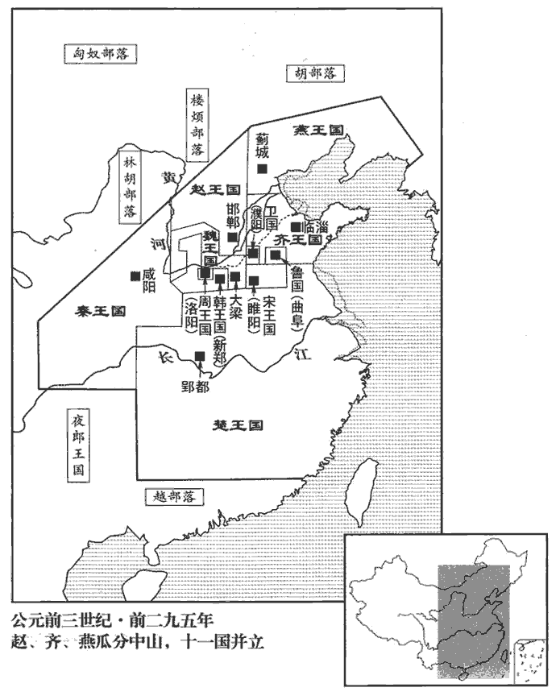
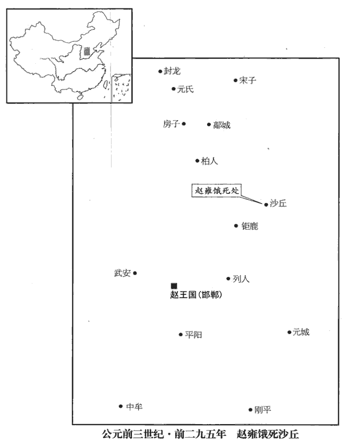
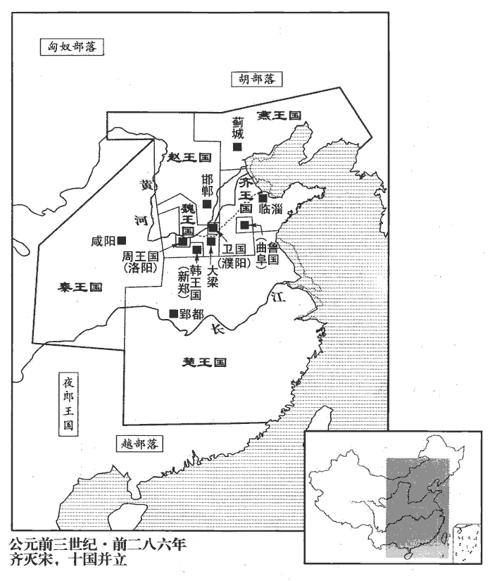
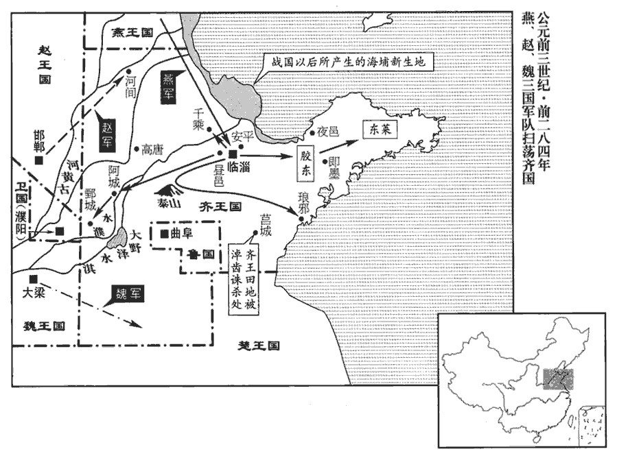
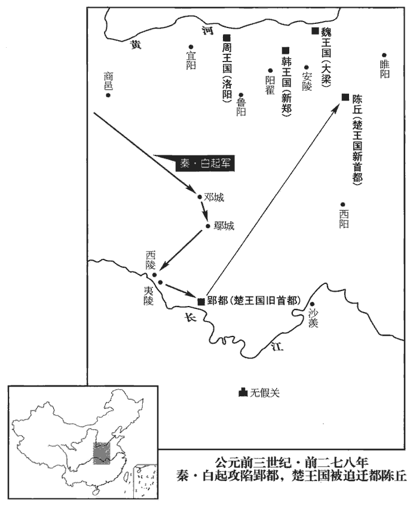
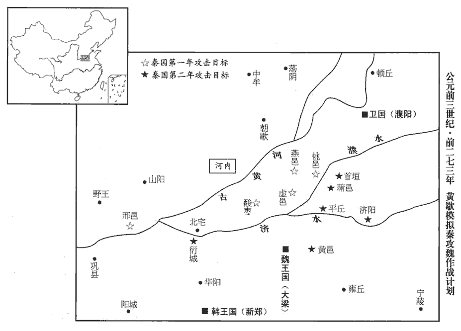

 周紀四起閼逢困敦（甲子），盡著雍困敦（戊子），凡二十五年。

# 赧王中

## 十八年（甲子，前二九七年）

1楚‹都郢都，湖北江陵›懷王亡歸。秦人覺之，遮楚道。遮其歸楚之路也。懷王從間道走趙‹都邯郸，河北邯郸›。間，隙也，從空隙之路而行也。間，古莧翻。走，音奏，又音如字。趙主父在代‹河北蔚縣›，趙人不敢受。懷王將走魏‹都大梁，河南开封›，秦人追及之，以歸。

〖译文〗 [1]楚怀王逃脱看守，被秦国人发现，封锁通往楚国的道路。楚怀王从小路逃到了赵国，正逢赵主父外出在代郡，赵国官员不敢作主收留他。楚怀王又想逃奔魏国，却被秦国人追上，抓回秦国。

2魯平公薨，子緡公賈立。世本「緡」作「湣」。

〖译文〗 [2]鲁国鲁平公去世，其子姬贾即位为鲁缗公。

## 十九年（乙丑，前二九六年）

1楚懷王發病，薨于秦，秦人歸其喪。喪，息郎翻。楚人皆憐之，如悲親戚。諸侯由是不直秦。

〖译文〗 [1]楚怀王发病，死在秦国。秦国送回他的灵柩，楚国人见了都十分悲痛，像死了自己的亲人一样。各国诸侯因此也对秦国不满。

2齊、韓、魏、趙、宋同擊秦，至鹽氏‹山西运城›而還。括地志：鹽氏故城，一名司鹽城，在蒲州安邑縣，掌鹽池之官，因稱鹽氏。徐廣曰：「鹽」，一作「監」。秦與韓武遂‹山西垣曲东南›、與魏封陵‹山西芮城風陵渡›以和。十二年，秦取魏封陵，又取韓武遂，今皆歸之以和。

〖译文〗 [2]齐、韩、魏、赵、宋五国共同出兵攻打秦国，到了盐氏地方即行撤回。秦国把武遂归还韩国，把封陵归还魏国，以求和解。

3趙主父行新地趙新取中山之地也。行，下孟翻。遂出代‹河北蔚縣›；西遇樓煩‹山西北部管涔山›王於西河‹潼关以北的黄河›而致其兵。趙北有林胡、樓煩之戎。漢雁門郡樓煩縣，樓煩胡所居地。西河，即漢西河郡之地。

〖译文〗 [3]赵主父视察新获取的领土，离开代郡，向西在西河会见楼烦王，接受了他的部队。

4魏襄王薨，子昭王立。世本曰：昭王，名遫chì。

〖译文〗 [4]魏国魏襄王去世，其子即位为魏昭王。

5韓襄王薨，子釐王咎立。釐，讀曰僖。

〖译文〗 [5]韩国韩襄王去世，其子韩咎即位为韩王。

## 二十年（丙寅，前二九五年）

1秦尉錯伐魏襄城‹河南襄城›。尉，蓋國尉也。班志，襄城縣屬潁川郡。以分地考之，潁川屬韓境。蓋魏與韓分有潁川之地，用兵爭強，疆埸yì之間，朝韓暮魏，則此時襄城或為魏土，容亦有之。埸，音亦。

〖译文〗 [1]秦国国尉司马错进攻魏国襄城。

2趙主父與齊、燕共滅中山‹都顾城，河北定州›，遷其王于膚施‹陝西榆林›。燕，因肩翻。班志，膚施縣屬上郡；唐屬延州，為州治所。歸，行賞，大赦，置酒，酺pú五日。酺，音蒲。說文曰：王德布大飲酒也。師古曰：酺之為言布也。王德布於天下而合聚飲食為酺。師古註所云，漢法也。此言趙國內酺耳。赦者，宥有罪也。

〖译文〗 [2]赵主父与齐国、燕国联合灭掉中山国，把中山王迁到肤施居住。赵主父回来后，论功行赏，大赦罪人，设酒庆祝，全国欢宴五天。

 

3趙主父封其長子章于代‹河北蔚縣›，號曰安陽君。長，知丈翻。班志，代郡有東安陽縣。括地志：東安陽故城，在朔州定襄縣界。

〖译文〗 [3]赵主父把长子赵章封到代，号称安阳君。

安陽君素侈，心不服其弟。不服其弟為王也。主父使田不禮相之。相，息亮翻。李兌謂肥義曰：「公子章強壯而志驕，黨眾而欲大，田不禮忍殺而驕，二人相得，必有陰謀。夫小人有欲，輕慮淺謀，徒見其利，不顧其害，難必不久矣。夫，音扶。難，乃旦翻，下同。子任重而勢大，亂之所始而禍之所集也。子何不稱疾毋出而傳政于公子成，毋為禍梯，梯，猶階也，以木為之，以升高者也。禍梯，猶言禍階也。梯，天黎翻。不亦可乎！」肥義曰：「昔者主父以王屬義也，屬，之欲翻。曰：『毋變而度，毋易而慮，而，猶汝也。堅守一心，以歿而世！』義再拜受命而籍之。記王命於籍也。今畏不禮之難而忘吾籍，變孰大焉！諺曰：『死者復生，生者不愧。』吾欲全吾言，安得全吾身乎！子則有賜而忠我矣。雖然，吾言已在前矣，終不敢失！」李兌曰：「諾，子勉之矣！吾見子已今年耳。」已，止也，言肥義命止於今年也。涕泣而出。

〖译文〗 安阳君平素为人骄横，内心对弟弟立为王十分不服。赵主父派田不礼做他的国相。李兑对肥义说：“公子赵章身强力壮而怀有野心，党羽众多而贪欲极大，田不礼又残忍好杀，十分狂妄，两人互相勾结，必定会图谋不轨。小人有了野心，就要轻举妄动，他只看到想获取的利益，看不到带来的危害。一场灾难就在眼前了。你身居要职，权势很大，你将成为动乱的由头，灾祸也将集中在你身上。你何不称病不出，把朝政交给公子赵成去处理，免得被祸事牵连。这样不好吗！”肥义说：“当年赵主父把赵王嘱托给我，说：‘不要改变你的宗旨，不要改变你的心意，要坚守一心，至死效忠！’我再三拜谢承命并记录在案。现在如果怕田不礼加祸于我而忘掉当年的记录，就是莫大的背弃。俗话说崐：‘面对复生的死者，活着的人无需感到惭愧。’我要维护我的诺言，哪能光顾保全生命！你对我的建议是一片好心，但是我已有誓言在先，决不敢放弃！”李兑说：“好，你勉力而为吧！能见到你恐怕只有今年了。”说罢流泪而出。

李兌數見公子成以備田不禮。數見者，相與謀為之備也。數，所角翻。肥義謂信期曰：索隱曰：即下文高信也。史記正義曰：信，音申；康曰：如字。「公子章與田不禮聲善而實惡，內得主而外為暴，得主，謂章為主父所憐也。矯令以擅一旦之命，不難為也。矯令，矯主父之令也。令，力正翻。擅，時戰翻。今吾憂之，夜而忘寐，饑而忘食，盜出入不可以【章：十二行本無「以」字；乙十二行本同。】不備。言盜在主父左右，出入不可不備也。自今以來，有召王者必見吾面，我將以身先之，無故而後王可入也。」先，悉薦翻。信期曰：「善。」

〖译文〗 李兑几次入见公子赵成，商议防备田不礼。肥义对信期说：“公子赵章与田不礼语言动听而本质凶恶，在内讨得主父的欢心，在外恣意施暴。他们一旦假借主父的命令来发动政变，是很容易得手的。现在我忧虑此事，已到了废寝忘食的程度。强盗在身边出入不能不防！从此以后，有人奉主父命来召见赵王必须先见我的面，我将先前往，没有变故，赵王才能去。”信期说：“好。”

主父使惠文王朝群臣而自從旁窺之，見其長子傫lěi然也，朝，直遙翻。長，知丈翻。傫，倫追翻，懶懈貌。少子臨朝而長子朝之，故其貌如此。反北面為臣，詘于其弟，詘，與屈同。心憐之，於是乃欲分趙而王公子章于代‹河北蔚縣›。王，於況翻，又音如字。計未決而輟。主父及王游沙丘‹河北平鄉，邯鄲東北八十公里›，史記正義曰：沙丘在邢州平鄉縣東北二十里。余按沙丘臺，紂所作也。班志云：沙丘在鉅鹿郡鉅鹿縣東北七十里。異宮，異宮而處也。公子章、田不禮以其徒作亂，詐以主父令召王。肥義先入，殺之。高信即與王戰。高信以王與公子章之徒戰也。公子成與李兌自國至，趙都邯鄲，自邯鄲至也。邯鄲，音寒丹。乃起四邑之兵入距難，距，猶拒也。難，乃旦翻。殺公子章及田不禮，滅其黨。公子成為相，號安平君，相，息亮翻。班志，涿郡有安平縣，非趙地也。以公子成能平難而安國，故以為號。李兌為司寇。司寇，周六卿之一也，掌刑。是時惠文王少，少，時照翻。成、兌專政。

〖译文〗 赵主父让赵惠文王朝见群臣，自己在旁边窥察，只见当哥哥的赵章反而俯首称臣，无精打采地听高高在上的弟弟赵何训示，心中有些不忍，于是想把赵国一分为二，让赵章在代郡称王，但这个计划还没有最后决定就搁置起来。赵主父和赵王出游沙丘，分别住在两个行宫里。赵章、田不礼乘机率领门徒作乱，他们假称赵主父的命令召见赵王，肥义先进去，被杀死。高信便与赵王一同抵抗。公子赵成与李兑从国都邯郸赶来，发动四邑的军队入宫镇压叛乱，杀死赵章及田不礼，处死全部党羽。公子赵成担任相国，称为安平君；李兑被任命为司寇。当时赵惠文王还年幼，政权都掌握在公子赵成、李兑手中。

公子章之敗也，往走主父；主父開之。謂開宮門內之也。走，音奏。成、兌因圍主父。【章：十二行本「父」下有「宮」字；乙十一行本同；孔本同；張校同；退齋校同。】公子章死，成、兌謀曰：「以章故，圍主父；即解兵，吾屬夷矣！」夷，誅也，滅也。乃遂圍之，令：「宮中人後出者夷！」令，力正翻。宮中人悉出。主父欲出不得，又不得食，探雀鷇kòu而食之。爾雅曰：生哺，鷇；生噣zhuó，雛。釋云：辨鳥子之異名也，鳥子生而須母哺食者為鷇，謂燕、雀之屬也。生而能自啄食者為雛，謂雞、雉之屬也。探，吐南翻。鷇，居候翻。三月餘，餓死沙丘宮。主父定死，乃發喪赴諸侯。主父初以長子章為太子，後得吳娃，愛之，長，知丈翻。吳娃，謂吳廣之女孟姚也，見上卷五年。吳、楚之間謂美女曰娃。娃，音於佳翻。為不出者數歲。為，於偽翻。生子何，乃廢太子章而立之。何，即惠文王也。吳娃死，愛弛；憐故太子，欲兩王之，猶豫未決，故亂起。

〖译文〗 赵章败退的时候，逃到赵主父那里，赵主父开门接纳了他。公子赵成、李兑于是带兵包围了赵主父的行宫。杀死赵章后，公子赵成、李兑商议道：“我们为追杀赵章，竟包围了主父的行宫，如此大罪，要是撤兵回去，会被满门抄斩的！”于是又下令围住赵主父行宫，宣布：“宫中人晚出来的杀！”宫中的人听见命令全部逃出，赵主父想出来却不被准许，又得不到食物，只好捕捉幼鸟吃，三个多月后，他终于饿死在沙丘行宫中。直到赵主父确死无疑，赵国才向各国报告丧事。起初，赵主父定长子赵章为太子，后来他娶了美女吴娃，十分宠爱，曾经几年不出宫上朝。生下儿子赵何后，便废去太子赵章，立赵何为太子。吴娃死后，赵主父对赵何的偏爱也逐渐减退，又可怜起原来的太子，想立两个王。他总是犹豫不决，所以引起了内乱。

 

4秦樓緩免相，魏冉代之。相，息亮翻。

〖译文〗 [4]秦国罢免楼缓的丞相，由魏冉代任。

## 二十一年（丁卯，前二九四年）

1秦敗魏師于解‹山西临猗东南›。敗，補邁翻。班志，解縣屬河東郡。宋白曰：解縣地即夏鳴條之野，有鹽池之利。後漢乾祐元年，蒲帥李茂貞奏置解州。師古曰：解，下買翻。

〖译文〗 [1]秦国在解击败魏国军队。

## 二十二年（戊辰，前二九三年）

1韓‹都新郑，河南新郑›公孫喜、魏‹都大梁，河南开封›人伐秦。魏書人，其將微也。將，即亮翻。穰侯薦左更白起于秦王，以代向壽將兵，白，姓也。春秋之時，秦有白乙丙。穰，人羊翻。更，工衡翻。向，息亮翻。敗魏師、韓師于伊闕‹河南洛陽南五公里龙门›，斬首二十四萬級，虜公孫喜，拔五城。秦王以白起為國尉。戰國之時，有國尉，有郡尉。應劭曰：自上安下曰尉，武官悉以為稱。敗，補邁翻。

〖译文〗 [1]韩国派大将公孙喜联合魏国攻打秦国。秦国穰侯把任左更之职的白起推荐给秦王，代替向寿统率秦军，结果在伊阙大败韩、魏联军，杀死二十四万人，活捉公孙喜，夺取五座城。秦王便任命白起为国尉。

2秦王遺楚王書曰：「楚倍秦，秦且率諸侯伐楚，願王之飭士卒，飭，治也，整也。遺，于季翻。倍，蒲妹翻。得一樂戰！」樂，音洛，快意也；言一戰以快其意。楚王患之，乃復與秦和親。和親者，結和以相親也。復，扶又翻，又音如字

〖译文〗 [2]秦王送信给楚王，写道：“楚国背叛了秦国，秦国将率领各国来讨伐楚国，希望你整顿好军队，我们痛痛快快地打一仗！”楚王十分恐惧，只好再与秦国修好结亲。

## 二十三年（己巳，前二九二年）

1楚襄王迎婦于秦。

〖译文〗 [1]楚襄王从秦国迎娶新娘。

臣光曰：甚哉秦之無道也，殺其父而劫其子；謂楚懷王留于秦而以困死，秦王復遺襄王書，以兵威劫之。楚之不競也，杜預曰：競，強也。或曰：競，爭也，言不能與秦爭也。忍其父而婚其讎！謂楚襄王父死于秦，是仇讎之國也，忍恥而與之婚。烏呼，楚之君誠得其道，臣誠得其人，秦雖強，烏得陵之哉！善乎荀卿論之曰：「夫道，善用之則百里之地可以獨立，不善用之則楚六千里而為讎人役。」夫，音扶。故人主不務得道而廣有其勢，是其所以危也。

〖译文〗 臣司马光曰：秦国真是太不讲道理了，害死楚怀王又逼迫其子楚襄王；楚国也太不争气了，忍下杀父之仇而与敌人通婚！呜呼！楚国君王如果能坚持正确的治国之道，对臣下任用得人，秦国虽然强大，又怎能肆意欺凌它呢！荀况说得好：“治国之道，善于掌握则仅有百里方圆的地方也可以独立于天下，不善于掌握哪怕像楚国有六千里国土也只能被仇人所驱使。”所以君王不认真讲求治国之道，只一味制造声势，正是走向危亡的原因。

2秦魏冉謝病免，以客卿燭壽為丞相。燭，姓也。左傳，鄭有大夫燭之武。

〖译文〗 [2]秦国魏冉因病辞去职务，以客卿烛寿为丞相。

## 二十四年（庚午，前二九一年）

1秦伐韓，拔宛‹河南南陽›。宛，故申伯國。班志，宛縣屬南陽郡；唐為鄧州南陽縣。宛，於元翻。

〖译文〗 [1]秦国进攻韩国，攻克宛。

2秦燭壽免。魏冉復為丞相，相，息亮翻。封于穰‹河南鄧州›與陶‹山西永濟北三十里陶邑鄉›，謂之穰侯。又封公子巿于宛，公子悝kuī于鄧‹河南孟县›。悝，苦回翻。

〖译文〗 秦国免去烛寿职务，魏冉再度出任丞相，受封穰、陶两地，称为穰侯。秦国又把宛封给公子，把邓封给公子悝。

## 二十五年（辛未，前二九零年）

1魏入河東‹山西西南部›地四百里，河東地，蓋安邑、大陽、蒲阪、解縣瀕河之地。阪，音反。解，下買翻。韓入武遂‹山西垣曲东南›地二百里于秦。武遂地，十八年秦以予韓。予，讀曰與。

〖译文〗 [1]魏国把河东地方圆四百里、韩国把武遂地方圆二百里献给秦国。

2魏芒卯始以詐見重。芒，謨郎翻，姓也。卯，其名。

〖译文〗 [2]魏国芒卯以诈术开始受到重用。

## 二十六年（壬申，前二八九年）

1秦大良造白起、客卿錯伐魏，至軹‹河南濟源东南›，取城大小六十一。大良造，即大上造之良者。大上造，秦十六爵。軹，音只。軹縣，班志屬河內郡；唐為孟州濟源縣。

〖译文〗 [1]秦国派大良造白起、客卿司马错进攻魏国，抵达轵地，夺取大小城镇六十一座。

## 二十七年（癸酉，前二八八年）

1冬，十月，秦王稱西帝，遣使立齊王為東帝，欲約與共伐趙。蘇代自燕來，使，疏吏翻。燕，因肩翻。齊王曰：「秦使魏冉致帝，子以為何如。」對曰：「願王受之而勿稱也。秦稱之，天下安之，王乃稱之，無後也。無後，猶言未晚。秦稱之，天下惡之，惡，烏路翻。王因勿稱，以收天下，此大資也。且伐趙孰與伐桀宋利。桀宋，見下二十九年。今王不如釋帝以收天下之望，發兵以伐桀宋，宋舉則楚、趙、梁、衛皆懼矣。是我以名尊秦而令天下憎之，令，盧經翻。所謂以卑為尊也。」古人有言曰：「自卑者人尊之。」齊王從之，稱帝二日而復歸之。歸帝號而不稱也。復，扶又翻，又音如字。十二月，呂禮自齊入秦。姓譜曰：太岳為禹心呂之臣，故封呂侯，後因以為氏。古字脊骨之膂本作「呂」。秦王亦去帝，復稱王。去，羌呂翻，除也；後以義推。

〖译文〗 [1]冬季，十月，秦王自称西帝，派使者建议齐王立为东帝，想约定两国共同进攻赵国。苏代从燕国前来，齐王便问他：“秦国派魏冉来劝我帝，你的意见如何？”苏代回答说：“我建议大王先予以接受，但暂时不称帝。秦王称帝后，天下如果不表示反对，大王再称帝，也不算晚。秦王 称帝如果遭到天下指责，大王就不再称帝，趁势收买天下人心，这是个大资本。况且进攻赵国与进攻有夏桀恶名的宋国，哪个有利呢？现在大王不如暂时放弃帝号以使天下归心，然后发兵讨伐‘桀宋’，征服宋国后，楚国、赵国、魏国、卫国都会恐崐惧臣服。这样，我们名义上尊重秦国而让天下去憎恨它，正是齐国反卑为尊的计策。”齐王采纳了他的建议，只称帝两天便放弃了。十二月，吕礼从齐国到秦国，秦王也去掉帝号，仍旧称王。

2秦攻趙，拔杜陽‹梗阳，山西清徐›。徐廣曰：「杜」，一作「梗」。按班志，梗陽在太原郡榆次縣界，杜陽縣屬扶風，註云：杜水南入渭。詩曰「自土」。師古註云：緜詩：自土、沮、漆。齊詩作「自杜」，言公劉自狄而來居杜與沮、漆之地。又云：扶風栒邑有豳bīn鄉，公劉所都。審爾，則杜陽近栒邑，接上郡、北地之境。趙地西至上郡膚施，或者其時并有杜陽歟！沮，七餘翻。栒，須倫翻。豳，彼貧翻。

〖译文〗 [2]秦国攻打赵国，攻克杜阳。

## 二十八年（甲戌，前二八七年）

1秦攻趙，【章：十二行本「趙」作「魏」；乙十一行本同；孔本同；張校同。】拔新垣‹山西垣曲›、曲陽‹河南濟源西›。史記正義曰：年表及括地志，曲陽故城在懷州濟源縣西四十里，新垣近曲陽，未詳端的之處。余按班志，王屋山在河東垣縣，沇yǎn水所出，東流為濟。水經：濟水出河東垣縣王屋山為沇水。註云：濟水重源出溫西北平地。水有二源，東源出原城東北，晉文公以信降原，即此城也。俗以濟水重源所發，因復謂之濟源城。如此則濟源去垣不遠矣。蓋新垣即河東之垣縣也；以縣有遷徙，謂其新邑為新垣也。垣，於元翻。濟，子禮翻。沇，以轉翻。降，戶江翻。重，直龍翻。復，扶又翻。

〖译文〗 [1]秦国攻打赵国，夺取新垣、曲阳。

## 二十九年（乙亥，前二八六年）

1秦司馬錯擊魏河內‹河南黃河以北›。漢河內郡即魏河內之地，秦并屬河東郡。孟子記梁惠王曰：「河內凶則移其民於河東，移其粟於河內。」蓋魏之有國，河東、河內自為二郡也。錯，七各翻，又千故翻。魏獻安邑‹山西夏縣›以和，秦出其人歸之魏。

〖译文〗 [1]秦国派司马错攻击魏国河内，魏国献出安邑求和，秦国将城内人民驱赶回魏国。

2秦敗韓師于夏山。敗，補邁翻。夏，戶雅翻。

〖译文〗 [2]秦国在夏山打败韩国军队。

 

3宋‹都睢阳，河南商丘›有雀生𪄟於城之陬zōu。「𪄟」，劉向說苑作「鸇」zhān。字林曰：鷂屬。陸璣曰：鸇似鷂，青黃色，燕頷句啄，向風搖翅，乃因風飛急疾，擊鳩、鴿、燕、雀食之。陬，子侯翻，隅也。句，古侯翻。史占之史，太史之屬，掌卜筮者。曰：「吉。凶人吉其凶。小而生巨，必霸天下。」宋康王喜，起兵滅滕‹山東滕州›，伐薛‹山東枣庄南薛城›，班志：沛郡公丘縣，古滕國。水經註：滕城在蕃縣西。唐志，滕縣屬徐州。薛即孟嘗君所封地。蕃，音皮，又音如字。東敗齊，取五城，南敗楚，取地三百里，西敗魏軍，與齊、魏為敵國，乃愈自信其霸。欲霸之亟成，故射天笞地，敗，補邁翻。亟，己力翻。射，而亦翻；後以義推。笞，擊也，音丑之翻。斬社稷而焚滅之，記曰：共工氏有子曰句龍，能平水土，故祀以為社。烈山氏之子曰柱，為稷，自夏以上祀之；周棄亦為稷，自商以來祀之。自漢以下，夏禹配食官社，后稷配食官稷。周禮註：社稷，土穀之神。共，讀曰恭。夏，戶雅翻。以示威服鬼神。為長夜之飲於室中，室中人呼萬歲，則堂上之人應之，堂下之人又應之，門外之人又應之，以至於國中，無敢不呼萬歲者。天下之人謂之「桀宋」。言其昏暴如桀也。齊湣王起兵伐之，民散，城不守。宋王奔魏，死于溫‹河南溫縣西›。溫，周司寇蘇忿生之邑。班志，溫縣屬河內郡。宋至此而滅。湣，讀曰閔。

〖译文〗 [3]宋国发生雀鸟在城边生下鹞鹰的怪事，太史卜了一卦，说：“吉利。小而生大，必霸天下。”宋康王大喜，起兵灭掉滕国，攻占薛地，向东击败齐国，夺取五座城，向南战胜楚国，占地方圆三百里，向西打垮魏军，宋国一时成为可与齐国、魏国相匹敌的国家，宋康王对成就霸业更加自信。他想早日完成霸业，便射天鞭地，砍倒神坛后烧毁，以表示自己的声威可以镇慑鬼神。他在宫室中整夜饮酒，令室中的人齐声高呼万岁，大堂上的人闻声响应，堂下的人接着响应，门外的人又继续响应，以至于国中没有人敢不呼万岁。天下的人都咒骂他是“桀宋”。齐王趁机起兵征伐宋国，人民四下逃散，弃城不守。宋王只好逃往魏国，死于温地。

## 三十年（丙子，前二八五年）

1秦王會楚王于宛‹河南南陽›，宛，於元翻。會趙王于中陽‹山西中陽›。班志，中陽縣屬西河郡。水經註：文水逕太原茲氏縣故城之東，瀦zhū為文湖；文湖水又東逕中陽縣故城東。

〖译文〗 [1]秦王与楚王在宛相会，与赵王在中阳相会。

2秦蒙武擊齊，拔九城。風俗通：東蒙主以蒙山為氏。

〖译文〗 [2]秦国派蒙武攻击齐国，夺取九座城。

3齊湣王既滅宋而驕，乃南侵楚，西侵三晉，欲并二周，為天子。狐咺xuǎn正議，斮zhuó之檀衢。狐，姓也。春秋之時，晉有狐突、狐毛、狐偃父子。左傳：齊簡公與婦人飲酒于檀臺。檀衢，意其地為通檀臺之衢路也。爾雅：四達謂之衢。咺，況晚翻，又況遠翻。斮，側略翻，斬也。陳舉直言，殺之東閭。左傳：晉圍齊，州綽門於東閭。杜預註曰：齊東門。

〖译文〗 [3]齐王灭掉宋国后十分骄傲，便向南侵入楚国，向西攻打赵、魏、韩国，想吞并东西二周，自立为天子。狐义正辞严地劝谏他，被斩首于檀台大路上。陈举直言不讳地劝止，被杀死在东门。

4燕昭王日夜撫循其人，益以富實，燕，因肩翻。乃與樂毅謀伐齊。樂毅曰：「齊，霸國之餘業也，毅，魚器翻。自齊桓公霸天下，國以強大；田氏藉其餘業。地大人眾，未易獨攻也。易，弋豉chǐ翻。王必欲伐之，莫如約趙及楚、魏。」於是使樂毅約趙，別使使者連楚、魏，且令趙嚪dàn秦以伐齊之利。使者，上疏吏翻。令，力丁翻。以利誘之曰嚪。嚪，音田濫翻。誘，羊久翻。諸侯害齊王之驕暴，皆爭合謀與燕伐齊。燕，因肩翻。

〖译文〗 燕昭王却日夜安抚教导百姓，使燕国更加富足，于是他与乐毅商议进攻齐国。乐毅说：“齐国称霸以来，至今有余力，地广人多，我们独力攻打不易。大王一定要讨伐它，不如联合赵国及楚、魏三国。”燕王便派乐毅约定赵国，另派使者联系楚国、魏国，再让赵国用讨伐齐国的好处引诱秦国。各国苦于齐王的骄横暴虐，都争相赞成参加燕国的攻齐战争。

## 三十一年（丁丑，前二八四年）

1燕‹都蓟城，北京›王悉起兵，以樂毅為上將軍。上將軍，猶春秋之元帥。帥，所類翻。秦尉斯離帥師與三晉之師會之。尉，秦官也。斯離，其名。或曰：斯，姓也，離，名也。斯，蜀之西南夷種，遂以為姓。帥，讀曰率。趙王以相國印授樂毅，樂毅并將秦、魏、韓、趙之兵以伐齊。齊湣王悉國中之眾以拒之，戰於濟西‹济水以西›，相，息亮翻。將，即亮翻。湣，讀曰閔。水經：濟水東北過壽張縣西界，北逕須昌、穀城、臨邑縣西，又北逕北平、陰城西，又東北過盧縣北，皆齊地也。濟西地在濟水之西。濟，子禮翻，下同。齊師大敗。樂毅還秦、韓之師，分魏師以略宋地，部趙師以收河間‹河北献县›。秦、韓與齊隔遠，故先還其師。宋地近于魏，故使略之。河間近于趙，故以方略部趙取之。此其部分，非人所能及也。宋地，齊滅宋所取之地。身率燕師，長驅逐北。劇辛曰：「齊大而燕小，燕，因肩翻。劇，竭戟翻。賴諸侯之助以破其軍，宜及時攻取其邊城以自益，此長久之利也。劇，竭戟翻，姓也。今過而不攻，以深入為名，無損于齊，無益于燕而結深怨，後必悔之。」樂毅曰：「齊王伐功矜能，謀不逮下，廢黜賢良，信任諂諛，政令戾虐，百姓怨懟。懟，直類翻。今軍皆破亡，若因而乘之，其民必叛，禍亂內作，則齊可圖也。若不遂乘之，待彼悔前之非，改過恤下而撫其民，則難慮也。」遂進軍深入。齊人果大亂失度，難慮，謂難為計慮也。失度，失其常度也。湣王出走。樂毅入臨淄，取寶物、祭器，輸之于燕。燕王親至濟上‹济水以西›勞軍，行賞饗士；燕，因肩翻。濟，子禮翻。勞，力到翻。封樂毅為昌國君，班志，昌國縣屬齊郡。封毅為昌國君，以其能昌大燕國也。遂使留徇齊城之未下者。

〖译文〗 [1]燕王调动全部兵力，以乐毅为上将军。秦国尉斯离率军队与韩、赵、魏联军也前来会合。赵王把相国大印授给乐毅，乐毅统一指挥秦、魏、韩、赵大军发动进攻。齐王集中国内全部人力进行抵御，双方在济水西岸大战。齐国军队大败。乐毅便退回秦国、韩国军队，令魏国军队分兵进攻宋国旧地，布署赵国军队去收复河间。自己率领燕军，由北长驱直入齐国。剧辛劝说道：“齐国大，燕国小，依靠各国的帮助我们才打败齐军，应该及时地攻取边境城市充实燕国领土，这才是长久的利益。现在大军过城不攻，一味深入，既无损于齐国又无益于燕国，只能结下深怨，日后必定要后悔。”乐毅说：“齐王好大喜功，刚愎自用，不与下属商议，又罢黜贤良人士，专门信任谀谄小人，政令贪虐暴戾，百姓十分怨愤。现在齐国军队已溃不成军，如果我们乘胜追击，齐国百姓必然反叛，内部发生动乱，齐国就可以收拾了。如果不抓住时机，等到齐王痛改前非，体贴臣下而抚恤百姓，我们就难办了。”于是下令进军深入齐国。齐国果然大乱，失去常度，齐王出逃。乐毅率军进入齐都临淄，搜刮宝物和祭祀重器，运回燕国。燕王亲自到济水上游去慰劳军队，颁行奖赏，犒劳将士；燕王封乐为昌国君，让他留在齐国进攻其余未克的城市。

齊王出亡之衛‹府濮阳，河南濮阳›，衛君辟宮舍之，稱臣而共具。辟，讀曰避。共，音供，又居用翻。齊王不遜，衛人侵之。齊王去奔鄒‹山东邹县›、魯‹山东曲阜›，有驕色；鄒、魯弗內，遂走莒‹山東莒縣›。莒，春秋莒子之國，齊滅之。班志，莒縣屬城陽國，國都也。宋白曰：周武王封少昊之後嬴姓茲輿於莒，始都計斤城，在今高密縣東南四十里。春秋時徙於莒。隱公二年，莒人入向。註云：今城陽莒縣。莒自初封二十三君，為楚簡王所滅。漢為莒縣，城陽王所都。莒，音居禦翻。楚使淖zhuō齒將兵救齊，因為齊相。淖齒欲與燕分齊地，索隱曰：淖，女教翻；康曰：竹角切；姓也。相，息亮翻。乃執湣王而數之數其罪也。師古曰：數，所具翻，宋祁曰：所主翻。曰：「千乘‹山東高青›、博昌‹山東博興›之間，方數百里，雨血沾衣，漢置千乘郡，博昌縣屬焉。後漢更千乘郡為樂安國。十三州志曰：昌水，其勢平，故曰博昌。唐志，千乘、博昌二縣皆屬青州。乘，繩證翻。雨，於遇翻。自上而下曰雨。王知之乎？」曰：「知之。」「嬴‹山東萊蕪›、博‹山東泰安›之間，地坼chè及泉，班志，嬴、博二縣屬泰山郡。王知之乎？」曰：「知之。」「有人當闕而哭者，求之不得，去則聞其聲，王知之乎？」曰：「知之。」淖齒曰：「天雨血沾衣者，天以告也；地坼及泉者，地以告也；有人當闕而哭者，人以告也。天、地、人皆告矣，而王不知誡焉，誡，與戒同；戒，警敕也。毛晃曰：警敕之辭曰誡。此言天、地、人皆以相警敕也。何得無誅！」遂弑王於鼓里‹山東莒縣南›。鼓里，莒中地名，近齊廟。

〖译文〗 齐王出逃到卫国，卫国国君让出宫殿给他居住，向他称臣并供给日常用度。齐王却傲慢不逊，卫国人气愤地攻击他，齐王又出奔到邹、鲁国，仍旧面有骄色；邹、鲁两地闭门不纳，齐王又出奔莒地。楚国派淖齿率军前来救援齐王，被任命为齐相。淖齿却想与燕国瓜分齐国，于是抓住齐王数说他的罪过：“千乘、博昌之间的方圆几百里地，下血雨浸湿衣服，你齐王知道吗？”齐王回答：“知道。”“嬴、博之间，大地崩塌，泉水上涌，你齐王知道吗？”回答：“知道。”“有人堵着宫门哭泣，却不见人影，离开时又音响可闻，齐王你知道吗？”回答：“知道。”淖齿说：“天降血雨，是上天警告你；地崩泉涌，是大地警告你；人堵着宫门哭，是人心在警告你。天、地、人都警告，而你却不知改悔，你还想不死吗！”于是在鼓里这个地方将齐王处死。

荀子論之曰：國者，天下之利勢也。得道以持之，則大安也，大榮也，積美之源也。不得道以持之，則大危也，大累也，累，力偽翻，事相緣及也。有之不如無之；及其綦qí也，齊人謂極為綦，音其；下綦之同。索為匹夫，不可得也。索，山客翻，求也。齊湣、宋獻是也。湣，讀曰閔。宋獻，意即指宋康王。

〖译文〗 荀况论之曰：国家，集中了天下的利益和权势。有道行的人主持，可以得到大的安乐，大的荣耀，成为幸福的源泉。无道行的人主持，却带来大的危险，大的拖累，有君王的地位还不如没有；等到形势极度恶化，他即使想当一个普通老百姓，也做不到了。齐王、宋康王便是如此。

故用國者義立而王，信立而霸，權謀立而亡。

〖译文〗 所以治理国家的君主如果提倡礼义，就可以称王，树立信誉就可以称霸，玩弄权术则必然灭亡。

挈qiè國以呼禮義，而無以害之。挈，即提挈之挈，音詰結翻。行一不義，殺一無罪，而得天下，仁者不為也。擽lì然扶持心國，且若是其固也。擽然，落石貌；言其持心持國，擽然如石之固。擽，曆各翻。之所與為之者之人，則舉義士也。之所以為布陳於國家刑法者，則舉義法也。主之所極然，毛晃曰：然，如也，是也。帥群臣而首嚮之者，則舉義志也。帥，讀曰率。首，所救翻。志者，心之所主也。如是，則下仰上以義矣，仰，魚亮翻。凡仰給、仰成之仰皆同音。是基定也。基【章：乙十一行本，二「基」字均作「綦」。】定而國定，國定而天下定。故曰：以國濟義，一日而白，湯、武是也。基，址也，本也。為土立址曰基；為木立根本亦曰基。白，明也。是所謂義立而王也。

〖译文〗 领导国家提倡礼义，就无人可以加害于他。即使做一件坏事、杀一个无辜的人便可以得到天下，仁爱的人也不会去干。君主守定意志，维护国家，坚如磐石，以此礼待他人，就可以产生众多的仁人志士。以此条陈布置国家刑事法律，就可以制定出良好的法律。君主极力如此主张，再率领群臣以身作则，就可以树立起礼义的风尚。这样，属下能够以礼义纲常尊崇上司，统治基础就稳定了，基础稳定国家便安定，国家安定则天下平定。因此说：用国家的权力推行礼义，一天就可以做到众人皆知，商汤王、周武王便是如此，即所谓的以提倡礼义而称王。

德雖未至也，義雖未濟也，然而天下之理略奏矣，楊倞liàng曰：略有節奏也。刑賞已諾信於天下矣，諾，人應聲也。信，人不疑而心孚也。臣下曉然皆知其可要也。要，一遙翻，約也，勤也，求也。政令已陳，雖覩利敗，不欺其民；令，力正翻。約結已定，雖覩利敗，不欺其與；與，黨與也。即下文所謂與國也。如是，則兵勁城固，敵國畏之；國一綦明，楊倞曰：此「綦」當作「基」。今謂此「綦」字從上註，所謂齊人之言，其義亦通。明，顯也。與國信之。雖在僻陋之國，威動天下，五伯是也。是所謂信立而霸也。伯，讀曰霸。五霸，夏昆吾，商大彭、豕韋，周齊桓、晉文。或曰：齊桓、晉文、宋襄、秦穆、楚莊為五霸。

〖译文〗 即使道德还未达到完美，礼义也没有做到完善，然而已经可以掌握治理天下的大致条理。做到赏罚分明，取得天下的信任，使臣属清楚地看到它的重要性。政令一经颁布，不管成功还是失败，都不欺骗百姓；条约已经缔结，不管有利还是无利，都不欺骗合作的邻国。这样，才能军队强劲，城池坚固，使敌对国家畏惧。国家的方针一贯而明确，友邦就予以信任。即使是偏僻的小国，也可以威震天下。春秋时期的齐、晋、宋、秦、楚五霸主便是如此，即所谓的以树立信誉而称霸。

挈國以呼功利，不務張其義，齊其信，唯利之求。內則不憚詐其民而求小利焉，外則不憚詐其與而求大利焉。內不修正其所以有，然常欲人之有，如是，則臣下百姓莫不以詐心待其上矣。上詐其下，下詐其上，則是上下析也。析，先的翻，分也，離也。如是，則敵國輕之，與國疑之，權謀日行而國不免危削，綦之而亡，齊湣、薛公是也。湣，讀曰閔。薛公，謂孟嘗君。孟嘗君卒，齊與諸侯共滅薛。卒，子恤翻。故用強齊，非以修禮義也，非以本政教也，非以一天下也，綿綿常以結引馳外為務。引，讀曰靷yǐn，音羊晉翻。丁度曰：靷，駕牛具，在胸曰靷，蓋駕馬亦用靷也。故強，南足以破楚，西足以詘qū秦，北足以敗燕，中足以舉宋，史記，齊閔王十年，伐燕，取之；二十三年，與秦敗楚於重丘，南割楚之淮北；三十六年，與韓、魏攻秦，至函谷；三十八年，伐宋，滅之。通鑑據孟子以取燕事屬之齊宣王。敗，補邁翻。詘，與屈同，音渠勿翻。燕，因肩翻。及以燕、趙起【章：十二行本「起」作「改」；孔本同。】而攻之，若振槁然，燕，因肩翻。槁，枯木也。振，搖也。振已枯之木，則枝葉摧落而本根撥矣。槁，苦皓翻，又音古老翻。而身死國亡，為天下大戮，後世言惡則必稽焉。稽，考也，又計校也。是無他故焉，唯其不由禮義而由權謀也。

〖译文〗 带领国家追逐功利，不申张正义，不遵守信用，唯利是图；对内不惜为 了一点小利去欺骗人民，对外为了追求大的利益不怕欺骗友邦。对内不好好治理自己已有的东西，却常常觊觎别人的成果。这样，臣下百姓就无不以奸诈之心对待上司。上欺下，下瞒上，于是上下关系分崩离析。这样，便使敌对国家轻视，友好国家不信任，权术泛滥而国家日益削弱，走向极端，终于灭亡，齐王、孟尝君便是如此。齐王要强大齐国，不去提倡礼义，不去修明政治，不去统一天下的思想，只是成年累月地骑马在外面征战。所以齐国强大的时候，向南能够打败楚国，向西能够逼迫秦国，向北可以战胜燕国，在中原能够征服宋国。然而燕国、赵国一旦群起而攻齐，便如摧枯拉朽。齐王身死国亡，成为天下共同声讨的对象，后世提起暴君总要举他为例。这不是别的原因，就是因为他不崇尚礼义而沉溺权术。

三者，明主之所謹擇也，仁人之所務白也。白，明白也。善擇者制人，不善擇者人制之。

〖译文〗 以上三种，贤明的君王必须慎重地加以抉择，仁人志士必须认真地予以辨明。善于抉择的人可以控制别人，不善于抉择的人则被别人控制。

 

2樂毅聞晝【章：乙十一行本作「畫」；孔本同；下均同。】邑‹山東臨淄西›人王蠋zhú賢，劉熙曰：畫，齊西南近邑，音獲。索隱曰：音胡卦翻。括地志：戟里城在臨淄城西北三十里，春秋時棘邑。又云：澅huà邑，蠋所居，即此邑，因澅水為名也。京相璠fán曰：今臨淄有澅水，西北入沛，即班志所謂如水；如、時聲相似，然則澅水即時水也。余按後漢耿弇yǎn攻張步，進軍畫中，在臨淄、西安二邑之間。「蠋」，班固古今人表作「歜」chù，音觸。據「蠋」字則當音蜀，或音之欲翻；康珠玉切。通鑑以畫邑為晝邑，以孟子去齊宿於晝為據也。若以孟子為據，則晝讀如字。令軍中環晝邑三十里無入。環，據漢書音義音宦。使人請蠋，蠋謝不往。燕人曰：「不來，吾且屠晝邑！」蠋曰：「忠臣不事二君，烈女不更二夫。【章：十二行本「夫」下有「齊王不用吾諫故退而耕於野」十二字；乙十一行本同；孔本同；張校同；退齋校同。】燕，因肩翻。蠋，音蜀。更，工衡翻。國破君亡，吾不能存，而又欲劫之以兵；吾與其不義而生，不若死！」遂經其頸於樹枝，自奮絕脰dòu而死。經，絞也，縊也。頸，居郢翻，頭莖也。自奮，自奮起而還擲也。脰，大透翻，頸也。燕師乘勝長驅，齊城皆望風奔潰。樂毅修整燕軍，禁止侵掠，求齊之逸民，顯而禮之，寬其賦斂，斂，力驗翻；後以義推。除其暴令，修其舊政，【章：孔本「政」作「制」。】齊民喜悅。乃遣左軍渡膠東、東萊‹山东半岛东›；膠東，漢為王國。水經：膠水出琅邪黔陬縣膠山，北過膠東、下密，又北過東萊當利縣入海。膠水之東為膠東國，膠水之西為膠西國。東萊，春秋萊子之國，漢置東萊郡。邪，音耶。前軍循泰山以東至海，略琅邪‹山東膠南縣南›；琅邪，秦置為郡，其地東至海，南距淮。右軍循河、濟，屯阿‹山東東阿›、鄄juàn‹山東鄄城›以連魏師；河濟註已見一卷安王十五年，然僅及濟水入河而溢為滎一節。今據水經：濟水自滎澤東流至濟陰乘氏縣西，分為二瀆：其南瀆為菏hé水，東南流至山陽湖陸縣，與泗水合。其北瀆東北流入於鉅野澤，東北過東郡壽良縣西界，北逕須昌、穀城至臨邑縣四瀆津口，與河水合。此蓋言齊地在河、濟之間者也。參考上濟西註可見。濟，子禮翻。阿，東阿；鄄，鄄城。鄄，音絹。乘，繩證翻。菏，音柯。後軍旁北海‹渤海湾›以撫千乘‹山東高青›：旁，步浪翻。自臨淄東北至海，北海地也。漢置郡。乘，繩證翻。中軍據臨淄‹山東淄博东臨淄镇›而鎮齊都。祀桓公、管仲於郊，表賢者之閭，封王蠋之墓。王蠋墓蓋在晝。齊人食邑于燕者二十餘君，封為君也。有爵位於薊者百有餘人。薊，燕都也。班志，薊縣屬廣陽國。唐為幽州治所；今為燕京。水經註：薊城西北隅有薊丘，故名。燕，因肩翻。薊，音計。六月之間，下齊七十餘城，皆為郡縣。

〖译文〗 [2]乐毅听说昼邑人王贤良，下令围绕昼邑三十里周围不得进入军队，又派人请王，王辞谢不去。燕国人威胁说：“你要是不来，我们就在昼邑屠城！”王叹息说：“忠臣不事二君，烈女不更二夫。国破君亡，我不能使崐之保存，而自身又被燕人逼迫，我与其苟且偷生，不如一死！”于是把脖子系在树枝上，纵身一跃，自尽而死。燕国军队乘胜长驱直入，齐国大小城市望风崩溃。乐毅整肃燕军纪律，禁止侵掠，寻访齐国的隐士高人，致以荣誉礼待。还放宽人民赋税，革除苛刻的法令，恢复齐国旧的良好传统，齐国人民都十分喜悦。乐毅于是调左军在胶东东莱渡过胶水；前军沿泰山脚下向东到达渤海，进攻琅邪；右军循着黄河、济水而下，屯扎在东阿、鄄城，与魏国军队相连；后军沿北海镇抚千乘，中军占据临淄，镇守齐国国都。他还亲至城郊祭祀齐桓公、管仲，表彰齐国的贤良人才，赐封修治王的陵墓。经过收敛人心，齐国人接受燕国所封君号、领取俸禄的有二十余人；接受燕国爵位的有一百多人。六个月之内，燕军攻下齐国七十余座城，都设立郡县治理。

3秦王‹稷›、魏王‹遬›、韓王‹咎›會于京師‹河南洛阳白马寺东›。

〖译文〗 [3]秦王、魏王、韩王在周朝京师相会。

## 三十二年（戊寅，前二八三年）

1秦、趙會于穰‹河南邓州›。秦拔魏安城‹河南原阳西›，班志，安成縣屬汝南郡。司馬彪志作「安城」。時魏地南至汝南，秦自武關出兵攻拔之。括地志：安城在豫州汝陽縣東南十七里。一曰：在豫州吳房縣東南。穰，人羊翻。兵至大梁‹河南開封›而還。還，音旋。

〖译文〗 [1]秦国、赵国在穰地举行会议。秦国攻克魏国安城，一直打到魏国首都大梁才退回。

2齊‹都莒城，山东莒县›淖齒之亂，湣王子法章變姓名為莒‹山东莒县›太史敫jiǎo家傭。淖，女教翻。湣，讀曰閔。徐廣曰：敫，音躍，一音皎；康吉了切。余按班書王子侯表有「敫」字，師古曰：古穆字；今從之。傭，雇身為人力作。為，於偽翻。太史敫女奇法章狀貌，以為非常人，憐而常竊衣食之，竊，私也，私為之而不使人知。衣，於既翻。食，祥吏翻。因與私通。王孫賈從湣王，失王之處，其母曰：「汝朝出而晚來，則吾倚門而望；汝暮出而不還，則吾倚閭而望。閭，里門也。周禮：二十五家為閭。汝今事王，王走，汝不知其處，汝尚何歸焉！」王孫賈乃入市中呼曰：呼，火故翻，叫號也。號，戶高翻。「淖齒亂齊國，殺湣王。欲與我誅之者袒右！」袒右肩也。市人從者四百人，與攻淖齒，殺之。於是齊亡臣相與求湣王子，欲立之。法章懼其誅己，久之乃敢自言，遂立以為齊王，保莒城以拒燕，燕，因肩翻。佈告國中曰：「王已立在莒矣！」其時樂毅以燕中軍鎮臨淄，法章已立而保莒。田單自安平保即墨，奔敗之餘，猶可置之不問，法章佈告國中，自言已立在莒，可安坐而不問乎！後人論樂毅，以為善藏其用，吾未敢以為然也。

〖译文〗 [2]齐国发生淖齿杀王之乱时，齐王的儿子田法章改名易姓躲到莒地太史敫家做雇工。太史敫的女儿惊奇田法章的像貌伟岸，认为不是普通人的气质，便可怜他，常常私下送给他衣服和食物，久而久之，两人已暗中结为夫妻。王孙贾是齐王的随臣，乱中找不到主子的下落，他的母亲说：“你早出晚归，我倚着大门盼望；你夜出不回，我靠着街门等待。你如今服侍君王，君王离开了，你却不知道他的下落，你还回来做什么！”王孙贾便来到集市振臂高呼：“淖齿搞乱齐国，杀害王。愿意和我一起去干掉他的就把右臂伸出来！”集市上的人有四百多人随他前去攻击淖齿，把他杀掉了。于是齐国的大臣们四下搜寻齐王的儿子，想立他为王。田法章害怕人们加害自己，过了很久才敢自己说明身份，于是大家拥立他为齐王，坚守莒城以抵抗燕军。在全国宣布：“齐王已经在莒地即位了！”

3趙王得楚和氏璧，楚人卞和得玉璞，獻之楚厲王‹芈熊眴shùn›，王使玉人視之，曰：「石也」；王以和為詐，刖其左足。及武王‹芈熊通›立，和又獻之，玉人又曰：「石也；」王又以為詐而刖其右足。及文王‹芈熊赀›立，和乃抱璞而泣于荊山‹湖北漳南西南›之下，王聞之，使玉人理其璞，而得寶，因命曰「和氏之璧」。爾雅：肉倍好謂之璧；外圓象天，內方象地。秦昭王欲之，請易以十五城。趙王欲勿與，畏秦強；欲與之，恐見欺。以問藺相如，姓譜曰：韓獻子玄孫曰康，食采于藺，因氏焉。藺，力刃翻。對曰：「秦以城求璧而王不許，曲在我矣。我與之璧而秦不與我城，則曲在秦。均之二策，寧許以負秦。使秦負曲也。臣願奉璧而往；使秦城不入，臣請完璧而歸之！」趙王遣之。相如至秦，秦王無意償趙城。相如乃以詐紿dài秦王，復取璧，償，辰羊翻。紿，蕩亥翻，欺也，誑也。遣從者懷之，間行歸趙，從，才用翻。間，古莧翻。而以身待命于秦。秦王以為賢而弗誅，禮而歸之。趙王以相如為上大夫。

〖译文〗 [3]赵王得到楚国宝玉和氏璧，秦昭王想要，愿意用十五座城来交换。赵王想不给他，又畏惧秦国的强大；给他，又怕被秦王欺骗。便征求蔺相如的意见。蔺相如回答说：“秦国用城来换宝玉而大王不允许，是我们理屈。而我们给他宝玉，他不给我们城，是秦国理屈。衡量两种办法，我看宁可让秦国在道义上有负于我们。我愿护持宝玉前去，假如秦国不交出城来，我一定能完璧归赵。”赵王便派他前往。蔺相如到了秦国，看出秦王并无真意用城来换赵国的宝玉，就哄骗秦王，取回和氏璧，派随从藏在怀中，从小道潜回赵国，而他自己留下来听任秦王的处置。无奈之际，秦王只好称赞蔺相如的贤能，不但不杀他，反而以礼相待，送他回国。蔺相如回到赵国，赵王封他为上大夫。

4衛‹府濮阳，河南濮阳›嗣君薨，子懷君立。嗣君好察微隱，縣令有發褥而席弊者，嗣，祥吏翻。好，呼到翻。令，力正翻。古者縣大夫，至春秋時有邑大夫。縣令，起于戰國之時，秦、漢因之。嗣君聞之，乃賜之席。令大驚，以君為神。又使人過關市，賂之以金，此蓋賂掌關市之官。周禮：司關掌國貨之節，以聯門市，司貨賄之出入者，掌其治禁與其征廛chán；司市掌市之治教政刑，量度禁令。戰國之時，合為一官。量，音亮。既而召關市，問有客過與汝金，汝回遣之；回遣，謂還其金也。關市大恐。又愛泄姬，重如耳，而恐其因愛重以壅己也，泄，姓也，與洩同，春秋時鄭有大夫洩駕，陳有大夫洩冶。如，亦姓也；張守節以如耳為魏大夫姓名，非也，蓋衛大夫。是時魏王有如姬。重，音輕重之重。乃貴薄疑以敵如耳，薄，姓也；風俗通，衛賢人薄疑。敵，當也。尊魏妃以偶泄姬，偶，匹也，對也。曰：「以是相參也。」參，三也，相參列也，間廁也。

〖译文〗 [4]卫国卫嗣君去世，其子即位为卫怀君。卫嗣君在位时喜好侦察别人的崐隐私。有个县令曾掀开褥子，露出下面的破席子。卫嗣君听说了，便赏赐给他一领新席。县令大惊，以为国君料事如神。卫嗣君还曾派人经过关卡，用金钱贿赂掌关的官员。事后把掌关官员召来，指令说有客人过关时给了你金了，你快退回去。掌关官员十分惊恐。卫嗣君还宠爱泄姬，器重臣子如耳，但又怕这两人因受到宠爱器重而敢于欺瞒自己，于是提升另一个臣子薄疑来与如耳匹敌，尊崇魏妃来与泄姬分庭抗礼，说：“以此可互相参列比较。”

荀子論之曰：成侯、嗣君，聚斂計數之君也，未及取民也。子產，取民者也，未及為政也。管仲，為政者也，未及修禮也。故修禮者王，為政者強，取民者安，聚斂者亡。斂，力豔翻。

〖译文〗 荀况论曰：卫成侯和卫嗣君，都是斤斤计较的小器量国君，没有做到招揽民心。郑国大臣子产，能招揽民心，但没有做到为政精明。齐国大臣管仲，能为政精明，但没有做到倡导礼义。由此而见，倡导礼义的人才能称王，治政精明的人可以使国家富强，招揽民心的人可以使国家安定，而搜刮者只能灭亡。

## 三十三年（己卯，前二八二年）

1秦‹都咸阳，陕西咸阳›伐趙‹都邯郸，河北邯郸›，拔兩城。

〖译文〗 [1]秦国攻打赵国，夺取两座城。

## 三十四年（庚辰，前二八一年）

1秦伐趙，拔石城‹河北石家庄西南›。史記正義曰：地理志，右北平有石城縣。括地志：石城在相州林慮縣西南九十里。疑相州石城是。余謂北平之石城，燕境也，相州之石城，魏境也，皆非趙地。此石城即漢西河之離石縣城；拓拔魏分西河，置五城郡，又置石城縣，蓋此地是也。相，息亮翻。慮，音廬。燕，因肩翻。

〖译文〗 [1]秦国又攻打赵国，夺取石城。

2秦穰侯復為丞相。穰，人羊翻。復，扶又翻。

〖译文〗 [2]秦穰侯魏冉再任丞相。

3楚‹都郢都，湖北江陵›欲與齊‹都莒城，山东莒县›、韓‹都新郑，河南新郑›共伐秦，因欲圖周‹都洛阳，河南洛阳白马寺东›。王使東周‹府巩县，河南巩县›武公謂楚令尹昭子曰：「周不可圖也。」令尹，楚上卿，執其國之政，猶秦之丞相也。令，力正翻。昭子曰：「乃圖周，則無之；雖然，何不可圖？」武公曰：「西周之地，絕長補短，不過百里。名為天下共主，言天下共宗周以為諸侯主。杜佑曰：洛陽，古成周之地。今洛陽城東三十餘里故城，是周之下都也。晉帥諸侯城之，以居敬王。至孝王封其弟桓公于河南以續周公之官職，至孫惠公乃封少子于鞏，號曰東周。赧王立，東、西周分理，又徙都西周，則王城也。帥，讀曰率。少，始照翻。鞏，居勇翻。赧，奴版翻。裂其地不足以肥國，得其眾不足以勁兵。雖然，攻之者名為弑君。然而猶有欲攻之者，見祭器在焉故也。謂三代所傳之祭器，如九鼎之類是也。夫虎肉臊sāo而兵利身，人猶攻之；若使澤中之麋蒙虎之皮，人之攻之也必萬倍矣。夫，音扶。劉伯莊曰：虎之爪牙如兵之利刃在身，其肉雖臊而人猶攻之者，以其皮之所在也。鹿之大者曰麋，麋無爪牙之利而肉可食；若更蒙虎之皮，人之攻之必萬倍於虎矣。臊，蘇遭翻。魚腥，肉臊。麋，武悲翻。更，古孟翻。裂楚之地，足以肥國，詘楚之名，足以尊王。【章：十二行本「王」作「主」；乙十一行本同；孔本同；退齋校同。】詘，讀曰黜，言黜其僭王之名也。今子欲誅殘天下之共主。居三代之傳器，器南，則兵至矣！」於是楚計輟不行。共，音如字。傳，直專翻。言三代之器傳于周，周亡，則所傳之器將南歸於楚，天下將合兵至楚而共討其罪也。

〖译文〗 [3]楚国想联合齐国、韩国共同进攻秦国，顺便灭掉周王朝。周王派东周的武公对楚国任令尹职的昭子说：“周朝可不能算计。”昭子说：“要说算计周朝，那是没有的事。尽管如此，我想问你，周朝为什么不能灭掉？”武公回答：“西周现在的地盘，取长补短，也不过方圆一百里。抢占这块地方并不足以使哪个国家富强，得到那里的百姓也不足以壮大军队。但西周却有天下共同拥戴的宗主名义，谁攻打它，谁就是犯上作乱。尽管如此，还是有人想去攻占它，是何原因呢？就是因为古代传下来的祭祀重器在那里。老虎的肉腥臊而又有尖牙利爪，仍有人猎取它；山林中的麋鹿没有爪牙之利，假如再给它披上一张诱人的虎皮，人们猎取它的欲望一定会增加万倍。楚国的情形正是这样，分割楚国的领土，足以使自己富庶；讨伐楚国的名义，又足以有尊崇周王室的声名。楚国要是残害了天下共同拥戴的周王朝，占有了夏、商、周三代相传的礼器，你刚把礼器运回南方，各国证讨的大兵也就到了！”令尹昭子觉得言之有理，于是放弃了楚国原来的打算。

## 三十五年（辛巳，前二八零年）

1秦白起敗趙軍，斬首二萬，取代‹河北蔚縣›、光狼城‹山西高平西›。索隱曰：地志不載光狼城，蓋屬趙國。史記正義曰：光狼故城，在澤州高平縣西二十里。康曰：本中山地，趙武靈王取之，其地在代。余考史以代光狼城聯而書之，康以為其地在代可也。又云本中山地；中山與代舊為兩國，代在山之陰，中山在山之陽；既云在代，不當又云本中山地。如康意，抑以為光狼本代地，趙襄子滅代而中山侵有光狼地；武靈王既滅中山，始有光狼之地。白起自上郡、九原、雲中下兵，始能敗趙軍，取光狼。史既不先序其兵行之路，後又無考，光狼城之所，闕疑可也。又使司馬錯發隴西‹陇山以西›兵，扶風汧qiān縣之西有大隴山，名隴坻，上者七日方越。自隴以西，本冀戎、豲huán戎、氐、羌之地，秦累世攘拓，以其地置隴西郡。錯，七各翻，又倉故翻。汧，苦堅翻。豲，戶官翻。因蜀‹四川成都›攻楚黔中‹湖南沅陵›，拔之。按秦兵時因蜀出巴郡枳縣路以攻拔楚之黔中。黔，音琴。楚獻漢北及上庸‹湖北竹溪›地。漢北，謂漢水以北宛、葉、樊、鄧、隨、唐之地。上庸，曹魏新城，唐房陵郡之地。

〖译文〗 [１]秦国大将白起打败赵国军队，杀死二万人，夺取代地光狼城。秦国又派司马错调动陇西军队，从蜀地进攻楚国黔中郡，予以攻占。楚国被迫献出汉水以北及上庸地方。

## 三十六年（壬午，前二七九年）

1秦白起伐楚，取鄢‹湖北宜城南›、鄧‹湖北襄樊›、西陵‹湖北宜昌北›。史記正義曰：鄢、鄧二城并在襄州。括地志：故鄢城在襄州安養北三里，古鄢子之國。又按水經註，鄢城當在宜城南，有鄢水。左傳楚屈瑕伐羅及鄢，亂次而濟，即其地。徐廣曰：西陵屬江夏。余謂西陵即夷陵。班志，夷陵縣屬南郡。水經：江水東逕夷陵縣，又東逕西陵峽，蓋縣城去峽不遠。夏，戶雅翻。

〖译文〗 [1]秦国大将白起攻打楚国，占领鄢、邓、西陵等地。

2秦王使使者告趙王，願為好會於河外‹黃河以南›澠池‹河南澠池›。使使之使，疏吏翻。好，呼到翻；凡和好之好皆同音。漢志，澠池縣屬弘農郡。杜佑曰：澠池有東、西俱利二城，即秦、趙會處。宋白曰：在今縣西十三里。澠，莫踐翻，又莫忍翻。趙王欲毋行，廉頗、藺相如計曰：姓譜：廉姓，顓帝曾孫大廉之後。頗，普河翻。「王不行，示趙弱且怯也。」趙王遂行，相如從。從，才用翻。廉頗送至境，與王訣訣，音決，別也。曰：「王行，度道里會遇之禮畢，度，徒洛翻。還不過三十日；三十日不還，還，從宣翻，又音如字。則請立太子以絕秦望。」王許之。

〖译文〗 [2]秦王派使者通知赵王，愿意在黄河外的渑池和好相会。赵王不想赴会，廉颇、蔺相如建议说：“大王若是不去，就显得赵国懦弱而又胆怯。”赵王于是决定前往，由蔺相如随行。廉颇送到边境，与赵王告别时说：“大王此行，估计加上路程时间，到会议仪式全部结束，不超过三十天就会回来，如果超过三十天您还没有回来，请允许我们立太子为赵王，以断绝秦国的要挟念头。”赵王同意。

會于澠池‹河南澠池›。王與趙王飲，此句作「秦王與趙王飲」，文意乃明。酒酣，酣，戶甘翻，樂也，洽也。秦王請趙王鼓瑟，瑟二十五弦，伏羲所作。史記曰：黄帝使素女鼓五十弦瑟，帝悲不止，故破其瑟為二十五弦。趙人善瑟，故秦請鼓之。瑟，色櫛zhì翻。趙王鼓之。藺相如復請秦王擊缶，缶，瓦器。爾雅曰：盎謂之缶，註云：盆也。楊惲yùn曰：「仰天拊缶而歌嗚嗚，秦聲也。」說文曰：缶所以盛酒，秦人鼓之以節樂。劉昫xù曰：缶如足盆，古西戎之樂，秦俗因而用之。其形如覆盆，以四杖擊之。復，扶又翻，又音如字。缶，方九翻。惲，於粉翻。盛，時征翻。昫，盱句翻。秦王不肯。相如曰：「五步之內，臣請得以頸血濺大王矣！」言將殺秦王也。頸，居郢翻。濺，音箭，康音贊，汙灑也。汙，烏故翻。左右欲刃相如，相如張目叱之，左右皆靡。靡，委靡不振之貌。王不懌yì，不悅也。為一擊缶。為，於偽翻。罷酒，秦終不能有加于趙；趙人亦盛為之備，秦不敢動。趙王歸國，以藺相如為上卿，位在廉頗之右。藺，力刃翻。頗，普何翻。毛晃曰：人道尚右，故左右手之右，以右為尊。

〖译文〗 渑池相会，秦王与赵王饮酒。酒兴之间，秦王请赵王表演鼓瑟，赵王便演奏了。蔺相如也请秦王表演敲击瓦盆的音乐，秦王却不肯。蔺相如厉色说道：“在五步之内，我就可以血溅大王！”秦王左右卫士想上前杀死蔺相如，蔺相如怒目喝斥，左右人都畏缩不敢行动。秦王只好非常不情愿地敲了一下瓦盆。直到酒宴结束，秦国始终不能对赵国加以非分之求。再加上赵国人也早有军队戒备，秦国到底没敢轻举妄动。赵王回国，加封蔺相如为上卿之职，地位在大将廉颇之上。

廉頗曰：「我為趙將，有攻城野戰之功。將，即亮翻。藺相如素賤人，徒以口舌而位居我上，吾羞，不忍為之下！」宣言曰。「我見相如，必辱之！」宣言者，宣佈其言於外也。相如聞之，不肯與會；每朝，常稱病，不欲爭列。朝，直遙翻。毛晃曰：列，行次也，位序也。出而望見，輒引車避匿。匿，藏也，隱也。其舍人皆以為恥。相如曰：「子視廉將軍孰與秦王？」曰：「不若。」若，猶如也。相如曰：「夫以秦王之威而相如廷叱之，辱其群臣；此謂請秦王擊缶時也。相如雖駑，夫，音扶。駑，音奴，字林曰：駘tái也。駘，堂來翻。獨畏廉將軍哉！顧吾念之，強秦所【章：十二行本「所」上有「之」字；乙十一行本同；孔本同。】以不敢加兵于趙者，徒以吾兩人在也。今兩虎共斗，其勢不俱生。吾所以為此者，先國家之急而後私讎也！」先，悉薦翻。後，戶遘翻。廉頗聞之，肉袒負荊至門謝罪，荊，所以笞，故負之以請罪。肉袒者，袒而露其肉。笞，丑之翻。遂為刎頸之交。刎，武粉翻。頸，居郢翻。言襟相契，雖刎斷其首，無所顧也。崔顥hào曰：言要齊生死，斷首無悔。

〖译文〗 廉颇不满地说：“我作为赵国大将，有攻城野战之功，蔺相如原不过是下层小民，只以能说善辩而位居我之上，我实在感到羞耻，忍不下这口气！”便宣称：“我遇到蔺相如，一定要羞辱他一番！”蔺相如听说后，不愿意和他遇见。每逢上朝，常常称病，不和廉颇去争排列顺序。出门在外，远远望见廉颇的车驾，便令自己的车回避。蔺相如的门客下属都感到十分羞耻。蔺相如对他们说：“你们看廉将军的威严比得上秦王吗？”回答都说：“比不上。”蔺相如说：“面对秦王那么大的威势，我都敢在他的朝廷上叱责他，羞辱他的群臣，我虽然无能，难道单单怕廉将军吗！我是考虑到：强暴的秦国之所以还不敢大举进犯赵国，就是因为我和廉将军在。我们两虎相争，必有一伤。我所以避让，是先考虑到国家的利益而后才去想个人的私怨啊！”廉颇听说了这番话十分惭愧，便赤裸着上身到蔺相如府上来负荆请罪，两人从此结为生死之交。

3初，燕人攻安平‹山東淄博东北›，燕，因肩翻。班志，東安平縣屬淄川，司馬彪志屬北海郡。括地志：安平城在青州臨淄縣東十九里，古紀國之酅xī邑。唐志，青州有安平縣，後省入博昌縣。按三十一年樂毅入臨淄，以中軍據之，燕人攻安平，當在三十二年、三十三年之間，故通鑑於是年以「初」字發之。酅，戶圭翻。臨淄市掾yuàn田單在安平，使其宗人皆以鐵籠傅車轊wèi。掾，以絹翻，掌市官屬也。卷鐵以傅車轊，故謂之鐵籠。籠，盧東翻。傅，音附。轊，音衛。車軸頭謂之轊。及城潰，人爭門而出，皆以轊【章：十二行本「轊」作「軸」；乙十一行本同；孔本同。】折車敗，為燕所擒；潰，戶對翻，潰散也。折，食列翻。燕，因肩翻。獨田單宗人以鐵籠得免，遂奔即墨‹山东平度东南›。是時齊地皆屬燕，獨莒‹山东莒县›、即墨未下，樂毅乃并右軍、前軍以圍莒，左軍、後軍圍即墨。即墨大夫出戰而死。即墨人曰：「安平之戰，田單宗人以鐵籠得全，是多智習兵。」因共立以為將以拒燕。燕，因肩翻，將，即亮翻。樂毅圍二邑，期年不克，乃令解圍，各去城九里而為壘，令曰：「城中民出者勿獲，困者賑之，令，力正翻。勿獲，勿擒之以為俘獲。賑，即忍翻，救也，恤也。毅欲懷柔二邑，使之自服，不及計其死守也。使即舊業即，就也。以鎮新民。」恐新民思為齊而反，則以此鎮之。三年而猶未下。或讒之于燕昭王曰：「樂毅智謀過人，伐齊，呼吸之間克七十餘城，今不下者兩城耳，非其力不能拔，所以三年不攻者，欲久仗兵威以服齊人，南面而王耳。今齊人已服，所以未發者，以其妻子在燕故也，且齊多美女，又將忘其妻子。願王圖之！」昭王於是置酒大會，引言者而讓之曰：讓，責也。「先王舉國以禮賢者，非貪土地以遺子孫也。遺，于季翻。遭所傳德薄，不能堪命，國人不順。齊為無道，乘孤國之亂以害先王。謂王噲讓國於子之，以至亡國殺身也。事見上卷慎靚王五年，今王元年。堪，勝也，任也。不能堪命者，言王噲命子之，子之不能勝王噲所命而任燕國之事也。噲，苦夬翻。靚，疾正翻。勝，音升。任，音壬。寡人統位，統，他綜翻。丁度曰：統，攝理也。痛之入骨，故廣延群臣，外招賓客，以求報讎；其有成功者，尚欲與之同共燕國。今樂君親為寡人破齊，夷其宗廟，夷，平也。為，於偽翻。報塞先仇，塞，悉則翻。齊國固樂君所有，非燕之所得也。樂君若能有齊，與燕并為列國，結歡同好，以抗諸侯之難，燕國之福，寡人之願也。塞，悉則翻。燕，因肩翻。好，呼到翻。難，乃旦翻。汝何敢言若此！」乃斬之。賜樂毅妻以后服，賜其子以公子之服；輅lù車乘馬，後屬百兩，夏奚仲作車，至周而備其制。輿方象地；蓋圓象天；三十輻以象日、月；蓋弓二十八以象列星；龍旂九斿liú、七仞、齊軫以象大火；鳥旟七斿、五仞、齊較以象鶉火；熊旂六斿，五仞、齊肩以象參伐；龜旐zhào四斿，四仞、齊首以象營室；弧旌、枉矢以象弧：此諸侯以下所建者也。輅車之後，又有屬車百兩，亦當時諸國之儀。乘馬，四馬也。孔穎達曰：書序云：武王戎車三百兩，皆以一乘為一兩。謂之兩者，風俗通以車有兩輪，故車稱兩。乘，繩正翻。好，呼到翻。難，乃旦翻。屬，音蜀。兩，音亮。旂，渠希翻。斿，夷周翻，旒liú也。參，所今翻，列宿星名也。旐，音兆。遣國相奉而致之樂毅，立樂毅為齊王。相，息亮翻。樂毅惶恐不受，拜書，以死自誓。由是齊人服其義，諸侯畏其信，莫敢復有謀者。復，扶又翻。

〖译文〗 [3]当初，燕国军队攻打齐国安平时，临淄市的一个小官田单正在城中，他预先让家族人都用铁皮包上车轴头。待到城破，人们争相涌出城门，都因为车轴互相碰断，车辆损坏难行，被燕军俘虏，只有田单一族因铁皮包裹车轴得以幸免，逃到了即墨。当时齐国大部分地区都被燕军占领，仅有莒城、即墨未沦陷。乐毅于是集中右军、前军包围莒城，集中左军、后军包围即墨。即墨大夫出战身亡。即墨人士说：“安平之战，田单一族人因铁皮包轴得以保全，可见田单足智多谋，熟悉兵事。”于是共同拥立他为守将抵御燕军。乐毅围攻两城，一年未能攻克，便下令解除围攻，退至城外九里处修筑营垒，下令说：“城中的百姓出来不要抓捕他们，有困饿的还要赈济，让他们各操旧业，以安抚新占地区的人民。”过了三年，城还未攻下。有人在燕昭王面前挑拨说：“乐毅智谋过人，进攻齐国，一口气攻 克七十余城。现在只剩两座城，不是他的兵力不能攻下，之所以三年不攻，就是他想倚仗兵威来收服齐国人心，自己好南面称王而已。如今齐国人心已服，他之所以还不行动，就是因为妻子、儿子在燕国。况且齐国多有美女，他早晚将忘记妻子。希望大王早些防备！”燕昭王听罢下令设置盛大酒宴，拉出说此话的人斥责道：“先王倡导全国礼待贤明人才，并不是为了多得土地留给子孙。他不幸遇到继承人缺少德行，不能完成大业，使国内人民怨愤不从，无道的齐国趁着我们国家动乱得以残害先王。我即位以后，对此痛心疾首，才广泛延请群臣，对外招揽宾客，以求报仇。谁能使我成功，我愿意和他分享燕国大权。现在乐毅先生为我大破齐国，平毁齐国宗庙，报却了旧仇，齐国本来就应归乐先生所有，不是燕国该得到的。乐先生如果能拥有齐国，与燕国成为平等国家，结为友好的邻邦，抵御各国的来犯，这正是燕国的福气、我的心愿啊！你怎么敢说这种话呢！”于是将挑 拨者处死。又赏赐乐毅妻子以王后服饰，赏赐他的儿子以王子服饰，配备君王车驾乘马，及上 百辆属车，派宰相侍奉送到乐毅那里，立乐毅为齐王。乐毅十分惶恐，不敢接受，一再拜谢，写下辞书，并宣誓以死效忠燕王。从此齐国人敬服燕国乐毅的德义，各国也畏惧他的信誉，没有再敢来算计的。

頃之，昭王薨，惠王立。頃之，言無幾何時。相，息亮翻。毅，魚器翻。惠王自為太子時，嘗不快于樂毅。田單聞之，乃縱反間于燕，孫子五間，有反間，因其敵間而用之。又曰：敵間之間我者，因而利之，導而舍之，故反間可得而用也。間，古莧翻。宣言曰：「齊王已死，城之不拔者二耳。樂毅與燕新王有隙，畏誅而不敢歸，以伐齊為名，實欲連兵南面王齊。王，於況翻，又音如字。齊人未附，故且緩攻即墨以待其事。齊人所懼，唯恐他將之來，即墨殘矣。」燕王固已疑樂毅，得齊反間，乃使騎劫代將而召樂毅。將，即亮翻。燕，因肩翻，下同。騎，奇寄翻，康曰：姓也。余謂騎劫時以能而將，騎以官稱，非姓也。毅，魚器翻。樂毅知王不善代之，知王遣代，其意不善，將誅之也。遂奔趙。燕將士由是憤惋不和。燕，因肩翻。將，即亮翻。惋，烏貫翻。

〖译文〗 不久，燕昭王去世，燕惠王即位。惠王从当太子时，就与乐毅有矛盾。田单听说了，便派人去燕国用反间计，散布说：“齐王已经死了，齐国仅有两座城未被攻克。乐毅与燕国新王有矛盾，害怕加祸不敢回国，他现在以攻打齐国为名，实际想率领军队在齐国称王。齐国人没有归附，所以他暂缓进攻 即墨，等待时机举行大事。齐国人所怕的，是燕王派别的大将来，那样即墨就城破受害了。”燕惠王本来就疑心乐毅，中了齐国的反间计，便派骑劫代替乐毅为大将，召他回国。乐毅知道燕王换将居心不良，于是投奔了赵国。从此，燕军将士都愤愤不平，内部不和。

田單令城中人食，必祭其先祖於庭，飛鳥皆翔舞而下城中。燕人怪之，田單因宣言曰：「當有神師下教我。」有一卒曰：「臣可以為師乎？」因反走。田單起引還，坐東鄉，師事之。鄉，讀曰嚮。卒曰：「臣欺君。」田單曰：「子勿言也！」因師之。每出約束，必稱神師。田單恐眾心未一，故假神以令其眾。乃宣言曰：「吾唯懼燕軍之劓yì所得齊卒，劓，魚器翻，割鼻也。置之前行，行，戶剛翻。即墨敗矣！」燕人聞之，如其言。城中見降者盡劓，皆怒，堅守，唯恐見得。降，戶江翻。單又縱反間，言「吾懼燕人掘吾城外塚墓，可為寒心！」掘，其月翻。塚，之隴翻。燕軍盡掘塚墓，燒死人。齊人從城上望見，皆涕泣，共欲出戰，怒自十倍。田單知士卒之可用，乃身操版、鍤chā，與士卒分功；操，七刀翻。鍤，則洽翻，鍬也。妻妾編于行伍之間，盡散飲食饗士。令甲卒皆伏，使老、弱、女子乘城，乘，登也，登城而守也。遣使約降于燕；使，疏吏翻。降，戶江翻。燕，因肩翻。燕軍皆呼萬歲。田單又收民金得千鎰，令即墨富豪遺燕將，曰：「即降，願無虜掠吾族家！」燕將大喜，許之。燕軍益懈。田單乃收城中，得牛千餘，為絳繒衣，鎰，弋質翻。遺，于季翻。令，盧經翻。懈，古隘翻。繒，慈陵翻，絹也。畫以五采龍文，畫，古𦘕字通。束兵刃於其角，而灌脂束葦於其尾，葦，於鬼翻，葭也。燒其端，鑿城數十穴，夜縱牛，壯士五千【章：十二行本，「千」下有「人」字；乙十一行本同；孔本同。】隨其後。史記田單傳，「壯士五千」下有「人」字。牛尾熱，怒而奔燕軍。燕軍大驚，視牛皆龍文，所觸盡死傷。而城中鼓譟從之，譟，先到翻，群呼也。老弱皆擊銅器為聲，聲動天地。燕軍大駭，敗走。齊人殺騎劫，追亡逐北，亡，逃亡也。北，奔北也。逃亡者追之，奔北者逐之。楊倞liàng曰：北者，乖背之名，故以敗走為北。毛晃曰：人道面南偝北，北者偝也，故古以堂北為背，背亦偝也。以敗走為北者，取偝之而走耳。所過城邑皆叛燕，復為齊。田單兵日益多，乘勝，燕日敗亡，走至河上，而齊七十餘城皆復焉。燕，因肩翻。為，於偽翻，又音如字。乃迎襄王於莒，入臨淄，封田單為安平君。齊以田單安國平難，又嘗保安平，故因以安平封之。

〖译文〗 这时，田单下令让城中人吃饭时，先在庭院里祭祀祖先，四处飞鸟争吃祭饭都盘旋落到城中，燕军很是惊讶，田单又让人散布说：“会有天神派军师下界来帮助我们。”有个士兵说：“我可以做神师吗？”说罢起身便走。田单急忙离座追回他，让他面东高坐，奉为神师。士兵说：“我犯上欺主了。”田单忙悄声嘱咐：“你不要说出去。”便以他为师，每当发布号令，都必称奉神师之命。田单又令人散布说：“我就怕燕军把齐国俘虏割去鼻子，作为前导，那样即墨城就完了！”燕国人听说，果然这样做了。城中守兵看到投降燕军的人都被割去鼻子，万分痛恨，决心坚守不降，唯恐被俘。田单再使出反间计，说：“我怕燕军掘毁我们的城外坟墓，那样齐国人就寒心了。”燕军又中计，把城外坟墓尽行挖毁，焚烧死尸。齐国人从城上远远望见，都痛哭流涕，争相请求出战，怒气倍增。田单知道这时军士已经可以死战，于是带头拿起版、锹和士卒一起筑城，把自己的妻妾编进军队，还分发全部食品犒劳将士。他下令让披甲士兵都潜伏在城下，只以老弱人员、女子登城守卫，又派人去燕军中约定投降，燕军都欢呼万岁。田单在城中百姓中募集到一千镒金银，让即墨城的富豪送给燕军大将，说：“我们马上就投降。请不要抢劫掠夺我们的家族！”燕国将军大喜，立刻应允。燕军戒备更加松懈。田单在城中搜罗到一千余头牛，给牛披上大红绸衣，绘上五彩天龙花纹，在牛角上绑束尖刀，而在牛尾绑上灌好油脂的苇草，然后点燃，趁着夜色，从预先凿好的几十个城墙洞中，赶牛冲出，后而紧随着五千名壮士。牛尾部被火燎烧，都惊怒地奔向燕军大营。燕军大惊失色，看到牛身上都是天龙花纹，碰到的不是死就是伤。加上城中敲锣打鼓齐声呐喊，老弱居民也敲击铜器助威，响声惊天动地。燕国军队万分恐惧，纷纷败逃。齐军趁乱杀死燕军大将骑劫，追杀逃亡的燕军，所经过的城邑都叛离燕国，再度归顺齐国。田单的军队越来越多，乘胜而入，燕军日日望风而逃，逃到黄河边，齐国失去的七十几座城都复归。田单于是前往莒城迎齐襄王回国都临淄，襄王册封田单为安平君。

齊王以太史敫之女為后，生太子建。太史敫曰：「女不取媒，因自嫁，非吾種也，汙吾世！」徐廣曰：敫，音躍，一音皎。師古曰：敫，古穆字。種，之隴翻。汙，烏故翻；凡染汙之汙皆同音。終身不見君王后，君王后亦不以不見故失人子之禮。

〖译文〗 齐襄王立太史敫的女儿为王后，生下太子田建。太史敫却说：“我的女儿不经过媒人，自定婚嫁，不是我家的人，她败坏了我的家风！”终身不见王后，但王后并不因他不见而失去做儿女应有的礼数。

趙王封樂毅於觀津‹河北武邑›，班志，觀津縣屬信都國。觀，工喚翻。尊寵之，以警動于燕、齊。燕惠王乃使人讓樂毅，且謝之曰：「將軍過聽，以與寡人有隙，遂捐燕歸趙。捐，餘專翻，棄也。將軍自為計則可矣，而亦何以報先王之所以遇將軍之意乎？」樂毅報書曰：「昔伍子胥說聽於闔閭而吳遠跡至郢‹湖北江陵›；夫差弗是也，賜之鴟夷而浮之江。吳王不寤先論之可以立功，故沈子胥而不悔；子胥不蚤見主之不同量，是以至於入江而不化。遠跡，言自吳至郢，其道里甚遠而行跡得至也。弗是，謂夫差弗以子胥之言為是也。伍子胥，楚人也。楚平王信讒，殺其父、兄，子胥奔吳。吳王闔閭信而用之，伐楚入郢。闔閭卒，夫差立，子胥屢諫不聽，賜之屬鏤lòu以死。子胥既死，夫差取其尸，盛之鴟夷，浮之江中。應劭曰：鴟夷，榼kē形也，以馬革為之。韋昭曰：革囊也。或曰：生牛皮也。索隱曰：言子胥怨恨，故雖投江而神不化，猶為波濤之神也。郢，以井翻。說，式芮翻。夫，音扶。差，初加翻。鴟，丑之翻。沈，持林翻。量，力讓翻。闔，戶臘翻。卒，子恤翻。鏤，力俱翻，又力侯翻。盛，時征翻。榼，戶盍翻。夫免身立功以明先王之跡，臣之上計也。夫，音扶。離毀辱之誹謗，墮先王之名，臣之所大恐也。離，與罹同。墮，與隳同，音火規翻；後凡墮毀之墮皆同音。臨不測之罪，以幸為利，義之所不敢出也。謂不敢與趙謀燕。臣聞古之君子，交絕不出惡聲，忠臣去國，不潔其名。臣雖不佞，不佞，猶言不才也。數奉教于君子矣。數，所角翻。唯君王之留意焉！」於是燕王復以樂毅子閒為昌國君，燕，因肩翻。索隱曰：閒，音紀閑翻。而樂毅往來復通燕，卒于趙，號曰望諸君。望諸，澤名，本齊地；毅自齊奔趙，趙人以此號之，本其所從來也。卒，子恤翻。

〖译文〗 赵王分封乐毅于观津，对他十分尊宠。以此来警戒燕国和齐国。燕惠王便派人去批评乐毅，并道歉说：“乐将军你过于听信传言，因为与我有矛盾，就抛弃燕国跑到赵国。你这样做为自己打算是可以的，然而，又怎能报答先王对你的一片恩情呢？”乐毅回信答复道：“从前伍子胥的建议被吴王阖闾采纳，吴国的势力一直扩展到郢地；而继任吴王夫差不听他的话，把伍子胥的尸体装入皮囊抛进江中。夫差不明白伍子胥对先王的建议是吴国得以成就功业的根本，所以沉下伍子胥的尸体一点儿也不后悔。伍子胥不能早日看出不同的君王有不同的器量，所以尸体虽入江而魂灵仍怨愤不化。免去自身的灾祸，立就功业，以表明先王的心迹，是我的上策。自己遭到别人的诽谤，从而使先王的英名蒙上耻辱，是我最害怕的。但因为蒙受了不白之冤，就以新的宠幸为利益，谋算燕国，也是我在道义上绝不会做的。我听说古代的君子，与人断交绝不口出恶言；忠臣被迫离开祖国，也不去辩解洗雪自己的名声。我虽然不成器，也曾多次从古代君子身上得到教益。谨请大王明鉴。”于是燕王仍封乐毅的儿子乐为昌国君，而乐毅也为修好睦邻而往来燕国，最后死于赵国，谥号望诸君。

田單相齊，相，息亮翻。過淄水‹小清河支流淄河›，水經：淄水出泰山萊蕪縣原山，東北過臨淄縣，又東過利縣東，東北入於海。有老人涉淄而寒，出水不能行。田單解其裘而衣之。襄王惡之，曰：「田單之施於人，衣，於既翻。惡，烏路翻。施，式豉翻，後凡佈施之施皆同音。將【章：十二行本「將」下有「欲」字；乙十一行本同；孔本同。】以取我國乎！不早圖，恐後之變也。」左右顧無人，岩下有貫珠者，岩下，殿岩之下也。昔舜遊岩廊。襄王呼而問之曰：「汝聞吾言乎？」對曰：「聞之。」王曰：「汝以為何如？」對曰：「王不如因以為己善。王嘉單之善，下令曰：『寡人憂民之饑也，單收而食之。寡人憂民之寒也，單解裘而衣之。寡人憂勞百姓，而單亦憂【章：十二行本「憂」下有「之」字；乙十一行本同；孔本同；張校同；退齋校同。】，稱寡人之意』食，祥吏翻。稱，昌孕翻，愜也；後凡稱愜之稱皆同音。單有是善而王嘉之，單之善亦王之善也！」王曰：「善。」乃賜單牛酒。後數日，貫珠者復見王曰：「王朝日宜召田單而揖之於庭，口勞之。復，扶又翻。朝，陟遙翻，旦日；又直遙翻，朝群臣之日也。勞，力到翻；凡撫勞之勞皆同音。乃布令求百姓之饑寒者，收穀之。」穀，如字，養也。收穀，收而養之也。乃使人聽於閭里，聞大夫之相與語者曰：「田單之愛人，嗟，乃王之教也！」

〖译文〗 田单出任齐国国相，有次路过淄水，见到一个老人渡淄水时冻得直哆嗦，走出水面时已不能前行。田单便解下自己的皮袍给他披上。齐襄王听说 后十分厌恶，说：“田单对别人施恩，是打算夺我的国位，我不早下手，恐怕以后会有变故！”说完一看左右无人，只在殿阶下有个穿珠子的人，襄王便召他过来问道：“你听见我的话了吗？”回答：“听见了。”襄王问：“你觉得怎么样？”回答说：“大王不如把此事变成自己的善行。大王可以嘉奖田单的善心，下令说：‘我忧虑人民的饥饿，田单就收养他们，供给饮食；我忧虑人民的寒冷，田单就脱下皮袍给他们披上；我忧虑人民的操劳，田单也因此忧虑。他正符合我的心意。‘田单有善行而大王嘉奖他，那么田单的善行也就是大王的善行了。”襄王说：“好。”于是赏赐田单酒宴。过了几天，穿珠子的人又来见齐襄王说：“大王应该在群臣朝见时召见田单，在殿庭上致谢，亲自慰劳他。然后布告国内寻找百姓中饥饿者，予以收养。”襄王这样做后，派人到街头里巷去探听，听到大夫等官员互相说：“哦！田单疼爱百姓，是大王的教诲呀！”

田單任貂勃于王。任，汝鴆翻，保也。今之任子，義亦如此。貂，丁聊翻，康曰：姓也。王有所幸臣九人，欲傷安平君，傷，譖zèn毀也，害也，損也。相與語于王曰：「燕之伐齊之時，楚王使將軍將萬人而佐齊。軍將，即亮翻，又音如字，領也。今國已定而社稷已安矣，何不使使者謝于楚王？」王曰：「左右孰可？」九人之屬曰：「貂勃可。」貂勃使楚，楚王受而觴之，數月不反。使，疏吏翻。觴之者，舉觴以禮之也。九人之屬相與語【章：十二行本「語」下有「於王」二字；乙十一行本同；孔本同；退齋校同。】曰：「夫一人之身而牽留萬乘者，豈不以據勢也哉！謂貂勃以安平君之重，楚王留而禮遇之也。夫，音扶。乘，繩證翻。且安平君之與王也，君臣無異而上下無別。別，彼列翻。且其志欲為不善，內撫百姓，外懷戎翟，翟，與狄同。禮天下之賢士，其志欲有為也，願王【章：十二行本「爲」下有「也」字，「王」下有「之」字；乙十一行本同；孔本同。退齋校云：「爲」下有「也」字。】察之！」異日，王曰：「召相單而來！」異日，猶言他日也。相，息亮翻。田單免冠、徒跣、肉袒而進，徒跣，徒行而跣足也。跣，先典翻，不屨而以足親地也。李巡曰：襢tǎn裼xī，脫衣；袒肩見體曰肉袒。襢，與袒同。裼，先的翻。退而請死罪，五日而王曰：「子無罪於寡人，子為子之臣禮，吾為吾之王禮而已矣。」貂勃從楚來，王賜之酒。酒酣，王曰：「召相單而來！」貂勃避席稽首酣，戶甘翻，酒樂也。應劭曰：洽也。稽，音啟，下首拜也。曰：「王上者孰與周文王？」王曰：「吾不若也。」貂勃曰：「然，臣固知王不若也。下者孰與齊桓公？」王曰：「吾不若也。」貂勃曰：「然，臣固知王不若也。然則周文王得呂尚以為太公，呂尚釣於渭濱，周文王出獵，載與俱歸，曰：「吾太公望子久矣。」因號曰「太公望」。齊桓公得管夷吾以為仲父，齊公子無知之亂，管夷吾奉公子糾與桓公爭國。子糾死，管仲囚，桓公釋其罪，任之以政，號曰「仲父」。姓譜；管姓，周文王子管叔之後。今王得安平君而獨曰『單』，安得此亡國之言乎！且自天地之辟，民人之始，為人臣之功者，誰有厚于安平君者哉？王不能守王之社稷，燕人興師而襲齊，王走而之城陽之山中‹山東东南›，襄王從湣王走莒。班志，莒縣屬城陽國，故云城陽之山中。湣，讀曰閔。莒，居許翻。安平君以惴惴即墨三里之城，五里之郭，敝卒七千人，禽其司馬而反千里之齊，安平君之功也。惴，之睡翻，危恐之貌。司馬，蓋指騎劫。當是之時，舍城陽而自王，舍，讀曰捨。王，於況翻。天下莫之能止，然而計之於道，歸之於義，以為不可，故棧道木閣而迎王與后於城陽山中，架木通路曰棧道。棧，士限翻，康士諫切，非。王乃得反，子臨百姓，今國已定，民已安矣，王乃曰『單』，嬰兒之計不為此也。王亟殺此九子者以謝安平君；不然，國其危矣！」乃殺九子而逐其家，益封安平君以夜邑‹山東莱州›萬戶。「夜邑」，戰國策作「掖邑」。班志，掖縣屬東萊郡。掖，羊益翻。

〖译文〗 田单向齐王推荐貂勃。齐王的九个宠幸臣子都想中伤田单。争相对齐王说：“燕国攻打齐国时，楚王曾派将军率一万军队来帮助齐国。现在齐国已经安定，社会也日趋稳固，何不派使者前去楚国道谢？”齐王问：“左右的人谁合适？”九个人都说：“貂勃可以。”貂勃出使楚国，楚王予以热情款待，几个月不放他回去。九个人又一齐对齐王说：“以貂勃一个人的地位能受到万乘车马的楚国重视，难道不是倚仗了田单的权势吗！田单与大王之间，不分君臣上下，况且他心怀不良之志，对内安抚百姓，对外关怀狄族，礼待天下的贤良人才，他的志向是想大有作为，希望大王明察！”过了几天，齐王喝道：“召国相田单来！”田单非常惊恐，摘下帽子，光着脚，赤裸上身前来，退下时请齐王治他的死罪。过了五天，齐王却说：“你没有得罪我。只不过要你行你臣子的礼节，我守我君王的礼节而已。”貂勃从楚国回来，齐王赐宴招待。饮到兴头上，齐王又喝道：“召国相田单来！”貂勃离开座位下拜说：“大王上比周文王如何？”齐王回答：“我不如。”貂勃说：“是的，我本知道大王不如崐。那么下比齐桓公如何？”齐王回答：“我也不如。”貂勃又说：“是的，我也知道大王不如。然而周文王得到吕尚，尊为太公；齐桓公得到管仲，敬为仲父。现在大王您得到安平君田单，却直呼‘田单’，怎么能说这种亡国的话呢？何况自开天辟地，有人民起，做臣子的功劳，谁能比安平君更高？当年大王不能承守祖业，在燕国起兵袭击齐国时，大王逃到城阳的山里，安平君以人心危恐的即墨方圆三五里城郭，疲惫不堪的七千名士兵，力擒敌军大将，收复齐国千里领土，这些都是安平君的功劳呀！如果当时他置城阳的大王不顾，自立为王，天下没有谁能阻止。然而他从道德礼义考虑，认为坚决不能那样做，所以修筑栈道木阁前去城阳山中迎接大王和王后，大王您才能得以回归，治理百姓子民。现在国家已经稳定，人民已经安宁，大王却‘田单、田单’地叫，小孩子也知道不该这样做。大王您赶快杀掉那九个家伙向安平君谢罪；不然，国家就危险了！”齐王听从指责，杀掉了那九个幸臣并流放其家族，加封给安平君掖邑地方的一万户俸禄收入。

田單將攻狄‹山東高青东南›，班志，狄縣屬千乘郡。後漢安帝改曰臨濟。徐廣曰：狄，今樂安臨濟縣也。史記正義曰：故狄城在淄州高苑縣西北。往見魯仲連。姓譜：魯，以國為姓。魯仲連曰：「將軍攻狄，不能下也。」田單曰：「臣以即墨破亡余卒破萬乘之燕，復齊之墟，今攻狄而不下，何也？」上車弗謝而去，乘，繩證翻。燕，因肩翻。上，時掌翻。遂攻狄。三月不克。齊小兒謠曰：「大冠若箕，謠，餘昭翻。徒歌曰謠。大冠，武冠也。修劍拄頤，修，長也。拄，塚庾yǔ翻。攻狄不能下，壘枯骨成丘。」田單乃懼。問魯仲連曰：「先生謂單不能下狄，請聞其說。」魯仲連曰：「將軍之在即墨，坐則織蕢kuì，蕢，其位翻，草器也。立則仗鍤，顏師古曰：仗，直亮翻，憑荷也。鍤，則洽翻。為士卒倡曰：『無可往矣！宗廟亡矣！今日尚矣！歸於何黨矣！』毛晃曰：尚，庶幾也。言單于其時蓋言曰：「今日之事，尚庶幾焉。」黨，類也，言戰有勝負，不死則降，將歸於何類也。當此之時，將軍有死之心，士卒無生之氣，聞君言莫不揮泣奮臂而欲戰，此所以破燕也。當今將軍東有夜邑‹山东莱州›之奉，西有淄上之娛，此蓋言安平封邑，益之以夜邑。夜邑在安平東，淄水在安平西；夜邑有租賦之奉，淄上有游觀之樂：故魯仲連云然。燕，因肩翻。夜，讀曰掖，音羊益翻。黃金橫帶而騁乎淄、澠之間，水經註：淄水自利縣東北流，逕安平城北，又東逕廣饒縣，與濁水會。濁水出廣饒縣冶嶺山，亦謂之澠水，又北與時、澠之水會。時水出齊城西北，北會澠水。澠水出營城東，世謂漢溱水，西逕樂安、博縣，與時水合。孔子謂「淄、澠之合，易牙嘗而知之」，即斯水也。騁，丑郢翻，馳騖也。澠，時陵翻。溱，仄詵翻，又音秦。有生之樂，無死之心，所以不勝也。」樂，音洛。田單曰：「單之有心，先生志之矣。」志者，心之所主也。明日，乃厲氣循城，厲，嚴厲也，勉厲也，奮厲也，振厲也，是三者有修飭振起之意。立於矢石之所，援枹fú鼓之；狄人乃下。援，於元翻，引也；後以義推。枹，芳無翻，擊鼓杖。

〖译文〗 田单准备攻打狄族，前去见鲁仲连，鲁仲连说：“将军您去攻狄，恐怕攻不下来。”田单说：“当年我以即墨的残兵败将击破拥有万乘战车的燕军，光复齐国沦亡土地；现在会攻不下狄族，有什么道理？”上车扬长而去。于是田单率军进攻狄族，三个月也未能攻克。齐国小孩子在歌谣中讥讽唱道：“大冠像簸箕，长剑撑面皮，攻狄不能下，枯骨垒成丘。”田单开始惊惧起来，又去问鲁仲连：“先生早日说我攻不下狄族，请让我知道原因。”鲁仲连说：“将军在即墨的时候，坐着，手编草鞋；站着，手拿铁锹；带领士兵们唱歌道：‘无可往矣！宗庙亡矣！今日有没有救，看我们有没有胆！’当时，将军有战死的决心，士兵无偷生的念头，听见您的号召无不挥泪奋臂，决一死战，所以才能打败燕军。现在将军您东面有掖邑丰厚的俸禄，西边有淄上封地的游乐，腰系黄金带，驰骋于淄水、渑水之间，有的只是生活的乐趣，而无战死之心，所 以无法取胜啊！”田单说：“我田单有这样的决心，是先生您为我下的。”第二天，他振奋精神，亲临城下，站在箭雨弹雹之中，手持鼓捶，击鼓进军，于是攻克了狄族大营。

初，齊湣王既滅宋，欲去孟嘗君。二十九年書齊滅宋，先書宋滅薛，時孟嘗君已封于薛，宋所滅者何薛邪？去，羌呂翻。孟嘗君奔魏，魏昭王以為相，與諸侯共伐破齊。湣王死，襄王復國，而孟嘗君中立為諸侯，無所屬。襄王新立，畏孟嘗君，與之連和。孟嘗君卒，諸子爭立，而齊、魏共滅薛‹山東枣庄南薛城›，孟嘗君絕嗣。嗣，祥吏翻。

〖译文〗 起初，齐王灭掉宋国以后，想驱逐在薛地的孟尝君，孟尝君便投奔魏国，魏昭王任用他为国相，与各国联合攻破齐国，齐王死后，齐襄王光复国土，而孟尝君独立于各国之间，无所依属。齐襄王因为新即位，害怕孟尝君，便与他和好。孟尝君死后，几个儿子争夺权力，齐国、魏国趁机共同灭掉薛地，于是孟尝君断了后代。

## 三十七年（癸未，前二七八年）

1秦大良造白起伐楚，拔郢‹湖北江陵›，括地志：郢城在江陵縣東北六里，楚平王築都之地。燒夷陵‹湖北宜昌›。楚襄王兵散，遂不復戰，東北徙都于陳‹河南懷陽›。陳，即古陳國。班志，陳縣屬淮陽國。註云：楚頃襄王自郢徙此。復，扶又翻。頃，窺營翻。秦以郢為南郡，封白起為武安君。班志，武安縣屬魏郡。戰國之君分封其臣，如平原、武安之類，非真食其縣之入也。張守節曰：言能撫養軍士，戰必克，得百姓安集，故曰武安。

〖译文〗 [2]秦国派大良造白起进攻楚国，攻占郢城，火烧夷陵。楚襄王的军队四散，于是不再迎战，把国都向东北迁到陈地。秦国以郢城为南郡，封白起为武安君。

 

## 三十八年（甲申，前二七七年）

1秦武安君定巫‹重庆巫山›、黔中‹湖南沅陵›，初置黔中郡。括地志：黔中故城在辰州沅陵縣西二十二里江南，今黔府亦其地。按秦黔中郡地，非唐黔州地也。宋白曰：秦黔中郡所理在今辰州西二十里黔中故郡城是。漢改黔中為武陵郡，移理義陵，即今辰州漵浦縣是。後漢移理臨沅，即今朗州所理是。今辰州漵、獎、溪、澧、朗、施八州，是秦、漢黔中郡之地。自永嘉之後，沒於夷、䝤；元魏之後，圖記不傳。至後周保定四年，涪陵首領田思鶴歸化，初於其地立奉州，續改為黔州。大業中，又改為黔安郡。因周、隋州郡之名，遂與秦、漢黔中郡交㸦難辨。今黔州及夷、費、思、播，與秦黔中郡隔越峻嶺，以山川言之，炳然自分。黔，其今翻，又其炎翻。沅，音元。漵，音敘。澧，里弟翻。䝤，魯皓翻。涪，音浮。㸦，與互同。費，兵媚翻，以水名。

〖译文〗 [1]秦国武安君平定巫、黔中，秦国在此设置黔中郡。

2魏昭王‹遬›薨，子安釐王‹圉›立。世本曰：安釐王，名圉。釐，讀曰僖。

〖译文〗 [2]魏国魏昭王去世，其子即位为魏安王。

## 三十九年（乙酉，前二七六年）

1秦武安君伐魏，拔兩城。

〖译文〗 [1]秦国武安君进攻魏国，攻占两城。

2楚‹都陈丘，河南淮阳›王收東地兵，東地，蓋楚之東境淮、汝之地也。得十餘萬，復西取江南十五邑。復，扶又翻，又音如字。

〖译文〗 [2]楚王召集东部军队，得到十余万人，又向西攻取长江以南十五邑。

3魏安釐王封其弟無忌為信陵君。宋白曰：信陵君邑於寧，今宋州寧陵縣，古寧城也。

〖译文〗 [3]魏安王封他的弟弟魏无忌为信陵君。

## 四十年（丙戌，前二七五年）

1秦相國穰侯伐魏。韓暴鳶救魏，暴，白報翻，姓也。周有卿士暴公，其後遂以為氏。鳶，以專翻，名也。穰侯大破之，穰，人羊翻。斬首四萬。暴鳶走開封‹河南开封›。班志，開封縣屬河南郡。賢曰：開封故城在今汴城南。宋白曰：今汴州開封縣南五十里開封故城，是漢理所。汴，皮變翻。魏納八城以和。穰侯復伐魏，走芒卯，入北宅‹河南郑州北›。北宅，即宅陽。復，扶又翻。芒，莫郎翻。魏【章：十二行本「魏」上有「遂圍大梁‹河南開封›」四字；乙十一行本同；孔本同；退齋校同。】人割溫‹河南溫縣西›以和。溫縣，即春秋溫邑，屬晉；唐屬孟州。

〖译文〗 [1]秦国相国穰侯魏冉进攻魏国。韩国派暴鸢率军救魏，魏冉大破韩军，杀死四万人。暴鸢逃往开封。魏国只好献出八座城求和。魏冉却继续攻打魏国，赶走魏将芒卯，进军北宅。魏国又割让温邑再行求和。

## 四十一年（丁亥，前二七四年）

1魏復與齊合從。秦穰侯伐魏，拔四城，斬首四萬。從，子容翻。穰，人羊翻。

〖译文〗 [1]魏国重新与齐国联合抗秦。秦国派魏冉进攻魏国，攻陷四城，杀四万人。

2魯湣【章：十二行本「湣」作「緡」；乙十一行本同；孔本同。】公‹贾›薨，子頃公讎立。湣，讀曰閔。頃，音傾。諡法：甄心動懼曰頃；敏以敬慎曰頃。

〖译文〗 [2]鲁国鲁公去世，其子姬仇即位为鲁倾公。

## 四十二年（戊子，前二七三年）

1趙人、魏人伐韓華陽‹河南新鄭北›。司馬彪曰：華陽，山名，在河南密縣。括地志：在鄭州管城縣南四十里。水經註：黃水出新鄭縣太山黃泉，東南流逕華城西。史伯謂鄭桓公曰：「華，君之土也。」韋昭曰：華，國名也。華，戶化翻。韓人告急于秦，秦王弗救。韓相國謂陳筮shì曰：「事急矣，相，息亮翻。願公雖病，為一宿之行！」陳筮如秦，如，往也。見穰侯。穰侯曰：「事急乎？故使公來。」陳筮曰：「未急也。」穰侯怒曰：「何也？」陳筮曰：「彼韓急則將變而他從；謂從趙、魏也。以未急，故復來耳。」復，扶又翻。穰侯曰：「請發兵矣。」乃與武安君及客卿胡陽救韓，姓譜：舜後胡公滿封于陳，子孫以為氏。又陸終氏六子，長曰昆吾，次曰參胡，董姓，封于韓墟。周為胡國，楚滅之。八日而至，敗魏軍于華陽‹河南新鄭北›之下，蓋華陽城下也。走芒卯，虜三將，斬首十三萬。武安君又與趙將賈偃戰，沈其卒二萬人於河。將，即亮翻。沈，持林翻。人皆貪生而畏死，二萬人與戰，烏得盡沈諸河？以計沈之也。魏段干子請割南陽‹河南修武縣及四周地區›予秦以和。古予、與字通。下書南陽實修武。班志，修武縣屬河內郡。應劭shào曰：晉始啟南陽，今南陽城是也。其地在晉山南、河北，故曰南陽。劉原父曰：修武即晉之寧邑，武王伐紂名之。韓詩外傳：武王伐紂，勒兵於寧，故曰修武。有古南陽城。父，音甫。傳，直戀翻。蘇代謂魏王曰：「欲璽者，段干子也，欲地者，秦也。今王使欲地者制璽，欲璽者制地，魏地盡矣！璽，印也。言段干子欲得秦相印，故請魏割地。璽，斯氏翻。夫以地事秦，猶抱薪救火，夫，音扶。薪不盡，火不滅。」王曰：「是則然也。雖然，事始已行，不可更矣。」更，工衡翻。對曰：「夫博之所以貴梟者，便則食，不便則止。今何王之用智不如用梟也？」夫，音扶。鄭司農註考工記曰：博立梟棋。宋玉楚辭曰：箟jùn蔽象棋有六博，成梟而牟呼五白。謝艾曰：六博得梟者勝。史記正義曰：博頭有刻為梟鳥形者，擲得梟者合食其子，不便則為餘行也。梁湘東王繹博食子未下，以其有便不便也。梟，堅堯翻。魏王不聽，卒以南陽為和，卒，子恤翻。實修武‹河南获嘉›。

〖译文〗 [1]赵国、魏国联合进攻韩国华阳。韩国向秦国告急，秦王不救。韩国相国对陈筮说：“事情危急了！希望你能抱病连夜走一遭！”陈筮到了秦国，拜见魏冉。魏冉冷笑道：“事情危急了吧？所以让你来。”陈筮却说：“不着急。”魏冉生气地问：“为什么？”陈筮回答：“韩国要是真的逼急了，就会转而投靠别的国家。现在还不算急，所以再来秦国求救。”魏冉忙说：“我答应出兵了。”于是与武安君白起及客卿胡阳率军救韩，八天后到达，在华阳城下击败魏军，又赶跑芒卯，俘虏三员敌将，杀死十三万人。白起又与赵军大将贾偃交战，设计在黄河中淹死赵兵二万人。魏国的段干子建议割让南阳给秦国以求和。苏代对魏王说：“段干子想掌握秦国的相印，秦国想占据魏国的领土。现在大王您让想夺地的秦国控制相印，让想要相印的段干子来控制魏国土地，互相勾结，魏国的土地就会丧失干净！献地去向秦国讨好，好比抱着干柴去救火，干柴烧不完，火是不会灭的。”魏王说：“话虽是如此，但是，事情已经开始进行，无法改变了。”苏代又劝说：“下棋时之所以重视‘枭子’，是因为这个棋子方便时可以吃子，不便时可以停止。现在大王使用智谋为什么还不如下棋用‘枭子’那样灵活呢？”魏王到底没有听从苏代的劝告，割让了南阳求和。南阳，实际上就是修武。

2韓釐王‹咎›薨，子桓惠王立。

〖译文〗 [2]韩国韩王去世，其子即位为韩桓惠王。

 

3韓、魏既服于秦，秦王將使武安君與韓、魏伐楚‹都陈丘，河南淮阳›，未行，而楚使者黃歇至，姓譜：陸終之後受封于黃，為楚所滅，其後以國為氏。使，疏吏翻。歇，許竭翻。聞之，畏秦乘勝一舉而滅楚也，乃上書曰：「臣聞物至則反，冬、夏是也；上，時掌翻。至，極也，物極則反也。冬至陰之極而陽生焉，夏至陽之極而陰生焉。致至則危，累棋是也。致，亦極也，極其至則危也。累棋至於極高則必危矣。楚司馬子期累十二博棋不墜，王曰：危哉！今大國之地，徧天下有其二垂，史記正義曰：極東、極西也。余謂秦國之地，有天下西、北之二垂也。此從生民以來，萬乘之地未嘗有也。先王三世不忘接地于齊，以絕從親之要。乘，繩證翻。從，子容翻。索隱曰：要，讀曰腰，以言山東合從，韓、魏是其腰。康曰：於笑切，約也。余謂索隱說是。今王使盛橋守事于韓，盛橋以其地入秦，索隱曰：秦使盛橋守事于韓，亦猶楚使召滑相趙然也。盛，姓也。相，息亮翻。是王不用甲，不信威，而得百里之地，王可謂能矣！信，讀曰申，後屈信之信皆同音。王又舉甲而攻魏，杜大梁‹河南開封›之門，舉河內‹河南黄河以北›，拔燕‹河南延津东北›、酸棗‹河南延津›、虛‹河南延津縣东›、桃‹河南长垣西北›，入邢‹河南溫縣东›，魏之兵雲翔而不敢捄jiù，徐廣曰：始皇五年，取酸棗、燕、虛。蘇代曰：決宿胥之口，魏無虛、頓丘。又曰：燕縣有桃城。班志，東郡有燕縣，陳留郡有酸棗縣。水經註：濮渠東北逕燕城內，為陽清湖，又逕桃城南，即戰國策所謂燕、酸棗，虛、桃者。史記正義曰：故桃城在滑州胙城縣東三十里。燕，於賢翻。虛，如字。徐廣曰：平皋有邢丘。劉昭曰：邢丘，故邢國。史記正義曰：邢丘在懷州武德縣東南二十里。捄，與救同。王之功亦多矣！王休甲息眾，二年而後復之，又并蒲‹河南长垣›、衍‹河南鄭州北›、首、垣‹河南长垣东北›以臨仁、平丘‹河北封丘东›，黃‹河南开封东›、濟陽‹河南兰考东北›嬰城而魏氏服。徐廣曰：皆屬陳留。索隱曰：仁及平丘，二縣名。班志，平丘、外黃、濟陽三縣屬陳留，仁地闕。張晏曰：魏郡有內黃，故加「外」。臣瓚曰：縣有黃溝。師古曰：左傳，魯惠公敗宋師于黃。杜預以為外黃縣有黃城，即此地也。索隱又曰：謂秦以兵臨仁、平丘二縣，則黃、濟陽嬰城而自守也。「平丘」句斷。史記正義曰：故黃城在曹州考城縣東。按水經註，黃，溝名也，河水舊于白馬南泆yì，通濮、濟、黃溝。濟陽故城在曹州冤句縣西南。康曰：蒲在長垣之蒲鄉，衍在河南，與卷近，首，蓋牛首，垣，即長垣。濟，子禮翻。垣，於元翻。瓚，藏旱翻。索，山客翻。傳，直戀翻。王又割濮磨之北，注齊、秦之要，絕楚、趙之脊，天下五合六聚而不敢捄jiù，王之威亦單矣！濮，博木翻。要，讀曰腰。脊，資昔翻。徐廣曰：濮水北於鉅野入濟。索隱曰：濮磨，地名，近濮水。水經：濮水上承濟水于封丘縣，班志所謂濮水首濟者也。東北流，左會別濮水，水受河於酸棗縣，杜預所謂濮水出酸棗縣首受河者也。東至乘氏縣，與濟同入鉅野澤。磨，康莫賀切。言秦既服魏，又割濮磨之北，則地連于齊，是注齊之要也。魏地既入于秦，則楚、趙之聲勢不接，是絕楚、趙之脊也。單，與殫同。索隱曰：單，盡也，言秦王之威盡行也。濟，子禮翻。乘，繩證翻。索，山客翻。王若能保功守威，絀攻取之心絀，敕律翻，黜也。而肥仁義之地，使無後患，三王不足四，五伯不足六也！伯，讀曰霸。王若負人徒之眾，仗兵革之強，乘毀魏之威，而欲以力臣天下之主，臣恐其有後患也。詩曰：『靡不有初，鮮克有終。』詩變大雅蕩之辭。鮮，息善翻，少也；後以義推。易曰：『狐涉水，濡其尾。』易未濟：小狐汔濟，濡其尾。彖tuàn曰：小狐汔濟，未出中也。濡其尾，無攸利，不續終也。濡，汝朱翻。此言始之易，終之難也。易，弋豉翻。昔吳之信越也，從而伐齊，既勝齊人于艾陵‹山東莱芜东北›，還為越王禽于三江之浦‹松江、娄江、东江，均在江蘇苏州西›。事見左傳。史記正義曰：艾山在兗州博縣南六十里。三江，即禹貢所謂「三江既入，震澤底定」者也。吳地記：松江東北行七十里，得三江口，東北入海為婁江，東南入海為東江，并松江為三江。水瀕bīn曰浦。智氏之信韓、魏也，從而伐趙，攻晉陽城‹山西太原›，勝有日矣，韓、魏叛之，殺智伯瑤于鑿臺之下，事見一卷威烈王二十三年。水經註：太原榆次縣同過水側有鑿臺。今王妒楚之不毀孔穎達曰：本以色曰妒，以行曰忌：但後之作者，妒亦兼行。而忘毀楚之強韓、魏也，臣為王慮而不取也。為，於偽翻。夫楚國，援也；鄰國，敵也。夫，音扶。今王信韓、魏之善王，此正吳之信越也，臣恐韓、魏卑辭除患而實欲欺大國也。何則？王無重世之德于韓、魏而有累世之怨焉。索隱曰：重世，猶再世也。重，直龍翻。累，魯水翻。夫韓、魏父子兄弟接踵而死于秦【章：十二行本「秦」下有「者」字；乙十一行本同；孔本同。】將十世矣，故韓、魏之不亡，秦社稷之憂也。今王資之與攻楚，不亦過乎！資之，謂資以兵也。且攻楚將惡出兵？惡，音烏。王將借路于仇讎之韓、魏乎，兵出之日而王憂其不反也。王若不借路于仇讎之韓、魏，必攻隨水‹河南鄧州西›右壤，索隱曰：楚都陳，隨水右壤，蓋在隨水之西，今鄧州之西，其地多山林者是。余謂右壤，蓋其地在楚都之右。此皆廣川、大水、山林、溪谷，不食之地。記檀弓：成子高曰：死則擇不食之地而葬。註云：不食，謂不墾耕。是王有毀楚之名而無得地之實也。且王攻楚之日，四國必悉起兵而應王，秦、楚之兵構而不離，魏氏將出而攻留‹江蘇沛縣東南五十里›、方與‹山東魚台›、銍‹安徽宿州西南›、湖陵‹山东鱼台东南›、碭‹河南夏邑›、蕭‹安徽蕭縣›、相‹安徽淮北›，故宋必盡，班志，留縣屬楚國，方與、湖陵縣屬山陽郡。銍、蕭、相三縣屬沛郡，碭縣屬梁國。銍，竹乙翻。方，音房。與，音預。碭，音唐，又徒浪翻。相，息亮翻。史記正義曰：徐州西，宋州東，兗州南，并故宋地。齊人南面攻楚，泗上必舉，時楚蠶食魯國，有泗上之地。此皆平原四達膏腴之地，如此，則天下之國莫強于齊、魏矣。臣為王慮，莫若善楚。秦、楚合而為一以臨韓，韓必歛手而朝，王施以東山‹崤山›之險，帶以曲河之利，東山，謂華山以至崤塞諸山，皆在咸陽之東。曲河，謂河千里一曲。按水經：河水自雲中沙南縣屈而南流，至華陰潼關曲而東流，所謂曲河也。春秋說題辭曰：河之為言荷也，荷精分佈，懷陰引度也。釋名曰：河，下也，隨地下處而通流也。韓必為關內之侯。若是而王以十萬戍鄭‹河南新鄭›，鄭，韓之國都也。梁氏寒心，許‹河南許昌东›、鄢陵‹河南鄢陵›嬰城而上蔡‹河南上蔡›、召陵‹河南郾城东›不往來也，許，春秋許國。班志，許、鄢陵二縣皆屬潁川郡。上蔡，故蔡國，蔡仲所封；後徙新蔡，故此為上蔡。召陵，即齊桓公伐楚所次之地。二縣，班志皆屬汝南郡。魏都大梁，其境南至汝南，許、鄢陵居其間，二邑皆脅于秦兵，嬰城自守，則楚之上蔡、召陵不能與大梁往來矣。嬰，繞也。嬰城者，謂以兵繞城而守也。郾yǎn，漢書音義音甚多；丁度、毛晃音從於建翻。召，讀曰邵。如此，魏亦關內侯矣。大王壹善楚而關內兩萬乘之主乘，繩證翻。注地于齊，齊右壤可拱手而取也。齊右壤，謂濟西之地也。王之地一經兩海，要約天下，東西為經。兩海，東海、西海‹青海湖›也。謂自西海至東海，其地一為秦所有也。要約，猶約束也。要，於遙翻。是燕、趙無齊、楚，齊、楚無燕、趙也。此極言山東諸國連從之為秦害也。燕，因肩翻。然後危動燕、趙，直搖齊、楚，此四國者不待痛而服矣。」燕，因肩翻。王從之，止武安君而謝韓、魏，使黃歇歸，約親于楚。

〖译文〗 [3]韩国、魏国已向秦国屈服，秦王便派武安君白起 联合韩、魏两军进攻楚国。尚未出发，楚国已派使臣黄歇前来。黄歇听说此事，怕秦国乘胜一举消灭楚国，于是急忙上书秦王说：“我听说物极必反，冬天、夏天的交替即是如此；走极端则危险，垒棋子即是如此。现在强大的秦国的地域，遍及天下，控制西、北两端，这是自古以来，拥有万乘车马的大国从未达到的。楚国三世先王都不忘与齐国接壤，以切断联合抗秦阵线的韩、魏中段。如今大王派盛桥在韩国掌权，盛桥迫使韩国割地给秦国，大王您不动甲兵，不施威势，就得到百里土地，大王可谓能干之极！大王又出兵攻魏，封堵魏国门户，攻下河内，夺取燕、酸枣、虚、桃等地，进入邢丘，魏兵云集而不敢前救，大王可谓战功累累！大王休息军队，两年后再举用兵，又吞并蒲、衍、首、垣等地，兵临仁、平丘，使黄、济阳据城自守，魏王只好屈服。大王又占据濮磨之北，使土地互相联结于齐国和秦国的腰部，切断楚国、赵国的联系中枢，各国三番五次地联合、聚会，终于不敢来救，大王可谓威名赫赫无双！现在，大王如果能保守功业威势，收敛继续进攻的雄心，而在领地上广施仁义，消除后患，那么，大王的功业绝不止是三代圣王之后的第四个，五位霸主之后的第六个！但是大王如果倚仗军队众多，凭借武器精良，乘平毁魏国的兵威，想以武力使天下各国君王都向您俯首称臣，我担心您会引来后患。《诗经》说：‘常见善始，少见善终。’《易经》说：‘小狐渡水，尾部浸湿。’这都是指开始容易，结束困难。当年吴国听信越国，出兵攻齐，已经在艾陵战胜齐国，回来却被越王在三江之滨擒杀。智伯瑶信任韩、魏两家，联合进攻赵家，围攻晋阳时，胜利已指日可待，韩家、魏家却突然反叛，智伯瑶终于在凿台之下被杀。如今大王忌恨楚国尚未灭亡，而忘记了楚国灭亡只会使韩国、魏国强大，臣下我认为您的这种做法不可取而为您忧虑。楚国，是您的援手；其他邻国，是您的敌人。现在大王相信韩国、魏国亲善秦国，这正像当年吴国信任越国。我以为，恐怕韩国、魏崐国表面上谦语卑辞是为了免除灾祸，而实际上却是想欺骗秦国。为什么呢？因为秦王对于韩、魏两国并无再世的恩德，却有累世的积怨呀！韩国、魏国人中，父子兄弟接连死于秦国刀兵之下的，已近十代了。所以韩国、魏国只要不灭亡，终究是秦国的忧患。大王却要资助他们一起进攻楚国，这不是个大错误吗？况且，进攻楚国从何处出兵？大王是否准备向世仇魏、韩两国去借道？那样做，自秦兵出发之日大王就会担忧他们回不来。大王如果不向世仇韩、魏去借道，势必只有攻随水的西边，那里都是广川、大河、山林、深谷，不毛之地，大王徒有征服楚国的名义而没有得到土地的实际利益，而且大王进攻楚国时，四国必然全部起兵响应大王，当秦国、楚国军队打得难解难分时，魏国就会趁机出兵进攻留、方与、、湖陵、砀、萧、相等地，宋国旧地将尽入其手。齐国人也会向南攻楚，必然夺取泗上，这些都是四通八达的平原，肥沃膏腴之地。那样的话，天下的国家中将是齐国、魏国最强大了。我为大王考虑，不如与楚国亲善为好。秦国、楚国合二为一进攻韩国，韩国必然束手无策，屈服称臣，大王控制华山以东的险要，占有九曲黄河的利益，韩王必定成为您的关内之侯。这时大王再派十万大兵驻守韩都新郑，足使魏王胆战心惊，许、鄢陵两城被困后，上蔡、召陵也将与魏都大梁无法来往。那时，魏国就成了关内侯。大王一施行与楚国亲善的政策而使关内两个拥有万乘兵车的大国向齐国索要土地，齐国西部领土便垂手可得。大王的领土横贯西海、东海，扼制天下，于是燕国、赵国不能与齐国、楚国联合，齐国、楚国也不能与燕国、赵国相援助。然后大王再威逼燕国、赵国，直捣齐国、楚国，这四个国家不等到被痛击就会降服了。”秦王听从了黄歇的意见，令白起停止行动，辞谢了韩国、魏国军队，派黄歇归国，与楚国缔结亲善睦邻邦交条约。

