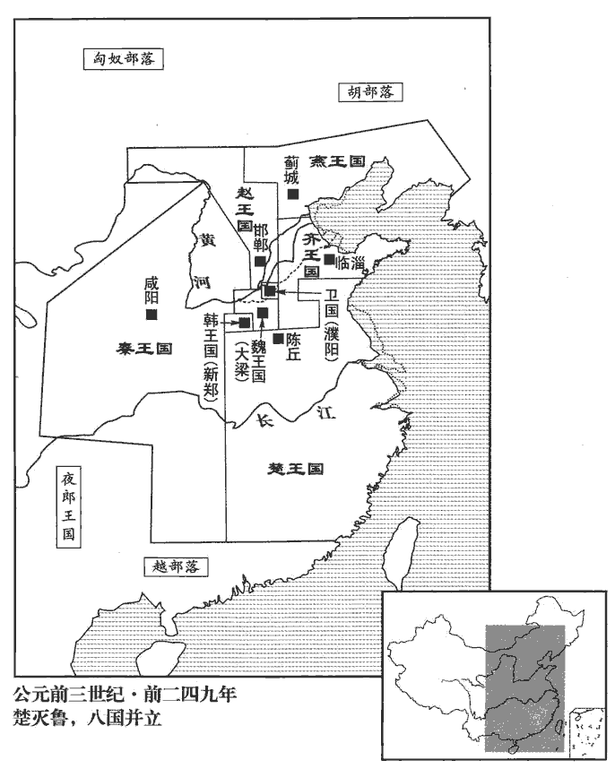
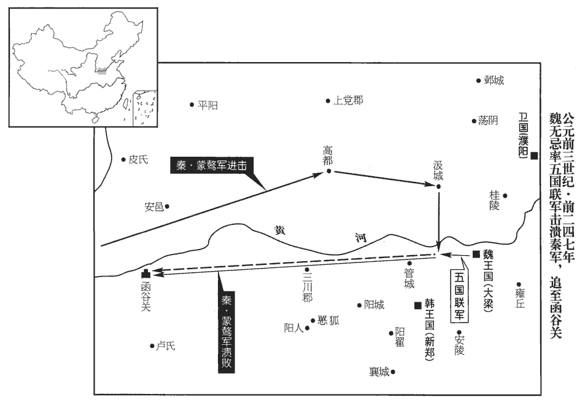
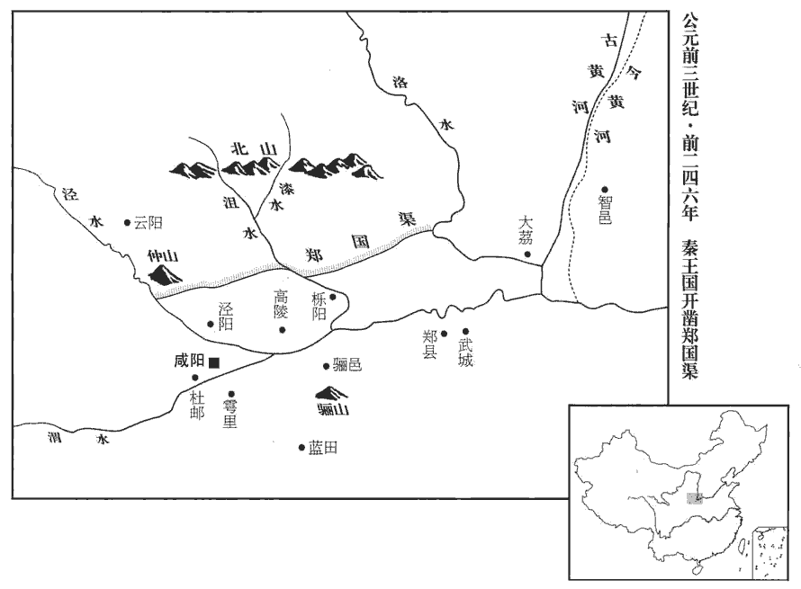
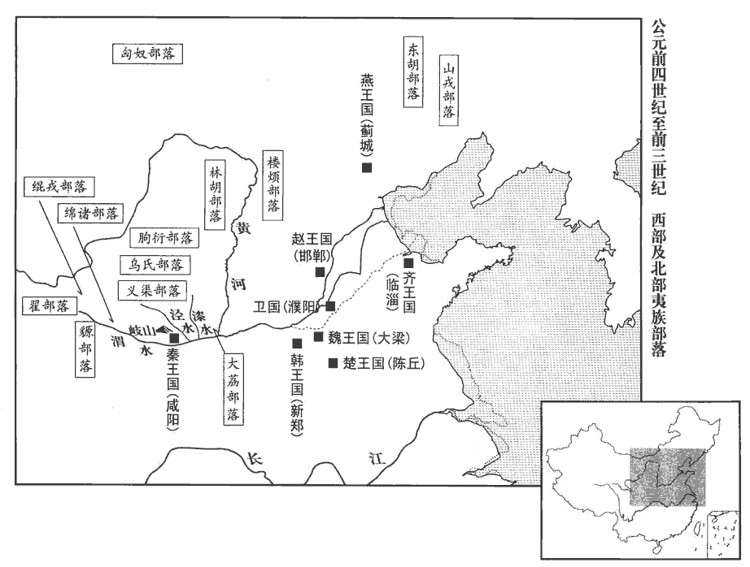
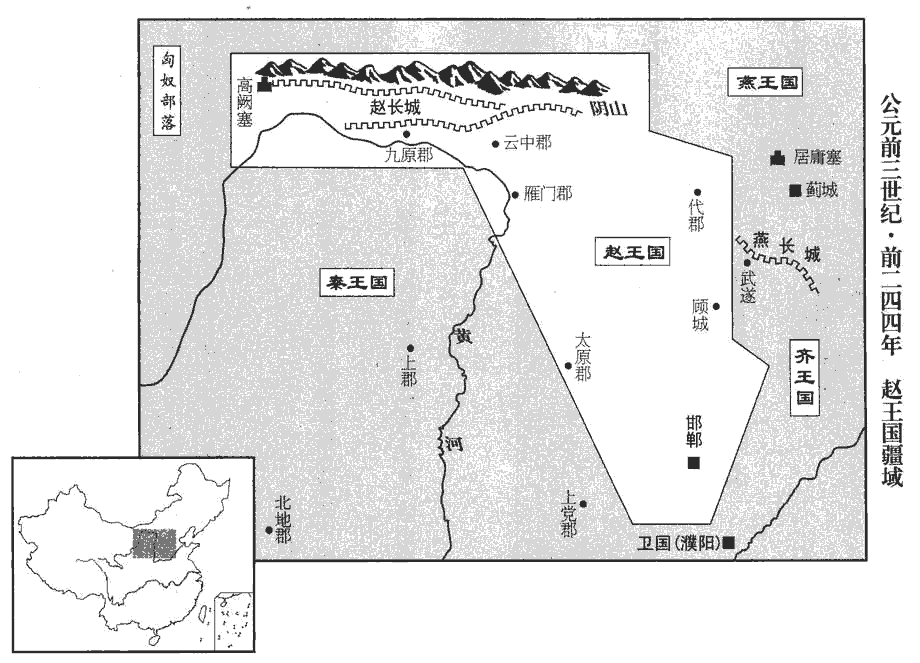
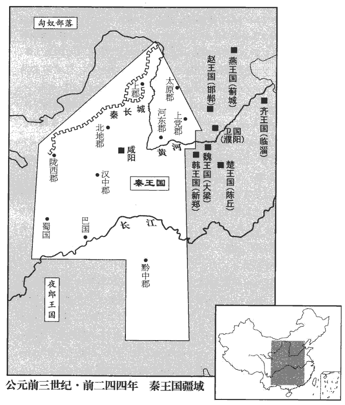
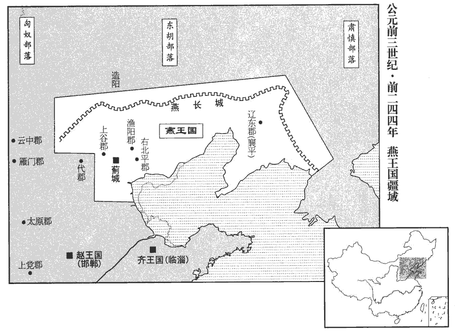
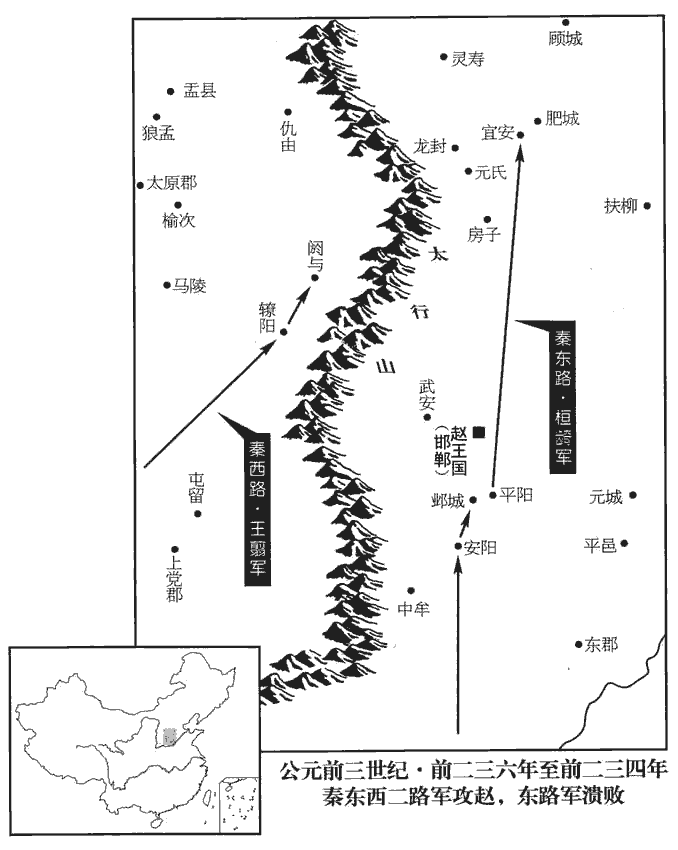
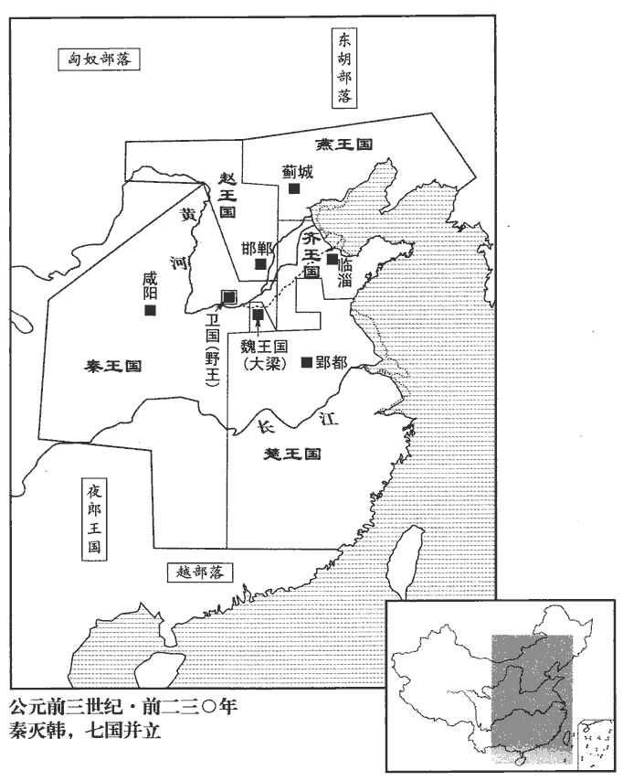
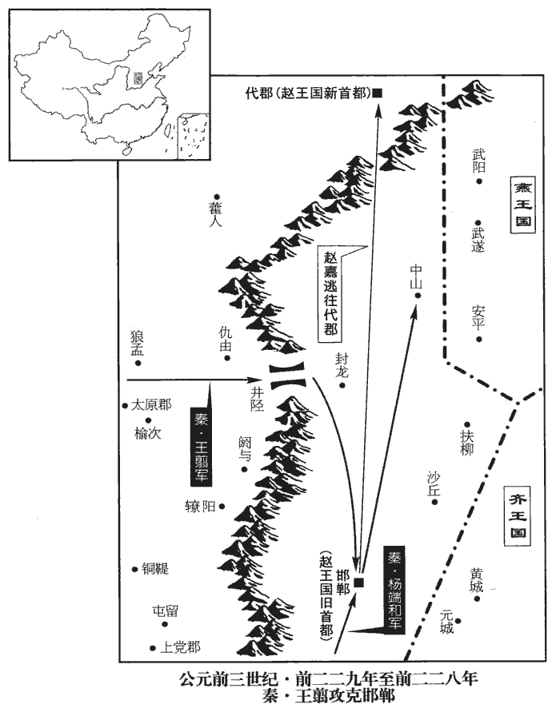

 秦紀一起柔兆敦牂（丙午）盡昭陽作噩（癸酉），凡二十八年。
>  
> 陸德明曰：秦，隴西谷名也，在雍州鳥鼠山之東北。秦之先非子，為周孝王養馬於汧qiān、渭之間，封為附庸，邑之秦谷。非子曾孫秦仲，周宣王命為大夫。仲之孫襄公，討西戎救周，平王東遷，以岐、豐之地賜之，列為諸侯。春秋時稱秦伯。

# 昭襄王名稷，惠文王庶子也。西周既亡，天下莫適為主。通鑑以秦卒并天下，因以昭襄王系年。諡法：昭德有勞曰昭；辟地有德曰襄。以沈約諡法言之，則昭襄複諡也。卒，子恤翻。諡，神至翻。辟，讀曰辟。

## 五十二年（丙午，前二五五年）

1河東‹山西夏县›守王稽坐與諸侯通。棄市。河東本魏地，秦取之，以其地在大河之東，置河東郡。守，式又翻。刑人於市，與眾棄之。秦法論死於市，謂之棄市。應侯日以不懌。王稽薦范睢于秦王，睢既相秦，稽亦進用，今以罪死，故睢日以不懌。懌，悅也。不懌，不悅也。應，於陵翻。或曰：范睢之初進用於秦，至於為相，昭襄王誠悅之也，鄭安平既降趙，王稽又得罪，睢雖為相，昭襄王臨朝接之，日以不悅。懌，羊益翻。王臨朝而歎，朝，直遙翻。應侯請其故。王曰：「今武安君死，而鄭安平、王稽等皆畔，內無良將而外多敵國，吾是以憂！」將，既亮翻。應侯懼，不知所出。

〖译文〗 [1]河东郡郡守王稽因犯通敌罪被判斩弃于市。应侯范睢为此闷闷不乐。昭襄王嬴稷在坐朝治事时发声长叹，范睢询问其缘故。昭襄王说：“现在武安君白起已死，郑安平、王稽等又都背叛了，国家内无良将，外却有许多敌国，我因此而忧虑！”范睢颇为恐惧，想不出用什么办法。

燕客蔡澤聞之，燕，於賢翻。蔡，姓也，以國為氏。西入秦，先使人宣言于應侯曰，「蔡澤，天下雄辯之士；彼見王，必困君而奪君之位。」應侯怒，使人召之。蔡澤見應侯，禮又倨。倨，居禦翻，傲也。應侯不快，因讓之曰：「子宣言欲代我相，相，息亮翻。請聞其說。」蔡澤曰：「吁，孔安國曰：吁，疑怪之辭。孔穎達曰：吁者，心有所嫌而為此聲，故以為疑怪之辭也。君何見之晚也。夫四時之序，成功者去。謂春生，夏長，秋就實，冬閉藏，各成其功而相代謝也！夫，音扶；下同。君獨不見夫秦之商君、楚之吳起、越之大夫種，何足願與。」商君事見二卷周顯王三十一年。吳起事見一卷安王二十一年。大夫種相越王句踐以雪會稽之恥，功成不退，為句踐所殺。種，溫公音章勇翻。與，讀曰歟。句，音鉤。踐，慈淺翻。種，章勇翻。應侯謬曰：「何為不可！此三子者，義之至也，忠之盡也。君子有殺身以成名，死無所恨。」蔡澤曰：「夫人立功，豈不期於成全邪！應，於陵翻。謬，靡幼翻。邪，音耶。身名俱全者，上也；名可法而身死者，次也；名僇辱而身全者，下也。僇，與戮同。夫商君、吳起、大夫種，其為人臣盡忠致功，則可願矣。閎夭、周公，豈不亦忠且聖乎！三子之可願，孰與閎夭、周公哉？」閎夭，周文王、武王之賢臣。閎，音宏。夭，於驕翻，又於表翻。應侯曰：「善。」蔡澤曰：「然則君之主惇厚舊故，不倍功臣，孰與孝公、楚王、越王？」倍，與背同，蒲昧翻。曰：「未知何如。」蔡澤曰：「君之功能孰與三子？」曰：「不若。」蔡澤曰：「然則君身不退，患恐甚於三子矣。語曰：『日中則移，月滿則虧』進退嬴縮，五星早出為嬴，晚出為縮。嬴，餘輕翻、縮，所六翻。與時變化，聖人之道也。今君之怨已讎而德已報，怨已讎，謂殺魏齊；德已報，謂進用王稽、鄭安平等。意欲至矣而無變計，竊為君危之！」為，於偽翻。應侯遂延以為上客，因薦于王。王召與語，大悅，拜為客卿。應侯因謝病免。王新悅蔡澤計畫，遂以為相國。澤為相數月，免。相，息亮翻。

〖译文〗 燕国的客卿蔡泽听说了这件事，便向西进入秦国，先让人向范睢扬言说：“蔡泽是天下能言善辩之士，他一见到秦王，就必会使您为难，进而夺取您的位置。”范睢很生气，遣人召蔡泽来见。蔡泽进见时态度傲慢不敬，使范睢大为不快，因此斥责他说：“你扬言要取代我做秦国的相国，那就让我听听你的根据。”蔡泽说：“吁，您见事何其迟啊！四个季节按春生、夏长、秋实、冬藏的次序，各完成它的功能而转换下去。您难道没有看到秦国的商鞅、楚国的吴起、越国的文种的下场吗？这有什么值得羡慕的呢？”范睢故意辩驳说：“有什么不可以的！这三个人的表现是节义的准则，忠诚的典范呀！君子可以杀身成名，并且死而无憾。”蔡泽说：“人们要建功立业，怎么会不期望着功成名就、全身而退呢！身命与功名都能保全的，是上等的愿望；功名可以为后人景仰效法而身命却已失去的，就次一等了；声名蒙受耻辱而自身得以苟全的，便是最下一等的了。商鞅、吴起、文种，他们作为臣子竭尽全力忠于君主取得了功名，这是可以为人仰慕的。但是闳夭、周公不也是既忠心耿耿又道德高尚、智慧过人吗！从君臣关系上说，那三人虽然令人仰慕，可又哪里比得上闳夭、周公啊？”范睢说：“是啊。”蔡泽说：“如此说来，您的国君在笃念旧情、不背弃有功之臣这点上能与秦孝公、楚悼王、越王哪一个相比呢？”范睢说：“我不知道能不能比。”蔡泽说：“那么您与商鞅等三人相比，谁的功绩更大呢？”范睢说：“我不如他们。”蔡泽说：“这样的话，如果您还不引退，将遇到的灾祸恐怕要比那三位更严重了。俗话说：‘太阳升到中天就要偏斜而西，月亮圆满了即会渐见亏缺。’进退伸缩，随时势的变化进行调整以求适应，是圣人的法则。现在您仇也报了，恩也报了，心愿完全得到满足却还不作变化的打算，我私下里为您担忧！”范睢于是将蔡泽奉为上宾，并把他推荐给昭襄王。秦王召见蔡泽，与他交谈，十分喜爱他，便授与他客卿的职位。范睢随即以生病为借口辞去了相国之职。昭襄王一开始就赞赏蔡泽的计策，便任命他为相国。但蔡泽任相国几个月后，即被免职。

2楚春申君以荀卿為蘭陵‹山東苍山›令。姓譜：荀，本姓郇，後去「邑」為「荀」。又晉荀林父，公族隰叔之後。班志，蘭陵縣屬東海郡。史記正義曰：今沂州承縣有蘭陵山。荀卿者，趙人，名況，嘗與臨武君論兵于趙孝成王之前。王曰：「請問兵要。」臨武君對曰：「上得天時，下得地利，觀敵之變動，後之發，先之至，此用兵之要術也。」後、先，皆去聲。荀卿曰：「不然，臣所聞古之道，凡用兵攻戰之本，在乎一民。弓矢不調，則羿不能以中，六馬不和，則造父不能以致遠，羿，古之善射者；造父，古之善御者也。羿，音詣。中，竹仲翻。父，音甫。士民不親附，則湯、武不能以必勝也。故善附民者，是乃善用兵者也。故兵要在乎附民而已。」臨武君曰：「不然。兵之所貴者勢利也，所行者變詐也。善用兵者感忽悠暗，楊倞曰：感忽，恍惚也。悠暗，謂遠視不分之貌。莫知所從出；孫、吳用之，無敵於天下，豈必待附民哉！」荀卿曰：「不然。臣之所道，仁人之兵，王者之志也。君之所貴，權謀勢利也。仁人之兵，不可詐也。彼可詐者，怠慢者也，露袒者也，露袒，如人之支體上下無衣裳以覆蔽，裸露肉袒者也。君臣上下之間滑然有離德者也。滑，音骨，亂也。故以桀詐桀，猶巧拙有幸焉。以桀詐堯，譬之以卵投石，以指橈náo沸，橈，奴巧翻，又奴教翻，攪也。若赴水火，入焉焦沒耳。故仁人之兵，上下一心，三軍同力；臣之於君也，下之於上也，若子之事父，弟之事兄，若手臂之捍頭目而覆胸腹也。覆，敷救翻，蓋也。詐而襲之，與先驚而後擊之，一也。且仁人用十里之國則將有百里之聽，用百里之國則將有千里之聽，用千里之國則將有四海之聽，必將聰明警戒，和傅而一。康曰：將，音將帥之將。余據文義，讀如字為通。傅，音附。故仁人之兵，聚則成卒，百人為卒。散則成列，延則若莫邪之長刃，莫邪，吳之寶劍也。說文：莫邪，長戟也。邪，音耶。嬰之者斷，兌則若莫邪之利鋒，當之者潰；「兌」，劉向新序作「銳」。楊倞曰：兌，猶聚也，讀與隊同。倞，音諒。圜居而方止，則若磐石然，觸之者角摧而退耳。且夫暴國之君，將誰與至哉？夫，音扶。彼其所與至者，必其民也。其民之親我歡若父母，其好我芬若椒蘭，彼反顧其上則若灼黥，若仇讎；人之情，雖桀、蹠，豈有肯為其所惡，賊其所好者哉！字書：仇、讎，皆匹也。說文：仇，讎也。讎，猶應也。左傳：怨耦曰仇。記曰：父之讎，不與共戴天。蓋謂仇之初匹也。至於耦而成怨，則為仇。讎，校也，兩本相對，覆校是非也。殺父之人一旦相對，覆校是非，則不共戴天矣。仇讎之義，至此為甚，後世率以為言。好，呼到翻。為，於偽翻。惡，烏路翻。是猶使人之子孫自賊其父母也。彼必將來告。【章︰十二行本「告」下有「之」字；乙十一行本同；孔本同；退齋校同。】夫又何可詐也，故仁人用，國日明，諸侯先順者安，後順者危，敵之者削，反之者亡。詩曰：『武王載發，有虔秉鉞，如火烈烈，則莫我敢遏，』此之謂也。」商頌之辭。武王，湯也。發，依商頌讀為斾pèi。古者軍將戰則建斾。

〖译文〗 [2]楚国春申君黄歇任用荀卿为兰陵县令。荀卿是赵国人，名况，曾经与临武君在赵国国君孝成王赵丹面前辩论用兵之道。孝成王说：“请问什么是用兵的要旨？”临武君回答道：“上得天时，下得地利，观察敌人的变化动向，比敌人后发兵而先到达，这即是用兵的关键方略。”荀况说：“不是这样。我所听说的古人用兵的道理是，用兵攻战的根本，在于统一百姓。弓与箭不协调，就是善射的后羿也不能射中目标；六匹马不协力一致，即便善御的造父也无法将马车赶往远方；士人与百姓不和亲附国君，即是商汤、周武王也不能有必胜的把握。因此，善于使百姓归附的人，才是善于用兵的人。所以用兵的要领在于使百姓依附。”临武君说：“并非如此。用兵所重视的是形势要有利，行动要讲究诡诈多变。善用兵的人，行事疾速、隐蔽，没有人料得到他会从哪里出动。孙武、吴起采用这种战术，天下无敌，不见得一定要依靠百姓的归附啊！”荀况说：“不对。我所说的，是仁人的用兵之道和要统治天下的帝王的志向。您所看重的是权术、谋略、形势、利害。则仁人用的兵，是不能欺诈的。能够施用欺骗之术对付的，是那些骄傲轻慢的军队、疲惫衰弱的军队，以及君与臣、上级与下属之间不和相互离心离德的军队。因此用夏桀的诈术对付夏桀，还有使巧成功或使拙失败的可能。而用夏桀的骗计去对付尧，就如同拿鸡蛋掷石头，把手指伸进滚水中搅动，如同投身到水火之中，不是被烧焦，便是被淹死。故而仁人的军队，上下一条心，三军同出力；臣子对国君，下属对上级，犹如儿子侍奉父亲，弟弟侍奉哥哥，犹如用手臂保护头颅、眼睛、胸膛和腹部。这样的军队，用欺诈之术去袭击它，与先惊动了它而后才去攻击它，是一回事。况且，仁人若统治着十里的国家，他的耳目将布及百里，若统治着百里的国家，他的耳目便将布及千里，若统治着千里的国家，他的耳目就会遍及天下，这样，他必将耳聪目明、机警而有戒备，和众如一。因此仁人的军队，集结起来即为一支支百人的部队，分散开时即成战阵行列；延长伸展好似莫邪宝剑的长刃，碰上的即被斩断；短兵精锐仿佛莫邪宝剑的利锋，遇到的即被瓦解；安营扎寨稳如磐石，顶撞它的，角即遭摧折而退却。再说那暴虐国家的君主，他所依靠的是什么呢？只能是他的百姓。而他的百姓爱我就如同爱他的父母，喜欢我就如同喜欢芬芳的椒兰；反之，想起他的君主好似畏惧遭受烧灼黥刑，好似面对不共戴天的仇敌一般。人之常情，即便是夏桀、盗跖，也不会为他所厌恶的人去残害他所喜爱的人！这就犹如让人的子孙去杀害自己的父母，是根本不可能的。如此，百姓一定会前来告发君主，那又有什么诈术可施呢！所以，由仁人治理国家，国家将日益强盛，各诸侯国先来归顺的则得到安定，后来依附的即遭遇危难；相对抗的将被削弱，进行反叛的即遭灭亡。《诗经》所谓‘商汤竖起大旗，诚敬地握着斧钺，势如熊熊烈火，谁敢把我阻拦？’正是说的这种情况。”

孝成王、臨武君曰：「善。請問王者之兵，設何道，何行而可？」楊倞曰：設，謂制置。道，謂論說教令也。行，謂動用也。荀卿曰：「凡君賢者其國治，君不能者其國亂，隆禮貴義者其國治，簡禮賤義者其國亂。治者強，亂者弱，是強弱之本也。治，直吏翻。上足卬則下可用也，上不足卬則下不可用也。卬，古仰字，音魚向翻。楊倞曰：下托上曰仰。下可用則強，下不可用則弱，是強弱之常也。齊【章︰十二行本「齊」上有「好士者強，不好士者弱；愛民者強，不愛民者弱；政令信者強，政令不信者弱；重用兵者強，輕用兵者弱；權出一者強，權出二者弱；是強弱之常也。」五十五字；乙十一行本同；孔本同；張校同；退齋校同。】人隆技擊，孟康曰：技擊者，兵家之技巧，習手足，便器械，積機關，以立攻守之勝者也。楊倞曰：技，材力也。齊人以勇力擊斬敵者，號為技擊。隆，重也。技，渠綺翻。其技也，得一首者則賜贖錙金，無本賞矣。楊倞曰：八兩曰錙。本賞，謂有功同受賞也。其技擊之術，斬得一首，則官賜以錙金贖之。斬首，雖戰敗亦賞；不斬首，雖勝亦不賞：是無本賞矣。錙，莊持翻。是事小敵毳cuì，則偷可用也；毳，與脆同，音此芮翻。事大敵堅，則渙焉離耳；若飛鳥然，傾側反覆無日，是亡國之兵也，兵莫弱是矣，是其去賃市傭而戰之幾矣。賃，女禁翻。毛晃曰：借也，僦也。市傭，謂市人之受雇者也。魏氏之武卒，以度取之；楊倞曰：選擇武勇之士，號為武卒，度取之，謂取長短材力之中度者也。衣三屬之甲，如淳曰：上身一，髀bì褌一，脛繳一，凡三屬。衣，於既翻。屬，之欲翻。操十二石之弩，沈括曰：鈞石之石，五權之名，石重百二十斤。後人以一斛為一石，自漢時已如此，于定國飲酒一石不亂是也。挽強弓弩，古人以鈞石率之。今人乃以秔jīng米一斛之重為一石，凡石以九十二斤半為法，乃漢秤三百四十一斤也。今之武卒蹶弩有及九石者，計其力乃古二十五石，比魏之武卒，當二人有餘。弓有挽三石者，乃古之二十四鈞，比顏高之弓當五人有餘。此皆近世教習所致。武備之盛，前古未有其比。案括之論詳矣；然用之則誤國喪師，不知合變，是趙括之談兵也。操，七刀翻。負矢五十個，置戈其上，謂置戈於身之上，即荷戈也。荷，下可翻。冠胄帶劍，贏三【章︰十二行本「三」作「二」，乙十一行本同。】日之糧，日中而趨百里；中試則復其戶，利其田宅。中試，言程試而中度者，復其戶，不徭役也。利其田宅，給以田宅便利之處。胄，今之兜鍪。冠，古玩翻。贏，怡成翻，擔也。中，竹仲翻。復，方目翻。是其氣力數年而衰，而復利未可奪也，改造則不易周也，改造，謂更選擇也。易，弋豉翻。是故地雖大，其稅必寡，是危國之兵也。秦人，其生民也陿隘，其使民也酷烈，劫之以勢，隱之以阨，忸之以慶賞，鰌之以刑罰，陿，與狹同。隘，烏懈翻。楊倞曰：隱之以阨，謂隱蔽以險阨，使敵不能害。鄭氏曰：秦地多阨，隱藏其民於阨中也。忸，與狃同，串習也。戰勝則與之慶賞，使習以為常。鰌，藉也。不勝則以刑罰陵藉之。莊子：風謂蛇曰，鰌我亦勝我。陸德明音義曰：鰌，音秋，藉也。李云：鰌，藉也；藉則削也。忸，女九翻。使民所以要利於上者，非鬬無由也。使以功賞相長，五甲首而隸五家，楊倞曰：有功則賞之，使相長，凡獲得五甲首則役隸鄉里之五家也。要，一遙翻。長，知兩翻。是最為眾強長久之道。故四世有勝，非幸也，數也。四世，謂秦孝公、惠文王、悼武王、昭襄王。故齊之技擊不可以遇魏之武卒，魏之武卒不可以遇秦之銳士，秦之銳士不可以當桓、文之節制，桓、文之節制不可以當湯、武之仁義，有遇之者，若以焦熬投石焉。焦熬之物至脆，投石則碎。熬，五刀翻。兼是數國者，皆干賞蹈利之兵也，傭徒鬻賣之道也；未有貴上安制綦qí節之理也。楊倞曰：干賞蹈利之兵，與傭徒之人鬻賣其力而作者無異，未有愛貴其上而為之致死。安於制度，自不逾越，極於節義，心不為非之理也。諸侯有能微妙之以節，則作而兼殆之耳。楊倞曰：微妙，精盡也。節，仁義也。作，起也。殆，危也。諸侯有能精盡仁義，則起而兼此數國，使之危殆。故招延募選，隆勢詐，上功利，是漸之也。漸，浸漬也。言勢詐功利漸染以成俗。漸，子廉翻。禮義教化，是齊之也。故以詐遇詐，猶有巧拙焉；以詐遇齊，譬之猶以錐刀墮泰山也。謂禮義教化之所齊，以詐遇之，無不敗者。墮，讀曰隳。故湯、武之誅桀、紂也，拱挹指麾，而強暴之國莫不趨使，挹，一及翻，義與揖同。誅桀、紂若誅獨夫。故泰誓曰：『獨夫紂，』此之謂也。故兵大齊則制天下，小齊則治鄰敵。治，直之翻。若夫招延募選，隆勢詐，上功利之兵，夫，音扶；下同。則勝不勝無常，代翕代張，代存代亡，相為雌雄耳，夫是謂之盜兵，君子不由也。」

〖译文〗 孝成王、临武君说：“对啊。那么请问君王用兵，应该建立什么教令、如何行动才好呢？”荀况答道：“总的说来，君王贤明的，国家就太平；君王无能的，国家就混乱；推崇礼教、尊重仁义的，国家就治理得好，荒废礼教、鄙视仁义的，国家就动荡不安。秩序井然的国家便强大，纲纪紊乱的国家便衰弱，这即是强与弱的根本所在。君王的言行足以为人敬慕，百姓才可接受驱使，君王的言行不能为人景仰，百姓也就不会服从召唤。百姓可供驱使的，国家就强大，百姓不服调遣的，国家就衰弱，这即是强与弱的常理所在。齐国人重视兵家的技巧技击，施展技击之术，斩获一颗人头的，由官方赐八两金换回，不是有功同受赏。这样的军队遇到弱小的敌人，还可凑合着应付；一旦面对强大的敌军，就会涣然离散，如同天上的飞鸟，漫天穿行无拘无束，往返无常。这是亡国之军，没有比这种军队更衰弱的了，它与招募一群受雇佣的市井小人去作战相差无几。魏国按照一定的标准选拔武勇的士兵。择取时，让兵士披挂上全副铠甲，拉开十二石重的强弓，身背五十支利箭，手持戈，头戴盔，腰佩剑，携带三天的食粮，每日急行军一百里。达到这个标准的便为武勇之卒，即可被免除徭役，并分得较好的田地和住宅。但是这些士兵的气力几年后便开始衰退，而分配给他们的利益却无法再行剥夺，即使改换办法也不容易做得周全。故而，魏国的疆土虽大，税收却必定不多。这样的军队便是危害国家的军队了。秦国，百姓生计困窘，国家的刑罚却非常严酷，君王借此威势胁迫百姓出战，让他们隐蔽于险恶的地势，战胜了就给以奖赏，使他们对此习以为常，而战败了便处以刑罚，使他们为此受到箝制，这样一来，百姓要想从上面获得什么好处，除了与敌拼杀外，没有别的出路。功劳和赏赐成正比例增长，只要斩获五个甲士的头，即可役使乡里的五家，这就是秦国比其他国家强大稳固的原因。所以，秦国得以四代相沿不衰，并非侥幸，而是有其必然性的。故此齐国善技击术的军队无法抵抗魏国择勇武士兵的军队，魏国择勇武士兵的军队无法抵抗秦国精锐、进取的军队；而秦国精锐的士兵却不能抵挡齐桓公、晋文公约束有方的军队，齐桓公、晋文公约束有方的士兵又不能抵挡商汤、周武王的仁义的军队，一旦遇上了，势必如用薄脆的东西去打石头，触之即碎。况且那几个国家培养的都是争求赏赐、追逐利益的将领和士兵，他们就如同雇工靠出卖自己的力气挣钱那样，毫无敬爱国君，愿为国君拼死效力，安于制度约束，严守忠孝仁义的气节、情操。诸侯中如果有哪一个能够精尽仁义之道，便可起而兼并那几个国家，使它们陷入危急的境地。故在那几个国家中，招募或选拔士兵，推重威势和变诈，崇尚论功行赏，渐渐染成了习俗。但只有尊奉礼义教化，才能使全国上下一心，精诚团结。所以用诈术对付欺诈成俗的国家，还有巧拙之别；而若用诈术对付万众一心的国家，就犹如拿小刀去毁坏泰山了。所以商汤、周武王诛灭夏桀、商纣王时，从容指挥军队，强暴的国家却都无不臣服，甘受驱使，诛杀夏桀、商纣王，即如诛杀众叛亲离之人一般。《尚书·泰誓》崐中所说的‘独夫纣’，就是这个意思。因此军队齐心协力、众志成城，当可掌握天下；军队尚能团结合作，当可惩治临近的敌国。至于那些征召、募选士兵，推重威势诈变，崇尚论功行赏的军队，则或胜或败，变化无常；有时收缩，有时扩张，有时生存，有时灭亡，强弱不定。这样的军队可称作盗贼之兵，而君子是不会这样用兵的。”

孝成王、臨武君曰：「善，請問為將。」將，即亮翻。荀卿曰：「知莫大於棄疑，楊倞曰：不用疑謀，此智之大。知，讀曰智。行莫大於無過，行，下孟翻。事莫大於無悔；事至無悔而止矣，不可必也。言不可自以為必勝。故制號政令，欲嚴以威；慶賞刑罰，欲必以信；處舍收藏，欲周以固；楊倞曰：處舍，營壘也。收藏，財物也。周密嚴固，則敵不得而陵奪也。處，昌呂翻。徙舉進退，欲安以重，欲疾以速，窺敵觀變，欲潛以深，欲伍以參；楊倞曰：謂使間諜觀敵，欲潛隱深入之也。伍參，猶錯雜也。使間諜或參之，或伍之於敵之間，而盡知其事。韓子曰：省同異之言，以知朋黨之分，偶參伍之驗，以責陳言之實。又曰：參之以比物，伍之以合參。遇敵決戰，必行吾所明，無行吾所疑；夫是之謂六術。無欲將而惡廢，言欲為將而惡失權，則舍己之勝算，遷就以逢君之欲矣。將，即亮翻。無怠勝而忘敗，無威內而輕外，無見其利而不顧其害，凡慮事欲熟而用財欲泰，夫是之謂五權。夫，音扶。將所以不受命於主有三：可殺而不可使處不完，可殺而不可使擊不勝，可殺而不可使欺百姓，夫是之謂三至。楊倞曰：至，謂守一而不變。處，昌呂翻。凡受命於主而行三軍，三軍既定，百官得序，楊倞曰：百官，軍之百吏也。群物皆正，則主不能喜，敵不能怒，夫是之謂至臣。慮必先事而申之以敬，慎終如始，始終如一，夫是之謂大吉。楊倞曰：言必無覆敗之禍。凡百事之成也，必在敬之，其敗也必在慢之。故敬勝怠則吉。怠勝敬則滅；計勝欲則從，欲勝計則凶。戰如守，行如戰，有功如幸。敬謀無曠，敬事無曠，敬吏無曠，敬眾無曠，敬敵無曠，夫是之謂五無曠。曠，廢也。夫，音扶。慎行此六術、五權、三至，而處之以恭敬、無曠，夫是之謂天下之將，則通於神明矣。」

〖译文〗 孝成王、临武君说：“对啊。那么还请问做将领的道理。”荀况说：“谋虑最关键的是抛弃成败不明的谋划，行动最重要的是不产生过失，做事最关键的是不后悔；事情做到没有反悔就可以了，不必一定要追求尽善尽美。所以制定号令法规，要严厉、威重；赏功罚过，要坚决执行、遵守信义；营垒、辎重，要周密、严固；迁移、发动、前进、后退，要谨慎稳重，快速敏捷；探测敌情、观察敌人的变化，要行动机密，混入敌方将士之中；与敌军遭遇，进行决战，一定要打有把握的仗，不打无把握的仗。这些称为‘六术’。不要为保住自己将领的职位和权力而放弃自己取胜的策略，去迁就迎合君王的主张；不要因急于胜利而忘记还有失败的可能；不要对内威慑，而对外轻敌；不要见到利益而不顾忌它的害处；考虑问题要仔细周详而使用钱财要慷慨宽裕。这些称为‘五权’。此外，将领在三种情况下不接受君主的命令：可以杀死他，但不可令他率军进入绝境；可以杀死他，但不可令他率军攻打无法取胜的敌人；可以杀死他，但不可令他率军去欺凌百姓。这些称为‘三至’。将领接受君主命令后即调动三军，三军各自到位，百官井然有序，各项事务均安排停当、纳入正轨，此时即便君主奖之也不能使之喜悦，敌人激之也不能使之愤怒。这样的将领是最善于治军的将领。行事前必先深思熟虑，步步慎重，而且自始至终谨慎如一，这即叫作‘大吉’。总之，各项事业，如果获得成功，必定是由于严肃对待这项事业；如果造成失败，必定是由于轻视这项事业。因此，严肃胜过懈怠，便能取得胜利，懈怠胜过严肃，便将自取灭亡；谋划胜过欲望，就事事顺利，欲望胜过谋划，就会遭遇不幸。作战如同守备一样，行动如同作战一样，获得成功则看作是侥幸取得。严肃制订谋略，不可废止；严肃处理事务，不可废止；严肃对待下属，不可废止；严肃对待兵众，不可废止；严肃对待敌人，不可废止，这些称为‘五不废’。谨慎地奉行以上‘六术’、‘五权’、‘三至’，并恪守严肃不废止的原则，这样的将领便是天下无人能及的将领，便是可以上通神明的了。”

臨武君曰：「善。請問王者之軍制。」荀卿曰：「將死鼓，將，即亮翻。將建旗伐鼓以令三軍之進退，死不離局。離，力智翻。御死轡，百吏死職，上【章︰乙十一行本「上」作「士」。】大夫死行列。行，戶剛翻。聞鼓聲而進，聞金聲而退。順命為上，有功次之。令不進而進，猶令不退而退也，令，力正翻。其罪惟均。不殺老弱，不獵禾稼，服者不禽，格者不赦，奔命者不獲。楊倞曰：服，謂不戰而退者不追禽之。格，謂相拒捍者。奔命，謂奔走來歸其命，不獲之以為囚俘。凡誅，非誅其百姓也，誅其亂百姓者也。百姓有捍其賊，則是亦賊也。以其【章︰十二行本「其」作「故」；乙十一行本同。】順刃者生，傃sù刃者死，奔命者貢。楊倞曰：傃，向也，謂傃向格斗者。貢，謂取歸命者獻于上將也。傃，音素。微子開封于宋，殷紂暴虐，微子奔周。武王殺紂，封微子于宋。微子本名啟，此云開者，蓋漢景帝諱，劉向改之也。曹觸龍斷於軍，楊倞曰：說苑云：桀為天子，其臣有左師觸龍者，諂諛不正。此云紂，當是說苑誤。按，戰國時趙亦有左師觸龍，豈姓名同乎？姓譜：曹姓，本自顓頊玄孫陸終之子六安，周武王封曹挾於邾，故邾，曹姓也。至魏武帝，始祖曹叔振鐸。商之服民，所以養生之者無異周人，故近者歌謳而樂之，遠者竭蹶而趨之，以上下文觀之，商、周二字恐或倒置。楊倞曰：竭蹶，顛仆，猶言匍匐也。樂，音洛。蹶，居月翻。無幽閒辟陋之國，莫不趨使而安樂之，閒，讀曰閑。辟，讀曰僻。四海之內若一家，通達之屬莫不從服，夫是之謂人師。夫，音扶。詩曰：『自西自東，自南自北，無思不服。』此之謂也。引文王有聲之詩而言。王者有誅而無戰，城守不攻，兵格不擊，敵上下相喜則慶之，不屠城，不潛軍，不留眾，師不越時，故亂者樂其政，不安其上，欲其至也。」亂國之民樂吾之政，故不安其上，惟欲吾兵之至也。樂，音洛。臨武君曰：「善。」

〖译文〗 临武君说：“有道理。那么请问圣明君王的军制又该怎样。”荀况说：“崐将领建旗击鼓号令三军，至死也不弃鼓奔逃；御手驾战车，至死也不放松缰绳；百官恪守职责，至死也不离开岗位；大夫尽心效力，死于战阵行列。军队听到鼓声即前进，听到钲声即后退，服从命令是最主要的，建功还在其次。命令不准前进而前进，犹如命令禁止后退而还要后退一样，罪过是相等的。不残杀老弱，不践踏庄稼，不追捕不战而退的人，不赦免相拒顽抗的人，不俘获跑来归顺的人。该诛杀时，诛杀的不是百姓，而是祸害百姓的人。但百姓中如果有保护敌人的，那么他也就成为敌人了。所以，不战而退的人生，相拒顽抗的人死，跑来归顺的人则被献给统帅。微子启因多次规劝商纣王，后归顺周王而受封为宋国国君，专门谄谀纣王的曹触龙被处以军中重刑，归附于周天子的商朝人待遇与周朝百姓没有区别，故而近处的人唱着歌欢乐地颂扬周天子，远方的人跌跌撞撞地前来投奔周天子。此外，不论是多么边远荒僻鄙陋的国家，周天子也派人去关照，让百姓安居乐业，以至四海之内如同一家，周王朝恩威所能达到的属国，没有不服从、归顺的。这样的君王即叫作‘人师’，即为人表率的人。《诗经》说：‘自西自东，自南自北，无思不服。’就是指的这个。圣明君王的军队施行惩处而不挑起战争，固守城池而不发动进攻，与敌对阵作战而不先行出击，敌人上上下下喜悦欢欣就庆贺，并且不洗劫屠戮敌方的城镇，不偷袭无防备的敌人，不使将士们长久地滞留在外，军队出动作战不超越计划的时间，如此，便使混乱国家的百姓都喜欢这种施政方式，而不安心于受自己国君的统治，希望这种君王的军队到来。”临武君说：“你说的不错。”

陳囂問荀卿曰：囂，虛驕翻；又牛刀翻。「先生議兵，常以仁義為本，仁者愛人，義者循理，然則又何以兵為？凡所為有兵者，為爭奪也。」為爭，於偽翻。荀卿曰：「非汝所知也。彼仁者愛人，愛人，故惡人之害之也，義者循理，循理，故惡人之亂之也。惡，烏路翻。彼兵者，所以禁暴除害也，非爭奪也。」

〖译文〗 陈嚣问荀况说：“您议论用兵之道，总是以仁义为根本，而仁者爱人，义者遵循情理，既然如此又怎么用兵打仗呢？一切用兵之事都是为了争夺、攻伐啊。”荀况说：“并非像你所理解的这样。所谓仁者爱人，正因为爱人，才憎恶害人的人；义者遵循情理，正因为循理，才憎恶反叛、作乱的人。所以，用兵的目的在于禁暴除害，而不是为了争夺、攻伐。”

3燕孝王薨，子喜立。

〖译文〗 [3]燕国燕孝王去世，子姬喜继位。

4周民東亡。義不為秦民也。秦人取其寶器。遷西周公於𢠸狐之聚‹河南汝州西北›。此西周文公也，武公之子也。自赧王時，東西分治，赧王擁虛器而已。班志，河南郡梁縣有𢠸狐聚。括地志：汝州外古梁城，即𢠸狐聚也。陽人故城，即陽人聚也；在汝州梁縣西四十里，秦遷東周所居也。梁，亦古梁城也，在汝州梁縣西南十五里。索隱曰：𢠸狐聚與陽人聚在洛陽南北五十里梁、新城之間也。𢠸，與憚同。聚，賢曰：慈諭翻。

〖译文〗 [4]周王朝的百姓向东逃亡。秦国人夺取了周王朝的宝鼎重器，并将西周文公姬咎迁移到狐之聚。

5楚王【章︰十二行本「王」作「人」，乙十一行本同；孔本同；退齋校同。】遷魯于莒‹山東莒縣›而取其地。魯至是而亡。莒，居許翻。

〖译文〗 [5]楚国考烈王将鲁国国君迁到莒地，夺取了鲁国的封地。

## 五十三年（丁未，前二五四年）

1摎jiū伐魏，取吳城‹山西平陆›。後漢志，河東郡大陽縣有吳山，山上有虞城。杜預曰：虞，國也。帝王世紀曰：舜妃嬪于虞，虞城是也；亦謂吳城，秦昭王伐魏取吳城是也。摎，紀虯翻。韓王入朝。魏舉國聽令。朝，直遙翻。令，力政翻。

〖译文〗 [1]秦国将领率军讨伐魏国，攻占了吴城。韩国国君前来朝见昭襄王。魏国全国听从秦王的号令。

## 五十四年（戊申，前二五三年）

1王郊見上帝於雍‹陝西鳳翔›。班志，雍縣屬扶風。秦惠公都之，有五畤zhì，故於此郊見上帝，欲行天子之禮也。應劭shào曰：四方積高曰雍。凡下見上之見，音賢遍翻。雍，於用翻。畤，音止。

〖译文〗 [1]昭襄王在雍城南郊祭祀上帝。

2楚遷于鉅陽‹安徽阜阳北›。赧王三十七年，楚自郢東北徙于陳；今自陳徙鉅陽；至始皇六年，春申君以朱英之言，自陳徙壽春：則此時雖徙鉅陽，未離陳地也。赧，奴版翻。郢，以井翻。離，力智翻。

〖译文〗 [2]楚国迁都至钜阳。

## 五十五年（己酉，前二五二年）

1衛懷君朝于魏‹都大梁，河南開封›，魏人執而殺之；更立其弟，是為元君。更，工衡翻。元君，魏壻也。壻，女夫也。妻謂夫亦曰壻。旁從「女」，或從「士」，音思繼翻。

〖译文〗 [1]卫国卫怀君到魏国都城大梁朝见魏王，魏国人将他抓住杀了，另立他的弟弟为卫国国君，是为元君。而元君是魏王的女婿。

## 五十六年（庚戌，前二五一年）

1秋，王薨，孝文王立。尊唐八子為唐太后，薨，呼肱翻。七子、八子，秦宮中女官名。以子楚為太子。趙人奉子楚妻子歸之。韓王衰cuī絰dié入吊祠。賢曰：喪服斬衰裳，上曰衰，下曰裳，麻在首要皆曰絰，首絰象緇布冠，要絰象大帶。絰之言實，衰之言摧，明中實摧痛也。衰，七雷翻。

〖译文〗 [1]秋季，秦昭襄王去世，子嬴柱继位，是为孝文王。孝文王尊奉生母唐八子为唐太后，立子嬴异人为太子。于是，赵国人便将嬴异人的妻子儿女送回秦国。韩国国君则穿着丧服来到秦国，入殡宫吊唁祭奠昭襄王。

2燕王喜使栗腹約歡于趙，姓譜：栗姓，栗陸氏之後。燕，因肩翻。以五百金為趙王酒。反而言于燕王曰：「趙壯者皆死長平‹山西高平西北›，長平之敗，事見上卷周赧王五十五年。其孤未壯，可伐也。」王召昌國君樂閑問之，對曰：「趙四戰之國，言其四境皆鄰於強敵，四面拒戰也。其民習兵，不可。」王曰：「吾以五而伐一。」對曰：「不可。」王怒。群臣皆以為可，乃發二千乘，栗腹將而攻鄗‹河北柏鄉北›，乘，繩證翻。鄗，呼各翻。卿秦攻代‹河北蔚縣›。姓譜：卿，姓也。將渠曰：「與人通關約交，以五百金飲人之王，姓譜：將，亦姓也，音即良翻。飲，於禁翻。使者報而攻之，不祥；師必無功。」使，疏吏翻。王不聽，自將偏軍隨之。將渠引王之綬，王以足蹴之。蹴，子六翻，蹋也。綬，音受。將渠泣曰：「臣非自為，為王也；」為，於偽翻。燕師至宋子‹河北趙縣›，班志，宋子縣屬鉅鹿郡。趙廉頗為將，逆擊之，敗栗腹于鄗‹河北柏鄉北›，敗卿秦、樂乘于代‹河北蔚縣›，將，即亮翻。樂乘，趙將也。戰國策曰：樂乘敗卿秦於代，當從之。敗，補邁翻。追北五百餘里，遂圍燕。燕都薊‹北京›，趙人進圍之。燕人請和，趙人曰：「必令將渠處和。」處，昌呂翻。處和者，主和也。燕王使【章︰十二行本「使」作「以」；乙十一行本同；孔本同。】將渠為相而處和，趙師乃解去。相，息亮翻。

〖译文〗 [2]燕国国君姬喜派使臣栗腹与赵王缔结友好盟约，并以五百金设置酒宴款待赵王。栗腹返回燕国后对燕王说：“赵国的壮年男子都死在长平之战中了，他们的孤儿还都没有长大成人，可以去进攻赵国。”燕王召见昌国君乐，询问他的意见。乐回答说：“赵国的四境都面临着强敌，需要四面抵抗，故国中百姓均已习惯于作战，不能去攻伐。”燕王说：“我可以用五个人来攻打赵国的一个人。”乐答道：“那也不行。”燕王大怒。群臣都认为可以出兵攻赵，燕王便调动两千辆战车，一路由栗腹率领，进攻城，一路由卿秦率领，进攻代地。大夫将渠说：“刚与赵国交换文件订立友好盟约，并用五百金置备酒席请赵王饮酒，而使臣一回来就发兵进攻人家，这是不吉利的，燕军队肯定无法获取战功。”燕王不听将渠的劝阻，而且还亲自率领配合主力作战的部队随大军出发。将渠一把拉住燕王腰间结系印纽的丝带，燕王气得向他猛踢一脚，将渠哭泣着说：“我不是为了我自己，而是为大王您啊！”燕国的军队抵达宋子，赵王任命廉颇为将，率军迎击燕军，在击败栗腹的部队，在代战胜卿秦、乐乘的部队，并乘胜追击燕军五百余里，顺势包围了燕国国都蓟城。燕王只得派人向赵国求和。赵国人说：“一定得让将渠前来议和才行。”于是，燕王便任命将渠为相国，前往赵国议和，赵国的军队方才退走。

3趙平原君卒。卒，子恤翻。

〖译文〗 [3]这一年，赵国的平原君赵胜去世。

# 孝文王索隱曰：名柱。諡法：五宗安之曰孝；慈惠愛民曰文。

## 元年（辛亥，前二五零年）

1冬，十月，己亥，王即位；三日薨。子楚立，是為莊襄王；尊華陽夫人為華陽太后，夏姬為夏太后。姓譜：周封夏后氏於杞，非為後不得封者，以夏為氏。一曰：陳夏徴舒之後。夏姬生莊襄王，故尊為太后。華，戶化翻。夏，戶雅翻。

〖译文〗 [1]冬季，十月，己亥（初四），孝文王正式登王位。但孝文王在位仅三天就去世了，他的儿子嬴异人继位，是为秦庄襄王。庄襄王尊奉嫡母华阳夫人为华阳太后，尊奉生母夏姬为夏太后。

2燕將攻齊聊城‹山東聊城›，拔之。聊城在濟水之北。班志，聊城縣屬東郡。或譖zèn之燕王，燕將保聊城，不敢歸。齊田單攻之，歲餘不下。魯仲連乃為書，約之矢以射城中，燕，因肩翻。將，即亮翻。約之矢，謂以書圍繞束縛於矢也。射，而亦翻。遺燕將，為陳利害遺，于季翻。為，於偽翻。曰：「為公計者，不歸燕則歸齊。今獨守孤城，齊兵日益而燕救不至，將何為乎？」燕將見書，泣三日，猶豫不能自決。欲歸燕，已有隙；欲降齊，所殺虜于齊甚眾，恐已降而後見辱。喟然歎曰：「與人刃我，寧我自刃！」遂自殺。降，戶江翻。喟，丘貴翻。言與其使人加刃于我，寧使我拔刃而自殺也。聊城亂，田單克聊城。用大師曰克。歸，言魯仲連于齊，【章︰十二行本「齊」下有「王」字；乙十一行本同；孔本同。】欲爵之。仲連逃之海上，曰：「吾與富貴而詘於人，詘，曲勿翻。禮記：不充詘于富貴。詘者，喜失節貌。余謂此詘即屈伸之屈。寧貧賤而輕世肆志焉！」

〖译文〗 [2]燕国的一位将领率军攻克了齐国的聊城。但是有人却在燕王面前说这个将领的坏话。这位将领因此而据守聊城，不敢返回燕国。齐国相国田单率军反攻聊城，为时一年多仍然攻克不下。齐人鲁仲连便写了一封信，捆在箭上射入城中给那位燕将，向他陈述利害关系说：“替您打算，您不是回燕国就是归附齐国。而现在您独守孤城，齐国的军队一天天增多，燕国的援兵却迟迟不到，您将怎么办呢？”燕将见信后低声哭泣了好几天，但仍然犹豫不决。他想还归燕国，可是已与燕国有了嫌隙；想投降齐国，又因杀戮、俘获的齐国人太多，而害怕降齐后会遭受屈辱。于是长声叹息着说：“与其让人来杀我，宁可我自杀！”便自刎身亡。聊城城内大乱，田单趁机攻下了聊城。田单凯旋后向齐王述说鲁仲连的功绩，并要授给他爵位。鲁仲连为此逃到海边，说：“我与其因获得富贵而屈从于他人，宁可忍受贫贱而能放荡不羁、随心所欲！”

魏安釐王問天下之高士於子順，釐，讀曰僖。子順曰：「世無其人也；抑可以為次，其魯仲連乎！。」王曰：「魯仲連強作之者，強，其兩翻。非體自然也。」子順曰：「人皆作之。作之不止，乃成君子；作之不變，習與體成，【章︰十二行本「成」下有「習與體成」四字；乙十一行本同；孔本同；張校同。】則自然也。」朱熹曰：君子，成德之名。

〖译文〗 魏国国君安王魏圉向孔斌询问谁是天下高士。孔斌说：“世上没有这种人。如果说可以有次一等的，那么这个人就是鲁仲连了！”安厘王说：“鲁仲连是强求自己这样做的，而不是他本性的自然流露。”孔斌说：“人都是要强求自己去做一些事情的。假如这样不停地做下去，便会成为君子；始终不变地这样做，习惯与本性渐渐相融合，也就成为自然的了。”

# 莊襄王本名異人，改名楚，孝文王之中子也。諡法：勝敵志強曰莊。

## 元年（壬子，前二四九年）

1呂不韋為相國。相，息亮翻。

〖译文〗 [1]吕不韦任秦国的相国。

2東周君與諸侯謀伐秦；王使相國帥師討滅之，遷東周君于陽人聚‹河南汝州西北›。帥，讀曰率。聚，慈喻翻。周既不祀。皇甫謐曰：周凡三十七王，八百六十七年。周有天下，祀后稷以配天，宗祀文王於明堂以配上帝，宗廟血食八百六十餘年。西周已亡，猶幸東周能守其祀，東周又為秦所滅，則盡不祀矣。索隱曰：既，盡也。日食盡曰既。言周祚盡滅，無主祭祀。周比亡，比，必寐翻，及也。凡有七邑；河南‹洛陽王城公园›、洛陽‹河南洛陽白马寺东›、穀城‹河南洛阳西北›、平陰‹河南孟津›、偃師‹河南偃師›、鞏‹河南鞏縣›、緱gōu氏‹河南偃師縣南緱氏鎮›。班志：河南縣故郟鄏地，周武王遷九鼎，周公營以為都，是為王城；平王居之。洛陽，周公遷殷民於此，是為成周。師古曰：穀城，即今新安。應劭曰：平陰，在平城北，故曰平陰。班志：河南郡之平縣，即平城也。括地志曰：故穀城在洛州河南縣西北十八里苑中。河陰縣城本漢平陰縣，在洛州洛陽縣東北五十里。十三州志曰：在平津大河之南，魏文帝改曰河陰。劉昭曰：偃師，帝嚳所都。盤庚復南亳，是為西亳。鞏，古鞏伯國，周之東，周公所居。緱氏，周大夫劉子邑。宋白曰：緱氏，春秋之滑國。已上七邑，漢皆屬河南郡。緱gōu，工侯翻。郟，音夾。鄏，音辱。

〖译文〗 [2]东周国国君与各诸侯国谋划着共同攻击秦国，庄襄王因此派吕不韦统帅军队讨灭了东周，将东周国君迁移到阳人聚。周王朝至此灭亡，再无人主持祭祀了。周朝至灭亡时共有七邑：河南、洛阳、城、平阴、偃师、巩、缑氏。

 

3以河南洛陽十萬戶封相國不韋為文信侯。相，息亮翻。

〖译文〗 [3]庄襄王封相国吕不韦为文信侯，将河南洛阳十万户作他的封地。

4蒙驁伐韓，驁，五到翻，又五刀翻。取成皋‹河南荥阳西北虎牢關›、滎陽‹河南滎陽›，班志，滎陽縣屬河南郡，滎澤在其南。唐屬鄭州。初置三川郡‹境内有三川：黄河、伊水、洛水›。

〖译文〗 [4]秦将蒙骜攻打韩国，夺取了成皋、荥阳，始设置三川郡。

5楚‹都陈丘，河南淮阳›滅魯‹府莒城，山东莒县›，遷魯頃公‹雠›于卞‹山東泗水縣›，春秋：「夫人姜氏會齊侯于卞，」即其地。班志，卞縣屬魯郡。頃，音傾。為家人。家人，猶今所謂齊民也。

〖译文〗 [5]楚国灭亡了鲁国，把鲁顷公迁移到，贬为平民。

## 二年（癸丑，前二四八年）

1日有食之。

〖译文〗 [1]出现日食。

2蒙驁伐趙，【章︰十二行本「趙」下有「定太原」三字；乙十一行本同；孔本同；張校同；退齋校同。】取榆次‹山西榆次›、狼孟‹山西阳曲›等三十七城。班志，榆次、狼孟二縣并屬太原郡。榆次，即左傳塗水、梗陽之地。括地志：狼孟故城，在并州陽曲縣東北二十六里。

〖译文〗 [2]秦将蒙骜攻打赵国，夺取了榆次、狼孟等三十七城。

3楚春申君言于楚王曰：「淮北地邊于齊，其事急，請以為郡而封于江東‹江蘇南部太湖流域›。」楚王許之。春申君因城吳故墟以為都邑。吳都姑蘇‹江蘇蘇州›，越王句踐滅吳王夫差而吳為墟。班志：吳縣，太伯所邑，漢為會稽郡治所。句，音鉤。踐，慈演翻。宮室極盛。春申君相楚，楚正弱，秦正強，不能為國謀，乃營其都而盛宮室，何足道也！孔穎達曰：爾雅云：室謂之宮，宮謂之室。別而言之，論其四面穹隆則曰宮，因其貯物則曰室。室之言實也。

〖译文〗 [3]楚国春申君对楚考烈王说：“淮北地区与齐国接壤，防务吃紧，请在那里设置边郡，并把我封到江东。”楚王答应了他的要求。春申君便在过去吴国的旧都上筑城，作为自己的都邑。他所营造的宫室都极为华丽。

## 三年（甲寅，前二四七年）

1王齕攻上党‹山西长子›諸城，悉拔之，初置太原郡‹府晋阳，山西太原›。齕，恨勿翻。

〖译文〗 [1]秦国大将王率军进攻魏国上党郡各城，全部攻取，始设置太原郡。

2蒙驁帥師伐魏，取高都‹山西晉城›、汲‹河南卫辉›。班志，高都縣屬上黨郡，汲縣屬河內郡。括地志：高都縣，今澤州也。汲故城在衛州所理汲縣之西南二十五里。帥，讀曰率。魏師數敗，數，所角翻。魏王患之，乃使人請信陵君于趙。信陵君畏得罪，不肯還。信陵君留趙事見上卷周赧王五十八年。還，從宣翻，又音如字。赧，奴版翻。誡門下曰：誡，居拜翻，敕也。「有敢為魏使通者死！」為，於偽翻。使，疏吏翻。賓客莫敢諫。毛公、薛公見信陵君曰：「公子所以重于諸侯者，徒以有魏也。康曰：重，直用切。余按文義，當音輕重之重。今魏急而公子不恤，一旦秦人克大梁‹河南開封›，夷先王之宗廟，公子當何面目立天下乎！」語未卒，信陵君色變，趣駕還魏。卒，子恤翻。趣，讀曰促，催也。魏王持信陵君而泣，以為上將軍。信陵君使人求援于諸侯。諸侯聞信陵君復為魏將，將，即亮翻。皆遣兵救魏。信陵君率五國之師敗蒙驁於河外‹黃河以南›，自春秋至戰國，率以黃河之西為河外，晉賂秦以河外列城五，即其證也。驁，五到翻。敗，補邁翻。蒙驁遁走。信陵君追至函谷關‹河南灵宝东北›，抑之而還。

〖译文〗 [2]秦将蒙骜率军进攻魏国，占领了高都和汲。魏军屡战屡败，魏安王为此而忧虑，便派人到赵国请信陵君魏无忌回国。信陵君惧怕归国后被判罪，不肯返回，并告诫他的门客们说：“有胆敢给魏国使者通报消息的，处死！”于是，宾客们都不敢规劝他。毛公、薛公为此拜见信陵君说：“您所以受到各国的敬重，只是因为强大的魏国还存在。现在魏国的情势危急，而您却毫不顾惜，如此，一旦秦国人攻陷了国都大梁，将先王的宗庙铲为平地，您当以何面目立在天下人的面前啊！”二人的话还未说完，信陵君已脸色大变，即刻驾车赶回魏国。魏王见到信陵君后握着他的手啜泣不止，随即便任命他为上将军。信陵君派人向各诸侯国求援，各国听说信陵君重又担任魏国的大将，都纷纷派兵援救魏国。信陵君率领五国联军在黄河以西击败蒙骜的军队，蒙骜带残部逃崐走。信陵君督师追击到函谷关，将秦军压制在关内后才领兵还魏。

 

安陵‹河南鄢陵›人縮高之子仕于秦，後漢志：汝南郡征羌縣有安陵亭。註云：即魏安陵君所封地。括地志曰：鄢陵縣西北十五里。李奇云：六國時為安陵。還，從宣翻，又音如字。縮，所六翻。秦使之守管‹河南鄭州›。班志，河南郡中牟縣有管叔邑。後漢志，中牟縣有管城。杜預曰：管，國也，在京縣東北。信陵君攻之不下，使人謂安陵君曰：「君其遣縮高，吾將仕之以五大夫，使為執節尉。」信陵君使安陵君遣縮高，欲使安陵以君諭其民，以父諭其子也。軍尉之執節者也。周執節以使，漢執節則使且可以專殺矣，安陵君曰：「安陵，小國也，不能必使其民。使者自往請之。」使吏導使者至縮高之所。使者致信陵君之命，縮高曰：「君之幸高也，將使高攻管也，夫父攻子守，人之笑也；見臣而下，是倍主也。父教子倍，亦非君之所喜。夫，音扶。倍，蒲妹翻。喜，許既翻。敢再拜辭！」使者以報信陵君。信陵君大怒，遣使之安陵君所曰：「安陵之地，亦猶魏也。使，疏吏翻。之，如也，往也。安陵本魏地，魏襄王以封其弟。今吾攻管‹河南鄭州›而不下，則秦兵及我，社稷必危矣。願君生束縮高而致之。若君弗致，無忌將發十萬之師以造安陵之城下。」造，七到翻。安陵君曰：「吾先君成侯受詔襄王以守此城也。手授太府之憲。太府，魏國藏圖籍之府。憲，法也。憲之上篇曰：『臣弑君，子弑父，有常不赦。有常，謂有常法也。國雖大赦，降城亡子不得與焉。』降，戶江翻。與，讀曰預。今縮高辭大位以全父子之義，而君曰『必生致之』，是使我負襄王之詔而廢太府之憲也，雖死，終不敢行！」縮高聞之曰：「信陵君為人，悍猛而自用，此辭必反【章︰十二行本二字互乙；乙十一行本同；孔本同。】為國禍。謂為安陵之禍也。悍，下罕翻，又音汗。吾已全己，無違人臣之義矣，豈可使吾君有魏患乎！」乃之使者之舍，刎頸而死。信陵君聞之，縞素辟舍，刎，扶粉翻。頸，居郢翻。縞，古老翻。爾雅曰：縞，皓也。辟，讀曰避。使使者謝安陵君曰：「無忌，小人也，困於思慮，失言於君，請再拜辭罪！」安陵，受封于魏國者也，縮高，受廛于安陵者也。縮高之子不為魏民，逃歸秦而臣于秦，為秦守管。時秦加兵于魏，欲取大梁，安陵儻念魏為宗國，縮高儻念其先為魏民，見魏之危，安敢坐視而不救。公子無忌為魏舉師以臨之，安陵君則陳太府之憲，縮高則陳大臣之義以拒之，雖死不避，反而求之，可謂得其死乎！無忌為之縞素辟舍以謝安陵，吾亦未知其何所處也。

〖译文〗 魏国安陵人缩高的儿子在秦国供职，秦人让他负责守卫管城。信陵君率军攻管城不下，便派人去见安陵君说：“如果您能遣送缩高到我这里来，我将授给他五大夫的军职，并让他担任执节尉。”安陵君说：“安陵是个小国，百姓不一定都服从我的命令。还是请使者您自己前去邀请他吧。”于是就委派一个小官引导魏国的使者前往缩高的住地。使者向缩高传达了信陵君的命令，缩高听后说：“信陵君之所以看重我，是为了让我出面去进攻管城。而为父亲的攻城，作儿子的却守城，这是要被天下人耻笑的。况且我的儿子如果见到我就放弃了他的职守，那便是背叛他的国君；作父亲的若是教儿子背叛，也不是信陵君所喜欢的行为。我冒昧地再拜，不能接受信陵君的旨令。”使者回报给信陵君，信陵君勃然大怒，又派使者到安陵君那里说：“安陵国也是魏国的领地。现在我攻取不下管城，秦国的军队就会赶到这里来攻打我，这样一来，魏国肯定就危险了。希望您能将缩高活着捆送到我这里！如果您不肯这么做，我就将调动十万大军开赴安陵城下。”安陵君说：“我的先代国君成侯奉魏襄王的诏令镇守此城，并亲手把太府中所藏的国法授给了我。国法的上篇说：‘臣子杀君王，子女杀父亲，常法规定绝不赦免这类罪行。即使国家实行大赦，举城投降和临阵脱逃的人也都不能被赦免。’现在缩高推辞不受您要授与他的高位，以此成全他们的父子之义，而您却说‘一定要将缩高活着捆送到我这里来’，如此便是要让我违背襄王的诏令并废弃太府所藏的国法啊，我纵然去死，也终归不敢执行您的指示！”缩高闻听这件事后说：“信陵君这个人，性情凶暴蛮模，且刚愎自用，那些话必将给安陵国招致祸患。我已保全了自己的名声，没有违背作为臣子应尽的道义，既然如此，我又岂可让安陵君遭到来自魏国内部的危害呀！”于是便到使者居住的客舍，拔剑刎颈，自杀而死。信陵君获悉这一消息后，身着素服避住到厢房，并派使者去对安陵君道歉说：“我真是个小人啊，为要攻取管城的思虑所困扰，对您说了一些不该说的话，请让我再拜，为我的罪过向您道歉吧！”

王使人行萬金于魏以間信陵君，求得晉鄙客，信陵君殺晉鄙事見上卷周赧王五十六年。間，古莧翻。令說魏王曰：「公子亡在外十年矣，今復為將，諸侯皆屬，天下徒聞信陵君而不聞魏王矣。」令，力丁翻。說，式芮翻。將，即亮翻。王又數使人賀信陵君：「得為魏王未也。」數，所角翻。魏王日聞其毀，不能不信，乃使人代信陵君將兵。信陵君自知再以毀廢，乃謝病不朝，日夜以酒色自娛，凡四歲而卒。朝，直遙翻。卒，子恤翻。韓王往吊，其子榮之，以告子順。子順曰：「必辭之以禮！『鄰國君吊，君為之主。』鄭玄曰：君為之主，吊臣恩為己也。子不敢當主，中庭北面，哭不拜。記曰：昔者衛靈公適魯，遭季桓子之喪，衛君請吊，哀公辭，不得命，公為主。客入吊，公揖讓，升自東階，西鄉；客升自西階吊。公拜，興，哭。今君不命子，則子無所受韓君也。」其子辭之。

〖译文〗 庄襄王为了挑拨离间信陵君与魏王的关系，遣人携带万金前往魏国，寻找到被信陵君所杀的晋鄙的门客，让他去劝说魏王道：“信陵君流亡国外十年，现在重新担任了魏国的大将，各诸侯国的将领都隶属于他，致使天下的人只听说有信陵君这个人，而不知道还有魏王您了。”庄襄王又多次派人奉送礼物给信陵君表示庆贺说：“您做了魏国国君没有啊？”魏王天天都听到这类诽谤信陵君的话，不能不信，于是就令人代替信陵君统领军队。信陵君明白自己第二次因别人的诋毁而被废黜了，便以生病为由不再朝见魏王参与议事，日夜饮酒作乐，沉湎于女色中，过了四年就死去了。韩国国君桓惠王亲至魏国吊丧。信陵君的儿子颇以此为荣，便将这件事告诉了孔斌。孔斌却说：“你一定要按照崐礼制推辞掉韩王的悼念活动！礼制规定：‘邻国国君前往某国吊丧，这吊丧活动应由某国的国君来主持。’现在魏王并没有委命你代他主持吊丧仪式，因此你也就没有资格去接待韩王来进行吊丧了。”信陵君的儿子便未接受韩王的吊丧。

3五月，丙午‹二十三›，王薨。薨，呼肱翻。太子政立，生十三年矣，國事皆決【章︰十二行本「決」作「委」；乙十一行本同，孔本同；張校同；退齋校同。】於文信侯，號稱仲父。呂不韋封文信侯。仲父，以齊桓禮管仲禮之。

〖译文〗 [3]五月，丙午（二十六日），庄襄王去世，太子嬴政继位。嬴政这时只有十三岁，故一切国家大事都由文信侯吕不韦决定，号称他为“仲父”。

4晉陽‹山西太原›反。是年，秦攻得晉陽，置太原郡；未久而秦有莊襄王之喪，故反。

〖译文〗 [4]秦国属地晋阳反叛。

# 始皇帝上諱政，莊襄王子也。王并天下，自以德兼三皇，功過五帝，故自號曰皇帝；欲傳世以一至萬，乃除諡法，號始皇帝。

## 元年（乙卯，前二四六年）

1蒙驁擊定之。擊定晉陽也。驁，五到翻。

〖译文〗 [1]秦国大将蒙骜率军平定了晋阳的叛乱。

2韓欲疲秦人，使無東伐，乃使水工鄭國為間于秦，鑿涇水自仲山‹陝西泾阳西北境›為渠，間，古莧翻。班志：涇水出安定郡涇陽縣西幵jiān頭山，東至馮翊陽陵縣入渭，過郡三，行千六十里。淮南子曰：涇水出薄落之山。華戎對境圖：涇水上接蔚茹水，南流至筓頭山，西折而東流，逕原州、涇州界，又東流逕邠州、乾州之北，又東南流至雍州涇陽縣而合於渭。師古曰：仲山，即今九嵕之東仲山也。幵，輕煙翻。蔚，紆勿翻。筓，古兮翻。雍，於用翻，嵕，祖紅翻。并北山，東注洛。并，步浪翻。師古曰：洛水，即馮翊漆、沮水。程大昌曰：禹貢止有漆、沮，秦、漢以來始有洛水。所謂洛者，班志云：源出北地歸德縣北蠻夷中。今按其水自入塞後，歷鄜fū、坊、同三州始入渭，孔安國謂自馮翊懷德縣入渭是也。漢懷德、唐同州朝邑縣是也。漆水自華原縣東北同官縣界來，沮水自邠州東北來，洛在漆、沮之東，至同州白水縣與漆、沮合。所謂洛即漆、沮者，言其本同也。沮，七餘翻。鄜，音膚。邠，彼巾翻。中作而覺，師古曰：中作，謂用功中道，事未竟也。覺，露也，韓之謀露也。秦人欲殺之。鄭國曰：「臣為韓延數年之命，然渠成，亦秦萬世之利也。」乃使卒為之。臣為，於偽翻。卒，子恤翻，終也。注填閼之水溉舄xì鹵之地四萬餘頃，收皆畝一鐘，師古曰：注，引也。填閼，謂壅泥也。言引淤濁之水灌鹹鹵之田，更令肥美，故一畝之收至六斛四斗。杜佑曰：古者百步為畝，秦、漢以降，即二百四十步為畝。閼，讀曰淤，音於據翻。舄，與潟同，音思積翻，鹵也。鹵，亦作滷，音郎古翻，鹹滷。關中由是益富饒。饒，有餘裕也。

〖译文〗 [2]韩国想要消耗秦国国力，使它不发兵东征，便派遣水利家郑国赴秦，游说秦国兴修水利，从仲山起，开凿一条引泾水、沿北山东注洛河的灌溉渠。工程进行中，秦王觉察到了韩国的意图，为此要杀郑国。郑国说：“我确是为韩国延长了几年的寿命，但是这条灌溉渠如果修成了，秦国也可享万世之利啊。”秦王于是命他继续主持施工，完成了此项工程。这条水渠引淤浊而有肥效的水灌溉盐碱地四万多顷，每亩的收成都高达六斛四斗，秦国的关中一带因此更加富裕起来。

 

## 二年（丙辰，前二四五年）

1麃biāo公將卒攻卷‹河南原阳西›，索隱曰：麃，邑名。麃公，史失其姓名。麃，悲驕翻。將，即亮翻，又音如字。卷，逵員翻，邑名。斬首三萬。

〖译文〗 [1]秦国将领公率军进攻魏国的卷地，斩杀三万人。

2趙以廉頗為假相國，伐魏，取繁陽‹河南內黃›。班志，繁陽縣屬魏郡。應劭曰：在繁水之陽。括地志：繁陽故城，在相州內黃縣東北二十七里。相，息亮翻。趙孝成王薨，子悼襄王立，使武襄君樂乘代廉頗。廉頗怒，攻武襄君，武襄君走。廉頗出奔魏；久之，魏不能信用。趙師數困于秦，趙王思復得廉頗，廉頗亦思復用於趙。趙王使使者視廉頗尚可用否。廉頗之仇郭開多與使者金，令毀之。廉頗見使者，一飯斗米，肉十斤，被甲上馬，以示可用，使者還報曰：「廉將軍雖老，尚善飯；然與臣坐，頃之三遺矢矣。」數，所角翻。復，扶又翻。使使疏吏翻。令，力丁翻。被，皮義翻。上，時掌翻。矢，糞也。趙王以為老，遂不召。郭開之間廉頗，以其仇也；其讒殺李牧，則好貨耳。讒人罔極，其禍國可勝言哉！間，古莧翻。好，呼到翻。勝，音升。楚人陰使迎之。廉頗一為楚將，無功，曰：「我思用趙人！」卒死于壽春‹安徽壽縣›。將，即亮翻。壽春縣，漢屬九江郡，唐為壽州治所。始皇六年，楚方徙都壽春，史終言廉頗之事也。卒，子恤翻。

〖译文〗 [2]赵国任命廉颇代理相国之职，率军征伐魏国，攻取了繁阳。这时，赵国国君孝成王赵丹去世，他的儿子赵偃继位，是为悼襄王。悼襄王刚执政就令武襄君乐乘取代了廉颇。廉颇因此大怒，攻击乐乘，乐乘跑开了。廉颇便逃奔到魏国的都城大梁。但他在魏很久，仍得不到信任重用。此时，赵国的军队多次遭秦军围困，赵王想重新任用廉颇，廉颇也渴望着再为赵国效力。赵王于是派使者前往大梁，观察廉颇是否还能被任用。廉颇的仇人郭开以重金贿赂那位使者，让他在赵王面前说廉颇的坏话。廉颇会见使者时，有意一餐饭吃下一斗米、十斤肉，然后披挂铠甲，跃上战马，以此显示自己还可以率军去攻城陷阵。使者回到赵国后向赵王报告说：“廉将军虽然老了，但饭量还好。只是陪我坐着的时候，不一会就去拉了三次屎。”赵王由此认为廉颇已经老了，便不再召他回国。楚王获悉了这一情况，即偷偷地派人到魏国去迎接廉颇。廉颇一担任楚国的将领后，就没有什么战功了。于是他感慨地说：“我真想指挥赵国的士兵啊！”最终死在了楚国的寿春。

## 三年（丁巳，前二四四年）

1大饑。五穀皆不熟為大饑。

〖译文〗 [1]秦国发生大饥荒。

2蒙驁伐韓，取十二城。驁，五到翻。

〖译文〗 [2]秦将蒙骜率军进攻韩国，夺取了十二座城池。

3趙王以李牧為將，伐燕，取武遂‹河北徐水›、方城‹燕长城›。班志：武遂縣屬河間國。方成縣屬廣陽國；後漢志作「方城」。括地志：易州遂城縣，戰國時武遂城也。方城故城，在幽州固安縣南十七里。將，即亮翻。燕，因肩翻。李牧者，趙之北邊良將也，嘗居代‹河北蔚縣›、雁門‹山西右玉›備匈奴‹王庭在内蒙察哈尔右翼中旗›，秦置雁門郡，在代郡西南。匈奴，淳維之後，本夏后氏之苗裔。索隱曰：張晏云：淳維以殷時奔北邊。又樂彥括地譜曰：夏桀無道，湯放之鳴條，三年而死。其子獯xūn粥妻桀之眾妾，避居北野，隨畜移徙，中國謂之匈奴。其言夏后苗裔，或當然也。故應劭風俗通曰：殷時曰獯粥，改曰匈奴。又晉灼云：堯時曰葷粥，周曰獫xiǎn狁yǔn，秦曰匈奴。韋昭曰：漢曰匈奴，葷粥其別名，則淳維是其始祖，蓋與獯粥是一也。獯，許云翻。粥，音育。獫，虛撿翻。以便宜置吏，市租皆輸入莫府，為士卒費，康曰：師出無常處，所在張幕居之，以將帥得稱府，故曰莫府。莫，與幕同。一曰，莫，大也。莫府，猶言大府。日擊數牛饗士；習騎射，孔穎達曰：古人不騎馬，故但經記正典無言騎者。今言騎者，當是周末時。射之所起，起自黃帝，故易系辭黃帝下九事章云：古者弦木為弧，剡yǎn木為矢，弧矢之利以威天下。又世本云：揮作弓，夷牟作矢。註云：揮，夷牟，黃帝臣。是弓矢起于黃帝矣。騎，奇寄翻；下同。剡，以冉翻。謹烽火，多間諜，塞上置候望之地，邊有警則舉烽。漢書音義：烽，如覆米䉛，縣著桔槔頭，有寇則舉之。燧，積薪，有寇則燔然之。索隱曰：字林，䉛，漉lù米藪sǒu也，音一六翻。纂要：䉛，淅箕也。烽見敵則舉，燧有難則焚。烽主晝，燧主夜。間諜者，使之間行以伺敵，觀其變動也。間，古莧翻。諜，達協翻。著，直略翻。桔，吉屑翻。槔，音皋。漉，音鹿。淅，音析。難，乃旦翻。伺，相吏翻。為約曰：「匈奴即入盜，急入收保。收畜產而自保也。有敢捕虜者斬！」匈奴每入，烽火謹，輒入收保不戰。如是數歲，亦不亡失。匈奴皆以為怯，雖趙邊兵亦以為吾將怯。將，即亮翻。趙王讓之，讓，責也。李牧如故。王怒，使他人代之。歲余，屢出戰，不利，多失亡，邊不得田畜。說文：畜，許竹翻，養也。史記正義：許又翻，又音蓄，聚也。王復請李牧，復，扶又翻。李牧杜門稱病不出。王強起之，杜門，塞門以拒絕來者。強，其兩翻。李牧曰：「必欲用臣。【章︰十二行本作「王必用臣」四字；乙十一行本同；孔本同；退齋校同。】如前，乃敢奉令。」王許之。李牧至邊，如約。匈奴數歲無所得。終以為怯。邊士日得賞賜而不用，言屢賞而不用之以戰也。皆願一戰。於是乃具選車得千三百乘，選騎得萬三千匹，車，騎皆選其堅良者。乘，繩證翻。騎，奇寄翻。百金之士五萬人，管子曰：能禽敵殺將者賞百金。將，即亮翻。彀gòu者十萬人。彀，古候翻，張弓也。索隱曰：彀，謂能射者也。悉勒習戰；大縱畜牧、人民滿野。匈奴小入，佯北不勝，以數十人委之。委，棄也，委之於敵也。佯，音羊。單于聞之，單于，匈奴首領之稱。班書曰：單于者，廣大之貌，言其象天單于然也。單，音蟬。稱，尺證翻。大率眾來入。李牧多為奇陳，陳，讀曰陣。張左、右翼擊之，大破之，殺匈奴十余萬騎。滅襜chān襤lán‹内蒙浑善达克沙地›，如淳曰：襜襤，胡名，在代地。班書作「澹林」。襜，都甘翻，襤，路談翻；類篇：盧甘翻。破東胡‹內蒙西辽河上游›東胡，其後為鮮卑、烏丸。服虔曰：在匈奴東，故曰東胡。降林胡‹内蒙东胜›。如淳以澹林為東胡，以此觀之，似是兩種。降，戶江翻。單于奔走，十餘歲不敢近趙邊。近，其靳翻。

〖译文〗 [3]赵国赵悼襄王任命李牧为大将，率军攻击燕 国，占领了武遂、方城。李牧是赵国防守北部边疆的优秀将领，曾经领兵驻扎在代、雁门防备匈奴。根据当时的实际需要，他可以自行任用军吏官员，而城市的税收也都直接送到李牧的帐下，充作养兵的经费。李牧令人每天宰杀好几头牛，供给将士们食用，并指挥部队练习射箭和骑马，小心谨慎地把守烽火台，多多派出侦察人员打探敌情，同时申明约束，号令说：“如果匈奴兵侵入边境进行掠夺，我军应立即收拾起人马、牛羊、物资等退入堡垒中固守，有胆敢逞强捕捉俘虏的，一律处斩！”如此，匈奴兵每次入侵，李牧的军队都严谨地点燃烽火报警，然后人马、物资退入堡垒中，只守不战。这样过了好几年，也没有什么伤亡损失。匈奴人因此全都认为李牧胆小，就连赵国的守边官兵也认为自己的将帅太胆小了。赵王为此而责备李牧，但李牧依旧维持老样子，不作变动。赵王怒不可遏，派其他人取代李牧统兵。此后一年多时间里，新任将领屡次率军迎击犯境的匈奴，可不但屡次作战失利，损失惨重，而且使边境骚扰不断，百姓无法正常地耕作和放牧。赵王不得已又派人请李牧复出，李牧以生病为由闭门不出，拒绝接见来者。可是赵王坚持着非要让他重新出马不可，李牧无奈，便说：“如果一定要用我，必须允许我仍照从前的办法行事，我才敢接受您的命令。”赵王只好答应了他的要求。李牧重返北部边境，继续实行以往的约束。匈奴人几年来侵掠都毫无所获，却终究以为李牧是畏惧他们。守边军士每天得到赏赐却不被派用去抗击匈奴，故都希望与匈奴人打一仗。李牧于是备齐精选的战车一千三百辆，精选的战马一万三千匹，曾获过百金奖赏的勇士五万人，能拉硬弓的善射的士兵十万人，将他们全部组织起来，进行作战训练，并大力组织放牧，使放牧人遍布在边境田野。匈奴人小规模地入侵，李牧指令部队假败下来，且把数十人丢弃给匈奴。匈奴的单于听到这个消息后，即率军大举来犯。李牧多设奇阵，指挥部队从左、右两翼进行包抄，大破敌兵，斩杀匈奴十多万人马，乘胜灭掉了代地以北的胡族褴，攻破东胡，使林胡部族归降。匈奴单于领残兵逃奔而去，此后十多年不敢再接近赵国边境。

 

 

先是，天下冠帶之國七，而三國邊于戎狄：先，悉薦翻。秦自隴以西有緜諸‹甘肅天水›、緄gǔn戎‹甘肃通渭，即春秋时期之犬戎›、翟‹甘肅臨洮›、豲huán‹甘肅隴西›之戎，班志，緜諸道屬天水郡。西漢之制，縣有蠻夷曰道。括地志：緜諸城在秦州秦嶺縣北五十六里。唐貞觀十七年，省秦嶺入清水縣。韋昭曰：緄戎，春秋以為犬戎。師古曰：混云夷也。史記正義曰：緄，音昆，字當作「混」。余謂昆戎即周之昆夷。翟，與狄同。班志，隴西郡有狄道。師古曰：其地有狄種，故曰狄道。天水郡有豲道。應劭曰：豲，戎邑也。狄道，晉置武始郡。括地志：豲道故城，在渭州襄武縣東南三十七里。豲，戶官翻。岐‹陕西岐山东北›、梁‹陕西乾县西北›、涇‹渭水支流泾河›、漆‹渭水支流石川河分支小河›之北有義渠‹甘肅西峰›、大荔‹陝西大荔›、烏氏‹宁夏固原南›、朐qú衍‹寧夏盐池›之戎；班志，岐山在扶風美陽縣西北，梁山在馮翊夏陽縣西北。師古曰：此漆水在新平。後漢志，扶風漆縣有漆水。晉分扶風置新平郡，治漆縣。班志，義渠道屬北地郡。括地志：唐寧、慶二州地。又班志，馮翊臨晉縣，古大荔城。括地志：同州馮翊縣及朝邑縣本漢臨晉地。今朝邑縣東三十步故王城，即大荔王城也。宋白曰：同州馮翊縣古大荔城，在今州東三十七里朝邑縣界，故王城是也。荔，力計翻。班志，安定郡有烏氏縣。括地志：烏氏故城，在涇州安定縣東三十里，周之故地，後入戎；秦惠王取之，置烏氏縣，氏，音支。班志，北地郡有朐衍縣。括地志：鹽州，古戎狄居之，即朐衍戎之地。應劭曰：朐，音煦。師古音香於翻。康求於翻，非。而趙北有林胡‹内蒙东胜›、樓煩‹山西北部管涔山›之戎，燕北有東胡‹內蒙古西辽河上游›、山戎‹辽宁大凌河流域›；自漢北平、無終、白狼以北，皆大山重谷，諸戎居之，春秋謂之山戎。各分散居溪谷，自有君長，往往而聚者百有餘戎，然莫能相一。其後義渠築城郭以自守，而秦稍蠶食之，至惠王遂拔義渠二十五城。昭王之時，宣太后誘義渠王，殺諸甘泉‹陝西淳化西北›，甘泉在漢馮翊雲陽縣，漢起甘泉宮於此。誘，羊久翻。遂發兵伐義渠，滅之，始於隴西‹陇山以西›、北地‹陇山以北›、上郡‹陝西延安›隴西，唐渭州、洮州、河州之地。北地，唐慶州、寧州、鄜州、靈州、鹽州之地。上郡，唐延州、綏州、銀州之地。築長城以拒胡。趙武靈王北破林胡‹内蒙东胜›、樓煩‹山西北部管涔山›，築長城，自代‹河北蔚县›并陰山下，至高闕‹内蒙乌拉特后旗›為塞。徐廣曰：五原郡西安陽縣北有陰山，陰山在河南，陽山在河北。酈道元曰：余按南河、北河及安陽縣以南，悉沙阜耳，無他異山。故廣志云：朔方郡移沙七所而無山以擬之，是議志之僻也。陰山在河東南斯可矣。漢郎中侯應曰：陰山東西千余里，單于之苑囿也。孝武出師攘之於漠北，匈奴過之，未嘗不哭。則此山蓋在沙漠之南也。括地志：陰山在朔州北塞外突厥界。杜佑曰：今安北府北山是也。安北府治中受降城。地志：朔方郡臨戎縣北有連山，險于長城，其山中斷，兩峰俱峻，名曰高闕。水經註：河水自窳yǔ渾縣東屈而東流，逕高闕南，闕口有城跨山結局，謂之高闕戍。劉昫xù曰：高闕北拒大磧qì口三百里。杜佑曰：高闕當在豐州河西。厥，九勿翻。降，戶江翻。窳，以主翻。渾，戶昆翻。磧，七跡翻。而置雲中‹内蒙托克托›，雁門‹山西右玉›，代郡‹河北蔚县›。史記正義曰：雲中故城，趙雲中城，秦雲中郡，在勝州榆林縣東北四十里。秦，漢之雁門、代郡皆在句注陘之北，唐之雲、朔、蔚、新、武州即其地也。若唐之代州雁門郡惟崞guō、繁畤zhì二縣，漢雁門郡之舊縣，其雁門縣則漢太原郡之廣武縣也，五台則漢太原之慮虒sī縣也。句，音鉤。陘，音刑。蔚，紆勿翻。崞，音郭。畤，音止。師古曰：慮虒，音廬夷。其後燕將秦開為質于胡，姓譜：秦本顓頊後，子嬰既滅，支庶為秦氏，余按左傳魯有秦堇父，秦姓其來尚矣。燕，因肩翻。將，即亮翻。質，音致。父，音甫。堇，幾隱翻。胡甚信之；歸而襲破東胡，東胡卻千餘里。燕亦築長城，自造陽‹内蒙正蓝旗›至襄平‹遼寧遼陽›。韋昭曰：造陽，地名，在上谷。余按漢書所謂「上谷之斗造陽」是也。杜佑曰：晉太康地志：自北地郡北行九百里，得五原塞；又北出九百里得造陽，即麟州銀城縣。史記：燕築長城，自造陽至襄平。韋昭曰：造陽地在上谷。未詳孰是。史記正義曰：上谷，今媯guī州。王隱地道志曰：郡在谷之頭，故以上谷名焉。班志，襄平縣，遼東郡治所。燕，因肩翻。媯，居為翻。置上谷‹河北懷來›、漁陽‹北京密云›、右北平‹天津蓟县›、遼東‹遼寧遼陽›郡以拒胡。漁陽，唐薊州，檀州。北平，唐平州。遼東，其地在大遼水之東，唐嘗置遼州，又嘗為安東都護府治所。及戰國之末而匈奴始大。

〖译文〗 在此之前，天下的文明国家有七个，其中三国的边境与戎狄部族接壤，这即是秦国，自陇以西有诸、绲戎、翟、等部族，岐、梁、泾、漆以北有义渠、大荔、乌氏、朐衍等部族；赵国北部有林胡、楼烦等部族；燕国北部有东胡、山戎等部族。这些部族各自分散居住在山谷溪涧，有自己的君长，虽往往有一百多个部族聚集在一起，却没有一个部族能将各部族统一起来。稍后，义渠部开始修筑城池以求自守，而秦国则慢慢地对它进行蚕食，到了惠王嬴驷时，攻占了它二十五座城池。及至昭襄王时，宣太后将义渠王引诱到甘泉杀了，随后即发兵进攻义渠，灭掉了该部族，始在陇西、北地、上郡等地修筑长城，崐以抵抗西北胡人的侵扰。赵国国君武灵王赵雍率军在北方击破林胡、楼烦等部族，自代经阴山下，到高阙，修筑长城，建立要塞，并设置了云中、雁门、代郡等郡。再以后，燕国的将领秦开因曾在东胡作过人质，深得东胡的信任，返回燕国后率军袭击东胡，大破东胡兵，迫使它向北退却了一千多里。燕国于是也在造阳至襄平一线筑起长城，同时设置上谷、渔阳、右北平、辽东等郡，以抵御胡人的攻掠。直到战国末期，匈奴部族才开始强大起来。

 

 

## 四年（戊午，前二四三年）

1春，蒙驁伐魏‹都大梁，河南开封›，取畼chàng、有詭。畼，徐廣音場，索隱音暢；類篇又直亮翻，仲郎翻。三月，軍罷。

〖译文〗 [1]春季，秦将蒙骜进攻魏国，夺取了、有诡。在三月间，停止了进军。

2秦質子歸自趙，趙太子出歸國。質，音致。

〖译文〗 [2]秦国送到赵国作人质的王子回归秦国，赵国在秦国充当人质的太子赵初也返回了赵国。

3七月，蝗，疫。蝗子始生曰蝝yuán，翅成而飛曰蝗，以食苗為災。疫，札瘥chài瘟也。令百姓納粟千石，拜爵一級。

〖译文〗 [3]七月，秦国发生蝗灾，瘟疫流行。国家下令：百姓凡缴纳粮食一千石的，即授给一级爵位。

4魏安釐王薨，子景湣王立。釐，讀曰僖。湣，讀曰閔。

〖译文〗 [4]魏国国君安王去世，子魏增继位，是为景王。

## 五年（己未，前二四二年）

1蒙驁伐魏，取酸棗‹河南延津›、燕‹河南延津東北›、虛‹河南延津縣东北›、長平‹河南西華縣›、雍丘‹河南杞縣›、山陽‹河南焦作›等三【章︰十二行本「三」作「二」；乙十一行本同；孔本同；退齋校同。】十城，驁，五到翻。括地志：酸棗故城，在滑州酸棗縣北十五里。索隱曰：燕、虛，二邑名。春秋桓十二年，會於虛。赧王四十二年，黃歇說秦王曰：「拔酸棗、虛、桃。」按今東郡燕縣東三十里有桃城，虛蓋與桃相近。括地志：南燕城，古燕國，滑州胙城縣是也。桃、虛在濮州雷澤縣東十三里。燕，烏田翻。虛，如字。班志，長平縣屬汝南郡。括地志：在陳州宛丘縣西六十六里。班志，雍丘縣屬陳留郡，故杞國也。雍，於用翻。史記正義曰：地理志，河內郡有山陽縣。余考之上下文，此非河內之山陽，蓋班志山陽郡之地。初置東郡‹郡府河南濮陽›。

〖译文〗 [1]秦将蒙骜讨伐魏国，攻克酸枣、燕、虚、长平、雍丘、山阳等三十城；始设置东郡。

2初，劇辛在趙與龐煖nuǎn善，赧王三年，劇辛自趙適燕。劇，竭戟翻。煖，音許遠翻，又許元翻。赧，奴版翻。已而仕燕。燕王見趙數困于秦，廉頗去而龐煖為將，欲因其敝而攻之，問于劇辛，對曰：「龐煖易與耳！」數，所角翻。將，即亮翻。易，弋跂翻。燕王使劇辛將而伐趙。趙龐煖禦之，殺劇辛，取燕師二萬。

〖译文〗 [2]当初，剧辛在赵国时与庞关系极好。不久，他到燕国做了官。燕王见到赵国的军队多次被秦军所困，廉颇离去而由庞担任赵军统帅，便想乘赵衰败之机进攻它。为此，燕王询问剧辛的意见。剧辛回答道：“庞这个人是很容易对付的！”燕王便派剧辛率兵攻打赵国。赵军统帅庞指挥军队抵抗燕军，杀了剧辛，并俘获燕兵二万人。

3諸侯患秦攻伐無已時。以發明年合從伐秦事。從，子容翻。

〖译文〗 [3]各诸侯国为秦国不断地进行侵略兼并而担忧不止。

## 六年（庚申，前二四一年）

1楚、趙、魏、韓、衛合從以伐秦，楚王為從長，從，子容翻。長，知兩翻。春申君用事，取壽陵。徐廣曰：壽陵在常山。史記正義曰：本趙邑也。余據五國攻秦，取壽陵，至函谷，則壽陵不在新安、宜陽之間，當在河東郡界；常山無乃太遠！至函谷‹河南靈寶东北›，秦師出，五國之師皆敗走。楚王以咎春申君，春申君以此益疏。觀津‹河北武邑›人朱英謂春申君曰：史記正義曰：觀，音館，今魏州觀城縣。余按班志，觀津縣屬信都國。又按隋志，魏州之觀城，舊曰衛國，開皇六年始更名；信都國則隋冀州也。開皇六年置武邑縣，并得觀津縣地，則觀津猶屬信都也。正義誤矣。觀，古玩翻。「人皆以楚為強，君用之而弱。其于英不然。先君時，秦善楚，二十年而不攻楚，何也？秦逾黽阨之塞‹河南信陽西南平靖關›而攻楚，不便；劉昭曰：江夏郡鄳縣，古冥阨之塞也。史記正義曰：黽阨之塞在申州。張守節曰：申州羅山縣本漢鄳縣平靖關，蓋鄳縣之阨塞。括地志曰：石城山在申州羅山縣東南二十一里，古冥阨塞。黽，音盲；康彌兗切，非也。阨，音厄，又於賣翻。假道于兩周，背韓、魏而攻楚，不可。背，蒲妹翻。今則不然。魏旦暮亡，不能愛許‹河南許昌东›、鄢陵‹河南鄢陵›，鄢，於幰翻。魏割以與秦，秦兵去陳‹河南淮陽›百六十里。臣之所觀者，見秦、楚之日斗也。」楚於是去陳‹河南淮陽›，徙壽春‹安徽壽縣›，命曰郢。郢，以井翻。春申君就封于吳‹江苏苏州›，行相事。相，息亮翻。

〖译文〗 [1]楚、赵、魏、韩、卫结成南北合纵联盟，共同讨伐秦国。楚国楚考烈王担任纵约长，春申君执掌军务，夺取寿陵，挥师直逼函谷关。秦军出关迎战，五国的军队都大败而逃。楚王将联军的失利归罪于春申君，春申君因此渐渐被楚王疏远了。观津人朱英对春申君说：“人们都认为楚国本是一个强国，只是因为由您执掌事务才衰弱下去了。但我不这么看。先王在世时，秦国与楚国相友善，二十年间从不攻击楚国，这是为什么呢？是因为秦国要越过黾要塞来进攻楚国，十分不便；而要借道西周与东周之间，背对着韩国和魏国来征伐楚国，又为有后顾之忧不可行。但是现在不同了。魏国朝不保夕，随时都会被灭亡，根本无力顾及它的属地许、鄢陵，一旦魏国将这两地割让给秦，秦国军队距离楚国的都城陈就不过一百六十里了。我所看到的是，秦楚两国天天陷于相互争斗之中了。”楚国于是将都城由陈迁至寿春，命名为郢。春申君即去到他的封国吴地，仍行使相国的职权。

2秦拔魏朝歌‹河南淇縣›朝歌，紂都，衛康叔所封也。班志，朝歌縣屬河內郡。及衛濮陽‹河南濮陽›。衛元君率其支屬徙居野王‹河南沁陽›，班志，野王縣屬河內郡。濮，博木翻。阻其山‹王屋山›以保魏之河內。

〖译文〗 [2]秦军攻陷魏国的朝歌和卫国的都城濮阳。卫国卫元君率领他的宗族迁移到河内郡的野王居住，倚仗山势险阻，保有魏国的河内。

## 七年（辛酉，前二四零年）

1伐魏，取汲‹河南卫辉›。

〖译文〗 [1]秦军进攻魏国，夺取了汲。

2夏太后薨。即夏姬也。夏，戶雅翻。薨，呼肱翻。

〖译文〗 [2]秦国夏太后去世。

3蒙驁卒。驁，五到翻。卒，子恤翻。

〖译文〗 [3]秦将蒙骜去世。

## 八年（壬戌，前二三九年）

1魏與趙‹都邯郸，河北邯郸›鄴‹河北临漳南邺镇›。

〖译文〗 [1]魏国将邺割让给赵国。

2韓‹都新郑，河南新郑›桓惠王薨，子安立。

〖译文〗 [2]韩国国君桓惠王去世，子韩安继位。

## 九年（癸亥，前二三八年）

1伐魏，取垣‹山西垣曲›、蒲‹山西隰縣›。蒲，晉公子重耳所居邑也。班志，蒲子與垣縣皆屬河東郡。括地志：故垣城，漢縣治，本魏地王垣，在絳州垣縣西北二十里。蒲故城，在隰州蒲縣北四十五里。垣，於元翻。重，直龍翻。

〖译文〗 [1]秦军征伐魏国，攻克垣、蒲两城。

2夏，四月，寒，民有凍死者。

〖译文〗 [2]夏季，四月，天气骤然酷寒，秦国百姓有被冻死的。

3王宿雍‹陝西鳳翔›。雍，於用翻。

〖译文〗 [3]秦王嬴政住宿在雍城。

4己酉‹十七›，王冠，冠，古喚翻。帶劍。

〖译文〗 [4]己酉（二十日），秦王嬴政举行成年加冠礼，同时佩带宝剑。

5楊端和伐魏，姓譜：周宣王子尚父，幽王邑諸楊，號曰楊侯；後并于晉，因以為氏。又晉大夫楊食我食采于楊氏，子孫以邑為氏。楊食，音嗣。采，倉代翻。取衍氏‹河南鄭州北三十里›。史記正義曰：衍氏，在鄭州。衍，羊善翻。

〖译文〗 [5]秦国将领杨端和率军进攻魏国，夺取了衍氏。

6初，王即位，年少，少，始照翻。太后□【章︰十二行本「□」作「時」；乙十一行本同；孔本同。】時與文信侯私通。王益壯，文信侯恐事覺，禍及己。乃詐以舍人嫪lào毐ǎi為宦者，進于太后。師古曰：嫪，居虯翻；許慎郎到翻；康盧道切。毐，烏改翻。太后幸之，生二子，封毐為長信侯，以太原‹山西太原›為毐國，政事皆決於毐，客求為毐舍人者甚眾。王左右有與毐爭言者，告毐實非宦者，王下吏治毐，下，遐稼翻。治，直之翻。毐懼，矯王御璽發兵，欲攻蘄qí年宮班志，蘄年宮，秦惠公所起，在雍。括地志：在岐州城西故城內。蘄，巨依翻。為亂。句斷。王使相國昌平君、昌文君發卒攻毐，相，息亮翻。戰咸陽，斬首數百，毐敗走，獲之。秋，九月，夷毐三族，秦有夷三族之罪。張晏曰：三族，父母、兄弟、妻子也。如淳曰：父族、母族、妻族也。師古曰：如說是，所謂參夷之誅也。党與皆車裂滅宗，舍人罪輕者徙蜀‹四川›，凡四千餘家。遷太后于雍萯fù陽宮‹陕西户县西南›，萯陽宮，秦文王所起。水經註：甘水出南山甘谷，北逕秦文王萯陽宮西，又北逕五柞宮東，又北逕甘亭西。後漢志，甘亭在扶風鄠hù縣。萯，音倍。殺其二子。下令曰：「敢以太后事諫者，戮而殺之，斷其四支，積于闕下！」死者二十七人。斷，丁管翻。齊客茅焦上謁yè請諫。姓譜：周公之子封于茅，其後以國為氏。又有茅戎。邾大夫有茅地、茅夷鴻。謁，猶今之刺也。上謁者，通名而求見也。上，時掌翻。王使謂之曰：「若不見夫積闕下者邪？」若，汝也。夫，音扶。對曰：「臣聞天有二十八宿，二十八宿：角、亢、氐、房、心、尾、箕、斗、牛、女、虛、危、室、璧壁、奎、婁、胃、昴mǎo、畢、觜zī、參、井、鬼、柳、星、張、翼、軫zhěn、天之經星也。日、月、五星之行，躔chán次所舍，故謂之宿。宿，音秀。亢，音剛。觜，即移翻。參，疏簪翻。今死者二十七人，臣之來固欲滿其數耳，臣非畏死者也！」使者走入白之。使，疏吏翻。茅焦邑子同食者，盡負其衣物而逃。邑子，同邑之少年也。王大怒曰：「是人也，故來犯吾，趣召鑊huò烹之，趣，讀曰促。鑊，胡郭翻，吳人謂之鍋。是安得積厥下哉！」王按劍而坐，口正沫出。沫，莫曷翻，涎也。使者召之入，茅焦徐行至前，再拜謁起，稱曰：「臣聞有生者不諱死，有國者不諱亡，諱死者不可以得生，諱亡者不可以得存，死生存亡，聖主所欲急聞也，陛下欲聞之乎！」蔡邕獨斷曰：陛，階陛也。與天子言，不敢指斥，故稱陛下。應劭曰：陛者，升堂之陛，王者必有執兵陳於階陛。群臣與至尊言，不敢指斥，故呼在陛下者以告之，因卑以達尊之意，若今稱殿下，閤下之類。斷，丁亂翻。王曰：「何謂也？」茅焦曰：「陛下有狂悖之行，悖，蒲妹翻，又蒲沒翻。行，下孟翻；下同。不自知邪？邪，音耶。車裂假父，謂嫪毐。囊撲二弟，以囊盛其人，撲而殺之。撲，弼角翻，又普卜翻。遷母於雍‹陝西鳳翔›，殘戮諫士，桀、紂之行不至於是矣！今【章︰十二行本「今」作「令」；乙十一行本同，令上有一空格；孔本同；退齋校同。】天下聞之，盡瓦解，無嚮秦者，臣竊為陛下危之！雍，於用翻。行，下孟翻。為，於偽翻。臣言已矣！」乃解衣伏質。質，與鑕同，職日翻，鐵椹zhēn也。王下殿，手自接之曰：「先生起就衣，今願受事！」受事者，受所教之事也。乃爵之上卿。王自駕，虛左方，往迎太后，歸於咸陽，復為母子如初。

〖译文〗 [6]当初，秦王嬴政即位时年龄尚幼，太后赵姬时常与文信侯吕不韦私通。嬴政渐渐长大，吕不韦担心此事败露，给自己招致祸患，便将自己的舍人假充作宦官，进献给太后。太后非常宠幸，与他生了两个儿子，并封为长信侯，把太原作为国，国家政事都由他来决定。宾客中请求作舍人的人非常之多。嬴政身边有人曾与发生过争执，因此告发实际并不是阉割过的宦官。嬴政于是下令将交给司法官吏治罪。惊恐异常，便盗用御玺，假托秦王之命调兵遣将，企图攻击嬴政居住的蕲年宫，进行叛乱。嬴政派相国昌平君、昌文君发兵讨伐，在咸阳展开大战，斩杀叛军数百人，在兵败逃亡时被秦王的军队抓获。秋季，九月，嬴政下令诛灭父族、母族、崐妻族三族，并将氏党羽都处以车裂刑，杀灭这些党羽的宗族，舍人中因罪过较轻被放逐到蜀地的共四千多家。同时把太后迁移到雍城的阳宫囚禁起来，杀了她与所生的两个儿子。嬴政还下令说：“有敢于为太后事对我进行规劝的，一律斩首，砍断四肢，堆积在宫阙之下！”于是，有二十七人为此而死。自齐国来的客卿茅焦通名求见秦王。嬴政遣人告诉他说：“你难道没有看见那些堆积在宫阙之下的尸体吗？”茅焦回答说：“我听说天上有二十八个星宿，现在已经死了二十七个人了，我来原本就是为了凑够那二十八位数的。我可不是那种怕死的人！”使者跑回去向嬴政报告了茅焦的话。与茅焦住在一起的同乡因害怕受牵连，都背负衣物四散逃亡了。嬴政闻听使者的回报后怒发冲冠，说：“这个家伙，竟敢故意冒犯我，快取大锅来把他煮杀了，看他还如何为凑满二十八星宿而堆尸在宫阙下！”嬴政手按宝剑坐在那里，口中唾沫星乱飞，随即令使者召茅焦入见。茅焦缓缓走上前来，伏地一拜再拜后起身，声言道：“我听说有生命的人不忌讳谈人死，有国家的人不忌讳谈国亡；忌讳死的人不能维持人的生命，忌讳亡的人也不能保证国家的生存。有关生死存亡的道理，是圣明的君主急于要了解的，陛下想不想听我说一说呢？”嬴政道：“你要谈的是什么啊？”茅焦说：“陛下有狂妄背理的行为，难道自己没有意识到吗？车裂假父，把两个弟弟装进囊袋中用刑具拷打致死，将母亲迁移到雍囚禁起来，并残杀敢于进行规劝的臣子，即使是夏桀、商纣王的行为也不至于暴虐到这个地步了！如今只要天下的人听说了这些暴行，人心便全都涣散瓦解，再也不会有人向往秦国了。我为此私下里替陛下担忧！我的话都说完了！”于是便解开衣服，伏身在刑具上，等待受刑。嬴政闻言顿悟，匆忙下殿，亲自用手接扶他说：“您请起身穿好衣服，我现在愿意接受您的劝告！”随即授给他上卿的爵位。嬴政还亲自驾车，空出左边的尊位，往雍城迎接太后返回都城咸阳，母子关系和好如初。

7楚‹都郢都，安徽寿县›考烈王‹完›無子，春申君患之，求婦人宜子者甚眾，進之，卒無子。卒，子恤翻。趙人李園持其妹欲進諸楚王，聞其不宜子，恐久無寵，乃求為春申君舍人。已而謁歸，謂謁告而歸也。故失期而還。欲以發春申君之問也。還，從宣翻。春申君問之，李園曰：「齊王使人求臣之妹，與其使者飲，故失期。」春申君曰：「聘入乎？」謂已入聘幣否也。使，疏吏翻。曰：「未也。」春申君遂納之。既而有娠，娠，音身。李園使其妹說春申君曰：「楚王貴幸君，雖兄弟不如也。今君相楚二十餘年而王無子，周赧王五十三年，楚以春申君為相，至是二十餘年。說，式芮翻。相，息亮翻。即百歲後將更立兄弟，人謂死後為百歲後。彼亦各貴其故所親，君又安得常保此寵乎！非徒然也。言非但如此而已也。君貴，用事久，多失禮于王之兄弟，兄弟立，禍且及身矣。今妾有娠而人莫知，妾幸君未久，誠以君之重，進妾于王，王必幸之。妾賴天而有男，則是君之子為王也。楚國盡可得，孰與身臨不測之禍哉！」春申君大然之。乃出李園妹，謹舍而言諸楚王。謹舍者，別為館舍以居之，奉衛甚謹也。王召入，幸之，遂生男，立為太子。

〖译文〗 [7]楚国楚考烈王没有儿子，春申君为此非常忧虑，遍寻许多能生育的妇女进献给楚王，但是她们最终仍没有为楚王生下儿子。赵国人李园带来他的妹妹想要献给楚王，可听说楚王不能养儿子，便担心时间久了，自己的妹妹会失去楚王的宠幸。于是他请求服侍春申君，做春申君的舍人。不久，李园告假回赵国探亲，故意超过期限才返归春申君处。春申君问他超假的原因，他说：“齐国国君派人求娶我的妹妹，我陪那位使者饮酒，所以耽误了归期。”春申君说：“已经下聘礼订婚了吗？”李园答道：“还没有。”于是春申君便将李园的妹妹纳为妾。没过多久，李园的妹妹怀了身孕。李园即让她去劝说春申君道：“楚王非常宠信您，即便是他的亲兄弟也比不上。如 今您任楚国的相国二十多年了，可楚王依旧没有得到儿子。如此，待他去世后将改立他的兄弟为国君，而新国君也必定要使他的旧亲信分别得到显贵，这样的话，您又如何能永久地保持住您的荣宠地位呀！非但如此，而且由于您受楚王宠幸，长期执掌国事，肯定对楚王的兄弟有过许多失礼的地方，一旦他们登上王位，您就要大祸临头了。现在我身怀有孕，可还无人知晓，何况我获您宠爱时间不长，倘若果真以您的尊贵身分，将我进献给楚王，一定会得到他的宠幸。如果我依赖上天的恩赐生下一个男孩儿，那么就是您的儿子要继位为王了。这样一来，楚国便全都是您的了，这与在新君主统治下身临难以预料的灾祸相比，哪一个结果更好呢？”春申君大为赞同，便将李园的妹妹送出府，安置在馆舍中居中，派人谨慎地守护，然后向楚王推荐她。楚王即把她召纳入宫中，并且很宠爱她。不久，李园的妹妹果然生了个儿子，被立为太子。

李園妹為王后，李園亦貴用事，而恐春申君泄其語，陰養死士，欲殺春申君以滅口；國人頗有知之者。楚王病，朱英謂春申君曰：「世有無望之福，亦有無望之禍。史記正義曰：無望者，不望而忽至。今君處無望之世，正義曰：謂生死無常也。處，昌呂翻。事無望之主，正義曰：謂喜怒不節也。安可以無無望之人乎！」正義曰：謂吉凶忽為。春申君曰：「何謂無望之福？」曰：「君相楚二十餘年矣，雖名相國，其實王也。相，息亮翻。王今病，旦暮薨，薨而君相幼主，因而當國，王長而反政，不即遂南面稱孤，長，知兩翻。不，讀曰否。此所謂無望之福也。」「何謂無望之禍？」曰：「李園不治國而君之仇也，左傳曰：怨耦曰仇，蓋取此義。治，直之翻。不為兵而養死士之日久矣。王薨，李園必先入，據權而殺君以滅口，此所謂無望之禍也。」薨，呼肱翻。「何謂無望之人？」曰：「君置臣郎中，班書百官表：郎掌門戶，出充車騎，有議郎、中郎、侍郎、郎中。韓信曰：「吾事項王，官不過郎中，位不過執戟。」蓋戰國時置此官。王薨，李園先入，臣為君殺之，此所謂無望之人也。」為，於偽翻。春申君曰：「足下置之，李園，弱人也，僕又善之。且何至此！」朱英知言不用，懼而亡去，後十七日，楚王薨，李園果先入，伏死士於棘門之內。史記正義曰：棘門，壽春城門名。春申君入，死士俠刺之，俠，讀曰夾，蓋夾而刺之。魏、晉儀：衛有俠轂隊，亦曰夾轂隊。刺，七亦翻。投其首於棘門之外；於是使吏盡捕誅春申君之家。太子立，是為幽王。

〖译文〗 李园的妹妹成为王后后，李园也随着地位显赫，当权主事。但是他又深恐春申君将他曾指使妹妹说过的话泄漏出去，便暗中收养敢死的武士，准备让他们去杀春申君以灭口。居住在楚国都城中的人有不少知道这件事情的。不久，楚王卧病不起。朱英对春申君说：“世上有未预料到而来的洪福，也有未预料到而来的灾祸。现在您处于生死变化不定的社会之中，为喜怒无常的君王效力，身边怎么能没有您尚未预料却忽然来到的帮手呢？”春申君说：“什么叫作‘未预料到而来的洪福’呢？”朱英答道：“您担任楚国的相国二十多年了，虽然名义上是相国，实际上却已相当于国君了。如今楚王病重，随时都会死去，一旦病故，您即可辅助幼主，从而掌握国家大权，待幼主成年后再还政给他，或者干脆就面南而坐，自称为王。这便是所谓的‘未预料到而来的洪福’了”。春申君又问：“那么什么是‘未预料到而来的灾祸’呢？”朱英说：“李园不治理国事，却是您的仇敌；不管理军务统率军队，却长期以来豢养一些勇士。如此，楚王一去世，李园必定抢先入宫廷夺权，杀您灭口。这即是所谓的‘未预料到而来的灾祸。’”春申君再问道：“这样说来，‘尚未预料却忽然来到的帮手’又是怎么回事呢？”朱英回答：“您将我安置在郎中的职位上，待楚王去世，李园抢先入宫时，我替您杀了他除掉后患。这就是所谓的‘尚未预料却忽然来到的帮手’。”春申君说：“您就不必过问这些事了。李园是个软弱无能的人，况且我又对他很好，哪至于发展到这个地步呀！”朱英明白自己的建议不会被春申君采纳了，便因担心发生变故累及自己而逃亡他乡。十七天后，楚王去世，李园果然抢先进宫，把他豢养的勇士坦伏在棘门里面。春申君一进来，勇士们即两面夹击，将他刺杀，并砍下他的头颅扔到宫门外面。接着，李园又派出官吏把春申君的家人全部捕获杀了。随后，太子芈悍继位，是为幽王。

揚子法言曰：「或問信陵、平原、孟嘗、春申益乎？」曰：「上失其政，奸臣竊國命，何其益乎！」

〖译文〗 扬雄《法言》曰：“有人问，信陵君、平原君、孟尝君、春申君是否有益于国家呢？”回答的是：“国君不理政事，奸臣窃取了国家权力，他们对国家有什么益处啊！”

8王以文信侯奉先王功大，事見上卷周赧王五十八年。不忍誅。

〖译文〗 [8]嬴政因吕不韦事奉先王功劳卓著，不忍心将他杀死。

## 十年（甲子，前二三七年）

1冬，十月，文信侯免相，出就國。相，息亮翻。文信侯國于河南洛陽。

〖译文〗 [1]冬季，十月，吕不韦被罢免相国之职，离开京城，到他的封国河南洛阳。

宗室大臣議曰：「諸侯人來仕者，皆為其主遊間耳，謂遊說以間秦之君臣。為，於偽翻。間，古莧翻。請一切逐之。」於是大索，逐客。索，山客翻。客卿楚人李斯亦在逐中，行，且上書曰：「昔穆公求士，西取由余於戎，東得百里【章︰十二行本「里」下有「奚」字；乙十一行本同；孔本同。】於宛‹河南南陽›，迎蹇叔于宋，求丕豹、公孫支于晉‹府新田，山西侯马›，上，時掌翻。史記：戎王使由余使于秦，穆公留由余而遺戎王以女樂，戎王受而說之，乃歸由余。由余諫戎王而不聽，穆公使人要之，由余遂去戎降秦。穆公用其謀伐戎，并國十二，開地千里。晉獻公滅虞，虜其大夫百里奚，以媵于秦；百里奚亡秦走宛‹河南南陽›。穆公贖之于楚，授以國政；奚薦其友蹇叔，穆公使人厚幣迎之，以為上大夫。晉惠公殺其大夫丕鄭，其子豹奔秦，穆公用之。公孫支，子桑也。余使，疏吏翻。遺，于季翻。說，讀為悅。要，一遙翻。降，戶江翻。媵，以證翻。宛，於元翻。并國二十，遂霸西戎。孝公用商鞅之法，諸侯親服，至今治強。惠王用張儀之計，散六國之從，使之事秦。昭王得范睢，強公室，杜私門。事并見前。治，直吏翻。從，子容翻。睢，息隨翻。此四君者，皆以客之功。由此觀之，客何負于秦哉！夫色、樂、珠、玉不產于秦而王服御者眾；夫，音扶。色，女色也。取人則不然，不問可否，不論曲直，非秦者去，為客者逐。是所重者在乎色、樂、珠、玉，而所輕者在乎人民也。臣聞太山不讓土壤，故能成其大；河海不擇細流，故能就其深，王者不卻眾庶，故能明其德；此五帝、三王之所以無敵也。今乃棄黔首以資敵國，秦謂民為黔首。黔，其廉翻，黧黑也。卻賓客以業諸侯，所謂藉寇兵【章︰十二行本「兵」下有「而」字；乙十一行本同；孔本同。】齎jī盜糧者也。」藉，慈夜翻，假也，惜也。齎，子兮翻，持遺也；或為資，義亦通。王乃召李斯，復其官，除逐客之令。李斯至驪邑‹陝西臨潼东北›而還。班志，京兆新豐縣，秦之驪邑，古驪戎國也；驪山在其南。漢高帝七年，更名新豐。驪，呂支翻。還，從宣翻，又音如字。更，工衡翻。王卒用李斯之謀，陰遣辯士齎金玉遊說諸侯，諸侯名士可下以財者厚遺結之，不肯者利劍刺之，離其君臣之計，然後使良將隨其後，數年之中，卒兼天下。卒，子恤翻。遺，于季翻。刺，七亦翻，又七賜翻。將，即亮翻。

〖译文〗 秦国的王族大臣们建议说：“各诸侯国到秦国来作官谋职的人，大都是为自己的君主来游说，以挑拨离间我们君臣上下之间的关系，因此，请大王将他们一律驱逐出境。”于是，秦王下令全国实行大搜索，驱逐外来人。客卿楚国人李斯也在被逐之列。他在临离开前还上书秦王说：“从前穆公招纳贤才，由西部戎地选得由余，东方宛城物色到百里奚，在宋国迎取了蹇叔，晋国寻求到丕豹和公孙支。如此，秦国得以兼并二十多个封国，而称霸西戎。孝公任用商鞅实行变法，使各国都亲和服从，以至今日天下大治，国势强盛。惠王采纳张仪的策略，拆散六国的合纵联盟，使它们为秦国效力。昭王得到范睢的辅佐，加强了王室的权力，遏制了贵族家族的势力。这四位君王都是依靠客卿的作用而建功立业的。如此看来，客卿有什么地方辜负了秦国啊！美色、音乐、宝珠、美玉都不产在秦国，可大王搜集来使用、享受的却很多。但对人的取舍偏不是这样，不问可不可用，不论是非曲直，凡非秦国人就一概不用，凡是客卿就一律驱逐。似此便是只看重美色、音乐、宝珠、美玉等，而轻视人才了。我听说泰山不辞让细小的泥土，故能成就其巍峨；河海不择除细流，故能成就其深广；圣贤的君王不抛弃民众，故能明示他的恩德。这便是五帝三王所以能无敌于天下的原因。现在您抛弃那些非秦国籍的平民百姓，使他们去帮助敌国，辞退那些外来的宾客，令他们去为各诸侯效力，这就是所谓的把武器借给入侵者，把粮秣送给盗匪了。”嬴政看了李斯上的这封信，即召他入见，要恢复他的官职，并撤销逐客令。此时李斯已走到了骊邑，接秦王召令后即刻回返。嬴政最终采用了李斯的计策，暗中派遣能言善辩的人携带金珠宝玉去游说各国国君。对各国有名望、有势力的人，凡是可以用钱财贿赂的，便出重金收买，结交他们，凡是不肯受贿的，便持利剑刺杀他们。挑拨各国国君与臣民之间的关系，离间他们的感情，然后派良将率兵攻打各国。这样，几年之内，秦国终于兼并了天下。

## 十一年（乙丑，前二三六年）

1趙人伐燕，取貍陽‹河北任丘东北›。史記正義曰：按燕無貍陽，疑「貍」字誤，當作「漁陽」，故城在檀州密雲縣南十八里，燕漁陽郡城也。趙東界至瀛州則檀州在北，趙攻燕取漁陽城也。康從本字，力之切。余謂康音是。戰國策，燕昭王攻齊陽城及貍，竊意貍即貍陽也。其地當在齊、燕境上。燕，因肩翻。兵未罷，將軍王翦、桓齮yǐ、楊端和伐趙，言伐燕之兵未罷而秦兵來伐也。姓譜：桓本自姜姓，齊桓公後，因諡為氏。余按齊桓之前有周桓王、魯桓公，晉有桓、莊之族，而以姓桓者為祖齊桓，亦不通矣。齮，丘奇翻，又去倚翻。諡，神至翻。攻鄴‹河北临漳南邺镇›，取九城。王翦攻閼與‹山西和順›、轑lǎo陽‹山西左权›，閼，於曷翻。與，音預，又音餘。徐廣曰：轑，音老，在并州。十三州志：轑陽在上黨西北百八十里，蓋唐樂平郡地，今之遼州也。據十三州志，轑，當音遼。桓齮取鄴‹河北临漳南邺镇›、安陽‹河南安陽›。鄴縣有安陽城，曹魏置安陽縣，屬魏郡。

〖译文〗 [1]赵国人进攻燕国，夺取阳。战事还未结束，秦国的大将王翦、桓、杨端和已率军征伐赵国，攻击邺地，战领了九个城邑。其中王翦领兵攻打阏与、阳，桓率军夺取了邺、安阳。

 

2趙悼襄王薨，薨，呼肱翻。子幽繆王遷立。繆，靡幼翻。其母，倡也，倡，音昌，妓女也。嬖于悼襄王，嬖，卑義翻，又博計翻。悼襄王廢嫡子嘉而立之。遷素以無行聞于國。為遷亡趙張本。行，下孟翻。

〖译文〗 [2]赵国国君悼襄王去世，子赵迁继位，是为幽缪王。赵迁的母亲原是妓女，深得悼襄王的宠幸。为此，悼襄王废掉了正妻所生的长子赵嘉，将赵迁立为太子。而赵迁向来以品行不端闻名全国。

3文信侯就國歲余，諸侯賓客使者相望于道，請之。使，疏吏翻。王恐其為變，乃賜文信侯書曰：「君何功于秦，封君河南，食十萬戶？何親于秦，號稱仲父？其與家屬徙處蜀‹四川成都›！」處，昌呂翻。文信侯自知稍侵，恐誅。

〖译文〗 [3]秦国文信侯吕不韦返回封国一年多了，在这期间，各诸侯国的宾客、使者纷纷前往邀请他，车马络绎不绝，在道上前后相望。嬴政为此担心吕不韦会生出什么变故，便写信给他说：“您为秦国立下了什么功劳呢？秦国封您在河南，享用十万户封地的收入？您与秦国有什么亲近关系？而要称您为‘仲父’？您还是携家属迁往蜀地居住吧！”吕不韦自知在渐渐地受到侵害逼迫，很惧怕被杀掉。

## 十二年（丙寅，前二三五年）

1文信侯飲鴆死，鴆鳥出南方，噉dàn蝮蛇，以其羽畫酒中飲之，立死。鴆，直禁翻。竊葬。其舍人臨者，皆逐遷之。臨，良鴆翻，哭也。且曰：「自今以來，操國事不道如嫪毐、不韋者，籍其門，視此！」操，七刀翻。嫪，居虯翻。毐，烏改翻。

〖译文〗 [1]秦国的吕不韦饮毒酒自杀身亡。他的家人暗地里将他埋葬了。嬴政下令，吕不韦的舍人凡参加了哭吊的，一律驱逐、迁徙出境；并说：“从今以后崐，操持国家政事的人凡像、吕不韦一样淫乱无道的，将其家族的所有财产没收入官，照此办理！”

揚子法言曰：或問：「呂不韋其智矣乎？以人易貨。」曰：「誰謂不韋智者歟！以國易宗。呂不韋之盜，穿窬之雄乎！穿，穿壁；窬，穿牆。窬，音諭，又音俞。穿窬也者，吾見擔石矣，「擔」，亦作「儋」dān，齊人名小罌為儋，音都濫翻。石，斗石也。罌，於耕翻。未見雒陽也。」

〖译文〗 扬雄《法言》曰：有人问：“吕不韦他聪明吗？拿人做货物，进行交易。”回答说：“谁说吕不韦是聪明人啊！用封国换取了宗族的灭亡。吕不韦这个偷东西的人是穿墙行窃的奸雄啊！穿墙行窃的，我见过担负斗石之量，没见过窃取洛阳的。”

2自六月不雨，至於八月。

〖译文〗 [2]秦国自六月到八月，一直不降雨。

3發四郡兵助魏‹都大梁，河南开封›伐楚‹都郢都，安徽寿县›。發關東四郡兵也。

〖译文〗 [3]秦国调动四个郡的兵力，援助魏国进攻楚国。

## 十三年（丁卯，前二三四年）

1桓齮伐趙，敗趙將扈輒於平陽‹河北临漳西南›，齮，丘奇翻，又去倚翻。敗，補邁翻。將，即亮翻。扈，夏有扈氏之後，音戶。輒，陟涉翻。後漢志，魏郡鄴縣有平陽城。括地志：平陽故城，在相州臨漳縣西二十五里。史記正義曰：平陽，戰國時屬韓，後屬趙。若據正義所云，則以此平陽為河東之平陽，非也。當以後漢志、括地志為正。斬首十萬，殺扈輒。趙王以李牧為大將軍，復戰于宜安‹河北藁城西南›、肥下‹河北藁城›，復，扶又翻。括地志：宜安故城，在常山藁gǎo城縣西南二十五里。肥下，即班志真定國之肥纍縣，春秋肥子之國。括地志：肥纍故城，在藁城縣西七里。秦師敗績，大崩曰敗績。桓齮奔還。趙封李牧為武安君。還，從宣翻。

〖译文〗 [1]秦将桓率军征伐赵国，在平阳击败赵将扈辄的军队，斩杀十万人，并杀了扈辄。赵国国君任命李牧为大将军，领兵在宜安、肥下与秦军再战，秦师大败，桓逃奔回秦国。赵王因此封李牧为武安君。

## 十四年（戊辰，前二三三年）

1桓齮伐趙，取宜安‹河北藁城西南›、平陽‹河北临漳西南›、武城‹河北磁县西南›。後漢志，魏郡鄴縣有武城。史記正義曰：即貝州武城縣外城是。齮，丘奇翻，又去倚翻。

〖译文〗 [1]秦将桓进攻赵国，夺取了宜安、平阳、武城。

2韓‹都新郑，河南新郑›王納地効璽，請為藩臣，使韓非來聘。古者列國之于天子，比年一小聘，三年一大聘。璽，斯氏翻。韓非者，韓之諸公子也，善刑名灋術之學，班志：法家者流，蓋出於理官，信賞必罰，以輔禮制。鼂錯為申、商刑名之學，言人主不可不知術數。張晏曰：術數，刑名之書也。臣瓚曰：術數，謂法制治國之術也。師古曰：瓚說是也。公孫弘曰：「擅殺生之力，通雍塞之塗，權輕重之數，論得失之道，使遠近情偽畢見於上，謂之術，」與錯所言同。灋，古法字。鼂，古朝字。錯，千故翻。瓚，藏旱翻。塞，悉則翻。見，賢遍翻。見韓之削弱，數以書干韓王，數，所角翻。王不能用。於是韓非疾治國不務求人任賢。治，直之翻。反舉浮淫之蠹而加之功實之上，寬則寵名譽之人，急則用介胄之士，所養非所用，所用非所養。悲廉直不容於邪枉之臣，觀往者得失之變，作孤憤、五蠹、內、外儲、說林、說難五十六篇，十余萬言。自孤憤至說難，皆韓非子篇名。索隱曰：孤憤者，憤孤直不容于時也。五蠹者，蠹政之事有五也。內、外儲者，韓非子有內、外儲說篇：內儲者，言明君執術以制臣下，制之在己，故曰內也；外儲者，明君觀聽臣下之言行以斷其賞罰，賞罰在彼，故曰外也。說林廣說諸事，其多若林，故曰說林也。余謂說難者，言遊說之難。溫公揚子註：說，音稅。難，如字。

〖译文〗 [2]韩国国君韩安向秦国割让土地，并献出国君的大印，请求作为秦国的附庸，派遣韩非为使节往秦国拜谒问安。韩非是韩国的公子之一，精通刑名法术的学说。他看到韩国国力日益削弱，多次写信给韩王求取录用，但总得不到韩王的任用。于是，韩非深恶韩国治国不致力于访求人才，选任贤能，反而推崇虚浮、淫乱无能的蠹虫之辈，把他们安置在与实际功劳不相称的高位上；国势宽松时骄纵宠爱那些徒有虚名的学者，国势紧急时就征用那些披甲戴盔的武士；所培养的人不是所能任用的人，所能任用的人却又不是所培养的人。为廉洁正直的人遭受奸邪不正的权臣的排斥而悲伤。他考察了以往的得失变化，撰写了《孤愤》、《五蠹》、《内储》、《外储》、《说林》、《说难》等五十六篇文章，约十多万字。

王聞其賢，欲見之。非為韓使于秦，因上書說王曰：為，於偽翻。使，疏吏翻。上，時掌翻。說，式芮翻。「今秦地方數千里，師名百萬，號令賞罰，天下不如。臣昧死願望見大王，言所以破天下從之計。大王誠聽臣說，一舉而天下之從不破，從，子容翻。趙不舉，韓不亡，荊、魏不臣，齊、燕不親，霸王之名不成，四鄰諸侯不朝，燕，因肩翻。朝，直遙翻。大王斬臣以徇國，以戒為王謀不忠者也。」王悅之，未任用。李斯嫉之，曰：「韓非，韓之諸公子也。今欲并諸侯，非終為韓不為秦，此人情也。為，於偽翻。今王不用，久留而歸之，此自遺患也，不如以法誅之。」王以為然，下吏治非。李斯使人遺非藥，令早自殺。下，遐稼翻。治，直之翻。遺，于季翻。令，力丁翻。韓非欲自陳，不得見。王後悔，使人赦之，非已死矣。

〖译文〗 秦王嬴政听说韩非是个德才兼备的人，便想约见他。韩非正好作为韩国的使者来到秦国，就趁机写信呈给嬴政，劝说道：“现今秦国的疆域方圆数千里，军队号称百万，号令森严，赏罚公平，天下没有一个国家能比得上。而我鲁莽地冒死渴求见您一面，是想说一说破坏各国合纵联盟的计略。您若真能听从我的主张，那么，您如果不能一举拆散天下的合纵联盟，战领赵国，灭亡韩国，使楚国、魏国臣服，齐国、燕国归顺，不能令秦国确立霸主的威名，使四周邻国的国君前来朝拜，就请您把我杀了在全国示众，以此告诫那些为君主出谋划策不忠诚的人。”嬴政读后，心中颇为喜悦，但一时还没有任用他。李斯很崐忌妒韩非，便对嬴政说：“韩非是韩国的一个公子，如今您想吞并各国，韩非最终还是要为韩国利益着想，而不会为秦国尽心效力的，这也是人之常情。现在您不用他，而让他在秦国长期逗留后再放他回去，这不啻是自留后患啊。还不如依法将他除掉算了。”秦王政认为李斯说得有理，便把韩非交司法官吏治罪。李斯又派人送毒药给韩非，让他及早自杀。韩非试图亲自向秦王嬴政陈述冤情，但却无法见到秦王。不久，秦王政有些后悔，就派人去赦免韩非，可是韩非已经死了。

揚子法言曰：或問：「韓非作說難之書，而卒死乎說難，敢問何反也？」知說之難而卒死於說，是何其所行與所言反也。說，式芮翻。難如字。卒，子恤翻。曰：「說難，蓋其所以死乎。」曰：「何也？」「君子以禮動，以義止，合則進，否則退，確乎不憂其不合也。確，堅也。言自信之堅也。夫說人而憂其不合，則亦無所不至矣。」或曰：「非憂說之不合，夫音扶，此非，指韓非子之名。非邪？此非，是非之非。邪音耶。」曰：「說不由道，憂也，由道而不合，非憂也。」

〖译文〗 扬雄《法言》曰：有人问：“韩非著《说难》篇议论游说之难，而他自己最终竟又死于‘说难’，那么我冒昧地请问，是什么原因使他的行动与言论相违背呢？”回答是：“游说之难就是他致死的原因啊！”那人问：“这是为什么？”答道：“君子依照礼制行动，按照道义停止，所鼓吹的学说合乎礼义就前进，不合乎礼义就后退。如此根本不用去担心自己的主张不合乎别人的意志。去劝说别人而又顾虑自己的说词不合别人的心意，那么也就会各种手段无所不用了。”有人问：“韩非正是担忧自己的主张与对方的意志不相吻合，不是吗？”答道：“游说他人却不遵照礼义准则，这是值得忧虑的。而如果遵循了礼义准则，只是主张与他人的心意不合，便不必担忧了。”

臣光曰：臣聞君子親其親以及人之親，愛其國以及人之國。是以功大名美而享有百福也。今非為秦畫謀，而首欲覆其宗國謂欲亡韓。以售其言，罪固不容於死矣。言死猶有餘罪也。烏足愍哉！

〖译文〗 臣司马光曰：我听说君子由亲近自己的亲人而至亲近别人的亲人，由热爱自己的国家而至热爱别人的国家，因此才能功勋卓著，名声美好，从而享有百福。如今韩非为秦国出谋献策，首先就是要以灭亡他的祖国来证实他的主张，犯下此类罪过，本来就是死有余辜的，哪里还值得怜悯啊！

## 十五年（己巳，前二三二年）

1王大興師伐趙，一軍抵鄴‹河北临漳南邺镇›，一軍抵太原‹山西太原›，取狼孟‹山西阳曲›、番吾‹河北磁縣›；遇李牧而還。番，音婆；又音盤。還，從宣翻，又音如字。秦軍畏李牧，不敢戰而還。趙之所恃者李牧，而卒殺之以速其亡。

〖译文〗 [1]秦王嬴政出动大军进攻赵国，一路军队抵达邺地，一路军队抵达太原，攻克了狼孟、番吾，因遇到李牧统领的赵军而撤回。

2初，燕太子丹嘗質于趙，與王善。王之父異人質于趙，生王於邯鄲。王即位，丹為質于秦，質，音致。王不禮焉。丹怒，亡歸。為丹遣荊軻刺秦王張本。

〖译文〗 [2]当初，燕国太子姬丹曾在赵国作人质，与生在赵国的秦王嬴政相友善。待到嬴政即位，姬丹又在秦国充当人质。但这时秦王嬴政却不以礼相待，太子丹一怒之下逃回了燕国。

## 十六年（庚午，前二三一年）

1韓獻南陽地‹河南修武以西›。此漢南陽郡之地，時秦、楚、韓分有之。九月，發卒受地于韓。

〖译文〗 [1]韩国割献南阳地给秦国。九月，秦国派军队前往韩国接收。

2魏人獻地。

〖译文〗 [2]魏国人割献土地给秦国。

3代‹河北蔚縣›地震，自樂徐‹河北涞源东南›以西，北至平陰‹山西阳高东南›，史記正義曰：樂徐在晉州，平陰在汾州。余謂上書代地震，則樂徐、平陰皆代地也，烏得在晉、汾二州界！水經註：徐水出代郡廣昌縣東南大嶺下，東北流，逕郎山入北平郡界。意樂徐之地，當在徐水左右。又代郡平邑縣，王莽曰平湖。十三州志：平湖城在高柳南百八十里。水經註曰：代郡道人縣城北有潭，淵而不注，俗謂之平湖。平陰之地，蓋在此湖之陰也。樂，意當音落。台屋牆垣太半壞，地坼chè東西百三十步。毛晃曰：四方而高曰台。垣，於元翻。坼，斥格翻；說文：裂也。

〖译文〗 [3]代地发生地震，自乐徐以西，北到平阴，楼台房屋墙垣大半塌毁，土地开裂一条臣缝，东西宽一百三十步。

## 十七年（辛未，前二三零年）

1內史勝滅韓‹河南新郑›，史記本紀作「內史騰」。班書百官表：內史，周官，秦因之，掌治京師。余按秦內史兼治漢三輔之地，始皇并天下，置三十六郡，內史其一也。虜韓王安，以其地置潁川郡‹府阳翟，河南禹州›。韓至是而亡。潁川郡，韓地也。韓自平陽徙都河南新鄭，韓景侯又自新鄭徙都陽翟。秦滅韓，遂以陽翟縣為潁川郡治所。

〖译文〗 [1]秦国的内史腾率军灭掉了韩国，俘获韩国国君韩安。秦国在韩国的土地上设置了颍川郡。

2華陽太后薨。華，戶化翻。

〖译文〗 [2]秦王政的祖母华阳太后去世。

3趙‹都邯郸，河北邯郸›大饑。

〖译文〗 [3]赵国发生大饥荒。

4衛‹府野王，河南沁阳›元君薨，子角立。

〖译文〗 [4]卫国卫元君去世，子卫角继位。

 

## 十八年（壬申，前二二九年）

1王翦將上地‹上郡，陝西榆林南鱼河堡›兵下井陘‹河北获鹿›，史記正義曰：上郡上縣，今綏州是也。余謂上地，以其地在大河上游，凡上郡抵西河之地，皆是也。應劭曰：井陘在常山郡井陘縣西，唐謂之土門。將，即亮翻，又音如字。陘，音刑。端和將河內‹河南黄河以北›兵共伐趙。端和，即楊端和，此逸「楊」字。趙李牧、司馬尚禦之。秦人多與趙王嬖臣郭開金，嬖，卑義翻，又博計翻。使毀牧及尚，言其欲反。趙王使趙蔥及齊將顏聚代之。姓譜：顏姓本自魯伯禽支庶，有食采顏邑者，因而著族。又邾武公名夷，字曰顏，故公羊傳稱顏公，後以為氏。將，即亮翻。采，倉代翻。傳，直戀翻。李牧不受命，趙人捕而殺之，廢司馬尚。

〖译文〗 [1]秦将王翦统率驻扎在上地的军队攻下井陉，杨端和率领河内驻军一同进攻赵国。赵国的大将李牧、司马尚领兵顽强抵抗秦军。于是，秦国派人用重金收买赵王的宠臣郭开，让他在赵王面前诋毁李牧和司马尚，说他们企图兴兵反叛赵国。赵王因此便派赵葱及齐国的将领颜聚取代他们。李牧不接受命令，赵国人便将他抓住杀了，并撤换了司马尚。

## 十九年（癸酉，前二二八年）

1王翦擊趙軍，大破之，殺趙蔥，顏聚亡，遂克邯鄲，虜趙王遷。趙至是亡。邯鄲，音寒丹。王如邯鄲，故與母家有仇怨者皆殺之。王母，邯鄲美女也，事見上卷周赧王五十八年。怨，於元翻。還，從太原‹山西太原›、上郡‹陕西榆林南鱼河堡›歸。還，從宣翻，又音如字。

〖译文〗 [1]秦将王翦率军攻击赵军，大败赵兵，杀赵葱，颜聚逃亡。秦军于是攻陷邯郸，俘虏了赵国国君赵迁。秦王政亲自驾临邯郸，将过去与他母亲家有仇怨的人全部杀了。然后回驾，经太原、上郡返归秦都咸阳。

2太后薨。薨，呼肱翻。

〖译文〗 [2]秦王政的母亲太后赵姬去世。

3王翦屯中山‹河北定州›以臨燕‹都蓟城，北京›。中山，春秋之鮮虞也，戰國時為中山國；趙滅之，以其地為中山郡。水經註曰：城中有山，故曰中山。唐之定州即其地也。燕，因肩翻。趙公子嘉帥其宗數【章︰十二行本無「數」字；乙十一行本同。】百人奔代‹河北蔚縣›，帥，讀曰率。自立為代王。趙之亡大夫稍稍歸之，與燕合兵，軍上谷‹河北懷來›。上谷，燕地；秦置上谷郡；唐易州、媯州之地。括地志：上谷郡故城，在媯州懷戎縣東北百一十里。媯，居為翻。

〖译文〗 [3]秦将王翦领兵驻扎在中山，以监视、威慑燕国。赵国的公子赵嘉统率他的宗族数百人逃往代地，自立为代王。赵国灭亡后，在逃的赵国官员们逐渐地投归代王，与燕国合兵一处，共同驻扎在上谷。

 

4楚‹都郢都安徽省寿县›幽王‹芈悍›薨，國人立其弟郝。郝，音釋，康曰：呵各切。三月，郝庶兄負芻殺之，自立。

〖译文〗 [4]楚国国君幽王去世，国人立他的弟弟芈郝为王。三月，芈郝的庶兄负刍杀死了他，自立为楚王。

5魏‹都大梁河南省开封市›景湣王‹增›薨，子假立。湣，與閔同。

〖译文〗 [5]魏国国君景王去世，子魏假继位。

6燕太子丹怨王，怨王之不禮也。欲報之，以問其傅鞠武。鞠，居六翻，姓也。姓譜云：后稷之孫，生而有文在手曰鞠，因以為氏。余謂此傅會之說也。鞠武請西約三晉，南連齊、楚，北媾匈奴‹王庭设内蒙古察哈尔右翼中旗›以圖秦。太子曰：「太傅之計，曠日彌久，令人心惽然，恐不能須也。」令，力丁翻。康曰：惽，音昏。恐，丘用切。余謂「然」字句絕，言鞠武之計迂遠，使人悶然。恐，如字。須，待也。頃之，將軍樊于期得罪，亡之燕，姓譜：周宣王封太王之子虞仲支孫仲山甫于樊，後因氏焉。太子受而舍之。舍，如字，館也。鞠武諫曰：「夫以秦王之暴而積怒于燕，足為寒心，又況聞樊將軍之所在乎！是謂委肉當餓虎之蹊也。願太子疾遣樊將軍入匈奴！」太子曰：「樊將軍窮困于天下，歸身於丹，是固丹命卒之時也。命卒，謂命盡也。丹言樊將軍以窮來歸，當盡死以保匿舍藏之。卒，子恤翻。願更慮之！」鞠武曰：「夫行危以求安，造禍以為福，計淺而怨深，連結一人之後交，不顧國家之大害，所謂資怨而助禍矣。」太子不聽。

〖译文〗 [6]燕国太子姬丹怨恨秦王嬴政，想要实施报复，为此征求太傅鞠武的意见。鞠武建议太子丹西与韩、赵、魏三晋订约，南与齐、楚联合，北与匈奴媾和，赖此共同图谋秦国。太子丹说：“太傅的计略虽好，但要实现它却是旷日持久的事情，令人内心烦闷、焦躁，恐怕不能再等待了。”不久，秦国将领樊於期在本国获罪，逃到燕国。太子丹接纳了他，并让他住下。鞠武规劝太子丹说：“仅凭秦王的暴虐以及对燕国积存的愤怒、怨恨，就足以令人寒心的了，更何况他还将获悉樊将军被收留在燕国了呢！这就等于把肉弃置在饿虎往来的小道上。希望您尽快将樊将军送到匈奴去！”太子丹说：“樊将军走投无路，归附于我，这本来就是我应当舍命保护他的时候了，请您还是考虑一下其他的办法吧！”鞠武说：“做危险的事情来求取安全，制造灾祸以祈求幸福，谋略浅薄而致积怨加深，为了结交一个新的朋友，而不顾及国家将遭受大的危害，这即是所谓的积蓄怨仇并助长灾祸了！”太子丹对鞠武的劝说置之不理。

太子聞衛‹府野王河南省沁阳市›人荊軻之賢，楚國本曰荊，此蓋楚未改國號之前受姓也。卑辭厚禮而請見之。謂軻曰：「今秦已虜韓‹都新郑河南省新郑县›王‹安›，又舉兵南伐楚，北臨趙；趙不能支秦，則禍必至於燕，燕小弱，數困於兵，燕，因肩翻。數，所角翻。何足以當秦。諸侯服秦，莫敢合從。丹之私計愚，以為誠得天下之勇士使于秦，從，子容翻。使，疏吏翻。劫秦王，使悉反諸侯侵地。若曹沫之與齊桓公，則大善矣，□不可，則【章︰十二行本「□」作「則」，「可」下無「則」字；乙十一行本同；孔本同；退齋校同。】因而刺殺之。燕丹于禮致荊軻之初，畫兩端之策；荊軻守其初說，所以事不成。要之，戰國之士皆祖曹沫之故智，若藺相如會秦王、毛遂結從于楚之類是也。沫，音末，又讀曰劌。刺，七亦翻，又七賜翻。彼大將擅兵于外而內有亂，則君臣相疑，以其間，諸侯得合從，其破秦必矣。唯荊卿留意焉！」荊軻許之。於是舍荊卿於上舍，太子日造門下，所以奉養荊軻，無所不至。間，古莧翻。造，七到翻。及王翦滅趙，太子聞之懼，欲遣荊軻行。荊軻曰：「今行而無信，則秦未可親也。誠得樊將軍首與燕督亢之地圖，後漢志：涿郡方城縣有督亢亭。劉向別錄曰：督亢，膏腴之地。史記正義曰：督亢陂在幽州范陽縣東南十里，今固安縣南有督亢陌，幽州南界。唐會要：涿州新城縣，太和六年置，古督亢地也。督，都毒翻。亢，音剛。康苦浪切。奉獻秦王，秦王必說見臣，說，讀曰悅。臣乃有以報。」太子曰：「樊將軍窮困來歸丹，丹不忍也。」荊軻乃私見樊於期曰：「秦之遇將軍，可謂深矣，父母宗族皆為戮沒，今聞購將軍首，金千斤，邑萬家，將柰何？」於期太息流涕曰：「計將安出。」荊卿曰：「願得將軍之首以獻秦王，秦王必喜而見臣，臣左手把其袖，右手揕zhèn其胸，揕，張鴆翻。索隱曰：揕，謂以劍刺其胸也。則將軍之仇報而燕見陵之愧除矣！」燕，因肩翻。樊於期曰：「此臣之日夜切齒腐心也！」索隱曰：切，齒相磨切也。爾雅曰：治骨曰切。腐，音輔。腐，亦爛也，猶今人事不可忍云腐爛然；皆奮怒之意。遂自刎。太子聞之，奔往伏哭，然已無奈何，遂以函盛其首。刎，扶粉翻。盛，時征翻。太子豫求天下之利匕首，使工以藥焠之，焠，忽潰翻。索隱曰：焠，染也，謂以毒藥染劍鍔也。水與火合為焠。以試人，血濡縷，人無不立死者。言以匕首試人，人血出纔足以霑濡絲縷，便立死也。康曰：血出如絲縷也。濡，人餘翻。縷，龍主翻。乃裝為遣荊軻，以燕勇士秦舞陽為之副，使入秦。

〖译文〗 太子丹听说卫国人荆轲很贤能，便携带厚礼，以谦卑的言词求见他。太子丹对荆轲说：“现在秦国已俘虏了韩王，又乘势举兵向南进攻楚国，向北威逼赵国。赵国无力对付秦国，那么灾难就要降临到燕国头上了。燕国既小又弱，多次为战争所拖累，哪里还能够抵挡住秦国的攻势啊！各诸侯国都屈服秦国，没有哪个国家敢于再合纵抗秦了。目前，我个人的计策颇愚鲁，认为如果真能获得一位天下最大无畏的勇士，让他前往秦国胁迫秦王政，迫使他将兼并来的土地归还给各国，就像曹沫当年逼迫齐桓公归还鲁国丧失的领土一样。如此当然是最好的了。假若不行，便乘机刺杀掉秦王嬴政。秦国的大将拥兵在外，而国内发生动乱，于是君臣之间相互猜疑。趁此时机，各国如能够合纵抗秦，就一定可以击败秦军。希望您留心这件事情。”荆轲答应了充当刺客赴秦。太子丹于是安排荆轲住进上等客舍，并天天亲往舍中探望，凡能够进送、供给荆轲的东西，没有不送到的。及至秦将王翦灭亡了赵国，太子丹闻讯后惊恐不已，便想送荆轲出行。荆轲说：“我现在前往秦国，但没有令秦人信任我的理由，这就未必能接近秦王。倘若果真得到樊将军的头颅和燕国督亢的地图奉献给秦王，秦王必定很高兴召见我，那时我才能够刺杀他以回报您。”太子丹说：“樊将军在穷途末路时来投奔我，我实在不忍心杀他啊！”荆轲于是私下里会见樊於期说：“秦国对待您，可说是残酷之极，您的父母、宗族都被诛杀或没收为官奴了！现在听说秦国悬赏千斤黄金、万户封地购买您的头颅，您打算怎么办呢？”樊於期叹息地流着泪说：“那么能想出什么办法呢？”荆轲说：“希望能得到您的头颅献给秦王，秦王见此必定欢喜而召见我，那时我左手拉住他的袖子，右手持匕首刺他的胸膛。这样一来，您的大仇得报，燕国遭受欺凌的耻辱也可以消除了！”樊於期说：“这正是我日日夜夜切齿烂心地渴求实现的事情啊！”随即拔剑自刎。太子丹闻讯急奔而来，伏尸痛哭，但已经无可奈何了，就用匣子盛装起樊於期的头颅。此前，太子丹已预先求取到天下最锋利的匕首，令工匠把匕首烧红浸入毒药之中，又用这染毒的匕首试刺人，只需渗出一丝血，人就没有不立即倒毙的。于是便准备行装送荆轲出发，又派燕国的勇士秦舞阳当他的助手，二人作为使者前往秦国。

