 秦紀二起閼逢閹茂（甲戌），盡玄黓yì執徐（壬辰），凡十九年。

# 始皇帝下

## 二十年（甲戌，前二二七年）

1荊軻至咸陽‹陕西咸阳›，因王寵臣蒙嘉卑辭以求見；王大喜，朝服，設九賓而見之。韋昭曰：九賓，周禮九儀也，謂公、侯、伯、子、男、孤、卿、大夫、士也。史記正義曰：劉云：設文物大備，即謂九賓，不得以周禮九賓義為釋。劉原父曰：賓，謂傳擯之擯。九賓，擯者九人。荊軻奉圖而進于王，圖窮而匕首見，見，賢遍翻。因把王袖而揕zhèn之；未至身，王驚起，袖絕。荊軻逐王，王環柱而走。環，音宦。群臣皆愕，卒起不意，愕，五各翻。卒，讀曰猝；後倉卒之卒皆同音。盡失其度。而秦法，群臣侍殿上者不得操尺寸之兵，操，七刀翻。左右以手共搏之，且曰：「王負劍！負劍。」王遂拔以擊荊軻，斷其左股。斷，丁管翻。荊軻廢，乃引匕首擿zhì王，中銅柱。索隱曰：擿，與擲同，古字耳，音持益翻。中，竹仲翻。自知事不就，罵曰：「事所以不成者，以欲生劫之，必得約契以報太子也！」遂體解荊軻以徇。體解，支解也。解，佳買翻。王於是大怒，益發兵詣趙，就王翦以伐燕，與燕師、代師戰于易水‹海河支流，流经河北易县南›之西，大破之。

〖译文〗 [1]荆轲抵达秦国都城咸阳，通过秦王嬴政的宠臣蒙嘉，以谦卑的言词求见秦王，秦王嬴政大喜过望，穿上君臣朝会时的礼服，安排朝会大典迎见荆轲。荆轲手捧地图进献给秦王，图卷全部展开，匕首出现，荆轲乘势抓住秦王的袍袖，举起匕首刺向他的胸膛。但是未等荆轲近身，秦王嬴政已惊恐地一跃而起，挣断了袍袖。荆轲随即追逐秦王，秦王绕着柱子奔跑。这时，殿上的群臣都吓呆了，事发仓猝，大出意料，群臣全都失去了常态。秦国法律规定，在殿上侍从的群臣不得携带任何武器。因此大家只好徒手上前扑打荆轲，并喊道：“大王，把剑推上背！”秦王嬴政将剑推到背上，便剑套倾斜，剑柄向前，即拔出剑来回击荆轲，砍断了他的左大腿。荆轲肢体残废无法再追，便把匕首向秦王投掷过去，但却击中了铜柱。荆轲知道行刺之事已无法完成，就大骂道：“此事所以不能成功，只是想活捉你以后强迫你订立契约，归还所兼并的土地，以此回报燕太子啊！”由是，荆轲被分尸示众。秦王为此勃然大怒，增派军队去到赵国，随王翦的大军攻打燕国。秦军在易水以西与燕军和代王的军队会战，大破燕、代之兵。

## 二十一年（乙亥，前二二六年）

1冬，十月，王翦拔薊‹北京›，薊，音計。燕王及太子率其精兵東保遼東‹遼寧遼陽›，李信急追之。代王嘉遺燕王書，遺，于季翻。令殺太子丹以獻。丹匿衍水中，索隱曰：衍水在遼東。燕王使使斬丹，欲以獻王，王復進兵攻之。復，扶又翻。

〖译文〗 [1]冬季，十月，秦将王翦攻克燕都蓟城，燕国国君和太子姬丹率精兵向东图保辽东，秦将李信领兵急追。代王赵嘉送信给燕王，要他杀太子丹献给秦王。太子丹这时躲藏在衍水一带，燕王即派使节往衍水杀了太子丹，准备把他的头颅献给秦王嬴政。但秦王再次发兵攻燕。

2王賁伐楚，賁，音奔，翦之子也。取十餘城。王問于將軍李信曰：「吾欲取荊，王父莊襄王諱楚，故謂楚為荊。於將軍度用幾何人而足？」度，徒洛翻。李信曰：「不過用二十萬。」王以問王翦，王翦曰：「非六十萬人不可，」王曰：「王將軍老矣，何怯也！」遂使李信、蒙恬將二十萬人伐楚；王翦因謝病歸頻陽‹陝西富平›。王翦，頻陽人也。班志，頻陽縣屬京兆，秦厲公所置。應劭註曰：縣在頻水之陽。杜佑曰：美陽本漢頻陽縣，故城在縣西南三十里。宋白曰：因界內頻陽山而名。

〖译文〗 [2]秦将王贲进攻楚国，攻陷十多座城。秦王嬴政询问将军李信说：“我想要夺取楚国，根据你的推测，需要出动多少人的军队才够？”李信说：“不过用二十万人。”秦王嬴政又询问王翦，王翦说：“非六十万人的大军不可。”秦王说：“王将军已经老了，怎么如此胆怯啊！”便派李信、蒙恬率领二十万人进攻楚国。王翦于是称病辞职，返回故乡频阳。

## 二十二年（丙子，前二二五年）

1王賁伐魏，引河溝以灌大梁‹河南開封›。班志：陳留郡浚儀縣，故大梁，狼湯水所經也。水經：渠水出滎陽北河，東南流至浚儀縣。註云：始皇使王賁攻魏，斷故渠，引水東南出以灌大梁，因謂之梁溝。三月，城壞。魏王假降，殺之，遂滅魏。降，戶江翻。

〖译文〗 [1]秦将王贲率军征伐魏国，引汴河的水灌淹魏国都城大梁。三月，大梁城垣塌毁，魏王魏假投降，为秦军杀死。魏国灭亡。

王使人謂安陵君曰：「寡人欲以五百里地易安陵‹河南鄢陵›。」安陵君曰：「大王加惠，以大易小，甚幸，雖然，臣受地于魏之先王，願終守之，弗敢易！」王義而許之。

〖译文〗 秦王嬴政遣人去通知安陵君说：“我想要用五百里的土地换你的安陵国。”安陵君说：“大王您施加恩惠给我，用大换小，真是太幸运了。但虽然如此，我这小国的土地是受封于魏国上代国君的，我愿意终生守护它，不敢交换！”秦王嬴政赞许他奉守道义，便应允了他的请求。

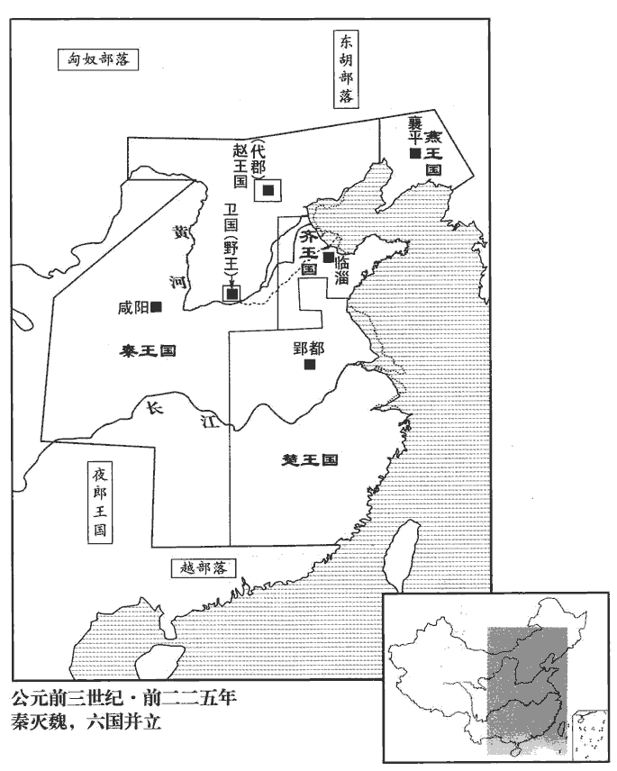 

2李信攻平輿‹河南平舆›，班志：汝南郡有平輿縣，春秋沈子之國。輿，音預，史記正義讀如字。蒙恬攻寢‹安徽临泉›，班志：汝南郡有寖縣。應劭曰：孫叔敖子所邑之寖丘是也；世祖更名固始，徐廣曰：寖，今固始寢丘。師古曰：寖，子衽翻。劉仲馮曰：據後淮陽國已有固始，此寖疑自別地。余謂郡縣離合無常，蓋後來并寢入固始也。杜佑曰：潁州治汝陰縣，有寢丘，秦蒙恬攻寢即此。大破楚軍。信又攻鄢郢‹河南鄢陵›，破之。此鄢郢非楚故都之鄢郢也。楚故都為白起所取，秦已置南郡。據楚都壽春，以壽春為郢，則其前自郢徙陳，亦必以陳為郢矣。然則此郢乃陳也。鄢即潁川之鄢陵，與平輿、城父地皆相近。或曰：「鄢郢」當作「鄢陵」。於是引兵而西，與蒙恬會城父‹安徽亳州东南›。班志，沛郡有城父縣。索隱曰：在汝南即良鄉。史記正義曰：言引兵而會城父，則是汝州郟城縣東父城者也。括地志：汝州郟城縣東四十里有父城故城，即服虔云「城父，楚北境」者也。又許州葉縣東北四十五里亦有父城故城，即杜預云「襄城，城父縣」者也。此二城，父城之名耳，服虔城父是誤也。左傳及水經註云：楚大城城父，使太子建居之。十三州志云：太子建所居城父，謂今亳州城父，是也。此三家之說，是城父之名。班志云，潁川父城縣、沛郡城父縣，據縣屬郡，其名自分。楚人因隨之，三日三夜不頓舍，大敗李信，入兩壁，殺七都尉；此郡都尉將兵從伐楚者也。秦列郡有守，有尉，有監，然秦、漢之制，行軍亦自有都尉。敗，補邁翻。李信奔還。

〖译文〗 [2]秦将李信进攻平舆，蒙恬攻击寝，大败楚军。李信再攻鄢郢，攻克了该城，于是率军西进，到城父与蒙恬的队伍会合。楚军趁机尾随在后，三天三夜不停宿休息，反击中大败李信的军队，攻入秦军的两个营地，斩杀了七个都尉。李信率残部逃奔回秦国。

王聞之，大怒，自至頻陽‹陝西富平›謝王翦曰：「寡人不用將軍謀，李信果辱秦軍。將軍雖病，獨忍棄寡人乎！」王翦謝：「病不能將。」王曰：「已矣，勿復言！」將，即亮翻。復，扶又翻。王翦曰：「必不得已用臣，非六十萬人不可！」王曰：「為聽將軍計耳。」於是王翦將六十萬人伐楚。王送至霸上‹陝西西安東霸水邊›，應劭曰：霸上，地名，在霸水上，在長安東三十里。霸水，古之滋水，秦穆公更名。王翦請美田宅甚眾。王曰：「將軍行矣，何憂貧乎！」王翦曰：「為大王將，有功，終不得封侯，故及大王之嚮臣，以請田宅為子孫業耳。」王大笑。王翦既行，至關，此當是出武關也。‹陝西商南东南›使使還請善田者五輩。或曰：「將軍之乞貸亦已甚矣！」貸，與貣dài同，吐得翻，從人求物也。王翦曰：「不然，王怚cū中而不信人。史記註：怚，音麤。徐廣曰：一作「粗」。今空國中之甲士而專委於我，我不多請田宅為子孫業以自堅，顧令王坐而疑我矣。」

〖译文〗 秦王嬴政闻讯，暴跳如雷，亲自前往频阳向王翦道歉说：“我没有采用将军你的计策，而李信果然使秦军蒙受了耻辱。现在将军你虽然患病，但难道就忍心抛下我不管吗？！”王翦仍推辞道：“我实在病得不能领兵打仗了。”秦王嬴政说：“好啦，不要再这么说了！”王翦说：“如果不得已一定要用我的话，非用六十万人的军队不可！”秦王嬴政答道：“就听从将军你的主张行事吧。”于是王翦率领六十万大军征伐楚国，秦王亲自送行到霸上。王翦请求秦王赏赐他相当多的良田美宅。秦王说：“你就出发吧，为什么还要担心日后贫穷呀！”王翦说：“身为大王您的将领，虽立下战功，但最终仍不能被封侯，所以趁着大王现在正看重我，请求赏赐田宅，好为子孙留下产业啊。”秦王嬴政听后大笑不止。王翦率军开拔，抵达武关，又陆续派遣五位使者向秦王嬴政请求赏赐良田。有人说：“将军您向秦王求讨东西也已是太过分了吧！”王剪答道：“不是这样。大王心性粗暴而多猜忌，如今将国中的武装士兵调拨一空，专门托付给我指挥，我若不借多求赏赐田宅为子孙谋立产业，表示坚决为大王效力，大王反倒要无缘无故地对我有所怀疑了啊。”

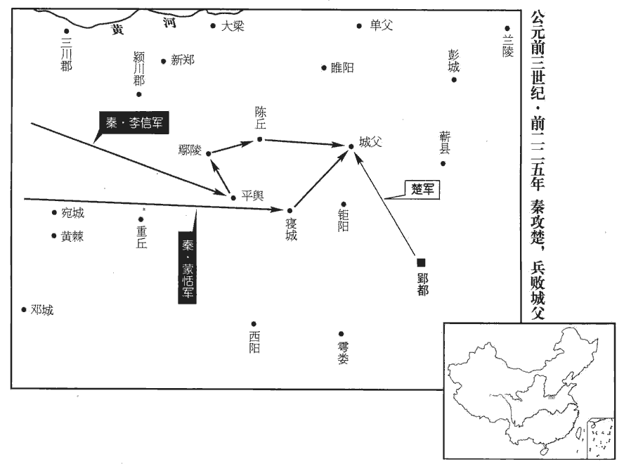 

## 二十三年（丁丑，前二二四年）

1王翦取陳‹河南淮陽›以南至平輿‹河南平舆›。楚人聞王翦益軍而來，乃悉國中兵以禦之，王翦堅壁不與戰。楚人數挑戰，數，所角翻。挑戰者，擿嬈敵以求戰也。挑，徒了翻。終不出。王翦日休士洗沐，而善飲食，撫循之；飲，於禁翻。食，祥吏翻，後以義推。親與士卒同食。久之，王翦使人問「軍中戲乎？」對曰：「方投石、超距。」徐廣曰：「超」，一作「拔」。裴駰曰：據漢書云：甘延壽投石拔距，絕於等倫。張晏曰：范蠡兵法：飛石重十二斤，為機發，行三百步。延壽有力，能手投之。拔距，猶超距也。索隱曰：超距，猶跳躍也。余謂投石，以石投人也，齊高固「桀石以投人」是也。超距，距躍也，晉魏犨「距躍三百」是也。王翦曰：「可用矣！」楚既不得戰，乃引而東。王翦追之，令壯士擊，大破楚師，至蘄qí‹安徽宿州南›南，班志，沛郡有蘄縣。史記正義曰：徐州縣也。康以為江夏之蘄春，其誤甚矣。蘄，渠之翻，又音機。殺其將軍項燕，項燕，項梁之父也。燕，烏賢翻。楚師遂敗走。王翦因乘勝略定城邑。

〖译文〗 [1]秦将王翦率大军取道陈丘以南抵达平舆。楚国人闻讯王翦增兵而来，便出动国中的全部兵力抵抗秦军。王翦下令坚守营寨不与楚军交锋。楚人多次到营前挑战，秦军始终也不出战。王翦每天让士兵休息、洗沐，享用好的饮食，安抚慰问他们，并亲自与他们共同进餐。这样过了很长一段时间，王翦派人打听：“军中进行什么嬉戏啊？”回答说：“军士们正在玩投石、跳跃的游戏。”王翦便说：“这样的军队可以用来作战了。”此时楚军既然无法与秦军交锋，就挥师向东而去。王翦即率军尾追，令壮士们发起突击，大败楚军，直至蕲县之南，斩杀楚国将军项燕，楚军于是溃败逃亡。王翦乘胜夺取并平定了楚国的一些城镇。

## 二十四年（戊寅，前二二三年）

1王翦、蒙武虜楚王負芻，以其地置楚郡。楚至是亡矣。按秦三十六郡無楚郡，此蓋滅楚之時暫置耳；後分為九江‹安徽寿县›、鄣‹浙江安吉西北›、會稽‹江苏苏州›三郡。

〖译文〗 [1]秦将王翦、蒙武俘获了楚国国君芈负刍，在楚地设置楚郡。

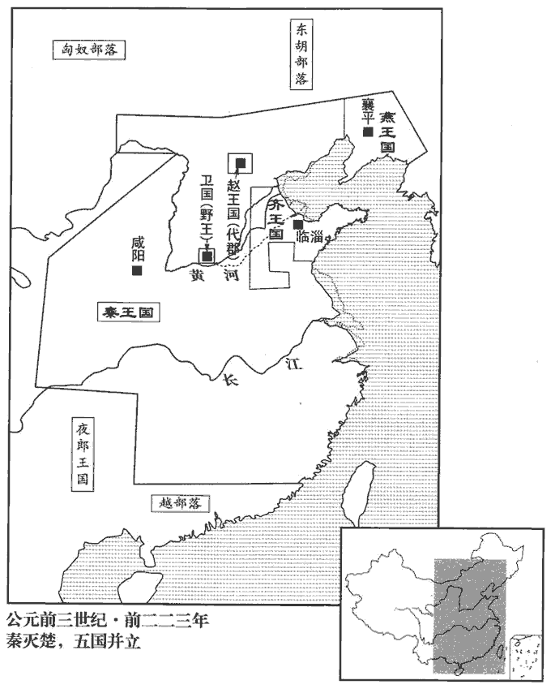 

## 二十五年（己卯，前二二二年）

1大興兵，使王賁攻遼東‹遼寧遼陽›，虜燕‹都襄平，辽宁辽阳›王喜。燕至是亡。

〖译文〗 [1]秦国大举兴兵，派王贲率兵进攻辽东，俘获了燕国国君姬喜。

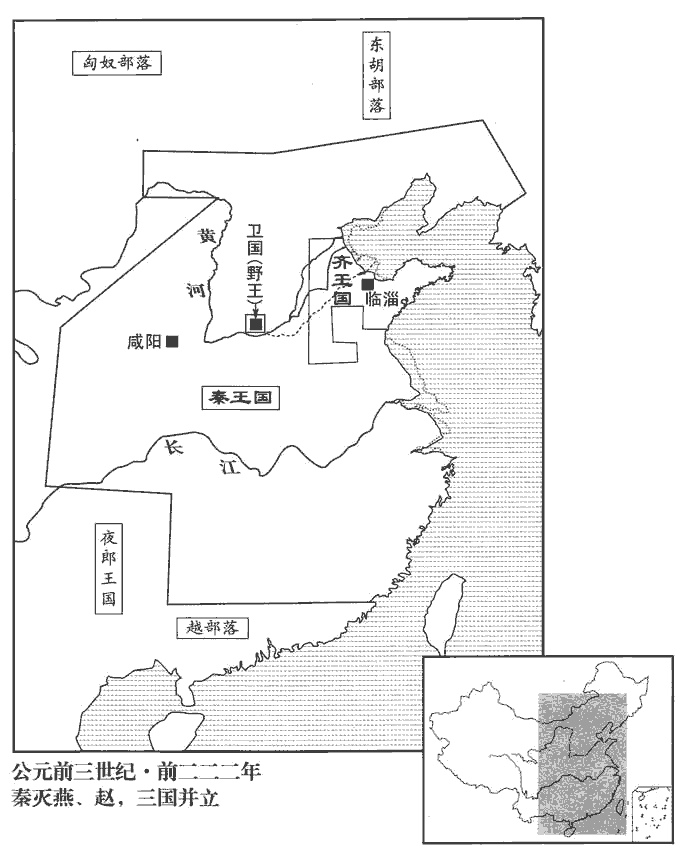 

臣光曰：燕丹不勝一朝之忿以犯虎狼之秦，勝，音升。輕慮淺謀，挑怨速禍，使召公之廟不祀忽諸，忽諸，言忽然而亡也。罪孰大焉！而論者或謂之賢，豈不過哉！

〖译文〗 臣司马光曰：燕太子丹不能忍受一时的激忿而去冒犯如狼似虎的秦国，虑崐事轻率，谋划浅薄，以致挑起怨恨，加速了灭亡之祸，使供奉燕国始祖召公的宗庙祭祀忽然中断，罪过没有比这个更大的了！而评论的人有的还把太子丹说成是德才兼备的人，这难道不是太过分了吗！

夫為國家者，任官以才，立政以禮，懷民以仁，交鄰以信；是以官得其人，政得其節，百姓懷其德，四鄰親其義。夫如是，則國家安如磐石，熾如焱yàn火，熾，尺志翻。焱，弋贍翻。觸之者碎，犯之者焦，雖有強暴之國，尚何足畏哉！丹釋此不為，顧以萬乘之國，決匹夫之怒，逞盜賊之謀，功隳身戮，社稷為墟，不亦悲哉！

〖译文〗 对于治理国家的人来说，任命有才能的人为官，按照礼制确立政策法规，以仁爱之心安抚百姓，凭借信义结交邻邦。如此，官员由有才干的人担任，政事得到礼教的节制，百姓人心归向他的德行，四邻亲近友善他的恪守信义。这样，国家则会安如磐石，炽如火焰，触犯它的一定被撞得粉碎，挨着它的一定被烧得焦头烂额。似此，即便是有强暴的敌国存在，又有什么值得畏惧的呢！太子丹放弃这条路不走，反而用万辆战车的大国去排解个人的私愤、炫耀盗贼式的谋略，结果是功名被毁坏、身命遭杀戮，江山社稷化作废墟，这难道不是很令人悲痛的事吗！

夫其膝行、蒲伏，非恭也；蒲，蓬逋翻，手行也。伏，鳧墨翻，伏地也。復言、重諾、非信也；復言，謂言必信而可復也。重諾，重然諾也。糜金、散玉，非惠也；刎首、決腹，非勇也。要之，謀不遠而動不義，其楚白公勝之流乎！白公勝欲報其父讎，不勝其忿，以及其叔父，事見左傳。

〖译文〗 跪着前进，伏地而行，并不表示恭敬；言必行，重承诺，并不表示守信义；过度耗费金钱，散发玉器，并不表示施恩惠；自割颈部，自剖肚腹，并不表示勇敢。这种种问题的关键在于，只顾眼前利益不能深谋远虑而行动不合乎礼义，似此不过是楚国的为复仇而丧生的白公胜之流罢了！

荊軻懷其豢養之私，不顧七族，漢鄒陽曰：荊軻湛zhàn七族。應劭曰：荊軻為燕刺秦王，其族坐之湛沒。欲以尺八匕首強燕而弱秦，不亦愚乎！故揚子論之，以要離為蛛蝥之靡，聶政為壯士之靡，要離，吳人，為吳王闔閭刺慶忌。言其力不足，譬如蜘蛛之螫shì毒於人而靡死耳。靡，披靡而死也。爾雅疏：鼅zhī鼄zhū，即鼄蝥máo。方言：自關以西，秦、晉之間謂之鼄蝥，趙、魏之間謂之鼅鼄，蛛，音朱；蝥，音矛。靡，溫公揚子註，音如字。康美為切，謂糜爛也。余謂康音義俱非。聶政事見一卷安王五年。荊軻為刺客之靡，皆不可謂之義。又曰：「荊軻，君子盜諸。」吳祕曰：荊軻，以君子之道類之則盜爾。善哉！

〖译文〗 荆轲心怀报答太子姬丹豢养的私情，不顾及全家七族之人会受牵连，想要用一把短小的匕首使燕国强大、秦国削弱，这难道不是愚蠢之极吗！所以扬雄对此评论说，要离的死是蜘蛛、蝥虫一类的死，聂政的死是壮士一类的死，荆轲的死是刺客一类的死，这些都不能算作“义”。他又说：“荆轲，按君子的道德观念来看，是类如盗贼之辈了。”此话说得好啊！

2王賁攻代‹河北蔚縣›，虜代王嘉。嘉奔代，見上卷十九年趙既不祀。

〖译文〗 [2]秦将王贲率军攻代，俘获代王赵嘉。

3王翦悉定荊江南地，降百越之君，置會稽郡‹江蘇苏州›。秦會稽郡治吳縣，兼有今閩越、兩浙之地。後漢分會稽置吳郡，而會稽郡徙治山陰縣。劉恕曰：禹會諸侯江南而有功，因名其山曰會稽，猶言會計也。會，古外翻。

〖译文〗 [3]秦将王翦全部平定楚国长江以南的地区，降服百越的首领，设置了会稽郡。

4五月，天下大酺pú。

〖译文〗 [4]五月，秦国命令特许全国举行大规模的聚会宴饮。

5初，齊君王后賢，君王后，太史敫女，襄王后。事秦謹，與諸侯信；齊亦東邊海上。言齊東取島夷，以海上為邊也。或曰：齊東邊海，不與秦接，故不受兵。秦日夜攻三晉、燕、楚，五國各自救，以故齊王建立四十餘年不受兵。及君王后且死，戒王建曰：「群臣之可用者某。」王曰：「請書之。」君王后曰：「善！」王取筆牘受言，君王后曰：「老婦已忘矣。」忘，巫放翻。君王后死，后勝相齊，姓譜：后本郈hòu氏，其後去「邑」。史記正義曰：勝，音升。多受秦間金。間，古莧翻；下同。賓客入秦，秦又多與金。客皆為反間，勸王朝秦，不修攻戰之備，不助五國攻秦，秦以故得滅五國。

〖译文〗 [5]当初，齐国的君王后贤惠有才干，使齐国能小心周到地侍奉秦国，对其他各诸侯国奉守信义。齐国东靠大海，不与秦国相邻。而那时秦国日夜不停地进攻韩、赵、魏、燕、楚等国，这五国分别忙于调兵自救，无暇他顾，所以齐王田建即位四十多年未遭逢过战乱。君王后即将去世时，告诫田建说：“群臣中可以任用的是某某。”田建说：“请让我把名字写下来。”君王后说：“好吧。”但等到齐王取来笔和木牍，准备记下她的话时，君王后却说：“我已经忘记了。”君王后去世后，后胜出任齐国的相国，他大量接受秦国为挑拨齐国君臣关系而施给他的金银财宝。而齐国的宾客进入秦国时，秦国又给以重金，使这些宾客回国后都反过来为秦国说话，劝说齐王去朝拜秦王，不必整治、修建用作攻战的防备设施，不要去援助那五个国家进攻秦国。秦国也即因此得以灭掉了五国。

齊王將入朝，雍門司馬前曰：左傳：晉圍齊，伐雍門之萩qiū。杜預曰：雍門，齊城門也。經典釋文：雍，於用翻；康于龍切，非也。「所為立王者，為社稷耶，為王耶？」王曰：「為社稷。」司馬曰：「為社稷立王，王何以去社稷而入秦？」孟子曰：民為大，社稷次之，君為輕。齊王還車而反。

〖译文〗 齐王将要动身往咸阳朝拜秦王嬴政，齐国的雍门司马迎上前说：“齐国所以要设立国君，是为了国家，还是为了国君自己啊？”齐王说：“是为国家。”司马道：“既然是为了国家才设立君王，那您为什么还要离开自己的国家而到秦国去呢？”齐王于是下令掉转车头返回王宫。

即墨‹山東平度东南›大夫聞之，見齊王曰：「齊地方數【章：十二行本「數」作「四」；乙十一行本同。】千里，帶甲數百萬。夫三晉大夫皆不便秦，而在阿‹山東东阿›、甄‹鄄，山东鄄城›之間者百數；「甄」，當作「鄄」，音工掾翻。王收而與之百萬人之眾，使收三晉之故地，即臨晉之關‹陝西大荔东›可以入矣。收三晉兵自河東攻秦則入臨晉關。鄢郢‹安徽壽縣›大夫不欲為秦，而在城南下者百數，城南下，即南城之下也。南城，齊威王使檀子所守者。王收而與之百萬之師，使收楚故地，即武關‹陝西商南东南›可以入矣。楚攻秦自南陽入武關。如此，則齊威可立，秦國可亡，豈特保其國家而已哉！」齊王不聽。

〖译文〗 即墨大夫闻讯进见齐王说：“齐国国土方圆数千里，军队数百万。现韩、赵、魏三国的官员都不愿接受秦国的统治，逃亡在阿城、甄城之间的有数百人。大王您将这些人收拢起来，交给他们百万之多的兵士，让他们去收复韩、赵、魏三国旧日的疆土，如此，就是秦国的临晋关也可以进入了。楚国鄢郢的官员们不愿受秦国驱使，逃匿在南城之下的有数百人。大王您将这些人聚集起来，交给他们百万人的军队，让他们去收复楚国原来的土地，如此，即便是武关也可以进入了。这样一来，齐国的威望得以树立，秦国则可被灭亡，这又岂只是保全自己的国家而已！”但是齐王不接受这一建议。

## 二十六年（庚辰，前二二一年）

1王賁自燕南攻齊，猝入臨淄‹山東淄博东临淄镇›，民莫敢格者。格，如字，止也，斗也。秦使人誘齊王，約封以五百里之地，誘，音酉。齊王遂降，秦遷之共‹河南輝縣›，班志，河內郡有共縣。史記正義曰：今衛州有共城縣。共，音恭；下同。處之松柏之間，餓而死。處，昌呂翻。齊人怨王建不早與諸侯合從，聽奸人賓客以亡其國，歌之曰：「松耶，柏耶，住建共者客耶！」疾建用客之不詳也。索隱曰：謂不詳審用賓客，不知其善否也。齊田氏亡。

〖译文〗 [1]秦将王贲率军从燕国向南进攻齐国，突然攻入都城临淄，齐国国民中没有敢于抵抗的。秦国派人诱降齐王，约定封给他五百里的土地，齐王于是便投降了。但是秦国却将他迁移到共地，安置在松柏之间，最终被饿死。齐国人埋怨君王田建不早参与诸侯国的合纵联盟，而却听信奸佞、宾客的意见，以致使国家遭到灭亡，故为此编歌谣说：“松树啊，柏树啊！使田建迁住共地饿死的，是宾客啊！”恨田建任用宾客不审慎考察。

臣光曰：從衡之說雖反覆百端，然大要合從者，六國之利也。昔先王建萬國，親諸侯，使之朝聘以相交，饗宴以相樂，樂音洛。會盟以相結者，無他，欲其同心戮力以保家國也。曏使六國能以信義相親，則秦雖強暴，安得而亡之哉！夫三晉者，齊、楚之藩蔽；齊、楚者，三晉之根柢dǐ；柢，都禮翻，又丁計翻。形勢相資，表里相依。故以三晉而攻齊、楚，自絕其根柢也，以齊、楚而攻三晉，自撤其藩蔽也。安有撤其藩蔽以媚盜。曰「盜將愛我而不攻」，豈不悖哉！

〖译文〗 臣司马光曰：合纵、连横的学说虽然反复无常，但其中最主要的是，合纵符合六国的利益。从前，先王封立大量封国，亲近爱抚各国诸侯，使他们通过拜会、探访来增进相互交往，用酒宴招待他们以增进欢乐友好，实行会盟而增进团结联合，不为别的，就是希望他们能同心协力共保国家。假使当初六国能以信义相互亲善，那么秦国虽然强暴，六国又怎么能被它所灭亡掉呢！韩、赵、魏三国是齐、楚两国的屏障，而齐、楚两国则是韩、赵、魏三国的基础，它们形势上相依托，表里间相依赖。所以韩、赵、魏三国进攻齐、楚，是自断根基；而齐、楚两国征伐韩、赵、魏三国，则是自撤屏障。可哪里有自己拆毁屏障以讨好盗贼，还说“盗贼将会爱惜我而不攻击我”的，这难道不是荒谬得很吗？

2王初并天下，自以為德兼三皇，功過五帝，伏羲、神農、黃帝為三皇。少昊、顓頊、高辛、唐堯、虞舜為五帝。宋均註援神契引甄耀度曰：伏羲、神農、燧人為三皇。黃帝、顓頊、帝嚳、唐堯、虞舜為五帝。孔穎達曰：鄭玄註中候敕省圖引運斗樞：伏羲、女媧、神農為三皇。五帝者，德合五帝座星者稱帝，則黃帝、金天氏、高陽氏、高辛氏、陶唐氏、有虞氏是也；實六人而稱五者，以其俱合五帝座星也。白虎通取伏羲、神農、祝融為三皇。帝者，天之一名，所以名帝。帝者，諦也，言天蕩然無心，忘於物我，公平通遠，舉事審諦，故謂之帝也。帝號同天，名所莫加，而稱皇者，以皇是美大之名，言大於帝也。乃更號曰「皇帝」，命為「制」，令為「詔」，師古曰：天子之言，一曰制書，二曰詔書。制書，謂其制度之命也。如淳曰：詔，告也。自秦、漢以上，唯天子得稱之。更，工衡翻。自稱曰「朕」。古者君臣之間通稱曰朕；自秦定制，唯天子獨稱之。追尊莊襄王為太上皇。太上者，極尊之稱也。始皇自號曰始皇帝，故追尊莊襄王為太上皇。自漢高帝以尊太公，此後不復為追號。制曰：「死而以行為諡，則是子議父，臣議君也，甚無謂。自今以來，除諡法。周公作諡法，緣行之美惡以立諡。如幽、厲之君，雖孝子、慈孫，百世不能改也。今秦除之，畏後人加己以惡諡也。諡，神志翻。朕為始皇帝，後世以計數，史記正義：數，色主翻。二世、三世至於萬世，傳之無窮。」

〖译文〗 [2]秦王嬴政刚刚兼并六国，统一天下，自认为兼备了三皇的德行，功业超过了五帝，于是便改称号为“皇帝”，皇帝出命称“制书”，下令称“诏书”，皇帝的自称为“朕”。追尊父亲庄襄王为太上皇。并颁布制书说：“君王死后依据他生前的行为加定谥号，这是儿子议论父亲，臣子议论君王，实在没意思。从今以后，废除为帝王上谥号的制度。朕为始皇帝，后继者以序数计算崐，称为二世皇帝、三世皇帝，以至万世，无穷尽地传下去。”

3初，齊威、宣之時，鄒衍論著終始五德之運；所謂終始五德之運者：伏羲以木德王；木生火，故神農以火德王；火生土，故黃帝以土德王；土生金，故少昊以金德王；金生水，故顓頊以水德王；水生木，故帝嚳又以木德王；木又生火，故帝堯以火德王；火又生土，故帝舜以土德王；土又生金，故夏以金德王；金又生水，故商以水德王；水又生木，故周以木德王：此五德之終而復始也。鄒衍以為周得火德，蓋以火流王屋為周受命之符，且服色尚赤故也。就衍之說以為終始，秦當以土為行。今始皇以水勝火，自以水為行，所謂推五勝也。漢初以土為行，蓋亦祖衍之說也。及始皇并天下，齊人奏之。始皇採用其說，以為周得火德，秦代周，從所不勝，為水德。始改年，朝賀皆自十月朔；衣服、旌旄、節旗皆尚黑；數以六為紀。改年句斷。夏以建寅之月為歲首，殷以建丑之月為歲首，周以建子之月為歲首；今始皇以建亥之月為歲首，是改年也。自此紀年皆以十月為歲首，朝賀以十月朔。以水為行，故色尚黑。水成數六，故以六為紀。

〖译文〗 [3]当初，齐威王、齐宣王的时候，邹衍研究创立了金、木、水、火、土终而复始的“五德相运”学说。到了始皇帝合并天下时，齐国人将此说奏报给他。始皇采纳了这套学说，认为周朝是火德，秦取代周，从火不能胜水来推算，秦应是水德。于是开始下令更改岁历，新年朝见皇帝与庄贺典礼都从十月初一开始，以十月初一为元旦；衣服、旗帜、符节等都崇尚用黑色；计数以六为一个单位。

4丞相綰wǎn【章：十二行本「綰」下有「等」字；乙十一行本同；孔本同。】言：「燕、齊、荊地遠，避莊襄王諱，故以楚為荊。索隱曰：丞相綰，姓王。不為置王，無以鎮之。請立諸子。」始皇下其議。下，遐嫁翻；凡自上而下之下皆同音。廷尉斯曰：班書百官表：廷尉，秦官。應劭曰：聽獄必質諸朝廷，與眾共之；兵獄同制，故稱廷尉。師古曰：廷，平也；治獄貴平，故以為號。「周文武所封子弟同姓甚眾，然後屬疏遠，相攻擊如仇讎，周天子弗能禁止。今海內賴陛下神靈一統，皆為郡、縣，諸子功臣以公賦稅重賞賜之，甚足易制，易，以豉翻；史記正義音以職翻，非也。天下無異意，則安寧之術也。置諸侯不便。」始皇曰：「天下共苦戰斗不休，以有侯王。賴宗廟，天下初定，又復立國，是樹兵也；而求其寧息，豈不難哉！廷尉議是。」

〖译文〗 [4]丞相王绾说：“燕、齐、楚三国的故地距都城咸阳过于遥远，不在那里设置侯王，便不能镇抚。因此请分封诸位皇子为侯王。”始皇帝将这一建议交给大臣评议。廷尉李斯说：“周文王、周武王分封子弟族人非常多，他们的后代彼此疏远，相互攻击如同仇敌，周天子也无法加以制止。现在四海之内，仰仗陛下的神灵而获得统一，全国都划分为郡和县，对各位皇子及有功之臣，用国家征收的赋税重重给予赏赐，这样即可以非常容易地进行控制，使天下人对秦朝廷不怀二心，才是安定国家的方略。分封诸侯则不适宜。”始皇说：“天下人都吃尽了无休止的战争之苦，全是因为有诸侯王存在的缘故。今日依赖祖先的在天之灵，使天下初步平定，假若又重新封侯建国，便是自己招引兵事、培植战乱，似此而想求得宁静、养息，岂不是极困难的事情吗？！廷尉的主张是对的。”

分天下為三十六郡，郡置守、尉、監。裴駰曰：三川‹河南洛阳东白马寺东›、河東‹山西夏县›、南陽‹河南南阳›、南郡‹湖北江陵›、九江‹安徽寿县›、鄣郡‹浙江安吉西北›、會稽‹江苏苏州›、潁川‹河南禹州›、碭郡‹河南商丘›、泗水‹安徽淮北›、薛郡‹山东曲阜›、東郡‹河南濮阳›、琅邪‹山东胶南›、齊郡‹山东淄博东临淄镇›、上谷‹河北怀来›、漁陽‹北京密云›、右北平‹天津蓟县›、遼西‹辽宁义县›、遼東‹辽宁辽阳›、代郡‹河北蔚县›、鉅鹿‹河北平乡›、邯鄲‹河北邯郸›、上黨‹山西长子›、太原‹山西太原›、雲中‹内蒙托克托›、九原‹内蒙包头›、雁門‹山西右玉›、上郡‹陕西榆林南鱼河堡›、隴西‹甘肃临洮›、北地‹甘肃西峰›、漢中‹陕西汉中›、巴郡‹重庆›、蜀郡‹四川成都›、黔中‹湖南沅陵›、長沙‹湖南长沙›，凡三十五郡，與內史‹陕西咸阳›為三十六郡。班書百官表：郡守掌治其郡；郡尉掌佐守典武職、甲卒；監御史掌監郡。守，始究翻。監，去聲；康又居銜切。余謂守、尉、監，官名也，當從去聲；若監郡之監則從平聲。記王制：天子使其大夫為三監，監于方伯之國。陸德明釋文：監，古暫翻；監于，古銜翻；可以知矣。

〖译文〗 始皇帝于是下令把全国划分为三十六个郡，每个郡设置郡守、郡尉、监御史。

收天下兵聚咸陽，銷以為鐘鐻jù、鐻與虡jù同，音巨。虡者所以懸鐘，橫曰筍sǔn，植曰虡。金人十二，重各千石，置宮庭【章：十二行本「庭」作「廷」；乙十一行本同；孔本同。】中。史記正義曰：漢書五行志：時大人見臨洮táo，長五丈，足履六尺，皆夷狄服，凡十二人；故銷兵器，鑄而象之，所謂「金狄」也。一法度、衡、石、丈、尺。徙天下豪桀於咸陽十二萬戶。

〖译文〗 又下令收缴全国民间所藏的兵器，运送汇集到咸阳，熔毁后铸成大钟和钟架，以及十二个铜人，各重千石，放置在宫庭中。并统一法制和度量衡，将各地富豪十二万户迁徙到咸阳置于朝廷的监控下。

諸廟及章臺、上林皆在渭南。上林在漢長安縣西南。秦始起上林苑，至漢武帝又增而廣之。每破諸侯，寫放其宮室，作之咸陽北阪上，程大昌雍錄曰：咸陽北阪，漢武帝別名渭城。阪，即九嵕zōng諸山麓也。南臨渭，自雍門‹陝西高陵縣境›以東至涇、渭，殿屋、復道、周閣相屬，徐廣曰：雍門在高陵縣。史記正義曰：在今岐州雍縣東。余按班志，高陵縣屬左馮翊，左輔都尉治焉；雍縣屬右扶風。二說相去何遠也？三輔黃圖曰：長安城西出北頭第一門曰雍門，本名西城門。但長安本秦離宮，秦之咸陽則漢扶風之渭城也。渭城與長安相去雖不遠，然秦時長安未有十二門也。豈作史者因漢之雍門而書之歟！涇、渭，言涇、渭之交也。復，與複同，音方目翻。複道，閣道也；上下有道，故謂之複。所得諸侯美人、鐘鼓以充入之。

〖译文〗 秦王朝祭祀祖先、神佛的宗庙等处所和章台宫、上林苑都设在渭水南岸。而秦国每征服一个国家，就摹画、仿照该国的宫室，在咸阳城北的山坡上同样建造一座。如此南临渭水，自雍门向东至泾水、渭水相交处，宫殿屋宇、天桥、楼阁相连接，所获得的各国美女、钟鼓等乐器都安置在里边。

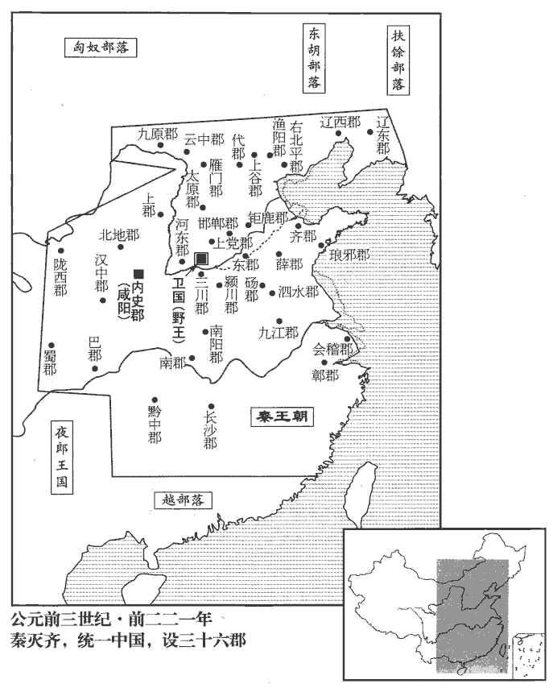 

## 二十七年（辛巳，前二二零年）

1始皇巡隴西‹甘肅臨洮›、北地‹甘肅西峰›，至雞頭山‹甘肃泾源北›，過回中‹陕西陇县西北›焉。范史隗wěi囂傳：王孟塞雞頭道。賢註曰：在原州高平縣西。括地志：成州上祿縣東北二十里有雞頭山。應劭曰：回中在安定高平。孟康曰：回中在北地。賢曰：回中在汧qiān。括地志：回中宮在雍西四十里。史記正義曰：言始皇西巡，出隴右，向西北，出寧州，西南行至成州，出雞頭山，東還過岐州之回中宮也。余謂上書巡隴西、北地，則先至原州之雞頭山而還過回中，道里為順。若出成州之雞頭，則須先過回中而後至雞頭。以書法之前後觀之，居然可見。

〖译文〗 [1]始皇帝出巡陇西、北地，到鸡头山而还，经过回中宫。

2作信宮渭南，已，更命曰極廟。作宮已成而更名也。索隱曰：言為宮廟象天極，故曰極廟；天官書：中宮曰天極，是也。自極廟道通驪山‹陕西临潼东南›，作甘泉‹陝西淳化西北›前殿，築甬道自咸陽屬之，治馳道於天下。三輔黃圖曰：甘泉宮，一名雲陽宮。關輔記曰：林光宮，一曰甘泉宮，始皇造，在今池陽縣西。故甘泉山宮周匝十余里，漢武帝廣之，周十九里。又黃圖曰：咸陽北至九嵕zōng、甘泉，南至鄠hù、杜，東至河，西至汧qiān、渭之交；東西八百里，南北四百里，離宮、別館，聯望相屬。甬道，唐夾城之類也。應劭曰：築垣牆如街巷。甬，餘隴翻。賈山曰：秦為馳道於天下，東窮燕、齊，南極吳、楚，江湖之上，瀕海之觀畢至。道廣五十步，三丈而樹，厚築其外，隱以金椎，樹以青松。應劭曰：馳道，天子所行道也，若今之中道。孔穎達曰：馳道，如今御路也；是君馳走車馬之處，故曰馳道。屬，之欲翻。

〖译文〗 [2]在渭水南岸兴建长信宫，竣工后改名为极庙宫。从极庙筑路通到骊山，兴造甘泉宫前殿，修筑甬道连接咸阳，又以咸阳为中心筑驰道通往全国各地。

## 二十八年（壬午，前二一九年）

1始皇東行郡、縣，上鄒嶧yì山‹山東鄒縣东南›，立石頌功業。班志：魯國鄒縣，嶧山在北。應劭曰：邾文公遷於繹，即此。括地志：鄒嶧山在兗州鄒縣南二十二里。嶧，音亦。於是召集魯儒生七十人，孔穎達曰：儒之言優也，柔也，能安人，能服人。又，儒者，濡也，以先王之道能濡其身。至泰山下，議封禪。諸儒或曰：「古者封禪，為蒲車，惡傷山之土石、草木；掃地而祭，席用【章：十二行本「用」作「因」；乙十一行本同。】葅zū稭jiē。」議各乖異。始皇以其難施用，由此絀chù儒生。括地志：泰山在兗州博城縣西北三十里，一曰岱宗。服虔曰：封者，增山之高；禪，廣地也。張晏曰：天高不可及，于泰山上立封禪以祭之，冀近神靈也。項威曰：封泰山，告太平，升中和之氣於天。祭土為封，謂負土于泰山為壇而祭也。除地為墠shàn；後改「墠」為「禪」。晉太康地記曰：為壇于泰山以祭天，示增高也；為墠于梁父以祭地，示廣也。白虎通曰：王者易姓而起，必升封于泰山之上者何？因高告高，順其類，故升封者增高也。下禪梁父之基，廣厚也。刻石紀號者，著己之功跡以自勸也。增太山之高以報天，附梁父之基以報地。惡，烏路翻。師古曰：蒲車，以蒲裹輪。「葅稭」，班志作「苴稭」。如淳曰：苴，讀如租；稭；讀曰戞jiá。晉灼曰：苴，藉也；師古曰：茅藉也。「苴」，本作「葅」，假借用。應劭曰：稭，藁本，去皮以為席。絀，與黜同，黜退也。而遂除車道，上自太山陽至顛，立石頌德；從陰道下，禪于梁父。師古曰：山南曰陽，山北曰陰。班志，泰山郡有梁父縣。師古註曰：以山名縣。括地志：梁父山在兗州泗水縣北八十里。父，音甫。其禮頗采太祝之祀雍‹陝西鳳翔›上帝所用，班表：奉常之屬有雍太祝令、丞，蓋漢仍秦制也。秦作畤zhì於雍以祀上帝，今采其禮以為封禪禮。而封藏皆祕之，世不得而記也。

〖译文〗 [1]始皇帝出巡东部各郡、县，登上邹地的峄山，树立石碑赞颂秦朝的功勋业绩。召集过去鲁地崇信儒学的文人七十名，到泰山下商议祭祀天地的封禅之事。诸儒生中有的说：“古时候的君王封禅，用蒲草裹住车轮，不愿伤害山上的土石草木；扫地祭祀时所使用的席都是用草编成的。”各人的议论很不相同。始皇帝认为众人所说的很难实际采用，便因此而贬退儒生；并且下令开通车道，从泰山南麓上到顶峰，竖立石碑歌颂自己的功德，又从泰山北面顺道而下，到梁父山祭地。祭祀仪式颇采用秦国古时在雍城由太祝令主持的祭祀上帝的形式。而怎样封土埋藏却全都保密，世人无法获悉并记录下来。

於是始皇遂東遊海上，行禮祠名山、大川及八神。封禪書：八神：一曰天主，祠天齊淵水‹山东淄博临淄南›；二曰地主，祠太山‹山东泰安北›、梁父‹泰安东南›；三曰兵主，祠蚩尤‹平陆，山东汶上县北›；四曰陰主，祠三山‹山东莱州北›；五曰陽主，祠之罘fú山‹山东烟台北芝罘岛›；六曰月主，祠之萊山‹山东龙口东南›；七曰日主，祠成山‹山东荣成东北成山角›；八曰四時主，祠琅邪‹山东胶南南琅邪山›。或曰：八神，齊自太公以來祠之。始皇南登琅邪‹山東膠南縣南›，大樂之，留三月，作琅邪台，立石頌德，明得意。班志，琅邪郡有琅邪縣。山海經：琅邪台在勃海間，琅邪之東。郭璞曰：琅邪臨海邊，有山曰琅邪台。越王句踐徙琅邪，作觀台以望東海。史記曰：始皇徙三萬家於台下。是其所作因越之舊也。括地志：琅邪山在密州諸城縣東南百四十里；始皇立層台於山上，謂之琅邪台。邪，音耶。大樂之，樂琅邪之風景也。樂，音洛。

〖译文〗 始皇帝随即又向东出游沿海各地，祭礼名山大川及天、地、兵、阴、阳、月、日、四时八神。然后南登琅邪山，兴致勃勃，在那里逗留了三个月，还建造琅邪台，立石碑颂德，表明自己得天下之意。

初，燕人宋毋忌、羨門子高之徒，稱有仙道、形解解，佳買翻。銷化之術，燕、齊迂怪之士皆爭傳習之。道經：月中仙人宋毋忌。白澤圖云：火之精曰宋毋忌。蓋其人火仙也。張曰：羨門子高，仙人，居碣jié石山上。服虔曰：形解，尸解也。張晏曰：人老而解去，故骨如變化也。今山中有龍骨，世謂之龍解骨化去。迂，羽俱翻。又憂俱翻。自齊威王、宣王、燕昭王皆信其言，使人入海求蓬萊、方丈、瀛洲，云此三神山在勃海中，去人不遠。患且至，則風引船去。嘗有至者，諸仙人及不死之藥皆在焉。及始皇至海上，諸方士齊人徐巿fú等爭上書言之，太史公曰：嬴姓分封者為徐氏。姓譜曰：皋陶子伯益佐禹有功，封其子若木于徐。請得齊戒與童男女求之。齊戒之齊，讀曰齋。於是遣徐巿發童男女數千人入海求之。船交海中，皆以風為解，師古曰：自解說云「為風不得而至」。自解，猶今言分疏。曰：「未能至，望見之焉。」

〖译文〗 当初，燕国人宋毋忌、羡门子高一类人声称世上有一种成仙之道、人老死后尸解骨化升天的法术，燕国、齐国的迂腐、怪异之士都争相传授和学习。从齐威王、宣王到燕昭王都相信他们的话，派人到海上寻求蓬莱、方丈、瀛洲三座神山，据说这三仙山在渤海之中，距离人间并不遥远。只是凡人将要到达，凡就把船吹走了。不过也曾有人到过这三山，看见各位神仙和长生不死的药均在那里。待到始皇帝出游海滨时，通晓神仙方术的人如故齐国人徐等纷纷争着上书谈这些事，请求准许斋戒清心洁身素食后率领童男童女往海上寻求神山。始皇于是派遣徐征发数千名童男女入海求仙。但是，船行海上后却均因风势不顺而返航。不过他们仍然说：“虽没能到达仙山，可是已经望见了。”

始皇還，過彭城‹江蘇徐州›，班志，楚國有彭城縣，古彭祖國。齋戒禱祠，欲出周鼎泗水，水經：泗水出魯國卞縣北山，東南過彭城縣，又東過下邳pī縣入淮。時人相傳以為宋太丘社亡而周鼎沒于泗水中，故祠泗水，欲出周鼎。使千人沒水求之，弗得。乃西南渡淮水，水經：淮水出南陽郡平氏縣桐柏山，東南至淮陵入海，行三千餘里。之衡山‹安徽霍山县西南霍山›、南郡‹湖北江陵›。班志，衡山在長沙國湘南縣之東南。括地志：衡山，一名岣gǒu嶁lǒu山，在衡州湘潭縣西四十一里。漢衡山國在江北；秦拔楚郢，置南郡；唐為荊州江陵府。之，往也。浮江至湘山‹湖南岳阳西北›祠，逢大風，幾不能渡。幾，居依翻。上問博士曰：「湘君何神？」對曰：「聞之：堯女，舜之妻，葬此。」班志：湘水出零陵郡零陵縣陽朔山，北至酃líng入江。括地志：黃陵廟在岳州湘陰縣北五十七里，舜二妃之神。二妃塚在湘陰縣一百六十里青草山上。盛弘之荊州記：青草湖，南有青草山，湖因山而名。舜陟方死於蒼梧，二妃死于江、湘之間，因葬焉。博士以儒學為官。漢成帝詔曰：儒林之官，四海淵源。宜皆明於古今，溫故知新，通達國體，故謂之博士。始皇大怒，使刑徒三千人皆伐湘山樹，赭其山。赭，音者，赤也。遂自南郡‹湖北江陵›由武關‹陝西商南西南›歸。

〖译文〗 始皇帝还归咸阳途中经过彭城，举行斋戒，祈祷祭祀，想要打捞沉没在泗水中的周鼎。故而遣一千人潜入泗水寻找，结果毫无所得。于是，始皇又向西南渡过淮水，到达衡山、南郡；再泛舟长江，抵湘山，祭祀湘君。适逢大风，几乎不能渡过湘水。始皇问博士道：“湘君是什么神仙啊？”博士回答：“听说她是尧帝的女儿，舜帝的妻子，死后就葬在这里。”始皇大怒，令三千名被判刑服劳役的罪犯将湘山的树木砍伐殆尽，裸露出赤红的土壤和石块。然后从南郡经武关返回咸阳。

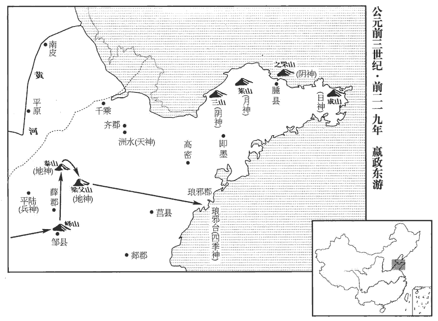 

2初，韓人張良，其父、祖以上五世相韓。張良大父開地，相韓昭侯、宣惠王、襄哀王，父平，相釐王、悼惠王，凡五世。及韓亡，良散千金之產，欲為韓報仇。為，於偽翻。

〖译文〗 [2]早先，韩国人张良的父亲、祖父曾经做过五代韩相。乃至韩国灭亡，张良尽散千金家产，想要为韩国报仇。

## 二十九年（癸未，前二一八年）

1始皇東游，至陽武‹河南原陽›博浪沙‹河南中牟›中，班志，陽武縣屬河南郡，有博浪沙。索隱曰：今浚儀西北四十里有博浪城。史記正義曰：鄭州陽武縣有博浪沙，當官道。師古曰：「狼」，音浪，史記作「浪」，正義音狼。張良令力士操鐵椎狙擊始皇，誤中副車。狙，玃jué屬。狙之伺物，必伏，乘其便而擊之。狙擊者，謂伏其旁而狙伺以擊之也。狙，千恕翻，又千餘翻。索隱曰：漢官儀：天子有屬車，即副車，奉車即御而從後。余謂副，貳也；漢有五時副車，又在屬車之外。始皇驚，求，弗得；令天下大索十日。索，山客翻。

〖译文〗 [1]始皇帝出巡东方，抵达阳武县的博浪沙时，张良让大力士手持铁锤袭击始皇，但却误中随天子车驾而行的副车。始皇大惊失色，想抓刺客却未能擒到，于是下令全国进行十天的大搜捕。

始皇遂登之罘‹山东烟台北芝罘岛›，班志：之罘山在東萊腄chuí縣。括地志：之罘山在萊州文登縣東北一百八十里。罘，音浮。刻石；旋，之琅邪‹山東膠南南›，道上党‹山西長子›入。旋，即還字。之，往也。

〖译文〗 始皇帝随后登上之罘山，刻石颂德。归途中前往琅邪，取道上党回到咸阳。

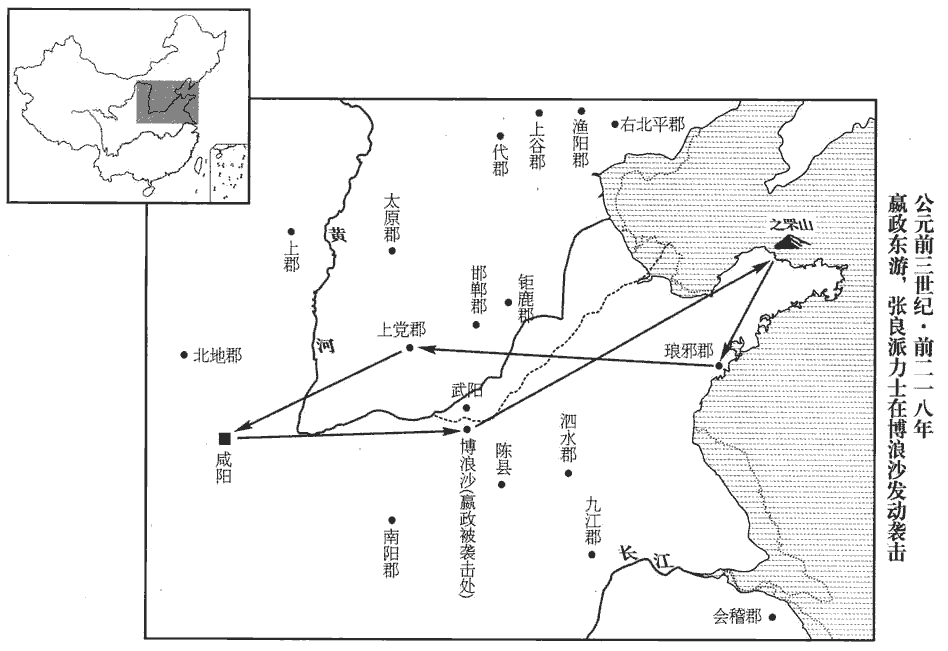 

## 三十一年（乙酉，前二一六年）

1使黔首自實田。二十六年，更名民曰黔首。孔穎達曰：黔，黑也。凡民以黑巾覆頭，故謂之黔首。

〖译文〗 [1]始皇帝下令全国百姓向朝廷自报所占土地的数额。

## 三十二年（丙戌，前二一五年）

1始皇之碣石‹河北昌黎北›，班志：大碣石山在右北平郡驪成縣西南。文穎曰：碣石在遼西郡絫lěi縣。酈道元曰：濡水至絫縣碣石山。今于此枕海有石如埇yǒng道，數十里，當山頂有大石如柱形，往往而見，立於巨海之中，名天橋柱。碣，音桀。使燕人盧生求羨門，姓譜：姜姓之後，封于盧，以國為氏。刻碣石門。壞城郭，決通堤坊。壞，音怪。坊，讀曰防。始皇巡北邊，從上郡‹陕西榆林南鱼河堡›入，盧生使入海還，因奏錄圖書曰：「亡秦者胡也。」錄圖書，如後世讖緯之書。鄭玄曰：胡，胡亥，秦二世名也。秦見圖書而不知此為人名，反備北胡。始皇乃遣將軍蒙恬發兵三十萬人，北伐匈奴‹王庭设内蒙察哈尔右翼中旗›。

〖译文〗 [1]始皇帝出巡抵达碣石，派故燕国人卢生求访仙人羡门。又在碣石山门刻碑文歌功颂德。拆毁城郭，决通堤防。此后始皇帝巡视北部边境，从上郡返回都城。卢生受派遣入海寻仙后归来，随即抄录《录图书》上的谶语，上写：“使秦朝灭亡的是‘胡’。”奏报给始皇。始皇便派将军蒙恬率三十万大军，向北征伐匈奴。

## 三十三年（丁亥，前二一四年）

1發諸嘗逋亡人、贅婿、賈人為兵，賈誼曰：秦人家貧子壯則出贅。師古曰：謂之贅婿，言其不當出在妻家，猶人身之有肬贅也。轉貨販易者為商，坐市販賣者為賈。贅，之銳翻。略取南越‹廣東廣西›陸梁地‹五嶺山脈南北，民悍，稱陸上強梁›，索隱曰：謂南方之人，其性陸梁，故曰陸梁地。班表，漢高帝功臣有陸量侯須無，詔以為列諸侯，自置吏令、長，受令長沙王。如淳曰：陸量，秦始皇本紀所謂陸梁地也。置桂林‹廣西百色北›、南海‹廣東廣州›、象郡‹广西崇左›；桂林因產桂而名。合浦以南，山間無雜木，冬夏長青，葉長尺餘。文穎曰：桂林，今鬱林。師古曰：桂林，今桂州界是其地，非鬱林也。南海郡，今廣州。茂陵書曰：象郡治臨塵，去長安萬七千五百里。韋昭曰：今日南是也。以謫徙民五十萬人戍五嶺，與越雜處。所謂謫戍也。晉志曰：自北徂cú南，入越之道，必由嶺嶠；時有五處，故曰五嶺。師古曰：嶺者，西自衡山之南，東窮於海，一山之限耳，而別標名，則有五焉。裴氏廣州記曰：大庾、始安、臨賀、桂陽、揭陽為五嶺。鄧德明南康記曰：大庾嶺，一也；桂陽騎田嶺，二也；九真都龐嶺，三也；臨賀萌渚嶺，四也；始安越城嶺，五也。師古以裴說為是。蜀註曰：大庾嶺在虔州；永明嶺、白芒嶺在道州；臘嶺在郴chēn州；臨源嶺在桂州。謫，則革翻。處，昌呂翻。

〖译文〗 [1]秦朝廷征召那些曾经逃亡的人、因贫穷而入赘女家的男子、商贩等入伍当兵，攻掠夺取南越的陆梁地，设置了桂林、南海、象郡等郡；并将受贬谪的人五十万流放到五岭守边，与南越的本地人杂居一处。

2蒙恬斥逐匈奴‹内蒙察哈尔右翼中旗›，收河南地‹河套以南›為四十四縣。築長城，因地形，用制險塞；起臨洮‹甘肅岷縣›至遼東‹遼寧遼陽›，延袤萬餘里。於是渡河，據陽山‹陰山山脈›，逶迤而北。師古曰：河南地當北地之北，黃河之南。余按，河出積石，過金城、隴西、安定、北地郡界，皆東北流；北過朔方、窳yǔ渾間，方屈而東南流，逕高闕南；又自臨河縣東逕陽山南，徐廣所謂陽山在河北、陰山在河南者。劉昭曰：二山皆屬五原郡西安陽縣。班志，臨洮縣屬隴西郡。洮水出西羌中，北至枹罕東入河。縣臨洮水，因以為名。洮，土刀翻。延，長行也。南北曰袤。袤，音茂。逶，於為翻。迤，以支翻。暴師于外十餘年，蒙恬常居上郡‹陕西榆林南鱼河堡›統治之；威振匈奴。暴，讀如字；劉伯莊音僕。括地志：上郡故城在綏州上縣東南五十里。

〖译文〗 [2]秦将蒙恬率军驱逐斥退匈奴人，收复了黄河以南地区，设置四十四个县。接着就修筑长城，凭借地形而建，用以控制险关要塞，起自临洮，直至辽东，绵延一万多里。蒙恬于是又领兵渡过黄河，占据阳山，向北曲折前进。军队在野外扎营风餐露宿十余年，蒙恬则常驻上郡指挥军队，威震匈奴。

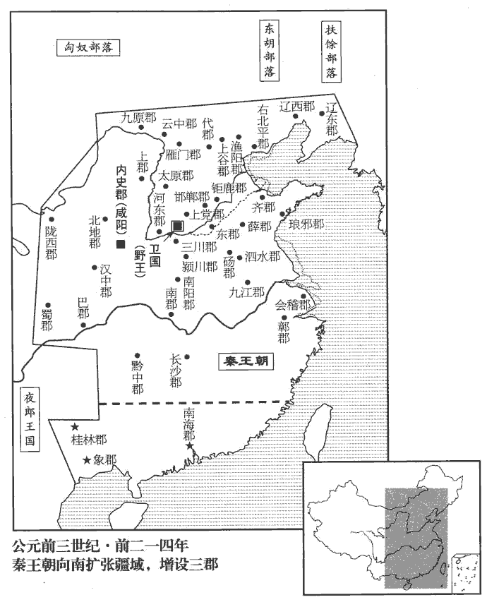 

## 三十四年【「三」原誤作「二」。】（戊子，前二一三年）

1謫治獄吏不直及覆獄故、失者，覆獄者，奏當已成而覆按之也。故者，知其當罪與不當罪而故出入之；失者，誤出入也。築長城及處南越地‹廣東广西›。處，昌呂翻。

〖译文〗 [1]秦朝廷将徇私枉法、知人有罪却释放出狱、无罪却下狱的司法官吏处罚流放去修筑长城，或到南越地区守边。

丞相李斯上書曰：「異時諸侯并爭，厚招遊學。今天下已定，法令出一，百姓當家則力農工，士則學習法令。今諸生不師今而學古，以非當世，惑亂黔首，相與非法教人；聞令下，則各以其學議之，入則心非，出則巷議，誇主以為名，異趣以為高，率群下以造謗。如此弗禁，則主勢降乎上，党與成乎下。禁之便！臣請史官非秦記皆燒之；此燒列國史記也。非博士官所職，天下有藏詩、書、百家語者，皆詣守、尉雜燒之。秦之焚書，焚天下之人所藏之書耳，其博士官所藏則故在；項羽燒秦宮室，始并博士所藏者焚之。此所以後之學者咎蕭何不能于收秦圖書之日并收之也。有敢偶語詩、書，棄市；以古非今者，族；吏見知不舉，與同罪。令下三十日，不燒，黥為城旦。應劭曰：城旦，旦起行治城；四歲刑也。所不去者，醫藥、卜筮、種樹之書。若有欲學法令者，【章：十二行本「有欲」二字互乙，無「者」字；乙十一行本同。】以吏為師。」制曰：「可。」

〖译文〗 丞相李斯上书说：“过去诸侯国纷争，以高官厚禄招徕游说之士。现在天下已定，法令统一出自朝廷，百姓理家就要致力于耕田做工，读书人就要学习法令规章。但今日的儒生却不学习现代事务，只知一味地效法古代，并借此非议现实，蛊惑、扰乱民众，相互非难指责现行制度，并以此教导百姓；闻听命令颁下，就纷纷根据自己的学说、主张妄加评议，入朝时口是心非，出朝后便街谈巷议，夸饰君主以提高自己的声望，标新立异以显示自己的高明，煽动、引导一些人攻击诽谤国家法令。这种情况如不禁止，就势必造成君主的权势下降，臣下结党纳派活动蔓延民间。唯有禁止这些才有利于国家！因此我建议史官将除秦国史记之外的所有史书全部烧毁；除博士官按职责收藏书外，天下凡有私藏《诗》、《书》、诸子百家著作的人，一律按期将所藏交到郡守、郡尉处，一并焚毁；有敢于相对私语谈论《诗》、《书》的处死；借古非今的诛杀九族；官吏发现这种事情而不举报的与以上人同罪；此令颁布三十天后仍不将私藏书籍烧毁的，判处黥刑，并罚处修筑长城劳役的城旦刑。不予焚烧的，是医药、占卜、种植的书。如果想要学习法令，应以官吏为师。”始皇下制令说：“可以。”

魏人陳余謂孔鮒曰：「秦將滅先王之籍，而子為書籍之主，其危哉！」子魚曰：「吾為無用之學，知吾者惟友。秦非吾友，吾何危哉！吾將藏之以待其求；求至，無患矣。」孔鮒，孔子八世孫，字子魚。鮒，音附。

〖译文〗 故魏国人陈馀对孔子的八世孙孔鲋说：“秦朝廷将要毁灭掉前代君王的书籍，而你正是书籍的拥有人，这实在是太危险了！”孔鲋说：“我所治的是一些看来无用的学问，真正了解我的只有朋友。秦朝廷并不是我的朋友，我会遇到什么危险呀！我将把书籍收藏好，等待着有人征求，一旦来征求，我也就不会有什么灾难了。”

## 三十五年（己丑，前二一二年）

1使蒙恬除直道，道九原‹內蒙包頭›，抵雲陽‹陝西淳化›。班志，雲陽縣屬馮翊。塹山堙yīn谷，塹，七豔翻。堙，音因。千八百里；數年不就。

〖译文〗 [1]始皇帝派蒙恬负责开通大道，从九原直到云阳，挖掘大山，填塞峡谷，长达一千八百里，几年没有完工。

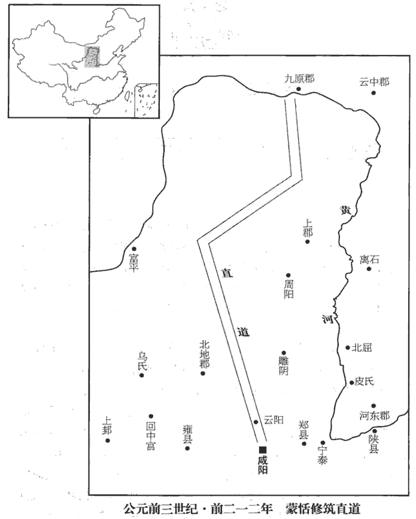 

2始皇以為咸陽人多，先王之宮庭【章：十二行本「庭」作「廷」；乙十一行本同；孔本同。】小，乃營作朝宮渭南上林苑中，先作前殿阿房，師古曰：阿，近也；以其去咸陽近，且號阿房。索隱曰：此以形名宮也；言其宮曰四阿房旁廣也。三輔黃圖曰：作宮阿基旁，天下謂之阿房。括地志：秦阿房宮亦曰阿城，在雍州長安縣西一十四里。史記正義曰：按宮在上林苑中；雍州郭城西南面，即阿房宮城東南面也。房，白郎翻。東西五百步，南北五十丈，上可以坐萬人，下可以建五丈旗，周馳為閣道，自殿下直抵南山，關中有南山、北山：自甘泉連延至巀jié嶭niè、九嵕zōng為北山；自終南、太白連延至商嶺為南山。表南山之顛以為闕。為複道，自阿房度渭，屬之咸陽，以象天極閣道、絕漢抵營室也。天官書曰：天極後十七星，絕漢抵營室，曰閣道。北辰為天極。營室二星，天子之宮也。隱宮、徒刑者七十【章：十二行本「十」下有「餘」字；乙十一行本同；孔本同；張校同。】萬人，史記正義曰：余刑見於市朝；宮刑，一百日隱於蔭室養之乃可，故曰隱宮，下蠶室是也。徒刑者，有罪既加刑，復罰作之也。乃分作阿房宮或作驪山。發北山石槨，寫蜀、荊地材，康曰：寫，四夜切；舍車解馬為寫，或作「卸」。余謂此非舍車解馬之「卸」，即前寫放宮室之「寫」，讀如字。皆至；關中‹陝西中部›計宮三百，或曰：「皆至」當屬上句。關中記云：東自函關弘農郡靈寶縣界，西至隴關汧陽郡汧源縣界，二關之間，謂之關中，東西千餘里。關外四百餘。於是立石東海‹山东郯城›上朐qú‹江蘇连云港›界中，以為秦東門。班志：東海郡朐縣，始皇立石海上，以為東門闕。朐，音劬qú。因徙三萬家驪邑‹陝西臨潼东北›，五萬家雲陽‹陝西淳化›，皆復不事十歲。復，方目翻，除也。不事者，不供征役之事。

〖译文〗 [2]始皇认为都城咸阳的人口过多，而先代君王营造的宫廷又嫌小，便命人在渭南上林苑中建筑宫殿，先修前殿阿房宫，长宽东西五百步，南北五十丈，上面可坐一万人，下面则能竖立五丈高的旗帜，周围是车马驰行的天桥，从前殿下直达南山，在南山的顶峰建牌楼作为标志。又筑造天桥，从阿房渡过渭水，与咸阳城相接，由此象征天上的北极星、阁道星横越银河抵达营室宿。征发遭受宫刑和判处其他徒刑的囚犯七十万人，分别修筑阿房宫或建造骊山始皇帝陵墓。并凿掘用作套棺的北山的石料，采伐蜀、荆两地的木材，都先后运到。在关中兴建宫殿计有三百座，关外营造宫殿四百多座。于是在东海郡的朐县界内刻立巨石，作为秦王朝东部的大门。又将三万家迁移到骊邑，五万家迁移至云阳，均免除十年的赋税徭役。

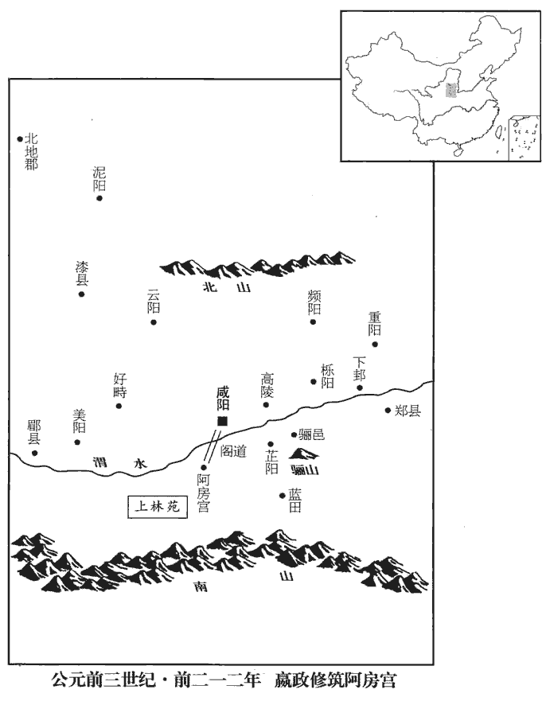 

3盧生說始皇曰：「方中：人主時為微行以辟惡鬼。惡鬼辟，辟，讀曰避。真人至。願上所居宮毋令人知，然後不死之藥殆可得也！」始皇曰：「吾慕真人！」自謂「真人」，不稱「朕」。康曰：稱，去聲；不稱，不愜意也。余謂康說非也。始皇初并天下，自稱曰朕，至此不稱朕耳。乃令咸陽之旁二百里內宮觀二百七十，復【章：十二行本「復」作「複」；乙十一行本同；孔本同。】道、甬道相連，帷帳、鐘鼓、美人充之，各案署不移徙。行所幸，有言其處者，罪死。始皇幸梁山宮‹陝西乾縣西北›，班志：梁山宮在扶風好畤縣。括地志：俗名望宮山，在雍州好畤縣西十二里，北去梁山九里。雍錄曰：唐奉天縣有梁山，秦之梁山宮正在其地。從山上見丞相車騎眾，弗善也。中人或告丞相，丞相後損車騎。始皇怒曰：「此中人泄吾語！」案問，莫服，捕時在旁者，盡殺之。自是後，莫知行之所在。群臣受決事者，悉于咸陽宮。

〖译文〗 [3]卢生劝说始皇帝道：“有一种方法，这就是皇帝不时地暗中秘密出行，借此躲避恶鬼。而避开了恶鬼，神仙真人便会来到。故此希望您所居住的宫室不要让别人知道，然后不死之药大概才可以得到！”始皇说：“我敬慕真人！”于是就自称“真人”，不再称“朕”。并下令咸阳城周围二百里内的二百七十处宫殿楼台，都用天桥、甬道相连接，帷帐、钟鼓及美女充斥其间，各自按布署登记，不作迁移。始皇巡行到某处居住下来，有敢于透露出他的驻地的，即获罪处死。始皇帝曾前往梁山宫，从山上望见丞相李斯的随行车马非常多，很不赞许。宦官近臣中有人将这事告诉了李斯，李斯随即减少了他的车马。始皇愤怒地说：“这一定是宫中人泄露了我的话！”于是审问随从人员，但是没有人承认。始皇就下令捉拿当时在场的人，全部杀掉。从此以后，再也没有人知道始皇到了什么地方。群臣中凡有事情要奏报并接受皇帝裁决的，便全都到咸阳宫等候。

侯生、盧生相與譏議始皇，因亡去。始皇聞之，大怒曰：「盧生等，吾尊賜之甚厚，今乃誹謗我！誹，敷尾翻。諸生在咸陽者，吾使人廉問，或為妖言以亂黔首。」廉，察也。秦有誹謗、妖言之罪，漢除之。妖，於遙翻。於是使御史悉案問諸生。秦置御史，掌討奸猾，治大獄，御史大夫統之。諸生傳相告引，傳相告引者，謂甲引乙，乙復引丙也。傳，柱戀翻。相，如字。乃自除犯禁者四百六十餘人，皆坑之咸陽，使天下知之，以懲後；益發謫徙邊。始皇長子扶蘇諫曰：「諸生皆誦法孔子。誦孔子之言以為法也。今上皆重法繩之，臣恐天下不安。」始皇怒，使扶蘇北監蒙恬軍於上郡‹陕西榆林东南›。為胡亥奪嫡殺扶蘇張本。

〖译文〗 侯生、卢生相互讥讽、评议始皇帝的暴戾，并因此逃亡而去。始皇闻讯勃然大怒，说：“卢生等人，我尊敬他们，并重重地赏赐他们，现在竟然敢诽谤我！这些人在咸阳的，我曾派人去查访过，其中有的人竟妖言惑众！”于是令御史逮捕并审问所有的儒生。儒生们彼此告发，始皇帝就亲自判处违法犯禁的人四百六十余名，把他们全部在咸阳活埋了。还向全国宣扬，让大家都知道这件事，以惩戒后世。同时谪罚更多的人流放到边地戍守。始皇的长子扶苏为此规劝道：“那些儒生们全诵读并效法孔子的言论。而今您全部用重法惩处他们，我担心天下会因此不安定。”始皇大为恼火，派扶苏赴上郡去监督蒙恬的军队。

## 三十六年（庚寅，前二一一年）

1有隕石於東郡‹河南濮陽›。東郡，本衛地，秦徙衛于野王，以其地置東郡。或刻其石曰：「始皇死而地分。」始皇使御史逐問，莫服；盡取石旁居人誅之，燔fán其石。燔，音煩，爇ruò也。

〖译文〗 [1]有陨石坠落在东郡。有人于石上刻字说：“始皇帝死而土地分。”始皇于是派御史逐个查问当地的人，但是没人承认此事是自己干的。始皇便下令将居住在陨石附近的人全部捉拿处死，并焚化了那块石头。

2遷河北‹黃河河套以北，陰山以南›榆中‹内蒙伊金霍洛旗›三萬家；河北，北河之北也。賜爵一級。

〖译文〗 [2]秦朝廷迁移三万户到北河以北、榆中一带垦殖，每户授爵位一级。

## 三十七年（辛卯，前二一零年）

1冬，十月，癸丑，始皇出遊；左丞相斯從，右丞相去疾守。去疾，姓馮。從，才用翻。守，手又翻。始皇二十餘子，少子胡亥最愛，請從；上許之。

〖译文〗 [1]冬季，十月，癸丑（疑误），始皇帝出游，左丞相李斯陪同前往，右丞相冯去疾留守咸阳。始皇有二十多个儿子，小儿子胡亥最受宠爱，他要求随父皇出游，获始皇准许。

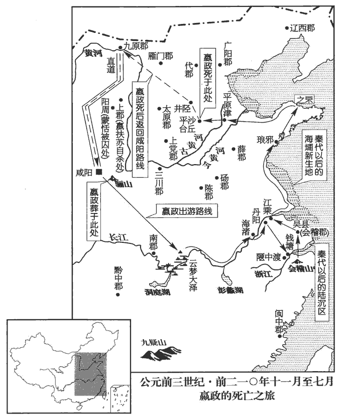 

十一月，行至雲夢‹湖北安陸南›，望祀虞舜於九疑山‹湖南寧遠南›。古者，天子巡狩所至，山川之神，各以秩次望祭之。酈道元曰：營水出營陽郡泠道縣南留山，西流逕九疑山。其山磐棋蒼梧之野，峰秀數郡之間，羅岩九舉，各導一溪，岫壑負阻，異嶺同勢，遊者疑焉，故曰九疑。括地志：九疑山在永州唐興縣東南百里，其山九峰相似，故名。元次山曰：九疑山在永州，方四千里，四州各近一隅。九域志曰：九疑在道州，舜陵在女英峰下，九疑之第六峰也。太史公曰：舜南狩，崩於蒼梧之野，歸葬於江南九疑山。山海經曰：舜之所葬，在今道州零陵界。則蒼梧、九疑，兩處也；合而言之者，誤也。浮江下，觀藉柯，渡海渚‹安徽枞阳›，過丹陽‹安徽當塗西北›，至錢唐‹浙江杭州›，史記正義曰：括地志：海渚，云在舒州同安縣東。按舒州在江之中流，疑海字誤。藉，秦昔翻。柯，音歌。班志：丹陽縣，秦屬鄣郡。括地志：丹陽故城，在潤州江寧縣東南五里。班志，錢唐縣屬會稽郡，漢西部都尉所治。唐為杭州治所。臨浙江。水波惡，乃西百二十里，從陿xiá中‹浙江富陽縣，渡富春江›渡。所謂水波惡處，則今之由錢唐渡西陵者是也。西陿中渡，則今富陽、分水之間。徐廣曰：蓋在余杭也。顧夷曰：余杭，秦始皇至會稽經此，立為縣。上會稽‹在浙江紹興南›，班志：會稽山在會稽郡山陰縣南，有禹塚、禹井。祭大禹，望於南海；立石頌德。還，過吳‹江蘇蘇州›，從江乘‹江蘇南京东北›渡。江乘縣，秦屬鄣郡，漢屬丹陽郡。括地志：江乘故縣城在今潤州句容縣北六十里。并海上，北至琅邪‹山東膠南›、之罘‹山東煙臺北芝罘岛›。并，步浪翻。罘，音浮。見巨魚，射殺之。遂并海西，至平原津‹山東平原西南古黄河渡口›而病。平原縣，秦屬齊郡，漢分置平原郡。史記正義曰：今德州平原縣南六十里有張公故城，城東有津，後名張公渡，恐此平原郡古津也。漢書平津侯公孫弘所封亦近此，蓋平津即此津。余按公孫弘傳：封勃海高城縣之平津鄉，則平津非平原津也。班志：篤馬河至平原東北入海。此蓋津渡處。射，而亦翻。并，步浪翻。

〖译文〗 十一月，始皇帝一行到达云梦，向着九疑山遥祭葬在那里的舜帝。然后乘船顺长江而下，观览籍柯，渡经海渚，过丹阳，抵钱唐，到达浙江边。因钱塘江潮波涛汹涌，便向西行驶一百二十里，从富阳与分水之间的狭窄处渡江。随之始皇登上会稽山，祭祀禹帝，遥望南海，刻立巨石歌功颂德。然后起驾返回，归途中经过吴地，从江乘县渡过长江，沿海北上，抵达琅邪、之罘。始皇看见大鱼，即发箭将鱼射杀。接着又沿海西行，到了平原渡口后便病倒了。

始皇惡言死，惡，烏路翻。群臣莫敢言死事。病益甚，乃令中車府令行符璽事趙高為書賜扶蘇曰：「與喪，會咸陽而葬。」書已封，在趙高所，未付使者。班書百官表：太僕，秦官，其屬有車府令。秋，七月，丙寅‹二十›，始皇崩於沙丘平臺‹河北平乡›。史記正義曰：始皇崩在沙丘宮平臺之中。丞相斯為上崩在外，為，於偽翻。恐諸公子及天下有變，乃秘之，不發喪，棺載轀wēn涼車中，文穎曰：轀輬車，如今喪轜ér車也。孟康曰：如衣車，有窗牖，閉之則溫，開之則涼，故名。如淳曰：轀輬車，其車廣大，有羽飾。沈約宋書禮志曰：漢制：大行載轀輬車，四輪；其飾如金根，加施組，連璧交路；四角金龍飾，銜璧，垂五采飾羽流蘇，前後雲畫帷裳𣝛jù文畫曲轓，長與車等。太僕御駕六白駱馬，以黑藥灼其身為虎文。史記正義曰：棺，音館，又古玩翻。轀，音溫。「涼」，一作「輬」，音同。故幸宦者驂乘。所至，上食、百官奏事如故，宦者輒從車中可其奏事。獨胡亥、趙高及幸宦者五六人知之。

〖译文〗 始皇帝很厌恶谈论“死”，因此群臣中没有人敢于提关于死的事。待到他病势更加沉重时，才命中车府令、兼掌符玺事务的赵高写诏书给长子扶苏说：“参加丧事处理，灵柩到咸阳后安葬。”诏书已封好，但却搁置在赵高处，没有交给使者送出。秋季，七月，丙寅（二十日），始皇在沙丘宫平台驾崩。丞相李斯因皇帝在都城外病逝，唯恐各位皇子及天下发生什么变故，于是就秘不发丧，将棺材停放在能调节冷暖的凉车中，由始皇生前最宠信的宦官在车的右边陪乘。所到一地，上呈餐饭、百官奏报事务与过去一样，宦官即从车中接受并批复奏事。只有胡亥、赵高及受宠幸的宦官五六个人知道内情。

初，始皇尊寵蒙氏，信任之。蒙恬任【章：乙十一行本「任」下有「在」字。】外將，蒙毅常居中參謀議，名為忠信，故雖諸將相莫敢與之爭。將，即亮翻。趙高者，生而隱宮；康曰：余刑顯於市朝，宮刑在於隱室，故曰隱宮。始皇聞其強力，通於獄法，舉以為中車府令，使教胡亥決獄；胡亥幸之。趙高有罪，始皇使蒙毅治之；毅當高法應死。始皇以高敏於事，赦之，復其官。趙高既雅得幸于胡亥，雅，素也。又怨蒙氏，乃說胡亥，請詐以始皇命誅扶蘇而立胡亥為太子。胡亥然其計，趙高曰：「不與丞相謀，恐事不能成。」乃見丞相斯曰：「上賜長子書及符璽，皆在胡亥所。長子，謂扶蘇。定太子，在君侯與高之口耳。事將何如？」斯曰：「安得亡國之言！此非人臣所當議也！」高曰：「君侯材能、謀慮、功高、無怨、長子信之，此五者皆孰與蒙恬？」斯曰：「不及也。」高曰：「然則長子即位，必用蒙恬為丞相，君侯終不懷通侯之印歸鄉里明矣！通侯，漢曰徹侯，亦曰列侯。應劭曰：通，亦徹也；通者，言功德通於王室也。張晏曰：列侯者，見序列也。胡亥慈仁篤厚，可以為嗣。願君審計而定之！」丞相斯以為然，乃相與謀，詐為受始皇詔，立胡亥為太子；更為書賜扶蘇，更，工衡翻；改也。數以不能辟地立功，士卒多耗，數，所具翻。數【章：十二行本「數」上有「反」字；乙十一行本同；孔本同；張校同；退齋校同。】上書，直言誹謗，日夜怨望不得罷歸為太子；將軍恬不矯正，知其謀；皆賜死，以兵屬裨將王離。數，所角翻；下同。屬，之欲翻，付也；康音蜀，非；下以屬同。

〖译文〗 当初，始皇帝尊重宠爱蒙氏兄弟，颇信任他们。蒙恬在外担任大将，蒙毅则在朝中参与商议国事，称为忠信大臣，即便是高级将领或丞相，也没有敢与他们一争高低的。赵高一生下来就被阉割了。始皇听说他办事能力很强，且通晓刑法，便提拔他担任了中车府令，并让他教小儿子胡亥学习审理判决诉讼案。胡亥非常宠爱他。赵高曾经犯下大罪，始皇派蒙毅惩治他。蒙毅认为赵高依法应被处死，但始皇因赵高办事灵活而赦免了他，并恢复了他的官职。赵高既然素来得到胡亥的宠幸，恰又怨恨蒙氏兄弟，便劝说胡亥，让他诈称始皇遗诏命杀掉扶苏，立胡亥为太子。胡亥同意了赵高的计策。赵高又说：“这件事如果不与丞相合谋进行，恐怕不能成功。”随即会见丞相李斯，说：“皇上赐给扶苏的诏书及符玺都在胡亥那里。定立太子之事只在您我口中的一句话罢了。这件事将怎么办呢？”李斯说：“怎么能够说这种亡国的话呀！此事不是我们这些为人臣子的人所应当议论的啊！”赵高道：“您的才能、谋略、功勋、人缘以及获扶苏的信任，这五点全部拿来与蒙恬相比，哪一点比得上他呢？”李斯回答：“都比不上他。”赵高说：“既然如此，那么只要扶苏即位，就必定任用蒙恬为丞相，您最终不能怀揣通侯的印信返归故乡的结局已经是显而易见的了！而胡亥仁慈忠厚，是可以担当皇位继承人的。希望您慎重地考虑一下，作出定夺！”丞相李斯听后认为赵高说的有理，便与他共同谋划，诈称接受了始皇的遗诏，立胡亥为太子，又篡改始皇给扶苏的诏书，指斥他多年来不能开辟疆土、创立功业，却使士卒大量伤亡，并且数次上书，直言诽谤父皇，日日夜夜地抱怨不能获准解除监军职务，返归咸阳当太子；而将军蒙恬不纠正扶苏的过失，并参与和了解扶苏的图谋。因此令他们自杀，将兵权移交给副将王离。

扶蘇發書，泣，入內舍，欲自殺。蒙恬曰：「陛下居外，未立太子，使臣將三十萬眾守邊，公子為監，此天下重任也。今一使者來，即自殺，安知其非詐！復請而後死，未暮也。」使者數趣之。扶蘇謂蒙恬曰：「父賜子死，尚安復請！」即自殺。趣，讀曰促。復，扶又翻。蒙恬不肯死，使者以屬吏，系諸陽周‹陝西子长›；班志，陽周縣屬上郡。史記正義曰：陽周，寧州羅川縣之邑。屬，之欲翻。今按天寶元年，改羅川縣為真寧縣。更置李斯舍人為護軍，班百官表：護軍都尉，秦官。又，漢王以陳平為護軍中尉，盡護諸將。當是時，恬已屬吏，恐其軍有變，故以李斯舍人為護軍，使之護諸將也。還報。胡亥已聞扶蘇死，即欲釋蒙恬。會蒙毅為始皇出禱山川，還至。趙高言于胡亥曰：「先帝欲舉賢立太子久矣，而毅諫以為不可，不若誅之！」乃系諸代‹河北蔚縣›。據地理，代距沙丘甚遠。蓋毅還至代，即就系之。

〖译文〗 扶苏接到诏书，哭泣着进入内室，打算自杀。蒙恬说：“陛下在外地，并未确立谁是太子。他派我率领三十万军队镇守边陲，令您担任监军，这乃是天下的重任啊。现在仅仅一个使者前来传书，我们就自杀，又怎么能知道其中不是有诈呢？！让我们再奏请证实一下，然后去死也不晚呀。”但是使者多次催促他们自行了断，扶苏于是对蒙恬说：“父亲赐儿子死，还哪里需要再请示查实呢！”随即自杀。蒙恬不肯死，使者便将他交给官吏治罪，囚禁在阳周；改置李斯的舍人担任护军，然后回报李斯、赵高。胡亥这时已听说扶苏死了，便想释放蒙恬。恰逢蒙毅代替始皇外出祈祷山川神灵求福后返回，赵高即对胡亥说：“始皇帝想要荐举贤能确定你为太子已经很长时间了，可是蒙毅一直规劝他，认为不可如此。现在不如就把蒙毅杀掉算了！”于是逮捕了蒙毅，将他囚禁到代郡。

遂從井陘‹河北井陘›抵九原‹內蒙包頭›。班志：井陘在常山石邑縣西。史記正義曰：井陘故關在并州石艾縣東十八里，即井陘口。會暑，轀車臭，乃詔從官，令車載一石鮑魚以亂之。孟康曰：百二十斤曰石。班書貨殖傳：鮿zhé鮑千鈞。師古註曰：鮿，膊魚也，即今之不著鹽而乾者也。鮑，今之䱒yì魚也。而說者乃讀鮑為鮠wéi魚之鮠，失義遠矣。鄭康成以䱒於煏bì室乾之，亦非也。煏室乾之，即鮑耳。蓋今巴、荊人所呼鰎jiǎn魚者是也。秦皇載鮑亂臭者，則是䱒魚耳；而煏室乾者，本不臭也。鮑，白卯翻。鮿，音接。䱒，於業翻。鮠，五回翻。煏，蒲北翻。鰎，居偃翻。從直道至咸陽，發喪。直道，即三十五年蒙恬所除者。太子胡亥襲位。

〖译文〗 皇室车队于是从井陉抵达九原。当时正值酷暑，装载始皇遗体的凉车散发出恶臭，胡亥等便指示随从官员在车上装载一石鲍鱼，借鱼的臭味混淆腐尸的气味。从直道抵达咸阳后，发布治丧的公告。太子胡亥继承了皇位。

九月，葬始皇於驪山‹陕西临潼东南›，下錮三泉；師古曰：三重之泉，言至水也。余謂錮者，治銅錮塞之也。三泉者，取九泉之數言之。奇器珍怪，徙藏滿之。謂徙府庫之物以實陵便房中。藏，才浪翻。令匠作機弩，有穿近者輒射之。以水銀為百川、江河、大海，機相灌輸。康註引劉伯莊云：機相灌輸，以防穿近者。予按文勢，自機弩至輒射之，文意已足；機相灌輸，是承水銀為百川、江河、大海之意，作如是觀，文意甚順。射，而亦翻。史記正義：灌，音館。輸，音戍。上具天文，下具地理。後宮無子者，皆令從死。從，才用翻。葬既已下，或言工匠為機藏，皆知之，藏重即泄。大事盡，閉之墓中。藏重即泄，謂工匠若更為第二重機藏，與外人近，即泄其所以為機藏之事，故大事盡則皆閉之墓中。大事盡，句絕，謂既下窆biǎn，則送終之大事盡也。重，直龍翻。

〖译文〗 九月，将始皇安葬在骊山皇陵，把铜熔化后灌入，堵塞住地下深处的水。崐又运来各种奇珍异宝，藏满墓穴。还下令工匠制作带有机关的弓弩，遇到穿入靠近墓穴的人，即自动射杀。用水银做成百川、江河、大海，以机械灌注输送。墓穴顶部布有天文图象，底部设置地理模型。后宫嫔妃凡未生子女的，令她们全部陪葬。下葬以后，有人说工匠们制造隐藏的机械装置，知道其中的全部秘密，如果他们再作第二重机关，就会将其中的秘密泄露出去。于是待送终的大事完毕后，那些工匠即被尽数封闭在墓穴中。

2二世欲誅蒙恬兄弟。二世兄子子嬰諫曰：「趙王遷殺李牧而用顏聚，齊王建殺其故世忠臣而用后勝，卒皆亡國。二事并見前。卒，子恤翻。蒙氏，秦之大臣、謀士也，而陛下欲一旦棄去之。誅殺忠臣而立無節行之人，行，下孟翻。是內使群臣不相信而外使斗士之意離也！」二世弗聽，遂殺蒙毅及內史恬。恬曰：「自吾先人及至子孫，積功信于秦三世矣。恬祖驁、父武及恬，三世皆事秦有功。今臣將兵三十余萬，身雖囚系，其勢足以倍畔。倍，蒲妹翻。然自知必死而守義者，不敢辱先人之教以不忘先帝也！」乃吞藥自殺。

〖译文〗 [2]二世皇帝胡亥想要杀掉蒙恬兄弟二人，他哥哥的儿子子婴规劝说：“赵王赵迁杀李牧而用颜聚，齐国田建杀他前代的忠臣而用后胜，结果最终都亡了国。蒙恬兄弟是秦国的重臣、谋士，陛下却打算一下子就把他们抛弃、除掉。似此诛杀忠臣而扶立节操品行不端的人，是在内失去群臣的信任，在外使将士们意志涣散啊！”但是二世不听从劝告，随即杀掉了蒙毅，并要杀内史蒙恬。蒙恬说：“我们蒙家自我的先人起直至子孙，在秦国建立功业和忠信已经三代了。如今我领兵三十多万，身体虽然被囚禁，但我的势力仍然足以进行反叛。可是我知道自己必定得死却还是要奉守节义，是因为我不敢辱没祖先的教诲，并表示我不忘先帝的大恩大德啊！”于是即吞服毒药自杀身亡。

揚子法言曰，或問：「蒙恬忠而被誅，忠奚可為也？」曰：「塹山，堙yīn谷，起臨洮‹甘肅岷县›，擊遼水‹遼河›，力不足而尸有餘，忠不足相也。」相，息亮翻。

〖译文〗 扬雄《法言》曰：有人问：“蒙恬赤胆忠心却被杀掉了，忠诚还有什么用呢？”回答说：“开山填谷修筑长城，西起临洮，东接辽水，威力不足而造成的尸体却有余，蒙恬的这种忠诚是不足为辅助君王的。”

臣光曰：「始皇方毒天下而蒙恬為之使，恬不仁可知矣。然恬明于為人臣之義，雖無罪見誅，能守死不貳，斯亦足稱也。」使，如字。

〖译文〗 臣司马光曰：秦始皇正荼毒天下时，蒙恬甘受他的驱使，如此蒙恬的不仁义是可知的了。但是蒙恬明白为人臣子所应守的道义，虽然没有罪而被处死，仍能够宁死忠贞不渝，不生二心，故而这也是很值得称道的了。

# 二世皇帝上諱胡亥，始皇少子也。【章：十二行本無此八字；乙十一行本同。】

## 元年（壬辰，前二零九年）

1冬，十月，戊寅‹十›，大赦。

〖译文〗 [1]冬季，十月，戊寅（初十），实行大赦。

2春，二世東行郡縣，李斯從；到碣石‹河北昌黎縣北›，并海，南至會稽‹浙江紹興南›；而盡刻始皇所立刻石，旁著大臣從者名，行，下孟翻。從，才用翻。并，步浪翻。著，如字；史記正義丁略翻。以章先帝成功盛德而還。

〖译文〗 [2]春季，二世向东出巡郡县，李斯随从前往。一行人到达碣石后，又沿海南下至会稽。途中，二世将始皇帝过去所立的刻石全部加刻上了字，并在旁边刻上随从大臣的名字，以此表彰先帝的丰功盛德，然后返回。

夏，四月，二世至咸陽，謂趙高曰：「夫人生居世間也，譬猶騁六驥過決隙也。康曰：上音缺；下丘逆翻。余謂決，如字，決，裂也；裂開之隙，其間不能以寸，喻狹小也。吾既已臨天下矣，欲悉耳目之所好，窮心志之所樂，好，呼到翻。樂，音洛。以終吾年壽，可乎？」高曰：「此賢主之所能行而昏亂主之所禁也。雖然，有所未可，臣請言之：夫沙丘‹河北平鄉›之謀，諸公子及大臣皆疑焉；而諸公子盡帝兄，大臣又先帝之所置也。今陛下初立，此其屬意怏怏皆不服，恐為變；臣戰戰慄慄，唯恐不終，陛下安得為此樂乎！」二世曰：「為之柰何？」趙高曰：「陛下嚴法而刻刑，令有罪者相坐，誅滅大臣及宗室；然後收舉遺民，貧者富之，賤者貴之。盡除先帝之故臣，更置陛下之所親信者，此則陰德歸陛下，害除而奸謀塞，群臣莫不被潤澤，蒙厚德，陛下則高枕肆志寵樂矣。更，工衡翻。塞，悉則翻。枕，之鴆翻。計莫出於此！」二世然之。乃更為法律，務益刻深，大臣、諸公子有罪，輒下高【章：十二行本「高」下有「令」字；乙十一行本同；孔本同。】鞠治之。於是公子十二人僇lù死咸陽市，十公主矺zhé死于杜‹陝西西安东南›，索隱曰：矺，貯格翻；史記正義音宅，與磔同，謂磔zhé裂支體而殺之；溫公類篇音竹格翻，磓duī也。杜，故周之杜伯國。班志，杜縣屬京兆，宣帝改曰杜陵。財物入于縣官，漢謂天子為縣官。此縣官，猶言公家也。相連逮者不可勝數。言事相連及皆逮之。貢父曰：其人存，直追取之曰逮；其人亡，則討而捕之。逮，易辭；捕，加力也。

〖译文〗 夏季，四月，二世抵达咸阳，对赵高说：“人生在世，就犹如驾着六匹骏马飞奔过缝隙一般的短促。我既已经统治天下，就想要尽享我的耳目所喜闻、乐见的全部东西，享尽我心意中所喜欢的任何事物，直到我的寿命终结，你认为这行吗？”赵高说：“这是贤能的君主能做而昏庸暴乱的君王不能做的事情崐。虽然如此，还有不可做的地方，请让我来陈述一下：沙丘夺权之谋，诸位公子和大臣都有所怀疑。而各位公子都是您的哥哥，大臣又都是先帝所安置的。如今陛下刚刚即位，这些公子臣僚正怏怏不服，恐怕会发生事变。我尚且战战栗栗，生怕不得好死，陛下又怎么能够这样享乐呀！”二世道：“那该怎么办呢？”赵高说：“陛下应实行严厉的法律、残酷的刑罚，使有罪的人株连他人，这样可将大臣及皇族杀灭干净，然后收罗提拔遗民，使贫穷的富裕起来，卑贱的高贵起来，并把先帝过去任用的臣僚全都清除出去，改用陛下的亲信。这样一来，他们就会暗中感念您的恩德；祸害被除掉，奸谋遭堵塞，群臣没有不蒙受您的雨露润泽、大恩厚德的。如此，陛下就可以高枕无忧，纵情享乐了。再没有比这个更好的计策了！”二世认为赵高说得有理，于是便修订法律，务求更加严厉苛刻，凡大臣、各位公子犯了罪，总是交给赵高审讯惩处。就这样，有十二位皇子在咸阳街市上被斩首示众，十名公主在杜县被分裂肢体而死，他们的财产全部充公。受牵连被逮捕的人更是不可胜数。

公子將閭昆弟三人囚于內宮，議其罪獨後。二世使使令將閭曰：「公子不臣，罪當死！吏致法焉。」將閭曰：「闕廷之禮，吾未嘗敢不從賓贊也；廊廟之位，吾未嘗敢失節也；受命應對，吾未嘗敢失辭也；何謂不臣？言不敢挾親親之恩廢為臣之節，何得以此罪加之！願聞罪而死！」使者曰：「臣不得與謀，與，讀曰預。奉書從事！」將閭乃仰天大呼「天」者三，曰：「吾無罪！」昆弟三人皆流涕，拔劍自殺。宗室振恐。公子高欲奔，恐收族，乃上書曰：「先帝無恙時，臣入門【章：十二行本「門」作「則」；乙十一行本同；孔本同；退齋校同；熊校同。】賜食，出則乘輿，御府之衣，臣得賜之，中廐之寶馬，臣得賜之。臣當從死而不能，為人子不孝，為人臣不忠。不孝不忠者，無名以立於世，臣請從死，願葬驪山之足，唯上幸哀憐之！」書上，二世大說，說，讀曰悅。召趙高而示之，曰：「此可謂急乎？」趙高曰：「人臣當憂死不暇，何變之得謀！」二世可其書，賜錢十萬以葬。

〖译文〗 公子将闾兄弟三人被囚禁在内宫，单单搁置到最后才议定罪过。二世派使臣去斥令将闾说：“你不尽臣子的职责，罪该处死！由行刑官执法吧！”将闾说：“在宫廷的礼仪中，我未曾敢不听从司仪人员的指挥；在朝廷的位次上，我未曾敢超越本分违背礼节；受皇上的命令应对质询，我未曾敢言辞失当说过什么错话，这怎么叫作不尽为臣子的职责啊？希望听你们说说我的罪过然后再去死！”使臣说：“我不与你作什么商量，只奉诏书行事！”将闾于是便仰天大呼三声“天”，说：“我没有罪！”兄弟三人都痛哭流涕，随即拔剑自杀。整个皇室均为此震惊恐惧。公子高打算逃亡，但又害怕株连族人，因此上书说：“先帝未患病时，我入宫便赐给我饮食，外出便赐给我乘车，先帝内府的衣服，我得到赏赐，宫中马厩里的宝马，我也得到赏赐。我本应跟随先帝去死，却没能这样做。似此作为儿子便是不孝，作为臣子便是不忠。不孝不忠的人是没有资格生存在世上的。因此我请求随同先帝去死，愿被葬在骊山脚下。希望陛下垂怜。”书上给了二世，二世高兴异常，召见赵高，给他看公子高的上书，说：“这可以算是急迫无奈了吧？”赵高道：“作为臣子担心死亡还来不及呢，哪里能有空闲图谋什么造反的事呀！”二世随即允准了公子高的上书，并赐给他十万钱作为安葬费。

復作阿房宮‹陕西西安西›。盡征材士五萬人為屯衛咸陽，令教射。狗馬禽獸當食者多，食，讀曰飤sì，音祥吏翻。度不足，下調郡縣，史記正義曰：下，戶嫁翻。調，徒釣翻。謂下郡縣而調發之也。余謂下，讀如字亦通。轉輸菽粟sù、芻藁gǎo，皆令自齎jī糧食，咸陽三百里內不得食其穀。

〖译文〗 二世下令重新营修阿房宫，又尽行征调五万名身强力壮的人去咸阳驻防守卫，让他们教习射御。这批人和狗马禽兽要消耗的粮食很多，估计会供不应求，二世便下令到郡县中调拨，转运输送豆类、谷物、饲草、禾秆到都城，但规定押运民夫都自带口粮，同时还下令咸阳城三百里之内不准食用这批谷物。

3秋，七月，陽城‹河南登封東南›人陳勝、陽夏‹河南太康›人吳廣起兵於蘄qí‹安徽宿州南›。史記正義曰：即河南陽城縣；班志，屬潁川郡。陽夏縣屬淮陽國。括地志：陳州太康縣，本漢陽夏縣地。盤洲洪氏曰：陽夏鄉去太康縣三十里。夏，音賈。班志，蘄縣屬沛郡，有大澤鄉。蘄，音渠依翻。是時，發閭左戍漁陽‹北京密云›，鼂錯曰：秦以謫發戍，先發吏有謫及贅婿、賈人，後以嘗有市籍者，又後以大父母嘗有市籍者，後入閭取其左。索隱曰：閭左，謂居閭里之左也。秦時，復除者居閭左。今力役凡在閭左者盡發之也。又云：凡居以富強為右，貧弱為左。秦役戍多富者，役盡，兼取貧弱而發之也。班志，漁陽縣屬漁陽郡。括地志：漁陽故城在檀州密雲縣南十八里，在漁水之陽。九百人屯大澤鄉‹安徽宿州东南›，陳勝、吳廣皆為屯長。師古曰：人所聚為屯。長，帥也。會天大雨，道不通，度已失期；度，徒洛翻。失期，法皆斬。陳勝、吳廣因天下之愁怨，乃殺將尉，師古曰：其官本尉耳，時領戍人，故為將尉。索隱曰：尉，官也；漢舊儀：大縣三人。其尉將屯九百人，故云將尉。召令徒屬曰：「公等皆失期當斬；假令毋斬，而戍死者固什六七。且壯士不死則已，死則舉大名耳！王、侯、將、相寧有種乎！」種，章勇翻。眾皆從之。乃詐稱公子扶蘇、項燕，以百姓賢扶蘇而楚人憐項燕也。為壇而盟，稱大楚；陳勝自立為將軍，吳廣為都尉。攻大澤鄉，拔之；收而攻蘄‹安徽宿州南›，蘄下。收大澤鄉之兵以攻蘄也。乃令符離人葛嬰將兵徇蘄以東；攻銍‹安徽宿州西南›、酇‹河南永城›、苦‹河南鹿邑›、柘zhè‹河南柘城›、譙qiáo‹安徽亳州›，皆下之。班志：符離、銍、酇、譙屬沛郡。姓譜：葛國既滅，其後以國為氏。柘，苦二縣屬淮陽國。宋白曰：柘縣，古襄氏之邑；春秋時，陳之株野；漢為柘縣，以邑有柘溝而名；唐為宋州柘城縣。亳州真源縣，古苦縣地。徇，辭峻翻，略地也。銍，竹乙翻。「酇」，本作「𨞘xǐ」，才多翻。師古曰：此縣本借酇字為之，音嵯。王莽改縣為贊治，則此縣亦有贊音。苦，音怙hù。行收兵；比至陳‹河南淮陽›，比，必寐翻。車六七百乘，騎千餘，卒數萬人。攻陳‹河南淮陽›，陳守、尉皆不在，獨守丞與戰譙門中，不勝；守丞死，陳勝乃入據陳‹河南淮陽›。班志，陳縣屬淮陽國。史記正義曰：今陳州城本楚襄王所築陳國城也。師古曰：守丞，謂郡丞之居守者；一曰：郡守之丞，故曰守丞。原父曰：秦不以陳為郡，何庸有守！守，謂非正官，權守者耳。余按秦分天下為郡縣，郡置守、尉、監，縣置令、丞、尉。原父以此守為權守之守，良是。遷、固二史作「守令皆不在」，此作「守尉皆不在」，蓋二史「令」下缺「尉」字，而通鑑「尉」上缺「令」字也。師古曰：譙門，謂門上為高樓以候望者耳。樓，一名譙，故謂美麗之樓為麗譙；亦呼為巢。所謂巢車者，亦于兵車之上為樓以望敵也。譙，巢，聲相近。

〖译文〗 [3]秋季，七月，阳城人陈胜、阳夏人吴广在蕲县聚众起兵。当时，秦王朝征召闾左贫民百姓往渔阳屯戍守边，九百人途中屯驻在大泽乡，陈胜、吴广均被指派为屯长。恰巧遇上天降大雨，道路不通，推测时间已无法按规定期限到达渔阳防地。而按秦法规定，延误戍期，一律处斩。于是陈胜、吴广便趁着天下百姓生计愁苦、对秦的怨恨，杀掉押送他们的将尉，召集戍卒号令说：“你们都已经延误了戍期，当被杀头。即使不被斩首，因长久在外戍边而死去的本来也要占到十之六七。何况壮士不死则已，要死就图大事！王侯将相难道是天生的吗！”众人全都响应。陈胜、吴广便诈以已死的扶苏和故楚国的大将项燕为名，培土筑坛，登到上面宣布誓约，号称“大楚”。陈胜自立为将军，吴广为都尉。起义军随即攻陷大泽乡，接着招收义兵扩军，进攻蕲。蕲夺取后，即令符离人葛婴率军攻掠蕲以东地区，相继攻打、、苦、柘、谯等地，全都攻下了。义军沿路招收人马，等到抵达陈地时，已有战车六七百辆，骑兵千余，步兵数万人。当攻打陈城时，郡守和郡尉都不在，只有留守的郡丞在谯楼下的城门中抵抗义军，不能取胜，郡丞被打死。陈胜于是领兵入城，占据了陈地。

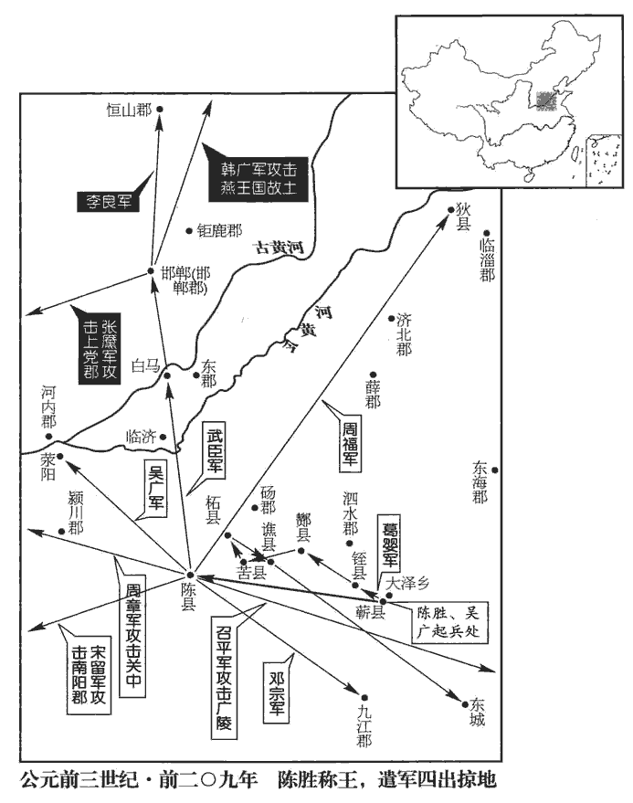 

初，大梁‹河南開封›人張耳、陳餘相與為刎頸交。秦滅魏，聞二人魏之名士，重賞購求之。張耳、陳餘乃變名姓，俱之陳‹河南淮陽›，為里監門以自食。師古曰：監門，卒之賤者；耳、餘以卑賤自隱。張晏曰：監門，里正衛也。監，古銜翻。里吏嘗以過笞陳餘，陳餘欲起，張耳躡之，使受笞。欲起者，不能受辱，欲起與吏亢也。躡，尼輒翻，躡其足也。笞，丑之翻。吏去，張耳乃引陳餘之桑下，數之曰：數，所具翻，又所主翻。「始吾與公言何如？今見小辱而欲死一吏乎！」陳餘謝之。陳涉既入陳，張耳、陳餘詣門上謁。陳勝，字涉。陳涉素聞其賢，大喜。陳中豪桀父老請立涉為楚王，涉以問張耳、陳餘，耳、餘對曰：「秦為無道，滅人社稷，暴虐百姓；將軍出萬死之計，為天下除殘也。今始至陳而王之，示天下私。願將軍毋王，急引兵而西；遣人立六國後，自為樹党，為秦益敵；敵多則力分，與眾則兵強。如此，則野無交兵，六國皆為與國，則兵不交鋒於野矣。縣無守城，諸縣皆畔秦復為六國，無復為秦守城者。誅暴秦，據咸陽，以令諸侯；諸侯亡而得立，以德服之，則【章：十二行本「則」上有「如此」二字；乙十一行本同；孔本同；張校同。】帝業成矣！今獨王陳，恐天下懈也。」陳涉不聽，遂自立為王，號「張楚」。劉德曰：若云張大楚國也。張晏曰：先是楚已為秦所滅，今立楚為張。

〖译文〗 当初，大梁人张耳、陈馀结为同生死、共患难的朋友。秦国灭魏时，听说两个人是魏国的名士，便悬重赏征求他们。张耳、陈馀于是改名换姓，一起逃到了陈地，充任里门看守来糊口。管理里巷的官吏曾经因陈馀出了小过失而鞭笞他，陈馀想要与那官吏抗争，张耳踩他的脚，让他接受鞭笞。待那小官离开后，张耳将陈馀拉到桑树下，数落他说：“当初我是怎么对你说的？现在遇上一点小的侮辱，就想跟一个小官吏拼命啊！”陈馀为此道了歉。及至陈胜率义军已进入陈地，张耳、陈馀便前往陈胜的驻地通名求见。陈胜一向听说他俩很贤能，故而非常高兴。恰逢陈地中有声望的地方人士和乡官请求立陈胜为楚王，陈胜就拿这件事来询问张耳、陈馀的意见。二人回答说：“秦王朝暴乱无道，兼灭别人的国家，残害百姓。而今您冒万死的危险起兵反抗的目的，就是要为天下百姓除害啊。现在您才到达陈地即要称王，是向天下人显露您的私心。因此希望您不要称王，而是火速率军向西，派人去扶立六国国君的后裔，替自己培植党羽，以此为秦王朝增树敌人。秦的敌人多了，兵力就势必分散，大楚联合的国家多了，兵力就必然强大。这样一来，在野外军队不必交锋，遇到县城没有兵为秦守城。铲除残暴的秦政权，占据咸阳，以号令各诸侯国。灭亡的诸侯国得到复兴，您施德政使它们服从，您的帝王大业就完成了！如今只在一个陈县就称王，恐怕会使天下人斗志松懈了。”陈胜不听从这一意见，即自立为楚王，号称“张楚”。

當是時，諸郡縣苦秦法，爭殺長吏以應涉。謁者【章：十二行本「者」下有「使」字；乙十一行本同；孔本同；張校同。】從東方來，以反者聞。二世怒，下之吏。下，遐嫁翻。後使者至，上問之，對曰：「群盜鼠竊狗偷，郡守、尉方逐捕，今盡得，不足憂也。」上悅。

〖译文〗 在那时，各郡县的百姓都苦于秦法的残酷苛刻，因此争相诛杀当地长官，响应陈胜。秦王朝的宾赞官谒者从东方归来，把反叛的情况奏报给二世。二世勃然大怒，将谒者交给司法官吏审问治罪。于是，以后回来的使者，二世向他们询问情况，他们便回答说：“一群盗贼不过是鼠窃狗偷之辈，郡守、郡尉正在追捕他们，现在已经全部抓获，不值得为此忧虑了。”二世即颇为喜悦。

陳王以吳叔為假王，監諸將以西擊滎陽‹河南滎陽›。吳廣，字叔。滎陽縣屬三川郡。

〖译文〗 陈胜任命吴广为代理楚王，督率众将领向西攻击荥阳。

張耳、陳餘復說陳王。請奇兵北略趙地。復，扶又翻。於是陳王以故所善陳人武臣為將軍，邵騷為護軍，姓譜：武姓，宋武公之後。余謂自有諡法，以武為諡者多矣，而必以武姓為宋武公之後，何拘也！唐志氏族以為武氏出自姬姓，周平王少子生而有文在手曰「武」，遂以為氏。此由武后而傅會為之說也。趙明誠金石錄有漢敦煌長史武班碑云：昔殷王武丁克伐鬼方，官族析分，因以為氏。邵姓，周文王子邵公奭之後；或言第十一子聃季載之後。以張耳、陳餘為左、右校尉，予卒三千人，徇趙。予，讀曰與。

〖译文〗 张耳、陈馀又劝说陈胜，请出奇兵向北攻取原来赵国的土地。于是，陈胜便任命他过去的好友、陈地人武臣为将军，邵骚为护军，张耳、陈馀为左、右校尉，拨给士卒三千人，攻取故赵国的土地。

陳王又令汝陰‹安徽阜陽›人鄧宗徇九江郡‹安徽壽縣›。殷王武丁封叔父于河北，是為鄧侯，後因氏焉。班志，汝陰縣屬汝南郡，故胡國。九江，本楚地，秦滅楚，分置九江郡；項羽滅秦，以封黥布；漢高祖更名淮南國；武帝復曰九江郡。當此時，楚兵數千人為聚者不可勝數。師古曰：聚，才喻翻。

〖译文〗 陈胜又令汝阴人邓宗率军攻略九江郡。这时，楚地数千人为一支的军队，数不胜数。

葛嬰至東城‹安徽定遠›，班志，東城縣屬九江郡。括地志：東城故城，在濠州定遠縣東南五十里。立襄彊為楚王。姓譜：襄，魯莊公子襄仲之後。聞陳王已立，因殺襄彊還報。陳王誅殺葛嬰。

〖译文〗 葛婴到达东城后，立襄强为楚王。后来闻悉陈胜已立为楚王，就杀了襄强返回陈县奏报。但陈胜仍然将葛婴杀掉了。

陳王令【章：十二行本「令」下有「魏人」二字；乙十一行本同；孔本同；張校同；退齋校同。】周巿fú北徇魏地。以上蔡‹河南上蔡›人房君蔡賜為上柱國。索隱曰：房，邑名；爵之于房，號曰房君。上柱國，楚爵之尊者。蔡，以國為氏。

〖译文〗 陈胜令周率军向北攻取故魏国的土地。任命上蔡人、封号“房君”的蔡赐为上柱国。

陳王聞周文，陳之賢人也，習兵，乃與之將軍印，使西擊秦。

〖译文〗 陈胜听说周文是陈地德才兼备的人，通晓军事，便授给他将军的印信，命他领兵向西进攻秦王朝。

武臣等從白馬‹河南滑縣境›渡河，師古曰：白馬津在今滑州白馬縣界。括地志：白馬故城，在滑州衛南縣西南二十四里。戴延之西征記曰：白馬故城即衛之漕邑。至諸縣，說其豪桀，豪桀皆應之；乃行收兵，得數萬人；號武臣為武信君。下趙十余城，餘皆城守；乃引兵東北擊范陽‹河北定興›。班志曰，范陽縣屬涿郡。應劭曰：在范水之陽。范陽蒯徹說武信君曰：蒯徹，即蒯通，班書避武帝諱，改「徹」為「通」。蒯，丘怪翻，姓也。左傳，晉有大夫蒯得。「足下必將戰勝而後略地，攻得然後下城，臣竊以為過矣。誠聽臣之計，可不攻而降城，不戰而略地，傳檄而千里定；可乎？」師古曰：檄者，以木簡為書，長尺二寸，用徵召也；有急，則加以鳥羽插之，所以示急疾也。檄，戶曆翻。武信君曰：「何謂也？」徹曰：「范陽令徐公，畏死而貪，欲先天下降。先，悉薦翻。君若以為秦所置吏，誅殺如前十城，則邊地之城皆為金城、湯池，不可攻也。君若齎臣侯印以授范陽令，使乘朱輪華轂，驅馳燕、趙之郊，即燕、趙城可無戰而降矣。」武信君曰：「善！」以車百乘、騎二百、侯印迎徐公。燕、趙聞之，不戰以城下者三十餘城。

〖译文〗 武臣等人从白马津渡过黄河，分赵各县，劝说当地有声望的人士，这些地方人士都纷纷响应。武臣等便沿途收取兵众，得数万人，武臣号称为“武信君”。武臣的大军接连攻下故赵国的十几个城市，其他的城市都固守不降。武臣便率军向东北攻击范阳。范阳人蒯彻劝武信君说：“您一定要先打胜仗而后才扩大地盘，先进攻得手然后才取得城市，我私下里认为这是一个错误。您若果真听从我的计策，就可以不进攻便使城市投降，不作战便能夺取土地，传送一篇征召、声讨的文书，便可使千里之地平定，如此行吗？”武臣说：“你说的是什么意思呀？”蒯彻道：“范阳县令徐某，怕死且贪得无厌，他想在别的县之前投降。您若认为徐某是秦王朝所任用的官吏，就如同杀戮前面那十城的秦朝官员一样杀了他，那么边地所有的城市都将固若金汤，无法攻克了。假如您送给我侯印，让我授给范阳县令，使他乘坐王侯显贵所乘的车子，驱驰在旧燕、赵国的城外，那么燕、赵地的城市就可不战而降了。”武臣说：“好吧！”即拨给蒯彻一百辆车、二百名骑兵及君侯的印信去迎接徐县令。燕、赵旧地风闻此消息后，不战便举城投降的就有三十余个城市。

陳王既遣周章，以秦政之亂，有輕秦之意，不復設備。復，扶又翻。博士孔鮒諫曰：鮒，魏相子順之子，孔子八世孫，即前藏書者也。「臣聞兵法：『不恃敵之不我攻，恃吾不可攻。』今王恃敵而不自恃，若跌而不振，悔之無及也。」跌，徒結翻，踢而踣也。陳王曰：「寡人之軍，先生無累焉。」累，良瑞翻。

〖译文〗 陈胜已经派出了周文的部队，便因秦王朝的政治混乱，而生有轻视秦的意思，不再设置防备。博士孔鲋规劝说：“我听兵法上说：‘不依靠敌人不来攻我，而是仰仗我之不可以被攻打。’如今您凭借敌人不来进攻，而不依靠自己设防不怕为敌所攻，一旦遭遇挫折不能奋起，则悔恨也来不及了。”陈胜说：“我的军队，就不必烦劳先生您操心了。”

周文行收兵至關‹函谷关，河南灵宝东北›，車千乘，卒數十萬，至戲‹陝西臨潼東北›，軍焉。師古曰：戲，水名，在京兆新豐東；今有戲水驛。其水本出藍田北界，至此而北流入渭。蘇林曰：戲在新豐東南三十里。戲，許宣翻。二世乃大驚，與群臣謀曰：「柰何？」少府章邯曰：班表曰：少府，秦官，掌山林、池澤之賦以給共養。姓譜：齊人降鄣，子孫去邑為章氏。少，詩照翻。邯，下甘翻。「盜已至，眾強，今發近縣，不及矣。驪山‹陕西临潼西南›徒多，秦之刑徒已論者，輸作驪山。請赦之，授兵以擊之。」二世乃大赦天下，使章邯免驪山徒、人奴產子，悉發以擊楚軍，大敗之。服虔曰：人奴產子，家人之產奴。師古曰：奴產子，猶今人云家生奴。仲馮曰：人奴一物，產子又一物。臣瓚曰：人奴之產子，今田客家兒。周文走。

〖译文〗 周文沿路收取兵众到达函谷关，已是战车千辆，士卒几十万，至戏亭，驻扎了下来。二世这时才大惊失色，连忙与群臣商议说：“怎么办啊？”少府章邯道：“盗贼已临城下，人多势强，现在征调附近各县的军队抵抗，已经来不及了。不过发配在骊山服营建劳作的夫役很多，请赦免他们，并授给他们兵器去迎击敌军。”二世于是下令大赦天下，命章邯免除骊山的刑徒、奴婢所生之崐子不能充当战士的限制，将他们全部征发去攻打楚军，大败周文的军队，周文逃跑。

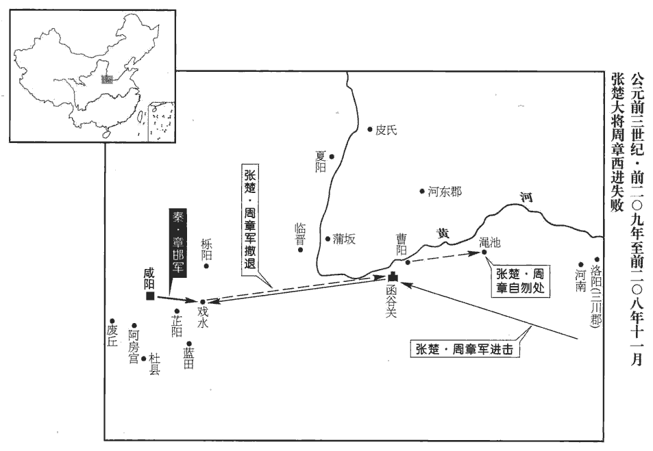 

張耳、陳餘至邯鄲‹河北邯鄲›，聞周章卻，又聞諸將為陳王徇地還者多以讒毀得罪誅，乃說武信君令自王。八月，武信君自立為趙王，以陳餘為大將軍，班表：前、後、左、右將軍，周末官，秦因之，位上卿。漢大將軍比三公。張耳為右丞相，邵騷為左丞相；使人報陳王。陳王大怒，欲盡族武信君等家而發兵擊趙。柱國房君諫曰：「秦未亡而誅武信君等家，此生一秦也；不如因而賀之，使急引兵西擊秦。」陳王然之，從其計，徙系武信君等家宮中，封張耳子敖為成都君，使使者賀趙，令趣發兵西入關。張耳、陳餘說趙王曰：「王王趙，非楚意，趣，讀曰促。上王，如字；下王，於況翻。特以計賀王。楚已滅秦，必加兵于趙。願王毋西兵，北徇燕‹北京›、代‹河北蔚縣›，南收河內‹河南武陟›以自廣。燕，涿郡以北之地。代，常山以北之地。河內本魏地，時屬河東郡。趙南據大河，北有燕、代，楚雖勝秦，必不敢制趙；不勝秦，必重趙。趙乘秦、楚之敝，可以得志於天下。」趙王以為然，因不西兵，而使韓廣略燕‹北京›，李良略常山‹河北正定›，張黶yǎn略上党‹山西長子›。黶，烏點翻，又於琰翻。

〖译文〗 张耳、陈馀抵达邯郸，听到周文撤退的消息，又闻悉为陈胜攻城掠地后归还的众将领，多因谗言陷害而获罪，遭到诛杀，便劝说武臣，让他自己称王。八月，武臣自立为赵王，任命陈馀为大将军，张耳为右丞相，邵骚为左丞相，并派人报知陈胜。陈胜大怒，想要尽灭武臣等人的家族，发兵攻打赵王。柱国房君蔡赐规劝道：“秦王朝尚未灭亡就杀武臣等人的家族，这是使又一个秦王朝复生啊。不如趁此庆贺他为王，令他火速率军向西进攻秦。”陈胜认为说得有理，便听从他的计策，把武臣等人的家属迁移到宫中软禁起来，封张耳的儿子张敖为成都君，派使者前去祝贺赵王即位，催促他赶快发兵向西入函谷关。张耳、陈馀劝赵王武臣说：“您在赵地称王，并非楚王陈胜的本意，所以祝贺您称王，不过是个权宜之计。一旦楚灭掉了秦，必定要发兵攻打赵国。因此希望您不要向西出兵，而是领兵往北攻占旧燕地、代地，向南收取河内，以此扩大自己的地盘。这样一来，赵国南面可以扼守黄河，北面有燕、代旧地可为声援，楚即便战胜了秦，也肯定不敢制约赵国。楚如果不能胜秦，赵国的分量就必然加重。如此，赵国乘秦、楚两家疲惫衰败之机崛起，即可以得行己志，达到统治天下的目的了。”赵王认为说得不错，于是便不向西进军，而是派韩广领兵夺取燕国故土，李良攻取常山，张夺取上党。

九月，沛人劉邦起兵於沛‹江蘇沛縣›，陶唐氏既衰，其後有劉累，以擾龍事孔甲，為豢龍氏。及晉，士會自秦歸晉，其處者為劉氏。師古曰：沛本秦泗水郡之屬縣。李斐曰：沛，小沛也。索隱曰：漢改泗水郡為沛郡，治相城，故以沛縣為小沛。沛，博蓋翻。漢高帝事始此。下相‹江蘇宿遷›人項梁起兵于吳‹江蘇苏州›，班志，下相縣屬臨淮郡。索隱曰：按相，水名，出沛國。沛有相縣；于相水下流置縣，故曰下相。括地志：下相故城，在泗州宿豫縣西北七十里。項燕為楚將，封于項，子孫以邑為氏。吳縣，會稽郡治所，故吳都也。狄‹山東高青东南›人田儋dān起兵于齊。服虔曰：儋，音負擔之擔。師古曰：儋，音丁甘翻。

〖译文〗 九月，沛人刘邦在沛起兵，下相人项梁在吴起兵，狄人田儋在齐国旧地起兵。

劉邦，字季，為人隆凖、龍顏，左股有七十二黑子。服虔曰：凖，音拙。應劭曰：隆，高也。凖，頰權凖也。顏，額顙也。李斐曰：凖，鼻也。文穎曰：音準的之凖。晉灼曰：戰國策云：眉目凖頞è權衡。史記：秦始皇蜂目長凖。李說、文音是也。師古曰：頰權「䪼zhuō」字，豈當借凖為之！服音、應說皆失之。黑子，今中國通呼為黶yǎn子，吳、楚俗謂之誌；誌者，記也。愛人喜施，喜，許既翻。施，式豉翻。意豁如也；常有大度，不事家人生產作業。初為泗上‹江苏沛县东›亭長，秦法：十里一亭。亭長，主亭之吏；亭，謂停留客旅宿食之館。史記正義曰：國語有寓室，即今之亭也。亭長，蓋今之里長，民有訟諍，吏留平辨，得成其政。「泗上」，史記作「泗水」。括地志：泗水亭在徐州沛縣東一百步；有高祖廟。單父‹山東單縣›人呂公，好相人，見季狀貌，奇之，以女妻之。班志，單父縣屬山陽郡。單，音善。父，音甫。妻，七細翻。呂公女，是為呂后。

〖译文〗 刘邦，字季，为人高鼻梁、眉骨突起如龙额，左大腿上有七十二颗黑痣。对人友爱宽厚，喜欢施舍财物给人，心胸开阔，素来有远大的志向，不安于从事平民百姓的日常耕作。起初，刘邦担任泗水亭长，单父县人吕公，喜爱给人相面，看见刘邦的形状容貌，认为很不寻常，便将女儿嫁给了他。

既而季以亭長為縣送徒驪山，徒多道亡。自度比至皆亡之，度，徒洛翻。比，必寐翻。到豐‹江苏豐縣›西澤中亭，止飲，應劭曰：沛，縣也；豐，其鄉也。孟康曰：後沛為郡而豐為縣。師古曰：豐本沛之聚邑耳。夜，乃解縱所送徒曰：「公等皆去，吾亦從此逝矣！」徒中壯士願從者十餘人。

〖译文〗 不久，刘邦以亭长身分奉县里委派遣送被罚服营建劳作的夫役到骊山去，途中许多夫役逃亡。刘邦据此推测待到骊山时人已经都跑光了，于是便在行至丰乡西面的泽中亭后，停下来休息饮酒，到了晚上即释放所送的夫役们说：“你们都走吧，我也从此逃命去了！”夫役中年轻力壮的汉子愿意跟随他的有十余人。

劉季被酒，師古曰：被，加也；被酒，為酒所加也。被，皮義翻。夜徑澤中，有大蛇當徑，季拔劍斬蛇。有老嫗yù哭曰：「吾子，白帝子也，化為蛇，當道；今赤帝子殺之！」因忽不見。嫗，威遇翻，老母也。應劭曰：秦襄公自以居西，主少昊之神，作西畤，祠白帝。至獻公時，櫟陽雨金，又作畦畤，祠白帝。少昊，金德也；赤帝，堯後，謂漢也；殺之，明漢當代秦。劉季亡匿於芒、碭山‹河南永城东北›澤【章：十二行本「澤」下有「巖石」二字；乙十一行本同；孔本同；張校同；退齋校同。】之間。班志，芒縣屬沛郡；碭縣屬梁國。應劭曰：二縣之間，有山澤之固，故隱其間。宋白曰：亳州永城縣，漢芒縣地。括地志：宋州碭山縣在州東一百五十里，本漢碭縣；碭山在縣東。芒，音忙。碭，音唐；師古又音宕。數有奇怪；沛中子弟聞之，多欲附者。

〖译文〗 刘邦喝醉了，夜间从小道走进湖沼地，遇到一条大蛇挡在道上，他随即拔剑斩杀了大蛇。一位老妇夫哭着说：“我的儿子是白帝的儿子啊，化为蛇，挡在小道上，而今却被赤帝的儿子杀了！”说罢就忽然不见了踪影。刘邦随后逃亡、隐藏在芒、砀的山泽中，这山泽间于是常常出现怪异现象。沛县中的年轻人闻讯后，大都想要去归附他。

及陳涉起，沛令欲以沛‹江蘇沛縣›應之。掾yuàn、主吏蕭何、曹參曰：據曹參傳曰：參為掾，何為主吏。孟康曰：主吏，功曹也。姓譜：宋支子食采于蕭，後因為氏。數，所角翻。掾，於絹翻。「君為秦吏，今欲背之，背，蒲妹翻。率沛子弟，恐不聽。願君召諸亡在外者，可得數百人，因劫眾，眾不敢不聽。」乃令樊噲召劉季。劉季之眾已數十百人矣；沛令後悔，恐其有變，乃閉城城守，師古曰：城守者，守其城也；音狩。後皆類此。欲誅蕭、曹。蕭、曹恐，踰城保劉季。言投劉季以自保也。劉季乃書帛射城上，遺沛父老，為陳利害。射，而亦翻。遺，于季翻。為，於偽翻。父老乃率子弟共殺沛令，開門迎劉季，立以為沛公。春秋之時，楚僭王號，其大夫多封縣公，如申公、葉公、魯陽公之類是也。今立季為沛公，用楚制也。蕭、曹等為收沛子弟，得三【章：十二行本「三」上有「二」字；乙十一行本同；孔本同。】千人，以應諸侯。

〖译文〗 及至陈胜起兵，沛县县令打算举城响应，主吏萧何、狱掾曹参说：“您身为秦朝官吏，现在想要背叛朝廷，以此率领沛县的青年，恐怕他们不会听从您的号令。望您把那些逃亡在外的人召集起来，可得数百人，借此威胁大众，众人便不敢不服从了。”县令于是便命樊哙去召刘邦来见，这时刘邦的部众已有百十来人了。县令事后很懊悔，担心召刘邦等人来会发生什么变故，就下令关闭城门，防守城池，并要诛杀萧何、曹参。萧、曹二人大为惊恐，翻过城去投奔刘邦以求自保。刘邦便在绸绢上草就一书，用箭射到城上，送给沛县的父老，陈说利害关系。父老们便率领年轻一辈一起杀掉了县令，敞开城门迎接刘邦，拥立他为“沛公”。萧何、曹参为刘邦召集沛县青年，得三千人，以此响应诸侯抗秦。

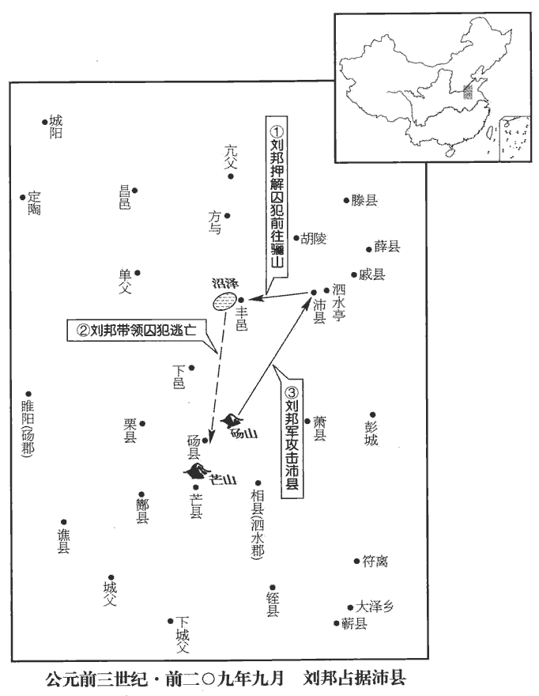 

項梁者，楚將項燕子也，嘗殺人，與兄子籍避仇吳中‹江蘇蘇州地區›。吳中賢士大夫皆出其下。籍少時學書，不成，去；學劍，又不成。項梁怒之。籍曰：「書，足以記名姓而已！劍，一人敵，不足學；學萬人敵！」於是項梁乃教籍兵法，籍大喜；略知其意，又不肯竟學。籍長八尺餘，力能扛鼎，韋昭曰：扛，舉也。索隱曰：說文云：扛，橫關對舉也。長，真亮翻。扛，音江。才器過人。會稽‹江蘇蘇州›守殷通徐廣曰：爾時未言太守。余謂戰國之時，郡守只稱守，景帝中二年七月始曰太守。姓譜：武王克商，子孫分散，以殷為氏。守，式又翻；下同。聞陳涉起，欲發兵以應涉，使項梁及桓楚將。將，即亮翻。是時，桓楚亡在澤中。梁曰：「桓楚亡，人莫知其處，獨籍知之耳。」梁乃【章：十二行本「乃」下有「出」字；乙十一行本同；孔本同。】誡籍持劍居外，梁復入，與守坐，曰：「請召籍，使受命召桓楚。」守曰：「諾。」梁召籍入。須臾，梁眴shùn籍曰：「可行矣！」眴，音舜，動目而使之也。於是籍遂拔劍斬守頭。項梁持守頭，佩其印綬。釋名：印，信也，所以封物以為驗也；亦言因也，封物相因付也。綬，受也，系印之組也，以相授受也。應劭漢官曰：綬長丈二尺，法十二月；廣三尺，法天、地、人。門下大驚，擾亂；籍所擊殺數十百人，言所殺自數十至百人也。一府中皆慴shè伏，莫敢起。說文曰：慴，失氣也，音之涉翻。梁乃召故所知豪吏，諭以所為起大事，遂舉吳中兵，使人收下縣，下縣，會稽管下諸縣也。師古曰：非郡所都，故謂之下也。得精兵八千人。梁為會稽‹江蘇蘇州›守，籍為裨將，徇下縣。籍是時年二十四。項籍始此。

〖译文〗 项梁是故楚国大将项燕之子，因曾经杀过人，与他哥哥的儿子项羽逃到吴中躲避仇家。吴中有声望的士人能都在项梁之下，不及他。项羽少年时学习识字和写字，学不成即抛开了，去习练剑法击刺之术，又未学成。项梁为此非常生气，项羽说：“识字写字，记名姓就行了！学剑也不过是只能抵挡一人，不值得去学。要学就学那可以抵抗万人的本事！”项梁因此便教授项羽兵法，项羽喜不自胜，但是在略知兵法大意之后，又不肯学下去。项羽身长八尺多，力能独自举鼎，才干、器度超过了一般人。会稽郡郡守殷通听到陈胜起兵抗秦的消息后，想要发兵响应陈胜，便令项梁和桓楚指挥所发动的兵马。这时，桓楚正亡命江湖之中。项梁说：“桓楚在逃亡中，没有人晓得他在什么地方，只有项羽知道他的行踪。”项梁就嘱咐项羽持剑候在外面，自己又进去与郡守同坐，说：“请您召见项羽，让他接受命令去召回桓楚。”殷通说：“好吧。”项梁唤项羽入内受命。不一会儿，项梁向项羽使了个眼色说：“可以动手了！”项羽随即拔剑斩下了殷通的头。项梁手提郡守的头颅，佩带上郡守的官印。郡守的侍从护卫们见状惊慌失措，混乱不堪，被项羽所击杀的有百十来人，一府之人都吓得趴在地上，没有一个敢于起身的。项梁随后便召集他从前熟悉的有势力的强干官吏，把所以要起事反秦的道理宣告给他们知晓，即征集吴中的兵员，命人收取郡下所属各县丁壮，得精兵八千人。项梁自己做了会稽郡郡守，以项羽为副将，镇抚郡属各县。项羽此时年方二十四岁。

田儋dān，【章：十二行本「儋」下有「者」字；乙十一行本同；孔本同。】故齊王族也。儋從弟榮，榮弟橫，皆豪健，宗強，能得人。從，才用翻。周巿徇地至狄，周巿，魏人。狄城守。田儋詳為縛其奴，從少年之廷，欲謁殺奴，詳，讀曰佯，詐也。應劭曰：古殺奴婢皆當告官。儋欲殺令，故詐縛奴以謁也。廷，縣廷也。師古曰：廷，音定。見狄令，因擊殺令，而召豪吏子弟曰：「諸侯皆反秦自立。齊，古之建國也；儋，田氏，當王！」遂自立為齊王，發兵以擊周巿。周巿軍還去。田儋率兵東略定齊地。

〖译文〗 田儋是故齐国国君田氏的族人。他的堂弟田荣，田荣的弟弟田横，都势力雄厚，家族强盛，颇能博得人心。楚将周带兵巡行占领地方到达了狄县，狄县闭城固守。田儋假意将他的奴仆捆绑起来，让一伙年轻人跟着来到县衙门，想要进见县令，报请准许杀奴。待见到狄县县令时，田儋即趁势击杀了他，随后召集有声望有权势的官吏和青年说：“各诸侯都反叛秦朝自立为王了。齐国是古时候就受封建立的国家。我田儋，是齐王田氏族人，应当为齐王！”于是即自封为齐王，发兵攻击周。周的军队退还。田儋随即率军向东攻取、平崐定了旧齐国的土地。

韓廣將兵北徇燕，燕地豪傑欲共立廣為燕王。廣曰：「廣母在趙，不可。」燕人曰：「趙方西憂秦、南憂楚，其力不能禁我，且以楚之強，不敢害趙王將相之家，趙獨安敢害將軍家乎？」韓廣乃自立為燕王。居數月，趙奉燕王母家屬歸之。

〖译文〗 赵国将领韩广带兵往北攻掠故燕国的土地。燕地有势力的豪强打算共同拥立韩广为燕王。韩广说：“我的母亲尚在赵国，不可这么做。”燕地的人说：“赵国正西边担忧秦国的威胁；南面忧虑楚国的威胁，它自己的力量已不能禁止我们。况且以楚国的强大，还不敢杀害赵王将相的家属，赵国难道就敢加害您的家属吗？！”韩广于是就自立为燕王。过了几个月，赵国即将韩广的母亲和家属送回了燕国。

趙王與張耳、陳餘北略地燕界，趙王間出，師古曰：謂投間隙而微出。為燕軍所得。燕囚之，欲求割地；使者往請，燕輒殺之。有廝養卒走燕壁，如淳曰：廝，賤者也。公羊傳曰：廝役扈養。韋昭曰：析薪為廝，炊烹為養。廝，音斯。養，羊尚翻。見燕將曰：「君知張耳、陳餘何欲？」曰：「欲得其王耳。」趙養卒笑曰：「君未知此兩人所欲也。夫武臣、張耳、陳餘，杖馬棰杖，直亮翻。棰，止橤翻，馬撾zhuā也。下趙數十城，此亦各欲南面而王，豈欲為將相終已耶！顧其勢初定，未敢參分而王，參，猶三也。且以少長先立武臣為王，以持趙心。少，詩照翻。長，知兩翻。今趙地已服，此兩人亦欲分趙而王，時未可耳。今君乃囚趙王。此兩人名為求趙王，實欲燕殺之；此兩人分趙自立。夫以一趙尚易燕，易，弋豉翻。況以兩賢王左提右挈而責殺王之罪，滅燕易矣！」燕將乃歸趙王，養卒為御而歸。

〖译文〗 赵王武臣与张耳、陈馀在燕国边界处夺取土地。武臣抽空悄悄外出，被燕军俘获。燕国将他囚禁起来，想据此要求赵国割让土地。赵国的使者赴燕请求放人，都被燕国杀了。这时，赵军有一个火夫跑到燕军的营地，进见燕将说：“您知道陈耳、陈馀想要什么吗？”燕将答道：“只是想要得到他们的国王罢了。”赵军火夫笑着说：“您并不知道这两个人所要的是什么啊。武臣、张耳、陈馀，持马鞭，唾手攻克故赵国的数十城，张、陈二人也是各自想要面向南称王，哪里会甘心于一辈子做将相啊！不过是因为大势初定，不敢即三分土地自立为王，故暂且按年龄的长幼，先立武臣为王，以此安定赵国的民心。现在赵地已经平定顺服了，这两人便也想分赵国土地而称王，只是时机尚未成熟罢了。而今您正好囚禁了赵王，此二人名为求释赵王，实则想让燕国将赵王杀掉，以使他们俩分赵国而自立。一个赵国尚且不把燕国放在眼里，更何况两个贤能的国君相互扶持，来声讨您杀害赵王的罪行啊。如此，灭掉燕国是很容易的了！”燕军将领于是便归还赵王，由那位火夫驾车送他返回了赵国。

4周巿fú自狄還，至魏地，欲立故魏公子寧陵君咎為王。寧陵即漢之寧陵縣，屬陳留郡。括地志曰：宋州寧陵城，古寧陵也。咎在陳‹河南淮陽›，不得之魏。魏地已定，諸侯皆欲立周巿為魏王。巿曰：「天下昏亂，忠臣乃見。見，賢遍翻。今天下共畔秦，其義必立魏王後乃可。」諸侯固請立巿，巿終辭不受；迎魏咎于陳，五反，陳王乃遣之，立咎為魏王‹都临济，河南封丘›，巿為魏相。

〖译文〗 [4]周从狄县还楚，到达故魏国土地时，想要立故魏国公子宁陵君魏咎为王。但魏咎恰巧在陈县陈胜那里，不能到魏地来，而魏地已经平定，诸侯便都想立周为魏王。周说：“天下昏乱，忠臣即出现。如今天下共同反叛秦王朝，依此道义，必定要立故魏国国君的后裔才行。”诸侯坚持请求拥立周，周最终还是推辞不接受，派人往陈县迎取魏咎，往返五次，陈胜才将魏咎送还，立他为魏王，周担任魏相。

5是歲，二世廢衛‹府野王，河南沁阳›君角為庶人，衛絕祀。周之列國，衛最後亡。

〖译文〗 [5] 这一年，二世将卫国国君卫角废黜为平民，卫国灭亡。

