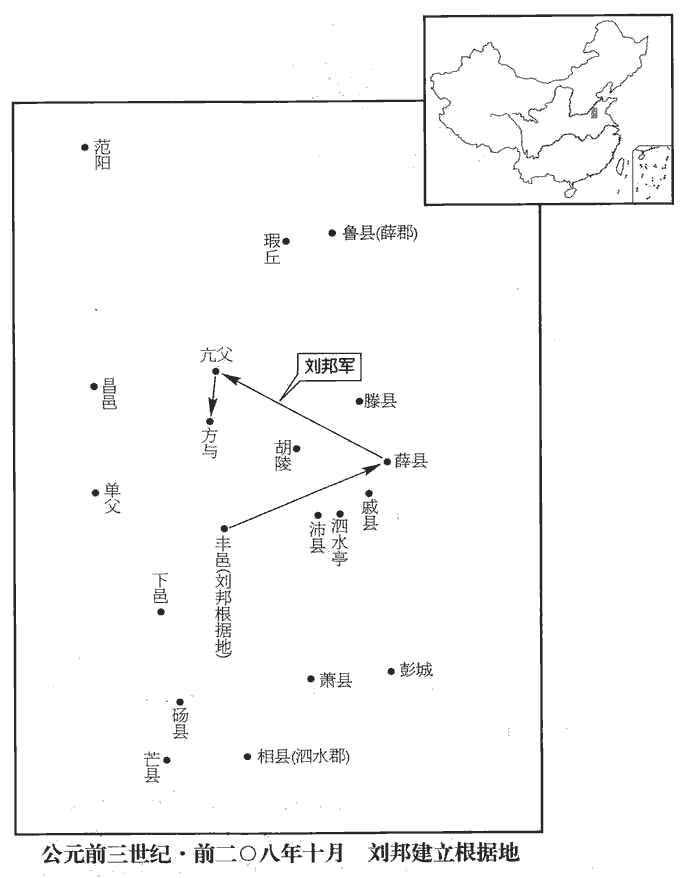
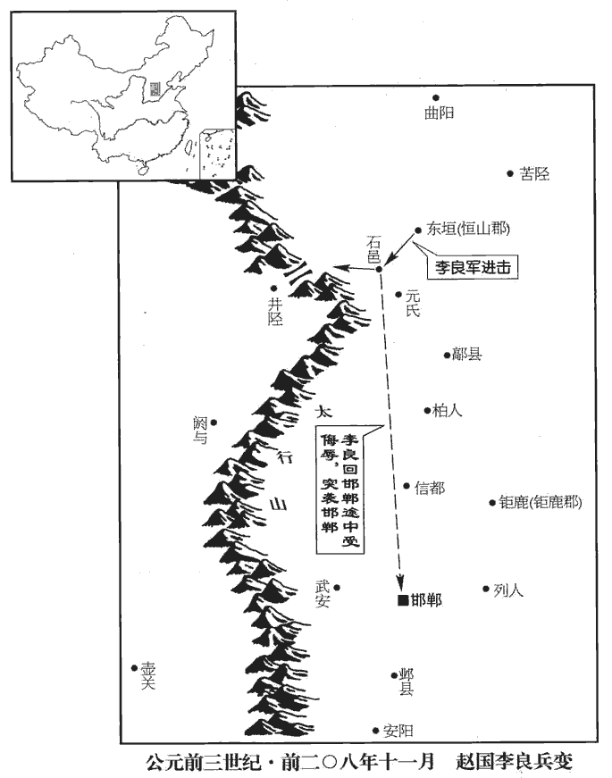
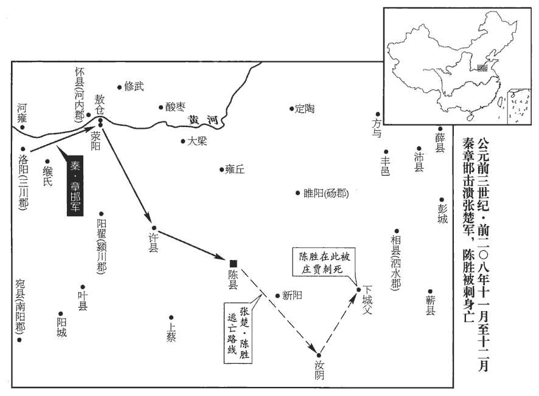
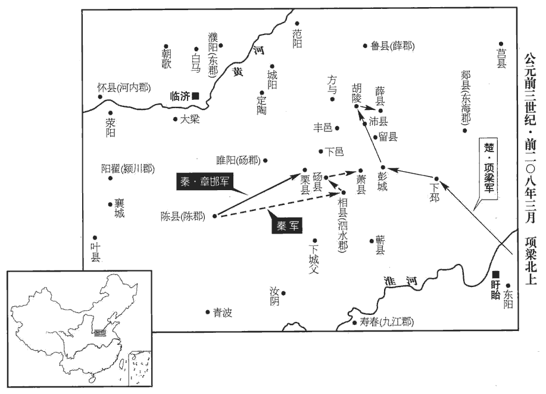
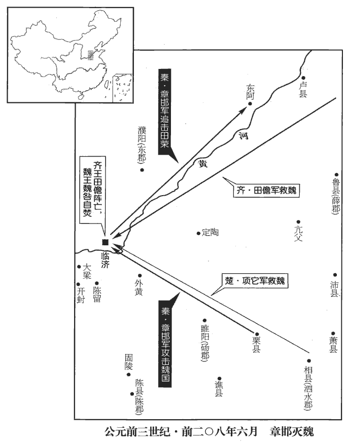
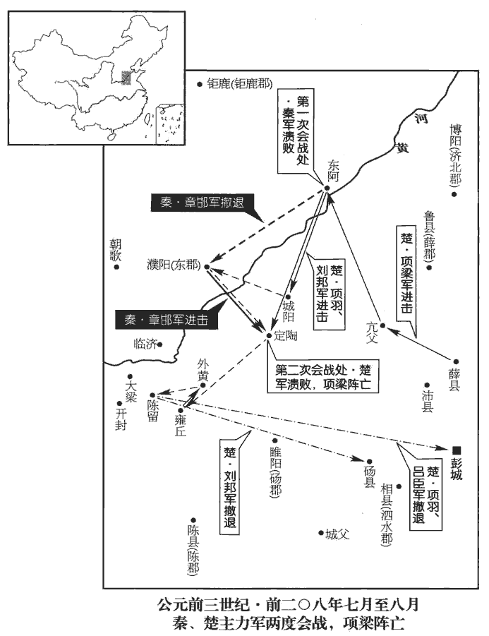
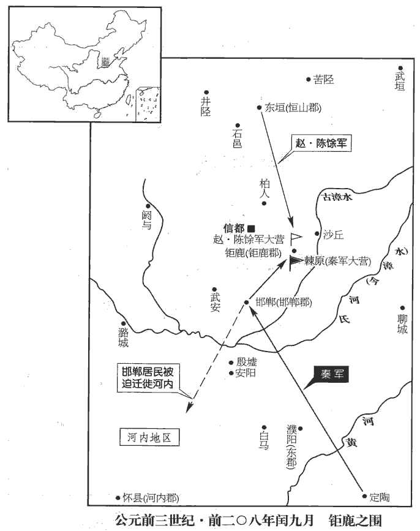
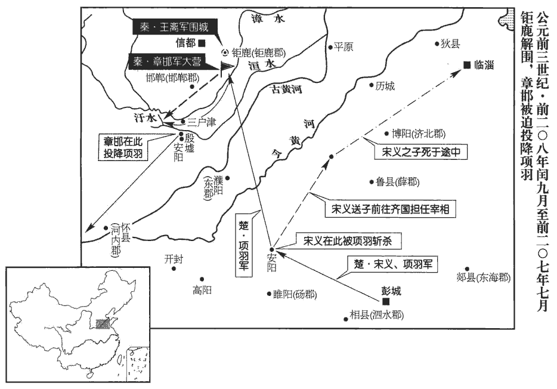
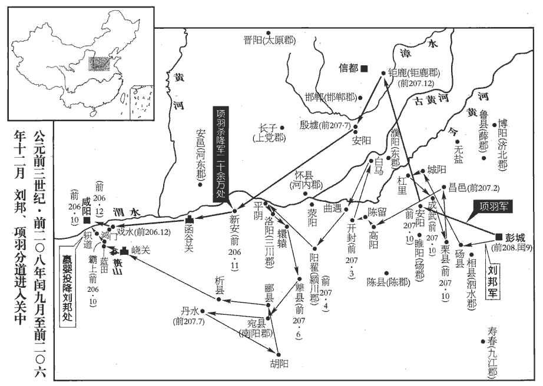
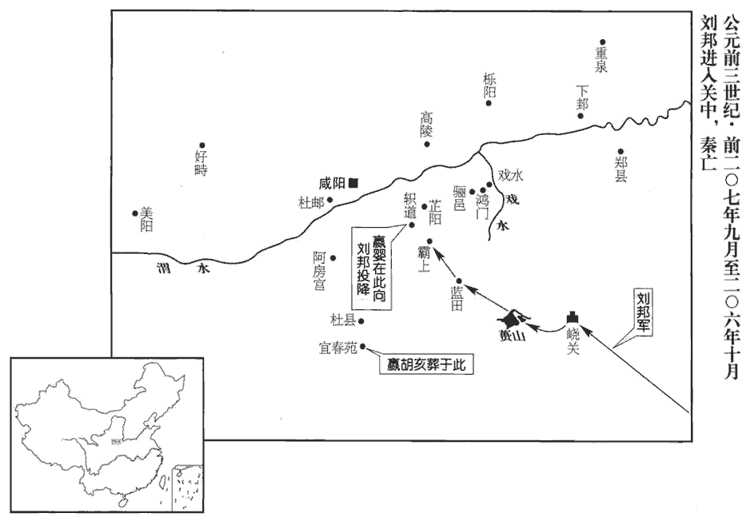

 秦紀三起昭陽大荒落（癸巳），盡閼逢敦牂（甲午），凡二年。

# 二世皇帝下

## 二年（癸巳，前二零八年）

1冬，十月，泗川‹安徽淮北›監平將兵圍沛公于豐‹江蘇豐縣›，泗川郡即泗水郡。秦，郡置守、尉、監。文穎曰：秦時御史監郡，若今刺史。平，人名。沛公出與戰，破之；令雍齒守豐。雍，於用翻，姓也。風俗通：雍姓，周文王子雍伯之後。十一月，沛公引兵之薛‹山東滕州南›。泗川守壯兵敗于薛，走至戚‹山東微山县›；沛公左司馬得殺之。壯者，泗川守之名。班志，戚縣屬東海郡。括地志：沂州臨沂縣有戚縣故城。戚，如字，如淳將毒翻。余以地理考之，沛郡之與東海相去頗遠，壯兵敗而走，未必能至東海之戚。班志，沛郡有廣戚縣。章懷太子賢曰：廣戚故城在今徐州沛縣東，恐是走至廣戚之戚也。師古曰：得者，司馬之名。貢父曰：得殺之者，得而殺之；漢書多以獲為得。司馬掌兵，周之夏卿。春秋之時，晉置三軍及新軍，各有卿佐，復置司馬以掌軍中刑戮之事。後復分為左、右；又其後也，軍行有軍司馬、假司馬；下至部曲，有候，有司馬。

〖译文〗 [1]冬季，十月，秦王朝名叫平的泗川郡监，率军将刘邦包围在丰地，刘邦出兵应战，打败了秦军，即命雍齿守卫丰地。十一月，刘邦领兵去攻薛地，泗川郡守名叫壮的，在薛地吃了败仗后，逃到戚地。刘邦的左司马曹无伤将他捉住杀掉了。

2周章出關，止屯曹陽‹河南三门峡西南›，晉灼曰：曹陽亭在弘農東十三里，魏武改曰好陽。師古曰：曹水之陽也。其水出陝縣西峴頭山而北流入河，今謂之好陽澗，在陝縣西四十五里。括地志：在陝州桃林縣東十四里。二月余，章邯追敗之；復走澠池‹河南澠池西›，敗，補邁翻。復，扶又翻。十余日，章邯擊，大破之。周文自刎，軍遂不戰。刎，扶粉翻。

〖译文〗 [2]楚国将领周文率军退出函谷关，到曹阳亭后驻扎下来，过了两个多月，秦将章邯领兵追击打败了楚军。周文又逃跑到渑池，十余日后，章邯发起攻击，大败周文。周文自杀，楚军于是不再作战。

吳叔圍滎陽‹河南滎陽›；李由為三川守，守滎陽，秦滅周置三川郡，其治所當在洛陽；由蓋守滎陽以捍楚。宋白曰：秦立三川郡，初理洛陽，後徙滎陽。叔弗能下。楚將軍田臧等相與謀曰：「周章軍已破矣，周章，即周文。秦兵旦暮至。我圍滎陽城弗能下，秦兵至，必大敗，不如少遺兵守滎陽，遺兵，留兵也。少，詩沼翻。悉精兵迎秦軍。今假王驕，陳涉之自王也，以吳叔為假王。不知兵權，不足與計事，恐敗。」因相與矯王令以誅吳叔，師古曰：矯，託也，託言受王令也。獻其首于陳王。陳王使使賜田臧楚令尹印，以為上將。

〖译文〗 吴广率军围攻荥阳，秦朝李由为三川郡守，固守荥阳，吴广不能攻下。楚将军田臧等便相互商议说：“周文的军队已被击败了，秦兵很快就会到来。我们围攻荥阳城不下，秦军一到，必将大败我军，不如留一小部分兵力围守荥阳，而调动全部精兵迎击秦军。但现在代理楚王的吴广自高自大，不懂得灵活用兵，不值得与他谋划对策，否则恐怕会坏事。”因此就一起假传楚王陈胜的命令杀掉了吴广，又将吴广的头颅献给陈胜。陈胜派使者把楚令尹的官印赐给田臧，并任命他为上将军。

田臧乃使諸將李歸等守滎陽，自以精兵西迎秦軍于敖倉‹河南滎陽北敖山粮仓›，周宣王狩于敖。左傳：晉師在敖、鄗之間。後漢志：滎陽有敖亭，秦立敖倉。孟康曰：敖，地名，在滎陽西北山上，臨河有大倉。與戰；田臧死，軍破。章邯進兵擊李歸等滎陽下，破之，李歸等死。陽城‹河南登封›人鄧說將兵居郯tán，師古曰：郯，東海縣，音談。索隱曰：非也。此時章邯軍未至東海，此郯別是地名；或恐「郯」當作「郟」，郟是郟鄏之地。史記正義曰：郟是春秋時郟地，楚郟敖葬之，今汝州郟縣城‹河南郟縣›是。鄧說，陽城人。陽城，河南府縣，與郟縣相近，又近陳。余按索隱以為河南之郟鄏，正義以為汝州之郟；時章邯兵至滎陽，則已過郟鄏而東矣，正義之說近之。章邯別將擊破之。銍‹安徽宿州西南›人伍逢將兵居許‹河南許昌›，伍，姓也。春秋時，楚有伍舉、伍奢。許，春秋許子之國，班志屬潁川；魏文帝改曰許昌；唐為許州章邯擊破之。兩軍皆散，走陳‹河南淮陽›，陳王誅鄧說。

〖译文〗 田臧于是令李归等将领继续围攻荥阳，自己亲率精兵向西至敖仓迎击秦军，与秦兵交锋中，田臧战死，楚军大败。章邯进军荥阳城下攻打李归等，击败了楚军，李归等将领战死。楚将阳城人邓说领兵屯居在郯地，章邯的另一路部将击败了邓的军队。地人伍逢率军驻扎在许地，章邯又发兵将伍逢打败。邓、伍两军都溃散而逃奔陈地，陈胜为此杀了邓说。

 

3二世‹嬴胡亥，时年二十三›數誚qiào讓李斯：「居三公位，如何令盜如此！」數，所角翻。誚，七笑翻，責也。秦以丞相、太尉、御史大夫為三公，漢因之。李斯恐懼，重爵祿，不知所出，乃阿二世意，以書對曰：「夫賢主者，必能行督責之術者也。索隱曰：督者，察也；察其罪，責之以刑罰也。故申子曰：『有天下而不恣睢suī，恣，資二翻；睢，香萃翻，謂肆情放縱也。命之曰「以天下為桎梏」者，無他焉，不能督責，而顧以其身勞於天下之民，若堯、禹然，故謂之桎梏也。』桎梏，械也；在足曰桎，在手曰梏。桎，職日翻。梏，姑沃翻。夫不能修申、韓之明術，行督責之道，專以天下自適也；而徒務苦形勞神，以身徇百姓，則是黔首之役，非畜天下者也，何足貴哉！故明主能行督責之術以獨斷於上，斷，丁亂翻。則權不在臣下，然後能滅仁義之塗，絕諫說之辯，犖luò然行恣睢之心犖，呂角翻。而莫之敢逆。如此，群臣、百姓救過不給，何變之敢圖！」二世說，說，讀曰悅。於是行督責益嚴，稅民深者為明吏，殺人眾者為忠臣，刑者相半於道，而死人日成積於市；秦民益駭懼思亂。

〖译文〗 [3]二世多次谴责李斯：“身居三公高位，如何使盗贼猖狂到这种地步！”李斯颇为恐惧，但他又很看重贪恋官爵利禄，不知怎么办才好，便迎合二世的心意，上书应答说：“贤明的君主，必定是能对臣下施行考察罪过处以刑罚的统治术的人。所以申不害说：‘拥有天下却不肆情放纵，称之为“把天下当作自己的桎梏”的原因，并不是别的，就在于不能对臣下明察罪过施行惩处，反而以自身之力为天下平民百姓操劳，即如唐尧、大禹那样，故此称之为‘桎梏’。不能研习申不害、韩非的高明法术，实行察罪责罚的手段，一心将天下作为使自己快乐的资本，反而偏要劳身苦心地去为百姓效命，似此就成为平民百姓的奴仆，不能算是统治天下的君王了。这有什么值得崇尚的啊！所以贤明的君主能施行察罪责罚之术，在上独断专行，这样权力就不会旁落至下属臣僚手中，然后才能阻断实施仁义的道路，杜绝规劝者的论辩，独自称心如意地为崐所欲为，谁也不敢抵触反抗。如此，群臣、百姓想补救自己的过失还来不及呢，哪里还敢去图谋什么变故！”二世十分高兴，便更加严厉地实行察罪惩处，以向百姓征收重税的人为有才干的官吏，以杀人多的官员为忠臣，结果使路上的行人有一半是受过刑罚的罪犯，死人的尸体天天成堆地积陈在街市中，秦朝的百姓因此愈加惊骇恐惧，思念着发生动乱。

4趙李良已定常山‹河北正定›，去年，趙王使李良略常山。還報趙王。趙王復使良略太原‹山西太原›；至石邑‹河北石家庄西南›，秦兵塞井陘‹河北井陘›，未能前。班志，石邑縣屬常山郡，井陘山在西。塞，悉則翻。陘，音刑。秦將詐為二世書以招良。良得書未信，還之邯鄲‹河北邯鄲›，益請兵。未至，道逢趙王姊出飲，【章：十二行本「飲」下有「從百餘騎」四字；乙十一行本同；孔本同；張校同；退齋校同。】良望見，以為王，伏謁道旁。王姊醉，不知其將，將，即亮翻。使騎謝李良。李良素貴，起，慚其從官。拜謁而起，顧從官而慚也。從，才用翻。從官有一人曰，「天下畔秦，能者先立。且趙王素出將軍下，今女兒乃不為將軍下車，請追殺之！」李良已得秦書，固欲反趙，未決；因此怒，遣人追殺王姊，因將其兵襲邯鄲。邯鄲不知，竟殺趙王、邵騷。趙人多為張耳、陳餘耳目者，以故二人獨得脫。以故者，以此故也。

〖译文〗 [4]赵国的将领李良已平定了常山，回报赵王武臣。赵王又派他去夺取太原。李良领兵抵达石邑时，秦军布防在井陉口，赵军无法继续前进。秦将伪造二世的书信，用以招降李良。李良接书后没有相信，率军返回邯郸，请求增援兵力。尚未到邯郸，在途中遇赵王的姐姐外出饮宴归来。李良望见，以为是赵王来了，连忙在道旁伏地拜谒。赵王的姐姐酩酊大醉，不知道他是将官，仅命随行骑兵向他致意。李良向来尊贵，起身后，回看他的随从官员，自觉羞惭极了。随员中有一人说道：“天下反叛秦朝，有能耐的人先立为王。况且赵王的地位一向比您低，而今一个女流之辈就不肯为您下车还礼，故请追杀她！”李良已得到过二世的书信，原本即想反叛赵国，只是还未最终作出决断。于是便借着一时的愤怒，遣人追上去杀掉了赵王的姐姐，并趁势率军袭击邯郸。邯郸守兵毫无察觉，致使李良终于杀掉了赵王和左丞相邵骚。赵国人中有许多是张耳、陈馀的耳目，及时通报消息，二人因此得以独自脱逃。

 

5陳‹凌，江苏泗阳›人秦嘉、符離‹安徽宿州东北›人朱雞石等起兵，圍東海守於郯tán‹山東郯城›。「陳」當作「凌」；陳勝傳作「凌人秦嘉」。秦，姓也；春秋時，魯有秦堇父。班志曰：東海郡，漢高帝置；應劭註曰：即秦郯郡。余按裴駰所云三十六郡，本亦無郯郡，漢東海郡則治郯耳。陳王聞之，使武平君畔為將軍，監郯下軍。秦嘉不受命，自立為大司馬，惡屬武平君，惡，烏路翻。告軍吏曰：「武平君年少，不知兵事，勿聽！」因矯以王命殺武平君畔。

〖译文〗 [5]陈人秦嘉、符离人朱鸡石等聚众起兵，将东海郡守围困在郯地。陈胜闻讯，即派名叫畔的武平君任将军，督率围郯城的各路军队。秦嘉不接受此命令，自立为大司马，并由于厌恶隶属于武平君而告诉他的军吏说：“武平君年少，不懂用兵之事，不要听他的！”随即假传陈胜的命令，杀了武平君畔。

6二世益遣長史司馬欣、董翳佐章邯擊盜。時章邯為上將，將兵東討，故使欣為長史以佐之。據項籍傳，翳為都尉。姓譜：飂liù叔安裔子董父好龍，帝舜嘉焉，因賜姓董。章邯已破伍逢，擊陳柱國房君，殺之；又進擊陳西張賀軍。陳王出監戰。張賀死。監，古銜翻。

〖译文〗 [6]二世增派长史司马欣、董翳辅助章邯攻打盗贼。章邯已击败伍逢，并攻击在陈地的楚上柱国房君蔡赐，杀掉了他。接着又进击陈地西侧张贺的军队。陈胜亲自上阵督战。张贺还是战死了。

臘月，張晏曰：秦之臘月，夏之九月。臣瓚曰：建丑之月也。師古曰：史記云：胡亥二年十月，誅葛嬰；十一月，周文死；十二月，陳涉死：瓚說是也。陳王之汝陰‹安徽阜陽›，之，往也。還，至下城父‹安徽涡阳›，師古曰：下城父，地名，在沛郡城父縣東。劉昭曰：汝南山桑縣，故屬沛，有下城父聚。父，音甫。其御莊賈殺陳王以降。降，戶江翻。初，陳涉既為王，其故人皆往依之。妻之父亦往焉，陳王以眾賓待之，長揖不拜。妻之父怒曰：「怙亂僭號，而傲長者，不能久矣！」不辭而去。陳王跪謝，遂不為顧。客出入愈益發舒，言陳王故情。或說陳王曰：「客愚無知，顓妄言，輕威。」陳王斬之。諸故人皆自引去，由是無親陳王者。陳王以朱防為中正，胡武為司過，主司群臣。諸將徇地至，令之不是，【章：十二行本「是」下有「者」字；乙十一行本同；孔本同。】輒繫而罪之。以苛察為忠；其所不善者，弗下吏，輒自治之。諸將以其故不親附，此其所以敗也。史言陳王棄其親故，遂死于莊賈之手，故先以故人二字發其端，乃及慢其妻父事，次及客事。客先與陳王傭耕，及其據陳而王，遮道求見，陳王載與俱歸；後以客言其故情，遂殺之。輕威者，言輕其為君之威重也。顓，與專同。

〖译文〗 腊月，陈胜前往汝阴，返归时到达下城父，他的车夫庄贾将他刺杀，投降了秦军。当初，陈胜既已作了楚王，他过去的朋友们纷纷前往投靠。陈胜妻子的父亲也去了，但陈胜对他却以普通宾客相待，只是拱手高举行见面礼，并不下拜。陈胜的岳父因此生气地说：“依仗着叛乱，超越本分自封帝王的称号，且对长辈傲慢无礼，不能长久！”即不辞而走。陈胜急忙跪下道歉，老人终究不予理会。陈胜的一位客人进进出出愈益放纵，谈论陈胜的往事。于是有人就劝陈胜道：“客人愚昧无知，专门胡说八道，有损您的威严。”陈胜便把这位客人杀了。如此，陈胜昔日的朋友都自动离去，从此再也没有亲近他的人了。陈胜又任命朱防为中正，胡武为司过，专管督察群臣的过失。众将领攻城掠地到达目的地，凡有不听从陈胜命令的，即被抓起来治罪。以苛刻纠察同僚的过失为忠诚之举，对于所不喜欢的人，不送交司法官员审理，即擅自进行处置。众将领因此都不再亲近依附于陈胜。这是陈胜所以失败的原因。

陳王故涓人將軍呂臣為蒼頭軍，魏有蒼頭二十萬，蓋前乎此時已有蒼頭軍矣。應劭曰：時軍皆著青巾，故曰蒼頭。服虔曰：蒼頭，謂士卒青帛巾，若赤眉之號以相識別也。起新陽‹安徽界首北›，班志，新陽縣屬汝南郡；應劭曰：在新水之陽。括地志：新陽故城，在豫州真陽縣西南四十二里。攻陳‹河南淮陽›，下之，殺莊賈，復以陳為楚；葬陳王於碭‹河南永城›，諡曰隱王。

〖译文〗 过去在陈胜左右担任洒扫的近侍、将军吕臣建立了一支青巾裹头的苍头军，在新阳起兵，进攻陈地，克复后杀了庄贾，重又以陈地为楚都，将陈胜葬在砀县，谥号为“隐王”。

初，陳王令銍‹安徽宿州西南›人宋留將兵定南陽‹河南南陽›，入武關‹陝西商南西南›。留已徇南陽，聞陳王死，南陽復為秦；宋留以軍降，二世車裂留以徇。

〖译文〗 起初，陈胜命人宋留率军平定南阳，进入武关。宋留已攻下南阳，听到陈胜死亡的消息后，南阳重又被秦军占领，宋留领兵投降，二世将他车裂示众。

 

7魏周巿將兵略【章：十二行本「略」下有「地」字；乙十一行本同；孔本同。】豐‹江蘇豐縣›、沛‹江蘇沛縣›，使人招雍齒，雍齒雅不欲屬沛公，即以豐降魏。雅，素也。沛公攻之，不克。

〖译文〗 [7]魏国周率军夺取丰、沛，派人招降雍齿。雍齿平素就不愿意归属刘邦，于是即举丰邑降魏。刘邦攻丰邑，没能克复。

8趙張耳、陳餘收其散兵，得數萬人，擊李良；良敗，走歸章邯。

〖译文〗 [8]赵国张耳、陈馀收集逃散的士卒，得数万人，随即攻打李良。李良兵败而逃，归降了章邯。

客有說耳、餘曰：「兩君羇旅，而欲附趙，難可獨立；立趙後，輔以誼，可就功。」乃求得趙歇。春，正月，耳、餘立歇為趙王，居信都‹河北邢台›。項羽改信都曰襄國；漢復為信都縣，屬信都國；後漢復曰襄國。

〖译文〗 宾客中有人劝说张耳、陈馀道：“二位作客他乡是外地人，要想使赵国人归附，是很难独立获得成功的。若拥立故赵国国君的后裔，并以仁义辅助他，便可以成就功业。”二人于是寻求到了赵歇。春季，正月，张耳、陈馀立赵歇为赵王，驻居信都。

9東陽‹江苏盱眙东南›寧君、秦嘉文穎曰：秦嘉，東陽郡人，為寧縣君。臣瓚曰：陳勝傳：「凌人秦嘉」，然則嘉非東陽人。嘉起于郯，號大司馬，又不為寧縣君。東陽寧君自一人，秦嘉又一人。師古曰：瓚說是。東陽者，為所屬縣；寧君者，姓寧，時號為君。姓譜：衛卿寧氏之後；又晉有寧嬴，以邑為姓。聞陳王軍敗，乃立景駒為楚王，引兵之方與‹山東魚台›，欲擊秦軍定陶‹山東定陶›下；班志，方與縣屬山陽郡，定陶縣屬濟陰郡。史記正義曰：方與，今濟州縣；定陶，今曹州縣。方與，音房預。使公孫慶使齊，欲與之并力俱進。并，必正翻。齊王曰：「陳王戰敗，不知其死生，楚安得不請而立王！」公孫慶曰：「齊不請楚而立王，楚何故請齊而立王！且楚首事，當令於天下。」首事，謂最先起兵伐秦。田儋殺公孫慶。

〖译文〗 [9]东阳人宁君和秦嘉闻听陈胜兵败，便拥立景驹为楚王，领兵前往方与，打算在定陶攻击秦军，即遣公孙庆出使齐国，想要与齐合力共同进军攻秦。齐王说：“陈胜战败，至今生死不明，楚国怎么能不请示齐国便自行立王呀！”公孙庆道：“齐国不请示楚国即立王，楚国为什么要请示齐国后才立王呢！况且楚国首先起事，理当号令天下。”齐王田儋于是就将公孙庆杀了。

秦左、右校復攻陳‹河南淮陽›，下之。索隱曰：左、右校，即左、右校尉。校，戶教翻。呂將軍走，徼yāo兵復聚，如淳曰：徼，要也，徼散卒復相聚也。師古曰：徼，工堯翻。余謂從如氏之說，當音於堯翻。與番‹江西波阳›盜黥布相遇，番，即番陽縣，漢屬豫章郡。英布為盜于江中，番陽令吳芮妻之以女，故謂番盜。番，蒲何翻。攻擊秦左、右校，破之青波‹河南息縣與新蔡交界處›，復以陳為楚。

〖译文〗 秦朝的左、右校尉率军再次攻陷陈，吕臣兵败逃跑，收集散兵重新聚合后，与番阳县的盗贼黥布相遇，合兵攻打秦朝的左、右校尉，在青波击败秦军，重又以陈为楚都。

黥qíng布者，六‹安徽六安›人也，六，春秋之六國也；秦為縣，屬九江郡；漢屬六安國。括地志：六故城，在壽州安豐縣南百三十里。宋白曰：今蘄州東廣濟縣即秦、漢之六縣。英布都六，古城猶存。姓英氏，姓譜；英出自偃姓，皋陶之後封于英，因以為氏。坐法黥，以刑徒論輸驪山。驪山之徒數十萬人，布皆與其徒長豪桀交通，長，知兩翻。乃率其曹耦曹，輩也。亡之江中為群盜，番陽令吳芮，甚得江湖間民心，號曰番君。布往見之，其眾已數千人。番君乃以女妻之，妻，七細翻。使將其兵擊秦。

〖译文〗 黥布是六地人，姓英，因犯法被判处黥刑，以刑徒定罪后被送往骊山做苦工。当时赴骊山服劳役的犯人有数十万，黥布与其中的头目和强横有势力的人都有交往，于是即率领他的一伙人逃亡至长江一带，聚结为盗匪。番阳县令吴芮，很受江湖中百姓的爱戴，被称号为“番君”。黥布便前往求见，这时黥布的部众已达数千人。番君即将自己的女儿嫁给黥布，命他率领部众攻击秦军。

10楚王景駒在留‹江蘇沛縣東南›，班志，留縣屬楚國。括地志：留城在徐州沛縣東南五十里，即張良封處。沛公往從之。張良亦聚少年百余人欲往從景駒，道遇沛公，遂屬焉；沛公拜良為廏jiù將。廏將蓋掌馬。良數以太公兵法說沛公；沛公善之，常用其策；良為他人言，皆不省。說，輸芮翻。為，於偽翻；下平為同。省，悉井翻，察也；後以義推。良曰：「沛公殆天授！」故遂留不去。張良從沛公始此。

〖译文〗 [10]楚王景驹驻居留地，刘邦前往归附。张良也聚集青年一百余人，打算去投奔景驹，途中遇到刘邦，就归属了他，刘邦授给张良掌厩将之职。张良多次用《太公兵法》的道理向刘邦献策，刘邦很赏识他，常常采用他的计策。张良向其他人讲述《太公兵法》，那些人都不能领悟。张良因此说道：“沛公大概是天赋之才吧！”于是便留下来不再他往。

沛公與良俱見景駒，欲請兵以攻豐‹江蘇豐縣›。時章邯司馬𡰥rén將兵北定楚地，師古曰：𡰥rén，古夷字。類篇曰：古仁字；又延知翻。屠相‹安徽淮北›，至碭‹河南永城›。班志，相縣為沛郡治所。括地志：故相城，在徐州符離縣西九十里。相，息亮翻。碭，徒郎翻。東陽寧君、沛公引兵西，與戰蕭西‹安徽蕭縣西›，班志，蕭縣屬沛郡；唐屬徐州。蕭西，謂在蕭縣之西。不利，還，收兵聚留。二月，攻碭，三日，拔之；收碭兵得六千人，與故合九千人。三月，攻下邑‹安徽砀山›，拔之；班志，下邑縣屬梁國。還擊豐‹江蘇豐縣›，不下。

〖译文〗 刘邦与张良一同去进见景驹，想请求增拨兵力，以反攻丰邑。这时秦将章邯的向北占领楚的土地，洗劫屠戮相后，抵达砀。东阳人宁君、刘邦随即领兵西进，在萧县的西面与秦军交锋，但因出战失利而退回，收拢兵力聚集在留。二月，刘邦等攻打砀，历时三日，攻克了该城，收编了砀的降兵，得六千人，与以前的兵力汇合一处，达九千人。三月，刘邦等又率军攻打下邑，克复后，回击丰，却仍然未能攻下。

11廣陵‹江蘇揚州›人召平為陳王徇廣陵，未下。廣陵縣屬九江郡。班志為廣陵國都；唐為揚州。姓譜：召姓，周文王子召公奭之後。召，寔照翻。聞陳王敗走，章邯且至，乃渡江，矯陳王令，拜項梁為楚上柱國，曰：「江東已定，急引兵西擊秦！」梁乃以八千人渡江而西。聞陳嬰已下東陽，班志，東陽縣屬臨淮郡；明帝分屬下邳；後復分屬廣陵。括地志：東陽故城，在楚州盱眙縣東七十里。水經註曰：淮陰縣，楚、漢之間為東陽郡。遣使欲與連和俱西。陳嬰者，故東陽令史，蘇林曰：令史，曹史也。晉灼曰：漢儀注：令吏曰令史，丞吏曰丞史。師古曰：晉說是。居縣中，素信謹，稱為長者。東陽少年殺其令，相聚得二萬人，欲立嬰為王。嬰母謂嬰曰：「自我為汝家婦，未嘗聞汝先世之有貴者，今暴得大名，不祥；不如有所屬。事成，猶得封侯；事敗，易以亡，非世所指名也。」易，以豉翻。嬰乃不敢為王，謂其軍吏曰：「項氏世世將家，有名于楚；今欲舉大事，將非其人不可。將，即亮翻。我倚名族，亡秦必矣！」其眾從之，乃以兵屬梁。

〖译文〗 [11]广陵人召平为陈胜攻夺广陵，但没能攻陷。这时他闻悉陈胜兵败逃亡，章邯的军队就要来到，便渡过长江，假传陈胜的命令，授给项梁楚上柱国的官职，说：“长江以东已经平定，应火速率军向西攻打秦军！”项梁于是就领八千人渡过长江往西进发。听到陈婴已经攻克了东阳的消息，项梁即派出使者，想要与陈婴联合起来共同西进。陈婴这个人，是过去东阳县的令史，居住在县城中，为人一向诚信谨慎，被称作长者。东阳县的年轻人杀掉了县令，相聚得两万人，欲拥立陈婴为王。陈婴的母亲因此对陈婴说：“自从我作了你们家的媳妇以来，还不曾听说你的祖先中有过地位显赫的人。而今突然获得大名声，不是什么好兆头。不如依附归属于他人，这样，事情成功了，仍然得以封侯，事情失败了，也容易逃亡，因为不是世上被指名道姓的人物。”陈婴于是不敢称王，对他的军官们说：“项姓世世代代为将门，在楚国享有盛名，如今想要办大事，将帅就非这种人不可。我们依靠名家望族，灭亡秦朝便是必定的了！”他的部下听从了他的话，即让部队归项梁统帅。

英布既破秦軍，引兵而東；聞項梁西渡淮，布與蒲將軍皆以其兵屬焉。項梁眾凡六七萬人，軍下邳‹江蘇睢宁北›。班志，下邳縣屬東海郡。應劭曰：邳在薛，其後徙此，故曰下邳。臣瓚曰：有上邳，故曰下邳。史記正義曰：下邳，泗水縣也。

〖译文〗 黥布已经击败了秦军，便领兵东进。听说项梁要西渡淮河，黥布和蒲将军就都将他们的部队归属于项梁指挥了。项梁这时的部众共达六七万人，驻扎在下邳。

景駒、秦嘉軍彭城‹江蘇徐州›東，欲以距梁。梁謂軍吏曰：「陳王先首事，戰不利，未聞所在。今秦嘉倍陳王而立景駒，大逆無道！」倍，蒲妹翻。乃進兵擊秦嘉，秦嘉軍敗走。追之，至胡陵‹山東魚台東南›，胡陵即湖陸，班志屬山陽郡，漢章帝改曰湖陵。嘉還戰。一日，嘉死，軍降；景駒走死梁地。梁地，故魏地也。

〖译文〗 楚王景驹、将领秦嘉驻军彭城东面，想要抵抗项梁。项梁对军官们说：“陈胜首先起事，作战不利，不知去向。现在秦嘉背叛楚王陈胜而拥立景驹，实属大逆不道！”便进军攻打秦嘉，秦嘉的军队大败而逃。项梁领兵追击到胡陵，秦嘉回师对战了一天，秦嘉战死，他的军队即归降了。景驹逃跑，死在了梁地。

梁已并秦嘉軍，軍胡陵‹山東魚台東南›，將引軍而西。章邯軍至栗‹河南夏邑›，班志，栗縣屬沛郡。項梁使別將朱雞石、余樊君與戰。余樊君死；朱雞石軍敗，亡走胡陵。梁乃引兵入薛‹山東滕州南›，誅朱雞石。括地志曰：故薛城，古薛侯國也，在今徐州滕縣界。

〖译文〗 项梁已经兼并了秦嘉的军队，就驻扎在胡陵，将要率军西进。章邯的军队这时抵达栗，项梁便命另统一军的将领朱鸡石、馀樊君与章军交战。馀樊君战死，朱鸡石的队伍吃了败仗，逃奔胡陵。项梁于是率军进入薛，杀了朱鸡石。

沛公從騎百余往見梁；梁與沛公卒五千人，五大夫將十人。沛公還，引兵攻豐‹江蘇豐縣›，拔之。雍齒奔魏。

〖译文〗 刘邦率百余名随从去拜见项梁。项梁给刘邦增拨了士兵五千名，五大夫级的军官十名。刘邦回去后，又领兵进攻丰邑，攻陷了该城。雍齿投奔魏国。

項梁使項羽別攻襄城‹河南襄城›，班志，襄城縣屬潁川郡。史記正義曰：今許州縣。襄城堅守不下；已拔，皆坑之，還報。

〖译文〗 项梁派项羽从另一路攻打襄城，襄城坚守，一时攻不下。待到攻陷后，项羽即将守城军民全部活埋掉，然后回报项梁。

梁聞陳王定死，召諸別將會薛計事，沛公亦往焉。居鄛‹安徽枞阳西北›人范增，年七十，班志，居巢縣屬廬江郡。春秋「楚人圍巢」，巢，國也。史記正義曰：即夏桀所奔地。晉灼曰：鄛，音剿絕之剿。師古音巢。素居家，好奇計，往說項梁曰：「陳勝敗，固當。夫秦滅六國，楚最無罪。自懷王入秦不反，楚人憐之事見四卷周赧王十九年。至今。當屬上句。故楚南公曰：『楚雖三戶，亡秦必楚。』服虔曰：南公，南方之老人。虞喜志林曰：南公者，道士，識廢興之數，知亡秦者必楚。漢書藝文志：南公十三篇，六國時人，在陰陽家流。臣瓚曰：楚人怨秦，雖三戶足以亡秦。今陳勝首事，不立楚後而自立，其勢不長。今君起江東，楚蠭起之將皆爭附君者，師古曰：蠭，古蜂字；蠭起，如蠭之起，言其眾也。一說：蠭，與鋒同，言鋒銳而起者。爾雅翼曰：蠭，近其房，輒群起攻人，故曰蠭起之將。以君世世楚將，為能復立楚之後也。」於是項梁然其言，乃求得楚懷王孫心于民間，為人牧羊；夏，六月，立以為楚懷王，從民望也。徐廣曰：順民望，以其祖諡為號。陳嬰為上柱國，封五縣，與懷王都盱眙‹江蘇盱眙›。班志，盱眙縣屬臨淮郡。史記正義曰：今楚州縣。阮勝之南兗州記：盱眙，本春秋善道地；宋屬泗州。音吁怡。項梁自號為武信君。

〖译文〗 项梁听说陈胜确实死了，便将各部将领召集到薛议事，刘邦也前往参加。居人范增，年已七十，一向住在家中，好出奇计，前去劝说项梁道：“陈胜的失败是本来就应当的。秦朝灭亡六国，楚国最没有罪过。且自从怀王到秦国后一去不返，楚国人怀念他直至今日。因此楚南公说：‘楚国即便是只剩下三户人家，灭亡秦国的也必定是楚国。’如今陈胜首先起事反秦，不拥立楚王的后裔而自立为王，他的势力不能长久。现在您在江东起兵，楚地蜂拥而起的将领都争相归附您，正是因为您家世世代代是楚国的将领，故而能够重新拥立楚王后代的缘故啊！”项梁当时认为他说的很对，就从民间寻找到楚怀王的孙子芈心，芈心这时正在为人家放羊；到夏季，六月，项梁即拥立他为楚怀王，以顺从百姓的愿望。陈婴任楚国的上柱国，赐封五县，跟随怀王建都盱眙。项梁则自号为武信君。

張良說項梁曰：「君已立楚後，而韓諸公子橫陽君成最賢，可立為王，益樹黨。」項梁使良求韓成，立以為韓王。以良為司徒，與韓王將千餘人西略韓地，得數城，秦輒復取之；往來為遊兵潁川‹河南禹州›。潁川，故韓地，秦置郡。

〖译文〗 张良劝说项梁道：“您已经拥立了楚王的后代，韩国的各位公子中，横阳君韩成最为贤能，可以立为王，以增树党羽。”项梁于是便派张良找到韩成，立他为韩王。由张良任韩国的司徒，随韩王率一千余人向西攻取过去韩国的领地，夺得数城，但秦军随即又夺了回去。如此韩军便在颍川一带来回游动。

 

12章邯已破陳王，乃進兵擊魏王於臨濟‹河南封丘东›。後漢志，陳留郡平丘縣有臨濟亭。水經註曰：田儋死處。史記正義曰：今齊州臨濟縣。又曰：故城在淄州高苑縣北二里。余按正義所云臨濟，乃田儋所起狄縣地也，非魏王咎所居臨濟也。後漢志及水經註為是。魏王使周巿出，請救于齊、楚；齊王儋及楚將項它皆將兵隨巿救魏。它，徒河翻，章邯夜銜枚擊，大破齊、楚軍於臨濟下，師古曰：銜枚者，止言語讙huān囂，欲令敵人不知其來也。周官有銜枚氏。枚狀如箸，橫銜之，繣huà結于項。繣結，礙也，絜繞也，蓋為結紐而繞項也。銜，戶緘翻。繣，音獲。絜，音頡。殺齊王及周巿。魏王咎為其民約降；約定，自燒殺。其弟豹亡走楚，楚懷王予魏豹數千人，復徇魏地。為，於偽翻。予，讀曰與。齊田榮收其兄儋余兵，東走東阿‹山東陽谷东北阿城镇›；班志，東阿縣屬東郡。括地志：東阿故城，在濟州東阿縣西南二十五里。章邯追圍之。齊人聞田儋死，乃立故齊王建之弟假為王，田角為相，角弟間為將，以距諸侯。

〖译文〗 [12]章邯已经打败了陈胜，即进兵临济攻打魏王。魏王派周出临济城，向齐、楚两国求援。齐王田儋和楚将项它都率军随周去援救魏国。章邯便在夜间命士兵口中衔枚进行突袭，在临济城下大败齐、楚的军队，杀了齐王和周。魏王咎为他的百姓而订约投降，降约确定后，即自焚而亡。魏咎的弟弟魏豹逃奔楚国，楚怀王给了魏豹数千人，重新夺取魏国的领地。齐国田荣收集他的党兄田儋的余部，向东撤退到东阿。章邯随后追击包围了田荣的军队。齐国人这时听说田儋已死，便拥立已故齐王田建的弟弟田假为齐王，田角任相国，田角的弟弟田间为将军，以对抗诸侯国。

秋，七月，大霖雨。雨三日以往為霖。武信君引兵攻亢父‹山東濟寧南›，亢父，音抗甫。聞田榮之急，乃引兵擊破章邯軍東阿下；章邯走而西。田榮引兵東歸齊。武信君獨追北，使項羽、沛公別攻城陽‹山東鄄城东南›，屠之。括地志：濮州雷澤縣，本漢城陽，在州東九十一里。余按班志，濟陰成陽縣有雷澤。此成陽與定陶、濮陽皆相近，非城陽國之城陽。楚軍軍濮陽‹河南濮陽›東，班志，濮陽縣屬東郡。括地志：濮陽縣在濮州西八十六里。濮，音卜。復與章邯戰，又破之。章邯復振，李奇曰：振，整也。如淳曰：振，起也；收散卒，自振迅而起。守濮陽，環水。文穎曰：決水以自環守為固。環，音宦。沛公、項羽去，攻定陶。

〖译文〗 秋季，七月，大雨连绵不止。武信君项梁率军攻打亢父，闻悉田荣危急，就领兵到东阿城下击败了章邯的军队。章邯向西逃跑。田荣于是率军往东返回齐国。项梁独自引兵追击败逃的秦军，派项羽、刘邦从另一路攻打城阳，屠灭了全城。楚军驻扎在濮阳东面，重又与章邯的军队交战，再次打败了秦军。章邯重新振作起来，坚守濮阳，挖沟引水环城自固。项梁、刘邦因此撤兵，去攻打定陶。

八月，田榮擊逐齊王假，假亡走楚。【章：十二行本「楚」下有「田角亡走趙」五字；乙十一行本同；孔本同；張校同；退齋校同。】田間前救趙，因留不敢歸。田榮乃立儋子巿為齊王，榮相之。田橫為將，平齊地。章邯兵益盛，項梁數使使告齊、趙發兵共擊章邯。田榮曰：「楚殺田假，趙殺角、間，乃出兵。」楚、趙不許。田榮怒，終不肯出兵。

〖译文〗 八月，田荣追击齐王田假，田假逃奔到楚国。田间在此之间到赵国请求救兵，因此留在那里不敢回国。田荣便立田儋的儿子田为齐王，田荣自任齐相，田横为将军，平定齐国的领地。这时章邯的兵力增大，项梁几次派使者去通告齐国和赵国出兵共同攻打章邯。田荣说：“如果楚国杀掉田假，赵国杀了田角、田间，我就出兵。”楚、赵两国不答应，田荣于是大怒，始终不肯出兵。

 

13郎中令趙高班表：郎中令，秦官，掌宮殿掖門戶。臣瓚曰：掌郎內諸臣，故曰郎中令；武帝改光祿勳。恃恩專恣，以私怨誅殺人眾多，恐大臣入朝奏事言之，乃說二世曰：「天子之所以貴者，但以聞聲，群臣莫得見其面故也。且陛下富於春秋，謂少年，此云春秋多也。未必盡通諸事；今坐朝廷，譴舉有不當者，譴，去戰翻，責也。當，丁浪翻。則見短于大臣，非所以示神明於天下也。見，賢遍翻。陛下不如深拱禁中，蔡邕曰：本為禁中，門閣有禁，非侍御之臣不得妄入；行道豹尾中亦為禁中。與臣及侍中習法者待事，事來有以揆之。如此，則大臣不敢奏疑事，天下稱聖主矣。」二世用其計，乃不坐朝廷見大臣，常居禁中；趙高侍中用事，班表：秦制：侍中、左右曹、諸吏、散騎、中常侍皆加官，所加或列侯、卿、大夫、將軍、將、都尉、尚書、太醫、太官令，至郎中亡員，多至數十人；侍中、中常侍得入禁中。應劭曰：入侍天子，故曰侍中。後漢志：侍中，比二千石，掌侍左右，贊導眾事，顧問應對。事皆決于趙高。

〖译文〗 [13]秦朝郎 中令赵高仰仗着受皇帝恩宠而专权横行，因报他的私怨杀害了很多人，因此恐怕大臣们到朝廷奏报政务时揭发他，就劝二世说：“天子之所以尊贵，不过是因为群臣只能听到他的声音，而不能见到他的容颜罢了。况且陛下还很年轻，未必对件件事情都熟悉，现在坐在朝廷上听群臣奏报政务，若有赏罚不当之处，就会把自己的短处暴露给大臣们，似此便不能向天下人显示圣明了。所以陛下不如拱手深居宫禁之中，与我和熟习法令规章的侍中们在一起等待事务奏报，大臣们将事务报上来才研究处理。这样，大臣们就不敢奏报是非难辨的事情，天下便都称道您为圣明的君主了。”二世采纳了赵高的这一建议，不再坐朝接见大臣，常常住在深宫之中，赵高侍奉左右，独掌大权，一切事情都由他来决定。

高聞李斯以為言，乃見丞相曰：「關東群盜多，今上急益發繇，繇，讀曰徭，役也；古字借用。治阿房宮，治，直之翻。聚狗馬無用之物。臣欲諫，為位賤，為，於偽翻；下同。此真君侯之事；君何不諫？」李斯曰：「固也，吾欲言之久矣。今時上不坐朝廷，常居深宮。吾所言者，不可傳也；欲見，無閒。」閒，古莧翻，隙也；又讀曰閑，餘暇也。趙高曰：「君誠能諫，請為君候上閒，語君。」於是趙高侍【章：十二行本「侍」作「待」；乙十一行本同；孔本同；張校同。】二世方燕樂，婦女居前，使人告丞相；「上方閒，可奏事。」丞相至宮門上謁。如此者三。二世怒曰：「吾常多閒日，丞相不來；吾方燕私，丞相輒來請事！丞相豈少我哉，且固我哉？」少我，謂輕我以為幼少也。固我，謂輕我以為固陋也。趙高因曰：「夫沙丘之謀，丞相與焉。事見上卷始皇三十七年。與，讀曰預。今陛下已立為帝，而丞相貴不益，此其意亦望裂地而王矣。且陛下不問臣，臣不敢言。丞相長男李由為三川‹河南洛陽东白马寺东›守，楚盜陳勝等皆丞相傍縣之子，傍縣，近縣也。李斯，汝南上蔡人；陳勝，潁川陽城人：汝南、潁川相近也。以故楚盜公行，過三川城，守【章：十二行本「守」作「皆」。】不肯擊。高聞其文書相往來，未得其審，故未敢以聞。且丞相居外，權重于陛下。」二世以為然，欲案丞相；恐其不審，乃先使人按驗三川守與盜通狀。

〖译文〗 赵高听说李斯对此不满而有非议，便去会见丞相李斯说：“关东地区的盗贼纷纷起来闹事，现在皇上却加紧增征夫役去修建阿房宫，并搜集狗马一类无用的玩物。我想进行规劝，但因地位卑贱不敢言。这可实在是您的事情啊，您为什么不去劝谏呢？”李斯道：“本来是该如此啊，我早就想说了。但如今皇上不坐朝接见大臣听取奏报，经常住在深宫中，我所要说的话，不能传达进去，而想要觐见，又没有机会。”赵高说：“倘若您真的要进行规劝，就请让我在皇上得空的时候通知您。”于是赵高等到二世正在欢宴享乐、美女站满面前时，派人通告李斯：“皇上正有空闲，可以进宫奏报事情。“李斯即到宫门求见。如此接连三次。二世大怒道：“我常常有空闲的日子，丞相不来。我正在闲居休息，丞相就来请示奏报！丞相这岂不是轻视我年幼看不起我吗？”赵高便趁机说道：“沙丘伪造遗诏逼扶苏自杀的密谋，丞相参与了。现在陛下已立为皇帝，而丞相的地位却没有提高，他的意思也是想要割地称王了。而且陛下若不问我，我还不敢说，丞相的长子李由任三川郡守，楚地盗贼陈胜等都是丞相邻县的人，因此这些盗贼敢于公然横行，以致经过三川城的时候，李由只是据城防守不肯出击。我听说他们还相互有文书往来，因尚未了解确实，所以没敢奏报给陛下。况且丞相在外面，权势比陛下大。”二世认为赵高说得有理，便想查办丞相，但又怕事实不确，于是就先派人去审核三川郡守与盗贼相勾结的情况。

李斯聞之，因上書言趙高之短曰：「高擅利擅害，與陛下無異。昔田常相齊簡公，竊其恩威，下得百姓，上得群臣，卒弑簡公而取齊國，事見左傳。卒，子恤翻。此天下所明知也。今高有邪佚之志，危反之行，行，下孟翻。私家之富，若田氏之于齊矣，而又貪欲無厭，厭，於鹽翻；後以義推。求利不止，列勢次主，言趙高居中用事，其位列權勢次於人主也。其欲無窮，劫陛下之威信，其志若韓玘qǐ為韓安相也。索隱曰：「玘」，一作「起」，并音怡，韓大夫，弑其君悼公者。然韓無悼公，或鄭之嗣君。按表：韓玘事昭侯，昭侯以下四世至王安，斯說非也。余觀李斯書意，正以胡亥亡國之禍近在旦夕，故指韓安以其用韓玘而亡韓之事警動之。韓安之時，其臣必有韓玘者，特史逸其事耳。李斯與韓安同時，而韓安亡國之事接乎胡亥之耳目，所謂「殷鑒不遠」也。索隱於數百載之下議其說為非，可乎！信，讀曰伸。陛下不圖，臣恐其必為變也。」二世曰：「何哉！夫高，故宦人也；然不為安肆志，不以危易心，潔行修善，自使至此，以忠得進，以信守位，朕實賢之；所謂臨亂之君，各賢其臣也。行，下孟翻。而君疑之，何也？且朕非屬趙君，當誰任哉！屬，之欲翻。且趙君為人，精廉強力，下知人情，上能適朕；君其勿疑！」二世雅愛趙【章：十二行本「趙」作「信」；乙十一行本同。】高，恐李斯殺之，乃私告趙高。高曰：「丞相所患者獨高；高已死，丞相即欲為田常所為。」

〖译文〗 李斯听说了这件事，即上奏书揭发赵高的短处说：“赵高专擅赏罚大权，他的权力跟陛下没有什么区别了。从前田常当齐国国君简公的相国，窃取了齐简公的恩德威势，下得百姓拥戴，上获群臣支持，终于杀掉了简公，夺取了齐国，这是天下周知的吏事啊。如今赵高有邪恶放纵的心意，阴险反叛的行为，他私家的富足，与田氏在齐国一样，而又贪得无厌，追求利禄不止，地位权势仅次于君主，欲望无穷，窃取陛下的威信，他的野心就犹如韩当韩国国君韩安的相时那样了。陛下不设法对付，我怕他是必定会作乱的。”二世说：“这是什么话！赵高本来就是个宦官，但他却从不因处境安逸而放肆地胡作非为，不因处境危急而改变忠心，他行为廉洁向善，靠自己的努力才得到今天的地位。他因忠诚而得到进用，因守信义而保持职位，朕确实认为他贤能。但您却怀疑他，这是为什么呢？而且朕不依靠赵高，又当任用谁呀！何况赵高的为人，精明廉洁、强干有力，对下能了解人情民心，对上则能适合朕的心意，就请您不要猜疑了罢！”二世非常喜爱赵高，唯恐李斯把他杀掉，便暗中将李斯的话告诉了赵高。赵高说：“丞相所担心的只是我一个人，我死了，丞相就要干田常所干的那些事了。”

是時，盜賊益多，而關中‹陝西中部›卒發東擊盜者無已。右丞相馮去疾、左丞相李斯、將軍馮劫進諫曰「關東群盜并起，秦發兵誅【章：十二行本「誅」作「追」；乙十一本同。】擊，所殺亡甚眾，然猶不止。盜多，皆以戍、漕、轉、作事苦，戍，征戍也；漕，水運也；轉，陸運也；作，役作也。事苦，言其事勞苦也。賦稅大也。請且止阿房宮作者，減省四邊戍、轉。」二世曰：「凡所為貴有天下者，得肆意極欲，主重明法，謂君臣之勢，上之所主者重則下之勢輕，主重，猶言居重也。重，如字；康直龍切，非也。下不敢為非，以制御四海矣。夫虞、夏之主，貴為天子，親處窮苦之實以徇百姓，尚何於法！言尚何事於法也。處，昌呂翻。且先帝起諸侯，兼天下，天下已定，外攘四夷以安邊境，作宮室以章得意；而君觀先帝功業有緒。今朕即位，二年之間，群盜并起，君不能禁，又欲罷先帝之所為，是上無以報先帝，次不為朕盡忠力，何以在位！」下去疾、斯、劫吏，下，遐嫁翻。案責他罪。去疾、劫自殺，獨李斯就獄。二世以屬趙高治之，屬，之欲翻。責斯與子由謀反狀，皆收捕宗族、賓客。趙高治斯，榜掠千餘，榜，音彭，笞擊也。掠，音亮，考棰也。不勝痛，自誣服。自誣以反而服其罪也。勝，音升。

〖译文〗 此时，盗贼日益增多，而秦朝廷不停地征发关中士兵去东方攻打盗贼，右丞相冯去疾、左丞相李斯、将军冯劫便为此提出规劝说：“关东群盗同时起事，秦朝发兵进剿，所诛杀的非常多，但仍然不能止息。盗贼之所以多，都是由于兵役、水陆运输和建筑等事劳苦不堪，赋税太重的缘故啊。恳请暂时让修建阿房宫的役夫们停工，减少四方戌守边防的兵役、运输等徭役。”二世说：“大凡所以能尊贵至拥有天下的原因，就在于能够为所欲为、极尽享乐，君主重在修明法制，臣下便不敢为非作歹，凭此即可驾驭天下了。虞、夏的君主，虽然高贵为天子，却亲自处于穷苦的实境，以为百姓献身，这还有什么可效法的呢？！况且先帝由诸侯起家，兼并了天下。天下已经平定，就对外排除四方蛮族以安定边境，对内兴修宫室以表达得意的心情，而你们是看到了先帝业绩的开创的。如今朕即位，两年的时间里，盗贼便蜂拥而起，你们不能加以禁止，又想要废弃先帝创立的事业，这即是上不能报答先帝，下不能为朕尽忠效力，如此你们凭什么占据着自己的官位呢？！”于是就将冯去疾、李斯、冯劫交给司法官吏，审讯责罚他们的其他罪过。冯去疾、冯劫自杀了，只有李斯被下至狱中。二世即交给赵高处理，查究李斯与儿子李由进行谋反的情况，将他们的家族、宾客全都逮捕了。赵高惩治李斯，笞打他一千余板，李斯不堪忍受苦痛，含冤认罪。

斯所以不死者，自負其辯，有功，實無反心，欲上書自陳，幸二世寤而赦之。乃從獄中上書曰：「臣為丞相治民，三十餘年矣。治，直之翻。逮秦地之陿隘，不過千里，兵數十萬。臣盡薄材，陰行謀臣，資之金玉，使遊說諸侯；陰修甲兵，飭政教，官斗士，尊功臣；故終以脅韓，弱魏，破燕、趙，夷齊、楚，卒兼六國，虜其王，立秦為天子。又北逐胡、貉‹長城以北各部落›，卒，子恤翻。貉，莫客翻，北方國，豸zhì種。南定百越‹越南北部至錢塘江口各部落›，以見秦之強。見，賢遍翻。更剋畫平斗斛hú、度量、文章，布之天下，以樹秦之名。此皆臣之罪也，臣當死久矣！上幸盡其能力，乃得至今。願陛下察之！」書上，趙高使吏棄去不奏，曰：「囚安得上書！」

〖译文〗 李斯之所以不自杀，是因为他自恃能言善辩，有功劳，实无反叛之心，而想要上书作自我辩解，希望二世能幡然醒悟，将他赦免。于是就从狱中上奏书说：“我任丞相治理百姓，已经三十多年了。曾赶上当初秦国疆土狭小，方圆不过千里，士兵仅数十万的时代。我竭尽自己微薄的才能，暗地里派遣谋臣，供给他们金玉珍宝，让他们去游说诸侯，同时暗中整顿武装，整治政令、教化崐，擢升敢战善斗的将士，尊崇有功之臣。故而终于能以此胁迫韩国，削弱魏国，击破燕国、赵国，铲平齐国、楚国，最终兼并六国，俘获了它们的国君，拥立秦王为天子。接着又在北方驱逐胡人、貉人，在南方戡定百越部族，以显扬秦王朝的强大。并改革文字，统一度量衡和制度，颁布于天下，以树立秦王朝的威名。这些都是我的罪状啊，早就应当被处死了！只是由于皇上希望我竭尽所能，才得以活到今日。故望陛下明察！”奏书呈上后，赵高却命狱吏丢弃而不予上报，并且说道：“囚犯怎么能上书！”

趙高使其客十餘輩詐為御史、謁者、侍中，更往覆訊斯，御史之名，周官有之；戰國亦有御史，秦、趙澠池之會，各命書其事，則皆記事之職；至秦、漢為糾察之任。更，迭也。覆，審也。訊，問也。更，工衡翻。斯更以其實對，輒使人復榜之。後二世使人驗斯，斯以為如前，終不敢更言。辭服，奏當上。奏當者，獄具而奏當處其罪也。漢路溫舒曰：奏當之成，雖咎繇聽之，猶以為死有餘辜。上，時掌翻。二世喜曰：「微趙君，幾為丞相所賣！」幾，居依翻。及二世所使案三川守由者至，則楚兵已擊殺之。使者來，會丞相下吏，高皆妄為反辭以相傅會，傅，讀曰附；凡傅會之傅皆同音。遂具斯五刑論，班志：秦法：當三族者，皆先黥、劓、斬左右止，笞殺之，梟其首，葅其骨肉於市；其誹謗、詈詛者，又先斷舌：謂之具五刑。腰斬咸陽市。斯出獄，與其中子俱執。中，讀曰仲，顧謂其中子曰：「吾欲與若復牽黃犬，俱出上蔡東門逐狡兔，豈可得乎！」遂父子相哭而夷三族。二世乃以趙高為丞相，事無大小皆決焉。

〖译文〗 赵高派他的门客十多人假充御史、谒者、侍中，轮番审讯李斯，李斯则翻供以实情对答，于是赵高就让人再行拷打他。后来二世派人去验证李斯的供词，李斯以为还与以前一样，便终究不敢更改口供，在供词上承认了自己的罪状。判决书呈上去后，二世高兴地说：“如果没有赵君，我几乎就被丞相出卖了！”待二世派出去调查三川郡守李由的人抵达三川时，楚军已经杀死了李由。使者回来，正逢李斯被交给司法官吏审问治罪，赵高即捏造了李由谋反的罪证，与李斯的罪状合在一起，于是叛处李斯五刑，在咸阳街市上腰斩。李斯走出监狱时，与他的次子一同被押解，李斯便回头对次子说：“我真想和你重牵黄狗，共同出上蔡东门去追逐狡兔，但哪里还能办得到哇！”于是父子二人相对痛哭。李斯三族的人也都被诛杀了。二世便任命赵高为丞相，事无巨细，全由赵高决定。

14項梁已破章邯于東阿‹山東陽谷东北阿城镇›，引兵西，北【章：十二行本「北」作「比」；孔本同。】至定陶，再破秦軍。項羽‹时年二十五›、沛公‹时年四十九›又與秦軍戰於雍丘‹河南杞縣›，班志，雍丘縣屬陳留郡，故杞國也。史記正義曰：雍丘，今汴州縣。大破之，斬李由。項梁益輕秦，有驕色。宋義諫曰：「戰勝而將驕卒惰者，敗。今卒少惰矣，秦兵日益，臣為君畏之！」項梁弗聽。乃使宋義使于齊，道遇齊使者高陵君顯，晉灼曰：高陵縣屬琅琊郡。曰：「公將見武信君乎？」曰：「然。」曰：「臣論武信君必敗；公徐行即免死，疾行則及禍。」二世悉起兵益章邯擊楚軍，大破之定陶，項梁死。

〖译文〗 [14]武信君项梁已在东阿击败了章邯的军队，就领兵西进，等到达定陶时，再度打垮秦军。项羽、刘邦又在雍丘与秦军交战，大败秦军，斩杀了三川郡守李由。项梁于是更加轻视秦军，显露出骄傲的神色。宋义便规劝道：“打了胜仗后，如若将领骄傲、士兵怠惰，必定会失败。现在士兵已有些怠惰了，而秦兵却在一天天地增多，我替您担心啊！”但项梁不听从劝告，竟又派宋义出使齐国。宋义在途中遇到齐国的使者高陵君显，问他道：“您将要去会见武信君吗？”显回答说：“是啊。”宋义道：“我论定武信君必会失败。您慢点去当可免遭一死，快步赶去就将遭受祸殃。”这时二世调动全部军队增援章邯攻打楚军，在定陶大败楚军，项梁战死。

時連雨，自七月至九月。項羽、沛公攻外黃‹河南民权西北内黄集›未下，班志，外黃縣屬陳留郡。張晏曰：魏郡有內黃，故曰外。括地志曰：故周城即外黃之地，在雍丘縣之東。去攻陳留‹河南开封东南›；班志，陳留縣屬陳留郡。孟康曰：留，鄭邑也，後為陳所并，故曰陳留。臣瓚曰：宋亦有留，彭城留是也；留屬陳者稱陳留。括地志：陳留，汴州縣，在州東五十里。聞武信君死，士卒恐，乃與將軍呂臣引兵而東，徙懷王自盱眙‹江蘇盱眙›都彭城‹江蘇徐州›。班志，彭城縣屬楚國。彭門記：彭祖，顓頊之玄孫，至商末壽及七百六十七歲，今墓猶存，故邑號彭城。呂臣軍彭城東；項羽軍彭城西；沛公軍碭‹河南永城东北›。

〖译文〗 时值连阴雨，自七月到九月雨落不止。项羽、刘邦攻打外黄，未能攻下，便撤军，转攻陈留，闻听项梁已死，楚兵惊恐，项羽、刘邦就和将军吕臣一起率军东撤，并把怀王芈心从盱眙迁出，建都彭城。吕臣驻军彭城东面，项羽驻扎在彭城西面，刘邦则屯驻砀地。

 

15魏豹下魏二十餘城；楚懷王立豹為魏王。

〖译文〗 [15]魏豹率军攻克了故魏国的二十多个城市，楚怀王即封立魏豹为魏王。

16後九月，文穎曰：即閏九月。時律曆廢，不知閏，故謂之後九月。如淳曰：時因秦以十月為歲首，至九月則歲終；後九月即閏月。師古曰：文說非也。若以律曆廢不知閏者，則當徑謂之十月，不應有後九月。蓋秦之曆法，應置閏者總置於歲末，此意當取左傳歸余於終耳。何以明之？據漢表及史記，漢未改秦曆之前，迄至高后、文帝，屢書後九月；是知固然，非曆廢也。貢父曰：予謂顏說後九月亦為未盡。秦知置曆有閏，何故皆以為九月乎？蓋司馬氏為史記，既以秦正月稱十月，遂以閏月溥pǔ為後九月。是司馬氏如此敘之，非秦法也。楚懷王并呂臣、項羽軍，自將之；以沛公為碭郡‹府睢阳，河南商丘›長，蘇林曰：長，如郡守也。封武安侯，將碭郡兵；封項羽為長安侯，號為魯公；呂臣為司徒，其父呂青為令尹。

〖译文〗 [16]闰九月，楚怀王合并吕臣、项羽二人的军队，由自己统率，任命刘邦为砀郡长，封为武安侯，统领砀郡兵马；封项羽为长安侯，号称鲁公；任命吕臣为司徒，他的父亲吕青为令尹。

17章邯已破項梁，以為楚地兵不足憂，乃渡河，北擊趙，大破之；引兵至邯鄲，皆徙其民河內‹河南黃河北岸›，夷其城郭。張耳與趙王歇走入鉅鹿城‹河北平鄉›，班志，鉅鹿縣屬鉅鹿郡。應劭曰：鹿，林之大者。臣瓚曰：山足曰鹿。括地志曰：今邢州平鄉城本鉅鹿。宋白曰：十三州志：鉅鹿，堯時大麓之地；禹為大陸之野；秦滅趙，置鉅鹿郡。鉅，亦大稱也。王離圍之。陳餘北收常山‹河北正定›兵，得數萬人，軍鉅鹿北；章邯軍鉅鹿‹河北平鄉›南棘原。趙數請救于楚。數，所角翻；下同。

〖译文〗 [17]章邯已经击垮了项梁的部队，便认为楚地的兵事不值得忧虑，就渡过黄河，向北攻打赵，大败赵军，而后率军抵达邯郸，将城中百姓全部迁徙到河内，铲平了邯郸的城郭。张耳与赵王歇逃入钜鹿城，秦将王离领兵将钜鹿团团围住。陈馀向北收集常山的兵士，获得几万人，驻扎在钜鹿北面，章邯驻军钜鹿南面的棘原。赵于是几次向楚请求救援。

高陵君顯在楚，見楚王曰：「宋義論武信君之軍必敗；居數日，軍果敗。兵未戰而先見敗徵，徵，讀曰證。此可謂知兵矣！」王召宋義與計事而大說之，說，讀曰悅。因置以為上將軍，項羽為次將，范增為末將，以救趙。諸別將皆屬宋義，號為「卿子冠軍」。如淳曰：卿者，大夫之號；子者，子男之爵；冠軍，人之首也。文穎曰：卿子，人相褒尊之稱，猶言公子也；上將，故言冠軍。劉伯莊曰：公之子為公子，卿子，謂卿之子也。師古曰：冠軍，言其在諸軍之上。

〖译文〗 这时齐国的使者高陵君显正在楚，就进见楚怀王说：“宋义推论武信君的军队必败，过了不几天，项军果然失败。军队尚未开战就预见到了败亡的征兆，这可以说是颇懂得兵法了！”楚怀王即召宋义前来商议事情，十分喜欢他，因此便任命他为上将军，项羽为次将，范增为末将，领兵去援救赵国。各路部队的将领也都归宋义统领，号称他为“卿子冠军”。

 

初，楚懷王‹芈心›與諸將約：「先入定關中‹陝西中部›者王之。」秦地西有隴關，東有函谷關，南有武關，北有臨晉關，西南有散關：秦地居其中，故謂之關中。註已見前。當是時，秦兵強，常乘勝逐北，諸將莫利先入關；言莫有以入關為利者，蓋畏秦也。獨項羽怨秦之殺項梁，奮【章：乙十一行本「奮」下有「勢」字；孔本同；張校同。】願與沛公西入關。懷王諸老將皆曰：「項羽為人，慓悍猾賊，慓，疾也；悍，勇也；猾，狡也；賊，殘害也。慓，頻妙翻，又匹妙翻。悍，下旦翻，又下罕翻。嘗攻襄城‹河南襄城›，襄城無遺類，皆坑之；諸所過無不殘滅。且楚數進取，前陳王、項梁皆敗，不如更遣長者，扶義而西，師古曰：扶，助也，以義自助也。余謂扶義，猶言杖義也。告諭秦父兄。秦父兄苦其主久矣，今誠得長者往，無侵暴，宜可下。項羽不可遣；獨沛公素寬大長者，可遣。」懷王乃不許項羽，而遣沛公西略地，收陳王、項梁散卒以伐秦。

〖译文〗 当初，楚怀王与各路将领约定：“谁先攻入关中，谁就在关中称王。”这时候，秦军还很强大，经常乘胜追击逃敌，故楚将中没有一个人认为先入关是有利的，唯独项羽怨恨秦军杀了项梁，激愤不已，愿同刘邦一起西进入关。楚怀王手下的老将们都说：“项羽这个人，迅捷勇猛、狡诈凶残，曾经在攻破襄城时，将城中军民一个不留地统统活埋了。凡是他经过之处，无不遭到残杀毁灭。况且楚军几次进攻，在前的陈胜、项梁都失败了，因此不如改派敦厚老成的长者，以仁义为号召，率军向西进发，对秦国的父老兄弟们讲明道理。而秦国父老兄弟为他们君主的暴政所苦累已经很久了，如若现在真能有位宽厚的长者前往，不施侵夺暴虐，关中应当是可以攻下的了。项羽不可派遣，只有刘邦向来宽宏大量，有长者气度，可以派遣。”楚怀王于是没有答应项羽的请求，而派刘邦西进夺取土地，收容陈胜、项梁的散兵游勇，以攻击秦军。

沛公道碭，至陽城‹成陽，山東鄄城东南›與杠里‹山東鄄城西南›，道碭，自碭取道而西也。此據班書書之。「陽城」，史記作「成陽」。韋昭註曰：在潁川，則是謂陽城也。索隱曰：在濟陰，則是謂成陽也。杠里，孟康、服虔皆以為縣名，而班志無之。余按沛公之兵自碭而攻秦，道成陽與杠里，而後破東郡尉于成武。成陽縣屬濟陰，成武縣屬山陽。濟陰，唐為曹州，成武屬焉。若取道潁川之陽城，當自此西趨洛、陝，安得復至成武耶！書成陽為是。杠里之地，蓋在成陽、成武之間。杠，音江。攻秦壁，破其二軍。

〖译文〗 刘邦率军取道砀，到达阳城、杠里，攻打秦军营垒，击败了秦军的两支部队。

 

## 三年（甲午，前二零七年）

1冬，十月，齊將田都畔田榮，助楚救趙。為項羽封田都張本。

〖译文〗 [1] 冬季，十月，齐将田都背叛相国田荣的指令，领兵协助楚援救赵。

2沛公攻破東郡尉于成武‹山东成武›。秦滅衛，置東郡。尉，郡尉也。班志，成武即衛楚丘地。括地志：今曹州縣。

〖译文〗 [2]刘邦在成武打败了东郡郡尉。

3宋義行至安陽‹山東曹縣›，師古曰：今相州安陽縣。索隱曰：傅寬傳云「從攻安陽、杠里」，則當俱在河南；師古以為相州縣，按此兵猶未渡河，不應即至相州安陽。後魏書地形志：己氏有安陽城，後改己氏為楚丘，今宋州楚丘西北四十里有安陽故城是也。留四十六日不進。項羽曰：「秦圍趙急，宜疾引兵渡河；楚擊其外，趙應其內，破秦軍必矣！」宋義曰：「不然。夫搏牛之蝱，不可以破蟣虱。蘇林曰：蝱喻秦，虱喻章邯等，言小大不同勢，欲滅秦當先寬邯等也。如淳曰：言本欲以大力伐秦而不可以救趙也。師古曰：搏，擊也；言以手擊牛之背，可以殺其上蝱而不能破虱。今將兵力欲滅秦，不可盡力與邯戰，即未能禽，徒費力也。如說近之。搏，音博。蝱，音盲。蟣，居喜翻。虱，音瑟。今秦攻趙，戰勝則兵疲，我承其敝；不勝，則我引兵鼓行而西，必舉秦矣。鼓行者，擊鼓而行，堂堂之陳也。故不如先鬬秦、趙。夫被堅執銳，義不如公；坐運籌策，公不如義。」因下令軍中曰：「有猛如虎，狠如羊，狠，何墾翻。此并下三語，指項羽也。貪如狼，強不可使者，皆斬之！」

〖译文〗 [3]宋义带领军队到达安阳，停留了四十六天不进兵。项羽说：“秦军围困赵军形势紧急，应火速领兵渡黄河，如此由楚军在外攻击，赵军在内接应，打败秦军就是一定的了！”宋义道：“不对。要拍打叮咬牛身的大虻虫，而不可以消灭牛毛中的小虮虱。现在秦军攻赵，打胜了，军队就会疲惫，我们即可乘秦军疲惫之机发起进攻；打不胜，我们就率军擂鼓西进，这样便必定能够攻克秦了。所以不如先让秦、赵两军相斗。身披铠甲、手持锐利的武器冲锋陷阵，我不如您；但运筹帷幄、制定策略，您却不如我。”因此在军中下达命令说崐：“凡是猛如虎，狠如羊，贪如狼，倔强不服从指挥的人，一律处斩！”

乃遣其子宋襄相齊，身送之至無鹽‹山東東平东南›，班志，東平國有無鹽縣。索隱曰：在今鄆州之東。飲酒高會。師古曰：高會者，大會也。天寒，大雨，士卒凍饑。項羽曰：「將勠力而攻秦，久留不行。今歲饑民貧，士卒食半菽，菽，豆也。臣瓚曰：士卒食蔬菜，以菽雜半之。軍無見糧，言軍無見在之糧。見，賢遍翻。乃飲酒高會。不引兵渡河，因趙食，與趙并力攻秦，乃曰『承其敝』。夫以秦之強，攻新造之趙，其勢必舉。趙舉秦強，何敝之承！且國兵新破，王坐不安席，掃境內而專屬於將軍，屬，之欲翻；下道屬同。國家安危，在此一舉。今不恤士卒而徇其私，非社稷之臣也！」徇其私，謂身送其子相齊也。

〖译文〗 宋义随后派他的儿子宋襄去齐为相，并亲自把他送到无盐县，大摆宴席招待宾客。当时天气寒冷，大雨不停，士兵饥寒交迫。项羽便道：“本当合力攻秦，却长久地滞留不前。而今年成荒歉，百姓贫困，士兵吃的是蔬菜拌杂豆子，军中没有存粮，竟还要设酒宴盛会宾客，不领兵渡黄河，取用赵地的粮食作军粮，与赵军合力击秦，却说什么‘乘秦军疲惫之机发动进攻’。以秦的强盛攻打新建立的赵，势必战胜。赵被攻占，秦军便将更加强大，哪里还会有疲惫的机会可乘！况且我军新近刚刚吃了败仗，楚王坐立不安，集中起全国的兵力交付给将军，国家安危，在此一举。现在不体恤士兵，而去屈从于一己私利，不是以国家为重的忠臣啊！”

十一月，項羽晨朝上將軍宋義，朝，直遙翻。即其帳中斬宋義頭。出令軍中曰：「宋義與齊謀反楚，楚王陰令籍誅之！」當是時，諸將皆慴shè服，莫敢枝梧，如淳曰：枝梧，猶枝捍也。臣瓚曰：小柱為枝，邪柱為梧，今屋極邪柱也。皆曰：「首立楚者，將軍家也；今將軍誅亂。」乃相與共立羽為假上將軍。以未得懷王之命，故且為假。使人追宋義子，及之齊，殺之。使桓楚報命于懷王。懷王因使羽為上將軍。

〖译文〗 十一月，项羽早晨去进见上将军宋义时，就在营帐中斩了宋义的头。出帐后即向军中发布号令说：“宋义与齐合谋反楚，楚王密令我杀了他！”这时，众将领都因畏惧而屈服，无人敢于抗拒，一致说：“首先拥立楚王的是将军您家中的人，如今又是您诛除了乱臣贼子。”于是就共同推立项羽为代理上将军。项羽即派人去追赶宋义的儿子宋襄，追至齐将他杀了。并遣桓楚向怀王报告情况，怀王便让项羽担任了上将军。

4十二月，沛公引兵至栗‹河南夏邑›，遇剛武侯，應劭曰：剛武侯，楚懷王將。功臣表：「棘蒲剛侯陳武」，武，一姓柴，宜為「剛侯武」，魏將也。孟康曰：功臣表：「以將軍起薛，至霸上，入漢中」，非懷王將，又非魏將，例未有稱諡者。師古曰：史失其姓名，惟識其爵號，不知誰也。不當改「剛武侯」為「剛侯武」；應說非也。奪其軍四千餘人，并之；與魏將皇欣、武滿軍合攻秦軍，破之。皇，姓也。左傳，鄭有大夫皇頡。

〖译文〗 [4]十二月，刘邦率军到达栗县时，遇上刚武侯，夺过他手中的部队四千多人，与自己的队伍合并起来，同魏将皇欣、武满的军队联合攻打秦军，击败了对手。

5故齊王建孫安下濟北‹山東高唐一帶›，濟水以北之地，聊城、博陽諸城是也。從項羽救趙。為項羽王田安張本。

〖译文〗 [5]故齐国国君田建的孙子田安攻下济水以北的地区，跟随项羽援救赵。

6章邯築甬道屬河，餉王離。恐敵抄其糧運，故夾築垣牆以通餉道。屬，之欲翻。餉，式亮翻。王離兵食多，急攻鉅鹿‹河北平鄉›。鉅鹿城中食盡、兵少，張耳數使人召前陳餘。召前者，召陳餘使前救鉅鹿也。陳餘度兵少，不敵秦，不敢前。度，徒洛翻；下同。數月，張耳大怒，怨陳餘，使張黶yǎn、陳澤往讓陳餘曰：史記正義：澤，音釋。「始吾與公為刎頸交，今王與耳旦暮且死，而公擁兵數萬，不肯相救，安在其相為死！相為，於偽翻；下欲為同。苟必信，胡不赴秦軍俱死；且有十一二相全。」言十分之中冀有一二分得以勝秦而相保全也。陳餘曰：「吾度前終不能救趙，徒盡亡軍。度，徒洛翻。且餘所以不俱死，欲為趙王、張君報秦。今必俱死，如以肉委餓虎，何益！」張黶、陳澤要以俱死。餘乃使黶、澤將五千人先嘗秦軍，嘗，試也。至，皆沒。當是時，齊師、燕師皆來救趙，張敖亦北收代‹河北蔚縣›兵，得萬餘人，來，張敖，耳之子也。皆壁餘旁，未敢擊秦。

〖译文〗 [6]章邯修筑甬道连接黄河，为王离供应军粮。王离军中粮食充足，即加紧攻打钜鹿。钜鹿城内粮尽兵少，张耳便几次派人去叫陈馀前来营救。陈馀估计自己兵力不足，打不过秦军，故不敢到钜鹿来。如此过了几个月，张耳勃然大怒，埋怨陈馀，派遣张、陈泽前去责备陈馀说：“当初我和你结为生死之交，而今赵王和我很快就要死了，你拥兵数万，却不肯出手救援，赴难同死的精神在哪里啊！如果真守信用，何不攻击秦军而与我们一同战死，似此还有十分之一二能打败秦军保全性命的希望。”陈馀道：“我揣测自己前去终究不能救赵，只会白白地使全军覆没。何况我之所以不和张耳同归于尽，是想为赵王、张耳向秦军报仇啊。现在一定要共同赴死，就如同把肉送给饿虎，有什么好处呢！”但张、陈泽要挟陈馀一同去死，陈馀于是便派张、陈泽率五千人先去试试秦军的力量，结果是到了那里就全军覆没了。当时，齐军、燕军都来救赵，张敖也到北面收集代地的士兵，得到一万多人，但是来后却都在陈馀军队的旁边安营所扎寨，不敢进攻秦军。

項羽已殺卿子冠軍，威震楚國，乃遣當陽君、蒲將軍將卒二萬渡河救鉅鹿‹河北平鄉›。戰少利，言其戰略有利也。絕章邯甬道，王離軍乏食。陳餘復請兵。復，扶又翻。項羽乃悉引兵渡河，皆沈船，破釜、甑zèng，燒廬舍，持三日糧，以示士卒必死，無一還心。於是至則圍王離，與秦軍遇，九戰，大破之；章邯引兵卻。諸侯兵乃敢進擊秦軍，遂殺蘇角，虜王離；涉閒不降，自燒殺。涉，姓也。閒，名也。當是時，楚兵冠諸侯；冠，古玩翻。軍救鉅鹿者十余壁，莫敢縱兵。及楚擊秦，諸侯將【章：十二行本「將」下有「皆」字；乙十一行本同；孔本同；張校同。】從壁上觀。楚戰士無不一當十，呼聲動天地，將，即亮翻。呼，火故翻。諸侯軍無不人人惴恐。惴，之睡翻。於是已破秦軍，項羽召見諸侯將；諸侯將入轅門，張晏曰：軍行，以車為陳，轅相向為門。師古曰：周禮掌舍：王行則設車宮、轅門。杜佑曰：昂車，以其轅表門。無不膝行而前，莫敢仰視。項羽由是始為諸侯上將軍，諸侯皆屬焉。

〖译文〗 项羽已经杀了“卿子冠军”宋义，威震楚国，就派当阳君黥布和蒲将军领兵两万渡黄河援救钜鹿。战事稍稍有利，即截断章邯所修的甬道，使王离的军队粮食短缺。陈馀于是又请求增援兵力。项羽便率全军渡过黄河，都凿沉船只，砸毁锅、甑，烧掉营舍，携带三天的口粮，以此表示军队将决一死战，毫无退还之意。因此楚军一到钜鹿就包围了王离，与秦军接战，经九次交锋，大败秦军。章邯领兵退却。各国的援兵这时才敢出击秦军。即杀了苏角，俘获了王离。涉不肯报降，自焚而死。此时，楚军的雄威压倒了诸侯军；援救钜鹿的诸侯国的军队有营垒十多座，却都不敢发兵出击。待到楚军攻打秦军的时候，诸侯军的将领都在营垒上观战。见楚军士兵无不以一当十，喊杀声惊天动地，诸侯军人人都惊恐不已。这样打败了秦军后，项羽便召见诸侯军将领。这些将领们进入辕门时，没有一个不是跪着前行的，谁也不敢仰视。项羽从此始成为诸侯军的上将军，各路诸侯都归他统帅了。

於是趙王歇及張耳乃得出鉅鹿城‹河北平鄉›謝諸侯。張耳與陳餘相見，責讓陳餘以不肯救趙；及問張黶、陳澤所在，疑陳餘殺之，數以問餘。數，所角翻。餘怒曰：「不意君之望臣深也！望，怨望也，又責望也。爾雅翼曰：怨者必望，故以望為怨，「不意君之望臣深」是也。豈以臣為重去將印哉？」重，難也；言豈以去將印為難也。豈，疑辭。重，如字。乃脫解印綬，推與張耳；推，通回翻。張耳亦愕不受。陳餘起如廁。客有說張耳曰：「臣聞『天與不取，反受其咎』索隱曰：此辭出國語。今陳將軍與君印。君不受；反天不祥。急取之！」張耳乃佩其印，收其麾下。而陳餘還，亦望張耳不讓，遂趨出，獨與麾下所善數百人之河上澤中漁獵。為張耳、陳餘相攻殺張本。趙王歇還信都‹河北邢台›。

〖译文〗 此时赵王赵歇、张耳才得以出钜鹿城拜谢各国将领。张耳与陈馀相见，责备陈馀不肯营救赵王。待问及张、陈泽的下落时，张耳怀疑是陈馀将他两人杀了，即几次追问陈馀。陈馀发怒道：“想不到你对我的责怨如此之深啊！难道你以为我就舍不得放弃这将军的官印吗？”于是解下印信绶带，推给张耳。张耳也是愕然不肯接受。陈馀起身去上厕所，宾客中有人劝说张耳道：“我听说：‘上天的赐与如不接受，反会招致祸殃。’现在陈将军给您印信，您不接受，如此违反天意，很不吉祥。还是赶快取过来吧！”张耳便佩带上陈馀的官印，接收了他的军队。而等陈馀回来时，也颇怨恨张耳的不辞让，就急步走出，只偕同他手下的亲信几百人到黄河岸边的水泽中捕鱼猎兽去了。赵王赵歇返回信都。

 

春，二月，沛公北擊昌邑‹山東金鄉西北›，班志，昌邑縣屬山陽郡。括地志曰：曹州成武縣東北三十二里有梁丘故城，是也。賢曰：昌邑故城，在兗州金鄉縣西北。遇彭越；彭越以其兵從沛公。姓譜：彭姓，大彭之後。越，昌邑人，常漁鉅野‹山東鉅野›澤中，為群盜。班志：山陽郡鉅野縣有大野澤。鉅野縣，唐屬鄆州。陳勝、項梁之起，澤間少年相聚百餘人，往從彭越曰：「請仲為長。」彭越，字仲。長，知兩翻；下同。越謝曰：「臣不願也。」少年強請，乃許；強，其兩翻。與期旦日日出會，索隱曰：旦日，謂明日之朝日出時也。後期者斬。旦日日出，十餘人後，後者至日中。於是越謝曰：「臣老，諸君強以為長。今期而多後，不可盡誅，誅最後者一人。」令校長斬之。校長，一校之長。皆笑曰：「何至於【章：十二行本無「於」字；乙十一行本同；孔本同。】是！請後不敢。」於是越引一人斬之，設壇祭，令徒屬，【章：乙十一行本重「徒屬」二字。】皆大驚，莫敢仰視。乃略地，收諸侯散卒，得千餘人，遂助沛公攻昌邑。

〖译文〗 春季，二月，刘邦向北攻打昌邑，遇到彭越，彭越即带领他的部队跟随了刘邦。彭越是昌邑人，经常在钜野湖沼中捕鱼，与人结伙为强盗。陈胜、项梁起事抗秦时，水泽中的青年一百多人聚合起来，前去追随彭越，说道：“请您出任首领。”彭越推辞说：“我不愿意啊。”青年们竭力请求，彭越才答应了，并与他们约定次日清晨太阳出来时集合，迟到的即斩首。第二天日出后，有十多个人晚到，最迟的直至中午才来。彭越于是抱歉地说：“我已经老了，你们执意要推举我为头领。如今到了约定时间而许多人迟到，不能够都杀掉，那么就将最后到达的一个人斩首吧。”即命校长杀那个人。大家都笑道：“哪至于这样啊！以后再不敢如此就是了。”彭越这时拉出那人杀了，设立土坛以人头祭祀，号令所属部下。部属们都惊恐万状，无人敢抬头望他。彭越随后便领兵攻夺土地，收集诸侯军中的散兵游勇，得到一千余人，即协助刘邦攻打昌邑。

昌邑未下，沛公引兵西過高陽‹河南杞縣西南›。文穎曰：高陽，聚邑名，屬陳留圉縣。臣瓚曰：陳留傳：高陽在雍丘西南。水經註：睢水首受陳留浚儀浪蕩水，東逕高陽故亭北。高陽人酈食其，家貧落魄，酈，音曆；姓譜：黃帝之支孫封于酈，後以為氏。食其，音異基。鄭氏曰：魄，音薄。應劭曰：落魄，志行衰薄之貌。師古曰：落魄，失業無次也。為里監門。沛公麾下騎士適食其里中人，食其見，謂曰：「諸侯將過高陽者數十人，吾問其將皆握齪，好苛禮，握齪，急促貌。苛，細也。齪，初角翻。自用，不能聽大度之言。吾聞沛公慢而易人，多大略，易，以豉翻。此真吾所願從游，莫為我先。索隱曰：先，謂先容，言無人為我作紹介也。若見沛公，若，汝也。謂曰：『臣里中有酈生，年六十餘，長八尺，人皆謂之狂生。生自謂「我非狂生」。』」騎士曰：「沛公不好儒，諸客冠儒冠來者，客冠，古玩翻。沛公輒解其冠，溲溺其中，溲，所由翻。溺，乃吊翻。溲，即溺也。與人言，常大罵；未可以儒生說也。」酈生曰：「第言之。」第，但也。騎士從容言，如酈生所誡者。從，千容翻。

〖译文〗 昌邑城没有攻下，刘邦率军西进经过高阳。高阳人郦食其，家境贫寒，落魄飘零，做了个看管里门的小吏。刘邦部下中一名骑兵正好是郦食其的同乡，郦食其见到他时，对他说：“诸侯军将领路过高阳的有几十人，我打听得这些将领都器量狭小，好拘泥于繁文缛礼，自以为是，听不进气度豁达、抱负恢宏的言论。我还听说刘邦为人傲慢而看不起人，富于远见卓识，这真是我所愿意结交的人啊，可惜没有人为我引荐。你如果见到刘邦，就告诉他说：‘我的乡里中有个郦生，六十多岁了，身高八尺，人们都称他为狂生。但他自己却说：我不是狂生。’”这名骑兵道：“沛公不喜欢儒生，每当宾客中有戴着儒生帽子来的，沛公总是脱下他的帽子，在里面撒尿。与人谈话的时候，也常常破口大骂。所以你不可以儒生的身分前去游说他。”郦食其说：“你只管把这些话告诉他吧。”骑兵便将郦食其所嘱托的话从容地转达给了刘邦。

沛公至高陽‹河南杞縣西南›傳舍，師古曰：傳置之舍，人所止息，前人已去，後人復來，轉相傳也。傳，張戀翻。使人召酈生，酈生至，入謁。沛公方倨牀，使兩女子洗足而見酈生。倨，與踞同。洗，先典翻。樂彥曰：牀邊曰倨。酈生入，則長揖不拜，曰：「足下欲助秦攻諸侯乎，且欲率諸侯破秦也？」沛公罵曰：「豎儒！天下同共【章：十二行本無「共字」；乙十一行本同；孔本同。】苦秦久矣，故諸侯相率而攻秦，何謂助秦攻諸侯乎！」酈生曰：「必聚徒、合義兵誅無道秦，不宜倨見長者！」於是沛公輟洗，起，攝衣，史記正義曰：攝，斂著也。余謂攝衣，起而持其衣也。延酈生上坐，謝之。酈生因言六國從橫時。沛公喜，賜酈生食，問曰：「計將安出？」酈生曰：「足下起糾合之眾，收散亂之兵，不滿萬人；欲以徑入強秦，此所謂探虎口者也。探，吐南翻。夫陳留‹河南开封东南›，天下之沖，四通五達之郊也；如淳曰：四面往來通之，并數中央為五達也。臣瓚曰：四通五達，言無險阻。今其城中又多積粟。臣善其令，請得使之，令下足下；令下之令，力丁翻，使也。下，降也。即不聽，足下引兵攻之，臣為內應。」於是遣酈生行，沛公引兵隨之，遂下陳留；號酈食其為廣野君。酈生言其弟商。時商聚少年得四千人，來屬沛公，沛公以為將，將陳留兵以從。酈生常為說客，使諸侯。

〖译文〗 刘邦到了高阳的旅舍，派人召郦食其来见。郦食其一到，即进见。这时刘邦正叉开两腿坐在床上，让两个女子给他洗脚，如此便接见郦食其。郦其食进来，只是拱手高举行相见礼而不跪拜，说道：“您是想要协助秦朝攻打诸侯国呢，还是想要率领各路诸侯击败秦朝呢？”刘邦骂道：“没见识的儒生！天下的人共同受秦朝暴政苦累已经很久了，所以各国相继起兵攻秦，怎么说是帮助秦朝攻打诸侯呀！”郦食其说：“您若确是要聚集群众、会合正义的军队去讨伐暴虐无道的秦王朝，就不该如此傲慢无礼地接见年长的人！”刘邦于是停止洗脚，起身整理好衣服，请郦食其在尊客席上就坐，向他道歉。郦食其便谈起了六国合纵连横的史事。刘邦很高兴，赏饭给郦食其吃，并问道：“计策将如何制定啊？”郦食其说：“您从一群乌合之众中起事，收拢了一些散兵游勇，部众还不足一万人，就想靠此径直去攻打强大的秦朝，这即叫作用手去掏虎口哇！陈留是天下的要冲，四通八达的枢纽地区，现在该城中又贮存有许多粮食，而我恰与陈留县令交情不错，请您让我出使陈留，劝他向您投降；假如他不听从劝告，您就领兵攻城，我作内应。”刘邦于是派郦食其出发，自己率军跟随，随即降服了陈留，便号封郦食其为广野君。郦食其对他的弟弟郦商说了这些事。当时郦商就召集青年，得四千人，前来归属刘邦，刘邦任用郦商为将军，命他率领陈留的部队相随。郦食其则常常作为说客，出使各诸侯国。

7三月，沛公攻開封‹河南開封›，未拔；班志，開封縣屬河南郡。宋白曰：今縣南五十里開封古城，是漢理所。西與秦將楊熊會戰白馬‹河南滑縣境›，又戰曲遇‹河南中牟›東，後漢志，河南中牟縣有曲遇聚。蘇林曰：曲，音齲。遇，音顒yóng。師古曰：齲，音丘羽翻。大破之。楊熊走之滎陽‹河南滎陽›，二世‹嬴胡亥，时年二十四›使使者斬之以徇。

〖译文〗 [7]三月，刘邦攻打开封，没能攻下；便西进，在白马与秦将杨熊会战，又在曲遇东面打了一仗，大败秦军。杨熊逃到荥阳，二世派使者去将他斩首示众。

夏，四月，沛公南攻潁川‹河南禹州›，屠之。潁川郡治陽翟。因張良，遂略韓地。文穎曰：河南新鄭南至潁川，皆韓地也。張良家世相韓，故因之。時趙別將司馬卬方欲渡河入關‹函谷關，河南靈寶东北›，沛公乃北攻平陰‹河南孟津›，班志，平陰縣屬河南郡。史記正義曰：今河陰是。絕河津南，戰洛陽東。軍不利，南出轘huán轅‹河南登封西北轘轅关›，後漢志：河南緱氏縣有轘轅關。臣瓚曰：險道名也，在緱氏縣東南。索隱曰：轘轅為九十二曲，是險道也。轘，音環。張良引兵從沛公；沛公令韓王成留守陽翟dí‹河南禹州›，與良俱南。

〖译文〗 夏季，四月，刘邦向南进攻颍川，屠戮了一番。因得到张良的辅助，攻取了故韩国的领地。这时赵军所属部将司马正要渡黄河进入函谷关，刘邦于是崐就向北进攻平阴，切断黄河渡口南部地区，在洛阳东面与秦军交锋。但因作战不利，向南撤出辕关，张良领兵跟随刘邦；刘邦即命韩王韩成留守阳翟，自己与张良一起南下。

六月，與南陽‹河南南陽›守齮yǐ戰犨chōu‹河南魯山东南›東，破之，齮，魚豈翻。班志，犨縣屬南陽郡。水經註：滍zhì水出魯陽縣西，逕犨縣故城北。犨，昌牛翻。略南陽郡；南陽守走保城，守宛‹河南南陽›。宛，南陽郡治所。括地志曰：宛故城，在宛大城之南隅，其西南有二面是。師古曰：宛，於元翻。沛公引兵過宛，西；張良諫曰：「沛公雖欲急入關‹武关，陕西商南西南›，秦兵尚眾，距險；依險以距敵也。今不下宛，宛從後擊，強秦在前，此危道也！」於是沛公乃夜引軍從他道還，偃旗幟，旗，旂qí之屬。幟，即幖biāo也。或曰：旗幟，總稱。幟，昌志翻。遲明，圍宛城‹河南南陽›三匝。文穎曰：遲，未也，天未明之頃已圍其城矣。師古曰：文說得其大意耳。此言圍城事畢，然後天明。明遲於事，故曰遲明；變為去聲，音丈二翻。南陽守欲自剄，其舍人陳恢曰：「死未晚也。」乃逾城見沛公曰：「臣聞足下約先入咸陽者王之。今足下留守宛，宛郡縣連城數十，其吏民自以為降必死，故皆堅守乘城。今足下盡日止【章：十二行本「止」作「上」；乙十一行本同。】攻，士死傷者必多；引兵去宛，宛必隨足下後。足下前則失咸陽之約，後有強宛之患。為足下計，莫若約降封其守；因使止守，引其甲卒與之西。諸城未下者，聞聲爭開門而待足下，足下通行無所累。」累，力瑞翻。沛公曰：「善！」秋，七月，南陽守齮yǐ降，封為殷侯；封陳恢千戶。

〖译文〗 六月，刘邦率军在县东面与南阳郡守吕交战，击败了秦军，夺取了南阳郡。南阳郡守败逃，回保城池，固守郡的治所宛城。刘邦领兵绕过宛城西进。张良劝他道：“您虽然想要尽快入关，但是目前秦军尚兵多势众，且又可据险顽抗，倘若现在不攻下宛城，一旦宛城守敌从背后夹击，前面又有强大的秦军阻挡，将是很危险的！”刘邦于是连夜率军抄小道返回，放倒旗帜，在天没亮时，将宛城重重围住。南阳郡守见状想自杀，他的舍人陈恢说：“想要寻死还早了点儿吧。”就翻越城墙去见刘邦说：“我听说您曾受楚怀王之约，先攻入咸阳的即在关中称王。如今您滞留在这里攻打宛城，而宛城很大，连城数十座，城内军民自认为投降也是必死无疑，故都登城坚守。现在您整日停留在这里攻城，士兵死伤的必定很多，如若您率军撤离宛城，宛城的守军又肯定要尾随追击。这样一来，您在前则耽误了先入咸阳者称王的约定，在后则有遭到强大的宛城守军夹击的忧患。我为您着想，还不如订约招降，加封南阳郡守，仍让他留守郡中，而率领他的军队一道西进。这样，那些没有投降的城邑，闻讯就会争先恐后地打开城门等候您的到来，届时您就可以通行无阻了。”刘邦说：“好！”秋季，七月，南阳郡守吕举城投降，刘邦封他为殷侯；并封给陈恢享用一千户的赋税收入。

引兵西，無不下者。至丹水‹河南淅川›，班志，丹水縣屬弘農郡。括地志曰：故丹城，在鄧州內鄉縣西南百二十里，南去丹水二百步。汲塚紀年曰：后稷放帝子丹朱于丹水。輿地志云：即秦時丹水縣。高武侯鰓、襄侯王陵降。鰓，音魚鰓之鰓，先才翻；人名也，史失其姓。韋昭曰：漢封王陵為安國侯。陵初起兵在南陽，南陽有穰縣，疑「襄」當為「穰」，而無「禾」，字省耳。臣瓚曰：時韓成封穰侯。江夏有襄，是陵所封也。師古曰：王陵亦非安國者；韋昭改「襄」為「穰」，蓋亦穿鑿。索隱曰：王陵封安國侯，是定天下為丞相時封耳；此言襄侯，當如臣瓚解，蓋初封江夏之襄也。還攻胡陽‹河南唐河西南›，遇番‹江西波阳›君別將梅鋗，姓譜：梅本自子姓，殷有梅伯，為紂所醢。與偕攻析‹河南西峡›、酈‹河南南阳西北›，皆降。班志，南陽郡有湖陽縣，故廖國。析縣屬弘農郡，本楚之白羽也。酈縣屬南陽郡。師古曰：析，今內鄉縣；酈，今菊潭縣。鋗，呼玄翻。析，先曆翻。酈，直益翻，又郎益翻。廖，力救翻。所過亡得鹵掠，亡，古毋、無二字通。鹵，與虜同。秦民皆喜。

〖译文〗 于是刘邦率军西进，所过城邑没有不降服的。待到达丹水时，高武侯戚鳃、襄侯王陵也归降了。刘邦又回攻胡阳，遇见番君属下的将领梅，便与他一同攻打析和郦，二地都投降了。刘邦命令军队所过之处不得掳掠，秦地的百姓都非常喜悦。

8王離軍既沒，章邯軍棘原‹河北平鄉西南›，項羽軍漳南，括地志：濁漳水一名漳水，今俗名柳河，在邢州平鄉縣南。相持未戰。秦軍數卻，數，所角翻。二世使人讓章邯。章邯恐，使長史欣請事；至咸陽，留司馬門師古曰：凡言司馬門者，宮垣之內，兵衛所在，四面皆有司馬主武事；總言之，外門為司馬門。三日，趙高不見，有不信之心。長史欣恐，還走其軍，走，音奏。不敢出故道。趙高果使人追之，不及。欣至軍，報曰：「趙高用事於中，下無可為者。今戰能勝，高必疾妒吾功；不能勝，不免於死。願將軍孰計之！」孰，古熟字通；後以義推。

〖译文〗 [8]王离的军队已经覆没，章邯的军队驻扎在棘原，项羽的军队则屯驻漳水的南面，两军对垒相持，尚未交战。秦军几次后撤，二世为此派人去责问章邯。章邯颇为恐惧，遣长史司马欣前去请示事务。司马欣抵达咸阳后，在皇宫的外门司马门逗留了三天，赵高也不予接见，表示出不信任的意思。长史司马欣惊恐，奔回他的军中，不敢再走原路。赵高果然派人来追赶他，但是没追上。司马欣回到章邯军中，报告说：“赵高在朝中专权，下面的人没有能有所作 为的。现在作战如果能够获胜，赵高必定会嫉妒我们的功劳；不能取胜，便免不了一死。希望您对此仔细斟酌！”

陳餘亦遺章邯書曰：「白起為秦將，南征鄢郢，北坑馬服，攻城略地，不可勝計，而竟賜死。馬服，謂趙括也。白起事，并見五卷赧王紀。遺，于季翻。勝，音升。蒙恬為秦將，北逐戎人，開榆中‹内蒙伊金霍洛旗一带›地數千里，竟斬陽周‹陝西子长›。事見上卷始皇紀。何者？功多，秦不能盡封，因以法誅之。今將軍為秦將三歲矣，所亡失以十萬數；而諸侯并起滋益多。彼趙高素諛日久，今事急，亦恐二世誅之，故欲以法誅將軍以塞責，使人更代將軍以脫其禍。夫將軍居外久，多內郤xì，塞，悉則翻。更，工衡翻。郤，讀曰隙。有功亦誅，無功亦誅。且天之亡秦，無愚智皆知之。今將軍內不能直諫，外為亡國將，孤特獨立而欲常存，豈不哀哉！將軍何不還兵與諸侯為從，從，子容翻。約共攻秦，分王其地，南面稱孤！此孰與身伏鈇fū質，妻子為戮乎？」何休曰：伏鈇質，要斬之罪。崔浩曰：質，斬人椹zhēn也。師古曰：質，謂鍖chěn也。古者斬人，加於鍖上而斫之。鈇，音夫，又匪父翻。

〖译文〗 陈馀也写信给章邯说：“白起是秦国的大将，他率军南征楚国的都城鄢郢，北战活埋马服君赵括大军的降兵，攻城夺地，不可胜数，却终于被赐死。蒙恬是秦国的大将，他北逐匈奴，开拓榆中之地几千里，最后在阳周被斩杀。这是为什么呢？是因为功绩太多，秦国不能全部给以封赏，就趁机按法诛杀了他们。如今您任秦将已经三年了，所伤亡损失的兵力也以十万计，而诸侯国仍蜂拥而起，越来越多。那赵高一向阿谀奉承，时日已久，现在情势紧急，他也害怕被二世杀掉，所以就想用秦法杀您，借此搪塞罪责；派人替代您，借此逃脱他的灾祸。您领兵驻在外的时间颇久，朝廷内多有仇怨，有功也要被杀，无功也要被杀。况且上天要灭亡秦朝，这是无论愚蠢还是聪慧的人都知道的事情。而今您在内不能直言规劝，在外又将成亡国的将军，茕茕孑立，却想要长久地生存，难道不是很可悲吗！您何不就倒戈与各诸侯军联合，约定共同攻秦，瓜分秦朝的土地而称王，面向南称孤道寡呀！这与身伏斧砧遭斩杀，妻子儿女被杀戮相比，哪一个结局更好啊？”

章邯狐疑，狐性多疑，每渡河，聽冰，且聽且渡；故以喻人之懷疑不決者。陰使候始成使項羽，鄭氏曰：候，軍候也。始，姓也；成，名也。欲約。約未成，項羽使蒲將軍日夜引兵渡三戶‹河北磁縣南›，服虔曰：三戶，漳水津也。孟康曰：在鄴西三十里。水經註曰：漳水東逕三戶峽，為三戶津。括地志：三戶津，在相州滏陽縣界。軍漳南，與秦軍戰，再破之。項羽悉引兵擊秦軍汙水‹流经河北临漳境›上，水經註：汙水出武安山東南，逕汙城北入漳。郡國志：鄴縣有汙城。師古曰：汙水在鄴西南。史記正義曰：汙水源出懷州河內縣太行山。又云：故邘yú城在河內縣西北二十七里，古邘國地也。余據此時章邯與項羽相持于邢、相之間，正義以為河內汙水，非也。汙，音於。大破之。章邯使人見項羽，欲約。項羽召軍吏謀曰：「糧少，欲聽其約。」軍吏皆曰：「善！」項羽乃與期洹水‹安陽河›南殷虛‹河南安陽西北小屯›上。應劭曰：洹水在湯陰界。殷虛，故殷都也。臣瓚曰：洹水在今安陽縣北，去朝歌殷都一百五十里，然則此殷虛非朝歌也。汲塚古文曰：昔殷盤庚遷於北塚，曰殷虛，南去鄴三十里。是舊殷乎！然則朝歌非盤庚所遷者。索隱曰：按釋例，洹水出汲郡林慮縣，東北至長樂入清水，是也。汲塚古文曰：盤庚自奄遷於北塚，曰殷虛，南去鄴三十里。是殷虛舊地名號北塚也。宋白曰：相州安陽縣，其地即紂之都。戰國策云：紂聚兵百萬，左飲淇水竭，右飲洹水不流。按邑地在淇、洹二水之間，本殷墟；所謂北塚，即此地。七國時為魏寧新中邑。史記曰：秦昭襄王拔魏寧新中邑，更名安陽。虛，讀與墟字同。已盟，章邯見項羽而流涕，為言趙高。項羽乃立章邯為雍王，為言之為，於偽翻。雍，於用翻。置楚軍中；使長史欣為上將軍，將秦軍為前行。行，戶剛翻。

〖译文〗 章邯狐疑不决，暗地里派遣名叫始成的侦察官出使项羽军中，想要签订和约。和约未达成，项羽派蒲将军领兵昼夜兼行地渡过漳水三户渡口，驻扎在漳水南面，与秦军交锋，再次打败了他们。项羽随后又统领全军在污水边进攻秦军，大败敌兵。章邯于是派人求见项羽，想订立和约。项羽即召集军官们商议说：“现在军中粮食短缺，我想就答应他们议和的要求。”军官们都说：“可以。”项羽便与章邯约定在洹水南面的殷墟上会晤。订立盟约后，章邯进见项羽，流着泪向他诉说赵高的所作所为。项羽就立章邯为雍王，将他安顿在楚军中，并命长史司马欣任上将军，率领秦军为先头部队。

9瑕丘‹山東兖州›申陽下河南‹黃河以南›，引兵從項羽。服虔曰：瑕丘，縣名；申，姓；陽，名也。班志，山陽郡有瑕丘縣。瑕，音遐。河南，即漢河南郡地。姓譜：四岳之後封于申，周有申伯。左傳，齊有申鮮虞，楚有申叔。

〖译文〗 [9]瑕丘人申阳去到河南，领兵追随项羽。

10初，中丞相趙高史記，李斯既死，二世拜趙高為中丞相，蓋以其宦人，得入禁中。欲專秦權，恐群臣不聽，乃先設驗，持鹿獻於二世曰：「馬也。」二世笑曰：「丞相誤邪，謂鹿為馬？」問左右，【章：十二行本重「左右」二字；乙十一行本同。】或默，或言馬以阿順趙高，或言鹿者。高因陰中諸言鹿者以法。中，竹仲翻。後群臣皆畏高，莫敢言其過。

〖译文〗 [10]当初，中丞相赵高想独操秦朝大权，但又担心群臣不服，于是便先进行试验，牵来一只鹿献给二世说：“这是马啊。”二世笑道：“你错了吧？怎么把鹿叫作马？”即询问侍立左右的大臣们，群臣有的沉默不语，有的说是马以迎合赵高，有的则说是鹿。于是，赵高暗中借秦法陷害了那些明说是鹿的人。此后群臣都畏惧赵高，没有人敢谈他的过错。

高前數言「關東盜無能為也」；及項羽虜王離等，而章邯等軍數敗，數，所角翻。上書請益助。自關以東，大抵盡畔秦吏，應諸侯；諸侯咸率其眾西鄉。鄉，讀曰嚮。八月，沛公將數萬攻武關‹陕西商南西南›，屠之。高恐二世怒，誅及其身，乃謝病，不朝見。

〖译文〗 赵高以前曾多次说“关东的盗贼成不了大事”，待到项羽俘获王离等人,而章邯等人的军队也多次被打败，赵高才上书请求增兵援助。这时自函谷关以东，大体上全都背叛秦朝官吏，响应诸侯；诸侯也都各自统率部众向西进攻。八月，刘邦率几万人攻打武关，屠灭了全城。赵高恐怕二世为此发怒，招致杀身之祸，就托病不出，不再朝见二世。

二世夢白虎齧niè其左驂馬，殺之，以馬駕車夾轅曰服，兩旁曰驂。驂，七含翻。心不樂，樂，音洛。怪問占夢。周禮：春官之屬有占夢，掌其歲時，觀天地之會，辨陰陽之氣，以日、月、星、辰占六夢之吉凶：一曰正夢，二曰噩夢，三曰思夢，四曰寤夢，五曰喜夢，六曰懼夢。卜曰：「涇水為祟。」祟，雖遂翻，人禍也，鬼厲也。二世乃齋于望夷宮‹陝西涇陽西南›，張晏曰：望夷宮在長陵西北，長平觀道東故亭處是也；臨涇水作之，以望北夷。括地志曰：在雍州咸陽縣東南八里。欲祠涇水，沈四白馬。沈，持林翻。使使責讓高以盜賊事。高懼，乃陰與其婿咸陽令閻樂姓譜：太伯曾孫仲奕封于閻鄉。又曰：唐叔虞之後，晉成公子懿食采于閻。左傳，齊有閻職，晉有閻嘉。及弟趙成謀曰：「上不聽諫；今事急，欲歸禍於吾。欲易置上，更立子嬰。子嬰仁儉，百姓皆載其言。」乃使郎中令為內應，詐為有大賊，令樂召吏發卒追，劫樂母置高舍。遣樂將吏卒千餘人至望夷宮殿門，縛衛令僕射，曰：衛尉掌宮門屯兵，其屬有衛士令。秦官自侍中、尚書、博士、郎及軍屯吏騶、永巷皆有僕射，取其領事之號。「賊入此，何不止？」衛令曰：「周廬設卒甚謹，胡廣曰：周廬者，衛士于周垣內為區廬。師古曰：區廬者，今之仗宿屋。薛綜曰：士傅宮外，內為廬舍，晝則巡行非常，夜則警備不虞。安得賊，敢入宮！」樂遂斬衛令，直將吏入，行射郎、宦者。射，而亦翻。郎屬郎中令，宦者屬少府。郎、宦者大驚，或走，或格；格者輒死，死者數十人。郎中令與樂俱入，射上幄坐幃。三禮圖曰：上下四旁悉周曰幄。幄，乙角翻。幃，羽非翻，單帳也。二世怒，召左右；左右皆惶擾不斗。旁有宦者一人侍，不敢去。二世入內，謂曰：「公何不早告我，乃至於此！」宦者曰：「臣不敢言，故得全；使臣早言，皆已誅，安得至今！」閻樂前即二世，即，就也。數曰：「足下驕恣，誅殺無道，天下共畔足下；足下其自為計！」二世曰：「丞相可得見否？」樂曰：「不可！」二世曰：「吾願得一郡為王。」弗許。又曰：「願為萬戶侯。」弗許。曰：「願與妻子為黔首，比諸公子。」閻樂曰：「臣受命于丞相，為天下誅足下；為，於偽翻。足下雖多言，臣不敢報！」麾其兵進。二世自殺。閻樂歸報趙高。趙高乃悉召諸大臣、公子，告以誅二世之狀，曰：「秦故王國；始皇君天下，故稱帝。今六國復自立，秦地益小，乃以空名為帝，不可；宜【章：十二行本「宜」下有「爲王」二字；乙十一行本同；孔本同。】如故，便。」乃立子嬰為秦王。以黔首葬二世杜南‹陝西西安東南›宜春苑中。宜春苑在杜縣南，漢起宜春觀於此地。

〖译文〗 二世梦见一只白虎咬他的左骖马，并把马咬死，但因此心中闷闷不乐，颇觉奇怪，便询问占梦的人。占梦人卜测说：“是泾水神在作祟。”二世于是就在望夷宫实行斋戒，想祭祀泾水神，将四匹白马沉入河中。并为盗贼的事派人去责问赵高。赵高愈加害怕，即暗中与他的女婿咸阳县令阎乐、他的弟弟赵成商议说：“皇上不听规劝，而今情势紧急，便想加祸于我。我打算更换天子，改立二世哥哥的儿子子婴为皇帝。子婴为人仁爱俭朴，百姓们都尊重他说的话。”随即命郎中令作为内应，诈称有大盗，令阎乐调兵遣将去追捕，同时劫持阎乐的母亲安置到赵高府中。又派阎乐率领官兵一千多人来到望夷宫殿门前，将卫令仆射捆绑起来，说：“大盗进里面去了，为什么不进行阻拦？”卫令道：“宫墙周围设置卫后，防守非常严密，怎么会有盗贼敢溜入宫中啊！”阎乐就斩杀了卫令，带兵径直闯进宫去，边走边射杀郎官和宦官。郎官、宦官惊恐万状，有的逃跑，有的抵抗，而反抗者即被杀死，这样死了几十人。郎中令和阎乐于是一同入内，箭射二世的蓬帐、帷帐。二世怒不可遏，召唤侍候左右的卫士，但近侍卫士都慌乱不堪，不上前格斗。二世身旁只有一名宦官服侍着，不敢离去。二世入内对这个宦官说：“你为什么不早告诉我呀，竞至于到了这个地步！”宦官道：“我不敢说，所以才能保全性命；倘若我早说了，已经被杀掉了，哪里还能活到今日！”阎乐这时走到二世面前，数落他说：“您骄横放纵，滥杀无辜，天下人都背叛了您，您还是自己打算一下吧！”二世说：“我可以见到丞相吗？”阎乐道：“不行！”二世说：“我希望得到一个郡来称王。”阎乐不准许。二世又道：“我愿意作万户侯。”阎乐仍不答应。二世于是说：“那么我甘愿与妻子儿女去作平民百姓，像各位公子的结局那样。”阎乐道：“我奉丞相的命令，为天下百姓诛杀您，您再多说，我也不敢禀告！”随即指挥他的兵士上前。二世就自杀了。阎乐回报赵高，赵高便召集全体大臣、公子，告诉他们诛杀二世的经过情形，并说道：“秦从前本是个王国，始皇帝统治了天下，因此称帝。现在六国重又各自独立，秦朝的地盘越来越小，仍然以一个空名称帝，不可如此。应还像过去那样称王才合适。”便立子婴为秦王，并用平民百姓的礼仪把二世葬在了杜县南面的宜春苑中。

九月，趙高令子嬰齋戒，【章：十二行本無「戒」字；乙十一行本同。】當廟見，受玉璽；玉璽，即以卞和玉所刻傳國璽。見，賢遍翻。齋五日。子嬰與其子二人謀曰：「丞相高殺二世望夷宮，恐群臣誅之，乃詐【章：十二行本「詐」作「詳」；孔本同。乙十一行本作「佯」。張校作「徉」。】以義立我。我聞趙高乃與楚約，滅秦宗室而分王關中。今使我齋、見廟，此欲因廟中殺我。我稱病不行，丞相必自來；來則殺之。」高使人請子嬰數輩，子嬰不行。高果自往，曰：「宗廟重事，王奈何不行？」子嬰遂刺殺高於齋宮，刺，七亦翻。三族高家以徇。

〖译文〗 九月，赵高让子婴斋戒，到宗庙参拜祖先，接受国君的印玺。斋戒五天后，子婴与他的两个儿子商量说：“丞相赵高在望夷宫杀了二世皇帝，害怕群臣将他杀掉，才假装依据礼义拥立我为王。我听说赵高曾经与楚军约定，消灭秦朝的宗室之后，在关中分别称王。如今他让我斋戒，赴宗庙参拜，这是想乘朝见宗庙之机杀了我啊。我若托病不去，丞相必定会亲自前来请我，他来了就杀掉他。”赵高派了几批人去请子婴，子婴就是不动身。赵高果然亲自前往，说道：“参拜宗庙是重大的事情，大王您为何不去啊？”子婴即在斋宫刺杀了赵高，并诛杀赵高家三族的人以示众。

遣將將兵距嶢yáo關‹陝西藍田東南›，應劭曰：嶢山之關。李奇曰：在上洛北，藍田南，武關之西。土地記：嶢關，地名；嶢柳道通荊州。晉地道記曰：嶢關當上洛西北。嶢，音堯。沛公欲擊之。張良曰：「秦兵尚強，未可輕。願先遣人益張旗幟於山上為疑兵，使酈食其、陸賈往說秦將，啖以利。」師古曰：啖者，本為食啖耳，音徒敢翻；以食餧wèi人，令其啖食，音則改變為徒濫翻。今言以利誘之，取食為譬。秦將果欲連和；沛公欲許之。張良曰：「此獨其將欲叛，恐其士卒不從；不如因其懈怠擊之。」沛公引兵繞嶢關，逾蕢kuì山‹陕西蓝田南›，宋敏求長安志曰：嶢關即藍田關，在縣東南九十里。蕢山在縣東南二十五里。蕢，鄭氏音匱；師古從蘇林音蒯。擊秦軍，大破之藍田‹陝西藍田›南。遂至藍田，又戰其北，秦兵大敗。

〖译文〗 子婴调兵遣将到关增援，刘邦就想去攻打关的秦军。张良说：“秦军还挺强大的，不可轻视。希望您先派人上山去多多张挂旗帜，作为疑兵，再命崐郦食其、陆贾前往游说秦朝的将领，对他们加以利诱。”秦将果然想与刘邦的军队联合。刘邦打算准许他们联合的请求。张良道：“这还只是那些将领想要反叛秦朝，恐怕他们的士兵还不会服从。不如就乘着秦军麻痹大意时攻击他们。”刘邦于是便领兵绕过关，越过蒉山，袭击秦军，在蓝田的南面大败秦军。随后抵达蓝田，又在蓝田北面与秦军交战，秦军土崩瓦解。

