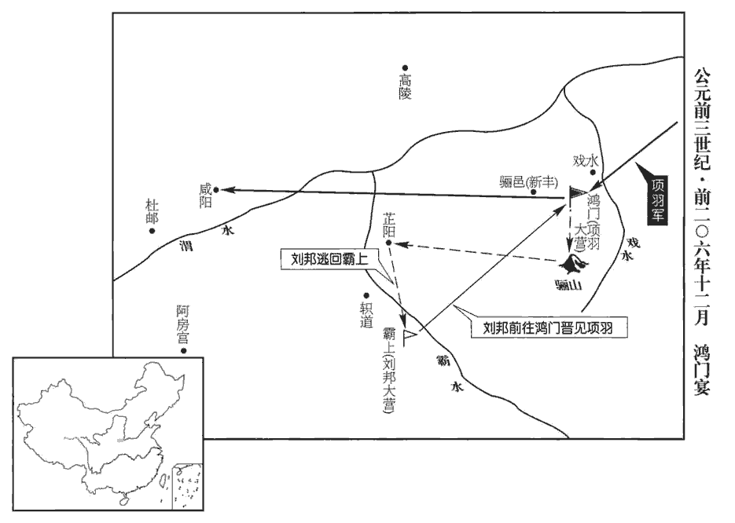
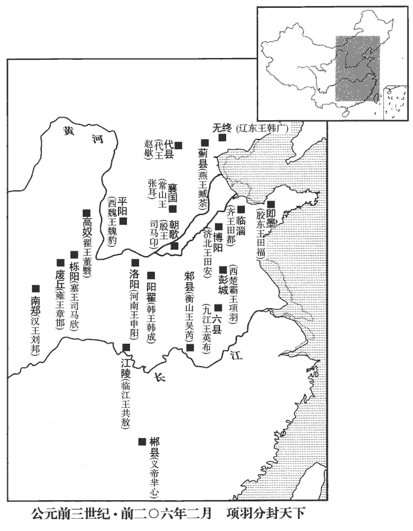
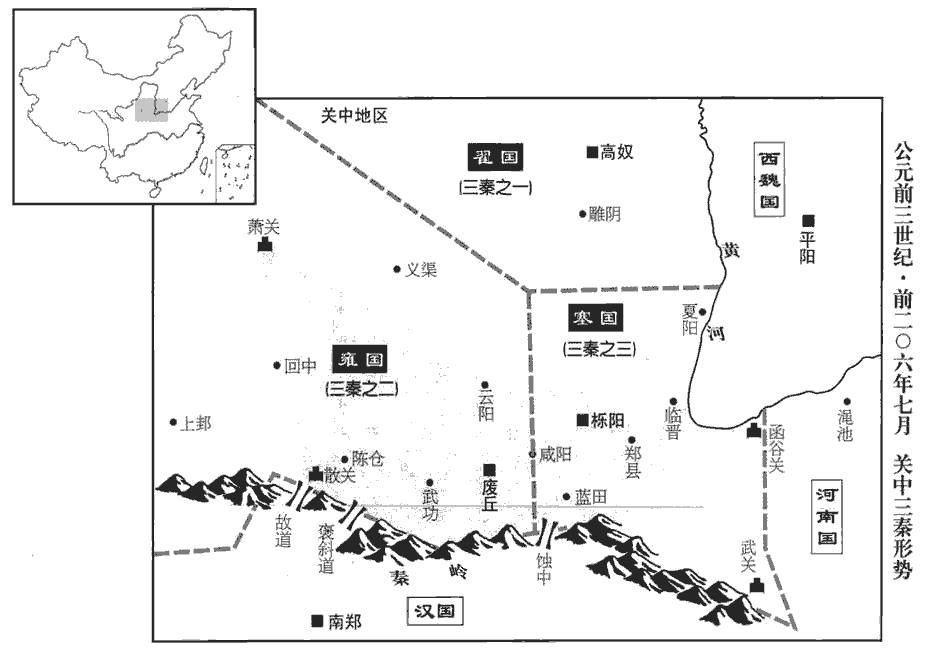
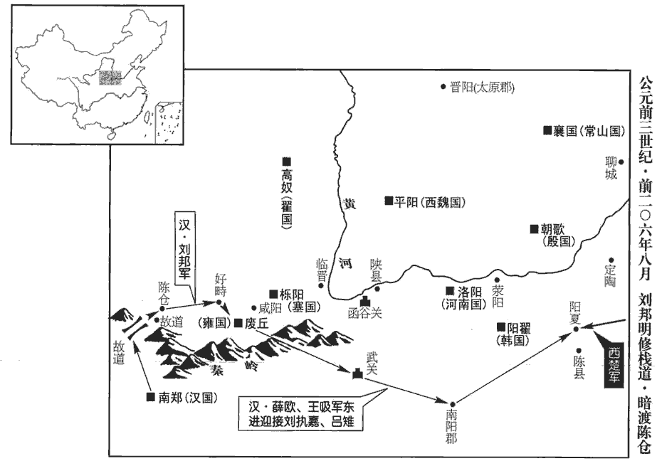
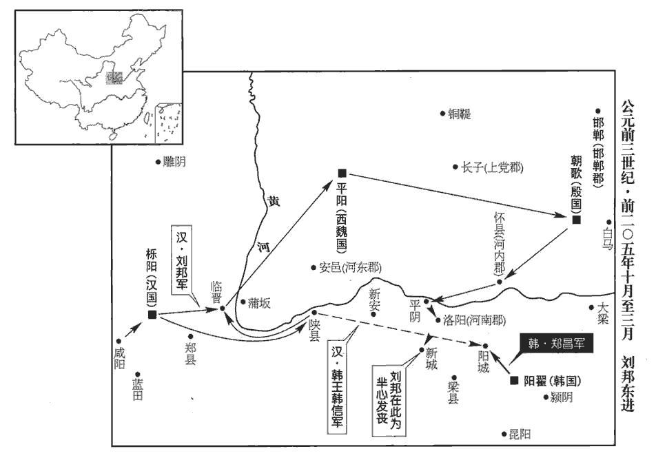
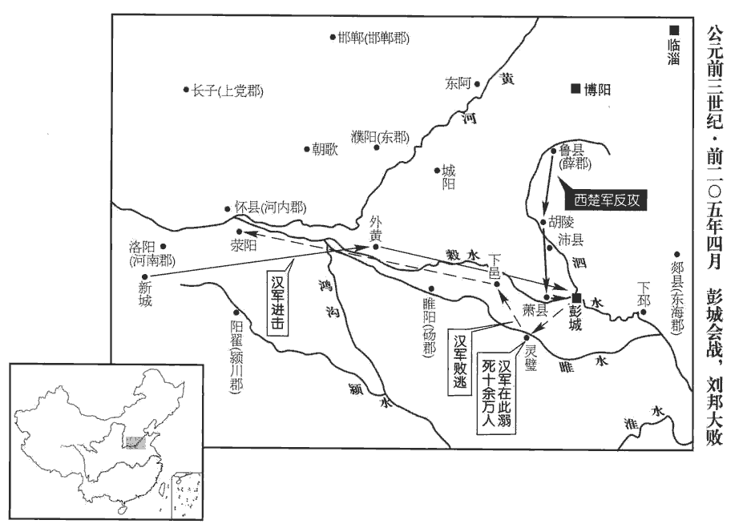
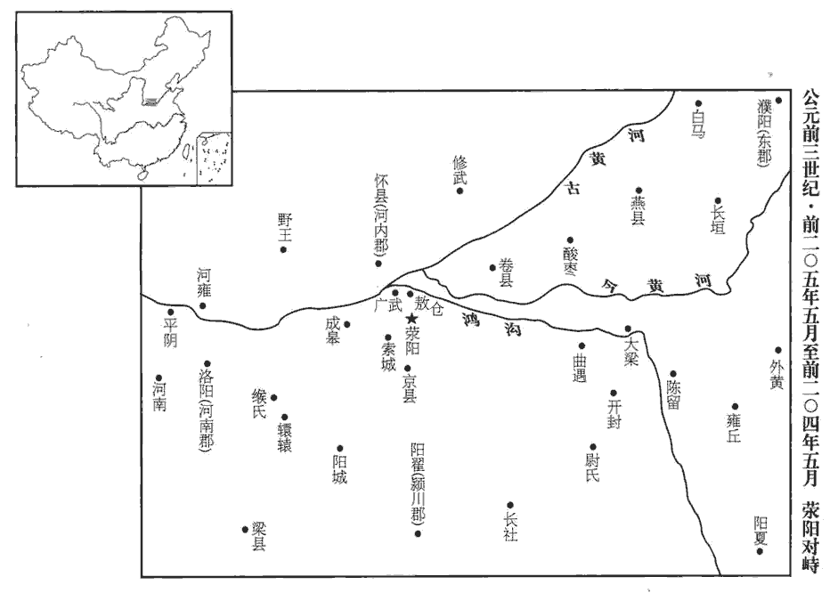
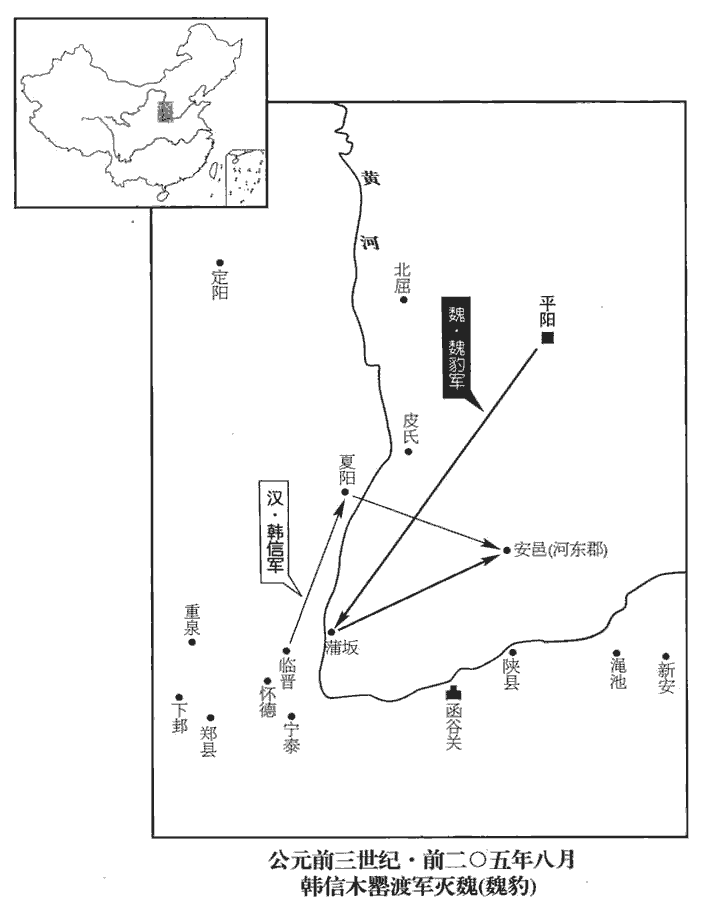

 漢紀一起旃蒙協洽（乙未），盡柔兆涒灘（丙申），凡二年。
>  
> 項羽之分天下，王諸將也，王沛公于巴、蜀、漢中，曰漢王。王怒，欲攻羽。蕭何諫曰：「語曰『天漢』，其稱甚美。」於是就國。及滅項羽，有天下，遂因始封國名而號曰漢。【章︰「項羽至曰漢」，乙十一行本無此五十九字。】

# 太祖高皇帝上之上姓劉氏，諱邦，字季；沛豐邑中陽里人。張晏曰：諡法無高，以帝為功最高而為帝之太祖，故特起此名焉。【章︰乙十一行本「人」下有「秦二世元年，陳涉起蘄，沛父老立季爲沛公；二年，項羽更立爲漢王，明年稱漢元年；五年卽帝位。」三十七字。無「張晏」至「名焉」二十五字。】

## 元年（乙未，前二零六年）

1冬，十月，古有三正：子為天正，周用之，以十一月為歲首，丑為地正，殷用之，以十二月為歲首；寅為人正，夏用之，以十三月為歲首。秦，水德，謂建亥之月水得位，故以十月為歲首。高祖以十月至霸上，因而不革。至武帝太初元年，定曆，改用夏正，始以寅為歲首；至於今因之。沛公至霸上；考異曰：史記、漢書、荀悅漢紀，皆云「是月五星聚東井」。按魏收後魏書高允傳：崔浩集諸術士考校漢元以來日月薄蝕、五星行度，并譏前史之失，別為魏曆，以示允。允曰：「善言遠者必先驗於近。且漢元年冬十月五星聚于東井，此乃曆術之淺事，今譏漢史而不覺此謬，恐後之譏今猶今之譏古。」浩曰：「所繆云何？」允曰：「按星傳：金、水二星常附日而行，冬十月，日旦在尾、箕，昏沒于申南，而東井方出於寅北，二星何因背日而行！是史官欲神其事，不復推之於理。」浩曰：「欲為變者，何所不可！君獨不疑三星之聚，而怪二星之來。」允曰：「此不可以空言爭，宜更審之。」時坐者咸怪。東宮少傅遊雅曰：「高君長於曆，當不虛言也。」後歲餘，浩謂允曰：「先所論者，本不經心；及更考究，果如君語，以前三月聚于東井，非十月也。」今從之，十月不言五星聚。秦王子嬰素車、白馬，系頸以組，封皇帝璽、符、節，降軹道‹西安东北›旁。應劭曰：子嬰不敢襲帝號，但稱王耳。素車、白馬，喪人之服。組者，天子韍也。系頸，言欲自殺也。師古曰：此組，謂綬也，所以帶璽也。組，總五翻，今綬紛絛是也。應劭曰：璽，信也；古者尊卑共之。左傳：襄公在楚，季武子使公冶問璽書，追而與之。秦、漢尊者以為信，群下乃避之。漢官儀曰：子嬰上始皇璽，因服御之；代代傳受，號「漢傳國璽」。沈約曰：高祖入關，得秦始皇藍田玉璽，螭chī虎紐，文曰「受天之命，皇帝壽昌」。後代名傳國璽。史記正義曰：天子有六璽：皇帝行璽，皇帝之璽，皇帝信璽，天子行璽，天子之璽，天子信璽。皇帝信璽，凡事皆用之，璽令施行。天子信璽，以遷拜、封諸侯之璽，以發兵，皆以武都紫泥封。虞喜志林曰：傳國璽自在六璽之外；天子凡七璽。符，說文曰：信也。韋昭曰：符，發兵符也。師古曰：符，諸所合符以為契者也。周禮，地官之屬有掌節。鄭玄註云：節，猶信也，行者所執之信。三禮義宗曰：節長尺二寸；秦、漢以下改為旌幢之形。韋昭曰：節者，使所擁也。釋名云：為號令賞罰之節也。師古曰：節以毛為之，上下相重，取象竹節，將命者持之以為信。徐廣曰：軹道，在霸陵。蘇林曰：亭名也，在長安東十三里。漢宮殿疏曰：軹道亭東去霸城觀四里，觀東去霸水百步。括地志：軹，音紙。軹道在雍州萬年縣東北十六里苑中。諸將或言誅秦王。沛公‹时年五十一›曰：「始懷王遣我，固以能寬容。事見上卷秦二世二年。且人已降，殺之不祥。」乃以屬吏。屬，付也。屬吏者，付之於吏，使監守之也。屬，之欲翻。

〖译文〗 [1]冬季，十月，沛公刘邦率军抵达霸上。秦王子婴乘素车、驾白马，颈上系着绳子以示自己该服罪自杀，手捧封好的皇帝玉玺和符节，伏在轵道亭旁向刘邦投降。众将领中有人主张杀掉秦王。刘邦说：“当初怀王之所以派我前来，原本就是因为认定我能宽容人。何况人家已经降服了，还要杀人家，如此做是不吉利的。”于是便将秦王子婴交给了主管官员处置。

賈誼論曰：秦以區區之地致萬乘之權，招八州而朝同列，蘇林曰：招，音翹；舉也。秦國，周職方雍州之地耳；既破六國，乃舉豫、兗、青、揚、荊、幽、冀、并八州有之。六國與秦俱稱王，是為同列。朝，直遙翻。百有餘年，然後以六合為家，六合，天、地、東、西、南、北。殽、函為宮；一夫作難而七廟墮，墮，讀曰隳。記：天子七廟，三昭、三穆，與太祖之廟而七。身死人手，為天下笑者，何也？仁誼不施而攻守之勢異也。

〖译文〗 贾谊论曰：秦国凭借一点点地盘发展到握有万乘大国的权势，控制冀、兖、青、徐、扬、荆、豫、梁八州，使与秦地位相等的六国诸侯来朝拜，经过了一百多年。然后以天下为家，以崤山、函谷关为宫。但是，一人发难便使七座宗庙被毁，自身终死于他人之手，令普天下的人讥笑，是因为什么呀？是由于不施仁义，且攻夺天下和保持业绩的形势不同啊！

2沛公西入咸陽，諸將皆爭走金帛財物之府分之，走，音奏。蕭何獨先入收秦丞相府圖籍藏之，以此沛公得具知天下阨塞、阨，乙革翻。塞，悉則翻。戶口多少、強弱之處。沛公見秦宮室、帷帳、狗馬、重寶、婦女以千數，意欲留居之。樊噲諫曰：「沛公欲有天下耶，將為富家翁耶？凡此奢麗之物，皆秦所以亡也，沛公何用焉！願急還霸上，無留宮中！」樊噲起于狗屠，識見如此。余謂噲之功當以諫留秦宮為上，鴻門誚讓項羽次之。姓譜：周宣王封仲山甫于樊，後因氏焉。沛公不聽。張良曰：「秦為無道，故沛公得至此。夫為天下除殘賊，宜縞素為資。縞素，有喪之服；謂吊民也。為，於偽翻，縞，工老翻。今始入秦，即安其樂，樂，音洛。此所謂『助桀為虐』。且忠言逆耳利於行，毒藥苦口利於病，願沛公聽樊噲言！」沛公乃還軍霸上。

〖译文〗 [2]刘邦领兵向西进入咸阳，众将领都争先恐后地奔往秦朝贮藏金帛财物的府库瓜分财宝，唯独萧何率先入宫取秦朝丞相府的地理图册、文书、户籍簿等档案收藏起来，刘邦借此全面了解了天下的山川要塞、户口的多少及财力物力强弱的分布。刘邦看到秦王朝的宫室、帷帐、名种狗马、贵重宝器和宫女数以千计，便想留下来在皇宫中居住。樊哙劝谏说：“您是想拥有天下，还是只想作一个富翁啊？这些奢侈华丽之物，都是招致秦朝覆灭的东西，您要它们有什么用呀！望您尽快返回霸上，不要滞留在宫里！”刘邦不听。张良说：“秦朝因为不施行仁政，所以您才能够来到这里。而为天下人铲除残民之贼，应如同丧服在身，把抚慰人民作为根本。现在刚刚进入秦的都城，就要安享其乐，这即是人们所说的‘助桀为虐’了。况且忠言逆耳利于行，良药苦口利于病，望您能听取樊哙的劝告！”刘邦于是率军返回霸上。

十一月，沛公悉召諸縣父老、豪傑，謂曰：「父老苦秦苛法久矣！苛，音何，細也。吾與諸侯約，先入關者王之；王，於況翻；又如字。吾當王關中。與父老約，法三章耳：殺人者死，傷人及盜抵罪。服虔曰：隨輕重制法也。李奇曰：傷人有曲直，盜贓有多少，罪名不可預定；凡言抵罪，未知抵何罪也。師古曰：抵，至也，當也。服、李二說并得之。抵，丁禮翻。余悉除去秦法，諸吏民皆案堵如故。案，次第也；堵，牆堵也：言不遷動也。去，羌呂翻。凡吾所以來，為父老除害，非有所侵暴；無恐！且吾所以還軍霸上，待諸侯至而定約束耳。」乃使人與秦吏行縣、鄉、邑，告諭之。秦制：縣大率方百里，十里一亭，十亭一鄉，所封食邑。為，於偽翻。行，下孟翻。秦民大喜，爭持牛、羊、酒食獻饗軍士。沛公又讓不受，曰：「倉粟多，非乏，不欲費民。」民又益喜，唯恐沛公不為秦王。

〖译文〗 十一月，刘邦将各县的父老和有声望的人全都召集起来，对他们说：“父老们遭受秦朝严刑苛法的苦累已经很久了！我与各路诸侯约定，先入关中的人为王。据此我就应该在关中称王了。如今与父老们约法三章：杀人者处死，伤人者和抢劫者抵罪。除此之外，秦朝的法律统统废除，众官吏和百姓都照旧安定不动。我之所以到这里来，是为了替父老们除害，而不是来欺凌你们的，请你们不必害怕！况且我所以领兵回驻霸上，不过是为了等各路诸侯到来后订立一个约束大家行为的规章罢了。”随即派人和秦朝的官吏一起巡行各县、乡、城镇，向人们讲明道理。秦地的百姓都欢喜异常，争相拿着牛、羊、酒食来慰问款待刘邦的官兵。刘邦又辞让不肯接受，说道：“仓库中的粮食还很多，并不缺乏，不想让百姓们破费。”百姓们于是更加高兴，唯恐刘邦不在秦地称王。

項羽‹时年二十七›既定河北‹黃河以北›，率諸侯兵欲西入關。先是，諸侯吏卒、繇使、屯戍過秦中者，秦中吏卒遇之多無狀。言無善狀也。先，悉薦翻。繇，讀曰傜。及章邯以秦軍降諸侯，諸侯吏卒乘勝多奴虜使之，輕折辱秦吏卒。秦吏卒多怨，竊言曰：「章將軍等詐吾屬降諸侯。今能入關破秦，大善；即不能，諸侯虜吾屬而東，秦又盡誅吾父母妻子，柰何？」諸將微聞其計，以告項羽。項羽召黥布、蒲將軍計曰：「秦吏卒尚眾，其心不服；至關不聽，事必危。不如擊殺之，而獨與章邯、長史欣、都尉翳入秦。」於是楚軍夜擊坑秦卒二十余萬人新安‹河南渑池›城南。班志，縣屬弘農郡。師古曰：今穀州縣。括地志：新安故城，在洛州澠池縣東一十二里。

〖译文〗 项羽已经平定了黄河以北的地区，就想率领各路诸侯军向西进入关中。在此之前，诸侯军中的官兵有的曾因服徭役或屯戍经过关中一带，秦地的官兵多无礼地对待他们。待到章邯率秦军投降了诸侯军后，诸侯军的官兵便凭借胜势，把秦军官兵多当作奴隶和俘虏来使唤，随便侮辱秦军官兵。秦军官兵大多因此而生出怨恨的情绪，暗地里议论说：“章将军等人骗咱们投降诸侯军，如今若能攻入关中击灭秦朝，当是大好事；倘若不能，诸侯军将咱们掠持到东方去，而秦朝又尽杀咱们的父母妻子儿女，那可怎么办啊？”诸侯军的将领们暗中查听到了这些议论，即报告给项羽。项羽于是召集黥布、蒲将军商量说：“目前军中秦朝的官兵还很多，他们内心并不顺服，如果到了函谷关不听从调遣，情势必会危急。所以不如将他们除掉，而只和章邯、长史司马欣、都尉董翳等进入秦地。”楚军便于夜晚在新安城南面袭击活埋了秦兵二十余万人。

3或說沛公曰：「秦富十倍天下，地形強。聞項羽號章邯為雍王，王關中，雍，於用翻。王關之王，於況翻；下欲王同。今則來，沛公恐不得有此。可急使兵守函谷關，無內諸侯軍；內音納，又如字。今傳內從「人」者奴對翻；從「入」者讀為納。稍征關中兵以自益，距之。」沛公然其計，從之。

〖译文〗 [3]有人劝说刘邦道：“关中地区比天下其他地方要富足十倍，而且地势险要。听说项羽封章邯为雍王，让他在关中称王。现在如果他来了，您恐怕就不能占据这个地方了。可以火速派兵把守函谷关，不让诸侯军进来，并逐步征召关中兵，以此增加自己的实力，抵御他们。”刘邦认为此计可行，就照着办了。

已而項羽至關，關門閉；聞沛公已定關中，大怒，使黥布等攻破函谷關。十二月，項羽進至戲‹戏水，源骊山注入渭水›。戲，許宜翻。沛公左司馬曹無傷使人言項羽曰：「沛公欲王關中，令子嬰為相，珍寶盡有之。」欲以求封。項羽大怒，饗士卒，期旦日擊沛公軍。當是時，項羽兵四十萬，號百萬，在新豐鴻門‹陕西临潼东北›；新豐縣本秦驪邑，高祖七年方置，史以後來縣名書之。應劭曰：太上皇思東歸，於是高祖改築城市街里以象豐，徙豐民以實之，故號新豐。孟康曰：鴻門在新豐東十七里，舊大道下阪口名也。姚察云：在新豐古城東，末至戲水，道南有斷原，南北洞門是也。水經註：今新豐古城東有阪，長二里余，塹原通道，南北洞開，有同門汰，謂之鴻門。孟康言在新豐東十七里，無之；蓋指縣治而言，非謂城也。自新豐古城西至霸城五十里，霸城西十里則霸水，又西二十里則長安城。沛公兵十萬，號二十萬，在霸上。

〖译文〗 不久，项羽到达函谷关，但是关门紧闭。项羽听说刘邦已经平定了关中，勃然大怒，派黥布等人攻破了函谷关。十二月，项羽进军至戏。刘邦的左司马曹无伤派人告诉项羽说：“沛公想要在关中称王，任秦王子婴为相，奇珍异宝全都占有了。”企图借此求得项羽的封赏。项羽闻言怒不可遏，就让士兵们饱餐一顿，打算次日攻打刘邦的军队。这时，项羽拥兵四十万，号称百万大军，驻扎在新丰县的鸿门；刘邦拥兵十万，号称二十万，驻军霸上。

范增說項羽曰：「沛公居山東時，貪財，好色；今入關，財物無所取，婦女無所幸，此其志不在小。吾令人望其氣，皆為龍虎，成五采，此天子氣也。周禮：眡shì祲jìn氏掌十煇huī之法，以觀妖祥，辨吉凶。即後世所謂望氣者也。晉天文志：天子氣，內赤外黃，四方所發之處當有王者。若天子欲有游往處，其地亦先發此氣，或如城門隱隱在氣霧中，或氣象青衣人無手，在日西，或如龍馬，或雜色鬱鬱沖天者，皆帝王之氣。急擊勿失！」

〖译文〗 范增劝项羽说：“刘邦住在崤山之东时，贪财而又好色。现今入关，却不搜取财物，不宠幸女色，这表明他的志向不小哇。我曾命人观望他那边的云气，都显示出龙虎的形状，出现五彩，这是天子之气啊！宜赶快进攻他，不要错过了时机！”

 

楚左尹項伯者，楚官有左尹、右尹。項羽季父也，素善張良，乃夜馳之沛公軍，私見張良，具告以事，欲呼與俱去，曰：「毋俱死也！」張良曰：「臣為韓王送沛公；沛公今有急，亡去，不義，不可不語。」為，於偽翻。語，牛倨翻。良乃入，具告沛公。沛公大驚。良曰：「料公士卒足以當項羽乎？」沛公默然曰：「固不如也。且為之柰何？」張良曰：「請往謂項伯，言沛公之不敢叛也。」沛公曰：「君安與項伯有故？」張良曰：「秦時與臣遊，嘗殺人，臣活之。今事有急，故幸來告良。」沛公曰：「孰與君少長？」良曰：「長於臣。」少，詩照翻。長，知兩翻。沛公曰：「君為我呼入，吾得兄事之。」張良出，固要項伯；要，一遙翻。項伯即入見沛公。沛公奉巵酒為壽，約為婚姻，曰：「吾入關‹武关，陕西商南西南›，秋毫不敢有所近，文穎曰：毫，秋乃成好，舉盛而言也。師古曰：毫成之時，端極纖細，適足喻小，非言其盛。近，其靳翻。籍吏民，封府庫而待將軍。所以遣將守關者，備他盜之出入與非常也。日夜望將軍至，豈敢反乎！願伯具言臣之不敢倍德也。」倍，讀曰背。項伯許諾，謂沛公曰：「旦日不可不蚤自來謝。」沛公曰：「諾。」於是項伯復夜去，至軍中，具以沛公言報項羽；因言曰：「沛公不先破關中，公豈敢入乎！今人有大功而擊之，不義也；不如因善遇之。」項羽許諾。

〖译文〗 楚国的左尹项伯是项羽的叔父，向来与张良要好，便连夜驰马到刘邦军中，私下里会见张良，将这些事情一五一十地对他说了，想要叫张良同他一起离开，说道：“可别跟刘邦一块儿死啊！”张良说：“我为韩王伴送沛公，而今沛公遇有急难，我却逃走了，这是不义的行为，我不能不告诉他。”于是张良即进去将项伯的话全都讲述给了刘邦。刘邦大吃一惊。张良说：“您估计一下您的兵力足够抵挡项羽的吗？”刘邦沉默了一会儿道：“的确是不如他呀。这可该怎么办呢？”张良说：“请让我去告诉项伯，说您是绝不敢背叛项羽的。”刘邦道：“您是怎么与项伯成为故交的啊？”张良说：“在秦的时候，项伯与我有交往，他曾经杀过人，我救了他。现在事情紧急，所以还幸亏他前来告我。”刘邦说：“你与他谁大谁小？”张良道：“他比我大。”刘邦说：“您替我唤他进来，我将把他当作兄长来对待。”张良于是出去，坚持邀项伯入内，项伯便进去与刘邦相见。刘邦手捧酒杯向项伯敬酒祝福，并与他约定结为亲家，说：“我进入关中，连毫毛般微小的东西都不敢沾边，只是登记官民，封存府库，等待着项羽将军的到来。之所以派将领把守函谷关，是为了防备有其他盗贼出入和有非常情况发生。我日日夜夜盼望着将军驾临，哪里敢谋反啊！望您能把我不敢忘恩负义的情况详尽地反映给项将军。”项伯答应了，对刘邦说：“你明日不可不早些来亲自向项王道歉啊。”刘邦说：“好吧。”项伯于是当夜就赶了回去，到达军营后，将刘邦的话一五一十地报告给项羽，并趁机道：“要不是刘邦先攻下关中，您又怎么敢进来呀？！如今人家建立了大功却还要去攻打人家，是不义的。不如就因此好好地对待他。”项羽同意了。

沛公旦日從百餘騎來見項羽鴻門‹陕西西安东北鸿门堡村›，謝曰：「臣與將軍戮力而攻秦，將軍戰河北，臣戰河南；不自意能先入關破秦，得復見將軍于此。今者有小人之言，令將軍與臣有隙。」項羽曰：「此沛公左司馬曹無傷言之；不然，籍何以至此！」項羽因留沛公與飲。范增數目項羽，數，所角翻。舉所佩玉玦以示之者三；玦如環而有缺。增舉以示羽，蓋欲其決意殺沛公也。項羽默然不應。范增起，出，召項莊，謂曰：「君王為人不忍。若入前為壽，若，汝也。師古曰：凡言為壽者，謂進爵於尊者而獻無疆之壽。壽畢，請以劍舞，因擊沛公於坐，殺之。坐，徂臥翻。不者，若屬皆且為所虜！」莊則入為壽，壽畢，曰：「軍中無以為樂，樂，音洛。請以劍舞。」項羽曰：「諾。」項莊拔劍起舞。項伯亦拔劍起舞，常以身翼蔽沛公，莊不得擊。

〖译文〗 第二天，刘邦带领一百多骑随从人员到鸿门来见项羽，道歉说：“我与将军您合力攻秦，您在黄河以北作战，我在黄河以南战斗，没料到自己能先进入关中破秦，得以在这里与您重又相见。如今有小人之言搬弄是非，使您和我之间产生了隔阂。”项羽道：“这是您的左司马曹无伤散布的流言，不然的话，我何至于如此啊！”项羽于是就留刘邦与他一起喝酒。范增频频向项羽递眼色，并三次举起他所佩带的玉暗示项羽杀刘邦，项羽却只是默然不语，毫无反应。范增便起身出去招呼项庄，对他说：“项王为人心慈手软，还是你进去上前给刘邦敬酒，敬完酒，你就请求表演舞剑，然后乘势在坐席上袭击刘邦，杀了他。不然的话，你们这些人都将成为他的阶下囚了！”项庄即入内为刘邦祝酒，敬完酒后，项庄道：“军营中没有什么可用来取乐的，就请让我来为你们舞剑助兴吧。”项羽说：“好哇。”项庄于是拔剑起舞。项伯见状也起身拔剑起舞，并时时用身子遮护刘邦，使得项庄无法行刺。

於是張良至軍門見樊噲。噲曰：「今日之事何如？」良曰：「今項莊拔劍舞，其意常在沛公也。」噲曰：「此迫矣，臣請入，與之同命！」噲即帶劍擁盾入。盾，所以蔽身者也。盾，食尹翻。軍門衛士欲止不內，樊噲側其盾以撞，衛士仆地。撞，丈江翻；擊也。遂入，披帷立，在旁曰帷。釋名曰：帷，圍也，以自障圍也。瞋目視項羽，瞋，怒目也，昌真翻。頭髮上指，目眥盡裂。眥，才賜翻，又在計翻，目際也。項羽按劍而跽曰：跽，其紀翻，長跪也。「客何為者？」張良曰：「沛公之參乘樊噲也。」項羽曰：「壯士！賜之巵酒。」則與斗巵酒。噲拜謝，起，立而飲之。項羽曰：「賜之彘肩！」則與一生彘肩。樊噲覆其盾於地，加彘肩其上，拔劍切而啖之。項羽曰：「壯士復能飲乎？」復，扶又翻。樊噲曰：「臣死且不避，巵酒安足辭！夫秦有虎狼之心，殺人如不能舉，刑人如恐不勝；天下皆叛之。懷王與諸將約曰：『先破秦入咸陽者，王之。』今沛公先破秦，入咸陽，毫毛不敢有所近，近，其靳翻。還軍霸上以待將軍。勞苦而功高如此，未有封爵之賞，而聽細人之說，欲誅有功之人，此亡秦之續耳，竊為將軍不取也！」項羽未有以應，曰：「坐！」樊噲從良坐。

〖译文〗 这时张良来到军门见樊哙。樊哙说：“今天的事情怎么样了？”张良说：“现在项庄拔剑起舞，他的用意却常在沛公身上啊。”樊哙道：“事情紧迫了崐，我请求进去，与他拼命！”樊哙随即带剑持盾闯入军门。军门的卫士想要阻止他进去，樊哙就侧过盾牌一撞，卫士扑倒在地。樊哙于是入内，掀开帷帐站立在那里，怒目瞪着项羽，头发直竖，两边的眼角都睁裂开了。项羽手按剑，跪起身，说道：“来客是干什么的？”张良说：“是沛公的陪乘卫士樊哙。”项羽道：“真是壮士啊！赐给他一杯酒喝！”左右的侍从即给了他一大杯酒。樊哙拜谢后，起身站着一饮而尽。项羽说：“再赐给他猪腿吃！”侍从们便又拿给他一条生猪腿。樊哙将他的盾牌倒扣在地上，把猪腿放在上面，拔出剑来切切就大口地吃了。项羽说：“壮士，你还能再喝酒吗？”樊哙道：“我连死都不逃避，一杯酒难道还值得我推辞吗！秦王的心肠狠如虎狼，杀人唯恐杀不完，用刑惩罚人唯恐用不够，致使天下的人都起而反叛他。怀王曾与各路将领约定说：‘先打败秦军进入咸阳城的人，在关中为王。’现在沛公最先击溃秦军，进入咸阳，毫毛般微小的东西都不敢染指，就率军返回霸上等待您的到来。这样劳苦功高，您非但不给予封地、爵位的奖赏，还听信小人的谗言，要杀有功之人。这是在重蹈秦朝灭亡的覆辙呀，我私下认为您的这种做法是不可取的！”项羽无话可答，就说：“坐吧。”樊哙于是在张良的身边坐下了。

坐須臾，沛公起如廁，因招樊噲出。沛公曰：「今者出，未辭也，為之柰何？」樊噲曰：「如今人方為刀俎，我方為魚肉，何辭為！」於是遂去。鴻門去霸上四十里，沛公則置車騎，置，留也；留車騎於鴻門，不以自隨。脫身獨騎；樊噲、夏侯嬰、靳強、紀信等四人姓譜：夏侯出自夏后之後，杞簡公為楚所滅，其弟佗奔魯，魯悼公以佗出自夏后氏，受爵為侯，謂之夏侯，因而命氏。紀，春秋紀侯之後，以國為姓。持劍、盾步走，從驪山下道芷陽‹陝西西安東北›，間行趣霸上。班志：京兆霸陵縣，故芷陽也；文帝更名。間，空也；投空隙而行。間，古莧翻。趣，讀如趨嚮之趨，逡須翻；後以義推。又七喻翻。留張良使謝項羽，以白璧獻羽，玉斗與亞父。沛公謂良曰：「從此道至吾軍，不過二十里耳。度我至軍中，公乃入。」度，徒洛翻。沛公已去，間至軍中，張良入謝曰：「沛公不勝桮杓，不能辭，勝，音升。謹使臣良奉白璧一雙，再拜獻將軍足下；玉斗一雙，再拜奉亞父足下。」項羽曰：「沛公安在？」良曰：「聞將軍有意督過之，師古曰：謂視責也。脫身獨去，已至軍矣。」項羽則受璧，置之坐上。坐，徂臥翻。亞父受玉斗，置之地，拔劍撞而破之，曰：「唉，歎恨之聲，音烏開翻，又於其翻。豎子不足與謀！奪將軍天下者，必沛公也；吾屬今為之虜矣！」沛公至軍，立誅殺曹無傷。

〖译文〗 坐了不一会儿，刘邦起身去上厕所，趁机招呼樊哙出来。刘邦说：“我现在出来，没有告辞，怎么办啊？”樊哙道：“现在人家正好比是屠刀和砧板，我们则是鱼肉，如此还告什么辞哇！”于是就这么走了。鸿门与霸上相距四十里，刘邦撇下车马，抽身独自骑马而行，樊哙、夏侯婴、靳强、纪信等四人手拿剑和盾牌，快步相随，经骊山下，取道芷阳，抄小路奔向霸上。留下张良，让他向项羽辞谢，将白璧敬献给项羽，大玉杯给亚父范增。刘邦临行前对张良说：“从这条路到我们的军营，只不过二十里地。您估计着我已经抵达军中时，再进去。”刘邦已走，抄小道回到军营，张良方才进去告罪说：“沛公禁不起酒力，无法来告辞，谨派臣张良捧上白璧一双，以连拜两次的隆重礼节敬献给将军您；大玉杯一双，敬呈给亚父您。”项羽说：“沛公现在哪里呀？”张良道：“他听说您有要责备他的意思，便抽身独自离去，现在已经回到军中了。”项羽就接受了白璧，放到坐席上。亚父范增接受玉杯后搁在地上，拔剑击碎了它们，说：“唉，这小子不值得与他共谋大业！夺取项将军天下的人，必定是刘邦。我们这些人眼看着就要被他俘获了！”刘邦到达军中，立即杀掉了曹无伤。

居數日，項羽引兵西，屠咸陽，殺秦降王子嬰，燒秦宮室，火三月不滅；收其貨寶、婦女而東。秦民大失望。秦民初見沛公無所侵暴而悅，及為項羽殘滅，失其初所望也。

〖译文〗 隔了几天，项羽领兵西进，洗劫屠戮咸阳城，杀了已投降的秦王子婴，放火焚烧秦朝宫室，大火燃烧三个月不熄。随即搜取秦朝的金银财宝和妇女向东而去。秦地的百姓为此大失所望。

韓生說項羽曰：「關中阻山帶河，四塞之地，地肥饒，可都以霸。」項羽見秦宮室皆已燒殘破，又心思東歸，曰：「富貴不歸故鄉，如衣繡夜行，誰知之者！」韓生退曰：「人言楚人沐猴而冠耳，果然！」師古曰：沐猴，獼猴也。言雖著人衣冠，其心不類人也。果然，如人之言也。項羽聞之，烹韓生。

〖译文〗 韩生劝说项羽道：“关中依恃山川河流为屏障，是四面都有险要可守的地方，土地肥沃，可以在此建都称霸。”项羽却一方面看到秦王朝的宫室都已焚烧得残破不堪，一方面又惦记着返回东方的家乡，便说：“富贵了而不归故乡，就如同身穿绵绣华服在夜间行走，谁能看得到啊！”韩生退下去后说道：“人家说楚人像是猕猴戴上人的帽子，果然如此！”项羽听到这话后，即将韩生煮死。

項羽使人致命懷王；懷王曰：「如約。」言如前約，使沛公王關中。項羽怒曰：「懷王者，吾家所立耳，非有功伐，張晏曰：積功曰伐。何以得專主約！天下初發難時，謂初起兵時。難，乃旦翻。假立諸侯後以伐秦。然身披堅執銳首事，暴露於野史記正義曰：暴，蒲北翻，又如字。三年，滅秦定天下者，皆將相諸君與籍之力也。懷王雖無功，固當分其地而王之。」諸將皆曰：「善！」春，正月，羽陽尊懷王為義帝，曰：「古之帝者，地方千里，必居上游。」遊，即流也；言居水之上流。乃徙義帝於江南，都郴‹湖南郴州›。史記曰：長沙郴縣。班志，郴縣屬桂陽郡。蓋高祖定天下，方分長沙為桂陽郡也。郴，丑林翻。

〖译文〗 项羽派人去回报请示楚怀王，怀王说：“照先前约定的办。”项羽暴跳如雷，说：“怀王这个人是我们家扶立起来的，并非因为他建有什么功绩，怎么能够一个人作主定约呢！全国起兵反秦伊始，暂时拥立过去各诸侯国国君的后裔为王，以利讨伐秦王朝。但是，身披坚固的铠甲、手持锐利的兵器首先起事，风餐露宿三年之久，终于灭亡秦朝平定天下，都是各位将相和我的力量啊！不过怀王虽然没什么功劳，却还是应当分给他土地，尊他为王。”众将领都说：“是啊！”春季，正月，项羽便假意尊推怀王为义帝，说道：“古代的帝王辖地千里，却必定要居住在江河的上游地带。”于是就把义帝迁移到长江以南，定都在长沙郡的郴县。

 

二月，羽分天下，王諸將。羽自立為西楚霸王，文穎曰：史記貨殖傳：淮以北，沛、陳、汝南、南郡為西楚；彭城以東，吳、廣陵為東楚；衡山、九江，江南長沙、豫章為南楚。羽欲都彭城，故自稱西楚。孟康曰：舊名江陵為南楚，吳為東楚，彭城為西楚。師古曰：孟說是也。王梁、楚地九郡，都彭城‹江蘇徐州›。班志，縣屬楚國。史記正義曰：徐州縣。羽與范增疑沛公，而業已講解，又惡負約，惡，烏路翻。乃陰謀曰：「巴‹重慶›、蜀‹成都›道險，秦之遷人皆居之。」乃曰：「巴、蜀亦關中地也。」故立沛公為漢王，王巴、蜀、漢中‹陕西汉中›，都南鄭。巴、蜀、漢中，秦所置三郡地也。班志，南鄭縣屬漢中。括地志：南鄭縣，今梁州治所。近世有李文子者，蜀人也，著蜀鑒曰：南鄭自南鄭，漢中自漢中。南鄭乃古褒國，秦未得蜀以前，先取之。漢中乃金、洋、均、房等州六百里是也。秦既得漢中，乃分南鄭以隸之而置郡焉，南鄭與漢中為一自此始。春秋「楚人、巴人滅庸」，即今均、房兩州地。班志，漢中郡治西城，今金州上庸郡是也。而三分關中，王秦降將，以距塞漢路：塞，悉則翻。章邯為雍王，王咸陽以西，都廢丘‹陝西興平›；班志：扶風槐里縣，周曰犬丘，懿王所都也；秦曰廢丘；高祖三年更名。韋昭曰：犬丘，周懿王所都；秦欲廢周，故曰廢丘。括地志：廢丘故城，在雍州始平縣東南一十里。長史欣者，故為櫟陽‹陝西臨潼›獄掾yuàn，嘗有德于項梁；都尉董翳者，本勸章邯降楚；故立欣為塞王，王咸陽以東，至河，都櫟陽‹陝西臨潼›；韋昭曰：塞在長安，名桃林塞。史記正義曰：桃林塞，今華州潼關。師古曰：取河、華之固為阨塞耳，非桃林也。塞，先代翻。櫟陽縣屬馮翊。括地志：漢七年，分櫟陽城內為萬年縣；隋改為大興縣；唐復萬年。秦獻公所城櫟陽故城，在今雍州櫟陽縣東北二十五里。項梁嘗有櫟陽逮，請蘄獄掾曹咎書以抵欣而事得已，所謂「有德于梁」也。櫟，音藥。立翳為翟王，王上郡‹陝西延安›，都高奴‹陝西延安›。以上郡北近戎、翟，因以名國。班志，高奴縣屬上郡。索隱曰：今鄜州有高奴城。括地志：延州城即漢高奴縣。杜佑曰：延州，春秋白翟之地；漢為膚施、高奴、臨河縣地；後魏置東夏州，後改延州，以界內延水為名。董翳都高奴，今金明縣是。項羽欲自取梁地，乃徙魏王豹為西魏王，王河東，都平陽‹山西臨汾›。班志，縣屬河東郡。瑕丘‹山東兖州›申陽者，張耳嬖臣也，先下河南郡，迎楚河上，故立申陽為河南王，都洛陽‹河南洛陽东白马寺东›。括地志：洛陽故城，在洛州洛陽縣東北二十六里，周公所築，即成周城也。輿地志：成周之地，秦莊襄王以為洛陽縣，三川守治焉。後漢都雒陽，改為「雒」。漢以火德，忌水，故去「洛」旁「水」而加「隹」。魏於行次為土；土，水之忌也，水得土而流，土得水而柔，故除「隹」而加「水」。韓王成因故都，都陽翟‹河南禹州›。趙將司馬卬定河內，數有功，故立卬為殷王，王河內，都朝歌‹河南淇縣›。河內郡朝歌縣，故殷都也，因以名國。徙趙王歇為代‹河北蔚縣›王。趙相張耳素賢，又從入關，故立耳為常山王，王趙地，治襄國‹河北邢臺›。括地志：邢州本漢襄國縣；秦置三十六郡，於此置信都縣，屬鉅鹿郡；項羽改曰襄國。予據班志，襄國縣屬趙國，信都縣屬信都國，漢蓋又分為二縣。宋白曰：趙王歇都襄國，今邢州所理龍岡縣城是也。當陽君黥布為楚將，常冠軍，冠，古玩翻。故立布為九江王，都六‹安徽六安›。班志，當陽縣屬南郡。九江，應劭曰：江自廬江尋陽分為九。地理志：九江在尋陽縣南，皆東合為大江。史記正義曰：九江郡即壽州。楚自陳徙壽春，號曰郢。秦滅楚，於此置九江郡。番‹江西波阳›君吳芮率百越佐諸侯，又從入關，故立芮為衡山王，都邾‹湖北黃州›。班志，邾縣屬江夏郡。括地志：邾故城，在黃州黃岡縣東南二十里。番，音婆。義帝柱國共敖將兵擊南郡‹湖北江陵›，功多，因立敖為臨江王，都江陵‹湖北江陵›。共，音龔，人姓也。姓譜：共，商諸侯之國。晉有左行共華。又云：鄭共叔段後。臨江，孟康曰：本南郡，漢改為臨江國，江陵縣屬焉。徙燕王韓廣為遼東王，都無終‹天津薊縣›。故無終子之國。班志，無終縣屬北平郡，非遼東郡界。蓋羽令韓廣都於無終，而令并王遼東之地故也。燕將臧荼從楚救趙，姓譜：臧姓，魯孝公子臧僖伯之後。因從入關，故立荼為燕王，都薊‹北京›。班志，薊縣屬廣陽國。師古曰：今幽州縣。水經註：薊城西北隅有薊丘，故名薊，音計。徙齊王田巿fú為膠東王，都即墨‹山東平度›。齊將田都從楚救趙，因從入關，故立都為齊王，都臨菑‹山東淄博东临淄镇›。項羽方渡河救趙，田安下濟北數城，引其兵降項羽，故立安為濟北王，都博陽‹山東泰安›。史記正義曰：博陽在濟北。班志：太山郡盧縣，濟北王都。豈博陽即此地邪！余據濟北有博關，博陽蓋在博關之南也。濟，子禮翻。田榮數負項梁，數，所角翻。又不肯將兵從楚擊秦，以故不封。成安君陳餘棄將印去，不從入關，亦不封。客多說項羽曰：「張耳、陳餘，一體有功于趙，今耳為王，餘不可以不封。」羽不得已，聞其在南皮‹河北南皮›，班志，南皮縣屬勃海郡。闞駰曰：章武有北皮亭，故此云南。括地志：南皮故城，在滄州南皮縣北四里。因環封之三縣。環，音宦。番君將梅鋗功多，封十萬戶侯。

〖译文〗 二月，项羽划分天下土地，封各位将领作侯王，自立为西楚霸王，管辖原魏国和楚国的九个郡，建都彭城。项羽与范增怀疑刘邦有夺取天下的野心，但双方已经讲和了，且又不愿意背上违约的罪名，于是就暗地里策划道：“巴、蜀两地道路艰险，秦朝所流放的人都居住在那里。”随即扬言：“巴郡、蜀郡也是关中的土地。”由此立刘邦为汉王，统辖巴、蜀两地和汉中郡，建都南郑。接着又把关中分割为雍、塞、翟三部分，将秦朝的降将封在那里作王，借以抵御阻挡刘邦：封章邯为雍王，管制咸阳以西地区，建都废丘；长史司马欣过去是栎阳县的狱掾，曾经对项梁有恩；而都尉董翳，本来劝过章邯归降楚军，因此便立司马欣为塞王，统领咸阳以东至黄河一带，建都栎阳；封董翳为翟王，领有上郡地区，建都高奴。项羽打算自已占有魏地，就改封魏王豹为西魏王，统辖河东郡，建都平阳。瑕丘县的申阳是张耳的宠臣，曾经率先攻下河南郡，在黄河边迎接楚军，所以立申阳为河南王，建都洛阳。韩王成仍居旧都，建都阳翟。赵将司马平定了河内郡，屡立战功，因此封司马为殷王，管制河内地区，建都朝歌。改封赵王歇为代王；赵国的相国张耳向来贤能，又跟随入关，故立张耳为常山王，统领赵地，建都襄国。当阳君黥布为楚将，经常是勇冠三军，所以立黥布为九江王，建都六地。番君吴芮率领百越部族之兵协助诸侯军，也随从进关，因此封吴芮为衡山王，建都邾县。义帝怀王的柱国共敖领兵攻打南郡，功劳卓著，故封共敖为临江王，建都江陵。改封燕王韩广为辽东王，建都无终。燕将臧荼跟随楚军救援赵，随即跟着入关，由此立臧荼为燕王，建都蓟地。改封齐王田为胶东王，建都即墨。齐将田都随楚军救赵，即跟着进关，所以立田都为齐王，建都临淄。当项羽正要渡河救赵时，齐王田建的孙子田安攻下济北数城，率领他的军队投降项羽，因此封田安为济北王，建都崐博阳。田荣曾多次背弃项梁，又不肯领兵跟随楚军攻秦，所以不封。成安君陈馀抛弃将军的印信离去，不追随入关，也不封。宾客中有多人劝说项羽道：“张耳、陈馀一样对赵有功，如今既封张耳为王，陈馀也就不可不封。”项羽不得已，听说陈馀正在南皮，就把南皮周围的三个县封给了他。番君的部将梅功劳颇多，即封他为十万户侯。

漢王怒，欲攻項羽；周勃、灌嬰、樊噲皆勸之。灌，風俗通曰：斟灌氏之後。蕭何諫曰：「雖王漢中之惡，不猶愈於死乎？」漢王曰：「何為乃死也？」何曰：「今眾弗如，百戰百敗，不死何為！夫能詘於一人之下而信于萬乘之上者，湯、武是也。詘，與屈同。信，與伸同。臣願大王王漢中，養其民以致賢人，收用巴、蜀，還定三秦，雍、翟、塞為三秦。天下可圖也。」漢王曰：「善！」乃遂就國；以何為丞相。

〖译文〗 汉王刘邦大怒，想要攻打项羽。周勃、灌婴、樊哙也都鼓动他打。萧何规劝他说：“在汉中当王虽然不好，但不是比死还强些吗？”汉王道：“哪里就至于死呀？”萧何说：“如今您兵众不如项羽，百战百败，不死又能怎么样呢！能够屈居于一人之下而伸展于万乘大国之上的，是商汤王和周武王。我希望大王您立足汉中，抚养百姓，招引贤才，收用巴、蜀二郡的资财，然后回师东进，平定雍、翟、塞三秦之地，如此天下可以夺取了。”汉王说：“好吧！”于是就去到他的封地，任用萧何为丞相。

漢王賜張良金百鎰，珠二斗；良具以獻項伯。漢王亦因令良厚遺項伯，遺，于季翻。使盡請漢中地，項王許之。

〖译文〗 汉王赐给张良黄金百镒，珍珠两斗。张良把这些东西全都献给了项伯。汉王因此也命张良赠送厚礼给项伯，让项伯代他请求项羽将汉中地区全部封给刘邦，项羽答应了这一请求。

夏，四月，諸侯罷戲下兵，師古曰：戲，謂軍之旌麾也。先是，諸侯從項羽入關者，各帥其兵聽命於羽。今既受封爵，各使就國，故總言罷戲下也。一說云：時從羽在戲水之上，故言罷戲下。此說非也。羽見高祖于鴻門，此時已過戲矣；又入燒宮室，不復在戲也。漢書通以戲為麾，許宜翻。各就國。項王使卒三萬人從漢王之國。楚與諸侯之慕從者數萬人，從杜‹陝西西安东南›南入蝕中‹子午谷›。漢京兆杜縣之南也。如淳曰：蝕，入漢中道川谷名。近世有程大昌者著雍錄曰：以地望求之，關中南面背礙南山，其有微徑可達漢中者，唯子午谷在長安正南，其次向西則駱谷。此蝕中，若非駱谷，即是子午谷。李奇：蝕，音力。張良送至襃中‹陝西汉中西北›，地理志，襃中縣屬漢中郡。師古曰：襃中，言居襃谷之中。括地志：襃谷在梁州襃城縣北五十里南中山。李文子曰：襃谷在襃城北，南谷曰襃，北谷曰斜，同為一谷。自襃谷至鳳州界一百三十里，始通斜谷。斜谷在鳳翔府郿縣。谷中襃水所流，穴山架木而行。漢王遣良歸韓；良因說漢王燒絕所過棧道，以備諸侯盜兵，師古曰：棧，即閣也，今謂之閣道；蓋架木為之。棧，士限翻，公休士諫翻。且示項羽無東意。

〖译文〗 夏季，四月，各路诸侯都离开主帅项羽，回各自的封国去。项羽即派三万士兵随从汉王刘邦前往他的封国。楚军与其他诸侯军中因仰慕而追随汉王的有好几万人，他们从杜县南面进入蚀中通道。张良送行到褒中，汉王遣张良回韩王那里去。张良于是就劝说汉王烧断他们所经过的栈道，以防备诸侯的军队来犯，而且向项羽表示没有东还的意图。

4田榮聞項羽徙齊王巿fú於膠東，而以田都為齊王，大怒。五月，榮發兵距擊田都，都亡走楚。走，音奏。榮留齊王巿，不令之膠東。巿畏項羽，竊亡之國。榮怒，六月，追擊殺巿於即墨，自立為齊王。是時，彭越在鉅野‹山東鉅野›，有眾萬餘人，無所屬。榮與越將軍印，使擊濟北。秋，七月，越擊殺濟北王安。榮遂并王三齊之地，三齊，謂齊及濟北、膠東也。王，於況翻。又使越擊楚。項王命蕭公角將兵擊越，越大破楚軍。

〖译文〗 [4]田荣听说项羽改封齐王田到胶东，而立齐将田都为齐王，即怒火中烧。五月，田荣出兵拦攻田都，田都逃往楚国。田荣就留下齐王田，不让他到胶东去。田惧怕项羽，便偷偷地逃向他的封国胶东。田荣恼怒之极，即在六月追击到即墨杀了田，自立为齐王。这时，彭越在钜野，拥有兵众一万多人，尚无归属。田荣就授给彭越将军官印，命他攻打济北王田安。秋季，七月，彭越击杀了济北王田安。田荣于是兼并了齐、济北、胶东三齐的土地，随即又让彭越攻打楚国。项羽命萧公角率军迎击彭越，彭越大败楚军。

5張耳之國，陳餘益怒曰：「張耳與餘，功等也；今張耳王，餘獨侯，此項羽不平！」乃陰使張同、夏說說齊王榮曰：夏說，讀曰悅。「項羽為天下宰，不平，盡王諸將善地，徙故王於醜地。今趙王乃北居代，餘以為不可。聞大王起兵，不聽不義；願大王資餘兵擊常山，復趙王，請以趙為捍蔽！」師古曰：捍蔽，猶言藩屏也。齊王許之，遣兵從陳餘。

〖译文〗 [5]张耳去到封国，陈馀更加愤怒了，说道：“张耳与我功劳相等，现在张耳为王，我却只是个侯，这是项羽分封不公平！”就暗中派遣张同、夏说去游说齐王田荣道：“项羽作为天下的主宰颇不公平，把好的地方全都分给了各将领，而把原来的诸侯国国王改封到坏的地方。现在赵王就往北住到代郡去了，我认为这是不行的。听说大王您起兵抗争，不听从项羽的不道义的命令，因此希望您能资助我一些兵力去攻打常山，恢复赵王的王位，并请把赵国作为齐国的外卫藩屏！”齐王田荣同意了，即派兵跟随陈馀。

6項王以張良從漢王，韓王成又無功，故不遣之國，與俱至彭城‹江蘇徐州›，廢以為穰侯；班志，穰縣‹河南邓州›屬南陽郡。已，又殺之。

〖译文〗 [6]项羽因为张良曾经追随汉王刘邦，且韩王韩成又毫无战功，所以就不让韩成到封国去，而是让他随自己一起到了彭城，把他废为穰侯，旋即又杀了他。

7初，淮陰‹江蘇淮陰›人韓信，家貧，無行，班志：武帝元狩六年，置臨淮郡，淮陰縣屬焉。史記正義曰：今楚州縣。無行，言無善行可推擇也。行，下孟翻。不得推擇為吏，又不能治生商賈，行賣曰商，坐販曰賈。治，直之翻。常從人寄食飲，人多厭之。信釣於城下，有漂母見信饑，飯信。漂，匹妙翻。以水擊絮曰漂。飯，扶晚翻。信喜，謂漂母曰：「吾必有以重報母。」母怒曰：「大丈夫不能自食；吾哀王孫而進食，豈望報乎！」淮陰屠中少年有侮信者曰：「若雖長大，好帶刀劍，中情怯耳。」因眾辱之曰：「信能死，刺我；刺，七亦翻。不能死，出我袴kù下！」徐廣曰：「袴」，一作「胯」；胯，股也。漢書作「跨」，同耳。師古曰：跨，兩股之間。索隱曰：胯，枯化翻。然尋此文作「袴」，欲依字讀，何為不通！袴下乃胯下也，何必須要作胯下！於是信孰視之，俛fǔ出袴下，蒲伏。俛，音免，俯首也。伏，蒲北翻。一市人皆笑信，以為怯。

〖译文〗 [7]当初，淮阴人韩信，家境贫寒，没有好的德行，不能被推选去做官，又不会经商做买卖谋生，常常跟着别人吃闲饭，人们大都厌恶他。韩信曾经在城下钓鱼，有位在水边漂洗丝绵的老太太看到他饿了，就拿饭来给他吃。韩信非常高兴，对那位老太太说：“我一定会重重地报答您老人家。”老太太生气地说：“男子汉大丈夫不能自己养活自己！我不过是可怜你这位公子才给你饭吃，难道是希图有什么报答吗？！”淮阴县屠户中的青年里有人侮辱韩信道：“你虽然身材高大，好佩带刀剑，内心却是胆小如鼠的。”并趁机当众羞辱他说：“韩信你要真的不怕死，就来刺我。若是怕死，就从我的胯下爬过去！”韩信于是仔细地打量了那青年一会儿，便俯下身子，从他的双腿间钻了过去，匍匐在地。满街市的人都嘲笑韩信，认为他胆小。

及項梁渡淮，信杖劍從之；居麾下，無所知名。項梁敗，又屬項羽，羽以為郎中；數以策干羽，羽不用。數，所角翻；下同。漢王之入蜀，信亡楚歸漢，未知名。為連敖，坐當斬；據史記表，信為連敖，典客；班表作「票客」，索隱以為誤。徐廣于周竈zào表，以連敖為典客，蓋以信表為據。李奇曰：楚官名。如淳曰：連敖，楚官。左傳，楚有連尹、莫敖；其後合為一官號。其輩十三人皆已斬，次至信，信乃仰視，適見滕公，曰：滕公，即夏侯嬰；初從高祖為滕令，故號滕公。「上不欲就天下乎，何為斬壯士？」滕公奇其言，壯其貌，釋而不斬；與語，大說之，說，讀曰悅。言于王。王拜以為治粟都尉，班表：治粟內史，秦官，掌穀貨；都尉蓋其屬也。至漢，改內史為大司農。亦未之奇也。

〖译文〗 待到项梁渡过淮河北上，韩信持剑去投奔他，留在项梁部下，一直默默无闻。项梁失败后，韩信又归属项羽，项羽任他作了郎中。韩信曾多次向项羽献策以求重用，但项羽却不予采纳。汉王刘邦进入蜀中，韩信又逃离楚军归顺了汉王，仍然不为人所知，做了个接待宾客的小官。后来韩信犯了法，应判处斩刑，与他同案的十三个人都已遭斩首，轮到韩信时，韩信抬头仰望，刚好看见了滕公夏侯婴，便说道：“汉王难道不想得取天下吗？为什么要斩杀壮士啊！”滕公觉得他的话不同凡响，又见他外表威武雄壮，就释放了他而不处斩，并与他交谈，欢喜异常，随即将这情况奏报给了汉王。汉王于是授给韩信治粟都尉的官职，但还是没认为他有什么不寻常之处。

信數與蕭何語，何奇之。漢王至南鄭‹陝西汉中›，諸將及士卒皆歌謳思東歸，多道亡者。信度何等已數言王，王不我用，即亡去。數，所角翻。何聞信亡，不及以聞，自追之。人有言【章︰傳校「言」下有「於」字。】王曰：「丞相何亡。」王大怒，如失左右手。居一二日，何來謁王。王且怒且喜，罵何曰：「若亡，何也？」何曰：「臣不敢亡也，臣追亡者耳。」王曰：「若所追者誰？」何曰：「韓信也。」王復罵曰：「諸將亡者以十數，公無所追；追信，詐也！」何曰：「諸將易得耳；至如信者，國士無雙。師古曰：為國家之奇士。余謂何言漢國之士僅有信一人，他無與比也。王必欲長王漢中，無所事信；長王，於況翻。必欲爭天下，非信無可與計事者。顧王策安所決耳！」王曰：「吾亦欲東耳，安能鬱鬱久居此乎！」何曰：「計必欲東，能用信，信即留；不能用信，終亡耳。」王曰：「吾為公以為將。」吾為，於偽翻。何曰：「雖為將，信不留。」王曰：「以為大將。」何曰：「幸甚！」於是王欲召信拜之。何曰：「王素慢無禮；今拜大將，如呼小兒，此乃信所以去也。王必欲拜之，擇良日，齋戒，設壇場，具禮，乃可耳。」王許之。諸將皆喜，人人各自以為得大將。至拜大將，乃韓信也，一軍皆驚。

〖译文〗 韩信好几次与萧何谈话，萧何感觉他不同于常人。待汉王到达南郑时，众将领和士兵都唱歌思念东归故乡，许多人中途就逃跑了。韩信估计萧何等人已经多次向汉王荐举过他，但汉王没有重用他，便也逃亡而去。萧何听说韩信逃走了，没来得及向汉王报告，就亲自去追赶韩信。有人告诉汉王说：“丞相萧何逃跑了。”汉王大发雷霆，仿佛失掉了左右手一般。过了一两天，萧何来拜谒汉王。汉王又怒又喜，骂萧何道：“你为什么逃跑呀？”萧何说：“我不敢逃跑哇，我是去追赶逃跑的人啊。”汉王说：“你追赶的人是谁呀？”萧何道：“是韩信。”汉王又骂道：“将领们逃跑的已是数以十计，你都不去追找，说追韩信，纯粹是撒谎！”萧何说：“那些将领很容易得到。至于像韩信这样崐的人，却是天下无双的杰出人才啊。大王您如果只想长久地在汉中称王，自然没有用得着韩信的地方；倘若您要争夺天下，除了韩信，就没有可与您图谋大业的人了。只看您作哪种抉择了！”汉王说：“我也是想要东进的，怎么能够忧郁沉闷地老呆在这里呀！”萧何道：“如果您决计向东发展，那么能任用韩信，韩信就会留下来，如若不能使用他，他终究还是要逃跑的。”汉王说：“那我就看在你的面子上任他作将军吧。”萧何说：“即便是做将军，韩信也不会留下来的。”汉王道：“那就任他为大将军吧。”萧何说：“太好了。”于是汉王就想召见韩信授给他官职。萧何说：“大王您向来傲慢无礼，现在要任命大将军了，却如同呼喝小孩儿一样，这便是韩信所以要离开的原因啊。您如果要授给他官职，就请选择吉日，进行斋戒，设置拜将的坛台和广场，准备举行授职的完备仪式，这才行啊。”汉王应允了萧何的请求。众将领闻讯都很欢喜，人人各自以为自己会得到大将军的职务。但等到任命大将军时，竟然是韩信，全军都惊讶不已。

 

信拜禮畢，上坐。上，時掌翻。坐，徂臥翻。王曰：「丞相數言將軍；將軍何以教寡人計策？」信辭謝，因問王曰：「今東鄉爭權天下，豈非項王耶？」鄉，讀曰嚮。漢王曰：「然。」曰：「大王自料，勇悍仁強孰與項王？」漢王默然良久，曰：「不如也。」信再拜賀曰：「惟信亦以為大王不如也。「惟」，史記作「惟」，漢書作「唯」。師古曰：唯，弋癸翻，應辭。仲馮曰：「惟」字當屬下句，讀如本字。予謂如漢書本文，則當如師古；如史記本文，則當如仲馮。「賀曰」，句斷。然臣嘗事之，請言項王之為人也：項王喑噁叱咤，喑，於鴆翻；噁，烏路翻；懷怒氣也。叱，昌栗翻；咤，卓嫁翻；發怒聲也。千人皆廢，晉灼曰：廢，不收也。然不能任屬賢將；屬，之欲翻。此特匹夫之勇耳。項王見人，恭敬慈愛，言語嘔嘔，索隱曰：嘔嘔，猶姁姁xǔ，同音吁。鄧展曰：和好貌。人有疾病，涕泣分食飲；至使人，有功當封爵者，印刓wán敝，忍不能予；蘇林曰：手弄角訛，不忍授也。余謂角訛者，刓之義；敝，舊敝也。師古曰：刓，五丸翻，蘇林太官翻，又音專。此所謂婦人之仁也。項王雖霸天下而臣諸侯，不居關中而都彭城；背義帝之約，而以親愛王諸侯，不平；背，蒲妹翻。王，於況翻；下而王，威王、王王、當王同。逐其故主而王其將相，又遷逐義帝置江南，所過無不殘滅；百姓不親附，特劫于威強耳。名雖為霸，實失天下心，故其強易弱。今大王誠能反其道，任天下武勇，何所不誅；以天下城邑封功臣，何所不服；以義兵從思東歸之士，何所不散！散，謂四散而立功。劉氏曰：用東歸之兵擊東方之敵，此敵無不敗散也。貢父曰：何不散者，言義兵無敵，諸侯之兵無不離散以敗也。且三秦王為秦將，謂章邯、司馬欣、董翳三人。將秦子弟數歲矣，所殺亡不可勝計；勝，音升。又欺其眾，降諸侯，至新安，項王詐坑秦降卒二十余萬，唯獨邯、欣、翳得脫。秦父兄怨此三人，痛入骨髓。今楚強以威王此三人，秦民莫愛也。大王之入武關‹陝西商南西南›，秋毫無所害；除秦苛法，與秦民約法三章；秦民無不欲得大王王秦者。于諸侯之約，大王當王關中，關中民咸知之；大王失職入漢中，秦民無不恨者。今大王舉而東，三秦可傳檄而定也。」於是漢王大喜，自以為得信晚，遂聽信計，部署諸將所擊；師古曰：部分而署置之。留蕭何收巴、蜀租，給軍糧食。

〖译文〗 授任韩信的仪式结束后，汉王就座，说道：“丞相屡次向我称道您，您将拿什么计策来开导我啊？”韩信谦让了一番，就乘势问汉王道：“如今向东去争夺天下，您的对手难道不就是项羽吗？”汉王说：“是啊。”韩信道：“大王您自己估量一下，在勇敢、猛悍、仁爱、刚强等方面，与项羽比谁强呢？”汉王沉默了许久，说：“我不如他。”韩信拜了两拜，赞许道：“我韩信也认为大王您在这些方面比不上他。不过我曾经事奉过项羽，就请让我来谈谈他的为人吧：项羽厉声怒斥呼喝时，上千的人都吓得不敢动一动，但是他却不能任用有德才的将领。这只不过是匹夫之勇罢了。项羽待人，恭敬慈爱，言语温和，别人生了病，他会怜惜地流下泪来，把自己所吃的东西分给病人；但当所任用的人立了功，应该赏封爵位时，他却把刻好的印捏在手里，把玩得磨去了棱角还舍不得授给人家。这便是人们所说的妇人的仁慈啊。项羽虽然称霸天下而使诸侯臣服，但却不占据关中而是建都彭城；背弃义帝怀王的约定，把自己亲信偏爱的将领分封为王，诸侯忿忿不平；他还驱逐原来的诸侯国国王，而让诸侯国的将相为王，又把义帝迁移逐赶到江南；他的军队所经过的地方没有不遭残害毁灭的；老百姓都不愿亲近依附他，只不过是迫于他的威势勉强归顺罢了。如此种种，使他名义上虽然还是霸主，实际上却已经失去了天下人的心，所以他的强盛是很容易转化为虚弱的。现在大王您如果真的能反其道而行之，任用天下英勇善战的人才，那还有什么对手不能诛灭掉啊！把天下的城邑封给有功之臣，那还有什么人会不心悦诚服的呢！用正义的军事行动去顺从惦念东归故乡的将士们，那还有什么敌人打不垮、击不溃呀？况且分封在秦地的三个王都是过去秦朝的将领，他们率领秦朝的子弟作战已经有好几年了，被杀死和逃亡的多得数也数不清；而他们又欺骗自己的部下，投降了诸侯军，结果是抵达新安时，遭项羽诈骗而活埋的秦军降兵有二十多万人，唯独章邯、司马欣、董翳得以脱身不死。秦地的父老兄弟们怨恨这三个人，恨得痛彻骨髓。现今项羽倚仗自己的威势，强行把此三人封为王，秦地的百姓没有爱戴他们的。大王您进崐入武关时，秋毫无犯，废除了秦朝的严刑苛法，与秦地的百姓约法三章，秦地的百姓没有不希望您在关中做王的。而且按照原来与诸侯的约定，大王您理当在关中称王，这一点关中的百姓都知道。您失掉了应得的王位而去到汉中，对此秦地的百姓没有不怨恨的。如今大王您起兵向东，三秦之地只要发布一道征讨的文书就可以平定了。”汉王于是大喜过望，自认为韩信这个人才得到得太迟了，随即就听从韩信的计策，部署众将领所要攻击的任务，留下萧何收取巴、蜀两郡的租税，为军队供给粮食。

 

八月，漢王引兵從故道‹陝西鳳縣东北峡道›出，襲雍；春秋釋例：掩其不備曰襲。班志，故道縣屬武都郡。括地志：故道，今鳳州兩當縣。杜佑通典曰：故道，鳳州梁泉、兩當縣地。雍王章邯迎擊漢陳倉‹陝西寶雞東›。雍兵敗，還走；止，戰好畤zhì‹陝西乾縣好畤村›，又敗，班志，陳倉縣屬扶風；唐之岐州寶雞縣是也。杜佑曰：故城在縣東二十里。班志，好畤縣屬扶風。孟康曰：畤，音止，神靈之所止也。師古曰：即今雍州好畤縣。宋白曰：漢好畤故縣，在今縣東南四十三里奉天縣界好畤故城是也。李文子曰：在今鳳翔天興縣界。走廢丘。漢王遂定雍地，東至咸陽；引兵圍雍王於廢丘，而遣諸將略地。塞王欣、翟王翳皆降，以其地為渭南‹陝西西安›、河上‹陝西大荔东›、上郡。渭南，後曰京兆；河上，後曰馮翊。令將軍薛歐、王吸出武關，歐，惡後翻。吸，音翕。因王陵兵以迎太公、呂后。項王聞之，發兵距之陽夏‹河南太康›，不得前。夏，音賈。

〖译文〗 八月，汉王领兵从故道出来，袭击雍王章邯。章邯在陈仓迎击汉军，兵败逃跑；在好停下来与汉军再战，又被打败，逃往废丘。汉王随即平定了雍地，东进到咸阳，率军在废丘包围了雍王章邯，并派遣将领们去攻夺各地。塞王司马欣、翟王董翳都投降了，汉王便把他们的地盘设置为渭南、河上、上郡。又命将军薛欧、王吸领兵出武关，会合王陵的军队去迎接太公和吕后。项羽闻讯，出兵到阳夏阻拦，汉军于是无法前进。

王陵者，沛‹江蘇沛縣›人也，先聚黨數千人，居南陽‹河南南陽›，至是始以兵屬漢。項王取陵母置軍中，陵使至，則東鄉坐陵母，欲以招陵。古以東鄉之位為尊。沛公見羽於鴻門，羽東鄉坐；韓信東鄉坐李左車而師事之，是也。鄉，讀曰嚮。陵母私送使者。泣曰：「願為老妾語陵：善事漢王，漢王長者，終得天下；毋以老妾故持二心。妾以死送使者！」遂伏劍而死。項王怒，亨陵母。為，於偽翻。語，牛倨翻。亨，讀曰烹。

〖译文〗 王陵是沛人，早先曾聚集党徒几千人，住在南阳，至这时起带领他的部队归属了汉王。项羽便把王陵的母亲抓到军中，王陵为此派出的使者来到项羽的军营后，项羽就让王陵的母亲面向东而坐，想要借此招降王陵。王陵母亲私下里为使者送行，老泪纵横地说：“望您替我对王陵说：好好地事奉汉王，汉王是宽厚大度的人，终将取得天下。不要因为我的缘故而对汉王怀有二心。我则用一死来送使者您！”说罢就伏剑自杀了。项羽勃然大怒，即将王陵的母亲煮杀了。

8項王以故吳‹江蘇苏州›令鄭昌為韓王，以距漢。班志，吳縣屬會稽郡。

〖译文〗 [8]项羽用过去的吴县县令郑昌做韩王，以抵抗汉军。

9張良遺項王書曰：「漢王失職，欲得關中；如約即止，不敢東。」又以齊、梁反書遺項王曰：遺，于季翻。「齊欲與趙并滅楚。」項王以此故無西意，而北擊齊。

〖译文〗 [9]张良写信给项羽说：“汉王失去应得的封职，想要得到关中，一实现先前的约定就会停止作战，不敢东进了。”接着又把齐国田荣、梁地彭越反叛楚国的文书送给项王，说：“齐国想要同赵国一起灭掉楚国。”项羽于是因此无西进之意，而向北去攻打齐国。

10燕王廣不肯之遼東；臧荼擊殺之，并其地。

〖译文〗 [10]燕王韩广不肯到辽东去作辽东王，臧荼就击杀了他，兼并了他的领地。

11是歲，以內史沛周苛為御史大夫。班表：御史大夫，秦官，位上卿，掌副宰相。應劭曰：侍御史之率，故稱大夫。

〖译文〗 [11]这一年，汉王任用内史、沛人周苛为御史大夫。

12項王使趣義帝行，其群臣、左右稍稍叛之。趣，讀曰促。

〖译文〗 [12]项羽派人催促义帝快到郴地去，义帝的群臣、近侍便逐渐背叛了义帝。

## 二年（丙申，前二零五年）

1冬，十月，項王密使九江‹府六县，安徽六安›、衡山‹府邾县，湖北黄州›、臨江‹府江陵，湖北江陵›王擊義帝，殺之江中。九江王，黥布；衡山王，吳芮；臨江王，共敖。

〖译文〗 [1]冬季，十月，项羽秘密派遣九江王、衡山王、临江王去攻打义帝，在长江上杀死了他。

2陳餘悉三縣兵，與齊兵共襲常山。常山王張耳敗，走漢，謁漢王於廢丘‹陕西兴平›；漢王厚遇之。陳餘迎趙王于代‹河北蔚縣›，復為趙王。趙王德陳餘，立以為代王。陳餘為趙王弱，國初定，不之國，為，於偽翻。留傅趙王；而使夏說以相國守代。

〖译文〗 [2]陈馀出动三县的全部兵力，与齐军合力袭击常山。常山王张耳兵败逃奔到汉，在废丘拜见汉王刘邦。汉王很是优待他。陈馀到代地迎回了原来的赵崐王赵歇，恢复了他的王位。赵王因此对陈馀感恩戴德，立他为代王。陈馀考虑到赵王的力量尚弱小，国中局势又刚刚稳定，便不去自己的封国，留下来辅助赵王，而派夏说以相国的身分去镇守代国。

3張良自韓間行歸漢：間，古莧翻。漢王‹刘邦，时年五十二›以為成信侯。良多病，未嘗特將，特將，未嘗獨將兵也。將，即亮翻。常為畫策臣，時時從漢王。

〖译文〗 [3]张良从韩地抄小道回到汉王处，汉王封张良为成信侯。张良体弱多病，未曾独自领兵打仗，而是经常作为出谋划策的谋臣，时时跟随在汉王身边。

4漢王如陝‹河南三门峡›，陝，失冉翻。鎮撫關外父老。

〖译文〗 [4]汉王到陕县去，安抚关外的父老。

5河南‹府洛阳›王申陽降，置河南郡。

〖译文〗 [5]河南王申阳投降了汉王，汉王设置了河南郡。

6漢王以韓襄王孫信為韓太尉，將兵略韓地。信急擊韓王昌于陽城‹河南登封东南›，昌降。十一月，立信為韓王；常將韓兵從漢王。

〖译文〗 [6]汉王任用原韩襄王的孙子韩信为韩国太尉，领兵攻夺韩地。韩信在阳城加紧攻打韩王昌，昌被迫投降。十一月，汉王立韩信为韩王；韩王信常常率韩国军队跟随着汉王。

7漢王還都櫟陽‹陝西臨潼›。

〖译文〗 [7]汉王返回都城栎阳。

8諸將拔隴西‹甘肅臨洮›。

〖译文〗 [8]众将领们攻克了陇西。

9春，正月，項王北至城陽‹山東莒縣›。齊王榮將兵會戰，敗，走平原‹山東平原›，平原民殺之。項王復立田假為齊王。遂北至北海‹山東昌樂东南›，燒夷城郭、室屋，坑田榮降卒，系虜其老弱、婦女，所過多所殘滅。齊民相聚叛之。

〖译文〗 [9]春季，正月，项羽往北抵达城阳。齐王田荣领兵与楚军会战，兵败后田荣逃到平原，平原的百姓把他杀了。项羽于是又重立田假为齐王。接着，项羽就北进至北海一带，焚烧、铲平城郭、房屋，活埋田荣的降兵，掳掠齐国的老弱、妇女，所经过的地方多遭破坏毁灭。齐国的百姓因此便纷纷聚集起来反叛项羽。

10漢將拔北地‹甘肅西峰›，虜雍王弟平。章平也。雍，於用翻。

〖译文〗 [10]汉王的将领攻陷北地，俘获了雍王章邯的弟弟章平。

11三月，漢王自臨晉‹陝西大荔东›渡河。臨晉，註見三卷赧王五年。師古曰：其地在河之西濱，東臨晉境，即今之同州朝邑界也。史記正義曰：臨晉即蒲津關。魏王豹降，將兵從；下河內，虜殷王卬，置河內郡‹河南武陟›。

〖译文〗 [11]三月，汉王从临晋关渡过黄河。魏王魏豹投降，领兵追随汉王；汉军攻下河内，俘虏了殷王司马，设置河内郡。

12初，陽武‹河南原阳东南›人陳平，家貧，好讀書。里中社，孔穎達曰：按祭法曰：大夫以下成群立社曰置社。註云：大夫不得特立社，與民族居，百家以上則共立一社，今時里社是也。如鄭此言，則周之政法，百家以上得立社；其秦、漢以來，雖非大夫，民二十五家以上則得立社，故云今之里社。又鄭志云：月令「命民社」，謂秦社也。自秦以下，民始得立社。平為宰，師古曰：宰，主切割肉也。分肉甚均。父老曰：「善，陳孺子之為宰！」平曰：「嗟乎，使平得宰天下，亦如是肉矣！」及諸侯叛秦，平事魏王咎於臨濟‹河南封丘东›，為太僕，班表：太僕，秦官，掌輿馬。應劭曰：周穆王所置，蓋大御眾僕之長也。濟，子禮翻。說魏王，不聽。人或讒之，平亡去。後事項羽，賜爵為卿。張晏曰：禮秩如卿，不治事。殷王反，【章︰乙十一行本「反」下有「楚」字；孔本同；張校同；退齋校同；傳校同。】項羽使平擊降之；還，拜為都尉，賜金二十鎰。

〖译文〗 [12]起初，阳武人陈平，家境贫寒，喜好读书。乡里中祭祀土地神，陈平担当主持分配祭肉的人，将祭肉分得非常均匀。里中的父老们于是便说：“好哇，陈家的小子做主分祭肉的人了！”陈平却道：“唉呀，如果我能够主持天下，也会像分配这祭肉一样公平合理的！”到诸侯国反叛秦朝时，陈平在临济事奉魏王魏咎，任太仆。他曾向魏王献策，但是魏王不听。有的人就在魏王面前恶语中伤他，陈平于是逃离魏王而去。后来陈平又为项羽做事，项羽赐封给他卿一级的爵位。殷王司马反楚时，项羽即派陈平去攻打并降服了殷王。陈平领兵返回，项羽就授任他都尉之职，赏赐给他黄金二十镒。

居無何，師古曰：言無幾時。漢王攻下殷，項王怒，將誅定殷將吏。平懼，乃封其金與印，使使歸項王；而挺身間行，挺，待鼎翻，拔也；言平拔身間出而行也。杖劍亡，渡河，歸漢王于修武‹河南获嘉›，因魏無知求見漢王。漢王召入，賜食，遣罷就舍。平曰：「臣為事來，為，於偽翻。所言不可以過今日。」於是漢王與語而說之，說，讀曰悅。問曰：「子之居楚何官？」曰：「為都尉。」是日，即拜平為都尉，使為參乘，典護軍。使平典護軍而監護諸將也。諸將盡讙曰：讙，音喧，譁然不服之聲。「大王一日得楚之亡卒，未知其高下，而即與同載，反使監護長者！」監，古銜翻。漢王聞之，愈益幸平。

〖译文〗 过了不久，汉王攻占了殷地。项羽为此怒不可遏，准备杀掉那些参与平定殷地的将领和官吏。陈平很害怕，便把他所得的黄金和官印封裹好，派人送还崐给项羽；随即毅然持剑抄小路逃亡，渡过黄河，到武去投奔汉王，通过魏无知求见汉王。汉王于是召陈平进见，赐给他酒饭，然后就打发他到客舍中去歇息。陈平说：“我是为要事来求见您的，所要说的不能够延迟过今日。”汉王即与他交谈，颇喜欢他的议论，便问道：“你在楚军中任的是什么官职呀？”陈平说：“任都尉。”刘邦当天就授陈平都尉之职，让他做自己的陪乘官，负责监督各部将领。将领们因不服气都喧哗鼓噪起来，说：“大王您得到一名楚军的逃兵才一天，还不了解他本领的高低，就与他同乘一辆车子，且还反倒让他来监护我们这些有资历的老将！”汉王听到这种种非议后，却更加宠爱陈平了。

 

13漢王南渡平陰津‹河南孟津›，至洛陽新城‹河南伊川›。班志，平陰縣屬河南郡。水經：河水逕平陰縣北。魏文帝改平陰曰河陰。洛陽縣屬河南郡；新城時屬縣界，惠帝四年始置新城縣。括地志：洛州伊闕縣，在州南七十里，本漢新城也；隋文帝改新城為伊闕，取伊闕山為名。三老董公遮說王曰：班表：十里一亭，亭有長；十亭一鄉，鄉有三老，掌教化；秦制。橫道自言曰遮。說，式芮翻。「臣聞『順德者昌，逆德者亡』；『兵出無名，伐有罪則兵出有名。事故不成』。故曰：『明其為賊，敵乃可服。』項羽為無道，放殺其主，放，謂遷義帝於郴；殺，謂殺之江中。殺，讀曰弑。天下之賊也。夫仁不以勇，義不以力，文穎曰：以，用也；己有仁，天下歸之，可不用勇而天下自服；己有義，天下奉之，可不用力而天下自定。大王宜率三軍之眾為之素服，以告諸侯而伐之，則四海之內莫不仰德，此三王之舉也。」於是漢王為義帝發喪，袒而大哭，哀臨三日，如淳曰：袒，亦如禮袒踴也。師古曰：袒，謂脫衣之袖也。袒，徒旱翻。眾哭曰臨，力禁翻。發使告諸侯曰：「天下共立義帝，北面事之。今項羽放殺義帝江南，大逆無道！寡人悉發關中兵，收三河士，韋昭曰：河南‹河南黃河以南›、河東‹山西黃河以東›、河內‹河南黃河以北›也。南浮江、漢以下，願從諸侯王擊楚之殺義帝者！」史記正義曰：南收三河士，發關內兵，從雍州入子午道至漢中，歷漢水而下，東行至徐州擊楚。余謂正義之說迂矣！三河在彭城之北，已不可謂南收三河士。若發關內兵，南浮江、漢，獨不能出武關而浮江、漢，而必入子午谷至漢中而下漢水邪！況子午道此時亦未通鑿，其可引之而為說乎！此特言發三河士以攻其北，又南浮江、漢，下兵以夾攻之也。服虔曰：漢名王為諸侯。師古曰：非也。當時漢未有此稱號，直言諸侯及王耳。

〖译文〗 [13]汉王率军南下渡过平阴津，抵达洛阳新城。新城县的三老董公拦住汉王劝说道：“我听说‘顺德者昌，逆德者亡’；‘师出无名，事情就不能成功’。所以说：‘点明要讨伐的人是乱臣贼子，敌人才可以被征服。’项羽行事大逆不道，放逐并杀害了他的君主义帝，实是令天下人痛恨的逆贼啊。仁德之士不逞一时之勇，正义之军不拼一己之力。大王您应当率领三军将士为义帝穿上丧服，以此通告诸侯王，共同讨伐项羽。这样一来，四海之内没有人不仰慕您的德行的，这可是像夏、殷、周三王那样的行为啊！”汉王于是便为义帝发丧，裸露着左臂痛哭流涕，全体举哀三天，并派使者向各路诸侯通报说：“天下共同拥立义帝，对他北面称臣。现在项羽却把义帝杀害在江南，纯属大逆不道！我要出动关中的全部兵马，征收河南、河东、河内地区的士兵，乘船沿长江、汉水南下，愿意追随诸侯王去攻打楚国这个杀害义帝的逆贼！”

使者至趙，陳餘曰：「漢殺張耳，乃從。」於是漢王求人類張耳者斬之，持其頭遺陳餘；遺，于季翻。餘乃遣兵助漢。

〖译文〗 汉王的使者到了赵国，陈馀说：“汉王如果能把张耳杀了，我就跟随汉王。”汉王于是就寻找到一个与张耳很相像的人，杀掉了他，拿他的头送给陈馀，陈馀便派兵援助汉军。

14田榮弟橫收散卒，得數萬人，起城陽‹山東莒縣›；史記正義曰：城陽，濮州雷澤是。余考正義所謂城陽，乃班志濟陰郡之城陽縣，田榮初與項羽會戰之地。榮既敗而北走，死于平原，羽遂至北海，燒夷城郭、室屋，則濟陰之城陽已隔在羽軍之後。田橫所起，蓋班志城陽國之地，春秋莒之故虛也。羽既連戰未能克橫，而漢入彭城，遂南從魯出胡陵至蕭以擊漢。莒、魯舊為鄰國，則此城陽為莒之故虛明矣。夏，四月，立榮子廣為齊王，以拒楚。項王因留，連戰，未能下，雖聞漢東，既擊齊，欲遂破之而後擊漢，漢王以故得率諸侯兵凡五十六萬人伐楚。到外黃‹河南民權西北›，彭越將其兵三萬餘人歸漢。漢王曰：「彭將軍收魏地得十餘城，項羽并王梁、楚，徙魏王豹於河東，號西魏王。今越所下外黃十餘城，皆梁地也。欲急立魏後。今西魏王豹，真魏後。」乃拜彭越為魏相國，擅將其兵略定梁地。漢王遂入彭城‹江蘇徐州›，收其貨寶、美人，日置酒高會。

〖译文〗 [14]田荣的弟弟田横四处收拢散兵游勇，得到几万人，即从城阳起兵反楚。夏季，四月，田横拥立田荣的儿子田广为齐王，抗拒楚军。项羽为此留在齐地，与齐军接连作战，但没能攻下城阳。项羽虽然闻听汉王东进，可是既然已经在攻击齐国，就想待打败齐军后再去攻打汉王的军队。汉王因此得以统率各路诸侯军共约五十六万人讨伐楚国。汉军抵达外黄时，彭越率领他的部队三万多人归顺了汉王。汉王说：“彭将军您夺取了魏地的十多个城邑，想要尽快扶立原魏国国君的后代。如今西魏王魏豹便是真正的魏国后裔呀。”随即任命彭越为魏国的相国，让他独自率领自己的部队去攻夺、平定梁地。汉王接着就攻入彭城，搜罗财宝美女，天天设置酒宴，大会部将宾朋。

項王聞之，令諸將擊齊，而自以精兵三萬人南，從魯出胡陵‹山東魚台东南›至蕭‹安徽蕭縣›。魯，即伯禽所都；秦置魯縣，屬薛郡；漢後以薛郡為魯國。史記正義曰：魯，今兗州曲阜縣。蕭縣，秦屬泗水郡；唐徐州蕭縣是也。晨，擊漢軍而東至彭城‹江蘇徐州›，日中，大破漢軍。漢軍皆走，相隨入穀、泗水，死者十余萬人。漢卒皆南走山，楚又追擊至靈璧‹安徽淮北西南›東睢水上；臣瓚曰：穀、泗二水皆在沛郡彭城。水經註：睢水出陳留縣西蒗蕩渠，東過沛郡相縣；又逕彭城郡之靈璧東而東南流，項羽敗漢王處也。漢書又云：東逼穀、泗。服虔曰：水名也，在沛國相縣界。又詳睢水逕穀熟而兩分，而睢水為蘄水，故二水所在枝分，通為兼稱。穀水之名，蓋因地變。然則穀水即睢水也。睢水又東南至下相而入於泗，謂之睢口。泗水又東南過彭城縣東北，南至下邳入淮。孟康曰：靈璧故小縣，在彭城南。史記正義曰：靈璧在徐州符離縣西北九十里。漢軍卻，為楚所擠，擠，子詣翻，排也，又子奚翻。卒十余萬人皆入睢水，水為之不流。圍漢王三匝。會大風從西北起，折木，發屋，揚沙石，窈冥晝晦，逢迎楚軍，大亂壞散，而漢王乃得與數十騎遁去。欲過沛收家室，而楚亦使人之沛取漢王家；家皆亡，不與漢王相見。

〖译文〗 项王听到这个消息，即命令众将领继续攻打齐国，自己则亲领精兵三万人南进，从鲁地出胡陵，抵达萧地。清晨，楚军从萧地袭击汉军，向东直打到彭崐城，至中午时分，大败汉军。汉军将士都纷纷奔逃，相跟着涌入水、泗水，死了十几万人。这时汉军士兵全往南向山里逃去。楚军又穷追不舍，尾随到灵壁东面的瞧水边上。汉军仓皇退却，被楚军挤迫，十多万士兵全部落入睢水，致使河水都阻塞得流不动了。楚军将汉王重重包围起来。这时恰巧大风从西北刮起，风势摧枯拉朽，墙倒屋塌，飞沙走石，地暗天昏，迎头卷向楚军，楚军被吹得阵脚大乱，零落奔逃。汉王因此才得以偕同几十骑人趁乱溜走。汉王想经过沛去接取家眷，而楚国也派人到沛去掳掠汉王的家眷。家眷们于是都狼狈逃散，没能与汉王见面。

 

漢王道逢孝惠、魯元公主，魯元公主，帝女也。服虔曰：元，長也；食邑于魯。韋昭曰：元，諡也。師古曰：公主，惠帝姊也，以其最長，故號曰元，不得為諡。貢父曰：韋昭是也。載以行。楚騎追之，漢王急，推墮二子車下。推，吐雷翻。滕公為太僕，滕公，夏侯嬰也。史記曰：嬰從擊秦軍洛陽東，賜爵封，轉為滕公。漢書曰：嬰為滕令，奉車，故號滕公。班表：太僕，秦官，掌輿馬。應劭曰：周穆王所置，蓋大御，眾僕之長，中大夫也。常下收載之；如是者三，曰：「今雖急，不可以驅，柰何棄之！」故徐行。漢王怒，欲斬之者十餘；滕公卒保護，脫二子。卒，子恤翻。審食其從太公、呂后間行求漢王，不相遇，反遇楚軍；審，姓；食其，名。食其，音異基。將間行以避楚軍，乃反與楚軍相遇也。間，古莧翻；下同。楚軍與歸，項王常置軍中為質。質，音致。

〖译文〗 汉王在途中遇到他的嫡长子后来的孝惠帝刘盈和长女鲁元公主，就用车载着他们一起走。楚军骑兵疾追过来，汉王慌急，把两个孩子推下车去。滕公夏侯婴任掌管车马的太仆，他总要下车把两个孩子收载起来，这样做了三次，于是滕公说道：“现在尽管情势紧急，车子也不可赶得太快，怎么能抛下孩子啊！”所以就慢慢地行走。汉王很是恼火，有十多次想杀掉滕公。这样，滕公终于保护着两个孩子脱离了险境。审食其随太公、吕后从小路寻找汉王，没遇见汉王，反而碰上了楚军。楚军就将他们一起带回，项羽便经常把他们安置在军营中作人质。

是時，呂后兄周呂侯為漢將兵，居下邑‹安徽碭山›；班志，下邑縣屬梁國。梁國，秦碭郡；漢改焉。宋白曰：今宋州碭山縣即古下邑城。漢王間往從之，稍稍收其士卒。諸侯皆背漢，復與楚。背，蒲妹翻。塞王欣、翟王翳亡降楚。

〖译文〗 此时，吕后的哥哥周吕侯为汉王领兵驻在下邑，汉王即走小路去投奔他，逐渐地收集到属下一些溃散的士兵。诸侯王于是又都背叛了汉王，重新去亲附楚王。塞王司马欣、翟王董翳也逃亡降楚。

15田橫進攻田假，假走楚，楚殺之；橫遂復定三齊之地。

〖译文〗 [15]田横进攻田假，田假逃到楚国。楚国杀掉了田假，田横于是重又平定了三齐的土地。

16漢王問群臣曰：「吾欲捐關以東；等棄之，誰可與共功者？」師古曰：捐關以東，謂不自有其地，將以與人，令其立功共破楚也。余謂等棄之者，言捐以與人，與棄等也。張良曰：「九江王布，楚梟將，師古曰：梟，謂最勇健也。與項王有隙；彭越與齊反梁地；此兩人可急使。而漢王之將，獨韓信可屬大事，當一面。師古曰：屬，委也，音之欲翻。即欲捐之，捐之此三人，則楚可破也！」

〖译文〗 [16]汉王问群臣说：“我想舍弃函谷关以东地区作为封赏，你们看有谁可以与我共同建功立业呀？”张良道：“九江王黥布，是楚国的一员猛将，他同项王之间有些隔阂；另外彭越正联合齐王田荣在梁地起兵反楚。这两个人可以立即使用。再就是汉王您的将领中，唯有韩信可以托付大事，独当一面。如果您要把关东的地方作为赏地，赏给这三个人，楚国即可以打败了！”

初，項王擊齊，徵兵九江，九江王布稱病不往，遣將將軍數千人行。漢之破楚彭城‹江蘇徐州›，布又稱病不佐楚。楚王由此怨布，數使使者誚讓，數，所角翻。以辭相責曰誚讓。誚，才笑翻。召布。布愈恐，不敢往。項王方北憂齊、趙，西患漢，所與者獨九江王；又多布材，師古曰：多者，猶重也。欲親用之，以故未之擊。

〖译文〗 当初，项羽攻打齐国时，曾征调九江国的兵力，九江王黥布以生病为借口不亲自前往，而是派将领率军几千人去跟随项羽。汉军攻破楚国彭城时，黥布又托病不去援助楚军。楚王项羽因此非常怨恨黥布，多次派使者去责备他，并要召见他。黥布愈加害怕，不敢前往。项羽因正在为北方齐、赵两国和西面汉国的反楚势力担忧，而能够亲附的只有黥布一人，且又器重他的才能，打算亲近他加以重用，所以才没有攻打他。

漢王自下邑徙軍碭‹河南永城东北›，遂至虞‹河南虞城›，班志，虞縣屬梁國。師古曰：今宋州虞城縣。宋白曰：古虞國。舜禪禹，封其子商均于虞；少康奔虞即此。謂左右曰：「如彼等者，無足與計天下事！」謁者隨何進曰：「不審陛下所謂。」姓譜：隨姓，隨侯之後。又云：杜伯之玄孫會為晉大夫，食采於隨，曰隨武子；後因以為姓。漢王曰：「孰能為我使九江，令之發兵倍楚？倍，蒲妹翻。留項王數月，我之取天下可以百全。」隨何曰：「臣請使之！」漢王使與二十人俱。

〖译文〗 汉王从下邑转移到砀地驻扎，随后到了虞，对身边的随行官员说：“像你们这样的人，没有够得上可以共商天下大事的！”谒者随何进言道：“不知陛下指的是什么？”汉王说：“有谁能为我出使九江王那里，让他起兵叛楚？只须把项羽拖住几个月，我夺取天下就十分有把握了。”随何便道：“我请求出使！”汉王就派他带领二十个人一同前往。

17五月，漢王至滎陽‹河南滎陽›，諸敗軍皆會，蕭何亦發關中老弱未傅者傅，讀曰附。孟康曰：古者二十而傅；三年耕有一年儲，故二十三而後役之。如淳曰：律言二十三傅之，疇官各從其父疇學之；高不滿六尺二寸以下為罷癃。漢儀注云：民年二十三為正，一歲為衛士，一歲為材官、騎士，習射御，馳戰陳。又曰：年五十六乃得免為庶民，就田里。今老弱未傅者皆發之。未二十為弱，過五十六為老。師古曰：傅，著也；言著名籍給公家傜役也。悉詣滎陽，漢軍復大振。楚起于彭城‹江蘇徐州›，常乘勝逐北，與漢戰滎陽南京‹河南滎陽南二十里›、索‹河南滎陽北四里›間。京縣，秦屬三川郡；漢改曰河南郡，即鄭共叔所居京城也。應劭曰：京縣今有大索、小索亭。括地志：京縣城在鄭州滎陽縣東南二十里，滎陽縣即大索城。杜預曰：成皋城東有大索城；又有小索故城，在滎陽縣北四里。宋白曰：滎陽縣故城在鄭州滎澤縣南十七里平原上，索水逕其東，即項羽圍漢王處；秦三川郡亦曾移理於此。括地志所謂滎陽縣即大索城，乃唐之滎陽縣。晉灼曰：索，音冊。師古音求索之索。

〖译文〗 [17]五月，汉王抵达荥阳，诸路兵败溃散的队伍都会合到那里，萧何也征发关中不列入服役名册的老老少少，把他们全部送往荥阳，汉军于是重又士气大振。这时，楚军以彭城为据点，经常乘胜追逃逐败，与汉军在荥阳南面的京邑、索亭之间交战。

楚騎來眾，漢王擇軍中可為騎將者，皆推故秦騎士重泉‹陕西蒲城东南›人李必、駱甲；班志，重泉縣屬馮翊。括地志：重泉故城，在同州蒲城縣東南四十五里。姓譜：齊太公之後有公子駱，子孫以為氏。又史記：惡來革之玄孫曰大駱。漢王欲拜之。必、甲曰：「臣故秦民，恐軍不信臣；願得大王左右善騎者傅之。」如淳曰：傅，音附，猶言隨從者。乃拜灌嬰為中大夫令，李必、駱甲為左右校尉，將騎兵擊楚騎于滎陽東，大破之，楚以故不能過滎陽而西。漢王軍滎陽，築甬道屬之河，以取敖倉粟。括地志：敖倉在鄭州滎陽西北十五里。縣門之東北臨汴水，南帶三皇山。屬，之欲翻。

〖译文〗 楚军来了许多骑兵，汉王于是就在军中挑选可以担当骑兵将领的人，大家都推举过去秦军的骑士重泉人李必、骆甲出任，汉王便打算授任他俩。李必、骆甲说：“我们原是秦朝的人，恐怕军中将士不信服我们，因此甘愿辅佐大王您身边善于骑射的将领。”汉王便任命灌婴为中大夫，任用李必、骆甲为左右校尉，率骑兵在荥阳东面迎击楚军骑兵，大败楚军，楚军因此无法越过荥阳西进。汉王驻军荥阳，修筑甬道通向黄河，以靠它运取敖仓的粮食。

 

18周勃、灌嬰等言于漢王曰：「陳平雖美如冠玉，孟康曰：飾冠以玉，光好外見，中無所有也。其中未必有也。臣聞平居家時盜其嫂；事魏不容，亡歸楚；不中，中，竹仲翻。又亡歸漢。今日大王尊官之，令護軍。臣聞平受諸將金，金多者得善處，金少者得惡處。平，反覆亂臣也，願王察之！」漢王疑之，召讓魏無知。無知曰：「臣所言者能也，陛下所問者行也。今有尾生、孝己之行，尾生，古之信士；或曰，即微生高。孝己，商高宗之子，以孝行著。行，下孟翻。而無益勝負之數，陛下何暇用之乎！楚、漢相距，臣進奇謀之士，顧其計誠足以利國家不耳。不，讀曰否。盜嫂、受金，又何足疑乎！」漢王召讓平曰：「先生事魏不中，事楚而去，今又從吾遊，信者固多心乎？」平曰：「臣事魏王，魏王不能用臣說，故去事項王。項王不能信人，其所任愛，非諸項，即妻之昆弟，雖有奇士不能用。聞漢王能用人，故歸大王。臣躶身來，躶，郎果翻，赤身也。不受金無以為資。誠臣計畫有可采者，願大王用之；使無可用者，金具在，請封輸官，得請骸骨。」漢王乃謝，厚賜，拜為護軍中尉，盡護諸將。諸將乃不敢復言。

〖译文〗 [18]周勃、灌婴等人对汉王说：“陈平虽然外表俊美如装饰帽子的秀玉，但腹中却未必有什么真才实学。我们听说陈平在家时曾与他的嫂子私通；为魏王做事时因不能被容纳而逃走去投奔楚国；在楚依然得不到信用，就又逃奔来降汉。现在大王您却这么器重他，授给他很高的官职，命他来监督各部将领。我们获悉陈平接受将领们送的金钱，金钱给得多的人就能得到较好的对待，金钱赠得少的人就会遭到极差的待遇。如此看来，陈平是个反复无常的乱臣贼子，望大王您明察！”汉王于是对陈平有了猜疑，即召他的引荐人魏无知前来责问。魏无知说：“我推荐陈平时说的是他的才能，陛下现在所责问的是他的品行。如今若有人虽具有尾生、孝已那样守信义、重孝顺的品行，却无对决定胜负命运有所补益的才能，陛下又哪会有什么闲心去使用他啊！现今楚汉抗衡，我荐举腹怀奇谋异计的人，只是考虑他的计策是否确实对国家有利，至于私通嫂子、收取贿赂，又有什么值得去怀疑的呢！”汉王随即再召陈平来见，责问他说：“你事奉魏王意不相投，去事奉楚王而又离开，如今又来与我共事，守信义的人原本都是这样地三心二意吗？”陈平说：“我事奉魏王，魏王不能采纳我的主张，所以我才离开他去为项羽服务。项羽不能信任使用人才，他所任用宠爱的人，不是项姓本家，就是他老婆的兄弟，即便是有奇谋的人他也不用。我听说汉王能够用人，因此才来归附大王您。但我赤条条空手而来，不接受金钱就无法应付日常开销。倘若我的计策确有值得采纳的地方，便望大王您采用它；假如毫无价值不堪使用，那么金钱还都在这里，请让我封存好送到官府中，并请求辞去官职。”汉王于是向陈平道歉，重重地赏赐他，授任他为护军中尉，监督全军所有的将领。众将领们便也不敢再说三道四的了。

19魏王豹謁歸視親疾；謁歸，謂謁告而歸也。至則絕河津，反為楚。豹都平陽‹山西临汾›，在河東，故斷其津濟以拒漢軍。為，於偽翻。

〖译文〗 [19]魏王魏豹拜谒汉王，请求返回魏地，探视双亲的病。他一到魏国就绝断黄河渡口，倒戈降楚。

20六月，漢王還櫟陽‹陝西臨潼›。

〖译文〗 [20]六月，汉王返回栎阳。

21壬午‹六›，立子盈‹时年六岁›為太子；赦罪人。

〖译文〗 [21]壬午（初五），汉王立嫡长子刘盈为太子，大赦罪犯。

22漢兵引水灌廢丘‹陝西興平›，廢丘降，章邯自殺。盡定雍地，以為中地‹陝西咸阳›、北地‹甘肅西峰›、隴西‹甘肅臨洮›郡。自置中地郡後，至九年罷，屬內史。武帝建元六年，分為右內史；太初元年，更名主爵都尉為右扶風。

〖译文〗 [22]汉军引水灌淹废丘，废丘城守军投降，章邯自杀。汉军于是完全平定了雍地，设置了中地、北地、陇西等郡。

23關中‹陝西中部›大饑，米斛萬錢，人相食。令民就食蜀、漢。

〖译文〗 [23]关中发生大饥荒，一斛米卖到万钱，人们饿得自相残食。汉王便让关中的百姓到蜀、汉去谋生。

初，秦之亡也，豪桀爭取金玉，宣曲‹陕西西安西南›任氏獨窖倉粟。漢有長水宣曲胡騎，高祖功臣有宣曲侯，蓋地名也。張揖曰：宣曲，宮名，在昆明池西。師古曰：宣曲，觀名。索隱曰：上林賦云：西馳宣曲。當在京輔，今闕其地。窖，工孝翻；穿地以藏粟也。及楚、漢相距滎陽，民不得耕種，而豪桀金玉盡歸任氏，任氏以此起，富者數世。

〖译文〗 当初，秦朝灭亡的时候，豪强之士都争先恐后地夺取金玉等财宝，唯独宣曲任氏挖窖贮存粮食。待到楚、汉在荥阳相持不下时，百姓无法耕种土地收获粮食，豪强们便把金玉全都给了任氏来交换粮食，任氏从此起家，数代富有。

24秋，八月，漢王如滎陽，命蕭何守關中侍太子，為法令約束，立宗廟、社稷、宮室、縣邑；事有不及奏決者，輒以便宜施行，上來，以聞。計關中戶口，轉漕、調兵以給軍，未嘗乏絕。調，徒吊翻。

〖译文〗 [24]秋季，八月，汉王前往荥阳，命萧何留守关中服侍太子。萧何着手制订法令规章，建立宗庙、社稷、宫室、县邑机构，遇事如来不及奏报汉王裁决，就酌情灵活处理，待汉王回来时再作汇报。他在关中还管理人口户籍，运输粮草，调拨士兵补给汉军兵员，从来没有缺乏、断绝过。

25漢王使酈食其往說魏王豹，且召之。豹不聽，曰：「漢王慢而侮人，罵詈諸侯、群臣如罵奴耳，吾不忍復見也！」復，扶又翻。於是漢王以韓信為左丞相，與灌嬰、曹參俱擊魏。

〖译文〗 [25]汉王派郦食其去劝说魏王豹，并召他前来。魏豹不听，说：“汉王为人傲慢无礼，好侮辱别人，责骂起诸侯、群臣来如同斥骂奴隶一般，我绝不愿意再去见他！”汉王于是就任命韩信为左丞相，与灌婴、曹参一起去攻打魏国。

漢王問食其：「魏大將誰也？」對曰：「柏直。」姓譜：柏，柏皇氏之後。顓頊師柏招；帝嚳師柏景。春秋柏國為楚所滅。王曰：「是口尚乳臭，言其少不經事，弱不任事，若未離乳保之懷者。安能當韓信！」「騎將誰也？」曰：「馮敬。」曰：「是秦將馮無擇子也，雖賢，不能當灌嬰。」「步卒將誰也？」曰：「項它。」曰：「不能當曹參。吾無患矣！」韓信亦問酈生：「魏得無用周叔為大將乎？」酈生曰：「柏直也。」信曰：「豎子耳！」遂進兵。

〖译文〗 汉王问郦食其道：“魏国的大将是谁呀？”郦食其回答说：“是柏直。”汉王道：“这是个乳臭未干的毛孩子，怎么能抵挡得了韩信！”又问：“骑将是谁啊？”郦食其答：“是冯敬。”汉王说：“他是秦将冯无择的儿子，虽然贤能，却也无法抵抗灌婴。”接着再问道：“步兵的将领又是什么人呀？”郦食其说：“是项它。”汉王道：“这个人抵挡不了曹参。如此我没有什么可担心的啦！”韩信也问郦食其：“魏国不会用周叔作大将吗？”郦食其答道：“用的人确是柏直。”韩信于是说：“一个小子罢了！”随即进兵魏国。

魏王盛兵蒲阪‹山西永濟›以塞臨晉‹陝西大荔东›。塞，悉則翻。信乃益為疑兵，陳船欲渡臨晉，而伏兵從夏陽‹陝西韓城›以木罌渡軍，襲安邑‹山西夏縣›。班志，夏陽縣屬馮翊，秦之少梁也，秦惠文王十一年更名。史記正義曰：夏陽在同州北韓城界。木罌，服虔曰：以木柙縛罌缶以渡也。韋昭曰：以木為器如罌缶以渡軍，無船，且尚密也。師古曰：服說是。罌缶，謂瓶之大腹小口者也。罌，一政翻，康於耕翻。魏王豹驚，引兵迎信。九月，信擊虜豹，傳詣滎陽；傳，直戀翻，言以驛馬傳送詣漢王所。悉定魏地，置河東‹山西夏縣›、上党‹山西長子›、太原‹山西太原›郡。

〖译文〗 魏王豹在蒲坂部署重兵以阻挡从临晋方面来的韩信军队。韩信便增设疑兵，排列出船只，好像要在临晋渡河发起进攻，而让埋伏的部队从夏阳乘坐大木瓮渡河，袭击安邑。魏王豹大惊失色，连忙领兵迎战韩信。九月，韩信进击俘获了魏豹，将他押解去荥阳，全部平定了魏地，设置了河东、上党、太原等郡。

 

26漢之敗于彭城‹江蘇徐州›而西也，陳餘亦覺張耳不死，即背漢。背，蒲妹翻。韓信既定魏，使人請兵三萬人，願以北舉燕、趙，東擊齊，南絕楚糧道。漢王許之，乃遣張耳與俱，引兵東，北擊趙、代。時趙王歇王趙，陳餘王代。後九月，信破代兵，禽夏說於閼與‹山西和順›。信之下魏破代，漢輒使人收其精兵詣滎陽以距楚。

〖译文〗 [26]汉军在彭城兵败西撤时，陈馀也已察觉到张耳并没有死，便立即背叛了汉王。韩信已经平定了魏地，就派人向刘邦请求增兵三万人，愿用这些兵力北进去攻克燕、赵的领地，向东去攻打齐国，往南断绝楚军的粮道。汉王准许了他的请求，并派张耳与他一起领兵东进，往北去攻打赵国和代国。闰九月，崐韩信击垮代军，在阏与抓获了代国的相国夏说。当韩信攻破魏、代两国后，汉王即派人调他的精锐部队去荥阳抵御楚军。

