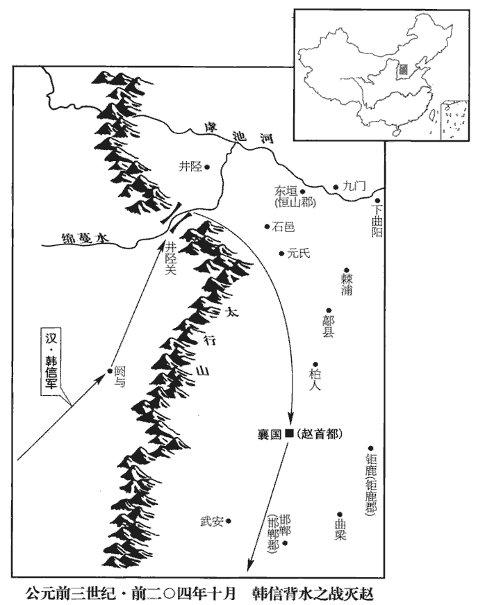
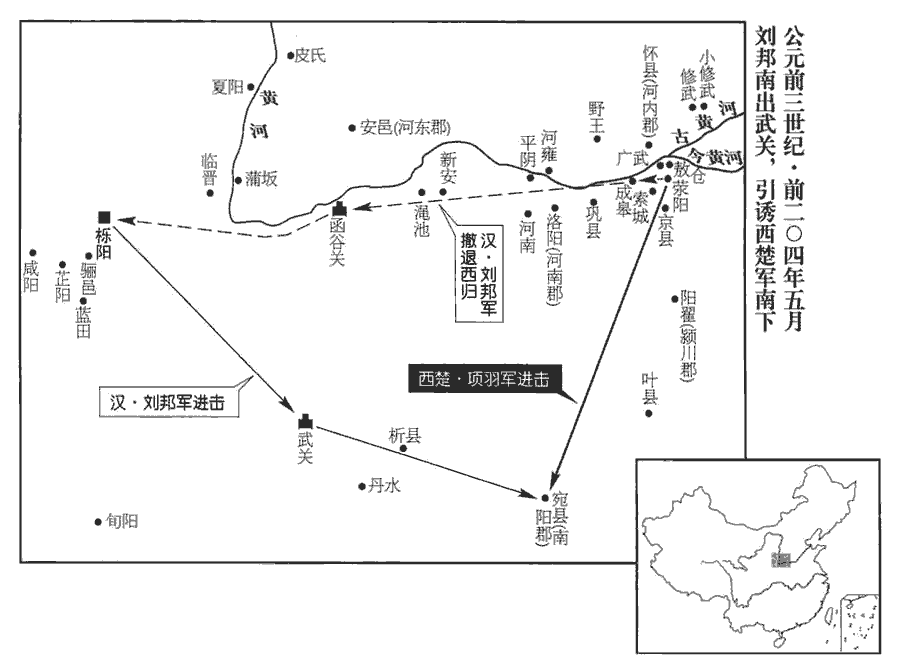
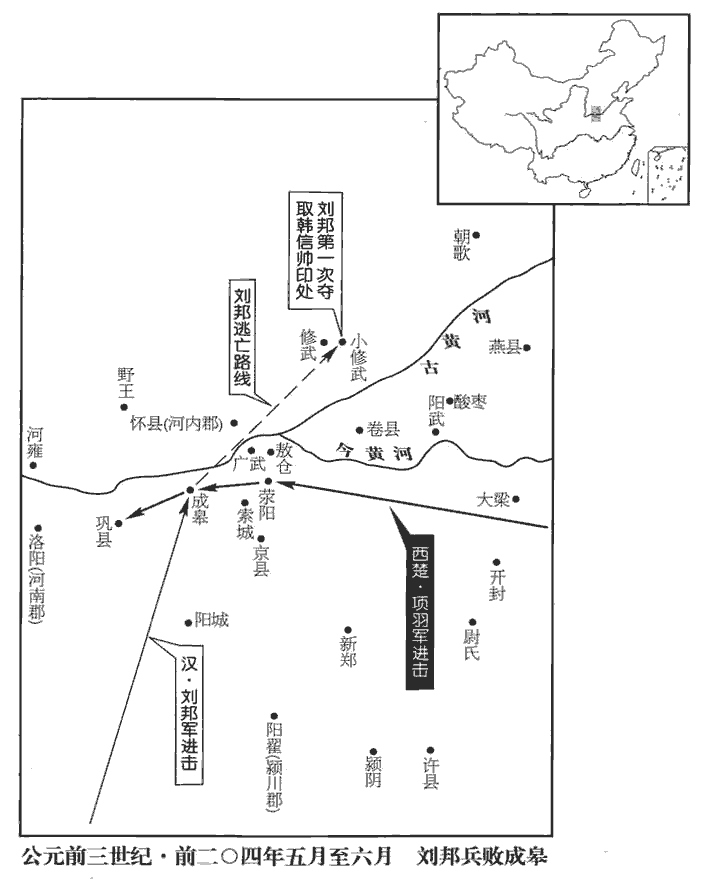
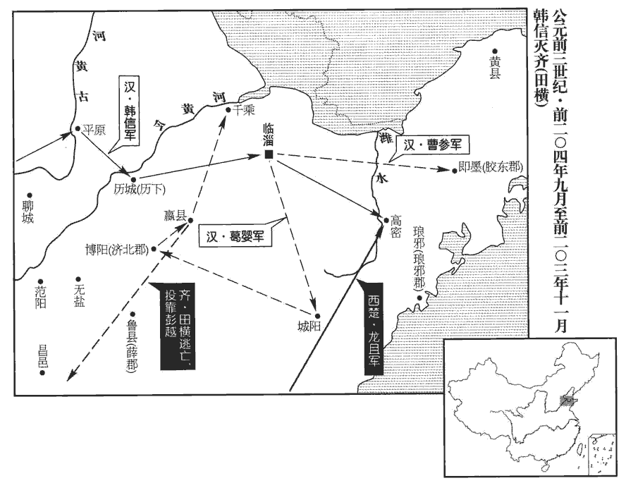
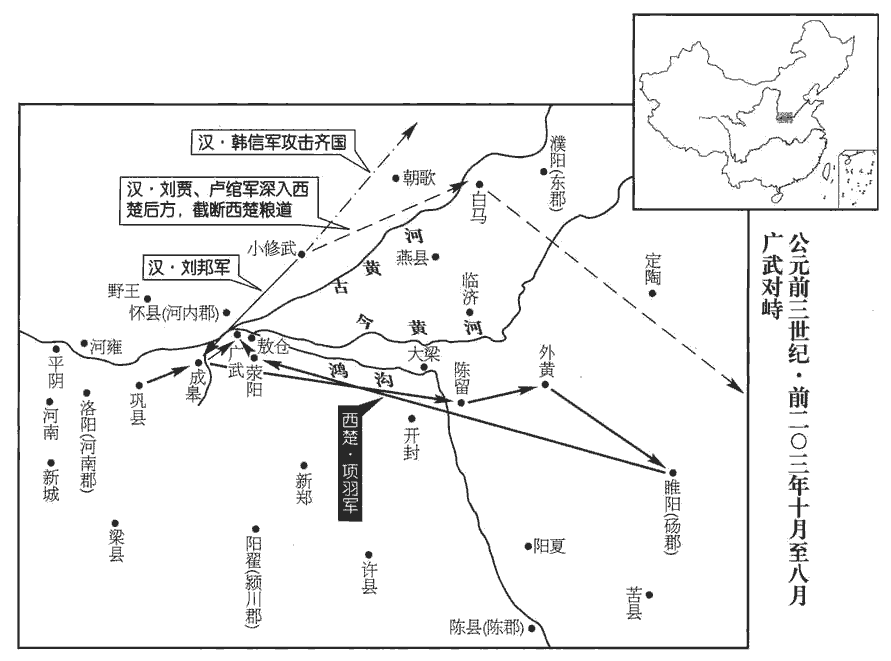

 漢紀二起強圉作噩（丁酉），盡著雍閹茂（戊戌），凡二年。

# 太祖高皇帝上之下

## 三年（丁酉，前二零四年）

1冬十月，韓信、張耳以兵數萬東擊趙。趙王及成安君陳餘聞之，聚兵井陘口‹河北井陘西›，陘，音刑。杜佑曰：井陘口在鎮州鹿泉縣，今謂之土門。按宋白續通典：鎮州石邑縣有井陘山，甚險固。又，鹿泉縣，本漢石邑縣地，隋開皇十六年置，至德初改名獲鹿。又，井陘縣，穆天子傳「天子獵于鉶山」，即此地。註云：燕、趙謂山脊為陘。陘山在縣東南十八里，四方高，中央下，如井，故曰井陘。號二十萬。

〖译文〗 [1]冬季，十月，韩信和张耳率领几万名士兵向东攻打赵。赵王赵歇和成安君陈馀闻讯，即在井陉口集结部队，号称二十万大军。

廣武君李左車說成安君曰：「韓信、張耳乘勝而去國遠斗，謂乘取代之勝勢也。說，輸芮翻。其鋒不可當。臣聞『千里饋糧，士有饑色；樵蘇後爨，樵，取薪也；蘇，取草也。師不宿飽。』今井陘之道，車不得方軌，方軌，謂車并行。騎不得成列；行數百里，其勢糧食必在其後。鄭康成曰：行道曰糧，謂糒也；止居曰食，謂米也。願足下假臣奇兵三萬人，從間路絕其輜重；師古曰：間路，微路也。間古莧翻。師古曰：輜，衣車也；重，謂載重物車也；故行者之資，總曰輜重。釋名云：輜，廁也，所載衣服雜廁其中。重，直用翻。足下深溝高壘勿與戰。彼前不得斗；退不得還，野無所掠，不至十日，而兩將之頭可致於麾下；否則必為二子所禽矣。」成安君嘗自稱義兵，不用詐謀奇計，曰：「韓信兵少而疲，如此避而不擊，則諸侯謂吾怯而輕來伐我矣。」

〖译文〗 广武君李左车劝说成安君道：“韩信、张耳乘胜势离开本国远征，锋芒锐不可当。我听说：‘从千里之外供给军粮，士兵当会面有饥色；临时拾柴割草来做饭，军队当会常常食不果腹。’而今井陉这条路，车辆不能并行，骑兵不能成列，行军队伍前后拉开几百里，依此形势，随军的粮草必定落在大部队的后面。望您暂时拨给我三万人作为突击队，抄小路去截断对方的辎重粮草，而您则深挖壕沟、高筑营垒，坚守不出战。这样一来，他们向前无仗可打，退后无路可回，野外又无什么东西可抢，如此不到十天，韩信、张耳这两个将领的头颅就可以献到您的帐前了；否则便肯定要被他们二人所俘获。”但陈馀曾经自称是义兵，不屑于使用诈谋奇计，故说：“韩信兵力单薄且又疲惫不堪，对这样的军队还避而不击，各诸侯便会认为我胆怯而随便来攻打我了。”

韓信使人間視，知其不用廣武君策，則大喜，乃敢引兵遂下。未至井陘口三十里，止舍。止軍而舍息也。舍，如字。夜半，傳發，選輕騎二千人，傳發，傳令軍中使發兵。人持一赤幟，漢旗幟皆赤。幟，昌志翻。從間道萆bì山而望趙軍。如淳曰：萆，音蔽，依山以自覆蔽也。杜佑曰：卑山，音蔽，今名抱犢山，在鎮州石邑縣。井陘山亦在石邑，意「間道萆山」即此地。師古曰：蔽隱於山，使敵不見。誡曰：「趙見我走，必空壁逐我；若疾入趙壁，若，汝也。疾，速也。拔趙幟，立漢赤幟。」令其裨將傳餐，曰：服虔曰：立，駐。傳餐，食也。如淳曰：小飯曰餐。言破趙乃當共飽食也。餐，千安翻。「今日破趙會食！」諸將皆莫信，佯應曰「諾。」信曰：「趙已先據便地為壁；且彼未見吾大將旗鼓，未肯擊前行，行，戶剛翻。恐吾至阻險而還也。」信蓋謂趙聚兵塞井陘之口，欲俟信出險而後擊之；若見前鋒便縱兵接戰，則信必將阻險而還師也。還，音旋，又如字。乃使萬人先行，出，背水陳；史記正義曰：綿蔓水自并州北流入井陘縣界，即信背水陳處。背，蒲妹翻。陳，讀曰陣。趙軍望見而大笑。

〖译文〗 韩信派人暗中打探消息，得知陈馀不采纳广武君的计策，高兴异常，因此便敢率军径直前进，在距离井陉口三十里的地方停下来宿营。到半夜时分，韩信传令部队出发，挑选两千名轻骑兵，每人手拿一面红旗，从小道上山隐蔽起来，观察赵军的动向；并告诫他们说：“交战时赵军看到我军退逃，必会倾巢出动来追赶我们，你们即趁机迅速冲入赵军营垒，拔掉赵军的旗帜，遍插汉军的红旗。”又命他的副将传送一些食品给将士，说道：“待今天打败赵军后再会餐！”众将领们都不相信，只是假意应承道：“好吧。”韩信说：“赵军已经抢先占据了有利地形安营扎寨，而且他们没有看见我军大将的旗鼓，是不肯出兵攻打我们的先头部队的，这是因为他们怕我军到了险要的地方，遇阻后就会撤回去。”韩信随即派遣一万人打先锋，开出营寨，背靠河水摆开阵势。赵军望见后都哗然大笑。

平旦，信建大將旗鼓，鼓行出井陘口；趙開壁擊之，大戰良久。於是信與張耳佯棄鼓旗，走水上軍；走，音奏。水上軍開入之，復疾戰。趙果空壁爭漢旗鼓，逐信、耳。信、耳已入水上軍，軍皆殊死戰，師古曰：殊，絕也；言決意必死。不可敗。敗，補邁翻。信所出奇兵二千騎共候趙空壁逐利，則馳入趙壁，皆拔趙旗，立漢赤幟二千。趙軍已不能得信等，欲還歸壁；壁皆漢赤幟，見而大驚，以為漢皆已得趙王將矣，將，即亮翻。兵遂亂，遁走，趙將雖斬之，不能禁也。於是漢兵夾擊，大破趙軍，斬成安君泜zhī水上，水經註：泜水即井陘山水，世謂之鹿泉水，東北流，屈逕陳餘壘，又東注綿蔓水。師古曰：泜，音祗，又丁計翻，又丁禮翻。禽趙王歇。

〖译文〗 天刚蒙蒙亮的时候，韩信打出了大将的旗鼓，鼓乐喧天地开出了井陉口。赵军洞开营门迎击，双方激战了很久。这时，韩信和张耳便假装丢旗弃鼓，逃回河边的阵营。河边部队大开营门放他们进去，然后又和赵军鏖战。赵军果然倾巢出动，争抢汉军抛下的旗鼓，追逐韩信和张耳。韩信、张耳进入河边的阵地后，全军即都拼死奋战，赵军无法打败他们。韩信派出的二千名骑兵突击队一起等到赵军将士全体出动去追逐争夺战利品时，立刻奔驰进入赵军营地，拔掉所有赵军旗帜，插上两千面汉军红旗。赵军已经无法抓获韩信等人，便想退崐回营地，但却见自己的营垒中遍是汉军的红旗，都惊慌失措，以为汉军已将赵王的将领全部擒获了，于是士兵们大乱，纷纷逃跑，赵将尽管不停地斩杀逃兵，也无法禁止溃败之势。汉军随即又前后夹击，大败赵军，在水边杀了陈馀，活捉了赵王赵歇。

 

諸將効首虜，畢賀，因問信曰：「兵法：『右倍山陵，前左水澤。』今者將軍令臣等反背水陳，曰『破趙會食』，倍，與背同，蒲妹翻。臣等不服，然竟以勝。此何術也？」信曰：「此在兵法，顧諸君不察耳！兵法不曰：『陷之死地而後生，孫子九地：疾戰則存、不戰則亡為死地。曹操註曰：前有高山，後有大水，進不得，退有礙者。置之亡地而後存』？且信非得素拊循士大夫也，此所謂『驅市人而戰之』，師古曰：言如忽入市廛chán，驅其人以赴戰，非素所習練者也。其勢非置之死地，使人人自為戰；今予之生地，皆走，寧尚可得而用之乎！」予，讀曰與；下同。諸將皆服，曰：「善！非臣所及也。」

〖译文〗 将领们献上敌人的首级和俘虏，都向韩信祝贺，并趁势问韩信说：“兵法上提出：‘布军列阵要右边和背面靠山，前面和左边临水。’而这次您却反而让我们背水布阵，还说什么‘待打败赵军后再会餐’，我们当时都颇不信服，但是竟然取胜了，这是什么战术呀？”韩信说：“这战术也是兵法上有的，只不过你们没有留意罢了！兵法上不是说‘陷之死地而后生，置之亡地而后存’吗？况且我所率领的并不是平时训练有素的将士，这即是所谓的‘驱赶着街市上的平民百姓去作战’，势必非把他们置于死地，使他们人人为各自的生存而战不可；倘若给他们留下活路，他们就会逃走了，那样一来，难道还能够用他们去冲锋陷阵吗！”将领们于是都心悦诚服地说：“对啊！您的谋略的确非我们所能比呀！”

信募生得廣武君者予千金。有縛致麾下者，信解其縛，東鄉坐，師事之。予，讀曰與。鄉，讀曰嚮。問曰：「僕欲北伐燕，東伐齊，何若而有功？」何若，猶言何如也。廣武君辭謝曰：「臣，敗亡之虜，何足以權大事乎！」權，所以稱物，見其輕重也。左車蓋謂兵者國之大事，如己者敗亡之餘，不足以審處其輕重。信曰：「僕聞之：百里奚居虞而虞亡，在秦而秦霸；百里奚，虞之大夫，虞公不能用以亡；秦穆公信而用之，遂霸西戎。非愚于虞而智于秦也，用與不用，聽與不聽也。誠令成安君聽足下計，若信者亦已為禽矣；以不用足下，故信得侍耳。言得侍左右以求教。今僕委心歸計，願足下勿辭！」廣武君曰：「今將軍涉西河，虜魏王，禽夏說；東下井陘，不終朝而破趙二十萬眾，誅成安君；名聞海內，威震天下，農夫莫不輟耕釋耒lěi，褕yú衣甘食，褕，音瑜；靡也。此言當時之人，畏信之威聲，不能自保其生業，皆輟耕、釋耒，褕靡其衣，甘毳cuì其食，以苟生於旦夕，不復為久遠計。傾耳以待命者，此將軍之所長也。然而眾勞卒罷，罷，讀曰疲。其實難用。今將軍欲舉倦敝之兵頓之燕堅城之下，欲戰不得，攻之不拔，情見勢屈；兵，詭道也，乘勢以為用者也。見，顯露也。屈，盡也。吾之情見則敵知所備，勢屈則敵得乘吾之敝矣。見，賢遍翻。屈，其勿翻。曠日持久，糧食單竭。單，與殫同，盡也。燕既不服，齊必距境以自強。燕、齊相持而不下，則劉、項之權未有所分也，此將軍所短也。善用兵者，不以短擊長而以長擊短。」韓信曰：「然則何由？」由，從也，言當從何計也。廣武君對曰：「方今為將軍計，莫如按甲休兵，鎮撫趙民，百里之內，牛酒日至，以饗士大夫；北首燕路，首，式救翻；頭之所向曰首。而後遣辨士奉咫尺之書，師古曰：八寸曰咫。咫尺者，言其簡牘或長咫，或長尺，喻輕率也。暴其所長于燕，暴，顯也，示也，露也。燕必不敢不聽從。燕已從而東臨齊，雖有智者，亦不知為齊計矣。如是，則天下事皆可圖也。兵固有先聲而後實者，此之謂也。」韓信曰：「善！」從其策，發使使燕，燕從風而靡，遣使報漢，且請以張耳王趙，漢王許之。楚數使奇兵渡河擊趙，數，所角翻。張耳、韓信往來救趙，因行定趙城邑，發兵詣漢。

〖译文〗 韩信悬赏千金征求能活捉广武君李左车的人。不久即有人将李左车绑送到韩信帐前。韩信立刻为他松绑，让他面朝东而坐，把他当作老师来对待，并问李左车道：“我想要北进攻打燕国，向东征伐齐国，该如何做才能建立功绩呢？”李左车推辞说：“我不过是一个兵败国亡的阶下囚罢了，哪里有资格来谋划大事啊！”韩信道：“我听说：百里奚在虞国而虞国灭亡，在秦国而秦国称霸，这并不是由于他在虞国时愚蠢，在秦国时却聪明，而是在于国君用不用他，接不接受他的建议。倘若果真让成安君陈馀采纳了您的计策，像我韩信这样的人也早就被俘虏啦；只是因为他不接受您的意见，所以我才能够侍奉在您身边向您请教啊。现在我全心全意地听从您的计策，还望您不要推辞。”李左车于是说：“如今您渡过西河，俘获魏王，生擒夏说；东下井陉口，用不到一个早上的时间就打垮了赵军二十万人马，杀了成安君，名闻海内，威震天下，使农民们慑于您的声势，无不放下农具停止耕作，只图穿好的吃好的，侧耳倾听，等候您进军的号令，这是您用兵的长处所在。但是百姓实已劳苦不堪，士兵确已疲惫之极，实际状况是很难再用他们去继续攻伐了。现在您想要调动疲惫困乏的全部军队去停扎在燕国防守坚固的城池下面，结果是想打打不了，要攻又攻不下，军队内情暴露在敌前，威势也就随之减弱，如此旷日持久，粮食必将耗尽。且燕国这样弱小的国家都不肯屈服，齐国当然也必定要据守边境逞一时之强。这么一来，燕、齐两国都与汉军对峙，相持不下，刘邦和项羽双方胜崐负的趋势便也难见分晓，这即是您用兵的短处所在了。善于用兵的人，从不以自己的短处去攻击他人的长处，而是要用自己的长处去对付他人的短处。”韩信说：“既然如此，那么该怎么办呢？”李左车答道：“现在为您谋算，不如按兵不动，暂作休整，镇守并安抚赵国的百姓，使方圆百里之内，天天都有人送来牛肉美酒，宴请犒劳众将士。将部队向北移动，指向通往燕的道路，然后派遣能言善辩的说客拿着一封书信去向燕国炫耀自己的长处，燕国肯定不敢不听从。燕国已经顺服了，即可向东威临齐国，如此，纵使有聪明人，也不知道该怎样为齐国出谋划策了。这样，天下大事就都可图谋成功了。用兵之道原本便有先造声势而后才实际行动的，我这里所说的就是这个道理。”韩信说：“不错。”随即采用李左车的计策，派使者出使燕国，燕国听到消息就立即归降了。韩信于是派人回报汉王刘邦，并请求封张耳为赵王，刘邦应允了。这时楚国屡次派遣突击队渡过黄河袭击赵国，张耳、韩信往来奔波，救援赵国，乘势夺取所经过的赵国的城邑，随即又调兵遣将赴汉王处增援。

2甲戌晦‹三十›，月盡為晦。日有食之。

〖译文〗 [2]甲戌晦（疑误），发生日食。

3十一月，癸卯晦‹二十九›，日有食之。

〖译文〗 [3]十一月，癸卯晦（疑误），发生日食。

4隨何至九江‹安徽六安›，九江太宰主之，此太宰非周官之太宰。漢奉常屬官有太宰。師古曰：具食之官。信使入國，必使人為之主；時布使太宰主何也。三日不得見。隨何說太宰曰：「王之不見何，必以楚為強，漢【章：乙十一行本「漢」上有「以」字；孔本同；傳校同。】為弱也。此臣之所以為使。說，輸芮翻；下同。使，疏吏翻。使何得見，言之而是，大王所欲聞也；言之而非，使何等二十人伏斧質九江市，足以明王倍漢而與楚也。」倍，與背同，蒲妹翻。太宰乃言之王。

〖译文〗 [4]汉军谒者随何来到九江王黥布处，九江太宰出面接待他，连过三天仍未能见到黥布。于是随何便劝太宰说：“九江王之所以不接见我，必定是由于他认为楚国强大，汉国弱小。而这正是我此次出使的原因啊。假如能让我见到九江王，若说得有理，就是大王想要听到的；倘若说得不对，就把我们二十人斩首在九江国的街市上，这将足够表明九江王背叛汉王而与楚王相交好了。”太宰便把这些话报告给了黥布。

王見之。隨何曰：「漢王使臣敬進書大王御者，竊怪大王與楚何親也？」九江王曰：「寡人北鄉而臣事之。」隨何曰：「大王與項王俱列為諸侯，北鄉而臣事之者，鄉，讀曰嚮；下同。必以楚為強，可以托國也。項王伐齊，身負版築，為士卒先。李奇曰：版，牆版也；築，杵也。大王宜悉九江之眾，身自將之，為楚前鋒；將，即亮翻。今乃發四千人以助楚。夫北面而臣事人者，固若是乎？漢王入彭城‹江蘇徐州›，項王未出齊也。大王宜悉九江之兵渡淮，日夜會戰彭城下；大王乃撫萬人之眾，無一人渡淮者，垂拱而觀其孰勝。垂拱者，垂衣拱手也。夫托國於人者，固若是乎？大王提空名以鄉楚而欲厚自托，臣竊為大王不取也！然而大王不背楚者，以漢為弱也。夫楚兵雖強，天下負之以不義之名，以其背盟約而殺義帝也。背，蒲妹翻。漢王收諸侯，還守成皋‹河南荥阳西北汜水镇›、滎陽，下蜀、漢之粟，深溝壁壘，分卒守徼乘塞。徼，循也。凡邊謂之邊徼，蓋使人循徼，機‹譏›禁奸非，因以名之。索隱曰：徼，謂邊境亭障，以徼繞邊陲，常守之也。徼，吉吊翻。乘，登也；登塞垣而守之。楚人深入敵國八九百里，言楚自彭城至滎陽、成皋，中間有梁地間之；彭越時反梁地，是楚之敵國也，故云深入敵國八九百里。老弱轉糧千里之外。漢堅守而不動，楚進則不得攻，退則不能解，故曰楚兵不足恃也。使楚勝漢，則諸侯自危懼而相救；夫楚之強，適足以致天下之兵耳。故楚不如漢，其勢易見也。今大王不與萬全之漢而自托于危亡之楚，臣竊為大王惑之！易，以豉翻。為，於偽翻。臣非以九江之兵足以亡楚也；大王發兵而倍楚，倍，與背同，蒲妹翻。項王必留，留數月，漢之取天下可以萬全。臣請與大王提劍而歸漢，漢王必裂地而封大王；又況九江必大王有也。」九江王曰：「請奉命。」陰許畔楚與漢，未敢泄也。

〖译文〗 黥布于是召见随何。随何说：“汉王派我敬呈书信给大王您，是因为我们私下里有些疑惑，不知大王您和楚王是个什么关系。”黥布道：“我是面朝北以臣子的身分事奉他。”随何说：“大王您与楚王项羽同列诸侯，地位相等，而您却面北向他称臣，肯定是认为楚国强大，可以作为九江国的靠山了。但当项王攻打齐国，背负修筑营墙的墙版和筑杵，身先士卒地冲杀时，您本应出动九江国的全部兵力，亲自率领他们去为楚军打先锋，可如今却只调拨四千人去支援楚军。面向北事奉他人的臣子，本来就该是这个样子的吗？汉王攻入彭城时，项王还没离开齐地回师，您理应率领九江国的全部兵力抢渡淮河，奔赴彭城投入与汉军的日夜会战，可您却拥兵万人，而无一人渡过淮河，只是袖手旁观人家的胜负。把江山社稷托付给别人的人，原本就该是这个样子的吗？您这是借依附楚国之名而想要行独立自主之实，我私下里认为您的这种做法是不可取的！然而您还不背弃楚国，不过是因为您以为汉国弱小罢了。但是，楚国的崐军队虽然强大，天下的人却给它背上了不义的恶名，这是由于它既违背盟约又杀害义帝的缘故。而汉王联合诸侯，率军回守成皋、荥阳，运来蜀和汉中的粮食，深挖壕沟，加固营垒，分兵把守边防要塞。楚军则因反攻荥阳、成皋，深入反楚的梁地八九百里，老弱残兵从千里之外转运粮食，汉军却只坚守不出战。这么一来，楚军进不能攻取，退又无法脱身，所以说楚军是不足以依赖的。如果楚军战胜了汉军，各诸侯便会人人自危而相互救援。这么一来，楚军的强盛，倒恰好招致天下的军队都来与它抗衡了。所以楚国不如汉国的形势，是显而易见的。现在您不与万无一失的汉国结好，却要把自身托付给行将灭亡的楚国，我暗中对您的这种做法困惑不解。我并不是认为九江国的兵力足够用来消灭楚军了，而是觉得您如能起兵反叛楚国，项王就必定得留下来，只要拖住项王几个月，汉王夺取天下就会万无一失了。我请求随您一起提剑归汉，汉王保证会划分一块土地封给您，又何况九江国必定也仍旧归您所有啊。”黥布于是说：“那就遵命了。”即暗中许诺随何叛楚归汉，只是一时还不敢走露风声。

楚使者在九江，舍傳舍，傳舍，客舍也；前客舍之而去，後客復來舍之，傳相受也，故謂之傳舍。傳，直戀翻。方急責布發兵。隨何直入，坐楚使者上，曰：「九江王已歸漢，楚何以得發兵？」布愕然。楚使者起。何因說布曰：「事已構，師古曰：構，結也；言背楚之事已結成也。可遂殺楚使者，無使歸，而疾走漢并力。」布曰：「如使者教。」於是殺楚使者，因起兵而攻楚。

〖译文〗 楚国的使者在九江，住在客舍中，正加紧督促黥布发兵援楚。随何径直闯入客舍，坐到楚使者上面的座位上，说：“九江王已经归汉，楚国凭什么能来征调他的军队？”黥布听了大吃一惊。这时楚国使者便起身要走。随何乘势劝黥布说：“事已至此，可以就杀掉楚使者，不要让他回去，而您即火速投奔汉王，与汉军协力作战。”黥布道：“就按您指教的办。”于是杀掉了楚国使者，趁机起兵攻打楚国。

楚使項聲、龍且攻九江，且，子餘翻。龍，姓；且，名。數月，龍且破九江軍。布欲引兵走漢，恐楚兵殺之，乃間行與何俱歸漢。十二月，九江王至漢。漢王方踞床洗足，召布入見。見，賢遍翻。布大怒，悔來，欲自殺；及出就舍，帳御、飲食、從官皆如漢王居，布又大喜過望。師古曰：高帝以布先久為王，恐其意自尊大，故峻其禮，令布折服；已而美其帷帳，厚其飲食，多其從官，以悅其心。此權道也。帳，若今之帳設也；御，謂服御也。從，才用翻。於是乃使人入九江；楚已使項伯收九江兵，盡殺布妻子。布使者頗得故人、幸臣，將眾數千人歸漢。漢益九江王兵，與俱屯成皋。

〖译文〗 楚国派项声、龙且进攻九江国，历时几个月，龙且打败了九江国的军队。黥布便想领兵逃奔汉国，因害怕楚军会截杀他，就与随何捡小路行走，一起逃归了汉国。十二月，九江王黥布抵达汉军驻地。汉王刘邦当时正坐在床边洗脚，即召黥布进见。黥布为此怒火中烧，后悔来到这里，想要自杀。待出来后进入为自己安排的客舍，发现那里的陈设、饮食、侍从官员都与汉王的住所相同，便又喜出望外；于是即派人到九江国去联络。这时楚王已派项伯收编了九江军，并把黥布的妻子儿女都杀了。黥布的使者找到不少黥布的旧友和宠爱的臣僚，带领着几千人回到汉王处。汉王随即增拨兵力给黥布，与黥布的军队一起驻扎在成皋。

楚數侵奪漢甬道，數，所角翻。漢軍乏食。漢王與酈食其謀橈náo楚權。食其，音異基。橈，女教翻，弱也；其字從「木」。食其曰：「昔湯伐桀，封其後于𣏌sì‹河南杞縣›；武王伐紂，封其後于宋‹河南商丘›。今秦失德棄義，侵伐諸侯，滅其社稷，使無立錐之地。陛下誠能復立六國之後，此其君臣、百姓必皆戴陛下之德，莫不向風慕義，願為臣妾。德義已行，陛下南鄉稱霸，楚必斂袵而朝。」袵，衣襟也。鄉，讀曰嚮。朝，直遙翻。漢王曰：「善！趣刻印，先生因行佩之矣。」言將使食其行使六國，授之以印而使佩之。趣，讀曰促；下同。

〖译文〗 楚军屡次袭击截夺汉军运粮的通道，使汉军中粮食短缺。汉王因此与郦食其谋划如何削弱楚国的实力。郦食其说：“从前商汤讨伐夏桀，将夏桀王的后裔封在杞国；周武王讨伐商纣，将商纣王的子孙封在宋国。如今秦朝丧失德行、背弃道义，侵伐各诸侯国，灭掉各国后，使诸侯的后代生无立锥之地。陛下若真能重新扶立六国的后裔，当今六国的君臣、百姓都对陛下感恩戴德，无一不向往陛下的风范，仰慕陛下的仁义，都甘愿做陛下的臣民。如此德义已经施行，陛下即可面向南居帝位称霸天下，楚王也必定会整理衣冠，肃然起敬地前来朝拜了。”汉王说：“好！赶快去刻制印玺，您就可带上它们出使各国了。”

食其未行，張良從外來謁。漢王方食，曰：「子房前！子房，張良字也。客有為我計橈楚權者，」具以酈生語告良，曰：「何如？」良曰：「誰為陛下畫此計者？陛下事去矣！」漢王曰：「何哉？」對曰：「臣請借前箸，為大王籌之，時漢王方食，故良言願借食前之箸，就用指畫。鄭玄曰：今人或謂箸為挾提。昔湯、武封桀、紂之後者，度能制其死生之命也；度，徒洛翻。今陛下能制項籍之死命乎？其不可一也。武王入殷，表商容之閭，釋箕子之囚，封比干之墓；商容，殷賢人。里門曰閭。表，顯異也。紂囚箕子，殺比干；武王克殷，釋箕子囚，封比干墓。韓詩外傳曰：商容執羽籥yuè，馮于馬徒，欲以化紂而不能，遂去，伏於太行山。武王欲以為三公，辭而不受。鄭玄曰：商家樂官，知禮容，所以禮署稱容台。今陛下能乎？其不可二也。發巨橋‹河北威县›之粟，散鹿台‹在河南淇縣›之錢，服虔曰：巨橋，倉名。許慎曰：鉅鹿之大橋有漕粟。杜佑曰：巨橋倉在今廣平郡曲周縣。臣瓚曰：鹿台今在朝歌城中；劉向曰：其大三里，高千尺。以賜貧窮；今陛下能乎？其不可三也。殷事已畢，偃革為軒，蘇林曰：革者，兵車也；軒者，朱軒、皮軒也；謂廢兵車而用乘車也。說文曰：軒，曲周屏車。如淳曰：革者，革車也；軒者，赤黻乘軒也；偃武備而治禮樂也。倒載干戈，示天下不復用兵；今陛下能乎？其不可四也。復，扶又翻。休馬華山之陽，示以無為；今陛下能乎？其不可五也。華，戶化翻。放牛桃林之陰‹河南灵宝到陝西潼關›，晉灼曰：桃林在弘農闅鄉南谷中。山海經曰：夸父之山，北有林焉，名曰桃林，廣圍三百里。十三州記：弘農有桃丘聚，即桃林也。師古曰：桃林山谷在闅鄉縣東南，西南去湖城縣三十五里。以示不復輸積；今陛下能乎？其不可六也。天下游士，離其親戚，棄墳墓，去故舊，從陛下游者，徒欲日夜望咫尺之地。今復立六國之後，天下游士各歸事其主，從其親戚，反其故舊、墳墓，陛下誰與取天下乎？其不可七也。且夫楚唯無強，六國立者復橈而從之，服虔曰：惟當使楚無強，強則六國弱而從之。晉灼曰：當今惟楚大，無有強之者；若復立六國，六國皆橈而從之，陛下安得而臣之乎！陛下焉得而臣之？其不可八也。誠用客之謀，陛下事去矣！」漢王輟食，吐哺，罵曰：哺，音步，食在口中者。「豎儒幾敗而公事！」而，汝也。公，尊稱也。高祖嫚罵人，率曰「而公」、「乃公」，蓋自尊辭。幾，居依翻。令趣銷印。

〖译文〗 郦食其尚未起程，张良从外面回来谒见汉王。汉王当时正在吃饭，说道：“子房，你过来！宾客中有人为我策划了削弱楚国实力的办法。”随即把郦食其的话都告诉了张良，说：“你看怎么样呀？”张良道：“什么人为陛下谋划了这个计策？陛下统一天下的大事要完了！”汉王说：“为什么呢？”张良答道：“我请求借用您面前的筷子，来为您指划一下目前的形势：从前商汤、周武王之所以封立夏桀、商纣王的后裔，是因为估量到自己可以掌握住对他们的生死大权。而如今陛下能够决定项羽灭亡的命运吗？这是不可封六国国君后代的第一个理由。周武王进入殷商的都城，在里门表彰商纣王时的贤人商容的德行，释放了被囚禁的箕子，翻修比干的坟墓。而如今陛下能够这样做吗？这是不可封六国之后的第二个理由。周武王曾经发放商纣王巨桥粮仓的粮食，散拨鹿台府库的金钱，以赈济贫苦百姓。如今陛下可以这么做吗？这是不可封六国之后的第三个理由。殷商灭亡后，周武王废弃战车，改作乘车，倒置兵器，以向天下人表示不再用兵。如今陛下能这样做吗？这是不可封六国后代的第四个理由。把战马放养在华山的南面，以显示让它们休息不再驱用。如今陛下可以这么做吗？这是不可封六国后代的第五个理由。将牛放牧到桃林的北面，以表示不再用它们运输粮草辎重。如今陛下能够这样做吗？这是不可封六国后代的第六个理由。天下远游的士子，所以要远离自己的父母兄弟，抛弃自己祖先的坟墓，离开自己的老友，跟随陛下辗转奔波，为的就是得到那日思夜想的一点点封地。倘若今天重新封立六国国君的后裔，使天下远游之士各自回去事奉他们的君主，伴随他们的父母妻儿，返归他们旧友、祖坟所在的故土，那么陛下还依靠谁去夺取天下呢？这是不可封六国之后的第七个理由。况且当今只有楚国强大，尚无超过它的，假如复立的六国后代重又屈从楚国，那么陛下还怎么使他们臣服于汉呢？这是不可封六国之后的第八个理由。如若真的采用了那位宾客的计策，陛下统一天下的大事可不就完了吗！”汉王听了这番话后饭也不吃了，吐出口中的食物，骂道：“这个书呆子几乎坏了老子的大事！”立即下令赶快销毁那些印玺。

荀悅論曰：夫立策決勝之術，其要有三：一曰形，二曰勢，三曰情。形者，言其大體得失之數也；勢者，言其臨時之宜、進退之機也；情者，言其心志可否之實也。故策同、事等而功殊者，三術不同也。

〖译文〗 荀悦论曰：确立决定胜负策略的方法，要点有三：一是形，二是势，三是情。所谓形，说的是得与失大体上的趋向；所谓势，说的是对临时情况灵活应付和对进与退随机应变的形势；所谓情，则指的是心意志向上坚定还是懈怠的实际心理。所以采用的策略相同，所干的事情相等，而取得的功效却各异，即是由于这三个方法运用得不同的缘故。

初，張耳、陳餘說陳涉以復六國，自為樹黨；事見七卷秦二世元年。酈生亦說漢王。所以說者同而得失異者，陳涉之起，天下皆欲亡秦；而楚、漢之分未有所定，今天下未必欲亡項也。故立六國，于陳涉，所謂多己之党而益秦之敵也；且陳涉未能專天下之地也，所謂取非其有以與於人，行虛惠而獲實福也。立六國，于漢王，所謂割己之有而以資敵，設虛名而受實禍也。此同事而異形者也。

〖译文〗 当初，张耳、陈馀劝说陈胜借恢复六国，来为自己培植党羽；郦食其也是这样劝说汉王刘邦的。之所以劝说的内容相同，得与失却各异，是因为陈胜起事时，天下的人都想要灭亡秦朝；而如今楚、汉的胜、负之分还无定势，天下的人未必都想要项羽覆灭。所以重立六国的后裔，对陈胜来说，是为自己广植党羽而给秦朝增树强敌。况且陈胜那时并没能独占天下之地，即所谓把不是自己的东西取来送给别人，行施恩惠之虚名，获得福益之实惠。但重立六国之后，对汉王来说，却是所谓的分割自己拥有的东西去资助敌人，空设虚名而实受崐祸害。这便是所做的事情相同，可得与失的趋向已各异的例子。

及宋義待秦、趙之斃，事見八卷秦二世三年。與昔卞莊刺虎同說者也。卞莊子刺虎。管豎子止之曰：「兩虎方食牛，牛甘必爭斗，則大者傷，小者亡；從傷而刺，一舉必有兩獲。」莊子然之，果獲二虎。施之戰國之時，鄰國相攻，無臨時之急，則可也。戰國之立，其日久矣，一戰勝敗，未必以存亡也；其勢非能急於亡敵國也，進乘利，退自保，故累力待時，乘【章：乙十一行本「乘」作「承」；孔本同；傳校同。】敵之斃，其勢然也。今楚、趙所起，其與秦勢不并立，安危之機，呼吸成變，進則定功，退則受禍。此同事而異勢者也。

〖译文〗 谈到宋义劝说项羽，先让秦、赵两国相斗，待秦军疲惫后再乘机攻秦，自己却终被项羽杀了，与卞庄子刺杀老虎时，管竖子劝他等待两虎与牛相搏，双方有伤亡时再乘机刺虎，卞庄子最后果然获得二虎，两次的游说之辞也都相同。但这套说辞，施用在战国时，邻国相互攻伐，没有临时情势变化的危急发生，还是可以的。因为战国局面的确立，日子已经很久了，一次战役的胜与败，未必就会决定一个国家的生存和灭亡。那时的进退变化形势决定了一个国家不能够急于使敌国灭亡，而是进可以凭借有利条件，退也能够自保安全，故可以积蓄力量，等待时机，乘敌方精疲力尽，再去进攻。这是可以灵活行事、随机应变的形势所造成的。但今日楚、赵两国起兵抗秦，与秦的地位互不相同，安全与危亡的机会，在呼吸的一瞬间就会发生变化，因此进即能建立功绩，退就将遭受祸殃。这便是事情相同，而灵活应付和随机应变的形势、时机已各异的例子。

伐趙之役，韓信軍于泜水之上而趙不能敗。事見上卷三年。彭城‹江蘇徐州›之難，漢王戰于睢水之上，士卒皆赴入睢水而楚兵大勝，事見上卷二年。難，乃旦翻。何則？趙兵出國迎戰，見可而進，知難而退，懷內顧之心，無出死之計；韓信軍孤在水上，士卒必死，無有二心，此信之所以勝也。漢王深入敵國，置酒高會，士卒逸豫，戰心不固；楚以強大之威而喪其國都，喪，息浪翻。士卒皆有憤激之氣，救敗赴亡之急，以決一旦之命，此漢之所以敗也。且韓信選精兵以守，而趙以內顧之士攻之；項羽選精兵以攻，而漢以怠惰之卒應之。此同事而異情者也。

〖译文〗 汉军攻打赵国的战役，韩信率军驻扎在地形不利的水边上，但赵军却无法打败他；彭城遭陷落一仗，汉王也在睢水岸边作战，但士兵却被赶入睢水，楚军大获全胜。这是为什么呢？赵军出国迎战汉军，见到可以打嬴就前进，知道难于取胜就后退，怀着关顾自身存亡的心理，毫无出阵拼死一搏的打算；而韩信的军队孤立无援地列阵在水边，士兵背水作战，不进就必死无疑，故将士们都不怀二心，抱定决一胜负的信念。这即是韩信所以能获胜的原因。汉王深入敌国，摆设酒宴盛会宾朋，士兵们享受安逸欢乐，求战心理不稳固；而楚军凭着它的威势却丧失了自己的国都，将士们都义愤填膺，急于挽救败局，无畏惧地奔向死亡，以决出一时的胜败命运。这便是汉军所以又失败的原因。况且韩信挑选精兵坚守阵地，赵军却用瞻前顾后的士兵去攻打他；项羽选择精兵发动进攻，汉军却用怠惰散漫的将士去对付他。这就是所做的事情相同，而坚定与懈怠的心理已各异的例子。

故曰：權不可豫設，變不可先圖；與時遷移，應物變化，設策之機也。

〖译文〗 所以说，应事的权宜机变是不能够预先设计的，事态的变化是不能够事先谋划；随时机的转动而转动，应事物的变化而变化，是制订策略的关键。

5漢王謂陳平曰：「天下紛紛，何時定乎？」陳平曰：「項王骨鯁之臣，亞父、鐘離昩mò、龍且、周殷之屬，鐘離，古鐘離子之後，以國為姓。龍姓出於龍伯氏；又曰，出於舜納言之龍。師古曰：昩，莫曷翻，其字從本末之末。且，子餘翻。不過數人耳。大王誠能捐數萬斤金，行反間，間其君臣，以疑其心；間，古莧翻。項王為人，意忌信讒，必內相誅，漢因舉兵而攻之，破楚必矣。」漢王曰：「善！」乃出黃金四萬斤與平，恣所為，不問其出入。平多以金縱反間于楚軍，宣言：「諸將鐘離昩等為項王將，功多矣，然而終不得裂地而王，欲與漢為一，以滅項氏而分王其地。」項羽果意不信鐘離昩等。

〖译文〗 [5]汉王刘邦对陈平说：“天下纷扰混乱，到什么时候才能安定呀？”陈平说：“项王身边刚直不阿的臣子，如亚父范增、钟离昧、龙且、周殷之辈，也不过几个人罢了。大王您如果确能拿出几万斤黄金，施用反间计，离间楚国的君臣关系，使他们内心互相猜疑，而项羽的为人原就猜忌多疑，易听信谗言，这样一来，他们内部必然会自相残杀，我们即可乘机发兵去攻打他们，如此击败楚军是一定的啦。”汉王说：“对啊！”便取出黄金四万斤交给陈平，任凭他自行活动，不过问他使用的情况。陈平于是用许多黄金雇请间谍到楚军中去进行离间活动，扬言说：“各位将领如钟离昧等人为项王领兵打仗，功劳卓著，但是却终究不能分得一块土地而称王，因此他们便想与汉军联合起来，借崐此灭掉项氏，瓜分楚国的土地，各自称王。”项羽果然有所猜忌，不再信任钟离昧等人。

夏，四月，楚圍漢王于滎陽‹河南滎陽›，急；漢王請和，割滎陽以西者為漢。亞父勸羽急攻滎陽；漢王患之。項羽使使至漢，陳平使為大牢具。大，讀曰太。古者諸侯遣使交聘，其牢禮各如其命數，以三牲具為一牢。秦滅古法，軍興之時，不能備古之牢禮，故以太牢具為盛禮。孔穎達曰：按周禮：膳夫，王日一舉，鼎十有二物，謂太牢也。是周公制禮，天子日食太牢，則諸侯日食少牢，大夫日食特牲，士日食特豚。至後世衰亂，玉藻云：天子日食少牢，朔月太牢；諸侯日食特牲，朔月少牢。則知大夫日食特豚，朔月特牲；士日食無文，朔月特豚。故內則云：見子具朔食。註云：天子太牢，諸侯少牢，大夫特豕，士特豚。諸侯祭以太牢，得殺牛；諸侯之大夫祭以少牢，得殺羊；天子大夫祭亦得殺牛，其諸侯及大夫饗食賓得用牛也。故大行人掌客，諸侯待賓，皆用牛也。公食大夫禮，大夫食賓禮，亦用牛也。舉進，見楚使，即佯驚曰：「吾以為亞父使，乃項王使！」復持去，更以惡草具進楚使。服虔曰：去肴肉，更以惡草之具。惡，麤惡；草，草率也。楚使歸，具以報項王；項王果大疑亞父。亞父欲急攻下滎陽城，項王不信，不肯聽。亞父聞項王疑之，乃怒曰：「天下事大定矣，君王自為之，願賜【章：乙十一行本「賜」作「請」；孔本同。】骸骨！」歸，未至彭城‹江蘇徐州›，疽發背而死。疽，千餘翻，癰瘡也。

〖译文〗 夏季，四月，楚军在荥阳围攻汉王，形势紧急。汉王向项羽请求议和，将荥阳西面的地区划归汉国。但范增却劝项羽火速攻打荥阳，汉王为此忧心忡忡。这时项羽派使者前往汉王处，陈平置备了丰富盛大的宴席，命人端去款待楚国的使者，一见到楚使，就假装惊诧地说：“我还以为是亚父的使者呢，原来竟是项王的使者啊！”随即将酒菜又端了出去，改换粗劣的饭菜送给楚使食用。楚使回国后，即把这些情况汇报给了项羽，项羽果然又对范增大加猜疑。范增想要加紧攻下荥阳城，项羽不信任他，不肯听从他的意见。范增闻听项羽对他有怀疑，便怒气冲冲地说：“天下事大体上已有定局了，您自己干吧，望能准许我辞职回家！”于是范增踏上了归途，还没有到达彭城时，就背上毒疮发作死去了。

五月，將軍紀信言于漢王曰：「事急矣！臣請誑楚，誑，居況翻，欺也。王可以間出。」間，古莧翻。於是陳平夜出女子東門二千余人，楚因四面擊之。紀信乃乘王車，黃屋，左纛，李斐曰：天子車以黃繒為蓋里。纛，羽幢也，在乘輿車衡左方上柱之。蔡邕曰：以犛牛尾為之，大如斗，或在騑頭，或在衡。應劭曰：雉尾為之，在左驂，當鑣上。師古曰：應說非。爾雅翼：犛，西南夷長髦牛也，似牛，而四節、腹下及肘皆有赤毛長尺餘，而尾尤佳，其大如斗。天子之車左纛，以此牛尾為之，系之左騑馬軛上。蓋馬在中曰服，在外曰騑，騑，即驂也；安最外馬頭上，以亂馬目，不令相見也。纛，徒倒翻，又音毒。曰：「食盡，漢王降。」楚皆呼萬歲，之城東觀。以故漢王得與數十騎出西門遁去，令韓王信與周苛、魏豹、樅公守滎陽‹河南滎陽›。樅，千容翻。羽見紀信，問：「漢王安在？」曰：「已出去矣。」羽燒殺信。周苛、樅公相謂曰：「反國之王，難與守城！」因殺魏豹。

〖译文〗 五月，将军纪信告诉汉王说：“势态紧急！我请求去迷惑一下楚军，您即可以悄悄地溜出荥阳城了。”随即由陈平趁着黑夜把二千多名妇女放出城东门，楚军即刻便从四面围攻这群妇女；纪信于是乘坐汉王的车驾，黄绸车盖、车衡左边的装饰物等一应俱全，驶到楚军前，说：“我军粮食已经吃光了，汉王前来乞降。”楚军都山呼万岁，涌到城东观望。汉王因此得以带领几十骑人马从西门出城逃走，命韩王信与周苛、魏豹、枞公继续把守荥阳。项羽见到纪信后问道：“汉王在哪里呀？”纪信说：“已经出城了。”项羽于是烧死了纪信。周苛、枞公这时相互商议说：“背叛汉国、反复无常的君王魏豹，很难让人和他一道守城！”随即就杀了魏豹。

漢王出滎陽，至成皋，入關，收兵欲復東，轅生說漢王曰：轅，姓也。姓譜：陳大夫轅濤塗之後。以其所本考之，亦與爰、袁二姓通。「漢與楚相距滎陽數歲，漢常困。願君王出武關‹陝西商南西南›，項王必引兵南走。王深壁勿戰，令滎陽、成皋間且得休息，使韓信等得安輯河北趙地，連燕、齊，師古曰：輯，與集同，謂和合也。詩序曰：「勞來還定安集之」；春秋左氏傳曰：「群臣輯睦」。他皆類此。君王乃復走滎陽。如此，則楚所備者多，力分；漢得休息，復與之戰，破之必矣！」漢王從其計，出軍宛‹河南南陽›、葉‹河南葉縣›間。班志，二縣屬南陽郡。史記正義曰：宛，鄧州縣。葉，汝州縣。宛，於元翻。葉，式涉翻。與黥布行收兵。羽聞漢王在宛，果引兵南；漢王堅壁不與戰。

〖译文〗 汉王出了荥阳，到达成皋，进入函谷关，收集兵马，准备再次东进。辕生劝汉王说：“汉军与楚军已在荥阳相持好几年了，汉军常常陷入困境。现在希望您能从武关出兵，项羽见状必定会领兵南下。而您则修筑深沟高垒，坚守不出战，使荥阳、成皋一线的汉军得到休整；同时派韩信等人去安抚黄河以北赵地的军民，联合燕、齐两国，然后您再奔赴荥阳。如此一来，楚军需要多处设防，兵力即会分散，汉军却得到了休整，这样重与楚军交锋，打垮他便是必定无疑的了！”汉王采纳了辕生的计策，出兵到宛、叶一带，并与黥布一路上收集兵马。项羽听说汉王在宛，果然领兵南下，汉王却只是坚守营垒，不与楚军接战。

 

漢王之敗彭城‹江蘇徐州›，解而西也，彭越皆亡其所下城，獨將其兵北居河上，常往來為漢游兵擊楚，絕其後糧。是月，彭越渡睢，與項聲、薛公戰下邳‹江蘇睢宁西北›，破，殺薛公。睢，音雖。羽乃使終公守成皋，終，姓也。姓譜曰：陸終之後。而自東擊彭越。漢王引兵北，擊破終公，復軍成皋。

〖译文〗 汉王在彭城吃了败仗，军队向西溃退，彭越这时又失去了他原来攻下的所有城镇，便独自率领他的部队向北留住在黄河沿岸，经常作为汉军的游击部队往来袭击楚军，断绝楚军后方的粮草供给。这个月，彭越渡过睢水，与项声、薛公在下邳交战，打败了楚军，杀掉了薛公。项羽于是派终公守卫成皋，而自己率军向东去攻打彭越。汉王乘机领兵北进，击垮了终公的防军，重又在成皋崐驻扎下来。

六月，羽已破走彭越，聞漢復軍成皋，乃引兵西拔滎陽城，生得周苛。羽謂苛：「為我，將以公為上將軍，封三萬戶。」周苛罵曰：「若不趨降漢，今為虜矣；若非漢王敵也！」羽烹周苛，并殺樅公而虜韓王信，遂圍成皋。漢王逃，漢書「逃」作「跳」；如淳音逃；史記項羽紀作「逃」；索隱：徒彫翻。晉灼曰：跳，獨出意。如淳曰：逃，謂走也。余謂左氏傳例：民逃其上曰潰，在上曰逃。太史公蓋用此例，溫公仍之。逃，當如字。獨與滕公共車出成皋玉門，張晏曰：玉門，成皋北門。北渡河，宿小修武‹河南获嘉西›傳舍。晉灼曰：在大修武城東。晨，自稱漢使，馳入趙壁。張耳、韓信未起，即其臥內，奪其印符以麾召諸將，易置之。信、耳起，乃知漢王來，大驚。漢王既奪兩人軍，即令張耳循【章：乙十一行本「循」作「徇」。】行，備守趙地。行，下孟翻。拜韓信為相國，收趙兵未發者擊齊。諸將稍稍得出成皋從漢王。楚遂拔成皋，欲西；漢使兵距之鞏‹河南鞏縣›，班志，鞏縣屬河南郡，即東周君所居。汝洛地圖云：鞏，固也。鞏縣在洛水之間，言四面有山，可以鞏固。令其不得西。

〖译文〗 六月，项羽已打跑了彭越。获悉汉军重又驻军成皋后，项羽就领兵西进，攻下荥阳，生擒了周苛。项羽对周苛说：“你若归降我，我将任命你为上将军，并分给你三万户的封地。”周苛斥骂道：“你不赶快投降汉王，眼看着就要被俘虏了。你绝不是汉王的对手！”项羽便煮杀了周苛，并杀了枞公，俘获了韩王信，随即包围了成皋。汉王逃跑，只身与滕公夏侯婴共乘一辆车子出成皋城的玉门，往北渡过黄河，投宿在小修武驿站的客舍中。次日清晨，汉王自称是汉国的使者，奔驰进入赵军营地。这时张耳、韩信还没起床。汉王即闯入他们的卧室，夺走他们的印信兵符，用指挥旗召集众将领们，调换了众将的职位。韩信、张耳起床后才知道汉王来了，大吃一惊。汉王就夺了两人手下的军队，即命张耳去巡行收集兵员，守备赵地。授韩信相国的职位，让他集结赵国尚未征发的部队去攻打齐国。汉军将领们陆陆续续地从成皋逃出，继续追随汉王。楚军于是便攻下了成皋，接着又打算西进。汉王即派兵在巩县抵御楚军，使他无法西进。

 

6秋，七月，有星孛bèi於大角。隋天文志：孛，彗之屬也；偏指曰彗，芒氣四出曰孛。孛者，孛孛然，非常惡氣之所生也。內不有大亂，必有大兵。天下合謀，暗蔽不明，有所傷害。晏子曰：「君若不改，孛星將出，彗何懼乎！」由是言之，災甚於彗。孛，蒲內翻，又蒲沒翻。班志：房南眾星曰騎官，左角理，右角將。大角者，天王帝坐廷。

〖译文〗 [6]秋季，七月，有异星出现于大角星旁。

7臨江‹湖北江陵›王敖薨，子尉嗣。

〖译文〗 [7]临江王共敖去世，他的儿子尉继位。

8漢王得韓信軍，復大振。八月，引兵臨河，南鄉，軍小修武，欲復與楚戰。鄉，讀曰嚮。復，扶又翻。郎中鄭忠說止漢王，漢制：議郎、中郎，秩比六百石；侍郎，比四百石；郎中，比三百石；皆屬郎中令。說，式芮翻。使高壘深塹勿與戰。塹，七豔翻。漢王聽其計，使將軍劉賈、盧綰將卒二萬人，綰，烏板翻。騎數百，渡白馬津‹河南滑縣东北古黃河渡口›，入楚地，佐彭越，燒楚積聚，以破其業，師古曰：積聚，所畜軍糧芻藁之屬也。積，子賜翻。聚，才喻翻。無以給項王軍食而已。楚兵擊劉賈，賈輒堅壁不肯與戰，而與彭越相保。

〖译文〗 [8]汉王得到韩信的军队后，重又士气大振。八月，领兵来到黄河岸边，向南驻扎在小修武，想要与楚军再战。郎中郑忠劝阻汉王，让他高筑营垒、深挖壕沟，不要与楚军交锋。汉王听从了他的计策，派将军刘贾、卢绾率步兵两万人、骑兵几百人，渡过白马津，进入楚地，协助彭越，烧毁楚国积聚的粮草辎重，以破坏楚国的后备基础，使它无法再给前方项羽的军队供给粮草。楚军进攻刘贾，刘贾总是坚守营垒不肯与楚军接战，而与彭越相互呼应救援。

9彭越攻徇梁地，下睢陽、外黃‹河南民权西北外黄集›等十七城。睢陽，秦縣，屬碭郡，漢屬梁國，故微子所封國也；唐為宋州宋城縣。杜佑曰：漢外黃故城，在陳留郡雍丘縣東，春秋「齊桓公會諸侯于葵丘」，即此。九月，項王謂大司馬曹咎曰：「謹守成皋！即漢王欲挑戰，挑，徒了翻。慎勿與戰，勿令得東而已。我十五日必定梁地，復從將軍。」羽引兵東行，擊陳留‹河南开封东南›、外黃、睢陽等城，皆下之。

〖译文〗 [9]彭越攻夺故梁国的土地，攻下了睢阳、外黄等十七个城邑。九月，项羽对大司马曹咎说：“谨慎地把守成皋！即使汉军要来挑战，你也千万不可应战，只须不让他能够东进就行了。我十五天之内必能平定梁地，重与你汇合到一起。”项羽随即领兵向东进发，攻打陈留、外黄、睢阳等城，都攻克了。

漢王欲捐成皋以東，屯鞏、洛以距楚。酈生曰：「臣聞『知天之天者，王事可成』；王者以民為天，而民以食為天。大戴禮曰：食穀者智慧而巧。古史考曰：古者茹毛飲血，燧人氏鑽火，而人始裹肉而燔之曰炮。神農時，人方食穀，加米于燒石之上而食之。及黃帝時，始有釜甑，火食之道成矣。夫敖倉‹河南滎陽北敖山粮仓›，天下轉輸久矣，臣聞其下乃有藏粟甚多。楚人拔滎陽，不堅守敖倉，乃引而東，令適卒分守成皋，適，讀曰謫。卒，謂卒之有罪謫者，所謂謫戍也。此乃天所以資漢也。方今楚易取而漢反卻，易，以豉翻。自奪其便，臣竊以為過矣！且兩雄不俱立，楚、漢久相持不決，海內搖盪，農夫釋耒，耒，手耕曲木也。工女下機，天下之心未有所定也。願足下急復進兵，收取滎陽，據敖倉之粟，塞成皋之險，杜太行之道，距蜚狐之口‹河北淶源南›，如淳曰：上党壺關也。臣瓚曰：飛狐口在代郡。師古曰：瓚說是，壺關無飛狐之名。地道記：恒山在上曲陽縣西北百四十里，北行四百五十里，得恒山岋è，號飛狐口，北則代郡也。水經註：代郡南四十里有蜚狐關。史記正義曰：按蔚州飛狐縣北百五十里有秦、漢故代郡城，西南有山，俗號蜚狐口。塞，悉則翻。行，戶剛翻。守白馬之津，以示諸侯形制之勢，謂因地形而據之以制敵。則天下知所歸矣。」王從之，乃復謀取敖倉。

〖译文〗 汉王想放弃成皋以东地区，驻扎到巩县、洛阳，以抗拒楚军的西进。郦食其说道：“我听说‘懂得民以食为天这一道理的人，帝王的事业可以成功’。治理天下的国君把百姓当作天，而百姓则把粮食当作天。敖仓，作为天下转运粮食的集散地已经很久了，我获悉那里贮藏的粮食非常之多。现在楚军攻下荥崐阳，竟然不坚守敖仓，而却领兵东去，只派些因获罪被罚充军的士兵分守成皋，这真是上天对汉军的帮助啊。目前楚军容易攻取，汉军反倒退却，自己贻误有利战机，我私下里认为这是个过错！而且两雄不可并立，楚、汉长久地相持不下，使得海内动荡不定，农夫放下农具停止耕作，织女离开织机不再纺纱织布，普天之下民心惶惶没有归属。因此希望您赶快再度进兵，收复荥阳，占有敖仓的粮食，扼守住成皋的险要，断绝太行的通道，在蜚狐隘口设防抵抗，把守白马津，向诸侯显示汉军已占据有利地形能够克敌制胜的态势，这么一来，天下人便都知道自己的归向了。”汉王接受了郦食其的建议，随即重又去谋取敖仓。

食其又說王曰：「方今燕、趙已定，唯齊未下。諸田宗強，負海、岱，阻河、濟，齊地東至海，南至太山，故曰負海、岱；西阻清濟，北阻濁河，故曰阻河、濟。濟，子禮翻。南近于楚，近，其靳翻。人多變詐；足下雖遣數萬師，未可以歲月破也。臣請得奉明詔說齊王，使為漢而稱東藩。」考異曰：史記、漢書皆以食其勸取敖倉及請說齊合為一事，獨劉向新序分為二；臣謂分為二者是。上曰：「善！」

〖译文〗 郦食其于是又劝说汉王道：“目前燕和赵都已平定，只有齐尚未攻克。而今齐的田氏宗族势力强大，以东海、泰山为依靠，黄河、济水为屏障，南面临近楚，百姓多狡诈善变，您即使派遣几万人的军队去征伐，也无法在一年或数月的短时间内攻下。为此我请求准许我奉您的诏令前去游说齐王田广，使他归顺汉，自称作汉东面的藩属。”汉王说：“好！”

乃使酈生說齊王曰：「王知天下之所歸乎？」王曰：「不知也。天下何所歸？」酈生曰：「歸漢！」曰：「先生何以言之？」曰：「漢王先入咸陽；項王負約，王之漢中。項王遷殺義帝；漢王聞之，起蜀、漢之兵擊三秦，出關而責義帝之處。收天下之兵，立諸侯之後；降城即以侯其將，得賂即以分其士；與天下同其利，豪英賢才皆樂為之用。樂音洛。項王有倍約之名，殺義帝之負；毛晃曰：背恩亡德曰負。倍，與背同，蒲妹翻。於人之功無所記，於人之罪無所忘；戰勝而不得其賞，拔城而不得其封，非項氏莫得用事；天下畔之，賢才怨之，而莫為之用，故天下之事歸於漢王，可坐而策也！夫漢王發蜀、漢，定三秦；涉西河，破北魏；河自砥柱以上、龍門以下為西河。索隱曰：北魏，謂魏王豹，豹國于河北故也。亦謂之西魏，以大梁于安邑為東也。出井陘，誅成安君；此非人之力也，天之福也！今已據敖倉之粟，塞成皋之險，守白馬之津，杜太行之阪，距蜚狐之口；天下後服者先亡矣。酈生之說，形格勢禁之說也。蓋據敖倉，塞成皋，則項羽不能西；守白馬，杜太行，距蜚狐，則河北燕、趙之地盡為漢有，齊、楚將安歸乎！白馬津在唐滑州。太行阪在唐澤州界。杜佑曰：蔚州飛狐縣，漢廣昌縣地；飛狐口在縣北，即漢之飛狐道，通媯川郡懷戎縣。王疾先下漢王，齊國可得而保也；不然，危亡可立而待也！」先是，齊聞韓信且東兵，使華無傷、田解將重兵屯歷下‹山東济南›，軍【章：乙十一行本無「軍」字；孔本同；退齋校同；傳校同。熊校云：元本「軍」作「下」，「下」字衍；胡刻改作「軍」，非。】以距漢。先，悉薦翻。華，戶化翻，姓也。姓譜：宋華父督始立華氏。張揖曰：濟南歷山之下。余據酈食其傳曰：「軍於歷城」，則歷下即濟南郡歷城縣。及納酈生之言，遣使與漢平，乃罷歷下守戰備，與酈生日縱酒為樂。樂，音洛。

〖译文〗 汉王即派郦食其去劝说齐王道：“大王您可知道天下的人心所向吗？”齐王说：“不知道啊。天下人都归向哪里呀？”郦食其说：“归向汉王！”齐王道：“您为什么这样说呢？”郦食其说：“是汉王率先攻入咸阳的，但项羽却背弃先前的盟约，让汉王到汉中去作王。项羽随后又迁徙并杀害了义帝。汉王闻讯，即调动蜀、汉的军队攻打三秦，出函谷关，责问义帝的下落。同时收集天下的兵员，扶立诸侯的后裔，降服了城邑就把它们封给有功的将领作侯王，获得了财物就把它们封赐给手下的士兵，与天下人同享利益，因此豪杰英雄和贤能才士都乐意为他驱使。而项羽有违约背信的恶名及杀害义帝忘恩负义的罪责；且对人家的功劳毫不记在心中，对人家的过失却总是耿耿于怀；将士打了胜仗得不到奖赏，攻陷了城镇得不到赐封，不是项姓的人就没有谁能够当权主事；致使天下人都反叛他，贤能才士都怨恨他，无一人愿意为他效力。所以天下大业将归属汉王，是可以坐着就算定的啦！汉王从蜀、汉出兵，平定三秦，渡过西河，打垮北魏，出井陉，杀成安君陈馀，这些并不是靠人的力量，而是仰赖上天降下的洪福啊！现在汉军已经占有了敖仓的粮食，扼守住了成皋的险要，控制了白马津，断绝了太行的山路，设防在蜚狐隘口。依此形势，天下诸侯后来归服的当会先遭覆灭的命运了。大王您若抢先降服汉王，齐国便可以得到保全，否则的话，危亡的结局片刻就会到来！”在此之前，齐国听说韩信将要领兵东进，即派华无伤、田解率重兵驻扎在历下，以抵御汉军。待到齐王采纳了郦食其的建议，派使者与汉王媾和后，齐王便解除了历下城的战备防守，与郦食其天天纵情地饮酒作乐。

韓信引兵東，未度平原，聞酈食其已說下齊，欲止。辨士蒯徹說信曰：「將軍受詔擊齊，而漢獨發間使下齊，間，古莧翻。使，疏吏翻。寧有詔止將軍乎，何以得毋行也？且酈生，一士，伏軾掉三寸之舌，軾，車前橫木，人所憑者。掉，徒釣翻，搖也。下齊七十餘城；將軍以數萬眾，歲余乃下趙五十餘城。為將數歲，反不如一豎儒之功乎！」於是信然之，遂渡河。

〖译文〗 这时韩信领兵东来，尚未从平原渡口渡过黄河，就听说郦食其已经劝说得齐国归降了，便想停止前进。辩士蒯彻劝韩信说：“您受汉王诏命攻打齐国，崐而汉王只不过是另派密使去劝降齐国，难道又发出了诏令命将军您停止进攻了吗？您怎么能不继续前进了呢？况且郦食其这个人，不过是个说客，俯身在车前的横木上，驶入齐国去鼓弄他的三寸不烂之舌，凭此便降服了齐国七十多个城池；而您统率着几万人马，历时一年多才攻下赵国的五十余座城池。这样看来，您作大将军几年，反倒不如一个书呆子的功劳大了！”韩信因此同意了蒯彻的意见，即率军渡过黄河。

## 四年（戊戌，前二零三年）

1冬，十月，信襲破齊歷下‹山东济南›軍，遂至臨淄。齊王以酈生為賣己，乃烹之；引兵東走高密‹山東高密›，高密縣在膠西，宣帝本始元年為高密國。宋白曰：高密，春秋時晏平仲所食邑。使使之楚請救。田橫走博陽‹山東泰安›，此據史記也。班書作「橫走博」。博陽近清河博關，此正韓信自趙進兵之路。臨淄既破，君、相皆出走。其後韓信既虜田廣于濰水，灌嬰又敗田橫於嬴下。嬴縣亦屬太山郡。括地志：故嬴城在兗州博城縣東北百里。唐之博城，漢太山之博縣；此博陽，即博城之陽。守相田光走城陽‹山東莒縣›，相，息亮翻。將軍田既軍于膠東‹山東平度›。括地志：即墨故城在萊州膠水縣南六十里，古齊地，漢為膠東國，以其地在膠水之東也。

〖译文〗 [1]冬季，十月，韩信打败了齐国的历下守军，随后直打到齐国的都城临淄。齐王田广认为郦食其出卖了自己，就煮杀了他。然后领兵向东逃往高密，派使者到楚国去请求救援。田横这时逃奔博阳，守相田光逃奔城阳，将军田既驻扎在胶东。

2楚大司馬咎守成皋‹河南荥阳西北汜水镇›，漢數挑戰，數，所角翻。挑，徒了翻。楚軍不出。使人辱之，數日，咎怒，渡兵汜水。張晏曰：汜水在濟陰界。如淳曰：汜，音祀。左傳曰：「鄙在鄭地汜。」臣瓚曰：高祖攻曹咎于成皋，咎渡汜水而戰，今成皋城東汜水是也。師古曰：瓚說得之，此水不在濟陰也。「鄙在鄭地汜」，釋者云在襄城，則亦非此汜水。舊讀音凡，今彼鄉人呼之音祀。索隱曰：此水今見名汜水，音似；臣瓚說是。張晏曰：在濟陰亦未全失。按古濟水當此截河而南，又東流溢為滎澤。水南曰陰，此亦在濟之陰，非彼濟陰郡耳。括地志：汜水源出洛州汜水縣東南三十二里方山。山海經：浮戲之山，汜水出焉。士卒半渡，漢擊之，大破楚軍，盡得楚國金玉、貨賂，咎及司馬欣皆自剄汜水上。漢王引兵渡河，復取成皋，軍廣武‹河南荥阳北›，孟康曰：于滎陽築兩城相對為廣武，在敖倉西三皇山上。括地志：東廣武、西廣武在鄭州滎陽縣西二十里。戴延之西征記曰：三皇山上有二城，東曰東廣武，西曰西廣武，各在一山頭，相去百步。汴水從廣澗中東南流，今涸無水。城各有三面，在敖倉西。郭緣生述征記曰：一澗橫絕上過，名曰廣武，相對皆立城塹，遂號東、西廣武。就敖倉食。

〖译文〗 [2]楚国大司马曹咎驻守成皋，汉军屡次挑战，楚军只是坚守不出。汉军于是派人到阵前百般辱骂曹咎，一连几天，激得曹咎暴怒，即领兵横渡汜水。楚国的士兵刚渡过一半，汉军就对它发起攻击，大败楚军，缴获了楚国的全部金银玉器和财物。曹咎和长史司马欣都在汜水之畔自杀身亡。汉王随即领兵渡过黄河，再次收复成皋，驻扎到广武，取用敖仓的粮食作军粮。

 

項羽‹时年三十›下梁地十余城，聞成皋破，乃引兵還。漢軍方圍鐘離昩于滎陽東，聞羽至，盡走險阻。羽亦軍廣武‹河南荥阳北›，與漢相守。數月，楚軍食少。項王患之，乃為俎，置太公其上，告漢王曰：「今不急下，吾烹太公！」漢王曰：「吾與羽俱北面受命懷王，約為兄弟，吾翁即若翁；必欲烹而翁，幸分我一桮羹！」如淳曰：俎，高几之上也。李奇曰：軍中巢櫓謂之俎。師古曰：俎者，所以薦肉，示欲烹之，故置俎上；如說是。俎，在呂翻。方言：周、晉、秦、隴謂父為翁。若，汝也；而，亦汝也。古者以桮盛羹，今之盃側有兩耳者也。項王怒，欲殺之。項伯曰：「天下事未可知：且為天下者不顧家，雖殺之無益，只益禍耳！」項王從之。

〖译文〗 项羽攻下了梁地十多个城邑后，听说成皋又被攻破，就率军返回。这时汉军正在荥阳东面围攻钟离昧，听说项羽大军到了，就全部撤往险要的地方。项羽也在广武驻扎下来，与汉军对峙。这样过了几个月，楚军粮食短缺。项羽很是担忧，便架设肉案，把刘邦的父亲放到上面，通告汉王说：“今日你如不赶快投降，我就煮杀了太公！”汉王道：“我曾与你一起面向北作为臣子接受楚怀王的命令，盟誓结为兄弟，因此我的父亲就犹如你的父亲。倘若你一定要煮杀你的父亲，那么望你也分给我一杯肉羹！”项羽怒不可遏，想要杀掉太公。项伯说：“天下的事情不可预料。况且有志争夺天下的人是不顾及自己家人的，即使杀了太公也没什么好处，不过徒增祸患罢了！”项羽依从了他的话。

項王謂漢王‹时年五十四›曰：「天下匈匈數歲者，師古曰：匈匈，喧擾之意，公休許容翻。徒以吾兩人耳。願與漢王挑戰，決雌雄，毋徒苦天下之民父子為也！」漢王笑謝曰：「吾寧斗智，不能斗力。」項王三令壯士出挑戰，漢有善騎射者樓煩‹山西北部管涔山›輒射殺之。應劭曰：樓煩，胡人也。李奇曰：後為縣，屬雁門。此縣人善騎射。謂士為樓煩，取其稱耳，未必樓煩人也。師古曰：李奇說是。射，而亦翻。項王大怒，乃自被甲持戟挑戰。樓煩欲射之，項王瞋目叱之，瞋，昌真翻。樓煩目不敢視，手不敢發，遂走還入壁，不敢復出。漢王使人間問之，間問，微問也。間，工莧翻。乃項王也，漢王大驚。

〖译文〗 项羽对汉王说：“天下沸沸扬扬地闹腾了好几年了，只是由于我们两个人相持不下的缘故。现在我愿意向你挑战，一决雌雄，不要再让天下的老百姓白白地忍受煎熬了！”汉王笑着推辞道：“我宁肯斗智，不肯斗力。”项羽便连着三次命楚军壮士出阵挑战，但次次都被汉营中善于骑射的楼烦射杀了。项羽因此勃然大怒，就亲自披甲持戟上阵挑战。楼烦又想要射项羽，项羽这时愤怒地瞪着大眼厉声喝斥，使楼烦双眼不敢直视项羽的目光，双手不敢张弓发箭，随即奔回营垒，不敢再露面了。汉王派人悄悄地探听那挑战者是谁，才知道竟是项羽本人，汉王为此大吃一惊。

 

於是項王乃即漢王，即，就也，從也。相與臨廣武間‹涧›而語。羽欲與漢王獨身挑戰。漢王數羽曰：數，所具翻。「羽負約，王我於蜀、漢，罪一；矯殺卿子冠軍，罪二；救趙不還報，而擅劫諸侯兵入關，罪三；燒秦宮室，掘始皇帝塚，收私其財，罪四；收私者，收取其財以為私有。殺秦降王子嬰，罪五；詐坑秦子弟新安二十萬，罪六；王諸將善地而徙逐故王，罪七；出逐義帝彭城，自都之，奪韓王地，并王梁、楚，多自與，罪八；使人陰殺義帝江南，罪九；為政不平，主約不信，天下所不容，大逆無道，罪十也。吾以義兵從諸侯誅殘賊，使刑余罪人擊公，何苦乃與公挑戰！」羽大怒，伏弩射中漢王。漢王傷胸，乃捫足曰：「虜中吾指。」捫，音門，摸也。師古曰：傷胸而捫足者，以安眾也。中，竹仲翻。漢王病創臥，創，初良翻。張良強請漢王起行勞軍，以安士卒，強，其兩翻。勞，力到翻。毋令楚乘勝。漢王出行軍，行，下孟翻。疾甚，因馳入成皋。

〖译文〗 这时项羽便靠近汉王，相互隔着广武涧对话。项羽想要单独向汉王挑战。汉王历数项羽的罪状说：“你项羽违背先约，封我到蜀、汉为王，这是第一条罪状；假托怀王的命令，杀害卿子冠军宋义，是第二条罪状；救赵之后不回报怀王，竟擅自胁迫诸侯军入关，是第三条罪状；焚烧秦朝宫室，掘毁秦始皇陵墓，盗取财物据为私有，是第四条罪状；诛杀已经归降的秦王子婴，是第五条罪状；采用欺诈手段，在新安活埋了已经归顺的二十万秦兵，是第六条罪状；把好的地方封给各将领，却迁徙放逐原来的诸侯王，是第七条罪状；将义帝逐出彭城，自己在那里建都，侵夺韩王的封地，并在梁、楚之地称王称霸，竭力扩充自己的地盘，是第八条罪状；派人到江南暗杀了义帝，是第九条罪状；执政不公平，主持盟约不守信义，为天下所不容，实属大逆不道，是第十条罪状。如今我率领正义的军队随各诸侯一起征讨你这残虐的贼子，只须让那些受过刑罚的罪犯来攻打你就行了，又何苦要与你单独挑战呢！”项羽闻言大怒，用暗伏的弩箭射中了汉王。汉王胸部负伤，却摸着脚说：“这贼子射中我的脚趾了！”汉王因受创伤而卧床休息，张良却坚持请他起身去军中抚慰将士，以安定军心，不要让楚军乘势取胜。汉王于是出去巡视军营，但终因伤势加重，而赶赴成皋养伤。

3韓信已定臨淄，遂東追齊王。項王使龍且將兵，號二十萬，以救齊，與齊王合軍高密‹山東高密›。

〖译文〗 [3]韩信已经平定了临淄，即向东追赶齐王田广。项羽派龙且领兵，号称二十万大军，前来援救齐国，在高密与齐王的军队会师。

客或說龍且曰：「漢兵遠斗窮戰，其鋒不可當。齊、楚自居其地，兵易敗散。孫子九地，諸侯自戰其地為散地。曹操曰：士卒戀土，道近易散者也。易，以豉翻；下同。不如深壁，令齊王使其信臣招所亡城；信臣，常所親信之臣。亡城聞王在，楚來救，必反漢。漢兵二千里客居齊地，齊城皆反之，其勢無所得食，可無戰而降也。」龍且曰：「吾平生知韓信為人，易與耳！寄食於漂母，無資身之策；受辱於袴下，無兼人之勇；事見上卷元年。不足畏也。且夫救齊，不戰而降之，吾何功！今戰而勝之，齊之半可得也。」

〖译文〗 宾客中有人劝龙且说：“汉军远离本土，拼死战斗，它的锋芒锐不可当。而齐、楚两军在自己的家门口作战，士兵容易逃散。因此不如修筑深沟高垒固守，让齐王派遣他的心腹大臣去招抚已经丢失的城邑。已丧汉军之手的城邑听说自己的君王还健在，楚军前来救援时，必定都会反叛汉军。汉军客居在远离本土二千里的齐地，如果齐国的城邑全起来反叛它，汉军势必无处取得粮草，这样即可以不战就使他们投降了。”龙且说：“我一向了解韩信的为人，容易对付得很！他曾依赖漂洗丝绵的老太太分给他饭吃，毫无自己养活自己的办法；还曾蒙受从人胯下爬过去的耻辱，毫无胜过他人的勇气。这样的人实在不值得害怕。况且现在援救齐国，不打一仗便使汉军主动投降，我还有什么功劳可谈啊！如今与他交锋而战胜了他，半个齐国就可以归我了。”

十一月，齊、楚與漢夾濰水而陳。徐廣曰：濰水出東莞而東北流，至北海都昌縣入海。索隱曰：濰水出琅邪箕縣東北，至都昌入海。水經註：濰水逕高密縣故城西；韓信與龍且夾水而陳，即此處。濰，音維。陳，讀曰陣。韓信夜令人為萬余囊，滿盛沙。壅水上流；盛，時征翻。引軍半渡擊龍且，佯不勝，還走。龍且果喜曰：「固知信怯也！」遂追信。信使人決壅囊，水大至，龍且軍太半不得渡。即急擊殺龍且，水東軍散走，齊王廣亡去。信遂追北至城陽‹山東莒縣›，虜齊王廣。史記正義曰：城陽，雷澤縣是也，在濮州東南九十一里。予據班志，濟陰郡城陽縣雷澤在西北，此梁地也；自濰水追北至城陽，此乃漢城陽國之地。正義此誤，與上卷二年田橫起城陽同。漢將灌嬰追得齊守相田光，進至博陽‹山東泰安›。田橫聞齊王死，自立為齊王，還擊嬰，嬰敗橫軍於嬴下‹山東萊蕪›。敗，補邁翻。田橫亡走梁，歸彭越。嬰進擊齊將田吸於千乘‹山東高青东北›，千乘縣屬北海郡，高祖分置千乘郡。括地志：千乘故城，在淄州高苑縣北二十五里。乘，繩證翻。曹參擊田既於膠東‹山东平度›，皆殺之，盡定齊地。

〖译文〗 十一月，齐、楚两国军队隔潍水摆开阵势。韩信命人连夜赶做了一万多个袋子，装满沙土，投堵潍水的上游，然后率领一半部队渡河去袭击龙且，随即假装战败，往回奔逃。龙且果然高兴地说：“我本来就知道韩信胆小如鼠嘛！”于是渡潍水追击韩信。韩信即派人挖开堵塞在潍水上游的沙袋，大水立刻奔泻而下，龙且的军队因此大部分没能渡过河去。韩信迅速组织反击，杀了龙且，阻留在潍水东岸的楚军四散奔逃，齐王田广也逃走了。韩信随即追逐败兵到了城阳，俘获了田广。汉军将领灌婴这时追击捉住了齐国守相田光，进军到博阳。田横听说齐王田广已死，就自立为齐王，回头迎击灌婴的队伍，灌婴在嬴崐城下打败了田横的军队。田横逃往梁地，归顺了彭越。灌婴接着又进军到千乘攻打齐将田吸，曹参则在胶东进攻田既，将田吸、田既都杀掉了，全部平定了齐地。

4立張耳為趙王。

〖译文〗 [4]汉王刘邦立张耳为赵王。

5漢王疾愈，西入關。至櫟陽‹陝西臨潼›，梟故塞王欣頭櫟陽市。師古曰：縣首於木上曰梟。索隱曰：欣自剄于汜水上，今梟之櫟陽者，以其故都，故梟以示之也。留四日，復如軍，軍廣武‹河南荥阳北›。

〖译文〗 [5]汉王箭伤痊愈后，西入函谷关。抵达栎阳时，斩杀过去的塞王司马欣，在栎阳街市中悬首示众。逗留栎阳四天后，汉王重返汉军，驻扎在广武。

6韓信使人言漢王曰：「齊偽詐多變，反覆之國也；南邊楚。師古曰：邊，近也。請為假王以鎮之。」漢王發書，大怒，罵曰：「吾困於此，旦暮望若來佐我；乃欲自立為王！」張良、陳平躡漢王足，因附耳語曰：「漢方不利，寧能禁信之自王乎！不如因而立之，善遇，使自為守；不然，變生。」漢王亦悟，因復罵曰：「大丈夫定諸侯，即為真王耳，何以假為！」春，二月，遣張良操印立韓信為齊王，征其兵擊楚。操，七刀翻。

〖译文〗 [6]韩信派人向汉王上书说：“齐国伪诈多变，是个反复无常的国家，且它的南边又临近楚国。请让我暂时代理齐王去镇抚齐国。”汉王打开书信一看，即大发雷霆，骂道：“我被困在这里，朝思暮想地盼你来协助我，你却想要自立为王！”张良、陈平连忙暗踩汉王的脚，接着就凑到他的耳边低声说：“汉军目前正处在不利的形势中，哪能禁止韩信擅自称王啊！倒不如就趁势立他为王，好好地对待他，让他自行镇守齐国。不然的话，就可能会发生兵变。”汉王这时也醒悟过来，乘机又改口骂道：“大丈夫平定了诸侯国，要做就做正式的君王，何必要当个代理国王呢！”春季，二月，汉王即派张良带着印信去封韩信为齐王，并征调他的部队去攻打楚军。

7項王聞龍且死，大懼，使盱台‹安徽盱眙›人武涉盱台，音吁怡。往說齊王信曰：「天下共苦秦久矣，相與戮力擊秦。秦已破，計功割地，分土而王之，以休士卒。今漢王復興兵而東，侵人之分，分，扶問翻。奪人之地；已破三秦，引兵出關，收諸侯之兵以東擊楚，其意非盡吞天下者不休，其不知厭足如是甚也！厭，於鹽翻。且漢王不可必，身居項王掌握中數矣，數，所角翻；史記正義：色庾翻。項王憐而活之；然得脫，輒倍約，倍，蒲妹翻；下同。復擊項王，其不可親信如此。今足下雖自以【章：乙十一行本「以」下有「與」字；孔本同；張校同；傳校同。】漢王為厚交，為之盡力用兵，必終為所禽矣。足下所以得須臾至今者，以項王尚存也。當今二王之事，權在足下，足下右投則漢王勝，左投則項王勝。項王今日亡，則次取足下。足下與項王有故，何不反漢與楚連和，參分天下王之！參分，即三分。今釋此時而自必於漢以擊楚，且為智者固若此乎？」韓信謝曰：「臣事項王，官不過郎中，位不過執戟；郎中，執戟宿衛。信先仕楚為郎中，故云然。言不聽，畫不用，故倍楚而歸漢。倍，蒲妹翻；下同。漢王授我上將軍印，予我數萬眾，予，讀曰與。解衣衣我，推食食我，衣衣，下於既翻。推，吐雷翻。食食，下祥吏翻。言聽計用，故吾得以至於此。夫人深親信我，我倍之不祥；雖死不易！幸為信謝項王。」

〖译文〗 [7]项羽获悉龙且已死，非常害怕，立刻派遣盱台人武涉去游说齐王韩信说：“天下人同受秦朝暴政的苦累已经很久了，因此同心协力攻打秦朝。秦王朝灭亡后，诸侯军将领按照功劳的大小，划分土地，分封为王，使士兵得到休整。而今汉王重又兴兵东进，侵犯人家的王位，掠夺人家的封地，已经攻陷了三秦，还要再领兵出函谷关，收集诸侯的军队向东去攻打楚国，他的心意是不吞并天下誓不罢休，贪得无厌竟到了如此过分的地步！况且汉王是靠不住的，他好几次身落项王的掌握之中，项王因可怜他而留给他活路，但是他一脱身就背弃盟约，重新攻打项王，不可亲近信赖竟也到了这步田地。现在您虽然自以为与汉王交情深厚，替他竭尽全力地用兵打仗，但是最终还是要被他拿下的。您之所以能苟延至今，就是由于项王还存在的缘故啊。目前楚、汉二王成败之事，关键就在您了。您向西依附汉王，汉王即获胜；向东投靠项王，项王即成功。倘若项王今日遭覆灭，那么接着就轮到灭您了。您和项王曾经有过交情，为什么不反叛汉国来与楚国联合，三家瓜分天下各立为王呢？！现在放过这个良机，自下决心投靠汉王来进攻楚国，作为智者难道原本就是这个样子的吗？”韩信辞谢道：“我事奉项王的时候，官职不过是个郎中，地位不过是个持戟的卫士；所说的话项王不听，所献的计策项王不用，为此我才背叛楚国归顺汉国。而汉王则授给我上将军的官印，拨给我几万人马，脱下他的衣服让我穿，推过他的食物让我吃，并且对我言听计从，所以我才能达到今天这个地位。人家如此亲近、信任我，我背叛人家是不吉利的。我即使死了也不会改变跟定汉崐王的主意！望您替我向项王致歉。”

武涉已去，蒯徹知天下權在信，乃以相人之術說信曰：「僕相君之面，不過封侯，又危不安；相君之背，貴乃不可言。」以微言動信，言背漢則大貴也。相，息亮翻。韓信曰：「何謂也？」蒯徹曰：「天下初發難也，難，乃旦翻。憂在亡秦而已。師古曰：志在滅秦，所憂者唯此。今楚、漢分爭，使天下之人肝膽塗地，父子暴骸骨于中野，不可勝數。暴，步木翻，又如字；凡暴露之暴皆同。勝，音升。楚人走【章：乙十一行本「走」作「起」；孔本同，退齋校同；傳校同。】彭城‹江蘇徐州›，轉斗逐北，乘利席捲，威震天下；然兵困于京‹河南滎陽南十八里›、索‹河南滎陽北四里›之間，迫西山‹河南滎陽西›而不能進者，三年於此矣。漢王將十【章：乙十一行本「十」上有「數」字。】萬之眾，距鞏‹河南鞏縣›、雒，阻山河之險，一日數戰，無尺寸之功，折北不救。折，挫也。北，奔也。不救者，不能自救也。折，而設翻。此所謂智勇俱困者也。百姓罷極怨望，無所歸倚；罷，讀曰疲。以臣料之，其勢非天下之賢聖固不能息天下之禍。當今兩主之命，縣於足下，縣，讀曰懸。足下為漢則漢勝。與楚則楚勝。誠能聽臣之計，莫若兩利而俱存之，參分天下，鼎足而居，其勢莫敢先動。夫以足下之賢聖，有甲兵之眾，據強齊，從趙、燕，出空虛之地而制其後，因民之欲，西鄉為百姓請命，師古曰：齊國在東，故曰西鄉。止楚、漢之戰闘，士卒不死亡，故曰請命。鄉，讀曰嚮；下同。則天下風走而響應矣，孰敢不聽！割大、弱強，以立諸侯，諸侯已立，天下服聽，而歸德于齊。案齊之故，有膠‹山东胶莱河›、泗‹泗水›之地，膠、泗，二水名。深拱揖讓，則天下之君王相率而朝于齊矣。師古曰：深拱，猶高拱也。朝，直遙翻。蓋聞『天與弗取，反受其咎；時至不行，反受其殃』。願足下熟慮之！」韓信曰：「漢王遇我甚厚，吾豈可鄉利而倍義乎！」蒯生曰：「始常山王、成安君為布衣時，相與為刎頸之交；後爭張黶、陳澤之事，常山王殺成安君泜zhī水之南，頭足異處。此二人相與，天下至驩也，然而卒相禽者，何也？卒，子恤翻。患生於多欲而人心難測也。今足下欲行忠信以交于漢王，必不能固於二君之相與也，而事多大於張黶、陳澤者；故臣以為足下必漢王之不危己，亦誤矣！大夫種存亡越，霸句踐，立功成名而身死亡，野獸盡而獵狗烹。夫以交友言之，則不如張耳之與成安君者也；以忠信言之，則不過大夫種之于句踐也：種，章勇翻。句，音鉤。此二者足以觀矣，願足下深慮之！且臣聞『勇略震主者身危，功蓋天下者不賞』。今足下戴震主之威，挾不賞之功，歸楚，楚人不信；歸漢，漢人震恐。足下欲持是安歸乎？」韓信謝曰：「先生且休矣，吾將念之。」後數日，蒯徹復說曰：「夫聽者，事之候也；師古曰：謂能聽善謀也。復，扶又翻。計者，事之機也；聽過計失而能久安者鮮矣！鮮，息善翻。故知者，決之斷也；斷，丁亂反。疑者，事之害也。審豪厘之小計，豪，長毛也。十豪為厘。遺天下之大數，智誠知之，決弗敢行者，百事之禍也。夫功者，難成而易敗，時者，難得而易失也；時乎時不再來！」韓信猶豫，不忍倍漢；又自以為功多，漢終不奪我齊，遂謝蒯徹。謝去，辭之使去也。因去，佯狂為巫。

〖译文〗 武涉走了后，蒯彻知道天下胜负大势就取决于韩信，便用看相人的说法劝韩信道：“我相您的面，不过是封个侯，而且又危险不安全；相您的背，却是高贵得无法言表。”韩信说：“这是什么意思呀？”蒯彻道：“天下开始兴兵抗秦的时候，所担忧的只是能否灭亡秦朝罢了。而如今楚、汉纷争，连年战火，使天下的百姓肝胆涂地横遭惨死，父子老少的尸骨暴露在荒郊野外，数也数不清。楚国人从彭城起兵，辗转作战，追逃逐败，乘着胜利势如卷席，威震天下。然而兵困京县、索城一带，被阻在成皋西面的山地中无法前进，于今已经三年了。汉王率十万大军，在巩县、洛阳一带抵御楚军，凭借山河地形的险要，一天之内打几次仗，却无法取得一点点功绩，而是受挫败逃，难以自救。这即叫作智者勇者都已困窘不堪了。百姓被折腾得精疲力尽，怨声载道，民心无所归倚。据我所料，这种形势如果没有天下各国的圣贤出面，天下的祸乱就必定无法平息。目前楚、汉二王的命运就牵系在您的手中，您为汉王效力，汉国就会获胜；您为楚王助威，楚国就会取胜。若您真肯听从我的计策，那就不如让楚、汉都不受损害，并存下去，您与他们三分天下，鼎足而立。这种形势一构成，便没有谁敢先行举手投足了。再凭着您的圣德贤才和拥兵众多，占据强大的齐国，迫令赵、燕两国顺从，出击刘、项兵力薄弱的地区以牵制住他们的后方，顺应百姓的意愿，向西去制止楚、汉纷争，为百姓请求解除疾苦、保全生命。这样，天下的人即会闻风响应您，哪还有谁胆敢不听从号令！然后您就分割大国，削弱强国以封立诸侯。诸侯已被扶立起来，天下的人便将顺从，并把功德归给齐国。您随即盘据齐国原有的领地，控制住胶河、泗水流域，同时恭敬谦逊地对待各诸侯国，天下的各国君王就会相继前来朝拜齐国表示归顺了。我听说‘上天的赐与如不接受，反而会受到上天的惩罚；时机到来如不行动，反而会遭受贻误良机的灾祸’。因此，望您能对这件事仔细斟酌！”韩信说：“汉王对我非常优待，我怎么能因贪图私利而忘恩负义啊！”蒯彻道：“当初常山王张耳和成安君陈馀还是平民百姓的时候，彼此就结成了生死之交。待后来为张、陈泽的事发生争执构怨颇深时，常山王终于在水南面杀掉了成崐安君，使成安君落了个头脚分家的结局。这二人相互交往时，感情是天下最深厚的，但最终却彼此捕杀对方，这是为什么呢？是由于祸患从无止境的欲望中产生，而这欲望使得人心难以预料啊。现在您想要凭忠诚和信义与汉王交往，但你们两人的友好关系肯定不会比常山王、成安君二人的友情牢固，而且你们之间所涉及的事情又多比张、陈泽类的事件大，故此我认为您坚信汉王绝不会危害您，也是大错特错的了！大夫文种保住了濒临灭亡的越国，使勾践称霸于诸侯国，但他自己功成名就却身遭杀害，犹如野兽捕尽，猎狗即被煮杀一样。从结交朋友的角度说，您与汉王的交情不如张耳和陈馀的交情深；从忠诚信义的角度说，您对汉王的忠信又比不过文种对勾践的忠信。这两点已经足够供您观察反思的了，望您能深深地考虑。况且我听说，‘勇敢和谋略过人，令君主为之震动的人，自身即遇危险；功勋卓著，雄冠天下的人，即无法给与封赏’。如今您拥有震撼君主的威势，挟持无法封赏的伟绩，归依楚国，楚国人不会信任您；归附汉国，汉国人将因您而震惊恐惧。那么您带着这样的威势和功绩，想要到哪里去安身呢？”韩信推辞道：“您先别说了，我将考虑一下这件事。”过了几天，蒯彻又劝韩信说：“善于听取意见，就能够预见到事物发生的征兆；善于谋划思索，就能够把握住事情成败的关键。不善于听取意见、思考问题而能长久地维持安全的人，天下少有！所以为人明智坚定，决择事情就会果断；为人犹疑多虑，处理事情时就会招来危害。一味在极其微小的枝节末梢问题上精打细算，遗漏掉那些关系国家生死存亡的大事，智慧足以预知事情应该如何去做，作出了决定却又不敢去执行，就会为一切事情埋下祸根。功业难得成功而容易失败，时机难以把握却容易贻误。时机啊时机，失去了就不会再回来！”但是韩信仍然犹豫不决，不忍心背叛汉王；且又自认为功劳多，汉王终究不会夺走自己手中的齐国，于是就谢绝了蒯彻。蒯彻随即离去，假装疯狂做了巫师。

8秋，七月，立黥布為淮南‹都六县，安徽六安›王。

〖译文〗 [8]秋季，七月，汉王立黥布为淮南王。

9八月，北貉‹吉林东部一帶›燕人來致梟騎助漢。應劭曰：北貉mò，國也。梟，健也。張晏曰：梟，勇也，若六博之梟也。師古曰：貉在東北方，三韓之屬，皆貉類也。蓋貉人及燕皆來助漢。孔穎達曰：經傳說貊多是東夷，故職方掌九夷、九貊mò。鄭志答趙商云：九貊，即九夷也。又周官貊隸，註云征東北夷所獲。貉，讀與貊同。

〖译文〗 [9]八月，北方的貉族人和燕人派勇猛的骑兵前来协助汉军。

10漢王下令：軍士不幸死者，吏為衣衾棺斂，轉送其家。棺，工喚翻。斂，力贍翻。與作衣衾而斂尸於棺也。轉送，傳送也。四方歸心焉。

〖译文〗 [10]汉王下令：凡军士在战争中不幸死亡的，官吏要为他们用衣被棺木殓尸，并转送回死者家中。此令一施行，四面八方的人都心甘情愿地来归附汉王了。

11是歲，以中尉周昌為御史大夫。班表：中尉，秦官，掌徼循京師；武帝太初元年更名執金吾。昌，苛從弟也。從，才用翻。

〖译文〗 [11]这一年，汉王任命中尉周昌为御史大夫。周昌是周苛的堂弟。

12項羽自知少助；食盡，韓信又進兵擊楚，羽患之。漢遣侯公說羽請太公。太公、呂后為楚所得，見上卷三年。羽乃與漢約，中分天下，割洪溝‹鸿沟，流经河南开封西南，在荥阳东北，入黄河，今涸。›以西為漢，以東為楚。文穎曰：于滎陽下引河東南為洪溝，以通宋、鄭、陳、蔡、曹、衛，與濟、汝、淮、泗會于楚，即今官渡水也。應劭曰：滎陽東南二十里，蓋引河東南入淮、泗也。張華曰：大梁城在浚儀縣。此縣西北，渠水東經此城南，又北屈，分為二渠：其一渠東南流，始皇鑿之，引河水以灌大梁，謂之洪溝；其一渠東經陽武縣南為官渡水。杜佑曰：鄭州滎陽縣西有鴻溝，楚、漢分境之所。九月，楚歸太公、呂后，引兵解而東歸。漢王欲西歸，張良、陳平說曰：「漢有天下太半，韋昭曰：凡數，三分有二為太半，有一分為少半。而諸侯皆附；楚兵疲食盡，此天亡之時也。今釋弗擊，此所謂『養虎自遺患』也。」史記正義：遺，唯季翻。余謂音如字亦通；遺，留也。漢王從之。

〖译文〗 [12]项羽自己明白楚军颇为缺乏援助力量，而且军粮已经全部吃完，韩信又在进兵攻打楚军，为此十分忧虑。汉王这时派侯公前来劝说项羽，请求接汉王的父亲太公回去。项羽于是就同汉王定下条约：二人平分天下，以战国时魏惠王所开的名为“鸿沟”的运河为界，鸿沟以西划归汉王，鸿沟以东划归楚王。九月，楚军将太公、汉王王后吕雉送归汉王，项羽随即领兵解阵而东行归去。汉王于是也想西行回国，张良、陈平便劝他道：“汉国已经得到了大半个天下，诸侯又都来归附，楚军却兵疲粮尽，这正是上天让我们灭亡楚国的大好时机啊。如今放走楚军而不去追击，这即叫作‘饲养猛虎给自己留下后患’呀。”汉王接受了他们的意见。

