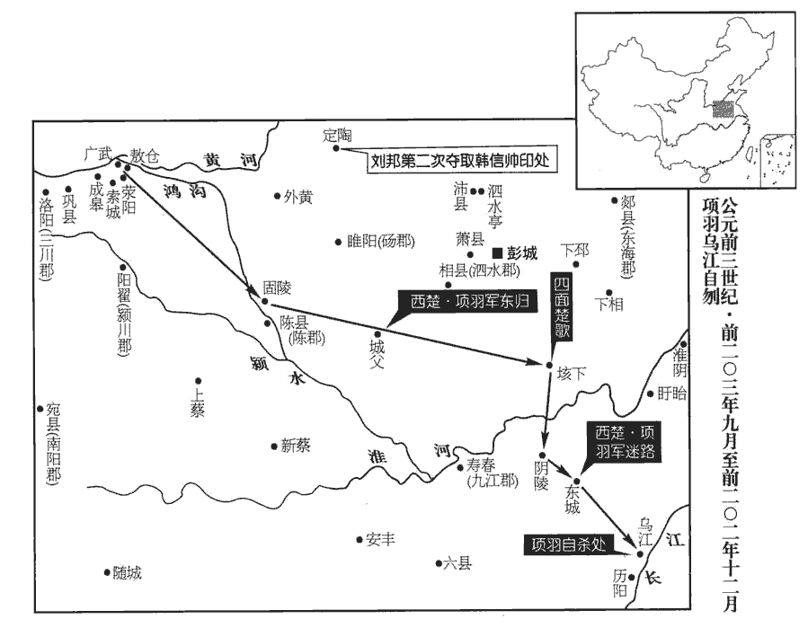
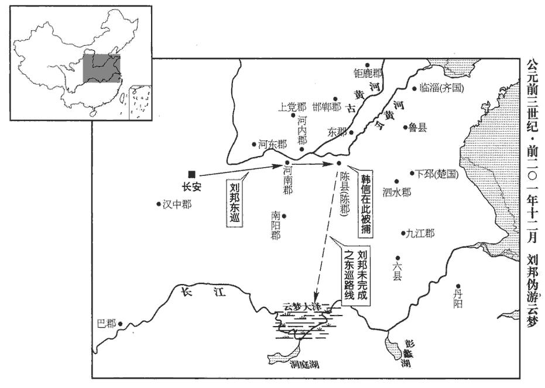
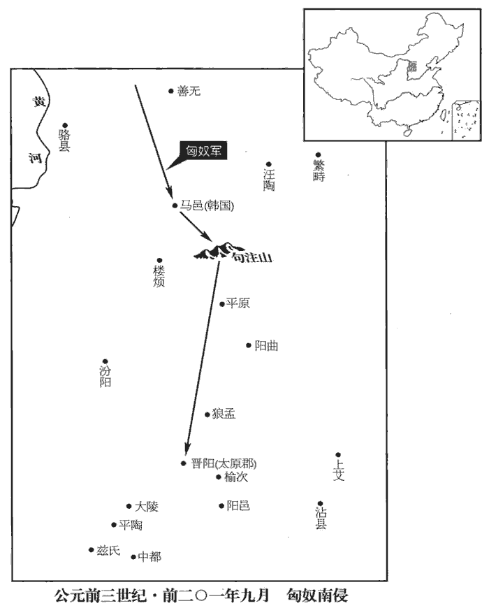
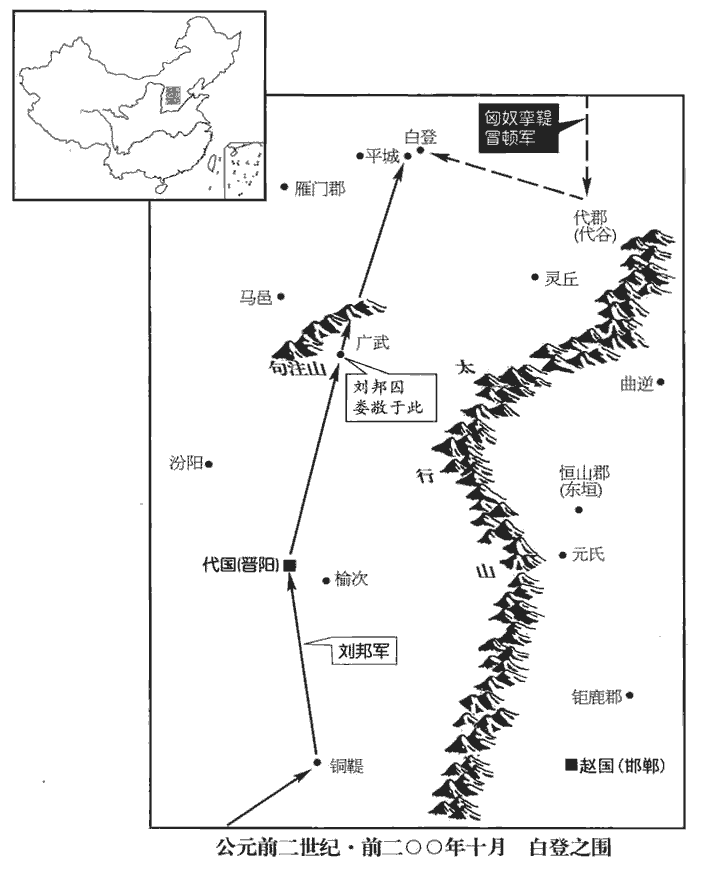
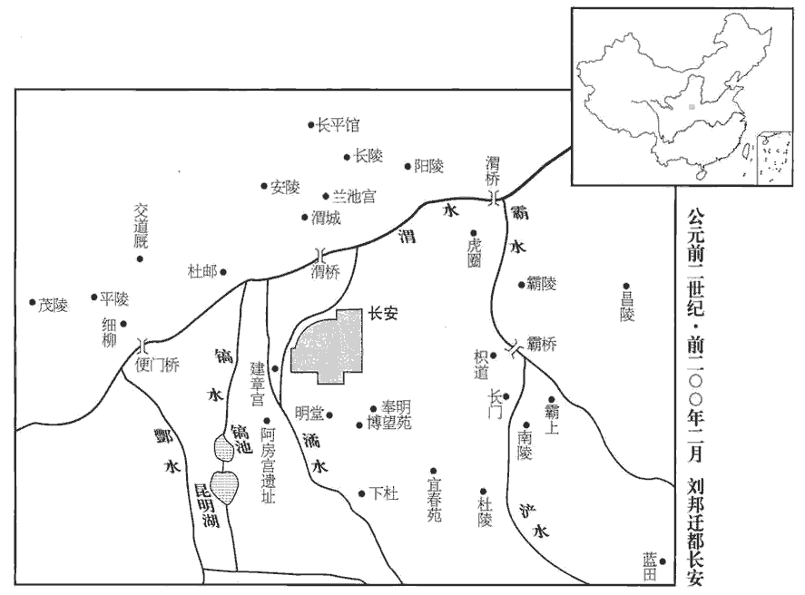

 漢紀三起屠維大淵獻（己亥），盡重光赤奮若（辛丑），凡三年。

# 太祖高皇帝中

## 五年（己亥，前二零二年）

1冬，十月，漢王‹时年五十五›追項羽‹时年三十一›至固陵‹河南淮陽北›，徐廣曰：固陵在陽夏。晉灼曰：即固始縣。余據班志，固始與陽夏為兩縣，皆屬淮陽國。劉昭志：陳國陽夏縣有固陵聚。括地志：固陵，縣名，在陳州宛丘縣西北四十二里。與齊王信、魏相國越期會擊楚；信、越不至，楚擊漢軍，大破之。漢王復堅壁自守，謂張良曰：「諸侯不從，柰何？」對曰：「楚兵且破，二人未有分地，李奇曰：言信、越未有益地之分也。韋昭曰：信等雖名為王，未為分畫疆界。分，扶問翻。余謂韋說是。其不至固宜；君王能與共天下，可立致也。齊王信之立，非君王意，言信自請為假王，乃立之耳，非君王本意。信亦不自堅，彭越本定梁地，始，君王以魏豹故拜越為相國；見上卷二年。今豹死，越亦望王，而君王不早定。今能取睢陽‹河南商丘›以北至穀城‹山東平阴西南東阿镇›皆以王彭越，班志，睢陽縣屬梁國。劉昭志：穀城縣屬東郡，春秋之小穀也。括地志：穀城故城，在濟州東阿縣東二十六里。睢陽，宋州也。自宋州以北至濟州穀城際黃河，盡以封彭越。從陳‹河南淮陽›以東傅海與韓【章：甲十五行本「韓」作「齊」；乙十一行本同；孔本同。】王信。陳，古陳國，班志之淮陽國也；唐為陳州。自陳以東至於海并齊舊地，盡以與齊王信。信家在楚，其意欲復得故邑。能出捐此地以許兩人。使各自為戰，則楚易破也。」易，以豉翻。漢王從之。於是韓信、彭越皆引兵來。

〖译文〗 [1]冬季，十月，汉王刘邦追击项羽到达固陵，与齐王韩信、魏国的相国彭越约定日期合击楚军。但是韩信、彭越的军队没有来，楚军攻打汉军，大败了汉军。汉王于是重又坚固营垒加强防守，并对张良说：“诸侯不遵守信约，怎么办啊？”张良答道：“楚军即将被打败，而韩信、彭越二人没有分得确定的领地，因此他们不应约前来会合，原来是应当的。君王您如果能与他们一起共分天下，就可以立即把他们召来。齐王韩信的封立，并不是您的本意，韩信自己也不放心。彭越本来平定了梁地，当初您为了魏豹的缘故，封彭越为魏国相国。而今魏豹已死，彭越也想自己称王，但您却不早作决定。现在，您可以把从睢阳以北到城的地区都封给彭越，把从陈县以东到沿海地区的区域划给韩信。韩信的家乡在楚地，他的意思也是想要重新得到自己故乡的土地。您如果能拿出以上地区许给他们两人，让他们各自为自己的利益而战，那么楚国就很容易攻破了。”汉王听从了这一建议。于是韩信、彭越都率军前来。

十一月，劉賈南渡淮，圍壽春‹安徽壽縣›，遣人誘楚大司馬周殷。殷畔楚，以舒‹安徽廬江›屠六‹安徽六安›，舒，春秋之舒國也。班志，舒縣屬廬江郡。括地志：舒，今廬江之故舒城是也。舉九江‹安徽寿县›兵迎黥布，史記正義曰：九江郡即壽州。楚考烈王二十二年徙壽春，號曰郢；至王負芻，為秦所滅，置九江郡；至唐為廬、壽、滁、濠等州之地。并行屠城父‹安徽亳州东南城父乡›，隨劉賈皆會。

〖译文〗 十一月，刘邦的堂兄刘贾南渡淮河，包围了寿春，派人去诱降楚国的大司马周殷。周殷即反叛楚国，用舒地的兵力屠灭了六地，并调发九江的部队迎接黥布，一同去屠灭了城父，接着便随同刘贾等人一齐会合。

十二月，項王至垓下‹安徽靈壁東南›，李奇曰：沛洨xiáo縣聚邑名。洨，下交翻。張揖三蒼註：垓，堤名，在沛郡。史記正義曰：按垓下是高岡絕岩，今猶高三四丈；其聚邑及堤在垓之側，因取名焉，今在亳州真源縣東十里。垓，音該。兵少，食盡，與漢戰不勝，入壁；漢軍及諸侯兵圍之數重。重，直龍翻。項王夜聞漢軍四面皆楚歌，應劭曰：楚歌者，雞鳴歌也。漢已略得楚地，故楚歌者多，雞鳴時歌也。師古曰：楚歌者，為楚人之歌，猶吳歈yú、越吟耳。若以雞鳴為歌曲之名，於理則可，不得云雞鳴時也。高祖令戚夫人楚舞，自為作楚歌，豈有雞鳴時乎！乃大驚曰：「漢皆已得楚乎，是何楚人之多也！」則夜起，飲帳中，悲歌忼慨，泣數行下，忼，苦廣翻。行，戶剛翻。泣，目中淚也。左右皆泣，莫能仰視。於是項王乘其駿馬名騅zhuī，騅，朱惟翻。蒼白雜毛曰騅。孔穎達曰：雜毛，是體有二種之色相間雜。麾下壯士騎從者八百餘人，直夜，潰圍南出馳走。平明，漢軍乃覺之，令騎將灌嬰以五千騎追之。項王渡淮，騎能屬者才百餘人。屬，之欲翻。至陰陵‹安徽定遠西北六十里›，班志，陰陵縣屬九江郡。括地志：陰陵故城，在濠州定遠縣西北六十里。迷失道，問一田父，田父紿曰「左」。紿，蕩亥翻；欺誑也。左，乃陷大澤中，以故漢追及之。

〖译文〗 十二月，项羽到了垓下，兵少粮尽，与汉军交战未能取胜，便退入营垒固守。这时汉军和诸侯的军队将项羽的军营重重包围了起来。项羽在晚上听到汉军四面都唱起楚歌，就大惊道：“汉军已经全部得到楚国的土地了吗？是什么原因楚人这么多呀！”便连夜起身，在帐中饮酒，慷慨悲歌，泪下数行，侍从人员见状也都纷纷哭泣，全不忍心抬头观看。项羽于是骑上他的名叫骓的骏马，部下的壮士骑马相随的有八百多人，当夜即突围往南奔驰。天大亮时，汉军才发觉，便命令骑将灌婴率五千名骑士追赶。项羽渡过淮河，相随的骑兵能跟得上他的才一百多人。到达阴陵后，项羽一行人迷了路，就向一个农夫问路，农夫骗他说“往左”。但是项羽等往左走，却陷进了大沼泽地中。汉军因此便追上了他们。

項王乃復引兵而東，至東城‹安徽定遠東南五十里東城鎮›，班志，東城縣屬九江郡。括地志：東城故城，在定遠東南五十里。乃有二十八騎；漢騎追者數千人。項王自度不得脫，度，徒洛翻。謂其騎曰：「吾起兵至今，八歲矣；身七十余戰，未嘗敗北，遂霸有天下。然今卒困於此，卒，子恤翻。此天之亡我，非戰之罪也！今日固決死，願為諸君快戰，必潰圍，斬將，刈yì旗，三勝之，令諸君知天亡我，非戰之罪也。」乃分其騎以為四隊，四鄉。鄉，讀曰嚮。漢軍圍之數重。項王謂其騎曰：「吾為公取彼一將。」令四面騎馳下，期山東為三處。於是項王大呼馳下，漢軍皆披靡，呼，火故翻。披，普彼翻。史記正義曰：靡，言精體低垂。遂斬漢一將。是時，郎中騎楊喜追項王，郎中騎，即漢官所謂騎郎。項王瞋目而叱之，喜人馬俱驚，辟易數里。辟，頻益翻。易，如字。師古曰：辟易，謂開張而易其故處。宋祁國語補音：易，以豉翻；未知其何據。項王與其騎會為三處，漢軍不知項王所在，乃分軍為三，復圍之。項王乃馳，復斬漢一都尉，殺數十百人，復聚其騎，亡其兩騎耳。乃謂其騎曰：「何如？」騎皆伏曰：「如大王言！」

〖译文〗 项羽于是又领兵向东奔走，到达东城，相随的只有二十八个骑兵了。而这时汉军骑兵追逐前来的有好几千人。项羽自己料想是不能脱身了，便对他的骑崐兵们说：“我从起兵到现在，已经八年了，身经七十多次战斗，不曾失败过，这才霸有了天下。但是今天终于被困在这里，这是上天要灭亡我啊，并不是我用兵有什么过错！今天定要一决生死，愿为你们痛快地打一仗，一定突破重围，斩杀敌将、砍倒汉旗，接连三次取胜，让你们知道是天要亡我，而不是我用兵的过错。”随即把他的人马分为四队，向四个方向冲杀。但汉军已将他们重重包围。项羽便对他的骑兵们说：“看我为你们斩杀他一员将领！”就命令骑士们从四面奔驰而下，约定在山的东边分三处会合。接着项羽便大声呼喝着策马飞奔而下，汉军随即都溃败散乱，项羽就斩杀了一员汉将。这时，郎中骑杨喜追击项羽，项羽瞪着双眼厉声呵叱他，杨喜人马都受到惊吓，退避了好几里地。项羽便与他的骑兵们分三处相会合，汉军不知道项羽究竟在哪里，于是分兵三路，重又把他们包围了起来。项羽随即奔驰冲杀，又斩杀了汉军的一名都尉，杀掉了汉军百十来人，重新聚拢了他的骑兵，至此不过仅损失了两名骑士罢了。项羽就对他的骑兵们说：“怎么样啊？”骑兵们都敬服地说：“正像大王您所说的一样！”

於是項王欲東渡烏江‹安徽和縣東北四十里烏江镇›，臣瓚曰：烏江在牛渚。索隱曰：按晉初屬臨淮。括地志：烏江亭，即和州烏江縣是也；晉初為縣。水經曰：江水又北得黃律口，漢書所謂烏江亭長檥yǐ舡chuán待項王，即此地。余據烏江浦在今和州烏江縣東五十里，即亭長檥船待羽處。烏江亭長檥船待，徐廣曰：檥，音儀，一音俄。應劭曰：檥，正也。孟康曰：檥，音蟻，附也，附船著岸也。如淳曰：南方謂整船向岸曰檥。索隱曰：檥字，諸家各以意解耳。鄒誕本作「樣船」，以尚翻；劉氏亦有此音。謂項王曰：「江東‹江蘇南部、太湖流域›雖小，地方千里，眾數十萬人，亦足王也。願大王急渡；今獨臣有船，漢軍至，無以渡。」項王笑曰：「天之亡我，我何渡為！且籍與江東子弟八千人渡江而西，今無一人還；縱江東父兄憐而王我，我何面目見之！縱彼不言，籍獨不愧於心乎！」乃以所乘騅馬賜亭長，令騎皆下馬步行，持短兵接戰。獨籍所殺漢軍數百人，身亦被十餘創。被，皮義翻。創，初良翻。顧見漢騎司馬呂馬童，曰：「若非吾故人乎？」馬童面之，張晏曰：以故人難親斫之，故背之也。如淳曰：面，謂不正視也。師古曰：如說非。面，謂背之，不正向也，面縛，亦反偝而縛之；杜元凱以為但見其面，非也。貢父曰：面之，直向之耳。指示中郎騎王翳曰：「此項王也。」項王乃曰：「吾聞漢購我頭千金，邑萬戶；史記正義曰：漢以一斤金為千金，當一萬錢也。余謂一斤金與萬戶邑，多少不稱，正義之說，未可為據也。吾為若德。」班書，「德」作「得」；鄧展曰：令公得我以為功也。史記作「德」；徐廣曰：亦可是功德之德。史記正義曰：為，於偽翻。言呂馬童與已是故人，舊有恩德於己。余謂羽蓋謂我為汝自刎以德汝。乃自【章：甲十五行本無「自」字；乙十一行本同；孔本同。】刎而死。刎，武粉翻。王翳取其頭；餘騎相蹂踐蹂，人九翻。爭項王，相殺者數十人；最其後，楊喜、呂馬童及郎中呂勝、楊武各得其一體；五人共會其體，皆是，故分其戶，封五人皆為列侯。呂馬童封中水侯，王翳封杜衍侯，楊喜封赤泉侯，楊武封吳防侯，呂勝封涅陽侯。

〖译文〗 这时项羽就想东渡乌江，乌江亭长把船停泊在岸边等着他，并对项羽说：“江东虽然狭小，土地方圆千里，民众几十万人，却也足够用以称王的了。望大王您火速渡江！现在只有我有船，汉军到来，无船渡江。”项羽笑着说：“上天要灭亡我，我还要渡江做什么呀！况且我与江东子弟八千人渡江西征，而今没有一个人归还，纵使江东父老怜爱我，仍然以我为王，我又有什么脸面去见他们啊！即便他们不说什么，难道我就不感到心中有愧吗！”于是就把自己所骑的骏马骓送给了亭长，命令他的骑兵都下马步行，手持短兵器与汉军交战。仅项羽一人就杀死了汉军几百人，项羽自己也身受十多处伤。这时项羽回头看见了汉军骑司马吕马童，就说：“你不是我的老朋友吗？”吕马童背过脸，指给中郎骑王翳说：“这就是项王！”项羽便说道：“我听说汉王悬赏千金买我的头颅，分给万户的封地，我就留给你一些恩德吧！”即自刎而死。王翳随即取下项羽的头颅。其余的骑兵便相互践踏着争抢项羽的躯体，互为残杀的有几十个人。到了最后，杨喜、吕马童和郎中吕胜、杨武各夺得项羽的一部分肢体。五个人把项羽的肢体会合拼凑到一起，都对得上，因此便分割原来悬赏的万户封地，将五人都封为列侯。

楚地悉定，獨魯‹山東曲阜›不下；秦，魯縣屬薛郡，項羽初封於此，漢為魯國。漢王引天下兵欲屠之。至其城下，猶聞弦誦之聲；為其守禮義之國，為主死節，乃持項王頭以示魯父兄，魯乃降。漢王以魯公禮葬項王于穀城‹山東平阴西南东城镇›，宋白曰：宋州谷熟縣，古穀城也，漢于此置薄縣，又改為谷陽縣。親為發哀，哭之而去。為，於偽翻。諸項氏枝屬皆不誅。封項伯等四人皆為列侯，賜姓劉氏；諸民略在楚者皆歸之。

〖译文〗 楚地全部平定了，唯独鲁县仍不投降。汉王刘邦率领天下的兵马，打算屠灭它。大军抵达城下，仍然能听到城中礼乐弦诵的声音，由于鲁县是信守礼义的故国，为自己的君主尽忠守节，汉军便拿出项羽的头颅给鲁县的父老看，鲁县这才投降。汉王用葬鲁公的礼仪把项羽葬在城，并亲自为项羽发丧举哀，哭了一阵后离去。对项羽的家族亲属都不加杀害，还把项伯等四人都封为列侯，赐他们姓刘，将过去被掳掠到楚国来的百姓们仍归他们统治。

 

太史公曰：羽起隴畮之中，畮，古畝字。三年，遂將五諸侯滅秦，此時山東六國，而齊、趙、韓、魏、燕并起，從羽伐秦，故云五諸侯。分裂天下而封王侯，政由羽出；位雖不終，近古以來未嘗有也！及羽背關懷楚，師古曰：背關，謂背約不王沛公於關中；懷楚，謂思東歸彭城也。余謂背關懷楚，文意一貫，言羽棄背關中之形勝而懷鄉歸楚也，不必分為兩節。背，蒲妹翻。放逐義帝而自立；怨王侯叛己，難矣！自矜功伐，奮其私智而不師古，謂霸王之業，欲以力征經營天下。五年，卒亡其國，卒，子恤翻。身死東城；尚不覺悟而不自責，乃引「天亡我，非用兵之罪也，」豈不謬哉！

〖译文〗 太史公司马迁曰：项羽起于田野民间，才三年就率领着齐、赵、韩、魏、崐燕五诸侯国的军队灭亡了秦朝，分割天下而封授王侯，政令全由项羽发布，他的王位虽然未获终结，却也是近古以来所不曾有过的了！待到项羽背弃关中而怀恋楚国故土，放逐义帝而自立为王，这时怨恨诸侯王们背叛自己，可就很难说得通了！还自我夸耀战功，一味逞个人小聪明而不效法古人，认为霸王的功业，就是要用武力征伐来经营治理天下。结果只五年的时间，终于失掉了自己的国家，自身死在东城，却还不觉悟、不责备自己，反倒借口“上天要灭亡我，而并非我用兵的过错”，这难道不是荒谬之极吗！

揚子法言：或問：「楚敗垓下，方死，曰『天也！』諒乎？」曰：「漢屈群策，群策屈群力；諒，信也。屈，盡也。楚憞duì群策而自屈其力。憞，徒對翻，惡也。屈人者克，自屈者負；天曷故焉！」溫公曰：何預天事。

〖译文〗 扬雄《法言》曰：有人问：“楚王兵败垓下，将要死的时候说道：‘是上天亡我！’可以相信这种说法吗？”回答说：“汉王刘邦尽量发挥、利用众人的计谋，这些计谋调动了众人的力量。楚王项羽憎恶采用众人的计谋，只发挥个人的作用。而善于发挥、利用众人智谋和力量的人就能取得胜利，只凭一己的智谋和力量的人就必定失败，这与上天有什么关系啊！”

2漢王還，至定陶‹山東定陶›，班志，定陶縣屬濟陰郡，古之陶邑；宋為廣濟軍理所。馳入齊王信壁，奪其軍。

〖译文〗 [2]汉王回军到达定陶县，奔入齐王韩信的营垒，接管了他的部队。

3臨江王共尉不降，共敖，項羽封為臨江王；尉，其子也。遣盧綰、劉賈擊虜之。

〖译文〗 [3]临江王共尉仍不归降，汉王便派卢绾、刘贾攻打并俘获了他。

4春，正月，更立齊王信為楚王，王淮北，都下邳‹江蘇睢宁北›。更，工衡翻。封魏相國建城侯彭越為梁王，王魏故地，都定陶‹山東定陶›。

〖译文〗 [4]春季，正月，汉王改封齐王韩信为楚王，统辖淮河以北地区，都城设在下邳。封魏相国建城侯彭越为梁王，统辖魏国故地，都城设在定陶。

5令曰：「兵不得休八年，萬民與苦甚；如淳、師古皆曰與，弋庶翻。貢父曰：與，讀曰歟，助辭。今天下事畢，其赦天下殊死以下。」如淳曰：殊死，死罪之明白也；左傳曰：斬其木而弗殊。韋昭曰：殊死，斬刑也。師古曰：殊，絕也，異也；言其身首離絕而異處。貢父曰：予按說文：漢蠻夷殊。然則殊自死刑之名。

〖译文〗 [5]汉王下令说：“军队得不到休整已经八年了，万民饱受战乱之苦。现在夺取天下的大事已经完成，赦免天下判斩刑以下的所有罪犯。”

6諸侯王皆上疏請尊漢王為皇帝。二月甲午‹三›，王即皇帝位於氾水之陽。蔡邕曰：上古天子稱皇，其次稱帝，其次稱王。秦承三王之末，自以德兼三皇、五帝，故并以為號。漢高受命，因而不改。張晏曰：氾水在濟陰界，取其氾愛弘大而潤下也。師古曰：據叔孫通傳：為皇帝于定陶，則此水在濟陰是也。括地志：漢高祖即位壇，在曹州濟陰縣界。氾fàn，敷劍翻。更王后曰皇后，太子曰皇太子；追尊先媼ǎo曰昭靈夫人。高祖母曰劉媼。文穎曰：幽州及漢中皆謂老嫗為媼。師古曰：媼，女老稱，音烏老翻。

〖译文〗 [6]诸侯王一致上疏，请求推尊汉王为皇帝。二月甲午（初三），汉王便在水北面登上帝位。改称王后为皇后，王太子为皇太子；追尊先母为昭灵夫人。

詔曰：如淳曰：詔，告也。自秦、漢以下，惟天子獨稱之。漢制度：帝之下書有四：一曰策書，二曰制書，三曰詔書，四曰誡敕chì。策書者，編簡也，其制長二尺，短者半之；篆書，起年月日，稱皇帝以命諸侯王；三公以罪免，亦賜策，而以隸書，用尺一木，兩行，此為異也。制書，帝者制度之命。其文曰「制詔三公」，皆璽封，尚書令印重封，露布州郡也。詔書，詔，告也，其文曰「告某官如故事」。誡敕，謂敕刺史、太守，其文曰「有詔，敕某官」。他皆仿此。「故衡山王吳芮，從百粵之兵，佐諸侯，誅暴秦，有大功；諸侯立以為王，項羽侵奪之地，謂之番君。其以芮為長沙王。」吳芮封衡山王，都邾；今封長沙王，都臨湘‹湖南長沙›。番，蒲何翻。又曰：「故粵王無諸，世奉粵祀；秦侵奪其地，使其社稷不得血食。諸侯伐秦，無諸身率閩中兵以佐滅秦，項羽廢而弗立。今以為閩粵王，王閩中‹福建›地。」粵王無諸，句踐之後；秦取其地置閩中郡；今復以封之。師古曰：閩越，今泉州、建安是其地。徐廣曰：今建安侯官地。史記正義曰：今閩州又改為福。應劭曰：閩，音文飾之文。師古曰：非也；音緡。閩人本蛇種，故其字從「虫」。

〖译文〗 颁布诏书说：“原衡山王吴芮，率领百粤部族之兵，协助诸侯军，诛灭残暴的秦王朝，建有大功，诸侯立他为王，但项羽却侵夺了他的封地，称他作番君。现在改封吴芮为长沙王。”又说：“原粤王无诸，世代供奉粤国的祖宗。秦王朝侵夺了他的土地，使粤国的社稷不能再享受祭祀。诸侯征伐秦朝，无诸亲自率领闽中的军队相协助，攻灭了秦王朝，项羽却将他废黜不予封立。现在封无诸为闽粤王，统辖闽中一带。”

7帝西都洛陽‹河南洛阳东白马寺东›。

〖译文〗 [7]高帝刘邦向西建都洛阳。

8夏，五月，兵皆罷歸家。

〖译文〗 [8]夏季，五月，士兵们都复员回家。

9詔：「民前或相聚保山澤，不書名數。今天下已定，令各歸其縣，復故爵、田宅；復，扶目翻，還也。吏以文法教訓辨告，師古曰：辨告者，分別義理以曉喻之。勿笞辱軍吏卒；爵及七大夫以上，皆令食邑，臣瓚曰：秦制：列侯乃得食邑。今七大夫以上皆食邑，所以寵之也。師古曰：七大夫，公大夫也；爵第七，故謂之七大夫。非七大夫已下，皆復其身及戶，勿事。」應劭曰：不輸戶賦也。如淳曰：事，謂役使也。師古曰：復其身及一戶之內皆不傜賦也。復，方目翻。

〖译文〗 [9]高帝刘邦颁布诏书：“百姓中以前有的人相聚安守在深山大泽中躲避战乱，未登记入户籍中。如今天下已经平定，诏令这些百姓各自返回他们的所在县，恢复他们过去的爵位和田地住宅；官吏应依据法律义理进行教诲，处理纠纷，不得鞭笞侮辱军中官兵；凡爵位至七大夫以上的，都让他们享用封地民户的赋税收入，非七大夫爵位及其以下的，都免除其个人及一户之内的赋税徭投，不予征收。”

10帝置酒洛陽南宮，括地志：南宮，在洛州洛陽縣東北二十六里洛陽故城中。輿地志：秦時，洛陽已有南、北宮。上曰：蔡邕曰：上者，尊位所在也；但言上，不敢言尊號耳。「徹侯、諸將毋敢隱朕，皆言其情：徹，通也。應劭曰：言其功德通於王室也。後避武諱，改曰通侯，亦曰列侯。吾所以有天下者何？項氏之所以失天下者何？」高起、王陵對曰：張晏曰：詔使高官者起，故陵先對。臣瓚曰：漢帝年紀有信平侯臣陵、都武侯臣起。魏相、邴吉奏：高祖時，奏事有將軍臣陵、臣起。師古曰：張說非也。若言高官者起，則丞相蕭何、太尉盧綰及張良、陳平之屬皆在，陵不得而先對也。姓譜：齊太公之後，食采于高，因氏焉。「陛下使人攻城略地，因以與之，與天下同其利；項羽不然，有功者害之，賢者疑之，此其所以失天下也。」上曰：「公知其一，未知其二。夫運籌帷幄之中，決勝千里之外，吾不如子房；填國家，撫百姓，給餉餽，不絕糧道，吾不如蕭何；填，讀曰鎮。餽，與饋同。連百萬之眾，戰必勝，攻必取，吾不如韓信。三者皆人傑，吾能用之，此吾所以取天下者也。項羽有一范增而不能用，此所以為我禽也。」群臣說服。說，讀曰悅。

〖译文〗 [10]高帝刘邦在洛阳南宫举行酒宴，高帝说道：“各位列侯、各位将军，不要对朕隐瞒，都来说说这个道理：我之所以能取得天下的原因是什么？项羽之所以失掉天下的原因又是什么呀？”高起、王陵回答说：“陛下派人攻城掠地，攻取了城邑、土地就分封给他，与大家同享利益；项羽却不是这样，他对有功的人嫉恨，对贤能的人猜疑，这就是他失去天下的原因。”高帝说：“你们是只知其一，不知其二啊。谈到运筹帷幄之中，决胜千里之外，我不如张良；镇守国家，安抚百姓，供给粮饷，保持运粮道路畅通无阻，我不如萧何；统率百万大军，战必胜，攻必克，我不如韩信。这三位都是人中英杰，而我能够任用他们，这就是我所以能取得天下的原因。项羽虽然有一个范增，却不能信任使用他，这便是项羽所以被我捕捉打败的原因了。”群臣都心悦诚服。

韓信至楚‹府下邳，江苏睢宁北›，召漂母，賜千金。召辱己少年令出跨下者，以為中尉；事見九卷元年。漂，匹妙翻。告諸將相曰：「此壯士也。方辱我時，我寧不能殺之邪？殺之無名，故忍而就此。」

〖译文〗 韩信到了楚地，召见曾经分给自己饭吃的那位漂洗丝绵的老妇，赐给她一千金。又召见曾经羞辱自己、叫自己从胯下爬过去的那个人，任命他为楚国的中尉；并告诉将相们说：“这是位壮士啊。当他侮辱我时，我难道就不能杀了他吗？只是杀他没有名义，所以忍了下来，才达到了今天这样的成就。”

11彭越既受漢封，田橫懼誅，與其徒屬五百餘人入海，居島中‹山東即墨東崂山湾口田横岛›。海中山曰島。史記正義曰：海州東海縣有島山，去岸八十里。余按北史，楊愔避讒東入田橫島，是島以橫居之而得名。島，丁老翻。帝以田橫兄弟本定齊地，齊賢者多附焉；今在海中，不取，後恐為亂。乃使使赦橫罪，召之。橫謝曰：「臣烹陛下之使酈生，事見上卷四年。今聞其弟商為漢將；臣恐懼，不敢奉詔，請為庶人，守海島中。」使還報，帝乃詔衛尉酈商曰：班表：衛尉，秦官，掌宮門衛屯兵。「齊王田橫即至，人馬從者敢動搖者，致族夷！」從，才用翻。言誅夷其族也。乃復使使持節具告以詔商狀，周禮：司節掌守邦節，辨其用以輔王命。註云：節者，執以行為信。邦節，珍圭、牙璋、穀圭、琬圭、琰yǎn圭也。守邦國用玉節，以玉為之；守都鄙用角節，以角為之。邦國之使，節用金；門關之節，用符；貨賄之節，用璽；道路之節，用旌。審此，則古之所執以為信者，皆謂之節。自秦以來，有璽、符、節，則璽自璽，符自符，節自節，分為三矣。漢之節，即古之旌節也。鄭氏註以符節為漢宮中諸宮詔符，璽節為漢之印章，旌節為漢使者所持節；則知漢所謂節，蓋古之旌節也。賢曰：節者，所以為信，以竹為之，柄長八尺，以旄牛尾為之，毦ěr三重。此漢制也。曰：「田橫來，大者王，小者乃侯耳；不來，且舉兵加誅焉。」

〖译文〗 [11]彭越已受汉封梁王，田横怕被杀掉，与他的部下五百多人进入大海，居住在岛上。高帝刘邦认为田横兄弟几人本来曾平定了齐地，齐地贤能的人大都归附了他，今流亡在海岛中，如不加以招抚，以后恐怕会作乱。于是就派使者去赦免田横的罪过，召他前来。田横推辞说：“我曾煮杀了陛下的使臣郦食其，现在听说他的弟弟郦商是汉的将领，我很害怕，不敢奉诏前往，只请求做个平民百姓，留守在海岛中。”使者回报，高帝便诏令卫尉郦商说：“齐王田横即将到来，有敢动一动他的随从人马的人，即诛灭家族！”随即再派使者拿着符节把高帝诏令郦商的情况对田横一一讲明，并说道：“田横若能前来，高可以封王，低也是个侯哇。如果不来，便要发兵加以诛除了。”

橫乃與其客二人乘傳詣洛陽。如淳曰：四馬，高足為置傳，中足為馳傳，下足為乘傳；一馬、二馬為軺yáo傳。急者乘一乘傳。師古曰：蓋今之驛，古者以車，謂之傳車；其後單置馬，謂之驛騎。漢律：諸當乘傳及發駕置傳者，皆持尺五寸木傳信，封以御史大夫印章；其乘傳，參封之，參，三也；有期會，累封兩端，端各兩封，凡四封；乘置馳傳，五封之，兩端各二，中央一；軺傳，兩馬再封之；一馬一封，以馬駕軺車而乘傳曰一封軺傳。史炤所謂依乘符傳而行者本此；但擇焉而不精，語焉而不詳耳，終不若顏說簡而明。傳，張戀翻。未至三十里，至尸鄉‹河南偃師西›廄置。應劭曰：尸鄉，在偃師城西。臣瓚曰：按廄置，謂置馬以傳驛者。橫謝使者曰：「人臣見天子，當洗沐。」因止留，謂其客曰：「橫始與漢王俱南面稱孤；師古曰：王者自稱曰孤，蓋為謙也。老子道德經曰：貴以賤為本，高以下為基，是以侯王自謂孤、寡、不穀。今漢王為天子，而橫乃為亡虜，北面事之，其恥固已甚矣。且吾烹人之兄，與其弟并肩而事主；并，步頂翻。縱彼畏天子之詔不敢動，我獨不愧於心乎！且陛下所以欲見我者，不過欲一見吾面貌耳；今斬吾頭，馳三十里間，形容尚未能敗，猶可觀也。」遂自剄，令客奉其頭，從使者馳奏之。帝曰：「嗟乎！起自布衣，兄弟三人更王，豈不賢哉！」更，工衡翻。為之流涕，而拜其二客為都尉；發卒二千人，以王者禮葬之。史記正義曰：田橫墓在偃師西十五里。既葬，二客穿其塚傍孔，皆自剄，下從之。帝聞之，大驚。以橫客皆賢，餘五百人尚在海中，使使召之；至則聞田橫死，亦皆自殺。

〖译文〗 田横便和他的两个宾客乘坐驿站的传车去到洛阳。离洛阳还有三十里，到达尸乡驿站。田横向使者道歉说：“为人臣子的人觐见天子时，应当沐浴。”随即住下来，对他的宾客说：“我起初与汉王一道面朝南称王，而今汉王做了天子，我却是作为败亡的臣虏，面北称臣伺候他，这耻辱本来已非常大了。何况我还煮死了人家的兄长，又同被煮人的弟弟并肩侍奉他们的君主呢。即便这位弟弟畏惧天子的诏令不敢动我，我难道内心就不感到惭愧吗？！况且陛下想要见我的原因，不过是想看一看我的容貌罢了。现在斩下我的头颅，奔驰三十里地送去，神态容貌还不会变坏，仍然可以看的。”于是就用刀割自己的脖子崐，并让宾客捧着他的头颅，随同使者疾驰洛阳奏报。高帝说：“唉呀！从平民百姓起家，兄弟三人相继为王，这难道不是很贤能的吗！”为田横流下了眼泪。接着授给田横的两个宾客都尉的官职，调拨士兵二千人，按葬侯王的礼仪安葬了田横。下葬以后，那两位宾客在田横的坟墓旁挖了个坑，都自刎而死，倒进坑里陪葬田横。高帝听说了这件事，大为震惊，认为田横的宾客都很贤能，余下的五百人还在海岛上，便派使者去招抚他们。使者抵达海岛，这五百人听说田横已死，也都自杀了。

12初，楚人季布為項籍將，季，姓也。周八士有季隨、季騧guā；魯有季氏。數窘辱帝。數，所角翻。窘，巨隕翻，困也。項籍滅，帝購求布千金；敢有舍匿，罪三族。舍，止也。匿，隱也。布乃髡鉗為奴，自賣于魯‹山东曲阜›朱家。髡，枯昆翻，鬄tì其髪也。鉗，其炎翻，以鐵束項。朱家，魯之大俠。朱家心知其季布也，買置田舍；身之洛陽見滕公，說曰：「季布何罪！臣各為其主用，職耳；師古曰：職，常也；言此乃常道也。一曰：職，主掌其事也。為，於偽翻。項氏臣豈可盡誅邪？今上始得天下，而以私怨求一人，何示不廣也！且以季布之賢，漢求之急，此不北走胡，南走越耳。夫忌壯士以資敵國，此伍子胥所以鞭荊平之墓也。伍子胥，楚大夫伍奢之子也。楚平王信讒而殺伍奢，子胥奔吳，藉吳師以破楚，入郢，發平王墓而鞭其尸。君何不從容為上言之！」從，千容翻。滕公待間，言於上，如朱家指。上乃赦布，召拜郎中，朱家遂不復見之。復，扶又翻。

〖译文〗 [12]当初，楚地人季布是项羽手下的将领，曾多次窘困羞辱汉王。项羽灭亡后，高帝刘邦悬赏千金捉拿季布，下令说有敢收留窝藏季布的，罪连三族。季布于是剃去头发，用铁箍卡住脖子当奴隶，把自己卖给鲁地的大侠朱家。朱家心里明白这个人是季布，就将他买下安置在田庄中。朱家随即到洛阳去进见滕公夏侯婴，劝他道：“季布有什么罪啊！臣僚各为他的君主效力，这是常理。项羽的臣下难道可以全都杀掉吗？如今皇上刚刚取得天下，便借私人的怨恨去寻捕一个人，怎么这样来显露自己胸襟的狭窄呀！况且根据季布的贤能，朝廷悬赏寻捕他如此急迫，这是逼他不向北投奔胡人，便往南投靠百越部族啊！忌恨壮士而以此资助敌国，这是伍子胥所以要掘墓鞭打楚平王尸体的缘由呀。您为什么不从容地向皇上说说这些道理呢？”滕公于是就待有机会时，按照朱家的意思向高帝进言，高帝便赦免了季布，并召见他，授任他为郎中。朱家从此也就不再见季布。

布母弟丁公，亦為項羽將，逐窘帝彭城‹江蘇徐州›西。短兵接，帝急，顧謂丁公曰：「兩賢豈相戹è哉！」孟康曰：丁公及彭城賴齮yǐ追上，故曰兩賢也。師古曰：孟說非也。兩賢者，高祖自謂并與固也，言吾與固俱是賢，豈相戹困哉！故固感此言而止也。雖與賴齮同追，而高祖獨與固言也。姓譜：丁本自姜姓，齊太公子諡丁公，因以命氏。丁公引兵而還。及項王滅，丁公謁見。見，賢遍翻。帝以丁公徇軍中，徇，辭峻翻。師古曰：行示也。曰：「丁公為項王臣不忠，使項王失天下者也。」遂斬之，曰：「使後為人臣無效丁公也！」

〖译文〗 季布的舅父丁公，也是项羽手下的将领，曾经在彭城西面追困过高帝刘邦。短兵相接，高帝感觉事态危急，便回头对丁公说：“两个好汉难道要相互为难困斗吗！”丁公于是领兵撤还。等到项羽灭亡，丁公来谒见高帝。高帝随即把丁公拉到军营中示众，说道：“丁公身为项王的臣子却不忠诚，是使项王失掉天下的人啊！”就把他杀了，并说：“让后世为人臣子的人不要效法丁公！”

臣光曰：高祖起豐、沛以來，罔羅豪桀，招亡納叛，亦已多矣。及即帝位，而丁公獨以不忠受戮，何哉？夫進取之與守成，其勢不同。當群雄角逐之際，民無定主；來者受之，固其宜也。及貴為天子，四海之內，無不為臣；苟不明禮義以示之，使為臣者，人懷貳心以徼大利，則國家其能久安乎！是故斷以大義，斷，丁亂翻。使天下曉然皆知為臣不忠者無所自容；而懷私結恩者，雖至於活己，猶以義不與也。戮一人而千萬人懼，其慮事豈不深且遠哉！子孫享有天祿四百餘年，宜矣！

〖译文〗 臣司马光曰：汉高祖刘邦从丰、沛起事以来，网罗强横有势力的人，招纳逃亡反叛的人，也已经是相当多的了。待到登上帝位，唯独丁公因为不忠诚而遭受杀戮，这是为什么啊？是由于进取与守成，形势不同的缘故呀。当群雄并起争相取胜的时候，百姓没有确定的君主，谁来投奔就接受谁，本来就该如此。待到贵为天子，四海之内无不臣服时，如果不明确礼义以显示给人，致使身为臣子的人，人人怀有二心以图求取厚利，那么国家还能长治久安吗！因此汉高祖据大义作出决断，使天下的人都清楚地知道，身为臣子却不忠诚的人没有自己可以藏身的地方，怀揣个人目的布施恩惠给人的人，尽管他甚至于救过自己的命，依照礼义仍不予宽容。似此杀一人而使千万人畏惧，考虑事情难道不是既深刻又远广吗！汉高帝的子孙享有上天赐予的禄位四百多年，应当的啊！

13齊‹山东淄博东临淄镇›人婁敬戍隴西‹甘肅臨洮›，姓譜：婁，邾婁國之後；一曰：離婁之後。過洛陽，脫輓輅，蘇林曰：輅，音凍𠗂hè之𠗂；一木橫遮車前，一人輓之，三人推之。師古曰：輓，音晚。輅，胡格翻；𠗂音同。衣羊裘，因齊人虞將軍求見上。虞將軍欲與之鮮衣。婁敬曰：「臣衣帛，衣帛見；衣褐，衣褐見；衣，著也。帛，繒也。褐，織毛布之衣也。終不敢易衣。」於是虞將軍入言上；上召見，問之。婁敬曰：「陛下都洛陽，豈欲與周室比隆哉？」上曰：「然。」婁敬曰：「陛下取天下與周異。周之先，自后稷封邰‹陝西扶风东南›，班志，邰縣屬右扶風。師古曰：即今武功故城是。史記正義曰：雍州武功縣西南二十三里，故漦lí城是也。說文曰：邰，炎帝之後姜姓所封國，棄外家也。毛萇云：邰，姜嫄國，堯以天因邰而生后稷故，因封之于邰；音吐才翻。積德絫善，絫，古累字。十有餘世，至於太王、王季、文王、武王而諸侯自歸之，遂滅殷為天子。及成王即位，周公相焉，乃營洛邑，以為此天下之中也，諸侯四方納貢職，道里均矣。有德則易以王，無德則易以亡。故周之盛時，天下和洽，諸侯、四夷莫不賓服，效其貢職。及其衰也，天下莫朝，朝，直遙翻。周不能制也；非唯其德薄也，形勢弱也。今陛下起豐、沛，卷蜀、漢，定三秦，卷，讀曰捲。與項羽戰滎陽、成皋之間，大戰七十，小戰四十；天下之民，肝腦塗地，父子暴骨中野，不可勝數，勝，音升。哭泣之聲未絕，傷夷者未起；夷，與痍同，創也，音延知翻。而欲比隆於成、康之時，臣竊以為不侔也。且夫秦地被山帶河，四塞以為固；卒然有急，卒，讀曰猝。百萬之眾可立具也。因秦之故，資甚美膏腴之地，此所謂天府者也。府，聚也；萬物所聚，謂之天府。陛下入關而都之，山東雖亂，秦之故地可全而有也。夫與人斗，不搤è其亢，拊其背，未能全其勝也；張晏曰：搤，與扼同，促持之也。亢，音岡，又下郎翻，喉嚨也。今陛下案秦之故地，此亦搤天下之亢而拊其背也。」帝問群臣。群臣皆山東人，爭言：「周王數百年，秦二世即亡。洛陽東有成皋，西有殽‹河南西境崤山›、澠‹河南澠池西›，師古曰：殽，謂殽山，今陝州東二殽山是也。澠，即澠池。倍河，鄉伊、洛，河在洛陽城北，故曰倍；伊、洛二水在洛陽城南，故曰鄉。倍，蒲妹翻。鄉，讀曰嚮。其固亦足恃也。」上問張良。良曰：「洛陽雖有此固，其中小，不過數百里，田地薄，四面受敵，此非用武之國也。關中左殽、函，右隴、蜀，沃野千里；師古曰：沃者，溉灌也；言其土地皆有溉灌之利，故曰沃野。南有巴、蜀之饒，北有胡苑之利。師古曰：謂安定、北地、上郡之北與胡相接之地，可以畜牧者也。養禽獸謂之苑，音于阮翻。阻三面而守，獨以一面東制諸侯；諸侯安定，河、渭漕輓天下，西給京師；漢漕關東之時，自河入渭，自渭而上輸之長安。諸侯有變，順流而下，足以委輸；康曰：委，於偽切，即委積之委。輸，即轉輸之輸。輸，舂遇翻。此所謂金城千里，天府之國也。府者，物所聚也。天物所聚，不假人力，故曰天府。婁敬說是也。」上即日車駕西，都長安‹陝西西安›。拜婁敬為郎中，號曰奉春君，賜姓劉氏。師古曰：凡言車駕，謂天子乘車而行，不敢指斥也。長安，本秦之鄉名也，高祖作都。奉春君，張晏曰：春，歲之始也；今婁敬發事之始，故曰奉春君也。

〖译文〗 [13]故齐国人娄敬去防守陇西，经过洛阳，解下绑在车前牵引的横木，穿着羊皮袄，通过齐人虞将军求见高帝刘邦。虞将军想要给他穿华丽鲜亮的衣服，娄敬说：“我若穿的是丝绸，就身着丝绸去谒见；若穿的是粗毛麻布，就身着粗毛麻布去谒见，终究不敢冒昧地更换衣服。”这时虞将军便进去向高帝报告。高帝即召见娄敬，并询问他。娄敬说：“陛下定都洛阳，难道是想与周王朝一比隆盛威势吗？”高帝道：“是啊。”娄敬说：“陛下夺取天下的途径与周朝不同。周朝的祖先，从后稷被唐尧封在邰地起，积累德政善行十多代，以至于到太王、王季、文王、武王时期，诸侯自行归附，终于灭掉殷商作了天子。到了周成王登位，周公辅佐他，才营建洛邑，因为认为这里是天下的中心，各地诸侯前往交纳土贡和赋税，所走的道路里程相等。君主有德行就容易靠此统治天下，没有德行就容易由此而亡国。所以周王朝强盛的时候，天下和睦，诸侯、四方外族没有不臣服，奉上他们的贡赋的。待到周王朝衰弱时，天下没有谁前来朝贡，周王朝也已无法驾驭制约了。这不仅是由于它的德行微薄，而且是由于形势衰弱了的缘故。如今陛下从丰、沛起兵抗秦，席卷蜀郡、汉中郡，平定秦地雍、塞、翟三国，与项羽在荥阳、成皋之间作战，经过大战七十次，小战四十次，使天下百姓肝脑涂地惨遭杀戮，老老少少的尸骨暴露在荒野之中，数都数不过来，哭泣的悲声还未断绝，伤残的人员还不能行走，就想与周成王、康王时代的隆盛威势相比美，我私下里认为这是很不相称的。况且秦地依靠华山濒临黄河，四面都有险要关隘为屏障，如果突然有紧急情况发生，百万军队可以立即就调动停当。依靠秦地原有的基础，凭借那里富饶肥沃的土地，这即是所谓的天然府库的优势啊。陛下入函谷关在那里建都，崤山以东地区就算是乱了，秦国的旧地也仍然可以完整地据有。同别人争斗，不卡住他的咽喉，从后背拍击他，是不能大获全胜的。现在陛下如果能占据秦国的故地，这也即是扼住了天下的咽喉且又攻击它的后背了。”高帝询问群臣。群臣都是崤山以东地区的人，便抢着发言：“周朝统治了几百年，而秦朝经历两代就灭亡了。洛阳东有成皋，西有崤山、渑池，背靠黄河，面向伊、洛二河，它的坚固也是足可依赖的了。”高帝又问张良。张良说：“洛阳虽然有这样稳固的地势，但它的中心地区狭小，方圆不过几百里，田地贫瘠，四面受敌，因此这里不是用武之地。而关中地区东有崤山、函谷关，西有陇山、蜀地的岷山，沃野千里，南有巴、蜀的富饶资源，北有胡地草场畜牧的地利。倚仗三面险要的地形防守，只用东方一面来控制诸侯。倘若诸侯安定，即可通过黄河、渭河水路转运天下的粮食，西上供给京都；如若诸侯发生变故，也可顺流而下，足够用以转运物资。这就是所谓的坚固的城墙千里之长，富庶的天然府库之国啊。娄敬的建议是对的。”高帝当天就起驾动身向西进发，定都长安，并授任娄敬为郎中，崐称为奉春君，赐姓刘。

14張良素多病，從上入關，即道引，不食穀，孟康曰：道，讀曰導；服辟穀藥而靜居行氣。杜門不出，曰：「家世相韓；及韓滅，不愛萬金之資，為韓報讎強秦，天下振動。事見七卷秦始皇二十九年。今以三寸舌為帝者師，封萬戶侯，此布衣之極，於良足矣。願棄人間事，欲從赤松子遊耳。」師古曰：赤松子，仙人號也，神農時為雨師，服水玉，教神農，能入火自燒。至昆山上，常止西王母石室，隨風雨上下。炎帝少女追之，亦得仙俱去。

〖译文〗 [14]张良向来多病，随从高帝进入函谷关，就静居行气，不吃粮食，闭门不出，说道：“我家的人世代做韩国的宰相，及至韩国灭亡，我不吝惜万金资财，为韩国向强大的秦王朝报仇，使天下震动。如今凭借三寸之舌成为皇帝的军师，被封为万户侯，这已是一个平民所能享有的最高待遇了，对我来说足够啦。我只望抛开人间俗事，将追随仙人赤松子去云游罢了。”

臣光曰：夫生之有死，譬猶夜旦之必然；自古及今，固未【章：甲十五行本「未」下有「嘗」字；乙十一行本同；孔本同。】有超然而獨存者也，以子房之明辨達理，足以知神仙之為虛詭矣；然其欲從赤松子遊者，其智可知也。夫功名之際，人臣之所難處。處，昌呂翻。如高帝所稱者，三傑而已，淮陰誅夷，蕭何系獄，非以履盛滿而不止耶！故子房托于神仙，遺棄人間，等功名於外物，置榮利而不顧，所謂「明哲保身」者，詩云：既明且哲，以保其身。子房有焉。

〖译文〗 臣司马光曰：大凡有生就有死，犹如黑夜过后是白天一样的必然。自古至今，原本就没有超越自然而独立存在的事物。按张良的明辨是非通晓事理而论，他是完全知道神仙不过是些虚幻奇异的东西罢了。但他却要随同赤松子远游，他的聪明智慧是可以知道的了。功勋和名位之间，正是为人臣子的人所难于长久立足之处。即如高帝刘邦所称道的，不过只三个才能出众的人罢了。但是淮阴侯韩信被诛除，相国萧何被拘禁到狱中，这不就是由于功名已达到巅峰却还不止步的缘故吗！所以张良借与神仙交游相推脱，遗弃人间凡事，视功名如同身外之物，把荣誉利禄抛在脑后，所谓“明哲保身”者，张良即是个榜样。

15六月，壬辰‹九›，大赦天下。

〖译文〗 [15]六月，壬辰（初三），高帝大赦天下。

16秋，七月，燕‹府蓟县，北京›王臧荼反；上自將征之。

〖译文〗 [16]秋季，七月，燕王臧荼反叛，高帝亲自率军征讨臧荼。

17趙景王耳、長沙文王芮皆薨。

〖译文〗 [17]赵景王张耳、长沙王吴芮都去世了。

18九月，虜臧荼。壬子‹三十›。立太尉長安侯盧綰為燕王。班表：太尉，秦官，掌武事。漢制與丞相、御史大夫為三公。應劭曰：自上安下曰尉。據史記盧綰傳，長安，故咸陽也。正義曰：秦咸陽在渭北；長安在渭南，蕭何起未央宮之處。綰家與上同里閈hàn，閈，音汗；閭也；里門曰閈。綰生又與上同日；上寵幸綰，群臣莫敢望，故特王之。考異曰：史記、漢書高紀，於此皆云「使丞相噲將兵平代地」。按樊噲傳：從平韓王信，乃遷左丞相；是時未為丞相，又代地無反者，噲傳亦無此事；疑紀誤。

〖译文〗 [18]九月，高帝俘获了臧荼。壬子（二十六日），封太尉长安侯卢绾为燕王。卢绾家与高帝是同乡，卢绾又与高帝同一天出生，高帝宠幸卢绾，群臣没有敢埋怨的，因此就特立卢绾为王。

19項王故將利幾反；利幾以陳令降，上侯之潁川。上至洛陽，召之；利幾恐而反。風俗通：利，姓也。姓譜：楚公子食采于利，後以為氏。上自擊破之。

〖译文〗 [19]项羽过去的将领利几反叛，高帝又亲自带兵击败了他。

20後九月，治長樂宮。程大昌雍錄曰：長樂宮，本秦之興樂宮，周迴二十里，高祖改修而居之；在長安城東隅。樂，音洛。

〖译文〗 [20]闰九月，高帝改修长乐宫。

21項王將鐘離昩，素與楚王信善。昩，莫曷翻；下同。項王死後，亡歸信。漢王怨昩，聞其在楚，詔楚捕昩。信初之國，行縣邑，陳兵出入。行，下孟翻。

〖译文〗 [21]项羽手下的将领钟离昧，向来跟楚王韩信友好。项羽死后，他就逃出来归附了韩信。汉王刘邦很怨恨钟离昧，听说他在楚国，就诏令楚王逮捕他。这时韩信刚到他的封国，巡视所辖县邑，出入都有成队军队护卫。

## 六年（庚子，前二零一年）

1冬，十月，人有上書告楚王信反者，帝‹时年五十六›以問諸將，皆曰：「亟發兵，坑豎子耳！」帝默然。又問陳平。陳平曰：「人上書言信反，信知之乎？」曰：「不知。」陳平曰：「陛下精兵孰與楚？」上曰：「不能過。」平曰：「陛下諸將，用兵有能過韓信者乎？」上曰：「莫及也。」平曰：「今兵不如楚精而將不能及，舉兵攻之，是趣之戰也，趣，讀曰促。竊為陛下危之！」上曰：「為之柰何？」平曰：「古者天子有巡狩，會諸侯。白虎通曰：天子所以巡狩者何？巡者，循也；狩者，收也；謂循行天下，收人道德太平，恐遠近不同，政化幽隱，有不得其所者，故必自行之，謹敬重民之意也。孟子曰：天子適諸侯曰巡守；巡守者，巡所守也。陛下第出，偽遊雲夢‹湖北安陸南›，第，但也。會諸侯于陳‹河南淮陽›。陳，楚之西界；信聞天子以好出遊，其勢必無事，而郊迎謁；謁而陛下因禽之，此特一力士之事耳。」帝以為然；乃發使告諸侯會陳，「吾將南遊雲夢。」上因隨以行。

〖译文〗 [1]冬季，十月，有人上书告发楚王韩信谋反。高帝便征求将领们的意见，大家都说：“赶快发兵，把这小子活埋罢了！”高帝默然不语。接着又询问崐陈平，陈平道：“有人上书告韩信谋反，这事情韩信知道吗？”高帝说：“不知道。”陈平说：“陛下的精锐部队与楚王的相比谁更厉害呢？”高帝道：“超不过他的。”陈平说：“陛下的将领们，用兵之才有能比过韩信的吗？”高帝道：“没有赶得上他的。”陈平说：“现在军队不如楚国的精锐，将领又比不上韩信，却要举兵攻打他，这是促使他起兵反抗呀。我私下里为陛下感到危险！”高帝说：“那该怎么办呢？”陈平说：“古时候天子有时巡视诸侯镇守的地方，会见诸侯。陛下只管出来视察，假装巡游云梦，在陈地会见诸侯。而陈地在楚国的西部边界，韩信听说天子怀着友好会见诸侯的心意出游，必定是全国安稳无事，便会到郊外迎接谒见陛下。拜见时陛下就趁机捉拄他，这不过是一个力士即能办到的事罢了。”高帝认为说得不错，便派出使者去通告诸侯到陈地聚会，说：“我将南游云梦”。高帝随即起程南行。

楚王信聞之，自疑懼，不知所為。或說信曰：「斬鐘離昩以謁上，上必喜，無患。」信從之。十二月，上會諸侯于陳‹河南淮陽›，信持昩首謁上；上令武士縛信，載後車。信曰：「果若人言：『狡兔死，走狗烹；高鳥盡，良弓藏；敵國破，謀臣亡。』師古曰：黃石公三略之言。天下已定，我固當烹！」上曰：「人告公反。」遂械系信以歸，械者，加以杻械；系者，加以徽索。因赦天下。

〖译文〗 楚王韩信闻听这个消息后，自己颇为疑心害怕，不知怎么办才好。这时有人劝韩信说：“杀了钟离昧去谒见皇上，皇上必定欢喜，如此就不会有什么祸患了。”韩信听从了他的建议。十二月，高帝在陈地会见诸侯，韩信提着钟离昧的头颅拜见高帝。高帝即命武士将韩信捆绑起来，装载到随皇帝车驾出行的副车上。韩信说：“果然如同人们所说：‘狡猾的兔子死了，奔跑的猎狗就遭煮杀；高飞的鸟儿没了，优良的弓箭就被收藏；敌对的国家攻破了，谋臣就要灭亡。’如今天下已经平定，我本来就应当被煮杀了！”高帝说：“有人告发你谋反。”随即用镣铐枷锁锁住韩信而归，接着大赦天下。

田肯賀上曰：「陛下得韓信，又治秦中。如淳曰：山東人謂關中為秦中，師古曰：謂關中，秦地也。秦，形勝之國也，張晏曰：得形勢之勝便也。帶河阻山，地勢便利；其以下兵于諸侯，譬猶居高屋之上建瓴水也。如淳曰：瓴，盛水瓶也。居高屋之上而翻瓴水，言其向下之勢順也。建，居偃翻。瓴，音鈴。夫齊，東有琅邪‹山東胶南›、即墨‹山東平度›之饒，師古曰：二縣近海，財用之所出。南有泰山之固，泰山在齊之南境，齊負以為固。西有濁河‹黃河›之限，晉灼曰：齊西有平原。河水東北過高唐；高唐，即平原也。孟津號黃河，故曰濁河也。余謂孟津在河內，去平原甚遠，晉說失之拘；蓋河流渾濁，故謂之濁河也。北有勃海之利；索隱曰：崔浩云：勃，旁跌也。旁跌出者，橫在濟北，故齊都賦云：海旁出為勃，名曰勃海郡。余據班志，齊地北至勃海，有高樂、高城、陽信、重合之地。地方二千里，持戟百萬；此東西秦也，言齊地形勝與秦亢衡也。非親子弟，莫可使王齊者。」上曰：「善！」賜金五百斤。

〖译文〗 田肯前来向高帝祝贺说：“陛下拿住了韩信；又在关中建都。秦地是形势险要能够制胜的地方，以河为襟带山为屏障，地势便利，从这里向诸侯用兵，就好像在高屋脊上倾倒瓶中的水那样居高临下而势不可挡了。若说齐地，东有琅邪、即墨的富饶物产，南有泰山的峭峻坚固，西有浊河的险阻制约，北有渤海的渔盐利益，土地方圆二千里，拥有兵力百万，可以算作是东方的秦国了，因而不是陛下嫡亲的子弟，就没有可以去统治齐地的。”高帝说：“对啊！”随即便赏给田肯五百斤黄金。

上還，至洛陽，赦韓信，封為淮陰侯。信知漢王畏惡其能，惡，烏路翻。多稱病，不朝從；朝，直遙翻，朝見也。從，才用翻，從遊也。居常鞅鞅，羞與絳、灌等列。鞅鞅，志不滿也，音於兩翻。絳侯周勃、灌將軍嬰。嘗過樊將軍噲。噲跪拜送迎，言稱臣，曰：「大王乃肯臨臣！」信出門，笑曰：「生乃與噲等為伍！」為信怨望謀反張本。

〖译文〗 高帝归还，到了洛阳，就赦免了韩信，封他为淮阴侯。韩信知道汉王刘邦害怕并厌恶他的才能，于是就多次声称有病，不参加朝见和随侍出行。平日在家总是闷闷不乐，为与绛侯周勃、将军灌婴这样的人处于同等地位感到羞耻。韩信曾去拜访将军樊哙。樊哙用跪拜的礼节送迎，口称臣子，说道：“大王竟肯光临我这里！”韩信出门后，讪笑着说：“我活着竟然要和樊哙等人为伍了！”

上嘗從容與信言諸將能將兵多少。從，千容翻。將，即亮翻；下同。上問曰：「如我能將幾何？」信曰：「陛下不過能將十萬。」上曰：「於君何如？」曰：「臣多多而益善耳。」上笑曰：「多多益善，何為為我禽？」信曰：「陛下不能將兵而善將將，此乃信之所以為陛下禽也。且陛下，所謂『天授，非人力』也。」

〖译文〗 高帝曾与韩信谈闲，议论将领们能带多少兵。高帝问道：“像我这个样能率领多少兵呀？”韩信说：“陛下不过能带十万兵。”高帝说：“对您来说怎样呢？”韩信道：“我是越多越好啊。”高帝笑着说：“越多越好，为什么却被我捉住了呀？”韩信说：“陛下虽不能带兵却善于驾驭将领，这就是我所以被陛下逮住的原因了。何况陛下的才能，是人们所说的‘此为上天赐予的，而不是人力能够取得的’啊。”

 

2甲申‹二十二›，始剖符封諸功臣為徹侯。師古曰：剖，破也；與其合符而分授之也。剖，普口翻。蕭何封酇侯，班志，酇縣‹河南永城西酂城乡›屬南陽郡。孟康曰：酇，音贊。所食邑獨多。按班書功臣表：蕭何封酇，八千戶，而曹參封平陽，張良封留，皆萬戶，宜不得言何封邑獨多。蓋參以十二月甲申封，何以正月丙午封；功臣言何居上其意不能平者，特同日受封樊、酈、絳、灌諸人耳。張良亦以丙午封。諸人言何而不言良者，蓋高祖先使良自擇齊三萬戶，而良止受留萬戶，故不敢言也。功臣皆曰：「臣等身被堅執銳，被，皮義翻。多者百余戰，小者數十合。今蕭何未嘗有汗馬之勞，徒持文墨議論，顧反居臣等上，何也？」帝曰：「諸君知獵乎？夫獵，追殺獸兔者，狗也；而發縱指示獸處者，人也。今諸君徒能得走獸耳，功狗也；至如蕭何，發縱指示，功人也。」師古曰：發縱，謂解紲而放之也。指示，以手指示之，今俗言放狗。縱，子用翻；而讀者乃為蹤跡之「蹤」，非也，書本皆不為「蹤」字；自有逐蹤之狗，不待人發也。洪氏隸釋曰：元祐中，洺州治河堤，得漢北海淳于長夏君碑，其辭有曰「紹縱先軌」。又北軍中候郭仲奇碑，云「有山甫之縱」，又云「徽縱顯」，又司隸校尉魯峻碑，云「比縱豹、產」，又圉令趙君碑，云「羨其縱」，外黃令高彪碑，云「莫與比縱」，皆以「縱」為「蹤」。蕭何傳：「發縱指示獸處，」顏師古註云：書本皆不為「蹤」字，讀者乃為蹤跡之「蹤」，非也。據此數碑，則漢人固多借用；顏氏之註殆未然也。群臣皆不敢言。張良為謀臣，亦無戰斗功；帝使自擇齊三萬戶。良曰：「始，臣起下邳‹江蘇睢宁北›，與上會留‹江蘇沛縣東南›，見八卷秦二世二年。此天以臣授陛下；陛下用臣計，幸而時中。中，竹仲翻。臣願封留足矣，不敢當三萬戶。」乃封張良為留侯。封陳平為戶牖侯，戶牖‹河南兰考›，鄉名，屬陳留郡陽武縣。徐廣曰：陽武屬魏地。戶牖，今為東昏縣，屬陳留。索隱曰：徐廣云：陽武屬魏，而地理志屬河南郡，蓋後陽武屬梁國耳。徐又云：戶牖，今為東昏縣，屬陳留，與班書地理志同。按是秦時戶牖鄉屬陽武，至漢以戶牖鄉為東昏縣，隸陳留郡也。括地志：東昏故城，在汴州陳留縣東北九十里。陳平亦十二月甲申封。平辭曰：「此非臣之功也。」上曰：「吾用先生謀，戰勝克敵，非功而何？」平曰：「非魏無知，臣安得進？」上曰：「若子，可謂不背本矣！」乃復賞魏無知。平因無知見上事見九卷二年。背，蒲妹翻。復，扶又翻。

〖译文〗 [2]甲申（初九），高帝开始用把表示凭证的符信剖分成两半，朝廷与功臣各执一半为证的办法来分封各功臣为彻侯。萧何封为侯，所享用的食邑户数最多。功臣们都说：“我们身披坚硬铠甲手持锐利兵器，多的身经百余战，少的也交锋了几十回合。如今萧何不曾有过汗马功劳，只是操持文墨发发议论，封赏却倒在我们之上，这是为什么啊？”高帝说：“你们知道打猎是怎么回事吗？打猎，追杀野兽兔子的是猎狗，而放开系狗绳指示野兽所在地方的是人。现在你们只不过是能捕捉到奔逃的野兽罢了，功劳就如猎狗一样；至于萧何，却是放开系狗绳指示猎取的目标，功劳和猎人相同啊。”群臣于是都不敢说三道四的了。张良身为谋臣，也没有什么战功，高帝让他自己选择齐地三万户作为封地。张良说：“当初，我在下邳起兵，与陛下在留地相会，这是上天把我授给陛下。此后陛下采用我的计策，幸好有时能获得成功。我希望封得留地就足够了，不敢承受三万户的封地。”高帝于是便封张良为留侯。封陈平为户牖侯。陈平推辞说：“我没有那么多功劳哇。”高帝道：“我采纳您的计谋，克敌制胜，这不是功劳又是什么呀？”陈平说：“如果没有魏无知的举荐，我哪里能够进见啊？”高帝道：“像您这样，可以说是不忘本了！”随即又赏赐了魏无知。

3帝以天下初定，子幼，昆弟少，懲秦孤立而亡，欲大封同姓以填撫天下。填，讀曰鎮。春，正月，丙午‹二十一›，分楚王信地為二國：以淮東五十三縣立從兄將軍賈為荊王，索隱曰：乃王吳地，在淮東也。余據班史，時以故東陽郡、鄣郡、吳郡五十三縣王賈。東陽，漢下邳地；鄣郡，漢丹陽地；吳郡，即會稽地；蓋其地自淮東而南，盡丹陽、會稽也。賈死後，以其地王吳王濞，故索隱云王吳地也。如淳曰：荊，亦楚也。賈逵曰：秦莊襄王名楚，故改曰荊，遂行於世。晉灼曰：「奮伐荊楚」，自秦之先固已稱荊。索隱曰：姚察按虞喜云：總言荊者，以山命國也。今西南有荊山，在陽羨界。賈分封吳地而號荊王，指取此義。太康地志：陽羨縣，本名荊溪。從，才用翻。以薛郡‹山東曲阜›、東海‹山東郯tán城›、彭城‹江蘇徐州›三十六縣立弟文信君交為楚王。薛郡，漢之魯國；東海，秦之郯郡；彭城，後為楚國：蓋封交之時得三郡地。景、武之後，楚國僅彭城數縣耳。壬子‹二十七›，以雲中‹內蒙托克托›、雁門‹山西右玉›、代郡‹河北蔚縣›五十三縣立兄宜信侯喜為代王，以膠東‹山東平度›、膠西‹山東寿光南›、臨菑‹山東淄博东臨淄镇›、濟北‹山東長清›、博陽‹山東泰安›、城陽‹山東莒縣›郡七十三縣立微時外婦之子肥為齊王；據此，則博陽于秦、楚、漢兵爭之時亦嘗置郡矣。自淮東至此，雜用古地名，固不純用秦、漢所置郡名也。師古曰：外婦，謂與旁通者。諸民能齊言者皆以與齊。孟康曰：此時民流移，故使能齊言者還齊也。史記正義曰：按言齊國形勝次於秦中，故以封子肥。七十余城近齊城邑，能齊言者咸割屬齊。親子，故大其都也。孟說恐非。

〖译文〗 [3]高帝由于天下刚刚平定，自己的儿子年幼，兄弟又少，便以秦王朝孤立而导致灭亡的教训为鉴戒，想要大肆分封同姓族人，借此镇抚天下。春季，正月，丙午（疑误），高帝把楚王韩信的封地分为两个王国，将淮河以东五十三个县封给堂兄将军刘贾做荆王，将薛郡、东海、彭城等地三十六个县封给弟弟文信君刘交为楚王。壬子（二十七日），把云中、雁门、代郡等地五十三个县封给哥哥宜信侯刘喜做代王，把胶东、胶西、临淄、济北、博阳、城阳郡等地七十三个县封给自己平民时与同居的妇人所生的儿子刘肥当齐王，百姓中能讲齐国话的人都分给了齐国。

4上以韓王信材武，所王北近鞏‹河南鞏縣›、洛，南迫宛‹河南南陽›、葉‹河南葉縣›，東有淮陽‹河南淮陽›，韓之分晉，其地南至宛、葉，西北包鞏、洛，接於新安、宜陽，東有潁川；而淮陽之地則屬於楚。及漢定天下，韓王信剖符王潁川，其地東兼有淮陽，所謂「北近」「南迫」，言其境相迫近耳，不屬韓也。宛，於元翻。葉，式涉翻。皆天下勁兵處；乃以太原‹山西太原›郡三十一縣為韓國，徙韓王信王太原以北，備禦胡，都晉陽‹山西太原›。信上書曰：「國被邊，匈奴數入寇；晉陽去塞遠，請治馬邑‹山西朔縣›。」班志，太原郡領二十一縣；今以三十一縣為韓國。蓋定襄未置郡，故太原之境，北被邊，兼有雁門之馬邑也。晉太康地記曰：秦時建此城輒崩，不成；有馬周旋走反覆，父老異之，因依以築城，遂名馬邑。杜佑曰：秦馬邑城，在朔州善陽縣界。李奇曰：被，音被馬之被。師古曰：被，猶帶也，皮義翻。數，所角翻。上許之。

〖译文〗 [4]高帝由于韩王信颇具雄才武略，所辖地区北面紧靠巩、洛阳，南面迫近宛、叶，东边有淮阳，都是天下可以驻扎重兵之处，令人放心不下的缘故，划出太原郡的三十一个县为韩国，调迁韩王信去管辖太原以北的新地区，防备抵御胡人，建都晋阳。韩王信上书说：“韩国北靠边界，匈奴人屡次进来骚扰，都城晋阳离边塞遥远，请求改把马邑作为国都。”高帝允准。

5上已封大功臣二十余人，其餘日夜爭功不決，未得行封。上在洛陽南宮，從複道望見諸將，往往相與坐沙中語。上曰：「此何語？」留侯曰：「陛下不知乎？此謀反耳！」上曰：「天下屬安定，屬，近也；言近方安定也。屬，之欲翻。何故反乎？」留侯曰：「陛下起布衣，以此屬取天下；屬，殊玉翻。今陛下為天子，而所封皆故人所親愛，所誅皆生平所仇怨。今軍吏計功，以天下不足徧封；此屬畏陛下不能盡封，恐又見疑平生過失及誅，故即相聚謀反耳。」上乃憂曰：「為之柰何？」留侯曰：「上平生所憎、群臣所共知，誰最甚者？」上曰：「雍齒與我有故怨，數嘗窘辱我；服虔曰：未起之時，與我有故怨也。師古曰：每以勇力困辱高祖。余觀帝初起，令雍齒守豐，齒雅不欲屬帝，即以豐降魏，可以見其有故怨矣。雍，於用翻。數，所角翻。我欲殺之，為其功多，故不忍。」為，於偽翻。留侯曰：「今急先封雍齒，則群臣人人自堅矣。」於是上乃置酒，封雍齒為什方侯，蘇林曰：什方，漢中縣也。師古曰：地理志，屬廣漢，非漢中也；今則屬益州。什，音十。余按唐志，什邡縣屬漢州，蓋垂拱又分益州置漢州也。宋白曰：什方縣，舊治雍齒城，今於城北四十步立縣。而急趨丞相、御史定功行封。趨，讀曰促。漢之三公，丞相職無不總；御史大夫掌副丞相。群臣罷酒，皆喜，曰：「雍齒尚為侯，我屬無患矣！」

〖译文〗 [5]高帝已经封赏了大功臣二十多人，其余的人日夜争功，一时决定不下来，便没能给予封赏。高帝在洛阳南宫，从天桥上望见将领们往往三人一群两人一伙地同坐在沙地中谈论着什么。高帝说：“这是在说些什么呀？”留侯张良道：“陛下不知道吗？这是在图谋造反啊！”高帝说：“天下新近刚刚安定下来，为了什么缘故又要谋反呢？”留侯说：“陛下由平民百姓起家，依靠这班人夺取了天下。如今陛下做了天子，所封赏的都是自己亲近喜爱的老友，所诛杀的都是自己生平仇视怨恨的人。现在军吏们计算功劳，认为即使把天下的土地都划作封国也不够全部封赏的了，于是这帮人就害怕陛下对他们不能全部封赏，又恐怕因往常的过失而被猜疑以至于遭到诛杀，所以就相互聚集到一起图谋造反了。”高帝于是担忧地说：“这该怎么办呀？”留侯道：“皇上平素最憎恶、且群臣又都知道的人，是谁啊？”高帝说：“雍齿与我有旧怨，他曾经多次困辱我。我想杀掉他，但由于他功劳很多，所以不忍心下手。”留侯说：“那么现在就赶快先封赏雍齿，这样一来，群臣也就人人都对自己的能受封赏坚信不疑了。”高帝这时便置备酒宴，封雍齿为什方侯，并急速催促丞相、御史论定功劳进行封赏。群臣结束饮宴后，都欢喜异常，说道：“雍齿尚且封为侯，我们这些人也就没有什么可担优的啦！”

臣光曰：張良為高帝謀臣，委以心腹，宜其知無不言；安有聞諸將謀反，必待高帝目見偶語，然後乃言之邪！蓋以高帝初得天下，數用愛憎行誅賞，數，所角翻。或時害至公，群臣往往有觖jué望自危之心；觖，古穴翻。師古曰：音決。觖，謂相觖也。望，怨望也。韋昭曰：觖，猶冀也，音冀。索隱音企。故良因事納忠，以變移帝意，使上無阿私之失，下無猜懼之謀，國家無虞，利及後世。若良者，可謂善諫矣。

〖译文〗 臣司马光曰：张良作为高帝的谋臣，被当做为心腹亲信，应该是知无不言，哪有已听说诸侯将要谋反，却一定要等到高帝眼见有人成双成对地议论，然后才述说这件事的道理啊！这是由于高帝刚刚得到天下，屡次依据自己的爱憎来诛杀封赏，有时候就会有损于公平，群臣因此往往怀有抱怨和感到自己有危险的心理。所以张良借着这件事进送忠言，以改变转移高帝的心思，使在上者无偏袒私情的过失，在下者无猜疑恐惧的念头，国家无忧患，利益延及后世。像张良这样，可以说是善于劝谏的了。

6列侯畢已受封，詔定元功十八人位次。師古曰：謂蕭何、曹參、張敖、周勃、樊噲、酈商、奚涓、夏侯嬰、灌嬰、傅寬、靳歙、王陵、陳武、王吸、薛歐、周昌、丁復、蟲達，自第一至十八也。余謂此但定蕭何等元功十八人位次耳。至呂后時，乃詔作高祖功臣位次，凡一百四十餘人。師古所謂自蕭何至蟲達十八人，呂后所定位次也。張敖于高祖九年始自趙王廢為宣平侯，安得預元功十八人之數哉？故師古註功臣位次云：張耳及敖并為無大功，蓋以魯元之故，呂后曲升之耳。此說則得之。皆曰：「平陽侯曹參，身被七十創，攻城略地，功最多，宜第一。」被，皮義翻。創，初良翻。謁者、關內侯鄂千秋進曰：「群臣議皆誤，鄂本出姬姓，晉鄂侯之後。關內侯位次列侯，爵第十九。師古曰：言有侯號而居京畿，無國邑。夫曹參雖有野戰略地之功，此特一時之事耳。上與楚相距五歲，失軍亡眾，跳身遁者數矣；師古曰：謂輕身走出也。數，所角翻；下同。然蕭何常從關中遣軍補其處，非上所詔令召，而數萬眾會。上之乏絕者數矣，又軍無見糧；見，賢遍翻。蕭何轉漕關中，給食不乏。陛下雖數亡山東，蕭何常全關中以待陛下。此萬世之功也。今雖無曹參等百數，何缺於漢；漢得之，不必待以全。柰何欲以一旦之功而加萬世之功哉！蕭何第一，曹參次之。」上曰：「善！」於是乃賜蕭何帶劍履上殿，入朝不趨。古者君子必帶劍，所以衛身，且昭武備也。秦法：群臣上殿，不得持尺寸之兵。草曰菲，麻曰屨，皮曰履。屨，履所以從軍，軍容不入國，故皆不許以上殿。君前必趨，崇敬也。今賜何劍履上殿，入朝不趨，殊禮也。上曰：「吾聞『進賢受上賞』。蕭何功雖高，得鄂君乃益明。」於是因鄂千秋所【章：甲十五行本「所」上有「故」字；乙十一行本同；孔本同。】食邑，封為安平侯。索隱曰：安平縣屬涿郡，非甾川之東安平縣。是日，悉封何父子兄弟十余人，皆有食邑；益封何二千戶。

〖译文〗 [6]列侯全都已受封，高帝就命令议定获第一级功的十八个人的位次。群臣都说：“平阳侯曹参，身受七十处创伤，攻城掠地，立功最多，应当排在第一位。”谒者、关内侯鄂千秋进言说：“群臣们的议论都错了。曹参虽然有野战夺地的功劳，却不过只是战场上一时间的事情罢了。陛下与楚军相持五年，军队丧失，部众逃亡，自己只身轻装逃脱就有好几次。当时萧何经常从关中派遣兵员补充汉军的缺额，这些都不是陛下发命令叫他干的，而关中好几万士兵开赴前线时恰好遇到陛下将少兵尽的危急时刻，这也有过好多次了。再说到军中无现成粮食，萧何从关中水陆运送，军粮供给从不缺乏。陛下尽管多次丢掉崤山以东的地盘，萧何却总能保全关中地区等待陛下随时归来。这些都是万世不朽的功勋啊。如今即便没有成百个曹参这样的人，对汉室又有什么损缺呢；汉室得到他们，未必就能靠着他们得以保全。怎么能将一时的功劳盖过万世的功勋呀！萧何应居第一位，曹参第二。”高帝说：“对啊！”随即便特许萧何可以带剑、穿鞋上殿，朝见皇帝时不必行小步快走表示恭敬的常礼。高帝说：“我听说‘举荐贤能的人要受到上等的封赏’。萧何的功劳虽然卓著，是得到鄂君的申辩才更加明确的。”因此就根据鄂千秋原来所受的封地，加封他为安平侯。这一天，全部封赏萧何父子兄弟十多人，都得到了食邑。又加封给萧何两千户。

7上歸櫟陽。

〖译文〗 [7]高帝返归栎阳。

8夏，五月，丙午‹二十三›，尊太公為太上皇。師古曰：太上者，極尊之稱也。皇，君也。天子之父，故號曰皇；不預治國，故不言帝。

〖译文〗 [8]夏季，五月，丙午（二十三日），高帝尊称父亲太公为太上皇。

9初，匈奴‹王庭设蒙古哈尔和林›畏秦，北徙十餘年。及秦滅，匈奴復稍南渡河。此北河也，在朔方北。

〖译文〗 [9]当初，匈奴畏惧秦朝，迁徙到北方十多年。待到秦朝灭亡，匈奴又逐渐往南渡过黄河。

單于頭曼有太子曰冒頓。韋昭曰：曼，音瞞；師古曰：莫安翻。索隱曰：冒，音墨，又莫報翻。後有所愛閼氏，匈奴之閼氏，猶中國之皇后。閼，于連翻。氏，音支；下月氏同。生少子，頭曼欲立之。少，詩照翻。是時，東胡‹在內蒙西辽河上游›強而月氏‹甘肃中部›盛，括地志：涼、肅、甘、沙、庭州、本月氏地。乃使冒頓質於月氏。質，音致。既而頭曼急擊月氏，月氏欲殺冒頓。冒頓盜其善馬騎之，亡歸；頭曼以為壯，令將萬騎。

〖译文〗 匈奴单于头曼有太子叫冒顿。后来，头曼续有所宠爱的阏氏，又生了个小儿子，头曼便想把他立为太子。这时东胡部族强大，西域的月氏部族也很强盛。头曼于是派冒顿到月氏去当人质。不久，头曼加紧攻击月氏，月氏就想杀掉冒顿。冒顿即偷盗月氏人的好马骑上，逃回了匈奴。头曼由此认为冒顿强壮勇武，就让他统率万名骑兵。

冒頓乃作鳴鏑，應劭曰：髐xiāo箭也。韋昭曰：矢鏑飛則鳴。餘見今軍中亦有鳴鏑，於近笴gě之處開小竅，矢飛急則淩風而鳴。鏑，音嫡。髐，呼交翻。習勒其騎射。勒其所部，使習其令也。令曰：「鳴鏑所射而不悉射者，斬之！」冒頓乃以鳴鏑自射其善馬，既又射其愛妻；左右或不敢射者，皆斬之。最後以鳴鏑射單于善馬。左右皆射之。於是冒頓知其可用；從頭曼獵，以鳴鏑射頭曼，其左右亦皆隨鳴鏑而射。射，而亦翻。遂殺頭曼，盡誅其後母與弟及大臣不聽從者。冒頓自立為單于。

〖译文〗 冒顿便制作出响箭，训练部下骑射练习，使他们习惯于听从自己的号令。下令说：“看到我的响箭射出后不一齐发射的人，斩首！”冒顿随即用响箭自射他的好马，接着又射他的爱妻，左右的人凡有不敢跟着发射的，都被斩杀了。最后冒顿又拿响箭射头曼单于的好马，左右的骑兵也都跟着放箭射单于的马。由此冒顿知道这些兵士可以使用了，便在随同头曼出猎时，用响箭射头曼，他的部众即跟着响箭同射单于。最终杀死了头曼，并把他的后母和弟弟以及大臣中不听从调遣的人全部诛杀。冒顿自立为单于。

東胡‹內蒙西辽河流域›聞冒頓立，乃使使謂冒頓：「欲得頭曼時千里馬。」冒頓問群臣，群臣皆曰：「此匈奴寶馬也，勿與！」冒頓曰：「柰何與人鄰國而愛一馬乎！」遂與之。居頃之，東胡又使使謂冒頓：「欲得單于一閼氏。」冒頓復問左右，復，扶又翻。左右皆怒曰：「東胡無道，乃求閼氏，請擊之！」冒頓曰：「柰何與人鄰國愛一女子乎！」遂取所愛閼氏予東胡。予，讀曰與，下同。東胡王愈益驕。東胡與匈奴中間，有棄地莫居，千餘里，各居其邊，為甌脫。服虔曰：甌脫，作土室以伺也；師古曰：境上候望之處，若今之伏宿處也。甌，一侯翻。脫，土活翻。東胡使使謂冒頓：「此棄地，欲有之。」冒頓問群臣，群臣或曰：「此棄地，予之亦可，勿與亦可。」於是冒頓大怒曰：「地者，國之本也，柰何予之！」諸言予之者，皆斬之。冒頓上馬，令：「國中有後出者斬！」遂襲擊東胡。東胡初輕冒頓，不為備；冒頓遂滅東胡。

〖译文〗 东胡听说冒顿弑父自立，便派出使者去告诉冒顿说：“想要得到头曼在位时拥有的千里马。”冒顿询问群臣，群臣都说：“那是匈奴的一匹宝马，不能给人！”冒顿道：“怎么能与人家为友好邻国却还要吝惜区区一匹马呀！”随即把这匹马送给了东胡。过了不久，东胡又派使者来对冒顿说：“想要得到单于的一位阏氏。”冒顿再询问左右近侍，侍臣都愤怒地说：“东胡这般无礼，竟然索求阏氏！请发兵攻打它！”冒顿道：“和人家是邻国，怎么能舍不得一个女子呢！”就选取自己所宠爱的阏氏送给了东胡。东胡王于是越来越骄横放纵。东胡与匈奴之间，有被丢弃的土地无人居住，方圆一千多里，双方各居其一边，设立屯戍守望的哨所。东胡再次派使者对冒顿说：“这些无人居住的荒地，我想得到它。”冒顿依旧召问群臣，群臣中有的说：“这是块荒地，给他们也可以，不给也行。”冒顿这时却勃然大怒道：“土地是国家的根本，怎么能够给人呢！”即将那些说可以给予的臣子都杀了。冒顿接着一跃上马，下令说：“国中有晚出发的人，斩首！”随即领兵去袭击东胡。东胡起初非常轻视冒顿，不设防备，冒顿因此就灭掉了东胡。

既歸，又西擊走月氏，南并樓煩‹山西北部管涔山›、白羊‹陝西北›河南王，師古曰：樓煩、白羊二王之居在河南。遂侵燕‹北京›、代‹河北蔚县›，悉復收蒙恬所奪匈奴故地蒙恬奪匈奴地，見七卷秦始皇三十三年。與漢關故河南塞‹河套以南諸要塞›至朝那‹甘肅彭阳西古城乡›、膚施‹陝西榆林南鱼河堡›。班志，朝那縣屬安定郡，膚施縣屬上郡。史記正義曰：漢朝那故城，在原州百泉縣西七十里。膚施縣，趙置，秦因而不改，今屬延州。是時，漢兵方與項羽相距，中國罷於兵革，罷，讀曰疲。以故冒頓得自強，控弦之士三十余萬，控弦，引弓也。控，口弄翻。威服諸國。

〖译文〗 冒顿获胜而归，又向西攻击赶跑了月氏，向南兼并了黄河以南的娄烦、白羊二王，随即侵掠燕、代地区，全部重新收复了当年被蒙恬夺走的匈奴旧地，崐并夺取了汉朝边关原河套以南诸要塞到朝那县、肤施县一带的大片土地。这个时候，汉军正与项羽相持，中原地区被战争拖累得疲惫不堪，因此冒顿得以强大起来，拥有操弓射箭的兵士三十多万，威势镇服各国。

秋，匈奴圍韓王信于馬邑‹山西朔縣›。信數使使胡，求和解。漢發兵救之；疑信數間使，有二心，數，所角翻。間，古莧翻。使，疏吏翻。使人責讓信。信恐誅，九月，以馬邑降匈奴。匈奴冒頓因引兵南逾句注‹山西代縣西北›，郡國志：句注，山險名，在雁門陰館縣。括地志：句注山在代州雁門縣西北三十里。杜佑曰：句注山，即代州雁門縣西陘嶺。句，音鉤，又如字，又音拘。攻太原，至晉陽‹山西太原›。

〖译文〗 秋季，匈奴兵在马邑将韩王信重重包围。韩王信多次派使者出使匈奴，谋求和解。汉朝发兵救援，但又猜疑韩王信频繁私派使者是对汉室怀有二心，就派人去指责韩王信。韩王信害怕被杀，便在九月，举马邑城投降了匈奴。匈奴冒顿随即乘势领兵向南越过句注山，进攻太原，抵达晋阳。

 

10帝悉去秦苛儀，法為簡易。去，羌呂翻，除也；後以義推。易，以豉翻；下同。群臣飲酒爭功，醉，或妄呼，拔劍擊柱，呼，火故翻。帝益厭之。叔孫通說上曰：叔孫本出姬姓，魯叔孫氏之後。「夫儒者難與進取，可與守成。臣願征魯諸生，與臣弟子共起朝儀。」朝，直遙翻。帝曰：「得無難乎？」叔孫通曰：「五帝異樂，三王不同禮；禮者，因時世、人情為之節文者也。臣願頗采古禮，與秦儀雜就之。」上曰：「可試為之，令易知，度吾所能行者為之！」易，以豉翻。度，徒洛翻。

〖译文〗 [10]高帝全部除去秦朝烦琐的礼仪，力求礼仪规则简单易行，这时群臣们饮酒争功，喝得酩酊大醉，有的人就胡喊狂呼，拔剑乱砍殿柱，高帝渐渐对这种现象产生了反感。叔孙通于是劝高帝说：“那班儒生，很难和他们一道攻打天下，但可以与他们一起保守成业坐天下。我愿意去征召鲁地的众儒生，来同我的弟子一块儿制定臣子朝见君主的礼仪规则。”高帝说：“该不会挺烦难的吧？”叔孙通道：“五帝的乐制不一样，三王的礼制不相同。礼制，是根据时代、人情的变化对人们的言行所确定的节制规范。我想稍微采用一些古代礼制，与秦朝的仪法搀糅到一起制定出来。”高帝说：“可以试着做做，但要使这礼仪容易被人们了解，估计我所能做得到的，据此去制定它。”

於是叔孫通使，征魯諸生三十餘人。師古曰：通為使者而征魯諸生。使，疏吏翻。魯有兩生不肯行，曰：「公所事者且十主，皆面諛以得親貴。通事秦始皇、二世、陳涉、項梁、楚懷王、項羽及帝，凡七主。且，幾也；言幾及十主也。今天下初定，死者未葬，傷者未起，又欲起禮、樂。禮、樂所由起，積德百年而後可興也。師古曰：言行德教百年，然後可起禮樂。吾不忍為公所為；公去矣，無汙我！」汙，烏故翻。叔孫通笑曰：「若真鄙儒也，不知時變！」師古曰：若，汝也。鄙，言不通。遂與所征三十人西，師古曰：西入關。及上左右為學者師古曰：左右，謂近臣也。為學，謂素有學術。與其弟子百余人。為綿蕞zuì，野外習之。應劭曰：立竹及茅索營之，習禮儀其中也。如淳曰：謂以茅剪樹地，為纂位尊卑之次也。春秋傳曰：置茅蕝jué。師古曰：蕝，與蕞同，子悅翻。如說是。韋昭曰：引繩為綿，立表為蕞。蕞，茲會翻。賈逵曰：束茅以立表位為蕝。纂文曰：蕝，今之纂字，即悅翻，又音纂。月余，言於上曰：「可試觀矣。」上使行禮；曰：「吾能為此。」乃令群臣習肄yì。肄，弋二翻，亦習也。

〖译文〗 于是，叔孙通就奉命作为使者，去征召了鲁地的儒生三十多人。鲁地有两个儒生不肯前往，说道：“您所事奉的将近有十个君主了，都是依靠当面阿谀逢迎来赢得亲近、尊贵。如今天下刚刚平定，死亡的人尚未安葬，伤残的人还不能行动，又想要制礼作乐。而礼乐的产生，是积累德政上百年之后才能制作兴起的。我们不能忍心去做您所要做的事情。您去吧，不要玷污了我们！”叔孙通笑着说：“你们真是浅陋迂腐的儒生啊，不懂得时势的发展变化！”随即偕同他所征召的三十人西行入关，又邀请高帝身边有学术修养的近臣和自己的弟子，共一百多人，用绳索拦出演习场所，插立茅草表示出尊卑位次，在野外演习礼仪。经过一个多月后，叔孙通告诉高帝说：“可以试看了。”高帝于是就让他们举行礼仪演练，看完演练后说道：“我能够做这些。”就命令群臣们进行练习。

## 七年（辛丑，前二零零年）

1冬，十月，長樂宮成，諸侯群臣皆朝賀。時未起未央宮，故帝御長樂宮受朝賀。及蕭何既起未央前殿，自惠帝以後，皆御未央；而長樂為太后所居，謂之東朝。樂，音洛。先平明，師古曰：未平明之前。先，悉薦翻。謁者治禮，以次引入殿門，陳東、西鄉。治，直之翻。鄉，讀曰嚮。衛官俠陛衛官，侍衛之官，郎中及中郎執戟侍衛者是也。俠，與挾同，挾殿陛之兩旁也，或音夾。及羅立廷中，皆執兵，張旗幟。幟，昌志翻。於是皇帝傳警，漢儀云：帝輦動，則左右侍帷幄者稱警，是也。漢書音義：天子出稱警，傳聲而唱，以警外也。輦出房；沈約曰：輦車，周禮王后五路之卑者也。后從容宮中，所乘非王車也。漢制：乘輿御之，或使人挽，或駕果下馬，不知何代去其輪。引諸侯王以下至吏六百石漢吏六百石，銅印，墨綬，奉月七十斛。以次奉賀，莫不振恐肅敬。至禮畢，復置法酒。禮畢，謂朝禮畢也。師古曰：法酒，猶言禮爵，謂不飲之至醉。諸侍坐殿上，皆伏，抑首；師古曰：抑，屈也；謂依禮法不敢平坐而視。以尊卑次起上壽。觴九行，謁者言「罷酒」，御史執法舉不如儀者，輒引去。執法，即御史也。杜佑曰：御史之名，周官有之，蓋掌贊書而授法令，非今任也。戰國時亦有御史，秦、趙澠池之會，各令書其事。秦、漢為糾察之任。秦以御史監郡。漢初定禮儀，「御史執法舉不如儀者輒引去」是也。竟朝置酒，無敢讙譁失禮者。竟朝，言行朝禮至禮畢也。朝，直遙翻。讙，與喧同，許元翻。於是帝曰：「吾乃今日知為皇帝之貴也！」乃拜叔孫通為太常，班表：奉常，秦官，掌宗廟禮儀；景帝中六年改曰太常。此不書奉常而書太常者，使人易知。賜金五百斤。

〖译文〗 [1]冬季，十月，长乐宫落成，诸侯、群臣都前来参加朝贺典礼。仪式是在天亮之前举行，谒者主持典礼，按次序将所有人员引导入大殿门，排列在东、西两方，侍卫官员有的在殿下台阶两旁站立，有的排列在廷中，都持握兵器，竖立旗帜。这时皇帝乘坐辇车出房，众官员举旗传呼警戒，引导诸侯王以下至六百石级的官员依次序朝拜皇帝，无不震恐肃敬。到典礼仪式完毕，又置备正式酒宴。众侍臣官员陪坐在殿上的，都俯伏垂首，按官位的高低次序起身给崐皇上敬酒祝福。斟酒连敬九次，谒者宣告“结束宴饮”。御史执行礼仪规则，凡遇不遵照仪式规则举手投足的人就将他领出去。由此从朝贺典礼和酒宴开始直到结束，没有出现敢大声喧哗、不合礼节的人。这时高帝便说：“我今天才知道身为皇帝的尊贵啊！”便授任叔孙通为太常，常赐黄金五百斤。

初，秦有天下，悉內六國禮儀，采擇其尊君、抑臣者存之，及通制禮，頗有所增損，大抵皆襲秦故，自天子稱號下至佐僚及宮室、官名，少所變改。其書，後與律、令同錄，藏於理官；師古曰：理官，即法官也。法家又復不傳，民臣莫有言者焉。

〖译文〗 当初，秦王朝统一了天下，收集六国的全部礼仪，选择出其中尊崇君主、卑抑臣下的规则保留下来。待到叔孙通制定礼仪规则，稍微作了一些增减，大体上都是沿袭秦朝的旧制，从天子称号以下到大小官吏及宫室、官名，更改变动不多。记载此礼仪规章的文本，后来和律、令收录在一起，收藏在司法机关。由于法家对此又不再传授，所以百姓臣僚也就没有谈论它的了。

臣光曰：禮之為物大矣！用之於身，則動靜有法而百行備焉；用之於家，則內外有別而九族睦焉；行，下孟翻。別，彼列翻。用之於鄉，則長幼有倫而俗化美焉；用之于國，則君臣有敘而政治成焉；治，直吏翻。用之於天下，則諸侯順服而紀綱正焉；豈直几席之上、戶庭之間得之而不亂哉！夫以高祖之明達，聞陸賈之言而稱善，見下卷十一年。睹叔孫之儀而歎息；然所以不能肩【張：「肩」上脫「比」字。】於三代之王者，病於不學而已。當是之時，得大儒而佐之，與之以禮為天下，其功烈豈若是而止哉！惜夫，叔孫生之【章：甲十五行本「之」下有「爲」字；乙十一行本同。】器小也！徒竊禮之糠粃，以依世、諧俗、取寵而已，穀皮曰糠；穀不成曰粃；粃，與秕同。遂使先王之禮淪沒而不振，以迄於今，豈不痛甚矣哉！是以揚子譏之曰：「昔者魯有大臣，史失其名。曰：『何如其大也！』曰：『叔孫通欲制君臣之儀，召先生于魯，所不能致者二人。』曰：『若是，則仲尼之開跡諸侯也非邪？』曰：『仲尼開跡，將以自用也。宋咸曰：謂開布其跡于諸侯之國，猶言歷聘也。如委己而從人，雖有規矩、準繩，焉得而用之！』」焉，於虔翻。善乎揚子之言也！夫大儒者，惡肯毀其規矩、準繩以趨一時之功哉！惡，音烏。趨，七喻翻。

〖译文〗 臣司马光曰：礼的功能太大了！把它用到个人身上，动与静就有了规范，所有的行为就会完备无缺；把它用到家事上，内与外就井然有别，九族之间就会和睦融洽；把它用到乡里，长幼之间就有了伦理，风俗教化就会美好清明；把它用到封国，君主与臣子就尊卑有序，政令统治就会成功稳定；把它用到天下，诸侯就归顺服从，法制纪律就会整肃严正。难道仅仅只是把它用在宴会仪式之上、门户庭院之间维持秩序的吗？！就高祖刘邦的明智通达说来，他可以聆听陆贾关于以文治巩固政权的进言而称赞极好，目睹叔孙通所定尊崇君主的礼仪而发声慨叹，但是他所以终究不能与夏、商、周三代圣明君王并列，就错在他不肯学习啊。在那个时候，如果能得到大儒来辅佐他，与大儒一道用礼制来治理天下，他的功勋业绩又怎么会在这一步便止住了呢！可惜啊，叔孙通的器度太小了！他只不过是窃取礼制中糠般微末无用的东西，借以依附时世、迎合风俗、求取宠幸罢了，这样便使先代君王所建立的礼制沦没而不振兴，以至于到了今天这个地步，难道不令人沉痛之极吗！因此扬雄对此指责说：“从前鲁地有大儒，史书中没有记载他们的名字。有人问：‘为什么说他们是大儒呀？’回答道：‘叔孙通打算制定君臣的礼仪，便到鲁地去征召儒生，请不来的有两个，堪称大儒。’有人问道：‘既然如此，那么孔子应聘的足迹遍及诸侯国也是不对的了？’回答道：‘孔子周游列国，是为了要能按照自己的意图行事。倘若放弃自己的立场来顺从迁就他人，那么即便是确定出了规矩、准绳，又怎么能够拿来应用呀！’”精彩啊，扬雄的评论！大儒，是不肯破坏自己原有的规矩、准绳去追求一时的功利的！

2上自將擊韓王信，破其軍於銅鞮‹山西沁縣南›，班志，銅鞮縣屬上黨郡。上黨記：晉銅鞮，伯華所邑，去銅鞮故宮二十里；唐屬潞州。宋白曰：縣有銅鞮水，故名。鞮，丁奚翻。斬其將王喜。信亡走匈奴‹王庭设蒙古哈尔和林›；白土‹陝西神木西瑶镇›人曼丘臣、王黃等立趙苗裔趙利為王，班志，白土縣屬上郡。括地志：白土故城，在鹽州白池東北九十里；又云：近延州。余據班志：圜huán水出白土縣西，東入河。師古曰：圜，音銀，今銀州銀水是。則白土縣在唐銀州界。按「圜」字乃「圁」yín字之誤。通典，圁水在銀州儒林縣東北，今謂之無定河。師古又曰：曼丘、毌丘，本一姓也，語有緩急耳。曼音萬。姓譜：齊有曼丘不擇。復收信敗散兵，與信及匈奴謀攻漢。匈奴使左、右賢王將萬餘騎，與王黃等屯廣武‹山西代縣西南阳明堡镇›以南，至晉陽‹山西太原›，班史：匈奴置左、右賢王，左、右谷蠡王，最為大國。班志，廣武縣屬太原郡。史記正義：廣武故城在代州雁門界句注山南。杜佑曰：代州雁門郡治雁門縣；漢廣武縣故城在西南。宋白曰：隋改廣武縣為雁門，避太子諱也。漢兵擊之，匈奴輒敗走，已復屯聚，漢兵乘勝追之。會天大寒，雨雪，大戴記曰：盛陰之氣在雨水，則凝滯而為雪。雨，於具翻。自上而下曰雨；後以義推。士卒墮指者什二三。師古曰：什人之中二三墮指。

〖译文〗 [2]高帝亲自领兵出征攻打韩王信，在铜县大败韩王信的军队，斩杀了他的部将王喜。韩王信逃往匈奴，他手下的将领白土县人曼丘臣、王黄等拥立赵王的后代赵利为王，重新收拢韩王信的散兵败卒，与韩王信及匈奴一起合谋攻击汉军。匈奴派左、右贤王统率一万多名骑兵，同王黄等驻扎在广武以南，到晋阳作战，汉军攻打他们，匈奴兵立即败逃，随后又聚集起来，汉军乘胜追击他们。这时恰好碰上天气酷寒，天下大雪，汉军士兵冻掉了手指的占十分之二三。

上居晉陽‹山西太原›，聞冒頓居代谷‹河北蔚县›，史記正義曰：代谷，今媯州。余據唐媯州在幽州西北，此代谷在句注之北。後魏都平城，建為代都，蓋因代谷而名也；唐屬雲州界。欲擊之。使人覘匈奴，覘，丑廉翻，又敕豔翻，窺偵也。冒頓匿其壯士、肥牛馬，但見老弱及羸畜。羸，倫為翻。畜，許救翻。使者十輩來，皆言匈奴可擊。上復使劉敬往使匈奴，復，扶又翻。未還；漢悉兵三十二萬北逐之，逾句注‹山西代县西北›。劉敬還，報曰：「兩國相擊，此宜誇矜，見所長；見，賢遍翻，示也；下欲見同。今臣往，徒見羸瘠、老弱，此必欲見短，伏奇兵以爭利。愚以為匈奴不可擊也。」是時，漢兵已業行，凡事已為而未成曰業。上怒，罵劉敬曰：「齊虜以口舌得官，今乃妄言沮吾軍！」沮，才汝翻；止也。械系敬廣武‹山西代縣›。

〖译文〗 高帝驻居晋阳，听说冒顿单于驻居在代谷，便想要去攻打他，就派人去侦察匈奴。这时冒顿把他的精壮士兵、肥壮牛马都藏了起来，只让人看见老弱残兵和瘦小的牲畜。汉军派去的使者相继回来的有十批，都报告说匈奴可以攻打。高帝于是又派刘敬出使匈奴，尚未返回，汉军就全部出动兵力三十二万向北追击匈奴，越过了句注山。刘敬回来后报告说：“两国相攻，这本该炫耀显示自己的优势。但现在我到匈奴方面去，只看见瘦弱的牲畜和老弱的士兵，这必定是想要显露自己虚弱不堪，而埋伏奇兵以争取胜利。我认为匈奴不能攻打。”这时候，汉军业已出动，高帝大为恼火，骂刘敬说：“你这个齐国的混蛋伙，不过是靠着耍嘴皮子得到了一官半职，现在竟又来胡言乱语阻挠我的军队前进！”用刑具把刘敬拘禁到广武。

帝先至平城‹山西大同›，兵未盡到；冒頓縱精兵四十萬騎，圍帝于白登‹山西大同東北›七日，班志：平城縣屬雁門郡。服虔曰：白登，台名，去平城七里。師古曰：白登在平城東南，去平城十餘里。括地志：朔州定襄縣，本漢平城縣，東北三十里有白登山，山上有台，名曰白登臺。漢兵中外不得相救餉。帝用陳平秘計，使使間厚遺閼氏。應劭曰：陳平使畫工圖美女，間遺閼氏曰：「漢有美女如此；今皇帝困急，欲獻之。」閼氏畏其奪己寵，言于冒頓，令解圍。余謂秘計者，以其失中國之體，故秘而不傳。間，古莧翻。遺，于季翻。閼氏謂冒頓曰：「兩主不相困。今得漢地，而單于終非能居之也。且漢主亦有神靈，單于察之！」冒頓與王黃、趙利期，而黃、利兵不來，疑其與漢有謀，乃解圍之一角。會天大霧，漢使人往來，匈奴不覺。陳平請令強弩傅兩矢，外鄉，師古曰：傅，讀曰附。每一弩而加兩矢，外向以禦敵也。鄉，讀曰嚮。從解角直出。帝出圍，欲驅；太僕滕公固徐行。至平城，漢大軍亦到，胡騎遂解去。漢亦罷兵歸，令樊噲止定代地‹河北蔚縣›。

〖译文〗 高帝先期抵达平城，军队尚未全部到来。冒顿便发出精兵四十万骑，把高帝围困在白登山达七天之久。汉军这时内外无法呼应救援，高帝于是就采用陈平的秘计，派使者暗中用重金贿赂冒顿的阏氏。阏氏随即便对冒顿说：“两个君主不应彼此困窘迫害。如今即使夺得了汉朝的土地，单于您也终究不能居住在那里。况且汉朝的君主也有神灵保护，望您明察！”冒顿与王黄、赵利约定好时间会师，但王黄、赵利的军队却迟迟不来，由此就怀疑他们与汉军有什么谋划，这才解开包围圈的一角。正好遇到天降大雾，汉军便派人在白登山与平城之间往来走动，匈奴人毫无察觉。陈平这时请求高帝命令士兵们用强弩搭上两支箭，箭朝外御敌，从解围的一角直冲出去。高帝脱出包围后，想要策马疾奔，太仆滕公夏侯婴却坚持慢慢地行走。到了平城时，汉的大队人马也赶到了，匈奴的骑兵便解围而去。汉军于是也收兵返回，命樊哙留下来平定代地。

上至廣武，赦劉敬，曰：「吾不用公言，以困平城‹山西大同›；吾皆已斬前使十輩矣！」乃封敬二千戶為關內侯，號為建信侯。帝南過曲逆‹河北顺平›，班志，曲逆縣屬中山國。張晏曰：濡水于城北曲而西流，故曰曲逆；後漢章帝醜其名，改曰蒲陰。杜佑曰：中山郡北平縣，秦曲逆縣，後漢蒲陰縣。曲逆，讀皆如字。文選高祖功臣贊註曰：曲，區句翻；逆，音遇；非也。顏之推曰：俗儒讀曲逆侯為去遇；票姚校尉曰飄搖。票姚，諸儒有兩音；最無謂者，曲逆為去遇也。曰：「壯哉縣！吾行天下，獨見洛陽與是耳。」乃更封陳平為曲逆侯，盡食之。平從帝征伐，凡六出奇計，輒益封邑焉。

〖译文〗 高帝回到广武，赦免了刘敬，说道：“我不采用您的意见，因此被围困在平城。我已经把先前十多批使者都杀掉了！”接着就封给刘敬二千民户，爵位为关内侯，称作建信侯。高帝回师向南经过曲逆县，说道：“好壮观的县啊！我走遍天下，只见过洛阳和这里罢了。”就改封陈平为曲逆侯，享用全县民户的赋税收入。陈平跟随高帝南征北战，共六次进献妙计，每次都增加了封邑。

 

3十二月，上還，過趙‹河北邯郸›。趙王敖執子壻禮甚卑；敖尚帝女魯元公主，故執子壻禮。上箕倨慢罵之。師古曰：箕倨者，謂伸兩腳，其形如箕。曲禮曰：坐毋箕。孔穎達曰：箕，謂舒展兩足，狀如箕舌也。趙相貫高、趙午等皆怒貫，姓也；原伯貫之後。曰：「吾王，孱chán王也！」孟康曰：孱，音潺湲之潺，冀州謂懦弱者為孱。師古音士連翻。乃說王曰：「天下豪傑并起，能者先立。今王事帝甚恭，而帝無禮；請為王殺之！」張敖齧其指出血，曰：師古曰：自齧其指出血，以表至誠而為誓，約不背漢也。為，於偽翻。「君何言之誤！先人亡國，賴帝得復國，張耳亡國事見九卷元年，復國事見十卷三年。德流子孫；秋豪皆帝力也。豪至秋而纖銳。秋豪，言其細微也。願君無復出口！」復，扶又翻。貫高、趙午等皆相謂曰：「乃吾等非也。吾王長者，不倍德；長，知兩翻。倍，蒲妹翻。且吾等義不辱。今帝辱我王，故欲殺之，何洿王為！洿，烏故翻，染涴也。事成歸王，事敗獨身坐耳。」言獨以身坐弑帝之罪。

〖译文〗 [3]十二月，高帝返回长安，途经赵国。赵王张敖对高帝行作为女婿的礼节，十分谦卑，高帝却叉开两腿坐着，态度轻慢地责骂张敖。赵国相国贯高、赵午等人都怒火中烧，说道：“我们的大王，真是个懦弱的王啊！”随即劝赵王说：“天下豪强并起，贤能的人先称王。现在您侍奉皇帝非常恭谨，而皇帝却如此无礼，请让我们替您把他杀了！”张敖咬破自己的手指流出血来，说道：“你们怎么说这种大错特错的话呀！先父亡国后，依赖皇帝才得以复国，德崐泽能流传给子孙，一丝一毫都是皇帝的力量啊。望你们不要再这么说了！”贯高、赵午等人都相互说道：“这是我们的不是了。我们的大王是忠厚的长者，不会背弃恩德。况且我们的原则是不受人侮辱，而今皇帝侮辱了我王，所以想要杀掉他，又何必连累我王呢！事情干成了，则功归我王，事情失败了，则我们独自承担罪责罢了。”

4匈奴攻代‹河北蔚县›。代王喜棄國自歸，喜，即帝兄仲也。六年春正月，以代地立喜為代王，韓王信故國。赦為郃hé陽侯。班志，郃陽縣屬左馮翊，詩所謂「在郃之陽」者也。括地志：郃陽故城，在同州河西縣南三十里。郃，音合。辛卯，立皇子如意為代王。如意，戚夫人之子，後徙王趙。

〖译文〗 [4]匈奴攻打代国。代王刘喜弃国，自己逃归洛阳。高帝免了他的罪，改封他为阳侯。辛卯（疑误），封皇子刘如意为王。

5春，二月，上至長安‹陝西西安›。蕭何治未央宮，未央宮在長安城西南隅，周迴二十八里。元和志曰：東距長樂宮一里，中隔武庫。括地志：未央宮，在雍州長安縣西北十里長安故城中。上見其壯麗，甚怒，謂何曰：「天下匈匈，勞苦數歲，成敗未可知，是何治宮室過度也！」何曰：「天下方未定，故可因以就宮室。且夫天子以四海為家，非壯麗無以重威。且無令後世有以加也。」上說。說，讀曰悅。

〖译文〗 [5]春季，二月，高帝抵达长安。萧何这时正主持营建未央宫，高帝见到未央宫如此壮丽，十分愤怒，对萧何说：“天下纷乱，连年受战事劳苦，如今成败尚未可知，为什么要把宫室修筑得过分豪华呢！”萧何说：“正是因为天下尚未安定，所以才可趁势营造宫室啊。何况天子以四海为家，宫殿不壮丽就不足以加重威严，而且也不能让后世宫室的建筑规模超过它呀。”高帝这才高兴起来。

臣光曰：王者以仁義為麗，道德為威，未聞其以宮室填服天下也。填，讀曰鎮。天下未定，當克己節用以趨民之急；趨，七喻翻。而顧以宮室為先，豈可謂之知所務哉！昔禹卑宮室而桀為傾宮。孔子曰：禹卑宮室而盡力乎溝洫。桀為傾宮、瑤台以殫百姓之財。創業垂統之君，躬行節儉以示子孫，其末流猶入於淫靡，況示之以侈乎！乃云「無令後世有以加」，豈不謬哉！至於孝武，卒以宮室罷敝天下，卒，子恤翻。罷，讀曰疲。未必不由酇侯啟之也！

〖译文〗 臣司马光曰：圣明的君主以仁义为美丽，以道德为威，还不曾听说过有依靠宫室规模来镇服天下的。天下尚未安定，理当克制自己、节俭用度，前去解救百姓的危难，现却反倒以营建宫室为先任，这怎么可以说是明白自己所应有的职责啊！从前大禹住在简陋的宫室而夏桀仍修建奢华的倾宫。开创业绩把王位传给后代的君王，尽管身体力行于节俭为子孙作出表率，而他们的末流依旧还是沦落入骄奢淫逸之中，何况向后代子孙显示奢侈呢！萧何竟谈什么“不要让后世宫室的建筑规模超过它”，这难道不是荒谬吗！到了汉武帝时，终于因滥建宫室而致天下疲惫衰败，这种局面未必不是由侯萧开的头吧！

6上自櫟陽‹陝西臨潼›徙都長安‹陝西西安›。先雖以婁敬、張良之言西都關中，然都邑未成，則猶居櫟陽；今未央宮成，始自櫟陽徙都長安。

〖译文〗 [6]高帝从栎阳迁都长安。

7初置宗正官，以序九族。班表：宗正，秦官，掌親屬；平帝元始元年，更名宗伯。

〖译文〗 [7]始设置宗正官，管理皇族宗室。

8夏，四月，帝行如洛陽‹河南洛阳东白马寺东›。

〖译文〗 [8]夏季，四月，高帝出行到洛阳去。

