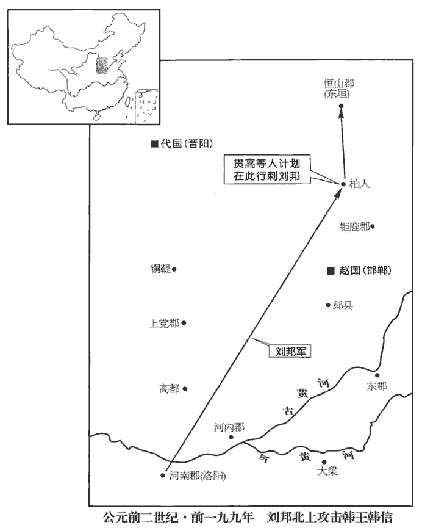
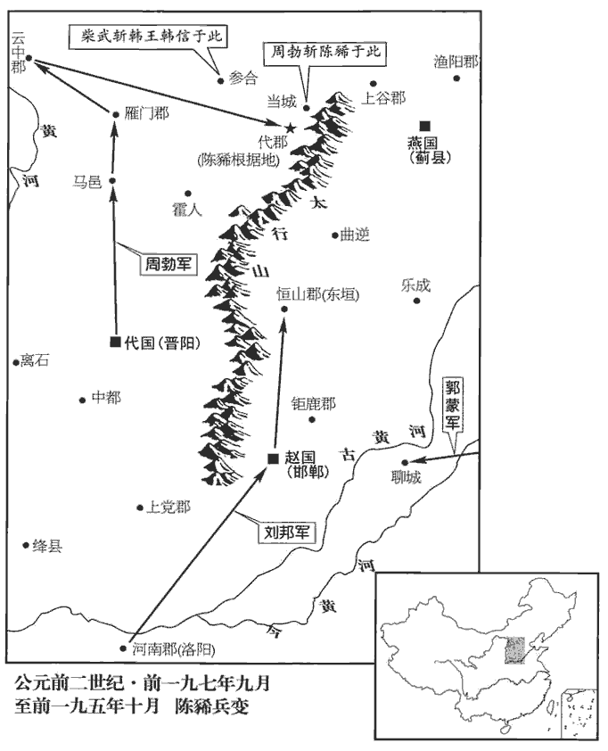
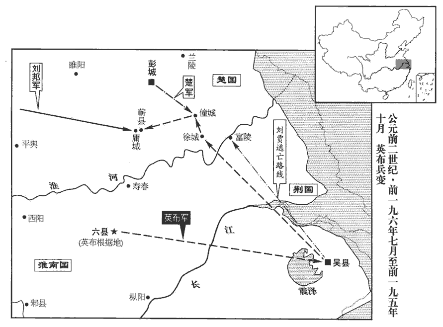
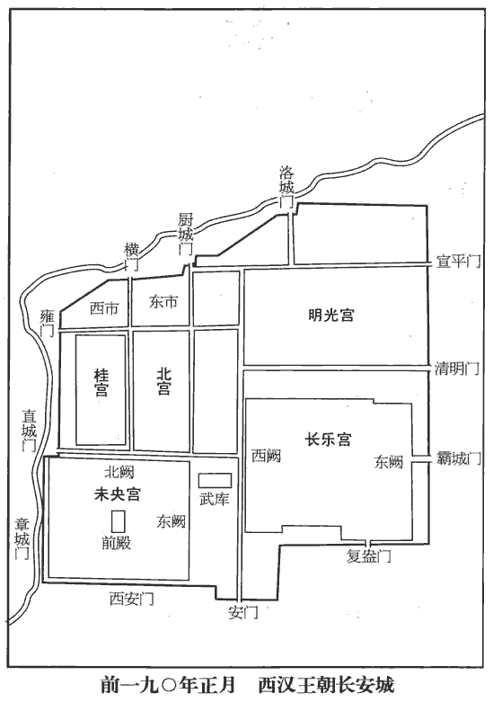

 漢紀四起玄黓攝提格（壬寅），盡昭陽赤奮若（癸丑），凡十二年。

# 太祖高皇帝下

## 八年（壬寅，前一九九年）

1冬，上‹刘邦，时年五十八›【章︰甲十五行本「上」下有「東」字；乙十一行本同；孔本同。】擊韓王信餘寇於東垣‹河北正定›，班志，高帝十一年，更名東垣曰真定；武帝元鼎四年，置真定國。垣，音轅。過柏人‹河北隆尧西南›。班志，柏人縣屬趙國。括地志：柏人故城，在邢州柏人縣西北十二里；至唐天寶元年，更柏人曰堯山。貫高等壁人於廁中，欲以要上。文穎曰：置人廁壁中以伺高祖也。要，一遙翻。上欲宿，心動，問曰：「縣名為何？」曰：「柏人。」上曰：「柏人者，迫於人也。」遂不宿而去。十二月，帝行自東垣至。

〖译文〗 [1]冬季，汉高帝刘邦在东垣攻打韩王信的余党，经过赵国的柏人城。赵相贯高派人藏在厕所的夹墙中，准备行刺高帝。高帝正想留宿城中，忽然心动不安，问：“这个县叫什么？”回答说：“柏人。”高帝说：“柏人，就是受迫于人呀！”于是不住宿而离开。十二月，高帝从东垣城回长安。

2春，三月，行如洛陽。

〖译文〗 [2]春季，三月，高帝前往洛阳。

3令賈人毋得衣錦、繡、綺、縠hú、絺chī、紵zhù、罽jì，操兵、乘、騎馬。師古曰：賈人，坐販賣者也。綺，文繒zēng也，即今之細綾也。絺，細葛也。紵，織紵為布及疏也。罽，織毛，若今毼hé及氍qú毹shū之類也。操，持也。兵，凡兵器也。乘，駕車也。騎，單騎也。賈，音古。衣，於既翻。絺，充知翻。紵，音佇。罽，居例翻。操，千高翻。余據：錦，織文也；繡，刺文而五采備者也；縠，縐紗也。騎，奇寄翻。

〖译文〗 [3]高帝下令，商人不准穿锦、绣、细绫、绉纱、细葛布、布、毛织品，不准持兵器、乘车、骑马。

4秋，九月，行自洛陽至；淮南王‹府六县，安徽六安›、梁王‹府定陶，山东定陶›、趙王‹府邯郸，河北邯郸›、楚王‹府彭城，江苏徐州›皆從。從，才用翻。

〖译文〗 [4]秋季，九月，高帝一行从洛阳回长安。淮南王、梁王、赵王、楚王都随行。

 

5匈奴‹王庭设蒙古哈尔和林›冒頓數苦北邊。數，所角翻；下同。上患之，問劉敬，劉敬曰：「天下初定，士卒罷於兵，罷，讀曰疲。未可以武服也。冒頓殺父代立，妻群母，以力為威，未可以仁義說也。說，式芮翻。獨可以計久遠，子孫為臣耳；然恐陛下不能為。」上曰：「奈何？」對曰：「陛下誠能以適長公主妻之，適，讀曰嫡；謂皇后所生也。長，知兩翻。厚奉遺之，遺，于季翻；下同。彼必慕，以為閼氏，閼氏，音煙支。生子，必為太子。陛下以歲時漢所餘、彼所鮮，數問遺，鮮，息善翻，少也。因使辨士風諭以禮節。風，與諷同。冒頓在，固為子婿；死，則外孫為單于；豈嘗聞外孫敢與大父抗禮者哉！可無戰以漸臣也。若陛下不能遣長公主，而令宗室及後宮詐稱公主，彼知，不肯貴近，無益也。」帝曰：「善！」近，其靳翻。欲遣長公主。呂后日夜泣曰：「妾唯太子、一女，奈何棄之匈奴！」上竟不能遣。

〖译文〗 [5]匈奴冒顿屡次侵扰汉朝北部边境。高帝感到忧虑，问刘敬对策，刘敬说；“天下刚刚安定，士兵们因兵事还很疲劳，不宜用武力去征服冒顿。但冒顿杀父夺位，把父亲的群妃占为妻子，以暴力建立权威，我们也不能用仁义去说服他。唯独可以用计策，使他的子孙长久做汉的臣属，然而我担心陛下做不到。”高帝问：“如何做呢？”回答说：“陛下如果能把嫡女大公主嫁给他为妻，又赠送丰厚俸禄，他一定仰慕汉朝，以公主为匈奴的阏氏，生下儿子，肯定是太子。陛下每年四季用汉朝多余而匈奴缺乏的东西，频繁地慰问赠送他们，乘机派能说善辩的人士前去讽劝和讲解礼节。这样，冒顿在世时，他本是汉朝的女婿辈；他死后，您的外孙便即位为匈奴王单于。难道曾听说过外孙敢和外祖父分庭抗礼的吗？我们可以不经一战而让匈奴渐渐臣服。如果陛下舍不得让大公主去，而令宗室及后宫女子假称公主，他们知道了，不肯尊敬亲近，还是没有用。”高帝说：“好！”便想让大公主去。但吕后日日夜夜哭泣着说：“我只有太子和一个女儿，为什么把她扔给匈奴！”高帝到底没有办法让大公主去。

## 九年（癸卯，前一九八年）

1冬，上‹时年五十九›取家人子名為長公主，師古曰：于外庶人家取女，而名之為公主。以妻單于。妻，千細翻。使劉敬往結和親約。

〖译文〗 [1]冬季，高帝在庶民家找来一名女子，称之为大公主，把她嫁给匈奴单于作妻子，同时派刘敬前往缔结和亲盟约。

臣光曰：建信侯謂冒頓殘賊，不可以仁義說，而欲與為婚姻，何前後之相違也！夫骨肉之恩，尊卑之敘，唯仁義之人為能知之；奈何欲以此服冒頓哉！蓋上世帝王之御夷狄也，服則懷之以德，叛則震之以威，未聞與為婚姻也。且冒頓視其父如禽獸而獵之，奚有于婦翁！建信侯之術，固已疏矣；況魯元已為趙后，又可奪乎！

〖译文〗 臣司马光曰：建信侯刘敬说冒顿残暴，不能用仁义道德去说服他，而又想与其联姻，为什么前后这样矛盾呀！骨肉亲人的恩情，长幼尊卑的次第，只有仁义的人才能明白，怎么要以此来降服匈奴呢？先代帝王驾御夷狄民族的对策是：他们归服就用德来安抚，他们叛扰就用威来镇慑，从没听说过用联姻的办崐法。况且，冒顿把生身父亲视为禽兽而猎杀，对岳父会怎么样！刘敬的计策本已粗疏了，何况公主鲁元已经成了赵王王后，又怎么能夺回来呢！

2劉敬從匈奴來，因言：「匈奴河南‹河套以南›白羊、樓煩王，去長安‹陝西西安›近者七百里，輕騎一日一夜可以至秦中‹關中，陝西中部›。秦中新破，秦中，謂關中，故秦地也。新破，謂經兵革之後未殷實。少民，地肥饒，可益實。少，詩沼翻；下同。夫諸侯初起時，非齊諸田、楚昭、屈、景莫能興。齊之王族，諸田也；楚之王族，昭、屈、景也；皆二國之強家。師古曰：今高陵、櫟陽諸田，華陰、好畤諸景及三輔諸屈、諸懷尚多，皆此時之所徙也。屈，九勿翻。今陛下雖都關中，實少民，東有六國之強族；一日有變，陛下亦未得高枕而臥也。枕，之鴆翻。臣願陛下徙六國後及豪桀、名家居關中；無事可以備胡，諸侯有變，亦足率以東伐。此強本弱末之術也。」上曰：「善！」十一月，徙齊、楚大族昭氏、屈氏、景氏、懷氏、田氏五族及豪桀於關中，與利田、宅，謂便利田宅也。凡十余萬口。

〖译文〗 [2]刘敬从匈奴归来，说：“匈奴的河南白羊、楼烦王部落，离长安城近的只有七百里，轻骑兵一天一夜就可以到达关中。关中刚遭过战事洗劫，缺少百姓，但土地肥沃，应该加以充实。诸侯最初起事时，没有齐国田氏，楚国昭、屈、景氏就不能勃兴。现在陛下您虽然已经建都关中，实际却没有多少人民，而东部有旧六国的强族，一旦有什么事变，您也就不能高枕而卧了。我建议陛下把旧六国的后人及地方豪强、名门大族迁徙到关中居住，国家无事可以防备匈奴，如果各地旧诸侯有变，也足以征集大军向东讨伐。这是加强根本而削弱末枝的办法。”高帝说：“对。”十一月，便下令迁徙旧齐国、楚国的大族昭氏、屈氏、景氏、怀氏、田氏五族及豪强到关中地区，给予便利的田宅安顿，共迁来十余万人。

3十二月，上行如洛陽。

〖译文〗 [3]十二月，高帝前往洛阳。

4貫高怨家知其謀，上變告之。謀，謂謀弑上，事始上卷七年。怨，於元翻，又如字。變，非常也；謂上告非常之事。於是上逮捕趙王及諸反者。師古曰：逮捕，謂事相連及者皆捕之。一曰：在道守禁相屬不絕，若今之傳送囚耳。貢父曰：逮者，其人存在，直追取之；捕者，其人亡，當討捕也；故有或但言逮，或但言捕，知異義也。一曰：逮，易辭；捕，加力也。逮，徒呼召之；捕，則加束縛矣。趙午等十餘人皆爭自剄；貫高獨怒駡曰：「誰令公為之？今王實無謀，而并捕王。公等皆死，誰白王不反者？」白，明白也。乃轞車膠致，師古曰：轞車者，車而為檻形，以版四周之，無所通見。史記正義曰：膠致者，膠密不得開，送致京師也。與王詣長安。高對獄曰：「獨吾屬為之，王實不知。」吏治，搒péng笞數千，刺剟duō，搒，音彭。剟，丁劣翻。索隱曰：剟，亦刺也；應劭曰：以鐵刺之也。身無可擊者；終不復言。呂后數言：「張王以公主故，不宜有此。」數，所角翻。上怒曰：「使張敖據天下，豈少而女乎！」少，詩沼翻。而，汝也。不聽。

〖译文〗 [4]赵国相国贯高的阴谋被他的仇家探知，向高帝举报这桩不寻常的大事。高帝下令逮捕赵王及各谋反者。赵王属下赵午等十几人都争相表示要自杀，只有贯高怒骂道：“谁让你们这样做的？如今赵王确实没有参与谋反，而被一并逮捕。你们都死了，谁来申明赵王不曾谋反的真情？”于是被关进胶封的木栏囚车，与赵王一起押往长安。贯高对审讯官员说：“只是我们自己干的，赵王的确不知道。”狱吏动刑，拷打鞭笞几千下，又用刀刺，直至体无完肤，贯高始终不再说别的话。吕后几次说：“赵王张敖娶了公主，不会有此事。”高帝怒气冲冲地斥骂她：“要是张敖夺了天下，难道还缺少你的女儿不成！”不予理睬。

廷尉以貫高事辭聞。上曰：「壯士！誰知者？以私問之。」蓋欲求貫高平日相知昵者，以其私問之。中大夫泄公曰：班表：郎中令之屬有太中大夫、中大夫，皆掌論議。泄，音薛。泄，姓也；秦時衛有泄姬。「臣之邑子，素知之，此固趙國立義不侵、為然諾者也。」言以義自立，不受侵辱，重於然諾也。上使泄公持節往問之箯biān輿前。韋昭曰：如今輿床，人輿以行。師古曰：箯輿者，編竹木以為輿形，如今之食輿。高時搒笞刺剟委困，故以箯輿處之。索隱曰：服虔云：編竹木如今峻，可以糞除也。何休註公羊：筍sǔn，音峻。筍者，竹箯，一名編，齊、魯以北名為筍。郭璞三蒼註云：箯，轝yú土器，音鞭。泄公與相勞苦，如生平驩，勞，力到翻。相勞，且問其所苦也。因問：「張王果有計謀不？」不，讀曰否。高曰：「人情寧不各愛其父母、妻子乎？今吾三族皆以論死，謂以罪論抵死。豈愛王過於吾親哉？顧為王實不反，為，於偽翻。獨吾等為之。」具道本指所以為者、王不知狀。於是泄公入，具以報上。春，正月，上赦趙王敖。廢為宣平侯，徙代王如意為趙王。

〖译文〗 廷尉把审讯情况和贯高的话报告高帝，高帝感慨地说：“真是个壮士，谁平时和他要好，用私情去探听一下。”中大夫泄公说：“我和他同邑，平常很了解他，他在赵国原本就是个以义自立、不受侵辱、信守诺言的人。”高帝便派泄公持节去贯高的竹床前探问。泄公慰问他的伤情，见仍像平日一样欢洽，便套问：“赵王张敖真的有谋反计划吗？”贯高回答说：“以人之常情，难道不各爱自己的父母、妻子儿女吗？现在我的三族都被定成死罪，难道我爱赵王胜过我的亲人吗？因为实在是赵王不曾谋反，只是我们自己这样干的。”又详细述说当初的谋反原因及赵王不曾知道的情况。于是泄公入朝一一报告了高帝。春季，正月，高帝下令赦免赵王张敖，废黜为宣平侯，另调代王刘如意为赵王。

上賢貫高為人，使泄公具告之曰：「張王已出。」因赦貫高。貫高喜曰：「吾王審出乎？」泄公曰：「然。」泄公曰：「上多足下，故赦足下。」貫高曰：「所以不死、一身無餘者，白張王不反也。今王已出，吾責已塞，塞，悉則翻。死不恨矣。且人臣有篡弑之名，何面目復事上哉！復，扶又翻。縱上不殺我，我不愧於心乎！」乃仰絕亢，遂死。蘇林曰：亢，頸大脈也，俗所謂胡脈也。師古曰：亢者，總謂頸耳。爾雅云：亢，鳥嚨，即喉嚨也。亢，音岡，又下郎翻。

〖译文〗 高帝称许贯高的为人，便派泄公去告诉他：“张敖已经放出去了。”同时赦免贯高。贯高高兴地问：“我的大王真的放出去了？”泄公说：“是的。”又告诉他：“皇上看重你，所以赦免了你。”贯高却说：“我之所以不死、被打得遍体鳞伤，就是为了表明赵王张敖没有谋反。现在赵王已经出去，我的责任也尽到了，可以死而无憾。况且，我作为臣子有谋害皇帝的罪名，又有什么脸再去事奉皇上呢！即使皇上不杀我，我就不心中有愧吗！”于是掐断自己的颈脉，自杀了。

荀悅論曰：貫高首為亂謀，殺主之賊；殺，讀曰弑。雖能證明其王，小亮不塞大逆，私行不贖公罪。塞，悉則翻。行，下孟翻。春秋之義大居正，大居正者，以居正為大也。罪無赦可也。

〖译文〗 荀悦论曰：贯高带头谋反作乱，是个弑君的贼子。虽然他舍身证明赵王无罪，但小的优点掩盖不住大逆不道，个人的品行赎不了法律上的罪过。按照《春秋》大义，遵循正道最为重要，他的罪应是不可赦免的。

臣光曰：高祖驕以失臣，貫高狠以亡君。使貫高謀逆者，高祖之過也；使張敖亡國者，貫高之罪也。

〖译文〗 臣司马光曰：汉高祖因为骄横失去了臣下，贯高因为狠毒使他的主子失掉原有的封国。促使贯高谋反行逆的，是汉高祖的过失；致令张敖亡国的，是贯高的罪过。

5詔：「丙寅‹二十七›前有罪，殊死已下，皆赦之。」

〖译文〗 [5]高帝颁布诏书：“丙寅日以前犯罪者，死罪以下，都予以赦免。”

6二月，行自洛陽至。

〖译文〗 [6]二月，高帝一行自洛阳回长安。

7初，上詔：「趙群臣賓客敢從張王者，皆族。」郎中田叔、孟舒皆自髡kūn鉗為王家奴以從。田叔、孟舒，皆趙國郎中也。從，才用翻。及張敖既免，上賢田叔、孟舒等。召見，與語，漢廷臣無能出其右者。師古曰：古者以右為尊；言材用無有過之者，故云無出其右也。貢父曰：古者居則貴左，兵則貴右；貴右似戰國時俗也。上盡拜為郡守、諸侯相。班表：郡守，秦官，掌治其郡，秩二千石。漢初，諸侯王國亦置丞相，統眾官、群卿大夫都官，如漢朝。景帝中五年，令諸侯王不得復治國，天子為置吏，改丞相曰相，秩二千石。

〖译文〗 [7]当初，高帝颁布诏书：“赵王群臣及宾客有敢随从张敖者，满门抄斩。”但郎中田叔、孟舒等都自行剃去头发，以铁圈束颈，作为赵王家奴随从。待到张敖免罪，高帝称许田叔、孟舒的为人，下令召见，与他们交谈，发现他们的才干超过了汉朝朝廷的大臣。高帝任命两人为郡守、诸侯国相。

8夏，六月【章︰甲十五行本「月」下有「乙未‹三十›」二字；乙十一行本同；孔本同；張校同；退齋校同。】晦，日有食之。

〖译文〗 [8]夏季，六月晦（三十日），出现日食。

9更【章︰甲十五行本「更」上有「是歲」二字；乙十一行本同；孔本同。】以丞相何為相國。自丞相進相國，則相國之位尊于丞相矣。

〖译文〗 [9]改任丞相萧何为相国。

## 十年（甲辰，前一九七年）

1夏，五月，太上皇‹刘执嘉›崩于櫟lì陽宮。秋，七月，癸卯‹十四›，葬太上皇于萬年‹陝西臨潼东半城›，師古曰：三輔黃圖云：高祖初居櫟陽，太上皇因居櫟陽；既崩，葬其北原，起萬年邑，置長、丞焉。考異曰：漢書：「五月，太上皇后崩。」「七月，癸卯，太上皇崩，葬萬年。」荀紀，五月無「后」字，七月無「崩」字。蓋荀悅之時，漢書本尚未訛謬故也；今從之。楚王、梁王皆來送葬。赦櫟陽‹陝西臨潼›囚。臣瓚曰：萬年陵在櫟陽縣，故特赦之。

〖译文〗 [1]夏季，五月，太上皇于栎阳宫驾崩。秋季，七月癸卯（十四日），将太上皇安葬于万年。楚王、梁王都来送葬。高帝下令特赦栎阳囚犯。

2定陶‹山東定陶›戚姬有寵於上如淳曰：姬，音怡。眾妾之總稱也。漢官曰：姬妾數百。臣瓚曰：漢秩祿令及茂陵書：姬，內官也，秩比二千石，位次倢妤下，在七子、八子之上。索隱曰：如淳音怡，非也。茂陵書，姬是內官，是矣；然官號及婦人通稱姬者，姬，周之姓，所以左傳稱伯姬，叔姬；以言天子之宗女貴於他姓，故遂以姬為婦人美號。生趙王如意。上以太子仁弱，謂如意類己；雖封為趙王，常留之長安。上之關東‹函谷關以東›，戚姬常從，從，才用翻。日夜啼泣，欲立其子。呂后年長，常留守，益疏。長，知兩翻。守，式又翻。疏，與疎同。上欲廢太子而立趙王，大臣爭之，皆莫能得。御史大夫周昌廷爭之強，上問其說。昌為人吃，吃，音訖qì，言之難也。又盛怒，曰：「臣口不能言，然臣期期知其不可！陛下欲廢太子，臣期期不奉詔！」師古曰：以口吃故，重言期期。貢父曰：期，讀如荀子「目欲綦色」之綦qí；楚人謂極為綦。孔穎達曰：釋詁曰𧰙qí，汔也；杜預曰：汔，期也。然則期字雖別，皆是近義，言其近當如此。史記稱高祖廢太子，周昌曰：「臣期知其不可」，周昌又曰：「臣期不奉詔。」言期者，意亦與汔同。上欣然而笑。呂后側耳於東廂聽，韋昭曰：東廂，殿東堂也。師古曰：正寢之東西室皆曰廂，言似箱篋qiè之形。既罷，見昌，為跪謝，曰：「微君，太子幾廢。」為，於偽翻。幾，居依翻。

〖译文〗 [2]定陶女子戚夫人受高帝宠爱，生下赵王刘如意。高帝因为太子为人仁慈懦弱，认为刘如意像自己，虽然封他为赵王，却把他长年留在长安。高帝出巡关东，戚夫人也常常随行，日夜在高帝面前哭泣，想要立如意为太子。而吕后因年老，常留守长安，与高帝愈发疏远。高帝便想废掉太子而立赵王为继承人，大臣们表示反对，都未能说服他。御史大夫周昌在朝廷上强硬地争执，高帝问他理由何在。周昌说话口吃，又在盛怒之下，急得只是说：“臣口不能言，但臣期期知道不能这样做，陛下要废太子，臣期期不奉命！”高帝欣然而笑。吕后在东厢房侧耳聆听，事过后，她召见周昌，向他跪谢说：“要不是您，太子几乎就废了。”

時趙王‹刘如意›年十歲，上憂萬歲之後不全也；符璽御史趙堯符璽御史，御史之掌符璽者也，屬御史大夫。璽，斯氏翻。請為趙王置貴強相，為，於偽翻。相，息亮翻。及呂后、太子、群臣素所敬憚者。上曰：「誰可者？」堯曰：「御史大夫昌，其人也。」上乃以昌相趙，為呂后殺戚夫人及如意張本。而以堯代昌為御史大夫。考異曰：史記、漢書張良傳，皆云「十二年上擊黥布還，愈欲易太子」。按百官表：「十年，趙堯為御史大夫」，則是時太子位已定；今從之。

〖译文〗 当时赵王刚十岁，高帝担心自己死后他难以保全；符玺御史赵尧于是建议为赵王配备一个地位高而又强有力，平时能让吕后、太子及群臣敬惮的相。高帝问：“谁合适呢？”赵尧说：“御史大夫周昌正是这样的人。”高帝便任命周昌为赵国的相，而令赵尧代替周昌为御史大夫。

3初，上以陽夏侯陳豨xī為相國，監趙‹河北邯鄲›、代‹河北蔚縣›邊兵；夏，音賈。豨，許豈翻，又音希。徐廣曰：為趙相國，將兵守代。監，古銜翻。豨過辭淮陰侯。淮陰侯挈qiè其手，辟左右，辟，音闢，除也；屏除左右也。與之步於庭，仰天歎曰：「子可與言乎？」豨曰：「唯將軍令之！」淮陰侯曰：「公之所居，天下精兵處也；而公，陛下之信幸臣也。人言公之畔，陛下必不信；再至，陛下乃疑矣；三至，必怒而自將。將，即亮翻。吾為公從中起，天下可圖也。」為，於偽翻。陳豨素知其能也，信之，曰：「謹奉教！」

〖译文〗 [2]起初，高帝任命阳夏侯陈为相国，监管赵国、代国边境部队。陈拜访淮阴侯韩信并向他辞行。淮阴侯握着他的手，屏退左右随从，与他在庭院中散步，忽然仰天叹息道：“有几句话，能和你说吗？”陈说：“只要是将军您的指示，我都听从。”韩信说：“你所处的地位，集中了天下精兵；而你，又是陛下信任的大臣。如果有人说你反叛，陛下肯定不信；然而再有人说，陛下就会起疑心；说第三次，陛下必定会愤怒地亲自率领大兵来攻打你。请让我为你做个内应，那么天下就可以谋取了。”陈平常便知道韩信的能力，相信他，于是说：“遵奉你的指教！”

豨常慕魏無忌之養士，魏無忌，信陵君也。及為相守邊，告歸，漢律：二千石有予告，有賜告。予告者，在官有功最，法所當得也。賜告者，病滿三月當免，天子優賜其告，使得帶印綬、將官屬歸家治病。至成帝時，郡國二千石賜告不得歸家；至和帝時，賜、予皆絕。師古曰：告者，請謁之言，謂請休耳。或謂之謝，謝，亦告也。左傳曰：韓獻子告老；禮記曰：若不得謝。漢書諸云謝病，皆同義。過趙‹河北邯鄲›，賓客隨之【章︰甲十五行本「之」下有「者」字；乙十一行本同；孔本同。】千餘乘乘，繩證翻。邯鄲官舍皆滿。趙相周昌求入見上，見，賢遍翻。具言豨賓客甚盛，擅兵於外數歲，恐有變。上令人覆案豨客居代‹河北蔚縣›者諸不法事，多連引豨。豨恐；韓王信因使王黃、曼丘臣等說誘之。說，式芮翻。誘，音酉。

〖译文〗 陈常常羡慕当年魏国信陵君魏无忌养士的行为，及至他做相国驻守边境，告假回来时，经过赵国，跟随他的宾客乘坐的车有一千多辆，把邯郸城的官舍都住满了。赵相周昌见此情况请求入京进见高帝，详述陈门下宾客盛多，又专擅兵权在外数年，恐怕会有事变等等。高帝令人再审查陈宾客在代国时的种种不法之事，很多牵连到陈。陈听说后十分恐慌，韩王信趁机派王黄、曼丘臣等人来劝诱他联成一伙。

太上皇崩，上使人召豨，豨稱病不至；九月，遂與王黃等反，自立為代王，劫略趙、代。上自東擊之。至邯鄲，喜曰：「豨不【章︰甲十五行本「不」下有「南」字；乙十一行本同；孔本同；張校同。】據邯鄲而阻漳水，吾知其無能為矣！」

〖译文〗 太上皇驾崩时，高帝派人来召陈，陈称病不去；九月，他便与王黄等人公开反叛，自封为代王，率军劫掠赵国、代国。高帝领兵从东面进击，到达邯郸，高兴地说：“陈不占据邯郸而去扼守漳水，我知道他没多大能耐了！”

周昌奏：「常山‹河北正定›二十五城，亡其二十城；請誅守、尉。」秦滅趙，置鉅鹿、邯鄲郡；漢始置常山郡。杜佑通典曰：漢常山郡故城，在趙州元氏縣西。守者，郡守；尉者，都尉。守，式又翻。上曰：「守、尉反乎？」對曰：「不。」不，讀曰否。上曰：「是力不足，亡罪。」

〖译文〗 周昌奏报说：“常山郡二十五城，有二十城都失陷了，请处死郡守、郡尉。”高帝问：“郡守、郡尉反叛了吗？”周昌回答：“没有。”高帝说：“这是他们力量不足，没有罪。”

上令周昌選趙壯士可令將者，白見四人。將，即亮翻；下同。見，賢遍翻。上嫚罵曰：「豎子能為將乎？」四人慙，皆伏地；上封各千戶，以為將。左右諫曰：「從入蜀、漢，伐楚，賞未徧行；今封此，何功？」上曰：「非汝所知。陳豨反，趙、代地皆豨有。吾以羽檄征天下兵，未有至者，今計唯獨邯鄲中兵耳；吾何愛四千戶，不以慰趙子弟！」皆曰：「善！」

〖译文〗 高帝又令周昌选挑赵国壮士中可充当将领的，周昌报告说有四个人，并让他们来进见。高帝谩骂道：“你们这群小子能当将军吗？”四人大为惭愧，都伏在地上；高帝却真的赏赐各人以一千户的封邑，任用为将领。左右随从劝阻说：“跟随您进兵蜀、汉，征讨楚王的功臣都没有全部封赏；今天封他们，凭的什么功劳？”高帝说：“这就不是你们所能知道的了。陈造反，赵国、代国一带都被他占有。我用紧急军书征调天下军队，至今还没有到来的，现在估计能够调遣的只有邯郸城中这些士兵而已，我为什么还要吝惜那四个千户封邑，不用来抚慰赵国子弟呢！”属下都点头说：“好主意。”

又聞豨將皆故賈人；上曰：「吾知所以與之矣。」乃多以金購豨將，豨將多降。師古曰：與，如也，言能如之何也。貢父曰：與，猶待也。原父曰：知與之者，知所以與之之術也。豨將皆故賈人，賈人嗜利，乃多以金購之。賈，音古。

〖译文〗 高帝又听说陈的部将很多过去都是商人，便说：“我知道如何对付他们了。”下令多用黄金去收买陈部将，果然有大部分来降。

 

## 十一年（乙巳，前一九六年）

1冬，上‹时年六十一›在邯鄲。陳豨將侯敞將萬餘人遊行，王黃將騎千余軍曲逆‹河北顺平›，張春將卒萬餘人渡河攻聊城‹山東聊城›；班志，聊城縣屬東郡。括地志：聊城故城，在博州聊城縣西二十里，春秋時齊之西界。聊，攝也。戰國時亦為齊地。漢將軍郭蒙與齊將擊，大破之。太尉周勃道太原‹山西太原›入定代地，至馬邑‹山西朔縣›，不下，攻殘之。殘，謂多所殺戮。趙利守東垣‹河北正定›，帝攻拔之，更命曰真定。更，工衡翻。帝購王黃、曼丘臣以千金，其麾下皆生致之。於是陳豨軍遂敗。

〖译文〗 [1]冬季，高帝在邯郸城。陈的部将侯敞率一万余人游动袭击，王黄率骑兵一千余人屯军曲逆，张春率一万余士卒渡过黄河进攻聊城；汉朝将军郭蒙与齐国将军迎击，大破陈军。太尉周勃取道太原去平定代地，兵抵马邑，久攻不下，攻下后便大行杀戮。赵利守东垣城，高帝亲自率军攻克，将地名改为真定。高帝又悬赏千金捉拿王黄、曼丘臣，结果其部下都将他们活捉送来，于是陈军队溃败。

淮陰侯信稱病，不從擊豨，陰使人至豨所，與通謀。信謀與家臣夜詐詔赦諸官徒、奴，有罪而居作者為徒；有罪而沒入官者為奴。欲發以襲呂后、太子；部署已定，待豨報。其舍人得罪於信，信囚，欲殺之。春，正月，舍人弟上變，告信欲反狀于呂后。按班書功臣表，告信反者，舍人樂說也，封慎陽侯。呂后欲召，恐其儻不就；儻，或然之辭。乃與蕭相國謀，詐令人從上所來，言豨已得，死，列侯、群臣皆賀。相國紿信曰：「雖疾，強入賀。」強，其兩翻。信入，呂后使武士縛信，斬之長樂鐘室。師古曰：懸鐘之室。信方斬，曰：「吾悔不用蒯徹之計，不用蒯徹，見十卷四年。乃為兒女子所詐，豈非天哉！」遂夷信三族。

〖译文〗 淮阴侯韩信假称有病，不随从高帝去攻击陈，暗中却派人到陈那里，与他勾结谋划。韩信想在夜间与家臣用伪诏书赦免官府的有罪工匠及奴隶，打算发动他们去袭击吕后、太子。已经部署完毕，只等陈的消息。韩信有个门下舍人曾因得罪韩信，被囚禁起来，准备处死。春季，正月，舍人的弟弟上书举报事变，将韩信打算谋反的情况告诉吕后。吕后想把韩信召来，又担心他可能不服从，便与相国萧何商议，假装让人从高帝处来，说陈已经被擒，处死。列侯及群臣闻讯都到朝中祝贺。萧何又欺骗韩信说：“你虽然病了，也应当强挺着来道贺。”韩信来到朝廷，吕后便派武士将他捆绑起来，在长乐宫钟室里斩首。韩信在斩首之前，叹息说：“我真后悔没用蒯彻的计策，竟上了小孩子、妇人的当，这难道不是天意吗！”吕后随后下令将韩信三族都连坐杀死。

臣光曰：世或以韓信【章︰甲十五行本「信」下有「爲」字；乙十一行本同；孔本同。】首建大策，與高祖起漢中‹陝西汉中›，定三秦，遂分兵以北，禽魏，取代，仆趙，脅燕，東擊齊而有之，南滅楚垓下‹安徽靈壁縣东南›，漢之所以得天下者，大抵皆信之功也。觀其距蒯徹之說，迎高祖于陳‹河南淮陽›，見上卷六年。豈有反心哉！良由失職怏怏，遂陷悖逆。夫以盧綰里閈hàn舊恩，猶南面王燕，信乃以列侯奉朝請；閈，侯旰翻。王，於況翻。朝，直遙翻。請，才性翻，又如字。豈非高祖亦有負於信哉？臣以為高祖用詐謀禽信于陳，言負則有之；雖然，信亦有以取之也。始，漢與楚相距滎陽，信滅齊，不還報而自王；見十卷四年。其後漢追楚至固陵‹河南淮陽北›，與信期共攻楚而信不至；見十卷五年。當是之時，高祖固有取信之心矣，顧力不能耳。及天下已定，【章︰甲十五行本「定」；下有「則」字；乙十一行本同；孔本同。】信復何恃哉！復，扶又翻。夫乘時以徼利者，市井之志也；徼，一遙翻。酬功而報德者，士君子之心也。酬，時流翻。信以市井之志利其身，而以士君子之心望於人，不亦難哉！是故太史公論之曰：「假令韓信學道謙讓，不伐己功，不矜其能，則庶幾哉！幾，居衣翻。於漢家勳，可以比周、召、太公之徒，後世血食矣！不務出此，而天下已集，乃謀畔逆；夷滅宗族，不亦宜乎！」

〖译文〗 臣司马光曰：世人有的认为，韩信为汉高祖首先奠定开业大计，与他一同在汉中起事，平定三秦后，又分兵向北，擒获魏国，夺取代国，扑灭赵国，胁迫燕国，再向东攻击占领齐国，复向南在垓下消灭楚国，汉朝之所以能得到天下，大致都归功于韩信。再看他拒绝蒯彻的建议，在陈地迎接高祖，哪里有反叛之心呢！实在是因为失去诸侯王的权位后怏怏不快，才陷于大逆不道。卢绾仅仅有高祖里巷旧邻的交情，就封为燕王，而韩信却以侯爵身分奉朝请；高祖难道不也有亏待韩信的地方吗？我认为：汉高祖用诈骗手段在陈地抓获韩信，说他亏待是有的；不过，韩信也有咎由自取之处。当初，汉王与楚王在荥阳相持，韩信灭了齐国，不来奏报汉王却自立为王；其后，汉王追击楚王到固陵，与韩信约定共同进攻楚王，而韩信按兵不动；当时，高祖本已有诛杀韩信的念头了，只是力量还做不到罢了。待到天下已经平定，韩信还有什么可倚仗的呢！抓住机会去谋取利益，是市井小人的志向；建立大功以报答恩德，是有志操崐学问的君子的胸怀。韩信用市井小人的志向为自己谋取利益，而要求他人用君子的胸怀回报，不是太难了吗！所以，太史公司马迁评论说：“假如让韩信学习君臣之道，谦虚礼让，不夸耀自己的功劳，不矜持自己的才能，情况大概就不同了！他对汉家的功勋，可以与周公、召公、太公吕尚等人相比，后代也就可以享有祭祀了！他不去这样做，反而在天下已定之时，图谋叛逆，被斩灭宗族，不是理所当然的吗！”

2將軍柴武斬韓王信於參合‹山西陽高›。姓譜：柴姓，高柴之後。班志，參合縣屬代郡。括地志：參合故城在朔州定襄縣北。

〖译文〗 [2]将军柴武在参合将韩王信斩首。

3上還洛陽，聞淮陰侯之死，且喜且憐之；喜者，喜除其偪；憐者，憐其功大。問呂后曰：「信死亦何言？」呂后曰：「信言恨不用蒯徹計。」上曰：「是齊辯士蒯徹也。」乃詔齊捕蒯徹。蒯徹至，上曰：「若教淮陰侯反乎？」對曰：「然，臣固教之。豎子不用臣之策，故令自夷於此；如用臣之計，陛下安得而夷之乎！」上怒曰：「烹之！」徹曰：「嗟乎！冤哉烹也！」上曰：「若教韓信反，何冤？」對曰：「秦失其鹿，天下共逐之，高材疾足者先得焉。跖之狗吠堯；堯非不仁，狗固吠非其主。當是時，臣唯獨知韓信，非知陛下也。且天下銳精持鋒銳精，言磨淬精鐵而銳之也。欲為陛下所為者甚眾，顧力不能耳，師古曰：顧，念也。余謂顧，反視也，反己而自視其力有所不能也。又可盡烹之邪？」上曰：「置之。」置，猶舍也，又赦也。

〖译文〗 [3]高帝回到洛阳，知道淮阴侯韩信被杀，又是欣喜又是怜惜。他问吕后：“韩信临死有什么话？”吕后说：“韩信说后悔没用蒯彻的计谋。”高帝悟道：“是齐国的能辩之士蒯彻呀！”便诏令齐国逮捕蒯彻。蒯彻被押来后，高帝问：“你教韩信造反吗？”回答说：“是的，我确实教过。那家伙不听我的计策，所以才自取灭亡，落到这个地步；如果用我的计策，陛下怎么能够杀了他呢！”高帝勃然大怒，下令：“煮死他！”蒯彻大叫：“哎呀！煮我实在冤枉！”高帝问“你教韩信造反，还有何冤枉？”蒯彻说：“秦朝失去江山，天下人都群起争夺，有才能、动作快的人能先得到。古时跖的狗对尧吠叫，并不是尧不仁，而是狗本来就要对不是它主人的人吠叫。当时，我作为臣子只知道有韩信，不知道有陛下啊！何况，天下磨刀霍霍，想做陛下这般大业的人很多，只是力量达不到罢了，您又能都煮死吗？”高帝听罢说：“放了他。”

4立子恒為代王，都晉陽‹山西太原›。晉陽，漢為太原郡治所。如淳曰：文紀言都中都。又文帝過太原，復晉陽、中都二歲，似遷都於中都也。恒，戶登翻。

〖译文〗 [4]高帝立儿子刘恒为代王，以晋阳为都城。

5大赦天下。

〖译文〗 [5]高帝下令大赦天下。

6上之擊陳豨也，徵兵于梁‹府定陶，山东定陶›；梁王稱病，使將將兵詣邯鄲。上怒，使人讓之。梁王恐，欲自往謝。其將扈輒曰：「王始不往，見讓而往，往則為禽矣；不如遂發兵反。」梁王不聽。梁太僕得罪，亡走漢，告梁王與扈輒謀反。於是上使使掩梁王，梁王不覺，遂囚之洛陽。有司治：「反形已具，臣瓚曰：扈輒勸越反而越不誅，是反形已具也。請論如法。」上赦以為庶人，傳處蜀青衣‹四川名山县北›。青衣道屬蜀郡。臣瓚曰：今漢嘉是也。章懷太子賢曰：青衣道，在大江、青衣二水之會，今嘉州龍遊縣也。傳，張戀翻。處，昌呂翻。西至鄭‹陝西華縣›，逢呂后從長安來。彭王為呂后泣涕，自言無罪，願處故昌邑‹山東金鄉西北昌邑镇›。二世二年，彭越起於昌邑。為，於偽翻。呂后許諾，與俱東。至洛陽，呂后白上曰：「彭王壯士，今徙之蜀，此自遺患；不如遂誅之。妾謹與俱來。」於是呂后乃令其舍人告彭越復謀反。復，扶又翻。廷尉王恬開奏請族之，上可其奏。三月，夷越三族。此以漢書本紀為據；史記高祖紀作「夏，夷彭越三族」，年表書「越反，誅」，又在十年夏誅彭越，蓋以盧綰言為據。梟越首洛陽，下詔：「有收視者，輒捕之。」

〖译文〗 [6]高帝进攻陈时，向梁王彭越征兵，彭越称病，只派将军率兵赴邯郸。高帝大怒，令人前去斥责。彭越恐惧，想亲身入朝谢罪。部将扈辄说：“您当初不去，受到斥责后才去，去就会被擒，不如就势发兵反了吧。”彭越不听劝告。他的太仆因获罪逃往长安，控告梁王彭越与扈辄谋反。于是高帝派人突袭彭越，彭越事先没有发觉，便被俘囚禁到洛阳。有关部门审讯结果是：“已有谋反迹象，应按法律处死。”高帝赦免他为平民，押送到蜀郡青衣居住。彭越向西到了郑地，遇到吕后从长安来。彭越向吕后哭泣，说自己无罪，希望能到故地昌邑居住。吕后口中应允，与他一起东行。到了洛阳，吕后对高帝说：“彭越是个壮士，如今把他流放到蜀郡，这是自留后患，不如就此杀了他。我已与他同来。”吕后又指使彭越门下舍人控告彭越再行谋反。廷尉王恬开奏请将彭越灭三族，高帝予以批准。三月，彭越三族都被斩首。还割下彭越的首级在洛阳示众，并颁布诏令：“有来收敛尸体者，一律逮捕。”

梁大夫欒布使于齊，姓譜：欒，晉卿欒氏之後。還，奏事越頭下，祠而哭之。吏捕以聞。上召布，罵，欲烹之。方提趨湯，提，挈也；挈而趨鼎，欲投之于湯。趨，七喻翻。布顧曰：「願一言而死。」上曰：「何言？」布曰：「方上之困于彭城‹江蘇徐州›，敗滎陽‹河南滎陽›、成皋‹河南荥阳西北汜水镇›間，項王所以遂不能西者，徒以彭王居梁地，與漢合從苦楚也。從，子容翻。當是之時，王一顧，與楚則漢破，與漢則楚破。且垓下之會，微彭王，項氏不亡。天下已定，彭王剖符受封，亦欲傳之萬世。今陛下一徵兵于梁，彭王病不行，而陛下疑以為反；反形未具，以苛小案誅滅之。臣恐功臣人人自危也。今彭王已死，臣生不如死，請就烹！」於是上乃釋布罪，拜為都尉。

〖译文〗 梁王彭越的大夫栾布出使齐国，回来后，在彭越的头颅下奏报，祭祀后大哭一场。官吏将他逮捕，报告高帝。高帝召来栾布，痛骂一番，想煮死他。两旁的人正提起他要投入滚水中，栾布回头说：“请让我说句话再死。”高帝便问：“还有什么话？”栾布说：“当年皇上受困于彭城，战败于荥阳、成皋之间，而项羽却不能西进，只是因为彭越守住梁地，与汉联合而使楚为难。当时，只要彭越一有倾向，与项羽联合则汉失败，与汉联合则楚失败。而且垓下会战，没有彭越，项羽就不会灭亡。如今天下已经平定，彭越接受符节，被封为王，也想传给子孙后代。而如今陛下向梁国征一次兵，彭越因病不能前来，陛下就疑心以为造反；未见到反叛迹象，便以苛细小事诛杀了他。我担心功臣会人人自危。现在彭越已经死了，我活着也不如死，请煮死我吧！”高帝认为有理，便赦免了栾布的罪，封他为都尉。

7丙午，立皇子恢為梁王‹府定陶，山东定陶›；考異曰：漢書諸侯王表作「三月丙午」。按劉羲叟長曆：三月丙辰朔，無丙午；今從史記年表。今按史記年表作「二月丙午」，但通鑑先書「三月夷彭越三族」，方於此書「立子恢為梁王」，則又是三月丙午。丙寅‹十一›，立皇子友為淮陽王。罷東郡‹河南濮阳西南›，頗益梁‹都河南商丘›；罷潁川郡‹河南禹州›，頗益淮陽。

〖译文〗 [7]丙午（疑误），高帝立皇子刘恢为梁王，丙寅（十一日），立皇子刘友为淮阳王。废除东郡，较大地扩充了梁国；废除颍川郡，较大地扩充了淮阳国。

8夏，四月，行自洛陽至。

〖译文〗 [8]夏季，四月，高帝一行从洛阳回长安。

9五月，詔立秦南海‹廣東廣州›尉趙佗為南粵王，晉志：秦使任囂、趙佗攻粵，略取陸梁地，遂定南粵，以為桂林、南海、象三郡，非三十六郡之限；乃置南海尉以典之，所謂「東南一尉」也。余謂始皇二十六年，分天下為三十六郡，郡置守、尉、監。三十三年，取南粵，置南海、桂林、象郡；此南海尉止典南海一郡兵，猶三十六郡之尉也，安得兼典桂林、象郡！任囂既死，秦已破滅，趙佗始擊并桂林、象郡，以此知非兼典也。佗，徒河翻。使陸賈即授璽綬，姓譜：陸，古天子陸終之後。與剖符通使，使和集百越，無為南邊患害。

〖译文〗 [9]五月，高帝下诏立原秦朝南海尉赵佗为南粤王，派陆贾前往授予印信绶带，颁发符节，互通使者，让他团结安抚百越，不要成为南方边境的祸害。

初，秦二世時，南海尉任囂病且死，任，音壬。囂，音敖。召龍川‹廣東龍川›令趙佗，班志：龍川縣屬南海郡。裴氏廣州記龍川本博羅縣之東鄉，有龍穿地而出，即穴流泉，因以為號。師古曰：今循州。語曰：語，牛倨翻。「秦為無道，天下苦之。聞陳勝等作亂，天下未知所安。南海僻遠，吾恐盜兵侵地至此，欲興兵絕新道自備，蘇林曰：新道，秦所新通越道。待諸侯變；會病甚。且番禺‹廣東廣州›負山險，阻南海，班志，番禺縣屬南海郡，尉佗所都。今為廣州治所。番，音潘。禺，音愚，又魚容翻。東西數千里，頗有中國人相輔；此亦一州之主也，可以立國。郡中長吏，無足與言者，長，知兩翻。故召公告之。」即被佗書，韋昭曰：被之以書，音光被之被，皮義翻。行南海尉事。囂死，佗即移檄告橫浦‹广东南雄›、陽山‹廣東陽山›、湟谿關‹廣東陽山西北四十里茂溪口›曰：武帝伐南越，遣楊僕出豫章，下橫浦；則橫浦通豫章之路也。杜佑曰：橫浦關在虔州大庾縣西南。南康記曰：南野大庾嶺三十里至橫浦，有秦時關，其下謂為塞上。班志：陽山侯國屬桂陽郡。姚氏曰：連州陽山縣上流百餘里有騎田嶺，當是陽山關。新唐書地理志：連州陽山縣有故秦湟谿關。郡國志：陽山縣理洭kuāng水之南，即其故墟，本南越置關之邑，故關在縣西北四十里茂溪口。湟，音皇。「盜兵且至，急絕道，聚兵自守！」因稍以法誅秦所置長吏，以其黨為假守。秦已破滅，佗即擊并桂林‹广西凌云›、象郡‹广西崇左›，桂林，後武帝改為鬱林郡。象郡，武帝改為日南郡。自立為南越武王。韋昭曰：生以武為號，不稽於古也。

〖译文〗 当初，秦二世时，南海尉任嚣病重将死，他召来龙川县令赵佗，对赵佗说：“秦朝的政治暴虐无道，天下都十分怨愤。听说陈胜等人已起兵造反，天下不知怎样才能安定。我们南海虽然地处偏远，我也担心盗贼匪兵到这里来侵占地盘，想发动军队切断秦朝修筑的通往内地的新道，以自做准备，等待诸侯的变化，恰在此时我却病重。再说我们的番禺城后山势险要，前有南海阻隔，东西几千里，有很多中原人在辅佐治理，这也是一州之主，可以建立个国家。我看郡中的官员，没有人足以商议，所以召你前来，告诉你我的嘱托。”任嚣说完，便为赵佗写下委任书，请他代理南海尉的政事。任嚣死后，赵佗立即发出檄文通知横浦、阳山、湟关说：“盗匪军队就要来到，各地立即断绝通道，聚兵自守。”随后又逐渐地利用法律诛杀秦朝所设官员，以他的同党做代理郡守。秦朝灭亡后，赵佗立即发兵进攻吞并桂林、象郡，自立为南越武王。

陸生至，尉佗魋tuí結、服虔曰：今兵士椎頭髻也。師古曰：椎髻者，一撮之髻，其形如椎。魋，音椎。結，讀曰髻。箕倨見陸生。陸生說佗曰：「足下中國人，尉佗本真定‹河北正定›人，故賈云然。親戚、昆弟、墳墓在真定‹河北正定›。今足下反天性，棄冠帶，背父母之國，不念墳墓、宗族，是反天性也；椎髻以從蠻夷之俗，是棄冠帶也。欲以區區之越與天子抗衡為敵國，禍且及身矣！且夫秦失其政，諸侯、豪傑并起，唯漢王先入關，據咸陽。項羽倍約，自立為西楚霸王，倍，蒲妹翻。諸侯皆屬，可謂至強，然漢王起巴、蜀，鞭笞天下，遂誅項羽，滅之；五年之間，海內平定。此非人力，天之所建也。天子聞君王王南越，王王，下於況翻；下故王同。不助天下誅暴逆，將相欲移兵而誅王。天子憐百姓新勞苦，故且休之，遣臣授君王印，剖符通使。君王宜郊迎，北面稱臣；乃欲以新造未集之越，師古曰：未集，言未成也。屈強於此！師古曰：屈強，謂不柔服也。屈，其勿翻。漢誠聞之，掘燒王先人塚，夷滅宗族，使一偏將將十萬眾臨越，則越殺王降漢如反覆手耳！」於是尉佗乃蹶然起坐，師古曰：蹶然，驚起之貌也。蹶，音厥。謝陸生曰：「居蠻夷中久，殊失禮義。」因問陸生曰：「我孰與蕭何、曹參、韓信賢？」陸生曰：「王似賢也。」復曰：「我孰與皇帝賢？」復，扶又翻。陸生曰：「皇帝繼五帝、三皇之業，統理中國；中國之人以億計，地方萬里，萬物殷富；政由一家，自天地剖判未始有也。今王眾不過數十萬，皆蠻夷，崎嶇山海間，崎，丘宜翻。嶇，音區。譬若漢一郡耳，何乃比於漢！」尉佗大笑曰：「吾不起中國，故王此；使我居中國，何遽不若漢！」師古曰：言有何迫促而不如漢也。余謂遽者，急促也，今江南人謂之便；何至便不如漢也。遽，其庶翻。乃留陸生與飲，數月，曰：「越中無足與語。至生來，令我日聞所不聞。」賜陸生橐tuó中裝直千金，張晏曰：橐中裝，珠玉之寶也。裝，裹也。如淳曰：明月珠之屬也。師古曰：有底曰囊，無底曰橐；言其寶物質輕而價重，可入囊橐以齎行，故曰橐中裝。他送亦千金。蘇林曰：非橐中物，故曰他送。師古曰：他，猶餘也。陸生卒拜尉佗為南越王，卒，子恤翻。令稱臣，奉漢約。歸報，帝大悅，拜賈為太中大夫。

〖译文〗 陆贾来到南越，赵佗头上盘着南越族的头髻，伸开两脚坐着接见他。陆贾劝说赵佗：“您是中原人士，亲戚、兄弟、祖先坟墓都在真定。现在您违反天性，抛弃华夏冠带，想以区区南越之地与汉朝天子相抗衡成为敌国，大祸就要临头了！再说，秦朝丧失德政，各地诸侯、豪强纷纷起兵反抗，只有汉王能先入关中，占据咸阳。项羽背约，自立为西楚霸王，诸侯都成为他的部属，他可以说是极强大的了。但汉王起兵巴、蜀后，便横扫天下，终于诛杀了项羽，消灭了楚军。五年之间，海内获得平定，这并非人力所为，而是上天的建树啊！汉朝天子听说您在南越称王，却不协助天下诛杀暴逆，文武将相都请求派兵来剿灭您。但天子怜悯百姓刚刚经过兵事劳苦，所以暂且休兵不发，派我前来授您君王印信，颁发符节，互通使臣。您应该亲自到郊外迎接，向北称臣才是，而您竟要凭借新近缔造尚未安定的越国，对汉朝如此倔强不服从！汉朝要是知道了，掘毁焚烧您祖先的坟墓，杀光您的宗族，再派一员偏将率领十万大兵压境，那么南越人杀您投降汉朝，是易如反掌的！”于是赵佗大惊失色，立即离开坐位，向陆贾谢罪说：“我在蛮夷民族中居住已久，太没有礼义了。”他又问陆贾：“我与萧何、曹参、韩信比，谁高明？”陆贾回答：“似乎是您高明些。”赵佗又问：“那么我与汉朝皇帝比，谁高明？”陆贾说：“皇帝继承三皇、五帝的伟业，统一治理中国；中原人口以亿计算，土地方圆万里，万物殷实丰富；皇帝能把政权集于一家之手，是开天辟地以来未曾有过的事。您的臣民不过几十万，还都是蛮夷，散布在崎岖的崇山大海之间，好像是汉朝的一个郡而已，怎么可以与汉朝相提并论！”赵佗大笑着说：“我没有在中原兴起，所以在这里称王；如果我在中原，怎么就见得不如汉朝！”说完便留下陆贾与他畅饮。过了几个月，赵佗说：“南越没有可说话的人，直到你来，才让我每天听到从未听过的事。”又赏赐陆贾一袋珠宝，价值千金，其他馈赠也达千金之多。陆贾最后便拜赵佗为南越王，令他向汉朝称臣，遵守汉朝的约定。陆贾回朝报告，高帝大为高兴，封陆贾为太中大夫。

陸生時時前說稱詩、書，帝罵之曰：「乃公居馬上而得之，安事詩、書！」陸生曰：「居馬上得之，寧可以馬上治之乎？治，直之翻。且湯、武逆取而以順守之；文武并用，長久之術也。昔者吳王夫差、智伯、秦始皇，皆以極武而亡。鄉使秦已并天下，行仁義，法先聖，陛下安得而有之！」鄉，讀曰嚮。帝有慙色，曰：「試為我著秦所以失天下、吾所以得之者及古成敗之國。」陸生乃粗述存亡之征，為，於偽翻。粗，坐五翻，略也。凡著十二篇。每奏一篇，帝未嘗不稱善，左右呼萬歲；號其書曰「新語」。

〖译文〗 陆贾时时在高帝面前称道《诗经》、《尚书》，高帝斥骂他说：“你老子是在马上打下的天下，哪里用得着《诗经》、《尚书》！”陆贾反驳道：“在马上得天下，难道可以在马上治理天下吗？况且商朝汤王、周朝武王都是逆上造反取天下，顺势怀柔守天下。文武并用，才是长治久安的方法。当年吴王夫差、智伯瑶、秦始皇，也都是因为穷兵黩武而遭致灭亡。假使秦国吞并天下之后，推行仁义，效法先圣，陛下今天怎能拥有天下！”高帝露出惭愧面容，说：“请你试为我写出秦国所以失去天下，我所以得到天下及古代国家成败的道理。”陆贾于是大略阐述了国家存亡的征兆，共写成十二篇。每奏上一篇，高帝都称赞叫好，左右随从也齐呼万岁。该书被称为《新语》。

10帝有疾，惡見人，惡，烏路翻。臥禁中，詔戶者無得入群臣，戶者，謂守門戶者也。群臣絳、灌等莫敢入，十餘日。舞陽侯樊噲排闥tà直入，班志，舞陽縣屬潁川郡。應劭曰：舞水出其縣之南。史記正義：在許州葉縣東十里。師古曰：闥，宮中小門也；一曰：門屏也；音土曷翻。大臣隨之。上獨枕一宦者臥。枕，之鴆翻。噲等見上，流涕曰：「始，陛下與臣等起豐‹江苏丰县›、沛‹江苏沛县›，定天下，何其壯也；今天下已定，又何憊也！憊，蒲拜翻，疲極也。且陛下病甚，大臣震恐；不見臣等計事，顧獨與一宦者絕乎！且陛下獨不見趙高之事乎？」謂與李斯謀殺扶蘇立胡亥也。帝笑而起。

〖译文〗 [10]高帝生了病，讨厌见人，躺在宫中，命令守宫门官员不准群臣进入，周勃，灌婴等群臣都不敢进去。这样过了十几天，舞阳侯樊哙闯开宫门直冲而崐入，各大臣也随后跟进。只见高帝正以一个宦官为枕头，独自躺在那里。樊哙等人见了高帝，流着眼泪说：“想当年，陛下与我们一同在丰、沛起事，平定天下，是何等的雄壮！现在天下已经安定，又是多么的疲惫不堪！而且，陛下病重，大臣们都感到震惊恐惧；陛下不接见我们商议国家大事，就只是和一个宦官到死吗！再说陛下难道不知道赵高篡权的事吗？”高帝便笑着起了身。

 

11秋七月，淮南‹府六县，安徽六安›王布反。

〖译文〗 [11]秋季，七月，淮南王黥布反叛。

初，淮陰侯死，布已心恐。及彭越誅，醢其肉以賜諸侯。師古曰：反者被誅，皆以為醢，即刑法志所謂「菹zū其骨肉」是也。賈公彥曰：有骨為臡ní，無骨為醢；菜、肉通。全物若䐑zhé為菹，細切為齏。作臡ní、醢者，必先膊乾其肉及漬剉之，雜以粱、麯及鹽，漬以美酒，塗置甀中，百日則成矣。菹，醯、醬所和。使者至淮南，淮南王方獵，見醢，因大恐，陰令人部聚兵，候伺旁郡警急。布所幸姬，病就醫，醫家與中大夫賁bēn赫對門，賁，音肥，姓也；赫，其名也。姓譜有賁姓，以為縣賁父之後；風俗通，魯有賁浦；皆音奔。赫乃厚饋遺，從姬飲醫家；遺，于季翻。王疑其與亂，欲捕赫。赫乘傳詣長安上變，傳，柱戀翻。言「布謀反有端，可先未發誅也。」上讀其書，語蕭相國，相國曰：「布不宜有此，恐仇怨妄誣之。語，牛倨翻。怨，於元翻。請繫赫，使人微驗淮南王。」師古曰：微驗者，不顯言其事。淮南王見赫以罪亡上變，固已疑其言國陰事；漢使又來，頗有所驗；遂族赫家，發兵反。反書聞，上乃赦賁赫，以為將軍。

〖译文〗 起初，淮阳侯韩信被杀，黥布已感到心惊。待到彭越也遭处死，高帝又把他的肉制成肉酱分赐各地诸侯。使者到了淮南，淮南王黥布正在打猎，见了肉酱，大为惊恐，便暗中派人部署军队，等候邻郡报警告急。黥布的一个宠姬，因病去就医，医生与中大夫贲赫住对门。贲赫便备下厚礼，陪同宠姬在医生家饮酒。黥布却怀疑贲赫与宠姬私通，想抓起贲赫治罪。贲赫觉察，乘传车跑到长安城向高帝告发事变，说：“黥布谋反，已有迹象，应该趁他尚未发动先行诛杀。”高帝读了他的举报信，对萧何说起，萧何认为：“黥布不至于做这种事，恐怕是仇人妄行诬告他。可以先把贲赫抓起来，派人暗中查验黥布。”黥布见贲赫畏罪逃去向高帝控告，本来已经疑心他会说出本国的阴谋；汉朝使者又来，查验出不少证据；便杀光贲赫全家，发兵反叛。关于黥布造反的报告传至，高帝于是赦免贲赫，任命为将军。

上召諸將問計。皆曰：「發兵擊之，坑豎子耳，何能為乎！」汝陰侯滕公班志，汝陰縣屬汝南郡，春秋胡子之國。史記正義曰：汝陰即今陽城。余據唐陽城縣屬河南郡，與漢汝南之汝陰相去頗遠。又據史記滕公傳：「平城圍解，增食細陽千戶」，細陽縣屬汝南郡，蓋與汝陰鄰境。索隱曰：汝陰屬汝南，亦據班志也。召故楚令尹薛公問之。令尹曰：「是固當反。」滕公曰：「上裂地而封之，疏爵而王之；疏，分也。其反何也？」令尹曰：「往年殺彭越，前年殺韓信；此三人者，同功一體之人也，自疑禍及身，故反耳！」滕公言之上，上乃召見，問薛公，薛公對曰：「布反不足怪也。使布出於上計，山東‹崤山以東›非漢之有也；出於中計，勝敗之數未可知也；出於下計，陛下安枕而臥矣。」上曰：「何謂上計？」對曰：「東取吳‹江蘇南部›，西取楚‹河南南部›，并齊‹山東东部›，取魯‹山東西南部›，傳檄燕‹河北北部›、趙‹河北南部›，固守其所，山東‹崤山以東›非漢之有也。」「何謂中計？」「東取吳，西取楚，并韓‹河南中部›，取魏‹河南北部、東部›，據敖倉‹河南荥阳北敖山粮仓›之粟，塞成皋‹河南荥阳西北汜水镇›之口，勝敗之數未可知也。」「何謂下計？」「東取吳，西取下蔡‹安徽凤台›，歸重於越‹浙江›，身歸長沙‹湖南长沙›，吳，謂荊王劉賈所封之地；楚，謂楚王交所封之地；齊，謂齊王肥所封之地。魯亦入楚境；韓地，時以益淮陽國；魏地，梁王友所封也。下蔡縣屬沛郡，春秋時之州來也。越，會稽地，故越王句踐之墟也。長沙，吳芮所封國，時其子臣嗣封。黥布都六，阻淮為固，故策其西取下蔡，東取劉賈，以據全淮。越在東南，故策其歸輜重於越以自厚，為深固不可取之計；布娶于長沙王，故策其身歸長沙；料其出於麗山之徒，慮不及遠也。重，直用翻。陛下安枕而臥，漢無事矣。」上曰：「是計將安出？」對曰：「出下計。」上曰：「何為廢上、中計而出下計？」對曰：「布，故麗山之徒也，麗，與驪同。事見八卷秦二世一年。自致萬乘之主，此皆為身，不顧後、為百姓萬世慮者也；皆為，於偽翻；下間為、為妻、為上同。故曰出下計。」上曰：「善！」封薛公千戶。乃立皇子長為淮南王‹府寿春，安徽寿县›。考異曰：史記諸侯年表云：「十二月，庚子，厲王長元年。」漢書諸侯王表：「十月庚午立。」今從漢書帝紀。

〖译文〗 高帝召集众将询问对策，大家都说：“发兵征讨，坑杀这家伙罢了，他有什么能耐！”汝阴侯滕公夏侯婴召来原楚国的令尹薛公，向他征求意见。薛公说：“黥布当然要反。”夏侯婴问：“皇上割地封给他，又分赐爵位让他称王，还有什么造反的道理？”薛公回答道：“皇上前不久杀了彭越，再早些还杀了韩信，他们三人，功劳相同是三位一体的，他自己疑心大祸降临，所以便造反了。”夏侯婴将此话告诉高帝，高帝于是传来薛公，问他，薛公回答说：“黥布造反不足为怪。但是，如果他采用上策，崤山之东便不再是汉朝所有的了；如果他采用中策，两方谁胜谁负还难以预料；如果他采用下策，那么陛下就可以高枕无忧了。”高帝问：“什么是他的上策？”回答说：“向东攻取吴地，向西夺占楚地，吞并齐地，占据鲁地，传令给燕、赵两地，让他们固守本土，那么崤山以东就不在汉朝手中了。”“什么是他的中策？”“向东攻取吴地，向西夺占楚地，吞并韩地，占据魏地，掌握敖仓的储粮，阻塞成皋通道，那么谁胜谁负就难以预料。”“什么是他的下策？”“向东攻取吴地，向西夺占下蔡，然后把辎重送回越地，自己回到长沙，那么陛下就可以高枕无忧，汉朝就没事了。”高帝又问：“他将会使哪种计策呢？”薛公说：“必使下策。”高帝问：“为什么他会舍弃上、中策而采用下策呢？”薛公答道：“黥布其人，原是个骊山的刑徒，自己奋力爬到王的高位，这些都使他只顾自身，不顾以后崐，更不会为百姓做长远打算。所以说他必采用下策。”高帝说：“好！”下令封薛公一千户。于是立皇子刘长为淮南王。

是時，上有疾，欲使太子往擊黥布。太子客東園公、綺里季、夏黃公、甪lù里先生此所謂四皓也，避秦之亂，隱于商山。索隱曰：按陳留志云：園公，姓唐，字宣明，居園中，因以為號。夏黃公，姓崔，名廣，字少通，齊人，隱居夏里修道，故號曰夏黃公。甪里先生，河內軹人，太伯之後，姓周，名術，字元道，京師號曰霸上先生，一曰角里先生。甪，盧穀翻。說建成侯呂釋之曰：班志，建成侯國屬沛郡。「太子將兵，有功則位不益，師古曰：太子嗣君，位已至矣，雖更立功，位無加益。無功則從此受禍矣。君何不急請呂后，承間為上泣言：『黥布，天下猛將也，善用兵。今諸將皆陛下故等夷，間，古莧翻。師古曰：夷，平也；言故時皆齊等。乃令太子將此屬，無異使羊將狼，莫肯為用；且使布聞之，則鼓行而西耳。上雖病，強載輜車，強，其兩翻。師古曰：輜車，衣車也。臥而護之，諸將不敢不盡力。上雖苦，為妻子自強！』」於是呂釋之立夜見呂后。呂后承間為上泣涕而言，如四人意。考異曰：史記、漢書皆云「呂澤夜見呂后」，按恩澤侯表有周呂侯澤、建成侯釋之。今此上云建成侯，而下云呂澤，恐誤；當為釋之是。又留侯世家：「上欲廢太子，立戚夫人子趙王如意，大臣多諫爭，未能得堅決者也。呂后恐，不知所為。人或謂呂后曰：『留侯善畫計策，上信用之。』呂后乃使建成侯呂澤劫留侯，曰：『君常為上謀臣。今上易太子，君安得高枕而臥乎？』留侯曰：『始，上數在困急之中，幸用臣策；今天下安定，以愛欲易太子，骨肉之間，雖臣等百余人何益！』呂澤強要曰：『為我畫計。』留侯曰：『此難以口舌爭也。顧上有不能致者，天下有四人。四人者，年老矣，皆以為上嫚侮人，故逃匿山中，義不為漢臣；然上高此四人。今公誠能無愛金、玉、璧、帛，令太子為書，卑辭安車，因使辯士固請；宜來。來，以為客，時時從入朝，令上見之，則必異而問之。問之，上知此四人賢，則一助也。』於是呂后令呂澤使人奉太子書，卑辭厚禮，迎此四人。四人至，客建成侯所。上欲使太子擊黥布，四人相謂曰：『凡來者，將以存太子。太子將兵，事危矣。』乃說建成侯云云。上遂自行。上破布歸，置酒，太子侍。四人從太子，年皆八十有餘，鬚眉皓白，衣冠甚偉。上怪問之，曰『彼何為者？』四人前對，各言名姓：曰東園公、甪里先生、綺里季、夏黃公。上乃大驚曰：『吾求公數歲，公辟逃我；今公何自從吾兒游乎？』四人皆曰：『陛下輕士，善罵，臣等義不受辱，故恐而亡匿。竊聞太子為人，仁孝，恭敬，愛士，天下莫不延頸欲為太子死者，故臣等來耳。』上曰：『煩公幸卒調護太子。』四人為壽已畢，起去。上目送之，召戚夫人指示四人者曰：『我欲易之，彼四人輔之，羽翼已成，難動矣！呂氏真而主矣！』戚夫人泣。上曰：『為我楚舞，吾為若楚歌。』歌曰：『鴻鵠hú高飛，一舉千里，羽翮hé已就，橫絕四海。橫絕四海，當可奈何！雖有繒繳，尚安所施！』歌數闋，戚夫人噓唏流涕。上起去，罷酒。竟不易太子者，留侯本招此四人之功也。」按高祖剛猛伉厲，非畏搢紳譏議者也。但以大臣皆不肯從，恐身後趙王不能獨立，故不為耳。若決意欲廢太子，立如意，不顧義理，以留侯之久故親信，猶云「非口舌所能爭」，豈山林四叟片言遽能柅nǐ其事哉！借使四叟實能柅其事，不過汙高祖數寸之刃耳，何至悲歌云「羽翮hé已成，繒繳安施」乎！若四叟實能制高祖使不敢廢太子，是留侯為子立黨以制其父也；留侯豈為此哉！此特辯士欲誇大四叟之事，故云然；亦猶蘇秦約六國從，秦兵不敢闚函谷關十五年；魯仲連折新垣衍，秦將聞之卻軍五十里耳。凡此之類，皆非事實。司馬遷好奇，多愛而采之，今皆不取。上曰：「吾惟豎子固不足遣，惟，思也。而公自行耳。」

〖译文〗 这时，高帝正有病，想让太子前去进攻黥布。太子的宾客东园公、绮里季、夏黄公、角里先生劝建成侯吕释之说：“太子统领大军，有了功劳地位已无以再增高，没有功劳便从此受祸。你何不赶快去请求吕后，抓个机会在皇上面前哭求说：‘黥布是天下闻名的猛将，擅长用兵。而我方众将领又都是过去与陛下平起平坐的旧人，要是让太子指挥这些人，无异于让羊去驱使狼，无人听命于他。况且假使黥布知道，便会击鼓向西，长驱直入了。皇上您虽然有病，也要勉强上帘车，躺着指挥，众将领就不敢不尽力。皇上虽然生病困苦，为了妻子儿女还是要自己振作一下！’”于是吕释之立刻连夜求见吕后。吕后找个机会对高帝流泪哀求，照四位宾客的意思说了。高帝说：“我本知道这小子不配派遣，还是我自己去吧！”

於是上自將兵而東，群臣居守，守，式又翻。皆送至霸上‹陝西西安东灞河畔›。留侯病，自強起，至曲郵‹陝西临潼北›，司馬彪曰：長安縣東有曲郵聚。索隱曰：今在新豐西，俗謂之郵頭。漢書舊儀云：五里一郵，郵人居間相去一里半。按郵乃今之候也。見上曰：「臣宜從，從，才用翻。病甚。楚人剽疾，剽，匹妙翻。願上無與爭鋒！」因說上令太子為將軍，監關中‹陝西中部›兵。上曰：「子房雖病，強臥而傅太子。」監，古銜翻。強，其兩翻。是時。叔孫通為太傅，留侯行少傅事。班志：太子太傅、少傅，古官。予據古世子有三師、三少，至漢惟太傅、少傅耳。少，詩照翻。發上郡‹陝西延安›、北地‹甘肅西峰›、隴西‹甘肅临洮›車騎、巴蜀材官及中尉卒三萬人為皇太子衛，軍霸上。應劭曰：材官，有材力者。漢官儀曰：民年二十三為正，一歲為衛士，二歲為材官、騎士，習射、御、騎馳、戰陳，常以八月，太守、都尉、令、長、丞、尉會都試，課殿最；水處則習船；邊郡將萬騎行障塞，烽火，追虜。師古曰：車，常擬軍興者，若近代之戎車也；騎，常所養馬，并其人使行充騎，若今武馬及所養者主也；至光武罷省。班表：中尉，秦官，掌徼循京師；武帝太初元年，更名執金吾。

〖译文〗 于是高帝亲自统领大兵向东进发，君臣留守朝中，都送行到霸上。留侯张良生了病，也支撑身子，来到曲邮，对高帝说：“我本应随您出征，但实在病重。黥布那些楚国人剽悍凶猛，望皇上不要和他硬拼！”又建议高帝让太子为将军，监领关中军队。高帝说：“张先生虽然有病在身，请勉强躺着辅佐太子。”当时，叔孙通是太子的太傅，张良代理少傅之事。高帝又下令征发上郡、北地、陇西的车、骑兵，巴、蜀两地的材官及京师中尉的军队三万人，作为皇太子的警卫部队，驻扎在霸上。

布之初反，謂其將曰：「上老矣，厭兵，必不能來。使諸將，諸將獨患淮陰、彭越，今皆已死，餘不足畏也。」故遂反。果如薛公之言，東擊荊‹府吳縣，江苏苏州›。荊王賈走死富陵‹江蘇洪泽西北›；班志，富陵縣屬臨淮郡。括地志：富陵故城，在楚州盱眙縣東北六十里。盡劫其兵，渡淮擊楚。楚發兵與戰徐‹江蘇泗洪南›、僮‹安徽泗县東北›間，班志，臨淮郡有徐縣、僮縣，楚蓋發兵與布戰於二縣之間。杜預曰：徐在下邳僮縣東。括地志：大徐城在泗州徐城縣北四十里，古徐國也。為三軍，欲以相救為奇。師古曰：不聚一處而分為三，欲互相救，出奇譎jué。或說楚將曰：「布善用兵，民素畏之。且兵法：『諸侯自戰其地為散地』，今別為三，彼敗吾一軍，散，如字。敗，補邁翻。余皆走，安能相救！」不聽。布果破其一軍，其二軍散走；布遂引兵而西。

〖译文〗 黥布造反之初，对部将说：“皇上老了，讨厌兵事，肯定不能来。要是派各大将，其中我只怕韩信、彭越，但他们现在都死了。其他人全不值得担心。”所以决心反叛。他果然像薛公说的那样，向东攻击吴地的荆王刘贾，刘贾败逃死在富陵；黥布胁迫刘贾的全部兵士，渡过淮河攻打楚王刘交。刘交发兵在徐县、僮县一带迎战，他把军队分为三支，想以互相救援出奇制胜。有人劝说楚将道：“黥布善于用兵，人们平时就惧怕他。何况兵法说：‘诸侯在自己领土上作战，士兵极易逃散。’现在楚军分为三支，敌军只要打败一支，其余的就会逃跑，哪能互相援救呢！”楚王不听，结果被黥布攻破一支，另两支果然便四散了。黥布于是引兵西进。

## 十二年（丙午，前一九五年）

1冬，十月，上‹刘邦，时年六十二›與布軍遇於鄿qí‹同蘄，安徽宿州南蘄县集›西，班志，鄿縣屬沛郡。布兵精甚。上壁庸城‹安徽蘄縣西›，以布軍銳甚，故堅壁以挫之。庸城，地名，必亦在鄿縣西。望布軍置陳如項籍軍，上惡之。陳，讀曰陣。惡，烏路翻。與布相望見，遙謂布曰：「何苦而反？」布曰：「欲為帝耳！」上怒駡之，遂大戰。布軍敗走，渡淮，數止，戰不利，數，所角翻。與百餘人走江南，上令別將追之。

〖译文〗 [1]冬季，十月，高帝刘邦与黥布军队在蕲西对阵。黥布军队十分精锐，高帝便在庸城坚壁固守。远远望去，黥布军队的布阵如同当年的项籍军队，高帝心中厌恶。他与黥布互相望见，远远地质问黥布：“你何苦要造反？”黥布崐回答说：“想当皇帝而已！”高帝怒声斥骂他，于是双方大战。黥布军队败退而逃，渡过淮河，虽然几次停住阵脚再战，仍不能取胜。他只好与一百余人逃到长江南岸，高帝便另派一员将军继续追击。

2上還，過沛‹江蘇沛縣›，留，置酒沛宮，括地志：沛宮故地，在徐州沛縣東南二十里一十步。悉召故人、父老、諸母、子弟佐酒，道舊故為笑樂。酒酣，樂，音洛；下同。應劭曰：不醒不醉曰酣；一曰：酣，洽也，音戶甘翻。上自為歌，起舞，慷慨傷懷，泣數行下，行，戶剛翻。謂沛父兄曰：「遊子悲故鄉。師古曰：遊子，行客也。悲，謂顧念也。朕自沛公以誅暴逆，遂有天下；其以沛為朕湯沐邑，復其民，世世無有所與。」復除其民，不豫賦役。復，方目翻。與，讀曰預。樂飲十餘日，乃去。

〖译文〗 [2]高帝凯旋，路过沛县，留下来，在沛宫举行酒宴。把旧友、父老、女长辈、家族子弟全部召来陪同饮酒，共叙旧情，欢笑作乐。酒喝到畅快时，高帝自己作歌，欣然起舞，唱到慷慨伤怀之时，洒下了几行热泪。高帝对沛县父老兄弟说：“游子悲故乡。我以沛公名义起事诛灭秦朝暴逆，才夺取了天下。现在把沛县当作我的汤沐邑，免除县中百姓的赋役，世世代代不予征收。”高帝在沛县饮酒欢乐十余天后，才离去。

3漢別將擊英布軍洮táo水南、北，皆大破之。蘇林曰：洮，音兆。徐廣曰：洮，音道，在江、淮間。余據布軍既敗走江南，則洮水當在江南。羅含湘中記：零陵有洮水。水經註：洮水出洮陽縣西南，東流注于湘水。如淳註：洮陽之洮，音韜。蓋布舊與長沙王婚，其敗也，往從之，而洮水又在長沙境內，疑近是也。杜佑曰：漢洮陽縣城在永州湘源縣西北。按今全州，漢洮陽縣地，有洮水，在清湘縣北。布故與番君婚，以故長沙成王臣使人誘布，偽欲與亡走越，布信而隨之。番陽‹江西波陽›人殺布茲鄉‹波阳境›民田舍。番，音婆。師古曰：茲鄉，鄡qiāo陽縣之鄉也。班志，鄡陽縣屬豫章郡。鄡，古麼翻。余據史記及漢書高紀，皆言「追斬布番陽」，竊意茲鄉當在番陽界，非鄡陽。

〖译文〗 [3]汉朝将军在洮水南、北追击黥布残军，都大获全胜。黥布曾与番君吴芮结有婚姻之好，所以长沙成王吴臣便派人诱骗黥布，假称想和他一起逃到南越去。黥布果然相信，与使者前往，结果在布兹乡农民田舍被番阳人杀死。

4周勃悉定代郡‹河北蔚縣›、雁門‹山西右玉›、雲中‹內蒙托克托›地，斬陳豨於當城‹河北蔚縣東北›。班志，當城縣屬代郡。闞駰十三州記：當城在高柳東八十里；縣當桓都山作城，故曰當城。史記正義曰：當城在朔州定襄縣界。考異曰：盧綰傳云：「漢使樊噲擊斬豨」，按斬豨者周勃，非樊噲也。

〖译文〗 [4]周勃全部平定代郡、雁门、云中等地，在当城将陈斩首。

5上以荊王‹府吴县，江苏苏州›賈無後，更以荊為吳國‹府广陵，江蘇揚州›；辛丑‹九›，立兄仲之子濞bì為吳王，服虔曰：濞，音帔，普懿翻。王三郡、五十三城。為後濞以吳反張本。

〖译文〗 [5]高帝因为荆王刘贾没有后人，便改荆国为吴国。辛丑（二十五日），立兄长刘仲的儿子刘濞为吴王，管辖三个郡五十三座城。

6十一月，上過魯‹山东曲阜›，以太牢祠孔子。

〖译文〗 [6]十一月，高帝经过鲁地，用牛、羊、猪的太牢礼祭祀孔子。

7上從破黥布歸，疾益甚，愈欲易太子。張良諫不聽，因疾不視事。良先行太子少傅事，以諫不聽，因稱疾不肯視事。叔孫通諫曰：「昔者晉獻公以驪姬之故，廢太子，立奚齊，晉國亂者數十年，為天下笑。晉獻公嬖驪姬，欲立其子，故廢太子申生，而以驪姬之子奚齊屬荀息而立之。公薨，里克殺奚齊。荀息立其弟卓子。里克殺卓子，迎立惠公。惠公為秦所執，既歸而薨，子懷公立。秦納文公而殺懷公，晉乃定。秦以不蚤定扶蘇，令趙高得以詐立胡亥，自使滅祀，事見秦紀。此陛下所親見。今太子仁孝，天下皆聞之。呂后與陛下攻苦食啖，徐廣曰：攻，猶今人言擊也。「啖」，一作「淡」。如淳曰：食無菜茹為啖。師古曰「啖」，當作「淡」，淡，謂無味之食也。言共攻擊勤苦之事，食無味之食也。孔文祥曰：與帝俱攻冒苦難，俱食淡也。或曰：攻，治也。余按周禮丱guàn人註：物地占其形色，知鹹啖也。釋文：啖，直覽翻；疏作「鹹淡」。則知「啖」、「淡」古字通用。其可背哉！背，蒲妹翻。陛下必欲廢適而立少，適謂太子，少謂趙王。適，讀曰嫡。臣願先伏誅，以頸血污地！」汙，烏故翻。帝曰：「公罷矣，吾直戲耳！」叔孫通曰：「太子，天下本，本一搖，天下振動；奈何以天下為戲乎？」時大臣固爭者多；上知群臣心皆不附趙王，乃止不立。

〖译文〗 [7]高帝自从击败黥布归来，病更加重，愈发想换太子。张良劝止未被接受，只好称病不过问政事。叔孙通又劝谏说：“从前晋献公因为宠爱骊姬，废黜太子，另立奚齐，结果造成晋国几十年内乱，被天下耻笑。秦国也因为不早定扶苏为太子，使赵高得以用奸诈手段立胡亥为皇帝，自己使宗庙灭绝。这是陛下亲眼所见。如今太子仁义孝顺，天下都知道。吕后又与陛下艰苦创业，粗茶淡饭地共过患难，怎可背弃。陛下一定要废去嫡长子而立小儿子，我愿先受诛杀，用脖颈的血涂地！”高帝只好说：“你不要这样，我只是开玩笑而已！”叔孙通又说：“太子，是国家的根本，根本一旦动摇，天下就会震动；怎么能用天下来开玩笑呢！”当时大臣中坚持反对的人很多，高帝明白群臣的心都不向着赵王，于是放下此事不再提。

8相國何以長安地陿，陿，與狹同。上林中多空地，棄；願令民得入田，毋收稾gǎo，為禽獸食。師古曰：稾，禾稈也，言恣人田之，不收其稾稅也。索隱曰：苗子還種田人，收稾入官。稾，工老翻。上大怒曰：「相國多受賈人財物，乃為請吾苑！」下相國廷尉，械繫之。賈，音古。為，於偽翻。下遐嫁翻。數日，王衛尉侍，前問曰：師古曰：前問，謂進而請也。「相國何大罪，陛下繫之暴也？」上曰：「吾聞李斯相秦皇帝，有善歸主，有惡自與。今相國多受賈豎金，而為之請吾苑以自媚於民，師古曰：媚，愛也；求愛於民。故繫治之。」王衛尉曰：「夫職事苟有便於民而請之，真宰相事；陛下奈何乃疑相國受賈人錢乎？且陛下距楚數歲，陳豨、黥布反，陛下自將而往；當是時，相國守關中，關中搖足，則關以西非陛下有也！相國不以此時為利，今乃利賈人之金乎？且秦以不聞其過亡天下；李斯之分過，又何足法哉！陛下何疑宰相之淺也！」帝不懌yì。師古曰：懌，悅也；感衛尉之言，故慚悔而不悅也。是日，使使持節赦出相國。相國年老，素恭謹，入，徒跣謝。帝曰：「相國休矣！相國為民請苑，吾不許；我不過為桀、紂主，而相國為賢相。吾故繫相國，欲令百姓聞吾過也。」

〖译文〗 [8]相国萧何因为长安地方狭窄，而皇家上林苑中有很多空地，且荒弃不崐用，希望能让百姓入内耕种，留下禾杆不割，作为苑中鸟兽的饲料。高帝一听勃然大怒说：“相国你一定收下了商人的大批财物，才替他们算计我的上林苑！”将萧何交付廷尉，用刑具锁铐。过了几天，一个姓王的卫尉侍奉高帝，上前探问：“相国犯了什么大罪，陛下突然把他拘禁起来？”高帝说：“我听说李斯做秦始皇的丞相时，有善行就归功于君主，有过失就自己承担。现在萧何接受了商人的大批财物，为他们要我的上林苑，以讨好下民，所以拘禁起来治罪。”王卫尉便劝说：“份内的事只要对百姓有利就向皇帝建议，这是真正的宰相行为，陛下为什么竟疑心相国受了商人钱财呢？况且，陛下与楚霸王作战几年，陈、黥布造反，您亲自率军出征。当时，相国独守关中，只要关中一有动摇，函谷关以西就不再是陛下所有了！相国不在那时为自己谋利，反而在现在贪图商人的金钱吗？再说，秦朝就是因为不知道自己的过失才丧失了天下，李斯为秦始皇分担过失的作为，又有什么值得效法的呢？陛下为什么如此轻易地怀疑相国呢！”高帝听完很不高兴。当天，派人持符节赦免释放了萧何。萧何年纪已老，平时对高帝很恭谨，进宫后光着脚前去谢恩。高帝说：“相国您不要这样！相国为人民讨要上林苑，我不准许，我不过是夏桀、商纣那样的昏君，而相国您是贤相。我所以抓起相国，就是想让百姓知道我的过失啊！”

9陳豨之反也，燕王‹府蓟县，北京›綰發兵擊其東北。陳豨反於代，代在燕之西南，故綰擊其東北。當是時，陳豨使王黃求救匈奴‹王庭设蒙古哈尔格林›；燕王綰亦使其臣張勝於匈奴，言豨等軍破。張勝至胡，故燕王臧荼子衍出亡在胡，見張勝曰：「公所以重于燕者，以習胡事也；燕所以久存者，以諸侯數反，數，所角翻。兵連不決也。今公為燕，欲急滅豨等；為於偽翻。，豨等已盡，次亦至燕，公等亦且為虜矣。公何不令燕且緩陳豨，而與胡和！事寬，得長王燕；王，於況翻。即有漢急，可以安國。」張勝以為然，乃私令匈奴助豨等擊燕。燕王綰疑張勝與胡反，上書請族張勝。勝還，具道所以為者，燕王乃詐論他人，脫勝家屬，使得為匈奴間。間，古莧翻。而陰使范齊之陳豨所，欲令久亡，連兵勿決。欲使之連兵相持，勝負久而不決也。

〖译文〗 [9]陈造反时，燕王卢绾发兵进攻他的东北面。当时，陈派王黄向匈奴求救；燕王卢绾也派出使臣张胜去匈奴那里，声称陈的军队已经失败了。张胜到了匈奴部落，原来的燕王臧茶的儿子臧衍正逃亡在那里，见了张胜便说：“先生您之所以在燕国受到重用，就是因为熟悉匈奴的事务；燕国之所以能长期存在，就是因为内地各诸侯屡次反叛，兵事连绵，久而不决。如今您为燕国考虑，想赶快灭掉陈等人；陈等人一消灭，接下来也就轮到燕国，你们也就将成为阶下囚了。您何不让燕王暂缓进攻陈，而与匈奴和好？情况缓和，便可以长期在燕称王；一旦汉廷有急变，也可以借外援保全本国。”张胜认为很对，于是私下让匈奴帮助陈等人攻击燕军。燕王卢绾疑心张胜勾结匈奴反叛，上书朝廷请将张胜全家斩首。这时张胜回来了，详细说明之所以这样行事的原因，燕王于是用诈术决罪他人，开脱了张胜家属，派他去匈奴作密使。同时暗中使范齐潜去陈那里，想让他长期逃亡在外，双方对峙，不作决战。

漢擊黥布，豨常將兵居代‹河北蔚縣›。漢擊斬豨，其裨將降，言燕王綰使范齊通計謀於豨所。帝使使召盧綰，綰稱病；【章︰甲十五行本「病」下有「上」字；乙十一行本同；孔本同。】又使辟陽侯審食其、班志，辟陽縣屬信都國。辟，必亦翻。姓譜有審姓。食其，音異基。御史大夫趙堯往迎燕王，因驗問左右。綰愈恐，閉匿，謂閉其蹤跡，藏匿其人也。謂其幸臣曰：「非劉氏而王，獨我與長沙耳。往年春，漢族淮陰，夏，誅彭越，皆呂氏計。今上病，屬任呂后；屬，之欲翻。呂后婦人，專欲以事誅異姓王者及大功臣。」乃遂稱病不行，其左右皆亡匿。語頗泄，辟陽侯聞之。歸，具報上，上益怒；又得匈奴降者，言張勝亡在匈奴為燕使。於是上曰：「盧綰果反矣！」春，二月，使樊噲以相國將兵擊綰，立皇子建為燕王。

〖译文〗 汉朝攻击黥布时，陈时常率兵驻扎代郡。汉朝进攻杀死陈后，他的偏将投降，说出燕王卢绾曾派范齐去陈那里互通计谋。高帝于是派使者去召卢绾回朝，卢绾称病不来；又派辟阳侯审食其、御史大夫赵尧前去迎接燕王，顺便查验盘问他左右随从。燕王卢绾更加恐惧，躲藏起来。他对心腹之臣说：“不是刘氏家族而称王的，只有我和长沙王了。去年春季，汉廷杀了韩信全家，夏季又处死彭越，这都是吕后的主意。如今皇上病重，大权委托吕后。吕后这个妇人，一心想找事诛杀异姓王和大功臣。”于是称病不动身，卢绾的左右心腹也都藏匿起来。卢绾的这些话有些泄露了出去，审食其听说后，回朝详细报告高帝，高帝更加愤怒，又得到匈奴中来投降的人，说出张胜逃亡在匈奴做燕王使臣。于是高帝认定说：“卢绾果真反了！”春季，二月，派樊哙以相国名义发兵攻击卢绾，另立皇子刘建为燕王。

10詔曰：「南武侯織，亦粵之世也，立以為南海王。」文穎曰：高祖五年，以象郡、桂林、南海、長沙立吳芮為長沙王。象郡、桂林、南海屬尉佗；佗未降，遙奪以封芮耳。後佗降漢，十一年，更立佗為南越王。自此王三郡，芮惟得長沙、桂陽耳。今封織南海王，復遙奪佗一郡，織未得王之。

〖译文〗 [10]高帝颁布诏书说：“南武侯织，也是南越的贵族世家，立为南海王。”

11上擊布時，為流矢所中，行道，疾甚。呂后迎良醫。醫入見，曰：「疾可治。」治，直之翻；下同。上嫚罵之曰：「吾以布衣提三尺取天下，師古曰：三尺，謂劍也。中，竹仲翻。見，賢遍翻。此非天命乎！命乃在天，雖扁鵲何益！」扁鵲，古之良醫。扁，補辨翻。遂不使治疾，賜黃金五十斤，罷之。呂后問曰：「陛下百歲後，蕭相國既死，誰令代之？」上曰：「曹參可。」問其次，曰：「王陵可；然少戇，少者，多少之少。師古曰：戇，愚也；古者下紺翻，今則竹巷翻。陳平可以助之。陳平知有餘，然難獨任。周勃重厚少文，知，讀曰智。少，詩沼翻。然安劉氏者必勃也，可令為太尉。」呂后復問其次，復，扶又翻。上曰：「此後亦非乃所知也。」師古曰：乃，汝也；言自此之後，汝亦終矣，不復知之。夏，四月，甲辰‹二十五›，帝崩于長樂宮‹年六十二›。壽五十三。考異曰：漢書云：「呂后與審食其謀盡誅諸將。酈商見審食其，說以：『如此，大臣內畔，諸將外反，亡可蹻qiāo足待也。』審食其入言之，乃以丁未發喪。」按呂后雖暴戾，亦安敢一旦盡誅大臣！又時陳平不在滎陽，樊噲不在代；此說恐妄，今不取。丁未‹二十八›，發喪，大赦天下。

〖译文〗 [11]高帝刘邦进攻黥布时，曾被流箭射中，行军路上，病势沉重。吕后请来一位良医，医生入内诊视后说：“病可以治。”高帝却破口大骂：“我以一个老百姓手提三尺剑夺取了天下，这不是天命吗！我的生死在天，即使扁鹊复生又有什么用！”于是不让医生治病，而赏给医生黄金五十斤，让他回去。吕后问高帝：“陛下百年之后，萧何相国死了，让谁代替他呢？”高帝说：“曹参可以。”吕后再问曹参之后，高帝说：“王陵可以，但他有点憨，陈平可以帮助他。陈平智谋有余，但难以独自承担重任。周勃为人厚道不善言词，但将来安定刘家天下的必定是他，可任用为太尉。”吕后再追问其后，高帝只说：“这以后的事也就不是你能操心的了。”夏季，四月，甲辰（二十五日），高帝刘邦驾崩于长乐宫。丁未（二十八日），朝廷发布丧事消息，宣布大赦天下。

12盧綰與數千人居塞下候伺，幸上疾愈，自入謝；師古曰：冀得上疾愈自入謝，以為己身之幸也。聞帝崩，遂亡入匈奴。

〖译文〗 [12]卢绾率领几千人住在边塞等候机会，希望高帝病愈，他好亲自入朝谢罪。他听到高帝驾崩的消息，便逃入匈奴。

13五月，丙寅‹十七›，葬高帝於長陵‹陝西咸陽東北›。班志：長陵縣，高帝置，屬左馮翊。皇甫謐曰：長陵在渭水北，去長安城三十五里。臣瓚曰：在長安北四十里。括地志：在雍州咸陽縣東三十里。漢官儀曰：古不墓祭；秦始皇起寢於墓側，漢因而不改。諸陵寢皆以晦、朔、二十四氣、三伏、社、臘及四時上飯；其親陵所宮人，隨鼓漏理被、枕，具盥guàn水，陳妝具。陵旁起邑，置令、丞、尉奉守。

〖译文〗 [13]五月，丙寅（十七日），将高帝刘邦安葬在长陵。

初，高祖不修文學，而性明達，好謀，能聽，自監門、戍卒，見之如舊。初順民心作三章之約。見九卷元年。天下既定，命蕭何次律、令，帝既滅項羽，四夷未附，兵革未息，三章之法，不足以禦奸，蕭何攈jùn摭zhí秦法，取其宜於時者，作律九章。韓信申軍法，帝命張良、韓信序次兵法，凡百八十二家；刪取要用，定著三十五家；諸呂用事而盜取之。張蒼定章程，如淳曰：章，曆數之章術也；程者，權、衡、尺、斗、斛hú之平法也。師古曰：程，法式也。叔孫通制禮儀；見上卷六年、七年。又與功臣剖符作誓，丹書、鐵契，金匱、石室，藏之宗廟。剖符作誓，謂剖符封功臣，刑白馬與為山河帶厲之盟也。丹書、鐵契者，以鐵為契，以丹書之。如淳曰：金匱，猶金縢也。師古曰：以金為匱，以石為室，重緘封之，重慎之義。蓋謂以丹書盟誓之言於鐵券，盛之以金匱、石室而藏之宗廟也。雖日不暇給，規摹弘遠矣。鄧展曰：若畫工規模物之摹。韋昭曰：正員之器曰規。摹者，如畫工未施，朱土摹之矣。師古曰：取喻規摹，謂立制立範也。給，足也；日不暇給，言眾事繁多，常汲汲也。余謂日不暇給，蓋言項羽既平，諸侯又叛也。

〖译文〗 当初，高帝刘邦不修习学术，而秉性聪明通达，喜谋略，能采纳旁人意见，纵是守门官或戍卒，见面时也如同老熟人一般。当年他顺应民心约法三章，天下平定以后，又命令萧何整理法律、法令，韩信申明军法，张苍制订历法及度量衡章程，叔孙通规定礼仪；又与功臣剖分符节，立下誓言，用朱砂写就，以铁制成，放入国家收存重要文书的金柜石室，妥藏在宗庙中。高帝虽然众事繁多，日不暇给，但创立制度规模宏远。

14己巳‹二十›，太子‹刘盈，时年十六›即皇帝位，尊皇后曰皇太后。

〖译文〗 [14]己巳（二十日），太子登上皇帝大位，尊吕后为皇太后。

15初，高帝病甚，人有惡樊噲云：「党于呂氏，即一日上晏駕，師古曰：惡，謂毀譖，言其罪惡也，音如字。晏駕者，天子當晨起早作；而忽崩殞，不出臨朝，凡臣子之心，猶謂宮車晚出也。欲以兵誅趙王如意之屬。」帝大怒，用陳平謀，召絳侯周勃受詔床下，曰：「陳平亟馳傳載勃代噲將；平至軍中，即斬噲頭！」二人既受詔，馳傳，未至軍，如淳曰：四馬，高足為置傳，中足為馳傳。律；諸當乘傳及發駕置傳，皆持尺五寸木傳信，封以御史大夫印章。其乘傳，參封之；參，三也。有期會，累封兩端，端各兩封，凡四封也。傳，株戀翻。行計之曰：「樊噲，帝之故人也，功多；且又呂后弟呂媭之夫，媭，音須。師古曰：行計，謂於道中行且計也。有親且貴。帝以忿怒故欲斬之，則恐後悔；寧囚而致，上【章︰甲十五行本重「上」字；乙十一行本同；孔本同；退齋校同。】自誅之。」未至軍，為壇，以節召樊噲。噲受詔，即反接，師古曰：反縛兩手也。載檻車傳詣長安；傳，柱戀翻，遞也。而令絳侯勃代將，將兵定燕反縣。

〖译文〗 [15]当初，高帝病重时，有人诬谄樊哙“与吕姓结党，只要有一天皇上过世，就要兴兵诛杀赵王如意及其从属”。高帝大怒，采纳陈平建议，召来绛侯周勃在床前接受诏令：“陈平立刻乘驿车，载着周勃，让周勃代樊哙为将军；陈平一到军中，就砍下樊哙的头！”两人接受命令后，乘驿车前往，还未到军中，在路上商议道：“樊哙是皇上的旧人，功劳很大，而且是吕后妹妹吕的丈夫，有皇亲关系又是尊贵之人，皇上因为一时动怒所以想杀他，恐怕日后会反悔。我们不如抓起他来送到皇上那里，让皇上自己去杀。”他们还没到军中，就筑了坛，用符节召樊哙前来。樊哙接受诏令后，立即将手放到背后叫人把他反绑起来，用木栏囚车押送到长安；而让绛侯周勃代他为将军，率军征讨燕国谋反的诸县。

平行，聞帝崩；師古曰：未至京師，于道中聞高帝崩。畏呂媭讒之于太后，乃馳傳先去。逢使者，詔平與灌嬰屯滎陽‹河南滎陽›。平受詔，立復馳至宮，哭殊悲；因固請得宿衛中。請得宿衛禁中也。復，扶又翻；下同。太后乃以為郎中令，班表：郎中令，秦官，掌宮殿掖門戶；武帝太初元年，更名光祿勳。使傅教惠帝。是後呂媭讒乃不得行。樊噲至，則赦，復爵邑。

〖译文〗 陈平一行走到中途，听到高帝驾崩消息。陈平怕吕太后的妹妹吕在吕太后面前说他的坏话，便驱驰驿车先行回都。路上他又遇到朝廷使者，传诏命令陈平与灌婴屯守荥阳。陈平接受诏书后，立即又疾驰到宫中，哭得十分悲哀，又坚决要求亲自守卫内宫。吕太后于是任命他为掌管宫殿门户的郎中令，还让他辅导汉惠帝刘盈。此后，吕便无法说陈平的坏话。樊哙到长安，便被赦免，恢复原来的爵位和封地。

16太后令永巷囚戚夫人，髡鉗，衣赭衣，令舂。赭衣，囚服也；以赤土染之。赭，止也翻。遣使召趙王如意‹时年十二›。使者三反，趙相周昌謂使者曰：「高帝屬臣趙王，屬，之欲翻。王年少；少，詩照翻；下同。竊聞太后怨戚夫人，欲召趙王并誅之，臣不敢遣王。王且亦病，不能奉詔。」太后怒，先使人召昌。昌至長安，乃使人復召趙王。王來，未到；帝知太后怒，自迎趙王霸上‹陕西西安东灞河畔›，與入宮，自挾與起居飲食。太后欲殺之，不得間。間，古莧翻；隙也。

〖译文〗 [16]吕太后下令把戚夫人关在宫中永巷里，剃去头发，带上刑具，穿上土红色的囚服，做舂米的苦活。她又派使者去召赵王刘如意，使者三次往返，赵相周昌对使者说：“高帝生前把赵王嘱托给我，赵王年纪小，我听说吕太后怨恨戚夫人，想把赵王召去一齐杀掉，我不敢让赵王去。而且赵王也病了，不能接受命令。”吕太后听到回报，大为愤怒，便先派人去召周昌。待周昌到了长安，才派人再去召赵王。赵王前来，还未到达时，汉惠帝听说吕太后要对赵王动怒，便亲自去霸上迎接赵王，与他一起入宫，自己带着他一同吃饭睡觉。吕太后想杀掉赵王，但找不到机会。

# 孝惠皇帝荀悅曰：諱「盈」之字曰「滿」。師古曰：臣下以「滿」字代「盈」者，則知帝諱盈也：他皆類此。高帝嫡長子。應劭曰：禮諡法：柔質慈民曰惠。師古曰：孝子善述人之志，故漢家之諡，自惠帝以下皆稱孝也。

## 元年（丁未，前一九四年）

1冬，十二月，帝‹刘盈，时年十七›晨出射。趙王年【章︰甲十五行本無「年」字；乙十一行本同；孔本同。】少‹刘如意，时年十三›，不能蚤起；太后使人持鴆飲之。廣志：鴆鳥大如鴞，毛紫綠色，有毒，頸長七八寸，食蝮蛇。雄名運日，雌名陰諧。以其毛歷飲食則殺人。范成大曰：鴆，聞邕州朝天鋪及山深處有之，形如鵶，差大，黑身，赤目，音如羯鼓；唯食毒蛇，遇蛇則鳴聲邦邦然。蛇入石穴，則于穴外禹步作法；有頃，石碎，啄蛇吞之。山有鴆，草木不生。秋冬之間脫羽。往時人以銀作爪拾取，著銀瓶中；否則手爛墮。鴆矢着人立死；集于石，石亦裂。此禽至凶極毒。所謂鴆，即鴆酒也。陸佃埤pí雅曰：鴆，似鷹而紫黑，喙長七八寸，作銅色。食蛇，蛇入口輒爛；屎溺著石，石亦為之爛。羽翮hé有毒，以櫟酒，飲殺人；惟犀角可以解，故有鴆處必有犀。飲，於禁翻。犂明，徐廣曰：犂，猶比也；比至天明也。諸言犂明者，將明時也。呂靜曰：犂，結也，力奚翻。程大昌曰：徐說非也。犂、黎，古字通。黎，黑也；黑與明相雜，欲曉未曉之交也，猶曰昧爽也。昧，暗也；爽，明也；亦明暗相雜也。遲明，即未及乎明也。厥明、質明，則已曉也。康云力追切。未知何據。帝還，趙王已死。太后遂斷戚夫人手足，去眼，煇xūn耳，飲瘖yīn藥，斷，丁管翻。去，羌呂翻。師古曰：去其眼睛，以藥薰耳令聾也。瘖，不能言也；以瘖藥飲之。瘖，於今翻。使居廁中，命曰「人彘」。居數日，乃召帝觀人彘。帝見，問知其戚夫人，乃大哭，因病，歲餘不能起。使人請太后曰：「此非人所為。臣為太后子，終不能治天下。」師古曰：令太后治事，己自如太子然。余謂惠帝之意，蓋以謂身為太后子而不能容父之寵姬，是終不能治天下也。治，直之翻。帝以此日飲為淫樂，不聽政。樂，音洛。

〖译文〗 [1]冬季，十二月，惠帝凌晨便出去打猎，赵王因为年纪小，不能早起同去，吕太后便派人拿着毒酒让赵王喝。黎明，惠帝回宫时，赵王已经死了。吕太后又下令砍断戚夫人的手、脚，挖去眼珠，熏聋耳朵，喝哑药，让她呆在厕所里，称她为“人彘”。过了几天，吕太后便召惠帝来看“人彘”。惠帝见后，问知这就是戚夫人，便大哭起来，从此患病，一年多不能起身。他派人向吕太后请求说：“这种事不是人做的。我虽然是太后您的儿子，到底还是治不了这个天下。”惠帝因此每天饮酒淫乐，不理政事。

臣光曰：為人子者，父母有過則諫；諫而不聽，則號泣而隨之。見記曲禮。號，戶高翻。安有守高祖之業，為天下之主，不忍母之殘酷，遂棄國家而不恤，縱酒色以傷生！若孝惠者，可謂篤於小仁而未知大誼也。

〖译文〗 臣司马光曰：做儿子的，见父母有过失就应该劝谏；劝谏不听，就应该跟着痛哭。哪有继承汉高祖的伟业，当天下的君主，因为不忍心于母亲的残酷，便抛弃国家不顾念，纵情酒色自伤身体的道理！像汉惠帝这样，可以说只是固执于小的仁爱，而不知道大义啊！

2徙淮陽‹河南淮陽›王友為趙王。高祖十一年，封友于淮陽。

〖译文〗 [2]朝廷改封淮阳王刘友为赵王。

3春，正月，始作長安城西北方。漢都長安，蕭何雖治宮室，未暇築城，帝始築之，至五年乃畢，故書以始事。杜佑曰：惠帝所築長安城，在今大興城西北苑中。

〖译文〗 [3]春季，正月，开始修筑长安西北面的城墙。

## 二年（戊申，前一九三年）

1冬，十月，齊悼惠王來朝；高祖庶長子肥也。朝，直遙翻。飲于太后前，帝以齊王，兄也，置之上坐。蓋于宮中以兄弟齒列為序，非外朝君臣之禮。坐，徂臥翻。太后怒，酌鴆酒置前，賜齊王為壽。齊王起，帝亦起取卮；太后恐，自起泛帝卮。漢書音義：泛，音幡；索隱音捧。余據泛駕之泛，其義為覆，則音覂fěng亦通。齊王怪之，因不敢飲，佯醉去；問知其鴆，大恐。齊內史士說王，師古曰：內史，王國官，士，其名也。班表：王國有內史，掌治民。使獻城陽郡‹山東莒縣›為魯元公主湯沐邑。太后喜，乃罷歸齊王。

〖译文〗 [1]冬季，十月。齐悼惠王刘肥来朝见惠帝，在吕太后面前举行酒宴。惠帝认为齐王是自己的哥哥，便请他坐上座。吕太后非常恼怒，让人倒了一杯毒酒放在面前，赏赐给齐王，为他祝福。齐王刚起身要接，惠帝也起身来取酒杯崐。太后一见大惊，自己起来泼去惠帝手中的酒。齐王心知有怪，不敢再喝，假装酒醉离去。经打听知道那是杯毒酒，大为惊恐。齐国一个名叫士的内史向齐王建议，使齐王献出城阳郡做吕太后女儿鲁元公主的汤沐邑。太后因此大喜，便放走了齐王。

2春，正月，癸酉‹四›，有兩龍見蘭陵‹山東苍山西南兰陵镇›家人井中。班志，蘭陵縣屬東海郡。師古曰：家人，言庶人之家。五行志曰：溫陵之家。見，賢遍翻。

〖译文〗 [2]春季，正月，癸酉（初四），兰陵一平民家的井中出现两条龙。

3隴西‹甘肅临洮›地震。

〖译文〗 [3]陇西发生地震。

4夏，旱。

〖译文〗 [4]夏季，大旱。

5郃陽侯仲薨。仲，即代王喜；封郃陽，事見上卷高祖七年。

〖译文〗 [5]阳侯刘仲去世。

6酇文終侯蕭何病，諡法：有始有卒曰終。蒙曰：克成令名曰終。上親自臨視，因問曰：「君即百歲後，誰可代君者？」對曰：「知臣莫如主。」帝曰：「曹參何如？」何頓首曰：「帝得之矣，臣死不恨！」

〖译文〗 [6]文终侯萧何病重，惠帝亲自前去探视，问他：“您百年之后，谁可以替接您？”萧何说：“最了解臣下的还是皇上。”惠帝又问：“曹参怎么样？”萧何立即叩头说：“皇上已找到人选，我死也没有什么遗憾了。”

秋，七月，辛未‹五›，何薨。何置田宅，必居窮僻處，為家，不治垣屋。師古曰：僻，隱也。垣，牆也。治，直之翻。曰：「後世賢，師吾儉；不賢，毋為勢家所奪。」

〖译文〗 秋季，七月，辛未（初五），萧何去世。他生前购置田地房宅，必定选位于穷乡僻壤的；他主持家政，也从不起建高墙大屋。他说：“如果我的后代贤德，就学我的俭朴；如果后代不贤，这些劣房差地也不会被权势之家抢夺。”

癸巳‹二十七›，以曹參為相國。參聞何薨，告舍人「趣治行！師古曰：舍人，猶言家人也。一曰：私屬官主家事者也。余據戰國時，蘇秦使舍人資送張儀入秦，李斯為呂不韋舍人，謂為私屬官可也，以為主家事則拘矣。趣，讀曰促，速也。治行，謂飭治行裝也。吾將入相。」居無何，居無何，謂居無幾時也。相，息亮翻；下同。使者果召參。始，參微時，與蕭何善；及為將相，有隙；至何且死，所推賢惟參。言推舉以為賢也。參代何為相，舉事無所變更，師古曰：舉，皆也；言凡事無更改。更，工衡翻。一遵何約束。擇郡國吏木訥nè于文辭，木，質樸也。訥，謇jiǎn於言也。重厚長者，即召除為丞相史；漢制：丞相官屬，長史之下有掾yuàn史、令史等。吏之言文刻深、欲務聲名者，輒斥去之。日夜飲醇酒；斥，卻也，逐也。師古曰：醇酒不澆，謂厚酒也。去，羌呂翻。卿、大夫以下吏及賓客見參不事事，言不事丞相之事。來者皆欲有言，參輒飲以醇酒；間欲有所言，復飲之，醉而後去，終莫得開說，以為常。開，啟也；謂有所啟白。以為常者，飲之以酒也。飲，於禁翻。復，扶又翻。見人有細過，專掩匿覆蓋之；覆，敷救翻。府中無事。

〖译文〗 癸巳（二十七日），朝廷任命曹参为相国。曹参刚听说萧何去世时，就对门下舍人说：“快准备行装！我要进京去做相国了。”过了不久，使者果然前来召曹参入朝。起初，曹参当平民时，和萧何相交甚好；及至做了将相，两人有些隔阂。到萧何快死时，所推举接替自己的贤能之人惟独曹参。曹参接替做了相国后，所有的条令都不做变更，一律遵照萧何当年的规定。他挑选各郡各封国中为人质朴、拘谨不善言辞、敦厚的长者，召来任命为丞相的属官。对那些言谈行文苛刻、专门追逐名声的官员，都予以斥退。然后曹参日夜只顾饮香醇老酒。卿、大夫以下的官员及宾客见他不管政事，来看望时都想劝说，曹参却总是劝他们喝酒；喝酒间隙中再想说话，曹参又劝他们再喝，直到喝醉了回去，始终没机会开口说话。这样的情况成为常事。曹参见到别人犯有小错误，也一昧包庇掩饰，相国府中终日无事。

參子窋zhú為中大夫，窋，張律翻。帝怪相國不治事，以為「豈少朕與？」師古曰：言豈以我為年少故也。治，直之翻。與，讀曰歟。使窋歸，以其私問參。參怒，笞窋二百，曰：「趣入侍！天下事非若所當言也！」至朝時，帝讓參曰：「乃者我使諫君也。」師古曰：乃者，猶言曩者。朝，直遙翻。參免冠謝曰：「陛下自察聖武孰與高帝？」上曰：「朕乃安敢望先帝！」又曰：「陛下觀臣能孰與蕭何賢？」上曰：「君似不及也。」參曰：「陛下言之是也。高帝與蕭何定天下，法令既明。今陛下垂拱，參等守職，遵而勿失，不亦可乎！」帝曰：「善！」

〖译文〗 曹参的儿子曹任中大夫之职，惠帝向他埋怨曹参不理政事，认为“难道是因为我年纪轻吗”？让曹回家时，以私亲身分探问曹参。曹参大怒，鞭笞曹二百下，喝斥：“快回宫去侍候，国家大事不是你该说的！”到上朝时，惠帝责备曹参说：“那天是我让曹劝你的。”曹参立即脱下帽子谢罪，说：“陛下自己体察圣明威武比高帝如何？”惠帝说：“朕哪里敢比高帝！”曹参又问：“陛下再看我的才能比萧何谁强？”惠帝说：“你好像不如他。”曹参便说：“陛下说得太对了。高帝与萧何平定天下，法令已经明确。如今陛下垂手治国，我们臣下恭谨守职，大家认真遵守不去违反旧时法令，不就够了吗！崐”惠帝说：“对。”

參為相國，出入三年，百姓歌之曰：「蕭何為法，較若畫一。較若，猶今言較然也。畫一，言其整齊也。曹參代之，守而勿失；載其清淨，師古曰：載，猶乘也。民以寧壹。」

〖译文〗 曹参做相国，前后三年，百姓唱歌称颂他说：“萧何制法，整齐划一；曹参接替，守而不失；做事清净，百姓安心。”

## 三年（己酉，前一九二年）

1春，發長安六百里內男女十四萬六千人城長安，三十日罷。

〖译文〗 [1]春季，朝廷征发长安周围六百里内的男女民工十四万六千人修筑长安城，三十天结束。

2以宗室女為公主，嫁匈奴冒頓單于。是時，冒頓方強，為書，使使遺高后，辭極褻xiè嫚。遺，于季翻；下同。褻，息列翻，汙也。嫚，傲也。高后大怒，召將相大臣，議斬其使者，發兵擊之。樊噲曰：「臣願得十萬眾橫行匈奴中！」中郎將季布曰：「噲可斬也！漢有五官、左、右中郎三將，秩二千石，典領中郎，屬郎中令。前匈奴圍高帝于平城‹山西大同›，見上卷高祖七年。考異曰：季布傳云：「前陳豨反于代時，匈奴圍高帝于平城」。按平城之圍，乃韓王信反，非陳豨反也。漢兵三十二萬，噲為上將軍，不能解圍。今歌吟之聲未絕，傷夷者甫起，而噲欲搖動天下，妄言以十萬眾橫行，是面謾也。謾，莫連翻，又莫官切，又音慢，欺誑也。且夷狄譬如禽獸，得其善言不足喜，惡言不足怒也。」高后曰：「善！」令大謁者張釋報書，謁者，秦官，掌賓贊受事，員七十人。大謁者，蓋其長也。考異曰：史記文帝本紀及惠景間侯者表、漢書匈奴傳皆作「澤」；史記呂后本紀：「八年，中大謁者張釋」，漢書紀作「釋卿」恩澤侯表及周勃傳皆云「張釋」；顏師古註曰：荊燕吳傳云「張擇」。今從史記呂后本紀、漢書恩澤侯表、周勃傳。深自謙愻xùn以謝之，愻，與遜同，順也。并遺以車二乘，馬二駟。乘，繩證翻。冒頓復使使來謝，復，扶又翻。曰：「未嘗聞中國禮義，陛下幸而赦之。」因獻馬，遂和親。

〖译文〗 [2]惠帝以宗室女子作为公主，嫁给匈奴冒顿单于。当时，冒顿正强大，写信派人送给吕太后，措词极为亵污傲慢。吕太后大为愤怒，召集将相大臣，商议要杀掉匈奴来使，发兵攻打。樊哙说：“我愿意率领十万军队去横扫匈奴！”中郎将季布却说：“樊哙真该杀！从前匈奴在平城围困高帝，那时汉兵有三十二万，樊哙身为上将军，而不能解围。如今四方百姓哀苦之声尚未断绝，受伤兵士刚能起身，而樊哙却想搞乱天下，妄称以十万军队横扫匈奴。这是当面说谎！况且，匈奴好比禽兽一般，听了他的好话不必高兴，听了他的谩骂也不值得生气。”吕太后说：“说得对。”便派大谒者张释送去回信，十分谦逊地致以歉意，并送给匈奴二乘车、八匹马。冒顿接信后又派使臣前来道歉，说：“我们从不知道中国的礼义，感谢陛下的宽恕。”于是献上马匹，与汉朝和亲为好。

3夏，五月，立閩越君搖為東海王。搖與無諸，皆越王句踐之後也，句音鉤。從諸侯滅秦，功多，其民便附，故立之。都東甌‹浙江温州›，世號東甌王。閩越王無諸，高祖五年受封，都冶，今福州候官是也。帝又封搖於東海。東海，即東甌，今溫州永嘉是也。應劭曰：搖封東海，在吳郡東南濱海，此閩越、東越所由分也。

〖译文〗 [3]夏季，五月，朝廷立名为摇的闽越君为东海王。摇与无诸，都是越王勾践的后代，曾跟随诸侯推翻秦朝，功劳不小，当地百姓归附，所以立他为王。建都东瓯，世人称之为东瓯王。

4六月，發諸侯王、列侯徒隸二萬人城長安。自元年始作長安城西北方；今年春，又發長安六百里內男女就役；不欲復勞之，故發王侯徒隸。

〖译文〗 [4]六月，朝廷征发各封国的王、侯属下刑徒奴隶二万人修筑长安城。

5秋，七月，都廏災。都廏，大廏也，屬太僕。

〖译文〗 [5]秋季，七月，太仆的马厩起火。

6是歲，蜀湔jiān氐dī‹在四川松潘›反，班志，湔氐道屬蜀郡㟭mín山，在西徼外，江水所出。又百官表：有蠻夷曰道，則其地蓋湔氐居之，故曰道也。湔，則前翻；裴松之音翦。氐，丁奚翻。擊平之。

〖译文〗 [6]本年，蜀郡湔氐部族反叛，朝廷出兵平定。

## 四年（庚戌，前一九一年）

1冬，十月，立皇后張氏‹张嫣›。后，帝姊魯元公主女也，太后欲為重親，故以配帝。后，張敖女也。魯元公主降敖而生后。因下文重親，故直書帝姊魯元公主女；既以紀人倫之變，且著外戚固寵也。重，直龍翻。

〖译文〗 [1]冬季，十月，惠季立张氏为皇后。张后是惠帝姐姐鲁元公主的女儿。吕太后想亲上加亲，所以将她嫁给惠帝。

2春，正月，舉民孝、弟、力田者，復其身。善事父母為孝；善事兄長為弟；力田者，取其竭力服勤于田事。孝、弟，人倫之大；力田，人生之本；故令郡國舉之。復其身，以風厲天下也。弟，讀曰悌。復，方目翻。

〖译文〗 [2]春季，正月，朝廷下令推荐民间孝顺父母、和睦兄长、努力耕作的人，免除他们的赋役。

3三月，甲子‹七›，皇帝冠‹时年二十›，赦天下。帝年十七即位，至是始冠。孔穎達曰：案略說：周公對成王云：古者冒而句領。註云：古人，謂三皇時以冒覆頭，句領繞頸，至黃帝時則有冕也。世本謂黃帝造火食、旃zhān冕，是冕起于黃帝也。但黃帝以前，則以羽皮為之冠；黃帝以後，乃用布帛。其冠之年，則天子、諸侯十二而冠。故襄九年左傳云：古者國君十五而生子；冠而生子，禮也。其士則二十而冠。古者行冠禮于廟，初加緇布冠，次加皮弁biàn冠，三加爵弁冠，所謂「三加彌尊，加有成也」。諸侯則四加而有玄冕，故大戴禮云「公冠四加」也。諸侯尚四加，則天子當五加，袞冕也。鄭樵曰：漢改皇帝冠為加元服；初加緇布進賢，次爵弁，次武弁，次通天冠；冠訖，皆于高祖廟如禮謁見。

〖译文〗 [3]三月，甲子（初七），皇帝行成年加冠礼，大赦天下。

4省法令妨吏民者；除挾書律。應劭曰：挾，藏也。張晏曰：秦律，挾書者族。今始除之。

〖译文〗 [4]检查法令中对官民有防害的条目，废除秦律中禁止携带、收藏书籍的“挟书律”。

5帝以朝太后于長樂宮及間往，數蹕煩民。師古曰：非大朝見、中間小謁見曰間往。天子出入警蹕，辟止行人；數蹕，則人以為煩。鄭氏周禮註曰：國有事，王當出，則禁絕行者，若今時衛士填街蹕也。賈公彥疏曰：漢儀：大駕行幸，使衛士填塞街巷，備非常也。蹕，壁吉翻。乃築複道于武庫南。武庫在長樂、未央之間，故築複道始于武庫南。奉常叔孫通諫曰：「此高帝月出遊衣冠之道也，服虔曰：持高廟中衣冠，月旦以游於眾廟，已而復之。應劭曰：月旦，出高帝衣冠，備法駕，名曰遊衣冠。如淳曰：高祖之衣冠藏在宮中之寢，三月出遊，其道正直今之所作複道下，故言「乘宗廟道上行」也。晉灼曰：黃圖：高廟在長安城門街東，寢在桂宮北；服言衣冠藏於廟中，如言宮中，皆非也。師古曰：諸家之說皆未允也。謂從高帝陵寢出，衣冠游于高廟，每月一為之，漢制則然。而後之學者不曉其意，謂以月出之時，夜遊衣冠，皆非也。子孫奈何乘宗廟道上行哉！」帝懼曰：「急壞之！」壞，音怪。通曰：「人主無過舉；今已作，百姓皆知之矣。願陛下為原廟渭北，師古曰：原，重也；先已有廟，今更立之，故云重也。月【章︰甲十五行本「月」上有「衣冠」二字；乙十一行本同；孔本同；張校同。】出遊之，益廣宗廟，大孝之本。」上乃詔有司立原廟。鄭氏曰：廟之言貌也；死者精神不可得而見，但以生時之居，立宮室象貌為之耳。孝經註：宗，尊也。廟，貌也。

〖译文〗 [5]惠帝认为去长乐宫朝见太后及平时前往时，经常清道警戒，使百姓惊忧，便在武库的南面修筑了一条空中道路。奉常叔孙通劝阻说：“那是每月举行高帝衣冠出巡仪式的道路啊！子孙后代怎么能在祖宗的道上行走呢！”惠帝惊惧地说：“快快拆去！”叔孙通又说：“天子没有错误的举动；现在路已经修了，百姓也都知道。希望陛下在渭河北面再建个原庙，可以到那里去举行高帝衣冠出巡仪式，这样也扩大了宗庙，是大孝的根本。”惠帝便下令有关部门修建原庙。

臣光曰：過者，人之所必不免也；惟聖賢為能知而改之。古之聖王，患其有過而不自知也，故設誹謗之木，置敢諫之鼓；後漢書曰：堯置敢諫之鼓。賈誼曰：三代之君，則有進善之旌，誹謗之木，敢諫之鼓。豈畏百姓之聞其過哉！是以仲虺huǐ美成湯曰：「改過不吝。」傅說戒高宗曰：「無恥過作非。」由是觀之，則為人君者，固不以無過為賢，而以改過為美也。今叔孫通諫孝惠，乃云「人主無過舉」，是教人君以文過遂非也，豈不繆哉！

〖译文〗 臣司马光曰：错误，是人人都必定无法避免的；但只有圣贤能知而改正。古代圣明的君主，怕自己有错误不知道，所以设置批评君主的诽谤木和劝阻君主的敢谏鼓，哪里会怕百姓知道自己的过错呢！所以仲虺赞美商汤王说：“改正错误决不吝惜。”傅说劝诫商王武丁道：“不要因为怕别人耻笑便不改正过失。”由此而见，做君王的人，本来就不是以不犯错误为贤明，而是以改正错误为美德。这里叔孙通却劝谏汉惠帝说“天子没有错误的举动”，正是在教做君主的文过饰非，岂不太荒谬了吗！

6長樂宮鴻臺災。三輔黃圖：鴻臺在長樂宮中。秦始皇二十七年築，高四十丈，上起觀宇；帝嘗射飛鴻於臺上，故曰鴻臺。

〖译文〗 [6]长乐宫中鸿台发生火灾。

7秋，七月，乙亥‹二十›，未央宮凌室災；丙子‹二十一›，織室災。凌室，藏冰之室；織室，掌織作繒帛之處。班表：少府有東織、西織。凌，力證翻，又音陵。

〖译文〗 [7]秋季，七月，乙亥（二十日），未央宫的藏冰室发生火灾。丙子（二十一日），织造室发生火灾。

## 五年（辛亥，前一九零年）

1冬，雷；洪范論曰：陽用事百八十三日而終，陰用事百八十三日而終。雷出地百八十三日而入地，入地百八十三日而復出地，是其常經也；冬雷為失常。桃李華，棗實。

〖译文〗 [1]冬季，雷声响起，桃树、李树开花，枣树结果。

2春，正月，復發長安六百里內男女十四萬五千人城長安，三十日罷。

〖译文〗 [2]春季，正月，再次征发长安周围六百里内男女民工十四万五千人修筑长安城，三十天后结束。

3夏，大旱，江河水少，溪谷水絕。

〖译文〗 [3]夏季，大旱，长江、黄河水少，溪谷干涸。

4秋，八月，平【章︰甲十五行本「平」上有「己丑」二字，乙十一本同；孔本同。】陽懿侯曹參薨。諡法：溫柔賢善曰懿。

〖译文〗 [4]秋季八月，平阳侯曹参去世。

 

## 六年（壬子，前一八九年）

1冬，十月，以王陵為右丞相，陳平為左丞相。

〖译文〗 [1]冬季，十月，任命王陵为右丞相，陈平为左丞相。

2齊‹府临淄山东省淄博市东临淄镇›悼惠王肥薨。

〖译文〗 [2]齐悼惠王刘肥去世。

3夏，留文成侯張良薨。周公諡法：安民立政曰成。賀琛臣諡：佐相克終曰成。

〖译文〗 [3]夏季，留侯张良去世。

4以周勃為太尉。

〖译文〗 [4]任命周勃为太尉。

## 七年（癸丑，前一八八年）

1冬，發車騎、材官詣滎陽‹河南滎陽›，太尉灌嬰將。將，即亮翻。

〖译文〗 [1]冬季，征发战车和骑兵、步兵前往荥阳，由太尉灌婴统率。

2春，正月，辛丑朔‹一›，日有食之。

〖译文〗 [2]春季，正月，辛丑朔（初一），出现日食。

3夏，五月，丁卯‹二十九›，日有食之，既。

〖译文〗 [3]夏季，五月，丁卯（二十九日），出现日全食。

4秋，八月，戊寅‹十二›，帝崩于未央宮‹时年二十三›。大赦天下。九月，辛丑‹五›，葬安陵‹陝西咸陽東北三十里›。臣瓚曰：壽二十四。安陵在長安北三十里。師古曰：去長陵一十里。

〖译文〗 [4]秋季，八月，戊寅（十二日），汉惠帝刘盈在未央宫驾崩。大赦天下。九月，辛丑（初五），惠帝下葬在安陵。

初，呂太后命張皇后‹张嫣›取他人子養之，而殺其母，以為太子‹刘恭›。既葬，太子即皇帝位，年幼；太后臨朝稱制。師古曰：天子之言，一曰制書，二曰詔書。制書者，謂制度之命也，非皇后所得稱。今太后臨朝，行天子事，故稱制。

〖译文〗 当初，吕太后让张皇后找个别人的孩子来抚养，杀死他的母亲，以他为太子。惠帝下葬后，太子登上皇帝之位，因为年幼，便由吕太后在朝廷上行使天子权力。

