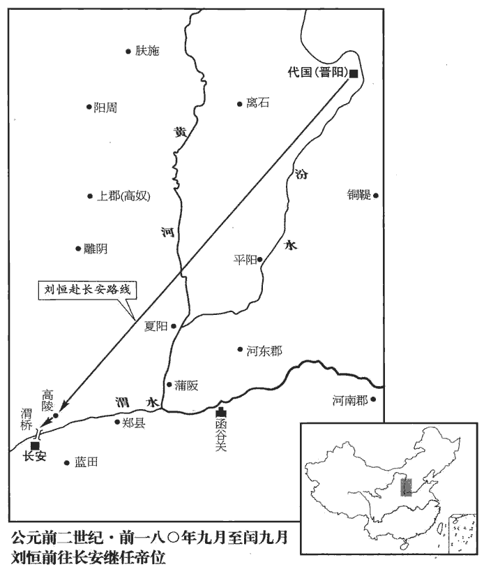

 漢紀五起閼逢攝提格（甲寅），盡昭陽大淵獻（癸亥），凡十年。

# 高皇后荀悅曰：諱「雉」之字曰「野雞」。索隱曰：字娥姁xǔ。應劭曰：禮，婦人從夫諡，故稱「高」也。師古曰：諱雉，故臣下諱雉也。姁，許於翻。

## 元年（甲寅，前一八七年）

1冬，太后‹吕雉›議欲立諸呂為王，問右丞相陵，陵曰：「高帝刑白馬盟曰：高祖刑白馬與群臣盟曰：「非劉氏不王，非有功不侯。」『非劉氏而王，天下共擊之。』今王呂氏，非約也。」太后不說，說，讀曰悅。問左丞相平、太尉勃，對曰：「高帝定天下，王子弟；今太后稱制，王諸呂，無所不可。」王，於況翻。太后喜。罷朝，朝，直遙翻。王陵讓陳平、絳侯曰：「始與高帝啑shà血盟，諸君不在邪！啑，所甲翻，小啜也。索隱引鄒氏，音使接翻。今高帝崩，太后女主，欲王呂氏；諸君縱欲阿意背約，背，蒲妹翻。何面目見高帝於地下乎？」陳平、絳侯曰：「於今，面折廷爭，謂當朝廷而諫諍。臣不如君；全社稷，定劉氏之後，君亦不如臣。」陵無以應之。十一月，甲子‹三›，太后以王陵為帝太傅，實奪之相權；陵遂病免歸‹河北博野东南›。

〖译文〗 [1]冬季，高太后吕雉在朝议时，提出准备册封几位吕氏外戚为诸侯王，征询右丞相王陵的意见，王陵回答说：“高帝曾与群臣杀白马饮血盟誓：‘假若有不是刘姓的人称王，天下臣民共同消灭他。’现在分封吕氏为王，不符合白马之盟所约。”太后很不高兴，又问左丞相陈平、太尉周勃，二人回答说：“高帝统一天下，分封刘氏子弟为王；现在太后临朝管理国家，分封几位吕氏为王，没有什么不可以的。”太后听了很高兴。朝议结束后，王陵责备陈平、周勃说：“当初与高皇帝饮血盟誓时，你们二位不在场吗？现在高帝驾崩了，太后以女主当政，要封吕氏为王，你们即使是要逢迎太后意旨而背弃盟约，可又有何脸面去见高帝于地下呢？”陈平、周勃对王陵说：“现在，在朝廷之上当面谏阻太后，我二人确实不如您；可将来安定国家，确保高祖子孙的刘氏天下，您却不如我二人。”王陵无言答对。十一月，甲子（疑误），太后明升王陵为皇帝的太傅，实际上剥夺了他原任右丞相的实权；王陵于是称病，被免职归家。

乃以左丞相平為右丞相；此時尚右，故陳平自左丞相遷右丞相。以辟陽侯審食其為左丞相，不治事，治，直之翻。令監宮中，如郎中令。言食其不董丞相職事，常監宮中若郎中令。監，古銜翻。食其故得幸于太后，公卿皆因而決事。

〖译文〗 太后升左丞相陈平为右丞相；任命辟阳侯审食其为左丞相，但不执行左丞相的职权，只负责管理宫廷事务，同郎中令一样。但审食其早就得太后宠幸，公卿大臣都要通过审食其裁决政事。

太后怨趙堯為趙隱王謀，乃抵堯罪。堯為趙王謀，事見上卷高祖十年。趙王如意，諡隱。諡法：隱拂不成曰隱；不顯尸國曰隱；見美堅長曰隱。為，於偽翻。

〖译文〗 太后对赵尧当年为高祖设谋保全赵王刘如意之事，一直耿耿于怀，便借故罗织罪名，罢免了他御史大夫的官职。

上党‹山西長子›守任敖嘗為沛‹江苏沛县›獄吏，有德于太后；乃以為御史大夫。任敖，沛人，少為獄吏。高祖常避吏，吏系呂后，遇之不謹，敖擊傷主呂后吏，故后德之。

〖译文〗 上党郡的郡守任敖，曾做过沛县的狱吏，对太后有恩德，太后就任用任敖为御史大夫。

太后又追尊其父臨泗侯呂公為宣王，兄周呂令武侯澤為悼武王，欲以王諸呂為漸。臨泗侯，班表：以后父賜號。索隱曰：應劭云：周呂，國也，按周及呂皆國名。濟陰有呂都縣，晉灼曰：呂，縣名，以為侯國。予據班志，呂縣屬楚國。令武，諡也。

〖译文〗 太后追尊其去世的父亲临泗侯吕公为宣王，追尊其兄周吕令武侯吕泽为悼武王，打算以此作为分封吕氏为王的开端。

2春，正月，除三族罪、妖言令。秦為威虐，罪之重者，戮及三族；過誤之語，以為妖言；故皆除之。

〖译文〗 [2]春季，正月，太后下令废除“三族罪”和“妖言令”。

3夏，四月，魯元公主薨；封公主子張偃為魯王‹府鲁县，山东曲阜›，諡公主曰魯元太后。

〖译文〗 [3]夏季，四月，太后的女儿鲁元公主去世，封公主之子张偃为鲁元王，议定公主的谥号为鲁元太后。

4辛卯‹二十八›，封所名孝惠子山為襄城侯，班志，襄城縣屬潁川郡。朝為軹zhǐ侯，軹縣屬河內郡。武為壺關侯。壺關縣屬上黨郡。

〖译文〗 [4]辛卯（二十八日），太后晋封号称是孝惠帝之子的刘山为襄城侯，刘朝为轵侯，刘武为壶关侯。

太后欲王呂氏，乃先立所名孝惠子強為淮陽‹河南淮陽›王，不疑為恒山‹河北正定›王；惠帝元年，淮陽王友徙王趙，今以封強。恒山郡本屬趙國，今割以封不疑。恒，戶登翻。使大謁者張釋風大臣。風，讀曰諷。考異曰：史記文帝本紀及惠景間侯者表、漢書匈奴傳皆作「澤」。史記呂后本紀：「八年，中大謁者張釋」，漢書紀作「釋卿」，恩澤侯表及周勃傳皆云「張釋」。顏師古註曰：荊燕吳傳云「張擇」。今從史記呂后本紀、漢書恩澤侯表。大臣乃請立悼武王長子酈侯台為呂王，蘇林曰：台，音胞胎之胎。索隱曰：鄭、鄒并音怡。考異曰：漢書外戚侯表及高五王傳皆作「鄜fū侯」。今從史記本紀、功臣侯表。割齊之濟南郡為呂國‹府东平陵，山东章丘›。濟，子禮翻。

〖译文〗 太后图谋分封吕氏为王，为了安抚刘氏宗室，就先立号称是孝惠帝之子的刘强为淮阳王，刘不疑为恒山王。又指使宦官大谒者张释，委婉巧妙地向大臣们说明太后分封吕氏为王的本意。于是，大臣们识趣地奏请太后立悼武王吕泽的长子郦侯吕台为吕王，把属于齐国的济南郡割出来，另立为吕国。

5五月，丙申‹四›，趙王宮叢台災。劉昭志：趙國邯鄲縣有叢台。

〖译文〗 [5]五月，丙申（初四），赵王宫中的丛台，发生了火灾。

6秋，桃、李華。

〖译文〗 [6]秋天，桃树、李树都不合时令地开了花。

## 二年（乙卯，前一八六年）

1冬，十一月，呂肅王台薨。考異曰：史記本紀：「高后元年，立孝惠子不疑為恒山王，呂台為呂王。」「二年，恒山王薨。」「十一月，呂王台薨。」年表，二人皆以元年薨。漢書本紀：「元年，立不疑、呂台、產、祿通為王。二年，不疑薨」。年表，元年，不疑及呂台為王，二年皆薨。蓋史記年表「薨」字應在二年，誤書于元年耳。其實二人皆以二年薨；漢書本紀云「產、祿通為王」，亦誤也。

〖译文〗 [1]冬季，十一月，吕肃王吕台去世。

2春，正月，乙卯‹二十七›，地震；羌道‹甘肅舟曲›、武都道‹甘肅西和西南蒿林乡›山崩。羌道，班志，縣，屬隴西郡。武都，時為縣。漢志：縣雜蠻夷曰道。武帝置武都郡。

〖译文〗 [2]春季，正月，乙卯（二十七日），发生大地震；羌道、武都道山体崩裂。

3夏，五月，丙申‹九›，封楚‹府彭城，江苏徐州›元王‹刘交›子郢客為上邳侯，齊‹府临淄，山东淄博东临淄镇›悼惠王‹刘肥›子章為朱虛侯，班志，東海下邳縣。應劭曰：邳在薛，其後徙此，故曰下邳。臣瓚曰：有上邳，故曰下邳。師古曰：瓚說是也。班志，朱虛縣屬琅邪郡。括地志：朱虛故城，在青州臨朐縣東六十里，漢朱虛也。十三州志：丹朱遊故虛，故云朱虛也。虛，猶丘也；朱，猶丹也。索隱：虛，音墟。考異曰：史記高后紀在元年，今從漢書王子侯表。令入宿衛；又以呂祿女妻章。妻，千細翻。

〖译文〗 [3]夏季，五月丙申（初九），太后封楚元王之子刘郢客为上邳侯，封齐悼惠王之子刘章为朱虚侯，令二人入宫担任侍卫，并把吕禄的女儿嫁给刘章为妻。

4六月，丙戌晦‹三十›，日有食之。

〖译文〗 [4]六月丙戌晦（三十日），出现日食。

5秋，七月，恒山‹府真定，河北正定›哀王不疑薨。恒，戶登翻。

〖译文〗 [5]秋季，七月，恒山哀王刘不疑去世。

6行八銖錢。應劭曰：本秦錢，質如周錢，文曰半兩，重如其文，即八銖也。漢以其太重，更鑄莢錢，今民間名榆莢錢是也。民患其太輕，至是復行八銖錢。

〖译文〗 [6]朝廷下令，发行八铢钱。

7癸丑‹二十七›，立襄成侯山為恒山王，更名義。更，工衡翻。

〖译文〗 [7]癸丑（二十七日），太后晋封原襄成侯刘山为恒山王，并为他改名刘义。

## 三年（丙辰，前一八五年）

1夏，江水、漢水溢，流四千餘家。班志：江水出蜀郡湔氐道徼外岷山，東南至江都入海。禹貢：嶓bō塚導漾，東流為漢。孔安國註曰：泉始出山為漾水，東南流為沔水，至漢中東行為漢水。班志：隴西氐道縣，禹貢漾水所出；至武都為漢。又于武都註曰：東漢水受氐道水，一名沔，過江夏，謂之夏水，入江。又，漢中郡有沔陽縣、如淳註曰：此方人謂漢水為沔水。師古曰：漢上曰沔。水經則以為沔、漾異源。漾出隴西氐道嶓塚山，東至武都沮縣為漢水。其流，東南歷白水、葭萌，又東南過巴郡閬中至江津縣而入于江；涪水注之；庾yǔ仲雍所謂內水者也。沔水出武都沮縣東狼谷中，一名沮水，東逕漢中郡沔陽、南鄭、成固等縣，又東逕西城、錫縣，又東逕南郡襄陽、中廬，即宜城郡當陽縣，又東逕江夏雲杜縣，又南至沙羨縣入江。予據禹貢，導漾東流為漢，又東為滄浪之水，過三澨shì‹句澨、雍澨、薳澨,其地在今湖北襄陽府宜城縣北›，至大別南入于江，則漢水源出於漾。據水經，則漾會於涪，沔入于江，所出異源，所入異派。據班志，則漾出隴西氐道，至武都為漢水；而東漢水受氐道水，通謂之沔，過江夏而入于江。則漾、沔似合為一矣，然又言沮水出沮縣南至沙羨入江，與水經所謂沔水即沮水說似不合而實合也。

〖译文〗 [1]夏季，长江、汉水泛滥成灾，淹没了四千多户人家。

2秋，星晝見。見，賢遍翻。

〖译文〗 [2]秋季，星星在白昼出现。

3伊水、洛水溢，流千六百餘家。班志：伊水出弘農郡熊耳山，東北入洛水。水經：伊水出南陽縣蔓渠山。酈道元註：即麓大同，陵巒互別耳。又班志：洛水出弘農上洛縣，東北至河南鞏縣入河。汝水溢，流八百餘家。應劭曰：汝水出弘農縣，入淮。水經：汝水出南陽魯陽縣之大盂山，東南逕潁川之郟jiá、定陵、郾yǎn，又東南過汝南之上蔡、平輿，南入於淮。

〖译文〗 [3]伊水、洛水泛滥，冲毁了一千六百多户人家的房屋。汝水泛滥，冲毁了八百户人家的房屋。

## 四年（丁巳，前一八四年）

1春，二月，癸未‹七›，立所名孝惠子太為昌平侯。班志，昌平縣屬上谷郡。

〖译文〗 [1]春季，二月，癸未（初七），太后封立号称为孝惠帝之子的刘太为昌平侯。

2夏，四月，丙申‹二十一›，太后封女弟媭為臨光侯。媭，音須。

〖译文〗 [2]夏季，四月，丙申（二十一日），太后封立她的妹妹吕为临光侯。

3少帝‹刘恭›寖長，自知非皇后‹张嫣›子，惠帝張皇后，魯元公主之女。太后以其無子，使陽為有身，取後宮美人子名之，而殺其母。少帝及義、朝、強、不疑皆是也。長，知兩翻。乃出言曰：「后安能殺吾母而名我！我壯，即為變！」太后聞之，幽之永巷‹宮廷監獄›中，言帝病。左右莫得見。太后語群臣曰：語，牛倨翻。「今皇帝病久不已，失惑昏亂，不能繼嗣治天下；治，直之翻。其代之。」群臣皆頓首言：「皇太后為天下齊民計，所以安宗廟、社稷甚深；群臣頓首奉詔。」遂廢帝，幽殺之。五月，丙辰‹十一›，立恒山王義為帝，更名曰弘；更，工衡翻。不稱元年，以太后制天下事故也。以軹侯朝為恒山王。恒，戶登翻。

〖译文〗 [3]少帝渐渐长大，自知并非惠帝张皇后的儿子，就发牢骚说：“皇后怎么能杀了我的生身之母而冒充我的母亲！我成人之后，就要复仇！”太后得知，就把少帝幽禁于后宫的永巷中，宣称少帝患病。任何人不得与少帝相见。太后告诉群臣说：“如今皇帝长期患病不愈，精神失常，不能继承皇统治理天下了；应该另立皇帝。”群臣都顿首回答：“皇太后的旨意，是为天下百姓着想，对于安宗庙、保国家必定产生深远影响；群臣顿首奉诏。”于是就废掉少帝，并暗中杀死。五月，丙辰（十一日），太后立恒山王刘义为皇帝，改名为刘弘。由于太后称制治理天下，所以新皇帝即位不称元年。太后立轵侯刘朝为恒山王。

4是歲，以平陽侯曹窋zhú為御史大夫。窋，張律翻。

〖译文〗 [4]这一年，太后任命平阳侯曹为御史大夫。

5有司請禁南越‹府番禺，广东广州›關市、鐵器。漢於邊關與蠻夷通市，謂之關市。南越王佗曰：「高帝立我，通使物。今高后聽讒臣，別異蠻夷，隔絕器物；此必長沙‹府临湘，湖南长沙›王‹吴臣›計，欲倚中國擊滅南越而并王之，自為功也。」使，疏吏翻。別，彼列翻。并王，於況翻。

〖译文〗 [5]有关官员奏请太后禁止南越国的关市中的铁器输出。南越王赵佗说：“高帝立我为王，使节往来，贸易不断。现在高后听信谗言，视我南越为蛮夷之国，禁绝物品贸易交流；这一定是长沙王的计谋，他想倚仗朝廷的势力击灭我南越国，统治长沙和南越两国之地，自己立功。”

## 五年（戊午，前一八三年）

1春，佗自稱南越武帝，韋昭曰：生以武為號，不稽古也。師古曰：此說非也。湯曰：「吾武甚，自號曰武王」。佗言武帝，亦猶是耳，何謂其不稽古乎！貢父曰：顏雖引成湯之言，然未知湯自號武王乎？聖人者，人與之名耳。詩謂湯為武王，亦猶書謂文王為寧王耳。史記之言，未可信也。發兵攻長沙，敗數縣而去。敗，補邁翻。

〖译文〗 [1]春季，赵佗自称南越武帝，发兵进攻长沙国，打败几个县的守军之后离去。

2秋，八月，淮陽‹河南淮陽›懷王彊薨；以壺關侯武為淮陽王。

〖译文〗 [2]秋季，八月，淮阳王刘强去世，太后立壶关侯刘武为淮阳王。

3九月，發河東‹山西夏縣›、上党‹山西长子›騎屯北地‹甘肃庆阳西北马岭镇›。

〖译文〗 [3]九月，征发河东郡和上党郡的骑兵，屯守北地郡。

4初令戍卒歲更。秦虐用其民，南戍五嶺，北築長城，戍卒連年不歸而死者多矣。至此，始令一歲而更。更，工衡翻。

〖译文〗 [4]朝廷首次下令实行戍卒每年一轮换的制度。

## 六年（己未，前一八二年）

1冬，十月，太后以呂‹府东平陵，山东章丘›王嘉居處驕恣，廢之。嘉，台之子也。二年，台薨，嘉嗣。處，昌呂翻。十一月，立肅王弟產為呂王。台，諡曰肅。

〖译文〗 [1]冬季，十月，太后因为吕王吕嘉在生活上骄恣乱法，废其王位。十一月，太后改立吕肃王吕台的弟弟吕产为吕王。

2春，星晝見。見，賢遍翻。

〖译文〗 [2]春季，星星白昼出现于天空。

3夏，四月，丁酉‹三›，赦天下。

〖译文〗 [3]夏季，四月，丁酉（初三），大赦天下。

4封朱虛侯章弟興居為東牟侯，班志，東牟縣屬東萊郡。賢曰：東牟故城，在今萊州文登縣西北。亦入宿衛。

〖译文〗 [4]太后封朱虚侯刘章的弟弟刘兴居为东牟侯，又诏令他参预宫廷宿卫。

5匈奴‹王庭设蒙古哈尔格林›寇狄道‹甘肅臨洮›，攻阿陽‹甘肅靜寧›。班志，狄道縣屬隴西郡；阿陽縣屬天水郡。

〖译文〗 [5]匈奴侵略狄道，进攻阿阳。

6行五分錢。應劭曰：所謂莢錢者。

〖译文〗 [6]朝廷下令，发行五分钱。

7宣平侯張敖卒，考異曰：史記呂后本紀，敖卒在明年六月。按史記功臣表：「高后六年，敖卒」；漢書功臣表，敖以高祖九年封，十七年薨；蓋本紀之誤。賜諡曰魯元王。張敖本嗣父耳爵為趙王。貫高之謀發，敖廢為宣平侯，仍尚魯元公主。及惠帝之世，齊悼惠王獻城陽郡以奉魯元。敖之卒也，因公主而賜諡曰魯元王。

〖译文〗 [7]宣平侯张敖去世，赐谥号为鲁元王。

## 七年（庚申，前一八一年）

1冬，十二月，匈奴寇狄道‹甘肅臨洮›，略二千餘人。

〖译文〗 [1]冬季，十二月，匈奴发兵进攻狄道，掳掠去两千多人。

2春，正月，太后召趙幽王友。惠帝元年，友自淮陽徙王趙。友以諸呂女為后，弗愛，愛他姬。諸呂女怒，去，讒之于太后曰：「王言『呂氏安得王！太后百歲後，吾必擊之。』」太后以故召趙王。趙王至，置邸，不得見，言置之趙邸也。師古曰：郡國朝宿之舍在京師者率名邸。邸，至也，言所歸至也。邸，丁禮翻。令衛圍守之，弗與食；其群臣或竊饋，輒捕論之。捕其饋者，以罪論之。丁丑‹十八›，趙王餓死，以民禮葬之長安民塚次。

〖译文〗 [2]春季，正月，太后召赵幽王刘友进京。刘友娶吕家之女为王后，但不爱她，而爱其他姬妾。这位吕姓王后一怒之下，离开赵国，向太后诬告刘友说：“赵王曾说：‘吕氏怎么能称王！待太后百年之后，我必定击灭吕氏。’”太后因此召赵王。赵王刘友到京，被安置于官邸中，见不到太后。太后令卫士包围其官邸，断绝饮食供应；赵国群臣有悄悄去给刘友偷送饮食的，一概逮捕论罪。丁丑（十八日），赵王刘友饿死，按平民的礼仪，葬于长安城外的平民墓地。

3己丑‹三十›，日食，晝晦。太后惡之，謂左右曰：「此為我也！」惡，烏路翻。為，於偽翻；下為之同。

〖译文〗 [3]己丑（三十日），发生日食，白昼之时一片晦暗。太后很厌恶这次日食，对左右侍从说：“这是因为我而发生的！”

4二月，徙梁‹府定陶，山东定陶›王恢為趙‹府邯郸，河北邯郸›王，呂王產為梁王。梁王不之國，為帝太傅。

〖译文〗 [4]二月，太后改封梁王刘恢为赵王，改封吕王吕产为梁王。梁王吕产并不到封国去，而在朝中做皇帝太傅。

5秋，七月，丁巳‹二十八›，立平昌侯太為濟川‹府东平陵，山东章丘›王。四年，封太為昌平侯；班表亦作「昌平」，此誤以「平」字在上。濟川，即濟南、濟北之地，蓋割齊封之。時太年幼，未嘗之國。濟，子禮翻。

〖译文〗 [5]秋季，七月，丁巳（疑误），太后立平昌侯刘太为济川王。

6呂媭女為將軍、營陵侯劉澤妻。班志，營陵縣屬北海郡，或曰營丘。應劭曰：師尚父封于營丘。陵，亦丘也。臣瓚曰：營丘，即臨淄、營陵，春秋謂之緣陵。師古曰：臨菑、營陵皆故營丘地。括地志：營陵故城，在青州北海縣南三十里。澤者，高祖從祖昆弟也。從，才用翻；下后從同。齊‹府临淄，山东淄博东临淄镇›人田生為之說大謁者張卿曰：張卿，即前大謁者張釋也。說，式芮翻。「諸呂之王也，諸大臣未大服。今營陵侯澤，諸劉最長；今卿言太后王之，長，知兩翻。王，於況翻。呂氏王益固矣。」張卿入言太后，太后然之，乃割齊之琅邪郡‹山东胶南›封澤為琅邪王。秦滅齊，以瀕海之地置琅邪郡；漢因之。考異曰：史記世家、漢書列傳，皆云田生先說張卿令風大臣立呂產為呂王，然後說令王澤。按太后自以呂王嘉驕恣廢之，以產代為呂王，非始封于呂；又諸呂之王已久，何必待田生之謀！以此不取。

〖译文〗 [6]吕之女是将军、营陵侯刘泽的妻子。刘泽是高祖的远支堂弟。齐人田生为刘泽向大谒者张卿说：“太后封诸吕为王，诸位大臣并不全都心服。营陵侯刘泽，在刘氏宗室中年龄最长，如果你现在能向太后建议封刘泽为王，那么，吕氏受封为王的格局就会更加稳定了。”张卿入宫报告太后，太后以为很有道理，就分割齐国的琅邪郡为诸侯国，封刘泽做了琅邪王。

7趙王恢之徙趙，心懷不樂。樂，音洛。太后以呂產女為王后，王后從官皆諸呂，擅權，微伺趙王，從，才用翻。趙王不得自恣。王有所愛姬，王后使人鴆殺之。六月，王不勝悲憤，自殺。勝，音升。太后聞之，以為王用婦人棄宗廟禮，諸侯王有國，所以奉宗廟也。今恢以愛姬之故，至於自殺，故以棄宗廟禮罪之。廢其嗣。

〖译文〗 [7]赵王刘恢自从被改封到赵地之后，心情郁郁不乐。太后把吕产的女儿配给刘恢为王后，王后左右从官都是吕氏，擅权干政，并暗地监视赵王言行，赵王不能自做主张，处处受制。赵王所宠爱的一个美姬，也被王后派人用毒酒毒死。六月，赵王刘恢无法克制悲愤而自杀。太后闻知此事，认为赵王因一妇人而轻弃事奉宗庙的大礼，不许他的后人继承赵国王位。

8是時，諸呂擅權用事；朱虛侯章，年二十，有氣力，忿劉氏不得職。嘗入侍太后燕飲，太后令章為酒吏。章自請曰：「臣將種也，將，即亮翻。種，章勇翻；下其種同。請得以軍法行酒。」太后曰：「可。」酒酣，章請為耕田歌；太后許之。章曰：「深耕穊jì種，立苗欲疏；非其種者，鋤而去之！」師古曰：穊，稠也。穊種，言多生子孫也。疏立者，四散置之，令為藩輔也。非其種者鋤而去之，以斥諸呂也。穊，音冀。去，羌呂翻。太后默然。頃之，諸呂有一人醉，亡酒，章追，拔劍斬之而還，報曰：「有亡酒一人，臣謹行法斬之！」師古曰：亡酒，避酒而逃亡也。太后左右皆大驚，業已許其軍法，無以罪也；因罷。自是之後，諸呂憚朱虛侯，雖大臣皆依朱虛侯，劉氏為益強。為，於偽翻；下因為同。

〖译文〗 [8]这一时期，诸吕把持朝政；朱虚侯刘章，年方二十，身强力壮，对刘氏宗室不能执掌政权心怀不满。他曾经在后宫侍奉太后参加酒宴，太后令刘章为监酒官。刘章自己请求说：“我本是将门之后，请太后允许我按军法监酒。”太后回答：“可以。”酒酣之时，刘章请求吟唱一首《耕田歌》；太后准许。刘章吟唱道：“深耕播种，株距要疏；不是同种，挥锄铲除！”太后知其歌中所指，默然无语。一会儿，参加宴席的诸吕中有一人醉酒，避席离去，刘章追上来，拔剑斩了此人，还报太后说：“有一人逃酒而走，我以军法将他处斩！”太后及左右人等都大吃一惊，但因业已同意他以军法监酒，也就无法将他治罪；于是散度。从此之后，诸吕都很惧怕朱虚侯刘章，即便是朝廷大臣也都要倚重他，刘氏宗室的势力由此而增强。

陳平患諸呂，力不能制，恐禍及己；嘗燕居深念，師古曰：以國家不安，故靜居獨慮其方策。陸賈往，直入坐；而陳丞相不見。師古曰：言不因門人將命而逕自入座，平方深思，不覺其至。坐，徂cú臥翻。陸生曰：「何念之深也！」陳平曰：「生揣我何念？」揣，初委翻，度也。陸生曰：「足下極富貴，無欲矣；然有憂念，不過患諸呂、少主耳。」陳平曰：「然。為之奈何？」陸生曰：「天下安，注意相；天下危，注意將。將相和調，則士豫附；師古曰：豫，素也。余謂豫，順也。天下雖有變，權不分。為社稷計，在兩軍【章︰甲十五行本「軍」作「君」；乙十一行本同；孔本同；退齋校同。】掌握耳。臣嘗【章︰甲十五行本「嘗」作「常」；乙十一行本同；孔本同。】欲謂太尉絳侯；絳侯與我戲，易吾言。謂，告語也。言絳侯素與之戲狎，輕易其言也。周勃封絳侯。班志，絳縣屬河東郡，晉之舊都。君何不交驩太尉，深相結！」因為陳平畫呂氏數事。陳平用其計，乃以五百金為絳侯壽，厚具樂飲；師古曰：厚為其具而與太尉樂飲。樂，音洛。太尉報亦如之。兩人深相結，呂氏謀益衰。陳平以奴婢百人、車馬五十乘、錢五百萬遺陸生為飲食費。遺，于季翻。

〖译文〗 陈平担忧诸吕横暴，自己又无力制止，恐怕大祸临头，曾独居静室，苦思对策。恰在此时陆贾来访，未经通报直入室中坐下，陈丞相正苦思冥想，竟未察觉。陆贾说：“丞相思虑何事，竟然如此全神贯注！”陈平说：“先生猜测我思虑何事？”陆贾说：“您富贵无比，不会有什么欲望了；但是，您却有忧虑，不外乎是担心诸吕和皇上年幼罢了。”陈平说：“先生猜得对。此事应该怎么办呢？”陆贾说：“天下安，注意相；天下危，注意将。将与相关系和谐，士人就会归附；天下即使有重大变故，大权也不会被瓜分。安定国家的根本大计，就在你们二位文武大臣掌握之中。我曾想对太尉绛侯周勃说明这一利害关系，绛侯平素与我常开玩笑，不会重视我的话。丞相为何不与太尉交好，密崐切联合呢！”接着陆贾为陈平谋划将来平定诸吕的几个关键问题。陈平采纳陆贾的计谋，用五百斤黄金为绛侯周勃祝寿，举办丰盛的宴席，太尉周勃也以同样的礼节回报。陈平与周勃互相紧密团结，吕氏图谋篡国的心气渐渐衰减。陈平送给陆贾一百个奴婢、五十乘车马、五百万钱做为饮食费。

9太后使使告代‹府晋阳，山西太原›王，高祖七年，立子恒為代王。欲徙王趙‹府邯郸›。王，於況翻。代王謝之，願守代邊。太后乃立兄子呂祿為趙王，追尊祿父建成康侯釋之為趙昭王。

〖译文〗 [9]太后派使臣告知代王刘恒，准备改封他到赵国为王。代王谢绝了，自称愿守代地边境。于是，太后封立其兄之子吕禄为赵王，追尊吕禄的父亲建成侯吕释之为赵昭王。

10九月，燕‹北京›靈王建薨；有美人子，太后使人殺之。國除。高祖初封盧綰于燕，綰入匈奴，乃立建為燕王。美人子，美人所生之子也。

〖译文〗 [10]九月，燕王刘建去世；刘建本有美人所生一子，太后派人将其子杀死。燕国被废除。

11遣隆慮侯周竈將兵擊南越‹都番禺，廣東廣州›。班志，隆慮縣屬河內郡；至後漢，避殤帝諱，改曰林慮。慮，音閭。

〖译文〗 [11]太后派遣隆虑侯周灶领兵进攻南越国。

## 八年（辛酉，前一八零年）

1冬，十月，辛丑‹十六›，立呂肅王子東平侯通為燕王；東平，地名，在濟東；宣帝甘露二年為東平國。封通弟莊為東平侯。

〖译文〗 [1]冬季，十月，辛丑（疑误），太后封立吕肃王之子东平侯吕通为燕王；封吕通之弟吕庄为东平侯。

2三【張︰「三」上脫「春」字。】月，太后祓fú，還，過軹道‹陝西西安東北›，師古曰：祓者，除惡之祭。祓，音廢，又敷勿翻。見物如蒼犬，撠jǐ太后掖，師古曰：撠，謂拘持之也。撠，音戟。拘，居足翻。掖，與腋同。忽不復見。卜之，云「趙王如意為祟」。祟，雖遂翻，神禍也，鬼厲也。太后遂病掖傷。

〖译文〗 [2]三月，太后参加了除恶的祭仪后还宫，途经轵道，见到类似于灰狗的动物，猛扑太后腋窝，转眼间消失不再出现。太后令人占卜此事，回答说：“这是赵王刘如意在闹鬼。”从此，太后腋窝伤痛不止。

太后為外孫魯王偃年少孤弱，偃，張敖子。為，子偽翻。夏，四月，丁酉‹十五›，封張敖前姬兩子侈為新都侯，班志，新都縣屬南陽郡。壽為樂昌侯，徐廣曰：樂昌，今細陽之池陽鄉。余據班志，細陽縣屬汝南郡；又東郡有樂昌縣。考異曰：史記惠景間侯者表「新都」作「信都」；「壽」作「受」。今從本紀。以輔魯王。又封中大謁者張釋為建陵侯，如淳曰：灌嬰為中謁者，後常以閹人為之；諸官加中者，多閹人也。班志，建陵縣屬東海郡。以其勸王諸呂，賞之也。

〖译文〗 太后因为外孙鲁王张偃年少孤弱，夏季，四月，丁酉（十五日），封张敖姬妾所生二子张侈为新都侯、张寿为乐昌侯，以辅助鲁王张偃。太后又封中大谒者张释为建陵侯，以奖赏他从前劝大臣奏请封立诸吕为王的功劳。

3江‹长江›、漢‹嘉陵江›水溢，流萬餘家。

〖译文〗 [3]长江、汉水泛滥成灾，冲毁了一万多户百姓家园。

4秋，七月，太后病甚，乃令趙王祿為上將軍，居北軍；呂王產居南軍。班表：中壘校尉掌北軍壘門外。又有中尉掌徼循京師，屬官有中壘、寺互等令、丞。至後漢始置北軍中候，掌監五營。劉昭註曰：舊有中壘校尉，領北軍營壘之事；中興，省中壘，但置中候以監五營。又據班表：中壘以下八校尉，皆武帝置。意者武帝以前，北軍屬中尉，故領中壘令、丞等官；南軍蓋衛尉所統。班表：衛尉掌宮門衛屯兵。周勃之入北軍也，尚有南軍。乃先使曹窋zhú告衛尉毋入呂產殿門，然後使朱虛侯逐產，殺之未央宮郎中府吏廁中，以此知南軍屬衛尉也。太后誡產、祿曰：「呂氏之王，大臣弗平。我即崩，帝年少，大臣恐為變。必據兵衛宮，慎毋送喪，為人所制！」辛巳‹三十›，太后崩，遺詔：大赦天下，以呂王產為相國，以呂祿女為帝后。高后已葬，以左丞相審食其為帝太傅。考異曰：史記將相表：「八年七月辛巳，食其為太傅；」「九月丙戌，復為丞相；後九月免。」漢書公卿表：「七年七月辛巳，食其為太傅；」「八年九月，復為丞相；後九月免。」以長曆推之：八年七月無辛巳，九月無丙戌，閏月群臣代邸上議，無食其名。二表皆誤，今從史記本紀，免相在此月。本紀又云：「八月壬戌，食其復為左丞相。」亦誤。

〖译文〗 [4]秋季，七月，太后病重，于是下令任命赵王吕禄为上将军，统领北军；吕王吕产统领南军。太后告诫吕产、吕禄说：“封立吕氏为王，大臣心中多不服。我就要去世，皇帝年幼，恐怕大臣们乘机向吕氏发难。你们务必要统率禁军，严守宫廷，千万不要为送丧而轻离重地，以免被人所制！”辛巳（三十日），太后去世，留下遗诏：大赦天下，命吕王吕产为相国，以吕禄之女为皇后。高后丧事处理完毕，朝廷改任左丞相审食其为皇帝太傅。

5諸呂欲為亂，畏大臣絳、灌等，未敢發。朱虛侯以呂祿女為婦，故知其謀，乃陰令人告其兄齊王，欲令發兵西，朱虛侯、東牟侯為內應，以誅諸呂，立齊王為帝。齊王乃與其舅駟鈞、郎中令祝午、中尉魏勃陰謀發兵。齊相召平弗聽。班表：諸侯王，高祖初置有太傅輔王，內史治國民，中尉掌武職，丞相統眾官，如漢朝。景帝中五年，令諸侯王不得復治國，天子為置吏，改丞相曰相。武帝分漢內史為左右，後又更右為京兆尹，左為馮翊，中尉為執金吾，郎中令為光祿勳；故王國如故，損其郎中令秩千石；改太僕曰僕，秩亦千石。成帝綏和元年，更令相治民如郡太守，中尉如郡都尉。康曰：廣陵人召平與東陵侯召平及此召平，凡三人。此召平之子奴，以平死事封黎侯，見功臣表。召，與邵同。姓譜：駟，鄭七穆駟氏之後。祝，周武王封黃帝之後于祝，後以為氏。八月，丙午‹二十六›，齊王欲使人誅相；相聞之，乃發卒衛王宮。魏勃紿邵【章︰甲十五行本「邵」作「召」；乙十一行本同；孔本同。】平曰：「王欲發兵，非有漢虎符驗也。應劭曰：銅虎符第一至第五，國家當發兵，遣使者至郡合符，符合乃聽受之。張晏曰：符以代古之圭璋，從簡易也。予據史記文帝紀：「三年九月，初與郡國守相為銅虎符。」既有「初」字，則前乎文帝之時當未有銅虎符也。召平、魏勃事在三年之前，何緣有虎符發兵！班史于文紀三年，只書「初與郡守為銅虎符」，汰去「國相」二字。溫公則但書勃語於此，而文紀不復書，豈亦有疑於此邪？而相君圍王固善，勃請為君將兵衛王。」為，於偽翻。召平信之。勃既將兵，遂圍相府；召平自殺。於是齊王以駟鈞為相，魏勃為將軍，祝午為內史，悉發國中兵。

〖译文〗 [5]诸吕打算作乱，因惧怕大臣周勃、灌婴等人，未敢贸然行事。朱虚侯刘章娶吕禄之女为妻，所以得知吕氏的阴谋，就暗中派人告知其兄齐王刘襄，让齐王统兵西征，朱虚侯、东牟侯为他做内应，图谋诛除吕氏，立齐王为皇帝。齐王就与他舅父驷钧、郎中令祝午、中尉魏勃暗中密谋发兵。齐相召平反对举兵。八月，丙午（二十六日），齐王准备派人杀国相召平；召平得知，就发兵包围了王宫。魏勃欺骗召平说：“齐王没有汉朝廷的发兵虎符，就要发兵，崐这是违法的。您发兵包围了齐王本是对的，我请求为您带兵入宫软禁齐王。”召平信以为真，让魏勃指挥军队。魏勃掌握统兵权之后，就命令包围相府；召平自杀。于是，齐王命驷钧为相，魏勃为将军，祝午为内史，征发齐国的全部兵员。

使祝午東詐琅邪‹府琅邪，山东胶南›王曰：琅邪王，劉澤也。三年，割齊琅邪封之。「呂氏作亂，齊王發兵欲西誅之。齊王自以年少，不習兵革之事，願舉國委大王。大王，自高帝將也；言澤自高帝時為將。請大王幸之臨菑，見齊王計事。」臨菑，即古營丘，齊國所都。琅邪王信之，西馳見齊王。齊王因留琅邪王，而使祝午盡發琅邪國兵，并將之。考異曰：史記澤世家、漢書傳，皆以為澤與齊王合謀；蓋誤。今從史記呂后本紀、齊王世家、漢書呂后紀、齊王傳。琅邪王說齊王曰：「大王，高皇帝適長孫也，當立；適，讀曰嫡。齊王襄，悼惠王之子，高帝之長孫也。長，知兩翻；下同。今諸大臣狐疑未有所定；而澤于劉氏最為長年，大臣固待澤決計。今大王留臣，無為也，不如使我入關計事。」齊王以為然，乃益具車送琅邪王。琅邪王既行，齊遂舉兵西攻濟南；濟南本屬齊，元年割以封呂台；台卒，產嗣封。遺諸侯王書，遺，于季翻。陳諸呂之罪，欲舉兵誅之。

〖译文〗 齐王派祝午到东面的琅邪国，欺骗琅邪王刘泽说：“吕氏在京中发动变乱，齐王发兵，准备西入关中诛除吕氏。齐王因为自己年轻，又不懂得军旅战阵之事，自愿把整个齐国听命于大王的指挥。大王您在高祖时就已统兵为将，富有军事经验；请大王光临齐都临淄，与齐王面商大事。”琅邪王信以为真，迅速赶往临淄见齐王。齐王乘机扣留了琅邪王，而指令祝午全部征发琅邪国的兵员，一并由自己统领。琅邪王对齐王说：“大王是高皇帝的嫡长孙，应当立为皇帝；现在朝中大臣对立谁为帝犹豫不定，而我在刘氏宗室中年龄最大，大臣们本当等着由我决定择立皇帝的大计。现在大王留我在此处，我无所作为，不如让我入关计议立帝之事。”齐王认为他说得有道理，就准备了许多车辆为琅邪王送行。琅邪王走后，齐王就出兵向西攻济南国；齐王还致书于各诸侯王，历数吕氏的罪状，表明自己起兵灭吕的决心。

相國呂產等聞之，乃遣潁陰侯灌嬰將兵擊之。班志，潁陰縣屬潁川郡。灌嬰至滎陽，謀曰：「諸呂擁兵關中，欲危劉氏而自立。今我破齊還報，此益呂氏之資也。」乃留屯滎陽，使使諭齊王及諸侯與連和，以待呂氏變，共誅之。齊王聞之，乃還兵西界待約。

〖译文〗 相国吕产等人闻讯齐王举兵，就派颍阴侯灌婴统兵征伐。灌婴率军行至荥阳，与其部下计议说：“吕氏在关中手握重兵，图谋篡夺刘氏天下，自立为帝。如果我们现在打败齐军，回报朝廷，这就增强了吕氏的力量。”于是，灌婴就在荥阳屯兵据守，并派人告知齐王和诸侯，约定互相联合，静待吕氏发起变乱，即一同诛灭吕氏。齐王得知此意，就退兵到齐国的西部边界，待机而动。

呂祿、呂產欲作亂，內憚絳侯、朱虛等，外畏齊、楚兵，又恐灌嬰畔之，欲待灌嬰兵與齊合而發，猶豫未決。

〖译文〗 [5]吕禄、吕产想发起变乱，但内惧朝中绛侯周勃、朱虚侯刘章等人，外怕齐国和楚国等宗室诸王的重兵，又恐手握军权的灌婴背叛吕氏，打算等灌婴所率汉兵与齐军交战之后再动手，所以犹豫未决。

當是時，濟川王太、淮陽王武、常山王朝及魯王張偃皆年少，未之國，居長安；趙王祿、梁王產各將兵居南、北軍；皆呂氏之人也。列侯群臣莫自堅其命。

〖译文〗 此时，济川王刘太、淮阳王刘武、常山王刘朝及鲁王张偃，都年幼，没有就职于封地，居住于长安；赵王吕禄、梁王吕产分别统率南军和北军，都是吕氏一党。列侯群臣没有人能自保安全。

太尉絳侯勃不得主兵。曲周侯酈商老病，班志，曲周縣屬廣平國。其子寄與呂祿善。絳侯乃與丞相陳平謀，使人劫酈商，令其子寄往紿說呂祿曰：「高帝與呂后共定天下，劉氏所立九王，楚王交，高祖弟。代王恒、淮南王長，高祖子。吳王濞bì，高祖侄。琅邪王澤，劉氏疏屬。齊王襄，高祖孫。常山王朝、淮陽王武、濟川王太，惠帝子。說，式芮翻。呂氏所立三王，梁王呂產，趙王呂祿，燕王呂通也。皆大臣之議，事已佈告諸侯，【章︰甲十五行本重「諸侯」二字；乙十一行本同；孔本同；張校同。】皆以為宜。今太后崩，帝少，而足下佩趙王印，不急之國守藩，乃為上將，將兵留此，為大臣諸侯所疑。足下何不歸將印，以兵屬太尉；屬，之欲翻；下同。請梁王歸相國印，與大臣盟而之國。齊兵必罷，大臣得安，足下高枕而王千里，此萬世之利也。」而王，於況翻。呂祿信然其計，欲以兵屬太尉；使人報呂產及諸呂老人，或以為便，或曰不便，計猶豫未有所決。

〖译文〗 太尉绛侯周勃手中没有军权。曲周侯郦商年老有病，其子郦寄与吕禄交好。绛侯就与丞相陈平商定一个计策，派人劫持了郦商，让他儿子郦寄去欺骗吕禄说：“高帝与吕后共同安定天下，立刘氏九人为诸侯王，立吕氏三人为诸侯王，都是经过朝廷大臣议定的，并已向天下诸侯公开宣布，诸侯都认为理应如此。现在太后驾崩，皇帝年幼，您身佩赵王大印，不立即返回封国镇守，却出崐任上将，率兵留在京师，必然会受到大臣和诸侯王的猜忌。您为何不交出将印，把军权还给太尉，请梁王归还相国大印给朝廷，您二人与朝廷大臣盟誓后各归封国？这样，齐兵必会撤走，大臣也得以心安，您高枕无忧地去做方圆千里的一国之王，这是造福于子孙万代的事。”吕禄相信了郦寄的计谋，想把军队交给太尉统率；派人把这个打算告知吕产及吕氏长辈，有人同意，有人反对，计策犹豫未决。

呂祿信酈寄，時與出遊獵，過其姑呂媭。媭大怒曰：媭，呂后之妹，樊噲之妻；於祿，姑也。過，工禾翻。「若為將而棄軍，呂氏今無處矣！」乃悉出珠玉、寶器散堂下，曰：「毋為他人守也！」

〖译文〗 吕禄信任郦寄，经常结伴外出游猎，途中曾前往拜见其姑母吕。吕大怒说：“你身为上将而轻易地离军游猎，吕氏如今将无处容身了！”吕把家中的珠玉、宝器全拿出来，抛散到堂下，说：“不要为别人守着这些东西了！”

九月，庚申‹十›旦，考異曰：史記本紀，「八月庚申旦」上有「八月丙午」。漢書高后紀亦云「八月庚申」。今以長曆推之，下「八月」當為「九月」。平陽侯窋zhú行御史大夫事，見相國產計事。郎中令賈壽使從齊來，姓譜：周康王封唐叔虞少子公明于賈城，子孫以國為氏。又，晉大夫賈季食邑于賈，其後以邑為氏。因數產曰：「王不早之國；今雖欲行，尚可得耶！」數，所具翻。具以灌嬰與齊、楚合從欲誅諸呂告產，師古曰：齊、楚俱在山東，連兵西鄉，欲誅諸呂，亦猶六國為從以敵秦，故謂之合從也。從，子容翻。且趣產急入宮。趣，讀曰促。平陽侯頗聞其語，馳告丞相、太尉。

〖译文〗 九月，庚申（初十）清晨，行使御史大夫职权的平阳侯曹，前来与相国吕产议事。郎中令贾寿出使齐国返回，批评吕产说：“大王不早些去封国，现在即便是想去，还能够吗！”贾寿把灌婴已与齐、楚两国联合欲诛灭吕氏的事告诉了吕产，并且催吕产迅速入据皇宫，设法自保。平阳侯曹听到了贾寿的话，快马加鞭，赶来向丞相和太尉报告。

太尉欲入北軍，不得入。襄平侯紀通尚符節，乃令持節矯內太尉北軍。班志，襄平縣屬遼東郡。張晏曰：紀通，紀信子也。尚，主也；今符節令也。晉灼曰：紀信焚死，不見其後。功臣表云：通，紀成之子，以成死事故封侯。貢父曰：漢祖以善用人得天下，豈忘紀信之功哉！疑成者，即信之一名也。通尚符節，故使持節矯以帝命內勃北軍。內，讀曰納。太尉復令酈寄與典客劉揭先說呂祿曰：復，扶又翻。班志：典客，秦官，掌諸侯、歸義蠻夷；景帝中六年，更名大行令；武帝太初元年，更名大鴻臚。揭，音竭。「帝使太尉守北軍，欲足下之國。急歸將印，辭去！不然，禍且起。」呂祿以為酈況不欺己，遂解印屬典客，而以兵授太尉。太尉至軍，呂祿已去。太尉入軍門，行令軍中曰：「為呂氏右袒，為劉氏左袒！」師古曰：袒者，脫衣袖而肉袒也；左、右袒者，偏脫其一耳。袒，徒旱翻。鄭氏註覲禮云：凡為禮事者左袒；若請罪待刑則右袒。軍中皆左袒。太尉遂將北軍；然尚有南軍。丞相平乃召朱虛侯章佐太尉；太尉令朱虛侯監軍門，監，古銜翻。令平陽侯告衛尉：「毋入相國產殿門！」衛尉，掌宮門衛屯兵。平陽侯時為御史大夫，蓋將丞相之命以告衛尉，使毋納產也。

〖译文〗 太尉想进入北军营垒，但被阻止不得入内。襄平侯纪通负责典掌皇帝符节，太尉便命令他持节，伪称奉皇帝之命允许太尉进入北军营垒。太尉又命令郦寄和典客刘揭先去劝说吕禄：“皇帝指派太尉代行北军指挥职务，要您前去封国。立即交出将印，告辞赴国！否则，将有祸事发生！”吕禄认为郦寄不会欺骗自己，就解下将军印绶交给典客刘揭，而把北军交给太尉指挥。太尉进入北军时，吕禄已经离去。太尉进入军门，下令军中说：“拥护吕氏的袒露右臂膀，拥护刘氏的袒露左臂膀！”军中将士全都袒露左臂膀。太尉就这样取得了北军的指挥权。但是，还有南军未被控制。丞相陈平召来朱虚侯刘章辅佐太尉。太尉令朱虚侯监守军门，又令平阳侯曹告诉统率宫门禁卫军的卫尉说：“不许相国吕产进入殿门！”

呂產不知呂祿已去北軍，乃入未央宮，欲為亂。至殿門，弗得入，徘徊往來。平陽侯恐弗勝，馳語太尉。語，牛倨翻。太尉尚恐不勝諸呂，未敢公言誅之，乃謂朱虛侯曰：「急入宮衛帝！」朱虛侯請卒，太尉予卒千餘人。予，讀曰與。入未央宮門，見產廷中。日餔bū時，申時食為餔。餔，奔謨翻。遂擊產；產走。天風大起，以故其從官亂，莫敢斗；逐產，殺之郎中府吏廁中。如淳曰：郎中令，掌宮殿門戶，故府在宮中。從，才用翻。朱虛侯已殺產，帝命謁者持節勞朱虛侯。勞，力到翻。朱虛侯欲奪其節，謁者不肯。朱虛侯則從與載，因節信馳走，師古曰：因謁者所持之節，用為信也。章與謁者同車，故為門者所信，得入長樂宮。斬長樂衛尉呂更始。更，工衡翻。還，馳入北軍報太尉，太尉起拜賀。朱虛侯曰：「所患獨呂產；今已誅，天下定矣！」遂遣人分部悉捕諸呂男女，無少長皆斬之。分，扶問翻。辛酉，捕斬呂祿而笞殺呂媭，使人誅燕王呂通而廢魯王張偃。戊辰，徙濟川王王梁。呂產既誅，故徙太王梁。遣朱虛侯章以誅諸呂事告齊王，令罷兵。

〖译文〗 吕产不知吕禄已离开北军，进入未央宫，准备作乱。吕产来到殿门前，无法入内，在殿门外徘徊往来。平阳侯恐怕难以制止吕产入宫，策马告知太尉。太尉还怕未必能战胜诸吕，没敢公开宣称诛除吕氏，就对朱虚侯说：“立即入宫保卫皇帝！”朱虚侯请求派兵同往，太尉拨给他一千多士兵。朱虚侯进入未央宫门，见到吕产正在廷中。时近傍晚，朱虚侯立即率兵向吕产冲击，吕产逃走。天空狂风大作，因此吕产所带党羽亲信慌乱，都不敢接战搏斗；朱虚侯等人追逐吕产，在郎中府的厕所中将吕产杀死。朱虚侯已杀吕产，皇帝派谒者持皇帝之节前来慰劳朱虚侯。朱虚侯要夺皇帝之节，谒者不放手，朱虚侯就与持节的谒者共乘一车，凭着皇帝之节，驱车疾驰，斩长乐卫尉吕更始。事毕返回崐，驰入北军，报知太尉。太尉起立向朱虚侯拜贺说：“最令人担忧的就是吕产。现在吕产被杀，天下已定！”于是，太尉派人分头逮捕所有吕氏男女，不论老小一律处斩。辛酉（十一日），捕斩吕禄，将吕乱棒打死，派人杀燕王吕通，废除鲁王张偃。戊辰（十八日），改封济川王刘太为梁王，派朱虚侯刘章去告知齐王，吕氏已被诛灭，令齐罢兵。

灌嬰在滎陽‹河南滎陽›，聞魏勃本教齊王舉兵，使使召魏勃至，責問之。勃曰：「失火之家，豈暇先言丈人而後救火乎！」因退立，股戰而栗，師古曰：言以社稷將危，故舉兵而正之，不暇待有詔命也。股，腳也。戰者，懼之甚也。栗，與慄同。恐不能言者，終無他語。灌將軍熟視笑曰：「人謂魏勃勇；妄庸人耳，何能為乎！」乃罷魏勃。灌嬰兵亦罷滎陽歸。

〖译文〗 灌婴驻扎荥阳，闻知魏勃原先教唆齐王举兵，便派人召魏勃来见，加以责问。魏勃回答说：“家中失火的时候，哪有空闲时间先请示长辈而后才救火呢！”随即退立一旁，两腿颤抖不止，吓得说不出话来，直到最后也说不出别的话，为自己辩解。灌将军仔细审视魏勃，笑着说：“人说魏勃武勇，其实不过是个狂妄而平庸的人罢了，能有什么作为呢！”于是赦免魏勃不加追究。灌婴所统率的军队也从荥阳撤回长安。

班固贊曰：孝文‹刘恒›時，天下以酈寄為賣友。言寄與祿友善，詭說之出遊，因奪其兵而誅之，是寄賣友也。夫賣友者，謂見利而忘義也。若寄父為功臣而又執劫；雖摧呂祿以安社稷，誼存君親可也。師古曰：周勃劫其父，令其子行說。予謂劫者，劫質也。蓋劫寄父商為質，諭以不行說祿將殺之也。蓋當時皆以寄為賣友，故固發明父子、朋友各有其倫，為人臣子者當知所緩急先後也。

〖译文〗 班固赞曰：孝文帝时，天下人都批评郦寄出卖朋友。所谓出卖朋友，是指见利忘义。至于郦寄，他的父亲本是汉室开国功臣，而且又被周勃等人劫持；郦寄的行为，虽使朋友吕禄被杀，却安定了国家，顾全了君臣父子的伦理大义，还是可以的。

6諸大臣相與陰謀曰：「少帝及梁、淮陽、恒山王，皆非真孝惠子也；呂后以計詐名他人子，殺其母，養後宮，令孝惠子之，立以為後及諸王，以強呂氏。今皆已夷滅諸呂，而所立即長，用事，吾屬無類矣！長，知兩翻；下同。不如視諸王最賢者立之。」或言：「齊王，高帝長孫，可立也。」大臣皆曰：「呂氏以外家惡而幾危宗廟，亂功臣。幾，居衣翻。今齊王舅駟鈞，虎而冠；言駟鈞惡戾，如虎而著冠。即立齊王，復為呂氏矣。代王方今高帝見子最長，仁孝寬厚；太后家薄氏謹良。言高帝見在諸子惟代王為最長也。見，賢遍翻。代王，高帝姬薄氏所生。薄姓，戰國已有之；風俗通：衛有賢人薄疑。且立長固順，況以仁孝聞天下乎！」乃相與共陰使人召代王。

〖译文〗 [6]诸位大臣暗地共同商量说：“少帝和梁王、淮阳王、恒山王，都不真是孝惠帝的儿子，当年吕后设计取他人的儿子，杀死他们的生母，把他们收养在后宫中，令孝惠帝认做儿子，立为继承人和诸侯王，用来加强吕氏的力量。现在，吕氏已被灭族，但吕氏所立的人，很快就要长大，等他们掌握实权，我们恐怕都要被灭族！不如从诸侯王中另选最贤者立为皇帝。”有人说：“齐王，是高帝的长孙，可立他为帝。”大臣们都说：“吕氏正因为外戚强横，几乎危及皇帝宗庙，摧残功臣，现在齐王的舅舅驷钧，为人暴恶好像戴着冠帽的老虎，假若立齐王为帝，驷钧一族就会成为第二个吕氏。代王是高帝在世诸子中年龄最大的一位，为人仁孝宽厚，太后薄氏一家谨慎温良。立年长的本来就名正言顺，更何况代王又以仁孝而闻名于天下呢！”于是，大臣们共同议定拥立代王为帝，并暗地派人召代王入京。

代王問左右，郎中令張武等曰：「漢大臣皆故高帝時大將，習兵，多謀詐。此其屬意非止此也，師古曰：言常有異志也。屬意，猶言注意也。屬，音之欲翻。特畏高帝、呂太后威耳。今已誅諸呂，新啑血京師，索隱曰：漢書作「喋」，音跕dié，丁牒翻。陳湯、杜業皆言「喋血」，無盟歃事。廣雅曰：喋，履也。予據類篇：啑字有色甲、色洽二翻。既從啑字音義，當與歃同；若從喋字，則有履之義。公羊傳曰：京，大也；師，眾也：天子之居，必以眾大之辭言之。此以迎大王為名，實不可信。願大王稱疾毋往，以觀其變。」中尉宋昌進曰：「群臣之議皆非也。夫秦失其政，諸侯、豪桀并起，人人自以為得之者以萬數，然卒踐天子之位者，劉氏也；卒，子恤翻；下同。天下絕望，一矣。高帝封王子弟地，犬牙相制，此所謂磐石之宗也；師古曰：言地形如犬之牙，交而相入也。石大而下平，磐據地面，不可得而移動，故以為喻也。王，於況翻。天下服其強，二矣。漢興，除秦苛政，約法令，施德惠，人人自安，難動搖，三矣。夫以呂太后之嚴，立諸呂為三王，擅權專制；然而太尉以一節入北軍一呼，呼，火故翻。士皆左袒，為劉氏，叛諸呂，卒以滅之。此乃天授，非人力也。今大臣雖欲為變，百姓弗為使，為，於偽翻。使，如字。其党寧能專一邪！方今內有朱虛、東牟之親，外畏吳、楚、淮陽、琅邪、齊、代之強。「淮陽」，史記作「淮南」，當從之。方今高帝子，獨淮南王與大王；大王又長，長，知兩翻。賢聖仁孝聞於天下，聞，音問。故大臣因天下之心而欲迎立大王。大王勿疑也！」代王報太后計之，猶豫未定。卜之，兆得大橫，應劭曰：龜曰兆，筮曰卦。卜者以荊灼龜，文正橫也。占曰：「大橫庚庚，余為天王，夏啟以光。」服虔曰：庚庚，橫貌。李奇曰：庚庚，其繇zhòu文也。占，謂其繇也。張晏曰：先是五帝官天下，老則嬗shàn賢；至夏啟始傳嗣，能光先君之業。文帝亦襲父跡，言似啟也。師古曰：繇，丈救翻，本作「籀」。籀zhòu，書也。謂讀卜詞。孔穎達曰：兆者，龜之舋xìn坼chè；繇者，卜之文辭。代王曰：「寡人固已為王矣，又何王？」卜人曰：「所謂天王者，乃天子也。」於是代王遣太后弟薄昭往見絳侯，絳侯等具為昭言所以迎立王意。為，於偽翻。薄昭還報曰：「信矣，毋可疑者。」毋，與無通。代王乃笑謂宋昌曰：「果如公言。」

〖译文〗 代王就此征询左右亲信大臣意见，郎中令张武等人说：“汉廷大臣都是当年高帝开国时的大将，精通军事，多有诡诈奇计。这些人的愿望并不止于已有的权位，只是畏惧高帝、吕太后的严威罢了。现在，他们已诛除诸吕，刚喋血京师，此来以迎接大王为名，实在不可轻信。希望大王自称有病，不要前去长安，静观政局变化。”中尉宋昌却说：“各位的意见都是错误的。当年，秦失去了政权，诸侯、豪杰蜂拥而起，自以为可以得天下的人，数以万计，但最后登上天子之位的是刘氏；天下人不敢再有称帝的奢望，这是第一条。高帝分封子弟为诸侯王，封地犬牙交错，可以控制天下，这就是所谓宗族稳如磐石，天下人信服它的强大，这是第二条。汉朝建立之后，废除秦的苛政，简省法令，推行德政，百姓安居乐业，很难动摇，这是第三条。以吕太后的威严，封立吕氏三人为王，独掌大权专制朝政，然而，太尉仅凭一个符节，进入北军一呼，军士全都左袒，拥护刘氏，背叛诸吕，终于消灭了吕氏。刘氏的帝位，来源于天授，不是靠人力争夺而得。现在，即使大臣另有异谋，百姓也不会为其所用，他们的党羽难道能够统一吗！现在，朝内有朱虚侯、东牟侯这样的宗室大臣，外面又畏惧吴、楚、淮阳、琅邪、齐、代等强大的宗室诸国，大臣谅必不敢另生他念。高帝诸子，现在只有淮南王与大王健在，大王又年长，天下人都知道您的贤圣仁孝，所以大臣们顺应天下人之心，要迎立大王为皇帝。大王不必猜疑！”代王禀报太后商议此事，犹豫未定。卜问凶吉，得到了“大横”的征兆，所得卜辞说：“横线直贯多强壮，我做天王，夏启的事业得到光大发扬。”代王说：“我本来就是王了，又做什么王？”占卜的人说：“所谓天王，是指天子。”于是，代王派太后之弟薄昭前去拜见绛侯。绛侯等人向薄昭详细说明迎立代王为帝的本意。薄昭还报代王说：“迎立之事是真实的，没有什么可疑之处。”代王就笑着对宋昌说：“果然如您所说。”

乃命宋昌參乘，師古曰：戎事則稱車右，其餘則曰參乘。參者，三也，蓋取三人為義。乘，繩證翻。張武等六人乘傳，從詣長安。至高陵‹陝西高陵›，休止，傳，株戀翻。班志，高陵縣屬左馮翊。括地志：高陵故城在雍州高陵縣西一里。從，才用翻。而使宋昌先馳之長安觀變。昌至渭橋，蘇林曰：渭橋，在長安北三里。索隱曰：咸陽宮在渭北，興樂宮在渭南，秦昭王通兩宮之間作渭橋，長三百八十步。關中記云：石柱以北屬扶風，石柱以南屬京兆。丞相以下皆迎。昌還報。代王馳至渭橋，群臣拜謁稱臣，代王下車答拜。太尉勃進曰：「願請閒。」包愷曰：閒，音閑；言欲向空閑處。師古曰：閒，容也，猶今言中閒也；請容暇之頃，當有所陳，不欲於眾中顯論也。他皆類此。宋昌曰：「所言公，公言之；所言私，王者無私。」太尉乃跪上天子璽、符。上，時掌翻。代王謝曰：「至代邸而議之。」

〖译文〗 代王于是命令宋昌做为自己的陪乘，同车而行，张武等六人乘坐官府驿车，一起随代王到长安。行至高陵县，暂停休整，代王命宋昌先驰入长安观察动静。宋昌行至渭桥，丞相及以下百官都来迎接。宋昌回来报告。代王驰车赶到渭桥，群臣跪拜进见，俯首称臣，代王下车还礼。太尉周勃近前说：“希望与您单独谈话。”宋昌回答说：“您要说的，如果是公事，就公开说；如果是私事，做王的人是没有私情的。”太尉才跪下，呈上天子所专用的玺和符，代王辞谢说：“到代国官邸再商量此事。”

後九月，己酉晦‹二十九›，代王至長安，舍代邸，群臣從至邸。丞相陳平等皆再拜言曰：「子弘等皆非孝惠子，不當奉宗廟。大王，高帝長子，宜為嗣。長，知兩翻。願大王即天子位！」代王西鄉讓者三，南鄉讓者再，如淳曰：讓群臣也。或曰：賓主位東西面，君臣位南北面；故西鄉坐三讓不受，群臣猶稱宜，乃更南鄉坐，示變即君位之漸也。余謂如說以代王南鄉坐為即君位之漸，恐非代王所以再讓之意。蓋王入代邸而漢廷群臣繼至，王以賓主禮接之，故西鄉；群臣勸進，王凡三讓，群臣遂扶王正南面之位，王又讓者再；則南鄉非王之得已也，群臣扶之使南鄉耳。遽以為南鄉坐，可乎！鄉，讀曰嚮。遂即天子位；群臣以禮次侍。

〖译文〗 闰九月，己酉晦（二十九日），代王刘恒进入都城长安，住在长安的代国官邸，朝廷群臣都护送到官邸。丞相陈平等人再次跪拜启奏说：“刘弘等人都不是孝惠帝的儿子，不应侍奉宗庙做天子。大王是高帝的年长之子，应继承皇统。我们恭请大王登基做皇帝！”代王谦逊地按宾主的礼仪面向西，辞谢了三次，又按君臣之仪面向南，辞谢了两次，于是，即皇帝位；群臣按朝见皇帝的礼仪和官秩高低排班侍立。

東牟侯興居曰：「誅呂氏，臣無功，請得除宮。」除宮，清宮也。應劭曰：舊典，天子行幸，所至必遣靜室令先按行清淨殿中，以備非常。余謂此時群臣雖奉帝即位，而少帝猶居禁中，蓋有所屏除也。乃與太僕汝陰侯滕公入宮，前謂少帝曰：「足下非劉氏子，不當立！」乃顧麾左右執戟者掊pǒu兵罷去；掊，芳遇翻。類篇曰：頓也。有數人不肯去兵，宦者令張釋諭告，亦去兵。班表：宦者令屬少府。張釋，即大謁者、封建陵侯者，釋本宦者，故兼是官。去羌呂翻。滕公乃召乘輿車載少帝出。康曰：天子以天下為家，不以宮室為常處。當乘輿以行天下，故托乘輿言。余謂康說乘輿本不與古義相悖；但此所謂乘輿車，不當以此解之。漢乘輿之制：輪，朱班，重牙，貳轂，兩轄。金薄繆龍為輿倚較，文虎伏軾，龍首銜軛。左右吉陽筩，鸞雀立衡。為𣝛jù文畫輈，羽蓋華蚤。建大旗十二斿liú，畫日月升龍。駕六馬，象鑣biāo鏤錫金鍐zōng方釳xì。插翟尾，朱兼繁纓，赤罽jì易茸，金就十有二。左纛以犛máo牛尾為之，在左騑馬軛上，大如斗。此即法駕。文帝已立，少帝安得乘此出宮乎！沈約禮志云：魏、晉御小出，多乘輿車。輿車，今之小輿。滕公職為太僕，與東牟侯除宫，亦無緣召乘輿、金根以載少帝。意者此輿車蓋天子常所乘輿車，即魏、晉間小輿也。少帝曰：「欲將我安之乎？」滕公曰：「出就舍。」舍少府、乃奉天子法駕迎代王于邸，漢官儀：天子鹵簿有大駕、法駕、小駕。大駕，公卿奉引，大將軍驂乘，屬車八十一乘。法駕，公卿不在鹵簿中，惟京兆尹、執金吾、長安令奉引，侍中驂乘，屬車三十六乘。蔡邕曰：法駕，乘金根車，駕六馬，有五時副車，駕四馬；侍中驂乘，屬車三十六乘。沈約禮志：漢制：乘輿金根車，輪皆朱班、重轂、兩轄、飛軨。轂外復有轂，施轄，其外復設轄，銅貫其中。飛軨以赤油為之，廣八寸，長注地，系軸頭，謂之飛軨。金，金薄繆龍為輿倚較。較在箱上，𣝛文畫藩；藩，箱也。文虎伏軾，鸞雀立衡，𣝛文畫轅。翠羽蓋，黃裹，所謂黃屋也。金華施橑末，建太常十二斿liú，畫日月升龍，駕六黑馬，施十二鸞、金為叉髦，插以翟尾。又加左纛，所謂左纛輿也。路，如周玉路之制。應劭漢官鹵簿圖：乘輿大駕，則御鳳凰車，以金根為副，又五色安車、五色立車各五乘，建龍旗，駕四車，施八鸞，余如金根之制，猶周金路也。車各如方色，所謂五時副車。白馬者，朱其鬣。安車者、坐乘。又有建華蓋九重甘泉鹵簿者，道車五乘，游車九乘，在乘輿車前。又有象車，最在前、試橋道。宋明帝時，建安王休仁議曰：秦改周輅制為金根，通以金薄周匝四面；漢、魏、二晉，因循莫改。報曰：「宮謹除。」代王即夕入未央宮。有謁者十人持戟衛端門，郎、謁者皆執戟以宿衛宮殿。前所書少帝左右執戟者，亦中郎、郎中、謁者之官也。端門，未央宮前殿之正南門也。曰：「天子在也，足下何為者而入！」代王乃謂太尉。太尉往諭，謁者十人皆掊兵而去，代王遂入。夜，拜宋昌為衛將軍，班表：前、後、左、右將軍，皆周末官，秦因之，漢不常置。蔡質漢儀：漢興，置大將軍、驃騎將軍，位次丞相；車騎將軍、衛將軍、左、右、前、後將軍，皆金紫，位次上卿。余據大將軍始于灌嬰，驃騎、車騎、左、右、前、後將軍，景、武之後方有其官；衛將軍則始置於此。鎮撫南北軍；以張武為郎中令，行殿中。行，謂案行也。行，下更翻。有司分部誅滅梁、淮陽、恒山王及少帝于邸。分，扶問翻。文帝還坐前殿，夜，下詔書赦天下。

〖译文〗 东牟侯刘兴居说：“诛除吕氏，我没有立功，请皇帝允许我前去清理皇宫。”他和太仆汝阴侯滕公夏侯婴一道进入皇宫，逼近少帝说：“您不是刘氏后崐代，不应做皇帝！”接着，刘兴居转身命令左右持戟卫士，放下兵器退出皇宫；有几个卫士不愿放下兵器，宦者令张释告知情由，他们也随之放下了兵器。滕公夏侯婴命令用车子将少帝送出宫外。少帝问：“你们要把我安置到何处？”滕公说：“让您住到皇宫外面。”就把他安置在少府的官衙中。于是，刘兴居和夏侯婴排列天子法驾前来代王官邸，恭迎代王入宫，他们报告说：“清理皇宫已毕。”代王于当晚进入未央宫。有十位持戟守卫端门的谒者阻拦说：“天子居住于宫中，您是干什么的，竟要入宫！”代王告知太尉周勃，周勃便前来谕告谒者有关废立皇帝的事，十位谒者都放下兵器离去，代王于是进入未央宫。当天夜间，代王就任命宋昌为卫将军，指挥南军和北军；任命张武为郎中令，负责管理殿中事务。有关机构分别派人在梁王、淮阳王、恒山王和少帝的住处杀死他们。文帝返回未央宫前殿就坐，当夜颁布诏书，大赦天下。

 

# 太宗孝文皇帝上荀悅曰：諱「恒」之字曰「常」，高祖中子也。母曰薄姬。禮，祖有功而宗有德。漢之子孫，以為功莫盛于高帝，故為帝者太祖之廟；德莫盛于文帝，故為帝者太宗之廟。自唐以來，諸帝廟號莫不稱宗，而此義泯矣。諡法：經緯天地曰文。

## 元年（壬戌，前一七九年）

1冬，十月，庚戌‹一›，徙琅邪王澤為燕王；封趙幽王子遂為趙王。澤以呂后七年自營陵侯封琅邪王。齊王起兵誅諸呂，澤失國，西至京師，與大臣共立帝，以功徙封燕王。趙王友幽死于呂后七年，徙梁王恢王趙，恢尋以逼死，以其國封呂祿。祿誅，乃復封友長子遂為趙王。

〖译文〗 [1]冬季，十月，庚戌（初一），文帝改封琅邪王刘泽为燕王；封立赵幽王之子刘遂为赵王。

2陳平謝病；上‹刘恒，时年二十四›問之，平曰：「高祖時，勃功不如臣，及誅諸呂，臣功亦不如勃；願以右丞相讓勃。」十一月，辛巳‹二›，上徙平為左丞相，太尉勃為右丞相，大將軍灌嬰為太尉。諸呂所奪齊、楚故地，皆復與之。呂后封呂台為呂王，得梁地，奪齊、楚之地以傅益之。

〖译文〗 [2]丞相陈平因病请求辞职，汉文帝询问原因，陈平说：“高祖开国时，周勃的功劳不如我大，在诛除诸吕的事件中，我的功劳不如周勃；我请求将右丞相的职务让给周勃担任。”十一月，辛巳（初八），文帝将陈平调任为左丞相，任命太尉周勃为右丞相，大将军灌婴为太尉。文帝还下令，把吕后当政时割夺齐、楚两国封立诸吕的封地，全部归还给齐国和楚国。

3論誅諸呂功，右丞相勃以下益戶、賜金各有差。絳侯朝罷趨出，意得甚；上禮之恭，常目送之。上禮勃恭甚，其罷朝也，常目送之；待其既出，然後肆體自如。朝，直遙翻；下同。郎中安陵‹河南鄢陵›袁盎諫曰：安陵屬右扶風，惠帝所起陵邑。按姓譜：轅、袁、爰三姓皆出陳轅濤塗之後。按史記作「爰盎」，漢書作「袁盎」，則「袁」、「爰」通也。「諸呂悖逆，大臣相與共誅之。悖，蒲內翻。是時丞相為太尉，本兵柄，適會其成功。今丞相如有驕主色，如，似也。陛下謙讓；臣主失禮，竊為陛下弗取也！」為，於偽翻；下同。後朝，上益莊，丞相益畏。

〖译文〗 [3]朝廷对诛灭诸吕的人论功行赏，右丞相周勃以下，都被增加封户和赐金，数量各有差别。绛侯周勃散朝时小步疾行退出，十分得意；文帝对绛侯以礼相待，很为恭敬，经常目送他退朝。担任郎中的安陵人袁盎谏阻文帝说：“诸吕骄横谋反，大臣们合作将吕氏诛灭。那时，丞相身为太尉，掌握兵权，才天缘凑巧建立了这番功劳。现在，丞相好像已有对人主骄矜的神色，陛下却对他一再谦让；臣子和君主都有失礼节，我私下认为陛下不该如此！”以后朝会时，文帝越来越庄重威严，丞相周勃也就越来越敬畏。

4十二月，詔曰：「法者，治之正也。治，直吏翻。今犯法已論，而使無罪之父母、妻子、同產坐之，及為收帑，朕甚不取，其除收帑諸相坐律令！」應劭曰：帑，子也。秦法：一人有罪，并坐其室家。今除此律。帑，音奴。

〖译文〗 [4]十二月，文帝下诏说：“法律，是治理天下的依据。现在的法律对违法者本人做了处罚之后，还要株连到他本来没有犯罪的父母、妻子、兄弟，以至将他们收为官奴婢，朕认为这样的法律十分不可取！自今以后废除各种收罪犯家属为奴婢及各种相连坐的律令！”

5春，正月，有司請蚤建太子。上曰：「朕既不德，縱不能博求天下賢聖有德之人而禪天下焉，而曰豫建太子，是重吾不德也；其安之！」師古曰：重，謂增益也。安，猶徐也；言不宜汲汲耳。重，直用翻；他皆類此。有司曰：「豫建太子，所以重宗廟、社稷，不忘天下也。」上曰：「楚王，季父也；吳王，兄也；淮南王，弟也：豈不豫哉？今不選舉焉，而曰必子；人其以朕為忘賢有德者而專於子，非所以優【章︰甲十五行本「優」作「憂」；乙十一行本同；孔本同；退齋校同。】天下也！」有司固請曰：「古者殷、周有國，治安皆千餘歲，用此道也；師古曰：所以能爾者，以承嗣相傳故也。治，直吏翻。立嗣必子，所從來遠矣。高帝平天下為太祖，子孫繼嗣世世不絕，今釋宜建釋，舍也。宜建，謂嗣也。而更選于諸侯及宗室，非高帝之志也。更議不宜。師古曰：不當更議。子啟最長，啟，景帝名。長，知兩翻。純厚慈仁，請建以為太子。」上乃許之。

〖译文〗 [5]春季，正月，有关官员请求文帝早日确立太子。文帝说：“朕已不德，不能博求天下贤圣有德的人，将帝位禅让给他，而又说‘早立太子’，这是加重我的不德行为；还是暂缓议定吧！”有关官员说：“预先确立太子，是为了尊重宗庙和国家，不忘天下。”文帝说：“楚王，是我的叔父；吴王，是我的兄长；淮南王，是我的弟弟；难道他们不是早就存在的继承人吗？如果我现在不选择贤能之人为帝位继承人，而说必须传位给儿子，世人将认为我忘记了崐贤能有德的人，而专私于自己的儿子，这不是以天下为重的作法！”有关官员坚持请求说：“古代殷、周建国之后，都经历了 一千多年的长治久安，它们都采用了早立太子的制度；天子必须从儿子之中确立继承人，这是由来已久的了。高帝平定天下而为汉室太祖，应当子孙相传世代不绝，如果现在舍弃了理应继承的皇子，不立太子，而另从诸侯王和宗室中选择继承人，这是违背高帝愿望的。在皇子之外另议继承人是不应该的。陛下诸子中，以刘启年龄最大，他为人纯厚仁慈，请陛下立刘启为太子。”文帝至此才同意臣下的奏请。

6三月，立太子母竇氏為皇后。春秋之法，母以子貴。風俗通：夏帝相遭有窮氏之難，其妃方娠，逃出自竇而生少康，其後氏焉。皇后，清河‹河北清河›觀津‹河北武邑›人。班志，觀津縣屬信都國，清河郡無觀津。蓋信都、清河本皆趙地，景帝二年為廣川國，四年為信都郡，而清河郡則高帝置；此在未分置之前，故系之清河。杜佑曰：漢觀津縣在德州蓨tiáo縣東北。有弟廣國，字少君，幼為人所略賣，傳十餘家，傳，直戀翻。聞竇后立，乃上書自陳。召見，驗問，得實，乃厚賜田宅、金錢，與兄長君家于長安。絳侯、灌將軍等曰：「吾屬不死，命乃且縣此兩人。縣，讀曰懸。兩人所出微，不可不為擇師傅、賓客；又復效呂氏，大事也！」於是乃選士之有節行者與居。為，於偽翻。行，下孟翻。竇長君、少君由此為退讓君子，不敢以尊貴驕人。觀絳、灌所以處二竇，後世大臣以文義自持者，其智識及此乎！

〖译文〗 [6]三月，立太子生母窦氏为皇后。窦皇后是清河郡观津县人。她有位弟弟窦广国，字少君，幼年时被人拐卖，先后转换了十多家，听说窦氏被立为皇后，便上书自言身世。窦皇后召见他，核验询问，证实无误，就赐给他大量的田宅和金钱，与其兄长君在长安安家居住。绛侯、灌将军等人议论说：“我等不 死，命运就将取决于此两人。他们两人出身微贱，不可不为他们慎选师傅和宾客；否则，他们又有可能效法吕氏以外戚专权，这是大事！”于是，大臣们从士人中精选有节行的人与二人同住。窦长君、窦少君由此成为退让君子，不敢 以皇后至亲的尊贵地位对人骄矜。

7詔振貸鰥、寡、孤、獨、窮困之人。師古曰：振，起也，為給貸之，令其存立也。諸振救、振贍，其義皆同。今流俗作字從「貝」者，非也，自別有訓。貸，吐戴翻。又令：「八十已上，月賜米、肉、酒；九十已上，加賜帛、絮。賜物當稟鬻米者，稟，給也。鬻，讀曰粥，之六翻，糜也。長吏閱視，丞若尉致；師古曰：長吏，縣之令、長也。若者，豫及之辭；致者，送至也；或丞、或尉自致之也。班表：縣令、長皆秦官，掌治其縣。萬戶以上為令，秩千石至六百石；減萬戶為長，秩五百石至三百石；皆有丞、尉，秩四百石至二百石；是為長吏。長，知兩翻。不滿九十，嗇夫、令史致；漢制：十里一亭，十亭一鄉。鄉有嗇夫，職聽訟、收賦稅。風俗通曰：嗇者，省也；夫，賦也；言消息百姓，均其賦役。又漢制：縣長吏百石以下有所謂斗食佐史。漢官云：斗食佐史，即斗食令史。二千石遣都吏循行，不稱者督之。」蘇林曰：取其都吏有德也。如淳曰：律說：都吏，今督郵是也。閑惠曉事，即為文無害都吏。師古曰：如說是。其循行有不如詔意者，二千石察視責罰之。行，下孟翻。稱，尺證翻。

〖译文〗 [7]文帝下诏救济鳏、寡、孤、独和穷困的人。文帝还下令：“年龄八十岁以上者，每月赐给米、肉、酒若干；年龄九十岁以上的老人，另外再赐给帛和絮。凡是应当赐给米的，各县的县令要亲自检查，由县丞或县尉送米上门；赐给不满九十岁的老人的东西，由啬夫、令史给他们送去；郡国二千石长官要派出负责监察的都吏，循环监察所属各县，发现不按诏书办理者给以责罚督促。”

8楚元王交薨。

〖译文〗 [8]楚元王刘交去世。

9夏，四月，齊、楚地震，二十九山同日崩，大水潰出。

〖译文〗 [9]夏季，四月，齐国、楚国发生地震，二十九座山在同一天中崩裂，大水溃涌而出。

10時有獻千里馬者。帝曰：「鸞旗在前，劉昭志：乘輿大駕、法駕，前驅有九斿、雲䍐hǎn、鳳凰闟xì戟、皮軒、鸞旗，皆大夫載。鸞旗者，編羽毛，列系幢旁；民或謂之雞翹，非也。胡廣曰：鸞旗，以銅作鸞鳥車衡上。與本志不同。晉志曰：鸞旗車，駕四馬，先輅所載也。屬車在後，漢制：大駕，屬車八十一乘，備千乘萬騎。劉昭曰：古者諸侯貳車九乘。秦滅六國，兼其車服。古大駕屬車八十一乘；法駕半之。沈約曰：屬車皆皂蓋、黃里。師古曰：屬，之欲翻。吉行日五十里，師行三十里；朕乘千里馬，獨先安之？」於是還其馬，與道里費；而下詔曰：「朕不受獻也。其令四方毋求來獻。」

〖译文〗 [10]这时，有人向皇帝进献日行千里的宝马。汉文帝说：“每当天子出行，前有鸾旗为先导，后有属车做护卫，平时出行，每日行程不超过五十里，率军出行，每日只走三十里；朕乘坐千里马，能先单独奔到何处呢？”于是，文帝把马还给了进献者，并给他旅途费用；接着下诏说：“朕不接受贡献之物。命令全国不必要求前来进献。”

11帝既施惠天下，諸侯、四夷遠近驩洽；乃修代來功，封宋昌為壯武侯。班志，壯武屬膠東國。括地志：壯武故城，在萊州即墨縣西六十里，古萊夷之國。

〖译文〗 [11]文帝即位，先对天下普施恩惠，远近的诸侯和四夷部族与朝廷的关系都很融洽；然后，文帝才表彰和赏赐跟随他从代国来京的旧部功臣，封立宋昌为壮武侯。

12帝‹刘恒›益明習國家事。朝而問右丞相勃曰：「天下一歲決獄幾何？」朝，直遙翻。勃謝不知；又問：「一歲錢穀入【章︰乙十一行本「入」上有「出」字；并刊一格。】幾何？」勃又謝不知；惶愧，汗出沾背。上問左丞相平。平曰：「有主者。」上曰：「主者謂誰？」曰：「陛下即問決獄，責廷尉；廷尉，掌刑辟；故決獄當問之。問錢穀，責治粟內史。」班表：治粟內史，秦官，掌穀貨；故錢穀出入當問之。武帝太初元年，改為大司農。上曰：「苟各有主者，而君所主者何事也？」平謝曰：「陛下不知其駑下，師古曰：駑，凡馬之稱，非駿者也，故以自喻。駑，音奴。使待罪宰相。宰相者，上佐天子，理陰陽，順四時；下遂萬物之宜；外鎮撫四夷諸侯；內親附百姓，使卿大夫各得任其職焉。」帝乃稱善。右丞相大慚，出而讓陳平曰：「君獨不素教我對！」陳平笑曰：「君居其位，不知其任邪？且陛下即問長安中盜賊數，君欲強對邪？」強，其兩翻。於是絳侯自知其能不如平遠矣。居頃之，人或說勃曰：「君既誅諸呂，立代王，威震天下。而君受厚賞，處尊位，說，式芮翻。處，昌呂翻。久之，即禍及身矣。」勃亦自危，乃謝病，請歸相印，上許之。秋，八月，辛未，右丞相勃免，左丞相平專為丞相。

〖译文〗 [12]文帝越来越明习国家政事。朝会时，文帝问右丞相周勃说：“全国一年内判决多少案件？”周勃谢罪说不知道；文帝又问：“一年内全国钱谷收入有多少？”周勃又谢罪说不知道；紧张和惭愧之下，周勃汗流浃背。文帝又问左丞相陈平。陈平说：“有专门主管这些事务的官员。”文帝问：“由谁主管？”陈平回答：“陛下如果要了解诉讼刑案，应该责问廷尉；如果要了解钱谷收支，应该责问治粟内史。”文帝说：“假若各事都有主管官吏，那么您是负责什么事情的呢？”陈平谢罪说：“陛下由于不知道我的平庸低能，任命我为宰相。宰相的职责，对上辅佐天子，理通阴阳，顺应四季变化；对下使万物各得其所；对外安抚四夷和诸侯，对内使百姓归附，使卿大夫各自得到能发挥其专长的职务。”文帝这才赞好。右丞相周勃极为惭愧，退朝之后责备陈平说：“就是您平素不教我如何回答！”陈平笑着说：“您身为宰相，却不知宰相的职责是什么吗？况且，如果陛下问长安城中有多少盗贼，您能勉强回答吗？”由此，绛侯周勃自知能力比陈平差得很远。过了一段时间，有人劝周勃说：“您诛灭吕氏，扶立代王为帝，威名震动天下。现在您接受朝廷厚赏，担任职位尊崇的右相，时间一长，将要大祸临头了。”周勃也为自己担忧，就自称有病，请求辞去丞相职务，文帝批准了他的请求。秋季，八月，辛未（二十日），文帝罢免了右丞相周勃，左丞相陈平一人担任丞相。

13初，隆慮侯竈擊南越‹都番禺，廣東廣州›，事見高后七年。會暑濕，士卒大疫，兵不能隃領‹大庾岭›。師古曰：隃，與逾同。歲余，高后崩，即罷兵。趙佗因此以兵威財物賂遺閩越‹都東冶，福建福州›、西甌‹都郁林，廣西桂平›、駱‹都交趾，越南河内›，役屬焉。遺，于季翻；下同。劉昫xù曰：唐党州，古西甌所居也；漢屬鬱林郡界。駱，越也；唐貴州郁平縣，古西甌、駱越所居，漢為鬱林廣鬱縣地。又，潘州亦西甌、駱越地，漢合浦郡地也。又，高州茂名縣及鬱林軍，亦古西甌之地。宋白曰：秦象林郡皆西甌地。師古曰：西甌者，即駱越也；言西者，以別東甌也。廣州記曰：交趾有駱田，仰潮水上下；人食其田，名為駱侯，諸縣自名為駱將，銅印青綬，即今之令。後蜀王子將兵討駱侯，自稱為安陽王，治封溪縣。南越王尉佗攻破安陽王，令二使典主交趾、九真二郡，即甌駱也。東西萬餘里，乘黃屋左纛，稱制與中國侔móu。

〖译文〗 [13]当初，隆虑侯周灶领兵进攻南越国，正值暑热潮湿，士卒中流行瘟疫，军队无法越过阳山岭。过了一年多，高后去世，便撤兵了。赵佗乘此机会，用兵威胁迫并以财物引诱闽越、西瓯、骆，使它们归属南越统治。南越国东西长达万余里，赵佗乘坐供天子专用的黄屋左纛车，自称皇帝，与汉朝皇帝相同。

帝乃為佗親塚在真定‹河北正定›者置守邑，為，於偽翻。歲時奉祀；召其昆弟，尊官、厚賜寵之。復使陸賈使南越，復，扶又翻。賜佗書曰：「朕，高皇帝側室之子也，師古曰：言非正嫡所生。棄外，奉北藩於代。道里遼遠，壅蔽樸愚，未嘗致書。高皇帝棄群臣，孝惠皇帝即世；高后自臨事，不幸有疾，諸呂為變，賴功臣之力，誅之已畢。朕以王、侯、吏不釋之故，孟康曰：辭讓帝位，不見置也。不得不立；今即位。乃者聞王遺將軍隆慮侯書，求親昆弟，請罷長沙兩將軍。佗，真定人，親昆弟皆在真定，故來求之。呂后七年，佗反，攻長沙，故遣兩將軍屯于長沙以備之。遺，于季翻。朕以王書罷將軍博陽侯；博陽，齊地。高祖功臣表有博陽侯陳濞，蓋于此時為將軍也。索隱曰：博陽縣在汝南。親昆弟在真定者，已遣人存問，修治先人塚。治，直之翻。前日聞王發兵于邊，為寇災不止。當其時，長沙苦之，南郡尤甚；雖王之國，庸獨利乎！師古曰：言越兵寇邊、長沙、南郡皆厭苦之，而漢兵亦當拒戰，其於越亦非利也。必多殺士卒，傷良將吏，寡人之妻，孤人之子，獨人父母得一亡十，朕不忍為也。朕欲定地犬牙相入者；以問吏，吏曰：『高皇帝所以介長沙土也，』介，隔也。朕不得擅變焉。今得王之地，不足以為大；得王之財，不足以為富。服領以南，蘇林曰：山領名也。如淳曰：長沙南界。予謂服領者，自五嶺以南，荒服之外，因以稱之。王自治之。雖然，王之號為帝。兩帝并立，亡一乘之使以通其道，亡，與無同。乘，繩證翻。是爭也；爭而不讓，仁者不為也。願與王分棄前惡，師古曰：彼此共棄，故曰分。終今以來，通使如故。」師古曰：從今通使至於終久，故曰「終今以來」也。

〖译文〗 汉文帝于是下令，为赵佗在真定的父母亲的坟墓设置专司守墓的民户，按每年四季祭祀；又召来赵佗的兄弟，用尊贵的官位和丰厚的赏赐表示优宠。文帝又派遣陆贾出使南越国，带去文帝致赵佗的一封书信，信中说：“朕是高皇帝侧室所生之子，被安置于外地，在北方代地做藩王。因路途辽远，加上我眼界不开阔，朴实愚鲁，所以那时没有与您通信问侯。高皇帝不幸去世，孝惠帝也去世了；高后亲自裁决国政，晚年不幸患病，诸吕乘机谋反，幸亏有开国功臣之力，诛灭了吕氏。朕因无法推辞诸侯王、侯和百官的拥戴，不得不登基称帝，现已即位。前不久，得知大王曾致书于将军隆虑侯周灶，请求寻找您的亲兄弟，请求罢免长沙国的两位将军。朕因为您的这封书信，已罢免了将军博阳侯；您在真定的亲兄弟，朕已派人前去慰问，并修整了您先人的坟墓。前几日听说大王在边境一带发兵，不断侵害劫掠。当时长沙国受害，而南郡尤其严重；即便是大王治理下的南越王国，难道就能在战争中只获利益而不受损害吗！战事一起，必定使许多士卒丧生，将吏伤身，造成许多寡妇、孤儿和无人赡养的老人；朕不忍心做这种得一亡十的事情。朕本来准备对犬牙交错的地界做出调整，征求官员意见，回答说‘这是高皇帝为了隔离长沙国而划定的’，朕不崐得擅自变更地界。现在，汉若夺取大王的领地，并不足以增加多少疆域；夺得大王的财富，也不足以增加多少财源。五岭以南的土地，大王尽可自行治理。即便大王已有皇帝的称号，但两位皇帝同时并立，互相之间没有一位使者相互联系，这是以力相争；只讲力争而不讲谦让，这是仁人所不屑于做的。愿与大王共弃前嫌，自今以后，互通使者往来，恢复原有的良好关系。”

賈至南越。南越王恐，頓首謝罪；願奉明詔，長為藩臣，奉貢職。於是下令國中曰：「吾聞兩雄不俱立，兩賢不并世。漢皇帝，賢天子。自今以來，去帝制、黃屋、左纛。」去，羌呂翻。因為書，稱：「蠻夷大長、老夫臣佗昧死再拜上書皇帝陛下長，知兩翻；下同。曰：【章︰甲十五行本無「曰」字；乙十一行本同；孔本同。】老夫，故越吏也，高皇帝幸賜臣佗璽，以為南越王。孝惠皇帝即位，義不忍絕，所以賜老夫者厚甚。高后用事，別異蠻夷，別，彼列翻。出令曰：『毋與蠻夷越金鐵、田器、馬、牛、羊；以越為蠻夷，故曰蠻夷越。即予，予牡，毋予牝。』予，讀曰與。牡，雄也；牝，雌也。恐其蕃息，故不予牝。老夫處僻，馬、牛、羊齒已長。師古曰：齒已長，謂老也。處，昌呂翻；下同。自以祭祀不修，有死罪，使內史藩、中尉高、御史平凡三輩上書謝過，皆不反。又風聞老夫父母墳墓已壞削，兄弟宗族已誅論。師古曰：風聞，謂風聲傳聞也。誅論者，以罪論死也。壞，音怪。吏相與議曰：『今內不得振於漢，言為漢所貶削，不得振起也。外亡以自高異，』亡，讀曰無。故更號為帝，自帝其國，非敢有害於天下。更，工衡翻。高皇后聞之，大怒，削去南越之籍，使使不通。去，羌呂翻。使使：上如字；下疏吏翻。老夫竊疑長沙王讒臣，故發兵以伐其邊。老夫處越四十九年，於今抱孫焉。然夙興夜寐，寢不安席，食不甘味，目不視靡曼之色，張揖曰：靡，細也。曼，澤也。耳不聽鐘鼓之音者，以不得事漢也。今陛下幸哀憐，復故號，通使漢如故；老夫死，骨不腐。改號，不敢為帝矣！」

〖译文〗 陆贾到达南越。南越王赵佗见了文帝书信，十分惶恐，顿道谢罪；表示愿意遵奉皇帝明诏，永为藩国臣属，遵奉贡纳职责。赵佗随即下令于国中说：“我听说，两雄不能同时共立，两贤不能一时并存。汉廷皇帝，是贤明天子。从今以后，我废去帝制、黄屋、左纛。”于是写了一封致汉文帝的回信，说：“蛮夷大长、老夫臣赵佗昧死再拜上书皇帝陛下：老夫是供职于旧越地的官员，幸得高皇帝宠信，赐我玺印，封为南越王。孝惠皇帝即位后，根据道义，不忍心断绝与南越的关系，所以对老夫有十分丰厚的赏赐。高后当政，歧视和隔绝蛮夷之地，下令说：‘不得给蛮夷南越金铁、农具、马、牛、羊；如果给它牲畜，也只能给雄性的，不给雌性的。’老夫地处偏僻，马、牛、羊也已经老了，自以为未能行祭祀之礼，犯下死罪，故派遣内史藩、中尉高、御史平等三批人上书朝廷谢罪，但他们都没有返回。又据风闻谣传，说老夫的父母坟墓已被平毁，兄弟宗族人等已被判罪处死。官员一同议论说：‘现在对内不能得到汉朝尊重，对外没有自我显示与众不同的地方。’所以才改王号，称皇帝，只在南越国境内称帝，并无为害天下的胆量。高皇后得知，勃然大怒，削去南越国的封号，断绝使臣往来。老夫私下怀疑是长沙王 阴谋陷害我，所以才发兵攻打长沙国边界。老夫在越地已生活了四十九年，现在已抱孙子了。但我夙兴夜寐，睡觉难安枕席，吃饭也品尝不出味道，目不视美女之色，耳不听钟鼓演奏的音律，就是因为不能侍奉汉廷天子。现在，有幸得到陛下哀怜，恢复我原来的封号，允许我像过去一样派人出使汉廷；老夫即是死去，尸骨也不朽灭。改号为王，不敢再称帝了！”

14齊哀王襄薨。諡法：恭仁短折曰哀。

〖译文〗 [14]齐哀王刘襄去世。

15上聞河南‹河南洛阳东白马寺东›守吳公治平為天下第一，守，式又翻。治，直吏翻。召以為廷尉。吳公薦洛陽人賈誼，班志，洛陽縣屬河南郡。帝召以為博士。班表：博士，秦官，掌通古今，秩比六百石，員多至數十人。武帝建元五年，初置五經博士；宣帝黃龍元年，增員十二人；屬奉常。是時賈生年二十餘。帝愛其辭博，言其贍于文辭而博識也。一歲中，超遷至太中大夫。班表：太中大夫，掌論議，無員，多至數十人，秩比千石；屬郎中令。賈生請改正朔，易服色，定官名，興禮樂，以立漢制，更秦法；正朔，謂夏建寅為人正，商建丑為地正，周建子為天正。秦之建亥，非三統也，而漢因之，此當改也。周以火德王，色尚赤。漢繼周者也，以土繼火，色宜尚黃，此當易也。唐、虞官百，夏、商官倍，周官則備矣，六卿各率其屬，凡三百六十。秦立百官之職名，漢因循而不革，此當定也。高祖之時，叔孫通采秦儀以制朝廷之禮，因秦樂人以作宗廟之樂，此當興也。誼之說雖未為盡醇，而其志則可尚矣。帝謙讓未遑也。

〖译文〗 [15]文帝得知河南郡守吴公治理地方的政绩为天下第一，就召他入朝做廷尉。吴公推荐洛阳人贾谊，文帝就召贾谊进京做博士官。当时贾谊年仅二十多岁。文帝很赏识贾谊的文辞可观和知识渊博，一年之中，就破格提升他做了太中大夫。贾谊请文帝改历法，变换朝服颜色，重新审定官名，确定汉室的礼仪和音乐，以建立汉朝制度，更改秦朝法度。文帝以谦让治国，无暇顾及这些事情。

## 二年（癸亥，前一七八年）

1冬，十月，曲逆獻侯陳平薨。

〖译文〗 [1]冬季，十月，曲逆侯陈平去世。

2詔列侯各之國；為吏及詔所止者，遣太子。李奇曰：為吏，謂為卿、大夫者；詔所止，謂特以恩愛見留。余謂當時如周勃者是也。

〖译文〗 [2]汉文帝下诏，令列侯各自离京到所封领地去；身为朝廷官员和受诏书崐留居京师的列侯，则派遣他们的太子到封地去。

3十一月，乙亥‹二›，周勃復為丞相。

〖译文〗 [3]十一月，乙亥（疑误），周勃再次出任丞相。

4癸卯晦‹三十›，日有食之。詔：「群臣悉思朕之過失及知見之所不及，匄gài以啟告朕。匄，音丐，乞也。及舉賢良、方正、能直言極諫者，賢良方正之舉昉此。以匡朕之不逮。」因各敕以職任，務省繇費以便民；省，所景翻，減也。繇，讀曰徭，役也。罷衛將軍；按班紀，詔曰：「朕既不能遠德，故憪xiàn然念外人之有非，是以設備未息。今縱不能罷邊屯戍，又飭兵厚衛，其罷衛將軍軍。」通鑑傳寫逸一「軍」字耳。太僕見馬遺財足，餘皆以給傳置。班表：太僕掌輿馬。見馬，見在之馬也。遺，留也。財，與纔同，少也，僅也。言減見在之馬，所留財足充事而已。置者，置傳驛之所，因名置也。傳，張戀翻。

〖译文〗 [4]癸卯晦（疑误），发生日食。文帝下诏书说：“群臣都要认真思考朕的过失和朕所未知、未见的问题，并请大家告知朕。还请大家向朝廷荐举贤良、方正、能直言极谏的人，以便帮助朕的不足。”于是派他们分别任职。命令务必减轻徭役赋税以便利百姓；罢废卫将军；太仆将现有马匹仅留下够朝廷使用的，其余马匹全部拨给驿站使用。

潁陰侯騎賈山潁陰侯，灌嬰也。騎者，蓋在侯家為騎從也。上書言治亂之道曰：「臣聞雷霆之所擊，無不摧折者；折，而設翻。萬鈞之所壓，無不糜滅者。今人主之威，非特雷霆也；執重，非特萬鈞也。開道而求諫，和顏色而受之，用其言而顯其身，士猶恐懼而不敢自盡；又況於縱欲恣暴、惡聞其過乎！惡，烏路翻。震之以威，壓之以重，雖有堯、舜之智，孟賁之勇，豈有不摧折者哉！賁，音奔。如此，則人主不得聞其過，社稷危矣。

〖译文〗 颍阴侯的骑从贾山上书文帝，谈论治乱之道：“我听说在雷霆的轰击下，无论什么都会被摧毁；在万钧之力的重压下，无论什么都会被压碎。君主的威严，远远超过了雷霆；君主的权势之重，也远远超过了万钧。君主即便是主动地请求大家进谏，和颜悦色地接受臣下的批评意见，采纳批评者意见并给以重用，臣子仍然惧怕而不敢将自己的意见和盘托出；更何况君主纵欲残暴，又不愿听到别人议论他的过失呢！在严威的震慑和权势的重压之下，即使人有尧和舜那样的智谋，有孟贲那样的勇力，难道能不被摧毁吗！这样，君主就听不到别人对他的过失的批评，国家就危险了。

昔者周蓋千八百國，周爵五等而土三等：公、侯百里，伯七十里，子、男五十里；不滿為附庸。九州，州方千里。八州，州二百一十國；天子之縣內九十三國，凡九州，千七百七十三國。曰千八百國者，舉成數也。以九州之民周改禹貢徐、梁二州合之於青、雍，分冀州之地以為幽、并。職方氏所掌曰揚州、荊州、豫州、青州、兗州、雍州、幽州、冀州、并州。養千八百國之君，君有餘財，民有餘力，而頌聲作。頌者，美盛德之形容也。秦皇帝以千八百國之民自養，力罷不能勝其役，財盡不能勝其求。罷，讀曰疲。勝，音升。一君之身耳，所自養者，馳騁弋獵之娛，弋，羊職翻，繳射也。天下弗能供也。秦皇帝計其功德，度其後嗣世世無窮；度，徒洛翻。然身死才數月耳，天下四面而攻之，宗廟滅絕矣。秦皇帝居滅絕之中而不自知者，何也？天下莫敢告也。其所以莫敢告者，何也？亡養老之義，亡輔弼之臣；亡，古無字通。退誹謗之人，殺直諫之士。是以道諛、媮合苟容，道，讀曰導；言為諂諛，導迎主意，納之於邪也。媮，與偷同。比其德則賢於堯、舜，課其功則賢于湯、武；天下已潰師古曰：潰，水旁決也；言天下已壞，如水之潰也。而莫之告也。

〖译文〗 “过去，在周朝时大约有一千八百个封国，用九州的百姓，奉事一千八百国的君主，君主有多余的财富，百姓也有宽裕的力量，到处都有歌功颂德的声音。秦始皇用一千八百国的百姓奉养自己，百姓筋疲力竭，负担不起他的徭役；倾家荡产，缴纳不足他的赋税。秦始皇只不过一位君主，他自己享受的也不过驰骋弋猎的娱乐，天下却无法供应他的需求。秦始皇自认为功德无量，估计他的子孙会世代相传以至于无穷；但是，他死后不过几个月，天下人四面进攻，宗庙就毁灭了。秦始皇处于被灭绝的危机之中，却没有察觉，原因何在？就在于天下人都不敢告知他实际情况。不敢告知他实情的原因，又是什么呢？秦王朝没有尊老养老的道义，没有能够辅佐的大臣，罢免了批评朝政的官员，杀害了敢当面批评谏阻的士人。所以那些谄谀逢迎、只求自保利禄的无耻小人，吹捧秦始皇的德政高于尧舜，功业超过商汤和周武；天下已将土崩瓦解，而没有人告知秦始皇。

今陛下使天下舉賢良方正之士，天下皆訢xīn訢焉訢，讀曰欣。曰：『將興堯舜之道、三王之功矣。』天下之士，莫不精白以承休德。師古曰：厲精而為潔白也。今方正之士皆在朝廷矣；又選其賢者，使為常侍、諸吏，班表：左、右曹、諸吏、散騎常侍、中常侍，皆加官。與之馳驅射獵，一日再三出。臣恐朝廷之解弛，百官之墮於事也。解，讀曰懈。弛，式氏翻，放也。墮，與惰同。陛下即位，親自勉以厚天下，節用愛民，平獄緩刑；天下莫不說喜。說，讀曰悅臣聞山東吏布詔令，民雖老羸癃疾，癃，音隆；病也，老也，疲病也。扶杖而往聽之，願少須臾毋死，思見德化之成也。少，詩沼翻。今功業方就，名聞方昭，聞，音問；後以義推。四方鄉風鄉，讀曰嚮。而從；豪俊之臣，方正之士，直與之日日射獵，擊兔、伐狐，以傷大業，絕天下之望，臣竊悼之！古者大臣不得與宴游，師古曰：安息曰宴。與，讀曰豫。使皆務其方而高其節，師古曰：方，道也；一曰：方，謂廉隅也。則群臣莫敢不正身修行，行，下孟翻。盡心以稱大禮。夫士，修之於家而壞之于天子之廷，稱，尺證翻。壞，音怪。臣竊愍之。陛下與眾臣宴游，與大臣、方正朝廷論議，游不失樂，朝不失禮，樂，音洛。朝，直遙翻；下同。軌【章︰甲十五本「軌」上有「議不失計」四字；乙十一行本同；孔本同；張校同；退齋校同。】事之大者也。」師古曰：軌，謂法度也。軌，居洧翻。上嘉納其言。

〖译文〗 “现在，陛下命令天下人荐举贤良方正的人士，天下人都为之欢欣鼓舞，说：‘皇帝将复兴尧舜治理天下之道，造就三王的功业了。’天下的人才，莫崐不努力自我完善以求能被皇帝选用。现在方正之士，都已被选入朝廷了；又从中选择贤能者，让他们做常侍、诸吏，陛下与他们共同驰驱射猎，一天之内再三出宫。我担忧朝政由此而懈弛，百官因此而玩忽职守。陛下自即位以来，自我勉励，厚养天下，节省开支，慈爱臣民，断案公平，刑罚宽缓；对此，天下人莫不喜悦。我听说崤山以东官吏公布诏令时，百姓即使是老弱病残的人，也都拄着手杖前去聆听，希望暂时不死，想看到仁德教化的成功。现在功业刚刚建立 ，好名声刚刚传播，四方仰慕跟从；在此关键时刻，陛下却只与豪俊之臣、方正之士，天天射猎，击兔捉狐，从而伤害国家大业，断绝天下人的期望，我私下为陛下痛惜！古代规定大臣不得参预安闲的游乐，为的是让他们都致力于保持大臣的品格和节操，这样，群臣就无人胆敢不严格约束自己，提高品行修养，尽心事君按君臣大礼办事。士的品行，养成于自己家中，却在天子的朝廷之上被破坏，我私下为之惋惜。陛下与群臣消闲游乐，与大臣、方正在朝廷之上议论国事，游娱不失乐，朝会不失礼，这是极为重大的事体。”文帝赞许并采纳了他的意见。

上‹刘恒，时年二十五›每朝，郎、從官上書疏，從，才用翻。未嘗不止輦受其言。言不可用，置之，言可用，采之，未嘗不稱善。

〖译文〗 文帝每次上朝，郎官和从官进呈奏疏，他从来都是停下辇车接受。奏疏所说的，如不可采用就放过一边，如可用就加以采用，未尝不深加赞赏。

帝從霸陵‹陝西西安东北›上班志，霸陵縣屬京兆。故芷陽也；帝起陵邑，因更名。欲西馳下峻阪。中郎將袁盎騎，并車擥lǎn轡。并，蒲浪翻。擥，與攬同，魯敢翻。上曰：「將軍怯邪？」盎曰：「臣聞『千金之子，坐不垂堂』。師古曰：言富人之子則自愛也。垂堂，謂坐堂外邊，恐墜墮也。聖主不乘危，不徼幸。徼，工堯翻。今陛下騁六飛馳下峻山，有如馬驚車敗，陛下縱自輕，奈高廟、太后何！」上乃止。

〖译文〗 汉文帝从霸陵上山，想要向西纵马奔驰下山。中郎将袁盎骑马上前，与文帝车驾并行伸手挽住马缰绳。文帝说：“将军胆怯了吗？”袁盎回答：“我听说‘家有千金资财的人，不能坐在堂屋的边缘’。圣明的君主不能冒险，不求侥幸。现在陛下要想放纵驾车的六匹骏马，奔驰下险峻的高山，如果马匹受惊，车辆被撞毁，陛下纵然是看轻自身安危，又怎么对得起高祖的基业和太后的抚育之恩呢！”文帝这才停止冒险。

上所幸慎夫人，在禁中常與皇后同席坐。及坐郎署，袁盎引卻慎夫人坐。蘇林曰：郎署，上林中直衛之署也。如淳曰：盎時為中郎將，天子幸署，豫設供張待之，故得引卻慎夫人坐也。坐，徂臥翻。慎，姓也。古有慎到。慎夫人怒，不肯坐；上亦怒，起，入禁中。盎因前說曰：「臣聞『尊卑有序，則上下和』。今陛下既已立后，慎夫人乃妾；妾、主豈可與同坐哉！且陛下幸之，即厚賜之；陛下所以為慎夫人，適所以禍之也。為，於偽翻。陛下獨不見『人彘』乎！」人彘事見上卷惠帝元年。於是上乃說，說，讀曰悅。召語慎夫人，語，牛倨翻。慎夫人賜盎金五十斤。

〖译文〗 文帝所宠幸的慎夫人，在宫中经常与皇后同席而坐。等到她们一起到郎官府衙就坐时，袁盎把慎夫人的坐席排在下位。慎夫人恼怒，不肯入坐；文帝也大怒，站起身来，返回宫中。袁盎借此机会上前规劝文帝说：“我听说‘尊卑次序严明，就能上下和睦’。现在，陛下既然已册立了皇后，慎夫人只是妾，妾怎么能与主人同席而坐呢！况且如果陛下真的宠爱慎夫人，就给她丰厚的赏赐；而陛下现在宠爱慎夫人的做法，恰恰会给慎夫人带来祸害。陛下难道不见‘人彘’的悲剧吗！”文帝这才醒悟，转怒为喜，召来慎夫人，把袁盎的话告诉了她。慎夫人赐给袁盎黄金五十斤以示感谢。

賈誼說上曰：「管子曰：管子，管仲之書。『倉廩實而知禮節，衣食足而知榮辱。』民不足而可治者，自古及今，未之嘗聞。治，直之翻；下同。古之人曰：『一夫不耕，或受之饑；一女不織，或受之寒。』生之有時而用之無度，亡，古無字通。則物力必屈。屈，其勿翻，盡也；下大屈同。古之治天下，至纖，至悉，故其畜積足恃。今背本而趨末者甚眾，是天下之大殘也；師古曰：本，農業也；末，工、商也。言人棄農業而務工、商者甚眾。殘，謂傷害天下也。背，蒲妹翻。淫侈之俗，日日以長，長，知兩翻。是天下之大賊也。殘、賊公行，莫之或止；大命將泛，莫之振救。孟康曰：泛，方勇翻，覆也。師古曰：字本作「覂」fěng，此通用。振，舉也。生之者甚少而靡之者甚多，靡，讀曰糜，散也。天下財產何得不蹷！蹷，音厥，傾竭也。

〖译文〗 贾谊对文帝说：“《管子》书中说：‘仓库充实人们才会讲究礼节，衣服粮食充足人们才有荣辱观念。’假若百姓的温饱问题没有解决，却乐意听命于君主的统治，这种事情，从古到今，我都没有听说过。古代有人说：‘一个农夫不耕作，就有人要挨饿；一个女子不织布，就有人要挨冻。’无论什么产品，生产它都有一定的季节时令，用起来如果毫无限制，物资就必会缺乏。古人治理天下，安排得很细微，很周到，所以国家的积贮足以仗恃。现在，脱离农桑本业而从事工商业的人太多了。这是危害天下的一大流弊；追求奢侈的风俗，日益增长，这是危害天下的一大公害。这两种流弊和公害盛行，没有谁给以制止；政权面临毁坏，没有谁能挽救。天下财富，生产的人很少而挥霍的人却崐很多，怎能不枯竭！

漢之為漢，幾四十年矣，幾，居衣翻。公私之積，猶可哀痛。失時不雨，民且狼顧；鄭氏曰：民欲有畔意，若狼之顧望也。李奇曰：狼性怯，走喜還顧。言民見天不雨，心亦恐也。師古曰：李說是。歲惡不入，請賣爵子；如淳曰：賣爵級又賣子也。余謂請賣爵子，猶言請爵、賣子也。入粟得以拜爵，故曰請爵。富者有粟以徼上之急，至於請爵；貧者無以自活，至於賣子。既聞耳矣。如淳曰：聞于天子之耳。安有為天下阽diàn危者若是而上不驚者！阽危，欲墜之意。阽，音閻，又丁念翻。

〖译文〗 “大汉建国以来，已近四十年了，国库和私人积贮数量之少，仍然令人悲哀痛惜。一旦老天不按时降雨，百姓就惶恐不安；年景不好，没有收成，百姓或者出卖爵位，或者自卖儿女，换粮度日；此类事情，陛下已经听到了。哪有天下如此危险而主上不惊惧的！

世之有饑、穰，天之行也；李奇曰：天之行氣，不能常熟也。或曰：行，道也；師古曰：穰，豐也；人羊翻。禹、湯被之矣。被，皮義翻。即不幸有方二三千里之旱，國胡以相恤？卒然邊境有急，卒，讀曰猝。數十百萬之眾，國胡以饋之？兵、旱相乘，天下大屈，有勇力者聚徒而衡擊，衡，讀曰橫。罷夫、羸老，易子齩yǎo其骨。罷，讀曰疲。齩，五巧翻，齧也。政治未畢通也，治，直吏翻。遠方之能僭擬者并舉而爭起矣；乃駭而圖之，豈將有及乎！夫積貯者，天下之大命也；貯，丁呂翻。苟粟多而財有餘，何為而不成！以攻則取，以守則固，以戰則勝，懷敵附遠，何招而不至！

〖译文〗 “世上有丰年有歉年，这是自然规律；古代圣王夏禹和商汤也都曾经历过。假若不幸出现了方圆二三千里的大面积旱灾，国家靠什么去救济百姓？突然间边境有紧急情况，征调数十百万将士，国家用什么供应军需？战争和旱灾同时发生，国家财力无法应付，就会天下大乱，有勇力的人啸聚部众劫掠地方，疲困和老弱的人，就相互交换子女吃人肉。政事的治理没有完全通畅，远方那些势力强大有称帝野心的人，就会一起举兵争着起事；若发展到这般田地才大吃一惊图谋制止，怎能来得及呢！积贮是国家的命脉；如果国家积贮了大量粮食而钱财有余，还有什么办不成的事情！以它为依凭，进攻就攻取，防守就牢固，作战就胜利，要感化、安抚敌人，或者吸引远方部族归附朝廷，怎么会招而不到！

今敺qū民而歸之農，皆著於本，敺，與驅同。著，直略翻。使天下各食其力，末技、遊食之民轉而緣南畮mǔ，則畜積足而人樂其所矣。樂，音洛。可以為富安天下，而直為此廩廩也，廩‹癛›，與凜同；廩廩，危懼之意。師古曰：言務耕農，厚畜積，則天下富安，何乃不為而常不足，直廩廩若此也。竊為陛下惜之！」為，於偽翻。

〖译文〗 “现在如果驱使民众归返农事，都依附于土地，让天下人都从事生产满足本人生活需要，让工商业者、游民都改为从事农耕，那么，国家就会有充裕的积贮，百姓就会安居乐业了。可以使国家富足，安定天下，而却做出了这种令人危惧的事情，我私下为陛下感到惋惜！”

上感誼言，春，正月，丁亥‹十五›，詔開藉田，上親耕以率天下之民。應劭曰：古者天子耕藉田千畝，為天下先。藉者，典藉之常也。韋昭曰：藉，借也；借民以治之，以奉宗廟，且以勸率天下使務農也。臣瓚曰：景帝詔曰：「朕親耕，后親桑，為天下先。」本以躬親為義，不得以假借為稱也。藉，謂蹈藉也。師古曰：國語云：宣王即位，不藉千畝。虢文公諫。則藉非假借明矣。瓚說是也。陸德明經典釋文：藉，在亦翻。

〖译文〗 文帝被贾谊的话所打动，春季，正月，丁亥（十五日），下诏举行“藉田”仪式，皇帝亲自耕作，为天下臣民做出表率。

5三月，有司請立皇子為諸侯王。詔先立趙幽王少子辟彊為河間‹首府樂陽，河北獻縣›王，師古曰：辟彊，言辟禦彊梁，亦猶辟兵、辟非耳。辟，必亦翻。彊，其良翻。一說，辟，讀曰闢，彊，讀曰疆；闢疆，言開土地也。賈誼書曰：衛侯朝于周，周行人問其名。衛侯曰：「辟彊。」行人還之曰：「啟彊、辟彊，天子之號也，諸侯弗得用，更其名曰燬。」其義兩說并通；他皆仿此。河間本屬趙國；元年以幽王子遂為趙王，至是又分河間以王遂之弟辟彊。朱虛侯章為城陽‹首府莒縣，山東莒縣›王，東牟侯興居為濟北‹首府盧县，山東長清›王；城陽、濟北本皆屬齊，今分以王章、興居，二人皆悼惠王子。濟，子禮翻。然後立皇子武為代‹首府代县，河北蔚縣›王，參為太原‹首府晋阳，山西太原›王，揖為梁‹首府定陶，山东定陶›王。

〖译文〗 [5]三月，有关官员请求文帝立皇子为诸侯王。文帝下诏，先立赵幽王的小儿子刘辟强为河间王，立朱虚侯刘章为城阳王，立东牟侯刘兴居为济北王；然后才立皇子刘武为代王，刘参为太原王，刘揖为梁王。

6五月，詔曰：「古之治天下，朝有進善之旌，應劭曰：旌，幡也；堯設之五達之道，令民進善也。如淳曰：欲有進者，於旌下言之。誹謗之木，服虔曰：堯作之，橋梁交午柱頭也。應劭曰：橋梁邊版，所以書政治之愆失也；至秦去之，今乃復施也。索隱曰：尸子云：堯立誹謗之木。誹，音非，音沸。韋昭曰：慮政有闕失，使書於木。此堯時然也，後代因以為飾；今宮外橋頭四柱木是。鄭玄註禮云：一縱一橫為午；謂以木貫表柱四出，即今之華表。崔浩以為木貫柱四出名桓，陳、楚俗桓聲近和，又云和表，則華又與和相訛也。所以通治道而來諫者也。今法有誹謗、訞yāo言之罪，師古曰：高后元年，詔除訞言令。今猶有訞言罪，則是中間重設此條。訞，與妖同。是使眾臣不敢盡情，而上無由聞過失也，將何以來遠方之賢良！其除之！」

〖译文〗 [6]五月，文帝下诏说：“古代明君治理天下，朝廷专设鼓励献计献策的旌旗，树立书写批评意见的木柱，这样做的目的，是为了保证朝政的清明，鼓励臣民前来进谏。现在的法律中，有‘诽谤罪’和‘妖言罪’，这就使得群臣不敢畅所欲言地批评朝政，皇帝无从得知自己的过失，这怎么能吸引远方的贤良之士到朝廷来呢！废除这些罪名！”

7九月，詔曰：「農，天下之大本也，民所恃以生也；而民或不務本而事末，故生不遂。朕憂其然，故今茲親率群臣農以勸之；其賜天下民今年田租之半。」

〖译文〗 [7]九月，文帝下诏说：“农业，是天下的根本，百姓依靠它而生存；有的百姓不从事农耕的本业，却去从事工商末业，所以百姓生活艰难。朕对此甚为担忧，所以现在亲自率领群臣从事农业耕作，以提倡重视农业；今年只向天下百姓征收田租的一半。”

8燕‹北京›敬王澤薨。諡法：合善典法曰敬。

〖译文〗 [8]燕王刘泽去世。

