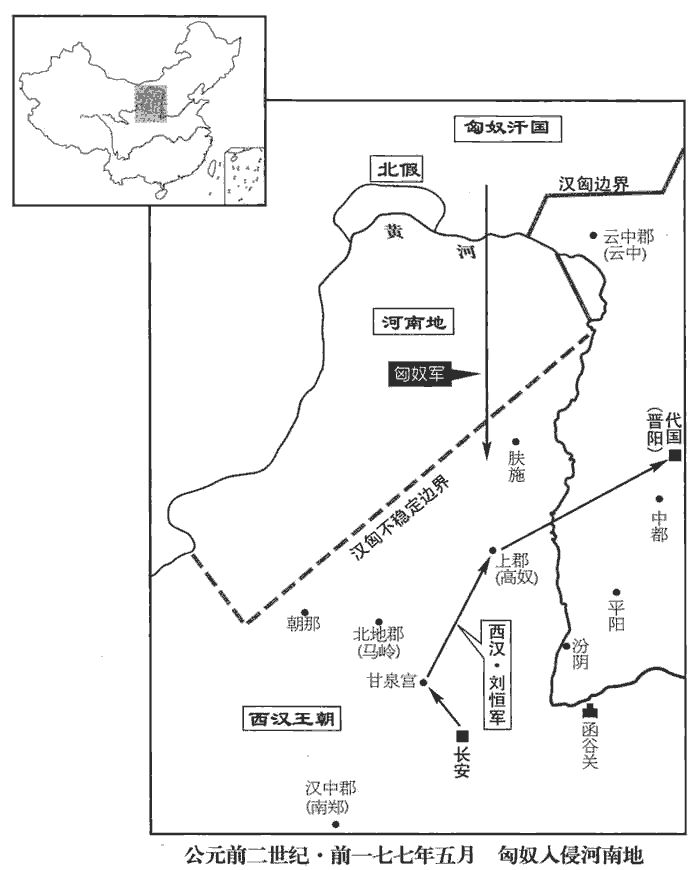
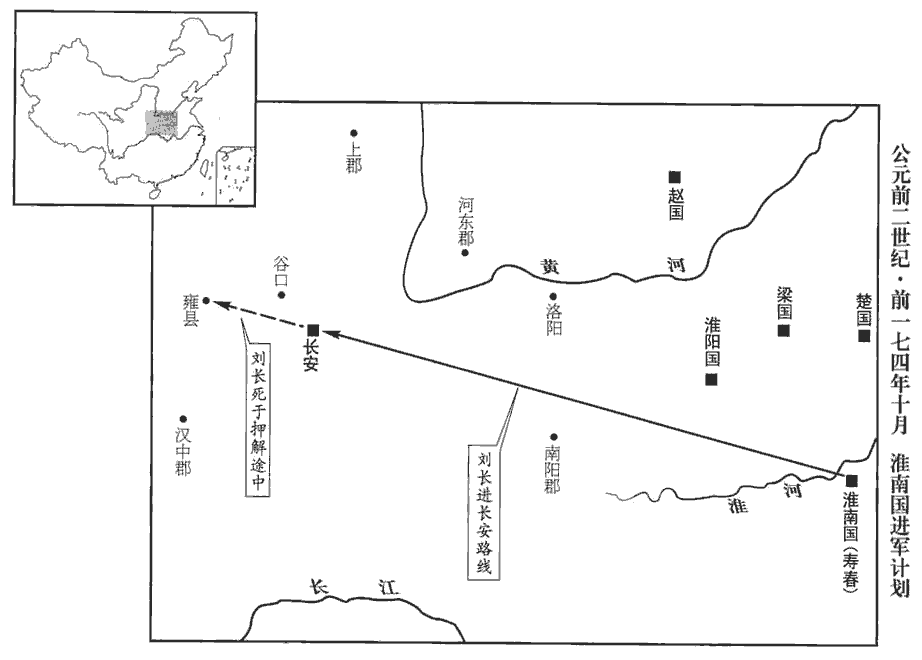

 漢紀六起閼逢困敦（甲子），盡重光協洽（辛未）。凡八年。

# 太宗孝文皇帝中

## 前三年（甲子，前一七七年）

1冬，十月，丁酉晦‹三十›，日有食之。

〖译文〗 [1]冬季，十月丁酉晦（疑误），出现日食。

2十一月，丁卯晦‹三十›，日有食之。

〖译文〗 [2]十一月，丁卯晦（疑误），出现日食。

3詔曰：「前遣列侯之國，事見上卷上年。或辭未行。丞相，朕之所重，其為朕率列侯之國！」為，於偽翻。十二月，免丞相勃，遣就國。乙亥‹六›，以太尉灌嬰為丞相；罷太尉官，屬丞相。漢承秦制，以丞相、太尉、御史大夫為三公。今周勃自丞相罷就國，灌嬰自太尉為丞相，因罷太尉官；蓋三公不必備之意，且兵柄難以輕屬也。

〖译文〗 [3]文帝下诏说：“先前诏令列侯回各自的封地，有的人辞别而未成行。丞相是朕所倚重的人，应为朕率领列侯返回各自封地！”十二月，文帝免去周勃的丞相职务，命令他前往封地。乙亥（十四日），文帝任命太尉灌婴为丞相；罢废太尉之官，将其职责归属丞相。

4夏，四月，城陽‹山东莒县›景王章薨。諡法：由義而濟曰景；耆qí意大慮曰景；布義行剛曰景。

〖译文〗 [4]夏季，四月，城阳景王刘章去世。

5初，趙王敖獻美人于高祖，得幸，有娠。娠，音身。及貫高事發，見十二卷高祖九年。美人亦坐系河內‹河南武陟›。美人母弟趙兼因辟陽侯審食其言呂后；食其，音異基。呂后妬，弗肯白。美人已生子，恚huì，即自殺。恚，於避翻。吏奉其子詣上，上悔，名之曰長，令呂后母之，而葬其母真定‹河北正定›。後封長為淮南王。見十二卷高祖十一年。

〖译文〗 [5]当初，赵王张敖向高祖献上一位美人，美人得宠幸而怀孕。等到赵相贯高谋杀高祖的计划败露，美人也受株连被囚禁于河内。美人的弟弟赵兼，请辟阳侯审食其向吕后求情，吕后嫉妒美人，不肯为她说话。美人这时已经生子，感到愤恨，便自杀身亡。官吏将其所生之子送给高祖，高祖也有后悔之意，为婴儿取名刘长，令吕后收养，并葬其生母于真定。后来，高祖封刘长为淮南王。

淮南王蚤失母，常附呂后，故孝惠、呂后時得無患；而常心怨辟陽侯，以為不強爭之于呂后，使其母恨而死也。及帝即位，淮南王自以最親，時高祖諸子惟帝及長在，故自以為最親。驕蹇，數不奉法；驕蹇，謂不順也。數，所角翻。上常寬假之。是歲，入朝，朝，直遙翻。從上入苑囿獵，與上同車，常謂上「大兄」。王有材力，能扛鼎。扛，音江；舉也。乃往見辟陽侯，自袖鐵椎椎辟陽侯，令從者魏敬剄jǐng之；從，才用翻。剄，古頂翻。馳走闕下，肉袒謝罪。帝傷其志為親，故赦弗治。為，於偽翻。當是時，薄太后及太子、諸大臣皆憚淮南王。淮南王以此，歸國益驕恣，出入稱警蹕，稱制擬于天子。袁盎諫曰：「諸侯太驕，必生患。」上不聽。為淮南王謀反廢張本。

〖译文〗 淮南王刘长自幼丧母，一直亲附吕后，所以在孝惠帝和吕后临朝时，没有受到吕后的迫害；但他心中却常常怨恨辟阳侯审食其，认为审食其没有向吕后力争，才使他的生母含恨而死。及至文帝即位，淮南王刘长自认为与文帝最亲近，骄傲蛮横，屡违法纪；文帝经常从宽处置，不予追究。本年，淮南王入朝，跟随文帝去苑囿打猎，与文帝同乘一车，经常称文帝为“大哥”。刘长有勇力，能举起大鼎。他去见辟阳侯审食其，用袖中所藏铁椎将他击倒，并令随从魏敬割他的脖子。然后，刘长疾驰到皇宫门前，袒露上身，表示请罪。文帝感念他的为母亲复仇之心，所以没有治他的罪。当时，薄太后及太子和大臣们都惧怕淮南王。因此，淮南王归国以后，更加骄横恣肆，出入称警跸，自称皇帝，上比于天子。袁盎进谏说：“诸侯过于骄傲，必生祸患。”文帝不听。

6五月，匈奴‹王庭设蒙古哈尔和林›右賢王入居河南地‹河套地区›，右賢王，匈奴貴王也，居西方，直上郡以西，接氐、羌。師古曰：北地郡之北、黃河之南，即白羊王所居。余謂其地在北河之南，蒙恬所收，衛青所奪，皆是地也。侵盜上郡‹陝西延安›保塞蠻夷，殺掠【章︰甲十五行本「掠」作「略」；乙十一行本同；孔本同。】人民。上幸甘泉‹陝西淳化西南›。蔡邕曰：天子車駕所至，臣民以為僥倖，故曰幸。見令、長、三老、官屬，親臨軒作樂，賜以酒、食、帛、葛、越巾、佩帶之屬；民爵有級數；或賜田租之半；故因謂之幸也。師古曰：甘泉宮在雲陽，本秦林光宮。括地志：在雍州雲陽縣西北三十八里。元和郡國志：雲陽縣西北三十八里有車箱阪，縈紆曲折，財通單軌，上阪即平原宏敞。甘泉宮之地亦曰車盤嶺。沈宋敏求長安志：雲陽磨石嶺，山有甘泉。遣丞相灌嬰發車騎八萬五千，詣高奴‹陝西延安›擊右賢王；發中尉材官屬衛將軍，軍長安。此中尉所掌材官士也。觀此，益足以明二年罷衛將軍軍，衛將軍之官本不罷也。右賢王走出塞。

〖译文〗 [6]五月，匈奴右贤王侵占河南之地，并纵兵盗掠居住于上郡边塞的少数部族，杀掠人民。文帝亲临甘泉，派遣丞相灌婴率征发的车骑八万五千人，到高奴进击右贤王；又征发中尉所掌领的步兵，由卫将军指挥，驻守长安。匈奴右贤王逃出塞外。

 

7上自甘泉‹陝西淳化西南›之高奴‹陝西延安›，因幸太原‹山西太原›，見故群臣，皆賜之；復晉陽‹山西太原›、中都‹山西平遙›民三歲租。班志，晉陽、中都二縣皆屬太原郡。高帝十一年，立帝為代王，都晉陽。如淳註曰：文紀言都中都，又，帝復晉陽、中都二歲，似遷都於中都也。括地志：中都故城，在汾州平遙縣西南十三里。宋白曰：漢文帝為代王，都中都，故介休縣東南中都城也。史記諸侯年表：高帝十年，封子恒為代王，都中都。復，方目翻。留游太原十餘日。

〖译文〗 [7]文帝从甘泉到高奴，因而临幸太原郡，接见他身为代王时的旧日部属，都给予赏赐；并诏令免征晋阳、中都人民三年的田税，在太原逗留游玩了十多天。

8初，大臣之誅諸呂也，朱虛侯功尤大，大臣許盡以趙地王朱虛侯，盡以梁地王東牟侯。王，於況翻；下以義推。及帝立，聞朱虛、東牟之初欲立齊王，事見上卷呂后八年。故絀chù其功，絀，敕chì律翻，貶下也。及王諸子，乃割齊二郡以王之。興居自以失職奪功，頗怏怏；聞帝幸太原，以為天子且自擊胡，遂發兵反。帝聞之，罷丞相及行兵皆歸長安，行兵，行擊匈奴之兵也。以棘蒲侯柴武為大將軍，將四將軍、十萬眾擊之；祁侯繒賀為將軍，軍滎陽。應劭曰：棘蒲，即常山平棘縣。師古非之。余據靳jìn歙xī傳，則棘蒲，趙地也，在安陽以東。宋白曰：棘蒲，春秋時晉邑，漢初為棘蒲，後改為平棘。蓋亦本應說也。班志，祁縣屬太原郡，晉大夫賈辛邑。括地志：并州祁縣城是也。柴武、繒賀，皆高帝功臣。姓譜：柴姓，高柴之後。繒，亦姓也，以國為氏。國語云：申、繒方強。韋昭註：繒出於姒姓。秋，七月，上自太原至長安。詔：「濟北‹府卢县，山東長清›吏民，兵未至，先自定及以軍城邑降者，皆赦之，復官爵；與王興居去來者，赦之。」師古曰：雖始與興居共反，今棄之去而來降者亦赦之。貢父曰：高帝詔曰：「與綰居去來歸者赦之」，今此文當云：「與王興居居去來者赦之」，蓋脫一「居」字也。余謂貢父說是。濟，子禮翻。降，戶江翻。八月，濟北王興居兵敗，自殺。

〖译文〗 [8]当初，朝廷大臣铲除诸吕之时，朱虚侯刘章功劳尤其大，大臣们曾许诺把全部赵地封给他为王，把全部梁地封给其弟东牟侯刘兴居为王。及至文帝得立为帝，得知朱虚侯、东牟侯当初打算拥立齐王刘襄为帝，故有意贬抑二人的功劳，等到分封皇子为王时，才从齐地划出城阳、济北二郡，分别立刘章为城阳王、刘兴居为济北王。刘兴居自认为失掉了应得的侯王之位，功劳被夺，颇为不满；现在听说文帝亲临太原，以为皇帝将亲自统兵出击匈奴，有机可乘，就发兵造反。汉文帝得知刘兴居举兵谋反，诏令丞相和准备出击匈奴的军队都返回长安，任命棘蒲侯柴武为大将军，统领四位将军、十万军队出击刘兴居；任命祁侯缯贺为将军，率军驻守荥阳。秋季，七月，文帝自太原返抵长安。文帝下诏书：“济北境内吏民，凡在朝廷大兵未到之前就归顺朝廷和率军献城邑投降的，都给以宽赦，且恢复原有的官职爵位；即便是追随刘兴居参预谋反的，只要归降朝廷，也可赦免其罪。”八月，济北王刘兴居兵败，自杀。

9初，南陽‹河南南陽›張釋之為騎郎，秦置南陽郡，漢因之。郎屬郎中令，掌守門戶，出充車騎。郎中有車、騎、戶三將，主車曰車郎，主騎曰騎郎，主戶衛曰戶郎，皆以中郎將主之。騎，奇寄翻。十年不得調，調，徒釣翻，選也。欲免歸。袁盎知其賢而薦之，為謁者僕射。班表：謁者掌賓贊受事，秩比六百石；有僕射，秩比千石。應劭曰：謁，請也，白也。僕，主也。漢官儀曰：僕射，秦官也。僕，主也。古者主武事，每官必有主射者以督課之。

〖译文〗 [9]当初，南阳人张释之当骑郎，历时十年未得升迁，曾打算辞官返归故里。袁盎知道张释之是个有德才的人，就向文帝推荐他，升为谒者仆射。

釋之從行，登虎圈，上問上林尉諸禽獸簿。虎圈，養虎之所，在上林。圈，求遠翻。班表：有令，有八丞、十二尉；武帝以後屬水衡都尉。禽獸簿，謂簿錄禽獸之大數也。十餘問；尉左右視，盡不能對。蓋帝問之而不能對，故倉皇失措而左右視也。師古曰：視其屬官，盡不能對；非也。虎圈嗇夫從旁代尉對。上所問禽獸簿甚悉，欲以觀其能；師古曰：能，謂材也。能，本獸名，形似羆，足似鹿，為物堅中而強力，故人之有賢材者皆謂之能。口對響應，無窮者。虎圈嗇夫，掌虎圈之吏也。悉，詳盡也。響應者，如響應聲，言其捷也。帝曰：「吏不當若是邪！尉無賴。」言其才無足恃賴也。援神契曰：蝟多賴，故不使超揚。賴，才也。孟子：富歲子弟多賴。朱子曰：賴，藉也。乃詔釋之拜嗇夫為上林令。釋之久之前，曰：「陛下以絳侯周勃何如人也？」上曰：「長者也。」長，知兩翻。又復問：「東陽侯張相如何如人也？」班志，東陽縣屬臨淮郡。上復曰：「長者。」復，扶又翻。釋之曰：「夫絳侯、東陽侯稱為長者，此兩人言事曾不能出口，豈效此嗇夫喋喋利口捷給哉！晉灼曰：喋，音牒。且秦以任刀筆之吏，師古曰：刀，所以削書也；古者用簡牒，故吏皆以刀筆自隨也。揚子曰：刀不利，筆不銛xiān。說文：楚謂之聿yù，吳謂之不律，燕謂之弗，秦謂之筆。釋名：筆，述也；述事而書之也。爭以亟疾苛察相高，亟，居力翻，急也。其敝，徒文具而無實，不聞其過，陵遲至於土崩。師古曰：陵，丘陵也；陵遲，言如丘陵之逶遲稍卑下也。又曰陵夷。夷，平也；言其頹替若丘陵之漸平也。今陛下以嗇夫口辨而超遷之，臣恐天下隨風而靡，爭為口辯而無其實。夫下之化上，疾于景響，舉錯不可不審也！」錯，七故翻；後以義推。帝曰：「善！」乃不拜嗇夫。上就車，召釋之參乘。乘，繩證翻。徐行，問釋之秦之敝，具以質言。如淳曰：質，誠也。至宮，上拜釋之為公車令。

〖译文〗 张释之跟随文帝，来到禁苑中养虎的虎圈，文帝向上林尉询问禁苑中所饲养的各种禽兽的登记数目，先后问了十多种，上林尉仓惶失措，左右观望，全都答不上来。站立于一旁的虎圈啬夫代上林尉回答了文帝的提问。文帝十分详细地询问禽兽登记的情况，想考察虎圈啬夫的才能；虎圈啬夫随问随答，没有一个问题被难倒。文帝说：“官吏难道不应像这样吗！上林尉不可信赖。”于是，文帝诏令张释之去任命啬夫为管理禁苑的上林令。张释之停了许久，走近文帝说：“陛下以为绛侯周勃是什么样的人呢？”文帝回答说：“他是长者。”张释之又问：“东阳侯张相如是什么样的人呢？”文帝答：“长者。”张释之说：“绛侯周勃、东阳侯张相如被称作长者，他们两人在论事时尚且有话说不出口，哪能效法这个啬夫的多言善辩呢！秦王朝重用刀笔之吏，官场之上争着用敏捷苛察比较高低，它的害处是空有其表而无实际的内容，皇帝听不到对朝政过失的批评，却使国家走上土崩瓦解的末路。现在陛下因啬夫善于辞令而破格升官，我只怕天下人争相效仿，都去练习口辩之术而无真才实能。在下位的受到在上位的感化，比影随景，响应声还快。君主的举动不可不审慎啊！”文帝说：“您说得好啊！”于是不给啬夫升官。文帝上车返回皇宫，令张释之为陪乘。一路上缓缓而行，文帝询问秦朝政治的弊端，张释之都给以质直的回答。车驾返抵宫中，文帝任命张释之为公车令。

頃之，太子與梁‹府定陶，山东定陶›王共車入朝，不下司馬門。於是釋之追止太子、梁王，無得入殿門，遂劾hé「不下公門，不敬，」奏之。班表：公車令屬衛尉。漢官儀：公車司馬令掌殿司馬門。如淳曰：宮衛令：諸出入殿門，公車司馬門者，皆下；不如令者，罰金四兩。程大昌曰：通典衛尉公車令曰：胡廣云：諸門各陳屯夾道，其旁設兵以示威武，交節立戟以遮訶hē出入。劾，戶概翻，又戶得翻。薄太后聞之；帝免冠，謝教兒子不謹。薄太后乃使使承詔赦太子、梁王，然後得入。帝由是奇釋之，拜為中大夫；中大夫掌論議，屬郎中令，其位在太中大夫之下，諫大夫之上。武帝太初元年，更名中大夫曰光祿大夫，秩比二千石；太中大夫秩比千石如故。至後漢志有光祿大夫、太中大夫、中散大夫、諫議大夫。胡廣曰：光祿大夫，本為中大夫，武帝元狩五年置，為光祿大夫、諫大夫，世祖中興，以為諫議大夫。又有太中、中散大夫。此四等，于古皆為天子之下大夫，視列國之上卿。頃之，至中郎將。

〖译文〗 时隔不久，太子与梁王共乘一车入朝，经过司马门，二人也未曾下车示敬崐。于是，张释之追上太子和梁王，禁止他们二人进入殿门，并马上劾奏太子和梁王“经公门不下车，为不敬”。薄太后也得知此事，文帝为此向太后免冠赔礼，承认自己教子不严的过错。薄太后于是派专使传诏赦免太子和梁王，二人才得以进入殿门。由此，文帝更惊奇和赏识张释之的胆识，升他为中大夫；不久，任命他为中郎将。

從行至霸陵‹陝西西安東北›，上謂群臣曰：「嗟乎！以北山‹陕西铜川南›石為槨，用紵絮斮zhuó陳漆其間，師古曰：美石出京師北山，今宜州石是。斮絮以漆著其間也。紵，竹呂翻。康曰：紵，檾qǐng屬；細者為絟，麤者為紵。陸璣草木疏曰：紵，亦麻也。科生數十莖，宿根在地中，至春自生，不歲種也。荊、揚之間，一歲三收；今官園種之，歲再刈。刈便生剝之，以鐵若竹挾之，表厚皮自脫，但得其裹韌如筋者，謂之徽紵。今南越紵布皆用此麻。檾qǐng，口穎翻。斮，側略翻。豈可動哉！」左右皆曰：「善！」釋之曰：「使其中有可欲者，雖錮南山‹秦岭›猶有隙；使其中無可欲者，雖無石槨，又何戚焉！」錮，音固；冶銅鑄塞以為固也。師古曰：有可欲，謂多藏金玉而厚葬之，人皆欲發取之也，是有間隙也；無可欲，謂不置器備而薄葬，人無欲攻掘取之者，故無憂戚也。帝稱善。

〖译文〗 张释之随从文帝巡视霸陵，文帝对群臣说：“嗟乎！我的陵墓用北山岩石做外，把麻絮切碎填充在间隙中，再用漆将它们粘合为一体，如此坚固，难道有谁能打得开吗！”左右近侍都说：“对！”唯独张释之说：“假若里面有能勾起人们贪欲的珍宝，即便熔化金属把整个南山封起来，也会有间隙；假若里面没有珍宝，即便是没有石墩，又有什么可忧虑的啊！”文帝称赞他说得好。

是歲，釋之為廷尉。上行出中渭橋，張晏曰：中渭橋，在渭橋中路。臣瓚曰：中渭橋，兩岸之中。索隱曰：張晏、臣瓚之說皆非也。案今渭橋有三所：一所在城西北咸陽路，曰西渭橋；一所在城東北高陵路，曰東渭橋；其中渭橋在長安故城之北。有一人從橋下走，乘輿馬驚；乘，繩證翻。於是使騎捕之，屬廷尉。屬，之欲翻；下同。釋之奏當：「此人犯蹕，當罰金。」崔浩曰：奏當，謂處其罪也。索隱曰：按百官志云：廷尉掌平刑罰、奏當，一應郡國讞yàn疑罪，皆處當以報之也。如淳曰：蹕，止行人。乙令：蹕先至而犯者，罰金四兩。上怒曰：「此人親驚吾馬；馬賴和柔，令他馬，固不敗傷我乎！而廷尉乃當之罰金！」釋之曰：「法者，天下公共也。今法如是；更重之，是法不信於民也。且方其時，上使使誅之則已。今已下廷尉；下，遐嫁翻。廷尉，天下之平也，壹傾，天下用法皆為之輕重，民安所錯其手足！錯，七故翻。唯陛下察之！」上良久曰：「廷尉當是也。」

〖译文〗 这一年，张释之被任命为廷尉。文帝出行经过中渭桥，有一人从桥下跑出，惊动了为皇帝驾车的马匹；于是，文帝令骑士追捕，并将他送交廷尉治罪。张释之奏报处置意见：“此人违犯了清道戒严的规定，应当罚金。”文帝发怒说：“此人直接惊了我乘舆的马，仗着这马脾性温和，假若是其他马，能不伤害我吗！可廷尉却判他罚金！”张释之解释说：“法，是天下公共的。这一案件依据现在的法律就是这样定罪；加罪重判，法律就不能取信于民众。况且，在他惊动马匹之际，如果皇上派人将他杀死，也就算了。现在已把他交给廷尉，廷尉是天下公平的典范，稍有倾斜，天下用法就可轻可重，没有标准了，百姓还怎样安放自己的手脚呢！请陛下深思。”文帝思虑半晌，说：“廷尉的判决是对的。”

其後人有盜高廟坐前玉環，得；得，言捕得也。坐，徂臥翻。帝怒，下廷尉治。釋之按「盜宗廟服御物者」為奏當棄市。上大怒曰：「人無道，乃盜先帝器！吾屬廷尉者，欲致之族；而君以法奏之，索隱曰：謂依律而斷也。屬，之欲翻。非吾所以共承宗廟意也。」共，讀曰恭。釋之免冠頓首謝曰：「法如是，足也。且罪等，然以逆順為差。如淳曰：罪等，俱死罪也。盜玉環不若長陵土之逆。仲馮曰：此等，讀如等級之等，言凡罪之等差。今盜宗廟器而族之，有如萬分一，假令愚民取長陵一抔土，長陵，高祖陵也。張晏曰：不欲指言，故以取土喻之也。師古曰：抔，謂以手掬之也。抔póu，步侯翻。陛下且何以加其法乎？」帝乃白太后許之。

〖译文〗 其后，有人偷盗高祖庙中神位前的玉环而被捕，汉文帝大怒，交给廷尉治罪。张释之奏报判案意见：按照“偷盗宗庙服御器物”的律条，案犯应当在街市公开斩首。汉文帝大怒说：“此人大逆不道，竟敢盗先帝器物！我将他交给廷尉审判，是想将他诛灭全族；而你却依法判他死罪，这是违背我恭奉宗庙的本意的。”张释之见皇帝震怒，免冠顿首谢罪说：“依法这样判，满够了。况且，同样的罪名，还应该根据情节逆顺程度区别轻重。今天此人以偷盗宗庙器物之罪被灭族，若万一有愚昧无知之辈，从高祖的长陵上取了一捧土，陛下将怎样给他加以更重的惩罚呢？”于是，文帝向太后说明情况，批准了张释之的判刑意见。

## 四年（乙丑，前一七六年）

1冬，十二月，潁陰懿侯灌嬰薨。

〖译文〗 [1]冬季，十二月，颍阴懿侯灌婴去世。

2春，正月，甲午‹十四›，以御史大夫陽武‹河南原阳›張蒼為丞相。班志：陽武縣屬河南郡。蒼好書，博聞，尤邃律曆。好，呼到翻。

〖译文〗 [2]春季，正月甲午（初四），汉文帝任命御史大夫阳武县人张苍为丞相。张苍喜读书籍，博闻多识，尤精于律历之学。

3上召河東‹山西夏縣›守季布，河東本韓、魏之地，秦置郡。欲以為御史大夫。有言其勇、使酒、難近者；應劭曰：使酒，酗酒也。師古曰：言因酒霑洽而使氣也。近，謂附近天子而為大臣。近，其靳翻。至，留邸一月，見罷。師古曰：既引見而罷令還郡也。貢父曰：見罷，猶言見逐、見棄耳，非引見也。季布因進曰：「臣無功竊寵，待罪河東，陛下無故召臣，此人必有以臣欺陛下者。師古曰：謂妄言其賢，故云欺也。今臣至，無所受事，罷去，此人必有毀臣者。夫陛下以一人之譽而召臣，以一人之毀而去臣，譽，音餘。去，羌呂翻。臣恐天下有識聞之，有以闚陛下之淺深也！」上默然，慚，良久曰：「河東，吾股肱郡，故特召君耳。」

〖译文〗 [3]文帝召河东郡郡守季布来京，想任命为御史大夫。有人说季布勇武难制、酗酒好斗，不适于做皇帝的亲近大臣，所以，季布到京后，在官邸中滞留一个月，才得到召见，并令他还归原任。季布对文帝说：“我本无功劳而有幸得到陛下宠信，担任河东郡守，陛下无故召我来京，必定是有人向陛下言过其实地推荐我。现在我来京，没有接受新的使命，仍归原任，这一定是有人诋毁我。陛下因一人的赞誉而召我来，又因一人的诋毁而令我去，我深恐天下有识之士得知此事，会有人以此来窥探陛下的深浅得失！”文帝默然，面露惭色，过了好久才说：“河东郡，是我重要而得力的郡，所以特地召你来面谈。”

4上議以賈誼任公卿之位。大臣多短之曰：「洛陽之人，年少初學，少，詩照翻。專欲擅權，紛亂諸事。」於是天子後亦疏之，不用其議，以為長沙王太傅。長沙王，吳差也。漢制：諸侯王國有太傅輔王。疏，與踈同。

〖译文〗 [4]文帝提议让贾谊出任公卿，许多大臣贬责贾谊说：“这个洛阳人，太年轻，学问不深，极力要掌握大权，扰乱朝廷大事。”于是，文帝以后也就疏远贾谊，不采纳他的意见，把他外放为长沙王的太傅。

5絳侯周勃既就國，每河東守、尉行縣至絳‹山西侯马东›，漢承秦制，郡有守，有尉；守掌治其郡，尉掌佐守典武職甲卒。行縣，循行屬縣也。行，下孟翻。勃自畏恐誅，常被甲，令家人持兵以見之。被，皮義翻。其後人有上書告勃欲反，下廷尉；上，時掌翻。下，遐嫁翻。廷尉逮捕勃，治之。勃恐，不知置辭；師古曰：置，立也。辭，對獄之辭。吏稍侵辱之。勃以千金與獄吏，吏【章︰甲十五行本下「吏」字上重「獄」字；乙十一行本同；孔本同。】乃書牘背示之曰：牘，木簡也，以書獄辭。李奇曰：牘，吏所執簿。韋昭曰：牘，版也。索隱曰：簿，即牘也；故魏志「秦宓以簿擊頰」，則亦簡牘之類也。「以公主為證。」公主者，帝女也，勃太子勝之尚之。韋昭曰：尚，奉也，不敢言娶也。薄太后亦以為勃無反事。帝朝太后，太后以冒絮提帝曰：應劭曰：冒絮，陌頟é絮也。如淳曰：太后恚怒，遭得左右物提之也。晉灼曰：巴蜀異物志謂頭上巾為冒絮。師古曰：冒，覆也；老人所以覆其頭。提，擊之也。提，徒計翻；索隱音抵，擲也。「絳侯始誅諸呂，綰皇帝璽，綰wǎn，烏版翻。將兵於北軍；不以此時反，今居一小縣，顧欲反邪！」帝既見絳侯獄辭，乃謝曰：「吏方驗而出之。」於是使使持節赦絳侯，復爵邑。絳侯既出，曰：「吾嘗將百萬軍，然安知獄吏之貴乎！」

〖译文〗 [5]绛侯周勃在前往封地之后，每当河东郡的郡守、郡尉巡行县级属地来到绛地，周勃都深怕他们是受命前来捕杀自己，经常身穿铠甲，令家中人手执兵器，然后与郡守、郡尉相见。其后，有人向皇帝上书，举告周勃要造反，皇帝交给廷尉处置，廷尉将周勃逮捕下狱，审讯案情。周勃极为恐惧，不知怎样对答才好；狱吏逐渐对周勃有所凌辱。周勃用千金行贿狱吏，狱吏就在公文木牍背面写了“以公主为证”，暗示周勃让公主作证。公主是指文帝的女儿，周勃的长子周胜之娶她为妻。薄太后也以为周勃不会谋反。文帝朝见太后时，太后恼怒地将护头的帽絮扔到文帝身上说：“绛侯周勃当初在诛灭诸吕的时候，手持皇帝玉玺，身统北军将士，他不利用这一时机谋反，今天住在一个小县，反而要谋反吗！”文帝此时已见到了周勃在狱中所写的辩白之辞，于是向太后谢罪说：“狱吏刚刚证实他无罪，就要释放他了。”汉文帝派使者持皇帝信节赦免绛侯周勃，恢复他原有的爵位和封地。绛侯周勃获释之后说：“我曾经统帅过百万雄兵，但怎知狱吏的尊贵呢！”

6作顧成廟。服虔曰：顧成廟，在長安城南；還顧見城，故名之。應劭曰：帝自為廟，制度卑狹，若顧望而成，猶文王靈台不日成之，故曰顧成也。如淳曰：身存而為廟，若周之顧命也。景帝廟號德陽，武帝廟號龍淵，昭帝廟號徘徊，宣帝廟號樂遊，元帝廟號長壽，成帝廟號陽池。師古曰：以還顧見城，於義無取；又，書本不作城郭字。應說近之。

〖译文〗 [6]兴建顾成庙。

## 五年（丙寅，前一七五年）

1春，二月，地震。

〖译文〗 [1]春季，二月，发生地震。

2初，秦用半兩錢，秦半兩錢，重如其文。高祖嫌其重，難用，更鑄莢錢。更，工衡翻；下同。如淳曰：如榆莢也。莢，音頰。杜佑曰：莢錢，如榆莢，重一銖，半徑五分，文曰「漢興」，即應劭所謂五分錢。於是物價騰踴，米至石萬錢。夏，四月，更造四銖錢；應劭曰：文帝以五分錢太輕小，更作四銖錢，文亦曰「半兩」，今民間半兩錢最輕小者是也。除盜鑄錢令，使民得自鑄。

〖译文〗 [2]当初，秦行用半两钱，高祖嫌半两钱过重，使用不便，另行铸造荚钱。至此时，物价暴涨，一石米贵至一万钱。夏季，四月，文帝下诏：另行铸造四铢钱；废除禁止私人铸钱的禁令，允许民间自行铸钱。

賈誼諫曰：「法使天下公得雇租鑄銅、錫為錢，師古曰：雇租，謂雇傭之直，或租具本。敢雜以鉛、鐵為他巧者，其罪黥。然鑄錢之情，非殽雜為巧，則不可得贏；師古曰：殽，謂亂雜也；不得贏，謂無餘利也；言不雜鉛、鐵則無利也。殽，音爻。而殽之甚微，為利甚厚。師古曰：微，謂精妙也；言殽雜鉛、鐵，其術精妙，不可覺知，而得利甚厚，故令人輕犯奸而不可止也。余謂微，細也；言奸民殽雜鉛、鐵，其所費甚微，而得利甚厚也。夫事有召禍而法有起奸；今令細民人操造幣之勢，師古曰：操，持也；人人皆得鑄錢也。操，千高翻。各隱屏而鑄作，屏，必郢翻，蔽也；言各自隱蔽而鑄錢也。因欲禁其厚利微奸，雖黥罪日報，其勢不止。蘇林曰：報，論。余據張湯傳有訊、鞫jú、論、報，嚴延年傳有報囚，師古註皆以為論奏獲報。原父註則謂報者為斷決囚，若今有司書囚罪，長吏判準斷，是也。乃者，民人抵罪多者一縣百數，及吏之所疑搒笞奔走者甚眾。搒，音彭。夫縣法以誘民縣，讀曰懸。師古曰：懸，謂開立之。使入陷阱，孰多於此！師古曰：阱，穿地以陷獸也。阱，才性翻。又民用錢，郡縣不同：或用輕錢，百加若干；應劭曰：時錢重四銖；法錢百文，當重一斤十六銖；輕則以錢足之若干枚令滿平也。師古曰：若干，且設數之言也。干，猶個也，謂當如此個數也。而胡廣云：若，順也；干，求也；當順所求而與之矣。或用重錢，平稱不受。應劭曰：用重錢則平稱有餘，不能受也。臣瓚曰：秦錢重半兩，漢初鑄莢錢，文帝更鑄四銖錢。秦錢與莢錢皆當廢，而故與四銖并行。民以其見廢，故用輕錢則百加若干；用重錢則雖一當一猶復不受；是以郡縣不同也。師古曰：應說是也。稱，尺孕翻。法錢不立：師古曰：依法之錢也。吏急而壹之乎？則大為煩苛而力不能勝；縱而弗呵乎？則市肆異用，錢文大亂；苟非其術，何鄉而可哉！今農事棄捐而采銅者日蕃，勝，音升。鄉，讀曰嚮。蕃，扶元翻。釋其耒耨nòu，冶鎔炊炭；奸錢日多，五穀不為多。言民棄其農而冶銅炊炭，故五穀不為多。為，於偽翻。善人怵而為奸邪，願民陷而之刑戮；刑戮將甚不詳，柰何而忽！怵，先律翻，又音黜，誘也；言動心於為奸邪也。願，謹也。師古曰：詳，平也。忽，忽忘也。國知患此，吏議必曰『禁之』。禁之不得其術，其傷必大。令禁鑄錢，則錢必重；師古曰：令，謂法令也。重則其利深，盜鑄如雲而起，棄市之罪又不足以禁矣。奸數不勝而法禁數潰，銅使之然也。數，所角翻。銅布於天下，其為禍博矣，故不如收之。」賈山亦上書諫，以為：「錢者，亡用器也，亡，與無通。而可以易富貴。富貴者，人主之操柄也；令民為之，是與人主共操柄，不可長也。」上‹刘恒，时年二十八›不聽。操，千高翻。長，知兩翻。

〖译文〗 贾谊提出批评说：“现行法令允许天下公开雇人熔铸铜、锡为钱币，有敢掺杂铅、铁取巧谋利的人，就处以黥刑。但是，铸钱的人都以获利为目的，如果不杂以铅铁，就不可能获利；而只要掺上很小比例的铅和铁，就会获利丰厚。有的事容易引起后患，有的法令能导致违法犯罪；现在让平民百姓掌握铸币的大权，他们各自隐蔽地铸造，要想禁止他们在铸钱时为获厚利而取巧舞弊，即便是每天都有人因此而被判处黥刑，也禁止不住。以往，百姓因此犯罪而被判刑的，多的一县可至数百人，被官吏怀疑而受到逮捕拷打和为传讯而奔走的人，那就更多了。设立法律去引诱百姓犯罪受刑，还有什么能比这种铸钱令更严重呢！另外，民间习惯使用的钱币，各个地方有所不同：使用轻钱，一百枚须添若干枚，使用重钱，又不按标准数使用。官府规定的货币在交易中不具有权威地位，对此，如果官府采取强硬手段来统一市场币的话，事情一定会很繁琐、很苛酷，而且力难胜任；如果官府放纵的话，市场上流行各种钱币，币制就陷入混乱。可见，如果关于钱币的法律不完善，到哪里寻求标准呢！现在，放弃农业而开山采铜的人日益增多，扔下农具而去炼铜铸钱、烧制木炭；质量低劣的钱币每天都在增加，五谷粮食却无法增加。善良的人受此风气的引诱而做出了罪恶的事情，谨慎怕事的人也被裹挟犯罪而受到刑罚甚至于杀戳。惩罚杀戮百姓是很不吉祥的，为什么疏忽了呢！朝廷了解到它的祸患，大臣们必定会建议说‘禁止私人铸钱’。但是，如果禁止的方法不对，就会造成很大的危害。法令禁止私人铸钱，就必然导致钱币减少、币值增加；这样一来，铸币的获利就更大，私人违法铸币就如同风起云涌，用弃市的重刑也不足以禁上盗铸。违法犯罪防不胜防，法律禁令屡遭破坏，这是用于铸币的铜造成的后果。铜分布在天下百姓手中，所造成的祸害是很大的，所以，不如由朝廷控制铜的流通。”贾山也上书提出批评意见，认为：“钱币，本是无用之物，却可以用来换取富贵。使人获得富贵，本来是由君主所掌握的权柄；让百姓铸币，是使百姓与君主共同掌握权柄，不应该再继续下去。”文帝不采纳这些意见。

是時，太中大夫鄧通方寵倖，上欲其富，賜之蜀‹四川成都›嚴道‹四川荥经›銅山。使鑄錢，班志，嚴道屬蜀郡。括地志：雅州榮經縣北三里有銅山，即鄧通得賜銅山鑄錢者也。唐榮經，即漢嚴道也。吳‹府广陵，江苏扬州›王濞有豫章‹江西南昌›銅山，豫章，秦鄣郡地，高帝分置豫章郡。招致天下亡命者以鑄錢；東煮海水為鹽；以故無賦而國用饒足。史言吳以強富致叛。於是吳、鄧錢布天下。

〖译文〗 这时，太中大夫邓通正得到文帝的宠幸，文帝为了使邓通成为巨富，就把蜀郡严道县的铜山赏赐给他，让他采铜铸钱。吴王刘濞境内的豫章郡有产铜的矿山，他召集了许多不向官府登记户籍的流民开矿铸钱；在吴国东部用海水煮盐；所以，吴王刘濞不必向百姓收取赋税而官府费用却极为充裕。于是，吴国和邓通所铸造的钱币流通于全国。

3初，帝分代為二國；事見上卷一年。立皇子武為代王‹河北蔚縣›，參為太原王‹山西太原›。是歲，徙代王武為淮陽王‹河南淮阳›；以太原王參為代王，盡得故地。故代國之地。

〖译文〗 [3]当初，文帝把代国封地分为两国。立皇子刘武为代王，刘参为太原王。这一年，文帝把代王刘武改封为淮阳王；改封太原王刘参为代王，得到了原代国的全部封地。

## 六年（丁卯，前一七四年）

1冬，十月，桃、李華。華，讀如花。

〖译文〗 [1]冬季，十月，桃树、李树都不合时令地开了花。

2淮南‹府寿春，安徽寿县›厲王長自作法令行于其國，逐漢所置吏，請自置相、二千石；王國自相至內史、中尉皆吏二千石，漢為置之，餘得自置。今長驕橫，逐漢所置吏而請自置之。帝曲意從之。又擅刑殺不辜及爵人至關內侯；關內侯，爵第十九。爵自上出，非侯王所擅。數上書不遜順。數，所角翻。帝重自切責之，師古曰：重，難也。乃令薄昭與書風諭之，引管、蔡及代頃王、濟北王興居以為儆戒。周公誅管叔、蔡叔。代頃王，高祖兄仲也。諡法：甄心動懼曰頃；敏以敬慎曰頃。廢為侯事見十一卷高祖七年。興居事見上三年。風，讀曰諷。頃，音傾。

〖译文〗 [2]淮南王刘长自设法令，推行于封国境内，驱逐了汉朝廷所任命的官员，请求允许他自己任命相和二千石官员；汉文帝违背自己的愿望同意了他的请求。刘长又擅自刑杀无罪的人，擅自给人封爵，最高到关内侯；多次给朝廷上书都有不逊之语。文帝不愿意亲自严厉地责备他，就让薄昭致书淮南王，委婉崐地规劝他，征引周初管叔、蔡叔以及本朝代顷王刘仲、济北王刘兴居骄横不法、最终被废被杀之事，请淮南王引以为戒。

王不說，說，讀曰悅。令大夫但、士伍開章等七十人開姓也。姓譜：衛公子開方之後。與棘蒲侯柴武太子奇謀以輦車四十乘反谷口‹陝西醴泉东北›；師古曰：輦車，古人挽行以載兵器也。谷口在長安北，處多險阻。班志，谷口縣屬左馮翊。括地志：谷口故城，在雍州醴泉縣東北四十里。乘，繩證翻。令人使閩越‹都东冶，福建福州›、匈奴‹王庭设蒙古哈尔和林›。事覺，有司治之；使，疏吏翻；下以義推。使使召淮南王。王至長安，丞相張蒼、典客馮敬行御史大夫事，與宗正、廷尉奏：「長罪當棄市。」制曰：「其赦長死罪，廢，勿王；徙處蜀郡嚴道‹四川荥经›邛‹荥经西南大相岭›郵。」邛郵，置名。師古曰：郵，行書之舍。余據班志，嚴道有邛來山，邛水所出，蓋於其地置郵驛也。杜佑曰：邛州臨邛縣南有邛來山，在雅州百丈縣。嚴道，今雅州。宋白曰：秦滅楚，徙嚴王之族以實此地，故曰嚴道。勿王，於況翻。處，昌呂翻。邛，渠容翻。郵，音尤。盡誅所與謀者。載長以輜車，令縣以次傳之。傳，直戀翻；下同。

〖译文〗 淮南王刘长接到薄昭书信，很不高兴，指派大夫但、士伍开章等七十余人与棘蒲侯柴武的太子柴奇合谋，准备用四十辆辇车在谷口发动叛乱；刘长还派出使者，去与闽越、匈奴联络。反情败露，有关机构追究此事来龙去脉；文帝派使臣召淮南王进京。淮南王刘长来到长安，丞相张苍、代行御史大夫职责的典客冯敬，与宗正、廷尉等大臣启奏：“刘长应被处以死刑。”文帝命令说：“赦免刘长的死罪，废去王号；把他遣送安置在蜀郡严道县的邛邮。”与刘长通谋造反的人，都被处死。刘长被安置在密封的囚车中，文帝下令沿途所过各县依次传送。

袁盎諫曰：「上素驕淮南王，弗為置嚴傅、相，為，於偽翻。相，息亮翻。以故致【章︰甲十五行本「致」作「至」；乙十一行本同；孔本同。】此。淮南王為人剛，今暴摧折之，臣恐卒逢霧露病死，卒，讀曰猝，又音子恤翻，終也。陛下有殺弟之名，柰何？」上曰：「吾特苦之耳，今復之。」師古曰：暫困苦之，令其自悔，即追還也。

〖译文〗 袁盎进谏说：“皇上一直骄宠淮南王，不为他配设严厉的太傅和相，所以才发展到这般田地。淮南王秉性刚烈，现在如此突然地摧残折磨他，我担心他突然遭受风露生病而死于途中，陛下将有杀害弟弟的恶名，可如何是好？”文帝说：“我的本意，只不过要让刘长受点困苦罢了，现在就派人召他回来。”

淮南王果憤恚不食死。縣傳至雍‹陝西鳳翔›，班志，雍縣屬扶風。雍，於用翻。雍令發封，以死聞。輜車有封，前此所經縣傳莫敢發；至雍，令乃發之。上哭甚悲，謂袁盎曰：「吾不聽公言，卒亡淮南王！卒，子恤翻。今為柰何？」盎曰：「獨斬丞相、御史以謝天下乃可。」上即令丞相、御史逮考諸縣傳送淮南王不發封饋侍者，皆棄市；以列侯葬淮南王於雍‹陝西鳳翔›，置守塚三十戶。

〖译文〗 淮南王刘长果然愤恨绝食而死。囚车依次传送到雍县，雍县的县令打开了封闭的囚车，向朝廷报告了刘长的死讯。文帝哭得很伤心，对袁盎说：“我没听你的话，终于害死了淮南王！现在该怎么办？”袁盎说：“只有斩杀丞相、御史大夫以向天下谢罪才行。”文帝立即命令丞相、御史大夫逮捕拷问传送淮南王的沿途各县不开启封门送食物的官员，把他们全都处死；用列侯的礼仪把淮南王安葬在雍县，配置了三十户百姓专管看护坟墓。

 

3匈奴‹王庭设蒙古国哈尔和林市›單于遺漢書曰：「前時，皇帝言和親事，稱書意，合歡。遺，于季翻；下同。師古曰：稱，副也；言與所遺書意相副，而共結歡親。稱，尺證翻；下同。漢邊吏侵侮右賢王；右賢王不請，聽後義盧侯難支等計，索隱曰：難支，匈奴將名也。與漢吏相距。絕二主之約，離兄弟之親，故罰右賢王，使之西求月氏‹都甘肅張掖›擊之。以天之福，吏卒良，馬力強，以夷滅月氏，盡斬殺、降下，定之；氏，音支。降，戶江翻。樓蘭‹新疆若羌›、烏孫‹伊塞克湖东南›、呼揭‹新疆阿尔泰山南麓›樓蘭國，在西域之東垂，後曰鄯善。自武帝開河西之後，地最近漢，當白龍堆之道。烏孫國，治赤谷城。師古曰：烏孫于西域諸戎，其形最異，今之胡人，青眼，赤須，狀類獼猴，是其種也。史記正義：呼揭國，在瓜州西北。余據班史，匈奴北服丁零、呼揭之國。宣帝時，匈奴乖亂，其西方呼揭王自立為呼揭單于。西域傳，呼揭不在三十六國之數，而烏孫國東與匈奴接，則呼揭蓋在烏孫之東、匈奴西北也。師古曰：揭，丘例翻；索隱其列翻；正義音犁。及其旁二十六國，皆已為匈奴，諸引弓之民釋名曰：弓，穹也；張之穹穹然也。并為一家，北州以定。願寢兵，休士卒，養馬，除前事，復故約，以安邊民。皇帝即不欲匈奴近塞，則且詔吏民遠舍。」近，其靳翻。帝報書曰：「單于欲除前事，復故約，朕甚嘉之！此古聖王之志也。漢與匈奴約為兄弟，所以遺單于甚厚；倍約、離兄弟之親者，常在匈奴。倍，蒲妹翻。然右賢王事已在赦前，單于勿深誅！單于若稱書意，明告諸吏，使無負約，有信，敬如單于書。」

〖译文〗 [3]匈奴单于给汉朝廷送来书信说：“前些时候，皇帝谈到和亲的事，与书信的意思一致，双方都很喜悦。汉朝边境官员侵夺侮辱我匈奴右贤王，右贤王未经向我请示批准，听从了后义卢侯难支等人的计谋，与汉朝官吏相互敌对，断绝了两家君主的和好盟约，离间了兄弟之国的情谊，为此我惩罚右贤王，命令他向西方寻找并攻击月氏国。由于苍天降福保佑，将士精良，战马强壮，现已消灭了月氏，其部众已全部被杀或投降，月氏已被我征服；楼兰、乌孙、呼揭及其附近的二十六国，都已归匈奴统辖，所有擅长骑射的游牧部族，都合并为一家，北部由此而统一和安宁。我愿意放下刀兵，休息士卒，牧养马匹，消除以前的仇恨和战争，恢复原来的结好盟约，以安定双方边境的民众。如果皇帝不希望我们匈奴靠近汉的边境，我就暂且诏令匈奴的官民远离边界居住。”汉文帝复信说：“单于准备消除双方以前的不愉快，恢复原来的盟约，朕对此极表赞赏！这是古代圣明君主追求的目标。汉与匈奴相约为兄弟，用来赠送单于的东西是很丰厚的；违背盟约、离间兄弟情谊的事情，多发生在匈奴一方。但右贤王那件事情发生在大赦以前，单于就不必过分责备他了！单于如果能崐按来信所说去做，明确告知大小部属官员，约束他们不再违背和约，守信用，就遵守单于信上的约定。”

後頃之，冒頓死，子稽粥立，稽，音雞。粥，音育。號曰老上單于。老上單于初立，帝復遣宗室女翁主為單于閼氏，復，扶又翻。閼氏，音煙支。使宦者燕人中行說傅翁主。中行，姓；說，名。中行本出荀氏，晉荀林父將中行，因以為氏。行，戶江翻。說，讀曰悅。說不欲行，漢強使之。強，其兩翻。說曰：「必我也，為漢患者！」言為漢患者必我也。史倒其文，因當時語。中行說既至，因降單于，單于甚親幸之。

〖译文〗 其后不久，冒顿死去，他的儿子稽粥继位，称为老上单于。老上单于刚继位，文帝又指派一位宗室的女儿翁主嫁给他做单于阏氏，并派宦官、燕地人中行说去辅佐翁主。中行说不愿意去匈奴，汉朝廷逼迫他去。中行说恼怒地说：“我一定要使汉朝廷深受祸患！”中行说到匈奴以后，就归降了单于，单于很宠信他。

初，匈奴好漢繒絮、食物。繒，帛也；絮，綿也。好，呼到翻；下同。中行說曰：「匈奴人眾不能當漢之一郡，然所以強者，以衣食異，無仰於漢也。今單于變俗，好漢物；漢物不過什二，則匈奴盡歸於漢矣。」師古曰：言漢費物十分之二，則匈奴之眾將盡歸於漢矣。其得漢繒絮，以馳草棘中，衣袴皆裂敝，以示不如旃裘之完善也；得漢食物，皆去之，去，丘呂翻，棄也。以示不如湩dòng酪之便美也。湩，竹用翻，又都奉翻，乳汁也。酪，盧各翻，以乳為之。於是說教單于左右疏記，以計課其人眾、畜牧。其遺漢書牘及印封，皆令長大，倨傲其辭，遺，于季翻。自稱「天地所生、日月所置匈奴大單于。」

〖译文〗 当初，匈奴喜好汉朝的缯帛丝绵和食品。中行说劝单于说：“匈奴的人口，还不如汉朝一个郡的人口多，然而却是汉的强敌，原因就在于匈奴的衣食与汉不同，不需要仰仗于汉朝。现在，假若单于改变习俗，喜爱汉朝的东西；汉朝只要拿出不到十分之二的东西，那么匈奴就要都被汉朝收买过去了。最好的办法是：把所得的汉朝的丝绸衣裳，令人穿在身上冲过草丛荆棘，衣服裤子都撕裂破烂，以证明它们不如用兽毛制成的旃裘完美实用；把所得的汉朝的食物，都扔掉，以显示它不如乳酪便利和味美可口。”于是，中行说教单于的左右侍从学习文字，用以统计匈奴的人口和牲畜数量。凡是匈奴送给汉朝的书信木札以及印封，其规格都增长加宽，并使用傲慢不逊的言辞，自称为：“天地所生、日月所置的匈奴大单于”。

漢使或訾zī笑匈奴俗無禮義者，訾，將此翻，毀也。中行說輒窮漢使曰：「匈奴約束徑，易行；易，以豉翻。君臣簡，可久；一國之政，猶一體也。故匈奴雖亂，必立宗種。種，章勇翻。今中國雖云有禮義，及親屬益疏則相殺奪，以至易姓，皆從此類也。嗟！土室之人，匈奴之人，逐水草，居廬帳，非如中國有室屋，故謂中國人為土室之人。師古曰：嗟者，歎愍之言。顧無多辭，喋喋佔佔！師古曰：顧，思念也。喋喋，利口也；佔佔，衣裳貌也；言漢人且當思念，無為喋喋佔佔。佔，昌占翻。顧漢所輸匈奴繒絮、米糵niè，令其量中、必善美而已矣，師古曰：顧，念也。中，猶滿也；量中者，滿其數也。中，竹仲翻。何以言為乎！且所給，備、善，則已；不備、苦惡，則候秋熟，以騎馳蹂而稼穡耳！」師古曰：苦，猶麤也。蹂，踐也。而，汝也。韋昭曰：苦，音靡盬gǔ之盬。蹂，人九翻。

〖译文〗 汉朝使者有人讥笑匈奴习俗不讲礼义，中行说总是驳难汉朝使者说：“匈奴的约束简捷明确，容易实行；君臣之间坦诚相见，可维持长久；一国的政务，就像一个人的身体那样容易统一协调。所以，匈奴的伦常虽乱，但却必定拥立宗族的子孙为首领。现在中原汉人虽自称有礼义，但随着亲属关系的日益疏远，就相互仇杀争夺，以至于改姓，都是由于这个原因，咳！你们这些居住于土室中的人，希望你们不要多说了，喋喋不休，沾沾自喜！汉朝送给匈奴的缯帛丝绵、好米酒曲，要数量足够，质量好就行了，何必多说话呢！而且，你们所给的东西，如果数量足、质量好，就算了；如果数量不足、质量低劣，那就等到秋熟时，用我们匈奴的铁骑去践踏你们的庄稼！”

4梁太傅賈誼誼自長沙征為梁懷王太傅。上疏曰：「臣竊惟今之事勢，可為痛哭者一，可為流涕者二，可為長太息者六；若其他背理而傷道者，難徧以疏舉。背，蒲妹翻。進言者皆曰：『天下已安已治矣』，臣獨以為未也；曰安且治者，非愚則諛，皆非事實知治亂之體者也。治，直吏翻；下同。夫抱火厝cuò之積薪之下而寢其上，厝，千故翻；置也。火未及然，因謂之安；方今之勢，何以異此！陛下何不壹令臣得孰數之於前，孰，古熟字通。因陳治安之策，試詳擇焉！

〖译文〗 [4]梁国太傅贾谊向文帝上疏说：“我私下认为现在的局势，应该为之痛哭的，有一项，应该为之流涕的，有两项，应该为之大声叹息的，有六项；至于其他违背情理而伤害原则的事，很难在一篇上疏中一一列举。那些向陛下进言的人都说：‘现在天下已经安定了，已经治理得很好了’，唯独我认为没有达到那种境界。那些说天下已经安定大治的人，不是愚蠢无知，就是阿谀逢迎，都不是真正了解什么是治乱大体的人。有人抱来火种放在堆积的木柴之下，自己睡在这堆木柴之上，火还没有燃烧起来的时候，他便认为这是安宁之地；现在国家的情况，与此有什么不同！陛下为什么不让我在您面前详细地说明这一切，因而提出使国家真正大治大安的方案，以供陛下仔细斟酌选用呢！

使為治，勞志【章︰甲十五行本「志」作「智」；乙十一行本同；孔本同。】慮，苦身體，乏鐘、鼓之樂，勿為可也；樂與今同，而加之諸侯軌道，師古曰：軌道，言遵法制也。樂，音洛。兵革不動，匈奴賓服，百姓素樸，生為明帝，沒為明神，名譽之美垂於無窮，使顧成之廟稱為太宗，上配太祖，與漢亡極，亡，古無字通。立經陳紀，為萬世法；雖有愚幼、不肖之嗣猶得蒙業而安。以陛下之明達，因使少知治體者得佐下風，致此非難也。

〖译文〗 “假若所提的治世方法，需要劳神苦思，摧残身体，影响享受钟、鼓所奏音乐的乐趣，可以不加采纳；我的治国方策，享受的乐趣与现在相同，却可以带来封国诸侯各遵法规，战争不起，匈奴归顺，百姓温良朴素，陛下在世时被称为明帝，死后成为明神，美名佳誉永垂青史，使您的顾成庙被尊称为太宗，得以上配太祖共享祭祀，与大汉天下永存，创设准则，标立纪纲，成为万世的法度；即便是后世出现了愚鲁、幼稚、不肖的继承人，由于他继承了您的鸿业和福荫，仍可以安享太平。凭陛下的精明练达，再使稍微懂得治国之道的人能够辅佐您，要达到这一境界，并不困难。

夫樹國固必相疑之勢，鄭氏曰：今建立國泰大，其勢固必相疑也。臣瓚曰：樹國于險固，諸侯強大，則必與天子有相疑之勢也。師古曰：鄭說是。下數被其殃，上數爽其憂，如淳曰：爽，忒也。數，所角翻。甚非所以安上而全下也。今或親弟謀為東帝，親兄之子西鄉而擊；親弟，謂淮南厲王長謀反。親兄之子，謂齊悼惠王子濟北王興居欲西擊滎陽。鄉，讀曰嚮。今吳又見告矣。如淳曰：時吳王濞不循漢法，有告之者。天子春秋鼎盛，應劭曰：鼎，方也。行義未過，德澤有加焉，行，下孟翻。猶尚如是；況莫大諸侯，權力且十此者虖！師古：莫大，謂無有大於其國者，言最大也。十此，謂十倍於此。余謂誼之大意，蓋謂淮南、濟北當文帝之時尚敢以一國為變，使諸侯相合，襲是跡而動，則其權力十倍於此，為患莫大焉。

〖译文〗 “封立的诸侯王过于强大，就必定产生君臣上下相互猜疑的形势，封王多 次遭受祸殃，陛下经常为此担忧，这根本就不是安定君主保全臣子的好办法。现在有的诸侯王，本是陛下的亲弟弟，却图谋称东帝，有的本是陛下的亲侄子，却要发兵向西攻打京师；最近又有人检举吴王要图谋不轨了。现在陛下正当壮年，朝政没有过失，恩德有加，他们还做出这般事情；更何况那些最大的诸侯王国，权力几乎是上述几王的十倍呢！

然而天下少安，何也？大國之王幼弱未壯，漢之所置傅、相方握其事。數年之後，諸侯之王大抵皆冠，師古曰：大抵，猶言大略也。冠，古玩翻。血氣方剛；漢之傅、相稱病而賜罷，彼自丞、尉以上徧置私人；如此，有異淮南、濟北之為邪！此時而欲為治安，雖堯、舜不治。

〖译文〗 “但是，现在天下却基本安宁，这是为什么呢？是因为许多大国的封王年龄还小，不到成人的时候，汉朝廷所任命的太傅、相正控制着王国的权力。再过几年，封立的诸侯王基本都成人，血气方刚，朝廷所任命的太傅、丞相只能称病辞职而被罢免，诸侯王在封地内，县丞、县尉以上的官员都是他所安置的私人党羽；到了这种地步，他们还会做出不同于淮南王、济北王谋反的事情来吗！那时要想使国家长治久安，就是像尧和舜那样的圣人，也无法做到。

黃帝曰：『日中必熭wèi！操刀必割。』孟康曰：熭，音衛。日中盛者，必暴熭也。臣瓚曰：太公曰：「日中不熭，是謂失時；操刀不割，失利之期。」言當及時也。師古曰：熭，謂暴曬之也。今令此道順而全安甚易，易，以豉翻。不肯蚤為，已乃墮骨肉之屬而抗剄之，應劭曰：抗其頭而剄之也。師古曰：墮，毀也。抗，舉也。剄，割頸也。墮，許規翻。剄，工頂翻。豈有異秦之季世虖！虖，古乎字。其異姓負強而動者，漢已幸而勝之矣，又不易其所以然；同姓襲是跡而動，既有征矣，征，證驗也。其勢盡又復然，殃禍之變，未知所移，明帝處之尚不能以安，處，昌呂翻。後世將如之何！

〖译文〗 “黄帝说：‘中午阳光最好的时候，一定要晒东西！手中握有利刃的时候，就要不失时机地宰杀牲畜。’现在如果按照这一原则行事，要保全臣子、安定君主很容易做到；如果不早采取措施，等到骨肉之亲已犯罪，再去诛杀他们，难道与秦朝末年君臣兄弟相互残杀有什么不同吗！那些自恃强大而谋反的异姓诸侯王，汉朝廷已幸运地战胜了他们，却又不改变异姓王所以能够造反的客观条件；同姓诸侯王也会仿效他们而图谋叛乱，这已有征兆了，其形势又同以前一样。祸患的变化，不知它的去向，像陛下如此英明的皇帝在位都不能平安，保证社会安定，后世又会怎么样呢！

臣竊跡前事，師古曰：尋前事之蹤跡。大抵強者先反。長沙乃二萬五千戶耳，功少而最完，勢疏而最忠；漢初功臣封王者，獨長沙王吳芮傳國至文帝時。非獨性異人也，亦形勢然也。曩令樊、酈、絳、灌據數十城而王，今雖以殘亡可也；令信、越之倫列為徹侯而居，雖至今存可也。然則天下之大計可知已：欲諸王之皆忠附，則莫若令如長沙王；欲臣子勿菹zū醢hǎi，則莫若令如樊、酈等；菹，臻魚翻，虀jī也。醢，呼改翻，肉醬也。欲天下之治安，莫若眾建諸侯而少其力。力少則易使以義，師古曰：使以義，使之遵禮義也。少，詩沼翻。國小則亡邪心。令海內之勢，如身之使臂，臂之使指，莫不制從，諸侯之君不敢有異心，輻湊并進而歸命天子。割地定制，令齊、趙、楚各為若干國，使悼惠王、幽王，元王之子孫畢以次各受祖之分地，分，扶問翻。地盡而止；其分地眾而子孫少者，建以為國，空而置之，須其子孫生者舉使君之；須，待也。一寸之地，一人之眾，天子亡所利焉，亡，古無字通；下同誠以定治而已。如此，則臥赤子天下之上而安，植遺腹，朝委裘而天下不亂；服虔曰：言天下安，雖赤子、遺腹在位猶不危也。應劭曰：植遺腹，朝委裘，皆未有所知也。孟康曰：委裘，若容衣，天子未坐朝，事先帝裘衣也。植，音值。朝，直遙翻。當時大治，後世誦聖。師古曰：稱其聖明。陛下誰憚而久不為此！

〖译文〗 “我私下追寻前事的踪迹，大体上是势力强大的诸侯王先造反。长沙王国崐只有二万五千户百姓，在高祖封立的功臣王中，长沙王吴芮功劳小，但他的封国保存最完整，与朝廷的关系疏远，但却最忠心。这不仅因为吴芮的为人与其他诸侯王不同，也是国小势弱这种客观形势使他这样的。假设当初让樊哙、郦商、周勃、灌婴各自占据数十城的封地而称王，到今天很可能已经残灭了；假若让韩信、彭越一类人物，受封为彻侯而安居，他们得以保全至今，也是可能的。那么，治理天下的根本大计就可知了：要想使受封的诸侯王都忠于朝廷，最好的方法是让他们都像长沙王那样国小势弱；要想使臣子不被诛杀剁成肉酱，最好的方法是让他们都像樊哙、郦商等人那样；要想使天下长治久安，最好的方法是分封许多诸侯王国而削减每个王国的实际力量。王国势弱就容易约束诸侯遵守礼义，封地狭小诸侯就不会有野心。使全国的形势，如同身躯指挥胳臂，胳臂指挥手指，都能服从命令，诸侯王国的封君不敢产生异心，从四面八方一致听命于天子指挥。分割王国的封地，定立制度，把齐、赵、楚各分为若干个小国，使齐悼惠王、赵幽王、楚元王的后世子孙都按次序得到其祖先的一份封地，土地全部分割完毕为止；那些封地被划分为许多小国而国王的子孙很少的封国，先把分割的小国建立起来，暂时空悬封君之位，等生育了子孙之后，再让他们做先已建立的小国的封君；原属诸侯王国所有的每一寸土地，每一个百姓，天子都不贪图，这样做只是为了实现天下大治而已。如果做到这些，就是让婴儿做皇帝也会安宁无事，甚至于皇帝去世，只留下遗腹之子，群臣对先帝的衣物朝拜天下也不会发生动乱；这样，皇帝在世时可以实现大治，后代人也会称颂圣明。陛下是怕谁而迟迟不这样办呢！

天下之勢方病大瘇zhǒng，如淳曰：腫足曰瘇。師古曰：瘇，止勇翻。一脛之大幾如要，脛，戶定翻，腳脛。釋名曰：脛，莖也，直而長，似物莖也。幾，居依翻；下同。一指之大幾如股，平居不可屈伸，一二指慉，身慮無聊。師古曰：慉，謂動而痛也。聊，賴也。慉，丑六翻。失今不治，必為錮疾，師古曰：錮疾，堅久之疾。後雖有扁鵲，不能為已。師古曰：扁鵲，良醫也。為，治也。已，語終辭。病非徒瘇也，又苦𨂂zhí盭lì。師古曰：𨂂，古蹠字，之石翻。足下曰蹠，今所呼腳掌是也。盭，古戾字；言足蹠反戾，不可行也。元王之子，帝之從弟也；今之王者，從弟之子也。惠王之子，親兄子也；今之王者，兄子之子也。楚元王交，高帝之弟，其子于文帝為從弟。齊悼惠王肥，高帝之庶長子，其子于文帝為親兄子。從，才用翻。親者或亡分地以安天下，疏者或制大權以偪天子，師古曰：廣立藩屏，則天下安，故曰以安天下。偪，古逼字。臣故曰非徒病瘇也，又苦𨂂盭。可痛哭者，此病是也。

〖译文〗 “目前天下的形势，正如同一个人得了足肿病一样，一只小腿几乎与腰一样粗，一个脚指几乎与大腿一样粗，平常屈指伸腰的活动都不能如意，一两个脚指搐痛，全身都无法应付。错过目前时机不给以医治，必定成为无法医治的顽症，以后即便是有扁鹊那样的神医，也无能为力了。目前的病还不仅仅是得了浮肿，还遭受着脚掌反转不能行走的折磨。楚元王的儿子，是皇帝陛下的堂弟；可现在的楚王，却是陛下堂弟的儿子了。齐悼惠王的儿子，是陛下的亲侄子；可现在的齐王，却是陛下侄子的儿子了。与陛下血缘很亲近的人，有的还没有被封立为王，以稳定天下，而那些与陛下血缘很疏远的人，有的却已经手握大权，开始形成对天子的威胁了。所以我才说国家形势之险恶，不仅仅如同人得了浮肿一样，还遭受着脚掌反转不能行走的折磨。我所说应该为之痛哭的，就是这个疾病。

天下之勢方倒縣。縣，古懸字通；下同。凡天子者，天下之首。何也？上也。蠻夷者，天下之足。何也？下也。今匈奴嫚侮侵掠，至不敬也；而漢歲致金絮采繒以奉之。足反居上，首顧居下，師古曰：顧，亦反也。倒縣如此，莫之能解，猶為國有人乎？師古曰：顛倒如此而不能解救，豈謂國有明智之人乎？可為流涕者此也。

〖译文〗 “天下的形势，如同一个人正在脚朝上，头朝下倒吊着一样。天子是天下的头颅。为什么这样说？天子是尊贵的君主。被称为蛮夷的四方部族，是天下的双脚。为什么这样说？因为他们是卑贱的臣属。现在匈奴态度傲慢，侮辱朝廷，侵夺地方，劫掠人民，极为不敬，但是汉朝廷却要每年向匈奴奉送黄金、丝绵和采邑的丝织品。双脚反而在上，头颅却在下面，这样倒吊着，谁也不能解救，国家到了如此地步，能说国家有贤人吗？这是值得人们为之流涕悲伤的。

今不獵猛敵而獵田彘，不搏反寇而搏畜菟，翫細娛而不圖大患，德可遠加而直數百里外，威令不勝，【章︰甲十五行本「勝」作「伸」；乙十一行本同；孔本同；張校同；退齋校同。】可為流涕者此也。

〖译文〗 “现在陛下不去进攻强敌而去猎取野猪，不捕捉造反的盗贼而去捕捉圈养的兔子，沉湎于微不足道的娱乐之中而不考虑消除大患，威德声望本来可以远播，但现在距离长安只有数百里外的地方，朝廷的威望和政令没有效力了。这又是值得为之流涕悲伤的事。

今庶人屋壁得為帝服，倡優下賤得為后飾；且帝之身自衣皂綈tí，綈，徒奚翻，厚繒也。衣，於既翻；下能衣同。而富民牆屋被文繡；被，皮義翻。天子之后以緣其領，庶人孽niè妾以緣其履；師古曰：緣，熒絹翻。孽，庶賤者。此臣所謂舛也。夫百人作之不能衣一人，欲天下亡寒，胡可得也；一人耕之，十人聚而食之，欲天下亡饑，不可得也；饑寒切於民之肌膚，欲其亡為奸邪，不可得也。可為長太息者此也。

〖译文〗 “现在平民居住的房屋，可以用皇帝的衣饰材料装饰墙壁；地位下贱的妓女戏子，可以用皇后的头饰来打扮自己。况且，皇帝自己身穿粗丝黑衣服，而那些富民却用华丽的绣织品去装饰房屋墙壁；天子的皇后用来加在衣领的边饰，平民的小妾却用来装饰鞋。这就是我所说的悖乱。如果一百个人生产出来的丝绵绸缎满足不了一个富人穿用，要想使天下人不受寒冷之苦，怎么能办到呢；一个农夫耕作，却有十个人聚来分食吃，要想使天下人不受饥挨饿，是不可能的；天下百姓饥寒交迫，要想使他们不做奸邪的事，是不可能的。这是应该为之深深叹息的。

商君遺禮義，棄仁恩，并心於進取；行之二歲，秦俗日敗。故秦人家富子壯則出分，分，扶問翻。家貧子壯則出贅；借父耰yōu鉏chú，慮有德色；師古曰：耰，摩田器。言以耰及鉏借與其父，而容色自矜以為恩德也。耰，音憂。母取箕帚，立而誶suì語；服虔曰：誶，猶罵也。張晏曰：誶語，讓也。誶，音碎。抱哺其子，與公倂倨；師古曰：哺，飤sì也，言婦抱其子而哺之，乃與其舅倂倨，無禮之甚也。哺，音步。倂，步鼎翻。婦姑不相說，說，讀曰悅。則反唇而相稽；應劭曰：稽，計也，相與計校也。稽，工奚翻。其慈子、耆利，不同禽獸者亡幾耳。師古曰：惟有慈愛其子而貪嗜財利，不異於禽獸也。無幾，言不多也。幾，居豈翻。仲馮曰：誼謂秦人不知孝義，但知愛子、貪利而已，此其去禽獸無幾也。耆，古嗜字通用。今其遺風餘俗，猶尚未改，棄禮義，捐廉恥日甚，可謂月異而歲不同矣。逐利不耳，慮非顧行也；師古曰：言其所追赴，惟計利與不耳，念慮之中非顧所行之善惡。貢父曰：慮，大率也。不，讀曰否。今其甚者殺父兄矣。而大臣特以簿書不報、期會之間以為大故，至於俗流失，世壞敗，因恬而不知怪，師古曰：恬，安也，徒兼翻。慮不動於耳目，以為是適然耳。師古曰：適，當也；謂事理當然。夫移風易俗，使天下回心而鄉道，鄉，讀曰嚮。類非俗吏之所能為也。俗吏之所務，在於刀筆、筐篋師古曰：刀，所以削書劄，筐篋，所以盛書也。篋qiè，音古頰翻。而不知大體。陛下又不自憂，竊為陛下惜之！為，於偽翻。豈如今定經制，令君君、臣臣，上下有差，父子六親各得其宜！賢曰：六親，謂父、子、兄、弟、夫、婦也。此業壹定，世世常安，而後有所持循矣；師古曰：執持而順行之。若夫經制不定，是猶渡江河亡維楫，師古曰：維所以系船，楫所以剌船也。詩曰：紼fú縭lí維之。楫，音集，又音接。中流而遇風波，船必覆矣。可為長太息者此也。

〖译文〗 “商鞅抛弃礼义和仁爱恩惠，心思全在于进取；他的新法在秦国推行了两年，使秦国的风俗日益败坏。所以秦国的人，家中富有的，儿子长大成人就与父母分家，家庭贫穷的，儿子长大后就出去当卑贱的赘婿；儿子借农具给父亲，脸上就显示出施恩的表情；母亲来拿簸箕扫帚，立即遭到责骂；儿媳抱着怀中吃奶的婴儿，竟与公爹并排而坐；媳妇与婆婆关系不好，就公开争吵。秦人只知慈爱儿子、贪求财利，这与禽兽已经没有多少差别了。直到现在，秦人的这种残余风俗还未改变，抛弃礼义，不顾廉耻的风俗，一天比一天严重，可以说是每月都在发展，每年都有不同。人们在做某件事之前，并不考虑它是否应该做，而只考虑能不能获取利益。现在甚至已有子弟杀其父兄的了。而朝廷大臣只把郡县地方官员不在规定期限内向朝廷上交统计文书作为重大问题，对于风俗的恶化，世风的败坏，却安然不觉惊怪，耳闻目睹都不能引起注意，认为那是理所当然的事。移风易俗，使天下人回心归向正道，这不是庸俗的官吏能做到的。庸俗的官吏只能做一些处理文书档案的工作，而不知道治国的大体。陛下自己又不忧虑这些问题，我私下为陛下感到惋惜！怎么不现在就确定根本制度，使君主像君主，臣子像臣子，上上下下各有等级，秩序井然，使父子六亲各自得到他们应有的地位呢！这一制度一确立，后世子孙可以久安，而后代君主就有了可以遵循的准则了。如果不确立根本制度，就如同横渡江河却没有缆绳和船桨一样，行船到江河中心遇到风波，就一定会翻船。这是值得深深叹息的。

夏、殷、周為天子皆數十世，秦為天子二世而亡。人性不甚相遠也，遠，于萬翻。何三代之君有道之長而秦無道之暴也？其故可知也。古之王者，太子乃生，師古曰：乃，始也。固舉以禮，有司齊肅端冕，見之南郊，齊，讀曰齋。見，戶電翻。過闕則下，過廟則趨，故自為赤子仲馮曰：嬰兒體色赤，故曰赤子。而教固已行矣。孩提有識，師古曰：孩，小兒也；提，謂提撕之。三公、三少明孝仁禮義以道習之，太師、太傅、太保為三公；少師、少傅、少保為三少。少，詩照翻。逐去邪人，不使見惡行，去，羌呂翻。行，下孟翻。於是皆選天下之端士、孝弟博聞有道術者以衛翼之，使與太子居處出入。處，昌呂翻。故太子乃生而見正事，聞正言，行正道，左右前後皆正人也。夫習與正人居之不能毋正，猶生長于齊不能不齊言也；習與不正人居之不能毋不正，猶生長于楚之地不能不楚言也。孔子曰：『少成若天性，習貫如自然。』師古曰：貫，亦習也，工宦翻；下積貫同。習與智長，故切而不愧；師古曰：每被切磋，故無大過可愧恥之事。長，知兩翻。化與心成，故中道若性。夫三代之所以長久者，以其輔翼太子有此具也。及秦而不然，使趙高傅胡亥而教之獄，所習者非斬、劓yì人，則夷人之三族也。劓，魚器翻，割鼻也。胡亥今日即位而明日射人，射，而亦翻。忠諫者謂之誹謗，深計者謂之妖言，其視殺人若艾草菅然。艾，與刈同。師古曰：菅，茅也，音奸。豈惟胡亥之性惡哉？彼其所以道之者非其理故也。道，讀曰導。鄙諺曰：『前車覆，後車誡。』秦世之所以亟絕者，其轍跡可見也；師古曰：亟，急也。車跡曰轍。然而不避，是後車又將覆也。天下之命，縣于太子，縣，讀曰懸。太子之善，在於早諭教與選左右。師古曰：諭，曉告也。與，猶及也。夫心未濫而先諭教，則化易成也；易，以豉翻。開于道術智誼之指，則教之力也；若其服習積貫，則左右而已。夫胡、粵之人，生而同聲，嗜欲不異；及其長而成俗，累數譯而不能相通，譯，傳言也。夷狄與中國言語不同，故使通夷狄之言者譯之，周禮象胥是也。長，知兩翻。有雖死而不相為者，蘇林曰：言其人不能易事相為處。則教習然也。臣故曰選左右、早諭教最急。夫教得而左右正，則太子正矣，太子正而天下定矣。書曰：『一人有慶，兆民賴之。』師古曰：周書呂刑之辭也。一人，天子也；言天子有善，則兆庶獲其利。此時務也。

〖译文〗 “夏朝、商朝、周朝的天子尊位都传袭了几十代，秦作天子却二世而亡。人性相差并不很大，为什么夏、商、周三代的君主有道而维持了长期的统治，秦无道而十分短促呢？这个原因是可知的。古代英明的君主，在太子诞生时，就按照礼义对待他，有关官员衣冠整齐庄重肃穆，到南郊举行礼仪，沿途经过宫门就下车，经过宗庙就恭敬地小步快走，所以，太子从婴儿时起，就已经接受了道德礼义的教育。到太子儿童时期，略通人事，三公、三少等官员用孝、仁、礼、义去教育他，驱逐奸邪小人，不让太子见到罪恶的行为，这时，天子从天下臣民中审慎地选择为人正直、孝顺父母、爱护兄弟、博学多识而又通晓治国之术的人拱卫、辅佐太子，使他们与太子相处，一起活动。所以，太子从诞生之时开始，所见到的都是正事，所听到的都是正言，所实行的都是正道，前后左右都是正人。一直与正人相处，他的思想言行不可能不正，就好像生长在齐国的人不能不说齐国方言一样；经常与不正的人相处，就会变成不正的人，就像生长在楚地的人不能不说楚地方言一样。孔子说：‘从小养成就如同天性，习惯就如同自然。’学习礼义与开发智力同步进行，一起增长，所以无论如何切磋都无愧于心；接受教化与思想见解一起形成，所以道德礼义观念就如同天生本性一样。夏、商、周三代所以能长期维持统治，其原因就在于有教育、辅佐太子的这套制度。到秦朝局面全变了，秦始皇派赵高做胡亥的老师，教他学习断案判刑，胡亥所学到的，不是斩首、割人鼻子，就是灭人家的三族。胡亥头天当了皇帝，第二天就用箭射人，把出以忠心进谏的人说成诽谤朝政，把为国家深谋远虑的人说成妖言惑众，把杀人看做割草一样随便。难道这仅仅是因为胡亥天性凶恶吗？是由于赵高诱导胡亥学习的内容不符合正道。民间俗语说：‘前车覆，后车诫。’秦朝所以很快灭亡，覆车的辙迹是可见的；但如不避开，后车又将倾覆。天下的命运，决定于太子一人，要使太子成为好的继承人，在于及早进行教育和选择贤人做太子的左右亲随。当童心未失时就进行教育，容易收到成效；使太子知晓仁义道德的要旨，是教育的职责；至于使太子在习惯中养成善良的品行，就是他的左右亲随的职责了。北方的胡人和南方的粤人，刚出生时的哭声一样，吃奶的欲望和嗜好也没有什么不同；等长大之后形成了不同的风俗习惯，各操自己的语言，虽经多重翻译都无法相互交谈，有的人宁可死也不愿到那里生活，所以出现这样大的差异，完全是教育和习惯所形成的。所以我才说为太子选择左右亲随、及早进行教育是最为紧迫的事。如果教育得当而左右都是正直的人，那么太子就正了，太子正天下就可安定了。《周书》上说：‘天子一人善良，天下百姓全都仰仗他。’教育太子是当务之急。

凡人之智，能見已然，不能見將然。夫禮者禁於將然之前師古曰：將然，謂欲有其事。而法者禁于已然之後，是故法之所為用易見而禮之所為生難知也。易，以豉翻。若夫慶賞以勸善，刑罰以懲惡，先王執此之政，堅如金石；行此之令，信如四時；據此之公，無私如天地；豈顧不用哉？然而曰禮云、禮云者，貴絕惡於未萌而起教於微眇，師古曰：眇，細小也。使民日遷善、遠罪而不自知也。遠，於願翻。孔子曰：『聽訟，吾猶人也；必也使毋訟乎。』師古曰：論語載孔子之言也。言使吾聽訟與眾人齊等，然能先以德義化之使無訟。為人主計者，莫如先審取舍，師古曰：取，所擇用也；舍，所棄置也。舍，讀曰捨；下同。取捨之極定於內而安危之萌應於外矣。師古曰：極，中也；萌，始生也。秦王之欲尊宗廟而安子孫，與湯、武同；然而湯、武廣大其德行，六七百歲而弗失，秦王治天下十餘歲則大敗。治，直之翻。此亡他故矣，亡，古無字通；下同。湯、武之定取捨審而秦王之定取捨不審矣。夫天下，大器也；今人之置器，置諸安處則安、置諸危處則危。天下之情，與器無以異，在天子之所置之。湯、武置天下於仁、義、禮、樂，累子孫數十世，此天下所共聞也；秦王置天下於法令、刑罰，禍幾及身，幾，居依翻。子孫誅絕，此天下之所共見也；是非其明效大驗邪！人之言曰：『聽言之道，必以其事觀之，則言者莫敢妄言。』今或言禮誼之不如法令，教化之不如刑罰，人主胡不引殷、周、秦事以觀之也！胡，何也。人主之尊譬如堂，群臣如陛，眾庶如地。故陛九級上，廉遠地，則堂高；遠，於願翻；下同。陛無級，廉近地，則堂卑。高者難攀，卑者易陵，師古曰：級，等也。廉，側隅也。陵，乘也。理勢然也。故古者聖王制為等列，內有公、卿、大夫、士，外有公、侯、伯、子、男，然後有官師、小吏，師古曰：官師，一官之長。延及庶人，等級分明而天子加焉，故其尊不可及也。

〖译文〗 “人的智力，能认识已经发生的事，不能认识将要发生的事。礼的作用在崐于将某一行为在它即将发生之前给以制止，法律则是对已发生的行为进行惩罚。所以法律的作用易见，而礼的作用难知。用奖赏来奖励善行，用刑罚来惩治罪恶，先王推行这样的政治，坚定如金石；实施这样的法令，准确无误如春夏秋冬四季；有了这一公正的原则，政治才能像地载天覆一样无偏无私；怎能认为先王不使用奖赏和刑罚呢？然而，人们一再称赞的礼，可贵之处在于能将罪恶杜绝在尚未形成之前，从细微之处推行教化，使天下百姓自己不知不觉地日益趋向善良、远离罪恶。孔子说：‘审理讼案，我与别人一样；然而我一定要使讼案不发生！’为君主出谋划策，首先应审定选择什么，抛弃什么，取舍标准在内确立，相应的安危后果就会表现于外。秦始皇想尊奉宗庙安定子孙后代，这与商汤和周武王是相同的；但是，商汤、周武王广泛推行德政，他们建立的国家得以保存了六七百年；秦始皇统治天下只有十多年就完全覆灭了。这里没有别的原因，就是因为商汤、周武王决定取舍很慎重，而秦始皇决定取舍不慎重。国家政权，本来就是一个大器物；现在人来安置器物，把它放在安全的地方就安全，放在危险的地方就危险。治理国家的情况，与放置器物没有什么不同，关键就在天子把它安置在什么地方。商汤、周武把天下安置在仁、义、礼、乐之上，子孙相传数十代，这是天下人所共知的；秦始皇把国家安置于法令、刑罚之上，几乎祸及自身，而子孙被灭绝，这是天下人有目共睹的。这不是充分证明了取舍不同后果就明显不同吗！有人这样说：‘要判断某人所说的道理正确与否，必须观察事实，那样，说话的人就不敢胡言乱语了。’现在，有人说，治理国家，礼义不如法令，教化不如刑罚，君主为什么不拿商朝、周朝、秦朝盛衰兴亡的事实去观察、分析呢！君主的尊贵，如同大堂，群臣好像堂下的台阶，百姓如同平地。所以，如果有九层台阶，堂的边角远离地面，那么，堂就显得很高大；如果台阶没有层，堂的边角接近地面，堂就很低矮。高大的堂难以攀登，低矮的堂屋就容易受到人的践踏，情势就是这样。所以古代明君设立了等级序列，朝内有公、卿、大夫、士，朝外有公、侯、伯、子、男等封爵，下面还有官师、小吏，一直到普通百姓，等级分明，而天子凌驾于这个等级序列的顶端，所以，天子的尊贵是高不可攀的。

里諺曰：『欲投鼠而忌器。』此善諭也。鼠近于器，尚憚不投，恐傷其器，況於貴臣之近主乎！近，其靳翻。廉恥節禮以治君子，故有賜死而無戮辱。是以黥、劓之罪不及大夫，杜佑曰：刑不上大夫者，古之大夫有坐不廉污穢者，則曰簠fǔ簋guǐ不飾；淫亂男女無別者，則曰帷薄不修；罔上不忠者，則曰臣節未著；罷軟不勝任者，則曰下官不職；干國之紀，則曰行事不請。此五者，大夫定罪之名矣，不忍斥然正以呼之。其在五刑之域者云云，如後誼所云。以其離主上不遠也；離，力智翻。禮：不敢齒君之路馬，蹴其芻者有罰，齒，謂審其齒歲也。蹴，蹋也。芻，馬所食草。記曲禮：以足蹴路馬芻有誅，齒路馬有誅。蹴，千六翻。所以為主上豫遠不敬也。今自王、侯、三公之貴，皆天子之所改容而禮之也，古天子之所謂伯父、伯舅也；師古曰：天子呼諸侯長者，同姓則曰伯父，異姓則曰伯舅。伯，長也。而令與眾庶同黥qíng、劓yì、髡kūn、刖yuè、笞chī、傌mà棄市之法，髡，苦昆翻。刖，音月，斷足也。笞，丑之翻。傌，音罵。毛晃曰：戮辱也。然則堂不無陛虖！被戮辱者不泰迫虖！師古曰：迫天子也。廉恥不行，大臣無乃握重權、大官而有徒隸無恥之心虖！夫望夷之事，二世見當以重法者，如淳曰：決罪曰當。閻樂殺二世于望夷宮，本由秦制無忌上之風也。仲馮曰：趙高殺二世，蓋又以法定其罪。投鼠而不忌器之習也。臣聞之：履雖鮮不加於枕，冠雖敝不以苴履。師古曰：苴者，履中之藉。苴，子餘翻。夫嘗已在貴寵之位，天子改容而禮貌之矣，師古曰：禮貌，謂加禮容而敬之也。吏民嘗俯伏以敬畏之矣；今而有過，帝令廢之可也，退之可也，賜之死可也，滅之可也；若夫束縛之。系緤xiè之，師古曰：緤，謂以長繩系之也。緤，先列翻。輸之司寇，編之徒官，師古曰：司寇，主刑罰之官。編，次列也。徒官，謂刑徒輸作於官者。司寇小吏詈罵而搒笞之，搒，音彭。殆非所以令眾庶見也。夫卑賤者習知尊貴者之一旦吾亦乃可以加此也，蘇林曰：知有一旦之刑。非所以尊尊、貴貴之化也。古者大臣有坐不廉而廢者，不謂不廉，曰『簠fǔ簋guǐ不飾』；師古曰：簠簋，所以盛飯也；方曰簠，圓曰簋。埤pí雅曰：龜有靈德，伏匿而噎，善潛而不志於養，故古者簠簋皆為龜形於其上，而大臣以貪墨坐廢者曰簠簋不飾。賈公彥曰：簠，內圓外方；簋，內方外圓；皆受斗二升。簠，音甫，又音扶。簋，音軌。坐污穢淫亂、男女無別者，不曰污穢，曰『帷薄不修』；坐罷軟不勝任者，不謂罷軟，曰『下官不職』。師古曰：罷，廢於事也。軟，弱也。罷，讀曰疲。軟，人兗翻。勝，音升。故貴大臣定有其罪矣，猶未斥然正以呼之也，尚遷就而為之諱也。故其在大譴、大何之域者，師古曰：譴，責也。何，問也。域，界局也。聞譴、何則白冠氂máo纓，鄭氏曰：以毛作纓。白冠，喪服也。盤水加劍，造請室而請罪耳，應劭曰：請室，請罪之室。蘇林曰：音潔清之清。胡公漢官：車駕出，有清室令在前先驅，此官有別獄也。如淳曰：水性平，若己有正罪，君以平法治之也。加劍，當以自刎也。或曰：殺牲以盤水取頸血，故示若此也。造，七到翻。上不執縛系引而行也。其有中罪者，聞命而自弛，上不使人頸盭lì而加也。師古曰：中罪，非大非小也。弛，廢也；自廢而死。蘇林曰：不戾其頸而親加刀鋸。弛，式爾翻。盭，古戾字，音盧計翻。其有大罪者，聞命則北面再拜，跪而自裁，師古曰：裁，謂自刑殺也。上不使人捽zuó抑而刑之也，師古曰：捽，持頭髮也。抑，按也。捽，才兀翻。曰：『子大夫自有過耳，吾遇子有禮矣。』服虔曰：子者，男子美號。遇之有禮，故群臣自憙xǐ；師古曰：憙，讀曰喜，許吏翻。喜，好也；好為志氣也。嬰以廉恥，故人矜節行。師古曰：嬰，加也。矜，尚也。行，下孟翻；下同。上設廉恥、禮義以遇其臣，而臣不以節行報其上者，則非人類也。故化成俗定，則為人臣者皆顧行而忘利，守節而伏義，故可以托不御之權，可以寄六尺之孤，言臣下矜尚節行，故可托以權柄，不須復加制御。應劭曰：六尺之孤，未能自立者也。此厲廉恥、行禮義之所致也，主上何喪焉！師古曰：喪，失也；言如此則於主上無所失。喪，息浪翻。此之不為而顧彼之久行，此，謂以禮義廉恥遇其臣；彼，謂戮辱貴臣。言不為此而反久行彼也。故曰可為長太息者此也。」

〖译文〗 “俗语说：‘欲投鼠而忌器。’这是一个很好的比喻。老鼠靠近器物，人们尚且怕砸坏器物不敢扔东西打它，更何况对于那些接近皇帝的亲贵大臣呢！君主用廉耻礼义来约束君子，所以对大臣可以命令他自杀而不能刑杀和侮辱。正因为如此，刺面的黥刑、割鼻子的劓刑都不施加到大夫身上，因为他们就在君主身边；按照礼的规定：臣子不敢察看为君主驾车的马 的年龄，用脚踢了为君主驾车的马所吃的草料，就要接受惩罚，这样做是为了及早防止臣下对君崐主有不敬行为。现在诸侯王、列侯、三公这些高级官员，都是天子要改容礼待的人物，相当于古代天子所称的伯父、伯舅；而现在却使他们与平民百姓一样接受刺面、割鼻、剃须发、断脚、笞打、辱骂、斩首示众等刑罚，这样不正如同堂没有台阶了吗！遭受杀戮凌辱的人不是太迫近皇帝了吗！不提倡廉耻，那些手握大权的大臣，不是就要虽有朝廷大员的地位却像刑徒罪隶那样毫无羞耻之心了吗！望夷宫事变，秦二世被判重罪，就是投鼠而不忌器的惯习。我听说：鞋不管怎样光鲜，都不能放在枕头上，帽子不管怎样破旧，不能用来垫鞋底。如果一个人，曾经出任过高级官员，天子曾庄重地对他以礼相待，吏民曾对他俯伏表示敬畏，现在他有了过失，陛下免去他的官职是可以的，斥退也可以，命令他自杀也可以，诛灭也可以；如果陛下下令让人用绳子把他捆绑起来，押送到管理刑徒的官府，罚他做官府的刑徒，管理刑徒的小吏可以对他责骂笞打，这些恐怕是不应该让百姓见到的。如果卑贱的人熟知达官贵人一旦犯罪被贬责，我也可以对他进行凌辱，这是不利于提倡尊重高官、礼敬显贵的。古代大臣有因为不廉洁而被罢废的，不说他不廉洁，而说是‘不饰’；有犯了污秽淫乱、男女杂居罪名的，不说他淫秽，而是说他‘帷薄不’；有因为软弱无能不能胜任的，不说他软弱无能，而说他‘下官不职’。所以，显赫的大臣即是确实犯了罪，仍不直接点破他所犯的罪过，还是迁就他，为他避讳。所以那些罪在严谴、斥问范围的大臣，听到严谴斥问就身穿丧服，白帽悬挂毛缨，带着盛水的盘和佩剑，自己来到专用于官员请罪的请室，接受处置，君主并不派人去捆绑牵引他。其中有犯了中等罪行的，听到了判决罪名就自杀，君主不派人割他的脖子。犯有大罪的，听到判决旨意之后，就面向北方叩拜两次，跪着自杀，君主不派人揪着他的头发斩下首级。君主可以说：‘您自己犯有过失，我对您是以礼相待的。’君主对臣以礼相待，群臣就会自爱；君主以廉耻约束臣子，臣子就会重视气节品行。如果君主以廉耻、礼义对待臣子，而臣子却不用气节品行报答君主，那他就不像个人了。这种习俗如果蔚成风气，那么做臣子的都只考虑操行，而不去考虑利益，坚守气节而尊重大义，所以君主可以放心地委托臣子掌管治国大权，可以把尚未成人的君位继承人托付给大臣辅佐，这就是推行廉耻、提倡礼义带来的结果，君主有什么损失啊！放着这样的事不做，却长期地实行戮辱大臣的错误办法，所以我说，这是值得深沉地叹息的。”

誼以絳侯前逮系獄，卒無事，卒，子恤翻。故以此譏上。上深納其言，養臣下有節，是後大臣有罪，皆自殺，不受刑。漢人相傳以大臣不對理陳冤為故事，多有聞命而引決者；然詣獄受刑者亦多有之，史特大概言之耳。

〖译文〗 贾谊是因绛侯周勃先前被逮捕下狱，直到最后也没有查出罪证，所以用这样的话来讽劝文帝。文帝认真地采纳他的建议，注意用礼义气节对待臣下，从此之后，大臣犯罪，全都自杀，不受刑杀的凌辱。

## 七年（戊辰，前一七三年）

1冬，十月，令列侯太夫人、如淳曰：列侯之妻稱夫人；列侯死，子復為列侯，乃得稱太夫人；子不為列侯，不得稱也。夫人、諸侯王子及吏二千石無得擅征捕。

〖译文〗 [1]冬季，十月，文帝下诏令规定：对列侯的母亲、夫人、诸侯王的儿子以及二千石以上的官吏，不经批准，不得擅自逮捕。

2夏，四月，赦天下。

〖译文〗 [2]夏季，四月，大赦天下。

3六月，癸酉‹二›，未央宮東闕罘fú罳sī災。如淳曰：東闕與其兩旁罘罳皆災也。晉灼曰：東闕之罘罳獨災也。師古曰：罘罳，謂連闕曲閣也，以覆重刻垣墉處，其形罘罳然。一曰：屏也。崔豹古今註曰：罘罳，屏也。又云：罘者，復也；罳者，思也；臣朝君至屏外，復思所奏之事於其下。孔穎達曰：屏謂之樹，今浮思也；釋宮文。漢時謂屏為浮思，解者以為天子外屏；人臣至屏，俯伏思念其事，按匠人：城隅謂角浮思也。漢時東闕浮思災，以此諸文參之，則浮思小樓也，故城隅、闕上皆有之。然則屏上亦為屋以覆屏牆，故稱屏曰浮思。蘇鶚演義曰：罘者，浮也；罳者，思也；謂織絲之文輕疏虛浮之貌，蓋宮殿門闕有此物也。余謂蘇鶚之說，有見於唐禁中之罘罳；唐太和甘露之變，宦者奉乘輿、決罘罳北出者也。此罘罳當以舊註為正。

〖译文〗 [3]六月，癸酉（初二），未央宫门前的东阙上的楼阁罘发生火灾。

4民有歌淮南‹府寿春，安徽寿县›王者曰：「一尺布，尚可縫；一斗粟，尚可舂；兄弟二人不相容！」帝聞而病之。臣瓚曰：一尺布可縫而共衣，一斗粟可舂而共食，況以天下之廣，而兄弟不相容乎！

〖译文〗 [4]民间传唱着有关淮南王的歌谣：“一尺布，尚可缝；一斗粟，尚可舂；兄弟二人不相容！”文帝听了感到不安。

## 八年（己巳，前一七二年）

1夏，封淮南厲王子安等四人為列侯。淮南厲王長子安封阜陵侯，勃封安陽侯，賜封陽周侯，良封東城侯。賈誼知上必將復王之也，上疏諫曰：「淮南王之悖逆無道，悖，蒲內翻。天下孰不知其罪！陛下幸而赦遷之，自疾而死，天下孰以王死之不當！當，丁浪翻。今奉尊罪人之子，適足以負謗於天下耳。師古曰：言若尊王其子，則是淮南王無罪，漢枉殺之也。此人少壯，師古曰：少壯，猶言稍長大。少，詩沼翻。豈能忘其父哉！白公勝所為父報仇者，大父與叔父也。為，於偽翻。白公為亂，非欲取國代主；發忿快志，剡手以沖仇人之匈，固為俱靡而已。白公勝，楚平王之孫，太子建之子。建得罪于平王，出奔而死于鄭，勝又奔吳；子胥以吳師入郢，勝蓋預焉，是讎其大父也。及其還楚，殺子西、子期，是讎其叔父也。剡，式冉翻；利也。靡，武彼翻；師古曰：言與讎人俱斃。康曰：武皮切，碎也。淮南雖小，黥布嘗用之矣，事見十二卷高祖十一年。漢存，特幸耳。師古曰：言漢之勝布得存，此直天幸耳。夫擅仇人足以危漢之資，於策不便。師古曰：言假四子以資權，則當危漢。予之眾積之財，予，讀曰與。此非有子胥、白公報於廣都之中，即疑有剸諸、荊軻起於兩柱之間，剸諸，吳人，為闔閭刺殺王僚。荊軻事見七卷始皇二十年。兩柱之間，南面鄉明，人君聽政正坐之處。剸，音專。所謂假賊兵，為虎翼者也。應劭曰：周書云：無為虎傅翼，將飛入邑，擇人而食之。願陛下少留計！」少，詩沼翻。上弗聽。

〖译文〗 [1]夏季，文帝封淮南厉王的儿子刘安等四人为列侯。贾谊知道文帝一定要重立淮南国，就上疏进谏说：“淮南王刘长悖逆无道，天下臣民谁不知道他的罪恶！陛下免其死罪而流放他，这已是他的幸运了，他自己得病而死，天下臣民谁不说他该死！现在尊奉罪人的儿子，恰恰会导致朝廷承担毁谤之言。刘安等人年岁渐长，怎能忘记他们的父亲呢！春秋时期楚国的白公胜为了给父亲报仇，报复的对象是他的伯父和叔父。白公发动叛乱，并不想取代君主占有楚国，只是想发泄怒火实现自己的愿望，敏捷地用手把利刃插入仇人的胸膛，本是要同归于尽而已。淮南地虽小，但黥布曾用它起兵争夺天下，汉朝廷能战胜他，只是天幸。给予仇人足以危害朝廷的资本，这个决策并不高明。给予他们大量积蓄的资财，他们不是像伍子胥、白公胜那样在广阔的都市复仇，就可能像专诸、荆轲那样在朝廷之上行刺。这就是所说的给盗贼送上兵器，给猛虎添上翅膀。希望陛下考虑！”文帝没有听他的话。

2有長星出於東方。文穎曰：孛、彗、長三星，其占略同，然其形象少異：孛星光芒短，其光四出，蓬蓬孛孛也；彗星，光芒參參如掃彗；長星，有一直，指或竟天，或三丈，二丈無常也。大法，彗、孛星多為除舊佈新，長星多為兵革事。

〖译文〗 [2]有彗星出现在东方。

## 九年（庚午，前一七一年）

1春，大旱。

〖译文〗 [1]春季，发生大旱灾。

## 十年（辛未，前一七零年）

1冬，上‹刘恒，时年三十三›行幸甘泉‹甘泉宮，陝西淳化西北甘泉山上›。

〖译文〗 [1]冬季，文帝去往甘泉宫。

2將軍薄昭殺漢使者。帝不忍加誅，使公卿從之飲酒，欲令自引分，引分，猶言引決也。昭不肯；使群臣喪服往哭之，乃自殺。

〖译文〗 [2]将军薄昭杀了汉朝廷的使者。文帝不忍心以国法杀他，就派公卿去与他喝酒，想让他自杀，薄昭却不肯自杀；文帝又派群臣穿着丧服，到他家中大哭，薄昭才自杀。

臣光曰：李德裕以為：「漢文帝誅薄昭，斷則明矣，斷，丁亂翻；下同。于義則未安也。秦康送晉文，興如存之感；詩小序曰：秦康公之母，晉獻公之女。文公遭驪姬之難，未反而秦姬卒。穆公納文公，康公時為太子，贈送文公于渭之陽；念母之不見也，我見舅氏，如母存焉。況太后尚存，唯一弟薄昭，斷之不疑，非所以慰母氏之心也。」臣愚以為法者天下之公器，惟善持法者，親疏如一，無所不行，則人莫敢有所恃而犯之也。夫薄昭雖素稱長者，文帝不為置賢師傅而用之典兵；驕而犯上，至於殺漢使者，非有恃而然乎！若又從而赦之，則與成、哀之世何異哉！魏文帝嘗稱漢文帝之美，而不取其殺薄昭，曰：「舅后之家，但當養育以恩而不當假借以權，既觸罪法，又不得不害。」譏文帝之始不防閑昭也，斯言得之矣。然則欲慰母心者，將慎之於始乎！

〖译文〗 臣司马光曰：李德裕认为：“汉文帝杀薄昭，确实很果断，但却有损于义。当年秦康公送晋文公返国时，曾发出这样的感叹：见到舅父，似乎母亲仍然在世一样。何况当时文帝的母亲薄太后还健在，她只有这一个弟弟薄昭，文帝杀薄昭毫不留情，这不是孝顺母亲的做法。”我却认为，法律是天下共同遵守的准绳，只有善于运用法律的人，不分关系亲疏，无所回避，这样才能使所有的人都不敢依仗有人撑腰而触犯法律。薄昭虽然素来被称为长者，文帝不为他选择贤人做师傅去约束他，却任用他掌握兵权；他骄横犯上，以至于敢杀朝廷使者，不是依仗有人撑腰而如此大胆吗！假设文帝赦免了他，那与后来成帝、哀帝时朝纲废弛的局面又有什么不同呢！魏文帝曾称赞汉文帝的美德，但却不赞成他杀薄昭，说：“对舅父之家，皇帝应能让他们安享富贵，不应给他们干政的权力，既然违法犯罪，却又不得不按法律论处。”这是讽刺汉文帝不及早限制薄昭，才导致了以后的恶果，魏文帝的评论，是很正确的。由此看来，要想宽慰太后之心，还是从开始就谨慎地行事吧！

