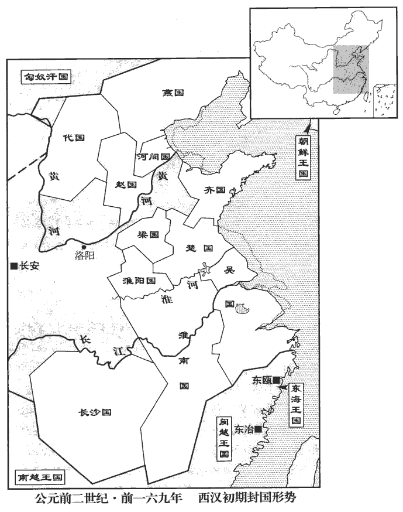
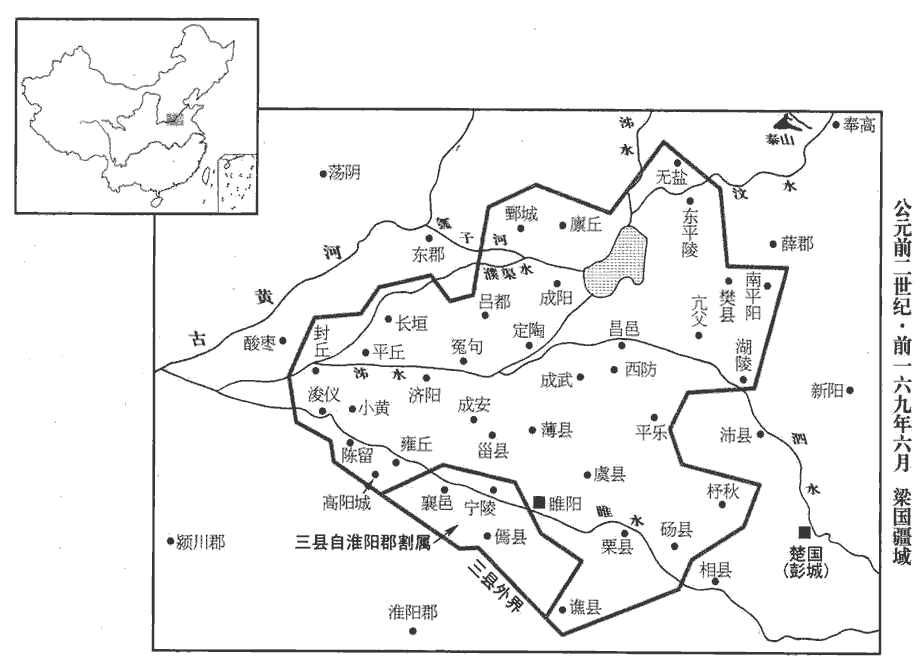
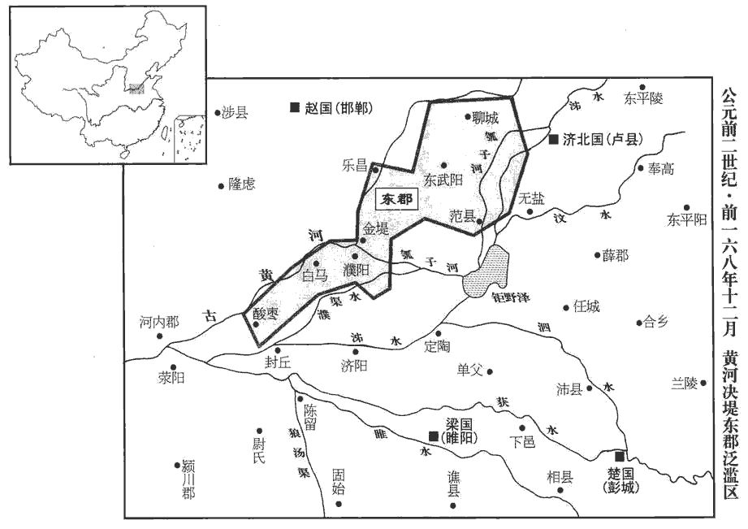
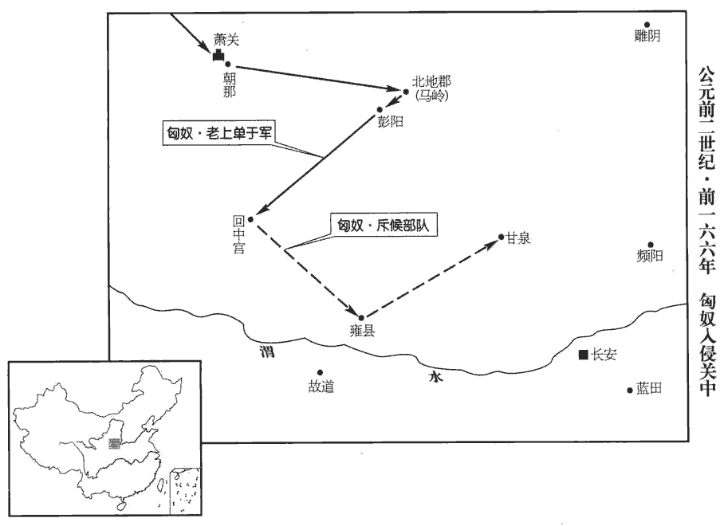
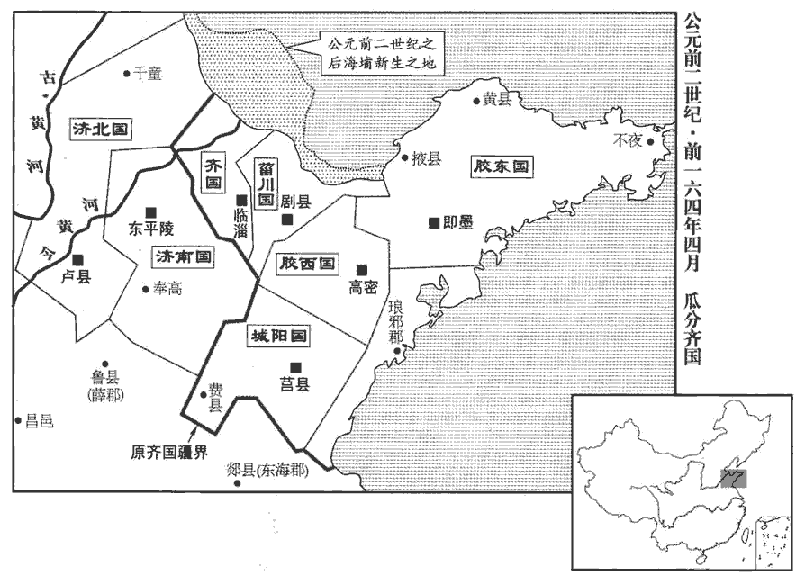
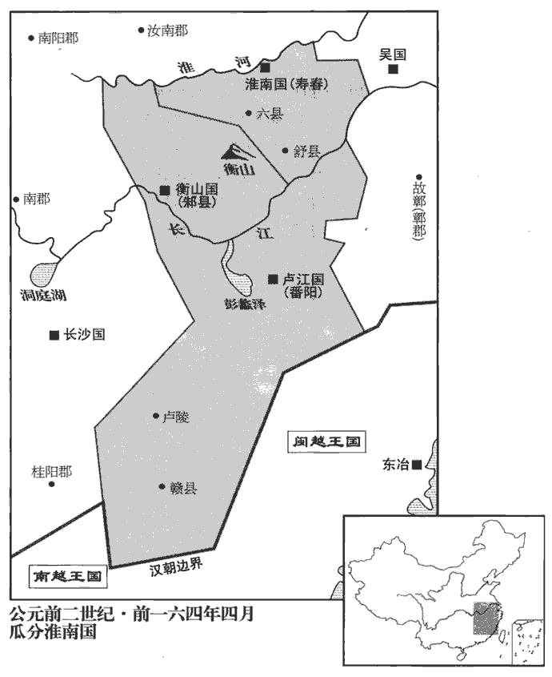
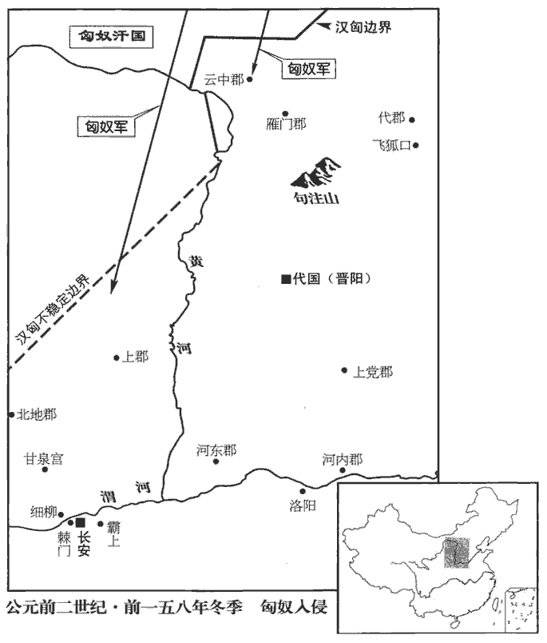

 漢紀七起玄黓yì涒tūn灘（壬申），盡柔兆閹茂（丙戌），凡十五年。

# 太宗孝文皇帝下

## 前十一年（壬申，前一六九年）

1冬，十一月，上‹刘恒，时年三十四›行幸代‹府晋阳，山西太原›；春，正月，自代還。

〖译文〗 [1]冬季，十一月，文帝巡行代国；春季，正月，文帝自代国返回长安。

2夏，六月，梁‹府定陶，山东定陶›懷王揖薨，揖受封事見十三卷二年。無子。賈誼復上疏曰：復，扶又翻。「陛下即不定制，如今之勢，不過一傳、再傳，服虔曰：一、二傳世也。諸侯猶且人恣而不制，言人人自恣而不可制也。豪植而大強，言其矜豪自植立，太過於強也。漢法不得行矣。陛下所以為藩捍及皇太子之所恃者，唯淮陽‹府陈县，河南淮陽›、代‹府晋阳，山西太原›二國耳。淮陽王武、代王參，帝之子而太子之弟也，故云所恃唯此二國。代，北邊匈奴，與強敵為鄰，能自完則足矣；而淮陽之比大諸侯，廑jǐn如黑子之著面，廑，與僅同。師古曰：黑子，今所謂黶yǎn子也。著，則略翻；下北著同。適足以餌大國言國小如魚餌，適足為所吞食。而不足以有所禁禦。方今制在陛下；制國而令子適足以為餌，豈可謂工哉！臣之愚計，願舉淮南地以益淮陽，而為梁王立後，為，於偽翻。割淮陽北邊二、三列城與東郡以益梁。不可者，可徙代王而都睢陽‹河南商丘›。睢陽故宋國，微子所封；班志屬梁國。括地志：宋州宋城縣，在州南二里外，城中本漢之睢陽縣也。漢文帝封子武于大梁，以其地卑濕，徙睢陽，故改曰梁。睢，音雖。梁起於新郪qī‹安徽太和北›而北著之河，班志，新郪縣屬汝南郡。應劭曰：秦為郪丘；漢興，為新郪。師古曰：潁川縣。郪，千移翻。淮陽包陳‹河南淮陽›而南揵jiàn之江，陳，即謂古陳國之地也。晉灼曰：包，取也。如淳曰：揵，謂立封界也；或曰：揵，接也。師古曰：揵，巨偃翻。則大諸侯之有異心者破膽而不敢謀。梁足以捍齊、趙，淮陽足以禁吳、楚，陛下高枕，終無山東之憂矣，枕，職任翻。此二世之利也。如淳曰：從誼言，可二世安耳。師古曰：言帝身及太子嗣位之時。當今恬然，適遇諸侯之皆少；師古曰：恬，安也。少，謂年少。少，時照翻。數歲之後，陛下且見之矣。夫秦日夜苦心勞力以除六國之禍；今陛下力制天下，頤指如意，如淳曰：但動頤指麾，則所欲皆如意。仲馮曰：頤、指，兩事。高拱以成六國之禍，難以言智。苟身無事，畜亂，宿禍，畜，讀曰蓄。孰視而不定；孰，古熟字通。萬年之後，傳之老母、弱子，將使不寧，不可謂仁。」帝於是從誼計，徙淮陽王武為梁王，北界泰山‹山东泰安北›，西至高陽‹河南杞县西南高阳镇›，得大縣四十餘城。後歲余，賈誼亦死，死時年三十三矣。

〖译文〗 [2]夏季，六月，梁怀王刘揖去世，他没有儿子。贾谊再次上疏说：“陛下如果不确立制度，从如今的趋势来看，封国不过传了一代或者两代，诸侯尚且自行其事不受朝廷节制，再扩张强大，朝廷的法度就没有办法实行了。陛下当做屏障和皇太子所能仗恃的，只有淮阳国、代国两个封国罢了。代国，北部与匈奴相接，与强敌为邻，能自我保全就足够了；淮阳国与那些强大的诸侯国相比，仅仅像一个黑痣附着在脸上一样，它恰恰只能诱发大国吞并的欲望，而无力对大国有所牵制。现在权在陛下手中；封立王国却使自已儿子的封国小得只能做被人吞并的诱饵，怎能说设计得好呢！我有个愚笨的计谋，请皇帝把原属淮南国的封地，全划归淮阳国，使淮阳国增大，并且为梁王立继承人，把淮阳北边的两三个城和东郡划归梁国，以扩大梁国的封地。如果不妥，可以把代王改封为梁王，而以睢阳为都城。梁国封地起于新而北面直达黄河，淮阳国的封地囊括了原来陈国的全境并且南部直达长江，那么其他大诸侯国有二心的，也胆战心惊不敢图谋反叛朝廷了。梁国足以阻止齐国和赵国，淮阳国足以禁制吴国和楚国，陛下可以垫高枕头安睡，再没有对崤山以东的忧虑了。这可使两代君主安享太平。现在安然无事，是因为恰巧诸侯王都还年幼，几年之后，陛下就会看见诸侯王带来的危机了。秦始皇日日夜夜苦心劳力以铲除六国之祸；而现在陛下牢牢地控制着天下，一举一动都能如意，却高拱两手安坐，造成新的六国之祸，就难说您有智谋。即便是终您一生太平无事，但却留下了祸乱的根源，对这些危机早就看到了却不去解决，待您百年之后，把危机留给了年迈的老母，幼稚的弱子，使 他们不得安宁，不能说您是仁者。”文帝于是采纳了贾谊的计策，把淮阳王刘武改封为梁王，梁国封地北以泰山为界，西至高阳，共有大县四十多个。又过了一年多，贾谊死去了，死时年仅三十三岁。

 

 

3徙城陽‹山东莒县›王喜為淮南‹安徽寿县›王。喜，城陽王章之子，齊悼惠王肥之孫。

〖译文〗 [3]文帝改封城阳王刘喜为淮南王。

4匈奴‹王庭设蒙古哈尔和林›寇狄道‹甘肅臨洮›。狄道縣為隴西郡治所。師古曰：其地有狄種，故曰狄道。

〖译文〗 [4]匈奴侵犯狄道。

時匈奴數為邊患，數，所角翻。太子家令潁川鼂cháo錯上言兵事太子家令，屬詹事。張晏曰：太子稱家，故曰家令。臣瓚曰：茂陵中書：太子家令，秩八百石。潁川本韓國；秦置郡，漢因之。鼂，與朝同。風俗通：衛大夫史鼂之後。姓譜：王子朝之後。錯，倉故翻；音錯雜之錯者非。曰：「兵法曰：『有必勝之將，無必勝之民。』繇此觀之，安邊境，立功名，在於良將，不可不擇也。將，即亮翻；下同。

〖译文〗 当时，匈奴经常挑起边境战争，太子家令颍川人晁错向文帝上书，谈论战争问题说：“《兵法》说：‘有战无不胜的将军，没有战无不胜的民众。’由此看来，安定边境，建立功名，关键在于良将，不可不慎重地选择良将。

臣又聞：用兵臨戰合刃之急者三：一曰得地形，二曰卒服習，三曰器用利。兵法，步兵、車騎、弓弩、長戟、矛鋋chán、劍楯之地，師古曰：鋋，鐵杷短矛也。孔穎達曰：方言云：矛，吳、揚、江、淮南、楚、五湖之間謂之鉇shī，或謂之鋋，或謂之鏦cōng；其柄謂之矜。鉇，音蛇。晉陳安執丈八蛇矛，蓋蛇即方言之所謂鉇也。鋋，上延翻。楯，食尹翻。各有所宜；不得其宜者，或十不當一。士不選練，卒不服習，起居不精，動靜不集，趨利弗及，避難不畢，趨，七喻翻。難，乃旦翻。前擊後解，與金鼓之指相失，師古曰：金，金鉦zhēng。鼓，所以進眾，金，所以止眾。「指」，當作「音」。此不習勒卒之過也，百不當十。兵不完利，與空手同；甲不堅密，與袒裼xī同；應劭曰：袒裼，肉袒。裼，音錫。弩不可以及遠，與短兵同；射不能中，與無矢同；中不能入，與無鏃同；中，竹仲翻。師古曰：鏃，矢鋒也。鏃，子木翻。此將不省兵之禍也，師古曰：省，視也，悉井翻。五不當一。故兵法曰：『器械不利，以其卒予敵也；卒不可用，以其將予敵也；將不知兵，以其主予敵也；君不擇將，以其國予敵也；予，讀曰與。四者，兵之至要也。』

〖译文〗 “臣又听说：在战场上与敌人交锋，有三件最重要的事情：一是占据有利地形，二是士兵训练有素，三是武器精良。按照《兵法》所说，步兵、车骑兵、弓弩、长戟、矛铤、剑盾等不同的兵种和武器，分别适用于不同的地形，各有所长；如果战场地形不利于发挥军队和武器的长处，就可能出现十个士兵不如一个士兵的情况。士兵不经过挑选，军队缺乏训练、起居管理混乱，动静不一致，胜利进攻时跟不上，退避危难时不能一致行动，前军已经刀兵相接，后军却仍松松垮垮，士兵不能随着鸣金击鼓进退，这是不训练军队的错误，这样的军队，一百个人不抵十个用。士兵手中的兵器不齐备不锋利，与徒手作战一样；将士身上的盔甲不坚固，与脱衣露体一样；弩箭射不到远处，与短兵器一样；射不中目标，与没有箭一样；箭虽然射中目标却射不进敌人身体，就与没有箭头一样。这是将领不检查武器导致的祸患，这样的军队，五个人不抵一个用。所以《兵法》说：‘器械不锋利，是把士卒奉送给敌人；士卒不听号令，是把统兵将领奉送给敌人；将领不懂兵法，是把他的君主奉送给敌人；君主不精心选择将领，是把国家奉送给敌人。’这四点，是用兵最重要的关键。

臣又聞：小大異形，強弱異勢，險易異備。師古曰：易，平勢也。易，以豉chǐ翻；下同。夫卑身以事強，小國之形也；合小以攻大，敵國之形也；師古曰：彼我之力不能相勝，則須連結外援共制之也。以蠻夷攻蠻夷，中國之形也。師古曰：不煩華夏之兵，使其同類自相攻擊也。今匈奴地形、技藝與中國異：上下山阪，出入溪澗，中國之馬弗與也；弗與，猶言不如也。技，渠綺翻；下同。險道傾仄，仄，古側字。且馳且射，中國之騎弗與也；風雨罷勞，罷，讀曰疲。饑渴不困，中國之人弗與也；此匈奴之長技也。若夫平原、易地，輕車、突騎，則匈奴之眾易橈náo亂也；師古曰：突騎，言其驍銳可用衝突敵人也。橈，攪也，音火高翻；其字從「手」。一曰：橈，曲也，弱也，音女教翻；其字從「木」。勁弩、長戟，射疏、及遠，師古曰：疏，亦闊遠也。仲馮曰：「長戟」恐誤。或者勁弩如今九牛大弩，以槍為矢歟，故可射疏及遠也；然戟有鉤，又不可射。余謂文意各有所屬；勁弩，所以射疏，長戟，所以及遠也。則匈奴之弓弗能格也；堅甲、利刃，長短相雜，遊弩往來，什伍俱前，師古曰：五人為伍，十人為什。則匈奴之兵弗能當也；材官騶發，矢道同的，如淳曰：騶，矢也。處平易之地，可以矢相射也。臣瓚曰：材官，騎射之官也。射者騶發，其用矢者同中一的，言其工妙也。師古曰：騶，矢之善者；春秋傳作「菆」zōu，其音同耳。材官，有材力者。騶發，發騶矢以射也。手工，矢善，故中則同的。的，謂所射之準臬niè也。騶，側鳩翻。則匈奴之革笥、木薦弗能支也；孟康曰：革笥，以皮作如鎧者被之。木薦，以木板作如楯。一曰：革笥，木薦之，以當人心也。師古曰：一說非也。笥，音息嗣翻。下馬地斗，劍戟相接，去就相薄，薄，伯各翻；師古曰：迫也。則匈奴之足弗能給也；師古曰：給，謂相連及。此中國之長技也。以此觀之：匈奴之長技三，中國之長技五；陛下又興數十萬之眾，以誅數萬之匈奴，眾寡之計，以一擊十之術也。

〖译文〗 “臣又听说：在用兵时，依据交战双方国家大小不同、强弱不同和战场地形险峻平缓的不同，应采取不同的对策。自我贬抑，去侍奉大国，这是小国应采取的方法；如果与敌方不分强弱，就应联合其他小国对敌作战；利用蛮夷部族去进攻蛮夷部族，这是中原王朝应该采取的战略。现在匈奴的地形、军事技术与中原有很大不同：奔驰于山上山下，出入于山涧溪流，中原的马匹不如匈奴；在危险的道路上，一边策马奔驰一边射击，中原的骑射技术不如匈奴；不畏风雨疲劳，不怕饥渴，中原将士不如匈奴人；这是匈奴的优势。如果到了平原、地势平缓的地方，汉军使用轻车和骁勇的骑兵精锐，那么匈奴的军队就很容易被打乱；汉军使用强劲的弓弩和长戟，箭能射得很远，长戟也能远距离杀敌，那么匈奴的小弓就无法抵御；汉军身穿坚实的铠甲，手中有锋利的武器，长兵器与短兵器配合使用，弓箭手机动出击，兵按什伍编制统一进攻，匈奴的军队就不能抵挡；有勇力的弓箭手，以特制的好箭射向同一个目标，匈奴用皮革和木材制造的防御武器就会失效；下马在平地作战，剑戟交锋，近身搏斗，匈奴人的脚力就不如汉军；这是中原的军事优势。由此看来：匈奴有三项优势，汉军有五项优势；陛下又动用了数十万军队，去攻伐只有数万军队的匈奴，从兵员数量计算，这是以一击十的战术。士

雖然，兵，兇器，戰，危事也；故以大為小，以強為弱，在俛fǔ仰之間耳。師古曰：言不知其術，則雖大必小，雖強必弱。俛，亦俯字。余謂俛，音免，亦通。夫以人之死爭勝，跌而不振，服虔曰：蹉跌不可復起也。師古曰：跌，足失據也。跌，徒結翻。則悔之無及也；帝王之道，出於萬全。今降胡、義渠、蠻夷之屬來歸誼者，其眾數千，飲食、長技與匈奴同。【章：甲十五行本「同」下有「可」字；乙十一行本同；孔本同；張校同。】賜之堅甲、絮衣、勁弓、利矢，益以邊郡之良騎，令明將能知其習俗、和輯其心者，師古曰：輯，與集同。以陛下之明約將之。即有險阻，以此當之；平地通道，則以輕車、材官制之；兩軍相為表里，各用其長技，衡加之以眾，衡，與橫同。此萬全之術也。」

〖译文〗 “尽管如此，刀兵是不祥之物，战争是凶险之事；由大变小，由强变弱，瞬息之间就会发生。用人的生死去决胜负，失利就难以重振国威，后悔都来不及了。英明的君主在决策时，应立足于万无一失。现在已归降朝廷的胡人、义渠、蛮夷等，部众达数千人，他们的饮食习俗、善于骑射的特长，都与匈奴一样。赐给他们坚固的铠甲、绵衣、强劲的弓，锋利的箭，再加上边境各郡的精崐锐骑兵，起用通晓兵法并了解蛮夷部族风俗习惯，能笼络其人心的将领，用陛下明确的约定统率他们。如果遇到险阻，就让这些人冲锋陷阵；在宽阔的平野，就用战车、步兵去制服敌人；两支军队互为表里，各自发挥他们的优势，再加上以众击寡，这是万无一失的战略。”

帝嘉之，賜錯書，寵答焉。

〖译文〗 文帝很赞赏他的意见，赐给晁错一封复信，以表示宠信。

錯又上言曰：「臣聞秦起兵而攻胡、粵者，非以衛邊地而救民死也，貪戾而欲廣大也，故功未立而天下亂。且夫起兵而不知其勢，戰則為人禽，屯則卒積死。夫胡、貉mò之人‹吉林东部朝鲜民族›，其性耐寒；揚、粵之人‹福建浙江广东少数民族›，其性耐暑。秦之戍卒不耐其水土，戍者死于邊，輸者僨fèn於道。耐，乃代翻。服虔曰：僨，仆也，如淳曰：僨，音奮。秦民見行，如往棄市，因以謫zhé發之，名曰『謫戍』；先發吏有謫及贅婿、賈人，後以嘗有市籍者，又後以大父母、父母嘗有市籍者，後入閭取其左。應劭曰：秦以謫發戍，先自吏有過至於大父母、父母嘗有市籍者；曹輩盡，復入閭取其左者發之，未及取右而秦亡。孟康曰：秦時復除者居閭之左，後發役不供，復役之也。師古從應說。閭，里門也；居閭之左者，一切發之。發之不順，行者憤怨，有萬死之害而亡銖兩之報，亡，古無字通。死事之後，不得一算之復，漢律：人出一算，算百二十錢。天下明知禍烈及己也；師古曰：猛火曰烈，取以喻耳。陳勝行戍，至於大澤‹安徽宿州东南›，為天下先倡，事見七卷二世元年。天下從之如流水者，秦以威劫而行之之敝也。

〖译文〗 晁错再一次上书说：“臣听说秦起兵攻打匈奴和百越，不是为了保卫边境安宁、防止人民死于战争，而是残暴贪婪，要想扩大它的疆域，所以，功业没有建立，天下已经大乱。而且如果用兵而不了解敌人的虚实强弱，进攻就会被敌人所俘虏，屯守就会被敌人所困死。北方的胡人和貉人，生性耐寒；南方扬、粤一带的人，生性耐暑。秦朝的戍卒不服南北两地的水土，戍守边疆的死在边境，输送给养的死于路上。秦朝百姓被征发当兵，就如同去刑场被处死，于是秦王朝就征发犯罪的人去戍边，称作‘谪戍’。先是征发犯罪的官吏以及赘婿和商人充军，后来又扩大到曾有市籍经过商的人，然后又扩大到祖父母、父母曾有市籍经过商的人，最后强迫居住于闾左按规定不负担兵役的人，也去当兵。胡乱征发，被强迫当兵的人都心怀愤恨，他们遭受必死无疑的厄运，朝廷 却不给以丝毫的报偿，死于战场，他们的家属得不到国家免收一算赋税的回报，天下人都清楚地知道秦的暴政祸及自己。陈胜前去戍边，来到达大泽乡，首先为天下人做出了反秦的表率。天下人响应陈胜，如同流水下泄势不可挡，这是秦以严威强制征兵的恶果。

胡人衣食之業，不著於地，著，直略翻。其勢易以擾亂邊境，易，以豉chǐ翻。往來轉徙，時至時去；此胡人之生業，而中國之所以離南畮mǔ也。師古曰：南畮，所以耕種處也。離，力智翻。今胡人數轉牧、行獵於塞下，數，所角翻。以候備塞之卒，卒少則入。陛下不救，則邊民絕望而有降敵之心；救之，少發則不足，多發，遠縣纔至，則胡又已去。師古曰：纔，淺也，猶言僅至也；他皆類此。聚而不罷，為費甚大；罷之，則胡復入。復，扶又翻。如此連年，則中國貧苦而民不安矣。陛下幸憂邊境，遣將吏發卒以治塞，甚大惠也。治，直之翻。然今【章：甲十五行本「今」作「令」；孔本同。】遠方之卒守塞，一歲而更，歲更，見十三卷高后五年。更，工衡翻。不知胡人之能。不如選常居者家室田作，且以備之，以便為之高城深塹；因山川地形之便而為之城塹。要害之處，通川之道，調立城邑，毋下千家。師古曰：調，謂算度之也。摠計城邑之中，令有千家以上也。調，徒釣翻。先為室屋，具田器，乃募民，免罪，拜爵，謂有罪者免其罪，無罪者拜爵以勸其徙。復其家，謂民之欲往者，復除其家征役。復，方目翻。予冬夏衣、稟bǐng食，能自給而止。師古曰：初徙之時，縣官且稟給其衣食，於後能自供贍乃止也。予，讀曰與；下同。塞下之民，祿利不厚，不可使久居危難之地。難，乃旦翻。胡人入驅而能止其所驅者，以其半予之，孟康曰：謂胡入為寇，驅收中國，能奪得之者，以半予之。師古曰：孟說非也。言胡人入為寇，驅略漢人及畜產也。人能止得其所驅者，令其本主以半賞之。縣官為贖。張晏曰：得漢人，官為贖也。師古曰：張說非也。此承上句之言，謂官為備價贖之耳。為，於偽翻；下同。其民如是，則邑里相救助，赴胡不避死。非以德上也，師古曰：言非以此事欲立德義於主上也。欲全親戚而利其財也；此與東方之戍卒不習地勢而心畏胡者功相萬也。言其功萬倍於東方之戍卒也。以陛下之時，徙民實邊，使遠方無屯戍之事；塞下之民，父子相保，無系虜之患；利施後世，名稱聖明，其與秦之行怨民，相去遠矣。」師古曰：行怨民，言發怨恨之民使行戍役也。

〖译文〗 “匈奴人的衣食来源，不依靠土地，所以经常扰乱边境，往来转移，有时入侵，有时撤走；这是匈奴人的谋生之业，却使中原汉人离开了农田。现在匈奴人经常在边界一带放牧、打猎，察看汉军守边士兵的状况，发现汉军人少，就会入侵。如果陛下不发兵救援，边境百姓不能指望朝廷的救兵，就会萌发投降敌人的念头；如果陛下发兵救援，发兵太少就不起作用，多发援兵，来自于远方的各县援兵刚刚到达，匈奴军队又已撤走了。不撤走聚集在边境的大量军队，军费开支太大；撤走援兵，匈奴人又乘虚而入。这样连年折腾，那么中原地区就会陷入贫困，百姓无法安居乐业了。幸得陛下担忧边境问题，派遣将吏发兵加强边塞防务，这是对边境百姓的很大恩惠。但是现在远方的士兵驻防边塞，一年轮换一批，不了解匈奴人的本领。不如选常居的人在边境安家从事农耕生产，并且用于防御匈奴入侵，利用有利地势建成高城深沟；在战略要地、交通要道，规划建立城镇，规模不小于千户人口。官府先在城中修建房屋，准备农具，再召募百姓来边城居住，赦免罪名，赏给爵位，免除应募者全家的赋税劳役，并向他们提供冬夏季衣服和粮食，直到他们能生产自足时为止。如果崐不给边塞民众优厚的利禄，就无法使他们长期定居在这片危险困苦的土地上。匈奴入侵，有人能从匈奴手中夺回所掠财物，就把其中的一半给他，由官府为他赎买。边塞的百姓得到这样的待遇，就会邻里街坊相互救援帮助，冒死与匈奴搏斗。他们这样做，并不是对皇帝感恩戴德想有所报答，而是要想保全亲戚邻居，贪恋财产；与那些不了解本地地形并且对匈奴心怀畏惧的东方戍卒相比，他们防御匈奴的功效要高出一万倍。在陛下当政之时，迁徙百姓以充实边防，使远方没有屯戍边境的徭役；而边塞的居民，父子相互保护，免受被匈奴俘虏的苦难；陛下这样做，利益传到后世，得到圣明的名声，这与秦征发满怀怨恨的百姓去戍守边疆，是不能相比的。”

上從其言，募民徙塞下。

〖译文〗 文帝采纳晁错的建议，招募百姓迁往边塞定居。

錯復言：「陛下幸募民徙以實塞下，使屯戍之事益省，輸將之費益寡，如淳曰：將，送也；或曰：資也。復，扶又翻。甚大惠也。下吏誠能稱厚惠，稱，尺證翻。奉明法，存恤所徙之老弱，善遇其壯士，和輯其心而勿侵刻，使先至者安樂而不思故鄉，樂，音洛。則貧民相募【章：甲十五行本「募」作「慕」；乙十一行本同；孔本同。】而勸往矣。臣聞古之徙民者，相其陰陽之和，相，息亮翻。嘗其水泉之味，然後營邑、立城，制里、割宅，先為築室家，置器物焉，民至有所居，作有所用。此民所以輕去故鄉而勸之新邑也。之，往也。為置醫、巫以救疾病，以修祭祀，男女有昏，師古曰：昏，謂婚姻配合也。生死相恤，墳墓相從，種樹畜長，師古曰：種樹，謂桑、果之屬。張晏曰：畜長，六畜也。貢父曰：所種、所樹、畜積、長茂。余謂畜長當從張說。畜，許六翻。長，知兩翻。室屋完安。此所以使民樂其處而有長居之心也。樂，音洛。

〖译文〗 晁错再次上书说：“陛下召募迁徙的百姓以充实边塞，使屯戍的徭役越发减省，运输费用更加减少，这是对百姓很大的恩惠。下级官吏的表现如果真能与陛下对百姓的厚惠相称，遵奉陛下的法令，对迁来的应募百姓，照顾其中的老弱，厚待其中的壮士，争取他们的拥护而不去欺凌他们，使先来的人安居乐业而不思念自己的故乡，那么贫民就会感到羡慕，相互劝勉前往边塞了。臣听说古代明君迁徙百姓，要先察看当地是否阴阳调和，品尝水泉是否甘美可口，然后再营造集镇、修筑城池，设计乡里、划分住宅地，先为百姓修筑房屋，配置器物，百姓到达后有可居住的房屋，有可使用的器物。这正是百姓不留恋故乡而相互勉励迁往新居的原因。官府在迁徙的新居住区设置医生、巫神，为百姓医治疾病，主持祭祀。百姓得以男女婚配，生老病死相互照顾，坟墓相互依靠，栽种树木，喂养六畜，屋房完备安全。这样做正是为了让百姓乐于长期定居此地。

臣又聞古之制邊縣以備敵也，使五家為伍，伍有長，長，知兩翻。十長一里，里有假士，四里一連，連有假五百，十連一邑，邑有假候，服虔曰：假，音假借之假。五百，帥名也。師古曰：假，大也，工雅翻。仲馮曰：假，服說是。古者戍皆有期，代則不置。故曰假，謂其權設；猶假司馬之類，亦非常置也。余謂五百，即後所謂伍伯也。賈公彥曰：伍伯者，漢制，五人為伍；伯，長也。沈約曰：舊說，古者君行師從，卿行旅從；旅者，五百人也，今諸官府至郡各置五百四，以象師從、旅從，依古義也。候，即軍候也。皆擇其邑之賢材有護、師古曰：有保護之能者也。習地形、知民心者；居則習民於射法，出則教民于應敵。故卒伍成於內，則軍政定於外。服習以成，勿令遷徙，師古曰：各守其業也。幼則同遊，長則共事。長，知兩翻。夜戰聲相知，則足以相救；晝戰目相見，則足以相識；驩愛之心，足以相死。如此而勸以厚賞，威以重罰，則前死不還踵矣。師古曰：還踵，迴旋其足也。還，音旋。所徙之民非壯有材者，但費衣糧，不可用也；雖有材力，不得良吏，猶亡功也。亡，古無字通。

〖译文〗 “臣又听说古代明君为了防御敌人入侵，在沿边境的各县创设如下建制：每五家为一伍，设置伍长；每十个伍的民户为一里，里设置有假士；每四里为一连，连有假五百；每十连为一邑，邑设置假候，都选择邑中贤才里有保护能力、熟悉地形、了解民心的人担任这些职务；安居本地就教民众学习射箭，出临边境就教民众学习防御敌人。军事编制形成于内，军事政令就能在外有效地发挥作用。百姓训练有素，不许他们随便迁移，年幼时一同玩乐，成年后共事。夜间战斗，只要听到声音就能互相了解，足以相互救援；白天作战，只要看见，就足以相互识别；友爱之心，足以使他们生死与共。在此基础上，朝廷再以厚赏奖励，以重罚威逼，百姓就会前仆后继，勇往直前了。所迁徙的百姓如果不是强壮有力的人，只能虚耗衣服粮食，不能用于充实边防；百姓虽然强壮有力，但如果没有好官去治理，也不会有功效。

陛下絕匈奴不與和親，臣竊意其冬來南也；師古曰：意，儗nǐ也。壹大治，則終身創矣。師古曰：創，懲艾也；初亮翻。欲立威者，始於折膠；蘇林曰：秋氣至，膠可折，弓弩可用；匈奴常以為候而出軍。折，而設翻。來而不能困，使得氣去，師古曰：使之得勝，逞志氣而去。後未易服也。」易，以豉翻。

〖译文〗 “陛下拒绝与匈奴和亲，我私下估计他们冬季会向南进犯；边境一旦大治，就可以重创匈奴，使他们终身不振恢复不了元气。如果想树立汉朝廷的威名，就应该在秋季匈奴刚纵兵入侵时就给以痛击；假若匈奴来犯而不能打败他们，使他们得志而去，以后就不容易降服了。”

錯為人陗qiào直刻深，師古曰：陗，與峭同。陗，謂峻陿xiá也；章笑翻。韋昭曰：岸高曰峭。臣瓚曰：陗，峻陗。以其辯得幸太子，太子家號曰「智囊」。師古曰：言其一身所有皆是智算，若囊橐tuó之盛物也。

〖译文〗 晁错为人刚直而又严峻苛刻，因辩才而得到太子的宠信，太子家里称他为“智囊”。

## 十二年（癸酉，前一六八年）

1冬，十二月，河決酸棗‹河南延津›，東潰金堤‹一名千里堤，河南濮阳南›、東郡‹河南濮陽西南›；大興卒塞之。班志，酸棗縣屬陳留郡。師古曰：金堤在東郡白馬界，今滑州。括地志：金堤，一名千里堤，在白馬縣東五里。余據河堤自汴口以東，緣河積石為堰，通河古口，咸曰金堤。又水經註：濮陽縣故城在河南，與衛縣分水；城北十里有瓠hù河口，有金堤。塞，悉則翻。

〖译文〗 [1]冬季，十二月，黄河在酸枣县决口，向东冲溃了金堤，淹没东郡；朝廷大量征发士卒堵塞决口。

2春，三月，除關，無用傳。張晏曰：傳，信也；若今過所也。如淳曰：兩行書繒帛，分持其一，出入關，合之乃得過，謂之傳也。李奇曰：傳，棨qǐ也。師古曰：張說是也。古者或用棨，或用繒帛；棨者，刻木為合符也。康曰：傳以木為之，長尺五，書符於上為信。傳，張戀翻。

〖译文〗 [2]春季，三月，朝廷宣布废止关隘检查制度，吏民出行不必带证明身份的符传。

 

3鼂錯言於上‹刘恒，时年三十五›曰：「聖王在上而民不凍饑者，非能耕而食之，織而衣之也，為開其資財之道也。食，祥吏翻。衣，於既翻。為，於偽翻。故堯有九年之水，湯有七年之旱，而國亡捐瘠者，孟康曰：肉腐為瘠。捐，骨不埋者。或曰：捐，謂有饑相棄捐者；或謂貧乞者為捐。蘇林曰：瘠，音漬。師古曰：瘠，瘦病也；言無相棄捐而瘦病者耳，不當音漬也；貧乞之釋，尤疏僻焉。亡，古無字通。以畜積多而備先具也。今海內為一，土地人民之眾不減湯、禹，加以無天災數年之水旱，而畜積未及者，何也？地有遺利，民有餘力；生穀之土未盡墾，山澤之利未盡出，遊食之民未盡歸農也。

〖译文〗 [3]晁错对文帝说：“英明的君主在位，百姓不受饥寒的折磨，这并不是君主能亲自耕作供给百姓食物，亲自织布为百姓做衣服，而是君主为百姓开辟了生财之路。所以尧遇到九年的大涝灾，商汤七年的大旱灾，而全国并没有被抛弃的病饿者，其原因就在蓄 积多而预先做了充分的准备。现在海内大一统，土地之广、人口之众，不亚于商汤和夏禹时代，再加上没有持续几年的旱涝天灾，但蓄 积却没有那时多，原因何在？是因为土地还有余力没有利用，百姓还有余力没有发挥；可生长谷物的土地还没有全部开垦，山林川泽的财富还没有全部开发，不从事生产而消耗粮食的游民还没有全部回归农业生产。

夫寒之於衣，不待輕暖；師古曰：苟禦風霜，不求美麗也。饑之於食，不待甘旨；師古曰：旨，美也。饑寒至身，不顧廉恥。人情，一日不再食則饑，終歲不制衣則寒。夫腹饑不得食，膚寒不得衣，雖慈父不能保其子，君安能以有其民哉！明主知其然也，故務民于農桑，薄賦斂，斂，力贍翻。廣畜積，以實倉廩，備水旱，故民可得而有也。民者，在上所以牧之；民之趨利，如水走下，四方無擇也。趨，七喻翻。走，音奏。

〖译文〗 “严寒之时人们急需衣服，不求轻暖，能御寒就穿；饥饿时急需食品，不求香甜可口，能充饥就吃。饥寒临身，人们顾不得讲究廉耻。人之常情，一天不吃两餐就会挨饿，一年不做衣服就会挨冻。如果腹中饥饿却得不到食物，肌肤寒冷却得不到衣服，即便是慈父也不能保有他的儿子，君主怎么能够控制住他的百姓呢！英明的君主知道这个道理，所以引导百姓从事农桑耕织，少收赋税，多搞蓄积，用来充实府库，防备旱涝灾害，所以才能稳定对百姓的统治。百姓的善恶，就看君主如何去诱导、统治他们；百姓追求财利，就如同水只会向下流而不选择方向一样。

夫珠、玉、金、銀，饑不可食，寒不可衣；然而眾貴之者，以上用之故也。其為物輕微易藏，易，以豉翻；下同。在於把握，可以周海內而無饑寒之患。師古曰：周，謂周遍而遊行。此令臣輕背其主背，蒲妹翻。而民易去其鄉，盜賊有所勸，亡逃者得輕資也。粟、米、布、帛，生於地，長於時，聚於力，非可一日成也；長，知兩翻；下同。數石之重，中人弗勝，師古曰：中人者，處強弱之中也。勝，音升。不為奸邪所利，一日弗得而饑寒至。是故明君貴五穀而賤金玉。

〖译文〗 “珠、玉、金、银等物品，饿的时候不能吃，冷的时候不能穿；但是大家都把它们视为珍宝，原因就在于君主使用它们。这些东西轻又小便于收藏，只要拿着握于手掌中的那么一点，就可以周游天下而不受饥寒之苦。这可以使臣子轻易地背叛他的君主，使百姓轻易地离开故乡，刺激了盗贼的贪欲，使逃亡者得到轻便 的资财。粟、米、布、帛等物，产于土地，按时成长，投入很多人力，不是一天就可以生产出来的；重达数石的粟、米、布、帛，价值有限，一个体力中等的人却已无法搬运，它不会成为资贼劫夺的目标，但人们一天得不到它们，就得忍受饥寒。所以英明的君主看重五谷而轻视金玉。

今農夫五口之家，其服役者不下二人，師古曰：服，事也；服公事之役也。其能耕者不過百畮，百畮之收不過百石。春耕，夏耘，秋穫，冬藏，伐薪樵，治官府，給繇役；治，直之翻。繇，與傜同；後以義推。春不得避風塵，夏不得避暑熱，秋不得避陰雨，冬不得避寒凍，四時之間無日休息；又私自送往迎來、吊死問疾、養孤長幼在其中。勤苦如此，尚復被水旱之災，復，扶又翻。被，皮義翻。急政暴賦，賦斂不時，朝令而暮改。斂，力贍翻。有者半賈而賣，師古曰：本直千錢，止得五百也。賈，讀曰價。無者取倍稱之息，如淳曰：取一償二為倍稱。師古曰：稱，舉也，今俗所謂舉錢者也。余謂如說是。稱，尺證翻。於是有賣田宅，鬻妻子【章：甲十五行本「妻子」作「子孫」；乙十一行本同；退齋校同。】以償責者矣。而商賈，大者積貯倍息，小者坐列販賣，師古曰：行賣曰商，坐販曰賈。列，市列也，若今市中賣物行也。賈，音古。貯，丁呂翻。操其奇贏，日遊都市，操，千高翻。師古曰：奇贏，謂有餘財而蓄聚奇異之物也。一說：奇，謂殘餘物也。居宜翻。乘上之急，所賣必倍。師古曰：上所急求，則其價倍貴。故其男不耕耘，女不蠶織，衣必文采，食必粱肉；師古曰：粱，好粟也，即今之粱米。無農夫之苦，有仟伯之得。師古曰：仟，謂千錢；伯，謂百錢也。伯，莫白翻，今俗猶謂百錢為一伯。因其富厚，交通王侯，力過吏勢，以利相傾；千里游敖，冠蓋相望，乘堅、策肥、履絲、曳縞、乘堅車，策肥馬。師古曰：堅，謂好車也。縞，皓素也；繒之精白者也。此商人所以兼併農人，農人所以流亡者也。

〖译文〗 “现在家中有五口人的农民家庭，为官府服徭役的不少于两个人，能耕种的土地不过一百亩，百亩土地的收获量不超过一百石。农民春季耕种，夏季锄草，秋季收获，冬季贮藏，砍柴，修缮官府房屋，服徭役；春天不能避风尘，夏天不能避暑热，秋天不能避阴雨，冬天不能避严寒，一年四季没有休息的日子；还有民间的人情往来，吊唁死者慰问病人、赡养父母、哺育子女等负担，也得从一百石的收获物中支付。农民如此勤劳困苦，还要再蒙受旱涝灾害，官府政令严苛而赋税繁重，不按规定时间征收赋税，早上发布的政令晚上又有变化。农民家中有资财的，以半价折卖，家中贫穷的，只好去借利息双倍的高利贷，于是就有人卖土地房宅、卖妻卖子以偿还债务了。而那些行商坐贾，实力大的积贮钱财发放双倍利息的高利贷，实力小的坐在市肆中作买卖，依靠手中囤积的物品，每天游荡在都市之中，得知皇帝急需某种物品，就把价格提高到两倍以上。所以商人男的不去耕田耘草，女的不去养蚕纺织，但穿衣服却非穿华丽的绸缎不可，吃饭非吃好米好肉不可。商人不受农民那样的辛苦，却可以得到很多钱财。商人依仗手中大量的钱财，与王侯显贵结交，势力超过了一般官员，于是以财利进行倾轧；商人到千里之外遨游，车子在路上前后相望，络绎不绝。他们乘坐着坚实的车子，鞭策着肥马，踏着丝制的鞋子，穿着精美的白色绸缎衣服。这就是商人兼并农民、农民破产流亡的原因。

方今之務，莫若使民務農而已矣。欲民務農，在於貴粟；貴粟之道，在於使民以粟為賞罰。今募天下入粟縣官，得以拜爵，得以除罪。如此，富人有爵，農民有錢，粟有所渫xiè。師古曰：渫，散也，先列翻。夫能入粟以受爵，皆有餘者也；取于有餘以供上用，則貧民之賦可損，師古曰：損，減也。所謂損有餘，補不足，令出而民利者也。今令民有車騎馬一匹者，復卒三人；如淳曰：復三卒之算錢也；或曰：除三夫不作甲卒也。師古曰：當為卒者，免其三人；不為卒者，復其錢。復，方目翻。車騎者，天下武備也，故為復卒。為，於偽翻。神農之教曰：『有石城十仞，應劭曰：仞，六尺五寸也。師古曰：此說非也；八尺曰仞，取人伸臂之一尋也。湯池百步，師古曰：池，城邊池也、以沸湯為池，不可輒近，言嚴固之甚。帶甲百萬，而無粟，弗能守也。』以是觀之，粟者，王者大用，政之本務。今民入粟受爵至五大夫以上，師古曰：五大夫，第九爵。乃復一人耳，此其與騎馬之功相去遠矣。爵者，上之所擅，師古曰：擅，專也。出於口而無窮；粟者，民之所種，生於地而不乏。夫得高爵與免罪，人之所甚欲也；使天下人入粟于邊以受爵、免罪，不過三歲，塞下之粟必多矣。」

〖译文〗 “现在的当务之急，没有比使百姓从事农耕更重要的了。要想使百姓务农，关键在于使全社会把粮食看成为珍宝；使全社会把粮食看做珍宝的方法，在于朝廷 把粮食作为奖惩手段统治百姓。可以召募天下百姓向官府缴纳粮食，用以购买爵位免除罪名。这样，富人可以拥有爵位，农民可以得到钱，粮食就不会被屯积。那些能够缴纳粮食换取爵位的人，都是粮食有余的，收取余粮供给国家使用，就可以减少对贫困百姓收取的赋税，这就是所说的‘损有余，补不足’，政令一公布就可以给百姓带来利益。现行的律令规定：有一匹战马的人家，可免除三人的兵役；战马，是天下的重要军事装备，所以给予免除兵役的优待。神农的教令说：‘有高达十仞的石砌城墙，有宽达一百步的滚沸的护城河，有一百万全副武装的士兵，但没有粮食，那无法守住城池。’由此看来，粮食是君主的重要资本，是国家政治的根本所在。现在百姓缴纳粮食要得到五大夫以上的爵位，才能免除一人的兵役，这与对有战马的人的优待相比较，差得太远了。封爵的权力，是君主所专有的，由口而出可以无穷无尽；粮食，是百姓所种的，生长于土地而不会缺乏。得到高等爵位和免除罪名，是天下百姓最迫切的欲望；让天下人输送粮食到边境地区，以换取爵位、免除罪名，不用三年时间，边塞的粮食储备就必定会很多了。”

帝從之，令民入粟于邊，拜爵各以多少級數為差。時令入粟六百石爵上造，稍增至四千石為五大夫，萬二千石為大庶長。

〖译文〗 文帝采纳晁错的意见，下令规定：百姓输送粮食到边塞，依据输送粮食的多少，分别授给高低不同的爵位。

錯復奏言：「陛下幸使天下入粟塞下以拜爵，甚大惠也。復，扶又翻；下同。竊恐塞卒之食不足用，大渫xiè天下粟。邊食足以支五歲，可令入粟郡縣矣；師古曰：入諸郡縣以備凶災也。郡縣足支一歲以上，可時赦，勿收農民租。如此，德澤加于萬民，民愈勤農，大富樂矣。」樂，音洛。

〖译文〗 晁错又上奏说：“陛下降恩，让天下人输送粮食去边塞，以授给爵位，这是对百姓的很大恩德。我私下担忧边塞驻军的粮食不够吃，所以让天下的屯粮崐大批流入边塞。如果边塞积粮足够使用五年，就可以让百姓向内地各郡县输送粮食了；如果郡县积粮足够使用一年以上，可以随时下诏书，不收农民的土地税。这样，陛下的恩德雨露普降于天下万民，百姓就会更积极地投身农业生产，天下就会十分富庶安乐了。”

上復從其言，詔曰：「道民之路，在於務本。道，讀曰導。朕親率天下農，十年於今，而野不加辟，師古曰：辟，讀曰闢，開也。歲一不登，民有饑色；師古曰：登，成也；言五穀一歲不成則眾庶饑餒，是無蓄積故也。是從事焉尚寡師古曰：從事，謂從農事也。而吏未加務。吾詔書數下，歲勸民種樹而功未興，是吏奉吾詔不勤而勸民不明也。且吾農民甚苦而吏莫之省，將何以勸焉！數，所角翻。省，悉井翻。其賜農民今年租稅之半。」

〖译文〗 文帝采纳了他的建议，下诏说：“引导百姓的正确道路，在于让他们从事农业生产。朕亲自率领天下人务农耕种，至今已有十年了，但荒地的开垦没有增加，一年收成不好，百姓就有饥饿之色；这是从事农耕的人还不多，而官吏没有切实发展农业。朕屡次颁下诏书，每年都鼓励百姓种植，至今未见成效，这就证明官吏没有认真地执行诏令去勉励百姓。况且朕的农民生活很苦而官吏并不去照顾他们，又怎么能勉励他们从事农业呢！今年把原定征收的土地税的的一半赐给农民。”

## 十三年（甲戌，前一六七年）

1春，二月，甲寅‹十六›，詔曰：「朕親率天下農耕以供粢zī盛，稷曰明粢，在器曰盛。盛，時征翻。皇后親桑以供祭服；其具禮儀！」

〖译文〗 [1]春季，二月，甲寅（十六日），文帝下诏说：“朕亲自率领天下臣民进行农耕，供应宗庙祭祀的粮食，皇后亲自采桑养蚕，供应祭祀的祭服；制定有关此事的礼仪！”

2初，秦時祝官有祕祝，應劭曰：祕祝之官，移過於下，國家諱之，故曰祕也。即有災祥，輒移過於下。夏，詔曰：「蓋聞天道，禍自怨起而福繇德興，百官之非，宜由朕躬。今祕祝之官移過於下，以彰吾之不德，朕甚弗取。其除之！」

〖译文〗 [2]当初，秦朝的祝官中有秘祝，一旦出现了灾异，就把造成过失的责任从皇帝身上移到臣子身上。夏季，文帝下诏书说：“朕听说天之道，祸从怨而起，福由德而兴，百官的过失，都应该由朕一人负责。现在秘祝官员把过失的责任推给臣下，是显扬了朕的失德，朕很不赞成。应予废除！”

3齊太倉令淳于意有罪，太倉令，齊王國官也。姓譜：淳于出於姜姓，州公之後。當刑，詔獄逮系長安。師古曰：逮，及也；辭之所及，則追捕之，故謂之逮。一曰：逮者，在道將送，防禦不絕，若今之傳送囚。其少女緹tí縈上書曰：師古曰：緹，他弟翻；索隱音啼。縈，于營翻。「妾父為吏，齊中皆稱其廉平；今坐法當刑。妾傷夫死者不可復生，刑者不可復屬，夫，音扶。復，扶又翻；下同。師古曰：屬，聯也，之欲翻。雖後欲改過自新，其道無繇也。繇，古由字通用。妾願沒入為官婢，漢制：永巷令典官婢。以贖父刑罪，使得自新。」

〖译文〗 [3]齐国太仓令淳于意犯了罪，当处以肉刑，被逮捕拘压在长安诏狱。他的小女儿缇萦向皇帝上书说：“我父亲做官，齐国人都称赞他廉洁公平；现在他犯了罪，按法律应判处肉刑。我感到悲痛伤心的是，死人不能复生，受刑者残肢不能再接，即使以后想改过自新，也没有办法了。我愿意没入官府做官婢，以抵赎我父亲该受的刑罚，使他得以改过自新。”

天子‹刘恒，时年三十六›憐悲其意，五月，詔曰：「詩曰：『愷弟君子，民之父母。』師古曰：大雅泂jiǒng酌之詩也。言君子有和樂簡易之德，則其下尊之如父，親之如母也。今人有過，教未施而刑已加焉，或欲改行為善而道無繇至，朕甚憐之！夫刑至斷支體，刻肌膚，終身不息，行，下孟翻。斷，端管翻。師古曰：息，生也。何其刑之痛而不德也！豈為民父母之意哉！其除肉刑，有以易之；及令罪人各以輕重，不亡逃，有年而免。孟康曰：其不亡逃者，滿其年數，得免為庶人。具為令！」師古曰：使更為條例。

〖译文〗 文帝很怜悯和同情缇萦的孝心，五月，下诏书说：“《诗经》说‘开明宽厚的君主，是爱护百姓的父母。’现在人们有了过错，还没有加以教育就处以刑罚，有的人想改变行为向善，也无路可走了，朕很怜惜！肉刑的残酷，以至于切断人的肢体，摧残人的皮肉，使人终生无法生育，这是多么残酷和不合道德！难道这符合为民父母的本意吗！应该废除肉刑，用别的惩罚去代替它；此外，应规定犯罪的人各依据罪名的轻重，只要不从服刑的地方潜逃，服刑到一定年数，就可以释放他。制定出有关的法令！”

丞相張蒼、御史大夫馮敬奏請定律曰：「諸當髡者為城旦、舂；髡，鬄tì也，謂去其髮及其耏ér鬢。應劭曰：城旦者，旦起行治城；舂者，婦人不豫外傜，但舂作米：皆四歲刑也。當黥髡者鉗為【章：乙十一行本作「當黥者髡鉗爲」。】城旦、舂；鉗者，以鐵束其頸。當劓者笞三百；當斬左止者笞五百；當斬右止及殺人先自告及吏坐受賕qiú、枉法、守縣官財物而即盜之、已論而復有笞罪者皆棄市。師古曰：止，足也；當斬右足者，以其罪次重，故從棄市也。殺人先自告，謂殺人先自首得免罪者也。吏受賕枉法，謂受賂而曲公法者也。守縣官財物而即盜之，即今律所謂主守自盜者也。殺人害重、受賕、盜物贓汙之身，故此三罪已被論而又犯笞，亦皆棄市。罪人獄已決為城旦、舂者，各有歲數以免。」城旦、舂滿三歲為鬼薪、白粲，鬼薪、白粲一歲為隸臣妾，隸臣妾一歲免為庶人；隸臣妾滿二歲為司寇，司寇一歲及作如司寇二歲皆免為庶人。制曰：「可。」

〖译文〗 丞相张苍、御史大夫冯敬奏请制定这样的法律条文：“原来应判处髡刑的，改为罚作城旦和城旦舂；原来应判处黥髡刑的，改作钳为城旦、钳为城旦舂；原来应判处劓刑的，改为笞三百；原来应判处斩左脚的，改为笞五百；原来崐判处斩右脚以及杀人之后先去官府自首的，官吏因受贿、枉法、监守自盗等罪名已被处置但后来又犯了应判处笞刑的，全都改为公开斩首。罪犯已被判处为城旦、城旦舂的，各自服刑到一定年数后赦免。”文帝下达批准文书：“同意。”

是時，上既躬修玄默，而將相皆舊功臣，少文多質，懲惡亡秦之政，惡，烏露翻。論議務在寬厚，恥言人之過失，化行天下，告訐jié之俗易，自下告上曰訐。師古曰：面相斥罪也。居謁翻。吏安其官，民樂其業，樂音洛。畜積歲增，戶口寖息，風流篤厚，禁罔疏闊，疏與踈同。罪疑者予民，師古曰：從輕斷。予讀曰與。是以刑罰大省，至於斷獄四百。師古曰：謂普天之下重罪者也。斷，丁亂翻。有刑錯之風焉。應劭曰：錯，置也。民不犯法無所刑也。錯，千故翻。

〖译文〗 这一时期，文帝自身谦逊自守，而将相大臣都是老功臣，少文采而多质朴。君臣以导致秦灭亡的弊政为鉴诫，论议国政讲究以宽厚为本，耻于议论别人的过失；这种风气影响到全国，改变了那种互相检举、攻讦的风俗。官吏安于自己的官位，百姓乐于自已的生业，府库储蓄每年都有增加，人口繁衍。风俗归于笃实厚道，禁制法网宽松，有犯罪嫌疑的，从宽发落，所以，刑罚大量减少，甚至一年之内全国只审判了四百起案件，出现了停止动用刑罚的景象。

4六月，詔曰：「農，天下之本，務莫大焉。今勤身從事而有租稅之賦，是為本末者無以異也，李奇曰：本，農也；末，賈也。言農與賈俱出租無異也，故除田租。其于勸農之道未備。其除田之租稅！」

〖译文〗 [4]六月，文帝下诏书说：“农业，是天下的根本，没有什么事情比农业更为重要。现在那些辛苦勤劳的农民，还要缴纳租税，这样做，使从事农耕本业和从事工商末业的人没有区别，说明鼓励发展农业生产的政策不完备，应当免除农田的租税！”

## 十四年（乙亥，前一六六年）

1冬，匈奴‹王庭设蒙古哈尔和林›老上單于十四萬騎入朝那‹宁夏彭阳西古城乡›、蕭關‹宁夏固原东南›，班志，朝那縣屬安定郡。應劭曰：史記，故戎那邑也。蕭關在朝那界，唐屬原州之境，後置蕭關縣，為武州治所。史記正義曰：蕭關，今古隴山關，在原州平涼縣界。殺北地‹甘肅西峰›都尉卬，徐廣曰：卬，姓段。師古曰：非也，姓孫。卬，五郎翻。虜人民畜產甚多；遂至彭陽‹甘肅鎮原›，使奇兵入燒回中宮‹陝西陇县西北›，候騎至雍‹陕西凤翔›、甘泉‹陝西淳化西北›。班志，彭陽縣屬安定郡。師古曰：即今彭原縣。括地志：彭陽縣故城，在今涇州臨涇縣東二十里彭原。寧州雍縣，班志屬扶風。騎，奇寄翻；下同。帝‹刘恒，时年三十七›以中尉周舍、郎中令張武為將軍，發車千乘、乘，繩證翻。騎卒十萬軍長安旁，以備胡寇；而拜昌侯盧卿為上郡‹陝西延安›將軍，寧侯魏遫chì為北地‹甘肅西峰›將軍，隆慮侯周竈為隴西‹甘肅臨洮›將軍，屯三郡。昌侯「盧卿」，功臣表作「旅卿」，古字借用也。姓譜：姜姓之後封于盧，以國為氏，與寧侯、隆慮侯皆高祖功臣。昌侯國屬琅邪郡。寧侯國在河內修武縣界。隆慮侯國亦屬河內郡。三人分屯三郡，故各以郡為將軍號。遫，古速字。上親勞軍，勒兵，申教令，賜吏卒，自欲征匈奴。群臣諫，不聽；皇太后固要，上乃止。勞，力到翻。文穎曰：要，劫也，哀痛祝誓之言。余謂固要，力止也。要，讀曰邀。康力笑翻，非也。於是以東陽侯張相如為大將軍，成侯董赤、成侯董赤，高帝功臣董渫xiè之子。成侯國屬涿郡。赤，史記正義音赫。內史欒布皆為將軍，擊匈奴。單于留塞內月餘，乃去。漢逐出塞即還，不能有所殺。

〖译文〗 [1]冬季，匈奴老上单于用十四万骑兵攻入朝那县和萧关，杀了北地郡都尉孙，掳掠了许多百姓和牲畜财产；匈奴骑兵直抵彭阳县境，并派一支奇兵深入腹地烧了回中宫，侦察骑兵一直到了雍地的甘泉宫。文帝任命中尉周舍、郎中令张武为将军，征发一千辆战车、十万骑兵驻扎在长安附近，以防御匈奴进攻；文帝又任命昌侯卢卿为上郡将军，宁侯魏为北地将军，隆虑侯周灶为陇西将军，分别率军屯守上郡、北地郡和陇西郡。文帝亲自去慰劳军队，操演军队，颁布军事训令，奖赏将士，准备亲自统兵去征伐匈奴。群臣劝阻他亲征，文帝不从；皇太后坚决阻止，文帝才打消了统兵亲征的念头。于是文帝任命东阳侯张相如为大将军，成侯董赤、内史栾布为将军，迎击匈奴。匈奴单于在汉塞之内活动了一个多月，才撤退出塞。汉军把匈奴驱逐出边塞之外，就撤兵回境，未能对匈奴有所杀伤。

 

2上輦過郎署，問郎署長馮唐曰：署，郎舍也。長，知兩翻。「父家何在？」對曰：「臣大父趙人，父徙代。」上曰：「吾居代時，吾尚食監高祛qū尚食監，主膳食之官。祛，音區。數為我言趙將李齊之賢，戰于鉅鹿下。當是秦將王離圍鉅鹿時。數，所角翻。為，於偽翻。今吾每飯，意未嘗不在鉅鹿也。每食時，念高祛所言，其心未嘗不在鉅鹿。父知之乎？」唐對曰：「尚不如廉頗、李牧之為將也。」上搏髀bì曰：搏，拊也。左傳曰：搏膺而踴。髀，音陛。「嗟乎，吾獨不得廉頗、李牧為將！吾豈憂匈奴哉！」唐曰：「陛下雖得廉頗、李牧，弗能用也。」

〖译文〗 [2]文帝乘辇车经过中郎的官府，问郎署长冯唐说：“您老人家原籍是何处？”冯唐回答说：“我的祖父是赵国人，父亲迁居代国。”文帝说：“我在代国时，我的尚食监高祛多次对我称赞当年赵国将军李齐的贤能，讲述他与秦兵大战于钜鹿城下的事情。现在，我每次吃饭，心思没有不在钜鹿的时候。老人家您知道吗？”冯唐回答说：“李齐还不如廉颇、李牧为将带兵的本领大。”文帝拍着大腿说：“唉！我偏偏得不到谦颇、李牧那样的人做将军！有了这样的将军，我难道还担忧匈奴的入侵吗！”冯唐说：“陛下即使得到了廉颇、李牧也不能任用他们。”

上怒，起，入禁中，良久，召唐，讓曰：「公柰何眾辱我，獨無間處乎！」師古曰：何不於隙間之處而言。唐謝曰：「鄙人不知忌諱。」上方以胡寇為意，乃卒復問唐曰：卒，子恤翻。「公何以知吾不能用廉頗、李牧也？」唐對曰：「臣聞上古王者之遣將也，跪而推轂，曰：『閫以內者，寡人制之：閫以外者，將軍制之。』推，吐雷翻。閫，苦本翻，門橛也。軍功爵賞皆決於外，歸而奏之，此非虛言也。臣大父言：李牧為趙將，居邊，軍市之租，索隱曰：軍中立市，市有稅；稅即租也。皆自用饗士；賞賜決于外，不從中覆也。師古曰：覆，謂覆白之也。一說，不從中覆校其所用之數，亦通。委任而責成功，故李牧乃得盡其智能；選車千三百乘，乘，繩證翻。彀gòu騎萬三千，百金之士十萬，弓弩引滿為彀；謂騎兵能射者。服虔曰：良士直百金。晉灼曰：百金，喻貴重也。彀，古候翻。騎，奇寄翻。是以北逐單于，破東胡‹内蒙西辽河上游›，滅澹dàn林‹河北张北一带›，澹林，即襜chān襤lán。澹，丁甘翻。西抑強秦‹陕西咸阳›，南支韓‹河南新郑›、魏‹河南开封›；當是之時，趙幾霸。幾，居依翻。其後會趙王遷立，用郭開讒，卒誅李牧，事見六卷始皇十八年。卒，子恤翻。令顏聚代之；是以兵破士北，為秦所禽滅。今臣竊聞魏尚為雲中‹內蒙托克托›守，守，式又翻。其軍市租，盡以饗士卒，私養錢服虔曰：私廩假錢。索隱曰：按漢市肆租稅之入為私奉養。服虔曰：私廩假錢是也。或云：官所別給也。余謂當從漢書以私養錢屬下句。五日一椎牛，自饗賓客、軍吏、舍人，是以匈奴遠避，不近雲中之塞。近，其靳翻。虜曾一入，尚率車騎擊之，所殺甚眾。夫士卒盡家人子，師古曰：家人子，謂庶人家之子也。起田中從軍，安知尺籍、伍符！李奇曰：尺籍，所以書軍令；伍符，軍士伍伍相保之符信也。如淳曰：漢軍法曰：吏卒斬首，以尺籍書下縣移郡；令人故行不行，奪勞二歲。伍符，亦什五之符要節度也。或曰：以尺簡書，故曰尺籍也。索隱曰：按尺籍者，謂書其斬首之功於一尺之板。伍符者，令軍人伍伍相保，不容奸詐也。終日力戰，斬首捕虜，上功幕府，上，時掌翻。一言不相應，索隱曰：應，一陵翻，謂數不同也。余謂相應之應，當從去聲。文吏以法繩之，其賞不行；而吏奉法必用。臣愚以為陛下賞太輕，罰太重。且雲中守魏尚坐上功首虜差六級，陛下下之吏，削其爵，罰作之。蘇林曰：一歲刑為罰作。下之，遐嫁翻。由此言之，陛下雖得廉頗、李牧，弗能用也！」上說。說，讀曰悅。是日，令唐持節赦魏尚，復以為雲中守，而拜唐為車騎都尉。詳考班表：漢無車騎都尉官。時使唐主中尉及郡國車士。

〖译文〗 文帝大怒，起身返回宫中，过了许久，召见冯唐，责备说：“您为什么要当众侮辱我，难道没有适当的机会吗！”冯唐谢罪说：“我是个乡鄙之人，不懂得忌讳。”文帝正在担忧匈奴的入侵问题，于是终于再问冯唐说：“您怎么知道我不能任用廉颇和李牧呢？”冯唐回答说：“我听说上古明君派遣将军出征时，跪着推将军的车辆前行，而且说：‘国门之内的事，由我来决定；国门以外的事情，请将军裁决。’一切军功、封爵、奖赏的事都由将军在外面决定，回国后再奏报君主。这并不是虚假的传言。我的祖父说：李牧为赵国将军，驻守边境时，把从军中交易市场上收得的税收，都自行用于犒劳将士；赏赐都由将军在外决定，不必向朝廷请示批准。对他委以重任而责令成功，所以李牧才能充分发挥他的聪明才干；他率领着精选出来的一千三百辆战车、一万三千名善于骑射的骑兵，十万训练有素的将士，所以能够在北方驱逐匈奴，击败东胡，消灭澹林，在西方抑制了强大的秦国，在南方抵御了韩国和魏国；在那个时候，赵国几乎成为一个霸主之国。后来，恰 逢赵王赵迁继位，他听信郭开的谗言，终于诛杀李牧，命令颜聚代替李牧而统兵；正因为如此，赵国军队溃败，将士逃散，被秦军消灭。现在我私下听说魏尚担任云中郡郡守时，把军中交易市场所得的税收全都用来犒劳士卒，还用自已的官俸钱，每五天宰杀一头牛，自已宴请宾客、军吏和幕僚属官，因此，匈奴远避，不敢接近云中边塞。匈奴曾经入侵云中郡一次，魏尚率领车骑部队出击，杀了很多匈奴人。那些士兵都是平民百姓的子弟，从田间出来参军从征，怎能知道‘尺籍’‘伍符’之类的军令军规！整日拼死战斗，斩敌首级，捕获俘虏，在向幕府呈报战果军功时，只要一个字有出入，那些舞文弄墨的官员，就引用军法来惩治他们，他们应得到的赏赐就被取消了；而那些官吏所奉行的法令却必须执行。我认为陛下的赏赐太轻，而惩罚却太重。而且云中郡守魏尚因为上报斩杀敌军首级的数量差了六个，陛下就把他交给官吏治罪，削去他的爵位，判罚他做一年的刑徒。由此说来，陛下即使得到廉颇、李牧，也不能任用啊！”文帝高兴地接受了冯唐的批评。当天，就令冯唐持皇帝信节去赦免魏尚，重新任命魏尚做云中郡守，并任命冯唐为车骑都尉。

3春，詔廣增諸祀壇場、珪幣，師古曰：築土為壇、除土為場；珪幣，所以薦神。且曰：「吾聞祠官祝釐，如淳曰：釐，福也。師古曰：「釐」，本作「禧」，假借用耳；音禧。祝，職救翻。皆歸福於朕躬，不為百姓，為，於偽翻。朕甚愧之。夫以朕之不德，而專饗獨美其福，百姓不與焉，是重吾不德也。與，讀曰預。師古曰：重，直用翻。其令祠官致敬，無有所祈！」

〖译文〗 [3]春季，文帝诏令扩大祭祀的场所，增加祭祀所用的玉和币帛，并且说：“朕听说祠官在祭祀的祈福祷告中，都将福归于朕个人，而没有为百姓祈福，朕对此很感惭愧。以朕这样的失德之人，独享神灵的福荫，而百姓们却不能分享，这是加重朕的过失。此后祠官在祭祀祷告时，不要再为朕个人祈祷祝福！”

4是歲，河間‹府乐成，河北献县›文王辟強薨。

〖译文〗 [4]这一年，河间王刘辟强去世。

5初，丞相張蒼以為漢得水德，魯人公孫臣以為漢當土德，其應，黃龍見；蒼以為非，【章：甲十五行本「非」下有「是」字；乙十一行本同；孔本同。】罷之。公孫臣上書曰：「始，秦得水德；推終始傳，漢當土德。土德之應，黃龍見；宜改正朔，服色尚黃。」張蒼以為：「漢乃水德，河決金堤，其符也。公孫臣言非是，罷之。」見，賢遍翻。

〖译文〗 [5]当初，丞相张苍认为汉朝得“五行”中的水德。鲁国人公孙臣认为汉朝当属土德，与土德相应，应该出现黄龙；张苍认为公孙臣说的不对，不采纳崐他的观点。

## 十五年（丙子，前一六五年）

1春，黃龍見成紀‹甘肅静宁西南›。班志，成紀縣屬天水郡，庖犧所生處。見，賢遍翻。帝‹刘恒，时年三十八›召公孫臣，拜為博士，與諸生申明土德，草改曆、服色事。師古曰：草，謂創造之。張蒼由此自絀chù。

〖译文〗 [1]春季，成纪县出现了黄龙。文帝召见公孙臣，任命他为博士，与其他学者论证汉得土德的观点，草拟改换历法和改变服色的方案。张苍从此自动黜退。

2夏，四月，上始幸雍‹陝西鳳翔›，郊見五帝，秦立白帝、赤帝、黃帝、青帝畤zhì於雍，漢高帝又立黑帝畤，故雍有五帝畤。雍，於用翻。見，賢遍翻。赦天下。

〖译文〗 [2]夏季，四月，文帝第一次亲自前往雍地，对五帝庙行郊祭之礼，并且宣布大赦天下。

3九月，詔諸侯王、公卿、郡守舉賢良、能直言極諫者，守、式又翻。上親策之。太子家令鼂錯對策高第，擢zhuó為中大夫。錯又上言宜削諸侯及法令可更定者，更，工衡翻。書凡三十篇。上雖不盡聽，然奇其材。

〖译文〗 [3]九月，文帝下诏，令诸侯王、公卿、郡守举荐贤良、能直言极谏的人，皇帝亲自策问考试。太子家令晁错的对策为高等，文帝提升他为中大夫。晁错又上书文帝，谈论应该削减诸侯王的实力以及应该改的法令，上书共计三十篇。文帝虽然没有完全采用他的意见，却对他的才能另眼相看。

4是歲，齊文王則、河間‹府乐成，河北献县›哀王福皆薨，無子，國除。齊王則，哀王襄之子，悼惠王肥之孫。河間王福，辟強之子。趙幽王子遂之孫。

〖译文〗 [4]这一年，齐王刘则、河间王刘福去世，都无子，封国被废除。

5趙‹河北邯郸›人新垣平以望氣見上，言長安東北有神，氣成五采。於是作渭陽五帝廟。韋昭曰：在渭城。師古曰：郊祀志云：在長安東北，非渭城也；韋說謬矣。余據水北為陽，長安在渭南，渭城在渭北，五帝廟或在渭城界，韋說未可非也。括地志：渭陽五帝廟，在雍州咸陽縣東三十里。

〖译文〗 [5]赵国人新垣平自称善于“望气”，得以进见文帝。他说长安东北有神，结成五彩之气。于是文帝下令在渭阳修建五帝庙。

## 十六年（丁丑，前一六四年）

1夏，四月，上‹刘恒，时年三十九›郊祀五帝于渭陽五帝廟。於是貴新垣平至上大夫，周官有上大夫。漢官有太中大夫、中大夫、諫大夫；爵十九級，有大夫、五大夫，而上大夫不見於表。賜累千金；而使博士、諸生刺六經中作王制，師古曰：刺，採取也；七賜翻。即今禮記王制篇是也。謀議巡狩、封禪事，又於長門道北立五帝壇。如淳曰：長門，亭名，在長安城‹陝西西安›東南。括地志：長門故亭，在雍州萬年縣東北苑中。

〖译文〗 [1]夏季，四月，文帝在渭阳五帝庙郊祭五帝。这时，文帝宠贵新垣平，封为上大夫，赏赐黄金累计一千斤；文帝还让博士、诸生杂采《六经》中的记载，汇集成《王制》，谋划议论巡狩、封禅等事。又在长门亭的道北设立了五帝坛。

2徙淮南‹府寿春，安徽寿县›王喜復為城陽‹府莒县，山东莒县›王。又分齊為六國；丙寅‹十七›，立齊悼惠王子在者六人：楊虛侯將閭為齊王‹府临淄，山東淄博东临淄镇›，安都侯志為濟北王‹府卢县，山東長清›，武成侯賢為菑川王‹府剧县，山东寿光南›，白石侯雄渠為膠東王‹府即墨，山東平度›，平昌侯卬為膠西王‹府高密，山東高密›，扐lì侯辟光為濟南王‹府东平陵，山东章丘›。淮南厲王子在者三人：阜陵侯安為淮南王‹府寿春，安徽壽縣›，安陽侯勃為衡山王‹府邾县，湖北黄州›，陽周侯賜為廬江王‹府番阳，江西波阳›。十一年，徙城陽王喜王淮南，今復其舊；將復以淮南地分王厲王三子安、勃、賜也。楊虛，據水經，河水過楊虛縣；註引地理志曰：楊虛，平原之隸縣也，城在高唐之西南；而班志無此縣，不知酈道元所謂志者何志也。史記正義曰：安都故城，在瀛州高陽縣西南三十九里。濟北王，都盧。「武成」，史記作「武城」。索隱曰：武城縣屬平原。正義曰：貝州縣。菑川王，都劇。班志，金城郡有白石縣。正義曰：白石故城，在德州安德縣北二十里。膠東王，都即墨。班志，平昌，侯國，屬平原郡。膠西王，都高苑。扐lì‹山东省商河县›，侯國，屬平原郡。濟南王，都東平陵。阜陵縣屬九江郡。淮南王，都壽春。安陽屬汝南郡。衡山王，都六。陽周縣屬上郡。廬江王，都江南。濟，子禮翻。扐，音力。

〖译文〗 [2]文帝把淮南王刘喜再次封为城阳王。又把齐国分立为六国。丙寅（十七日），文帝封立齐悼惠王在世的六个儿子为王：杨虚侯刘将闾为齐王，安都侯刘志为济北王，武成侯刘贤为川王，白石侯刘雄渠为胶东王，平昌侯刘为胶西王，侯刘辟光为济南王。文帝封立淮南厉王在世的三个儿子为王：阜陵侯刘安为淮南王，安阳侯刘勃为衡山王，阳周侯刘赐为庐江王。

 

3秋，九月，新垣平使人持玉杯上書闕下獻之。平言上曰：「闕下有寶玉氣來者。」已，視之，果有獻玉杯者，刻曰「人主延壽」。平又言：「臣候日再中。」居頃之，日卻，復中。於是始更以十七年為元年，復，扶又翻。令天下大酺。漢律：三人無故群飲，罰金四兩。今詔橫賜得會聚飲食。師古曰：酺，布也；言王德布於天下而合聚飲食為酺。周禮族師：春秋祭酺。註：酺者，為人烖zāi害之神也。有馬酺，有蝝yuán螟之酺與人鬼之酺，亦為壇位如雩yú禜yǒng。族長無飲酒之禮，因祭酺而與其民以長幼相獻酬焉。正義曰：古者祭酺，聚錢飲酒，故後世聽民聚飲，皆謂之酺。漢書，每有嘉慶，令民大酺，是其事也。彼註云因祭酺而與其民長幼相酬，鄭註所謂祭酺，合醵jù也。酺，音蒲。平言曰：「周鼎亡在泗水中。今河決，通於泗，臣望東北汾陰‹山西萬榮西南荣河镇›直有金寶氣，班志，汾陰縣屬河東郡。師古曰：直，謂正當汾陰也。宋白曰：蒲州寶鼎縣，古綸氏地，夏少康所邑也。汾水南流過縣，漢置汾陰縣，今縣北九十里汾陰故城是也。意周鼎其出乎！兆見，不迎則不至。」於是上使使治廟汾陰，南臨河，欲祠出周鼎。見，賢遍翻。

〖译文〗 [3]秋季，九月，新垣平指使人携带玉杯到皇宫门前上书，献宝给文帝。新垣平对文帝说：“宫门前有一股宝玉之气移来。”过了一会，前去查看，果然有人来献玉杯，杯上刻有“人主延寿”四字。新垣平又说：“我算出今天太阳将再次出现在中天。”过了一会儿，太阳向东退行，再次到达中天。于是，决定把文帝在位的第十七年改称为元年，并特许天下人聚会痛饮，以示庆贺。新垣平说：“周朝的大鼎沉没在泗水中。现在黄河决口，与泗水相连通，我看东北正对着汾阴有金宝之气，估计周鼎可能会出世吧！它的征兆已经出现了，如果不去迎接，周鼎是不会来的。”这个时候，文帝派人在汾阴修庙，南面靠崐近黄河，想要通过祭祀求得周鼎出世。

 

## 後元年（戊寅，前一六三年）

1冬，十月，人有上書告新垣平「所言皆詐也」；下吏治，誅夷平。師古曰：夷者，平也；謂盡平除其家室、宗族。下，遐嫁翻。是後，上亦怠於改正、服、鬼神之事，師古曰：正，正朔也；服，服色也。正，之成翻。而渭陽、長門五帝，使祠官領，以時致禮，不往焉。

〖译文〗 [1]冬季，十月，有人向文帝上书，检举新垣平“所说的一切都是诈骗”，文帝命令司法官员审查，最后，新垣平被诛灭三族。从此之后，文帝对于改变历法、服色及祭祀鬼神的事，也就疏怠了，立于渭阳、长门的五帝庙，隶属于祠官管理，由祠官按照季节时令祭祀，文帝自己不再去了。

2春，三月，孝惠皇后張氏‹张嫣›薨。孝惠皇后，張敖之女；諸呂之誅，徙居北宮。張晏曰：后党于呂氏，故不曰崩。

〖译文〗 [2]春季，三月，孝惠帝的张皇后去世。

3詔曰：「間者數年不登，又有水旱、疾疫之災，朕甚憂之。愚而不明，未達其咎：意者朕之政有所失而行有過與？與，與歟同；下同。乃天道有不順，地利或不得，人事多失和，鬼神廢不享與？何以致此？將百官之奉養或廢，無用之事或多與？何其民食之寡乏也？夫度田非益寡師古曰：度，謂量計之。度，徒各翻。而計民未加益，以口量地，量，音良。其于古猶有餘；而食之甚不足者，其咎安在？無乃百姓之從事于末以害農者蕃，師古曰：蕃，多也，扶元翻。為酒醪láo以靡穀者多，師古曰：醪，汁滓zǐ酒也。靡，散也。醪，來高翻。靡，音糜。六畜之食焉者眾與？六畜，馬、牛、羊、犬、豕、雞。畜，許救翻。細大之義，吾未得其中，師古曰：中，竹仲翻。其與丞相、列侯、吏二千石、博士議之；有可以佐百姓者，率意遠思，無有所隱！」

〖译文〗 [3]文帝下诏说：“近来连续几年歉收，又有旱涝和疾病的灾害，朕十分担忧。朕愚蠢而不聪明，不知道出现这些灾害的祸根是什么：或许是朕治国有失误、行为有过错吗？是天道不顺，或者是不得地利，人事多有失和，没有供奉鬼神吗？为什么会这样呢？或者是废弃了百官的奉养，所兴办的无用之事太多了吗？为什么百姓缺乏粮食充饥呢？估计土地没有比以前减少，而统计百姓的人口也没有比以前增加，按平均每人占有的耕地来计算，现在比古代还要多；但百姓的粮食却严重缺乏，造成这种失误的根源在哪里？莫非是由于百姓之中从事工商末业而损害农耕本业的人多，造酒大量耗费了粮食，六畜吃得太多了吗？这些大大小小的原因，我不知道哪个是最主要的，可以由丞相、列侯、二千石官员、博士共同议论这个问题，有能够帮助百姓的意见，可按照各自的思路，去做深远的探讨，无所隐瞒地全都告诉我！”

## 二年（己卯，前一六二年）

1夏，上‹刘恒，时年四十一›行幸雍‹陕西凤翔›棫yù陽宮。黃圖曰：棫陽宮，秦昭王所起。括地志：在岐州扶風縣東北。棫，音域。

〖译文〗 [1]夏季，文帝前往雍地的阳宫。

2六月，代孝王參薨。參，前二年封於太原，三年徙代。

〖译文〗 [2]六月，代王刘参去世。

3匈奴‹王庭设蒙古哈尔和林›連歲入邊，殺略人民、畜產甚多；雲中‹內蒙托克托›、遼東‹遼寧遼陽›最甚，遼東，戰國時燕之東北境，秦置郡。郡萬餘人。上患之，乃使使遺匈奴書。遺，于季翻。單于亦使當戶報謝，匈奴官自左、右賢王至左、右大當戶，凡二十四長。復與匈奴和親。

〖译文〗 [3]匈奴连年入寇边境，杀害、掳掠了许多百姓及其牲畜财产，云中郡和辽东郡所受侵害最为严重，受害人数每郡多达一万余人。文帝担忧匈奴的入侵，就派使臣给匈奴送去书信，匈奴单于也派一位当户来汉朝廷 答谢，汉与匈奴恢复了和亲关系。

4八月，戊戌‹二›，丞相張蒼免。帝以皇后弟竇廣國賢、有行，欲相之，相，息亮翻、行，下孟翻。曰：「恐天下以吾私廣國，久念不可。而高帝時大臣，余見無可者。」謂高帝大臣薨逝之餘，其見存之臣無可相者。見，賢遍翻。御史大夫梁國申屠嘉，莊子有申徒狄，夏之賢人也。一曰：申徒，楚官號。姓譜：申侯之後，支子居安定屠原，因為申屠氏。故以材官蹶張從高帝，梁國本秦碭郡，漢為梁國。如淳曰：材官之多力者，能腳蹋強弩張之，故曰蹶張。律有蹶張士。師古曰：今之弩，以手張者為擘bò張，以足蹋者為蹶張。蹶，音厥。封關內侯；庚午‹四›，以嘉為丞相，封故安侯。班志：故安縣屬涿郡。括地志：今易州界武陽城中東南隅故城是也。嘉為人廉直，門不受私謁。是時，太中大夫鄧通方愛幸，賞賜累巨萬；帝嘗燕飲通家，其寵幸無比。嘉嘗入朝，而通居上旁，有怠慢之禮。嘉奏事畢，因言曰：「陛下幸愛群臣，則富貴之；至於朝廷之禮，不可以不肅。」師古曰：肅，敬也。上曰：「君勿言，吾私之。」師古曰：言欲私告戒之。罷朝，坐府中，風俗通：府，聚也，公、卿、牧、守道德之所聚也；又舍也。嘉為檄召通詣丞相府，師古曰：檄，木書也，長二尺。不來，且斬通。通恐，入言上；上曰：「汝第往，吾今使人召若。」通詣丞相府，【章：乙十一行本無「府」字；孔本同。】免冠、徒跣，頓首謝嘉。嘉坐自如，弗為禮，責曰：「夫朝廷者，高帝之朝廷也。通小臣，戲殿上，大不敬，當斬。吏！今行斬之！」如淳曰：嘉語其吏曰：「今便行斬之」。通頓首，首盡出血，不解。上度丞相已困通，度，徒洛翻。使使持節召通而謝丞相：「此吾弄臣，君釋之！」鄧通既至，為上泣曰：「丞相幾殺臣！」為，於偽翻。幾，居希翻。

〖译文〗 [4]八月，戊戌（疑误），文帝罢免了丞相张苍的职务。文帝因为皇后的崐弟弟窦广国贤能，品行好，想任命他为丞相，说：“恐怕天下人会以为我偏爱窦广国。”考虑很久，认为不能用他为丞相，而高帝时代的大臣，现在健在的人中，又没有能胜任丞相职务的人。御史大夫梁国人申屠嘉，当年曾以步兵强弩射手的身份跟随高帝征战，封为关内侯；庚午（初四），文帝任命 申屠嘉为丞相，封为故安侯。申屠嘉为人廉洁正直，在家中不接见私人拜谒的人。当时，太中大夫邓通正得皇帝宠幸，赏赐的财物累计万万钱；文帝曾在他家中欢宴饮酒，宠幸的程度无人能够相比。申屠嘉曾来朝见文帝，见到邓通正在文帝身边，礼节很简慢。申屠嘉奏报完了政事，就说：“陛下如果宠信亲近臣子，可以让他富贵，至于朝廷之礼，却不能不整肃。”文帝说：“你不必说了，我私下会告诫他。”散朝之后，申屠嘉坐在丞相府中，用公文召邓通来丞相府。邓通不来，申屠嘉便要斩杀邓通。邓通很恐惧，进宫去告知文帝，文帝说：“你只管前去，我会派人召你。”邓通来到丞相府，摘下帽子，赤着双脚，向申屠嘉叩头请罪。申屠嘉坐着，安然自若，不予礼待，责备说：“朝廷，那是高皇帝的朝廷。你邓通只不过是一个小臣，意在殿上戏闹，这是大不敬之罪，该判处斩首。来人！立即把邓通处斩！”邓通吓得一再磕头，磕得头到处流血，申屠嘉仍不表示宽恕。文帝估计丞相已让邓通吃了苦头，就派使者持皇帝信节前来传唤邓通，并且转达文帝向丞相表示歉意的话：“这个人是我所戏弄的昵臣，您就赦免了他吧！”邓通回到宫中，哭着对文帝说：“丞相差一点杀了我！”

## 三年（庚辰，前一六一年）

1春，二月，上‹刘恒，时年四十二›行幸代‹府晋阳，山西太原›。

〖译文〗 [1]春季，二月，文帝前往代国。

2是歲，匈奴‹王庭设蒙古哈尔和林›老上單于死，子軍臣單于立。

〖译文〗 [2]这一年，匈奴老上单于死，其子军臣单于继位。

## 四年（辛巳，前一六零年）

1夏，四月，丙寅晦‹三十›，日有食之。月末為晦。天文書，晦則日月相遝tà，月在日後，則光體伏矣。

〖译文〗 [1]夏季，四月，丙寅晦（疑误），出现了日食。

2五月，赦天下。

〖译文〗 [2]五月，文帝宣布大赦天下。

3上‹刘恒，时年四十三›行幸雍‹陝西鳳翔›。

〖译文〗 [3]文帝前往雍县。

## 五年（壬午，前一五九年）

1春，正月，上‹刘恒，时年四十四›行幸隴西‹甘肅臨洮›；三月，行幸雍‹陝西鳳翔›；秋，七月，行幸代‹府晋阳，山西太原›。

〖译文〗 [1]春季，正月，文帝前往陇西郡；三月，文帝前往雍县；秋季，七月，文帝前往代国。

## 六年（癸未，前一五八年）

1冬，匈奴‹王庭设蒙古哈尔和林›三萬騎入上郡‹陝西延安›，三萬騎入雲中‹內蒙托克托›，所殺略甚眾，烽火通於甘泉‹陝西淳化西北›、長安‹陝西西安›。文穎曰：邊方備胡寇作高土，櫓上作桔槔gāo，桔槔頭兜零，以薪草置其中，常低之。有寇，即燃火舉之以相告，曰烽。又多積薪，寇至即燃之，以望其煙，曰燧。以中大夫令免為車騎將軍，屯飛狐‹河北淶源南›；師古曰：中大夫，官名；其人姓令名免耳。此諸將軍下至徐厲皆書姓，而徐廣以為中大夫令是官名，此說非也。據百官表：景帝初改衛尉為中大夫令，文帝時無此官；而中大夫是郎中令屬官，秩比二千石。索隱曰：據風俗通：令姓，楚令尹子文之後。虞世南曰：中大夫令是史家追書耳。故楚‹府彭城，江苏徐州›相蘇意為將軍，屯句注‹山西代縣西北五十里›；句，音鉤。將軍張武屯北地‹甘肅庆阳西北马岭镇›；秦滅義渠，置北地郡。河內‹河南武陟›太守周亞夫為將軍，次細柳‹陝西咸陽西南›；項羽以河內郡為殷國；高帝滅殷，復置河內郡。服虔曰：細柳在長安西北。如淳曰：長安細柳倉在渭北，近石徼。張揖曰：在昆明池南，今有柳市是也。臣瓚曰：一宿曰宿，再宿曰信，過信為次。師古曰：匈奴傳云：置三將軍，軍長安西細柳、渭北棘門、霸上，此則細柳不在渭北，揖說是也。索隱曰：按三輔故事：細柳在直城門外阿房宮西北維。舊唐書：肅宗母元獻楊后葬細柳原。宗正劉禮為將軍，次霸上‹陝西西安东灞河畔›；祝茲侯徐厲為將軍，次棘門；宗正，秦官，掌親屬；漢因之。徐厲，高祖功臣，呂后四年封祝茲侯。史記表作「松滋」。班志，松滋縣屬廬江郡。孟康曰：棘門在長安北，秦時宮門也。如淳曰：棘門在橫門外。橫門，長安城北出西頭第一門。以備胡。上自勞軍，至霸上及棘門軍，直馳入，將以下騎送迎。勞，力到翻。將，即亮翻；下其將同。騎，奇寄翻。已而之細柳軍，之，往也。軍士吏被甲，銳兵刃，彀gòu弓弩持滿，被，皮義翻。彀，古候翻。天子先驅至，不得入。先驅曰：師古曰：先驅導駕，若今之武候隊矣。「天子且至！」軍門都尉曰：「將軍令曰：『軍中聞將軍令，不聞天子之詔。』」居無何，上至，又不得入。於是上乃使使持節詔將軍：「吾欲入營勞軍。」亞夫乃傳言「開壁門。」壁門士請車騎曰：「將軍約：軍中不得馳驅。」於是天子乃按轡徐行。至營，將軍亞夫持兵揖曰：「介胄之士不拜，請以軍禮見。」禮：介者不拜。見，賢遍翻。天子為動，改容，式車，為，於偽翻。使人稱謝：「皇帝敬勞將軍。」成禮而去。既出軍門，群臣皆驚。上曰：「嗟乎，此真將軍矣！曩者霸上、棘門軍若兒戲耳，其將固可襲而虜也。至於亞夫，可得而犯耶！」稱善者久之。月余，漢兵至邊，匈奴亦遠塞，遠，於願翻。漢兵亦罷。乃拜周亞夫為中尉。為以亞夫屬太子張本。

〖译文〗 [1]冬季，匈奴三万骑兵入侵上郡，三万骑兵入侵云中郡，杀害和掳掠了很多军民，报警的烽火一直传到甘泉和长安城。朝廷 任命中大夫令免为车骑崐将军，率军屯守飞狐；任命原楚相苏意为将军，守句注；命将军张武屯守北地郡；命河内郡守周亚夫为将军，驻扎细柳；命宗正刘礼为将军，驻扎霸上；命祝兹侯徐厉为将军，驻扎棘门，以防备匈奴。文帝亲自犒劳军队，到达驻扎霸上和棘门的军营时，文帝一行人直接驰马进入营垒，将军和他的部属都骑着马迎送文帝出入。接着文帝到达细柳的军营，只见将士们身披铠甲，手执锋利的武器，张满弓弩。文帝的先导队伍到达，不能进入军营。先导说：“天子马上就到了！”把守军门的都尉说：“将军命令说：‘军中只听将军的号令，不听天子的诏令。’”过了一会，文帝来到，也不能进入军营。于是文帝便派使者持节诏告将军：“朕想进入军营慰劳军队。”周亚夫才传达军令说：“打开军营大门。”守卫军营大门的军官向皇帝的车马随从说：“将军有规定：在军营内不许策马奔跑。”文帝一行人便拉着马缰绳缓慢地前进。来军营中，周亚夫手执兵器对着文帝拱手作揖说：“身上穿着盔甲的武士不能下拜，请允许我以军礼参见陛下。”文帝被打动了，面容变得庄重肃穆，手扶车前的横木，向军营将士致意，并派人向周亚夫表示谦意，说：“皇帝恭敬地慰劳将军。”完成了劳军的仪式后离去。走出营门，群臣都表示惊讶。文帝说：“唉！周亚夫才是真正的将军呢！前面所经过的霸上和棘门的军队，如同儿戏罢了，那些将军很容易受到袭击而被人俘虏。至于周亚夫，谁能冒犯他呢！”文帝对周亚夫称赞了很久。过了一个多月，汉军到达边境，匈奴远远地离开了边界，汉军也就撤回来了。于是，文帝任命周亚夫为中尉。

 

2夏，四月，大旱，蝗。師古曰：蝗，即螽zhōng也，食苗為災；今俗呼為簸bò蝩chóng。說文曰：一曰蝝yuán，一曰蝗，蝗，戶光翻。蝩，音鐘。令諸侯無入貢；弛山澤，師古曰：弛，解也；解而不禁，與眾庶同其利。減諸服御，損郎吏員；發倉庾yǔ以振民；應劭曰：水漕倉曰庾。胡公曰：在邑曰倉，在野曰庾。康曰：凡倉無屋曰庾。民得賣爵。

〖译文〗 [2]夏季，四月，大旱，出现蝗灾。文帝下令：诸侯封国停止向朝廷进贡；取消禁止百姓进入山林川泽的命令；减少御用衣服、车马等诸项开销；裁减专为皇帝服务的郎官人数；打开官府仓库救济百姓；允许百姓出卖爵位。

## 七年（甲申，前一五七年）

1夏，六月，己亥‹一›，帝崩于未央宮。臣瓚曰：壽四十六。遺詔曰：「朕聞之：蓋天下萬物之萌生，靡不有死；死者，天地之理，萬【章：乙十一行本無「萬」字。】物之自然，奚可甚哀！當今之世，咸嘉生而惡死，惡，烏路翻。厚葬以破業，重服以傷生，吾甚不取。且朕既不德，無以佐百姓；今崩，又使重服久臨師古曰：臨，哭也，力禁翻；下出臨、服臨、當臨、夕臨、哭臨音同。以罹寒暑之數，師古曰：罹，音離，遭也。哀人父子，傷長老之志，損其飲食，絕鬼神之祭祀，以重吾不德，謂天下何！朕獲保宗廟，以眇眇之身師古曰：眇眇，猶言細末也。托于天下君王之上，二十有餘年矣。賴天之靈，社稷之福，方內安寧，方內，四方之內也。靡有兵革。朕既不敏，常懼過行以羞先帝之遺德，師古曰：過行，行有過失也。羞，謂忝辱也。行，下孟翻。惟年之久長，懼於不終。今乃幸以天年得復供養于高廟，其奚哀念之有！帝自謙，以謂得終其天年以從先帝幸矣，奚哀念之有乎！供，居用翻。養，羊亮翻。其令天下吏民：令到，出臨三日，皆釋服；毋禁取婦、嫁女、祠祀、飲酒、食肉；取，讀曰娶。自當給喪事服臨者，皆無跣；跣，先典翻，足親地也。絰dié帶毋過三寸；毋布車及兵器；應劭曰：毋以布衣車及兵器也。服虔曰：不施輕車介士也。師古曰：應說是也。毋發民哭臨宮殿中；殿中當臨者，皆以旦夕各十五舉音，禮畢罷；非旦夕臨時，禁毋得擅哭臨；已下棺，服大功十五日，小功十四日，纖七日，釋服。喪禮：大功之服，七升、八升、九升；小功，十升、十一升、十二升。再期而大祥，逾月而禫dàn；禫而纖，無所不佩。鄭註云：大祥，除衰杖。黑經白緯曰纖。舊說：纖，冠者采纓也。無所不佩者，紛帨shuì之屬如平常也。孔氏正義曰：禫而纖者，禫祭之時，玄冠朝服；禫祭既訖，而首著纖冠，身著素端黃裳；以至吉祭，無所不佩者，吉祭之時，身尋常吉服，平常所服之物無不佩也。服虔曰：大功、小功，布也；纖，細布衣也。應劭曰：凡三十六日而釋服矣，此以日易月也。師古曰：此喪制者，文帝自率己意創而為之，非有取于周禮也。何為以日易月乎！三年之喪，其實二十七月，豈有三十六月之文！禫又無七月也。應氏既失之於前，近代學者因循繆說，未之思也。貢父曰：文帝制此喪服，斷自已葬之後；其未葬之前，則服斬衰。漢諸帝自崩至葬有百餘日者，未葬則服不除矣。翟方進傳：「後母終，既葬，三十六日起視事」，其證也。說者遂以日易月，又不通計葬之日，皆大謬也。考之文帝意，既葬除重服，制大功、小功，所以漸即吉耳。賈公彥曰：布之精粗，斬衰三升；齊衰有三等：或四升，或五升，或六升；小功、大功如前說；緦sī麻十五升，抽去半；朝服十五升。他不在令中者，皆以此令比類從事。師古曰：言此詔中無文者，皆以類比而行事。佈告天下，使明知朕意。霸陵‹陝西西安東›山川因其故，毋有所改。應劭曰：因山為藏，不復起墳，山下川流不遏絕，就其水名以為陵號耳。師古曰：霸陵在長安東南。歸夫人以下至少使。」應劭曰：夫人已下，有美人、良人、八子、七子、長使、少使、皆遣歸家，重絕人類。乙巳‹七›，葬霸陵。

〖译文〗 [1]夏季，六月，己亥（初一），文帝在未央宫驾崩。文帝留下的遗诏说：“朕听说，天下万物萌生，没有不死的；死，是天地的常理，是万物的自然规则，有什么值得特别悲哀的呢！现在这个时代，世人都乐于生而厌恶死，为了厚葬而破产，为了强调服丧尽孝而损害身体健康，朕很不赞成这些做法。况且，朕本人已经没有什么德行，没有帮助百姓，现在死了，如果再让臣民们长期地为朕服丧哭悼，经历寒暑变化那么久，使民众父子悲哀，老人伤感，减少了他们的饮食，停止了对鬼神的祭祀，这是加重了朕的失德，怎么对得起天下人呢！朕获得了保护宗庙的权力，以渺小之身，托身于天下君王之上，已经有二十多年了。依赖上天的神灵，社稷的福运，才使境内安宁，没有战争。朕确实不聪明，时常害怕自己做出错事，而使先帝遗留下来的美德蒙受耻辱，惧怕年久日长，自己可能会因失德而不得善终。现在万幸的是我得以享尽天年，又可在高庙奉养高帝，哪里还有什么值得悲哀的呢！诏告天下官员百姓：令到以后，哭吊三天，就都脱下丧服；不要禁止娶妻嫁女、祭祀、饮酒、吃肉。亲戚中应当参加丧事穿丧服哭吊的，都不要赤脚；孝带不要超过三寸粗；不要在车辆和兵器上蒙盖丧布；不要调发百姓到宫中来哭吊；殿中应当哭祭的人，都在早晚哀哭十五次，礼仪完毕就停止哭祭；非早晚哭祭时间，禁止擅自前来哭祭崐；棺椁入土后，凡属‘大功’的宗室 亲戚，穿丧服十五天，‘小功’穿丧服十四天，‘纤服’穿丧服七天，然后脱下丧服。其他未在诏令中规定的问题，都要比照诏令的用意办理。此诏要向天下臣民公布，使大家清楚知道朕的心意。霸陵周围的山脉河流都保持原貌，不许有所改变。后宫中的妃嫔，从夫人以下到少使，都送归母家。”乙巳（初七），文帝被安葬在霸陵。

帝即位二十三年，宮室、苑囿、車騎、服御，無所增益；有不便，輒弛以利民。嘗欲作露臺，召匠計之，直百金。上曰：「百金，中人十家之產也。吾奉先帝宮室，嘗恐羞之，何以台為！」師古曰：中，謂不富不貧。今新豐縣南驪山之頂有露臺鄉，極為高顯，猶有文帝所欲作台之處。身衣弋綈tí；如淳曰：弋，皂也。師古曰：弋，黑色。衣，於既翻。所幸慎夫人，衣不曳地；帷帳無文繡；以示敦樸，為天下先。治霸陵，皆瓦器，不得以金、銀、銅、錫為飾；因其山，不起墳。古者墓而不墳。墳者，聚土使之高大也。皇甫謐曰：漢長陵高十三丈，陽陵高十四丈；安陵三十餘丈，則不度甚矣。治，直之翻。吳‹府广陵，江苏扬州›王詐病不朝，賜以几杖。群臣袁盎等諫說雖切，常假借納用焉。張武等受賂金錢，覺，更加賞賜以愧其心；專務以德化民。是以海內安寧，家給人足，後世鮮能及之。鮮，息淺翻。

〖译文〗 文帝即位已来，历时二十三年，宫室、园林、车骑仪仗、服饰器具等，都没有增加；有对百姓不便的禁令条例，就予以废止以利于民众。文帝曾想修建一个露台，召来工匠计算，需花费一百斤黄金。文帝说：“一百斤黄金，相当于中等民户十家财产的总和，我居住着先帝的宫室，经常惧怕使它蒙羞，还修建露台干什么呢！”文帝自己身穿黑色的粗丝衣服，他宠爱的慎夫人，所穿的衣服不拖到地面；所用的帷帐都不刺绣花纹，以显示朴素，为天下人做出表率。修建霸陵，都使用陶制器物，不准用金、银、铜、锡装饰，利用山陵形势，不另兴建高大的坟堆。吴王刘濞伪称有病，不来朝见，文帝反而赐给他几案手杖。群臣之中，袁盎等人的进谏言辞激烈而尖锐，文帝常常予以宽容并采纳他们的批评意见。张武等人接受金钱贿赂，事情被觉察后，文帝反而赏赐他们钱财，使他们心中愧咎；他全力以德政去教化百姓。所以，国家安宁，百姓富裕，后世很少能做到这一点。

2丁未‹九›，太子‹刘启，时年三十二›即皇帝位。鄭樵曰：漢大歛畢，三公奏：「尚書顧命，太子即日即天子位於柩前。請太子即皇帝位，皇后為皇太后」。奏可，群臣皆出，吉服入會，如儀。太尉升自阼階，當柩御坐，北面稽首，讀冊畢，以傳國玉璽綬東面跪授；皇太子即皇帝位，告令群臣，群臣皆伏稱萬歲，或大赦天下。群臣百僚罷，入，成喪服，如禮。尊皇太后薄氏曰太皇太后，皇后曰皇太后。帝祖母曰太皇太后，帝母曰皇太后。

〖译文〗 [2]丁未（初九），太子刘启即位称帝。尊奉皇太后薄氏为太皇太后，尊奉皇后为皇太后。

3九月，有星孛於西方。孛，蒲內翻。

〖译文〗 [3]九月，在西方天空出现了一颗异星。

4是歲，長沙‹府临湘，湖南长沙›王吳著薨，無子，國除。高帝封吳芮為長沙王，傳成王臣，共哀王回、共王右，至著而絕。「著」，漢書作「差」。

〖译文〗 [4]这一年，长沙王吴著去世，他没有儿子，封国被废除。

初，高祖賢文王芮，制詔御史：「長沙王忠，其定著令。」鄧展曰：漢約非劉氏不王而芮王，故著令使特王也。或曰：以芮至忠故著令也。仲馮曰：兼用鄧二說，乃著令之意也。貢父曰：長沙王忠其定著令，定著令者，謂于令著長沙王車服土地之類也。至孝惠、高后時，封芮庶子二人為列侯，傳國數世絕。

〖译文〗 当初，高祖很赏识长沙文王吴芮的贤德，给御史下达诏令：“长沙王吴芮忠于朝廷，应该写入令中，特封为王。”到孝惠帝、高后统治时期，将吴芮的两个庶子为列侯，各自传国数代之后断绝。

# 孝景皇帝上荀悅曰：諱「啟」之字曰「開」。文帝長子也。應劭曰：禮諡法：布義行剛曰景。

## 元年（乙酉，前一五六年）

1冬，十月，丞相嘉等奏：「功莫大于高皇帝，德莫盛于孝文皇帝。高皇帝廟，宜為帝者太祖之廟；孝文皇帝廟，宜為帝者太宗之廟。天子宜世世獻祖宗之廟，郡國諸侯宜各為孝文皇帝立太宗之廟。」應劭曰：始取天下者曰祖，高帝稱高祖是也。始治天下者曰宗，文帝稱太宗是也。師古曰：應說非也。祖，始也，始受命也。宗，尊也，有德可尊。貢父曰：顏說非也。始受命稱太祖耳；有功亦稱祖，商祖甲是也。制曰：「可。」

〖译文〗 [1]冬季，十月，丞相申屠嘉等大臣奏请：“功勋没有大过高皇帝的，圣德没有超过孝文皇帝的。高皇帝的庙，应该做为本朝皇帝宗庙中的太祖庙；孝文皇帝的庙，应该做为本朝皇帝宗庙中的太宗庙。后世的天子，应该世世代代供奉太祖、太宗庙，各郡和各国诸侯都应该在当地为孝文皇帝修建太宗庙。”景帝下达批复：“可以。”

2夏，四月，乙卯‹二十二›，赦天下。

〖译文〗 [2]夏季，四月，乙卯（二十二日），大赦天下。

3遣御史大夫青至代‹河北蔚縣›下與匈奴‹王庭设蒙古哈尔和林›和親。開封侯陶青，高祖功臣陶舍之子。

〖译文〗 [3]景帝派遣御史大夫陶青，到代国边塞，与匈奴和亲。

4五月，復收民田半租，文帝十二年，賜民田租之半；次年，盡除田之租稅；今復收半租。三十而稅一。

〖译文〗 [4]五月，朝廷恢复向百姓征收田税的一半，税率为三十分之一。

5初，文帝除肉刑，事見文帝十三年。外有輕刑之名，內實殺人；斬右止者又當死；斬左止者笞五百，當劓者笞三百，率多死。是歲，下詔曰：「加笞與重罪無異；孟康曰：重罪，謂死刑。幸而不死，不可為人。師古曰：謂不能自起居也。其定律：笞五百曰三百，笞三百曰二百。」

〖译文〗 [5]当初，文帝废除肉刑，表面上有减轻刑罚之名，实际上却多杀了人；原判斩右脚的改死刑；原判斩左脚的改笞打五百下，原判割鼻的改笞打三百，这些人大多被打死。这一年，景帝下诏说：“增加笞打数与处死没有什么不同；即便侥幸而保住生命，也成了残废，无法维持生计。应制定法律：原定笞打五百下的罪，改为笞打三百下；原定笞打三百下的罪，改为笞打二百下。”

6以太中大夫周仁為郎中令，張歐為廷尉，孟康曰：歐，音驅；索隱曰：於後翻。楚元王子平陸侯禮為宗正，平陸，戰國時齊邑。班志，東平國有東平陸縣，又，西河郡有平陸縣。意禮所封者齊地。中大夫鼂錯為左內史。仁始為太子舍人，內史掌治京邑，武帝建元六年始分左、右內史。疑「左」字衍。續漢志：太子舍人更直宿衛，如三署郎中。鼂，音朝，直遙翻。以廉謹得幸。張歐亦事帝於太子宮，雖治刑名家，為人長者；治，直之翻。長，知兩翻。帝由是重之，用為九卿。歐為吏未嘗言按人，專以誠長者處官；官屬以為長者，亦不敢大欺。處，昌呂翻。

〖译文〗 [6]景帝任命太中大夫周仁为郎中令，任命张欧为廷尉，任命楚元王的儿子平陆侯刘礼为宗正，任命中大夫晁错为左内史。周仁原来做过太子舍人，因为人廉洁谨慎而得到宠幸。张欧也曾经在太子宫中侍奉过景帝，他虽然研究刑名法律的学问，为人却很宽厚；景帝因此很器重他们，任用他们为九卿。张欧做官，未曾说过要审查别人，专门以诚厚长者居官用事；他的部属认为他是一位宽厚长者，也不敢太欺蒙他。

## 二年（丙戌，前一五五年）

1冬，十二月，有星孛於西南。孛，蒲內翻。

〖译文〗 [1]冬季，十二月，西南天空出现了一颗异星。

2令天下男子年二十始傅。師古曰：舊制二十三而傅；今此二十，更為異制也。傅，讀曰附。

〖译文〗 [2]景帝命令全国男子，从二十岁开始到官府登记成为正丁，承担国家的徭役和兵役。

3春，三月，甲寅‹二十六›，立皇子德為河間王‹首府樂成。河北獻縣›，閼為臨江王‹首府江陵，湖北江陵›，余為淮陽王‹首府陳，河南淮陽›，非為汝南王‹府平舆，河南平舆西北射桥乡›，彭祖為廣川王‹首府信都，河北冀县›，發為長沙王‹首府臨湘，湖南長沙›。河間王，都樂成。臨江王，都江陵。淮陽王，都陳。汝南王，都平輿。廣川王，都信都，長沙王，都長沙。閼，一易翻。

〖译文〗 [3]春季，三月，甲寅（二十七日），景帝封立皇子刘德为河间王，刘阏为临江王，刘馀为淮阳王，刘非为汝南王，刘彭祖为广川王，刘发为长沙王。

4夏，四月，壬午‹二十五›，太皇太后薄氏崩。薄太皇，文帝母也。

〖译文〗 [4]夏季，四月，壬午（二十五日），太皇太后薄氏驾崩。

5六月，丞相申屠嘉薨。時內史鼂錯數請間言事，輒聽，寵倖傾九卿，漢正卿九，奉常、郎中令、衛尉、太僕、廷尉、典客、宗正、治粟內史、少府是也。數，所角翻。法令多所更定。更，工衡翻。丞相嘉自絀chù所言不用，疾錯。錯為內史，東出不便，更穿一門南出。南出者，太上皇廟堧ruán垣也。三輔黃圖：太上皇廟在長安香室街南，馮翊府北。武帝分內史為左右，後又改左內史為左馮翊。括地志；漢太上皇廟，在雍州長安縣西北，長安故城中酒池之北。服虔曰：堧垣，宮外垣餘地也。師古曰：內垣之外餘地也。堧，而緣翻。嘉聞錯穿宗廟垣，為奏，請誅錯。客有語錯，語，牛倨翻。錯恐，夜入宮上謁，自歸上。上謁，時掌翻。至朝，朝，直遙翻；下同。嘉請誅內史錯。上曰：「錯所穿非真廟垣，乃外堧垣，故冗rǒng官居其中；師古曰：冗，謂散輩也，如今之散官。冗，如隴翻。且又我使為之，錯無罪。」丞相嘉謝。罷朝，嘉謂長史曰：「吾悔不先斬錯乃請之，為錯所賣。」至舍，因歐血而死。歐，於後翻。錯以此愈貴。

〖译文〗 [5]六月，丞相申屠嘉去世。当时，内史晁错多次请求单独与景帝谈论国政，景帝每每采纳他的意见，受宠幸超过了九卿，经晁错的建议修改了许多法令。丞相申屠嘉因景帝不采用他的意见而自行黜退，很恨晁错。晁错作为内史，内史府的门东出不便，就另开了一个门南出。这个南门，开凿在太上皇庙外空地的围墙上。申屠嘉听说晁错打通了宗庙的墙，就上奏景帝，请诛杀晁错。有人把此事告知晁错，晁错很害怕，夜里入宫求见景帝，向景帝自首，寻求保护。到天亮上朝时，申屠嘉奏请诛杀内史晁错。景帝说：“晁错所打通的墙，并不是真正的庙墙，而是宗庙外边的围墙，原来的一些散官住在那里；而且又是我让晁错这样做的，晁错没有罪。”丞相申屠嘉只好表示谢罪。散朝之后，申屠嘉对长史说：“我后悔没有先把晁错斩首再去奏请皇上认可，现在却被晁错所欺。”回到府中，申屠嘉吐血而死。晁错因此越发尊贵。

6秋，與匈奴和親。

〖译文〗 [6]秋季，汉朝与匈奴和亲。

7八月，丁未‹一›，以御史大夫開封侯陶青為丞相。班志，開封縣屬河南郡。姓譜：陶，陶唐氏之後。丁巳‹二›，以內史鼂錯為御史大夫。

〖译文〗 [7]八月，丁未（疑误），景帝任命御史大夫开封侯陶青为丞相。丁巳（初二），景帝任命内史晁错为御史大夫。

8彗星出東北。彗，祥歲翻，又徐醉翻，又旋芮翻。

〖译文〗 [8]彗星,出现在东北天空中。

9秋，衡山‹安徽霍山县西南霍山›雨雹，大者五寸，深者二尺。大戴禮曰：孔會子云：陽之專氣為霰，陰之專氣為雹。盛陽之氣在雨水，則溫暖而為雨，陰氣薄而脅之不相入，則搏而為雹也。盛陰之氣在雨水，則凝滯而為雪，陽氣薄而脅之不相入，則消散而下，因水而為霰。雨，於具翻。

〖译文〗 [9]秋季，衡山国境内下了一场冰雹，大的直径有五寸，冰雹堆积最厚的地方达二尺。

10熒惑逆行守北辰，月出北辰間；歲星逆行天廷中。熒惑，火星。北辰，中宮天極星也。月有九行，黑道二，出黃道北，自立冬、冬至行之，青道二，出黃道東，立春、春分行之；赤道二，出黃道南，立夏、夏至行之；白道二，出黃道西，立秋、秋分行之。其去極有遠近，終不能出北辰之間；出北辰間，失其行也。歲星，木星也。太微為天廷。據天文志：北極及太微，人君之位；或守之，或出之，或逆行經之，皆變也。又石氏星傳曰：龍左角為天田，右角為天廷。孔穎達曰：春秋緯文：紫微宮為大帝，太微為天庭，中有五帝座。

〖译文〗 [10]火星逆行靠近了北极星，月亮反常地经过了北极星的天区；木星在太微星座逆行。

11梁‹府睢阳，河南商丘›孝王以竇太后少子故，有寵，王四十餘城，少，詩沼翻。王，於況翻。居天下膏腴地。賞賜不可勝道，府庫金錢且百巨萬，巨萬，萬萬也。勝，音升。珠玉寶器多於京師。築東苑，方三百餘里，廣睢陽城‹河南商丘›七十里，唐宋州治宋城縣，即漢睢陽。大治宮室，治，直之翻。為複道，自宮連屬於平臺三十餘里。如淳曰：平臺在梁東北，離宮所在。師古曰：今其城東二十里所有故台基，其處寬博，俗云平臺也。屬，之欲翻。招延四方豪俊之士，如吳人枚乘、嚴忌，齊人羊勝、公孫詭、鄒陽，蜀人司馬相如之屬皆從之遊。姓譜：枚，姓也。六國有賢人枚被。嚴忌，本姓莊，漢書避明帝諱，改為嚴。羊，晉羊舌大夫之後。鄒，以國為氏。每入朝，上使使持節以乘輿駟馬迎梁王于關下。既至，寵倖無比；入則侍上同輦，出則同車，射獵上林中；因上疏請留，且半歲。梁侍中、郎、謁者著籍引出入天子殿門，史記正義曰：籍，謂名簿也；若今通引出入門也。著，竹略翻。與漢宦官無異。

〖译文〗 [11]梁孝王因为是窦太后的小儿子，受到宠爱，封国内有四十多座城，封地是全国最肥沃富饶的土地。给他的赏赐多得说不清，府库中所藏的金钱接近了一百万万，珠玉宝器比京城还要多。梁孝王修建了方圆三百余里的东苑，扩大其都城睢阳城的规模，使之达到周长七十里，大规模兴建宫室，修建了架于空中的通道，从宫室 连接到平台达三十余里。招揽延聘四方豪杰，如吴地人枚乘、严忌，齐地人羊胜、公孙诡、邹阳，蜀地人司马相如之流，都跟随他交游。每当梁王入朝时，景帝都派出使者持皇帝符节、用四匹马拉着皇帝专用的车辆，到函谷关前迎接梁王。梁王到达长安之后，所受的宠幸无人可比；进入皇宫就陪侍景帝乘坐同一辇车，外出就与景帝乘坐同一御车，在上林苑中射猎。梁王借机向景帝上书，要求留居长安，一住将近半年。梁王的侍中、郎官、谒者都在名册上登记，可出入天子的殿门，与朝廷的宦官没有区别。

