 漢紀八起強圉大淵獻（丁亥），盡上章困敦（庚子），凡十四年。

# 孝景皇帝下

## 前三年（丁亥，前一五四年）

1冬，十月，梁王來朝。朝，直遙翻。時上‹刘启，时年三十五›未置太子，與梁王宴飲，從容言曰：從，千容翻。「千秋萬歲後傳于王。」王辭謝，雖知非至言，然心內喜；孔穎達曰：喜者，外竟會心之謂。太后亦然。詹事竇嬰班表：詹事，秦官，掌皇后、太子家。應劭曰：詹，省也，給也。臣瓚曰：茂陵書：詹事，秩真二千石。師古曰：皇后、太子各置詹事，隨其所在以名官。引卮酒進上曰：「天下者，高祖之天下，父子相傳，漢之約也，上何以得傳梁王！」太后由此憎嬰；引酒進之，蓋罰爵也。嬰因病免；太后除嬰門籍，不得朝請。門籍，出入宮殿門之籍也。請，材性翻，又如字。梁王以此益驕。

〖译文〗 [1]冬季，十月，梁王来长安朝见景帝。当时，景帝没有立太子，与梁王宴饮时，景帝很舒缓地说：“等我百年之后，把帝位传给你。”梁王表示谦谢，虽然知道这不是认真的话，但心中很高兴；窦太后也是如此。詹事窦婴捧着一杯酒献给景帝说：“这个天下，是高祖的天下，帝位由父亲传给儿子，这是汉朝的规定，皇上怎么能够传给梁王！”窦太后因此憎恶窦婴；窦婴便借口有病而辞职；窦太后在准许出入皇宫殿门的名册上除去了窦婴的姓名，不许他参加春秋两季的盛大朝会。梁王因此更加骄横。

2春，正月，乙巳‹二十二›，赦。

〖译文〗 [2]春季，正月，乙巳（二十二日），景帝下达赦令。

3長星出西方。

〖译文〗 [3]彗星出现在西方天空。

4洛陽東宮災。洛陽縣，河南郡治所。高祖先居洛陽，因築宮室，有南宮、北宮、東宮。

〖译文〗 [4]洛阳的东宫发生火灾。

5初，孝文‹刘恒›時，吳‹府广陵，江苏扬州›太子入見，楚漢春秋曰：吳太子，名賢，字德明。見，賢遍翻。得侍皇太子飲、博。吳太子博爭道，不恭；皇太子引博局提吳太子，殺之。提，徒計翻。遣其喪歸葬，至吳‹首府廣陵，江蘇揚州›，吳王慍曰：慍，於問翻。師古曰：怒也。孔穎達曰：慍者，外竟違心之謂；事與心違，所以怒生。「天下同宗，師古曰：猶言同姓共為一家。死長安即葬長安，何必來葬為！」復遣喪之長安葬。吳王由此稍失藩臣之禮，稱疾不朝。朝，直遙翻。京師知其以子故，系治、驗問吳使者；吳王恐，始有反謀。後使人為秋請，應劭曰：冬當斷獄，秋先請擇其輕重也。孟康曰：律：春曰朝，秋曰請。如淳曰：濞不自行，使人代己致請禮。索隱曰：音淨；孟說是。文帝復問之，復，扶又翻。使者對曰：「王實不病；漢系治使者數輩，吳王恐，以故遂稱病。夫『察見淵中魚不祥』；服虔曰：言天子察見下之私則不祥也。索隱曰：案此語見韓子及文子。韋昭曰：知臣下陰私，使憂患生，變為不祥，故當赦宥使自新也。唯上棄前過，與之更始。」師古曰：言赦其已往之事，使得自新也。更，工衡翻。於是文帝乃赦吳使者，歸之，而賜吳王几杖，老，不朝。吳得釋其罪，謀亦益解。然其居國，以銅、鹽故，百姓無賦；索隱曰：吳國有鑄錢、煮鹽之利，故百姓不別徭賦也。卒踐更，輒予平賈；服虔曰：以當為更卒，出錢三百，謂之過更；自行為卒，謂之踐更。吳王欲得民心，以為卒者雇其庸，隨時月予平賈。晉灼曰：謂借人自代為卒者，官為出錢雇，其時庸平賈也。師古曰：晉說是。索隱曰：案漢律，卒更有三：踐更、居更、過更也。此言踐更輒與平賈者，謂為踐更合自出錢，今吳王欲得人心，乃予平賈，官讎之也。予，讀曰與；下同。賈，讀曰價。歲時存問茂材，賞賜閭里；他郡國吏欲來捕亡人者，公共禁弗予。如此者四十餘年。

〖译文〗 [5]当初，孝文帝在位时，吴国太子进京朝见文帝，得以陪伴皇太子饮酒、博戏。吴太子在博戏过程中与太子争棋路，态度不恭；皇太子就拿起棋盘猛击吴太子，把他打死了。朝廷送他的灵柩回去安葬，灵柩到达吴国，吴王恼怒地说：“天下都是刘氏一家的天下，死在长安就葬在长安，何必送回来安葬呢！”吴王又把太子的灵柩送回长安安葬。吴王从此渐渐失去藩臣的礼节，声称身体有病，不来朝见皇帝。京城知道吴王是为了儿子的缘故，就拘留和审问吴国的使者；吴王恐惧，开始产生了谋反的念头。后来，吴王派人代替他去长安行秋季朝见之礼，文帝再一次追问吴王不来朝见的原因，使臣回答说：“吴王其实没有生病；朝廷拘留了几批吴国使者，又治他们的罪，吴王恐惧，所以才声称有病。有这么一句话，‘察见深潭中的鱼，不吉利’；希望皇上不再追究他以前的过失，让他改过自新。”这样，文帝就释放了吴国使者，让他们回去；并且赏赐给吴王几案和拐杖，表示照顾他年事已高，不必前来朝见。吴王见朝廷不再追究他的罪名，谋反之心也就渐渐消除了。但是，因为他国内有冶铜、制盐的财源，便不向百姓征收赋税；百姓应该为官府服役时，总是由吴王发给代役金，另外雇人应役；每到年节时，慰问有贤才的士人，赏赐平民百姓；其他郡国的官吏要来吴国捕捉流亡的人，吴国公然阻止，不把罪犯交出去。这样，前后持续了四十多年。

鼂錯數上書言吳過，可削；文帝寬，不忍罰，以此吳日益橫。鼂，直遙翻。錯，千故翻。數，所角翻。橫，戶孟翻。及帝即位，錯說上曰：「昔高帝初定天下，昆弟少，諸子弱，說，式芮翻。少，詩沼翻。大封同姓，齊七十余城，楚四十余城，吳五十餘城；封三庶孽，分天下半。今吳王前有太子之郤，郤，與隙同；下有郤同。詐稱病不朝，于古法當誅。文帝弗忍，因賜几杖，德至厚，當改過自新；反益驕溢，即山鑄錢，師古曰：即，就也。煮海水為鹽，誘天下亡人謀作亂。今削之亦反，不削亦反。削之，其反亟，禍小；不削，反遲，禍大。」上令公卿、列侯、宗室雜議，莫敢難；獨竇嬰爭之，由此與錯有郤。難，乃旦翻。郤，與隙同。及楚王戊來朝，錯因言：「戊往年為薄太后服，私奸服舍，師古曰：服舍，居喪之次，若堊è室之屬也。請誅之。」詔赦，削東海郡‹山東郯城›。東海郡，即秦郯郡，高帝更名。及前年，趙王有罪，削其常山郡‹河北正定›；膠西王卬以賣爵事有奸，膠西後改為高密‹山東高密›。削其六縣。

〖译文〗 晁错多次上书奏说吴王的罪过，认为可以削减其封地；汉文帝宽厚，不忍心惩罚，所以吴王日益骄横。等到汉景帝即位，晁错劝说景帝：“当初，高帝刚刚平定天下，兄弟少，儿子们年幼，大封同姓诸侯王，封给齐国七十多座城，封给楚国四十多座城，封给吴国五十多座城；封给这三个并非嫡亲的诸侯王的领地，就去了全国的一半。现在，吴王以前因有吴太子之死的嫌隙，假称有病不来朝见，按照古法应当处死。文帝不忍心，因而赐给他几案手杖，对他是恩德极为深厚，他本应该改过自新；但他反而更加骄横无法，利用矿山采铜铸钱，熬海水制盐，招诱天下流亡人口，图谋叛乱。如今，削减他的封地他会叛乱，不削减他的封地，他也会叛乱；如果削减他的封地，他反得快，祸害会小一些；如果不削减他的封地，他反得慢，将来有备而发，祸害更大。”景帝下令公卿、列侯、宗室 共同讨论晁错的建议，没有人敢与晁错辩驳；只有窦婴一人坚决反对，从此与晁错之间产生了矛盾。等到楚王刘戊来京朝见，晁错借机说：“刘戊去年为薄太后服丧期间，在服丧的居室里私下奸淫，请求处死他。”景帝下诏，免去刘戊的死罪，但把原楚国封地东海郡收归朝廷。另外，在前一年，赵王有罪，朝廷削夺了他的常山郡；胶西王刘因在卖爵事上有不法行为，朝廷削夺了他封地中的六县之地。

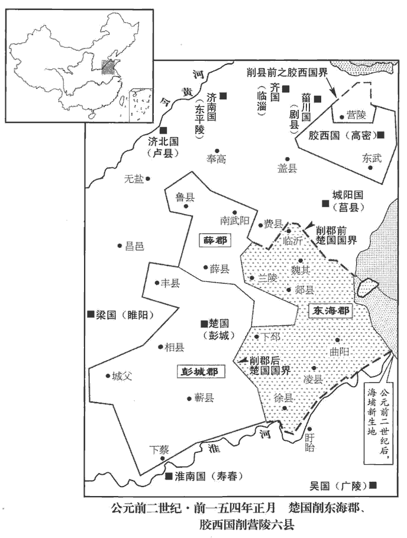 

廷臣方議削吳。吳王恐削地無已，因發謀舉事；念諸侯無足與計者，聞膠西王勇，好兵，好，呼到翻。諸侯皆畏憚之，於是使中大夫應高口說膠西王曰：應本自周武王後。左傳曰：邘yú，晉、應、韓，武之穆也。「今者，主上任用邪臣，聽信讒賊，侵削諸侯，誅罰良重，師古曰：良，實也，信也。日以益甚。語有之曰：『狧shì穅及米。』師古曰：狧，古𦧇字，食爾翻。狧，用舌食也，蓋以犬為諭。言初狧穅，遂至食米也。索隱曰：言狧穅盡則至米，謂削土盡則至滅國也。吳與膠西，知名諸侯也，一時見察，不得安肆矣。師古曰：肆，縱也。吳王身有內疾，師古曰：謂疾在身中，不顯於外也。不能朝請二十餘年，常患見疑，無以自白，脅肩累足，猶懼不見釋。師古曰：脅，翕也，謂斂之也；累足，重足也；并謂懼耳。釋，解也，放也。累，與絫同。竊聞大王以爵事有過。所聞諸侯削地，罪不至此；師古曰：言其罪皆不至於削地。此恐不止削地而已！」王曰：「有之。子將柰何？」高曰：「吳王自以為與大王同憂，願因時循理，棄軀以除患於天下，意亦可乎？」膠西王瞿然駭曰：瞿，居具翻。說文：瞿，遠視貌。師古曰：瞿然，無守之貌。「寡人何敢如是！主上雖急，固有死耳，安得不事！」高曰：「御史大夫鼂錯，營惑天子，師古曰：營，謂回繞之也。侵奪諸侯，【章：甲十五行本「侯」下有「朝廷疾怨」四字；乙十一行本同；張校同；退齋校同。】諸侯皆有背叛之意，人事極矣。彗星出，背，蒲妹翻。彗，祥歲翻；又徐醉翻；又旋芮翻。蝗蟲起，此萬世一時；而愁勞，聖人所以起也。索隱曰：所謂殷憂以啟明聖也。吳王內以鼂錯為誅，外從大王後車，方洋天下，方，音房，又音旁。洋，音羊。師古曰：方洋，猶翱翔也。所向者降，降，戶江翻。所指者下，莫敢不服。大王誠幸而許之一言，則吳王率楚王略函谷關‹河南灵宝东北›，守滎陽‹河南滎陽›、敖倉‹河南滎陽北敖山糧倉›之粟，距漢兵，治次舍，須大王。師古曰：次舍，息立之處。須，待也。治，直之翻。大王幸而臨之，則天下可并，兩主分割，不亦可乎！」王曰：「善！」歸，報吳王，吳王猶恐其不果，乃身自為使者，至膠西‹山東高密›面約之。膠西群臣或聞王謀，諫曰：「諸侯地不能當漢十二，為叛逆以憂太后，非計也。文穎曰：謂王之太后也。今承一帝，尚云不易；易，以豉翻。假令事成，兩主分爭，患乃益生。」王不聽，遂發使約齊‹山東淄博›、菑川‹府剧县，山東壽光南›、膠東‹府即墨，山東平度›、濟南‹府东平陵，山東章丘›，皆許諾。齊王將閭，菑川王賢，膠東王雄渠，濟南王辟光，皆文帝封。濟，子禮翻。

〖译文〗 朝廷大臣们正在议论削夺吴王的封地。吴王刘濞恐怕削夺没有止境，就打算举兵叛乱；想到其他诸侯王没有足以共商大事的，听说胶西王刘勇武，喜欢兵法，诸侯都畏惧他，于是，吴王派中大夫应高去亲口游说胶西王刘，说：“现在，主上重用奸邪之臣，听信谗言恶语，侵夺削弱诸侯国，对诸侯王的惩罚极为严厉，而且一天比一天厉害。俗语有这样的说法：‘开头吃糠，后来就会发展到吃米。’吴国和胶西国，都是著名的诸侯王国，同时朝廷注意，不会有安宁了。吴王身体患有暗疾，已有二十多年不能朝见，时常担心受到朝廷怀疑，无法自己表白，缩紧肩膀、脚压着脚地自我约束，仍怕得不到朝廷的宽容，我私下听说大王因出卖爵位的过失而受朝廷处置。我所听到的其他诸侯被削夺封地的事情，若按所犯罪名来处理，都不应该受到如此严重的惩罚。恐怕朝廷的用意，不仅仅是要削夺诸侯王的封地吧！”胶西王刘说：“我确实有被削夺的事。你认为该怎么办？”应高说：“吴王自认为与大王面临着共同的忧患，希望顺应时势，遵循情理，牺牲生命去为天下消除祸患，我想您也同意吧？”胶西王大吃一惊，说：“我怎么敢做这样的事！天子待诸侯虽然很严苛，我只有一死了事，怎能起意反叛呢？应高说：“御史大夫晁错，在天子身边蒙骗蛊惑，侵夺诸侯封地，诸侯王都有背叛之心，从人事来看，形势已发展到极点了。彗星出现，蝗灾发生，这是千载难逢的好时机；而且愁恼困苦的局势，正是圣人挺身而出之时。吴王准备对朝廷提出清除晁错的要求，在战场上则跟随于大王之后，纵横天下，所向无敌，锋芒所指之处，没有人胆敢不服。大王若真能许诺一句话，吴王就率领楚王直捣函谷关，据守荥阳、敖仓的粮库，敌御汉军，整治好驻扎之地，恭候大王到来。有幸得到大王光临，就可以吞并天下，吴王和大王平分江山，不也很好吗！”胶西王说：“好！”应高返归崐吴国，向吴王汇报，吴王还怕胶西王不实行诺言，就亲自前往，到胶西国与刘当面约定。胶西国群臣中，有人得知胶西王的图谋，谏阻说：“诸侯王的封地还不到汉朝廷的十分之二，发动叛乱而使太后担忧，这不是高明的计策。现在侍奉一个天子，都说不容易；假设吴与胶西的计划能够成功，两位君主并立相争，祸患就更多了。”胶西王不听，于是派使者与齐王、川王、胶东王、济南王约定共同举事，这些诸侯王都答应了。

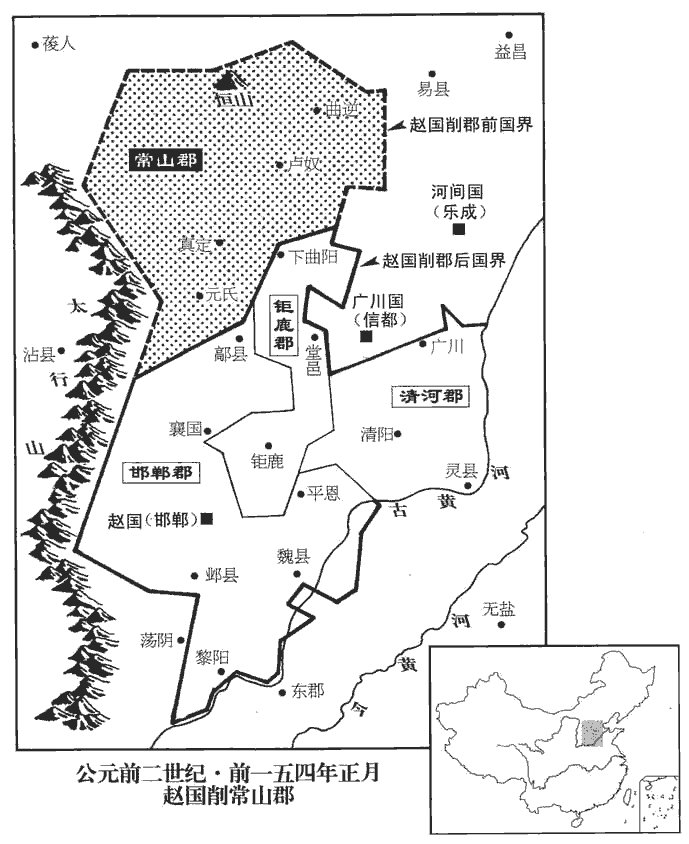 

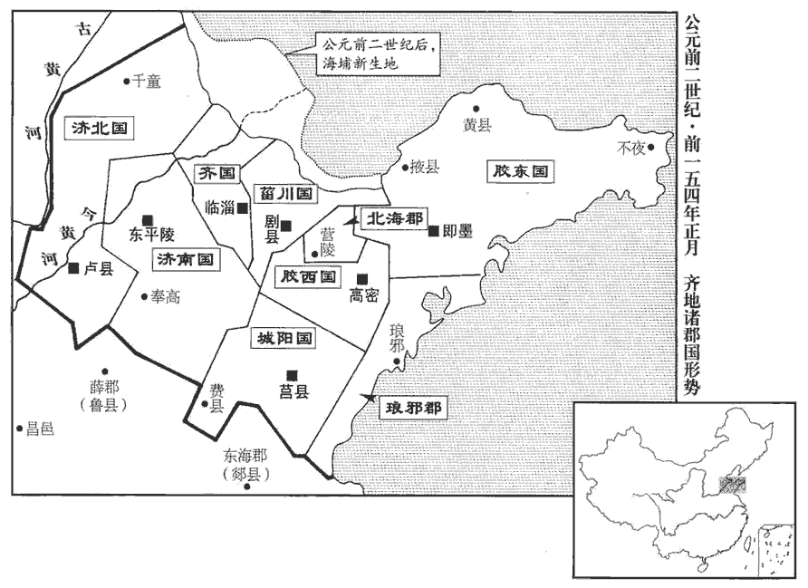 

初，楚元王‹刘交›好書，好，呼到翻。與魯申公、穆生、白生俱受詩于浮丘伯；及王楚，以三人為中大夫。及王，於況翻。穆生不耆酒；元王每置酒，常為穆生設醴。及子夷王、孫王戊即位，楚元王交，高祖異母弟。楚子重、子辛皆出於穆王，楚人謂之「二穆」，故楚有穆姓。秦有白乙丙、白圭，楚有白公。浮丘，複姓。夷王，名郢客，元王子。戊，元王孫。師古曰：醴，甘酒，少麯多米，二宿而熟。不耆之耆，讀曰嗜。為，於偽翻；下同。常設，後乃忘設焉。忘，巫放翻。穆生退，曰：「可以逝矣！醴酒不設，王之意怠；不去，楚人將鉗我於市。」遂稱疾臥。申公、白生強起之，強，其兩翻。曰：「獨不念先王之德與？與，讀曰歟。今王一旦失小禮，何足至此！」穆生曰：「易稱：『知幾其神乎！幾者，動之微，吉凶之先見者也。幾，居衣翻。師古曰：易下繫之辭。見，戶電翻。君子見幾而作，不俟終日。』先王之所以禮吾三人者，為道存也；今而忽之，是忘道也。忘道之人，胡可與久處，豈為區區之禮哉！」區區，謂小也。處，昌呂翻。為，於偽翻。遂謝病去。申公、白生獨留。王戊稍淫暴，太傅韋孟作詩諷諫，不聽，亦去，居於鄒‹山東鄒縣东南›。姓譜：韋姓出顓頊大彭豕韋之後。戊因坐削地事，遂與吳通謀。申公、白生諫戊，戊胥靡之，衣之赭衣，使雅舂於市。晉灼曰：高肱舉杵，正身而舂之。師古曰：為木杵而手舂，即今所謂步臼者耳。衣之，於既翻。休侯富使人諫王。孟子去齊居休。趙岐註曰：休，地名；蓋即富所封之地。富，楚元王之子，夷王之弟也。王曰：「季父不吾與，我起，先取季父矣！」休侯懼，乃與母太夫人奔京師。臣瓚曰：侯母號太夫人。

〖译文〗 当初，楚元王刘交喜爱书籍，和鲁地人申公、穆生、白生都拜浮丘伯为师，学习《诗经》；等到他当了楚王，就任命他们三人为中大夫。穆生不喜欢喝酒；楚元王每次设宴饮酒时，都特意为穆生准备甜酒。等到楚元王的儿子夷王以及孙子刘戊为王时，也总在举行宴会时为穆生特备甜酒，但以后就忘记这样做了。穆生退席而出，说：“应该离去了！不特设甜酒，说明楚王对我已怠慢了；再不离去，楚王将会给我戴上刑具在街市上示众。”于是，穆生声称有病，卧床不起。申公、白生极力劝他继续为楚王效力，说：“你就不念先王的恩德吗？现在楚王一时稍有礼貌不周怎么至于这样！”穆生说：”《易经》上说：‘知道契机的神妙吗？契机，是动机的微妙变化，是显示吉凶的先兆。君子看到契机而采取行动，并不整天等待。’先王礼待我们三人的原因，是他心中有道义；现在楚王怠慢我们，是忘记了道义。怎么能和忘记了道义的人长期共处，难道我这样只是因为那区区的礼节吗！”于是，穆公声称有病，离开了楚国。申公和白生却继续留任楚国。楚王刘戊逐渐荒淫残暴，太傅韦孟作了一首诗，用来进行委婉的批评，楚王不加理睬，韦孟也离开楚国，去邹地居住。刘戊因犯罪被朝廷削夺封地，就与吴王刘濞通谋，准备叛乱。申公、白生去劝谏刘戊，刘戊将他们二人罚为罪徒，让他们被绳拴着，穿着刑徒的红褐色囚衣，在街市上舂米。休侯刘富派人来劝阻楚王，楚王说：“叔父不与我合作，我一旦起事，就先攻打叔父了！”休侯刘富害怕，就与他的母亲太夫人逃奔长安。

及削吳會稽‹江蘇蘇州›、豫章郡‹鄣郡，浙江安吉北›書至，吳王遂先起兵，誅漢吏二千石以下；膠西、膠東、菑川、濟南、楚、趙亦皆反。楚相張尚、太傅趙夷吾諫王戊，戊殺尚、夷吾。趙相建德、內史王悍諫王遂，遂燒殺建德、悍。悍，下罕翻，又侯旰翻。齊王後悔，背約城守。背，蒲妹翻。守，式又翻。濟北‹首府盧县，山東長清›王城壞未完，其郎中令劫守，王不得發兵。膠西王、膠東王為渠率，師古曰：渠，大也。率，所類翻。與菑川、濟南共攻齊，圍臨菑‹山東臨淄›。臨菑，齊都。趙王遂發兵住其西界，欲待吳、楚俱進，北使匈奴與連兵。使，疏吏翻；下同。

〖译文〗 及至朝廷削夺吴国会稽郡、豫章郡的文书到达，吴王刘濞就首先起兵，杀死朝廷任命的二千石以下的官员；胶西王、胶东王、川王、济南王、楚王、赵王也都举兵叛乱。楚相张尚、太傅赵夷吾谏阻楚王刘戊，刘戊杀死了张尚和赵夷吾。赵相建德、内史王悍谏止赵王刘遂，刘遂将他们两人烧死。齐王后悔通谋叛乱，违背与吴楚的盟约，依据城池进行抵御。济北王的城墙坏了没有修好，他的郎中令劫持了他，使他无法举兵参加叛乱。胶西王和胶东王为统帅，联合川王、济南王共同攻打齐国，围攻齐国都城临淄。赵王刘遂把军队调往赵国西部边境，准备与吴、楚等国军队联合进攻，又向北方的匈奴派出使者，联络匈奴一起举兵。

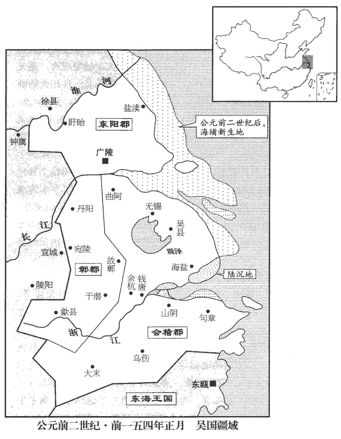 

吳王悉其士卒，下令國中曰：「寡人年六十二，身自將；將，即亮翻。少子年十四，亦為士卒先。諸年上與寡人同，下與少子等，皆發。」凡二十余萬人。南使閩、東越，使，疏吏翻。閩、東越亦發兵從。從，才用翻。吳王起兵於廣陵‹江蘇揚州›，廣陵，吳都。西涉淮，因并楚兵，發使遺諸侯書，罪狀鼂錯，遺，于季翻。欲合兵誅之。吳、楚共攻梁，破棘壁‹河南永城西北›，索隱曰：按左氏傳，宣公二年，宋華元戰於大棘。杜預曰：在襄邑東南；蓋即棘壁是也。括地志：大棘故城，在宋州寧陵縣西南七十里。殺數萬人；乘勝而前，銳甚。梁孝王遣將軍擊之，又敗梁兩軍，敗，補邁翻。士卒皆還走。梁王城守睢陽‹河南商丘›。睢陽，梁都。睢，音雖。

〖译文〗 吴王征发了所有士卒，下令全国说：“我今年六十二岁了，亲自担任统帅；我的小儿子十四岁，也身先士卒。所有年龄上与我一样，下与我的小儿子一样的人，都征发从军！”吴国共征发了二十多万人。吴王向南方派出使者去联络闽、东越，闽和东越也发兵响应。吴王在广陵起兵，向西渡过淮河，随即与楚国的军队合并，派使者致书诸侯，指控晁错罪状，准备联合进兵诛杀晁错。吴、楚两国军队一起攻打梁国，攻破了棘壁，杀死数万人；吴、楚联军乘胜前进，兵锋锐不可当。梁孝王派将军迎击，又有两支军队被吴楚联军打败，梁军士兵都向后逃跑。梁王固守都城睢阳。

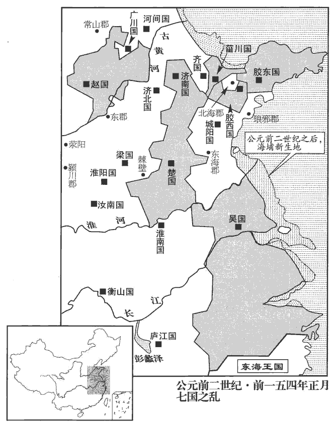 

初，文帝且崩，戒太子曰：「即有緩急，周亞夫真可任將兵。」及七國反書聞，上乃拜中尉周亞夫為太尉，將三十六將軍往擊吳、楚，遣曲周侯酈寄擊趙，班志，曲周縣屬廣平國。將軍欒布擊齊；復召竇嬰，拜為大將軍，使屯滎陽‹河南滎陽›，監齊、趙兵。班志，滎陽縣屬河南郡。監，古銜翻。

〖译文〗 当初，汉文帝临终前，告诉太子说：“假若国家有危难，周亚夫足以胜任军队统帅的重担。”等到七国叛乱的文书到达朝廷，景帝就任命中尉周亚夫为太尉，统帅三十六位将军及其部队，前去迎击吴、楚叛军；派遣曲周侯郦寄攻打赵国，派将军栾布攻打齐境叛军；景帝又召回窦婴，任命他为大将军，让他率军驻守荥阳，监督用兵于齐国和赵国境内的汉军。

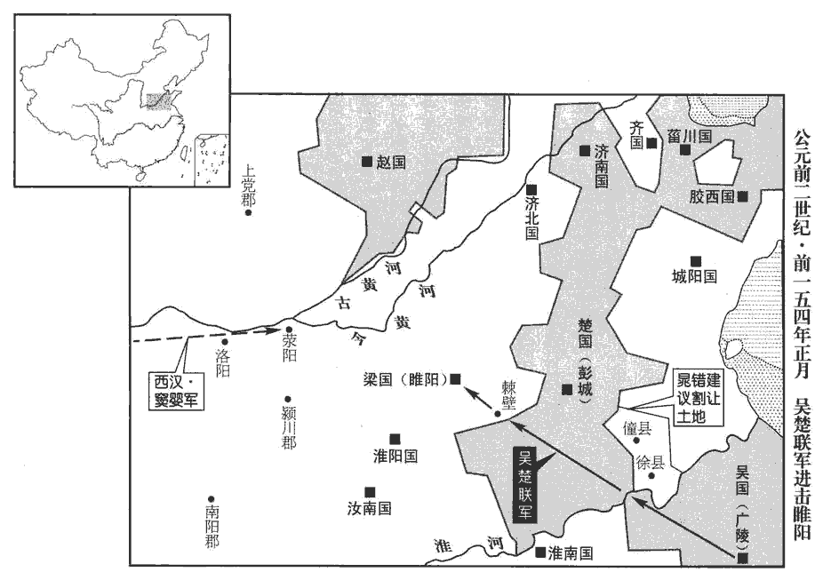 

初，鼂錯所更令三十章，更，工衡翻。諸侯讙譁。讙，許元翻。錯父聞之，從潁川‹河南禹州›來，錯，潁川人。謂錯曰：「上初即位，公為政用事，侵削諸侯，疏人骨肉，疏，與踈同。口語多怨，公何為也？」錯曰：「固也；不如此，天子不尊，宗廟不安。」父曰：「劉氏安矣而鼂氏危，吾去公歸矣！」遂飲藥死，曰：「吾不忍見禍逮身！」後十余日，吳、楚七國俱反，以誅錯為名。

〖译文〗 当初，晁错所修改的法令有三十章，诸侯王纷纷议论表示反对。晁错的父亲得知消息，从颍川赶来京师，对晁错说：“皇上刚刚即位，你当权处理政事，侵夺削弱诸侯，疏离人家的骨肉，舆论都怨恨你，你为什么这样做呢？”晁错说：“本当这样做；如果不这样做，天子不尊贵，宗庙不安宁。”他的父亲说：“这样做，刘氏的天下安宁了，但晁氏却危险了，我离开你回去了！”他父亲就服毒自杀，临死前说：“我不忍心见到大祸临到我身上！”此后过了十多天，吴、楚等七国就以诛除晃错为名一同举兵叛乱。

上與錯議出軍事，錯欲令上自將兵而身居守；守，式又翻。又言：「徐‹江苏泗縣南›、僮‹安徽泗縣東北›之旁吳所未下者，可以予吳。」徐、僮二縣皆屬臨淮郡。錯初議削諸侯地以強漢，及七國反，乃欲以徐、僮之旁予吳；是自畔其說，惡得無死乎！予，讀曰與。錯素與吳相袁盎不善，相，息亮翻。錯所居坐，盎輒避；盎所居坐，錯亦避；坐，徂臥翻。兩人未嘗同堂語。及錯為御史大夫，使吏按盎受吳王財物，抵罪；詔赦以為庶人。吳、楚反，錯謂丞、史曰：班表：御史大夫有兩丞，秩千石；侍御史十五人。「袁盎多受吳王金錢，專為蔽匿，言不反；今果反，欲請治盎，宜知其計謀。」丞、史曰：「事未發，治之有絕；如淳曰：事未發之時治之，乃有所絕也。治，直之翻。今兵西向，治之何益！且盎不宜有謀。」錯猶與未決。猶與，即猶豫也。與，去聲。人有告盎，盎恐，夜見竇嬰，為言吳所以反，願至前，口對狀。嬰入言，上乃召盎。盎入見，為，於偽翻。入見，賢遍翻。上方與錯調兵食。師古曰：調，計也，計發兵食也。調，徒釣翻。上問盎：「今吳、楚反，於公意何如？」對曰：「不足憂也！」上曰：「吳王即山鑄錢，煮海為鹽，誘天下豪傑；白頭舉事，此其計不百全，豈發乎！何以言其無能為也？」對曰：「吳銅鹽之利則有之，安得豪傑而誘之！誘，音酉。誠令吳得豪傑，亦且輔而為誼，不反矣。吳所誘皆無賴子弟、亡命、鑄錢奸人，章懷太子賢曰：命，名也，謂脫其名籍而逃亡。故相誘以亂。」錯曰：「盎策之善。」上曰：「計安出？」盎對曰：「願屏左右。」上屏人，獨錯在；盎曰：「臣所言，人臣不得知。」乃屏錯。屏，必郢翻。錯趨避東廂，甚恨。上卒問盎，卒，子恤翻；下卒受同。對曰：「吳、楚相遺書，言高皇帝王子弟各有分地，遺，于季翻。分，扶問翻。今賊臣鼂錯擅適諸侯，適，讀曰謫。削奪之地，以故反，欲西共誅錯，復故地而罷。方今計獨有斬錯，發使赦吳、楚七國，使，疏吏翻；下使吳同。復其故地，則兵可毋血刃而俱罷。」於是上默然良久，曰：「顧誠何如？吾不愛一人以謝天下。」盎曰：「愚計出此，唯上孰計之！」孰，與熟同。乃拜盎為太常，中六年，始改奉常為太常，時盎猶為奉常也。密裝治行。治，直之翻。後十餘日，上令丞相青、中尉嘉、廷尉歐丞相陶青，中尉嘉，失其姓，廷尉張歐。劾奏錯：「不稱主上德信，欲疏群臣、百姓，又欲以城邑予吳，無臣子禮，大逆無道。錯當要斬，劾，戶概翻。疏，與疎同。予，讀曰與。要，與腰同。父母、妻子、同產無少長皆棄市。」少，詩照翻。長，知兩翻。制曰：「可。」錯殊不知。壬子‹二十九›，上使中尉召錯，紿dài載行市，師古曰：誑云乘車案行市中也。行，下孟翻。錯衣朝衣斬東市。衣朝，上於既翻，下直遙翻。上乃使袁盎與吳王弟子宗正德侯通使吳。高祖兄仲之子廣封德侯，生通。德，侯國，在泰山界

〖译文〗 景帝与晁错商谈出军平叛的事情，晁错想让景帝统兵亲征而他自己留守长安；晁错又建议：“徐县、僮县附近一带，吴国没有攻占的地方，可以送给吴国，争取他们退兵。”晁错一直与吴相袁盎不友善，有晁错在某处就坐，袁盎总是避开；袁盎出现在何处，晁错也总是避开；两人未曾在同一个室内说过话。等到晁错升任御史大夫，派官员审查袁盎接受吴王财物贿赂的事，处以相当崐的刑罚，确定袁盎有罪；景帝下诏赦免袁盎，把他降为平民。吴、楚叛乱发生后，晁错对御史丞、侍御史说：“袁盎接受了吴王的许多金钱，专门为吴王掩饰，说他不会叛乱；现在，吴王果然反叛了，我想奏请严惩袁盎，他肯定知道吴王的密谋。”御史丞、侍御史说：“如果在吴国叛乱前，治袁盎的罪，可能会中止叛乱密谋；现在叛军大举向西进攻，审查袁盎，能有什么作用！况且，袁盎不会参预密谋。”晁错犹豫不决。有人把晁错的打算告知了袁盎，袁盎很害怕，连夜去见窦婴，对他说明吴王叛乱的原因，希望能面见景帝，亲口说明原委。窦婴入宫奏报景帝，景帝就召见袁盎。袁盎入宫晋见，景帝正与晁错在调度军粮。景帝问袁盎：“现在吴、楚叛乱，你觉得局势会怎样？”袁盎回答说：“不值得担忧！”景帝说：“吴王利用矿山就地铸钱，熬海水为盐，招诱天下豪杰；到年老发白时举兵叛乱，如果他没有计出万全的把握，难道会起事吗？为什么说他不能有所作为呢？袁盎回答说：“吴王确实有采铜铸币、熬海水为盐的财利，但哪有什么豪杰被他招诱去了呢！假若吴王真的招到了豪杰，豪杰也会辅佐他按仁义行事，也就不会叛乱了。吴王所招诱的，都是些无赖子弟、没有户籍的流民、私铸钱币的坏人，所以才能相互勾结而叛乱。”晁错说：“袁盎分析得很好。”景帝问：“应采取什么妙计？”袁盎说：“请陛下让左右回避。”景帝让人退出，唯独还有晁错在场；袁盎说：“我要说的话，任何臣子都不应听到。”景帝就让晁错回避。晁错迈着小而快的步伐，退避到东边的厢房中，对袁盎极为恼恨。景帝突然问袁盎，袁盎回答说：“吴王和楚王互相通信，说高皇帝分封子弟为王，各自有封地，现在贼臣晁错擅自贬谪诸侯，削夺他们的封地，因此他们才造反，准备向西进军，共同诛杀晁错，恢复原有的封地才罢休。现在的对策，只有斩晁错，派出使臣宣布赦免吴、楚七国，恢复他们原有的封地，那么，七国的军队可以不经过战争就都会撤走。”于是，景帝沉默了很长时间，说：“不这样做，还有什么别的办法？我不会为了爱惜他一个人而向天下谢罪的。”袁盎说：“我计策就是这样，请皇上认真考虑！”景帝就任命袁盎为太常，秘密收拾行装，做出使吴王的准备。过了十多天，景帝授意丞相陶青、中尉嘉、廷尉张欧上疏弹劾晁错：“辜负皇上的恩德和信任，要使皇上与群臣、百姓疏远，又想把城邑送给吴国，毫无臣子的礼节，犯下了大逆无道之罪。晁错应判处腰斩，他的父母、妻子、兄弟不论老少全部公开处死。”景帝批复说：“同意所拟判决。”晁错对此却一无所知。壬子（二十九日），景帝派中尉召晁错，欺骗他说坐着车巡察市中，于是，晁错穿着上朝的官服在东市被斩首。景帝就派袁盎与吴王的侄子、宗正德侯刘通为使臣，出使吴国。

謁者僕射鄧公為校尉，上書言軍事，見上，校，戶教翻。上書之上，時掌翻。上問曰：「道軍所來，如淳曰：道路從吳軍所來也。臣瓚曰：道，由也。聞鼂錯死，吳、楚罷不？」不，讀曰否。鄧公曰：「吳為反數十歲矣；發怒削地，以誅錯為名，其意不在錯也。且臣恐天下之士鉗口不敢復言矣。」鉗，其炎翻。復，扶又翻。上曰：「何哉？」鄧公曰：「夫鼂錯患諸侯強大不可制，故請削之以尊京師，萬世之利也。計畫始行，卒受大戮；卒，子恤翻，或讀為猝。內杜忠臣之口，外為諸侯報仇，臣竊為陛下不取也。」為，於偽翻。於是帝喟然長息曰：「公言善，吾亦恨之！」

〖译文〗 谒者仆射邓公正担任校尉，向景帝上书分析战争情况，在进见皇帝时，景帝问道：“你从军中而来，听到晁错被杀，吴国和楚国撤兵了没有？”邓公说：“吴王准备叛乱已有几十年了；他是因朝廷削夺了他的封地发怒，杀晁错只是他的借口，他的本意不在晁错啊。再说，朝廷杀晃错，我担心天下的士大夫都不敢再向朝廷进忠言了！”景帝问：“为什么？”邓公说：“晁错忧虑诸侯王国势力过于强大，朝廷不能制服，所以，请求削减王国封地，从而尊崇朝廷，这本来是造福万世的好事。计划刚刚实行，他本人突然被杀。这样做，对内堵塞了忠臣的口，对外替诸侯王报了仇，我私下认为陛下不应该如此。”于是，景帝深深地感叹说：“您说得对，我也很后悔杀了晁错！”

袁盎、劉通至吳，吳、楚兵已攻梁壁矣。宗正以親故，先入見，諭吳王，令拜受詔。宗正於濞，猶子之親也。吳王聞袁盎來，知其欲說，說，式芮翻；下同。笑而應曰：「我已為東帝，尚誰拜！」不肯見盎，而留軍中，欲劫使將；將，即亮翻。盎不肯，使人圍守，且殺之。盎得間，脫亡歸報。間，古莧翻。

〖译文〗 袁盎、刘通到达吴国，吴军和楚军已开始进攻梁国的壁垒了。宗正刘通因是同姓亲属，先入内会见吴王，告知吴王，让他跪拜接受皇帝的诏书。吴王听说袁盎来了，估计到他要劝说自己撤兵，就笑着回答说：“我已经做了东方的崐皇帝了，还向谁跪拜呢！”吴王不肯与袁盎见面，把他留在军营中，准备强迫他担任吴军 的将领；袁盎不答应，吴王派人把他关押起来，准备杀死他。袁盎寻机逃脱回来向景帝汇报出使情况。

太尉亞夫言於上曰：「楚兵剽輕，難與爭鋒，剽，匹妙翻。輕，虛勁翻。願以梁委之，絕其食道，乃可制也。」上許之。亞夫乘六乘傳，張晏曰：傳車六乘也。乘，繩證翻。傳，張戀翻。余據漢有乘傳、馳傳；文帝之自代入立也，張武等乘六乘傳，今亞夫乘六乘傳，六乘傳之見於史者二，蓋又與乘傳不同也。將會兵滎陽‹河南滎陽›。師古曰：會兵，謂集大兵。發至霸上‹陕西西安东灞河畔›，趙涉遮說亞夫曰：「吳王素富，懷輯死士久矣。此知將軍且行，必置間人於殽‹崤山›、澠‹河南渑池西›阸è陿xiá之間；澠，彌兗翻。殽山、澠池之間，其道阸陿。阸，於懈翻。陿，與狹同。且兵事尚【章：甲十五行本「尚」作「上」；乙十一行本同。】神密，將軍何不從此右去，走藍田‹陕西蓝田›，出武關‹陕西商南西南›，抵洛陽！間不過差一二日，自霸上左趨殽、澠至洛陽，其道便近；若自霸上右趨藍田出武關至洛陽，其道迂曲，故差一二日。走，音奏。間，如字。直入武庫，洛陽有武庫。擊鳴鼓。諸侯聞之，以為將軍從天而下也。」太尉如其計，至洛陽，喜曰：「七國反，吾乘傳至此，不自意全。師古曰：言不自意得安全至洛陽也。今吾據滎陽，滎陽以東，無足憂者。」考異曰：史記、漢書皆云：太尉得劇孟喜，如得一敵國，曰：『吳楚無足憂者。』按孟一遊俠之士耳，亞夫得之，何足為輕重！蓋其徒欲為孟重名，妄撰此言，不足信也。使吏搜殽、澠間，果得吳伏兵。乃請趙涉為護軍。

〖译文〗 太尉周亚夫对景帝说：“楚军剽悍敏捷，与他们正面交锋很难取胜，我建议放弃梁国，先断绝吴、楚军队的粮道，这样才可以制服它们。”景帝同意了这个部署。周亚夫乘坐着六辆驿站的马车，将去荥阳与大军会合。走到霸上，赵涉拦住去路，劝说周亚夫：“吴王一直很富有，早就收买了一批甘愿为他献身的刺客，现在得知将军将去前线，必定会在崤山、渑池之间的险要地段安排刺客对付您；况且军事行动最讲究秘密，将军为什么不改变路线，从此处向右走，经过蓝田，出武关，抵达洛阳！这样绕着走，不过差一两天，却可以直接进入洛阳武库，擂响战鼓。参与叛乱的诸侯王听到了，会认为将军是自天而降呢！”太尉按照他的计策行事，到达洛阳，高兴地说：“七国共同叛乱，我乘坐驿车平安到达此处，真是出乎意料之外。现在我已驻守荥阳，荥阳以东没有什么可担心的了。”周亚夫派官吏搜索崤山、渑池之间，果然抓住了吴国的伏兵。周亚夫就向景帝奏请，让赵涉担任护军。

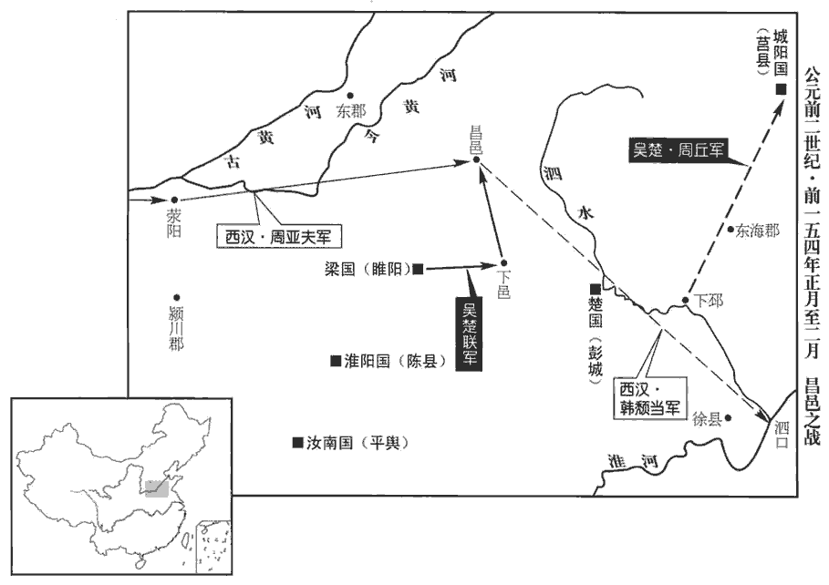 

太尉引兵東北走昌邑‹山東金鄉西北昌邑镇›。昌邑，梁地，後為山陽郡治所。走，音奏；下同。吳攻梁‹河南商丘›急，梁數使使條侯求救，條侯不許；班志，勃海郡有脩縣，音條。數，所角翻。使使，上如字，下疏吏翻。又使使愬條侯於上。上使告條侯救梁，亞夫不奉詔，堅壁不出；而使弓高侯等將輕騎兵出淮泗口，韓王信之子頹當自匈奴中來歸，封為弓高侯。功臣表：弓高屬營陵；地理志，弓高屬河間國。蓋頹當受封于文帝之初，而河間國則三年所置，故志與表異。泗水南入淮，故謂之淮泗口。騎，奇寄翻。絕吳、楚兵後，塞其饟道。塞，悉則翻。饟，古餉字。梁使中大夫韓安國及楚相張尚弟羽為將軍；羽力戰，安國持重，乃得頗敗吳兵。吳兵欲西，梁城守，不敢西；敗，補邁翻。守，式又翻。即走條侯軍，會下邑‹安徽碭山›，下邑縣屬梁國。欲戰。條侯堅壁不肯戰；吳糧絕卒饑，數挑戰，終不出。數，所角翻。挑，徒了翻。條侯軍中夜驚，內相攻擊，擾亂至帳下，亞夫堅臥不起，頃之，復定。吳奔壁東南陬zōu，陬，子侯翻，隅也。亞夫使備西北；已而其精兵果奔西北，不得入。吳、楚士卒多饑死叛散，乃引而去。二月，亞夫出精兵追擊，大破之。吳王濞棄其軍，與壯士數千人夜亡走；楚王戊自殺。

〖译文〗 太尉周亚夫领兵向东北到达昌邑。吴军猛烈进攻梁国，梁王多次派使者向条侯周亚夫求救，周亚夫不答应。梁王又派使臣向景帝告状，说周亚夫不肯救援。景帝派使臣命令周亚夫援救梁国，周亚夫不执行皇帝诏令，仍坚守营垒，不派军队出战；但他却命令弓高侯韩颓当等人率领轻骑兵，奔袭淮泗口，断绝吴、楚军队的后路，堵塞吴、楚的粮道。梁国派中大夫韩安国及楚相张尚的弟弟张羽为将军；张羽作战勇猛，韩安国指挥持重，才得以挫败吴军。吴军想向西进兵，但因梁军据城死守，便不敢越过梁向西进兵；因此，吴军就前来进攻条侯周亚夫的军队，两军在下邑相遇，吴军急于求战。条侯坚守壁垒不肯交战；吴军粮道断绝，士卒饥饿，多次挑战，周亚夫始终不应战。周亚夫的军营中，夜间突然惊乱，内部互相攻击，甚至闹到了周亚夫的大帐附近，周亚夫坚持睡着不起，过了一会儿，就恢复平静了。吴军向汉军营垒的东南角调集军队，周亚夫却命令营中加强对西北方向的防御，不久，吴、楚的精兵果然突袭汉营西北，因汉军早有防备，不能攻入。吴、楚军队中，有许多士卒饿死或者背叛离散，吴王就领兵撤退了。二月，周亚夫派出精锐军队追击，大败吴、楚军队。吴王刘濞丢下他的军队，与几千名精壮士兵连夜逃跑；楚王刘戊自杀。

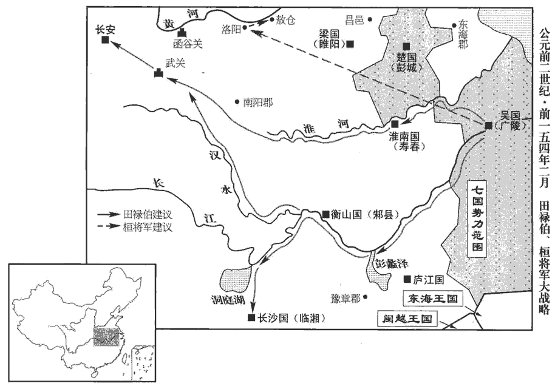 

吳王之初發也，吳臣田祿伯為大將軍。田祿伯曰：「兵屯聚而西，無他奇道，難以立功。臣願得五萬人，別循江、淮而上，上，時掌翻。收淮南、長沙，入武關，與大王會，此亦一奇也。」吳王太子諫曰：「王以反為名，此兵難以借人，人亦且反王，柰何？且擅兵而別，多他利害，蘇林曰：祿伯儻將兵降漢，自為己利，於吳生患也。徒自損耳！」吳王即不許田祿伯。

〖译文〗 吴王刚开始举兵叛乱时，吴国臣子田禄伯担任大将军。田禄伯说：“大军集结向西进攻，没有可以出奇兵的通道，难以成功。我请求给我五万人马，另外沿长江、淮河逆流而上，占领淮南、长沙，攻入武关，与大王主力军队会师，这也是一路奇兵。”吴王的太子劝阻说：“大王以造反为名义，这样的军队不能让别人带领，假若别人也背叛您，又该怎么办？况且，让别人全权指挥一崐支军队，又走另外一条路，容易产生许多其他利害问题，只是白白地削弱了自己的力量！”吴王就没有批准田禄伯的请求。

吳少將桓將軍說王曰：「吳多步兵，步兵利險，漢多車騎，車騎利平地，願大王所過城，不下，直去，疾西據洛陽武庫，食敖倉粟，阻山河之險，以令諸侯。雖無入關，天下固已定矣。大王徐行留下城邑，漢軍車騎至，馳入梁、楚之郊，事敗矣。」吳王問諸老將，老將曰：「此年少，椎鋒可耳，安知大慮。」老將，即亮翻。下并將為將同。於是王不用桓將軍計。

〖译文〗 吴国的青年将领桓将军劝吴王说：“吴国军队步兵多，步兵利于在险阻的地方作战；汉军中以战车、骑兵为主力，战车和骑兵利于在平原地区作战。希望大王不进攻沿途的城池，挥兵直进，迅速向西进兵，占领洛阳武库，利用敖仓的粮食供应军队，凭借山势和黄河天险号令诸侯，这样，即使没有进入函谷关，天下就已经被您平定了。如果大王进军缓慢，因沿途攻占城邑而延误时机，汉军战车、骑兵到来，冲入梁国和楚国的郊野，您的大事就失败了。”吴王征询老将军们的意见，老将们说：“这个青年人，让他去冲锋陷阵还可以，怎么懂得全局战略呢！”于是，吴王不采用恒将军的计策。

王專并將兵。兵未渡淮，諸賓客皆得為將、校尉、候、司馬，凡軍行有大將、裨pí將領軍，皆有部曲；部有校尉，曲有軍候、軍司馬，又有假候、假司馬，皆有副；其別營領屬為別部司馬。獨周丘不用。周丘者，下邳Pī人，班志，下邳屬東海郡。亡命吳，酤gū酒無行；行，下孟翻。王薄之，不任。周丘乃上謁，說王曰：「臣以無能，不得待罪行間。上，時掌翻。說，式芮翻。行，戶剛翻。臣非敢求有所將也，將，即亮翻。願請王一漢節，必有以報。」王乃予之。予，讀曰與。周丘得節，夜馳入下邳；下邳時聞吳反，皆城守。至傳舍，召令入戶，使從者以罪斬令，傳，張戀翻。令，力正翻。從，才用翻。遂召昆弟所善豪吏告曰：「吳反，兵且至，屠下邳不過食頃；今先下，家室必完，能者封侯矣。」出，乃相告，下邳皆下。周丘一夜得三萬人，使人報吳王，遂將其兵北略城邑；比至陽城‹城阳，山東莒縣›，兵十余萬，破陽城中尉軍。「陽城」，漢書作「城陽」。城陽國都莒，其地南接下邳之境，班表：王國有中尉，掌武職。比，必寐翻，及也。聞吳王敗走，自度無與共成功，度，徒洛翻。即引兵歸下邳，未至，疽jū發背死。史言吳王有才不能用，以至於敗。

〖译文〗 吴王独揽全军指挥权。在吴军尚未渡过淮河时，吴王就把投靠他的众宾客任命为将军、校尉、军候、军司马，唯独周丘没有得到任用。周丘是下邳人，流亡到吴国，以卖酒为生，品行不好；吴王刘濞很鄙视他，所以未予任用。周丘就自己求见吴王，说：“我因为没有本事，不能在军队中为您效力。我不敢要求带兵做官，只希望从大王处得到汉朝的一个符节，必定做成一番事业来回报大王。”吴王就给了他。周丘得到符节，连夜驱车进入下邳县城；这时，下邳的官民得知吴王叛乱，都据城防守。周丘到达驿站，传召县令进入室内，命令他的随从用罪名把县令杀死，于是召见与他的兄弟们友善的有权势的官吏说：“吴王已经造反，大军马上就到，屠灭下邳城不过用吃顿饭的时间；如果先归降吴王，家室必定保全，有本事的人还能立功封侯。”官吏出去后，转 告给其他人，下邳的官民就都归顺了吴王。周丘一夜之间得到了三万人，派人向吴王汇报，就率领他的军队向北方攻取城邑；打到城阳时，周丘的军队已有十多万人了，打败了城阳中尉指挥的军队。周丘得知吴王失败逃走，自已估计无法和他共同成就事业了，就领兵返回下邳，还没有到达，因背上生毒疮而死去。

6壬午晦‹三十›，日有食之。

〖译文〗 [6]壬午晦（三十日），发生日食。

7吳王之棄軍亡也，軍遂潰，往往稍降太尉條侯及梁軍。降，戶江翻。吳王渡淮，走丹徒‹江蘇鎮江东丹徒镇›，班志，丹徒縣屬會稽郡，即春秋之朱方。括地志：丹徒故城，在潤州丹徒縣東南十八里。南徐州記：秦使赭衣鑿其處，因謂之丹徒，鑿處今在故縣西北六里丹徒峴xiàn東南。保東越‹都东瓯，浙江温州›，欲依東越以自保也。兵可萬餘人，收聚亡卒。漢使人以利啖東越，啖，徒覽翻，餌之也；又徒濫翻，譙醮也，食也。東越即紿吳王出勞軍，勞，力到翻。使人鏦cōng殺吳王，孟康曰：方言：戟謂之鏦。蘇林曰：鏦，音從容之從。師古曰：鏦，謂以矛戟撞殺之。鏦，楚江翻。盛其頭，馳傳以聞。盛，時征翻。傳，張戀翻。吳太子駒亡走閩越。吳、楚反，凡三月，皆破滅，於是諸將乃以太尉謀為是；然梁王由此與太尉有隙。為梁王毀短亞夫張本。

〖译文〗 [7]因为吴王刘濞丢掉军队自己逃跑，吴军就崩溃瓦解了，许多部队渐渐向太尉条侯周亚夫和梁国的军队投降。吴王刘濞渡过淮河，逃到丹徒县，依附东越，以求自保，约有军队一万多人，并召集逃散的士兵。汉朝派人用金钱利禄收买东越首领，东越首领就骗吴王出来慰劳军队，派人用矛戟刺杀了吴王，装上他的头颅，派人乘传车疾驰到汉朝廷报告。吴国太子刘驹逃亡到闽越国。吴、楚叛乱，共三个月的时间，就全被平定了，这时，所有将领都认为太尉周亚夫的战略布署是正确的；但是，梁王却因此与太尉有了矛盾。

三王之圍臨菑‹山東淄博东临淄镇›也，齊王使路中大夫告于天子。張晏曰：姓路，官為中大夫。姓譜：路本自帝摯之後。天子復令路中大夫還報，告齊王堅守，「漢兵今破吳楚矣。」路中大夫至，三國兵圍臨菑數重，無從入。三國將與路中大夫盟曰：「若反言：『漢已破矣，重，直龍翻。將，即亮翻。師古曰：若，汝也。反，謂反易其辭也。齊趣下三國，趣，讀曰促。不，且見屠。』」路中大夫既許，至城下，望見齊王曰：「漢已發兵百萬，使太尉亞夫擊破吳、楚，方引兵救齊；齊必堅守無下！」三國將誅路中大夫。齊初圍急，陰與三國通謀，約未定；會路中大夫從漢來，其大臣乃復勸王無下三國。會漢將欒布、平陽侯等兵至齊，據班史齊王傳作平陽侯曹襄。史記索隱曰：平陽侯，按表是簡侯曹奇。擊破三國兵。解圍已，句斷。後聞齊初與三國有謀，將欲移兵伐齊。齊孝王懼，飲藥自殺。

〖译文〗 当胶西王等三个诸候王的叛军围困临的时候，齐王派一位姓路的中大夫向景帝报告。景帝又命令这位姓路的中大夫返回齐国复命，告诉齐王坚守临，说：“朝廷军队已经打败吴楚叛军了。”路中大夫赶回时，三国的军队已把临城重重包围，无法入城。三国的将领迫使路中大夫与他们结盟，说：“你反过来说：‘汉朝廷的军队已被打败了，齐国赶快向三个王国的军队投降吧。不然，临就要被屠灭了。’”路中大夫应允了，到了城下，远远见到齐王，他就说：“汉已经派出了百万大军，让太尉周亚夫指挥，打败了吴楚军队，正领兵前来救齐，齐一定要坚守不降！”三个王国的将领杀死了路中大夫。齐都城当初被围紧急时，齐王曾暗中与三个王国联络，准备参预叛乱，盟约未定；恰好路中大夫从汉朝廷而来，齐王的大臣们又劝他不能向三国叛军投降。恰逢汉将栾布、平阳侯曹襄等率军到达齐国，打败了三国的军队。解除了临之围以后，汉军将领听说齐王当初与三国密谋勾结，就准备调集军队攻打齐国。齐孝王害怕，服毒自杀。

膠西‹山東高密›、膠東‹山東平度›、菑川‹山東壽光南›王各引兵歸國。膠西王徒跣、席藁、飲水謝太后。王太子德曰：「漢兵還，臣觀之，已罷，罷，與疲同。可襲，願收王餘兵擊之！不勝而逃入海，未晚也。」王曰：「吾士卒皆已壞，不可用。」弓高侯韓頹當遺膠西王書曰：「奉詔誅不義：降者赦除其罪，復故；不降者滅之。遺，于季翻。降，戶江翻。王何處？須以從事。」言膠西王於降與不降之間，欲以何自處，吾待以行事。處，昌汝翻。王肉袒叩頭，詣漢軍壁謁曰：「臣卬奉法不謹，驚駭百姓，乃苦將軍遠道至於窮國，敢請菹醢之罪！」弓高侯執金鼓見之曰：「王苦軍事，願聞王發兵狀。」王頓首厀行，厀，與膝同。對曰：「今者鼂錯天子用事臣，變更高皇帝法令，侵奪諸侯地。卬等以為不義，恐其敗亂天下，更，工衡翻。敗，補邁翻。七國發兵且誅錯。今聞錯已誅，卬等謹已罷兵歸。」將軍曰：「王苟以錯為不善，何不以聞？及未有詔、虎符，擅發兵擊義國？以此觀之，意非徒欲誅錯也。」乃出詔書，為王讀之，為，於偽翻；下同。曰：「王其自圖！」王曰：「如卬等死有餘罪！」遂自殺，太后、太子皆死。膠東王、菑川王、濟南王皆伏誅。

〖译文〗 胶西王、胶东王、川王分别领军队返回封地。胶西王赤着脚、坐卧在禾秆编的席上饮水，向太后请罪。胶西王的太子刘德说：“汉军已开始撤兵，据我观察，他们已很疲乏，可以突袭，希望召集大王的残余军队去袭击他们！如果突袭不能获胜，再逃入海岛隐蔽，也还不晚。”胶西王说：“我的部队都已残破，无法作战了。”弓高侯韩颓当给胶西王送来一封信，信中说：“我奉皇帝诏令诛杀不义的人，投降的，赦免他的罪名，恢复原有的官爵；不投降的，一定要消灭他。你准备选择哪一条道路？等待你做出选择，我好采取相应的处置措施。”胶西王光着上身、磕着头来到汉军营垒前请谒，他说：“我刘遵法不谨慎，惊骇了百姓，竟使将军辛苦地远道来到我们这个穷国，我请求处以剁成肉酱的惩罚！”弓高侯手持指挥作战用的金鼓来见他，说：“你被发兵的举动害苦了，我希望听你解释发兵的原因。”胶西王一边磕头一边跪着向前走，回答说：“当时，晁错是受天子信任的执政大臣，变更高皇帝的法令，侵夺诸侯王国的封地。我们认为他的做法不符合道义，恐怕他败坏、扰乱天下，所以我们七国才发兵，准备杀晁错。现在听说晁错已被皇帝处死，我们就很谨慎地撤兵回国了。”韩将军说：“你如果认为晃错不好，为什么不向皇上奏报？并在没有接到皇上诏令和调兵虎符的情况下，擅自调发军队去进攻忠于朝廷的封国？由此看来，你们发兵的用意，不只是想杀晃错。”韩将军就拿出诏书，向胶西王宣读，然后说：“你自己考虑应该怎样处置吧！”胶西王说：“像我刘这样的人，死有余辜！”于是自杀了，胶西王国的太后、太子都死了。胶东王、川王、济南王都被处死。

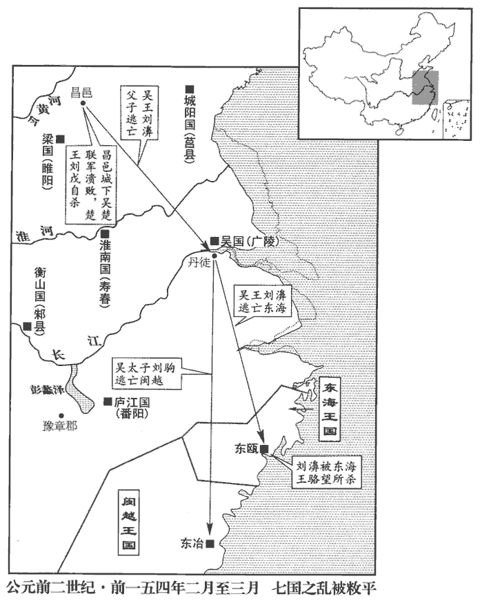 

酈將軍兵至趙，趙王引兵還邯鄲城守。邯鄲，趙都。酈寄攻之，七月不能下。匈奴聞吳、楚敗，亦不肯入邊。欒布破齊還，并兵引水灌趙城；城壞，王遂自殺。

〖译文〗 郦将军的军队到达赵国，赵王领兵从边界返回都城邯郸，据城自守。郦寄发动进攻，连续用兵七个月，没有攻破邯郸城。匈奴得知吴军和楚军失败，也不肯进入边境援救赵王。栾布平定齐国率军返回，与郦将军的军队会合，引河水淹灌邯郸；城墙毁坏，赵王刘遂自杀。

帝以齊首善，師古曰：言其初首無逆亂之心。以迫劫有謀，非其罪也，召立齊孝王太子壽，是為懿王。

〖译文〗 景帝因为齐国首先抵御叛军，后来因迫于形势与叛军有串联，不是齐王的罪过，就召来齐孝王的太子刘寿，立为齐王，他就是齐懿王。

濟北王亦欲自殺，濟北王志，齊悼惠王子，文帝十六年受封。幸全其妻子。齊人公孫玃謂濟北王曰：玃jué，俱碧翻；康俱縛切。「臣請試為大王明說梁王，通意天子；說而不用，死未晚也。」為，於偽翻。說，式芮翻。公孫玃遂見梁王曰：「夫濟北之地，東接強齊，南牽吳、越，北脅燕、趙。此四分五裂之國，張晏曰：四方受敵，濟北居中央為五。晉灼曰：四分，即交午而裂，如田字也。權不足以自守，勁不足以捍寇，又非有奇怪云以待難也；雖墜言于吳，非其正計也。如淳曰：非有奇材異計欲為亂逆也，但假權許吳以避禍耳。晉灼曰：非有以怪異之心而城守，須待變難以應吳也。師古曰：二說皆非也。此言權謀、勁力既不能捍守，又無奇怪神靈可以禦難，恐不能自全，故墜言于吳也。墜，猶失也。難，乃旦翻。鄉使濟北‹山東長清›見情實，示不從之端，鄉，讀曰嚮。見，賢遍翻。則吳必先歷齊，畢濟北，歷，過也。畢，了也。招燕、趙而總之，如此，則山東之從結而無隙矣。從，子容翻。今吳王連諸侯之兵，敺qū白徒之眾，師古曰：敺，與驅同。白徒，素非習軍旅之人，猶言白丁也。西與天子爭衡；濟北獨底節不下，使吳失與而無助，跬kuǐ步獨進，師古曰：半步曰跬。跬，空累翻。瓦解土崩，破敗而不救者，未必非濟北之力也。夫以區區之濟北而與諸侯爭強，是以羔犢之弱而捍虎狼之敵也。小羊曰羔。小牛曰犢。守職不橈，橈náo，奴教翻。可謂誠一矣。功義如此，尚見疑於上，脅肩低首，累足撫衿，使有自悔不前之心，自悔者，悔不與吳同也。不前，不敢前進以自歸於漢也。非社稷之利也。臣恐藩臣守職者疑之！臣竊料之：能歷西山，徑長樂，抵未央，攘袂而正議者，師古曰：西山，謂殽及華山也。抵，至也。攘，卻也。袂mèi，衣袖也。攘袂，猶今人言捋luō臂耳。余謂長樂，太后居之；未央，天子居之。徑長樂，抵未央，猶言自太后所至帝所也。樂，音洛。獨大王耳；上有全亡之功，下有安百姓之名，德淪於骨髓，恩加於無窮，願大王留意詳惟之！」惟，思也。孝王大說，說，讀曰悅。使人馳以聞；濟北王得不坐，徙封於菑川‹首府劇縣，山東壽光›。

〖译文〗 济北王也准备自杀，以求侥幸保全他的妻子儿女。齐国人公孙对济北王说：“我请求试为大王去劝说梁王，通过他向皇上解释；如果我的劝说不被采纳，大王再死也不晚。”公孙就去求见梁王，说：“济北国的封地，东边邻近强大的齐国，南面连接着吴国和越国，北面受到燕国和赵国的威胁。这是一个四面受敌，随时有可能被人瓜分的国家，济北王的权谋不足以自守封地，实力不足以防御外敌入侵，又没有什么奇方妙计可用来抵御灾难；虽然他曾失言答应与吴国联合行动，却并不是出于他的本意，只不过是为形势所迫。假若当初济北王表露出忠于朝廷的真心，显示出不顺从吴王的痕迹，那么，吴国一定会先放过齐国，攻占济北国，招诱燕国、赵国而统领它们，这样，崤山以东的诸侯联盟就会形成，并可连成完整的一片。现在吴王会合七国的军队，驱使没有受过训练的徒众，向西进军与天子争夺天下；而只有济北一国固守臣节不归降吴王，使吴国丧失盟友而孤立无援，只能艰难地单独进军，结果土崩瓦解，一蹶不振，追寻其原因，未必不是济北国坚守不降所做出的贡献。用微不足道的济北国，与几国叛军相抗衡，这就如同弱小的羊羔牛犊与凶猛的虎狼搏斗一样。济北王恪尽职守，不肯屈服，可称得上忠心耿耿了。济北王有这样的功业道义，竟然还受到朝廷的怀疑，整天缩肩低头，手足无措，使他产生了后悔当初没有与吴王联合行动的念头，这对国家是不利的。我害怕那些恪尽职守的封国诸侯，都由此而产生疑虑！我私下估计：在当今能够经过西方的山险，直入长乐宫和未央宫，在太后和皇上面前勇于据理力争的，只有大王您一个人；这样，上有保全面临亡国厄运的济北国的功德，下有安定百姓的名誉，您的功德及于骨髓，您的恩惠世代相传，希望大王认真考虑这件事！”梁孝王听了很高兴，派人急速进京向朝廷奏报；因此，济北王得以不坐罪，被改封到川国为王。

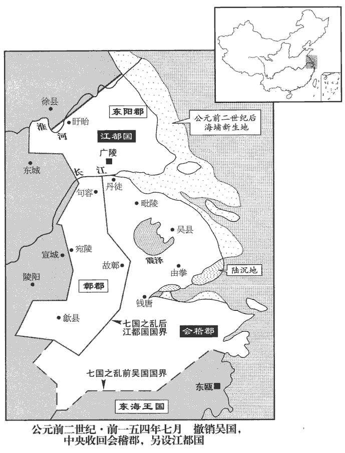 

8河間‹首府樂城，河北獻縣›王太傅衛綰擊吳、楚有功，拜為中尉。綰以中郎將事文帝，醇謹無他。上為太子時，召文帝左右飲，而綰稱病不行。文帝且崩，屬上曰：「綰長者，善遇之！」故上亦寵任焉。屬，之欲翻。

〖译文〗 [8]河间王太傅卫绾进攻吴、楚叛军有功，景帝任命他为中尉。卫绾曾以中郎将的身分侍奉文帝，除宽厚谨慎之外，没有其他特长。景帝做太子的时候，曾召请文帝的左右侍从饮酒，而卫绾推说身体有病不去参加宴会。文帝临终前，嘱咐景帝说：“卫绾是忠厚长者，你要好好对待他！”所以，景帝也宠幸信任他。

9夏，六月，乙亥‹二十四›，詔：「吏民為吳王濞bì等所詿guà誤，當坐及逋逃亡軍者，皆赦之。」詿guà，戶卦翻。亡軍，從軍而逃者也。

〖译文〗 [9]夏季，六月，乙亥（二十五日），景帝下诏说：“官吏百姓被吴王刘濞等人连累而应当判罪的，以及从军而逃亡的，都给予赦免。”

帝欲以吳王弟德哀侯廣之子續吳，以楚元王子禮續楚，德，哀侯廣之子，即德侯通也。禮時封平陸侯，為宗正。竇太后曰：「吳王，老人也，宜為宗室順善，今乃首率七國，紛亂天下，奈何續其後？」不許吳，許立楚後。乙亥‹二十四›，徙淮陽‹河南淮阳›王馀為魯‹山東曲阜›王，汝南王非為江都‹江蘇揚州›王，王故吳地。立宗正禮為楚‹江蘇徐州›王，立皇子端為膠西王，勝為中山王。中山王，都盧奴‹河北定州›。

〖译文〗 景帝打算让吴王之弟哀侯刘广的儿子刘德接续当吴王，让楚元王的儿子刘礼接续当楚王。窦太后说：“吴王是宗室中的老人，理应为宗室做忠于朝廷的表率；但他却首先发难，率领七国叛乱，扰乱天下，为什么给他续后！”不许再立吴王，允许楚王续后。乙亥（二十五日），景帝改封淮阳王刘余为鲁王；改封汝南王刘非为江都王，管辖原属吴国的封地；立宗正刘礼为楚王；立皇子刘端为胶西王，刘胜为中山王。

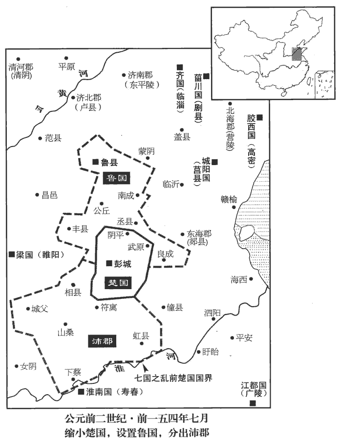 

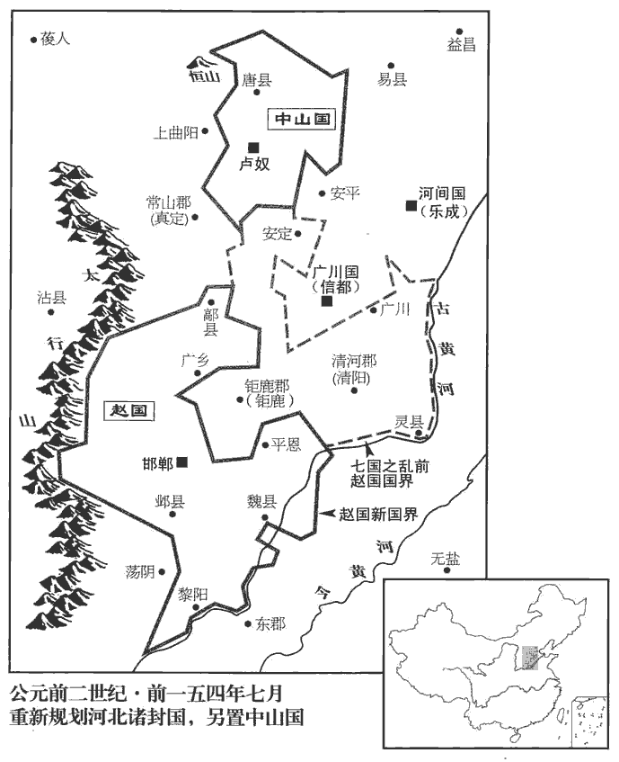 

## 前四年（戊子，前一五三年）

1春，復置關，用傳出入。應劭曰：文帝十三年，除關，無用傳。至此復用傳，以七國新反，備非常。傳，張戀翻。

〖译文〗 [1]春季，重新设置关卡，凭符传出入。

2夏，四月，己巳‹二十三›，立子榮為皇太子，徹為膠東王。

〖译文〗 [2]夏季，四月，己巳（二十三日），景帝立皇子刘荣为皇太子，刘彻为胶东王。

3六月，赦天下。

〖译文〗 [3]六月，大赦天下。

4秋，七月，臨江‹府江陵，湖北江陵›王閼薨。

〖译文〗 [4]秋季，七月，临江王刘阏去世。

5冬，十月，戊戌晦‹二十九›，月末為晦。日有食之。李心傳曰：漢景帝四年、中四年皆以冬十月日食，今通鑑書于夏、秋之後，蓋編輯者自志中摘出，不思漢初以十月為歲首，故誤系之歲末耳。余按此誤劉貢父已言之，通鑑蓋承用漢書本紀也。

〖译文〗 [5]冬季，十月，戊戌晦（疑误），出现日食。

6初，吳、楚七國反，吳使者至淮南‹安徽壽縣›，淮南王欲發兵應之。其相曰：「王必欲應吳，臣願為將。」王乃屬之。將，即亮翻；下同。屬，之欲翻，委也；言以兵事委之。相已將兵，因城守，不聽王而為漢，守，式又翻。為，於偽翻。漢亦使曲城侯將兵救淮南，晉灼曰：曲城侯，功臣表，蟲達也。師古曰：晉說非。此蟲達之子耳，名捷；達已先薨也。班志，曲城縣屬東萊郡。以故得完。

〖译文〗 [6]当初，吴、楚七国叛乱，吴王的使者到达淮南国，淮南王想发兵响应吴王。他的丞相说：“大王如果一定要响应吴王，我愿意出任将领。”淮南王就把军队交给他指挥。淮南国的丞相掌握军权之后，就据城防守，不听从淮南王的指挥而效忠汉朝廷，汉朝廷也派曲城侯领兵援救淮南国，因此淮南王得以保全。

吳使者至廬江‹府番阳，江西波阳›，廬江王不應，而往來使越‹都番禺，广东广州›。使，疏吏翻。至衡山‹府邾县，湖北黄州›，衡山王堅守無二心。及吳、楚已破，衡山王入朝。上以為貞信，勞苦之，曰：勞，來到翻。「南方卑濕。」徙王王於濟北‹府卢县，山东长清›以襃之。王於之王，於況翻。廬江王以邊越，數使使相交，師古曰：邊越者，邊界與越相接。據班志，廬江故淮南，文帝別為國。廬江水出陵陽東南而北入于江。陵陽縣屬丹楊郡。文帝初分淮南為廬江國，在江南；若班志之廬江郡則其地盡在江北矣。數，所角翻。徙為衡山王，王江北。衡山王都六，其地在江北。

〖译文〗 吴王的使者到庐江，庐江王不答应与吴王联合，而与南越国多次互通使臣。吴王的使者到衡山，衡山王坚守城池，对朝廷忠心不二。等到吴、楚叛军被打败后，衡山王入京朝见景帝。景帝认为他忠贞，就慰问他说：“南方地势低而潮湿。”改封衡山王为济北王，以示褒奖。庐江王因与南越国相邻，多次派使者与南越交结，景帝把他改封为衡山王，在长江以北为王。

## 前五年（己丑，前一五二年）

1春，正月，作陽陵邑‹陝西咸陽東北›。班志，陽陵縣屬馮翊，本弋陽縣。索隱曰：帝豫作壽陵於此，因更縣名；在長安東北四十五里。夏，募民徙陽陵，賜錢二十萬。

〖译文〗 [1]春季，正月，兴建阳陵邑。夏季，景帝下令召募百姓迁居阳陵，赐给二十万铜钱。

2遣公主嫁匈奴‹王庭设蒙古哈尔和林›單于‹挛鞮军臣›。

〖译文〗 [2]景帝送公主出嫁匈奴单于。

3徙廣川‹府信都，河北冀县›王彭祖為趙‹府邯郸，河北邯鄲›王。

〖译文〗 [3]景帝改封广川王刘彭祖为赵王。

4濟北‹府卢县，山东长清›貞王勃薨。諡法：清白守節曰貞。

〖译文〗 [4]济北王刘勃去世。

## 前六年（庚寅，前一五一年）

1冬，十二月，雷，霖雨。雨三日以往為霖。

〖译文〗 [1]冬季，十二月，天空打雷，降雨多日。

2初，上‹刘启，时年三十八›為太子，薄太后以薄氏女為妃；及即位，為皇后，無寵。秋，九月，皇后薄氏廢。

〖译文〗 [2]当初，景帝做太子的时候，薄太后给他选定了一个薄氏女子为妃；及至景帝做了皇帝，薄氏就成了皇后，却不受景帝的宠幸。秋季，九月，皇后薄氏被废。

3楚文王禮薨。

〖译文〗 [3]楚王刘礼去世。

4初，燕‹北京›王臧荼有孫女曰臧兒，嫁為槐里‹即废丘，陝西興平›王仲妻，生男信與兩女而仲死；班志，槐里縣屬扶風，秦之廢丘也，高祖二年更名。更嫁長陵‹陝西咸陽東北›田氏，更，工衡翻。生男蚡fén、勝。蚡，扶粉翻。文帝時，臧兒長女為金王孫婦，生女俗。長，知兩翻；下同。臧兒卜筮之，曰：「兩女皆當貴。」臧兒乃奪金氏婦，金氏怒，不肯予決；予，讀曰與。決，別也，言不肯與別。師古曰：決，絕也。內之太子宮，生男徹。徹方在身身，與娠同。師古曰：漢史多以娠為任身字。時，王夫人夢日入其懷。

〖译文〗 [4]当初，燕王臧荼有个孙女，名叫臧儿，嫁给槐里王仲为妻，生下儿子王信和两个女儿之后，王仲死了；臧儿便改嫁长陵人田氏，生下儿子田和田胜。汉文帝时，臧儿的大女儿嫁给金王孙为妻，生下女儿金俗。臧儿替子女占卜命 运，卜人说：“两个女儿都应当是尊贵的命。”臧儿就从金王孙家中夺回女儿，金王孙愤怒，不肯与妻子分手；臧儿却把大女儿送到太子宫中，生下儿子刘彻。王夫人怀着刘彻的时候，曾梦见太阳进入她的怀中。

及帝即位，長男榮為太子；其母栗姬，齊人也。長公主嫖欲以女‹陈娇›嫁太子‹刘荣›，長，知兩翻。嫖，文帝女，景帝之姊。師古曰：年最長，故謂之長公主。余謂帝女稱公主，帝之姊妹稱長公主。嫖降堂邑侯陳午，生女，是為武帝陳皇后。嫖，匹昭翻。栗姬以後宮諸美人皆因長公主見帝，故怒而不許；長公主欲與王夫人男徹，予，讀曰與。王夫人‹王娡›許之。由是長公主日讒栗姬，而譽王夫人【章：甲十五行本「人」下有「男」字；乙十一行本同；孔本同。】之美；譽，音餘。帝亦自賢之，又有曩者所夢日符，王夫人之震武帝也，夢日入其懷，所謂符也。計未有所定。王夫人知帝嗛xián栗姬，嗛，乎監翻，口有所銜也。康曰：恨也。史記曰：帝嘗體不安，屬諸子為王者于栗姬曰：「善視之！」栗姬怒，不肯應，言不遜。帝恚，心嗛之而未發也。因怒未解，陰使人趣大行晉灼曰：禮有大行人、小行人，主諡官。臣瓚曰：大行是官名，掌九儀之制以賓諸侯者。師古曰：大行令，本名行人，典客屬官也，後改曰大行令。余按班表，帝中六年改典客曰大行令，武帝太初元年改大行令為大鴻臚，更名行人為大行令，意其有誤；不然，則追書也。原父曰：史記文、景事最略，漢書則頗有所錄。蓋班氏博采他書成之，故于景帝世謂典客為鴻臚，行人為大行。由他書即武帝時官記景帝世事，班氏失於改革耳，非表誤也。趣，讀曰促。請立栗姬為皇后。帝怒曰：「是而所宜言邪！」而，汝也。遂按誅大行。

〖译文〗 等到景帝即位，大儿子刘荣被立为太子；太子刘荣的生母栗姬，是齐国人。景帝的姐姐长公主刘嫖，想把自己的女儿嫁给太子，栗姬因为后宫中各位美人都是由长公主推荐给景帝的，所以对长公主很恼怒而未予同意。长公主又想把女儿嫁给王夫人所生的皇子刘彻，王夫人同意了。从此之后，长公主每天都在景帝面前说栗姬的坏话而称赞王夫人的美德；景帝自己也觉得王夫人贤惠，又有从前梦日入怀的祥瑞符兆，对是否应改立太子和皇后的事，犹豫未定。王夫人知道景帝恨栗姬，趁着景帝怒火未熄，暗中派人去催促大行，让大行请求景帝立栗姬为皇后。景帝大怒，说：“这是你应该说的话吗！”就把大行问罪处死了。

## 七年（辛卯，前一五零年）

1冬，十一月，己酉，廢太子榮為臨江王‹首府江陵，湖北江陵›。太子太傅竇嬰力爭不能得，乃謝病免。栗姬恚恨而死。

〖译文〗 [1]冬季，十一月，己酉（疑误 ），景帝废掉太子刘荣，改封他为临江王。太子太傅窦婴极力劝谏，未能改变景帝的决定，就自称有病，请求免职。栗姬愤恨而死。

2庚寅晦‹三十›，日有食之。

〖译文〗 [2]庚寅晦（疑误），出现日食。

3二月，丞相陶青免。乙巳‹十六›，太尉周亞夫為丞相。罷太尉官。

〖译文〗 [3]二月，丞相陶青被罢免。乙巳（十六日），太尉周亚夫出任丞相。景帝诏令罢除太尉这一官职。

4夏，四月，乙巳‹十七›，立皇后王氏‹王娡›。

〖译文〗 [4]夏季，四月，乙巳（十七日），景帝立王氏为皇后。

5丁巳‹二十九›，立膠東‹府即墨，山东平度›王徹為皇太子‹时年七岁›。

〖译文〗 [5]丁巳（二十九日），景帝立胶东王刘彻为皇太子。

6是歲，以太僕劉舍為御史大夫，劉舍，高祖功臣桃安侯劉襄之子。襄本項氏，親賜姓。濟南‹山东章丘›太守郅都為中尉。濟南王辟光反，國除為郡。郅，之日翻。風俗通：郅，商時侯國，後以為氏。

〖译文〗 [6]这一年，景帝任命太仆刘舍任御史大夫，任命济南郡太守郅都为中尉。

始，都為中郎將，敢直諫。嘗從入上林，賈姬如廁，賈姬，即賈夫人，生趙王彭祖、中山王勝。野彘卒來入廁。卒，讀曰猝。上目都，都不行；上欲自持兵救賈姬。都伏上前曰：「亡一姬，復一姬進，復，扶又翻。天下所少，寧賈姬等乎！陛下縱自輕，柰宗廟、太后何！」上乃還，彘亦去。太后聞之，賜都金百斤，由此重都。都為人，勇悍公廉，不發私書，問遺無所受，悍，下罕翻。遺，于季翻。請謁無所聽。及為中尉，先嚴酷，先，悉薦翻。行法不避貴戚；列侯、宗室見都，側目而視，號曰「蒼鷹」。師古曰：言其鷙擊之甚。

〖译文〗 从前，郅都担任中郎将，敢于直言进谏。他曾经跟随景帝进入上林苑，当贾姬去上厕所时，一头野猪突然闯入厕所。景帝用眼光示意郅都去救护贾姬，郅都站立不走；景帝打算自己拿着武器去救贾姬，郅都跪伏在景帝面前说：“失去了一个姬妾，又会有另一个姬妾进宫，天下所缺少的，难道是贾姬这一类的人吗！陛下纵然不爱惜自己，又如何对待宗庙和太后！”景帝就走了回来，崐野猪也离去了。太后听说了这件事，赏赐给郅都一百斤黄金，从此器重郅都。郅都为人勇猛有力，公正廉洁，不拆阅私人给他的书信，不接受问候馈赠的礼品，不理睬托人情、拉关系的要求。及至做了中尉，倡导严厉酷苛的作风，执行法律进行赏罚，不避开皇亲国戚。列侯和宗室皇族见到郅都，都侧目而视，送他一个绰号叫“苍鹰”。

## 中元年（壬辰，前一四九年）

1夏，四月，乙巳‹二十三›，赦天下。

〖译文〗 [1]夏季，四月，乙巳（二十三日），景帝颁布诏令大赦天下。

2地震。衡山‹府邾县，湖北黄州›原都雨雹，大者尺八寸。原都，地名，蓋屬衡山國。雨，王遇翻。

〖译文〗 [2]发生地震，衡山国的原都一带降冰雹，最大的冰雹直径达一尺八寸。

## 中二年（癸巳，前一四八年）

1春，二月，匈奴‹王庭设蒙古哈尔和林›入燕‹北京›。燕，因肩翻。

〖译文〗 [1]春季，二月，匈奴入侵燕国封地。

2三月，臨江‹府江陵，湖北江陵›王榮坐侵太宗廟壖ruán垣為宮，征詣中尉府對簿。帝即位之初，令天下郡國各立太祖、太宗之廟，故臨江王國亦有之。壖，與堧同，而緣翻。師古曰：簿者，獄辭之文書。簿，步戶翻。臨江王欲得刀筆，為書謝上‹刘启，时年四十一›，師古曰：刀，所以削治書也。古者著書于簡牘，故必用刀焉。而中尉郅都禁吏不予；魏其侯使人間與臨江王。伺間隙而與之也。魏其侯，竇嬰。班志，魏其，侯國，屬琅邪郡。予，讀曰與。間，古莧翻。臨江王既為書謝上，因自殺。竇太后聞之，怒；後竟以危法中都而殺之。師古曰：謂構成其罪。中，竹仲翻。考異曰：史記本紀：「後二年正月，郅將軍擊匈奴。」酷吏傳：「郅都死後，宗室多犯法，上乃召寧成為中尉。」成為中尉在中六年，則後二年所謂郅將軍者，非都也，疑別一人。漢書紀無郅將軍事。

〖译文〗 [2]三月，临江王刘荣因为修建宫室侵占了太宗庙前空地上的围墙而犯了罪，景帝征他去中尉府接受审问。临江王想要写字用的刀笔，以写信向景帝谢罪，而中尉郅都禁止官吏提供刀笔。魏其侯派人把刀笔送给了临江王。临江王写完了向景帝谢罪的信之后，就自杀了。窦太后听说了这件事，很恼怒；后来就加以严重的罪名，把郅都杀死了。

3夏，四月，有星孛於西北。孛，蒲內翻。

〖译文〗 [3]夏季，四月，在西北天空出现一颗异星。

4立皇子越為廣川‹府信都，河北冀县›王，寄為膠東‹府即墨，山东平度›王。廣川王彭祖王趙，故立越為王。膠東王徹為太子，故立寄為王。

〖译文〗 [4]景帝封立皇子刘越为广川王，刘寄为胶东王。

5秋，九月，甲戌晦‹三十›，日有食之。

〖译文〗 [5]秋季，九月，甲戌晦（三十日），出现日食。

6初，梁‹府睢阳，河南商丘›孝王以至親有功，梁王以母弟之親，又有破吳、楚之功。得賜天子旌旗，從千乘萬騎，出蹕入警。王寵信羊勝、公孫詭，以詭為中尉。勝、詭多奇邪計，欲使王求為漢嗣。栗太子之廢也，太子榮，栗姬之子，故號栗太子。太后意欲以梁王為嗣，嘗因置酒謂帝曰：「安車大駕，用梁王為寄。」帝跪席舉身曰：「諾。」罷酒，帝以訪諸大臣，大臣袁盎等曰：「不可。昔宋宣公不立子而立弟，以生禍亂，五世不絕。宋宣公舍其子與夷而立穆公，穆公又舍其子馮而立與夷，其後馮卒與與夷爭國。見春秋傳。小不忍，害大義，故春秋大居正。」公羊傳之言。由是太后議格，遂不復言。格，音閣，止也。王又嘗上書：「願賜容車之地，徑至長樂宮，自使梁國士眾築作甬道朝太后。」甬，餘拱翻。朝，直遙翻。袁盎等皆建以為不可。建，建議也。

〖译文〗 [6]当初，梁孝王因为与景帝是一母所生，关系最为亲密，又有平定吴、楚叛乱的大功，被赐予天子使用的族旗，有成千上万的车辆马匹做随从，出称“跸”，入称“警”，都要清道戒严。梁孝王宠信羊胜、公孙诡，任命公孙诡为中尉。羊胜和公孙诡有许多奇诡不正的计谋，想怂恿梁孝王争取成为汉景帝的继承 人。当栗太子被废的时候，窦太后想让梁王为帝位继承人，曾利用宴饮的时候对景帝说：“你出入乘坐大驾和安车，要让梁王在你身旁。”景帝跪坐在席上，挺直了身回答说：“好。”喝完了酒，景帝就此征询大臣们的意见，大臣袁盎等人说：“不成。过去宋宣公不传位给儿子而传位给弟弟，因此产生了祸乱，祸乱持续了五代人。小处不忍心，会伤害大义，所以《春秋》赞成大义为主宰。”因此，太后的意见被阻止，也就再不提让梁王继承帝位了。梁王又曾经上书给景帝：“希望赐给我能容得下车辆通过的地方，直达太后居住的长乐宫，我自己派梁国的士兵修筑一条甬道，以便朝见太后。”袁盎等大臣都建议不批准梁王的请求。

梁王由此怨袁盎及議臣，乃與羊勝、公孫詭謀，陰使人刺殺袁盎及他議臣十餘人。刺，七亦翻。賊未得也，於是天子意梁；意梁者，以意測度，知其為梁所為也。逐賊，果梁所為。上遣田叔、呂季主往按梁事，捕公孫詭、羊勝；詭、勝匿王後宮。使者十余輩至梁，責二千石急。梁相軒丘豹及內史韓安國以下舉國大索，姓譜：楚文王庶子食采於軒丘，其後為氏。索，山客翻。月餘弗得。安國聞詭、勝匿王所，乃入見王而泣曰：「主辱者臣死。大王無良臣，故紛紛至此。今勝、詭不得，請辭，賜死！」王曰：「何至此！」安國泣數行下，曰：「大王自度于皇帝，孰與臨江王親？」王曰：「弗如也。」安國曰：「臨江王適長太子，行，戶剛翻。度，徒洛翻。適，讀曰嫡。長，知兩翻。以一言過，師古曰：景帝常屬諸姬子，栗姬言不遜，由是廢太子。廢王臨江；用宮垣事，卒自殺中尉府。王，於況翻。卒，子恤翻；下同。何者？治天下終不用私亂公。治，直之翻。今大王列在諸侯，訹xù邪臣浮說，訹，音戌，誘也。犯上禁，橈明法。橈，奴教翻。天子以太后故，不忍致法于大王；太后日夜涕泣，幸大王自改，大王終不覺寤。有如太后宮車即晏駕，大王尚誰攀乎？」語未卒，王泣數行而下，卒，子恤翻。行，戶剛翻。謝安國曰：「吾今出勝、詭。」王乃令勝、詭皆自殺，出之。上由此怨望梁王。

〖译文〗 梁王因此怨恨袁盎和参与议论的大臣，就和羊胜、公孙诡商量，暗中派人刺杀了袁盎及其他参与议论的大臣十多人。刺客没有抓到，于是景帝估计与梁王有关；追查刺客，果然是梁王派来的。景帝派田叔、吕季主前往梁国查究此案，逮捕公孙诡和羊胜；公孙诡和羊胜躲藏在梁王的后宫中。朝廷派出的十多批使臣先后来到梁国，严厉地责问二千石官员。梁相轩丘豹和内史韩安国及以下官员，进行了全国性大搜捕，经过一个多月，没有抓到公孙诡和羊胜。韩安国得知公孙诡和羊胜藏匿在梁王宫中，就进入王宫去见梁王，哭着说：“君主蒙受耻辱，臣子应该为他而死。大王身边没有良臣辅佐，所以才闹到这种地步。现在捉不到羊胜、公孙诡，我请求与您诀别，赐我自杀！”梁王说：“为什么至于这样呢！”韩安国泪如泉涌，说：“大王自己估计您与皇上的关系，比起皇上和临江王来，哪一个更亲？”梁王说：“我不如临江王。”韩安国说：“临江王是皇上的亲生长子，又曾是太子，因为一句错话，被废去太子，封为临江王；又因为修宫侵占围墙的事，终于在中尉府自杀。为什么这样呢？皇上治理天下终究不能因为私情而干扰公事。现在大王身为诸侯，受奸臣胡言乱语的引诱，违犯皇上的禁令，扰乱尊严的法律。皇上因为太后疼爱您的缘故，才不忍心按国法来惩办您；太后日夜哭泣，希望大王能改过自新，大王却始终不觉悟。假若太后即刻去世，大王还依靠谁呢？话还没有说完，梁王泪流满面，向韩安国赔罪说：“我现在就交出羊胜和公孙诡。”梁王就命令羊胜、公孙诡都自杀，交出了他们的尸体。景帝因此怨恨梁王。

梁王恐，使鄒陽入長安，見皇后兄王信說曰：說，式芮翻；下同。「長君弟得幸于上，後宮莫及，而長君行跡多不循道理者。長，知兩翻。行，下孟翻。今袁盎事即窮竟，梁王伏誅，太后無所發怒，切齒側目於貴臣，竊為足下憂之。」為，於偽翻；下精為同。長君曰：「為之柰何？」陽曰：「長君誠能精為上言之，得毋竟梁事；長君必固自結于太后，太后厚德長君入於骨髓，而長君之弟幸于兩宮，長君之弟，謂皇后也。如淳曰：兩宮，太后宮及帝宮也。金城之固也。師古曰：言其榮寵無極而不可壞，故取喻于金城。昔者舜之弟象，日以殺舜為事，及舜立為天子，封之於有卑‹湖南东安东北›。卑，音鼻。師古及柳宗元皆以為零陵之鼻亭即象所封。夫仁人之于兄弟，無藏怒，無宿怨，厚親愛而已。用孟子語意。是以後世稱之。以是說天子，徼幸梁事不奏。」長君曰：「諾。」乘間入言之，徼，工堯翻。間，古莧翻。帝怒稍解。

〖译文〗 梁王恐惧，派邹阳到达长安，去见皇后的哥哥王信说：“您的妹妹得到皇上的宠幸，在后宫没人能比得上，但是您的行为却有许多不遵循道理的地方。现在如果袁盎被杀一事追究到底，梁王被依法处死，太后的怒火无处发泄，就会向贵臣咬牙侧目地痛恨，我私下为您担忧。”王信说：“那该怎么办呢？”邹阳说：“您如果能好好地劝告皇上，使他能 不深究梁王的事，您一定会受到太后的信任，太后从骨髓中深深感谢您的大德，而您的妹妹可以受到太后和皇上的宠幸，这就会使你们家的荣宠像金城一样牢固。当初，舜的弟弟象，整日只想杀死舜，等到舜做了天子，却把象封到了有卑。仁义的人对于自己的弟弟，不暗藏怒火，不记过去的怨仇，只是很好地对待他罢了。正因为如此，后代人都称赞舜。用这番道理去劝说皇上，梁王的事就可能侥幸不处置了。”王信说：“好”。他找到一个机会，入宫向景帝说了上面的这番道理，景帝对梁王的恼怒稍稍化解。

是時，太后憂梁事不食，日夜泣不止，帝亦患之。會田叔等按梁事來還，至霸昌廐‹陝西西安東›霸昌廐在長安東。括地志：在雍州萬年縣東北三十八里。取火悉燒梁之獄辭，空手來見帝。見，賢遍翻。帝曰：「梁有之乎？」叔對曰：「死罪！有之。」上曰：「其事安在？」田叔曰：「上毋以梁事為問也！」上曰：「何也？」曰：「今梁王不伏誅，是漢法不行也；伏法而太后食不甘味，臥不安席，此憂在陛下也。」上大然之，使叔等謁太后，且曰：「梁王不知也；造為之者，獨在幸臣羊勝、公孫詭之屬為之耳，謹已伏誅死，梁王無恙也。」恙，餘亮翻。太后聞之，立起坐餐，氣平復。

〖译文〗 这时，太后担心梁王的事情，不进饮食，日夜哭泣不止，景帝也很忧虑。正好田叔等人查办完梁王的事，返回长安，到达霸昌厩，田叔等用火把在梁国办案取得的证词全部烧毁，空着手来见景帝。景帝问：“梁王有罪吗？”田叔崐回答说：“犯死罪的事是有的。”景帝问：“他的罪证在哪里？”田叔说：“陛下不要过问梁王的罪证了。”景帝问：“为什么？”田叔说：“有了罪证，如今不杀梁王，就废弃了汉朝的法律；如果处死梁王，太后会吃东西没有滋味，睡不好觉，这样就会给陛下带来忧愁。”景帝非常赞成他所说的道理，让田叔等人谒见太后，并且说：“梁王不知情；主持这件事的，只有梁王的宠臣羊胜、公孙诡之流，这些人都已经按国法处死，梁王没有受到伤害。”太后听到这些话，立即起来坐着吃饭，情绪也稳定了。

梁王因上書請朝。朝，直遙翻。既至關，茅蘭說王，使乘布車、從兩騎入，匿于長公主園。服虔曰：茅蘭，孝王大夫。張晏曰：布車，降服自比喪人也，長公主，即館陶長公主嫖。漢使使迎王，王已入關，車騎盡居外，不知王處。太后泣曰：「帝果殺吾子！」帝憂恐。於是梁王伏斧質于闕下謝罪。太后、帝大喜，相泣，復如故，悉召王從官入關。從，才用翻。然帝益疏王，不與同車輦矣。疏，與疎同；下同。帝以田叔為賢，擢為魯相。相魯王餘也。

〖译文〗 梁王乘机上书请求朝见景帝，已经到达函谷关，茅兰劝说梁王，让他乘坐着普通的布车，只带两名骑士为随从入关，藏匿在长公主的园内。朝廷派使臣迎接梁王，梁王已入关，随从的车骑都在关外，不知道梁王的下落。太后哭着说：“皇帝果然杀了我儿子！”景帝很担忧害怕。这时，梁王来到皇宫门前，伏在刑具上面，表示认罪，请求处置。太后、景帝喜出望外，三人相对哭泣，恢复原来的骨肉手足之情，把梁王的随从官员都召入关内。但是，景帝愈发疏远梁王，不再和他乘坐一辆车出入了。景帝认为田叔贤能，就提升他做了鲁国的相。

## 中三年（甲午，前一四七年）

1冬，十一月，罷諸侯御史大夫官。

〖译文〗 [1]冬季，十一月，朝廷宣布废除诸侯王国的御史大夫官职。

2夏，四月，地震。

〖译文〗 [2]夏季，四月，发生了地震。

3旱，禁酤酒。酤，工護翻，謂賣酒也。

〖译文〗 [3]出现旱灾，朝廷禁止卖酒。

4三月，丁巳，立皇子乘為清河王‹府清阳，河北清河›。高帝置清河郡于齊、趙之間，今以為王國。

〖译文〗 [4]三月，丁巳（疑误），景帝封立皇子刘乘为清河王。

5秋，九月，蝗。

〖译文〗 [5]秋季，九月，发生蝗灾。

6有星孛於西北。孛，蒲內翻。

〖译文〗 [6]西北天空出现了一颗异星。

7戊戌晦‹三十›，日有食之。

〖译文〗 [7]戊戌晦（三十日），出现日食。

8初，上廢栗太子，周亞夫固爭之，不得；上由此疏之。而梁孝王每朝，常與太后言條侯之短。梁王與條侯有隙，見前三年。竇太后曰：「皇后兄王信可侯也。」帝讓曰：「始，南皮、章武，先帝不侯，南皮侯竇彭祖，太后弟長君之子；章武侯竇廣國，太后弟也。班志，南皮、章武皆屬勃海郡。及臣即位乃侯之；信未得封也。」竇太后曰：「人生各以時行耳。自竇長君在時，竟不得侯，死後，其子彭祖顧得侯，吾甚恨之！帝趣侯信也。」趣，讀曰促。帝曰：「請得與丞相議之。」上與丞相議。亞夫曰：「高皇帝約：『非劉氏不得王，非有功不得侯。』今信雖皇后兄，無功，侯之，非約也。」帝默然而止。其後匈奴王徐盧等六人降，降，戶江翻。帝欲侯之以勸後。丞相亞夫曰：「彼背主降陛下，背，蒲內翻。陛下侯之，則何以責人臣不守節者乎？」帝曰：「丞相議不可用。」乃悉封徐盧等為列侯。徐盧，容城侯；賜，桓侯；陸強，遒qiú侯；僕䵣，易侯；范代，范陽侯；邯鄲，翕侯。䵣，師古音怛dá。亞夫因謝病。九月，戊戌‹三十›，亞夫免；以御史大夫桃侯劉舍為丞相。索隱曰：桃縣屬信都郡。

〖译文〗 [8]当初，景帝废掉栗太子，周亚夫坚决反对，没有产生作用；景帝因此疏远了周亚夫。而梁孝王每次来朝见，经常对太后说周亚夫的短处。窦太后说：“皇后的哥哥王信可以封侯。”景帝表示谦让说：“当初，您的侄子南皮侯和您的弟弟章武侯，先帝都不封他们为侯；等到我即位后才封他们为侯；现在王信也不得封侯。”窦太后说：“人生在世，只各自根据当时的情况办事罢了。当年我弟弟窦长君在世时，竟然不得封侯，死后，他的儿子窦彭祖反而得以封为南皮侯，我十分遗憾！皇帝赶快封王信为侯吧。”景帝说：“请允许我和丞相商议此事。”景帝和丞相商议，周亚夫说：“高皇帝约定：‘不是刘氏宗亲不得封王，没有立功的人不得封侯。’现在王信虽然是皇后的哥哥，但没有立功，如果封他为侯，就违背了前约。”景帝默然，只好把这件事放下了。后崐来，匈奴王徐卢等六人归降朝廷，景帝想封他们为侯，以鼓励后来人继续归降。丞相周亚夫说：“他们背叛自己的君主投降陛下，陛下封他们为侯，那么还怎样责问不守节操的臣子呢？”景帝说：“丞相的议论不可采用。”于是把徐卢等人全封为列侯。周亚夫因此就自称有病，请求免职。九月，戊戌（三十日），景帝罢免了周亚夫，任命御史大夫桃侯刘舍为丞相。

## 中四年（乙未，前一四六年）

1夏，蝗。

〖译文〗 [1]夏季，发生蝗灾。

2冬，十月，戊午‹二十›，日有食之。

〖译文〗 [2]冬季，十月，戊午（二十六日），出现日食。

## 中五年（丙申，前一四五年）

1夏，立皇子舜為常山王‹河北正定›。高帝置常山郡，屬趙國；呂后分為王國；文帝并為趙國；今復以王舜。

〖译文〗 [1]夏季，景帝封立皇子刘舜为常山王。

2六月，丁巳‹二十九›，赦天下。

〖译文〗 [2]六月，丁巳（二十九日），大赦天下。

3大水。

〖译文〗 [3]发生水灾。

4秋，八月，己酉‹二十一›，未央宮東闕災。

〖译文〗 [4]秋季，八月，己酉（二十二日），未央宫东门阙发生火灾。

5九月，詔：「諸獄疑，若雖文致於法謂原情定罪，本不至於死，而以律文傅致之。而于人心不厭者，輒讞yàn之。」厭，服也；師古曰：一涉翻，又於涉翻。讞，魚列翻，又魚蹇翻，平議也。

〖译文〗 [5]九月，景帝下诏说：“诸项疑难案件，如果根据法律条文可以定为重罪，但却无法使人心服的，立即予以平议。”

6地震。

〖译文〗 [6]发生地震。

## 中六年（丁西，前一四四年）

1冬，十月，梁王來朝，上疏欲留；上‹刘启，时年四十五›弗許。褚少孫曰：諸侯王朝見天子，漢法凡當四見耳：始到，入，小見。到正月朔旦，奉皮薦璧玉賀正月，法見。後三日，為王置酒，賜金錢財物。後二日，復入小見，辭去。凡留長安，不過二十日。小見者，燕見於禁門內，飲於省中。王歸國，意忽忽不樂。樂，音洛。

〖译文〗 [1]冬季，十月，梁王来京朝见，给景帝上书想留居长安；景帝不同意。梁王返回封国，心情郁郁不乐。

2十一【章：乙十一行本「一」作「二」；孔本同。】月，改諸廷尉、將作等官名。時改廷尉為大理，將作少府為大匠，奉常為太常，典客為大行令，長信詹事為長信少府，將行為大長秋，主爵中尉為都尉。

〖译文〗 [2]十一月，景帝下诏，更改廷尉、将作少府等官名。

3春，二月，乙卯‹一›，上行幸雍‹陕西凤翔›，郊五畤zhì。畤，音止。

〖译文〗 [3]春季，二月，乙卯（初一），景帝亲临雍地，在祭祀天地五帝的处所祭天。

4三月，雨雪。

〖译文〗 [4]三月，降雪。

5夏，四月，梁孝王薨。竇太后聞之，哭極哀，不食，曰：「帝果殺吾子！」帝哀懼，不知所為；與長公主計之，乃分梁為五國，盡立孝王男五人為王：買為梁王‹首府睢陽，河南商丘›，明為濟川王‹首府济阳，河南兰考东北堌阳镇›，彭離為濟東王‹首府无盐，山東東平东南›，定為山陽王‹首府昌邑，山东金乡西北昌邑镇›，不識為濟陰王‹首府定陶，山東定陶›；梁仍都睢陽。濟川國在陳留、東郡之間。濟東國後入漢為大河郡，後又為東平國。山陽國即山陽郡。濟陰國即濟陰郡。濟，子禮翻。女五人皆食湯沐邑。奏之太后，太后乃說，為帝加一餐。說，讀曰悅。為，於偽翻。孝王未死時，財以巨萬計，及死，藏府余黃金尚四十余萬斤，藏，徂浪翻。他物稱是。稱，尺證翻。

〖译文〗 [5]夏季，四月，梁孝王去世。窦太后听到消息，哭得极其悲哀，不进饮食，说：“皇帝果然杀了我儿子！”景帝悲哀恐惧，不知怎么办才好；与姐姐长公主商议，于是把梁国分为五国，把梁孝王的五个儿子全都封为诸侯王：刘买为梁王，刘明为济川王，刘彭离为济东王，刘定为山阳王，刘不识为济阴王；梁孝王的五个女儿也都封给汤沐邑。景帝把这一决定禀告窦太后，太后才高兴起来，为景帝这一做法而吃了一顿饭。梁孝王没死的时候，有数以万万计的财产，他死后，梁国府库中剩余的黄金还有四十多万斤，其他财物的价值也与此相当。

6上既減笞法，見上卷元年。笞者猶不全；乃更減笞三百曰二百，笞二百曰一百。又定棰令：師古曰：棰，策也，所以擊者也。棰，止蕊翻。棰長五尺，長，直亮翻。其本大一寸，竹也；末薄半寸，皆平其節。當笞者笞臀；如淳曰：然則先時笞背也。臀，徒門翻。畢一罪，乃更人。更，工衡翻。自是笞者得全。然死刑既重而生刑又輕，民易犯之。易，以豉chǐ翻。

〖译文〗 [6]景帝减少了对罪犯的笞打次数之后，受笞刑的人还难保全生命；就再崐次减少笞刑，该笞打三百下的，减为笞打二百，该笞打二百下的，减为笞打一百。又制定了实施笞刑的法令：用于打人的笞杖，长为五尺，用竹子做成，根部手握之处，竹管的直径为一寸；末梢为半寸薄的竹片，竹节全要磨平。被判处笞刑的人，笞打他的臀部；一个罪人打完之后，才更换行刑的人。从此以后，受笞刑的人就得以保全了。但这样一来，死刑很重而不到死刑的其他惩罚又很轻，百姓就把违法犯罪看得很轻淡了。

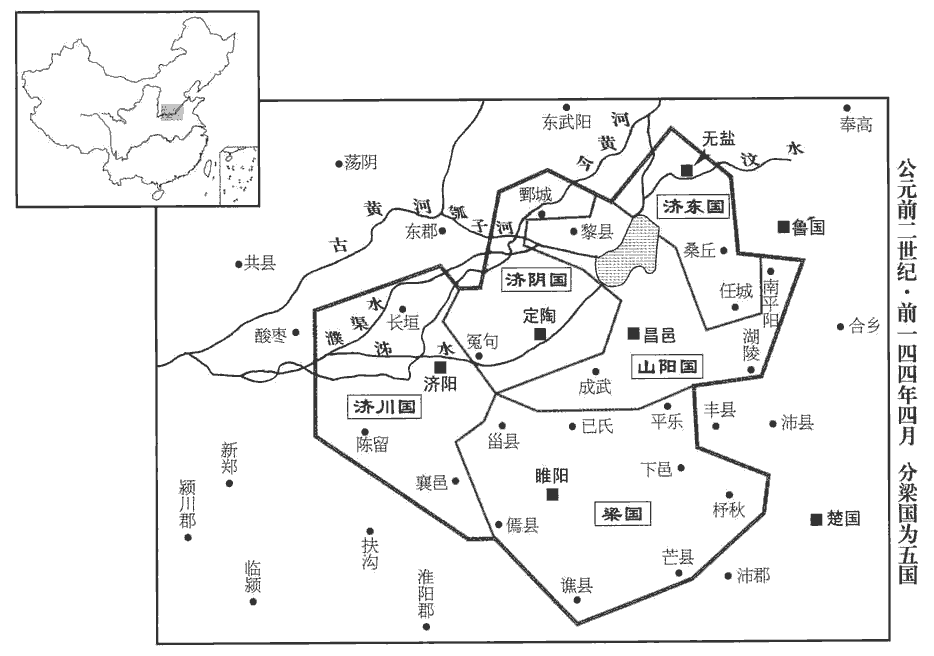 

7六月，匈奴‹王庭设蒙古哈尔和林›入雁門‹山西右玉›，至武泉‹內蒙呼和浩特东北›，入上郡‹陝西延安›，取苑馬；雁門有句注之險。如淳曰：漢儀注：太僕牧師諸苑三十六所，分佈北邊、西邊，以郎為苑監，官奴婢三萬人，養馬三十萬匹。師古曰：武泉，雲中縣也。養鳥獸通名曰苑，故謂牧馬處曰苑。食貨志：景帝始造苑馬以廣用。吏卒戰死者二千人。隴西‹甘肃临洮›李廣為上郡太守，嘗從百騎出，【章：甲十五行本「出」下有「卒」字；乙十一行本同；張校同。】遇匈奴數千騎，見廣，以為誘騎，誘騎者，見少以誘敵。誘，音酉；下同。皆驚，上山陳。師古曰：為陳以待廣也。陳，讀曰陣；下同。廣之百騎皆大恐，欲馳還走。廣曰：「吾去大軍數十里，今如此以百騎走，匈奴追射我立盡。射，而亦翻；下同。今我留，匈奴必以我為大軍之誘，必不敢擊我。」廣令諸騎曰：「前！」未到匈奴陣二里所，止，令曰：「皆下馬解鞍！」其騎曰：「虜多且近，即有急，柰何？」廣曰：「彼虜以我為走；令【章：乙十一行本「令」作「今」；孔本同；熊校同。】皆解鞍以示不走，用堅其意。」師古曰：示以堅牢，令敵意知之。於是胡騎遂不敢擊。有白馬將出，護其兵；師古曰：將之乘白馬者也。護，謂監視之。將，即亮翻。李廣上馬，與十餘騎奔，射殺白馬將而復還，至其騎中解鞍，令士皆縱馬臥。是時會暮，胡兵終怪之，不敢擊。夜半時，胡兵亦以為漢有伏軍於旁，欲夜取之，胡皆引兵而去。平旦，李廣乃歸其大軍。

〖译文〗 [7]六月，匈奴攻入雁门郡，直到武泉县，并攻入上郡，抢去了官府牧马场的马匹；汉军将士二千人战死。陇西人李广担任上郡太守，曾率领一百名骑士出行，遇到几千匈奴骑兵。匈奴人看见李广的小队伍，以为是汉军大部队派出的诱兵，都吃了一惊，占据高山摆开阵势。李广所率领的一百名骑兵都很害怕，想驰马逃跑回去，李广制止说：“我们离开大军数十里远，现在，如果就靠这一百骑兵的队伍逃跑，匈奴人追杀射击，我们马上就完了。现在我们留在这里，匈奴人必定把我们看成大军的诱敌队伍，一定不敢进攻我们。”李广命令骑兵们说：“前进！”来到距离匈奴阵地约有二里的地方，停止下来，李广命令说：“都下马解下马鞍！”他的骑兵说：“敌人很多，而且离我们很近，如果出现紧急情况，怎么办？”李广说：“敌人估计我们会逃跑；我命令都解下马鞍，向他们表示不逃跑，用这个办法来坚定他们认为我们是诱敌部队的想法。”于是匈奴骑兵便 真的不敢进攻。有一位骑白马的匈奴将领出阵来，监护他的军队，李广上马，和十多个骑兵奔向前去，射死了匈奴的白马将军，又返回来，到达他的百骑阵营中，解下马鞍，命令战士们放开战马，卧地休息。这时，正好是黄昏，匈奴骑兵一直对李广部队的行为觉得奇怪，不敢进攻。到了半夜时分，匈奴军队仍然认为附近有埋伏的汉朝大军，想夜间袭击他们，便都领兵撤走了。到黎明时，李广才回到他的大军营垒。

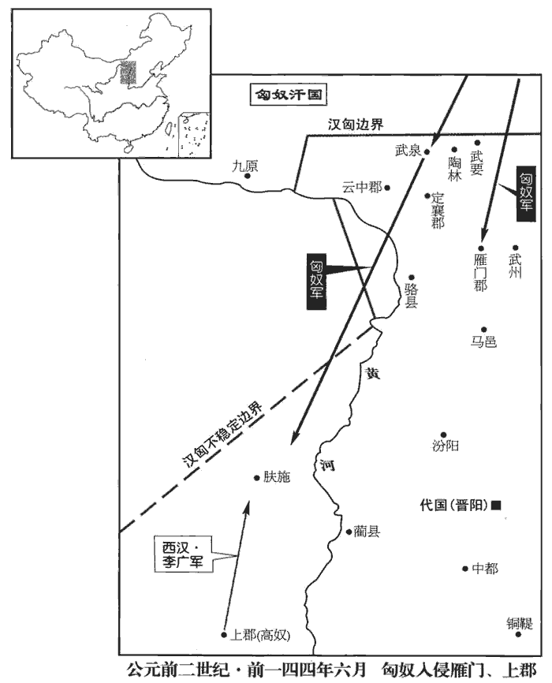 

8秋，七月，辛亥晦‹二十九›，日有食之。

〖译文〗 [8]秋季。七月，辛亥晦（二十九日），出现日食。

9自郅都之死，長安左右宗室多暴犯法。上乃召濟南‹山东章丘›都尉南陽‹河南南阳›寧成為中尉。其治效郅都，其廉弗如；然宗室、豪傑皆人人惴恐惴，之瑞翻。

〖译文〗 [9]自从郅都死后，长安及附近的宗室 皇族有许多人凶暴犯法。景帝就征召济南都尉南阳人宁成出任中尉。宁成的治政仿效郅都，但清廉不及郅都，然而宗室皇族、地方豪强人人都恐惧不安。

10城陽‹府莒县，山东莒县›共王喜薨。共王喜，文帝前四年嗣父章爵為王，八年徙王淮陽，後四年復還城陽，至是而薨。共，讀曰恭。

〖译文〗 [10]城阳王刘喜去世。

## 後元年（戊戌，前一四三年）

1春，正月，詔曰：「獄，重事也。人有智愚，官有上下。獄疑者讞yàn有司；有司所不能決，移廷尉，讞而後不當，讞者不為失。師古曰：假令讞訖，其理不當，所讞之人不為罪失。讞，魚列翻，又魚蹇翻。欲令治獄者務先寬。」治，直之翻。

〖译文〗 [1]春季，正月，景帝下诏说：“审判案件，是国家的重大政务。人有智愚的不同，官有上下的区别。有疑问的案件要上交给有关机构复审；有关机构仍难以断案的，要上交廷尉复审。下级把疑案送呈上级复审，而发现断案有错误，送呈疑案的官员不必负担任何责任。主要是想让审案的司法官员，一定重视从宽判案。”

2三月，赦天下。

〖译文〗 [2]三月，景帝下诏，大赦天下。

3夏，大酺五日，民得酤酒。中三年禁民酤酒，今弛此禁。酺，音蒲。

〖译文〗 [3]夏季，景帝下诏，特许百姓相聚饮酒五天，允许百姓卖酒。

4五月，丙戌‹九›，地震。上庸‹湖北竹山西南田家坝›地震二十二日，班志，上庸縣屬漢中郡。壞城垣。壞，音怪。

〖译文〗 [4]五月，丙戌（初九），发生地震。上庸地震持续了二十二天，毁坏了城墙。

5秋，七月，丙午‹三十›，丞相舍免。

〖译文〗 [5]秋季，七月，丙午（三十日），丞相刘舍被免职。

6乙巳晦‹二十九›，日有食之。

〖译文〗 [6]乙巳晦（二十九日），出现日食。

7八月，壬辰，以御史大夫衛綰為丞相，衛尉南陽直不疑為御史大夫。姓譜：楚人直弓之後。初，不疑為郎，同舍有告歸，悞wù持其同舍郎金去。已而同舍郎覺亡，意不疑；師古曰：疑其盜取。不疑謝有之，師古曰：告云實取。買金償。後告歸者至而歸金，亡金郎大慚。以此稱為長者，稍遷至中大夫。人或廷毀不疑，師古曰：當廷見之時而毀之。以為盜嫂。不疑聞，曰：「我乃無兄。」然終不自明也。

〖译文〗 [7]八月，壬辰（疑误），景帝任命御史大夫卫绾为丞相，任命卫尉南阳人直不疑为御史大夫。当初，直不疑做郎官，同住一处的某人告假回家，错拿了同处另一位郎官的黄金走了。不久，同住一处的郎官发觉自己丢了金子，怀疑是直不疑偷去了；直不疑向他道歉说确有其事，买来黄金还给了失金人。后来，告假回家的人回来，交还了错拿的黄金，丢失黄金的那位郎官大为惭愧。因此，直不疑被称为长者，他慢慢地升官直至做了中大夫。有人在朝廷上诋毁直不疑，说他与嫂子私通。直不疑听到了，就说：“我并没有哥哥。”可是终究不自我辩白。

8帝居禁中，召周亞夫賜食，獨置大胾zì，師古曰：胾，大臠。孔穎達曰：熟肉帶骨而臠曰殽；純肉而臠曰胾。胾，側吏翻。無切肉，又不置箸。亞夫心不平，顧謂尚席取箸。應劭曰：尚席，主席者也。上視而笑曰：「此非不足君所乎？」孟康曰：設胾無箸者，此非不足滿於君所乎？嫌恨之也。如淳曰：非故不足君之食具，偶失之也。師古曰：孟說近之。帝言賜君食而不設箸，此由我意，於君有不足乎？亞夫免冠謝上，上曰：「起！」亞夫因趨出。上目送之曰：「此鞅鞅，非少主臣也。」

〖译文〗 [8]景帝在宫中，召见周亚夫，赏赐食物，只放了一大块肉，没有切开，又不准备筷子。周亚夫心中不高兴，回过头来吩咐主管宴席的官员取筷子来。景帝看着周亚夫，笑着问：“这莫非不满足您的意思吗？”周亚夫摘下帽子向景帝谢罪，景帝说：“起来！”周亚夫就快步退了出去，景帝目送着他走出去。说道：“这位愤愤不平的人，不能做幼年君主的臣子。”

居無何，亞夫子為父買工官尚方甲楯五百被，可以葬者。少，詩沼翻。為，於偽翻。楯，食尹翻。如淳曰：工官，官名。張晏曰：被，具也，五百具甲楯也。師古曰：被，皮義翻。取庸苦之，不與錢。師古曰：庸，謂賃也。苦，謂極苦使也。余謂亞夫之子無識，苦使其人而不與賃錢，致其懷怨而禍及其父。亞夫之死，雖由景帝之少恩，其子亦深可罪也。庸知其盜買縣官器，怨而上變告子，上，時掌翻。事連汙亞夫，書既聞，上下吏，吏簿責亞夫。如淳曰：簿問其辭情。師古曰：簿責者，書之於簿，一一責問之也。汙，烏故翻。下，戶嫁翻。亞夫不對，上罵之曰：「吾不用也。」孟康曰：言不用汝對，欲殺之也。如淳曰：恐獄吏畏其復用事，不敢折辱也。師古曰：孟說是也。一云：帝責吏云：不勝其任，吾不用汝。故召亞夫令詣廷尉也。召詣廷尉，廷尉責問曰：「君侯欲反何？」亞夫曰：「臣所買器，乃葬器也，何謂反乎？」吏曰：「君縱不欲反地上，即欲反地下耳。」吏侵之益急。初，吏捕亞夫，亞夫欲自殺，其夫人止之，以故不得死，遂入廷尉，因不食五日，歐血而死。

〖译文〗 不久，周亚夫的儿子给父亲从工官那里买了专给皇室制造的可用于殉葬的五百件铠甲盾牌，虐待搬运这些东西的雇工，却不给他们工钱。雇工知道这是盗买皇室专用器物，怀着怨恨上书朝廷，检举周亚夫的儿子，事情牵连到周亚夫。景帝见到了检举信，就下令将此案交给司法官员审理。官员用簿书逐条审问周亚夫，周亚夫拒不回答。景帝得知，骂他说：“朕不必要你的供词，也可以杀你！”下诏让周亚夫去廷尉处接受审判。廷尉审问说：“您为什么要造反？”周亚夫说：“我购买的东西，都是殉葬用的，怎能说是要造反呢？”审案的官员说：“您即使不在地上造反，也要在地下造反！”官吏的审讯逼供越来越残酷。当初，官吏逮捕周亚夫的时候，周亚夫就想要自杀，他夫人劝阻了他，因此没有死，被关进了廷尉的牢狱。于是，周亚夫绝食五天，吐血而死。

9是歲，濟陰‹府定陶，山东定陶›哀王不識薨。濟，子禮翻。

〖译文〗 [9]这一年，济阴王刘不识去世。

## 後二年（己亥，前一四二年）

1春，正月，地一日三動。

〖译文〗 [1]春季，正月，一天中发生三次地震。

2三月，匈奴入雁門‹山西右玉›，太守馮敬與戰，死。發車騎、材官屯雁門。

〖译文〗 [2]三月，匈奴入侵雁门郡，太守冯敬与匈奴交战，战死。朝廷征发战车和骑兵、步兵驻防雁门郡。

3春，以歲不登，禁內郡食馬粟；沒入之。師古曰：食，讀曰飤sì。以粟食馬者，沒其馬入官。

〖译文〗 [3]春季，因为连年歉收，景帝下诏禁止内地各郡臣民用粮食喂养马匹；崐有违犯此禁令的，由官府没收他的马匹。

4夏，四月，詔曰：「雕文刻鏤，傷農事者也；鏤，力豆翻。錦繡纂zuǎn組，害女工者也。應劭曰：纂，今五采屬，綷cuì是也。組，今綬紛絛是也。臣瓚曰：許慎云：纂，赤組也。師古曰：瓚說是也。綷，會也；會五采者，今謂之錯彩，非纂也。綷，子內翻。絛，他牢翻。農事傷則饑之本，女工害則寒之原也。夫饑寒并至而能亡為非者寡矣。亡，古無字通。朕親耕，后親桑，以奉宗廟粢zī盛、祭服，為天下先；盛，時征翻。不受獻，減太官，省繇賦，師古曰：省，所領翻。繇，讀曰傜。欲天下務農蠶，素有蓄積，以備災害。強毋攘弱，眾毋暴寡；老耆以壽終，幼孤得遂長。師古曰：遂，成也。長，知兩翻。今歲或不登，民食頗寡，其咎安在？或詐偽為吏，張晏曰：以詐偽人為吏也。臣瓚曰：律所謂矯枉以為吏者也。師古曰：二說并非也，直謂詐自稱吏耳。以貨賂為市，漁奪百姓，侵牟萬民。師古曰：漁，言若漁獵之為也。李奇曰：牟，食苗根蟲也。侵牟食民，比之蛑móu賊也。杜佑曰：牟，取也。縣丞，長吏也；奸法與盜盜，甚無謂也！李斐曰：奸法，因法作奸也。文穎曰：與盜，謂盜者當治，而知情反佐與之，是則共盜無異也。師古曰：與盜盜者，共盜為盜耳。其令二千石各修其職；不事官職、耗亂者，師古曰：耗，不明也，讀與眊mào同，音莫報翻。丞相以聞，請其罪。佈告天下，使明知朕意。」

〖译文〗 [4]夏季，四月，景帝下诏说：“追求器物的精雕细镂，就会损害农业；追求丝织物品的锦绣多彩，就会损害纺织业。农业受到损害，是造成天下饥荒的根本原因，纺织业受到损害，是导致百姓受寒的根本原因。天下百姓，在饥寒交迫时还能够不违法犯罪的，是很少的。朕亲身从事农耕，皇后亲自种桑养蚕，以其收获作为供奉宗庙的粮食和祭服，为天下做表率；不接受进贡，减少太宫的皇家饮食供应，节省徭役和赋税，想让天下百姓都从事农业和纺织，平常都有储备，以防备灾害；强的不抢夺弱的，多的不欺凌少的，老年人可以安享天年，年幼的孤儿可以平安长大成人。而现在，只要有一年收成不好，百姓的食物就很缺乏，造成这种局面的祸根是什么？或许是因为奸诈的人做了官吏，公开行贿受贿，贪求钱财，剥削百姓，侵夺万民。县丞是重要官员，执法犯法，与盗贼共盗，太不像话！命令郡国守、相等二千石官员，各自严格遵守职责；不履行职责、政绩不好的官员，丞相要向朕奏报，议定处置的罪名。把诏书向全国公布，使天下吏民都知道朕的本意。”

5五月，詔算貲四得官。服虔曰：貲萬錢，算百二十七也。應劭曰：古者疾吏之貪，衣食足知榮辱，限貲十算乃得為吏；十算，十萬也。賈人有財不得為吏，廉士無貲又不得官，故減貲四算得官矣。

〖译文〗 [5]五月，景帝下诏规定，家中资财达到四万钱的，就可以做官。

6秋，大旱。

〖译文〗 [6]秋季，发生大旱。

## 後三年（庚子，前一四一年）

1冬，十月，日月皆食，赤五日。

〖译文〗 [1]冬季，十月，发生了日食和月食，日月呈红色，持续了五天。

2十二月晦‹二十九›，雷；日如紫；五星逆行守太微；晉天文志：太微，天子廷也，五帝座也，十二諸侯府也。其外蕃，九卿也；南蕃中二星間曰端門，東曰左執法，廷尉象也；西曰右執法，御史大夫象也。左執法之東，左掖門也；右執法之西，右掖門也。東蕃四星：南第一星曰上相，其北東太陽門也；第二星曰次相，其北中華東門也；第三星曰次將，其北東太陰門也；第四星曰上將，所謂四輔也。西蕃四星：第一星曰上將，其北西太陽門也；第二星曰次將，其北中華西門也；第三星曰次相，其北西太陰門也；第四星曰上相，次亦四輔也。月貫天廷中。

〖译文〗 [2]十二月月底，天空打雷；日光呈紫色；五大行星逆行，停留 在太微星座；月亮从天廷中部穿过。

3春，正月，詔曰：「農，天下之本也。黃金、珠、玉，饑不可食，寒不可衣，以為幣用，師古曰：幣者，所以通有無，易貴賤也。不識其終始。間歲或不登，意為末者眾，農民寡也。其令郡國務勸農桑，益種樹，可得衣食物。吏發民若取庸韋昭曰：發民，用其民也；取庸，取其資以顧庸也。采黃金、珠、玉者，坐贓為盜。二千石聽者，與同罪。」

〖译文〗 [3]春季，正月，景帝下诏说：“农业是天下的根本。黄金、珍珠、美玉之类的东西，饥饿时不能当饭吃，寒冷时不能做衣穿，把它当做货币使用，不知它何时使用何时废止。近来有时年成不好，或许是因为从事工商末业的人多，从事农业的人少。命令郡国官员，一定要提倡发展农桑，多种树，这样就可以得到衣服和食物等用品。官吏如果征发百姓，雇他们去开采黄金、珍珠、美玉，就按偷盗的罪名，把所得作为赃物来定罪处置。二千石官员如果听之任之，也按同样的罪名处置。”

4甲寅‹十七›，皇太子冠。冠，古玩翻。

〖译文〗 [4]甲寅（十七日），皇太子成年，举行冠礼。

5甲子‹二十七›，帝‹刘启›崩于未央宮。臣瓚曰：壽四十八。太子‹刘彻›即皇帝位，年十六。尊皇太后為太皇太后，皇后‹王娡›為皇太后。

〖译文〗 [5]甲子（二十七日），景帝在未央宫驾崩。太子当上了皇帝，年仅十六岁。尊奉皇太后为太皇太后，尊奉皇后为皇太后。

6二月，癸酉‹六›，葬孝景皇帝于陽陵‹陕西咸阳东北›。臣瓚曰：自崩及葬凡十日。

〖译文〗 [6]二月，癸酉（初六），将孝景皇帝安葬在阳陵。

7三月，封皇太后同母弟田蚡fén為武安侯，班志，武安縣屬魏郡。又據溝洫志，蚡封武安，而奉邑食清河之鄃shū。蚡，房吻翻。勝為周陽侯。史記正義：絳州聞喜縣東二十九里有周陽故城。

〖译文〗 [7]三月，封立皇太后的同母弟田为武安侯，田胜为周阳侯。

班固贊曰：孔子稱：「斯民也，三代之所以直道而行也。」師古曰：此論語載孔子之辭也。言今此時之人，亦夏、殷、周之所馭，以政化淳壹，故能直道而行。傷今不然。信哉！周、秦之敝，罔密文峻，而奸軌不勝。師古曰：不可勝。漢興，掃除煩苛，與民休息；至於孝文，加之以恭儉；孝景遵業。五六十載之間，至於移風易俗，黎民醇厚。師古曰：黎，眾也。醇，不澆雜。周云成、康，漢言文、景，美矣！

〖译文〗 [8]班固赞曰：孔子说：“现在的民众，与三代圣明的君主推行王道达到天下大治所依靠的民众，没有什么不同。”确实是这样啊！周末、秦代政治的弊病，在于法网繁密，政令严苛，但奸邪盗寇却防不胜防。汉朝建国以后，废除繁苛的法令，让民众休养生息；到孝文帝时，用谨慎俭朴的作风治理国家；孝景皇帝遵守大业成规而不改。五六十年之间，就达到移风易俗，百姓淳朴敦厚。说到天下大治的时代，周代有成王和康王时期，汉代有文帝和景帝时期，真是好啊！

漢興，接秦之弊，作業劇而財匱，自天子不能具鈞駟，四馬一色，謂之鈞駟。而將相或乘牛車，師古曰：以牛駕車也。余據漢時以牛車為賤，魏、晉以後，王公始多乘牛車。齊民無藏蓋。蘇林曰：無物可蓋藏。天下已平，高祖乃令賈人不得衣絲、乘車，重租稅以困辱之。賈，音古。衣，於既翻。孝惠、高后時，為天下初定，復弛商賈之律；然市井之子孫，亦不得仕宦為吏。量吏祿，度官用，以賦於民。師古曰：纔取足。量，音良。度，徒洛翻。而山川、園池、市井租稅之入，自天子以至於封君湯沐邑，皆各為私奉養焉，不領于天子【章：甲十五行本「子」作「下」；乙十一行本同。】之經費。師古曰：言各收其所賦稅以自供，不入于國朝之倉廩府庫也。經，常也。漕轉山東粟以給中都官，師古曰：中都官，京師諸官府也。歲不過數十萬石。繼以孝文、孝景，清淨恭儉，安養天下，七十餘年之間，國家無事，非遇水旱之災，民則人給家足。都鄙廩庾皆滿，而府庫餘貨財；京師之錢累巨萬，貫朽而不可校；師古曰：累巨萬，謂數百萬萬也。校，謂計數也。太倉之粟陳陳相因，師古曰：陳，謂久舊也。充溢露積於外，至腐敗不可食。眾庶街巷有馬，而阡陌之間成群，師古曰：謂田中之阡陌也。乘字牝者擯而不得聚會。孟康曰：皆乘父馬，有牝馬間其間則踶dì齧niè，故斥出不得會同。師古曰：言時富饒，恥乘字牝，不必以其踶齧也。守閭閻者食粱肉；為吏者長子孫，如淳曰：時無事，吏不數轉，至於生長子孫而不轉職也。長，知兩翻。居官者以為姓號。如淳曰：貨殖傳倉氏、庫氏是也。故人人自愛而重犯法，先行義而後詘【章：甲十五行本「詘」作「絀」；乙十一行本同。】辱焉。師古曰：以行義為先，以愧辱相絀也。行，下孟翻。當此之時，罔疏而民富，役財驕溢，或至兼併、豪黨之徒，以武斷於鄉曲。師古曰：恃其豪富則擅行威罰也。斷，丁亂翻。宗室有土、師古曰：謂國之宗姓受封邑土地者也。公、卿、大夫以下，爭於奢侈，室廬、輿服僭於上，無限度。物盛而衰，固其變也；自是之後，孝武內窮侈靡，外攘夷狄，天下蕭然，財力耗矣！

〖译文〗 [9]汉朝建国，承接的是秦末营造繁多而财力匮乏的疲困社会，纵是天子都不能配备四匹同样毛色的马匹拉车，将相有的只能坐牛车，平民百姓没有积蓄。天下平定之后，高祖就命令商人不许穿丝织的衣服、不许坐车，并且加重征收他们的租税，用这些办法来控制和羞辱商人。孝惠帝和高后在位时，因为天下刚刚平定，又放松了限制商人的律令，但是商人的子孙，仍然不允许做官为吏。朝廷计算官吏俸禄和官府各项费用的总额，据此向百姓征收赋税。而自天子到封君的汤沐邑，都把山川、园池、市井商业税收作为各自费用的来源，而不向朝廷领取经费。经由陆路、水路运输到京师，供给各官府使用的来自于崤山以东地区的粮食，每年不超过数十万石。接着是孝文帝、孝景帝先后治理国家，清静廉正，谨慎俭朴，安养天下百姓，七十多年之间，国家无事，如果不发生旱涝灾害，百姓就可以人人自给，家家足用。城乡的粮仓都装满了粮食，府库中贮存了剩余的物资；京城国库中的钱累积万万，串钱的绳子都已朽烂，无法清点数目；京城粮仓中的陈旧粟米一层盖一层，装满太仓而流出仓外，只好在外面堆积着，以至于腐烂而不能食用。百姓居住的大街小巷都可看见马，在田野间的马匹更是成群结队，骑母马的人要受到排斥而不能与人聚会。把守里巷大门的人吃的是白米好肉；做官的人长期任职，可在任期内把子孙抚养成人，有的人则把官名做为自己的姓。所以人人自爱而不愿触犯法律，以行义为先而避免羞辱。在这个时期，法肉稀疏，百姓富足，有人依凭钱财骄横不法，以至于兼并土地；那些豪强之辈，在乡间作威作福，横行霸道。享有封地的宗室 贵族、公、卿、大夫及以下官员，互相比赛谁更奢侈，房屋、车辆、衣服都不顾地位名分地僭越于上，没有限度。事物发展到鼎盛就会走向衰败，这本是变化的规律。从此之后，孝武帝对内穷奢极侈，对外攻打夷狄各族，天下萧条，财富全都耗费完了！

