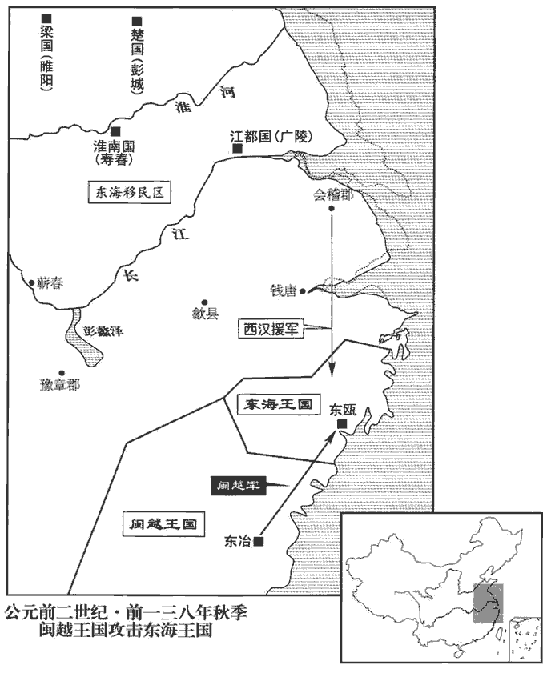
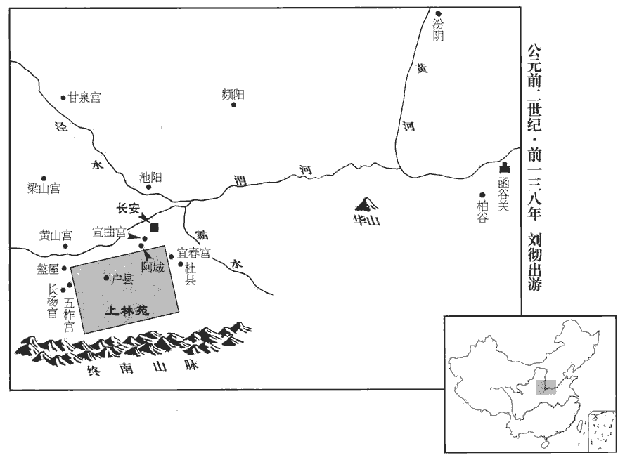
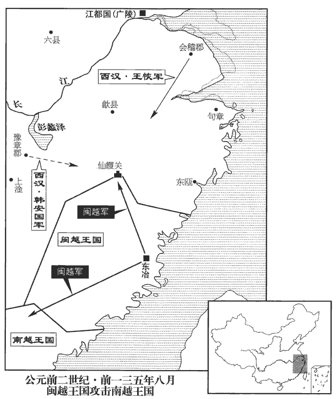

 漢紀九起重光赤奮若（辛丑），盡強圉協洽（丁未），凡七年。

# 世宗孝武皇帝上之上荀悅曰：諱「徹」之字曰「通」。景帝中子也。應劭曰：禮諡法：威強叡德曰武。

## 建元元年（辛丑，前一四零）自古帝王未有年號，始起於此。貢父曰：封禪書云：「其後三年，有司言：『元宜以天瑞命，不宜以一二數推。』」所謂「其後三年」者，蓋盡元狩六年至元鼎三年也。然元鼎四年方得寶鼎，又無緣先三年稱之。以此而言，自元鼎以前之年，皆有司所追命；其實年號之起在元鼎，故元封改元則始有詔書也。

1冬，十月，詔舉賢良方正直言極諫之士，上‹刘彻，时年十七›親策問以古今治道，對者百餘人。廣川‹河北冀县›董仲舒對曰：「道者，所繇適於治之路也，師古曰：繇，從也。適，往也。治，直吏翻。繇，古由字。仁、義、禮、樂，皆其具也。故聖王已沒，而子孫長久，安寧數百歲，此皆禮樂教化之功也。夫人君莫不欲安存，而政亂國危者甚眾；所任者非其人而所繇者非其道，是以政日以仆滅也。夫周道衰于幽、厲，非道亡也，幽、厲不繇也。至於宣王，思昔先王之德，興滯補敝，明文、武之功業，周道粲然復興，復，扶又翻。此夙夜不懈行善之所致也。

〖译文〗 [1]冬季，十月，汉武帝下诏，令大臣举荐贤良方正直言极谏的人才，武帝亲自出题，围绕着古往今来治理天下的“道”，进行考试。参加考试的有一百多人。广川人董仲舒在回答说：“所谓的‘道’，是指由此而达到天下大治的道路，仁、义、礼、乐都是推行‘道’的具体方法。所以，古代圣明的君王去世之后，他的后代可以长期稳坐天下，国家几百年太平无事，这都是推行礼乐教化的功绩。凡是君主，没有人不希望自已的国家能安宁长存，但是政治昏乱、国家危亡的却很多。用人不当，治理国家的方法不是正道，所以国家政治一天比一天接近灭亡。周王朝有幽王、厉王时期出现衰败，并不是由于治国的道路不存在了，而是由于幽王、厉王不遵循治国之道。到了周宣王在位时，他仰慕过去先王的德政，恢复被淡忘的先王善政，弥补残缺，发扬周文王、周武王的功业，周代的王道再次焕发出灿烂的光彩，这是日夜不懈地推行善政而取得的成效。

孔子曰：『人能弘道，非道弘人。』師古曰：論語載孔子之言也。言明智之人則能行道；內無其質，非道所化。故治亂廢興在於己，非天降命，不可得反；其所操持誖謬，失其統也。操，千高翻；下同。為人君者，正心以正朝廷，正朝廷以正百官，正百官以正萬民，正萬民以正四方。四方正，遠近莫敢不壹於正，而亡有邪氣奸其間者，奸，音干，犯也。是以陰陽調而風雨時，群生和而萬民殖，諸福之物，可致之祥，莫不畢至，而王道終矣！

〖译文〗 “孔子说：‘人可以发扬光大道，而不是道弘扬人。’所以， 国家的治乱兴亡在于君主自己，只要不是天意要改朝换代，统治权就不会丧失；君主的作为悖理错误，就会丧失统治地位。做君主的人，要端正自己的思想，整肃朝廷，整肃了朝廷才能用以整肃百官，整肃了百官才能用以整肃天下百姓，整肃了天下百姓才能用以整肃四方的夷狄各族。四方的夷狄各族都已整肃完毕，远近没有胆敢不统一于正道的，就没有邪气冲犯天地之间，因此阴阳谐和，风调雨顺，生物安和相处，百姓繁衍生息，所有象征辛福的东西和可以招致吉祥事，全都出现，这就是王道的最佳境界了！

孔子曰：『鳳鳥不至，河不出圖，吾已矣夫！』論語載孔子之言。自悲可致此物，而身卑賤不得致也。師古曰：鳳鳥、河圖，皆王者之瑞；仲尼自歎有德無位，故不至也。今陛下貴為天子，富有四海，居得致之位，操可致之勢，又有能致之資；行高而恩厚，知明而意美，愛民而好士，可謂誼主矣。行，下孟翻。知，讀曰智。好，呼到翻。然而天地未應而美祥莫至者，何也？凡以教化不立而萬民不正也。夫萬民之從利也，如水之走下，走，音奏。不以教化堤防之，不能止也。古之王者明於此，故南面而治天下，治，直之翻。莫不以教化為大務。立太學以教于國，設庠xiáng序以化於邑，學記曰：古之教者，家有塾，黨有庠，遂有序，國有學也。漸民以仁，摩民以誼，漸，音沾，謂浸潤之也。摩，謂砥厲之也。節民以禮，故其刑罰甚輕而禁不犯者，教化行而習俗美也。聖王之繼亂世也，掃除其跡而悉去之，去，羌呂翻。復修教化而崇起之；復，扶又翻。教化已明，習俗已成，子孫循之，師古曰：循，順也；順而行之。行五六百歲尚未敗也。秦滅先聖之道，為苟且之治，故立十四年而亡，自始皇初并天下數之，至亡十四年。其遺毒餘烈至今未滅，使習俗薄惡，人民嚚頑，抵冒殊捍，熟爛如此之甚者也。文穎曰：捍，突也。師古曰：口不道忠信之言為嚚，心不則德義之經為頑。抵，觸也。冒，犯也。殊，絕也。捍，拒也。嚚，魚巾翻。冒，如字，又莫克翻。竊譬之：琴瑟不調，甚者必解而更張之，乃可鼓也；為政而不行，甚者必變而更化之，乃可理也。故漢得天下以來，常欲治而至今不可善治者，失之於當更化而不更化也。更，工衡翻。

〖译文〗 “孔子说：‘凤凰不来，黄河也不出现图画，我算完了！ ’他认为自己的德行本可招致这些祥瑞，但因为身分卑贱不能招致，而感到悲哀。现在，陛下贵为天子，富有四海，身居得以招致祥端的尊位，手持可以招致祥瑞的权势，又有能够招致祥瑞的资质；品行高尚而恩德深厚，头脑聪明而心地善良，爱护百姓而尊重贤士，可称得上是仁义君主了。但是，天地没有相应的表示，祥瑞没有出现，原因何在？主要在于没有推行道德教化，百姓没有走上正路。百姓追逐财利，就如同水流向低处一样，不用教化筑成堤，就不能阻止。古代英明的君主深知此理，所以面南为王治理天下时，没有不把教化作为根本大事的。建立太学，以便在都城兴起教化，兴办学府，以便在地方城邑中开导民众，当时的刑罚很轻而没有人触犯法禁，其原因在于推行了教化而社会风俗很好。圣明的君主继承乱世道，首先要把它的一切残余全部扫除，还要推行教化，提高教化；教化已见明效，好的社会风俗已经形成，子孙后代沿袭不变，实行五六百年也不会衰败。秦朝毁弃先代圣王的治国之道，实行不顾长远、只顾眼前的统治方法，所以立国仅有十四年就灭亡了。秦遗留下来的恶劣影响至今还没有清除，导致社会风俗浅薄恶劣，百姓不讲忠信德义，抵触冒犯，殊死反抗，风俗竟然败坏到如此程度。我私下做了这样一个比喻：琴瑟声音不和谐，严重时必须解下旧弦，更换新弦，才可以弹奏；实施统治遇到了阻碍，严重时一定要加以改变，才能治理好国家。所以，自从汉朝得到天下以来，一直想治理好国家，但至今没有治理得好，其原因就在于应当实行改革的时候而没有实行改革。

臣聞聖王之治天下也，自此以下，系第二策。少則習之學，長則材諸位，謂授之位以試其材。少，詩沼翻。長，知兩翻。爵祿以養其德，刑罰以威其惡，故民曉於禮誼而恥犯其上。武王行大誼，平殘賊，周公作禮樂以文之；至於成、康之隆，囹líng圄yǔ空虛四十餘年：爾雅劉熙釋名：囹，領也；圄，禦也；領錄囚徒禁禦也。禮記正義：崇精問曰：「獄，周曰圜土，殷曰羑里，夏曰均台；囹圄，何代之獄？」焦氏答曰：「月令，秦書，則獄名也，漢曰若盧，魏曰司空是也。」此亦教化之漸而仁誼之流，非獨傷肌膚之效也。漸，子廉翻。至秦則不然。師申、商之法，申不害、商鞅也。行韓非之說，憎帝王之道，以貪狼為俗，師古曰：狼性皆貪，故謂貪者為貪狼也。誅名而不察實，師古曰：誅，責也。為善者不必免而犯惡者未必刑也。是以百官皆飾虛辭而不顧實，外有事君之禮，內有背上之心，造偽飾詐，趨利無恥；背，蒲妹翻。趨，七喻翻。是以刑者甚眾，死者相望，而奸不息，俗化使然也。今陛下并有天下，莫不率服，而功不加于百姓者，殆王心未加焉。曾子曰：『尊其所聞，則高明矣；行其所知，則光大矣。高明光大，不在於他，在乎加之意而已。』師古曰：曾子之書也。曾子，曾參。願陛下因用所聞，設誠於內而致行之，則三王何異哉！

〖译文〗 “我听说圣明的君主治理天下，臣子年幼时就学习知识，成年后就给他官位以磨砺他的才能，颁给爵位俸禄以培养他的品德，实施刑罚以威慑他的罪恶念头，所以，百姓才能通晓礼义，而以冲犯君主为耻。周武王奉行天下大义，推翻了独夫民贼，周公制作了礼和乐来修饰周政；到了成王、康王的大治时期，没有人犯罪，监狱空虚长达四十多年。这也是教化的浸润和仁义的流布，而不止是伤残皮肉的刑罚的成效。到秦代就不是这样了。秦尊奉申不害、商鞅的法令，实行韩非的学说，憎恶圣明帝王的治世之道，提倡贪求财利的风俗，只看虚名而不注重实际，做好事的人不一定能辛免受刑罚，而做坏事的人也不一定能受到惩罚。因此，百官都粉饰虚名假誉而不注重实际政务，表面上有侍奉君主的礼仪，内心却有背叛君主的念头，弄虚作假，追逐财利，毫无廉耻；所以遭受刑罚的人很多，死人相连，但是犯罪却没被制止，是风俗的影响造成了这样的状况。现在陛下统治全国，天下没有不服从的，但是却没有给百姓带来功德，大概是由于您没有注意到这个问题吧。《曾子》一书说：‘尊重所听到的道理，他就算是高明了；实践所知道的的知识，他就算是光大了。高明光大，不在于别的，就在于认真注意罢了。’希望陛下能依据所听到的道理，真诚地信奉它并把它推行开来，那么，您与圣明的三王就没有什么不同了！

夫不素養士而欲求賢，譬猶不琢玉而求文采也。故養士之大者，莫大虖太學；太學者，賢士之所關也，師古曰：關，由也。教化之本原也。今以一郡、一國之眾對，亡應書者，師古曰：書，謂舉賢良文學之詔書。亡，古無字通；下同。是王道往往而絕也。臣願陛下興太學，置明師，以養天下之士，數考問以盡其材，數，所角翻。則英俊宜可得矣。今之郡守、縣令、民之師帥，所使承流而宣化也；故師帥不賢，則主德不宣，恩澤不流。帥，所類翻。今吏既亡教訓於下，或不承用主上之法，暴虐百姓，與奸為市，師古曰：言小吏有為奸欺者，守令不舉，乃反與交易求利也。貧窮孤弱，冤苦失職，甚不稱陛下之意；是以陰陽錯繆，氛氣充塞，稱，尺證翻。塞，悉則翻。群生寡遂，黎民未濟，皆長吏不明使至於此也！

〖译文〗 “平常不招徕和尊重士人，而想求得贤能之臣，就好像不雕琢玉石而想得到花纹美丽的玉器一样。所以，招徕和尊重士人的方法，莫过于兴建太学；太学，是贤士的来源，是推行教化的根本。现在，让一郡、一国的所有民众都来回答，而没有一个符合诏书要求的人才，这说明上古圣王之道常常灭绝了。臣希望陛下兴建太学，设置学识渊博的老师，用来培养天下的士人，经常考试以便学生能全面表现自己的才能，就可以得到出类拔萃的人杰了。现在的郡守和县令，是百姓的表率，其职责就在于上承仁德而向下传播教化；所以，如果这些表率人物无德无才，就会君主仁德不能传播，恩泽不能流布。现在的官吏都不能教化民众，有的还不遵守朝廷的法度，残酷地虐待百姓，与坏人勾结，贪求财利，百姓贫困孤弱，冤屈痛苦，无法维持生计，十分不合陛下的心这都是官吏不称职造成的后果！

夫長吏多出於郎中、中郎、吏二千石子弟，選郎吏又以富訾zī，未必賢也。長，知兩翻。訾，讀曰貲。且古所謂功者，以任官稱職為差，非謂積日累久也；故小材雖累日，不離於小官，賢材雖未久，不害為輔佐，師古曰：害，猶妨也。離，力智翻。是以有司竭力盡知，務治其業而以赴功。知，讀曰智。治，直之翻。今則不然。累日以取貴，積久以致官，是以廉恥貿亂，賢不肖渾殽，未得其真。貿，音茂。渾，戶本翻。臣愚以為使諸列侯、郡守、二千石各擇其吏民之賢者，歲貢各二人以給宿衛，且以觀大臣之能；所貢賢者，有賞，所貢不肖者，有罰。夫如是，諸吏二千石皆盡心於求賢，天下之士可得而官使也。授之以官而任使之。徧得天下之賢人，則三王之盛易為易，以豉chǐ翻。而堯、舜之名可及也。毋以日月為功，實試賢能為上，量材而授官，錄德而定位，量，音良。師古曰：錄，謂存視也。則廉恥殊路，賢不肖異處矣！

〖译文〗 “官吏大部分出自郎中，中郎、二千石官员的子弟，选任郎官又以家庭富于资财为条件，所选的人未必是贤能的人。而且，古代所说的‘功’，是按照任官政绩的好坏来区分大小，并不是指任职的累积时间；所以，本事小的人，即使是任职时间很长，也仍做小官，贤能的栋梁之才，即使是任职时间很短，也不妨做辅政大臣，所以，官吏们都尽心竭力，一心做好本职工作而建功立业。现在就不是这样了。累积时日就可以猎取富贵，任期长久就可以升官晋职，因此，廉洁与耻辱相互转化搀杂，贤能和不肖混淆，不能判明真伪。我认为应让列侯、郡守、二千石官秩的官员，各自从所管理的官吏、百姓中选择贤能的人，每年向朝廷选送二人，到宫中服务，而且可以用这种方法来观察大臣的才能高低；选送的人有贤德，就给以赏赐，选送的人不好，就给以惩罚。如果这样，所有二千石官员都会全力以赴地寻求贤人，天下的人杰都可以成为国家官员而为皇上效力了。把天下的贤人都吸收到朝廷中来，那么，三代圣王的功业不难于造就，而且尧舜的美名也可以企及。不要用任职时间长短计算功劳，而以实际考察出来的贤能为上，根据各人才能大小给以不同的官职，核查品行的高低而确定不同的地位，就会使廉洁和耻辱、贤与不肖区别得很清楚了！

臣聞眾少成多，積小致鉅，自此以下，系第三策。師古曰：鉅，大也。故聖人莫不以晻致明，晻，古暗字。以微致顯；是以堯發于諸侯，舜興虖深山，師古曰：堯，謂從唐侯升天子之位。孟康曰：舜耕於歷山。非一日而顯也，蓋有漸以致之矣。言出於己，不可塞也；行發於身，不可掩也；言行，治之大者，君子之所以動天地也。塞，悉則翻。行，下孟翻。故盡小者大，慎微者著；師古曰：能盡眾小，則致高大；能謹於微，則其善著明也。積善在身，猶長日加益而人不知也；師古曰：長，言身形之修短，自幼及壯也。積惡在身，猶火銷膏而人不見也；此唐、虞之所以得令名而桀、紂之可為悼懼者也。

〖译文〗 “我听说积少成多，积小成大，所以古代的圣人，没有一个不是由默默无闻而变成美名远扬，由卑徽而达到显赫；因此，尧起步于诸侯之位，舜兴起于深山之中，并不是一日之内突然显赫起来，应该说是逐渐达到的。言语是由自己说出来的，不能阻塞；行为是由自身做出来的，无法掩饰；言语和行为，是治理天下的重要内容，君子正凭借着它而感动天地。所以，能做好一切小事的人，才能成就大业，能注意一切细徽的人，才能功德彰明。本身积累善德，就像人的身体长高时那样，每天都在增长自己却不知道；本身积累恶行，就像灯火消耗灯油一样，自己也没有察觉；这正是唐尧虞舜成就美名和夏桀商纣令人悲悼戎惧的原因。

夫樂而不亂，復而不厭者，謂之道。樂，音洛。師古曰：復，謂反覆行之也，音扶目翻。道者，萬世亡敝；敝者，道之失也。師古曰：言有敝非道，由失道故有敝。亡，古無字通；下同。先王之道，必有偏而不起之處，故政有眊mào而不行，眊，莫報翻，不明也。舉其偏者以補其敝而已矣。三王之道，所祖不同，非其相反，將以捄jiù溢扶衰，所遭之變然也。捄，與救同。故孔子曰：『無為而治者其舜乎！』改正朔，易服色，以順天命而已；其餘盡循堯道，何更為哉！更，工衡翻。故王者有改制之名，亡變道之實。然夏尚忠，殷尚敬，周尚文者，所繼之捄當用此也。師古曰：繼，謂所受先代之次也。捄，謂救其敝也。孔子曰：『殷因于夏禮，所損益可知也；周因于殷禮，所損益可知也；其或繼周者，雖百世可知也。』師古曰：論語載孔子之言。謂忠敬與文因循為教，立政垂則，不遠此也。此言百王之用，以此三者矣。夏因于虞，而獨不言所損益者，其道一而所上同也。道之大原出於天，天不變，道亦不變；是以禹繼舜，舜繼堯，三聖相受而守一道，亡捄敝之政也，師古曰：言政和平，不須救弊也。故不言其所損益也。繇是觀之，繼治世者其道同，繼亂世者其道變。

〖译文〗 “快乐而不淫乱，反复行善而不厌倦，这就是‘道’。遵循道行事， 万世无弊害；只要有弊害产生，一定是因为没有按照道行事。一定是因为执行先王之道有所偏废，所以政治昏乱政令不行，补救的方法，就是运用王道中被偏废的部分去补救积弊罢崐了。三代圣王的治国之道，侧重点各有不同，并不是它们相互矛盾，它们都是为了医治社会积弊，只是由于各自面对的社会情况不同，才形成了治国之道的不同。所以孔子说：‘要说无为而治的人，应该是舜吧！’舜改换历法，改变衣服颜色，只是顺应天意罢了。其余一切都遵循尧的治国之道，哪里改变过什么呢！所以，圣明的君主，有改变制度的名义，而没有改变治道的实际内容。然而，夏代推崇忠直，商代推崇恭敬，周代推崇礼仪，形成这种不同的原因，是因为它们要各自拯救前朝的缺失，必须使用各自不同的方法。孔子说：‘商代继承了夏代的制度，所废除的和增加的是可以知道的；周代继承了商代的制度，所废除的和增加的是可以知道的；若有人继承周代，就是过了一百代之后所实行的制度，也可以推测得出来。’这是说百代君主所用的治国之道，也就是使用夏商周这三种了。夏代是继承了有虞氏的制度，而孔子唯独没有说到两者之间的增减，是因为两者的治国之道一致，而且所推崇的原则相同。道之所以精深博大，是因为它来源于天，只要天不变，道也就不会变；所以，夏禹继承虞舜，虞舜继承唐尧，三位圣王相互授受禅让天下，而遵循相同的治道，是因为其间不需要补救积弊，所以孔子不说他们之间的增减。由此看来，继承一个大治的朝代，继起者实行与原来相同的治国之道；继承一个政治昏乱的朝代，继起者一定要改变治国之道。

今漢繼大亂之後，若宜少損周之文致，師古曰：致，至極也。貢父曰：致，當屬下句。少，詩沼翻。用夏之忠者。夫古之天下，亦今之天下，共是天下，以古準今，壹何不相逮之遠也！安所繆盭lì而陵夷若是？盭，古戾字。師古曰：安，焉也。意者有所失于古之道與，有所詭於天之理與？詭，違也，異也。與，與歟同。

〖译文〗 “现在汉朝是在大乱之后而建国的， 似乎应该略为改变周代制度的过分强调礼仪，而提倡夏代的忠直之道。古代的天下，也就是现在的天下，同是这一个天下，为什么古代与现在相比，却会有那么大的差距！为什么败坏到如此程度？估计或许是因为没有遵循古代的治国之道吧，或许是因为违背了天理吧？

夫天亦有所分予：予之齒者去其角，傅其翼者兩其足，師古曰：謂牛無上齒則有角，其餘無角者則有上齒。傅，著也；言鳥不四足。分，扶問翻。予，讀曰與。去，羌呂翻。傅，讀曰附。是所受大者不得取小也。古之所予祿者，不食於力，不動於末，師古曰：末，謂工商之業。是亦受大者不得取小，與天同意者也。夫已受大，又取小，天不能足，而況人虖！此民之所以囂囂苦不足也。囂，音敖；囂囂，眾怨愁聲也。身寵而載高位，載，乘也。家溫而食厚祿，因乘富貴之資力以與民爭利於下，民安能如之哉！民日削月脧juān，孟康曰：脧，音揎xuān，謂轉踧cù也。蘇林曰：脧，音鐫石；俗語謂朒nǜ為脧縮。師古曰：孟說是也。揎，音宣。踧，音子六翻。寖以大窮。富者奢侈羨溢，羨，饒也，讀與衍同，音弋戰翻。貧者窮急愁苦；民不樂生，安能避罪！此刑罰之所以蕃樂，音洛。師古曰：蕃，多也，音扶元翻。而奸邪不可勝者也。天子大夫者，下民之所視效，遠方之所四面而內望也；近者視而放之，師古曰：放，依也，音甫往翻。遠者望而效之，豈可以居賢人之位而為庶人行哉！行，下孟翻；下同。夫皇皇求財利，常恐乏匱者，庶人之意也；皇皇求仁義，常恐不能化民者，大夫之意也。皇皇，急速也。易曰：『負且乘，致寇至。』此易解卦六三之辭也。乘車者，君子之位也；負擔者，小人之事也；此言居君子之位而為庶人之行者，患禍必至也。若居君子之位，當君子之行，則舍公儀休之相魯，無可為者矣。公儀休相魯，之其家，見織帛，怒而出。其妻食于舍而茹葵，慍而拔其葵。曰：「吾已食祿，而奪園夫、紅女利乎！」舍，讀曰捨。言為君子者當如公儀休；若廢而不遵，則無可為者矣。

〖译文〗 “天对万物也有一定的分配赐予：赐给利齿的动物不让它再长犄角， 赐给双翅的鸟类只让它有两只脚，这是让已受大利的，不能再取得小利。古代那些接受俸禄的官员，不许靠气力谋食，不得经营工商末业，这也是既得大利就不能再取小利，与天的旨音是相同的。那些已得大利又要夺取小利的人，连天都不能满足其贪欲，更何况人呢！这正是百姓纷纷怨叹困苦不足的原因。那些达官显贵，身受朝廷荣宠而居高位，家庭富裕又享受丰厚俸禄，于是凭借着既富又贵的资本和权势，在下面与平民百姓去争利，百姓比得上他们啊！百姓逐日逐月地被削弱，最后陷入穷困。富袷的人奢侈成风挥金若土，穷困的人走投无路苦不聊生；百姓没有感觉到活着有什么乐趣，怎么能避免犯罪呢！这正是刑罚繁多却不能制止犯罪的原因。天子的官员，是平民百姓观察仿效的对象，是远方各民族从四面八方向中央观察仿效的对象；远近的人都观察和仿效他们，怎么可以身居贤人的高位却去做平民百姓所做的事呢！急急忙忙地追求财利，经常害怕穷困，这是平民百姓的心理状态；急急忙忙地追求仁义，经常害怕不能用仁义去感化百姓，这是官员应有的意境。《易经》说：‘既背负着东西又乘车，招来了强盗抢劫。’乘坐车辆，这是君子的位置；身背肩担，这是小人的事；《易经》的这句话，是说居于君子尊位而去做平民百姓的事，这样的人，一定会招来祸患。辅政的方法之外，就没有别的方法了。

春秋大一統者，天地之常經，古今之通誼也。師古曰：一統者，萬物之統皆歸於一也。春秋公羊傳：「隱公元年，春王正月。何言乎王正月？大一統也。」此言諸侯皆系統天子，不得自專也。今師異道，人異論，百家殊方，指意不同，是以上無以持一統，法制數變，下不知所守。數，所角翻。臣愚以為諸不在六藝之科、孔子之術者，皆絕其道，勿使并進，邪辟之說滅息，辟，讀曰僻。然後統紀可一而法度可明，民知所從矣！」

〖译文〗 “《春秋》推崇的天下一统，这是天地之间的永久原则， 是古往今来的一致道义。现在，每个经师传授的道不同，每个人的论点各异，百家学说旨趣不同，因此，君主没有办法实现统一，法令制度多次变化，臣下不知应该遵守什么。我认为，方向不同，所有不属于儒家‘六艺’范围之内，不符合孔子学说的学派，都禁绝其理论，不许它们与儒学并进，使邪恶不正的学说归于灭绝，这样做了就能政令统一，法度明确，臣民就知道该遵循什么了！”

天子善其對，以仲舒為江都相‹首府广陵，江蘇揚州›。會稽‹江蘇蘇州›莊助亦以賢良對策，漢書作「嚴助」，蓋明帝諱莊，避之也。會，工外翻。天子擢為中大夫。按考異曰：漢書武紀：「元光元年五月，詔舉賢良，董仲舒、公孫弘出焉。」仲舒傳曰：「仲舒對冊，推明孔氏，抑黜百家。立學校之官，州縣舉茂才、孝廉，皆自仲舒發之。」今舉孝廉在元光元年十一月，若對策在下五月，則不得云自仲舒發之，蓋武紀誤也。然仲舒對策，不知果在何時；元光元年以前，唯今年舉賢良見於紀。三年，閩越、東甌相攻，莊助已為中大夫，故皆著之於此。仲舒傳又云：「遼東高廟、長陵高園災。仲舒推說其意；主父偃竊其書奏之，仲舒由是得罪。」按二災在建元六年，主父偃傳，上書召見在元光元年。蓋仲舒追述二災而作書，或作書不上，而偃後來方見其草藁也。丞相衛綰奏：「所舉賢良，或治申、韓、蘇、張之言亂國政者，請皆罷。」奏可。董仲舒少治春秋，治，直之翻。少，詩照翻。孝景時為博士，進退容止，非禮不行，學者皆師尊之。及為江都相，事易王。江都易王非，景帝子，帝之兄也。諡法：好更故舊曰易；音亦。易王，帝兄，素驕，好勇。好，呼到翻；下同。仲舒以禮匡正，王敬重焉。

〖译文〗 武帝很赞赏董仲舒的对答，任命他做江都国的相。 会稽人庄助也以贤良的身分参加了考试对答，武帝擢拔他担任中大夫。丞相卫绾向武帝上奏：“举荐来的贤良，有研究申不害、韩非、苏秦、张仪的学说，扰乱国家政治的，请都予以遣返。”武帝批准了奏请。董仲舒从小研究《春秋》。孝景帝时做了博士官，进退举止，不做任何不合乎礼法的事，学者们都用尊师的礼节尊敬他。等到董仲舒做了江都国的相，侍奉江都易王刘非。易王刘非，是武帝的哥哥，历来骄横，好逞勇力。董仲舒用礼义来辅佐纠正他，易王也很敬重董促舒。

2春，二月，赦。

〖译文〗 [2]春季，二月，汉武帝颁布赦令。

3行三銖錢。師古曰：新壞四銖錢，造此錢也，重如其文。

〖译文〗 [3]朝廷发行三铢钱。

4夏，六月，丞相衛綰免。丙寅‹七›，以魏其侯竇嬰為丞相，武安侯田蚡為太尉。上雅向儒術，嬰、蚡俱好儒，推轂gǔ代‹河北蔚縣›趙綰為御史大夫，蘭陵‹山東苍山西南兰陵镇›王臧為郎中令。謂薦進賢者，若推車轂然，主於進也。推，吐雷翻。轂，古祿翻。班志，代縣屬代郡；蘭陵縣屬東海郡。綰請立明堂以朝諸侯，王者之堂，所以正四時，出教化；自秦滅先王之禮，其制不存。朝，直遙翻；下同。且薦其師申公。秋，天子使使束帛加璧、安車駟馬以迎申公。古者，高車立乘，安車坐乘。據申公傳，安車以蒲裹輪。孔穎達曰：安車，若今小車者。古者乘四馬之車，立乘；既老，故乘一馬小車，坐乘也。余按孔氏所謂小車，乃古之大夫致事者適四方所乘私車也；今加禮申公，迎以駟馬安車，非小車也。既至，見天子。天子問治亂之事，申公年八十餘，對曰：「為治者不至多言，顧力行何如耳！」治，直吏翻。是時，天子方好文詞，見申公對，默然；然已招致，則以為太中大夫，舍魯邸，議明堂、巡狩、改曆、服色事。漢制：郡國皆立邸于京師。申公，魯人，故舍魯邸。

〖译文〗 [4]夏季，六月，丞相卫绾被免职，丙寅（初七），武帝任命魏其侯窦婴做丞相，任命武安侯田做太尉。武帝一向看重儒求，窦婴、田都喜好儒求，极力推荐代地人赵绾担任御史大夫，推荐兰陵人王臧担任郎中令。赵绾奏请兴建明堂以接受诸侯王的朝见，并且向武帝推荐了他的老师申公。秋季，武帝派出使者带着表示礼聘的帛和玉璧，驾着安车驷马去迎接申公入朝。申公到了京城，拜见武帝。武帝询问关于国家治乱的事，申公已是八十多岁的高龄，回答说：“治理天下的人，不以说得多为完善，只看努力实干得怎样罢了。”这时，武帝正喜爱文辞，看到申公的对答，沉默不语；武帝虽然对申公的对答不满意，但既然已把他招来了，就任命他做了太中大夫，安顿他住大鲁王在京城的官邸中，商议有关兴建明堂、天子视察各地、改换历法和服色等事情。

5是歲，內史寧成抵罪髡鉗。

〖译文〗 [5]这一年，内史宁成犯罪，被判处髡钳刑。

## 建元二年（壬寅，前一三九年）

1冬，十月，淮南‹府寿春，安徽寿县›王安來朝。上‹刘彻，时年十八›以安屬為諸父而材高，甚尊重之，安，淮南王長之子。長於文帝為弟，安于景帝為從弟，于帝為諸父行。每宴見談語，昏暮然後罷。見，賢遍翻。

〖译文〗 [1]冬季，十月，淮南王刘安来朝见武帝。武帝因为刘安从辈份说是叔父，而且有很高的才能，很尊重他，每当安闲无事时，召他来交谈，总到黄昏后才停止。

安雅善武安侯田蚡fén，雅，素也。其入朝，武安侯迎之霸上‹陝西西安东灞河畔›，與語曰：「上無太子，王親高皇帝孫，行仁義，天下莫不聞。宮車一日晏駕，非王尚誰立者！」安大喜，厚遺蚡金錢財物。遺，于季翻。

〖译文〗 刘安一直与武安侯田友好，他来京朝见时，武安侯到霸上迎接他，告诉他说：“皇上没有太子，大王是高皇帝的亲孙子，广行仁义，天下人没有不知道的。假若皇帝突然去世，除了大王之外还有谁能继承帝位呢！”刘安闻言大喜，赠送给田丰厚的金钱财物。

2太皇竇太后好黃、老言，不悅儒術。趙綰請毋奏事東宮。漢長樂宮在東，太后居之，故謂之東宮，亦謂之東朝。竇太后大怒曰：「此欲復為新垣平邪！」事見十五卷文帝十六年。復，扶又翻。陰求得趙綰、王臧奸利事，以讓上；上因廢明堂事，諸所興為皆廢。下綰、臧吏，皆自殺；下，遐嫁翻。丞相嬰、太尉蚡免，申公亦以疾免歸。

〖译文〗 [2]太皇窦太后喜好黄老学说，不喜欢儒家学说。赵绾奏请， 国家政务不要再向太后奏报，窦太后勃然大怒说：“他想做第二个新垣平吧！”窦太后暗中搜集到赵绾、王臧贪赃的证据，以此责备景帝用人不当；景帝就废止了兴建明堂的事，赵绾等人主张的一切都被废止。赵绾、王臧被交付官吏处置，他们都自杀了。丞相窦婴、太尉田被免职，申公也以有病为借口，被免职归家。

初，景帝以太子太傅石奮及四子皆二千石，乃集其門，號奮為「萬石君」。石姓，衛大夫石碏què之後。師古曰：集，合也，凡最計也。總合其一門之計，五人為二千石，故號萬石君。萬石君無文學，而恭謹無與比。子孫為小吏，來歸謁，萬石君必朝服見之，不名。朝，直遙翻。子孫有過失，不責讓，為便坐，師古曰：便坐，於便側之處，非正室也。坐，徂臥翻。對案不食；然後諸子相責，因長老肉袒謝罪，改之，乃許。子孫勝冠者在側，勝，音升。雖燕居必冠。其執喪，哀戚甚悼。子孫遵教，皆以孝謹聞乎郡國。聞，音問。及趙綰、王臧以文學獲罪，竇太后以為儒者文多質少；少，詩沼翻。今萬石君家不言而躬行，乃以其長子建為郎中令，少子慶為內史。建在上側，事有可言，屏人恣言極切，至廷見，如不能言者；謂事有當諫正者。廷見，謂於百官正朝畢集之時。屏，必逞翻。見，賢遍翻。上以是親之。慶嘗為太僕，御出，為上御車而出。考異曰：按百官公卿表，慶不為太僕，蓋嘗攝職也。上問車中幾馬，慶以策數馬畢，舉手曰：「六馬。」慶于諸子中最為簡易矣。易，以豉翻。

〖译文〗 当初，汉景帝因为太子太傅石奋及其四个儿子，都有二千石的官秩， 就总计他一门父子五人的官秩之和，称石奋为“万石君”。万石君没有文才学问，但恭敬谨慎却没有人可以与他相比。子孙做小官，回来看望他，万石君必定身穿朝服以礼相见，不叫他们的名字。子孙有了过错，他不加以责备，而为此离开正室坐到厢屋中，对着桌子不吃饭；然后，儿子们互相批评，有过失的人通过长辈人来求情，并且袒露上身前来请罪，表示一定要改正，石奋才答应他的要求而进餐。已经成年的子孙在身边，石奋即使闲居无事，也必定衣冠整齐。他主持丧事，表情极为悲痛。子孙遵循他的教导，都以孝顺谨慎闻名于各地。等到赵绾、王臧因有文采学问却犯了罪，窦太后就认为儒生富于文采却欠缺质朴，现在万石君一家人不多说话却能身体力行，就任命他的大儿子石建担任郎中令，任命他的小儿子石庆担任内史。石建在武帝身边任职，发现了应该进谏的事，让人回避之后，他对武帝畅所欲言，十分尖锐。到了朝廷上与百官朝见武帝时，石建却像一个不善言谈的人。武帝因此很亲近他。石庆曾担任太仆，为武帝驾车外出，武帝问有几匹马拉车，石庆举起马鞭一一点数马匹后，举起手来回答：“有六匹马。”石庆在石奋的儿子中是最为随便的，做事还如此恭敬谨慎。

竇嬰、田蚡既免，以侯家居。蚡雖不任職，以王太后故親幸，數言事多效；謂言事多見聽用。數，所角翻。士吏趨勢利者，趨，七喻翻。皆去嬰而歸蚡，蚡日益橫。為嬰、蚡交愬張本。橫，戶孟翻。

〖译文〗 窦婴、田被罢免之后，以列侯的身份闲住在家中。 田虽然不担任官职，但因有与王太后是同母弟的关系，仍得到皇帝的亲近宠幸，多次议论国事大多被采纳；趋炎附势的士人和官吏，都离开了窦婴而归附田，田一天比一天地骄横起来。

3春，二月，丙戌朔‹一›，日有食之。

〖译文〗 [3]春季，二月，丙戌朔（初一），出现日食。

4三月，乙未‹十›，以太常柏至侯許昌為丞相。昌，高祖功臣許盎之孫。柏至，地闕。

〖译文〗 [4]三月，乙未（初四），武帝任命太常柏至侯许昌担任丞相。

5初，堂邑侯陳午尚帝姑館陶公主嫖，帝之為太子，公主有力焉；班志，堂邑縣屬臨淮郡。陳午，高祖功臣陳嬰之孫。館陶縣屬魏郡。公主援上為太子，事見上卷景帝前七年。以其女為太子妃，及即位，妃為皇后。竇太主恃功，求請無厭，厭，於鹽翻。上患之。皇后驕妬，擅寵而無子，與醫錢凡九千萬，欲以求子，然卒無之；卒，子恤翻。后寵浸衰。皇太后謂上曰：「汝新即位，大臣未服，先為明堂，太皇太后已怒；今又忤長主，忤，五故翻。長，知兩翻。必重得罪。重，直用翻。婦人性易悅耳，易，以豉翻。宜深慎之！」上乃於長主、皇后復稍加恩禮。復，扶又翻。

〖译文〗 [5]当初，武帝的姑姑馆陶公主刘嫖下嫁给堂邑侯陈午，武帝能得以立为太子，馆陶公主是发挥了很大作用的；公主把她的女儿嫁给太子做正妃，等到武帝即位称帝，妃就做了皇后。窦太主即馆陶公主刘嫖，自恃授立武帝有功，无休无止地请求赏赐、干预国政，武帝对她很不满。陈皇后骄横嫉，独占君宠，却没有生育孩子，给医生的费用合计九千万，想求得生下儿子，但是终究没有生育；对陈皇后的宠爱渐渐衰退。皇太后对武帝说：“你刚刚做上皇帝，大臣还没有归附你，就先兴建明堂，太皇太后已经很恼怒了；现在又得罪窦太主，必定会受到重责。妇人的性情是容易高兴的，你应该慎之又慎！”武帝于是就对窦太主、陈皇后母女俩又稍稍以恩礼相待。

上祓fú霸上，孟康曰：祓，除也；于霸水上自祓除。今之上巳祓fú禊xì也。祓，音廢，又音拂。還，過上姊平陽公主，班志，平陽縣‹山西臨汾›屬河東郡。公主，景帝女，降平陽侯曹壽。悅謳者衛子夫。師古曰：齊歌曰謳；一侯翻。子夫母衛媼ǎo，平陽公主家僮也；師古曰：僮者，婢妾之總稱；媼者，年老之號，非當時所呼也。衛者，舉夫家姓。媼，烏浩翻。主因奉送子夫入宮，恩寵日隆。陳皇后聞之，恚，幾死者數矣；恚，於避翻，慍怒也。幾，居衣翻。數，所角翻。上愈怒。

〖译文〗 武帝到霸上举行祓除仪式，返宫途中，去看望他的姐姐平阳公主， 看中了平阳公主府中的歌女卫子夫。卫子夫的母亲卫媪，是平阳公主家的奴婢；平阳公主就把卫子夫送入宫中，卫子夫日益受到武帝的宠幸。陈皇后得知，极为恼怒，好几次几乎给气死；武帝对陈皇后更为恼怒。

子夫同母弟衛青，其父鄭季，本平陽縣吏，給事侯家，師古曰：縣遣于侯家供事也。與衛媼私通而生青，冒姓衛氏。冒姓者，青本鄭氏子而冒衛姓也。青長，為侯家騎奴。大長公主執囚青，大長公主，即館陶公主也。長，知兩翻。騎，奇寄翻；下同。欲殺之；其友騎郎公孫敖與壯士篡取之。郎之騎從者。郎中有車、戶、騎三將。逆取曰篡。上聞，乃召青為建章監、侍中，建章宮監。據史，太初元年起建章宮，蓋因舊宮而大起也。青時為建章監而兼侍中。賞賜數日間累千金。既而以子夫為夫人，青為太中大夫。

〖译文〗 卫子夫的同母异父弟卫青的父亲郑季，本来是平阳县的县吏， 去平阳侯家中供职当差，和卫媪私通而生了卫青，让他昌充姓卫。卫青长大了，在平阳侯家中当骑奴。大长公主刘嫖抓住卫青囚禁起来，想杀了他；卫青的好友骑郎公孙敖和勇士把他给抢了回来。武帝得知此事，就召见卫青并任命他为建章宫的宫监，还给他侍中的官衔，几天之内给卫青高达上千金的赏赐。不久，武帝立卫子夫为夫人，任命卫青为太中大夫。

6夏，四月，有星如日，夜出。

〖译文〗 [6]夏季，四月，夜间出现了一颗光亮如同太阳的异星。

7初置茂陵邑‹陝西興平東北›。班志，茂陵邑屬扶風。黃圖曰：本槐里之茂鄉。武帝起陵邑，在長安西北八十里。

〖译文〗 [7]开始设立茂陵邑。

8時大臣議者多冤鼂錯之策，鼂錯事見上卷景帝前三年。務摧抑諸侯王，數奏暴其過惡，吹毛求疵，謂暴露其過惡。數，所角翻。疵，才斯翻，病也，瑕也。笞服其臣，使證其君；諸侯王莫不悲怨。

〖译文〗 [8]当时，朝廷大臣的议论中多对晁错提出削藩之策被杀而表示冤枉，一心摧残和抑制诸侯王，经常弹劾揭露诸侯王的过失和罪恶，甚至达到吹毛求疵的程度，用笞刑罚威逼诸侯王的臣子屈服，迫使他们证明诸侯王有过失和罪恶；诸侯王没有一个不为此而悲愁怨恨。

## 建元三年（癸卯，前一三八年）

1冬，十月，代王登、長沙王發、中山王勝、濟川王明來朝。代王登，王參之子，文帝之孫。長沙、中山王，皆景帝子。濟川王，梁孝王之子。濟，子禮翻。上置酒，勝聞樂聲而泣。上問其故，對曰：「悲者不可為累欷xī，思者不可為歎息。累，重也。欷，歔欷也，悲思之積于心，聞欷歎之聲，則其悲思益甚。累，力癸翻。欷，許既翻。今臣心結日久，每聞幼眇之聲，幼，一笑翻。眇，音妙；精微也。不知涕泣之橫集也。臣得蒙肺附為東藩，屬又稱兄。「肺附」，一作「肺腑」。史記正義曰：顏師古曰：舊解云：肺附，如肝肺之相附著也。一說：肺，碎木劄也；喻其輕薄附著大材。按顏此說，并是疏繆；又改「腑」為「附」就其義，重疏繆矣。八十一難云：寸口者，脈之大會；手，太陰之動脈也。呂廣云：太陰，肺之脈也；肺為諸藏之主，通陰陽，故十二經脈皆會于太陰，所以決吉凶者。十二經有病，皆於寸口知其何經之動，浮沉濇sè滑，春秋逆順，知其死生。顧野王曰：肺腑，腹心也。余謂史若從肺附，則顏說為是；若從肺腑，則依正義。勝王中山，在關東，故曰東藩；以親屬言，則勝於帝，兄也。泣，亦淚也。今群臣非有葭莩fú之親、鴻毛之重；張晏曰：葭，蘆葉也；莩，葉里白皮；皆取喻於輕薄也。師古曰：葭，蘆也；莩者，其筩tǒng中白皮至薄者也。葭莩喻著，鴻毛喻輕薄甚。莩，音孚。群居党議，朋友相為，使夫宗室擯卻，擯卻，斥退也。擯，必刃翻。卻，丘略翻。骨肉冰釋，臣竊傷之！」具以吏所侵聞。於是上乃厚諸侯之禮，省有司所奏諸侯事，加親親之恩焉。省，悉井翻。

〖译文〗 [1]冬季，十月，代王刘登、长沙王刘发、中山王刘胜、济川王刘明来京朝见武帝。武帝设酒宴款待，刘胜在席间听到音乐声就哭了起来。武帝问他为什么哭，刘胜回答：“悲伤的人听不得抽噎的声音，忧愁的人听不得叹息的声音。现在我心中积压了许多忧伤，每当听到幽妙精微的音乐，不知不觉地就会涕泪横流。我有幸得到朝廷重用，受封为东方的藩臣，从亲属关系说来，又是皇上的哥哥。现在朝廷群臣与皇上之间没有血缘亲情，没有承担国家的任何重任，却结成朋友党发出偏私的议论，相互勾结，使宗室皇族受到打击和排斥，骨肉亲情冰雪般融化，我私下为此而悲伤！”他就把官吏侵夺欺凌诸侯王的事，一一向武帝奏报。于是，武帝就增加诸侯的礼遇，废止了有关官吏检举诸侯王不法行为的文书，对诸侯王施行优侍亲属的恩惠。

2河水溢于平原‹山東平原›。平原本齊地，高祖置郡。禹疏九河，皆在平原、勃海郡界。

〖译文〗 [2]黄河在平原郡泛滥成灾。

3大饑，人相食。

〖译文〗 [3]发生了大饥荒，人吃人。

4秋，七月，有星孛於西北。孛，蒲內翻。

〖译文〗 [4]秋季，七月，西北天空中出现了一颗异星。

5濟川王明坐殺中傅，濟川王明，梁孝王子。應劭曰：中傅，宦者也。漢諸王國有太傅，秩二千石，掌傅王以德義。中傅出入王宮，在王左右，亦主傅教導王。梁王傳作「中尉」，此從帝紀。廢遷房陵‹湖北房縣›。班志，房陵縣屬漢中郡。

〖译文〗 [5]济川王刘明因杀死中傅而犯罪，被废去王位，流放到房陵县。

6七國之敗也，事見上卷景帝前三年。吳王子駒亡走閩越‹都東冶，福建福州›，怨東甌‹浙江温州›殺其父，常勸閩越擊東甌。閩粵從之，發兵圍東甌‹浙江温州›，東甌使人告急天子。天子問田蚡，蚡對曰：「越人相攻擊，固其常；又數反覆，數，所角翻；下同。自秦時棄不屬，不屬，不臣屬也。不足以煩中國往救也。」莊助曰：莊，姓也。戰國時，楚有莊周，趙有莊豹。「特患力不能救，德不能覆；覆，敷又翻。誠能，何故棄之！且秦舉咸陽而棄之，師古曰：舉，總也；言總天下乃至京師皆棄之。何但越也！今小國以窮困來告急，天子不救，尚安所愬；又何以子萬國乎！」上曰：「太尉不足與計。考異曰：史記東越、漢書嚴助傳，皆云「建元三年，閩越圍東甌，天子問太尉田蚡。」按是時蚡不為太尉，云太尉，誤也。下云「太尉不足與計」，蓋追呼其官；或亦誤耳。吾新即位，不欲出虎符發兵郡國。」乃遣助以節發兵會稽‹江蘇蘇州›。會稽，東南邊越。會稽守欲距法不為發，以法距之，為無漢虎符驗。會，工外翻。守，式又翻。為，於偽翻。助乃斬一司馬，諭意指，謂曉喻以天子不欲出虎符之意。遂發兵浮海救東甌。未至，閩越引兵罷。東甌請舉國內徙，乃悉舉其眾來，處於江、淮之間。處，昌呂翻。

〖译文〗 [6]七国叛乱失败时，吴王的儿子刘驹逃亡到闽越，怨恨东瓯诱杀了他的父亲，经常怂恿闽越进攻东瓯。闽越王听从了刘驹的意见，发兵包围了东瓯都城，东瓯王派人向天子告急求援。武帝征询田的意见，田回答说：“越人相互攻击，本来就是常有的事；又多次叛服不定，从秦朝时就被放弃，不属于中国，不值得烦劳中原朝廷去援救他们。”庄助说：“现在只怕力量小不能前去援救，朝廷德薄不能保护他们；假如能做到这些，为什么要抛弃他们呢！况且，秦朝连整个都城咸阳都抛弃，何止是抛弃了越人呢！现在东瓯这样的小国因走投无路来向朝廷告急，如果陛下不去救援，他们还能去何处求援告急呢；陛下又怎样能使天下万国臣服呢！”武帝说：“太尉的见识，不值得我和他商议国家大事。我刚即位，不想用虎符征发郡国的军队去打仗。”于是派庄助持皇帝的符节去征发会稽郡的军队。会稽郡的郡守本想依据不见虎符不得发兵的法令，不给庄助征发军队，庄助杀了一位司马官，把武帝的意思告知郡守，于是发兵渡海前来援救东瓯。汉军尚未达到，闽越就领兵撤走了。东瓯请求全国人内迁中原归顺朝廷，得到朝廷批准之后，东瓯王领着所有部众迁来，他们被安置在长江和淮河之间。

 

7九月，丙子晦‹三十›，日有食之。

〖译文〗 [7]九月，丙子晦（三十日），出现日食。

8上自初即位，招選天下文學材智之士，待以不次之位。師古曰：不拘常次，言超擢之。四方士多上書言得失，自眩鬻yù者以千數，漢書作「衒」，行賣也。鬻，亦賣也。炫，與眩同，音州縣之縣，又工縣翻。鬻，音育。上簡拔其俊異者寵用之。莊助最先進；後又得吳‹江蘇蘇州›人朱買臣、趙‹河北邯鄲›人吾丘壽王、姓譜：吾，音虞，即虞丘氏。史記有楚相虞丘子。蜀‹四川成都›人司馬相如、平原‹山東平原›東方朔、風俗通曰：伏羲之後，帝出乎震，主東方，子孫為東方氏。吳‹江蘇蘇州›人枚皋、濟南‹山東章丘›終軍等，姓譜：枚姓出於周官銜枚氏，其後以官為姓。風俗通：六國有賢人枚被。終姓出於顓頊裔孫陸終。濟，子禮翻。并在左右，每令與大臣辨論，中外相應以義理之文，大臣數屈焉。然相如特以辭賦得幸；朔、皋不根持論，好詼諧，言其議論無所根據。好，呼到翻。詼，古回翻。李奇曰：詼，嘲也。上以俳pái優畜之，師古曰：俳，雜戲也；優，調戲也。左傳曰：少相狎，長相優。俳優，即今伶人調戲者。雖數賞賜，終不任以事也。數，所角翻。朔亦觀上顏色，時時直諫，有所補益。

〖译文〗 [8]武帝从刚即位开始，就在招徕选拔博学有才智的人，予以破格重用。天下士人很多人向朝廷上书议论国家政事的得失，自我标榜和自我推荐的人数以千计，武帝从中选拔杰出的人才给以宠信重用。庄助第一个被提拔，以后又招致了吴人朱买臣、赵人吾丘寿王、蜀人司马相如、平原人东方朔、吴人枚皋、济南人终军等，都成了武帝的左右亲信，武帝经常命令他们与朝廷大臣辩论，中朝官与外朝官用义理文辞相互驳难，外朝大臣多次被驳得无法对答。但是，司马相如只是以擅长辞赋写作而得到武帝宠幸；东方朔、枚皋的论点没有根据，喜欢幽默嘲讽，武帝仅把他们视做演戏的艺人收养，虽然经常赏赐财物，终究不把国事朝政委托他们处理。东方朔同样对武帝察颜观色，经常利用时机直言进谏，对朝政发挥了一定补益作用。

是歲，上始為微行，北至池陽‹陝西涇陽›，西至黃山‹陝西興平西南›，班志，池陽縣屬馮翊。黃山，宮名，在扶風槐里縣。南獵長楊‹陝西周至›，東遊宜春‹陝西西安東南›，長楊，宮名。水經註云：槐里縣東有漏水，出南山赤谷東北，逕長楊宮；宮有長楊，因名；其地在盩zhōu厔zhì界。師古曰：宜春，宮也，在長安東南；說者乃以為在鄠hù，非也。在鄠者自是宜春觀，在長安城西，非東遊也。與左右能騎射者期諸殿門。期門之號始此。常以夜出，自稱平陽侯；平陽侯曹壽尚帝姊，見尊寵，故稱之。旦明，入南山‹秦岭›下，射鹿、豕、狐、兔，終南山橫亘關中南面，西起秦、隴，東徹藍田，凡雍、岐、郿、鄠hù、長安、萬年相去且八里百，而連綿峙據其南者，皆此一山也。射，而亦翻。馳騖禾稼之地，民皆號呼罵詈。號，戶高翻。鄠‹陝西戶縣›、杜‹陝西西安東南›令欲執之，班志，鄠縣屬扶風。杜縣屬京兆，宣帝更為杜陵。鄠，音戶。示以乘輿物，乃得免。乘，繩證翻。又嘗夜至柏谷‹河南靈寶西›，水經：河水逕湖縣故城北，又東合柏谷。水經註云：水出弘農縣西石堤山，北逕柏谷亭下，即帝微行處。投逆旅宿，就逆旅主人求漿，主人翁曰：「無漿，正有溺耳！」溺，奴吊翻。且疑上為奸盜，聚少年欲攻之；主人嫗睹上狀貌而異之，嫗，威遇翻。止其翁曰：「客非常人也；且又有備，不可圖也。」翁不聽，嫗飲翁以酒，醉而縛之。飲，於禁翻。少年皆散走，嫗乃殺雞為食以謝客。明日，上歸，召嫗，賜金千斤，拜其夫為羽林郎。羽林郎屬郎中令。師古曰：羽林，宿衛之官，言如羽之疾，如林之多也。一說曰：羽所以為王者羽翼。後乃私置更衣，從宣曲以南十二所，夜投宿長楊、五柞等諸宮‹在陕西周至›。師古曰：為休息更衣之處。宣曲，宮名，在昆明池西。五柞，宮名；水經註：宮在盩厔縣長楊宮東北。更，工衡翻。柞，昨、作二音。

〖译文〗 这一年，武帝开始改换装束暗中离宫外出，向北走到池阳县， 向西走到黄山宫，向南到长杨宫打猎，向东去宜春宫游乐。武帝与能骑马射箭的左右亲随相约在殿门前集会，经常在夜时出宫，自称平阳侯；黎明时，到达终南山脚下，射杀鹿、野猪、狐狸、野兔等动物，策马践踏农田庄稼，百姓都大声怒骂。县和杜县的县令想要收捕这批人，这批人拿了天子专用的物品为证，才得以脱身。又有一次，武帝等人曾在夜时到达柏谷，去旅店投宿，向旅店的主人要酒，主人说：“没有酒，只有尿！”而且， 旅店的主人怀疑武帝一行人是强盗，召集了一些青年后生准备收拾他们；店主的妻子见到武帝的体态容貌，觉得不同寻常，就劝阻丈夫说：“来客不是普通人，而且他们已有准备，不能图谋收拾他们。”丈夫不听她的劝告，她就让丈夫喝酒，等他喝醉了之后就把他捆绑起来。召集来的青年后生都走了，店主的妻子就杀鸡做饭招待客人。第二天，武帝返回宫中，召见那位妇人，赏赐千金，任命她的丈夫做羽林郎。后来，武帝就为处出巡游设立了秘密的更衣休息的地方，从宣曲宫向南共设了十二处，夜间投宿在长杨宫、五柞宫等宫殿。

 

上以道遠勞苦，又為百姓所患，乃使太中大夫吾丘壽王舉籍阿城‹陝西西安西南，阿房宮›以南，盩厔‹陝西周至›以東，宜春以西，提封頃畮，及其賈直，師古曰：舉，計其數以為簿籍也。阿城本秦阿房宮，以其牆壁崇廣，故俗呼為阿城。盩厔屬扶風。山曲曰盩，水曲曰厔。杜佑曰：盩厔，唐為宜壽縣。提封，亦謂提舉四封之內，總計其大數也。盩，音輈。厔，音窒。賈，讀曰價。欲除以為上林苑，屬之南山‹秦岭›。又詔中尉、左右內史師古曰：時未為京兆、扶風、馮翊，故雲中尉及左、右內史也。予據班表，帝後改右內史為京兆尹，左內史為左馮翊，主爵都尉為右扶風：是為三輔。屬，之欲翻。表屬縣草田，草田，荒田之未耕墾者。欲以償鄠、杜之民。壽王奏事，上大說稱善。說，讀曰悅。時東方朔在傍，進諫曰：「夫南山，天下之阻也。漢興，去三河之地，河南、河內、河東為三河。漢高帝始居洛陽，後西都關中，是去三河之地也。止霸、滻以西，都涇、渭之南，此所謂天下陸海之地，霸水出藍田縣藍田谷。滻水亦出藍田谷，逕藍田川，北出霸陵，入霸水。霸又北入於渭。涇水註見六卷。渭水出隴西首陽縣西南鳥鼠同穴山，東流與霸水、涇水合，又東至船司空入河。陸海，師古曰：高平曰陸；關中地高，故稱之耳。海者，萬物所出。言關中陸產饒富，是以謂之陸海也。秦之所以虜西戎、兼山東者也。其山出玉、石、金、銀、銅、鐵、良材、百工所取給，萬民所卬足也。卬，古仰字，通用，音牛向翻。又有秔jīng、稻、梨、栗、桑、麻、竹、箭之饒，土宜薑、芋，水多䵷wā、魚，芋，即蹲鴟也，其葉似藕荷而長，不圓；其根大者為芋魁，其小者附麗甚眾，白膩可食。䵷，與蛙同。師古曰：似蝦蟆而小，長腳。貧者得以人給家足，無饑寒之憂；故酆‹陝西长安西北马天镇›、鎬‹陝西西安西镐京镇›之間，號為土膏，周文王都酆，武王都鎬。水經：渭水東過槐里縣故城南，東合甘水；又東，豐水從南來注之；又東北與鎬水合。班志，豐水出鄠縣東南。鎬水上承鎬池水于昆明池北，皆在上林苑中。其賈畮一金。賈，與價同。今規以為苑，絕陂bēi池水澤之利而取民膏腴之地，上乏國家之用，下奪農桑之業，是其不可一也。盛荊、棘之林，廣狐、菟之苑，菟，古兔字通用。大虎、狼之虛，壞人塚墓，虛，讀曰墟。壞，音怪。發人室廬，令幼弱懷土而思，耆老泣涕而悲，是其不可二也。賀瑒chàng曰：耆，至也，至老之境也。斥而營之，垣而囿之，騎馳東西，車騖南北，師古曰：亂馳曰騖。有深溝大渠。夫一日之樂，不足以危無堤之輿，蘇林曰：堤，限也。輿，乘輿也，無限，若言不訾zī也。不敢斥天子，故曰輿也。張晏曰：一日之樂，謂田獵也；無堤之輿，謂天子富貴無堤限。貢父曰：不足以危，「不」字當作「亦」。堤，亦防也。言車輿馳騁，不為防慮，必有顛蹶之變。樂，音洛。是其不可三也。夫殷作九市之宮而諸侯畔，應劭曰：紂于宮中設九市。靈王起章華之台‹湖北潜江西南五十公里›而楚民散，師古曰：楚靈王作章華之台，納亡人以實之，卒有乾谿之禍也。章華台在華容城也。秦興阿房之殿而天下亂。糞土愚臣，逆盛意，罪當萬死！」上乃拜朔為太中大夫、給事中，百官表：給事中，加官。師古曰：漢官解詁云：掌侍從左右，無員，常侍中。續漢志：給事中，關通內外。蓋以給事禁中名官也。賜黃金百斤。然遂起上林苑，如壽王所奏。

〖译文〗 武帝因为道路遥远身体劳苦，又给百姓带来祸患， 就派太中大夫吾丘寿王把阿城以南、以东、宜春以西这一区域的土地及其价格，统计登记，准备把它修建成上林苑，连接到终南山。武帝又下诏命令中尉、左右内史，上报所属各县的荒田数量，准备给县和杜县的百姓作为补偿。吾丘寿王办理完毕回来报告，武帝很高兴连声称赞。当时，东方朔正在武帝身边，提出批评意见说：“终南山是国家的天然屏障。汉朝建国，离开了三河之地，在霸水、水之西，泾河、渭河之南建立都城，这就是所谓的天下像大海一般富饶的陆上之地，秦王朝凭借着它降服西戎，兼并崤山以东的地区。这一带山中出产玉、石、金、银、铜、铁、优质木材，各种手工业用它们做原料，百姓靠它们维持生活。又盛产、稻、梨、栗、桑、麻、竹箭等物品，土地适宜于种植和芋头，水中有许多青蛙和鱼类，贫穷的人可以人人温饱家家富足，不必担忧受饥寒之苦；所以酆水与镐水之间，号称肥沃之地，每亩土地价值一斤黄金。现在将这片土地划为上林苑，断绝了池沼湖泽的财利来源，夺取了百姓的肥沃土地，对上减少了国家财政费用的来源，对下破坏了农桑生产，这是不应该这样做的第一个理由。荆棘之林得以蔓延，扩大狐狸、野兔、虎、狼的活动范围，破坏百姓的坟墓，拆毁百姓的房屋，使幼童怀恋故土而忧愁，老人痛哭流涕而悲伤，这是不应该这样做的第二个理由。开拓并营建上林苑，周围筑墙以做为禁苑，策马东西奔驰，驱车南北追逐，其中有深沟大河。 为追求一天射猎的乐趣， 不值得尊贵无比的天子去涉险犯难，这是不应该这样做的第三个理由。当年商纣王兴建了内有九市的宫殿导致诸侯背叛，楚灵王筑起章华台而导致楚国百姓四散逃走，秦始皇兴造阿房宫而导致天下大乱。我只是卑贱愚笨的臣仆，竟然冒犯陛下的旨意，真是罪该万死！”武帝就任命东方朔为太中大夫，并授以给事中的官衔，赐给他一百斤黄金以示奖励。但是，武帝仍然按照吾丘寿王所奏报的规模兴建了上林苑。

上又好自擊熊、豕，說文：熊、似豕，山居，冬蟄，春出。詩疏：熊能攀緣上樹，見人則顛倒投地而下。豕，謂野豕也；生一歲為豵zōng，二歲為豜jiān。二獸皆能突人。馳逐野獸。司馬相如上疏諫曰：「臣聞物有同類而殊能者，故力稱烏獲，捷言慶忌，勇期賁、育。烏獲，秦武王力士也。慶忌，吳王僚之子，射能捷矢也。孟賁，古之勇士，水行不避蛟龍，陸行不避豺狼，發怒吐氣，聲響動天。夏育，亦猛士也。賁，音奔。臣之愚，竊以為人誠有之，獸亦宜然。今陛下好陵阻險，射猛獸，卒然遇逸材之獸，駭不存之地，師古曰：不存，不可得安存也。貢父曰：不存，猶言不虞，下文云存變之意。射，而亦翻。卒，讀曰猝。犯屬車之清塵，屬車，註見十三卷。師古曰：屬者，言聯屬不絕也。塵，謂行而起塵也。言清者，尊貴之意也。說者乃以清塵為清道灑塵，非也。輿不及還轅，人不暇施巧，雖有烏獲、逄páng蒙之技逄蒙，古之善射者也。孟子曰：逄蒙學射於羿。逄，皮江翻。不得用，宜承上文為句。枯木朽株，盡為難矣。是胡、越起於轂下而羌、夷接軫也，軫，後車橫木也。豈不殆哉！雖萬全而無患，然本非天子之所宜近也。近，其靳翻。且夫清道而後行，中路而馳，猶時有銜橛之變；張揖曰：銜，馬勒銜也。橛，騑馬口長銜也。師古曰：橛，謂車之鉤心也。銜橛之變，言馬銜或斷，鉤心或出，則致傾敗以傷人也。橛，巨月翻。況乎涉豐草，豐草，茂草也。騁丘墟，前有利獸之樂虛，讀曰墟。樂，音洛；下同。而內無存變之意，其為害也不難矣。夫輕萬乘之重不以為安，樂出萬有一危之塗以為娛，臣竊為陛下不取。為，於偽翻。蓋明者遠見於未萌師古曰：萌，謂事始，若草木初生者也。而知者避危於無形，知，讀曰智。禍固多藏於隱微而發於人之所忽者也。故鄙諺曰：『家累千金，坐不垂堂。』張揖曰：畏櫩yán瓦墮中人也。師古曰：垂堂者，近堂邊外，自恐墜墮耳，非畏櫩瓦也。言富人之子則自愛深矣。此言雖小，可以諭大。」上善之。考異曰：此多非今年事；因莊助救東甌及微行始出終言之。

〖译文〗 武帝又喜欢亲自出击杀熊和野猪，策马追捕野兽。司马相如上疏劝谏说：“我听说，有的东西类型相同而才能不同，所以力量大数得着乌获，行动敏捷要说庆忌，勇猛无敌应归于孟贲和夏育。依我的愚见，人确实有这样的情形，野兽也是这样。现在陛下喜爱攀登险要的地方，射杀猛兽，万一突然遇到力大凶猛的野兽，它在无路可逃的绝境，拼死冒犯陛下的随从车辆，陛下的车辆来不及调转方向，人来不及施展应变的巧计，即便是有乌获、逄蒙的超群技艺，也来不及使用，那么枯树朽木也会成为祸害了。这种情况，相当于胡人和越人突然出现在京城，而羌人和夷人接近了陛下的车辆，怎么能不危险万分呢！即便是万无一失而没有祸害，然而这种环境本来就不是陛下应该接近的啊。更何况陛下入都要在清道戒严之后才出发，车辆要在道路的正中间奔驰，即便如此谨慎，还经常遇到控驭马匹的铁勒折断，或是车轮脱出等意外变故，更何况穿过茂密的荒草，驰过丘陵废墟，前面有即将捕获猎物的诱惑，而心中没有预防意外的准备，野兽要对陛下形成危害恐怕是不可避免的了。看轻皇帝的万乘尊位，不注意自身的安全，反则乐于行进在潜伏着危险的道路上寻求刺激和娱乐，我私下觉得陛下不该如此。大概聪明的人能预见到尚未萌芽的问题，有智慧的人能提前避开还没有完全形成的灾祸，灾祸本来大多隐藏在不易被察觉的细微之处，而发生在容易被人忽略的环节上。所以俗语说：‘家中积累有千金的家产，就不能坐在堂屋的边缘。’这句话虽然说的是小事，却可以比喻大事。”武帝认为他说得很好。

## 建元四年（甲辰，前一三七年）

1夏，有風赤如血。

〖译文〗 [1]夏季，刮起了一场如同血红色的风。

2六月，旱。

〖译文〗 [2]六月，出现旱灾。

3秋，九月，有星孛于東北。孛，蒲內翻。

〖译文〗 [3]秋季，九月，东北天空出现了异星。

4是歲，南越‹都番禺，广东广州›王佗死，佗，徒河翻。其孫文王胡立。

〖译文〗 [4]这一年，南越王赵佗死，他的孙子文王赵胡继承了王号。

## 建元五年（乙巳，前一三六年）

1春，罷三銖錢，行半兩錢。建元元年，行三銖錢，至是而罷，又新鑄半兩錢。

〖译文〗 [1]春季，朝廷宣布停止使用三铢钱，发行半两钱。

2置五經博士。

〖译文〗 [2]朝廷设立五经博士。

3夏，五月，大蝗。

〖译文〗 [3]夏季，五月，发生严重的蝗灾。

4秋，八月，廣川‹府信都，河北冀县›惠王越、清河‹府清阳，河北清河›哀王乘皆薨，無後，國除。二王，皆景帝子；越中二年四月受封，乘中三年三月受封，至是國除。

〖译文〗 [4]秋季，八月，广川惠王刘越、清河哀王刘乘都死去，没有后代，他们的封国被废除。

## 建元六年（丙午，前一三五年）

1春，二月，乙未‹三›，遼東‹遼寧遼陽›高廟災。景帝令郡國各立高祖廟，故遼東有高廟。

〖译文〗 [1]春季，二月，乙未（初三），辽东郡的高祖庙发生火灾。

2夏，四月，壬子‹二十一›，高園便殿火；上‹刘彻，时年二十二›素服五日。師古曰：凡言便殿、便室、便坐者，皆非正大之處，所以就便安也。園者，於陵上作之；既有正寢以象平生，又立便殿為休息閑宴之處耳。便，如字。沈約曰：漢氏諸陵皆有園寢，承秦所為也。說者以為古前廟後寢，以象人主前有朝，後有寢也。廟以藏主，四時祭祀，寢有衣冠、象生之具以薦新。秦始出寢，起於墓側；漢因不改。及魏武帝葬高陵，有司依漢立陵上祭殿。文帝以為古不墓祭，皆設於廟。高陵上殿屋皆毀壞，車馬還廐，衣服藏府。文帝自作終制，又曰：「壽陵無立寢殿，造園邑。」自是至今，陵寢遂絕。

〖译文〗 [2]夏季，四月，壬子（二十一日），高祖陵寝中的偏殿发生火灾；武帝因此穿戴了五天白色冠服，以示请罪。

3五月，丁亥‹二十六›，太皇太后崩。孝文皇后竇氏也。

〖译文〗 [3]五月，丁亥（二十六日），太皇太后驾崩。

4六月，癸巳‹三›，丞相昌免；許昌也。武安侯田蚡為丞相。蚡驕侈：治宅甲諸第，田園極膏腴；師古曰：甲諸第者，言為諸第之最也。以甲、乙之次言，甲則為上矣。膏腴，謂肥厚之處。治，直之翻。市買郡縣物，相屬於道；多受四方賂遺；其家金玉、婦女、狗馬、聲樂、玩好，不可勝數。屬，之欲翻。遺，于季翻。好，呼到翻。勝，音升。每入奏事，坐語移日，所言皆聽；薦人或起家至二千石，權移主上。上乃曰：「君除吏已盡未？吾亦欲除吏。」嘗請考工地益宅，考工，少府之屬官也，主作器械。上怒曰：「君何不遂取武庫！」是後乃稍退。

〖译文〗 [4]六月，癸巳（初三），丞相许昌被免职，武安侯田任丞相。田骄横奢侈：修建的住宅比所有官员的住宅都豪华，占有的田园最肥沃；从各郡各县购买的物品，在道路上络绎不绝；大量接受各地的贿赂；他家的金玉、美女、狗马、歌妓舞女、古董器物，多得数不过来。田每次进宫奏报政务，坐在那儿对着武帝一说就是大半天，所说的都被武帝所采纳；他推荐的人，有的从平民百姓直接做到了二千石的高官，侵夺了皇帝的权力。武帝不满地说：“您任命的官吏，任命完了没有？我也想任命官吏。”田曾经请求把考工官府的土地拨给他，以便扩建住宅，武帝愤怒地说：“您为什么不干脆要武库！”从此以后，他的气焰才稍收敛了一些。

5秋，八月，有星孛於東方，長竟天。孛，蒲內翻。

〖译文〗 [5]秋季，八月，东方天空出现了异星，长尾横扫天空。

 

6閩越‹都东冶，福建福州›王郢興兵擊南越‹都番禺，廣東廣州›邊邑；南越王守天子約，不敢擅興兵，使人上書告天子。於是天子多南越義，大為發兵，為，於偽翻；下同。遣大行王恢出豫章‹江西南昌›，大農令韓安國出會稽‹江蘇蘇州›，大農令，本秦之治粟內史也，漢初因之；景帝中六年，更名大農令；帝太初元年，更名大司農。擊閩越。

〖译文〗 [6]闽越王郢发兵进攻南越国的边境城邑，南越王遵守武帝的约定，不敢擅自发兵，派人向武帝上书告急。因此，武帝很赞赏南越王的忠义，调集大批军队去援救南越，派大行王恢率军从豫章郡出发，派大农令韩安国率军从会稽郡出发，合力进攻闽越。

淮南‹府寿春，安徽寿县›王安上書諫曰：「陛下臨天下，布德施惠，天下攝然，孟康曰：攝，安也，奴協翻。人安其生，自以沒身不見兵革。今聞有司舉兵將以誅越，臣安竊為陛下重之。師古曰：重，難也。

〖译文〗 淮南王刘安上书劝阻说：“陛下统治天下，推行德政普施恩惠，天下太平，每个人都专心地从事自己的产业，自认为一生不会见到战争。现在听说有关官员将要率兵去进攻闽越，我刘安私下替陛下感到担扰。

越，方外之地，剪髮文身之民也，晉灼曰：淮南云：越人劗zuān髮。張揖以為古剪字。師古曰：劗，與剪同，張說是也。應劭曰：越人常在水中，故斷其髮，文其身，以象龍子，欲不見傷害。不可以冠帶之國法度理也。自三代之盛，胡、越不與受正朔，與，讀曰預。非強勿能服，威弗能制也；以為不居之地，不牧之民，不足以煩中國也。師古曰：地不可居而民不可牧養也。自漢初定以來七十二年，越人相攻擊者不可勝數，勝，音升。然天子未嘗舉兵而入其地也。臣聞越非有城郭邑里也，處谿谷之間，篁竹之中，處，昌呂翻。服虔曰：竹叢曰篁。師古曰：竹田曰篁，音皇。習于水斗，便於用舟，地深昧而多水險；昧，暗也；言多草木也。中國之人不知其勢阻而入其地，雖百不當其一。得其地，不可郡縣也，攻之，不可暴取也。以地圖察其山川要塞，相去不過寸數，而間獨數百千里，師古曰：間，中間也，或八九百里，或千里也。險阻、林叢弗能盡著；師古曰：不能盡載於地圖也。著，竹助翻。視之若易，行之甚難。天下賴宗廟之靈，方內大寧，戴白之老師古曰：言白髮在首。不見兵革，民得夫婦相守，父子相保，陛下之德也。越人名為藩臣，貢酎zhòu之奉不輸大內，貢者，以土產之物來貢也。酎者，三重釀醇酒也；味厚，故以薦宗廟也。漢制：於正月旦作酒，八月成，曰酎。酎之言純也，八月嘗酎于太廟，諸侯王各出金助祭，所謂酎金也。大內，都內也，國之寶藏。班表，治粟屬官有都內令、丞。言越國僻遠，既不輸土貢，又不輸酎金於中國，得其地無益也。酎，直又翻。一卒之奉【章：乙十一行本「奉」作「用」；孔本同。】不給上事；給，供也。自相攻擊，而陛下發兵救之，是反以中國而勞蠻夷也！師古曰：疲勞中國之人於蠻夷之地。且越人愚戇輕薄，戇，陟降翻。負約反覆，其不用天子之法度，非一日之積也。師古曰：積，久也。壹不奉詔，舉兵誅之，臣恐後兵革無時得息也。

〖译文〗 “越人生活在中原之外的土地上，是剪断头发、在身上刺刻花纹的野蛮人，不能用礼义之帮的法度进行治理。早在当年夏商周三代最强盛的时期，胡人和越人都不受中原的统治，并不是三代王朝的国势不能征服他们，也不是三代王朝的军威不能克制他们，而是因为三代王朝认为越人的土地无法居住，越人野蛮无法统治，不值得烦劳中原王朝。自从汉朝初定天下以来，七十二年间，越人自相攻击的事件，数都数不过来，但是天子从来没有发兵进入越人居住区域。我听说越人没有城池村庄，而生活在山谷溪流之间，丛林密竹之中，习惯于水上战斗，擅长划船行舟，地形复杂，草木丛生而且有许多河流险阻；中原地区的人不了解当地的地势险阻而进入其境内，即使一百个人也抵不过一个越人。占领了他们的土地，无法设置郡县进行统治，进攻他们，又不能迅速取胜。从地图上看，越地的山川河流屯兵要塞相距也不过只有几寸的地方，而实际距离却有几百里千里。国家依赖祖宗神灵的保佑，全境安宁，白发苍苍的老人没有见过兵器甲仗，百姓得以夫妻相互厮守，父子相互保养，这都是陛下恩德。越人名义上是国家的藩属国，实际上不向朝廷缴纳任何贡品和酎金，不为朝廷负担一兵一卒的徭役；他们自相攻击，陛下却派兵援救，这是反过来为了野蛮人而使中原遭受疲劳困苦啊！况且越人遇笨鄙薄，违背盟约，反复无常，他们不遵守朝廷的法度，并不是一天一日如此，而是由来已久。如果越人一不奉行皇帝诏令，就发兵进攻他们，我恐怕以后的战争没有停止的时候了。

間者，數年歲比不登，民待賣爵、贅子以接衣食。比，毗至翻。如淳曰：淮南俗賣子與人作奴婢，名曰贅子，三年不能贖，遂為奴婢。師古曰：贅，質也。一說云：贅子者，謂令子出就婦家為贅婿。賴陛下德澤振救之，得毋轉死溝壑；四年不登，五年復蝗，民生未復。年復，扶又翻；未復，如字。今發兵行數千里，資衣糧，師古曰：資，猶齎也。入越地，輿轎而隃領，拕tuō舟而入水，轎，竹輿車，江南人又謂之籃輿。領，山嶺也。不通舟車，故用肩輿以行。轎，旗妙翻。拕，音他，曳也。行數百千里，夾以深林叢竹，水道上下擊石；謂水道多巨石，船行上下，皆與石相擊觸也。林中多蝮蛇、猛獸，應劭曰：蝮蛇，一名虺。蠚hē，螫也，螫人手足，則割去其肉，不然則死。師古曰：爾雅及說文皆以為蝮即虺也，博三寸，首大如擘。而郭璞云：各自一種蛇，其蝮蛇，大頭，細頸，焦尾，色如綬文，文間有毛似豬鬣，鼻上有針，大者七八尺，一名反鼻，非虺之類也。以今俗名證之，郭說得矣。虺若土色，所在有之，俗呼土虺。其蝮惟出南方。蝮，敷福翻。夏月暑時，歐泄霍亂之病相隨屬也；歐，吐也。泄，利也。師古曰：泄，以制翻。屬，之欲翻。曾未施兵接刃，死傷者必眾矣。前時南海王反，陛下先臣使將軍間忌將兵擊之，文穎曰：先臣，淮南厲王長也，間忌，人姓名也。師古曰：淮南王傳作「簡忌」，此本作「間」，傳寫字誤省耳。左傳有魯大夫簡叔。以其軍降，處之上淦gàn‹江西樟树境›。班志，豫章郡有新淦縣。應劭註云：淦水所出。上淦，蓋淦水之上流也。降，戶江翻。處，昌呂翻。淦，音紺，又工含翻。後復反，會天暑多雨，樓船卒水居擊棹，師古曰：言常居舟中水上，而又有擊棹行舟之役，故多死也。復，扶又翻。未戰而疾死者過半；親老涕泣，孤子啼號，號，戶高翻。破家散業，迎尸千里之外，裹骸骨而歸。悲哀之氣，數年不息，長老至今以為記，曾未入其地而禍已至此矣。曾，才登翻。陛下德配天地，明象日月，恩至禽獸，澤及草木，一人有饑寒不終其天年而死者，為之悽愴於心。今方內無狗吠之警，而使陛下甲卒死亡，暴露中原，霑漬山谷，邊境之民為之早閉晏開，師古曰：晏，晚也。言有兵難，故邊城早閉而晚開也。為，於偽翻；下同。朝不及夕，師古曰：言憂危亡不自保也。臣安竊為陛下重之。

〖译文〗 “最近，连续几年收成不好，百姓要靠出卖爵位、让儿子充当赘婿换回钱财维持生活。仰赖陛下的恩德救济百姓，百姓才得以不饿死在流亡途中；前年歉收，去年又闹蝗灾，百姓的生活没有恢复正常。现在调兵远征数千里之外，应征的人，自带衣物粮食，进入越人居住地区，抬着轿子翻越山岭，拉着船在水中跋涉，远行数百里甚至上千里，河两岸是繁密的树林和丛生的乱竹，船在河中上下行走，经常撞在石头上；树林中有许多蝮蛇、猛兽，夏季炎热之时，上吐下泄以及霍乱等瘟疫接连不断，不必等到交战，死伤的人必定就很多了。前些时期南海王反叛，陛下已去世的臣子、我的先父派遣将军间忌率军进攻他们，南海王率领他的军队归降，就把他们安置在上淦地区。后来他们再次叛乱，正是暑热多雨季节，前来平叛的楼船水军将士长期居住在水面上，还要划桨行船，有一大半的人还没有交战就死于疾病；年迈的父母流泪，幼小的孤儿哭号，变卖所有家财产业，到千里之外，去接亲人的尸体，肉已不存，只好包裹骸骨返乡。那种悲痛哀伤的气氛，持续几年没有消失，老人们至今记忆犹新，当时还没有进入越人的居住地区，就造成了如此巨大的祸害。陛下的仁德如同天地一样广大，英明如同日月高照，恩惠施加到禽兽和草木，如果有一个人身受饥寒没有安享天年而死，陛下就为此而心中惨悲伤。现在境内没有任何不安的现象，连犬吠的惊吓都没有，却使陛下的士兵丧生，尸身暴露原野，鲜血浸染山谷。边境的百姓因此在下午早早关闭城门，上午很晚才敢打开城门，这样每天早上还要为晚上能否平安无事而担忧，我刘安私下替陛下觉得此事应该三思而行。

不習南方地形者，多以越為人眾兵強，能難邊城。服虔曰：為邊城作難也。難，乃旦翻。淮南全國之時，多為邊吏，師古曰：全國，謂未分為三之時也，淮南人于邊為吏，與越接境，故知其地形也。臣竊聞之，與中國異；師古曰：言其風土不同。限以高山，人跡絕，車道不通，天地所以隔外內也。其入中國，必下領水‹赣江，源于大庾岭，北流至南昌东北入鄱阳湖›，領水之山峭峻，漂石破舟，領水，即贛水也；班志所謂彭水出豫章南壄yě縣東入湖漢水，庾仲初所謂大庾嶠水北入豫章注于江者是也。漂石破舟，言三百里贛石。不可以大船載食糧下也。越人欲為變，必先田餘干‹江西余干›界中，班志，豫章郡有餘汗縣。應劭曰：汗，音幹。今饒州餘干縣‹江西余干›，漢古縣名也。積食糧，乃入，伐材治船。治，直之翻。邊城守候誠謹，越人有入伐材者，輒收捕，焚其積聚，積，子賜翻。聚，慈諭翻。雖百越，柰邊城何！且越人綿力薄材，師古曰：綿，弱也；言其柔弱如綿。不能陸戰，又無車騎、弓弩之用，然而不可入者，以保地險，而中國之人不耐其水土也。臣聞越甲卒不下數十萬，所以入之，五倍乃足，師古曰：不下，言不減也。漢軍多之五倍，然後可入其地也。輓車奉餉者不在其中。師古曰：輓，音晚，引車也。南方暑濕，近夏癉dān熱，近，其靳翻。師古曰：癉，黃病也，丁幹翻。暴露水居，蝮蛇蠚hē生，師古曰：蠚，毒也，音壑。疾疢chèn多作，疢，丑刃翻，病也。兵未血刃而病死者什二三，雖舉越國而虜之，不足以償所亡。師古曰：舉，謂總取也。

〖译文〗 “不熟悉南方地形的人，大多认为越人由于人多兵强，所以能攻扰边境城邑。当年淮南国领有它的全部封地的时候，大量任命边境的官吏，我私下听说，越人与中原人不同。有高山为界，行人绝迹，车道不通，这是天地用来限隔中原和边外的自然屏障。越人要进入中原地区，一定要沿着领水顺流而下，领水流经的地区山势险峻，水势湍急，能冲走巨石撞毁船只，不能用大船运载粮食顺流而下。越人要想图谋进犯，一定先要在余干县境内开垦土地，积蓄粮食，然后才进入境内，砍伐树木修造船只。边境防守戎备如果很谨慎很警惕，畹牧甘常词褂幸话俑越族，又能对边境城邑构成什么威胁呢！况且越人身单力薄，不能在陆地作战，又没有战车、骑兵、弓弩等军事装备。然而却不能进占其居住地，原因就在于越人据守险要的地势，而中原的将士又不服当地水土。我听说越人的士兵不少于数十万人，要想进占越地，必须有五倍的兵力才够，其中还不包括拉车运输粮饷的后勤部队。南方炎热潮湿，临近夏季容易流行瘟疫，出征的将士暴露在外，生活在水乡，蝮蛇繁衍为害，疾病频繁发作，兵器还没有见血，就会有十分之二三的将士死于疾病，这样，即便是把越国人全部俘虏了，也不足以补偿汉军所受的损失。

臣聞道路言：閩越王‹骆郢›弟甲‹骆馀善›弑而殺之，甲以誅死，甲者，閩越王弟之名。其民未有所屬。陛下若欲來，內處之中國，處，昌呂翻。使重臣臨存，師古曰：存，謂省問之。施德垂賞以招致之，此必攜幼、扶老以歸聖德。若陛下無所用之，則繼其絕世，存其亡國，建其王侯，以為畜越，李奇曰：如人畜養六畜也。師古曰：直謂畜養之耳，非六畜也。畜，許六翻。此必委質為藩臣，世共貢職。共，讀曰供。陛下以方寸之印，丈二之組，填撫方外，不勞一卒，不頓一戟，師古曰：頓，壞也，讀曰鈍。而威德并行。今以兵入其地，此必震恐，以有司為欲屠滅之也，必雉兔逃，入山林險阻。師古曰：如雉兔之逃竄而入山林險阻之中。背而去之，則復相群聚；留而守之，歷歲經年，則士卒罷勌juàn，背，蒲妹翻。罷，讀曰疲。勌，即倦字。食糧乏絕，民苦兵事，盜賊必起。臣聞長老言：秦之時，嘗使尉屠睢擊越，張晏曰：郡都尉，姓屠，名睢。晉有屠岸賈、屠蒯。睢，音雖。又使監祿鑿渠通道，張晏曰：監郡御史也，名祿。案秦郡置守、尉、監。越人逃入深山林叢，不可得攻；留軍屯守空地，曠日引久，士卒勞勌；越出擊之，秦兵大敗，乃發適戍以備之。適，讀曰謫。當此之時，外內騷動，皆不聊生，亡逃相從，群為盜賊，於是山東之難始興。難，乃旦翻。兵者凶事，一方有急，四面皆聳。臣恐變故之生，奸邪之作，由此始也。

〖译文〗 “我听到了这样的传言：闽越王的弟弟甲杀了闽越王，甲也因此被杀， 越国部众没有首领统辖。陛下如果想招越人归顺，把他们迁往中原安置，可以派重臣前去慰问，施加仁德，给予奖赏，以便招他们前来归顺，这些越人一定会扶老携幼来归顺圣明有德的天子。假若陛下没有什么地方用得着这些越人，就延续越人已断绝的世系，保存越人已灭亡的国家，封立越人的王侯，用这种方法畜养越人，这些越人一定会送来人质朝廷的藩属臣子，世世代代缴纳贡品和赋税。陛下仅用一寸见方的印章，一丈二尺长的印绶，就能镇抚境外地区，不出一兵一卒，不损坏一支长戟，而产生威德并行的效果。现在用兵进占越地，越人一定震惊恐惧，以为将军们要把他们斩尽杀绝，必定会像野鸡野兔那样逃跑，进入山林险阻地区。汉军如果撤走，越人就重新结集；汉军如果留守越地，长年累月，就会使将士们疲倦困苦，缺乏粮食，百姓因军事行动而受困苦，就一定会出现盗贼。我听老人们说：秦朝统治时期，曾派郡都尉屠睢率兵进攻越人，又派一位名叫禄的监郡御史指挥开凿河渠，打通道路，越人逃入深山丛林之中，秦军无法进攻；留下军队驻守无人居住的空地，旷日持久，士兵困苦疲倦，越人出山袭击，秦军大败，这才调集罪犯和贱民充军用来防御越人。在那个时候，境内外动荡不安，百姓都无法正常生活，结伴逃亡，聚集成了盗贼，于是崤山以东的大规模变乱开始出现。战争是凶险的事情，一方出现了危险局面，四面都会惊动。我担心变乱的产生，奸邪的出现，都从进攻越人而开始。

臣聞天子之兵有征而無戰，言莫敢校也。師古曰：校，計也；不敢與計強弱曲直。如使越人蒙徼幸以逆執事之顏行，徼，工堯翻。文穎曰：顏行，猶雁行；在前行，故曰顏也。行，戶剛翻。廝輿之卒有一不備而歸者，張晏曰：廝，微；輿，眾也。師古曰：廝，析薪者；輿，主駕車者；皆言賤役之人也。雖得越王之首，臣猶竊為大漢羞之。為，於偽翻。陛下以四海為境，生民之屬，皆為臣妾。垂德惠以覆露之，覆，謂蓋幬dào也。露，謂使之霑潤澤也。覆，敷又翻。使安生樂業，則澤被萬世，樂，音洛。被，皮義翻。傳之子孫，施之無窮，天下之安，猶泰山而四維之也；師古曰：維，謂聯繫之。夷狄之地，何足以為一日之閑如淳曰：得其地不足為一日閒暇之娛也。而煩汗馬之勞乎！詩云：『王猶允塞，徐方‹江苏泗洪南三十里›既來。』師古曰：大雅常武之詩也。允，信也；塞，滿也，言王道信充滿於天下，則徐方、淮夷盡來服也。塞，悉則翻。言王道甚大而遠方懷之也。臣安竊恐將吏之以十萬之師為一使之任也！」師古曰：言漢發一使鎮撫之，則越人賓服，不煩兵往。使，疏吏翻。

〖译文〗 “我听说天子的军队只有征伐而没有真正的战争， 这是说没有人敢于较量，假若越人怀着侥幸心理迎战领兵将领的先锋部队，哪怕是只有一个砍柴驾车之类的卑贱士兵乘着不备逃走了，即便是汉军得到了越王的头颅，我还是要私下为大汉朝廷而感到羞耻。陛下把四海之内广大区域做为疆域，所有生活在其中的百姓，都是陛下的男女奴仆。陛下降下德政恩惠，用来养育百姓，使他们安居乐业，就会使陛下的恩惠德泽普盖于万世，把它传给子孙后代，推行到永无终止的将来，国家的安宁，就如同泰山而又增加了四面维系的绳索一样稳定；野蛮人的土地，还不够天子用来做一天的游乐使用，怎么值得为它而兴师动众呢！《诗经》说：‘大王仁德满天下，徐方部族自归顺。’这是说王道光明正大，远方的部族都很仰慕。我刘安私下认为，恐怕将官们的率军伐越，。

是時，漢兵遂出，未隃領‹仙霞嶺，福建、浙江、江西交界處›，隃，與逾同。領，與嶺同。閩越王郢發兵距險。其弟餘善乃與相、宗族謀曰：相，閩越國相也，音息亮翻。「王以擅發兵擊南越，不請，故天子兵來誅。漢兵眾強，即幸勝之，後來益多，師古曰：言漢地廣大，兵眾盛強，今雖勝之，後必復來也。終滅國而止。今殺王以謝天子，天子聽罷兵，固國完；不聽，乃力戰；不勝，即亡入海。」皆曰：「善！」即鏦cōng殺王，鏦，初江翻，短矛也。使使奉其頭致大行。大行曰：「所為來者，誅王。為，於偽翻；下同。今王頭至，謝罪；不戰而殞，利莫大焉。」乃以便宜案兵，告大農軍，而使使奉王頭馳報天子。詔罷兩將兵，將，即亮翻。曰：「郢等首惡，獨無諸孫繇君丑不與謀焉。」張晏曰：繇，邑號也。師古曰：繇，音搖。與，讀曰預。乃使中郎將立丑為越繇王，奉閩越先祭祀。餘善已殺郢，威行于國，國民多屬，竊自立為王，繇王不能制。上聞之，為餘善不足復興師，曰：「餘善數與郢謀亂；復，扶又翻。數，所角翻。而後首誅郢，師得不勞。」因立餘善為東越王，與繇王并處。處，昌呂翻。

〖译文〗 这时，汉军已经出发，尚未越过阳山岭， 闽越王郢发兵据守险要进行抵御。他的弟弟馀善就和相、宗族贵族商量说：“国王因为擅自发兵攻打南越，没有向天子请示，所以天子派军队来征伐问罪。汉军人多而且实力强大，即使一时侥幸战胜他们，后面来的军队会更多，直到我们的国家被灭亡才能罢休。现在我们杀了国王而向天子请罪，如果天子同意我们的要求则撤回汉军，自然会保全我们闽越全境；如果天子拒绝我们，我们就拼死与汉军作战；不能取胜，就逃亡到海上。”大家都说：“好！”当即用短矛刺杀了闽越王，派使臣带着他的头颅送给了大行王恢。大行王恢说：“汉军到来的目的，就是要杀闽越王。现在你们送来了闽越王的头，又向朝廷请罪；不经过战争闽越王就死了，没有比这更好的事了！”王恢就随机应变，停止进兵，把此事告知大农令韩安国所率领的军队，并派使者带着闽越王的头颅迅速入京报告天子。武帝下诏撤回两位将军统率的军队，诏书还说：“闽越王郢等人是罪魁，唯独无诸的孙子繇君丑没有参与阴谋。”武帝就派中郎将封立丑做越繇王，主持对闽越祖先的祭祀。馀善杀了郢之后，在闽越国内很有威望，国中民众大多拥护他，他就自行称王，繇王丑无力制止他。武帝得知，认为为了馀善不值得再次出动大军，就说：“馀善多次和郢策划叛乱，但后来能带头杀了郢，使朝廷大军免受劳苦。”于是，武帝就封馀善为东越王，与繇王并存。

上使莊助諭意南越‹都番禺，廣東廣州›。南越王胡頓首曰：「天子乃為臣興兵討閩越，死無以報德！」遣太子嬰齊入宿衛，謂助曰：「國新被寇，被，皮義翻。使者行矣，胡方日夜裝，入見天子。」見，賢遍翻；下同。助還，過淮南‹都壽春，安徽壽縣›，上又使助諭淮南王安以討越事，嘉答其意，安謝不及。助既去南越，南越大臣皆諫其王曰：「漢興兵誅郢，亦行以驚動南越。且先王昔言：『事天子期無失禮。』要之，不可以說好語入見，言不可喜漢使好語而入朝也。說，讀曰悅。則不得復歸，亡國之勢也。」於是胡稱病，竟不入見。

〖译文〗 汉武帝派庄助向南越王说明朝廷的意旨。 南越王赵胡磕头说：“天子竟为了我而兴兵讨伐闽越，我纵然身死也无法报答朝廷的大恩大德！”他就派遣太子婴齐入京充当皇帝的警卫，还对庄助说：“我的封国刚刚受到进犯，请使臣先行一步，我赵胡正日夜收拾行装，很快就入京朝见天子。”庄助返京途中，路过淮南国，武帝又让庄助向淮南王刘安说明讨伐闽越的用意，赞许刘安上书朝廷的好意，刘安表示自己没有皇帝那样的远见，表示谢罪。庄助离开南越之后，南越国的大臣们都劝止他们的国王说：“汉朝发兵远征，杀闽越王郢，也是以此震惊南越国。况且，先王当初说：‘侍奉天子只求不失大礼就成了。’总之，不能因为喜欢汉朝使臣的甜言蜜语，就进京去朝见天子，您真的去了，就不能返回来了，这是亡国的情势啊！”因此，赵胡就自称有病，终于没有来朝见武帝。

7是歲，韓安國為御史大夫。

〖译文〗 [7]这一年，任命韩安国担任御史大夫。

8東海‹山東郯城›太守濮陽‹河南濮陽›汲黯為主爵都尉。按汲黯傳：其先有寵于衛君，至黯十世，世為卿大夫。蓋食采於汲，因以為氏。班表：主爵中尉，秦官，掌列侯；景帝中六年，更名都尉；武帝太初元年，更名右扶風，治內史右地。濮，博木翻。始，黯為謁者，以嚴見憚。東越相攻，上使黯往視之；不至，至吳‹江蘇蘇州›而還，報曰：「越人相攻，固其俗然，不足以辱天子之使。」河內‹河南武陟›失火，延燒千餘家，上使黯往視之；還，報曰：「家人失火，屋比延燒，師古曰：家人，猶言庶人家也。比，近也；言屋相近，故連延而燒也。比，頻寐翻。不足憂也。臣過河南‹河南洛阳东白马寺东›，河南貧人傷水旱萬餘家，或父子相食，臣謹以便宜，持節發河南倉粟以振貧民。臣請歸節，伏矯制之罪。」師古曰：矯，托也；托言奉制詔而行之也。漢律：矯制者，論棄市罪。上賢而釋之。其在東海，治官理民，好清靜，擇丞、史任之，如淳曰：擇丞及史任之也。漢律：太守、都尉、諸侯內史，史各一人，卒史、書佐各十人。余據漢制，郡守之屬有丞，有諸曹掾yuàn史。好，呼到翻。責大指而已，不苛小。黯多病，臥閨閣內不出；歲餘，東海大治，稱之。治，直吏翻；下同。上聞，召為主爵都尉，列於九卿。漢太常、郎中令、中大夫令、太僕、大理、大行令、宗正、大司農、少府，為正九卿；中尉、主爵都尉、內史，列於九卿。其治務在無為，引大體，不拘文法。

〖译文〗 [8]东海太守阳县人汲黯担任主爵都尉。当初，汲黯担任谒者，因他为人威严而被大家敬畏。东越部族相互攻击，武帝派汲黯前去巡视；他没有达到东越，仅走到吴地就回来了，向武帝报告说：“越人自相攻击，本来他们的习俗就是如此，不值得为此折辱天子的使臣。”河内郡失火，火势蔓延烧毁了一千多家民房，武帝派汲黯前去视察；返回之后，报告说：“平民百姓不慎失火，因为房屋毗连而蔓延燃烧起来，不值得陛下忧虑。我经过河南郡见河南郡的贫民遭受洪水干旱灾害磨难的有一万多家，有的甚至于到了父子相食的悲惨境地，我谨借出使的机会，用陛下的符节，命令发放河南官仓积粮以救济贫民。我请求归还符节，甘愿领受假托天子命令的惩罚。”武帝很赏识他，就赦免了他的罪。他在东海郡时，整肃官吏，治理百姓，喜好清静无为，谨慎地选择郡丞和各曹掾史，然后放手任用，他只关注大事，不苛求细枝末节。汲黯身体多病，躺在内室中不出门；过了一年多，东海郡治理得很好，百姓交口称赞汲黯。武帝听到了，召汲黯入朝，担任主爵都尉，地位与九卿相同。他处理政务，主张清静无为，从大的方向引导，不拘泥法令条文。

黯為人，性倨少禮，師古曰：倨，簡傲也。少，詩沼翻。面折，不能容人之過。折，之舌翻。時天子方招文學儒者，上曰：「吾欲云云。」張晏曰：所言欲施仁義也。師古曰：云云，猶言如此如此也，史略其辭耳。黯對曰：「陛下內多欲而外施仁義，柰何欲效唐、虞之治乎！」上默然，怒，變色而罷朝，公卿皆為黯懼。上退，謂左右曰：「甚矣汲黯之戇也！」群臣或數黯，師古曰：數，責也，音所具翻。黯曰：「天子置公卿輔弼之臣，寧令從諛承意，陷主於不義乎！且已在其位，縱愛身，柰辱朝廷何！」黯多病，病且滿三月；上常賜告者數，數，所角翻。終不愈。最後病，莊助為請告。為，於偽翻。上曰：「汲黯何如人哉？」助曰：「使黯任職居官，無以逾人；然至其輔少主，守城深堅，招之不來，麾之不去，雖自謂賁、育亦不能奪之矣！」賁，音奔。上曰：「然。古有社稷之臣，至如黯，近之矣！」近，其靳翻

〖译文〗 汲黯为人，性情倨傲，缺少礼数，当面使人难勘，不能容忍别人的过失。当时武帝正招揽文学之士和儒家学者，武帝说：“我想要怎样怎样。”汲黯应声回答说：“陛下心中藏着许多欲望，而表面上却做出施行仁义的样子，怎么可能效法唐尧虞舜那样的治绩呢！”武帝沉默不语，接着勃然大怒，脸色很难看地宣布结束朝会，公卿大臣都替汲黯担忧。武帝退朝回到内宫，对左右侍从说：“汲黯的愚笨刚直也太过分了！”群臣中有人批评汲黯。汲黯说：“天子设立公卿等辅佐大臣，难道是让他们阿谀奉承，使君主陷入不仁不义的境地吗？况且，我既然已经处在公卿的位置上，如果只想顾全自身性命，那就会使朝廷蒙受耻辱，那怎么得了！”汲黯身体多病，病假将要接近三个月的限期了，武帝多次特许延长他休病假的时间，还是没有痊愈。最后病重时，庄助替他请假。武帝说：“汲黯这个人怎么样呢？”庄助说：“让汲黯任职当官，没有什么超越常人的才能；但要说到让他辅佐年幼的君主，会坚定不移地维护祖先基业，有人以利禄引诱他，他不会前去投靠，君主严辞苛责地驱赶他，他也不会离去，即使有人认为像孟贲、夏育那样勇猛无敌，也无法改变他的耿耿忠心！”武帝说：“说得对。古时有所谓的社稷之臣，说到汲黯，就很接近了！”

匈奴來請和親，天子下其議。下，遐嫁翻。大行王恢，燕人也，習胡事，議曰：「漢與匈奴和親，率不過數歲，即復倍約；倍，蒲妹翻。不如勿許，興兵擊之。」韓安國曰：「匈奴遷徙鳥舉，難得而制，言其輕疾，逐水草遷徙，若鳥之舉也。自上古不屬為人。不以人類待之。今漢行數千里與之爭利，則人馬罷乏；罷，讀曰疲。虜以全制其敝，此危道也。不如和親。」群臣議者多附安國，於是上許和親。

〖译文〗 [9]匈奴前来请求和亲结好，武帝让群臣讨论。大行王恢，是燕地人，熟悉匈奴情况，他提议说：“汉与匈奴和亲，大概不过几年，他们就又背弃盟约；不如不同意和亲的要求，发兵攻打匈奴。”韩安国说：“匈奴经常迁徙；如同鸟飞一样，很难制服他们，自上古以来，都不把他们看做人类，现在如果汉军远征千里之外与匈奴争强斗胜，就会人马疲惫；敌人以逸待劳，这是很危险的。不如与匈奴和亲。”群臣参加议论的，大多附和韩安国的意见。因此，武帝允许汉匈和亲。

## 元光元年（丁未，前一三四年）

1冬，十一月，初令郡國舉孝廉各一人，師古曰：孝，謂善事父母者；廉，謂清廉有廉隅者也。從董仲舒之言也。

〖译文〗 [1]冬季，十一月，武帝首次命令各郡国各自察举孝廉一人，这是采纳了董仲舒的建议。

2衛尉李廣為驍騎將軍，屯雲中‹內蒙托克托›，周末置左、右、前、後將軍，秦、漢因之，位上卿。至武帝置驍騎、車騎等將軍，後來名號浸多，不可勝紀，謂之雜號將軍。盤洲洪氏曰：西漢雜號將軍掌征伐背叛，事訖則罷，不常置也。驍，堅堯翻。中尉程不識為車騎將軍，姓譜：程本自顓頊重黎之後，周宣王時，程伯休父入為大司馬，封于程者以為氏；與司馬氏同出。屯雁門‹山西右玉›；六月，罷。廣與程不識俱以邊太守將兵，有名當時。廣行無部伍、行陳，部者，軍行各有分部；伍者，五人為伍也。部有校尉，伍有伍長。行，戶剛翻。陳，讀曰陣。就善水草舍止，人人自便，不擊刁斗以自衛，孟康曰：刁斗，以銅作鐎jiāo，受一斗，晝炊飲食，夜擊持行夜，名曰刁斗。蘇林曰：形如鋗xuān，無緣。荀悅曰：刁斗，小鈴，如宮中傳夜鈴也。索隱曰：鋗，即鈴也。埤pí蒼云：鐎，溫器，有柄；斗，似銚diào，無緣。師古曰：鐎，音譙qiáo。鋗，火玄翻；鋗，即銚也。銚，音姚。緣，去聲。莫府省約文書；然亦遠斥候，淮南子曰：斥，度也；候，視也，望也。未嘗遇害。程不識正部曲、行伍、營陳，擊刁斗，士吏治軍簿師古曰：簿，文簿。治，直之翻；下言治同。至明，軍不得休息；然亦未嘗遇害。不識曰：「李廣軍極簡易，易，以豉chǐ翻。然虜卒犯之，無以禁也；卒，讀曰猝。而其士卒亦佚樂，咸樂為之死。樂，音洛；下同。我軍雖煩擾，然虜亦不得犯我。」然匈奴畏李廣之略，士卒亦多樂從李廣而苦程不識。師古曰：苦，謂厭苦之也。

〖译文〗 [2]卫尉李广担任骁骑将军，驻守云中郡，中尉程不识担任车骑将军，驻守雁门郡。六月，朝廷罢免了他们二人的军事职务。李广和程不识都以边境郡守的身份指挥军队，当时很有名气。李广指挥行军没有固定编制和行列阵势，选择水甜草肥的地方驻扎下来，人人自便，夜间也不派设巡更士兵敲打着刁斗警卫营盘，军中指挥部的文书简单便宜；但是，也远远地派出监视敌军的侦察哨兵，军营未曾遭到袭击。程不识则整肃军事编制，讲究队列和布阵安营，夜间敲刁斗巡逻，军中官佐处理军队文书一直忙到天明，军队不能随意休息；然而也没有遇到危险。程不识说：“李广的军队很简单便宜，但是，如果敌人突然袭击它，就没有办法抵御；而李广的士兵也很自在，都心甘情愿地为他拼力死战。我的军队虽然军务烦扰，但敌人也不能侵犯我。”但是，匈奴人更害怕李广的谋略，汉军士兵也多数愿意跟随李广作战，而苦于跟随程不识。

臣光曰：易曰：「師出以律，否臧凶。」否，音鄙。易師卦初六爻辭。王弼註曰：齊眾以律，失律則散；故師出以律。律不可失；失律而臧，何異於否！失令有功，法所不赦。故師出不以律，否臧皆凶。言治眾而不用法，無不凶也。李廣之將，使人人自便。以廣之材，如此焉可也；然不可以為法。何則？其繼者難也；況與之并時而為將乎！夫小人之情，樂於安肆而昧於近禍，彼既以程不識為煩擾而樂於從廣，且將仇其上而不服。然則簡易之害，非徒廣軍無以禁虜之倉卒而已也！故曰「兵事以嚴終」，為將者，亦嚴而已矣。然則效程不識，雖無功，猶不敗；效李廣，鮮不覆亡哉！鮮，息淺翻。

〖译文〗 臣司马光曰：《易经》说：“军队一出动就要有严格的军幻，否则，不论胜败都是凶。”这是说统领大军而不用法纪来控驭，没有不凶的。李广统领军队，使人人自便。凭李广的奇才，这样是可以的，但是，不能把他的方法引为楷模来效法。为什么呢？谁要继续沿用这一方法却很难，更何况与李广同时做将领的人呢！说到普通人的本来性情，都喜好安逸，而不知道接近祸害的危险，那些士兵们既然认为程不识治军严苛烦扰，而愿意跟随李广作战，势必将要仇视他们的长官而不服从指挥。这样说来，指挥军队简单便宜的危害，就不仅仅是李广的军队无法防御敌人突然袭击之一点了！所以说“军队的事情要始终严格”，统领军队，也就是严格而已。如果这样的话，仿效程不识用兵，即便是打不了胜仗，还可以保证不失败；如果学习李广的方法，很少能避免全军覆灭的结局啊！

3夏，四月，赦天下。

〖译文〗 [3]夏季，四月，武帝宣布大赦天下。

4五月，詔舉賢良、文學，上親策之。

〖译文〗 [4]五月，下诏察举贤良、文学、武帝亲自出题考试。

5秋，七月癸未‹二十九›，日有食之。

〖译文〗 [5]秋季，七月，癸未（二十九日），出现日食。

