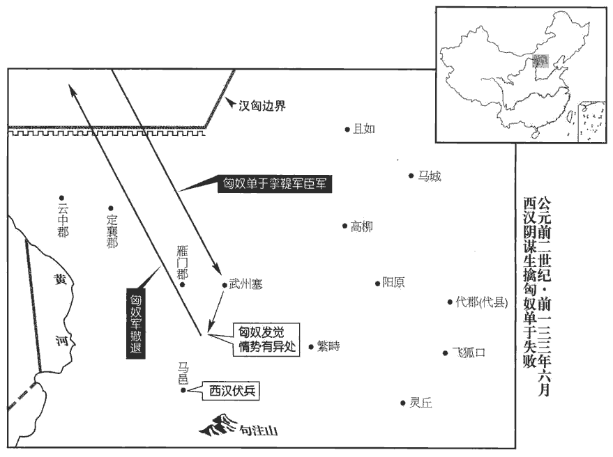
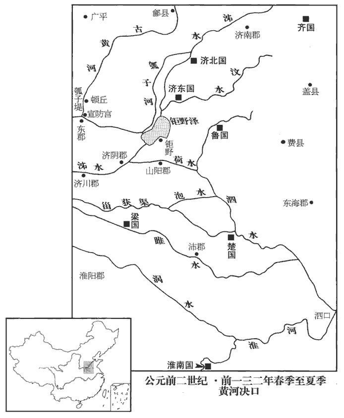
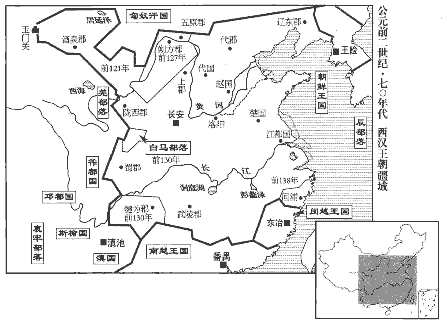
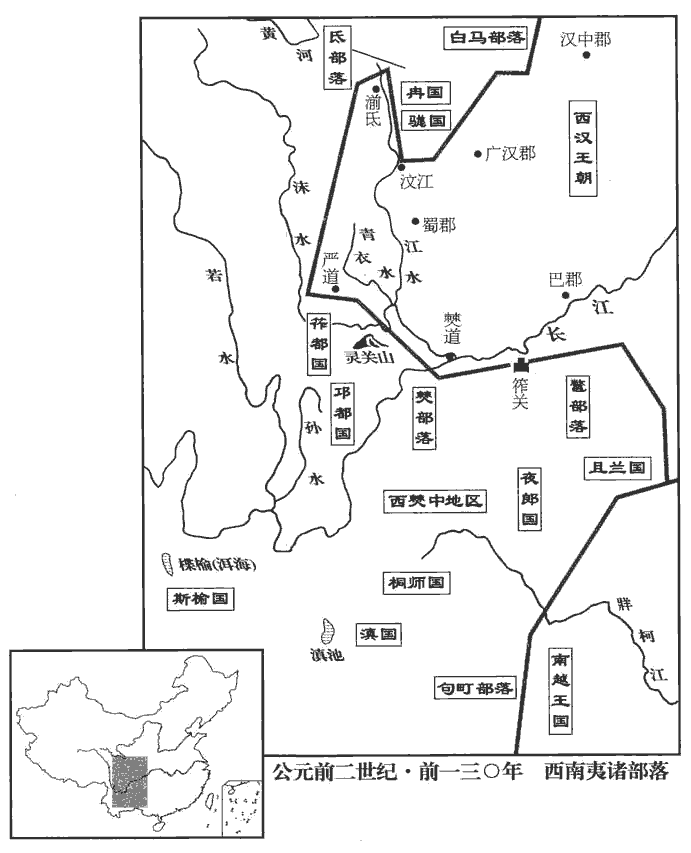
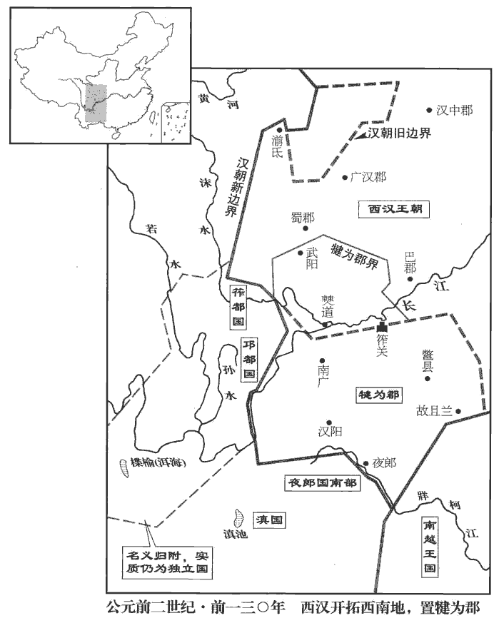
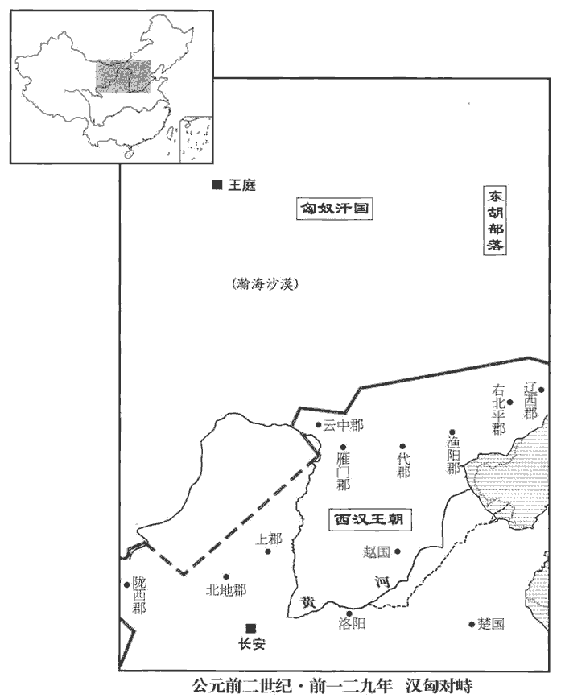
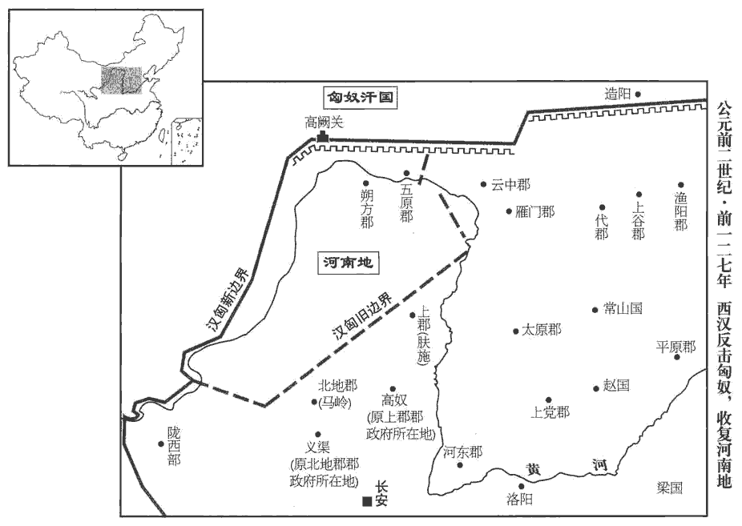
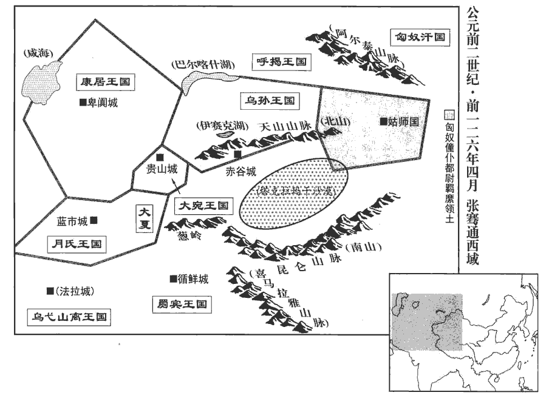

 漢紀十起著雍涒tūn灘（戊申），盡柔兆執徐（丙辰），凡九年。

# 世宗孝武皇帝上之下

## 元光二年（戊申，前一三三年）

1冬，十月，上‹刘彻，时年二十四›行幸雍‹陝西鳳翔›，祠五畤。雍，於用翻。畤，音止。

〖译文〗 [1]冬季，十月，武帝来到雍地，在五举行祭祀。

2李少君以祠灶卻老方見上，祠灶者，祭灶以致鬼物，化丹砂以為黃金，以為飲食器，可以延年。方士之言云爾。少，詩照翻。上尊之。少君者，故深澤侯舍人，高祖功臣有深澤侯趙將夕，景帝三年，孫修嗣侯；七年，有罪，耐為司寇。少君當是為修舍人。班志，涿郡有南深澤縣。匿其年及其生長，謂其生時及長時所居止處也。長，知兩翻。其游以方徧諸侯，無妻子。人聞其能使物及不死，如淳曰：物，謂鬼物也。更饋遺之，更，工衡翻。遺，于季翻。常餘金錢、衣食。人皆以為不治生業而饒給，又不知其何所人，愈信，爭事之。治，直之翻。少君善為巧發奇中。如淳曰：時時發言有所中也。中，竹仲翻。嘗從武安侯飲，田蚡封武安侯。坐中有九十余老人，坐，徂臥翻；下同。少君乃言與其大父游射處；老人為兒時從其大父，識其處，師古曰：識，記也，式志翻。一坐盡驚。少君言上曰：「祠灶則致物，致物而丹沙可化為黃金，壽可益，蓬萊仙者可見；見之，以封禪則不死，黃帝是也。臣嘗游海上，見安期生，列仙傳：安期生，琅邪人，賣藥東海邊，時人皆言千歲。食臣棗，大如瓜。食，祥吏翻。安期生仙者，通蓬萊中，合則見人，不合則隱。」於是天子始親祠灶，遣方士入海求蓬萊安期生之屬，而事化丹沙諸藥齊為黃金矣。藥之分齊。齊，才計翻。居久之，李少君病死，天子以為化去，不死；而海上燕、齊怪迂之方士多更來言神事矣。更，工衡翻。

〖译文〗 [2]李少君凭借祭祀灶神求长生不老的方术进见武帝，武帝很尊敬他。 李少君是已去世的深泽侯的舍人，他隐瞒了自己的年龄、出生成长的地方，凭借着他的方术周游结交诸侯，没有妻子儿女。人们听说李少君能役使鬼神万物，并有长生不老的方术，纷纷赠送财礼给他，所以他经常有余剩的金钱和衣食用品。人们都认为他不经营产业却很富袷，又不知他是什么地方的人，更加相信他，争着侍奉他。李少君善于用巧妙的语言猜中一些离奇的事情。他曾经陪武安侯田饮酒，座中有位九十多岁的老人，李少君就说起与老人的祖父一起游玩射猎的地方；老人还是儿童时曾跟随祖父，记得那个地方，满座的客人都大吃一惊。李少君对武帝说：“祭祀灶神就能招来奇异之物，招来了奇异之物就可以使丹砂化为黄金，可以延年益寿，可以见到蓬莱的仙人。见到仙人，进而举行封禅仪式，就可以长生不死，黄帝就是这样的。我曾经在海上漫游，遇见了安期生，他给我枣吃，那枣如同瓜一般大。安期生是仙人，往来于蓬莱仙境，谁和他合，他就显身相见，谁和他不合，他就隐身不见。”于是武帝就开始亲自祭祀灶神，派遣方士到大海中去寻找蓬莱安期生之类的仙人，并且从事熔化丹砂和其它药物，企图炼出黄金。过了很久，李少君病死，武帝认为他化身成仙，并没有死去；因此，燕地、齐地等沿海地区那些怪诞迂谬的方士，纷纷前来对武帝谈论有关神仙的事情了。

3亳‹山东曹县南›人謬忌奏祠太一。如淳曰：亳，亦薄也。晉灼曰：亳縣屬濟陰郡。予據班志，亳屬山陽郡；「亳」作「薄」，謬，姓也，音靡幼翻，與繆同；戰國時，趙有宦者令繆賢。太一者，天之尊神。天文志：中宮天極星，其一明者，太一常居也。淮南子：太微者，太一之庭；紫宮者，太一之居。索隱曰：樂汁征圖云：天宮，紫微；北極，天一、太一。宋均云；天一、太一，北極神之別名。春秋佐助期云：紫宮，天皇耀魄寶之所理也。石氏云：天一、太一各一星，在紫宮門外立，承事天皇大帝。方曰：「天神貴者太一，太一佐曰五帝。」五帝，謂東方青帝靈威仰，南方赤帝赤熛biāo怒，西方白帝白招矩，北方黑帝葉光紀，中央黃帝含樞紐也。一說：蒼帝名靈符，赤帝名文祖，白帝名顯記，黑帝名玄矩，黃帝名神斗。於是天子立其祠長安東南郊。

〖译文〗 [3]毫县人谬忌奏请武帝祭祀太一神。他在上奏的方形木牍上写道：“天神中最尊贵的是太一神，太一神的辅佐是五帝神。”于是，武帝就在长安的东南郊建立了祭祀太一神的祭坛。

4雁門‹山西右玉›馬邑‹山西朔州›豪聶壹，馬邑縣屬雁門郡。豪，謂以貲財、武力雄於鄉曲者。聶，姓也。姓譜曰：楚大夫食采于聶，因以為氏。壹，其名。聶，尼輒翻。因大行王恢言：「匈奴初和親，親信邊，可誘以利致之，伏兵襲擊，必破之道也。」上召問公卿。王恢曰：「臣聞全代‹河北蔚縣›之時，戰國之初，代自為一國，故曰全代；其後為趙襄子所滅，代始屬趙。服虔曰：代未分之時也。李奇曰：六國之時，代為一國，尚能以擊匈奴；況今加以漢之大乎！北有強胡之敵，內連中國之兵，然尚得養老、長幼，長，知兩翻。種樹以時，倉廩常實，匈奴不輕侵也。今以陛下之威，海內為一；然匈奴侵盜不已者，無他，以不恐之故耳。言不示以威，故匈奴不知懼也。臣竊以為擊之便。」韓安國曰：「臣聞高皇帝‹刘邦›嘗圍于平城‹山西大同›，事見十一卷高祖七年。七日不食；及解圍反位而無忿怒之心。夫聖人以天下為度者也，師古曰：言當隨天下人心而寬大其度量也。不以己私怒傷天下之公，故遣劉敬結和親，至今為五世利。臣竊以為勿擊便。」恢曰：「不然。高帝身被堅執銳，行幾十年，被，皮義翻。幾，居衣翻。所以不報平城之怨者，非力不能，所以休天下之心也。今邊境數驚，數，所角翻。士卒傷死，中國槥huì車相望，應劭曰：槥，小棺也，今謂之櫝。金布令曰：不幸死，所為櫝傳歸所居縣。師古曰：從軍死者，以槥送致其喪；載槥之車相望於道，言其多也。槥，音衛。此仁人之所隱也。隱，惻也；張晏曰：痛也。故曰擊之便。」安國曰：「不然。臣聞用兵者以飽待饑，正治以待其亂，定舍以待其勞；故接兵覆眾，伐國墮城，師古曰：覆，敗也；墮，毀也；言兵與敵接則敗其眾，所伐之國則墮其城也。墮，讀曰隳huī。常坐而役敵國，此聖人之兵也。今將卷甲輕舉，卷，讀曰捲。深入長敺，難以為功；敺，與驅同。從行則迫脅，衡行則中絕，從，子容翻。衡，讀曰橫。疾則糧乏，徐則後利，師古曰：後利，謂不及於利。後，戶遘翻。不至千里，人馬乏食。兵法曰：『遺人，獲也。』言以軍遺敵人，令其禽獲也。遺，于季翻。臣故曰勿擊便。」恢曰：「不然。臣今言擊之者，固非發而深入也；將順因單于之欲，誘而致之邊，誘，音酉。吾選梟騎、壯士陰伏而處以為之備，梟，古堯翻。騎，奇寄翻。審遮險阻以為其戒。吾勢已定，或營其左，或營其右，或當其前，或絕其後，單于可禽，百全必取。」上從恢議、考異曰：史記韓長孺傳，元光元年，聶壹畫馬邑事；而漢書武紀在二年。蓋元年壹始言之，二年議乃決也。

〖译文〗 [4]雁门郡马邑县的豪强之士聂壹，通过大行王恢向武帝建议：“匈奴刚刚与汉和亲结好，亲近信任边境吏民，可用财利引诱他们前来，汉军预设伏兵袭击，这是肯定会打败匈奴人的妙计。”武帝召集公卿讨论这个建议，战国之初，代国保有它的全境时，北面有强敌匈奴的威胁，内受中原诸国军队的牵制，但仍然可以尊养老人，抚育幼童，按照季节时令种粮植树，粮仓中一直有充足的储粮，匈奴不敢轻易入侵。现在，凭陛下的神威，天下一统，但匈奴的入侵却持续不断，形成这种局面的原因，没有别的，只是因为在于没有使匈奴恐惧罢了。我私下认为打击匈奴对国家有利。”韩安国说：“我听说高皇帝曾被匈奴围困在平城，七天没能吃上饭；等到解脱围困返回都城之后，却没有愤怒之心。圣人有包容天下的器度，不因自身的私怒而伤害天下大局，所以高皇帝派遣刘敬为使臣与匈奴和亲，到现在已为五世的人带来益处。我私下认为不打匈奴对国家有利。”王恢说：“不对。高帝身披铠甲，手执利器，征战将近几十年，他不向匈奴报复被困平城的怨恨，并不是因为力所不及，而是出于让天下人休息的仁心。现在边境经常受到匈奴侵扰，受伤战死的士兵很多，中原地区运载死亡士兵棺木的车辆络绎不绝，这是仁人所悲痛的事。所以说打匈奴是应当的。”韩安国说：“不对。我听说善于用兵的人，让自己的军队温饱以等待敌军饥饿，严明军纪以等待敌军混乱，安居军营以等待敌军疲劳。所以，崐一旦交战，就会全歼敌人；一旦进攻敌国，就会攻破城防，经常安坐不动地迫使敌人俯首听命，这是圣人的作战方法。现在如果轻易地对匈奴用兵，长驱直崐入，难以成功；如果孤军深入就会受到威胁，齐头并进就没有后继，进军太快就会缺乏粮食给养，进军缓慢就会丧失有利的战机，还没有走到一千里，就会人马都缺乏粮食。这正是《兵法》所说：‘派出军队，就会被敌人擒获。’所以我说不打匈奴为好。”王恢说：“不对。我现在所说的打匈奴的方法，本不是征发军队深入敌境；而是要利用单于的贪欲，引诱他们到我们的边境，我们挑选骁勇的骑兵和壮士，暗中埋伏，用来防备敌军，谨崐慎地据守险要的地势，以加强防御的力量。我们的部署已经完成，有的军队攻崐打敌军左翼，有的军队攻打敌军右翼，有的军队阻止敌人前进，有的军7断绝敌人的退路，这样就肯定能擒住单于，必定大获全胜。”武帝采纳了王恢的主张。

 

夏，六月，以御史大夫韓安國為護軍將軍，衛尉李廣為驍騎將軍，太僕公孫賀為輕車將軍，大行王恢為將屯將軍，司馬彪曰：輕車，古之戰車。李奇曰：將屯，主監諸屯。太中大夫李息為材官將軍，將車騎、材官三十余萬匿馬邑‹山西朔州›旁谷中，約單于入馬邑縱兵。陰使聶壹為間，間，古莧翻。亡入匈奴，謂單于曰：「吾能斬馬邑令、丞，以城降，縣有令，有丞，長吏也。財物可盡得。」單于愛信，以為然而許之。聶壹乃詐斬死罪囚，縣其頭馬邑城下縣，古懸字通。示單于使者為信，曰：「馬邑長吏已死，長，知兩翻。可急來！」於是單于穿塞，將十萬騎入武州塞‹山西左云›。班志，武州縣屬雁門郡。崔浩曰：今平城首西百里有武州城是也。杜佑曰：武州塞在朔州善陽縣界。未至馬邑百餘里，見畜布野畜，許救翻。而無人牧者，怪之。乃攻亭，得雁門尉史，欲殺之；師古曰：漢律：近塞皆置尉，百里一人，士史、尉史各二人。時雁門尉史行徼見寇，因保此亭。尉史乃告單于漢兵所居。單于大驚曰：「吾固疑之。」乃引兵還，出曰：「吾得尉史，天也！」以尉史為天王。塞下傳言單于已去，漢兵追至塞，度弗及，乃皆罷兵。度，徒洛翻。王恢主別從代出擊胡輜重，重，直用翻。聞單于還，兵多，亦不敢出。

〖译文〗 [5]夏季，六月，汉武帝任命御史大夫韩安国为护军将军，卫尉李广为骁骑将军，太仆公孙贺为轻车将军，大行王恢为将屯将军，太中大夫李息为材官将军，统率战车、骑兵、步兵共三十多万人暗中埋伏在马邑附近的山谷中，约定等单于进入马邑就挥军出击。汉军暗地派聂壹当间谍，逃到匈奴人那儿，聂壹对单于说：“我能杀马邑县的县令和县丞，献城归降，您可以得到全城的所有财物。”单于很喜欢信任聂壹，认为他说得对，就同意了他的计划。聂壹返回马邑县城，就斩杀死刑囚犯，用来假冒县令、县丞，把他们的头挂在马邑城下，让单于的使者观看，以此做为证明，说：“马邑县的长官已经死了，你们可以赶快来！”于是，单于越过边塞，统率十万骑兵进入武州塞。走到距离马邑县城还有一百多里的地方，单于见牲畜遍野，却没有一个放牧的人，感到奇怪。单于就派人攻打亭隧，俘虏了雁门郡的尉史，要杀掉他，这个尉史就告诉单于汉兵埋伏的地点。单于大吃一惊，说：“我本来就怀疑其中有诈。”就领兵撤退，在撤出汉境之后，单于说：“我俘虏了这个尉史，是天保佑我啊！”就称尉史为“天王”。边塞守军传报单于已率军退走，汉军追到边塞，估计追不上了，就全军撤回。王恢指挥另一支军队，从代地出发，准备袭击匈奴的后勤给养，听说单于返回，军队很多，也不敢出击。

上怒恢。恢曰：「始，約為入馬邑城，兵與單于接，而臣擊其輜重，可得利。今單于不至而還，臣以三萬人眾不敵，只取辱，固知還而斬，然完陛下士三萬人。」於是下恢廷尉，下，遐嫁翻。廷尉當，「恢逗橈，當斬。」應劭曰：逗，曲行避敵也。橈，顧望也。如淳曰：軍行而逗留、畏懦者，要斬。師古曰：應說非也。逗，留止也。橈，謂屈弱也。逗，音豆，又音住。橈，奴教翻。恢行千金丞相蚡，蚡不敢言上，而言于太后曰：「王恢首為馬邑事，今不成而誅恢，是為匈奴報仇也。」蚡，房吻翻。是為，於偽翻。上朝太后，朝，直遙翻。太后以蚡言告上。上曰：「首為馬邑事者恢，故發天下兵數十萬，從其言為此。且縱單于不可得，恢所部擊其輜重，猶頗可得以尉士大夫心。尉，與慰同。今不誅恢，無以謝天下。」於是恢聞，乃自殺。自是之後，匈奴絕和親，攻當路塞，師古曰：塞之當行道處者。往往入盜于漢邊，不可勝數；然尚貪樂關市，匈奴與漢人于邊為互市，如今之回易場也。勝，音升。樂，音洛。嗜漢財物，漢亦關市不絕以中其意。中，竹仲翻。

〖译文〗 武帝对王恢很恼怒。王恢说：“根据原来的计划，约定引匈奴进入马邑县城，主力军队与单于交战，而我率军袭击他们的后勤给养，可以获胜。现在单于未到马邑就全军撤回，我用三万人的军队打不过匈奴大军，那样做只能是自辱。我本知道撤兵回来是要杀头的，但这样却保全了陛下的三万将士。”于是汉武帝就把王恢交附廷尉审判，廷尉判决：“王恢避敌观望，不敢出击，判处斩首。”王恢暗中向丞相田行贿一千金，求他开脱罪名，田不敢向武帝说，就对太后说：“王恢第一个提出了在马邑诱歼匈奴主力的计划，现在行动失败而杀了王恢，这是等于为匈奴报了仇啊。”武帝朝见太后时，太后就把田的话告诉了武帝。武帝说：“王恢是马邑计划的主谋，我听从了他的建议，调集了天下几十万人马，安排了这次军事行动。况且，即使捉不到单于，王恢的军队袭击匈奴的后勤给养，仍然可以安慰将士们的心。如今不杀王恢，无法向天下人谢罪。”王恢得知了武帝的话，就自杀了。从此之后，匈奴断绝了与汉的和亲，进攻扼守大路的要塞，常常入侵汉朝边境，不可胜数；但是匈奴仍然贪图在边关的互市贸易，喜爱汉朝的财物；汉朝也不关闭边境贸易市场，以投其所好。

## 元光三年（己酉，前一三二年）

1春，河水徙，從頓丘‹河南内黄东南›東南流。師古曰：頓丘，丘名，因以為縣；本衛地也。地理志，屬東郡；今則在魏州界。考異曰：漢書武紀云：「東南流入勃海。」按頓丘屬東郡。勃海乃在頓丘東。此恐誤，今不取。夏，五月，丙子‹三›，復決濮陽瓠子‹河南濮陽西南›，濮陽縣屬東郡。服虔曰：瓠子，堤名，在東郡。蘇林曰：甄城以南、濮陽以北為瓠子河，廣百步，深五丈。水經：瓠子河出濮陽縣北十里，即瓠河口。復，扶又翻。瓠，戶故翻。考異曰：史記河渠書：「元光中，河決瓠子，東注鉅野。」服虔註漢書武紀曰：「瓠子，堤名，在東郡白馬。」蘇林曰：「在甄城以南，濮陽以北。」將相名臣表曰：「五月，丙子，河決瓠子。」然則瓠子即濮陽縣境堤名也。注鉅野‹山東鉅野›，班志，鉅野縣屬山陽郡；大野澤在其北。師古曰：即今鄆yùn州鉅野縣。通淮、泗，決河之水，由鉅野而通泗水，由泗水而通淮也。泛郡十六。泛，敷劍翻。天子‹刘彻，时年二十五›使汲黯、鄭當時發卒十萬塞之，輒復壞。塞，悉則翻。復，扶又翻；下同。是時，田蚡奉邑食鄃shū‹山東高唐东北›；奉，扶用翻。鄃，音輸。鄃縣屬清河郡。鄃居河北，河決而南，則鄃無水災，邑收多。蚡言於上曰：「江、河之決皆天事，未易以人力強塞，易，以豉翻。強，其兩翻。塞之未必應天。」而望氣用數者亦以為然。於是天子久之不復事塞也。

〖译文〗 [1]春季，黄河决口改道，从顿丘向东南方流去。夏季，五月，丙子（初三），黄河又一次在濮阳县的瓠子决口，注入钜野县，连通了淮河和泗水，十六个郡受水灾。武帝派汲黯、郑当时征发十万役夫堵塞黄河决口，刚刚堵住，就又被洪水冲毁。当时，田的食邑是县；县在黄河北岸，黄河决口向南泛滥，县就不会遭受水灾，食邑收入就会增加。田对武帝说：“长江、黄河的决口都是天意的安排，用人力强行堵塞很不容易，堵住了未必符合天意。”而那些候望云气和使用法术的方士们也认为是这样。这样一来，武帝很长时间不再征发人力从事堵塞决口的工程。

 

2初，孝景‹刘启›時，魏其侯竇嬰為大將軍，武安侯田蚡乃為諸郎，諸郎，諸曹郎也。侍酒跪起如子侄；已而蚡日益貴幸，為丞相。魏其失勢，賓客益衰，師古曰：言素為嬰之賓客者，漸以衰退，不復往也。獨故燕相潁陰‹河南許昌›灌夫不去。燕王定國，王澤之孫也；夫自太僕出相之。班志，潁陰縣屬潁川郡。相，息亮翻。嬰乃厚遇夫，相為引重，張晏曰：相薦達為聲勢也。師古曰：相牽引以致於尊重也。為，於偽翻。其游如父子然。夫為人剛直，使酒，諸有勢在己之右者必陵之；數因酒忤丞相。數，所角翻。忤，五故翻。丞相乃奏案：「灌夫家屬橫潁川‹河南禹州›，民苦之。」夫宗族、賓客為權利，橫於潁川；小兒歌之曰：「潁水清，灌氏寧；潁水濁，灌氏族。」橫，戶孟翻。收系夫及支屬，皆得棄市罪。刑人於市，與眾棄之，故殺之於市者謂之棄市。景帝中元年，改磔zhé曰棄市。應劭曰：先諸死刑皆磔於市，今改曰棄市，自非妖逆，不復磔也。師古曰：磔，謂張其尸也。棄市，殺之於市也。魏其上書論救灌夫，上令與武安東朝廷辨之。東朝，謂太后居長樂宮，在未央宮之東也；令于長樂宮見太后，廷辨其是非也。朝，直遙翻，下同。魏其、武安因互相詆訐jié。訐，居謁翻。上問朝臣：「兩人孰是？」唯汲黯是魏其，韓安國兩以為是；鄭當時是魏其，後不敢堅。上怒當時曰：「吾并斬若屬矣！」若屬，猶言汝輩也。即罷、起，入，上食太后，上，時掌翻。太后怒不食，曰：「今我在也，而人皆藉吾弟；晉灼曰：藉，蹈也。藉，慈夜翻。令我百歲後，皆魚肉之乎！」師古曰：以比魚肉而食啖也。上不得已，遂族灌夫；使有司案治魏其，得棄市罪。

〖译文〗 [2]当初，孝景帝在位时，魏其侯窦婴担任大将军，武安侯田才是个普通的郎官，陪侍窦婴饮酒时，田下跪起立如同儿子、侄子一样；后来，田日益显贵受宠，出任丞相。而魏其侯窦婴失去了权势，依附他的宾客越来越少，唯独原来的燕相、颍阴县人灌夫不离去。窦婴就厚待灌夫，两人互相援引、互相倚重，来往如同父子一样。灌夫为人刚强正直，好借酒使气，对那些权势在自己之上的权贵，必定给予凌辱；他多因酒后闹事冒犯丞相田。丞相就向武帝弹劾：“灌夫家属在颍川郡横行霸道，百姓都被害苦了。”于是收捕灌夫和包括旁支亲属在内的家人，都被判处公开斩首示众的罪名。魏其侯窦婴上书营救灌夫，武帝命令他和武安侯田到太后居住的东宫中，当廷申辩。魏其侯、武安侯就利用这个机会互相诋毁。武帝问朝廷群臣：“他们两人谁对？”只有汲黯认为魏其侯对，韩安国认为两人都对；郑当时本认为魏其侯对，后来不敢坚持。武帝怒骂郑当时说：“我把你这类的人一起斩了！”随即罢朝，站起来，进入内宫，侍奉太后用餐，太后气冲冲地不吃饭，说：“如今我还活着，别人已经在欺负我的弟弟；假若我死了，他们就都来宰杀他了！”武帝没有办法，就下令将灌夫满门处斩；派执法官员审查魏其侯，判处魏其侯斩首示众。

## 元光四年（庚戌，前一三一年）

1冬，十二月晦‹三十›，論殺魏其於渭城‹陝西咸陽›。漢法，以冬月行重刑，遇春則赦若贖，故以十二月晦論殺魏其侯。此武安侯蚡之意也。渭城縣屬扶風，秦之咸陽也。考異曰：班固漢武故事曰：「上召大臣議之。群臣多是竇嬰，上亦不復窮問，兩罷之。田蚡大恨，欲自殺；先與太后訣，兄弟共號哭訴太后，太后亦哭，弗食。上不得已，遂乃殺嬰。」按漢武故事，語多誕妄，非班固書；蓋後人為之，托固名耳。春，三月，乙卯‹十七›，武安侯蚡亦薨。考異曰：武安侯傳云：「元光四年春，丞相按灌夫事；其夏，取夫人。五年十月，論灌夫及家屬。十二月，晦，魏其棄市。」徐廣引武帝本紀、侯表，以為蚡薨在嬰死後分明，四年當是三年，五年當是四年。今從之、廣又疑十二月為二月；按漢制，常以立春下寬大詔書，蚡恐魏其得釋，故以十二月晦殺之，何必改為二月也！及淮南王安敗，見後十九卷元狩元年。上聞蚡受安金，有不順語，見上卷建元二年。曰：「使武安侯在者，族矣！」

〖译文〗 [1]冬季，十二月三十日，根据所定罪名在渭城处死了魏其侯窦婴。春季，三月，乙卯（十七日），武安侯田也死去了。等到后来淮南王刘安谋反失败，武帝得知田接受过刘安的黄金，并且说过大逆不道的话，就说：“假若武安侯还活着，就应该把他灭族了！”

2夏，四月，隕霜殺草。

〖译文〗 [2]夏季，四月，出现寒霜，冻死了野草。

3御史大夫安國行丞相事，引；墮車，蹇。如淳曰：為天子導引而墮車蹇跛也。余據漢制，大駕則公卿奉引，安國蓋因奉引而墮車也。墮，杜火翻。五月，丁巳‹二十›，以平棘侯薛澤為丞相；薛澤，高祖功臣廣平侯薛歐之孫。廣平，侯國，景帝中二年罪絕，中五年，復封澤平棘侯。班志，平棘縣屬常山郡。安國病免。

〖译文〗 [3]御史大夫韩安国代理丞相职务，为武帝引导车驾，从车上摔下来，成了跛腿。五月，丁巳（二十日），汉武帝任命平棘侯薛泽为丞相；韩安国因病免职。

4地震；赦天下。

〖译文〗 [4]发生了地震；大赦天下。

5九月，以中尉張歐為御史大夫。韓安國疾愈，復為中尉。

〖译文〗 [5]九月，武帝任命中尉张欧为御史大夫。韩安国的腿疾痊愈，重新出任为中尉。

6河間‹河北獻縣›王德，修學好古，實事求是，德，景帝子，帝之兄也；景帝前二年受封。師古曰：實事求是，務得其實，每求真是也。好，呼到翻；下同。以金帛招求四方善書，得書多與漢朝等。朝，直遙翻；下同。是時，淮南王安亦好書，所招致率多浮辯；獻王所得書，皆古文先秦舊書，師古曰：先秦，猶言秦先，謂未焚書之前。余據獻王傳，舊書，即謂周官、尚書、禮記、孟子、老子之書也。采禮樂古事，稍稍增輯至五百餘篇，被服、造次師古曰：被服，言常居處其中也。造次，謂所向必行也。余謂被服者，言以儒術衣被其身也。被，皮義翻。造，千到翻。必于儒者，山東諸儒多從之遊。

〖译文〗 [6]河间王刘德，努力钻研学问，喜好古代典籍、治学注重实事求是，用黄金丝帛购买各地的好书，购得的书，数量与汉朝廷的存书一样多。当时，淮南王刘安也喜爱书籍，他所征集到的大多是浮滑论辩的书；而刘德所征集的书，都是用古代文字书写的先秦时期的旧书。他搜集礼乐制度的古事，稍加增订，编辑成书，长达五百余篇。他的思想和言谈举止，都务求符合儒家学说，崤山以东的儒生大多追随他，与他交往。

## 元光五年（辛亥，前一三零年）

1冬，十月，河間‹府乐成，河北献县›王來朝，獻雅樂，對三雍宮應劭曰：辟雍、明堂、靈台也。雍，和也；言天地、君臣、人民皆和也。余謂對三雍宮者，對三雍之制度，非召對於三雍宮。及詔策所問三十餘事；其對，推道術而言，得事之中，文約指明，師古曰：中，竹仲翻。約，少也。指，謂義之所趨，若人以手指物也。天子‹刘彻，时年二十七›下太樂官常存肄河間王所獻雅聲，班表：太樂官屬大常。肄，以至翻，習也。下，遐嫁翻。歲時以備數，然不常御也。春，正月，河間王薨，中尉常麗以聞，姓譜：常姓，黃帝相常先之後。曰：「王身端行治，師古曰：端，直也。治，理也。行，下孟翻。溫仁恭儉，篤敬愛下，明知深察，惠於鰥寡。」大行令奏：「諡法：『聰明睿知曰獻』，諡曰獻王。」知，讀曰智。

〖译文〗 [1]冬季，十月，河间王刘德来京朝见，进献用于郊庙朝会的正乐，回答了有关三雍宫的典章制度及皇帝拟定的三十多个问题。他的回答，都是依据并阐明了儒学思想，抓住了问题的关键，文字简捷，观点明确。武帝下令让掌管宫廷音乐的太乐官经常练习河间王所献的雅乐，作为年节典礼中的项目，但平常很少演奏。春季，正月，河间王刘德去世，中尉常丽向朝廷报告了他的死讯，并说：“河间王立身端正，行为谨饬，温良仁义，恭敬俭朴，敬上爱下，聪明智慧，洞察隐微，恩惠及于鳏夫寡妇。”大行令奏报武帝：“《谥法》说：‘聪明睿智称之为献。’议定河间王刘德的谥号为献王。”

 

班固贊曰：昔魯哀公有言：「寡人生於深宮之中，長於婦人之手，未嘗知憂，未嘗知懼。」師古曰：哀公與孔子言也，事見孫卿子。長，知兩翻。信哉斯言也，雖欲不危亡，不可得已！師古曰：已，語終辭。是故古人以宴安為鴆毒，師古曰：左氏傳：管敬仲曰：「宴安鴆毒，不可懷也。」無德而富貴謂之不幸。漢興，至於孝平，諸侯王以百數，率多驕淫失道。何則。沈溺放恣之中，沈，持林翻。居勢使然也。自凡人猶系於習俗，而況哀公之倫乎！「夫唯大雅，卓爾不群」，河間獻王近之矣。近，其靳翻。

〖译文〗 班固赞曰：过去鲁哀公曾说过这样的话：“我在深宫中出生，在妇人抚育下长大，从不知道什么是忧愁，从未体验过什么是恐惧。”这话说得多么真实啊。这样的人做君主，即便他不想使国家陷入危亡的绝境，也不可能啊！所以古人把安享太平看成为毒酒，把没有仁德而身居富贵之位称之为不幸。汉朝建国，直到孝平帝，诸侯王数以百计，大多骄横荒淫丧失道德。为什么这样呢？沉溺在放纵恣肆的环境中，他们所处的地位导致他们如此。即使是常人都要深受习俗的影响，何况鲁哀公之类的人呢！“学识渊博，出类拔萃”，河间献王刘德可说近似这样的人。

 

2初，王恢之討東越‹都东冶，福建福州›也，見上卷建元六年。使番陽‹江西波陽›令唐蒙風曉南越‹都番禺，广东广州›。南越食蒙以蜀枸醬，班志，番陽縣屬豫章郡。番，蒲何翻。風，讀曰諷。劉德曰：枸樹如桑，其椹長二三寸，味酢cù；取其實以為醬，美。師古曰：枸者，緣木而生，非樹也。子形如桑椹，又不長，一二寸，味尤辛，不酢：劉說非也。裴駰曰：按漢書音義：枸木似榖樹，其葉似桑葉，用其葉作醬酢，美，蜀人以為珍味。廣志曰：枸，黑色，味辛，下氣，消穀。晉灼曰：枸，音矩。索隱從徐廣音求羽翻。唐本本草註曰：蒟jǔ，蔓生，葉似王瓜而厚大，味辛香，實似桑椹，皮黑，肉白。劉淵林曰：蒟醬，緣木而生，其子如桑椹，熟時正青，長二三寸，以蜜藏而食，辛香，調五藏。李心傳曰：蒟醬，廣、蜀皆有之，實草類也。蜀中者，緣木而生，如桑椹，熟時正青，長二三寸，以蜜藏而食之。廣中者，蔓生，葉似王瓜而厚大，味辛香，實似桑椹，皮黑，肉白，其苗如浮留藤，取葉合檳榔食之。西戎亦時時持來，細而辛烈。唐蒙所見，謂來自牂柯，則廣生，殆蜀本也。蒟醬之味，全類蓽撥，而蓽撥辛烈尤甚。世人唯用蓽撥，不用蒟jǔ醬，故鮮有知者。蒙問所從來，曰：「道西北牂柯江。牂柯江廣數里，出番禺‹廣東廣州›城下。」南越志曰：番禺之西有江浦焉。師古曰：牂柯，系船杙yì。華陽國志云：楚遣莊蹻伐夜郎‹都貴州关岭›，軍至且蘭，椓船于岸而步戰。既滅夜郎，以且蘭有椓船牂柯處，乃改為䍧牱。又後漢志註：牂柯，江中名山。或曰，牂柯江東通四會，至番禺入海。水經：牂柯水東至鬱林廣郁縣為郁水，南流入交趾界。劉昫xù曰：唐邕州治宣化縣，漢鬱林郡之領方縣地也；驩huān水在縣北，本牂柯河，俗呼為郁狀江，即駱越水也。蓋廣鬱縣，漢亦屬鬱林郡。水經所謂交趾界者，漢交趾州界也。牂，音臧。柯，音歌。班志，番禺縣屬南海郡，時為南越王都。廣，古曠翻。番，音潘。禺，音愚。蒙歸至長安‹陝西西安›，問蜀賈人。賈人曰：「獨蜀出枸醬，多持竊出市夜郎‹都貴州关岭›。華陽國志：夜郎王，竹王三郎之後，武帝開為縣，屬牂柯郡。史記正義曰：今瀘州南大江南岸協州、曲州，本夜郎國。賈，音古。夜郎者，臨牂柯江，江廣百余步，足以行船。南越以財物役屬夜郎，西至桐師‹云南保山北›，桐師亦西南夷種，其地在夜郎之西，葉榆之西南。然亦不能臣使也。」蒙乃上書說上曰：乃上，時掌翻。說，式芮翻。「南越王黃屋左纛。地東西萬餘里，名為外臣，實一州主也。今以長沙‹湖南長沙›、豫章‹江西南昌›往，水道多，絕難行。竊聞夜郎所有精兵可得十余萬，浮船牂柯江，出其不意，此制越一奇也。誠以漢之強，巴‹四川重慶›、蜀‹四川›之饒，通夜郎道為置吏，甚易。」為，於偽翻；下同。易，以豉翻。上許之。

〖译文〗 [2]当初，王恢率军讨伐东越的时候，派番阳县令唐蒙去向南越王说明进军意图。南越人让唐蒙吃蜀地所产的枸酱，唐蒙问是从什么地方来的。南越人说：“是从西北方向的柯河运来的。柯江宽几数，从番禺城近旁流过。”唐蒙回到长安，又问蜀地的商人。商人说：“只有蜀地出产枸酱，许多人私自带着它出境去卖给夜郎。夜郎靠近柯江，柯江宽一百多步，行船毫无问题。南越国利用财物引诱和支配夜郎，向西一直影响到桐师人的居住地，但也不能让这一地区成为南越的臣属国，对它俯首听命。”唐蒙就向武帝上书说：“南越王使用只有皇帝才能用的黄屋左纛，盘踞东西长达万余里的地区，名义上是朝廷的外臣，实际上是一州之主。现在如果从长沙国、豫章郡出兵征讨南越，水路大多淤塞断绝，难以通行。我听说夜郎的精兵总计可有十余万人，我军乘船顺柯江而下，出其不意，这是制服南越的一条奇计。只要真的使用汉朝的强威，再加上巴、蜀两地富袷的经济力量，那么，打通夜郎的道路，在那儿设置官吏实施统治，是很容易做到的。”武帝批准了唐蒙的建议。

乃拜蒙為中郎將，將千人，食重萬餘人，師古曰：食糧及衣重也。重，直用翻。從巴、蜀筰zuó關‹四川合江南›入，李文子曰：筰關在沈黎郡；又云：在犍為郡界。宋白曰：眉州青神縣臨青衣江。郡國志：漢武帝使唐蒙開西南夷路始此。眉州，漢犍為郡地。筰，才各翻。遂見夜郎侯多同。多同，夜郎侯之名也。蒙厚賜，喻以威德，約為置吏，使其子為令。自此以下，為，如字。夜郎旁小邑皆貪漢繒帛，以為漢道險，終不能有也，乃且聽蒙約。還報，上以為犍為郡，李文子曰：犍為郡治鄨bì‹貴州遵義›；元光五年，又治南廣。水經註曰：鄨水出符縣南不狼山，縣有犍山。後漢志：鄨水過牂柯郡入延江水。水經註：沅水出且蘭，東至鐔xín城為沅水。寰宇記：唐播州、夷州、費州、莊州即秦且蘭、夜郎之西北隅，今珍州亦其地。又西，高州有夜郎縣，牂州建安縣有古夜郎城，西近施、黔，東近辰、沅，皆其境也。犍，居言翻。章懷太子賢曰：犍為故城，在今眉州隆山縣西北。發巴、蜀卒治道，自僰bó道‹四川宜宾›指牂柯江，班志，僰道屬犍為郡。宋白曰：古僰國；縣有蠻夷曰道，故為僰道，今戎州治所。康曰：僰國在馬湖江，唐蒙鑿石開道以通之。治，直之翻。僰，蒲北翻。作者數萬人，士卒多物故，有逃亡者；用軍興法誅其渠率，鄭玄曰：縣官征聚曰興，今云軍興是也。率，所類翻。巴、蜀民大驚恐。上聞之，使司馬相如責唐蒙等，因諭告巴、蜀民以非上意，相如還報。

〖译文〗 于是，武帝任命唐蒙为中郎将， 率领士兵一千人和运输粮食衣物的民夫一万多人，经过巴蜀两郡，从关进入夜郎境内，于是见到夜郎侯多同。唐蒙带来厚重的赏赐，告知汉朝的严威圣德，约定由朝廷在当地任命官吏，并让多同的儿子担任县令一级官员。夜郎附近的小城邑都贪图得到汉朝的丝绸，他们以为从汉朝到当地来，道路艰险，汉朝终究不可能占有这片地区，于是就暂且表示服从唐蒙的约定。唐蒙返京奏报，武帝就在这一地区设立了犍为郡，征发巴、蜀两郡的士卒修筑道路，从道指向柯江，修路的人有数万人，许多士卒死亡，有的士卒就逃跑了；唐蒙等人用“军兴法”诛杀逃亡士卒的头目，巴、蜀百姓极度惊恐。武帝得知此事，就派司马相如前去责备唐蒙等人，并公开告知巴蜀一带的百姓，唐蒙等人的作法并不是皇帝的本意；司马相如返京奏报处置情况。

 

是時，邛‹四川西昌›、筰zuó‹四川漢源›之君長華陽國志：雅州邛崍山，本名邛筰山，故邛人、筰人界。韋昭曰，筰縣在越雟。文穎曰：邛者，今為邛都縣；筰者，今為定筰縣。史記正義曰：邛都西有邛僰山，在雅州榮經縣界，山岩峭峻，曲回九折，乃至上下有凝冰，即王尊叱馭處。康曰：邛都夷，其地陷為汙澤，因名邛池，南人呼為邛河。師古曰：邛都，今之邛州本其地。邛，渠容翻。筰zuó，才各翻。聞南夷‹貴州北部›與漢通，得賞賜多，多欲願為內臣妾，請吏比南夷。天子問相如，相如曰：「邛‹四川西昌›、筰‹四川漢源›、冉駹máng‹四川茂縣›者近蜀，道亦易通；師古曰：今開州、夔州等首領多姓冉者，本皆冉種也。後漢書，冉駹，其山有六夷、七羌、九蠻，各有部落。括地志：蜀西徼外羌，茂州、冉州本冉駹國。康曰：其人依山居土，累石為室至十餘丈。駹，音厖máng。易，以豉翻。秦時嘗通，為郡縣，至漢興而罷。今誠復通，為置郡縣，愈于南夷。」張揖曰：愈，差也；又云：愈，猶勝也。晉灼曰：南夷，謂牂柯、犍為，西夷，謂越巂、益州也。為置之為，於偽翻。天子以為然，乃拜相如為中郎將，建節往使，及副使王然于等乘傳，因巴、蜀吏幣物以賂西夷；邛、筰、冉駹、斯榆‹云南大理›之君康曰：本葉榆澤，其君長因以立號，後隨畜移於徙。師古曰：徙，音斯，故又號為徙榆。使，疏吏翻。傳，張戀翻。皆請為內臣。除邊關；關益斥，西至沬‹大渡河›、若‹雅礱江›水，斥，開廣也。張揖曰：沬水出蜀廣平徼外，與青衣水合。若水出旄牛徼外，至僰道入江。華陽國志：漢嘉縣有沬水。李文子曰：若水南至大作入繩水。師古曰：沬，音妹。南至牂柯為徼，通零關道‹四川峨边南药子山›，班志，零關屬越巂suǐ郡。張揖曰：鑿靈山為道。寰宇記：靈關山‹四川峨边南药子山›在雅州盧山縣北二十里，靈關鎮在盧山縣北八十二里。零、靈通用。徼jiǎo，吉吊翻。橋孫水‹安宁河›張揖曰：孫水出臺登縣，南至會無，入若水。康曰：一名白沙江。李文子曰：孫水，本名長河水。以通邛都，為置一都尉、十餘縣，屬蜀。為，於偽翻。天子大說。說，讀曰悅。

〖译文〗 这时，邛人和人的部落酋长听说南夷与汉朝结交，得到很多的赏赐，大多甘愿做汉朝统治下的臣民，请朝廷仿照统治南夷的模式，在他们的居住地任命官吏。武帝询问司马相如的意见，相如说：“邛、、冉都靠近蜀郡，道路也容易开通；秦朝时曾经开通，设置过郡县，到汉朝建国才罢废。现在如果真能再次开通，在那儿设置郡县，将胜过南夷地区。”天子认为他说得对，就任命司马相如为中郎将，持皇帝的符节出使西夷，相如和副使王然于等人乘坐驿车，利用巴蜀两郡的官府财物收买西夷；邛、、冉、斯榆各部族的酋长，都请求做汉朝直接统治下的臣民。废除了原有的边关，新设立的边关向外扩展，西部到达沫水、若水，南至柯江为界，开通了零关道，在孙水上架起了桥，用来接连邛都，在这一地区设立了一个都尉、十多个县，隶属于蜀郡。武帝很高兴。

3詔發卒萬人治雁門‹山西右玉›阻險。師古曰：阻險，所以為固，用止匈奴之寇。貢父曰：治險阻者，通道令平易，以便伐匈奴。治，直之翻。

〖译文〗 [3]武帝下诏调集一万士卒修治雁门郡的险要关隘。

4秋，七月，大風拔木。

〖译文〗 [4]秋季，七月，出现大风，拔起树木。

5女巫楚服等教陳皇后‹陈娇›祠祭厭勝，挾婦人媚道；事覺，厭，一涉翻。賈公彥曰：按漢書：婦人蠱惑媚道，更相祝詛，作木偶人埋之於地。漢法又有官禁敢行媚道者。上使御史張湯窮治之。湯深竟党與，相連及誅者三百余人，楚服梟首於市。梟，堅堯翻。乙巳‹九›，賜皇后‹陈娇›冊，收其璽綬，罷退，居長門宮。長門宮，如淳曰：長門在長安城東南。東方朔傳：竇太主獻長門園，上以為宮。竇太主‹刘嫖›慚懼，稽顙謝上。竇太主，陳皇后母也。稽，音啟。上曰：「皇后所為不軌于大義，不得不廢。主當信道以自慰，勿受妄言以生嫌懼。后雖廢，供奉如法，長門無異上宮也。」

〖译文〗 [5]女巫师楚服等教陈皇后祭神祈祷，使用妇人诅咒的方法， 企图除去与陈皇后争宠的女人；事情败露，武帝指派御史张汤彻底查处。张汤深入地追究有关的人，相互牵联和被处死的有三百多人，楚服在街市被斩首，头颅高悬示众。乙巳（十四日），武帝赐给皇后一份册书，收回了皇后的印玺，废去尊号，贬入长门宫。陈皇后的母亲窦太主羞惭恐惧，向武帝叩头请罪。武帝说：“皇后的行为不符合大义，不得不把她废黜。你应该相信道义而放宽心怀，不要轻信闲言而产生疑虑和恐惧。皇后虽然被废了，仍会按照法度受到优待，居住在长门宫与居住在上宫并无区别。”

6初，上嘗置酒竇太主家，主見所幸賣珠兒董偃，上賜之衣冠，尊而不名，稱為「主人翁」，使之侍飲，由是董君貴寵，天下莫不聞。考異曰：漢武故事曰：「陳皇后廢處長門宮，竇太主以宿恩猶自親近。後置酒主家，主見所幸董偃。」按東方朔傳：「爰叔為偃畫計，令主獻長門園，更名曰長門宮，」則偃見上在陳后廢前明矣。常從遊戲北宮，馳逐平樂觀，平樂觀在未央宮北，周回十五里；高祖時，制度草創。至帝增修之。三輔黃圖曰：上林苑中有平樂觀。樂，音洛。觀，古玩翻。雞、鞠之會，斗雞及蹴踘也。鞠，毬也，以皮為之。鞠，音居六翻。角狗、馬之足，師古曰：角，猶校也。上大歡樂之。上為竇太主置酒宣室，蘇林曰：宣室，未央前殿正室也。如淳曰：宣室，布政教之室也。樂，音洛。為，於偽翻。使謁者引內董君。是時，中郎東方朔陛戟殿下，師古曰：持戟立列陛側也。辟戟而前曰：辟，頻亦翻。「董偃有斬罪三，安得入乎！」上曰：「何謂也？」朔曰：「偃以人臣私侍公主，其罪一也。敗男女之化，而亂婚姻之禮，傷王制，其罪二也。敗，補邁翻。陛下富於春秋，方積思於六經；偃不遵經勸學，反以靡麗為右，師古曰：右，尊之也。思，相吏翻。奢侈為務，盡狗馬之樂，極耳目之欲，是乃國家之大賊，人主之大蜮yù，師古曰：蜮，魅也，音或。說者以為短狐，非也；短狐，射工耳，於此不當其義；今俗猶云魅蜮也。貢父曰：劉向說春秋，蜮，南方淫氣所生，以應哀姜。然則朔正用指偃耳，何必遷就魅蜮也。余按洪范五行傳曰：蜮如鱉，三足，生於南越。南越婦人多淫，故其地多蜮，淫女惑亂之氣所生也，陸璣草木疏曰：一名射影，江、淮水皆有之。人在岸上，影見水中，投水影則殺之，故曰射影。南人將入水，先以瓦石投水中，令水濁，然後入。或曰，含沙射人皮肌，其瘡如疥。陸佃埤pí雅曰：蜮，一名射工，有長角橫在口前如弩，檐臨其角，端曲如上弩，以氣為矢，因水勢以射人，故俗呼為水弩。其罪三也。」上默然不應，良久曰：「吾業已設飲，後而自改。」朔曰：「【章：乙十一行本「曰」下有「不可」二字；孔本同；退齋校同。】夫宣室者，先帝之正處也，非法度之政不得入焉。故淫亂之漸，其變為篡。是以豎貂為淫而易牙作患，慶父死而魯國全。」豎貂、易牙，皆齊桓公之臣也。管仲有疾，桓公問之曰：「將何以教寡人？」仲曰：「願君之遠豎貂、易牙。」公曰：「易牙烹其子以快寡人，尚可疑邪？」對曰：「人之情非不愛其子，其子之忍，又將何有於君！」公曰：「豎貂自宮以近寡人，尚可疑邪？」對曰：「人之情非不愛其身，其身之忍，又將何有於君！」公曰：「諾。」管仲死，盡逐之；而公食不甘，宮不治。居三年，公曰：「仲父不亦過乎！」於是復皆召而反之。明年，公病。豎貂、易牙相與作亂，塞門築牆不通人。有一婦人逾垣至公所，公曰：「我欲食。」婦人曰：「吾無所得。」又曰：「我欲飲。」婦人曰：「吾無所得。」公曰：「何故？」曰：「豎貂、易牙作亂，故無所得。」公慨然歎曰：「若死者有知，吾何面目見仲父乎！」蒙衣袂而絕乎壽宮；蟲流出于戶，蓋以楊門之扉，三月不葬。慶父，魯桓公庶子，莊公之兄，通于哀姜。莊公薨，慶父弑其子般及閔公，欲為亂而不克，奔莒。莒人歸之，縊于密，魯乃定。父，音甫。上曰：「善！」有詔止，更置酒北宮，引董君從東司馬門入；未央宮有東闕、北闕，東闕曰蒼龍。東司馬門，蒼龍闕內之司馬門也。更，工衡翻。賜朔黃金三十斤。董君之寵由是日衰。是後，公主、貴人多逾禮制矣。

〖译文〗 [6]当初，武帝曾经在窦太主家中摆设酒席，窦太主引见了她宠幸的珠宝商人董偃，武帝赏赐给董偃衣服和冠帽，为了表示尊重，不称他的名字而称他为“主人翁”，让他陪侍饮酒；从此董偃尊贵受宠，天下人没有不知道的。董偃经常陪同武帝在北宫游戏，在平乐观骑马追逐、参与斗鸡、踢球，赛狗、赛马，武帝十分欢喜。武帝在宣室中摆酒款待窦太主，派谒者引导董偃入内。当时，中郎东方朔持戟立燥马追逐、参与斗鸡、踢球，赛狗、赛马，武帝十分欢喜。武帝在宣室中摆酒款待窦太主，派谒者引导董偃入内。当时，中郎东方朔持戟立燥马追逐、参与斗鸡、踢球，赛狗、赛马，武帝十分欢喜。武帝在宣室中摆酒款待窦太主，派谒者引导董偃入内。当时，中郎东方朔持戟立在殿下，他放下戟走近武帝说：“董偃犯有三项死罪，怎能让他进来呢！”武帝说：“你说的是什么呢？”东方朔说：“董偃以臣子的身份私通公主，这是他的第一条罪状。败坏男女风化��灺一橐隼穹ǎ�茘坏圣王制度，这是他的第二条罪状。陛下年轻，正在努力学习《六经》等儒学典籍，董偃不遵循经书教诲劝勉学习，反而崇尚豪华追求奢侈，尽情地享受斗狗赛马的欢乐，极力满足感官欲望，他是国家的大贼，君主的大害，这是他的第三条罪状。”武帝沉默不答，过了很久才说：“我今天已准备好宴席了，以后再自己改正吧。”东方朔说：“宣室，本来是先帝处理政务的地方，不是讨论有关法度的政务的人都不得进入。所以淫乱的苗头发展，就会变成篡夺君位。正是由于这个道理，当年齐桓公因信用竖貂和易牙受害，而庆父死后，鲁国就得以保全。”武帝说：“你说得好！”下诏让董偃停下来待命，重新在北宫设置酒宴，领董偃从东司马门入宫，赏赐给东方朔三十斤黄金。董偃所受的宠爱，自此以后日益衰减。此后，公主、贵人大多不按礼制行事了。

7上以張湯為太中大夫，與趙禹共定諸律令，務在深文。拘守職之吏，作見知法，吏傳相監司。用法益刻自此始。蘇林曰：拘刻於守職之吏。師古曰：見知人犯法而不舉告，謂之故縱。晉志曰：見知而不舉劾，各與同罪；失不舉劾，以贖論；其不見、不知，不坐也。傳，張戀翻。監，古銜翻。

〖译文〗 [7]武帝任命张汤为太中大夫，张汤与赵禹共同制定了各项法律条令，务求繁密严苛。严格控制在职官吏，制定了官员知人犯罪而不举报就要判刑的“见知法”，使官吏互相监视、互相侦察。从此开始，用法更加严厉刻苛了。

8八月，螟。食心曰螟。

〖译文〗 [8]八月，庄稼发生螟虫之害。

9是歲，征吏民有明當世之務、習先聖之術者，縣次續食，令與計偕。師古曰：計者，上計簿使也；郡國每歲遣詣京師上之。偕者，俱也；令所征之人與上計者俱來，而縣次給其食。後世訛誤，因乘此語，遂謂上計為計偕。闞駰不詳，妄為解說，云秦、漢謂諸侯朝使曰計偕。偕，次也。晉代有計偕簿，又改「偕」為「階」，失之彌遠，致誤後學。

〖译文〗 [9]这一年，武帝征召官吏百姓中明晓当世政务、熟知古代圣王治国之术的人到朝廷任职，命令应征者与各地进京的“上计吏”同行，由沿途各县供应饭食。

菑zī川‹府剧县，山東壽光南›人公孫弘對策曰：「臣聞上古堯、舜之時，不貴爵賞而民勸善，不重刑罰而民不犯，躬率以正而遇民信也；末世貴爵厚賞而民不勸，深刑重罰而奸不止，其上不正，遇民不信也。夫厚賞重刑，未足以勸善而禁非，必信而已矣。是故因能任官，則分職治；去無用之言，則事情得；不作無用之器，則賦斂省；治，直吏翻。去，羌呂翻。斂，力贍翻。不奪民時，不妨民力，則百姓富；有德者進，無德者退，則朝廷尊；有功者上，無功者下，則群臣逡；李奇曰：言有次第也。師古曰：逡，七旬翻。罰當罪，則奸邪止，賞當賢，則臣下勸。凡此八者，治之本也。故民者，業之則不爭，理得則不怨，有禮則不暴，愛之則親上，師古曰：各得其業，則無爭心；各申其理，則無所怨；使之由禮，則無暴慢；子而愛之，則知親上也。此有天下之急者也。禮義者，民之所服也；而賞罰順之，則民不犯禁矣。

〖译文〗 川人公孙弘在考试时答道：“我听说上古尧舜那个时期， 没有尊贵的官爵和丰厚的奖赏，但百姓却相互勉励行善；不重刑罚，但百姓却不犯法，这是因为君主为臣民做出了正直的表率，而且对待百姓很讲信用；到了末代，有尊贵的官爵和丰厚的赏赐，但百姓却得不到劝勉，设立了严酷的刑罚却不能禁止违法犯罪，当时的君主本身不正，对待百姓又不讲信用。用丰厚的奖赏和严酷的刑罚，还不足以鼓励行善、禁止作恶，只有靠讲信用，才能达到这一目的。所以，根据人的才能而委任的官职，就能各司其职，做好工作；抛弃无用的虚言，就能了解事情的真相；不制作无用的器物，就可以减少对百姓的赋税；不在农忙季节征发役夫，不妨害民力，百姓就会富裕；有德的人受到重用，无德的人被罢免，朝廷就尊贵威严；有功的人升职，无功的人降级，群臣就会明白退让的道理；判处刑罚与罪过相应，就能制止犯罪；给予奖赏与贤能相符，就能劝勉臣子。这八项，是治理国家的根本。天下百姓，让他们各自从事生产就不会发生争斗，事情得到合理的解决就不会怨恨，让他们接受教育知道礼义就不会使用暴力，君主爱护他们，他们就会亲近君主，此是统治天下的当务之急。礼义，是百姓甘愿服从的；再用奖赏和刑罚来推行礼义，百姓就不会违犯禁令了。

臣聞之：氣同則從，聲比則應。比，頻寐翻，又音毗，和也。今人主和德于上，百姓和合于下，故心和則氣和，氣和則形和，形和則聲和，聲和則天地之和應矣。故陰陽和，風雨時，甘露降，五穀登，六畜蕃，畜，許又翻。蕃，扶元翻。嘉禾興，朱草生，山不童，澤不涸，此和之至也。」

〖译文〗 “我听说：气相同就能互相影响带动，声相同就能互相呼应。现在， 君主在上面使自己的言行符合德义，百姓在下面与君主相谐调，所以心和就能气和，气和就能形和，形和就能声和，声和就会出现天地安和了。所以阴阳调和，风雨适时，甘露降下，五谷丰登，六畜兴旺，茁壮稻谷生机勃勃，红色瑞草萌生成长，山岭不光秃，湖泊不干涸，这是天地安和的最佳状态。”

時對者百餘人，太常奏弘第居下。策奏，天子擢zhuó弘對為第一，拜為博士，待詔金馬門。如淳曰：武帝時，相馬者東方京作銅馬法獻之，立馬于魯班門外，更名魯班門為金馬門。三輔黃圖曰：金馬門，宦者署，武帝得大宛馬，以銅鑄作，立於署門，因以為名。

〖译文〗 当时参加对策考试的有一百多人，太常奏报考试成绩， 把公孙弘列为下等。对策上呈武帝，武帝把公孙弘的对策成绩提升为第一名，任命他为博士，在金马门伺应召对。

齊人轅固，年九十餘，亦以賢良征。公孫弘仄目而事固，固曰：「公孫子，務正學以言，無曲學以阿世！」諸儒多疾毀固者，固遂以老罷歸。

〖译文〗 齐人辕固，已经九十多岁了，也被选为贤良，征召入京。公孙弘斜着眼睛，不正视辕固，辕固说：“公孙先生，一定要依据儒学论事，可不要歪曲儒学来迎合当世！”儒生们有许多人嫉妒诽谤辕固，辕固就以年老为名免官回原籍了。

是時，巴、蜀四郡四郡，蜀郡‹四川成都›、廣漢郡‹四川梓潼›、犍qián為郡‹贵州遵义›、巴郡‹四川重慶›也。鑿山通西南夷，千餘里戍轉相餉。數歲，道不通，士罷餓、離暑濕死者甚眾；罷，讀曰疲。西南夷又數反，數，所角翻。發兵興擊，費以巨萬計而無功。上患之，詔使公孫弘視焉。還奏事，盛毀西南夷無所用，上不聽。弘每朝會，【章：乙十一行本「會」下有「議」字；孔本同；退齋校同。】朝，直遙翻。開陳其端，使人主自擇，不肯面折廷爭。於是上察其行慎厚，辯論有餘，習文法吏事，緣飾以儒術，師古曰：譬之於衣，加純緣也。折，之舌翻。爭，讀曰諍。行，下孟翻。大說之，說，讀曰悅。一歲中遷至左內史。考異曰：漢書武紀云：「元光元年五月，詔策賢良，於是董仲舒、公孫弘等出焉。」按弘傳：「元光五年，復征賢良文學，菑川國推上弘。」其策文頗與武紀元年策文相類。又云：「一歲中至左內史。」百官表：「元光五年，弘為左內史。」然則弘之再舉賢良，不在元光元年明矣。荀紀著於此年「征吏民明當世之務」下。葛洪西京雜記亦云：「弘以元光五年為國士所推上為賢良，」若此續食之詔在八月，則弘不容於今年已為左內史。蓋此詔在今年，不知何月，故班氏系之於年末耳。其策文相類，蓋出偶然；或者此策乃弘先舉賢良時所對，班氏誤以為此年之策。疑未能明，今從漢紀。

〖译文〗 这时，巴、蜀等四郡开凿山险修筑连接西南夷的通道，千余里外转运粮饷。过了几年，道路没有开通，修路的士兵疲惫饥饿、遭受炎热潮湿折磨而死的人很多，西南夷又多次反叛，调集军队去进攻，军费开支以万万计，却不见功效。武帝很担忧，下诏派公孙弘前去该地视察情况。公孙弘返京奏报情况，极力批评开通西南夷没有什么作用，武帝不听从他的意见。公孙弘每当在朝廷讨论问题时，总是列举陈述事情的端绪，让武帝自己抉择，不肯在朝廷之上与武帝当面争辩。因此武帝看出他为人谨慎厚道，善于辩论，熟悉文书法令和具体的官府公务，又会用儒术加以文饰，对他非常欣赏，一年之中升官到左内史。

弘奏事，有不可，不廷辨。常與汲黯請間，師古曰：求空隙之暇。黯先發之，弘推其後，天子常說，說，讀曰悅。所言皆聽，以此日益親貴。弘嘗與公卿約議，至上前，皆倍其約以順上旨。倍，蒲妹翻。汲黯廷詰弘曰：「齊人多詐而無情實；始與臣等建此議，今皆倍之，不忠！」上問弘。弘謝曰：「夫知臣者，以臣為忠；不知臣者，以臣為不忠。」上然弘言。左右幸臣每毀弘，上益厚遇之。

〖译文〗 公孙弘上奏，遇到武帝不同意时，他不在朝廷上争辩。 常与汲黯请求单独召见，先由汲黯提出问题，后由公孙弘进一步补充，武帝经常听得很高兴，所提的建议都加以采纳，因此，公孙弘越来越得到武帝的亲近和重用。公孙弘曾经和公卿商定某一问题的处置意见，到了武帝面前，他却完全背弃了原来的约定，而迎合武帝的心意。汲黯当即在朝廷上批评公孙弘说：“齐人大多欺诈而不忠诚老实；他开始和我们一道商定此条建议，现在却全都背弃了，这是不忠！”武帝责问公孙弘，公孙弘谢罪说：“了解我的人，认为我忠；不了解我的人，认为我不忠。”武帝认为他说得对。武帝身边的亲信经常诋毁公孙弘，武帝对他却更加优待。

## 元光六年（壬子，前一二九年）

1冬，初算商車。李奇曰：始稅商賈車船，令出算。

〖译文〗 [1]冬季，开始对商人的车辆征税。

2大司農鄭當時言：「穿渭為渠，下至河，渠起長安，旁南山下至河三百餘里。漕關東粟徑易，易，以豉翻。又可以溉渠下民田萬餘頃。」春，詔發卒數萬人穿渠，如當時策，三歲而通，人以為便。

〖译文〗 [2]大司农郑当时建议：“从渭水开辟一条河道，下连黄河，用来漕运函谷类以东地区的粮食，路线直而且方便，又可灌溉河道附近的一万多顷农田。”春季，武帝下诏调集数万役卒开掘河道，按照郑当时的建议办事；用了三年时间，河道开通了，大家都认为很方便。

3匈奴‹王庭设蒙古哈尔和林›入上谷‹河北懷來›，殺略吏民。遣車騎將軍衛青出上谷，騎將軍公孫敖出代‹河北蔚縣›，輕車將軍公孫賀出雲中‹內蒙托克托›，驍騎將軍李廣出雁門‹山西右玉›，各萬騎，擊胡關市下。衛青至龍城‹内蒙察哈尔右翼中旗›，龍城，匈奴祭天，大會諸部處。得胡首虜七百人；公孫賀無所得；公孫敖為胡所敗，亡七千騎；李廣亦為胡所敗。胡生得廣，置兩馬間，絡而盛臥，敗，補邁翻。盛，時征翻。行十餘里；廣佯死，暫騰而上胡兒馬上，師古曰：騰，跳躍也。上，時掌翻。奪其弓，鞭馬南馳，遂得脫歸。漢下敖、廣吏，下，遐嫁翻。當斬，贖為庶人；唯青賜爵關內侯。青雖出於奴虜，青本平陽公主家騎奴。然善騎射，材力絕人；遇士大夫以禮，與士卒有恩，眾樂為用，有將帥材，騎，奇寄翻。樂，音洛。將，即亮翻。帥，所類翻。故每出輒有功。天下由此服上之知人。

〖译文〗 [3]匈奴入侵上谷郡，杀害抢掠官吏百姓。武帝派遣车骑将军卫青从上谷郡出兵，骑将军公孙敖从代国出兵，轻车将军公孙贺从云中郡出兵，骁骑将军李广从雁门郡出兵，各自率领一万骑兵，出击屯兵在边关贸易市场附近的匈奴军队。卫青进攻到龙城，斩首和俘获匈奴七百多人；公孙贺一无所得；公孙敖被匈奴打败，损失了七千骑兵；李广也被匈奴打败。匈奴人活捉了李广，把他安置在两匹并行的马匹中间，让他躺在用绳子结成的网袋中，走出了十多里路；李广先是装死，后来突然纵身跃起，跳到了一个匈奴人骑坐的马上，夺得他的弓箭，打着马向南奔驰，于是得以逃脱归来。汉朝廷把公孙敖、李广交付司法官吏审讯，罪当斩首，后出钱赎罪，做了平民；只有卫青被赏给关内侯的爵位。卫青虽然出身于奴仆，但是善于骑马射箭，勇力超过常人；对官吏士大夫以礼相待，对士兵有恩，众人都愿为他效力，他有做军事统帅的才能，所以每次率兵出征能立下战功。天下人由此都佩服武帝的知人善任。

 

4夏，大旱；蝗。

〖译文〗 [4]夏季，大旱，出现蝗灾。

5六月，上行幸雍‹陝西鳳翔›。

〖译文〗 [5]六月，武帝亲临雍县。

6秋，匈奴數盜邊，數，所角翻。漁陽‹北京密云›尤甚。以衛尉韓安國為材官將軍，屯漁陽。

〖译文〗 [6]秋季，匈奴多次攻掠边境，渔阳郡受害最为严重。武帝任命卫尉韩安国担任材官将军，率兵驻守渔阳郡。

## 元朔元年（癸丑，前一二八）應劭曰：朔，蘇也。孟軻曰：「后來其蘇。」蘇，息也；言萬民品物大繁息也。師古曰：朔，猶始也；言更為初始也。蘇息之息，非息生義，應說失之。

1冬，十一月，詔曰：「朕深詔執事，興廉，舉孝，庶幾成風，紹休聖緒。師古曰：休，美也；緒，業也：言紹先聖之休緒也。幾，居衣翻。夫十室之邑，必有忠信；三人并行，厥有我師。論語曰：十室之邑，必有忠信如丘者焉。又曰：三人行，必有我師焉。今或至闔郡而不薦一人，師古曰：闔，閉也；總一郡之中，故曰闔。是化不下究，而積行之君子壅于上聞也。師古曰：究，竟也；言見壅遏，不得聞達于天子也。行，下孟翻。且進賢受上賞，蔽賢蒙顯戮，古之道也。其議二千石不舉者【章：孔本「者」作「孝」。】者罪！」有司奏：「不舉孝，不奉詔，當以不敬論；張晏曰：謂其不勤求士報國。不察廉，不勝任也，當免。」張晏曰：二千石當率身化下；今親宰牧而無賢人，為不勝任也。勝，音升。奏可。

〖译文〗 [1]冬季，十一月，武帝下诏书说：“朕殷切嘱告官吏，奖励廉吏， 举荐孝子，希望能养成风气，继承和发扬光大古代圣人的事业。有十户人家居住的小村落，其中必定有忠信之士；三人共同行走，其中必定有可做我老师的贤人。现在有的郡甚至不向朝廷举荐一个贤人，这说明政令教化不能贯彻下去，而那些积累了善行的贤人君子，被壅闭，使天子无法得知。况且，推荐贤人的人给以上等的奖赏，壅闭贤人的人给以公开的杀戮，这是古代的治世原则。应该议定二千石官员不向朝廷举荐人才的罪名！”有关官吏奏报：“凡是不举荐孝子的，属于不遵守诏令的行为，应当按‘不敬’的罪名论处；凡是不察举廉吏的，就是不胜任职务，应当免官。”武帝批准了这一建议。

2十二月，江都‹府广陵，江苏扬州›易王非薨。非，景帝子，前二年，封汝南；三年，徙江都。

〖译文〗 [2]十二月，江都王刘非去世。

3皇子據生，衛夫人之子也。是為戾太子。考異曰：漢書武五子傳贊曰：「建元六年春，戾太子生。」外戚傳：「衛皇后，元朔元年生男據。」按枚皋傳云：「武帝春秋二十九乃有皇子。」與外戚傳合。蓋讚語因蚩尤之旗致此誤，亦猶五星聚在秦二世末年，誤為漢元年也。三月，甲子‹十三›，立衛夫人‹卫子夫›為皇后，赦天下。

〖译文〗 [3]皇子刘据出生，他是卫夫人所生的儿子。三月，甲子（十三日），武帝立卫夫人为皇后，大赦天下。

4秋，匈奴二萬騎入漢，殺遼西‹河北义县西›太守，略二千餘人，圍韓安國壁；又入漁陽、雁門，各殺略千餘人。安國益東徙，屯北平‹右北平，府平刚，内蒙宁城西南›；數月病死。考異曰：安國死在明年，於此終言之。天子乃復召李廣，拜為右北平太守。匈奴號曰「漢之飛將軍」，避之，數歲不敢入右北平。

〖译文〗 [4]秋季，匈奴用二万骑兵入侵汉境，杀死辽西郡的太守，掳去两千多人，围困韩安国指挥的汉军营垒；又侵入渔阳郡和雁门郡，在两地各杀害或掳掠了一千多人。韩安国迁往更远的东方，率军驻守北平；数月之后，病死。武帝就再次起用李广，任命他为右北平太守。匈奴称李广为“汉朝的飞将军”，畏避李广，连续几年不敢入侵右北平郡。

5車騎將軍衛青將三萬騎出雁門‹山西右玉›，將軍李息出代‹河北蔚县›；青斬首虜數千人。

〖译文〗 [5]车骑将军卫青统率三万骑兵从雁门郡出击，将军李息领兵从代郡出击；卫青所部斩杀匈奴数千人。

6東夷薉huì君南閭等共【章：乙十一行本「共」作「□」；孔本同，熊校同。】二十八萬人降，為蒼海郡；服虔曰：薉huì貊mò‹朝鮮半島北部›在辰韓之北，高麗、沃沮之南，東窮大海。師古曰：南閭，薉君名。食貨志：彭吳開道通薉貊、朝鮮，置滄海郡。陳壽夫餘傳：魏時，夫餘庫有玉璧、圭瓚，傳世以為寶。耆老言先代所賜，其印文言「濊王之印」。國有故城名濊城，蓋本濊貊之地。又濊傳云：武帝滅朝鮮，置樂浪郡，自單單大嶺以西屬樂浪，自嶺以東七縣，都尉主之，皆以濊為民，今不耐濊，皆其種也。班志，樂浪東部都尉治不耐縣。薉，音濊。降，戶江翻。考異曰：史記平準書曰：彭吳賈滅朝鮮，置蒼海之郡。按：滅朝鮮，置蒼海，兩事也，不知何者出賈之謀。人徒之費，擬于南夷，燕‹河北北部›、齊‹山东›之間，靡然騷動。

〖译文〗 [6]东夷君南闾等二十八万人归降，朝廷在其居住区设置了苍海郡；因此而支付的安置徒众的费用，与南夷地区的相同，燕、齐一带，出现骚动。

7是歲，魯共王餘、長沙定王發皆薨。二王皆景帝子：餘以前二年受封淮陽，三年，徙魯，發亦以前二年受封長沙。

〖译文〗 [7]这一年，鲁王刘馀、长沙王刘发都去世了。

8臨菑人主父偃、趙武靈王自號主父，支庶因以為氏。嚴安，無終‹天津薊縣›人徐樂，班志，無終縣屬右北平郡，春秋無終子之國。皆上書言事。

〖译文〗 [8]临人主父偃、严安，无终县人徐乐，都向武帝上书议论政事。

始，偃游齊、燕、趙，皆莫能厚遇，諸生相與排擯不容；家貧，假貸無所得，乃西入關上書闕下，朝奏，暮召入。所言九事，其八事為律令，一事諫伐匈奴，其辭曰：「司馬法曰：『國雖大，好戰必亡；天下雖平，忘戰必危。』師古曰：司馬穰苴善用兵，著書言兵法，謂之司馬法。一說：司馬，古主兵之官，有軍陳用師之法。余據史記，齊威王使大夫追論古者司馬兵法而附穰苴於其中，因號司馬穰苴兵法。好，呼到翻。夫怒者逆德也，兵者兇器也，爭者末節也。夫務戰勝，窮武事者，未有不悔者也。

〖译文〗 当初，主父偃在齐、燕、赵各地活动，都没有受到人家的厚待， 儒生们联合起来排斥他，不能相容；家中贫穷，借贷无门，主父偃就西入关中，到皇宫的门阙下上书，早晨把奏书呈上，晚上就被召入宫中拜见武帝。他上书谈了九项事情，其中八项是关于律令问题；另外一项是谏止征伐匈奴，他写道：“《司马法》说：‘国家虽大，喜好战争必定灭亡；天下虽太平，忘掉战事必定危险。’愤怒是背逆之德，兵器是不祥之物，争斗是最末的节操。那些追求战争胜利、穷兵黩武的人，没有不悔恨的。

昔秦皇帝併吞戰國，務勝不休，欲攻匈奴。李斯諫曰：『不可。夫匈奴，無城郭之居，委積之守，委，於偽翻。積，子智翻。委積者，倉廩之藏也。鄭氏曰：少曰委，多曰積。遷徙鳥舉，難得而制也。輕兵深入，糧食必絕；踵糧以行，重不及事。得其地，不足以為利也；得其民，不可調而守也；李奇曰：不可和調也。勝必殺之，非民父母也；靡敝中國，師古曰：靡，散也，音縻。快心匈奴，非長策也。』秦皇帝不聽，遂使蒙恬將兵攻胡，辟地千里，辟，讀曰闢。以河為境。地固沮澤、咸鹵，不生五穀。沮，將預翻。五穀，黍、稷、菽、麥、稻；或曰：黍、稷、秫shú、稻、粱。然後發天下丁男以守北河‹黃河河套北乌加河›，河水逕安定、北地、朔方界，皆北流；至高闕，始屈而東流；過雲中楨陵縣，又屈而南流。故朔方、雲中之北，謂之北河。杜佑曰：衛青渡西河至高闕破匈奴，河自今靈武郡之西南便北流，千餘里，過九原郡乃東流。時帝都在秦，所謂西河，疑是此處；其高闕當在河之西也。史記，趙武靈王築長城，自代并陰山，下至高闕，則與漢書符矣。其河自九原東流千里，在京師直北，漢史即云「北河」，斯則西河之側者。暴兵露師十有餘年，死者不可勝數，勝，音升。終不能逾河而北，是豈人眾不足，兵革不備哉？其勢不可也。又使天下蜚芻、輓粟，師古曰：運載芻藁，令其疾至，故曰飛芻。輓，謂引車船也。起於東‹黄，山东龙口东黄城集›、腄chuí‹山東烟台›、琅邪‹山東胶南›負海之郡，轉輸北河，率三十鐘而致一石。「東腄」，漢書作「黃腄」。師古曰：黃、腄二縣并在東萊。言自東萊及琅邪緣海諸郡皆令轉輸至北河。六斛四斗為鐘，計其道路所費，凡用一百九十二斛，乃得一石至。杜佑曰：腄，即今文登縣。腄，直睡翻，又音誰。男子疾耕，不足於糧餉，女子紡績，不足于帷幕，百姓靡敝，靡，美為翻。孤寡老弱不能相養，道路死者相望，蓋天下始畔秦也。

〖译文〗 “从前，秦始皇吞并列国，求胜的欲望没有止休，就想攻打匈奴。 李斯劝阻说：‘不可这样做。匈奴没有城郭等定居的处所，没有储藏物资钱粮的仓库，迁徙不定，如同鸟飞，很难得以制服它。军队轻装深入敌境，粮食供应必定断绝；军队携带军粮行动，就会因负重而赶不上战机。夺得匈奴的土地，不足以为国家带来好处；俘获匈奴的民众，不可调教，也无法设置官员进行管理；如果战胜匈奴，只能杀掉他们，而这又不是为民父母的明君该有的行为；使中原地区疲敝，使匈奴人快意，这不是正确的决策。’泰始皇不听从劝告，就派蒙恬率军进攻匈奴，开辟疆土千里，与匈奴以黄河河套划界。这一带本来就是湖泊和盐碱地，不能种植五谷。后来，秦始皇又调集全国成年男子去戍守北河，军队暴露在外十多年，死者多得无法统计，终究不能越过黄河占领北部地区，这难道是因为兵力不足、装备不齐吗？是形势不允许啊。又使天下百姓急速地用车船运输粮草，从东、琅邪等沿海郡县开始，运输到北河，大约起运时的三十锺粮食，运到目的地仅存一石。男子拼命耕作，收获不够缴纳军粮，女子纺线绩麻，织出的布帛满足不了军营帐蓬的需要，百姓倾家荡产，无法养活孤寡老弱，路上死去的人一个接一个，天下人就从此开始反叛秦朝了。

及至高皇帝，定天下，略地于邊，聞匈奴聚于代谷‹河北蔚縣境›之外而欲擊之。御史成進諫曰：『不可。夫匈奴之性，獸聚而鳥散，從之如搏影。師古曰：搏，擊也。搏人之陰影，言不可得。余謂影隨物而生者也，存滅不常，難得而搏之。今以陛下盛德攻匈奴，臣竊危之。』高帝不聽，遂北至於代谷，果有平城之圍。高皇帝蓋悔之甚，乃使劉敬往結和親之約，事見高帝紀。然後天下忘干戈之事。

〖译文〗 “等到高皇帝平定天下，到边境巡行，听说匈奴人集中在代谷的外面，就想去进攻他们。有位名叫成的御史进言劝阻说：‘不能这样做。匈奴人的习性，忽而如同野兽聚集，忽而如同鸟类分飞，追赶他们就好象与影子搏斗一样，无从下手。现在，凭陛下这样的盛大功德，却要去攻击匈奴，我私下认为很危险。’高皇帝不听从他的意见，于是就向北进军到达代谷，果然发生了被围困在平城的事变，高皇帝大概非常后悔，才派遣刘敬前往匈奴，缔结和亲的盟约，从此之后全国上下就忘记了战争的事情了。

夫匈奴難得而制，非一世也；行盜侵驅，師古曰：來侵邊竟而驅掠人畜也。所以為業也，天性固然。上及虞、夏、殷、周，固弗程督，師古曰：程，課也；督，視責也。禽獸畜之，畜，許六翻。不屬為人。夫上不觀虞、夏、殷、周之統，而下循近世之失，此臣之所大憂，百姓之所疾苦也。」

〖译文〗 “匈奴难以制服，不是这一代才如此。 侵犯城邑劫掳人畜，这是他们的生业，天性本来就是这样。远到虞、厦殷、周统治时期，本来就不对匈奴征收贡赋、实施监督，只把他们视为禽兽，不当做人来看待。不向上回顾虞、夏、殷、周的传统，却向下沿用近代的失误，这是我所最忧虑的事，也是天下百姓所疾苦的事。”

嚴安上書曰：「今天下人民，用財侈靡，車馬、衣裘、宮室，皆競修飾，調五聲使有節族，蘇林曰：族，音奏。師古曰：節，止也。奏，準也。雜五色使有文章，重五味方丈于前，以觀欲天下。孟康曰：觀，猶顯也。師古曰：顯示之，使其慕欲也。重，直龍翻。觀，古玩翻。彼民之情，見美則願之，是教民以侈也；侈而無節，則不可贍，民離本而徼末矣。師古曰：贍，足也。離，力智翻。徼，要求也，於堯翻。末不可徒得，故搢紳者不憚為詐，帶劍者誇殺人以矯奪，師古曰：誇，大也，競也。矯，偽也。而世不知愧，是以犯法者眾。臣願為民制度以防其淫，使貧富不相耀以和其心；心志定，則盜賊消，刑罰少，陰陽和，萬物蕃也。師古曰：蕃，扶元翻，多也。昔秦王意廣心逸，欲威海外，使蒙恬將兵以北攻胡，又使尉屠睢將樓船之士以攻越。睢，音雖。當是時，秦禍北構于胡，南掛於越，師古曰：掛，縣也。宿兵於無用之地，進而不得退。行十餘年，丁男被甲，丁女轉輸，苦不聊生，自經於道樹，自經，縊也。死者相望。及秦皇帝崩，天下大畔，滅世絕祀，窮兵之禍也。故周失之弱，秦失之強，不變之患也。今徇西【章：乙十一行本「西」作「南」；孔本同；退齋校同。】夷，朝夜郎‹都贵州关岭›，降羌、僰‹四川宜宾›，略薉州‹朝鲜半岛东北部›，朝，直遙翻。降，戶江翻。僰，蒲北翻。薉，音穢。建城邑，深入匈奴，燔fán其龍城‹内蒙察哈尔右翼中旗›，議者美之；此人臣之利，非天下之長策也。」

〖译文〗 严安上书说：“现在全国的百姓，花费钱财，生活奢侈腐化， 车辆马匹、衣服裘装、房屋住宅竟相修饰得富丽堂皇，谐调音乐使它有节奏，混杂颜色使它色彩斑斓，美味佳肴广列于前，用来显示自己的欲望。那些百姓的本性，见到漂亮的东西就要仿效，这是用奢侈来引导民众；追求奢侈而无节制，就无法满足欲望，百姓就会脱离农桑本业而去从事工商末业了。工商末业的财利不能凭空飞来，所以穿官服的不忌惮作欺诈的事，带剑的竟相杀人以巧取豪夺，对这样的行径，世人不知羞愧，因此犯法的人很多。我希望结民众设立制度以约束他们的过度欲望，使富有者不向贫困者夸耀以调和人心；人心安定了，盗贼就会消除，少用刑罚，阴阳和调，万物就会茂盛。过去，秦始皇踌躇满志，贪得无厌，想向海外显示威力，派蒙恬率兵向北进攻匈奴，又派尉屠睢率领水军将士去进攻越人。在这个时期，秦朝兵连祸结，北方与匈奴交战，南方和越人难分胜负，军队驻扎在无用之地，只能前进而无法退回。历时十多年，成年男子当兵打仗，成年女子运送粮饷，生活悲惨，活不下去，纷纷在路边树上上吊自杀，死者一个接一个。等到秦始皇死，天下反叛，秦被灭了后代，绝了祭祀，这是穷兵黩武产生的祸害啊。所以，周朝失之于衰弱，秦朝失之于强暴，都是不改变国政所产生的恶果。现在，朝廷要征服西夷地区，诱使夜郎入朝称臣，降服羌人和人，攻取州，建筑城邑，进军匈奴腹地，烧毁匈奴的龙城，议事的大臣们都赞美这些行动和计划；但这只能让主持其事的大臣得到好处，对于国家来说不是好计策。”

徐樂上書曰：「臣聞天下之患，在於土崩，不在瓦解，古今一也。何謂土崩？秦之末世是也。陳涉無千乘之尊、尺土之地，身非王公、大人、名族之後，鄉曲之譽，非有孔、曾、墨子之賢，陶朱、猗頓之富也；范蠡居於陶，自號為陶朱公，治產至巨萬。猗頓，魯人，用盬gǔ鹽起，與王者埒富。然起窮巷，奮棘矜，棘，與戟同。師古曰：矜者，戟之把也。矜，讀曰𥎊qín，其巾翻。偏袒大呼，呼，火故翻。天下從風。此其故何也？由民困而主不恤，下怨而上不知，俗已亂而政不修。此三者，陳涉之所以為資也，此之謂土崩。故曰天下之患在乎土崩。

〖译文〗 徐乐上书武帝，说：“我听说天下的最大祸害，在于土崩，不在于瓦解，古今都是如此。什么叫‘土崩’？秦朝末年就是土崩。陈涉没有千乘之主的尊位， 没有一尺的封地，本身不是王公贵人名门望族的后代，没有获得乡里的赞誉，没有孔子、曾子、墨子那样的贤德，也没有陶朱公和猗顿那样的财富；但是，他起自贫民居住的街巷，举起长戟，袒露一个臂膀大呼，天下人闻风响应。这是什么原因呢？这是由于民众困苦而君主却不加体恤，臣民怨恨而君主却毫不知情，社会风俗已乱而国家政治却仍不进行整治。这三条，正是陈涉用来起事的资本，这就是所说的土崩。所以说天下最大的祸害在于土崩。

何謂瓦解？吳、楚、齊、趙之兵是也。七國謀為大逆，號皆稱萬乘之君，帶甲數十萬，威足以嚴其境內，財足以勸其士民；然不能西攘尺寸之地師古曰：攘，謂侵取漢也。而身為禽于中原者，此其故何也？非權輕於匹夫而兵弱于陳涉也。當是之時，先帝之德未衰而安土樂俗之民眾，樂，音洛。故諸侯無竟外之助，師古曰：竟，讀曰境。此之謂瓦解。故曰天下之患不在瓦解。

〖译文〗 “什么叫‘瓦解’？吴、楚、齐、赵的举兵叛乱就是瓦解。 七国之主图谋叛乱，他们都号称是拥有万辆战车的诸侯王，有数十万的军队，其威力足以控制封地全境，其财力足以奖励他属下的官吏百姓；但是他们却不能向西夺取国家一尺一寸的土地，反而在中原地区被俘虏，这是什么原因呢？并不是因为他们的权势比一个平民轻，也不是因为他们的兵力比陈涉弱。在那时，先帝的德政影响还没有衰减，而且安土乐俗的百姓很多，所以诸侯得不到本人封地之外的援助，这就是所说的瓦解。所以说天下最大的祸害不在于瓦解。

此二體者，安危之明要，賢主之所宜留意而深察也。

〖译文〗 “这两个问题，是关系国家安危的关键， 贤明的君主对此是应该注意并且认真观察的。

間者，關東五穀數不登，年歲未復，民多窮困，重之以邊境之事；數，所角翻。師古曰：復，扶目翻。重，直用翻。推數循理而觀之，民宜有不安其處者矣。不安，故易動；易動者，土崩之勢也。易，以豉翻。故賢主獨觀萬化之原，明於安危之機，修之廟堂之上而銷未形之患也，其要期使天下無土崩之勢而已矣。」

〖译文〗 “近来，函谷关以东地区粮食连年歉收，年景没有恢复正常， 百姓大多穷困，再加上还要承担边境战争的负担，按照规律和常理来看，百姓之中应该出现不安分守己的人了。不安分守己，就容易动乱；百姓容易动乱，这就是土崩的局势。所以贤明的君主只注意观察万物变化的根本原因，明了安危的关键，治理于朝廷之上，就能消除尚未完全形成的祸患，其要领不过是设法使天下没有土崩的局势罢了。”

書奏，天子召見三人，謂曰：「公等皆安在，何相見之晚也！」皆拜為郎中。考異曰：漢書主父偃傳，云「元光元年，三人上書」按嚴安書云「徇南夷，朝夜郎，降羌、僰，略薉州」，此等事皆在元光元年後，蓋誤以「朔」字為「光」字耳。主父偃尤親幸，一歲中凡四遷，為中大夫；大臣畏其口，賂遺累千金。或謂偃曰：「太橫矣！」遺，于季翻。橫，戶孟翻。偃曰：「吾生不五鼎食，死即五鼎烹耳！」張晏曰：五鼎，牛、羊、豕、魚、麋也。諸侯五，卿大夫三。孔穎達曰：少牢陳五鼎：羊一，豕二，膚三，魚四，臘五。師古曰：五鼎烹，謂被鑊烹之誅。為主父偃被誅張本。

〖译文〗 奏书上呈武帝，武帝召见了他们三人，对他们说：“诸位原来都在何处，我们为什么相见得这样晚！”武帝都把他们任命为郎中。主父偃更受武帝信任宠幸，一年之内共升了四次官，担任了中大夫；大臣们都害怕主父偃贿崐赂赠送他的财物总计有千金。有人对主父偃说：“您太蛮横了！”主父偃说：“我如果活着享受不到列五鼎进餐的贵人生活，死时就受五鼎烹的酷刑好了！”

## 元朔二年（甲寅，前一二七年）

1冬，賜淮南‹府寿春，安徽寿县›王几杖，毋朝。朝，直遙翻。考異曰：漢書武紀曰：「賜淮南、菑川王几杖，毋朝。」顏師古曰：「淮南王安，菑川王志，皆武帝諸父列也，故賜几杖。」按諸侯表，菑川王志在位三十五年，以元光五年薨，齊悼惠王世家、高五王傳皆同。此云菑川王志，誤也。

〖译文〗 [1]冬季，武帝赏赐淮南王刘安几案和手杖，恩准他不必来京朝见。

2主父偃說上‹刘彻，时年三十›曰：「古者諸侯不過百里，強弱之形易制。今諸侯或連城數十，地方千里，緩則驕奢，易為淫亂，急則阻其強而合從以逆京師；說，式芮翻。易，以豉翻。從，子容翻。以法割削之，則逆節萌起；師古曰：萌，謂事之始生，如草木之萌芽也。前日鼂錯是也。事見十六卷景帝前三年。鼂，直遙翻。錯，千故翻。今諸侯子弟或十數，而適嗣代立，適，讀曰嫡。餘雖骨肉，無尺地之封，則仁孝之道不宣。願陛下令諸侯得推恩分子弟，以地侯之，彼人人喜得所願；上以德施，實分其國，不削而稍弱矣。」上從之。春，正月，詔曰：「諸侯王或欲推私恩分子弟邑者，令各條上，上，時掌翻。朕且臨定其號名。」於是藩國始分，而子弟畢侯矣。

〖译文〗 [2]主父偃劝说武帝道：“古代诸侯的封地不超过方圆百里，朝廷强地方弱的这种格局，容易控制。现在的诸侯有的连城数十座，封地方圆千里，朝廷控制较宽时，他们就骄横奢侈，容易做出淫乱的事情，朝廷控制一紧时，他们就会凭借自身的强大而联合起来反叛朝廷；如果用法令来分割削弱他们，就会产生叛乱的苗头。以前晁错推行削藩政策而导致吴楚七国叛乱就是这种情况。现在诸侯王的子弟有的多达十几人，而只有嫡长子继承王位，其他人虽然也是诸侯王的亲生骨肉，却不能享有一尺的封地，这就使得仁孝之道不明显了。希望陛下命令诸侯王可以把朝廷给他的恩惠推广到其他子弟的身上，用本封国的土地封他们做侯，他们人人都为得到了希望得到的东西而欢喜；陛下用的是推行恩德的方法，实际上却分割了诸侯的封国领地，朝廷没有采用削夺的政策，而王国却逐渐衰弱了。”武帝听从了他的意见。春季，正月，武帝下诏说：“诸侯王中有想推广自己所享受的恩惠，分封领地给子弟的，命令各自一一奏报，朕准备亲自给他们确定封邑的名号。”从此之后，诸侯王国开始被分割，而诸侯王的子弟们都成了侯了。

3匈奴入上谷‹河北懷來›、漁陽‹北京密云›，殺略吏民千餘人。遣衛青、李息出雲中‹內蒙托克托›以西至隴西‹甘肅臨洮›，擊胡之樓煩、白羊王于河南，得胡首虜數千，牛羊百余萬，走白羊、樓煩王，遂取河南地。詔封青為長平侯；班志，長平侯國屬汝南郡。青校尉蘇建、張次公皆有功，封建為平陵侯，次公為岸頭侯。據功臣表：平陵侯食邑于南陽郡武當縣界。晉灼曰：河東皮氏縣有岸頭亭。校，戶教翻。

〖译文〗 [3]匈奴入侵上谷郡、渔阳郡，杀害和掳掠官吏百姓一千多人。武帝派遣卫青、李息从云中郡出击，向西一直打到陇西，在黄河以南进攻匈奴的一方的楼烦王和白羊王，获得匈奴首级和俘虏数千，夺得牛羊一百多万头，赶走了白羊王和楼烦王，于是就夺取了黄河以南地区。武帝下诏封卫青为长平侯；卫青的校尉苏建和张次功，都立了军功，武帝封苏建为平陵侯，封张次功为岸头侯。

主父偃言：「河南地肥饒，外阻河，蒙恬城之以逐匈奴，內省轉輸戍漕，廣中國，滅胡之本也。」上下公卿議；皆言不便。下，遐嫁翻。上竟用偃計，立朔方郡，使蘇建興十余萬人築朔方城‹內蒙杭锦旗北黄河南岸›，括地志：夏州朔方縣北什賁故城，按是蘇建築；什賁之號，蓋出蕃語也。宋白曰：漢朔方郡治三封縣，今長澤縣有三封故城。什賁故城，今為德靜縣治。復繕故秦時蒙恬所為塞，因河為固。轉漕甚遠，自山東‹崤山以東›咸被其勞，被，皮義翻。費數十百巨萬，府庫并虛；漢亦棄上谷之斗辟縣造陽‹内蒙正蓝旗西南›地以予胡。孟康曰：縣斗僻，曲近胡。師古曰：斗，絕也，縣之斗曲入匈奴界者，其中造陽地也。杜佑曰：造陽，在今媯川郡之北。辟，讀曰僻。予，讀曰與。

〖译文〗 主父偃说：“黄河以南地区，土地肥沃富饶，对外有黄河天险为屏障， 蒙恬当年在此地修筑城池以驱逐匈奴，对内节省了转运输送屯戍漕运的人力物力，又扩大了中国的疆域，这是消灭匈奴的根本方法。”武帝把他的意见交给公卿大臣讨论；大家都说不便利。武帝终究还是采用了主父偃的计谋，设置了朔方郡，派遣苏建征调十多万民夫修筑朔方城，又修缮原秦王朝时期蒙恬所建造的要塞，利用黄河天险作屏障。水陆运输的路程十分遥远，自崤山以东的地区，人民都蒙受运输的劳苦，耗资高达数十百万万，钱府粮库被支付一空。汉朝还放弃了上谷郡所辖的与匈奴犬牙交错的僻远县份&\#0;&\#0;造阳县，把这片土地给了匈奴。

4三月，乙亥晦‹三十›，日有食之。

〖译文〗 [4]三月，乙亥晦（三十日），发生日食。

5夏，募民徙朔方十萬口。

〖译文〗 [5]夏季，汉朝廷招募了十万百姓迁居朔方郡。

 

6主父偃說上曰：「茂陵‹劉徹陵，陝西興平東北›初立，初立於建元二年。天下豪傑，并兼之家，亂眾之民，皆可徙茂陵；內實京師，外銷奸猾，此所謂不誅而害除。」上從之，徙郡國豪傑及訾三百萬以上於茂陵。訾，與貲同。

〖译文〗 [6]主父偃对武帝说：“茂陵邑刚刚设立，天下有名的豪强人物、兼并他人的富家大户、鼓励大众动乱的人，都可以迁移到茂陵邑居住；这样对内充实了京师，对外消除了奸邪势力，这就是所说的不用诛杀就消除了祸害。”武帝听从了他的意见，迁徙各郡国的豪强人物和财产超过三百万钱以上的富户到茂陵邑居住。

軹zhǐ‹河南濟源南轵城›人郭解，班志，軹縣屬河內郡，音止。關‹函谷关›東大俠也，亦在徙中。衛將軍為言：「郭解家貧，不中徙。」為，於偽翻，言其貧不當在見徙之數。中，竹仲翻。上曰：「解，布衣，權至使將軍為言，師古曰：將軍為之言，是為其所使也。此其家不貧。」卒徙解家。卒，子恤翻。解平生睚yá眦zì殺人甚眾，師古曰：睚，音厓yá，舉眼也；眦，即眥字，謂目匡也；言舉眼相忤者，即殺之也。一說：睚，五懈翻；眦，士懈翻。睚眦，瞋目貌。二說并通。上聞之，下吏捕治解，下，遐嫁翻。所殺皆在赦前。軹有儒生侍使者坐，客譽郭解，譽，音餘。生曰：「解專以奸犯公法，何謂賢！」解客聞，殺此生，斷其舌。斷，丁管翻。吏以此責解，解實不知殺者，殺者亦【章：乙十一行本「亦」下有「竟」字；孔本同。】絕莫知為誰。吏奏解無罪，公孫弘議曰：「解，布衣，為任俠行權，以睚眥殺人；解雖弗知，此罪甚于解殺之，當大逆無道。」當，謂處斷其罪，蓋以大逆無道之罪坐郭解也。遂族郭解。考異曰：荀紀以郭解事著於建元二年。按武紀，「建元二年初置茂陵邑」，「三年賜徙茂陵者錢」；當是時，衛青、公孫弘皆未貴。又，「元朔二年徙郡國豪傑于茂陵」；此乃徙解之時也。

〖译文〗 轵县人郭解，是函谷关以东地区的著名侠士，也在被迁徙之列。 卫将军替郭解说好话：“郭解家中贫困，不合迁徙的标准。”武帝说：“郭解是平民，他的权势大到使将军替他说情，这证明他家不穷。”终究迁徙了郭解全家。郭解平生因被人瞪视之类的小事杀了许多人，武帝听说了，就下令司法官吏把郭解逮捕，立案审查，审查的结果说明，郭解所犯的罪都在颁布赦令之前。轵县有位儒生陪侍前来审案的使者坐，座中客人赞扬郭解，儒生就说：“郭解专门以奸邪触犯国法，怎么能说他贤能！”郭解的门客听了这话，就杀死了这个儒生，并割去他的舌头。审案官吏用这件事来责问郭解，郭解确实不知道是谁杀的人，杀人凶手到最后也没有查清是谁。官吏向武帝奏报郭解无罪，公孙弘议论说：“郭解只是一个平民百姓，做行侠弄权的事情，看谁不顺眼就随意杀掉；轵县儒生的被杀，郭解虽然不知情，但这个罪比郭解亲手杀人还要大，应按大逆无道的罪名判决论罪。”于是就把郭解灭族。

班固曰：古者天子建國，諸侯立家，自卿大夫以至於庶人，各有等差，是以民服事其上而下無覬覦。師古曰：覬，幸也；覦，欲也；幸得其所欲也。覬，音冀。覦，音俞，又音喻。周室既微，禮樂、征伐自諸侯出；桓、文之後，大夫世權，陪臣執命。師古曰：陪，重也。大夫世權，晉六卿、魯三桓、齊田氏是也。陪臣執命，陽虎之類是也。諸侯之臣，于天子為陪臣；大夫之家臣，于諸侯為陪臣。陵夷至於戰國，合從連衡，從，子容翻。衡，讀曰橫。繇是列國公子，魏有信陵，趙有平原，齊有孟嘗，楚有春申，皆藉王公之勢，競為遊俠，雞鳴狗盜，事見三卷赧王十七年。無不賓禮。而趙相虞卿，棄國捐君，以周窮交魏齊之厄；事見五卷周赧王五十六年。信陵無忌，竊符矯命，戮將專師，以赴平原之急；事見五卷赧王五十七年。將，即亮翻。皆以取重諸侯，顯名天下，搤è腕而游談者，以四豪為稱首。師古曰：搤，捉持也，音戹è。腕，烏貫翻。四豪，即魏信陵以下也。於是背公死黨之議成，守職奉上之義廢矣。背，蒲妹翻。及至漢興，禁網疏闊，未知匡改也。是故代相陳豨xī從車千乘，而吳濞、淮南皆招賓客以千數；從，才用翻。濞，普懿翻。外戚大臣魏其、武安之屬競逐于京師，布衣遊俠劇孟、郭解之徒馳騖于閻閭。權行州域，力折公侯，眾庶榮其名跡，覬而慕之。雖其陷於刑辟，辟，毗亦翻。自與殺身成名，若季路、仇牧，死而不悔。季路死于衛侯輒之難，仇牧死于宋閔公之難，事并見左傳。故曾子曰：「上失其道，民散久矣。」見論語。非明主在上，示之以好惡，好，呼到翻。惡，烏路翻。齊之以禮法，民曷由知禁而反正乎！古之正法：五伯，三王之罪人也；而六國，五伯之罪人也；伯，讀曰霸。夫四豪者，又六國之罪人也。況于郭解之倫，以匹夫之細，竊殺生之權，其罪已不容於誅矣。觀其溫良泛愛，振窮周急，謙退不伐，亦皆有絕異之姿。惜乎，不入于道德，苟放縱於末流，殺身亡宗，非不幸也。

〖译文〗 班固曰：古时候天子封立诸侯之国，诸侯封立大夫之家， 从卿大夫直到平民百姓，各有等级，由于这个原因，所以百姓诚心侍奉他们的上司，而臣下没有觊觎篡夺之心。周王室衰微之后，礼乐制度和征伐命令从诸侯发出；到齐桓公、晋文公之后，大夫世代掌握国家权力，又发展到大夫的家臣执掌一国政令。逐渐发展到战国，出现了合纵连横，于是列国的公子，魏国有信陵君，赵国有平原君，齐国有孟尝君，楚国有春申君，他们都凭借王公的权势，争着延揽游侠，连鸡鸣狗盗之徒都受到嘉宾的礼待。赵国的相虞卿，抛弃了国家和君主，去解救走投无路的朋友魏齐的厄运；信陵君魏无忌，偷盗兵符假传王命，杀害将领控制军队，用来解救平原君的危急；他们都因此增加了在诸侯中的影响，向天下人炫耀了名声，扼腕游说的人，把这四位豪杰当作最值得称道的人。于是，就形成了背叛国家而为私交献身的社会舆论，遵守职责侍奉君主的道义就被废弃了。等到汉朝建国，法网不严密，不知道改正这种弊端。所以代国的丞相陈用千辆车子做随从队伍，而吴王刘濞、淮南王刘安都招集宾客数以千计；外戚大臣魏其侯窦婴、武安侯田之类的人，在京师争权夺利，平民游侠剧孟、郭解之流，横行于乡里，称霸一方，其势力可挫败公卿王侯，众多的百姓都觉得这些人的名声事迹很光荣，向往羡慕他们。百姓即便是犯罪而陷入死地，自己却以杀身成名而引以自豪，就好象当年的季路、仇牧一样，到死也不后悔。所以曾子说：“君主丧失原则，百姓离心离德已有很长时间了。”如果没有贤明的君主在上，告知百姓什么行为是该受到表彰的，什么行为是应该摈弃的，并且用礼义法度去约束他们，那些百姓怎么能知道什么是违犯禁令的行为，从而改邪归正呢！按照古代的公正法则：春秋时期的五霸，是三代圣王的罪人；而战国时期争雄的六国，是五霸的罪人；至于说到信陵君等四豪，又是六国的罪人。更何况象郭解之流的人，只不过是个渺小的平民百姓，却窃取生杀大权，他的罪恶已到了非杀不可的地步了。再看郭解的温良博爱，接济穷困，解救急难，谦虚退让而不自夸，也都不同凡响。可惜啊，象郭解这般人物，不按照道德规范行事，却在行侠这种社会末流中苟且放纵，最后自己身死，全族被杀，这并非是不幸。

荀悅論曰：世有三遊，德之賊也：一曰遊俠，二曰遊說，三曰遊行。說，式芮翻。行，下孟翻。立氣勢，作威福，結私交以立強於世者，謂之遊俠；飾辯辭，設詐謀，馳逐於天下以要時勢者，謂之遊說；要，一遙翻。色取仁以合時好，好，呼到翻。連黨類，立虛譽以為權利者，謂之遊行。此三者，亂之所由生也；傷道害德，敗法惑世，敗，補邁翻。先王之所慎也。國有四民，各修其業；不由四民之業者，謂之奸民。四民，士、農、工、商也。奸民不生，王道乃成。

〖译文〗 荀悦论曰：世上有三游，是破坏道德的奸贼：一是游侠，二是游说， 三是游行。树立名气声望，作威作福，结交私人党羽，用来称强于世的，称为游侠；修饰辩辞，设置诡计诈谋，周游天下以操纵时势的，称为游说；和言悦色，以此迎合当世君主的喜好，结连党羽，扩大虚名以谋取权利，这样的人，称作游行。这三类人，都是产生祸乱的根源；他们伤害道德，败坏法度，迷惑民心，所以先王慎重对待。国家有士、农、工、商四种民众，各自从事自己的职业；凡是不从事这种种职业的人，称为奸民。没有奸民，王道政治就实现了。

凡此三遊之作，生於季世，周、秦之末尤甚焉。上不明，下不正，制度不立，綱紀弛廢；以毀譽為榮辱，不核其真；譽，音餘；下同。以愛憎為利害，不論其實；以喜怒為賞罰，不察其理。上下相冒，萬事乖錯，是以言論者計薄厚而吐辭，選舉者度親疏而舉筆，度，徒洛翻。善惡謬於眾聲，功罪亂于王法。然則利不可以義求，害不可以道避也。是以君子犯禮，小人犯法，奔走馳騁，越職僭度，飾華廢實，競趣時利。趣，七喻翻。簡父兄之尊而崇賓客之禮，薄骨肉之恩而篤朋友之愛，忘修身之道而求眾人之譽，割衣食之業以供饗宴之好，好，呼到翻。苞苴盈於門庭，聘問交于道路，裹曰苞，藉曰苴。詩箋：以果實相遺者苞苴之。又曰：苞苴，裹魚肉，或以葦，或以茅。左傳註云：聘，執玉帛以相存問。書記繁于公文，私務眾於官事，於是流俗成而正道壞矣。

〖译文〗 三游的形成，都出现在末世，周、秦两代的末世尤为严重。君上不明，臣下不正，制度不立，纲纪废弛；把社会舆论的褒贬作为尊荣或困辱的依据，不去核实这些舆论的真假；根据好恶来决定利害关系，不考虑是否属实；根据喜怒决定奖赏或惩罚，不去分析其中的道理。上下相互冒犯，万事全都混乱错误，因此，发表评论的人，看对方与自己交情的厚薄来决定怎样张口说话；负有推荐官员职责的人，估量对方和自己关系的亲疏而用笔写出推荐评语；善与恶的区分，错误地受众人评价的制约；功与罪的判定，也和国法的规定相矛盾。像这样的话，就不能遵循道义去谋求利益，也无法根据道义去避开祸害。所以君子违背礼义，小人触犯法律，奔走游说，越职侵权，破坏法度，追求浮华，摈弃实质，争着追求一时之利。轻视尊奉父兄的大义，而重视对待宾客的礼节，减少骨肉之间的亲恩，而加重朋友之间的情谊，忘记了自己修养的原则，而追求众人的赞誉，损伤衣食来源的农桑本业，用来满足盛宴豪饮的欲望，馈赠礼物的人挤满了门庭，探访问候的人在道路上随处可见，私人交往的书信比官府公文繁忙，处理的私事此官府公事还多，于是，流俗形成，而正道却衰败了。

是以聖王在上，經國序民，正其制度；善惡要於功罪而不淫於毀譽，要，一遙翻。聽其言而責其事，舉其名而指其實。故實不應其聲者謂之虛，情不覆其貌者謂之偽，覆，敷又翻。毀譽失其真者謂之誣，言事失其類者謂之罔。虛偽之行不得設，行，下孟翻。誣罔之辭不得行，有罪惡者無僥倖，無罪過者不憂懼，請謁無所行，請，求也。謁，告也。貨賂無所用，息華文，去浮辭，去，羌呂翻。禁偽辯，絕淫智，放百家之紛亂，壹聖人之至道，養之以仁惠，文之以禮樂，則風俗定而大化成矣。

〖译文〗 所以圣明的君主在位时，治理国家，整顿百姓，严明有关制度； 善与恶的区分主要取决于是立功还是犯罪，而不受舆论毁誉的扰乱，听其言还得责求行事，举出名还要指出实。所以，名不副实的称之为虚，表里不一的称之为伪，毁誉不符合实际的称之为诬，议论事情丧失原则的称之为罔。虚伪的行为不许出现，诬罔的言论不得流行，有罪恶的人不能侥幸逃避惩罚，没有罪恶过失的人不必担忧恐惧，私人请托处处碰壁，贿赂无人接受，抛弃浮华虚文，淘汰虚言巧语，禁止强词夺理，杜绝不正当的智谋，斥退百家之学的纷乱，统一于圣人的最高道术，用仁爱恩惠来教育百姓，再用礼乐制度加以修饰，就会风俗稳定而达到天下大治了。

7燕‹北京›王定國與父康王姬奸；奪弟妻為姬。殺肥如‹河北迁安东北›令郢人，肥如，燕之屬縣。燕國除，入漢，屬遼西郡。應劭曰：肥子奔燕，燕封於此。郢人兄弟上書告之，主父偃從中發其事。公卿請誅定國，上許之。定國自殺，國除。文帝初，王澤始封于燕，傳子康王嘉；文帝九年，嘉薨，定國嗣；蓋立四十二年矣。

〖译文〗 [7]燕王刘定国与他父亲康王的姬妾通奸，又夺走他弟弟的妻子做姬妾。他杀了肥如县的县令郢人，郢人的兄弟上书朝廷告发了他的恶行，主父偃从中朝把这份弹劾文书转给外朝大臣。公卿议罪，请求武帝诛杀刘定国，武帝批准了。刘定国自杀，封国被废除。

齊厲王次昌亦與其姊紀翁主通。齊孝王將閭，文帝十六年受封，傳子懿王壽，壽傳次昌。主父偃欲納其女于齊王，齊紀太后不許。偃因言於上曰：「齊臨菑十萬戶，市租千金，人眾殷富，巨于長安，非天子親弟、愛子，不得王此。王，於況翻。今齊王于親屬益疏，疏，與疎同。又聞與其姊亂，請治之！」於是帝拜偃為齊相，且正其事。偃至齊，急治王後宮宦者，辭及王；王懼，飲藥自殺。偃少時游齊及燕、趙，少，詩照翻。及貴，連敗燕、齊。敗，補邁翻。趙王彭祖懼，彭祖，景帝子；前二年封廣川，五年徙趙。上書告主父偃受諸侯金，以故諸侯子弟多以得封者。及齊王自殺，上聞，大怒，以為偃劫其王令自殺，乃征下吏。【章：乙十一行本「吏」下有「治」字；孔本同；張校同。】下，遐嫁翻。偃服受諸侯金，實不劫王令自殺。上欲勿誅，公孫弘曰：「齊王自殺，無後，國除為郡入漢，主父偃本首惡。陛下不誅偃，無以謝天下。」乃遂族主父偃。

〖译文〗 齐厉王刘次昌也与他姐姐纪翁主私通。主父偃想把女儿嫁给齐王， 齐王的母亲纪太后不同意。主父偃就趁机对武帝说：“齐都临是有十万户居民的大都会，市井商税高达千金，人口众多而且地方富袷，超过长安，不是天子的亲弟和得宠的儿子，不得在此地为王。现在的齐王和陛下的血亲关系越发疏远了，又听说他和他姐姐通奸乱伦，请求查处齐王！”于是，武帝就任命主父偃担任齐国的相，并且负责审查齐王的问题。主父偃一到齐国，就立即捕审齐王后宫中的宦官，供词牵连到齐王；齐王害怕了，喝毒药自杀。主父偃年轻时曾游历齐和燕、赵三国之地，等到他身居高位，接连毁灭了燕、齐两国，赵王刘彭祖害怕自己成为主父偃的下一个迫害的目标，就上书给武帝，告发主父偃接受诸侯贿赂的金钱，由于这个原因诸侯王的子弟大多得以封侯。等到武帝得知齐王自杀的消息，勃然大怒，认为是主父偃劫持齐王迫使他自杀，就把主父偃召回，逮捕下狱。主父偃承认他接受诸侯金钱贿赂，但实在没有强迫齐王自杀。武帝想不杀主父偃，公孙弘说：“齐王自杀，没有后代继承，封国被废除改设为郡，领地归属朝廷。这件灭人之国的恶事，主父偃是罪魁。陛下如果不杀主父偃，就没有办法向天下人谢罪道歉。”于是，武帝就把主父偃全家灭族。

8張歐免，上欲以蓼侯孔臧為御史大夫。班志，蓼縣屬衡山國，春秋之蓼國也；音了。康曰音六，未知其何據。蓼侯孔聚，高祖功臣；臧，其子也。臧自言世修經學，蓋謂孔子後也；安國為從弟。安國，孔子十三世孫。臧辭曰：「臣世以經學為業，乞為太常，典臣家業，與從弟侍中安國百官表：侍中，加官，得出入禁中。應劭曰：入侍天子，故曰侍中。續漢書曰：侍中，比二千石，無員。漢官儀曰：侍中，左蟬、右貂，本秦丞相史，往來殿內，故謂之侍中，分掌乘輿服物，下至褻xiè器虎子之屬。武帝時，孔安國為侍中，以其儒者，特聽掌御座唾壺，朝廷榮之。從，才用翻。綱紀古訓，使永垂來嗣。」上乃以臧為太常，其禮賜如三公。

〖译文〗 [8]张欧被罢免，武帝想任命蓼侯孔臧继任御史大夫。孔臧辞谢说：“我家中世代以传习经学为业，请任命我担任太常，典掌我家世传的职业，与堂弟、侍中孔安国一道总结、归纳古人训诫，使儒学永传后世。”武帝就任命孔臧为太常，对他的礼仪赏赐如同三公一样。

## 元朔三年（乙卯，前一二六年）

1冬，匈奴‹王庭设蒙古哈尔和林›軍臣單于死，其弟左谷蠡王伊稚斜自立為單于，匈奴左、右谷蠡王，在左、右賢王之下。谷蠡，音鹿黎。索隱曰：稚，持利翻。斜，士嗟翻，鄒誕生音直牙翻。蓋「稚斜」胡人語，近得其實。攻破軍臣單于太子於單，於單亡降漢。於單，音丹。降，戶江翻。

〖译文〗 [1]冬季，匈奴军臣单于死，他的弟弟左谷蠡王伊稚斜自立为单于，进攻并打败了军臣单于的太子於单，於单逃到汉朝来归降。

2以公孫弘為御史大夫。是時，方通西南夷，東置蒼海‹朝鮮安边城›，北築朔方‹內蒙杭锦旗北黄河南岸›之郡。公孫弘數諫，以為罷敝中國以奉無用之地，願罷之。數，所角翻。為罷，讀曰疲。天子使朱買臣等難以置朔方之便，發十策，弘不得一。師古曰：言其利害十條，弘無以應之。難，乃旦翻。弘乃謝曰：「山‹崤山›東鄙人，不知其便若是，願罷西南夷、蒼海而專奉朔方。」上乃許之。春，罷蒼海郡。

〖译文〗 [2]汉武帝任命公孙弘担任御史大夫。这时，朝廷正开通西南夷，在东方设置苍海郡，在北方修筑朔方郡的郡城。公孙弘多次进谏，认为以中原地区疲惫不堪为代价，去供奉那些无用之地，得不偿失，请求废止这些举动。武帝让朱买臣等人就设置朔方郡的便利，对公孙弘进行反驳，提了十个问题，公孙弘连一个也回答不了。公孙弘就表示请罪说：“我是崤山以东的乡鄙之人，不知道设置朔方郡有这么多的好处，请求废止对西南夷、苍海地区的经营而集中力量经营朔方郡。”武帝同意了他的请求。春季，罢废了苍海郡的建置。

弘為布被，食不重肉。言不重肉味也。重，音直龍翻。汲黯曰：「弘位在三公，奉祿甚多；奉，扶用翻。然為布被，此詐也。」上問弘，弘謝曰：「有之。夫九卿與臣善者無過黯，然今日廷詰弘，誠中弘之病。中，竹仲翻。夫以三公為布被，與小吏無差，誠飾詐，欲以釣名，師古曰：釣，取也；言若釣魚之謂也。如汲黯言。且無汲黯忠，陛下安得聞此言！」天子以為謙讓，愈益尊之。

〖译文〗 公孙弘用麻布做被子，一顿饭不摆设两种肉菜。 汲黯说：“公孙弘高居三公之位，朝廷给他的俸禄很多；但是他用布做被子，这是骗人的把戏。”武帝就此询问公孙弘，公孙弘谢罪说：“确有其事。说到九卿当中与我关系好的，没有人超过汲黯了，可是今天他在朝廷之上质问我，确实切中我的问题。说到以三公的显赫富贵，而制作布被，与小官吏没有区别，这确实是矫饰做作，想借此沽名钓誉，正象汲黯所说的那样。况且，如果没有汲黯的忠直，陛下怎么能听到这些话！”武帝认为公孙弘谦让，越发尊重他。

3三月，赦天下。

〖译文〗 [3]三月，大赦天下。

4夏，四月，丙子‹七›，封匈奴太子於單為涉安侯，數月而卒。

〖译文〗 [4]夏季，四月，丙子（初七），武帝封匈奴太子於单为涉安侯，过了几个月於单就死了。

 

5初，匈奴降者言：「月氏‹都蓝市，阿富汗瓦齐拉巴德›故居敦煌‹甘肃敦煌›、祁連‹祁连山›間，為強國，降，戶江翻。氏，音支。敦煌、張掖，匈奴破月氏，使昆邪王居之；漢開置郡。祁連，山名，即天山也，匈奴呼天為祁連；在張掖西北。敦，徒門翻。匈奴冒頓攻破之。老上單于殺月氏王，以其頭為飲器。餘眾遁逃遠去，怨匈奴，無與共擊之。」上募能通使月氏者。使，疏吏翻。漢中‹陝西汉中›張騫以郎應募，出隴西‹甘肅臨洮›，徑匈奴中；單于得之，留騫十餘歲。騫得間亡，鄉月氏間，古莧翻。鄉，讀曰嚮。西走，數十日，至大宛‹都貴山城，中亚纳曼干市西北卡散塞城›。西域傳：大宛國治貴山城，去長安萬二千五百七十里；西南至大月氏所居六百九十里。宛，於元翻。大宛聞漢之饒財，欲通不得，見騫，喜，為發導譯抵康居‹都卑阗城，巴尔喀什湖西南锡尔河北岸突厥斯坦›，導者，引路之人；譯者，傳言之人也。康居國治樂越匿地，到卑闐城，去長安萬二千三百里。為，於偽翻。傳致大月氏。傳，張戀翻。大月氏太子為王，既擊大夏‹希臘人建立的王國，都藍市城，阿富汗北部瓦齐拉巴德市›，分其地而居之，大夏國在大宛西南，都媯水南。月氏居媯水北。地肥饒，少寇，少，詩沼翻。殊無報胡之心。騫留歲餘，竟不能得月氏要領，李奇曰：要領，要契也。師古曰：要，衣要也；領，衣領也。凡持衣者執要與領；言騫不能得月氏意趣，無以持歸於漢，故以要領為喻。要，一遙翻。乃還；並南山‹祁连山›，史記曰：南山即連終南山，從京南東至華山，東北連延至海，即中條山也。從京南而西，連接至蔥嶺萬餘里，故云并南山也。西域傳云：其南山東出金城，與漢南山屬。還，從宣翻，又如字；下同。並，步浪翻。欲從羌中‹青海东部›歸，復為匈奴所得，復，扶又翻。留歲餘。會伊稚斜逐於單，匈奴國內亂，騫乃與堂邑‹江蘇六合›氏奴甘父逃歸。服虔曰：堂邑，姓也。漢人；其奴名甘父。父，音甫。上拜騫為太中大夫，甘父為奉使君。騫初行時百餘人，去十三歲，唯二人得還。考異曰：史記西南夷傳曰：「元狩元年，張騫使大夏來，言通身毒國之利。」按年表，騫以元朔六年二月甲辰封博望侯，必非元狩元年始歸也。或者元狩元年，天子始令騫通身毒國。疑不能明，故因是歲伊稚斜立終言之。

〖译文〗 [5]起初，匈奴归降朝廷的人说：“月氏原来居住在敦煌和祁连山之间，是一个强国，匈奴冒顿单于攻破了它。老上单于杀了月氏国王，把他的头骨做成了饮酒的器皿。其余的月氏部众逃走到远方，怨恨匈奴，但没有人与他们联合去进攻匈奴。”武帝就招募能出使月氏国的人。汉中人张骞以郎官的身份应募，从陇西郡出发，直接进入匈奴的腹地；匈奴单于捉住了张骞，把他拘留了十多年。张骞得到机会逃脱，向着月氏国所在的西方走去，过了数十日，到达大宛国。大宛国早就听说中国富有，想通使结好，却不能实现，见到张骞，十分高兴，替他安排了向导和翻译，抵达康居国，再转送到大月氏国。大月氏原来的太子做了国王，进攻大夏国之后，分割了大夏国的土地而安居下来，当地土地肥沃富饶，很少有外敌入侵，已没有丝毫向匈奴复仇的打算了。张骞滞留了一年多，终究不知道月氏人打的什么主意，就启程返回；张骞沿着南山走，想通过羌人的居住地返归，又被匈奴人捉住了，拘留了一年多。正逢伊雅斜驱逐於单，匈奴国内混乱，张骞就和堂邑氏的奴隶甘父逃脱归来。武帝任命张骞为太中大夫，甘父为奉使君。张骞当初出发时有一百多人，离开汉朝十三年，只有他们二人得以生还。

6匈奴數萬騎入塞，殺代郡‹河北蔚縣›太守恭，代郡，唐蔚州、武州界。及略千餘人。

〖译文〗 [6]匈奴的几万骑兵越过边界，攻杀代郡太守恭，还掳掠了一千多人。

7六月，庚午，皇太后崩。武帝母王太后也。

〖译文〗 [7]六月，庚午（初二），皇太后驾崩。

8秋，罷西夷‹四川大雪山东麓›，獨置南夷、夜郎兩縣、一都尉，稍令犍為‹贵州遵义›自葆就，師古曰：葆，與保同；令自保守，且成其郡縣。專力城朔方‹内蒙杭锦旗北黄河南岸›。

〖译文〗 [8]秋季，朝廷罢废了在西夷地区的建置，只设了南夷、夜郎两县和一个都尉，后来又逐渐令犍为郡自行保全并完善地方建置，以便朝廷集中力量修筑朔方郡的郡城。

9匈奴又入雁門‹山西右玉›，殺略千餘人。

〖译文〗 [9]匈奴再次入侵雁门郡，杀害和掳掠一千多人。

10是歲，中大夫張湯為廷尉。湯為人多詐，舞智以御人。時上方鄉文學，鄉，讀曰嚮。湯陽浮慕，事董仲舒、公孫弘等；以千乘‹山東高青东北›兒寬為奏讞yàn掾yuàn，兒，本郳姓，以國為氏，其後去「邑」。以為廷尉掾，專主奏讞也。兒，五奚翻。讞，魚蹇翻。掾，俞絹翻。以古法義決疑獄。所治：即上意所欲罪，與監、史深禍者；班表，廷尉有左、右監，秩千石。漢官曰：廷尉獄史二十七人。深禍，謂持文深刻，欲致人於禍者。即上意所欲釋，與監、史輕平者；上由是悅之。湯于故人子弟調護之尤厚；師古曰：調，和適之令得其所；護，謂保佑之也。其造請諸公，師古曰：造，詣至也。請，謁問也。造，七到翻。不避寒暑。是以湯雖文深、意忌、不專平，文深，謂持文深；意忌，謂其意忌前也；不專平，謂不專于持平也。然得此聲譽。汲黯數質責湯於上前質，對也，對面責之也。或曰：質，正也，以正義責之。數，所角翻。曰：「公為正卿，漢官，九卿之外，又有列於九卿者，故謂九卿為正卿。上不能褒先帝之功業，下不能抑天下之邪心，安國富民，使囹圄空虛，何空取高皇帝約束紛更之為！師古曰：言何為乃紛亂而改更也。更，工衡翻。而公以此無種矣。」言當誅及子孫。種，章勇翻。黯時與湯論議，湯辯常在文深小苛；黯伉厲守高，伉，口浪翻，健也，高也。厲，嚴也。不能屈，忿發，罵曰：「天下謂刀筆吏不可以為公卿，果然！必湯也，令天下重足而立，累足而立，懼之甚也。重，直龍翻。側目而視矣！」

〖译文〗 [10]这一年，中大夫张汤出任廷尉。张汤为人十公狡诈， 玩弄巧智驾御他人。当时，武帝正倾心儒学，张汤就假装敬慕儒家大师的的样子，尊重董仲舒、公孙弘等人；他任用千乘人宽担任奏谳掾，用古代的法令和经义判决疑难案件。张汤审判案件的手法是：倘若是皇上想加罪处治的人，就把他交给那些执法严苛的监、史审判；如果是皇上想要从宽解脱的人，就把他交给执法轻平的监、史审判；武帝国此对他很满意。张汤对于老朋友的子弟，照顾得特别周到；他去诸公重臣家中问候请安，不避严厉寒酷暑。所以，张汤虽然执法来苛、心怀妒忌，断狱不公平，却博得了好名声。汲黯多次在武帝而前质问、责备张汤说：“您身为正卿，上不能褒扬先帝的功业，下不能抑制天下百姓的邪心，使国家安定、百姓富裕，临狱空虚，为什么却只知把高皇帝所定的律令胡乱变更！而且您将会因此而断子绝孙了。”汲黯经常与张汤争辩，张汤的言论在紧扣律令条文，大小节上苛求，汲黯伉直严峻，坚守高沿的原则，却不能驳倒张汤，愤极发怒，大骂张汤说：“天下人都说刀笔吏不能做公卿，果然如此！如果一切都按张汤的主张去做，将使天下人陷入重足而立、侧目而视的恐惧之中了！”

## 元朔四年（丙辰，前一二五年）

1冬，上‹刘彻，时年三十二›行幸甘泉‹陝西淳化西北›。

〖译文〗 [1]冬季，武帝前往甘泉。

2夏，匈奴入代郡‹河北蔚縣›、定襄‹內蒙和林格爾›、上郡‹陝西延安›，上郡，唐延、綏、銀之地，高祖置定襄郡。括地志：定襄故城，在朔州善陽縣北三百八十里。各三萬騎，殺略數千人。

〖译文〗 [2]夏季，匈奴用三万骑兵分别入侵代郡、定襄郡和上郡，杀害和掳掠了数千人。

