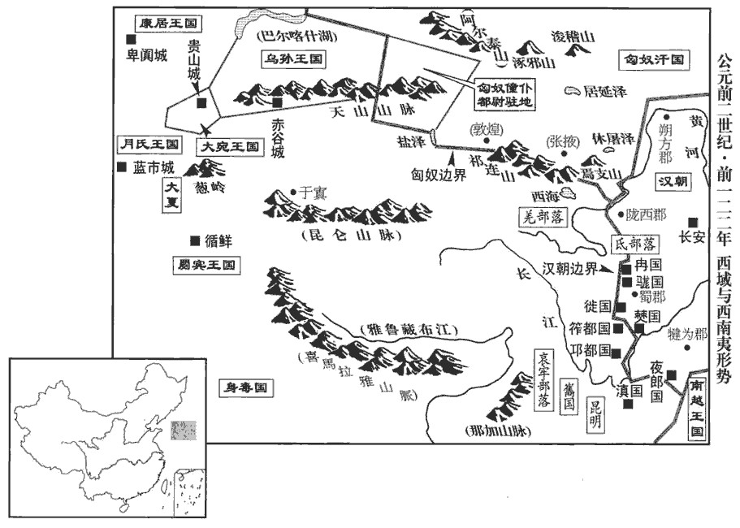
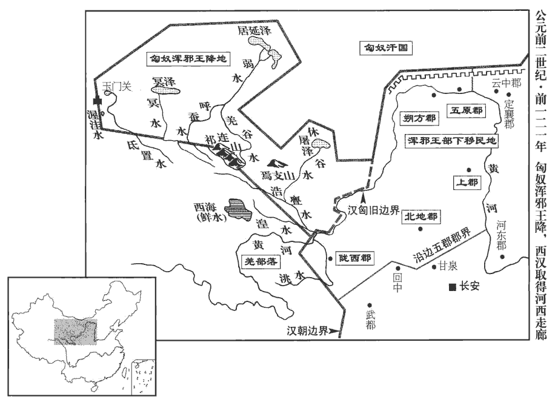
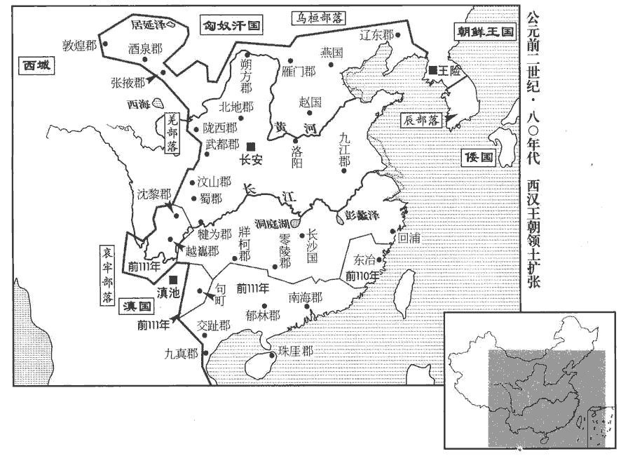
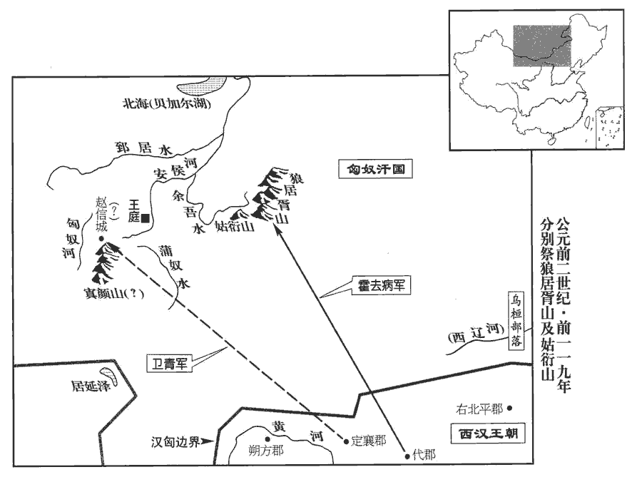

 漢紀十一起強圉大荒落（丁巳），盡玄黓yì閹茂（壬戌），凡六年。

# 世宗孝武皇帝中之上

## 元朔五年（丁巳，前一二四年）

1冬，十一月，乙丑‹五›，薛澤免。以公孫弘為丞相，封平津侯。勃海郡高成縣有平津鄉。宋白曰：滄州鹽山縣，勃海高成縣也，有平津鄉。考異曰：史記將相名臣表、漢書公卿百官表，弘為相皆在今年。建元以來侯者表、恩澤侯表皆云「元朔三年封侯」。按三年弘始為御史大夫。蓋誤書「五」為「三」，因置於三年耳。丞相封侯自弘始。漢初常以列侯為丞相，弘則既相而後封侯，故丞相封侯自弘始。

〖译文〗 [1]冬季，十一月乙丑（初五），汉武帝免除薛泽职务，任命公孙弘为丞相，封为平津侯。担任丞相而封侯，是从公孙弘开始的。

時上方興功業，弘於是開東閤以延賢人，師古曰：閤，小門也；東向開之，避當庭門而引客，別于掾yuàn史官屬也。與參謀議。每朝覲奏事，因言國家便宜，上亦使左右文學之臣與之論難。難，乃旦翻。弘嘗奏言：「十賊彍guō弩，張晏曰：彍，音郭。師古曰：引滿曰彍。百吏不敢前。請禁民毋得挾弓弩，便。」上下其議。下，遐嫁翻。侍中吾丘壽王對曰：「臣聞古者作五兵，師古曰：五兵，謂矛、戟、弓、劍、戈。吾，讀曰虞。非以相害，以禁暴討邪也。秦兼天下，銷甲兵，折鋒刃；其後民以耰yōu鉏chú、棰梃相撻tà擊，師古曰：耰，摩田之器也。棰，馬撾zhuā也。梃，大杖也。折，而設翻。耰，音憂。梃，大鼎翻。撻，音闥tà。犯法滋眾，盜賊不勝，師古曰：滋，益也。不勝，言不可勝也。卒以亂亡。卒，子恤翻。故聖王務教化而省禁防，知其不足恃也。禮曰：『男子生，桑弧、蓬矢以舉之，』明示有事也。記內則：國君世子生三日，射人以桑弧、蓬矢六射天地四方。註云：天地四方，男子之所有事也。大射之禮，自天子降及庶人，三代之道也。古者天子射豹侯，諸侯射熊侯，卿大夫射麋侯，士射鹿侯、豕侯。周官又以鄉射之禮詢眾庶。愚聞聖王合射以明教矣，未聞弓矢之為禁也。且所為禁者，為盜賊之以攻奪也；為盜之為，於偽翻。攻奪之罪死；然而不止者，大奸之於重誅，固不避也。臣恐邪人挾之而吏不能止，良民以自備而抵法禁，師古曰：抵，觸也。是擅賊威而奪民救也。竊以為大不便。」書奏，上以難弘，弘詘qū服焉。難，乃旦翻。詘，與屈同。

〖译文〗 当时汉武帝正在大规模建功立业，于是公孙弘开辟相府东门作为延揽人才的场所，与他们共同探讨国家大事。每当上朝奏事，便将于国家有益的见解奏闻朝廷，汉武帝也常常命身边的文学之臣与公孙弘进行辩论。公孙弘曾经上奏说：“十个强盗拉满了弓，能使上百名官吏不敢向前。请下令禁止老百姓携带弓箭，以利于地方治安。”汉武帝将此建议交朝臣讨论。侍中吾丘寿王表示反对，言道：“我听说古代人制造出五种兵器，并不是为了相互攻杀，而是用来制止暴力、诛讨邪恶。秦朝兼并天下，销毁兵甲，折断刀锋，后来老百姓用农具、棍棒等相互攻击，犯法之人日益增多，盗贼防不胜防，终因大乱而亡。因此，圣明的君主对百姓以教育感化为主，而减少防范和禁令，知道那是靠不住的。《礼记》上说：‘男孩诞生，用桑木制成的弓、蓬草杆制成的箭射天地四方。’以表明男子事业所在。大射之礼，上自天子，下到百姓都要遵守，这是夏、商、周三代的传统。我听说圣明的君主用射礼教化百姓，没听说过禁止携带弓箭的。况且禁止使用弓箭的原因，是为了防止盗贼用弓箭攻杀和劫掠。攻杀、劫掠是死罪，却不能禁绝，说明那些大奸大恶之徒对重刑并不退避。我恐怕坏人持弓箭害人而地方官吏不能禁止，平民百姓却会因用弓箭自卫而触犯法律，这是助长坏人气焰而剥夺百姓的自救手段。我认为这是很不妥当的。”奏章呈递上去，汉武帝以此诘问公孙弘，公孙弘无言答对。

弘性意忌，外寬內深；諸嘗與弘有隙，無近遠，雖陽與善，後竟報其過。董仲舒為人廉直，以弘為從諛，弘嫉之。膠西‹山東高密›王端驕恣，數犯法，端，景帝子，前三年受封。數，所角翻；下同。所殺傷二千石甚眾。弘乃薦仲舒為膠西相；仲舒以病免。汲黯常毀儒，面觸弘，弘欲誅之以事，以事致其罪而誅之。乃言上曰：「右內史界部中多貴臣、宗室，難治，非素重臣不能任，請徙黯為右內史。」右內史後為右扶風。治，直之翻。任，音壬。上從之。

〖译文〗 公孙弘生性好猜忌，外表宽厚而内里心机很深。凡是曾经与他不合的人，不论关系远近，虽然表面上装作友善，后来终究要予以报复。董仲舒为人清廉正直，认为公孙弘阿谀奉承，引起公孙弘的嫉恨。胶西王刘端骄横放纵，多次违犯法令，杀伤国中二千石官多人。于是公孙弘推荐董仲舒为胶西国相，董仲舒因病而得免。汲黯经常诋毁儒生，当面触犯公孙弘，公孙弘想找借口将其杀死，便向汉武帝建议：“右内史管界居住着很多显贵的大臣、皇室子弟，难于治理，不是平素有威望的大臣不能胜任，请让汲黯改任右内史。”汉武帝听从了他的建议。

2春，大旱。

〖译文〗 [2]春季，发生严重旱灾。

3匈奴右賢王數侵擾朔方‹內蒙杭锦旗北黄河南岸›。天子令車騎將軍青將三萬騎出高闕‹內蒙乌拉特后旗东南古长城口›，衛尉蘇建為遊擊將軍，左內史李沮為強弩將軍，沮jǔ，音俎zǔ。太僕公孫賀為騎將軍，代‹山西太原›相李蔡為輕車將軍，皆領屬車騎將軍，俱出朔方；大行李息、岸頭侯張次公為將軍，俱出右北平‹内蒙宁城西南›；凡十余萬人，擊匈奴。右賢王以為漢兵遠，不能至，飲酒，醉。衛青等兵出塞六七百里，夜至，圍右賢王。右賢王驚，夜逃，獨與壯騎數百馳，潰圍北去。得右賢裨王十餘人，師古曰：裨王，小王也，猶言裨將也。裨，頻移翻。眾男女萬五千餘人，畜數十百萬，師古曰：數十萬以至百萬。畜，許救翻。於是引兵而還。

〖译文〗 [3]匈奴右贤王多次率兵侵扰朔方郡。汉武帝任命车骑将军卫青率兵三万自高阙出塞，任命卫尉苏建为游击将军，左内史李沮为强弩将军，太仆公孙贺为骑将军，代相李蔡为轻车将军，他们都归车骑将军统属，一同率兵自朔方出塞；命大行李息、岸头侯张次公为将军，一同自右北平出塞，共调集了十几万人出击匈奴。匈奴右贤王认为汉军距自己路途遥远，不可能到达，经常饮酒而醉，毫不戒备。卫青等率兵出边塞六七百里，乘夜赶到，将右贤王大营团团包围。右贤王大惊，乘夜而逃，只率数百名精壮骑兵冲出包围圈向北逃奔。此战共俘获右贤王手下各部首领十余人，匈奴男女部众一万五千余人，牲畜近百万头，汉军于是班师回朝。

至塞，天子使使者持大將軍印，即軍中拜衛青為大將軍，諸將皆屬焉。夏，四月，乙未‹八›，復益封青八千七百戶，復，扶又翻。封青三子伉、不疑、登皆為列侯。師古曰：伉，音杭，又工郎翻。伉為宜春侯，不疑為陰安侯，登為發干侯。青固謝曰：師古曰：固，謂再三也。「臣幸得待罪行間，行，戶剛翻。賴陛下神靈，軍大捷，皆諸校尉力戰之功也。陛下幸已益封臣青；臣青子在襁褓中，未有勤勞，上列地封為三侯，「列」，漢書作「裂」。非臣待罪行間所以勸士力戰之意也。」天子曰：「我非忘諸校尉功也。」乃封護軍都尉公孫敖為合騎侯，晉灼曰：合騎侯，猶冠軍、從票之名也。余據功臣表，合騎侯食邑于渤海高成。都尉韓說為龍頟é侯，班志，龍頟，侯國，屬平原郡。頟，音洛。公孫賀為南窌jiào侯，窌，匹孝翻，又普孝翻。李蔡為樂安侯，「樂安」，功臣表作「安樂」，食邑於琅邪之昌縣。校尉李朔為涉軹侯，「涉軹」，班史衛青傳作「陟軹」，功臣表作「軹」，食邑于齊郡之西安。趙不虞為隨成侯，隨成侯，功臣表，食邑於千乘縣。公孫戎奴為從平侯，從平侯，食邑于東郡樂昌。李沮、李息及校尉豆如意班史「豆」作「竇」。皆賜爵關內侯。

〖译文〗 卫青率军回至边塞，汉武帝派使臣带着大将军印信来到，在军中只拜卫青为大将军，各路将领皆归卫青统领。到该年夏季四月乙未（初八），又加封卫青食邑八千七百户，并将他的三个儿子卫伉、卫不疑、卫登都封为列侯。卫青坚决辞谢，说道：“我有幸能够在军中效力，仰仗陛下的神灵，获得大胜，全都是诸位校尉奋力作战的功劳。陛下已增加了我的封邑，我的儿子还在襁褓之中，并无功劳，陛下却要划出土地封他们三人为侯，这就不是我效力军中，鼓励将士奋力战斗的本意了。”汉武帝说道：“我并没有忘记诸位校尉的功劳。”于是，封护军都尉公孙敖为合骑侯，都尉韩说为龙侯，公孙贺为南侯，李蔡为乐安侯，校尉李朔为涉轵侯，赵不虞为虽随成侯，公孙戎奴为从平侯，李沮、李息及校尉豆如意都被封为关内侯。

於是青尊寵，於群臣無二，公卿以下皆卑奉之，獨汲黯與亢禮，亢，音抗。人或說黯曰：「自天子欲群臣下大將軍，說，式芮翻。師古曰：下，戶嫁翻。大將軍尊重，君不可以不拜。」黯曰：「夫以大將軍有揖客，反不重邪！」師古曰：言能降貴以禮士，最為重也。大將軍聞，愈賢黯，數請問國家朝廷所疑，數，所角翻。遇黯加於平日。大將軍青雖貴，有時侍中，上踞廁而視之；如淳曰：廁，溷hùn也。孟康曰：廁，床邊側也。師古曰：如說是也。仲馮曰：廁，當從孟說。古者見大臣則御坐為起；然則踞廁者輕之也。丞相弘燕見，上或時不冠；至如汲黯見，見，賢遍翻。上不冠不見也。上嘗坐武帳中，應劭曰：武帳，織成帳為武士象也。孟康曰：今御武帳置兵，闌五兵於帳中也。師古曰：孟說是。韋昭曰：以武名之，示威。黯前奏事，上不冠，望見黯，避帳中，使人可其奏。其見敬禮如此。

〖译文〗 当时，汉武帝对卫青的尊崇宠信超过了任何一位朝廷大臣，三公、九卿及以下官员都对卫青卑身奉承，唯独汲黯用平等的礼节对待卫青。有人劝汲黯说：“皇上想让群臣全都居于大将军之下，大将军地位尊贵，您不可以不下拜。”汲黯说：“以大将军身份而有长揖不拜的平辈客人，大将军反而不尊贵了吗！”卫青得知，越发觉得汲黯贤明，多次向汲黯请教国家和朝廷的疑难大事，对待他比平日更为尊重。卫青虽然地位尊贵，但有时入宫，汉武帝就坐在床边接见他；丞相公孙弘大汉武帝空闲时谒见，没武帝有时不戴帽子；至于汲黯谒见时，汉武帝没戴上帽子就不接见。有一次，汉武帝正坐在陈列兵器的帐中，汲黯前来奏事，汉武帝当时没戴帽子，远远望见汲黯，急忙躲入后帐，派人传话，批准汲黯所奏之事。汲黯受到的尊重和礼敬就是这样的。

4夏，六月，詔曰：「蓋聞導民以禮，風之以樂。師古曰：風，教也。詩序曰：上以風化下。今禮壞、樂崩，朕甚閔焉。其令禮官勸學興禮以為天下先！」於是丞相弘等奏：「請為博士官置弟子五十人，復其身；為，於偽翻。復，方目翻。第其高下，以補郎中文學掌故；兒寬以射策為掌故，功次補廷尉文學卒史。蘇林曰：卒史秩六百石。臣瓚曰：漢註，卒史秩百石。師古曰：瓚說是。余謂掌故，掌故府之典籍者也。以兒寬自掌故補卒史推之，則掌故之品秩從可知也。即有秀才異等，輒以名聞；秀才異等，謂有俊秀之才異于常等者。其不事學若下材，輒罷之。又，吏通一藝以上者，請皆選擇以補右職。」吏，謂百石已上及比百石以下也。右職，謂中二千石、二千石之卒史也。上從之。自此公卿、大夫、士、吏彬彬多文學之士矣。

〖译文〗 [4]夏季，六月，汉武帝颁布诏书说：“据说，对百姓应以礼引导，用乐教化。现在礼已败坏，乐已丧失，朕非常忧虑。命令负责礼教的官员劝导百姓学习，振兴礼教，为天下树立榜样！”于是，丞相公孙弘等上奏说：“请为博士官设置弟子五十人，免除他们的赋税、徭役，排列品学的高低，分别派充郎中、文学、掌故等官。如有异常优秀者，则提名推荐；对那些不学无术的庸材，则予以罢黜。再有，凡低级官员中有一种以上专长的，请全部选拔出来，采汉武帝纳了公孙弘的建议，从此，公卿、大夫、士以及一般官吏，有学问的人越来越多。

5秋，匈奴萬騎入代‹河北蔚縣›，殺都尉朱英，略千餘人。

〖译文〗 [5]秋季，一万余名匈奴骑兵侵入代郡，杀死都尉朱英，掳掠百姓一千余人。

6初，淮南王安，好讀書屬文，喜立名譽，好，呼到翻。屬，之欲翻。喜，許記翻。招致賓客方術之士數千人。其群臣、賓客，多江、淮間輕薄士，常以厲王遷死感激安。遷死見十四卷文帝前六年。建元六年，彗星見，彗，祥歲翻，又徐醉翻，又旋芮翻。見，賢遍翻。或說王曰：「先吳軍時，彗星出，長數尺，然尚流血千里。說，式芮翻。先，悉薦翻。長，直亮翻。謂吳王濞起兵時也。今彗星竟天，天下兵當大起。」王心以為然，乃益治攻戰具，積金錢。治，直之翻；下同。

〖译文〗 [6]当初，淮南王刘安喜欢读书做文章，又爱沽名钓誉，罗致四方宾客和各种技能之士数千人。他的臣僚、宾客，大多是江、淮一带的轻薄之徒，常常用厉王刘长在流放途中死于非命一事刺激刘安。建元六年时，天空出现彗星，有人向刘安游说道：“以前，吴王刘濞起兵时，彗星出现，长仅数尺，尚且流血千里。如今彗星贯穿天际，恐怕天下将有大规模战事发生。”刘安认为说得有道理，就加紧制造进攻性的武器，积好金钱。

郎中雷被獲罪于太子遷，雷被善用劍，與太子戲，誤中太子，故得罪。師古曰：被，皮義翻。姓譜：雷，古方雷氏後。時有詔，欲從軍者輒詣長安，被即願奮擊匈奴。太子惡被于王，惡，毀惡也，如字。斥免之，欲以禁後。師古曰：令後人更不敢效之也。是歲，被亡之長安，上書自明。事下廷尉治，下，遐嫁翻。蹤跡連王，公卿請逮捕治王。太子遷謀令人衣衛士衣，持戟居王旁，漢使有非是者，即刺殺之，人衣，於既翻。刺，七亦翻。因發兵反。天子使中尉宏即訊王，師古曰：即，就也，就問也。王視中尉顏色和，遂不發。公卿奏：「安壅閼奮擊匈奴者，格明詔，當棄市。」閼，音遏。師古曰：格，音閣，謂閣止不行之。詔削二縣。既而安自傷曰：「吾行仁義，反見削地。」恥之，於是為反謀益甚。

〖译文〗 朗中雷被得罪了淮南王的太子刘迁，此时，汉武帝正颁下诏书，让有志参军报国的人到长安来应征，于是雷被表示愿意参军去打匈奴。但因刘迁在淮南王面前说了雷被的坏话，所以刘安将雷被斥责了一顿，并将其免职，以防止其他人效法。就在这一年，雷被逃到长安，上书朝廷说明自己的冤情。汉武帝将此事交给廷尉处理，因牵连到淮南王，公卿请求将刘安逮捕治罪。太子刘迁定计，让人身穿卫士服装，手持长戟站在淮南王刘安身边，如果朝廷派来的使者欲将淮南王治罪，则就立即将其刺杀，然后举兵反叛。汉武帝派中尉段宏到淮南王处询问有关情况，淮南王见段宏神色平和，于是没有发动。公卿大臣奏称：“刘安拒绝有志奋击匈奴的壮士的请求，是犯了阴碍圣旨的大罪，应当众斩首。”汉武帝下诏削减淮南国的两个县。事后，刘安自怨自艾说：“我做仁义之事，反而被削减封地。”他以此为耻，于是谋反的准备越发加紧了。

安與衡山‹府邾县，湖北黄州›王賜相責望，禮節間不相能。賜，即安之弟也，孝文十六年與安同受封。師古曰：兄弟相責，故有嫌。衡山王聞淮南王有反謀，恐為所并，亦結賓客為反具，以為淮南已西，欲發兵定江、淮之間而有之。衡山王后徐來譖太子爽于王，欲廢之而立其弟孝。王囚太子而佩孝以王印，令招致賓客。賓客來者微知淮南、衡山有逆計，日夜從容勸之。從，千容翻。王乃使孝客江都‹府广陵，江蘇揚州›人枚赫、陳喜作輣péng車、鍛矢，輣，薄庚翻，兵車也，樓車也。鍛，都玩翻，冶鐵也。刻天子璽、將相軍吏印。秋，衡山王當入朝，過淮南；淮南王乃昆弟語，師古曰：為相親愛之言。除前隙，約束反具。師古曰：共契約為反具。衡山王即上書謝病，上賜書不朝。

〖译文〗 刘安与衡山王刘赐在礼节方面相互指责，不能相容。刘赐听说刘安有反叛朝廷的打算，害怕被刘安吞并，便也结交宾客，置备武器，打算在淮南王西进以后，要发兵攻下长江、淮河之间的地区，并占有他们。衡山王王后徐来在刘赐而前诋毁太子刘爽，企图废掉刘爽，改立刘爽之弟刘孝为太子。刘赐囚禁了刘爽，将衡山王印信交给刘孝，命刘孝延揽宾客。前来投效的宾客们隐约了解到刘安，刘赐的谋反计划，便日夜慢慢地劝刘赐起事。于是，刘赐命刘孝门下宾客江都人枚赫、陈喜造战车、锻箭矢，雕刻天子印玺和文武官员的印信。这年秋季，刘赐照例应入朝谒见皇帝，途经淮南国，刘安与他用亲兄弟的语言交谈，消除了已往的矛盾，约定共同反叛朝廷。于是刘赐上书朝廷，借口有病，不肯入朝。汉武帝赐书信给他，允许他不来朝见。

## 元朔六年（戊午，前一二三年）

1春，二月，大將軍青出定襄‹內蒙和林格爾›，擊匈奴；杜佑曰：漢定襄郡在今馬邑北三百餘里，後魏置雲中郡。以合騎侯公孫敖為中將軍，太僕公孫賀為左將軍，翕侯趙信為前將軍，功臣表，翕，侯國，在魏郡內黃界。衛尉蘇建為右將軍，郎中令李廣為後將軍，左內史李沮為強弩將軍，師古曰：沮，音俎。咸屬大將軍；斬首數千級而還，賢曰：秦法，斬首一，賜爵一級，故因謂斬首為級。休士馬於定襄‹內蒙和林格爾›、雲中‹內蒙托克托›、雁門‹山西右玉›。

〖译文〗 [1]春季，二月，大将军卫青率兵自定襄郡出塞北击匈奴，汉武帝命合骑侯公孙敖为中将军、太仆公孙贺为左将军、翕侯赵信为前将军、卫尉苏建为右将军、郎中令李广为后将军、左内史李沮为强弩将军，全都归大将军卫青统领，斩杀匈奴数千人后班师，在定襄、云中、雁门一带休养兵马。

2赦天下。

〖译文〗 [2]大赦天下。

3夏，四月，衛青復將六將軍出定襄，擊匈奴，復，扶又翻。斬首虜萬餘人。右將軍建、前將軍信并軍三千餘騎獨逢單于兵，與戰一日餘，漢兵且盡。信故胡小王，降漢，漢封為翕侯，信，元光四年十月壬午受封。及敗，匈奴誘之，遂將其餘騎可八百降匈奴。誘，音酉。將，即亮翻。降，戶江翻。建盡亡其軍，脫身亡，自歸大將軍。

〖译文〗 [3]夏季，四月，卫青再次率领公孙敖等六位将军自定襄出击匈奴，斩杀及俘虏匈奴一万余人。右将军苏建与前将军赵信合并了部队，共有骑兵三千余人，单独与匈奴单于亲自统帅的部队相遇，经过一天多的交战，汉军伤亡殆尽。赵信本是胡人的一位部落首领，投降汉朝后被封为翕侯。及至此次兵败，匈奴引诱他投降，便率领本部所余骑兵约八百人投降了匈奴。苏建全军覆没，脱身逃走独自返回卫青大营。

議郎周霸曰：班表：議郎屬郎中令，秩比六百石。「自大將軍出，未嘗斬裨將。今建棄軍，可斬，以明將軍之威。」軍正閎、長史安曰：「不然。凡軍行置軍正，掌舉軍法以正軍中。軍法曰：正無屬將軍，將軍有罪以聞。劉昭志：大將軍長史秩千石。如淳曰：律：都軍官長史一人。兵法：『小敵之堅，大敵之禽也。』孫子之言，言大小不敵，小雖堅于戰，終必為大所禽。今建以數千當單于數萬，力戰一日餘，士盡，不敢有二心，自歸，而斬之，是示後無反意也，不當斬。」大將軍曰：「青幸得以肺腑待罪行間，不患無威，而霸說我以明威，甚失臣意。言失為臣之意也。行，戶剛翻。說，式芮翻。且使臣職雖當斬將，將，即亮翻。以臣之尊寵而不敢【章：十四行本「敢」下有「自」字；乙十一行本同。】擅誅於境外，而具歸天子，天子自裁之，于以見為人臣不敢專權，不亦可乎？」軍吏皆曰：「善！」遂囚建詣行在所。蔡邕獨斷曰：天子以四海為家，故謂所居為行在所。

〖译文〗 议郎周霸言道：“自大将军出师以来，还从未斩过一位部将。如今苏建丢充了本部人马，应将其处死，以示大将军的权威。”军正闳、长史安说：“不对。兵法上说：‘小部队的战斗力再强，也会被大部队击败。’此次苏建以数千人马抵挡匈奴单于好几万人，奋战了一天多，将士伤亡殆尽，而苏建不敢有二心，独自返回。将其斩首，就等于告诉以后的将领战败不能返回，所以不应杀苏建。”卫青说：“我有幸以皇上近亲身分统领大军，不怕没有权威，周霸劝我杀苏建来显示权威，是很不符合为人臣的本分的，况且，即使我有权处决将领，作为大臣，地位尊贵，又深受皇上的宠信，却也不敢擅自大诛杀大将于国境之外。而将此事全部交给皇上。由皇上亲自裁决，以显示做人臣的不敢专权，不也很好吗？”部下军官一致说“好！”于是将苏建囚禁起来，送到汉武帝所在的地方。

初，平陽‹山西臨汾›縣吏霍仲孺給事平陽侯家，與青姊衛少兒私通，生霍去病。霍姓，以國為氏。去病年十八，為侍中，善騎射，再從大將軍擊匈奴，為票姚校尉，服虔曰：票姚，音飄搖。師古曰：票，匹妙翻。姚，羊召翻。票姚，勁疾之貌。荀悅漢紀作「票鷂」字。去病後為票騎將軍，尚取票姚之字耳。今讀者音飄搖，則不當其義也。與輕騎勇八百，直棄大軍數百里赴利，斬捕首虜過當。師古曰：計其所將人數，則捕斬首為多，過於所當。一曰：漢軍失亡者少，而殺獲匈奴數多，故曰過當也。於是天子曰；「票姚校尉去病，斬首虜二千餘級，得相國、當戶，斬單于大父行藉若侯產，生捕季父羅姑，匈奴左、右大當戶，在左、右大都尉之下，左、右骨都侯之上。大父行，單于祖行也。張晏曰：藉若，胡侯也，產，其名也。師古曰：此人，單于祖父之行也。季父，亦單于季父也，羅姑，其名。行，戶浪翻。比再冠軍，師古曰：比，頻也。比，毗至翻。冠，古玩翻。封去病為冠軍侯。帝以去病功冠諸軍，以南陽穰縣盧陽鄉、宛縣臨駣táo聚為冠軍侯國。駣，音桃。上谷‹河北懷來›太守郝賢四從大將軍，捕斬首虜二千余級，封賢為眾利侯。」姓譜：殷帝乙有子期，封太原郝鄉，後因氏焉。功臣表，眾利侯食邑於琅邪郡姑幕縣。

〖译文〗 当初，平阳县小吏霍仲孺在平阳侯曹寿家做事，与卫青的姐姐卫少私通，生下霍去病。霍去病十八岁时当了侍中，精通骑马、射箭之术。在第二次随卫青出击匈奴时，霍去病身为票姚校尉，率领八百名轻骑勇士，一直把大军抛弃到数百里之后去寻找战机，其斩杀和俘获的匈奴人数超过己方的损失。于是，汉武帝说：“票姚校尉霍去病斩杀及俘获匈奴二千余人，生擒匈奴的相国、当户，杀死匈奴单于祖父辈的藉若侯栾提产，活捉单于叔父栾提罗姑，战功屡次冠于全军，封霍去病为冠军侯。上谷太守郝贤四次跟随大将军出征，其斩杀、擒获匈奴二千余人，封郝贤为众利侯。”

是歲，失兩將軍，亡翕侯，軍功不多，故大將軍不益封，止賜千金。右將軍建至，天子不誅，贖為庶人。

〖译文〗 这一年，失去了两位将军，翕侯赵信投降了匈奴，军功也不多，所以汉武帝没有增加卫青的食邑，只赏给他千金。右将军苏建被解到长安，汉武帝没有诛杀他。苏建在赎身后成为平民。

單于既得翕侯，以為自次王，師古曰：自次者，尊重次於單于。用其姊妻之，妻，七細翻。與謀漢。信教單于益北絕幕，師古曰：直度曰絕，幕，與漠同。陰山以北皆大漠，不生草木。以誘罷漢兵，徼極而取之，師古曰：罷，讀曰疲。徼，要也。誘令疲，徼其困極，然後取之。徼，一遙翻。無近塞。單于從其計。近，其靳翻。

〖译文〗 匈奴单于得到赵信后，封其为自次王，又将自己的姐姐嫁给赵信为妻，与他商讨对付汉朝的方略。赵信建议单于进一步向北移动，穿过沙漠，以引诱汉军，使汉军疲劳，待到汉军极度疲劳时，再乘机攻取，不必接近汉朝边塞，单于听从了赵信的计谋。

是時，漢比歲發十余萬眾擊胡，比，毗至翻。斬捕首虜之士受賜黃金二十余萬斤，而漢軍士馬死者十余萬，兵甲轉漕之費不與焉。與，讀曰預。於是大司農經用竭，不足以奉戰士。六月，詔令民得買爵及贖禁錮，免臧罪。置賞官，名曰武功爵，級十七萬，凡直三十余萬金。諸買武功爵至千夫者，得先除為吏。禁錮，重系也。臣瓚曰：茂陵中書有武功爵：一級曰造士，二級曰閑輿衛，三級曰良士，四級曰元戎士，五級曰官首，六級曰秉鐸，七級曰千夫，八級曰樂卿，九級曰執戎，十級曰政戾庶長，十一級曰軍衛：此武帝所制，以寵軍功。師古曰：下云「級十七萬，凡直三十余萬金」;今瓚引茂陵中書，說之不盡也。貢父曰：直三十余萬金，其價之差殊不可詳也。或說：「七」當作「一」，與茂陵書合矣。余謂賣爵當級，級稍增其價，豈可例云級十七萬！若每級十七萬，比至三十余萬金，當一萬七千餘級，又非也。然則誤衍此「萬」字。蓋武功爵，其級十七，參考顏、劉註，皆因求其說而不得，遂疑茂陵書所謂十一級為不足，又疑史之正文「萬」字為衍，皆未為允也。蓋級十七萬者，賣爵一級為錢十七萬，至二級則三十四萬矣，自此以上，烏得不每級而增乎！王莽時黃金一斤直錢萬，以此推之，則三十萬金為錢三十餘萬萬矣，此當時鬻yù武功爵所直之數也。夫民入錢買爵，隨其錢之多少為爵級之高下，爵之高下有定直，而民錢之多少無定數，若比而同之，其失彌遠矣。史記作「直八十萬金」，索隱曰：一金萬錢，初一級十七萬，自此以上每級加二萬，至十七級合成三十四萬也。吏道雜而多端，官職耗廢矣。師古曰：耗，亂也，莫報翻。

〖译文〗 当时，汉朝连年征调十几万人出击匈奴，曾斩杀或俘获敌人的将士，被赏赐黄金二十余万斤，而汉军兵士马匹死亡也达十几万，还不算兵器衣甲和往前方运送粮草的费用。因此，大司农府库枯竭，无法供应军需。六月，汉武帝颁下诏书，允许百姓出钱买爵和以钱免除禁锢，也可以交钱免除盗财贪赃之罪。又设“赏官”，称为“武功爵”，第一级为铜钱十七万枚，以上递增，共值黄金三十余万斤。凡购买武功爵至“千夫”的人，可以优先被任命为官吏。从此，作官的途径变得既杂且多，官职就混乱败坏了。

## 元狩元年（己未，前一二二年）

1冬，十月，上‹刘彻，时年三十五›行幸雍‹陝西鳳翔›，祠五畤，雍，於用翻。畤，音止。獲獸，一角而足有五蹄。有司言：「陛下肅祗zhī郊祀，上帝報享，錫一角獸，蓋麟云。」麟，麋身，牛尾，馬足，五色，圜蹄，一角，角端有肉，音中鐘呂，行中規矩，遊必擇地，詳而後處，不履生蟲，不踐生草，不群居，不侶行，不入陷穽，不罹羅網，王者至仁則出。今并州界有麟，大小如鹿，非瑞應麟也。京房易傳曰：麟，麕jūn身，牛尾，馬蹄，有五采，腹下黃，高丈二。爾雅：麟，麕身，牛尾，一角。蓋麟似麕，圓頂一角。曰「蓋」云者，意其為麟而未知其果為麟也。於是以慶【章：十四行本「慶」作「薦」；乙十一行本同。】五畤，畤加一牛，以燎。畤，音止。久之，有司又言：「元宜以天瑞命，不宜以一二數，一元曰建，二元以長星曰光，今元以郊得一角獸曰狩云」。於是濟北‹山東長清›王濟北王勃，淮南厲王子，孝文十六年，封衡山王，孝景四年，徙封濟北；今王，勃子成王胡也。濟北王，都盧，後天漢四年，國除，入漢為泰山郡。濟，子禮翻。以為天子且封禪，上書獻泰山及其旁邑；天子以他縣償之。

〖译文〗 [1]冬季，十月，汉武帝巡幸至雍，祭祀于王，捉到一头长有一只角、五个蹄子的怪兽，主管官员奏道：“陛下祭祀虔诚，上帝作为回报，赐陛下独角之兽，这大概就是麒麟。”于是将独角兽献于五祭坛，每个祭坛加上一头牛，一齐烧烤。过了一段时间，主管官员又奏道：“帝王的年号应用上天所降的祥瑞定名，而不宜使用一、二等数目字，陛下第一个年号称‘建’，第二个年号因长星出现而称‘光’，此次郊祀得到一头独角兽，所以应称‘狩’。”当时，济北王刘胡认为皇上将要前往泰山封禅，祭祀天地，便上书朝廷，表示愿献出泰山及其周围城邑。汉武帝将别的县划给他作为补偿。

2淮南‹安徽壽縣›王安與賓客左吳等日夜為反謀，姓譜：齊之公族有左、右公子，後因氏焉。余按衛亦有左、右公子，姓譜之說非是。魯有左丘明。按輿地圖，蘇林曰：輿，猶盡載之意。索隱曰：志林云：輿地圖，漢家所畫，非出遠也。部署兵所從入。諸使者道長安來，為妄言，言「上無男，漢不治」，即喜；即言「漢廷治，有男」，王怒，以為妄言，非也。治，直吏翻。

〖译文〗 [2]淮南王刘安与其门客左吴等日夜加紧谋反准备，察看地图，部署进兵的路线。刘安派往朝廷的使者们从长安回来，谎称说“皇上没有儿子，且朝政腐败”，他就高兴；如果说“汉廷政治清明，皇上有儿子”，他就生气，认为是胡言。

王召中郎伍被被，皮義翻。姓譜，伍姓，出於楚伍舉。與謀反事，被曰：「王安得此亡國之言乎？臣見宮中生荊棘，露霑衣也！」王怒，系伍被父母，囚之。三月，復召問之，復，扶又翻。被曰：「昔秦為無道，窮奢極虐，百姓思亂者十家而六七。高皇帝起于行陳之中，行，戶剛翻。陳，讀曰陣。立為天子，此所謂蹈瑕候間，間，古莧翻。因秦之亡而動者也。今大王見高皇帝得天下之易也，易，以豉翻。獨不觀近世之吳、楚乎！事見十五卷景帝三年。夫吳王王四郡，四郡：東陽郡、鄣郡、吳郡、豫章郡。王王，下於況翻。國富民眾，計定謀成，舉兵而西；然破于大梁‹河南商丘›，謂為梁孝王所破也。奔走而東，身死祀絕者何？誠逆天道而不知時也。方今大王之兵，眾不能十分吳、楚之一，天下安寧，萬倍吳、楚之時，大王不從臣之計，今見大王棄千乘之君，賜絕命之書，為群臣先死於東宮也。」如淳曰：東宮，淮南王所居也。王涕泣而起。

〖译文〗 刘安召来中郎伍被，与他商议谋反之事，伍被说道：“大王您怎么能有这种亡国的言论呢？我好像已经看到王宫中生满荆棘，露水打湿人衣服的凄惨景象了！”刘安大怒，将伍被的父母逮捕，囚禁了三个月。刘安又将伍被召来询问，伍被说：“当初秦朝无道，极为奢侈暴虐，十分之六七的老百姓都希望天下大乱。高皇帝在行伍中崛起　，最终成为天子，这是因为利用对方的缺点、把握时机，趁秦朝土崩瓦解的机会举兴大业。如今大　王见到高皇帝得天下容易，却单单不看不久前‘七国之乱’的吴、楚吗！吴王刘濞统辖着四个郡然而为什么大梁一战失败，向东逃亡，本人身死，祭祀灭绝？是因为他逆天行事，不知时势。现在，大王的兵力还不足　吴、楚的十分之一，而天下的形势却比吴、楚兴兵时安定一万倍。大王如不听从我的劝告，马上就会看到您丢掉千乘之国的王位，接到赐死的命令，先于群臣死在东宫的惨景。”刘安听了流着眼泪站了起来。

王有孽niè子不害，最長，庶生曰孽。長，知兩翻。王弗愛，王后、太子皆不以為子、兄數。言后不以為子，太子不以為兄。數，秩數也。不害有子建，材高有氣，常怨望太子，陰使人告太子謀殺漢中尉事，事見上，元朔五年。下廷尉治。下，遐嫁翻。

〖译文〗 刘安有一个庶出的儿子名叫刘不害，年龄最大。，刘安不喜欢他，王后不把他当儿子看待，太子刘迁也不将他视为兄长。刘不害有一个儿子叫刘建，才高而气盛，经常对刘迁心怀不满，暗中派人告发刘迁曾企图刺杀朝廷中尉，汉武帝将此事交给廷尉处理。

王患之，欲發，復問伍被曰：復，扶又翻。「公以為吳興兵，是邪，非邪？」被曰：「非也。臣聞吳王悔之甚，願王無為吳王之所悔。」王曰：「吳何知反！漢將一日過成皋‹河南荥阳西北汜水镇›者四十餘人；今我絕成皋之口，據三川‹河南洛陽一带›之險，漢河南，秦三川郡也，其地當伊、洛、河三川之會。招山‹崤山›東之兵，舉事如此，左吳、趙賢、朱驕如皆以為什事九成，公獨以為有禍無福，何也？必如公言，不可徼幸邪？」師古曰：徼，要也。幸，非妄之福也。徼，工堯反。被曰：「必不得已，被有愚計。當今諸侯無異心，百姓無怨氣，可偽為丞相、御史請書，言偽為丞相、御史奏請于天子之書。徙郡國豪傑高貲于朔方‹內蒙杭锦旗北黄河南岸›，益發甲卒，急其會日；又偽為詔獄書，漢時左右都司空、上林、中都官皆有詔獄，蓋奉詔以鞠囚，因以為名。逮諸侯太子、幸臣；逮，追對獄也。如此，則民怨，諸侯懼，即使辯士隨而說之，說，式芮翻；下同。儻可徼幸什得一乎！」王曰：「此可也。雖然，吾以為不至若此。」言不須為此也。

〖译文〗 刘安很害怕，想要举兵谋反，又一次和伍被商量，说道：“先生认为当初吴王兴兵造反，是对呢，还是不对呢？”伍被道：“不对。我听说吴王后来非常后悔，希望大王不要像吴王那样后悔。”刘安说道：“吴王哪里懂得什么叫造反！当初朝廷的将领一天中有四十余人经过成皋。如今我截断成皋通道，占据三川的险要之地，再征召崤山以东的兵马，在这样的情况下举事，左吴、赵贤、朱骄如等都认为可以有九成把握，只有您认为是有祸无福，这是为什么呢？一定会像你说的那样，不可能侥幸成功吗？”伍被回答说：“如果大王一定要干的话，我有一计。当今各封国国君对朝廷都没有二心，老百姓也没有怨气。大王可以伪造丞相、御史的奏章，说是要请求皇上将各郡、国的豪杰之士和殷实富户迁徙到朔方郡，大量征发士兵，使集合期限紧迫。再伪造诏狱之书，声言要逮捕各封国的太子和宠臣。如此一来，就会百姓怨恨，诸侯恐惧，再派遣能言善道之人接着到各地游说，或许可以侥幸有十分之一的希望吧！”刘安道：“这是可以的。不过我觉得用不着这么麻烦。”

於是王乃作皇帝璽，丞相、御史大夫、將軍、軍吏、中二千石及旁近郡太守、都尉印，漢使節。使，疏吏翻。欲使人偽得罪而西，言使人詐為得罪而逃去，西如京師。事大將軍，一日發兵，一日，猶言一旦。即刺殺大將軍。刺，七亦翻。且曰：「漢廷大臣，獨汲黯好直諫，好，呼到翻。守節死義，難惑以非，至如說丞相弘等，如發蒙振落耳！」發蒙，謂物所蒙覆，發而去之；振落，謂木葉將落，振而墜之；皆言其易。說，式芮翻。

〖译文〗 于是，刘安伪造了皇帝印玺和丞相、御史大夫、将军、军吏、中二千石及周围各郡太守、都尉的印信，并伪造了朝廷使者的信节。又准备派人伪装在淮南国犯罪而西逃长安，投到大将军卫青门下，一旦发兵，立即将卫青刺死。刘安并且说：“朝廷大臣中，只有汲黯喜欢犯颜直谏，能够严守臣节，为忠义而死，难以迷惑，至于游说丞相公孙弘之流，就如同去掉物件上的覆盖物或摇掉树枝上的枯叶一般容易。”

王欲發國中兵，恐其相、二千石不聽，王乃與伍被謀，先殺相、二千石。又欲令人衣求盜衣，求盜，卒也，掌逐捕盜賊。漢書本紀，高帝時為亭長，令求盜之薛，治竹皮冠。人衣，於既翻。持羽檄從東方來，呼曰：「南越兵入界！」呼，火故翻。欲因以發兵。

〖译文〗 刘安打算调动本国的军队，怕相和二千石官员不肯依从，便与伍被商议，计划先将丞相和二千石官员杀死，同时打算派人身穿治安人员服装，手持告急文书从东边奔来，高喊：“南越国的军队攻入我国边界了！”要以此为借口起兵。

會廷尉逮捕淮南太子，淮南王聞之，與太子謀，召相、二千石，欲殺而發兵。召相，相至，內史、中尉皆不至。王念，獨殺相，無益也，即罷相。罷，遣出去也。相，息亮翻。王猶豫，計未決。太子即自剄，不殊。晉灼曰：不殊，不死也。師古曰：言雖自剄而身首不能絕也。剄，古頂翻；下同。

〖译文〗 就在此时，廷尉前来逮捕淮南国太子刘迁。刘安听到消息后，与刘迁密谋，召相和二千石官员前来，企图杀死他们，兴兵造反。召相，相一人应召来刘安犹豫，拿不定主意，刘迁便刎颈自杀，但没有死成。

伍被自詣吏，告與淮南王謀反蹤跡如此。吏因捕太子、王后，圍王宮，盡求捕王所與謀反賓客在國中者，索得反具，以【章：十四行本「以」下有「聞」字；乙十一行本同；孔本同；退齋校同。】上。下公卿治其黨與，索，山客翻，求也，搜也。以上，時掌翻。下公，戶嫁翻。「以上」句斷。使宗正以符節治王。未至；【章：十四行本「至」下有「十一月」三字；乙十一行本同；張校作「十二月」，云「無註本作十一月」。】淮南王安自剄。殺王后荼、太子遷，諸所與謀反者皆族。

〖译文〗 伍被自己前往廷尉那里，告发与刘安图谋反叛的情节。廷尉于是派人逮捕了淮南国太子和王后，并且包围王宫，悉数搜捕在淮南国内与淮安王一道谋反的宾客，取得谋反证据后，奏闻朝廷。汉武帝命公卿处治刘安党羽，派宗正手持皇帝符节前往淮南国处治刘安。没等宗正来到，刘安便自刎而死。于是，将淮南王后荼、主子刘迁处死，所有参与谋反计划的人一律灭族。

天子以伍被雅辭多引漢之美，欲勿誅。雅，素也。雅辭，素來言語也。廷尉湯曰：「被首為王畫反計，為，於偽翻。罪不可赦。」乃誅被。侍中莊助素與淮南王相結交，私論議，王厚賂遺助；遺，于季翻。上薄其罪，欲勿誅。張湯爭，以為：「助出入禁門，腹心之臣，而外與諸侯交私如此；不誅，後不可治。」助竟棄市。

〖译文〗 汉武帝因为伍被平常的言论中曾多次赞美朝廷，所以想不杀他。廷尉张汤说：“伍被首先为淮南王作谋反计划，其罪不能赦免。”于是伍被被杀。侍中庄助平时与淮南王关系密切，二人曾私下议论事情，淮南王还曾送给庄助许多钱物。汉武帝认为这是小罪，想不杀他。但张汤坚持要杀，认为：“庄助出入宫廷是皇上心腹之臣，却外与诸侯如此私交，如不杀庄助，今后类似的事情就不能禁止。”庄助终于被当众斩首。

衡山‹府邾县，湖北黄州›王上書，請廢太子爽，立其弟孝為太子。爽聞，即遣所善白嬴之長安上書，言「孝作輣車、鍛矢，與王御者姦」，欲以敗孝。敗，補邁翻。會有司捕所與淮南王謀反者，得陳喜于衡山王子孝家，吏劾孝首匿喜。師古曰：為頭首而藏匿之。孝聞「律：先自告，除其罪」，即先自告所與謀反者枚赫、陳喜等。公卿請逮捕衡山王治之，王自剄死。王后徐來、太子爽及孝皆棄市，所與謀反者皆族。

〖译文〗 衡山王刘赐上奏朝廷，请求废掉太子刘爽，立刘爽之弟刘孝为太子。刘爽听到消息后，立即派他的亲信白嬴到长安上书朝廷，揭发“刘孝私自造兵车、锻箭矢，并与父亲的姬妾通奸”，想除掉刘孝。正好主管官员在逮捕参与淮南王谋反计划的人时，在刘孝家中抓到陈喜，于是参劾刘孝窝藏陈喜。刘孝听说法律规定“先行自首的，可以免除罪责”，便自己先向朝廷告发了共同的密谋反叛枚赫、陈喜等人。公卿大臣奏请汉武帝逮捕衡山王治罪，衡山王自刎而死。王后徐来、太子刘爽及刘孝都被当众斩首，参与谋反计划的人一律灭族。

凡淮南、衡山二獄，所連引列侯、二千石、豪傑等，死者數萬人。

〖译文〗 总计淮南王和衡山王谋反两案，因受牵连而被处死的列侯、二千石官员及地方豪侠人物达数万人。

3夏，四月，赦天下。

〖译文〗 [3]夏季，四月，大赦天下。

4丁卯‹九›，立皇子據為太子，年七歲。

〖译文〗 [4]丁卯（二十一日），汉武帝立皇子刘据为太子，时年七岁。

5五月，乙巳晦‹三十›，日有食之。

〖译文〗 [5]五月乙巳晦，（三十日），出现日食。

 

6匈奴‹王庭设蒙古国哈尔和林市›萬人入上谷‹河北懷來›，殺數百人。

〖译文〗 [6]匈奴军队一万人侵入上谷地区，杀死数百人。

7初，張騫自月氏‹都蓝市，阿富汗北部瓦齐拉巴德市›還，事見上卷元朔四年。氏，音支。具為天子言西域諸國風俗：為，於偽翻。「大宛在漢正西，可萬里。其俗土著，耕田；土著，謂有城郭常居，不隨水草移徙也。宛，於元翻。著，直略翻。多善馬，馬汗血；孟康曰：大宛國有高山，其上有馬，不可得，因取五色母馬置其下，與集，生駒皆汗血，因號天馬子云。一說，汗血者，汗從肩膊出如血，號能一日千里。有城郭、室屋，如中國。其東北則烏孫‹都赤谷城，伊塞克湖东南›，東則于窴‹都西城，新疆和田›。于窴國在南山下，居西城。窴，徒賢翻，又徒見翻。于窴之西，則水皆西流注西海，水經註：崑崙山西有大水名新頭河，度蔥嶺入北天竺境，又西南流，屈而東南流，逕中天竺國，又西逕安息，南注于雷翥zhù海。雷翥海，即西海也，在安息之西，犁靬jiān之東，東南連交州海。其東，水東流注鹽澤‹蒲昌海，新疆羅布泊›。水經註：河水一源出于窴國南山，北流與蔥嶺河合，東注蒲昌海。西域傳：鹽澤，一名蒲昌海，去玉門、陽關三百餘里，廣袤三百里，其水停居，冬夏不增減，皆以為潛行地下，南出於積石，為中國河云。玉門、陽關皆在敦煌西界。括地志：蒲昌海，一名泑yōu澤，亦名鹽澤，亦名輔日海，亦名穿蘭，亦名臨海，在沙州西南。玉門關，在沙州壽昌縣西六里。鹽澤潛行地下，其南則河源出焉。索隱曰：按漢書西南夷傳云：河有兩源，其一出蔥嶺，一出于窴。山海經云：河出崑崙東北隅。郭璞云：河出崑崙，潛行地下，至蔥嶺山于窴國，復分流歧出，合而東注泑澤，已而復行積石為中國河。泑澤即鹽澤也。西域傳云：于窴在南山下，與郭璞註山海經不同。廣志云：蒲昌海在蒲類海東。唐長慶中，劉元鼎為盟會使，言河之上流，由洪濟西南行二千里，水益狹，冬春可涉，夏秋乃勝舟，其南三百里，三山，中高四下，曰歷山，直大羊同國，古所謂崑崙者也，虜曰悶摩黎山，東距長安五千里。河源其間，流澄緩下，稍合眾流，色赤，行益遠，它水并注則濁。河源東北直莫賀延磧qì尾，隱測其地，蓋劍南之西。鹽澤去長安可五千里。匈奴右方居鹽澤以東，至隴西‹甘肅臨洮›長城，即秦所築長城也。秦築長城起臨洮。臨洮縣，漢屬隴西郡。南接羌，鬲漢道焉。鬲，與隔同。烏孫、康居‹巴爾喀什湖西南锡尔河北岸突厥斯坦›、奄蔡‹里海北岸至咸海北岸一带›、大月氏，皆行國，隨畜牧，奄蔡國在康居西北，臨大澤無涯，蓋北海云。隨畜牧逐水草而居，無城郭常處，故曰行國。與匈奴同俗。大夏‹阿富汗东北部›在大宛西南，與大宛同俗。臣在大夏時，見邛竹杖、蜀布，臣瓚曰：邛，山名，生竹，高節，可作杖。服虔曰：蜀布，細布也。史記正義曰：邛都邛山‹四川西南境›出此竹，因名邛竹，節高實中，或奇生，可為杖。布，土蘆布。邛，渠容翻。問曰：『安得此？』大夏國人曰：『吾賈人往市之身毒‹印度›。』孟康曰：身毒，即天竺也，所謂浮屠胡也。鄧展曰：毒，音篤。李奇曰：一名天篤。師古曰：亦曰捐毒。賈，音古。索隱曰：身，音乾。身毒在大夏東南可數千里，其俗土著，與大夏同。以騫度之，著，直略翻。度，徒洛翻。大夏去漢萬二千里，居漢西南；今身毒國又居大夏東南數千里，有蜀物，此其去蜀不遠矣。今使大夏，從羌中‹祁連山南麓，青海东部›，險，羌人惡之；使，疏吏翻。惡，烏路翻。少北，則為匈奴所得；少，詩沼翻。從蜀，宜徑，又無寇。」師古曰：宜，當也。逕，直也。從蜀向大夏，其道當直。

〖译文〗 [7]当初，张骞从月氏国回到汉朝后，向汉武帝详细介绍了西域各国的风土民情：“大宛国在我国正西方约一万里处。当地人定居，耕种田地，多产好马，马汗像血一样红；有城郭、房屋，与中国相同。大宛国东北为乌孙国，它的东面为于阗国。于阗以西，河水都向西流入西海；以东的河水则向东流入盐泽。盐泽一带河流在地下流淌，成为暗河，往南就是黄河源头。盐泽距长安约五千里。匈奴国的西界在盐泽东面，直到陇西长城，南面与羌人部落接壤，将我国通往西域的道路隔断。乌孙、康居、奄蔡、大月氏都是游牧国家。随牲畜逐水草而居，风俗与匈奴一样，大夏国在大宛西南方，其风俗与大宛相同。我在大夏时，曾见到我国邛山出产的竹杖和蜀地的布，我问他们：‘这东西是从哪里得来的？’大夏人说：‘是我国商人去身毒买来的。’身毒国在大夏东南约几千里之外，习俗是定居，与大夏一样。据我估计，既然大夏在我国西南一万二千里外的地方，而身毒国又在大夏东南几千里外，且有我国蜀地的东西，说明身毒距蜀地不太远。如今我国出使大夏，如取道羌人地区，道路险恶，羌人又厌恶；如从稍北一些的地区走，便会落入匈奴人手中；而通过蜀地，应当是直路，又没有强盗。”

天子既聞大宛及大夏、安息‹伊朗›之屬，安息治番兜城，臨媯水，去長安萬一千六百里，其俗亦土著。皆大國，多奇物，土著，頗與中國同業，而兵弱，貴漢財物。其北有大月氏、康居之屬，兵強，可以賂遺設利朝也。師古曰：設，施也。施之以利，誘令入朝。遺，于季翻。朝，直遙翻。誠得而以義屬之，師古曰：謂不以兵革。則廣地萬里，重九譯，譯，傳言之人，周官象胥之職也。遠方之人，言語不同，更歷九譯，乃能通於中國。重，直龍翻。致殊俗，威德徧于四海，欣然以騫言為然。乃令騫因蜀‹四川成都›、犍為‹贵州遵义›發間使王然于等四道并出，師古曰：間使者，求間隙而行。間，古莧翻。使，疏吏翻。出駹máng‹四川茂縣北›，出冉‹四川茂縣北›，出徙‹四川天全›，出邛‹四川西昌›、僰‹四川宜賓›，指求身毒國‹印度›，徙，斯榆也。以手點物為指。使之出求路，指身毒而行。徙，讀與斯同。僰bó，蒲墨翻。各行一二千里，其北方閉氐‹甘肅武都西南›、莋zuó‹四川漢源›，南方閉巂‹云南保山北›、昆明‹云南中部›。服虔曰：漢使見閉於夷也。師古曰：巂，即今巂州也；昆明又在其西南，即今南寧州，諸爨cuàn所居是其地。莋，音昨，又音作。巂，先蕊翻。昆明之屬無君長，善寇盜，輒殺略漢使，終莫得通。於是漢以求身毒道，始通滇國‹都滇池，云南晉寧东晋城镇›。滇國地有滇池，因以名國。楚使莊蹻qiāo以兵定夜郎諸國，至滇池，因留王其地。華陽國志：滇池周回三百里，所出深廣，下流淺狹如倒流，故謂之滇池。漢為益州郡，後改為永昌郡；魏、晉之間為晉寧郡；唐為昆州。括地志：滇池澤，在昆州晉寧縣西南三十里。長，知兩翻。滇，音顛。滇王當羌謂漢使者曰：「漢孰與我大？」及夜郎‹都貴州关岭›侯亦然。以道不通，故各自以為一州主，不知漢廣大。使者還，因盛言滇大國，足事親附；天子注意焉，乃復事西南夷。元朔三年罷西南夷，至是復通。師古曰：事，謂經略通之，專以為事也。復，扶又翻。

〖译文〗 汉武帝听到大宛及大夏、安息等都是大国，多产奇异之物，人民定居，颇与中国相同，但军事力量薄弱，喜爱中国财物；北面大月氏、康居等国，兵力强盛，但可以用贿赂、引诱的方法使他们归附中国，如果真能不通过战争就争取到他们的归附，那么，中国的疆域可以扩大万里，远方的人将通过九重翻译来朝见，风俗各异的国家将归入中国版图，天子的威德将遍布四海。因此，汉武帝欣然同意了张骞的建议，命张骞从蜀郡、犍为派王然于等人作为使者，由、冉、徙及邛、间四道向身毒国进发。各路使者分别走出一二千里之后，北路被阻于氐、，南路被阻于、昆明。昆明一带没有君长，盗匪众多，经常劫杀汉朝使者，所以始终无人能通过其地。这次汉朝使者为寻访去往身毒国的道路，才第一次通滇国，滇王当羌问汉朝使者说：“汉朝与我国相比，谁大呢？”夜郎王也向汉朝使者提出相同的疑问。因为道路阻塞，他们都各霸一方为王，不知汉朝的广大。使者回国后，一再强调滇国是大国，值得争取它归附，引起了汉武帝的注意，于是重新开始经营西南夷地区。

## 元狩二年（庚申，前一二一年）

1冬，十月，上幸雍‹陝西鳳翔›，祠五畤。雍，於用翻。畤，音止。

〖译文〗 [1]冬季，十月，汉武帝巡幸至雍，祭祀于五。

2三月，戊寅‹三›，平津獻侯公孫弘薨。壬辰‹二十二›，以御史大夫樂安侯李蔡為丞相，廷尉張湯為御史大夫。考異曰：漢書百官公卿表：「元狩三年三月壬辰，廷尉張湯為御史大夫，六年，有罪自殺。」史記將相名臣表：「元狩二年，御史大夫湯。」按李蔡既遷，湯即應補其缺，豈可留之期年，復與李蔡為丞相月日正同乎！又按長曆，三年三月無壬辰；又以得罪之年推之，在今年明矣。今從史記表。

〖译文〗 [2]三月戊寅（初七），丞相、平津侯公孙弘去世。壬辰（二十一日），汉武帝任命御史大夫、乐安侯李蔡为丞相，廷尉张汤为御史大夫。

3霍去病為票騎將軍，票騎將軍始此。票，頻妙翻。將萬騎出隴西‹甘肅臨洮›，擊匈奴，歷五王國，轉戰六日，過焉支山‹祁連山一峰，在甘肅山丹东南›千餘里，括地志：焉支山，一名刪丹山，在甘州刪丹縣東南五十里。焉，音煙。殺折蘭王，斬盧侯王，張晏曰：折蘭、盧侯，胡國名也。殺者，殺之而已；斬者，獲其首也。師古曰：折蘭，匈奴中姓也。今鮮卑中有是蘭姓者，即其種也。折，上列翻。執渾邪王子師古曰：渾，下昆翻。及相國、都尉，獲首虜八千九百餘級，收休屠王祭天金人。孟康曰：匈奴祭天處，本在雲陽甘泉山下，秦擊奪其地，後徙之休屠王右地，故休屠王有祭天金人像也。如淳曰：祭天以金人為主也。張晏曰：佛徒祠金人也。師古曰：作金人以為天神之像而祭之，今之佛像，是其遺法。屠，音儲。詔益封去病二千戶。

〖译文〗 [3]汉武帝命霍去病以票骑将军身份率骑兵一万，自陇西出发北击匈奴，经过五个王国，转战六天，越过焉支出一千余里，杀匈奴折兰王，斩卢侯王，俘获浑邪王的王子及相国、都尉，其斩首俘获匈奴军士八千九百余人，并夺得休屠王用以祭祀上天的金人。为此，汉武帝下诏书增加霍去病食邑二千户。

夏，去病復與合騎侯公孫敖將數萬騎俱出北地‹甘肅庆阳西北马岭镇›，異道。復，扶又翻。衛尉張騫、郎中令李廣俱出右北平‹内蒙宁城西南›，異道。廣將四千騎先行，可數百里，騫將萬騎在後。匈奴左賢王將四萬騎圍廣，廣軍士皆恐；廣乃使其子敢獨與數十騎馳貫胡騎，貫，穿也。出其左右而還，告廣曰：「胡虜易與耳！」易，以豉翻。軍士乃安。廣為圜陳，外向，陳，讀曰陣。胡急擊之，矢下如雨，漢兵死者過半，漢矢且盡。廣乃令士持滿毋發，師古曰；注矢於弓弩而引滿之，不發矢也。而廣身自以大黃射其裨將，殺數人，徐廣曰：南都賦：黃間機張，善弩之名。裴駰曰：案鄭德曰：黃肩弩，淵中黃朱之。孟康曰：太公六韜云：陷堅、敗強敵，用大黃連弩。韋昭曰：角弩色黃而體大也。射，而亦翻。胡虜益解。會日暮，吏士皆無人色，師古曰：言懼甚。而廣意氣自如，師古曰：自如，猶云如舊。益治軍，師古曰：巡部曲，整行陳也。治，直之翻。軍中皆服其勇。明日，復力戰，復，扶又翻。死者過半，所殺亦過當。會博望侯軍亦至，張騫從大將軍擊匈奴，知水草處，軍得以不乏，封博望侯。師古曰：取其能廣博瞻望。班志，博望，侯國，屬南陽郡。括地志：博望故城，在鄧州向城縣東南四十五里。匈奴軍乃解去。漢軍罷，罷，讀曰疲。弗能追，罷歸。漢法：博望侯留遲後期，當死，贖為庶人。廣軍功自如，無賞。自如，言功過正相當也。廣軍失亡多，而殺虜亦過當，故曰自如。而票騎將軍去病深入二千餘里，與合騎侯失，不相得。票騎將軍逾居延，居延澤，古文以為流沙，帝開置居延縣，屬張掖郡，使路博德築遮虜障於其北。過小月氏，匈奴破大月氏，月氏西擊大夏而臣之，其餘小眾不能去者保南山羌，號小月氏。至祁連山，得單桓、酋涂王，張晏曰：單桓、酋涂，皆胡王也。師古曰：酋，才猶翻。涂，音塗。及相國、都尉以眾降者二千五百人，降，戶江翻。斬首虜三萬二百級，獲裨小王七十餘人。天子益封去病五千戶，封其裨將有功者鷹擊司馬趙破奴為從票侯，以從票騎有功，因以為號。功臣侯表不書食邑之地。校尉高不識為宜冠侯，功臣表，宜冠侯食邑於琅邪之昌縣。校尉僕多為煇huī渠侯。僕多本匈奴種，來降漢。功臣表「僕多」作「僕朋」。煇渠侯食邑于南陽之魯陽縣。合騎侯敖坐行留不與票騎會，當斬，贖為庶人。

〖译文〗 夏季，霍去病又与合骑侯公孙敖率领数万骑兵同时从北地分两路出击匈奴，卫尉张骞、郎中令李广也同时从右北平分路出击。李广率骑兵四千为先锋，距大部队约数百里，张骞率骑兵万余人殿后。匈奴左贤王率骑兵四万，将李广率领的先头部队团团包围。李广的军士都感到恐惧，李广便命自己的儿子李敢独自率领数十名骑兵直穿敌阵，从敌阵左右冲出后返回。李敢向李广报告说：“匈奴兵很容易对付。”军士的情绪才安定下来。李广命部下将士面对敌军列成圆形战阵，匈奴兵向汉军阵地发起猛烈进攻，箭如雨下，汉军士卒阵亡过半，箭也快用尽了。李广便命令部下拉满弓弦，但不发射，由他亲自用特大的黄色强弓射匈奴将领，一连射死好几名，敌人的攻势才渐渐缓和下来。此时天色已晚，汉军将士全都面无人色，只有李广神情自如，更愈发加紧巡视阵地，调整部署，全军上下全都钦佩他的勇气。第二天，汉军再次奋力与匈奴兵激战，虽然死亡大半，但消灭的敌人超过己方的损失。这时，张骞的大军也赶到，匈奴军才撤围而去。汉军疲惫，无力追击，也撤兵而还。根据汉朝的法律：博望侯张骞由于行动迟缓，贻误军机，应处死，赎身后成为平民。李广功过相抵，没有封赏。票骑将军霍去病深入匈奴地区二千余里，与公孙敖部失去联络，未能会师。但霍去病率领部队跨越居延海，经过小月氏，抵达祁连山，生擒单桓、酋涂二王，丞相、都尉率众二千五百人投降，斩杀三万零二百人，俘获小王七十余人。汉武帝增加霍去病食邑五千户，封其部下有功将领鹰击司马赵破奴为从票侯，校尉高不识为宜冠侯，校尉仆多为渠侯。合骑侯公孙敖因中途逗留，未能与霍去病会合，本应处斩，赎身后成为平民。~~

是時，諸宿將所將士、馬、兵皆不如票騎，票騎所將常選；師古曰：選取驍銳。索隱曰：選，宣變翻。然亦敢深入，常與壯騎先其大軍；先，悉薦翻。軍亦有天幸，未嘗困絕也。而諸宿將常留落不偶，師古曰：留，謂遲留；落，謂墜落；故不諧耦而無功也。由此票騎日以親貴，比大將軍矣。

〖译文〗 当时，汉军中老资格的将领们统帅的将士、马匹、兵器都不如霍去病，霍去病所用通常都经过挑选，但他也确敢深入敌军，经常与精壮骑兵走在大部队的前面；老天也似乎对他的部队特别照顾，从来没有陷入困绝之境。可是，老将们却经常因迟留落后而不能建功。困此，霍去病的地位越来越亲信尊贵，和大将军卫青差不多了。

匈奴入代‹河北蔚縣›、雁門‹山西右玉›，殺略數百人。

〖译文〗 匈奴军队侵入代和雁门等地，屠杀掳掠了好几百人。

4江都‹江蘇揚州›王建建，易王非之子，景帝之孫。與其父易王所幸淖姬等及女弟徵臣奸。淖，鄭氏音卓，師古音奴教翻。淖，姓也；戰國時楚有淖齒。建游雷陂bēi‹江蘇揚州北›，雷陂，即廣陵之雷塘，在今揚州堡城之北，平岡之上。天大風，建使郎二人乘小船入陂中，船覆，兩郎溺，攀船，乍見乍沒；見，賢徧翻。建臨觀大笑，令勿救，皆死。凡殺不辜三十五人，專為淫虐。自知罪多，恐誅，與其后成光共使越婢下神，祝詛上。祝，織救翻。詛，莊助翻。又聞淮南、衡山陰謀，建亦作兵器，刻皇帝璽，為反具。事發覺，有司請捕誅；建自殺，后成光等皆棄市，國除。

〖译文〗 [4]江都王刘建与其父易王刘非宠爱的淖姬等人及妹妹徵臣通奸。有一次，刘建在雷陂游玩，刮起了大风，刘建命两名郎官乘小船到湖中，小船被风吹翻，二人落入水中，抓着船，在风浪中忽沉忽现。刘建看着大笑，下令不准援救，致使二人全被淹死。刘建专做荒淫暴虐之事，共有三十五人无辜遭他杀害。他知道自己罪多，怕被诛杀，便与他的妻子成光让越族婢女请神下降，对汉武帝进行诅咒。又听到了淮南、衡山二王的阴谋，便也制造兵器，刻皇帝印玺，准备谋反。事情败露后，主管官员奏请汉武帝将其逮捕处决；刘建自杀，他的妻子成光等都被当众斩首，江都王国被取消。

5膠東‹府即墨，山东平度›康王寄薨。寄，景帝子，中二年受封。

〖译文〗 [5]胶东王刘寄去世。

6秋，匈奴渾邪王降。是時，單于怒渾邪王、休屠王居西方為漢所殺虜數萬人，欲召誅之。渾邪王與休屠王恐，謀降漢，先遣使向邊境要遮漢人，要，一遙翻。令報天子。是時，大行李息將城河上，得渾邪王使，使，疏吏翻。馳【章：十四行本「馳」上有「卽」字；乙十一行本同；張校同，云無註本亦無「卽」字。】傳以聞。傳，株戀翻；下同。天子聞之，恐其以詐降而襲邊，乃令票騎將軍將兵往迎之。休屠王後悔，渾邪王殺之，并其眾。票騎既渡河，與渾邪王眾相望。渾邪王裨將見漢軍，而多不欲降者，師古曰：恐被掩覆也。頗遁去。票騎乃馳入，得與渾邪王相見，斬其欲亡者八千人，遂獨遣渾邪王乘傳詣至【章：十四行本「傳」下有「先」字，無「至」字；乙十一行本同；孔本同；張校同。】行在所，傳，張戀翻。盡將其眾渡河。降者四萬餘人，號稱十萬。既至長安，天子所以賞賜者數十巨萬；封渾邪王萬戶，為漯陰侯，班志，漯陰縣屬平原郡。漯，他合翻。封其裨王呼毒尼等四人皆為列侯；呼毒尼為下摩侯，䧹疪為煇渠侯，禽黎為河綦qí侯，大當戶調雖為常樂侯。文穎曰：䧹，音鷹。疪，音庇蔭之庇。師古曰：疪，匹履翻。益封票騎千七百戶。

〖译文〗 [6]秋季，匈奴浑邪王投降汉朝。当时，匈奴浑邪王、休屠王住在西部地区，被汉军擒杀了好几万人，单于十分生气，想将他们召到王庭处死。浑邪王与休屠王感到害怕，计划投降汉朝，先派人在边境拦截经过当地的汉人，让他们向武帝报告。此时，大行李息正在黄河边筑城，见到浑邪王使者后，派传车急速去报告朝廷。汉武帝听到这一消息，担心他们是用诈降手段偷袭边塞，便命霍去病率兵前往迎接。休屠王对降汉之事后悔，浑邪王将他杀死，吞并其属下部众。霍去病渡过黄河之后，与浑邪王所部遥遥相望。浑邪王部下将领见到汉军后，很多人不愿投降，纷纷逃走。霍去病便纵马驰入浑邪王大营，与他相见，将其部下企图逃跑的八千人斩杀，又派遣浑邪王一人乘传车到江武帝所居之处。同时命其部下人众全部渡过黄河，投降的共四万余人，号称十万。浑邪王到长安后，汉武帝赏赐数十万，封浑邪王为漯阴侯，食邑一万户，其部下小王呼毒尼等四人全都被封为列侯。又增加霍去病食邑一千七百户。

渾邪之降也，漢發車二萬乘以迎之，考異曰：漢書食貨志云「三萬兩」。今從史記平準書、汲黯傳。縣官無錢，從民貰shì馬，貰，始制翻，貸也。師古曰：賒買也。民或匿馬，馬不具。上怒，欲斬長安令，右內史汲黯曰：「長安令無罪，獨斬臣黯，民乃肯出馬。且匈奴畔其主而降漢，漢徐以縣次傳之，何至令天下騷動，罷敝中國罷，讀曰疲。而以事夷狄之人乎！」上默然。及渾邪至，賈人與市者坐當死五百餘人，黯請間見高門，晉灼曰：三輔黃圖，未央宮中有高門殿。賈，音古。見，賢遍翻。曰：「夫匈奴攻當路塞，言塞障當匈奴所入之路也。絕和親，中國興兵誅之，死傷者不可勝計，勝，音升。而費以巨萬百數。師古曰：即數百巨萬也。臣愚以為陛下得胡人，皆以為奴婢，以賜從軍死事者家，所鹵獲，因予之，鹵，與虜同。予，讀曰與。以謝天下之苦，塞百姓之心。師古曰：塞，滿也。塞，悉則翻。今縱不能，渾邪率數萬之眾來降，虛府庫賞賜，發良民侍養，譬若奉驕子，愚民安知市買長安中物，而文吏繩以為闌出財物于邊關乎！應劭曰：闌，妄也。律：胡市，吏民不得持兵器及錢出關；雖于京師市買，其法一也。臣瓚曰：無符傳出入為闌也。陛下縱不能得匈奴之資以謝天下，又以微文殺無知者五百餘人，是所謂『庇其葉而傷其枝』者也。臣竊為陛下不取也。」為，於偽翻。上默然不許，曰：「吾久不聞汲黯之言，今又復妄發矣！」

〖译文〗 浑邪王归降时，汉朝征调车辆二万乘前往迎接，可是因朝廷无钱，只得向民间赊购马匹。有的老百姓将马匹藏匿起来，结果马不够用。汉武帝大怒，要斩杀长安县令，右内史汲黯言道：“长安令没有罪，只有将我杀了，老百姓才肯交出马匹。再说，浑邪王背叛他的主上投降我朝，我朝只须从容地按着县的顺序传送，何至于让天下不安，使中国贫困，来奉承异族呢！”汉武帝默不作声，及至浑邪王等来到长安，当地商人因与他们做买卖而犯死罪的达五百多人。汲黯请求汉武帝空闲时在未央宫高门殿接见他，奏道：“匈奴攻击我沿边道路上的要塞，断绝和亲，我朝兴兵征讨，死伤不可胜数，费用高达数百万。我原以为陛下得到匈奴人，一定会将他们全部作为奴婢，赏给牺牲于战场的将士之家，所缴获的财物，也一并赏赐，用以酬谢天下的痛苦，满足百姓的心。如今纵然不能做到，也不能因浑邪王率数万人前来归降，就用尽国库财富来赏赐他们，征调百姓服侍、奉养他们，好像供奉骄横的儿子一般，那些无知的百姓怎么知道在长安城中做买卖，竟会被法官以犯有使财物非法出边关的罪名受到惩处呢！陛下既不能用匈奴的财物答谢天下，又凭法律中一项不重要的条文杀死无知小民五百余人，正是所谓‘为保护树叶而伤害树枝’了。我觉得陛下这样做是不对的。”汉武帝沉默不语，没有应许。后来说道：“我很久没听到汲黯的声音了，如今又在这里胡说八道！”

居頃之，乃分徙降者邊五郡故塞外，而皆在河南，因其故俗為五屬國。五郡，謂隴西‹甘肃临洮›、北地‹甘肃庆阳西北马岭镇›、上郡‹陕西榆林南鱼河堡›、朔方‹内蒙杭锦旗北黄河南岸›、雲中也。故塞，秦之先與匈奴所關之塞。自秦使蒙恬奪匈奴地而邊關益斥，秦、項之亂，冒頓南侵，與中國關於故塞。及衛青收河南，而邊關復蒙恬之舊。所謂故塞外，其地在北河之南也。師古曰：凡言屬國，存其國號而屬漢朝，故曰屬國。史記正義曰：以來降之民徙置五郡，各依本國之俗而屬於漢，故曰屬國。而金城‹甘肅蘭州›、河西‹甘肅中西部›，河水出金城河關縣西南塞外積石山，東流逕金城郡界。自允吾以西，通謂之金城河。渡河而西，則武威等四郡之地。然金城郡昭帝於元始六年方置，史追書也。西并南山至鹽澤‹羅布泊›，空無匈奴，并，步浪翻。匈奴時有候者到而希矣。

〖译文〗 不久之后，汉武帝将归降的浑邪王部属分别迁徙到沿边五郡的旧要塞之外，全部在黄河以南，保持他们原有的风俗习惯，设立五个“属国”。从此，金城河西岸，傍南山直到盐泽一带，便没有匈奴人了，偶尔有匈奴探马到来，但已稀少了。

休屠王太子日磾dī與母閼氏、弟倫俱沒入官，輸黃門養馬。久之，磾，丁奚翻。班表，黃門屬少府。師古曰：黃門之署，職任親近，以供天子，百物在焉。閼氏，音煙支。帝游宴，見馬，師古曰：方于遊宴之時而召閱諸馬。後宮滿側，日磾等數十人牽馬過殿下，莫不竊視，師古曰：視宮人。至日磾獨不敢。日磾長八尺二寸，長，直亮翻。容貌甚嚴，馬又肥好，上異而問之，具以本狀對；上奇焉，即日賜湯沐、衣冠，拜為馬監，黃門有馬監、狗監。遷侍中、駙馬都尉、光祿大夫。侍中，得出入禁中。駙馬都尉，帝所置，秩比二千石。師古曰：駙，副馬也；非正駕車，皆為副馬。一曰：駙，近也，疾也。光祿大夫，本中大夫，帝改其名。日磾既親近，近，其靳翻。未嘗有過失，上甚信愛之；賞賜累千金，出則驂乘，乘，繩正翻。入侍左右。貴戚多竊怨曰：「陛下妄得一胡兒，反貴重之。」上聞，愈厚焉。以休屠作金人為祭天主，故賜日磾姓金氏。為金氏貴顯張本。

〖译文〗 休屠王太子日和他的母亲阏氏、弟弟伦都被罚为官府奴隶，派到属于少府管辖的黄门养马。过了很久，汉武帝在一次游乐饮宴中检阅马匹，他的身边排满了后宫的美女，日等数十人牵马从殿下通过，没有人不偷偷窥视。而到日通过时，却唯独不敢。日身高八尺二寸，容貌十分庄严，所养的马匹又肥壮，汉武帝感到惊奇，召他上前询问，日便将自己的身世一一奏告。汉武帝对他另眼相看，当日便让他洗澡、赐给衣帽，任命为马监后升为侍中、驸马都尉，一直作到光禄大夫。日受到皇帝宠爱，从未有过过失，汉武帝对他十分信任，赏赐累计达黄金千斤，出门时让他陪乘车上，回宫后在左右随侍。很多皇亲国戚都私下抱怨说：“皇上不知从哪儿找来个‘胡儿’，竟然当成宝贝。”汉武帝听到后，愈发厚待日。因为休屠王曾制造金人用来祭祀天神，所以汉武帝赐日姓金。

 

## 元狩三年（辛酉，前一二零年）

1春，有星孛於東方。孛，蒲內翻。

〖译文〗 [1]春季，东方出现异星。

2夏，五月，赦天下。

〖译文〗 [2]夏季，五有大赦天下。

3淮南王之謀反也，膠東康王寄微聞其事，私作戰守備。及吏治淮南事，辭出之。師古曰：獄辭所連，發出其事。寄母王夫人，即皇太后之女弟也，于上最親，意自傷，發病而死，不敢置後。上聞而憐之，立其長子賢為膠東王；康王寄去年薨，今年方置後。又封其所愛少子慶為六安王，王故衡山王地。衡山國都六，故改為六安‹安徽六安›。

〖译文〗 [3]当淮南王刘安密谋反叛时，胶东王刘寄听到一点风声，也曾在暗中作战争准备。及至司法官员处置刘安谋叛事件，有些人的口供道出刘寄的活动。刘寄的母亲王夫人就是皇太后的妹妹，与汉武关系最亲。事发后，刘寄自怨自艾，得病而死，不敢指定继承人。汉武帝听说后很可怜他，立他的大儿子刘贤为胶东王，又封刘寄生前最宠爱的小儿子刘庆为六安王，将原来衡山王辖地划归六安王所有。

4秋，匈奴入右北平‹内蒙宁城西南›、定襄‹內蒙和林格爾›，各數萬騎，殺略千餘人。

〖译文〗 [4]秋季，匈奴分别以数万骑兵侵入右北平和定襄地区，屠杀，掳惊一千余人。

 

5山東‹崤山以東›大水，民多饑乏。天子遣使者虛郡國倉廥kuài以振貧民，廥，工外翻，芻藁之藏也；一曰：庫廄名。猶不足，又募豪富吏民能假貸貧民者以名聞；尚不能相救，乃徙貧民于關以西‹函谷關以西，即關中›及充朔方以南新秦中‹河套›應劭曰：秦遣蒙恬卻匈奴，得其河南造陽之地千里，地甚好，於是為築城郭，徙民充之，名曰新秦。四方錯雜，奢儉不同。今俗名新富貴者為「新秦」，由是名也。七十余萬口，衣食皆仰給縣官，數歲假予產業。使者分部護之，仰，牛向翻。予，讀曰與。分，扶問翻。冠蓋相望。其費以億計，不可勝數。勝，音升。

〖译文〗 [5]崤山以东地区发大水，很多百姓陷入饥饿、因苦境地。汉武帝派出使臣，将当地各郡县封国仓库中的粮食全部拿出来赈济灾民，仍然不够，又征集富豪、官吏、百姓，凡借钱粮给贫苦灾民的，将其姓名上报朝廷，但还是不能解救，于是将贫苦灾民迁徙到函谷关以西及朔方郡以南的新秦中地区，总共七十多万人，所需衣服、食物全部由官府供给，数年之中，由官府借给生产资料，朝廷派出使者分区进行管理，使者的车一辆接一辆。费用以亿计，多得数不清。

6漢既得渾邪王地，隴西‹甘肅臨洮›、北地‹甘肅庆阳西北马岭镇›、上郡‹陝西榆林南鱼河堡›益少胡寇，詔減三郡戍卒之半，以寬天下之繇。繇，讀曰傜。

〖译文〗 [6]汉朝得到匈奴浑邪王辖地后，陇西、北地、上郡一带外族入侵日益减少。因此，汉武帝下诏将上述三郡的屯戍部队裁减一半，以减轻百姓的徭役负担。

7上將討昆明‹云南中部›，以其閉漢使故也。以昆明有滇池方三百里，乃作昆明池以習水戰昆明池在長安西南，周回四十里。三輔舊事，昆明池蓋地三百二十頃。是時法既益嚴，吏多廢免。兵革數動，數，所角翻。民多買復師古曰：入財於官以取優復。復，方目翻。及五大夫，五大夫，舊爵二十等之第九級也。漢法，至此始免傜役。徵發之士益鮮。鮮，少也，先淺翻。於是除千夫、五大夫為吏，不欲者出馬。師古曰：千夫、五大夫不欲為吏者，使之出馬也。千夫，武功爵第七級。以故吏弄法，皆謫令伐棘上林，穿昆明池。

〖译文〗 [7]汉武帝计划要征讨昆明地区，因该地有方圆三百里的滇池，所以特修“昆明池”练习水战。此时，法令越发严苛，官吏被免职的很多。由于战事频繁，百姓多买爵到五大夫以免除劳役，所以官府能够征调服役的人越来越少。于是，朝廷任命具有千夫、五大夫爵位的人充当低级官吏，不想当的人必须向官府交纳马匹。凡官吏玩弄法令的，都被发配到上林御苑去砍伐荆棘，挖昆明池。

8是歲，得神馬于渥窪水中。李斐曰：南陽新野有暴利長，當武帝時遭刑，屯田敦煌界，數于此水旁見群野馬，中有奇馬與凡馬異，來飲此水。利長先作土人持勒絆于水傍，後馬玩習。久之，代土人持勒絆，收得其馬，獻之，欲神異此馬，云從水中出。渥，音握。窪，於佳翻。上方立樂府，樂府有安世房中歌十七章，郊祀歌十九章，使童男女七十人歌之。師古曰：始置之也。樂府之名蓋起於此，哀帝時罷之。使司馬相如等造為詩賦；以宦者李延年為協律都尉，協律都尉，先無此官，武帝始置於此。佩二千石印；絃次初詩以合八音之調。詩多爾雅之文，初詩，新造之詩也。八音，金、石、絲、竹、匏páo、土、革、木也。調，徒釣翻。爾雅三卷二十篇，文帝時列於學官。張晏曰：爾，近也。雅，正也。通一經之士不能獨知其辭，必集會五經家相與共講習讀之，乃能通知其意。漢時，五經之學各專門名家，故通一經者不能盡通歌詩之辭意，必集五經家相與講讀乃得通也。及得神馬，次以為歌。汲黯曰：「凡王者作樂，上以承祖宗，下以化兆民。今陛下得馬，詩以為歌，協於宗廟，先帝百姓豈能知其音邪？」詩大序曰：聲成文謂之音。註云：聲，謂宮、商、角、徵zhǐ、羽也。成文，謂五聲上下相應。鄭康成曰：五聲雜比曰音，單出曰聲。上默然不說。說，讀曰悅。考異曰：史記樂書：「武帝作十九章歌，常以正月上辛祠太乙甘泉，使僮男、僮女七十人俱歌。又嘗得神馬渥窪水中，復次以為太一之歌。後伐大宛得千里馬，次以為歌。中尉汲黯進曰：『陛下得馬詩以為歌云云。』丞相公孫弘曰：『黯誹謗聖制，當族。』」漢書禮樂志：「武帝定郊祀之禮，祠太一於甘泉，祭后土于汾陰，乃立樂府，作十九章之歌，以正月上辛用事甘泉圜丘。」按天馬歌，本志云「元狩三年，馬生渥窪水中作」，武紀云：「元鼎四年秋，馬生渥窪水中。五年十一月，立泰畤於甘泉。太初四年，貳師獲汗血馬，作西極天馬之歌。」公孫弘以元狩二年薨。汲黯以元狩三年免右內史，五年為淮陽太守，元鼎五年卒。又黯未嘗為中尉。或者馬生渥窪水作歌在元狩三年，汲黯為右內史而譏之，言當族者非公孫弘也。雖未立泰畤，或以歌之於郊廟，其十九章之歌當時未能盡備也。

〖译文〗 [8]这一年，在西北渥洼水中得到一匹神马。汉武帝正在设立乐府，命司马相如等创作诗赋；任命宦官李延年为协律都尉，佩带二千石印信。将新作的诗赋袖上弦乐，使它们符合八音曲调。由于这些诗赋中多用深奥的文辞，仅仅读通一部经书人自己看不懂，必须汇集五经专家共同研究诵读，才能全部了解它的含意。及至获得神马，汉武帝又命令创作诗赋，配成歌曲，汲黯劝道：“凡圣明的君主制作乐章，上应赞美祖先，下要教化人民。如今陛下得了一匹马，”就要将诗谱成歌曲，在宗庙中演唱，先帝和老百姓怎么能知道唱的是什么呢？”汉武帝听了不说话，很不高兴。

上招延士大夫，常如不足，然性嚴峻，群臣雖素所愛信者，或小有犯法，或欺罔，輒按誅之，無所寬假。汲黯諫曰：「陛下求賢甚勞，未盡其用，輒已殺之，以有限之士，恣無已之誅，臣恐天下賢才將盡，陛下誰與共為治乎？」黯言之甚怒。上笑而諭之曰：黯言之甚怒，上乃笑而諭之，即其怒笑之間而觀其君臣相與之意，則帝之於黯，非但能容其直而從容不迫，方喻之以其所見，使他人處此，固將順之不暇矣。而黯自言其心猶以為非，此豈面從退有後言者哉。黯之事君固人所難能，而帝之容黯，亦非後世之君所可及矣。治，直吏翻。「何世無才？患人不能識之耳，苟能識之，何患無人？夫所謂才者，猶有用之器也，有才而不肯盡用，與無才同，不殺何施。」黯曰：「臣雖不能以言屈陛下，而心猶以為非，願陛下自今改之，無以臣為愚而不知理也。」上顧群臣曰：「黯自言為便辟則不可，朱熹曰：便者，便人之所好。辟者，避人之所惡。便，毗連翻。辟，讀曰僻。自言為愚，豈不信然乎。」

〖译文〗 汉武帝延揽士子文人，常常像怕人才不够用；但性情严厉刻薄，尽管是平日所宠信的群臣，或者犯点小错，或者发现有欺瞒行为，立即根据法律将其处死，从不宽恕。汲黯劝说道：“陛下求贤十分辛苦，但还未发挥他的才干，就已把他杀了。以有限的士子文人，供应陛下的无限诛杀，我恐怕天下的贤才将要丧尽，陛下和谁一同治理国家呢！”汲黯说这番话时非常愤怒，汉武帝笑着解释说：“什么时候也不会没有人才，只怕人不能发现罢了，如果善于发现，何必怕无人！所谓‘人才’，就如同有用的器物，有才干而不肯充分施展，与没有才干一样，不杀他还等什么！”汲黯道：“我虽无法用言词说服陛下，但心里仍觉得陛下说得不对，希望陛下从今以后能够改正，不要认为我愚昧而不懂道理。”汉武帝转身对周围众臣说：“汲黯自称阿谀奏承，当然不是，但说他自己愚昧，难道不确实是这样吗！”

## 元狩四年（壬戌，前一一九年）

1冬，有司言：「縣官用度太空，而富商大賈冶鑄、煮鹽，財或絫萬金，不佐國家之急；賈，音古。絫，古累字。請更錢造幣以贍用，而摧浮淫并兼之徒。」是時，禁苑有白鹿而少府多銀、錫，乃以白鹿皮方尺，緣以藻繢huì，緣，以絹翻。師古曰：繢，繡也，繢五采而為之。繢，黃外翻。為皮幣，直四十萬。王侯、宗室，朝覲、聘享必以皮幣薦璧，然后得行。后，與後同又造銀、錫為白金三品：如淳曰：雜銀、錫為白金。大者圜之，其文龍，直三千；次方之，其文馬，直五百；小者橢之，其文龜，直三百。時議以為天用莫如龍，地用莫如馬，人用莫如龜：故以為白金三品之文。師古曰：橢，圜而長也，音他果翻。令縣官銷半兩錢，更鑄三銖錢，建元五年廢三銖錢，行半兩錢。更，工衡翻。盜鑄諸金錢罪皆死；而吏民之盜鑄白金者不可勝數。勝，音升。

〖译文〗 [1]冬季，主管官员奏称：“国家的经费非常因难，而豪富的大商人通过冶炼金属和煮制食盐等，家财有的积蓄到黄金万斤，却不肯用来资助国家急需。请陛下重新制造钱币使用，以打击那些浮滑奸邪、吞并别人财物之徒。”当时，御苑中有一种白鹿，少府有很多银、锡。于是，汉武帝命人用一尺见方的白鹿皮，四边绣上五彩花纩，称为皮币，值四十万钱。同时下令：凡王侯、皇族进京朝觐，或相互聘问，以及参加祭祀大典时，都必须将呈献的玉璧放在皮币之上，然后才能通行。又用银、锡制造出三种白金币：大币为圆形，以龙为图，值三百钱。又命令地方官府销毁半两钱，改铸三铢钱，凡私自铸造各种钱币的人一律处死。但官吏和民间私自铸造白金币的人仍然不可胜数。

於是以東郭咸陽、孔僅為大農丞，領鹽鐵事；師古曰：二人也；姓東郭，名咸陽；姓孔，名僅。班表：大農令有兩丞。齊有大夫東郭氏。桑弘羊以計算用事。姓譜：桑，秦大夫子桑之後。咸陽，齊之大煮鹽，僅，南陽大冶，皆致生絫千金；弘羊，洛陽賈人子，以心計，心計者，不必用籌算而知其數也。賈，音古；下同。年十三侍中。三人言利事析秋毫矣。毫至秋而銳小，言其剖析微細，雖秋毫之小亦可分而為二也。

〖译文〗 因此，汉武帝任命东郭感阳、孔仅二人为大农丞，负责盐铁事务；桑弘羊也以擅长计算而受到重用。东郭咸阳本为齐地的大煮盐商，孔仅则是南阳的大冶炼商，二人都扩大产业而积聚千金。桑弘羊为洛阳商人子弟，精于心算，十三岁就作了侍中。他们三人商讨谋利的事，连细微末节都能分析到。

詔禁民敢私鑄鐵器、煮鹽者釱dì左趾，韋昭曰：釱，以鐵為之，著左足以代刖也。索隱曰：三蒼云：釱，踏腳鉗也。張斐漢晉律序：狀如跟衣，著足下，重六斤，以代刖，至魏武改以滅代釱也。晉律：鉗qián重二斤，長翹一尺五寸。師古曰：釱，徒計翻。沒入其器物。公卿又請令諸賈人末作各以其物自占，師古曰：占，隱度也。各隱度其財物之多少而為名簿，送之於官也。占，之贍翻；下同。率緡mín錢二千而一算；李斐曰：緡，絲也，以貫錢。一貫千錢，出算二十也。瓚曰：此緡錢為是儲緡錢也，故隨其用所施而出算。余謂率計緡錢二千而出一算，算百二十錢。緡，眉巾翻。及民有軺yáo車若船五丈以上者，皆有算。軺，小車也，弋招翻。匿不自占，占不悉，戍邊一歲，沒入緡錢。匿，藏也。悉，盡也。藏匿而不自占，占而不盡者，罰戍邊一歲，沒其錢入官。有能告者，以其半畀之。其法大抵出張湯。湯每朝奏事，語國家用，日晏，師古曰：論事既多，至於日晚。朝，直遙翻。天子忘食；丞相充位，但充其位，無所建明。天下事皆決于湯。百姓騷動，不安其生，咸指怨湯。

〖译文〗 汉武帝颁布诏书，禁止民间私铸铁器和煮盐，犯禁者受左脚穿铁鞋之刑，工具和产品没收。公卿大臣们又奏请汉武帝命令从事各种工商末业的人各自申报自己的财产，以一千钱为一缗，每二千缗纳税一百二十钱，作为一算。另外，凡百姓家有小形马车，或有五丈以上船只的，都要征算。凡隐匿财产不报，或申报不实的，戍守边塞一年，钱财没收。告发别人隐匿财产的人，赏给被告发者财产的一半。这些法令大部分出自张汤。张汤每次朝会，奏报国家财用情况，都到很晚，汉武帝因此忘记了吃饭。丞相李蔡坐在位子上充数，天下大事都由张汤决策。百姓骚动，无法安心生活，都怨恨张汤。

2初，河南‹河南洛陽东白马寺东›人卜式，數請輸財縣官以助邊，數，所角翻。天子使使問式：「欲官乎？」式曰：「臣少田牧，不習仕宦，不願也。」少，詩照翻。使者問曰：「家豈有冤，欲言事乎？」式曰：「臣生與人無分爭，邑人貧者貸之，不善者教之，所居人皆從式，式何故見冤於人！無所欲言也。」使者曰：「苟如此，子何欲而然？」式曰：「天子誅匈奴，愚以為賢者宜死節于邊，有財者宜輸委，委，於偽翻，蓄也。宜輸其所蓄也。如此而匈奴可滅也。」上由是賢之，欲尊顯以風百姓，師古曰：風，讀曰諷，又如字。乃召拜式為中郎，爵左庶長，賜田十頃，佈告天下，使明知之。未幾，又擢式為齊太傅。齊王次昌，元朔三年薨，無後，國除；元狩六年始封皇子閎為齊王；式蓋傅閎也。史因其輸財得官而終書之。幾，居豈翻。

〖译文〗 [2]当初。河南人卜式屡次请求捐赠家产给朝廷，援助边塞，汉武帝派使者问卜式：“你想当官吗？”卜式回答说：“我从小种田牧羊，不懂作官的规矩，不愿当官。”使臣又问他：“难道你家有冤情，想要申诉吗？”卜式说：“我平生与人没有纠纷，对同乡中贫穷的人则借给他钱，对为非作歹的人则教导他，所以周围的邻居都跟从我，我怎么会被人冤枉呢！没什么想申诉的。”使者说：“若是如此，你为什么要那样做呢？”卜式说：“天子征讨匈奴，我认为有才能的人应战死边塞以全臣节，有财的人应拿了钱财支援国家。这样才能将匈奴消灭。”汉武帝困此认为卜式贤能，打算尊崇并宣扬他的行动，以劝勉百姓，便将卜式召到京师，任命为中郎，赐左庶长爵位，赏给十顷土地，并宣告天下，使人人知晓。不久，又提升卜式为齐国太傅。

3春，有星孛于東北。孛，蒲內翻。夏，有長星出於西北。

〖译文〗 [3]春季，在东北天空出现异星。夏季，在西北天空出现彗星。

4上與諸將議曰：「翕侯趙信為單于畫計，為，於偽翻。常以為漢兵不能度幕輕留，幕，沙漠也。師古曰：言輕易漢軍，留而不去也。一曰：謂漢軍不能輕入而久留也。余謂後說是。今大發士卒，其勢必得所欲。」乃粟馬十萬，師古曰：以粟秣馬也。令大將軍青、票騎將軍去病各將五萬騎，私負從馬復四萬匹，師古曰：私負衣裝及私將馬自從者，皆非公家所發之限。從，才用翻。步兵轉者踵軍後又數十萬人，師古曰：轉者，謂運輜重也。踵，接也。而敢力戰深入之士皆屬票騎。票騎始為出定襄‹內蒙和林格爾›，當單于；捕虜言單于東，乃更令票騎出代郡‹河北蔚縣›，令大將軍出定襄。郎中令李廣數自請行，數，所角翻。天子以為老，弗許；良久，乃許之，以為前將軍。太僕公孫賀為左將軍，主爵都尉趙食其為右將軍，食其，音異箕。平陽侯曹襄為後將軍，皆屬大將軍。趙信為單于謀曰：「漢兵既度幕，人馬罷，匈奴可坐收虜耳。」師古曰：言收虜漢軍人馬可不費力，故言坐。罷，讀曰疲。乃悉遠北其輜重，師古曰：送輜重遠去，令處北也。以精兵待幕北。

〖译文〗 [4]汉武帝与各位军事将领商议说：“翕侯赵信给匈奴单于出谋划策，常常认为我国军队不能够轻装穿过大沙漠，即使到了那里也不能久留。此次我们发动大军，一定要达到我们的目的。”于是征选了用粟米饲养的战马十万匹，命大将军卫青、票骑将军霍去病各率骑兵五万，跟随官兵私人驮运行装的马匹也有四万匹，步兵和运送辎重的人夫跟在大军之后有数十万人，其中敢于深入作战的都隶属于票骑将军霍去病，票骑将军霍去病才准备出塞，正面攻击匈奴单于。后从俘虏口中得知单于在东边，于是改命霍去病自代郡出塞，卫青自定襄出塞。郎中令李广屡次主动请求出征，汉武帝认为他年事已高，不准所请，过了很长时间才答应他，任命为前将军。太仆公孙贺被任命为左将军，主爵都尉赵食其为右将军，平阳侯曹襄为后将军，都隶属于大将军卫青。赵信为单于谋划说：“汉国横穿大沙漠后，人马必然疲惫，我军可以坐等擒获敌军。”于是将己方的辎重运到北方很远的地方，命精锐部队在沙漠以北等候汉军。

大將軍既出塞，捕虜知單于所居，乃自以精兵走之，走，音奏。而令前將軍廣并于右將軍軍，出東道。師古曰：并，合也；合軍而同道。東道回遠而水草少，師古曰：回，繞也，曲也，戶悔翻。廣自請曰：「臣部為前將軍，今大將軍乃徙令臣出東道。且臣結髮而與匈奴戰，今乃一得當單于，結髮者，言始勝冠即在戰陣，及今得當單于也。臣願居前，先死單于。」師古曰：致死而取單于。大將軍亦陰受上誡，以為「李廣老，數奇，孟康曰：奇，只不偶也。如淳曰：數為匈奴所敗為奇不耦。師古曰：言廣命只不耦合也，孟說是矣。數，所角翻。奇，居宜翻。毋令當單于，恐不得所欲。」師古曰：謂不勝敵也。余謂指欲禽單于，脫有邂逅失之，為不得所欲。而公孫敖新失侯，大將軍亦欲使敖與俱當單于，敖失侯見上二年。青本與敖友，又脫青於厄，故青欲使當單于而立功。故徙前將軍廣。廣知之，固自辭于大將軍；大將軍不聽，廣不謝而起行，意甚慍怒。慍，於運翻。

〖译文〗 卫青出塞后，自俘虏口中得知单于住地，便亲自率精兵挺进，命前将军李广与右将军赵食其合兵一处，由东路进军。李广因东路绕远，水草也少，主动请求说：“我的部队是前将军的部队，而今大将军却改命我部为东路军。我自少年时就开始与匈奴作战，今天才有机会正面对付单于，所以愿意作前锋，先去与单于死战。”卫青曾受汉武帝暗中告诫，认为：“李广年纪已老，运气又不好，不要让他与单于正面作战，恐怕他不能完成擒获单于的任务。”而公孙敖不久前失去侯爵，卫青也想让他与自己一同正面与单于作战立功，所以将前将军李广调到东路。李广知道内情，坚决地向卫青推辞，遭到卫青拒绝。李广未向卫青告辞就动身出发，心中十分恼怒。

大將軍出塞千餘里，度幕，見單于兵陳而待。言結陳以待敵也。陳，與陣同。於是大將軍令武剛車自環為營，張晏曰：武剛車，兵車也。師古曰：環，繞也。續漢志：諸軍有矛戟，其飾幡斿liú旗幟，有巾有蓋，謂之武剛車。環，音宦。而縱五千騎往當匈奴；匈奴亦縱可萬騎。會日且入，言日欲沒也。大風起，砂礫擊面，師古曰：礫，小石也；音歷。兩軍不相見，漢益縱左右翼繞單于。師古曰：翼，謂左右舒引其兵，如鳥之張翼。單于視漢兵多而士馬尚強，自度戰不能如漢兵，度，徒洛翻。單于遂乘六騾，壯騎可數百，直冒漢圍，西北馳去。師古曰：騾者，驢種馬子，堅忍。單于自乘善走騾，而壯騎隨之也。冒，犯也。騾，來戈翻。冒，莫克翻。時已昏，漢匈奴相紛拏ná，師古曰：紛拏，亂相持搏也。拏，女居翻。殺傷大當。殺傷各大相當。漢軍左校捕虜言，單于未昏而去，漢軍發輕騎夜追之，大將軍軍因隨其後，匈奴兵亦散走。遲明，遲，直二翻。行二百餘里，不得單于，捕斬首虜萬九千級，遂至窴tián顏山趙信城‹蒙古哈尔和林东南›，窴，徒賢翻。如淳曰：趙信降匈奴，築城居之。得匈奴積粟食軍，師古曰：食，讀曰飤sì。留一日，悉燒其城餘粟而歸。

〖译文〗 卫青率大军出塞一千余里，横穿大沙漠，见匈奴单于的军队正列阵以待，便下令将兵车环绕一周结成营阵，派出五千骑兵攻击匈奴，匈奴也放出约一万骑兵迎战。恰好太阳将要西沉，狂风忽起，砂砾扑打人脸，两军士卒相互不能分辨。卫青增派左右两翼的军队包抄单于。单于见汉军人多，兵马仍然很强，估计自己打不过汉军，便乘坐六匹健骡，在约数百名精壮骑兵的保护下直冲汉军防线，向西北方向飞奔而去。这时天已黑，汉军与匈奴的将士们仍在激烈搏杀，双方损失大体相当。汉军左翼校尉报告卫青说，他从抓到的俘虏那里得知，单于已于天未黑时离去。于是卫青派出轻骑兵连夜追击，自率大军跟随其后，匈奴兵也四散逃走。将近天明时，汉军已追出二百余里，没有抓到单于，但擒获和斩杀匈奴一万九千余人。于是到颜山赵信城，夺得匈奴的存粮供应军队。在该地停留一日之后，将该城和所余的粮食全部烧光，然后班师而还。

前將軍廣與右將軍食其軍無導，惑失道，後大將軍，師古曰：惑，迷也；在後不及期也。不及單于戰。大將軍引還，過幕南，乃遇二將軍。大將軍使長史責問廣、食其失道狀，急責廣之幕府對簿。師古曰：簿，謂文狀也。廣曰：「諸校尉無罪，乃我自失道，吾今自上簿至莫府。」上，時掌翻。廣謂其麾下曰：「廣結髮與匈奴大小七十余戰，今幸從大將軍出接單于兵，而大將軍徙廣部，行回遠而又迷失道，豈非天哉！且廣年六十餘矣，終不能復對刀筆之吏！」復，扶又翻。遂引刀自剄。剄，古頂翻。廣為人廉，得賞賜輒分其麾下，飲食與士共之，為二千石四十餘年，家無餘財。猨yuán臂，善射，如淳曰：臂如猨臂通肩也。度不中不發。度，徒洛翻。中，竹仲翻。將兵，乏絕之處孔穎達曰：暫無曰乏，不續曰絕。見水，士卒不盡飲，廣不近水，近，其靳翻。士卒不盡食，廣不嘗食；士以此愛樂為用。樂，音洛。及死，一軍皆哭；百姓聞之，知與不知，無老壯皆為垂涕。師古曰：知謂素相識知也。為，於偽翻。而右將軍獨下吏，下，遐嫁翻。當死，贖為庶人。

〖译文〗 前将军李广与右将军赵食其率领的东路军因没有向导，在沙漠中迷失了道路，所以落到卫青的后面，没能赶上与单于的那一战。直到卫青率部班师，经过沙漠南部时才遇到李、赵二位将军。卫青派长史责问二人迷路的情况，并命李广马上到大将军处听候传讯。李广说道：“校尉们没有罪，是我自己迷了路，我现在自己到大将军幕府去受审。”又对他的部下说：“我从少年时开始作战，而大将军却将我部调到东路，路途本就绕远，又迷失了道路，难道这不是天意吗！况且我六十多岁了，毕竟不能再去面对那些刀笔小吏！”于是拔刀自刎。李广为人清廉，得到赏赐就分给部下，与士卒一起吃喝，作了四十多年二千石官，家中却没有多余的财产。他的手臂像猿臂又长又灵活，擅长射箭，估计射不中目标，便不发箭。他带领军队，在困境中找到水，士卒没有都喝过，李广不沾水；士卒没有都吃过，李广不进食。士卒因此乐意被他使用。及至李广死去，全军都哭了。百姓听到死讯，认识他的和不认识他的，无论年老还是年轻，都为他流泪，右将军赵食其一人被交付审判，其罪当死，赎身后成为平民。

 

單于之遁走，其兵往往與漢兵相亂而隨單于，單于久不與其大眾相得。其右谷蠡王以為單于死，乃自立為單于。谷蠡，音鹿黎。十余日，真單于復得其眾，而右谷蠡王乃去其單于號。師古曰：去，除也，丘呂翻。

〖译文〗 匈奴单于逃走后，其部下很多人混杂在汉军中追赶单于。单于长时间没有同他的军民大众会合。右谷蠡王认为单于已死，便自立为单于。十几天后，真单于重新与其部众会合，右谷蠡王才去掉单于称号。

票騎將軍騎兵車重與大將軍軍等重，直用翻。而無裨將，悉以李敢等為大校，當裨將，校，戶教翻。出代‹河北蔚縣›、右北平‹内蒙宁城西南›二千餘里，絕大幕，直左方兵，師古曰：直，當也。匈奴分其國為左右：諸左王將居東方，直上谷以東，接濊huì貊mò、朝鮮；右王將居西方，直上郡以西，接氐、羌；故謂之左、右方，亦謂之左、右地。獲屯頭王、韓王等三人，將軍、相國、當戶、都尉八十三人，封狼居胥山‹蒙古乌兰巴托东肯特山›，禪于姑衍‹乌兰巴托东南三十公里›，登臨翰海‹瀚海沙漠›，張晏曰：登海邊山以望海也。有大功，故增山而廣地也。如淳曰：翰海，北海名也。崔浩曰：群鳥之所解羽，故曰翰海。廣志，翰海在沙漠北。師古曰：積土增高曰封，為墠shàn祭地曰禪。鹵獲七萬四百四十三級。天子以五千八百戶益封票騎將軍；又封其所部右北平太守路博德等四人為列侯，路博德為邳離侯，衛山為義陽侯，復陸支為杜侯，伊即靬jiān為眾利侯。從票侯破奴等二人益封，校尉敢為關內侯，食邑；軍吏卒為官、賞賜甚多。而大將軍不得益封，軍吏卒皆無封侯者。

〖译文〗 票骑将军霍去病率领的骑兵军车和辎重都与大将军卫青相同，但没有副将，将李敢等人全都任命为大校，充当副将，从代郡、右北平郡出塞二千余里，穿越大沙漠，与匈奴左部的军队遭遇，擒获匈奴屯头王、韩王等三人，以及将军、相国、当户、都尉等八十三人，在狼居胥山祭祀天神，姑衍山祭祀地神，又登上翰海旁边的山峰眺望，共俘获匈奴七万零四百四十三人。汉武帝增加霍去病食邑五千八百户，又封其部将右北平太守路博德等四人为列侯，从票侯赵破奴等二人增加食邑，封校尉李敢为关内侯，赐食邑。低级军官和兵卒升官，受赏的人很多。而大将卫青却没有增加食邑，部下军吏士兵全都没有被封侯的。

兩軍之出塞，塞閱官及私馬凡十四萬匹，而復入塞者不滿三萬匹。

〖译文〗 卫青与霍去病两支部队出塞时，曾在边塞检阅，官私马匹加起来共十四万匹，至班师重新入塞时，马匹不到三万。

乃益置大司馬位，大將軍、票騎將軍皆為大司馬，定令，令票騎將軍秩祿與大將軍等。應劭曰；司馬主武事，諸武官亦以為號。漢官儀曰：時議者以為軍中有侯司馬，故加「大」為大司馬以別異之。自此票騎將軍同大將軍品秩，位亞丞相。自是之後，大將軍青日退而票騎日益貴。大將軍故人、門下士多去事票騎，輒得官爵，唯任安不肯。

〖译文〗 于是，汉武帝增设大司马一职，由卫青、霍去病同时担任，还规定霍去病的官级和俸禄与卫青一样。从此以后，卫青的权势日渐衰落，而霍去病日益尊贵。很多卫青以往的朋友和门客去改投霍去病，马上得到了官职、爵位，只有任安不肯这样做。

票騎將軍為人，少言不泄，孔文祥曰：謂質重少言，膽氣在中也。有氣敢往。天子嘗欲教之孫、吳兵法，孫，孫武；吳，吳起也。對曰：「顧方略何如耳，不至學古兵法。」天子為治第，令票騎視之，對曰：「匈奴未滅，無以家為也！」治，直之翻。由此上益重愛之。然少貴，不省士，師古曰：省，視也；言不恤視軍士也。少，詩照翻。其從軍，天子為遣太官齎jī數十乘；班表：太官有令，有丞，主膳食。師古曰：齎，與資同。余謂音則兮翻，亦通，裝也。為，於偽翻。乘，繩證翻。既還，重車餘棄粱肉，師古曰：重，直用翻。粱，粟類也，米之善者。而士有饑者；其在塞外，卒乏糧或不能自振，而票騎尚穿域蹋鞠；服虔曰：穿域，作鞠室也。師古曰：鞠，以皮為之，實以毛，蹴蹋為戲也。劉向別錄曰：蹴鞠，相傳以為黃帝所作，或曰起戰國之時，所以講武知有材也。蹋，徒臘翻。鞠，居六翻。事多此類。大將軍為人仁，喜士退讓，師古曰：喜，許吏翻。以和柔自媚於上。兩人志操如此。操，七到翻。

〖译文〗 霍去病为人寡言沉稳，有勇气，敢于任事，汉武帝曾想教他学习孙武、吴起兵法，他说：“作战只看谋略如何罢了，用不着古代兵法。”汉武帝为霍去病修建府第，让他前往观看，他说：“匈奴还没有消灭，要家干什么呢！”因此，汉武帝更加爱重他了。但霍去病少年显贵，对部下不关心。他率军出征时，汉武帝派负责宫廷膳食的太官给他送来的食物装了数十辆车。班师时，车上装满吃剩下的粮食和肉类，而士兵却有饿肚子的。在塞外时，军队有时因缺粮而士气不振，可霍去病却修建蹋鞠的场地游戏。像这样的事例有很多。卫青为人仁和，尊重士子，谦虚退让，以温顺柔和博取汉武帝的喜爱。二人的志趣节操就是如此。

是時，漢所殺虜匈奴合八九萬，而漢士卒物故亦數萬。魏臺訪議：高堂隆曰：「聞之先師，物，無也，故，事也，言無復所能於事也。」索隱曰：漢以來謂死為物故，就朽故也。師古曰：物故，謂死也；言其同於鬼物而故也。蓋漢軍死者亦數萬。是後匈奴遠遁，而幕南無王庭。冒頓之強，盡取蒙恬所奪匈奴地，而王庭列置於幕南。今匈奴為漢所攻，遠遁幕北，故幕南無王庭也。漢渡河自朔方‹內蒙杭锦旗北黄河南岸›以西至令居‹甘肅永登西›，班志，令居縣屬金城郡。令，音零。往往通渠，置田官，置官以主屯田。吏卒五六萬人，稍蠶食匈奴以北；蠶食，言如蠶之食葉，以漸而侵其地也。然亦以馬少，不復大出擊匈奴矣。少，詩沼翻。復，扶又翻；下同。

〖译文〗 这时，汉朝消灭匈奴共八九万人，汉军也死亡了数万人。此后，匈奴迁往很远的地方，沙漠以南再没有匈奴的王庭了。汉军渡过黄河，从朔方以西到令居县，处处开通河渠，设置田官，派士卒五六万人屯垦，逐渐蚕食到匈奴旧地以北。但也因缺少马匹，不再大举出击匈奴了。

匈奴用趙信計，遣使於漢，好辭請和親。天子下其議，下，遐嫁翻；下同。或言和親，或言遂臣之。丞相長史任敞曰：班表：丞相有二長史，秩二千石。任，音壬。「匈奴新破困，宜可使為外臣，朝請于邊。」漢使任敞於單于，單于大怒，留之不遣。朝，直遙翻。請，才性翻。使，疏吏翻。是時，博士狄山議以為和親便，姓譜：狄，春秋狄國之後；又曰：周文王封少子于狄城。上以問張湯，湯曰：「此愚儒無知。」狄山曰：「臣固愚，愚忠；若御史大夫湯，乃詐忠。」於是上作色曰：「吾使生居一郡，師古曰：博士，儒官也，故呼為生。能無使虜入盜乎？」曰：「不能。」曰：「居一縣？」對曰：「不能。」復曰：「居一障間？」師古曰：障，謂塞上要險之處，別築為城，因置吏士，而為蔽障以禦寇也。障，之尚翻。又漢制，每塞要處別築為城，置人鎮守，謂之候城，此即障也。山自度，辯窮且下吏，師古曰：度，計也；見詰辯而辭窮，當下吏也。下，遐嫁翻。曰：「能。」於是上遣山乘障；師古曰：乘，登也，登而守之。至月餘，匈奴斬山頭而去。自是之後，群臣震慴shè，師古曰：震，動也。慴，失氣也。慴，之涉翻。無敢忤湯者。忤，五故翻。

〖译文〗 匈奴采纳赵信的建议，派遣使节到汉朝，以友好的言语请求与汉朝和亲。汉武帝命群臣商议对策，有人主张和亲，有人建议利用这一机会使匈奴臣服。丞相长史任敞奏道：“匈奴刚刚被击败，处境困难，应该使它成为我朝属国，到边界请求朝拜。”汉武帝便派任敞出使匈奴，说服匈奴单于臣服汉朝。单于勃然大怒，将任敞扣留，不让他回国。此时，博士官狄山认为答应和亲于国家有利，汉武帝为此向张汤询问，张汤说：“这个愚笨的儒生什么都不懂。”狄山说：“我固然愚笨，但是我是愚忠；像御史大夫张汤，乃是诈忠。”于是汉武帝把脸一沉，说道：“我派你掌管一郡，你能不让匈奴进犯吗？”狄山说：“不能。”汉武帝又说：“管一个县呢？”狄山说：“不能。”汉武帝又说：“管一个要塞呢？”狄山自己忖度，如诘辩下去而无话回答，就将会被交司法官员审判，便答道：“能。”于是汉武帝派狄山去守要塞。过了一个多月，匈奴斩下狄山的人头而去。从此以后，文武百官震恐，没有人敢触犯张汤。

5是歲，汲黯坐法免，以定襄太守義縱為右內史，河內‹河南武陟›太守王溫舒為中尉。守，式又翻。

〖译文〗 [5]该年，汲黯因触犯法律被免职，汉武帝任命定襄太守义纵为右内史，河内太守王温舒为中尉。

先是，寧成為關都尉，函谷關都尉也。先，悉薦翻。吏民出入關者號曰：「寧見乳虎，無值寧成之怒。」師古曰：猛虎產乳，護養其子，則搏噬過當，故以為喻。乳，人喻翻。及義縱為南陽‹河南南陽›太守，義，姓也。縱，其名。至關，寧成側行送迎；側行不敢正行，言恭甚。至郡，遂按寧氏，破碎其家；南陽吏民重足一跡。言累足也，畏懼之甚。重，直龍翻。後徙定襄太守，初至，掩定襄獄中重罪、輕系二百餘人，及賓客、昆弟私入視亦二百餘人，一捕，鞫曰「為死罪解脫」，一切皆捕而鞫問之也。服虔曰：律：諸囚徒私解脫桎梏鉗赭，加罪一等；為人解脫與同罪。縱鞫相賂餉者二百人以為解脫死罪，盡殺之。師古曰：鞫，窮也，謂窮治也。是日，皆報殺四百餘人，師古曰：奏請得報而論殺。原父曰：縱掩定襄獄，一切捕鞫，而云是日皆報殺，則非奏請報可之報矣，然則以論決為報也。其後郡中不寒而慄。是時，趙禹、張湯以深刻為九卿，然其治尚輔法而行；縱專以鷹擊為治。師古曰：言如鷹隼之擊也。治，直吏翻。

〖译文〗 先前，宁成担任函谷关都尉时，官吏百姓出入此关的都说：“宁愿碰到正在喂奶的母老虎，也别遇上宁成发怒。”及至义纵被任为南阳太守，途经函谷关，宁成在迎、送时都恭敬地走在旁边。义纵到郡接任后，便调查宁氏一家的罪状，将其满门抄斩，南阳郡的官吏百姓震恐异常，重足而立，不敢迈步。后来义纵改任定襄太守，一到任，就突然封闭了定襄监狱，将狱中轻、重人犯二百余人，及私自入狱探视的犯人有二百余人，一起逮捕，宣判他们犯有“为死罪囚犯私自解脱枷镣”的罪名；当天将这四百余人全部判决处死，从此郡中人人不寒而栗。当时，赵禹、张汤都因严苛而位列九卿，但他们还是以法律为辅治事，而义纵则专门用老鹰捕兽的手段治事。

王溫舒始為廣平‹河北曲周东北›都尉，廣平本屬趙國，景、武之間，分為廣平郡，征和元年，立為平干國。擇郡中豪敢往吏十餘人，師古曰：豪桀而性果敢一往無所顧者，以為吏也。以為爪牙，皆把其陰重罪，而縱使督盜賊。師古曰：縱，放也。督，察視也。快其意所欲得，此人雖有百罪，弗法；師古曰：言所捕盜賊得其人而快，溫舒意則不問其先所犯罪也。弗法，謂弗行法也。即有避，因其事夷之，亦滅宗。師古曰：避，謂不盡意捕擊也。以其故，齊、趙之郊盜賊不敢近廣平，近，其靳翻。廣平‹河北曲周东北›聲為道不拾遺。遷河內‹河南武陟›太守；以九月至，令郡具【章：十四行本「具」下有「私」字；乙十一行本同；孔本同；退齋校同。】馬五十疋為驛，師古曰：以私馬於道上往往置驛，自河內至長安。捕郡中豪猾，相連坐千餘家。上書請，大者至族，小者乃死，家盡沒入償臧。師古曰：以臧獲罪者既沒入之，又令出倍臧，或收入官，或還其主也。余謂沒入其家以償所受之臧，其義似徑。臧，讀曰贓。奏行不過二三日得可，奏而天子可之，謂之得可。事論報至流血十餘里，河內皆怪其奏，以為神速。盡十二月，郡中毋聲，毋敢夜行，古毋、無通。野無犬吠之盜。其頗不得，失，之旁郡國追求。會春，溫舒頓足歎曰：「嗟乎！令冬月益展一月，足吾事矣！」師古曰：立春之後不復行刑，故云然。展，伸也。

〖译文〗 王温舒开始作广平都尉时，在郡中挑选了十几名豪勇敢闯的官吏充当爪牙，办好他想办的事的人，尽管此人犯过许多罪，也不处罚；如不能尽心尽力地为他办事，王温舒就根据此人的旧事杀他，甚至灭族。因此，齐国、赵国野外的盗贼都不敢靠近广平，使广平郡的治安良好，有“道不拾遗”的美誉。后调任河内太守，九月到任，命郡中为他准备五十匹传送信件的驿马，然后搜捕郡中豪勇奸猾之徒，相互牵连的有一千余家。王温舒奏请朝廷：罪大的诛杀全族，罪小的本人处死，其家产全部没收以抵往日的赃物。奏章送走不过两三天，就得到朝廷的批准，于是对案件进行判决，致使血流十余里，河内郡的人们对他传送奏章的神速惊骇不已。到十二月底，郡中无人敢出声，无人敢夜间出门，乡村中也听不到因有人偷盗而引起的狗叫声。凡有逃亡的罪犯，王温舒都要派人到邻近的郡县或封国去追缉。恰好春天到了，照例停止行刑，王温舒跺着脚叹道：“唉！如果冬季延长一个月，就够办我的事了。”

天子聞之，皆以為能，故擢為中二千石。郡守二千石，正卿及列卿皆中二千石。

〖译文〗 汉武帝听说义纵和王温舒的所作所为，认为二人都很有才干，所以将他们提升为中二千石官。

6齊人少翁，以鬼神方見上。上有所幸王夫人卒，王夫人，齊王閎之母。少翁以方夜致鬼，如王夫人之貌，天子自帷中望見焉。考異曰：漢書以此事置李夫人傳中，古今相承皆以為李夫人事。史記封禪書：「少翁見上，上有所幸王夫人卒，少翁以方夜致王夫人及竈鬼之貌云。」按李夫人卒時，少翁死已久，漢書誤也。今從史記。於是乃拜少翁為文成將軍，賞賜甚多，以客禮禮之。文成又勸上作甘泉宮‹陕西淳化西北›，中為台室，畫天、地、太一諸鬼神而置祭具，以致天神。居歲余，其方益衰，神不至。乃為帛書以飯牛，師古曰：謂雜草以飯牛也。飯，扶晚翻。佯不知，言曰：「此牛腹中有奇。」殺視，得書，書言甚怪，天子識其手書，謂識其親書手跡也。問其人，果是偽書；於是誅文成將軍而隱之。隱，謂祕誅文成之事，不令人知之也。

〖译文〗 [6]齐国人少翁，因有召唤鬼神的方术而进见汉武帝，汉武帝宠爱的王夫人死了，少翁施展法术，在夜里召来了鬼魂与王夫人的容貌相同。汉武帝从帷帐遥见到鬼魂，于是汉武帝封少翁为文成将军，给了他很多赏赐，并对他待以客人之礼，以示尊敬。少翁又劝汉武帝兴建甘泉宫，在宫中修高台一座，台上筑屋，屋中画天、地、太一等各种鬼神，设置祭祀用的器具，用以招请天神。一年多以后，少翁的法术越来越不灵，神仙没有降临。于是少翁将写着字的绸缎让牛吞下，然后假装不知，对汉武帝说道：“这只牛肚子里有奇怪的东西。”将牛杀死后查看，取出写字的绸缎，见上面写了些非常古怪的话。然而汉武帝却认出是少翁的笔迹，逼问少翁，果然是伪造的。于是汉武帝将少翁杀死并把此事隐瞒起来。

