 漢紀十二起昭陽大淵獻（癸亥），盡重光協洽（辛未），凡九年。

# 世宗孝武皇帝中之下

## 元狩五年（癸亥，前一一八年）

1春，三月，甲午‹十一›，丞相李蔡坐盜孝景園堧ruán地，葬其中，當下吏，自殺。堧，而緣翻。下，遐嫁翻。

〖译文〗 [1]春季，三月甲午（十一日），丞相李蔡被指控盗用汉景帝陵园外空地埋葬家人，其罪该当交付司法官吏审判，李蔡自杀。

2罷三銖錢，更鑄五銖錢。去年廢半兩錢，行三銖錢。更，工衡翻。考異曰：漢書食貨志：「前以銷半兩錢，鑄三銖錢；明年以三銖錢輕，更鑄五銖錢。」武帝元狩五年，乃云「罷半兩錢，行五銖錢」，誤也。於是民多盜鑄錢，楚地尤甚。

〖译文〗 [2]废止三铢钱，改铸五铢钱。因此很多百姓私自铸钱，以楚地最为严重。

上‹刘彻，时年三十九›以為淮陽‹河南淮陽›，楚地之郊，師古曰：郊，謂交迫沖要之處。乃召拜汲黯為淮陽太守。黯去年免，故召拜之。守，式又翻。黯伏謝不受印，詔數強予，強，其兩翻。予，讀曰與。然後奉詔。黯為上泣曰：為，於偽翻；下正為同。「臣自以為填溝壑，不復見陛下，復，扶又翻。填，大賢翻。不意陛下復收用之。臣常有狗馬病，力不能任郡事。任，音壬。臣願為中郎，出入禁闥，補過拾遺，臣之願也。」上曰：「君薄淮陽邪？吾今召君矣。師古曰：言後即召也。顧淮陽吏民不相得，師古曰：顧，思念也。言吏民不相安而失其所也。吾徒得君之重，師古曰：徒，但也。重，威重也。臥而治之。」

〖译文〗 汉武帝因为淮阳郡地处楚地交通要冲，所以召来汲黯，任命为淮阳太守。汲黯伏地辞谢，不肯接受印信，经汉武帝数次下诏强行授予，才接受这一职务。汲黯流着眼泪对汉武帝说：“我自以为老死无用，将填沟渠，再也见不到陛下了，想不到陛下还会收用我。我时常患病，不能胜任一郡的繁重事务，愿意充当中郎之职，出入宫廷，为陛下弥补过失和提醒遗漏之事，这是我的心愿。”汉武帝说道：“你看不起淮阳吗？我很快就会召你回来的。顾念到淮阳的官吏与老百姓不和，我只想借重你的威望，你能够躺在床上处理郡事就行。”

黯既辭行，過大行李息曰：「黯棄逐居郡，不得與朝廷議矣。過，古禾翻。與，讀曰預。御史大夫湯，智足以拒諫，詐足以飾非，務巧佞之語，辯數之辭，非肯正為天下言，專阿主意。主意所不欲，因而毀之；主意所欲，因而譽之。譽，音餘。好興事，舞文法，好，呼到翻。內懷詐以御主心，外挾賊吏以為威重。公列九卿，不早言之，公與之俱受其戮矣。」息畏湯，終不敢言；及湯敗，上抵息罪。師古曰：抵，至也，致之於罪也。

〖译文〗 汲黯辞行以后，拜访大行李息，说道：“我被弃置到地方郡县，不能再参预朝廷议事了。御史大夫张汤，其智谋足以拒绝规劝，狡诈足以掩饰错误，专门说乖巧、奸佞的话，用辞诡辩，不肯为天下正事发言，一心迎合主上的意思。凡是主上所不喜欢的，他就乘机诋毁；凡是主上所喜欢的，他就乘机称赞。他还爱制造事端，玩弄法律条文，心怀奸诈以左右主上的心意，依靠不法官吏来建立自己的威望。你身居九卿高位，如不早加揭露，您恐怕会与张汤一同受到惩处。”李息因惧怕张汤权势，始终未敢开口。及至张汤倒台时，汉武帝将李息一同治罪。

使黯以諸侯相秩居淮陽‹河南淮陽›，如淳曰：諸侯王相在郡守上，秩真二千石，月得百五十斛，歲凡得千八百石。二千石月得百二十斛，歲凡得千四百四十石耳。十歲而卒。

〖译文〗 汉武帝给予汲黯诸侯国相的待遇，命其居守淮阳，十年后去世。

3詔徙奸猾吏民于邊。

〖译文〗 [3]汉武帝颁布诏书，命将奸猾不法的官吏和百姓放逐到边疆地区。

4夏，四月，乙卯‹二›，以太子少傅武強侯莊青翟為丞相。武強侯莊不識，高祖功臣，青翟其孫也。班志，武強縣屬廣川；唐冀州武強縣是也。

〖译文〗 [4]夏季，四月乙卯（初二），汉武帝任命太子少傅武强侯庄青翟为丞相。

5天子病鼎湖甚，晉灼曰：黃圖：鼎湖，宮名‹在河南靈寶西›，在京兆。班志，湖本在京兆，後分屬弘農。索隱曰：昔黃帝采首山銅，鑄鼎於湖，曰鼎湖；即今之湖城縣也。巫醫無所不致，不愈。游水發根言上郡‹陕西榆林南鱼河堡›有巫，病而鬼神下之。服虔曰：游水，縣名；發根，人名。晉灼曰：地理志，游水，水名，在臨淮。師古曰：二說皆非也。游水，姓也；發根，名也；蓋因水為姓也。本嘗遇病而神下之，故為巫也。下，戶嫁翻，降附也。上召置，祠之甘泉‹陝西淳化西北›，及病，使人問神君，神君言曰：「天子無憂病；病少愈，強與我會甘泉。」少，詩沼翻。強，其兩翻。於是病癒，遂起幸甘泉‹陝西淳化西北›，病良已，孟康曰：良已，善已；謂愈也。置酒壽宮。帝置壽宮以奉神君。臣瓚曰：壽宮，奉神之宮也。楚辭曰：蹇將澹dàn兮壽宮。括地志：壽宮在雍州長安縣西北三十里長安故城中。神君非可得見，聞其言，言與人音等，時去時來，來則風肅然，居室帷中。神君所言，上使人受，書其言，命之曰「畫法」。孟康曰：策畫之法也。其所語，世俗之所知也，無絕殊者，而天子心獨喜；其事祕，世莫知也。師古曰：喜，好也，音許吏翻。

〖译文〗 [5]汉武帝在鼎湖宫得了重病，巫师、医生等想尽办法，仍然不愈。游水发根说，上郡有一巫师，生病时有鬼神附体。汉武帝将他召来安置在甘泉宫祭祀，及至发病时，派人问于神灵，神灵言道：“天子不必担心病，待稍有好转后，坚持来甘泉宫与我相会。”于是汉武帝病体稍愈，立即前往甘泉宫。彻底痊愈后，又在专门奉祀神灵的寿宫中摆设酒宴。人们并不能见到神灵，只能听到神灵的声音，与人声一样。神灵忽来忽去，来时肃然有风，居于帷帐之中。汉武帝命人将神灵说的话记录下来，命名为“画法”。神灵所说的话，是世俗之人所能知晓的，毫无特殊之处，只有汉武帝一个人听了心中高兴。此事非常崐机密，外人并不知晓。

時上卒起，幸甘泉，卒，讀曰猝。過右內史界中，道多不治，上怒曰：「義縱以我為不復行此道乎！」銜之。師古曰：銜，含也；包含在心，以為過也。復，扶又翻。

〖译文〗 当时汉武帝突然起身前往甘泉宫，经过右内史管界，见道路大多毁坏失修，生气地说：“义纵难道认为我再也不能走这条道路了吗！”因而怀恨在心。

## 元狩六年（甲子，前一一七年）

1冬，十月，雨水，無冰。雨，於具翻。

〖译文〗 [1]冬季，十月，降雨，水未结冰。

2上既下緡錢令而尊卜式，事見上卷四年。百姓終莫分財佐縣官，於是楊可告緡錢縱矣。縱，放也，肆也。義縱以為此亂民，部吏捕其為可使者。天子以縱為廢格沮事，孟康曰：武帝使楊可主告緡，沒入其財物，縱捕其為可使者，此為廢格詔書，沮已成之事也。格，音閣。沮，才汝翻，壞也。考異曰：漢書武紀：「元鼎三年十一月，令民告緡，」據義縱傳則在今冬。棄縱市。

〖译文〗 [2]汉武帝颁布了“缗钱令”后，又尊崇卜式，但老百姓却始终不肯拿出自己的财产帮助国家，于是由杨可主持，对隐瞒财产者进行的告发和惩处大规模地进行。义纵认为此举骚扰了百姓，命官吏逮捕杨可派出的人员。汉武帝以义纵抗拒圣旨、阻挠告密之事，将其处死。

3郎中令李敢，怨大將軍之恨其父，怨大將軍衛青也。恨其父事見上卷四年。師古曰：令其父抱恨而死也。乃擊傷大將軍，大將軍匿諱之。居無何，師古曰：無何，謂未多時也。敢從上雍‹陝西凤翔›，師古曰：雍之所在，地形積高，故曰上也。上，時掌翻。雍，於用翻。至甘泉宮‹陝西淳化西北›獵，票騎將軍去病射殺敢。射，而亦翻。考異曰：史記封禪書云：「明年，天子病鼎湖，甚；病癒，幸甘泉，大赦。」莫知其為何年。本紀皆無其事，獨義縱傳有之。按漢書百官公卿表，義縱、李敢死皆在今年。敢傳云：「從上雍，至甘泉宮。」「雍」蓋衍字也。平準書云：「自造白金五銖錢後五歲赦。」按武紀，元狩四年造白金，元鼎元年赦，首尾四年。若今年更有赦，則四年再赦，與平準書不合，今從百官表。去病時方貴幸，上為諱，云鹿觸殺之。為，於偽翻。

〖译文〗 [3]郎中令李敢怨恨大将军卫青使其父李广抱恨而死，将卫青打伤，但卫青却将此事隐瞒起来。不久，李敢随汉武帝到雍地甘泉宫狩猎，被票骑将军霍去病用箭射死。霍去病当时正受宠信，声势显赫，汉武帝为其隐瞒真相，宣称李敢是被鹿撞死的。

4夏，四月，乙巳‹二十九›，廟立皇子閎為齊王，旦為燕王，胥為廣陵王，初作誥策。師古曰：於廟中策命之。服虔曰：誥敕王，如尚書諸誥。李奇曰：今敕封拜諸王策文起於此。毛晃曰：漢制，天子之策長二尺。釋名曰：策，書教令於上，所以驅策於下也。

〖译文〗 [4]夏季，四月乙巳（二十八日），汉武帝在太庙册封皇子刘闳为齐王，刘旦为燕王，刘胥为广陵王，从此开始用颁布“诰策”的形式册封诸王。

5自造白金、五銖錢後，吏民之坐盜鑄金錢死者數十萬人，其不發覺者不可勝計，勝，音升。天下大抵無慮皆鑄金錢矣。師古曰：抵，歸也。大歸，猶言大凡也。無慮，亦謂大率無少計慮云耳。犯者眾，吏不能盡誅。

〖译文〗 [5]自从铸造白金币、五铢钱之后，官吏和百姓因私铸钱币而被处死的有数十万人，至于那些尚未发觉的更是多得无法计算，天下人几乎都在私铸钱币。由于犯此法的人太多了，官府不可能将他们全部诛杀。

6六月，詔遣博士褚大、徐偃等六人姓譜：宋恭公子石食采于褚，其德可師，號曰褚師，因以命氏。分循郡國，舉兼併之徒及守、相、為吏有罪者。守，郡守；相，諸侯相也。

〖译文〗 [6]六月，汉武帝下诏书派遣博士褚大、徐偃等六人分别到全国各郡和诸侯国视察，举劾各地并吞贫民耕地之人和违法犯罪的郡守、诸侯国丞相及其他地方官吏。

7秋，九月，冠軍景桓侯霍去病薨。冠，古玩翻。天子甚悼之，為冢‹陕西兴平东北茂陵东›，像祁連山。

〖译文〗 [7]秋季，九月，冠军景桓侯霍去病去世。汉武帝非常悲痛，为他仿照祁连山形状修了一座坟墓。

初，霍仲孺吏畢歸家，霍仲孺，本河東平陽縣‹山西临汾›吏，給事平陽侯家，與侍者衛少兒私通而生去病。吏畢，言為吏畢，免歸家也。娶婦，生子光。去病既壯大，乃自知父為霍仲孺。會為票騎將軍，擊匈奴，道出河東‹山西夏县›，遣吏迎仲孺而見之，大為買田宅奴婢而去；為，於偽翻。及還，因將光西至長安，任以為郎，稍遷至奉車都尉、任，保任也。帝置奉車都尉，掌御乘輿車，秩比二千石。光祿大夫。

〖译文〗 当初，霍仲孺谢职返回家乡，娶了妻子，生下儿子霍光。霍去病长大后，才得知霍仲孺是自己的父亲，当他作为票骑将军北击匈奴，经过河东时，特派官吏将霍仲孺接来相见，为他购买了大量田宅奴婢而后离去。及至班师回朝时，又顺便将霍光西行带到长安，保荐为郎官，后逐渐升至奉车都尉、光禄大夫。

8是歲，大農令顏異誅。景帝後元年，更治粟內史為大農令。考異曰：徐廣註史記平準書云，異誅在元狩四年壬戌歲。廣見漢書百官公卿表，其年註云：「大農令顏異，二年坐腹非誅。」不思有二年字，致此誤也。

〖译文〗 [8]这一年，大农令颜异被处死。

初，異以廉直，稍遷至九卿。上與張湯既造白鹿皮幣，見上卷四年。問異，異曰：「今王侯朝賀以蒼璧，直數千，而以皮薦反四十萬，時王侯朝賀以皮幣薦璧，故曰皮薦。朝，直遙翻。本末不相稱。」天子不說。稱，尺證翻。說，讀曰悅。張湯又與異有郤，郤，讀曰隙。及人有告異以他事，下張湯治異。下，遐嫁翻。異與客語初令下有不便者，李奇曰：異與客語詔令初下有不便處。異不應，微反唇。師古曰：蓋非也。湯奏當：「異九卿，見令不便，不入言而腹誹，論死。」自是之後，有腹誹之法比，師古曰：比，則例也，讀如字，又頻寐翻。而公卿大夫多諂諛取容矣。

〖译文〗 当初，颜异因廉洁正直逐步升到九卿高位。汉武帝和张汤商议要制造“白鹿皮币”时，曾询问颜导的意见，颜异说：“现在藩王和列侯朝贺时的礼物，崐都是黑色璧玉，价值才数千钱，而用作衬垫的皮币反而价值四十万，本末不相称。”汉武帝听了很不高兴。张汤又与颜异不和，这时有人告发颜异在一件别的事上触犯法令，汉武帝命张汤给颜异定罪。颜异的一位客人议论诏令初下时有不恰当的地方，颜异听到后没有应声，微微撇了一下嘴唇。张汤奏称：“颜异身为九卿，见到诏令有不当之处，不提醒皇上，却在心里加以诽谤，应处死刑。”从此以后，有了“腹诽”的案例，而公卿大臣们大多以阿谀谄媚的办法来保全自己的身家性命。

## 元鼎元年（乙丑，前一一六年）應劭曰：得寶鼎故，因是改元。考異曰：漢書武紀，此年云「得鼎汾水上，」漢紀云「六月得寶鼎於河東汾水上，吾丘壽王對云云。」按封禪書，欒大封樂通侯之歲，其夏六月，「汾陰巫錦為民祠魏脽shuí后土營旁得鼎，詔曰：『間者巡祭后土云云』。」武紀：「元鼎四年，十月，幸汾陰。十一月，立后土祠于汾陰脽上。六月，得寶鼎后土祠旁。」禮樂志又云「元鼎五年得寶鼎。」恩澤侯表，「元鼎四年四月乙巳，欒大封侯。」然則得鼎應在四年。蓋武紀因今年改元而誤增此得鼎一事耳，非兩曾得鼎于汾水上也。封禪書：「天子封泰山反，至甘泉。有司言寶鼎出為元鼎，以今年為元封元年。」然則元鼎年號亦如建元、元光，皆後來追改之耳。

1夏，五月，赦天下。

〖译文〗 [1]夏季，五月，大赦天下。

2濟東‹府无盐，山東東平东南›王彭離驕悍，彭離，梁孝王子，景帝中六年受封。濟，子禮翻。悍，下罕翻；又侯旰翻。昏暮，與其奴、亡命少年數十人行剽殺人，取財物以為好，如淳曰：以是為好喜之事也。剽，匹妙翻，劫也。好，呼到翻。所殺發覺者百餘人，坐廢，徙上庸‹湖北竹山西南田家坝›。班志，上庸縣屬漢中郡。

〖译文〗 [2]济东王刘彭离骄横凶悍，常在黄昏时率领家奴和亡命少年数十人抢劫杀人，夺取财物，并以此为嗜好，被他杀害的人，已发现的就有一百多个，因此他被废除王爵、封国，贬逐到上庸。

## 元鼎二年（丙寅，前一一五年）

1冬，十一月，張湯有罪自殺。

〖译文〗 [1]冬季，十一月，张汤因有罪而自杀。

初，御史中丞李文，與湯有郤，班表，御史大夫有兩丞，一曰中丞，在殿中、蘭台，掌圖籍祕書，外督部刺史，內領侍御史員十五人，受公卿奏事，舉劾、按章。成帝綏和元年，更名御史大夫為大司空，置長史，而中丞官職如故。哀帝建平二年，復為御史大夫，元壽二年，又為大司空，而中丞出外為御史台主，歷漢東京至魏、晉以下皆然。郤，讀曰隙；下同。湯所厚吏魯謁居，陰使人上變告文奸事，事下湯治，論殺之。上，時掌翻。下，遐嫁翻；下同。湯心知謁居為之，上‹刘彻，时年四十二›問：「變事蹤跡安起？」湯佯驚曰：「此殆文故人怨之。」師古曰：殆，近也。謁居病，湯親為之摩足。為，於偽翻。趙王素怨湯，上書告：「湯大臣，乃與吏摩足，疑與為大奸。」事下廷尉。謁居病死，事連其弟。弟系導官。蘇林曰：漢儀注：獄二十六所，導官無獄也。師古曰：蘇說非也。導，擇也。以主擇米，故曰導官。時或以諸獄皆滿，故權寄此署系之，非本獄所也。班表，導官屬少府。湯亦治他囚導官，見謁居弟，欲陰為之，而佯不省。囚，徐尤翻。為，於偽翻。省，心景翻。謁居弟弗知，怨湯，使人上書，告湯與謁居謀共變告李文。事下減宣，減宣，人姓名。減，古斬翻。宣嘗與湯有郤，及得此事，窮竟其事，未奏也。會人有盜發孝文園瘞yì錢，如淳曰：瘞，埋也，埋錢於園陵以送死也。瘞，于計翻。丞相青翟朝，與湯約俱謝，師古曰：將入朝之時為此要約。朝，直遙翻。至前，至帝之前也。湯獨不謝。湯以丞相四時行園陵當謝，御史大夫不豫園陵事，故不謝。上使御史按丞相，湯欲致其文「丞相見知」，欲以「見知故縱」之罪罪丞相。丞相患之。丞相長史朱買臣、王朝、邊通，皆故九卿、二千石，朱買臣嘗為主爵都尉，王朝至右內史，邊通至濟南相。陳留風俗傳：邊祖于宋平公子戎字子邊。余按左傳，周有大夫邊伯。仕宦絕在湯前。湯數行丞相事，數，所角翻。知三長史素貴，故陵折，丞史遇之，三長史皆怨恨，欲死之。欲以死發湯之奸也。乃與丞相謀，使吏捕案賈人田信等，曰：「湯且欲奏請，信輒先知之，居物致富，服虔曰：居，謂儲也。賈，音古；下同。與湯分之。」事辭頗聞，師古曰：聞于天子也。上問湯曰：「吾所為，賈人輒先知之，益居其物，師古曰：益，多也。是類有以吾謀告之者。」師古曰：類，似也。湯不謝，又佯驚曰：「固宜有。」減宣亦奏謁居等事。天子以湯懷詐面欺，師古曰：對面欺誣也。使趙禹切責湯，湯乃為書謝，因曰：「陷臣者，三長史也。」遂自殺。湯既死，家產直不過五百金。昆弟諸子欲厚葬湯，湯母曰：「湯為天子大臣，被汙惡言而死，被，皮義翻。汙，烏故翻。何厚葬乎！」載以牛車，有棺無槨。天子聞之，乃盡按誅三長史。十二月，壬辰‹二十五›，丞相青翟下獄，自殺。

〖译文〗 当初，御史中丞李文与张汤不和。张汤所赏识的官吏鲁谒居暗中唆使人上书汉武帝，告发李文有奸恶之事。汉武帝交张汤处理，张汤将李文判罪处死。张汤明知是鲁谒居所为，但当汉武帝问到：“告发的事是从哪里引起的呢？”张汤假装吃惊道：“这大概是李文的故人对他不满而引起的。”后来鲁谒居生病，张汤亲自给他按摩脚。赵王刘彭祖一向怨恨张汤，听说此事后，上书汉武帝告发说：“张汤身为大臣，竟给一个小吏按摩脚，我怀疑他们有大阴谋。”汉武帝将此事交给廷尉处理。鲁谒居病死了，此事又牵连到鲁谒居的弟弟，被囚禁在导官看守所。张汤也因审问别的囚犯到了导官，见到鲁谒居的弟弟，打算暗中救助，表面上却装作不理会。鲁谒居的弟弟不知张汤心意，怨恨张汤，便让人上书朝廷，揭发张汤与鲁谒居同谋告发李文。汉武帝将此事交给减宣处理，减宣与张汤结怨，及至抓住此事，便穷追到底，但一时还没有结案奏报。就在此时，汉文帝陵园中所埋钱币被人盗挖，丞相庄青翟上朝，与张汤约定一同向汉武帝请罪，可到了汉武帝面前，张汤却独自不谢罪。汉武帝命张汤负责审理庄青翟在此事中的责任，张汤企图给庄青翟加上“丞相已知故纵”的罪名，庄青翟非常害怕。丞相长史朱买臣、王朝、边通以前都曾作过九卿或二千石官，做官都比张汤早。张汤曾几次代行丞相职权，知道这三位长史一向尊贵，就故意欺凌折辱他们，将他们看作低级小吏一般，所以三位长史都对张汤心怀怨恨，想置张汤于死地。于是，他们与庄青翟商议，派官吏逮捕审讯商人田崐信等，然后散布说：“张汤向皇上奏请政事，田信每每事先知道，囤积居奇赚了大钱，再分给张汤。”消息传到汉武帝耳中，便问张汤：“我做的事，商人每每事先知道，多屯积货物，好像有人将我的计划告诉了他们。”张汤不谢罪，又作吃惊的样子说：“很可能有这回事。”减宣也将调查鲁谒居一事的结果奏闻。因此，汉武帝认为张汤心怀奸诈且当面欺瞒，派赵禹严厉谴责张汤，张汤只得上书向汉武帝谢罪，并指控：“陷害我的，是三名丞相长史。”然后自杀而死。张汤死后，所留家产价值不过五百金。张汤的兄弟子侄想要厚葬他，其母说：“张汤身为天子重臣，竟被污言秽语中伤而死，何必要厚葬呢！”便将张汤放在牛车上运到墓地，只有一口棺材，并无外椁。汉武帝听说后，就将三名丞相长史全部处死。十二月壬辰（二十五日），丞相庄青翟被逮捕下狱，自杀。

2春，起柏梁台。服虔曰：用百頭梁作台，因名焉。師古曰：三輔舊事云，以香柏為之。今書皆作「栢」，服說非也。作承露盤，高二十丈，高，居號翻。大七圍，以銅為之；上有仙人掌，以承露，和玉屑飲之，云可以長生。宮室之修，自此日盛。

〖译文〗 [2]春季，汉武帝修筑柏梁台，在台上造了一个承露盘，高二十丈，大小要七人合抱，用铜制成。上面装有神仙手掌，用来承接露水，再拌上玉的粉末喝下去，据说可以长生不老。从此，宫室的修建，一天比一天兴盛。

3二月，以太子太傅趙周為丞相。

〖译文〗 [3]二月，汉武帝任命太子太傅赵周为丞相。

4三月，辛亥‹十›，以太子太傅石慶為御史大夫。衛有大夫石氏。

〖译文〗 [4]三月辛亥（十五日），汉武帝任命太子太傅石庆为御史大夫。

5大雨雪。雨，於具翻。

〖译文〗 [5]天降大雪。

6夏，大水，關東餓死者以千數。

〖译文〗 [6]夏季，大水成灾，关东地区饿死的人数以千计。

7是歲，孔僅為大農令，而桑弘羊為大農中丞，班表：大農有兩丞，元狩四年，以東郭咸陽及孔僅為之。今置中丞，其位當在兩丞上。稍置均輸，以通貨物。時置均輸官于郡、國，令遠方各以其物而灌輸。置平準于京師，都受天下委輸，貴則賣之，賤則買之，使富商大賈無所牟利。杜佑曰：漢武帝置均輸，謂所當輸於官者皆令輸其土地所饒，平其所在時價，官更於他處賣之。輸者既便，而官有利。

〖译文〗 [7]这一年，孔仅作了大农令，桑弘羊作了大农中丞，逐渐在郡、国设置均输官，负责调节各地物资，互通有无。

8白金稍賤，民不寶用，竟廢之。鑄白金，見上卷元狩四年。於是悉禁郡、國無鑄錢，專令上林三官鑄錢，令天下非三官錢不得行。裴駰曰：百官表：水衡都尉，掌上林苑，屬官有上林、均輸、鐘官、辨銅令，然則上林三官其是此三令乎！而民之鑄錢益少，計其費不能相當，惟真工、大奸乃盜為之。

〖译文〗 [8]白金币价值逐渐下降，民间不愿使用，终于废弃。于是，汉武帝下令，各郡、国一律不许铸钱，专由朝廷上林三官负责铸钱，全国各地不是三官钱不得使用。民间私铸钱币的，因为成本太高，无利可图，所以日益减少。计算费用，收支不能相当，只有手艺高强的人或大奸之徒才私自铸钱。

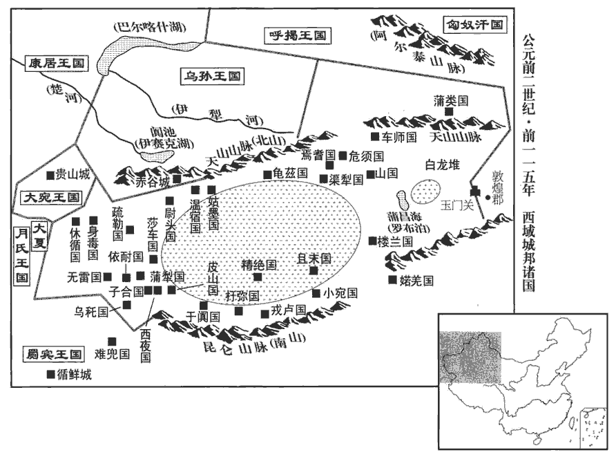 

9渾邪王‹王庭设蒙古国哈尔和林市›既降漢，見上卷元狩元年。漢兵擊逐匈奴於幕北，見上卷元狩元年。自鹽澤‹羅布泊›以東空無匈奴，西域道可通。於是張騫建言：「烏孫‹都赤谷城，伊塞克湖东南›王昆莫本為匈奴臣，後兵稍強，不肯復朝事匈奴，匈奴攻不勝而遠之。朝，直遙翻。遠，於願翻。今單于新困于漢，而故渾邪地空無人，蠻夷俗戀故地，又貪漢財物，今誠以此時厚幣賂烏孫，招以益東，居故渾邪之地‹河西走廊，甘肅中西部›，張騫傳：昆莫父難兜靡本與大月氏同在敦煌、祁連間，小國也。大月氏攻殺難兜靡，奪其地。而大月氏又為匈奴所破，西擊塞王而奪其國。昆莫報父怨，西攻破大月氏國，因留居為烏孫國。騫欲誘之復歸故地。與漢結昆弟，其勢宜聽，聽則是斷匈奴右臂也。斷，丁管翻。既連烏孫，自其西大夏‹阿富汗北部›之屬皆可招來而為外臣。」天子以為然，拜騫為中郎將，將三百人，馬各二匹，牛羊以萬數，齎金幣帛直數千巨萬；多持節副使，師古曰：為騫之副，而各令持節也。道可便，遣之他旁國。沿道有便可通使他國者即遣之。

〖译文〗 [9]浑邪五归降汉朝以后，汉军将匈奴势力驱逐到大沙漠以北，自盐泽以东，不见匈奴踪迹，前往西域的道路可以通行。于是张骞建议说：“乌孙王昆莫本来是匈奴的藩属，后来兵力渐强，不肯再事奉匈奴，匈奴派兵征服，未能取胜，于是远去。如今匈奴单于刚刚受到我朝的沉重打击，而过去的浑邪王辖地又空旷无人，蛮夷之族的习俗依恋故地，又贪图我朝的财物，如果现在我们用丰厚的礼物拉拢乌孙，招他们东迁，到过去的浑邪王辖地居住，与我朝结为兄弟之国，他们势将听从我朝的调遣，听从了就等于断了匈奴的右臂一般。与乌孙结盟之后，其西面的大夏等国也都能招来成为我朝的藩属。”汉武帝认为有理，便任命张骞为中郎将，率领三百人，每人马二匹，以及数以万计的牛羊和价值数千万钱的黄金缯帛，又任命多人为手持天子符节的副使，沿途如有通往别国的道路，既派一副使前往。

騫既至烏孫，昆莫見騫，禮節甚倨。騫諭指曰：師古曰：以天子意指曉告之。「烏孫能東居故地，則漢遣公主為夫人，結為兄弟，共距匈奴，匈奴不足破也。」烏孫自以遠漢，未知其大小；素服屬匈奴日久，且又近之，近，其靳翻。其大臣皆畏匈奴，不欲移徙。騫留久之，不能得其要領，要，讀曰腰。因分遣副使使大宛‹都贵山城，中亚纳曼干市西北卡散塞城›、康居‹都卑阗城，巴爾喀什湖西南锡尔河北岸突厥斯坦›、大月氏‹都蓝市城，阿富汗北部瓦齐拉巴德›、大夏‹阿富汗东北部›、安息‹伊朗›、身毒‹印度›、于闐‹新疆和田›及諸旁國。烏孫發譯道送騫還，宛，於元翻。氏，音支。身毒，音捐篤。闐，徒賢翻，又徒見翻。師古曰：道，讀曰導。使數十人，馬數十匹，隨騫報謝，因令窺漢大小。是歲，騫還，到，拜為大行。後歲餘，騫所遣使通大夏之屬者皆頗與其人俱來，晉灼曰：其國人。於是西域始通於漢矣。

〖译文〗 张骞到达乌孙之后，乌孙王昆莫接见了他，但态度十分傲慢，礼数不周。张骞转达汉武帝的谕旨说：“如果乌孙能够向东返回故土居住，那么我大汉将把公主许配给国王为夫人，两国结为兄弟之邦，共同抗拒匈奴，则匈奴不能不破败。”然而，乌孙自己因距汉朝太远，不知汉朝是大是小，且长期以来一直是匈奴的藩属，与匈奴相距又近，朝中大臣全都畏惧匈奴，不愿东迁。张骞在乌孙呆了很久，一直得不到明确的答复，便向大宛、康居、大月氏、大夏、安息、身毒、于阗及附近各国分别派出副使进行联络。乌孙派翻译、向导送张骞回国，又派数十人、马数十匹随张骞到汉朝报聘答谢，乘机让他们了解汉朝的大小强弱。本年，张骞回到长安，汉武帝任命他为大行。一年多以后，张骞所派出使大夏等国的副使大部分都与该国使臣一同回来，这样，西域各国就开始与汉朝联系往来了。

西域凡三十六國，南北有大山‹南崑崙山北天山›，中央有河‹塔里木河›，西域始通於漢凡三十六國，其後分置五十余國：婼羌‹新疆若羌东南阿尔金山南麓›、鄯善‹即楼兰，新疆若羌›、且末‹新疆且末›、小宛‹新疆且末南八十公里›、精絕‹新疆民丰北一百四十公里›、戎盧‹新疆民丰南五十公里›、扜yū彌‹新疆于田›、渠勒‹新疆于田南八十公里›、皮山‹新疆皮山›、烏秅chá‹新疆塔什库尔干西南叶尔羌河上游›、西夜‹新疆叶城南七十公里›、蒲犁‹新疆莎车西南艾塞勒巴格›、子合‹新疆叶城西南七十公里›、依耐‹新疆塔什库尔干东南布伦木沙›、無雷‹葱岭，帕米尔高原上›、難兜‹克什米尔北部吉尔吉特东南›、罽jì賓‹巴基斯坦伊斯兰堡西北塔克西拉›、烏弋山離‹阿富汗兴都库什山西南›、犁鞬‹即黎轩国，托勒密王朝埃及›、條支‹塞琉古王朝叙利亚›、安息‹伊朗›、大月氏‹都蓝市城，阿富汗北部瓦齐拉巴德›、大夏‹阿富汗东北部›、康居‹都卑阗城，巴爾喀什湖西南锡尔河北岸突厥斯坦›、奄蔡‹里海北岸与咸海北岸之间›、大宛‹都贵山城，中亚纳曼干市西北卡散塞城›、桃槐‹中亚安集延市东南›、休循‹中亚吉尔吉斯共和国萨雷塔什城›、捐篤‹新疆乌恰县西一百公里吉根城›、莎車‹新疆莎车›、疏勒‹新疆喀什›、尉頭‹新疆阿合奇县西南哈拉奇城›、烏孫‹都赤谷城，伊塞克湖东南›、姑墨‹新疆阿克苏›、溫宿‹新疆乌什›、龜茲‹新疆库车›、烏壘‹新疆轮台东北六十公里›、渠犁‹新疆库尔勒西南›、尉犁‹新疆博湖县›、危須‹新疆和硕›、焉耆‹新疆焉耆›、烏貪訾zī離‹新疆呼图壁县›、卑陸‹新疆阜康›、卑陸後國‹新疆阜康西›、郁立師‹新疆吉木萨尔县西›、單桓‹新疆昌吉›、蒲類‹新疆巴里坤县›、蒲類後國‹新疆巴里坤西一百三十公里›、西且彌‹新疆呼图壁西南›、東且彌‹新疆昌吉西南›、劫國‹新疆阜康西›、山國‹新疆托克逊南破城子›、狐胡‹新疆吐鲁番西北›、車師前‹新疆吐鲁番›、後王‹新疆吉木萨尔县南›是也。南北有大山者，南山在于窴tián之南、東出金城，與漢南山接；北山在車師之北，即唐志所謂西州交河縣北柳谷金沙嶺等山是也。中央有河者，河有兩源，一出蔥嶺，一出于窴南山，其河北流與蔥嶺河合，注蒲昌海。自于窴以西，水皆西流，逕休循、罽賓、大月氏、安息等國而入於西海。蒲昌之水潛行地下，南出積石，為中國河。西海之水東南合於交州漲海。東西六千餘里，南北千餘里，東則接漢玉門‹甘肃敦煌西北›、陽關‹甘肃敦煌西南›，班志：敦煌郡龍勒縣有玉門關、陽關，酒泉郡有玉門縣。闞駰曰：漢罷玉門關屯，置其人於此。括地志：沙州龍勒山，在縣南百六十五里，玉門關，在縣西北百一十八里。西則限以蔥嶺‹帕米尔高原›。西河舊事：蔥嶺，其山高大，上悉生蔥，故以名焉。河有兩源，一出蔥嶺‹叶尔羌河›，一出于窴‹和田河›。【章：十四行本「窴」作「闐」；乙十一行本同；孔本同。】合流東注鹽澤‹羅布泊›。鹽澤去玉門、陽關三百餘里。自玉門、陽關出西域有兩道：從鄯善‹樓蘭，新疆若羌›傍南山北，循河西行至莎車，為南道；鄯善，亦曰樓蘭國，治杅yú尼城，去陽關千六百里。鄯，上扇翻。傍，步浪翻。莎車，治莎車城，去長安九千九百五十里。莎，素河翻。南道西逾蔥嶺，則出大月氏、安息。自車師前王廷隨北山循河西行至疏勒，為北道；車師前王，治交河城，去長安八千一百五十里，唐西州交河縣是也。疏勒，治疏勒城，去長安九千三百五十里，西當大月氏、大宛、康居之道。北道西逾蔥嶺，則出大宛、康居、奄蔡焉。杜佑曰：奄蔡，後為肅粟特國。故皆役屬匈奴，匈奴西邊日逐王，置僮僕都尉，匈奴蓋以僮僕視西域諸國，故以名官。使領西域，常居焉耆、危須、尉黎間，焉耆，治員渠城，去長安七千三百里。危須，治危須城，在焉耆東百里，去長安七千二百九十里。尉犁，治尉犁城，去長安六千七百五十里，南接鄯善、且末二國。賦稅諸國，取富給焉。

〖译文〗 西域地区共有三十六个国家，南北为大山，中部有河流，东西长六千余里，南北宽千余里，东部与汉朝的玉门、阳关相连接，西部直到葱岭。中部河流有两个源头，一出于葱岭，一出于于阗，合流后注入盐泽。盐泽离玉门、阳关三百余里。从玉门、阳关前往西域有两条道路：从鄯善沿南山北麓前行，顺着河流向西到莎车，是南道；从南道向西越过葱岭，就到了大月氏、安息。从车师前王廷顺着北山沿河流西行到疏勒，是北道；从北道向西越过葱岭，就到了大宛、康居、奄蔡。以前，西域各国都受匈奴统治。匈奴西部的日逐王设置僮仆都尉统辖西域各国，常驻于焉耆、危须、尉黎一带，向西域各国征收赋税，掠取各国的财富。

烏孫王既不肯東還，漢乃于渾邪王故地置酒泉郡‹甘肅酒泉›，應劭曰：其水如酒，故曰酒泉。師古曰：城下有金泉，泉味如酒；唐為肅州。宋白曰：東南至長安二千九百里。稍發徙民以充實之；後又分置武威郡‹甘肅武威›，本匈奴休屠王所居地，太初四年分置武威郡，唐之涼州即其地。宋白曰：東南至長安二千八百里。以絕匈奴與羌通之道。

〖译文〗 既然乌孙王不肯东还，汉朝便在浑邪王旧辖地区设置酒泉郡，逐渐从内地迁徙百姓来充实这一地区。以后，又从酒泉分出部分地区设置武威郡，用以隔绝匈奴与羌人部落的联络通道。

天子得宛汗血馬，愛之，名曰「天馬」。使者相望于道以求之。諸使外國，一輩大者數百，少者百餘人，人所齎操，大放博望侯時，齎，資也。操，持也。放，依也。言遣使所將節幣大概依遣博望侯時也。放，讀曰仿。其後益習而衰少焉。師古曰：以其串習，故不多發人。少，詩沼翻。漢率一歲中使多者十餘，少者五六輩；遠者八九歲，近者數歲而反。

〖译文〗 汉武帝得到大宛出的汗血马，非常喜爱，命名为“天马”，去大宛搜求的使者在路上接连不断。汉朝出使外国的各个使团，大的一行数百人，小的一百多人，所带礼品等物与张骞出使时大致相当，以后随着对西域情况的日益熟悉，使团人员及携带之物也逐渐减少。大约在一年之中，汉朝派往西域各国的使者，多时十余批，少时五六批；其中路远的要八九年，较近的也要数年才能回来。

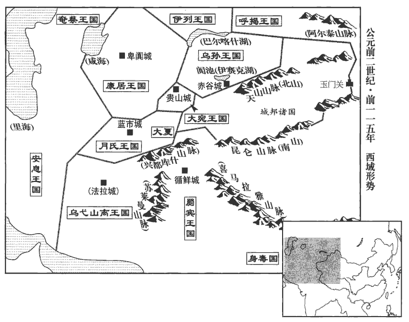 

## 元鼎三年（丁卯，前一一四年）

1冬，徙函谷關于新安‹河南新安›。據班史，以故關為弘農縣。應劭曰：弘農去新安三百里。述征記：新安縣，今猶謂之新關。

〖译文〗 [1]冬季，把函谷关迁到新安。

2春，正月，戊子‹二十八›，陽陵園火。

〖译文〗 [2]春季，正月戊子（二十七日），汉景帝陵园失火。

3夏，四月，雨雹。雨，於具翻。

〖译文〗 [3]夏季，四月，天降冰雹。

4關東郡、國十餘饑，人相食。

〖译文〗 [4]关东地区十几个郡和封国严重饥馑，出现人吃人的惨景。

5常山‹河北正定›憲王舜薨，舜，景帝子，中五年受封。諡法：博聞多能曰憲。子勃嗣，坐憲王病不侍疾及居喪無禮，廢，徙房陵‹湖北房縣›。班志，房陵縣屬漢中郡。宋白曰：闞駰云，即春秋防渚地，漢獻帝改「防」為「房」，兼立房陵郡；今為房州。後月余，天子更封憲王子平為真定‹河北正定›王，真定縣本屬常山。今分真定、綿曼‹河北平山›、藁城‹河北藁城西南›、肥累‹河北藁城›四縣為王國。以常山為郡，於是五嶽皆在天子之邦矣。華山、嵩高，本在天子之郡。南嶽霍山屬廬江，淮南、衡山謀反，國除，入漢為郡。元狩元年，濟北王獻太山及其旁邑。今又以常山為郡，然後皆在天子之邦。

〖译文〗 [5]常山宪王刘舜去世，其子刘勃承嗣王位。刘勃后被指控在刘舜病重时不侍奉父王，守孝时又违反礼仪规定，被废除王爵，放逐到房陵。一个多月以后，汉武帝改封刘舜的另一个儿子刘平为真定王，将常山改为郡，于是五岳全都归入朝廷直接管辖之内。

6徙代王義為清河‹山東清平›王。義，文帝子代王參之孫，王登之子。清河王乘，孝景之子，薨，無子，國除，徙代王王焉。

〖译文〗 [6]汉武帝将代王刘义改封为清河王

7是歲，匈奴伊稚斜單于死，子烏維單于立。

〖译文〗 [7]该年，匈奴单于伊稚斜去世，其子乌维即单于位。

## 元鼎四年（戊辰，前一一三年）

1冬，十月，上‹刘彻，时年四十四›行幸雍‹陝西鳳翔›，祠五畤。雍，於用翻。畤，音止。詔曰：「今上帝，朕親郊，而后土無祀，則禮不答也，師古曰：答，對也。郊天而不祀地，失對偶之義。一曰：闕地祇之祀，不為神所答應。其令有司議！」立后土祠於澤中圜丘。郊祀志：有司議祠后土宜於澤中圜丘，為五壇。上遂自夏陽‹陝西韓城›東幸汾陰‹山西万荣西南榮河镇›。班志，夏陽縣屬左馮翊。汾陰縣屬河東郡。是時，天子始巡郡、國；河東‹山西夏縣›守不意行至，不辦，自殺。不意天子行幸至郡，供具不能備也。十一月，甲子‹八›，立后土祠于汾陰脽shuí上，如淳曰：脽者，河之東岸特堆堀，長四五里，廣二里余，高十餘丈。汾陰縣治脽之上；后土祠在縣西。汾在脽之北，西流與河合。師古曰：脽者，以其形高起，如人尻脽，故以名云。一說，此臨汾水之上，地本名鄈kuí，音與葵同，彼鄉人呼葵音如誰，故轉而為脽字耳。故漢舊儀曰鄈上。脽，音誰。上親望拜，如上帝禮。禮畢，行幸滎陽，還，至洛陽，班志：滎陽、洛陽并屬河南郡。封周後姬嘉為周子南君。臣瓚曰：汲冢古文謂衛將軍文子為子南彌牟，其後有子南固、子南勁。紀年，勁朝于魏。後惠成王如衛，命子南為侯。秦并六國，衛最後亡。疑嘉是衛後，故氏子南而稱君也。師古曰：子南，其封邑之號，以為周後，故總言周子南君，瓚說非也。例不先言姓而後稱君，且自嘉以下皆姓姬，著于史傳。余據恩澤侯表，周子南君食邑於潁川長社。

〖译文〗 [1]冬季，十月，汉武帝巡幸至雍，在五举行祭祀典礼。汉武帝颁布诏书说：“如今敬奉天帝，朕亲自祭祀，却未祭祀地神，于礼不合，着令主管官员研究办理！”主管官员建议，在水泽中圆形丘台上建立后土祠，以祭祀土地神。汉武帝于是自夏阳向东巡幸至汾阴。这是汉武帝第一次出巡各郡、国。河东郡守没想到皇上会突然驾到，一切供应都准备不及，惶恐自杀。十一月甲子（初八），在汾阴丘陵上建立后土祠，汉武帝亲自祭拜，与祭祀天帝之礼相同。祭拜结束后，汉武帝巡幸至荥阳，启程还京，到了洛阳，封周朝王室后裔姬嘉为周子南君。

2春，二月，中山靖王勝薨。勝，景帝子，中二年受封。

〖译文〗 [2]春季，二月，中山王刘胜去世。

3樂成侯丁義義，高祖功臣丁禮之曾孫。班志，樂成，侯國，屬南陽郡。考異曰：漢書郊祀志作「樂成侯登」。按史記、漢書功臣表當為「丁義」。今從史記、漢書功臣表。薦方士欒大，云與文成將軍同師。上方悔誅文成，誅文成見上卷元狩四年。得欒大，大說。說，讀曰悅。大先事膠東康王，康王寄，上弟也。為人長美言，師古曰：善為甘美之言。多方略，而敢為大言，處之不疑。處，昌呂翻。大言曰：「臣常往來海中，見安期、羨門之屬，顧以臣為賤，不信臣；又以為康王諸侯耳，不足與方。臣之師曰：『黃金可成而河決可塞，塞，悉則翻。不死之藥可得，仙人可致也。』然臣恐效文成，則方士皆掩口，惡敢言方哉！」惡，音烏。上曰：「文成食馬肝死耳。索隱曰：論衡云：氣勃而毒盛，故食走馬肝，馬肝殺人。儒林傳：食肉無食馬肝，是也。子誠能修其方，我何愛乎！」大曰：「臣師非有求人，人者求之。陛下必欲致之，則貴其使者，令為親屬，以客禮待之，乃可使通言于神人。」於是上使驗小方，鬬旗，旗自相觸擊。考異曰：封禪書郊祀志皆作「棊」，獨史記孝武紀作「旗」。按漢武故事云：「大嘗於殿前樹旍jīng數百枚，大令旍自相擊，繙繙fān竟庭中，去地十餘丈，觀者皆駭。」然則作「旗」字者是也。是時，上方憂河決而黃金不就，乃拜大為五利將軍，又拜為天士將軍，地士將軍，大通將軍。夏，四月，乙巳，封大為樂通侯，恩澤侯表：樂通侯食邑于安定郡高平縣。食邑二千戶，賜甲第，僮千人，乘輿斥車馬、帷帳、器物以充其家，師古曰：斥不用者也。又以衛長公主妻之，乘，繩證翻。長，知兩翻。孟康曰：衛太子妹。如淳曰：衛太子姊也。師古曰：外戚傳云：子夫生三女，元朔三年生男。據是，則衛太子之姊也，孟說非。妻，七細翻。齎金十萬斤，天子親如五利之第，使者存問共給，共，讀曰供。相屬於道。屬，之欲翻。自太主、將、相以下，太主，帝姑竇太主也。皆置酒其家，獻遺之。遺，于季翻。天子又刻玉印曰「天道將軍」，據前史，下文言為天子道天神，則道讀曰導。使使衣羽衣，夜立白茅上；五利將軍亦衣羽衣，立白茅上，受印，以示不臣。羽衣，緝羽毛為衣也；今道士服被之。使衣、亦衣，於既翻。大見數月，佩六印，五利、天士、地士、大通、天道五將軍，并樂通侯為六印。貴震天下。於是海上燕、齊之間，莫不搤è腕自言有禁方，能神仙矣。搤，音厄。腕，烏貫翻。

〖译文〗 [3]乐成侯丁义向汉武帝推荐方士栾大，说栾大与文成将军少翁同出一个师门。汉武帝正后悔不该杀死少翁，所以见到栾大后非常高兴。栾大原来侍奉胶东康王刘寄，善于说好听的话，富于智谋，敢说大话，从不犹疑。栾大对汉武帝说：“我常常往来于大海之中，见过安期生、羡门等神仙，只因认为我地位微贱，所以他们不信任我；又认为康王不过是一位诸侯，没有资格得到长生不老的秘方。我师父说：‘黄金可以炼成，黄河决口可以堵塞，长生不老之药可以得到，神仙可以招致。’但我怕步少翁的后尘，如果那样，则所有的方士都将捂着嘴不敢说话，谁还敢谈长生不老之方呢！”汉武帝说道：“少翁不过吃 了马肝而死的。你要真能得到长生不老之方，我会吝惜什么呢！”栾大说：“我老师对别人无所求，都是别人求他。陛下如一定要将他请来，就应尊崇他的使者，让他的使者成为陛下的亲近的下属，以待客的礼节对待，这样才能让他将陛下的请求转达给神仙。”于是汉武帝让栾大试验小法术。栾大让旗帜相斗，旗帜果然相互撞击。此时，汉武帝正在忧虑黄河决口和黄金无法炼成，便封栾崐大为五利将军，后又封其为天士将军、地士将军、大通将军。夏季，四月，乙巳（二十一日），汉武帝封栾大为乐通侯，食邑二千户，赐给上等府第以及僮仆一千人，并把自己用不着的车马、帷帐、器物等赏给栾大以充家用，又将亲生女儿卫长公主嫁给栾大为妻，送黄金十万斤。汉武帝还亲自到栾大家中看望，派去询问栾大家中供应情况的使者在路上络绎不绝。汉武帝姑妈窦太主、丞相、将军及以下的人，都到栾大家中设摆酒宴，赠送礼品。汉武帝又刻了一枚“天道将军”的玉印，命使者身穿用羽毛织成的衣服，于夜晚站在白茅上面；栾大也身穿羽衣，站在白茅上面接受玉印，表示他不是汉武帝的臣属。栾大自见到汉武帝后，数月之中，佩带六枚印信，其显贵使天下为之震动。于是，沿海一带燕、齐等地的人们无不振奋地握住手腕，自称有长生不老的秘方、能通神仙。

4六月，汾陰‹山西万荣西南榮河镇›巫錦應劭曰：錦，巫名。得大鼎于魏脽后土營旁，師古曰：汾脽本魏地之墳，故曰魏脽也。營，謂后土祠之兆域。河東‹山西夏縣›太守以聞。天子使驗問，巫得鼎無奸詐，乃以禮祠，迎鼎至甘泉‹陝西淳化西北›，從上行，如淳曰：以鼎從行上甘泉。薦之宗廟及上帝，藏于甘泉宮；群臣皆上壽賀。

〖译文〗 [4]六月，汾阴一位名叫锦的巫师，在魏后土祠旁边得到一个大鼎，河东太守将此事奏报朝廷。汉武帝派人核查，证实巫师得鼎并无欺诈，便以礼祭祀，将此鼎迎接到甘泉宫。皇上带着鼎同行，呈献给宗庙和皇天上帝，保存在甘泉宫中。文武百官都向汉武帝祝贺。

5秋，立常山憲王子商為泗水王‹府凌县，江苏泗阳›。泗水統淩、泗陽、于三縣，本屬東海郡，帝分為王國。

〖译文〗 [5]秋季，汉武帝封常山宪王的儿子刘商为泗水王。

6初，條侯周亞夫為丞相，周亞夫，景帝前七年為相，中三年罷。趙禹為丞相史，府中皆稱其廉平，然亞夫弗任，曰：「極知禹無害，漢書音義曰：文無所枉害。蕭何以文無害為沛主吏掾yuàn。章懷太子賢曰：案律有無害都吏，如今言公平吏。蘇林曰：無害，若言無比也。一曰：害，勝也，無能勝害之者。師古曰：傷害也，無人能傷害之者。貢父曰：持法者或以私意陷人，謂之害；故貴于文無害。無害者，取其為人無害於行，則可以為吏矣。然文深，不可以居大府。」應劭曰：禹持文法深劾。及禹為少府，比九卿為酷急；言以當時九卿同列者比之，禹為酷急也。至晚節，吏務為嚴峻，而禹更名寬平。

〖译文〗 [6]当初，条侯周亚夫作丞相时，赵禹为丞相史，相府中人都称道赵禹的廉洁公平，可是周亚夫不重用他，周亚夫说：“我非常了解赵禹的公平，但他执法严苛，不可以在丞相府掌权。”及至赵禹作了少府，执法比其他九卿都严苛峻急。到赵禹晚年，其他官员都以严刑峻法为务，赵禹却一改名声，号称宽厚平和。

中尉尹齊素以敢斬伐著名，姓譜：少昊之子封于尹城，子孫因以為氏。按尹氏，周之世卿。及為中尉，吏民益彫敝。是歲，齊坐不勝任抵罪。勝，音升。上乃復以王溫舒為中尉，趙禹為廷尉。後四年，禹以老，貶為燕‹北京›相。

〖译文〗 中尉尹齐平素以敢于杀人闻名于世，及至他作了中尉，官吏和百姓越发凋敝。这一年，尹齐因被指控不能胜任其职而获罪。汉武帝又任命王温舒为中尉，越禹为廷尉。四年后，赵禹因年纪太老，被贬为燕国丞相。

是時吏治皆以慘刻相尚，治，直吏翻。獨左內史兒寬，勸農業，緩刑罰，理獄訟，務在得人心；擇用仁厚士，推情與下，不求名聲，吏民大信愛之；收租稅時，裁闊狹，與民相假貸，師古曰：謂有貧弱及農要之時，不即徵收也。余謂闊，謂征斂稍寬、禁防疏闊之時；狹，謂督促迫急之時。闊時不急徵收，假貸與民，使營生業。以故租稅多不入。後有軍發，左內史以負租課殿，當免；殿，丁練翻。課下下曰殿。民聞當免，皆恐失之，大家牛車、小家擔負輸租，繦屬不絕，師古曰：繦，索也。言輸者接連不絕於道，若繩索之相屬也，猶今言續索矣。屬，之欲翻。課更以最。課上上曰最。上由此愈奇寬。

〖译文〗 这一时期，用法严酷成为整个官场的风尚，只有左内史宽，鼓励农业生产，放宽刑罚，处理诉讼纠纷，争取人心。他选择心地忠厚的人加以任用，与下级推心置腹，不求名声，受到官吏和百姓的衰心爱戴。征收赋税时，调节缓急，借给百姓钱物，因此租税常常收不上来。后来国家有重大军事行动，宽因税收不足，政绩最差，应该免职。当地老百姓听说宽会被罢免，都唯恐失去这样一位好官，于是富室大家用牛车，究家小户用担挑，络绎不绝地将租税送到官府，宽征税的成绩一跃成为最好，汉武帝也因此对宽越发另眼相看。

7初，南越‹都番禺，廣東廣州›文王遣其子嬰齊入宿衛，南越王胡薨，諡文王。嬰齊入宿衛，見十七卷建元元年。在長安取邯鄲樛jiū氏女，取，讀曰娶。邯鄲屬趙國。師古曰：樛，居虯翻。生子興。文王薨，嬰齊立，乃藏其先武帝璽，趙佗自號南越武帝。李奇曰：去其僭號。上書請立樛氏女為后，興為嗣。漢數使使者風諭嬰齊入朝。數，所角翻。師古曰：風，讀曰諷，諷諭令入朝。嬰齊尚樂擅殺生自恣，懼入見要，用漢法比內諸侯，樂，音洛。見，賢遍翻；下同。要，讀曰邀。恐漢邀之以用朝廷之法，如內諸侯王。固稱病，遂不入見。嬰齊薨，諡曰明王。太子興代立，其母為太后。

〖译文〗 [7]当初，南越王赵胡派其子赵婴齐入宫为汉武帝充当侍卫，婴齐在长安娶邯郸女子氏为妻，生一子，取名赵兴。赵胡死后，赵婴齐断承王位，隐藏其先祖南越武帝赵佗的印玺，上书朝廷，请求立氏女为王后，赵兴为世子。朝廷多次派遣使臣，提醒赵婴齐入京朝觐。赵婴齐愿自操生杀予夺大权，随心所欲，害怕一旦入朝，朝廷会用法令像约束内地诸侯一样约束他，所以坚决崐称病，没有到长安朝见。赵婴齐死后，谥号称明王。太子赵兴即王位，其母氏为王太后。

太后自未為嬰齊姬時，嘗與霸陵‹陝西西安東北›人安國少季通。師古曰：姓安國，字少季。少，詩照翻。是歲，上使安國少季往諭王、王太后以入朝，比內諸侯，令辯士諫大夫終軍等宣其辭，百官表：元狩五年，初置諫大夫，秩八百石。勇士魏臣等輔其決，師古曰：助令決策也。衛尉路博德將兵屯桂陽‹廣東連縣›班志，桂陽縣屬桂陽郡；唐為連州桂陽、連山二縣地。待使者。南越王年少，太后中國人；安國少季往，復與私通，國人頗知之，多不附太后。太后恐亂起，亦欲倚漢威，數勸王及群臣求內屬；數，所角翻。即因使者上書，請比內諸侯，三歲一朝，朝，直遙翻。除邊關。於是天子許之，賜其丞相呂嘉銀印及內史、中尉、太傅印，餘得自置；除其故黥qíng、劓yì刑，用漢法，比內諸侯。使者皆留，填撫之。漢制，諸侯王國二千石以上皆漢朝所命，餘得自置。今賜南越丞相、內史、中尉、太傅印，使之比內諸侯也。漢自文帝除肉刑，不用黥、劓之法，故亦令南越除之。劓，魚器翻，又牛例翻。填，讀曰鎮。為呂嘉反張本。

〖译文〗 氏在没有成为赵婴齐的姬妾之前，曾与霸陵人安国少季有私情。这年，汉武帝派安国少季至南越国，告谕赵兴和他的母亲入京朝觐，同于内地诸侯；又派能言善辩的谏大夫终军等宣告朝廷的谕旨，勇士魏臣等帮助他们做决定；并命卫尉路博德率兵屯驻桂阳等待使臣。由于南越王年纪还小，王太后氏又是汉朝人，安国少季到南越国后，又与氏私通，国中之人颇有耳闻，所以多数人都不拥护氏。氏害怕发生变乱，也想倚靠朝廷的威势，多次劝赵兴和南越国群臣请求归属朝廷，于是便借这次朝廷使臣前来的机会，上书请求比照内地诸侯，每三年朝觐一次，解除边界关卡。于是汉武帝批准所请，赐南越国丞相吕嘉银质印信，内史、中尉、太傅等也都由朝廷赐给印信，其他官职允许南越王自行安排。废除南越国原有的脸上刺字和割鼻子的刑罚，使用汉朝法律，比照内地诸侯。所派使臣全部留在南越国，对该地区进行镇压和安抚。

8上行幸雍‹陝西鳳翔›，雍，於用翻。且郊，或曰：「五帝，泰一之佐也。宜立泰一，而上親郊。」上疑未定。齊人公孫卿曰：「今年得寶鼎，其冬辛巳朔旦冬至，與黃帝時等。」卿有劄書師古曰：等，同也。劄，木簡之薄小者也。曰：「黃帝得寶鼎，是歲己酉朔旦冬至，凡三百八十年，黃帝仙登於天。」因嬖bì人奏之。嬖，卑義翻，又博計翻。上大悅，召問，卿對曰：「受此書申公，申公曰：『漢興復當黃帝之時，漢之聖者在高祖之孫且曾孫也。寶鼎出而與神通，黃帝接萬靈明庭，明庭者甘泉也。黃帝采首山銅，班志，河東蒲阪縣有首山。鑄鼎于荊山下‹陝西大荔东南›，班志：馮翊懷德縣有荊山。鼎既成，有龍垂胡䫇下迎黃帝，師古曰：胡，謂頷hàn下垂肉也；䫇，其毛也。䫇，人占翻。黃帝上騎龍，與群臣後宮七十餘人俱登天。』」於是天子曰：「嗟乎！誠得如黃帝，吾視去妻子如脫屣耳！」師古曰：屣，小履也。脫屣者，言其便易，無所顧也。屣，山爾翻。拜卿為郎，使東候神於太室。師古曰：太室山在潁川崇高縣，是為中嶽。

〖译文〗 [8]汉武帝巡幸至雍，将要举行祭天仪式，有人建议说：“五帝为泰一神的助手，应建泰一庙，由皇上亲自祭祀。”汉武帝迟疑未决。齐国人公孙卿说道：“今年得到宝鼎，冬季十一月初一清晨为冬至，与黄帝时一样。”公孙卿有简牍，上面说：“黄帝得到宝鼎，该年十一月初一清晨为冬至，总共过了三百八十年，黄帝成仙升天。”公孙卿将简牍上的话通过汉武帝宠幸的人奏上，汉武帝非常高兴，召公孙卿前来询问，公孙卿回答说：“此书是申公给我的，申公说：‘汉朝兴盛还会与黄帝时一样，汉朝的圣人，是高祖皇帝的孙子至曾孙。宝鼎的出现，正好与神意相通，黄帝在祭祀神灵的“明庭”迎接万种神灵，“明庭”就是甘泉宫。黄帝在首山开采铜矿，在荆山下铸造宝鼎。宝鼎铸成之后，天上有一条龙将龙须垂下来接引黄帝，于是，黄帝骑上龙背，和群臣及后宫妃嫔七十余人一起登天成了神仙。’”于是汉武帝说：“唉！要真的能跟黄帝一样，我看待离开妻子儿女，就象抛弃拖鞋罢了！”于是任命公孙卿为郎官，派他到东方，在太室山等候天神降临。

## 元鼎五年（己巳，前一一二年）

1冬，十月，上‹刘彻，时年四十五›祠五畤於雍，遂逾隴‹陝西隴縣西，隴山›，隴坻也，在天水郡隴縣。三秦記曰：其阪九曲，上隴者七日乃越。西登崆峒‹甘肅平涼西›。唐地理志：崆峒在岷州溢樂縣西。岷州，漢臨洮之地。史記作「空桐」。正義曰：空桐山，在原州平高縣西百里。隴西‹甘肃临洮›守以行往卒，卒，讀曰猝。天子從官不得食，惶恐，自殺。從，才用翻。於是上北出蕭關‹甘肅固原東南›，從數萬騎獵新秦中，以勒邊兵而歸。新秦中或千里無亭徼，於是誅北地‹甘肅庆阳西北马岭镇›太守以下。唐麟州治新秦。杜佑：漢新秦中地。余謂唐取漢新秦中之名以名郡耳，麟州不能盡有漢新秦中之地也。北地與朔方接境，時朔方新置郡，蓋使北地并力以營築亭徼也。徼，吉吊翻。上又幸甘泉，立泰一祠壇，所用祠具如雍一畤而有加焉。雍有五畤，今祠太一所用，如雍一畤之祠具也。有加者，加醴棗脯之屬。五帝壇環居其下四方地，為醊食群神從者及北斗云。說文：醊，祭酎也。師古曰：謂聯屬而祭也。醊，竹芮翻。食，讀曰飤。從，才用翻。十一月，辛巳朔‹一›，冬至；昧爽，昧，冥也。爽，明也。謂日尚昧昧而天色漸明也。天子始郊拜泰一，朝朝日，夕夕月則揖。應劭曰：天子春朝日，秋夕月；朝日以朝，夕月以夕。臣瓚曰：漢儀注：郊泰畤，皇帝平旦出竹宮，東向揖日，其夕西南向揖月，便用郊日，不用春、秋也。師古曰：春朝朝日，秋暮夕月，蓋常禮；郊泰畤而揖日月，此又別儀。朝朝，下直遙翻；下同。其祠，列火滿壇，壇旁亨炊具。亨，讀曰烹。有司云：「祠上有光。」又云：「晝有黃氣上屬天。」屬，之欲翻。太史令談、祠官寬舒等班表：太史令屬太常。劉昭志：秩六百石，掌天時星曆，凡國祭祀、喪娶之事。談，即司馬談也。祠官，掌祠祀之官。寬舒，史逸其姓。請三歲天子一郊見，見，賢遍翻。詔從之。

〖译文〗 [1]冬季，十月，汉武帝在雍祭祀五，然后越过陇坻，西行登上崆峒山。陇西郡守因汉武帝来得突然，无法供应皇上随从官员的饭食，感到惶恐，自杀而死。于是汉武帝北出萧关，率数万骑兵至新秦中行猎，以整饬边疆军队，然后回京。汉武帝见新秦中一带有的地区千里之中竟没有设置亭障，便将北地崐太守及以下有关官员处死。汉武帝再次驾临甘泉，并在此修建泰一祭坛，所用祭祀器具仿照雍地五中一所用而有所增添。又建五帝祭坛环绕于泰一祭坛下方四周，祭祀群神的随从和北斗星。十一月辛巳朔（初一），冬至，黎明，汉武帝就开始祭拜泰一天神。早晨面对东方，向太阳作揖致敬；晚上面对西南，向月亮作揖致敬。祭祀时，烈火满坛，坛旁放置烹制祭品的饮具。主管官员宣称：“祭坛上空有光。”又宣称：“白天有一股黄气升到空中。”太史令司马谈、祭祀官宽舒等建议，天子每三年祭天一次，汉武帝下诏表示同意。

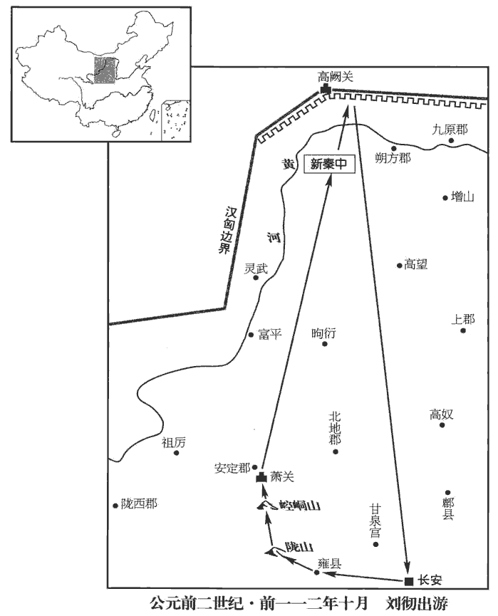 

2南越王、王太后飭chì治行裝，重齎jī治，直之翻。齎，讀曰資。為入朝具。其相呂嘉，年長矣，相三王，宗族仕宦為長吏者七十餘人，男盡尚王女，女盡嫁王子弟、宗室，及蒼梧‹廣西梧州›秦王有連，孟康曰：蒼梧，越中王，自名為秦王。連，親婚也。晉灼曰：秦王，即後趙光；趙本與秦同姓，故曰秦王。余據南越王姓趙，曷為不稱南越秦王！晉說未為通。長，知兩翻。其居國中甚重，得眾心愈于王。師古曰：愈，勝也。王之上書，數諫止王，王弗聽；有畔心，數稱病，不見漢使者。數，所角翻。使者皆注意嘉，勢未能誅。王、王太后亦恐嘉等先事發，先，悉薦翻。欲介漢使者權，謀誅嘉等，韋昭曰：恃使者為介胄也。索隱曰：志林云：介者，因也；欲因使者權誅呂嘉也。韋昭以介為恃。介者，間也；以言間恃漢使之權，意即得矣；然云恃為介胄則非也。虞喜以介為因，亦有所由；介者，賓主所因也。乃置酒請使者，大臣皆侍坐飲。坐，徂臥翻。嘉弟為將，將卒居宮外。將，即亮翻。酒行，太后謂嘉曰：「南越內屬，國之利也；而相君苦不便者，何也？」以激怒使者。使者狐疑相杖，杖，直亮翻。遂莫敢發。嘉見耳目非是，師古曰：言異于常也。即起而出。太后怒，欲鏦cōng嘉以矛，鏦，楚江翻。王止太后。嘉遂出，介其弟兵就舍，李奇曰：介，被也。師古曰：介，甲也，被甲以自衛也。弟兵，即上所云弟將卒居外者。稱病，不肯見王及使者，陰與大臣謀作亂。王素無意誅嘉，嘉知之，以故數月不發。

〖译文〗 [2]南越王赵兴、王太后氏置办行装和重礼，准备入京朝觐。南越国丞相吕嘉年事已高，历任三代国王的丞相，其家族成员在南越国担任重要官职的有七十余人，男子都娶了国王的女儿，女子都嫁给国王的子弟或王族成员，与苍梧秦王也有姻亲关系。吕嘉在南越国的地位十分重要，比南越王更得人心。南越王上书汉朝请求归附，吕嘉曾多次谏阴，但南越王不听，吕嘉便生出离叛之心，几次推说有病，不肯与汉使相见。汉使对吕嘉都很注意，但因其势力强大，未能铲除。南越王和王太后也害怕吕嘉先行发难，想利用汉使的权力杀死吕嘉等人，于是设摆酒宴，款待汉使，大臣都来陪坐饮酒。吕嘉的弟弟为南越国大将，率兵在宫外警戒。敬酒时，王太后对吕嘉说：“南越国内附汉朝，于国家有利，而丞相你嫌这样做不便，为什么呢？”想以此来激怒汉使。汉使犹豫不决，相互观望，于是谁也没敢发动。吕嘉见气氛不对，马上起身退席。王太后大怒，想用矛刺死吕嘉，被南越王阻止。吕嘉便离开王宫，在其弟士兵簇拥下回到相府。他从此推说有病，不肯见南越王和汉使。暗中与大臣密谋造反。南越王一向无意杀吕嘉，吕嘉知道这一点，所以拖延数月，未曾发动。

天子聞嘉不聽命，王、王太后孤弱不能制，使者怯無決；又以為王、王太后已附漢，獨呂嘉為亂，不足以興兵，欲使莊參以二千人往使。往使，疏吏翻。參曰：「以好往，數人足矣；以武往，二千人無足以為也。」辭不可，天子罷參。郟‹河南郟縣›壯士故濟北‹山東長清›相韓千秋班志，郟縣屬潁川郡。史記正義曰：今汝州郟城縣。郟，音夾。千秋，蓋相濟北成王胡也。胡，貞王勃之子。奮曰：「以區區之越，又有王、王太后應，獨相呂嘉為害，願得勇士三百人，必斬嘉以報。」於是天子遣千秋與王太后弟樛jiū樂將二千人往。入越境。樛，居虯翻。呂嘉等乃遂反，下令國中曰：「王年少。太后，中國人也，又與使者亂，專欲內屬，盡持先王寶器入獻天子以自媚；多從人行，至長安，虜賣以為僮僕；取自脫一時之利，無顧趙氏社稷、為萬世慮計之意。」乃與其弟將卒攻殺王、王太后及漢使者，遣人告蒼梧‹廣西蒼梧›秦王及其諸郡縣，立明王長男越妻子術陽侯建德為王。建德降漢，始封術陽侯，史蓋追書也。班表：術陽侯食邑於東海之下邳。長，知兩翻。而韓千秋兵入，破數小邑。其後越開直道給食，師古曰：縱之令深入，然後擊滅之，未至番禺‹廣東廣州›四十里，番禺，南越都。番，音潘。越以兵擊千秋等，遂滅之；使人函封漢使者節置塞上，好為謾辭謝罪，師古曰：謾，誑也，音慢，又莫連翻。發兵守要害處。

〖译文〗 汉武帝听说吕嘉不肯听命，而南越王、王太后又势孤力弱，不能控制，所派使臣怯懦无决断；又认为既然南越王、王太后已肯于归附，只有吕嘉从中捣乱，用不着举兵，想派庄参率兵二千前往南越国。庄参奏道：“要是以友好的目的前往，几个人就够了；如果是以武力去胁迫，二千人是不够用的。”推辞说不能去，汉武帝将庄参免职。郏县壮士、曾任济北国承相的韩千秋自告奋勇说：“一个小小的南越国，又有其国王和王太后的响应，只丞相吕嘉一人捣乱，给我三百勇士，必能斩杀吕嘉回报。”于是汉武帝派韩千秋和南越王太后的弟弟乐率兵二千前往。汉军进入南越国境，吕嘉等便反叛，号令全国说：“国王年轻；王太后本是汉朝人，又与汉使淫乱，一心想归附汉朝，将先王的宝器全都献给汉天子来讨好；还想带去大批随从之人，到达长安后卖为奴隶，只顾自己眼前利益，却不顾赵氏的江山社稷，没有为子孙万代着想的意思。”吕嘉与其弟率兵攻杀了南越王赵兴、王太后氏及汉朝使臣，派人告知苍梧秦王及各郡县，立南越明王赵婴齐大儿子赵越的南越妻子所生的儿子术阳侯赵建德为王。韩千秋率兵进入南越国后，攻破了几座小城。后南越人开辟直道，提供饭食，在距其都城番禺约四十里的地方将韩千秋所部汉军歼灭，然后派人把汉使的符节用函封好，放到边塞上，以动听的诳骗言辞谢罪，同时派兵加强边界要隘的镇守。

春，三月，壬午‹四›，天子聞南越反，曰：「韓千秋雖無功，亦軍鋒之冠，冠，古玩翻。封其子延年為成安侯；班表，成安侯食邑於潁川郡之郟縣。樛jiū樂姊為王太后，首願屬漢，封其子廣德為龍亢侯。」班志，龍亢縣屬沛國。亢，音剛。考異曰：漢書功臣表作「龍侯」，南越傳作「龒侯」。晉灼曰：「龒」，古「龍」字。史記建元以來侯者表及南越傳皆作「龍亢侯」，今從之。

〖译文〗 春李，三月，壬午（初四），汉武帝听说南越国造反，说道：“韩千秋虽然没能建功，但也是军队里最勇敢的先锋。”封其子韩延年为成安侯；乐的姐姐是南越王太后，首先表示愿意归附汉朝，封乐的儿子广德为龙亢侯。

3夏，四月，赦天下。

〖译文〗 [3]夏季，四月，大赦天下。

4丁丑晦‹三十›，日有食之。

〖译文〗 [4]丁丑晦（三十日），出现日食。

5秋，遣伏波將軍路博德環濟要略曰：伏波將軍者，船涉江海，欲使波濤伏息也。出桂陽‹廣東連縣›，下湟水；水經：匯水出桂陽縣盧聚，南出貞女峽，合洭水，東南過含洭縣，南出洭浦關為桂水。山海經以洭水為湟水。徐廣曰：湟水，一名洭水，出桂陽，通四會。師古曰：湟，音皇。樓船將軍楊僕出豫章‹江西南昌›，下湞水‹即滃江›；應劭曰：湞水出南海龍川西，入秦水。水經：湞水逕桂陽郡之湞陽縣南，而右注溱水。湞，鄭氏曰：湞，音檉chēng；孟康曰：湞，音貞；師古曰：湞，丈庚翻。歸義越侯嚴為戈船將軍，出零陵‹廣西全州縣›，下離水；張晏曰：嚴故越人，降，為歸義侯。越人于水中負人船，又有蛟龍之害，故置戈於船下，因以為名。臣瓚曰：伍子胥書有戈船，以載干戈，因謂之戈船也。師古曰：以樓船之例言之，非謂載干戈也，此蓋船下安戈以禦蛟鼉水蟲之害，張說近之。貢父曰：船下安戈既難措置，又不可以行；今造舟船甚多，未嘗有置戈者。顏北人，不曉行船，故信張說；蓋瓚說是。余據表無歸義越侯嚴。零陵本屬桂陽，帝分置郡；唐為永、道二州。漓水，班志：出零陵縣陽海山東南，至廣信入郁水。甲為下瀨將軍，下蒼梧；服虔曰：甲故越人歸漢者。臣瓚曰：瀨，湍也；吳、越謂之瀨，中國謂之磧。伍子胥書有下瀨船。瀨，音賴。蒼梧本越地，帝始置郡，有漓水關；唐梧、賀、康、端、封之地。皆將罪人，江、淮以南樓船十萬人。越馳義侯遺別將巴、蜀罪人，發夜郎‹貴州关岭›兵，下牂柯江，咸會番禺‹廣東廣州›。

〖译文〗 [5]秋季，汉武帝派伏波将军路博德从桂阳沿湟水进发；楼船将军杨仆自豫章沿浈水进发；南越降将名叫严的归义侯被任命为戈船将军，率兵从零陵沿离水进发；名为甲的南越降将被任命为下濑将军，率兵进攻苍梧。各路军卒都由囚犯组成，并调集江、淮以南地区水军十万人。南越降将名叫遗的驰义侯也率领巴、蜀地区的囚犯，又征调夜郎国军队，沿柯江南下，与各路部队在番禺会师。

齊相卜式上書，請父子與齊習船者往死南越。天子下詔褒美式，賜爵關內侯，金六十斤，田十頃，佈告天下；天下莫應。是時列侯以百數，皆莫求從軍擊越。會九月嘗酎zhòu，祭宗廟，列侯以令獻金助祭。少府省金，金有輕及色惡者，上皆令劾以不敬，奪爵者百六人。如淳曰：漢儀注：王子為侯，歲以黃金嘗酎於漢廟，皇帝臨受獻金，金少，不如斤兩，色惡，王削縣，侯免國。余據當時失侯者列侯、王子侯共一百六人，蓋不特王子侯有酎金也。酎，直又翻。省，悉景翻。劾，戶概翻。辛巳‹六›，丞相趙周坐知列侯酎金輕，下獄，自殺。下，遐嫁翻。

〖译文〗 齐国丞相卜式上书朝廷，请求汉武帝批准他父子和齐国熟习舰船的人前往南越效死。为此，汉武帝颁布诏书，表扬卜式，封卜式为关内侯，赏金六十斤、土地十顷，并宣告全国，然而全国却无人响应。当时列侯数以百计，没有一个人要求从军打南越。正好举行酎祭活动，天下列侯奉命进献黄金助祭。少府检查所献黄金，凡重量不足或成色不好的，皇上命令一律以“不敬”罪加以参劾。结果，因此而被革去爵位的，有一百零六人。辛巳（初六），丞相赵周也被指控“明知列侯所献黄金重量不足，却纵容包庇”，被逮捕下狱，赵周自杀。

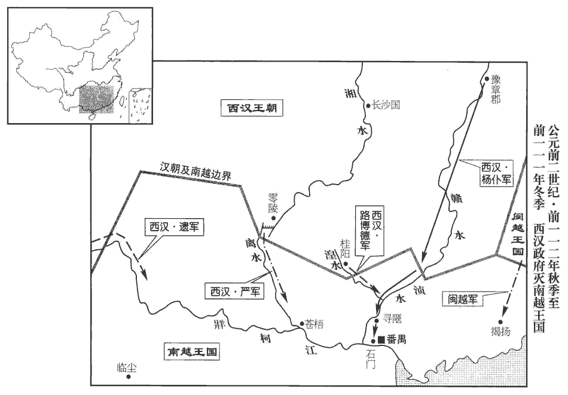 

6丙申‹二十六›，以御史大夫石慶為丞相，封牧丘侯。恩澤侯表，牧丘侯食邑平原。時國家多事，桑弘羊等致利，王溫舒之屬峻法，而兒寬等推文學，皆為九卿，更進用事；更，工衡翻。事不關決于丞相，丞相慶醇謹而已。師古曰：醇，專厚也。

〖译文〗 [6]丙申（二十一日），汉武帝任命御史大夫石庆为丞相，封牧丘侯。当时，国家多事，桑弘羊等人谋取财利，王温舒等人推行严刑峻法，而宽等人则大力推崇儒家经典，他们都位列九卿，相继掌握朝政大权，国家大事不向丞相汇报，也不由丞相决定，丞相石庆只是敦厚、谨慎而已。

7五利將軍裝治行，東入海求其師。既而不敢入海，之太山祠。上使人隨驗，實無所見。五利妄言見其師，其方盡多不售，師古曰：售，應當也；不售者，無驗也。坐誣罔，腰斬；樂成侯亦棄市。

〖译文〗 [7]五利将军栾大整装出发，东行入海寻找他的神仙老师。可后来没敢入海，而到太山去祭祀。汉武帝派人跟踪核查，确实未见神仙踪影，栾大回来后却妄称见到了他的老师。栾大的方术已经用尽，多不灵验，汉武帝便以“诈骗欺罔”之罪将栾大判处腰斩。推荐栾大的乐成侯丁义也被当众斩首。

8西羌‹青海东部›眾十萬人反，與匈奴‹王庭设蒙古哈尔和林›通使，使，疏吏翻。攻故安‹安故，甘肅臨洮南›，圍枹罕‹甘肅臨夏›。故安縣屬涿郡，西羌之兵安能至此！當作「安故」。班志，安故、枹罕二縣，皆屬隴西郡。枹罕，故罕羌邑。宋白曰：安故故城，在蘭州南。枹罕，今河州治所。枹，音膚。罕，如字。匈奴入五原‹內蒙包頭›，五原，即秦九原郡，帝更名；唐為鹽州。宋白曰：五原郡有原五所，故名，謂龍游原、乞地于原、青嶺原、岢kě嵐真原、橫槽原也。五原故城，在今榆林縣界。殺太守。守，式又翻；下同。

〖译文〗 [8]西羌部族十万人反叛朝廷，与匈奴互通使者，进攻故安，包围罕。匈奴侵入五原，杀死五原太守。

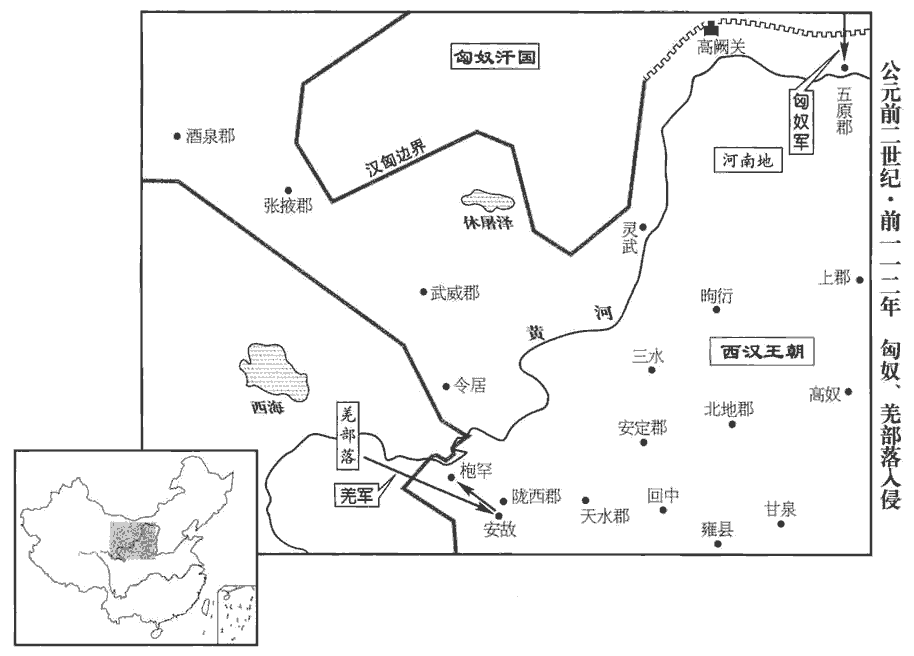 

## 元鼎六年（庚午，前一一一年）

1冬，發卒十萬人，遣將軍李息、郎中令徐自為征西羌，平之。

〖译文〗 [1]冬季，发兵十万人，派将军李息、郎中令徐自为征讨西羌，平定了西羌部族的叛乱。

2樓船將軍楊僕入越地，先陷尋陿xiá‹廣東清远东›，陿，作陝音。姚氏曰：尋陿在始興西三百里，近連口也。陿，音狹。破石門，石門在番禺‹廣州›西北二十里。郡國志：呂嘉拒漢，積石江中為門，因名石門。挫越鋒，以數萬人待伏波將軍路博德至，俱進，樓船居前，至番禺‹廣東廣州›。南越王建德、相呂嘉城守。樓船居東南面，伏波居西北面。會暮，樓船攻敗越人，縱火燒城。敗，蒲賣翻。伏波為營，師古曰：設營壘以待降者。遣使者招降者，賜印綬，復縱令相招。師古曰：來降者即賜以侯印，而放令還，更相招諭。復，扶又翻。樓船力攻燒敵，驅而入伏波營中。黎旦，城中皆降。建德、嘉已夜亡入海，伏波遣人追之。校尉司馬蘇弘得建德，越郎都稽得嘉。孟康曰：越中所自置郎也。考異曰：史記漢書表皆作「孫都」，南越傳皆云「都稽」，今從傳。戈船、下瀨將軍兵及馳義侯所發夜郎兵未下，南越已平矣。遂以其地為南海‹廣東廣州›、蒼梧‹廣西梧州›、鬱林‹廣西桂平›、合浦‹广西合浦东北›、交趾‹越南河內›、九真‹越南清化›、日南‹越南东河›、珠厓‹海南島瓊山›、儋dān耳‹海南島儋州›九郡。南海，唐廣州、循州之地。蒼梧，註見上。鬱林，唐桂州、鬱林、黨、繡州之地。合浦，唐廉、雷、潘州之地。交趾，唐安南之地。杜佑曰：南方夷人，其足大，指開廣；若并足而立，其指交，故名交趾。劉欣期交州記曰：交趾之人出南定縣，足骨無節，身有毛，臥者更扶乃得起。山海經：交脛jìng國為人交脛。郭璞曰：腳脛曲戾相交，所謂「雕題、交趾」也。九真，唐愛州之地。日南，唐驩州之地。師古曰：言其在日之南，所謂開北戶以向日者。珠厓、儋耳，唐瓊管之地。應劭曰：二郡在大海厓岸之邊，出真珠，故曰珠厓。儋耳者，種大耳，其渠率自謂王者，耳尤緩，下肩三寸。張晏曰：異物志，二郡在海中，東西千里，南北五百里。儋耳之人，鏤其頰皮，上連耳匡，分為數支，狀如羊腸，累耳而下垂。賢曰：儋耳故城，即今儋州義倫縣。儋，丁甘翻。臣瓚曰：珠厓郡治瞫shěn都，去長安七千三百二十四里，儋耳去長安七千三百三十五里，見茂陵書。師還，上益封伏波；封樓船為將梁侯，蘇弘為海常侯，都稽為臨蔡侯，徐廣曰：海常在東萊。余以王子侯表參考，則海常侯當食邑琅邪。功臣表，臨蔡侯食邑河內。及越降將蒼梧王趙光等四人皆為侯。趙光封隨桃侯，史定封安道侯，畢取封膫侯，居翁封湘城侯。考異曰：凡此等封侯者，年表皆有月日，為其先後難齊，故盡附于立功之處；後仿此。

〖译文〗 [2]楼船将军杨仆率兵进入南越国，首先攻陷寻，击破石门，挫败南越军的前锋，然后率部下数万人等待伏波将军路博德到来一同前进。杨仆为前导，到达南越国都番禺。南越王赵建德、丞相吕嘉等据城垣坚守。杨仆屯兵城东南面，路博德屯兵城西北面。黄昏时，杨仆军攻破南越军，放火烧城。路博德则设下营垒，派人招揽投降官兵，赏给印信、绶带，再命他们去招降同伴。杨仆军猛烈进攻，火烧敌军，南越军被驱赶到路博德营中。黎明时，城中南越人全部投降。赵建德、吕嘉已于半夜逃到海上，路博德派人追击。校尉司马苏弘生擒赵建德，原南越国郎官都稽活捉吕嘉。戈船将军、下濑将军的部队及驰义侯率领的夜郎军尚未赶到，南越国已被剿平。汉朝于是在南越旧地设位南海、苍梧、郁林、合浦、交趾、九真、日南、珠崖、儋耳九郡。大军返回后，汉武帝加封路博德食邑，封杨仆为将梁侯，苏弘为海常侯，都稽为临蔡侯；南越降将原苍梧王赵光等四人也都被封为列侯。

3公孫卿候神河南，言見仙人跡緱gōu氏‹河南偃師东南›城上。班志，緱氏縣屬河南郡。宋白曰：漢緱氏縣故城，在今縣東南二十五里。緱，工侯翻。春，天子親幸緱氏城視跡，問卿：「得毋效文成、五利乎？」卿曰：「仙者非有求人主，人主者求之；其道非寬假，神不來。言神事如迂誕，師古曰：迂，回遠也。誕，大言也。積以歲月，乃可致也。」上信之。於是郡、國各除道，繕治宮觀、名山、神祠以望幸焉。觀，古玩翻。

〖译文〗 [3]公孙卿在河南等候神仙降临，声称在缑氏城上看到了神仙脚印。春季，汉武帝亲自来到缑氏城观看神仙脚印，问公孙卿说：“你不是想效法少翁、栾大吧？”公孙卿说：“神仙无求于人间君主，而人间君主有求于他，如果求神之道不宽裕，神仙就不会来。说到神仙之事，似乎很遥远荒诞，但积够了岁月，神仙就可请到。”汉武帝相信了他的话。于是，各郡、国都扩建道路，修缮宫观和名山的神祠，希望有神仙驾临。

4賽南越，祠泰一、后土，始用樂舞。據郊祀志，五年秋，為伐南越告禱太一，故今賽祠。賽，先代翻。

〖译文〗 [4]为感谢神仙保佑征服南越，祭祀泰一神和后土神，并开始使用以音乐伴奏的舞蹈。

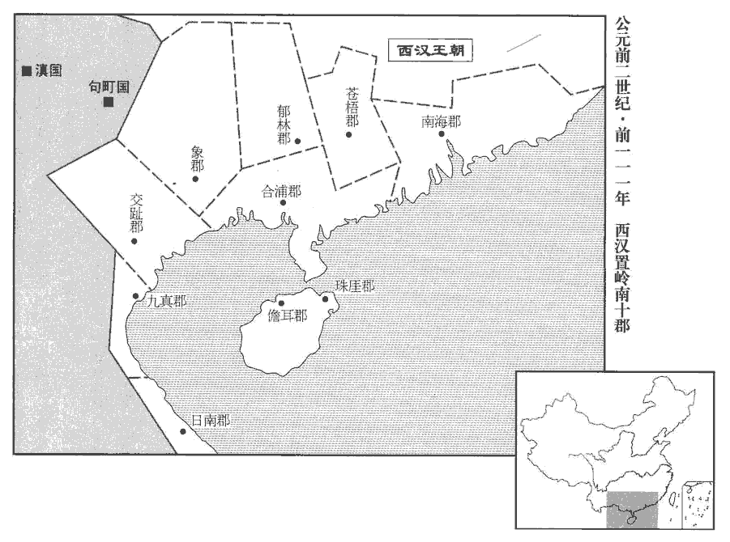 

5馳義侯發南夷兵，欲以擊南越。且蘭‹貴州福泉›君恐遠行且蘭亦南夷種，帝開為縣，屬牂柯郡。且，音苴；子閭翻。旁國虜其老弱，乃與其眾反，殺使者及犍為‹贵州遵义›太守。犍，渠延翻。守，式又翻。漢乃發巴、蜀罪人當【嚴：「當」改「嘗」。】擊南越者八校尉，遣中郎將郭昌、衛廣將而擊之，將，即亮翻。誅且蘭‹貴州福泉›及邛‹四川西昌›君、莋zuó‹四川漢源›侯，邛君，邛都之君。莋侯，莋都之君。莋，才各翻；下同。遂平南夷為牂【章：十四行本「牂」作「䍧」；乙十一行本同。】柯郡‹貴州福泉›。夜郎‹貴州关岭›侯始倚南越，南越已滅，夜郎遂入朝，朝，直遙翻。上以為夜郎王。冉、駹máng‹四川松潘北›皆振恐，請臣置吏，乃以邛都‹四川西昌›為越巂郡，邛，渠容翻。越巂郡，唐為巂州。巂，音髓。莋都‹四川漢源›為沈黎郡，服虔曰：今蜀郡北部都尉所治本莋都。臣瓚曰：茂陵書，沈黎治莋都，去長安三千三百三十五里。唐為黎州地。冉、駹máng‹四川松潘北›為汶山郡，駹，莫江翻。應劭曰：今蜀郡岷山本冉駹地。宣帝地節四年，省岷山郡并蜀，今茂州諸羌之地是也。華陽國志：汶山，南接漢嘉，西接涼州酒泉，北接陰平，皆其地也。唐置茂州汶山縣。註云，有岷山。類篇：汶，音「岷」。又據史記夏紀引禹貢「岷、嶓bō既藝」及「岷山之陽」及「岷山導江」之岷皆作「汶」，蓋漢時古字通用也。康曰汶，音問，非也。廣漢西白馬‹甘肅西和西南›為武都郡。高祖置廣漢郡；唐為梓州。白馬居武都仇池，班志所謂天池大澤。括地志：隴右成州、武州皆白馬氐，其豪族楊氏居成州仇池山上。武都郡，唐階、成、武等州地。

〖译文〗 [5]驰义侯征调南夷各部族的军队，想让他们去征讨南越国时，且兰族首领害怕率军远离后相邻部族会乘机掳掠本族的老弱，于是率领部众背叛汉朝，杀死汉朝使臣和犍为太守。汉潮便征调应去攻打南越的由巴、蜀罪犯组成的八校尉部队，派中郎将郭昌、卫广率领他们攻击南越，诛杀且兰及邛都、都等部族首领，平定了南夷叛乱，并设置柯郡。夜郎国原本依赖南越国，南越国灭亡后，夜郎国君便到长安朝见，汉武帝封夜郎国君为夜郎王。冉等部族都非常害怕，纷纷请求臣属于汉朝，由朝廷设官管理。于是，汉朝在邛都设越郡，在都设沈黎郡，在冉设汶山郡，在广汉西部的白马设武都郡。

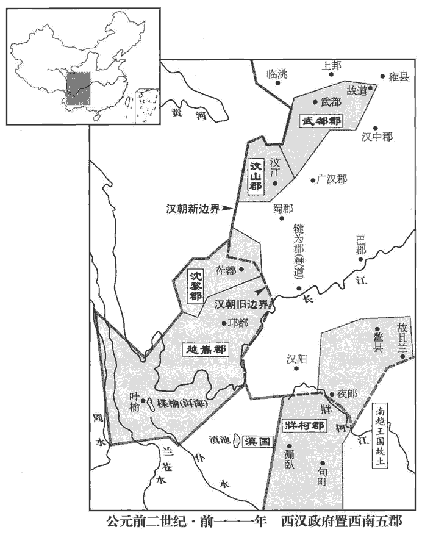 

6初，東越‹都东冶，福建福州›王餘善上書，請以卒八千人從樓船擊呂嘉；兵至揭陽‹廣東揭陽›，班志，揭陽縣屬南海郡；唐為潮州。韋昭曰：揭，其逝翻。蘇林音揭，師古音竭。以海風波為解，不行，持兩端，陰使南越。使，疏吏翻。及漢破番禺，不至。楊僕上書願便引兵擊東越；上以士卒勞倦，不許，令諸校屯豫章‹江西南昌›、梅嶺‹江西广昌西›以待命。徐廣曰：梅嶺在會稽界。索隱曰：徐說非也。按今豫章三十里有梅嶺，在洪崖山，當古驛道。杜佑曰：梅嶺在虔州虔化縣界。括地志：在虔化縣東北一百二十八里。校，戶教翻。餘善聞樓船請誅之，漢兵臨境，乃遂反，發兵距漢道，號將軍騶力等為吞漢將軍，入白沙‹江西南昌东北›、武林‹江西余幹›、梅嶺‹江西广昌西›，索隱曰：案今豫章北二百里接番陽界，地名白沙，沙東南八十里有武陽亭，東南三十里地名武林，當閩、越之京道。劉昫xù曰：武林，在蒼梧猛陵縣界，隋分猛陵置武林縣，屬永平郡，唐置龔州。殺漢三校尉。是時，漢使大農張成、故山州侯齒將屯，齒，城陽共王子，坐酎金失侯，故書曰故侯。將，即亮翻；下僕將同。弗敢擊，卻就便處，皆坐畏懦誅，餘善自稱武帝。

〖译文〗 [6]当初，东越王馀善上书朝廷，请求率兵八千随楼船将军杨仆征讨吕嘉。但军队抵达揭阳后，又以海上风狂浪大为借口，停止前进，抱着向两头观望的态度，暗中派使者与南越国联络。及至汉军攻破南越国都番禺，东越军还未到达。杨仆上书朝廷，请求乘胜征讨东越，汉武帝因士卒疲劳，没有批准，令各路将领屯兵豫章、梅岭一带等待命令。馀善听说杨仆奏请诛讨东越，又见汉军屯兵边境，于是造反，派兵到汉军通道上进行抵抗，赐将军驺力等“吞汉将军”称号，率兵进入白沙、武林、梅岭地区，杀死汉军三名校尉。当时，汉潮派大农令张成、原山州侯刘齿率兵屯驻当地，他们不敢出击，反退到安全之处，所以都被以怯懦畏敌的罪名处死。馀善自称武帝。

上欲復使楊僕將，為其伐前勞，為，於偽翻。以書敕責之曰：「將軍之功獨有先破石門‹广东广州西北›、尋陿‹广东清远东›，非有斬將搴qiān旗之實也，師古曰：搴，拔取之也。烏足以驕人哉！前破番禺，捕降者以為虜，降，戶江翻。掘死人以為獲，是一過也。使建德、呂嘉得以東越為援，師古曰：以僕不窮追之，故令得以東越為援也。是二過也。士卒暴露連歲，將軍不念其勤勞，而請乘傳行塞，傳，張戀翻。行，下孟翻。因用歸家，懷銀、黃，垂三組，誇鄉里，是三過也。師古曰：銀，銀印也；黃，金印也。僕為主爵都尉，又為樓船將軍，并將梁侯，故為三組。組，印綬也。失期內顧，師古曰：言顧思妻妾也。以道惡為解，是四過也。問君蜀刀價而陽不知，蜀刀，蜀中所作刀。師古曰：蜀刀，有環者也。挾偽干君，師古曰：干，犯也。是五過也。受詔不至蘭池，蘭池宮在渭城。如淳曰：本出軍時欲使之蘭池宮，頓而不至。明日又不對；假令將軍之吏，問之不對，令之不從，其罪何如？推此心在外，江海之間可得信乎？今東越深入，將軍能率眾以掩過不？」不，讀曰否。僕惶恐對曰：「願盡死贖罪！」上乃遣橫海將軍韓說出句章‹浙江余姚东南›，班志，句章縣屬會稽郡。史記正義曰：句章故城，在越州鄮mào縣西一百里。浮海從東方往；樓船將軍楊僕出武林‹江西余干›，中尉王溫舒出梅嶺‹江西广昌西›，以越侯為戈船、下瀨將軍，出若邪‹浙江紹興南若邪山›、白沙‹江西南昌东北›，若邪，時屬會稽山陰縣界；今之若邪谿，在越州東南二十五里，曰五雲谿。以擊東越。

〖译文〗 汉武帝想再派杨仆率兵征东越，因杨仆自恃先前的功劳而骄傲，下诏书责备他说：“你的功劳只是先攻破石门、寻而已，实际上并没有斩将夺旗，有什么值得骄傲的呢！先前攻破番禺城，你捕捉归降的人当俘虏，把死人挖出来冒充是战场斩杀，是一错。使赵建德、吕嘉得到东越的外援，是二错。将士们连年暴露于蛮荒之地，你不念及他们的辛劳，却请求乘坐驿车巡行边塞，乘机回家，怀揣金、银印信，垂下三条绶带，向乡里夸耀，是三错。你眷恋妻妾，误了回营日期，却以道路不好走作借口，是四错。问你蜀郡的刀价，你假装不知道，以欺诈手段冒犯君主，是五错。你接受诏书而不去兰池宫，第二天也不加以解释。如果你的部下，问他话不回答，命令他也不服从，该当何罪？在外怀有这种心肠，天下还有谁会相信你呢？如今东越军队已深入我国边境，你是否能率领部队补救你的过失呢？”杨仆惶恐地表示：“我愿拚死效力以赎罪！”于是，汉武帝派横海将军韩说从句章出发，渡海从东面进击；楼船将军杨仆从武林出发，中尉王温舒从梅岭出发，派已封侯的南越降将为戈船将军、下濑将军，从若邪、白沙出发，进攻东越。

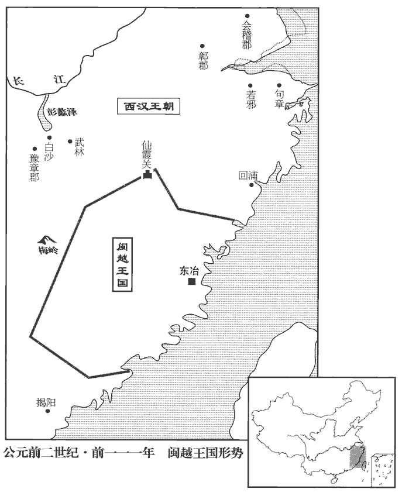 

7博望侯既以通西域尊貴，其吏士爭上書言外國奇怪利害求使。天子為其絕遠，非人所樂往，聽其言，師古曰：凡人皆不樂去，故有自請為使者即聽而遣之。為，於偽翻。樂，音洛。使，疏吏翻；下同。予節，募吏民，毋問所從來，師古曰：不為限禁遠近，雖家人私隸并許應募。予，讀曰與。為具備人眾遣之，為，於偽翻；下同。以廣其道。來還，不能毋侵盜幣物及使失指，師古曰：乖天子指意。天子為其習之，輒覆按致重罪，以激怒令贖，師古曰：言其串習，不以為難，必當更求充使，令立功以贖罪。復求使，使端無窮，而輕犯法。復，扶又翻。使，疏吏翻；下同。其吏卒亦輒復盛推外國所有，言大者予節，言小者為副，予，讀曰與。故妄言無行之徒皆爭效之。行，下孟翻。其使皆貧人子，私縣官齎物，師古曰：言所齎官物，竊自用之，同於私物。欲賤市以私其利。師古曰：所市之物得利多，故不盡入官也。外國亦厭漢使，人人有言輕重，服虔曰：漢使言于外國，人人輕重不實。度漢兵遠不能至，而禁其食物以苦漢使。師古曰：令其困苦也。度，徒洛翻。漢使乏絕，積怨至相攻擊。而樓蘭‹新疆若羌›、車師‹吐魯番›，小國當空道，漢出西域有兩道，南道從樓蘭，北道從車師，故二國當漢使空道。師古曰：空，即孔也。攻劫漢使王恢等尤甚，而匈奴奇兵又時遮擊之。使者爭言西域皆有城邑，兵弱易擊。易，以豉翻。於是天子遣浮沮將軍公孫賀將萬五千騎出九原‹內蒙包頭›二千餘里，至浮沮井而還；浮沮，匈奴中井名。出軍時，期賀至浮沮井，故以為將軍之號。下匈河將軍，其義類此。沮，子餘翻。匈河將軍趙破奴將萬餘騎出令居‹甘肅永登西›數千里，至匈河水而還；臣瓚曰：匈奴河水，去令居千里。以斥逐匈奴，不使遮漢使，皆不見匈奴一人。乃分武威、酒泉地置張掖、敦煌郡，應劭曰：敦，大也。煌，盛也。張掖，張國臂掖也。敦，音屯。張掖，昆邪王所居地，唐為甘州。敦煌，唐為沙州。考異曰：漢書武紀：「元狩二年，渾邪王降，以其地為武威、酒泉郡。元鼎六年，分置張掖、敦煌郡。」而地理志云：「張掖、酒泉郡，太初元年開；武威郡，太初四年開；敦煌郡，後元元年分酒泉置。」今從武紀。徙民以實之。

〖译文〗 [7] 博望侯张骞因出使西域而获得尊贵的地位之后，他的部下争相上书朝廷，陈说外国的奇异之事和利害关系，要求出使。汉武帝因西域道路极为遥远，一般人不愿前往，所以听从所请，赐给符节，准许招募官吏百姓，不问出身，为他们治装配备人员后派出，以扩大出使的道路。这些人返回时，不可避免地会出现偷盗礼品财物或违背朝廷旨意的现象。汉武帝因他们熟习出使之事，所以治以重罪，以激怒他们，让他们立功赎罪，再次请求出使。这些人反复出使外国，而对犯法之事看得很轻。使臣的随从官吏和士卒也每每盛赞外国事物，会说的被赐予正使符节，不大会说的就封为副使。因此，很多浮夸而无品行的人都争相效法。这些出使外国的人都是贫家子弟，他们将所带的国家财物据为私有，打算贱卖后私吞利益。西域各国也厌恶每个汉使所说之事轻重不一，估计汉朝军队路远难至，就拒绝为汉使提供食物，给他们制造困难。汉使在缺崐乏粮食供应的情况下，常常积怨，甚至和各国相互攻击。楼兰、车师两个小国，地处汉朝通往西域的通道上，攻击汉使。王恢等尤其厉害，匈奴军队也时常阻拦袭击汉使。使臣们争相报告朝廷，说西域各国都有城镇，兵力单弱，容易攻击。于是，汉武帝派浮沮将军公孙驾率骑兵一万五千人从九原出塞二千余里，至浮沮井而还，又派匈河将军赵破奴率骑兵一万余人从令居出塞数千里，至匈河水而还，目的是为了驱逐匈奴，让汉使不受阻拦，但没有遇到一个匈奴人。于是分割武威、酒泉二郡土地，增设张掖、敦煌二郡，迁徙内地民众充实该地。

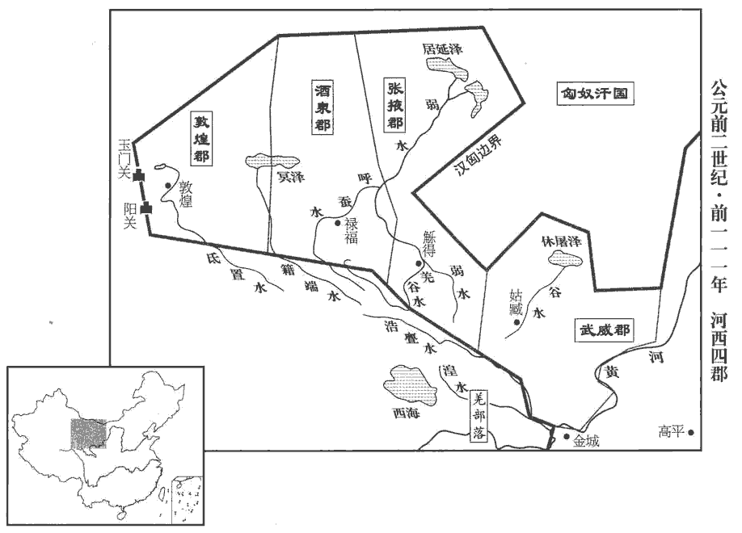 

8是歲，齊相卜式為御史大夫。式既在位，乃言「郡、國多不便縣官作鹽鐵器，苦惡如淳曰：「苦」或作「盬」，盬gǔ，不攻嚴也。臣瓚曰：謂作鐵器民患苦其不好也。師古曰：二說非也。鹽既味苦，器又脆惡，故總云苦惡也。余謂鹽器，則官與牢盆是也；鐵器，則官鑄鐵器是也。苦惡，專指鹽鐵器而言，如說未可厚非。價貴，或強令民買之；而船有算，船算及鹽鐵器，并見上卷四年，強，其兩翻。商者少，物貴。」少，詩沼翻。上由是不悅卜式。

〖译文〗 [8]该年，齐相卜式升任御史大夫。卜式到任后，言道：“各郡、国对盐铁由官府专营多感不便，官府专营的盐铁产品质次价高，有时还强迫百姓购买，船只也要交纳算赋，所以经商的人少，物价昂贵。”汉武帝因此不再喜欢卜式。

9初，司馬相如病且死，有遺書，頌功德，言符瑞，勸上封泰山。上感其言，會得寶鼎，上乃與公卿諸生議封禪。封禪用希曠絕，莫知其儀，而諸方士又言：「封禪者合不死之名也。漢書作「古不死之名」。黃帝以上，封禪皆致怪物，與神通，秦皇帝不得上封。陛下必欲上，稍上即無風雨，遂上封矣。」上，時掌翻。師古曰：稍，漸也。上於是乃令諸儒采尚書、周官、王制之文，草封禪儀，數年不成。上以問左內史兒寬，寬曰：「封泰山，禪梁父，昭姓考瑞，帝王之盛節也；父，音甫。然享薦之義，不著於經。師古曰：封禪之享薦也，以非常禮，故經無其文。著，竹筯翻。臣以為封禪告成，合祛於天地神祇，李奇曰：祛，開散；合，閉也；開閉於天地也。祛，丘居翻。唯聖主所由，制定其當，師古曰：當，猶中也。非群臣之所能列。今將舉大事，優遊數年，使群臣得人人自盡，師古曰：所言不同，各有執見也。終莫能成。唯天子建中和之極，兼總條貫，金聲而玉振之，師古曰：言振揚德音，如金玉之聲也。以順成天慶，垂萬世之基。」上乃自製儀，頗采儒術以文之。上為封禪祠器，以示群儒，或曰「不與古同」，於是盡罷諸儒不用。上又以古者先振兵釋旅，然後封禪。

〖译文〗 [9]当初，司马相如病重将死，临终时留下遗书，称颂汉武帝的功德，并谈及祥瑞之事，劝汉武帝到泰山封禅祭祀天地。汉武帝深受感动，适逢获得宝鼎，他便与公卿大臣和儒生们商议封禅之事。天子封禅泰山，是极为少见的事，又久未兴行，没有人懂得它的礼仪。方士们认为：“封禅的意义就是不死。黄帝以前的君主，封禅都招来怪物，以与神灵相通，而秦始皇就未能在泰山顶上祭天。陛下如一定要登泰山。应缓缓前进，如无风雨，就可以登上泰山山顶举行祭天大典了。”于是，汉武帝命儒生们采用《尚书》、《周官》、《王制》等书的记载，草拟封禅的礼仪。但数年之后，还未拟出。汉武帝询问左内史宽的意见，宽说：“在泰山祭天，在梁父山祭地，显扬祖先的姓氏，考求上天的瑞应，是帝王的盛典，但献礼的仪式，经书中却无记载。我认为，封禅典礼的完成，意味着同天地神灵的联系，只有圣明的君主才能制定适当的礼仪，而非臣下所能拟就。如今将要举行大典，已经拖了数年时间，使群臣人人各自尽了全力，却始终未能拟出。只有天子才能掌握中正平和的最高原则，综合条理各种头绪，发出金玉般的声音，以顺利促成这一天下最大的庆典，作为万世遵奉的法则。”于是汉武帝自定礼仪，多采用儒家学说加以修饰。又制作封禅用的祭器，拿给儒生们观看，有的儒生说：“与古代的不一样。”于是汉武帝将儒生一律罢斥不用。又按着古代的作法，首先振奋军威，用酒食飨众，然后举行封禅大典。

## 元封元年（辛未，前一一零）應劭曰：始封泰山，故改元。

1冬，十月，下詔曰：「南越、東甌，咸伏其辜；西蠻、北夷，頗未輯睦；師古曰：輯，與集同。集，和也。朕將巡邊垂，躬秉武節，置十二部將軍，親帥師焉。」帥，讀曰率。乃行，自雲陽‹陝西淳化›班志，雲陽縣屬左馮翊。北歷上郡‹陝西榆林南鱼河堡›、西河‹內蒙准格尔旗西南›、五原‹內蒙包頭›，元朔四年置西河郡，其地自汾、石州西北至塞下。出長城，北登單于台‹内蒙呼和浩特北›，杜佑曰：單于台在雲州雲中縣西北百餘里。至朔方‹內蒙杭锦旗北黄河南岸›，臨北河；【章：十四行本「河」下有「勒兵十八萬騎，旌旗徑千餘里，以見武節，威匈奴」十九字；乙十一行本同；張校同。】遣使者郭吉告單于曰：「南越王頭已縣于漢北闕。縣，古懸通。今單于能戰，天子自將待邊；將，即亮翻。不能，即南面而臣于漢，何徒遠走亡匿於幕北，寒苦無水草之地，毋為也！」語卒而單于大怒，卒，子恤翻。立斬主客見者，師古曰：主客，主接諸客者也。見者，謂引見郭吉於單于者。而留郭吉，遷之北海‹貝加爾湖›上，然匈奴亦讋zhé，讋，之涉翻。師古曰：失氣也。終不敢出。上乃還，祭黃帝塚橋山‹陝西子长西北›，應劭曰：橋山在上郡陽周縣。釋兵須如。須如，地名。考異曰：漢書作「涼如」，今從史記。上曰：「吾聞黃帝不死，今有塚，何也？」公孫卿曰：「黃帝已仙上天，群臣思慕，葬其衣冠。」考異曰：史記、漢書皆云「或對」；漢武故事云「公孫卿對」，今取之。上歎曰：「吾後升天，群臣亦當葬吾衣冠於東陵乎？」東陵，謂茂陵也。在長安東，故曰東陵。乃還甘泉‹陝西淳化西北›，類祠太一。師古曰：類祠，謂以事類而祭也。

〖译文〗 [1]冬季，十月，汉武帝颁布诏书说：“南越、东瓯都已受到应有的惩罚，而西蛮、北夷尚未平服和睦。朕将巡视边疆，亲自主持武道，设置十二路将军，由我统率。”于是汉武帝离京出巡，自云阳向北，经上郡、西河、五原，出长城，再向北登单于台，直至朔方，来到北河，派使臣郭吉通知匈奴单于说：“南越国王的人头已经悬挂到大汉皇宫的北门阙上。如今单于若是能战，天子亲自率军在边境等候；若是不能战，就应归降大汉，为什么偏要远远地逃避到大沙漠以北，寒冷、困苦而又缺乏水草的地方呢？实在是没意思！”话音一落，单于大怒，立即将引见郭吉的官员斩首，同时扣留郭吉，将他迁徙到北海之畔。但此时匈奴也已丧失斗志，始终未敢出战。于是，汉武帝起驾回朝，在桥山祭黄帝陵，行至须如，将征调的兵卒遣散。汉武帝问道：“我听说黄帝长生不老，可如今有他的陵墓，这是为什么呢？”公孙卿回答说：“黄帝成仙升天以后，群臣相念于他，所以建陵将他的衣冠埋葬。”汉武帝叹道：“我将来升天后，群臣也会把我的衣冠葬在东陵吗？”回到甘泉宫，祭祀太一神。

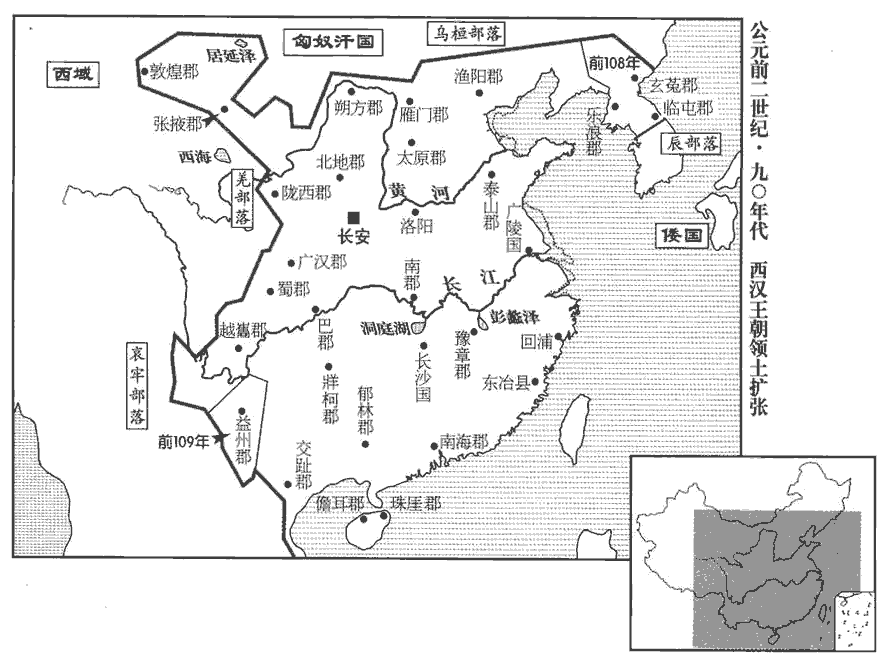 

2上以卜式不習文章，貶秩為太子太傅，以兒寬代為御史大夫。

〖译文〗 [2]汉武帝因卜式不善文辞，将其降为太子太傅，命宽代替卜式作御史大夫。

3漢兵入東越境，東越素發兵距險，使徇北將軍守武林‹江西餘干›。樓船將軍卒錢塘‹浙江杭州›轅終古斬徇北將軍。班志，錢唐縣屬會稽郡。師古曰：轅，姓；終古，名。故越衍侯吳陽以其邑七百人反，攻越軍于漢陽。越建成侯敖與繇王居股殺餘善，以其眾降。據東越傳，吳陽先在漢，漢使歸喻餘善，餘善不聽。及漢軍至，陽以邑人攻越。書「故越衍侯」者，言其舊為越衍侯也。越衍侯及建成侯皆東越所封。上封終古為禦兒侯，孟康曰：禦兒，越中地，今吳南亭是也。國語曰：吾用禦兒臨之。宋祁註云：禦兒，越北鄙，今嘉興。史記正義曰：「禦」，今作「語」。語兒鄉在蘇州嘉興縣南七十里，臨官道。陽為卯石侯，居股為東成侯，敖為開陵侯；又封橫海將軍說為按道侯，橫海校尉福為繚嫈yīng侯，東越降將多軍為無錫侯。「卯石侯」，功臣表作「外石」，食邑於濟南。「東成」作「東城」，屬九江郡。開陵，侯國，屬臨淮郡。「按道」，功臣表作「安道」，食邑於南陽。索隱曰：繚嫈，縣名。師古曰：繚，音遼。嫈，於耕翻。橫海校尉福，城陽共王子海常侯福也，坐法失侯，以今功封繚嫈侯。服虔曰：嫈，音瑩。劉伯莊曰：紆營翻。無錫縣，屬會稽郡。上以閩地險阻，數反覆，數，所角翻。終為後世患，乃詔諸將悉徙其民于江、淮之間，遂虛其地。虛，如字，康讀曰墟。

〖译文〗 [3]汉军进入东越国境，东越王早已派兵占据了险要地带，并命徇北将军镇守武林。杨仆部下士兵钱塘人辕终古将徇北将军斩杀。原东越衍侯吴阳率当地武装七百人背叛东越王，在汉阳进攻东越军队。名叫敖的东越建成侯与繇王骆居股杀死东越王骆馀善，率众归降。汉武帝封辕终古为御侯，吴阳为卯石侯，骆居股为东成侯，敖为开陵侯；又封横海将军韩说为按道侯，横海校尉福为缭侯，东越降将多军为无锡侯。汉武帝因闽越地区地势险恶，其人反覆无常，多次与汉朝为敌，终究是后世祸患，于是诏命各路将领将当地人全部迁到长江、淮河一带，于是闽越地区成为荒无人烟的地方。

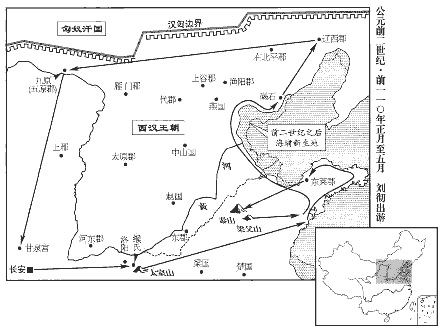 

4春，正月，上行幸緱gōu氏‹河南偃師东南›，考異曰：封禪書、郊祀志作「三月」；漢書武紀及荀紀皆作「正月」，今從之。禮祭中嶽太室，從官在山下聞若有言「萬歲」者三。荀悅曰：萬歲，神稱之也。從，才用翻。詔祠官加增太室祠，禁無伐其草木，以山下戶三百為之奉邑。奉，扶用翻。

〖译文〗 [4]春季，正月，汉武帝出巡至缑氏城，祭祀于中岳太室，随从官员在山下似乎听到有声音连呼三次“万岁”。汉武帝命令主管祭祀的官员扩建太室祭祠，禁止砍伐山上草木，又将山下三百户百姓作为供奉太室的奉邑。

上遂東巡海上，行禮祠八神。齊人之上疏言神怪、奇方者以萬數，乃益發船，令言海中神山者數千人求蓬萊神人。公孫卿持節常先行，候名山，至東萊‹山東莱州›，東萊，春秋萊子之國；高祖置萊郡；唐為登、萊二州之地。言：「夜見大人，長數丈，長，直亮翻。就之則不見，其跡甚大，類禽獸云。」群臣有言：「見一老父牽狗，言『吾欲見钜公』，鄭氏曰：钜公，天子也。張晏曰：天子為天下父，故曰钜公。師古曰：钜，大也。已忽不見。」上既見大跡，未信，及群臣又言老父，則大以為仙人也，宿留海上；師古曰：宿留，謂有所須待也。宿，先就翻。留，力就翻。與方士傳車及間使求神仙，人以千數。師古曰：間，微也；隨間隙而行也。

〖译文〗 汉武帝东巡大海，祭祀八位神仙。齐人上书陈述神怪之事和奇异方术的数以万计，于是汉武帝增派船只，命声称海中有仙山的数千人出海寻找蓬莱神仙。公孙卿常携带天子符节，先行前往名山等候神仙驾临，行至东莱，声称：“夜中见一巨人，身高数丈，凑上前去，却又看不见了，所留脚印甚为巨大，类似禽兽的蹄迹。”群臣中又有人说道：“看到一位老翁，手中牵着一条狗，说：‘我想见天子。’说完忽然踪迹全无。”汉武帝亲自察看了巨大脚印，但还未相信；及至听说老翁之事，才认定就是神仙，于是留宿海边。供给方士驿马车辆，随时访求神仙踪迹。寻仙之人，数以千计。

夏，四月，還，至奉高‹山東泰安东›，奉高，泰山郡治所。禮祠地主于梁父‹山東泰安东南›。地主，八神之一也。梁父縣屬泰山郡。父，音甫。乙卯‹十五›，令侍中儒者皮弁biàn、搢紳，射牛行事，續漢志：委貌、皮弁同制，長七寸，高四寸，制如覆盆，前高廣，後卑銳，所謂「夏之母追、殷之章甫」者也。委貌，以皂絹為之；皮弁，以鹿皮為之。沈約曰：古者貴賤皆執笏hù，其有事則搢之於腰帶，所謂「搢紳之士」者，搢笏而垂紳。紳，帶也，長三尺。天子有事必自射牛，示親殺也；今采此禮以為封禪議。封泰山下東方，考異曰：武紀：「癸卯，上還，登封泰山。」蓋癸卯自海上還，乙卯至泰山行事也。如郊祠泰一之禮。封廣丈二尺，高九尺，廣，古曠翻，度廣曰廣。高，居號翻，度高曰高。其下則有玉牒書，書祕。禮畢，天子獨與侍中、奉車都尉霍子侯上泰山，服虔曰：子侯，霍去病子也。上，時掌翻；下同。亦有封，其事皆禁。明日，下陰道。山北為陰。丙辰‹十六›，禪泰山下阯師古曰：阯者，山之基足。阯，音止。東北肅然山‹山東萊蕪東北›，如祭后土禮，天子皆親拜見，見，賢遍翻；下同。衣尚黃，而盡用樂焉。江、淮間茅三脊為神藉，藉，才夜翻；薦也。五色土益雜封。其封禪祠，夜若有光，晝有白雲出封中。師古曰：雲出於所封之中。天子從禪還，坐明堂，班志，明堂在奉高西南四里。臣瓚曰：郊祀志：初，天子封泰山，泰山東北阯，古時有明堂處，則此所坐者也。明年秋，乃作明堂。群臣更上壽頌功德。更，互也，工衡翻。詔曰：「朕以眇身承至尊，兢兢焉惟德菲薄，不明于禮樂，故用事八神。遭天地況施，應劭曰：況，賜也。施，與也。言天地神靈乃賜我瑞應。施，式智翻。著見景象，屑然如有聞，臣瓚曰：聞呼萬歲者三，是也。震於怪物，欲止不敢，遂登封泰山，至於梁父，然後升䄠肅然䄠，與禪同。自新，嘉與士大夫更始，更，工衡翻；下同。其以十月為元封元年。行所巡至，博‹山東泰安›、奉高‹山東泰安東›、蛇丘‹山東肥城东›、歷城‹山東济南›、梁父‹山東泰安南›，博與蛇丘屬泰山郡。博縣有泰山廟。岱山在西北。師古曰：蛇，音移。歷城縣屬濟南郡。民田租逋bū賦，皆貸除之，無出今年算。賜天下民爵一級。」又以五載一巡狩，用事泰山，令諸侯各治邸泰山下。載，子亥翻。治，直之翻；下同。

〖译文〗 夏季，四月，汉武帝起驾还朝，到达奉高，在梁父祭祀地主神。乙卯（十九日），汉武帝令担任侍中的儒家学者戴鹿皮帽，将笏板用丝带系在腰间，参加射牛仪式。在泰山东坡之下祭祀天神，如同祭祀泰一神的礼仪。祭坛宽一丈二尺，高九尺，坛下埋藏着汉武帝给神仙的玉牒书，内容隐秘。祭祀仪式结束后，汉武帝独自与侍中、奉车都尉霍子侯一起登上泰山，再行祭天之礼，一切过程都禁不示人。第二天，君臣从北道下山。丙辰（二十日），汉武帝在泰山脚下东北部的肃然山祭祀地神，如同祭祀后土神之礼，汉武帝身穿黄色衣服，在音乐的伴奏下一一亲自叩拜。用江淮地区出产的三棱茅草作为供神祭品的衬垫，用五种颜色的泥土做祭坛。在祭祀天地的神祠中，夜间仿佛有光，白天有白云从坛中产生。汉武帝祭完地神之 后，回到奉高，坐在明堂中，众大臣轮番上前歌功颂德，上寿祝福。汉武帝下诏说：“朕以渺小的身躯，继承至尊高位，兢兢业业，唯恐德才不足，不懂得礼乐，所以供奉八神，祈求庇护。蒙天地神灵恩赐祥瑞，目有所见，耳有所闻，震惊于其事怪异，想阻止却又不敢，于是登泰山祭祀天神，至梁父，然后在肃然山升坛祭祀地神，反省自新，与士大夫一起吉祥地开始新的生活。十月，改年号为元封元年。此次巡行所到之博县、奉高、蛇丘、历城、梁父等地，一概免除百姓的田租及欠交的赋税，不收今年的算赋。并赐天下有爵百姓擢升一级。”又规定：天子每五年巡游一次，至泰山祭祀，各诸侯封国都要在泰山脚下修建官邸。

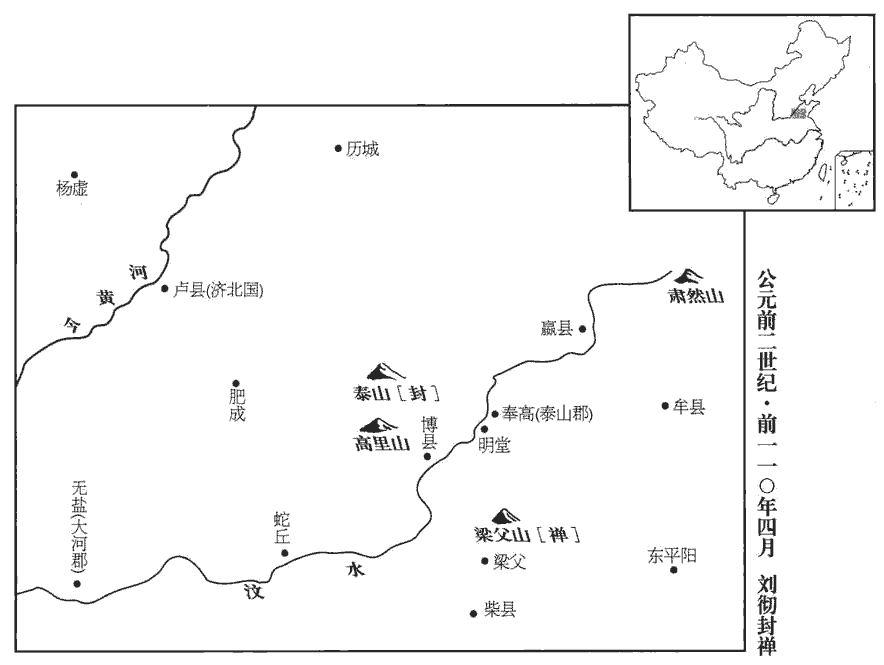 

天子既已封泰山，無風雨，而方士更言蓬萊諸神若將可得，於是上欣然庶幾遇之，復東至海上望焉。幾，居衣翻。復，扶又翻。上欲自浮海求蓬萊，群臣諫，莫能止。東方朔曰：「夫仙者，得之自然，不必躁求。躁，則到翻。若其有道，不憂不得；若其無道，雖至蓬萊見仙人，亦無益也。臣願陛下第還宮靜處以須之，處，昌呂翻。須，待也。仙人將自至。」上乃止。會奉車霍子侯暴病，一日死。子侯，去病子也，上甚悼之；乃遂去，并海上，并，步浪翻。上，時掌翻。北至碣jié石‹河北昌黎北›，巡自遼西‹河北义县西›，歷北邊，至九原‹內蒙包頭›，五月，乃至甘泉‹陝西淳化›。凡周行萬八千里云。

〖译文〗 汉武帝在泰山祭祀了天地，并无风雨，而方士们更加强调蓬莱山的神仙大概能够请到，于是汉武帝再次东至海边，兴高彩烈地盼望能遇到神仙。汉武帝打算亲自乘船出海去寻找蓬莱仙山，群臣劝谏，但无人能够阻止。东方朔说道：“与神仙相遇，要出于自然，不必急躁强求。若是有道述，就不愁遇不到；如果无道术，纵然到了蓬莱山，见到神仙，也没有益处。我希望陛下只管回到宫中，安静地等待，神仙自会降临。”汉武帝这才打消了出海的念头。正巧奉车都尉霍子侯突然重病，一日之间死去。霍子侯是霍去病的儿子，汉武帝非常难过，于是起驾离去，沿海岸北上至碣石，自辽西巡视北部边疆到九原，五月回到甘泉。此次出巡，行程共一万八千里。

先是，桑弘羊為治粟sù都尉，領大農原父曰：大司農，舊治粟內史耳，弘羊為搜粟都尉也。先，悉薦翻。儘管天下鹽鐵。弘羊作平準之法，令遠方各以其物如異時商賈所轉販者賈，音古。為賦而相灌輸。置平準于京師，都受天下委輸。委，於偽翻。輸，音戍。大農諸官，盡籠天下之貨物，貴即賣之，賤則買之，欲使富商大賈無所牟大利，如淳曰：牟，取也。而萬物不得騰踴。至是，天子巡狩郡縣，所過賞賜，用帛百余萬匹，錢金以巨萬計，皆取足大農。弘羊又請【章：十四行本「請」下有「令」字；乙十一行本同；孔本同。】吏得入粟補官及罪人贖罪。山東漕粟益歲六百萬石，一歲之中，太倉、甘泉倉滿，邊餘穀，諸物均輸，帛五百萬匹，民不益賦而天下用饒。於是弘羊賜爵左庶長，黃金再百斤焉。

〖译文〗 当初，桑弘羊以治粟都尉的身分兼任大农令，主持全国的盐铁专营事务。桑弘羊创立平准法，令相距较远的地方官府以各自的特产作为贡赋，参考商人在不同时期向不同地区转贩不同商品的作法，相互转输。又在京师设立平准官，负责全国各地的转输事务，大农令所属各官，控制天下全部货物，价高时卖出，价低时买进，目的是让大商人无法牟取暴利，使各种货物的价格不能高涨。如今，汉武帝出巡各地，所到之处，赏赐丝织品共一百多万匹，金钱以万万计，都由大农令充分供应。桑弘羊又奏请以武帝批准，小吏可以用捐献粮食的办法升为官员，犯罪的人也可以用此法来赎罪。因此，崤山以东地区一年的漕粮比规定数目多出六百万石，一年之间，太仓、甘泉仓全部贮满，边塞地崐区的粮食储备也有盈余；各地货物相互流通，都有余裕，如丝织品就余出五百万匹。百姓赋税没有增加，而天下财物却变得富饶有余。于是，汉武帝赐给桑弘羊左庶长爵位和黄金二百斤。

是時小旱，上令官求雨。卜式言曰：「縣官當食租衣稅而已，師古曰：衣，於既翻。今弘羊令吏坐市列肆，販物求利，烹弘羊，天乃雨。」

〖译文〗 这时，发生小规模的旱灾，汉武帝命官员求雨。卜式说道：“朝廷的衣食供应全靠赋税，如今桑弘羊却让官吏们坐在市场店铺之中，贩卖货物，追求利润。只有烹杀桑弘羊，天才会下雨。”

5秋，有星孛于東井，晉天文志：東井八星，天之南門，黃道所經。又曰：東井，雍州分。孛，蒲內翻；下同。後十餘日，有星孛於三台。天文志：魁下六星，兩兩而比，曰三台。望氣王朔言：「候獨見填星出如瓜，食頃，復入。」填星，土星也。填，讀曰鎮。有司皆曰：「陛下建漢家封禪，天其報德星云。」師古曰：德星，即填星也。言天以德星報於帝。

〖译文〗 [5]秋季，有异星出现在井宿。十几天后，三台星旁又出现异星。善观星象的王朔说道：“观测时只看到土星独自出现，形状似瓜，一顿饭工夫后消失。”有关官员都说：“陛下开创汉朝天子封禅记录，上天用‘德星’回报陛下。”

6齊懷王閎薨，無子，國除。閎，元狩六年受封。

〖译文〗 [6]齐王刘闳去世，因没有儿子，封国被撤销。

