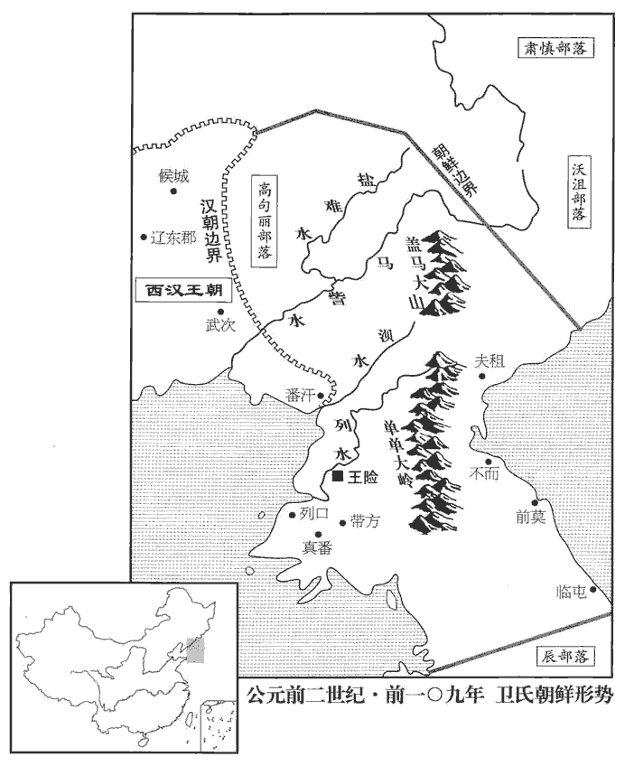
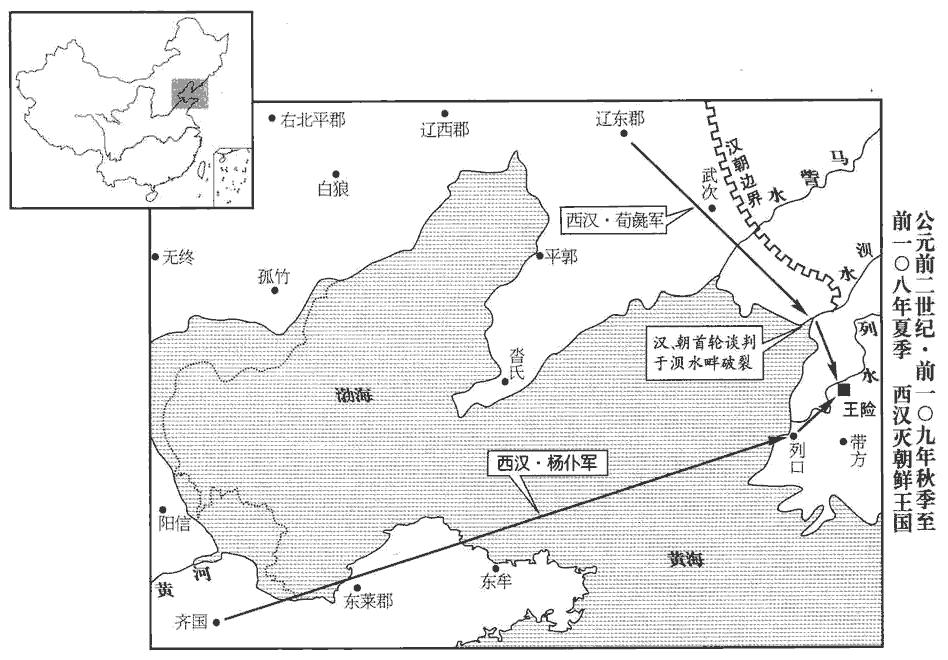
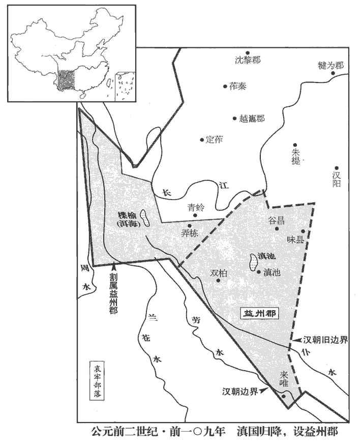
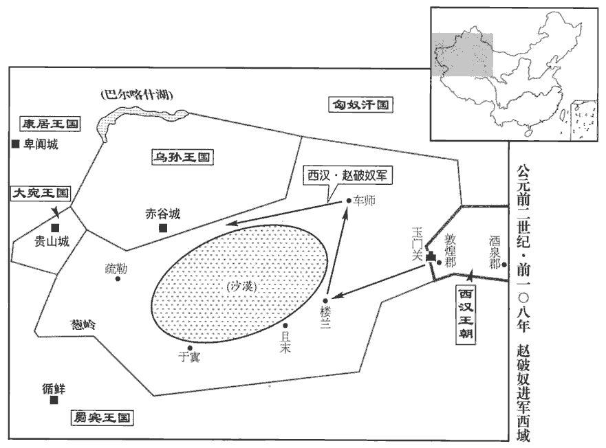
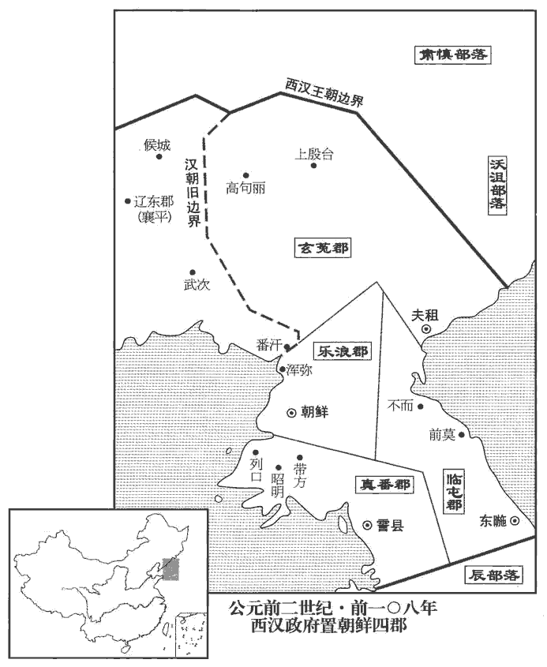
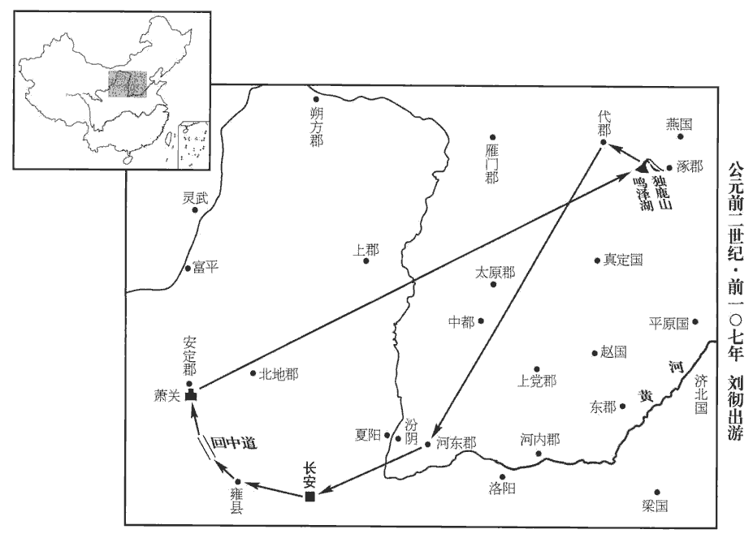
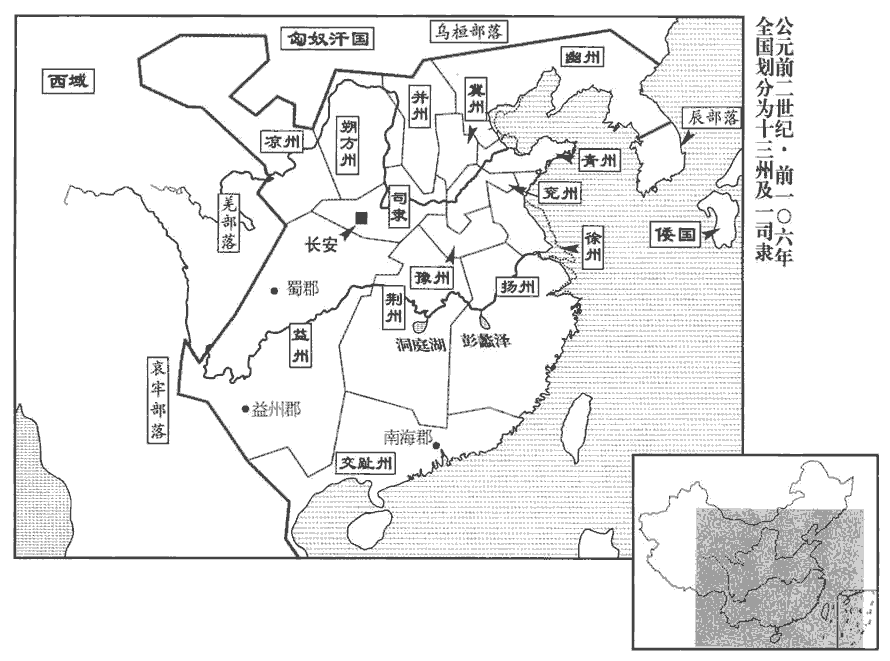
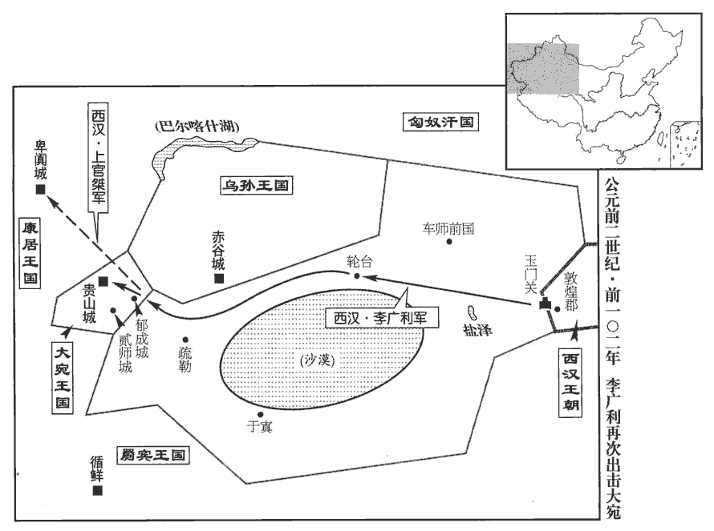
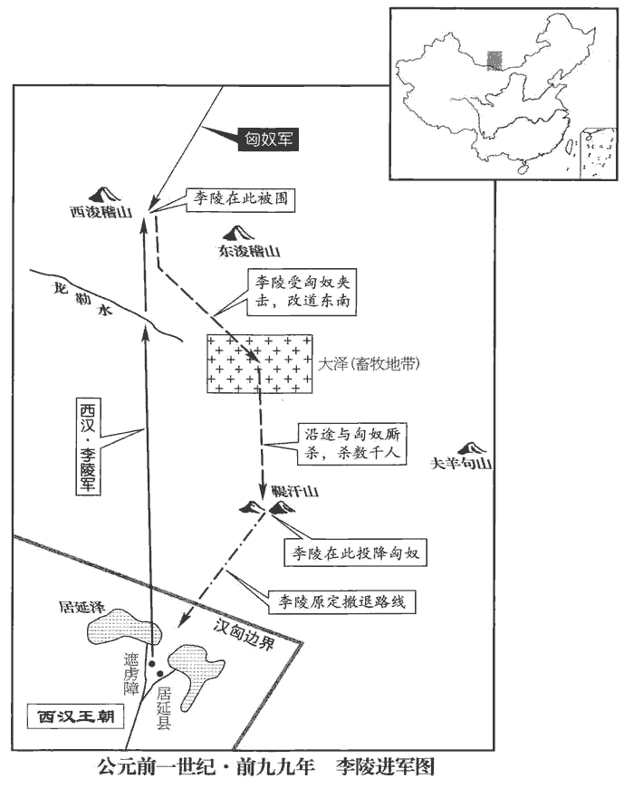

 漢紀十三起玄黓yì涒tūn灘（壬申），盡玄黓敦牂zāng（壬午），凡十一年。

# 世宗孝武皇帝下之上

## 元封二年（壬申，前一零九年）

1冬，十月，上‹刘彻，时年四十八›行幸雍‹陝西鳳翔›，祠五畤，還，祝祠泰一，以拜德星。師古曰：拜而祠之，加祝辭。

〖译文〗 [1]冬季，十月，汉武帝巡幸至雍，祭祀于五；回长安后，祭祀泰一神，并叩拜“德星”。

2春，正月，公孫卿言：「見神人東萊山‹山東龙口东南莱山›，若云欲見天子。」天子於是幸緱gōu氏城‹河南偃師东南›，緱，工侯翻。拜卿為中大夫，遂至東萊，宿留之，數日，無所見，宿留，音秀溜。見大人跡云。復遣方士求神怪，采芝藥，以千數。復，扶又翻。時歲旱，天子既出無名，乃禱萬里沙‹山东莱州东北›。應劭曰：萬里沙神祠也，在東萊曲城。孟康曰：沙徑三百餘里。杜佑通典：萬里沙在萊州掖縣界。夏，四月，還，過祠泰山。

〖译文〗 [2]春季，正月，公孙卿报告说：“在东莱山看到神仙，他好像说要见天子。”于是汉武帝前往缑氏城，封公孙卿为中大夫，到东莱住了几天，却未见到神仙，只看到了巨人的足迹。汉武帝又派出数以千计的方士去寻访神，采摘灵芝。当时正逢旱灾，汉武帝外出巡游没有理由，便去祭祀万里沙神庙。夏季，四月，返回长安，中途祭祀泰山。

3初，河決瓠子‹河南濮陽西南›，河始決見十八卷元光二年。後二十餘歲不復塞，復，扶又翻。塞，悉則翻；下同。梁‹河南商丘›、楚‹江苏徐州›之地尤被其害。被，皮義翻。是歲，上使汲仁、郭昌二卿發卒數萬人塞瓠子河決。天子自泰山還，自臨決河，沈白馬、玉璧於河，沈，持林翻。令群臣、從官自將軍以下皆負薪，卒填決河。從，才用翻。卒，子恤翻。築宮其上，名曰宣防宮。導河北行二渠，復禹舊跡，溝洫志：禹導河自積石，歷龍門，南到華陰，東下底柱及孟津、洛、汭，至於大伾pī。於是禹以為河所從來者高，水湍悍，難以行平地，數為敗，乃釃shī二渠以引其河，北載之高地，過洚jiàng水，至於大陸，播為九河，同為迎河入勃海。孟康曰：二渠，其一出貝丘西南，南折者也；其一則漯川也。河自王莽時遂空，惟用漯耳。釃，山支翻。漯，吐合翻。而梁、楚之地復寧，無水災。

〖译文〗 [3]先前，黄河在瓠子决口，后二十多年未将决口堵塞，梁、楚一带地方受害最深。本年，汉武帝派大臣汲仁、郭昌二人征调数万人堵塞瓠子决口。汉武帝从泰山回长安途中，亲自到黄河决口处视察，将白马、玉璧沉入河中，命随驾群臣和扈从官员自将军以下一律背负柴薪，终于将决口堵住。汉武帝命人在原决口处兴建宫室一座，名叫宣防宫；又开挖两条渠道，将黄河导入北行的两条河渠，恢复大禹治水时的旧状，梁、楚地区又安宁了，从此不受水灾之害。

4上還長安。

〖译文〗 [4]汉武帝回到长安。

5初令越巫祠上帝、百鬼，而用雞卜。越俗用雞卜。李奇曰：持雞骨卜，如鼠卜。史記正義曰：雞卜法，用雞一狗一，生祝願訖，即殺雞狗，煮熟又祭，獨取雞兩眼骨，上自有孔，裂似人物形則吉，不足則凶。今嶺南猶行此法。范成大桂海虞衡志：雞卜，南人占法，以雄雞雛執其兩足，焚香禱所占，撲雞殺之，拔兩股骨，淨洗，線束之，以竹筳tíng插束處，使兩骨相背於筳端，執竹再祝。左骨為儂，儂，我也。右骨為人，人，所占事也。視兩骨之側所有細竅，以細竹筳長寸餘徧插之，斜直偏正，各隨竅之自然，以定吉凶。法有十八變，大抵直而正、或近骨者多，吉；曲而斜、或遠骨者多，凶。亦有用雞卵卜者，握卵以卜，書墨於殼，記其四維；煮熟橫截，視當墨處，辨殼中白之厚薄以定儂、人吉凶。

〖译文〗 [5]汉武帝开始命令越族巫师祭祀上帝和众鬼，并使用鸡骨进行占卜。

6公孫卿言仙人好樓居，好，呼到翻。於是上令長安作蜚廉、桂觀，甘泉作益壽、延壽觀，應劭曰：蜚廉，神禽名，能致風氣。晉灼曰：身似鹿，頭如爵，有角，而蛇尾，文如豹文。「桂觀」，漢志作「桂館」。師古曰：蜚廉、桂館、益壽、延壽，四館名。觀，古玩翻。使卿持節設具而候神人。又作通天莖台，通天台在甘泉宮。漢舊儀曰：台高五十丈，去長安二百里，望見長安城。置祠具其下。更置甘泉前殿，益廣諸宮室。

〖译文〗 [6]据公孙卿说，神仙喜欢住在楼中，于是汉武帝命人在长安兴建蜚廉观、桂观，在甘泉兴建益寿观、延寿观，派公孙卿携带皇帝符节，布置好全部设备，恭候神仙降临。又兴建通天茎台，在台下摆设祭祀器具，兴建甘泉宫前殿，并对其他各处宫室进行扩建。

 

7初，全燕‹北京›之世，嘗略屬真番‹朝鮮信川›、朝鮮‹朝鮮平壤›，徐廣曰：遼東有番汙縣。應劭曰：玄菟tù本真番國。番，普安翻。張晏曰：朝鮮有濕水、洌水、汕水三水，合為洌水。疑樂浪、朝鮮取名於此。括地志：高麗都平壤城，本樂浪郡王險城；又古云朝鮮。索隱曰：案朝，音潮，直驕翻。鮮，音仙，以有汕水故也。汕，一音訕。為置吏，築障塞。為，於偽翻；下同。秦滅燕，屬遼東外徼jiǎo。徼，吉吊翻。漢興，為其遠難守，復修遼東故塞，至浿pèi水‹朝鮮青川江›為界，班志，浿水出遼東塞外，西南至樂浪縣西入海。水經：浿水出樂浪鏤方縣，東南過臨浿縣，東入海。酈道元註曰：滿自浿水而至朝鮮，若浿水東流，無渡浿之理。余訪蕃使，言城在浿水之陽，其水西流，逕樂浪郡朝鮮縣，故志曰浿水西至增地縣入海，經誤。浿，普蓋翻，又滂沛翻，普大翻。杜佑曰：浿，滂拜翻。屬燕。燕王盧綰反，入匈奴。見十二卷高祖十三年。燕人衛滿亡命，聚党千餘人，椎髻、蠻夷服而東走出塞，渡浿pèi水，居秦故空地上下障，稍役屬真番‹朝鮮信川›、朝鮮‹朝鮮平壤›蠻夷及燕亡命者王之，王，於況翻。都王險‹朝鮮平壤›。韋昭曰：王險，故邑名。應劭曰：遼東有險瀆縣，即滿所都，因水險，故曰險瀆。臣瓚曰：王險在樂浪郡浿水之東。師古曰：瓚說是。賢曰：即平壤城。會孝惠、高后時，天下初定，遼東‹遼寧遼陽›太守即約滿為外臣，保塞外蠻夷，無使盜邊；諸蠻夷君欲入見天子，勿得禁止。見，賢遍翻；下同。以故滿得以兵威財物侵降其旁小邑真番‹朝鮮信川›、臨屯‹朝鮮江陵›，皆來服屬，臨屯，帝後開為郡。註見下三年。降，戶江翻。方數千里。傳子至孫右渠，所誘漢亡人滋多，又未嘗入見；誘，音酉。見，賢遍翻；下同。辰國‹朝鮮南部›欲上書見天子，又雍閼不通。師古曰：辰國，即辰韓之國。雍，讀曰壅。閼，一曷翻。是歲，漢使涉何誘諭，涉，姓也。左傳晉有大夫涉佗。右渠終不肯奉詔。何去至界上，臨浿水，使御刺殺送何者朝鮮裨pí王長，刺，七亦翻。即渡，馳入塞，遂歸報天子曰：「殺朝鮮將。」上為其名美，將，即亮翻。為，於偽翻；下同。即不詰，拜何為遼東東部都尉。遼東東部都尉治武次縣‹辽宁凤城东北›。朝鮮怨何，發兵襲攻殺何。

〖译文〗 [7]当初，燕国全盛之时，曾经占领真番、朝鲜为属地，设置官吏，修筑边防要塞。秦灭掉燕国之后，这一带成为辽东郡的外部边界。汉朝兴起后，因该地遥远，难于守御，所以只重修了辽东地区的原有边塞，以水作为边界，属燕国管辖。燕王卢绾谋反，逃入匈奴，燕国人卫满聚集亲信一千余人，头梳发髻，身穿蛮夷服装向东逃出边塞，渡过水，占据秦时旧有空地，自立为王，逐渐将真番、朝鲜的蛮夷部族和从燕国逃出的人归于自己的统治之下，建都王险。到汉惠帝、汉高后时期，因天下刚刚安定不久，崐辽东太守便与卫满约定：由卫满作为汉朝的外臣，保护汉朝边塞之外的蛮夷部族不对汉朝边塞进行侵扰；如果各蛮夷部族的首领要到汉朝晋见天子，卫满不得禁止。因此，卫满得以利用兵威和财物侵略和降服周围弱小部族，真番、临屯都来臣服归属，使其统治地域扩大到方圆数千里。王位传到卫满的孙子卫右渠时，卫氏朝鲜招降的汉朝逃亡之人越来越多，而卫右渠又从来未到长安朝见过汉朝天子；辰国国君想要上书汉朝，晋见汉天子，也因卫氏朝鲜的阻隔而不得通行。汉朝于本年派使臣涉何前去劝诱并卫右渠，但卫右渠却到底不肯接受诏令。涉何离开朝鲜，来到边界，在水河边，命驾车人将护送他的朝鲜副王长刺杀，然后立即渡过水，驰入汉朝边塞，回来报告汉武帝说：“杀死了朝鲜将领。”汉武帝认为他有杀朝鲜人的美名，未加责问，任命他为辽东东部都尉。朝鲜怨恨涉何，派兵攻击辽东，将涉何杀死。

8六月，甘泉‹陕西淳化西北›房中產芝九莖，時芝產于甘泉齋房，九莖連葉。論衡：芝生於土，土氣和則芝草生。瑞命記：王者慈仁則芝草生。上為之赦天下。

〖译文〗 [8]六月，甘泉宫斋房中长出九茎灵芝。为此，汉武帝下令大赦天下。

9上以旱為憂，公孫卿曰：「黃帝時，封則天旱，乾封三年。」上乃下詔曰：「天旱，意乾封乎！」乾，音干。

〖译文〗 [9]汉武帝因为旱灾而忧虑，公孙卿说：“黄帝时，封祀后便出现大旱，使封土干了三年。”汉武帝于是颁布诏书说：“天旱，意旨是要使封土干吧！”

10秋，作明堂於汶wèn上‹流經山東泰安東›。班志，泰山郡萊蕪縣。禹貢：汶水出西南入濟。桑欽所言又曰：琅邪郡朱虛縣東泰山，汶水所出，東至安丘入濰；有五帝祠。師古曰：前言汶水出萊蕪入濟，此又言出朱虛入濰，將桑欽所言有異，或者有二汶水乎？予據班志，明堂在泰山奉高縣西南四里；又禹貢，「浮于汶，達於濟」；此明堂當在濟之汶上。琅邪之汶入於濰，而濰入於海，其地僻遠，非立明堂處。汶，音問。

〖译文〗 [10]秋季，在汶水边兴建明堂。

11上募天下死罪為兵，遣樓船將軍楊僕從齊浮渤海，僕從齊浮渤海。蓋自青、萊以北，幽、平以南，皆濱於海，其海通謂之渤海，非指渤海郡而言也。左將軍荀彘zhì出遼東‹遼寧遼陽›，以討朝鮮。

〖译文〗 [11]汉武帝下令招募天下犯有死罪的人当兵，由楼船将军杨仆率领，从齐国渡渤海，左将军荀彘从辽东出发，征讨朝鲜。

 

12初，上使王然于以越破及誅南夷兵威喻滇‹云南晉寧东晋城镇›王入朝。滇王者，其眾數萬人，其旁東北有勞深、靡莫，皆同姓相杖，未肯聽。杖，直亮翻。勞深、靡莫數侵犯使者吏卒。數，所角翻。於是上遣將軍郭昌、中郎將衛廣，發巴、蜀兵擊滅勞深、靡莫‹云南曲靖一带›，以兵臨滇。滇王舉國降，請置吏入朝，於是以為益州郡，續漢志：益州郡去雒陽五千六百里。魏、晉為南中、寧州之地，唐為昆州、姚州之地，後沒于南詔。師古曰：唐南寧州、昆州、裒póu州也。降，戶江翻。朝，直遙翻。賜滇王王印，復長其民。復，扶又翻，又如字。長，丁丈翻。

〖译文〗 [12]当初，汉武帝派王然于利用南越败亡的事例和诛平南夷的兵威劝告滇国国王入朝归附。滇王拥有数万部众，邻近的东北方又有与之同姓的劳深、靡莫两国相互支持，所以不肯听从汉朝。劳深、靡莫两国还多次侵袭汉朝使臣部下。于是汉武帝派将军郭昌、中郎将卫广征调巴、蜀地区的军队灭掉劳深、靡莫两国，兵临滇国。滇王举国投降，请求汉朝派置官吏，并亲自入朝。汉朝在该地设置益州郡，并赐给滇王王印，命他继续管辖他的百姓。

是時，漢滅兩越，平西南夷，置初郡十七，臣瓚曰：元鼎六年，定南越地，以為南海、鬱林、蒼梧、合浦、九真、日南、交趾、珠厓、儋耳郡；定西南夷，以為武都、牂柯、越巂、沈黎、汶山郡；及地理志、西南夷傳所置犍為、零陵、益州郡，凡十七。且以其故俗治，毋賦稅。南陽‹河南南陽›、漢中‹陝西汉中›以往郡，各以地比，給初郡吏卒奉食、幣物、傳車、馬被具。師古曰：地比，謂依其次第，自近及遠。比，頻寐翻。奉，扶用翻。傳，張戀翻。被，皮義翻。而初郡時時小反，殺吏，漢發南方吏卒往誅之，間歲萬余人，費皆仰給大農。大農以均輸、調鹽鐵助賦，故能贍之。然兵所過，縣為以訾zī給毋乏而已，訾，讀曰資。不敢言擅賦法矣。帝初擊胡，大司農賦稅專以奉戰士，故有擅賦之法。

〖译文〗 此时，汉朝先后灭掉了南越和东越两国，剿平了西南夷各部族，新增设了十七个郡，并仍按当地原有风俗习惯进行治理，不征收赋税。南阳、汉中等旧有各郡，则各根据距离的远近，为新设各郡的官吏和兵卒提供粮食、钱物、邮传车、马匹及配件用具。由于新设各郡时常发生小规模叛乱，杀死官吏，汉朝便征调南方各郡的官吏兵卒前往镇压，过了一年达一万多人，所需费用全部依靠大农。大农靠调剂各地的物资和盐、铁专卖的所得，补充赋税的不足，所以还可以供应。然而军队所过之处，地方官府供应军需，只不使缺乏而已，不敢再提专有赋税的法令了。

 

13是歲，以御史中丞南陽‹河南南陽›杜周為廷尉。姓譜：杜本陶唐氏劉累之後，在周為唐杜氏，有杜伯。周外寬，內深次骨，李奇曰：其用法深刻至骨。其治大放張湯。言大抵依放張湯也。放，甫往翻。時詔獄益多，二千石系者，新故相因，不減百餘人；廷尉一歲至千余章，章者，諸獄告劾之書，上之廷尉者也。章大者連逮證案數百，小者數十人，遠者數千、近者數百里會獄。師古曰：往赴對也。廷尉及中都官詔獄逮至六七萬人，師古曰：中都官，凡京師諸官府也；獄辭所及進考問者六七萬人也。吏所增加，十萬餘人。師古曰：吏又于此外以文致之更增也。

〖译文〗 [13]这一年，汉武帝任命御史中丞南阳人杜周为廷尉。杜周外表宽厚，内心却苛刻至极，对事情的处理基本上效法张汤。当时，长安诏狱的犯人日益增多，二千石官被逮捕囚禁的，旧的未去，新的已来，不下一百余人；廷尉一年要处理的案件达到一千余件。一件大案，受牵连被逮捕或作证的人有几百，小案也有数十人；远的数千里，近的数百里，都要前来对质。廷尉和京中各官府崐因办理皇帝交下的案狱而逮捕的人达六七万人，再经过法官狱吏的牵连攀扯，增加到十万余人。

## 元封三年（癸酉，前一零八年）

1冬，十二月，雷；雨雹，大如馬頭。雨，於具翻。

〖译文〗 [1]冬季，十二月，打雷；天降冰雹，像马头一般大小。

2上遣將軍趙破奴擊車師‹吐魯番›。破奴與輕騎七百餘先至，虜樓蘭‹新疆若羌›王，遂破車師，因舉兵威以困烏孫‹都赤谷城，伊塞克湖东南›、大宛‹都贵山城，纳曼干西北卡散塞城›之屬。宛，於元翻。春，正月，甲申‹二十七›，封破奴為浞zhuó野侯。王恢佐破奴擊樓蘭，封恢為浩侯。從票侯趙破奴，元鼎五年坐酎zhòu金失侯，今以功復封浞野侯。浞野侯、浩侯，功臣表不書所食邑。浞，士角翻。於是酒泉‹甘肅酒泉›列亭障至玉門‹甘肅敦煌西北›矣。

〖译文〗 [2]汉武帝派将军赵破奴攻击西域车师国。赵破奴率轻骑兵七百余名先到西域，生擒楼兰王，然后大破车师国，并乘机以兵威困迫乌孙、大宛等国。春季，正月甲申（疑误），汉武帝封赵破奴为浞野侯。王恢因辅佐赵破奴攻袭楼兰国，被封为浩侯。于是从酒泉到玉门都有了汉朝设立的边防要塞。

 

3初作角牴dǐ戲、魚龍曼延之屬。文穎曰：名此樂為角牴，兩兩相當，角力、角技藝射御，蓋雜技樂也。師古曰：魚龍者，為舍利之獸，先戲於庭極。畢，乃入殿前，化成比目魚，跳躍漱水，作霧障日。畢，化成黃龍八丈，散戲於庭，炫耀日光。西京賦云：「海鱗變而成龍」，即謂此也。曼延，即西京賦所謂「巨獸百尋，是為曼延」者也。延，弋戰翻。

〖译文〗 [3]角、鱼龙、曼延之类的杂技游戏开始兴起。

4漢兵入朝鮮境，朝鮮王右渠發兵距險。樓船將軍將齊兵七千人先至王險‹朝鮮平壤›。右渠城守，窺知樓船軍少，守，式又翻。少，詩沼翻。即出城擊樓船；樓船軍敗散，遁山中十餘日，稍求退【嚴：「退」改「收」。】散卒，復聚。左將軍擊朝鮮【章：十四行本「」作「浿」pèi；孔本同；張校同；退齋校同。下三見均同。】水‹朝鮮青川江›西軍，未能破。天子為兩將未有利，為，於偽翻。乃使衛山因兵威往諭右渠。右渠見使者，頓首謝：「願降，恐兩將詐殺臣；今見信節，請復降。」復，扶又翻。降，戶江翻；下同。遣太子入謝，獻馬五千匹，及饋軍糧；人眾萬餘，持兵方渡浿水。使者及左將軍疑其為變，謂太子：「已服降，宜令人毋持兵。」太子亦疑使者、左將軍詐殺之，遂不渡浿水，復引歸。山還報天子，天子誅山。

〖译文〗 [4]汉军进入朝鲜境内，朝鲜王卫右渠派兵占据险要之地进行抵抗。楼船将军杨仆率领齐国军队七千人先行抵达王险。卫右渠据城坚守，探知杨仆兵力单薄，便出城袭击杨仆。杨仆军兵败溃散，逃入山中十几天，后逐渐找回溃散的兵卒，重新聚集起来。左将军荀彘率部攻击朝鲜水西面的军队，未能攻破。汉武帝因为两位将军未能取胜，便派卫山前往朝鲜，用军事压力劝谕卫右渠归顺。卫右渠会见卫山，叩头道歉，说道：“我愿意归降，但害怕两位将军用诈术杀我；如今见到天子信节，所以请求再次归降。”卫右渠派太子前往汉朝谢罪，并献马五千匹，又为汉军提供军粮。朝鲜太子率众一万余人，手持武器，将要渡过水，卫山和荀彘疑心要生出变故，便对太子说：“既然已经归降，应命你手下人不要携带兵器。”太子也怕卫山和荀彘用计杀他，于是不肯渡水，带人返回。卫山回京报告汉武帝，汉武帝将卫山诛杀。

左將軍破浿水上軍，乃前至城下，圍其西北。樓船亦往會，居城南。右渠遂堅守城，數月未能下。左將軍所將燕、代卒多勁悍，樓船將齊卒已嘗敗亡困辱，卒皆恐，將心慚，將，即亮翻。悍，下罕翻，又侯旰翻。其圍右渠，常持和節。左將軍急擊之，朝鮮大臣乃陰間使人私約降樓船，陰，暗密也。間，空隙也。言暗密遣使投空隙而出，與樓船約降。間，古莧翻。往來言尚未肯決。左將軍數與樓船期戰，數，所角翻；下同。樓船欲就其約，不會。左將軍亦使人求間隙降下朝鮮，朝鮮不肯，心附樓船，以故兩將不相能。左將軍心意樓船前有失軍罪，意，疑也，億度也；料也。今與朝鮮私善，而又不降，疑其有反計，未敢發。

〖译文〗 荀彘攻破水岸上的朝鲜军队，于是向前推进，逼临王险城下，包围城西北。杨仆也率领部众前往会合，屯兵城南。卫右渠坚决守城，汉军一连数月未能攻下。荀彘率领的燕、代地区兵卒大多强劲剽悍；而杨仆所率齐国兵卒因曾经遭到败亡困辱，全都心怀恐惧，将领也感到惭愧不安，所以在围困王险城时，常常主张和平解决。荀彘督军猛攻，朝鲜大臣们就暗中派人与杨仆私下商议投降之事。使者往来磋商，还未肯作决定。荀彘几次和杨仆商约共同作战的日期，但杨仆想与朝鲜私定和约，所以不与荀彘会合。荀彘也派人寻找机会劝说朝鲜归降，而朝鲜不肯，而希望向杨仆投降，从而引起荀、杨两位将军的不和。荀彘认为，杨仆先前曾经兵败，犯下丧失所属部队之罪，而今与朝鲜私相友善，而朝鲜又不归降，所以怀疑他有背叛的阴谋，但未敢发动。

天子以兩將圍城乖異，兵久不決，使濟南太守公孫遂往正之，濟，子禮翻。考異曰：史記作「征之」，蓋字誤；今從漢書。有便宜得以從事。遂至，左將軍曰：「朝鮮當下，久之不下者，樓船數期不會。」具以素所意告，曰：「今如此不取，恐為大害。」遂亦以為然，乃以節召樓船將軍入左將軍營計事，即命左將軍麾下執樓船將軍，并其軍；以報天子，天子誅遂。考異曰：漢書作「許遂」。按左將軍亦以爭功相嫉乖計棄市，則武帝必以遂執樓船為非，漢書作「許」，蓋字誤，今從史記。

〖译文〗 汉武帝因为荀彘、杨仆二人包围王险城后行动不一致，军队许久不决战，所以派济南太守公孙遂前往纠正，并授权公孙遂遇事可以相机行事。公孙遂到崐达后，荀彘说：“朝鲜早就应当攻下；所以拖了这么久还未攻下，是因为楼船将军好几次不按照约定的日期会合。”又将平时自己对杨仆的怀疑一一告诉公孙遂，说道：“现在这样还不先发制人，恐怕会成大祸。”公孙遂也同意荀彘的看法，便用天子符节召楼船将军杨仆来左将军营中议事，当即命左将军帐下武士将楼船将军逮捕，并兼并了其所属部队。公孙遂将此事报告汉武帝，汉武帝将公孙遂处死。

左將軍已并兩軍，即急擊朝鮮。朝鮮相路人、相韓陰、考異曰：漢書「陰」作「陶」，今從史記。尼溪相參、將軍王唊jiá應劭曰：凡五人；戎狄不知官紀，故皆稱相。師古曰：相路人，一也，相韓陶，二也，尼溪相參，三也，將軍王唊，四也，應氏乃云五人，失之矣，不當尋下文乎！余據「韓陶」今作「韓陰」，蓋從史記。相，息亮翻。唊，音頰。相與謀曰：「始欲降樓船，樓船今執，獨左將軍并將，將，即亮翻。戰益急，恐不能與戰；王又不肯降。」陰、唊、路人皆亡降漢，路人道死。夏，尼溪參使人殺朝鮮王右渠來降。王險‹平壤›城未下，故右渠之大臣成己又反，復攻吏。復，扶又翻。左將軍使右渠子長、降相路人之子最師古曰：右渠之子名長。路人先已降漢而死於道，故謂之降相，最者其子名。告諭其民，誅成己。以故遂定朝鮮，為樂浪‹平壤›、臨屯‹朝鲜江陵›、玄菟‹朝鲜咸兴›、真番‹韩国首尔›四郡。樂浪郡治朝鮮縣，蓋以右渠所都為治所也。臣瓚曰：茂陵書：臨屯郡治東暆yí縣，去長安六千一百三十八里，領十五縣。玄菟郡，本高句驪也，既平朝鮮，并開為郡，治沃沮城，後為夷貊所侵，徙郡句驪西北。真番郡治霅zhá縣，去長安七千六百四十里，領十五縣。余據後廢臨屯、真番二郡。班志，東暆yí縣屬樂浪。霅zhá縣無所考。樂，音洛。浪，音狼。封參為澅huà清侯，功臣表：澅清侯食邑于齊。澅，音獲，又戶卦翻。陰為萩qiū苴zū侯，班書功臣表作「荻苴侯」，食邑於勃海。此從史記作「萩」，音秋。苴，子餘翻。唊jiá為平州侯，功臣表：平州侯食邑于泰山梁父縣。長為幾侯，功臣表作「幾侯張洛」，食邑於河東。最以父死頗有功，為涅陽侯。涅陽縣屬南陽郡。涅，乃結翻。

〖译文〗 左将军荀彘将两支部队合并后，随即加紧对朝鲜发动进攻。朝鲜国相路人、国相韩阴、尼相参、将军王等相互商议道：“当初打算向楼船将军投降，今楼船将军已被逮捕，只有左将军一人指挥汉军，攻击越来越猛烈，恐怕我方无法抵挡，而国王偏又不肯向左将军投降。”于是韩阴、王、路人都逃亡投向汉军大营，路人死于半途之中。夏季，尼相参派人杀死朝鲜王卫右渠，前来投降。汉军尚未开进王险城时，原卫右渠的大臣成己降而复叛，再次进攻汉朝官吏。荀彘命卫右渠的儿子卫长、降相路人的儿子路最劝告朝鲜民众归顺汉朝，并诛杀成己。汉朝因此而平定朝鲜，设置乐浪、临屯、玄菟、真番四郡。封参为清侯，韩阴为苴侯，王为平州侯，卫长为几侯；路最的父亲路人为降汉而死，颇有功劳，封为涅阳侯。

左將軍徵至，坐爭功相嫉乖計，棄市。樓船將軍亦坐兵至列口‹大同江入海口›，班志，列口縣屬樂浪郡。郭璞曰：山海經，列水‹大同江›在遼東，余謂其地當列水入海之口。當待左將軍，擅先縱，失亡多，當誅，贖為庶人。

〖译文〗 左将军荀彘被召回长安，汉武帝以争功相嫉、计谋乖戾的罪名将其当众斩首。楼船将军杨仆也因当初兵至列口时，本应等待与左将军会合，却擅自先行，造成很大伤亡，其罪本应斩首，赎身后成为平民。

 

班固曰：玄菟、樂浪、本箕jī子所封。武王封箕子於朝鮮。昔箕子居朝鮮，教其民以禮義，田蠶織作，為民設禁八條，為，於偽翻。相殺，以當時償殺；相傷，以穀償；相盜者，男沒入為其家奴，女為婢；欲自贖者人五十萬，雖免為民，俗猶羞之，嫁娶無所售。是以其民終不相盜，無門戶之閉，婦人貞信不淫辟。辟，讀曰僻。其田野飲食以籩豆，都邑頗放效吏，往往以杯器食。放，甫往翻。郡初取吏于遼東‹遼寧遼陽›，吏見民無閉臧，臧，讀曰藏。及賈人往者，賈，音古。夜則為盜，俗稍益薄，今於犯禁寖多，至六十餘條。可貴哉，仁賢之化也！然東夷天性柔順，異于三方之外。故孔子悼道不行，設浮桴fú於海，欲居九夷，并見論語。桴，編竹木為之，大者曰筏，小者曰桴。桴，芳無翻。有以也夫！

〖译文〗 班固曰：玄菟、乐浪，本是箕子的封国。当初箕子居住在朝鲜，用礼义教导他的百姓，掌握种田、养蚕、纺织的方法，并为他们制定八条法令。凡杀人的，当即以本人性命相抵；伤人的，用谷物赔偿对方的损失；盗窃的，男子给被盗者做奴，女子做婢；想要自赎其罪的，一人要交赎金五十万钱，虽被免罪为平民，但按风俗仍被人看不起，想结婚都找不到对象。因此，当地百姓始终不偷不盗，不必为防偷盗而关门闭户；女子都守贞节，没有淫乱行为。在乡间，人们都用竹器和木器盛放食物；在城市中，人们颇仿效官吏的作法，往往用杯盘器皿盛放食物。郡的官员，最初是来自辽东，其中有些人和前来经商的商人看到这里的老百姓不闭门户，便在夜间进行偷盗，使当地淳朴的风俗渐遭破坏，以致如今犯禁者日益增多，法令也增加到六十余条。由此可见，仁人圣贤的教化是多么的可贵啊！然而，东夷民族天性柔顺，与南、西、北三方各民族不同。所以孔子哀痛他的道理不能得到推行时，打算乘筏出海，要到九夷地区去居住，这种想法是有根据的。

5秋，七月，膠西‹山東高密›于王端薨。端，景帝子，三年受封。諡法：能優其德曰于。考異曰：荀紀「端」皆作「瑞」，今從漢書。

〖译文〗 [5]秋季，七月，胶西王刘端去世。

6武都‹甘肅西和西南蒿林乡›氐反，分徙酒泉‹甘肅酒泉›。杜佑曰：氐者，西戎別種。

〖译文〗 [6]武都郡氐族叛乱，汉朝将他们分批迁往酒泉。

## 元封四年（甲戌，前一零七年）

1冬，十月，上‹刘彻，时年五十›行幸雍‹陝西鳳翔›，祠五畤。雍，於用翻。畤，音止。通回中‹陕西陇县西北›道，遂北出蕭關‹宁夏固原东南›，師古曰：回中在安定高平，有險阻；蕭關在其北。此蓋自回中通道以出蕭關。歷獨鹿、鳴澤，服虔曰：獨鹿，山名；鳴澤，澤名；皆在涿郡遒縣北界。水經註：澤渚方十五里。自代‹河北蔚縣›而還，幸河東‹山西夏縣›。春，三月，祠后土，赦汾陰‹山西万荣西南榮河镇›、夏陽‹陝西韓城›、中都‹山西平遙›死罪以下。

〖译文〗 [1]冬季，十月，汉武帝巡游至雍，祭祀于五。回中的道路已然打通，于是汉武帝北出萧关，经独鹿山、鸣泽湖，到代地返回、途中巡察了河东郡。春季，三月，汉武帝祭祀后土神，下令赦免汾阴、夏阳、中都地区死刑以下囚犯。

2夏，大旱。

〖译文〗 [2]夏季，大旱。

 

3匈奴自衛、霍度幕以來，度幕見十九卷元狩四年。希復為寇，復，扶又翻；下同。遠徙北方，休養士馬，習射獵，數使使於漢，數，色角翻。使使，下疏吏翻。好辭甘言求請和親。漢使北地人王烏等窺匈奴，烏從其俗，去節入穹廬，去，羌呂翻。師古曰：穹廬，氈帳也。索隱曰：蓋以氈為廬，崇穹然。而宋均曰：穹，獸名，亦異說也。單于愛之，佯許甘言，為遣其太子入漢為質。質，音致。漢使楊信於匈奴，信不肯從其俗，單于曰：「故約漢嘗遣翁主，給繒絮食物有品，以和親，師古曰：品，謂等差也。而匈奴亦不擾邊。今乃欲反古，師古曰：反，違也。令吾太子為質，無幾矣。」師古曰：言遣太子為質，則匈奴國中所餘者無幾，皆當盡也。余謂匈奴蓋自謂本與漢為鄰敵之國，今乃令以太子為質，是其國勢削弱，所餘無幾也。幾，居豈翻。信既歸，漢又使王烏往，而單于復讇以甘言，師古曰：讇，古諂字。欲多得漢財物，紿dài謂王烏曰：「吾欲入漢見天子面，相約為兄弟。」王烏歸報漢，漢為單于築邸于長安。漢為，於偽翻。匈奴曰：「非得漢貴人使，吾不與誠語。」師古曰：誠，實也。匈奴使其貴人至漢，病，漢予藥，欲愈之，予，讀曰與。不幸而死。漢使路充國佩二千石印綬往使，因送其喪，厚葬，直數千金，曰：「此漢貴人也。」單于以為漢殺吾貴使者，乃留路充國不歸。諸所言者，單于特空紿王烏，師古曰：特，但也。殊無意入漢及遣太子。於是匈奴數使奇【張：「奇」作「騎」。】兵侵犯漢邊。數，所角翻。乃拜郭昌為拔胡將軍，及浞野侯屯朔方‹內蒙杭锦旗北黄河南岸›以東，備胡。

〖译文〗 [3]匈奴自卫青、霍去病率军穿越大沙漠以来，很少再对汉朝进行侵扰，迁往北方很远的地方，休养士卒马匹，进行射猎训练，并多次派使臣到汉朝来，用甜言蜜语请求和亲。汉朝派北地人王乌等前去窥探匈奴的虚实，王乌遵从匈奴的风俗，放下使者的旄节，自己进入匈奴单于的毡帐之中。单于很喜欢他，假意用好听的话许诺，要为王乌派匈奴太子到汉朝做人质。汉朝又派杨信为使者前往匈奴。杨信不肯遵从匈奴的风俗，单于说：“据从前的盟约，汉朝曾将其藩王的女儿嫁到匈奴来，供给一定数量的缯絮、食物，用这种方式和亲；匈奴也不再侵扰汉朝的边境。如今却要违反以往的盟约，让我的太子去做人质，那还能剩下什么呢？”杨信回来后，汉朝再次派王乌前往匈奴，单于又用好话献媚，希望多得到汉朝的财物，骗王乌说：“我想亲自到汉朝去面见天子，相互结为兄弟。”王乌回来后报告汉武帝，汉武帝下令在长安为单于修建宫邸。匈奴又表示：“除非汉朝派地位尊贵的人作为使者前来，否则我们不说实话。”匈奴派地位尊贵的人到汉朝来，来人生了病，汉朝给他药吃，想治好他的病，但他却不幸死去。于是，汉朝派路充国佩带二千石官员的印绶，出使匈奴，顺便将匈奴使臣灵柩送回，并致送丰厚的丧葬费，价值数千金，又对匈奴介绍路充国说：“这是汉朝地位尊贵的人。”单于认为是汉朝将其尊贵的使臣杀了，所以将路充国扣留匈奴，不放他回国。以前所说的话，都是单于故意用空言欺骗王乌，他根本就无意到汉朝去，也无意派太子去。因此匈奴屡次派出奇兵，侵犯汉朝边界。于是，汉武帝任命郭昌为拔胡将军，与浞野侯赵破奴屯兵于朔方以东地区防备匈奴。

## 元封五年（乙亥，前一零六年）

1冬，上‹刘彻，时年五十一›南巡狩，至於盛唐‹安徽六安›，文穎曰：按地理志不得，疑當在廬江左右，縣名。韋昭曰：在南郡。余據唐地理志，壽州有盛唐縣，蓋以古地名名縣。宋白曰：壽州六安縣，楚之潛也，在漢為盛唐縣，西十五里有盛唐山。望祀虞舜於九疑‹蒼梧山，湖南寧遠南›。地理志：九疑山在零陵營道縣南，亦名蒼梧山；九峰相似，望而疑之，故曰九疑。相傳舜死於蒼梧，因葬焉，故望祀之。登灊天柱山‹安徽霍山县西南›，班志，灊縣屬廬江郡，天柱山在南，帝以為南嶽。灊，音潛。唐之舒州。自尋陽‹湖北武穴东北›浮江，班志，尋陽縣屬廬江郡。禹貢九江在南，皆東合為大江。沈約曰：尋陽，因水名縣，水南注江。余據漢尋陽縣在大江之北，自晉立尋陽郡于江南之柴桑，而江北尋陽之名遂晦。杜佑曰：漢舊尋陽縣在江北，今蘄qí春郡界；晉溫嶠移於江南。親射蛟江中，獲之。師古曰：蛟，龍屬也。郭璞說其狀云：「似蛇而有腳，細頸有白嬰，大者數圍，卵生，子如二石大甕，能吞人。」射，而亦翻。舳zhú艫千里，薄樅陽‹安徽樅陽›而出，李斐曰：舳，舡chuán後持柁處；艫，船前刺櫂zhào處。言其船多，前後相銜，千里不絕也。舳，音逐。艫，音盧。班志，樅陽縣屬廬江郡。宋白曰：舒州桐城縣，漢為樅陽縣也；梁置樅陽郡。師古曰：樅zōng，千容翻。遂北至琅邪‹山東胶南›，琅邪郡，秦置；唐為沂州，其餘地入海、萊、密州界。并海，并，步浪翻。所過禮祠其名山大川。春，三月，還至太山，增封。甲子‹二十一›，始祀上帝於明堂，配以高祖；因朝諸侯王、列侯，受郡、國計。師古曰：計，若今之諸州計帳也。朝，直遙翻。夏，四月，赦天下，所幸縣毋出今年租賦。還，幸甘泉‹陝西淳化西北›，郊泰畤。

〖译文〗 [1]冬季，汉武帝向南巡游，到达盛唐，遥望九疑山，祭祀虞舜。又登县天柱山，然后从寻阳乘船游长江，在江中亲自射蛟，并将其捕获。汉武帝的船队首尾衔接，连绵千里，接近枞阳时弃船登陆，向北行至琅邪郡，沿海前行，一路祭祀名山大川。春季，三月，汉武帝于归途中经过泰山，命人将祭天神坛增大。甲子(二十一日)，汉武帝第一次在明堂中祭祀上帝，将汉高祖刘邦作为配祀，又命各诸侯王、列侯前来朝见，接受各郡、国记载户口赋税的薄册。夏季，四月，汉武帝下令大赦天下，凡此次巡游经过的各县一律免除今年的田租、赋税。回京后，巡幸甘泉宫，祭祀于泰。

2長平烈侯衛青薨。考異曰：漢武故事云：「大將軍四子皆不才，皇后每因太子涕泣請上削其封。上曰：『吾自知之，不令皇后憂也。』少子竟坐奢淫誅。上遣謝后，通削諸子封爵，各留千戶焉。」按青四子無坐奢淫誅者，此說妄也。起塚，象廬山。廬山，蓋即盧山。楊雄所謂「填盧山之壑」者也。師古曰：盧山，匈奴中山名。衛青塚在茂陵東，次霍去病塚之西，相并者是也。

〖译文〗 [2]长平侯卫青去世。汉武帝为他修建了一座像匈奴国中的庐山一样形状的坟墓。

3上既攘卻胡、越，開地斥境，乃置交趾‹两广、海南及越南北部›、朔方‹河套地区›之州，及冀‹河北中、南部›、幽‹河北北极辽宁›、并‹山西›、兗‹山东西部›、徐‹江苏北部›、青‹山東东部›、揚‹安徽中部及江南地区›、荊‹湖北及湖南›、豫‹河南›、益‹四川、云南›、涼‹甘肅›等州，凡十三部，皆置刺史焉。續漢志：秦有監郡御史，監諸郡；漢興省之，但遣丞相史分刺諸州，無常官。孝武帝初置刺史十三人，秩六百石。古今註曰：常以春分行部，郡、國各遣一吏迎界上。漢舊儀曰：詔書舊典，刺史班宣，周行郡國，省察治政，黜陟能否，斷理冤獄，以六條問事，非條所問，即不省。一條，強宗豪右田宅逾制，以強陵弱，以眾暴寡。二條，二千石不奉詔書、遵承典制，倍公向私，旁詔牟利，侵漁百姓，聚歛為奸。三條，二千石不恤疑獄，風厲殺人，怒則任刑，喜則任賞，煩擾苛暴，剝戮黎元，為百姓所疾；山崩石裂，妖祥訛言。四條，二千石選置不平，苟阿所愛，蔽賢寵頑。五條，二千石子弟怙恃榮勢，請託所監。六條，二千石違公下比，阿附豪強，通行貨賂，割損政令。續漢志又曰：諸州常以八月巡行郡國，錄囚徒，考殿最。初，歲盡詣京都奏事，中興，但因計吏。與古今註異。據晉志，帝改禹貢雍州曰涼州，梁州曰益州，又置徐州，復禹貢舊號，北置朔方，南置交趾，與荊、揚、兗、豫、青、冀、幽、并為十三州。春秋元命包及晉書地理志，昴、畢散為冀州。其地有險有易，帝王所都，亂則冀安，弱則冀強，荒則冀豐。箕星散為幽州，言北方太陰，故以幽冥為號。營室流為并州，不以衛水為號，又不以恒山為稱，而云并者，蓋以其在兩谷之間也。五星流為兗州。端也，信也；又云，蓋取沇yǎn水以名焉。天氐流為徐州，蓋取舒緩之義；或云因徐丘以立名。虛、危流為青州；周禮曰：正東曰青州，蓋取地居少陽，其色青，故名。牽牛流為揚州，以為江南之氣躁勁，厥性輕揚；亦云州界多水，水波輕揚也。軫zhěn星散為荊州，強也，言其氣躁強；亦曰警也，言南蠻數為寇逆，其人有道後服，無道先強，常警備也；又云，取名于荊山。鉤鈐qián星別為豫州；豫者，舒也，言稟中和之氣，性理安舒也。參、伐流為益州；益之言阨，言其所在之地險阨；亦曰疆壤益大，故以名焉。涼州，以地處西方，常寒涼也。

〖译文〗 [3]汉武帝已经驱逐了北方的匈奴，消灭了南方的越族政权，开疆拓土，于是设置交趾、朔方二州，以及冀州、幽州、并州、兖州、徐州、青州、扬州、荆州、豫州、益州、凉州，共将全国划分为十三州，全都设刺史。

 

4上以名臣文武欲盡，乃下詔曰：「蓋有非常之功，必待非常之人。故馬或奔踶dì而致千里，師古曰：奔，走也。踶，蹈也。奔踶者，乘之則奔，立則踶人也。踶，徒計翻。士或有負俗之累而立功名。晉灼曰：負俗，謂被世譏論也。累，力瑞翻。夫泛駕之馬，師古曰：泛，覆也；與覂fěng同。言馬有逸氣者多能覆車。泛，方勇翻。跅tuò弛之士，如淳曰：士行有卓異不入俗，弛而見斥逐者。師古曰：跅者，跅落無檢局也；弛者，放廢不遵法度也。跅，音拓。弛，式爾翻。亦在御之而已。其令州、郡察吏、民有茂才、異等應劭曰：舊言秀才，避光武諱稱茂才。異等者，超等軼群，不與凡同也。師古曰：茂，美也。可為將、相及使絕國者。」使，疏吏翻。

〖译文〗 [4]汉武帝因朝中有名的文武大臣快要没有了，所以颁布诏书，求取贤才：“凡是非同寻常的功业，必须等待非同寻常的人才去完成。所以有的马虽然凶暴不驯，却能一口气奔驰千里；有的士人虽然遭到世俗的诟骂，却能建功立业。无论是容易翻车之马，还是放荡不羁之士，都只看如何驾御而已。命令各州、郡官长考察本地官吏和一般百姓中，是否有才干优秀或不同凡俗，能够胜任将相之职，或出使遥远国家的人，保荐给朝廷。”

## 元封六年（丙子，前一零五年）

1冬，上‹刘彻，时年五十二›行幸回中‹陕西陇县西北›。

〖译文〗 [1]冬季，汉武帝巡游回中地区。

2春，作首山宮‹山西永濟南›。應劭曰：首山在上郡，於其下立宮廟也。文穎曰：在河東蒲阪界。師古註漢書曰：尋此下詔文及依地理志，文說是。

〖译文〗 [2]春季，兴建首山宫。

3三月，行幸河東‹山西夏縣›，祠后土，赦汾陰‹山西万荣西南榮河镇›殊死以下。

〖译文〗 [3]三月，汉武帝巡游河东地区，祭祀后土神，赦免汾阴地区死罪以下囚犯。

4漢既通西南夷，開五郡，五郡：犍為、越巂、沈黎、汶山、益州。欲地接以前通大夏‹阿富汗东北部›，歲遣使十余輩出此初郡，皆閉昆明‹云南中部›，杜佑曰：昆明在越巂西南，諸爨所居。為所殺，奪幣物。於是天子赦京師亡命，令從軍，遣拔胡將軍郭昌將以擊之，斬首數十萬。後復遣使，竟不得通。將，即亮翻。復，扶又翻。

〖译文〗 [4]汉朝打通西南夷之后，增设五郡，希望在这一带找出一条通往大夏国的道路，每年都要派出十几批使者，从这些新郡出发，但都被困在昆明，使者被杀，财物被抢。于是汉武帝赦免京师的死罪之徒，命他们从军，派拔胡将军郭昌率领前往昆明地区进行征讨，共斩杀数十万人。可是以后再派出使者，到底还是不能通过此地。

5秋，大旱，蝗。

〖译文〗 [5]秋季，大旱，并发生蝗灾。

6烏孫‹都赤谷城，伊塞克湖东南›使者見漢廣大，歸報其國，元鼎二年，烏孫遣使隨張騫入謝天子。其國乃益重漢。匈奴聞烏孫與漢通，怒，欲擊之；又其旁大宛、月氏之屬皆事漢；烏孫於是恐，使使願得尚漢公主，為昆弟。天子與群臣議，許之。烏孫以千匹馬往【章：十四行本無「往」字；乙十一行本同；孔本同。】聘漢女。漢以江都‹江蘇揚州›王建女細君為公主，往妻烏孫，江都王建，易王非之子。妻，七細翻；下同。贈送甚盛；烏孫王昆莫以為右夫人。匈奴亦遣女妻昆莫，以為左夫人。公主自治宮室居，治，直之翻。歲時一再與昆莫會，置酒飲食。昆莫年老，言語不通，公主悲愁思歸，天子聞而憐之，間歲遣使者以帷帳錦繡給遺焉。師古曰：間歲者，謂每隔一歲而往也。間，古莧翻。遺，于季翻。昆莫曰：「我老。」欲使其孫岑娶尚公主。史記作「岑娶」，漢書作「岑陬」。師古曰：岑cén，士林翻。陬zōu，子侯翻。余據漢書，岑陬者，其官名也，本名軍須靡。公主不聽，上書言狀。天子報曰：「從其國俗，欲與烏孫共滅胡。」岑娶遂妻公主。昆莫死，岑娶代立，為昆彌。烏孫建國之王曰昆莫。班史云：昆莫，王號也，名獵驕靡，後書「昆彌」云。顏註曰：昆莫本是王號，而其人名獵驕靡。故書云昆彌；昆取昆莫，彌取驕靡，彌、靡音有輕重耳，蓋本一也。後遂以昆彌為王號。滅，綿結翻。

〖译文〗 [6]乌孙使臣看到汉朝地域广大，回国后向其国王报告，乌孙于是更加重视与汉朝的关系。匈奴听说乌孙与汉朝建立联系，感到恼怒，准备出兵攻打乌孙；而其旁边的大宛、月氏等国也都服从汉朝。乌孙国王害怕匈奴对其发动攻击，派使臣向汉朝表示愿意娶汉朝公主为妻，与汉结为兄弟。汉武帝与群臣商议，决定同意乌孙王的请求。于是，乌孙王以一千匹马作为聘礼，派人去迎接汉朝公主。汉武帝封江都王刘建的女儿刘细君为公主，嫁给乌孙王，并赠以十分丰盛的陪嫁；乌孙王昆莫封汉公主为右夫人。匈奴也嫁给乌孙王一女，被封为左夫人。汉朝公主自建宫室居住，一年四季于乌孙王见面一两次，在一起饮酒吃饭。由于乌孙王年老，语言又不通，所以公主悲伤忧愁，思念家乡。汉武帝听说后很可怜她，每隔一年派使臣给她送去锦帐、绸缎等物。乌孙王对汉公主说：“我年纪已老。”想让公主嫁给他的孙子岑娶军须靡。汉公主不肯依从，并上书汉武帝报告此事。汉武帝回复她说：“你应当遵从乌孙国的风俗，因为崐我国希望与乌孙共灭匈奴。”军须靡终于娶了汉公主。昆莫去世后，其孙军须靡即位，号为昆弥王。

是時，漢使西逾蔥嶺‹帕米尔高原›，抵安息‹伊朗›。安息發使，以大鳥卵及黎軒‹托勒密王朝埃及›善眩人獻於漢，應劭曰：大鳥卵如一二石甕。師古曰：如汲水甕，無一二石也。郭義恭廣志曰：大爵，頸及身、膺、蹄都似橐tuó駝，舉頭高七八尺，張翅丈餘，食大麥，其卵如甕，即今之駝鳥也。黎軒，亦曰黎靬jiān，東漢為大秦國，唐為拂菻lǐn國，在安息、烏弋之西，隔大海。眩，與幻同，即今吞刀、吐火、植瓜、種樹、屠人、截馬之術皆是。魚豢huàn魏略曰：大秦國，俗善幻，口中出火，自縛自解，跳十二丸，巧妙非常。靬jiān，音軒，又巨連翻。及諸小國驩潛‹中亚阿姆河下游东岸›、大益、車姑師‹吐魯番›、扜yū冞mí‹拘彌，新疆于田東›、蘇䪥xiè之屬據史記，驩潛、大益在大宛西。扜冞國治扜冞城，去長安九千二百八十里，西通于窴三百九十里，後漢曰寧冞。蘇䪥，康居小王國，治蘇䪥城，去陽關凡八千二十五里。扜，音烏。冞，與彌同。䪥，下戒翻。皆隨漢使獻見天子，見，賢遍翻。天子大悅。西國使更來更去，師古曰：遞互來去，前後不絕。更，工衡翻。天子每巡狩海上，悉從外國客，大都、多人則過之，散財帛以賞賜，厚具以饒給之，以覽示漢富厚焉。師古曰：言示之，令其觀覽。大角抵，出奇戲、諸怪物，多聚觀者。師古曰：聚都邑人令觀看，以誇示之。觀，工喚翻；下同。行賞賜，酒池肉林，令外國客徧觀名【嚴：「名」改「各」。】倉庫府藏之積，見漢之廣大，傾駭之。師古曰：見，顯示也。藏，徂浪翻。大宛左右多蒲萄，可以為酒；多苜蓿，苜蓿，草名。苜，音目。蓿，音宿。天馬嗜之；漢使采其實以來，天子種之于離宮別觀旁，極望。然西域以近匈奴，常畏匈奴使，待之過於漢使焉。近，其靳翻。

〖译文〗 此时，汉朝使者向西越过葱岭，抵达安息国。安息国也派出使者，并将大鸟蛋和精通魔术的黎轩人作为礼品献给汉朝。其他如潜、大益、姑师、、苏等诸小国也都派人随汉使来长安进献礼品，朝见天子，汉武帝非常高兴。西域各国派往汉朝的使臣此来彼去，络绎不绝，汉武帝每次到沿海地区巡游，都要将各国使臣全部带去，遇到大都会或人口稠密的地方，都要从中经过，散发财物丝帛进行赏赐，准备丰厚的物品充分供应，以显示汉朝的富有和宽厚。还进行大规模角抵游戏，演出奇戏，展示各种怪物等，聚集许多人观看。每逢赏赐，都要大摆酒宴，筑池蓄酒，悬肉为林；又让外国宾客到处参观各个仓库中储存的物品，以显示汉朝的广大富强，使他们倾慕惊骇。大宛周围盛产葡萄，可以造酒；还盛产苜蓿，大宛出的天马最喜欢吃；汉使将葡萄、苜蓿的果实采集带回，汉武帝大量种在行宫附近，一眼望不到头。然而，因西域各国靠近匈奴，常常对匈奴使者怀有畏惧，对他们比对汉使更为恭顺。

7是歲，匈奴烏維單于死，子烏師廬立，年少，號「兒單于」。自此之後，單于益西北徙，左方兵直雲中‹內蒙托克托›，右方兵直酒泉、敦【章：十四行本「敦」作「燉」；乙十一行本同；孔本同。】煌郡。匈奴左方兵本直上谷以東，右方兵直上郡以西，單于庭直代、雲中；今徙去而西北，故左右方亦徙。

〖译文〗 7这一年，匈奴乌维单于去世，其子乌师庐即位，年纪幼小，号称儿单于。从此以后，匈奴单于更向西北方向迁徙；其左翼兵力抵达云中一带，右翼兵力抵达酒泉、敦煌郡地区。

## 太初元年（丁丑，前一零四年）應劭曰：初用夏正，以正月為歲首，故改元為太初。

1冬，十月，上‹刘彻，时年五十三›行幸泰山。十一月，甲子朔‹一›旦，冬至，祠上帝於明堂。東至海上，考入海及方士求神者莫驗；然益遣，冀遇之。

〖译文〗 [1]冬季，十月，汉武帝巡游泰山。十一月甲子朔(初一)清晨，冬至。汉武帝在明堂祭祀上帝。然后东到海滨，考查入海寻仙和方士求神的结果，发现没有一个人的话应验。然而武帝却派出更多的人，希望能够遇到神仙。

2乙酉‹二十二›，柏梁台災。天火曰災，人火曰火。

〖译文〗 [2]乙酉(二十二日)，柏梁台遭火灾。

3十二月，甲午朔‹一›，上親禪高里‹泰山下西南部一小山›，伏儼曰：高里，山名，在泰山下。師古曰：此「高」字自作高下之「高」，而死人之里謂之蒿里，字即為蓬蒿之「蒿」，或呼為下里者也。或者既見泰山神靈之府，高里山又在其旁，即誤以高里為蒿里。混同一事，陸士衡尚不免，況餘人乎？今流俗漢書本有作「蒿」字者，妄增耳。祠后土，臨勃海，將以望祀蓬萊之屬，冀至殊廷焉。師古曰：蓬萊，仙人之庭也。春，上還，以柏梁災，故朝諸侯、受計於甘泉。師古曰：受郡國所上計簿也。朝，直遙翻。甘泉作諸侯邸。

〖译文〗 [3]十二月甲午朔(初一)，汉武帝在高里山亲自祭祀地神，又祭后土神，然后来到渤海边，准备遥祭蓬莱等仙山，希望能亲身到达神仙所在的仙庭。春季，汉武帝回返长安，因柏梁台失火，所以在甘泉宫接受各诸侯王的朝拜和各郡、国载录户口，赋税的簿册。在甘泉修建诸侯王宫邸。

越人勇之曰：「越俗，有火災復起屋，必以大，用勝服之。」於是作建章宮‹陝西西安西›，師古曰：建章宮在未央宮西，俗所呼貞女樓即建章之闕。余據戾太子傳，建章宮在長安城西，周回二十里，上林之地也。括地志：建章宮在雍州長安縣西二十里，長安故城西。度為千門萬戶。度，大各翻。其東則鳳闕，三輔黃圖曰：鳳闕高二十五丈。關中記曰：一名別風闕，以言別四方之風。西京賦閶闔之內，別風嶕jiāo嶢yáo是也。三輔舊事曰：北有圜闕，高二十丈，上有銅鳳凰，故曰鳳闕也。高二十餘丈。高，居豪翻。其西則唐中，數十里虎圈。西都賦：前唐中而後太液。索隱曰：如淳云：中唐有甓pì，鄭玄註：唐，堂庭也。爾雅以廟中路謂之唐，西京賦前開唐中，彌望廣潒dàng是也。毛氏詩傳曰：唐，堂塗也。正義曰：唐，是門內之路。釋宮云，廟中路謂之唐，堂塗謂之陳。班史作「商中」。師古曰：商，金也，於序在秋。如淳謂商中為商庭，蓋以西方之庭也。數十里，言廣。於菟亦西方之獸，故於此置圈。圈，求遠翻。其北治大池，漸台高二十餘丈，命曰太液池，治，直之翻。漸台，在太液池中。師古曰：為水所漸漬zì，故曰漸台。漸，子廉翻。臣瓚曰：太液池，言承陰陽津液以作池也。師古曰：太液池者，言其津潤所及廣也。中有蓬萊、方丈、瀛洲、壺梁，象海中神山、龜魚之屬。三輔故事：池北面有石魚，長三丈，高五尺。南岸有石龞三枚，長六尺。其南有玉堂、璧門、大鳥之屬。漢武故事：玉堂，基與未央前殿等，去地十二丈。黃圖曰：璧門，薄以璧玉，因曰璧門。大鳥，立條支所產大鳥之象。立神明台、井幹樓，度五十丈，漢宮閣疏：神明台，高五十丈，上有九室，置九天，道士百人。然則神明、井幹俱高五十丈也。井幹樓，積木而高為樓，若井幹之形也。井幹者，井上木欄也，其形或四角，或八角。西京賦井幹疊而百層，即此樓也。輦道相屬焉。屬，之欲翻。

〖译文〗 有个名叫勇之的越族人说：“按照越族的风俗，如果火灾之后再建房屋，一定要比原来的大，以镇服火灾。”于是汉武帝下令兴建建章宫，计有千门万户。东面为凤阙，高二十余丈。西面为唐中，有方圆数十里的养虎园。北面挖一大池，命名为太液池，池中渐台高二十余丈，还有蓬莱、方丈、瀛洲、壶梁等处胜景，象征海中的神山和龟鱼之类。南面建有玉堂、璧门、大鸟像等。另外，建章宫中还修有神明台、井干楼、各高五十丈。各景之间有皇帝专用的辇道相连接。

4大中大夫公孫卿、壺遂、姓譜：晉大夫受邑壺口，其後以為氏。太史令司馬遷等言：「曆紀壞廢，箕子敘大法九章，而五紀明曆法，故自古以來，創業改制，咸正曆紀。宜改正朔。」上詔兒寬與博士賜等共議，以為宜用夏正。漢初用秦正，以建亥之月為歲首。夏正以建寅之月為歲首。夏，五月，詔卿、遂、遷等共造漢太初曆，以正月為歲首，色上黃，數用五，時議者謂漢以土德旺，土色黃而數五，故上黃而用五。張晏曰：用五，謂印文也。若丞相曰「丞相之印章」，諸卿及守、相印文不足五字者，以「之」字足之。定官名，協音律，定宗廟百官之儀，以為典常，垂之後世云。

〖译文〗 [4]大中大夫公孙卿、壶遂、太史令司马迁等上奏说：“历法、纪年都已坏废，应当改正朔。”汉武帝命宽与名叫赐的博士等共同商议，认为应使用夏胡历法。夏季，五月，汉武帝下诏，命公孙卿、壶遂、司马迁等共同制定汉朝《太初历》，以正月为一年的开始，崇尚黄颜色，以“五”为吉祥数字，重新定官名，协调音律，制定宗庙、百官的仪礼，作为国家常规，流传后世。

5匈奴‹王庭设蒙古哈尔和林›兒單于好殺伐，國人不安；又有天災，畜多死。好，呼到翻。畜，許救翻。左大都尉使人間告漢曰：間，古莧翻。「我欲殺單于降漢，降，戶江翻。漢遠，即兵來迎我，我即發。」上乃遣因杅yú將軍公孫敖築塞外受降城‹内蒙乌拉特中旗东五十公里新忽热›以應之。服虔曰：因杅，匈奴地名，因所征以為將軍之名，杅，與俱翻。受降城在居延北。

〖译文〗 [5]匈奴儿单于性好杀戮，使国中百姓不安，又发生天灾，很多牲畜死亡。匈奴左大都尉派人偷偷对汉朝说：“我打算杀死单于，归降汉朝，但汉朝路远，如能派兵来接应，我马上就可以发动。”于是汉武帝派因将军公孙敖在塞外修建受降城，驻兵接应。

6秋，八月，上行幸安定‹宁夏固原›。元鼎二年置安定郡，屬涼州；唐為原、會、涇州地。

〖译文〗 [6]秋季，八月，汉武帝巡游安定郡。

7漢使入西域者言：「宛‹都贵山城，中亚纳曼干市西北卡散塞城›有善馬，在貳師城‹贵山城南四十公里马尔哈马特城郊›，張晏曰：貳師，大宛城名。宛，於元翻。匿不肯與漢使。」天子使壯士車令等持千金及金馬以請之。姓譜以為車姓本于田千秋，據此則已自有車姓。宛王與其群臣謀曰：「漢去我遠，而鹽水‹罗布泊›中數敗，服虔曰：鹽水，水名，道從水中行。師古曰：沙磧qì之中不生草木，水又咸苦，即今敦煌西北惡磧者也。數有敗，言每自死亡也。孔文祥曰：鹽澤也，言水廣遠或致風波而數敗也。裴矩西域記曰：鹽水在西州高昌縣東，東南去瓜州一千三百里，并砂磧之地，道路不可準，惟以人畜骸骨及駞馬糞為標驗，由此數有死亡。出其北有胡寇，出其南乏水草，又且往往而絕邑，師古曰：言近道之處無城郭之居也。乏食者多，漢使數百人為輩來，而常乏食，死者過半，是安能致大軍乎！無柰我何。貳師馬，宛寶馬也。」遂不肯予漢使。予，讀曰與。漢使怒，妄言，椎金馬而去。謂妄發言以詬詈之，且椎破金馬而去也。宛貴人怒曰：「漢使至輕我！」遣漢使去，令其東邊郁成‹中亚安集延市东一百公里乌兹根城›王遮攻，殺漢使，取其財物。

〖译文〗 [7]汉朝派到西域去的使臣奏道：“大宛有好马，藏在贰师城中，不肯献给汉使。”于是汉武帝派壮士车令等带着黄金千斤和金马前往大宛，请求交换。大宛国王与其群臣商议道：“汉朝离我国很远，而盐中道路艰难，屡屡致人死亡；如从此北路来，有匈奴骚扰；从南路来，没有水草，又往往缺少城郭、食粮。汉朝派数百人作为使团前来，还常因缺乏粮食死亡过半，这怎能派大军前来呢！所以汉朝对我们无可奈何。贰师城的马，是我们大宛国的宝马。”于是不肯给汉使。汉使恼怒，破口大骂，用锤击破金马而去。大宛众贵族生气地说：“汉使太轻视我们！”让汉使离去，然后命驻守东部边境的郁成王率兵拦截，杀死汉使，夺取了汉使携带的财物。

於是天子大怒。諸嘗使宛姚定漢等言：「宛兵弱，姚，舜姓也。左傳有鄭大夫姚句耳。誠以漢兵不過三千人，強弩射之，射，而亦翻。可盡虜矣。」天子嘗使浞zhuó野侯以七百騎虜樓蘭王，以定漢等言為然；而欲侯寵姬李氏，師古曰：欲封其兄弟。乃拜李夫人兄廣利為貳師將軍，發屬國六千騎及郡國惡少年數萬人，以往伐宛。師古曰：惡少年，謂無行義者。期至貳師城取善馬，故號貳師將軍。趙始成為軍正，故浩侯王恢使導軍，而李哆為校尉，制軍事。哆duō，昌也翻，索隱音尺奢翻。

〖译文〗 汉武帝大怒。曾经出使大宛的姚定汉等奏道：“大宛军事力量薄弱，只要派去三千人马，用强弩射杀，就可将其全部俘获。”汉武帝因曾经派浞野侯赵破奴率七百骑兵生擒过楼兰王，认为姚定汉等说得对；况且，汉武帝此时正想封宠姬李夫人家为侯，于是任命李夫人的哥哥李广利为贰师将军，征发附属国骑兵六千及各郡、国品行恶劣的青年数万人，前往征讨大宛国。期望李广利到贰师城取得好马，所以称他为贰师将军。另外又任命赵始成为军正官，原浩侯王恢为军前向导，李哆为校尉，负责军事指挥。

臣光曰：武帝欲侯寵姬李氏，而使廣利將兵伐宛，其意以為非有功不侯，不欲負高帝之約也。夫軍旅大事，國之安危、民之死生系焉。苟為不擇賢愚而授之，欲徼幸咫尺之功，藉以為名而私其所愛，不若無功而侯之為愈也。然則武帝有見於封國，無見於置將；高祖曰：置將不善，一敗塗地。將，即亮翻。謂之能守先帝之約，臣曰過矣。

〖译文〗 臣司马光曰：汉武帝想封自己宠爱的姬妾李夫人的娘家为侯，所以派李广利率兵征伐大宛，他的意思是，没有为国立功就不能封侯，不想改变高祖皇帝的约定。但军务大事关系着国家的安危、民众的生死，如果不辨贤愚就授予军事大权，希望拿侥幸的微小功劳，作为封自己所喜欢的人为侯的借口，还不如无功就封侯好些。汉武帝在处理封国事务上颇有见地，却在任命将领方面失当。所以，说他能够遵守先帝的约定，我认为是过分了。

8中尉王溫舒坐為奸利，罪當族，自殺；時兩弟及兩婚家婦家曰婚。亦各自坐他罪而族。光祿勳徐自為曰：帝改郎中令為光祿勳。應劭曰：光，明也；祿，爵也；勳，功也。如淳曰：胡公曰：勳之言閽也；閽者，古主門官也。光祿主宮門。師古曰：應說是也。「悲夫！古有三族，而王溫舒罪至同時而五族乎！」師古曰：溫舒與兄弟同三族，而兩妻各一，故曰五族也。

〖译文〗 [8]中尉王温舒被指控犯有奸诈贪利之罪，应当灭族，王温舒自杀；当时，王温舒的两个弟弟和两个亲家也分别因其他罪名被灭族。光禄勋徐自为说：“可悲哪！古时候有灭三族的，而今王温舒的罪到了同时灭五族的地步！”

9關東‹函谷關以東›蝗大起，飛西至敦煌‹甘肅敦煌›。敦煌郡屬涼州，唐瓜州、沙州地。敦，音屯。

〖译文〗 [9]关东地区发生严重蝗灾，大批蝗虫向西飞去，到达敦煌。

## 太初二年（戊寅，前一零三年）

1春，正月，戊申，牧丘恬侯石慶薨。沈約曰：恬亦諡法所不載。

〖译文〗 [1]春季，正月戊申(疑误)，牧丘侯石庆去世。

2閏月，丁丑，以太僕公孫賀為丞相，封葛繹侯。賀始以功封南奅pào侯，元鼎五年坐酎zhòu金免；今以為相，封葛繹侯，功臣表不書所食邑。時朝廷多事，督責大臣，自公孫弘後，丞相比坐事死。元狩五年，丞相李蔡有罪自殺。元鼎二年，丞相莊青翟自殺。五年，丞相趙周下獄死。師古曰：比，頻也。比，毗寐翻。石慶雖以謹得終，然數被譴。數，所角翻。被，皮義翻。賀引拜為丞相，不受印綬，頓首涕泣不肯起。上乃起去，賀不得已拜，出曰：「我從是殆矣！」師古曰：殆，危也。

〖译文〗 [2]闰正月丁丑(疑误)，汉武帝任命太仆公孙贺为丞相，封葛绎侯。当时，国家多事，汉武帝对大臣督责严厉，自公孙弘之后，丞相连续被指控有罪而死。石庆虽然因为谨小慎微而得以善终，但也多次受到谴责。公孙贺被引来举行拜授丞相的仪式时，不接受印信，叩头在地上，哭着不肯起来。汉武帝不理他，起身而去。公孙贺不得已接受印信，出宫后叹道：“我从此危险了！”

3三月，上行幸河東‹山西夏縣›，河東郡屬司隸，三河之一也，唐蒲、晉、解、隰xí州地。祠后土。

〖译文〗 [3]三月，汉武帝巡游河东郡，祭祀后土神。

4夏，五月，籍吏民馬補車騎馬。

〖译文〗 [4]夏季，五月，登记征用官吏和百姓的马匹，补充军马。

5秋，蝗。

〖译文〗 [5]秋季，发生蝗灾。

6貳師將軍之西也，既過鹽水‹羅布泊›，當道小國各城守，不肯給食，攻之不能下；下者得食，不下者數日則去。比至郁成‹中亚安集延市东一百公里乌兹根城›，比，必寐翻；及也。士至者不過數千，皆饑罷。罷，讀曰疲。攻郁成，郁成大破之，所殺傷甚眾。貳師將軍與李哆、趙始成等計：「至郁成尚不能舉，況至其王都乎！」引兵而還。至燉煌，燉，音屯。士不過什一二。師古曰：十人之中一二人得還。使使上書言：「道遠乏食，且士卒不患戰而患饑，人少，不足以拔宛，願且罷兵，益發而復往。」復，扶又翻。天子聞之，大怒，使使遮玉門曰：「軍有敢入者輒斬之！」貳師恐，因留敦煌。

〖译文〗 [6]贰师将军李广利率兵西征，过盐泽之后，沿途小国都据城自守，不肯供应汉军粮食，攻又攻不下；攻下之后，粮食自可得到补充；如不能攻破，数日后便离去。等到达郁成时，全军只剩下数千人，且全都饥饿疲惫。进攻郁成，反被镇守郁成的军队打得大败，伤亡惨重。李广利与李哆、赵始成等商议道：“到郁成尚且不能攻破，更何况到大宛的国都呢！”于是领兵返回。到敦煌时，士兵只剩下出征时的十分之一二。李广利派人上奏汉武帝：“道路遥远，粮食缺乏，将士们虽不惧战斗，但饥饿难忍；况且人数太少，不足以攻下大宛，希望能暂且罢兵，待证调更多的军队后再前往征讨。”汉武帝闻奏大怒，派使臣至玉门阻拦，同时下令：“军队有胆敢退入玉门关的，一律斩首！”李广利大为惶恐，因而留在敦煌。

7上猶以受降城‹内蒙乌拉特中旗东五十公里新忽热›去匈奴遠，遣浚稽將軍趙破奴將二萬餘騎出朔方‹內蒙杭锦旗北黄河南岸›西北二千餘里，期至浚稽山‹蒙古阿尔泰山›而還。應劭曰：浚稽山在武威塞北，匈奴常以為障蔽。浚，音峻。稽，音雞。余據班史，匈奴中有東、西浚稽，東浚稽山在龍勒水上。浞zhuó野侯既至期，左大都尉欲發而覺，單于誅之，發左方兵擊浞野侯。浞野侯行捕首虜，得數千人，還，未至受降城四百里，匈奴兵八萬騎圍之。浞野侯夜自出求水，匈奴間捕生得浞野侯，間，古莧翻。因急擊其軍，軍吏畏亡將而誅，莫相勸歸者，軍遂沒於匈奴。兒單于大喜，因遣奇兵攻受降城，不能下，乃寇入邊而去。

〖译文〗 [7]汉武帝认为受降城仍离匈奴太远，又派浚稽将军赵破奴率二万余骑兵从朔方郡出塞，向西北方推进二千余里，准备到达浚稽山接应匈奴左大都尉后返回，赵破奴已经前来约会，匈奴左大都尉却在打算举事时被单于察觉。单于杀死左大都尉，派左翼军袭击赵破奴。赵破奴一路捕杀敌军，俘虏数千人，然后班师。行至距受降城四百里之处，被匈奴八万骑兵包围。赵破奴夜间亲自出营寻找水源，与匈奴侦察部队遭遇，赵破奴被俘。匈奴军乘势猛攻汉军，汉军军吏害怕回去后因丧失主将而被杀，所以无人劝同伴突围逃回，因而全军覆没。匈奴儿单于大喜，于是派出奇兵攻打受降城，未能攻下，便侵入边界，掳掠后离去。

8冬，十二月，兒寬卒。兒，五兮翻。

〖译文〗 [8]十二月，宽去世。

## 太初三年（己卯，前一零二年）

1春，正月，膠東‹山東平度›太守延廣為御史大夫。膠東郡屬青州，唐入青、萊州界。延廣，史逸其姓。守，式又翻。

〖译文〗 [1]春季，正月，胶东太守延广被任命为御史大夫。

2上‹刘彻，时年五十五›東巡海上，考神仙之屬皆無驗，令祠官禮東泰山‹山東臨朐南沂山›。東泰山在琅邪郡朱虛縣界。夏，四月，還，修封泰山‹山东泰安北›，禪石閭‹泰山南麓›。應劭曰：石閭，在泰山下阯南方，方士以為仙人之閭。

〖译文〗 [2]汉武帝向东巡游海边，考查对神仙踪迹的寻访情况，发现都没有着落。命令祀官以礼祭告东泰山。夏季，四月，汉武帝返回长安，途中在泰山祭天，在石闾祭地。

3匈奴兒單于死，子年少，匈奴立其季父右賢王呴犁湖為單于。「呴」，漢書作「句」。師古曰：音鉤。史記作「呴」，音同，又音吁。

〖译文〗 [3]匈奴儿单于去世，因其子年纪小，匈奴部众共立儿单于的叔父右贤王湖为单于。

4上遣光祿勳徐自為出五原塞‹內蒙包頭›數百里，史記正義曰：即五原郡榆林塞也，在勝州榆林縣西北四十里。遠者千餘里，築城、障、列亭，西北至廬朐‹蒙古肯特山，或山下克魯倫河›，晉灼曰：地理志，從五原稒gū陽縣北出石門障即得所築城。師古曰：廬朐，山名。杜佑曰：廬朐，在麟州銀城縣北，猶謂之光祿塞。銀城，漢圁yín陰縣地。而使遊擊將軍韓說、長平侯衛伉屯其旁；使強弩都尉路博德築居延澤‹内蒙额济纳旗嘎顺诺尔湖›上。班志，居延澤在張掖居延縣東北，古文以為流沙。括地志：居延海在甘州張掖縣東北六十四里，甘州在長安西北二千四百六十里。說，讀曰悅。伉，音抗。秋，匈奴大入定襄‹內蒙和林格爾›、雲中‹內蒙托克托›，定襄、雲中二郡屬并州。殺略數千人，敗數二千石而去，行破壞光祿所築城、列亭、障；敗，補邁翻。壞，音怪。又使右賢王入酒泉‹甘肅酒泉›、張掖‹甘肅張掖›，酒泉、張掖二郡屬涼州。略數千人。會軍正任文擊救，盡復失所得而去。師古曰：擊救者，擊匈奴以救漢人。任，音壬。

〖译文〗 [4]汉武帝派光禄勋徐自为从五原出塞数百里，最远处达千余里，修筑城墙、要塞、亭燧等，向西北直到庐朐，命游击将军韩说、长平侯卫伉屯兵庐朐附近；命强弩都尉路博德在居延泽筑城镇守。秋季，匈奴大举侵入定襄、云中二郡，杀掠数千人，打败汉朝好几名二千石官后方才离去，沿途破坏光禄勋徐自为所筑城墙、要塞、亭遂等；又派右贤王侵入酒泉、张掖二郡，掳掠数千人。正好汉军军正任文率兵前来救援，右贤王兵败，丧失了全部掳掠所得后退走。

5是歲，睢陽侯張昌坐為太常乏祠，國除。班書功臣表及公卿表皆作「睢陵侯」。高祖功臣張敖封宣平侯，傳國至曾孫壬失侯，元光三年，封其弟廣為睢陵侯，紹國。昌，廣之子也。睢陵縣，屬臨淮郡。師古曰：乏祠，祠事有闕也。睢，音雖。

〖译文〗 [5]这一年，睢阳侯张昌被指控身为太常官，掌管祭祀事务有不到之处，被废除封爵食邑。

初，高祖封功臣為列侯百四十有三人。時兵革之餘，大城、名都民人散亡，戶口可得而數，裁什二三。師古曰：裁，與纔同，十分之內纔有二三也。大侯不過萬家，小者五六百戶。其封爵之誓曰：「使黃河如帶，泰山若厲，國以永存，爰及苗裔。」應劭曰：封爵之誓，國家欲使功臣傳祚無窮也。帶，衣帶也。厲，砥石也。河當何時如衣帶，山當何時如厲石，言如帶厲，國猶永存，以及後世之子孫也。申以丹書之信，重以白馬之盟。及高后時，盡差第列侯位次，藏諸宗廟，副在有司。師古曰：副，貳也。其列侯功籍已藏於宗廟，副貳之本又在有司。逮文、景，四五世間，流民既歸，戶口亦息，列侯大者至三四萬戶，小國自倍，師古曰：謂舊五百戶，今者至千戶也。曹參初封萬六百戶，至後嗣宗免時，有戶二萬三千，是為戶口蕃息故也。他皆類此。富厚如之。師古曰：言其資財亦益富厚如戶口之多。子孫驕逸，多抵法禁，隕身失國，至是見侯裁四人，酇侯蕭壽成、繆侯酈世宗、汾陽侯靳石封并睢陵侯張昌為四人耳。見，賢遍翻。罔亦少密焉。少，詩沼翻。

〖译文〗 起初，汉高祖分封功臣为侯，共一百四十三人。当时正是战乱之后，大城和著名都会的百姓散失，国家掌握的户口数字，只有从前的十分之二三。所以汉初所封列侯，其食邑大的不过一万户，小的只有五六百家。分封时，汉高祖曾经立誓说：“既使黄河变得像腰带一样狭窄，泰山变得像砥石一样矮小，各位列侯的封国食邑也将永存，传给后世子孙。”并将誓言用朱砂写下，杀白马祭告上苍，表示守信和郑重。到高后时，厘订全体列侯的位次高低，将记录存在宗庙之内，副本存于有关官署。到汉文帝、汉景帝时，已过了四五世，流民已经回归故里，户口也有增加，列侯中，大的食邑达到三四万户，小的也增加了一倍，财富的增长也与食邑相同。列侯的子孙们骄奢淫逸，多触犯国家法律，不仅本人丧命，祖宗留下的食邑也因而失去，到如今，现存的功臣侯只剩下四家，而法网也稍微严密了。

6漢既亡浞野之兵，公卿議者皆願罷宛軍，專力攻胡。天子業出兵誅宛，宛小國而不能下，則大夏之屬漸輕漢，而宛善馬絕不來，烏孫、輪台‹新疆輪台›易苦漢使，晉灼曰：易，輕也。師古曰：輪台，亦國名。余按輪台在車師西千餘里，又西即大宛。易，以豉翻。為外國笑，乃案言伐宛尤不便者鄧光等。師古曰：案其罪而行罰。赦囚徒，發惡少年及邊騎，歲余而出敦煌者六萬人，師古曰：興發部署，歲餘乃得行。負私從者不與，師古曰：負私糧食及私從者不在六萬人數中也。從，才用翻。與，讀曰預。牛十萬，馬三萬匹，驢、橐駝以萬數，齎糧、兵弩甚設。師古曰：施張甚具也。天下騷動，轉相奉伐宛五十余校尉。宛城中無井，汲城外流水，於是遣水工徙其城下水，空以穴其城。師古曰：空，孔也。徙其城下水者，令從他道流，不迫其城也。空以穴其城者，圍而攻之，令作孔使穿穴也。下云決其水原移之，又云圍其城攻之，皆再敘其事也。一曰：既徙其水不令於城下流，而因其舊引水入城之孔，攻而穴之。余謂此書遣水工將以徙水穴城也，下書決水原攻城，正行其初計耳，非再敘其事也。益發戍甲卒十八萬酒泉、張掖北，置居延‹内蒙额济纳旗›、休屠‹甘肅民勤东北›屯兵以衛酒泉，班志，居延縣屬張掖郡，休屠縣屬武威郡。屠，音儲。而發天下吏有罪者、亡命者及贅婿、賈人、故有市籍、父母大父母有市籍者凡七科，適為兵；贅，之芮翻。賈，音古。適，讀曰謫zhé。及載糒bèi給貳師，師古曰：糒，乾飯也；音備。轉車人徒相連屬；屬，之欲翻。而拜習馬者二人為執、驅馬校尉，師古曰：習，猶便也。一人為執馬校尉，一人為驅馬校尉。備破宛擇取其善馬云。

〖译文〗 [6]汉朝丧失了赵破奴这支部队后，议论此事的公卿大臣们都希望停止征讨大宛，集中全力对付匈奴。而汉武帝则认为，既已出兵征讨大宛，如果连大宛这样一个崐小国都不能征服，那么大夏等国将逐渐轻视汉朝，大宛的好马不会来，乌孙、轮台等国将随意虐待汉朝使团，从而使汉朝遭到外国的耻笑。于是汉武帝处罚了认为征讨大宛不利的邓光等人。赦免正在服刑的囚徒，征发品行恶劣的青年和边塞地区的骑兵，一年多的时间里，派到敦煌增援贰师将军李广利的人达六万多人，背负私人装备而跟从的人未计算在内。另外，又征调了牛十万头，马三万匹，驴、骆驼等数以万计，以及十分充足的粮食和兵器弓弩。全国都受到震动，从各地调到征讨大宛部队中的校尉军官也达五十余名。因大宛城中无井，靠汲引城外河水使用，所以汉武帝派水工随军前往，准备将大宛城外河水引向别处，利用旧水道挖洞攻城。又增调了十八万戍卒进驻酒泉、张掖以北地区，并在居延、休屠两地屯兵以卫护酒泉。汉武帝下令：全国犯罪的官吏、逃亡者、入赘妇家的男子、商人、原属商人户籍者、其父母或祖父母属商人户籍者，共七种人，一律谪罚为兵。为贰师运送粮食的车辆和役夫络绎不绝。汉武帝还任命两名熟悉马匹情况的人充当执马校尉和驱马校尉，预备在攻破大宛后挑选好马。

於是貳師後復行，復，扶又翻。兵多，所至小國莫不迎，出食給軍。至輪台‹新疆輪台›，輪台不下，攻數日，屠之。自此而西，平行至宛城，師古曰：平行，言無寇難。兵到者三萬。宛兵迎擊漢兵，漢兵射敗之，射，而亦翻。敗，補賣翻。宛兵走入，保其城。貳師欲攻郁成城‹中亚安集延市东一百公里乌兹根城›，恐留行而令宛益生詐，師古曰：留行，謂留止軍廢其行。乃先至宛，決其水原移之，則宛固已憂困，圍其城，攻之四十餘日。宛貴人謀曰：「王毋【退：「毋」作「母」。】寡匿善馬，殺漢使，師古曰：毋寡，宛王名。今殺王而出善馬，漢兵宜解；即不解，乃力戰而死，未晚也。」宛貴人皆以為然，共殺王。其外城壞，虜宛貴人勇將煎靡。師古曰：宛之貴人為將而勇者，名煎靡。煎，子延翻。宛大恐，走入城中，持王毋寡頭，遣人使貳師約曰：「漢無攻我，我盡出善馬恣所取，而給漢軍食。即不聽，我【章：十四行本重「我」字；乙十一行本同；孔本同。】盡殺善馬，康居‹都卑阗城，中亚巴爾喀什湖西南锡尔河北岸突厥斯坦›之救又且至，至，我居內，康居居外，與漢軍戰。孰計之，何從？」師古曰：令貳師孰計之，而欲攻戰乎，欲不攻而取馬乎？孰，與熟同，古字通用。是時，康居候視漢兵尚盛，不敢進。貳師聞宛城中新得漢人，知穿井，而其內食尚多，計以為「來誅首惡者毋寡，毋寡頭已至，如此不許則堅守，而康居候漢兵罷來救宛，罷，讀曰疲。破漢兵必矣；」乃許宛之約。宛乃出其馬，令漢自擇之，而多出食食漢軍。師古曰：下食，讀曰飤。漢軍取其善馬數十匹，中馬以下牝牡三千餘匹，而立宛貴人之故時遇漢善者名昩蔡為宛王，服虔曰：蔡，音楚言蔡。師古曰：昩，音本末之末。蔡，音千曷翻。與盟而罷兵。

〖译文〗 贰师将军李广利得到巨大的人力物力增援后，再次率兵出征。由于汉军兵多，所到之处，西域各小国无不迎接，为汉军提供粮食供应。行至轮台，轮台国不降，汉军攻城数日，在城中进行了一场大屠杀。自此向西，汉军一路平安推进，直抵大宛城下，到达的士兵共三万人。大宛军队出城迎击汉军，汉军以箭射杀，大宛军大败，逃入城中拒守。李广利本想攻取郁成城，又恐怕一时难于攻克，反使大宛生出其他计谋，于是先到大宛城，挖开水源，引向别处。城中的大宛军民本已忧愁困扰，汉军再将全城包围，攻击四十余日。大宛贵族密谋道：“大王母寡将好马隐藏起来，又杀死汉朝使臣，如今我们将大王杀死，把好马献出，汉军就会解围而去；如仍不解围退兵，我们再拼死力战，也为时未晚。”大家都表示同意，于是一起行动，将大宛王杀死。此时大宛的外城已破，大宛的贵族猛将煎靡被汉军俘获。大宛极为恐慌，逃入内城，派人手持大宛王母寡的人头，前去见李广利，相约说：“汉军如不进攻我们，我们将把所有的好马都拿出来，任凭汉军随意挑选，并为汉军提供粮食。如不接受我们的建议，我们将杀死所有的好马。康居的援兵又即将到达，援兵一到，我们居内，康居兵居外，两面夹击汉军。请将军仔细考虑，怎么办好？”此时，康居探知汉军还很强盛，不敢前进。李广利闻知大宛城中新近抓到一些汉人，懂得了凿井技术，且城中粮食尚多，因而考虑：“此次前来主要是为了诛杀罪魁祸首母寡，而今母寡的人头已然送到，这样再不接受他们的请求，他们必定会坚守城池，而康居等到汉军疲惫来援救大宛，汉兵必为其所败。”所以接受了大宛的求和条件。于是，大宛将马献出，让汉军自己选择，并拿出大批粮食供给汉军。汉军挑选了数十匹好马，中等及以下的雌、雄马三千余匹，又扶立过去对汉朝态度友好的大宛贵族昧蔡登上大宛国王位，与其订立盟约后罢兵而还。

 

初，貳師起敦煌西，起，發也。謂發敦煌而西也。分為數軍，從南、北道。校尉王申生將千餘人別至郁成‹中亚安集延市东一百公里乌兹根城›，郁成王擊滅之，數人脫亡，走貳師。走，音奏；下同。貳師令搜粟都尉上官桀往攻【章：十四行本「攻」下有「破」字；乙十一行本同；孔本同；張校同。】郁成，帝置搜粟都尉，屬大司農。姓譜：楚莊王少子為上官大夫，其後以為氏；秦滅楚，徙隴西之上邽。郁成王亡走康居，桀追至康居。康居聞漢已破宛，出郁成王與桀，桀令四騎士縛守詣貳師。上邽‹甘肅天水›騎士趙弟恐失郁成王，班志，上邽縣屬隴西郡，故邽戎邑也。邽，音圭。拔劍擊斬其首，追及貳師。

〖译文〗 当初，李广利自敦煌起兵西进时，分兵数路，分别从南、北两条道路进兵。校尉王申生另率一千余人到郁成，被郁成王消灭。只有数人得脱，逃到李广崐利大军。李广利命搜粟都尉上官桀率兵前往攻打郁成，郁成王逃到康居，上官桀也追到康居。康居王听说汉军已打败大宛，便将郁成王献给上官桀，上官桀命四名骑兵将郁成王捆绑押送李广利军营。上骑士赵弟怕郁成王在半路上逃跑，拔剑将郁成王人头砍下后，追上李广利大军。

## 太初四年（庚辰，前一零一年）

1春，貳師將軍來至京師。貳師所過小國聞宛破，皆使其子弟從入貢獻，見天子，見，賢遍翻。因為質焉。質，音至。軍還，入馬千餘匹。漢書李廣利傳云：軍還，入玉門者萬余人，馬千餘匹。文為詳明。後行，既還敦煌而再出師，故曰後行。軍非乏食，戰死不甚多，而將吏貪，不愛卒，侵牟móu之，師古曰：言如牟賊之食苗也。以此物故者眾。天子為萬里而伐，不錄其過，乃下詔封李廣利為海西侯，班志，海西縣屬東海郡。封趙弟為新畤侯，功臣表，新畤侯食邑于齊地。畤，音止。以上官桀為少府，軍官吏為九卿者三人，諸侯相、郡守、二千石百餘人，千石以下千餘人，奮行者官過其望，孟康曰：奮，迅也，自樂而行者。以謫過行，皆黜其勞，師古曰：言以罪謫而行者，免其所犯，不敘其勞。士卒賜直四萬錢。師古曰：或以他財物充之，故云直。

〖译文〗 [1]春季，贰师将军李广利回到京城长安。沿途经过的西域小国听说大宛被汉军攻破，全都派其子弟跟随李广利来到长安向汉朝进贡，拜见汉武帝，并留在长安充当人质。大军回来时，入关的马有一千余匹。此番再次出征，并非缺乏军粮，战死的人也不太多，只因将领贪暴，不爱惜士卒，掠夺、虐待他们，因此死亡很多。汉武帝因李广利万里征伐，不计其过失，下诏书封李广利为海西侯，赵弟为新侯，任命上官桀为少府，其他军官为九卿的三人，任诸侯国相、郡太守、二千石官职的一百余人，任一千石及以下官职的一千余人。凡自愿随军出征的人，所授官职都超出了他们自己的希望；凡因罪过而谪罚出征的人，一律免其罪而不记功劳；对士卒的赏赐价值四万钱。

匈奴聞貳師征大宛，欲遮之，貳師兵盛，不敢當，即遣騎因樓蘭候漢使後過者，欲絕勿通。時漢軍正任文將兵屯玉門關‹甘肃敦煌西北›，捕得生口，知狀以聞。上‹刘彻，时年五十六›詔文便道引兵捕樓蘭王，將詣闕簿責。王對曰：「小國在大國間，不兩屬無以自安，願徙國入居漢地。」上直其言，師古曰：以其言為直。遣歸國，亦因使候司匈奴，司，讀曰伺。匈奴自是不甚親信樓蘭‹新疆若羌›。

〖译文〗 匈奴听说李广利率兵征讨大宛，曾经企图拦截，后见汉军声势浩大，不敢与汉军交战，便派骑兵前往楼兰国，等候袭击在大军后面的汉朝使臣，要断其通道。当时汉军军正任文正率兵屯驻玉门关，抓到匈奴俘虏，得知这一消息后报告朝廷。汉武帝下诏命任文率兵捕捉楼兰王，押到长安问罪。楼兰王分辩说：“楼兰作为一个小国，夹在汉朝与匈奴两大国之间，如不两边听命，便无法自保平安，我愿率本国百姓迁入汉朝境内。”汉武帝放他回国，也让他协助探听匈奴动静。从此匈奴对楼兰国不十分信任。

自大宛破後，西域震懼，漢使入西域者益得職。師古曰：賞其勤勞，皆得拜職也。余謂顏說非也，此言漢使入西域，諸國不敢輕辱，為得其職耳。得職者，不失其職也。於是自敦煌西至鹽澤‹羅布泊›往往起亭，而輪台‹新疆輪台›、渠犁‹新疆庫爾勒西南›渠犁在輪台東，東南與且末接，南與精絕接。皆有田卒數百人，置使者、校尉領護，師古曰：統領保護屯田之事也。以給使外國者。師古曰：收其五穀以供之。使，疏吏翻。

〖译文〗 自从大宛被打败后，西域各国十分震恐，派往西域的汉使因此越发顺利地完成使命。于是，从敦煌向西直到盐泽，处处建起亭燧，而轮台、渠等地都有汉朝的屯田兵卒数百人，分别设置使者、校尉加以统领护卫，用以供给出使外国的使团所需。

後歲余，宛貴人以為昩蔡善諛，以其遇漢善而得王也。使我國遇屠，乃相與殺昩蔡，立毋寡昆弟蟬封為宛王，而遣其子入侍【章：十四行本「侍」作「質」；乙十一行本同；孔本同。】於漢。漢因使使賂賜，以鎮撫之。蟬封與漢約，歲獻天馬二匹。

〖译文〗 一年多以后，大宛贵族认为昧蔡善于讨好汉朝，使本国遭受屠戮，于是联合杀死昧蔡，立母寡的弟弟蝉封为大宛王，派蝉封的儿子到汉朝充当人质。汉朝因而派出使者赏赐蝉封，对他进行镇扶。蝉封与汉朝约定，每年向汉朝进献天马二匹。

2秋，起明光宮。三輔黃圖：明光宮在長樂宮後，南與長樂宮相聯屬，北通桂宮。

〖译文〗 [2]秋季，汉武帝兴建明光宫。

3冬，上行幸回中‹陕西陇县西北›。

〖译文〗 [3]冬季，汉武帝巡游回中地区。

4匈奴呴犁湖單于死，匈奴立其弟左大都尉且鞮dī侯為單于。師古曰：且，子餘翻。鞮，丁奚翻。天子欲因伐宛之威遂困胡，乃下詔曰：「高皇帝遺朕平城‹山西大同›之憂，平城事見十一卷高祖七年。遺，于季翻，又如字。高后時，單于書絕悖逆。事見十二卷惠帝三年。悖，蒲內翻。昔齊襄公復九世之讎，春秋大之。」公羊傳：莊四年春，齊襄公滅紀‹山东寿光南纪台村›，復讎也。襄公之九世祖為紀侯所譖而烹殺于周，故襄公滅紀也。九世猶可以復讎乎？曰：雖百世可也。且鞮侯單于初立，恐漢襲之，乃曰：「我兒子，安敢望漢天子，漢天子，我丈人行也。」師古曰：丈人，尊老之稱。行，戶浪翻。因盡歸漢使之不降者路充國等，充國被留見上元封四年。使【張：「使」上缺「且」字。】使來獻。

〖译文〗 []匈奴湖单于去世，其弟左大都尉且侯被立为单于。汉武帝打算乘征伐大宛的兵威困扰匈奴，便颁发诏书说：“高皇帝给朕留下平城的忧恨，高后时，匈奴单于给我朝的书信又悖逆绝伦。当年齐襄公报九世先祖之仇，《春秋》认为他的行为符合了大义。”且侯单于刚刚即位，害怕汉军袭击他，便向汉朝表示：“我是小孩子，岂敢和大汉天子相比，汉朝天子是我的长辈。”于是将不愿投降而被扣留在匈奴的汉使路充国等全部放回，又派使臣前来进贡。

## 天漢元年（辛巳，前一零零年）應劭曰：時頻年苦旱，故改元為天漢，以祈甘雨。師古曰：大雅有雲漢之詩，周大夫仍叔所作，以美宣王遇旱災，修德勤政而能致雨，故依以為年號也。

1春，正月，上‹刘彻，时年五十七›行幸甘泉‹陝西淳化西北›，郊泰畤。三月，行幸河東‹山西夏縣›，祠后土。

〖译文〗 []春季，正月，汉武帝到甘泉，在泰祭祀天神。三月，汉武帝巡游河东郡，祭祀后土神。

2上嘉匈奴單于之義，遣中郎將蘇武送匈奴使留在漢者，因厚賂單于，答其善意。武與副中郎將張勝及假吏常惠等俱，師古曰：假吏，猶言兼吏也；時權為使之吏，若今之差人充使典矣。姓譜：常姓，黃帝相常先之後。既至匈奴，置幣遺單于。遺，于季翻。單于益驕，非漢所望也。漢望其回心鄉善，今乃益驕，故曰非漢所望。

〖译文〗 [2]汉武帝嘉许匈奴单于的义举，派中郎将苏武将留在汉朝的匈奴使臣送回匈奴，顺便携带厚礼，答谢匈奴单于的好意。苏武与副使中郎将张胜及暂时充任使团官吏的常惠等一同前往，到达匈奴后，将礼品送给单于。单于却更加骄横，不是汉朝原来所希望的样子。

會緱gōu王與長水虞常等緱王者，匈奴渾邪王姊子，與渾邪王俱降漢，後隨浞野侯沒匈奴中。漢有長水校尉，掌長水胡騎。師古曰：長水，胡名。其註戾太子傳則又曰：今鄠hù縣東有長水。余據水經註，長水出杜縣白鹿原，北入霸水。胡騎蓋屯於此，非胡名也。戾傳說是。虞常蓋亦先沒於匈奴。緱gōu，工侯翻。及衛律所將降者，陰相與謀劫單于母閼氏歸漢。降，戶江翻。閼氏，音煙支。衛律者，父故長水胡人，律善協律都尉李延年，延年薦言律使於匈奴，使還，聞延年家收，遂亡降匈奴。考異曰：延年傳云：誅延年兄弟宗族。按是後李廣利尚為將帥，蓋止誅延年及弟季妻子耳。單于愛之，與謀國事，立為丁靈王‹贝加尔湖畔›。魏略曰：丁靈，在康居北，去匈奴廷接習水七千里。匈奴蓋以丁靈王封衛律耳。虞常在漢時素與副張勝相知，私候勝曰：「聞漢天子甚怨衛律，常能為漢伏弩射殺之。為，於偽翻。射，而亦翻。吾母、弟在漢，言其母與其弟也。幸蒙其賞賜。」張勝許之，以貨物與常。後月余，單于出獵，獨閼氏、子弟在，虞常等七十餘人欲發，其一人夜亡告之。單于子弟發兵與戰，緱gōu王等皆死，虞常生得。師古曰：被執獲也。

〖译文〗 正在此时，曾经归降过汉朝的匈奴缑王和长水人虞常，以及卫律所率领的投降匈奴的原汉朝人暗中商议，企图劫持匈奴单于母亲阏氏回到汉朝。卫律的父亲原是长水地区的匈奴人，卫律本人则因与汉朝的协律都尉李延年关系很好，经李延年推荐，受汉朝派遣出使匈奴。卫律出使归来，听说李延年一家被收捕，便逃到匈奴投降。单于很喜欢他，与他商讨国家大事，封他为丁灵王，虞常在汉朝时一直与副使张胜关系密切，私下拜访张胜时说：“听说大汉天子非常怨恨卫律，我可以埋伏弓弩手为汉朝将其射死。我的母亲和弟弟都在汉朝，希望他们能得到赏赐。”张胜答应了虞常的要求，并送给他很多财物。一个多月以后，单于出外打猎，只有他母亲和部分子弟留在王庭。虞常等七十余人正准备发动政变，不料其中一人于夜间逃走，告发了虞常等人的政变计划。于是单于子弟调兵与虞常等人交战，缑王等全部被杀，虞常被活捉。

單于使衛律治其事。治，直之翻。張勝聞之，恐前語發，以狀語武。狀語，牛倨翻。武曰：「事如此，此必及我，見犯乃死，重負國。」欲自殺，勝、惠共止之。虞常果引張勝。見犯，言被匈奴侵犯然後乃死，是為更負漢國，故欲先自殺，而勝、惠止之。引，謂辭及之也。重，直用翻。單于怒，召諸貴人議，欲殺漢使者。左伊秩訾曰：「即謀單于，何以復加！臣瓚曰：左伊秩訾，胡官之號。余據匈奴傳，呼韓邪之敗，其右伊秩訾王使之降漢，則此乃胡王之號。師古曰：言謀衛律而殺之，其罰太重也。復，扶又翻。宜皆降之。」降，戶江翻；下同。單于使衛律召武受辭。師古曰：致單于之命而取其對也。武謂惠等：謂，猶語也；武語惠等也。「屈節辱命，雖生，何面目以歸漢！」引佩刀自刺。刺，七亦翻。衛律驚，自抱持武，馳召醫，鑿地為坎，置熅yūn火，師古曰：熅，謂聚火無焰者也。熅，於云翻。覆武其上，師古曰：覆身於坎上也。覆，音方目翻。蹈其背以出血。武氣絕，半日復息。師古曰：息，謂出氣也。惠等哭，輿歸營。單于壯其節，朝夕遣人候問武，而收系張勝。

〖译文〗 匈奴单于派卫律处理此事。张胜听到消息后，害怕先前与虞常约定之事被查出，便向苏武报告。苏武说：“发生了这样的事，肯定会涉及到我，如受到侵犯再死，那就更加辜负国家了。”于是准备自杀，被张胜、常惠一起阻止。后虞常果然供出张胜，单于大怒，召集贵族们商议，打算杀死汉使。匈奴左伊秩訾说：“谋杀卫律就要处死，如果谋害单于，又应如何加重惩处呢！应让他们全部归降。”单于派卫律传话给苏武。苏武对常惠等人说：“如果卑躬屈节，有辱我们的使命，既使活着，又有何面目再回到我们大汉呢！”说完拔出佩刀刺入自己的身体。卫律大吃一惊，一把将苏武抱住，急忙召医生前来，在地上挖了一个土洞，点起炭火，将苏武放在洞上，用脚踩苏武的后背，使淤血流出。苏武气绝，半日才慢慢苏醒。常惠等痛哭，将苏武抬回驻地。单于很钦佩苏武的气节，早晚都派人问候，而将张胜逮捕。

武益愈，單于使使曉武，欲降之，師古曰：喻說令武降也。會論虞常，欲因此時降武；劍斬虞常已，律曰：「漢使張勝謀殺單于近臣，師古曰：近臣，衛律自謂也。當死，單于募降者赦罪。」舉劍欲擊之，勝請降。律謂武曰：「副有罪，當相坐。」武曰：「本無謀，又非親屬，何謂相坐！」復舉劍擬之，復，扶又翻；下同。武不動。律曰：「蘇君！律前負漢歸匈奴，幸蒙大恩賜號稱王，擁眾數萬，馬畜彌山，師古曰：彌，滿也。畜，許又翻。富貴如此！蘇君今日降，明日復然；空以身膏草野，膏，古號翻。誰復知之！」武不應。律曰：「君因我降，與君為兄弟；今不聽吾計，後雖欲復見我，尚可得乎！」武罵律曰：「汝為人臣子，不顧恩義，畔主背親，背，蒲妹翻。為降虜於蠻夷，何以汝為見！師古曰：言何用見汝為也。且單于信汝，使決人死生，不平心持正，反欲闘兩主，觀禍敗。南越殺漢使者，屠為九郡；宛王殺漢使者，頭縣北闕；朝鮮殺漢使者，即時誅滅；南越事見上卷元鼎五年、六年。宛事見上太初三年。朝鮮事見上元封二年。縣，讀曰懸。獨匈奴未耳。若知我不降明，師古曰：若，汝也。言汝知我不降明矣。欲令兩國相攻，匈奴之禍從我始矣。」律知武終不可脅，白單于，單于愈益欲降之。乃幽武置大窖中，師古曰：舊米粟之窖而空者也。窖，工孝翻。絕不飲食；天雨雪，武臥，齧雪與旃毛并咽之，師古曰：飲，於禁翻。食，讀曰飤。雨，於具翻。齧，魚結翻。咽，音宴，吞也。數日不死。匈奴以為神，乃徙武北海上無人處，使牧羝，曰「羝乳乃得歸。」師古曰：羝，牡羊也。羝不當產乳，故設此言，示絕其事，若燕太子丹烏白頭，馬生角之比也。羝，音丁奚翻。乳，音人喻翻。別其官屬常惠等，各置他所。

〖译文〗 苏武逐渐痊愈，单于派人来劝谕苏武，要苏武归降匈奴。正在此时，虞常被定为死罪，便打算借此机会逼苏武投降。用剑斩下虞常的人头之后，卫律说：“汉使张胜想谋杀单于的亲信大臣，其罪当死，单于招募归降，降者赦免。”说完举剑要刺张胜，张胜请求投降。卫律又对苏武说：“副使有罪，你作为正使，应连坐受罚。”苏武回答说：“我本未参与其事，与张胜又没有亲属关系，为什么要连坐受罚！”卫律又举剑威胁苏武，苏武纹丝不动。卫律说：“苏先生！我以前背叛汉朝，归顺匈奴，有幸蒙单于大恩、赐号称王，并拥有数万人众，马匹牲畜满山，这样富贵！苏先生如果今日归降，明日就会和我一样，否则白白横尸荒野，又有谁知道呢！”苏武闭口大答。卫律又说：“你要是听我的话，归降匈奴，我与你就如兄弟一般；如今日不听我的建议，以后即使想再见我，还能够办得到吗？”苏武骂道：“你身为汉朝臣子，却不顾恩义，背叛君主、亲人、投降蛮夷异族，我见你干什么！况且单于信任你，让你决定别人的生死，你不但不公平处理，反而想挑动两国君主相互争斗，在一旁坐观成败。南越国杀死汉使，被汉灭掉后变为九郡；大宛王杀死汉使，其人头被悬于长安宫廷北门；朝鲜杀死汉使，立即招来灭国之祸；只有匈奴还没有干过这种事。你明知我不会投降，却想借此挑起两国之间的战争，只怕匈奴的灾难，将会从我开始了。”卫律明白苏武终究不会受他的胁迫，只得禀报单于。单于见苏武如此忠心，越发想争取他归顺，便将苏武囚禁于一个大地窖中，断绝苏武的饮食，企图逼其就范。当时正下大雪，苏武躺在地上，靠吞食雪片和衣服上的毡毛，一同咽下，几天后竟然未死。匈奴人以为有神灵庇护，便将苏武放逐到北海荒无人烟之处，让他放牧一群公羊，并对苏武说：“等到公羊能产出羊奶，你就可以回国了。”常惠等使团中不肯投降的官员，也被分别扣留在其他地方。

3天雨白氂。師古曰：氂，毛之強曲者；音力之翻。

〖译文〗 [3]天空降下硬而弯曲的白毛。

4夏，大旱。

〖译文〗 [4]夏季，大旱。

5五月，赦天下。

〖译文〗 [5]五月，大赦天下。

6發謫戍屯五原‹內蒙包頭›。五原郡屬并州。括地志：勝州連谷縣，本秦九原郡，漢武帝更名五原。

〖译文〗 [6]征发贬谪有罪的人到五原郡屯垦戍边。

7浞野侯趙破奴自匈奴亡歸。太初元年，破奴為匈奴所獲。

〖译文〗 [7]浞野侯赵破奴从匈奴逃回汉朝。

8是歲，濟南‹山東章丘›太守王卿為御史大夫。濟南郡屬青州，唐淄、青、齊州地。濟，子禮翻。守，式又翻。考異曰：「七月，閉城門大搜。」臣瓚註武帝紀曰：「漢帝年記，六月禁逾侈，七月大搜。」則搜索逾侈者不必閉城門，大搜，蓋搜奸人耳。

〖译文〗 [8]这一年，济南太守王卿被任命为御史大夫。

## 天漢二年（壬午，前九九年）

1春，上‹刘彻，时年五十八›行幸東海。東海郡屬徐州；唐為海州地。□幸回中‹陕西陇西北›。【章：十四行本空格作「還」字；乙十一行本同；孔本同；退齋校同。】

〖译文〗 [1]春季，汉武帝巡游东海郡。在回京途中巡游回中。

2夏，五月，遣貳師將軍廣利以三萬騎出酒泉，擊右賢王於天山，晉灼曰：天山在西域，近蒲類國，去長安八千里。師古曰：即祈連山也。匈奴謂天曰「祈連」。西河舊事：白山冬夏有雪，匈奴謂之天山。括地志：天山，一名白山，今名折羅漫山，在伊吾縣北百二十里。伊州在長安西北四千四百一十六里。余據唐志，祁連山在甘州張掖縣，與天山似是兩處。騎，音渠吏翻。得胡首虜萬餘級而還。還，從宣翻，又如字。匈奴大圍貳師將軍，漢軍乏食數日，死傷者多。假司馬隴西‹甘肅臨洮›趙充國隴西郡屬涼州；唐河、渭、岷州地。與壯士百余人潰圍陷陳，陳，讀曰陣。貳師引兵隨之，遂得解。漢兵物故什六七，充國身被二十餘創。貳師奏狀，詔征充國詣行在所，帝親見，視其創，被，皮義翻。創，初良翻。嗟歎之，拜為中郎。

〖译文〗 [2]夏季，五月，汉武帝派贰师将军李广利率三万骑兵从酒泉出塞，在天崐山一带袭击匈奴右贤王，共擒斩匈奴一万余人后返回。途中被匈奴重兵包围。汉军一连几天缺乏粮食，伤亡惨重。代理司马的陇西人赵充国率精壮兵卒一百余人冲破匈奴的包围，李广利率大军紧跟其后，才得以解脱困境。这次战役，汉兵阵亡了十分之六七，赵充国受伤二十余处。李广利上奏朝廷，汉武帝将赵充国召到驻所，亲自接见，察看了他的的伤势，叹息不已，封赵充国为中郎。

漢復使因杅將軍敖出西河‹內蒙准格尔旗西南›，西河郡屬并州。強【章：十四行本「強」上有「與」字；乙十一行本同；張校同；退齋校同。】弩都尉路博德會涿塗山‹即涿邪山，蒙古巴彦温都尔山›，徐廣曰：塗，音邪。索隱曰：涿，音卓。邪，以奢翻。漢書作「涿邪山」，在高闕塞北千里。無所得。

〖译文〗 汉武帝又派因杆将军公孙敖率兵从西河郡出塞，与强弩都尉路博德会师于涿涂山，但毫无收获。

初，李廣有孫陵，為侍中，善騎射，愛人下士。帝以為有廣之風，拜騎都尉，續漢志：騎都尉比二千石。杜佑曰：奉車都尉、駙馬都尉、騎都尉并漢武帝置；東晉省奉車、騎都尉，惟留駙馬，尚主者為之。使將丹陽‹安徽宣州›、楚人五千人，丹陽，秦鄣郡地，元封二年更名丹陽，屬揚州；唐宣、歙shè、池、升、睦州之地。教射酒泉‹甘肅酒泉›、張掖‹甘肅張掖›以備胡。及貳師擊匈奴，上詔陵，欲使為貳師將輜重。將，即亮翻；下同。重，直用翻。陵叩頭自請曰：「臣所將屯邊者，皆荊楚勇士奇材劍客也，力扼虎，扼，捉持也。射命中，師古曰：所指名處即中之也。中，竹仲翻。願得自當一隊，到蘭于【章：十四行本「于」作「干」；乙十一行本同；退齋校同。】山南以分單于兵。毋令專鄉貳師軍。」鄉，讀曰嚮。上曰：「將惡相屬邪！將，如字。惡，烏路翻。吾發軍多，無騎予女。」陵對：「無所事騎，師古曰：猶言不須騎也。予，讀曰與。女，讀曰汝。臣願以少擊眾，步兵五千人涉單于庭。」上壯而許之，因詔路博德將兵半道迎陵軍。博德亦羞為陵後距，奏言：「方秋，匈奴馬肥，未可與戰，願留陵至春俱出。」上怒，疑陵悔不欲出而教博德上書，乃詔博德引兵擊匈奴於西河。詔陵以九月發，出遮虜障‹内蒙额济纳旗古居延海南›，遮虜障在張掖居延縣，路博德所築。括地志：漢居延故城，在甘州張掖縣之東北一千五百三十里，有遮虜障。至東浚稽山‹蒙古阿尔泰山›南龍勒水上，班志，敦煌龍勒縣有龍勒水，出南羌中，東北入澤，溉民田，蓋其下流北至浚稽山下。徘徊觀虜，即無所見，還，抵受降城‹内蒙乌拉特中旗五十公里新忽热›休士。太初元年，公孫敖築受降城。陵於是將其步卒五千人，出居延‹内蒙额济纳旗›，北行三十日，至浚稽山止營，舉圖所過山川地形，使麾下騎陳步樂還以聞。步樂召見，道陵將率得士死力，將率，猶言將領也。將，即亮翻。率，如字。上甚悅，拜步樂為郎。

〖译文〗 当初，李广的孙子李陵担任侍中，精通骑马射箭之术，爱护士卒，谦恭地对待贤士。汉武帝认为李陵颇有其祖父李广的风范，封他为骑都尉，命他带领丹阳和楚地人五千，在酒泉、张掖一带教习射箭之术，以防备匈奴。李广利出击匈奴时，汉武帝召见李陵，想命他为李广利押运辎重。李陵叩头请求说：“我所率领屯戍边塞的人，都是荆楚地区勇武之士和奇才剑客，论力量能够手扼猛虎，论箭术堪称百发百中，希望能让我自己率领一队人马，前往兰于山以南地区，用以分散匈奴单于的兵力，使其不能全力对抗贰师将军的部队。”汉武帝说：“你不愿作别人的部下吗！这次我调动的军队太多，没有马匹分配给你。”李陵说：“我用不着马匹，愿以少敌众，率五千步兵直捣匈奴单于的王庭。”汉武帝赞赏李陵的豪情壮志，同意了他的请求，下诏命路博德在半途中接应李陵。路博德也羞于做李陵的后援部队，便上奏说：“如今正值秋季，匈奴马肥，不宜于此时与匈奴交战，希望陛下命李陵稍等，到明年春天再一同出征。”汉武帝很生气，怀疑是李陵胆怯后悔，不想出征，而让路博德上书，便下诏命路博德率兵赴西河袭击匈奴，同时命李陵于九月自居延遮虏障出发，深入东浚稽山南面的龙勒水边巡回观察匈奴动静，如果不见敌踪，便退回受降城休息士卒。于是，李陵率领步兵五千人，出居延向北推进，三十天后抵达浚稽山，停下扎营，沿途命人将所过之处的山川地形绘制成图，派部下骑兵陈步乐送回长安。汉武帝召见陈步乐，听他报告说李陵能使部下拚死效力，非常高兴，封陈步乐为郎官。

 

陵至浚稽山，與單于相值，騎可三萬圍陵軍，軍居兩山間，以大車為營。陵引士出營外為陳，陳，讀曰陣。前行持戟、盾，後行持弓、弩。行，戶剛翻。盾，食尹翻。虜見漢軍少，直前就營。陵搏戰攻之，如淳曰：手對戰也。千弩俱發，應弦而倒，虜還走上山，上，時掌翻。漢軍追擊殺數千人。單于大驚，召左、右地兵八萬餘騎攻陵。陵且戰且引南行，數日，抵山谷中，師古曰：抵，當也，至也。連戰，士卒中矢傷，三創者載輦，兩創者將車，一創者持兵戰，復斬首三千餘級。中，竹仲翻。創，初良翻。將，如字，詩，無將大車，鄭氏曰：將，猶扶進也。復，扶又翻。引兵東南，循故龍城‹內蒙察哈尔右翼中旗›道行，四五日，抵大澤葭葦中，師古曰：葭，即蘆也。釋名曰：初生為葭，長大為蘆，成則名為葦。虜從上風縱火，陵亦令軍中縱火以自救。師古曰：預燒自陳前葭葦，則虜火不得而延及也。南行至山下，單于在南山上，使其子將騎擊陵。陵軍步鬬樹木間，復殺數千人，因發連弩射單于，服虔曰：三十弩共一弦也。張晏曰：三十絭juàn共一臂也。貢父曰：皆無此理。蓋如今之合蟬，或并兩弩共一弦之類。余據魏氏春秋，諸葛亮損益連弩，以鐵為矢，矢長八寸，一弩十矢俱發。今之劃車弩、梯弩蓋亦損益連弩而為之，雖不能三十臂共一弦，亦十數臂共一弦。射，而亦翻。單于下走。是日捕得虜，言「單于曰：『此漢精兵，擊之不能下，日夜引吾南近塞，得無有伏兵乎？』近，其靳翻。諸當戶君長皆言：師古曰：當戶，匈奴官名。余據匈奴之官有左右當戶、骨都侯，凡二十四長。『單于自將數萬騎擊漢數千人不能滅，後無以復使邊臣，復，扶又翻；下同。令漢益輕匈奴。復力戰山谷間，尚四五十里，得平地，不能破，乃還。』」

〖译文〗 李陵在浚稽山与单于率领的匈奴军队相遇，匈奴约三万骑兵将李陵的部队包围。李陵屯兵两山之间，用大车围成营寨，亲自率领士卒在营外列下战阵，前排手持戟、盾，后排手持弓、弩。匈奴兵见汉军人少，便直逼营前阵地。李陵率部迎击，展开搏斗，汉军千弩齐发，匈奴兵纷纷应弦倒地，只得退回山上，汉军追击，杀死匈奴数千人。单于大惊，召左、右两翼军八万余骑兵崐前来围攻李陵。李陵率部且战且走，向南撤退，数日后，来到一个山谷之中。汉军接连作战，士卒大多身带箭伤，仍顽强苦战，受伤三处的坐在车上，受伤两处的驾车，受伤一处的手持武器坚持战斗，又斩杀匈奴三千余人。李陵率部沿着龙城旧道向东南方撤退，四五日后，退到一大片沼泽芦苇之中。匈奴在上风放火，企图烧死汉军；李陵也命部下放火烧光周围的芦苇以自救。汉军继续南行，来到一座山下。单于在南山上命他的儿子率领骑兵向汉军进攻。汉军在树林之中步战，又杀死匈奴数千人，并用连弩机射单于，单于下山逃避。这一天，汉军抓到部分匈奴俘虏，据他们说：“我们听单于说：‘这是汉朝的精兵，猛攻也没能将他们消灭，他们日夜引我们向南接近汉塞，莫非是有埋伏的军队吗？’各位当户、君长都说：‘单于亲率数万骑兵攻击汉军数千人而不能将他们消灭，以后将无法再号令边臣，还会使汉朝更加轻视匈奴。所以要在山谷中再次力战，还有四五十里才到平原地区，如仍不能取胜就返回。’”

是時陵軍益急，匈奴騎多，戰一日數十合，復傷殺虜二千餘人。虜不利，欲去，會陵軍候管敢為校尉所辱，續漢志：凡領軍皆有部曲；部有校尉，部下有曲，曲有軍候一人。亡降匈奴，具言：「陵軍無後救，射矢且盡，獨將軍麾下及校尉成安侯韓延年韓延年以父千秋死南越封，事見上卷元鼎五年。各八百人為前行，以黃與白為幟；當使精騎射之行，戶剛翻。射，而亦翻。即破矣。」單于得敢大喜，使騎并攻漢軍，疾呼曰：「李陵、韓延年趣降！」呼，火故翻。趣，讀曰促。遂遮道急攻陵。陵居谷中，虜在山上，四面射，矢如雨下。漢軍南行，未至鞮dī汗山‹蒙古西南诺颜博格多山›，一日五十萬矢皆盡，師古曰：鞮，音丁奚翻。漢書作「百五十萬矢皆盡」。即棄車去。士尚三千餘人，徒斬車輻而持之，師古曰：徒，但也。輻，音福。軍吏持尺刀【章：十四行本「刀」下有「抵山」二字；乙十一行本同；孔本同；張校同。】入狹谷，單于遮其後，乘隅下壘石，服虔曰：壘石，山名也。師古曰：此說非也，言放石以投人，因山隅曲而下也。壘，盧對翻。士卒多死，不得行。昏後，陵便衣獨步出營，蘇林曰：褰qiān衣卷袖而行也。師古曰：便衣，謂著短衣小袖也。止左右：「毋隨我，丈夫一取單于耳！」師古曰：言一身獨取也。良久，陵還，太息曰：「兵敗，死矣！」於是盡斬旌旗，及珍寶埋地中，陵歎曰：「復得數十矢，足以脫矣。今無兵復戰，師古曰：兵即謂矢及矛戟之屬也。天明，坐受縛矣，各鳥獸散，猶有得脫歸報天子者。」令軍士人持二升糒bèi，一片冰，師古曰：時冬寒有冰，持之以備渴也。糒，音備。期至遮虜障者相待。與軍士期，有先至遮虜障者留駐以待後至也。夜半時，擊鼓起士，鼓不鳴。陵與韓延年俱上馬，壯士從者十餘人，虜騎數千追之，韓延年戰死。陵曰：「無面目報陛下！」遂降。軍人分散，脫至塞者四百餘人。

〖译文〗 此时汉军处境越发凶险。匈奴骑兵多，一日交战数十回合，汉军又杀伤匈奴二千余人。匈奴作战不利，打算撤兵离去。然而就在此时，李陵军中有一个名叫管敢的军候，因受到校尉的欺辱，逃到匈奴军中投降，一一说出汉军实情：“李陵部队并无后援，箭矢也即将用尽，只有将军部下和校尉成安侯韩延年所属部队各八百人在前面开路，以黄旗和白旗作为标志。应当派精锐骑兵用弓箭射杀他们，汉军立即就可击破。”单于得到管敢，喜出望外，命匈奴骑兵一齐向汉军发起进攻，同时令人大声喊叫：“李陵、韩延年快快投降！”又派兵截断汉军的道路，猛攻李陵。李陵的部队被困在山谷之中，匈奴军在山上，从四面射箭，箭如雨下。李陵继续向南退却，尚未到达汗山，一天中五十万支箭已全部用尽，于是放弃辎重车辆，继续前往。此时军中士兵还有三千余人，只能砍下车的辐条拿在手中做武器，文职人员也手持短刀加入战斗行列。汉军退入狭谷之中，单于亲自率兵截断汉军后路，指挥匈奴兵卒将山上巨石滚入谷中，汉军多数死去，不能前进。黄昏以后，李陵独自一人身穿便衣走出大营，止住左右随从说：“不要跟着我，我要独自一人生擒单于！”过了很长一段时间，李陵回到营中，叹道：“我们已然兵败，即将死于此地了！”于是将所有的旌旗尽行砍倒，与珍宝一起埋入地下，李陵叹了口气，对部下说道：“如果再有数十支箭，我们就足以逃脱了。现在已没有武器再战，天亮以后，就只能坐等被擒了，不如各自逃命，还有人能够侥幸逃脱回去报告天子。”于是命将士每人身带二升干粮，一片冰，约定到遮虏障会合。半夜时，李陵命人击鼓叫醒将士们，但战鼓已破，敲不响。李陵与韩延年都跨上战马，十几名壮士跟随。匈奴数千名骑兵随后追击，韩延年战死。李陵说道：“我已无面目报答皇帝陛下了！”于是投降。其他人分散突围，逃回边塞的有四百余人。

陵敗處去塞百餘里，史記正義曰：遮虜障北百八十里直居延西北，長老相傳，云是李陵戰處。邊塞以聞。上欲陵死戰；後聞陵降，上怒甚，責問陳步樂，步樂自殺。群臣皆罪陵，上以問太史令司馬遷，遷盛言：「陵事親孝，與士信，常奮不顧身以徇國家之急，師古曰：徇，營也；一曰：從也。其素所畜積也，言其胸中素所畜積者如上所言也。有國士之風。今舉事一不幸，全軀保妻子之臣隨而媒糵niè其短，服虔曰：媒，音欺，謂詆欺也。孟康曰：媒，酒教；糵，麴qū也；謂釀成其罪也。師古曰：孟說是也。齊人名麴餅曰媒。賈公彥曰：齊人名麴餅為媒者，麴麩和合得成酒醴，名之為媒。誠可痛也！且陵提步卒不滿五千，深蹂戎馬之地，師古曰：蹂，人九翻，踐也。抑數萬之師，虜救死扶傷不暇，悉舉引弓之民共攻圍之，轉斗千里，矢盡道窮，士張空弮quān，文穎曰：弮，弓弩弮也。師古曰：音去權翻，又音眷。冒白刃，北首爭死敵，師古曰：冒，犯也。北首，北向也。冒，音莫北翻。首，音式救翻。得人之死力，雖古名將不過也。身雖陷敗，然其所摧敗亦足暴於天下。師古曰：所摧敗，敗匈奴之兵也。暴者，猶章也。摧敗，補賣翻。彼之不死，宜欲得當以報漢也。」師古曰：言欲立功以當罪也。上以遷為誣罔，欲沮貳師，為陵遊說，下遷腐刑。沮，在呂翻。為，於偽翻。說，式芮翻。下，遐嫁翻。如淳曰：腐，宮刑也。丈夫割勢不復能生子，如腐木不生實。腐，音附。

〖译文〗 李陵兵败之处距边塞只有一百余里，边塞将领将此事报告朝廷。汉武帝本希望李陵能死战，后听说李陵投降匈奴，十分愤怒，责问陈步乐，陈步乐自杀而死。满朝大臣都说李陵有罪，汉武帝问太史令司马迁对此事的看法，司马迁竭力为李陵分辩说：“李陵对父母孝顺，对士人讲信义，常常奋不顾身，赴国家急难，这正是他平时的志愿所在，颇有国士的风范。如今出征偶然不幸失败，那些保全自身性命和妻子儿女的臣子就跟着捏造他的短处，实在令人痛心！况且李陵率领不到五千步兵，深入满是战马的匈奴腹地，抵挡数万敌军；匈奴被打得连救死扶伤都顾不过来，将全国所有能拉弓射箭的人全部调来围攻李陵。李陵率部转战千里，箭矢用尽，无路可走，将士们手拿着没有箭的空弩机，冒着敌人锋利的枪尖刀刃，仍然面向北方拚死力战，能够得到部下这样的拚死效力，既使是古代的名将，也不过如此！李陵虽然兵败，但他对匈奴的打击也足以使他名扬天下了。李陵之所以没有死节，当是想找机会报效国家。”汉武帝认为司马迁在诬陷欺骗，是为了诋毁李广利，为李陵游说开脱，下令对司马迁施以宫刑。

久之，上悔陵無救，曰：「陵當發出塞，乃詔強弩都尉令迎軍；坐預詔之，得令老將生奸詐。」孟康曰：坐預詔博德迎陵，博德老將，出塞不至，令陵見沒也。余謂此說非也。帝意既悔，追思前事，以為當陵發出塞之時，方可詔博德繼其後以迎陵軍，乃於陵未行之時預詔之，使博德羞為陵後距，得生奸詐上奏，而遂令博德別出西河，使陵軍無救也。乃遣使勞賜陵餘軍得脫者。勞，力到翻。

〖译文〗 很久以后，汉武帝才对原先使李陵陷入孤立无援的境地表示后悔，说道：“应当在李陵率军出塞时，再让强弩将军路博德前去接应；而我预先就颁下诏书，使老将路博德生出奸诈之心，不肯接应李陵。”于是派使臣对逃脱回来的李陵余部进行慰劳赏赐。

3上以法制御下，好尊用酷吏，好，呼報翻。而郡、國二千石為治者大抵多酷暴，治，直之翻。吏民益輕犯法；東方盜賊滋起，大群至數千人，攻城邑，取庫兵，漢郡、國各有庫兵。釋死罪，縛辱郡太守、都尉，殺二千石，小群以百數掠鹵鄉里者，不可勝數，勝，音升。道路不通。上始使御史中丞、丞相長史督之，弗能禁；督，察也。禁，居禽翻。乃使光祿大夫范昆及故九卿張德等衣繡衣，持節，虎符，發兵以興擊。師古曰：以軍興之法而討擊也。衣繡，於既翻。斬首大郡或至萬餘級，及以法誅通行、飲食當連坐者，諸郡甚者數千人。數歲，乃頗得其渠率，師古曰：渠，大也。率，所類翻。散卒失亡復聚黨阻山川者往往而群居，無可柰何。於是作沈命法，應劭曰：沈，沒也。敢蔽匿盜賊者沒其命也。孟康曰：沈，藏匿也。命，亡逃也。師古曰：應說是。沈，持林翻。曰：「群盜起，不發覺，發覺而捕弗滿品者，師古曰：品，率也，以人數為率也。二千石以下至小吏，主者皆死。」其後小吏畏誅，雖有盜不敢發，恐不能得，坐課累府，府亦使其不言。師古曰：縣有盜賊，府亦并坐，故使縣不言之也。累，力瑞翻。故盜賊寖多，上下相為匿，以文辭避法焉。

〖译文〗 [3]汉武帝用法制来控制国家，喜欢任用执法严苛的官吏，各郡、国的二 千石官也大多以残暴的手段治理地方，而小吏和平民百姓对犯法却越发不当回事。东部地区盗贼兴起，大股数千人，攻打城邑，夺取府库的兵器，释放犯死罪的囚徒，捆缚、污辱郡太守、都尉，杀死二千石官；小股数百人，在乡村中劫杀抢掠，多得无法计算，致使道路断绝。汉武帝开始只派御史中丞、丞相长史负责督察镇压，但未能禁绝；于是派光禄大夫范昆及曾经位居九卿的张德等身穿绣花官服，手持皇帝符节和调兵的虎符，调集军队进行围剿，有的大郡斩杀达一万余人；另外，各郡因帮助盗贼通行、提供食物而受到牵连、犯法被杀的普通百姓多的也达数千人。过了几年，抓获了大部分盗贼首领。一些被打散逃亡的人，往往重新聚集在一起，占据山川险要之处，官府无可奈何。于是，汉武帝命人制定《沉命法》，规定：“凡有成帮结伙盗贼兴起，地方官不能及时发现，或虽然发现却未能全部擒获，自二千石官以下直至小吏，主持其事的一律处死；”从此以后，小吏畏惧朝廷治罪，既使发现有盗贼，也因害怕不能全部捕获而不敢报告；各郡长官因害怕受到牵连，也让下属不要报告。因此，盗贼越来越多，而地方官上下串通，隐瞒不报，空以虚文应付朝廷，逃避法网。

是時，暴勝之為直指使者，所誅殺二千石以下尤多，威震州郡。暴，周卿士暴公之後。至勃海‹河北沧州东南›，勃海郡屬幽州，高祖置。師古曰：在勃海之濱，因以為名；唐為滄、景州之地。聞郡人雋juàn不疑賢，師古曰：雋，音徂兗翻，又辭兗翻，姓譜有雋姓。請與相見。不疑容貌尊嚴，衣冠甚偉，勝之躧xǐ履起迎，文穎曰：躧，音纚xǐ。師古曰：履不著跟曰躧。躧，謂納履未正，曳之而行。躧，音山爾翻。登堂坐定，不疑據地曰：「竊伏海瀕，聞暴公子舊矣，師古曰：瀕，厓也。公子，勝之字也。舊，久也。今乃承顏接辭。凡為吏，太剛則折，折，而設翻。太柔則廢，威行，施之以恩，然後樹功揚名，樹，立也。永終天祿。」勝之深納其戒；及還，表薦不疑，上召拜不疑為青州‹山東东部›刺史。濟南‹山東章丘›王賀亦為繡衣御史，濟，子禮翻。逐捕魏郡‹河北临漳西南邺镇›群盜，魏郡，高帝置，屬冀州，唐為相、魏、澶chán、衛州地。多所縱舍，以奉使不稱免，師古曰：不稱，謂不副所委。稱，尺正翻。歎曰：「吾聞活千人，子孫有封，吾所活者萬餘人，後世其興乎！」為王氏子孫以外戚篡漢張本。

〖译文〗 此时，暴胜之担任直指使者，经他之手处死的二千石以下官员尤其众多，因此威镇各州郡。暴胜之来到渤海郡，听说当地人隽不疑贤明练达，便请来相见。隽不疑容貌庄重严肃，衣冠十分华丽整齐，暴胜之听说隽不疑到来，连鞋崐都没顾上穿好就急忙起来相迎，让进客厅坐定，隽不疑以手按地，欠身说道：“我虽生活在偏僻的海滨，但也久闻暴公子的大名，想不到今天有幸蒙公子接见指教。我认为，作为一名官吏，过于刚强容易折断，过于柔弱则法令难行，应既展示威严，又施以恩惠，才能建立功业，立身扬名，永远保持上天所赐的福禄。”暴胜之对他的告诫深为赞同，回到京城后，上奏推荐隽不疑。汉武帝召隽不疑前来，任命为青州刺史。济南人王贺也曾担任绣花御史，负责驱捕魏郡的盗贼，他放过了很多人，因此被以不称职的罪名罢免。王贺叹道：“我听说，救活一千人，子孙就可得到封爵，我救活的人有一万多，后代会有人兴起吧！”

4是歲，以匈奴降者介和王成娩為開陵侯，降，戶江翻。師古曰：娩，音晚，又音免。班志，開陵，侯國，屬臨淮郡。將樓蘭‹新疆若羌›國兵擊車師‹吐魯番›；匈奴遣右賢王將數萬騎救之，漢兵不利，引去。

〖译文〗 [4]这一年，汉武帝封归降汉朝的匈奴介和成娩为开陵侯，命其率领楼兰国军队袭击车师国。匈奴派右贤王率数万骑兵前往援救，汉军作战失利，退兵而去。

