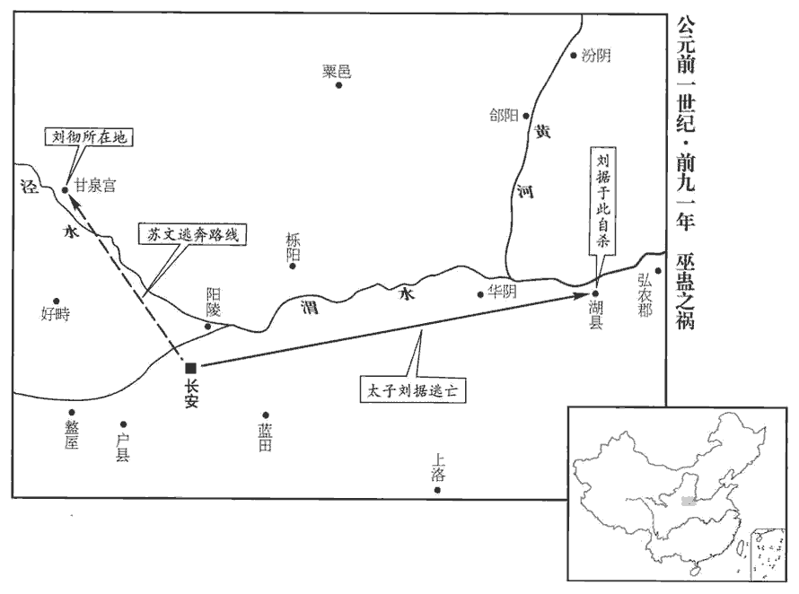
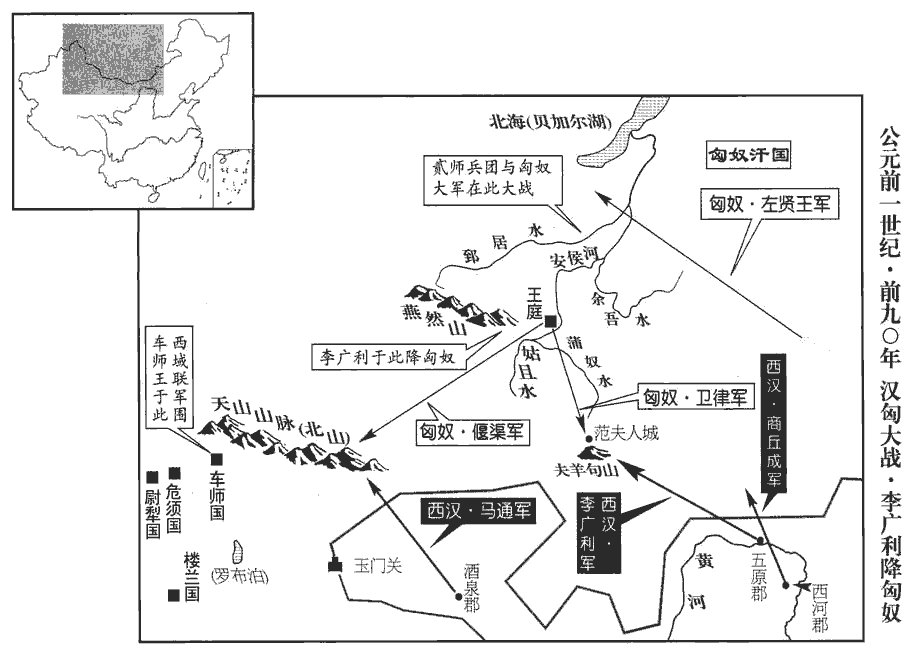

 漢紀十四起昭陽協洽（癸未），盡閼逢敦牂（甲午），凡十二年。

# 世宗孝武皇帝下之下

## 天漢三年（癸未，前九八年）

1春，二月，王卿有罪自殺，以執金吾杜周為御史大夫。班表：中尉掌徼循京師，太初元年更名執金吾。應劭曰：吾，禦也，掌執金革以禦非常。師古曰：金吾，鳥名，主辟不祥。天子出行，主先導以備非常，故執此鳥之象；因以名官。

〖译文〗 [1]春季，二月，王卿因罪自杀，汉武帝任命执金吾杜周为御史大夫。

2初榷què酒酤gū。如淳曰：榷，音較。應劭曰：縣官自酤榷賣酒，小民不復得酤也。韋昭曰：以木渡水曰榷，謂禁民酤釀，獨官開置，如道路設木為榷，獨取利也。師古曰：榷者，步渡橋，爾雅謂之石杠，今之略彴zhuó是也。禁閉其事，總利入官，而下無由以得，有若渡水之榷，因立名焉。酤，工護翻。彴，音酌。

〖译文〗 [2]开始实行酒类专卖。

3三月，上‹刘彻，时年五十九›行幸泰山，脩封，祀明堂，因受計。還，祠常山‹河北唐县西北›，瘞yì玄玉。鄧展曰：瘞，埋也。爾雅曰：祭地曰瘞薶mái。薶其物者，示歸於地也。瘞，音於例翻。方士之候祠神人、入海求蓬萊者終無有驗，而公孫卿猶以大人跡為解，大人跡見二十卷元封元年。天子益怠厭方士之怪迂語矣；然猶羈縻不絕，師古曰：羈縻，牽聯之意。馬絡頭曰羈，牛靷yǐn曰縻。冀遇其真。自此之後，方士言神祠者彌眾，然其效可睹矣。

〖译文〗 [3]三月，汉武帝巡游泰山，扩建祭天神坛，祭祀于明堂，并在此接受各郡、国的户籍、财政簿册。回京途中，祭祀于常山，并将黑色玉石埋于祭坛之下。方士们在各地等候神仙降临和入海寻找蓬莱山等始终没有结果，而公孙卿仍以所谓“巨人的足印”进行辩解，从而使汉武帝对方士们的奇谈怪论日益厌倦，但仍与他们保持联系，并不禁绝，希望能遇到真有本领的人。从此以后，方士们谈论神灵之事的虽更加众多，但其效果是可想而知了。

4夏，四月，大旱。赦天下。

〖译文〗 [4]夏季，四月，大旱。大赦天下。

5秋，匈奴入雁門‹山西右玉›。雁門郡屬并州。太守坐畏愞nuò棄市。如淳曰：軍法，行逗留畏愞者要斬。愞，如椽翻；師古曰：又音乃館翻。

〖译文〗 [5]秋季，匈奴侵入雁门。雁门太守因畏缩惧敌被朝廷处死。

## 天漢四年（甲申，前九七年）

1春，正月，朝諸侯王于甘泉宮‹在陝西淳化西北›。

〖译文〗 [1]春季，正月，汉武帝在甘泉宫接受各诸侯王的朝见。

2發天下七科謫zhé張晏曰：吏有罪一；亡命二；贅婿三；賈人四；故有市籍五；父母有市籍六；大父母有市籍七；凡七科也。及勇敢士，遣貳師將軍李廣利將騎六萬、步兵七萬出朔方‹內蒙杭锦旗北黄河南岸›；朔方郡屬朔方州，唐靈、夏州地。強弩都尉路博德將萬餘人與貳師會；遊擊將軍韓說將步兵三萬人出五原‹內蒙包頭›；因杅將軍公孫敖將騎萬、步兵三萬人出雁門‹山西右玉›。匈奴聞之，悉遠其累重于余吾水‹土拉河，源于肯特山›北；師古曰：累重，謂妻子、資產也。累，力瑞翻。重，直用翻。余吾水在朔方北。山海經曰：北鮮之山，鮮水出焉，北流注于余吾。而單于以兵十萬待水南，與貳師接戰。貳師解而引歸，與單于連斗十餘日。考異曰：史記匈奴傳云廣利於此降匈奴，誤。遊擊無所得。因杅與左賢王戰，不利，引歸。

〖译文〗 [2]汉武帝征发全国贱民“七科谪”和勇敢之士，派贰师将军李广利率骑兵六万、步兵七万自朔方出塞，强弩都尉路博德率一万余人与李广利会合，游击将军韩说率步兵三万自五原出塞，因杆将军公孙敖率骑兵一万、步兵三万自雁门出塞，袭击匈奴。匈奴听到这一消息后，将其家属、财物等全部迁徙到余吾水以北地区，然后由单于亲率十万大军在余吾水南岸迎战李广利率领的汉朝军队。李广利率兵与单于大军连续交战十余日，撤兵而还。韩说所部没有收获。公孙敖与匈奴左贤王作战失利，撤兵而回。

時上遣敖深入匈奴迎李陵，敖軍無功還，因曰：「捕得生口，言李陵教單于為兵以備漢軍，故臣無所得。」上於是族陵家。既而聞之，乃漢將降匈奴者李緒，非陵也。陵使人刺殺緒。降，戶江翻。刺，七亦翻。大閼氏欲殺陵，師古曰：大閼氏，單于之母。閼氏，音煙支。單于匿之北方；大閼氏死，乃還。單于以女妻陵，妻，千細翻。立為右校王，校，戶教翻。與衛律皆貴用事。衛律常在單于左右；陵居外，有大事乃入議。

〖译文〗 汉武帝派公孙敖率兵深入匈奴腹地去接李陵，公孙敖无功而回，便上奏说：“据擒获的匈奴俘虏说，李陵教单于制造兵器，以防备汉军，所以我无所收获。”于是汉武帝下令将李陵的家属满门抄斩。不久听说，是投降匈奴的汉朝将领李绪所为，并非李陵。李陵派人将李绪刺杀。匈奴单于的母亲大阏氏要杀李陵，单于将他藏在北方，直到大阏氏死后，李陵才回到王庭。单于将自己的女儿嫁给李陵为妻，封其为右校王，与卫律同时都受到尊重，并握有权力。卫律经常在单于身边，李陵则在外地，有大事才到王庭会商。

3夏，四月，立皇子髆bó為昌邑‹都昌邑，山东金乡西北昌邑镇›王。髆，音博。昌邑國屬兗州，即山陽郡地；其地在唐之宋、亳、單、鄆四州間。考異曰：表云六月乙丑立，今從武紀。

〖译文〗 [3]夏季，四月，汉武帝封皇子刘为昌邑王。

## 太始元年（乙酉，前九六年）應劭曰：言蕩滌天下，與民更始，故以冠元。

1春，正月，公孫敖坐妻為巫蠱要斬。巫，祝也；蠱，厭也，惑也；謂使巫祠祭、祝詛、厭魅以蠱惑人也。蠱，音古。孔穎達曰：蠱者，損壞之名，故左傳云：皿蟲為蠱；是蠱食器皿，巫行邪術，損壞於人。要，與腰同。

〖译文〗 [1]春季，正月，公孙敖因其妻以“巫蛊”害人而被腰斩。

2徙郡國豪桀於茂陵‹陝西興平东北›。

〖译文〗 [2]汉武帝强迫各郡、国的富豪和有权势的人迁居茂陵。

3夏，六月，赦天下。

〖译文〗 [3]夏季，六月，大赦天下。

4是歲，匈奴且鞮dī侯單于死；且，子餘翻。鞮，田黎翻。有兩子，長為左賢王，次為左大將。匈奴二十四長，左賢王位第一，左大將位第五。長，知兩翻。左賢王未至，貴人以為有病，更立左大將為單于。左賢王聞之，不敢進；左大將使人召左賢王而讓位焉。左賢王辭以病，左大將不聽，謂曰：「即不幸死，傳之於我。」左賢王許之，遂立，為狐鹿姑單于；以左大將為左賢王。數年，病死；其子先賢撣不得代，更以為日逐王。師古曰：撣，音廛chán。日逐王居匈奴西邊，以日入於西，故以為名。至宣帝神爵二年，撣來降。單于自以其子為左賢王。

〖译文〗 [4]这一年，匈奴且侯单于去世。且侯有两个儿子，长子为左贤王，次子为左大将。且侯死后，左贤王没有及时赶到，匈奴贵族们认为左贤王有病，改立左大将为单于。左贤王听说后，不敢前来王庭。左大将派人将左贤王召来，让位给他。左贤王以自己有病为理由推辞不受，左大将不听，对他说：“如果你不幸死去，再传位给我。”左贤王这才答应，即单于位，称为孤鹿姑单于。封左大将为左贤王。几年后，左贤王病死，其子先贤掸因不能继承左贤王之位，所以改封为日逐王。单于封自己的儿子为左贤王。

## 太始二年（丙戌，前九五年）

1春，正月，上‹刘彻，时年六十二›行幸回中‹陕西陇县西北›。

〖译文〗 [1]春季，正月，汉武帝巡游回中。

2杜周卒，光祿大夫暴勝之為御史大夫。

〖译文〗 [2]杜周去世，汉武帝任命光禄大夫暴胜之为御史大夫。

3秋，旱。

〖译文〗 [3]秋季，干旱。

4趙‹河北邯鄲›中大夫白公奏穿渠引涇水，首起谷口‹陝西醴泉東北›，尾入櫟陽‹陝西臨潼›，班志，谷口、櫟陽二縣屬左馮翊。師古曰：谷口，即今雲陽縣。杜佑曰：今雲陽縣治谷是。又曰：醴泉，漢谷口縣地，隋為醴泉縣，谷口縣故城在縣西北。櫟，音藥。注渭中，袤二百里，師古曰：袤，音茂，長也。溉田四千五百餘頃，因名曰白渠；民得其饒。

〖译文〗 [4]赵国中大夫白公奏请朝廷，从谷口至栎阳挖了一条长二百里的引水渠，将泾河水引到渭中地区，使四千五百余顷农田得到灌溉，因此命名为白渠。当地百姓因白渠而大大受益。

## 太始三年（丁亥，前九四年）

1春，正月，上‹刘彻，时年六十三›行幸甘泉宮‹陝西淳化西北›。二月，幸東海‹山东郯城›，獲赤雁。幸琅邪‹山東胶南›，東海、琅邪二郡皆屬徐州。琅邪，唐沂、密州也。禮日成山‹山東荣成东北成山角›，孟康曰：禮日，拜日也。如淳曰：拜日于成山。師古曰：成山在東萊不夜縣，斗入海。登之罘fú‹山東烟台北芝罘山›，臣瓚曰：地理志，東萊腄chuí縣有之罘山。師古曰：罘，音浮。浮大海而還。還，從宣翻，又如字。

〖译文〗 [1]春季，正月，汉武帝前往甘泉宫。二月，巡游东海郡，捉到一只赤色大雁。又巡游琅邪郡，在成山拜日，并登上之罘山，然后乘船在海上巡游后返回长安。

2是歲，皇子弗陵生。弗陵母曰河間‹河北獻縣›趙倢jié伃yú，河間國屬冀州，唐瀛、莫州地。帝置倢伃，位視上卿，爵比列侯。師古曰：倢，言接幸於上也。伃，美貌。倢，音接。伃，音予。居鉤弋宮，師古曰：黃圖，鉤弋宮在城外；漢武故事，在直門南。任身十四月而生。任，讀曰妊。上曰：「聞昔堯十四月而生，今鉤弋亦然。」乃命其所生門曰堯母門。

〖译文〗 [2]这一年，皇子刘弗陵出生。刘弗陵的母亲是河间人，姓赵，受封为，住在钩弋宫，怀孕十四个月后生刘弗陵。汉武帝说：“听说当年尧是十四十四个月才出生的，如今赵生这个孩子也是如此。”于是下令将钩弋宫宫门改称尧母门。

臣光曰：為人君者，動靜舉措不可不慎，發於中必形於外，天下無不知之。當是時也，皇后、太子皆無恙，恙，餘亮翻。而命鉤弋之門曰堯母，非名也。是以姦人【章：十四行本「人」作「臣」；乙十一行本同；孔本同。】逆探上意，知其奇愛少子，欲以為嗣，少，詩照翻。遂有危皇后、太子之心，卒成巫蠱之禍，卒，子恤翻。悲夫！

〖译文〗 臣司马光曰：作为君主，每一动静、措施都不能不慎重，内心想的事，外表必然会显露出来，天下人都会知道。那时，皇后、太子全部安然健在，汉武帝却下令将钩弋宫门称为尧母门，在名义上是不妥当的。正因为如此，才使奸猾之徒揣摩皇上的心意，认为他非常宠爱幼子，想立幼子为皇位继承人，于是产生出危害皇后、太子之心，终于酿成巫蛊祸难，可悲啊！

3趙‹河北邯鄲›人江充為水衡都尉。趙國屬冀州；唐為冀州，其地又分入深州、德州界。元鼎二年，初置水衡都尉，掌上林苑。應劭曰：古山林之官曰衡；掌諸池苑，故稱水衡。張晏曰：主都水及上林，故稱水衡；主諸官，故曰都；有卒徒武事，故曰尉。師古曰：衡，平也，主平其稅入；位列九卿，秩中二千石。初，充為趙敬肅王客，敬肅王，名彭祖；薨，諡敬肅。得罪于太子丹，亡逃；詣闕告趙太子陰事，太子坐廢。上召充入見。見，賢遍翻。充容貌魁岸，被服輕靡，師古曰：魁，大也。岸者，有廉稜如崖岸之狀。被服，衣服也。輕，輕細也。靡，靡麗也。被，皮義翻。上奇之；與語政事，大悅，由是有寵，拜為直指繡衣使者，使督察貴戚、近臣踰侈者。充舉劾無所避，劾，戶概翻。上以為忠直，所言皆中意。師古曰：中，當也。中，竹仲翻。嘗從上甘泉，上，時掌翻。逢太子家使乘車馬行馳道中，充以屬吏。應劭曰：馳道，天子所行道也，若今之中道也。孔穎達曰：馳道，正道御路也。是天子馳走車馬之處，故曰馳道。如淳曰：令乙；騎乘車馬行馳道中，已論者沒入車馬被具。師古曰：家使，太子遣人之甘泉請問者也。使，疏吏翻。屬，之欲翻。太子聞之，使人謝充曰：「非愛車馬，誠不欲令上聞之，以教敕亡素者；師古曰：言素不教敕左右。古字，亡與無通。唯江君寬之！」充不聽，遂白奏。上曰：「人臣當如是矣！」大見信用，威震京師。

〖译文〗 [3]赵国人江充被任命为水衡都尉。当初，江充本是赵敬肃王的门客，因为得罪了赵王太子刘丹，逃出赵国，来到朝廷告发了刘丹的隐私秘事，刘丹因此被废除赵国太子之位。汉武帝召江充入宫见面，见他仪表堂堂，身体魁梧，衣着轻暖而华丽，暗中称奇。与他谈论一番政事后，汉武帝大为高兴，从此对江充宠信，封其为直指绣衣使者，让他督察皇亲国戚、天子近臣中的违背体制、奢侈不法行为。江充检举参劾，毫无避讳，汉武帝因此认为他忠正直率，所说的话都合汉武帝的心意。江充曾随汉武帝前往甘泉宫，正遇上太子刘据派遣去甘泉宫问安的使者坐着马车皇帝专用的“驰道”上行走，江充便将其逮捕问罪。太子听说后，派人向江充求情说：“我并非爱惜车马，实在是不愿让皇上知道后，认为我平时没有管教左右，希望江先生宽恕！”江充并不理睬，径自上奏。汉武帝说：“作臣子的，就应当这样！”对江充大加信任，从而使江充威镇京师。

## 太始四年（戊子，前九三年）

1春，三月，上‹刘彻，时年六十四›行幸泰山。壬午‹二十五›，祀高祖于明堂以配上帝，因受計。癸未‹二十六›，祀孝景皇帝于明堂。甲申‹二十七›，修封。丙戌‹二十九›，禪石閭‹山東泰安南›。夏，四月，幸不其‹山東青岛北›。如淳曰：其，音基。不其，山名，因以為縣。應劭曰：東萊縣也。余據班志，不其縣屬琅邪郡。五月，還，幸建章宮，赦天下。

〖译文〗 [1]春季，三月，汉武帝巡游泰山。壬午（二十五日），在明堂祭祀高祖刘邦，以之配祀上帝，并在此接受各郡、国记录户籍财政情况的簿册。癸未（二十六日），在明堂祭祀景帝刘启。甲申（二十七日），扩建祭天神坛。丙戌（二十九日），在石闾祭祀地神。夏季，四月，汉武帝巡游不其山。五月返回长安，前往建章宫，下诏大赦天下。

2冬，十月，甲寅晦‹二十九›，日有食之。

〖译文〗 [2]冬季，十月甲寅晦（三十日），出现日食。

3十二月，上行幸雍‹陕西凤翔›，祠五畤；雍，於用翻。畤，音止。西至安定‹宁夏固原›、北地‹甘肅庆阳西北马岭镇›。二郡屬朔方州。安定，唐涇、原之地。北地，唐邠、寧、環、慶、鹽、宥州地。

〖译文〗 [3]十二月，汉武帝巡游至雍，祭祀于五。然后西行，到达安定、北地二郡。

## 征和元年（己丑，前九二年）應劭曰：言征伐四夷而天下和平。

1春，正月，上還，幸建章宮‹西安西北›。

〖译文〗 [1]春季，正月，汉武帝返回长安，前往建章宫。

2三月，趙‹河北邯郸›敬肅王彭祖薨。彭祖取江都易王所幸淖nào姬，彭祖，景帝子，前二年封廣川，五年徙趙。淖姬事見十九卷元狩二年。淖，奴教翻。生男，號淖子。時淖姬兄為漢宦者，上召問：「淖子何如？」對曰：「為人多欲。」上曰：「多欲不宜君國子民。」問武始侯昌，昌亦彭祖之子。班志：武始縣屬魏郡。曰：「無咎無譽。」譽，音餘。上曰：「如是可矣。」遣使者立昌為趙王。

〖译文〗 [2]三月，赵王刘彭祖去世。刘彭祖娶的是江都易王刘非的宠姬淖姬，生了一个儿子，取名刘淖子。当时淖姬的哥哥在皇宫中当宦官，汉武帝便召他询问：“淖子为人如何？”淖姬的哥哥回答说：“他为人欲望太多。”汉武帝说道：“欲望太多的人不适合当国君管理百姓。”又问武始侯刘昌的情况，淖姬的哥哥说：“刘昌既无过错，也没有什么值得赞扬的地方。”汉武帝说：“这样就可以了。”于是派使臣立刘昌为赵王。

3夏，大旱。

〖译文〗 [3]夏季，大旱。

4上居建章宮，見一男子帶劍入中龍華門，疑其異人，命收之。男子捐劍走，逐之弗獲。上怒，斬門候。門候，掌宮門出入之禁；續漢志，秩六百石。冬，十一月，發三輔騎士大搜上林，閉長安城門索；臣瓚曰：搜，謂索奸人也。上林苑周回數百里，恐奸人藏匿其中，故大搜索。索，山客翻。十一日乃解。巫蠱始起。

〖译文〗 [4]汉武帝住在建章宫，看到一个男子带剑进入中龙华门，怀疑是不寻常的人，便命人捕捉。该男子弃剑逃跑，侍卫们追赶，未能擒获。汉武帝大怒，将掌管宫门出入的门候处死。冬季，十一月，汉武帝征调三辅地区的骑兵对上林苑进行大搜查，并下令关闭长安城门进行搜索，十一天后解除戒严。巫蛊事崐开始出现。

5丞相公孫賀夫人君孺，衛皇后姊也，賀由是有寵。賀子敬聲代父為太僕，驕奢不奉法，擅用北軍錢千九百萬；發覺，下獄。下，遐嫁翻；下同。是時詔捕陽陵‹陝西咸陽東北五十里›大俠朱安世甚急，賀自請逐捕安世以贖敬聲罪，上許之。後果得安世。安世笑曰：「丞相禍及宗矣！」遂從獄中上書，告「敬聲與陽石公主私通；陽石公主，帝女也。班志：陽石屬北海郡。上書，時掌翻；下且上同。上且上甘泉，使巫當馳道埋偶人，祝詛上，有惡言。」師古曰：刻木為人，象人之形，謂之偶人。偶，并也，對也。祝，職救翻。詛，莊助翻。

〖译文〗 [5]丞相公孙贺的夫人卫君孺，是卫皇后的姐姐，公孙贺因此受到宠信。公孙贺的儿子公孙敬声接替父亲担任太仆，骄横奢侈。不遵守法纪，擅自动用北军军费一千九百万钱，事情败露后被捕下狱。这时，汉武帝正诏令各地紧急通缉阳陵大侠客朱安世，于是公孙贺请求汉武帝让他负责追捕朱安世，来为其子公孙敬声赎罪，汉武帝批准了他的请求。后来，公孙贺果然将朱安世逮捕。朱安世却笑着说：“丞相将要祸及全族了！”于是从狱中上书朝廷，揭发说：“公孙敬声与阳石公主私通；他得知皇上将要前往甘泉宫，便让巫师在皇上专用的驰道上埋藏木偶人，诅咒皇上，口出恶言。”

## 征和二年（庚寅，前九一年）

1春，正月，下賀獄，案驗；父子死獄中，家族。其家皆族誅也。以涿郡‹河北涿縣›太守劉屈氂máo為【章：十四行本「爲」下有「左」字；乙十一行本同。】丞相，封澎侯。涿郡，高帝置，屬幽州；唐瀛、莫、幽、涿、深、祁州地。屈，丘勿翻。氂，力之翻。晉灼曰：澎，東海縣。今考班志無之。服虔曰：澎，音彭。屈氂，中山靖王子也。靖王勝，景帝子。

〖译文〗 [1]春季，正月，公孙贺被逮捕下狱，经调查罪名属实，父子二人都死于狱中，并被灭族。汉武帝任命涿郡太守刘屈牦为丞相，封其为澎侯。刘屈牦是中山靖王刘胜的儿子。

2夏，四月，大風，发屋折木。折，而設翻。

〖译文〗 [2]夏季，四月，狂风大作，房屋被掀起，树木被折断。

3閏月，諸邑公主、陽石公主及皇后弟子長平侯伉皆坐巫蠱誅。諸，琅邪縣，以封公主，故謂之邑；與陽石公主皆衛皇后之女。長平侯伉，衛青子也。伉，音抗，又音剛。

〖译文〗 [3]闰四月，诸邑公主、阳石公主及卫皇后之弟卫青的儿子长平侯卫伉，都因巫蛊案而被处死。

4上行幸甘泉‹陝西淳化西北›。

〖译文〗 [4]汉武帝巡游甘泉。

5初，上年二十九乃生戾太子‹刘据›，甚愛之。及長，性仁恕溫謹，長，知兩翻。上嫌其材能少，不類己；而所幸王夫人生子閎，李姬生子旦、胥，李夫人生子髆，少，詩沼翻。髆，音博。皇后、太子寵浸衰，常有不自安之意。上覺之，謂大將軍青曰：「漢家庶事草創，朱熹曰：草，略也。創，造也。加四夷侵陵中國，朕不變更制度，後世無法；不出師征伐，天下不安；為此者不得不勞民。更，工衡翻。為，於偽翻。若後世又如朕所為，是襲亡秦之跡也。太子敦重好靜，好，呼到翻。必能安天下，不使朕憂。欲求守文之主，安有賢于太子者乎！聞皇后與太子有不安之意，豈有之邪？可以意曉之。」大將軍頓首謝。皇后聞之，脫簪請罪。脫簪，去飾也。太子每諫征伐四夷，上笑曰：「吾當其勞，以逸遺汝，遺，于季翻。不亦可乎！」

〖译文〗 [5]当初，汉武帝二十九岁时才有了戾太子，对他非常喜爱。刘据长大后，性格仁慈宽厚、温和谨慎，汉武帝嫌他不像自己那样精明强干；汉武帝平日宠爱的王夫人也生一子名叫刘闳，李姬生二子刘旦、刘胥，李夫人生一子刘。皇后、太子因皇上对他们的宠爱逐渐减少，常常有不能自安的感觉。汉武帝察觉后，对大将军卫青说：“我朝有很多事都还处于草创阶段，再加上周围的外族对我国的侵扰不断，朕如不变更制度，后代就将失去准则依据；如不出师征伐，天下就不能安定，因此不能不使百姓们受些劳苦。但倘若后代也像朕这样去做，就等于重蹈了秦朝灭亡的覆辙。太子性格稳重好静，肯定能安定天下，不会让朕忧虑。要找一个能够以文治国的君主，还能有谁比太子更强呢！听说皇后和太子有不安的感觉，难道真是如此吗？你可以把朕的意思转告他们。”卫青叩头感谢。皇后听说后，特意摘掉首饰向汉武帝请罪。每当太子劝阻征伐四方时，汉武帝就笑着说：“由我来担当艰苦重任，而将安逸留给你，不也挺好吗！”

上每行幸，常以後事付太子，宮內付皇后；有所平決，還，白其最，最，大最也。上亦無異，有時不省也。無所違異也。不省，不視也。省，悉景翻。上用法嚴，多任深刻吏；太子寬厚，多所平反，如淳曰：反，音幡。幡奏使從輕也。雖得百姓心，而用法大臣皆不悅。皇后恐久獲罪，每戒太子，宜留取上意，言留其事，取上意裁決也。不應擅有所縱舍。上聞之，是太子而非皇后。群臣寬厚長者皆附太子，而深酷用法者皆毀之；邪臣多黨與，故太子譽少而毀多。譽，音餘。少，詩沼翻。衛青薨，【章：乙十一行本「薨」下有「後」字；孔本同。】臣下無復外家為據，競欲構太子。言自衛青既薨之後，奸臣以太子無復外家以為憑依，競欲構成其罪。

〖译文〗 汉武帝每次出外巡游，经常将留下的事交付给太子，宫中事务交付给皇后。如果有所裁决，待汉武帝回来后就将其中最重要的向他报告，汉武帝也没有不同意的，有时甚至不过问。汉武帝用法严厉，任用的多是严苛残酷的官吏；而太子待人宽厚，经常将一些他认为处罚过重的事从轻发落。太子这样做虽然得百姓之心，但那些执法大臣都不高兴。皇后害怕长此下去会获罪，经常告诫太子，应注意顺从皇上的意思，不应擅自有所纵容宽赦。汉武帝听说后，认为太子是对的，而皇后不对。群臣中，为人宽厚的都依附太子。而用法严苛的则都诋毁太子。由于奸邪的臣子大多结党，所以为太子说好话的少，说坏话的多。卫青去世后，那些臣子认为太子不再有母亲娘家的靠山，便竟相陷害太子。

上與諸子疏，疏，讀曰疎。皇后希得見。見，賢遍翻。太子嘗謁皇后，移日乃出。移日，言日景移也。黃門蘇文告上曰：黃門屬少府，以宦者為之。「太子與宮人戲。」上益太子宮人滿二百人。太子後知之，心銜文。文與小黃門常融、王弼等常微伺太子過，輒增加白之。皇后切齒，切齒者，怨憤之甚，兩齒相摩切也。使太子白誅文等。太子曰：「第勿為過，何畏文等！上聰明，不信邪佞，不足憂也！」上嘗小不平，小不平者，體中微有不適也。使常融召太子，融言「太子有喜色」，上嘿然。及太子至，上察其貌，有涕泣處，而佯語笑，上怪之；更微問，知其情，乃誅融。皇后亦善自防閑，避嫌疑，雖久無寵，尚被禮遇。被，皮義翻。

〖译文〗 汉武帝与儿子们很少在一起，与皇后也难得见面。一次，太子进宫谒见皇后，太阳都转过去半天了，才从宫中出来。黄门苏文向汉武帝报告说：“太子调戏宫女。”于是汉武帝将太子宫中的宫女增加到二百人。后来太子知道了这件事，便对苏文怀恨。苏文与小黄门常融、王弼等经常暗中寻找太子的过失，然后再去添枝加叶地向汉武帝报告。对此，皇后恨得咬牙切齿，让太子禀明皇上杀死苏文等人。太子说：“只要我不做错事，又何必怕苏文等人！皇上圣明，不会相信邪恶谗言，用不着忧虑。”有一次，汉武帝感到身体有点不舒服，派常融去召太子，常融回来后对汉武帝言道：“太子面带喜色。”汉武帝默然无语。及至太子来到，汉武帝观其神色，见他脸上有泪痕，却强装有说有笑，汉武帝感到很奇怪，再暗中查问，才得知事情真相，于是将常融处死。皇后自己也小心防备，远避嫌疑，所以尽管已有很长时间不再得宠，却仍能使汉武帝以礼相待。

是時，方士及諸神巫多聚京師，率皆左道惑眾，盧植曰：左道，謂邪道也。地道尊右，右為貴。故漢書云：右賢左愚，右貴左賤，故正道為右；不正道為左，若巫蠱及俗禁者。變幻無所不為。女巫往來宮中，教美人度厄，每屋輒埋木人祭祀之；因妒忌恚huì詈lì，恚，於避翻。更相告訐jié，以為祝詛上，無道。更，工衡翻。訐，居謁翻。鄭玄曰：詛，謂祝之使沮敗也。漢法有大逆無道之科。祝，職救翻。詛，莊助翻。上怒，所殺後宮延及大臣，死者數百人。上心既以為疑，嘗晝寢，夢木人數千持杖欲擊上，上驚寤，因是體不平，遂苦忽忽善忘。忘，巫放翻，遺忘也。江充自以與太子及衛氏有隙，見上年老，恐晏駕後為太子所誅，因是為奸，言上疾祟在巫蠱。師古曰：祟，謂禍咎之征也，故其字從「出」從「示」，言鬼神所以示人者也。音息遂翻。於是上以充為使者，治巫蠱獄。充將胡巫掘地求偶人，捕蠱及夜祠、視鬼，染汙令有處，輒收捕驗治，燒鐵鉗灼，強服之。張晏曰：充捕巫蠱及夜祭祀祝詛者，令胡巫視鬼，詐以酒醊zhuì地，令有處也。師古曰：捕夜祠及視鬼之人，而充遣巫污染地上為祠祭之處以誣其人，又以燒鐵或鉗之，或灼之，強使之服。鉗，鑷也。灼，炙也。汙，烏故翻。鉗，其炎翻。強，其兩翻。民轉相誣以巫蠱，吏輒劾以為大逆無道；劾，戶概翻。自京師、三輔連及郡、國，坐而死者前後數萬人。

〖译文〗 这时，方士和各类神巫多聚集在京师长安，大都是以左道旁门的奇幻邪术迷惑众人，无所不为。一些女巫来于宫中，教宫中美人躲避灾难的办法，在每间屋里都埋上木头人，进行祭祀。因相互妒忌争吵时，就轮番告发对方诅咒皇上、大逆不道。汉武帝大怒，将被告发的人处死，后宫妃嫔、宫女以及受牵连的大臣共杀了数百人。汉武帝产生疑心以后，有一次，在白天小睡，梦见有好几千木头人手持棍棒想要袭击他，霍然惊醒，从此感到身体不舒服，精神恍惚，记忆力大减。江充自以为与太子及皇后有嫌隙，见汉武帝年纪已老，害怕皇上去世后被太子诛杀，便定下奸谋，说皇上的病是因为有巫术蛊作祟造成的。于是汉武帝派江充为使者，负责查出巫蛊案。江充率领胡人巫师到各处掘地寻找木头人，并逮捕了那些用巫术害人，夜间守祷祝及自称能见到鬼魂的人，又命人事先在一些地方洒上血污，然后对被捕之人进行审讯，将那些染上血污的地方指为他们以邪术害人之处，并施以铁钳烧灼之刑，强迫他们认罪。于是百姓们相互诬指对方用巫蛊害人；官吏则每每参劾别人为大逆不道。从京师长安、三辅地区到各郡、国，因此而死的先后共有数万人。

是時，上春秋高，疑左右皆為蠱祝詛；有與無，莫敢訟其冤者。充既知上意，因胡巫檀何言：「宮中有蠱氣；不除之，上終不差。」差，愈也。上乃使充入宮，至省中，壞御座，掘地求蠱；又使按道侯韓說、御史章贛、師古曰：說，讀曰悅。贛，音貢。姓譜：齊人降鄣，子孫去邑為章氏。黃門蘇文等助充。充先治後宮希幸夫人，以次及皇后、太子宮，掘地縱橫，縱，子容翻。太子、皇后無復施床處。充云：「於太子宮得木人尤多，師古曰：三輔舊事云：充使胡巫作桐木人而薶之。又有帛書，所言不道；當奏聞。」太子懼，問少傅石德。德懼為師傅并誅，因謂太子曰：「前丞相父子、兩公主及衛氏皆坐此，今巫與使者掘地得征驗，不知巫置之邪，將實有也，無以自明。可矯以節收捕充等系獄，師古曰：矯，托也，托詔命也。窮治其奸詐。且上疾在甘泉，皇后及家吏請問皆不報；蘇林曰：家吏，皇后吏也。臣瓚曰：太子稱家，家吏是太子吏也。師古曰：既言皇后及家吏，此為皇后吏及太子吏耳，瓚說是也。上存亡未可知，而奸臣如此，太子將不念秦扶蘇事邪！」事見七卷始皇三十七年。太子曰：「吾人子，安得擅誅！不如歸謝，幸得無罪。」太子將往之甘泉，而江充持太子甚急；太子計不知所出，遂從石德計。秋，七月，壬午‹七›，太子使客詐為使者，收捕充等；按道侯說疑使者有詐，不肯受詔，客格殺說。格，古陌翻，擊也。太子自臨斬充，罵曰：「趙虜！前亂乃國王父子不足邪！江充，趙人，故罵為趙虜。乃，汝也，謂充前告趙太子陰事，使太子見廢也。乃復亂吾父子也！」復，扶又翻。又炙胡巫上林中。

〖译文〗 此时，汉武帝年事已高，怀疑周围的人都在用巫蛊诅咒于他；而那些被逮捕治罪的人，无论真实情况如何，谁也不敢诉说自己有冤。江充窥探出汉武帝的疑惧心理，便指使胡人巫师檀何言称：“宫中有蛊气，不将这蛊气除去，皇上的病就一直不会好。”于是汉武帝派江充进入宫中，直至宫禁深处，毁坏皇帝的宝座，挖地找蛊；又派按道侯韩说、御史章赣、黄门苏文等协助江充。江充先从后宫中汉武帝已很少理会的妃嫔的房间着手，然后依次搜寻，一直搜到皇后宫和太子宫中，各处的地面都被纵横翻起，以致太子和皇后连放床的地方都没有了。江充扬言：“在太子宫中找出的木头人最多，还有写在丝帛上的文字，内容大逆不道，应当奏闻皇上。”太子非常害怕，问少傅石德应当怎么办。石德害怕因为自己是太子的老师而受牵连被杀，便对太子说：“先前公孙贺父子、两位公主以及卫伉等都被指犯有用巫蛊害人之罪而被杀死，如今巫师与皇上的使者又从宫中挖出证据，不知是巫师放置的呢，还是确实有，自己是无法解释清楚的。你可假传圣旨，将江充等人逮捕下狱，彻底追究其奸谋。况且皇上有病住在甘泉宫，皇后和您派去请安的人都没能见到皇上，皇上是否还在，实未可知，而奸臣竟敢如此，难道您忘了秦朝太子扶苏之事了吗！”太子说道：“我这作儿子的怎能擅自诛杀大臣！不如前往甘泉宫请罪，或许能侥幸无事。”太子打算亲自前往甘泉宫，但江充却抓住太子之事逼迫甚急，太子想不出别的办法，于是按着石德的计策行事。秋季，七月壬午（初九），太子派门客冒充皇帝使者，逮捕了江充等人。按道侯韩说怀疑使者是假的，不肯接受诏书，被太子门客杀死。太子亲自监杀江充，骂道：“你这赵国的奴才，先前扰害你们国王父子，还嫌不够，如今又来扰害我们父子！”又将江充手下的胡人巫师烧死在上林苑中。

 

太子使舍人無且師古曰：且，音子閭翻。持節夜入未央宮殿長秋門，因長御倚華具白皇后，鄭氏曰：長，音長者之長。如淳曰：漢儀注：女長御比侍中，皇后見娙xíng娥以下長御稱謝。倚華，字也。師古曰：倚，音於綺翻。發中廏車載射士，師古曰：中廏，皇后車馬所在也。余謂中廏者，天子之內廏也。秦二世時，公子高曰：「中廏之寶馬，臣得賜之。」非專主皇后車馬也。出武庫兵，發長樂宮衛卒。長安擾亂，言太子反。蘇文迸走，得亡歸甘泉，說太子無狀。迸，北孟翻。上曰：「太子必懼，又忿充等，故有此變。」乃使使召太子。使者不敢進，歸報云：「太子反已成，欲斬臣，臣逃歸。」上大怒。丞相屈氂聞變，挺身逃，師古曰：挺，引也，獨引身而逃也。余謂挺，拔也，拔身而逃也。亡其印綬，使長史乘疾置以聞。師古曰：置，謂所置驛也。疾置，急傳也。上問：「丞相何為？」對曰：「丞相祕之，未敢發兵。」上怒曰：「事籍籍如此，師古曰：籍籍，猶紛紛也。何謂祕也！丞相無周公之風矣，周公不誅管、蔡乎！」屈氂於太子為兄弟，故以周公之事責之。乃賜丞相璽書曰：「捕斬反者，自有賞罰。以牛車為櫓，師古曰：櫓，盾也。遠與敵戰，故以車為櫓，用自蔽也。一說：櫓，望敵之樓。毋接短兵，多殺傷士眾！堅閉城門，毋令反者得出！」太子宣言告令百官云：「帝在甘泉病困，疑有變；奸臣欲作亂。」上於是從甘泉來，幸城西建章宮，詔發三輔近縣兵，部中二千石以下，丞相兼將之。太子亦遣使者矯制赦長安中都官囚徒，命少傅石德及賓客張光等分將；使長安囚如侯持節發長水‹浐水，流经陝西藍田西北›及宣曲‹陝西西安西南›胡騎，皆以裝會。師古曰：長水、宣曲并胡騎所屯，今鄠縣東長水鄉即舊營校之地。侍郎馬通使長安，「馬通」，漢書作「莽通」，通及弟何羅以反誅。明德馬皇后惡其先有反者，故易其姓為莽。姓譜：馬本自伯益之裔，趙奢封馬服君，後因氏焉。因追捕如侯，告胡人曰：「節有詐，勿聽也！」遂斬如侯，引騎入長安；又發楫棹士以予大鴻臚商丘成。師古曰：楫棹士，主用楫及棹行船者也。短曰楫，長曰棹。余據班表，水衡都尉有楫棹令、丞，蓋掌楫棹士之官也。太初元年，改典客為大鴻臚。鴻臚者，凡朝會，使之鴻聲臚傳以贊導九賓。予，讀曰與。臚，音閭。初，漢節純赤；以太子持赤節，故更為黃旄加上以相別。更，工衡翻。別，彼列翻。

〖译文〗 太子派侍从门客无且携带符节乘夜进入未央宫长秋门，通过长御女官倚华 将一切报告皇后，然后调发皇家马的马车运载射手，打开武器库拿出武器，又调发长乐宫的卫卒。长安城中一片混乱，纷纷传言：“太子造反”。苏文得以逃出长安，来到甘泉宫，向汉武帝报告说太子很不像话。汉武帝说道：“太子肯定是害怕了，又愤恨江充等人，所以发生这样的变故。因而派使臣召太子前来。使臣不敢进入长安，回去报告说：“太子已经造反，要杀我，我逃了回来。”汉武帝大怒。丞相刘屈牦听到事变消息后，抽身就逃，连丞相的官印、绶带都丢掉了，派长史乘驿站快马奏报汉武帝。汉武帝问道：“丞相是怎么做的？”长史回答说：“丞相封锁消息，没敢发兵。”汉武帝生气地说：“事情已经这样沸沸扬扬，还有什么秘密可言！丞相没有周公的遗风，难道周公能不杀管叔和蔡叔吗！”于是给丞相颁赐印有玺印的诏书，命令他：“捕杀叛逆者，朕自会赏罚分明。应用牛车作为掩护，不要和叛逆者短兵相接，杀伤过多兵卒崐！紧守城门，决不能让叛军冲出长安城！”太子发表宣言，向文武百官发出号令说：“皇上因病困居甘泉宫，我怀疑可能发生了变故，奸臣们想乘机叛乱。汉武帝于是从甘泉宫返回，来到长安城西建章宫，颁布诏书征调三辅附近各县的军队，部署中二千石以下官员，归丞相兼职统辖。太子也派使者假传圣旨，将关在长安中都官狱中的囚徒赦免放出，命少傅石德及门客张光等分别统辖；又派长安囚徒如侯持符节征发长水和宣曲两地的胡人骑兵，一律全副武装前来会合。侍郎马通受汉武帝派遣来到长安，得知此事后立即追赶前去，将如侯逮捕，并告诉胡人，：“如侯带来的符节是假的，不能听他调遣！”于是将如侯处死，带领胡人骑兵开进长安；又征调船兵楫棹士，交给大鸿胪商丘成指挥。当初，汉朝的符节是纯赤色，因太子用赤色符节，所以在汉武帝所发的符节上改加黄缨以示区别。

太子立車北軍南門外，召護北軍使者任安，與節，令發兵。安拜受節；入，閉門不出。任，音壬。太子引兵去，敺qū四市人二都及二京賦皆謂長安城中有九市。廟記曰：長安市有九，各方二百六十五步，六市在道西，三市在道東，凡四里為一市。此言四市，蓋以東、西、南、北分為市也。一說：四市者，東市、西市、直市、柳市。師古曰：敺，與驅同。凡數萬眾，至長樂西闕下，逢丞相軍，合戰五日，死者數萬人，血流入溝中。街衢之側有溝以通水。民間皆云「太子反」，以故眾不附太子，丞相附兵寖多。

〖译文〗 太子来到北军军营南门之外，站在车上，将护北军使者任安召出，颁与符节，命令任安发兵。但任安拜受符节后，却返回营中，闭门不出。太子带人离去，将长安四市的市民约数万人强行武装起来，到长乐宫西门外，正遇到丞相刘屈牦率领的军队，双方会战五天，死亡数万人，鲜血像水一样留入街边的水沟。民间都说“太子谋反”，所以人们不依附太子，而丞相一边的兵力却不断加强。

庚寅‹十七›，太子‹刘据›兵敗，南奔覆盎城門。師古曰：長安城南出東頭第一門曰覆盎城門，一曰杜門。三輔黃圖曰：長樂宮在東，直杜門，故戾太子戰敗于長樂闕下，南奔覆盎城門而出亡也。司直田仁部閉城門，班表，元狩五年初置司直，掌佐丞相舉不法，秩比二千石。以為太子父子之親，不欲急之；太子由是得出亡。丞相欲斬仁，御史大夫暴勝之謂丞相曰：「司直，吏二千石，當先請，柰何擅斬之！」丞相釋仁。上聞而大怒，下吏責問御史大夫曰：下，遐稼翻。「司直縱反者，丞相斬之，法也；大夫何以擅止之？」勝之惶恐，自殺。詔遣宗正劉長、執金吾劉敢奉策收皇后璽綬，后自殺。璽，斯氏翻。上以為任安老吏，見兵事起，欲坐觀成敗，見勝者合從之，言與之合而從之也。有兩心，與田仁皆要斬。要，與腰同。上以馬通獲如侯，長安男子景建從通獲石德，商丘成力戰獲張光，姓譜：商丘，衛大夫，以邑為氏。封通為重合侯，班志：重合，侯國，屬勃海郡。建為德侯，班表：德侯食邑於濟南界。成為秺dù侯。班志：秺，侯國，屬濟陰郡。孟康曰：今濟陰成武有秺亭。秺，音妒。諸太子賓客嘗出入宮門，皆坐誅；其隨太子發兵，以反法族；吏士劫略者皆徙敦煌郡。師古曰：非其本心，然被太子劫略，故徙之也。敦，音屯。以太子在外，始置屯兵長安諸城門。

〖译文〗 庚寅（十七日），太子兵败，南逃到长安城覆盎门。司直田仁正率兵把守城门，因觉得太子与皇上是父子关系，不愿逼迫太急，所以使太子得以逃出城外。丞相刘屈牦要杀田仁，御史大夫暴胜之对丞相说：“司直为朝廷二千石大员，理应先行奏请，怎能擅自斩杀呢！”于是丞相将田仁释放。汉武帝听说后大发雷霆，将暴胜之逮捕治罪，责问他道：“司直放走谋反的人，丞相杀他，是执行国家的法律，你为什么要擅加阻止？”暴胜之惶恐不安，自杀而死。汉武帝下诏派宗正刘长、执金吾刘敢携带皇帝下达的谕旨收回皇后的印玺和绶带，皇后自杀。汉武帝认为，任安是老官吏，见出现战乱之事，想坐观成败，看谁取胜就归附谁，对朝廷怀有二心，因此将任安与田仁一同腰斩，汉武帝因马通擒获如侯，封其为重合侯；长安男子景建跟随马通，擒获石德，封其为德侯；商丘成奋力战斗，擒获张光，封其侯。太子的众门客，因曾经出入宫门，所以一律处死；凡是跟随太子发兵谋反的，一律按谋反罪灭族；各级官吏和兵卒凡非出于本心，而被太子挟迫的，一律放逐到敦煌郡。因太子逃亡在外，所以开始在长安各城门设置屯守军队。

上怒甚，群下憂懼，不知所出。壺關‹山西长治北›三老茂上書曰：班志，壺關縣屬上黨郡。荀悅漢紀，茂，姓令狐。「臣聞父者猶天，母者猶地，子猶萬物也，故天平，地安，物乃茂成；父慈，母愛，子乃孝順。今皇太子為漢適嗣，承萬世之業，體祖宗之重，親則皇帝之宗子也。適子承大宗，故謂之宗子。適，讀曰嫡。江充，布衣之人，閭閻之隸臣耳；隸，賤也。陛下顯而用之，銜至尊之命以迫蹴皇太子，蹴，子六翻。造飾奸詐，群邪錯繆，是以親戚之路鬲塞而不通。鬲，與隔同。塞，悉則翻。太子進則不得見上，退則困於亂臣，獨冤結而無告，不忍忿忿之心，起而殺充，恐懼逋逃，子盜父兵，以救難自免耳；難，乃旦翻。臣竊以為無邪心。詩曰：『營營青蠅，止於藩。愷悌君子，無信讒言。讒言罔極，交亂四國。』師古曰：小雅青蠅之詩也。營營，往來之貌也。藩，籬也。愷悌，樂易也。言青蠅往來止於藩籬，變白作黑；讒人構毀，間親令疏，樂易之君子不當信用；若讒言無極，則四國亦以交亂，宜深察也。往者江充讒殺趙太子，天下莫不聞。陛下不省察，深過太子，師古曰：以太子為罪過而深責之。省，悉景翻。發盛怒，舉大兵而求之，三公自將；漢丞相位三公。將，即亮翻。智者不敢言，辯士不敢說，說，式芮翻。臣竊痛之！唯陛下寬心慰意，少察所親，少，詩沼翻。毋患太子之非，亟罷甲兵，無令太子久亡！臣不勝惓惓，勝，音升。師古曰：惓惓，忠切之意。惓，讀曰拳。出一旦之命，待罪建章宮下。」書奏，天子感寤，然尚未敢顯言赦之也。以文理觀之，不必有「敢」字。【章：十四行本正無「敢」字；乙十一行本同；孔本同；張校同；退齋校同。】

〖译文〗 汉武帝愤怒异常，群臣感到忧虑和恐惧，不知如何是好。壶关三老令孤茂上书汉武帝说：“我听说：父亲就好比是天，母亲就好比是地，儿子就好比是天地间的万物，所以只有上天平静，大地安然，万物才能茂盛；只有父慈，母爱，儿子才能孝顺。如今皇太子本是汉朝的合法继承人，将承继万世大业，执行祖宗的重托，论关系又是皇上的嫡长子。江充本为一介平民，不过是个市井中 的奴才罢了，陛下却对他尊显重用，让他挟至尊之命来迫害皇太子，纠集一批奸邪小人，对皇太子进行欺诈栽赃、逼迫陷害，使陛下与太子的父子至亲关系隔塞不通。太子进则不能面见皇上，退则被乱臣的陷害困扰，独自蒙冤，无处申诉，忍不住忿恨的心情，起而杀死江充，却又害怕皇上降罪，被迫逃亡。太子作为陛下的儿子，盗用父亲的军队，不过是为了救难，使自己免遭别人的陷害罢了，臣认为并非有什么险恶的用心。《诗经》上说：‘绿蝇往来落篱笆，谦谦君子不信谗。否则谗言无休止，天下必然出大乱。’以往，江充曾以谗言害死赵太子，天下人无不知晓。而今陛下不加调查，就过分地责备太子，发雷霆之怒，征调大军追捕太子，还命丞相亲自指挥，致使智慧之人不敢进言，善辩之士难以张口，我心中实在感到痛惜。希望陛下放宽心怀，平心静气，不要苛求自己的亲人，不要对太子的错误耿耿于怀，立即结束对太子的征讨，不要让太子长期逃亡在外！我以对陛下的一片忠心，随时准备献出我短暂的性命，待罪于建章宫外。”奏章递上去，汉武帝见到后受到感动而醒悟，但还没有公开颁布赦免。

太子亡，東至湖‹河南靈寶西›，湖縣屬京兆。師古曰：今虢州湖城、闅wén鄉二縣皆其地。藏匿泉鳩里；師古曰：泉鳩水今在闅鄉縣東南十五里；見有戾太子塚，塚在澗東。主人家貧，常賣屨jù以給太子。太子有故人在湖，聞其富贍，使人呼之而發覺。八月，辛亥，吏圍捕太子。太子自度不得脫，度，徒洛翻。即入室距戶自經。孫愐曰：頸在前，項在後，故引繩經其頸，謂之自經；以刀割其頸，謂之自剄。山陽‹河南焦作›男子張富昌為卒，山陽時為昌邑國。足蹋開戶，新安‹河南渑池东›令史李壽趨抱解太子，班志，新安縣屬弘農郡。續漢志；縣有斗食令史。主人公遂格斗死，皇孫二人并皆遇害。考異曰：漢武故事云：「治隨太子反者，外連郡國數十萬人。壺關三老鄭茂上書，上感寤，赦反者，拜鄭茂為宣慈校尉，持節徇三輔赦太子。太子欲出，疑弗實。吏捕太子急，太子自殺。」按上若赦太子，當詔吏弗捕，此說恐妄也。上既傷太子，乃封李壽為邘yú侯，班志，河內野王縣有邘亭。邘，音於。張富昌為題侯。班表：題侯食邑于鉅鹿。

〖译文〗 太子向东逃到湖县，隐藏在泉鸠里。主人家境贫寒，经常织卖草鞋来奉养太子。太子有一位以前相识的人住在湖县，听说很富有，太子派人去叫他，于是消息泄露。八月辛亥（初八），地方官围捕太子。太子自己估计难以逃脱，便回到屋中，紧闭房门，自缢而死。前来搜捕的兵卒中，有一山阳男子名叫张富昌，用脚踹开房门。新安县令史李寿跑上前去，将太子抱住解下。主人与搜捕太子的人格斗而死，二位皇孙也一同遇害。汉武帝感伤于太子之死，便封李寿为侯，张富昌为题侯。

初，上為太子立博望苑，三輔黃圖曰：博望苑在長安杜門外五里。師古曰：取其廣博觀望也。為，於偽翻；下同。使通賓客，從其所好，好，呼到翻。故賓客多以異端進者。

〖译文〗 当初，汉武帝专门为太子建立了博望苑，让他与宾客交往，顺从他的喜好。所以太子的宾客，多以异端求进，不是正统的儒者。

臣光曰：古之明王教養太子，為之擇方正敦良之士為，於偽翻。以為保傅、師友，使朝夕與之遊處。處，昌呂翻。左右前後無非正人，出入起居無非正道，然猶有淫放邪僻而陷於禍敗者焉。今乃使太子自通賓客，從其所好。夫正直難親，諂諛易合，易，以豉翻。此固中人之常情，宜太子之不終也！

〖译文〗 臣司马光曰：古代明君教养太子，为他选择正派敦厚、品质优良的人作为老师和朋友，让他们朝夕相处，使太子的左右前后都是正人君子，出入起居都合于正道。但仍然有淫邪放纵而陷于灾祸，最终身败名裂的。而今，汉武帝竟让太子自己延揽门客，顺从他的喜好。而正直的人难于亲近，阿谀奉承的人却容易投合，这本是人之常情，难怪太子没有好结果！

6癸亥‹二十›，地震。

〖译文〗 [6]八月癸亥（二十日），发生地震。

7九月，商丘成為御史大夫。

〖译文〗 [7]九月，商丘成出任御史大夫。

8立趙敬肅王小子偃為平干王。平干國屬冀州，本廣平也；宣帝五鳳二年復舊名。

〖译文〗 [8]汉武帝立赵敬肃王刘彭祖的小儿子刘偃为平干王。

9匈奴‹王庭设蒙古哈尔和林›入上谷‹河北懷來›、五原‹內蒙包頭›，殺掠吏民。上谷郡屬幽州，唐媯州地也。

〖译文〗 [9]匈奴侵入上谷、五原二郡，对当地的地方官和老百姓进行屠杀和劫掠。

## 征和三年（辛卯，前九零年）

1春，正月，上‹刘彻，时年六十七›行幸雍‹陝西鳳翔›，至安定‹宁夏固原›、北地‹甘肅庆阳西北马岭镇›。雍，於用翻。

〖译文〗 [1]春季，正月，汉武帝巡游至雍，又到达安定、北地二郡。

2匈奴入五原‹內蒙包頭›、酒泉‹甘肅酒泉›，殺兩都尉。三月，遣李廣利將七萬人出五原，商丘成將二萬人出西河‹內蒙准格爾旗西南›，馬通將四萬騎出酒泉，擊匈奴。

〖译文〗 [2]匈奴侵入五原、酒泉、杀死二郡都尉。三月，汉武帝派李广利率兵七万从五原出塞，商丘成率兵二万从西河出塞，马通率骑兵四万从酒泉出塞，袭击匈奴。

3夏，五月，赦天下。

〖译文〗 [3]夏季，五月，汉武帝下诏大赦天下。

 

4匈奴單于聞漢兵大出，悉徙其輜重北邸郅居水‹色楞格河，流经蒙古恰克图市西，入贝加尔湖›；重，直用翻。師古曰：邸，至也，音丁禮翻。郅，之日翻。左賢王驅其人民度余吾水‹土拉河，发源肯特山›六七百里，居兜銜山；單于自將精兵渡姑且水‹蒙古图音河›。將，即亮翻。師古曰：且，子餘翻。商丘成軍至，追邪徑，無所見，還。師古曰：從疾道而追之，不見虜而還也。邪，音士嗟翻。匈奴使大將與李陵將三萬餘騎追漢軍，轉戰九日，至蒲奴水‹蒙古翁金河›；蒲奴水又在龍勒水南。虜不利，還去。馬通軍至天山，匈奴使大將偃渠將二萬餘騎要漢兵，要，一遙翻；下同。見漢兵強，引去；通無所得失。是時，漢恐車師‹新疆吐魯番›【章：十四行本「師」下有「兵」字；乙十一行本同；孔本同。】遮馬通軍，遣開陵侯成娩將樓蘭‹新疆若羌›、尉犁‹新疆博湖县›、危須‹新疆和硕›等六國兵危須國治危須城，去長安七千二百九十里，西至焉耆百里。娩，音晚，又音免。共圍車師‹新疆吐魯番›，盡得其王民眾而還。貳師將軍出塞，匈奴使右大都尉與衛律將五千騎要擊漢軍於夫羊句山‹蒙古南部达兰扎达嘎德市西南尚德山›狹，要，讀曰邀。服虔曰：夫羊，地名也。師古曰：句山，西山也。句，音鉤。貳師擊破之，乘勝追北至范夫人城‹在夫羊句山›；應劭曰：本漢將，築此城；將亡，其妻率余眾完保之，因以為名也。張晏曰：范氏，能胡詛者。匈奴奔走，莫敢距敵。

〖译文〗 [4]匈奴单于得到汉朝大举出兵的消息，便将全部辎重向北转移到郅居水；左贤王驱赶他管辖的匈奴民众渡过余吾水，迁移六七百里，到兜衔山居住；单于亲自率领精兵渡过姑且水。商丘成率兵来到，走捷径追击匈奴，但未见匈奴人踪迹，撤兵而还。匈奴方面派遣大将与李陵一起率领骑兵三万余人追击汉军，双方转战九日，来到蒲奴水，匈奴军作战失利，退兵而去。马通部队来到天山，匈奴方面派大将偃渠率领骑兵二万余人拦截汉军，见汉军兵力强盛，只得退走。马通率领的汉军既没受什么损失，也没有什么收获。这时，汉朝怕车师国出兵阻截马通军，派开陵侯成娩率领楼兰、尉犁、危须等六国军队共同包围车师，将车师王及其民众全部俘获后返回。贰师将军李广利率兵出塞，匈奴方面派右大都尉与卫律率领骑兵五千在夫羊地区的句山的狭道上拦击汉军，李广利打败匈奴军，乘胜追击败兵到范夫人城。匈奴军奔逃，不敢再抗拒汉军。

初，貳師之出也，丞相劉屈氂為祖道，祖，軷bá祭也。崔氏云：宮內之軷，祭古之行神；城外之軷，祭山川與道路之神。記曾子問：諸侯適天子，道而出。註云：祖道也。聘禮曰：出祖釋軷，祭酒脯也。註云：祖，始也。行出國門，正陳車騎，釋酒脯之奠為行始也。師古曰：祖者，送行之祭，因設宴飲。昔黃帝之子累祖好遠遊而死於道，故祀以為行神。為，於偽翻。送至渭橋。廣利曰：「願君侯早請昌邑王為太子；如立為帝，君侯長何憂乎！」當時列侯通呼為君侯，尊稱之也。屈氂許諾。昌邑王者，貳師將軍女弟李夫人子也；貳師女為屈氂子妻，故共欲立焉。會內者令郭穰班表，內者令屬少府。又據昭紀，內謁者令郭穰。內者、謁者各有令、丞，皆屬少府。豈其時穰兼兩令乎！告「丞相夫人祝詛上及與貳師共禱祠，欲令昌邑王為帝」，按驗，罪至大逆不道。六月，詔載屈氂廚車以徇，師古曰：廚車，載食之車。徇，行示也。要斬東市，要，與腰同。妻子梟首華陽街；梟，堅堯翻。長安城中八街，華陽其一也。華，戶化翻。貳師妻子亦收。貳師聞之，憂懼，其掾胡亞夫亦避罪從軍，說貳師曰：「夫人、室家皆在吏，若還，不稱意適與獄會，掾，於絹翻。說，式芮翻。稱，尺證翻。郅居以北，可復得見乎！」如淳曰：以就誅後雖欲復降匈奴不可得。復，扶又翻。貳師由是狐疑，深入要功，要，一遙翻。遂北至郅居水上。虜已去，貳師遣護軍將二萬騎度郅居之水，逢左賢王、左大將將二萬騎，與漢兵合戰一日，漢軍殺左大將，虜死傷甚眾。軍長史與決眭suī都尉煇huī渠侯謀曰：晉灼曰：決眭都尉，匈奴官也。功臣表，歸義侯僕朋子雷電以擊匈奴功，封煇渠侯。煇渠，魯陽縣也。余據班表，僕朋侯煇渠食邑于魯陽，雷電嗣爵。雷電不自匈奴來降，則決眭都尉非匈奴官也。師古曰：眭，息隨翻。煇，音輝。「將軍懷異心，欲危眾求功，恐必敗。」謀共執貳師。貳師聞之，斬長史，引兵還至燕然山‹蒙古杭愛山›。據匈奴傳，燕然山在匈奴中速邪烏地。師古曰：燕，一千翻。單于知漢軍勞倦，自將五萬騎遮擊貳師，相殺傷甚眾；夜，塹漢軍前，深數尺，塹，七豔翻。深，式禁翻，度深曰深。從後急擊之，軍大亂；【章：十四行本「亂」下有「敗」字；乙十一行本同；孔本同；張校同。】貳師遂降。單于素知其漢大將，以女妻之，降，戶江翻。妻，千細翻。尊寵在衛律上。宗族遂滅。

〖译文〗 当初，李广利出塞时，丞相刘屈牦为他祭祀路神送行到渭桥。李广利说：“希望您早日奏请皇上立昌邑王为太子。如果昌邑王能即皇帝位，您以后还有什么可忧虑的呢？”刘屈牦应诺。昌邑王刘为李广利的妹妹李夫人所生，李广利女儿又是刘屈牦的儿媳妇，所以二人都希望立昌邑王为太子。就在这时，内者令郭穰向朝廷告发说：“丞相夫人诅咒皇上，又与贰师将军一起祈祷神灵，要让昌邑王为帝。”汉武帝命人调查属实，定为大逆不道之罪。六月，汉武帝下令逮捕丞相刘屈牦，将他放在装载食物的车上游街示众，然后押往长安东市腰斩，刘屈牦的夫人和儿子在华阳街斩首后悬首挂头颅示众；李广利的妻子儿女也被逮捕。李广利听到这一消息后，忧愁惊恐。一位因避罪而从军的幕僚胡亚夫劝说李广利道：“将军的夫人和家属都已被逮捕下狱，将军若是回去，稍不如皇上之意，就等于自投罗网。那时候，郅居水以北，可以再得见吗？归降匈奴就不可能了。”李广利于是狐疑不定，但仍然希望能够深入匈奴腹地立功，则皇上或许还能回心转意，于是率军继续北进至郅居水畔。匈奴军已然退去，李广利命令护军将领率骑兵二万渡过郅居水，与匈奴左贤王、左大将率领崐的二万骑兵遭遇，双方交战一日，汉军杀死左大将，匈奴兵死伤甚众。汉军长史与决眭都尉辉渠侯商议道：“贰师将军已怀有二心，却想将全军置于危险境地，以求自己建立功绩，恐怕一定要失败。”于是二人合谋共同将李广利擒住。李广利听到消息后，将长史处斩，率兵退至燕然山。单于知道汉军已疲劳不堪，便亲率骑兵五万拦击李广利，双方都伤亡惨重。入夜后，匈奴派人在汉军前进的路上挖了一条深达数尺的濠沟，然后在汉军背后发动猛烈攻击，汉军大乱，李广利于是投降。单于平时早就听说李广利是汉朝大将，便将女儿嫁给李广利为妻，对他的尊宠在卫律之上。汉武帝听说李广利投降匈奴，便将其满门抄斩。

5秋，蝗。

〖译文〗 [5]秋季，发生蝗灾。

6九月，故城父‹安徽亳州东南城父乡›令公孫勇班志：城父縣屬沛郡。父，音甫。與客胡倩等謀反，師古曰：倩，音千見翻。倩詐稱光祿大夫，言使督盜賊；淮陽‹河南淮陽›太守田廣明覺知，使，疏吏翻。守，式又翻。高祖十一年，置淮陽國；時為郡，屬兗州；唐陳州地。賢曰：淮陽故城，在今陳州宛丘縣東南。發兵捕斬焉。公孫勇衣繡衣、乘駟馬車至圉yǔ‹河南杞縣西南圉镇›；師古曰：陳留圉縣。余據班志，圉縣屬淮陽。勇衣，於既翻。圉守尉魏不害等誅之。封不害等四人為侯。不害，當塗侯。江德，轑lǎo陽侯。蘇昌，蒲侯。圉縣小史，關內侯，食邑圉之遺鄉。

〖译文〗 [6]九月，原城父县令公孙勇与其门客胡倩等谋反。胡倩假称自己是光禄大夫，奉命缉捕盗贼。淮阳太守田广明发觉有诈，派兵将胡倩逮捕处死。公孙勇身穿绣衣，乘坐四匹马拉的车来圉县，被圉县守尉魏不害等杀死。汉武帝封魏不害等四人为侯。

7吏民以巫蠱相告言者，案驗多不實。上頗知太子惶恐無他意，言為江充所迫，惶恐無以自明，而起兵殺江充，非有他意也。會高寢郎田千秋上急變，訟太子冤師古曰：高廟衛寢之郎。所告非常，故云急變。上，時掌翻。曰：「子弄父兵，罪當笞。天子之子過誤殺人，當何罪哉！臣嘗夢一白頭翁教臣言。」上乃大感寤，召見千秋，謂曰：「父子之間，人所難言也，公獨明其不然。此高廟神靈使公教我，公當遂為吾輔佐。」立拜千秋為大鴻臚，師古曰：當其立見而即拜之，言不移時也。臚，陵如翻。而族滅江充家，焚蘇文於橫橋上；即橫門外渭橋也。橫，音光。及泉鳩里加兵刃于太子者，初為北地‹甘肅慶陽西北马岭镇›太守，後族。上憐太子無辜，乃作思子宮，為歸來望思之台于湖‹河南靈寶西›，師古曰：言己望而思之，庶太子之魂歸來也。其台在今湖城縣之西，闅wén鄉縣之東，基址猶存。天下聞而悲之。

〖译文〗 [7]官吏和百姓以巫蛊害人罪相互告发的，经过调查发现多为有不实。此时汉武帝也颇知太子刘据是因被江充逼迫，惶恐不安，才起兵诛杀江充，并无他意，正好守卫汉高祖刘邦祭庙的郎官田千秋又上紧急奏章，为太子鸣冤说：“作儿子的擅自动用父亲的军队，其罪应受鞭打。天子的儿子误杀了人，又有什么罪呢！我梦见一位白发老翁，教我上此奏章。”于是汉武帝霍然醒悟，召见田千秋，对他说：“我们父子之间的事，一般认为外人难以插言，只有你知道其间的不实之处。这时高祖皇帝的神灵派您来指教于我，您应当担任我的辅佐大臣。”立即就任命田千秋为大鸿胪，并下令将江充满门抄斩，将苏文烧死在横桥之上。曾在泉鸠里对太子兵刃相加的人，最初被任命为北地太守，后也遭满门抄斩。汉武帝怜惜太子无辜遭害，便特修一座思子宫，又在湖县建了一座归来望思之台，天下人听说这件事后，都很悲伤。

## 征和四年（壬辰，前八九年）

1春，正月，上‹刘彻，时年六十八›行幸東萊‹山東莱州›，臨大海，欲浮海求神山。群臣諫，上弗聽；而大風晦冥，海水沸湧。上留十餘日，不得御樓船，乃還。

〖译文〗 [1]春季，正月，汉武帝巡游东莱，来到海边，想要乘船入海访求仙山。群臣劝阻，汉武帝不听。然而风势猛烈，吹得天昏地暗，海水像沸腾般汹涌。汉武帝在海边呆了十几天，无法控制楼船，于是返回长安。

2二月，丁酉‹三›，雍縣‹陝西鳳翔›無雲如雷者三，雍，於用翻。經典，如、而字通。隕石二，黑如黳yī。師古曰：黳，烏兮翻，小黑也。江南人以油煎漆滓zǐ以飾物曰黳。

〖译文〗 [2]二月丁酉（初三），雍县上空没有乌云，却出现三声像打雷一样的声音，落下两颗陨石，色黑如漆。

3三月，上耕於巨定‹山東廣饒北›。地理志，巨定縣屬齊國。水經註作「巨澱縣」，故城在淄水北。縣東南有巨澱diàn湖，蓋以水受名也。還，幸泰山，修封。庚寅‹二十六›，祀於明堂。癸巳‹二十九›，禪石閭‹山東泰安南四十里›，見群臣，上乃言曰：「朕即位以來，所為狂悖，悖，蒲妹翻。使天下愁苦，不可追悔。自今事有傷害百姓，糜費天下者，悉罷之！」田千秋曰：「方士言神仙者甚眾，而無顯功，臣請皆罷斥遣之！」上曰：「大鴻臚言是也。」於是悉罷諸方士候神人者。是後上每對群臣自歎：「向時愚惑，為方士所欺。天下豈有仙人，盡妖妄耳！妖，於遙翻。節食服藥，差可少病而已。」少，詩沼翻。夏，六月，還，幸甘泉‹陝西淳化西北›。

〖译文〗 [3]三月，汉武帝到钜定县亲自耕田。回京途中巡游泰山，扩建祭天神坛。庚寅（二十六日），在明堂举行祭祀仪式。癸巳（二十九日），在石闾山祭祀地神，并接见群臣，汉武帝说道：“朕自即位以来，干了很多狂妄悖谬之事，使天下人愁苦，朕后悔莫及。从今以后，凡是伤害百姓、浪费天下财力的崐事，一律废止！”田千秋说：“很多方士都在谈论神仙之事，却都没有什么明显的功效，我请求皇上将他们一律罢斥遣散。”汉武帝说：“大鸿胪说得对。”于是将等候神仙降临的方士们全部遣散。此后，汉武帝每每对群臣自叹说：“我往日愚惑，受了方士的欺骗。天下怎会有神仙，全是胡说八道！节制饮食，服用药物，最多是可以少生些病而已。”夏季，六月，汉武帝返回，前往甘泉。

4丁巳‹二十五›，以大鴻臚田千秋為丞相，封富民侯。恩澤侯表，富民侯食邑於沛郡蘄qí縣。師古曰：欲百姓之殷實，故取其嘉名也。千秋無他材能，【章：十四行本「能」下有「術學」二字；乙十一行本同；孔本同；張校同；退齋校同。】又無伐閱功勞，太史公曰：古者人臣功有五品：以德立宗廟、定社稷曰勳；以言曰勞；角力曰功；明其等曰伐；積日曰閱。師古曰：伐，積功也。閱，經歷也。特以一言寤意，數月取宰相，封侯，世未嘗有也。然為人敦厚有智，居位自稱，師古曰：言稱其職也。稱，尺證翻。逾於前後數公。

〖译文〗 [4]六月丁巳（二十五日），汉武帝擢升大鸿胪田千秋为丞相，封为富民侯。田千秋没有其他的才干，又没有什么资历和功劳，只因一句话使汉武帝醒悟，就在数月之中登上丞相高位，晋封侯爵，这是世上从未有过的。然而田千秋为人敦厚，又有智慧，身居相位颇为称职，超过他前后的几位丞相。

先是搜粟都尉桑弘羊與丞相、御史奏先，悉薦翻。言：「輪台‹新疆輪台›東有溉田五千頃以上，杜佑曰：輪台，渠犁地，今在交河、北庭界中，其地相連。可遣屯田卒，置校尉三人分護，益種五穀；張掖、酒泉遣騎假司馬為斥候；斥，拓也。候，望也。言開拓道路候望也。募民壯健敢徙者詣田所，益墾溉田，稍築列亭，連城而西，以威西國，輔烏孫。」時烏孫王尚公主，故欲屯田列亭連城以輔之。上乃下詔，深陳既往之悔曰：「前有司奏欲益民賦三十，助邊用，師古曰：三十者，每口轉增三十錢也。是重困老弱孤獨也。重，直用翻。而今又請遣卒田輪台。輪台西于車師‹新疆吐魯番›千餘里，前開陵侯擊車師時，雖勝，降其王，降，戶江翻。以遼遠乏食，道死者尚數千人，況益西乎！曩者朕之不明，以軍候弘上書，言『匈奴縛馬前後足置城下，馳言「秦人，我丐若馬。」』據漢時匈奴謂中國人為秦人，至唐及國朝則謂中國為漢，如漢人，漢兒之類，皆習故而言。師古曰：丐，乞與也。若，汝也。乞，音氣。又，漢使者久留不還，故興遣貳師將軍，久留不還，謂蘇武等也。師古曰：興遣，興軍而遣之。欲以為使者威重也。古者卿、大夫與謀，參以蓍shī、龜，不吉不行。師古曰：謂共卿大夫謀事尚不專決，猶雜問蓍龜也。蓍，筮shì也。龜，卜也。孔穎達曰：卜筮必用龜蓍者，案劉向云：蓍之言耆，龜之言久。龜千歲而靈，蓍百年而神，以其長久，故能辯吉凶也。說文：蓍，蒿屬也，生千歲三百莖，易以為數。天子九尺，諸侯七尺，大夫五尺，士三尺。陸璣草木疏云：似藾lài蕭，青色，科生。洪范五行傳曰：蓍生百年，一本生百莖。論衡云：七十年生一莖，七百年十莖，神靈之物，故生遲也。史記曰：滿百莖者，其下必有神龜守之，其上常有雲氣覆之。淮南子云：上有藂cóng蓍，下有伏龜。卜筮實問於神，龜筮能傳神命以告人，故金縢téng告太王、王季、文王，乃卜三龜，一襲吉，是能傳神命也。又鄭註天府云：卜筮實問於鬼神，龜筮能出其卦兆之占耳。按白虎通稱禮三正記：天子龜一尺二寸，諸侯一尺，大夫八寸，士六寸。龜，陰也，故其數偶；蓍，陽也，故其數奇。所以謂之卜筮者，師說云：卜，覆也，以覆審吉凶；筮，決也，以決定其惑。劉向以為卜，赴也，赴來者之心；筮，問也，問筮者之事。赴、問，互言之。易系辭云：定天下之吉凶，成天下之亹wěi亹者，莫大乎蓍龜。又曰：蓍之德圓而神。又說卦云：幽贊於神明而生蓍。據此諸文，蓍龜知靈相似；傳云蓍短龜長，不如從長者，史蘇欲止獻公之意，托云爾，實無優劣也。杜預、鄭玄因是言以為實有長短。杜預註傳云：物生而後有象，象而後有滋，滋而後有數。龜象、筮數，故象長、數短是也。象所以長者，以物初生則有象，去初既近，且包羅萬形，故為長。數短者，數是終，去初既遠，推尋事數始能求象，故為短也。鄭註占人云：占人亦占筮掌占龜者，筮短龜長，主于長者，是也。凡卜筮，天子、諸侯，若大事則卜、筮并用，皆先筮後卜。大事則卜立君、卜大封、大祭祀、出軍旅、喪事，及龜之八命：一曰征，二曰象，三曰與，四曰謀，五曰果，六曰至，七曰雨，八曰瘳chōu。此等皆為大事。鄭註占人云：將卜八事，皆先以筮筮之，是也。若次事則惟卜不筮，故表記云：天子無筮，小事無卜惟筮。筮人掌九筮之言：一曰筮更，謂遷都邑也；二曰筮咸，咸，猶僉qiān也，謂筮眾心歡不也；三曰筮式，謂筮作法式也；四曰筮目，謂事眾，筮其所要當也；五曰筮易，謂民眾不說，筮所改易也；六曰筮比，謂與民和比也；七曰筮祠，謂筮牲與日也；八曰筮參，謂筮御與右也；九曰筮環，謂筮可致師不。鄭註：古人不卜而徒筮者，則用九筮，是也。僖十五年，晉卜納襄王，得黃帝戰阪泉之兆，又筮之，得大有之睽；哀九年，卜伐宋，亦卜而後筮：是大事卜、筮并用也。與，讀曰預。蓍，音升脂翻。乃者以縛馬書徧視丞相、御史、二千石、諸大夫、郎、為文學者，師古曰：視，讀曰示。為文學，謂學經書之人。乃至郡、屬國都尉等，皆以『虜自縛其馬，不祥甚哉！』或以為『欲以見強，師古曰：見，顯示。見，賢遍翻。夫不足者視人有餘。』師古曰：言其誇張也。視，亦讀曰示。公車方士、太史、治星、望氣及太卜龜蓍皆以為『吉，公車方士，方士之待詔公車者。太史，屬太常。治星，習為天文之家；望氣，如周官之眡shì祲jìn者，皆屬太史。太卜，屬太常，有令、丞。治，直之翻。匈奴必破，時不可再得也。』師古曰：今便利之時，後不可再得也。又曰：『北伐行將，於鬴fǔ山必克。師古曰：行將，謂遣將率行也。鬴山，山名也。將，即亮翻；下同。鬴，古釜字。卦，諸將貳師最吉。』卜遣諸將，而於卦中貳師最為吉也。故朕親發貳師下鬴山，詔之必毋深入。今計謀、卦兆皆反繆。師古曰：言不效也。繆，妄也。重合侯得虜候者，乃言『縛馬者匈奴詛軍事也。』據班史，匈奴聞漢軍當來，使巫埋羊、牛所出諸道及水上以詛軍。詛，莊助翻。匈奴常言『漢極大，然不耐饑渴，失一狼，走千羊。』乃者貳師敗，軍士死略離散，師古曰：言死及被虜略，并自離散也。悲痛常在朕心。今又請遠田輪台，欲起亭隧，師古曰：隧者，依深險之處，開通行道也。是擾勞天下，非所以優民也，朕不忍聞！大鴻臚等又議欲募囚徒送匈奴使者，明封侯之賞以報忿，此五伯所弗為也。蓋欲使刺單于以報忿也。師古曰：言五伯尚恥不為，況今大漢也。伯，讀曰霸。且匈奴得漢降者常提掖搜索，降，戶江翻。索，山客翻。提，謂提挈qiè之也。掖，謂兩人夾持其兩掖。掖，羊益翻。師古曰：搜索者，恐其或私齎jī文書也。余謂恐其挾兵刃。問以所聞，豈得行其計乎！當今務在禁苛暴，止擅賦，力本農，修馬復令，漢有擅賦法，今止不行。孟康曰：先是令長吏各以秩養馬，亭有牝馬，名養馬者皆復不事；後馬多絕乏，至此復修之也。師古曰：此說非也。馬復，因養馬以免徭賦也。復，方目翻。以補缺、毋乏武備而已。郡國二千石各上進畜馬方略補邊狀，與計對。」師古曰：與上計者同來赴對也。上，時掌翻。畜，許六翻。

〖译文〗 在此之前，搜粟都尉桑弘羊与丞相、御史奏道：“轮台东部有能够灌溉的农田五千顷以上，可派屯田卒前去屯田，设置校尉三人分别掌管，多种五谷；由张掖、酒泉派骑兵下级小吏担任警戒；招募民间强壮有力、敢于远赴边塞的人前往该地，垦荒灌溉；逐渐修筑亭燧，城墙向西延伸，用以威镇西域各国，辅助乌孙。”为此，汉武帝专门颁布诏书，对他已往的所作所为深表悔恨，说道：“前些时，有关部门奏请要增加赋税，每个百姓多缴三十钱，用以加强边防，这是加重老弱孤独者的负担。如今又奏请派遣兵卒赴轮台屯田。轮台在车师西面一千余里，上次开陵侯成娩攻打车师时，虽然取得了胜利，迫使车师王归降，但因路途遥远，粮食缺乏，死于途中的尚有数千人，何况再往西呢！过去是朕一时糊涂，听信了一个名叫作弘的军候上书所言：‘匈奴人将马的四 蹄捆住，扔到城下，扬言说：“中国人，我给你马匹。”’再加上匈奴长期扣留汉使不让回朝，所以才派贰师将军李广利兴兵征讨，为的是维护汉使的威信。古时候，与卿、大夫商讨国家大事，要参照求神问卜的结果，如果不吉利，就不能行动。先前，朕曾将军候弘关于‘匈奴人捆缚其马’的奏书交给丞相、御史、二千石大臣、各位大夫、郎官、研究经典的官员等传阅，又下达到各郡、属国都太尉等，都认为‘匈奴人捆缚自己的战马，是最大的不祥’，或者认为‘匈奴是为向我国显示强大，而凡是力量不足的人，总爱向别人显示自己的强大’。方士、史官、星象家、望气家和负责求神问卜的官员也都认为‘是吉兆、匈奴必败，时机不可再得’，又说：‘遣将北伐，至山必胜。卦辞显示，诸将中，以派贰师将军前去最吉。’因此，朕亲自派遣李广利率兵前往山，并诏令他务必不要深入。如今计谋、卦兆全都与事实相反。重合侯马通曾擒获匈奴探马，奏报说：‘匈奴人捆缚战马，是为了对汉军进行诅咒。’匈奴人崐常说：‘汉朝极为广大，但汉人却不耐饥渴，放走一只狼，就要损失上千只羊。’从前李广利兵败，将士们或战死，或被俘，或四散逃亡，朕每念及此，常感悲伤。如今又奏请要派人远赴轮台屯垦，想修筑亭燧，这是使天下人困扰劳苦之举，而非对百姓的优待，这样的建议，朕不忍听！大鸿胪等又建议招募囚犯护送匈奴使者返回，以封侯作为奖赏，让他们刺杀匈奴单于，以发泄我们的怨忿，而这样的事是春秋五霸都不肯作的。况且匈奴得到汉朝归降的人，常常浑身上下，严密搜查，并加以盘问，此计又怎能施行呢！当今的急务，在于严禁官吏对百姓苛刻暴虐，废止擅自增加赋税的法令，全力务农，恢复为国家养马者免其徭役赋税的法令，用以补充战马损失的缺额，不使国家军备削弱而已。各郡、国二千石官员要分别进呈本地畜养马匹补充边备的计划，与呈送户籍、财政簿册的人员一同赴京奏对。”

由是不復出軍，復，扶又翻。而封田千秋為富民侯，以明休息，思富養民也。又以趙過為搜粟都尉。過能為代田，班志：一畝三甽quǎn，歲代處，故曰代田，古法也。后稷始甽田，以二耜sì為耦，廣尺深尺曰甽，長終畝；一畝三甽，一夫三百甽，而播種於三甽中。師古曰：代，易也。余謂此即周禮一易、再易之田之類。其耕耘田器皆有便巧，以教民，用力少而得穀多，民皆便之。

〖译文〗 从此，汉武帝不再派兵出征，封田千秋为富民侯，以表示他要使百姓休息，希望能增加财富，养育百姓。汉武帝又任命赵过为搜粟都尉。赵过精通轮耕保持地力的代田之法，在土地耕耘技术和农具制造方面都有改良。赵过将这些技巧教给老百姓，使老百姓用力少而收获多，因此都感到很便利。

臣光曰：天下信未嘗無士也！武帝好四夷之功，而勇銳輕死之士充滿朝廷，辟土廣地，無不如意。及後息民重農，而趙過之儔教民耕耘，民亦被其利。好，呼到翻。被，皮義翻。此一君之身趣好殊別，而士輒應之，誠使武帝兼三王之量以興商、周之治，治，直吏翻。其無三代之臣乎！

〖译文〗 臣司马光曰：天下果然并非没有人才。汉武帝先是喜欢征服四周蛮夷建功立业，便有许多武勇猛不怕死的人充满朝廷，使其开疆拓土，无不如愿。到后来修养百姓，重视农业生产，又有赵过等人教导百姓耕耘，使百姓们获得很大的利益。同一位君王，前后的兴趣爱好迥然不同，而总有人才相应。假如汉武帝兼有夏禹、商汤、周文王的器度，来复兴商、周时期的太平盛世，难道会没有夏、商、周三代的辅佐之臣吗！

5秋，八月，辛酉晦‹三十›，日有食之。考異曰：荀紀作「七月」，漢書作「八月」。按長曆是年九月壬戌朔，言八月是也。

〖译文〗 [5]秋季，八月辛酉晦（三十日），出现日食。

6衛律害貳師之寵，會匈奴單于母閼氏病，閼氏，音煙支。律飭chì胡巫言：「先單于怒曰：『胡故時祠兵，常言得貳師以社，師古曰：飭，與敕同。社，祠社也。何故不用？』」於是收貳師。貳師罵曰：「我死必滅匈奴！」遂屠貳師以祠。

〖译文〗 [6]卫律对李广利在匈奴受到的尊宠感到忌恨，正好单于的母亲大阏氏生病，卫律便指使胡人巫师声称：“已故老单于生气地说：‘我们匈奴以前在出征时祭祀，常说：如能生擒李广利，就用他来祭祀土地之神。如今为什么不用呢？’”于是将李广利逮捕。李广利骂道：“我死之后，作鬼也定要灭亡匈奴！”于是匈奴将李广利屠斩，用来祭祀。

## 後元元年（癸巳，前八八年）

1春，正月，上‹刘彻，时年六十九›行幸甘泉‹陝西淳化西北›，郊泰畤；遂幸安定‹宁夏固原›。

〖译文〗 [1]春季，正月，汉武帝前往甘泉宫，在泰祭祀天神，然后巡游安定。

2昌邑哀王髆薨。髆，音博。

〖译文〗 [2]昌邑哀王刘去世。

3二月，赦天下。

〖译文〗 [3]二月，大赦天下。

4夏，六月，商丘成坐祝詛自殺。考異曰：功臣表云：「坐為詹事，祠孝文廟，醉歌堂下曰：『出居安能鬱鬱！』大不敬，自殺。」公卿表云：「坐祝詛。」按成不為詹事，功臣表誤也。

〖译文〗 [4]夏季，六月，商丘成因被指控诅咒皇帝而自杀。

5初，侍中僕射馬何羅與江充相善。班表，侍中僕射，秦官。自侍中、尚書郎、軍屯騶宰、永巷宦者皆有僕射。古者重武，官有主射以課督之，取其領事之號。沈約曰：侍中本秦丞相史也，使五人往來殿內東廂奏事，故謂之侍中。漢西京無員，多至數十人，入侍禁中，分掌乘輿御物，下至褻器虎子之屬。武帝世，孔安國為侍中，以其儒者，特令掌御唾壺，朝廷榮之。久次者為僕射。東京又屬少府，猶無員，掌侍左右贊導眾事、顧問應答；法駕出，則多識者一人負傳國璽，操斬白蛇劍參乘，餘皆騎，在乘輿車後。光武改僕射為祭酒。漢世與中官俱止禁中。武帝時，侍中馬何羅為逆，由是侍中出禁外，有事乃得入，事畢即出。王莽秉政，侍中復入，與中官俱止。章帝元和中，侍中郭舉與後宮通，拔佩刀驚御。舉伏誅，侍中由是復出外。及衛太子起兵，何羅弟通以力戰封重合侯。後上夷滅充宗族、党與，何羅兄弟懼及，及，謂及於禍也。遂謀為逆。侍中駙馬都尉金日磾dī視其志意有非常，心疑之，陰獨察其動靜，與俱上下。師古曰：上下於殿也。磾，丁奚翻。上，時掌翻；下廂上同。何羅亦覺日磾意，以故久不得發。是時上行幸林光宮，服虔曰：甘泉、一名林光。師古曰：秦之林光宮，胡亥所造；漢又於其旁起甘泉宮，日磾小疾臥廬，師古曰：殿中所止曰廬。何羅與通及小弟安成矯制夜出，共殺使者，發兵。明旦，上未起，何羅無何從外入。無何，猶言無幾時也。日磾奏廁，心動，師古曰：奏，向也。日磾方向廁而心動。立入，坐內戶下。須臾，何羅袖白刃從東廂上，見日磾，色變；走趨臥內，欲入，師古曰：趨，讀曰趣，向也。臥內，天子臥處。行觸寶瑟，僵。日磾得抱何羅，因傳曰：「馬何羅反！」傳，謂傳聲而唱之。上驚起。左右拔刃欲格之，上恐并中日磾，中，竹仲翻。止勿格。日磾投何羅殿下，得禽縛之。窮治，皆伏辜。

〖译文〗 [5]当初，侍中仆射马何罗与江充关系很好。太子刘据起兵时，马何罗的弟弟马通因奋力作战，被封为重合侯。后汉武帝诛灭江充全族之人及其同党，马何罗兄弟害怕牵连受害，便密谋反叛朝廷。侍中驸马都尉金日看到马氏兄弟的心思不同寻常，感到可疑，便独自在暗中注意他们的动静，与他们一起进出。马何罗也觉察到了金日的用意，所以过了很长时间没敢发动。这时，汉武帝前往林光宫，金日因身体有些不舒服，躺在值班室休息。马何罗、马通和小弟马安成假传圣旨，乘夜出宫，一同将朝廷使者杀死，发兵造反。第二天早上，汉武帝尚未起床，马何罗无故从外面闯进入宫中，金日正要去上厕所，忽然心中一动，立刻进入寝殿，坐在汉武帝的卧室门前。不久，马何罗袖中藏着利刃从东厢房上殿，看见金日，脸色一变，便跑向汉武帝的卧室，想要进去，奔跑中撞到陈放的宝瑟，摔倒在地。金日抱住了马何罗，大声叫道：“马何罗谋反！”汉武帝惊起，身边的侍卫要刺杀马何罗，汉武帝怕一并伤到金日，急忙加以制止。金日将马何罗摔到殿前，侍卫上前将其捆绑起来。经过严厉的追究和审讯、所有参与谋反的人全部认罪伏法。

6秋，七月，地震。

〖译文〗 [6]秋季，七月，发生地震。

7燕王旦自以次第當為太子，燕王旦，元狩六年受封。上書求入宿衛。上怒，斬其使于北闕；又坐藏匿亡命，削良鄉‹北京良乡›、安次‹河北廊坊›、文安‹河北文安›三縣。班志，良鄉縣屬涿郡，安次、文安屬勃海郡。良鄉、安次二縣，唐皆屬幽州。文安縣，唐為莫州。上由是惡旦。惡，烏路翻。旦辯慧博學，其弟廣陵王胥，有勇力，胥亦以元狩六年受封。而皆動作無法度，多過失，故上皆不立。

〖译文〗 [7]燕王刘旦认为自己按长幼次序应被立为太子，便上书请求回京侍卫皇帝左右。汉武帝大怒，将燕王的使者斩于皇宫北门。又因刘旦被指控私藏逃犯，汉武帝下令削去燕国封地中的良乡、安次、文安三县。汉武帝从此厌恶刘旦。刘旦聪明善辩，博学多才，其弟广陵王刘胥勇武有力，但二人的举动都不合法度，多有过失，所以二人都未被汉武帝立为太子。

時鉤弋夫人之子弗陵，年數歲‹时年七岁›，形體壯大，多知，師古曰：壯大者，言其形體偉大。上奇愛之，心欲立焉；以其年稚，母少，少，詩沼翻；下同。猶與久之。與，讀曰豫。欲以大臣輔之，察群臣，唯奉車都尉、光祿大夫霍光，忠厚可任大事，上乃使黃門畫周公負成王朝諸侯以賜光。師古曰：黃門之署，職任親近，以供天子，百物在焉，故亦有畫工。畫，讀曰𦘕。後數日，帝譴責鉤弋夫人；夫人脫簪珥，珥，仍吏翻，耳飾也。叩頭。句斷。帝曰：「引持去，送掖庭獄！」掖庭屬少府，有祕獄，凡宮人有罪者下之。夫人還顧，帝曰：「趣行，趣，讀曰促。汝不得活！」卒賜死。卒，子恤翻。頃之，帝閒居，問左右曰：「外人言云何？」左右對曰：「人言『且立其子，何去其母乎？』」去，羌呂翻；下同。帝曰：「然，是非兒曹愚人之所知也。往古國家所以亂，由主少、母壯也。女主獨居驕蹇，淫亂自恣，莫能禁也。汝不聞呂后邪！故不得不先去之也。」

〖译文〗 此时，钩弋夫人所生的皇子刘弗陵，虽然只有几岁，却长得身体粗壮，聪明懂情，汉武帝对他极为疼爱，想立他为太子，只因其年纪幼小，母亲也太年轻，所以一直犹豫不决。汉武帝想选择合适的大臣辅佐刘弗陵，观察群臣，只有奉车都尉、光禄大夫霍光为人忠厚，可以当此重任。于是，汉武帝让黄门官画了一幅周公背负周成王接受诸侯朝见的图画赐给霍光。几天后，汉武帝借故谴责钩弋夫人，钩弋夫人摘去首饰，叩头请求宽恕。汉武帝说：“拉出去，送到掖庭狱中！”钩弋夫人回头看着汉武帝求饶，汉武帝说：“快走，你不能活下去！”终于将她处死。不久之后，汉武帝闲居无事，向周围的人们问道：“外面对处死钩弋夫人一事怎么说？”被问者回答说：“人们都说‘将要立她儿子为太子，为什么还要杀他母亲呢？’”汉武帝说道：“是啊，这就不是你们这些愚蠢的人能够懂得的了。自古以来，所以出现乱国之事，都是因为国君年幼而其母青春正盛。女主一人独居，就会骄横不法，荒淫秽乱，为所欲为，而无人能够禁止。你没听说过吕后之事吗！所以不能先将她除掉。”

## 後元二年（甲午，前八七年）

1春，正月，上朝諸侯王于甘泉宮‹陝西淳化›。二月，行幸盩zhōu厔zhì‹陝西周至东›五柞宮。班志，盩厔縣屬扶風。山曲曰盩，水曲曰厔。師古曰：盩，張流翻。厔，竹乙翻。張晏曰：五柞宮有五柞樹，因名。水經註：五柞宮在長楊宮東北八里。柞，即各翻。

〖译文〗 [1]春季，正月，汉武帝在甘泉宫接受诸侯王的朝见。二月，前往县五柞宫。

2上病篤，霍光涕泣問曰：「如有不諱，賢曰：不諱，謂死也。死者人之常，故言不諱也。師古曰：不諱，言不可諱也。誰當嗣者？」上曰：「君未諭前畫意邪？立少子，君行周公之事！」光頓首讓曰：「臣不如金日磾！」日磾亦曰：「臣，外國人，日磾，休屠王子，故云然。不如光；且使匈奴輕漢矣！」乙丑‹十二›，詔立弗陵為皇太子，時年八歲。丙寅‹十三›，以光為大司馬、大將軍，日磾為車騎將軍，太僕上官桀為左將軍，受遺詔輔少主，又以搜粟都尉桑弘羊為御史大夫，皆拜臥內床下。光出入禁闥二十餘年，出則奉車，入侍左右，小心謹慎，未嘗有過。為人沈靜詳審，沈，持林翻。每出入、下殿門，止進有常處，郎、僕射竊識視之，師古曰：識，記也，音式志翻，又職吏翻。不失尺寸。日磾在上左右，目不忤wǔ視者數十年；忤，逆也，五故翻。賜出宮女，不敢近；上欲內其女後宮，內，讀曰納。不肯；其篤慎如此，上尤奇異之。日磾長子為帝弄兒，帝甚愛之。其後弄兒壯大，不謹，自殿下與宮人戲；日磾適見之，惡其淫亂，惡，烏路翻。遂殺弄兒。上聞之，大怒。日磾頓首謝，具言所以殺弄兒狀。上甚哀，為之泣；為，於偽翻。已而心敬日磾。上官桀始以材力得幸，桀少時為羽林期門郎，從帝上甘泉，天大風，車不得行，解蓋授桀；桀奉蓋，雖風，常屬車，雨下，蓋輒御，上奇其材力。為未央廏令；未央廏令屬太僕。上嘗體不安，及愈，見馬，師古曰：見，謂呈見之，音胡電翻。馬多瘦，上大怒曰：「令以我不復見馬邪！」欲下吏。復，扶又翻。下，遐嫁翻。桀頓首曰：「臣聞聖體不安，日夜憂懼，意誠不在馬。」師古曰：誠，實也。言未卒，泣數行下。卒，子恤翻。行，戶剛翻。上以為愛己，由是親近，近，其靳翻。為侍中，稍遷至太僕。三人皆上素所愛信者，故特舉之，授以後事。丁卯‹十四›，帝崩于五柞宮‹年七十›；臣瓚曰：壽七十一。入殯未央宮前殿。

〖译文〗 [2]汉武帝病重，霍光哭着问道：“万一陛下不幸离去，应当由谁继承皇位呢？”汉武帝说：“你难道没有理解先前赐给你的那幅画的含意吗？立我最小的儿子，由你担任周公的角色！”霍光叩头推辞说：“我不如金日！”金日也说：“我是外国人，不如霍光。况且由我辅政，会使匈奴轻视我大汉！”乙丑（十二日），汉武帝颁布诏书，立刘弗陵为皇太子、时年八岁。丙寅（十三日），汉武帝任命霍光为大司马、大将军，金日为车骑将军，太仆上官桀为左将军，由他们三人接受遗诏，辅佐幼主，又任命搜粟都尉桑弘羊为御史大夫，全都在汉武帝卧室床下叩拜受职。霍光出入宫廷二十余年，出外则陪同汉武帝乘车，入宫则侍奉在汉武帝的左右，小心谨慎，从未有过什么过失。他为人沉静仔细，每次出入宫廷、下殿门，止步和前进都有一定的地方，郎官、仆射们在暗中观察、默记，发现他尺寸不差。金日在汉武帝身边几十年，从不看他不该看的东西，赐给他宫女，他也不敢亲近；汉武帝想将他女儿纳为后宫嫔妃，他也不肯；其诚笃谨慎如此，汉武帝感到特别奇异。金日的长子是汉武帝的玩童，很受宠爱，长大后行为不检点，在殿下与宫女调情，正好被金日看到。金日对其子的淫乱行为非常厌恶，便将他杀死。汉武帝听说后勃然大怒。金日叩头请罪，陈述了杀死其子的缘由。汉武帝深感悲哀，为此落下眼泪，后来对金日却由衷敬重。上官桀开始因膂力过人而得到汉武帝的赏识，被任命为未央厩令。有一次，汉武帝感到身体不舒服，等到痊愈后，检查御马，发现马匹大多瘦弱，于是汉武帝大发雷霆，说：“厩令认为我再也看不到这些马了吗！”便要将上官桀逮捕下狱。上官桀叩头说：“我听说皇上圣体欠安，日夜忧愁害怕，实在没心思照料马匹。”话未说完，已经流下几行眼泪。汉武帝认为上官桀爱自己，因此与他亲近，任命他为侍中，逐渐升到太仆。霍光、金日、上官桀三人都是汉武帝平时宠爱信任的人，所以特意将自己身后之事托付给他们。丁卯（十四日），汉武帝在五柞宫驾崩，遗体运到未央宫前殿入殓。

帝聰明能斷，斷，丁亂翻。善用人，行法無所假貸。隆慮公主子昭平君隆慮公主，景帝女。班志，隆慮縣屬河內郡。慮，音閭。尚帝女夷安公主。班志，夷安縣屬膠西國。隆慮主病困，以金千斤、錢千萬為昭平君豫贖死罪，上許之。為，於偽翻；下同。隆慮主卒，昭平君日驕，醉殺主傅，服虔曰：主傅，主之官也。如淳曰：禮有傅姆。說者又曰：傅，老大夫也，漢使中行說傅翁主是也。師古曰：傅姆是。系獄；廷尉以公主子上請。上，時掌翻。左右人人為言：「前又入贖，陛下許之。」上曰：「吾弟老有是一子，死，以屬我。」弟，謂女弟。師古曰：老乃有子，言其晚孕育也。屬，音之欲翻。於是為之垂涕，歎息良久，曰：「法令者，先帝所造也，用弟故而誣先帝之法，吾何面目入高廟乎！又下負萬民。」乃可其奏，哀不能自止，左右盡悲。待詔東方朔前上壽，時有待詔公車者，有待詔金馬門者。朔時待詔宦者署。曰：「臣聞聖王為政，賞不避仇讎，誅不擇骨肉。書曰：『不偏不党，王道蕩蕩。』師古曰：周書洪范之辭。蕩蕩，平坦貌。此二者，五帝所重，三王所難也，陛下行之，天下幸甚！臣朔奉觴昧死再拜上萬【章：十四行本「萬」下有「歲」字；乙十一行本同；孔本同；退齋校同。】壽！」上初怒朔，既而善之，以朔為中郎。

〖译文〗 汉武帝人很聪明，遇事有决断，善于用人，执法严厉，毫不容情。隆虑公主的儿子昭平君娶了汉武帝的女儿夷安公主。隆虑公主病危时，进献黄金千斤、钱千万，请求预先为儿子昭平君赎一次死罪，汉武帝答应了她的请求。隆虑公主去世后，昭平君日益骄纵，竟在喝醉酒之后将公主的保姆杀死，被逮捕入狱。廷尉因昭平君是公主之子而请示武帝，汉武帝身边的人都为昭平君说话：“先前隆虑公主又曾出钱预先赎罪，陛下应允了她。”汉武帝说：“我妹妹年纪很大了才生下一个儿子，临终前又将他托付给我。”当时泪流满面，叹息了很久，说：“法令是先帝创立的，若是因妹妹的缘故破坏先帝之法，我还有何脸面进高祖皇帝的祭庙！同时也对不住万民。”于是批准了廷尉的请求，将昭平君处死，但仍然悲痛难忍，周围的人也一起跟着伤感不已。待诏官东方朔上前崐祝贺汉武帝说：“我听说圣明的君王治理国政，奖赏不回避仇人，惩罚不区分骨肉。《尚书》上说：‘不偏向，不结党、君王的大道坦荡平直。’这两项原则，古代的黄帝、颛顼、帝喾、尧、舜五帝非常重视，而夏禹、商汤、周文王三王都难以做到，如今陛下却做到了，这是天下的幸运！我东方朔捧杯，冒死连拜两拜为陛下祝贺！”开始，汉武帝对东方朔非常恼火，接着又觉得他是对的、将东方朔任为中郎。

班固贊曰：漢承百王之弊，高祖撥亂反正，文、景務在養民，至於稽古禮文之事，猶多闕焉。孝武初立，卓然罷黜百家，表章六經，師古曰：百家，謂諸子雜說，違背六經。六經，謂易、詩、書、春秋、禮、樂也。遂疇咨海內，舉其俊茂，師古曰：疇，誰也。咨，謀也。言謀於眾人，誰可為事者也。與之立功；興太學，修郊祀，改正朔，師古曰：正，音之成翻。定暦數，協音律，作詩樂，建封禪，禮百神，紹周後，號令文章，煥然可述，後嗣得遵洪業而有三代之風。如武帝之雄材大略，不改文、景之恭儉以濟斯民，雖詩、書所稱何有加焉！師古曰：美其雄材大略而非其不恭儉也。

〖译文〗 班固赞曰：“汉朝承接了历朝帝王的积弊，高祖拨乱反正，文帝、景帝则致力于修养百姓，而在研习古代的礼节仪式方面，尚有很多缺失。汉武帝即位之初，就以卓越的气魄、罢黜了各家学说，唯独尊崇儒家的《诗》、《书》、《礼》、《易》、《乐》、《春秋》六种经典，并向天下征召，选拔其中的优秀人才，共同建功立业。又兴办太学，整顿祭祀仪式，改变正朔，重新制定历法，协调音律，作诗赋乐章，到泰山封禅祭祀天地，礼敬各种神灵，封赐周朝的后裔等等。汉武帝的号令文章，都焕发光彩，值得称道，后继者得以继承他的大业，因而具有夏、商、周三代的遗风。如果以汉武帝的雄才大略，不改变汉文帝、汉景帝时的俭朴作风，爱护百姓，既使是《诗经》、《尚书》上所称道的古代圣王也不过如此！

臣光曰：孝武窮奢極欲，繁刑重斂，斂，力贍翻。內侈宮室，外事四夷，信惑神怪，巡遊無度，使百姓疲敝，起為盜賊，其所以異于秦始皇者無幾矣。幾，居豈翻。然秦以之亡，漢以之興者，孝武能尊先王之道，知所統守，受忠直之言，惡人欺蔽，好賢不倦，惡，烏路翻。好，呼到翻。誅賞嚴明，晚而改過，顧托得人，此其所以有亡秦之失而免亡秦之禍乎！

〖译文〗 臣司马光曰：“汉武帝穷奢极欲，刑罚繁重，横征暴敛，对内大肆兴建宫室，对外征讨四方蛮夷，又迷惑于神怪之说，巡游无度，致使百姓疲劳凋敝，很多人被迫作了盗贼，与秦始皇没有多少不同。但为什么秦朝因此而灭亡，汉朝却因此而兴盛呢？是因为汉武帝能够遵守先王之道，懂得如何治理国家，守住基业、能接受忠正刚直之人的谏言，厌恶被人欺瞒蒙蔽，始终喜好贤才，赏罚严明，到晚年又能改变以往的过失，将继承人托付给合适的大臣，这正是汉武帝所以有造成秦朝灭亡的错误，却避免了秦朝灭亡的灾祸的原因吧！

3戊辰‹十五›，太子‹刘弗陵，时年八岁›即皇帝位。帝姊鄂邑公主共養省中，班志，鄂縣屬江夏郡，公主所食之邑。伏儼曰：蔡邕云：本為禁中。門閣有禁，非侍御之臣不得妄入；行道豹尾中亦為禁中。孝元皇后父名禁，避之，故曰省中。師古曰：省，察也，言入此中者皆當察視，不可妄也。余據鄂邑公主即蓋長公主。鄂，五各翻。共，居用翻。養，弋亮翻。霍光、金日磾、上官桀共領尚書事。光輔幼主，政自己出，天下想聞其風采。殿中嘗有怪，一夜，群臣相驚，光召尚符璽郎，續漢志本註：符璽郎中二人，在中主璽及虎符、竹符之半者。璽，斯氏翻。欲收取璽。師古曰：恐有變難，欲收取璽。郎不肯授，光欲奪之。郎按劍曰：「臣頭可得，璽不可得也！」光甚誼之。明日，詔增此郎秩二等。眾庶莫不多光。多，猶重也，以此事為多足重也。

〖译文〗 [3]戊辰(十五日)，太子刘弗陵即皇帝位。因为只有八岁，所以他的姐姐鄂邑公主与他一起住在宫中，负责抚养照顾，霍光、金日、上官桀三人共同主管尚书事，负责主持朝政。霍光辅佐幼主，国家政令都由他自己发出，天下人都想一见他的风采。殿中曾出现怪物，一天夜里，群臣为怪物所惊，于是霍光召见担任尚符玺郎的官员，想要取走皇帝的玉玺。尚符玺郎不肯给他，霍光便要强夺。尚符玺郎手持宝剑说道：“我的头你可以拿去，但玉玺不能拿走！”霍光对他这种态度甚为嘉许。第二天，便以汉昭帝的名义将这位尚符玺郎的品秩提升了两级，众人无不因此对霍光更加尊敬。

4三月，甲辰‹二十二›，葬孝武皇帝于茂陵‹陝西興平东北›。

〖译文〗 [4]三月甲辰（二十二日），将汉武帝安葬于茂陵。

5夏，六月，赦天下。

〖译文〗 [5]夏季，六月，大赦天下。

6秋，七月，有星孛於東方。孛，蒲內翻。

〖译文〗 [6]秋季，七月，东方出现异星。

7濟北‹山東長清›王寬坐禽獸行自殺。淮南厲王子勃徙封濟北王，寬其孫也。漢法，內亂者為禽獸行。濟，子禮翻。行，下孟翻。

〖译文〗 [7]济北王刘宽因被指控行为如同禽兽而自杀。

8冬，匈奴入朔方‹內蒙杭锦旗北黄河南岸›，殺略吏民；發軍屯西河‹內蒙准格爾旗西南›，左將軍桀行北邊。行，下孟翻。

〖译文〗 [8]冬季，匈奴侵入朔方郡，屠杀掳掠当地官员和百姓。汉朝廷征调军队崐屯驻西河郡，左将军上官桀巡视北部边防。

