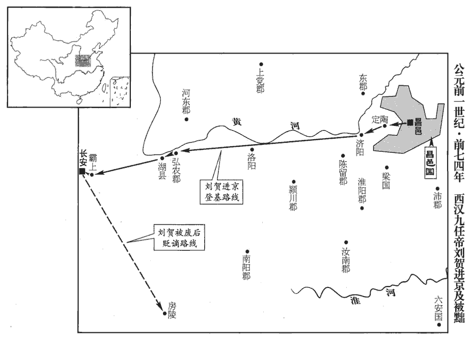
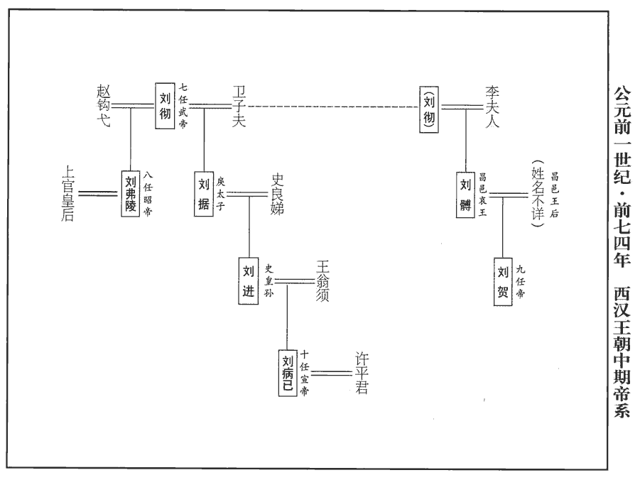
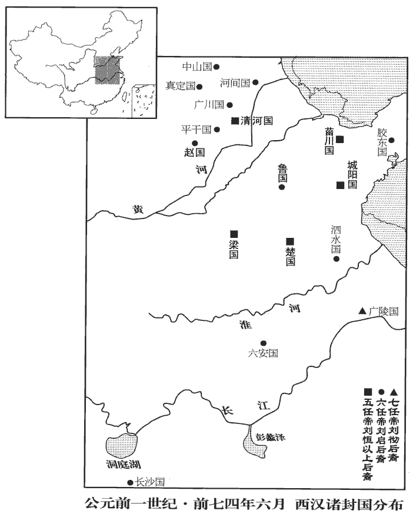
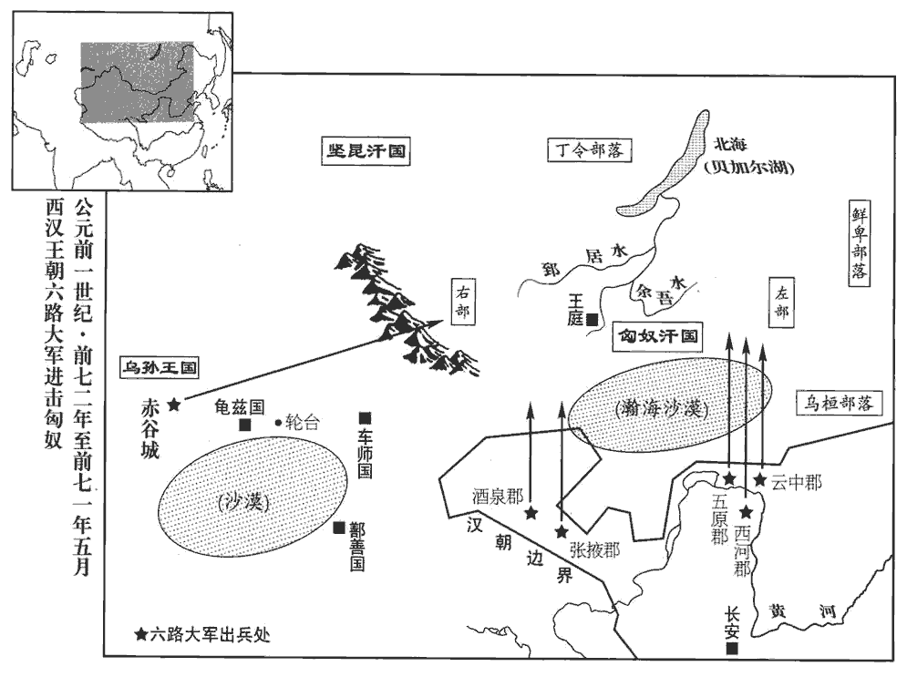

 漢紀十六起強圉協洽（丁未），盡昭陽赤奮若（癸丑），凡七年。

# 孝昭皇帝下

## 元平元年（丁未，前七四年）

1春，二月，詔減口賦錢什三。如淳曰：漢儀注：民年七歲至十四，出口賦錢人二十三：二十錢以食天子，其三錢者武帝加口錢以補車騎馬。

〖译文〗 [1]春季，二月，汉昭帝下诏书将七岁至十四岁百姓交纳的口赋减少十分之三。

2夏，四月，癸未‹十七›，帝崩于未央宮‹年二十一›；臣瓚曰：壽二十三。無嗣。時武帝子獨有廣陵‹江蘇揚州›王胥，大將軍光與群臣議所立，咸持廣陵王。王本以行失道，先帝所不用；光內不自安。郎有上書言：「周太王廢太伯立王季，文王舍伯邑考立武王，師古曰：太伯者，王季之兄；伯邑考，文王長子也。舍，讀曰捨。唯在所宜，雖廢長立少可也。長，知兩翻。少，詩照翻。廣陵王不可以承宗廟。」言合光意。光以其書示丞相敞等，擢郎為九江‹安徽壽縣›太守。九江郡屬揚州，唐濠、壽、廬、滁、和州地。守，式又翻。即日承皇后詔，遣行大鴻臚事少府樂成、宗正德、光祿大夫吉、中郎將利漢樂成，史樂成。德，劉德。吉，丙吉。利漢，不知其姓。迎昌邑王賀，乘七乘傳文帝之入立也，乘六乘傳；今乘七乘傳。傳，張戀翻。詣長安邸。諸王國皆置邸長安，此謂長安之昌邑邸也。光又白皇后，徙右將軍安世為車騎將軍。

〖译文〗 [2]夏季，四月癸未（十七日），汉昭帝在未央宫驾崩，没有儿子。当时，汉武帝的儿子只有广陵王刘胥还在，大将军霍光与群臣商议立谁为新皇帝，大家都认为应当立广陵王。广陵王本来因行为不合礼法，汉武帝不喜欢他，所以霍光心中感到不安。有一位郎官上书朝廷指出：“周太王废弃年长的儿子太伯，立太伯的弟弟王季为继承人；周文王舍弃年长的儿子伯邑考，立伯邑考的弟弟周武王为继承人。这两个事例说明，只要适合继承皇位，即使是废长立幼也完全可以。广陵王不能继位。”这道奏章的内容正合霍光的心意。霍光将奏章拿给丞相杨敞等人观看，并提升这位郎官作了九江太守。当日，由上官皇后颁下诏书，派代理大鸿胪职务的少府乐成、宗正刘德、光禄大夫丙吉、中郎将利汉用七辆驿车将昌邑王刘贺迎接到长安的昌邑王官邸。霍光又禀明皇后，调右将军张安世为车骑将军。

賀，昌邑哀王之子也，哀王，名髆，武帝子也。在國素狂縱，動作無節。武帝之喪，賀遊獵不止。嘗游方與‹山東魚臺›，方與縣本屬山陽郡，武帝以山陽為昌邑王國，方與縣屬焉。方，音房。與，音豫。不半日馳二百里。中尉琅邪王吉上疏諫曰：「大王不好書術而樂逸遊，好，呼到翻。樂，五孝翻，又音洛。馮式撙zǔn銜，馮，讀曰憑。臣瓚曰：撙，促也。師古曰：撙，挫也，音子本翻。馳騁不止，口倦虖叱咤，師古曰：咤，亦吒字也，音竹駕翻。手苦於棰轡，師古曰：棰，馬策。身勞虖車輿，朝則冒霧露，師古曰：冒，莫北翻，犯也。晝則被塵埃，被，皮義翻。夏則為大暑之所暴炙，暴，步木翻。冬則為風寒之所匽yǎn薄，師古曰：匽，與偃同，言遇疾風則偃靡也。薄，言迫也。數以耎ruǎn脆之玉體師古曰：耎，柔也，音而兗翻。脆，音此芮翻。犯勤勞之煩毒，非所以全壽命之宗也，又非所以進仁義之隆也。師古曰：宗，尊也。隆，高也。夫廣廈之下，細旃zhān之上，師古曰：廣廈，大屋也。旃，與氈同。明師居前，勸誦在後，上論唐、虞之際，下及殷、周之盛，考仁聖之風，習治國之道，治，直之翻。訢訢焉發憤忘食，訢，與欣同。日新厥德，其樂豈銜橛之間哉！樂，音洛；下同。休則俛fǔ仰屈伸以利形，師古曰：形，形體也。俛，音免。進退步趨以實下，如淳曰：今人不行，則膝以下虛弱不實。吸新吐故以練臧，師古曰：臧，五藏也。練，練其氣也。臧，古藏字通，音徂浪翻。專意積精以適神，師古曰：適，和也。於以養生，豈不長哉！大王誠留意如此，則心有堯、舜之志，體有喬、松之壽，師古曰：仙人伯喬及赤松子也。美聲廣譽，登而上聞，則福祿其臻zhēn師古曰：臻，至也。而社稷安矣。皇帝仁聖，至今思慕未怠，師古曰：皇帝，謂昭帝也。言武帝晏駕未久，故尚思慕。于宮館、囿池、弋獵之樂未有所幸，大王宜夙夜念此以承聖意。諸侯骨肉，莫親大王，大王于屬則子也，於位則臣也，一身而二任之責加焉。恩愛行義，孅xiān介有不具者，行，下孟翻；下同。孅，與纖同，息廉翻。于以上聞，非饗xiǎng國之福也。」王乃下令曰：「寡人造行不能無惰，中尉甚忠，數輔吾過。」數，所角翻。使謁者千秋賜中尉牛肉五百斤，酒五石，脯五束。孔穎達曰：脯訓始，始作即成也；脩訓治，治之乃成。鄭註臘人云：薄析曰脯；捶而施薑桂曰鍛脩。其後復放縱自若。

〖译文〗 刘贺为昌邑哀王刘之子，他在封国中一向狂妄放纵，所作所为毫无节制。在汉武帝丧期中，刘贺依旧出外巡游狩猎不止。他曾经出游方与县，不到半天时间就驰骋了二百里远。中尉、琅邪人王吉上书劝说道：“大王不喜欢研读经书，却专爱游玩逸乐，驾驭着马车不停地驰骋，嘴因吆喝而疲倦，手因握缰挥鞭而疼痛，身体因马车颠簸而劳苦，清晨冒着露水雾气，白昼顶着风沙尘土，夏季忍受着炎炎烈日的烤晒，冬天被刺骨寒风吹得抬不起头来，大王总是以自己柔软脆弱的玉体，去承受疲劳痛苦的熬煎，这不能保全宝贵的寿命，也不能促进高尚的仁义品德。在宽敞的殿堂之中，细软的毛毡之上，在明师的指导下背诵、研读经书，讨论上至尧、舜之时，下至商、周之世的兴盛，考察仁义圣贤的风范，学习治国安邦的道理，欣欣然发奋忘食，使自己的品德修养每天都有新的提高，这种快乐，难道是驰骋游猎所能享受到的吗？休息的时候，作些俯仰屈伸的动作以利于形体，用散步、小跑等运动来充实下肢；吸进新鲜空气，吐出腹中浊气以锻炼五脏；专心专意，积聚精力，以调和心神。用这样的方法进行养生，怎能不长寿呢！大王如果留心于此道，心中就会产生尧、舜的志向，身体也能像伯乔、赤松子一般长寿，美名远扬，让朝廷闻知，大王崐就会福禄一齐得到，封国就安稳了。当今皇上仁孝圣明，至今思念先帝不已，对于修建宫殿别馆、园林池塘或享受巡游狩猎等事一件未做，大王应日夜想到这一点，以符合皇上的心意。在诸侯王中，大王与皇上的血缘关系最近，论亲属关系，大王就如同是皇上的儿子，论地位，大王是皇上的臣僚，一人兼有两种身分的责任。因此，大王施恩行义，如有一点不周全，被皇上知道，都不是国家之福。”刘贺阅读之后，下令说：“我的所作所为确有懈怠之处，中尉甚为忠诚，多次弥补我的过失。”于是命负责宾客事务的侍从千秋前去赏赐中尉王吉牛肉五百斤、酒五石、干肉五捆。然而，刘贺后来依然放纵如故。

郎中令山陽龔遂，忠厚剛毅，有大節，龔，姓也。左傳，晉有大夫龔堅。內諫爭于王，外責傅相，引經義，陳禍福，至於涕泣，蹇蹇亡已，爭，讀曰諍。相，息亮翻。亡，古無字通。師古曰：蹇蹇，不阿順之意。易曰：王臣蹇蹇。面刺王過。王至掩耳起走，曰：「郎中令善媿人！」師古曰：媿，古愧字也。媿，辱也。王嘗久與騶奴、宰人遊戲飲食，騶，導車而撝huī訶hē者也。宰人，掌膳食者也。騶zōu，側鳩翻。賞賜無度，遂入見王，涕泣膝行，左右侍御皆出涕。王曰：「郎中令何為哭？」遂曰：「臣痛社稷危也！願賜清閒，竭愚！」王辟左右。師古曰：閒，讀曰閑。辟，音闢。遂曰：「大王知膠西‹山东高密›王所以為無道亡乎？」膠西王，謂于王端也。王曰：「不知也。」曰：「臣聞膠西王有諛臣侯得，王所為儗於桀、紂也，儗，與擬同。師古曰：儗，比也。得以為堯、舜也。王說其諂諛，常與寢處，說，讀曰悅。處，昌呂翻。唯得所言，以至於是。師古曰：唯用得之邪言，故至亡。今大王親近群小，近，其靳翻。漸漬邪惡漸，子廉翻。漬，疾智翻。所習，存亡之機，不可不慎也！臣請選郎通經有行義者與王起居，坐則誦詩、書，立則習禮容，宜有益。」王許之。遂乃選郎中張安等十人侍王。居數日，王皆逐去安等。去，羌呂翻；下同。

〖译文〗 郎中令山阳人龚遂忠厚刚毅，一向坚持原则，一方面不断规劝刘贺，一方面责备封国丞相、太傅没有尽到责任、他引经据典，陈述利害，说到声泪俱下，不断地冒犯刘贺，当面指责他的过失。刘贺甚至捂着耳朵起身离去，说道：“郎中令专门揭人短处！”刘贺曾经与他的车夫和厨师在一起长时间地游戏娱乐，大吃大喝，毫无节制地赏赐他们，龚遂入宫去见刘贺，哭着用双膝走到刘贺面前，连刘贺的左右侍从也全都感动得流下眼泪。刘贺问道：“郎中令为什么哭？”龚遂说：“我为社稷的危亡而痛心！希望您赐给我一个单独的机会，我将详细陈说我的看法！”刘贺命左右之人全部退出，龚遂说道：“大王可知道胶西王刘端为什么会因大逆不道罪而灭亡吗？”刘贺说：“不知道。”龚遂说：“我听说胶西王有一个专会阿谀奉承的臣子名叫侯得，胶西王的所作所为像夏桀、商纣一样暴虐，而侯得却说是像尧、舜一样贤明。胶西王对侯得的阿谀谄媚非常欣赏，经常与他住在一起。正是因为胶西王只听信侯得的奸邪之言，以至于落得如此下场。而今大王亲近奸佞小人，已经逐步沾染恶习，这是存亡的关键，不能不慎重对待！我请求挑选通晓经书、品行端正的郎官与大王一起生活，坐则诵读《诗经》、《尚书》，立则练习礼仪举止，对大王是会有益处的。”刘贺应允。于是龚遂选择郎中张安等十人侍奉刘贺。可是没过几天，张安等就全被刘贺赶走了。

王嘗見大白犬，頸以下似人，冠方山冠而無尾，方山冠，以五采縠hú為之，前高七寸，後高三寸，長八寸，樂舞人服之。冠方之冠，古玩翻。考異曰：昌邑王傳云「無頭」，五行志云「無尾」，且云「不得置後之象」。若頸以下似人而無頭，何以辨其為犬，且安所施冠！蓋傳誤也。以問龔遂；遂曰：「此天戒，言在側者盡冠狗也，言王左右之人皆狗而冠也。去之則存，不去則亡矣。」後又聞人聲曰「熊」！視而見大熊，左右莫見，以問遂；遂曰：「熊，山野之獸，而來入宮室，王獨見之，此天戒大王，恐宮室將空，危亡象也。」王仰天而歎曰：「不祥何為數來！」遂叩頭曰：「臣不敢隱忠，數言危亡之戒；大王不說。夫國之存亡，豈在臣言哉！願王內自揆度。數，所角翻；下同。說，讀曰悅。度，徒洛翻。大王誦詩三百五篇，人事浹jiā，浹，即協翻，洽也，徹也。王道備。王之所行，中詩一篇何等也？中，竹仲翻。師古曰：言王所行皆不合法度，王自謂當于何詩之文也。大王位為諸侯王，行汙于庶人，行，下孟翻。師古曰：汙，濁穢。以存難，以亡易，易，以豉翻。宜深察之！」後又血污王坐席，王問遂；遂呌jiào然號汙，烏故翻。號，戶高翻。曰：「宮空不久，妖祥數至。血者，陰憂象也，宜畏慎自省！」省，悉景翻。王終不改節。

〖译文〗 刘贺曾经见到一只白色大狗，脖颈以下长得与人相似，头戴一顶跳舞的人戴的“方山冠”，没有尾巴。刘贺为此事向龚遂询问，龚遂说：“这是上天的警告，说您左右的亲信之人都是戴着冠帽的狗，赶走他们就能生存，不赶走他们就会灭亡！”后来，刘贺又听到一个人的声音叫喊：“熊！”刘贺一看，果然见到一只大熊，可左右侍从却谁也没看见。刘贺又向龚遂询问，龚遂说：“熊是山野中的野兽，竟来到王宫之中，又只有大王一人看到，这是上天警告大王，恐怕王宫将要空虚，是危亡的征兆！”刘贺仰天长叹，说道：“不祥之兆为何接连到来！”龚遂叩头说道：“忠心使我不敢隐瞒真相，所以几次提到危亡的警告，使大王感到不快。然而国之存亡，又岂是我的话所能决定的！希望大王自己好好想想。大王诵读《诗经》三百零五篇，其中说道，只有‘人事’恰当，‘王道’才能周备。大王的所作所为，与《诗经》的哪一篇相符崐合呢！大王身为诸侯王，行事却比平民百姓污浊，想要生存困难，想要灭亡却是容易的，希望大王深思！”后来，又发现在刘贺的王座上出现血污，刘贺再问龚遂，龚遂大声号叫道：“妖异之兆不断出现，王宫空虚就在眼前！血为阴暗中的凶险之象，大王应有所畏惧，谨慎反省！”然而刘贺的品行始终不改。

 

及徵書至，夜漏未盡一刻，以火發書。其日中，王發；晡bū時，至定陶‹山東定陶›，定陶縣為濟陰郡治所。行百三十五里，侍從者馬死相望於道。從，才用翻。王吉奏書戒王曰：「臣聞高宗諒闇，三年不言。闇，讀與陰同。今大王以喪事征，宜日夜哭泣悲哀而已，慎毋有所發！師古曰：發，謂興舉眾事。大將軍仁愛、勇智、忠信之德，天下莫不聞；事孝武皇帝二十餘年，未嘗有過。先帝棄群臣，屬以天下，屬，之欲翻。寄幼孤焉。大將軍抱持幼君襁褓之中，襁，負兒衣。論語曰：襁負其子。博物志曰：織縷為之，廣八寸，長二尺，以約小兒于背上。李奇曰：絡也，以繒布為之，絡負小兒。孟康曰：小兒繃。師古曰：孟說是。褓，小兒衣。李奇曰：褓，小兒大籍。又齊人名小兒被為褓。襁，舉兩翻。褓，博抱翻。布政施教，海內晏然，雖周公、伊尹無以加也。今帝崩無嗣，大將軍惟思可以奉宗廟者，攀援而立大王，師古曰：援，引也，音爰。其仁厚豈有量哉！臣願大王事之，敬之，政事壹聽之，大王垂拱南面而已。願留意，常以為念！」

〖译文〗 征召刘贺继承皇位的诏书到来时，正值初夜，刘贺在火烛下打开诏书。中午，刘贺出发前往长安，黄昏时就到定陶，走了一百三十五里，沿途不断有随从人员的马匹累死。王吉上书劝戒刘贺说：“我听说商高宗武丁在居丧期间，三年没有说话。如今大王因丧事而受征召，应当日夜哭泣悲哀而已，千万不可发号施令！大将军仁爱、智勇、忠信的品德，天下无人不知。他侍奉孝武皇帝二十余年，从未有过过失。孝武皇帝抛弃群臣而离开人世时，将天下和幼弱孤儿托付给大将军。大将军扶持尚在襁褓中的幼主，发布政令，教化万民，使国家得以平安无事，即使是周公、伊尹也不能超过他。而今皇上去世，没有儿子，大将军思考可以继承皇位的人，最终选拔了大王，其仁义忠厚的胸怀岂有限量！我希望大王能依靠大将军，尊敬大将军，国家政事全都听从大将军的安排，大王自己则只是垂衣拱手地坐在皇帝宝座上而已。希望大王注意，常常想到我这番话！”

王‹刘贺›至濟陽‹河南兰考东北堌阳镇›，班志，濟陽縣屬陳留郡。杜佑曰。濟陽縣故城，在曹州冤句縣西南。濟，子禮翻。求長鳴雞，師古曰：雞之鳴聲長者也。范成大曰：長鳴雞自南詔諸蠻來，形矮而大，鳴聲圓長，一鳴半刻，終日啼號不絕。蠻甚貴之，一雞直銀一兩。邕州谿洞亦有之。道買積竹杖。文穎曰：合竹作杖也。過弘農‹河南靈寶东北›，使大奴善以衣車載女子。師古曰：凡言大奴者，謂奴之尤長大者也。善，其名也。至湖‹河南靈寶西›，使者以讓相安樂。師古曰：使者，長安使人也。讓，責也。安樂，史逸其姓。相，息亮翻。樂，音洛。安樂告龔遂，遂入問王，王曰：「無有。」遂曰：「即無有，何愛一善以毀行義！請收屬吏，以湔jiān灑大王。」師古曰：以善付吏也。湔，澣huàn也。灑，濯zhuó也。行，下孟翻。屬，之欲翻；下同。湔，子顛翻。灑，先禮翻。即捽zuó善屬衛士長行法。師古曰：衛士長，主衛之官。捽zuó，持頭也，音才兀翻。長，知兩翻。

〖译文〗 刘贺行至济阳，派人索求长鸣鸡，并在途中购买用竹子合制而成的积竹杖。经过弘农时，刘贺派一名叫作善的大奴用有帘幕遮闭的车运载随行的美女。来到湖县，朝廷派来迎接的使者以此事责备昌邑国相安乐。安乐转告龚遂，龚遂进见刘贺询问此事，刘贺说：“没有的事。”龚遂说：“如果并无此事，大王又何必为了庇护一个奴仆而破坏礼仪呢！请将善逮捕，交付有关官员惩处，以洗清大王的名声。”于是立即将善抓起来，交卫士长处死。

王‹刘贺›到霸上‹陝西西安东灞河畔›，大鴻臚郊迎，臚，陵如翻。騶奉乘輿車。王使壽成御，壽成，人名，昌邑太僕也。乘，繩證翻；下同。郎中令遂參乘。且至廣明、東都門，遂曰：「禮，奔喪望見國都哭。此長安東郭門也。」廣明註見上卷元鳳元年。三輔黃圖：宣平門，長安城東出北頭第一門；其外郭名東都門。王曰：「我嗌yì痛，不能哭。」師古曰：嗌，喉咽也，音益。至城門，遂復言；復，扶又翻。王曰：「城門與郭門等耳。」且至未央宮東闕，遂曰：「昌邑帳在是闕外馳道北，文穎曰：吊哭帳也。未至帳所，有南北行道，馬足未至數步；大王宜下車，鄉闕西面伏哭，盡哀止。」鄉，讀曰嚮。王曰：「諾。」到，哭如儀。六月，丙寅‹一›，王‹刘贺›受皇帝璽綬，襲尊號；璽，斯氏翻。綬，音受。尊皇后曰皇太后‹时年十五›。

〖译文〗 刘贺抵达霸上，朝廷派大鸿胪到郊外迎接，侍奉刘贺换乘皇帝乘坐的御车。刘贺命昌邑国太仆寿成驾车，郎中令龚遂相陪。即将到达广明、东都门时，龚遂说道：“按照礼仪，奔丧的人看到国都，便应痛哭。前面就是长安外郭的东门了。”刘贺说：“我咽喉疼痛，不能哭。”来到城门之前，龚遂再次提醒他。刘贺说：“城门与郭门一样。”将至未央宫东阙，龚遂说：“昌邑国吊丧的帐幕在阙外御用大道的北边，帐前有一条南北通道，马匹走不了几步，大王应当下车，朝着门阙，面向西方，伏地痛哭，极尽哀痛之情，方才停止。”刘贺答应道：“好吧。” 于是步行上前，依照礼仪哭拜。六月丙寅（初一），刘贺接受皇帝玉玺，承袭帝位，尊上官皇后为皇太后。

3壬申‹七›，葬孝昭皇帝于平陵‹陕西咸阳西平陵乡南›。平陵，屬右扶風，在長安西北七十里。自崩至葬十日。

〖译文〗 [3]壬申（初七），将汉昭帝安葬于平陵。

4昌邑王‹刘贺›既立，淫戲無度。昌邑官屬皆徵至長安，往往超擢拜官。相安樂遷長樂衛尉。龔遂見安樂，流涕謂曰：「王立為天子，日益驕溢，諫之不復聽。今哀痛未盡，師古曰：謂新居喪服。日與近臣飲酒【章：甲十五行本「酒」作「食」；乙十一行本同；孔本同。】作樂，斗虎豹，召皮軒車九旒liú，漢大駕、法駕，前驅有雲䍐hǎn九斿liú，皮軒，鸞旗。薛綜曰：雲䍐，旌旗名。胡廣曰：皮軒，以虎皮為軒。郭璞曰：皮軒，革車，即曲禮「前有士師則載虎皮」。師古曰：皮軒之上，以赤皮為重蓋，今此制尚存，非用虎皮飾車。驅馳東西，所為誖道。孔穎達曰：走馬謂之馳；策馬謂之驅。誖，蒲內翻。師古曰：乖也。古制寬，大臣有隱退；今去不得，陽狂恐知，身死為世戮，柰何？君，陛下故相，宜極諫爭！」

〖译文〗 [4]昌邑王刘贺作了皇帝后，淫乱荒唐没有节制。原昌邑国官吏全部被征召到长安，很多人得到破格提拔。昌邑国相安乐被任命为长乐卫尉。龚遂见到安乐，哭着对他说：“大王被立为天子之后，日益骄纵，规劝他也不再听从。如今仍在居丧期间，他却每天与亲信饮酒作乐，观看虎豹搏斗，又传召悬挂着天子旌旗的虎皮轿车，坐在上面东奔西跑，所作所为违背了正道。古代制度宽厚，大臣可以辞职隐退，如今想走走不得，想伪装疯狂，又怕被人识破，死后还要遭人唾骂，教我如何是好？您是陛下原来的丞相，应当极力规劝才是。”

王夢青蠅之矢積西階東，可五六石，以屋版瓦覆之，師古曰：版瓦，大瓦也。覆，敷又翻。以問遂，遂曰：「陛下之詩不云乎：以昌邑王習詩，故云然。蘇林曰：猶言陛下所讀之詩也。『營營青蠅，止於藩。愷悌君子，毋信讒言。』陛下左側讒人眾多，如是青蠅惡矣。師古曰：惡，即矢也。吳越春秋云：越王勾踐為吳王嘗惡，即其義也。宜進先帝大臣子孫、親近，以為左右。近，其靳翻。如不忍昌邑故人，師古曰：如，若也。信用讒諛，必有凶咎。願詭禍為福，師古曰：詭，反也。皆放逐之！臣當先逐矣。」王不聽。

〖译文〗 刘贺梦见在殿堂西阶的东侧，堆积着绿头苍蝇的粪便，约有五六石之多，上面盖着大片的屋瓦。刘贺向龚遂询问，龚遂说：“陛下所读的《诗经》中，不是有这样的话吗：‘绿蝇往来落篱笆，谦谦君子不信谗。’陛下左侧奸佞之人很多，就像陛下在梦中见到的苍蝇粪便一样。因此，应该选拔先帝大臣的子孙，作为陛下身边的亲信侍从。如若总是不忍抛开昌邑国的故旧，信任并重用那些进谗阿谀之人，必有祸事。希望陛下能反祸为福，将这些人全部逐出朝廷。我应当第一个走。”刘贺拒不接受龚遂的劝告。

太僕丞河東‹山西夏縣›張敞上書諫，班表，太僕有兩丞。續漢志：丞一人，秩千石。河東郡屬并州；按此時河東郡當屬司隸。曰：「孝昭皇帝蚤崩無嗣，師古曰：蚤，古早字。大臣憂懼，選賢聖承宗廟，東迎之日，唯恐屬車之行遲。師古曰：不欲斥乘輿，故但言屬車耳。屬，之欲翻。今天子以盛年初即位，天下莫不拭目傾耳，觀化聽風。師古曰：言改易視聽，欲急聞見善政化也。拭，音式。國輔大臣未褒，而昌邑小輦先遷，李奇曰：挽輦小臣也。此過之大者也。」王不聽。

〖译文〗 太仆丞河东人张敞上书劝说道：“孝昭皇帝早逝，没有儿子，朝中大臣忧虑惶恐，选择贤能圣明的人承继帝位，到东方迎接圣驾之时，唯恐跟随您的从车行进迟缓。如今陛下正当盛年，初即帝位，天下人无不擦亮眼睛，侧着耳朵，盼望看到和听到陛下实施善政。然而，辅国的重臣尚未得到褒奖，而昌邑国拉车的小吏却先获得升迁，这是个大过错。”刘贺不听。

大將軍光憂懣，懣，母本翻，又音滿，又音悶，煩懣也。獨以問所親故吏大司農田延年；延年曰：「將軍為國柱石，師古曰：柱者，梁下之柱。石，承柱之礎。言大臣負國重任，如屋之柱及其石也。審此人不可，何不建白太后，建議而白之也。更選賢而立之？」光曰：「今欲如是，于古嘗有此不？」師古曰：光不涉學，故有此問也。不，讀曰否。延年曰：「伊尹相殷，廢太甲以安宗廟，後世稱其忠。師古曰：商書太甲篇：太甲既立，不明，伊尹放諸桐也。將軍若能行此，亦漢之伊尹也。」光乃引延年給事中，給事中，給事禁中也；西漢以為加官。陰與車騎將軍張安世圖計。師古曰：圖，謀也。

〖译文〗 大将军霍光见此情景，忧愁烦恼，便单独向所亲信的旧部、大司农田延年询问对策。田延年说：“将军身为国家柱石，既然认为此人不行，何不禀告太后，改选贤明的人来拥立呢？”霍光说：“我如今正想如此，古代曾否有人这样做过吗？”田延年说：“当年伊尹在商朝为相，为了国家的安定将太甲废黜，后人因此称颂伊尹忠心为国。如今将军若能这样做，也就成为汉朝的伊尹。”于是霍光命田延年兼任给事中，与车骑将军张安世秘密谋划废黜刘贺。

王出遊，光祿大夫魯國夏侯勝當乘輿前諫曰：「天久陰而不雨，臣下有謀上者。陛下出，欲何之？」之，往也。王怒，謂勝為祅言，祅，與妖同，音於驕翻。縛以屬吏。屬，之欲翻。吏白霍光，光不舉法。光讓安世，以為泄語。安世實不言；乃召問勝。勝對言：「在鴻范傳曰：『皇之不極，厥罰常陰，漢儒作洪范傳，以五事應五行。「皇之不極，是謂不建，厥罰常陰，時則有下人伐上之痾。」皇，君也。極，中也。建，立也。人君貌、言、視、聽、思五事皆失，不得其中，則不能立萬事，失在眊mào悖，故其咎眊也。王者承天理物，雲起於山而彌於天，天氣亂，故其罰常陰也。君亂且弱，人之所叛，故有下人伐上之痾也。時則有下人伐上者。』惡察察言，惡，忌諱也。惡察察言，不敢明言之也。惡，烏路翻。故云『臣下有謀』。」光、安世大驚，以此益重經術士。侍中傅嘉數進諫，數，所角翻。王亦縛嘉系獄。

〖译文〗 刘贺外出巡游，光禄大夫鲁国人夏侯胜挡在车驾前劝阻道：“天气久阴不下雨，预示臣下有不利于皇上的阴谋。陛下出宫，要到哪里去？”刘贺大怒，认为夏侯胜口出妖言，命将其捆绑，交官吏治罪。负责处理此事的官员向霍光报告，霍光不处以刑罚。霍光以为是张安世将计划泄漏，便责问他。但张安世实际上并未泄漏，于是召夏侯胜前来询问，夏侯胜回答说：“《鸿范传》上说：‘君王有过失，上招天罚，常会使天气阴沉，此时就会有臣下谋害君上。’我不敢明言，只好说是‘臣下有不利于皇上的阴谋’。”霍光、张安世闻言大惊，因此更加重视精通经书的儒士。侍中傅嘉多次劝说刘贺，刘贺也将他绑起来关进监狱。

光、安世既定議，乃使田延年報丞相楊敞。敞驚懼，不知所言，汗出洽背，徒唯唯而已。師古曰：唯唯者，恭應之辭也。唯，於癸翻。延年起，至更衣。師古曰：古者延賓必有更衣之處也。更，工衡翻。敞夫人遽從東廂謂敞曰：「此國大事，今大將軍議已定，使九卿來報君侯，君侯不疾應，與大將軍同心，猶與無決，先事誅矣！」與，讀曰豫。先，悉薦翻。延年從更衣還，敞夫人與延年參語許諾，「請奉大將軍教令！」師古曰：三人共言，故曰參語。

〖译文〗 霍光、张安世计议已定，便派田延年前去报知丞相杨敞。杨敞闻言又惊又怕，不知该说什么好，汗流浃背，只是唯唯诺诺而已。田延年起身去换衣服，杨敞的夫人急忙从东厢房对杨敞说：“这是国家大事，如今大将军计议已定，派大司农来通知你，你不赶快答应，表示与大将军同心，却犹豫不决，就要先被诛杀了！”田延年换衣返回，杨敞夫人也参与谈话，表示同意霍光的计划，“一切听大将军吩咐！”

癸巳‹二十八›，光召丞相、御史、將軍、列侯、中二千石、大夫、博士會議未央宮。光曰：「昌邑王行昏亂，恐危社稷，如何？」群臣皆驚鄂失色，師古曰：凡鄂者，皆謂阻礙不依順也。後字作「愕」，其義亦同。莫敢發言，但唯唯而已。田延年前，離席按劍離，力智翻。曰：「先帝屬將軍以幼孤，寄將軍以天下，以將軍忠賢，能安劉氏也。今群下鼎沸，社稷將傾；且漢之傳諡常為『孝』者，以長有天下，令宗廟血食也。如漢家絕祀，將軍雖死，何面目見先帝於地下乎？今日不議，不得旋踵，師古曰：宜速決。群臣後應者，臣請劍斬之！」光謝曰：「九卿責光是也！天下匈匈不安，光當受難。」師古曰：受其憂責也。難，乃旦翻。於是議者皆叩頭曰：「萬姓之命，在於將軍，唯大將軍令！」師古曰：言一聽之也。

〖译文〗 癸巳（二十八日），霍光召集丞相、御史、将军、列侯、中二千石、大夫、博士在未央宫开会。霍光说：“昌邑王行为昏乱，恐怕会危害国家，怎么办？”群臣闻言全都大惊失色，谁也不敢发言，只唯唯诺诺而已。田延年离开席位，走到群臣前面，手按剑柄说道：“先帝将幼弱弧儿托付将军，并把国家大事交与将军作主，是因为相信将军忠义贤明，能够保全刘氏的江山。如今朝廷被一群奸佞小人搞得乌烟瘴气，国家危亡；况且我大汉历代皇帝的谥号都有一个‘孝’字，为的就是江山永存，使宗庙祭祀不断。如果汉家祭祀断绝，将军即使死去，又有何脸面见先帝于地下呢？今日的会议，必须立即作出决断，群臣中最后响应的，我请求用剑将他斩首！”霍光点头认错，说道：“大司农对我的责备很对！国家不安宁，我应当受处罚。”于是参加会议的人都叩头说道：“万民的命运，都掌握在将军手中，一切听从大将军的命令！”

光即與群臣俱見，見，賢遍翻。白太后，具陳昌邑王不可以承宗廟狀。皇太后乃車駕幸未央承明殿，未央宮有承明殿，天子於是延儒生、學士。武帝責莊助曰：「君厭承明之廬」；西都賦曰：「承明、金馬，著作之庭」，是也。詔諸禁門毋內昌邑群臣。王入朝太后還，乘輦欲歸溫室，晉灼曰：長樂宮有溫室殿。三輔黃圖：溫室殿在未央殿北，武帝建。余謂長樂固亦有溫室，但漢諸帝皆居未央，則此當為未央之溫室也。中黃門宦者各持門扇，中黃門屬少府黃門令。師古曰：中黃門，謂奄人居禁中，在黃門之內給事者也，比百石。王入，門閉，昌邑群臣不得入。王曰：「何為？」大將軍跪曰：「有皇太后詔，毋內昌邑群臣！」內，讀曰納。王曰：「徐之，何乃驚人如是！」光使盡驅出昌邑群臣，置金馬門外。車騎將軍安世將羽林騎將，即亮翻。騎，奇寄翻。收縛二百餘人，皆送廷尉詔獄。令故昭帝侍中中臣侍守王。光敕左右：「謹宿衛！卒有物故自裁，師古曰：卒，讀曰猝。物故，死也。自裁，謂自殺也。令我負天下，有殺主名。」王尚未自知當廢，謂左右：「我故群臣從官安得罪，而大將軍盡系之乎？」從，才用翻。師古曰：安，焉也。余謂安得罪，猶言何所得罪也。

〖译文〗 霍光随即与群臣一同晋见太后，向太后禀告，陈述昌邑王刘贺不能承继皇位的情状。于是皇太后乘车驾前往未央宫承明殿，下诏命皇宫各门不许放昌邑国群臣入内。刘贺朝见太后之后，乘车准备返回温室殿，此时禁宫宦者已分别抓住门扇，刘贺一进去，便将门关闭，昌邑国群臣不能入内，刘贺问道：“这是干什么？”大将军霍光跪地回答说：“皇太后有诏，不许昌邑国群臣入宫。”刘贺说：“慢慢吩咐就是了，为什么竟如此吓人！”霍光命人将昌邑国群臣全部驱赶到金马门之外。车骑将军张安世率领羽林军将被赶出来的昌邑国群臣二百余人逮捕，全部押送廷尉所属的诏狱。霍光命曾在汉昭帝时担任过侍中的宦官守护刘贺，并命令手下人说：“一定要严加守护！如果他突然死去或自杀，就会让我对不起天下人，背上杀主的恶名。”此时刘贺还不知道自己即将被废黜，问身边之人说：“我以前的群臣、从属犯了什么罪？大将军为什么将他们全部关押起来呢？”

頃之，有太后詔召王。王聞召，意恐，乃曰：「我安得罪而召我哉？」太后被珠襦，被，皮義翻。如淳曰：以珠飾襦也。晉灼曰：貫珠以為襦，形若今革襦矣。師古曰：晉說是也。襦，汝朱翻。盛服坐武帳中，侍御數百人皆持兵，期門武士陛戟陳列殿下，期門屬光祿勳，掌執兵送從。武帝為微行，與勇力之士期諸殿門，故曰期門。群臣以次上殿，召昌邑王伏前聽詔。光與群臣連名奏王，尚書令讀奏曰：「丞相臣敞等臣敞下即連名，史以等字約言之。昧死言皇太后陛下：孝昭皇帝早棄天下，遣使徵昌邑王典喪，服斬衰，師古曰：典喪，言為喪主也。斬衰，謂縗cuī裳下不緶biàn，直斬割之而已。緶，步千翻。無悲哀之心，廢禮誼，居道上不素食，師古曰：素食，菜食無肉也。言王在道常肉食，非居喪之制也。而鄭康成解素食云平常之食，失之遠矣。使從官略女子載衣車，內所居傳舍。始至謁見，傳，張戀翻。見，賢遍翻。立為皇太子，常私買雞豚以食。受皇帝信璽、行璽大行前，孟康曰：漢初有三璽，天子之璽自佩，信璽、行璽在符節台。大行前，昭帝柩前也。韋昭曰：大行，不反之辭也。就次，發璽不封。師古曰：璽既國器，常當緘封，而王於大行前受之，退還所次，遂爾發漏，更不封之，令凡人皆見，言不重慎。從官更持節引內昌邑從官、騶宰、官奴二百余人，常與居禁闥內敖戲。更，工衡翻。敖，讀曰傲。為書曰：『皇帝問侍中君卿：使中御府令高昌奉黃金千斤，賜君卿取十妻。』師古曰：昌邑之侍中名君卿也。大行在前殿，發樂府樂器，引內昌邑樂人擊鼓，歌吹，作俳pái倡；師古曰：俳，優諧戲也。倡，樂人也。倡，音昌。召內泰壹、宗廟樂人，悉奏眾樂。鄭氏曰：祭泰一樂人也。余據武帝祠泰一用樂舞，召歌兒作二十五弦及空侯瑟，又采詩夜誦，有趙、代、秦、楚之謳，宗廟樂有文德、昭德、文始、五行之舞，嘉至、永至、登歌、休成之樂，房中祠樂、安世樂、昭容樂、禮容樂，其員八百二十九人。駕法駕驅馳北宮、桂宮，師古曰：北宮、桂宮并在未央宮北。三輔黃圖：桂宮，武帝造，周回十餘里，有紫房複道通未央宮。三秦記：未央宮漸台西有桂宮。弄彘zhì，斗虎。召皇太后御小馬車，張晏曰：皇太后所駕游宮中輦車也。漢廄有果下馬，高三尺，以駕輦。師古曰：小馬可於果樹下乘之，故曰果下馬。使官奴騎乘，遊戲掖庭中。與孝昭皇帝宮人蒙等淫亂，詔掖庭令：『敢泄言，要斬！』……」掖庭令屬少府，武帝太初元年更名，本永巷令也。要，與腰同。太后曰：「止！師古曰：令且止讀奏也。為人臣子，當悖亂如是邪！」王離席伏。悖，蒲內翻。離，力智翻。尚書令復讀曰：復，扶又翻。「……取諸侯王、列侯、二千石綬及墨綬、黃綬以并佩昌邑郎官者免奴。續漢志：諸侯王赤綬四采，青、黃、縹piǎo、紺gàn。列侯紫綬二采，紫、白。二千石青綬三采，青、白、紅。千石、六百石墨綬三采，青、赤、紺。四百石、三百石、二百石黃綬。師古曰：免奴，謂奴免放為良人者。發御府金錢、刀劍、玉器、采繒，賞賜所與遊戲者。與從官、官奴夜飲，湛沔於酒。師古曰：湛，讀曰沈；又讀曰耽。湛沔者，乃荒迷之義也。沔，與湎同。獨夜設九賓溫室，師古曰：於溫室中設九賓之禮也。延見姊夫昌邑關內侯。祖宗廟祠未舉，為璽書，使使者持節以三太牢祠昌邑哀王園廟，稱『嗣子皇帝』。師古曰：時在喪服，故未祠宗廟而私祭昌邑哀王也。余謂賀入繼大宗，不當於昌邑哀王稱嗣子皇帝，既于禮悖「三年不祭」之義，又悖「為人後者為之子」之義。受璽以來二十七日，使者旁午，如淳曰：旁午，分佈也。師古曰：一縱一橫為旁午，猶言交橫也。持節詔諸官署徵發凡一千一百二十七事。荒淫迷惑，失帝王禮誼，亂漢制度。臣敞等數進諫，不變更，數，所角翻。更，工衡翻。日以益甚；恐危社稷，天下不安。臣敞等謹與博士議，皆曰：『今陛下嗣孝昭皇帝後，行淫辟不軌。辟，讀曰僻。「五辟之屬，莫大不孝。」孝經：孔子曰：五刑之屬三千，其罪莫大於不孝。辟，五刑之辟也。辟，頻亦翻。周襄王不能事母，春秋曰：「天王出居於鄭，」由不孝出之，絕之於天下也。僖二十四年經書天王出居於鄭。公羊傳曰：王者無外，此其言出何？不能於母也。宗廟重于君，陛下不可以承天序，奉祖宗廟，子萬姓，當廢！』臣請有司以一太牢具告祠高廟。」皇太后詔曰：「可。」光令王起，拜受詔，王曰：「聞『天子有爭臣七人，雖亡道不失天下。』」引孝經孔子之言。爭，讀曰諍。亡，古無字通。光曰：「皇太后詔廢，安得稱天子！」乃即持其手，解脫其璽組，師古曰：即，就也。組，則古翻。說文曰：組，綬屬。續漢志：乘輿，黃赤綬四采，黃、赤、紺、縹，長丈有九尺九寸，五百首。奉上太后；上，時掌翻。扶王下殿，出金馬門，群臣隨送。王西面拜曰：「愚戇，不任漢事！」戇，陟降翻。任，音壬。起，就乘輿副車；乘，繩證翻。大將軍光送至昌邑邸。光謝曰：「王行自絕於天，臣寧負王，不敢負社稷！願王自愛，臣長不復左右。」師古曰：言不復得侍見於左右。光涕泣而去。

〖译文〗 不久，皇太后下诏召刘贺入见。刘贺听说太后召见，感到害怕，说道：“我犯了什么错？太后为什么召我？”太后身披用珠缀串而成的短衣，盛装打扮，坐在武帐之中，数百名侍卫全部手握兵器，与持戟的期门武士排列于殿下。文武群臣按照品位高低依次上殿，然后召昌邑王上前伏于地下，听候宣读诏书。霍光与群臣连名奏劾昌邑王，由尚书令宣读奏章：“丞相杨敞等冒死上奏皇太后陛下：孝昭皇帝过早地抛弃天下而去，朝廷派使者征召昌邑王前来，主持丧葬之礼。而昌邑王身穿丧服，并无悲哀之心，废弃礼义，在路上不肯吃素，还派随从官员掳掠女子，用有帘幕遮蔽的车来运载，在沿途驿站陪宿。初到长安，谒见皇太后之后，被立为皇太子，仍经常私下派人购买鸡、猪肉食用。在孝昭皇帝灵柩之前接受皇帝的印玺，回到住处，打开印玺后就不再封存。派侍从官更手持皇帝符节前去召引昌邑国的侍从官、车马官、官奴仆等二百余人，与他们一起居住在宫禁之内，肆意游戏娱乐。曾经写信说：‘皇帝问候侍中君卿，特派中御府令高昌携带黄金千斤，赐君卿娶十个妻子。’孝昭皇帝的灵柩还停在前殿，竟搬来乐府乐器，让昌邑国善于歌舞的艺人入宫击鼓，歌唱欢弹，演戏取乐；又调来泰一祭坛和宗庙的歌舞艺人，遍奏各种乐曲。驾着天子车驾，在北宫、桂宫等处往来奔驰，并玩猪、斗虎。擅自调用皇太后乘坐的小马车，命官奴仆骑乘，在后宫中游戏。与孝昭皇帝的叫蒙的宫女等淫乱，还下诏给掖庭令：‘有敢泄漏此事者腰斩！’……”太后说：“停下！作臣子的，竟会如此悖逆荒乱吗！”刘贺离开席位，伏地请罪。尚书令继续读道：“……取朝廷赐予诸侯王、列侯、二千石官员的绶带及黑色、黄色绶带，赏给昌邑国郎官，及被免除奴仆身分的人佩带。将皇家仓库中的金钱、刀剑、玉器、彩色丝织品等赏给与其一起游戏的人。与侍从官、奴仆彻夜狂饮，酒醉沉迷。在温室殿设下隆重的九宾大礼，于夜晚单独接见其姐夫昌邑关内侯。尚未举行祭祀宗庙的大礼，就颁发正式诏书，派使者携带皇帝符节，以三牛、三羊、三猪的祭祀大礼前往祭祀其父昌邑哀王的陵庙，还自称‘嗣子皇帝’。即位以来二十七天，向四面八方派出使者，持皇帝符节，用诏令向各官署征求调发，共一千一百二十七次。荒淫昏乱，失去了帝王的礼义，败坏了大汉的制度。杨敞等多次规劝，但并无改正，反而日益加甚，恐怕这样下去将危害国家，使天下不安。我们与博士官商议，一致认为：‘当今陛下继承孝昭皇帝的帝位，行为淫邪不轨。《孝经》上说：“五刑之罪当中，以不孝之罪最大。”昔日周襄王不孝顺母亲，所以《春秋》上说他：“天王出居郑国，”因其不孝，所以出居郑国，被迫抛弃天下。宗庙要比君王重要得多，陛下既然不能承受天命，侍奉宗庙，爱民如子，就应当废黜！’因此，臣请求太后命有关部门用一牛、一羊、一猪的祭祀大礼，祭告于高祖皇帝的祭庙。”皇太后下诏说：“可以。”于是霍光命刘贺站起来，拜受皇太后诏书。刘贺说道：“我听说：‘天子只要有七位耿直敢言的大臣在身边，既使无道，也不会失去天下。’”霍光说：“皇太后已经下诏将你废黜，岂能自称天子！”随即抓住刘贺的手，将他身上佩戴的玉玺绶带解下，献给皇太后，然后扶着刘贺下殿，从金马门走出皇宫，群臣跟随后崐相送。刘贺出宫后，面向西方叩拜道：“我太愚蠢，不能担当汉家大事！”然后起身，登上御驾的副车，由大将军霍光送到长安昌邑王官邸。霍光道歉说：“大王的行为是自绝于上天，我宁愿对不起大王，不敢对不起社稷！希望大王自爱，我不能再常侍奉于大王的左右了。”说完洒泪而去。

群臣奏言：「古者廢放之人，屏于遠方，屏，必郢翻，又卑正翻。不及以政。師古曰：言不豫政令。請徙王賀漢中房陵縣‹湖北房縣›。」漢中郡屬益州。房陵縣，唐為房州。太后詔歸賀昌邑，賜湯沐邑二千戶，故王家財物皆與賀；及哀王女四人，各賜湯沐邑千戶；國除，為山陽郡。昌邑國本山陽郡也；今國除，復為郡。

〖译文〗 文武群臣上奏太后说：“古时候，被废黜之人，要放逐到远方去，使其不能再参与政事。请将昌邑王刘贺迁徙到汉中房陵县。”太后下诏，命刘贺回昌邑居住，赐给他二千户人家作为汤沐邑，他当昌邑王时的家财也全部发还给他，其姐妹四人，各赐一千户人家作为汤沐邑；撤销昌邑国，改为山阳郡。

昌邑群臣坐在國時不舉奏王罪過，令漢朝不聞知，朝，直遙翻。又不能輔道，道，讀曰導。陷王大惡，皆下獄，誅殺二百餘人；下，遐嫁翻。唯中尉吉、郎中令遂以忠直數諫正，數，所角翻。得減死，髡kūn為城旦。師王式系獄當死，治事使者責問曰：「師何以無諫書？」王式時為昌邑王師，以授王詩。治事使者，即治獄使者也。治，直之翻。式對曰：「臣以詩三百五篇朝夕授王，至於忠臣、孝子之篇，未嘗不為王反復誦之也；為，於偽翻；下同。師古曰：復，音方目翻。至於危亡失道之君，未嘗不流涕為王深陳之也。臣以三百五篇諫，是以無諫書。」使者以聞，亦得減死論。

〖译文〗 原昌邑国群臣都被指控在封国时不能举奏刘贺的罪过，使朝廷不了解真实情况，又不能加以辅佐、引导，使刘贺陷于罪恶，一律逮捕下狱，诛杀二百余人；只有中尉王吉、郎中令龚遂因忠正耿直，多次规劝刘贺，被免除死罪，剃去头发，罚以“城旦”之刑，白天守城，夜晚作苦工。刘贺的老师王式也被逮捕下狱，罪应处死，审案官员责问王式道：“你作为昌邑王的老师，为什么没有上述规劝？”王式回答说：“我每天早晚都为昌邑王讲授《诗经》三百零五篇，遇到涉及忠臣、孝子的内容，未曾不为其反复诵读、讲解；遇到关于无道之君使国家危亡的篇章，也未曾不流泪为他详细陈说。我是用《诗经》三百零五篇来规劝昌邑王，所以没有专门上书规劝。”审案官员将王式这番话奏闻朝廷，所以王式也被免除死罪。

霍光以群臣奏事東宮，太后省政，省，悉景翻。宜知經術，白令夏侯勝用尚書授太后，遷勝長信少府，長信，宮名；少府掌其宮事。班表：長信詹事掌皇太后宮；景帝中六年更名長信少府；平帝元始四年更名長樂少府。張晏曰：以太后所居名也，居長信宮則曰長信少府，居長樂宮則曰長樂少府也。三輔黃圖：長信殿在長樂宮，太后常居之。余據表，長信少府後改為長樂少府，則長信、長樂，非兩宮也，張說誤。賜爵關內侯。

〖译文〗 霍光因为国家大事都由群臣上奏于东宫，由太后省察决定，认为太后应通晓儒家经书，于是禀明太后，命夏侯胜为太后讲授《尚书》，并调夏侯胜担任长信少府，赐其关内侯爵位。

 

5初，衛太子納魯國‹山東曲阜›史良娣dì，姓譜：史，周史佚之後。師古曰：太子有妃，有良娣，有孺子，凡三等。生子進，師古曰：進，皇孫之名也。號史皇孫。皇孫納涿zhuō郡‹河北涿州›王夫人，涿郡屬幽州。王夫人，名翁須。生子病已，師古曰：蓋以夙遭屯難而多病苦，故名病已，欲其速差也；後以為鄙，更改諱詢。號皇曾孫。皇曾孫生數月，遭巫蠱事，見二十二卷武帝征和二年。太子三男、一女及諸妻、妾皆遇害，獨皇曾孫在，亦坐收系郡邸獄。師古曰：漢舊儀：郡邸獄，治天下郡國上計者，屬大鴻臚。此蓋巫蠱獄收系者眾，故皇曾孫寄在郡邸獄。故廷尉監魯國丙吉班表：廷尉有左、右監，秩千石。丙，姓也。左傳齊有丙歜chù。功臣表有高苑侯丙倩。受詔治巫蠱獄，治，直之翻。吉心知太子無事實，重哀皇曾孫無辜，師古曰：重，音直用翻。擇謹厚女徒渭城‹陝西咸陽›胡組、淮陽‹河南淮陽›郭征卿，令乳養曾孫，置閒燥處。李奇曰：輕罪，男子守邊一歲；女子輭ruǎn弱不任守，復令作於官，亦一歲；故班史謂之女徒復作。復作者，復為官作，滿其本罪月日。班志，渭城縣屬扶風。師古曰：閒，寬淨之處也。燥，高敞也。閒，讀曰閑。燥，蘇老翻。吉日再省視。省，悉景翻。

〖译文〗 [5]当初，卫太子刘据纳姓史的鲁国女子为良娣，生了一个儿子名叫刘进，号称史皇孙。史皇孙娶涿郡女子王夫人，生一子名叫刘病已，号称皇曾孙。皇曾孙生下几个月，就赶上巫蛊之祸，卫太子刘据及其三子一女连同他的诸妻妾全部被害，只剩下皇曾孙一人，也因连坐被关入大鸿胪所属的郡邸狱。原廷尉监鲁国人丙吉受汉武帝诏命，负责审理巫蛊案。丙吉知道说刘据并无犯罪事实，对皇曾孙无辜受到连累深为哀怜，便选择谨慎忠厚的女囚犯渭城人胡组、淮阳人郭征卿，命她们住在宽敞干爽的地方哺养皇曾孙刘病已。丙吉每日前往探视两次。

巫蠱事連歲不決，武帝疾，來往長楊、五柞宮，師古曰：二宮并在盩厔‹陝西周至›，皆以水名之。水經註：漏水出南山赤谷，東北流逕長楊宮。漏水又東北，耿谷水注之，水發南山耿谷，北流與柳泉合；東北逕五柞宮。望氣者言長安獄中有天子氣，於是武帝遣使者分條中都官詔獄系者，師古曰：條，謂疏錄之。無輕重，一切皆殺之。內謁者令郭穰夜到郡邸獄，班表：謁者令屬少府。續漢志：主宮中布張諸褻物。漢官云：秩千石。蓋當時權為此使。吉閉門拒使者不納，曰：「皇曾孫在。他人無辜死者猶不可，況親曾孫乎！」相守至天明，不得入。穰還，以聞，因劾奏吉。劾，戶概翻。武帝亦寤，曰：「天使之也。」因赦天下，郡邸獄系者，獨賴吉得生。

〖译文〗 巫蛊案连年不能结束。汉武帝患病，往来于长杨、五柞两宫。观望云气的方士说，长安监狱中有一股天子之气，于是汉武帝下诏命使臣分别通知京中各官府，凡各监狱在押的犯人，无论罪行轻重，一律处死。内谒者令郭穰于夜晚来到郡邸狱传达汉武帝诏令，丙吉关闭大门，不让郭穰进去，说道：“皇曾孙在此。其他人尚且不应无辜被杀，何况是皇上的亲曾孙呢！”双方僵持到天崐明，郭穰未能进去。郭穰返回，将此事奏明汉武帝，并弹劾丙吉。汉武帝也已醒悟，说道：“是上天让丙吉这样做的。”于是下诏大赦天下。在长安的监狱中，唯独郡邸狱的囚犯，靠丙吉得以保住了性命。

既而吉謂守丞誰如：「皇孫不當在官，」孟康曰：郡守丞也，來詣京師邸治獄，姓誰，名如。文穎曰：不當在官，不當在郡邸獄也。師古曰：守丞，守獄官之丞耳，非郡丞也。誰如者，其人名，本作「譙」字；言姓，又非也。仲馮曰：守丞，蓋郡邸守邸之丞也，與朱買臣傳守丞同。使誰如移書京兆尹，遣與胡組俱送；京兆尹不受，復還。及組日滿當去，皇孫思慕，吉以私錢雇組令留，與郭征卿并養，數月，乃遣組去。後少內嗇夫白吉曰：「食皇孫無詔令。」師古曰：少內，掖庭主府藏之官也。食，讀曰飤，詔令無文，無從得其廩lǐn具而食之。時吉得食米、肉，月月以給皇曾孫。曾孫病，幾不全者數焉，吉數敕保養乳母加致醫藥，幾，居衣翻。數，所角翻。視遇甚有恩惠。吉聞史良娣有母貞君及兄恭，乃載皇曾孫以付之。貞君年老，見孫孤，甚哀之，自養視焉。

〖译文〗 不久，丙吉对狱官谁如说：“皇曾孙不应住在监狱之中。”派谁如写信给京兆尹，将皇曾孙与胡组一起送去，因京兆尹不肯接受，又回到狱中。等到胡组服刑期满，应当离去时，皇曾孙对她甚为依恋，于是丙吉自己出钱雇胡组留下，让她与郭征卿一起抚养皇曾孙，又过了几个月，才放胡组离去。后少内啬夫禀告丙吉说：“没有得到皇上的诏令，不能供给皇曾孙饮食。”当时丙吉的俸禄里有米和肉，便按月供给皇曾孙。皇曾孙患病，好几次几乎性命不保，丙吉总是督促养育皇曾孙的乳母请医喂药，对皇曾孙恩惠很深。丙吉听说皇曾孙的祖母史良娣的母亲贞君和兄长史恭尚在，便用车将皇曾孙送给他们抚养。贞君年纪已老，见女儿的孙子如此孤苦无依，极为哀怜，便亲自抚养。

後有詔掖庭養視，上屬籍宗正。應劭曰：掖庭，宮人之官，有令、丞，宦者為之。詔敕掖庭養視之，始令宗正著其屬籍。時掖庭令張賀，嘗事戾太子，思顧舊恩，張賀，安世兄也，幸于衛太子。太子敗，賓客皆誅，安世上書為賀請，得下蠶室，後為掖庭令。師古曰：顧，念也。哀曾孫，奉養甚謹，以私錢供給，教書。既壯，賀欲以女孫妻之。妻，千細翻；下同。是時昭帝始冠，冠，古玩翻。長八尺二寸。長，直亮翻。賀弟安世為右將軍，輔政，聞賀稱譽皇曾孫，欲妻以女，譽，音餘。怒曰：「曾孫乃衛太子後也，幸得以庶人衣食縣官足矣，勿復言予女事！」復，扶又翻。予，讀曰與。於是賀止。時暴室嗇夫許廣漢有女，暴室屬掖庭令。師古曰：取暴曬為名，蓋主織作染練之署。應劭曰：暴室，宮人獄也；今曰薄室。許廣漢坐法，腐為宦者，作嗇夫也。師古又曰：暴室職務既多，因為置獄，主治罪人，故往往云暴室獄耳；然非獄名。嗇夫者，暴室屬官，亦猶縣鄉嗇夫。姓譜：許姓出高陽，本自姜姓，炎帝之後，太嶽之裔；其後因封國為氏。賀乃置酒請廣漢，酒酣，為言「曾孫體近，下乃關內侯，師古曰：言曾孫于帝為近親，縱其人得下劣，猶為關內侯也。為，於偽翻。可妻也。」廣漢許諾。明日，嫗聞之，怒。嫗，謂廣漢妻也。說文曰：嫗yù，母也，音威遇翻。廣漢重令人為介，師古曰：更令人作媒，結婚姻。重，音直用翻。遂與曾孫；賀以家財聘之。曾孫因依倚廣漢兄弟及祖母家史氏，受詩于東海‹山東郯城›澓fú中翁，服虔曰：澓，音福。師古曰：姓澓，字中翁也。澓，房福翻。中，讀曰仲。高材好學；好，呼到翻。然亦喜遊俠，師古曰：喜，許吏翻。斗雞走狗，【章：甲十五行本「狗」作「馬」；乙十一行本同。】以是具知閭里奸邪，吏治得失。治，直吏翻。數上下諸陵，師古曰：諸陵皆據高敞地為之，縣即在其側。帝每周遊往來，去則上，來則下，故言上下諸陵。數，所角翻。上，時掌翻。周徧三輔，嘗困於蓮勺‹陝西渭南东北›鹵中。班志，蓮勺縣屬左馮翊yì。賢曰：故城在同州下邽guī縣東北。如淳曰：為人所困辱也。蓮勺縣有鹽池，縱廣十餘里，其鄉人名為鹵中。師古曰：鹵者，鹹地，今在櫟陽縣東。今其鄉人謂此中為鹵鹽池。程大昌曰：蓮勺，唐下邽縣。蓮，音輦。勺，音酌。尤樂杜‹陝西西安西南社城村›、鄠hù‹陝西戶縣›之間班志，杜縣屬京兆；鄠縣屬扶風。樂，音洛。鄠，音戶。率常在下杜‹陝西西安南›。孟康曰：下杜在長安南。師古曰：即今之杜城。括地志：下杜城在雍州長安縣東南九里，古杜伯國。時會朝請，舍長安尚冠里。文穎曰：以屬弟尚親，故歲時從宗室朝會也。如淳曰：春曰朝，秋曰請。師古曰：尚冠者，長安中里名。帝會朝請之時，即於此里中止息。三輔黃圖曰：京兆尹治尚冠里。朝，直遙翻。舍，如字。請，才性翻。

〖译文〗 后汉武帝下诏，命掖庭抚养皇曾孙，并命宗正为其登记皇族属籍。当时，担任掖庭令的张贺曾经是原太子刘据的宾客，感念太子旧恩，哀怜皇曾孙，于是小心奉养，自己出钱供给其日用，教其读书。皇曾孙长大后，张贺想把自己的孙女嫁给他。此时汉昭帝刚刚举行完加冠礼，身高八尺二寸。张贺的弟弟张安世以右将军的身份辅政，听哥哥称赞皇曾孙，并想把女儿嫁给他，便生气地对哥哥说：“皇曾孙为卫太子的后代，能以一个平民的身份由国家养着，已经是很侥幸的事，不要再提嫁女之事了！”于是张贺作罢。当时，暴室啬夫许广汉也有一个女儿，于是张贺摆下酒席，请许广汉前来赴宴。饮到兴浓时，张贺对许广汉说：“皇曾孙为皇上近亲，将来最不济也是一个关内侯，你可将女儿嫁给她。”许广汉答应了。第二天，许广汉的妻子听说此事，非常生气。但许广汉主意已定，重新请人做媒，将女儿嫁给皇曾孙。张贺用自己的家财为皇曾孙备办婚事。从此，皇曾孙以许广汉兄弟和祖母娘家史家为依靠，又跟随东海人中翁学习《诗经》。皇曾孙聪明好学，但也喜爱游侠之事，斗鸡走狗，所以对下层社会的奸邪丑恶和官吏的好坏得失了解得十分清楚。皇曾孙多次周游往来于各皇陵所在，足迹遍及三辅地区，有一次，曾经在莲勺县盐池一带为人所困辱。他特别喜欢杜县、县一带地区，经常住在下杜。有时参加朝会，就住在长安尚冠里。

及昌邑王廢，霍光與張安世諸大臣議所立，未定。丙吉奏記光曰：「將軍事孝武皇帝，受襁褓之屬，任天下之寄。屬，之欲翻。孝昭皇帝早崩亡嗣，亡，古無字通。海內憂懼，欲亟聞嗣主。發喪之日，以大誼立後；所立非其人，復以大誼廢之；師古曰：雖無嫡嗣，旁立支屬，令宗廟有奉，既而恐危社稷，故廢黜之，皆以大誼而行也。天下莫不服焉。方今社稷、宗廟、群生之命在將軍之壹舉，竊伏聽於眾庶，察其所言諸侯、宗室在列位者，未有所聞於民間也。而遺詔所養武帝曾孫名病已在掖庭、外家者，蘇林曰：外家，猶言在外人民家，不在宮中。晉灼曰：出郡邸獄，歸在外家史氏，後入掖庭耳。師古曰：晉說是也。吉前使居郡邸時，使，疏吏翻。見其幼少，至今十八九矣，通經術，有美材，行安而節和。行，下孟翻。願將軍詳大義，參以蓍龜豈宜，句斷，言參以蓍龜，卜其宜與不宜也。褒顯先使入侍，師古曰：侍太后。令天下昭然知之，然後決定大策，天下幸甚！」杜延年亦知曾孫德美，勸光、安世立焉。

〖译文〗 及至昌邑王刘贺被废黜之后，霍光与张安世及各位大臣商议重新确定皇位继承人，但一时未能决定。丙吉上书霍光说：“当年将军曾侍奉孝武皇帝崐，孝武皇帝临终前，将襁褓中的孤儿和整个国家都托付给了将军。孝昭皇帝又过早去世，没有留下后嗣，全国上下都非常忧愁恐惧，急切盼望听到新主继位。给孝昭皇帝发丧的时候，将军以大义为其选立后嗣，后发现所立之人不当，又以大义将其废黜，天下人无不敬服。如今，社稷、宗庙、百姓的命运全部系于将军的一举一动之中。我曾听百姓们议论，了解到民间对现在身为诸侯或居于高位的皇族成员，都没有好评。而奉遗诏养育在掖庭及其外曾祖史家的孝武皇帝曾孙刘病已，我以前在郡邸狱时，见他年纪幼小，如今已有十八九岁了，通晓儒家经术，很有才干，举止安详，性格平和。希望将军对刘病已的主要方面详加考察，再参考占卜的结果，看让他承继帝位是否合适。可先让他入宫侍奉太后，以显示对他的褒扬，使天下人都知道他，然后再决定大计。若能如此，天下人就太幸运了。”杜延年也知道皇曾孙刘病已品德美好，劝霍光、张安世立他为皇位继承人。

 

秋，七月，光坐庭中，會丞相以下議【章：甲十五行本「議」下有「定」字；乙十一行本同；孔本同。】所立，遂復與丞相敞等上奏曰：復，扶又翻。上，時掌翻。「孝武皇帝曾孫病已，年十八，師受詩、論語、孝經，躬行節儉，慈仁愛人，可以嗣孝昭皇帝後，奉承祖宗廟，子萬姓。師古曰：天子以萬姓為子，故云子萬姓。臣昧死以聞！」昧死，冒死也。皇太后詔曰：「可。」光遣宗正德至曾孫家尚冠里，洗沐，賜御衣；太僕以軨líng獵車迎曾孫，文穎曰：軨獵，小車，前有曲輿，不衣，近世謂之軨獵車。孟康曰：今之載獵車也。前有曲軨，特高大，獵時立其中，格射禽獸。李奇曰：蘭輿、輕車也。師古曰：文、李二說是。時未備天子車駕，故且取其輕便耳，非取其高大也。孟說失之。軨，音零。就齋宗正府。庚申‹二十五›，入未央宮，見皇太后，封為陽武侯。班志，陽武縣屬河南郡。師古曰：先封侯者，不欲立庶人為天子也。見，賢遍翻。已而群臣奏上璽綬，即皇帝位，癸巳，廢昌邑王。庚申，立宣帝。漢朝無君二十七日，天下不搖。霍光處此，誠難能也。上，時掌翻。謁高廟；尊皇太后為太皇太后。

〖译文〗 秋季，七月，霍光坐在庭中，召集丞相及以下大臣共同议定皇位继承人。于是，霍光再次会同丞相杨敞等上奏皇太后说：“孝武皇帝曾孙刘病已，年十八岁，从师学习《诗经》、《论语》、《孝经》，行为节俭，仁慈爱人，可以作为孝昭皇帝的继承人，侍奉宗庙，治理天下百姓。我等冒死奏明太后！”皇太后下诏：“可以。”霍光派宗正刘德来到尚冠里刘病已家中，侍奉其洗浴，更换太后所赐御衣，由太仆用轻便车辆将刘病已迎接到宗正府进行斋戒。庚申（二十五日），刘病已进入未央宫，见皇太后，被封为阳武侯。随即，由群臣奉上皇帝玉玺、绶带，刘病已正式即皇帝位，拜谒汉高祖祭庙，尊皇太后为太皇太后。

侍御史嚴延年班表：侍御史屬御史大夫，員十五人，受公卿奏事，舉劾按章。此嚴非莊助之嚴，自是一姓；戰國時有濮陽嚴仲子。劾奏「大將軍光擅廢立主，無人臣禮，不道。」奏雖寢，然朝廷肅然敬憚之。

〖译文〗 侍御史严延年上奏参劾大将军霍光：“擅自废立君上，不守人臣之礼，大逆不道！”此奏章虽然没有结果，但朝廷群臣都对严延年的勇气肃然敬畏。

6八月，己巳‹五›，安平敬侯楊敞薨。班表，安平侯食邑于汝南。

〖译文〗 [6]八月己巳（初五），安平侯杨敞去世。

7九月，大赦天下。

〖译文〗 [7]九月，大赦天下。

8戊寅‹四›，蔡義為丞相。

〖译文〗 [8]戊寅（疑误），蔡以被任为丞相。

9初，許廣漢女適皇曾孫，一歲，生子奭shì。數月，曾孫立為帝，許氏為倢伃。是時霍將軍有小女與皇太后親，公卿議更立皇后，皆心擬霍將軍女，亦未有言。上乃詔求微時故劍。大臣知指，白立許倢伃為皇后。十一月，壬子‹十九›，立皇后許氏‹许平君›。霍光以后父廣漢刑人，不宜君國；歲余，乃封為昌成君。

〖译文〗 [9]当初，许广汉的女儿嫁给皇曾孙刘病已，一年后生下一子，名叫刘。数月之后，刘病已即皇帝位，封许氏为。此时，霍光有一小女儿，与皇太后有亲属关系，所以公卿大臣商议立皇后，心中都认为应立霍光的女儿，但也没有明说。汉宣帝下诏寻找微贱时用的宝剑，大臣们懂得皇上的心意，便奏请立许为皇后。十一月壬子（十九日），许氏被立为皇后。霍光认为其父亲许广汉是受过刑的人，不宜做封国的国君。一年多以后，才封许广汉为昌成君。

10太皇太后歸長樂宮。長樂宮初置屯衛。漢太后常居長樂宮。太皇太后自昌邑之廢，居未央宮。今宣帝既立，復歸長樂宮。樂，音洛。

〖译文〗 [10]太皇太后回到长乐宫居住。长乐宫开始驻兵守卫。

# 中宗孝宣皇帝上之上荀悅曰：諱詢，字次卿。諱「詢」之字曰「謀」。應劭曰：諡法：聖善周聞曰宣。余據帝本名病已，元康二年乃更名詢。

## 本始元年（戊申，前七三年）

1春，詔有司論定策安宗廟功。大將軍光益封萬七千戶，與故所食凡二萬戶。車騎將軍富平侯安世以下益封者十人，封侯者五人，賜爵關內侯者八人。昭帝始元二年，霍光以捕馬何羅功封博陸侯，二千三百五十戶，今益封萬七千二百戶。元鳳六年，張安世封富平侯，三千四十戶，今益封萬六百戶。楊敞始封安平侯，七百戶，今益封其子忠四千八百四十七戶。蔡義始封陽平侯，今益封，通前凡七百戶。范明友始封平陵侯，今益封，通前凡二千九百二十戶。韓增始紹封龍頟侯，今益封千戶。建平侯杜延年始封二千戶，今益封二千三百六十戶。蒲侯蘇昌始封千二十六戶，今益封。王譚始紹封宜春侯，今益封，通前凡一千一百八戶。魏聖始紹封當塗侯，今益封，通前凡二千二百戶。屠耆qí堂始紹封杜侯，千三百戶，今益封。夏侯勝始賜爵關內侯，今益封千戶。凡十人。封田廣明為昌水侯，趙充國為營平侯，田延年為陽城侯，樂成為爰氏侯，王遷為平丘侯，凡五人。周德、蘇武、李光、劉德、韋賢、宋畸、丙吉、趙廣漢八人皆賜爵關內侯。

〖译文〗 [1]春季，汉宣帝诏令有关部门议定对安定宗庙有功人员的褒奖。大将军崐霍光增加食邑一万七千户，加上以前的，共享有二万户的赋税。车骑将军富平侯张安世以下，增加封邑户数的共十人，封为列侯的共五人，赐关内侯爵位的共八人。

2大將軍光稽首歸政，稽，音啟。上謙讓不受；諸事皆先關白光，然後奏御。自昭帝時，光子禹及兄孫雲皆為中郎將，雲弟山奉車都尉、侍中，領胡、越兵，光兩女婿為東、西宮衛尉，昆弟、諸婿、外孫皆奉朝請，為諸曹、大夫、騎都尉、給事中，党親連體，根據於朝廷。及昌邑王廢，光權益重，每朝見，上虛己斂容，禮下之已甚。胡、越兵，胡騎及越騎也。東、西宮衛尉，長樂衛尉及未央衛尉也。侍中得入禁中，諸曹受尚書奏事，給事中給事禁中，皆加官也。下，胡稼翻。已甚，言過當也。

〖译文〗 [2]大将军霍光在朝堂上以头触地，郑重请求归政于皇上，汉宣帝谦让，不肯接受。朝中各项事务都先向霍光报告，然后上奏。汉昭帝时，霍光的儿子霍禹和霍光兄长的孙子霍云都被任命为中郎将，霍云的弟弟霍山被任命为奉车都尉、侍中，统率由胡人、越人组成的军队，霍光的两个女婿分别担任东宫、西宫卫尉；霍光的兄弟、女婿、外孙全都参加朝会，担任诸曹、大夫、骑都尉、给事中等职。霍氏一家的亲戚骨肉结成一体，在朝廷盘根错节。昌邑王被废黜以后，霍光的权势越发加重，每次朝见，汉宣帝总是以谦虚恭敬的态度对待他，甚至有些礼遇过分。

3夏，四月，庚午‹十›，地震。

〖译文〗 [3]夏季，四月庚午（初十），发生地震。

4五月，鳳皇集膠東‹山東平度›、千乘‹山東高青东北›。赦天下，勿收田租賦。

〖译文〗 [4]五月，发现有凤凰聚集于胶东、千乘。汉宣帝下诏大赦天下，免收田赋。

5六月，詔曰：「故皇太子在湖，未有號諡，戾太子死事見二十二卷武帝征和二年。歲時祠；其議諡，置園邑。」有司奏請：「禮，為人後者，為之子也；故降其父母，不得祭，師古曰：謂本生之父母也。尊祖之義也。陛下為孝昭帝後，承祖宗之祀，愚以為親諡宜曰悼，如淳曰：親，謂父也。母曰悼后；故皇太子諡曰戾，史良娣曰戾夫人。」諡法：不悔前過曰戾；又不思念曰戾。皆改葬焉。

〖译文〗 [5]六月，汉宣帝下诏说：“故皇太子葬在湖县，没有谥号，不能享受每年四季的祭祀。应当为故皇太子议定谥号，建立陵园。”后有关官员奏请说：“按礼仪规定，做了某人的继承人，就成了这个人的儿子，所以不能再祭祀自己的亲生父母，这是尊敬祖先的大义。陛下作为孝昭皇帝的继承人，接续祖宗的香火，我认为陛下的亲生父亲应定谥号为‘悼’，亲生母亲称为‘悼后’；故皇太子定谥号为‘戾’，史良娣称为‘戾夫人’。”全部重新择地安葬。

6秋，七月，詔立燕剌王太子建為廣陽王；燕王旦死，建為庶人，事見二十三卷昭帝元鳳元年。廣陽國屬幽州，旦死，燕國除，為廣陽郡，今因以為國名。剌，音來曷翻。立廣陵王胥少子弘為高密王。封胥子弘為王，加親親之恩也。

〖译文〗 [6]秋季，七月，汉宣帝下诏立燕剌王刘旦的太子刘建为广阳王，广陵王刘胥的小儿子刘弘为高密王。

7初，上官桀與霍光爭權，光既誅桀，遂遵武帝法度，以刑罰痛繩群下，由是俗吏皆尚嚴酷以為能；而河南‹河南洛陽东白马寺东›太守丞淮陽‹河南淮陽›黃霸獨用寬和為名。上在民間時，知百姓苦吏急也，聞霸持法平，乃召為廷尉正；數決疑獄，庭中稱平。廷尉正，秩千石。「庭中」，漢書作「廷中」。師古曰：此廷中，謂廷尉之中也。余謂通鑑作「庭中」，言漢庭之中也。數，所角翻。

〖译文〗 [7]当初，上官桀与霍光争权，霍光诛杀上官桀之后，便遵从汉武帝时的制度，以严刑峻法控制部下官员。从此，很多世俗官吏都以用法严苛来表现自己的才能，而河南太守丞淮阳人黄霸却以为政宽和著称于世。汉宣帝在民间时，了解百姓都为官吏的执法峻急而困苦，听说黄霸执法平和，便将其召到长安，任命为廷尉正，多次裁决疑案，朝廷群臣都认为他公平。

## 本始二年（己酉，前七二年）

1春，大司農田延年有罪自殺。昭帝之喪，大司農僦jiù民車，延年詐增僦直，師古曰：僦，謂賃之，與雇直也。僦，子就翻。盜取錢三千萬，為怨家所告。怨，於元翻。霍將軍召問延年，欲為道地。師古曰：為之開通道路，使有安全之地也。延年抵曰：師古曰：抵，拒諱也。抵，丁禮翻。「無有是事！」光曰：「即無事，當窮竟！」師古曰：既無實事，當令有司窮治，盡其理。御史大夫田廣明謂太僕杜延年曰：「春秋之義，以功覆過。公羊傳：僖十七年夏，滅項。孰滅之？齊滅之。曷為不言齊滅之？為桓公諱也。桓公嘗有存亡繼絕之功，故君子為之諱。當廢昌邑王時，非田子賓之言，大事不成。延年，字子賓，事見上昭帝元平元年。今縣官出三千萬自乞之，何哉？師古曰：謂自乞與之也。柳宗元曰：哉，疑辭也。何哉，猶曰何如也。乞，音氣。願以愚言白大將軍！」延年言之大將軍，大將軍曰：「誠然，實勇士也！當發大議時，震動朝廷。」光因舉手自憮【章：甲十五行本「憮」作「撫」；乙十一行本同；孔本同。】心曰：「使我至今病悸。師古曰：悸，心動也，音揆。韻略：其季翻。謝田大夫曉大司農，通往就獄，得公議之。」師古曰：曉者，告白意指也。通者，從公家通理也。光忿其拒諱，故不佑之。田大夫使人語延年。語，牛倨翻。延年曰：「幸縣官寬我耳，何面目入牢獄，使眾人指笑我，卒徒唾吾背乎！」即閉閣獨居齋舍，偏袒，持刀東西步。數日，使者召延年詣廷尉。聞鼓聲，自刎死。晉灼曰：使者至司農，司農發詔書，故鳴鼓也。師古曰：刎，謂斷頸也。刎，武粉翻。

〖译文〗 [1]春季，大司农田延年因罪自杀。为汉昭帝发丧时，大司农雇用民间车崐辆，田延年假称雇车费用增加，贪污了三千万钱，被与他有仇怨的人告发。霍光召田延年来询间，本打算为他开脱。可是田延年拒不承认，说：“没有此事！”霍光说：“如果真的没有此事，就应当深入追究！”御史大夫田广明对太仆杜延年说：“按照《春秋》大义，可以用功劳掩盖过失。当初在废黜昌邑王时，若不是田延年站出来，则大事不能成功。如今就当作是他自己向朝廷乞求赐给他三千万钱，怎样呢？希望将我这番话禀告大将军。”杜延年把田广明的话告诉了大将军霍光，霍光说：“确实如此，田延年真是勇士。当初在决定大事时，多亏田延年挺身而出，震动朝廷。”霍光于是抬手按在自己的心口上，继续说：“当时的情景，使我至今还心有余悸。请你代我向田大夫道歉，让他明白告诉大司农田延年，到监狱去，会得到公平的裁决。”田广明派人通知田延年，田延年说道：“就算朝廷幸而宽恕我，我又有何面目进入牢狱，让众人对我指点、讥笑，让狱卒囚犯在我背后唾骂呢！”于是一个人住在大司农官衙旁边的屋子里，紧闭房门，袒露一臂，拿着刀在屋中徘徊。几天后，朝廷使者前来召田延年去廷尉。田延年听到开读诏书的鼓声，便自刎而死。

2夏，五月，詔曰：「孝武皇帝躬仁誼，厲威武，功德茂盛，而廟樂未稱，師古曰：稱，副也。稱，尺證翻。朕甚悼焉。其與列侯、二千石、博士議。」於是群臣大議庭中，師古曰：大議，總會議也。此庭中，謂朝廷之中。皆曰：「宜如詔書。」長信少府夏侯勝獨曰：「武帝雖有攘四夷、廣土境之功，然多殺士眾，竭民財力，奢泰無度，天下虛耗，百姓流離，物故者半，蝗蟲大起，赤地數千里，師古曰：言無五穀之苗。或人民相食，畜積至今未復；畜，讀曰蓄。無德澤於民，不宜為立廟樂。」公卿共難勝曰：為，於偽翻。難，乃旦翻。「此詔書也。」勝曰：「詔書不可用也。人臣之誼，宜直言正論，非苟阿意順指。議已出口，雖死不悔！」於是丞相、御史劾奏勝非議詔書，毀先帝，不道；及丞相長史黃霸阿縱勝，不舉劾；俱下獄。劾，戶概翻。下，遐嫁翻。有司遂請尊孝武帝廟為世宗廟，奏盛德、文始五行之舞。應劭曰：宣帝復采昭德之舞為盛德舞，以尊世宗廟也。諸帝廟皆常奏文始四時五行舞也。武帝巡狩所幸郡國皆立廟，如高祖、太宗焉。夏侯勝、黃霸既久系，霸欲從勝受尚書，勝辭以罪死。霸曰：「朝聞道，夕死可矣。」論語載孔子之言勝賢其言，遂授之。系再更冬，師古曰：更，歷也。更，音工衡翻。講論不怠。

〖译文〗 [2]夏季，五月，汉宣帝颁布诏书说：“孝武皇帝行仁义，振威武，功德极盛，但祭祀时所用的音乐却与此不相称，朕感到非常难过。有关官员应与列侯、二千石、博士共同议定。”于是群臣齐集朝廷讨论此事，都说：“应按诏书的意思去做。”唯独长信少府夏侯胜说道：“孝武皇帝虽然有征服四夷、开疆拓土的功绩，但使得将士们大量死亡，人民财力枯竭，奢侈无度，天下虚耗，百姓流离失所，死亡过半，再加上蝗灾大起，数千里不见草木庄稼，以致民间竟出现杀人食用的惨景，积弊至今尚未消除。武帝并无恩泽于百姓，不应为其设立祭祀之乐。”公卿大臣们一齐责备他说：“这是皇上的诏命。”夏侯胜说：“虽然是诏命，也不能依从。人臣的大义，应当坚持原则，直言无隐，不能苟且阿谀皇上的意思。我说出自己的观点，即便死也不会后悔！”因此，丞相、御史等上奏汉宣帝，弹劾夏侯胜非议诏书，诋毁先帝，大逆不道，以及丞相长史黄霸附合纵容夏侯胜，不肯举劾，于是将二人一并逮捕下狱。于是由主管官员出面，奏请尊孝武帝庙为世宗庙，定《盛德舞》、《文始五行之舞》为祭祀用乐。凡武帝生前出巡到过的郡、国一律建庙祭祀，与高祖皇帝、太宗皇帝一样。夏侯胜、黄霸长期被关在狱中，黄霸想跟夏侯胜学习《尚书》，夏侯胜认为已经犯下死罪，学也没用，所以推辞不愿讲授。黄霸说：“早晨明白了真理，即使晚上就死也无遗憾。”夏侯胜赞赏他的话，便给他讲授《尚书》。在狱中经历了两个冬天，一直不倦地讲论。

3初，烏孫‹都赤谷城，中亚伊塞克湖东南›公主死，漢復以楚王戊之孫解憂為公主，妻岑娶。岑娶胡婦子泥靡尚小，岑娶且死，復，扶又翻。妻，七細翻。漢書作岑陬。師古曰：岑，音仕林翻。陬，音子侯翻。以國與季父大祿子翁歸靡，曰：「泥靡大，以國歸之。」翁歸靡既立，號肥王，復尚楚主，生三男、兩女。長男曰元貴靡，次曰萬年，次曰大樂。昭帝時，公主上書言：「匈奴與車師‹新疆吐魯番›共侵烏孫‹都赤谷城，中亚伊塞克湖东南›，唯天子幸救之！」漢養士馬，議擊匈奴。會昭帝崩，上遣光祿大夫常惠使烏孫。烏孫公主及昆彌皆遣使上書，言：「匈奴復連發大兵，侵擊烏孫。使使謂烏孫，『趣持公主來！』趣，讀曰促。欲隔絕漢。昆彌願發國精兵五萬騎，盡力擊匈奴。唯天子出兵以救公主、昆彌！」先是匈奴數侵漢邊，先，悉薦翻。漢亦欲討之。秋，大發兵，遣御史大夫田廣明為祁連將軍，四萬餘騎，出西河‹內蒙准格爾西南›；度遼將軍范明友三萬余騎，出張掖‹甘肅張掖›；前將軍韓增三萬餘騎，出雲中‹內蒙托克托›；後將軍趙充國為蒲類將軍，三萬餘騎，出酒泉‹甘肅酒泉›；雲中太守田順為虎牙將軍，三萬餘騎，出五原‹內蒙包頭›；期以出塞各二千餘里。以常惠為校尉，持節護烏孫兵共擊匈奴。

〖译文〗 [3]当初，嫁到乌孙的汉朝公主去世后，汉朝又封楚王刘戊的孙女刘解忧为公主，嫁给乌孙王。乌孙王的胡人妻子所生儿子泥靡年纪还小，乌孙王临死前，将国家交给叔父大禄的儿子翁归靡，嘱咐说：“等泥靡长大成人后，你要把国家还给他。”翁归靡即乌孙王位之后，号称肥王，又娶汉公主刘解忧为妻，并生下三儿二女。长子名叫元贵靡，次子名叫万年，三子名叫大乐。汉昭帝时，公主曾上书说：“匈奴与车师国联合进犯乌孙，盼天子救援！”于是汉朝秣马厉兵，打算进攻匈奴。适逢汉昭帝去世，汉宣帝派光禄大夫常惠出使乌孙。汉公主及乌孙王都派遣使臣，上书汉朝说：“匈奴又接连派出大军袭击乌孙，还派使臣来对乌孙说：‘速将汉朝公主交来！’企图断绝乌孙与汉朝的联系。乌孙王愿意派出国内精锐骑兵五万，全力抗击匈奴，请求天子派兵来救公主和乌孙王。”在此之前，匈奴曾几次侵扰汉朝边塞，汉朝也正想出兵征讨。秋季，汉朝派遣重兵，以御史大夫田广明为祁连将军，率骑兵四万余人，从西河出塞；度辽将军范明友率骑兵三万余人，从张掖出塞；前将军韩增率骑兵三万余人，从云中出塞；后将军赵充国为蒲类将军，率骑兵三万余人，从酒泉出塞；云中太守田顺为虎牙将军，率骑兵三万余人，从五原出塞。约定诸路大军各出塞二千余里。又派常惠为校尉，携带皇帝符节督乌孙军队共击匈奴。

## 本始三年（庚戌，前七一年）

1春，正月，癸亥‹十三›，恭哀許皇后‹许平君›崩。張晏曰：禮，婦人從夫諡。閔其見殺，故兼二諡。師古曰：共，讀曰恭。余據班史，自高后以下皆從夫稱之，未嘗有諡也。至帝諡孝武衛皇后曰思，亦以其不令終也。至於東都，如光烈、明德，始從夫而加二諡。時霍光夫人顯欲貴其小女成君，道無從。師古曰：從，因也，由也。無由得納其女。會許后當娠，病，女醫淳于衍者，姓譜：淳于出於姜姓，州公之後。霍氏所愛，嘗入宮侍皇后疾。衍夫賞為掖庭戶衛，掖庭戶衛，掌衛掖庭門戶，戶郎主之也。謂衍：「可過辭霍夫人，行為我求安池監。」安池‹山西运城南鹽池›，池名。監，掌池之官。為，於偽翻。衍如言報顯，顯因心生，【章：甲十五行本二字互乙；乙十一行本同；孔本同；張校同；退齋校同。】辟左右，師古曰：辟，謂屏去之；音闢。字謂衍曰：「少夫幸報我以事，如淳曰：稱衍字曰少夫，親之也。晉灼曰：報我以事，謂求池監也。少，詩照翻。我亦欲報少夫，可乎？」晉灼曰：報少夫謀弑許后事。衍曰：「夫人所言，何等不可者！」師古曰：無事而不可。顯曰：「將軍素愛小女成君，欲奇貴之，願以累少夫！」師古曰：累，托也，音力瑞翻。衍曰：「何謂邪？」顯曰：「婦人免乳，大故，十死一生。師古曰：免乳，謂產子也。大故，大事也。乳，音人喻翻。今皇后當免身，可因投毒藥去也，師古曰：去，謂除去皇后也；音丘呂翻。成君即為皇后矣。如蒙力，事成，富貴與少夫共之。」衍曰：「藥雜治，常先嘗，安可？」師古曰：與眾醫共雜治之，又有先嘗者，何可行毒？治，直之翻。顯曰：「在少夫為之耳。將軍領天下，誰敢言者！緩急相護，但恐少夫無意耳。」衍良久曰：「願盡力！」即搗附子，附子與天雄、烏喙同出一種，有大毒。齎入長定宮。皇后免身後，衍取附子併合大醫大丸以飲皇后，師古曰：大丸，今澤蘭丸之屬。合，音閤。飲，於禁翻。有頃，曰：「我頭岑岑也，藥中得無有毒？」師古曰：岑岑，庳悶之意。對曰：「無有。」遂加煩懣，崩。師古曰：懣，音滿，又音悶。衍出，過見顯，相勞問，勞，力到翻。亦未敢重謝衍。師古曰：恐人知覺之。後人有上書告諸醫侍疾無狀者，皆收系詔獄，劾不道。劾，戶概翻。顯恐急，即以狀具語光，語，牛據翻。因曰：「既失計為之，無令吏急衍！」光大驚，欲自發舉，不忍，猶與。師古曰：猶與，不決也。與，讀曰豫。會奏上，光署衍勿論。李奇曰：光題其奏也。師古曰：言之於帝，故解釋耳，光不自署也。余據霍光傳，光薨後，帝始聞毒許后事，光於是時安敢言之於帝邪！李說為是。上，時掌翻。顯因勸光內其女入宮。

〖译文〗 [1]春季，正月癸亥（十三日），恭哀许皇后去世。当时，霍光的夫人叫作显，想要让她的小女儿霍成君成为皇后，却无机会。正巧许皇后怀孕，身体不适，有一位平时与霍家关系密的女医生名叫淳于衍，曾入宫侍奉许皇后之病。淳于衍的丈夫叫作赏，担任掖庭户卫，对淳于衍说道：“你可先去拜访霍夫人，向她辞行，乘机为我请求安池监一职。”淳于衍果然按照丈夫的话去向霍夫人请求。霍夫人于是心生一计，便屏退左右，称呼着淳于衍的表字说：“少夫有事托我，我也有事想拜托少夫，可以吗？”淳于衍说：“夫人吩咐，有什么事不可以呢！”霍夫人说：“霍将军一向最爱小女儿成君，希望她成为最尊贵的人，我想把此事托少夫成全。”淳于衍说：“此话怎么讲？”霍夫人说：“女人生孩子是一件大事，九死一生。如今皇后即将临盆，可以乘机下毒药将她除去，成君就成为皇后了。如蒙大力相助，事成之后，当与少夫共享富贵。”淳于衍说：“皇后吃的药，都是各位医生一起决定的，还要命人事先尝过，怎么行呢？”霍夫人说：“这就在少夫所为了。霍将军统领天下，谁敢说话！即使有什么急事，也有霍将军相护，只怕少夫不愿帮忙罢了。”淳于衍沉吟了很久，说：“愿意尽力效劳！”于是淳于衍将毒药附子捣碎，带入长定宫。皇后生产后，淳于衍取出附子，掺到御医为皇后开的丸药之中，让皇后服下。过了一会儿，皇后说：“我感到头昏发闷，药里莫非有毒药？”淳于衍说：“没有。”皇后更加烦闷难受，终于死去。淳于衍出宫来见霍夫人，互相道贺慰问，但霍夫人也不敢马上重谢淳于衍。后有人上书朝廷，控告各御医对皇后没有尽心侍奉、诊治，汉宣帝命将所有为皇后诊治的御医，一律以大逆不道罪逮捕，囚禁到诏狱。霍夫人大为惊恐，便将此事的来龙去脉全部告诉霍光，并说：“既然作出如此失策之事，只能让审案官员不要逼迫淳于衍！”霍光大惊，想自己举发此事，可又于心不忍，犹豫不决。正好主管部门向朝廷奏报有关皇后病逝一崐案的处理意见，霍光便在奏章上批示，此事与淳于衍无关，应免于追究。霍光夫人乘机劝霍光将女儿送入皇宫。

 

2戊辰，五將軍發長安。匈奴聞漢兵大出，老弱奔走，敺畜產遠遁逃，師古曰：敺，與驅同。是以五將少所得。少，詩沼翻。夏，五月，軍罷。度遼將軍出塞千二百餘里，至蒲離候水，自張掖出塞。斬首、捕虜七百餘級。前將軍出塞千二百餘里，至烏員，自雲中出塞。師古曰：烏員，地名也；音云。斬首、捕虜百餘級。蒲類將軍出塞千八百餘里，西至候山，自酒泉出塞。斬首、捕虜，得單于使者蒲陰王以下三百餘級。聞虜已引去，皆不至期還。天子薄其過，寬而不罪。祈【章：甲十五行本「祈」作「祁」；乙十一行本同；孔本同。下三見均同。】連將軍出塞千六百里，至雞秩山，自西河出塞。斬首、捕虜十九級。逢漢使匈奴還者冉弘等，姓譜：楚大夫叔山冉之後。案夫子弟子有冉伯牛、冉有。使，疏吏翻。還，從宣翻，又如字。言雞秩山西有虜眾，祈連即戒弘，使言無虜，欲還兵。御史屬公孫益壽諫，以為不可。祈連不聽，遂引兵還。虎牙將軍出塞八百餘里，至丹余吾水上，自五原出塞。即止兵不進，斬首、捕虜千九百餘級，引兵還。上以虎牙將軍不至期，詐增鹵獲，而祈連知虜在前，逗遛不進，孟康曰：逗遛，律語也；謂軍行頓止，稽留不進也。師古曰：逗，讀與住同；又音豆。皆下吏，自殺。擢公孫益壽為侍御史。百官表：侍御史員十五人，受公卿奏事、舉劾案章。下，遐嫁翻。

〖译文〗 [2]戊辰（十八日），奉命出征匈奴的五位将军从长安出发。匈奴听到汉朝派大兵前来征讨的消息后，便带着老弱，驱赶着牲畜向远方逃奔。因此，汉朝五位将领收获却不大。夏季，五月，汉军罢兵而还。度辽将军范明友出塞一千二百余里，到达蒲离候水，共斩杀和俘获匈奴七百余人。前将军韩增出塞一千二百余里，到达乌员，共斩杀、俘获匈奴一百余人。蒲类将军赵充国出塞一千八百余里，向西到达候山，共斩杀、俘获匈奴单于使臣蒲阴王及以下三百余人。以上三位将军因听说匈奴已然退走，所以不到预定目标就全都退兵而回。汉宣帝认为他们的过失并不严重，所以从宽处理，未加处罚。祁连将军田广明出塞一千六百里，到达鸡秩山，共斩杀、俘获匈奴十九人，正好与从匈奴回来的汉朝使臣冉弘等相遇。冉弘等说鸡秩山以西地区有匈奴军队，但田广明却警告冉弘，让他们对别人说没有看到匈奴人的踪迹，打算退兵。御史属官吏公孙益寿劝谏田广明，认为不可退兵，田广明不听，率兵而还。虎牙将军田顺出塞八百余里，到达丹馀吾水边，停兵不进，共斩杀、俘获匈奴一千九百余人，率兵而还。汉宣帝认为田顺未到预定目标就退兵而回，还虚报战果；田广明明知敌人就在前面，却畏缩逗留，不敢前进，下令将二人治罪，二人自杀。汉宣帝擢升公孙益寿为侍御史。

烏孫‹都赤谷城，中亚伊塞克湖东南›昆彌自將五萬騎與校尉常惠從西方入，至右谷蠡王庭，谷蠡，音鹿黎。獲單于父行行，胡浪翻。及嫂、居次、晉灼曰：匈奴女號，若言公主也。名王、犁汙都尉、千長、騎將以下四萬級，犁汙都尉，犁汙王之都尉也。師古曰：千長，千人之長。長，知兩翻。馬、牛、羊、驢、橐tuó佗七十余萬頭。師古曰：橐佗，言能負橐囊而馱物也。佗，音徒河翻。考異曰：常惠傳，「四萬級」為「三萬九千人」，「七十余萬頭」為「六十余萬頭」；今從烏孫傳。烏孫皆自取所虜獲。上以五將皆無功，獨惠奉使克獲，封惠為長羅侯。長羅，侯國，屬陳留郡。賢曰：故城在今滑州匡城縣東北。然匈奴民眾傷而去者及畜產遠移死亡，不可勝數，勝，音升。於是匈奴遂衰耗，怨烏孫。

〖译文〗 乌孙王亲自率领骑兵五万，与校尉常惠一起从西方进入匈奴地区，攻至匈奴右谷蠡王王庭，俘虏单于父辈贵族及单于之嫂、公主、名王、犁污都尉、千长、骑将及以下共四万人，缴获马、牛、羊、驴、骆驼七十余万头。乌孙国 将他们俘获的人、畜等全部留下自用。汉宣帝因所派五位将军都没有什么功劳，只有常惠出使乌孙，取得很大战果，所以封常惠为长罗侯。然而，匈奴经此打击，民众伤残逃亡和在长途迁徙中死亡的牲畜不可胜数，从此国力衰耗，所以怨恨乌孙。

上復遣常惠持金幣還賜烏孫貴人有功者。復，扶又翻。惠因奏請龜茲國‹新疆庫車›嘗殺校尉賴丹，未伏誅，請便道擊之。帝不許。大將軍霍光風惠以便宜從事。師古曰：言至前所，專命而行也。風，讀曰諷。惠與吏士五百人俱至烏孫，還，還，從宣翻，又如字；下同。過，發西國兵二萬人，自烏孫還，所過西國皆發其兵。令副使發龜茲東國二萬人，烏孫兵七千人，從三面攻龜茲‹新疆庫車›。兵未合，先遣人責其王以前殺漢使狀。王謝曰：「乃我先王時為貴人姑翼所誤耳，我無罪。」惠曰：「即如此，縛姑翼來，吾置王。」師古曰：置，猶放。王執姑翼詣惠，惠斬之而還。龜茲殺賴丹事，見上卷昭帝元鳳四年。

〖译文〗 汉宣帝又派常惠携带黄金财物前往乌孙，赏赐有功的乌孙贵族。常惠因而上奏，称龟兹国曾经击杀校尉赖丹，尚未受到惩罚，请求顺路去征讨。汉宣帝不许，大将军霍光却暗示常惠可以相机行事。常惠率五百部属一起到达乌孙，回国时，征调途中经过的龟兹以西各国的军队二万人，又命副使征调龟兹以东各国军队二万人，以及乌孙国军队七千人，从三面进攻龟兹。在三路大军对龟兹国形成包围之前，常惠先派人前往龟兹，指责先前击杀汉使之事。龟兹王道歉说：“此事是我国先王在世时，误听贵族姑翼之言而做出的错事，我没有罪。”常惠说：“既然如此，将姑翼捆缚送来，我就饶了你。”于是，龟兹王将姑翼逮捕，送到常惠处，常惠将姑翼斩首，然后返回。

3大旱。

〖译文〗 [3]大旱。

4六月，己丑‹十一›，陽平節侯蔡義薨。陽平屬東郡。考異曰：荀紀作「乙丑」，誤。

〖译文〗 [4]六月己丑（十一日），阳平侯蔡义去世。

5甲辰‹二十六›，長信少府韋賢為丞相。

〖译文〗 [5]甲辰（二十六日），长信少府韦贤担任丞相。

6大司農魏相為御史大夫。

〖译文〗 [6]大司农魏相被任命为御史大夫。

7冬，匈奴單于自將數萬騎擊烏孫‹都赤谷城，中亚伊塞克湖东南›，頗得老弱。欲還，會天大雨雪，雨，於具翻。一日深丈餘，深，式鴆翻。人民、畜產凍死，還者不能什一。於是丁令‹西伯利亞貝加爾湖畔›乘弱攻其北，令，音零。烏桓‹内蒙西辽河上游›入其東，烏孫‹都赤谷城，中亚伊塞克湖东南›擊其西，凡三國所殺數萬級，馬數萬匹，牛羊甚眾；又重以餓死，重，直用翻。人民死者什三，畜產什五。匈奴大虛弱，諸國羈屬者皆瓦解，攻盜不能理。其後漢出三千餘騎為三道，併入匈奴，捕虜得數千人還；匈奴終不敢取當，師古曰：當者，報其直。滋欲鄉和親，師古曰：滋，益也。鄉，讀曰嚮。而邊境少事矣。

〖译文〗 [7]冬季，匈奴单于亲自率领骑兵数万袭击乌孙，俘获了不少乌孙国的老弱百姓。正准备退兵时，天降大雪，一天之中，积雪达一丈多厚。大雪使大批匈奴部众、牲畜冻死，活着回去的还不到十分之一。于是，丁令趁匈奴力量衰弱之机攻其北部，乌桓则进其东部，乌孙攻其西部，三国共斩杀匈奴部众数万人，马数万匹和大量的牛羊，再加上饿死的，使匈奴人口减少了十分之三，牲畜损失了十分之五。从此，匈奴更为虚弱，原来臣服于它的西域国家全部背叛，不断对其进行攻击和骚扰，而匈奴却无可奈何。后来，汉朝派出骑兵三千余人，分三路同时攻入匈奴，俘虏数千人，然后退兵，匈奴始终无力报复，却越发迫切地想与汉朝和亲，从而使汉朝边塞的战事大为减少。

8是歲，潁川‹河南禹州›太守趙廣漢為京兆尹。潁川俗，豪桀相朋黨。廣漢為缿xiàng筩tǒng，蘇林曰：缿，音項，如瓶，可受投書。孟康曰：筩，竹筩也。如今官受密事筩也。師古曰：缿，若今盛錢臧瓶，為小孔，可入而不可出。或缿或筩，皆為此制，而用受書，令投於中也。筩，音同。受吏民投書，使相告訐jié，師古曰：面相斥曰訐，音居乂翻，又音居謁翻。於是更相怨咎，更，工衡翻。奸党散落，盜賊不敢發。匈奴降者言匈奴中皆聞廣漢名，降，戶江翻。由是入為京兆尹。廣漢遇吏，殷勤甚備，事推功善，歸之於下，行之發于至誠，吏咸願為用，僵仆無所避。師古曰：僵，偃也。仆，頓也。僵，音姜。仆，音赴。廣漢聰明，皆知其能之所宜，盡力與否；其或負者，輒收捕之，無所逃；案之，罪立具，即時伏辜。尤善為鉤距以得事情，蘇林曰：鉤得其情，使不得去也。晉灼曰：鉤，致也。距，閉也。使對者無疑，若不問而自知，眾莫覺所由以閉，其術為距也。師古曰：晉說是也。閭里銖兩之奸皆知之。長安少年數人會窮里空舍，師古曰：窮里，里中之極隱處。謀共劫人；坐語未訖，廣漢使吏捕治，具服。其發奸擿tī伏如神。師古曰：擿，謂動發之也；音它狄翻。京兆政清，吏民稱之不容口。長老傳以為自漢興，治京兆者莫能及。長，知兩翻。治，直之翻。

〖译文〗 [8]这一年，颍川太守赵广汉被任命为京兆尹。颍川地区风俗，地方豪杰之人往往成帮结派。赵广汉设置了一个竹筒，接受官吏和百姓的举报控诉，鼓励人们彼此揭发。当地人因此相互结怨，不法帮派瓦解，盗贼不敢动作。据一些归降汉朝的匈奴人说，他们在匈奴时就都听说过赵广汉的名字，赵广汉因此被调入长安担任京兆尹。赵广汉对待其属下官吏殷勤周到，遇有功劳或奖赏之事，总是归之于部下，他的行为是出于至诚，所以官吏都乐于受他差遣，即便赴死也不逃避。赵广汉很聪明，对他手下人的能力、特长及是否尽力办事，都了解得非常清楚。如有人蒙骗于他，立即就会被抓住，谁也别想逃脱。审讯定案，证据确凿，立时服罪，无法抵赖。赵广汉还特别善于了解事情的真相，市井中一些细小的不法之事他都知道。有几个长安少年，曾在一处偏僻的空房中商议共同抢劫，坐下话没说完，赵广汉已派官吏前来将他们逮捕治罪，一个个都招认服罪。类似情形，说明赵广汉察觉奸邪之人，揭露隐秘之事有如神灵一般。赵广汉担任京兆尹时期，长安地区政治清明，官吏百姓们赞不绝口。老辈人认为，自汉朝建立以来，没有一个京兆尹能比得上赵广汉。

## 本始四年（辛亥，前七零年）

1春，三月，乙卯‹十一›，立霍光女‹霍成君›為皇后；赦天下。初，許后起微賤，登至尊日淺，從官車服甚節儉。及霍后立，轝yú駕、侍從益盛，從，才用翻。賞賜官屬以千萬計，與許后時縣絕矣。縣，讀曰懸。

〖译文〗 [1]春季，三月乙卯（十一日），立霍光的女儿霍成君为皇后，大赦天下。当初，许皇后出身微贱，登上皇后宝座的时间不长，其侍从、车马、服饰等都非常节俭。及至霍成君立为皇后，车驾、侍从等日益盛大，对官属的赏赐以千万计，与许皇后时有天壤之别。

2夏，四月，壬寅‹二十九›，郡國四十九同日地震，或山崩，壞城郭、室屋，殺六千餘人。北海‹山東昌樂东南›、琅邪‹山東諸城›壞祖宗廟。景帝元年，令郡國各立太祖高皇帝廟、太宗文皇帝廟。壞，音怪。詔丞相、御史與列侯、中二千石博問經學之士，有以應變，師古曰：謂禦塞災異也。毋有所諱。令三輔、太常、內郡國舉賢良方正各一人。大赦天下。上‹刘病已，时年二十二›素服，避正殿五日。釋夏侯勝、黃霸；以勝為諫大夫、給事中，霸為揚州刺史。揚州統廬江、九江、會稽、丹陽、豫章等郡。

〖译文〗 [2]夏季，四月壬寅（二十九日），四十九个郡、国同一天发生地震，有的地方发生山崩，毁坏城郭、房屋，死亡六千余人，北海、琅邪两郡的太祖、太宗庙也被震坏。汉宣帝下诏，命丞相、御史与列侯、中二千石官员等，向精通经书的学者广泛征询应付灾异事变的办法，不要有所避讳。又命三辅、太常、内郡国各举荐贤良、方正之士各一人。大赦天下。汉宣帝身穿素服，避开皇宫正殿五天。释放夏侯胜、黄霸，任命夏侯胜为谏大夫、给事中，黄霸为扬州刺史。

勝為人，質樸守正，簡易無威儀，易，以豉翻。或時謂上為君，誤相字於前；師古曰：前，天子之前也。君前臣名，不當相呼字也。上亦以是親信之。師古曰：知其質樸也。嘗見，出道上語，師古曰：入見天子而以其言為外人道之。見，賢遍翻。上聞而讓勝，勝曰：「陛下所言善，臣故揚之。堯言布於天下，至今見誦。臣以為可傳，故傳耳。」朝廷每有大議，上知勝素直，謂曰：「先生建正言，無懲前事！」師古曰：懲，創也。前事，謂坐議廟樂事。勝復為長信少府，後遷太子太傅。年九十卒，太后賜錢二百萬，為勝素服五日，以報師傅之恩。為，於偽翻。儒者以為榮。

〖译文〗 夏侯胜为人正直质朴，平易近人，没有威仪，有时竟称皇帝为“君”，或在皇帝面前直呼别人的表字，而汉宣帝却也因此而亲信他。有一次，夏侯胜晋见汉宣帝，出宫后将汉宣帝讲的话说给别人，汉宣帝知道后责备夏侯胜，夏侯胜说：“陛下的话说得好，所以我才转告别人。昔日帝尧的话天下传扬，至今还被人背诵。我认为陛下的话值得传扬，所以才传扬。”每当朝廷商议国家大事，汉宣帝知道夏侯胜一向直率，便对他说：“先生发表高论时，不要把以前的事放在心上。”不久，夏侯胜重新担任长信少府，后调任太子太傅。夏侯胜九十岁时去世，太后特赐奠仪二百万钱，并为夏侯胜之死穿了五天素服，以报答师恩。儒生们都引以为荣。

3五月，鳳皇集北海安丘‹山東安丘›、淳于‹山東安丘東北›。安丘、淳于二縣皆屬北海郡。安丘，春秋時之渠丘。淳于，春秋之州國。

〖译文〗 [3]五月，有凤凰聚集在北海郡的安丘、淳于二县。

4廣川‹河北冀县›王去坐殺其師及姬妾十餘人，或銷鉛錫灌口中，或支解，并毒藥煮之，令糜盡，廢徙上庸‹湖北竹山西南田家坝›；自殺。廣川王去，景帝子廣川惠王越之孫。師古曰：糜，碎也。

〖译文〗 [4]广川王刘去被指控杀死自己的老师和姬妾十余人，或将熔化的铅汁、锡汁灌入口中，或被肢解，再掺上毒药烹煮，使之糜烂。汉宣帝废去刘去王爵，将其放逐到上庸。刘去自杀。

## 地節元年（壬子，前六九年）應劭曰：以先者地震，山崩、水出，於是改元曰地節，欲令地得其節。

1春，正月，有星孛bèi於西方。孛，蒲內翻。

〖译文〗 [1]春季，正月，西方天空出现异星。

2楚‹江蘇徐州›王延壽景帝立平陸侯禮為楚王，奉元王後，傳子道，孫注，曾孫純；延壽，純之子也。以廣陵‹江蘇揚州›王胥，武帝子，天下有變，必得立，陰附助之，為其後【嚴：「後」改「后」。】母弟趙何齊取廣陵王女為妻，因使何齊奉書遺廣陵王曰：「願長耳目，師古曰：言常伺聽，勿失幾也。取，讀曰娶。遺，于季翻。長，如字。毋後人有天下！」師古曰：方爭天下，勿使在人後。後，戶覯gòu翻。何齊父長年上書告之，事下有司考驗，辭服。下，遐嫁翻。冬，十一月，延壽自殺。胥勿治。

〖译文〗 [2]楚王刘延寿认为，广陵王刘胥是汉武帝的儿子，一旦天下发生变故，肯定会被立为皇帝，于是在暗中依附、帮助广陵王，为自己王后母亲的弟弟赵何齐娶了广陵王的女儿为妻，因而派赵何齐送信给广陵王说：“希望您密切注意，争天下之事不要落到别人的后面！”赵何齐的父亲赵长年上书朝廷，告发了此事，汉宣帝命有关部门审讯调查，刘延寿供认服罪。冬季，十一月，刘延寿自杀，刘胥免予追究。

3十二月，癸亥晦‹三十›，日有食之。

〖译文〗 [3]十二月癸亥晦（三十日），出现日食。

4是歲，于定國為廷尉。姓譜：周武王子封于邘yú，子孫以國為氏；其後去「邑」，單為「于」。定國決疑平法，務在哀鰥寡，罪疑從輕，加審慎之心。朝廷稱之曰：「張釋之為廷尉，天下無冤民。師古曰：言決罪皆當。于定國為廷尉，民自以不冤。」師古曰：言知其寬平，皆無冤枉之慮也。

〖译文〗 [4]这一年，于定国担任廷尉。于定国处理疑难案件，执法公平，他一心同情鳏夫、寡妇，凡罪证不够确凿的，都从轻判决，十分审慎。朝廷赞扬他说：“张释之当廷尉，天下没有蒙冤之民；于定国当廷尉，人们自己就相信不会被冤枉。”

## 地節二年（癸丑，前六八年）

1春，霍光病篤。車駕自臨問，上‹刘病已，时年二十四›為之涕泣。為，於偽翻。光上書謝恩，願分國邑三千戶以封兄孫奉車都尉山為列侯，奉兄去病祀。霍去病封冠軍侯，子嬗shàn嗣封，薨，無後，國除，故光乞分國邑以封其孫。即日，拜光子禹為右將軍。三月，庚午‹八›，光薨。上及皇太后親臨光喪，中二千石治塚，賜梓宮、葬具皆如乘輿制度，諡曰宣成侯。發三河‹涇、渭、洛河›卒穿復土，乘，繩證翻。復，如字。置園邑三百家，長、丞奉守；下詔復其後世，復，方目翻。疇其爵邑，應劭曰：疇，等也。世世無有所與。與，讀曰豫。

〖译文〗 [1]春季，霍光病重，汉宣帝亲自前往探望，为他流泪。霍光上书谢恩，表示希望能在自己的封地中分出三千户，封兄长霍去病的孙子奉车都尉霍山为列侯，以祀奉霍去病的香火。当日，汉宣帝任命霍光之子霍禹为右将军。三月庚午（初八），霍光去世。汉宣帝与皇太后亲自前往霍光灵堂进行祭悼，命令中二千石官员负责霍光墓的修建事务，赏赐棺木、葬具等，都与御用规格一样；赐霍光谥号为“宣成侯”；征调三河地区的兵卒为霍光挖掘墓穴，将棺木埋葬后，在上面筑起坟茔；拨出三百家民户侍奉墓园，设置长、丞负责守墓和祭祀事务。汉宣帝还下诏免除霍光后代子孙的赋税、徭役，让他们继承霍光的封爵、食邑，世世代代、永远不变。

御史大夫魏相上封事言事而不欲宣洩，重封上之，故曰封事。漢官曰：凡章表皆啟封；其言密事，得用皂囊。曰：「國家新失大將軍，宜顯明功臣以填藩國，填，古鎮字通。毋空大位，以塞爭權。師古曰：大臣位空，則起爭奪之權也。塞，悉則翻。宜以車騎將軍安世為大將軍，毋令領光祿勳事；以其子延壽為光祿勳。」上亦欲用之。夏，四月，戊申‹十七›，以安世為大司馬、車騎將軍，領尚書事。考異曰：百官表：「地節三年，四月，戊申，張安世為大司馬。七月，戊戌，更為衛將軍；霍禹為大司馬。七月，壬辰，禹要斬。」荀紀：「三年，四月，戊辰，安世為大司馬。」按明年四月無戊辰，七月無戊戌，又不當再言七月。以宣紀、張安世、霍光傳考之，安世為司馬當在今年，為衛將軍當在明年十月，禹死在四年七月，蓋年表旁行通連書之，致此誤也。

〖译文〗 御史大夫魏相向汉宣帝上了一道秘密奏章，其中说道：“国家最近丧失了大将军，应当对另外的有功大臣明示尊崇、显扬，以镇抚各诸侯封国，不要使大将军之位空缺，以免引起朝臣争权。我认为应任命车骑将军张安世为大将军，不要再让他兼领光禄勋事务；任命张安世之子张延寿为光禄勋。”汉宣帝也想任用张安世。夏季，四月戊申（十七日），任命张安世为大司马、车骑将军，主管尚书事务。

2鳳皇集魯‹山东曲阜›，群鳥從之。大赦天下。

〖译文〗 [2]凤凰在鲁国聚集，成群的飞鸟追随。大赦天下。

3上思報大將軍德，乃封光兄孫山為樂平侯，使以奉車都尉領尚書事。魏相因昌成君許廣漢奏封事，言「春秋譏世卿，公羊傳：隱三年，夏，四月，辛卯，尹氏卒。尹氏者何？天子之大夫也。其稱尹氏何？貶。曷為貶？譏世卿。世卿，非禮也。惡宋三世為大夫公羊傳曰：宋三世無大夫，三世內取也。師古曰：三世，謂襄公、成公、昭公也，內取于國之大夫也。「為」，恐當作「無」。惡，烏路翻。及魯季孫之專權，魯自季友立僖公，行父逐東門氏，意如逐昭公，世專魯國。至哀公，惡季氏之逼而不能去，遂孫于邾。皆危亂國家。自後元以來，祿去王室，政由塚宰。今光死，子復為右將軍，兄子秉樞機，謂領尚書事也。賢曰：樞機，近要之官也。春秋運斗樞曰：北斗，第一天樞，第二璇，第三機也。昆弟、諸婿據權勢，在兵官，光夫人顯及諸女皆通籍長信宮，師古曰：通籍，謂禁門之中皆有名籍，恣出入也。應劭曰：籍者，為二尺竹牒，設其年紀、名字、物色，懸之宮門，按省相應，乃得入也。或夜詔門出入，驕奢放縱，恐寖不制，師古曰：寖，漸也。不制，不可制御也。宜有以損奪其權，破散陰謀，以固萬世之基，全功臣之世。」又故事：諸上書者皆為二封，署其一曰「副」，領尚書者先發副封，所言不善，屏去不奏。相復因許伯白去副封以防壅蔽。屏，必郢翻。去，丘呂翻。帝善之，詔相給事中，皆從其議。漢三公，九卿皆外朝，今魏相給事中，則得入禁中，預中朝之議。

〖译文〗 [3]汉宣帝想报答大将军霍光拥立自己作皇帝的大德，便封霍光兄长霍去病的孙子霍山为乐平侯，命他以奉车都尉的身份主管尚书事务。魏相通过昌成君许广汉向汉宣帝上了一道秘密奏章，说道：“《春秋》讥讽由贵族世代为卿的制度，厌恶春秋时宋国三代没有大夫和鲁国季孙氏专擅国政，都使国家陷于危亡混乱之中。我朝自孝武皇帝后元以来，皇室不能控制各级官员的俸禄，朝政大事都由职权最高的大臣决定。如今霍光虽死，他的儿子仍为右将军，侄儿掌管中枢事务，兄弟、女婿们都身居权要之职，或担任军事将领，霍光的夫人显以及几个女儿都在长信宫门录有姓名，甚至半夜也能叫开宫门出入。霍氏一门骄奢放纵，恐怕会渐渐难以控制，所以应设法削弱他们的权势，消灭他们可能会生出的阴谋，以巩固皇家的万世基业，也保全功臣的后代子孙。”依照惯例，凡上书朝廷，都是一式两份，其中一份注明为副本，由主管尚书事务的人先打开副本审视，如所奏之事不妥，则不予上奏。魏相又通过许广汉向汉宣帝建议，取消奏章副本，防止阻塞言路而蒙蔽皇上。汉宣帝认为很对，下诏命魏相担任给事中，全部采纳了魏相的意见。

4帝興于閭閻，師古曰：閭，里門也。閻，里中門也。言從里巷而即天位也。知民事之囏難。囏，古艱字。霍光既薨，始親政事，厲精為治，治，直吏翻；下同。五日一聽事。自丞相以下各奉職奏事，敷奏其言，考試功能。應劭曰：敷，陳也。各自奏陳其言，然後試之以官，考其功德也。侍中、尚書功勞當遷及有異善，厚加賞賜，至於子孫，終不改易。師古曰：言各久其職事也。貢父曰：至於子孫，謂賞賜逮及子孫也，非謂侍中、尚書官至子孫不改易也。樞機周密，品式備具，上下相安，莫有苟且之意。及拜刺史、守、相、輒親見問，觀其所由，退而考察所行以質其言，師古曰：質，正也。有名實不相應，必知其所以然。常稱曰：「庶民所以安其田里而亡歎息愁恨之心者，政平訟理也。師古曰：訟理，言所訟見理而無冤滯也。亡，古無字通。與我共此者，其唯良二千石乎！」師古曰：謂郡守、諸侯相。以為太守，吏民之本，數變易則下不安；數，所角翻。民知其將久，不可欺罔，乃服從其教化。故二千石有治理效，輒以璽書勉厲，增秩、賜金，或爵至關內侯；公卿缺，則選諸所表，以次用之。師古曰：所表，謂增秩、賜金、爵也。是以漢世良吏，於是為盛，稱中興焉。

〖译文〗 [4]汉宣帝出身于民间，了解下层人民的艰难困苦。霍光死后，汉宣帝开始亲自主持朝政，励精图治，每隔五天，就要召集群臣，听取他们对朝政事务的意见。自丞相以下，群臣各就自己负责的事务分别奏报，再将他们陈述的意见分别下达有关部门试行，考察、检验其功效。凡任侍中、尚书的官员有功应当升迁，或有特殊成绩，就厚加赏赐，甚至及于他们的子孙，长久不改变。中枢机构严密，法令、制度完备，上下相安无事，没有人抱着苟且敷衍的态度办事。至于任命州刺史、郡太守、封国丞相等高级地方官吏，汉宣帝总是亲自召见询问，观察他的抱负和打算，再考察他的行为，看是否与他当初说的一样。凡查出有言行不统一的，一定要追究其原因何在。汉宣帝常说：“老百姓之所以能安居家乡，没有叹息、怨愁，主要就在于为政公平清明，处理诉讼之事合乎情理。能与我一起做到这一点的，不正是那些优秀的郡太守和封国丞相等二千石官员吗！”汉宣帝认为，郡太守为治理官吏和百姓的关键，如变换频繁则容易引起治下百姓的不安。百姓们知道他们的郡太守将长期留任，不可欺罔，才能服从郡太守的教化。所以，凡地方二千石官员治理地方有成效的，汉宣帝总是正式颁布诏书加以勉励，增加其官阶俸禄，赏赐黄金，甚至赐爵为关内侯，遇有公卿职位空缺，则按照他们平时所受奖励的先后、多少，依次挑选补任。因此，汉朝的好官，是以这一时期最多，号称中兴。

5匈奴壺衍鞮單于死，弟左賢王立為虛閭權渠單于，以右大將女為大閼氏，而黜前單于所幸顓渠閼氏。顓渠閼氏，單于之元妃也；其次為大閼氏。將，即亮翻。閼氏，音煙支。顓渠閼氏父左大且渠怨望。且，子閭翻。是時漢以匈奴不能為邊寇，罷塞外諸城以休百姓。師古曰：外城，塞外諸城也，如光祿塞、受降城、遮虜障等城是也。單于聞之，喜，召貴人謀，欲與漢和親。左大且渠心害其事，曰：「前漢使來，兵隨其後。今亦效漢發兵，先使使者入。」乃自請與呼盧訾zī王各將萬騎，南旁塞獵，相逢俱入。訾，子移翻。旁，步浪翻。行未到，會三騎亡降漢，言匈奴欲為寇。降，戶江翻。於是天子詔發邊騎屯要害處，使大將軍軍監治眾等四人師古曰：治眾者，軍監之名。余據軍監位次軍正。將五千騎，分三隊，出塞各數百里，捕得虜各數十人而還。時匈奴亡其三騎，不敢入，即引去。是歲，匈奴饑，人民、畜產死什六七，又發兩屯各萬騎以備漢。其秋，匈奴前所得西嗕rù‹蒙古乔巴山附近›居左地者，孟康曰：嗕，音辱，匈奴種。師古曰：嗕，音奴獨翻。余謂西嗕自是一種，為匈奴所得，使居左地耳，非匈奴種也。其君長以下數千人皆驅畜產行，與甌脫戰，所殺傷甚眾，遂南降漢。

〖译文〗 [5]匈奴壶衍单于死后，其弟左贤王即位，称为虚闾权渠单于，封右大将的女儿为大阏氏，废黜了前单于宠爱的颛渠阏氏，引起颛渠阏氏的父亲左大且渠的怨恨。这时，汉朝认为匈奴已无力侵扰边疆地区，将塞外各城的屯守士卒取消，使百姓休养。匈奴单于听到这一消息后，非常高兴，召集贵族商议，打算与汉朝和亲。左大且渠想要破坏此事，便对单于说：“以前汉朝使臣前面来，大兵跟随在后。如今我们也效法汉朝的办法，先派使臣到汉朝，然后发兵袭击。”于是请求单于派他与呼卢訾王各率骑兵万人，南下沿汉朝边塞一带打猎，相互会合后就一齐攻入汉朝。但是，匈奴两路大军尚未到达汉朝边塞，恰好先有三名骑兵逃到汉朝归降，报告了匈奴的入侵阴谋。于是汉宣帝下诏征调边疆骑兵屯守各要害地区，派大将军军监治众等四人率领五千骑兵，分三路，各出塞数百里迎击，分别擒获匈奴数十人而回。当时匈奴见己方三名骑兵逃跑，便不敢进入汉边，于是率兵退走。这一年，匈奴发生饥荒，人民、牲畜死亡十分之六七，又征调两路骑兵各万人以防备汉朝袭击。秋季，匈奴以前所降服，居住在匈奴东部地区的西族部落，数千人在其首领的率领下，全都驱赶着自己的牲畜迁徙，与匈奴边防军遭遇，相互交战，杀伤极多，于是向南归降汉朝。

