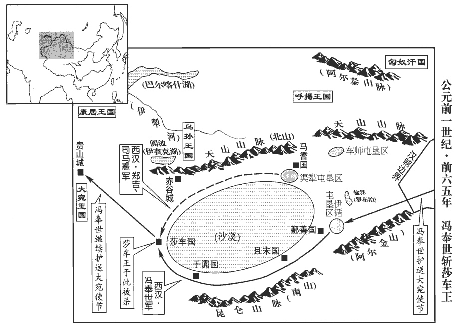
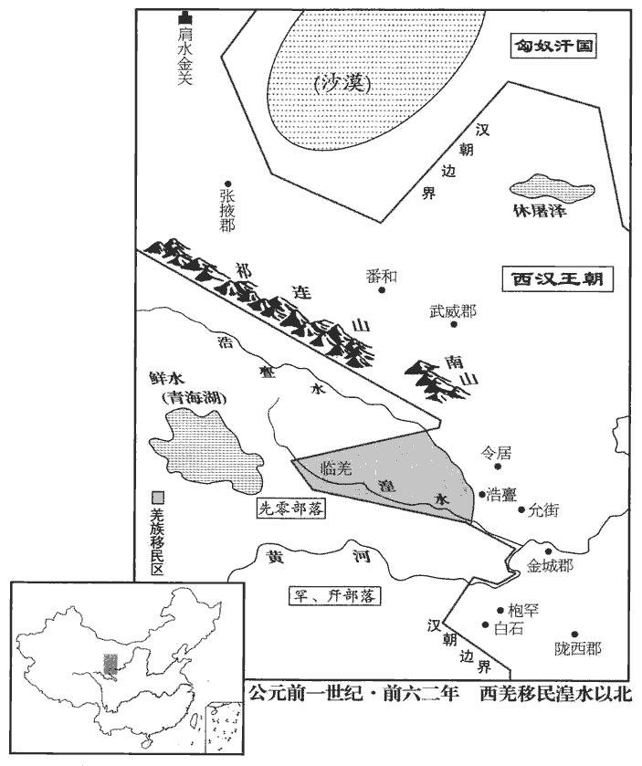

 漢紀十七起閼逢攝提格（甲寅），盡屠維協洽（己未），凡六年。

# 中宗孝宣皇帝上之下

## 地節三年（甲寅，前六七年）

1春，三月，詔曰：「蓋聞有功不賞，有罪不誅，雖唐、虞不能【章：甲十五行本「能」下有「以」字；乙十一行本同；孔本同。】化天下。今膠東‹山東平度›相王成，勞來不怠，師古曰：謂勸勉招懷百姓。勞，郎到翻。來，郎代翻。流民自占八萬餘口，師古曰：隱度名數而來附業也。占，音之贍翻。治有異等之效。師古曰：異于常等。治，直吏翻。其賜成爵關內侯，秩中二千石。」未及徵用，會病卒官。卒，子恤翻。後詔使丞相、御史問郡、國上計長史、守丞以政令得失。貢父曰：郡使守丞，國使長史，皆一物也，故總言郡、國上計長史、守丞。後漢百官志：諸侯王相如太守，長史如郡丞。又邊郡有丞，元有長史；長史上計無疑矣。上，時掌翻。或對言：「前膠東相成偽自增加以蒙顯賞。是後俗吏多為虛名」云。

〖译文〗 [1]春季，三月，汉宣帝颁布诏书说：“人们常听说，如果有功不赏，有罪不罚，既使是唐尧、虞舜也无法将天下治理好。如今胶东国丞相王成，工作勤奋，当地申报户籍定居的流民达八万余人，治理成效为特等。赐王成关内侯爵位，并将其官阶提高到中二千石。”还没等到朝廷自行征召任用，王成就因病死于任上。后来，汉宣帝命丞相、御史向各郡、国来朝廷呈送财政、户籍薄册的长史、守丞等官员询问朝廷政令的得失，有人提出：“前胶东国丞相王成自己虚报流民申报户籍的人数，以获得朝廷的表彰和重赏，从那以后，很多庸碌无能的官吏都靠虚假的成绩来骗取名誉。”

2夏，四月，戊申‹二十二›，立子奭為皇太子‹时年九岁›，以丙吉為太傅，太中大夫疏廣為少傅。疏，姓也。考異曰：荀紀立皇太子在去年四月戊申，漢書舊本亦然。顏師古據疏廣及丙吉傳，并云「地節三年立皇太子」，知在此年者是也。封太子外祖父許廣漢為平恩侯。平恩，侯國，屬魏郡。宋白曰：魏為縣，屬廣平郡；唐屬洺州；有平恩川。又封霍光兄孫中郎將雲為冠陽侯。恩澤侯表，冠陽侯食邑於南陽郡。

〖译文〗 [2]夏季，四月戊申（二十二日），汉宣帝立儿子刘为皇太子，任命丙吉为太傅，太中大夫疏广为少傅。又封太子刘的外祖父许广汉为平恩侯，霍光的侄孙中郎将霍云为冠阳侯。

霍顯聞立太子，怒恚不食，歐血，曰：恚，於避翻。歐，烏口翻。「此乃民間時子，安得立！即后有子，反為王邪？」復教皇后‹霍成君›令毒太子。皇后數召太子賜食，保、阿輒先嘗之；保母、阿母也。復，扶又翻。數，所角翻。后挾毒不得行。

〖译文〗 霍光的妻子霍显听说刘被立为太子，气得饭也吃不下，并吐了血，说：“刘是皇上为平民时生的儿子，怎能被立为皇太子！如果将来皇后生了儿子，反倒只能作诸侯王吗？”于是霍显又教皇后霍成君毒死皇太子。皇后几次召太子前来，赐给食物，但太子的保姆和奶妈总是先尝过之后再让太子吃，皇后拿着毒药，却无从下手。

3五月，甲申‹二十五›，丞相賢以老病乞骸骨；賜黃金百斤、安車、駟馬，罷就第。丞相致仕自賢始。

〖译文〗 [3]五月甲申（二十九日），丞相韦贤因年老多病，请求退休。汉宣帝赐给他黄金一百斤和一辆由四匹马拉的、可以坐乘的安车，允许他辞官回家。丞相退休，自韦贤开始。

4六月，壬辰‹七›，以魏相為丞相。辛丑‹十六›，丙吉為御史大夫，疏廣為太子太傅，廣兄子受為少傅。

〖译文〗 [4]六月壬辰（初七），汉宣帝任命魏相为丞相。辛丑（十六日），任命丙吉为御史大夫，疏广为太子太傅，疏广兄长的儿子疏受为少傅。

太子外祖父平恩侯許伯，以為太子少，白使其弟中郎將舜監護太子家。許伯，即許廣漢，稱伯者，蓋尊之也。少，詩照翻。監，古銜翻。上以問廣，廣對曰：「太子，國儲副君，師友必于天下英俊，不宜獨親外家許氏。且太子自有太傅、少傅，官屬已備，今復使舜護太子家，示陋，師古曰：言獨親外家，示天下以淺陋。復，扶又翻。非所以廣太子德于天下也。」上善其言，以語魏相，語，牛倨翻。相免冠謝曰：「此非臣等所能及。」廣由是見器重。

〖译文〗 太子刘的外祖父平恩侯许广汉，因为太子年纪幼小，便向汉宣帝建议，让自己的弟弟中郎将许舜监护太子家。汉宣帝询问疏广对此事的看法，疏广说：“太子是国家的储君，其师、友必须由天下的优秀人才来充任，不应只与其外祖父许氏一家亲密。况且太子自有太傅、少傅，官属已经齐备，而今再让许舜监护太子家，将使人感到浅陋狭隘，不是向天下传扬太子品德的好办法。”汉宣帝认为疏广的话很有道理，便将此语转告丞相魏相，魏相摘下帽子，谢罪说：“这种高超的见识是我等所不及的。”疏广因此受到汉宣帝的器重。

5京師大雨雹，大行丞東海‹山東郯城›蕭望之上疏，言大臣任政，一姓專權之所致。據望之傳，為大行治禮丞。上素聞望之名，拜為謁者。時上博延賢俊，民多上書言便宜，輒下望之問狀；下，遐稼翻。高者請丞相、御史、師古曰：望之以其人所言之狀請于丞相、御史，或以奏聞，即見超擢zhuó。次者中二千石試事，滿歲以狀聞；師古曰：試令行其所言之事，或以諸他職事試之。劉仲馮曰：觀其意共是一條，不當中分，卻煩解說也，顏說非也。高者則令丞相、御史試事，歲滿各以狀聞，誤斷其文爾。余謂高者則請丞相、御史試事，次者中二千石試事，文意固是一貫，而分高、次，則非誤斷也。下者報聞，罷。其言不可用，故報聞而罷歸田里也。所白處奏皆可。師古曰：當主上之意也。處，昌呂翻。

〖译文〗 [5]京师长安下了一场大冰雹，大行丞东海人萧望之向汉宣帝上了一道奏章，认为这场雹灾是由于朝政大事都由大臣把持，一姓人专权而招致上天警告。汉宣帝早就听说过萧望之的大名，于是任命他担任谒者。当时，汉宣帝正广泛延揽贤能才俊之人，很多百姓上书朝廷提建议。汉宣帝总是将百姓的上书交给萧望之审查，才能高的，请丞相、御史试用，稍次的交给中二千石官员试用，满一年后，将试用情况奏闻朝廷；才能低的，则奏报皇帝，遣送回乡。萧望之提出的处理意见，都正合汉宣帝的心意，所以一律批准。

6冬，十月，詔曰：「乃者九月壬申‹十九›地震，朕甚懼焉。有能箴zhēn朕過失，及賢良方正直言極諫之士，以匡朕之不逮，毋諱有司！師古曰：箴，戒也。匡，正也。李奇曰：諱，避也。雖有司在顯職，皆言其過，勿避之。朕既不德，不能附遠，是以邊境屯戍未息。今復飭兵重屯，久勞百姓，師古曰：飭，整也。復，扶又翻；下同。非所以綏天下也。其罷車騎將軍、右將軍屯兵！」又詔：「池籞yù未御幸者，假與貧民。蘇林曰：折竹，以繩綿連禁禦，使人不得往來，律名為籞。服虔曰：籞在池水中作室，可用棲鳥，鳥入中則捕之。應劭曰：池者，陂bēi池也。籞者，禁苑也。臣瓚曰：籞者，所以養鳥也。設為藩落，周覆其上，令鳥不得出，猶苑之畜獸，池之畜魚也。師古曰：蘇、應二說是。郡國宮館勿復修治。治，直之翻；下同。流民還歸者，假公田，貸種食，師古曰：貸，音吐戴翻。種，五穀種也，音之勇翻。且勿算事。」師古曰：不出算賦及給徭役。

〖译文〗 [6]冬季，十月，汉宣帝颁布诏书说：“先前在九月壬申（十九日）发生的地震，使朕非常恐惧。如有能指出朕的过失，以及各郡、国举荐的‘贤良方正’和‘直言极谏’之士，要匡正朕的失误，对有关高级官员的错误也不必回避！由于朕的品德不足，不能使远方的蛮族归附，因而边境的屯戍事务一直不能结束。如今又调兵增加边塞屯戍力量，使百姓长期劳苦不止，不利于天下的安定。解散车骑将军张安世、右将军霍禹所属的两支屯戍部队！”又下诏命令：“将未使用过的皇家池塘和禁苑借给贫苦百姓，让他们在其中从事生产活动。各郡、国的宫室、别馆，不要再进行修缮。返回原籍的流民，由官府借给公田，贷给种子、粮食，免除他们的财产税和徭役。”

7霍氏驕侈縱橫。橫，戶孟翻。太夫人顯，廣治第室，作乘輿輦，加畫，繡絪馮，黃金塗；韋絮薦輪，如淳曰：絪，亦茵。馮，謂所馮者也；以黃金塗飾之。師古曰：茵，蓐也。以繡為茵馮，而黃金塗於輦也。晉灼曰：御輦以韋緣輪，著之以絮。師古曰：取其行安，不搖動也。馮，與憑同。著，音張呂翻。侍婢以五采絲輓顯遊戲第中；師古曰：輓，謂牽引車輦也，音晚。與監奴馮子都亂。師古曰：監奴，謂奴之監知家務者。而禹、山亦并繕治第宅，走馬馳逐平樂館。雲當朝請，數稱病私出，樂，音洛。朝，直遙翻。請，才性翻。數，所角翻；下同。多從賓客，張圍獵黃山苑中，使倉頭奴上朝謁，文穎曰：朝當用謁，不自行而令奴上謁者也。師古曰：上謁，若今參見尊貴而通人也。孔穎達曰：漢家僕隸謂之蒼頭，以蒼巾為飾，異於民也。上，時掌翻。莫敢譴者。顯及諸女晝夜出入長信宮殿中，亡期度。師古曰：長信宮，上官太后所居。亡，古無字通。

〖译文〗 [7]霍氏一家在朝中势力强大，骄横奢侈。太夫人霍显大规模地兴建府第，又制造同御用规格相同的人拉辇车，绘以精美的图画，车上的褥垫用锦绣制成，车身涂以黄金，车轮外裹上熟皮和绵絮，以减轻车身的颠簸，由侍女用五彩丝绸拉着霍显在府中游玩娱乐。另外，霍显还与管家冯子都淫乱。霍禹、霍山也同时扩建宅第，常常在平乐馆中骑马奔驰追逐。霍云几次在朝会时称病而私自出游，带着许多宾客，到黄山苑中行围打猎，派奴仆去朝廷报到，却无人敢于指责。霍显和她的几个女儿，昼夜随意出入上官太后居住的长信宫，没有限度。

帝自在民間，聞知霍氏尊盛日久，內不能善。既躬親朝政，御史大夫魏相給事中。顯謂禹、雲、山：「女曹不務奉大將軍余業，師古曰：女，音汝。曹，輩也。今大夫給事中，他人壹間女，能復自救邪！」間，古莧翻。復，扶又翻；下同。後兩家奴爭道，師古曰：謂霍氏及御史家。霍氏奴入御史府，欲躢tà大夫門；御史為叩頭謝，乃去。躢，與蹋同。為，於偽翻。人以謂霍氏，師古曰：告語也。顯等始知憂。

〖译文〗 汉宣帝早在民间时，就听说霍氏一家因长期地位尊贵，不能自我约束。亲掌朝政以后，命御史大夫魏相任给事中。霍显对霍禹、霍云、霍山说：“你们不设法继承大将军的事业，如今御史大夫当了给事中，一旦有人在他面前说你们的坏话，你们还能救自己吗！”后霍、魏两家的奴仆因争夺道路引起冲突，霍家奴仆闯入御史府，要踢魏家大门，御史为此叩头道歉，方才离去。有人将此事告诉霍家，霍显等才开始感到忧虑。

會魏大夫為丞相，數燕見言事；見，賢遍翻；下同。平恩侯與侍中金安上等徑出入省中。時霍山領尚書，上‹刘病已，时年二十五›令吏民得奏封事，不關尚書，群臣進見獨往來，師古曰：謂各各得盡言於上也。於是霍氏甚惡之。惡，烏路翻。上頗聞霍氏毒殺許后‹许平君›而未察，乃徙光女壻度遼將軍、未央衛尉、平陵侯范明友為光祿勳，功臣侯表，平陵侯食邑於南陽郡之武當縣。出次壻諸吏、中郎將、羽林監任勝為安定‹宁夏固原›太守。任，音壬。守，式又翻；下同。數月，復出光姊壻給事中、光祿大夫張朔為蜀郡‹四川成都›太守，群孫壻中郎將王漢為武威‹甘肅武威›太守。頃之，復徙光長女婿長樂衛尉鄧廣漢為少府。戊戌‹十四›，更以張安世為衛將軍，兩宮衛尉、城門、北軍兵屬焉。兩宮，未央、長樂也。城門，京城十二門屯兵也。北軍，北軍八校兵也。更，工衡翻。以霍禹為大司馬，冠小冠，大司馬大將軍，冠武弁大冠。今貶禹，故使冠小冠。冠小之冠，古玩翻。亡印綬；亡，古無字通。罷其屯兵官屬，特使禹官名與光俱大司馬者。蘇林曰：特，但也。又收范明友度遼將軍印綬，但為光祿勲；及光中女壻趙平為散騎、騎【章：甲十五行本「騎」字不重；乙十一行本同；孔本同。】都尉、光祿大夫，將屯兵，又收平騎都尉印綬。散騎、騎都尉，以騎都尉而加散騎官也。百官表云：散騎、中常侍，皆加官；中常侍得入禁中，散騎騎并乘輿車。如淳曰：自列侯下至郎中，皆得有散騎及中常侍加官，是時散騎及中常侍各自一官，無員也。中，讀曰仲。諸領胡、越騎、羽林及兩宮衛將屯兵，悉易以所親信許、史子弟代之。

〖译文〗 当魏相成为丞相，多次在汉宣帝闲暇时受到召见，报告国事，平恩侯许广汉和侍中金安上也可以径自出入宫廷。当时，霍山主管尚书事务，汉宣帝崐却下令，允许官吏百姓直接向皇帝呈递秘密奏章，不必经过尚书，群臣也可直接晋见皇帝。这些都使霍氏一家人极为恼恨。汉宣帝听说不少关于霍显毒死许皇后的传闻，只是尚未调查，于是将霍光的女婿度辽将军、未央卫尉、平陵侯范明友调任光禄勋，将霍光的二女婿诸吏、中郎将、羽林监任胜调出京师，任安定太守。几个月之后，又将霍光的姐夫给事中、光禄大夫张塑调出京师，任蜀郡太守，将霍光的孙女婿之一、中郎将王汉调任武威太守。稍后，又将霍光的大女婿长乐卫尉邓广汉调任少府。八月戊戌（十四日），改由张安世为卫将军，未央、长乐两宫卫尉，长安十二门的警卫部队和北军都归张安世统领。任命霍禹为大司马，却不让他戴照例应戴的大官帽，而戴小官帽，且不颁给印信、绶带，撤销他以前统领的屯戍部队和官属，只使他的官名和霍光同样为大司马。又将范明友的度辽将军印信和绶带收回，只让他担任光禄勋一职。霍光的另一个女婿赵平本为散骑、骑都尉、光禄大夫，统领屯戍部队，如今也将赵平的骑都尉印信和绶带收回。所有统领胡人和越人骑兵、羽林军以及未央、长乐两宫卫所属警卫部队的将领，都改由汉宣帝所亲信的许、史两家子弟担任。

8初，孝武‹刘彻›之世，徵發煩數，百姓貧耗，窮民犯法，奸軌不勝，數，所角翻。勝，音升，又如字。於是使張湯、趙禹之屬，條定法令，作見知故縱、監臨部主之法，師古曰：見知人犯法不舉告，為故縱；而所監臨部主有罪，并連坐之也。監，古銜翻。緩深、故之罪，孟康曰：孝武欲急刑，吏深害及故入人罪者，皆寬緩之也。急縱、出之誅。師古曰：吏釋罪人，疑以為縱，出則急誅之，亦言尚酷。其後奸猾巧法轉相比況，禁罔寖密，律令煩苛，文書盈于幾閣，典者不能徧睹。是以郡國承用者駁，師古曰：不曉其指，用意不同也。或罪同而論異，奸吏因緣為市，師古曰：弄法而受財，若市賈之交易。所欲活則傅生議，傅，讀曰附。所欲陷則予死比，師古曰：比，以例相比況也。議者咸冤傷之。

〖译文〗 [8]当初，汉武帝时，征调频繁，百姓困乏，穷苦之人触犯法律＊＊，纷纷作乱，无法平息。于是，汉武帝命张汤、赵禹之类酷吏制定法令，定出有关“明知有人犯法而不举报”和“长官有罪，其僚属连坐”等惩罚条例。对犯有给人定罪过严或者栽赃陷害之罪的官吏，往往从宽处理；而对那些宽释犯人的官吏则加重惩处。以后，很多奸猾的官吏玩弄法律，转相引用比照苛刻的判例，使法网日益严密，律令更加繁苛，法律文件堆得满桌满屋，主管官员根本看不过来。因此各郡、国在引用法令时出现混乱，有的罪行相同而处罚各异，奸猾官吏借机进行交易，索取贿赂。想使罪犯活命，就附会能让他活命的法令；想致其于死地，就引用使其非死不可的条文。人们议论法律，都认为冤屈太多而感到悲伤。

廷尉史鉅鹿‹河北平鄉›路溫舒上書曰：「臣聞齊有無知之禍而桓公以興，齊襄公為公子無知所殺，雍廩lǐn復殺無知，齊國大亂，桓公自莒入立。晉有驪姬之難而文公用伯；晉獻公信驪姬之讒，殺世子申生，逐公子重耳、夷吾，而立驪姬之子奚齊、卓子，皆為里克所殺。夷吾入立，復為秦所執，既而歸之，卒，而子圉嗣。秦納重耳，子圉死，而文公遂霸諸侯。難，乃旦翻。伯，讀曰霸。近世趙王不終，諸呂作亂，而孝文為太宗。事見十三卷。繇是觀之，禍亂之作，將以開聖人也。夫繼變亂之後，必有異舊之恩，此賢聖所以昭天命也。往者昭帝‹刘弗陵›即世，無嗣，昌邑‹刘贺›淫亂，乃皇天所以開至聖也。臣聞春秋正即位，大一統而慎始也。春秋之法，繼弑君不言即位，繼正即位，正也。陛下初登至尊，與天合符，宜改前世之失，正始受命之統，滌煩文，除民疾，以應天意。臣聞秦有十失，其一尚存，治獄之吏是也。治，直之翻。夫獄者，天下之大命也，死者不可復生，絕者不可復屬。復，扶又翻。師古曰：屬，連也，音之欲翻。書曰：『與其殺不辜，寧失不經。』師古曰：虞書大禹謨mó載咎繇之言。辜，罪也。經，常也。言人命至重，治獄宜慎，寧失不常之過，不濫殺無罪之人，所以崇寬恕也。今治獄吏則不然，上下相敺，敺，與驅同。以刻為明，深者獲公名，平者多後患。故治獄之吏皆欲人死，非憎人也，自安之道在人之死。是以死人之血，流離於市，被刑之徒，比肩而立，被，皮義翻。大辟之計，歲以萬數。辟，毗亦翻。此仁聖之所以傷也，太平之未洽，凡以此也。夫人情，安則樂生，樂，音洛。痛則思死，棰楚之下，何求而不得！故囚人不勝痛，則飾辭以示之；勝，音升。吏治者利其然，則指導以明之；治，直吏翻。上奏畏卻，則鍛練而周內之。上，時掌翻。晉灼曰：精熟周悉，致之法中也。師古曰：卻，退也。畏為上所卻退。卻，丘略翻。蓋奏當之成，師古曰：當，謂處其罪也。雖皋陶聽之，猶以為死有餘辜。師古曰：皋陶作士，善聽獄訟，故以為喻也。陶，音遙。何則？成練者眾，文致之罪明也。故俗語曰：『畫地為獄，議不入；刻木為吏，期不對。』師古曰：畫獄、木吏，尚不入對，況真實乎！期，猶必也。議必不入對。此皆疾吏之風，悲痛之辭也。唯陛下省法制，寬刑罰，則太平之風可興於世。」上善其言。

〖译文〗 廷尉史钜鹿人路温舒上书汉宣帝说：“我听说，春秋时齐国出现姜无知杀死齐襄公之祸，却使齐桓公因此兴起；晋国发生因骊姬的谗言而造成的灾难，却使晋文公后来称霸于诸侯；近世我朝赵王不得善终，吕氏一家作乱，却使孝文皇帝被尊为太宗。从这些往事看来，祸乱的发生，往往能造就出贤圣之人。大乱之后，必然会出现与以往大不相同的变革措施，贤圣之人以此昭示上天的意旨。以前孝昭皇帝去世时，没有后嗣，昌邑王淫邪悖乱，这正是上天为造就至圣明君开辟道路。我听说，《春秋》将继承正统称作即位，因尊重正统，对开端必须慎重。陛下刚刚登上至尊之位不久，与天意正相符合，应当改正前代的失误，以显示是继承正统，删去繁杂琐碎的法令条文，解除百姓的疾苦，以顺应天意。我听说秦朝有十项重大失误，如今有一项尚存，即司法官吏的严苛。崐刑狱是天下重要的大事。处死的人不可能复生，截断肢体的人也不能再接上复原，所以《尚书》中说：‘与其杀死无辜的人，宁可偶尔失之宽纵。’如今司法官吏则并非如此，他们上下相争，都以苛刻为贤明，判刑严厉的，获得‘公正’的美誉，而执法平和的人，却往往多有后患。所以，负责司法事务的官吏都想将案犯定为死罪，并非憎恨犯人，而是保全自己的方法在于致人于死。因此，死人的鲜血在街市上流淌，受刑的囚犯一个挨着一个，处以死刑的人每年数以万计。仁慈圣明的人对此感到悲哀，太平盛世不能到来，都是由于这个原因。按照人之常情，平安时，就愿意活，痛苦则希望死，严刑拷打之下，什么口供得不到！所以当囚犯无法忍受痛苦时，审案官就修饰词语进行暗示；审案官为使囚犯的供词对自己有利，就干脆明白告诉他应如何招供；为了怕向朝廷奏报时遭到批驳，就想方设法使定案的理由充分完备周密。上奏之后，既使是古代以善于审案定罪著称的皋陶听了，也会认为该犯是死有余辜。为什么呢？因为屈打成招，罗织捏造的罪行既多且明。因此，俗话说：‘既使是在地上画一个圆圈作为监狱，也不能进去；将木头人做成审讯官，也不要去面对。’这些都是人们对严刑酷法痛心疾首的悲愤之词。希望陛下减省法令，放宽刑罚，太平之风才能呈现于当今。”汉宣帝认为他说得很有道理。

9十二月，詔曰：「間者吏用法巧文寖深，是朕之不德也。夫決獄不當，使有罪興邪，不辜蒙戮，晉灼曰：當重而輕，使有罪者起邪惡之心也。師古曰：有罪者更興邪惡，無辜者反陷重刑，是決獄不平故也。當，丁浪翻。父子悲恨，朕甚傷之！今遣廷史與郡鞠獄，任輕祿薄，如淳曰：廷史，廷尉史也。以囚辭決獄事為鞠，謂疑獄也。李奇曰：鞠，窮也。獄事窮竟也。師古曰：李說是也。其為置廷尉平，秩六百石，員四人。其務平之，以稱朕意！」於是每季秋後請讞yàn時，為，於偽翻。稱，尺證翻。讞，語蹇翻。又魚戰翻，又魚列翻，議獄也。上常幸宣室，齋居而決事，如淳曰：宣室，布政教之室也。重用刑，故齋戒以決事。晉灼曰：未央宮中有宣室殿。師古曰：晉說是也。賈誼傳亦云「受釐坐宣室」，蓋其殿在前殿之側也，齋則居之。獄刑號為平矣。

〖译文〗 [9]十二月，汉宣帝下诏书说：“近来，官吏们舞文弄法的现象越来越严重，这都是朕的错误。案狱处理不当，使有罪者愈发作恶，无辜者遭受严刑处罚，父子兄弟悲伤愤恨，朕对此甚为难过！如今派廷尉史参与各郡的司法事务，但职权小俸禄少，应再设置廷尉平四名，俸禄为六百石。务必使审判公平，以符合朕的心意！”于是每年秋天，当对一年中的案狱做最后决定时，汉宣帝经常到宣室殿，住那里实行斋戒，亲自裁决。从此，对各类刑罚案狱的判决号称公平。

涿郡‹河北涿州›太守鄭昌上疏言：「今明主躬垂明聽，雖不置廷平，獄將自正；若開後嗣，不若刪定律令。師古曰：刪，刊也；有不便者則刊而除之。律令一定，愚民知所避，奸吏無所弄矣。今不正其本，而置廷平以理其末，政衰聽怠，則廷平將召權而為亂首矣。」孟康曰：召，求也。招致權著己也，猶賣弄也。師古曰：孟說是也。

〖译文〗 涿郡太守郑昌上奏章说：“如今圣明的主上亲自对刑罚诉讼作最后的判决，即使不设廷尉平一职，司法也自会公正；但若想为后世确立规范，则不如从删改、修定法律条文着手。各项律令一经确定，百姓们知道怎样才能不触犯国家法律，奸猾官吏也就无计可施了。如今不从根本上加以纠正，只是靠设置廷尉平在末梢上补救，一旦朝政疏懈，陛下对判决案狱有所倦怠，则廷尉平将揽权弄法，成为祸乱天下的罪首。”

10昭帝‹刘弗陵›時，匈奴使四千騎田車師‹新疆吐魯番›。及五將軍擊匈奴，事見上卷本始三年。車師田者驚去，車師復通於漢；匈奴怒，召其太子軍宿，欲以為質。軍宿，焉耆‹新疆焉耆›外孫，不欲質匈奴，亡走焉耆，車師王更立子烏貴為太子。復，扶又翻；下同。質，音致。走，音奏。更，工衡翻。及烏貴立為王，與匈奴結婚姻，教匈奴遮漢道通烏孫‹都赤谷城，中亚伊塞克湖东南›者。

〖译文〗 [10]汉昭帝时，匈奴曾派四千骑兵以行围打猎为名前往车师国。后汉朝派五将军出击匈奴，在车师打猎的匈奴骑兵惊恐不安，撤兵而去，车师国再次恢复了与汉朝的联系。匈奴得知后大为恼火，召车师国太子军宿前往匈奴，打算扣为人质。军宿是焉耆王的外孙，不愿去匈奴充当人质，便逃往焉耆，于是车师王改立另一个儿子乌贵为太子。乌贵当上车师国王之后，与匈奴结成婚姻，并建议匈奴截断汉朝与乌孙的联系通道。

是歲，侍郎會稽‹江苏苏州›鄭吉與校尉司馬憙，會，古外翻。憙，許吏翻。將免刑罪人田渠犁‹新疆库尔勒西南›，積穀，罪人免其刑，使屯田。發城郭諸國兵萬餘人西域諸國，有逐水草與匈奴同俗者，謂之行國；其城居者，謂之城郭諸國也。與所將田士千五百人共擊車師‹新疆吐魯番›，破之；車師王請降。降，戶江翻。匈奴發兵攻車師；吉、憙引兵北逢之，匈奴不敢前。吉、憙即留一候與卒二十人留守王，吉等引兵歸渠犁‹新疆库尔勒西南›。考異曰：西域傳云「地節二年」；以匈奴傳校之，知在三年。車師王恐匈奴兵復至而見殺也，乃輕騎奔烏孫‹都赤谷城，中亚伊塞克湖东南›。吉即迎其妻子，傳送長安。傳，知戀翻。匈奴更以車師王昆弟兜莫為車師王，收其餘民東徙，不敢居故地；而鄭吉始使吏卒三百人往田車師‹新疆吐魯番›地以實之。為下元康二年匈奴爭車師張本。

〖译文〗 这一年，侍郎会稽人郑吉和校尉司马，率领被免除刑罚的罪犯在渠犁屯田，积存谷物，并征调西域各城邦国家的军队一万余人，会合二人率领的崐屯田兵卒一千五百人共同攻击车师国，结果车师国大败，车师王乌贵请求归降。匈奴听到消息后，派兵进攻车师，郑吉、司马率兵北进迎击，匈奴军不敢向前逼近。郑吉、司马便留下一名候率领二十名兵卒负责监视车师王，自己率兵返回渠犁。车师王害怕匈奴再派军队前来将他杀死，便轻骑逃往乌孙，郑吉便即将车师王的妻子、儿女接来，用驿马送往长安。匈奴改立车师王乌贵的弟弟兜莫为车师王，召集车师国余下的百姓向东迁徙。不敢再留居原来的地方。郑吉便开始派官吏士卒三百人到车师屯田，以充实该地。

11上自初即位，數遣使者求外家；數，所角翻。久遠，多似類而非是。是歲，求得外祖母王媼ǎo文穎曰：幽州及漢中皆謂老嫗曰媼。師古曰：媼，女老稱也；音烏老翻。及媼男無故、武。無故及武，皆媼子也。上賜無故、武爵關內侯。旬日【章：甲十五行本「日」作「月」；乙十一行本同；孔本同。】間，賞賜以巨萬計。

〖译文〗 [11]汉宣帝自即皇位以来，多次派使者查访其外祖父家的消息。然而，因时间已相隔太久，查访到的人家，大多虽像而实际不是。这一年，找到了其外祖母王媪和王媪的儿子王无故和王武。汉宣帝赐王无故、王武关内侯爵。短短十天时间，对王家的赏赐就以万万计。

## 地節四年（乙卯，前六六年）

1春，二月，賜外祖母號為博平君；據外戚傳，「以博平、蠡吾二縣為湯沐邑」；而地理志，博平縣屬東郡。封舅無故為平昌侯，平昌，侯國屬平原郡。武為樂昌侯。樂昌，侯國屬東郡。恩澤侯表，武封樂昌侯，食邑于汝南。

〖译文〗 [1]春季，二月，汉宣帝赐其外祖母“博平君”称号，封其舅父王无故为平昌侯、王武为乐昌侯。

2夏，五月，山陽‹山東金鄉西北昌邑镇›、濟陰‹山东定陶›雹，如雞子，深二尺五寸，深，式浸翻。殺二十餘人，飛鳥皆死。

〖译文〗 [2]夏季，五月，山阳、济阴两地下了一场冰雹，如鸡蛋般大小，深二尺五寸，有二十多人被冰雹砸死，当地的飞鸟也全部丧生。

3詔：「自今子有匿父母、妻匿夫、孫匿大父母，皆勿治。」

〖译文〗 [3]汉宣帝下诏书说：“从今以后，凡属儿子窝藏父母、妻子窝藏丈夫、孙子窝藏祖父母的，一律不治罪。”

4立廣川‹府信都，河北冀县›惠王孫文為廣川王。本始四年，廣川王去以罪自殺；今復立文，嗣封王。

〖译文〗 [4]汉宣帝立广川惠王的孙子刘文为广川王。

5霍顯及禹、山、雲自見日侵削，數相對啼泣自怨。數，所角翻。山曰：「今丞相用事，縣官信之，盡變易大將軍時法令，發揚大將軍過失。又，諸儒生多窶jù人子，師古曰：窶，貧而無禮。孔穎達曰：貧無可為禮謂之窶，音其羽翻。遠客饑寒，喜妄說狂言，喜，許吏翻。不避忌諱，大將軍常讎之。師古曰：言嫉之如仇讎也。今陛下好與諸儒生語，好，呼到翻。人人自書對事，多言我家者。嘗有上書言我家昆弟驕恣，其言絕痛；山屏不奏。後上書者益黠，屏，必郢翻。黠，下八翻。盡奏封事，輒使中書令出取之，不關尚書，益不信人。又聞民間讙言『霍氏毒殺許皇后』，師古曰：讙，眾聲也；音許爰翻。毒許后事見上卷本始三年。寧有是邪？」顯恐急，即具以實告禹、山、雲。禹、山、雲驚曰：「如是，何不早告禹等！縣官離散、斥逐諸婿，用是故也。此大事，誅罰不小，柰何？」於是始有邪謀矣。

〖译文〗 [5]霍显和霍禹、霍山、霍云眼看霍家的权势日益被削弱，多次聚在一起痛哭流涕，自怨自艾。霍山说：“如今丞相当权，受到天子的信任，将大将军在世时的法令全部更改，还专门宣扬大将军的过失。再者，那些儒生大都为贫贱出身，从偏远的地方来到京中，衣食无着，却爱说狂言，不避忌讳，大将军一向痛恨他们，但如今皇上却专爱和这些腐儒谈话。他们每人都上书奏事，纷纷指责我们霍家。曾经有人上书说我们兄弟骄横霸道，言词十分激烈，被我压下没有呈奏。后来上书者越来越狡猾，都改成秘密奏章，皇上总是让中书令出来取走，并不通过尚书，日益不信任我。又听说民间纷纷传言‘霍氏毒死许皇后’，难道有这回事吗？”霍显吓坏了，便将实情告诉霍禹、霍山、霍云。霍禹、霍山、霍云大惊，说道：“果真如此，为什么不早告诉我们！皇上将霍家女婿都贬斥放逐，就是为了这个缘故。这是大事，一旦事发，必遭严惩，怎么办？”于是开始有反叛朝廷的阴谋。

雲舅李竟所善張赦，見雲家卒卒，師古曰：卒，讀曰猝，怱遽之貌也。謂竟曰：「今丞相與平恩侯用事，可令太夫人言太后，太夫人，謂霍顯。上官太后，霍氏外孫也。先誅此兩人；移徙陛下，在太后耳。」長安男子張章告之，事下廷尉、下，遐稼翻。執金吾，捕張赦等。後有詔，止勿捕。山等愈恐，相謂曰：「此縣官重太后，故不竟也。師古曰：重，難也。竟，窮竟其事也。然惡端已見，見，賢遍翻。久之猶發，發即族矣，不如先也。」師古曰：言先反。遂令諸女各歸報其夫，皆曰：「安所相避！」師古曰：言無處相避，當受禍也。

〖译文〗 霍云的舅父李竟有一位要好的朋友，名叫张赦，看到霍云一家人惊慌不安，便对李竟说：“如今是丞相魏相和平恩侯许广汉当权，可以让霍太夫人向上官太后进言，先将这两人杀死。废掉当今皇上，改立新君，全由皇太后决定。”后被长安男子张章告发，汉宣帝将此事交给廷尉和执金吾处理，逮捕了崐张赦等人。后来，汉宣帝下诏，命令不要抓人。霍山等更加慌恐，商议说：“这是皇上尊重太后，所以不深究，但已可看出苗头不妙，时间长了还会爆发。一旦爆发，就是灭门之祸，不如先下手为强。”于是命霍家女儿各自回家告知自己的丈夫，霍家各位女婿都说“大祸一来，我们谁也跑不了！”

會李竟坐與諸侯王交通，辭語及霍氏，有詔：「雲、山不宜宿衛，免就第。」山陽‹山東金鄉西北昌邑镇›太守張敞上封事曰：「臣聞公子季友有功于魯，趙衰有功于晉，田完有功于齊，皆疇其庸，延及子孫。終後田氏篡齊，趙氏分晉，季氏顓魯。魯公子季友，殺慶父，立僖公，以安魯國，遂世為上卿，專魯國之政。晉公子重耳出亡，趙衰從，及其反國，伯諸侯，衰皆有功，遂世為晉卿，有軍行；至趙鞅，遂與智、韓、魏分晉國。田完自陳奔齊，桓公禮而用之，桓公之伯，完與有功；其後陳成子得齊國之政，至田和，遂篡齊而有之。故仲尼作春秋，跡盛衰，譏世卿最甚。乃者大將軍決大計，安宗廟，定天下，功亦不細矣。夫周公七年耳，周公輔成王七年而反政于成王。而大將軍二十歲，自武帝後元二年至地節二年，適二十歲。海內之命斷於掌握。斷，丁亂翻。方其隆盛時，感動天地，侵迫陰陽。朝臣宜有明言曰：『陛下褒寵故大將軍以報功德足矣。間者輔臣顓政，貴戚太盛，君臣之分不明，分，扶問翻。請罷霍氏三侯皆就第；及衛將軍張安世，宜賜几杖歸休，時存問召見，見，賢遍翻。以列侯為天子師。』明詔以恩，不聽，群臣以義固爭而後許之，天下必以陛下為不忘功德而朝臣為知禮，朝，直遙翻；下同。霍氏世世無所患苦。今朝廷不聞直聲，師古曰：言朝臣不進直言以陳其事。而令明詔自親其文，非策之得者也。師古曰：言失計也。今兩侯已出，人情不相遠，以臣心度之，度，徒洛翻。大司馬及其枝屬必有畏懼之心。夫近臣自危，非完計也。臣敞願于廣朝白發其端，直守遠郡，師古曰：直，讀曰值。朝，直遙翻。其路無由。唯陛下省察！」省，悉井翻。上甚善其計，然不召也。

〖译文〗 正巧李竟因受指控结交诸侯王而被朝廷治罪，审问中供词涉及霍氏家族，汉宣帝因而下诏命令：“霍云、霍山不适合再在宫中供职，免职回家。”山阳太守张敞向汉宣帝上了一道秘密奏章，说道：“我听说，春秋时期，公子季友有功于鲁国，赵衰有功于晋国，田完有功于齐国，都受到本国的酬劳，并延及子孙。但是后来，田氏篡夺了齐国政权，赵氏瓜分了晋国，季氏则专权于鲁国。因此，孔子作《春秋》，追踪考察各国的兴衰存亡，严厉批判卿大夫世袭制度。当年，大将军霍光作出重大决策，使宗庙平安、国家稳定，功劳也不算小。周公辅政才七年，就归政于周成王，而大将军掌握国家的命运长达二十年之久。在他执掌大权的鼎盛时期，威严震撼天地，势力侵凌日月。应由朝臣明确提出：‘陛下褒奖、宠信已故大将军，以报答他对国家的功德，已经足够了。而近来辅政大臣专擅朝政，外戚势力过大，君臣之间没有明显的分别，请求解除霍氏三侯的官职，以侯的身份回家；对卫将军张安世，也应赐给几案与手杖，让他退休回家，以列候的身分充当天子的老师，由陛下时常召见慰问。’陛下则公开下诏表示对他们施恩，听从大臣所请。群臣再据理力争，然后陛下予以批准。这样一来，天下人肯定会认为陛下不忘旧勋的功德而群臣又知礼，霍氏一家也可以世世代代无忧无患。如今，朝中听不到直言，而使陛下自己下诏，这不是好策略。现在霍氏两侯已被赶出宫廷，人情大致相同，因此以我的心来猜度，大司马霍禹和他的亲戚僚属等必然会心怀畏惧。使天子的近臣恐慌自危，总不是万全的办法。我愿在朝中公开提出我的意见作为开端，只是身在遥远的山阳郡，无法实现，希望陛下仔细考虑。”汉宣帝对张敞的建议甚为欣赏，然而却没有召他来京。

禹、山等家數有妖怪，數，所角翻。妖，於驕翻。舉家憂愁。山曰：「丞相擅減宗廟羔、菟、鼃wā，可以此罪也！」如淳曰：高后時定令，輒有擅議宗廟者棄市。師古曰：羔、菟、鼃，所以供祭也。菟，吐故翻。鼃，古蛙字。謀令太后為博平君置酒，為，於偽翻。召丞相、平恩侯以下，使范明友、鄧廣漢承太后制引斬之，因廢天子而立禹。約定，未發，雲拜為玄菟‹辽宁新宾›太守，菟，同都翻。太中大夫任宣為代郡‹河北蔚縣›太守。會事發覺，秋，七月，雲、山、明友自殺。顯、禹、廣漢等捕得；禹要斬，要，古腰字通。顯及諸女昆弟皆棄市；與霍氏相連坐誅滅者數十家。太僕杜延年以霍氏舊人，亦坐免官。八月，己酉‹一›，皇后霍氏廢，處昭台宮。師古曰：在上林苑中。處，昌呂翻。乙丑‹十七›，詔封告霍氏反謀者男子張章、期門董忠、左曹楊惲、百官表：侍中、左、右曹皆加官。晉灼曰：漢儀注：諸吏、給事中日上朝謁，平尚書奏事，分為左、右曹。惲yùn，於粉翻。侍中金安上、史高皆為列侯。章為博成侯。忠，高昌侯。惲，平通侯。安上，都成侯。高為樂陵侯。惲，丞相敞子；安上，車騎將軍日磾弟子；高，史良娣兄子也。

〖译文〗 霍禹、霍山等家中多次出现妖怪之事，全家人都非常忧虑。霍山说：“丞相擅自减少宗庙祭祀用的羊羔、兔子和青蛙，可以以此为借口向他问罪。”于是，密谋让上官太后设酒宴款待博平君王媪，召丞相魏相、平恩侯许广汉及其属下作陪，然后让范明友、邓广汉奉太后之命将他们斩杀，乘机废掉汉宣帝，立霍禹为皇帝。密谋已定，尚未发动，汉宣帝任命霍云为玄菟太守，太中大夫任宣为代郡太守。就在此时，霍氏的政变阴谋被发觉。秋季，七月，霍云、霍山、范明友自杀。霍显、霍禹、邓广汉等被逮捕，霍禹被腰斩，霍显及霍氏兄弟姐妹全部被当众处死，因与霍氏有牵连而被诛杀的有数十家。太仆杜延年因为是霍家旧友，也被罢免官职。八月己酉（初一），霍皇后被废，囚禁崐于昭台宫。乙丑（十七日），汉宣帝下诏，将告发霍氏政变密谋的男子张章、期门董忠、左曹杨恽、侍中金安上、史高封为列候。其中杨恽是前丞相杨敞的儿子，金安上是前车骑将军金日弟弟的儿子，史高是史良娣哥哥的儿子。

初，霍氏奢侈，茂陵‹陝西興平东北›徐生曰：「霍氏必亡。夫奢則不遜，不遜則【章：甲十五行本「則」作「必」；乙十一行本同；張校同。】侮上。侮上者，逆道也，在人之右，師古曰：右，上也。眾必害之。霍氏秉權日久，害之者多矣；天下害之，而又行以逆道，不亡何待！」乃上疏言：「霍氏泰盛，陛下即愛厚之，宜以時抑制，無使至亡！」書三上，輒報聞。漢制：上書不行者，輒報聞，罷。其後霍氏誅滅，而告霍氏者皆封，人為徐生上書曰：「臣聞客有過主者，為，於偽翻。過，古禾翻。見其灶直突，傍有積薪，客謂主人：『更為曲突，突，灶突囪也。更，工衡翻。遠徙其薪，不者且有火患！』主人嘿然不應。俄而家果失火，鄰里共救之，幸而得息。於是殺牛置酒，謝其鄰人，灼爛者在於上行，師古曰：灼，謂被燒炙者也。行，戶郎翻。餘各以功次坐，而不錄言曲突者。人謂主人曰：『鄉使聽客之言，不費牛酒，終亡火患。鄉，讀曰嚮。亡，古無字通。今論功而請賓，曲突徙薪無恩澤，焦頭爛額為上客邪？』主人乃寤而請之。今茂陵徐福，數上書言霍氏且有變，宜防絕之。鄉使福說得行，數，所角翻。鄉，讀曰嚮。則國無裂土出爵之費，臣無逆亂誅滅之敗。往事既已，而福獨不蒙其功，唯陛下察之，貴徙薪曲突之策，使居焦髮灼爛之右！」上乃賜福帛十匹，後以為郎。

〖译文〗 当初，霍氏一家骄横奢侈，茂陵人徐福就曾指出：“霍氏必亡。凡奢侈无度，必然傲慢不逊；傲慢不逊，必然冒犯主上；冒犯主上就是大逆不道。身居高位的人，必然会受到众人的厌恶。霍氏一家长期把持朝政，遭到很多人的厌恶，天下人厌恶，又作出大逆不道的事，怎么可能不灭亡呢！”于是，上书朝廷说：“霍氏一家权势太大，陛下既然厚爱他们，就应随时加以约束限制，不要让他们发展到灭亡的地步！”上书三次，天子听到了，未加采纳。后霍氏一家被诛杀，曾告发过霍氏的人都被封赏，有人上书汉宣帝，为徐福鸣不平说：“我听说，有一位客人到主人家拜访，见主人家炉灶的烟囱是直的，旁边又堆有柴薪，这位客人便对主人说：‘您的烟囱应改为弯曲的，并将柴薪搬到远处去，不然的话，将会发生火灾！’主人默然，不予理会。不久，主人家果然失火，邻居们共同抢救，幸而将火扑灭。于是，主人家杀牛摆酒，对邻居表示感谢，在救火中烧伤的被请到上座，其余则各按出力大小依次就坐，却没有请那位建议他改弯烟囱的人。有人对这家主人说：‘当初要是听了那位客人的劝告，就不用杀牛摆酒，终究不会有火灾。如今论功请客酬谢，建议改弯烟囱、移走柴薪的人没有功劳，而在救火时被烧得焦头烂额的人才是上客吗？’主人这才醒悟，将那位客人请来。茂陵人徐福多次上书说霍氏将会有叛逆行为，应预先加以防范制止。假如陛下接受徐福的劝告，则国家就没有划出土地分封列候的费用，臣下也不会谋逆叛乱，遭受诛杀的大祸。现在事情已然过去，而只有徐福的功劳没有受到奖赏，希望陛下明察，嘉许其‘弯曲烟囱、移走柴薪’的远见，使他居于‘焦头烂额’者之上！”汉宣帝这才赐给徐福绸缎十匹，后又任命他为郎官。

帝初立，謁見高廟，見，賢遍翻。大將軍光驂乘，漢制，大駕，大將軍驂乘。乘，繩證翻；下同。上內嚴憚之，若有芒刺在背。後車騎將軍張安世代光驂乘，天子從容肆體，甚安近焉。從，千容翻。師古曰：肆，放也，展也。近，其靳翻。及光身死而宗族竟誅，故俗傳霍氏之禍萌於驂乘。師古曰：萌，謂始生也。後十二歲，霍后復徙雲林館，復，扶又翻；下同。乃自殺。

〖译文〗 汉宣帝初即皇位时，前往汉高祖庙祭拜，由大将军霍光同车陪乘，汉宣帝心中十分畏惧，有如芒刺在背，很不舒服。后改由车骑将军张安世同车陪乘，汉宣帝这才觉得轻松从容，十分安全亲近。等到霍光死后，其宗族最终遭到诛杀，所以民间传说，霍家的灾祸早在霍光陪同汉宣帝乘车时就已萌芽了。十二年后，霍皇后又被迁到云林馆囚居，自杀身亡。

班固贊曰：霍光受襁褓之托，任漢室之寄，匡國家，安社稷，擁昭，立宣，雖周公、阿衡何以加此！師古曰：阿衡，伊尹官號也。阿，倚也。衡，平也。言天子所倚，群下取平也。然光不學亡術，亡，古無字通。暗於大理；陰妻邪謀，晉灼曰：不揚其過也。立女為后，湛溺盈溢之欲，湛，讀曰沈。以增顛覆之禍，死財三年，宗族誅夷，哀哉！

〖译文〗 班固赞曰：霍光身受辅佐幼主的重托，掌握着汉朝的安危存亡，匡扶国家，安定社稷，维护汉昭帝，拥立汉宣帝，即使是周公、伊尹，又怎能超过！然而，霍光不学无术，不明大理，隐瞒妻子的邪恶逆谋，立自己的女儿为皇后，沉溺于过多的欲望，使覆亡的灾祸加剧，身死才三年，宗族就遭诛灭，实在令人悲哀！

臣光曰：霍光之輔漢室，可謂忠矣；然卒不能庇其宗，何也？卒，子恤翻。夫威福者，人君之器也；人臣執之，久而不歸，鮮不及矣。鮮，息淺翻。以孝昭之明，十四而知上官桀之詐，固可以親政矣。況孝宣十九即位，聰明剛毅，知民疾苦，而光久專大柄，不知避去，多置私【章：甲十五行本「私」作「親」；乙十一行本同；孔本同。】黨，充塞朝廷，塞，悉則翻。使人主蓄憤於上，吏民積怨於下，切齒側目，待時而發，其得免於身幸矣，況子孫以驕侈趣之哉！趣，讀曰促。雖然，曏使孝宣專以祿秩賞賜富其子孫，使之食大縣，奉朝請，亦足以報盛德矣；乃復任之以政，授之以兵，及事叢釁積，更加裁奪，遂至怨懼以生邪謀，豈徒霍氏之自禍哉？亦孝宣醞釀以成之也。昔鬬椒作亂于楚，楚若敖之支庶為鬬氏。莊王滅其族而赦箴尹克黃，以為子文無後，何以勸善。事見左傳宣四年。子文，鬬穀於菟也。箴尹，楚官名。克黃，子文之孫。箴，之金翻。夫以顯、禹、雲、山之罪，雖應夷滅，而光之忠勳不可不祀；遂使家無噍jiào類，噍，才肖翻。孝宣亦少恩哉！

〖译文〗 臣司马光曰：“霍光辅佐汉朝，可以说是忠心耿耿，然而却终究未能庇护他的宗族，是什么原因呢？威严权柄，只有君王才能享有，如果由臣下享有，长期不归还君王，则很少能逃脱灭亡的命运。以汉昭帝的贤明，十四岁就能洞察上官桀的奸诈行为，原来可以亲理朝政了，更何况汉宣帝十九岁即皇位，聪明刚毅，了解民间疾苦，而霍光却依然长期专擅大权，不知引退，反在朝中广植私党，致使君王积蓄怨愤于上，官、民积蓄不满于下，咬牙切齿，侧目而视，都在等待时机发动。霍光自己能够免祸，已然是侥幸了，何况子孙更加骄横奢侈呢！尽管如此，假如当初汉宣帝专用官阶和俸禄赏赐霍光的子孙，使他们富有，让他们享用大县的收入，定期前来朝见皇帝，也就足以报答霍光的盛德了；而汉宣帝仍然让他们主持朝政，授以兵权，等到事态严重，这才对他们加以裁夺，以至他们恐惧怨恨，生出反叛朝廷的阴谋。这难道只是霍氏一家自己招致的灾祸吗？这也是汉宣帝酝酿而成的。春秋时，斗椒在楚国作乱，楚庄王灭其宗族，却赦免了担任箴尹的斗克黄，认为如果不让当初于国有功的斗於菟留下后代，就不利于勉励人们行善立功。以霍显、霍禹、霍云、霍山犯下的罪行，当然应诛灭全族，但立下大功的忠臣霍光却不可无人祭祀，汉宣帝竟将其全族老小全部处死，一个不留，也未免刻薄寡恩了！

6九月，詔減天下鹽賈。賈，讀曰價。又令郡國歲上系囚以掠笞若瘐yǔ死者，上，時掌翻。蘇林曰：瘐，病也。囚徒病，律名為瘐。如淳曰：律，囚以饑寒而死曰瘐。師古曰：瘐，病，是也；此言囚或以掠笞及饑寒及疾病而死，如說非也。瘐，音庾yǔ，或作「瘉」，其音亦同。或讀作「瘦」，誤。據本紀，「瘐死」上有「饑寒」二字。掠，音亮。所坐縣、名、爵、里，漢書本紀作「名縣爵里」。師古曰：名者，其人名也；縣，所屬縣也；爵，其身之官爵也；里，所居邑里也。丞相、御史課殿最以聞。師古曰：凡言殿最者，殿，後也，課居後也；最，凡要之首也，課居先也。殿，音丁見翻。

〖译文〗 [6]九月，汉宣帝下诏降低天下盐价。又下令各郡、国，每年将本地因受刑或病饿而死的囚犯的县份、姓名、官爵和所居邑里呈报朝廷，由丞相、御史对地方官员考评，排出等级后奏报汉宣帝。

7十二月，清河‹河北清河›王年坐內亂廢，遷房陵‹湖北房縣›。武帝元光二年，立清河王義以嗣代孝王後。年，義之孫也。

〖译文〗 [7]十二月，清河王刘年因被指控乱伦，被废去王爵，贬居房陵。

8是歲，北海‹山東昌樂东南›太守廬江‹安徽廬江›朱邑以治行第一入為大司農，行，下孟翻。勃海‹河北沧州东南›太守龔遂入為水衡都尉。先是，勃海左右郡歲饑，師古曰：左右，謂側近相次者。先，悉薦翻。盜賊并起，二千石不能禽制。上選能治者，治，直之翻；下同。丞相、御史舉故昌邑‹山東金鄉西北昌邑镇›郎中令龔遂，上拜為勃海‹河北沧州东南›太守。召見，見，賢遍翻。問：「何以治勃海，息其盜賊？」對曰：「海瀕遐遠，師古曰：瀕，涯也，音頻，又音賓。不霑聖化，其民困於饑寒而吏不恤，故使陛下赤子盜弄陛下之兵于潢池中耳。師古曰：赤子，猶言初生，幼小之意也。嬰孩初生體赤，故曰赤子。積水曰潢，音黃。今欲使臣勝之邪，將安之也？」師古曰：勝，謂以威力克而殺之。安，謂以德化撫而安之。上曰：「選用賢良，固欲安之也。」遂曰：「臣聞治亂民猶治亂繩，不可急也；唯緩之，然後可治。治，直之翻。臣願丞相、御史且無拘臣以文法，得一切便宜從事。」上許焉，加賜黃金贈遣。乘傳至勃海‹河北沧州东南›界，傳，知戀翻。郡聞新太守至，發兵以迎。遂皆遣還。移書敕屬縣：「悉罷逐捕盜賊吏，諸持鉏chú、鉤、田器者師古曰：鉤，鐮也。皆為良民，吏毋得問；持兵者乃為賊。」遂單車獨行至府。盜賊聞遂教令，即時解散，棄其兵弩而持鉤、鉏，於是悉平，民安土樂業。樂，音洛。遂乃開倉廩假貧民，師古曰：假，謂給與。選用良吏尉安牧養焉。遂見齊俗奢侈，好末技，好，呼到翻。技，渠綺翻。不田作，乃躬率以儉約，勸民務農桑，各以口率種樹畜養。遂令民口種一樹榆，百本䪥xiè，五十本蔥，一畦韭；家三母彘，五雞。畜，許六翻。民有帶持刀劍者，使賣劍買牛，賣刀買犢，曰：「何為帶牛佩犢！」勞來循行，勞，力到翻。來，力代翻。行，下孟翻。郡中皆有畜積，獄訟止息。通鑑書龔遂自勃海入為列卿，因敘其政績。

〖译文〗 [8]这一年，北海太守庐江人朱邑，以治理地方政绩和个人品行排名第一，被调入朝中担任大司农，勃海太守龚遂也调入朝中担任水衡都尉。当初，勃海周围各郡遇到荒年，百姓饥馑，盗贼并起，二千石官员不能擒获制止。汉宣帝下令征选有能力治理的官员，丞相、御史举荐前昌邑国郎中令龚遂，于是汉宣帝任命龚遂为勃海太守。召见时，汉宣帝问龚遂：“你用什么办法来治理勃海郡，平息那里的盗贼呢？”龚遂说：“勃海郡地处海滨，远离京师，得不到圣明君主的教化，当地百姓为饥寒所困苦，而地方官吏却不加体恤，所以才使陛下的子民盗取陛下的兵器，在小池溏中耍弄罢了。如今陛下是打算派我镇压他们呢？还是安抚他们呢？汉宣帝说：“我征选贤良人才，当然是要安抚他们。”龚遂说：“我听说，治理作乱的百姓，就如同整理一团乱绳一般，不能操之过急，只有先将紧张的局势缓和下来，然后才能治理。我希望丞相、崐御史不要用严格的法令约束我的行动，准许我相机行事。”汉宣帝批准了龚遂的请求，并加赏黄金，派他前往。龚遂乘坐国家的驿车，来到勃海郡界，郡中官员听说新太守来到，派军队前往迎接。龚遂将军队全部遣还，并下达文书给所属各县，命令：“将所有负责缉捕盗贼的官吏一律撤销，凡是手持锄头、镰刀和其他农具的，一律视为良民百姓，地方官吏不得刁难，只有手持兵器的才算是盗贼。”然后，龚遂单人独车前往郡衙门就职。盗贼们听说新太守的命令后，立即解散，抛弃兵器弓弩，拿起镰刀、锄头，于是盗贼全部平息，百姓安居乐业。于是，龚遂下令打开官仓，赈济贫苦百姓，选派品行优良的官吏对百姓们进行安抚、管理。龚遂发现齐地风俗奢侈，人们喜欢经营工商业，不愿在田间劳作，便以身作则，提倡勤俭节约，劝导百姓从事农业生产，按各家人口的多少，规定必须种树若干，养家畜若干。凡百姓有带刀持剑的，让他们卖剑买耕牛，卖刀买牛犊，说道：“你为什么把壮牛和牛犊佩带在身上！”经过龚遂的辛勤劝勉，往来巡查，终于使勃海郡内各家各户都有了积蓄，刑狱讼案也大为减少。

9烏孫‹都赤谷城，中亚伊塞克湖东南›公主女為龜茲‹新疆庫車›王絳賓夫人。絳賓上書言：「得尚漢外孫，願與公主女俱入朝。」朝，直遙翻。

〖译文〗 [9]嫁给乌孙国王的汉朝公主刘解忧的女儿是龟兹国王绛宾的夫人。绛宾上书汉宣帝说：“我有幸娶汉朝外孙女为妻，愿与公主的女儿同到长安朝见。”

## 元康元年（丙辰，前六五年）

1春，正月，龜茲‹新疆庫車›王及其夫人來朝；皆賜印綬，夫人號稱公主，賞賜甚厚。

〖译文〗 [1]春季，正月，龟兹王及其夫人前来朝见汉宣帝。汉宣帝赐给他们印信、绶带，封其夫人公主称号，并给予十分丰厚的赏赐。

2初作杜陵‹陝西西安東南›。徙丞相、將軍、列侯、吏二千石、訾zī百萬者杜陵。時以京兆杜縣東原上為初陵，更名杜縣曰杜陵。訾，讀曰貲zī。

〖译文〗 [2]汉宣帝开始为自己修建陵墓杜陵，并将丞相、将军、列候、二千石官员以及拥有百万以上家财的人迁往杜陵。

3三月，詔以鳳皇集泰山‹山东泰安›、陳留‹河南开封东南陳留镇›，甘露降未央宮，赦天下。

〖译文〗 [3]三月，汉宣帝下诏，因有凤凰聚集于泰山、陈留一带，又有甘露降于未央宫，所以大赦天下。

4有司復言悼園‹刘进›宜稱尊號曰皇考；本始元年，諡親曰悼，置園邑。復，扶又翻。夏，五月，立皇考廟‹奉明园，陕西西安玉祥门西一公里›。

〖译文〗 [4]有关官员再次进言：汉宣帝的父亲刘进应尊称为“皇考”。夏季，五月，建立皇考庙。

5冬，置建章衛尉。未央、長樂、建章、甘泉皆有衛尉，各掌其宮門衛屯兵。

〖译文〗 [5]冬季，设置建章卫尉。

6趙廣漢好用世吏子孫新進年少者，師古曰：言舊吏家子孫，而其人後出求進，又年少也。好，呼到翻。少，詩照翻。專厲強壯蠭fēng氣，師古曰：蠭與鋒同，言鋒銳之氣。見事風生，無所回避，師古曰：風生，言其速疾不可當也。回，曲也。率多果敢之計，莫為持難，終以此敗。廣漢以私怨論殺男子榮畜，初，廣漢客私酤酒長安市，丞相吏逐去。客疑男子蘇賢言之，以語廣漢，案賢。賢父上書訟罪，廣漢坐貶秩；疑其邑子榮畜教令，以他法論殺畜。榮，姓也；周有榮公，子孫以為氏。人上書言之，事下丞相、御史按驗。下，遐稼翻；下同。廣漢疑丞相夫人殺侍婢，欲以此脅丞相，丞相按之愈急。廣漢乃將吏卒入丞相府，召其夫人跪庭下受辭，師古曰：受其對辭也。收奴婢十余人去。丞相上書自陳，事下廷尉治，實丞相自以過譴笞傅婢，出至外第乃死，不如廣漢言。帝惡之，惡，烏路翻。下廣漢廷尉獄。吏民守闕號泣者數萬人：號，戶刀翻。「臣生無益縣官，願代趙京兆死，使牧養小民！」漢書本傳，「臣生」之上有「或言」二字。【章：甲十五行本「臣」上正有「或言」二字；乙十一行本同；孔本同；退齋校同。】廣漢竟坐要斬。要，與腰同。考異曰：本紀：「元康二年，冬，廣漢有罪要斬。」百官表：「本始三年，廣漢為京兆尹；六年，要斬。元康元年，守京兆尹、彭城太守遺。」按廣漢傳，司直蕭望之劾奏廣漢摧辱大臣，望之自司直為平原太守。元康元年，自平原太守為少府。然則廣漢死當在元康元年，本紀誤也。廣漢傳又云：「地節三年七月，丞相婢自絞死。」蓋婢死已數年，而廣漢追發其事也。廣漢為京兆尹，廉明，威制豪強，小民得職，師古曰：得職，各得其常所也。百姓追思歌之。

〖译文〗 [6]京兆尹赵广汉喜欢任用那些世代为吏者的子孙中刚开始在官府任职的年轻人，专门锻炼他们的强猛和锐气。他们办事雷厉风行，无所回避，大多有胆识，不知犹豫为难，但最终却因此而败亡。赵广汉出于私人的怨恨，将一名叫作荣畜的男子判处死刑。有人上书朝廷告发此事，汉宣帝命丞相、御史负责审查。赵广汉怀疑丞相魏相的夫人曾杀死婢女，便打算用此事来威胁丞相，但丞相却加紧了审查。于是，赵广汉亲自率领官吏、兵卒进入丞相府，召丞相夫人前来，跪在院中接受盘问，并抓走了相府奴婢十余人。丞相魏相上书汉宣帝为自己辩白，汉宣帝命廷尉负责处理。经调查证明，是丞相自己因一名婢女犯有过失，加以责打，送到外宅后才死去，并非像赵广汉说的那样。汉宣帝厌恶赵广汉的行为，下令将赵广汉逮捕，关押在廷尉狱中。官吏和百姓听说赵广汉被捕，纷纷守在皇宫门前号哭，达数万人之多。有人说：“我活着对皇上并无益处，情愿代崐替赵京兆去死，让他留下来照管小民！”然而赵广汉终于被腰斩。赵广汉身为京兆尹，廉洁明察，以威严抑制豪强，使小民各得其所，受到百姓的思念和歌颂。

7是歲，少府宋疇坐議「鳳皇下彭城‹江蘇徐州›，未至京師，不足美」，貶為泗水‹江蘇泗阳›太傅。傅泗水王綜。

〖译文〗 [7]这一年，少府宋畴因声称“凤凰飞集彭城，未到长安，不足以赞美”，受到指控，被贬为泗水国太傅。

8上選博士、諫大夫通政事者補郡國守相，以蕭望之為平原‹山東平原›太守。望之上疏曰：「陛下哀愍百姓，恐德之不究，師古曰：究，竟也。謂周徧於天下。悉出諫官以補郡吏。朝無爭臣，則不知過，朝，直遙翻。爭，讀曰諍。所謂憂其末而忘其本者也。」上乃徵望之入守少府。

〖译文〗 [8]汉宣帝征选通晓政务的博士、谏大夫充任郡太守和封国丞相，任命萧望之为平原太守。萧望之上书汉宣帝说：“陛下哀怜百姓，唯恐恩德不能遍及天下，将朝中谏官全部派到各郡、国掌管地方事务。但朝中缺少直谏之臣，就不能使陛下了解朝政的缺失，这正是所谓只忧虑末梢而忘记了根本。”于是汉宣帝征调萧望之担任少府。

9東海‹山東郯城›太守河東‹山西夏县›尹翁歸，以治郡高第入為右扶風。翁歸為人，公廉明察，郡中吏民賢、不肖及奸邪罪名盡知之。縣縣各有記籍，自聽其政；師古曰：言決斷諸縣奸邪之事不委令、長也。有急名則少緩之。吏民小解，輒披籍。服虔曰：披有罪者籍也。師古曰：解，讀曰懈。取人必於秋冬課吏大會中及出行縣，師古曰：于大會之中及行縣時，則取罪人以警眾。行，下孟翻。下改行、以行，同。不以無事時。其有所取也，以一警百。吏民皆服，恐懼，改行自新。其為扶風，選用廉平疾奸吏以為右職，職居諸吏之上，為右職。接待有【章：甲十五行本「有」作「以」；乙十一行本同；孔本同。】禮，好惡與同之；好，呼到翻。惡，烏路翻。其負翁歸，罰亦必行。然溫良謙退，不以行能驕人，故尤得名譽於朝廷。

〖译文〗 [9]东海太守河东人尹翁归，因治理郡务成绩优等，被调入京担任右扶风一职。尹翁归为人公正、廉洁、明察，对郡中官吏和普通百姓的好坏及奸邪之徒的罪状无不尽知。他对治下每个县的情况都有专门记载，亲自处理各县的政务。凡遇下属处理事务过于苛急，他便命其稍加平缓；如属下官吏办事稍有懈怠，他则亲自查阅有关记载督促。尹翁归逮捕罪犯，都在秋冬考核官吏大会中，或出巡各县之际，而不在平日无事时进行。他逮捕罪犯，目的在于以一警百。官吏和百姓全都敬服，心怀恐惧，改过自新。尹翁归出任右扶风，选用清廉公正、疾恶如仇的官员担任高级职务；待人接物注重礼节，无论自己喜欢还是厌恶，都同样对待；但对违抗命令者，也必加处罚。然而尹翁归为人温和谦虚，从不依恃自己的才能看不起别人，因此在朝中尤其受人赞誉。

 

10初，烏孫‹都赤谷城，中亚伊塞克湖东南›公主‹刘解忧›少子萬年有寵于莎車‹新疆莎車›王。班書，莎車國王治莎車城，去長安九千九百五十里。莎，蘇禾翻。莎車王死而無子，時萬年在漢，莎車國人計，欲自托於漢，又欲得烏孫心，上書請萬年為莎車王。漢許之，遣使者奚充國送萬年。姓譜：奚姓，夏車正奚仲之後。萬年初立，暴惡，國人不說。說，讀曰悅；下同。

〖译文〗 [10]当初，嫁与乌孙王的汉朝公主的小儿子万年受到莎车王的宠爱。莎车王死后，没有儿子，当时万年正在汉朝，莎车国人商议，既想托庇于汉朝，又想取得乌孙国的欢心，于是上书汉朝廷，请求立万年为莎车王。汉朝同意所请，派使者奚充国护送万年前往莎车。万年刚当上莎车国王，就非常残暴凶恶，莎车人深为不满。

上令群臣舉可使西域者，前將軍韓增舉上党‹山西長子›馮奉世，以衛候使持節送大宛‹都贵山城，中亚纳曼干市西北卡散塞城›諸國客至伊循城‹新疆若羌西北七十公里›。衛候，衛士候也。伊循城在鄯善國‹新疆若羌›，漢於其中置屯田吏士。使，疏吏翻。會故莎車王弟呼屠征與旁國共殺其王萬年及漢使者奚充國，自立為王。時匈奴又發兵攻車師城‹吐魯番›，不能下而去。莎車遣使揚言「北道‹塔里木盆地北边缘›諸國已屬匈奴矣」，揚言，謂宣揚其言於外也。於是攻劫南道‹塔里木盆地南边缘›，與歃盟畔漢，從鄯善‹古樓蘭，新疆若羌›以西皆絕不通。歃，色甲翻。鄯，上扇翻。都護鄭吉、校尉司馬憙皆在北道諸國間，奉世與其副嚴昌計，以為不亟擊之，則莎車日強，其勢難制，必危西域，遂以節諭告諸國王，因發其兵，南北道合萬五千人，進擊莎車‹新疆莎車›，攻拔其城。莎車王自殺，傳其首詣長安，更立他昆弟子為莎車王。更，工衡翻。諸國悉平，威振西域，奉世乃罷兵以聞。帝召見韓增曰：「賀將軍所舉得其人。」

〖译文〗 汉宣帝命群臣举荐能够出使西域的人选。经前将军韩增举荐，上党人冯奉世以卫候身份充当使者，携带皇帝符节，护送大宛等国客人到达伊循城。正巧前莎车王的弟弟呼屠徵联合邻国势力一同杀死其王万年和汉朝使者奚充国，自立为莎车王。当时，匈奴再次出兵攻打车师城，未能攻下，撤兵而还。莎车国派使者扬言：“西域北路各国已归属匈奴了。”于是派兵攻打南路各国，与各国结盟，背叛汉朝，使西域自鄯善国以西全部与汉朝绝交。此时都护郑吉崐、校尉司马都在北路各国间，冯奉世与其副使严昌商议，认为如不立即攻击莎车，那么莎车将日益强盛，难以控制，必定危及整个西域。于是以皇帝符节告谕各国国王，征调各国军队，南北两路共一万五千人，进攻莎车。结果莎车城被攻克，莎车王自杀，首级被送至长安，改立前莎车王其他兄弟的儿子为莎车王，冯奉世率兵将各国全部平定，威震西域，然后罢兵，奏闻朝廷。汉宣帝召见韩增说：“祝贺将军，你举荐的人非常出色。”

奉世遂西至大宛‹都贵山城，中亚纳曼干市西北卡散塞城›；大宛聞其斬莎車王，敬之異於他使，得其名馬象龍而還。師古曰：言馬形似龍者。仲馮曰：此馬名曰象龍也。宛，於元翻。還，從宣翻，又如字。上甚說，說，讀曰悅。議封奉世。丞相、將軍皆以為可，獨少府蕭望之以為「奉世奉使有指，師古曰：本為送諸國客。而擅【章：甲十五行本「擅」下有「矯」字；乙十一行本同；孔本同。】制違命，發諸國兵，雖有功效，不可以為後法。即封奉世，開後奉使者利以奉世為比，師古曰：比，必寐翻。余謂當音毗寐翻。爭逐發兵，要功萬里之外，師古曰：逐，競也。要，一遙翻。為國家生事于夷狄，漸不可長。為，於偽翻。長，知兩翻。奉世不宜受封。」上善望之議，以奉世為光祿大夫。

〖译文〗 冯奉世于是西至大宛，大宛王听说他杀死了莎车王，所以对他特别恭敬，与对别的使臣不同，大宛国向汉朝皇帝进献了一匹叫作象龙的名马，冯奉世将其带回长安。汉宣帝大为高兴，与朝臣商议，打算封冯奉世为侯。丞相、将军等都认为可以，只有少府萧望之表示反对，他认为：“冯奉世作为朝廷的使臣，有指定的任务，而他却违背使命，擅自用皇上的名义征调各国军队，虽然建立功勋，却不能让后人效法。如封冯奉世为侯，以后奉命出使的人将以他为榜样，争着征调各国军队，以图建功于万里之外，使国家在外族地区多生事端，此风不可渐长。因此，冯奉世不宜受封。”汉宣帝认为萧望之的话很有道理，于是任命冯奉世为光禄大夫，没有封侯。

## 元康二年（丁巳，前六四年）

1春，正月，赦天下。

〖译文〗 [1]春季，正月，大赦天下。

2上‹刘病已，时年二十八›欲立皇后，時館陶主母華倢伃館陶縣屬魏郡。華，戶化翻。倢伃，音接予；下同。及淮陽憲王‹刘钦›母張倢伃、楚孝王‹刘嚣›母衛倢伃皆愛幸。淮陽憲王，欽。楚孝王，囂。上欲立張倢伃為后；久之，懲艾霍氏‹霍成君›欲害皇太子‹刘奭›，艾，音乂。乃更選後宮無子而謹慎者，二月，乙丑‹二十六›，立長陵‹陝西咸陽東北二十公里›王倢伃為皇后，令母養太子；封其父奉光為邛成侯。恩澤侯表，邛成侯食邑于濟陰。邛，渠容翻。后無寵，希得進見。見，賢遍翻。

〖译文〗 [2]汉宣帝打算立皇后。当时，馆陶公主的母亲华及淮阳宪王的母亲张、楚孝王的母亲卫都受到汉宣帝的宠爱。汉宣帝想立张为皇后，但迟迟不决，鉴于前皇后霍成君企图害死皇太子刘的教训，便挑选后宫中没有儿子且行为谨慎的人立为皇后。二月乙丑（二十六日），汉宣帝立长陵人王为皇后，命她作为皇太子的母亲，负起养育太子的责任；封其父王奉光为邛成侯。新皇后不受宠爱，很少能见到皇上。

3五月，詔曰：「獄者，萬民之命。能使生者不怨，死者不恨，則可謂文吏矣。今則不然。用法或持巧心，析律貳端，深淺不平，師古曰：析，分也。謂分破律條，妄生端緒，以出入人罪。奏不如實，上亦亡由知，師古曰：上者，天子自謂也。亡，古無字通。四方黎民將何仰哉！二千石各察官屬，勿用此人。吏或擅興傜役，飾廚傳，稱過使客，韋昭曰：廚，謂飲食。傳，謂傳舍。言修飾意氣，以稱過使而已。師古曰：使人及賓客來者，稱其意而遣之，令過去也。傳，知戀翻。稱，音尺孕翻。過者，過度之過也。越職逾法以取名譽，譬如踐薄冰以待白日，豈不殆哉！師古曰：殆，危也。今天下頗被疾疫之災，朕甚愍之，其令郡國被災甚者被，皮義翻。毋出今年租賦。」

〖译文〗 [3]五月，汉宣帝颁布诏书说：“刑狱，关系着万民的生命。只有能使生者不抱怨，死者不怀恨，才可以称得上是称职的官吏。如今却不是这样。有的官吏用诈使巧，玩弄法令，断章取义，对律文作出不同解释，判决案狱轻重不公，又不如实上奏，连朕也无法了解真相，四方万民还有什么仰仗、指望呢！二千石官员要分别督察自己的属下，不得任用这样的人。还有的官吏擅自征发徭役，装饰宾馆驿站，使过往使者和官员称心如意，超越职权，违反规定，以博取赞誉。这种情况，就如同踩在薄冰上等待太阳出来，岂不危险吗！现在天下不少地方有疾病瘟疫流行，朕十分怜悯，凡受灾重的郡、国，免除百姓今年的田租赋税。”

4又曰：「聞古天子之名，難知而易諱也；其更諱詢。」易，以豉翻。更，工衡翻。

〖译文〗 [4]汉宣帝在诏书上还说：“听说，古代天子的名字，民间都不常用，容易避讳，所以我改名为刘询。”

5匈奴‹王庭设蒙古哈尔和林›大臣皆以為「車師‹新疆吐魯番›地肥美，近匈奴，近，其靳翻。使漢得之，多田積穀，必害人國，不可不爭」，由是數遣兵擊車師田者。數，所角翻。鄭吉將渠犁‹新疆库尔勒西南›田卒七千餘人救之，為匈奴所圍。吉上言：「車師去渠犁千餘里，漢兵在渠犁者少，勢不能相救，願益田卒。」上與後將軍趙充國等議，欲因匈奴衰弱，出兵擊其右地‹蒙古西部阿尔泰山北麓›，使不得【章：甲十五行本「得」作「敢」；乙十一行本同；孔本同。】復擾西域。復，扶又翻。

〖译文〗 [5]匈奴国的大臣们都认为：“车师国土地肥沃，又靠近匈奴，如被汉朝得到，在那里大量垦田，积聚谷物，必为我国之害，所以不能不将车师从汉朝手中夺过来。”于是多次派兵袭击在车师屯田的汉人。郑吉率领在渠犁屯田的汉朝兵卒七千余人前来援救，为匈奴兵围困。郑吉派人向汉宣帝报告说：“车师距渠犁一千余里，在渠犁的汉军兵力单薄，难以援救车师，希望能增派屯田军队。”汉宣帝与后将军赵充国等商议，打算乘匈奴国力衰弱的机会，出兵袭击其西部地区，使其不能再骚扰西域各国。

魏相上書諫曰：「臣聞之：救亂誅暴，謂之義兵，兵義者王。敵加於己，不得已而起者，謂之應兵，兵應者勝；爭恨小故，不忍憤怒者，謂之忿兵，兵忿者敗；利人土地、貨寶者，謂之貪兵，兵貪者破；恃國家之大，務【章：甲十五行本「務」作「矜」；乙十一行本同；孔本同；熊校同。】民人之眾，欲見威於敵者，見，賢遍翻。謂之驕兵，兵驕者滅。此五者，非但人事，乃天道也。間者匈奴嘗有善意，所得漢民，輒奉歸之，未有犯於邊境；雖爭屯田車師‹吐魯番›，不足致意中。謂不足介意也。今聞諸將軍欲興兵入其地，丞相不預中朝之議，故言聞諸將軍。大將軍、車騎將軍、前、後、左、右將軍，皆中朝官。臣愚不知此兵何名者也！今邊郡困乏，父子共犬羊之裘，食草萊之實，常恐不能自存，難以動兵。師古曰：不可以兵事動之也。『軍旅之後，必有凶年，』師古曰：此引老子道經之語。言民以其愁苦之氣傷陰陽之和也。出兵雖勝，猶有後憂，恐災害之變因此以生。今郡國守相多不實選，師古曰：言不得其人。風俗尤薄，水旱不時。按今年【章：甲十五行本「年」下有「計」字；乙十一行本同；孔本同。】子弟殺父兄、妻殺夫者凡二百二十二人，臣愚以為此非小變也。今左右不憂此，師古曰：左右，謂近臣在天子左右者。乃欲發兵報纖介之忿於遠夷，殆孔子所謂『吾恐季孫之憂不在顓臾‹山東平邑›而在蕭牆之內也』。」師古曰：論語，季氏將伐顓臾，孔子謂冉有、季路曰云云，故相引之。顓臾，魯附庸國。蕭牆者，屏牆也。上從相言，止，遣長羅侯常惠將張掖、酒泉騎往車師‹吐魯番›，迎鄭吉及其吏士還渠犁。召故車師太子軍宿在焉耆‹新疆焉耆›者，立以為王；盡徙車師國民令居渠犁，遂以車師故地與匈奴。以鄭吉為衛司馬，使護鄯善‹古樓蘭，羅布若羌›以西南道。

〖译文〗 丞相魏相上书汉宣帝劝阻说：“我听说，为人解救危乱，诛除凶暴，可以称之为‘义兵’，兵行仁义，称王于天下。如果受到敌人的侵略，不得已起而应战，则称之为‘应兵’，也可以取得胜利。为了一点细小的仇恨，忍不住愤怒而起兵，称之为‘忿兵’，忿兵往往失败。贪图别国的土地、财富而起兵，称之为‘贪兵’，贪兵将为别人所破。自恃国家强大，人口众多，企图在敌方面前显示自己的威力，称之为‘骄兵’，骄兵将会灭亡。这五种情况，不仅是人事，实为上天的意志。近来，匈奴曾向我国表明善意，得到汉朝的百姓，马上就将他们送回，未曾侵略我国边境。虽与我国争着在车师屯田，我认为不足介意。现在听说各位将军打算兴兵攻入匈奴境内，恕我愚昧，不知此兵名义何在！？如今边境各郡都很困乏，百姓们父子共穿一件狗皮或羊皮衣服，靠野草野果充饥，他们对自己的生存常常感到忧心，难以征调他们去当兵打仗！《老子》说‘军事行动之后，必然会出现灾年’。就是说百姓们以他们的愁苦怨恨之气伤害了天地间的阴阳谐调。所以一旦兴兵，即使取得了胜利，也会带来后患，恐怕灾变从此产生。如今各郡太守、各封国丞相多不称职，风俗尤为不正，水旱灾害不时发生。就在今年，儿子杀父亲、弟弟杀哥哥、妻子杀丈夫的共二百二十二人，我认为这种情况绝不是小事。现在陛下左右的人不为此事担忧，却想发兵到遥远的蛮夷之地去报复细小的怨忿，恐怕正如孔子所说‘我担心季孙氏的忧患，不在颛臾国，而在萧墙之内。’”汉宣帝接受了魏相的劝告，只派长罗侯常惠率领张掖、酒泉的骑兵前往车师，接郑吉及其所率将士还回渠。又召前车师太子、正在焉耆的军宿，立为车师王；将车师国百姓全部迁徙，让他们到渠居住，将原车师国地区让给匈奴。汉宣帝任命郑吉为卫司马，负责鄯善以西的南路地区的安全。

6魏相好觀漢故事及便宜章奏，師古曰：既觀國家故事，又觀前人所奏便宜之章也。好，呼到翻。數條漢興已來國家便宜行事及賢臣賈誼、晁錯、董仲舒等所言，奏請施行之。數，所角翻。相敕掾史按事郡國，及休告，從家還至府，輒白四方異聞。或有逆賊、風雨災變，郡不上，相輒奏言之。上，時掌翻。與御史大夫丙吉同心輔政，上皆重之。

〖译文〗 [6]魏相喜欢阅读有关汉朝旧事的记载和前人提出改良建议的奏章，多次列举汉朝建国以来推行的于国有益的措施以及贤臣贾谊、晁错、董仲舒等人的建议，奏请汉宣帝批准实行。丞相府的官员因公事到郡国及休假从家回到相府，魏相都命他们将各地发生的奇闻异事报告给他。如果有的地区出现逆贼，或自然灾害，郡府不向朝廷报告，总是由魏相奏闻朝廷。魏相与御史大夫丙吉同心协力辅佐朝政，汉宣帝对二人都很倚重。

丙吉為人深厚，不伐善。自曾孫遭遇，師古曰：遭遇，謂升大位也。言【章：甲十五行本「言」作「吉」；乙十一行本同；孔本同；熊校同。】絕口不道前恩，故朝廷莫能明其功也。會掖庭宮婢則令民夫上書，自陳嘗有阿保之功，師古曰：謂未為宮婢時有舊夫，見在俗間者。章下掖庭令考問，下，遐稼翻。則辭引使者丙吉知狀。掖庭令將則詣御史府以視吉，師古曰：視，讀曰示。吉識，謂則曰：「汝嘗坐養皇曾孫不謹，督笞汝，師古曰：督，謂視察之。汝安得有功！獨渭城‹陝西咸陽›胡組、淮陽‹河南淮陽›郭征卿有恩耳。」分別奏組等共養勞苦狀。別，彼列翻。共，居用翻。養，弋亮翻。詔吉求組、征卿；已死，有子孫，皆受厚賞。詔免則為庶人，賜錢十萬。上親見問，然後知吉有舊恩而終不言，上大賢之。

〖译文〗 丙吉为人深沉忠厚，不夸耀自己的功劳。自汉宣帝即位以来，丙吉绝口不提以前对汉宣帝的恩惠，所以朝中无人知道他的功劳。正巧一个名叫则的掖庭所属宫婢让自己的老百姓丈夫上书朝廷，陈述自己对皇帝曾有抚育之功，汉宣帝命掖庭令负责查问此事，宫婢则在供词中提到丙吉了解当时的情况。掖庭令将宫婢则带到御史府来见丙吉，丙吉认识她，对她说：“你当年抚育皇曾孙时，因照顾不周，我还曾责打过你，你有什么功劳！只有渭城人胡组、淮阳人郭徵卿对皇曾孙有恩。”于是分别将胡组等当年共同辛勤抚养的情况上奏汉宣帝。汉宣帝下诏，命寻访胡组、郭徵卿，但二人已然去世，只有子孙尚在，都受到丰厚的赏赐。汉宣帝又下诏赦免则的官奴婢身分，使她成为平民，赐给她十万钱，并亲自召见，询问当年情况，这才知道丙吉对自己有旧恩，却一直不肯透露，对丙吉的贤德大为感动。

7帝以蕭望之經明持重，議論有餘，材任宰相，師古曰：任，堪也。欲詳試其政事，復以為左馮翊。宋白曰：馮，輔也。翊，佐也。義取輔佐京師。復，扶又翻；下同。望之從少府出為左遷，少府，正九卿；三輔祿秩視九卿，故為左遷。恐有不合意，即移病。師古曰：移病，謂移書言病。一曰：以病而移居。余謂前說是。上聞之，使侍中成都侯金安上諭意曰：「所用皆更治民以考功。功臣表及霍光傳皆作「都成侯」，此承望之本傳之誤。師古曰：更，猶經歷也。更，工衡翻。治，直之翻。君前為平原‹山東平原›太守日淺，故復試之於三輔，非有所聞也。」望之即起視事。師古曰：所聞，謂聞其短失。

〖译文〗 [7]汉宣帝认为萧望之善于筹划，为人持重，很会分析议论，才能堪为丞相，打算仔细考察他处理政务的能力，便又任命他为左冯翊。萧望之本为少府，如今从宫廷被降到地方，担心皇上对自己有不满意之处，便上书汉宣帝，以有病为理由，打算辞去官职。汉宣帝知道后，派侍中成都侯金安上向萧望之解释自己的意思说：“这样做都是为了考察你治理百姓的能力。你以前当平原太守的时间太短，所以再调你到三辅地区试用，并非听到什么不利于你的议论。”于是萧望之立即起身处理政事。

8初，掖庭令張賀數為弟車騎將軍安世稱皇曾孫之材美及徵怪；師古曰：徵，證也。數，所角翻。為，於偽翻。安世輒絕止，以為少主在上，少，詩照翻。不宜稱述曾孫。及帝即位而賀已死，上謂安世曰：「掖庭令平生稱我，將軍止之，是也。」上追思賀恩，欲封其塚為恩德侯，師古曰：身死追封，故曰封塚也。置守塚二百家。賀有子蚤死，子安世小男彭祖。師古曰：子者，言養以為子也。彭祖又小與上同席研書指，欲封之，先賜爵關內侯。安世深辭賀封；又求損守塚戶數，稍減至三十戶。上曰：「吾自為掖庭令，非為將軍也！」為，於偽翻。安世乃止，不敢復言。

〖译文〗 [8]当初，掖庭令张贺多次在其弟车骑将军张安世面前称赞皇曾孙的才干，并谈到与皇曾孙有关的一些奇异征兆。张安世总是禁止他说这些，认为上有年轻的皇上，不应称道皇曾孙。到汉宣帝即位时，张贺已然去世，汉宣帝对张安世说：“掖庭令当初无端地称赞我，将军制止他是对的。”汉宣帝追念张贺对自己的恩惠，打算追封他为恩德侯，为他设置二百人家守墓。张贺的儿子去世很早，收张安世的小儿子张彭祖为养子。张彭祖幼年时又曾与汉宣帝一起读书，所以汉宣帝打算封张彭祖为侯，先赐他为关内侯。张安世对张贺封侯之事坚决辞谢，又请求减少为张贺守墓的户数，逐渐减至三十户。汉宣帝说：“我本是为掖庭令，并不是为将军你！”张安世这才罢休，不敢再说。

9上心忌故昌邑王賀，賜山陽‹山東金鄉西北昌邑镇›太守張敞璽書，令謹備盜賊，察往來過客；昌邑王廢歸昌邑，國除，為山陽郡，故令太守謹察之。毋下所賜書。師古曰：密令警察，不欲宣露也。下，遐稼翻。敞於是條奏賀居處，處，昌呂翻。著其廢亡之效師古曰：著，明也。曰：「故昌邑王為人，青黑色，小目，鼻末銳卑，少鬚眉，身體長大，疾痿，行步不便。少，詩沼翻。師古曰：痿，風痹疾也，音人隹翻。臣敞嘗與之言，欲動觀其意，即以惡鳥感之曰：『昌邑多梟。』故王應曰：『然。前賀西至長安，殊無梟；復來，東至濟陽‹河南兰考东北堌阳镇›，乃復聞梟聲。』梟，不孝鳥，一名流離。詩註：少好而長醜。爾雅作「鶹𪇺」；草木疏曰：梟也，大則食其母。劉子曰：炎州有鳥曰梟，傴yǔ伏其子，百日而長；羽翼既成，食母而飛。蓋稍長從母索食，母無以應，從是而死。漢使東郡送梟，五月五日作梟羹以賜百官。音堅堯翻，又於驕翻。乃復，扶又翻。察故王衣服、言語、跪起，清狂不惠。蘇林曰：凡狂者陰陽脈盡濁；今此人不狂似狂者，故言清狂也。或曰：色理清徐而心不慧曰清狂；清狂，如今白癡者也。韓子曰：心不能審得失之地，則謂之狂。臣敞前言：『哀王歌舞者張修等十人無子，留守哀王園，賀父髆bó，諡哀王。請罷歸。』故王聞之曰：『中人守園，疾者當勿治，治，直之翻。相殺傷者當勿法，欲令亟死。太守柰何而欲罷之？』其天資喜由亂亡，終不見仁義如此。」師古曰：喜，好也。由，從也。喜，許吏翻。上乃知賀不足忌也。

〖译文〗 [9]汉宣帝心中对原昌邑王刘贺很是忌惮，赐给山阳太守张敞诏书，命他严防盗贼，注意察看来往的人，并命张敞不得将所赐诏书公布出去。于是，张敞一一奏报刘贺的起居行止，写明他被废黜后的反应，说：“原昌邑王肤色青黑，眼睛很小，鼻尖塌陷，胡须眉毛稀少，身材高大，有肢体痿弱的病，行走不便。我曾经与他交谈，想在说话时观察他的内心活动，便借用恶鸟引诱他崐说：‘昌邑地区猫头鹰很多。’原昌邑王说：‘是啊，以前我西至长安，一只猫头鹰也见不到；回来时，东行到济阳，才又听到猫头鹰的叫声。’我观察他的衣着、言语、跪下、起立的举止，就像一个糊涂的白痴。我曾经对他说：‘令尊昌邑哀王的歌舞宫女张等十人都没有儿女，留守在哀王的墓地，请你放她们回家吧。’他听后说道：‘宫女守墓，有病的不应医治，相互打架杀伤的也不应处置，我想让她们早早死去。太守为什么要放她们走呢？’可见其天性喜好走乱亡的路，到底不懂得什么叫作仁义。”于是汉宣帝知道刘贺不足忌惮。

## 元康三年（戊午，前六三年）

1春，三月，詔封故昌邑王賀為海昏侯。海昏縣屬豫章郡，後漢分立建昌縣。宋白曰：今建昌縣，舊海昏縣也；宋元嘉二年，廢海昏縣，移建昌居焉。考異曰：王子侯表，賀以四月壬子封。宣紀，賀封在丙吉之前。按是歲四月癸亥朔，無壬子，表誤。

〖译文〗 [1]春季，三月，汉宣帝下诏封原昌邑王刘贺为海昏侯。

2乙未‹二›，詔曰：「朕微眇時，御史大夫丙吉、中郎將史曾、史玄、長樂衛尉許舜、侍中、光祿大夫許延壽皆與朕有舊恩，及故掖庭令張賀，輔導朕躬，修文學經術，恩惠卓異，厥功茂焉。詩不云乎：『無德不報』，師古曰：大雅抑之詩。封賀所子弟子侍中、中郎將彭祖為陽都侯，追賜賀諡曰陽都哀侯，吉為博陽侯，曾為將陵侯，玄為平臺侯，舜為博望侯，延壽為樂成侯。」地理志，城陽國有陽都縣。恩澤侯表，博陽侯食邑于汝南郡之南頓縣。平臺屬常山郡。博望屬南陽郡。樂成侯食邑于南陽之平氏。賀有孤孫霸，年七歲，拜為散騎、中郎將，賜爵關內侯。散，悉亶翻。騎，奇寄翻。故人下至郡邸獄復作師古曰：復，扶目翻。嘗有阿保之功者，皆受官祿、田宅、財物，各以恩深淺報之。

〖译文〗 [2]乙未（初二），汉宣帝下诏说：“朕在平民时，御史大夫丙吉，中郎将史曾、史玄，长乐卫尉许舜，侍中、光禄大夫许延寿都对朕有旧恩。还有已故掖庭令张贺对朕辅导教育，使朕研习儒术，恩惠卓著，功劳最大。《诗经》上说：‘没有不应报答的恩情。’今特封张贺的养子侍中、中郎将张彭祖为阳都侯，追赐张贺谥号为阳都哀侯，丙吉为博阳侯，史曾为将陵侯，史玄为平台侯，许舜为博望侯，许延寿为乐成侯。”张贺有一孤孙名叫张霸，年仅七岁，被任命为散骑、中郎将，赐爵为关内侯。凡是汉宣帝从前的老相识，下至当初在郡邸狱中按刑律服劳役的妇女中，曾对他有抚育之恩的人，都被赐给官禄、土地、房屋、财物，分别按照恩德的深浅予以报答。

吉臨當封，病；上憂其不起，將使人就加印紼而封之，及其生存也。應劭曰：吉時疾不能起，欲如君視疾，加朝服拖紳，就封之也。師古曰：紼，系印之組也；音弗。太子太傅夏侯勝曰：「此未死也！臣聞有陰德者必饗其樂，以及子孫。樂，音洛。今吉未獲報而疾甚，非其死疾也。」後病果愈。

〖译文〗 丙吉在受封时身患疾病，汉宣帝担心他一病不起，准备派人将博阳侯印信送到他的身边，让他能在生前受封。太子太傅夏侯胜说：“丙吉这次不会死！我听说，凡是积有阴德的人，必然能在生前受到回报，并延及子孙。如今丙吉尚未得到陛下的报答而病重，这个病不会死。”后丙吉的病果然痊愈。

張安世自以父子封侯，在位太盛，乃辭祿，詔都內別藏張氏無名錢以百萬數。文穎曰：都內，主藏官也。張晏曰：安世以還官，官不簿也。百官表：大司農屬官有都內令、丞。安世謹慎周密，每定大政，已決，輒移病出。聞有詔令，乃驚，使吏之丞相府問焉。自朝廷大臣，莫知其與議也。與，讀曰豫。嘗有所薦，其人來謝，安世大恨，以為「舉賢達能，豈有私謝邪！」絕弗復為通。師古曰：有欲謝者皆不通也。一曰：告此人而絕之，更不與相見也。復，扶又翻；下同。為，於偽翻。余謂絕弗為通者，安世敕其閽人之辭也。有郎功高不調，師古曰：調，選也，音徒釣翻。自言安世，安世應曰：「君之功高，明主所知，人臣執事何長短，而自言乎！」絕不許。已而郎果遷。師古曰：安世外陽距之而實令其遷。安世自見父子尊顯，懷不自安，為子延壽求出補吏，為，於偽翻；下同。上以為北地‹甘肅庆阳西北马岭镇›太守；歲余，上閔安世年老，復徵延壽為左曹、太僕。以太僕而加左曹官也。

〖译文〗 张安世自认为父子都被封侯，权位太盛，便向汉宣帝请求辞去俸禄。汉宣帝命大司农所属都内衙门单独为张安世收藏这笔无名钱，达到数百万。张安世谨慎周密，每次与皇帝商议大事，决定后，他总是称病退出。等听到皇帝颁布诏令后，再假装大吃一惊，派人到丞相府去询问。所以既使是朝廷大臣，无人知道他曾参与此事的决策。张安世曾向朝廷举荐过一个人，此人前来道谢，张安世非常生气，认为：“为国家举荐贤能，难道可以私相酬谢吗！”从此与此人绝交。有一位郎官功劳很大，却没有调升，自己去求张安世为他说话。张安世对他说道：“你的功劳很大，皇上是知道的，作人臣子的，怎么能自说长短处！”坚决不答应他。不久，这位郎官果然升官了。张安世见自己父子地位尊显，内心深感不安，便为儿子张延寿请求出任地方官。汉宣帝任命张延寿为北地太守。一年多后，汉宣帝怜恤张安世年老，又将张延寿调回朝廷，担任左曹、太仆。

3夏，四月，丙子‹十四›，立皇子欽為淮陽‹河南淮陽›王。皇太子年十二‹十三›，通論語、孝經。太傅疏廣謂少傅受曰：「吾聞『知足不辱，知止不殆。』師古曰：此老子之言而廣引之。今仕宦至二千石，官成名立，如此不去，懼有後悔。」即日，父子俱移病，上疏乞骸骨。上皆許之，加賜黃金二十斤，皇太子贈以五十斤。公卿故人設祖道供張東都門外，供，居共翻。張，竹亮翻。送者車數百兩。兩，音亮。道路觀者皆曰：「賢哉二大夫！」或歎息為之下泣。

〖译文〗 [3]夏季，四月丙子（十四日），汉宣帝立皇子刘钦为淮阳王。皇太子刘年十二岁，已通晓《论语》、《孝经》。太傅疏广对少傅疏受说：“我听说‘知道满足的人不会受辱，知道适可而止的人不会遇到危险。’而今我们作官已到二千石高位，功成名就，这样再不离去，恐怕将来会后悔。”于是，当天，叔侄二人就一起以身体患病为理由，上书汉宣帝请求退休。汉宣帝批准所请，加赐黄金二十斤，皇太子也赠送黄金五十斤。公卿大臣和故人在东都门外设摆酒宴，陈设帷帐，为他们送行，前来相送的人乘坐的车辆达数百辆之多。沿途观看的人都赞道：“两位大夫真是贤明！”有人甚至为之感叹落泪。

廣、受歸鄉里，廣、受，東海‹山东郯城›蘭陵‹山東苍山西南兰陵镇›人。日令其家賣金共具，師古曰：日日設之也。共，讀曰供；下同。請族人、故舊、賓客，與相娛樂。樂，音洛；下同。或勸廣以其金為子孫頗立產業者，為，於偽翻。廣曰：「吾豈老誖不念子孫哉！師古曰：誖，惑也，音布內翻。顧自有舊田廬，師古曰：顧，思念也。令子孫勤力其中，足以共衣食，與凡人齊。今復增益之以為贏餘，但教子孫怠墮耳。賢而多財，則損其志；愚而多財，則益其過。且夫富者眾之怨也，吾既無以教化子孫，不欲益其過而生怨。又此金者，聖主所以惠養老臣也，故樂與鄉黨、宗族共饗其賜，以盡吾餘日，不亦可乎！」於是族人悅服。

〖译文〗 疏广和疏受回到家乡，每天都命家人变卖黄金，设摆宴席，请族人、旧友、宾客等一起取乐。有人劝疏广用黄金为子孙购置一些产业，疏广说：“我难道年迈昏庸，不顾子孙吗！我想到，我家原本就有土地房屋，让子孙们在上面勤劳耕作，就足够供他们饮食穿戴，过与普通人同样的生活。如今再要增加产业，使有盈余，只会使子孙们懒惰懈怠。贤能的人，如果财产太多，就会磨损他们的志气；愚蠢的人，如果财产太多，就会增加他们的过错。况且富有的人是众人怨恨的目标，我既然无法教化子孙，就不愿增加他们的过错而产生怨恨。再说这些金钱，乃是皇上用来恩养老臣的，所以我愿与同乡、同族的人共享皇上的恩赐，以度过我的余生，不也很好吗！”于是族人都心悦诚服。

4潁川‹河南禹州›太守黃霸使郵亭、鄉官皆畜雞、豚，師古曰：郵亭，書舍，謂傳送文書所止處，亦如今之驛館矣。鄉官者，鄉所治處也。沈約曰：漢制：五家為伍，伍長主之；二五為什，什長主之；十什為里，里魁主之；十里為亭，亭長主之；十亭為鄉，有鄉佐、三老、有秩、嗇夫、遊徼各一人：鄉佐、有秩主賦稅；三老主教化；嗇夫主爭訟；遊徼主奸非。畜，吁玉翻；下同。以贍鰥、寡、窮者；然後為條教，置父老、師帥、伍長，帥，所類翻。長，知兩翻；下同。班行之於民間，勸以為善防奸之意，及務耕桑、節用、殖財、種樹、畜養，去浮淫之費。去，羌呂翻；下同。其治，米鹽靡密，師古曰：米鹽，言雜而且細。初若煩碎，然霸精力能推行之。吏民見者，語次尋繹，師古曰：繹，謂抽引而出也。問他陰伏以相參考，聰明識事，吏民不知所出，師古曰：不知其用何術也。咸稱神明，豪厘不敢有所欺。奸人去入他郡，盜賊日少。霸力行教化而後誅罰，師古曰：力，猶勤也。言先以德教化於下，若有弗從，然後用刑罰也。後，戶遘翻。務在成就全安長吏。師古曰：不欲易代及損傷之也。許‹河南許昌›丞老，病聾，督郵白欲逐之。如淳曰：許縣丞。據地理志，許縣屬潁川郡。郡有郡督郵，分部屬縣。霸曰：「許丞廉吏，雖老，尚能拜起送迎，正頗重聽何傷！且善助之，毋失賢者意！」或問其故，霸曰：「數易長吏，數，所角翻。送故迎新之費，及奸吏因緣，絕簿書，盜財物，師古曰：緣，因也。因交代之際而棄匿簿書，以盜官物也。公私費耗甚多，皆當出於民。所易新吏又未必賢，或不如其故，徒相益為亂。凡治道，去其泰甚者耳。」霸以外寬內明，得吏民心，戶口歲增，治為天下第一，治，直之翻。征守京兆尹。頃之，坐法，連貶秩；有詔復歸潁川‹河南禹州›為太守，以八百石居。太守秩二千石；連貶，故以八百石居。

〖译文〗 [4]颍川太守黄霸命郡内驿站和乡官一律畜养鸡、猪，用以救济独身男子、寡妇和贫穷之人；后来又定立规章制度，设置父老、师帅、伍长，在民间推行，教育百姓行善防恶，务农养蚕，节俭用度，增加财富，种植树木，饲养家蓄，不要将钱财浪费在表面或无益之处。黄霸治理地方，既杂且细，开始时似乎繁琐细碎，黄霸却能集中力量贯彻推行。接见属下官吏、百姓时，从交谈中寻找红索，询问其分潜伏的问题以相参考。黄霸聪明而能够认识事情的真相，属吏及百姓们不知其所以然，都称赞他如神明一般，不敢有丝毫欺瞒。奸邪坏人纷纷逃到别的郡，颍川地区盗贼日益减少。黄霸对下属官吏首先进行教育和感化，如有人不遵教化，再对其施以刑罚，力求成就、保全他们。许县县丞年老耳聋，郡督邮禀告黄霸，打算将其斥逐不用。黄霸说：“许县县丞是个清廉官吏，虽然年老，但尚能下拜起立，送往迎来，只不过有些耳聋，又有什么妨碍！应好好帮助他，不要使贤能的人失望。”有人问他这样做的原因，他说：“频繁地变更重要官吏，会增加送旧迎新的费用，奸猾官吏也会借机藏匿档案记载，盗取财物。公私费用耗费过多，全要由百姓们承担。新换的官吏也未必贤能，或许是还不如原来的，就会徒然增加混乱。治理的方法，不过是去掉太不称职的官吏而已。”黄霸外崐表宽厚，内心明察，很得官吏百姓之心，郡内户口年年增加，政绩天下第一，汉宣帝征召他担任京兆尹。不久，因被指控违法，连续受到降级处分。后汉宣帝下诏让他重新回到颍川，以八百石的官秩充任颍川太守。

## 元康四年（己未，前六二年）

1春，正月，詔：「年八十以上，非誣告、殺傷人，他皆勿坐。」師古曰：誣告人及殺傷人，皆如舊法；其餘則不論。

〖译文〗 [1]春季，正月，汉宣帝颁布诏书说：“年纪在八十以上的人，除犯有诬告、杀人、伤人之罪以外，其他罪一概免予论处。”

2右扶風尹翁歸卒，家無餘財。秋，八月，詔曰：「翁歸廉平鄉正，鄉，讀曰嚮。治民異等。治，直之翻。其賜翁歸子黃金百斤，以奉祭祀。」

〖译文〗 [2]右扶风尹翁归去世，家无余财。秋季，八月，汉宣帝下诏说：“尹翁归廉洁公正，治理百姓成绩优异，赐给尹翁归之子黄金百斤，作为祭祀之用。”

3上令有司求高祖功臣子孫失侯者，得槐里‹陝西興平›公乘周廣漢等百三十六人，皆賜黃金二十斤，復其家，令奉祭祀，世世勿絕，公乘，爵第八。復，方目翻。考異曰：宣紀：「元康元年，五月，復高皇帝功臣絳侯周勃等百三十六人家子孫。四年，又賜功臣適後黃金人二十斤。」按功臣表，詔復家者皆云「元康四年」，其數非一，不容盡誤；蓋紀誤耳。

〖译文〗 [3]汉宣帝命有关部门查访汉高祖功臣的子孙中失去侯爵的人，共查出槐里公乘周广汉等一百三十六人，一律赐予黄金二十斤，免除其家徭役赋税，命其负责祖先的祭祀事务，世世不绝。

4丙寅‹十一›，富平敬侯張安世薨。

〖译文〗 [4]丙寅（十一日），富平侯张安世去世。

5初，扶陽節侯韋賢薨，恩澤侯表，扶陽侯食邑于沛郡蕭縣。諡法：好廉自克曰節。長子弘有罪系獄，弘為太常，坐宗廟事系獄。家人矯賢令，以次子大河‹山東東平东南›都尉玄成為後。服虔曰：今東平郡也。本為濟東國，國除，為大河郡。師古曰：矯，托也。玄成深知其非賢雅意，即陽為病狂，臥便利，妄笑語，昏亂。師古曰：便利，大小便，音毗連翻。既葬，當襲爵，以狂不應召。大鴻臚奏狀，章下丞相、御史按驗。下，遐稼翻。案事丞相史乃與玄成書師古曰：即案驗玄成事者。曰：「古之辭讓，必有文義可觀，故能垂榮於後。今子獨壞容貌，蒙恥辱為狂癡，光曜晻而不宣，壞，音怪。晻，讀與暗同。微哉子之所託名也！李奇曰：名，聲名也。僕素愚陋，過為丞相執事，師古曰：過，猶謬也。願少聞風聲；不然，恐子傷高而僕為小人也。」玄成友人侍郎章侍郎名章，史逸其姓。亦上疏言：「聖王貴以禮讓為國，宜優養玄成，勿枉其志，師古曰：枉，屈也。使得自安衡門之下。」師古曰：衡門，謂橫一木於門上，貧者之所居也。而丞相、御史遂以玄成實不病，劾奏之，劾，戶概翻；下同。有詔勿劾，引拜；玄成不得已，受爵。帝高其節，以玄成為河南‹河南洛陽东白马寺东›太守。

〖译文〗 5\]当初，扶阳节侯韦贤去世后，韦贤的长子韦弘因罪被逮捕下狱，韦家假托韦贤生前有令，以二儿子大河都尉韦玄成作为韦贤的继承人。韦玄成深知这并不是父亲的本意，便假装疯癫，躺在粪尿之中，胡言乱语，又笑又闹。安葬了韦贤之后，韦玄成应当继承扶阳侯爵位，但他却继续假装疯癫，不肯应召袭爵。大鸿胪向汉宣帝奏报此事，汉宣帝命丞相、御史核验是否属实。查办此事的丞相史便写信给韦玄成说：“古人辞让爵位的，都著有文章，说明自己的仁义行为，因此才能留芳后世。如今你却只是毁坏容貌，忍受耻辱而伪装疯癫，有如微细的光亮，照不了多远，你所能得到的名声是很小的。我一向愚昧浅陋，勉强为丞相办事，希望能稍微听到外界对你的议论。不然的话，恐怕你会因清高而受到伤害，我成了检举你的小人。”韦玄成的朋友、一个叫做章的侍郎也上书说：“圣明的君主为国尊崇礼让行为，应当优待韦玄成，不必违背他的意志，使他得以自安于清贫的生活。”而丞相、御史则以韦玄成本没有疯癫之病为理由弹劾他。汉宣帝下诏命不必弹劾，命领他来承袭爵位。韦玄成迫不得已，只得奉命袭爵。汉宣帝欣赏他的志节，任命他为河南太守。

6車師‹吐魯番›王烏貴之走烏孫‹都赤谷城，中亚伊塞克湖东南›也，烏孫留不遣。漢遣使責烏孫，烏孫送烏貴詣闕。

〖译文〗 [6]车师王乌贵逃到乌孙后，乌孙将其收留。汉朝派使臣责问乌孙，乌孙将乌贵送往长安。

 

7初，武帝開河西四郡，隔絕羌與匈奴相通之路，斥逐諸羌，不使居湟中地‹青海東北部›。河西武威、張掖、酒泉、敦煌四郡，本匈奴昆邪、休屠王地，武帝開之，置郡縣，羌與匈奴隔遠，不復得通。湟中，湟水左右地也，其地肥美，故斥逐諸羌，不使居之。水經註：金城郡臨羌縣西北至塞外，有西王母石室、仙海鹽池；北則湟水所出，東流逕湟中城北，故小月氏之地也；又東逕臨羌、破羌、允街、枝陽、金城而合于大河。及帝即位，光祿大夫義渠安國使行諸羌；戰國時，西戎有義渠君，為秦所滅；子孫以國為姓。先零豪言：「願時渡湟水北，逐民所不田處畜牧。」師古曰：湟水出金城臨羌塞外，東入河。湟水之北是漢地。仲馮曰：湟北非謂漢地也。羌意欲稍北遷，與匈奴合而為寇。安國不知其情，故受其詞，詳下文可見。余謂羌依南山，渡湟水而北，固欲與匈奴合，而湟北則漢地，所以隔絕羌與匈奴通之路正在此。零，音憐。安國以聞。後將軍趙充國劾安國奉使不敬。劾，戶概翻。是後羌人旁緣前言，抵冒渡湟水，師古曰：旁，依也。抵冒，犯突而前也。旁，音步浪翻。冒，音莫北翻。郡縣不能禁。

〖译文〗 [7]当初，汉武帝开辟河西四郡，隔断了羌人与匈奴联系的通道，并驱逐羌人各部，不让他们居住在湟中地区。及至汉宣帝即位，派光禄大夫义渠安国巡查羌人各部。羌人先零部落首领对义渠安国说：“我们希望能时常北渡湟水，到没有耕地的地方放牧。”义渠安国表示同意，并奏闻朝廷。后将军赵充国弹劾义渠安国“奉使不敬”，擅作主张。此后，羌人以汉使曾经许诺为借口崐，强行渡过湟水，当地郡县无力禁止。

既而先零與諸羌種豪二百余人解仇、交質、盟詛，師古曰：羌人無大君長，而諸種豪遞相殺伐，故每有仇讎，往來相報。今解仇交質者，自相親結，欲入漢為寇也。零，音憐。種，章勇翻。詛，莊助翻。上聞之，以問趙充國，對曰：「羌人所以易制者，易，以豉翻。以其種自有豪，數相攻擊，勢不壹也。數，所角翻；下同。往三十餘歲西羌反時，亦先解仇合約攻令居‹甘肅永登西›，與漢相距，五六年乃定。武帝元鼎五年，西羌反，攻故安枹罕，次年即平，至是五十一年。師古曰：合約，共為要契也。令，音鈴。匈奴數誘羌人，欲與之共擊張掖、酒泉地，使羌居之。數，所角翻。誘，音酉。間者匈奴困於西方，謂本始三年為烏孫所破。疑其更遣使至羌中與相結。臣恐羌變未止此，且復結聯他種，復，扶又翻。宜及未然為之備。」師古曰：未然者，其計未成。後月余，羌侯狼何果遣使至匈奴藉兵，師古曰：藉，借也。據充國傳，狼何，小月氏種。‹在甘肅敦煌陽關西南›欲擊鄯善‹古樓蘭，新疆若羌›、敦煌以絕漢道。鄯，上扇翻。敦，音屯。充國以為「狼何勢不能獨造此計，疑匈奴使已至羌中，先零‹青海湖东畔›、䍐hǎn、幵jiān‹均在青海同仁西›乃解仇作約。蘇林曰：䍐、幵在金城南。師古曰：䍐、幵，羌之別種也。此下言「遣幵豪雕庫宣天子至德，䍐、幵之屬皆聞知明詔」，其下又云：「河南大幵、小幵」，則䍐羌、幵羌姓族殊矣。幵，音口堅翻。而地理志，天水有䍐幵縣，蓋以此二種羌來降，處之此地，因以名縣也。而今之羌姓有䍐幵者，總是䍐、幵之類，合而言之，因為姓耳。變「幵」為「井」，字之訛也。零，音憐。䍐，即罕字。到秋馬肥，變必起矣。宜遣使者行邊兵，行，下孟翻；下同。豫為備敕，視諸羌毋令解仇，師古曰：視，讀曰示；示，語之也。以發覺其謀。」於是兩府復白遣義渠安國行視諸羌，兩府，丞相、御史府也。此視，觀也。分別善惡。別，彼列翻。

〖译文〗 不久，先零部落与其他各羌族部首领二百余人解除相互间怨仇，彼此交换人质，共同盟誓。汉宣帝听说后，就此询问赵充国的看法。赵充国说：“羌人之所以容易控制，是因为其部落各自有首领，彼此间多次互相攻击，势力不统一。三十多年前，西羌背叛朝廷时，也是先解除自身内部的仇怨，然后合力进攻令居，与汉朝对抗，历时五六年才平定。匈奴多次引诱羌人，企图与羌人联合进攻张掖、酒泉地区，让羌人在那里居住。近年来，匈奴西部地区受到困扰，我怀疑他们又派使者到羌中与羌人部落联合。我恐怕西羌事变并不局限于此，他们还会和其他部族再次联合，我们应提前做好准备。”一个多月以后，羌人首领、羌侯狼何果然派使者到匈奴去借兵，企图进攻鄯善、敦煌，隔断汉朝通往西域的道路。赵充国认为：“狼何不可能独自订出此计，我怀疑匈奴使者已经到达羌中，先零、、等羌人部落才解除仇恨，订立盟约。一到秋季马匹肥壮之时，必有事变发生。应派出使臣，巡视边塞防御情况，预先备好敕令，设法阻止羌人各部落解除仇恨，瓦解他们的联盟，以揭露他们的阴谋。”于是丞相、御史再次禀明汉宣帝，派义渠安国巡视羌人各部，区分各部的善恶。

8是時，比年豐稔，穀石五錢。比，毗至翻。

〖译文〗 [8]这时，因农业连年丰收，一石谷物的价格是五钱。

