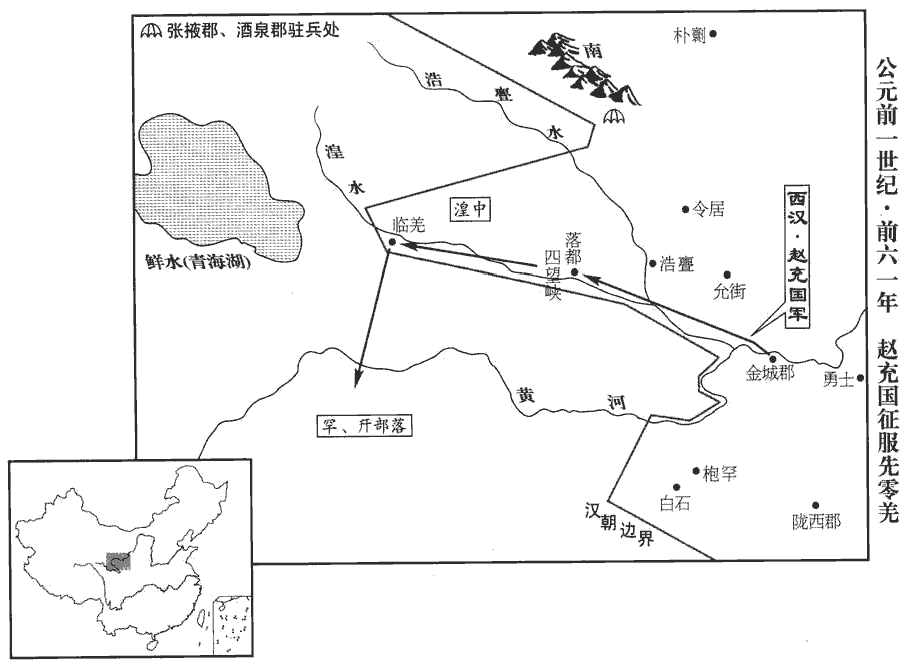
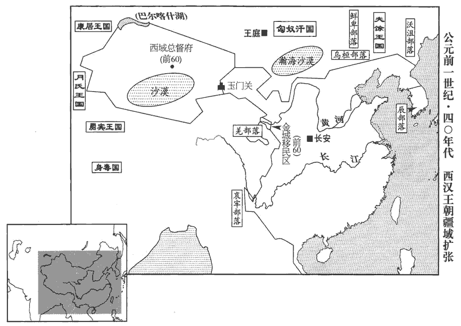

 漢紀十八起上章涒tūn灘（庚申），盡玄黓yì閹茂（壬戌），凡三年。

# 中宗孝宣皇帝中

## 神爵元年（庚申，前六一年）以神爵降集紀元。

1春，正月，上‹刘病已，时年三十一›始行幸甘泉‹陝西淳化西北›，郊泰畤；三月，行幸河東‹山西夏縣›，祠后土。上頗修武帝故事，謹齋祀之禮，以方士言增置神祠；時以方士言，為隨侯劍、寶玉、寶璧、周康寶鼎立四祠于未央宮中。又祠大室山於即墨，三戶山於下密；祠天封苑火井於鴻門；又立歲星、辰星、太白、熒惑、南斗祠于長安城旁；又祠參山八神于曲城，蓬山石社、石鼓於臨朐qú，之罘山於腄chuí，成山於不夜，萊山于黃；成山祠日，萊山祠月，又祠四時於琅邪，蚩尤于壽良。京師近縣，鄠hù則有勞谷、五床山、日、月、五帝、仙人、玉女祠；雲陽有徑路神祠；又立五龍山仙人祠及黃帝、天神帝、原水凡四祠于膚施。聞益州‹云南晉寧东晋城镇›有金馬、碧雞之神，可醮jiào祭而致，後漢志：越巂郡青蛉縣禺同山，俗謂有金馬、碧雞。如淳曰：金形似馬，碧形似雞。水經註曰：禺同山神有金馬、碧雞，光景儵shū忽。醮，即召翻。於是遣諫大夫蜀郡‹四川成都›王褒使持節而求之。使，疏吏翻。

〖译文〗 [1]春季，正月，汉宣帝第一次前往甘泉宫，在泰祭祀天神。三月，前往河东郡，祭祀后土神。汉宣帝颇仿照武帝旧例，小心谨慎地遵守斋戒祭祀之礼，又采纳方士的意见增修神祠。汉宣帝听说益州有金马神和碧鸡神，可以通过祭礼请到，于是派谏大夫蜀郡人王褒携带皇帝符节前去寻找。

初，上聞褒有俊才，召見，見，賢遍翻。使為聖主得賢臣頌。其辭曰：「夫賢者，國家之器用也。所任賢，則趨舍省而功施普；師古曰：趨，讀曰趣。普，博也。趨，七喻翻。舍，讀曰捨。施，式智翻。器用利，則用力少而就效眾。故工人之用鈍器也，勞筋苦骨，終日矻kū矻；應劭曰：矻矻，勞極皃mào；如淳曰：健作皃。師古曰：如說是也。矻，口骨翻。及至巧冶鑄干將，干將，吳寶劍名，闔廬所鑄。使離婁督繩，公輸削墨，張晏曰：離婁，黃帝時明目者也。應劭曰：公輸，魯般，性巧者也。師古曰：督，察視也。雖崇台五層、延袤百丈而不溷hùn者，工用相得也。師古曰：溷，亂也，音胡頓翻。庸人之御駑馬，亦傷吻、敝策而不進於行；師古曰：吻，口角也。策，所以擊馬。及至駕齧膝、驂乘旦，孟康曰：良馬低頭，口至膝，故曰齧膝。張晏曰：駕則旦至，故曰乘旦。乘，食證翻。王良執靶，張晏曰：王良，郵無恤，字伯樂。晉灼曰：靶，音霸；謂轡也。師古曰：參驗左氏傳及國語、孟子，郵無恤、郵良、劉無止、王良，總一人也。楚辭云：驥躊躇於敝輦，遇孫陽而得代。王逸云：孫陽，伯樂姓名也。列子云：伯樂，秦穆公時人。考其年代，不相當。張說云良字伯樂，斯失之矣。韓哀附輿，應劭曰：世本：韓哀作御。師古曰：宋衷云：韓哀，韓哀侯也。時已有御，此復言作者，加其精巧也。然則善御者耳，非始作也。周流八極，萬里一息，何其遼哉？人馬相得也。故服絺chī綌xì之涼者，不苦盛暑之鬱燠yù；襲貂狐之煗者，不憂至寒之悽愴。師古曰：鬱，熱氣也。燠，溫也。悽愴，寒冷也。燠，於六翻。煗，乃短翻。何則？有其具者易其備。賢人、君子，亦聖王之所以易海內也。易，以豉翻。昔周公躬吐捉之勞，故有圉空之隆；師古曰：一飯三吐食，一沐三捉髮，以賓賢士，故能成太平之化，而刑措不用，故囹圄空虛也。圉，音圄，同。齊桓設庭燎之禮，故有匡合之功。應劭曰：有以九九求見桓公，桓公不內。其人曰：「九九小術，而君不內之，況大於九九者乎！」於是桓公設庭燎之禮而見之。居無幾，隰xí朋自遠而至，齊遂以霸。師古曰：九九，計數之書，若今算經也。匡，謂一匡天下。合，謂九合諸侯。由此觀之，君人者勤於求賢而逸於得人。人臣亦然。昔賢者之未遭遇也，圖事揆kuí策，則君不用其謀，陳見悃kǔn誠，王逸曰：悃愊bì，志純一也，亦猶實也。則上不然其信；進仕不得施效，斥逐又非其愆。是故伊尹勤於鼎俎，太公困于鼓刀，師古曰：勤於鼎俎，謂負鼎俎以干湯也。鼓刀者，謂太公屠牛于朝歌也。百里自鬻yù，寧子飯牛，師古曰：鬻，賣也。呂氏春秋曰：百里奚之未遇時也，虞亡而虜縛，鬻以五羊之皮，公孫枝得而悅之，獻諸穆公。應劭曰：齊桓公夜出迎客，寧戚疾擊其牛角，高歌曰：「南山矸gān，白石爛，生不逢堯與舜禪！短布單衣適至骭gàn，從昏飯牛薄夜半，長夜曼曼何時旦！」桓公遂召與語，悅之，以為大夫。飯，扶晚翻。離此患也。師古曰：離，遭也。及其遇明君、遭聖主也，運籌合上意，諫諍即見聽，進退得關其忠，任職得行其術，剖符錫壤而光祖考。故世必有聖知之君知，讀曰智。而後有賢明之臣。故虎嘯而風冽，師古曰：冽冽，風貌也；音列。龍興而致雲，蟋蟀竢sì秋唫jìn，蜉蝤出以陰。孟康曰：蜉蝤，渠略也。師古曰：蟋蟀，今之促織也。蜉蝤，甲蟲也，好叢眾而生也，朝生而夕死。舍人曰：南陽以東曰蜉蝤，梁、宋之間曰渠略。郭璞曰：似蛣jié蜣，身狹而長，有角，黃黑色，聚生糞土中，朝生暮死，豬好噉dàn之。陸璣疏云：蜉蝣有角，大如指，長三四寸，甲下有翅，能飛，夏月陰雨時地中出。竢，即俟字。蝤，音由。易曰：『飛龍在天，利見大人。』師古曰：乾卦九五爻辭也。言王者居正陽之位，賢才見之，則利用也。詩曰：『思皇多士，生此王國。』師古曰：大雅文王之詩也。思，語辭也。皇，美也。言美哉眾多賢士，生此周王之國也。故世平主聖，俊艾將自至；師古曰：艾，讀曰乂。明明在朝，穆穆布列，聚精會神，相得益章，師古曰：章，明也。雖伯牙操遞鐘，晉灼曰：遞，音遞送之遞。二十四鐘各有節奏，擊之不常，故曰遞。臣瓚曰：楚辭云：「奏伯牙之號鐘。」號鐘，琴名也。馬融笛賦曰：號鐘，高調。伯牙以善鼓琴，不聞其能擊鐘也。師古曰：琴名，是也。字既作遞，則與楚辭不同，不得即讀為號，當依晉音耳。逢門子彎烏號，師古曰：逢門，善射者，即逢蒙也。應劭曰：楚有柘zhè桑，烏棲其上，枝下著地，不得飛，欲墮，號呼，故曰烏號。張揖曰：黃帝乘龍上天，小臣不得上，挽持龍髥；髥拔，墮黃帝弓；臣下抱弓而號，故名弓烏號。師古曰：應、張二說皆有據。逢，皮江翻。猶未足以喻其意也。故聖主必待賢臣而弘功業，俊士亦俟明主以顯其德。上下俱欲，驩然交欣，千載壹合，論說無疑，翼乎如鴻毛遇順風，沛乎如巨魚縱大壑；其得意若此，則胡禁不止，曷令不行，師古曰：胡、曷，皆何也。化溢四表，橫被無窮。被，皮義翻。是以聖主不徧窺望而視已明，不殫傾耳而聽已聰，師古曰：殫，盡也。太平之責塞，師古曰：塞，滿也。塞，悉則翻。優遊之望得，休征自至，壽考無疆，何必偃仰屈伸若彭祖，呴噓呼吸如僑、松，如淳曰：五帝紀：彭祖，堯、舜時人。列仙傳：彭祖，殷大夫也；歷夏至商末，號年七百。師古曰：呴、噓，皆開口出氣也。僑，王僑；松，赤松子；皆仙人也。呴xǔ，吁於翻。噓，音虛。眇然絕俗離世哉！」師古曰：眇然，高遠之意。離，力智翻。是時上頗好神仙，故褒對及之。好，呼到翻；下同。

〖译文〗 当初，汉宣帝听说王褒很有才干，召见他，命他作了一篇《圣主得贤臣颂》。文中说到：“贤才，是国家的工具。任用的官吏贤能，办事进退简易，又能普遍获得良好的功效；使用的工具锋利，花费很少的力量就能取得很多的成果。所以，如果工匠使用的工具不够锋利，即使劳筋动骨，终日辛苦；而使用精巧的工具，则能铸造出‘干将’宝剑。假使派眼神好的离娄负责测量，鲁班砍削木材，测量百丈面积，修建五层高台也不会失误，这是因为用人得当。蠢人骑劣马，即使勒破马嘴，抽坏马鞭，也不能前进；而由精于骑术的王良骑乘名种良驹，由善于改进车辆的韩哀侯驾驶快疾的宝马拉着马车周游天下，即使是万里之遥，也不过喘口气的工夫就能到达，为什么这么快呢？因为人马相得益彰之故。所以，身穿凉爽的麻布衣的人，不苦于盛夏的暑热；身穿温暖柔软的貂、狐皮衣的人，不担忧严冬的寒冷。原因何在？因为他们拥有相应的工具而易于防备。贤人、君子，也正是圣明的君王易于治理天下的工具。从前，周公为了接待宾客，吃一顿饭要停顿三次，沐浴一次要束起三次头发，所以才会出现监狱空闲的盛世；齐桓公在庭中燃起火炬，为的是不分昼夜地接待贤士，所以才能九合诸侯，称霸天下。由此看来，作为君王，只有首先不辞辛苦地访求贤才，然后才能享受所得贤才给他带来的安逸。作为人臣也是如此。过去，贤能的人在没有受到君王的赏识之前，贡献策略，君王不用；陈述建议，君王不听；作官不能施展他的能力，遭斥逐也并非有什么过失。所以，伊尹曾经背着饭锅菜板去做厨师，姜太公曾经操刀杀牛，百里奚曾经自卖，宁戚曾经喂牛，都经历过忧患及至遇到圣主明君，出谋划策都符合主上的心意，规劝进谏立即被主上接受，无论进退都能显示其忠心，担任官职也能施展其本领，接受君王赐给的封爵、土地，光宗耀祖。所以，世间必须先有圣明智慧的君王，然后才有贤能的臣子。虎啸而兴风，龙飞而生云，蟋蟀到秋天才鸣叫，甲虫在阴湿崐处才会出现。《易经》上说：‘飞龙在天，有利于选拔贤才。’《诗经》上说：‘济济贤才，生于周国。’所以，世道太平，君主圣明，才俊之士自会来临。君王勉力于上，人臣恭谨于下，聚精会神，相得益彰，即使用伯牙演奏他的‘递钟’名琴，逢蒙使用他的‘乌号’神弓也不足以比喻君臣之间的融洽。所以圣主必须等待贤臣来辅佐，才能光大功业；贤臣只有等待圣主的赏识，才能显示才干。上下互相需要，彼此欣悦，这是千年一次的际遇，言论见解无所猜疑，犹如羽毛遇到顺风，巨鲸纵横大海，如此得意，那么何禁不止，何令不行？圣贤的教化，必将传播四方，永无穷尽。所以，圣主不必处处窥望就已看得明白，不必时时侧耳就已听得清楚，使天下太平的责任已经尽到，安乐悠闲的愿望已经实现，祥瑞自然降临，寿命自然无疆，何必像彭祖那样俯仰屈伸，像王侨、赤松子那样呼吸吐纳，去寻觅与世隔绝的仙境呢！”此时，汉宣帝颇喜好神仙之术，所以王褒在文中特别提及。

京兆尹張敞亦上疏諫曰：「願明主時忘車馬之好，斥遠方士之虛語，遊心帝王之術，太平庶幾可興也。」遠，於願翻。幾，居希翻。上由是悉罷尚方待詔。此尚方，非作器物之尚方。尚，主也，主方藥也。司馬相如大人賦：詔岐伯使尚方，是也。初，趙廣漢死後，為京兆尹者皆不稱職，稱，尺證翻。唯敞能繼其跡；其方略、耳目不及廣漢，然頗以經術儒雅文之。

〖译文〗 京兆尹张敞也上书规劝汉宣帝说：“希望明主经常忘掉乘车骑马的嗜好，疏远方士的虚言妄语，留心于帝王之术，太平盛世可望出现。”于是汉宣帝将担任待诏的方士全部罢斥。最初，自赵广汉死后，担任京兆尹一职的人都不称职，只有张敞能继续赵广汉的政绩，他的谋略、聪明虽不如赵广汉，但能以儒家经术加以辅助。

2上頗修飾，宮室、車服盛于昭帝時；外戚許、史、王氏貴寵。諫大夫王吉上疏曰：「陛下躬聖質，總萬方，惟思世務，將興太平，詔書每下，民欣然若更生。臣伏而思之，可謂至恩，未可謂本務也。師古曰：言天子如此，雖于百姓為至恩，然未盡政務之本也。欲治之主不世出，師古曰：言有時遇之不常值。治，直吏翻。公卿幸得遭遇其時，言聽諫從，然未有建萬世之長策，舉明主於三代之隆也。其務在於期會、簿書、斷獄、聽訟而已，斷，丁亂翻。此非太平之基也。臣聞民者，弱而不可勝，愚而不可欺也。聖主獨行于深宮，得則天下稱誦之，失則天下咸言之，故宜謹選左右，審擇所使。左右所以正身，所使所以宣德，此其本也。孔子曰：『安上治民，莫善於禮，』非空言也。師古曰：孝經載孔子之言。治，直之翻。王者未制禮之時，引先王禮宜於今者而用之。臣願陛下承天心，發大業，與公卿大臣延及儒生，述舊禮，明王制，敺qū一世之民躋之仁壽之域，師古曰：以仁撫下，則群生安逸而壽考。余謂此以仁、壽二字并言，仁者不鄙詐，壽者不夭折也。敺，與驅同。則俗何以不若成、康，壽何以不若高宗！師古曰：高宗，殷王武丁也，享國百年。竊見當世趨務不合於道者，謹條奏，師古曰：趨，讀曰趣。趣，向也。唯陛下財擇焉。」吉意以為：「世俗聘妻、送女無節，則貧人不及，故不舉子。又，漢家列侯尚公主，諸侯則國人承翁主，晉灼曰：娶天子女，則曰尚公主。國人娶諸侯女，則曰承翁主。尚、承，皆卑下之名也。使男事女，夫屈於婦，逆陰陽之位，故多女亂。古者衣服、車馬，貴賤有章；今上下僭差，人人自製，師古曰：言無節度。是以貪財誅利，不畏死亡。誅，責也，求也。周之所以能致治刑措而不用者，以其禁邪於冥冥，絕惡於未萌也。」師古曰：冥冥，言未有端緒也。治，直吏翻。又言：「舜、湯不用三公、九卿之世而舉皋陶、伊尹，李奇曰：不繼世而爵也。言皋陶、伊尹非三公、九卿之世。陶，音遙。不仁者遠。師古曰：任用賢人，放黜讒佞。今使俗吏得任子弟，張晏曰：子弟以父兄任為郎。率多驕驁，不通古今，無益於民，宜明選求賢，除任子之令；外家及故人，可厚以財，不宜居位。去角抵，減樂府，省尚方，明示天下以儉。古者工不造琱diāo瑑zhuàn，師古曰：瑑者，刻鏤為文。瑑，音篆。商不通侈靡，非工、商之獨賢，政教使之然也。」上以其言為迂闊，師古曰：迂，遠也，音於。不甚寵異也。吉遂謝病歸。

〖译文〗 [2]汉宣帝颇注重修饰，其宫室、车马、服饰都超过汉昭帝之时。外戚许、史、王氏家族尊贵受宠。谏大夫王吉上书汉宣帝说：“陛下以圣明的资质总揽万方事务，专心思虑天下大事，将实现太平盛世。每次颁下诏书，百姓们就如同生命重新开始一样欢欣鼓舞。我想，这种情况可以说是陛下对百姓的最大恩德，却不能说是为政的根本。想使国家大治的圣主并不经常出现，而如今的公卿大臣有幸遇到圣主出现，言听计从，但未能制定出建立万世基业的长远规划，未能辅助圣明君主创立可与夏、商、周三代媲美的太平盛世。当今的政务主要着眼于朝会、财政报告、审判、处理讼案而已，这并非建立太平盛世的基础。我听说，老百姓虽然软弱，却无法战胜他们；虽然愚昧，却不可欺骗他们。圣主独处深宫，所作的决定，恰当则受到天下人的称颂，失当则被天下人纷纷议论，所以应小心地挑选身边的助手，审慎地择用执行命令的官员。使身边的助手能够帮助君王端正自身，执行命令的官员能够宣示圣德，这才是君王的根本要务。孔子说：‘使君王平安、百姓得到治理，没有比推行礼更好的了。’这不是一句空话。作为君王，在尚未制定出新的礼仪之前，应引用古代圣明君王制定的、与当今情况相适应的礼付诸实施。我希望陛下能上承天心，发展崐大业，与公卿大臣以及儒生一起研究古代的礼仪制度，推行圣王的制度，使全体百姓都能达到仁义、福寿的境地。果真如此，风俗怎会不如周成王、周康王之时，寿命怎能不像殷高宗武丁！谨将我看到的当前人们所追求的不合于正道的现象分别列出，奏明陛下，请陛下裁决。”王吉认为：“当今世俗，娶妻、嫁女的费用没有节制，使贫苦的人无力承担，以至于不敢生孩子。再有，列侯娶天子的女儿，称为‘尚公主’，国人娶诸侯王之女，称为‘承翁主’，让男子事奉妇女，丈夫屈从妻子，颠倒了阴阳之位，所以才多次发生女人为乱的情况。古人在衣服、车马方面，严格规定了尊卑贵贱的区别；如今却上下不分，混乱一团，人人各随自己的喜好制作，所以贪图财物，追求利禄，甚至连死都不怕。周朝之所以能不用刑罚而使天下大治，是因为他们都将邪恶禁绝在发生之前。”又说：“舜、汤不用三公、九卿的后代而遴选皋陶、伊尹，不仁之人自然远去。如今却使庸俗官吏的子弟因其父兄的关系得以担任官职，这些人大多骄横傲慢，不通古今，无益百姓。应公开征选贤能人才，废除保荐子弟为官的‘任子令’；陛下的外家和故旧，可以赏赐丰厚的财物，却不宜让他们身居重要官位。除去‘角抵’游戏，减少乐府艺人，节省尚方用度，在天下人面前明确表示提倡节俭。古代的工匠不雕刻细致的装饰，商贾不贩卖奢侈物品，并非古代的工匠和商贾唯独贤明，而是政令教化使他们如此的。”汉宣帝认为王吉的话迂腐可笑，并不重视，于是王吉以有病为借口，辞职回乡。

 

3義渠安國至羌中‹青海东北部›，召先零諸豪三十餘人，以尤桀黠者皆斬之；師古曰：桀，堅也，言不順從也。黠，惡也，為惡堅也。零，音憐。黠，戶八翻。縱兵擊其種人，種，章勇翻；下同。斬首千餘級。於是諸降羌及歸義羌侯楊玉等怨怒，無所信鄉，師古曰：恐中國泛怒，不信其心而納向之。仲馮曰：恐怒，且恐且怒也。羌未有變，而漢吏無故誅殺其人，故楊玉等謂漢無所信鄉，於是與他族皆叛也。余謂恐怒，仲馮說是。無所信向，不信漢、不曏漢也。作「怨怒」者，通鑑略改班書之文，成一家言。降，戶江翻。遂劫略小種，背畔犯塞，攻城邑，殺長吏。背，蒲妹翻。安國以騎都尉將騎二【章：乙十一行本「二」作「三」；孔本同：張校同。】千屯備羌；至浩斖‹甘肃永登西南河桥镇›，浩斖mén縣，屬金城郡；有浩斖水，出西塞外，東至允吾，入湟水。孟康曰：浩斖，音合門。師古曰：浩，音誥。浩，水名也。斖者，水流峽山，岸深若門也。詩大雅曰：鳧鷖yī在斖，亦其義也。今俗呼此水為閣門河，蓋疾言之，浩為閣耳。杜佑曰：浩斖縣即今金城郡廣武縣地。又曰：廣武縣西南有漢浩斖縣故城。為虜所擊，失亡車重、兵器甚眾。師古曰：重，音直用翻。安國引還，至令居‹甘肃永登西›，以聞。令，音零。

〖译文〗 [3]义渠安国到达羌中，召集先零部落众首领三十余人前来，将其中最为桀骜狡猾者全部杀死，又纵兵袭击先零人，斩首一千余级。于是引起归附汉朝的各羌人部落和归义羌侯杨玉的愤怒怨恨，不再信任、顺服汉朝，于是劫掠弱小种族，侵犯汉朝边塞，攻打城池，杀伤官吏。义渠安国以骑都尉身分率领二千骑兵防备羌人，进至浩，遭到羌人袭击，损失了很多车马辎重和武器。义渠安国率兵撤退，到达令居，奏闻朝廷。

時趙充國年七十餘，上老之，使丙吉問誰可將者。將，即亮翻；下同。充國對曰：「無逾於老臣者矣！」上遣問焉，曰：「將軍度羌虜何如？師古曰：度，計也，音大各翻；下同。當用幾人？」充國曰：「百聞不如一見。兵難遙度，臣願馳至金城‹甘肅蘭州›，昭帝元始六年，置金城郡；唐蘭、鄯、廓州地。圖上方略。師古曰：圖其地形，并為攻討方略，俱奏上也。上，時掌翻；下兵上同。羌戎小夷，逆天背畔，滅亡不久，背，蒲妹翻。願陛下以屬老臣，師古曰：屬，委也。屬，音之欲翻。勿以為憂！」上笑曰：「諾。」乃大發兵詣金城。夏，四月，遣充國將之，以擊西羌。將，即亮翻。

〖译文〗 此时，赵充国年纪已七十有余，汉宣帝认为他已老，派丙吉前去问他谁能担任大将。赵充国回答说：“谁也不如我合适。”汉宣帝又派人问他说：“你估计羌人会怎样？应当派多少人？”赵充国说：“百闻不如一见，行兵打仗之事难以遥测，我愿赶到金城，画出地图，制定方略，再上奏陛下。羌人不过是戎夷小种，逆天背叛，不久就会灭亡，希望陛下将此事交给老臣来办，不必担忧。”汉宣帝笑着说：“可以。”于是调发大兵前往金城。夏季，四月，派赵充国率领金城军队进攻西羌。

4六月，有星孛於東方。孛，蒲內翻。

〖译文〗 [4]六月，东方天空出现异星。

5趙充國至金城‹甘肅蘭州›，須兵滿萬騎，欲渡河，恐為虜所遮，即夜遣三校銜枚先渡，師古曰：銜枚者，欲其無聲，使虜不覺。校，戶教翻；下同。渡，輒營陳；立營陳，則虜不得而犯，諸軍可以相繼而渡河。陳，讀曰陣。會明畢，遂以次盡渡。虜數十百騎來，出入軍傍，充國曰：「吾士馬新倦，不可馳逐，此皆驍騎難制，又恐其為誘兵也。驍，堅堯翻。誘，音酉。擊虜以殄滅為期，小利不足貪！」令軍勿擊。遣騎候四望陿xiá中無虜，文穎曰：金城有三陿，在南六百里。師古曰：山峭而夾水曰陿，四望者，陿名也。陿，音狹。夜，引兵上至落都‹青海乐都›，服虔曰。落都，山名也。據水經註，破羌縣之西有樂都城。後漢志，浩斖mén縣有雒都谷。劉昫xù曰：唐鄯州，治故樂都城。召諸校司馬謂曰：「吾知羌虜不能為兵矣！使虜發數千人守杜四望陿‹青海乐都西›中，師古曰：杜，塞也。兵豈得入哉！」

〖译文〗 [5]赵充国来到金城，等骑兵集结到一万名时，打算渡过黄河，怕遭羌军拦击，便于夜晚派出三名军校悄无声息地先行偷渡，渡河后立即设立营阵，正巧天色已明，于是大军依次全部渡过黄河。羌军约百名骑兵出现在汉军附近，赵充国说：“我军现在兵马劳乏，不能奔驰追击，这都是敌人的精锐骑兵，不易制服，又怕是敌人的诱兵。我们此战的目标是要将敌军全部消灭，不能贪图小利！”下令全军不准出击。赵充国派人到四望峡侦察，发现峡中并无敌兵。崐夜晚，赵充国率军穿过四望峡，抵达落都山，召集各位军校、司马说道：“我知道羌人不懂用兵之法了。假如羌人派兵数千，堵住四望峡，我军怎么进得去呢！”

充國常以遠斥候為務，行必為戰備，止必堅營壁，尤能持重，愛士卒，先計而後戰，遂西至西部都尉府‹青海湟源›，孟康曰：在金城。日饗軍士，師古曰：饗，飤之。士皆欲為用。虜數挑戰，數，所角翻。挑，徒了翻。充國堅守。捕得生口，言羌豪相數責曰：「語汝無反，數，所具翻。語，牛倨翻。今天子遣趙將軍來，年八九十矣，善為兵；今請欲壹斗而死，可得邪！」言充國持重不戰，羌欲一斗而死，不可得也。初，䍐hǎn、幵jiān‹均在青海同仁西›豪靡當兒使弟雕庫來告都尉曰：「先零欲反。」後數日，果反。雕庫種人頗在先零中，都尉即留雕庫為質。金城西部都尉也。種，章勇翻。質，音致。充國以為無罪，乃遣歸告種豪：「大兵誅有罪者，明白自別，毋取并滅。師古曰：言勿相和同，并取滅亡。別，彼列翻。天子告諸羌人：犯法者能相捕斬，除罪，仍以功大小賜錢有差；時募能斬大豪有罪者一人，賜錢四十萬；中豪十五萬；下豪二萬；女子及老、弱千錢。又以其所捕妻子、財物盡與之。」充國計欲以威信招降䍐、幵及劫略者，解散虜謀，徼其疲劇，乃擊之。師古曰：徼jiǎo，要也，音工堯翻。

〖译文〗 赵充国经常注意向远处派出侦察兵，行军时一定做好战斗准备，扎营时一定使营垒坚固，他特别老成持重，爱护士卒，必先制定好作战计划，然后再进行战斗。他率军向西来到西部都尉府，每天都用丰富的饮食让将士们饱餐，将士们都愿意为他所用。羌军多次挑战，赵充国坚守不出。汉军从抓到的羌军俘虏口中得知，羌人各部首领多次相互责备说：“告诉你不要造反，如今天子派赵将军率军前来，赵将军已然八九十岁了，善于用兵，现在我们就是想一战而死，办不到吗！”最初，、两部首领靡当派其弟雕库来报告西部都尉说：“先零部企图造反。”几天后，先零部果然造反。雕库同族的人有不少在先零部中，于是都尉将雕库留为人质。赵充国认为雕库无罪，便将其放回，让他转告羌人各部首领说：“大兵前来，只杀有罪之人，请你们自相区别，不要与有罪者一同去死。天子要我告诉各部羌人，犯法者只要能主动捕杀同党，就可免罪，仍按功劳大小赐给数量不同的钱财，并将捕杀之人的妻子儿女和财物全部赐给他。”赵充国打算先以威信招降、及其他被先零部胁迫的羌人部落，瓦解羌人联合叛汉的人计划，等到他们疲惫不堪时，再发动攻击。

時上已發內郡兵屯邊者合六萬人矣。酒泉太守辛武賢姓譜：夏啟封支子於莘；莘、辛相近，遂為辛氏。漢初申蒲為趙、魏名將，及徙家隴西，遂為隴西人。余按此敘辛武賢之世，然既以莘為辛，而又以申牽合之，以其聲相近也。然周自有太史辛甲。奏言：「郡兵皆屯備南山‹祁連山南麓›，北邊‹祁連山以北›空虛，勢不可久。若至秋冬乃進兵，此虜在境外之冊。今虜朝夕為寇，土地寒苦，漢馬不耐冬，不如以七月上旬齎jī三十日糧，分兵出張掖、酒泉，合擊䍐、幵jiān在鮮水‹青海湖›上者。劉昫曰：漢金城郡之金城縣，䍐羌所處也；後漢置西海郡；晉乞伏乾歸都於此；唐為蘭州五泉縣。余據漢書，羌豪獻鮮水海地于王莽，置西海郡，即此。山海經云：北鮮之山，鮮水出焉，北流注于徐吾。非此鮮水也。雖不能盡誅，但奪其畜產，虜其妻子，復引兵還，冬復擊之，復，扶又翻。大兵仍出，虜必震壞。」師古曰：仍，頻也。天子下其書充國，下，遐稼翻；下同。令議之。充國以為：「一馬自負三十日食，為米二斛四斗，麥八斛，又有衣裝、兵器，難以追逐。虜必商軍進退，師古曰：商，計度也。稍引去，逐水草，入山林。隨而深入，虜即據前險，守後厄，以絕糧道，必有傷危之憂，為夷狄笑，千載不可復。復，報也。載，子亥翻。而武賢以為可奪其畜產，虜其妻子，此殆空言，非至計也。師古曰：殆，僅也。韻略云：近也。先零首為畔逆，它種劫略，師古曰：言被劫略而反畔，非其本心。故臣愚冊，冊，謀也，籌也。欲捐䍐、幵暗昧之過，隱而勿章，先行先零之誅以震動之，宜悔過反善，因赦其罪，選擇良吏知其俗者，拊循和輯。師古曰：拊，古撫字。輯，與集同。此全師保勝安邊之冊。」

〖译文〗 此时，汉宣帝已征发内地郡国的军队达六万人。酒泉太守辛武贤上奏说：“各郡军队都屯扎在南山，使北部边疆空虚，其势难以长久。如等到秋冬季节再出兵，那是敌人远在边境之外的策略，如今羌人日夜不停地进行侵扰，当地气候寒冷，汉军马匹不能过冬，不如在七月上旬，携带三十日粮，自张掖、酒泉分路出兵，合击鲜水之畔的、两部羌人。虽不能全部剿灭，但可夺其畜产，掳其妻子儿女，然后率兵退还，到冬天再次进攻。大军频繁出击，羌人必定震恐。”汉宣帝将辛武贤的奏章交给赵充国，命他发表意见。赵充国认为：“每匹马要载负一名战士三十日的粮食，即米二斛四斗，麦八斛，再加上行装、武器，难以奔驰追击。敌人必然会估计出我军进退的时间，稍稍撤退，追逐水草，深入山林。我军随之深入，敌人就占据前方险要，扼守后方通路，断绝我军粮道，必使我军有伤亡危险的忧虑，受到夷狄之人的嘲笑，这种耻辱千 年也无法报复。而辛武贤认为可以掳夺羌人的畜产、妻子儿女等，这怕是一派空话，不是最好的计策。先零为叛逆祸首，其他部族只是被其胁迫，所以，我的计划是：舍弃、两部昏昧不明的过失，暂时隐忍不宣，先诛讨先零，以震动羌人，他们将会悔过，反过来向善，再赦免其罪，挑选了解他们风俗的优秀官吏，前往安抚和解。这才是既能保全部队，又能获取胜利、保证边疆安定的策略。”

天子下其書，公卿議者咸以為「先零兵盛而負䍐、幵jiān之助，師古曰：負，恃也。不先破䍐、幵，則先零未可圖也。」上乃拜侍中許延壽為強弩將軍，即拜酒泉太守武賢為破羌將軍，師古曰：即，就也。就其郡而拜之。賜璽書嘉納其冊。以書敕讓充國曰：「今轉輸并起，百姓煩擾，將軍將萬余之眾，不早及秋共水草之利，爭其畜食，師古曰：此畜，謂畜產牛羊之屬；食，謂穀麥之屬也。或曰：畜食，畜之所食，即謂草也。欲至冬，虜皆當畜食，師古曰：此畜讀曰蓄。蓄，聚積也。多臧匿山中，依險阻，臧，古藏字。將軍士寒，手足皸jūn瘃zhú，師古曰：皸，坼裂也。瘃，寒創也。皸，音軍。瘃，竹足翻。寧有利哉！將軍不念中國之費，欲以歲數而勝敵，師古曰：久歷年歲，乃勝小敵也。數，音所具翻。將軍誰不樂此者！師古曰：言為將軍者皆樂此。樂，音洛。今詔破羌將軍武賢等將兵，以七月擊䍐羌；將軍其引兵并進，勿復有疑！」復，扶又翻。

〖译文〗 汉宣帝将赵充国的奏章交给公卿大臣们讨论，大家都认为：“先零兵力强盛，又依仗、的帮助，如不先破、，就不能进攻先零。”于是汉宣帝任命侍中许延寿为强弩将军，就地任命酒泉太守辛武贤为破羌将军，颁赐诏书嘉勉辛武贤的建议，并写信责备赵弃国说：“如今到处都在向前方输送军粮，使百姓受到烦扰，将军率领大军一万余人，不及早利用秋季水草茂盛的时机，争夺羌人的牲畜、粮食，却要等到冬季再行出击，但那时羌人都会积蓄粮食，多数藏匿于深山之中，据守险要，而将军士卒寒苦，手足皲裂，难道会有利吗！将军不念国家耗费巨大，只想拖延数年而取胜，哪位将军，不愿这样！现在诏令破羌将军辛武贤等率兵于七月进击、，将军率兵同时出击，不得再有迟疑！”

充國上書曰：「陛下前幸賜書，欲使人諭䍐，以大軍當至，漢不誅䍐，以解其謀。臣故遣幵豪雕庫宣天子至德；䍐、幵之屬皆聞知明詔。今先零羌楊玉阻石山木，候便為寇，師古曰：謂阻依山之木石以自保固。䍐羌未有所犯，乃置先零，先擊䍐，釋有罪，誅無辜，師古曰：釋，置也，放也。起壹難，就兩害，誠非陛下本計也！臣聞兵法：『攻不足者守有餘。』又曰：『善戰者致人，不致於人。』師古曰：致人者，引致而取之。致于人，為人所引也。今䍐羌欲為敦煌、酒泉寇，敦，徒門翻。宜飭兵馬，練戰士，以須其至。師古曰：須，待也。坐得致敵之術，以逸擊勞，取勝之道也。今恐二郡兵少，不足以守，而發之行攻，釋致虜之術而從為虜所致之道，師古曰：釋，廢也。臣愚以為不便。先零羌虜欲為背畔，故與䍐、幵解仇結約，然其私心不能無恐漢兵至而䍐、幵背之也。背，蒲妹翻。臣愚以為其計常欲先赴䍐、幵之急以堅其約。先擊䍐羌，先零必助之。今虜馬肥、糧食方饒，擊之恐不能傷害，適使先零得施德於䍐羌，師古曰：施德，自樹恩德也。堅其約，合其黨。虜交堅黨，合精兵二萬餘人，迫脅諸小種，附著者稍眾，著，直略翻。莫須之屬不輕得離也。服虔曰：莫須，小種羌名也。如是，虜兵寖多，誅之用力數倍。臣恐國家憂累，累，力瑞翻；下累重同。由十年數，不二三歲而已。于臣之計，先誅先零已，則䍐、幵之屬不煩兵而服矣。先零已誅而䍐、幵不服，涉正月擊之，得計之理，又其時也。以今進兵，誠不見其利！」戊申‹二十八›，充國上奏。上，時掌翻。秋，七月，甲寅‹五›，璽書報，從充國計焉。

〖译文〗 赵充国上书汉宣帝说：“陛下上次赐我书信，打算派人劝谕部羌人，大军将会前来，但汉朝并不是要征讨他们，以此来瓦解羌人联合叛汉的计划。所以我派部首领雕库去宣示天子盛德，、两部羌人都已听到了天子的明诏。如今先零羌首领杨玉凭借山中树木岩石自保，并寻机出山骚扰，而羌并无冒犯行为，却放过有罪的先零，先打无辜的羌，一个部族起来叛乱，却给两个部族留下伤害，实在违背陛下原来的计划！我听说兵法上讲：‘不足以进攻的力量，用于防守却能有余。’又说：‘善于打仗的人，能主动引诱敌人，而不被敌人所引诱。’如今羌企图进犯敦煌、酒泉，本应整顿兵马，训练士卒，等待敌人前来，坐在那里，用引诱敌人的战术，以逸击劳，这才是取胜之道。现在唯恐二郡兵力单薄，不足防守，却出兵进攻，放弃引诱敌人的战术，而被敌人所引诱，我认为不利。先零羌打算背叛我朝，所以才与、化解怨仇，缔结盟约，但其内心深处不能不害怕汉军一到而、背叛他们。我认为先零时常希望能先为、解救危急，以巩固他们的联盟。先攻羌，先零肯定会援助他们。现在，羌人的马匹正肥，粮食正多，攻击他们，恐怕不能造成伤害，而正好使先零有机会施德于羌，巩固其联盟，团结其党羽。先零巩固其联盟之后，会合精兵二万余人，胁迫其他弱小部族，归附者逐渐增多，像莫须部羌人之类的弱小部族，要想脱离其控制就不容易了。果真如此，则羌人兵力逐渐增多，要征讨他们，就需增加几倍的力量，我恐怕国家的忧烦困扰，当以十年计，而不只二三年了。按我的计划，先诛杀了先零，则、之流不必再劳烦军队，就可顺服。如先零已经诛杀，而、等仍不肯屈服，等到明年正月再攻击他们，则不但合理，而且适时。现在进兵，实在看不到有什么利益！”戊申（二十八日），赵充国奏闻朝廷。秋季，七月甲寅（初五），汉宣帝颁赐诏书，采纳赵充国的计划。

充國乃引兵至先零在所。虜久屯聚，懈弛，師古曰：弛，放也。望見大軍，棄車重，欲渡湟水，重，直用翻。道厄狹；充國徐行驅之。或曰：「逐利行遲。」師古曰：逐利宜速，今行太遲。充國曰：「此窮寇，不可迫也。緩之則走不顧，急之則還致死。」師古曰：謂更回還盡力而死戰。諸校皆曰：「善。」虜赴水溺死者數百，降及斬首五百餘人。降，戶江翻。虜馬、牛、羊十萬余頭，車四千餘兩。兩，音亮。兵至䍐地，令軍毋燔聚落、芻牧田中。師古曰：不得燔燒人居，及於田畝之中刈芻放牧也。䍐羌聞之，喜曰：「漢果不擊我矣！」豪靡忘使人來言：「願得還復故地。」服虔曰：靡忘，羌帥名也。充國以聞，未報。靡忘來自歸，充國賜飲食，遣還諭種人。護軍以下皆爭之曰：「此反虜，不可擅遣！」充國曰：「諸君但欲便文自營，師古曰：苟取文墨之便，以自營衛。非為公家忠計也！」語未卒，為，於偽翻。卒，子恤翻。璽書報，令靡忘以贖論。後䍐竟不煩兵而下。

〖译文〗 于是赵充国率兵进抵先零地区。羌人屯兵已久，戒备松懈，忽见汉军大兵来到，慌忙抛弃车马辎重，企图渡过湟水，道路狭窄，赵充国率军缓缓前行，驱赶羌军。有人对赵充国说：“要取得战果，推进速度不宜迟缓。”赵充国说：“这是走投无路的敌兵，不可逼迫太急。缓慢追击，他们只逃跑不回头；逼迫太急，则回头死战。”各位军校都说：“有理。”羌人掉入水中淹死数百人，投降及被汉军所杀达五百余人，汉军缴获马、牛、羊十万余头，车四千余辆。汉军行至地，赵充国下令不得焚烧羌人村落，不得在羌人耕地中牧马。羌听说后，高兴地说：“汉军果然不打我们！”其首领靡忘派人前来对赵充国说：“希望能让我们回到原来的地方。”赵充国上奏朝廷，未得到回音。靡忘亲自前来归降，赵充国赐其饮食，派他回去告谕本部羌人。护军及以下将领都说：“靡忘是国家叛逆，不能擅自放走！”赵充国说：“你们都只是为了文墨之便，自我营护，并不忠心为国家着想！”话未讲完，诏书来到，命靡忘将功赎罪。后羌终于未用兵而平定。

上詔破羌、強弩將軍詣屯所，以十二月與充國合，進擊先零。時羌降者萬餘人矣，充國度其必壞，度，徒洛翻。欲罷騎兵；屯田以待其敝。作奏未上，上，時掌翻。會得進兵璽書，充國子中郎將卬懼，使客諫充國曰：「誠令兵出，破軍殺將，以傾國家，將，即亮翻。將軍守之可也。即利與病，又何足爭！一旦不合上意，遣繡衣來責將軍，師古曰：繡衣，謂御史。將軍之身不能自保，何國家之安！」充國歎曰：「是何言之不忠也！本用吾言，羌虜得至是邪！師古曰：言豫防之，可無今日之寇也。往者舉可先行羌者，行，下孟翻。吾舉辛武賢；丞相御史復白遣義渠安國，竟沮敗羌。復，扶又翻。敗，補邁翻。金城、湟中穀斛八錢，吾謂耿中丞：服虔曰：耿壽昌也，為司農中丞。姓譜：耿，古國名，為晉所滅，子孫以為氏。謂，告語也。『糴dí三百萬斛穀，羌人不敢動矣！』師古曰：言豫儲糧食可以制敵。耿中丞請糴百萬斛，乃得四十萬斛耳；義渠再使，使，疏吏翻。且費其半。失此二冊，羌人致敢為逆。失之豪釐，差以千里，是既然矣。今兵久不決，四夷卒有動搖，卒，讀曰猝；下可卒同，又卒死同。相因而起，雖有知者不能善其後，知，讀曰智。羌獨足憂邪！師古曰：言儻如此，則所憂不獨在羌。吾固以死守之，明主可為忠言。」

〖译文〗 汉宣帝下诏书命破羌将军辛武贤、强弩将军许延寿率兵前往赵充国屯兵之处，于十二月与赵充国会合，进攻先零。当时，羌人投降汉军已一万有余了，赵充国估计羌人肯定要失败，打算撤除骑兵，以步兵在当地屯垦戍卫，等待羌人因自身疲惫而败亡。奏章写好，还未上奏，恰于此时接到汉宣帝命其进兵的诏书。赵充国的儿子中郎将赵感到害怕，便让幕僚去劝赵充国说：“假如出兵会损兵折将，倾覆国家，将军坚持己见，防守不出也还可以。而如果只是利与弊的区别，又有什么可争执的呢？一旦违背了皇上之意，派御史前来责问，将军本身不能自保，又怎能保证国家的安全！”赵充国叹息说：“这话是多么不忠！若是原来就采纳我的意见，羌人能发展到这一步吗！当初，推荐先去西羌巡行的人选，我推荐了辛武贤；而丞相、御史又奏请皇上，派义渠安国前去，结果败坏了大事。金城、湟中地区谷价一斛八钱，我曾对司农中丞耿寿昌说：‘只要我们购买三百万斛谷物储备，羌人就不敢轻举妄动了。’而耿寿昌请求购买一百万斛，实际只得四十万斛而已，义渠安国再次出行，又用去一半。这两项计划都未实现，才使羌人敢于叛逆。正所谓失之毫厘，差以千里！如今战事长期不能结束，如果四方蛮夷突然动摇，借机相继起兵造反，即使高明的人也无法收拾，岂只是羌人值得忧虑！我誓死也要坚持我的意见，皇上圣明，可以向他陈述我的忠言。”

遂上屯田奏曰：「臣所將吏士、馬牛食所用糧穀、茭藁，調度甚廣，難久不解，調，徒吊翻。難，乃旦翻。傜役不息，恐生他變，為明主憂，誠非素定廟勝之冊。師古曰：廟勝，謂謀於廟堂而勝敵也。且羌易以計破，難用兵碎也，易，以豉翻。故臣愚心以為擊之不便！計度臨羌‹青海湟源›東至浩斖，羌虜故田及公田，民所未墾，可二千頃以上，度，徒洛翻。其間郵亭多壞敗者。臣前部士入山，伐林木六萬餘枚，在水次。臣願罷騎兵，留步兵萬二百八十一人，分屯要害處，冰解漕下，繕鄉亭，浚溝渠，師古曰：漕下，以水運木而下也。繕，補也。浚，深治也。治湟陿以西道橋七十所，令可至鮮水‹青海湖›左右。田事出，賦人三【章：甲十五行本「三」作「二」；乙十一行本同；孔本同；張校同。】十畮；師古曰：田事出，謂至春，人出營田也。賦，謂班與之也。畮，古畝字。至四月草生，發郡騎及屬國胡騎各千，就草為田者遊兵，以充入金城郡，益積畜，省大費。今大司農所轉穀至者，足支萬人一歲食，謹上田處及器用簿。」上，時掌翻。

〖译文〗 于是，赵充国上书请求屯田说：“我率领的将士、马牛食用的粮食、草料须大范围地从各处征调，羌乱长久不能解除，则徭役不会止息，又恐发生其他变故，为陛下增加忧虑，确实不是朝廷克敌制胜的上策。况且，对羌人之叛，用智谋瓦解较易，用武力镇压则较难，所以我认为进攻不是上策！据估计，从临羌向东至浩，羌人旧有的私田和公田，民众没有开垦的荒地，约有二千顷以上，其间驿站多数颓坏。我以前曾派士卒入山，砍伐林木六万余株，存于湟水之滨。我建议：撤除骑兵，留步兵一万二百八十一人，分别屯驻在要害地区，待到河水解冻，木材顺流而下，正好用来修缮乡亭，疏浚沟渠，在湟以西建造桥梁七十座，使至鲜水一带的道路畅通。明年春耕时，每名屯田兵卒分给三十亩土地；到四月草木长出后，征调郡属骑兵和属国胡人骑兵各一千，到草地为屯田者充当警卫。屯田收获的粮食，运入金城郡，增加积蓄，节省大量费用。现在大司农运来的粮食，足够一万人一年所食，谨呈上屯田区划及需用器具清册。”

上報曰：「即如將軍之計，虜當何時伏誅？兵當何時得決？孰計其便，復奏！」孰，與熟同。復，扶又翻。

〖译文〗 汉宣帝下诏询问赵充国说：“如按照将军的计划，羌人叛乱当何时可以剿灭？战事当何时能够结束？仔细研究出最佳方案，再次上奏！”

充國上狀曰：「臣聞帝王之兵，以全取勝，是以貴謀而賤戰。『百戰而百勝，非善之善者也，故先為不可勝以待敵之可勝。』師古曰：此兵法之辭，言先自完堅，令敵不能勝我，乃可以勝敵也。余據此言本之孫子。蠻夷習俗雖殊於禮義之國，然其欲避害就利，愛親戚，畏死亡，一也。今虜亡其美地薦草，師古曰：薦，稠草。愁於寄託，遠遯，骨肉心離，人有畔志。而明主班師罷兵，鄧展曰：班，還也。萬人留田，順天時，因地利，以待可勝之虜，雖未即伏辜，兵決可朞月而望。羌虜瓦解，前後降者萬七百餘人，及受言去者凡七十輩，如淳曰：羌胡言欲降，受其言遣去者。師古曰：如說非也。謂羌受充國之言，歸相告喻者也。羌虜，即羌賊耳，無預于胡。此坐支解羌虜之具也。臣謹條不出兵留田便宜十二事：步兵九校、師古曰：一部為一校。校，戶教翻。吏士萬人留屯，以為武備，因田致穀，威德并行，一也。又因排折羌虜，令不得歸肥饒之地，貧破其眾，以成羌虜相畔之漸，二也。居民得并田作，師古曰：并且，讀如本字，又音步浪翻。仲馮曰：并，亦俱也。不失農業，三也。軍馬一月之食，度支田士一歲，罷騎兵以省大費，四也。度，徒洛翻。至春，省甲士卒，循河、湟漕穀至臨羌‹青海湟源›，臨羌縣，屬金城郡，其西北即塞外。以示羌虜，揚威武，傳世折衝之具，五也。以閒暇時，下先所伐材，繕治郵亭，充入金城‹甘肅蘭州›，六也。閒，與閑同。治，直之翻。兵出，乘危徼幸；師古曰：言不可必勝。徼，堅堯翻，又一遙翻。不出，令反畔之虜竄於風寒之地，離霜露、疾疫、瘃zhú墮之患，師古曰：墮，謂困寒瘃而墮指者。坐得必勝之道，七也。無經阻、遠追、死傷之害，八也。內不損威武之重，外不令虜得乘間之勢，九也。師古曰：間，謂軍之間隙者也。間，古莧翻。又亡驚動河南大幵jiān服虔曰：皆羌種，在河西之河南也。亡，古無字通。使生他變之憂，十也。治隍陿中道橋，令可至鮮水‹青海湖›以制西域，伸威千里，從枕席上過師，十一也。鄭氏曰：橋成，軍行安易，若於枕席上過也。大費既省，繇役豫息，以戒不虞，十二也。繇，古傜字通。留屯田得十二便，出兵失十二利，唯明詔采擇！」

〖译文〗 赵充国上奏说：“我听说，帝王的军队，应当不受什么损失就能取得胜利，所以重视谋略，轻视拚杀。《孙子兵法》说：‘百战百胜，并非高手中的高手，所以应先使自己立于不败之地，再等待可以战胜敌人的机会。’蛮夷外族的习俗虽与我们礼义之邦有所不同，但希望能躲避危害，争取有利，爱护亲属，惧怕死亡，则与我们一样。现在，羌人丧失了他们肥美的土地和茂盛的牧草，逃到遥远的荒山野地，为自己的寄身之地而发愁，骨肉离心，人人都产生了背叛之念。而此时陛下班师罢兵，留下万人屯田，顺应天时，利用地利，等待战胜羌人的机会。羌人虽未立即剿灭，然可望于一年之内结束战事。羌人已在迅速瓦解之中，前后共有一万七百余人投降，接受我方劝告，回去说服自己的同伴不再与朝廷为敌的共有七十批，这些人恰是瓦解羌人的工具。我谨归纳了不出兵而留兵屯田的十二项有益之处：九位步兵指挥官和万名官兵留此屯田，进行战备，耕田积粮，威德并行，此其一。因屯田而排斥羌人，不让他们回到肥沃的土地上去，使其部众贫困破败，以促成羌人相互背叛的趋势，此其二。居民得以一同耕作，不破坏农业，此其三。骑兵，包括战马一个月的食用，能够屯田士兵维持一年，撤除骑兵可节省大量费用，此其四。春天来临，调集士卒，顺黄河和湟水将粮食运到临羌，向羌人显示威力，这是后世御敌的资本，此其五。农闲时，将以前砍伐的木材运来，修缮驿站，将物资输入金城，此其六。如果现在出兵，冒险而无必胜把握；暂不出兵，则使叛逆羌人流窜于风寒之地，遭受霜露、瘟疫、冻伤的灾患，我们则坐着得到必胜的机会，此其七。可以避免遭遇险阻、深入追击和将士死伤的损害，此其八。对内不使朝廷的崐威严受到损害，对外不给羌人以可乘之机，此其九。又不会惊动黄河南岸大部落而产生新的事变，增加陛下之忧，此其十。修建隍中的桥梁，使至鲜水的道路畅通，以控制西域，扬威千里之外，使军队从此经过如同经过自家的床头一般容易，此其十一。大费用既已节省，便可不征发徭役，以防止出现预想不到的变故，此其十二。留兵屯田可得此十二项便利，出兵攻击则失此十二项便利，请陛下英明抉择！”

上復賜報曰：「兵決可期月而望者，復，扶又翻；下同。期，讀曰朞jī。謂今冬邪，謂何時也？將軍獨不計虜聞兵頗罷，且丁壯相聚，攻擾田者及道上屯兵，復殺略人民，將何以止之？將軍孰計復奏！」

〖译文〗 汉宣帝再次回复说：“你说可望于一年之中结束战事，是说今年冬季吗？还是何时？难道你不考虑羌人听说我们撤除骑兵，会集结精锐，攻袭骚扰屯田兵卒和道路上的守军，再次杀掠百姓，我们将用什么来制止？将军深入思考后再次上奏。”

充國復奏曰：「臣聞兵以計為本，故多算勝少算。孫子曰：多算勝，少算不勝。先零羌精兵，今餘不過七八千人，失地遠客分散，饑凍畔還者不絕。臣愚以為虜破壞可日月冀，遠在來春，故曰兵決可期月而望。竊見北邊自敦煌至遼東‹遼寧遼陽›萬一千五百餘里，乘塞列地有吏卒數千人，虜數以大眾攻之而不能害。敦，徒門翻。數，所角翻。今騎兵雖罷，虜見屯田之士精兵萬人，從今盡三月，虜馬羸瘦，羸，倫為翻。必不敢捐其妻子于他種中，種，章勇翻。遠涉河山而來為寇；亦不敢將其累重，還歸故地。師古曰：累重，謂妻子也。累，力瑞翻。重，直用翻。是臣之愚計所以度虜且必瓦解其處，師古曰：各於其處自瓦解。度，徒洛翻。不戰而自破之冊也。冊，與策同。至於虜小寇盜，時殺人民，其原未可卒禁。卒，讀曰猝。臣聞戰不必勝，不苟接刃；攻不必取，不苟勞眾。誠令兵出，雖不能滅先零，但能令虜絕不為小寇，則出兵可也。即今同是，師古曰：言俱不能止小寇盜。而釋坐勝之道，從乘危之勢，往終不見利，空內自罷敝，罷，讀曰疲。貶重以自損，貶重，謂貶中國之威重也。非所以示蠻夷也。又大兵一出，還不可復留，言大兵出塞而還，人有歸志，不可使復留屯以備羌。湟中亦未可空，如是，徭役復更發也。復，扶又翻；下同。臣愚以為不便。臣竊自惟念：奉詔出塞，引軍遠擊，窮天子之精兵，散車甲于山野，雖亡尺寸之功，亡，古無字通；下同。媮得避嫌之便，師古曰：媮，苟且也。而亡後咎餘責，此人臣不忠之利，非明主社稷之福也！」

〖译文〗 赵充国再次上奏说：“我听说，军事行动以谋略为根本，所以多算胜于少算。先零羌之精兵，如今剩下不过七八千人，丧失了原有的土地，分散于远离家乡的地区，挨饿受冻，不断有人叛逃回家。我认为他们崩溃败亡的时间可望以日月计算，最远在明年春天，所以说可望于一年中结束战事。我看到，北部边疆自敦煌直到辽东，共一万一千五百多里，守卫边塞的官吏和戍卒有数千人，敌人多次以大兵攻击，都不能取胜。现在即使撤除骑兵，而羌人见有屯田戍卫的精兵万人，且从现在开始，到三月底，羌人马匹瘦弱，必不敢将妻子儿女丢在其他部族，远涉山河前来侵扰；也不敢将其家属送还家乡。这正是我预计他们必将就地瓦解，不战自破而制定的策略。至于羌人小规模的侵扰掳掠，偶尔杀伤百姓，原本就无法立刻禁绝。我听说，打仗如无必胜的把握，就不能轻易与敌人交手；进攻如无必取的把握，就不能轻易劳师动众。如果发兵出击，即使不能灭亡先零，但能禁绝羌人小规模的侵扰活动，则可以出兵。如果今天同样不能禁绝，却放弃坐而取胜的机会，采取危险的行动，到底得不到好处，还白白使自己内部疲惫、破败，贬低国家威严而损害自己，不能这样对付蛮夷外族。再者大兵一出，返回时便不可再留，而湟中又不能无人戍守，如果这样，则徭役又将兴起，我认为实无益处。我自己思量，如果尊奉陛下的诏令出塞，率兵远袭羌人，用尽天子的精兵，将车马、甲胄散落在山野之中，即使立不下尺寸之功，也能苟且避免嫌疑，过后还能不负责任，不受指责。然而，这些个人的好处却是对陛下的不忠，不是明主和国家之福！”

充國奏每上，輒下公卿議臣。上，時掌翻。下，遐稼翻。初是充國計者什三；中什五；最後什八。有詔詰前言不便者，皆頓首服。詰，去吉翻。魏相曰：「臣愚不習兵事利害。後將軍數畫軍冊，數，所角翻；下同。其言常是，臣任其計必可用也。」師古曰：任，保也。上於是報充國，嘉納之；亦以破羌、強弩將軍數言當擊，以是兩從其計，詔兩將軍與中郎將卬出擊。強弩出，降四千餘人；破羌斬首二千級；中郎將卬斬首降者亦二千餘級；而充國所降復得五千餘人。詔罷兵，獨充國留屯田。

〖译文〗 赵充国每次上奏，汉宣帝都给公卿大臣讨论研究。开始，认为赵充国意见正确的人为十分之三，后增加到十分之五，最后更增至十分之八。汉宣帝诘问开始不同意赵充国意见的人为什么改变观点，这些人都叩首承认自己原来的意见不对。丞相魏相说：“我对军事上的利害关系不了解，后将军赵充国曾多次崐筹划军事方略，他的意见通常都很正确，我担保他的计划一定行得通。”于是汉宣帝回复赵充国，嘉勉并采纳了赵充国的计划，又因破羌将军辛武贤、强弩将军许延寿多次建议进兵攻击，所以也同时批准，下诏命两将军与中郎将赵率部出击。许延寿出击羌人，招降四千余人；辛武贤斩首二千级；赵斩首及招降也有二千余人；而赵充国又招降了五千余人。汉宣帝下诏罢兵，只留下赵充国在当地负责屯田事务。

6大司農朱邑卒。上以其循吏，閔惜之，詔賜其子黃金百斤，以奉其祭祀。

〖译文〗 [6]大司农朱邑去世。汉宣帝因他是个奉职守法的官吏，感到怜惜，下诏赐其子黄金一百斤，作为祭祀之用。

7是歲，【張：「歲」下脫「以」字。】前將軍、龍頟é侯韓增為大司馬、車騎將軍。龍頟侯國，屬平原郡。師古曰：今書本「頟」字或作「額」，而崔浩云有龍頟村，作「額」者非。頟，音洛。

〖译文〗 [7]这一年，汉宣帝任命前将军、龙侯韩增为大司马、车骑将军。

8丁令‹貝加爾湖畔›比三歲鈔盜匈奴‹王庭设蒙古哈尔和林›，令，音零。比，毗至翻。鈔，楚交翻。殺略數千人。匈奴遣萬餘騎往擊之，無所得。史言匈奴漸衰。

〖译文〗 [8]丁令国连续三年出兵劫掠匈奴，杀死及掳掠数千人。匈奴派遣骑兵一万余人前去攻击丁令国，但没有收获。

## 神爵二年（辛酉，前六零年）

1春，正月，以鳳皇、甘露降集京師，赦天下。

〖译文〗 [1]春季，正月，因有凤凰飞集长安，并有甘露降落，所以大赦天下。

2夏，五月，趙充國奏言：「羌本可五萬人軍，凡斬首七千六百級，降者三萬一千二百人，溺河湟、餓死者五六千人，定計遺脫與煎鞏、黃羝俱亡者不過四千人。定計，以定數計算也。羌靡忘等自詭必得，師古曰：詭，責也。自以為憂，責言必能得之。請罷屯兵！」奏可。充國振旅而還。書：班師振旅。孔安國註曰：兵入曰振旅。振，整也。杜預曰：振，整也；旅，眾也；言整眾而還也。

〖译文〗 [2]夏季，五月，赵充国上奏说：“羌人部众和军队本约五万人，前后被斩首共七千六百人，投降三万一千二百人，在黄河、湟水中淹死以及饿死的有五六千人，计算起来，剩下跟随其首领煎巩、黄羝一起逃亡的不过四千人。现已归降的羌人首领靡忘等自己保证可以擒获这些人，所以我请求罢除屯田部队。”汉宣帝批准所奏。赵充国整顿部队返回。

 

所善浩星賜迎說充國曰：鄧展曰：浩星，姓；賜，名也。孫愐曰：漢又有浩星公，治穀梁。說，輸芮翻。「眾人皆以破羌、強弩出擊，多斬首、生降，虜以破壞。然有識者以為虜勢窮困，兵雖不出，卽【章：甲十五行本「卽」作「必」；乙十一行本同；孔本同；張校同。】自服矣。將軍即見，見，賢遍翻。宜歸功於二將軍出擊，非愚臣所及。如此，將軍計未失也。」充國曰：「吾年老矣，爵位已極，豈嫌伐一時事以欺明主哉！言一時用兵之事，當以實敷fū奏，豈可以自矜伐為嫌。兵勢，國之大事，當為後法。老臣不以餘命壹為陛下明言兵之利害，卒死，誰當復言之者！」卒以其意對。為，於偽翻。卒，子恤翻。復，扶又翻。上然其計，罷遣辛武賢歸酒泉‹甘肅酒泉›太守，官充國復為後將軍。

〖译文〗 赵充国的好友浩星赐前往迎接赵充国，对他说：“大家都认为破羌、强弩二将军率兵出击，多有斩获、招降，所以才使羌人败亡。然而，有见识的人则认为羌人已到穷途末路，即使不发兵出击，也会很快自行投降。将军见到皇上时，应归功于破羌、强弩二位将军率兵出击，你自己并不能与之相比。这样做对你并无什么损失。”赵充国说：“我年岁大了，爵位也到头了，岂能为避免夸耀一时功劳的嫌疑而欺骗皇上！军事措施是国家大事，应当为后人立下榜样。我如不利用自己的余生专为皇上明白分析军事上的利害，一旦去世，谁能再对皇上说这些呢！”终于将自己的想法奏明汉宣帝。汉宣帝接受了他的意见，免除辛武贤破羌将军职务，派其仍回酒泉太守原任。赵充国恢复了后将军职务。

秋，羌若零、離留、且種、兒庫師古曰：且，音子閭翻。共斬先零大豪猶非、楊玉首，文穎曰：猶非，人名也。師古曰：猶非及楊玉二人也。及諸豪弟澤、陽雕、良兒、靡忘皆帥煎鞏、黃羝之屬四千餘人降。帥，讀曰率；下同。考異曰：宣紀：「五月，羌斬猶非、楊玉降。」充國傳：「五月，奏罷屯兵。秋，羌斬猶非、楊玉降。」今從傳。漢封若零、弟澤二人為帥眾王，余皆為侯、為君。離留、且種二人為侯；兒庫為君；陽雕為言兵侯；良兒為君；靡忘為獻牛君。初置金城屬國以處降羌。處，昌呂翻。

〖译文〗 秋季，羌人若零、离留、且种、库共同将先零首领犹非、杨玉斩杀。羌人各部首领弟泽、阳雕、良、靡忘都分别率领煎巩、黄羝所属四千余人归降汉朝。汉宣帝封若零、弟泽二人为帅众王，其他人都被封侯、封君。开始设置金城属国，安置归降的羌人。

詔舉可護羌校尉者。護羌校尉之官，始見於此。范曄曰：漢武帝時，諸羌與匈奴通，攻令居、安故，圍枹罕，遣李息、徐自為擊定之，始置護羌校尉。時充國病，四府舉辛武賢小弟湯。四府，丞相、御史、車騎將軍、前將軍府也；并後將軍府，為五府。充國遽起，奏：「湯使酒，不可典蠻夷。師古曰：使酒，因酒而使氣，若今言惡酒者。使，如字。不如湯兄臨眾。」時湯已拜受節，拜者，拜官護羌校尉，持節護諸羌。有詔更用臨眾。更，改也，音工衡翻。後臨眾病免，五府復舉湯。湯數醉䣱xù羌人，復，扶又翻。數，所角翻；下同。師古曰：䣱xù，況務翻，即酗字也。醉怒曰䣱。羌人反畔，卒如充國之言。史終言其事。卒，子恤翻。辛武賢深恨充國，以破羌希賞，而格不行也。上書告中郎【章：甲十五行本「郎」下有「將」字；乙十一行本同；孔本同。】卬泄省中語，辛武賢在軍中時，與卬宴語。卬言，張安世始不快上，上欲誅之；卬家將軍以為安世宜全度之，由此安世得免。武賢恨充國，告卬以此罪。下吏，自殺。下，遐稼翻。

〖译文〗 汉宣帝下诏命保举能够担任护羌校尉一职的官员。此时赵充国正在生病，丞相、御史、车骑将军、前将军共同保举辛武贤的小弟弟辛汤。赵充国听说后崐，急忙从病床上起来，上奏说：“辛汤酗酒任性，不能派他负责蛮夷事务，不如派辛汤的哥哥辛临众担任此职。”此时辛汤已拜受了护羌校尉的印信和皇帝符节，汉宣帝下诏，命改任辛临众。后辛临众因病免职，丞相、御史、车骑将军、前将军、后将军再次保举辛汤。辛汤多次在酒醉之后虐待羌人，使羌人再度反叛，到底同赵充国预料的一样。辛武贤深恨赵充国，上书朝廷，告发赵充国之子中郎将赵泄露中枢机密，赵被交付狱吏审讯，自杀而死。

3司隸校尉魏郡‹河北临漳西南邺镇›蓋寬饒，百官表：司隸校尉，周官；武帝征和四年初置，持節，從中都官徒千二百人，捕巫蠱，督大奸猾；後罷其兵，察三輔、三河、弘農。師古曰：以掌徒隸而巡察，故云司隸。蓋，音古盍翻。齊大夫陳戴食采于蓋，其後以為氏。至漢初，齊有蓋公。剛直公清，數干犯上意。時上方用刑法，任中書官，武帝遊宴後庭，用宦者為中書官。宣帝因之，遂基恭、顯之禍。賢曰：中書，內中之書也。寬饒奏封事曰：「方今聖道浸微，儒術不行，以刑余為周、召，師古曰：言使奄人當權軸也。召，讀曰邵。以法律為詩、書。」師古曰：言以刑法成教化也。又引易傳傳，直戀翻。言：「五帝官天下，三王家天下。家以傳子孫，官以傳賢聖。」書奏，上以為寬饒怨謗，下其書中二千石。下，遐稼翻；下同。時執金吾議，據公卿表，是歲也，南陽太守賢為執金吾。以為「寬饒旨意欲求禪，大逆不道！」師古曰：言欲使天子傳位於己。諫大夫鄭昌愍傷寬饒忠直憂國，以言事不當意而為文吏所詆挫，師古曰：詆，毀也。挫，折也。上書訟寬饒曰：訟者，訟其冤也。「臣聞山有猛獸，藜藿為之不采；國有忠臣，奸邪為之不起。為，於偽翻。司隸校尉寬饒，居不求安，食不求飽；師古曰：論語稱孔子曰：「君子食無求飽，居無求安。」故引之。進有憂國之心，退有死節之義；上無許、史之屬，下無金、張之托；應劭曰：許伯，宣帝皇后父。史高，宣帝外家也。金，金日磾也。張，張安世也。此四家屬托無不聽。師古曰：此說非也。許氏、史氏，有外屬之恩；金氏、張氏，自托於近侍也。屬，讀如本字。職在司察，直道而行，多仇少與。師古曰：仇，怨讎也。與，黨與也。上書陳國事，有司劾以大辟。劾，戶概翻。辟，毗亦翻。臣幸得從大夫之後，官以諫為名，不敢不言！」上不聽。九月，下寬饒吏；寬饒引佩刀自剄北闕下，剄，古鼎翻。眾莫不憐之。

〖译文〗 [3]司隶校尉魏郡人盖宽饶刚直清正，数次昌犯汉宣帝。此时，汉宣帝正注重刑法事务，信任由宦官担任的中书官。盖宽饶上了一道秘密奏章说：“如今圣贤之道逐渐衰微，儒家经术难以推行，把宦官当作周公、召公，把法律当作《诗经》、《尚书》。”又引用《易传》说：“五帝将天下视为公有，三王将天下视为私有。视为私有则传给子孙，视为公有则传给圣贤。”奏章呈上，汉宣帝认为盖宽饶恶意诽谤，将其奏章交中二千石官员处理。当时，执金吾认为：“盖宽饶是想让皇上将皇位禅让给他，大逆不道！”谏大夫郑昌怜悯感伤盖宽饶忠直忧国，因议论国事辞不达意而遭文墨之吏诋毁陷害，于是上书为盖宽饶鸣冤说：“我听说，山中有猛兽，人们因此而不敢去摘采野菜；国家有忠臣，奸邪之辈因此而不敢抬头。司隶校尉盖宽饶，居不求安，食不求饱，进有忧国之心，退有死节之义；上无陛下亲属许、史两家的庇护，下无作为皇家近侍的金、张两家的支持；而身负监察职责，秉公行事，所以仇人多而朋友少。他上书陈述对国事的意见，却被有关官员弹劾，处以死刑。我有幸能跟随在各位大夫之后，身为谏官，不敢不说出自己的看法！”汉宣帝不听。九月，盖宽饶被交付狱吏审判。盖宽饶用佩刀自刎于未央宫北门之下。人们无不怜惜。

4匈奴虛閭權渠單于將十余萬騎旁塞獵，旁，步浪翻。欲入邊為寇。未至，會其民題除渠堂亡降漢言狀，漢以為言兵鹿奚鹿盧【章：甲十五行本無「鹿盧」「鹿」字；乙十一行本同；退齋校同。】侯，此侯不見於表，蓋無食邑，猶前羌陽雕為言兵侯之類也。而遣後將軍趙充國將兵四萬餘騎屯緣邊九郡文穎曰：五原‹內蒙包頭西北›、朔方‹內蒙杭錦旗北›之屬也。師古曰：九郡者，五原‹內蒙包頭›、朔方‹內蒙杭錦旗北黄河南岸›、雲中‹內蒙托克托›、代郡‹河北蔚縣›、雁門‹山西右玉›、定襄‹內蒙和林格爾›、北平‹内蒙宁城西南›、上谷‹河北懷來›、漁陽‹北京密云›也。四萬餘騎分屯之，而充國總統領之。據充國傳，書此事於征羌之前；通鑑因匈奴內亂，書於此以先事。備虜。月余，單于病歐血，因不敢入，還去，即罷兵。乃使題王都犁胡次等入漢請和親，未報，會單于死。虛閭權渠單于始立，而黜顓渠閼氏。事見二十四卷地節二年。閼氏，音煙支。顓渠閼氏即與右賢王屠耆堂私通，右賢王會龍城‹内蒙苏尼特左旗›而去。顓渠閼氏語以單于病甚，且勿遠。語，牛倨翻。後數日，單于死，用事貴人郝宿王刑未央使人召諸王，未至，師古曰：郝，音呼各翻。顓渠閼氏與其弟左大將【章：甲十五行本無「將」字；乙十一行本同。】且渠都隆奇謀，立右賢王為握衍朐qú鞮dī單于。且，子餘翻。朐，音劬qú。鞮dī，丁奚翻。握衍朐鞮單于者，烏維單于耳孫也。應劭曰：耳孫，玄孫之子也；言去其高、曾益遠，但耳聞之也。李斐曰：耳孫，曾孫也。晉灼曰：耳孫，玄孫之曾孫也。諸侯王表，在八世。師古曰：耳孫，諸說不同。據平紀及諸侯王表說，梁孝王玄孫之子耳孫，音仍，又匈奴傳說握衍朐鞮單于，云烏維單于耳孫；以此參之，李云曾孫是也。然漢書諸處又皆云曾孫非一，不應雜兩稱而言。據爾雅，「曾孫之子為玄孫，玄孫之子為來孫，來孫之子為昆孫，昆孫之子為仍孫。」從己之數，是為八葉，則與晉說相同。仍、耳聲相近，蓋一號也。但班氏唯存古名，而計其葉數則錯也。

〖译文〗 [4]匈奴虚闾权渠单于率领十几万骑兵沿汉朝边塞进行围猎，企图侵入汉境掳掠。大军到达之前，正好有一个名叫题除渠堂的匈奴人逃到汉朝来归降，将此事报告汉朝，汉宣帝封他为“言兵鹿奚鹿卢侯”，并派后将军赵充国率骑兵四万余人屯驻于沿边九郡以防备匈奴。一个多月之后，单于身患吐血之病，因而不敢入侵汉境，于是返回，随即罢兵。匈奴又派题王都犁胡次等来到汉朝，请求和亲，尚未得到答复，单于去世。虚闾权渠单于初即位时，贬黜了颛渠阏氏，颛渠阏氏便与右贤王屠耆堂私通。右贤王参加龙城大会后离去，颛渠阏氏告诉他单于病重，暂时不要远离。几天后，单于去世，掌权的贵族郝宿王刑未央派人召诸王前来，尚未到达，颛渠阏氏与其弟左大将且渠都隆奇商议，立右贤王为握衍朐单于。握衍朐单于是乌维单于的曾孙。

握衍朐鞮單于立，兇惡，殺刑未央等而任用都隆奇，又盡免虛閭權渠子弟近親而自以其子弟代之。虛閭權渠單于子稽侯狦shān既不得立，師古曰：狦，音先安翻，又音所奸翻；杜佑山諫翻。亡歸妻父烏禪幕。師古曰：禪，音蟬。烏禪幕者，本康居‹都卑阗城，中亚巴尔喀什湖西南锡尔河北岸突厥斯坦›、烏孫‹都赤谷城，中亚伊塞克湖东南›間小國，數見侵暴，數，所角翻。率其眾數千人降匈奴，狐鹿姑單于以其弟子日逐王姊妻之，使長其眾，居右地。師古曰：長其眾，為之長帥。妻，七細翻。長，知兩翻。日逐王先賢撣，鄭氏曰：撣，音纏束之纏。晉灼曰：音田。師古曰：晉音是也。其父左賢王當為單于，讓狐鹿姑單于，狐鹿姑單于許立之。事見二十二卷武帝太初元年。國人以故頗言日逐王當為單于。日逐王素與握衍朐鞮單于有隙，即帥其眾欲降漢，帥，讀曰率。降，戶江翻；下同。使人至渠犁‹新疆库尔勒西南›，與騎都尉鄭吉相聞。吉發渠犁、龜茲‹新疆庫車›諸國五萬人迎日逐王口萬二千人、小王將十二人，小王將者，以裨小王將兵者也。一曰匈奴左•右賢王，左•右谷蠡王、左•右大將以下，凡二十四長為大王將；其餘為小王將。將，即亮翻。隨吉至河曲‹青海東部，湟水流域以南›，黃河千里一曲，此當在金城郡界。頗有亡者，吉追斬之，遂將詣京師。將，如字，領也，挾也。漢封日逐王為歸德侯。功臣表：歸德侯食邑于汝南。

〖译文〗 握衍朐单于即位后，凶恶残暴，杀死刑未央等人，任用且渠都隆奇，又将虚闾权渠单于的子弟近亲全部罢免，用自己的子弟代替。虚闾权渠单于的儿子稽侯未能当上单于，逃到岳父乌禅幕那里。乌禅幕本为康居、乌孙之间一个小国的国王，因多次受到侵略，便率其众数千人归降匈奴，狐鹿姑单于将自己弟弟之子日逐王的姐姐嫁给乌禅幕为妻，命其统领原来的部众，居住在西部地区。日逐王先贤掸的父亲左贤王本当为单于，而让位给狐鹿姑单于，狐鹿姑单于曾许诺将来再传位给左贤王，因而匈奴人大都说日逐王先贤掸应当做单于。日逐王平时就与握衍朐单于有矛盾，便打算率其众归降汉朝。他派人前往渠犁，与骑都尉郑吉取得联系。郑吉征发渠犁、龟兹等国五万人前往迎接日逐王率领的一万二千人、小王将十二人，跟随郑吉来到河曲。途中有很多人逃亡，郑吉派人追杀了他们，于是带领日逐王等来到京师长安。汉宣帝封日逐王为归德侯。

吉既破車師‹吐魯番›，事見上卷地節三年。降日逐，威震西域，遂并護車師以西北道，故號都護。都護之置，自吉始焉。師古曰：并護南北二道，故謂之都。都，猶大也，總也。上封吉為安遠侯。功臣侯表：安遠侯，食邑于汝南之慎縣。吉於是中西域而立莫府，師古曰：中西域者，言最處諸國之中，遠近均也。中，音竹仲翻。考異曰：百官表曰：「西域都護，加官，地節二年初置。」蓋誤以神爵為地節也。西域傳又云「神爵三年」，亦誤。治烏壘城‹新疆輪台東北›，去陽關‹甘肃敦煌西南›二千七百餘里。烏壘城，與渠犁田官相近。陽關，在敦煌龍勒縣西。宋白曰：伊州伊吾郡，漢伊吾盧地；宣帝時，鄭吉為西域都護，治烏壘城，即此。永平末，取此地置宜禾都尉。匈奴益弱，不敢爭西域，僮僕都尉由此罷。西域諸國故皆役屬匈奴，匈奴西邊日逐王置僮僕都尉，使領西域，常居焉耆、危須、尉犁間，賦稅諸國，取富給焉。匈奴蓋以僮僕視西域也。今日逐王既降，西域諸國咸服於漢，故僮僕都尉罷。都護督察烏孫、康居等三十六國動靜，有變以聞，可安輯，安輯之，不可者誅伐之，漢之號令班西域矣。師古曰：班，布也。

〖译文〗 郑吉攻破了车师国，招降了日逐王，威震西域，于是兼管车师以西的西域北路，所以号称“都护”。汉朝设置都护一职，即从郑吉开始。汉宣帝封郑吉为安远侯。郑吉于是在西域中部设立幕府，修筑乌垒城，离阳关二千七百余里。匈奴愈发衰弱，不敢与汉朝争夺西域，从此便取消统治西域的僮仆都尉。汉西域都护负责督察乌孙、康居等三十六国动静，如发生事变，则奏闻朝廷，能安抚则安抚，不能安抚便进行讨伐，从而使汉朝的号令得以颁布于整个西域。

握衍朐鞮單于更立其從兄薄胥堂為日逐王。為薄胥堂立為屠耆單于張本。從，才用翻。

〖译文〗 握衍朐单于改立其堂兄薄胥堂为日逐王。

5烏孫昆彌翁歸靡因長羅侯常惠上書：「願以漢外孫元貴靡為嗣，元貴靡，楚主解憂長男也。得令復尚漢公主，結婚重親，復，扶又翻；下同。重，直龍翻。畔絕匈奴。」詔下公卿議。下，遐稼翻；下同。大鴻臚蕭望之以為「烏孫絕域，變故難保，不可許。」臚，陵如翻。上美烏孫新立大功，謂本始二年破匈奴也。又重絕故業，師古曰：重，難也。故業，謂先與匈奴婚親也。乃以烏孫主解憂弟相夫為公主，盛為資送而遣之，使常惠送之至敦煌。敦，音屯。未出塞，聞翁歸靡死，烏孫貴人共從本約，立岑娶子泥靡為昆彌，號狂王。本約見二十四卷本始二年。「岑娶」，漢書作「岑陬」。常惠上書：「願留少主敦煌。」少，詩照翻；下同。敦，徒門翻。惠馳至烏孫，責讓不立元貴靡為昆彌，還迎少主。事下公卿，望之復以「烏【章：甲十五行本「烏」上有「爲」字；乙十一行本同；孔本同。】孫持兩端，難約結。復，扶又翻。今少主以元貴靡不立而還，信無負于夷狄，中國之福也。少主不止，繇役將興。」繇，古傜字通。天子從之，徵還少主。考異曰：烏孫傳，請昏在元康二年。望之傳云「神爵二年」。按元康二年，望之未為鴻臚。蓋誤以神爵為元康也。

〖译文〗 [5]乌孙昆弥王翁归靡通过长罗侯常惠上书汉朝廷说：“愿以汉朝外孙元贵靡为继承人，希望能让他再娶汉公主为妻，结成两代婚姻，与匈奴断绝关系。”汉宣帝下诏命公卿大臣商议此事。大鸿胪萧望之认为：“乌孙在极为遥远的地方，难保不发生变故，不能答应。”汉宣帝赞赏乌孙新立大功，又毅然断绝了与匈奴的老关系，便封乌孙公主刘解忧的妹妹刘相夫为公主，赐给她丰厚的嫁妆，命她嫁往乌孙，派常惠护送她到敦煌。尚未出塞，听说翁归靡去世，乌孙贵族共同依从原来的约定，立岑娶之子泥靡为昆弥王，号称“狂王”。于是常惠上书说：“希望将少公主暂时留在敦煌。”常惠赶到乌孙，责问为何不立元贵靡为昆弥王，并宣称，如不立元贵靡，则将少公主接回长安。汉宣帝命公卿大臣商议此事，萧望之再次提出：“乌孙骑墙动摇，难以约束结交。如今少公主因元贵靡未被立为单于而回，并没有对不起夷狄，而是我国之福。少公主如不回来，又将兴起徭役。”汉宣帝接受了萧望之的意见，召还少公主。

## 神爵三年（壬戌，前五九年）

1春，三月，丙辰‹十六›，高平憲侯魏相薨。恩澤侯表，高平侯食邑于淮陽柘縣。諡法：博聞多能曰憲。夏，四月，戊辰‹二十九›，丙吉為丞相。吉上寬大，好禮讓，好，呼到翻。不親小事；時人以為知大體。

〖译文〗 [1]春季，三月丙辰（十六日），高平侯魏相去世。夏季，四月戊辰（疑误），丙吉被任命为丞相。丙吉崇尚宽大，讲究礼让，一般小事并不过问，当时人认为他识大体。

2秋，七月，甲子‹二十六›，大鴻臚蕭望之為御史大夫。

〖译文〗 [2]秋季，七月甲子（二十六日），大鸿胪萧望之被任命为御史大夫。

3八月，詔曰：「吏不廉平，則治道衰。治，直吏翻；下同。今小吏皆勤事而俸祿薄，俸，扶用翻。欲無侵漁百姓，難矣！如淳曰：漁，奪也；謂奪其利便也。晉灼曰：許慎云：捕魚之字也。師古曰：漁者，若言漁獵也。晉說是也。其益吏百石已下俸十五。」如淳曰：律：百石，奉月六百。韋昭曰：若食一石，則益五斗。考異曰：宣紀云：「益吏百石以下俸十五」。韋昭曰：若食一石，則益五斗。荀紀云：「益吏百石以下俸五十斛。」蓋以十五難曉，故改之。然詔云以下，恐難指五十斛也。

〖译文〗 [3]八月，汉宣帝下诏书说：“官吏如不清廉公正，国家就不能得到治理。现在低级官吏的事务繁忙，而薪俸却很微薄，若想不让他们侵夺、敲诈百姓，实在很难！从今以后，百石以下官吏增加俸禄十分之五。

4是歲，東郡‹河南濮陽西南›太守韓延壽為左馮翊。始，延壽為潁川‹河南禹州›太守，潁川承趙廣漢構會吏民之後，構會吏民事見二十四卷本始三年。師古曰：構，結也。俗多怨讎。延壽改更，教以禮讓；更，工衡翻。召故老，與議定嫁娶、喪祭儀品，略依古禮，不得過法。百姓遵用其教。賣偶車馬、下里偽物者，棄之市道。張晏曰：下里，地下蒿里偽物也。師古曰：偶，謂土木為之，象真車馬之形也。偶，對也。棄其物於市之道上也。黃霸代延壽居潁川‹河南禹州›，霸因其跡而大治。延壽為吏，上禮義，好古教化，好，呼到翻。所至必聘其賢士，以禮待，用廣謀議，納諫爭；表孝弟有行，爭，讀曰諍。行，下孟翻。修治學官，師古曰：學官，謂庠xiáng序之舍也。治，直之翻。春秋鄉射，陳鐘鼓、管弦，盛升降、揖讓；周禮地官：鄉大夫以鄉射之禮五物詢眾庶：一曰和，二曰容，三曰主皮，四曰和容，五曰興舞。及都試講武，設斧鉞、旌旗，習射、御之事；漢諸郡以八月都試，講武事也。如淳曰：太守、都尉、令、長、丞、尉、會都試，課殿最也。治城郭，收賦租，先明佈告其日，以期會為大事。吏民敬畏，趨鄉之。師古曰：趨，讀曰趣。鄉，讀曰嚮。趣，七喻翻。又置正、五長，師古曰：正，若今之鄉正、里正也。伍長，同伍之中置一人為長也。長，知兩翻。相率以孝弟；弟，讀曰悌；下孝弟同。不得舍奸人，師古曰：舍，止也。閭里阡陌有非常，吏輒聞知，奸人不敢入界。其始若煩，後吏無追捕之苦，民無棰楚之憂，師古曰：棰，杖也。楚，荊木也；即今之荊子也。棰，止橤翻。皆便安之。接待下吏，恩施甚厚而約誓明。施，式豉翻。或欺負之者，延壽痛自刻責：「豈其負之，何以至此！」師古曰：言豈我負之，其人何以為此事。吏聞者自傷悔，其縣尉至自刺死。刺，七亦翻。及門下掾yuàn自剄，人救不殊，掾，於絹翻。師古曰：殊，絕也。以人救之，故身首不相絕也。剄，古頂翻。延壽涕泣，遣吏醫治視，治，直之翻。厚復其家。復，方目翻。在東郡‹河南濮陽›三歲，令行禁止，令之必行，禁之必止，無違者也。斷獄大減，斷，丁亂翻。由是入為馮翊。

〖译文〗 [4]这一年，东郡太守韩延寿被任命为左冯翊。当初，韩延寿担任颍川太守时，颍川郡在前任太守赵广汉鼓励人民相互告发之后，民间多结怨仇。韩延寿改变作法，教导百姓们讲究礼让，又征召年纪大、阅历丰的长者，与他们共同研究、决定嫁娶、丧葬、祭祀的礼仪，基本上依照古礼，不许超过规定。百姓们都遵从韩延寿的教导。凡贩卖纸车纸马以及其他陪葬用的各种假器物者，将其物品没收，抛弃于街市之上。后黄霸代韩延寿为颍川太守，继续遵循韩延寿的方法，将颍川治理得非常出色。韩延寿为官，崇尚礼义，爱好古人古事，推行教化，每到一地，必定聘请当地贤士，以礼相待，以广泛地听取建议，采纳他们的批评意见。韩延寿还注意表彰孝顺父母、友爱兄弟的品行高尚之人，修建地方公立学校。每年春秋两季，都要进行古代的“乡射”之礼，用比赛射箭的办法选拔人才。届时，赛场上陈列钟鼓、管弦，举行隆重的仪式，人们上下赛场时，都相互作揖礼让。到每年检阅地方武装的“都试”举行时，在考场上设置斧、旌旗，命将士们演练骑马射箭之事。修理城池，收取赋税，都于事前明白布告日期，把按期集合作为一件大事。官吏和百姓非常敬服畏惧，都奔走前往。又在民间设置“正”、“伍长”等管理人员，督率百姓孝顺父母，友爱兄弟，禁止收留奸邪之人，街巷、村落之中如有不寻常之事发生，官吏立即就会闻知，所以奸邪之人不敢进入韩延寿管辖地界。开始时，各项事务似乎有些繁琐，但后来官吏却因此而不受追捕盗寇之苦，百姓也因此而不必担忧遭受杖责，所以都感到安全便利。对待下级官吏，既施以十分深厚恩德，又加以严格约束。如有人欺瞒、辜负韩延寿，韩延寿就痛切自责：“难道我有什么事对不起他，否则他怎会如此！”属下听说后，都深自愧悔，其所属某县尉甚至因此而自杀。有一位门下官吏也因此而自刎，被人救活，韩延寿感动得流下眼泪，派官吏和医生探视医治，并大大地减免他家的赋税徭役。韩延寿在东郡三年，有令必行，有禁必止，刑狱大为减少，因此而调入京师任左冯翊。

延壽出行縣至高陵‹陝西高陵›，高陵縣屬左馮翊。行，下孟翻。民有昆弟相與訟田，自言。延壽大傷之，曰：「幸得備位，為郡表率，不能宣明教化，至令民有骨肉爭訟，既傷風化，重使賢長吏、嗇夫、三老、孝弟受其恥，重，直用翻。賢長吏，謂縣令、丞也。續漢志：縣有嗇夫，皆主知民善惡，為役先後，知民貧富、為賦多少，平其差品。三老，掌教化，凡有孝子、順孫、貞女、義婦、讓財、救患及學士為民法式者，皆扁表其民，以興善行。賢曰：三老、孝弟、力田，三者皆鄉官之名。三老，高帝置，孝弟、力田，高后置，所以勸導鄉里，助成風化也。咎在馮翊，當先退！」是日，移病不聽事，因入臥傳舍，閉閤思過。傳，知戀翻；下傳相同。一縣莫知所為，令、丞、嗇夫、三老亦皆自系待罪。於是訟者宗族傳相責讓；此兩昆弟深自悔，皆自髡kūn，肉袒謝，願以田相移，終死不敢復爭。師古曰：移，猶傳也。一說：兄以讓弟，弟又讓兄，故云相移。復，扶又翻。郡中歙然，莫不傳相敕厲，不敢犯。歙，與翕同，許及翻。延壽恩信周徧biàn二十四縣，馮翊統高陵、櫟陽、翟道、池陽、夏陽、衙、粟邑、谷口、蓮勺、鄜fū、頻陽、臨晉、重泉、郃陽、祋duì祤yǔ、武城、瀋陽、褱huái德、征、雲陵、萬年、長陵、陽陵、雲陽二十四縣。莫敢以辭訟自言者。推其至誠，吏民不忍欺紿dài。師古曰：紿，誑也，音蕩亥翻。

〖译文〗 韩延寿出外巡视各县，来到高陵县，百姓中有两兄弟，因争夺田产而相互控告，分别向韩延寿申诉。韩延寿为此深感悲伤，说道：“我有幸被摆在左冯翊这一职位上，是全郡的表率，而今却不能宣明教化，致使民间出现亲骨肉因争夺产业而相互控告的事，既伤风化，又使贤德的地方长官及啬夫、三老、孝弟等民间乡官蒙受耻辱，过错在我，我应首先退下。”当天就自称有病，不再崐处理公事，躺在客舍中闭门思过。全县官员见韩延寿如此，都不知如何是好，县令、县丞、啬夫、三老也都自己把自己关了起来，等待处罚。于是诉讼的两兄弟同宗族的人相互责备，两兄弟也深自悔恨，都自己剃去头发，袒露身体，前来谢罪，表示愿将土地让给对方，终生不敢再争。全郡上下一片和睦，都传播此事，互相告诫劝勉，不敢犯同样的错误。韩延寿的恩德威信遍及所属二十四县，无人敢自己挑起诉讼争端。韩延寿以至诚待人，官吏和百姓都不忍心欺骗他。

5匈奴單于又殺先賢撣兩弟；烏禪幕請之，不聽，心恚。師古曰：恚，恨也，音於避翻。其後左奧鞬王死，單于自立其小子為奧鞬王，留庭。留單于庭也。奧鞬貴人共立故奧鞬王子為王，師古曰：奧，音鬱。鞬，音居言翻。與俱東徙。單于遣右丞相將萬騎往擊之。失亡數千人，不勝。

〖译文〗 [5]匈奴单于又杀死先贤掸的两个弟弟。乌禅幕为其求情，遭到单于拒绝，因此心怀怨恨。后匈奴左奥王去世，单于立自己的小儿子为奥王，留居王庭。奥部落贵族共同拥立已故奥王之子为王，同他一起率部众向东迁徙。单于派右丞相率骑兵万人前往追击，损失数千人，未能取胜。

