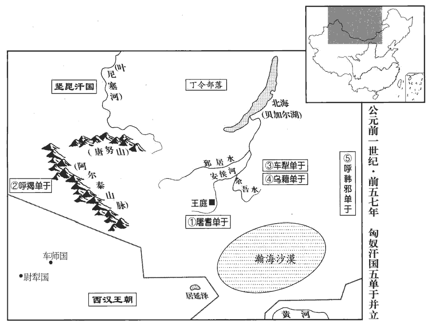
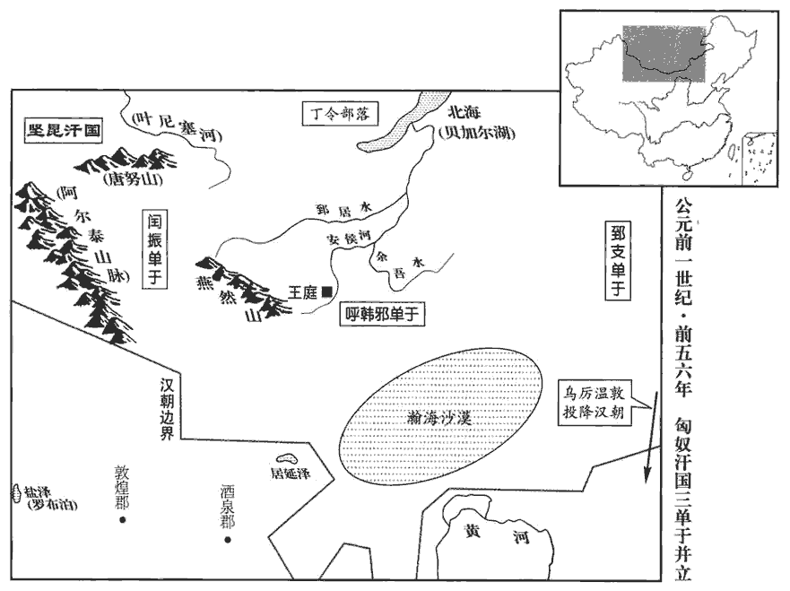
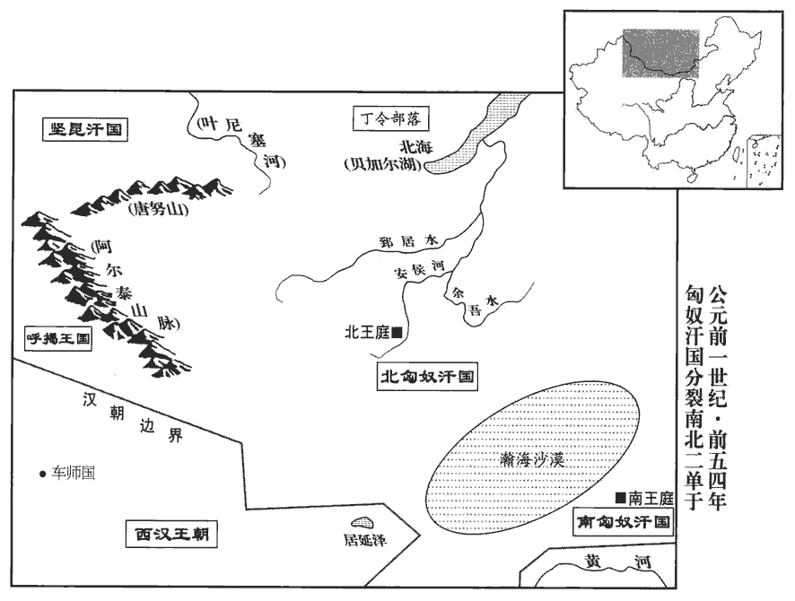
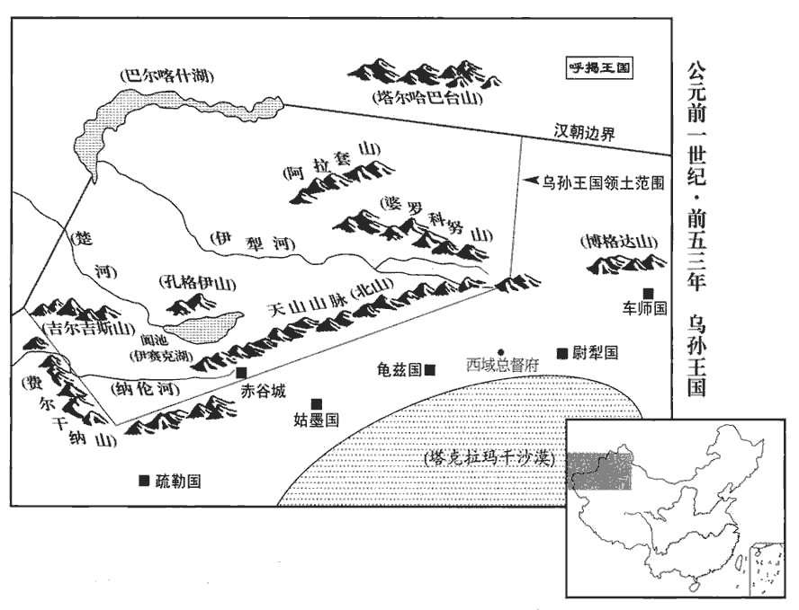
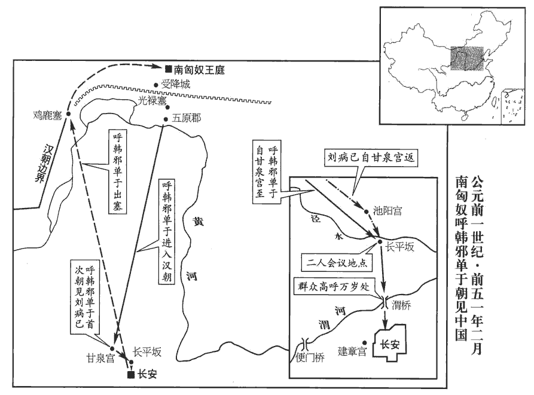
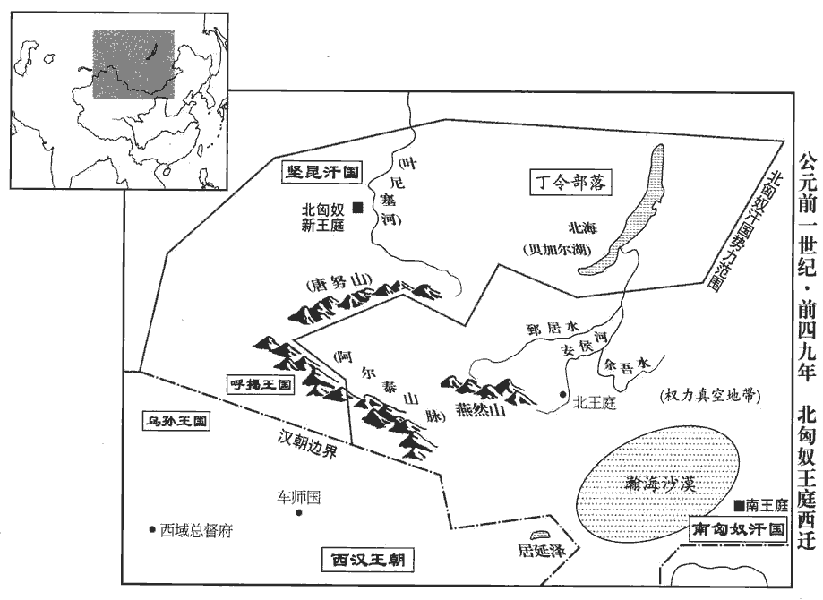

 漢紀十九起昭陽大淵獻（癸亥），盡玄黓yì涒tūn灘（壬申），凡十年。

# 中宗孝宣皇帝下

## 神爵四年（癸亥，前五八年）

1春，二月，以鳳皇、甘露降集京師‹陕西西安›，赦天下。

〖译文〗 [1]春季，二月，长安有凤凰飞集、甘露降落，因而大赦天下。

2潁川‹河南禹州›太守黃霸在郡前後八年，地節四年，潁川太守讓入為左馮翊，以霸為潁川太守。至元康三年，霸入守京兆尹；數月，還故官，至是適九年；中間入尹京，是在潁川前後八年。政事愈治；治，直吏翻；下為治、政治同。是時鳳皇、神爵數集郡國，數，所角翻。潁川尤多。夏，四月，詔曰：「潁川太守霸，宣明【章：甲十五行本「明」作「布」；乙十一行本同；孔本同。】詔令，百姓鄉化，孝子、弟弟、鄉，讀曰嚮。弟弟，上讀曰悌。貞婦、順孫日以眾多，田者讓畔，師古曰：畔，田界也。道不拾遺，養視鰥寡，贍助貧窮，獄或八年無重罪囚；其賜爵關內侯、黃金百斤、秩中二千石。」而潁川孝、弟、有行義民，行，下孟翻。三老、力田皆以差賜爵及帛。後數月，徵霸為太子太傅。

〖译文〗 [2]颍川太守黄霸在颍川郡前后八年，郡中事务治理得愈加出色。当时，凤凰、神雀多次飞集各郡国，其中以颍川郡最多。夏季，四月，汉宣帝颁布诏书说：“颍川太守黄霸，对各项诏令都明确宣示，大力推行，属下百姓向往礼义教化，孝顺父母的子女、相互友爱的兄弟、贞节的妇女、尊敬老人的孙子日益增多，田界相连的农民相互谦让，在路上遗失的东西无人贪心拾取，奉养照顾孤寡老人，帮助贫苦穷弱，有的监狱连续八年没有重罪囚犯。赐黄霸关内侯爵位，黄金一百斤和中二千石俸禄。”对颍川郡中孝顺、友爱和其他具有仁义品行的百姓，以及三老、力田等乡官，都分别赐予不等的爵位和财帛。几个月后，汉宣帝又征调黄霸担任太子太傅。

3五月，匈奴‹王庭设蒙古哈尔和林›單于遣弟呼留若王勝之來朝。師古曰：呼留若者，王之號也。勝之，其人名。考異曰：匈奴傳：「握衍朐鞮dī單于立，復修和親，遣弟伊酋若王勝之入漢獻見。」蓋即謂此也。

〖译文〗 [3]五月，匈奴单于派其弟呼留若王胜之前来朝见汉宣帝。

4冬，十月，鳳皇十一集杜陵‹陕西西安东南›。

〖译文〗 [4]冬季，十月，十一只凤凰飞集杜陵。

5河南‹河南洛陽东白马寺东›太守【章：甲十五行本「守」下有「東海」二字；乙十一行本同；孔本同；張校同。】嚴延年為治陰鷙酷烈，眾人所謂當死者一朝出之，所謂當生者詭殺之，師古曰：詭，違正理而殺也。吏民莫能測其意深淺，戰慄不敢犯禁。冬月，傳屬縣囚會論府上，傳，知戀翻，又直戀翻。師古曰：總集郡府而論殺。流血數里，河南號曰「屠伯」。鄧展曰：言延年殺人，如屠兒之殺六畜也。伯，長也。延年素輕黃霸為人，及比郡為守，師古曰：比，接近也，音頻二翻。褒賞反在己前，心內不服。河南界中又有蝗蟲，府丞義出行蝗，行，下孟翻。還，見延年。延年曰：「此蝗豈鳳皇食邪？」義年老，頗悖，師古曰：悖，心惡惑也，音布內翻。素畏延年，恐見中傷。延年本嘗與義俱為丞相史，實親厚之，饋遺之甚厚。中，竹仲翻。遺，于季翻。義愈益恐，自筮，得死卦，忽忽不樂，樂，音洛。取告至長安，師古曰：取告，取休假也。上書言延年罪名十事；已拜奏，因飲藥自殺，以明不欺。事下御史丞按驗，百官表：御史大夫有兩丞，秩千石；一曰中丞。下，遐稼翻。得其語言怨望、誹謗政治數事。十一月，延年坐不道，棄市。

〖译文〗 [5]河南太守严延年治理郡务阴狠酷烈，众人认为应处死罪的，被他突然释放；众人认为无死罪的，却被他无端处死。属吏、百姓谁都无法探知其心意如何，所以大家都战战兢兢，不敢违犯其禁令。每到冬季，严延年将所属各县的囚犯传到郡衙集中，进行审判，血流数里，所以河南郡百姓都称其为“屠夫长官”。严延年素来轻视黄霸的为人，及至在相邻的郡担任太守，见朝廷对黄霸的褒奖赏赐反倒超过自己，内心不服。河南郡中出现蝗虫，名叫义的府丞出外巡视蝗灾，回来后，去见严延年。严延年说：“这些蝗虫岂不正好是凤凰的食物吗？”义年纪已老，有些糊涂，平时对严延年就很畏惧，生怕遭到严延年的中伤陷害。本来，严延年曾与义一起当过丞相史，实际上对他很亲厚，这次又送给义非常丰厚礼品。但义却更加恐惧，自己占卦，得到“死卦”，于是闷闷不乐，请假前往长安，上书控告严延年十大罪状。呈上奏章后，便喝毒药自杀，以表明自己不欺骗朝廷。此事被交与御史丞调查核实，查出严延年有在言谈话语中对朝廷心怀怨望，诽谤朝政等几桩罪名。十一月，严延年以“大逆不道”的罪名被斩首示众。

初，延年母從東海‹山東郯城›來，欲從延年臘；風俗通引禮傳曰：夏曰嘉平，殷曰清祀，周曰大蠟，漢改曰臘。臘者，獵也，因獵取獸以祭先祖。或曰：新故交接，大祭以報功也。蔡邕獨斷曰：臘者，歲終大祭，縱吏民宴飲。高堂隆曰：王者各以其行之盛祖，以其終臘。水始于申，盛於子，終於辰，故水行之君以子祖、辰臘。火始于寅，盛於午，終於戌，故火行之君以午祖、戌臘。木始于亥，盛於卯，終於未，故木行之君以卯祖、未臘。金始于巳，盛於酉，終於丑，故金行之君以酉祖、丑臘。土始于未，盛於戌，終於辰，故土行之君以戌祖、辰臘。師古曰：建丑之月為臘祭，因會飲，若今之蠟節也。到洛陽，適見報囚，師古曰：奏報行決也。原父曰：檢尋前後，直謂斷決囚為報耳，非奏得報也。如今有司書囚罪，長吏判準斷，是所謂報也。母大驚，使【章：甲十五行本「使」作「便」；乙十一行本同；孔本同。】止都亭，凡郡縣皆有都亭，秦法，十里一亭，郡縣治所則置都亭。不肯入府。延年出至都亭謁母，母閉閤不見。延年免冠頓首閤下，良久，母乃見之，因數責延年：數，所具翻。「幸得備郡守，專治千里，守，式又翻。治，直之翻。不聞仁愛教化，有以全安愚民；顧乘刑罰，多刑殺人，師古曰：顧，反也。乘，因也。欲以立威，豈為民父母意哉！」延年服罪，重頓首謝，師古曰：重，音直用翻。因【章：甲十五行本「因」下有「自」字；乙十一行本同；孔本同。】為母御歸府舍。為，於偽翻；下同。母畢正臘，師古曰：臘及正歲禮畢也。正，音之盈翻。謂延年曰：「天道神明，人不可獨殺。師古曰：言多殺人者，己亦當死也。我不意當老見壯子被刑戮也！師古曰：言素意不謂如此也。行矣，去汝東歸，掃除墓地耳！」師古曰：言待其喪至也。遂去，歸郡，見昆弟、宗人，復為言之。後歲餘，果敗，東海‹山東郯城›莫不賢智其母。師古曰：稱其賢智也。

〖译文〗 当初，严延年的母亲从东海郡来看儿子，打算跟随严延年一起进行腊祭。到洛阳时，正遇到处决囚犯。其母大吃一惊，便留在驿站中，不肯进府。严延年来到驿站谒见母亲，其母紧闭房门，不肯见他。严延年摘 下帽子，在门外崐叩头，过了很长时间，其母才与他相见，并一再责备严延年说：“你有幸当了郡太守，独自管辖方圆一千里的地区，没听说你以仁爱教育、感化百姓，使百姓们得到安定和保全，反而利用刑罚，大量杀人，企图借此树立威严，这岂是作百姓父母官的本意？”严延年再次叩头，表示服罪，并亲自为母亲驾车回到住所。其母在腊祭完毕以后，对严延年说：“天道悠悠，神明在上，杀人者必将为人所杀。想不到我到了暮年，却将看到正当壮年的儿子遭受刑戮！我要走了，离开你东归故乡，打扫墓地去了！”于是离去。回到东海郡，见到严延年的兄弟和族人，又将上面的话说与他们。一年多以后，严延年果然被杀，东海郡人无不赞叹其母的贤明、智慧。

6匈奴握衍朐鞮單于暴虐，好殺伐，好，呼到翻。國中不附。及太子、左賢王數讒左地貴人，左地貴人，謂左谷蠡王以下至左大當戶統兵者也。數，所角翻。左地貴人皆怨。會烏桓‹内蒙西辽河上游›擊匈奴東邊姑夕王，頗得人民，單于怒。姑夕王怨，即與烏禪幕及左地貴人共立稽侯狦shān為呼韓邪單于，狦，先安翻，又所奸翻。發左地兵四五萬人，西擊握衍朐鞮單于，至姑且水北。師古曰：且，音子餘翻。未戰，握衍朐鞮單于兵敗走，使人報其弟右賢王曰：「匈奴共攻我，若肯發兵助我乎？」師古曰：若，汝也；此下亦同。右賢王曰：「若不愛人，殺昆弟、諸貴人。各自死若處，無來汙我！」師古曰：言于汝所居處自死。汙，烏故翻。握衍朐鞮單于恚，自殺。恚，於避翻。左大且渠都隆奇亡之右賢王所，都隆奇，本立握衍朐鞮單于，故亡。且，子餘翻。其民盡降呼韓邪單于。降，戶江翻。呼韓【章：甲十五行本「韓」下有「邪」字；乙十一行本同；孔本同。】單于歸庭；數月，罷兵，使各歸故地，乃收其兄呼屠吾斯在民間者，立為左谷蠡王，谷，音鹿。蠡，盧奚翻；下同。使人告右賢貴人，欲令殺右賢王。其冬，都隆奇與右賢王共立日逐王薄胥堂為屠耆單于，發兵數萬人東襲呼韓邪單于，呼韓邪單于兵敗走。屠耆單于還，以其長子都塗吾西為左谷蠡王，少子姑瞀mào樓頭為右谷蠡王，留居單于庭‹蒙古哈尔和林›。屠耆使二子守單于庭，而身西還也。師古曰：瞀，音莫構翻。

〖译文〗 [6]匈奴握衍朐单于暴虐凶残，好杀人，全国上下都离心离德。太子、左贤王又多次诬陷东部地区的贵族，这些人全都感到怨恨。正在此时，乌桓派兵袭击居于匈奴东部边疆的姑夕王，获得大批人口，单于很恼怒。姑夕王害怕单于降罪，便与乌禅幕及东部地区贵族一同拥立稽侯为呼韩邪单于，并征发东部地区军队四五万人，向西进攻握衍朐单于，直抵姑且水北岸。尚未交战，握衍朐单于的军队已先行败逃，派人通知其弟右贤王说：“匈奴人一起攻击我，你肯发兵帮助我吗？”右贤王说：“你不爱惜别人，屠杀兄弟和各位贵族，你就死在自己那里吧，不要来玷污我！”握衍朐单于感到愤恨，自杀而死。左大且渠都隆奇逃到右贤王住地，属下部众全部归降呼韩邪单于。呼韩邪单于回到王庭。数月之后，将军队遣散，命各回本地，找到在民间的兄长呼屠吾斯，立为左谷蠡王，并派人煽动右贤王属下贵族，打算命其杀死右贤王。这年冬天，都隆奇与右贤王共同拥立日逐王薄胥堂为屠耆单于，发兵数万向东进攻呼韩邪单于，呼韩邪单于军队败逃。屠耆单于返回本地，立其长子都涂吾西为左谷蠡王，小儿子姑瞀楼头为右谷蠡王，命二人留居单于王庭。

## 五鳳元年（甲子，前五七年）

1春，正月，上‹刘病已，时年三十五›幸甘泉‹陝西淳化西北›，郊泰畤。畤，音止。

〖译文〗 [1]春季，正月，汉宣帝前往甘泉，在泰祭祀天神。

2皇太子冠‹刘奭，时年十九›。冠，古玩翻。考異曰：按宣紀，太子冠在此年，而荀紀于元康三年。疑二疏去位事已云皇太子冠，至是又重複言之，蓋誤也。

〖译文〗 [2]皇太子刘举行加冠典礼。

3秋，七月，【章：甲十五行本無「七月」二字；乙十一行本同。】匈奴屠耆單于使先賢撣兄右奧鞬王與烏藉都尉各二萬騎屯東方，以備呼韓邪單于。撣，音纏，又音田。是時西方呼揭王來與唯犁當戶謀，師古曰：揭，音丘例翻。唯，音弋癸翻。共讒右賢王，言欲自立為單于。屠耆單于殺右賢王父子；後知其冤，復殺唯犁當戶，復，扶又翻。於是呼揭王恐，遂畔去，自立為呼揭單于。右奧鞬王聞之，即自立為車犁單于。奧，音鬱。鞬，居言翻。烏藉都尉亦自立為烏藉單于。凡五單于。屠耆單于自將兵東擊車犁單于，使都隆奇擊烏藉。烏藉、車犁皆敗，西北走，與呼揭單于兵合為四萬人。烏藉、呼揭皆去單于號，去，羌呂翻。共并力尊輔車犁單于。屠耆單于聞之，使左大將，都尉將四萬騎分屯東方，以備呼韓邪單于，自將四萬騎西擊車犁單于。車犁單于敗，西北走。屠耆單于即引兵西南留闟敦地。師古曰：闟，音蹋。敦，音頓，又音對。

〖译文〗 [3]秋季，七月，匈奴屠耆单于派先贤掸的哥哥右奥王与乌藉都尉各率二万骑兵屯驻于东部地区，以防备呼韩邪单于。此时，匈奴西部呼揭王前来与唯犁当户合谋，一同陷害右贤王，说他想自立为单于。屠耆单于杀死右贤王父子，后得知右贤王冤枉，便又将唯犁当户杀死，于是呼揭王心中害怕，叛逃而去，自立为呼揭单于。右奥王听说后，便自立为车犁单于。乌藉都尉也自立为乌藉单于。于是匈奴一共有了五位单于。屠耆单于亲自率兵向东进攻车犁单崐于，派都隆奇率兵进攻乌藉单于。乌藉、车犁两单于战败，向西北方向退走，与呼揭单于合兵一处，共四万人，乌藉、呼揭都去掉单于称号，共同全力辅助车犁单于。屠耆单于听说后，派左大将、都尉率领骑兵四万分别屯驻于东部，以防备呼韩邪单于，自己亲率骑兵四万向西进攻车犁单于。车犁单于兵败，向西北方向退去。屠耆单于遂即率兵转向西南，留居敦地区。

 

漢議者多曰：「匈奴為害日久，可因其壞亂，舉兵滅之。」詔問御史大夫蕭望之，對曰：「春秋，晉士匄gài帥師侵齊，聞齊侯卒，引師而還，君子大其不伐喪，師古曰：士匄，晉大夫范宣子也。公羊傳：襄十九年，齊侯環卒。晉士匄帥師侵齊，至穀，聞齊侯卒，乃還。還者何？善辭也。大其不伐喪也。卒，子恤翻。以為恩足以服孝子，誼足以動諸侯。前單于慕化鄉善，稱弟，蘇林曰：弟，順也。師古曰：鄉，讀曰嚮。弟，音悌。仲馮曰：漢與匈奴嘗約為兄弟，此弟直自為弟耳。遣使請求和親，海內欣然，夷狄莫不聞。未終奉約，不幸為賊臣所殺；今而伐之，是乘亂而幸災也，彼必奔走遠遁。不以義動，兵恐勞而無功。宜遣使者吊問，輔其微弱，救其災患；四夷聞之，咸貴中國之仁義。如遂蒙恩得復其位，必稱臣服從，此德之盛也。」上從其議。

〖译文〗 汉朝群臣议论匈奴的形势，多数人认为：“匈奴为害多年，可乘其衰败内乱的机会兴兵将其灭亡。”汉宣帝下诏向御史大夫萧望之询问，萧望之回答说：“《春秋》上记载，晋国士率兵征伐齐国，听说齐侯去世的消息，便率兵撤回。君子重视的是，不乘敌国丧乱的机会去进攻，认为恩足以使孝子心服，义足以使诸侯感动。匈奴前任单于仰慕汉朝的礼仪教化，一心向善，自称是汉的小弟弟，派使臣请求和亲，使天下人感到欣慰，四方夷狄外族无不知晓。不幸的是，尚未最后缔约，他已被奸臣所杀。如今若去征伐匈奴，是乘人之危，幸灾乐祸，他们肯定要向远方逃遁。我们兴此不义之师，恐怕会劳而无功。应派使者前去吊丧慰问，并扶助他们于衰弱之中，为之解救灾患，四方外夷听说后，都会尊敬中国的仁义。假如能使匈奴人因汉的恩德复位，必定会对我朝称臣服从，这才称得上是天子的盛德。”汉宣帝听从了萧望之的建议。

4冬，十有二月，乙酉‹一›朔，日有食之。

〖译文〗 [4]冬季，十二月乙酉朔（初一），出现日食。

5韓延壽代蕭望之為左馮翊。望之聞延壽在東郡‹河南濮陽西南›時放散官錢千余萬，使御史案之。師古曰：望之以延壽代己為馮翊，而有能名出己之上，故忌害之，欲陷以罪法。延壽聞知，即部吏案校望之在馮翊時廩lǐn犧官錢，放散百余萬。左馮翊屬官有廩犧令、丞、尉。師古曰：廩，主藏穀；犧，主養牲；皆所以供祭祀也。校，居孝翻。望之自奏：「職在總領天下，聞事不敢不問，而為延壽所拘持。」上由是不直延壽，各令窮竟所考。望之卒無事實。卒，子恤翻。而望之遣御史案東郡者，得其試騎士日【章：甲十五行本「日」下有「車服侍衛」四字；乙十一行本同；孔本同；退齋校同。】奢僭逾制；師古曰：試騎士，每歲大試也。余謂即都試也。據延壽傳：治飾兵車，畫龍、虎、朱爵。延壽衣黃紈方領，駕四馬，傅總，建幢棨qǐ，植羽葆，鼓車、歌車。功曹引車，皆駕四馬，建棨戟。五騎為伍，分左右部，軍假司馬、千人持幢旁轂gǔ。歌者先居射室，望見延壽車，噭jiào咷táo楚歌。延壽坐射室，騎吏持戟夾陛列立，騎士從者帶弓鞬羅後。令騎士、兵車四面營陳，被甲鞮鍪móu，居馬上，抱弩負籣。又使騎士戲車、弄馬、盜驂。所謂奢僭逾制者也。噭，音叫。咷，音他釣翻。又取官銅物，候月食鑄刀劍，【章：甲十五行本無「劍」字；乙十一行本同。】效尚方事；據劉向傳，上令典尚方鑄作事。師古註曰：尚方，鑄巧作金銀之所，若今之中尚署。又漢制尚方主作御刀劍。及取官錢【章：十五行本「錢」下有「帛」字；乙十一行本同；孔本同；張校同。】私假徭使吏；師古曰：假，謂顧賃也。及治飾車甲三百萬以上。治，直之翻。延壽竟坐狡猾不道，棄市。吏民數千人送至渭城‹陝西咸陽›，老小扶持車轂，爭奏酒炙。師古曰：奏，進也。炙，之夜翻，燔fán肉也。延壽不忍距逆，人人為飲，為，於偽翻。計飲酒石餘。使掾、史分謝送者：「遠苦吏民，延壽死無所恨！」百姓莫不流涕。

〖译文〗 [5]韩延寿代替萧望之担任左冯翊。萧望之听说韩延寿在东郡太守任上，曾发放官府之钱一千余万，便派御史前去调查，韩延寿听到消息，也派人调查萧望之在左冯翊任内发放属于廪牺令掌管的一百多万钱之事。萧望之上奏说：“我的职责是总领天下监察事务，听到有人检举，就不敢不闻不问，却受到韩延寿的要挟。”汉宣帝因此认为韩延寿不对，命分别调查到底。结果指控萧望之动用官钱一事并无事实根据，而萧望之派到东郡的御史却查出韩延寿在考试骑兵之日，奢侈豪华，超过规定；又动用官铜，仿照尚方铸造御用刀剑之法，等到月食时铸造刀剑；还动用官钱，私自雇用管理徭役的官吏；并加装自己车辆的防箭设施，花费在三百万钱以上。韩延寿竟因此被指控犯有“狡猾不道”之罪，斩首示众。行刑时，官吏和百姓数千人送他到渭城，人们扶老携幼，攀住韩延寿的囚车车轮不放，争相进奉酒肉。韩延寿不忍拒绝，一一饮用，共计喝酒一石有余，并让原属下官吏分别向前来送他的百姓致谢，说道：“辛苦各位远程相送，我死而无恨！”百姓无不痛哭流涕。

## 五鳳二年（乙丑，前五六年）

1春，正月，上‹刘病已，时年三十六›幸甘泉‹陝西淳化西北›，郊泰畤。考異曰：宣紀云：「三月，行幸甘泉。」荀紀作「正月」。按漢制，常以正月郊祀。蓋荀悅作紀之時，本猶未誤也。又楊惲傳曰：「行必不至河東矣。」蓋時亦幸河東祠后土，史脫之也。

〖译文〗 [1]春季，正月，汉宣帝前往甘泉，在泰祭祀天神。

2車騎將軍韓增薨。五月，將軍許延壽為大司馬、車騎大將軍。

〖译文〗 [2]车骑将军韩增去世。五月，将军许延寿被任命为大司马、车骑大将军。

3丞相丙吉年老，上重之。蕭望之意常輕吉，上由是不悅。丞相司直奏望之遇丞相禮節倨慢，時緐延壽為丞相司直。師古曰：緐fán，音婆。又使吏買賣，私所附益凡十萬三千，師古曰：使其吏為望之家有所買賣，而吏以其私錢增益之，用潤望之也。請逮捕系治。秋，八月，壬午‹二›，詔左遷望之為太子太傅；以太子太傅黃霸為御史大夫。

〖译文〗 [3]丞相丙吉年事已高，汉宣帝很尊重他。萧望之常轻视丙吉，汉宣帝对此很不高兴。丞相司直上奏弹劾萧望之，说他对丞相时傲慢无礼，又曾派属下官吏给自己家买卖东西，被派者私下贴钱共十万三千，请求将萧望之逮捕治罪。秋季，八月壬午（初二），汉宣帝下诏将萧望之降为太子太傅，任命太子太傅黄霸为御史大夫。

4匈奴呼韓邪單于遣其弟右谷蠡王等西襲屠耆單于，屯兵殺略萬餘人。谷蠡，音鹿黎。屠耆單于聞之，即自將六萬騎擊呼韓邪單于。屠耆單于兵敗，自殺。都隆奇乃與屠耆少子右谷蠡王姑瞀mào樓頭亡歸漢。車犁單于東降呼韓邪單于。降，戶江翻；下同。冬，十一月，呼韓邪單于左大將烏厲屈與父呼遫chì累烏厲溫敦皆見匈奴亂，率其眾數萬人降漢；封烏厲屈為新城侯，烏厲溫敦為義陽侯。師古曰：呼遫累，其官號也。遫，古速字。累，音力追翻。功臣侯表，新城侯食邑于汝南之細陽；義陽侯食邑于南陽之平氏。考異曰：宣紀。「匈奴呼遫累單于帥眾來降。」功臣表：「信成侯，王定以匈奴烏桓屠驀mò單于子左大將軍率眾降，侯。義陽侯，厲溫敦以匈奴謼連累單于率眾降，侯。」此即屈與敦也。未嘗為單于，或降時自稱單于；或紀、表二者誤也。是時李陵子復立烏藉都尉為單于，復，扶又翻。呼韓邪單于捕斬之；遂復都單于庭，然眾裁數萬人。屠耆單于從弟休旬王自立為閏振單于，在西邊；從，才用翻。呼韓邪單于兄左賢王呼屠吾斯亦自立為郅支骨都侯單于，在東邊。

〖译文〗 [4]匈奴呼韩邪单于派其中弟右谷蠡王等向西进攻屠耆单于的军队，斩杀、掳掠一万余人。屠耆单于闻知后，立即亲自率领骑兵六万袭击呼韩邪单于。结果屠耆单于兵败自杀。都隆奇便与屠耆单于的小儿子右谷蠡王姑瞀楼头逃到汉朝归降。车犁单于向东归降呼韩邪单于。冬季，十一月，呼韩邪单于属下左大将乌厉屈与其父呼累乌厉温敦见匈奴内乱不止，率领部众数万人归降汉朝。汉宣帝封乌厉屈为新城侯，乌厉温敦为义阳侯。此时，李陵之子又拥立乌藉都尉为单于，被呼韩邪单于捕杀。于是，呼韩邪单于重新定都单于王庭，但部众只有数万人。屠耆单于的堂弟休旬王在匈奴西部边疆自立为闰振单于；呼韩邪单于的兄长左贤王呼屠吾斯也在东部边疆自立为郅支骨都侯单于。

 

5光祿勳平通侯楊惲yùn，功臣侯表，平通侯食邑于汝南之博陽。廉潔無私；然伐其行能，伐，矜也。行，身所行也。能，才所堪也。行，下孟翻。又性刻害，好發人陰伏，好，呼到翻。由是多怨於朝廷。與太僕戴長樂相失；樂，音洛。人有上書告長樂罪，長樂疑惲教人告之，亦上書告惲罪曰：「惲上書訟韓延壽，郎中丘常謂惲曰：『聞君侯訟韓馮翊，當得活乎？』惲曰：『事何容易，易，以豉翻。脛脛者未必全也！師古曰：脛脛，直貌也。脛jìng，下頂翻。我不能自保，師古曰：言我尚不能自保，訟人何以得活。真人所謂「鼠不容穴，銜窶jù數」者也。』李奇曰：真人，正人也。如淳曰：所以不容穴，正坐銜窶數自妨，故不得入穴也。師古曰：窶數，戴盆器也。以盆盛物戴於頭者，則以窶數薦之。今賣白團餅人所用者是也。窶，音其羽翻。數，音山羽翻。又語長樂曰：語，牛倨翻。『正月以來，天陰不雨，此春秋所記，夏侯君所言。』」張晏曰：夏侯勝諫昌邑王曰：「天久陰不雨，臣下必有謀上者。」春秋無久陰不雨之異也。漢史記勝所言，故曰春秋所記，謂說春秋災異耳。師古曰：春秋有不雨事，說者因論久陰，附著之也。張晏謂漢史為春秋，失之矣。事下廷尉。下，遐稼翻。廷尉定國奏惲怨望，為訞惡言，于定國也。訞yāo，與妖同。大逆不道。上不忍加誅，有詔皆免惲、長樂為庶人。考異曰：宣紀：「十二月，楊惲坐前為光祿勳有罪，免為庶人。不悔過，怨望，大逆不道，要斬。」荀紀因而用之。惲傳：「惲與孫會宗書曰：『臣之得罪已三年矣。』又因日食之變，騶馬猥佐成上書告惲罪，下獄死。」又楊譚稱杜延年為御史大夫。按百官表，惲以神爵元年為光祿勳，五年免。戴長樂亦以其年為太僕，五年免。杜延年以五鳳三年，六月辛酉，為御史大夫。又按蕭望之傳：「使光祿勳惲策免望之」，其事在今年八月，惲猶為光祿勳。至四年四月，乃有日蝕之變。蓋惲以今年十二月免為庶人，至四年乃死。宣紀誤也。

〖译文〗 [5]光禄勋平通侯杨恽，廉洁无私，但爱夸耀自己的才干，为人尖刻，好揭人隐私，所以在朝中结怨很多。杨恽与太仆戴长乐不合，有人上书控告戴长乐之罪，戴长乐怀疑是杨恽指使，便也上书控告杨恽说：“杨恽上书为韩延寿辩护，郎中丘常对杨恽说：‘听说你为韩延寿辩解，能救他一命吗？’杨恽说：‘谈何容易！正直的人未必能保全！我也不能自保，正如人们所说：“老鼠不为洞穴所容，只因它嘴里衔的东西太大。”’又曾对我说：‘正月以来，天气久阴不下雨，这类事，《春秋》上有过记载，夏侯胜也说到过。意味着将有臣下犯上作乱。’”此事交给廷尉处理。廷尉于定国上奏参劾杨恽心怀怨望，恶言诽谤，大逆不道。汉宣帝不忍心杀人，下诏将杨恽、戴长乐全都免官贬为平民。

## 五鳳三年（丙寅，前五五年）

1春，正月，癸卯‹二十六›，博陽定侯丙吉薨。

〖译文〗 [1]春季，正月癸卯（二十六日），博阳侯丙吉去世。

班固贊曰：古之制名，必由象類，遠取諸物，近取諸身。易大傳有是言。故經謂君為元首，臣為股肱，師古曰：謂虞書益稷云：「元首明哉，股肱良哉」也。明其一體相待而成也。是故君臣相配，古今常道，自然之勢也。近觀漢相，高祖開基，蕭、曹為冠；師古曰：名位在眾人之上也。余謂此言其相業冠群后耳。冠，古玩翻。孝宣中興，丙、魏有聲。是時黜陟有序，黜，降也。陟，升也。眾職修理，公卿多稱其位，稱，尺證翻。海內興於禮讓。覽其行事，豈虛虖哉！師古曰：言君明臣賢，所以致治，非徒然。

〖译文〗 班固赞曰：古代确定一件事物的名称，必定从与此相类似的事物中得来，远的取之于其他事物，近的取之于自身。所以在儒家经典中，将君王比喻为头颅，臣子比喻为大腿和手臂，表明君臣一体相辅相成的关系。所以君臣之间的密切配合，是古今的通常之理，自然之势。近观汉朝丞相，汉高祖开创基业，萧何、曹参政绩第一；汉宣帝中兴汉朝，丙吉、魏相最有声誉。当时，各级官员的降黜、升迁都有相应的标准，各类机构健全、适当，公卿大臣大都各称其职，礼让之风在国内兴起。观察他们的所作所为，就可知道他们的政绩、名誉崐，并非偶然所致。

2二月，壬辰‹二十五›，黃霸為丞相。霸材長於治民，及為丞相，功名損於治郡。治，直之翻。時京兆尹張敞舍鶡hé雀飛集丞相府，蘇林曰：今虎賁bēn所著鶡hé也。師古曰：蘇說非也。此鶡，音芥，字本作䲸，此通用耳。䲸雀大而色青，出羌中，非武賁bēn所著也。武賁鶡hé者色黑，出上黨，以其斗死不止，故用其羽飾武臣首云，今時俗所謂鶡hé雞者也；音曷，非此䲸雀也。霸以為神雀，議欲以聞。敞奏霸曰：「竊見丞相請與中二千石、博士雜問郡、國上計長史、守丞為民興利除害，成大化，為，於偽翻。條其對。有耕者讓畔，男女異路，道不拾遺，及舉孝子，貞婦者為一輩，先上殿；師古曰：丞相所坐屋也。古者屋之高嚴，通呼為殿，不必宮中也。余據鄭玄周禮註，漢司徒府有天子以下大會殿。後漢之司徒府，則前漢之丞相府也。舉而不知其人數者，次之；不為條教者在後。叩頭謝丞相，口雖不言，而心欲其為之也。長史、守丞對時，臣敞舍有鶡hé雀飛止丞相府屋上，丞相以下見者數百人。邊吏多知鶡雀者，問之，皆陽不知。丞相圖議上奏師古曰：圖，謀也。曰：『臣問上計長史、守丞以興化條，師古曰：凡言條者，一一而疏舉之，若木條然也。皇天報下神爵。』後知從臣敞舍來，乃止。郡國吏竊笑丞相仁厚有知略，知，與智同。微信奇怪也。臣敞非敢毀丞相也，誠恐群臣莫白，恐群臣莫敢白其事也。而長史、守丞畏丞相指，歸舍法令，各為私教，師古曰：舍，廢也，讀曰捨。務相增加，澆淳散朴，師古曰：不雜為淳，以水澆之則味漓薄。樸，大質也。割之，散也。并行偽貌，有名亡實，亡，古無字通。傾搖解怠，師古曰：解，讀曰懈。甚者為妖。妖，於驕翻。假令京師先行讓畔、異路、道不拾遺，其實亡益廉貪、貞淫之行，亡，古無字通。行，下孟翻。而以偽先天下，先，悉薦翻。固未可也。即諸侯先行之，偽聲軼于京師，師古曰：軼，過也，音逸。非細事也。漢家承敝通變，造起律令，所以勸善禁奸，條貫詳備，不可復加。復，扶又翻。宜令貴臣明飭長史、守丞，師古曰：飭，讀與敕同。歸告二千石，舉三老、孝弟、力田、孝廉、廉吏，務得其人，郡事皆以法令為【章：甲十五行本無「爲」字；乙十一行本同；孔本同。】檢式，師古曰：檢，局也，音居儉翻。毋得擅為條教；敢挾詐偽以奸名譽者，必先受戮，師古曰：奸，求也，音干。以正明好惡。」好，呼到翻。惡，烏路翻。天子嘉納敞言，召上計吏，使侍中臨飭，如敞指意。霸甚慚。

〖译文〗 [2]二月壬辰（疑误），黄霸被任命为丞相。黄霸的才能主要在治理百姓，当了丞相以后，声誉比作郡守时有所下降。当时，京兆尹张敞家的雀飞集丞相府，黄霸以为是神雀，与人商议，准备奏闻汉宣帝。张敞上奏说：“我看到丞相要求与中二千石大臣及博士等一同向来京报告本年度工作情况的各郡、国长史、守丞询问为民兴利除害、推行教化的情况，让他们逐条回答。有报告当地农民谦让田地界线，男女不走一条道，路不拾遗，以及能举出当地孝顺子孙、贞节妇女人数的，列为一等，先上殿；虽然举出，却不知其人数的，列为二等；说不出这方面政绩的，列在最后，向丞相叩头谢罪。丞相虽未明言，心中却是希望他们也能举出这方面的例子。长史、守丞对答时，我家有一群雀飞到丞相府，落在屋顶上，自丞相以下，看到的有数百人。那些从边地来的官吏，大多知道是雀，但丞相问他们，却都装作不知道。丞相与人商议，准备上奏说：‘我问各郡、国来京报告工作的长史、守丞各地的情况，都说礼义教化大兴，所以上天派下神雀以回报陛下的盛德。’后来得知是从我家飞来，方才停止。各郡、国官吏都暗笑丞相虽然仁厚有智，但有些轻信奇闻怪事。我并不是敢于诋毁丞相，只是怕群臣谁都不敢说明此事，而各郡、国长史、守丞又畏惧丞相指责，回去后废弃国家法令，人人执行自己的条令，竞相增多，使原本淳朴的风气变得日益浮薄，人人行为虚伪，有名无实，动摇懈怠，严重的甚至做邪恶之事。假如京师长安率先倡导农民互相谦让田地界线，男女不同走一路，道不拾遗等等，实际上对区分廉洁贪婪、贞节淫乱的行为并无益处，反倒以虚伪的政绩列为天下第一，这当然是不对的。即使是封国先这样作，以虚假政绩欺骗朝廷，也不是小事。我大汉承接了秦朝的各种弊端，加以变通而制定法令，目的在于鼓励善行，禁止奸恶，条理详实周密，已不能再有增加。所以我认为，应派地位尊贵的大臣明确指示各郡、国长史、守丞，回去转告各地二千石官员，在保举三老、孝弟、力田、孝廉及廉洁官吏时，务必选人得当，处理郡、国事务都应以国家法令为依据，不得擅自增加、修改。如有敢于靠弄虚作假来欺世盗名者，必须先受诛杀，用以明确显示朝廷的好恶。”汉宣帝对张敞的建议极为赞赏，予以采纳，召集各地来京报告工作的官员，派侍中前往发布指示，如同张敞的建议。黄霸深感惭愧。

又，樂陵侯史高以外屬舊恩侍中，貴重，樂陵縣，屬平原郡。師古曰：樂，音來各翻。史高者，帝祖母史良娣兄恭之長子。霸薦高可太尉。天子使尚書召問霸：「太尉官罷久矣。尚書，屬少府。成帝建始四年，增置為五員。自文帝罷太尉官，至景帝以周亞夫為太尉，尋罷。至武帝，以田蚡fén為太尉；罷後，不復除授。夫宣明教化，通達幽隱，使獄無冤刑，邑無盜賊，君之職也。將相之官，朕之任焉。師古曰：言欲拜將相，自在朕也。侍中、樂陵侯高，帷幄近臣，朕之所自親，師古曰：言具知其材質。君何越職而舉之？」丞相職，總百官，進賢退不肖。霸薦史高，以為所薦非其人可也，以為越職則非也。蓋自武帝以來，丞相之失其職也久矣。尚書令受丞相對，後漢志：尚書令，承秦所置。武帝用宦者更為中書謁者令。成帝用士人，復故，掌凡選署及奏下尚書曹文書眾事。帝既使尚書召問霸，故使尚書令受其對也。尚書令、中書令，沈約以為兩官。註已見前。霸免冠謝罪，數日，乃決，師古曰：乃得免罪也。自是後不敢復有所請。復，扶又翻。然自漢興，言治民吏，以霸為首。治，直之翻。

〖译文〗 再有，乐陵侯史高依靠外戚的身分及对汉宣帝的旧时恩义，担任侍中，地位尊贵、显赫，黄霸推荐史高担任太尉。汉宣帝派尚书召见黄霸问道：“太尉一职早已撤销。你的职责是：宣明教化，让隐情上达，使国家无冤狱，城乡无盗贼。将相一类官员的任免是朕的任务。侍中、乐陵侯史高，是朕的亲近大臣崐，朕对他非常了解，你为何越权保举？”命尚书令听取黄霸的回答。黄霸摘下帽子谢罪。数日之后，汉宣帝才下令对此事不予追究。从此以后，黄霸再也不敢有所建议。然而，自汉朝建立以来。说到治理百姓的官吏，黄霸居第一位。

3三月，上幸河東‹山西夏縣›，祠后土。減天下口錢；如淳曰：漢儀注：民年七歲至十四出口賦錢，人二十三：二十錢以食天子；其三錢者，武帝加口錢以補車騎馬。赦天下【章：甲十五行本無「天下」二字；乙十一行本同；孔本同。】殊死以下。

〖译文〗 [3]三月，汉宣帝巡游河东郡，祭祀后土神。下诏减少天下人头税，赦免天下死刑以下罪犯。

4六月，辛酉‹十六›，以西河‹內蒙准格爾旗西南›太守杜延年為御史大夫。考異曰：荀紀作「辛巳」，百官表作「辛酉」。按長曆，此月丙午朔，無辛巳。

〖译文〗 [4]六月辛酉（十六日），汉宣帝任命西河太守杜延年为御史大夫。

5置西河‹內蒙准格爾旗西南›、北地‹甘肃庆阳西北马岭镇›屬國以處匈奴降者。處，昌呂翻。

〖译文〗 [5]设置西河、北地属国，以安置归降汉朝的匈奴人。

6廣陵‹江蘇揚州›厲王胥使巫李女須祝詛上，求為天子。師古曰：女須者，巫之名也。祝，職救翻。詛，莊助翻。事覺，藥殺巫及宮人二十餘人以絕口。公卿請誅胥。

〖译文〗 [6]广陵王刘胥让巫师李女须诅咒汉宣帝，求神灵保佑他自己作皇帝。此事被人发觉，刘胥用毒药将巫师李女须以及宫女二十余人毒死，企图杀人灭口。公卿大臣请求将刘胥处死。

## 五鳳四年（丁卯，前五四年）

1春，胥自殺。

〖译文〗 [1]春季，刘胥自杀。

2匈奴單于稱臣，遣弟右【章：甲十五行本無「右」字；乙十一行本同；孔本同。】谷蠡王入侍。考異曰：按匈奴傳：「呼韓邪稱臣，即遣銖婁渠堂入侍，」事在明年。時匈奴有三單于，不知此單于為誰也。余按通鑑據班紀而書此事，又參考匈奴傳以明其異。以邊塞亡寇，亡，古無字通。減戍卒什二。

〖译文〗 [2]匈奴单于向汉朝称臣，派其弟右谷蠡王到长安来充当人质。汉朝因边塞地区没有了外族入侵的战事，将屯戍兵卒减少十分之二。

3大司農中丞耿壽昌奏言：「歲數豐穰，穀賤，農人少利。時穀石五錢，所謂穀賤傷農者也。數，所角翻。少，詩沼翻。故事：歲漕關東‹函谷關以東›穀四百萬斛以給京師，用卒六萬人。宜糴dí三輔、弘農‹河南靈寶东北›、河東‹山西夏縣›、上党‹山西長子›、太原‹山西太原›郡穀，足供京師，可以省關東漕卒過半。」上從其計。壽昌又白：「令邊郡皆築倉，以穀賤增其賈而糴dí，【章：甲十五行本「糴」下有「以利農」三字；乙十一行本同；孔本同；張校同；退齋校同。】穀貴時減賈而糶tiào，賈，讀曰價。名曰常平倉。」常平倉始此。民便之。上乃下詔賜壽昌爵關內侯。

〖译文〗 [3]大司农中丞耿寿昌上奏说：“连续几年丰收，谷价低，农民获利少。按以往惯例，每年从函谷关以东地区运输粮食四百万斛以供应京师，需用运粮卒六万人。应从三辅、弘农、河东、上党、太原等郡购买粮食，以供应京师，可以节省函谷关以东运粮卒一半以上。”汉宣帝接受了耿寿昌的建议。耿寿昌又禀告说：“命令沿边各郡一律修建粮仓，在粮价低时加价买进，粮价高时减价售出，名为‘常平仓’。”百姓因此受益。汉宣帝于是下诏赐耿寿昌关内侯爵。

4夏，四月，辛丑‹一›朔，日有食之。

〖译文〗 [4]夏季，四月辛丑朔（初一），出现日食。

5楊惲既失爵位，家居治產業，以財自娛。其友人安定‹甘肅固原›太守西河‹內蒙准格爾旗西南›孫會宗與惲書，諫戒之，為言「大臣廢退，當闔門惶懼，為可憐之意；師古曰：闔，閉也。為，於偽翻。不當治產業，通賓客，有稱譽。」治，直之翻。惲，宰相子，惲，宰相楊敞之子也。有材能，少顯朝廷，少，詩照翻。一朝以晻昧語言見廢，晻，與暗同。內懷不服，報會宗書曰：「竊自思念，過已大矣，行已虧矣，行，下孟翻。常為農夫以沒世矣，是故身率妻子，戮力耕桑，不意當復用此為譏議也！復，扶又翻。夫人情所不能止者，聖人弗禁；故君、父至尊、親，送其終也，有時而既。師古曰：君至尊，父至親。張晏曰：喪不過三年；臣見放逐，降居三月復初。師古曰：既，已也。原父曰：惲但云送終三年，本不及放逐三月也。余謂惲之此言，實因廢棄而有怨望之意。臣之得罪，已三年矣，田家作苦，歲時伏臘，作苦，謂耕作勞苦也。史記：秦作伏祠，改蠟曰臘。釋名曰：伏者，金氣伏藏之日也。金畏火，故三伏皆庚日。曆忌曰：四時代謝，皆以相生。至於立秋，以金代火。金畏火，故庚日必伏。毛晃曰：夏有三伏，冬有臘，故稱歲時伏臘。烹羊，炰páo羔，師古曰：炰羔，炙肉也，即今所謂爊āo也。余按羊子曰羔，未離乳者也；其肉嫩美。炰，音步交翻。斗酒自勞，勞，音來到翻。酒後耳熱，仰天拊缶fǒu而呼烏烏，應劭曰：缶，瓦器也；秦人擊之以節歌。師古曰：缶，即今之盆類也。李斯上秦王書云：「擊甕，叩缶，彈箏，搏髀bì而歌呼烏烏快耳者，真秦聲也。」是關中舊有此曲。其詩曰：『田彼南山，蕪穢不治；種一頃豆，落而為萁qí。治田曰田，音堂練翻。詩云：無田甫田。張晏曰：山高而在陽，人君之象也。蕪穢不治，言朝廷之荒亂也。一頃，百畝；以喻百官也。言豆貞實之物，當在囷qūn倉，零落在野，喻己見放棄也。萁，曲而不直，言朝臣皆諂諛也。師古曰：萁，豆莖也，音基。治，直之翻。人生行樂耳，樂，音洛。須富貴何時！』師古曰：須，待也。誠荒淫無度，不知其不可也。」師古曰：自謂為可也。又惲兄子安平侯譚惲兄忠，襲父敞爵。安平侯忠卒，譚嗣。謂惲曰：「侯罪薄，又有功，謂惲有發霍氏謀反之功也。且復用！」復，扶又翻。惲曰：「有功何益！縣官不足為盡力。」為，於偽翻。譚曰：「縣官實然。蓋司隸、韓馮翊皆盡力吏也，俱坐事誅。」蓋司隸事見上卷神爵二年。韓馮翊事見上元年。蓋，古盍翻。會有日食之變，騶馬猥佐成上書告「惲驕奢，不悔過。如淳曰：騶馬，以給騶使乘之；佐，主猥馬吏也，有史有佐，名成也。日食之咎，此人所致。」章下廷尉，按驗，得所予會宗書，帝見而惡之。下，遐稼翻。予，讀曰與。惡，烏路翻。廷尉當惲大逆無道，要斬；師古曰：當，謂處斷其罪。要，與腰同。妻子徙酒泉郡‹甘肅酒泉›；譚坐免為庶人，諸在位與惲厚善者，未央衛尉韋玄成及孫會宗等，皆免官。

〖译文〗 [5]杨恽失掉封爵、官位后，住在家里治理产业，用财富自我娱乐。杨恽的朋友安定太守西河人孙会宗写信劝戒他说：“大臣被罢黜贬谪之后，应当闭门在家，惶恐不安，以示可怜之意。不应治理产业，交结宾客，享有声誉。”杨恽为丞相杨敞之子，很有才干，年轻时就在朝廷中崭露头角，一时受到暖昧语言的中伤，遭到罢黜，内心不服，给孙会宗回信说：“我暗自思量，自己的崐过错已太大了，行为已有亏欠，将长久做一名农夫度过一生，所以率领妻子儿女，致力于农桑之事，想不到又因此受人讥评！人情所不能克制的事，连圣人都不加禁止。所以即使是至尊无上的君王，至亲无比的父亲，为他们送终，也有一定的时限。我得罪皇上，已三年了，农家劳作辛苦，每年伏日、腊月，煮羊炖羔，用酒一斗，自我犒劳，酒后耳热，仰面朝天，敲着瓦盆，放声吟唱，诗中写道：‘南山种田，荒芜杂乱，种一顷豆，落地成秧。人生不过及时乐，等待富贵何时来！’就算是荒淫无度，我不知不可以如此。”再有，杨恽兄长的儿子安平侯杨谭对杨恽说：“你的罪并不大，又曾于国有功，将会再次被任用。”杨恽说：“有功又有什么用！不值得为皇上尽力！”杨谭说：“皇上确实如此。司隶校尉盖宽饶、左冯翊韩延寿都是尽力的官吏，都因事被诛杀。”正巧出现日食，一个名叫成的马夫头上书控告杨恽说：“杨恽骄傲奢侈，不思悔过。这次出现日食，就是因为杨恽的关系。”奏章交给廷尉，经过核查，发现了杨恽写给孙会宗的信，汉宣帝看了以后，对杨恽深恶痛绝。廷尉判处杨恽大逆不道之罪，腰斩；妻、儿放逐酒泉郡；杨谭受其牵连，也被贬为平民；几位与杨恽关系友善的在职官员，如未央卫尉韦玄成和孙会宗等，都被罢免官职。

 

臣光曰：以孝宣之明，魏相、丙吉為丞相，于定國為廷尉，而趙、蓋、韓、楊之死皆不厭眾心，厭，於贍翻，滿也。【章：甲十五行本「心」下有「惜哉」二字；乙十一行本同；孔本同；張校同；退齋校同。】其為善政之累大矣！累，力瑞翻。周官司寇之法，有議賢、議能，周官：小司寇之職，以八辟麗邦法，附刑罰，三曰議賢之辟，四曰議能之辟。鄭玄註曰：賢，謂有德行者。能，謂有道藝者。鄭眾曰：若今時廉吏有罪先請，是也。若廣漢、延壽之治民，可不謂能乎！治，直之翻。寬饒、惲之剛直，可不謂賢乎！然則雖有死罪，猶將宥之，況罪不足以死乎！揚子以韓馮翊之愬sù蕭為臣之自失。揚子：或問臣之自失，曰：韓馮翊之愬蕭，趙京兆之犯魏。夫所以使延壽犯上者，望之激之也。上不之察，而延壽獨蒙其辜，不亦甚哉！

〖译文〗 臣司马光曰：以汉宣帝的英明，加上魏相、丙吉当丞相，于定国当廷尉，而赵广汉、盖宽饶、韩延寿、杨恽的被杀都不能使众人心服，这实在是汉宣帝善政的最大污点！《周官》上关于司寇职责的规定，有“议贤”、“议能”，象赵广汉、韩延寿在治理百姓方面，能不说他们有才能吗！而盖宽饶、杨恽刚强正直，能不说他们贤明吗！既然这样，那么即使真有死罪，仍应宽恕，何况罪不至死呢！扬雄认为，韩延寿诽谤萧望之是自取其祸。但韩延寿之所以冒犯上官，则是因萧望之的逼迫。汉宣帝不察究竟，使韩延寿独受其辜，不是太过分了吗！

6匈奴閏振單于率其眾東擊郅支單于。郅支與戰，殺之，并其兵；遂進攻呼韓邪。呼韓邪兵敗走，郅支都單于庭‹蒙古哈尔和林›。郅支忘呼韓邪樹立之恩，以兄弟而尋干戈，為漢所誅，宜矣。

〖译文〗 [6]匈奴闰振单于率领军队向东进攻郅支单于。郅支单于与其交战，杀死闰振单于，兼并了闰振单于的军队，于是进攻呼韩邪单于。呼韩邪单于兵败退走，郅支单于建都单于王庭。

## 甘露元年（戊辰，前五三年）以甘露降紀元。說文：露，潤澤也。五經通義：和氣津凝為露也。蔡邕月令曰：露者，陰之液也。

1春，正月，行幸甘泉‹陝西淳化西北›，郊泰畤。

〖译文〗 [1]春季，正月，汉宣帝前往甘泉，在泰祭祀天神。

2楊惲之誅也，公卿奏京兆尹張敞，惲之党友，不宜處位。處，昌呂翻。上惜敞材，獨寢其奏，不下。師古曰：天子惜敞，故留所奏事不出。下，遐稼翻。敞使掾絮舜有所案驗，李奇曰：絮，音挐rú。師古曰：絮，姓也，音女居翻，又音人餘翻。舜，其名。舜私歸其家曰：「五日京兆耳，舜以敞被奏當免，在位不久也。安能復案事！」復，扶又翻。敞聞舜語，即部吏收舜系獄，晝夜驗治，竟致其死事。罪不至死，而以事致之，所謂文致也。治，直之翻。舜當出死，敞使主簿持教告舜曰：「五日京兆竟何如？冬月已盡，延命乎？」主簿，處郡閤下，主文簿，因以名官。師古曰：言汝不欲望延汝命乎！乃棄舜市。會立春，行冤獄使者出，行，下孟翻。舜家載尸并編敞教，師古曰：編，聯也；聯之于章前也。自言使者。使者奏敞賊殺不辜。上欲令敞得自便，師古曰：從輕法以免也。即先下敞前坐楊惲奏，免為庶人。下，遐稼翻。敞詣闕上印綬，上，時掌翻。便從闕下亡命。此即令之得自便也。師古曰：亡命，不還其本縣邑也。賢曰：命，名也。謂脫其名籍而逃亡。數月，京師吏民解弛，師古曰：弛，放也。解，讀曰懈，或如字。枹fú鼓數起，盜賊多也。枹，音膚。數，所角翻；下同。而冀州部中有大賊，天子思敞功效，使使者即家在所召敞。師古曰：就其所居處而召之。敞身被重劾，師古曰：謂前有賊殺不辜之事。劾，戶概翻；下同。及使者至，妻子家室皆泣。【章：甲十五行本「泣」下有「惶懼」二字；乙十一行本同；孔本同；張校同；退齋校同。】而敞獨笑曰：「吾身亡命為民，郡吏當就捕。今使者來，此天子欲用我也。」裝隨使者，治行裝而隨使者也。詣公車上書曰：「臣前幸得備位列卿，待罪京兆，西都之制，為三輔者列於九卿。待罪者，謙言也。謂身居其官而不稱職，則將有瘝guān曠之罪，故謂居職為待罪。西都之臣率有是言。坐殺掾絮舜。舜本臣敞素所厚吏，數蒙恩貸；師古曰：貸，音土帶翻。宥罪曰貸。以臣有章劾當免，受記考事，師古曰：記，書也；若今之州縣為符教也。便歸臥家，謂臣五日京兆。背恩忘義，背，蒲妹翻。傷薄俗化。臣竊以舜無狀，枉法以誅之。臣敞賊殺不辜，鞠獄故不直，雖伏明法，死無所恨！」天子引見敞，見，賢遍翻。拜為冀州刺史。冀州部魏郡、鉅鹿、常山、清河等郡；廣平、真定、中山、信都、河間等國。考異曰：荀紀載於五鳳二年，因楊惲事，并致此誤也。百官表：「敞以神爵元年為京兆尹，八年免。」敞傳云：「為京兆九歲免。」敞到部，盜賊屏跡。屏，必郢翻。

〖译文〗 [2]杨恽被杀之后，公卿上奏弹劾京兆尹张敞，说他是杨恽的朋党，不应再占据官位。汉宣帝爱惜张敞的才干，特将奏章压下不发。张敞派下属官员絮舜调查某事，絮舜私自回家，说道：“张敞这个京兆尹最多再干五天罢了，怎能再来查问！”张敞听说絮舜如此说他，立即派官吏将絮舜逮捕下狱，昼夜审崐讯，终于使他被定成死罪。絮舜被杀之前，张敞派主簿拿着他写的教，告诉絮舜：“我这个‘五天京兆尹’究竟怎么样？冬季已经过去，想多活几天吗？”于是将絮舜斩首示众。适逢立春，朝廷派出调查冤狱的使者，絮舜的家属抬着絮舜的尸体，将张敞写给絮舜的教联在辩冤状上，向使者控告张敞。使者上奏汉宣帝，称张敞残杀无辜。汉宣帝打算对张敞从轻发落，便先将以前弹劾张敞为杨恽朋党的奏章发下，将其免官，贬为平民。张敞到宫门前交还印绶，然后从宫门前逃走。数月之后，京师官吏百姓懈怠，多次敲响追捕盗贼的警鼓，冀州也出现巨盗。汉宣帝想起张敞为政的功效，派使臣前往张敞家征召张敞。张敞身遭严厉弹劾，当朝廷使臣到来，其妻子、家属都吓哭了，只有张敞笑着说：“我是一个逃亡的平民，应由郡中派官员来逮捕我。如今朝廷使臣到来，这是天子要起用我。”于是整治行装，随使臣前往公车府，上书汉宣帝说：“我先前有幸位列九卿，担任京兆尹，被指控杀死属员絮舜。絮舜本是我平时厚待的官吏，曾几次加恩宽恕他的过失。他认为我受人弹劾，当会免官，所以我派他去查办事情，他竟然回家睡大觉，说我只能再当五天京兆尹，实在是忘恩负义，伤风败俗。我因他态度恶劣，便借法令以泄私愤，将他诛杀。我残杀无辜，判案故意不公，即使伏法，也死而无恨！”汉宣帝召见张敞，任命他为冀州刺史。张敞到任后，盗贼敛迹不敢再出。

3皇太子‹刘奭›柔仁好儒，見上所用多文法吏，以刑繩下，常【章：甲十五行本「常」作「嘗」；乙十一行本同。】侍燕，從容言：「陛下持刑太深，宜用儒生。」好，呼到翻；下同。從，千容翻。帝作色曰：師古曰：作，動也。意怒故動色。「漢家自有制度，本以霸王道雜之；柰何純任德教，用周政乎！師古曰：姬周之政。且俗儒不達時宜，風俗通曰：儒者，區也，言其區別古今。居則翫wán聖哲之辭，動則行典籍之道，稽先王之制，立當時之事，此通儒也。若能納而不能出，能言而不能行，講誦而已，無能往來，此俗儒也。好是古非今，使人眩於名實，師古曰：眩，亂視也，音胡眄miǎn翻。不知所守，何足委任！」乃歎曰：「亂我家者太子也！」

〖译文〗 [3]皇太子刘性格温柔仁厚，喜欢儒家经术，看到汉宣帝任用的官员大多为精通法令的人，依靠刑法控制臣下，曾在陪侍汉宣帝进餐的时候，从容进言说：“陛下过于依赖刑法，应重用儒生。”汉宣帝生气地说：“我大汉自有大汉的制度，本来就是‘王道’与‘霸道’兼用，怎能像周朝那样，纯用所谓‘礼义教化’呢！况且俗儒不识时务，喜欢肯定古人古事，否定今人今事，使人分不清何为‘名’，何为‘实’，不知所守，怎能委以重任！”于是叹息道：“败坏我家基业的人将是太子！”

臣光曰：王霸無異道。昔三代之隆，禮樂、征伐自天子出，則謂之王。天子微弱不能治諸侯，諸侯有能率其與國，同討不庭以尊王室者，則謂之霸。庭，直也。不庭，不直也。一說以諸侯不朝為不庭。治，直之翻。其所以行之也，皆本仁祖義，任賢使能，賞善罰惡，禁暴誅亂；顧名位有尊卑，德澤有深淺，功業有巨細，政令有廣狹耳，非若白黑、甘苦之相反也。漢之所以不能復三代之治者，由人主之不為，非先王之道不可復行於後世也。復，扶又翻。夫儒有君子，有小人。論語：孔子謂子夏曰：汝為君子儒，毋為小人儒。謝顯道為之說曰：志於義則大，是以謂之君子；志於利則小，是以謂之小人。彼俗儒者，誠不足與為治也，治，直吏翻；下同。獨不可求真儒而用之乎！稷、契、皋陶、伯益、伊尹、周公、孔子，皆大儒也，契，息列翻。陶，音遙。使漢得而用之，功烈豈若是而止邪！孝宣謂太子懦而不立，暗於治體，必亂我家，則可矣；乃曰王道不可行，儒者不可用，豈不過哉！非【章：甲十五行本「過」下有「甚矣」二字；乙十一行本同；孔本同。甲十五行本「非」上有「殆」字；乙十一行本同；孔本同。】所以訓示子孫，垂法將來者也。

〖译文〗 臣司马光曰：“王道”与“霸道”，并无实质的不同。过去，夏、商、周三代昌盛时，无论是制礼作乐，还是发动战争，都由天子决定，则称之为“王道”。天子微弱，不能控制诸侯时，诸侯中有能率领盟国共同征讨叛逆以尊奉王室的，则称之为“霸道”。无论行“王道”还是“霸道”，都以仁义为根据，任用贤能，奖赏善美，惩罚邪恶，禁绝凶残，诛除暴乱。二者只不过于名位上有尊卑之分，德泽上有深浅之别，功业上有大小之差，政令上有广狭之异罢了，并非像黑白、甘苦那样截然相反。汉朝之所以不能恢复夏、商、周三代那样的盛世，是因为君王没有去做，并不是古代圣王之道不能再行于后世。在儒者中，有君子，也有小人。像汉宣帝所说的那种“俗儒”，当然不能同他们治理天下，但难道就不能访求“真儒”而任用吗！像后稷、契、皋陶、伯益、伊尹、周公、孔子，都是大儒，假如汉朝能得到他们而予以重用，汉朝的功业岂能只像现在这样！汉宣帝说太子懦弱不能自立，不懂得治国的方法，必然将败坏刘氏基业，这是可以的；可是说“王道”不可实行，儒者不可任用，岂不是太过分了！不能以此来训示子孙，留给后人效法。

4淮陽‹河南淮陽›憲王好法律，淮陽王欽，上次子也。好，呼到翻。聰達有材；王母張倢伃尤幸。倢伃，音接予。上由是疏太子而愛淮陽憲王，數嗟歎憲王曰：「真我子也！」常有意欲立憲王，然用太子起于微細，上少依倚許氏，疏，讀曰疎。數，所角翻。少，詩照翻。依倚許氏事見二十四卷昭帝元平元年。及即位而許后‹许平君›以殺死，事見二十四卷本始三年。故弗忍也。久之，上拜韋玄成為淮陽中尉，以玄成嘗讓爵于兄，事見二十五卷元康四年。欲以感諭憲王；由是太子遂安。

〖译文〗 [4]淮阳王刘钦喜欢研究法律，聪明通达，很有才干。其母张特别受汉宣帝宠爱。因此，汉宣帝疏远太子刘，疼爱淮阳王刘钦，曾几次赞叹刘钦说：“真是我的儿子！”曾有意要立刘钦为太子，但因刘生于自己微贱之时，那时自己曾靠刘的母亲许氏娘家照顾，而即位后，许皇后又被人害死，所以不忍心。过了很长一段时间，汉宣帝任命韦玄成为淮阳中尉，因韦玄成曾让爵位给其兄长，汉宣帝想以此感动、教育刘钦。于是太子的地位才稳固了。

5匈奴呼韓邪單于之敗也，左伊秩訾zī王為呼韓邪計，師古曰：訾，音子移翻。勸令稱臣入朝事漢，從漢求助，如此，匈奴乃定。呼韓邪問諸大臣，皆曰：「不可。匈奴之俗，本上氣力而下服役，師古曰：以服役於人為下。以馬上戰鬭為國，故有威名於百蠻。戰死，壯士所有也。師古曰：言人皆有此事耳。余謂壯士健鬭則戰死，乃本分必有之事。今兄弟爭國，不在兄則在弟，郅支，兄也。呼韓邪，弟也。雖死猶有威名，子孫常長諸國。師古曰：為諸國之長帥也。長，知兩翻；下同。漢雖強，猶不能兼併匈奴；柰何亂先古之制，臣事於漢，卑辱先單于，師古曰：言忝辱之，更令卑下也。余謂此言先單于與漢爭為長雄，而今單于臣事之，是卑辱先單于於地下也。為諸國所笑！雖如是而安，何以復長百蠻！」復，扶又翻。左伊秩訾曰：「不然，強弱有時。今漢方盛，烏孫城郭諸國皆為臣妾。自且鞮dī侯單于以來，匈奴日削，不能取復，且鞮侯單于，呼韓邪之曾祖也。復，報也。且，子餘翻。雖屈強於此，師古曰：屈，音其勿翻。未嘗一日安也。今事漢則安存，不事則危亡，計何以過此！」諸大人相難久之。難，乃旦翻。呼韓邪從其計，從左伊秩訾王之計也。引眾南近塞，近，其靳翻。遣子右賢王銖婁渠堂入侍。師古曰：銖，音殊。婁，音力於翻。郅支單于亦遣子右大將駒于利受入侍。

〖译文〗 [5]匈奴呼韩邪单于被郅支单于打败之后，左伊秩訾王为呼韩邪单于出谋划策，劝他称臣归附汉朝，请求汉朝帮助，这样做了，才能平定匈奴内乱。呼韩邪单于征求各位大臣的意见，都说：“不行。我们匈奴的风俗，历来崇尚力量，耻于在下面服侍别人，靠马上征战建立国家，所以威名才传遍蛮夷各国。战死沙场，是壮士的本分。如今我们内部兄弟争国，不是哥哥得到，就是弟弟得到，即使战死，仍有威名，子孙永远统辖蛮夷各国。汉朝虽然强大，仍不能吞并匈奴，我们为何败坏先祖的制度，向汉朝称臣，使历代先王蒙受羞辱，被各国耻笑！即使能因此而得到安定，又怎能再统辖蛮夷各国！”左伊秩訾王说道：“不对，强弱之势，随时间的推移而改变。如今汉朝正当兴盛，乌孙等城邦国家都已向汉朝称臣。我国自且侯单于以来，势力日益削减，不能恢复，尽管倔强至今，却未曾有一天安宁。而今，称臣于汉，则得以安全生存；如果不肯屈服，必陷于危亡境地。还有什么计策比这更好呢？”各位大臣不断对左伊秩訾王提出诘难，最后，呼韩邪单于终于接受了左伊秩訾王的建议，率众南下，向汉朝边塞靠近，派其子右贤王铢娄渠堂到长安做人质。郅支单于也派其子右大将驹于利受到长安做人质。

6二月，丁巳‹二十一›，樂成敬侯許延壽薨。恩澤侯表，樂成侯食邑于南陽之平氏。

〖译文〗 [6]二月丁巳（二十一日），乐成侯许延寿去世。

7夏，四月，黃龍見新豐‹陝西臨潼東北›。見，賢遍翻。

〖译文〗 [7]夏季，四月，在新丰发现黄龙。

8丙申‹一›，太上皇廟火；甲辰‹九›，孝文廟火；上素服五日。

〖译文〗 [8]丙申（初一），太上皇祭庙失火；甲辰（初九），汉文帝祭庙失火。汉宣帝素服五日。

 

9烏孫狂王復尚楚主解憂，復，扶又翻。生一男鴟chī靡，不與主和；又暴惡失眾。漢使衛司馬魏和意、副侯任昌至烏孫。侯，衛侯也；為和意之副。任，音壬。公主言：「狂王為烏孫所患苦，易誅也。」易，以豉翻。遂謀置酒，使士拔劍擊之。劍旁下，師古曰：不正下也。狂王傷，上馬馳去。其子細沈瘦會兵圍和意、昌及公主于赤谷城‹中亚伊塞克湖东南›；師古曰：瘦，音搜。赤谷城，烏孫國都，去長安八千九百里。數月，都護鄭吉發諸國兵救之，乃解去。漢遣中郎將張遵持醫藥治狂王，賜金帛；治，直之翻。因收和意、昌系瑣，系瑣，即今云鎖索也。從尉犁‹新疆博湖›檻車至長安，斬之。

〖译文〗 [9]乌孙狂王泥靡又娶楚公主刘解忧为妻，生下一子，取名鸱靡。狂王与公主关系不和睦，又暴戾凶恶，不得众人之心。汉朝派卫司马魏和意为使臣，卫侯任昌为副使来到乌孙。公主说：“狂王给乌孙带来灾患困苦，杀他很容易。”于是定计，设置酒宴，派武士拔剑刺杀狂王。但剑锋刺偏，狂王受伤，上马奔驰而去。狂王之子细沈瘦率兵将魏和意、任昌以及公主等包围在赤谷城中。数月之后，都护郑吉征调西域各国军队前来救援，围城之兵方才离去。汉朝派中郎将张遵携带医药来给狂王医治，并赏赐黄金丝帛；将魏和意、任昌锁拿，从尉犁用囚车押解到长安，处斩。

初，肥王翁歸靡胡婦子烏就屠，狂王傷時，驚，與諸翖xī侯俱去，居北山中，其山在烏孫之北也。翖，與翕同，音許及翻。揚言母家匈奴兵來，故眾歸之；後遂襲殺狂王，自立為昆彌。是歲，漢遣破羌將軍辛武賢將兵萬五千人至敦煌‹甘肅敦煌›，通渠積穀，欲以討之。時立表穿渠于卑鞮侯井以西。孟康曰：大井六，通渠也。下流湧出在白龍堆‹罗布泊东›東土山下。敦，徒門翻。

〖译文〗 当初，乌孙肥王翁归靡与匈奴妻子生的儿子乌就屠，在狂王受伤时惊恐不崐安，与乌孙诸翎侯一齐逃走，藏在北方的山中，扬言其母亲娘家匈奴派兵前来，所以乌孙百姓纷纷归附于他。后乌就屠袭杀狂王，自立为王。这一年，汉朝派破羌将军辛武贤率兵一万五千来到敦煌，疏通河道，积聚粮食，准备征讨乌就屠。

初，楚主侍者馮嫽liáo，師古曰：嫽，音了。嫽者，慧也，故以為名。能史書，史，吏也。史書，猶言吏書也。習事，內習漢事，外習西域諸國事也。嘗持漢節為公主使，使，疏吏翻。城郭諸國敬信之，號曰馮夫人，為烏孫右大將妻。烏孫國官，相大祿之下有左、右大將二人，蓋貴人也。右大將與烏就屠相愛，都護鄭吉使馮夫人說烏就屠，說，輸芮翻。以漢兵方出，必見滅，不如降。烏就屠恐，曰：「願得小號以自處！」處，昌呂翻。帝徵馮夫人，自問狀；即此事與數詔問趙充國事參而觀之，通鑑所紀一千三百餘年間，明審之君，一人而已。遣謁者竺次、期門甘延壽為副，送馮夫人。馮夫人錦車持節，應劭曰：錦車，以錦衣車也。詔烏就屠詣長羅侯赤谷城，立元貴靡為大昆彌，元貴靡，肥王翁歸靡嫡長男，楚主解憂所生也。事始上卷神爵二年。烏就屠為小昆彌，皆賜印綬。破羌將軍不出塞，還。後烏就屠不盡歸翖xī侯人【章：甲十五行本「歸」下有「諸」字；「人」作「民」；乙十一行本同；孔本同。】眾，漢復遣長羅侯將三校屯赤谷，因為分別【章：甲十五行本「別」下有「其」字；乙十一行本同；孔本同。】人民地界，復，扶又翻。校，戶教翻。別，彼列翻。大昆彌戶六萬餘，小昆彌戶四萬餘；然眾心皆附小昆彌。為漢以兩昆彌憂勞張本。

〖译文〗 当初，刘解忧的侍女冯能够撰写文书，了解汉朝与西域各国事务，所以曾携带汉朝符节为公主出使，各城邦国对她尊敬信任，称其为冯夫人。她是乌孙右大将的妻子。右大将与乌就屠是亲密朋友，所以都护郑吉派冯劝说乌就屠：汉朝军队即将出击，乌孙必将被汉军所灭，不如归降。乌就屠感到恐慌，说道：“希望汉朝封我一个小王名号，使我得以安身。”汉宣帝征召冯来京师，亲自询问乌孙情况，然后派冯乘坐锦车，携带皇帝符节作为正使，以谒者竺次、期门甘延寿为副使，护送冯来到乌孙，传达汉宣帝诏令，命乌就屠到赤谷城去见长罗侯常惠，立元贵靡为大昆弥，乌就屠为小昆弥，都赐予印信、绶带。破羌将军辛武贤未曾出塞，即率兵撤回。后乌就屠不肯将翎侯的部众全部归还，于是汉朝又派长罗侯常惠率领三位军校所属部队屯兵赤谷城，为乌孙划分人口和地界，大昆弥统辖六万余户，小昆弥统辖四万余户。然而，乌孙民众全都心向小昆弥。

## 甘露二年（己巳，前五二年）

1春，正月，立皇子囂為定陶‹山东定陶›王。考異曰：諸侯王表，「十月乙亥立，」今據宣紀。

〖译文〗 [1]春季，正月，汉宣帝立皇子刘嚣为定陶王。

2詔赦天下，減民算三十。師古曰：一算減錢三十也。漢律，人出一算，算百二十錢。

〖译文〗 [2]汉宣帝颁布诏书，大赦天下，减少百姓的人头税三十钱。

3珠厓郡‹海南島瓊山›反。夏，四月，遣護軍都尉張祿將兵擊之。百官表：護軍都尉，秦官；武帝元狩四年屬大司馬。

〖译文〗 [3]珠崖郡造反。夏季，四月，汉宣帝派护军都尉张禄率兵镇压。

4杜延年以老病免。五月，己丑‹一›，廷尉于定國為御史大夫。

〖译文〗 [4]杜延年因年老多病，被免除职务。五月己丑（初一），廷尉于定国被任命为御史大夫。

5秋，七【章：甲十五行本「七」作「九」；乙十一行本同；孔本同；退齋校同。】月，立皇子宇為東平王‹府无盐，山东东平东南›。

〖译文〗 [5]秋季，七月，汉宣帝立皇子刘宇为东平王 。

6冬，十二月，上行幸萯陽宮、屬玉觀。應劭曰：萯陽宮在鄠hù‹陝西戶縣›，秦文王所起。伏儼曰：在扶風。李斐曰：萯，音倍。師古曰：應說、李音是也。服虔曰：屬玉觀，以玉飾，因名焉，在扶風。李奇曰：屬玉，音鸑yuè鷟zhuó。其上有此鳥，因以為名。晉灼曰：屬玉，水鳥，似鵁jiāo鶄jīng，以名觀也。師古曰：晉說是也。屬，音之欲翻。觀，工玩翻。

〖译文〗 [6]冬季，十二月，汉宣帝巡游阳宫、属玉观。

7是歲，營平壯武侯趙充國薨。恩澤侯表：營平侯，食邑於濟南。夫以趙充國之賢之功，而班史列之恩澤侯者，以其初封以定策功也。如衛青、霍去病本以破匈奴功封，而班史亦列于恩澤侯，以其由衛思后戚屬得進也。班史書法，猶有古史官典刑，後之為史者不復知此矣。先是，充國以老乞骸骨，賜安車、駟馬、黃金，罷就弟。先，悉薦翻。弟，與第同。朝廷每有四夷大議，常與參兵謀、師古曰：與讀曰豫。問籌策焉。

〖译文〗 [7]这一年，营平侯赵充国去世。先前，赵充国因年老请求退休。汉宣帝赐给他安车、四匹马和黄金，解除他的职务，让他回家休养。每当朝廷有关于四方外夷的大事商议，赵充国仍参与议定战略，为朝廷顾问、筹划。

8匈奴呼韓邪單于款五原塞‹內蒙包頭›，師古曰：款，叩也。按班志，漢五原郡即秦九原郡，治稒gū陽；別有五原縣。宋白曰：漢五原故城，在今勝州榆林縣界。願奉國珍，朝三年正月。師古曰：欲于甘露三年正月行朝禮。朝，直遙翻。詔有司議其儀。丞相、御史曰：「聖王之制，先京師而後諸夏，先諸夏而後夷狄。匈奴單于朝賀，其禮儀宜如諸侯王，位次在下。」此議猶依傍成周盛時朝諸侯之制。先、後，皆去聲。太子太傅蕭望之以為：「單于非正朔所加，言班曆所不及也。故稱敵國，宜待以不臣之禮，位在諸侯王上。外夷稽首稱藩，中國讓而不臣，此則羈縻之誼，謙亨之福也。望之此議，取春秋傳王者不治夷狄之意。馬絡曰羈，牛靷yǐn曰縻。言其在荒服，待之若馬牛然，取羈縻不絕而已。師古曰：易謙卦之辭曰：謙，亨，天道下濟而光明，地道卑而上行。言謙之為德，無所不通也。亨，火庚翻。書曰：『戎狄荒服』，師古曰：逸書也。余謂此語，或者伏生之書有之，今國語猶載此言。言其來服荒忽亡常。亡，古無字通。如使匈奴後嗣卒有鳥竄鼠伏，闕於朝享，朝，朝見也。享，供時享也。享，獻也。古者諸侯見於天子，必以所貢助祭於廟。孝經所謂「四海之內，各以其職來祭」者也。卒，讀曰猝；師古子恤翻。不為畔臣，師古曰：卒，終也。謂本以客禮待之；若後不來，非叛臣。萬世之長策也。」天子采之，下詔曰：「匈奴單于稱北蕃，朝正朔。謂朝明年正月朔也。朕之不德，不能弘覆。覆，敷救翻。其以客禮待之，令單于位在諸侯王上，贊謁稱臣而不名。」

〖译文〗 [8]匈奴呼韩邪单于抵达五原边塞，表示愿奉献本国珍宝，于甘露三年正月来长安朝见汉宣帝。汉宣帝下诏命主管官员商议朝见仪式。丞相、御史大夫都说：“依古代圣王的制度，先京师而后诸侯，先诸侯而后夷狄。匈奴单于前崐来朝贺，其礼仪应与诸侯王相同，位次排在诸侯王之后。”太子太傅萧望之认为：“单于不奉汉朝正朔，本不是我国的臣属，所以称为匹敌之国，应不用臣属的礼仪对待他，使其位次在诸侯王之上。外夷向我国低头，自愿居于藩属地位；我国谦让，不以臣属之礼对待他，为的是笼络于他，显示我国的谦虚大度。《尚书》有言：‘戎狄外族很难驯服’，说明外夷的归附反复无常。如果将来匈奴的后代子孙突然像飞鸟远窜、老鼠潜伏一般不再前来朝见进贡，也不算我国的背叛之臣，这才是万代的长远策略。”汉宣帝采纳了萧望之的意见，下诏说：“匈奴单于自称我国北方藩属，将于明年正月初一前来朝见。朕的恩德不够，不能受此隆重大礼。应以国宾之礼相待，使单于的位次在诸侯王之上，拜谒时只称臣，不具名。”

荀悅論曰：春秋之義，王者無外，欲一於天下也。春秋之義，王者無外，故天王有入無出，大夫出不言奔，欲一乎天下也。戎狄道里遼遠，人跡介絕，故正朔不及，禮教不加，非尊之也，其勢然也。詩云：「自彼氐、羌，莫敢不來王。」商頌殷武之詩也。故要、荒之君必奉王貢；若不供職，則有辭讓號令加焉，國語：祭公謀父曰：「蠻夷要服，戎狄荒服。要服者貢，荒服者王。有不貢則修名，有不王則修德。於是讓不貢，告不王。於是有威讓之令，有文告之辭。」要，一遙翻。非敵國之謂也。望之欲待以不臣之禮，加之王公之上，僭度失序，以亂天常，非禮也！若以權時之宜，則異論矣。

〖译文〗 荀悦论曰：按照《春秋》大义，君王不分内外，以表示要天下一统。戎狄外族因相距遥远，人事隔绝，所以中国的“正朔”传不过去，中国的礼义教化不加之于他们身上，并非是尊重他们，而是形势所致，不得不然。《诗经》上说：“氐族、羌族全在内，谁敢不来朝天子。”所以距离极远的外族君主，也必向天子朝贡。如不前来朝贡，则向其发出斥责和号令，不应称之为匹敌之国。萧望之打算不以臣属之礼相待，使其位居王公之上，是僭越制度，丧失秩序，扰乱天理纲常，违背了礼！但如果是一时的权宜之计，则又当别论。

9詔遣車騎都尉韓昌迎單于，發所過七郡二千騎為陳道上。按漢書「郡」下又有「郡」字。師古註曰：所過之郡，每為發兵陳列於道，以為寵衛也。七郡，謂過五原、朔方，西河、上郡、北地、馮翊而後至長安也。為，於偽翻。

〖译文〗 [9]汉宣帝下诏派车骑都尉韩昌前去迎接单于，征调沿途七郡二千名骑兵陈列于道旁。

## 甘露三年（庚午，前五一年）

1春，正月，上‹刘病已，时年四十一›行幸甘泉‹陝西淳化西北›，郊泰畤。

〖译文〗 [1]春季，正月，汉宣帝前往甘泉，在泰祭祀天神。

2匈奴呼韓邪單于來朝，贊謁稱藩臣而不名；賜以冠帶、衣裳，黃金璽、盭lì綬，白虎通：衣者，隱也；裳者，障也；所以隱形自障蔽也。璽，斯氏翻。綬，音受。師古曰：盭，古戾字。戾，草名也。以戾染綬，亦諸侯王之制也。玉具劍、佩刀，弓一張，矢四發，孟康曰：玉具劍，摽biào首、鐔xín、衛盡用玉為之也。師古曰：鐔xín，劍口旁橫出者也。衛，劍鼻也。鐔，音淫。「衛」字本作「璏zhì」，其音同耳。服虔曰：發，十二矢也。韋昭曰：射禮，三而止，每射四矢，故以十二為一發也。師古曰：發，猶今言箭一放、兩放也。今則以一矢為一放也。棨qǐ戟十，師古曰：棨，有衣之戟也。棨，音啟。安車一乘，鞍勒一具，師古曰：勒，馬轡也。馬十五匹，黃金二十斤，錢二十萬，衣被七十七襲，師古曰：一稱為一襲，猶今人之言一副衣服也。錦繡、綺縠hú、雜帛八千匹，絮六千斤。禮畢，使使者道單于先行宿長平。師古曰：道，讀曰導，導引也。如淳曰：長平，阪名也，在池陽南。上原之阪有長平觀，去長安五十里。師古曰：涇水之南原，即今所謂睚yá城阪也。上自甘泉宿池陽宮‹陝西涇陽西北›。池陽縣屬左馮翊，有離宮在焉。賢曰：池陽縣故城，在今涇陽縣西北。上登長平阪，詔單于毋謁，師古曰：不令拜也。其左、右當戶【章：甲十五行本「戶」下有「羣臣」二字；乙十一行本同；孔本同。】皆得列觀，及諸蠻夷君長、王、侯數萬，咸迎於渭橋下，夾道陳。陳，如字，陳列也，又塗也。上登渭橋，咸稱萬歲。單于就邸長安。置酒建章宮，饗賜單于，觀以珍寶。師古曰：觀，示也。觀，古玩翻。二月，遣單于歸國。單于自請「願留居幕南光祿塞下‹内蒙包头境›；師古曰：徐自為所築者也。余按武帝遣光祿徐自為出五原塞，築亭障列城，後人因謂之光祿塞。有急，保漢受降城。」‹内蒙乌拉特中旗东五十公里新忽热›恐郅支來攻，故請有急入城自保。漢遣長樂衛尉、高昌侯董忠、功臣表，高昌侯食邑於千乘。樂，音洛。車騎都尉韓昌將騎萬六千，又發邊郡士馬以千數，送單于出朔方雞鹿塞‹內蒙磴口西北七十公里›。師古曰：雞鹿塞，在朔方寙yǔ渾縣之西北。詔忠等留衛單于，助誅不服，又轉邊穀米糒bèi，師古曰：糒，乾飯也，音備。前後三萬四千斛，給贍其食。先是，自烏孫‹中亚伊塞克湖东南›以西至安息‹伊朗›諸國近匈奴者，皆畏匈奴而輕漢；先，悉薦翻。近，其靳翻。及呼韓邪【章：甲十五行本「邪」下有「單于」二字；乙十一行本同；孔本同。】朝漢後，咸尊漢矣。

〖译文〗 [2]匈奴呼韩邪单于前来朝见，拜见汉宣帝时，自称藩臣而不称名字。汉宣帝赐给他冠带、官衣服，黄金印玺、绿色绶带，玉石装饰的宝剑、佩刀、一张弓、四十八支箭，十支有戟套的长戟，安车一辆，马鞍马辔一套，马十五匹，黄金二十斤，钱二十万，衣衫被褥七十一套，锦锈、绸缎、各种细绢八千匹，丝绵六千斤。朝会典礼结束后，汉宣帝派使臣带领单于先至长平阪住宿，自己也从甘泉前往池阳宫住宿。汉宣帝登上长平阪，下诏命单于不必参拜，允许单于左右的大臣列队观瞻，蛮夷各国的国君，各诸侯王、列侯等数万人，全部来到渭桥下夹道迎接。汉宣帝登上渭桥，众人齐呼万岁。过后单于到长安居住。汉宣帝在建章宫设酒宴款待单于，请他观赏珍宝。二月，送单于回国。单于自己请求：“希望留居于大沙漠之南的光禄塞下，遇有紧急情况，退入汉受降城自保。”汉宣帝派长乐卫尉高昌侯董忠、车骑都尉韩昌率领骑兵一万六千，又征发边疆各郡数以千计的士兵、马匹，送单于出朔方郡鸡鹿塞。下诏命董忠等留下保卫单于，帮助单于征讨不服其统治的匈奴人，又转运边疆的谷米干粮，前后共三万四千斛，供给匈奴人食用。以前，自乌孙以西直到安息，与匈奴接近的西域各国，全都畏惧匈奴，轻视汉朝；自呼韩邪单于至汉朝朝见后，则崐全部遵从汉朝号令了。

 

上以戎狄賓服，思股肱之美，乃圖畫其人于麒麟閣，麒麟閣，在未央宮中。張晏曰：武帝獲麒麟時作此閣，圖畫其像於閣，遂以為名。師古曰：漢宮閣疏云：蕭何造。畫，古畵字通。法其容貌，署其官爵、姓名；師古曰：署，表也，題也。唯霍光不名，曰「大司馬、大將軍、博陸侯，姓霍氏，」其次張安世，韓增、趙充國、魏相、丙吉、杜延年、劉德、梁丘賀、蕭望之、蘇武，凡十一人，圖畫功臣自此始。觀麟閣股肱之次，魏、丙列于霍、張、韓、趙之下，則知漢之丞相在中朝諸將軍之後矣。梁丘，姓也。左傳，齊有梁丘據。皆有功德，知名當世，是以表而揚之，明著中興輔佐，列于方叔、召虎、仲山甫焉。師古曰：三人皆周宣王之臣，有文、武之功，佐宣王中興者也。言宣帝亦重興漢室，而霍光等并為名臣，皆比于方叔之屬。召，讀曰邵。

〖译文〗 汉宣帝因四方戎狄臣服，想到辅佐大臣的功劳，便命人在麒麟阁上，为他们绘制画像，描绘容貌，注明官爵、姓名，只有霍光不注名字，只写“大司马、大将军、博陆侯，姓霍氏”，其次为张安世、韩增、赵充国、魏相、丙吉、杜延年、刘德、梁丘贺、萧望之、苏武，共十一人，他们都为国立过大功，闻名于当世，所以表彰他们，表明他们对中兴汉朝的辅佐之功可以媲美于古代的方叔、召虎、仲山甫。

3鳳皇集新蔡‹河南新蔡›。新蔡縣，屬汝南郡；春秋蔡平侯自蔡徙此，因名。

〖译文〗 [3]凤凰飞集新蔡县。

4三月，己巳‹六›，建成安侯黃霸薨。恩澤侯表，建成侯食邑於沛。五月，甲午‹十二›，于定國為丞相，封西平侯。恩澤侯表，西平侯食邑於臨淮。太僕沛郡‹安徽淮北›陳萬年為御史大夫。

〖译文〗 [4]三月己巳（疑误），建成侯黄霸去世。五月甲午（十二日），于定国被任命为丞相，封西平侯。太仆沛郡人陈万年任御史大夫。

5詔諸儒講五經同異，蕭望之等平奏其議，上親稱制臨決焉。乃立梁丘易、大•小夏侯尚書、穀梁春秋博士。梁丘，賀；大夏侯，勝；小夏侯，建；穀梁，赤。

〖译文〗 [5]汉宣帝下诏命儒家学者们讲述他们对五经的解释的相同和不同之处，由萧望之等公平上奏，再由汉宣帝亲自出席作出裁决。结果，决定以梁丘贺注解的《易经》、夏侯胜、夏侯建注解的《尚书》、梁赤注解的《春秋》作为标准本，分别设置博士。

6烏孫大昆彌元貴靡及鴟chī靡皆病死。公主‹刘解忧›上書言：「年老土思，土思者，懷故鄉也。願得歸骸骨，葬漢地！」天子閔而迎之。冬，至京師，待之一如公主之制。楚主本以宗室女嫁烏孫，今待之如公主之制，儀比皇女。後二歲卒。

〖译文〗 [6]乌孙大昆弥元贵靡及鸱靡全都病死，公主刘解忧上书汉宣帝说：“我年纪已老，思念故乡，希望能让我返回家乡，葬在汉朝的土地上！”汉宣帝很觉可怜，派人将她接回汉朝。冬季，刘解忧回到长安，接待她的礼仪与真正的公主一般无二。两年后死去。

元貴靡子星靡代為大昆彌，弱。師古曰：言其尚幼小。馮夫人上書：「願使烏孫，鎮撫星靡。」漢遣之。使，疏吏翻。都護【章：甲十五行本「護」下有「韓宣」二字，乙十一行本同；孔本同；張校同；退齋校同。】奏烏孫大吏大祿、大監皆可賜以金印紫綬，以尊輔大昆彌。初，烏孫王昆莫中子大祿強善，將總萬餘騎，後遂以為官名。又其國官有大監二人。漢列侯金印紫綬，今特賜之。漢許之。其後段會宗為都護，乃招還亡叛，安定之。星靡死，子雌栗靡代立。

〖译文〗 元贵靡的儿子星靡继位为乌孙大昆弥，但年纪尚小。冯上书汉宣帝说：“我愿出使乌孙，镇抚星靡。”汉宣帝批准所请，派她出使乌孙。都护韩宣奏称，乌孙的大禄、大监等大臣都可赐予黄金印信、紫色绶带，让他们尊重、辅佐大昆弥。汉宣帝批准所请。后来段会宗担任都护，帮助乌孙招回流亡叛逃在外的乌孙人，使乌孙安定下来。星靡死去，其子雌栗靡接替他成为乌孙大昆弥。

7皇太子所幸司馬良娣，病，且死，謂太子曰：「妾死非天命，乃諸娣妾、良人更祝詛殺我。」漢嬪御之秩，良人視八百石，爵比左庶長。師古曰：更，音工衡翻。祝，職救翻。詛，莊助翻。太子以為然。及死，太子悲恚發病，恚，於避翻。忽忽不樂。樂，音洛。帝乃令皇后擇後宮家人子可以娛侍太子者，得元城‹河北大名东北›王政君‹时年二十一›，元城縣，屬魏郡。應劭曰：魏武侯公子元食邑於此，因而遂氏焉。送太子宮。政君，故繡衣御史賀之孫女也，王賀事見二十一卷武帝天漢二年。見於丙殿；殿，蓋以甲、乙、丙、丁為次，因名。見，賢遍翻。壹幸，有身。是歲，生成帝於甲館畫堂，應劭曰：甲觀，在太子宮甲地，主用乳生也。畫堂，畫九子母。如淳曰：畫堂，堂名。甲觀，觀名。三輔黃圖云：太子宮有甲觀。師古曰：甲者，甲、乙、丙、丁之次也。元后傳：見於丙殿，此其例也。而應氏以為在宮之甲地，謬矣。畫堂，但畫飾耳，豈必九子母乎！霍光止畫室中，是則宮殿中通有彩畫之飾。為世適皇孫。帝愛之，自名曰驁áo，字大孫，常置左右。適，讀曰嫡。嫡，正出也。曰世適者，謂正統繼世之重也。政君之入太子宮，亦姬侍耳，以子貴，遂為正妃。驁，五到翻。大，讀曰太。為王氏竊漢張本。

〖译文〗 [7]皇太子刘所宠爱的司马良娣病重，临死前对太子说；“我死并不是因为寿数已尽，而是被其他妃妾轮番诅咒所杀。”太子认为她说得很对。及至司马良娣死去，太子悲伤怨恨而生病，感到闷闷不乐。汉宣帝命皇后在后宫妃嫔的娘家女子中，挑选可以供太子娱乐和侍奉太子的女子，挑到元城人王政君，送入太子宫。王政君是前绣衣御史王贺的孙女。太子在丙殿见到王政君，一经宠幸，便身怀有孕。这一年，王政君在甲馆画堂生下汉成帝。因是嫡皇孙，汉宣帝非常疼爱他，亲自给他取名叫作刘骜，字大孙，常常将他带在身边。

## 甘露四年（辛未，前五零年）

1夏，廣川‹河北冀县›王海陽坐禽獸行，賊殺不辜，廢，徙房陵‹湖北房縣›。地節四年，立廣川王文。海陽，文之子也。內亂為禽獸行。行，下孟翻。考異曰：諸侯表作「汝陽」，宣紀、景十三王傳作「海陽」，今從之。

〖译文〗 [1]夏季，广川王刘海阳，因被指控行为如同禽兽，残杀无辜，废去王爵崐，迁徙到房陵县。

2冬，十月，【章：甲十五行本「月」下有「丁卯」二字；乙十一行本同；孔本同；張校同。】未央宮宣室閣火。

〖译文〗 [2]冬季，十月，未央宫宣室阁失火。

3是歲，徙定陶王囂為楚王‹府彭城，江苏徐州›。

〖译文〗 [3]这一年，汉宣帝将定陶王刘嚣改封为楚王。

4匈奴呼韓邪、郅支兩單于俱遣使朝獻，漢待呼韓邪使有加焉。

〖译文〗 [4]匈奴呼韩邪、郅支两单于都派使臣前来朝贡汉朝，对待呼韩邪单于的使臣优于郅支单于的使臣。

## 黃龍元年（壬申，前四九年）

1春，正月，上‹刘病已，时年四十三›行幸甘泉‹陝西淳化西北›，郊泰畤。

〖译文〗 [1]春季，正月，汉宣帝前往甘泉，在泰祭祀天神。

2匈奴呼韓邪單于‹王庭设内蒙阴山北›來朝；二月，歸國。始，郅支單于‹王庭设蒙古哈尔和林›以為呼韓邪兵弱，降漢，不能復自還，復，扶又翻。即引其眾西，欲攻定右地。又屠耆單于小弟本侍呼韓邪，亦亡之右地，收兩兄余兵，兩兄，屠耆、閏振也。得數千人，自立為伊利目單于；「目」，漢書作「自」。道逢郅支，合戰，郅支殺之，并其兵五萬餘人。郅支聞漢出兵穀助呼韓邪，即遂留居右地；自度力不能定匈奴，度，徒洛翻。乃益西，近烏孫‹都赤谷城，中亚伊塞克湖东南›，近，其靳翻。欲其【章：甲十五行本「其」作「與」；乙十一行本同；張校同。】并力，遣使見小昆彌烏就屠。烏就屠殺其使，發八千騎迎郅支。郅支覺其謀，勒兵逢擊烏孫，破之；師古曰：以兵逆之，相逢即擊，故云逢擊。因北擊烏揭‹新疆阿尔泰山南麓›、堅昆‹西伯利亚叶尼塞河上游›、丁令‹貝加爾湖畔›，并三國。揭，音丘例翻。數遣兵擊烏孫，常勝之。數，所角翻。堅昆東去單于庭七千里，南至【章：甲十五行本「至」作「去」；乙十一行本同；孔本同。】車師‹吐魯番›五千里，郅支留都之。

〖译文〗 [2]匈奴呼韩邪单于前来朝见汉宣帝，二月回国。起初，郅支单于认为呼韩邪单于兵力单薄，归降了汉朝，不能再自己返回旧地，于是便率领部众向西方推进，打算攻占匈奴西部地区。此外，屠耆单于的小弟弟本为呼韩邪单于部下，也逃到西部地区，收集屠耆单于和闰振单于两位兄长的余部，共得数千人，自立为伊利目单于。路上遇到郅支单于，双方交战，郅支单于杀死伊利目单于，兼并其部下，共有五万余人。郅支单于听说汉朝出兵出粮帮助呼韩邪单于，便留居在西部地区。他估计靠自己的力量不能控制整个匈奴，于是继续向西推进，靠近乌孙，想与乌孙联合力量，因而派使臣去见乌孙小昆弥乌就屠。乌就屠杀其使臣，派八千骑兵假意迎接郅支单于。郅支单于识破了乌就屠的企图，率兵迎战，打败乌孙军队，遂即向北部的乌揭、坚昆、丁令发动进攻，吞并了这三个国家。郅支单于多次派兵进攻乌孙，经常取得胜利。坚昆国东界距单于王庭七千里，南界至车师五千里，郅支单于留下来，建都于此。

 

3三月，有星孛于王良、閣道，營室曰離宮。閣道，漢中四星，曰天駟；旁一星曰王良。又紫宮後十七星，絕漢，抵營室，曰閣道。孛，蒲內翻。入紫微□。【章：甲十五行本「□」作「宮」；乙十一行本同；孔本同。】

〖译文〗 [3]三月，有异星出现于王良星、阁道星座，进入紫微星座。

4帝寢疾，選大臣可屬者，屬，之欲翻。引外屬侍中樂陵侯史高、屬，讀如本字。外屬，猶言外戚也。太子太傅蕭望之、少傅周堪至禁中，拜高為大司馬、車騎將軍，望之為前將軍、光祿勳，堪為光祿大夫，皆受遺詔輔政，領尚書事。漢尚書職典樞機，凡諸曹文書眾事皆由之。自是之後，凡受遺輔政皆領尚書事，至東都曰錄尚書事。冬，十二月，甲戌‹七›，帝崩于未央宮。臣瓚曰：帝年十八即位；即位二十五年，壽四十三。

〖译文〗 [4]汉宣帝卧病在床，挑选可以嘱托后事的大臣，召外戚侍中乐陵侯史高、太子太傅萧望之、少傅周堪来到宫中，任命史高为大司马、车骑将军、萧望之为前将军、光禄勋，周堪为光禄大夫，共同接受遗诏，辅佐朝政，主管尚书事务。冬季，十二月甲戌（初七），汉宣帝在未央宫驾崩。

班固贊曰：孝宣之治，信賞必罰，師古曰：有功必賞，有罪必罰。治，直吏翻。綜核名實。政事、文學、法理之士，咸精其能。至於技巧、工匠、器械，自元、成間鮮能及之。師古曰：械者，器之總名也。一曰：有盛為械，無盛為器。鮮，少也；言少有能及之者。技，渠綺翻。鮮，息淺翻。亦足以知吏稱其職，民安其業也。稱，尺證翻。遭值匈奴乖亂，推亡固存，李奇曰：推亡者，若紂為無道，天下苦之，有滅亡之形，周武遂推而弊之。固存，譬如鄰國以道蒞民，上下一心，勢必能存，因就而堅固之。今匈奴內自紛爭，宣帝能朝呼韓邪而固存之；走郅支使遠遁，是謂推亡也。師古曰：尚書仲虺huǐ之誥曰：推亡固存，邦乃其昌。言有亡道者則推而滅之，有存道者則輔而固之，王者如此，國乃昌盛。故此贊引之。推，吐雷翻。信威北夷，師古曰：信，讀曰申，古字通用。一說：恩信及威，并著北夷。余謂前音是。單于慕義，稽首稱藩。功光祖宗，業垂後嗣，可謂中興，侔móu德殷宗、周宣矣！師古曰：侔等殷之高宗及周之宣王也。

〖译文〗 班固赞曰：汉宣帝治理国家，有功必赏，有罪必罚，注重综合考核人事的名与实。主持政务的大臣、学者，以及执掌法令的官员，全都精通自己的本职。在技巧、工匠、器械方面，以后的汉元帝、汉成帝时，很少能与之相比，这也足以证明汉宣帝时确实做到了官吏各称其职，百姓各安其业。遇到匈奴内乱，汉宣帝讨伐无道，扶助有道，以威严和信义震慑北方夷狄之国，匈奴单于仰慕汉朝仁义，俯首称臣，自居藩属地位。功勋光耀祖先，业绩永垂后世，实可称之为“中兴”，其功德可与商高宗、周宣王相比！

5癸巳‹六›，太子‹刘奭，时年二十七›即皇帝位，謁高廟‹刘邦庙›，尊皇太后曰太皇太后，蘇林曰：上官后。皇后曰皇太后。

〖译文〗 [5]癸巳（二十六日），皇太子刘即皇帝位，拜谒汉高祖祭庙，尊皇太后为太皇太后，皇后为皇太后。

