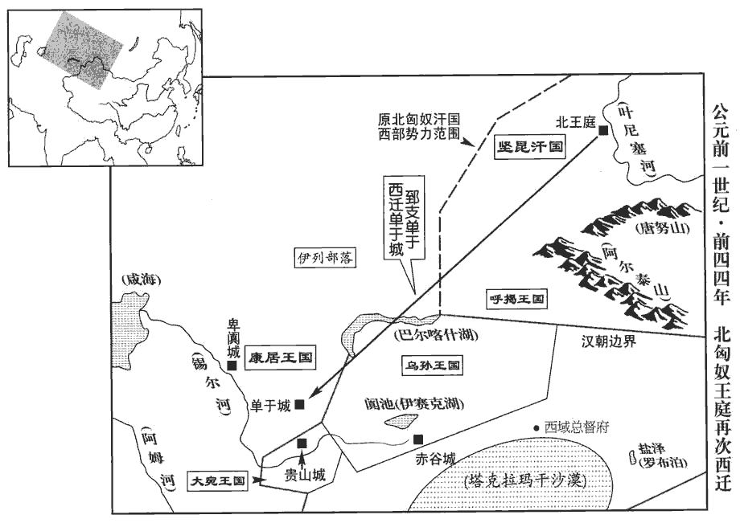
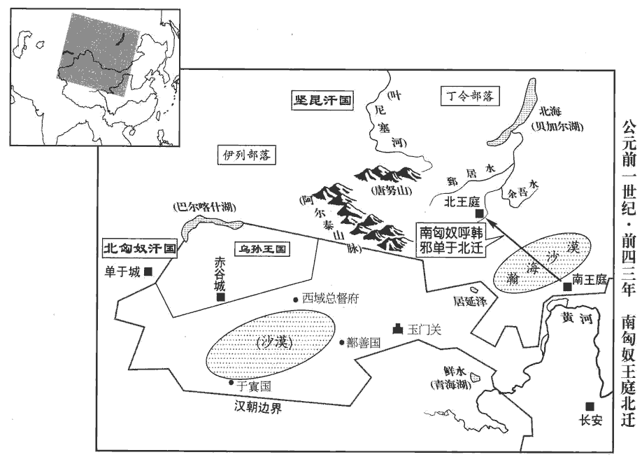

 漢紀二十起昭陽作噩（癸酉），盡屠維單閼（己卯），凡七年。

# 孝元皇帝上荀悅曰：諱「奭」之字曰「盛」。應劭曰：諡法：行義悅民曰元。

## 初元元年（癸酉，前四八）

1春，正月，辛丑‹四›，葬孝宣皇帝于杜陵‹陝西西安東南›；臣瓚曰：自崩至葬凡二十八日。杜陵在長安南五十里。赦天下。

〖译文〗 [1]春季，正月四日，孝宣皇帝刘洵被安葬在杜陵；大赦天下。

2三月，丙午‹十›，立皇后王氏‹王政君›，封后父禁為陽平侯。恩澤侯表，陽平侯食邑於東郡。

〖译文〗 [2]三月丙午(初十)，汉元帝立王政君做皇后，赐封皇后的亲王禁为阳平侯。

3以三輔、太常、郡國公田及苑可省者振業貧民；太常掌諸陵邑，故亦有公田苑。師古曰：振業，振起之令有作業。貲zī不滿千錢者，賦貸種、食。師古曰：賦，給與之也。貸，假也。種，音之勇翻。賈公彥曰：種食者，或為種子，或為食用。

〖译文〗 [3]元帝颁布诏令：把三辅、太常、各郡、各封国的公田，以及家苑囿可以节省的经费，救济贫民，帮助就业。资财不满一千的，给予或借给他们种子或粮食。

4封外祖平恩戴侯同產弟子中常侍許嘉為平恩侯。文穎曰：戴侯，許廣漢。諡法，典禮不愆曰戴。余按廣漢先坐腐刑，及薨，無後；今以嘉紹封。百官表：侍中、中常侍皆加官。西都參用士人，東都始以宦者為中常侍。

〖译文〗 [4]元帝赐封外祖父已故平思侯许广汉同胞弟弟的儿子中侍许嘉，继承平恩侯的爵号。

5夏，六月，以民疾疫，令太官損膳，減樂府員，省苑馬，以振困乏。樂府員大凡八百二十九人，武帝所立。漢官儀：牧師諸苑三十六所，分置北邊、西邊，養馬三十萬匹。

〖译文〗 [5]夏季，六月，因为传染病流行，元帝命令太官减省莱饭减乐府人员，削减皇家马匹，用以救济难民。

6關【章：乙十一行本「關」上有「秋九月」三字；孔本同；傳校同。】東‹函谷關以東›郡、國十一大水，饑，或人相食；轉旁郡錢穀以相救。

〖译文〗 [6]秋季，九月，函谷关以东十一个郡与封国大水成灾，发生饥荒，以至出现人吃人的惨景；朝廷转运邻近地区的粮食救灾。

7上素聞琅邪‹山東諸城›王吉、貢禹皆明經潔行，姓譜：貢姓，子貢之後。行，下孟翻。遣使者徵之。吉道病卒。禹至，拜為諫大夫。上數虛己問以政，易咸卦，君子以虛受人。師古曰：虛己，謂聽受其言也。數，所角翻。禹奏言：「古者人君節儉，什一而稅，無他賦役，故家給人足。高祖、孝文、孝景皇帝，宮女不過十余人，廄馬百餘匹。後世爭為奢侈，轉轉益甚；臣下亦稍放效。師古曰：放，音甫往翻；下同。臣愚以為如太古難，宜少放古以自節焉。少，詩沼翻。方今宮室已定，無可柰何矣；其餘盡可減損。故時齊三服官，輸物不過十笥；李斐曰：齊國舊有三服之官，春獻冠幘zé，縰xǐ為首服，紈素為冬服，輕綃xiāo為夏服，凡三。如淳曰：地理志曰：齊冠帶天下。胡公曰：服官，主作文繡以給袞龍之服。地理志，襄邑亦有服官。師古曰：齊三服官，李說是也。縰xǐ，與纚xǐ同，音山爾翻，即今之方目𦀟也。紈素，今之絹也。輕綃，今之輕𦀟也。襄邑自出文繡，非齊三服也。方今齊三服官，作工各數千人，一歲費數巨萬。萬萬為巨萬。廄馬食粟將萬匹。武帝時，又多取好女至數千人，以填後宮。及棄天下，多藏金錢、財物，鳥獸、魚鼈凡百九十物；又皆以後宮女置於園陵。至孝宣皇帝時，陛下惡有所言，師古曰：不能自言減省之事。惡，烏路翻。惡有所言者，惡以天下儉其親。此語承上園陵事。群臣亦隨故事，甚可痛也！故使天下承化，取女皆大過度：師古曰：取，讀曰娶。諸侯妻妾或至數百人，豪富吏民畜歌者至數十人，此所謂取女過度也。是以內多怨女，外多曠夫。師古曰：曠，空也。室家空也。及眾庶葬埋，皆虛地上以實地下。其過自上生，師古曰：自，從也。上，謂天子也。皆在大臣循故事之罪也。唯陛下深察古道，從其儉者：大減損乘輿服御器物，三分去二；乘，繩證翻。去，羌呂翻。擇後宮賢者，留二十人，餘悉歸之，及諸陵園女無子者，宜悉遣；漢制：天子晏駕，後宮送葬，因留奉陵寢。廄馬可無過數十匹，獨舍長安城南苑地，以為田獵之囿。師古曰：舍，置也。獨留置之，其餘皆廢去。舍，讀曰捨。以方今天下饑饉，可無大自損減以救之，稱天意乎！天生聖人，蓋為萬民，非獨使自娛樂而已也。」稱，尺證翻。為，於偽翻。樂，音洛。天子納善其言，下詔，令諸宮館希御幸者勿繕治；治，直之翻。太僕減穀食馬；水衡減肉食獸。太僕，掌輿馬。漢舊儀云：天子六廄，未央、丞華、輅軨líng、騎馬、騊táo駼tú、大廄也；馬皆萬匹。水衡都尉，掌上林苑，禽獸屬焉。師古曰：繕，補也。減，謂損其數。省者，全去之。

〖译文〗 [7]元帝以往听说琅邪王吉、贡禹都精通儒家经典，品行廉洁，便派遣使节征召二人到京师长安。王吉在途中病逝。贡禹到达之后，被任命为谏大夫。元帝屡次虚心地向他请教如何治理国家，贡禹说：“古代君王节约俭朴，只征收十分之一的赋税，没有其他额外的赋税和徭役，所以家家户户都过着自给自足的生活。高祖、孝文帝、孝景帝，宫女不过十馀人，御马不过百馀匹。但是后世奢侈成风，日益严重。上行下效，臣属也奢侈起来。我愚昧地认为：完全仿效远古，当然困难，但至少也应仿效近代祖先的榜样，厉行节俭。现在官殿已经落成，无可奈何了，其馀的开支，可以尽量减少。过去设立在齐郡的皇家织造厂，每年为皇室制作的高级丝织服装，不过十只竹箱。而今，这三座织造厂，其工人各有数千人，一年耗资数以亿计。而皇家饲养的御马，已将近一方匹，武帝时，又广泛征集美女达数千人，用来充实后宫。到他去世，陪葬的金钱，财务、鸟兽、鱼鳖很多，总共一百九十种；而所有的宫女，都被送到陵园，看守陵墓。到宣帝安葬时也是这样，陛下不能提出任何减省的意见，臣子们也援照先例，太令人痛惜了！这种风气影响全国，娶妻纳妾，旺旺大大超过正常很度：诸候王的妻妾有的多到数百人，豪强官吏以及富民，有的拥有歌女达数十人，因此，闺房内多有怨女，而单身汉也随之增多。至于庶民百姓，丧葬都把钱财珍宝作为随葬品埋于地下。这一过失，来自天子，全是大臣们援例厚葬的结果。我建议陛下，深入考察古代的道理，遵从节约的方法，大大减少御用车子、衣服、器物的开支——三分减去二分。选择后宫贤德的美女，只留下二十人，其馀都送回各自的家。凡看守陵园没有生育过的宫女，应都遣散。御马可以不要超过数十匹，只留长安城南苑地，作为打猎场所。因为天下今正值饥馑荒年，难道不应该大大地缩小支出，用作拯救困苦的人民，以称天意吗？上天降生圣人，是为广大人民谋福利，不是使他自己一个人享受。”元帝采纳贡禹的建议，下诏：凡是皇帝很少游息的离宫别馆，不要修缮，太仆减少御用马匹，水衡减少供皇帝打猎或观赏用的野兽。

臣光曰：忠臣之事君也，責其所難，則其易者不勞而正；易，以豉翻。補其所短，則其長者不勸而遂。孝元踐位之初，虛心以問禹，禹宜先其所急，後其所緩。然則優遊不斷，先、後，皆去聲。斷，丁亂翻。讒佞用權，當時之大患也，而禹不以為言；恭謹節儉，孝元之素志也，而禹孜孜言之；何哉！使禹之智不足以知，烏得為賢！知而不言，為罪愈大矣。

〖译文〗 臣司马光说：忠臣侍奉君王，应请求君王去作困难的事，那么容易的事，用不着费大力气，便可以纠正；只要君王能弥补自己的短缺，那么他的长处不必劝勉就自然可以发扬元帝开始即位，向贡禹虚心请教，贡禹应该把急事放在首要位置，把缓事摆在第二位。优柔寡断、邪恶之辈掌权，是当时的大患，而贡禹不在这方面发言。谦恭谨慎、节约简朴，是元帝本来所具有的品质，贡禹却煞费苦心，提出建议。。这是为什么？假如他的智慧连这些都不知道，怎么可称贤能！假如他知道而不肯说，罪就更大了。

8匈奴呼韓邪單于復上書，言民眾困乏。復，扶又翻。詔雲中‹內蒙托克托›、五原郡‹內蒙包頭›轉穀二萬斛以給之。

〖译文〗 [8]匈奴呼韩单于再次上述西汉朝廷，陈述部众生活困难。西汉朝廷命令云中、五原两郡，运送米谷二万斛，给予救济。

9是歲，初置戊己校尉，使屯田車師‹吐魯番›故地。師古曰：戊己校尉者，鎮安西域，無常治處，亦猶甲乙等各有方位，而戊與己四季寄王，故以名官也。時有戊校尉，又有己校尉。一說：戊與己位在中央，今所置校尉在三十六國之中，故曰戊己也。余謂車師之地不在三十六國之中，當從師古前說為是。宣帝元康二年，以車師地與匈奴。今匈奴款附，故復屯田故地。

〖译文〗 [9]本年，西汉朝廷在西域督护下，开始增设戊校尉和巳校尉，主持原车师军队屯垦。

## 二年（甲戌，前四七）

1春，正月，上‹刘奭，时年二十九›行幸甘泉‹陝西淳化西北›，郊泰畤。畤，音止。樂陵侯史高以外屬領尚書事，前將軍蕭望之、光祿大夫周堪為之副。望之名儒，與堪皆以師傅舊恩，天子任之，數宴見，言治亂，陳王事。數，所角翻。見，賢遍翻。治，直吏翻。陳王者之事也。望之選白宗室明經有行行，下孟翻。散騎、諫大夫劉更生給事中，明經有行，言其通於經術，且行修飭也。百官表曰：散騎加官；騎并乘輿車。師古曰：并，音步浪翻。騎而散從，無常職也。給事中，給事禁中也。散，悉亶dǎn翻。與侍中金敞并拾遺左右。四人同心謀議，勸導上以古制，多所欲匡正；上甚鄉納之。師古曰：鄉，讀曰嚮。意信嚮之而納用其言。史高充位而已，由此與望之有隙。

〖译文〗 [1]春季．正月，元帝前往甘泉，祭祀天神。乐陵侯史高以外戚的缘由主管尚书事宜，前将军萧望之、光禄大夫周堪，做他的副手。萧望之是当时著名的大儒，与周堪曾担任过元帝的老师，情谊很深。元帝对二人很信任，屡次宴请接见二人，谈论历代的安危兴衰，陈述国家的大政方针。萧望之推荐皇族出身，精通儒家经典，品行纯正的散骑、谏大夫刘向兼任给事中，又推荐侍中金敞，同在元帝左右，纠正元帝的过失。四人同心合力，筹谋商议，规劝引导元帝实行古代制度，打算多方纠正政治上的失误，元帝对此心意向往且纳用其言。史高不过在高位上充数罢了，因此跟萧望之有了嫌隙。

中書令弘恭、弘，姓也。衛有大夫弘演。僕射石顯，自宣帝時久典樞機，明習文法；續漢志：尚書令，承秦所置；武帝用宦者，更為中書謁者令。成帝用士人，復故。令掌凡選署及奏下尚書曹文書眾事。僕射，署尚書事，令不在則奏下眾事。辯已見前。帝即位多疾，以顯久典事，中人無外黨，師古曰：少骨肉之親，無婚姻之家也。精專可信任，遂委以政，事無大小，因顯白決，白，奏也。決，斷也。貴幸傾朝，朝，直遙翻。百僚皆敬事顯。顯為人巧慧習事，能深得人主微指，內深賊，持詭辯，以中傷人，師古曰：詭，違也。違道之辯。中，竹仲翻。忤恨睚眥，輒被以危法；忤，五故翻。睚，五懈翻。眥，仕懈翻。師古曰：被，加也，音皮義翻。危法，謂以法危殺之。亦與車騎將軍高為表里，議論常獨持故事，不從望之等。

〖译文〗 中书令弘恭、仆射石显，从宣帝时代，就长期掌管中枢机要，熟悉法令条文。元帝即位后，常常患病，因为石显长期担任要职，又是宦官，无婚姻之家，少骨肉之亲，在朝廷中没有党羽，精明干练，可以信任，于是就把大权托付给他。朝廷事无大小，都通过石显转奏，再由皇帝裁断。石显的权势，超越所有朝臣，文武百官，都对他恭敬地侍奉。石显为人，灵巧聪明，通晓事理。很能领会皇帝隐藏在内心深处的旨意。他心肠阴险狠毒，以似是而非的狡辩，诬陷他人。任何一点小小的怨恨，就会被他滥用法律加害。他跟车骑将军史高内外相勾结，在讨论国家大事时，常坚持奉行旧制度，不接受萧望之等人的主张。

望之等患苦許、史放縱，又疾恭、顯擅權，建白以為：「中書政本，國家樞機，師古曰：建白者，立此議而白之。宜以通明公正處之。處，昌呂翻。武帝遊宴後庭，故用宦者，非古制也。宜罷中書宦官，應古不近刑人之義。」師古曰：禮，刑人不在君側，故曰應古。近，其靳翻。由是大與高、恭、顯忤。師古曰：忤，謂相違逆也。忤，五故翻。上初即位，謙讓，重改作，師古曰：重，難也；未欲更置士人於中書也。議久不定，出劉更生為宗正。散騎、給事中，中朝官也；宗正，外朝官也，故云出。

〖译文〗 萧望之等人憎恶许嘉、史高的骄奢，又痛恨弘恭、石显的专权，于是向元帝建议：“中书是传宣诏书的地方，位居朝廷中枢，掌管机要。应该由光明正大的人士担任那里的工作。武帝因为常在后宫宴饮欢乐，才改用宦官，这不是古代的制度。请解除宦官兼任中书官职的规定，这才符合古代君主不接近因受刑罚致残之人的礼制。”这项建议激化了萧望之与史高、弘恭、石显的矛盾。而元帝刚即位位不久，谦让谨慎，不想轻易改变租祖先的安排。所以这件事久议不决，最后还是把刘向由中朝调出，改任外朝官宗正。

望之、堪數薦名儒、茂材以備諫官，數，所角翻。會稽‹江蘇蘇州›鄭朋陰欲附望之，會，工外翻。上書言車騎將軍高遣客為姦利郡國，及言許、史子弟罪過。章視周堪，師古曰：視，讀曰示。以朋所奏之章示堪也。堪白：「令朋待詔金馬門。」朋奏記望之曰：「今將軍規橅mó，云若管、晏而休，遂行日昃，至周、召乃留乎？師古曰：問望之，立意當趣如管、晏而止，為欲恢廓kuò其道，日昃不食，追周、召之蹟jì然後已乎？橅，讀曰模，其字從木。若管、晏而休，則下走將歸延陵‹江蘇常州›之皋，沒齒而已矣。應劭曰：下走，僕也。張晏曰：吳公子劄zhá食邑延陵，薄吳王之行，棄國而耕於皋澤。朋云望之所為若但如管、晏，則不處漢朝，將歸會稽，尋延陵之軌，隱耕皋澤之中也。師古曰：下走，自謙，言趨走之使也。沒齒，終身也。如將軍興周、召之遺業，親日昃之兼聽，則下走其庶幾願竭區區奉萬分之一！」召，讀曰邵。庶幾，居希翻。望之始見朋，接待以意；師古曰：與之相見，納用其說也。余謂接待以意者，推誠待之，接以殷勤。後知其傾邪，絕不與通。朋，楚士，怨恨，張晏曰：朋，會稽人，會稽并屬楚。蘇林曰：楚人脆急也。更求入許、史，推所言許、史事，推，吐雷翻。曰：「皆周堪、劉更生教我；我關東人，何以知此！」於是侍中許章白見朋。見，賢遍翻；下同。朋出，揚言曰：「我見，言前將軍小過五，大罪一。」前將軍，謂望之也。待詔華龍行汙穢，師古曰：華，音胡化翻。姓也。行，下孟翻。欲入堪等，堪等不納，亦與朋相結。

〖译文〗 萧望之、周堪多次向元帝荐著名学者和秀才，作为谏官人选，会稽郡人郑朋试图投靠萧望之，于是上书无帝，揭发车骑将军史高派谴门客到各地营私，以及许、史两大家族子弟的罪恶。元帝把这份奏折拿给周堪过目，周堪建议说：“命令郑朋在金马九等待召见。”郑朋遂上一份签呈给萧望之，说：“现在将军为国家谋划法制，只不过当个管仲、晏婴，便心满意足?还是忙得过了中午才吃饭，直追周公、召公的勋业才停止?如果目标不过是当管仲、晏婴，那么马上将回到故乡延陵，去看守祖先的坟墓，以终天年。如果在于复兴周公、召公留下的事业，那么．我也许愿意竭尽小小的力量，奉献给您\!”萧望之开始接见郑朋，推心置腹相待。可是不久就看出他是一个投机取巧的邪恶之徒，与他断绝了往来。郑朋是楚地士人，由失望而怨恨，于是就改而投靠许嘉、史高。对他过去所做的事解释说：“那都是周堪、刘向教唆我干的，我远在函谷关以东。怎么知道朝廷里的事?”侍中许章于是奏请元帝亲自召见郑朋。在跟元帝对话后，郑朋出了皇宫，宣称：“我向圣上检举萧望之有五项小过，一项大罪。”待诏华龙，品行恶劣，也想加入周堪等人组成的派系，周堪等不肯接纳。华龙就与郑朋勾结在一起。

恭、顯令二人告望之等謀欲罷車騎將軍，疏退許、史狀，車騎將軍，謂史高。疏，與踈同。候望之出休日，漢制：自三署郎以上入直禁中者，十日一出休沐。令朋、龍上之。事下弘恭問狀，上，時掌翻。下，遐稼翻；下既下同。望之對曰：「外戚在位多奢淫，欲以匡正國家，非為邪也。」恭、顯奏：「望之、堪、更生朋黨相稱舉，數譖訴大臣，數，所角翻。毀離親戚，欲以專擅權勢。為臣不忠，誣上不道，請謁者召致廷尉。」時上初即位，不省召致廷尉為下獄也，省，悉井翻，察也，悟也。可其奏。後上召堪、更生，曰：「繫獄。」上大驚曰：「非但廷尉問邪！」以責恭、顯，皆叩頭謝。上曰：「令出視事。」恭、顯因使史高言：「上新即位，未以德化聞天下，而先驗師傅。既下九卿、大夫獄，劉更生為宗正，九卿也。周堪為光祿大夫。聞，音問。下，遐嫁翻。宜因決免。」於是制詔丞相、御史：「前將軍望之，傅朕八年，宣帝五鳳二年，蕭望之為太子太傅；至黃龍元年為八年。無他罪過，今事久遠，識忘難明，師古曰：言不能盡記，有遺忘者，故難明。忘，巫放翻。其赦望之罪，收前將軍、光祿勳印綬；及堪、更生皆免為庶人。」

〖译文〗 弘恭、石显命令郑朋、华龙联合控告萧望之等密谋罢黜车骑将军史高，使圣上疏远许、史两大家族。等到萧望之休假那天，郑朋、华龙把奏章呈递。元帝交付弘恭查办，在询问萧望之时，萧望之回答说：“外戚身居高位，大多荒淫奢侈，我期望圣上疏远他们，是为了扶正国家，并没有邪恶的意念。”在取得口供后，弘恭、石显联合上奏说：“萧望之、周堪、刘向，结党营私，互相称许推荐，多次诋毁国家重臣，离间陛下的骨肉至亲，图谋控制朝廷，独揽权势。作为一个臣子是不忠，陷陛下于不义是无道，请派谒者把全案移送廷尉。”当时元帝即位不久，不了解移送廷尉是关进监狱，于是就批准了奏请。后来，元帝要召唤周堪、刘向，左右回答说：“他们已被逮捕关押。”元帝大惊说：“不是说廷尉仅仅问话呀！”责备弘恭、石显。二人都叩头请罪。元帝说：“快请他们出来办公！”弘恭、石显唆使史高对元帝说：“陛下刚刚即位，没有以德感人而闻名全国，就用法律处理师傅。既然已把九卿、大夫级官员下狱，不如就此将他们免职。”元帝于是下诏给丞相、御史：“前将军萧望之，作过我八年的师傅。没有其他罪过，只因年纪已老，记忆力战退，赦免他的罪过，撤销他的前将军、光禄勋职务；而周堪、刘向一律贬为庶人。”

2二月，丁巳‹二十七›，立弟竟為清河王‹河北清河›。考異曰：荀紀，「竟」作「寬」，今從漢書。

〖译文〗 [2]二月丁巳(二十七日),元帝赐封弟刘竟为清河王。

3戊午‹二十八›，隴西‹甘肅臨洮›地震，敗城郭、屋室，壓殺人眾。敗，補邁翻。考異曰：劉向傳云：「三月，地大震。」今從元紀。

〖译文〗 [3]戊午(二十八日)，陇西郡发生地震，城郭、房屋倒塌，压死很多百姓。

4三月，立廣陵‹江蘇揚州›厲王子霸為王。宣帝五鳳四年，廣陵厲王胥以罪自殺，國除。今復立其子。

〖译文〗 [4]三月，立广陵厉王子霸为王。

5詔罷黃門乘輿狗馬，師古曰：黃門，近署也，故親幸之物屬焉。百官表：黃門寺，屬少府。乘，繩證翻。水衡禁囿、百官表：水衡都尉屬官有禁圃等九官令、丞。宜春下苑‹陝西西安东南›、孟康曰：宜春，宮名也，在杜縣東。晉灼曰：史記云：葬二世杜南宜春苑中。師古曰：宜春下苑，即今京城東南隅曲江池是。少府佽cì飛外池、百官表：少府屬官有左弋十二官令、丞。武帝太初元年，更名左弋為佽飛。佽飛，掌弋射，有九丞、兩尉。如淳曰：佽飛，具矰zēng繳以射鳧鴈，給祭祀，是故有池也。佽飛，荊人，入水斬蛟，勇士也，故以名官。佽，音次。嚴籞yù池田蘇林曰：嚴飾池上之屋及其地也。晉灼曰：嚴籞，射苑也。許慎曰：嚴，弋射所蔽也。池田，苑中田也。師古曰：晉說是也。假與貧民。又詔赦天下，舉茂材異等、直言極諫之士。

〖译文〗 [5]元帝颁布诏令：撤销黄门寺所管理的御车、御狗、御马。水衡所属的皇家花园，宜春宫所属的御聋园，少府所属的皇家饮飞外池，以及皇家弋射苑中的田地，统统租赁给贫民耕种、又大赦天下。命有关部门推荐优秀人才和有特别能力的人，以及直言进谏人士。

6夏，四月，【章：乙十一行本「月」下有「丁巳」二字；孔本同；張校同；傳校同。】立子驁áo為皇太子‹时年四岁›。驁，五到翻。待詔鄭朋薦太原‹山西太原›太守張敞，先帝名臣，宜傅輔皇太子。上以問蕭望之，望之以為敞能吏，任治煩亂，材輕，非師傅之器。敞傳云：敞無威儀，罷朝會過，走馬章臺街，使御吏驅，自以便面拊馬；又為婦畫眉。所謂材輕也。任，音壬。治，直之翻。天子使使者徵敞，欲以為左馮翊，會病卒。

〖译文〗 [6]夏季，四月，元帝赐封刘骜为皇太子。待诏郑朋推荐太原太守张敞，是先帝时代有名的重臣，可以做皇太子的师傅并辅佐皇太子。元帝询问萧望之，征求他的意见，萧望之认为张敞是一位能干的官员，可以胜任治理头绪繁杂纷乱的工作，但是行为轻佻，不具备师傅的器量和资质。元帝于是改变主意，征召张敞，准备任命他为左冯翊，不巧张敞因病去世。

7詔賜蕭望之爵關內侯，給事中，朝朔望。朝，直遙翻。考異曰：元紀，此詔在今冬。按劉向傳云：「前弘恭、石顯奏望之等獄決；三月，地大震。」然則望之等黜免，在今春地震前也。又曰：「夏，客星見昴mǎo、卷舌間。上感悟，下詔賜望之爵關內侯。」望之傳曰：「後數月，賜望之爵關內侯。」蓋紀見望之死在十二月，因置此詔於彼上耳。

〖译文〗 [7]元帝赐萧望之封爵关内侯，兼给事中，每月初一、十五日朝见。

8關東饑，齊地‹山東›人相食。

〖译文〗 [8]关东发生饥荒，齐国地区出现人吃人的惨景。

9秋，七月，己酉‹二十七›，地復震。復，扶又翻；下同。考異曰：劉向傳曰：「冬，地復震。」元紀，此月詔曰：「一年中地再動。」漢紀在七月己酉。今從之。

〖译文〗 [9]秋季，七月己酉，地震再次发生。

10上復徵周堪、劉更生，欲以為諫大夫；弘恭、石顯白，皆以為中郎。百官表：諫大夫，秩比八百石；中郎，秩比六百石：并屬光祿勳。

〖译文〗 [10]元帝再次征召周堪、刘向，准备任命他们当谏大夫。弘恭、石显从中作梗，元帝于是改命二人当中郎。

上器重蕭望之不已，欲倚以為相；相，息亮翻。恭、顯及許、史兄弟、侍中、諸曹皆側目於望之等。更生乃使其外親上變事，外親，謂母黨也。上，時掌翻；下同。言「地震殆為恭等，不為三獨夫動。應劭曰：三獨夫，謂蕭望之、周堪及向。師古曰：獨夫，猶言匹夫也。殆，近也。為於偽翻。臣愚以為宜退恭、顯以章蔽善之罰，師古曰：章，明也。進望之等以通賢者之路，如此，則太平之門開，災異之原塞矣。」塞，悉則翻；下同。書奏，恭、顯疑其更生所為，白請考姦詐，辭果服；遂逮更生繫獄，免為庶人。

〖译文〗 元帝一直非常尊重萧望之，想请他担任丞相。弘恭、石显与许史量大家族的子弟，以及适中、诸曹，都季度萧望之等人。而这时刘向指使他的外亲，就地震灾难，上述说：“地震发生，大概是针对弘恭等来的，而不是因为萧望之、周堪、刘向这三个老独夫。我非常愚昧，但我认为，应该罢黜弘恭、石显，以示对于压制善良的惩罚。应该进升萧望之等，以便疏通贤能上进的道路。如果是这样，则天下太平的大门洞开，自然灾害的泉源也扰阻塞了。”奏章呈上之后，弘恭、石显怀疑是刘向干的，要求元帝准许追究其中的奸诈真相。据查．果然受到刘向指使，于是逮捕刘向，囚禁于牢狱，免官，贬为平民。

會望之子散騎、中郎伋亦上書訟望之前事，散騎、中郎者，本為中郎而加散騎官也。事下有司，復奏：「望之前所坐明白，無譖訴者，師古曰：言望之自有罪，非人讒譖而訴之也。下遐稼翻。復，扶又翻；下同。而教子上書，稱引亡辜之詩，史不載伋書，不知其所稱引者何詩。詩變雅云：無罪無辜，讒口嗷嗷。豈伋所引者即此詩乎！亡，古無字通。失大臣體，不敬；請逮捕。」弘恭、石顯等知望之素高節，不詘qū辱，詘，與屈同。建白：「望之前幸得不坐，復賜爵邑，不悔過服罪，深懷怨望，教子上書，歸非於上，師古曰：言歸惡於天子也。自以託師傅，終必不坐，師古曰：言恃舊恩，自謂終無罪坐，懷此心。非頗屈望之於牢獄，塞其怏怏心，則聖朝無以施恩厚！」上曰：「蕭太傅素剛，安肯就吏！」顯等曰：「人命至重，言人所重者性命也。望之所坐，語言薄罪，既以語言為薄罪，則不當下吏。孝元於此，不能破恭、顯之姦，可謂不明矣。必無所憂。」上乃可其奏。冬，十二月，顯等封詔以付謁者，敕令召望之手付。因令太常急發執金吾車騎馳圍其第。太常，掌諸陵縣。執金吾，掌徼循京師。蕭望之時居杜陵‹西安東南›，故令太常發執金吾車騎往圍其第以恐脅之，速其自盡也。使者至，召望之。望之以問門下生魯國朱雲，雲者，好節士，好，呼到翻。勸望之自裁。自裁，猶自殺也。於是望之仰天歎曰：「吾嘗備位將相，年踰六十矣，老入牢獄，苟求生活，不亦鄙乎！」字謂雲曰：「游，師古曰：朱雲，字游，呼其字。趣和藥來，趣，讀曰促。和，戶臥翻。無久留我死！」遂【章：乙十一行本「遂」作「竟」；傳校同。】飲鴆自殺。果墮恭、顯計中。天子聞之驚，拊手曰：「曩固疑其不就牢獄，果然殺吾賢傅！」是時，太官方上晝食，上，時掌翻。上乃卻食，為之涕泣，哀動左右。詩云：啜其泣矣，何嗟及矣。為，於偽翻。於是召顯等責問；以議不詳，師古曰：詳，審也。皆免冠謝，良久然後已。上追念望之不忘，每歲時遣使者祠祭望之塚，終帝之世。平曰墓；封曰塚；高曰墳。

〖译文〗 [11]恰好萧望之的儿子散骑、中郎萧假也上书为其父诉冤，奏章交付给有关部门。有关部门复查后上奏说：“萧望之以前被指控的罪证很明确，并不是诬告陷害，他却教唆儿子，向陛下上书，引用《诗经》上关于无罪的诗篇。有失大臣的体面，大不敬，请逮捕审讯。”弘恭、石显等了解萧望之平素气节高尚，不可能接受下狱的屈辱，因此建议说：“萧望之侥幸没有牵连进前案中去，而又得赐爵位封邑，他不悔过认罪，反而满腹牢骚’，教唆儿子上书，把过失推到陛下身上，自以为是陛下钓师傅，无论怎么都不会治罪。如果不用监狱的痛苦抑制他的骄傲自信，那么陛下就再也无法施厚恩于臣子了\!"元帝说：“萧太傅素来性情刚烈，怎么肯去坐牢?”石显等人说：“人，谁不看重性命，而萧望之被指控的，不过语言上的轻罪，必定不会有任何意外。”元帝于是同意奏请。冬季，十二月，石显等把诏书封好，交给谒者，命令让萧望之亲自拆封。同时下令太常迅速调发执金吾所属部队，包围萧望之住宅。谒者到了萧宅，召唤萧望之。萧望之就此问他的学生鲁国人朱云，朱云崇尚节操，建议萧望之自杀，于是萧望之仰天长叹：“我曾经立于丞相之列，而今年纪已超过六十。这么大的年纪被关进监狱，去苟且求生，岂不卑贱？”于是呼唤朱云的字说：“游，快把药和好，不要延长我等死的时间！”于是饮下鸩酒，自杀身死。元帝接到报告，大为震惊，拍手说：“我本来就怀疑他不会去坐牢，果然杀了我的好师傅。”这时，太官正呈上午餐，元帝拒不进食，泪流满面，悲哀感动了旁边的人、于是召唤石显等责问，石显等成人当初判断错误，都摘掉管帽，叩头请罪，过了很久，事情才算了结。元帝追思哀悼萧望之，不能忘情，每年四季都派使节去他坟墓前祭祀，直到自己去世方止。

臣光曰：甚矣孝元之為君，易欺而難悟也！易，以豉翻。夫恭、顯之譖訴望之，其邪說詭計，誠有所不能辨也。至於始疑望之不肯就獄，恭、顯以為必無憂，已而果自殺，則恭、顯之欺亦明矣。在中智之君，孰不感動奮發，以厎邪臣之罰！厎，致也。孝元則不然。雖涕泣不食以傷望之，而終不能誅恭、顯，纔得其免冠謝而已。如此，則姦臣安所懲乎\!是使恭、顯得肆其邪心，而無復忌憚者也。復，扶又翻。

〖译文〗 臣司马光说:元帝这位君王，大奇怪了，容易受欺骗，而又难以醒悟。弘恭、石显诬陷萧望之，其阴谋诡计，诚然有时候很难分辩，然而，元帝开始已经怀疑萧望之不会愿意入狱，弘恭、石显却以为不必担心出现意外，不久果然自杀，则弘恭、石显的欺诈，已至为明显。即令是中等智慧的君王，也会情绪激动，勃然大怒，给奸邪的臣子以应得的惩罚。而元帝则不然，虽然以痛哭流、拒不进食来衰悼师傅，却终究不能柔掉、石显，只不过使他们脱下官帽，下请罪而已。如此，好臣又怎么惩治呢?这正是导致弘恭、石显肆意妄为，毫无忌惮的原因所在。

11是歲，弘恭病死，石顯為中書令。

〖译文〗 [12]这年，弘恭因病而死，石显继任中书令。

12初，武帝‹刘彻›滅南越，開置珠厓‹海南瓊山›、儋dān耳郡‹海南儋州›，事見二十卷武帝元鼎六年。儋，丁甘翻。在海中洲上；師古曰：居海中之洲也。水中可居者曰洲。吏卒皆中國人，多侵陵之。其民亦暴惡，自以阻絕，數犯吏禁，數，所角翻。率數年壹反，殺吏；漢輒發兵擊定之。二十餘年間，凡六反。據賈捐之傳：自初為郡，至昭帝始元元年，二十餘年間，凡六反。至宣帝時，又再反。始元五年，罷儋耳郡并屬珠厓。至宣帝神爵三年，珠厓三縣反。後七年，甘露元年，九縣復反。上即位之明年，珠厓山南縣反，發兵擊之。諸縣更叛，連年不定。海中洲上，以黎母山為主，環山列置諸縣。山南縣蓋置於黎母山之南也。師古曰：更，音工衡翻。上博謀於群臣，欲大發軍。待詔賈捐之曰：捐之時待詔金馬門。「臣聞堯、舜、禹之聖德，地方不過數千里，西被流沙，東漸於海，朔南暨聲教，師古曰：此引禹貢之辭。漸，入也；一曰浸也。朔，北方也。暨，及也。被，皮義翻。漸，子廉翻。言欲與聲教則治之，不欲與者不強治也。與，讀曰豫。治，直之翻。強，其兩翻。故君臣歌德，師古曰：言皆有德可歌頌。含氣之物各得其宜。武丁、成王，殷、周之大仁也，然地東不過江‹河南正阳南›、黃‹河南潢川›，杜預曰：江國，在汝南安陽縣。黃國，今弋陽縣。西不過氐、羌‹甘肅南部›，南不過蠻荊‹湖北襄樊一带›，北不過朔方，是以頌聲并作，視聽之物【章：乙十一行本「物」作「類」；孔本同；張校同。】咸樂其生，樂，音洛。越裳氏重九譯而獻，此非兵革之所能致也。晉灼曰：遠國使來，因九譯言語乃通也。張晏曰：越不著衣裳，慕中國化，遣譯來著衣裳，故曰越裳也。師古曰：越裳自是國名，非以襲衣裳始為稱號也。王充論衡作「越嘗」，此則不作衣裳之字明矣。晉志曰：吳孫皓置九德郡，即周時越裳氏地。以至於秦，興兵遠攻，貪外虛內而天下潰畔。孝文皇帝偃武行文，當此之時，斷獄數百，賦役輕簡。斷，丁亂翻。下同。孝武皇帝厲兵馬以攘四夷，天下斷獄萬數，賦煩役重，寇賊并起，軍旅數發，數，所角翻。父戰死於前，子鬬傷於後，女子乘亭障，孤兒號於道，老母、寡婦飲泣巷哭，師古曰：淚流被面以入於口，故言飲泣也。巷哭者，哭於路也。號，戶刀翻。是皆廓地泰大，征伐不休之故也。今關東民眾久困，流離道路。人情莫親父母，莫樂夫婦；樂，音洛。至嫁妻、賣子，法不能禁，義不能止，此社稷之憂也。今陛下不忍悁悁之忿，悁，縈年翻，又吉掾翻，忿也，憂也；詩：中心悁悁。又急躁貌。欲驅士眾擠之大海之中，師古曰：擠，墜也，音子詣翻，又子奚翻；余謂擠，排也，推也。快心幽冥之地，非所以救助饑饉，保全元元也。詩云：『蠢爾蠻荊，大邦為讎。』師古曰：詩小雅采芑qǐ之詩也。蠢，動貌也。蠻荊，荊州之蠻也。言敢與大國為讎敵也。言聖人起則後服，中國衰則先畔，自古而患之，何況乃復其南方萬里之蠻乎！言珠厓又在蠻荊之南，去京師萬里。復，扶又翻。駱越‹海南島›之人，南越王尉佗以兵威役屬西甌ōu駱。師古曰：西甌，即駱越也。言西者，以別東甌也。余謂今安南之地，古之駱越也。珠厓，蓋亦駱越地。宋白曰：高、貴二州，亦古駱越地。父子同川而浴，相習以鼻飲，范成大曰：今邕yōng管谿洞及㳂yán海喜鼻飲。隨貧富，以銀、錫、陶器或大瓢盛水，入鹽，并山薑汁數滴；器側有竅，施管如瓶觜，內鼻中，吸水升腦，下入喉。吸水時，含魚肉鮓zhǎ一臠，故水得安流入鼻，不與氣相激。既飲，必噫氣，謂掠腦快膈莫此若。但可飲水；或傳為飲酒，非是。與禽獸無異，本不足郡縣置也。顓顓獨居一海之中，師古曰：顓，與專同。專專，猶區區也；一曰：圜貌也。霧露氣濕，多毒草、蟲蛇、水土之害；人未見虜，戰士自死。又非獨珠厓有珠、犀、瑇dài瑁也。海中有珠池。珠母者，蚌也。採珠必蜑dàn丁，皆居海艇中，以大舶環池採珠；以石懸大絙，別以小繩繫蜑丁腰，沒水取珠。氣迫則撼繩，繩動，舶人覺，乃絞取，人緣大絙上。然而死於採珠者亦多矣，此我太祖皇帝所以罷劉氏媚川都也。師古曰：犀狀如牛，頭如豬，而四足類象；黑色；一角當額前，鼻上又有小角。劉欣明交州記曰：犀，其毛如豕，蹄有三甲，頭如馬；有三角，鼻上角短，額上、頭上角長。異物志曰：角中特有光耀，白理如線，自本達末，則為通天犀。抱朴子曰：通天犀有白理如線者，以盛米，雞即駭矣。其真者，刻為魚，銜入水，水開三尺。本草圖經曰：犀，出永昌山谷及益州，今出南海者為上。郭璞爾雅註曰：犀三角，一在頂上，一在額上，一在鼻上。鼻上者，即食角，小而不橢。瑇dài瑁，如龜，其甲相覆而生，若甲然；甲上有斑文。瑇，音代。瑁，音妹。棄之不足惜，不擊不損威。其民譬猶魚鱉，何足貪也！臣竊以往者羌軍言之，此蓋指宣帝神爵元年羌反時。暴師曾未一年，兵出不踰千里，費四十餘萬萬；大司農錢盡，乃以少府禁錢續之。續漢志：大司農掌諸錢、穀、金、帛、諸貨幣。邊郡諸官請調度者，皆為報給，損多益寡，取相給足。百官表：少府，掌山林池澤之稅，以給共養。應劭註曰：名曰禁錢，以給私養，自別為藏。少者，小也。故稱少府。師古曰：大司農，供軍國之用；少府，以養天子也。夫一隅為不善，費尚如此，況於勞師遠攻，亡士毋功乎！毋，與無同。求之往古則不合，施之當今又不便，臣愚以為非冠帶之國，禹貢所及，春秋所治，皆可且無以為。師古曰：為，猶用也。治，直之翻。願遂棄珠厓，專用恤關東為憂！」上以問丞相、御史。御史大夫陳萬年以為當擊；丞相于定國以為：「前日興兵擊之連年，護軍都尉、校尉及丞凡十一人，還者二人，卒士及轉輸死者萬人以上，費用三萬萬餘，尚未能盡降。降，戶江翻。今關東困乏，民難搖動，捐之議是。」上從之。捐之，賈誼曾孫也。

〖译文〗 [13]起初，汉武帝吞并南越，在海南岛上，开始设置珠崖郡、儋耳郡。官吏以及士兵全是中国人，对当地土著，多有侵夺凌辱之事，而土著人民，也很强悍，认为海南岛隔绝在大海之外，所以无视法令，不断起来抗暴。大约每隔几年，就起事一次，击杀官吏。汉朝廷每次都出动军队，予以平定。二十徐馀年之间，共发生过六次起事。到宣帝在位期间，又有两次起事。元帝即位的第二年，珠崖郡山南县叛乱，汉朝出兵镇压。而其他各县也跟着叛乱，接连数年，不能平定。元帝广泛征求大臣的意见，准备出动大军镇压。待诏贾捐之说:“我曾经听说，尧、舜、禹这些圣明有德的君王，其版图的范围，不过方圆数千里。西接流沙，东濒大海，朔方以南都是中国声威和教化普及的地区。声明愿接受中国声成和教化的，中国就去治理;不愿接受中国声威和教化的，中国决不强迫。因此君王和臣子，都有德可以歌项，凡有生命的动物，都得到它们的需要。武丁、成王，是商王朝和周王朝至仁的君王，然而版图东方不过到达江国、黄国，西方不过到达氏、羌二部落，南方不过到达蛮人的楚部落，北方不过到达朔方。因此颂扬的声音遍起，凡是会听会看的生物，都乐于生存。越裳部落，经过九重翻译，而向中国进貢，这不是兵力可以得到的。后来到了秦王朝，出动军队远征，食功于千万里之外，却使国内的防卫虛弱，天下背叛，朝廷崩溃。到了汉孝文皇帝，停息武备，修明文教，在那个时代，审理和判决的案件，不过几百起，赋税和徭役，少而简单。到了孝武皇帝，磨好武器，吸饱战马，用以打击东西南北四方夷族，审理和判决的案件，多达几万起，赋税频繁，徭役沉重。盗贼四起，而大军不断出击，做父亲的刚刚在前方战死，做儿子又相继为战事而负伤。女人守卫边塞的堡垒，孤儿在道路上啼哭，老母、寡妇在破陋的小巷里泪流满面，吞声而哭。这都是开拓的疆土太大，战争不能停止的原因。而现在，函谷关以东人民，长期困穷，流离失所。人情，最亲莫过于父母，最乐英过于夫妇。到了卖妻子、卖儿女，法律不能禁止，道义无法责备的地步，这是国家的忧患啊。现在陛下不能忍受一时的愤怒，准备驱使壮士，把他们推入大海之中，在那个蛮荒黑暗的孤岛上，显示成力，并不是拯教饥馑，保全百姓的好方法。《诗经》说:“愚蠢的蛮荆人，竞敢与大国为敌。＇意思是说：圣人出现，各族自然归服;中国衰落，各族首先背叛。从古代起，担忧的就是这个，何况更在楚部落南方万里之外的各蛮族呢\!骆越的黎民，父亲与儿子同在一条河里洗澡习惯上都用鼻子饮水，与禽兽没有什么不同，本来没有条件设置郡县。单独地孤悬在大海之中，雾大露重，气候潮湿，多有毒草、毒虫、毒蛇，以及水土灾害。还没有看见敌人，战士已经病死。而且，也并不是只有珠崖郡才出产珍珠、犀牛、玳瑁。抛弃它，一点也不可惜。不加征伐，一点也不损害朝廷的威望。那里的百姓好像鱼鳖，不值得争取。我私下再用以前平定西羌叛乱的军事行动作为例证，军队在前线作战，还不满一年，而战场距京师长安，还没有超过一千里，军费已达四十多亿。大司农所辖国库积蓄，全部用光更动用少府征收的山海池泽之税。解决一个角落的问题，费用还这么多，何况长途跋涉，攻击敌人?只会造成伤亡，不可能有功。从古代寻找同类的事，则找不到。在现代千这类事，害处如此。我很愚蠢，认为除非是懂得文明礼教的国家，《禹贡》谈到的地方，《春秋》所载治理的地方，都可以放到一边。因此建议:放弃球崖郡，专心救济函谷关以东的受灾饥民，排除国家的忧患。”元帝询同丞相、御史。御史大夫陈万年认为应当出击;丞相于定国认为:“朝延连年发兵出击崖郡叛，护军都尉、校尉和，共十一人，只有二人生还，战士和转运粮草的人，死亡达万人以上，费用达三亿多钱，还不能全都平服。而今函谷关以东又遭灾荒，严重缺粮，民心动摇，贾捐之的建议是正确的，应子采纳。”元帝批准。贾捐之是贾谊的曾孙。

## 三年（乙亥，前四六）

1春，詔曰：「珠厓‹海南瓊山›虜殺吏民，背畔為逆。背，蒲妹翻。今廷議者或言可擊，或言可守，或欲棄之，其指各殊。朕日夜惟思議者之言，羞威不行，則欲誅之；狐疑辟難，則守屯田；師古曰：辟，讀曰避；下同。欲屯田與之相守，以待其敝。通乎時變，則憂萬民。夫萬民之饑餓與遠蠻之不討，危孰大焉？且宗廟之祭，凶年不備，王制：塚宰製國用，視年之豐耗，祭用數之仂lè。鄭氏曰：算今年一歲經用之數，用其什一。夫以凶年之入，制經用之什一以供祭，則宗廟之禮宜有不備者矣。況乎辟不嫌之辱哉！「嫌」，當讀作「慊」。慊之為言厭也，意自足也。今關東大困，倉庫空虛，無以相贍，又以動兵，非特勞民，凶年隨之。其罷珠厓郡，民有慕義欲內屬，便處之；師古曰：欲有來入內郡者，所至之處即安置之。余謂便處者，各隨其所便而處之也。處，昌呂翻。不欲，勿強。」強，其兩翻。

〖译文〗 [1]春季，元帝颁诏:“球崖那匪徒杀害官吏人民，背叛国家。在朝廷会议上，臣僚们有的主张镇压，有的主张坚守城池，有的主张放弃，意见不同。我日夜思考他们的意见:为了维护朝廷的成严，只有诛杀。为了长期相持，只有实行屯田。通达时局的变迁，判忧虑民众的处境。现在的问题是，人民饥馑，与不讨伐远方蛮族的乱，哪一个危险大?连联祭祀祖先处所的祭品，都因荒年的缘由不能全备，何况边境上小小的羞辱挫败?现在函谷关以东人民正逢困难，仓库空虚，无法维持生活，如果再征集丁壮作战，不仅使人民疲劳，而且还要发生荒年。现在决定撤销珠崖郡，百姓有向幕仁义，愿意迁到中国内地的，可以随处定居。不愿意迁移的，不要勉强。”

2夏，四月，乙未‹二十九›晦，茂陵‹陕西兴平东北›白鶴館災；赦天下。

〖译文〗 [2]夏季，四月乙未(十一日)夜，茂陵白鹤馆失火;大赦天下。

3夏，旱。

〖译文〗 [3]夏季，发生旱灾。

4立長沙煬yáng王弟宗為王。長沙煬王旦，定王發之玄孫，初元元年薨，無後；今立其弟紹封。鄭氏曰：煬，音供養之養。諡法：好內遠禮曰煬；去禮遠眾曰煬。

〖译文〗 [4]元帝赐封已故长沙炀王刘旦的弟弟刘宗，继任长沙王。

5長信少府貢禹上言：「諸離宮及長樂宮衛，可減其太半以寬繇役。」繇，讀曰傜。六月，詔曰：「朕惟烝庶之饑寒，烝，眾也。遠離父母妻子，離，力智翻。勞於非業之作，師古曰：不急之事，故云非業也。衛於不居之宮，恐非所以佐陰陽之道也。其罷甘泉‹陕西淳化西北›、建章‹陕西西安西北›宮衛，令就農。百官各省費。師古曰：費用之物務減省。條奏，毋有所諱。」

〖译文〗 [5]长信少府贡禹上书建议:“各离宫跟长乐宫的警卫部队，可以减少大半，用以减轻百姓的劳役负担。”六月，元帝下诏:“联顺念到民众饥寒，远离父母妻子，从事不是他们本行的工作，保卫若王不常居住的宫股，恐怕不是促进阴阳合和的办法。现在，撤销甘泉、建章两宫的守卫部队，命今他们回乡务农。朝是官员应在节的经费上，提出方案奏报，不要有所忌讳。”

6是歲，上復擢周堪為光祿勳。復，扶又翻。堪弟子張猛為光祿大夫、給事中，大見信任。猛，張騫孫也。

〖译文〗 [6]本年，元帝又提拔周堪任光禄勋。周堪的学生张猛为光禄大夫，兼给事中，大受信任。

## 四年（丙子，前四五）

1春，正月，上‹刘奭，时年三十一›行幸甘泉‹陝西淳化西北›，郊泰畤。畤，音止；下同。三月，行幸河東‹山西夏縣›，祠后土；赦汾陰‹山西万荣西南榮河镇›徒。徒，有罪居作者。

〖译文〗 [1]春季，正月，元帝前往甘泉，祭祀天神，三月，前往河东、祭祀地神，赦免汾阴刑徒。

## 五年（丁丑，前四四）

1春，正月，以周子南君為周承休侯。文穎曰：姓姬，名延；其祖父姬嘉，本周後，武帝元鼎四年封為周子南君，奉周祀。師古曰：承休侯國，在潁川郡。

〖译文〗 [1]春季，正月，擢升周子南君姬延为周承休侯。

2上【章：乙十一行本「上」上有「三月」二字；孔本同；張校同；退齋校同；傳校同。】行幸雍‹陝西鳳翔›，雍，於用翻。祠五畤。畤，音止。

〖译文〗 [2]元帝到雍城，祭祀五畤。

3夏，四月，有星孛於參。孛，蒲內翻。天文志：參為白虎，三星直者是為衡石；下有三星銳，曰罰，為斬艾事，其外四星，左右肩、股也。參，所今翻。

〖译文〗 [3]夏季，四月，有异星出现在参宿之旁

4上用諸儒貢禹等之言，詔太官毋日殺，師古曰：不得日日宰殺。所具各減半；師古曰：食具也。乘輿秣馬，無乏正事而已。師古曰：秣，養馬以粟秣食之也。正事，謂駕供祭祀、蒐sōu狩之事，非游田者也。乘，繩證翻。秣，音末。罷角抵、上林宮館希御幸者、角抵，見二十一卷武帝元封三年。齊三服官、北假‹河套北阴山南地区›田官、李斐曰：主假賃見官田與民，收其假稅也，故置田農之官。晉灼曰：匈奴傳：秦始皇渡河，據陽山、北假中。王莽傳：五原、北假膏壤殖穀。北假，地名。師古曰：晉說是也。酈道元曰：自高闕以東，夾山帶河，陽山以西，皆北假也。鹽鐵官、常平倉。武帝置鹽鐵官。宣帝置常平倉。博士弟子毋置員，以廣學者；武帝為博士官置弟子五十人。昭帝增弟子員滿百人。宣帝末，增倍之。令今不限員數以廣學者。後數年，以用度不足，更為設員千人。令民有能通一經者，皆復。復，方目翻。省刑罰七十餘事。

〖译文〗 [4]元帝采用儒家学者和贡禹等人的建议，下令:太官不要每天都宰杀牲富，供应的饮食，减少一半。皇帝使用的御车御马，只要维持正事使用就够了。撤销角抵这种表演游戏，释放上林宫内很少有机会同皇帝见面的官女，撤销位于齐那的三座皇家织造厂，放弃北假一带皇家农田，撤销盐铁官，撤销常平粮仓，博士弟子的名额不加限制，黎民对儒家经典，能精通其中任何一经的，都免除赋税徭役。废除刑罚七十多项判例。

5陳萬年卒。六月，辛酉‹二十›，長信少府貢禹為御史大夫。禹前後言得失書數十上，上，時掌翻。上嘉其質直，多採用之。

〖译文〗 [5]御史大夫陈万年去世。六月辛西(二十日)，提拔长信少府贡禹为御史大夫。贡禹曾前后数十次上书，对元帝的得失进行规劝。元帝赏识他的坦率正直，多数都予采纳。

 

6匈奴郅支單于‹王庭设西伯利亚叶尼塞河上游›自以道遠，又怨漢擁護呼韓邪‹王庭设阴山北›而不助己，困辱漢使者江乃始等；遣使奉獻，因求侍子。郅支遣子入侍，見上卷宣帝甘露元年。漢議遣衛司馬谷吉送之，谷，姓也。御史大夫貢禹、博士東海‹山東郯城›匡衡以為：「郅支單于鄉化未醇，師古曰：不雜曰醇。醇，壹也，厚也。鄉，讀曰嚮；下同。所在絕遠，宜令使者送其子，至塞而還。」還，從宣翻，又如字。吉上書言：「中國與夷狄有羈縻不絕之義，今既養全其子十年，德澤甚厚，空絕而不送，近從塞還，示棄捐不畜，畜，許六翻。使無鄉從之心，師古曰：鄉從，謂嚮化而從命也。棄前恩，立後怨，不便！議者見前江乃始無應敵之數，智勇俱困，以致恥辱，即豫為臣憂。臣幸得建強漢之節，承明聖之詔，宣諭厚恩，不宜敢桀。師古曰：言郅支畏威，當不敢桀猾也。若懷禽獸心，加無道於臣，則單于長嬰大罪，師古曰：嬰，猶帶也。必遁逃遠舍，師古曰：舍，止也。不敢近邊。近，其靳翻。沒一使以安百姓，國之計，臣之願也。願送至庭。」郅支單于庭也。上許焉。既至，郅支單于怒，竟殺吉等；考異曰：陳湯傳：「初元四年，郅支求侍子。」元帝紀：「五年，谷吉使匈奴，不還。」湯傳又云：「御史大夫貢禹議吉不可遣。」按禹今年六月始為御史大夫，或者郅支以明年求侍子，而吉以五年使匈奴也！」自知負漢，又聞呼韓邪益強，恐見襲擊，欲遠去。會康居‹巴爾喀什湖西南锡尔河北岸突厥斯坦›王數為烏孫‹中亚伊塞克湖东南›所困，數，所角翻；下同。與諸翕xī侯計，以為：「匈奴大國，烏孫素服屬之。今郅支單于困阨在外，可迎置東邊，使合兵取烏孫而立之，師古曰：言與郅支并力共滅烏孫，以其地立郅支，令居之也。長無匈奴憂矣。」即使使至堅昆，通語郅支。宣帝黃龍元年，郅支都堅昆。郅支素恐，又怨烏孫，怨烏孫事亦見上卷黃龍元年。聞康居計，大說，說，讀曰悅。遂與相結，引兵而西。郅支人眾中寒道死，餘財三千人。師古曰：中寒，傷於寒也。道死，死於道上也。中，竹仲翻。財，與纔同。到康居，康居王以女妻郅支；郅支亦以女予康居王。妻，七細翻。予，讀曰與。康居甚尊敬郅支，欲倚其威以脅諸國。郅支數借兵擊烏孫，深入至赤谷城，殺略民人，敺畜產去。師古曰：敺，與驅同。烏孫不敢追，西邊空虛不居者五千里。西域傳：烏孫國，治赤谷城，西至康居蕃地五千里。若云空虛者五千里，則自赤谷以西皆不居矣。此已抵其國都，不得云西邊也。陳湯傳作「且千里」，當從之。

〖译文〗 [6]勾奴郵支单于栾提呼屠吾斯认为他跟汉朝距离遥远，加之怨恨汉朝帮助呼韩邪单于栾提稽侯珊，而不帮助他，因此，使汉朝使节江乃始等陷于艰难屈辱之中。同时，派使节进贡，要求送还在汉朝当人质的儿子栾提驹于利受。朝廷商议派卫司马穀吉护送人质回国。御史大夫贡禹、博士东海人匡衡一致认为:“郵支单于对汉朝并没有心悦诚服，所居又在遥远绝城，我们的使节送他的儿子，送到边塞就可以回来了。”榖吉上书说:“汉朝对蛮族，有长期笼和约束的关系，我们已经养育支单于的儿子十年之久，思德很厚。如果不送他到家，而只送到边塞，那就显示出永远跟他断绝关系，使他无法再向往并从命汉朝。抛弃从前的恩德，却结下以后的怒仇，似不相宜\!参与意见的人，鉴于江乃始缺乏对敌人应变的才能，智慧勇敢都无法施展，以致受到羞辱，事先替我担忧。我有幸手执大汉的旌节，承奉圣明的诏书，传布汉朝对甸奴深厚的思德，预料单于不教龙礼，如果子牙心，加暴虐于我，那么，他就犯下了滔天大罪，必然逃得很远，不敢接近边塞。辆轴一个使节，而使普天下老百姓获得安宁，这是国家的利益所在，也是我个人的志感。因此，我愿把郵支单于的儿子送到王庭。”光帝批准了敏吉的请求。吉把支单于的儿子送到王庭，不料郵支单于以怒报竟杀害般吉等人。他感到自己有负汉恩，又听说呼韩邪单于的力正日益强盛，恐怕受到袭击，想向西迁移。恰恰在这个时候，康居王国不断受到鸟孙王国的侵略，处境窘迫，康居王眼谱翁侯商议，认为:“向数是一个大国，鸟孙一向臣属于它。而今，郵支单于圈处在国境之外，我们可以迎请他驻防东部边界，然后共同攻天乌孙，由郵支单于当乌孙王。这样对奴的忧患也就可以永远解除了。”计议一定，就派使节到坚昆王国，传语给郵支单于。郵支单于一向悉惧，又怒恨乌孙王国，听到康居王国的计划，大喜，于是就与康居王国结置，卑领部队向西进发。途中，因天气寒冷，不少人被死，最后只利下三千人。到达康居王国后，康居王把女几嫁给郵支单于，郵支单于也把女儿嫁给康居王。康居对郵支单于非常撒，打算借勾奴的武力，威胁各邻国。郵支单于多次率领康居和勾数联军，攻击乌孙王国，一度攻陷乌孙王国京师赤谷城，杀及掠人民、财产、牲畜。乌孙王国无力反击，西部五千里广大地区，完全残破，无人居住。

7冬，十二月，丁未‹九›，貢禹卒。丁巳‹十九›，長信少府薛廣德為御史大夫。

〖译文〗 [7]冬季，十二月丁未(初九)，御史大夫黄高去世。丁已(十九日)，提升长信少府辞广德为御史大夫。

## 永光元年（戊寅，前四三）

1春，正月，上‹刘奭，时年三十三›行幸甘泉‹陝西淳化西北›，郊泰畤。禮畢，因留射獵。薛廣德上書曰：「竊見關東困極，人民流離；陛下日撞亡秦之鐘，師古曰：撞，音丈江翻。聽鄭、衛之樂，臣誠悼之。今士卒暴露，從官勞倦，應劭曰：從官，謂宦者及虎賁、羽林、太醫、太官是也。師古曰：從官，親近天子，常侍從者，皆是也。從，才用翻；下同。願陛下亟反宮，思與百姓同憂樂，樂，音洛。天下幸甚。」上即日還。還，從宣翻，又如字。

〖译文〗 [1]春季，正月，元命前往甘泉，在郊外祭把天神。条把完毕，就在那里行国，年广上书说，“谷关以春地区，国已达根点，百姓流离失所，而陛下却每天撞着被灭亡的秦国的大钟，听着郑国、卫国的音乐，我对此实在害怕。卫护座下的大军，暴露在原野之上，随从的官员，疲劳国倦。希望陛下火速回宫，心里想着跟百姓同忧同乐。这样，才是天下的大福。”元帝当天即回到长安。

2二月，詔曰：「丞相、御史舉質樸、敦厚、遜讓、有行者，行，下孟翻。光祿歲以此科第郎、從官。」師古曰：始令丞相、御史舉此四科人而擢zhuó用之。而見在郎及從官，又令光祿每歲依此科考校，定其第高下，用知其人賢否也。

〖译文〗 [2]二月，元帝下诏:“丞相、种史荐举质朴、忠厚、逊让、德行良的回美人去，光根助每年比照这四项要求，考核和从好官，按成绩排列等第。”

3三月，赦天下。

〖译文〗 [3]三月，大赦天下

4雨雪、隕霜，殺桑。雨，於具翻。

〖译文〗 [4]下雪，降霜，桑树落叶纷纷。

5秋，上酎zhòu祭宗廟，出便門，師古曰：便門，長安城南面西頭第一門。酎，直又翻。欲御樓船。薛廣德當乘輿車，免冠頓首曰：「宜從橋。」詔曰：「大夫冠，」乘，繩證翻。說文：冠，絭juàn也，所以絭髮。弁biàn，冕之總名也。廣德曰：「陛下不聽臣，臣自刎，刎，扶粉翻。以血汙車輪，陛下不得入廟矣！」師古曰：言不以理，終不得立廟也。一曰：以見死傷，犯於齋潔，不得入廟祠也。原父曰：一說是也。時上欲入廟。汙，烏故翻。上不說。先敺光祿大夫張猛進曰：師古曰：先驅，導乘輿也。說，讀曰悅。敺，讀曰驅。「臣聞主聖臣直。乘船危，就橋安；聖主不乘危。御史大夫言可聽！」上曰：「曉人不當如是邪！」師古曰：謂諫爭之言當如猛之詳善也。乃從橋。

〖译文〗 [5]秋季，元帝用重酿之酒祭祀祖庙，出便门，准备乘楼船。拦着皇家卫队，下官帽，头说“请走河桥。”元帝传下话来，说:“请御史大夫戴上官帽\!”薛广德说:“陛下如果不接受我的汉，我就在此自杀，用鲜血污楽奉轮，陛下就进不了祖庙啦\!”元建希不高兴。负责开道的光禄大夫张猛说:“我听说主上圣明，臣子自然正直。坐船危险，而过桥却安全，圣明的君主不冒危险。御史大夫的话，可以听从\!”元帝说:“劝告别人，应像这样把道理说清楚\!”于是改从桥上走

6九月，隕霜殺稼，天下大饑。丞相于定國，大司馬、車騎將軍史高，御史大夫薛廣德俱以災異乞骸骨；賜安車、駟馬、黃金六十斤，罷。太子太傅韋玄成為御史大夫。考異曰：百官表「七月，癸未，大司馬高免。辛亥，韋玄成為御史大夫。十一月，戊寅，丞相定國免。」荀紀：「七月，己未，高免。」薛廣德傳：「酎祭後月餘，以歲惡民流，乞骸骨，罷。廣德為御史大夫，凡十月，免。」月日參差，未知孰是，故皆沒不書。廣德歸，縣其安車，以傳示子孫為榮。師古曰：縣其所賜安車，以示榮幸也。致仕縣車，蓋亦古法。韋孟詩：「縣車之義，以洎jì小臣，」是也。貢父曰：致仕縣車，言休息不出也。故韋孟及薛廣德自縣其安車也。縣，讀曰懸。

〖译文〗 [6]九月，严霜再降，毁摔农田庄稼，天下发生大的饥荒。丞相于定国，大司马、车骑将军史高，御史大夫薛广德，都因为这场天灾，引咎辞职。元帝批准，分别赏赐他们安车、四匹马、黄金六十斤，罢了官。提升太子太傅韦玄成担任御史大夫。薛广德回到故乡，把皇上赏赐给他的安车悬桂起来，留传给子孙，以示荣幸。

7帝之為太子也，從太中大夫孔霸受尚書；及即位，賜霸爵關內侯，號褒成君，如淳曰：為帝師，教令成就，故曰褒成君。給事中。上欲致霸相位，霸為人謙退，不好權勢，好，呼到翻。常稱「爵位泰過，何德以堪之！」御史大夫屢缺，上輒欲用霸；霸讓位，自陳至於再三。上深知其至誠，乃弗用。以是敬之，賞賜甚厚。

〖译文〗 [7]元帝当太子的时候，跟太中大夫孔霸学习《尚书》。等到即位，封孔霸关内侯，号褒成君，兼给事中。元帝想请孔霸当丞相，可是孔霸为人谦逊退让，不喜爱权势，常说:“如果爵位太高贵，我的品德和能力都不能胜任\!”御史大夫屡次空缺，元帝屡次都拟任命孔霸，孔霸坚决辞让，至于两次三次。元帝确知他出于诚心，才不再勉强，但因此对他更为尊敬，赏赐更加丰厚。

8戊子‹二十四›，侍中、衛尉王接為大司馬、車騎將軍。接，平昌侯王無故之子。

〖译文〗 [8]九月成子(二十四日)，元帝任命侍中、卫尉王接当大司马兼车骑将军。

9石顯憚周堪、張猛等，數譖毀之。數，所角翻。劉更生懼其傾危，上書曰：「臣聞舜命九官，師古曰：尚書，禹作司空，棄后稷，契司徒，皋陶作士，垂共工，益朕虞，伯夷秩宗，夔典樂，龍納言，凡九官也。濟濟相讓，和之至也。濟，子禮翻。眾臣和於朝則萬物和於野，故簫韶九成，鳳皇來儀。師古曰：韶，舜樂名。舉簫管之屬，示其備也。於韶樂九奏，則鳳皇見其容儀，言感至和也。至周幽、厲之際，師古曰：厲王，夷王之子。厲王生宣王；宣王生幽王。朝廷不和，轉相非怨，則日月薄食，水泉沸騰，山谷易處，師古曰：薄，迫也；謂被掩迫也。沸，湧出也。騰，乘也。言百川沸湧而相乘陵，山頂隆高而盡崩壞，陵谷易處。霜降失節。謂正月繁霜也。正月，夏之四月，正陽之月也。由此觀之，和氣致祥，乖氣致異，祥多者其國安，異眾者其國危，天地之常經，古今之通義也。今陛下開三代之業，招文學之士，優游寬容，使得并進。今賢不肖渾殽，師古曰：言雜亂也。渾，音胡本翻。白黑不分，邪正雜糅，師古曰：糅，和也，音汝救翻。忠讒并進；章交公車，人滿北軍，如淳曰：漢儀注，中壘校尉，主北軍壘門內。尉一人，主上書者獄。上章於公車，有不如法者，以付北軍尉；北軍尉以法治之。楊惲上書，遂幽北闕。北闕，公車所在。朝臣舛chuǎn午，膠戾乖剌，師古曰：言志意不和，各相違背。午，音五故翻。剌，音來曷翻。更相讒愬，轉相是非更，工衡翻。所以營惑耳目，感移心意，不可勝載，師古曰：言其誣罔天子也。營，謂回繞之。勝，音升；下同。分曹為黨，師古曰：曹，輩也。往往群朋將同心以陷正臣。正臣進者，治之表也；正臣陷者，亂之機也；乘治亂之機，未知孰任，而災異數見，治，直吏翻。數，所角翻。見，賢遍翻。此臣所以寒心者也。初元以來六年矣，按春秋六年之中，災異未有稠如今者也。師古曰：稠，多也，音直流翻。原其所以然者，由讒邪并進也；讒邪之所以并進者，由上多疑心，既已用賢人而行善政，如或譖之，則賢人退而善政還矣。師古曰：還謂收還也。夫執狐疑之心者，來讒賊之口；持不斷之意者，開群枉之門；斷，丁亂翻。讒邪進則眾賢退，群枉盛則正士消。故易有否、泰，師古曰：否，音皮鄙翻。小人道長，君子道消，則政日亂；君子道長，小人道消，則政日治。長，知兩翻。治，直吏翻；下同。昔者鯀gǔn、共工、驩huān兜與舜、禹雜處堯朝，師古曰：鯀，崇伯之名，即檮táo杌wù也。共工，少皞hào氏之後，即窮奇也。驩兜，帝鴻氏之後，即渾敦也。鯀，音工本翻。共，音恭。驩，音火官翻。處，昌呂翻。周公與管、蔡并居周位，當是時，迭進相毀，師古曰：迭，互也，音大結翻。流言相謗，豈可勝道哉！勝，音升。帝堯、成王能賢舜、禹、周公而消共工、管、蔡，故以大治，榮華至今。孔子與季、孟偕仕於魯，師古曰：季、孟，謂季孫、孟孫，皆桓公之後，代執國權而卑公室。余謂季孫、孟孫，季、孟之通稱。與孔子偕仕者，季孫斯、孟孫何忌也。李斯與叔孫俱宦於秦，師古曰：叔孫者，叔孫通也。定公、始皇賢季、孟、李斯而消孔子、叔孫，故以大亂，汙辱至今。故治亂榮辱之端，在所信任；信任既賢，在於堅固而不移。詩云：『我心匪石，不可轉也，』師古曰：此邶bèi柏舟之詩也。言石性雖堅，尚可移轉；己志須確，執德不傾，過於石也。言守善篤也。易曰：『渙汗其大號，』師古曰：此易渙卦九五爻辭也。言王者渙然大發號令，如汗之出也。言號令如汗，汗出而不反者也。今出善令未能踰時而反，師古曰：踰時，三月也。是反汗也；用賢未能三旬而退，是轉石也。論語曰：『見不善如探湯。』師古曰：論語載孔子之言。探湯，言其除難無所避也。探，吐南翻。今二府奏佞讇不當在位，師古曰：讇，古諂字。歷年而不去，故出令則如反汗，用賢則如轉石，去佞則如拔山，去，羌呂翻。如此，望陰陽之調，不亦難乎！是以群小窺見間隙，間，古莧翻。緣飾文字，巧言醜詆，師古曰：詆，毀也，辱也，音丁禮翻。流言、飛文譁huá於民間。放言於外以誣人，曰流言。孔穎達曰：流，謂水流。造作虛語，使人傳之，如水之流然，故謂之流言。為飛書以詆毀，若今之匿名書，曰飛文。師古曰：譁，讙也，音火瓜翻。故詩云：『憂心悄悄，慍於群小，』師古曰：邶柏舟言仁人不遇之詩。悄悄，憂貌。慍，怒也。悄，音千小翻。慍，於問翻。小人成群，誠足慍也。昔孔子與顏淵、子貢更相稱譽，不為朋黨；師古曰：事具見論語。更，工衡翻。譽，音餘。禹、稷與皋陶傳相汲引，不為比周；師古曰：事見尚書。傳，柱戀翻，遞也。比，頻寐翻。何則？忠於為國，無邪心也。今佞邪與賢臣并交戟之內，師古曰：交戟，謂宿衛者。合黨共謀，違善依惡，歙xī歙訿zǐ訿，詩小旻mín：「歙歙訿訿。」毛氏註曰：潝xī潝然患其上，訿訿然思不稱於上。爾雅云：潝潝訿訿，莫供職也。韓詩云：不善之貌。歙，與潝同，許急翻。訿，音紫。數設危險之言，數，所角翻。欲以傾移主上，如忽然用之，此天地之所以先戒，災異之所以重至者也。師古曰：重，音直用翻。自古明聖未有無誅而治者也，故舜有四放之罰，師古曰：謂舜流共工於幽州，放驩兜於崇山，竄三苗于三危，殛鯀於羽山。孔子有兩觀之誅，應劭曰：少正卯，姦人之雄，故孔子為司寇七日，誅之於兩觀之下。師古曰：兩觀，謂闕也。觀，古玩翻。然後聖化可得而行也。今以陛下明知，知，讀曰智。誠深思天地之心，覽否、泰之卦，歷周、唐之所進以為法，原秦、魯之所消以為戒，師古曰：歷，謂歷觀之。原，謂思其本也。周，成王；唐，唐堯。考祥應之福，災【章：乙十一行本「災」上有「省」字；張校同。】異之禍，以揆當世之變，放遠佞邪之黨，壞散險詖bì之聚，遠，於願翻。壞，音怪。師古曰：揆，度也。險言曰詖。詖，彼義翻。杜閉群枉之門，廣開眾正之路，決斷狐疑，分別猶豫，斷，丁亂翻。別，彼列翻。使是非炳然可知，則百異消滅而眾祥并至，太平之基，萬世之利也。」顯見其書，愈與許、史比而怨更生等。比，毗至翻；下同。

〖译文〗 [9]中书今石显总光禄助堪、光大张等，不断在元帝面前诬陷诽谚他俩。已经被罢融成了平民的刘向，害怕有一天会被陷害，于是上书说:“我听说舜任命九官，大家济济一堂，互相礼让，和达到了顶点众多的臣子在朝是中互相和物则在原野上欣欣向荣，所以洞萧吹出名叫《詔》的乐章，只要九章，风凰便会飞来朝拜。到了周厉王、周曲王的时候，朝廷臣僚不再和睦，转而互相排斥怨恨，则日食、月食相继发生，冷列的泉水沸腾翻涌，高山深谷改变位置，降霜不合节令，由此看来，和睡可以招来祥瑞，互相抵触则会造成灾异，祥瑞多别国家安定，灾异多国家自然陷于危境。这是天地运转的规律，古今一贯的公理而今，陛下开创三代盛世的宏业，招揽儒家学源的学者，给他们优厚的待强，宽容他们的过大，使大家同时进取。然而，今天贤能的人眼一些坏人混杂在一起，黑白不分，正邪不，使患奸同时进入政界。臣民上书，由公奉接待，因上书不要而被捕的，满满地四禁在北军监。朝廷臣像意见不和，互相拆台，甚至言陷害，意出不少是非。以不实之词欺骗主上，影响主上判断，这类事情很多无法一一陈迷。他们结党搭帮，往往同心合力，去陷害正直大臣。正直大臣进升，是国家治的表现;正直大臣遭受陷害，是国家乱的所由。面对治乱契机，却不知道任用谁，而天灾变异屡屡出现，我所以寒心的原因在此。陛下登极以来已有六年。《春秋》记载的六年之中，天灾变异从没有像知今这么密集。所以如此，是因为说别人坏话的人和邪恶的人都进入朝廷的故。说别人坏话的人和邪恶的人之所以同时进入朝廷，是因为陛下心怀猜疑。既然任用贤能去推行要善的政令措施，如果受到陷害，贤能的人被排除，矣善的政令措范也就终止。由于陛下有怀疑之心，所以才招来害之ロ;由于腔下不能当机立斯，オ给群邪打开大门。说别人坏话的人和那恶的人得意，则有德行和有才能的人失意，群邪增多则正人少。所以《易经》上有《否》卦和《奉》卦，小人那一套如果得到欣實，君子的主张就无法实行，则政治日益混乱;君子的主张如果得到欣赏，小人那一套就无法实行，则政治日益走上轨道。从前解、共工、兜，舜、禹同在的朝是中当官，周公跟管叔、暮叔一同居于周朝的高位。当时，他们之间，互相诚毁，流言中伤，不可胜言\!帝、成王能够肯定舜、禹、周公的德行才能，而排除共工、管叔、幕叔，所以国家十分安定，荣權显达水垂，直到今目。孔子与季孙斯、孟孙何总，同时在鲁国做官，李斯和叔孙通，都在秦朝当官，鲁定公、秦始皇认为季孙斯、孟孙何总、李斯贤能，而排除孔子、叔孙通，所以国家大，一直流传到今天。这可以证明，治和乱，荣和辱，首先在于人主信任什么人。已经信任贤能，就要坚持而不再动摇《诗经》说我的心虽非磐石，但却不可逆转，说明坚持善行的忠实态度。《易经》说:“出令如出汗。＇说明君王发号施个，犹如出汗。汗既流出，不能再返回体内。可是现在的情形是，关善政的命令，布之后不到个月，即行取消，是一种“通并现象。任用贤能的人，不到三十天便逐出朝廷，是转动了大石《论语》说:“看见邪恶，好像用手去探试滚水。＇而令，二府所弹効的治後之，不应再留在朝廷，可是历经数年，并没有离开。所以布命令，如同返汗;任用贤能，却跟转石头一样。而排除邪恶，简直像找起一座大山。在这种情形下，希望阴阳调和，不也是很因难的吗\!因此一群小人，到处寻找漏洞，运用文字技巧，丑化、诋毁别人，制造谣言，写匿名信，在民间广为流传。所以《诗经》说:“我心乱如麻忧愁如焚，只因为触怒一群小人。”小人猖獗到如此程度，实在使人愤慨。从前，孔子跟他的学生颜渊、子贡互相推荐赞扬，没有人攻击他们结党营私。禹、后稷、皋陶互相提拔，也没有人攻击他们勾结同类。为什么呢?因为他们忠心为国，没有邪念。而今，奸佞的小人跟贤德的君子，手拿剑戟同时在宫内担任禁卫官。奸佞的小人句结在一起，共设阴谋，违背善良，走向罪恶，不千本取工作，不断设下险恶的谦言，决心使人主动摇。如果有一天忽然人主相信他们的忠诚，这正是天地用变异先行提出警告，而灾难不断发生的原因。自古以来，圣明的君主从来没有不经过诛杀，就可以使国家治理好的。所以舜对于“四凶＇，有四种流放的刑罚。而孔子也曾在两观之下，诛杀少正卵。然后圣贤的教化，才得以推行。而今，以陛下的贤明智慧，诚能深思天地大公无和私之心，警《易经中\(否》、《泰》二卦的立意，参考唐和周成王的兴盛，作为格样，以秦王朝和鲁国的衰亡，作为借鉴。注意到祥瑞带给国家的幸福，与自然灾害带给国家的祸患，用以考察当前局势的变化，放好邪恶的小人，击破专门从事阴险构陷的集国，关闭群邪幸进之门，广开正大光明的道路，坚决果断，不再犹豫怀疑，使是非明显可知，则百种奇异的天灾都会消灭，众多样瑞都会来临，这是太平的基础，万代的利益。”石显看到这份奏章，与许、史两姓皇亲勺結得更紧而把刘向等恨入骨髓。

是歲，夏寒，日青無光，顯及許、史皆言堪、猛用事之咎。上內重堪，又患眾口之寖潤，鄭氏曰：譖人之言如水之浸潤，漸以成之。孔子曰：浸潤之譖不行焉，可謂明也已矣。無所取信。時長安令楊興以材能幸，常稱譽堪，譽，音餘；下同。上欲以為助，乃見問興：「朝臣齗yīn齗不可光祿勳，何邪？」師古曰：齗齗，忿疾之意也。齗，音牛斤翻。興者，傾巧士，謂上疑堪，因順指曰：「堪非獨不可於朝廷，自州里亦不可也！周禮：五黨為州，五家為鄰，五鄰為里。漢人謂同州鄉而居者為州里。臣見眾人聞堪與劉更生等謀毀骨肉，以為當誅；故臣前書言堪不可誅傷，為國養恩也。」為，於偽翻；下同。上曰：「然此何罪而誅？今宜柰何？」興曰：「臣愚以為可賜爵關內侯，食邑三百戶，勿令典事。明主不失師傅之恩，此最策之得者也。」上於是疑之。

〖译文〗 这年夏手，天气寒冷，太阳青色，路淡无光。石显许、史二大家族说这是周堪、张猛当权引起的天变。元帝尊重周堪，可是面对众口一致的攻击，又无法堵他们的嘴。当时，长安令杨兴以才千能力受到识，而且常常称赞宣扬周堪。元帝想得到他的帮助，于是召见杨兴，问他:“有些大臣忿恨、反对光禄勋周堪，这是为什么?”杨兴是官场上的我许而看风行事的人物，认为皇帝对周堪已经不信任了，于是势指責说:“周堪不但没有能力当光禄勤，就是当一个乡下的里长邻长，也不适宜。我从前听说，人们认为周堪跟刘向等人挑找离间陛下的骨肉亲情，应当示，我之所以持不同意见，并不是費成他们，只为国家培养思德。”元帝问:“那么用什么罪名可以杀他?现在应当怎么办?＂兴答道:“我愚昧的意见是，赐封周堪关内侯，给他三百户人家的采邑，不让他掌权管事。这样的话，圣上可以仍维持师傅的旧思，应是最上等的策略。”元帝于是对周堪、张猛开给怀疑。

司隸校尉琅邪‹山東諸城›諸葛豐姓譜：葛氏，先本琅邪諸縣人，徙陽都；時人本其先之所居，謂之諸葛氏。風俗通云：葛嬰為陳涉將，有功而誅，孝文錄其後，封諸縣侯，因并氏焉。始以剛直特立著名於朝，數侵犯貴戚，數，所角翻；下同。在位者多言其短；後坐春夏繫治人，春、夏，生長之時，故仲春省囹líng圄yǔ，去桎梏，毋肆掠，止獄訟；仲夏挺重囚，益其食。春夏而繫治人，為不順天時。徙城門校尉。豐於是上書告堪、猛罪。上不直豐，乃制詔御史：「城門校尉豐，前與光祿勳堪、光祿大夫猛在朝之時，數稱言堪、猛之美。豐前為司隸校尉，不順四時，修法度，專作苛暴以獲虛威；朕不忍下吏，下，遐稼翻。以為城門校尉。百官表：城門校尉，掌京師十二城門屯兵。不內省諸己，省，悉景翻。而反怨堪、猛以求報舉，師古曰：言舉其事以報怨。告按無證之辭，暴揚難驗之罪，毀譽恣意，不顧前言，師古曰：前言，謂譽堪、猛之美；今乃更言其短，是不顧也。譽，音餘；下同。不信之大也。朕憐豐之耆老，不忍加刑，其免為庶人！」又曰：「豐言堪、猛貞信不立，朕閔而不治，又惜其材能未有所效，其左遷堪為河東‹山西夏縣›太守，猛槐里‹陝西興平›令。」槐里，周之犬丘，秦曰廢丘；高帝二年改曰槐里，屬右扶風。

〖译文〗 司隶校尉琅邪人诸葛丰，以刚强正直、不随波逐流而闻名朝野，多次冒犯皇亲国成，所以权黄大都说他的坏话。后来被控为在春季和夏季建捕犯人，不顺天时，谪当城门校尉，他于是上书控告周、张猛有罪。元帝认为诸葛丰不正直，于是下诏:“城门校尉诸葛丰，以前与光禄勋周堪、光禄大夫张猛，同在朝廷的时候，多次称赞周堪、张猛的美德。诸葛丰当司隶校尉时，不顺应四时天意，不遵守法令制度，专用苛刻暴的手段来树立成严的外貌。我不忍心法办，令他改任城门校尉，想不到他不自知反省，反而怨恨周堪、张猛，以求报复。控告的全是没有证据的话，揭发的全是无法证明的罪随心所欲地毁谤和赞扬，不顾从前的言论，全无信义到了极点。我怜诸葛丰年纪衰老，不忍施刑，立即贬作平民。”又布诏书:“诰葛丰指控周堪、张猛毫无忠贞信守，胀心怀悯侧，不肯追究，而又惋情二人的才千无法报效国家。决定疑周堪当河东太守，张猛当槐里令。”

臣光曰：諸葛豐之於堪、猛，前譽而後毀，其志非為朝廷進善而去姦也，去，羌呂翻。欲比周求進而已矣；斯亦鄭朋、楊興之流，烏在其為剛直哉！人君者，察美惡，辨是非，賞以勸善，罰以懲姦，所以為治也。治，直吏翻。使豐言得實，則豐不當黜；若其誣罔，則堪、猛何辜焉！今兩責而俱棄之，則美惡、是非果安在哉！

〖译文〗 臣司马光说:诸葛丰对于周堪、张猛，从前费扬，后来请，其目的不是为国家进贤除奸，不过是投靠皇亲集田，全图飞黄腾达而已。他也属于郑用、杨兴一类入，何来的正直?作为君主，应该察看善恶，明辨是非，用奖赏鼓励善行，用刑罚惩治奸邪，这样才是治理国家的原则。如果请葛丰的话属实，则他不应被要官。如果他是以不实之辞证人则周堪、张猛又有什么罪呢\!而今双方都受到责罚，同时废弃，那么善与恶，是与非，区别又在哪里\!

10賈捐之與楊興善。捐之數短石顯，師古曰：談說其長短。余謂此言數陳其短耳。數，所角翻。以故不得官，稀復進見；復，扶又翻；下同。見，賢遍翻。興新以材能得幸。捐之謂興曰：「京兆尹缺，按百官表：初元四年，京兆尹成。永光四年，光祿大夫琅邪‹山東諸城›張譚為京兆尹；四年，不勝任，免。蓋是時成已去而譚未除，是以缺官也。使我得見，言君蘭，張晏曰：楊興，字君蘭。考異曰：荀紀作「君簡」，今從漢書。京兆尹可立得。」興曰：「君房下筆，言語妙天下；賈捐之，字君房。師古曰：於天下最為精妙耳。使君房為尚書令，勝五鹿充宗遠甚。」續漢志曰：尚書令，承秦所置；武帝用宦者更為中書謁者令。是時石顯為中書令，五鹿充宗為尚書令，疑兩官并置也。百官表：成帝建始元年，尚書令五鹿充宗為少府；五年，貶為玄菟太守。逆而數之，則知充宗是年猶為尚書令也。姓譜：趙大夫食采於五鹿，以邑為氏。捐之曰：「令我得代充宗，君蘭為京兆，京兆，郡國首，尚書，百官本，天下真大治，士則不隔矣！」治，直吏翻。捐之復短石顯，興曰：「顯方貴，上信用之；今欲進，第從我計，師古曰：第，但也。且與合意，即得入矣！」捐之即與興共為薦顯奏，稱譽其美，譽，音餘；下同。以為宜賜爵關內侯，引其兄弟以為諸曹；又共為薦興奏，以為可試守京兆尹。石顯聞知之，白之上，乃下興、捐之獄，下，遐稼翻。令顯治之，奏「興，捐之懷詐偽，更相薦譽，更，工衡翻。欲得大位，罔上不道！」捐之竟坐棄市；興髡鉗為城旦。

〖译文〗 [10]贾捐之与杨兴友好。贾捐之多抨击石显，因此不得做官，更很少有机会见到皇上。而杨兴正因才能受到皇上的赏识。贾捐之对杨兴说:“京兆尹出缺已久，如果我能面见圣上推荐你，这个职位马上就可以得到。”杨兴说:“你笔下生花，言语精妙。假如你能当尚书令，可比五鹿充宗高明得多。”贾捐之说:“我如果能取代五鹿充宗，你当京兆尹，京师是郡与封国的中心，而尚书掌握全国官员的政治命运，天下一定局势安定，经济繁荣，士人与皇上就再不会隔。”说完，又抨击石显。杨兴说:“石显权势如日中天，圣上正信任他。我们如果谋求上进，必须听从我的计划，只要能称他的心，合他的意，就可以成功。”于是二人联名上书，赞扬石显美德，建议应封爵美内侯，而使他的兄弟入官充任中书或尚书的下属官员。然后，二人又呈上共同拟定，而由贾捐之单独署名的奏章，保荐杨兴，认为应考虑由他担任京兆尹。石显看透二人钻营的心计报告元帝，于是把杨兴、贾捐之逮捕下狱。元帝命石显审讯，审讯后，石显上奏说:“杨兴、贾捐之心怀奸诈，互相标，企图报取朝廷高官，欺骗陛下，大逆不道\!”结果贾捐之竟然被绑赴市上斩首，杨兴被剩光头发，罚作苦工。臣光曰：君子以正攻邪，犹惧不克。况捐之以邪攻邪，其能免乎！臣司马光说:君子用正道攻击邪道，还怕不能取胜;何况贾捐之用邪道攻击邪道，怎能避免祸殃\!

臣光曰：君子以正攻邪，猶懼不克；況捐之以邪攻邪，其能免乎！

〖译文〗 臣司马光说：君子利用正道攻击邪道，还担心不能获胜。何况贾捐之利用邪道攻击邪道，如何能避免灾祸？

11徙清河王‹府清阳，河北清河›竟為中山王‹府卢奴，河北定州›。

〖译文〗 [11]元帝改封清河王刘竟为中山王。

 

12匈奴‹南匈奴王庭设内蒙古阴山山脉北›呼韓邪單于民眾益盛，塞下禽獸盡，單于足以自衛，不畏郅支‹北匈奴单于。此时在康居首都卑阗城·中亚巴尔喀什湖西南锡尔河北岸突厥斯坦›东部国境，其大臣多勸單于北歸者。師古曰：塞下無禽獸，則射獵無所得；又不畏郅支，故欲北歸舊處。久之，單于竟北歸庭‹王庭复设于蒙古国哈尔和林市›，民眾稍稍歸之，其國遂定。

〖译文〗 [12]奴呼韩邪单于的民众日益增多，而塞下的飞禽野兽，也几乎绝尽。同时，单于足以自卫，不再害怕郵支单于的击，很多大臣建议北归故土。又过了一段时间，呼韩邪单于终于北返王庭，散布在其他地区的部落，渐淅归附于他，国家于是安定。

## 二年（己卯，前四二）

1春，二月，赦天下。

〖译文〗 [1]春季，二月，大赦天下。

2丁酉‹五›，御史大夫韋玄成為丞相；右扶風鄭弘為御史大夫。

〖译文〗 [2]丁西(初五)，元帝提升御史大夫书玄成为丞相，右扶风郑弘当御史大夫。

3三月，壬戌‹一›朔，日有食之。

〖译文〗 [3]三月王成朔(初一)，发生日食

4夏，六月，赦天下。

〖译文〗 [4]夏季，六月，大赦天下

5上‹刘奭，时年三十四›問給事中匡衡以地震日食之變，匡衡時以博士給事中。風俗通云：匡，魯邑，句須為之宰；其後氏焉。衡上疏曰：「陛下躬聖德，開太平之路，閔愚吏民觸法抵禁，比年大赦，使百姓得改行自新，比，毗至翻。行，下孟翻。天下幸甚！臣竊見大赦之後，姦邪不為衰止，為，於偽翻。今日大赦，明日犯法，相隨入獄，此殆導之未得其務也。今天下俗，貪財賤義，好聲色，上侈靡，親戚之恩薄，婚姻之黨隆，苟合徼幸，好，呼到翻；下同。徼，工堯翻。以身設利；不改其原，師古曰：設，施也。原，本也。雖歲赦之，刑猶難使錯而不用也，師古曰：歲赦，謂每歲一赦也。錯，置也。錯，音千故翻。臣愚以為宜壹曠然大變其俗。夫朝廷者，天下之楨zhēn幹也。楨幹，版築之具：題曰楨，旁曰幹，以築垣牆，喻治天下也。楨，音貞。朝有變色之言，則下有爭鬬之患；上有自專之士，則下有不讓之人；上有克勝之佐，則下有傷害之心；上有好利之臣，則下有盜竊之民；此其本也。師古曰：言下之所行，皆取化於上也。治天下者，審所上而已。師古曰：上，謂崇尚也。治，直之翻。教化之流，非家至而人說之也；師古曰：非家家皆到，人人勸說也。賢者在位，能者布職，朝廷崇禮，百僚敬讓，道德之行，由內及外，自近者始，然後民知所法，遷善日進而不自知也。詩曰：『商邑翼翼，四方之極。』師古曰：商頌殷武之詩也。商邑，京師也。極，中也。言商邑之禮俗，翼翼然可則傚，是乃四方之中正也。今長安，天子之都，親承聖化，然其習俗無以異於遠方，郡國來者無所法則，或見侈靡而放效之；師古曰：放，依也，音甫往翻。此教化之原本，風俗之樞機，宜先正者也。臣聞天人之際，精祲jìn有以相盪，李奇曰：祲，氣也；言天人精氣相動也。師古曰：祲，謂陰陽之氣相浸漸以成災祥者也，音子鴆翻。善惡有以相推，事作乎下者象動乎上，陰變則靜者動，陽蔽則明者晻，鄧展曰：靜者動，謂地震也；明者晻，謂日食也。師古曰：晻，與暗同。水旱之災隨類而至。陛下祗zhǐ畏天戒，哀閔元元，宜省靡麗，考制度，近忠正，遠巧佞，近，其靳翻。遠，於願翻。以崇至仁，匡失俗，道德弘於京師，淑問揚乎疆外，師古曰：淑，善也。問，名也。然後大化可成、禮讓可興也。」上說其言，說，讀曰悅遷衡為光祿大夫。

〖译文〗 [5]元帝向给事中医衡询问地、日食等天地变化的缘故，匡衡上书说:“陛下身体力行圣明德政，为国家开卧太平道路。怜悯愚昧的官史平民触犯法禁，连年都有故免，使人民得到改今过自新的机会，这是国家的大幸，不过，据我私下的考察，大赦以后，作好犯下科并没有减少，更没有停止。今日刚刚释放出，明天却又犯法，前后相随，重新坐牢，这是由于训导他们漫有抓住要点。现在天下用的社会风气，贪图财利，轻视道义，喜欢音乐女色，崇尚豪华奢修。亲成的关系日益淡薄，而婚烟的关系却十分深厚。苟且结合，用身让家来取财富。如不从根本上改变这种状况，虽然一年故免一次仍不能使刑法置不用。我愚昧地认为改正之道，在于大刀周斧，改支社会风气。朝廷对于国家，宛如筑墙时所用的模版。朝廷的高官如果怒日相视，在下级官吏和平民中就会发生斗争的祸害;上层有专权弄势之人，则下层有不谦让之人;在上位的人如果暗藏杀，在下位的人就会互相仿害;上层如果有贪圈时富的大臣，下层必然有偷窃对物的平民。这就是朝廷所显示的根本作用。治理国家的人，最应该慎重的是崇尚什么。教育感化一类事，不用挨家接户拜访，也不必见人就去劝说。贤德的人在位，有才能的人忠于职守，朝廷崇尚礼义，文式官员互敬谦让。道德的推行，由内心发展到体外，从最亲近的人开始，然后人民才知道以谁做样，善行日益增加，但自己还不知道。《诗经》说:“商朝京域的礼仪是那么威严，实在是四方效法的样。’而今，在京城长安，天子亲自推行圣人的教化，可是社会风气跟边远地方没有什么不同。各那、各封国的人到了京城，不知道效法什么，有的却学会了修浪费。这是行教化最根本的地方，也是培养社会风气最关的地方，应该最先正。我听说天与人之间，精气互相激荡，善恶互相推展。下面有所行动时，在上面可以看出遠象，太阴变化则地，太阳被则日食，而水灾、早灾之类的灾祸随之而至。腔下敬畏上天的警告，恰天下百姓，应当节省奢华开支，考究国家制度，接近忠良正直的人远以巧言导人邪恶的人，推重大仁大义，区正数环的风习慣。使高尚的道德在京师先得到弘扬，美好的声誉传扬到国境之外。然后广大的教化可以完成，礼义谦让的美德可以复兴。”元帝区的意见，提升他为光禄大夫。

荀悅論曰：夫赦者，權時之宜，非常典也。漢興，承秦兵革之後，大愚之世，比屋可刑，比，毗至翻，又毗必翻。故設三章之法，大赦之令，約法三章，事見九卷高帝元年。赦，自古有之，至於大赦，則始於秦。高祖既并天下，即皇帝位，大赦天下，後世因之為永制。蕩滌穢流，與民更始，更，工衡翻。時勢然也。後世承業，襲而不革，失時宜矣。若惠、文之世，無所赦之。若孝景之時，七國皆亂，異心并起，姦詐非一。及武帝末年，賦役繁興，群盜并起，加以太子之事，巫蠱之禍，天下紛然，百姓無聊，人不自安。及光武之際，撥亂之後，如此之比，宜為赦矣。

〖译文〗 荀悦评论说:对于罪犯的放免，是一种暂时的合乎时的大数措施，不是正常的同法典范。汉王朝幅起之初，恰在秦王朝战乱之后。几乎每个人都身负重罪，如果一定要依法先理，那么而挨家逐户都应受刑。所以刘邦约法三章，颁布大敏之令，洗明之社会上的污秽罪悉，与人民除旧布新，这是由当时的形势造成繁的。后世只知承費祖先的制度，不知道改革，已经与时代需要姓不相适应。在惠帝，文帝时代，根本没有故免。在景时代，发生七国之現，人心反常，奸诈百出。到了武帝末年，赋税沉重，福役顺紫，四起，再加上戾大子刘据事件，盘大妈，天下震惊，百姓生活围难，无所依。等到光武帝上台，搜乱反正以后，用来跟前世相比，由他免罪犯才最适当。

6秋，七月，隴西‹甘肅臨洮›羌彡xiǎn姐旁種反，師古曰：彡，音所廉翻，又音先廉翻。姐，音紫。今西羌尚有此姓，而彡，音先冉翻。詔召丞相韋玄成等入議。是時，歲比不登，比，毗至翻。朝廷方以為憂，而遭羌變，玄成等漠然，莫有對者。師古曰：漠，無聲也，音莫。右將軍馮奉世曰：「羌虜近在竟內背畔，竟，古境字通用。背，蒲妹翻。不以時誅，無以威制遠蠻，臣願帥師討之！」帥，讀曰率。上問用兵之數，對曰：「臣聞善用兵者，役不再興，糧不三載，故師不久暴而天誅亟決。師古曰：暴，露也。亟，急也。載，子亥翻。往者數不料敵，師古曰：料，量也，音聊。而師至於折傷，再三發調，則曠日煩費，威武虧矣。折，而設翻。調，徒弔翻。今反虜無慮三萬人，師古曰：無慮，舉凡之言，無小思慮而大計也。法當倍，用六萬人；然羌戎，弓矛之兵耳，器不犀利，如淳曰：今俗以刀兵利為犀。晉灼曰：犀，堅也。師古曰：晉說是。可用四萬人。一月足以決。」丞相、御史、兩將軍兩將軍，車騎將軍王接、左將軍許嘉也。皆以為「民方收斂時未可多發；發萬人屯守之，且足。」且足，猶言且可也。斂，力贍翻。奉世曰：「不可。天下被饑饉，被，皮義翻。士馬羸耗，守戰之備久廢不簡，師古曰：簡，謂選揀。夷狄皆有輕邊吏之心，而羌首難。師古曰：言創首為寇難也。難，乃旦翻。今以萬人分屯數處，虜見兵少，必不畏懼；戰則挫兵病師，守則百姓不救，如此，怯弱之形見。見，賢遍翻。羌人乘利，諸種并和，種，章勇翻。師古曰：和，應也，音胡臥翻。相扇而起，臣恐中國之役不得止於四萬，非財幣之所能解也。故少發師而曠日，師古曰：曠，空也；空費其日而無功也。與一舉而疾決，利害相萬也。」師古曰：相比為萬倍也。固爭之，不能得。言奉世不能得請也。有詔，益二千人。於是遣奉世將萬二千人騎，以將屯為名。師古曰：且云領兵屯田，不言討賊。將，即亮翻。典屬國任立、護軍都尉韓昌為偏裨，到隴西‹甘肅臨洮›，分屯三處。任立為右軍，屯白石‹甘肅临夏西南›。韓昌為前軍，屯臨洮‹甘肅岷县›。奉世為中軍，屯首陽‹甘肅渭源›西極上。任，音壬。昌先遣兩校尉與羌戰，羌眾【章：乙十一行本「衆」作「虜」；孔本同。】盛多，皆為所破，殺兩校尉。校，戶教翻。奉世具上地形部眾多少之計，願益三萬六千人，乃足以決事。書奏，天子大為發兵六萬餘人。上，時掌翻。為，於偽翻。八月，拜太常弋陽侯任千秋為奮武將軍以助之。昭帝時，宮以捕上官桀功，封弋陽侯，千秋其子也。弋陽侯國，屬汝南郡。應劭曰：弋山在西北。冬，十月，兵畢至隴西‹甘肅臨洮›，十一月，并進，羌虜大破，斬首數千級，餘皆走出塞。兵未決間，漢復發募士萬人，復，扶又翻。拜定襄‹內蒙和林格爾›太守韓安國為建威將軍；師古曰：自別有此韓安國，非武帝時人也。未進，聞羌破而還。詔罷吏士，吏，軍吏；士，卒也。頗留屯田，備要害處。師古曰：要害者，在我為要，於敵為害也。

〖译文〗 [6]秋季，七月，陇西羌族多部落造反，元帝召集丞相韦玄成等高级官员，举行御前会议。这时，粮食连年秋收，朝廷正在忧虑，突然传来羌族兵变的消息，韦玄成以下所有高级官，震惊不知所措，没有人敢先开口。右将军码奉世说:“羌民近在境内背叛，如果不及时扑灭，就无法控制远方蛮族，我愿率大军前往讨伐。”元帝问他需要多少部队，冯奉世说:“我听说，一个善于统兵的大将，不会作第二次动员，所载负的粮秣，不会超过三年所需。所以大军不至于长期被羁衅在原野之外，而是战速决。从前，我们每每不能正确估计对手，大军オ到挫敗，不得不一而再、再而三地增派機兵，不但拖延的日子长，所需的军费多，而且国家的威望也受到害。现在叛军约有三万人，依据兵法，攻击部队必须超过一信，需要六万人。然而羌族军队的武器落后，只有弓箭与长矛，我们的部队可以域少为四万人，一个月足以解决。”然而，丞相、文、奉骑将军王接、左将军许嘉，都以为:“民间正逢秋收，不便在农忙时多调人入伍，征发一万人前往电守，也就足够了。”冯奉世说“不可。天下百姓受到天灾饥的衆击，兵士战马不但体力渡弱，而且数量也大都消耗，很久以，战斗训练与式器、工事都已度弛。夷民秋民对边塞的汉朝官吏，早已不放在眼里，所以羌民才首先发难，而今我们用一万人，分开駐防几个地方，敌人发现我们兵力单薄，必然不会害怕。我们如果进政，一定遭受推折，损兵折将，知果固守，则不能拯救边民。这样，胆怯衰弱的形象完全暴露。羌民将抓着对他们有利的机会，各种族各部落，势将互相呼应，纷纷起兵，到那时候，我恐怕朝廷集结四万人的兵力都不够，花再多的钱都不能解决。所以，少发兵而拖延时日，与多发兵而一举解决，利与害之间，相差万倍。”他据理力争，然而，得不到支持。结果，元帝下诏，增加两千人的军队。于是派遣冯奉世率领一万二千兵马，以领兵电国为名，任命典属国任立、护军都尉韩昌作为助手，抵达践西，分别电驻在三处要塞。韩昌先派遣两个校尉，向羌民出击，羌民大举迎战，击溃汉朝军队，杀死两位校尉。冯奉世呈报山川地图和兵力分配计划，请求增援三万六千人。认为只有这样，才有把握取得决定性的胜利。元帝看到冯奉世的上奏，发兵六万多人参战。八月，元帝任命太常戈阳侯任千秋为奋武将军，作冯奉世的助手。冬季，十月，大军都到了隗西。十ー月，数路并进，大破叛军，新杀数千人，残馀部众逃出边塞。在两军尚未决战的时候，朝廷又招慕战士ー万人，任命定裏太守韩安国为建成将军，还没有出发，听说羌族已经渍败，于是停止前进。元帝下诏复员，但也留部分部队开荒屯垦，防卫重要边塞。

