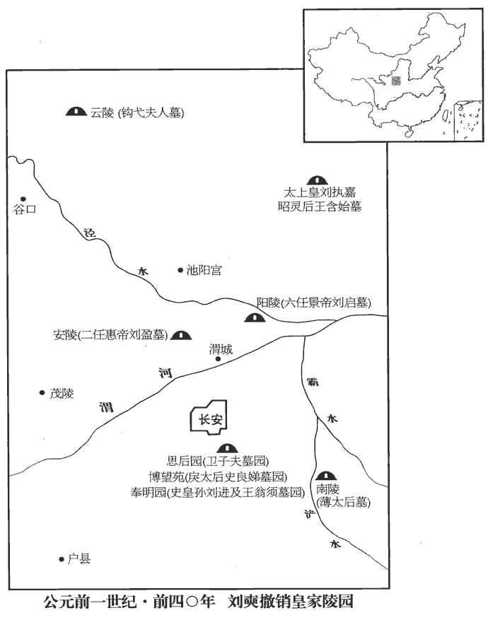
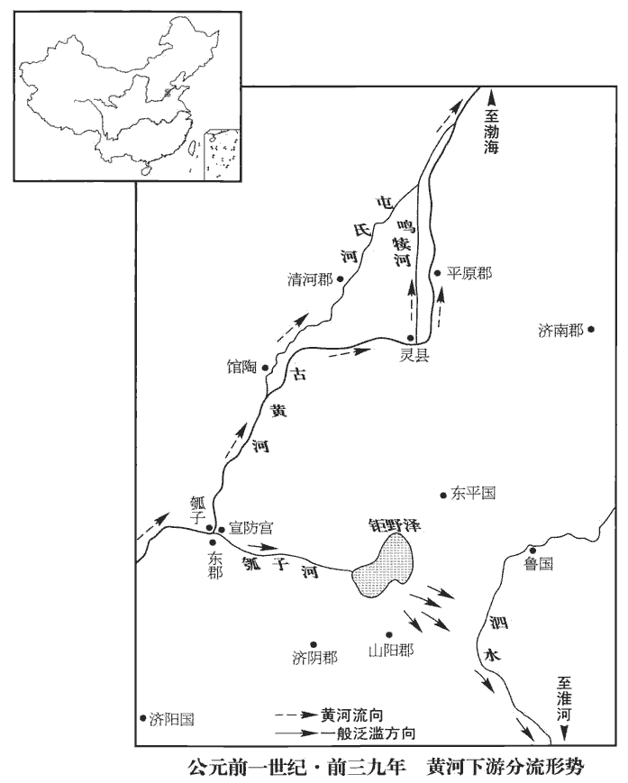
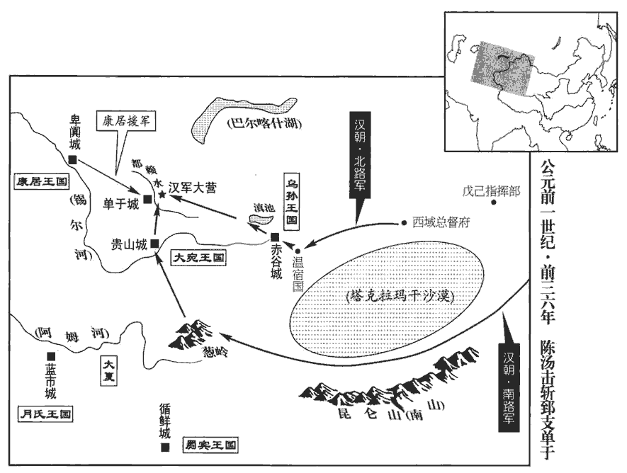

 漢紀二十一起上章執徐（庚辰），盡著雍困敦（戊子），凡九年。

# 孝元皇帝下

## 永光三年（庚辰，前四一）

1春，二月，馮奉世還京師，更為左將軍，賜爵關內侯。

〖译文〗 [1]春季，二月，冯奉世回长安，调任左将军，封关内侯。

2三月，立皇子康為濟陽王。濟，子禮翻。

〖译文〗 [2]三月，元帝赐封皇子刘康当济阳王。

3夏，四月，平【章：乙十一行本「平」上有「癸未」二字；孔本同；張校同；退齋校同；傳校同。】昌考侯王接薨。諡法：大慮行方曰考。秋，七月，壬戌，以平恩侯許嘉為大司馬、車騎將軍。

〖译文〗 [3]夏季，四月，平昌侯王接去世。秋季，七月壬戌（疑误），任命平恩侯许嘉当大司马、车骑将军。

4冬，十一月，己丑‹八›，地震，雨水。

〖译文〗 [4]冬季，十一月己丑（初八），地震，降雨。

5復鹽鐵官；置博士弟子員千人。罷鹽鐵官，博士弟子毋置員，事見上卷初元五年。以用度不足，民多復除，復，方目翻。無以給中外繇役故也。繇，古傜字通。

〖译文〗 [5]恢复盐铁专卖制度。规定博士弟子的定员为一千人。这是因为朝廷经费不够开支，而民间又有许多人免除赋税徭役，使朝廷无法供应内外徭役的缘故。

## 四年（辛巳，前四零）

1春，二月，赦天下。

〖译文〗 [1]春季，二月，大赦天下。

2三月，上‹刘奭，时年三十六›行幸雍‹陝西鳳翔›，祠五畤。雍，於用翻。畤，音止。

〖译文〗 [2]三月，元帝前往雍城，祭祀五帝。

3夏，六月，甲戌‹二十六›，孝宣園‹刘病已墓›東闕災。

〖译文〗 [3]夏季，六月甲戌（二十六日），孝宣皇帝陵园东门失火。

4戊寅‹三十›晦，日有食之。上於是召諸前言日變在周堪、張猛者責問，皆稽首謝；譖堪、猛事見上卷元年。稽，音啟。因下詔稱堪、猛【章：乙十一行本無「猛」字；傳校同。】之美，徵詣行在所，拜為光祿大夫，秩中二千石，領尚書事；猛復為太中大夫、給事中。中書令石顯管尚書，師古曰：言管主其事。尚書五人皆其黨也；按帝紀及百官表，成帝建始四年，初置尚書員五人。此蓋言顯與牢梁、五鹿充宗、伊嘉、陳順五人皆典領尚書事，雖未置定員，實亦五人也。堪希得見，見，賢遍翻。常因顯白事，事決顯口。會堪疾瘖yīn，不能言而卒。師古曰：瘖，音於今翻。顯誣譖猛，令自殺於公車。

〖译文〗 [4]戊寅晦（三十日），出现日食。元帝召集那些先前说天变灾难都是为周堪、张猛而发的官员进行责问，他们都跪拜于地谢罪。于是，元帝下诏褒扬周堪、张猛，调回京师长安。任命周堪担任光禄大夫，支中二千石俸禄，主管尚书事务；任命张猛当太中大夫、给事中。而这时候，中书令石显兼管尚书，尚书五人都是石显的党羽。周堪很难见到元帝，虽有建议，往往不得不拜托石显代为转达，大政方针的决定权被石显控制。正巧周堪得了失音病，不能说话而去世。石显又诬陷张猛，让他自杀于公车官署。

5初，貢禹奏言：「孝惠、孝景廟皆親盡宜毀，按貢禹傳，定漢宗廟迭毀之禮，未及施行而卒。其後，韋玄成等毀廟之議，又不純用禹說。觀其奏言天子七廟，孝惠、孝景親盡宜毀，蓋以悼考廟足為七廟也。及郡國廟不應古禮，宜正定。」惠帝尊高帝廟為太祖廟，景帝尊文帝廟為太宗廟；行所嘗幸郡國，各立太祖、太宗廟。宣帝復尊武帝為世宗廟，行所巡狩亦立焉。凡祖宗廟在郡國者六十八，合百六十七所。春秋之義，王不祭於下土諸侯，故以為不應古禮。天子是其議。秋，七月，戊子‹十›，罷昭靈后、武哀王、昭哀后、衛思后、戾太子、戾后園，皆不奉祠，裁置吏卒守焉。師古曰：昭靈后，高祖‹刘邦›母‹王含始›也。武哀王，高祖兄也。昭哀后，高祖姊也。衛思后，戾太子‹刘据›母‹卫子夫›也。戾后，即史良娣也。冬，十月，乙丑‹十九›，罷祖宗廟在郡國者。

〖译文〗 [5]当初，贡禹上奏章说：“孝惠帝、孝景帝的祭庙，因为亲情己尽，应该撤除。各郡、各封国设置皇帝祭庙，不合古代礼制规定，应该改正。”元帝认为有理。秋季，七月戊子（初十），撤除昭灵后、武哀王、昭哀后、卫思后、戾太子、戾后的祭庙，都不再祭祀，只设置官吏兵卒守护。冬季，十月乙丑（十九日），撤除设置在各郡、各封国的祖宗祭庙。

 

6諸陵分屬三輔。師古曰：先是諸陵總屬太常，今各依其地界屬三輔。以渭城‹陝西咸陽›壽陵亭部原上為初陵；服虔曰：元帝所置陵也；未有名，故曰初。詔勿置縣邑及徙郡國民。

〖译文〗 [6]元帝下诏，各位皇帝的陵园，以其所在地区，分属三辅管理。在渭城寿陵亭部原上预设坟墓，下诏不要把它发展成为一个县，也不要强迫各郡、各崐封国移民到那里。

## 五年（壬午，前三九）

1春，正月，上‹刘奭，时年三十七›行幸甘泉‹陝西淳化西北›，郊泰畤。畤，音止。三月，幸河東‹山西夏縣›，祠后土。

〖译文〗 [1]春季，正月，元帝前往甘泉，在泰祭祀天神。三月，再往河东，祭祀后土神。

2秋，潁川‹河南禹州›水，流殺人民。

〖译文〗 [2]秋季，颍川郡水灾，淹死百姓。

3冬，上幸長楊‹陝西周至›射熊館，師古曰：長楊，宮名也，在盩zhōu厔zhì縣；其中有射熊館。大獵。

〖译文〗 [3]冬季，元帝前往长杨宫射熊馆，大肆游猎。

4十二月，乙酉‹十六›，毀太上皇、孝惠皇帝寢廟園，用韋玄成等之議也。玄成等奏曰：「祖宗之廟，世世不毀；繼祖以下，五廟而迭毀。今高皇帝為太祖，孝文皇帝為太宗，孝景皇帝為昭，孝武皇帝為穆，孝昭皇帝與孝宣皇帝俱為昭。皇考廟，親未盡。太上皇、孝惠廟皆親盡，宜毀。」

〖译文〗 [4]十二月乙酉（十六日），元帝采用丞相韦玄成等的建议，下诏拆毁太上皇、孝惠皇帝的祭庙。

5上好儒術、文辭，頗改宣帝之政；言事者多進見，好，呼到翻。見，賢遍翻。人人以【章：乙十一行本「以」上有「自」字；孔本同。】為得上意。又傅昭儀及子濟陽王康愛幸，外戚傳曰：元帝加昭儀之號，位視丞相，爵比諸侯王。師古曰：昭顯其儀，示隆重也。濟，子禮翻。逾於皇后、太子。昭儀位次皇后，今寵逾之。太子少傅匡衡上疏曰：疏，所據翻，條陳也。「臣聞治亂安危之機，在乎審所用心。蓋受命之王，【章：乙十一行本「王」作「主」；傳校同。】務在創業垂統，傳之無窮；繼體之君，心存於承宣先王之德而褒大其功。昔者成王之嗣位，思述文、武之道以養其心，休烈盛美【章：乙十一行本「美」下有「皆」字；孔本同；張校同，傳校同。】歸之二后，而不敢專其名，師古曰：休，亦美也。烈，業也。后，君也。二君，文王、武王也。是以上天歆xīn享，鬼神祐焉。陛下聖德天覆，子愛海內，覆，敷又翻。然而陰陽未和、姦邪未禁者，殆議者未丕pī揚先帝之盛功，師古曰：丕，大也。爭言制度不可用也，務變更之，所更或不可行而復復之，更，工衡翻；下同。上復，扶又翻，又也。下復，扶目翻，反也。是以群下更相是非，吏民無所信。臣竊恨國家釋樂成之業而虛為此紛紛也！師古曰：釋，廢也。樂成，謂已成之業，人情所樂也。樂，音洛。願陛下詳覽統業之事，留神於遵制揚功，遵先帝之法制，揚先帝之功烈也。以定群下之心。詩大雅曰：『無念爾祖，聿yù脩厥德，』師古曰：大雅文王之詩也。無念，念也。聿，述也。蓋至德之本也。傳曰：『審好惡，理情性，而王道畢矣。』衡守詩學，此必詩傳之言。傳，直戀翻。好，呼到翻。惡，烏路翻。治性之道，必審己之所有餘而強其所不足，治，直之翻。師古曰：強，勉也，音其兩翻。蓋聰明疏通者戒於太察，寡聞少見者戒於壅蔽，少，詩沼翻。勇猛剛強者戒於太暴，仁愛溫良者戒於無斷，斷，丁亂翻。湛zhàn靜安舒者戒於後時，廣心浩大者戒於遺忘。師古曰：湛，讀曰沈。忘，巫放翻。必審己之所當戒而齊之以義，然後中和之化應，而巧偽之徒不敢比周而望進。比，毗至翻。唯陛下戒之，所以崇聖德也！

〖译文〗 [5]元帝喜好儒家的学说，又 喜爱文章辞语。对宣帝的法令制度多有改变。谈论政事，提出建议的人，多数都被召见，每人都认为受到皇帝的注意。这时候，傅昭仪和她的儿子济阳王刘康，正受到元帝特别的宠爱，超过皇后和皇太子刘骜。太子少傅匡衡上书说：“我曾经听说，治乱安危的关键，在于人主是不是慎重用心。接受天的旨意的君王，任务在于开创大业，使它世代相承，无穷无尽地传下去。而继任的君王，心思要放到继承和发扬祖先的恩德功勋上。从前，周成王继承王位之后，追思祖父周文王、父亲周武王成功的道理，用以培养自己的心性，把美好的声誉和荣耀，都归功于祖父和父亲两位先王，而不敢自己居功。因此，上天享受他的供品，连鬼神也都保佑他。陛下圣明的恩德，象天一样覆盖大地，象爱护儿女一样爱护四海之内的百姓。可是阴阳没有调和，奸诈邪恶也没有禁止。这大概是因为臣子未能发扬光大先帝的盛大功业，反而争先恐后地抨击过去的法令规章不可用，一定要加以改变。然而，很多制度改变了之后，无法执行，只好再恢复原状。结果是，在下位的人发生纠纷，官吏和平民无所遵信。我常在内心痛恨，国家放弃了人心所乐的已成的功业，而白白去做那些纷乱的事情。但愿陛下仔细回顾汉室世代相继的事业，留意遵守先帝的法制，弘扬先帝的功业，用以安定臣僚的心。《诗经·大雅》说：‘不要忘记祖先的教诲，努力修养自己的德行。’这是达到‘德’的根本方法。《诗传》说‘知道应喜爱什么，应厌恶什么，使性情变好，圣王的道路就是如此。’修养性情的方法，必定要知道自己的长处，而弥补自己的缺欠。聪明通达的人，警惕苛察；见识不广的人，警惕被蒙蔽；勇猛刚强的人，警惕过于暴烈；仁爱温良的人，警惕没有决断；恬淡安静的人，警惕贻误时机；胸襟广阔的人，警惕疏忽大意。必须了解自己所应当注意纠正的缺失，以大义来弥补它，然后才能达到万事和谐的美好境界。那些伪善的乖巧之徒，才无法结党搭帮，企望挤进朝廷。务请陛下警惕自己，使陛下的圣德更为崇高。

臣又聞室家之道脩，則天下之理得，故詩始國風，禮本冠、婚。始乎國風，原情性以明人倫也；本乎冠、婚，正基兆以防未然也；師古曰：關雎美后妃之德，而為國風之首。禮記冠義曰：冠者，禮之始也。婚義曰：婚者，禮之本也。冠，古玩翻；下同。故聖王必慎妃后之際，別適長之位，師古曰：適，讀曰嫡；下同。長，知兩翻。禮之於內也。卑不踰尊，新不先故，先，悉薦翻。所以統人情而理陰氣也；其尊適而卑庶也，適子冠乎阼，禮之用醴，師古曰：阼，主階也。醴，甘酒也，貴於眾酒。適，讀曰嫡。眾子不得與列，所以貴正體而明嫌疑也。非虛加其禮文而已，乃中心與之殊異，故禮探其情而見之外也。探，吐南翻。聖人動靜游燕所親，物得其序，師古曰：言凡物大小，高卑皆有次序。則海內自脩，百姓從化。如當親者疏，疏，讀曰踈。當尊者卑，師古曰：如，若也。則佞巧之姦因時而動，以亂國家。故聖人慎防其端，禁於未然，不以私恩害公義。傳曰：『正家而天下定矣！』」師古曰：易家人卦之彖tuàn辭。

〖译文〗 “我又曾经听说，家庭如果安详和睦，天下自然治理得好。所以《诗经》开头就是《国风》。《礼记》开头就讲冠礼、婚礼。用《国风》开头，追溯性情的根本，表明人伦之间的关系。用冠礼、婚礼开头，，为安详的家庭奠立基础，以防患于乱起之前。所以圣明的君王，必须慎重处理妃嫔与皇后之间的关系，注意区分‘嫡子’与‘庶子’的不同地位，把礼仪纳入自己家内。卑贱的不能超过尊贵的，新来的不能排在旧有的之前。必如此，才合乎人情，理顺乎阴气。嫡子尊贵，庶子卑贱，嫡子成年，举行加冠礼时，在高台上隆重举行，使用甜酒祝贺。其他的儿子，不能用这种仪式，其目的就在于显示嫡子的尊贵，使立于无可怀疑的地位，不仅仅是表面的礼节仪式而已，而是内心对待嫡子与其他儿子截然不同，所以用礼仪。把真情显露于外。圣人的一举一动，和谁欢宴娱乐，和谁亲近，都要使尊贵卑贱都有一定次序。如此的话，全国百姓都会自我修养，顺从归化。如果应当亲近的反而疏远，应当尊重的反而放到卑贱的地位，那么乖巧的邪恶之徒就会乘机而动，使国家混乱。所以圣人谨慎小心，不愿有一个坏的开头。用心防范于乱起之前，决不因私人的恩情，伤害正大的原则。正如《易传》所说：‘家庭端正，则天下就安定了。’”

 

6初，武帝既塞宣房‹河南濮縣西南瓠子堤›，事見二十一卷武帝元封二年。塞，悉則翻；下同。後河復北決於館陶‹河北館陶›，分為屯氏河，館陶縣，屬魏郡，河水自此別出為屯氏河，東北至勃海章武縣入海；過魏郡、清河、信都、勃海四郡，行千五百里。師古曰：屯，音大門翻。而隋氏分析州縣，誤以為毛氏河，乃置毛州，失之甚矣。復，扶又翻。東北入海‹經河北滄州北›，廣深與大河等，故因其自然，不隄dī塞也。是歲，河決於清河‹河北清河›靈‹山東高唐南›鳴犢口，而屯氏河絕。據溝洫志：靈鳴犢口在清河東界。師古曰：清河之靈縣鳴犢河口也。按唐博州高唐縣，漢靈縣地，鳴犢河在縣西。宋白曰：魏州夏津縣本漢靈縣地，漢初為鄃shū縣，故城在今德州西南五十里；天寶元年改為夏津縣。

〖译文〗 [6]当初，武帝曾经堵塞黄河决口，筑宣房宫。后来，黄河又在北面的馆陶决口，形成屯氏河，沿东北方向入海，因为河床广度深度跟黄河相同，所以听其自由发展，不再堵塞决口。本年，黄河在清河郡所属灵县鸣犊堤再度决口，屯氏河于是无水干涸。

## 建昭元年（癸未，前三八）

1春，正月，戊辰‹二十八›，隕石于梁‹河南商丘›。據五行志，隕石于梁國。

〖译文〗 [1]春季，正月戊辰（二十九日），陨石坠在梁国。

2三月，上‹刘奭，时年三十八›行幸雍‹陝西鳳翔›，祠五畤。雍，於用翻。畤，音止。

〖译文〗 [2]三月，元帝前往雍城，祭祀五帝。

3冬，河間王元坐賊殺不辜，廢，遷房陵‹湖北房縣›。元，河間獻王德之來孫也。

〖译文〗 [3]冬季，河间王刘元，被控残杀无罪之人，撤销爵位，贬逐房陵。

4罷孝文太后寢祠園。孝文太后，薄氏，葬霸陵之南。

〖译文〗 [4]元帝下令撤除文帝母亲薄太后的陵园。

5上幸虎圈鬬獸，圈，求阮翻；下同。後宮皆坐；熊逸出圈，攀檻欲上殿，上，時掌翻。左右、貴人、傅倢伃等皆驚走；傅倢伃，即傅昭儀，蓋後進號也。倢伃，音接予。馮倢伃直前，當熊而立。左右格殺熊。上問：「人情驚懼，何故前當熊？」倢伃對曰：「猛獸得人而止；妾恐熊至御坐，坐，徂臥翻。故以身當之。」帝嗟嘆，倍敬重焉。傅倢伃慚，由是與馮倢伃有隙。為後傅太后誣殺中山馮太后張本。馮倢伃，左將軍奉世之女也。

〖译文〗 [5]元帝前往虎圈，观赏野兽搏斗，妃嫔们都在座奉陪。一只熊突然跳出圈外，攀着阑杆想上殿堂。元帝左右的侍从、贵族，包括傅婕妤在内的妃嫔们，都惊慌逃命。只有冯婕妤，一直向前站着挡住熊。武士把熊杀死。元帝惊魂初定后，问她：“人人恐惧，你为什么上前阻挡熊？”冯婕妤说：“猛兽凶性发作，只要抓着一个人，就会停止攻击，我恐怕它直扑陛下的座位，所以以身阻挡它。”元帝感激嗟叹，对冯婕妤倍加敬重。而傅婕妤大为惭愧，从此与冯婕妤产生隔阂。冯婕妤是左将军冯奉世的女儿。

## 二年（甲申，前三七）

1春，正月，上‹刘奭，时年三十九›行幸甘泉‹陝西淳化西北›，郊泰畤。三月，行幸河東‹山西夏縣›，祠后土。

〖译文〗 [1]春季，正月，元帝前往甘泉，在泰祭祀天神。三月，前往河东，祭祀后土神。

2夏，四月，赦天下。

〖译文〗 [2]夏季，四月，大赦天下。

3六月，立皇子興為信都‹河北冀縣›王。考異曰：荀紀，「興」作「譽」。今從漢書。

〖译文〗 [3]六月，元帝赐封皇子刘兴为信都王。

4東郡‹河南濮陽西南›京房學易於梁‹河南商丘›人焦延壽。風俗通云：鄭武公子段封於京，其後氏焉。姓譜云：周武王封神農之後於焦，後以國為氏。又左傳云：虞、虢、焦、滑，皆姬姓也。董正工曰：京房，本姓李，吹律，自定為京氏。洪氏隸釋云：漢中黃門譙敏碑云：其先故國師譙贛，傳道與京君房。此碑以焦贛為譙。左傳，楚師伐陳，取焦夷，註謂焦，今譙縣。若是，則「焦」、「譙」可以通用。梁，國名。延壽常曰：「得我道以亡身者，京生也。」其說長於災變，分六十卦，更直日用事，以風雨寒溫為候，孟康曰：分卦直日之法，一爻各主一日，六十卦為三百六十日。餘四卦，震、離、兌、坎為方伯、監司之官。所以用震、離、兌、坎者，是二至、二分用事之日，又是四時各專王之氣，各卦主時。其占法，各以其日觀其善惡也。更，工衡翻。各有占驗。房用之尤精，以孝廉為郎，上疏屢言災異，有驗。天子說之，數召見問。說，讀曰悅。數，所角翻。房對曰：「古帝王以功舉賢，則萬化成，瑞應著；師古曰：萬化，萬機之事，施教化者也。一曰：萬物之類也。末世以毀譽取人，譽，音餘。故功業廢而致災異。宜令百官各試其功，災異可息。」詔使房作其事，房奏考功課吏法。晉灼曰：令、丞、尉治一縣，崇教化，亡犯法者，輒遷。有盜賊，滿三日不覺者，則尉事也；令覺之，自除，丞、尉負其罪。率相準，如此法。上令公卿朝臣與房會議溫室，皆以房言煩碎，令上下相司，不可許；上意鄉之。師古曰：鄉，讀曰嚮。時，部刺史奏事京師，上召見諸刺史，令房曉以課事；刺史復以為不可行。武帝置十三州刺史，各部一州，故曰部刺史。復，扶又翻。唯御史大夫鄭弘、光祿大夫周堪初言不可，後善之。

〖译文〗 [4]东郡人京房跟从梁人焦延寿学习《易经》。焦延寿常说：“得到我的学问而丧失生命的，就是京房。”他的学说长于占卜天灾人祸，共分六十卦，轮流交替地指定日期，用风雨冷热作为验证，都很准确。京房运用这种学说，尤其功力深厚，被地方官府推荐为“孝廉”之后，他到朝廷充当郎，屡次上书元帝，议论天象变异，十分灵验。元帝喜欢他，数次召见，向他询问。京房回答说：“古代帝王按功劳选拔贤能，万事都有成就，祥瑞显现。衰亡之世，任用官员则以遭诋毁还是受称赞为依据，所以政治腐败，因而招致天灾变异。应当考察文武百官的行政效率及其政绩，天灾变异才可停止。”元帝命京房主持这件事，京房于是拟定了考功课吏法，上奏元帝。元帝下令，公卿朝臣与京房在温室殿举行讨论会。大家都认为京房的办法过于琐碎，使上级和下级互相监督侦察，不可施行。但元帝却倾向京房。当时，正好各州刺史向朝廷奏报事宜，集中在京师长安。元帝召见他们，命京房向他们宣布考核之事，刺史们也认为不可施行。只有御史大夫郑弘、光禄大夫周堪，开始时反对，后来转为支持。

是時，中書令石顯顓權，顯友人五鹿充宗為尚書令，二人用事。房嘗宴見，師古曰：以閒宴時而入見天子。見，賢遍翻。問上曰：「幽、厲之君何以危？所任者何人也？」上曰：「君不明而所任者巧佞。」房曰：「知其巧佞而用之邪，將以為賢也？」上曰：「賢之。」房曰：「然則今何以知其不賢也？」上曰：「以其時亂而君危知之。」房曰：「若是，任賢必治，任不肖必亂，必然之道也。治，直吏翻；下同。幽、厲何不覺悟而更求賢，曷為卒任不肖以至於是？」師古曰：卒，終也，音子恤翻。上曰：「臨亂之君，各賢其臣；令皆覺寤，天下安得危亡之君！」房曰：「齊桓公、秦二世亦嘗聞此君而非笑之；然則任豎刁、趙高，政治日亂，盜賊滿山，豎刁註見十八卷武帝元光五年。趙高事見秦紀。何不以幽、厲卜之而覺寤乎？」以龜卜，所以驗吉凶。以幽、厲卜，所以驗治亂。上曰：「唯有道者能以往知來耳。」房因免冠頓首曰：「春秋紀二百四十二年災異，以示萬世之君。今陛下即位以來，日月失明，星辰逆行，山崩，泉湧，地震，石隕，夏霜，冬靁，春凋，秋榮，隕霜不殺，水、旱、螟蟲，民人饑、疫，盜賊不禁，刑人滿市，春秋所記災異盡備。師古曰：言今皆備有之。靁，古雷字。春秋所記：隱十一年、桓十八年、莊公三十二年、閔公二年、僖公三十三年、文公十八年、宣公十八年、成公十八年、襄公三十一年、昭公三十二年、定公十五年、哀公十四年，凡二百四十二年。陛下視今為治邪，亂邪？」上曰：「亦極亂耳，尚何道！」房曰：「今所任用者誰與？」道，言也。師古曰：與，讀曰歟。考異曰：故資政殿學士邵亢得兩浙錢王寫本漢書，無「亂邪」二字，有「上曰：『亦極亂耳，尚何道！』房曰：『今』十二字；今取之。上曰：「然，幸其愈於彼，又以為不在此人也。」師古曰：愈，猶勝也。言今之災異及政道，猶幸勝於往日，又不由所任之人。房曰：「夫前世之君，亦皆然矣。臣恐後之視今，猶今之視前也！」上良久，乃曰：「今為亂者誰哉？」房曰：「明主宜自知之。」上曰：「不知也；如知，何故用之！」房曰：「上最所信任，與圖事帷幄之中，師古曰：圖，謀也。進退天下之士者是矣。」房指謂石顯，上亦知之，謂房曰：「已諭。」師古曰：言已曉此意。房罷出，後上亦不能退顯也。

〖译文〗 这时，中书令石显正独揽大权。石显的好友五鹿充宗任尚书令，二人联合执政。有一次，元帝在闲暇时召见京房，京房问元帝：“周幽王、周厉王为什么导致国家出现危机？他们任用的是些什么人？”元帝说：“君王昏庸，任用的都是善于伪装的奸佞。”京房进一步问：“君王是明知奸佞而仍用他们？还是认为贤能才用他们？”元帝回答说：“是认为他们贤能。”京房说：“可是，今天为什么我们却知道他们不是贤能呢？”元帝说：“根据当时局势混乱，君王身处险境便可以知道。”京房说：“如果是这样的话，任用贤能时国家必然治理得好，任用奸邪时国家必定混乱，这是事物发展的必然轨迹。为什么幽王、厉王不觉悟而另外任用贤能，为什么终究要任用奸佞以致后来陷入困境？”元帝说：“乱世君王，各自认为他所任用的官员全是贤能。假如都能觉悟到自己的错误，天下怎么还会有危亡的君王？”京房说：“齐桓公、秦二世也曾经知道周幽王、周厉王的故事，并讥笑过他们。可是，齐桓公任用竖刁，秦二世任用赵高，以致政治日益混乱，盗贼满山遍野。为什么不能用周幽王、周厉王的例子测验自己的行为，而觉悟到用人的不当？”元帝说：“只有治国有法的君王，才能依据往事而预测将来。”京房于是脱下官帽，叩头说：“《春秋崐》一书，记载二百四十二年间的天变灾难，用来给后世君王看。而今陛下登极以来，出现日食月食，星辰逆行；山崩泉涌，大地震动，天落陨石；夏季降霜，冬季响雷，春季百花凋谢，秋季树叶茂盛，降霜后草木并不凋谢。水灾、旱灾、虫灾，百姓饥馑，瘟疫流行。盗贼制伏不住，受过刑罚的人充满街市。《春秋》所记载的灾异，已经俱备。陛下看现在是治世，还是乱世？”元帝说：“已经乱到极点了，这还用问？”京房说：“陛下现在任用的是些什么人？”元帝说：“今天的灾难变异和为政之道，幸而胜过前代。而且认为责任不在这些人身上。”京房说：“前世的那些君王，也是陛下这种想法。我恐怕后代看今天，犹如今天看古代。”元帝过了很久才说：“现在扰乱国家的是谁？”京房回答说：“陛下自己应该知道。”元帝说：“我不知道；如果知道，哪里还会用他？”京房说：“陛下最信任，跟他在宫廷之中共商国家大事，掌握用人权柄的人，就是他。”京房所指的是石显。元帝也知道，他对京房说：“我晓得你的意思。”京房告退。后来，汉元帝还是不能让石显退位。

臣光曰：人君之德不明，則臣下雖欲竭忠，何自而入乎！觀京房所以曉孝元，可謂明白切至矣，而終不能寤，悲夫！詩曰：「匪面命之，言提其耳。匪手攜之，言示之事。」又曰：「誨爾諄諄，聽我藐藐。」皆大雅抑詩之辭也。鄭氏箋曰：「言我非但以手攜掣chè之，親示以其事之是非；我非但對面告語之，親提撕其耳。此言以教導之熟，不可啟覺也。藐藐然，不入也。我教告王，口語諄諄然，王聽聆之藐藐然。諄，之純翻，又之閏翻。藐，美角翻；爾雅云：悶也。孝元‹刘奭›之謂矣！

〖译文〗 臣司马光曰：君王的德行不昌明，则臣属虽然想竭尽忠心，又从何着手呢？观察京房对元帝的诱导，可以说是把道理说得十分清楚透彻了，而最终仍不能使元帝觉悟，可悲啊！《诗经》说：“我不但当面把你教训过，而且提起过你的耳朵。不但是用手携带着你，而且指示了你许多事。”又说：“我教导你是那么的恳切细致，而你却漫不经心、听不进去。”这说的就是汉元帝啊！

5上令房上弟子曉知考功、課吏事者，欲試用之。房上「中郎任良、姚平，願以為刺史，試考功法；臣得通籍殿中，為奏事，以防壅塞。」石顯、五鹿充宗皆疾房，欲遠之，上，時掌翻。為，於偽翻。塞，悉則翻。遠，於願翻。師古曰：欲出之，令遠去。建言，宜試以房為郡守。師古曰：立議云然也。帝於是以房為魏郡‹河北临漳西南邺镇›太守，得以考功法治郡。治，直之翻。

〖译文〗 [5]元帝命京房推荐他的学生中通晓检验政绩和有能力考察官吏的人，准备试用。京房上奏：“中郎任良、姚平，希望能用为刺史，在各州试行考绩制度。请准许我留在朝廷，转报他们的奏章，免得下情不能上达。”然而石显、五鹿充宗都痛恨京房，想使京房远离元帝，于是向元帝建议，应该试任京房为郡守。元帝遂任命京房当魏郡太守，允许他以考功法去治理本郡。

房自請：「歲竟，乘傳奏事，」歲竟，歲終也。傳，知戀翻；下同。天子許焉。房自知數以論議為大臣所非，數，所角翻。與石顯等有隙，不欲遠離左右，離，力智翻。乃上封事曰：「臣出之後，恐為用事所蔽，身死而功不成，故願歲盡乘傳奏事，蒙哀見許。言蒙帝哀憐而許之。乃辛巳‹二十›，蒙氣復乘卦，太陽侵色，張晏曰：晉卦、解卦也。太陽侵色，謂大壯也。原父曰：蒙氣起而太陽侵色，則太陽指日也。大壯、解卦可云太陽，而非所侵色也。京房易傳曰：蒙如塵雲。臣私祿及親，茲謂罔辟，厥異蒙。大臣厭小臣，茲謂蔽蒙，微，日不明，若解不解。晉書天文志曰：凡連陰十日，晝不見日，夜不見月，亂風四起，欲雨而無雨，名曰「蒙」。復，扶又翻；下同。此上大夫覆陽而上意疑也。據孟康註：房以消息卦為辟。辟，君也。息卦曰太陰，消卦曰太陽。其餘卦曰少陰、少陽，謂臣下也。上大夫覆陽，蓋以是候之。師古曰：覆，掩蔽也，音敷救翻。己卯‹十八›、庚辰‹十九›之間，必有欲隔絕臣，令不得乘傳奏事者。」以辛巳蒙氣，占己卯、庚辰二日也。

〖译文〗 京房请求：“年终时候，请准许我乘坐驿车前来，向陛下当面报告。”元帝许可。京房自知数次因为议论受到大臣的非议，跟石显之间怨恨已成，不想远离元帝身边。于是上密封的奏章：“我一出京师，恐怕被当权大臣所害，身死而事败，所以盼望在年终之时，得以乘驿车到京师向陛下奏事，幸而蒙陛下哀怜而允许。然而，六月辛巳（二十日），阴云乱风四起，太阳光芒暗淡，显示高级官员蒙蔽天子，而天子心里怀疑。六月己卯（十八日）、庚辰（十九日）之间，定有要隔绝陛下与我的关系，使我不得乘坐驿车奏事的事情发生。”

房未發，上令陽平侯王鳳承制詔房止無乘傳奏事。鳳，陽平侯王禁之子。房意愈恐。秋，房去至新豐‹陝西臨潼东北›，因郵上封事師古曰：郵，行書者也，若今傳送文書矣。郵，音尤。曰：「臣前以六月中言遯dùn卦不效，法曰：『道人始去，寒湧水為災。』法者，房占候之法，著之於書者也。師古曰：道人，有道術之人也。天氣寒，又有水湧出也。至其七月，湧水出。臣弟子姚平謂臣曰：『房可謂知道，未可謂信道也。房言災異，未嘗不中。中，竹仲翻。湧水已出，道人當逐死，尚復何言！』臣曰：『陛下至仁，於臣尤厚，雖言而死，臣猶言也。』師古曰：自云不避死也。平又曰：『房可謂小忠，未可謂大忠也。小忠，謂以諫殺身而無益於國。大忠，謂諫行言聽而身與國同休也。昔秦時趙高用事，有正先者，非刺高而死，孟康曰：姓正，名先，秦博士也。姓譜：正姓，宋上卿正考父之後。高威自此成，故秦之亂，正先趣之。』師古曰：趣，讀曰促。今臣得出守郡，自詭效功，恐未效而死，惟陛下毋使臣塞湧水之異，師古曰：塞，當也。當正先之死，為姚平所笑。」

〖译文〗 京房还没有出发，元帝命阳平侯王凤奉诏通知京房，不要乘驿车回京师奏事。京房心中更加惊恐。秋季，京房出发，走到新丰，托朝廷传送文书的差人再上密封的奏章：“我先前于六月间曾上书陛下，所说《遁卦》虽未应验，但占候之法说：‘有道术的人刚刚离去，天气寒冷，大水涌出成灾。’到了七月，果然大水涌出。我的学生姚平告诉我：‘你可以说通晓道术，却不能说笃信崐道术。你所预测的天灾变异，没有一件事不应验。现在，大水已经涌出，有道术的人就要被放逐而死在外边，还有什么话可说！’我说：‘陛下最仁爱，对我尤其宽厚，即令因进言而死，我还是要进言。’姚平又说：‘你只能说是小忠，不算大忠。从前，秦朝赵高执政，有一位叫正先的人，因讥讽赵高而被处死，赵高的淫威从此形成。所以秦朝的衰乱，是正先推动的。’而今我出任郡守，把考核功效引为自己的责任，只恐怕还没有着手便被诛杀。求陛下不要使我应验大水上涌的预言，像正先那样死去，让姚平嘲笑。”

房至陝‹河南三门峡›，陝縣，屬弘農郡，周、召二伯東西分治，以陝為界，即此地也。陝，音式冉翻。復上封事曰：「臣前白願出任良試考功，臣得居內。議者知如此於身不利，臣不可蔽，故云『使弟子不若試師。』臣為刺史，又當奏事，故復云『為刺史，恐太守不與同心，不若以為太守。』此其所以隔絕臣也。陛下不違其言而遂聽之，此乃蒙氣所以不解、太陽無色者也。臣去稍遠，太陽侵色益甚，願陛下毋難還臣而易逆天意！師古曰：易，輕也，音弋豉翻。邪說雖安於人，天氣必變，言人君雖安其邪說而不之覺，天氣必為之變而失其常。故人可欺，天不可欺也，願陛下察焉！」

〖译文〗 京房到陕县，再上密封奏章：“我先前建议由任良负责官员考绩，让我留在朝廷。议论此事的人知道这样对于他们自身不利，而且不可能把我和陛下隔绝开来，所以说：‘与其学生出面，不如试用老师。’可是，如果派我当刺史，又怕我面见陛下奏报，于是又说：‘当刺史，可能与太守不同心，不如当太守。’目的在于隔绝我们君臣。陛下没有反对他们的主张，听从了他们的建议。这正是阴云乱风所以不散，太阳失去光辉的原因。我离京师长安渐远，太阳的昏暗越来越重。盼望陛下不要难于征我回京师而轻易地违背天意！邪恶阴谋，人虽不觉，上天却必有变化，所以人可以欺，天不可以欺，请陛下详察！”

房去月餘，竟徵下獄。初，淮陽憲王舅張博，傾巧無行，淮陽憲王欽，宣帝張倢伃之子，帝弟也。下，遐稼翻。行，下孟翻。多從王求金錢，欲為王求入朝。博從京房學，以女妻房。房每朝見，退輒為博道其語。師古曰：所與天子言者，皆具說之。為，於偽翻。妻，七細翻。博因記房所說密語，令房為王作求朝奏草，師古曰：草，謂為文之藁gǎo草也。論語，孔子曰：「為命，裨諶chén草創之。」皆持柬與王，以為信驗。淮陽國，在關東。石顯知之，告「房與張博通謀，非謗政治，歸惡天子，詿guà誤諸侯王。」治，直吏翻。詿，古賣翻。皆下獄，棄市，考異曰：元紀及荀紀，京房死皆在此年末。按房傳，二月末上封事；去月餘，徵下獄。百官表：「八月，癸亥，匡衡為御史大夫。」房死必不在歲末也。紀不知月日，故繫之歲末耳。妻子徙邊。鄭弘坐與房善，免為庶人。免御史大夫也。

〖译文〗 京房离开一月余，竟被征回京师，逮捕入狱。当初，淮阳宪王刘钦的舅父张博是一个看风行事，无善行的人物，向刘钦要了许多金钱，到京师长安活动征召刘钦入朝。张博曾跟随京房学习《易经》，而且把女儿嫁给京房。京房每次朝见，回家之后，都把跟元帝之间问答的话告诉张博。张博于是暗中记下京房所说的机密言语，让京房代刘钦草拟请求入朝的奏章。他把这些密语记录和奏章草稿，都送给刘钦过目，作为他工作的证明。石显知道此事后，指控：“京房跟张博通谋，诽谤治国措施，把罪恶推到皇帝身上，贻误连累诸侯王。”于是京房跟张博都被捕入狱，在街市上斩首，妻子儿女被放逐到边塞。御史大夫郑弘，被控跟京房是朋友，遭免职，贬作平民。

6御史中丞陳咸數毀石顯，數，所角翻；下同。久之，坐與槐里‹陝西興平›令朱雲善，漏泄省中語，時丞相韋玄成言雲暴虐無狀，陳咸在前聞之，以語雲；雲上書自訟。顯以此奏咸漏泄省中語。高帝三年，改廢丘為槐里，屬右扶風。石顯微伺知之，與雲皆下獄，髡為城旦。

〖译文〗 [6]御史中丞陈咸不断抨击石显。过了一段时间，石显指控他跟槐里令朱云是好友，泄露宫禁之中的机密，这是石显暗暗侦察得知的。于是陈咸、朱云都被捕下狱，判处髡刑，罚做苦工。

石顯威權日盛，公卿以下畏顯，重足一跡。師古曰：言極恐懼，不敢自寬縱也。重，直龍翻。重足，累足也。累足而立，故一跡。顯與中書僕射牢梁、少府五鹿充宗結為黨友，姓譜：牢姓，孔子弟子琴牢之後。諸附倚者皆得寵位。民歌之曰：「牢邪，石邪！五鹿客邪！印何纍纍，綬若若邪！」師古曰：纍纍，重積也。若若，長貌。纍，音力追翻。

〖译文〗 石显的淫威和权势日益增长，公卿及以下的官员都害怕他，人人自危，不敢稍有宽纵。石显与中书仆射牢梁、少府五鹿充宗结为死党密友，凡依附他们的人，都得到了高官厚禄。民间有歌谣说：“你是姓牢的人，还是姓石的人，是五鹿家的门客吗？官印何其多，绶带何其长！”

顯內自知擅權，事柄在掌握，恐天子一旦納用左右耳目以間己，間，音工莧翻。乃時歸誠，取一信以為驗。顯嘗使至諸官，有所徵發，使，疏吏翻。將命曰使。諸官，諸官府也。顯先自白：「恐後漏盡宮門閉，請使詔吏開門，」上許之。顯故投夜還，稱詔開門入。後果有上書告「顯顓命，矯詔開宮門」，天子聞之，笑以其書示顯。顯因泣曰：「陛下過私小臣，屬任以事，師古曰：過，猶誤也。屬，委也。屬，音之欲翻。群下無不嫉妒，欲陷害臣者，事類如此非一，唯獨明主知之。愚臣微賤，誠不能以一軀稱快萬眾，稱，音尺孕翻。任天下之怨；師古曰：任，猶當也。任，音壬。臣願歸樞機職，受後宮掃除之役，死無所恨。唯陛下哀憐財幸，師古曰：財，與裁同。以此全活小臣！」天子以為然而憐之，數勞勉顯，加厚賞賜，數，所角翻。勞，力到翻。賞賜及賂遺訾zī一萬萬。遺，于季翻。師古曰：賂遺，謂百官群下所遺也。訾，讀與貲同。初，顯聞眾人匈匈，言己殺前將軍蕭望之，事見上卷初元二年。恐天下學士訕shàn己，師古曰：訕，謗也，音所諫翻。以諫大夫貢禹明經著節，乃使人致意，深自結納，因薦禹天子，歷位九卿，禮事之甚備。議者於是或稱顯，以為不妬譖望之矣。薦貢禹事當在顯譖殺京房、陷陳咸之前，故以初字發語。顯之設變詐以自解免，取信人主者，皆此類也。

〖译文〗 石显心知自己专权，把持朝政，怕元帝一旦听取亲信的抨击而疏远自己，便时常向元帝表示忠诚，取得信任，验证元帝对自己的态度。石显曾经奉命到诸官府征集人力和物资，他先向元帝请求：“恐怕有时回宫太晚，漏壶滴尽，宫门关闭，我可不可以说奉陛下之命，教他们开门！”元帝允许。一天石显故意到夜里才回来，宣称元帝命令，唤开宫门入内。后来，果然有人上书控告：“石显专擅皇命，假传圣旨，私开宫门。”元帝听说了这件事，笑着把奏章拿给石显看。石显抓住时机，流泪说：“陛下过于宠爱我，委任我办事，下面无人不妒火中烧，想陷害我，类似这种情形已不止一次，只有圣明的主上才知道我的忠心。我出身微贱，实在不能以我一个人去使万人称心快意，担负起全国所有的怨恨。请允许我辞去中枢机要职务，只负责后宫的清洁洒扫，死而无恨。唯求陛下哀怜裁择，再给我一次宠幸，以此保全我的性命。”元帝认为石显说得对而怜悯他，不断慰问勉励，又重重赏赐。这样的赏赐及百官赠送的资金达一亿。当初，石显听说人们议论愤激，都说是他逼死前将军萧望之，怕招来全国儒生的抨击。由于谏大夫贡禹深明儒家经典，节操高尚而有名望，石显便托人向贡禹表示问候之意，用心结交，并向元帝推荐，使贡禹擢升九卿，并对他以礼相待，很是周详。于是舆论也有赞扬石显的，认为他不曾妒恨陷害萧望之。石显谋略变诈，善于为自己解围，以取得皇帝的信任，用的都是此类手法。

荀悅曰：夫佞臣之惑君主也甚矣，故孔子曰：「遠佞人。」論語孔子告顏淵之言。遠，於願翻；下同。非但不用而已，乃遠而絕之，隔塞其源，塞，悉則翻。戒之極也。孔子曰：「政者，正也。」論語，孔子答季康子之言。夫要道之本，正己而已矣。平直真實者，正之主也。故德必核其真，然後授其位；能必核其真，然後授其事；功必核其真，然後授其賞；罪必核其真，然後授其刑；行必核其真，然後貴之；言必核其真，然後信之；物必核其真，然後用之；事必核其真，然後脩之。核，與覈hé同；謂精確得其實也。行，下孟翻。故眾正積於上，萬事實於下，先王之道，如斯而已矣！

〖译文〗 荀悦说：奸佞迷惑君主的方法太多了。所以孔子说：“要远离奸佞！”不仅不用他而已，还要驱逐到远方，跟他隔绝，把源头塞住，态度至为坚决。孔子说：“政治的意思，就是端正。”治理国家最基本的一件事，无非端正自己而已。梗直诚实，则是端正的主干。对于品德，必须核实是真实的，才授给他官位。对于能力，必须核实是真实的，才让他做事。对于功劳，必须核实是真实的，才颁发奖赏。对于罪恶，必须核实是真实的，才加以惩罚。对于行为，必须核实是真实的，才可以尊重。对于言谈，必须核实是真实的，才能够相信。对于物器，必须核实是真实的，才可以使用。对于事情，必须核实是真实的，才能够去做。所以各种端正风气都汇集到朝廷，则下面万事没有虚伪。古代圣王的道理，不过如此而已。

7八月，癸亥‹三›，以光祿勳匡衡為御史大夫。鄭弘坐京房免，以衡代之。

〖译文〗 [7]八月癸亥（初三），元帝擢升光禄勋匡衡任御史大夫。

8閏月丁酉‹八›，太皇太后上官氏崩‹年五十二›。此昭帝上官后也。

〖译文〗 [8]闰八月丁酉（初八），上官太皇太后驾崩。

9冬，十一月，齊‹山東›、楚‹江蘇›地震，此指齊、楚古國之大界。大雨雪，樹折，屋壞。雨，於具翻。折，而設翻。

〖译文〗 [9]冬季，十一月，齐、楚地区地震，下大雪，树木折断，民房倒塌。

## 三年（乙酉，前三六）

1夏，六月，甲辰‹十九›，扶陽共侯韋玄成薨。共，音恭。

〖译文〗 [1]夏季，六月甲辰（十九日）丞相扶阳侯韦玄成去世。

2秋，七月，匡衡為丞相。戊辰‹十四›，衛尉李延壽為御史大夫。

〖译文〗 [2]秋季，七月，元帝擢升匡衡作丞相。戊辰（十四日），擢升卫尉李延寿当御史大夫。

 

3冬，使西域都護、騎都尉北地‹甘肅庆阳西北马岭镇›甘延壽、副校尉山陽‹山東金鄉西北昌邑镇›陳湯師古曰：言延壽及湯本充西域之使，故先言使而後序其官職及姓名。使，疏吏翻。共誅斬【章：乙十一行本「斬」下有「匈奴」二字；孔本同。】郅支單于於康居‹都卑阗城，中亚巴尔喀什湖西南锡尔河北岸突厥斯坦›。

〖译文〗 [3]冬季，命西域都护、骑都尉、北地郡人甘延寿，和副校尉、山阳郡人陈汤一同出兵，在康居王国斩杀郅支单于。

始，郅支單于自以大國，威名尊重，又乘勝驕，郅支嘗破殺閏振，攻破呼韓邪，又殺伊利目，屢破烏孫兵，故乘勝氣而驕也。不為康居王禮，怒殺康居王女康居王以女妻郅支，事見上卷初元五年。及貴人、人民數百，或支解投都賴水中；師古曰：支解，謂截其四支。都賴，郅支水名。余謂都賴水在康居國郅支城旁。發民作城，日作五百人，二歲乃已‹单于城，中亚巴尔喀什湖西南江布尔市›。又遣使責闔蘇‹咸海北岸至里海北岸一带›、大宛‹都貴山城，中亚纳曼干市西北卡散塞城›諸國歲遺，師古曰：胡廣云：康居北可一千里有國名奄蔡，一名闔蘇。然則闔蘇即奄蔡也。歲遺者，年常所獻之物。遺，弋季翻。不敢不予。予，讀曰與。漢遣使三輩至康居，求谷吉等死，殺谷吉見上卷初元五年。師古曰：死，尸也。郅支困辱使者，不肯奉詔；而因都護上書，言「居困戹è，願歸計強漢，遣子入侍。」師古曰：故為此言以調戲也。歸計，謂歸附而受計策也。其驕嫚如此。

〖译文〗 最初，郅支单于自以为匈奴汗国是一个大国，威名远扬，颇受别国尊重，又乘军事胜利而十分骄傲。因为不得康居王礼敬，一怒之下杀了康居王的女儿及康居贵族、平民数百人，有的还截其四肢，扔到都赖水里。他强迫康居人为他建筑城垣，每日有五百名工匠施工，历时二年才完成。又派出使节，前往阖苏王国、大宛王国，责令每年进贡。二国畏惧郅支单于，不敢不给。汉朝前后派出三批使节，前往康居郅支单于处，查问谷吉等人的遗体下落。郅支对于汉朝使节窘困侮辱，不肯接受汉朝皇帝的诏书，只是通过西域都护上书，说：“居住的地方环境困苦，愿意归顺强大的汉朝，还打算派儿子去当人质。”其态度傲慢如此。

湯為人沈勇，有大慮，沈，持林翻。多策略，喜奇功，師古曰：喜，音許吏翻。與延壽謀曰：「夷狄畏服大種，其天性也。種，章勇翻。西域本屬匈奴，武帝雖通西域，匈奴猶役屬之；至宣帝時，朝呼韓邪，降日逐，西域乃咸屬漢。今郅支單于威名遠聞，聞，音問。侵陵烏孫、大宛，宛，於元翻。常為康居畫計，欲降服之；為，於偽翻。降，戶江翻。如得此二國，數年之間，城郭諸國危矣。且其人剽悍，師古曰：剽，輕也。悍，勇也。剽，平妙翻，又匹妙翻。悍，胡幹翻，又下罕翻。好戰伐，數取勝；久畜之，必為西域患。好，呼到翻。數，所角翻。畜，許六翻。雖所在絕遠，蠻夷無金城、強弩之守。如發屯田吏士，即屯田車師者。敺從烏孫眾兵，師古曰：驅率之令隨從也。敺，與驅同；下同。直指其城下，彼亡則無所之，守則不足自保，師古曰：之，往也。保，安也。千載之功可一朝而成也！」載，子亥翻。延壽以為然；欲奏請之。湯曰：「國家與公卿議，此時已稱天子為國家，非至東都始然也。大策，非凡所見，事必不從。」師古曰：言凡庸之人不能遠見，將壞其事也。延壽猶與不聽。與，讀曰豫；即猶豫也。會其久病；湯獨矯制發城郭諸國兵、車師‹吐魯番›戊己校尉屯田吏士。戊己校尉屯田車師。延壽聞之，驚起，欲止焉。湯怒，按劍叱延壽曰：「大眾已集會，豎子欲沮眾邪！」師古曰：沮，止也，壞也，音材汝翻。延壽遂從之。部勒行陳，行，戶剛翻。陳，讀曰陣。漢兵、胡兵合四萬餘人。延壽、湯上疏自劾奏矯制，劾，戶概翻。自劾，自奏其矯制之罪也。陳言兵狀，即日引軍分行，別為六校：別，彼列翻，分也。按湯傳，益置陽威、合騎、白虎之校，併副校尉、戊校尉、己校尉為六校。校，戶教翻。其三校從南道踰蔥領，徑大宛；其三校都護自將，發溫宿國‹新疆乌什›，從北道入赤谷，過烏孫，溫宿國，東至都護治所二千三百八十里，北至烏孫赤谷六百一十里。涉康居界，至闐tián池‹中亚伊塞克湖›西。而康居副王抱闐將數千騎寇赤谷城東，文穎曰：闐，音填。殺略大昆彌千餘人，敺畜產甚多，從後與漢軍相及，頗寇盜後重。師古曰：重，謂輜重也，音直用翻。湯縱胡兵擊之，殺四百六十人，得其所略民四百七十人，還付大昆彌，其馬、牛、羊以給軍食。又捕得抱闐貴人伊奴毒。入康居東界，令軍不得為寇。師古曰：勿抄掠也。間呼其貴人屠墨見之，師古曰：間，謂密呼也。間，古莧翻。諭以威信，與飲、盟，遣去。既與之飲，又與之盟也。徑引行，未至單于城可六十里，止營。復捕得康居貴人具【章：乙十一行本「具」作「貝」；下同；退齋校同。】色子男開牟以為導。復，扶又翻。具色子，即屠墨母之弟，師古曰：母之弟，即謂舅者。皆怨單于，由是具知郅支情。明日，引行，未至城三十里，止營。

〖译文〗 陈汤为人沉着勇敢，能深思熟虑，富有计策谋略，渴望建立奇特的功勋，他向甘延寿建议说：“边境各族畏惧匈奴，这是天性。西域各国，本来都属匈奴管辖，而今郅支单于的威名传播很远，不断侵略乌孙王国和大宛王国，经常给康居王国出谋划策，企图使乌孙、大宛投降归顺。如果把这两国征服，只要几年时间，西域城邦国家都会陷于危险的境 地。郅支单于性情剽悍，喜好战争，不断取得胜利。日子一久，必将成为西域的灾难。虽然他现在地处遥远，幸而他们没有坚固的城堡和强劲的弓弩，无法固守。我们如果征发屯田的军队，并率领乌孙王国的军队，一直挺进到他的城堡之下，他要逃没有地方可逃，要守则兵力不足以自保，千载难逢的功业可以在一天早上完成。”甘延寿认为有理，准备先奏请朝廷批准。陈汤说：“圣上一定会召集公卿商议，远大的策略，不是平庸的官僚所能了解，肯定不同意。”甘延寿迟疑，不肯听他的话。正好甘延寿久病卧床，陈汤单独行动，假传圣旨，征发各城邦国家的军队、车师戊己校尉的屯田部队。甘延寿听说了这件事，大惊而起，要加阻止，陈汤大怒，手按剑柄，叱责甘延寿说：“大军已经集中会合，你小子打算阻止大军吗？”甘延寿于是顺从。他俩部署、集结汉朝和西域多国兵力，共有四万余人。甘延寿、陈汤上奏章自我弹劾假传圣旨之罪，陈述所以如此做的理由。发出奏章的当天，大军出发，分成六路纵队，其中三路纵队沿南道越过葱岭，穿过大宛王国。另三路纵队，由都护甘延寿亲自率领，从温宿国出发，由北道经乌孙王国首府赤谷城，穿过乌孙王国，进入康居王国边界，挺进到阗池西岸。而这时康居王国的副王抱阗，率领数千骑兵，在赤谷城东方攻击乌孙王国大昆弥地区，屠杀及俘虏千余人，抢走牛、羊、马等大批牲畜，然后从后面追上汉军，夺取汉军后部的大批辎重。陈汤命西域兵迎战，杀四百六十人，夺回抱阗所掳掠的乌孙百姓四百七十人，交给大昆弥。而夺回的马匹、牛、羊，则留下来作为军队食物。又逮捕到抱阗手下的贵族伊奴毒。进入康居王国东部国界后，陈崐汤严明军纪，不准烧杀抢掠。秘密召康居王国的贵族屠墨来会晤，向他展示汉朝的威力与决心，摆下酒筵席，共同盟誓，然后送他回去。大军继续挺进，在距新筑的单于城约六十里处，安营扎寨。这时，又俘虏康居王国另一贵族具色子男开牟，让他作向导。具色子男开牟是屠墨的舅父，也痛恨郅支单于的凶暴。汉朝军队于是对郅支单于内部的情况，了如指掌。第二天，大军继续挺进，距单于城三十里，扎营。

單于遣使問：「漢兵何以來？」應曰：「單于上書言：『居困戹，願歸計強漢，身入朝見，』朝，直遙翻。見，賢遍翻。天子哀閔單于，棄大國，屈意康居，故使都護將軍來迎單于妻子。當此時，甘延壽止為西域都護；以將兵故稱將軍。至光武時，遂以賈復為都護將軍。復之都護，蓋護諸將也。恐左右驚動，故未敢至城下。」使數往來相答報，數，所角翻；下同。延壽、湯因讓之；師古曰：讓，責也。「我為單于遠來，為，於偽翻。而至今無名王、大人見將軍受事者，師古曰：名王，諸王之貴者。受事，受教命而供事也。何單于忽大計，失客主之禮也！師古曰：忽，忘也，又輕也。兵來道遠，人畜罷極，食度且盡，師古曰：罷，讀曰疲。度，音大各翻。恐無以自還，願單于與大臣審計策！」

〖译文〗 郅支单于派使节前来询问：“汉朝军队到这里来的目的何在？”汉军的官员回答说：“你们单于曾经上书汉朝皇帝，说：‘居住环境困苦，愿意归降强大的汉朝，亲身到长安朝见。’皇帝怜悯单于放弃幅员广大的国土，委屈地住在康居，所以派遣都护将军，率军前来迎接单于及妻子儿女。恐怕单于的左右惊动，所以没有敢于直接到达城下。”双方使节来往了几次之后，甘延寿、陈汤出面，责备郅支单于的使节说：“我们为了单于，不远万里来到此地，然而，一直到今天，他还没有派出一位名王、显贵，前来晋见都护将军，接受命令而供事，为什么单于对大事这么疏忽，不讲主人待客人的礼节？我们从遥远的地方到此，人马困乏已极，而粮草又快用完，恐怕连回程都不够用，请单于跟大臣们慎重考虑。”

明日，前至郅支城都賴水上，離城三里，離，力智翻。止營傅陳。師古曰：傅，讀曰敷，布也。陳，讀曰陣；下同。望見單于城上立五采幡幟，幟，昌志翻。數百人被甲乘城；師古曰：乘，謂登之備守也。被，皮義翻；下同。又出百餘騎往來馳城下，步兵百餘人夾門魚鱗陳，師古曰：言其相接次，形若魚鱗。講習用兵。城上人更招漢軍曰：「鬬來！」師古曰：更，互也，音工衡翻。百餘騎馳赴營，營皆張弩持滿指之，騎引卻。頗遣吏士射城門騎、步兵，射，而亦翻；下同。騎、步兵皆入。延壽、湯令軍：「聞鼓音，皆薄城下，薄，伯各翻。四面圍城，各有所守，穿𡐛，塞門戶，𡐛，即塹字，音尺艷翻。塞，悉則翻。鹵楯為前，戟弩為後，楯，食尹翻。仰射城樓上人。」樓上人下走；土城外有重木城，重，直龍翻。從木城中射，頗殺傷外人。外人發薪燒木城，孔穎達曰：薪，樵也。大樵曰薪。詩云：析薪如之何？匪斧不克。是大，故用斧也。夜，數百騎欲出，外迎射，殺之。

〖译文〗 次日，大军挺进到都赖水畔，在距单于城三里外扎营，构筑阵地，遥望单于城上，五色旗帜迎风飘扬，数百匈奴人披甲戴胄，登上城楼守备。又从城中冲出一百余名骑兵，往来奔驰城下。一百余名匈奴步兵，在城门两侧，结成“鱼鳞阵”，正作战斗演习。城上守军还向汉朝军队挑战：“来打吧！”一百余名匈奴骑兵直冲汉营，汉营的强弩全部拉满，箭矢外指。匈奴骑兵不敢攻击，撤退。强弩部队射击城门外操练的匈奴骑兵、步兵，匈奴兵全部退入城内。甘延寿、陈汤下令总攻：“听到鼓声，都直扑城下，四面包围，各军记住所分配的位置，开凿洞穴，堵塞射击孔。盾牌在前，戟弩在后，仰射城楼上的守军。”攻击开始，城楼上的匈奴守军退下逃走。土城之外，还有由两层木樯构成的重木城。匈奴人由木城射击，使汉朝远征军多有伤亡。于是远征军以薪纵火，焚烧木城。入夜，匈奴守军骑兵数百名突围，汉军予以迎头痛击，箭如雨下，全部歼灭。

初，單于聞漢兵至，欲去，疑康居怨己，為漢內應，又聞烏孫諸國兵皆發，自以無所之。言郅支自計無所往而可也。郅支已出，復還，復，扶又翻。曰：「不如堅守。漢兵遠來，不能久攻。」單于乃被甲在樓上，被，皮義翻。諸閼氏、夫人數十皆以弓射外人。外人射中單于鼻，中，竹仲翻。諸夫人頗死；單于乃下。夜過半，木城穿；中人卻入土城，乘城呼。中人，木城中人也。師古曰：呼，音火故翻；下同。時康居兵萬餘騎，分為十餘處，四面環城，亦與相應和。師古曰：環，繞也，音宦。和，胡臥翻。夜，數奔營，不利，輒卻。平明，四面火起，吏士喜，大呼乘之，師古曰：乘，逐也。余謂乘，駕也；乘火起之勢而駕之也。鉦、鼓聲動地。鉦zhēng，音征，鐃náo也，其狀似鈴。杜佑曰：鐲zhuó，鉦也。形如小鍾，軍行鳴之，以為鼓節。周禮：以金鐲節鼓。近代有大銅疊dié，懸而擊之，以節鼓，曰鉦。康居兵引卻；漢兵四面推鹵楯，推，吐雷翻。并入土城中。單于男女百餘人走入大內。師古曰：大內，單于之內室也。漢兵縱火，吏士爭入，單于被創死。被，皮義翻。創，初良翻。軍候假丞杜勳斬單于首。漢制，軍行有各部校尉；部下有曲，曲有軍候一人。又都護有副校尉，秩比二千石；丞一人，司馬、候、千人各二人。杜勳本為軍候而假丞也。得漢使節二及谷吉等所齎jí帛書；諸鹵獲，以畀bì得者。師古曰：畀，與也，各以與所得人；音必寐翻。凡斬閼氏、太子、名王以下千五百一十八級；閼，於焉翻。氏，音支。生虜百四十五人，降虜千餘人，賦予城郭諸國所發十五王。降，戶江翻。師古曰：賦，謂班與之也。所發十五王，謂所發諸國之王，領兵共圍郅支單于者也。予，讀曰與。

〖译文〗 当初，郅支单于听说汉朝军队到达，打算离开此城。可是，怀疑康居王对他怨恨，与汉朝勾结，里应外合，又听说乌孙王国等西域各国，都派出军队，自以为无处可以投奔。所以，他已逃出单于城，却又返回，说：“不如坚守。汉朝军队远征万里，不可能持久进攻。”郅支单于全身披甲，在城楼上指挥作崐战。他的阏氏、夫人共数十名，也都用弓箭射城外的汉军。汉朝的弩兵射中郅支单于的鼻子，而他的夫人也多有死亡。郅支单于于是从城楼下来。午夜之后，木城被攻破，木城中的匈奴军退入土城，登上城头，呼号呐喊。这时，康居王国一万余人的骑兵援军来到郅支城附近，分散在十余处，环绕城的东西南北四面部署，跟城上的匈奴守军互相呼应。乘着夜色，多次向汉朝军队的营地冲击，然而不能得手，每次都退下来。天将亮时，四面火起，官兵振奋，乘火势大喊，钲鼓之声动地。康居军队再向后撤。汉朝军队推举盾牌，从四面同时冲入土城中。郅支单于率匈奴男女一百余人逃入王宫，汉朝军队纵火焚烧王宫，官兵争先冲入，郅支单于身受重伤而死。军候假丞杜勋，砍下郅支单于人头。在王宫中搜出汉朝使臣的节两只以及谷吉等携带的写在帛上的书信。凡是抢掠的财物，都归抢掠者所有。斩阏氏、太子、名王及以下共一千五百一十八人，生擒一百四十五人，投降的一千余人，分配给领兵共围单于的西域十五个国王。

## 四年（丙戌，前三五）

1春，正月，郅支首至京師。延壽、湯上疏曰：「臣聞天下之大義當混為一，師古曰：混，同也，音胡本翻。余謂混為一者，合四海之內，同稟命於一人，天下之治出於一也。昔有唐、虞，今有強漢。匈奴呼韓邪單于已稱北藩，唯郅支單于叛逆，未伏其辜，大夏‹阿富汗东北部›之西，以為強漢不能臣也。大夏，西域國名，在大宛西南。師古曰：謂漢為不能使郅支臣服也。郅支單于慘毒行於民，大惡通於天；臣延壽，臣湯，將義兵，行天誅，賴陛下神靈，陰陽并應，天氣精明，陷陳克敵，陳，讀曰陣。斬郅支首及名王以下，宜縣頭槀街蠻夷邸間，晉灼曰：槀街，黃圖在長安城門內。師古曰：槀街，街名，蠻夷邸在此街也。邸，若今客館也。又曰：蠻夷邸，若今鴻臚館。崔浩以為「槀」當作「橐tuó」；橐街，即銅駝街也。此說失之。銅駝街在雒陽，西京無也。縣，讀曰懸；下同。以示萬里，明犯強漢者，雖遠必誅！」丞相匡衡等以為：「方春掩骼、埋胔zì之時，禮記月令：孟春，掩骼、埋胔。註云：謂死氣逆生氣也。應劭曰：禽獸之骨曰骼，骼，大也；鳥鼠之骨曰胔，胔，可惡也。臣瓚曰：枯骨曰骼；有肉曰胔。師古曰：瓚說是也。骼，音工客翻。胔，音才賜翻。宜勿縣。」詔縣十日，乃埋之；仍告祠郊廟，赦天下。群臣上壽，置酒。

〖译文〗 [1]春季，正月，郅支单于的人头被送到长安。甘延寿、陈汤上书说：“我们曾经听说，天下的大道理莫过于统一。从前有唐尧、虞舜，今有强大的汉朝。匈奴呼韩邪单于已成为我们北方的藩属，只有郅支单于背叛汉朝，没有伏罪。他逃亡到大夏王国以西，认为强大的汉朝不能使他称臣归顺。郅支单于对百姓残忍狠毒，巨大的罪恶上通于天。臣甘延寿、陈汤，率领仁义的军队，替天讨伐，幸赖陛下神异威灵，阴阳配合，天气晴明，攻破敌阵，打败敌人，斩杀郅支单于及名王以下。应该把郅支单于的头悬挂在长安槁街蛮夷馆舍之间，以昭示万里，胆敢冒犯强大汉朝的，距离虽远也必诛杀！”丞相匡衡等认为：“现在春季，正是掩埋尸骨之时，不应悬挂人头。”元帝下令悬挂郅支单于的头示众十日，然后掩埋。并祭告位于郊外的祖先祭庙，大赦天下。满朝文武向元帝祝贺，举行酒宴。

2六月，甲申‹五›，中山哀王竟薨，哀王者，帝之少弟，與太子游學相長大。游，謂宴遊。學，謂講學。師古曰：同處長養，以至於壯大。少，詩照翻。長，知兩翻。及薨，太子前弔。上望見太子，感念哀王，悲不能自止。太子既至前，不哀，上大恨曰：「安有人不慈仁，而可以奉宗廟，為民父母者乎！」是時駙馬都尉、侍中史丹護太子家，護，監護也。上以責謂丹，師古曰：謂者，告語也。丹免冠謝曰：「臣誠見陛下哀痛中山王，至以感損。謂哀感而神氣為之耗損。嚮者太子當進見，見，賢遍翻；下同。臣竊戒屬，毋涕泣，感傷陛下；師古曰：屬，音之欲翻。罪乃在臣，當死！」上以為然，意乃解。

〖译文〗 [2]六月甲申（初五），中山王刘竟去世。刘竟是元帝的幼弟，跟皇太子刘骜年龄相仿，在一起游玩、读书，一起长大。刘竟去世后，刘骜前往吊丧。元帝看到太子，怀念幼弟，悲哀不能自制。可是已经走到面前的太子，却并不悲哀，元帝对此非常怨恨，说：“天下哪有一点慈爱心肠都没有的人，可以继承祖宗祭庙香火，做人民父母的？”这时，驸马都尉、侍中史丹，正充当太子刘骜的监护人。元帝责备史丹，史丹脱下官帽，请罪说：“我确实看见陛下哀痛中山王，以致身体瘦损。前些时，太子应当进见，我暗中嘱咐他，不要流泪哭泣，免得引起陛下伤感。罪过在我，我应该被处死。”元帝认为史丹说的是事实，才息怒。

3藍田‹陝西藍田›地震，山崩，壅霸水‹源出藍田，西北流，入渭水›，安陵岸崩，壅涇水，涇水逆流。藍田縣屬京兆。水經：霸水出藍田縣藍田谷，過霸陵縣西北流，注於渭。孟康曰：安陵岸，惠帝陵旁涇水岸也。

〖译文〗 [3]蓝田发生地震，山崩，霸水壅塞。安陵堤岸崩塌，泾水壅塞，向西逆流。

## 五年（丁亥，前三四）

1春，三月，赦天下。

〖译文〗 [1]春季，三月，大赦天下。

2夏，六月，庚申‹十七›，復戾園‹刘据墓›。

〖译文〗 [2]夏季，六月庚申（十七日）恢复刘据的陵园戾园。

3壬申‹三十›晦，日有食之。

〖译文〗 [3]壬申晦（二十九日），出现日食。

4秋，七月，庚子‹二十八›，復太上皇寢廟園、原廟、昭靈后、武哀王、昭哀后、衛思后園。時上寢疾，久不平，以為祖宗譴怒，故盡復之；唯郡國廟遂廢云。永光四年，罷園廟。

〖译文〗 [4]秋季，七月庚子（二十八日），恢复太上皇祭庙、陵园及原庙，恢复昭灵后、武哀王、昭哀后、卫思后的陵园。当时元帝卧病，长时间不能痊愈，认为是祖宗发怒谴责，所以将以上祭庙、陵园全部恢复。但各郡、各封国的祭庙却废除了。

5是歲，徙濟陽王康為山陽王。濟，子禮翻。

〖译文〗 [5]本年，元帝改封济阳王刘康为山阳王。

6匈奴呼韓邪單于‹王庭设蒙古哈尔和林›聞郅支既誅，且喜且懼；喜者，以郅支既誅而己無後患也。懼者，以漢威強，懼復得罪而滅亡如郅支也。上書，願入朝見。朝，直遙翻。

〖译文〗 [6]匈奴呼韩邪单于得到郅支单于已被诛杀的消息，既高兴，又恐惧。于是，向汉朝皇帝上书，请求入朝觐见。

## 竟寧元年（戊子，前三三）應劭曰：呼韓邪單于願保塞，邊竟得以安寧，故以冠元也。師古曰：據如應說，竟讀為境。古之用字，境、竟實同。但詔云「長無兵革之事」，竟者，終極之言，言永永安寧也。既無兵革，中外安寧，豈止境上。若依本字而讀，義更弘通也。

1春，正月，匈奴呼韓邪單于來朝，自言願婿漢氏以自親。師古曰：言欲取漢女而身為漢家婿。帝以後宮良家子王嬙字昭君賜單于。嬙，音牆。單于驩喜，上書「願保塞上谷‹河北懷來›以西至敦煌‹甘肅敦煌›，師古曰：保，守也。自請保守之，令無寇盜。敦，徒門翻。傳之無窮。請罷邊備塞吏卒，以休天子人民。」天子下有司議，下，遐稼翻。議者皆以為便。郎中侯應習邊事，以為不可許。上問狀，應曰：「周、秦以來，匈奴暴桀，寇侵邊境；漢興，尤被其害。被，皮義翻；下同。臣聞北邊塞至遼東‹遼寧遼陽›，外有陰山，東西千餘里，草木茂盛，多禽獸，本冒頓單于依阻其中，治作弓矢，來出為寇，是其苑囿也。冒，如字，又莫北翻。治，直之翻。至孝武世，出師征伐，斥奪此地，攘之於幕北，師古曰：斥，開也。攘，卻也，音人羊翻。建塞徼jiǎo，起亭隧，徼，吉弔翻，境也，小路也。循，察也。師古曰：隧，謂深開小道而行，避敵抄寇也，音遂。築外城，設屯戍以守之，然後邊境用得少安。幕北地平，少草木，多大沙，所謂大磧qì也。少，詩沼翻；下同。匈奴來寇，少所蔽隱；從塞以南，徑深山谷，往來差難。邊長老言：『匈奴失陰山之後，過之未嘗不哭也！』長，知兩翻。如罷備塞吏卒，示夷狄之大利，不可一也。今聖德廣被，天覆匈奴，師古曰：如天之覆也。被，皮義翻。覆，敷又翻。匈奴得蒙全活之恩，稽首來臣。夫夷狄之情，困則卑順，強則驕逆，天性然也。前已罷外城，事見二十四卷宣帝地節二年。省亭隧，【章：乙十一行本「隧」下有「令」字；孔本同；張校同。】纔足以候望，通烽火而已。古者安不忘危，不可復罷，二也。復，扶又翻。中國有禮義之教，刑罰之誅，愚民猶尚犯禁；又況單于，能必其眾不犯約哉！三也。師古曰：必，極也；極保之也。毛晃曰：必，定辭也。自中國尚建關梁以制諸侯，關、梁，設於水、陸要會之處。因山陿xiá而設塞以譏陸行者為關，或立石，或架木，或維舟絕水以譏舟行者為梁。所以絕臣下之覬欲也。師古曰：覬，音冀。設塞徼，置屯戍，非獨為匈奴而已，亦為諸屬國降民，本故匈奴之人，恐其思舊逃亡，四也。為，於偽翻。近西羌保塞，與漢人交通，吏民貪利，侵盜其畜產、妻子，以此怨恨，起而背畔。背，蒲妹翻。今罷乘塞，則生嫚màn易分爭之漸，五也。師古曰：乘塞，登之而守也。嫚易，猶欺侮也。易，音弋豉翻。往者從軍多沒不還者，子孫貧困，一旦亡出，從其親戚，六也。又邊人奴婢愁苦，欲亡者多，曰：【張：「曰」作「日」。】『聞匈奴中樂，樂，音洛。無柰候望急何！』然時有亡出塞者，七也。盜賊桀jié黠xiá，群輩犯法，如其窘急，亡走北出，則不可制，八也。黠，下八翻。起塞以來百有餘年，自武帝起塞時，至此時百有餘年。非皆以土垣也，或因山巖、石、木、谿谷、水門，稍稍平之，卒徒築治，功費久遠，不可勝計。治，直之翻；下同。勝，音升。臣恐議者不深慮其終始，欲以壹切省繇戍，師古曰：壹切者，權時之事，非經常也。猶如以刀切物，苟取整齊，不顧長短縱橫，故言一切。繇，古傜字通。十年之外，百歲之內，卒有他變，障塞破壞，亭隧滅絕，當更發屯繕治，累歲【章：乙十一行本「歲」作「世」；孔本同。】之功不可卒復，九也。師古曰：卒，皆讀曰猝。如罷戍卒，省候望，單于自以保塞守禦，必深德漢，師古曰：於漢自稱恩德也。請求無已；小失其意，則不可測。開夷狄之隙，虧中國之固，十也。非所以永持至安，威制百蠻之長策也！」對奏，天子有詔：「勿議罷邊塞事。」使車騎將軍嘉口諭單于師古曰：將軍許嘉也。諭，謂曉告。曰：「單于上書願罷北塞吏士屯戍，子孫世世保塞。單于鄉慕禮義，鄉，讀曰嚮。所以為民計者甚厚，此長久之策也。朕甚嘉之！中國四方皆有關梁障塞，非獨以備塞外也，亦以防中國姦邪放縱，出為寇害，故明法度以專眾心也。專，壹也。敬諭單于之意，師古曰：言已曉知其意也。朕無疑焉。為單于怪其不罷，為，於偽翻；下同。故使嘉曉單于。」毛晃曰：曉，開諭也。單于謝曰：「愚不知大計，天子幸使大臣告語，甚厚！」語，牛倨翻。

〖译文〗 [1]春季，正月，匈奴呼韩邪单于前来朝见，请求准许他当汉家女婿，使他有缘亲近汉朝。元帝把后宫良家女子王嫱，别名王昭君，赏赐给呼韩邪单于。呼韩邪单于非常欢喜，上书汉元帝：“愿保护东起上谷，西至敦煌的汉朝边塞，永远相传。请撤销边境防务和守塞的官吏士卒，使天子的小民获得休息。”元帝把呼韩邪单于的建议交给有关官员讨论，参与讨论的官员都认为可以接受。郎中侯应了解边塞事务，认为不可以允许。元帝问他原因，侯应说：“周朝和秦朝以来，匈奴暴戾强悍，不断侵略边境。汉王朝建立之初，尤其受到它的伤害。据我了解，北方边塞，东到辽东，外有阴山，东西长达一千余里，草崐木茂盛，禽兽众多，本来冒顿单于依赖这里地势险要，制造弓箭，出来抢劫，正是匈奴畜养禽兽的圈地。直到孝武皇帝出军北征，把这一地区夺到手，而将匈奴赶到大漠以北。在这一地区，建立城堡，修筑道路，兴建外城，派遣军队前往屯戍守卫。然后，边境才比从前稍稍安宁。漠北土地平坦，草木稀少，沙漠相连。匈奴前来侵扰，缺少隐蔽之地。边塞之南，道路深远，山谷起伏，往来十分困难。边塞老一辈的人说：‘匈奴丧失阴山之后，每次经过那里都伤心痛哭。’如果撤销边防军队，对夷狄大为有利，这是不能答应的理由之一。现在，圣上的恩德宽阔广大，如天一样覆盖着匈奴。匈奴人得到拯救，才能活下去。感激救命之恩，叩头称臣。不过，夷狄的性情，穷困时谦卑顺从，强大时骄傲横逆，天性如此。前些时，己撤除了外城，减少了亭、燧等军事建筑，现在的边防军队，仅够担任望，互通烽火而已。古人居安思危，边防不可再撤除，这是理由之二。中国有礼义的教育，有刑罚的惩处，愚昧的小民还要犯禁。何况匈奴单于，他能绝对保证他的部众不违犯规定吗？这是理由之三。即令在中国境内，还在水陆要道设立关卡，用以控制封国王侯，使做臣属的断绝非分之想。在边塞设置亭障，屯田戍守，不仅仅是为了防备匈奴，也是因为各属国的降民，他们本是匈奴的人，恐怕他们念旧而逃亡。这是理由之四。近年来，接近边塞的西羌部落，与汉人来往。汉朝的官吏小民贪图财利，掠夺盗取他们的牲畜，甚至强占他们的妻子，因为这些怨恨，激起他们叛变。现在如果撤除边防军队，可能发生这种因欺侮而起的纷争。这是理由之五。过去，从军的战士，很多人没有回来，留在匈奴，他们的子孙生活贫困，有可能大批前往匈奴投靠亲友。这是理由之六。沿边一带，奴仆婢子忧愁悲苦，想逃亡的人多，都说：‘听说匈奴那里快乐，无可奈何的是边塞的监视太紧！’然而时常仍有逃出边塞的人。这是理由之七。窃贼强盗凶暴狡诈，结成团伙触犯法令，如被追捕得急了，就会北逃匈奴，则不可以制裁。这是理由之八。自从沿边设立要塞，已有一百余年，并不完全用土筑墙，有的利用山岩，有的利用石木，有的利用山谷，有的利用水峡，稍加连接增补，征发士兵、刑徒修建，长年累月，用去的劳力经费，无法计算。我恐怕主张撤除边塞的官员，没有深刻考虑到事情的来龙去脉，只想暂时减少戍边的负担。十年之后，百年之内，如果突然发生变化，而边塞已经破坏，烽火亭已经湮没，还要再征发戍卒修建。可是，百余年累积下来的工程，不可能马上恢复。这是理由之九。如果撤销边防军队，废除边境上用于伺望侦察的土堡，匈奴单于必定自认为保塞守边，对汉朝有大恩德，将不断请求赏赐，如果稍有失望，那么后果就难以推测。引起夷狄与汉族感情上的裂痕，毁坏中国的防卫。这是理由之十。由于以上十项理由，我认为：撤除边防军队，不是保持永久和平安定，控制百蛮的好策略！”奏书上去后，元帝下诏：“停止讨论撤除边塞这件事。”派车骑将军许嘉向单于传达口谕说：“单于上书，请求汉朝撤走北方边塞屯田戍守的军队，愿意子孙世代永远保卫边陲。单于向往仰慕礼义，为人民想得很周到，这的确是一个有久远意义的计划，朕非常赞美。中国四方都有关卡、要塞，不是专门为防备来自长城以北的侵扰，也是为了防备中国的奸邪之徒到外面肆无忌惮地胡作非为，造成祸害，所以设边塞表明法规，消灭人们的邪念。朕怀着敬意了解了单于的心意，决不怀疑。因恐怕单于误会中国不撤退边塞军队的原因，因此派遣许嘉向单于解释。”单于道歉说：“我愚昧，没有想到这些重大的谋划。幸亏天子派大臣告诉我，待我这么优厚！”

初，左伊秩訾為呼韓邪畫計歸漢，事見二十七卷宣帝甘露元年。竟以安定。其後或讒伊秩訾自伐其功，師古曰：伐，謂矜其功力。余謂此言其矜畫計定匈奴之功耳，非力也。常鞅鞅，呼韓邪疑之；伊秩訾懼誅，將其眾千餘人降漢，漢以為關內侯，食邑三百戶，令佩其王印綬。師古曰：雖於漢為關內侯，而依匈奴王號與印綬。及呼韓邪來朝，與伊秩訾相見，謝曰：「王為我計甚厚，令匈奴至今安寧，王之力也，德豈可忘！我失王意，使王去，不復顧留，師古曰：言不復顧念而留住匈奴中。皆我過也。今欲白天子，請王歸庭。」歸單于庭也。伊秩訾曰：「單于賴天命，自歸於漢，得以安寧，單于神靈，天子之祐也，我安得力！既已降漢，又復歸匈奴，是兩心也。願為單于侍使於漢，不敢聽命！」師古曰：言為單于充使留侍於漢，不能還匈奴。使，疏吏翻。單于固請，不能得而歸。

〖译文〗 当初，左伊秩訾建议呼韩邪单于归附汉朝，匈奴竟然因此安定。后来，有人进谗言，说左伊秩訾自以为他有安定匈奴的功劳，却没有得到什么封赏，心里常常不满。呼韩邪对他产生怀疑。左伊秩訾担心被杀，于是率领他的部下一千余人投降汉朝。朝廷封他关内侯，拥有三百户人家的封地。佩戴王爵的官印和绶带。等到呼韩邪单于到汉朝朝见，与左伊秩訾会面，呼韩邪单于向他道歉崐说：“大王为我谋划策略，待我非常厚道。匈奴能有今天太平安宁的局面，都是大王的力量，恩德岂能忘记？我却使大王失望，离我而去，不再顾念而留住匈奴，都是我的过失。如今我想向圣上报告，请大王重回王庭。”左伊秩訾说：“单于承受上天的旨意，自从归附汉朝，使匈奴得到安定太平。这是单于神异威灵，汉朝天子的保，我怎么会有这种力量？既然已经归降汉朝，而又再回匈奴，是有二心。愿留在汉朝作为单于的一个使臣，不敢听从您的命令。”呼韩邪单于坚决请求，不能得到左伊秩訾的允许，于是回国。

單于號王昭君為寧胡閼氏；師古曰：言胡得之，國以安寧也。生一男伊屠智牙師，為右日逐王。

〖译文〗 呼韩邪单于称王昭君为宁胡阏氏；生下一个男孩，名叫栾提伊屠智牙师，被封为右日逐王。

2皇太子‹刘骜，时年二十›冠。冠，古玩翻。

〖译文〗 [2]皇太子刘骜行加冠礼。

3二月，御史大夫李延壽卒。

〖译文〗 [3]二月，御史大夫李延寿去世。

4初，石顯見馮奉世父子為公卿著名，女又為昭儀在內；馮昭儀，即馮倢伃，進號昭儀。顯心欲附之，薦言：「昭儀兄謁者逡脩敕，宜侍幄帷。」師古曰：逡，音千旬翻。敕，整也。天子召見，欲以為侍中。見，賢遍翻。逡請間言事。上聞逡言顯專權，大怒，罷逡歸郎官。及御史大夫缺，在位多舉逡兄大鴻臚野王；臚，陵如翻。上使尚書選第中二千石，選第者，選其有行能者，而第其高下之次也。而野王行能第一。行，下孟翻。上以問顯，顯曰：「九卿無出野王者；然野王，親昭儀兄，臣恐後世必以陛下度越眾賢，師古曰：度，過也。私後宮親以為三公。」上曰：「善，吾不見是！」師古曰：言不見此理。因謂群臣曰：「吾用野王為三公，後世必謂我私後宮親屬，以野王為比。」師古曰：比，例也，音必寐翻，當音毗寐翻。三月，丙寅，詔曰：「剛強堅固，確然亡欲，大鴻臚野王是也。亡，古無字通。心辨善辭，言心辨於是非而善於辭令。辨，別也。可使四方，少府五鹿充宗是也。使，疏吏翻。廉潔節儉，太子少傅張譚是也。其以少傅為御史大夫。」以詔褒之次第，不用五鹿充宗而用張譚，何也？帝亦知充宗為石顯之黨也。

〖译文〗 [4]当初，中书令石显，看到冯奉世父子都当公卿，名声显著，女儿又是元帝后宫的昭仪，存心要亲近这家权贵。于是向元帝推荐：“冯昭仪的哥哥谒者冯逡，品格美好，行为端正，应该侍奉左右。”于是，元帝召见冯逡，打算任命他当侍中。冯逡请求单独接见谈事情。元帝听他抨击石显专擅权力，大怒，让他仍然回到原来郎官的位置。等到御史大夫出缺，很多官员推荐冯逡的哥哥大鸿胪冯野王继任。元帝命尚书在二千石官员中遴选，而冯野王以品行好，能力强被评为第一。元帝询问石显的意见，石显说；“九卿中，没有比冯野王更恰当的人选。然而冯野王是冯昭仪的亲哥，我恐怕后世评论起来，必然认为陛下越过许多贤能，对后宫亲属徇私而任命为三公。”元帝说：“好，我没有看到这一点！”于是，告诉众位大臣说：“我如果用冯野王当三公，后世一定抨击我对后宫亲属徇私，会把冯野王拿出来作为例证。”三月丙寅（疑衰），元帝下诏说：“刚强正直，宁静淡泊，大鸿胪冯野王就是这种人。心辨是非，善于辞令，可以代表皇帝出使四方，少府五鹿充宗就是这种人。廉洁而又节俭，太子少傅张谭就是这种人。现在，提拔少傅张谭当御史大夫。”

5河南‹河南洛陽东白马寺东›太守九江‹安徽壽縣›召信臣為少府。信臣先為南陽‹河南南陽›太守，後遷河南，治行常第一。視民如子，好為民興利，躬勸耕稼，開通溝瀆，戶口增倍。吏民親愛，號曰「召父」。師古曰：召，讀曰邵。治，直吏翻。行，下孟翻。好，呼到翻。

〖译文〗 [5]河南郡太守九江人召信臣，被任命当少府。召信臣原先是南阳郡太守，后来才调到河南郡，考绩在全国常常列于第一。他看待黎民跟看待儿女一样，热心为百姓谋求福利，亲自劝导人们务农，开凿疏通灌溉用的沟渠，使户口成倍增加。官员和平民都敬爱他，称他“召父”。

6癸卯，【章：乙十一行本「卯」作「未」；孔本同；張校同；退齋校同；傳校同。】復孝惠皇帝寢廟園、孝文太后、孝昭太后寢園。永光五年，毀惠園。建昭元年，罷孝文太后、孝昭太后寢園。孝昭太后，孝武帝鉤弋趙倢伃也，葬雲陽甘泉宮南。

〖译文〗 [6]三月癸卯（疑误），恢复孝惠皇帝祭庙陵园、孝文太后陵园、孝昭太后陵园。

7初，中書令石顯嘗欲以姊妻甘延壽，妻，七細翻。延壽不取。及破郅支還，還，從宣翻，又如字。丞相、御史亦惡其矯制，惡，烏路翻。皆不與延壽等。師古曰：與，猶許也。陳湯素貪，所鹵獲財物入塞，多不法。師古曰：不法者，私自取之，不依軍法。余謂不法者，以外國財物闌入邊關也。司隸校尉移書道上，移書所過道上郡縣也。繫吏士，按驗之。湯上疏言：「臣與吏士共誅郅支單于，幸得禽滅，萬里振旅，師古曰：師入曰振旅。宜有使者迎勞道路。勞，來到翻。今司隸反逆收繫按驗，當勞來而收繫，是於事理為反也。逆，迎也。是為郅支報讎也！」為，於偽翻。上立出吏士，令縣、道出【章：乙十一行本「出」作「具」；傳校同。】酒食以過軍。漢制，縣有蠻夷曰道。既至，論功，石顯、匡衡以為：「延壽、湯擅興師矯制，幸得不誅；如復加爵土，復，扶又翻。則後奉使者爭欲乘危徼幸，生事於蠻夷，為國招難。」徼，古堯翻，又一遙翻。難，乃旦翻。帝內嘉延壽、湯功而重違衡、顯之議，師古曰：重，難也。久之不決。

〖译文〗 [7]当初，中书令石显，曾经打算把姐姐嫁给甘延寿，甘延寿拒绝。等到崐甘延寿打败郅支单于，返回长安，丞相、御史也对假传圣旨这件事深恶痛绝，对甘延寿的功勋并不赞许。而陈汤又一向贪财，把在外国掳掠的金银财宝带入塞内，违反了多项法令。司隶校尉用公文通知沿途郡县，逮捕陈汤的部下，加以审问。陈汤上书元帝说：“我和我的部下共同诛讨郅支单于，幸而将他擒获歼灭，从万里之外，凯旋班师，应有朝廷派出的使者在道上迎接慰劳。然而今天司隶校尉反而逮捕审问，这是替郅支单于报仇啊！”元帝下令，立即释放所有被捕官兵，命沿途地方官府用酒和食品慰劳通过的军队。甘延寿、陈汤返回长安后，评论功劳，石显、匡衡认为：“甘延寿、陈汤假传圣旨，擅自调动军队，不诛杀他们，已是宽大，如果再赐他们爵号，封他们土地，那么以后派出的使节，就会争先恐后地采取冒险行动，以图侥幸成功，在蛮夷中间生事，给国家招来灾难。”元帝内心嘉许甘延寿、陈汤的功劳，而又难于违反匡衡、石显的意见。过了很久，事情仍不能定下来。

故宗正劉向上疏曰：帝初即位，劉向為宗正；免官久矣，故曰故宗正。向本名更生，至是改名。「郅支單于囚殺使者、吏士以百數，事暴揚外國，傷威毀重，群臣皆閔焉。師古曰：閔，病也。陛下赫然欲誅之，意未嘗有忘。西域都護延壽，副校尉湯，承聖指，倚神靈，總百蠻之君，攬城郭之兵，意之所嚮為指。師古曰：攬，總持之也。出百死，入絕域，遂蹈康居，屠三重城，郅支城木城再重，并土城為三重。重，直龍翻。搴qiān歙xī侯之旗，師古曰：搴，拔也，音騫。歙，許及翻。斬郅支之首，縣旌萬里之外，縣，讀曰懸。揚威昆山之西，昆山，指言崑崙山也。埽谷吉之恥，谷吉為郅支所殺，見上卷初元五年。立昭明之功，昭明，謂顯功也。萬夷慴shè伏，師古曰：慴，恐也，音之涉翻。莫不懼震。呼韓邪單于見郅支已誅，且喜且懼，鄉風馳義，鄉，讀曰嚮。師古曰：馳義，慕義驅馳而來也。稽首來賓，願守北藩，累世稱臣。立千載之功，載，子亥翻。建萬世之安，群臣之勳莫大焉。昔周大夫方叔、吉甫為宣王誅獫Xiǎn狁yǔn而百蠻從，為，於偽翻。其詩曰：『嘽tān嘽焞tūn焞，如霆如雷。顯允方叔，征伐獫狁，蠻荊來威。』師古曰：小雅采芑之詩也。嘽嘽，眾也。焞焞，盛也。言車徒既眾且盛，故能克定獫狁而令荊土之蠻亦畏威而來也。顯，明也。允，信也。獫，音虛檢翻。狁，音庾yǔ準翻。嘽，音他丹翻。焞，音土回翻。易曰：『有嘉折首，獲匪其醜。』師古曰：離上九爻辭也。嘉，善也。醜，類也。言王者出征，克勝斬首，多獲非類，故以為善。言美誅首惡之人，而諸不順者皆來從也。今延壽、湯所誅震，雖易之折首，詩之雷霆，不能及也。論大功者不錄小過，舉大美者不疵細瑕。司馬法曰：『軍賞不踰月，』欲民速得為善之利也。蓋急武功，重用人也。吉甫之歸，周厚賜之，其詩曰：『吉甫燕喜，既多受祉。來歸自鎬，我行永久。』師古曰：小雅六月之詩也。鎬，地名，非豐、鎬之鎬。此鎬及方，皆在周之北。時獫狁侵鎬及方，至於涇陽，吉甫薄伐，自鎬而還；王以宴禮樂之，多受福賜，以其行役有功，日月長久故也。吉甫，尹吉甫也。千里之鎬猶以為遠，況萬里之外，其勤至矣。延壽、湯既未獲受祉之報，反屈捐命之功，久挫於刀筆之前，師古曰：捐其軀命，言無所顧也。挫，屈折也。刀筆，吏也。非所以厲有功，勸戎士也。昔齊桓前有尊周之功，後有滅項‹河南沈丘›之罪，君子以功覆過而為之諱。師古曰：尊周，謂伐楚責苞茅及會王世子於首止。項，國名也。春秋僖十七年，夏，滅項。公羊傳曰：齊滅之也。不言齊，為桓公諱也。桓嘗有繼絕存亡之功，故君子為之諱。覆，敷救翻。為，於偽翻。貳師將軍李廣利，損五萬之師，靡億萬之費，經四年之勞，而僅獲駿馬三十匹，雖斬宛王母寡之首，猶不足以復費，其私罪惡甚多；孝武以為萬里征伐，不錄其過，遂封拜兩侯、三卿、二千石百有餘人。事見二十一卷武帝太初三年、四年。師古曰：靡，散也，音縻。僅，少也。復，償也，音扶目翻。今康居之國，強於大宛，郅支之號，重於宛王，殺使者罪，甚於留馬，而延壽、湯不煩漢士，不費斗糧；比於貳師，功德百之。師古曰：百倍勝之。且常惠隨欲擊之烏孫，事見二十四卷宣帝本始三年。鄭吉迎自來之日逐，事見二十六卷宣帝神爵二年。猶皆裂土受爵。故言威武勤勞，則大於方叔、吉甫；列功覆過，則優於齊桓、貳師；覆，敷又翻。近事之功，則高於安遠、長羅：師古曰：安遠侯，鄭吉；長羅侯，常惠也。而大功未著，小惡數布，數，所角翻。臣竊痛之！宜以時解縣，通籍，孟康曰：縣，罪未竟也；如言縣罰也。通籍者，不禁止，令得出入也。縣，讀曰懸。除過勿治，尊寵爵位，以勸有功。」於是天子下詔赦延壽、湯罪勿治，令公卿議封焉。議者以為宜如軍法捕斬單于令。匡衡、石顯以為「郅支本亡逃失國，竊號絕域，非真單于。」帝取安遠侯鄭吉故事，封千戶；衡、顯復爭。復，扶又翻；下同。夏，四月，戊辰‹三十›，封延壽為義成侯，地理志：沛郡有義成侯國。賜湯爵關內侯，食邑各三百戶，加賜黃金百斤。拜延壽為長水校尉，湯為射聲校尉。

〖译文〗 前任宗正刘向上书说：“郅支单于囚禁和杀害的中国使节以及随从官员，数以百计。这种事在外国广为传播，严重地伤害中国的威望，朝廷群臣都为此而痛苦难过。陛下大怒，要诛杀郅支单于，这一欲念从未忘怀。西域都护甘延寿，副校尉陈汤，秉承圣上旨意，倚仗神灵，统率百蛮的君主，集结各城邦的军队，百死一生，深入极远的地域，于是击破康居，攻杀郅支单于的三层城防。拔掉歙侯大旗，砍下郅支单于人头，悬挂战旗于万里之外，为国家扬威到昆仑山之西。洗刷掉谷吉被杀的耻辱，建立了光辉的功勋，所有的夷民全都慑服，无不震恐。呼韩邪单于看到郅支单于已经伏诛，既高兴又害怕，归化慕义，驱驰而来，叩首朝觐，愿为中国守卫北方边疆，世代做中国的臣属。建立千年永垂的功劳，为国家奠定万世和平，所有官员都没有这么大的贡献。从前，周王朝大夫方叔、吉甫，为周宣王诛杀猃狁部落酋长，而后四方的蛮民全都归附。所以《诗经》赞扬说：‘战车是那么众多威武，犹如雷霆轰鸣一般。如此光明诚实的方叔，率师征伐猃狁，荆地的蛮人畏威都来归附。’《易经》说：‘应该嘉奖的是：斩敌首、获敌虏。’说的是赞美诛杀首恶，则所有不愿顺从的人都会来归顺的。而今，甘延寿、陈汤，他们的诛杀所引起的震动，即令《易经》的‘斩敌首’，《诗经》的‘雷霆’，都无法相比。评价一项重大的功勋，崐不能计较小的过失错误，推举重大的善行，不能抓着一点瑕疵不放。《司马法》说：‘对于军事上的赏赐，不要超过一个月。’目的在于使人迅速得到为善的利益。这是为了以武功为先，以用人为重。尹吉甫班师，周王朝对他重赏，《诗经》上形容说：‘尹吉甫既得宴乐的喜庆，又多受赏赐。只因从镐归来，路遥日久。’千里之外的镐城尚且认为路远，何况万里之外，辛苦已极。可是，甘延寿、陈汤不但没有受到祝福，得到报赏，反而抹杀他们浴血奋战的功劳，在舞文弄墨的刀笔吏前被挑剔，这不是奖励有功，劝勉战士的方法。从前齐桓公，前有尊崇周王室的功劳，后有消灭项国的罪过，儒家学派的君子，认为他功大于过，为他掩饰。贰师将军李广利，丧失五万军队的性命，耗费了亿万钱的费用，经过四年之久的辛劳，而仅仅获得三十匹好马而已，虽然砍下大宛王国国王母寡的人头，还不足以抵消耗费，他自身的罪恶很多。但武帝认为，这是万里之外的征讨，不追究过失，于是赐封两位侯爵，擢升三位卿，提拔二千石一百余人。而今，康居王国，比大宛强大，郅支单于的地位，比大宛国王尊贵，诛杀中国使节的罪行，超过不向汉朝献出汗血马。而甘延寿、陈汤，并没有调用汉朝内地的部队，也没有由中国供应一斗粮食。比起李广利来，他们的功德要超过百倍。而且常惠凭他个人的意见，从乌孙王国进攻龟兹；郑吉没有得到命令，擅自接受匈奴日逐王的投降；他们都享受采邑，晋封侯爵。所以说，甘延寿、陈汤的威武功劳，大于方叔、尹吉甫；功大过小，优于刘桓公、李广利；近世功劳，更高过郑吉、常惠。然而震动天下的功勋还没有受到褒扬，而微小的过失却不断传播，我深感痛惜。建议陛下，应立即解除对甘延寿、陈汤的惩处，恢复他们的自由之身。不再搜寻他们的过失，赐给他们爵位，用以奖励功业。”于是元帝下诏赦免甘延寿、陈汤，不准指控，命公卿讨论如何赐封他们爵位。大家认为应该按照军法“捕斩单于令”，可是匡衡、石显认为“郅支本已逃亡，失去国土，在极远的地域盗用单于名号，而不是真单于”。元帝援用安远侯郑吉的前例，要封给甘延寿、陈汤各一千户的采邑。匡衡、石显再次争执。夏季，四月戊辰（三十日），元帝赐封甘延寿“义成侯”，赐封陈汤“关内侯”，采邑各三百户人家，加赐黄金各一百斤。任命甘延寿当长水校尉，陈汤当射声校尉。

於是杜欽上疏追訟馮奉世前破莎車‹新疆莎車›功。事見二十五卷宣帝元康元年。上以先帝時事，不復錄。欽，故御史大夫延年子也。

〖译文〗 当时，杜钦上书追述冯奉世从前击破莎车王国，击斩莎车王的功勋。元帝认为那是他父亲汉宣帝在位时的往事，不再受理。杜钦是原御史大夫杜延年的儿子。

荀悅論曰：誠其功義足封，追錄前事可也。春秋之義，毀泉臺則惡之，舍中軍則善之，春秋公羊傳：文公十六年，毀泉臺。何以書？譏。何譏爾？先祖為之，己毀之，不如勿居而已矣。昭五年，舍中軍。舍中軍者何？復古也。穀梁之義略同。惡，烏路翻。各由其宜也。夫矯制之事，先王之所慎也，不得已而行之。若矯大而功小者，罪之可也；矯小而功大者，賞之可也；功過相敵，如斯而已可也。權其輕重而為之制宜焉。為，於偽翻。

〖译文〗 荀悦论曰：如果冯奉世的功勋大义应该封爵，纵是过去的事，照样应该受理。《春秋》大义，鲁文公拆毁泉台则受谴责，撤销中军则受到赞许，各有各的原因。假传圣旨这件事，先王看得很严重，但那是在不得已的情况下才这样作。如果功勋小，处罚他是可以的。如果功勋大，就应该赏赐。功过相等，如此也就算了。应该权衡功过大小而作出适当的决定。

8初，太子‹刘骜›少好經書，少，詩照翻。好，呼到翻；下同。寬博謹慎；其後幸酒，樂燕樂，晉灼曰：幸酒，好酒也。師古曰：樂燕樂，若論語稱孔子云：損者三樂：樂驕樂，樂逸遊，樂燕樂，損矣。燕樂，燕私之樂也。上樂，讀如本字，又音五孝翻。下樂，音來各翻。上不以為能。而山陽王康有才藝，母傅昭儀又愛幸，上以故常有意欲以山陽王為嗣。上晚年多疾，不親政事，留好音樂；孟康曰：留意於音樂。或置鼙pí鼓殿下，天子自臨軒檻上，隤tuí銅丸以擿zhì鼓，師古曰：鼙，本騎上之鼓，音步迷翻。檻，軒闌版也。隤，下也。擿，投也。隤，音頹。擿，音持益翻。一曰：擿，磓duī也，音丁力翻。磓，音丁回翻。聲中嚴鼓之節。李奇曰：莊嚴之鼓節也。晉灼曰：疾擊之鼓也。師古曰：晉說是。中，竹仲翻。後宮及左右習知音者莫能為，而山陽王亦能之，上數稱其材。數，所角翻；下同。史丹進曰：「凡所謂材者，敏而好學，溫故知新，師古曰：敏，速疾也。溫，厚也。溫故，厚蓄故事也。何晏曰：溫，尋也；尋繹yì故者，又知新者。余謂何說是。皇太子是也。若乃器人於絲竹鼙鼓之間，則是陳惠、李微高於匡衡，可相國也！」如淳曰：器人，取人器能也。陳惠、李微二人，好音者也。服虔曰：二人皆黃門鼓吹也。於是上嘿然而笑。聞丹言而嘿然，已而笑。

〖译文〗 [8]当初，太子刘骜从小就喜爱儒家经典，宽厚、博学、谨慎。可是后来却爱饮酒，喜欢安乐，元帝认为他没有能力。而另一位皇子山阳王刘康有才干，他的母亲傅昭仪又受到宠爱，元帝因此常有意改封刘康为太子。元帝晚年多病，不过问国家大事，喜爱音乐。有时候把军中所用的骑鼓放在殿下，元帝亲自走到廊上，凭倚栏杆，用铜丸从远处投击鼓面，发出紧密的节奏。侍妾们与左右对音乐有素养的人，都办不到，可是刘康却能够，元帝多次夸奖他的才干。史丹进言说：“才干的意义是，聪明而喜好学问，温习旧的知识，能够得到崐新的理解和体会，皇太子就是这样的人。如果是用演奏乐器的能力衡量人，那么陈惠、李微比匡衡高明，可以辅助国政了。”元帝沉默不语，一笑了之。

及上寢疾，傅昭儀、山陽王康常在左右，而皇后、太子希得進見。見，賢遍翻。上疾稍侵，意忽忽不平，師古曰：稍侵，言漸篤也。平，和也。數問尚書以景帝時立膠東王故事。事見十六卷景帝前六年。是時太子長舅陽平侯王鳳為衛尉、侍中，長，知兩翻；下同。與皇后、太子皆憂，不知所出。師古曰：不知計所出。史丹以親密臣得侍視疾，候上間獨寢時，丹直入臥內，頓首伏青蒲上，服虔曰：青緣蒲席也。應劭曰：以青規地曰青龍；自非皇后不得至此。孟康曰：蒲青為席，用蔽地也。師古曰：應說是也。涕泣而言曰：「皇太子以適長立，積十餘年，師古曰：適，讀曰嫡。名號繫於百姓，天下莫不歸心臣子。師古曰：自託為臣子。仲馮曰：臣子，當屬下句，不當斷之。余以下文大意觀之，顏說為是。見山陽王雅素愛幸，今者道路流言，為國生意，為，於偽翻。以為太子有動搖之議。審若此，公卿以下必以死爭，不奉詔。臣願先賜死以示群臣！」天子素仁，不忍見丹涕泣，言又切至，意大感寤，喟然太息曰：「吾日困劣，劣，弱也。太【章：乙十一行本「太」上有「而」字；孔本同。】子、兩王幼少，兩王：山陽王康、信都王興。意中戀戀，亦何不念乎！然無有此議。且皇后謹慎，先帝又愛太子，事見二十七卷宣帝甘露三年。吾豈可違指！駙馬都尉安所受此語？」師古曰：安，焉也。余謂安，何也。丹即卻，頓首曰：「愚臣妄聞，罪當死！」師古曰：卻，退也，離青蒲上。上因納，謂丹曰：「吾病寖加，恐不能自還，納者，納其言也。師古曰：寖，漸也。不自還者，言當遂至崩亡也。還，讀曰旋。善輔道太子，毋違我意！」丹噓唏而起，師古曰：道，讀曰導。噓，音虛。唏，音許既翻。太子由是遂定為嗣。而右將軍、光祿大夫王商、中書令石顯亦擁佑太子，頗有力焉。夏，五月，壬辰‹二十四›，帝崩於未央宮‹年四十三›。臣瓚曰：帝年二十七即位，即位十六年，壽四十三。

〖译文〗 及至元帝卧病，长久不能起床。傅昭仪和她的儿子山阳王刘康，经常在病床前侍奉。而皇后王政君和太子刘骜，却很少能够进见。元帝的病势渐渐沉重，心绪不宁，几次向尚书查问汉景帝废掉皇太子刘荣，改立胶东王刘彻当皇太子的旧事。这时，太子的大舅父阳平侯王凤当卫尉、侍中，和皇后、太子忧心忡忡，不知道用什么方法才能挽救危局。史丹是元帝最亲密的大臣之一，因此能够直接进入寝殿探病，等到元帝单独躺着的时候，他径直进入寝殿，在地面的青蒲上叩头，流泪说：“刘骜以嫡长子的身份，被封作太子，已十多年了，他的尊号家喻户晓，天下无不归心，愿做他的臣子。我见山阳王刘康一向得到陛下的宠爱，如今道路上纷纷传言，既为国家也有个人考虑，认为太子的地位不稳。如果是这样，三公、九卿及其以下高级官员，必然必死相争，拒绝接受这样的诏令。我请求陛下先赐我死，作为群臣的表率。”元帝素来仁慈，不忍看到史丹伤心流泪，而史丹的话又恳切中肯，甚为感动，有所觉悟，喟然叹息说：“我的病日益沉重，太子刘骜、山阳王刘康、信都王刘兴、年纪都小，心中思恋，对他们的未来怎不悬念！可是，并没有改立太子的念头。而皇后王政君一向谨慎小心，先帝又喜爱太子，我怎么能违背他的意旨？你从什么地方听到这些话？”史丹立即向后退，叩头说：“我愚昧妄信传言，罪当处死。”汉元帝于是接受劝谏，对史丹说：“我的病势越来越沉重，恐不能痊愈，你要好好辅导刘骜，不要辜负了我的重托。”史丹唏嘘起身告退。太子的地位，从此才告巩固。而右将军、光禄大夫王商，中书令石显，也都站在刘骜一边，用力拥戴保助。夏季，五月壬辰（二十四日），汉元帝在未央宫驾崩。

班彪贊曰：臣外祖兄弟為元帝侍中，應劭曰：外祖金敞也。語臣曰：「元帝多材藝，善史書，應劭曰：周宣王太史史籀zhòu所作大篆。語，牛倨翻。鼓琴瑟，吹洞簫，如淳曰：簫之無底者也。杜佑曰：前代有洞簫，今無其器。自度曲，被歌聲，應劭曰：自隱度作新曲，因持新曲以為歌詩聲也。荀悅曰：被聲，能播樂也。臣瓚曰：度曲，謂歌終更授其次，謂之度曲。西京賦曰：度曲未終，雲起雪飛。張衡舞賦亦曰：度終復位，次受三八。師古曰：應、荀二說皆是也。度，音大洛翻。被，音皮義翻。分刌cǔn節度，窮極幼眇。蘇林曰：刌，度也；知曲之終始節度也。韋昭曰：刌，切也；謂能分切句絕為之節制也。師古曰：韋說是也。刌，音千本翻。幼眇，讀曰要妙。少而好儒；少，詩照翻。好，呼到翻。及即位，徵用儒生，委之以政，貢、薛、韋、匡迭為宰相。師古曰：貢禹、薛廣德、韋玄成、匡衡迭互而為丞相也。而上牽制文義，優遊不斷，孝宣之業衰焉。師古曰：為文義所牽制，故不斷決。斷，丁亂翻。然寬弘盡下，出於恭儉，號令溫雅，有古之風烈。」

〖译文〗 班彪赞曰：我外祖父的兄弟曾当过元帝的侍中，告诉我说：“元帝多才多艺，能写一笔好篆书，会弹琴鼓瑟，吹奏洞箫。自己谱出曲调，填词歌唱，厘定音节，极其精妙。从小就喜欢儒学，即位后征召任用儒生，把国家的大政交给他们。贡禹、薛广德、韦玄成、匡衡，相继担任丞相。但是，他为儒家经书的文义所牵制，优柔寡断，汉宣帝的大业因此衰退。然而，他宽厚而能容人，谦恭节俭，态度温雅，有古代君王的风范。

9匡衡奏言：「前以上體不平，故復諸所罷祠；卒不蒙福。師古曰：卒，終也。卒，子恤翻。案衛思后、戾太子、戾后園，親未盡。師古曰：言不當毀也。孝惠、孝景廟，親盡，宜毀。及太上皇、孝文、孝昭太后、昭靈后、昭哀后、武哀王祠，請悉罷勿奉。」奏可。

〖译文〗 [9]丞相匡衡奏称：“前些时，因为先帝身体不适，所以把废除的祭庙和陵园予以恢复，结果仍不能蒙受祖先的赐福。据查，卫思后陵园、戾太子陵园、戾后陵园，亲情未尽，不当撤除。孝惠皇帝、孝景皇帝的祭庙，亲情已尽，应该撤除。至于太上皇、孝文帝、孝昭太后、昭灵后、昭哀王、武哀王的庙堂，也请一并撤除，不再奉祭。”刘骜批准。

10六月，己未‹二十二›，太子‹刘骜，时年二十›即皇帝位，謁高廟。尊皇太后曰太皇太后，宣帝卬成王皇后也。皇后曰皇太后。以元舅侍中、衛尉、陽平侯王鳳為大司馬、大將軍、領尚書事。王氏得權自此始。

〖译文〗 [10]六月己未（二十二日），太子刘骜即帝位，拜谒汉高祖的祭庙。尊祖母皇太后张氏“太皇太后”，尊母亲皇后王政君“皇太后”。任命大舅父侍中、卫尉、阳平侯王凤为大司马、大将军，主管尚书事务。

秋，七月，丙戌‹十九›。葬孝元皇帝于渭陵‹陕西咸阳东北七公里›。臣瓚曰：自崩及葬凡五十五日。渭陵在長安北五十六里。

〖译文〗 [11]秋季，七月丙戌（十九日），将元帝安葬于渭陵。

大赦天下。

〖译文〗 [12]大赦天下。

丞相衡上疏曰：「陛下秉至孝，哀傷思慕，不絕於心，未有游虞弋射之宴，師古曰：虞，與娛同。誠隆於慎終追遠，無窮已也。師古曰：慎終，慎孝道之終也。追遠，不忘本也。論語稱孔子曰：「慎終追遠，民德歸厚矣。」故衡引之。竊願陛下雖聖性得之，猶復加聖心焉！師古曰：言天性已自然矣，又當加意也。復，扶又翻。詩云：『焭焭在疚，』師古曰：周頌閔予小子之詩。焭焭，憂貌也。疚，病也。焭，與煢同；渠營翻。言成王喪畢思慕，意氣未能平也。蓋所以就文、武之業，崇大化之本也。臣又聞之師曰：『妃匹之際，生民之始，萬福之原。婚姻之禮正，然後品物遂而天命全。』師古曰：遂，成也。孔子論詩以關雎為始，此綱紀之首，王教之端也。自上世以來，三代興廢，未有不由此者也。願陛下詳覽得失盛衰之效，以定大基，采有德，戒聲色，近嚴敬，遠技能！師古曰：無德之人，雖有技能，則斥遠之。近，其靳翻。遠，於願翻。技，渠綺翻。臣聞六經者，聖人所以統天地之心，著善惡之歸，明吉凶之分，師古曰：分，音扶問翻。通人道之正，使不悖於其本性者也。師古曰：悖，乖也，音布內翻。及論語、孝經，聖人言行之要，宜究其意。行，下孟翻。臣又聞聖王之自為，動靜周旋，奉天承親，臨朝享臣，物有節文，以章人倫。師古曰：物，事也；事事皆有節文。蓋欽翼祗栗，事天之容也；溫恭敬遜，承親之禮也；正躬嚴恪，臨眾之儀也；師古曰：嚴，讀曰儼。嘉惠和說，饗下之顏也。師古曰：饗，宴饗也。說，讀曰悅。舉錯動作，物遵其儀，故形為仁義，動為法則。今正月初，幸路寢，路寢，大寢也。臨朝賀，置酒以饗萬方。傳曰：『君子慎始。』願陛下留神動靜之節，使群下得望盛德休光，以立基楨，天下幸甚！」上敬納其言。

〖译文〗 [13]丞相匡衡上书说：“陛下天性非常孝顺，对先帝的哀伤思念，永存内心，没有游乐射猎的欢娱，确实是重视孝道的始终，不忘祖先，永无穷尽。陛下虽然得到了上天赐予的圣人之性，但仍望陛下不断以圣人之心去加强它。《诗经》说：‘悲伤忧郁犹如大病在身’，这是形容周成王服丧后思念祖先，内心的忧郁难解。这正是他之所以能够继承周文王、周武王的勋业，并加以发扬光大的根本原因。我听我的老师告诉我：‘夫妻婚配的时候，是人生的开始，千万幸福的源头。婚姻的礼仪端正，然后事物成就，而天命全备。’孔子论《诗经》，从《关睢》入手，因为这婚姻是纲纪的起首，是礼教的开端。自从上古以来，夏商周三代的兴起和衰落，没有不以此为缘由的。希望陛下考查过去的得失兴衰，用以巩固根本。物色有品德的人，排除靡靡之音和女色，接近严肃自尊的人，远离花言巧语、诡计多端的人。我听说，儒家的《六经》是圣人用来统御天下人心，把善恶分别归类，显明吉凶祸福，指示做人的正道，使人不违背本性的著作。还有《论语》，《孝经》，也都是圣人们重要言行的记录，应该探求其中的深意。我还听说：圣明君王的作为，无论动静周旋，奉天之命，承亲之意，当朝处理国事，面对群臣，事事都有节制法度，以发扬人伦的美德。敬重小心，是侍奉上天的仪容。和悦恭顺敬谨，是事奉祖先的礼仪。严以律己，正直谨慎，是统御文武百官的原则。给予恩惠，和颜悦色，是待下的态度。举止行为，凡事都遵循一定的礼仪，因而在形貌上就是一派仁义气象，一举一动都可以成为效法的榜样。今正月初一，陛下驾临正殿，接受百官朝贺，设置筵席，慰劳四方。经传书上说：‘君子开始时就要谨慎。’建议陛下留意动静时的仪节，使臣子们得以仰望高贵品德的光彩，为国家奠立坚固的基础，则天下万福。”成帝谦敬地采纳了他的规劝。

