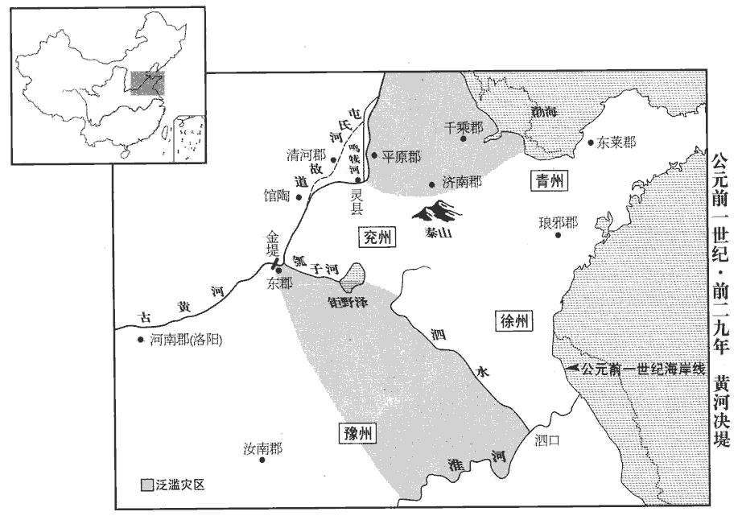
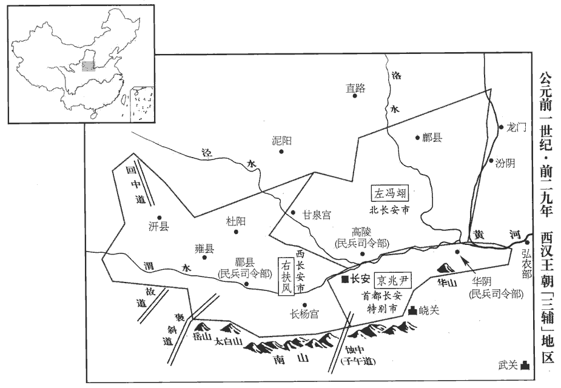
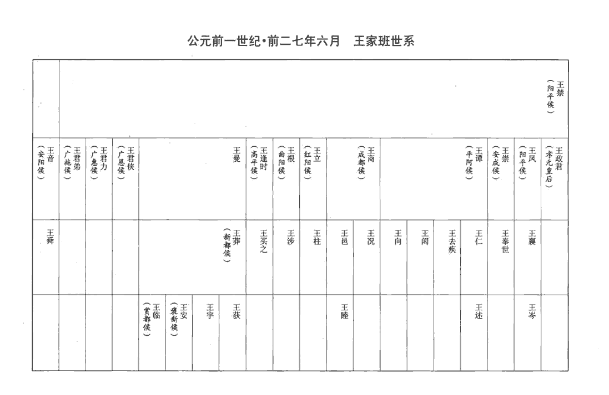
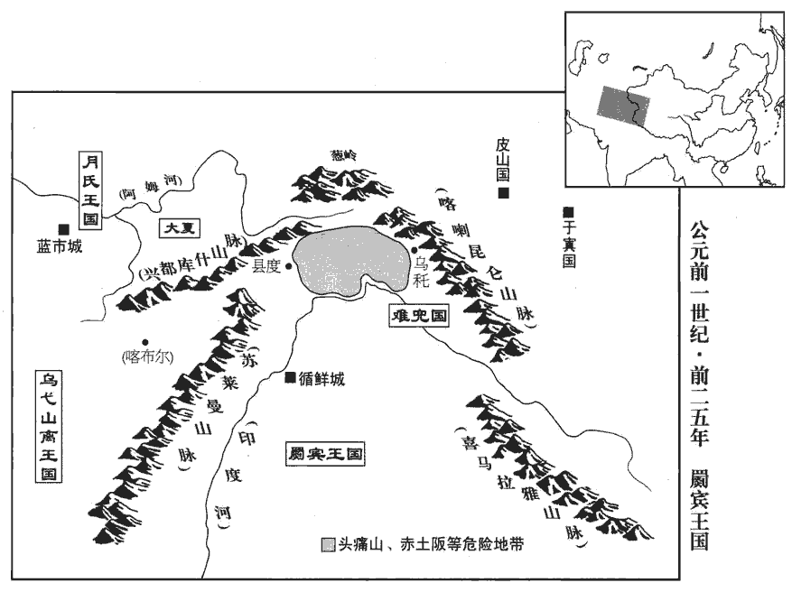

 漢紀二十二起屠維赤奮若（己丑），盡著雍閹茂（戊戌），凡十年。

# 孝成皇帝上之上荀悅曰：諱驁，字太孫；「驁」之字曰「俊」。應劭曰：諡法，安民立政曰成。

## 建始元年（己丑，前三二）

1春，正月，乙丑‹一›，悼考廟災。宣帝尊史皇孫曰悼考。

〖译文〗 [1]春季，正月，乙丑（初一），史皇孙刘进的祭庙发生火灾。

2石顯遷長信中太僕，百官表：長信中太僕，掌皇太后輿馬，不常置。秩中二千石。顯既失倚，離權，顯嬖於元帝，帝崩為失倚。自中書令樞機之官遷太后宮官為離權。離，力智翻。於是丞相、御史條奏顯舊惡；及其党牢梁、陳順皆免官，顯與妻子徙歸故郡，憂懣不食，道死。顯，故濟南人。師古曰：懣，音悶。諸所交結以顯為官者，皆廢罷；少府五鹿充宗左遷玄菟‹辽宁新宾›太守，菟，音塗。守，式又翻。御史中丞伊嘉為鴈門‹山西右玉›都尉。姓譜：伊姓出於伊尹。

〖译文〗 [2]石显调任长信中太仆，官秩为中二千石。石显已失去了靠山，又被调离中枢要职，于是丞相、御史上奏成帝，列数石显过去的罪恶。石显及其党羽牢梁、陈顺均被免官，石显与妻子儿女也被逐归原郡。石显忧郁愤懑，不进饮食，死在途中。那些因结交石显而得到官位的人，全部被罢黜。少府五鹿充宗被贬为玄菟郡太守，御史中丞伊嘉被谪调雁门都尉。

司隸校尉涿郡‹河北涿州›王尊劾奏：「丞相衡，御史大夫譚，劾，戶概翻，又戶得翻。知顯等顓權擅勢，大作威福，為海內患害，不以時白奏行罰；而阿諛曲從，附下罔上，懷邪迷國，無大臣輔政之義，皆不道！在赦令前。去年七月大赦。赦後，衡、譚舉奏顯，不自陳不忠之罪，而反揚著先帝任用傾覆之徒，妄言『百官畏之，甚於主上』；卑君尊臣，非所宜稱，失大臣體！」於是衡慙懼，免冠謝罪，上丞相、侯印綬。衡封樂安侯。天子以新即位，重傷大臣，乃左遷尊為高陵‹陝西高陵›令。然群下多是尊者。衡嘿嘿不自安，每有水旱，連乞骸骨讓位；上輒以詔書慰撫，不許。

〖译文〗 司隶校尉、涿郡人王尊上书弹劾：“丞相匡衡，御史大夫张谭，明知石显等专权擅势，作威作福，是海内祸害，却不及时奏报皇上，予以惩罚，反而百般谄媚，曲意奉承，攀附臣下，欺瞒主上，心怀邪恶，迷惑君王，丧失大臣辅政的原则，都为大逆不道！这些罪恶发生在大赦之前，尚可不究。然而，在大赦之后，匡衡、张谭指控石显时，不自责不忠之罪，反而故意宣扬突出先帝任用倾覆小人的失误。妄言什么‘文武百官畏惧石显，超过了皇上’。这种卑君尊臣的言论，是不该说的，有失大臣体统！”于是匡衡惭愧恐惧，脱掉官帽谢罪，缴还丞相、侯爵的印信、绶带。成帝因新即位，不愿伤害大臣，就下令贬王尊为高陵县令。可是百官中很多人都认为王尊之言有道理。匡衡沉默而心不自安，每逢遇到水旱天灾，都接连请求退休让位。而皇上则下诏安抚慰留，不批准他辞职。

3立故河間王元弟上郡‹陝西榆林南鱼河堡›庫令良為河間王。元廢事見上卷元帝建昭元年。如淳曰：漢北邊郡庫，官兵器之所藏，故置令。

〖译文〗 [3]汉成帝封已故河间王刘元的弟弟、上郡库令刘良为河间王。

4有星孛于營室。晉書天文志：營室二星，天子之宮也，一曰玄宮，一曰清廟；又為軍糧之府及土功事。孛，蒲內翻。

〖译文〗 [4]有异星出现于营、室二星旁。

5赦天下。

〖译文〗 [5]大赦天下。

6壬子‹十八›，封舅諸吏、光祿大夫、關內侯王崇為安成侯；恩澤侯表，安成侯食邑于汝南。賜舅譚、商、立、根、逢時爵關內侯。夏，四月，黃霧四塞，元命包曰：陰陽亂為霧。爾雅曰：地氣發，天不應，曰霧。釋名曰：霧，冒也；氣蒙冒地之物也。師古曰：塞，滿也；言四方皆滿。塞，悉則翻。詔博問公卿大夫，無有所諱。諫大夫楊興、博士駟勝等【章：十四行本「等」下有「對」字；乙十一行本同；孔本同；張校同。】皆以為「陰盛侵陽之氣也。高祖之約，非功臣不侯；今太后諸弟皆以無功為侯，外戚未曾有也，故天為見異。」師古曰：見，顯示也。為，於偽翻。見，賢遍翻。於是大將軍鳳懼，上書乞骸骨，辭職；上優詔不許。

〖译文〗 [6]壬子（疑误），成帝封舅父诸吏、光禄大夫、关内侯王崇为安成侯；赐舅父王谭、王商、王立、王根、王逢时为关内侯。夏季，四月，黄雾四起，遮天盖日。成帝下诏广泛地征求公卿大夫的意见，希望大臣们各谈因由，不得隐讳。谏大夫杨兴、博士驷胜等都认为：“是阴气太盛，侵抑阳气的缘故。高祖曾立约：臣属非功臣不得封侯。如今太后诸弟全都无功而封侯，如此施恩外戚，是从未有先例的。因而上天为示警而显现异象。”大将军王凤闻奏恐惧，上书请求退休，辞去官职。成帝不准，下诏慰留。

7御史中丞東海‹山東郯城›薛宣上疏曰：「陛下至德仁厚，而嘉氣尚凝，師古曰：凝，謂不通也。陰陽不和，殆吏多苛政。部刺史或不循守條職，師古曰：刺史所察本有六條，今則踰越故事，信意舉劾，妄為苛劾也。漢官典職儀云：刺史班宣，周行郡國，省察治狀，黜陟能否，斷治冤獄，以六條問事；非條所問，即不省。一條，強宗，豪右田宅踰制，以強陵弱，以眾暴寡。二條，二千石不奉詔書、遵承典制，倍公嚮私，旁詔牟利，侵漁百姓，聚斂為奸。三條，二千石不恤疑獄，風厲殺人，怒則任刑，喜則淫賞，煩擾刻暴，剝截黎元，為百姓所疾，山崩石裂，訞yāo祥訛言。四條，二千石選署不平，苟阿所愛，蔽賢寵頑。五條，二千石子弟恃怙榮勢，請托所監。六條，二千石違公下比，阿附豪強，通行貨賂，割損正令。舉錯各以其意，多與郡縣事，師古曰：錯，置也，音千故翻。與，讀曰豫。豫，干也。至開私門，聽讒佞，以求吏民過，譴呵及細微，責義不量力；師古曰：言求備於人。量，音良。郡縣相迫促，亦內相刻，流及眾庶。是故鄉党闕于嘉賓之歡，九族忘其親親之恩，飲食周急之厚彌衰，送往勞來之禮不行。師古曰：勞，郎到翻。來，郎代翻。余謂來，讀如字亦通。夫人道不通【章：十四行本「通」作「興」；乙十一行本同；孔本同。】則陰陽否隔，否，皮鄙翻。和氣不通，未必不由此也！詩云：『民之失德，乾餱hóu以愆qiān。』小雅伐木之詩也。毛氏曰：餱，食也。鄭氏曰：失德，謂見謗訕也。民尚以乾餱之食獲愆過於人，況上之人乎！乾，音干。餱，音侯。鄙語曰：『苛政不親，煩苦傷恩。』方刺史奏事時，宜明申敕，師古曰：申，束也；謂約束也。使昭然知本朝之要務。」上嘉納之。

〖译文〗 [7]御史中丞、东海人薛宣上书说：“陛下至德仁厚，然而祥和之气仍然未通，阴阳不和，大概是因为官吏多实行苛政的缘故。被委派巡查地方的刺史，有人不遵循六条规则，随心所欲地行事，过多干预郡县行政。甚至开私门，听信谗言，来搜求吏民的过失。严辞呵责，对细微的过错也不放过；苛求吏民，而不考虑他们是否力所能及。郡县在压力的逼迫下，也不得不互相采取严厉苛刻的手段，流毒祸及百姓。因此，乡党邻里缺少和睦交往的欢悦，家族亲属也忘了血缘之间的亲情。互相帮助、周济急难的淳厚风俗衰落了，送往迎来的礼节也不再实行。人情不通，那么阴阳自然阻隔，和气不通，未必不是由此而引起！《诗经》说：‘百姓失德，因小犯过。’俚语说：‘苛政之下无亲情，烦苦之中伤恩义。’陛下在刺史奏事时，应明确敕告他们，使他们明了本朝施政的切要所在。”成帝欣然采纳。

8八月，有兩月相承，晨見東方。服虔曰：相承，在上下也。應劭曰：案京房易傳云：君弱如婦，為陰所乘，則兩月出。見，賢遍翻。

〖译文〗 [8]八月，清晨时，东方一上一下出现两个月亮。

9冬，十二月，作長安南、北郊，罷甘泉‹陝西淳化西北›、汾陰‹山西万荣西南榮河镇›祠，匡衡奏：祭天于南郊，就陽之義也。瘞yì地於北郊，即陰之象也。甘泉郊見皇天，反北之太陰；汾陰祠后土，反東之少陽。甘泉、河東之祠宜徙就正陽、太陰之處，于長安定南、北郊。上從之。及紫壇偽飾、女樂、鸞路、騂xīng駒、龍馬、石壇之屬。衡又言：甘泉泰畤紫壇有文章、采鏤、黼fǔ黻fú之飾，及玉女樂、石壇仙人祠，瘞yì鸞路，騂駒、寓龍，非古。於是悉罷之。師古曰：漢舊儀云：祭天用六彩，綺席六重，用玉几、玉飾器凡七十。女樂，即禮樂志所云使童男、童女俱歌也。

〖译文〗 [9]冬季，十二月，汉成帝在长安南郊、北郊兴建祭天、祭地之所。下令撤除甘泉和汾阴两地的祭祀之所，以及甘泉泰紫坛的装饰、女子歌乐、鸾路、驹、龙马、石坛等。

## 二年（庚寅，前三一）

1春，正月，罷雍‹陝西鳳翔›五畤及陳寶祠，秦作畤於雍，以祠上帝，有白、青、黃、赤帝之祠。至漢高帝立北畤，祠黑帝，而五畤具。有司進祠，上不親往。至文帝時，始幸雍，郊見五畤。陳寶者，秦文公獲若石于陳倉北阪上，祠之。其神來，常以夜，光輝若流星；從東方來，集於祠城，若雄雉，其聲殷殷云，野雞皆鳴以應之。祠以一牢，名曰陳寶。衡以為不應禮，皆奏罷之。雍，於用翻。畤，音止。皆從匡衡之請也。辛巳‹二十三›，上始郊祀長安南郊。赦奉郊縣應劭曰：天郊在長安城南，地郊在長安城北長陵界中。二縣有奉郊之勤，故并赦之。余按帝紀，二縣，長安及長陵也。及中都官耐罪徒；師古曰：中都官，京師諸官府。應劭曰：輕罪不至於髡，完其耏ér鬢，故曰耏。古耏字從「彡」shān，髮膚之意也。杜林以為法度之字皆從「寸」，後改如是。耐，音若能。如淳曰：耐，猶任也，任其事也。師古曰：依應氏之說，耏當音而；如氏之說，則音乃代翻。其義亦兩通。耏，謂頰旁毛也。彡，毛髮貌也，音所廉翻，又先廉翻。而功臣表，宣曲侯通耏為鬼薪。則應氏之說斯為長矣。減天下賦錢，算四十。孟康曰：本算百二十，今減四十為八十。

〖译文〗 [1]春季、正月，撤除位于雍城的五帝祭坛及陈宝祠。这都是听从了匡衡建议的举动。辛巳（疑误），成帝初次到长安南郊祭天。赦免侍奉郊祀之县及在京师诸官府的保留鬓发的轻罪刑徒。减天下赋钱，原一百二十钱为一算，现每一算减少四十钱。

2閏月，以渭城‹陝西咸陽›延陵亭部為初陵。

〖译文〗 [2]闰正月，成帝下令在渭城延陵亭兴建自己的陵墓。

3三月，辛丑‹十四›，上始祠后土於北郊。

〖译文〗 [3]三月，辛丑（十四日），成帝初次在长安北郊祭祀后土。

4丙午‹十九›，立皇后許氏。后，車騎將軍嘉之女也。元帝傷母恭哀后居位日淺而遭霍氏之辜，事見二十四卷宣帝本始三年。故選嘉女以配太子。

〖译文〗 [4]丙午（十九日），成帝立许氏为皇后。许后是车骑将军许嘉的女儿。汉元帝哀悼母亲恭哀后在位时间很短而惨遭霍氏毒手，因此特选许嘉之女婚配太子。

5上自為太子時，以好色聞；好，呼到翻。聞，音問。及即位，皇太后詔采良家女以備後宮。大將軍武庫令杜欽此大將軍之軍中武庫令也。欽傳，軍下更有「軍」字。說王鳳曰：「禮，一娶九女，所以廣嗣重祖也；張晏曰：陽數一、三、五、七、九。九，數之極也。臣瓚曰：天子一娶九女，夏、殷之制也。欽故舉古之約以刺今之奢也。說，輸芮翻。娣侄雖缺不復補，所以養壽塞爭也。師古曰：媵yìng女之內，兄弟之女則謂之侄，己之女弟則謂之娣。塞，絕也。復，扶又翻。塞，悉則翻。故后妃有貞淑之行，行，下孟翻；下同。則胤嗣有賢聖之君；制度有威儀之節，則人君有壽考之福。廢而不由，則女德不厭；師古曰：由，用也，從也。女德不厭，言好色之甚也。女德不厭，則壽命不究于高年。師古曰：究，竟也。男子五十，好色未衰；婦人四十，容貌改前；以改前之容侍於未衰之年，而不以禮為制，則其原不可救而後徠異態；後徠異態，則正后自疑而支庶有間適之心；師古曰：間，代也，音居莧翻。適，讀曰嫡；下亦同。是以晉獻被納讒之謗，申生蒙無罪之辜。晉獻公嬖bì驪姬，驪姬欲立其子，讒世子申生；獻公信之，申生雉經而死。被，皮義翻。今聖主富於春秋，未有適嗣，方鄉術入學，鄉，讀曰嚮。未親后妃之議。將軍輔政，宜因始初之隆，建九女之制，詳擇有行義之家，行，下孟翻。求淑女之質，毋必有聲色技能，為萬世大法。師古曰：惟求淑質，無論美色及音聲技能，如此則可為萬世法也。技，渠綺翻。夫少戒之在色，師古曰：論語，孔子曰：君子有三戒，少之時，血氣未定，戒之在色。言好色無節則致損敗，故戒之也。少，詩照翻。小卞之作，可為寒心。詩小雅也。張晏曰：小卞，刺幽王廢申后而立褒姒，黜太子宜咎而立伯服也。臣瓚曰：小卞之詩，太子之傅作也；哀太子之放逐，愍周室之大壞也。卞，音盤。唯將軍常以為憂！」鳳白之太后‹王政君›，太后以為故事無有；鳳不能自立法度，循故事而已。鳳素重欽，故置之莫府，國家政謀常與欽慮之，師古曰：慮，計也。數稱達名士，裨正闕失；數，所角翻。當世善政多出於欽者。

〖译文〗 [5]成帝从当太子时，就以好色出名。等到即位后，皇太后诏令挑选良家女子充实后宫。大将军、武库令杜钦劝王凤说：“按古礼，天子大婚，一次就娶九个女子，是为了让她们多生儿子，以对得起祖宗。其中有人死亡，虽空缺其位，也不再补充，为的是使君王保养长寿，也避免后宫争宠。因此皇后嫔妃有贞洁贤淑的德行，而子孙后裔就有圣贤之君。制度有严格的节制，君王就会有高寿之福。废弃而不采用这些古礼，君王就会沉湎于女色；沉湎于女色，就崐不会享有高寿。男子到了五十岁，好色之心仍未衰退；可是妇人到了四十岁，容貌便不同从前。以变丑了的容貌，去侍奉处在好色之心未衰年龄的君王，而不以古礼去约束克制，就不能挽救君王本来的好色，而后还要发生不正常的变化。发生不正常变化的结果是，正宫皇后自我猜疑，恐怕后位不稳，而庶妻宠妃产生夺嫡的野心。这正是晋献公被人指责采纳谗言，使申生无罪而蒙受冤死的原因。现在圣主还很年轻，没有嫡子，刚刚开始研习学问，还没有因亲近后妃而受到批评。将军身为辅政大臣，应该趁着本朝初期的隆盛，建立九妻制度。仔细选择德行高尚的仁义之家，物色品貌端庄的淑女，不一定要有声色技能。把这个制度定为万世不改之法。年轻人要戒色。《诗经·小卞》这首诗，就是讽刺周幽王废申后立褒姒，哀伤太子被放逐，使人听了十分寒心。请将军常以此为忧！”王凤将杜钦之言转告皇太后，太后认为九妻之制，汉朝没有前例。王凤不能自立法度，只是因循惯例而已。王凤一向器重杜钦，因此把他安置在幕府作官，国家的政治大计，常与他一起研究考虑。杜钦多次称赞推荐有名望的士人，使他们补救改正政治上的欠缺和失误。当世的善政，多出于杜钦的建议和筹划。

6夏，大旱。

〖译文〗 [6]夏季，大旱。

7匈奴‹王庭设蒙古哈尔和林›呼韓邪單于嬖左伊秩訾兄女二人；長女顓渠閼氏長，知兩翻；下同。閼，於乾翻；氏，音支；下同。生二子，長曰且莫車，師古曰：且，音子餘翻；下且麋胥同。車，昌遮翻。次曰囊知牙斯；少女為大閼氏，少，詩照翻；下同。生四子，長曰雕陶莫皋，次曰且麋胥，皆長於且莫車，少子咸、樂二人，皆小於囊知牙斯。又它閼氏子十餘人。顓渠閼氏貴，且莫車愛，呼韓邪病且死，欲立且莫車。顓渠閼氏曰：「匈奴亂十餘年，不絕如髮，賴蒙漢力，故得復安。復，扶又翻；下同。今平定未久，人民創艾戰鬬。師古曰：創，音初亮翻。艾，讀曰乂。且莫車年少，少，詩照翻；下同。百姓未附，恐復危國。我與大閼氏一家共子，師古曰：一家，言親姊妹也。共子，兩人所生，恩慈無別也。不如立雕陶莫皋。」大閼氏曰：「且莫車雖少，大臣共持國事。今舍貴立賤，師古曰：舍，謂棄置也。舍，讀曰捨。後世必亂。」單于卒從顓渠閼氏計，立雕陶莫皋，卒，子恤翻。約令傳國與弟。呼韓邪死，雕陶莫皋立，為復株累若鞮單于。師古曰：復，音服。累，力追翻。賢曰：匈奴謂孝為若鞮。自呼韓邪降後，與漢親密，見漢帝諡常為孝，慕之：至其子復株累單于以下，皆稱若鞮。復株累若鞮單于以且麋胥為左賢王，且莫車為左谷蠡王，谷，音鹿。蠡，盧奚翻。囊知牙斯為右賢王。復株累單于復妻王昭君，生二女，長女云為須卜居次，小女為當于居次。文穎曰：須卜氏，匈奴貴族也。當于，亦匈奴大族也。師古曰：須卜、當于，皆其夫家氏族。

〖译文〗 [7]匈奴呼韩邪单于宠爱左伊秩訾的两位侄女。长女为颛渠阏氏，生二子：长子且莫车、幼子囊知牙斯。幼女为大阏氏，生四子：长子雕陶莫皋，次子且麋胥，二人都比且莫车年长。三子咸，四子乐，都比囊知牙斯年幼。此外还有其他阏氏所生的儿子十余人。颛渠阏氏的地位最高，长子且莫车也深受单于喜爱。呼韩邪病危将死，打算立且莫车为继承人。颛渠阏氏说：“匈奴内乱十余年，国家命脉象发丝一样勉强维持，依赖汉朝的力量，才重新转危为安。如今平定未久，人民畏惧战争。且莫车年少，不能令百姓心服归附，立他恐怕又会给国家带来危险。我与大阏氏是亲姐妹，他的儿子，也就是我的儿子，不如立雕陶莫皋。”大阏氏说：“且莫车虽年幼，但可由大臣们共同主持国事。如今舍弃高贵的嫡子，而立低贱的庶子，后世必然要发生内乱。”单于最后采纳了颛渠阏氏的建议，立雕陶莫皋为继承人，并立约，命令雕陶莫皋将来传位给弟弟且莫车。呼韩邪死，雕陶莫皋即位，称复株累若单于。他任命且麋胥为左贤王，且莫车为左谷蠡王，囊知牙斯为右贤王。复株累单于按照匈奴的习俗，再娶王昭君为妻，生下二女：长女云公主，嫁匈奴贵族须卜氏；小女嫁匈奴贵族当于氏。

## 三年（辛卯，前三零）

1春，三月，赦天下徒。

〖译文〗 [1]春季，三月，赦免天下囚犯。

2秋，關內大雨四十餘日。京師民相驚，言大水至；百姓奔走相蹂躪，師古曰：蹂，踐也。躪，轢lì也。蹂，音人九翻。躪，音藺。老弱號呼，號，戶高翻。呼，火故翻。長安中大亂。天子親御前殿，召公卿議。大將軍鳳以為：「太后與上及後宮可御船，令吏民上長安城以避水。」上，時掌翻，下同。群臣皆從鳳議。左將軍王商獨曰：「自古無道之國，水猶不冒城郭；師古曰：冒，蒙覆也。今政治和平，世無兵革，上下相安，何因當有大水一日暴至，此必訛言也！師古曰：訛，偽也。治，直吏翻。不宜令上城，重驚百姓。」師古曰：重，音直用翻。上乃止。有頃，長安中稍定；問之，果訛言。上於是美壯商之固守，數稱其議；數，所角翻。而鳳大慙，自恨失言。為王鳳排斥王商張本。

〖译文〗 [2]秋季，关内大雨连绵四十余日。京师百姓惊恐相告，传言洪水就要来到。百姓纷纷奔逃，混乱中互相践踏，老弱呼号，长安城中大乱。成帝亲临前崐殿，召集公卿商议。大将军王凤认为：“太后跟皇上以及后宫嫔妃可以登上御船。命令官吏百姓登上长安城墙，以避洪水。”群臣都附合王凤的意见，只有左将军王商说：“自古以来，即令是无道的王朝，大水都没有淹没过城郭。如今政治和平，世上没有战争，上下相安，凭什么会有洪水一天内突然涌来？这一定是谣言！不应该下令让官吏百姓登城墙，那样会更增加百姓的惊恐。”成帝于是作罢。不久，长安城中逐渐平定下来，经查问，果然是谣言。成帝因而对王商固守不动的建议十分赞赏，多次称赞。而王凤则大感惭愧，自恨失言。

3上欲專委任王鳳，八月，策免車騎將軍許嘉，以特進侯就朝位。漢制，列侯奉朝請在長安者，位次三公；賜位特進者，在凡列侯之上，位亦次三公。朝，直遙翻。

〖译文〗 [3]成帝打算把国家大事完全委托给王凤。八月，下策书免去车骑将军许嘉的官职，命他以特进侯的身分参加朝见。

4張譚坐選舉不實，免。冬，十月，光祿大夫尹忠為御史大夫。

〖译文〗 [4]张谭因举荐人才不真实而获罪，被免去官职。冬季，十月，擢升光禄大夫尹忠为御史大夫。

5十二月，戊申‹一›朔，日有食之。其夜，地震未央宮殿中。詔舉賢良方正能直言極諫之士。杜欽及太常丞谷永上對，續漢志：太常丞，比千石，掌凡行禮及祭祀小事，總署曹事。漢舊儀曰：丞，舉廟中非法者。皆以為後宮女寵太盛，嫉妬專上，將害繼嗣之咎。此蓋指許后及班倢伃也。

〖译文〗 [5]十二月，戊申朔（初一），出现日食。当夜，未央宫殿中发生地震。成帝下诏，要求举荐贤良、方正和能直言规谏的人士。杜钦及太常丞谷永上书，都认为：“发生日食地震，都是因为后宫美女太盛，有人心怀嫉妒，使皇帝专宠自己。这样下去，将会有危害皇位继承人的灾祸。”

6越巂suǐ‹四川西昌›山崩。

〖译文〗 [6]越发生山崩。

7丁丑‹三十›，匡衡坐多取封邑四百頃，監臨盜所主守直十金以上，免為庶人。衡本封臨淮郡僮縣之樂安鄉，鄉本田提封三千一百頃，南以閩陌為界。後誤封平陵陌為界，多四百頃。師古曰：十金以上，當時律定罪之次；若今律條言一尺以上、一匹以上。

〖译文〗 [7]丁丑（三十日），匡衡因多取封邑土地四百顷，及手下属官盗取所主管的财物价值十金以上而获罪，免官，贬为平民。

## 四年（壬辰，前二九）

1春，正月，癸卯‹二十六›，隕石于亳‹山东曹县南›四，隕於肥累‹河北槁城›二。漢書五行志：亳作「槀」。孟康曰：槀、肥累，皆縣名，故屬真定。師古曰：槀，音工老翻。累，音力追翻。

〖译文〗 [1]春季，正月，癸卯（二十六日），有四颗陨石在亳县坠落，有两颗陨石在肥累坠落。

2罷中書宦官；初置尚書員五人。臣瓚曰：漢初，中人有中謁者令；孝武加中謁者令為中書謁者令，置僕射。宣帝時，任中書官弘恭為令，石顯為僕射。元帝即位數年，恭死，顯代為中書令，專權用事；至帝，乃罷其官。師古曰：漢舊儀云：尚書四人，為四曹：常侍尚書，主丞相、御史事；二千石尚書，主刺史、二千石事；戶曹尚書，主庶人上書事；主客尚書，主外國事。帝置五人，有三公曹，主斷獄事。

〖译文〗 [2]撤销中书宦官。初次规定尚书定员为五人。

3三月，甲申‹八›，以左將軍樂昌侯王商為丞相。

〖译文〗 [3]三月，甲申（初八），任用左将军、乐昌侯王商为丞相。

4夏，上‹刘骜，时年二十四›悉召前所舉直言之士，詣白虎殿對策。師古曰：此殿在未央宮。是時上委政王鳳，議者多歸咎焉。谷永知鳳方見柄用，師古曰：柄用，言任用之，授以權也。陰欲自托，乃曰：「方今四夷賓服，皆為臣妾，北無葷粥、冒頓之患，葷，許云翻。師古曰：粥，音弋六翻。太史公曰：唐、虞以上有葷粥。孟子曰：太王事獯xūn粥。冒頓為患，見高、惠、呂后紀。南無趙佗、呂嘉之難，趙佗，見高、惠、呂后、孝文紀。呂嘉，見孝武紀。難，乃旦翻。三垂晏然，靡有兵革之警。諸侯大者乃食數縣，漢吏制其權柄，不得有為，無吳、楚、燕、梁之勢。吳、楚、梁見孝景紀。燕，見孝昭紀。百官盤互，親疏相錯，師古曰：盤互，盤結而交互也。錯，間雜也。骨肉大臣有申‹河南南陽›伯之忠，師古曰：申伯，周申后之父。余據詩崧sōng高云：不顯申伯，王之元舅，是則申伯乃宣王之舅，永正以之況王鳳也。洞洞屬屬，師古曰：洞洞，敬肅也。屬屬，專謹也。洞，音動。屬，音之欲翻。小心畏忌，無重合、安陽、博陸之亂。師古曰：重合侯，莽通；安陽侯，上官桀；博陸侯，霍禹也。余按莽通即馬通，事見二十二卷武帝後元元年。安陽侯，事見二十三卷昭帝元鳳元年。霍禹，事見二十五卷宣帝地節四年。三者無毛髮之辜，竊恐陛下舍昭昭之白過，忽天地之明戒，聽暗【章：十四行本「暗」作「晻」；乙十一行本同。】昧之瞽說，師古曰：舍謂留也。晻，與暗同，又音一感翻。瞽說，言不中道，若無目之人也。余謂舍，置也，讀曰捨。歸咎乎無辜，倚異乎政事，師古曰：倚，依也。重失天心，師古曰：重，音直用翻。不可之大者也。師古曰：此則為大不可也。陛下誠深察愚臣之言，抗湛溺之意，解偏駁之愛，師古曰：抗，舉也。湛，讀曰沈。駁，不周普也。湛zhàn，持林翻。奮乾剛之威，平天覆之施，使列妾得人人更進，覆，敷又翻。施，式智翻。更，工衡翻。益納宜子婦人，毋擇好醜，毋避嘗字，如淳曰：王鳳上小妻弟以納後宮，以嘗字乳，王章言之，坐死。今永及此，為鳳洗前過也。仲馮曰：按王章言事坐誅在陽朔初，而永此對乃是建始四年，則非為鳳而言也。然觀永前後之文，實若為鳳。但班固於此對後，乃云，永為上第，擢為光祿大夫，則同是建始四年中事。余謂此時鳳蓋已納張美人于後宮，故永為之言；若王章指言鳳過，則在陽朔初也。毋論年齒。推法言之，陛下得繼嗣于微賤之間，乃反為福；得繼嗣而已，母非有賤也。師古曰：苟得子耳，勿論其母之貴賤。後宮女史、使令有直意者，鄭玄曰：女史，女奴曉書者。使令，給役後宮，無爵秩者也。師古曰：直，當也。令，音力成翻。廣求於微賤之間，以遇天所開右，師古曰：右，讀曰佑。佑，助也。慰釋皇太后之憂慍，師古曰：釋，散也。慍，於問翻。解謝上帝之譴怒，則繼嗣蕃滋，災異訖息！」師古曰：蕃，多也。訖，止也。蕃，音扶元翻。杜欽亦仿此意。上皆以其書示後宮，擢永為光祿大夫。

〖译文〗 [4]夏季，皇上把前些时候被举荐的直言之士，都召集到白虎殿，进行考试，回答皇帝的策问。此时，成帝把国家大事都委托给王凤，直言之士在回答策问时，很多人将天变归咎于王凤。谷永知道王凤正受信用，掌握权柄，想暗中投靠，于是上书说：“而今四方外族都已降服，均成为汉朝的臣属。北方没有匈奴荤粥、冒顿那样的祸害，南方也没有赵佗、吕嘉的发难，三边晏然，没有战争的警报。大的诸侯国食邑不过数县，由朝廷委派的官吏控制那里的权柄，使诸侯王不能有所作为，不会形成当年吴、楚、燕、梁等诸侯国尾大不掉的局势。文武百官互相交结制衡，与皇帝有亲戚关系的官员与没有亲戚关系的官员互相掺杂。皇亲国戚中有象申伯那样的忠臣，他们恭敬谨慎、小心翼翼，没崐有重合侯莽通、安阳侯上官桀、博陆侯霍禹那样的阴谋。以上三种人都没有丝毫的罪行，我担心陛下放过明显的错误，忽略天地的明显警告，听信愚昧盲目之言，归罪于无辜，把政事托附给不可靠的人，那将大失上天之心，是太不应该了。陛下如果能深思我的建议，抗拒沉溺之心，解除专宠之爱，振奋起阳刚之威，将天子之恩平均施布，使后宫各位嫔妃得以人人轮流侍奉君王。增添选纳能生男孩的妇人，不挑剔美丑，不在意曾否嫁过人，也不论年龄。照古法推算来说，陛下若能使身份微贱的人生下皇嗣，则反而为福。目的只是要得到皇位继承人，勿论其母的贵贱。后宫女史、使令中若有皇上中意的女子，也可选纳，广泛地求嗣于微贱者之中，遇上天保佑，生下皇子，皇太后的忧虑和烦恼，因得到安慰而解除，上帝的谴责和愤怒也会平息化解，后代繁衍，灾异自然消除。”杜钦也仿效谷永的意思上书。成帝把他们两人的奏书都拿给后宫看，擢升谷永为光禄大夫。

5夏，四月，雨雪。雨，於具翻。

〖译文〗 [5]夏季，四月，降雪。

6秋，桃、李實。

〖译文〗 [6]秋季，桃树、李树结果。

 

7大雨水十餘日，河決東郡‹河南濮陽西南›金堤‹千里堤，河南濮阳南一公里›。師古曰：金堤者，河堤之名，今在滑州界。先是清河‹河北清河›都尉馮逡奏言：「郡承河下流，據溝洫志：逡言清河郡承河下流，與兗州，東郡分水為界。先，悉薦翻。逡，七倫翻。土壤輕脆易傷，易，以豉翻。頃所以闊無大害者，以屯氏河通兩川分流也。師古曰：闊，稀也。今屯氏河塞靈‹山東高唐南›鳴犢口，又益不利，屯氏河塞，見上卷元帝永光五年。塞，悉則翻。獨一川兼受數河之任，雖高增堤防，終不能泄。如有霖雨，旬日不霽，必盈溢。師古曰：雨止曰霽，音子詣翻，又音才詣翻。九河故跡，今既滅難明，夏禹疏九河。孔安國曰：河水分九道，在兗州界。爾雅曰：徒駭一，太史二，馬頰三，覆釜四，胡蘇五，簡六，潔七，鉤盤八，鬲gé津九。屯氏河新絕未久，其處易浚；師古曰：浚，謂治導之，令其深也。浚，音峻。又其口所居高，於以分殺水力，道里便宜，殺，音所介翻，減也。可復浚以助大河，復，扶又翻。泄暴水，備非常。不豫修治，治，直之翻。北決病四、五郡，南決病十餘郡，然後憂之，晚矣！」事下丞相、御史，白遣博士許商行視，下，遐稼翻。師古曰：白，白于天子也。行，音下更翻。以為「方用度不足，師古曰：言國家少財役也。可且勿浚。」後三歲，河果決于館陶‹山東館陶›及東郡‹河南濮陽西南›金堤‹千里堤，河南濮阳南一公里›，氾濫兗‹山東西部›、豫‹河南›及【章：乙十一行本「及」作」入」；孔本同。】平原‹山東平原县›、千乘‹山東高青东北›、濟南‹山東章丘›，乘，繩證翻。濟，子禮翻。凡灌四郡、三十二縣，水居地十五萬餘頃，深者三丈；壞敗官亭、室廬且四萬所。壞，音怪。敗，補邁翻。

〖译文〗 [7]大雨连下十余日，黄河在东郡金堤决口。在此之前，清河郡都尉冯逡奏报说：“清河郡位于黄河下游，土壤松脆，容易崩塌。暂时没有发生大灾害，是由于屯氏河通畅，可以两河分流。如今屯氏河已经淤塞，灵鸣犊口也越来越不通畅，只有一条河，却要兼容数条河流的水量，虽然加高堤防，最终却无法使它顺畅宣泄，若有大雨，十日不停，河水必然满盈泛滥。夏禹时代的九河故道，如今既已湮没难寻，而屯氏河刚刚淤塞不久，容易疏通。再有，黄河与屯氏河分流的叉口处地势较高，实施分减水力的工程，施工起来也方便。可重新疏通屯氏河，以帮助黄河宣泄洪水，防备非常情况的发生。如果不预先修治，黄河一旦在北岸决口，将危害四、五郡；在南岸决口，将危害十余郡。事后再忧虑，就晚了！”成帝将冯逡的奏章交给丞相和御史去处理，他们奏请派遣博士许商去巡视那一地区。根据许商视察的结果，他们认为：“现在国家经费不足，可暂且不疏通。”三年后，黄河果然在馆陶及东郡金堤决口，洪水泛滥兖州、豫州以及平原郡、千乘郡、济南郡，共淹了四郡三十二县，十五万余顷土地变为泽国，水深的地方达三丈。冲毁官署驿站及民间房舍近四万所。

冬，十一月，御史大夫尹忠以對方略疏闊，上切責其不憂職，自殺。遣大司農非調師古曰：大司農名非調也。姓譜：非，姓也，秦非子之後。調均錢穀河決所灌之郡，師古曰：令其調發均平錢穀遭水之郡，使存給也。調，音徒釣翻。謁者二人發河南‹河南洛陽东白马寺东›以東舩chuán五百㮴，師古曰：一舩為一㮴，音先勞翻；其字從木。徙民避水，居丘陵，九萬七千餘口。

〖译文〗 冬季，十一月，由于御史大夫尹忠的救灾方案疏漏而不切实际，成帝严厉斥责他不尽心职守，尹忠自杀。成帝派大司农非调调拨均平钱谷救济受淹各郡，又派两名谒者向河南以东地区征调船舶五百艘，从洪灌区中抢救灾民九万七千余人，把他们迁移到丘陵高地。

8壬戌‹二十›，以少府張忠為御史大夫。

〖译文〗 [8]壬戌（二十日），任命少府张忠为御史大夫。

9南山‹秦岭›群盜傰péng宗等數百人為吏民害。蘇林曰：傰，音朋；晉灼曰：音倍。師古曰：晉音是也。詔發兵千人逐捕，歲餘不能禽。或說大將軍鳳，說，輸芮翻。以「賊數百人在轂下，師古曰：在天子輦轂之下，明其逼近也。討不能得，難以示四夷；獨選賢京兆尹乃可。」於是鳳薦故高陵‹陝西高陵›令王尊，徵為諫大夫，守京輔都尉，武帝元鼎四年，更置三輔都尉：京兆曰京輔都尉，馮翊曰左輔都尉，扶風曰右輔都尉。行京兆尹事。旬月間，盜賊清；後拜為京兆尹。

〖译文〗 [9]南山一带盗匪宗等数百人在地方作乱，使官吏百姓受害。成帝诏令发兵一千人剿捕，费时一年多，仍不能擒灭。有人向大将军王凤建议说：“盗匪数百人在天子脚下作乱，而讨伐不能奏效，难以向四边蛮族显示汉朝之威。崐只有选任贤明能干的京兆尹才行。”于是王凤推荐前高陵令王尊，征召入京任命为谏大夫，署理京辅都尉，代行京兆尹的职责。他上任不到一个月，盗匪肃清。而后正式擢升王尊为京兆尹。

10上‹刘骜›即位之初，丞相匡衡復奏：「射聲校尉陳湯武帝置北軍八校尉，射聲其一也，秩二千石，掌待詔射聲士。服虔曰：工射者也；冥冥中聞聲則中之，因以名也。復，扶又翻。以吏二千石奉使，湯為西域副校尉，秩比二千石。顓命蠻夷中，不正身以先下，先，悉薦翻。而盜所收康居‹都卑阗城，中亚巴尔喀什湖西南锡尔河北岸突厥斯坦›財物，戒官屬曰：『絕域事不覆校。』言外域之事，漢朝務存寬大，必不考覆也。雖在赦前，言其事在竟寧元年七月，赦前也。不宜處位。」處，昌呂翻。湯坐免。

〖译文〗 [10]成帝即位初期，丞相匡衡再次上奏说：“射声校尉陈汤，以二千石官员的身份出使西域，专门负责西域蛮夷事务，他不能持身以正，做部下的表率，反而盗取所没收的康居王国财物，并告诫下属官员说：‘远在外域发生的事，不会核察追究。’此事虽发生在大赦之前，但他已不适宜再担任官职。”陈汤获罪被免官。

後湯上言：「康居王侍子，非王子。」按驗，實王子也。湯下獄當死。下，遐稼翻。太中大夫谷永按是年夏，谷永方擢為光祿大夫。河平二年，議受伊邪莫演降，永猶為光祿大夫。此書太中大夫谷永，據陳湯傳也。上疏訟湯曰：「臣聞楚有子玉得臣，文公為之仄席而坐；師古曰：子玉，楚大夫也；得臣，其名也。春秋僖十八年，子玉帥師與晉文公戰於城濮‹山东鄄城西南›，楚師敗績，晉師三日館穀，而文公猶有憂色，曰：「得臣猶在，憂未歇也！」及楚殺子玉，公喜而後可知也。禮記曰：有憂者仄席而坐，蓋自貶也。為，於偽翻。仄，古側字。趙有廉頗、馬服，強秦不敢窺兵井陘；師古曰：廉頗，趙將也。馬服君趙奢，亦趙將也。井陘之口，趙之西界山險道也。陘，音刑。近漢有郅都、魏尚，匈奴不敢南鄉沙幕。景帝以郅都為鴈門‹山西右玉›太守，匈奴素聞都節，舉邊為引兵去，竟都死不敢近鴈門。魏尚事見十五卷文帝十四年。鄉，讀曰嚮。由是言之，戰克之將，國之爪牙，不可不重也。蓋君子聞鼓鼙pí之聲，則思將帥之臣。師古曰：禮之樂記曰：鼓鼙之聲讙，讙以立動，動以進眾；君子聽鼓鼙之聲則思將帥之臣。鼙，駢迷翻。將，即亮翻。帥，所類翻。竊見關內侯陳湯，前斬郅支，威震百蠻，武暢西海，漢元以來，征伐方外之將，未嘗有也！漢元，謂漢初也。今湯坐言事非是，幽囚久系，歷時不決，執憲之吏欲致之大辟。辟，毗亦翻。昔白起為秦將，南拔郢都‹湖北江陵›，北坑趙括，以纖介之過，賜死杜郵；秦民憐之，莫不隕涕。事見周赧王紀。今湯親秉鉞，席捲、喋血萬里之外，師古曰：如席之卷，言其疾也。服虔曰：喋，音蹀，屣履之蹀。如淳曰：殺人流血滂沱為喋血。師古曰：喋，音大頰翻，本字當作「蹀」。蹀，謂履涉之耳。薦功祖廟，告類上帝，張晏曰：謂以所征之國事類告天也。介冑之士靡不慕義。以言事為罪，無赫赫之惡。周書曰：『記人之功，忘人之過，宜為君者也。』師古曰：尚書之外間書也。夫犬馬有勞于人，尚加帷蓋之報，師古曰：禮記稱孔子云：敝帷弗棄，為埋馬也；敝蓋弗棄，為埋狗也。況國之功臣者哉！竊恐陛下忽于鼙鼓之聲，不察周書之意，而忘帷蓋之施，施，式智翻。庸臣遇湯，卒從吏議，師古曰：以待庸臣者待湯也。卒，猶終也。卒，子恤翻。使百姓介然有秦民之恨，師古曰：介然，猶耿耿。非所以厲死難之臣也！」難，乃旦翻。書奏，天子出湯，奪爵為士伍。

〖译文〗 后来，陈汤上书说：“康居王送来当人质的王子，并不是真王子。”然而经过查验，确实是真王子。陈汤被捕入狱，依罪应被处死。太中大夫谷永上书为陈汤辩护说：“我听说楚国因为有子玉、得臣，晋文公因此 坐不安席；赵国有廉颇和马服君赵奢，强大的秦国便不敢进犯井陉；近代汉朝有郅都、魏尚，匈奴则不敢从沙漠南下。因此可说，能征善战、克敌制胜的将领，是国家的爪牙，不可以不重视他们。这正是：君子听到战鼓之声，则思念将帅之臣。我看关内侯陈汤，从前击斩郅支单于，威震蛮夷各国，所向披靡，一直打到西海。自汉朝开国以来，在疆域之外作战的将领，还从未有过这样的战功！如今，陈汤因报告失实而获罪，长期囚禁监狱，历时这么久仍不能结案，执掌刑法的官吏意欲致他死罪。从前，白起为秦国的大将，南伐楚，攻陷郢都；北击赵国，坑杀赵括降卒四十万，却因极微小的过失，在杜邮被赐死。秦国百姓怜惜他，无不流涕。而今陈汤亲执武器，席卷匈奴，喋血于万里之外。把战功呈献在皇家祖庙，向上帝禀告，天下武士无不思慕。他不过因为说错话而获罪，并不是什么严重的罪恶。《周书》说：‘记人之功，忘人之过，这才适合当人君。’犬马对人有劳苦之功，死后尚且要用车帷伞盖将它们好好埋葬，作为回报，何况是国家的功臣呢！我恐怕陛下忽略了战鼓的声者，不领会《周书》的深意，忘记报答功臣的效劳，象对待平庸臣子那样对待陈汤，终于听从掌刑官吏的建议，将他处死，使百姓心中耿耿，有秦民那样的遗恨。这不是勉励大臣为国赴难效死的作法！”奏章上去后，天子下令释放陈汤，但剥夺爵位，贬为士伍。

會西域都護段會宗為烏孫‹都赤谷城，中亚伊塞克湖东南›兵所圍，驛騎上書，願發城郭、敦煌兵以自救；城郭，謂西域城郭諸國也。敦，音屯，徒門翻。丞相商、大將軍鳳及百僚議數日不決。鳳言：「陳湯多籌策，習外國事，可問。」上召湯見宣室。湯擊郅支時中寒，見，賢遍翻。中，竹仲翻。病兩臂不屈申；湯入見，有詔毋拜，示以會宗奏。湯對曰：「臣以為此必無可憂也。」上曰：「何以言之？」湯曰：「夫胡兵五而當漢兵一，何者？兵刃樸鈍，弓弩不利。今聞頗得漢巧，然猶三而當一。又兵法曰：『客倍而主人半，然後敵。』此言憑城而守者，主人之半可以敵客之倍。今圍會宗者人眾不足以勝會宗，唯陛下勿憂！且兵輕行五十里，重行三十里，今會宗欲發城郭、敦煌，歷時乃至，所謂報讎之兵，非救急之用也。」上曰：「柰何？其解可必乎？度何時解？」度，徒洛翻。湯知烏孫瓦合，不能久攻，師古曰：謂如碎瓦之雜居，不齊同。故事不過數日，師古曰：故事，謂以舊事測之。因對曰：「已解矣！」屈指計其日，曰：「不出五日，當有吉語聞。」師古曰：吉，善也。善，謂兵解之事。居四日，軍書到，言已解。大將軍鳳奏以為從事中郎，莫府事壹決于湯。續漢志：大將軍府有從事中郎二人，秩六百石，職參謀議。

〖译文〗 正好，西域都护段会宗被乌孙王国的军队围困，段会宗用驿马上书，请求成帝征发西域诸国军队，以及汉朝在敦煌的军队救援。丞相王商、大将军王凤崐以及百官会议数天也作不出决定。王凤说：“陈汤富于谋略，又熟悉外国的情况，可以询问他。”成帝在宣室殿召见陈汤。陈汤在进攻郅支单于时，中了风寒，两臂不能屈伸，入见时，成帝下诏准许他不必跪拜，把段会宗的奏书拿给他看。陈汤回答说：“我认为这件事一定没什么可忧虑的。”成帝说：“你为什么这样讲？”陈汤说：“五个胡兵才能抵挡一名汉兵，为什么呢？因为他们的刀剑不锋利，弓弩也不强。最近听说颇学得一些汉人制作兵器的技巧，然而仍是三个胡兵抵挡一个汉兵。再说，《兵法》上说：‘客兵必须是守军人数的两倍，才能对敌。’现在围困段会宗的敌兵人数不足以战胜他，请陛下不必忧虑！况且军队轻装日行五十里，重装备则日行三十里。现在段会宗打算征发西域诸国和敦煌的军队，部队行军需较长时间才能赶到，这成了所谓报仇之军，而不是救急之兵了。”成帝说：“那怎么办呢？围困一定可以解除吗？你估计什么时候可以解围？”陈汤知道乌孙之兵，不过是乌合之众，不能久攻，以经验推测，不过数日。因此回答说：“现在已经解围了！”又屈指计算日期，然后说：“不出五日，就会听到好消息。”过了四天，军书到，声称已经解围。大将军王凤上奏，要求任命陈汤为从事中郎。从此大将军幕府的大事，均由陈汤一人决定。

 

## 河平元年（癸巳，前二八）以河決堤，塞輒平，改元。

1春，杜欽薦犍為‹四川宜賓›王延世于王鳳，使塞決河。犍，居言翻。塞，悉則翻。鳳以延世為河堤使者。延世以竹落長四丈，大九圍，盛以小石，長，直亮翻。盛，時征翻。兩船夾載而下之。三十六日，河堤成。三月，詔以延世為光祿大夫，秩中二千石，賜爵關內侯、黃金百斤。

〖译文〗 [1]春季，杜钦向王凤推荐犍为人王延世，让他负责堵塞黄河决口的工程。王凤任命王延世为河堤使者。王延世命人用竹子编成长四丈，九人合抱那么大的竹笼，里面装上小石头，用两条船夹着搬运，沉入决口处。三十六天后，河堤修好。三月，成帝下诏任命王延世为光禄大夫，官秩为中二千石，封为关内侯，赐黄金一百斤。

2夏，四月，己亥‹三十›晦，日有食之。詔公卿百僚陳過失，無有所諱；大赦天下。光祿大夫劉向對曰：「四月交於五月，月同孝惠，日同孝昭，孝惠七年，五月，丁卯，先晦一日日食。今四月，己亥，晦而日食，故曰四月交於五月，月同孝惠。孝昭元年，七月，己亥晦，日食。故曰日同孝昭。二帝尋皆晏駕而無嗣。其占恐害繼嗣。」是時許皇后專寵，後宮希得進見，見，賢遍翻。中外皆憂上無繼嗣，故杜欽、谷永及向所對皆及之。上於是減省椒房、掖庭用度，師古曰：椒房殿，皇后所居，以椒和泥塗壁，取其溫且芬也。服御、輿駕所發諸官署及所造作，遺賜外家、群臣妾，師古曰：外家，謂后之家族，言在外也。劉向曰：婦人內夫家而外父母家。遺，于季翻。皆如竟寧以前故事。

〖译文〗 [2]夏季，四月，己亥晦（三十日），出现日食。成帝下诏要求公卿百官指陈过失，不得有所隐讳。又传命大赦天下。光禄大夫刘向上书说：“四月衔接五月，出现日食的月份与孝惠帝时相同，出现日食的日子与孝昭帝时相同，孝惠、孝昭二帝均无嗣，这种巧合，预示不利于继嗣。”此时成帝专宠许皇后，后宫其他美女很少有机会进见皇帝，朝廷内外都为皇上没有继承人而忧愁，所以杜钦、谷永以及刘向的上书都提及这个问题。成帝于是削减皇后椒房殿和妃嫔掖庭的开支，由各官署征调及制作的衣服用具、轿舆车马等，以及给皇后的亲属和众嫔妃的赏赐，与竟宁元年以前的旧例完全相同。

皇后上書自陳，以為：「時世異制，長短相補，不出漢制而已，纖微之間未必可同。若竟寧前與黃龍前，豈相放哉！晉灼曰：竟寧，元帝時也。黃龍，宣帝時也。言二帝奢儉不同，豈相放哉！師古曰：放，依也，音甫往翻。家吏不曉，師古曰：家吏，皇后之官屬。今壹受詔如此，且使妾搖手不得。設妾欲作某屏風張於某所，曰：『故事無有。』或不能得，則必繩妾以詔書矣。師古曰：言或有所求，吏不肯備，因云詔書不許也。繩，約也。此誠不可行，唯陛下省察！省，悉井翻。故事，以特牛祠大父母戴侯、敬侯，皆得蒙恩以太牢祠，一牲曰特，三牲備為一牢。平恩戴侯，許廣漢；后父嘉紹其封，于后為祖。樂成敬侯，許延壽，后父嘉所自出也。嘉繼大宗，延壽于后為叔祖。今當率如故事，謂將復以特牛祠也。唯陛下哀之！今吏甫受詔讀記，師古曰：甫，始也。直豫言使后知之，非可復若私府有所取也。師古曰：若謂如未奉詔之前也。復，扶又翻；下同。其萌牙所以約制妾者，恐失人理。師古曰：萌牙，言其初始發意，若草木之方生也。唯陛下深察焉！」

〖译文〗 皇后上书为自己辩解说：“时代不同，制度也不一样，有长有短，互相补充，只要不超出汉家的制度就行，细微之间不一定要求一致。比如元帝竟宁年之前与宣帝黄龙年之前，难道是一样的吗？主管后宫的官吏并不了解这个道理，如今一旦接受这样的诏书，将使我连摇手都不成了。比如我想做个屏风摆放在某个地方，他们就会说：‘没有这种先例。’我有所需要，他们不肯备办，就一定会拿诏书来限制我。这种办法实在不可行，请陛下明察！按照原先的规定，祖父母是用特牛一只牛来祭祀的，而我的祖父戴侯、敬侯都蒙恩准许用太牢一牛一猪一羊祭祀。而今要一律依照旧例，两位祖父就只能用特牛祭祀了，请陛下哀怜！现在宫廷官吏刚刚接受诏书，宣读完毕，就径直来预先崐告诫我，让我知道，以后对宫廷财物不可再象对私家财物一样随意索取。这些规定的初始用意，就是要约束限制我，恐怕会失去人情常理。请陛下明察！”

上於是采谷永、劉向所言災異咎驗皆在後宮之意以報之，且曰：「吏拘於法，亦安足過！過，罪過也。言何足以為罪也。蓋矯枉者過直，古今同之。師古曰：矯，正也。枉，曲也。言意在正曲，遂過於直。且財幣之省，特牛之祠，其于皇后，所以扶助德美，為華寵也。咎根不除，災變相襲，師古曰：襲，重累也。祖宗且不血食，何戴侯也！傳不云乎：『以約失之者鮮』，師古曰：論語載孔子之言。鮮，少也。謂能行儉約而有過失之事，如此者少也。鮮，音先踐翻。審皇后欲從其奢與？師古曰：與，讀曰歟。朕亦當法孝武皇帝也，如此，則甘泉、建章可復興矣。孝文皇帝，朕之師也。皇太后，皇后成法也。假使太后在彼時不如職，今見親厚，又惡可以踰乎！師古曰：言假令太后昔時不得其志，不依常理，而皇后今被親厚，何可踰于太后制度乎！婦不可踰姑也。惡，音烏。皇后其刻心秉德，謙約為右，師古曰：以謙約為先。垂則列妾，使有法焉！」師古曰：言垂法于後宮，使皆遵行也。

〖译文〗 成帝于是将谷永、刘向奏章所说灾异责任全在后宫的意思，转告给皇后，并且说：“官吏按照法制行事，又怎么可以怪罪呢！要矫枉，就要过正，古今同理。况且节省钱财，改用特牛祭祀，对于皇后而言，正有助于发扬美德，为你博得更多的赞誉。如果不铲除祸根，灾变接连发生，祖宗的祭祀尚且不保，还谈什么你的祖父戴侯呢！经传上不是说：‘俭约之人，犯过失的很少。’皇后果真要追求奢侈吗？那我也该效法孝武皇帝了，这样的话，甘泉宫、建章宫可就要重新兴建了。不过，节俭的孝文皇帝才是我的老师。皇太后、皇后的待遇都有成文规定。假使皇太后在当年做皇后时，不能达到规定的标准，而你如今受到宠爱，又怎么可以超过她呢！皇后应当着意修德，以谦和节俭为上。这样才能做诸妃的榜样，使她们得以效法！”

3給事中平陵‹陝西咸陽西平陵乡›平當上言：「太上皇，漢之始祖，廢其寢廟園，非是。」事見上卷元帝竟寧元年。上亦以無繼嗣，遂納當言。秋，九月，復太上皇寢廟園。

〖译文〗 [3]给事中、平陵人平当上奏说：“太上皇是汉王朝的始祖，废除他的祭庙墓园是不对的。”成帝也正在为没有继嗣而忧愁，就采纳了平当的建议。秋季，九月，恢复了太上皇的墓园、祭庙。

4詔曰：「今大辟之刑千有餘條，律令煩多，百有餘萬言；奇請、它比，日以益滋。師古曰：奇請，謂常文之外，主者別有所請以定罪也。它比，謂引它類以比附之，稍增律條也。奇，音居宜翻。自明習者不知所由，欲以曉喻眾庶，不亦難乎！于以羅元元之民，夭絕無辜，豈不哀哉！由，從也。羅，謂設禁網而民無所逃罪也。夭絕亡辜，謂亡罪而陷於刑辟，死於非命，至於短折也。夭，於紹翻。其議減死刑及可蠲juān除約省者，令較然易知，條奏！」易，以豉翻。時有司不能廣宣上意，徒鉤摭zhí微細，毛舉數事，以塞詔而已。師古曰：毛舉，言舉毫毛之事，輕小之甚。塞，猶當也。塞，悉則翻。

〖译文〗 [4]成帝下诏说：“如今，关于死刑的规定有千余条。律令繁多，有百余万言。条文之外的‘奇请’、‘他比’等附加条文，日益增多。即使专门研究和熟悉法律的官吏，都弄不清头绪，想让天下百姓都知晓，不是太难了吗！用这么繁琐的刑律，去对付善良的百姓，斩杀无辜之人，岂不可悲！主管机关应讨论减少死刑，及可以取消或省略的法令，使法律条文简明易懂。具体回奏！”当时主管官吏不能弘扬皇上的旨意，只是在细微枝节上，举出数件毫毛般的小事，以敷衍诏书而已。

5匈奴‹王庭设蒙古哈尔和林›單于遣右皋林王伊邪莫演等奉獻，朝正月。師古曰：演，音衍。朝，直遙翻。考異曰：匈奴傳：「河平元年，單于遣莫演朝正月。」下云：「明年，單于上書願朝。河平四年正月，遂入朝。」據此，則是莫演以元年至漢，朝二年正月也。而荀紀系于元年正月之下，恐誤。漢紀又以莫演為「黃渾」。今從漢書。

〖译文〗 [5]匈奴单于派右皋林王伊邪莫演等来朝进贡，并参加元旦的朝贺大典。

## 二年（甲午，前二七）

1春，伊邪莫演罷歸，朝罷遣歸也。自言欲降，降，戶江翻，下同。即不受我，我自殺，終不敢還歸。使者以聞，下公卿議，下，遐稼翻。議者或言宜如故事受其降，光祿大夫谷永、議郎杜欽以為：「漢興，匈奴數為邊害數，所角翻。，故設金爵之賞，以待降者，今單于屈體稱臣，列為北藩，遣使朝賀，無有二心，漢家接之，宜異於往時，今既享單于聘貢之質，師古曰：享，當也。質，誠也。而更受其逋逃之臣，是貪一夫之得，而失一國之心，擁有罪之臣，而絕慕義之君也，假令單于初立，師古曰：假令猶言或當也。欲委身中國，未知利害，私使伊邪莫演詐降，以卜吉凶，受之虧德沮善，令單于自疏，疏與踈同。不親邊吏，或者設為反間，間，居莧翻。欲因以生隙，受之適合其策，使得歸曲而責直，師古曰，歸曲於漢，而以直義來責也。此誠邊境安危之原，師旅動靜之首，不可不詳也，不如勿受，以昭日月之信，抑詐諼xuān之謀，懷附親之心，便。」師古曰，諼，詐辭也，音許遠翻，又許元翻。對奏，天子從之，遣中郎將王舜往問降狀，伊邪莫演曰：「我病狂，妄言耳。」遣去。歸到，官位如故，不肯令見漢使。史言永、欽能得匈奴之情。

〖译文〗 [1]春季，伊邪莫演朝贡完毕，回国前，自称想归降汉朝，说：“如果汉朝不接受我归降，我就自杀，我至死不敢回匈奴。”使者据实奏报。成帝让公卿讨论。有人说：“应该按照旧例，接受他归降。”光禄大夫谷永、议郎杜钦则认为：“自汉王朝兴起以来，匈奴多次为害边疆，因此才设立黄金、爵位的赏赐，以优待归降者。如今单于低头称臣，匈奴成为中国北方的藩国，派遣使崐者朝贺进贡，没有二心。汉朝对待匈奴的政策，就应与过去不同。如今既然接受了单于朝贡的诚意，却又收纳他的反叛逃亡之臣，为了贪图得到一个人，而将失却一国之心；为了拥有一个有罪之臣，而与一位仰慕仁义的君王绝交。此外，还可作这样的假设；单于新即位，想依靠中国，但不知这样做的利害，暗中指使伊邪莫演诈降，以占卜吉凶。中国如果接受，便有亏道义，败坏美德，使单于同中国疏远，不与中国边疆的官员友好相处。或许是单于故意设下的反间计，想借此生仇，如果中国接纳他的归降，正好中了单于的计策，使匈奴可以把过错归到中国头上，从而理直气壮地责备我们。此事实在是边境安危的本源，是战争与和平的关键，不可以不慎重。我的意见，不如不接受，以显示我们光明磊落的信义，抑制欺诈的阴谋，安抚单于的归附亲善之心，这样才有利！”他们将此意见上奏，被采纳。派中郎将王舜去查问归降的情况，伊邪莫演说：“我有发狂的病，只是胡说罢了。”汉朝遣送他回国。回到匈奴后，他的官职仍和从前一样，但单于不再准许他会见汉朝的使者。

2夏，四月，楚國‹江蘇徐州›雨雹，雨，於具翻。大如釜。

〖译文〗 [2]夏季，四月，楚国降下冰雹，大的如同饭锅。

3徙山陽‹山东金乡西北昌邑镇›王康為定陶‹山東定陶›王。

〖译文〗 [3]改封山阳王刘康为定陶王。

4六月，上悉封諸舅：王譚為平阿侯，商為成都侯，立為紅陽侯，根為曲陽侯，逢時為高平侯。恩澤侯表，平阿侯食邑於沛，成都侯食邑於山陽，紅陽侯食邑於南陽，曲陽侯食邑於九江，高平侯食邑於臨淮。五人同日封，故世謂之「五侯」。太后母李氏更嫁為河內‹河南武陟›苟賓妻，據太后傳，母李，以妬去，更嫁。更，工衡翻。生子參；太后欲以田蚡為比而封之。李奇曰：田蚡與孝景王后同母異父得封故也。蚡，扶粉翻。師古曰：比，例也，音頻寐翻。上曰：「封田氏，非正也！」以參為侍中、水衡都尉。

〖译文〗 [4]六月，成帝给他的舅父们全部封侯：王谭封为平阿侯；王商封为成都侯；王立封为红阳侯；王根封为曲阳侯；王逢时封为高平侯。五人同日封侯，因此世人称他们为“五侯”。皇太后的母亲李氏，改嫁给河内人苟宾为妻，生子叫苟参。太后想比照田的先例封苟参为侯爵。成帝说：“封田，并不合正理！”只任命苟参为侍中、水衡都尉。

 

5御史大夫張忠奏京兆尹王尊暴虐倨慢，尊坐免官；吏民多稱惜之。湖‹河南靈寶西›三老公乘興等師古曰：湖，縣名也。今虢州湖城縣取其名。地理志：湖縣，屬京兆。公乘，以爵為姓。乘，繩證翻。上書訟：「尊治京兆，撥劇整亂，誅暴禁邪，皆前所稀有，名將所不及；此將，謂郡將也。治，直之翻。將，即亮翻。雖拜為真，尊自行尹事為真。未有殊絕褒賞加於尊身。今御史大夫奏尊『傷害陰陽，為國家憂，無承用詔書意，「靖言庸違，象恭滔天。」』師古曰：引虞書堯典之辭也。靖，治也。庸，用也。違，僻也。滔，漫也。謂其言假託於治，實用違僻；貌象恭敬，過惡漫天也。漫，音莫干翻。一曰：慆tāo慢也。原其所以，出御史丞楊輔，御史大夫有兩丞，秩千石；一曰中丞。素與尊有私怨，外依公事建畫為此議，傅致奏文，師古曰：建立謀畫為此議也。傅，讀曰附，謂益其事而引致於罪狀。據尊傳，輔故為尊書佐，嘗醉過尊大奴利家，利家捽zuó搏其頰，兄子閎拔刀欲剄之，以故深怨，欲傷害尊。浸潤加誣，師古曰：浸潤，猶漸染也。臣等竊痛傷。尊修身潔己，砥節首公，師古曰：砥，厲也。首，嚮也。砥，音指。首，音式救翻。刺譏不憚將相，誅惡不避豪強，誅不制之賊，賊，謂傰péng宗等。解國家之憂，功著職修，威信不廢，誠國家爪牙之吏，折衝之臣。今一旦無辜制于仇人之手，傷於詆欺之文，上不得以功除罪，下不得蒙棘木之聽，張晏曰：周禮三槐九棘，公卿於下聽訟。王制：大司寇聽獄於棘木之下。棘者，欲其赤心而留意於三刺也。獨掩怨讎之偏奏，被共工之大惡，仲馮曰：共工之大惡，謂上劾奏云「靖言庸違，象恭淊天，」是也。被，皮義翻。共，音恭。無所陳冤愬罪。尊以京師廢亂，群盜并興，選賢徵用，起家為卿；賊亂既除，豪猾伏辜，即以佞巧廢黜。一尊之身，三期之間，師古曰：期，年也。期，音基。乍賢乍佞，豈不甚哉！孔子曰：『愛之欲其生，惡之欲其死，是惑也。』論語所載答樊遲之言。惡，烏路翻。『浸潤之譖不行焉，可謂明矣。』答子張之言。願下公卿、大夫、博士、議郎定尊素行！下，戶嫁翻。行，下孟翻。夫人臣而『傷害陰陽』，死誅之罪也；『靖言庸違』，放殛之刑也。師古曰：殛，誅也，音居力翻。審如御史章，尊乃當伏觀闕之誅，張晏曰：孔子誅少正卯於兩觀之間。觀，古玩翻。放于無人之域，不得苟免；師古曰：非止坐免官而已也。及任舉尊者，當獲選舉之辜，不可但已。任，保也。漢法，選舉而其人不稱者，與同罪。即不如章，飾文深詆以愬無罪，亦宜有誅，以懲讒賊之口，絕詐欺之路。師古曰：懲，創也。唯明主參詳，使白黑分別！」別，彼列翻。書奏，天子復以尊為徐州‹江蘇北部›刺史。徐州部琅邪、東海、臨淮等郡及楚、廣陵等國。復，扶又翻；下同。

〖译文〗 [5]御史大夫张忠上奏，弹劾京兆尹王尊残暴傲慢。王尊获罪被免官，官吏百姓多称惋惜。湖县三老公乘兴等上书，为王尊辩护说：“王尊治理京师，清理繁难的事务，整顿混乱的局面，诛灭凶暴，禁止邪恶，这都是前所罕见的功绩，很多有名的郡太守都比不上。虽然被正式任命为京兆尹，却并没有受到特别的奖赏。如今御史大夫指控王尊‘伤害阴阳，令国家忧愁，没有接受执行皇帝诏令的心意，如《书经》所说：“托言治理，实际上行为违拗；外表恭敬，实际上傲慢欺天。”’究其来源，这些攻击是出自御史丞杨辅。杨辅一向与王尊有私人怨恨，利用职权，策划这一指控，罗织罪名，写成弹劾的奏章，逐步对王尊加以诬陷，使我们十分痛心。王尊廉洁自爱，砥砺节操，一心为公。讥刺过失，不畏将相；诛除邪恶，不避豪强。消灭了难以制服的盗匪，解除了国家之忧，功勋卓著，忠于职守，维护了朝廷的威信，他实在是国家的锐利爪牙和御敌之臣。而今一旦无辜陷入仇人之手，被诬陷不实的奏文中伤，上不能以功赎罪，下不能在公堂上为自己辩冤，只能独自蒙受仇家的片面之辞的诬陷崐，背上共工那样的恶名，无处陈诉冤屈。王尊在京师秩序混乱、法令不行、盗匪蜂起之时，被推选为贤才，受到征召，担任重要官职。盗匪叛乱既已铲除，大奸巨猾也都伏罪，他却随即被指控奸佞狡猾而遭罢黜。同是一个王尊，三年之间，一会儿被称赞贤能，一会儿被指斥奸佞，岂不是太过份了！孔子说：‘爱他时，要他活下去；恨他时，希望他死。这便是迷惑。’孔子又说：‘使如水般渗透的谗言无法奏效，那就可称得上是明智了。’请陛下下令让公卿、大夫、博士、议郎审定王尊平素的行为！作为人臣，如果‘伤害阴阳’是诛杀之罪，‘托言治理，实际上行动违拗’，则应放逐诛杀。果真如御史奏章所指控，王尊就应伏诛示众，或流放蛮荒绝域，不能让他侥幸免刑。至于保荐王尊的人，则应获举荐不实之罪，不可原谅。假如查出奏章与事实不符，是在巧饰文字，着意诬蔑陷害无辜，也应对诬陷者予以处罚，以惩诫好进谗言的贼人之口，断绝欺诈之路。请求明主详细考虑，使黑白分明。”奏章呈上，成帝就又任命王尊为徐州刺史。

6夜郎‹貴州关岭›王興、鉤町‹云南广南›王禹、漏臥‹云南羅平›侯俞更舉兵相攻。孟康曰：漏臥，夷邑名，後為縣。地理志：夜郎、鉤町、漏臥三縣皆屬牂zāng柯郡‹贵州福泉›。鉤町，音劬qú梃。師古曰：俞，音踰。牂柯‹贵州福泉›太守請發兵誅興等。牂柯，音臧哥。議者以為道遠不可擊，乃遣太中大夫蜀郡‹四川成都›張匡持節和解。興等不從命，刻木象漢吏，立道旁，射之。射，而亦翻。

〖译文〗 [6]夜郎王兴、钩町王禹、漏卧侯俞，先后起兵互相攻击。柯太守请求朝廷发兵讨伐兴等。朝廷会议时，发言的人认为路途太远，不可以动兵讨伐，于是派遣太中大夫、蜀郡人张匡持符节前往，劝说他们和解。兴等不听从命令，还用木头雕刻成汉朝官吏的形象，树立道旁，用箭射击。

杜欽說大將軍王鳳曰：「蠻夷王侯輕易漢使，不憚國威，說，輸芮翻。易，以豉翻。恐議者選耎ruǎn，復守和解；師古曰：選耎，怯不前之意也。選，音息兗翻。耎，音人兗翻。太守察動靜有變，乃以聞。如此，則復曠一時，師古曰：曠，空也。一時，三月也。言空廢一時，不早發兵也。王侯得收獵其眾，申固其謀，黨助眾多，各不勝忿，勝，音升；下同。必相殄tiǎn滅。自知罪成，狂犯守尉，師古曰：言起狂勃之心而殺守尉也。遠臧溫暑毒草之地；臧，古藏字通。雖有孫、吳將，賁bēn、育士，師古曰：孫，孫武。吳，吳起。賁，孟賁。育，夏育也。將，即亮翻。賁，音奔。若入水火，往必焦沒，智勇亡所施。亡，讀曰無。屯田守之，費不可勝量。量，音良。宜因其罪惡未成，未疑漢家加誅，陰敕chì旁郡守尉練士馬，師古曰：練，簡也。守，式又翻；下同。大司農豫調穀積要害處，調，徒釣翻。選任職太守往，以秋涼時入，誅其王侯尤不軌者。即以為不毛之地，無用之民，聖王不以勞中國，師古曰：即，猶若也。不毛，言不生草木。宜罷郡，放棄其民，絕其王侯勿復通。復，扶又翻。如以先帝所立累世之功不可墮huī壞，師古曰：墮，音火規翻。毀也。亦宜因其萌牙，早斷絕之，及已成形然後戰師，則萬姓被害。」斷，丁管翻；下同。被，皮義翻。於【章：十四行本「於」上有「大將軍鳳」四字；乙十一行本同；孔本同。】是鳳【章：十四行本無「鳳」字；乙十一行本同；孔本同。】薦金城‹甘肅永靖西北›司馬臨邛‹四川邛崍›陳立為牂柯太守。漢列郡守、尉之下，有長史、司馬。地理志，臨邛縣屬蜀郡。邛，音渠容翻。

〖译文〗 杜钦向大将军王凤献策说：“蛮夷王侯轻视汉使，不惧怕朝廷的权威，我担心参议这个问题的人胆小怯懦，仍然坚持和解之策。等太守觉察情况有变，呈报上来，则又要耽搁三个月的时间。蛮夷王侯利用这段时间，可以集结部众，宣布并完善他们的计划。蛮夷各国党羽众多，各不相容，定会互相残杀。他们自知罪恶已经铸成，便疯狂地进攻郡守尉，并远远地藏身于暑热毒草地区，即令军事家孙武、吴起为将，古代勇士孟贲、夏育为兵，也会如入火坑深潭，被烧焦淹没，智慧和勇敢都无处施展。而如果屯田戍守，费用将会大得无法计算。应当趁他们还未铸成大错，还没疑心朝廷会对他们进行讨伐，暗中命令邻近各郡守尉操练兵马。大司农预先征调军粮，储积在要害地点。遴选胜任的太守前往，在秋凉时节进兵，诛杀蛮夷王侯中特别横暴的人。倘若认为这是不毛之地，无用之民，那么圣王就不必因此而劳动中国，应撤销郡县，放弃当地的人民，与蛮夷王侯断交，不再来往。如果认为是先帝所建立的累世功业，不可毁坏，也应该趁变乱处在萌芽之时，及早扑灭。等到变乱已经形成，然后再劳师作战，则万民要蒙受战祸。”于是王凤推荐金城司马、临邛人陈立为柯太守。

立至牂柯‹貴州福泉›諭告夜郎‹贵州关岭›王興，興不從命；立請誅之，未報。乃從吏數十人出行縣，行，下孟翻。至興國且同亭‹貴州关岭境›，師古曰：且音子餘翻。按地理志，夜郎縣，王莽改曰同亭，蓋因亭以名縣也。召興。興將數千人往至亭，從邑君數十人入見立。按西南夷傳，夷人椎結耕田，有邑聚，各有君長。立數責，因斷頭。數，所具翻。邑君曰：「將軍誅無狀，為民除害，為，於偽翻。願出曉士眾！」以興頭示之，皆釋兵降。師古曰：釋，解也。降，戶江翻。鉤町‹云南广南›王禹、漏臥‹云南羅平›侯俞震恐，入粟千斛、牛羊勞吏士。勞，力到翻。立還歸郡。

〖译文〗 陈立到达柯郡，下令给夜郎王兴，兴不从命。陈立请求朝廷准许他诛杀兴，没有得到答复。于是他率领随从官吏数十人出巡属县，到达了夜郎王兴控制地区的且同亭，召兴面见。兴率数千部众来到且同亭，由数十位部落王陪同，进见陈立。陈立对他进行谴责，并乘机将他砍头。部落王们说：“将军诛杀这种悖逆无行的人，是为民除害，我们愿出去告知部众！”他们把兴的人头拿给部众看，部众全都放下武器投降。钩町王禹、漏卧侯俞十分震惊恐惧，于是献上粟米千斛及牛羊来慰劳官吏将士。陈立返回郡城。

興妻父翁指，與子邪務收餘兵，迫脅旁二十二邑反。至冬，立奏募諸夷，與都尉，長史分將攻翁指等。將，即亮翻。翁指據阸è為壘，立使奇兵絕其饟xiǎng道，饟，與餉同，音式亮翻。縱反間以誘其眾。間，居莧翻。誘，音酉。都尉萬年曰：「兵久不決，費不可共。」師古曰：共，讀曰供。引兵獨進；敗走，趨立營。師古曰：趨，讀曰趣。趣，嚮也，音七喻翻。立怒，叱戲下令格之。戲，讀曰麾。都尉復還戰，立救之。時天大旱，立攻絕其水道。蠻夷共斬翁指，持首出降，西夷遂平。考異曰：西南夷傳但云河平中；而胡旦漢春秋云在此年十一月，未知何據也。

〖译文〗 兴的岳父翁指，和他的儿子邪务，收集残兵，胁迫周围二十二村落谋反。到了冬季，陈立奏报朝廷，征募各部落夷人当兵，由他与都尉、长史分别率领，进攻翁指等。翁指据险为堡垒。陈立用奇兵切断了他的粮道，又施反间计引诱翁指的部众。都尉万年说：“大军迟迟不决战，军费粮草将无法供给。”于是独自率兵进攻翁指，败退而逃，奔向陈立的大营。陈立大怒，喝令部下将他打出。万年回军再战，陈立率军救援。当时天正大旱，陈立攻占水源，断敌水道。蛮夷部众一同斩杀翁指，手持人头出来投降。于是西夷平定。

## 三年（乙未，前二六）

1春，正月，楚王囂來朝。囂，宣帝子，於帝為叔父。二月，乙亥‹十六›，詔以囂素行純茂，特加顯異，封其子勳為廣戚侯。廣戚侯國，屬沛郡。行，下孟翻。

〖译文〗 [1]春季，正月，楚王刘嚣到长安朝见。二月，乙亥（十六日），成帝下诏，因刘嚣一向行为良好，特意给予特殊奖赏，封他的儿子刘勋为广戚侯。

2丙戌‹二十七›，犍為‹四川宜賓›地震，山崩，壅江水，水逆流。犍，居言翻。

〖译文〗 [2]丙戌（疑误），犍为发生地震，引起山崩，壅塞了长江，使江水逆流。

3秋，八月，乙卯‹三十›晦，日有食之。

〖译文〗 [3]秋季，八月，乙卯晦（三十日），出现日食。

4上以中秘書頗散亡，師古曰：言中，以別外。藝文志曰：武帝建藏書之策。劉歆曰：外則有太常、太史、博士之藏，內則有延閣、廣內、秘室之府。使謁者陳農求遺書於天下。詔光祿大夫劉向校經傳、諸子、詩賦，步兵校尉任宏校兵書，百官表：步兵校尉，掌上林苑門屯兵，武帝所置八校尉之一也。任，音壬。校尉之校，戶教翻；余并居效翻。太史令尹咸校數術，百官表：太史令，屬太常。師古曰：數術，占卜之書。侍醫李柱國校方技。侍醫，屬太醫令，在天子左右者也。師古曰：方技，醫藥之書也。技，音渠綺翻。每一書已，向輒條其篇目，撮cuō其指意，錄而奏之。已，終也，竟也。師古曰：撮，總取也，音千括翻。

〖译文〗 [4]成帝因为皇宫藏书有许多已经散失，派谒者陈农到全国去搜求失传的书籍。诏令光禄大夫刘向校正经传、诸子、诗赋；步兵校尉任宏校正兵书；太史令尹咸校正占卜之书；侍医李柱国校正医药书。每一部书校正完毕，刘向就条列出它的篇目，写出内容摘要，呈报成帝。

5劉向以王氏權位太盛，而上方嚮詩、書古文，向乃因尚書洪范，集合上古以來，歷春秋、六國至秦、漢符瑞、災異之記，推跡行事，連傅禍福，傅，讀曰附。著其占驗，比類相從，各有條目，凡十一篇，號曰洪范五行傳論，奏之。天子心知向忠精，故為鳳兄弟起此論也；為，於偽翻。然終不能奪王氏權。

〖译文〗 [5]刘向因外戚王氏权位太盛，而皇上现在正在留意《诗经》、《书经》等古书，就根据《尚书·洪范篇》，汇集自上古以来，历经春秋战国，直至秦汉，所有关于祥瑞、天灾、变异的记载，推测天象变迁的原因，联系比附人间的祸福，突出其占卜与应验，分门别类，各立条目，共十一篇，书名为《洪范五行传论》，呈献成帝。成帝心里明白刘向忠心耿耿，是因为王凤兄弟权势太盛，才著作此书。然而他到底不能剥夺王氏的权柄。

6河復決平原‹山東平原›，流入濟南‹山東章丘›、千乘‹山東高青东北›，所壞敗者半建始時。復，扶又翻；下同。濟，子禮翻。乘，繩證翻。壞，音怪。敗，補邁翻。復遣王延世與丞相史楊焉及將作大匠許商、百官表曰：將作少府，秦官，掌治宮室；景帝中六年，更名將作大匠。諫大夫乘馬延年同作治。孟康曰：乘馬，姓也。師古曰：乘，音食證翻。六月，乃成。復賜延世黃金百斤。治河卒非受平賈者，為著外繇六月。蘇林曰：平賈，以錢取人作卒，顧其時庸之平賈也。如淳曰：律說，平賈一月，得錢二千。又律說，戍邊一歲當罷；若有急，當留守六月。今以卒治河之故，復留六月。孟康曰：外繇，戍邊也。治水不復戍邊也。師古曰：如、孟二說皆非也。以卒治河有勞，雖執役日近，皆得比繇戍六月也。著，謂著簿籍也。治，直之翻。賈，讀曰價。著，音竹助翻。繇，讀曰傜。

〖译文〗 [6]黄河再次在平原郡决口，洪水灌入济南、千乘，所造成的损失是建始年间洪灾的一半。朝廷再次派遣王延世跟丞相史杨焉，以及将作大匠许商、谏大夫乘马延年，共同负责治理工程。六个月后，工程才完工。再次赏赐王延世黄金百斤。治河卒没有发给工钱的，都登记姓名在册，折合抵消徭戍六个月。

## 四年（丙申，前二五）

1春，正月，匈奴單于來朝。

〖译文〗 [1]春季，正月，匈奴单于来长安朝见。

2赦天下徒。

〖译文〗 [2]赦免天下囚犯。

3三月，癸丑‹一›朔，日有食之。

〖译文〗 [3]三月，癸丑朔（初一），出现日食。

4琅邪‹山東諸城›太守楊肜róng與王鳳連昏，如淳曰：連昏者，昏家之姻親也。肜，音以中翻。其郡有災害，丞相王商按問之。鳳以為請，商不聽，竟奏免肜，奏果寢不下。下，遐稼翻；下同。鳳以是怨商，陰求其短，使頻陽‹陝西富平东北›耿定上書，頻陽縣，屬左馮翊。言「商與父傅婢通，及女弟淫亂；奴殺其私夫，師古曰：私夫，女弟之私與奸通者。疑商教使。」天子以為暗昧之過，不足以傷大臣。鳳固爭，下其事司隸。句斷。下，遐嫁翻。太中大夫蜀郡‹四川成都›張匡，素佞巧，復上書極言詆毀商。復，扶又翻。有司奏請召商詣詔獄。上素重商，知匡言多險，制曰：「勿治！」治，直之翻。鳳固爭之。夏，四月，壬寅，詔收商丞相印綬。商免相三日，發病，歐血薨，諡曰戾侯。而商子弟親屬為駙馬都尉、侍中、中常侍、諸曹、大夫、郎吏者，皆出補吏，莫得留給事、宿衛者。有司奏請除國邑；有詔：「長子安嗣爵為樂昌侯。」宣帝之母黨微矣。

〖译文〗 [4]琅邪太守杨肜与王凤是姻亲，琅邪郡发生灾害，由丞相王商查问此事，王凤为杨肜向王商说情，王商不听，竟上奏请求罢免杨肜的官职。奏章上去后，果然留中不下。王凤因此怨恨王商，秘密搜求他的短处，指使频阳人耿定上书弹劾王商说：“王商与他父亲身边的婢女通奸。他妹妹淫乱，奴仆把奸夫杀死，我怀疑奴仆杀人是王商教唆指使的。”天子认为，这些都是无法证明的暧昧过失，不足以构成大罪而伤害大臣。王凤则极力争辩，坚持把此事交付司隶查办。太中大夫、蜀郡人张匡，一向险恶谄媚，也上书极力诋毁王商。主管官员上奏要求召王商到诏狱进行审讯。成帝一向器重王商，知道张匡的话多为阴险不实之词，于是批示说：“不许究治！”王凤仍坚持追究。夏季，四月，壬寅（二十日），成帝下诏，收缴王商的丞相印信、绶带。王商被免相三天后，发病，吐血而死。谥号为戾侯。而王商的子弟亲属担任驸马都尉、侍中、中常侍、诸曹、大夫、郎吏等官职的，全部被调出宫廷补任其他官职，不许留在给事、宿卫等可接近皇帝的位置上。主管官员还上奏，要求撤销王商的封地。成帝却下诏说：“王商长子王安继承爵位为乐昌侯。”

5上‹刘骜，时年二十八›之為太子也，受論語於蓮勺‹陝西渭南東北›張禹，蓮勺，音輦酌。及即位，賜爵關內侯，拜為諸吏、光祿大夫，秩中二千石，給事中，領尚書事。禹與王鳳并領尚書，內不自安，數病，上書乞骸骨，數，所角翻；下同。欲退避鳳；上不許，撫待愈厚。六月，丙戌‹五›，以禹為丞相，封安昌侯。恩澤侯表，安昌侯食邑于汝南。

〖译文〗 [5]成帝当太子时，由莲勺人张禹教授《论语》，及至即位，赐张禹为关内侯，拜为诸吏、光禄大夫，官秩中二千石，兼任给事中，主管尚书事务。张禹与王凤共同主管尚书事务，张禹内心不自安，多次称病，上书请求退休，想退让避开王凤。成帝不准，反而待他愈加优厚。六月，丙戌（初五），成帝任命张禹为丞相，封安昌侯。

6庚戌‹二十九›，楚孝王囂薨。

〖译文〗 [6]庚戌（二十九日），楚孝王刘嚣去世。

 

7初，武帝通西域，罽jì賓‹都循鲜城，克什米爾斯利那加附近›自以絕遠，漢兵不能至，獨不服，罽賓國，治循鮮城，去長安萬二千二百里；不屬都護。罽，音計。數剽殺漢使。數，所角翻。師古曰：剽，劫也，音頻妙翻。久之，漢使者文忠與容屈王子陰末赴合謀攻殺其王；王曰烏頭勞，即數殺漢使者也。立陰末赴為罽賓王。後軍候趙德使罽賓，與陰末赴相失；陰末赴鎖琅當德，師古曰：相失，相失意也。琅當，長鎖也，若今之禁系人鎖矣。琅，音郎。殺副已下七十餘人，遣使者上書謝。孝元帝以其絕域，不錄，放其使者于縣度‹新疆塔什库尔干塔吉克自治区›，縣度，在烏秅ná國西。縣度者，石山也，谿谷不通，以繩索相引而度。縣，古懸字通、師古曰：懸繩而度也。烏秅，鄭氏音鷃yàn拏ná。師古曰：烏，音一加翻；秅，音直加翻；急言之，聲如鷃拏耳，非正音也。絕而不通。

〖译文〗 [7]当初，汉武帝通西域，宾国自以为地处绝远，汉兵不能到达，因此只有宾一国不归顺汉朝，还多次劫杀汉使。很久以后，汉朝使者文忠与容屈国王的儿子阴末赴合谋攻杀了宾王，于是立阴末赴为宾王。后来，军候赵德出使宾国，与阴末赴失和，阴末赴用铁链把赵德锁起来，又诛杀汉副使及以下七十余人，然后派使者赴长安上书谢罪。孝元帝因宾远在域外，无法审核此案，就把使节放逐到县度，断绝与宾的来往。

及帝即位，復遣使謝罪。復，扶又翻；下同。漢欲遣使者報送其使。杜欽說王鳳曰：「前罽賓王陰末赴，本漢所立，後卒畔逆。說，輸芮翻。卒，子恤翻。夫德莫大于有國子民，罪莫大于執殺使者，所以不報恩，不懼誅者，自知絕遠，兵不至也。有求則卑辭，無欲則驕慢，終不可懷服。凡中國所以為通厚蠻夷，愜快其求者，為壤比而為寇。師古曰：比，近也；為其土壤接近，能為寇也。愜，音苦頰翻。為壤之為，於偽翻。比，毗寐翻。今縣度‹新疆塔什库尔干塔吉克自治区›之阸è，非罽賓所能越也；其鄉慕，不足以安西域；鄉，讀曰嚮。雖不附，不能危城郭。前親逆節，惡暴西域，師古曰：暴，謂章露也。故絕而不通；今悔過來，而無親屬、貴人，奉獻者皆行賈賤人，賈，音古；下同。欲通貨市買，以獻為名，故煩使者送至縣度，恐失實見欺。凡遣使送客者，欲為防護寇害也。為，於偽翻。起皮山‹新疆皮山›，南更不屬漢之國四、五，皮山國，去長安萬五千里。師古曰：言經歷不屬漢者凡四、五國。更，音工衡翻。斥候士百餘人，五分夜擊刁斗自守，師古曰：夜有五更，分而持之。尚時為所侵盜。驢畜負糧，須諸國稟食，得以自贍。師古曰：稟，給也。贍，足也。食，讀曰飤；下同。國或貧小不能食，或桀黠不肯給，黠，下八翻。擁強漢之節，餒山谷之間，乞匄gài無所得，師古曰：匄，亦乞也，音工大翻。離一、二旬，則人畜棄捐曠野而不反。又歷大頭痛、小頭痛之山，赤土、身熱之阪，令人身熱無色，頭痛嘔吐，驢畜盡然。嘔，一口翻。吐，土故翻。畜，許救翻；下同。又有三池盤、石阪道，陿xiá者尺六七寸，長者徑三十里，臨崢嶸不測之深，陿，與狹同。師古曰：崢嶸，深險之貌。崢，音仕耕翻。嶸，音宏。余謂崢嶸，山峻貌。行者騎步相持，騎，奇寄翻。繩索相引，索，昔各翻。二千餘里，乃到縣度‹新疆塔什库尔干塔吉克自治区›。畜墜，未半坑谷盡靡碎；師古曰：靡，散也，音縻。人墮，勢不得相收視；險阻危害，不可勝言。勝，音升。聖王分九州，制五服，師古曰：九州，冀、兗、豫、青、徐、荊、揚、梁、雍也。五服，甸、侯、綏、要、荒。余謂此言禹跡也。周職方，九州有幽、并，無徐、梁；又分為九服。務盛內，不求外；今遣使者承至尊之命，送蠻夷之賈，勞吏士之眾，涉危難之路，賈，音古。難，乃旦翻。罷敝所恃以事無用，師古曰：罷，讀曰疲。所恃，謂中國之人。無用，謂遠方蠻夷之國。非久長計也。使者業已受節，可至皮山‹新疆皮山›而還。」師古曰：言已立計遣之，不能即止，可至皮山也。於是鳳白從欽言。罽賓實利賞賜賈市，賈，音古。其使數年而壹至云。

〖译文〗 等到成帝即位后，宾王再次派遣使节到长安谢罪。汉朝打算派使者护送宾使节回国，作为答礼。杜钦劝王凤说：“从前，宾 王阴末赴本是汉朝所立，后来却突然反叛，世上最大的恩德，莫过于使其拥有王位和人民；而最大的罪恶，莫过于拘杀使者。阴末赴之所以不肯报恩，也不怕讨伐，是由于自知离中国遥远，汉兵无法到达。他有求于汉朝时，就卑辞谦恭；无求时，就骄横傲慢，始终无法使他降服。中国之所以交往厚待周边蛮夷，满足他们的要求，是因为疆土相邻，他们易于入境劫掠。如今县度的险阻，宾军队不能越过。他们即使仰慕归顺，对整个西域的安定也起不了太大作用；即令不归顺汉朝，也不能威胁西域诸国的安全。从前，宾王亲自冒犯汉朝使节，罪恶暴露在西域各国面前，中国因此断绝与其来往。如今他们宣称悔过来朝，但所派之人，不是国王的亲属和重要官员，奉献者全是从事商业的贱人，他们是想通商贸易，而以进贡为名，因此本朝烦劳使者护送他们到县度，恐怕不符合他们实际低微的身份，受了他们的欺骗。凡派使者护送客使，目的是保护他们不受盗匪伤害。自皮山国往南走，要经过四、五个不受汉朝管辖的王国。护送的汉军士兵有一百余名，入夜后轮班五次击打刁斗警戒守卫，仍然时常遭到劫掠。用驴子驮载口粮，须由沿途诸国供给食物，才能满足。有些王国又小又贫穷，无法供应食物；有些王国奸猾不肯供给。使者带着强大的汉朝的符节，在山谷之间忍受着饥饿的煎熬，乞讨无门，缺粮一二十天，人畜就会倒毙旷野，不得生还。沿途还要经过大头痛山、小头痛山、赤土坂、身热坂。走到这里，会让人浑身发烧，面无人色，头痛呕吐，驴畜也都如此。又有三池盘、石坂道，窄的地方只有一尺六、七寸宽，而长度却有三十里。山径旁是陡峭不测的深谷，马匹与行人互相扶持，用绳索前后牵引。走二千余里，才能到达县度。牲畜失足坠落，在离谷底还不到一半距离时，就已粉身碎骨；人坠落，便不能为他收殓尸体。艰难险阻，无法尽言。古代圣王将天下分为九州，又制定五服，是务求本国的强盛，而不管域外之事。如今派遣使者，奉天子之命，护送外族商贾，劳动众多中国官员士兵，跋涉危险艰难的路程，使所倚赖的中国人罢惫，去为无用的外族效劳，这不是长久之计。既然使者已经派定，可以护送到皮山国就回来。”于是王凤将杜钦的建议转告成帝，被成帝采纳。宾国实际上是贪图中国的赏赐，和想跟中国通商，它的使者数年来中国一次。

## 陽朔元年（丁酉，前二四）應劭曰：時陰盛陽微，故改元曰陽朔，欲陽氣之蘇息也。師古曰：應說非也。朔，始也。以山陽火生石中，言陽氣之始。

1春，二月，丁未‹三十›晦，日有食之。

〖译文〗 [1]春季，二月，丁未晦（三十日），出现日食。

2三月，赦天下徒。

〖译文〗 [2]三月，赦免天下囚犯。

3冬，京兆尹泰山‹山東泰安›王章下獄，死。下，遐嫁翻。

〖译文〗 [3]冬季，京兆尹、泰山人王章被捕入狱，处死。

時大將軍鳳用事，上謙讓無所顓。左右嘗薦光祿大夫劉向少子歆xīn通達有異材，上召見，歆誦讀詩賦，甚悅之，欲以為中常侍；百官表：中常侍，加官，得出入禁中。蓋此時以士人為之，東都始純用宦者。召取衣冠，臨當拜，左右皆曰：「未曉大將軍。」師古曰：曉，猶白。余謂曉，開諭也。上曰：「此小事，何須關大將軍！」左右叩頭爭之，上於是語鳳，鳳以為不可，乃止。劉向忠於漢室，子歆附從王莽，得無由此邪！爵賞之柄不自上出，則貪爵祿苟富貴之人，視其柄所在而趨之矣。語，牛倨翻。

〖译文〗 当时，大将军王凤掌握国家大权，成帝谦让软弱，没有实权。成帝身边的侍臣，曾向他推荐光禄大夫刘向的幼子刘歆，说他博学卓识有奇才。成帝召见刘歆，刘歆为他诵读诗赋。成帝非常喜欢他，想任命他为中常侍，命左右取来中常侍的衣冠，正准备行拜官礼时，左右侍从之人都说：“还没有让大将军知道。”成帝说：“这是小事，何必通报大将军！”左右之人叩头力争，于是成帝便告诉了王凤。王凤认为不可以，此事便作罢。

王氏子弟皆卿、大夫、侍中、諸曹，分據勢官，滿朝廷。杜欽見鳳專政泰重，戒之曰：「願將軍由周公之謙懼，損穰侯之威，放武安之欲，毋使范睢之徒得間其說！」周公輔成王，管、蔡流言，周公狼跋而東，其懼可知矣；吐握以下士，其謙可知矣。穰侯、范睢事見周紀。武安侯田蚡事見武帝紀。間，居莧翻。鳳不聽。

〖译文〗 王氏子弟全都当上卿、大夫、侍中、诸曹，分别占据显官要职，达官显贵充满朝廷。杜钦见王凤过于专权，告诫他说：“我希望将军采取周公的谦恭谨慎态度，减少穰侯魏冉的威风，放弃武安侯田的贪欲，不要使范睢之流得以从中挑拨离间！”王凤不听。

時上無繼嗣，體常不平。師古曰：言多疾疢chèn。定陶共王來朝，共，讀曰恭；下同。太后與上承先帝意，遇共王甚厚，賞賜十倍于他王，不以往事為纖介；師古曰：往事，謂先帝時欲以代太子也。言無纖介之嫌怒。留之京師，不遣歸國。上謂共王：「我未有子，人命不諱，師古曰：人命無常，不可諱。一朝有它，師古曰：它，謂晏駕也。且不復相見，復，扶又翻。爾長留侍我矣！」其後天子疾益有瘳chōu，共王因留國邸，定陶邸也。旦夕侍上；上甚親重之。大將軍鳳心不便共王在京師，會日食，鳳因言：「日食，陰盛之象。定陶王雖親，於禮當奉藩在國；今留侍京師，詭正非常，師古曰：詭，違也。故天見戒，見，賢遍翻。宜遣王之國！」上不得已於鳳而許之。共王辭去，上與相對涕泣而決。決，與訣同，別也。

〖译文〗 这时，成帝没有继嗣，身体又常患病。定陶王刘康来朝见，太后与成帝禀承先帝的遗愿，待他十分优厚，给予的赏赐是其他诸侯王的十倍，对当初夺嫡之事，也不存丝毫芥蒂。成帝把他留在京师，不让他归国，还对他说：“我没有儿子，人命无常，不必避讳，一旦有别的变化，将再也看不见你了。你就长期留在京师，随侍在我身边吧！”后来，成帝病情渐渐减轻，刘康于是留居在封国驻京府邸，日夜进宫服侍成帝，成帝对他十分亲近看重。大将军王凤对刘康留居京师感到不方便，恰好发生日食，王凤就乘机说：“发生日食，是阴气过盛的征象。定陶王虽亲，按礼应当在自己的封国当藩王。如今留在京师侍奉天子，是不正常的，因此天现异象发出警告。陛下应遣送定陶王返回封国！”成帝无法违抗王凤，只好同意。刘康辞行，成帝和他相对流泪而别。

王章素剛直敢言，雖為鳳所舉，章以選為京兆，鳳所舉也。非鳳專權，不親附鳳，乃奏封事，言「日食之咎，皆鳳專權蔽主之過。」上召見章，延問以事。見，賢遍翻。章對曰：「天道聰明，佑善而災惡，以瑞應【章：十四行本「應」作「異」；乙十一行本同。】為符效。今陛下以未有繼嗣，引近定陶王，近，其靳翻。所以承宗廟，重社稷，上順天心，下安百姓，此正議善事，當有祥瑞，何故致災異！災異之發，為大臣專政者也。為，於瑞翻。今聞大將軍猥歸日食之咎於定陶王，師古曰：猥，猶曲也。建遣之國，師古曰：建立其議也。苟欲使天子孤立於上，顓擅朝事以便其私，非忠臣也。朝，直遙翻。，且日食，陰侵陽，臣顓君之咎。今政事大小皆自鳳出，天子曾不壹舉手，鳳不內省責，省，悉井翻。反歸咎善人，推遠定陶王。推，吐雷翻。遠，於願翻。且鳳誣罔不忠，非一事也。前丞相樂昌侯商，本以先帝外屬，商，宣帝舅王武之子。內行篤，行，下孟翻。有威重，位歷將相，國家柱石臣也，其人守正，不肯屈節隨鳳委曲；卒用閨門之事為鳳所罷，卒，子恤翻。身以憂死，眾庶愍之。又鳳知其小婦弟張美人已嘗適人，師古曰：小婦，妾也。弟，謂女弟，即妹也。今俗猶謂妾為小妻。於禮不宜配御至尊，托以為宜子，內之後宮，苟以私其妻弟；聞張美人未嘗任身就館也。師古曰：是則不為宜子，明鳳所言非實。婦人將生子，及月辰，出就他館。任，讀曰妊。且羌、胡尚殺首子以蕩腸正世，師古曰：蕩，洗滌也。言婦初來，所生之子或他姓。況於天子，而近已出之女也！已出，謂已出嫁也。近，其靳jìn翻。此三者皆大事，陛下所自見，足以知其餘及它所不見者。師古曰：以所見者譬之，則不見者可知。鳳不可令久典事，宜退使就第，選忠賢以代之！」

〖译文〗 王章一向刚直敢言，他虽由王凤举荐，但不赞成王凤专权，不亲近依附王凤。他上密封奏书说：“发生日食，都应归咎于王凤专权，蒙蔽主上。”成帝召见王章，进一步询问。王章回答说：“上天行事，耳聪目明，保佑善良，惩罚邪恶，用祥瑞或灾异作为效验的征兆。如今陛下因为没有亲子，而召见亲近定陶王，这是为了承接宗庙，以国家为重，上顺天意，下安民心，这是正确的决定和善事，上天应当报以祥瑞，怎么会招致灾异！灾异的发生，是因为大臣专权的缘故。现在听说大将军错将日食的发生归咎于定陶王，建议遣送他回封国。假如是想使天子在上面孤立，而由他专擅朝政，以便实现私欲，那他就不是忠臣了。而且发生日食，是阴气侵抑阳气，应归咎于臣下专权而压抑君王。如今大小政事都由王凤决定，天子连手都没有举过一次，王凤不从内心反省自责，反而归咎于善良的人，把定陶王排挤到远方。而且王凤诬陷欺骗不忠之事，不止一件。前丞相、乐昌侯王商，本是先帝的亲戚，品行敦厚，威望很高，历任将相，是国家栋梁之臣。他坚持正义，不肯违心地屈膝追随王凤。最后被王凤用闺房阴私之事而致罪罢黜，忧伤而死，百姓都怜惜他。又如，王凤明知他小妾的妹妹张美人已嫁过人，按礼不适宜上配至尊的皇帝，王凤却托言张美人适宜生男孩，将她献入后宫，用不正当的手段为小妾的妹妹谋取私利。然而，听说到现在张美人也未曾怀孕。而且，即使是羌人、胡人，还要杀死头胎婴儿，以洗女人的肠肚，使未来所生之子血统纯正。何况是天子，怎能亲近已嫁过人的女子！以上所说的三件都是大事，是陛下亲眼所见到的，根据它们，崐足以推知其余和另外那些所看不到的事情。陛下不可让王凤长期主持国事，应让他退官回到府第，另选忠诚贤能的人代替他！”

自鳳之白罷商，後遣定陶王也，上不能平；及聞章言，天子感寤，納之，謂章曰：「微京兆尹直言，師古曰：微，無也。吾不聞社稷計。且唯賢知賢，君試為朕求可以自輔者。」為，於偽翻；下同。於是章奏封事，薦信都王舅琅邪‹山東諸城›太守馮野王，忠信質直，智謀有餘。【章：乙十一行本「餘」下有「以王舅出，以賢復入，明聖主樂進賢也。」十五字。】上自為太子時，數聞野王名，【章：乙十一行本「王」下有「先帝」二字，「名」下有「卿聲譽出鳳遠甚」七字。】數，所角翻。方倚【章：十四行本「倚」下有「欲」字；乙十一行本同；孔本同。】以代鳳。章每召見，上輒辟左右。見，賢遍翻。師古曰：辟，讀曰闢。時太后從弟子侍中音元后傳曰：太后從弟長樂衛尉弘，子侍中音。師古曰：弘者，太后之叔父也；音則從父弟。余據後云「音以從舅用事」，則顏註良是。獨側聽，具知章言，以語鳳。語，牛倨翻。鳳聞之，甚憂懼。杜欽令鳳【章：乙十一行本「鳳」下有「稱病」二字；張校同。】出就第，上疏乞骸骨，其辭指甚哀。太后聞之，為垂涕，不御食。為，於偽翻。御，進也。上少而親倚鳳，少，詩照翻。弗忍廢，乃優詔報鳳，強起之；強，其兩翻。於是鳳起視事。

〖译文〗 自从因王凤的弹劾，王商被罢黜，到后来遣送定陶王归国，成帝心里一直郁愤不平，此时听了王章的话，有所感触而醒悟，打算采纳他的建议。成帝对王章说：“若不是京兆尹直言，我听不到国家大计。况且只有贤能者才了解贤能者，请你试为朕找一位能够辅政的人。”于是王章再上密封奏书，举荐信都王刘兴的舅父、琅邪太守冯野王，说他忠诚正直，又富于谋略。成帝从当太子时，就多次听说冯野王的声名，于是准备依靠他代替王凤。王章每次进见，成帝都命左右随从退出。但当时太后堂弟之子、侍中王音独自窃听，全部了解王章谈话的内容，并报告了王凤。王凤听了甚为忧虑恐惧。杜钦劝王凤搬出大将军府，回到原来的侯府，上书请求辞职退休，措词十分哀痛。太后闻讯，为王凤流下眼泪，不肯进食。成帝从小就亲近倚靠王凤，不忍心罢黜他，就下诏优礼安抚，勉强他继续任职。于是王凤复行视事。

上使尚書劾奏章：「知野王前以王舅出補吏，而私薦之，成帝立，有司奏野王王舅，不宜備九卿，出為上郡太守。欲令在朝，阿附諸侯；朝，直遙翻。又知張美人體御至尊，而妄稱引羌胡殺子蕩腸，非所宜言。」下章吏。下，遐稼翻。廷尉致其大逆罪，致，文致也。以為「比上夷狄，欲絕繼嗣之端；背畔天子，背，蒲妹翻。私為定陶王。」章竟死獄中，妻子徙合浦‹广西合浦东北›。合，音蛤。自是公卿見鳳，側目而視。

〖译文〗 成帝让尚书弹劾王章，说：“王章明知冯野王先前因为是诸侯王的舅父，而外放补官，而却因私心，违制推荐，想让他在朝中任职，以阿谀攀附诸侯。又明知张美人已入宫侍奉皇帝，却狂妄地引述羌胡杀子肠的风俗，这不是所应说的话。”把王章交付司法官吏处理。廷尉罗织成大逆罪，认为：“把皇帝比做羌胡蛮族，想使皇上绝嗣，背叛天子，私心为定陶王打算。”王章终于死在狱中，妻子儿女流放到合浦。从此，公卿见到王凤，都侧目而视。

馮野王懼不自安，遂病；滿三月，賜告，與妻子歸杜陵‹陝西西安東南›就醫藥。大將軍鳳風御史中丞劾奏「野王師古曰：風，讀曰諷。劾，戶概翻，又戶得翻。賜告養病而私自便，師古曰：便，安也，音頻面翻。持虎符出界歸家，奉詔不敬。」杜欽奏記於鳳曰：「二千石病，賜告得歸，有故事；不得去郡，亡著令。如淳曰：律施行，無不得去郡之文也。亡，讀曰無傳曰：『賞疑從予，』所以廣恩勸功也；師古曰：疑當賞、不當賞則與之。疑厚、薄則從厚。予，讀曰與。『罰疑從去，』所以慎刑，闕難知也。師古曰：疑當罰、不當罰則赦之。疑輕、重則從輕。去，謂赦之也。今釋令與故事而假不敬之法，師古曰：釋，廢去也。假，謂假託法律以致其罪。甚違『闕疑從去』之意。即以二千石守千里之地，任兵馬之重，任，音壬。不宜去郡，將以制刑為後法者，則野王之罪在未制令前也。刑賞大信，不可不慎！」鳳不聽，竟免野王官。

〖译文〗 冯野王恐惧不自安，就得了疾病。病假满三个月后，成帝批准他带职养病，他就跟妻子回到故乡杜陵就医。大将军王凤暗示御史中丞弹劾他说：“冯野王被皇上赐准带职养病，却私自趁便拿着虎符越过郡界回家，犯了奉诏不敬之罪。”杜钦给王凤上书说：“官秩为二千石的官员得了病，被批准带职养病而就此回家的，有前例可援。法令中并没有不许离郡的条文。经传上说：‘拿不准该不该赏赐的，姑且给予赏赐。’目的在于广施恩德，勉励有功之人。还说：‘拿不准该不该惩罚的，姑且赦免。’目的在于谨慎刑罚，免生差错。现在，不顾法令和前例，而以不敬的法条治罪，完全违背了‘拿不准该不该惩罚的，姑且赦免’的古训。即使认为二千石的高级官员管辖千里之地，负有军事上的重任，不应轻易离开辖郡，准备制定律条作为以后的法令，那么冯野王的罪过也在新的条文制定之前。刑罚和赏赐，关系国家的重大信誉，不可不慎重！”王凤不听，竟然罢免了冯野王的官职。

時眾庶多冤王章譏朝廷者，欽欲救其過，復說鳳曰：「京兆尹章，所坐事密，自京師不曉，況於遠方！恐天下不知章實有罪，而以為坐言事。如是，塞爭引之原，復，扶又翻；下同。說，輸芮翻。塞，悉則翻。爭，讀曰諍。師古曰：爭引，謂引事類以諫爭之也。一曰：下有諫爭之言，上引而納之也。損寬明之德。欽愚以為宜因章事舉直言極諫，并見郎從官，從，才用翻。展盡其意，加於往前，以明示四方，使天下咸知主上聖明，不以言罪下也。若此，則流言消釋，疑惑著明。」鳳白行其策焉。杜欽之罪浮於谷永，以其與王鳳計議，為之文過也。

〖译文〗 当时百姓大多认为王章冤枉而讽刺朝廷。杜钦为了挽救王凤的过错，再次崐劝王凤说：“京兆尹王章，被指控的罪状密不外传，连京师的人都不知道，何况远方的人呢！恐怕天下人不了解王章确实有罪，而以为他直言规谏才蒙祸下狱。这样的话，就会堵塞谏争的言路，有损宽容贤明的圣德。我认为，应该借王章这件事，命令举荐直言极谏之士，加上现有的郎、从官，也让他们尽量发表意见，使朝廷的言路比前加宽，以向四方显示，使天下都知道主上圣明，不会因直言而责罚臣下。若能如此，则流言便会消释，疑惑之心也会明白。”王凤将杜钦的意见报告成帝，并施行了他的建议。

4是歲，陳留‹河南陳留›太守薛宣為左馮翊。宣為郡，所至有聲跡。宣子惠為彭城‹江蘇徐州›令，宣嘗過其縣，心知惠不能，不問以吏事。或問宣：「何不教戒惠以吏職？」宣笑曰：「吏道以法令為師，可問而知；及能與不能，自有資材，何可學也！」眾人傳稱，以宣言為然。時人雖以宣言為然，實未必然也！

〖译文〗 [4]本年，任用陈留太守薛宣为左冯翊。薛宣担任郡长官，所到之处有治绩政声。薛宣的儿子薛惠当彭城令，薛宣曾经过彭城，他心里清楚儿子没有才干，便不问他行政方面的事。有人问薛宣说：“你为何不指教、告诫儿子官吏的职责？”薛宣笑着说：“为吏之道，以法令为师，可向法令讨教而学会。至于能干不能干，自有天分，怎么能够学呢？”众人传播称赞他的这番话，认为他的见解正确。

## 二年（戊戌，前二三）

1春，三月，大赦天下。

〖译文〗 [1]春季，三月，大赦天下。

2御史大夫張忠卒。

〖译文〗 [2]御史大夫张忠去世。

3夏，四月，丁卯‹二十七›，以侍中、太僕王音為御史大夫。於是王氏愈盛，郡國守相、刺史皆出其門下。師古曰：言為其家寮屬者皆得大官。五侯群弟爭為奢侈，按元后傳，王鳳兄弟八人：鳳、崇以與元后同母，先侯；譚、商、立、根、逢時同日侯，世謂之五侯；曼，乃五侯之兄，早死，不侯。五侯無群弟，疑「群」字當作「兄」。賂遺珍寶，四面而至，皆通敏人事，好士養賢，傾財施予以相高尚；遺，于季翻。好，呼到翻。施，式豉翻。予，讀曰與。賓客滿門，競為之聲譽。劉向謂陳湯曰：「今災異如此，而外家日盛，其漸必危劉氏。吾幸得以同姓末屬，累世蒙漢厚恩，身為宗室遺老，歷事三主。三主，宣、元、成。上以我先帝舊臣，每進見，常加優禮。見，賢遍翻。吾而不言，孰當言者！」遂上封事極諫曰：「臣聞人君莫不欲安，然而常危；莫不欲存，然而常亡；失御臣之術也。夫大臣操權柄，持國政，未有不為害者也。操，千高翻。故書曰：『臣之有作威作福，害於而家，凶於而國。』師古曰：周書洪范也。而，汝也。言唯君得作威作福；臣下為之，則致凶害也。孔子曰：『祿去公室，政逮大夫，』危亡之兆也。臣瓚曰：政不由君，下及大夫也。師古曰：論語孔子曰：祿之去公室五世矣，政逮於大夫四世矣。故夫三桓之子孫微矣。今王氏一姓，乘朱輪華轂者二十三人，青、紫、貂、蟬充盈幄內，魚鱗左右。漢制，列侯，紫綬；二千石，青綬；侍中、中常侍，皆銀璫左貂、金附蟬。師古曰：言在帝之左右，相次若魚鱗也。大將軍秉事用權，五侯驕奢僭盛，并作威福，擊斷自恣，行汙而寄治，身私而託公，師古曰：內為汙私之行而外則寄託治公之道也。斷，丁亂翻。行，下孟翻。依東宮之尊，師古曰：東宮，太后所居也。余按漢制，太后率居長樂宮，在未央宮東，故曰東宮。假甥舅之親，以為威重。尚書、九卿、州牧、郡守皆出其門，管執樞機，朋黨比周；比，毗至翻。稱譽者登進，忤恨者誅傷；游談者助之說，執政者為之言。譽，音餘。忤，五故翻。為，於偽翻。排擯宗室，孤弱公族，其有智能者，尤非毀而不進，遠絕宗室之任，不令得給事朝省，遠，於願翻。朝，直遙翻。恐其與己分權；數稱燕王、蓋主以疑上心，燕、蓋事見昭帝紀。師古曰：以示宗室親近而反逆也。數，所角翻。避諱呂、霍而弗肯稱。呂氏事見呂后紀。霍氏事見宣帝紀。師古曰：呂、霍二家皆坐專擅誅滅，故為王氏諱而不言也。內有管、蔡之萌，外假周公之論，兄弟據重，宗族盤互，歷上古至秦、漢，外戚僭貴未有如王氏者也。物盛必有非常之變先見，為其人微象。言伏於微而著於象也。見，賢遍翻。孝昭帝時，冠石立於泰山，仆柳起於上林，事見二十三卷昭帝元鳳三年。而孝宣帝即位。今王氏先祖墳墓在濟南‹山東章丘›者，王氏，本濟南東平陵人；武帝時，繡衣御史王賀既免官，乃徙居魏郡元城‹河北大名东北›。其梓柱生枝葉，扶疏上出屋，根𠚏地中，康曰：𠚏，測洽切。余按字書，測洽之𠚏，從「干」、從「臼」，與今𠚏字不同。漢書作「根垂地中」。意「𠚏」即「垂」字也。雖立石起柳，無以過此之明也。事勢不兩大，王氏與劉氏亦且不并立，如下有泰山之安，則上有累卵之危。陛下為人子孫，守持宗廟，而令國祚移於外親，降為皁zào隸，師古曰：皁隸，卑賤之人也。春秋左氏傳曰：大夫臣士，士臣皁，皁臣輿，輿臣隸也。縱不為身，為，於偽翻。柰宗廟何！婦人內夫家而外父母家，此亦非皇太后之福也。如淳曰：內，猶親也；而皇太后反外夫家也。孝宣皇帝不與舅平昌侯權，所以全安之也。平昌侯王無故，宣帝舅也。夫明者起福於無形，銷患於未然，宜發明詔，吐德音，援近宗室，親而納信，師古曰：援，引也。謂升引而附近之也。援，音爰。近，其靳翻。黜遠外戚，毋授以政，師古曰：遠，謂疏而離之也，音于萬翻。皆罷令就弟，弟，與第同；漢書率作「弟」。孟康曰：第，宅也，有甲乙次第也；亦作「弟」。以則效先帝之所行，厚安外戚，全其宗族，誠東宮之意，外家之福也。王氏永存，保其爵祿，劉氏長安，不失社稷，所以褒睦外內之姓，子子孫孫無疆之計也。如不行此策，田氏復見於今，六卿必起於漢，田氏篡齊，六卿分晉，言漢亦將有此禍也。復，扶又翻。為後嗣憂，昭昭甚明。唯陛下深留聖思！」書奏，天子召見向，歎息悲傷其意，謂曰：「君且休矣，吾將思之！」然終不能用其言。

〖译文〗 [3]夏季，四月，丁卯（二十七日），任命侍中、太仆王音为御史大夫。当时王氏家族的权势越来越盛，郡和封国的太守、国相及州刺史都出自王氏门下。五侯的弟弟们竞争奢华，行贿之人呈献的珍宝，从四面八方涌来。五侯全都通达人事，好士人，养贤才，倾财施予，互相攀比，以此为荣。宾客满门，崐竞相为王氏家族传播声誉。刘向对陈汤说：“如今灾异如此严重，而外戚权势日盛，发展下去，必然危害刘氏。我有幸是刘姓皇族的后裔，几代蒙受汉朝的厚恩，身为宗室遗老，前后侍奉过三位天子。皇上因为我是先帝旧臣，每次进见，总以优礼待我。我若不说，还有谁应当说呢！”于是上密封奏书，极力劝谏成帝说：“我听说，君王没有不希望国家安定的，然而却常常出现危机；没有不希望国家长存的，然而却常常亡国。这是由于君王失去了驾驭臣下的手段。大臣掌握权柄，主持国政，没有不危害君王的。因此《书经》说：‘臣子作威作福，就会危害家族，给国家带来凶险。’孔子说：‘皇家不能支配俸禄，政事都由大夫主持，’这是危亡的征兆啊！如今王氏一姓，乘坐红色车轮彩色车毂的华车的，就有二十三人。佩青色、紫色绶带，帽上有貂尾跟绣蝉的，充满朝廷，象鱼鳞一样排列左右。大将军主持国事，操持权柄，五侯骄傲奢侈，超过制度的规定，共同作威作福，肆意攻击诛杀大臣。品行卑鄙肮脏，却声称为治国效劳；身怀私心，却假托为公。依靠太后的尊位，凭借与皇帝的甥舅之亲，树立自己重大的权威。尚书、九卿、州牧、郡守全都出自王氏的门下，主管掌握国家中枢机要部门，结党营私。受他们夸奖的，得以拜官高升；被他们憎恨的，受到诛杀伤害。帮闲者帮他们宣传；掌权者为他们说话。排斥宗室，使刘氏皇族孤立、削弱，对皇族中有智慧才干的人，尤其非要进行诋毁不可，决不使他们得到提升，让他们同宗室的责任远远隔绝，不让他们在朝廷和宫中任职，生怕他们与自己分权。多次提起昭帝时发生的燕王、盖主之乱，使天子对宗室产生疑心，但却避讳吕氏、霍光等外戚擅权之事，不肯涉及。内心如管叔、蔡叔那样，反叛企图已经萌芽，外表却借用周公的言论。王氏兄弟占据重要位置，家族盘根错节，从上古至秦汉，外戚越分尊贵没有象王氏这样严重的。物忌太盛，太盛则必然会有非常的变异先行显现，成为预示其人将要衰微的征兆。孝昭帝时，泰山上忽然有大石矗立，上林苑枯倒的柳树复苏而起，接着昭帝驾崩，宣帝即位。而今王氏在济南的先祖坟墓，木柱生出枝叶，枝叶茂盛上出屋顶，根扎地中。这种异象，即使是大石起立，枯柳复活，也没有比这更明显了。根据事物的规律，两大势不共存。王氏与刘氏也不能并立。如果王氏家族有泰山那样的安稳，则皇上就有累卵那样的危险。陛下身为刘姓子孙，有守持宗庙的责任，而让国统转移到外戚手中，反使刘姓皇族降为卑贱的皂隶，陛下纵然不为自身打算，又怎样对待宗庙！妇人本应亲近夫家，而疏远父母家。今天的状况，也不是皇太后的福气。孝宣皇帝不把权柄交给舅父平昌侯，目的是为了保全他。因此，明智的人，造福于幸福还未形成之时，消灾于灾祸还未发生之前。陛下应公开下诏，作出有德于祖宗天下的决定，引进任用宗室为左右辅臣，亲近信任他们，采纳他们建议。罢黜疏远外戚，不把国家的权柄授予他们，全部罢免他们的官职，让他们回到府邸，以效法先帝的作法，厚待外戚，保全他们的宗族，这才真正是太后的本意，外戚的福份。王氏可以永存，保持爵位和俸禄；刘氏可以长安，不失国家社稷。这正是褒美和睦内外亲属，使刘氏皇统子子孙孙绵延不绝的办法。如果不实行此策，春秋时田氏篡齐的事件会再次出现于今世，六卿必崛起于汉代，给后世子孙带来忧患 。事情已十分明显，请陛下留意三思。”奏章上去后，成帝召见刘向，为刘向的心意叹息悲伤。他对刘向说：“你暂时不必再说了，我会考虑的！”然而最终仍不能采用刘向的建议。

4秋，關東大水。

〖译文〗 [4]秋季，关东大水泛滥成灾。

5八月，甲申‹十›，定陶‹山东定陶›共王康薨。

〖译文〗 [5]八月，甲申（疑误），定陶王刘康去世。

6是歲，徙信都‹河北冀县›王興為中山‹河北定州›王。

〖译文〗 [6]本年，改封信都王刘兴为中山王

