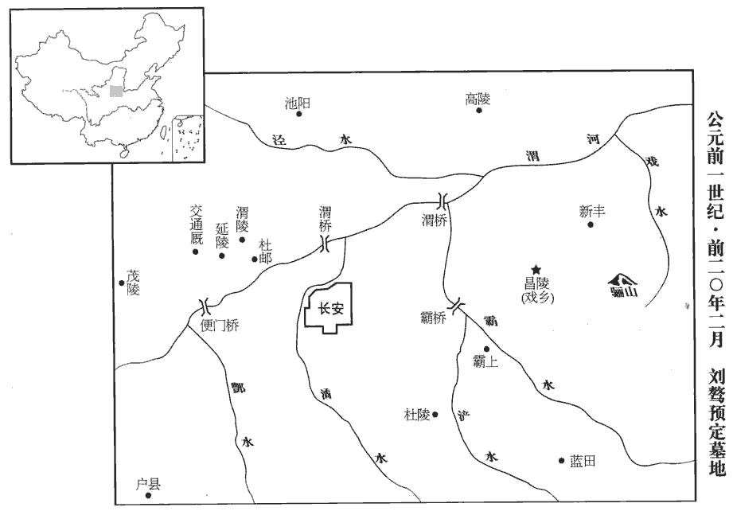
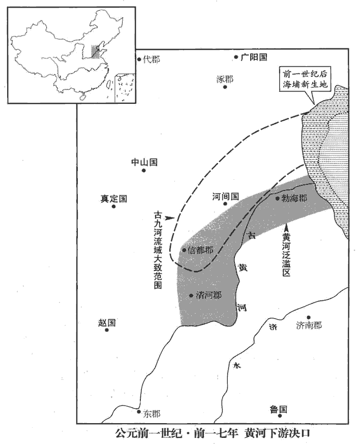
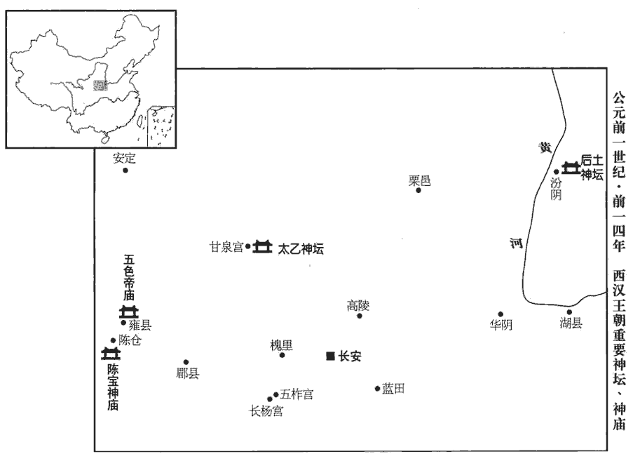
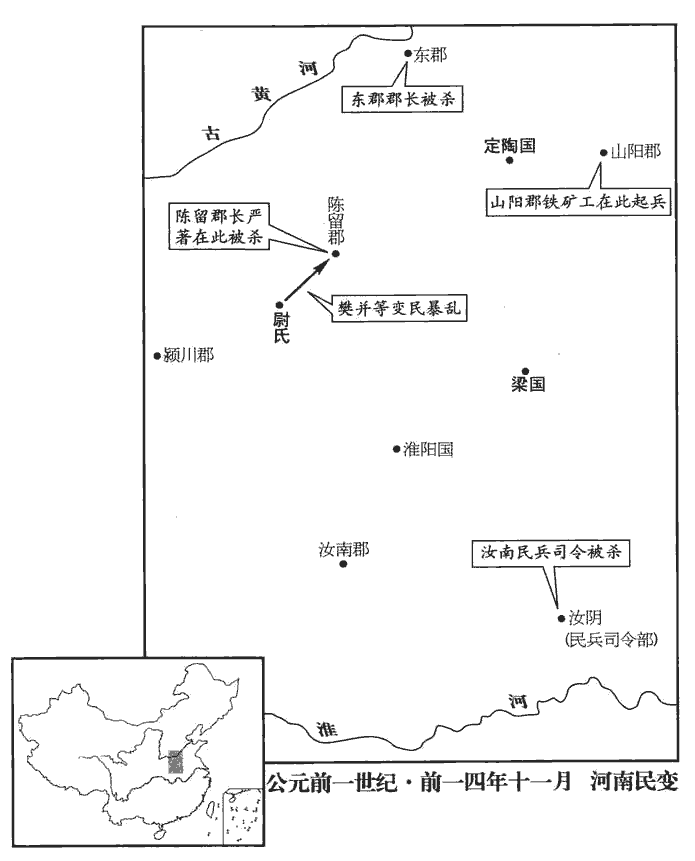

 漢紀二十三起屠維大淵獻（己亥），盡強圉協洽（丁未），凡九年。

# 孝成皇帝上之下

## 陽朔三年（己亥，前二二）

1春，三月，壬戌‹二十七›，隕石東郡‹河南濮陽西南›八。

〖译文〗 [1]春季，三月，壬戌（疑误），东郡坠落八块陨石。

2夏，六月，潁川‹河南禹州›鐵官徒申屠聖等百八十人殺長吏，盜庫兵，自稱將軍，經歷九郡。遣丞相長史、御史中丞逐捕，以軍興從事，長，知兩翻。師古曰：逐捕之事，須有發興，皆依軍法。皆伏辜。

〖译文〗 [2]夏季，六月，颖川铁官徒申屠圣等一百八十人，杀官员，盗取军械库兵器，自称“将军”，经历九个郡。成帝派遣丞相长史、御史中丞追捕，按战时征调军队的有关规定行事。申屠圣等全部伏诛。

3秋，王鳳疾，天子‹刘骜，时年三十一›數自臨問，數，所角翻。親執其手涕泣曰：「將軍病，如有不可言，師古曰：不可言，謂死也，不欲斥言之。平阿侯譚次將軍矣！」鳳頓首泣曰：「譚等雖與臣至親，行皆奢僭，行，下孟翻。無以率導百姓，不如御史大夫音謹敕，敕，整也，正也，固也，理也。臣敢以死保之！」及鳳且死，上疏謝上，復固薦音自代，復，扶又翻。言譚等五人必不可用；天子然之。初，譚倨，不肯事鳳，師古曰：倨，慢也。而音敬鳳，卑恭如子，故鳳薦之。八月，丁巳‹二十四›，鳳薨。九月，甲子‹二›，以王音為大司馬、車騎將軍，而王譚位特進，領城門兵。長安十二城門皆有屯兵。安定‹宁夏固原›太守谷永以譚失職，勸譚辭讓，不受城門職；由是譚、音相與不平。

〖译文〗 [3]秋季，王凤患病，成帝数次亲临探望，并亲自握着王凤的手流泪说：“将军染病，如有意外，我想让平阿侯王谭接替大将军！”王凤叩头哭泣说：“王谭等虽与我是至亲，但他们行事追求奢侈，超越本份，无法统率百姓，不如御史大夫王音谨慎小心，行事走正道。我敢用生命保举他！”及至王凤将死时，上书感谢皇恩，再次坚决推荐王音接替自己，说王谭等五人必不可用。成帝同意了。早先，王谭倨傲，不肯奉迎王凤。而王音则对王凤礼敬有加，卑恭如子，所以王凤保举他。八月，丁巳（二十四日），王凤去世。九月，甲子（初二），任命王音为大司马、车骑将军。赐王谭为特进，主管城门兵。安定太守谷永，因为王谭没有得到大将军的职位，劝他辞让，不接受主管城门的职务。自此王谭、王音互相不满，结下怨恨。

4冬，十一月，丁卯‹六›，光祿勳于永為御史大夫。永，定國之子也。

〖译文〗 [4]冬季，十一月，丁卯（初六），任命光禄勋于永为御史大夫。于永是于定国的儿子。

## 四年（庚子，前二一）

1春，二月，赦天下。

〖译文〗 [1]春季，二月，大赦天下。

2夏，四月，雨雪。雨，於具翻。

〖译文〗 [2]夏季，四月，降雪。

3秋，九月，壬申‹十六›，東平思王宇薨。宇，宣帝之子。

〖译文〗 [3]秋季，九月，壬申（十六日），东平王刘宇去世。

4少府王駿為京兆尹。駿，吉之子也。先是，京兆有趙廣漢、張敞、王尊、王章，至駿，皆有能名，故京師稱曰：「前有趙、張，後有三王。」趙廣漢、張敞，宣帝時尹京。三王，皆帝所用。史言尹京者難其材。先，悉薦翻。

〖译文〗 [4]任命少府王骏为京兆尹。王骏是王吉的儿子。先前，担任过京兆尹的有赵广汉、张敞、王尊、王章，到王骏，全都以才干出名，因而京师人称赞说：“前有赵、张，后有三王。”

5閏月，壬戌‹七›、于永卒。

〖译文〗 [5]闰十二月，壬戌（初七），于永去世。

6烏孫‹都赤谷城，中亚伊塞克湖东南›小昆彌烏就屠死，子拊離代立；師古曰：拊，讀與撫同。為弟日貳所殺。漢遣使者立拊離子安日為小昆彌。日貳亡阻康居；亡奔康居，依阻其遠以自全。安日使貴人姑莫匿等三人詐亡從日貳，刺殺之。師古曰：詐畔亡而投之，因得以刺殺。刺，七亦翻。於是西域諸國上書，願復得前都護段會宗；會宗前為西域都護，終更而還。復，扶又翻。上從之。城郭諸國聞之，皆翕然親附。

〖译文〗 [6]乌孙王国小昆弥乌就屠去世，他的儿子拊离接替小昆弥，拊离又被弟弟日贰杀死。汉朝派遣使者扶立拊离的儿子安日为小昆弥。日贰逃亡到康居王国，以阻止安日的追杀。安日指使贵族姑莫匿等三人，诈作反叛逃亡，追随日贰，将他刺杀。于是西域诸国纷纷上书，要求仍派原先的都护段会宗担任西域都护。成帝答应了他们的要求。西域诸城邦王国听到消息，都一致亲近归附汉朝。

7谷永奏言：「聖王不以名譽加於實效；御史大夫任重職大，少府宣達於從政，唯陛下留神考察！」上然之。

〖译文〗 [7]谷永上奏说：“圣明的君王用人时，不仅注意声誉，更重要的是考察办事的实际能力和效果。御史大夫责任重大，我看少府薛宣，处理政事通达干练，请陛下对他留意考察！”成帝同意了。

## 鴻嘉元年（辛丑，前二十）

1春，正月，癸巳‹九›，以薛宣為御史大夫。用谷永之言也。

〖译文〗 [1]春季，正月，癸巳（初九），任命薛宣为御史大夫。

2二月，壬午‹二十八›，上‹刘骜，本年三十三岁›行幸初陵‹陕西临潼西南›，赦作徒；師古曰：徒人之在陵役作者。以新豐‹陝西臨潼东北›之戲鄉‹陝西臨潼西南›為昌陵縣，師古曰：戲水之鄉也。戲，音許宜翻。奉初陵。

〖译文〗 [2]二月，壬午（二十八日），成帝前往自己的陵墓初陵，赦免在墓园作工的刑徒。把新丰的戏乡改为昌陵县，以供奉初陵。

 

3上始為微行，張晏曰：出入市里，不復警蹕，若微賤者之所為，故曰微行。從期門郎或私奴十餘人，或乘小車，或皆騎，騎，奇寄翻。出入市里郊野，遠至旁縣旁縣，諸縣環長安旁者也。甘泉‹陕西淳化西北›、長楊、五柞zhà‹皆在陕西周至›，柞，才各翻。鬬雞、走馬，常自稱富平侯家人。富平侯者，張安世四世孫放也。放父臨，尚敬武公主，文穎曰：公主，成帝姊也。臣瓚曰：敬武公主是元帝姊也。師古曰：二說皆非也。薛宣傳云：主怒曰：「嫂何以取妹殺之！」既謂元后為嫂，是即元帝妹也。地理志，钜鹿郡有敬武縣。生放，放為侍中、中郎將，娶許皇后女弟，當時寵幸無比，故假稱之。

〖译文〗 [3]成帝开始微服出行，跟随的期门郎或私奴有十余人，或乘小车，或全部骑马，出入市内街巷和郊野，远到邻县的甘泉、长杨、五柞，斗鸡走马，成帝还常自称是富平侯家人。所谓富平侯，是张安世的四世孙张放。张放的父亲张临，娶敬武公主为妻，生下张放。张放为侍中、中郎将，娶许皇后的妹妹为妻，当时所受荣宠，没有可以比得上的。因此成帝假称自己是富平侯家人。

4三月，庚戌‹二十七›，張禹以老病罷，以列侯朝朔、望，位特進，見禮如丞相；朝，直遙翻。賞賜前後數千萬。

〖译文〗 [4]三月，庚戌（二十七日），张禹因年老多病免官，以列侯的身分，在每月一日、十五日朝见皇帝，并加位特进，朝见时的礼节一如丞相，前后赏赐数千万钱。

5夏，四月，庚辰‹二十七›，薛宣為丞相，封高陽侯；恩澤侯表，高陽侯食邑於東莞。京兆尹王駿為御史大夫。

〖译文〗 [5]夏季，四月，庚辰（二十七日），任命薛宣为丞相，封高阳侯。任命京兆尹王骏为御史大夫。

6王音既以從舅越親用事，小心親職。從，才用翻。上以音自御史大夫入為將軍，將軍，中朝官，故曰入。不獲宰相之封，自公孫弘以來，為相者封侯。六月，乙巳‹十七›，封音為安陽侯。地理志，汝南郡有安陽侯國。

〖译文〗 [6]王音既然以堂舅的身份，超过其他亲舅得到重用，因而小心供职。成帝因王音是从御史大夫直接擢升为将军，没有得到宰相应当封的爵位。六月，乙巳（疑误），封王音为安阳侯。

7冬，黃龍見真定‹河北正定›。見，賢遍翻。

〖译文〗 [7]冬季，真定发现黄龙。

8是歲，匈奴復株累單于死，弟且麋【章十四行本「麋」作「糜」；乙十一行本同；孔本同。】胥立，為搜諧若鞮單于；遣子左祝都韓王呴xǔ留斯侯入侍，以且莫車為左賢王。累，力追翻。單，音蟬。且，子餘翻。鞮，丁兮翻。「呴」，漢書作「朐xù」；師古曰：音許於翻。

〖译文〗 [8]本年，匈奴复株累单于去世，弟弟且麋胥继位，为搜谐若单于。单于派遣儿子左祝都韩王留斯侯到长安，作为人质侍奉汉皇。单于又任命且莫车为左贤王。

## 二年（壬寅，前一九）

1春，上‹刘骜，本年三十四岁›行幸雲陽‹陝西淳化›甘泉。甘泉宮在雲陽縣。

〖译文〗 [1]春季，成帝前往云阳、甘泉。

2三月，博士行大射禮。古者天子、諸侯、大夫、士皆有大射之禮。博士所行，士之射禮也。有飛雉集於庭，歷階登堂而雊gòu；師古曰：歷階，謂以次而登也。雊，古豆翻。後雉又集太常、宗正、丞相、御史大夫、車騎將軍之府，又集未央宮承明殿屋上。車騎將軍音、待詔寵等上言：師古曰：以經術待詔，其人名寵，不記姓也。「天地之氣，以類相應；譴告人君，甚微而著。雉者聽察，先聞雷聲，故月令以紀氣。師古曰：謂季冬之月雉雊gòu、雞乳。經載高宗雊雉之異，以明轉禍為福之驗。師古曰：高宗祭成湯，有飛雉升鼎耳而雊，祖己曰：「惟先假王正厥事」。故能攘妖而致百年之壽。今雉以博士行禮之日，【章：乙十一行本「日」下有「大衆聚會，飛集於庭」八字；孔本同；張校同；退齋校同。】歷階登堂，萬眾睢睢huī，師古曰：睢睢，仰目視貌，音呼惟翻。驚怪連日，徑歷三公之府，太常、宗正典宗廟骨肉之官，然後入宮，其宿留告曉人，具備深切；師古曰：宿，音先就翻。留，音力救翻。雖人道相戒，何以過是！」後帝使中常侍鼂閎詔音曰：鼂，古朝字。「聞捕得雉，毛羽頗摧折，類拘執者，得無人為之？」師古曰：言人放此雉，故欲為變異者。折，而設翻。音復對曰：「陛下安得亡國之語！不知誰主為佞讇之計，誣亂聖德如此者！左右阿諛甚眾，不待臣音復讇而足。復，扶又翻。讇，古諂字。師古曰：足，益也，音子喻翻。足其不足曰足。公卿以下，保位自守，莫有正言。如令陛下覺寤，懼大禍且至身，深責臣下，繩以聖法，臣音當先誅，豈有以自解哉！今即位十五年，繼嗣不立，日日駕車而出，失行流聞；行，所行也。言帝所行多非道，過失流布，聞於遠方也。行，下孟翻。海內傳之，甚於京師。外有微行之害，內有疾病之憂，皇天數見災異，欲人變更，數，所角翻。見，賢遍翻。更，工衡翻；下同。終已不改。天尚不能感動陛下，臣子何望！獨有極言待死，命在朝暮而已。如有不然，老母安得處所，尚何皇太后之有！高祖天下當以誰屬乎！如淳曰：老母，音之老母也，當隨己受罪誅也。又謂己言深切，觸牾人主，積恚而犯必行之誅，不能復顧太后也。師古曰：如說非也。此言總屬於成帝耳。不然者，謂不如所諫而自修改也。老母，即帝之母太后也。言帝不自修改，國家危亡，太后不知處所，高祖天下無所付屬也。屬，音之欲翻。宜謀於賢智，克己復禮，用論語孔子答顏淵之言。以求天意，繼嗣可立，災變尚可銷也。」

〖译文〗 [2]三月，博士举行大射礼时。有野鸡飞来，群集于庭院，经过台阶登上大堂鸣叫。而后，又飞集于太常、宗正、丞相、御史大夫、车骑将军官府，接着，又飞集于未央宫承明殿的屋顶上。车骑将军王音、待诏宠等上奏说：“天地之气，以类别互相呼应验证，向君王示警的变异，虽然甚为微小，但很显著。野鸡听觉敏锐，能最先听到雷声，因而《月令》用野鸡的鸣叫来记录节气。《书经》记载：高宗武丁祭成汤时，曾出现野鸡飞到鼎耳上鸣叫的不祥异象，而高宗坚守正道，从而消弭了灾祸，这是转祸为福的明显验证。而今，野鸡在博士举行典礼之日，经过台阶登堂，在万人瞩目之下，引起连日的惊怪，一直飞过三公之府，飞过太常、宗正等主持宗庙祭典和皇族事务的官署，然后入宫。野鸡的停留所告诫人们的内容，是深刻而切要的。虽然人们之间也常常互相告诫，但哪里能赶上这个呢！”而后，成帝派中常侍晁闳传诏询问王音说：“听说捕捉到的野鸡，很多羽毛都折断了，好象曾被抓住关过，莫非有人故意制造变异？”王音回答说：“陛下怎能说这种亡国的话！不知谁敢主谋策划这种奸巧的计策，诬蔑扰乱圣德到如此地步！圣上左右善阿谀的大有人在，不必等我王音再逢迎也已足够。公卿及以下，为保官位，人人自守，不敢说出一句正直的话。如果能让陛下觉悟，惧怕大祸就要降到身上，从而深责臣下，绳之以法，我王音会首先伏诛，岂有自我解脱的道理！陛下即位已十五年，没有继承皇位的嗣子，却天天驾车出游，干些有失德行的不道之举，在社会上流传，海内的传闻，更甚于京师。陛下外有微服出游的毛病，内有疾病缠身的忧愁，上天屡次降下灾异，希望人能改正过失，然而终至不改。上天尚且不能感动陛下，臣子又能企盼什么呢！只有直言极谏，等候处死，命在旦夕间而已。如有不测，我的老母都没有安生的地方，更何况皇太后，就更没有安全的处所了。到那时，高祖的天下该当托嘱给谁呢？陛下应当与贤能智慧之人磋商，象孔子所说那样，克制个人的俗望，恢复以礼治国的正道，以求天意保佑，太子降生，灾害变异也才会消失。”

3初，元帝‹刘奭›儉約，渭陵‹陝西咸陽东北›不復徙民起邑；事見二十九卷元帝永光四年。復，扶又翻。帝起初陵‹陝西咸陽北›，即延陵也。數年後，樂霸陵曲亭南，更營之。即新豐戲鄉之地。關中記：昌陵，在霸城東二十里。樂，音洛。將作大匠解萬年解，戶買翻，姓也。姓譜：自晉唐叔虞食邑於解，今解縣也。晉有解狐、解揚。使陳湯為奏，請為初陵徙民起邑，欲自以為功，求重賞。湯因自請先徙，冀得美田宅。上從其言，果起昌陵邑‹陝西臨潼西南›。為萬年、湯得罪罷昌陵張本。

〖译文〗 [3]当初，汉元帝十分俭省节约，他的陵墓渭陵，不再让居民迁来，建立县邑。而成帝建筑他的初陵，经营数年后，又看上霸陵曲亭以南，就更改地点，重新营建。将作大匠解万年，让陈汤替他上奏，请求为成帝新建陵墓迁移居民，建立县邑，想以此为自己邀功，求得重赏。陈汤因而请求准许他最先搬迁，希图分到肥沃的田地和美好的住宅。皇上听从他们的建议，果然设立了昌陵邑。

夏，徙郡國豪桀貲五百萬以上五千戶於昌陵。

〖译文〗 夏季，下令迁移郡国豪族资产在五百万以上的五千户，充实昌陵地区。

4五月，癸未‹六›，隕石於杜郵‹陝西咸陽东北›三。

〖译文〗 [4]五月，癸未（初六），杜邮坠落三颗陨石。

5六月，立中山‹府卢奴河北省定州市›憲王孫雲客為廣德王‹安徽黟县›。中山憲王福，靖王勝之玄孫也。地節元年，福薨，子懷王脩嗣。五鳳三年，脩薨，無後。今立雲客。

〖译文〗 [5]六月，封中山宪王的孙子刘云客为广德王。

6是歲，城陽‹山东莒县›哀王雲薨；無子，國除。城陽景王章傳國十世，至雲。

〖译文〗 [6]本年，城阳王刘云去世，由于没有儿子，封国撤除。

## 三年（癸卯，前一八）

1夏，四月，赦天下。

〖译文〗 [1]夏季，四月，大赦天下。

2大旱。

〖译文〗 [2]大旱。

3王氏五侯爭以奢侈相尚。成都侯商嘗病，欲避暑，從上‹刘骜，本年三十五岁›借明光宮。師古曰：黃圖云：明光宮，在城內，近桂宮。後又穿長安城，引內灃水，地理志：豐水出鄠hù縣東南，北流過上林苑，入渭。注第中大陂bēi以行船，立羽蓋，羽蓋，編羽為之。張周帷，周帷，船之四周皆張帷。楫jí棹zhào越歌。師古曰：楫、棹，皆所以行船也；令執楫棹人為越歌也。楫，謂棹之短者也，今吳、越之人謂之橈ráo，音饒。越歌，為越之歌。上幸商第，見穿城引水，意恨，內銜之，未言。後微行出，過曲陽侯第，又見園中土山、漸臺，象白虎殿，起土山、漸臺，又為室屋象白虎殿也。於是上怒，以讓車騎將軍音。商、根兄弟欲自黥qíng、劓yì以謝太后。劓，魚器翻，又牛例翻。上聞之，大怒，乃使尚書責問司隸校尉、京兆尹，知成都侯商等奢僭不軌，藏匿姦猾，皆阿縱，不舉奏正法；二人頓首省戶下。司隸校尉察三輔，京兆尹治京邑，而阿縱不舉奏，故責之。省戶，禁門也。又賜車騎將軍音策書曰：「外家何甘樂禍敗！師古曰：言此罪過，并身自為之。余謂言商等奢僭，必將得罪，何乃甘心為之以為樂也！樂，音洛。而欲自黥、劓，相戮辱於太后前，傷慈母之心，以危亂國家！外家宗族強，上一身寖弱日久，今將一施之，師古曰：行刑罰。君其召諸侯，令待府舍！」諸侯，指商、根等。師古曰：令總集音舍待詔命。是日，詔尚書奏文帝誅將軍薄昭故事。見十四卷文帝前十年。車騎將軍音藉稾gǎo請罪，師古曰：自坐稾上，言待刑戮也。商、立、根皆負斧質謝，良久乃已。上特欲恐之，實無意誅也。

〖译文〗 [3]王氏五侯竞相崇尚奢华。成都侯王商曾得病，想找个避暑的地方，就向皇上借用明光宫。后来，他又凿穿长安城墙，引来沣水，注入他家宅第中的大水池，使可以行船取乐。游船上树立羽毛华盖，四周全都张挂帷幔，还命令划船的人唱越歌。有一次，成帝到王商的府第，看见池水是穿城挖渠引来的，十分恼怒，但只含恨隐忍，没有说话。后来，成帝微服出行时，经过曲阳侯府第，看见园中修筑土山、渐台，模仿白虎殿，于是成帝大怒，用五侯僭越的罪行指责车骑将军王音。王商、王根兄弟十分恐慌，就想用在自己脸上刺字割鼻的办法，向太后谢罪。成帝听说后，更加怒不可遏，就派尚书去责问司隶校尉和京兆尹；明知成都侯王商等奢侈、僭越等种种不轨行为，甚至窝藏坏人，却都阿谀纵容，不举奏揭发，将他们绳之以法。司隶校尉和京兆尹两人在禁宫门外叩头请罪。成帝又给车骑将军王音下策书说：“外戚为什么自己甘愿犯罪从而败落呢？竟然打算给自己刺面割鼻，在太后面前摆出一副受戮辱的样子，大伤太后的慈母之心，从而危害搅乱国家。外戚宗族势力过强，朕在他们的包围熏染下，很长一段时间都软弱无所作为，今天我要对他们一一处罚。你立即把王商等人召到你那里，等待处理！”这天，成帝还诏令尚书，奏报汉文帝诛杀将军薄昭的旧事。车骑将军王音坐在草垫子上，请罪待刑。王商、王立、王根都背负刀斧和砧板，表示谢罪待刑。过了很久，此事才平息。成帝不过是要恐吓他们，实在并没有诛杀他们的意思。

4秋，八月，乙卯‹十五›，孝景廟北闕災。

〖译文〗 [4]秋季，八月，乙卯（十五日），孝景帝祭庙北门失火。

5初，許皇后與班倢伃皆有寵於上。上嘗遊後庭，欲與倢伃同輦載，倢伃，音接於；下同。倢伃辭曰：「觀古圖畫，賢聖之君皆【章：十四行本「皆」下有「有」字；乙十一行本同；孔本同。】名臣在側，三代末主乃有嬖妾；今欲同輦，得無近似之乎！」師古曰：嬖bì，愛也，音必計翻，又卑義翻。近，音巨靳翻。上善其言而止。太后聞之，喜曰：「古有樊姬，張晏曰：楚王好田，樊姬為不食禽獸之肉。按樊姬事楚莊王。今有班倢伃！」班倢伃進侍者李平得幸，亦為倢伃，賜姓曰衛。

〖译文〗 [5]最初，许皇后与班都受成帝宠爱。有一次，成帝在后宫庭院游玩，想跟班同乘一辆车，班推辞说：“我观看古代的图画，圣贤的君王身旁，都跟随着名臣，而三代末世的君王身旁，才有宠妾。现在陛下想让我同车，是不是有些相似呢！”成帝对她的回答很赞赏，也就不再勉强。太后听说了，高兴地说：“古代有樊姬，今天有班！”班把侍者李平进献成帝，李平受到宠幸，也被封为，赐姓“卫”。

其後，上微行過陽阿主家，師古曰：陽阿，平原之縣也。應劭曰：平原漯陰東南五十里，有陽阿鄉，故縣也。考異曰：五行志作「河陽主」，伶玄趙后外傳及荀紀亦作「河陽」。外戚傳顏師古註曰：陽阿，平原之縣也。今俗書「阿」字作「河」，或為「河陽」，皆後人所妄改耳。今從之。悅歌舞者趙飛燕，師古曰：以其體輕，故曰飛燕。召入宮，大幸；有女弟，復召入，復，扶又翻。姿性尤醲粹，左右見之，皆嘖嘖嗟賞。嘖嘖zé，眾口稱羨而作聲也；音側革翻。有宣帝時披香博士淖nào方成在帝後，披香博士，後宮女職也。淖，音女教翻，姓也。唾曰：「此禍水也，滅火必矣！」姊、弟俱為倢伃，貴傾後宮。許皇后、班倢伃皆失寵。於是趙飛燕譖告許皇后、班倢伃挾媚道，婦人挾媚道者，蠱詛他人，求己親媚。祝詛後宮，詈及主上。祝，職救翻。詛，莊助翻。詈，力智翻。冬，十一月，甲寅‹十六›，許后廢處昭臺宮，師古曰：宮在上林苑中。處，昌呂翻。后姊謁【章：乙十一行本「謁」下有「等」字；孔本同；張校同。】皆誅死，親屬歸故郡。后姊謁，為平安剛侯夫人。許氏，本山陽‹山東金鄉西北昌邑镇›人也。考問班倢伃，倢伃對曰：「妾聞『死生有命，富貴在天。』論語載子夏答司馬牛之言。脩正尚未蒙福，為邪欲以何望！使鬼神有知，不受不臣之愬sù；師古曰：祝詛主上，是不臣也。如其無知，愬之何益！故不為也。」上善其對，赦之，賜黃金百斤。趙氏姊、弟驕妬，婕伃恐久見危，乃求共養太后於長信宮。師古曰：共，音居用翻。養，音弋向翻。宮閣記：長信殿，在長樂宮，太后常居之。上許焉。

〖译文〗 此后，成帝微服出行，到阳阿公主的家，喜欢上公主家的歌舞女赵飞燕，把她召入宫中，大加宠爱。赵飞燕有个妹妹，也被召入宫，姿容特别美艳，毫无瑕疵。成帝左右的人看见她，都惊叹赞赏。有位汉宣帝时的披香博士淖方成，当时正站在成帝身后，却唾口水说：“这是祸水呀，定会扑灭汉王朝之火！”赵飞燕姐妹俩都被封为，一时尊贵荣宠，压倒后宫。许皇后、班都失宠了。于是赵飞燕向成帝进谗言说，许皇后，班用妖术诅咒后宫得宠的美人，甚至连皇上都骂到了。冬季，十一月，甲寅（十六日），许后被废，迁居昭台宫。许后的姐姐许谒等人全被诛杀，许后的亲属被逐归原郡。审讯班崐时，班回答说：“我听说‘死生有命，富贵在天’。我修行持正，尚且没有享到幸福，如果做邪的事，就更不用想有好结果了。假使鬼神有知，不会听取诅咒主上的恶诉；假使鬼神无知，向鬼神诉说又有什么用呢？所以用妖术诅咒之事，我不会做的。”成帝认为她说的有道理，就赦免了她，并赐黄金百斤。赵氏姐妹骄横妒嫉，班怕时间长了，终为所害，就请求到长信宫侍奉太后。皇上予以批准。

6廣漢‹四川梓潼›男子鄭躬等六十餘人攻官寺，篡囚徒，盜庫兵；自稱山君。廣漢郡，高帝分蜀郡置，屬益州。師古曰：逆取曰篡。風俗通：寺，司也。諸官府所止皆曰寺。

〖译文〗 [6]广汉男子郑躬等六十余人，攻打官府，劫走囚犯，盗取军械库兵器。郑躬自称山君。

## 四年（甲辰，前一七）

1秋，勃海‹河北滄州东南›、清河‹河北清河›、信都‹河北冀縣›河水湓pén溢，勃海，唐滄、景州。清河，唐貝州。信都，唐冀州。師古曰：湓，湧也；音普頓翻。灌縣、邑三十一，敗官亭、民舍四萬餘所。敗，補邁翻。平陵‹陝西咸陽西平陵乡›李尋【章：乙十一行本「尋」下有「等」字；孔本同。】奏言：「議者常欲求索九河故跡而穿之。今因其自決，可且勿塞，以觀水勢；索，山客翻。塞，悉則翻；下同。河欲居之，當稍自成川，跳出沙土。然後順天心而圖之，必有成功，而用財力寡。」於是遂止不塞。朝臣數言百姓可哀，上遣使者處業振贍之。師古曰：處業，謂安處之，使得居業。數，所角翻。處昌呂翻。

〖译文〗 [1]秋季，黄河在勃海、清河、信都泛滥成灾，淹没三十一个县、邑，冲毁官亭、民房四万余所。平陵人李寻上奏说：“讨论治河之策的人，总想寻找九河故道，按照故道挖掘治理。而今趁着黄河自己决口，可以暂时不堵塞缺口，以观察水的走势，要想让黄河有固定的水道，就应当让它自己逐渐形成河川，再沿河川挑出河床的沙土。然后按照上天的意愿加以规划治理，必能取得成功，而且所用财力、人力都可节省。”于是就停下来，不堵塞黄河缺口。朝臣屡次提出灾区百姓处境悲惨，成帝派使者安置赈济灾区百姓。

 

2廣漢‹四川梓潼›鄭躬黨與寖廣，犯歷四縣，眾且萬人；州郡不能制。冬，以河東‹山西夏縣›都尉趙護為廣漢太守，發郡中及蜀郡‹四川成都›合三萬人擊之，或相捕斬除罪；師古曰：賊黨相捕斬，赦其本罪。旬月平。遷護為執金吾，賜黃金百斤。

〖译文〗 [2]广汉郑躬的党羽日益增加，势力范围愈来愈广，曾攻击四个县，人众将近万人，州郡也镇压不住。冬季，朝廷任命河东都尉赵护为广汉太守，征发广汉郡及蜀郡兵共三万人，攻击郑躬。有贼人互相捕捉斩杀，官府赦免其罪。不到一个月，叛乱平息。擢升赵护为执金吾，赐黄金百斤。

3是歲，平阿安侯王譚薨。上悔廢譚使不輔政而薨也，乃復進成都侯商，復，扶又翻。以特進領城門兵，置幕府，得舉吏如將軍。漢制，列將軍置幕府，得舉吏。

〖译文〗 [3]这年，平阿侯王谭去世。成帝后悔弃置王谭，使他没有担任辅政大臣就去世了。于是再次任用成都侯王商，让他以特进身份主管城门兵，设置幕府，使他与将军同样有举荐官吏的权力。

魏郡‹河北臨漳西南邺镇›杜鄴時為郎，素善車騎將軍音，見音前與平阿侯有隙，即說音曰：「夫戚而不見殊，孰能無怨！師古曰：戚，近也。殊，謂異於疏也。說，輸芮翻。昔秦伯有千乘之國而不能容其母弟，師古曰：秦景公母弟公子鍼zhēn有寵於其父桓公。景公立，鍼懼而奔晉。事在昭元年。故經書「秦伯之弟鍼出奔晉」，傳曰：稱弟，罪秦伯也。春秋譏焉。周、召則不然，師古曰：言周公、召公無私怨也。余謂不然者，不為秦伯之為也。召，讀曰邵。忠以相輔，義以相匡，同己之親，等己之尊，不以聖德獨兼國寵，又不為長專受榮任，分職於陝‹河南三门峡›，并為弼疑，師古曰：分職於陝，謂自陝以東周公主之，自陝以西召公主之。陝，即今陝州縣也；音式冉翻。而說者妄云分陝是潁川郟jiá縣，謬矣。弼疑，謂左輔、右弼、前疑、後丞也。余按字書，陝從兩「入」，郟從兩「人」，人自不考耳。為，於偽翻。長，知兩翻。故內無感恨之隙，師古曰：感，音胡闇翻。外無侵侮之羞，俱享天祐，兩荷高名者，蓋以此也。荷，下可翻。竊見成都侯以特進領城門兵，復有詔得舉吏如五府，丞相，御史及車騎、左、右將軍府也。復，扶又翻。此明詔所欲必寵也。將軍宜承順聖意，加異往時，每事凡議，必與及之。發於至誠，則孰不說諭！」師古曰：言皆出於至誠，彼必和說，無憂乖異也。說，讀曰悅。音甚嘉其言，由是與成都侯商親密。二人皆重鄴。

〖译文〗 魏郡人杜邺，当时官职为郎，他一向与车骑将军王音要好，见王音从前与平阿侯有嫌隙，就劝王音说：“亲人之间不应该疏远，谁能没有点怨恨呢？从前秦景公拥有千乘战车那么强大的国家，却容不下自己的同母胞弟，《春秋》因此而讥刺他。周公、召公则不然，忠心为国而互相辅助，深明大义而互相匡扶。相互间，把对方当作自身一样亲密和尊重。不因自己德高望重，而独享国家的荣宠；又不因自己年长，而专揽所有显要的职务。将国家从陕地划开，分别主持，二人同为天子的左辅右弼。因此内无遗憾怨恨的嫌隙，外无遭受抨击侮辱的羞耻，同享上天的福佑，也同时负有高名的原因，就在于此吧。我看成都侯王商，以特进的身份主管城门兵，皇上还下诏，使他一如五府有举荐官吏的职权。诏书的意思十分明显，说明圣上一定要对他格外宠信。将军应该禀承顺从圣上的旨意，加倍改变过去的作法，每件政事，凡有建议奏章，都必与王商磋商。只要发自内心的至诚，则谁又会不高兴呢！”王音非常赞许他的看法崐，从此与成都侯王商亲密。两人都很看重杜邺。

## 永始元年（乙巳，前一六）

1春，正月，癸丑‹二十二›，太官淩室火。師古曰：淩室，藏冰之室。淩，音力證翻，又音陵。戊午‹二十七›，戾后‹刘据妻史良娣›園南闕火。考異曰：五行志及荀紀二「火」皆作「災」，今從漢書。

〖译文〗 [1]春季，正月，癸丑（二十二日），太官冰室发生火灾。戊午（二十七日），戾后陵园南门发生火灾。

2上‹刘骜，时年三十七›欲立趙倢伃‹赵飞燕›為皇后，皇太后‹王政君›嫌其所出微甚，難之。太后姊子淳于長為侍中，數往來通語東宮；數，所角翻。歲餘，乃得太后指，許之。夏，四月，乙亥‹十五›，上先封倢伃父臨為成陽侯。恩澤侯表，成陽侯食邑於汝南新息。諫大夫河間‹河北獻縣›劉輔上書，漢書：劉輔，河間宗室。言：「昔武王、周公，承順天地以饗魚、烏之瑞，然猶君臣祗懼，動色相戒。今文尚書泰誓曰：白魚入於王舟；有火復於王屋，流為烏。周公曰：「復哉！復哉！」況於季世，不蒙繼嗣之福，屢受威怒之異者虖！威怒，謂皇天降威震怒也。虖，古乎字。雖夙夜自責，改過易行，行，下孟翻。畏天命，念祖業，妙選有德之世，考卜窈窕之女，鄭玄曰：考，猶稽也。師古曰：窈窕，幽閒也。以承宗廟，順神祇心，塞天下望，塞，悉則翻。子孫之祥猶恐晚暮！今乃觸情縱欲，傾於卑賤之女，欲以母天下，不畏於天，不愧於人，惑莫大焉！里語曰：『腐木不可以為柱；人婢不可以為主。』考異曰：劉輔傳云：「腐木不可以為柱；卑人不可以為主。」荀紀「柱」作「珪」guī，「卑人」作「人婢」。今「柱」從漢書；「人婢」從荀紀。天人之所不予，必有禍而無福，市道皆共知之，師古曰：市道，市中之道也；一曰市人及行於道路者也。予，讀曰與。朝廷莫肯壹言。臣竊傷心，不敢不盡死！」書奏，上使侍御史收縛輔，繫掖庭祕獄，師古曰：漢舊儀：掖庭詔獄，令、丞，宦者為之，主理婦人、女官也。群臣莫知其故。於是左將軍辛慶忌。右將軍廉褒、光祿勳琅邪‹山東諸城›師丹、太中大夫谷永四人皆中朝官。俱上書曰：「竊見劉輔前以縣令求見，擢為諫大夫，輔以襄賁令上書言得失，召見，擢諫大夫。襄賁‹山東苍山县东南长城镇›，東海縣也。賁，音肥。此其言必有卓詭切至當聖心者，故得拔至於此；旬月之間，收下祕獄。下，遐稼翻。臣等愚以為輔幸得託公族之親，在諫臣之列，新從下土來，未知朝廷體，獨觸忌諱，不足深過。過，猶罪也。小罪宜隱忍而已，如有大惡，宜暴治理官，與眾共之。理官，謂廷尉也。師古曰：令眾人知其罪狀而罰之。暴，顯示也。顯示其罪，使理官治之。今天心未豫，張晏曰：豫，悅豫也。災異屢降，水旱迭臻，方當隆寬廣問，褒直盡下之時也，而行慘急之誅於諫爭之臣，爭，讀曰諍。震驚群下，失忠直心。假令輔不坐直言，所坐不著，師古曰：著，明也。天下不可戶曉。師古曰：言不可家家曉諭之也。同姓近臣，本以言顯，其於治親養忠之義，治，直之翻。誠不宜幽囚於掖庭獄。公卿以下，見陛下進用輔亟而折傷之暴，人有懼心，精銳銷耎ruǎn，師古曰：人人皆懼也。蘇林曰：耎，弱也。師古曰：耎，音乃亂翻，又乳兗翻。莫敢盡節正言，非所以昭有虞之聽，師古曰：舜有敢諫之鼓，故言有虞之聽也；一曰：謂達四聰也。廣德美之風！臣等竊深傷之，惟陛下留神省察！」省，悉井翻。上乃徙輔繫共工獄，蘇林曰：考工也。師古曰：少府之屬官，亦有詔獄。共，讀與龔同。減死罪一等，論為鬼薪。應劭曰：取薪給宗廟為鬼薪，三歲刑也。

〖译文〗 [2]成帝想封赵飞燕为皇后，但皇太后嫌她出身太微贱，从中阻拦。太后姐姐的儿子淳于长任侍中，多次往来于东宫，为成帝传话。经过一年多，才得到太后的旨意，予以允许。夏季，四月，乙亥（十五日），成帝先封赵飞燕的父亲赵临为成阳侯。谏大夫、河间人刘辅上书说：“往昔武王、周公承顺天地，因而有白鱼入王舟、火焰变乌鸦的祥瑞，然而君臣仍然心怀恭敬和恐惧，脸为变色，互相戒勉。何况现在正处末世，没有太子降生的福气，却屡次遭受上天降威震怒的变异呢！虽然日夜自责检讨，改过易行，敬畏天命，思念祖宗大业，精选品德高尚的家族，从中稽考挑选窈窕淑女，以承奉宗庙，顺从神灵之心，满足天下人的希望，然而要想有生子生孙的福气，仍然恐怕太晚！可是陛下现在却放纵情欲，倾心迷恋卑贱之女，想让这样的女子作天下之母，既不畏于天，又不愧于人，陛下的迷惑，没有比现在更大的了！俚语说：‘腐木不可用做梁柱，婢女不可成为主人。’上天和人民都不赞成的事情，必然有祸而无福，这是街市小民和路人都懂得的道理，朝廷却没有人肯说一句话，我为此痛心，不敢不冒死劝谏。”奏章上去后，成帝派侍御史逮捕了刘辅，囚禁在宫廷秘密监狱里。群臣都不知道他被捕的原因。当时左将军辛庆忌、右将军廉褒、光禄勋琅邪人师丹、太中大夫谷永，都上书说：“我们看到刘辅从前以县令的身份求见陛下，被陛下擢升为谏大夫，这说明他的话必具卓异的见识，正好深合圣心，所以才能够被提拔到这样的地位。不到一个月的时间，却突然被逮捕，关押在秘密监狱。我们愚昧地认为，刘辅有幸为皇族宗亲之一，位列谏臣。他新近才从下面的县邑来到，不懂朝廷规矩，独自触犯了陛下的忌讳，不足以深加追究。若是小罪，陛下还是应该隐忍一下；如有大罪，就应公开揭露，让司法官吏去查办，使大家都知道他的罪恶。现在天心不悦，屡降灾异，水旱迭至。正处在应该施恩宽容，广求建议，褒奖直言，使臣下尽言的时候，却对谏诤之臣施以惨痛激烈的处罚，使群臣震惊，丧失尽忠直言之心。假如刘辅不是因直言获罪，罪名又不公布，那么就不能使天下家喻户晓。刘辅是同姓近臣，本因直言而获显达，从管理亲族、培养忠良的意义上说，实在不该把他幽禁在宫廷监狱。公卿及以下官员，见陛下很快地擢升任用刘辅，又迅速加以摧折，人人怀有恐惧之心，精气顿销，锐气减弱，不敢为国尽忠直言了。这就不能显示出陛下具有虞舜倾听直谏的贤德，也不能推广美好的道德风范。我们深深为崐此痛心，希望陛下留意考察！”成帝于是把刘辅转移到共工狱，减免死罪，判处做三年苦工的“鬼薪”徒刑。

3初，太后兄弟八人，獨弟曼早死，不侯；鳳，嗣父爵陽平侯。崇，安成侯。庶弟五人，同日封，謂之五侯。八人之中，獨曼不侯。太后憐之。曼寡婦渠供養東宮，供，居用翻。養，餘亮翻。子莽幼孤，不及等比；師古曰：比，音必寐翻；余謂當音毗至翻。其群兄弟皆將軍、五侯子，乘時侈靡，師古曰：乘，因也，因富貴之時。以輿馬聲色佚游相高。師古曰：佚，與逸同。莽因折節為恭儉，勤身博學，折，而設翻。被服如儒生；師古曰：被，音皮義翻。事母及寡嫂，養孤兄子，行甚敕備；莽兄永早死，有子光。行，下孟翻。又外交英俊，內事諸父，曲有禮意。大將軍鳳病，莽侍疾，親嘗藥，鄭玄曰：嘗藥，度其所堪。亂首垢面，不解衣帶連月。鳳且死，以託太后及帝，拜為黃門郎，漢舊儀曰：黃門郎，屬黃門令，日暮入對青瑣門拜，名曰夕郎。董巴曰：禁門曰黃闥。遷射聲校尉。久之，叔父成都侯商上書，願分戶邑以封莽。長樂少府戴崇、姓譜：戴，宋戴公之後；一曰：宋滅戴，子孫以國為氏。侍中金涉、中郎陳湯等皆當世名士，咸為莽言，為，於偽翻；下同。上由是賢莽，太后又數以為言。數，所角翻。五月，乙未‹六›，封莽為新都侯，莽傳以南陽新野之都鄉為新都侯國。遷騎都尉、光祿大夫、侍中。宿衛謹敕，爵位益尊，節操愈謙，散輿馬、衣裘振施賓客，師古曰：振，舉也。施，式智翻。家無所餘；收贍名士，交結將、相、卿、大夫甚眾。故在位者更推薦之，更，工衡翻。遊者為之談說，虛譽隆洽，傾其諸父矣。隆，盛也。洽，漸浹也，周徧也。敢為激發之行，處之不慙恧nǜ。師古曰：激，急動。恧，愧也。激，音工歷翻。行，下孟翻。處，昌呂翻。恧，音女六翻。嘗私買侍婢，昆弟或頗聞知，莽因曰：「後將軍朱子元無子，朱博，字子元。莽聞此兒種宜子。」【章：十四行本「子」下有「爲買之」三字；乙十一行本同；孔本同；張校同；退齋校同。】師古曰：此兒，謂所買婢也。種，章勇翻。即日以婢奉朱博。其匿情求名如此！王莽事始此。

〖译文〗 [3]最初，太后有兄弟八人，唯独弟弟王曼早死，没有封侯。太后怜惜他，把王曼的遗孀渠供养在东宫。王曼的儿子王莽，从小成孤儿，不能与其他人相比。那些兄弟的父亲都是将军、王侯，可以凭父亲当时的地位恣意奢华，在车马声色放荡游乐方面互相竞赛。而王莽是屈己下人，态度谦恭，勤学苦修，学识渊博，穿着像儒生。侍奉母亲跟寡嫂，抚养亡兄的孤儿，十分尽心周到。同时，在外结交的都是些俊杰之士，在内对待诸位伯父叔父，能委曲迁就，礼敬有加。大将军王凤病重时，王莽侍候他，亲口尝药，一连几个月都不能解衣入睡，因而蓬头垢面。王凤将死时，把王莽托付给太后及成帝，王莽因此被封为黄门郎，以后又升任射声校尉。很久以后，叔父成都侯王商上书，表示愿分出自己封地上的土地和百姓，请求皇上封给王莽。长乐少府戴崇、侍中金涉、中郎陈汤等，都是当代名士，也都为王莽美言。成帝因而认为王莽贤能，太后又屡次以此嘱咐成帝。五月，乙未（初六），封王莽为新都侯，升为骑都尉、光禄大夫、侍中。王莽在宫廷服务谨慎尽心，爵位越尊贵，他的礼节操守越谦恭。他把自己的车马、衣物、皮裘周济给门下宾客，而自己却家无余财。他收罗赡养名士，结交很多将、相、卿、大夫。因而在位的官员轮番向皇帝推荐他，善游说的人也为他到处宣传，虚假不实的声誉隆盛无比，压过了他的诸位伯父叔父。他敢于做违俗立异的事情，而又安然处之，毫无愧色。王莽曾私下买了一个婢女，兄弟中有人听说了，王莽于是辩解：“后将军朱子元没有儿子，我听说此女有宜男相。”当天就把婢女奉送给朱博。他就是这样隐匿真情博取名声！

4六月，丙寅‹七›，立皇后趙氏‹赵飞燕›，大赦天下。

〖译文〗 [4]六月，丙寅（七日），成帝封赵飞燕为皇后，大赦天下。

皇后既立，寵少衰；而其女弟‹赵合德›絕幸，為昭儀，居昭陽舍，其中庭彤朱而殿上髹xiū漆；師古曰：以漆漆物謂之髹，音許求翻，又許昭翻。今關東俗，器物一再著漆者謂之捎漆；捎，即髹聲之轉重耳。「髹」，字或作「䰍」，音義亦與髹同。今關西俗云黑髹盤、朱髹盤，其音如此。兩義并通。毛晃曰：髹，赤黑漆。切皆銅遝，黃金塗；師古曰：切，門限也；音千結翻。遝，冒其頭也。塗以金，塗銅上也。遝，音他合翻。白玉階；師古曰：階，所由升殿陛也。壁帶往往為黃金釭gāng，函藍田‹陝西藍田›璧、明珠、翠羽飾之；服虔曰：釭，壁中之橫帶也。晉灼曰：以金環飾之也。師古曰：壁帶，壁之橫木露出如帶者也，於壁帶之中往往以金為釭，若車釭之形也。其釭中，著玉璧、明珠、翠羽耳。藍田，山名，出美玉。釭，音工；流俗讀之音江，非也。自後宮未嘗有焉。趙后居別館，多通侍郎、宮奴多子者。侍郎，郎之得出入禁中者。宮奴，有罪沒為宮奴，給使宮中者。昭儀嘗謂帝曰：「妾姊性剛，有如為人構陷，則趙氏無種矣！」種，章勇翻。因泣下悽惻。帝信之，有白后姦狀者，帝輒殺之。由是后公為淫恣，無敢言者，然卒無子。卒，子恤翻。

〖译文〗 赵飞燕当上皇后以后，成帝对她的宠爱稍有衰退。而她的妹妹却受宠空前，被封为昭仪，赐住昭阳舍，居处中庭全用朱红色，而殿上则漆成黑色。门限全用铜包，再涂以黄金。台阶用白玉雕成。屋内墙壁上带状的横木，处处嵌有黄金环，环内镶上蓝田玉璧、明珠、翠羽来装饰。其奢华是后宫从来没有过的。赵皇后居住在另外一个宫殿，跟侍郎和多子的宫奴屡次私通。赵昭仪曾对成帝说：“我姐姐性格刚烈，假如被人构陷，则我们赵氏就要绝种了！”趁势哭得十分凄恻。成帝相信了她的话，有报告皇后奸情的人，成帝就把他杀死。从此，赵皇后公然恣意宣淫，没有人敢报告了，然而始终不生孩子。

光祿大夫劉向以為王教由內及外，自近者始，詩大序：關雎，后妃之德也，風之始也，所以風天下而正夫婦也，故曰正始之道，王化之基。於是採取詩、書所載賢妃、貞婦興國顯家及孽、嬖亂亡者，師古曰：孽，庶也。嬖，愛也。序次為列女傳，凡八篇，及采傳記行事，著新序、說苑，凡五十篇，奏之；數上疏言得失，陳法戒。數，所角翻。書數十上，以助觀覽，補遺闕。上，時掌翻。上雖不能盡用，然內嘉其言，常嗟嘆之。

〖译文〗 光禄大夫刘向认为，国家的道德风化教育，应该由内及外，先从皇帝身边的人开始。于是摘录《诗经》、《书经》所记载的贤妃、贞妇使国家振兴、家崐族显达的事迹，以及君王因宠爱嫔妃，造成天下大乱、国家灭亡的故事，按次序，编成《列女传》，共八篇；并采录传、记、行事，著《新序》、《说苑》共五十篇。书成，奏请成帝阅览。他还屡次上书，谈论国家政治得失，陈述应当效法或鉴戒的史事。前后上书数十次，想帮助天子观察政事，补救错误和遗漏。成帝对他的建议，虽不能都采用，但内心却很赞同，常感叹不已。

5昌陵‹陝西臨潼西南›制度奢泰，久而不成，劉向上疏曰：「臣聞王者必通三統，應劭曰：二王之後與己為三統也。孟康曰：天地人之始也。張晏曰：一曰天統，謂周以十一月建子為正，天始施之端也，二曰地統，謂殷以十二月建丑為正，地始化之端也，三曰人統，謂夏以十三月建寅為正，人始成之端也。師古曰：諸家之說皆不備也，言王者象天地人之三統，故存三代也。明天命，所授者博，非獨一姓也，自古及今，未有不亡之國，孝文皇帝嘗美石槨之固，張釋之曰：『使其中有可欲，雖錮南山猶有隙。』夫死者無終極，而國家有廢興，故釋之之言為無窮計也。釋之對詳見十四卷文帝前三年。孝文寤焉，遂薄葬，棺槨之作，自黃帝始。古之葬者厚衣之以薪葬之中野，不封不樹，黃帝易之以棺槨。黃帝、堯、舜、禹、湯、文、武、周公，丘壟皆小，葬具甚微，晉灼曰：丘壟，塚墳也。其賢臣孝子，亦承命順意而薄葬之，此誠奉安君父，忠孝之至也，孔子葬母於防‹山東曲阜东›，師古曰：防，魯邑名也。杜預曰：昌邑縣西有防城。墳四尺，記檀弓曰：孔子既得合葬於防，曰古者墓而不墳，今丘也東西南北之人也，不可以不識也。於是封之，崇四尺。師古曰：墳者謂積土也。春秋緯：天子墳高三仞，樹以松，諸侯半之，樹以柏，大夫八尺，樹以藥草，士四尺，樹以槐，庶人無墳，樹以楊柳。鄭玄曰：孔子蓋用士禮。延陵季子葬其子，封墳掩坎，其高可隱，孟康曰：隱蔽之，財可見而已。臣瓚曰：謂人立可隱肘也。師古曰：瓚說是也。隱音于靳翻。故仲尼孝子，而延陵慈父，舜、禹忠臣，周公弟弟。師古曰：弟弟者，言弟能順理也。上弟音徒計翻。其葬君親骨肉，皆微薄矣，非苟為儉，誠便於體也，秦始皇葬於驪山之阿‹陕西临潼东南›，下錮三泉，上崇山墳，水銀為江海，黃金為鳧雁，珍寶之臧。臧，古藏字通，下臧槨同。機械之變，棺槨之麗，宮館之盛，不可勝原。詳見七卷秦始皇三十七年。勝音升。天下苦其役而反之，驪山之作未成，而周章百萬之師至其下矣，事見七卷秦二世二年。項籍燔fán其宮室營宇。事見九卷高帝元年。牧兒持火照求亡羊，失火燒其臧槨，自古及今，葬未有盛如始皇者也，數年之間，外被項籍之災，被，皮義翻。內離牧豎之禍，師古曰：離，遭也。豈不哀哉。是故德彌厚者葬彌薄，知愈深者葬愈微，無德寡知，知讀曰智，下賢知同。其葬愈厚，丘壟彌高，宮闕【章︰十四行本「闕」作「廟」；乙十一行本同；孔本同。】甚麗，發掘必速，由是觀之，明暗之效，葬之吉凶，昭然可見矣，陛下即位，躬親節儉，始營初陵，其制約小，天下莫不稱賢明，始營陵見上卷建始二年。及徙昌陵‹陝西臨潼西南›，增庳為高，師古曰：庳，下也，音婢。積土為山，發民墳墓，積以萬數，營起邑居，期日迫卒，師古曰：卒，讀曰猝。功費大萬百餘，應劭曰：大萬，億也，大，巨也。死者恨於下，生者愁於上，臣甚惽mǐn焉，師古曰：惽，謂不了，言惑於此事也。惽音昬hūn。一云：惽，古閔字，憂病也。余謂當從後說。以死者為有知，發人之墓，其害多矣，若其無知，又安用大。謀之賢知則不說，說讀與悅同，下同。以示眾庶則苦之，若苟以說愚夫淫侈之人，又何為哉。唯陛下上覽明聖之制以為則，下觀亡秦之禍以為戒，初陵之模，宜從公卿大臣之議，以息眾庶。」上感其言。

〖译文〗 [5]昌陵工程规划宠大、奢华，历时很久都未能完成。刘向上书说：“我听说君王必须通达天、地、人三统，明白天命可以授与的人，是很多的，并非只一姓。自古到今，没有不灭亡的国家。孝文皇帝曾经赞美石棺椁的坚固，张释之说：‘假使其中有人们想得到的东西，就是用铜铁浇铸南山，人们仍会凿出隙缝。’死亡的事永远不会有完，国家有兴有废，因此张释之的话，是为文帝作长远的打算。孝文帝醒悟，于是采用薄葬。安葬使用棺椁，自黄帝开始。黄帝、尧、舜、禹、汤、周文王、周武王、周公，坟冢都很小，葬具极简单。他们的贤臣孝子也禀承命令顺从意旨，实行薄葬，这才是令君父平安的至为忠孝的作法。孔子把母亲安葬在防，坟高四尺。延陵人季子埋葬他的儿子，隐蔽坟丘，低矮得几乎看不出来。所以说，孔子是孝子，而季子是慈父，舜、禹是忠臣，而周公能友爱兄弟。他们安葬君王、父母、骨肉亲人都很简单微薄。并非草率而实行节俭，实在是为了便于实行。秦始皇葬在骊山旁，堵塞了地下深处的三重泉，把坟丘堆得象山一样高，墓室里用水银做成江、海，用黄金做成野鸭、飞雁。珍宝的收藏、机械的巧妙、棺椁的华丽、宫殿的宏伟，后世不能超越、重现。天下不堪修陵徭役的困苦，纷纷反叛。骊山坟墓还没修完，周章率领的百万抗秦大军已打到骊山脚下。项羽烧了宫殿、屋宇，牧童手持火把到墓中寻找丢失的羊，失火烧毁了隐藏其中的棺椁。自古到今，厚葬还没有超过秦始皇的，然而数年之间，外受项羽纵火之灾，内遭牧童失火之祸，岂不可悲！因而恩德越深厚者，安葬越简陋，智慧越高深者，安葬越微薄。反而是无德又无智慧的人，安葬越奢华，坟墓也越高大，宫殿十分宏丽，必然迅速被人发掘。由此观之，明显与隐蔽的不同效果，安葬的吉祥与凶险，不是昭然可见吗？陛下即位之初，亲自推行节俭，最早营建的陵，规模很小，天下没有不称颂陛下贤明的。然而后来改迁昌陵，把低下的地方增高，堆土成山，挖掘人民的祖先坟墓，累计达到一万多座，而又设立县邑，修建房舍，限期急迫，功时费用超过万百。 工程中死去的人在地下含恨，活着的人在地上愁苦，使人无限痛惜！如果认为死后有知，那么铲除别人坟墓，灾害恐怕无法估计；如果认为死后无知，又 何必把坟墓修得如此之大？贤能的人不会喜悦，而小民却怀无边怨恨。假定只为了使愚昧奢侈的人高兴，却又何必？请陛下上观圣明的制度，作为效法，下看秦朝灭亡的祸害，作为鉴戒。预定墓地的规模，最好听从公卿大臣的建议，安抚人民！”皇上深为他的话感动。

初，解萬年自詭昌陵‹陝西臨潼西南›三年可成，卒不能就；卒，子恤翻。群臣多言其不便者。下有司議，下，遐稼翻。皆曰：「昌陵因卑為高，度便房猶在平地上；漢書音義曰：便房，藏中便坐也。度，徒洛翻。客土之中，不保幽冥之靈，淺外不固。服虔曰：取他處土以增高，為客土。卒徒工庸以钜萬數，至然脂夜作，取土東山，且與穀同賈，師古曰：賈，讀曰價。作治數年，天下徧被其勞。治，直之翻。被，皮義翻。故陵因天性，據真土，處勢高敞，旁近祖考，初陵近渭陵，又西近茂陵。處，昌呂翻。近，其靳翻。前又已有十年功緒，師古曰：緒，謂端次也。宜還復故陵，勿徙民，便！」秋，七月，詔曰：「朕執德不固，謀不盡下，師古曰：言不博謀於群下。過聽將作大匠萬年言『昌陵三年可成』，師古曰：過，誤也。萬年，解萬年也。作治五年，中陵、司馬殿門內尚未加功。如淳曰：陵中有司馬殿門，如生時制也。臣瓚曰：天子之藏壙kuàng中，無司馬殿門也。此謂陵上寢殿及司馬門也。時皆未作之，故曰尚未加功。師古曰：中陵，陵中正寢也。司馬殿門，瓚說是也。天下虛耗，百姓罷勞，客土疏惡，罷，讀曰疲。疏，音踈。終不可成，朕惟其難，師古曰：惟，思也。怛然傷心。怛，當割翻；驚也，懼也，悼也，不安也。夫『過而不改，是謂過矣』。師古曰：論語載孔子之言，故詔引之。其罷昌陵，及故陵勿徙吏民，罷昌陵，還故陵，而故陵勿起陵邑、徙吏民也。令天下毋有動搖之心！」

〖译文〗 当初，解万年诡称昌陵三年可以竣工，但是没有建成，群臣多数觉得修建昌陵不利。汉成帝将群臣的奏章交给有关官署讨论，都认为：“昌陵将低洼的地方堆土加高，但是估计地宫里的便房还是在平地上；因为堆坟的土是从其他地方运来的，不能保证灵魂的平安，陵墓的浅表外层也不够坚固。修建陵墓共使用士兵、囚徒、夫役、工匠数万人，甚至点燃油脂照明，连夜工作；要远至东山去搬运沙土，运费非常贵，土价几乎和谷价一样。动工几年，天下都倍感疲惫。以前的初陵，因为天然条件有利，坟土全是当地的土壤，所处地势高并且开阔，在祖先与父亲的陵墓附近，又已有以前十年兴建的基础，应当恢复之前的初陵，不再迁移百姓，这才是上策！”秋季七月，汉成帝下诏说：“朕不能以德治国，也没有广泛地征求臣下的建议，错误地相信将作大匠解万年所说的‘昌陵三年就可以建成’的话，修建昌陵五年，中陵、司马殿门内到今天还没有开始修建，导致天下虚耗，百姓疲惫。从远处搬运来的坟土土质松并且质地很差，陵墓最终也没有修成。朕想到修建陵墓的艰难，觉得震惊而又难过。古人说：‘有错误而没有加以改正，才是真正的错误。’朕下令撤除昌陵，恢复之前的初陵，并且不再迁移官吏百姓，让天下人心不再动摇。”

6初，酇侯蕭何之子【章：十四行本「子」下有「孫」字；乙十一行本同；孔本同；張校同。】嗣為侯者，無子及有罪，凡五絕祀。高后、文帝、景帝、武帝、宣帝思何之功，輒以其支庶紹封。蕭何薨，子祿嗣；薨，亡子，高后乃封何夫人同為酇侯，小子延為築陽侯。孝文元年，罷同，更封延為酇侯；薨，子遺嗣；薨，亡子，文帝復以遺弟則嗣；有罪，免。景帝二年，封則弟嘉為武陽侯；薨，子勝嗣；有罪，免。武帝元狩中，復以酇戶二千四百封何曾孫慶為酇侯。慶，則子也；薨，子壽成嗣；坐罪，免。宣帝封何玄孫建世為酇侯。凡五紹封。是歲，何七世孫酇侯獲坐使奴殺人，減死，完為城旦。獲，建世孫也。先是，上詔有司訪求漢初功臣之後，久未省錄。杜業說上曰：先，悉薦翻。省，悉井翻。說，輸芮翻。「唐、虞、三代皆封建諸侯，以成太平之美，是以燕、齊之祀與周并傳，太公封於齊，至周安王二十三年，始為田氏所滅。召公封於燕，後周而滅。子繼弟及，歷載不墮。師古曰：弟繼兄位謂之及。載，子亥翻。墮，毀也；音火規翻。豈無刑辟，辟，毗亦翻。繇祖之竭力，故支庶賴焉。師古曰：言國家非無刑辟，而功臣子孫得不陷罪辜而能長存者，思其先人之力，令有嗣續也。跡漢功臣，亦皆剖符世爵，受山、河之誓；高帝封爵之誓曰：「使黃河如帶，泰山若厲，國以永存，爰及苗裔。」百餘年間，而襲封者盡，朽骨孤於墓，苗裔流於道，生為愍隸，死為轉尸。應劭曰：死不能葬，故尸流轉在溝壑之中。師古曰：愍隸者，言為徒隸，在可哀愍之中。以往況今，師古曰：況，譬也。甚可悲傷。聖朝憐閔，詔求其後，四方忻忻，靡不歸心。出入數年而不省察，恐議者不思大義，徒設虛言，則厚德掩息，吝簡布章，吝，靳也。簡，略也。言既詔求其後，復靳而不封，略而不問，若如此，必布聞於天下也。非所以示化勸後也。雖難盡繼，宜從尤功。」言漢之功臣絕世者多，雖難盡繼，宜取功尤重者後，紹其國封也。上納其言。癸卯‹十五›，封蕭何六世孫南䜌luán‹河北鉅鹿北›長喜為酇侯。地理志，南䜌縣屬钜鹿郡。孟康曰：䜌，音力全翻。百官表：縣令、長皆秦官，掌治其縣：萬戶以上為令，秩千石至六百石；減萬戶為長，秩五百石至三百石。長，知兩翻。考異曰：成紀：「元延元年，封蕭相國後喜為酇侯。」荀、胡皆用之。按功臣表，「永始元年，釐侯喜紹封；三年薨。永始四年，質侯尊嗣；五年薨，質侯章嗣。」蓋本紀誤以永始為元延故也。

〖译文〗 之前，酂侯萧何的子孙承袭爵位的，或者因为无子，或者因为犯罪，被免除爵位撤销封国的情况，共计五次。吕后、文帝、景帝、武帝、宣帝念及萧何的功劳，就全都让萧何的旁支或庶子庶孙承袭爵位。这一年，萧何的七世孙酂侯萧获，因为派奴仆杀人而导致触犯刑法，被免除死刑，罚做修缮城墙的苦役三年。此前，汉成帝下诏要求相关官署找寻汉初功臣的子孙，很久也没有找到并收录下来。杜业劝汉成帝说：“唐、虞、三代全都分封诸侯，成为太平盛世的美谈，让燕侯、齐侯的祭祀香火，和周天子的祭祀香火一同传承下来。或者子承父爵，或者弟承兄位，爵位历经多少年也没有中断。并非没有刑罚、死刑，但是君王念及他们先祖的功劳，照顾他们的后代，让爵位可以延续下去。追溯汉朝的功臣，也全部剖符受到册封，世袭侯爵，还接受了高祖的山河盟誓。到现今仅仅一百多年，袭封爵位的子孙却消亡殆尽。功臣的枯骨在坟墓中孤单凄凉，子孙后代则流落在路上，活着的时候是可怜的奴仆，死后就成为沟壑中的尸骨。依照过去看今天的情况，太令人悲伤了。幸蒙圣明朝廷怜惜，下诏找寻功臣后代，四方欢欣，没有不归心的。但是辛劳数年，却寻访不到，恐怕是执行的人，没有从大义着想，空设虚言，导致陛下的厚德被遮掩不见，封赐的布告没有被公布于天下，这就无法宣示教化，规劝后人了。尽管难以全都赐封，但是也应该从有着卓越功绩的人的后代开始。”汉成帝采纳了他的建议。癸卯日，将萧何六世孙、南栾县长萧喜封为酂侯。

7立城陽‹山东莒县›哀王弟俚為王。鴻嘉二年，哀王雲薨，無後。考異曰：漢紀，「俚」作「悝」，今從漢書。

〖译文〗 将城阳哀王的弟弟刘俚立为王。

8八月，丁丑‹十九›，太皇太后王氏崩。師古曰：宣帝王皇后也。

〖译文〗 八月丁丑日，太皇太后王氏去世。

9九月，黑龍見東萊‹山東莱州›。見，賢遍翻。

〖译文〗 九月，有黑龙在东莱出现。

10丁巳‹三十›晦，日有食之。考異曰：荀紀作「乙巳」，按長曆丁巳晦，荀悅誤。

〖译文〗 丁巳晦日，发生了日食。

11是歲，以南陽‹河南南陽›太守陳咸為少府，侍中淳于長為水衡都尉。

〖译文〗 这一年，委任南阳太守陈咸为少府，委任侍中淳于长为水衡都尉。

## 二年（丙午，前一五）

1春，正月己丑‹三›，安陽敬侯王音薨。王氏唯音為修整，數諫正，數，所角翻。有忠直節。

〖译文〗 春季正月己丑日，安阳敬侯王音去世。外戚王氏家族里，仅有王音严整修身，数次规劝汉成帝改正过失，有忠贞正直的气节。

2二月癸未‹二十七›夜，星隕如雨，繹yì繹，未至地滅。師古曰：繹繹，光采貌。

〖译文〗 二月癸未日夜晚，陨星坠落如同下雨一般持续不断，还没有降到地面就消散了。

3乙酉‹二十八›晦，日有食之。

〖译文〗 乙酉晦日，发生了日食。

4三月，丁酉‹十二›，以成都侯【章：十四行本「侯」下有「王」字；乙十一行本同；孔本同。】商為大司馬、衛將軍；紅陽侯王立位特進，領城門兵。

〖译文〗 三月丁酉日，委任成都侯王商为大司马、卫将军；赐红阳侯王立官位特进，管理城门兵。

5京兆尹翟方進為御史大夫。翟，亭歷翻，又直格翻。

〖译文〗 委任京兆尹翟方进为御史大夫。

6谷永為涼州‹甘肅›刺史，奏事京師，訖，當之部，涼州部隴西、天水、武都、金城、安定、北地、武威、張掖、敦煌、酒泉等郡。漢制，諸州刺史常以八月巡行所部，錄囚徒，考殿最；歲盡，詣京師奏事。上使尚書問永，受所欲言。師古曰：永有所言，令尚書即受之。永對曰：「臣聞王天下，有國家者，王，於況翻。患在上有危亡之事而危亡之言不得上聞。如使危亡之言輒上聞，師古曰：如，若也。有即上聞。則商、周不易姓而迭興，三正不變改而更用。更，工衡翻。夏、商之將亡也，行道之人皆知之；師古曰：凡在道路行者也。晏然自以若天有日，莫能危，尚書大傳曰：桀云：天之有日猶吾之有民。日有亡哉？日亡，吾亦亡矣。師古曰：自謂如日在天而無有能傷危也。是故惡日廣而不自知，大命傾而不【章：十四行本「不」下有「自」字；乙十一行本同；孔本同；張校同。】寤。易曰：『危者有其安者也，亡者保其存者也。』師古曰：易下繫之辭也。言安必思危，存不忘亡，乃得保其安存。陛下誠垂寬明之聽，無忌諱之誅，使芻蕘ráo之臣得盡所聞於前，刈草曰芻，采薪曰蕘。文王詢於芻蕘。群臣之上願，社稷之長福也！

〖译文〗 谷永担任凉州刺史，到京师奏事结束，正想要回到凉州，汉成帝派尚书去询问谷永，有什么想要说的可以经由尚书转告。谷永回答说：“我听闻在天下称王、统治国家的人，忧患在于上有让国家危亡的事情，但是指出拯救危亡的建议却难以上达君王。要是能够很快上达，那么商、周也就不会改姓而轮番兴起，历法也不会有三次改变而变换使用。夏、商即将灭亡，行路之人都十分清楚。但是君主却怡然自得，自认为如同天上永远存在太阳一样，没有谁可以危及他的地位，因此罪恶日益增多但是自己一点也没有觉察到，一直到王位倾覆，还是没有醒悟。《易经》说：‘危机出现的时候，有让它转危为安的办法；国家就快要灭亡的时候，有让它能够保全长存的办法。’陛下要是能够宽容地听取下面的意见，不因为言论触及忌讳就加以诛杀，让地位低下如同草芥的臣子也可以在陛下面前言无不尽，那就是群臣最大的心愿，也是国家长久的福气！

元年，九月，黑龍見；見，賢遍翻。其晦，日有食之。今年二月，己未‹二十七›夜，星隕；乙酉‹二十八›，日有食之。「己」，當作「癸」。此承谷永傳之誤。六月之間，大異四發，二二而同月。三代之末，春秋之亂，未嘗有也。臣聞三代所以隕社稷，喪宗廟者，皆由婦人與群惡沈湎於酒；喪，息浪翻。沈，持林翻。秦所以二世、十六年而亡者，秦始皇二十六年，初并天下，三十七年，崩，二世三年而亡，其有天下財十六年。養生泰奢，奉終泰厚也。二者，陛下兼而有之，臣請略陳其效：

〖译文〗 去年九月，有黑龙出现；同月最后一天，发生日食。今年二月己未日夜晚，陨星坠落，同一个月乙酉日，又发生日食。六个月之内，如此大的变异就出现四次，并且两两在同一个月发生。夏商周三代之末，春秋乱世，也没有出现过这样的景象。我听闻三代之所以会国家覆灭、宗庙灭亡，都是因为妇人与一群恶人沉湎在酒中；秦王朝之所以仅仅传承二世、经历十六年就覆灭，是因为奉养活着的皇帝实在是太奢靡，安葬死去的皇帝又太丰厚。以上两个方面，陛下兼而有之。还请陛下听我简单讲述其后果：

建始、河平之際，許、班之貴，傾動前朝，師古曰：許皇后及班倢伃之家。朝，直遙翻。熏灼四方，女寵至極，不可上矣；師古曰：上，猶加也。今之後起，什倍於前。如淳曰：謂趙、李本從微賤起也。廢先帝法度，聽用其言，官秩不當，縱釋王誅，師古曰：縱，放也。釋，解也。王誅，謂王法當誅者。當，丁浪翻。驕其親屬，假之威權，從橫亂政，師古曰：從，音子用翻。橫，音胡孟翻。刺舉之吏，莫敢奉憲。又以掖庭獄大為亂阱，師古曰：阱，穿地為阬kēng阱以拘繫人也。亂者，言其非正而又多也。阱，音才性翻。仲馮曰：言設獄陷人如阱耳。余謂仲說是。榜箠㿊cǎn於炮烙，師古曰：㿊，痛也。炮烙，紂所作刑也。膏塗銅柱，加之火上，令罪人行其上，輒墮炭中；笑而以為樂。㿊，音千感翻。絕滅人命，主為趙、李報德復怨。師古曰：復，亦報也。為，於偽翻。反除白罪，建治正吏，師古曰：反，讀曰幡。罪之明白者，反而除之；吏之公正者，建議劾治也。多繫無辜，掠立迫恐，師古曰：掠，笞服之，立其罪名。至為人起責，分利受謝，師古曰：言富賈有錢，假託其名，代之為主，放與他人，以取利息而共分之；或受報謝，別取財物。為，於偽翻。生入死出者，不可勝數。勝，音升。是以日食再既，以昭其辜。孟康曰：既，盡也。師古曰：昭，明也。

〖译文〗 “建始、河平年间，许氏、班氏十分显贵，权倾朝野，气势直逼四方，对美女宠爱至极，无以复加；现在对后来的美女的宠幸，更是超过之前十倍。废弃先帝的法令法规，听信采用她们的话，不恰当地提拔或贬谪官员，甚至纵容释放依照王法本应处死的人。她们的亲戚也都骄傲蛮横得不可一世，借助天子的威势，横行霸道，干扰国政，负责监察与推举的官员，谁也不敢依照法令行事。她们还利用宫廷中的秘密监狱，肆意设陷阱抓捕人，用棍棒拷问，比炮烙之刑更加惨痛，甚至将人活活打死。国家的法规，变成了为赵、李两家报恩报仇的工具，证据确凿的，所犯的罪反倒被免除；遭到处治惩罚的，反而是那些正直的官员。监狱里关押的大多是无辜的人，对他们进行拷打并威逼胁迫。赵、李二家甚至给人放债，分取利钱以及接受谢礼。活着进入监狱，死后才能离开监狱的人，数不胜数。所以日食才再次发生，以彰显他们的无辜。

王者必先自絕，然後天絕之。今陛下棄萬乘之至貴，樂家人之賤事，師古曰：謂私畜田及奴婢財物。樂，音洛。厭高美之尊號，好匹夫之卑字，孟康曰：成帝好微行，更作私字以相呼。如淳曰：稱張放家人為卑字。好，呼到翻。崇聚僄piào輕無義小人以為私客，師古曰：僄，疾也；音頻妙翻，又匹妙翻。數離深宮之固，數，所角翻。離，力智翻。挺身晨夜，與群小相隨，師古曰：挺，引也，音大鼎翻。烏集雜會，醉飽吏民之家，師古曰：言聚散不常，如烏鳥之集。亂服共坐，沈湎媟xiè嫚，溷淆無別，黽勉遁樂，師古曰：黽勉，言不息也。遁，流遁也。言流遁為樂也。沈，持林翻。樂，音洛。晝夜在路，典門戶、奉宿衛之臣執干戈而守空宮，公卿百僚不知陛下所在，積數年矣。

〖译文〗 “君王首先一定要自绝于上天，之后上天才会致使其灭亡。现在陛下放弃了有着万乘兵车的天子的尊贵身份，爱好平民女子所做的卑贱之事，厌恶高尚美好的尊号，却喜欢匹夫的贱名。推崇并聚合一些轻浮无义的小人，当作私人门客，数次离开守卫森严的皇宫，不顾危险，不论早晚，与众多小人混在一起，如同乌鸦聚集一般，乌七八糟的人都会合在一起，跑到官员百姓家中大吃大喝，穿着与身份不相符的服装坐在一起，沉溺于轻狂的嬉笑，混杂不分，尽力追赶跑闹玩乐。陛下白天黑夜全在路上奔波，让主管门户、负责担任警卫的臣子手拿武器守卫空宫，公卿百官不清楚陛下在哪里，这样的情况，已经存在好多年了。

王者以民為基，民以財為本，財竭則下畔，下畔則上亡。是以明王愛養基本，不敢窮極，使民如承大祭。論語孔子答仲弓之言。師古曰：言常畏慎。今陛下輕奪民財，不愛民力，聽邪臣之計，去高敞初陵，改作昌陵‹陝西臨潼西南›，役百乾谿‹安徽亳州城父乡南›，費擬驪山，楚靈王侈心無厭，民不堪其役，潰於乾谿，王縊而死。驪山事見秦紀。師古曰：擬，比也，言勞役之功百倍於楚靈王，費財之廣比於秦始皇。杜預曰：乾谿，在譙國城父縣南。乾，音干。靡敝天下，師古曰：靡，音武皮翻。五年不成而後反故。百姓愁恨感天，饑饉仍臻，師古曰：仍，頻也。流散冗食，餧死於道，以百萬數。師古曰：冗，亦散也。餧，餓也。冗，音人勇翻。餧，音乃賄翻。公家無一年之畜，師古曰：畜，讀曰蓄。百姓無旬月【章：十四行本「月」作「日」；乙十一行本同；孔本同；張校同。】之儲，上下俱匱，無以相救。詩云：『殷監不遠，在夏后之世。』師古曰：大雅蕩之詩也。願陛下追觀夏、商、周、秦所以失之，以鏡考己行，師古曰：鏡，謂鑒照之。考，校也。行，下孟翻。有不合者，臣當伏妄言之誅！師古曰：言上所為違於節儉，皆與永言同。余謂此言帝之失行，與夏、殷、周、秦所以失者合耳。

〖译文〗 “君王以百姓为基础，百姓以财产为根本。财源枯竭则下面自然反叛，下面反叛则君王自然就要灭亡。所以圣明的君王爱护培养基础，不敢无穷尽地剥削，驱使百姓要像举办祭祀大典那样慎重。而如今陛下随随便便地夺取百姓的财物，不爱惜民力，听信奸诈之臣的计策，放弃地势高而视野开阔的初陵，改为修建昌陵，工役比楚灵王多百倍，耗费可以和秦始皇骊山墓相比，导致天下疲惫不堪，五年还没有竣工，而又返回修建之前的初陵。百姓的愁怨感动上天，饥馑频频到来，百姓流离失所，四处讨饭，饿死在路上的人数以百万计。国家府库里甚至没有一年的储备，百姓家中没有十天半个月的存粮，上下都如此匮乏，没有办法彼此救济。《诗经》说：‘殷商的前车之鉴不远，只要看看夏朝怎样灭亡就知道了。’希望陛下追思夏、商、周、秦失去天下的原因，将它当作镜子来检查自己的行为，要是有不恰当的地方，我就甘愿接受妄言之罪的惩罚！

漢興九世，百九十餘載，載，子亥翻。繼體之主七，皆承天順道，遵先祖法度，或以中興，或以治安；治，直吏翻。至於陛下，獨違道縱欲，輕身妄行，當盛壯之隆，無繼嗣之福，有危亡之憂，積失君道，不合天意，亦以多矣。為人後嗣，守人功業如此，豈不負哉！方今社稷、宗廟禍福安危之機在於陛下；陛下誠能昭然遠寤，專心反道，師古曰：反，猶還也。舊愆畢改，新德既章，則赫赫大異庶幾可銷，天命去就庶幾可復，師古曰：去就，言去離無德而就有德。社稷、宗廟庶幾可保！唯陛下留神反覆，熟省臣言！」

〖译文〗 “汉朝兴起，已经流传九世，一百九十多年，有七位君王继承帝位，他们全都秉承天命顺应正道，遵守先祖的法度，或者让国家中兴，或者让天下大治安稳；到了陛下这里，偏偏背离正道，纵欲贪欢，轻视自己的身份，肆意妄为。正值盛壮之年，没有生下太子的福气，却有着危亡的忧虑。陛下有失君王之道，不符合天意的地方，也实在太多了。作为刘姓后嗣，这样护卫祖先的基业，难道不是负于祖先！如今关系到国家宗庙祸福安危的关键全掌握在陛下手中，要是陛下能够清醒过来，一心返回正道，把过去的错误全都改正，让新的恩德得以彰显，那么巨大的灾异或许可以消除，打算遗弃陛下的天命或许也可以复回，国家、宗庙或许也可得以保全，还望陛下留神反复考虑，好好想想我的话！”

帝性寬，好文辭，而溺於宴樂，省，悉井翻。好，呼到翻。樂，音洛。皆皇太后與諸舅夙夜所常憂；至親難數言，數，所角翻。故推永等使因天變而切諫，勸上納用之。永自知有內應，展意無所依違，師古曰：展，申也。每言事輒見答禮。師古曰：如禮而答之。余謂答禮者、答之而又加禮也。至上此對，上，時掌翻。上大怒。衛將軍商密擿tī永令發去。師古曰：擿，謂發動之。上使侍御史收永，敕過交道廄者勿追；晉灼曰：交道廄，去長安六十里，近延陵。御史不及永，還。上意亦解，自悔。悔遣侍御史收永也。

〖译文〗 汉成帝生性宽厚，喜好文辞，而沉湎于欢宴游乐之中，这都让皇太后及诸位舅父日夜担忧。但是作为至亲，不好一再劝说，所以就推给谷永等人，请他们借着天变诚恳地进言，让汉成帝能够采纳实行他们的提议。谷永自知宫里有人支持，因此言无不尽，没有丝毫顾忌。他之前每次奏事，总会得到有礼的回答。但是这次上奏，汉成帝却大为震怒。卫将军王商暗中告知谷永尽快离开。汉成帝派侍御史抓捕谷永，并敕令追至交道厩就无需再追了；御史没有追上谷永，就返回来。汉成帝的怒气也消了，自己觉得后悔。

7上嘗與張放及趙、李諸侍中共宴飲禁中，皆引滿舉白，服虔曰：舉滿桮，有餘白歷者罰之也。孟康曰：舉白，見驗飲酒盡不也。師古曰：謂引取滿觴而飲，飲訖，舉觴告白盡不也。一說：白者，罰爵之名；飲有不盡者，則以此爵罰之。魏文侯與大夫飲酒，令曰：「不釂jiào者浮以大白。」於是公乘不仁舉白浮君，是也。釂，子肖翻；飲酒盡爵也。談笑大噱jué。師古曰：噱，笑聲也，音其略翻。或曰，噱，謂脣口之中，大笑則見。此說非。時乘輿幄坐張畫屏風，乘，繩證翻。師古曰：坐，音材臥翻。畫，古畵字通；下同。畫紂醉踞妲己，作長夜之樂。妲dá，當割翻。妲己，有蘇氏之女。樂，音洛。侍中、光祿大夫班伯久疾新起，姓譜：班，楚令尹闘班之後。班書敘傳自以為楚令尹子文之後。子文初生，棄於夢中而虎乳之。楚人謂乳為「穀」，謂虎為「於菟tù」，故名穀於菟，楚人謂虎「班」，其子以為號。師古註曰：子文之子闘班亦為楚令尹。余按左傳莊三十年，申公闘班殺令尹子元，闘穀於菟為令尹，恐班非子文之子。上顧指畫而問伯曰：「紂為無道，至於是虖？」虖，古乎字。對曰：「書云：『乃用婦人之言』，師古曰：今文尚書泰誓之辭。何有踞肆於朝！師古曰：肆，放也，陳也。朝，直遙翻。所謂眾惡歸之，不如是之甚者也！」師古曰：論語稱孔子曰：「紂之不善，不如是之甚也！是以君子惡居下流，天下之惡皆歸焉」。上曰：「苟不若此，此圖何戒？」對曰：「『沈湎於酒』，微子所以告去也。孔穎達曰：酒誥gào註云：飲酒齊色曰湎。然則湎者，顏色湎然齊一之辭。師古曰：微子，殷之卿士，封於微，爵稱子也。殷紂錯亂天命，微子作誥，告箕jī子、比干而去。其誥曰：用沈酗於酒，用亂敗厥德於下。我其發出狂，吾家耄遜於荒。事見尚書微子篇。『式號式謼hū』，大雅所以流連也。師古曰：大雅蕩之詩曰：式號式謼，俾bǐ晝作夜。言醉酒號呼，以晝為夜也。流連，言作詩之人，嗟嘆而泣涕流連也。而說者乃以流連為荒亡，蓋失之矣。大雅所以流連，不謂飲酒之人也。謼，音火故翻。詩、書淫亂之戒，其原皆在於酒！」上乃喟然歎曰：「吾久不見班生，今日復聞讜dǎng言！」復，扶又翻。師古曰：讜言，善言也。讜，音黨。放等不懌，師古曰：懌，悅也，音亦。稍自引起，更衣，更，工衡翻。因罷出。

〖译文〗 汉成帝和张放以及赵、李诸位侍中一同在宫中宴饮，全都举满杯一饮而尽，大家都谈说着大笑。当时汉成帝车子的帐座摆着一幅有画的屏风，上面绘有殷纣王喝醉酒之后，偎依在妲己身边作长夜之乐。侍中、光禄大夫班伯久病初愈，汉成帝回头指着画询问班伯说：“纣王无道，到了这般程度吗？”班伯回答说：“《尚书》中说纣王‘听从并相信妇人的话’，哪能在朝堂上如此放肆！正所谓众恶集于他一人身上，实际上远没有这么严重！”汉成帝说：“要是并非这样的话，这幅画又有什么可戒鉴的呢？”班伯回答说：“纣王‘沉溺于酒’，这正是微子请求离开的原因。纣王一群人喝醉了‘大喊大叫’，《大雅》诗中为此感叹涕泣不止。《诗经》《尚书》规劝淫乱，觉得淫乱之源全都在于酒！”于是汉成帝喟然叹息说：“我许久没有见到班生了，今日才再次听到善言！”张放等人觉得不快，逐渐各自起身去上厕所，趁机离宴出去。

時長信庭林表適使來，聞見之。孟康曰：長信，太后宮名也。庭林表，宮中婦人官名也。師古曰：長信宮庭之林表也。林表，官名耳。庭，非官稱也。使，疏吏翻。後上朝東宮，朝，直遙翻。太后泣曰：「帝間顏色瘦黑。師古曰：間，謂比日也。班侍中本大將軍所舉，大將軍，謂王鳳也。宜寵異之；益求其比，以輔聖德！鳳初薦伯宜勸學，召見親近。今太后以其能諫正，欲令帝寵異之也。師古曰：比，類也；音必寐翻，當如字。宜遣富平‹宁夏吴忠西南金积镇›侯且就國！」富平侯，張放。上曰：「諾。」上諸舅聞之，以風丞相、御史，師古曰：風，讀曰諷。求放過失。於是丞相宣、御史大夫方進奏「放驕蹇縱恣，奢淫不制，拒閉使者，侍御史脩奉使至放家，逐名捕賊；奴從者閉門，設弓弩，距使者，不肯內。賊傷無辜，放知李遊君欲獻女，求不得，使奴康等之其家，賊傷三人。從者支屬并乘權勢，為暴虐，從，才用翻。請免放就國。」考異曰：敘傳云：「王音以風丞相御史。」按放傳：「丞相宣、御史大夫方進奏放過惡。」音以正月乙巳薨，方進以三月丁酉為御史大夫，然則風丞相、御史者疑非音也。放傳又云：「上諸舅皆害其寵。」故但云上諸舅。上不得已，師古曰：已，止也。左遷放為北地‹甘肅庆阳西北马岭镇›都尉。其後比年數有災變，師古曰：比，頻也。比，毗至翻。數，所角翻。故放久不得還。璽書勞問不絕。璽，斯氏翻。勞，力到翻。敬武公主有疾，詔徵放歸第視母疾。數月，主有瘳chōu，後復出放為河東‹山西夏縣›都尉。復，扶又翻。上雖愛放，然上迫太后，下用大臣，故常涕泣而遣之。

〖译文〗 当时长信宫的庭林表女官正好有事被太后派来，看到此事。后来，汉成帝到东宫拜见太后的时候，太后哭着说：“皇上最近脸色黑瘦了很多。班侍中原本是大将军推举的，应当特别宠信他；还要寻找更多如他一样的人，以协助圣德！应当将富平侯遣送回封地去！”汉成帝说：“是。”汉成帝各个舅父听闻后，就示意丞相、御史，让他们搜求张放的过错。因此丞相薛宣、御史大夫翟方进上奏说：“张放傲慢顽劣，肆意放纵，奢侈荒诞不懂得节制。包庇盗贼，关门拒绝捕盗的使者，还指派仆人打伤无辜。随从及亲戚都依靠着他的权势，肆意横行。请免去张放的官职，遣送回封国。”汉成帝没有办法，将张放降职为北地都尉。此后连续多年发生灾变，所以张放很长时间没能回到长安，但是皇上安抚张放的盖有印玺的诏书却不停地送往北地。后来敬武公主患病，下诏允许张放回来探视母亲的疾病。几个月后，公主病愈，之后又一次将张放派出京师，出任河东都尉。虽然汉成帝很喜欢张放，但是上有太后的严令，下有大臣的进谏，所以常常是哭着将张放送走。

8邛成太后之崩也，邛成太后，孝宣王皇后也。父奉光，封邛成侯，故書邛成太后，以別孝元王皇后。恩澤侯表，邛成侯，國於濟陰。喪事倉卒，吏賦斂以趨辦，卒，讀曰猝。斂，力贍翻。師古曰：趨，讀曰趣；言苟取辦。趣，與促同。上聞之，以過丞相、御史。過，罪也。冬，十一月，己丑‹十月八日›，策免丞相宣為庶人，御史大夫方進左遷執金吾。二十餘日，丞相官缺，群臣多舉方進者；上亦器其能，十一月，壬子‹二›，擢方進為丞相，封高陵侯。恩澤侯表，高陵侯，國於琅邪。考異曰：方進傳：「丞相薛宣免，方進亦左遷執金吾；二十餘日，遂擢為丞相。」而荀紀云：「秋八月，方進貶為執金吾。」蓋以公卿表云，「三月，丁酉，京兆尹翟方進為御史大夫；八月貶為執金吾。」故致此誤也。按公卿表所云者，謂方進自三月為御史大夫，至十一月而貶，凡居官八月耳。又黑龍見東萊，在去年九月，谷永傳著之甚明，而荀悅亦載之於此年，云「冬，黑龍見東萊。」蓋因陳湯獲罪在今年故也。漢春秋雖正黑龍之誤，而方進貶官猶承荀悅之失。以諸吏、散騎、光祿勳孔光為御史大夫。散，悉亶翻。方進以經術進，方進以射策甲科為郎，舉明經，遷議郎。其為吏，用法刻深，好任勢立威；有所忌惡，峻文深詆，中傷甚多。好，呼到翻。惡，烏路翻。中，竹仲翻。有言其挾私詆欺不專平者，上以方進所舉應科，不以為非也。科，律條也。光，褒成君霸之少子也，霸見二十八卷元帝永光元年。領尚書，典樞機十餘年，守法度，修故事，上有所問，據經法，以心所安而對，不希指苟合；師古曰：希指，希望天子之意指也。如或不從，不敢強諫爭，爭，讀曰諍。以是久而安。時有所言，輒削草藁，服虔曰：言已繕書，更削壞其草也。以為章主之過以奸忠直，人臣大罪也。師古曰：奸，求也；奸忠直之名也。奸，音干。有所薦舉，唯恐其人之聞知。沐日歸休，兄弟妻子燕語，終不及朝省政事。朝，直遙翻。或問光：「溫室省中樹，皆何木也？」光嘿不應，更答以他語，其不泄如是。

〖译文〗 邛成太后去世，丧事办得十分仓猝，治丧官吏敛取赋钱急匆匆地办理。汉成帝得知后，指责丞相及御史。冬季十一月己丑日，汉成帝颁布策书，将丞相薛宣贬为平民，御史大夫翟方进贬为执金吾。二十余天，丞相官位一直空着，大臣里推荐翟方进的人很多，同时，汉成帝也十分欣赏他的才干，于是，十一月壬子日，提拔翟方进为丞相，封为高陵侯。委任诸吏、散骑、光禄勋孔光担任御史大夫。翟方进因为精通儒学经术而得以升迁，他为官，引用法律严格苛刻，喜欢凭借官势建立权威；凡是被他嫉妒厌恶的，全都用最为严厉的条文进行诋毁，有许多人被他中伤。有人说他私心很重，诬陷欺瞒，处理事情不专一公正。而汉成帝认为，翟方进所作出的决定，全都以律条作为根据，并没有过失。孔光是褒成君孔霸的小儿子，主管尚书，负责中枢机要事宜十多年，遵守法律，凡事按照成规前例处理。汉成帝有所提问，他引经据典并根据法律条文，用自己心中觉得是正确的话来回答，不揣测苟且逢迎汉成帝的意图；汉成帝有的时候没有听从采纳，他也从来不敢强自谏争，所以长时间以来安然无祸。有时也想有所提议，奏书写完，立刻将草稿销毁，认为以突显君主的过错来博取忠直的名声，实在是人臣的大罪。有时向汉成帝推荐人才，生怕本人知道感激。假日回家休息，和兄弟、妻子儿女聊些家常话，始终绝口不提朝廷与尚书省的政事。甚至有人询问孔光：“皇宫里温室殿内的树木，是些什么树？”他都沉默不回应，或者是回答些其他的话。孔光就是这样不泄露朝中之事。

9上行幸雍‹陝西鳳翔›，祠五畤。建始二年，罷雍五畤；今以久無繼嗣，并甘泉泰畤皆復之。雍，於用翻。畤，音止。

〖译文〗 汉成帝巡行到雍城，在五畤进行祭拜。

10衛將軍王商惡陳湯，奏「湯妄言昌陵且復發徙；初，湯請起昌陵邑；既罷昌陵，丞相、御史請廢昌陵邑中室。奏未下，人以問湯：「第宅不徹，得無復發徙？」湯曰：「縣官且順聽群臣言，猶復發徙之也。」惡，烏路翻。又言黑龍冬出，微行數出之應。」東萊郡黑龍出，人以問湯，曰：「是所謂玄門開；微行數出，出入不時，故龍以非時出也。」數，所角翻。廷尉奏「湯非所宜言，大不敬。」詔以湯有功，有斬郅支功。免為庶人，徙邊。

〖译文〗 卫将军王商讨厌陈汤，上奏说：“陈汤谎称昌陵又要再迫使百姓迁移；又说黑龙在冬季出现，是皇帝多次微服出行的反应。”廷尉上奏说：“陈汤说了不该说的话，犯了大不敬之罪。”汉成帝颁布诏书说，由于陈汤有功，只是免去官职贬为平民，放逐到边疆。

上以趙后之立也，淳于長有力焉，故德之，乃追顯其前白罷昌陵之功，下公卿，議封長。下，遐稼翻。光祿勳平當以為：「長雖有善言，不應封爵之科。」姓譜：平，齊相晏平仲之後；一曰：韓哀侯少子婼ruò食采平邑，因以為氏。高祖之法，非有功不侯。當坐左遷钜鹿‹河北平鄉›太守。上遂下詔，以常侍閎、衛【章：十四行本「衛」上有「侍中」二字；乙十一行本同；孔本同。】尉長首建至策，師古曰：閎，王閎也。賜長、閎爵關內侯。

〖译文〗 汉成帝由于在立赵飞燕为皇后这件事上，淳于长帮了大忙，因此十分感谢他，所以特意回顾传扬他之前建议撤销昌陵的功绩，让公卿商讨封淳于长爵位。光禄勋平当认为：“虽然淳于长有好的提议，但还是不符合封爵的规定。”平当因此被贬为钜鹿太守。于是汉成帝下诏说，因为常侍王闳、卫尉淳于长率先提出至善的建议，因此赐封淳于长、王闳为关内侯。

將作大匠萬年，佞邪不忠，毒流眾庶，與陳湯俱徙燉煌。燉，徒門翻。

〖译文〗 将作大匠解万年，由于奸邪不忠，毒害民间，被免去官职，和陈汤一同被放逐至敦煌。

初，少府陳咸，衛尉逢信，官簿皆在翟方進之右；逢，皮江翻，姓也；古有逢蒙。師古曰：簿，謂伐閱也。簿，音主簿之簿。方進晚進，為京兆尹，與咸厚善。及御史大夫缺，三人皆名卿，俱在選中，而方進得之。會丞相薛宣得罪，與方進相連，上使五二千石雜問丞相、御史，晉灼曰：大臣獄重，故以秩二千石者五人詰jié責之。咸詰責方進，冀得其處，方進心恨。詰，去吉翻。陳湯素以材能得幸於王鳳及王音，咸、信皆與湯善，湯數稱之於鳳、音所，數，所角翻。以此得為九卿。及王商黜逐湯，方進因奏「咸、信附會湯以求薦舉，苟得無恥，」皆免官。考異曰：咸、信免官皆在明年以後，因陳湯事連言之。

〖译文〗 之前，少府陈咸、卫尉逢信，为官的资历全在翟方进之上；翟方进入朝为官较晚，在做京兆尹的时候，和陈咸关系很好。等到御史大夫职位空缺的时候，三人都是有名的公卿，全在候选人名单之中，而只有翟方进获得御史大夫的官位。没过多久，丞相薛宣获罪，事情牵扯到翟方进，皇上派五名二千石官员交相讯问丞相、御史，陈咸借机对翟方进穷追责问，希望能获得他的高位，翟方进心中十分怨恨。陈汤向来以才能而得到王凤和王音的器重，陈咸、逢信都和陈汤关系很好，陈汤在王凤、王音面前也屡次称扬陈咸、逢信，让他们因此官居九卿。等到王商被罢免、陈汤被放逐，翟方进借机上奏说：“陈咸、逢信附和陈汤，以求取被推举升官，卑鄙无耻。”陈、逢二人都被免去官职。

11是歲，琅邪‹山東諸城›太守朱博為左馮翊。博治郡，常令屬縣各用其豪桀以為大吏，文、武從宜。師古曰：各因其材而任之。治，直之翻。縣有劇賊及他非常，博輒移書以詭責之，其盡力有效，必加厚賞；懷詐不稱，誅罰輒行。師古曰：稱，副也。稱，尺證翻。以是豪強懾服，事無不集。懾，之涉翻。

〖译文〗 这一年，委任琅邪太守朱博担任左冯翊。朱博治理郡县，往往命令其所属县邑分别任用本地豪强去做大吏，根据他们的文、武才能委任官职。县里有大盗和其他特殊情况出现，朱博立即发公文责成他们处理，要是他们尽力并且有成果，一定给予丰厚的奖赏；要是心怀欺诈不称职，那么就会立即诛杀或惩处。所以豪强都慑服，办事无不成功。

## 三年（丁未，前十四）

1春，正月，己卯‹三十›晦，日有食之。

〖译文〗 春季正月己卯晦日，发生了日食。

2初，帝‹刘骜，时年三十九›用匡衡議，罷甘泉‹陝西淳化西北›泰畤，事見上卷建始元年。其日，大風壞甘泉竹宮，武帝以正月上辛有事甘泉圜yuán丘，自竹宮而望拜。韋昭曰：以竹為宮，天子居中。師古曰：漢舊儀，竹宮去壇三里。壞，音怪。折拔畤中樹木十圍以上百餘。折，而設翻。帝異之，以問劉向；對曰：「家人尚不欲絕種祠，師古曰：家人，謂庶人之家也。種祠，繼嗣所傳祠也。況於國之神寶舊畤！且甘泉‹陝西淳化西北›、汾陰‹山西万荣西南榮河镇›及雍‹陝西鳳翔›五畤始立，皆有神祇感應，然後營之，非苟而已也。武帝祠泰一於甘泉，夜常有神光如流星集於祠壇。汾陰男子公孫滂洋等見汾旁有光如絳，上遂立后土祠於汾陰脽shuí上。文帝十四年，黃龍見成紀，始幸雍，郊見五畤。武、宣之世奉此三神，禮敬敕備，神光尤著。祖宗所立神祇舊位，誠未易動。易，以豉翻。前始納貢禹之議，後人相因，多所動搖。元帝時，貢禹建言，漢家祭祀多不應古禮；韋玄成、匡衡等因之。易大傳曰：『誣神者殃及三世。』恐其咎不獨止禹等！」上意恨之，師古曰：恨，悔也。又以久無繼嗣，冬，十月，庚辰‹五›，上白太后，令詔有司復甘泉泰畤、汾陰后土如故，及雍‹陝西鳳翔›五畤、陳寶祠‹陕西宝鸡东陈仓镇›、長安及郡國祠著明者，皆復之。

〖译文〗 当初，汉成帝采纳匡衡的提议，撤掉了甘泉泰畤祭坛，那一天，大风吹坏了甘泉竹宫，刮断以及连根拔出泰畤里十围以上的树木一百多棵。汉成帝觉得奇怪，就此事向刘向询问，刘向回答说：“庶民之家尚且不愿意宗祠香火断绝，更何况是国家的神宝旧祠呢！而且当初甘泉、汾阴和雍城五畤祭坛的修筑，全是由于有神灵感应，之后才兴建的，并不是随便建立的。武帝、宣帝时期，侍奉这三神，礼仪敬重、盛大、完备，因此神光尤为明显。祖宗所建立的神灵旧有的牌位，实在是不可以轻易挪动。之前，最初采纳贡禹的提议，后人再沿袭，对祭仪又改动很多。《易·大传》说：‘诋毁神灵的人，三代都会遭受灾难。’恐怕神灵的归咎降罪，不会仅仅限于贡禹等人！”汉成帝非常后悔，又因为久无嗣子，于是在冬季十月庚辰日，汉成帝告知太后，打算命令有关官署重新恢复甘泉泰畤、汾阴后土的祭祀，与以往一样。至于雍城五畤、陈宝词、长安及各郡国较有名的祭祠，也全都一并恢复。

是時，上以無繼嗣，頗好鬼神、方術之屬，好，呼到翻。上書言祭祀方術得待詔者甚眾，祠祭費用頗多。谷永說上曰：說，輸芮翻。「臣聞明於天地之性，不可惑以神怪；知萬物之情，不可罔以非類。師古曰：罔，猶蔽。余謂罔，欺也，欺人以所無曰罔。諸背仁義之正道，背，蒲妹翻。不遵五經之法言，而盛稱奇怪鬼神，廣崇祭祀之方，求報無福之祠，及言世有仙人，服食不終之藥，遙興輕舉、如淳曰：遙，遠也。興，舉也。師古曰：興，起也，謂起而遠去也。黃冶變化之術者，晉灼曰：黃者，鑄黃金也。道家言，冶丹沙令變化，可鑄作黃金也。皆姦人惑眾，挾左道，懷詐偽，以欺罔世主，師古曰：左道，邪僻之道，非正義也。王制曰：執左道以亂政者殺。聽其言，洋洋滿耳，若將可遇，師古曰：洋洋，美盛之貌。洋，音羊，又音祥。求之，盪盪如係風捕景，終不可得。師古曰：盪盪，空曠之貌也。盪，音蕩。景，影也。是以明王距而不聽，聖人絕而不語。師古曰：謂孔子不語怪神。昔秦始皇使徐福發男女入海求神采藥，因逃不還，天下怨恨。事見秦始皇紀。漢興，新垣平、事見文帝紀。齊人少翁、公孫卿、欒大等事見武帝紀。皆以術窮詐得，誅夷伏辜。師古曰：詐得，謂主上得其詐偽之情。唯陛下距絕此類，毋令姦人有以窺朝者！」朝，直遙翻。上善其言。

〖译文〗 这时，汉成帝由于没有继承人，十分相信鬼神、方术之类的事，上书讨论祭祀、方术而能够奉命待诏的人非常多，祭祀的花费也非常多。谷永劝汉成帝说：“我听闻，要懂得天地的本性，而不是被神鬼迷惑；查察万物的真情，而不要受到不伦不类的人的欺瞒。那些人背离仁义的正道，不遵守儒家《五经》的训导，反而大讲什么奇怪鬼神，四处推崇祭祀的方式，对着没有福气的祠庙求取回报，甚至说世间有仙人，服用长生不老药，身子可以轻飘飘地飞升远去，也有人声称掌握炼丹术，可以炼出黄金，这全都是妖言惑众、挟旁门左道的法术，怀有欺诈作假的心思，去欺骗世上的君主。听他们议论，洋洋洒洒的美好言辞充斥于耳，好像立即可以遇见仙人鬼神，要是真去寻找，那么就会空空荡荡如同捕风捉影，最终一无所获。所以，贤明的君主拒而不听，圣贤的人闭口不谈鬼神。以前秦始皇派徐福征发男女入海去寻访神仙，寻找长生不死的药，他们却借机逃跑，再也没有回来，让天下人对秦始皇充满了怨恨。汉朝兴起之后，方术家新垣平、齐人少翁、公孙卿、栾大等，都因为方术不灵，被君主得知诈骗实情而被治罪处死。希望陛下拒绝这一类的骗子，不要让奸诈的人有觊觎朝廷官位的机会。”汉成帝认为他的话很有道理。

 

3十一月，尉氏‹河南尉氏›男子樊並等十三人謀反，地理志，尉氏縣屬陳留郡。應劭曰：古獄官曰尉氏，鄭之別獄也。臣瓚曰：鄭大夫尉氏之邑，故遂以為邑名。師古曰：鄭大夫尉氏，亦以掌獄之官故為族耳；應說是也。殺陳留‹河南陳留›太守，劫略吏民，自稱將軍；徒李譚、稱忠、鍾祖、訾zī順共殺並，以聞，皆封為侯。姓譜：稱，平聲。漢功臣表有新山侯稱忠。楚有鍾儀、鍾建，又有知音鍾子期。訾，即移翻；何氏姓苑云：今齊人，本姓祭氏。譚，延鄉侯。忠，新山侯。祖，童鄉侯。順，樓虛侯。考異曰：本紀云五人，而功臣表止有四人，蓋紀誤。

〖译文〗 十一月，尉氏男子樊并等十三人谋反，杀死了陈留太守，抢夺吏民，自称将军；刑徒李谭、称忠、锺祖、訾顺合伙将樊并杀死。汉成帝得知后，全部封他们为侯爵。

4十二月，山陽‹山東金鄉›鐵官徒蘇令等二百二十八人攻殺長吏，盜庫兵，自稱將軍；地理志，山陽郡有鐵官。經郡國十九，殺東郡‹河南濮陽西南›太守及汝南‹河南平舆西北射桥乡›都尉。汝南太守嚴訢捕斬令等。遷訢為大司農。師古曰：訢，與欣同。

〖译文〗 十二月，山阳铁官徒苏令等二百二十八人攻击并杀死长吏，盗取军械库武器，自称为将军；途经十九个郡国，将东郡太守以及汝南都尉杀死。汝南太守严抓捕并斩杀了苏令等人。严因此被提拔为大司农。

 

5故南昌‹江西南昌›尉九江‹安徽壽縣›梅福上書曰：地理志，南昌縣屬豫章郡。後漢志：尉，主盜賊；凡有賊發，主名不立，則推索行尋，按察姦宄guǐ，以起端緒。「昔高祖納善若不及，從諫如轉圜，師古曰：不及，恐失之也。轉圜者，言其順易也。聽言不求其能，舉功不考其素，師古曰：直取其功，不論其舊行及所從來也。陳平起於亡命而為謀主，韓信拔於行陳而建上將；事并見高帝紀。行，戶剛翻。陳，讀曰陣。故天下之士雲合歸漢，師古曰：言四面而至。爭進奇異，知者竭其策，知，讀曰智；下同。愚者盡其慮，勇士極其節，怯夫勉其死。合天下之知，并天下之威，是以舉秦如鴻毛，取楚若拾遺，師古曰：鴻毛，諭輕；拾遺，言其易也。此高祖所以無敵於天下也。孝武皇帝好忠諫，說至言，好，呼到翻。說，讀曰悅。出爵不待廉、茂，廉、茂，孝廉、秀才也。光武諱秀，改為茂才。慶賜不須顯功，師古曰：謂諫爭合意，即得爵賜，不由薦舉及軍功也。廉，廉吏也。茂，茂材也。是以天下布衣各厲志竭精以赴闕庭，自衒鬻yù者不可勝數，師古曰：衒，行賣也。鬻，亦賣也。衒，音州縣之縣，又音工縣翻。勝，音升。漢家得賢，於此為盛。使孝武皇帝聽用其計，升平可致，張晏曰：民有三年之儲曰升平。於是積尸暴骨，快心胡、越，故淮南王安緣間而起；間，古莧翻；下同。所以計慮不成而謀議泄者，以眾賢聚於本朝，故其大臣勢陵，不敢和從也。事見武紀。師古曰：本朝，謂漢朝也。大臣，謂淮南相、內史之屬也。服虔曰：臣勢陵君。和，戶臥翻。方今布衣乃窺國家之隙，見間而起者，蜀郡‹四川成都›是也。孟康曰：鴻嘉中廣漢男子鄭躬等反是也。及山陽亡徒蘇令之群，蹈藉名都、大郡，賢曰：前書曰：十二萬戶為大郡。求黨與，索隨和，而無逃匿之意，李奇曰：求索與己和及隨己者。原父曰：漢氏世寶隨和珠玉，謂匹夫至欲求索此物，所謂與上爭衡也。索，山客翻。此皆輕量大臣，無所畏忌，量，音良。國家之權輕，故匹夫欲與上爭衡也。

〖译文〗 原先的南昌尉、九江人梅福上书说：“之前汉高祖接纳善言，尚且担心来不及；听从劝谏如同转动圆的物体；听取建议，不求本人必须有才能；奖励功绩，不追究其平时的行为，因此虽然陈平出身自亡命之徒，但是却能成为重要的谋臣；韩信从行伍中被提拔，拜为上将。因此天下人才云集归于汉，争先献奇策异能。智者竭尽自己的谋略，愚者也尽力献上自己的谋虑，勇士极力展示不怕死的气节，懦夫鼓励自己拼命效死君主。集合天下人的智慧，汇聚天下人的威力，所以攻秦，就如同拿起一根羽毛；取楚，就像拣起掉在路上的东西。这正是汉高祖之所以天下无敌的缘由。孝武皇帝喜好听取忠言极谏，喜欢听人说极其高明的言论，封爵无需等到推举孝廉、茂才，颁赏用不着非有显功。所以天下平民各自砥砺意志，竭尽精力，来到宫阙朝廷，要求贡献自己才能的人，数不胜数。汉朝获得贤能之人，以这个时候最盛。要是孝武皇帝能够听信采用这些人的方略，升平景象立刻就会来到，但是当时连年战争，积尸暴骨，快意于讨伐胡、越，所以淮南王刘安借机反叛。他的阴谋之所以没能成功，反倒使秘密泄露出去，正是因为众多贤能的人全都汇聚在朝廷中，导致他手下的大臣势单力薄，所以就没人敢应和服从他们的阴谋了。现在，百姓窥探国家的空隙，趁机起来谋反的，是蜀郡之人。等到山阳亡命徒苏令的团伙，践踏毁坏名都大郡，找寻党羽，索寻跟随附和的人，而一点也没有逃跑躲藏的心思，这都是因为轻视大臣，所以才无所害怕和顾忌，国家的权力变小了，所以匹夫也想与朝廷抗衡。

士者，國之重器；得士則重，失士則輕。詩云：『濟濟多士，文王以寧。』師古曰：詩大雅文王之詩也。濟濟，盛貌也。言文王能多用賢人，故邦國得以安寧也。濟，子禮翻。廟堂之議，非草茅所言也；漢書「所」字下有「當」字。臣誠恐身塗野草，尸并卒伍，故數上書求見，輒報罷。福去南昌歸壽春，數因縣道上書，求假軺yáo傳，詣行在所條對急政；輒報罷。數，所角翻。見，賢遍翻。臣聞齊桓之時，有以九九見者，桓公不逆，欲以致大也。今臣所言，非特九九也；陛下距臣者三矣，此天下士所以不至也。昔秦武王好力，任鄙叩關自鬻yù；事見三卷周赧王七年。周禮司關，凡四方之賓客叩關者，則為之告。註曰：叩關，謂謁關人也。疏曰：叩，猶至也。好，呼到翻。繆公行霸，由余歸德。秦繆公開霸業，由余自西戎歸之。繆，讀曰穆。今欲致天下之士，民有上書求見者，輒使詣尚書問其所言，言可採取者，秩以升斗之祿，賜以一束之帛，若此，則天下之士，發憤懣，懣，音悶。吐忠言，嘉謀日聞於上，天下條貫，國家表里，爛然可睹矣。師古曰：爛然，分明之貌也。

〖译文〗 “人才，是国家重要的工具。获得人才，国家的分量就增加；丧失人才，国家的分量就会减轻。《诗经》说：‘济济一堂的人才，才让文王得以安宁。’关于国家大事的商讨，并非我这个如同茅草一般卑贱的人所应该谈论的，但是我担忧有朝一日身上沾满野草，尸体和士兵们混乱地埋在一起，所以数次上书求见，但是都没能获得批准。我听闻齐桓公之时，有人呈献九九算术，齐桓公没有因为事小而不见，想因此而引发出更为重要的提议。如今我所谈的，并不仅仅是九九算术那般的小事，陛下拒绝我有三次了，这才是天下人才不来到的原因。以前秦武王爱好武勇蛮力，任鄙就叩关自荐；秦穆公推行霸王之业，由余就来报效有德之君。现在陛下要是想搜罗天下人才，百姓有上书求见的，就应该让他们到尚书那里，询问他们有什么提议，要是有可以采纳的，那么就赏赐升斗那样微薄俸禄的官职，赐给一束丝帛。要是能够这样，那么天下有才能的贤士就会一舒怨气，倾吐忠言，皇上也可以每天都听到好的策略，将天下治理得井井有条，国内外的局势，就会灿然可见了。

夫以四海之廣，士民之數，數，趨玉翻。能言之類至眾多也；然其雋桀指世陳政，言成文章，質之先世【章：十四行本「世」作「聖」；乙十一行本同；孔本同；張校同。】而不繆，施之當世合時務，若此者亦無幾人。師古曰：無幾，言不多也。幾，音居豈翻。故爵祿束帛者，天下之砥石，高祖所以厲世摩鈍也。師古曰：砥，細石也；音之履翻，又音祇。

〖译文〗 “陛下有着广袤的疆土，众多的百姓，能言之人一定很多；但是那种才能出众，指点世事，陈述朝政，出口成章，和古代圣贤的话比照而没有丝毫错误，在当代施行则与时务相合的人，却也寥寥无几。所以，所谓爵位、俸禄、丝帛，都是天下的磨刀石，高祖用其来激发世人、磨砺鲁钝的人。

孔子曰：『工欲善其事，必先利其器。』師古曰：論語載孔子之言也。工以諭國政，利器諭賢材。至秦則不然，張誹謗之罔以為漢敺除，為，於偽翻。倒持泰阿，授楚其柄。師古曰：太阿，劍名，歐冶所鑄也。言秦無道，令陳涉、項羽乘間而發，譬倒持劍，以把授人也。故誠能勿失其柄，天下雖有不順，莫敢觸其鋒，此孝武皇帝所以辟地建功，為漢世宗也。師古曰：辟，讀曰闢。

〖译文〗 “孔子说：‘要想做工做得好，一定要先让工具锋利。’到了秦朝就并非如此，大张诋毁之网，替汉王朝的兴起扫清了道路，倒握着泰阿宝剑，将剑柄交给了楚人。所以，如果能不失掉剑柄，虽然天下有不顺从的人，也不敢触动其锋刃。这是孝武皇帝之所以开拓疆土建立功绩，成为汉朝世宗的原因。

今陛下既不納天下之言，又加戮焉。夫鳶yuān鵲遭害，則仁鳥增逝，師古曰：鳶，鴟chī也。仁鳥，鸞鳳也。鳶，音緣。愚者蒙戮，則智士深退。間者愚民上書，多觸不急之法，師古曰：言以其所言為不急而罪之也。或下廷尉而死者眾。下，遐稼翻；下同。自陽朔以來，天下以言為諱，朝廷尤甚，懲王章之死也。師古曰：防人之口，法禁嚴切也。群臣皆承順上指，莫有執正。何以明其然也？取民所上書，陛下之所善，試下之廷尉，廷尉必曰『非所宜言，大不敬，』以此卜之，一矣。故京兆尹王章，資質忠直，敢面引廷爭，爭，讀曰諍。孝元皇帝擢之，以厲具臣而矯曲朝；元帝初，擢章為左曹、中郎將。師古曰：具臣，具位之臣，無益者也。矯，正也。朝，直遙翻。及至陛下，戮及妻子；事見上卷陽朔元年。且惡惡止其身，公羊傳：惡惡止其身，善善及子孫。王章非有反畔之辜而殃及室家，言王章妻子坐徙也。孔穎達曰：左傳曰：男有室，女有家。謂男處妻之室，女安夫之家，夫婦共為家室。故謂夫婦家室之道為室家也。折直士之節，折，而設翻。結諫臣之舌。群臣皆知其非，然不敢爭，天下以言為戒，最國家之大患也！

〖译文〗 “现在陛下既没有采纳天下人的提议，又对进言之人残忍杀害。就算是鸢鹊那种恶鸟受到伤害，也会让飞走的仁鸟越来越多；愚昧者遭到刑戮，那么智士也会深深后退。最近，有些愚民上书，因为所说的事不重要而触犯法令，许多人因此被廷尉追查处死。自阳朔年间以来，天下就将进言视为忌讳，这种情况在朝廷上更为严重，群臣都顺着君主的意旨说话，无人敢坚持正理。怎么说明这样的情况呢？请任意取来百姓上书，将陛下觉得还不错的挑出来，试着交到廷尉那里去处理，廷尉一定会说：‘这不是应当说的话，犯下大不敬之罪。’用这样的方法检验，可知一般。已故京兆尹王章，资质忠正耿直，敢于在朝廷中和皇帝当面辩论。孝元皇帝提拔他，以此来鼓励有胆识才能的大臣，使扭曲的朝廷风气得到矫正。但是到了陛下手中，不仅处死了王章，甚至就连他的妻子儿女都遭受牵连。何况惩恶应该仅限于本人，王章并没有犯下反叛的重罪，而居然连家室都遭到牵连。这样会摧折正直之士的气节，封住进谏大臣的舌头。大臣们都知道这件事不对，但是不敢争辩。天下以进言为戒，这才是国家最严重的祸患！

願陛下循高祖之軌，杜亡秦之路，除不急之法，下無諱之詔，博覽兼聽，謀及疏賤，令深者不隱，遠者不塞，所謂『辟四門，明四目』也。師古曰：虞書舜典曰：「闢四門，明四目。」言開四門以致眾賢，則明視於四方也。塞，悉則翻。辟，讀曰闢。往者不可及，來者猶可追。方今君命犯而主威奪，師古曰：君命犯者，謂大臣犯君之命。外戚之權，日以益隆。陛下不見其形，願察其景！建始以來，日食、地震，以率言之，三倍春秋，水災亡與比數，師古曰：言其極多，不可比校而數也。亡，讀曰無。陰盛陽微，金鐵為飛，此何景也？張晏曰：河平二年，沛郡鐵官鑄鐵如星飛，上去權、臣用事之異也。蘇林曰：言之不從，是謂不乂，則金不從革。景，象也；何象，言將危亡也。為，於偽翻。漢興以來，社稷三危：呂，霍，上官；皆母后之家也。親親之道，全之為右，師古曰：務全安之，此為上。當與之賢師良傅，教以忠孝之道；今乃尊寵其位，授以魁柄，師古曰：以斗為諭也。斗身為魁。使之驕逆，至於夷滅，師古曰：夷，平也，謂平除之。此失親親之大者也。自霍光之賢，不能為子孫慮，故權臣易世則危。書曰『毋若火，始庸庸。』師古曰：周書洛誥gào之辭也。庸庸，微小貌也。言火始微小，不早撲滅，則至熾盛；大臣貴擅，亦當早圖，黜其權也。勢陵於君，權隆於主，然後防之，亦無及已！」師古曰：已，語終辭。上不納。

〖译文〗 “希望陛下沿袭高祖的做法，将秦王朝那种覆亡的道路彻底断绝，废除因为所说的事不重要而被判有罪的法令，颁布进言无需忌讳的诏书，广泛地阅览和听取意见，甚至听取那些疏远以及卑贱之人的提议，让深藏的智士不会隐蔽，疏远的贤才不会被阻塞。所谓‘四门洞开，招致贤才，肯观四方，眼亮心明’，过去的事情已经不能补救，未来还可以迎头赶上。如今大臣已经侵犯了君主的权力，抢夺了主上的威望，外戚的权力日益隆重。陛下要是不能看出具体形迹，请观察一下周围的情景！自建始年间以来，日食、地震，不隐瞒地说，是春秋时期的三倍，而水灾的次数，更是无法相比。阴盛阳衰，就连铸钱的铜铁也如星飞，这是怎么样的情景呢？自汉朝兴起以来，国家朝政出现过三次大的危机：吕氏、霍氏、上官氏，无一例外是皇太后的娘家。爱护亲属之道，以保全为上，应该派给他们贤明的老师，用忠孝之道教导他们。如今却赏赐高贵荣宠的地位，授予重要的权柄，让他们蛮横悻逆，最后被判罪处死，这就失去了爱护亲属的本意。就算是以霍光的贤能，也不能有保全后代的远虑，因此说权力太重的大臣，等到新皇帝即位后就危险了。《尚书》说：‘炽盛的火最初都是星星之火。’要是大臣的势力已经凌驾于君主之上，权力之隆盛已经远超君主，之后再防范他，也来不及了！”但是汉成帝并没有采纳他的提议。

