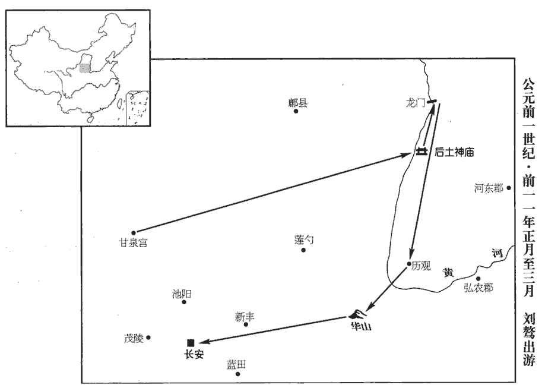
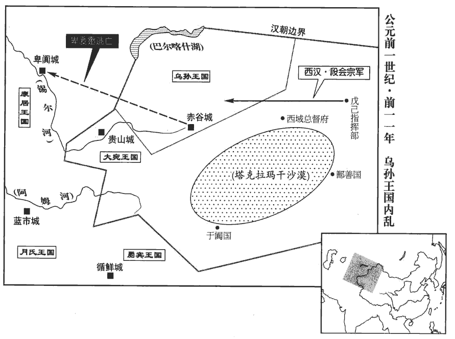
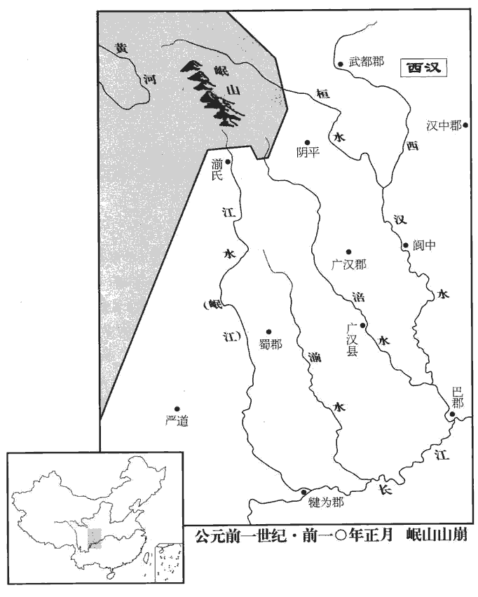
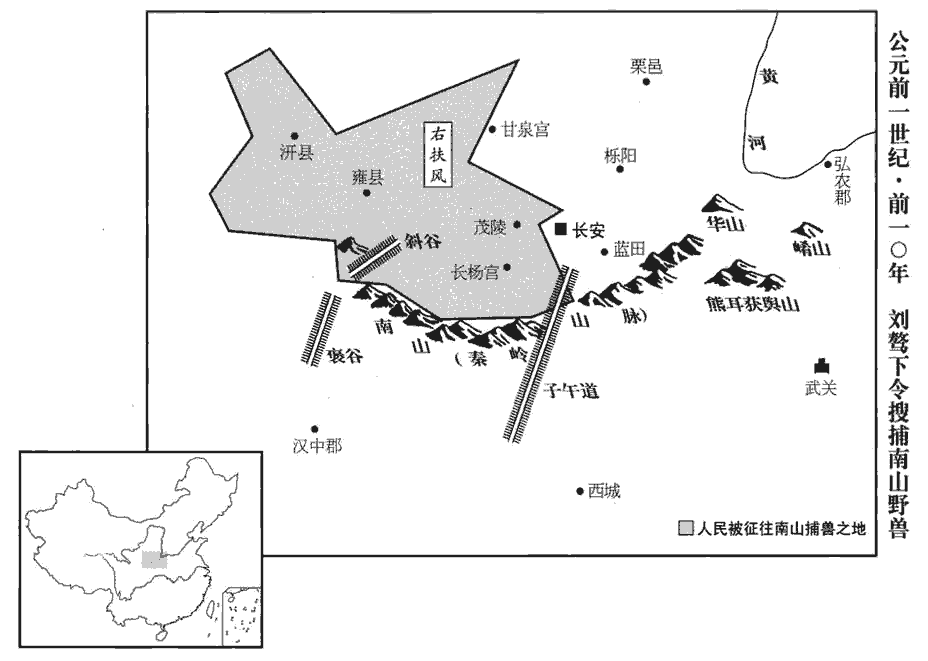
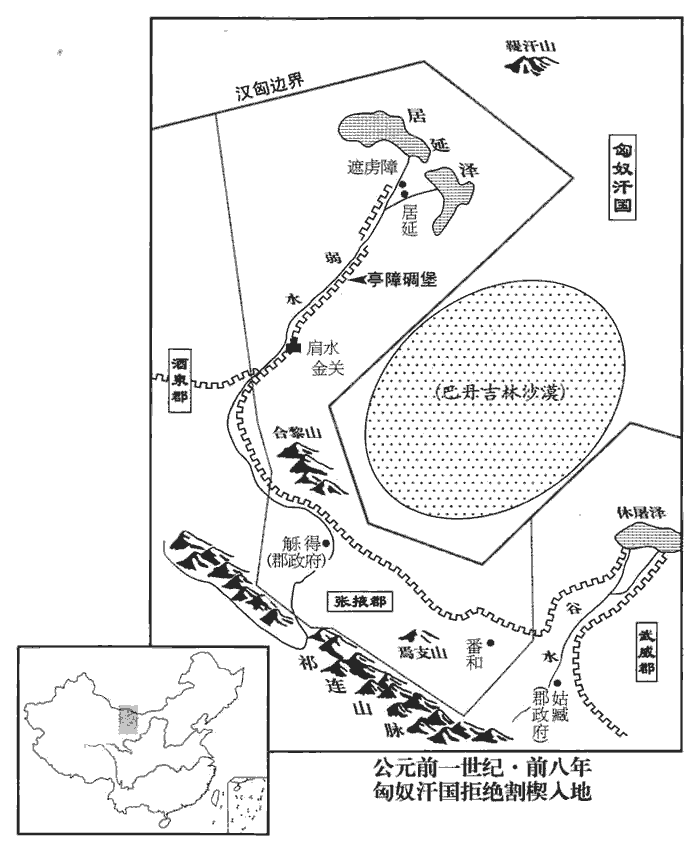
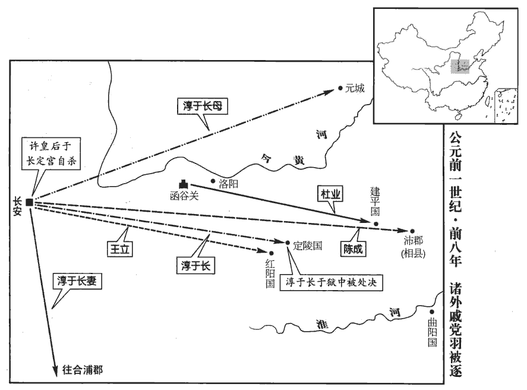

 漢紀二十四起著雍涒tūn灘（戊申），盡昭陽赤奮若（癸丑），凡六年。

# 孝成皇帝中

## 永始四年（戊申，前一三）

1春，正月，上‹刘骜，时年四十›行幸甘泉‹陝西淳化西北›，郊泰畤；大赦天下。三月，行幸河東‹山西夏縣›，祠后土。

〖译文〗 [1]春季，正月，成帝前往甘泉，在泰祭天。大赦天下。三月，又前往河东，祭祀后土神。

2夏，大旱。

〖译文〗 [2]夏季，大旱。

3四月，癸未‹十一›，長樂臨華殿、未央宮東司馬門皆災。師古曰：東面之司馬門也。樂，音洛。六月，甲午‹二十三›，霸陵園門闕災。

〖译文〗 [3]四月，癸未（十一月），长乐宫临华殿和未央宫东司马门都发生火灾。六月，甲午（二十三日），霸陵墓园门阙发生火灾。

4秋，七月，辛未‹三十›晦，日有食之。

〖译文〗 [4]秋季，七月，辛未晦（三十日），出现日食。

5冬，十一月，庚申‹二十一›，衛將軍王商病免。

〖译文〗 [5]冬季，十一月，庚申（二十一日），卫将军王商因病免职。

6梁‹府睢阳，河南商丘›王立驕恣無度，立，梁孝王武八世孫也。至一日十一犯法。相禹奏「立對外家怨望，有惡言。」梁相，名禹。相，息亮翻。有司按驗，因發其與姑園子姦事，奏「立禽獸行，請誅。」漢法，內亂為禽獸行。行，下孟翻。太中大夫谷永上書曰：「臣聞禮，天子外屏，不欲見外也；師古曰：屏，謂當門之牆，以屏蔽者也。外屏，於門外為之。是以帝王之意，不窺人閨門之私，聽聞中冓之言。韓詩云：中冓，中夜。應劭曰：中冓，材冓在堂之中也。晉灼曰：魯詩以為夜也。師古曰：冓，謂舍之交積材木也。應說近之。冓，音工豆翻。春秋為親者諱。春秋公羊傳：閔元年，齊仲孫來。齊仲孫者何？公子慶父也。公子慶父則曷為謂之齊仲孫？外之也。曷為外之？春秋為親者諱。為，於偽翻；下同。今梁王年少，少，詩照翻；下同。頗有狂病，始以惡言按驗，既無事實，而發閨門之私，非本章所指。王辭又不服，猥強劾立，傅致難明之事，劾，戶概翻。師古曰：傅，讀曰附。獨以偏辭成罪斷獄，斷，丁亂翻。無益於治道；治，直吏翻。汙衊宗室汙，烏故翻。孟康曰：衊，音漫。師古曰：衊，音秣，謂塗染也。以內亂之惡，披布宣揚於天下，非所以為公族隱諱，為，於偽翻；下為公同。增朝廷之榮華，昭聖德之風化也。臣愚以為王少而父同產長，姑者，父之同產。長，知兩翻。年齒不倫；梁國之富足以厚聘美女，招致妖麗；妖，巧也，艷也，好也。妖，於驕翻。父同產亦有恥辱之心；師古曰：言其姑亦當自恥，必不與姦。案事者乃驗問惡言，師古曰：本所問者，怨望朝廷之言也。何故猥自發舒！言何為而自發內亂之事。以三者揆之，殆非人情，疑有所迫切，過誤失言，文吏躡尋，不得轉移。躡尋者，謂躡其失言之後，而尋其內亂之跡也。萌牙之時，加恩勿治，上也。如淳曰：覆蓋之，則計之上。治，直之翻；下同。既已按驗舉憲，舉憲者，舉以法也。宜及王辭不服，詔廷尉選上德通理之吏更審考清問，上，與尚同。書呂刑：皇帝清問下民。孔安國曰：清問，詳問也。馬曰：清，訊。著不然之效，定失誤之法，著，明也。效，驗也。明其事之不然，具有證驗也。失誤，謂誤入人罪為失。而反命於下吏，師古曰：使者還，反以清白之狀付有司也。以廣公族附疏之德，附疏者，使疏屬親附也。為宗室刷汙亂之恥，師古曰：刷，謂拭，刷除之也，音所劣翻。甚得治親之誼。」天子由是寢而不治。

〖译文〗 [6]梁王刘立骄横放纵，没有节制，甚至一天之内犯法十一次。梁相禹奏报说：“刘立对外戚抱有怨恨，恶言相加。”主管机关追查验证，由此揭露出刘立与姑妈刘园子通奸乱伦的丑事。奏报说：“刘立有禽兽行为，请求处以死刑。”太中大夫谷永上书说：“臣听说，依照礼仪，天子要在门外修建屏障之墙，是不想直接看见外面的情景。帝王的本意，是不愿窥视别人的闺门隐私，窃听人家在内室的谈话。《春秋》为亲者讳言过失。而今梁王年少，疯癫病颇厉害，最初追查验证的是对外戚恶言相加的事，既然无事实证据，却又转而揭露闺门隐私，已不属原本指控的内容了。梁王的诉辞又不承认，用鄙陋的手段勉强弹劾刘立，附会罗织一些难以查明的事，仅仅以片面之辞定罪，对国家的治理是无益的。玷污宗室，把内部淫乱的恶行，披露宣扬于天下，这不是为皇族掩饰过失，为朝廷增加光彩，彰明圣德之风化的作法。我愚昧地认为，梁王年少，而姑母年长，两人年龄不相当；以梁国的富裕，足可以用金钱厚聘美女，罗致妖艳；姑母也有耻辱之心，追查者本来是追问诟骂外戚的事，她为什么胡乱揭发起自己的乱伦之事呢？从这三点揣测，通奸之事，恐怕不合人情。我怀疑供词是在逼迫的情况下，讲错了话，文吏抓住不放，顺此穷追，使供词没有回转的余地。在事情还处于萌芽之时，请陛下开恩，不要处治，这才是上策。既然已对此事进行了追查验证，打算依法处理，那就应以梁王对罪状不服为理由，下诏命令廷尉挑选道德高尚、通情达理的官员，重新审理，详加讯问，公布查不属实的结论，确定当初审理的失误，反过来将梁王清白的情况交给有关官员处理，以推广使疏远的皇族亲附的美德，洗刷宗室被诬蔑的耻辱，从而符合处理亲属关系的原则。”成帝于是把此案搁置，不予处理。

7是歲，司隸校尉蜀郡‹四川成都›何武為京兆尹。姓譜：何，出自周成王母弟唐叔虞；後封於韓；韓滅，子孫分散，江、淮間音以「韓」為「何」，字隨音變，遂為何氏。武為吏，守法盡公，進善退惡，所居無赫赫名，去後常見思。

〖译文〗 [7]这年，任命司隶校尉、蜀郡人何武为京兆尹。何武做官吏，奉公守法，引进良善之人，斥退邪恶之辈。在位时虽没有赫赫名声，但离开后，常常被人怀念。

## 元延元年（己酉，前一二）

1春，正月，己亥‹一›朔，日有食之。

〖译文〗 [1]春季，正月，己亥朔（初一），出现日食。

2壬戌‹二十四›，王商復為大司馬、衛將軍。商去年以病免，今復位。

〖译文〗 [2]壬戌（二十四日），再次任命王商为大司马、卫将军。

3三月，上‹刘骜，时年四十一›行幸雍‹陝西鳳翔›，祠五畤。雍，於用翻。畤，音止。

〖译文〗 [3]三月，成帝前往雍城，祭祀五。

4夏，四月，丁酉‹一›，無雲而雷；劉向曰：雷當託於雲，猶君之託於臣，陰陽之合也。人君不恤天下，萬民有怨畔之心，故無雲而雷。有流星從日下東南行，四面燿燿如雨，自晡bū及昏而止。

〖译文〗 [4]夏季，四月，丁酉（初一），天空无云而响雷声。有流星从太阳下面划过，直奔东南而去，光辉照耀四面天空，象在下星雨，自从傍晚申时直到天黑才停止。

5赦天下。

〖译文〗 [5]大赦天下。

6秋，七月，有星孛於東井。孛，蒲內翻。

〖译文〗 [6]秋季，七月，有异星出现于井宿。

上以災變，博謀群臣。北地‹甘肅庆阳西北马岭镇›太守谷永對曰：「王者躬行道德，承順天地，則五徵時序，五徵，即洪范之八庶徵，曰雨、曰暘yáng、曰寒、曰燠yù、曰風也。百姓壽考，符瑞并降；失道妄行，逆天暴物，則咎徵著郵，洪范之常雨、常暘、常寒、常燠、常風，為咎徵著明也。天見咎徵，以明著人君之過也。師古曰：郵，與尤同。尤，過也。妖孽并見，洪范五行傳說曰：凡草木之類謂之妖；妖，猶夭胎，言尚微也。蟲豸之類謂之孽；孽則芽孽矣。見，賢遍翻。饑饉薦臻；終不改寤，惡洽變備，不復譴告，更命有德。如魯哀禍大天不降譴是也。復，扶又翻。更，工衡翻。此天地之常經，百王之所同也。加以功德有厚薄，期質有脩短，時世有中季，師古曰：中，讀曰仲。天道有盛衰。陛下承八世之功業，八世，高、惠、文、景、武、昭、宣、元。當陽數之標季，孟康曰：陽九之末季也。師古曰：標，音必遙翻。涉三七之節紀，孟康曰：至平帝，乃三七二百一十歲之厄，今已涉向其節紀。遭無妄之卦運，應劭曰：天必先雲而後雷，雷而後雨；而今無雲而雷。無妄者，無所望也。萬物無所望於天，災異之最大者也。師古曰：取易之無妄卦為義。項安世曰：古妄與望通，秦、漢言無妄，皆無望也。朱英之說黃歇與揚子法言皆然。故太玄以去準無妄，謂其無所復望也。在易則自為誠妄之妄。直百六之災阸，易九戹曰：初入元，百六陽九。孟康曰：易傳也。所謂陽九之戹，百六之會也。初入元，百六歲有戹者，則前元之餘氣也。師古曰：直，當也。孔穎達曰：凡水旱之歲，曆運有常。按律曆志云：十九歲為一章，四章為一部，二十部為一統，三統為一元。則一元有四千五百六十歲。初入元一歲有陽九，謂旱九年。次三百七十四歲陰九，謂水九年。以一百六歲并三百七十四歲為四百八十歲，註云，六乘八之數。次四百八十歲有陽九，謂旱九年。次七百二十歲陰七，謂水七年。次七百二十歲陽七，謂旱七年。又註云：七百二十者，九乘八之數。次六百歲陰五，謂水五年。次六百歲陽五，謂旱五年。註云：六百歲者，以八乘八，八八六十四。又以七乘八，七八五十六，相并為一千二百歲。於易七、八不變，氣不通，故合而數之，各得六百歲。次四百八十歲陰三，次四百八十歲陽三，除入元至陽三，除去災歲，總有四千五百六十年。其災歲，兩個陽九年，一個陰九年，一個陰、陽各七年，一個陰、陽各五年，一個陰、陽各三年，總有五十七年，并前四千五百六十年，通為四千六百一十七歲。此一元之氣終矣。此是陰陽水旱之大數也。所以正用七、八、九、六相乘者，以水數六，火數七，木數八，金數九，此交互相乘也。以七、八、九、六陰陽之數自然，故有九年、七年、五年、三年之災。三難異科，雜焉同會；師古曰：雜，謂相參也。一曰，雜，音先合翻。雜焉，總萃。難，乃旦翻。建始元年以來，二十載間，載，子亥翻。群災大異，交錯鋒起，多於春秋所書。內則為深宮後庭，將有驕臣悍妾、醉酒狂悖卒起之敗，驕臣，指淳于長等。悍妾，指趙昭儀姊弟也。悍，下罕翻，又侯旰翻。師古曰：卒，讀曰猝。悖，蒲內翻，又蒲沒翻。北宮苑囿街巷之中、臣妾之家幽閒之處苑，園也。孔穎達曰：有蕃曰園，有牆曰囿；園、囿大同，蕃、牆異耳。囿者，域養禽獸之處。園者，種菜殖果之處。毛晃曰：苑，亦以養禽獸。直曰街，曲曰巷。師古曰：閒，讀曰閑。徵舒、崔杼zhù之亂；陳靈公淫於夏姬，數如其家；夏姬之子徵舒病之，自廄射而殺之。齊莊公通於崔杼之妻姜氏，數如崔氏；杼伏甲殺之。事并見左傳。此指帝微行，將有徵舒、崔杼之禍也。外則為諸夏下土，將有樊並、蘇令、陳勝，項梁奮臂之禍。樊並、蘇令事見上卷永始三年。陳勝、項梁事見七卷秦二世元年。夏，戶雅翻；下同。安危之分界，宗廟之至憂，師古曰：分，音扶問翻。臣永所以破膽寒心，豫言之累年。下有其萌，然後變見於上，見，賢遍翻。可不致慎！禍起細微，姦生所易。易，輕也，忽也。言姦生於所輕忽也。易，以豉翻。願陛下正君臣之義，無復與群小媟xiè黷宴飲；師古曰：媟，狎也，音私列翻。黷，汙也。復，扶又翻；下同。勤三綱之嚴，師古曰：三綱，君臣、父子、夫婦也。余按君為臣綱，父為子綱，夫為婦綱，所謂嚴也。修後宮之政，抑遠驕妬之寵，崇近婉順之行；遠，於願翻。近，其靳翻。行，下孟翻。朝覲法駕而後出，朝，直遙翻。陳兵清道而後行，無復輕身獨出，飲食臣妾之家。三者既除，內亂之路塞矣。三者，謂微行、崇飲、好色也。塞，悉則翻。諸夏舉兵，萌在民饑饉而吏不恤，興於百姓困而賦斂重，發於下怨離而上不知。永書曰：諸夏舉兵，以火角為期。蓋言已有其萌，而將至於興發也。斂，力贍翻。傳曰：『飢而不損，茲謂泰，厥咎亡。』師古曰：洪范傳之辭。余按五行志，蓋京房易傳之辭也。比年郡國傷於水災，禾麥不收，禾，粟苗也，又稼之總名。比，毗至翻。宜損常稅之時，謂此時宜減稅也。而有司奏請加賦，甚繆經義，逆於民心，市怨趨禍之道也。趨，讀曰趣，與促同。臣願陛下勿許加賦之奏，益減奢泰之費，流恩廣施，施，式豉翻。振贍困乏，敕勸耕桑，以慰綏元元之心，諸夏之亂庶幾可息！」贍，而豔翻。幾，居希翻，又巨衣翻。

〖译文〗 因为发生灾害和变异，成帝广泛地征求群臣的意见。北地太守谷永回答说：“作为君主，若亲身实行道德，承顺天地的旨意，那么自然的五种征候，会按顺序正常运转，百姓会长寿，祥瑞征兆会同时降临。若不按正道行事，违背上天的旨意，浪费财物，则罪责的征兆就会尤其显著，妖孽同时出现，饥馑连 续发生。若终不醒悟改悔，恶行普遍，上天就不再作谴责的警告，而将天命归于另一位有德的君王。这是天地的正常规律，它对所有的君王都是一视同仁的。此外，还会考虑到君王的功德有厚有薄，期限有长有短，资质有高有低，所处时代有中期、晚期，同时天道本身的变化也有盛有衰。陛下继承西汉八位皇帝的功业，正当阳数中的末季，接近二百一十年的劫数，遭逢《易经》上‘无妄’卦的命运，正当‘百六’之灾难，三种灾难性质都不一样，但却掺杂会合在一起。建始元年以来，二十年间，各种灾害和大的天象变异，如群蜂四起，比《春秋》记载的还要多。这表示：对内来说，深宫后庭之中，将有骄横的内臣和凶悍的姬妾、醉酒狂乱，猝起败坏国家。北宫花园街巷之中，侍臣和姬妾家里的幽静之处，将会发生夏征舒、崔杼那样的变乱；对外来说，普天之下，将会发生樊并、苏令、陈胜、项梁之辈奋臂造反的灾祸。现在正处在平安和危机的分界线上，是宗庙能否保存的最为忧愁的时期，所以我谷永甘冒胆破心寒 的杀头之祸，连年发出这种预言。下面有变乱的萌芽，然后才会在上面演化成变乱，怎能不谨慎！祸患是从细微逐渐发展而来，奸恶是因轻视忽略而产生。愿陛下端正君臣大义，再不要与那群小人亲狎，玷污身份，同他们在一起饮宴。应严格按照‘三纲’的原则，治理后宫，压制疏远那些骄横妒嫉的宠妃，尊崐崇贞婉、顺服的德行。出门时，要先朝见皇太后，使用皇帝仪仗，然后才可出宫，在街上布列士兵，清道戒严之后才可走上街头。不要再仅带几个随从就独自出宫，到臣妾家吃饭饮酒。以上三点除去以后，发生内乱的道路就被堵死了。而今天下到处举兵谋反，变乱萌发于人民饥谨，而官吏不加体恤，产生于百姓困苦，而赋敛沉重，发端于下层人民怨恨背离，而上面却不知道。《洪范·传》说：‘人民饥馑，不减少赋税，却宣称国泰民安，一定蒙祸而死。’郡国连年遭受水灾的损失，禾麦不收，这正是应该减免常税的时候，而有关官署却奏请增加赋税，这与儒家经典的大义甚为不符，不顺民心，是招怨惹祸的作法。我请求陛下不批准加赋的奏文，再减少一些奢华的费用，广泛地布施恩泽，赈济赡给困乏之人，下敕书劝民勤于耕田植桑，以此来安抚小民之心，各地的叛乱也许就可平息！”

中壘校尉劉向武帝置中壘校尉，掌北軍壘門之內，又外掌西域，八校尉之首也。上書曰：「臣聞帝舜戒伯禹『毋若丹朱傲』，師古曰：事見虞書益稷篇。丹朱，堯子也。敖，讀曰傲。仲馮曰：此禹戒舜之語。非舜戒禹之辭也。上，時掌翻。周公戒成王『毋若殷王紂』，尚書無逸篇：周公戒成王曰：毋若殷王紂之迷亂，酗於酒德哉！聖帝明王常以敗亂自戒，不諱廢興，故臣敢極陳其愚，唯陛下留神察焉！

〖译文〗 中垒校尉刘向上书说：“我听说，帝舜曾警告伯禹：‘不要像丹朱那么骄傲。’周公曾告诫成王：‘不要像殷纣王。’圣明的帝王，常以败亡变乱的事例告戒自己，不忌讳谈论王朝的废兴，因此我才敢极力陈述愚昧的见解，请陛下留神考察！

謹按春秋二百四十二年，日食三十六，師古曰：從隱公元年至哀公十四年獲麟，凡二百四十二年。日食三十六，謂隱三年二月己巳，桓三年七月壬辰朔，十七年十月朔，莊十八年三月，二十五年六月辛未朔，二十六年十二月癸亥朔，三十年九月庚午朔，僖五年九月戊申朔，十二年三月庚午，十五年五月，文元年二月己亥朔，十五年六月辛丑朔，宣八年七月甲子，十年四月丙辰，十七年六月癸卯，成十六年六月丙寅朔，十七年十二月丁巳朔，襄十四年二月乙未朔，十五年秋八月丁巳，二十年冬十月丙辰朔，二十一年九月庚戌朔，冬十月庚辰朔，二十三年二月癸酉朔，二十四年秋七月甲子朔，八月癸巳朔，二十七年冬十二月乙亥朔，昭七年夏四月甲辰朔，十五年六月丁巳朔，十七年六月甲戌朔，二十一年秋七月壬午朔，二十二年十二月癸酉朔，二十四年夏五月乙未朔，三十一年十二月辛亥朔，定五年正月辛亥朔，十二年十一月丙寅朔，十五年八月庚辰朔也。今連三年比食，比，毗至翻。自建始以來，二十歲間而八食，率二歲六月而一發，古今罕有。建始三年十二月戊申朔，河平元年四月癸亥晦，三年八月乙卯晦，四年三月癸丑朔，陽朔元年二月丁未晦，永始二年二月乙酉晦，三年正月己卯晦，四年七月辛未晦，凡八食，而是年春正月己亥又不預此數。異有小大希稠，占有舒疾緩急，觀秦、漢之易世，覽惠、昭之無後，察昌邑之不終，視孝宣之紹起，皆有變異著於漢紀。天之去就，豈不昭昭然哉！按向書曰：秦始皇之末至二世時，日月薄食，山林淪亡，辰星出於四孟，太白經天而行，無雲而雷，枉矢夜光，熒惑襲月，㜸niè火燒宮，野禽戲庭，都門內崩，長人見臨洮，石隕於東郡，星孛大角，大角以亡。及項籍之敗，亦孛大角。漢之入秦，五星聚於東井，得天下之象也。孝惠時有雨血、日食於衝、滅光星見之異。孝昭時有太山臥石自立，上林僵柳復起，大星如月西行，眾星隨之，此為特異，孝宣興起之表。天狗夾漢而西，久陰不雨者二十餘日，昌邑不終之異也。臣幸得託末屬，誠見陛下寬明之德，冀銷大異而興高宗、成王之聲，向書曰：高宗、成王亦有雊gòu雉、拔木之變，能思其故，故高宗有百年之福，成王有復風之報，向之所以望帝者如此。以崇劉氏，崇，增高也。謂增高劉氏之業，愈巍巍也。故懇懇數奸死亡之誅！師古曰：懇懇，款誠之意也。奸，犯也。數，所角翻。奸，音干。天文難以相曉，臣雖圖上，猶須口說，然後可知；願賜清燕之閒，指圖陳狀！」上輒入之，師古曰：謂召入也。上，時掌翻。閒，讀曰閑；又如字。上輒之上，如字。然終不能用也。考異曰：向傳云：星孛東井，岷山崩，向懷不能已，上此奏。按岷山崩在三年，此奏云「自建始以來，二十歲間而食八，率二歲六月而一發」，則上此奏當在今年也。胡旦亦載之三年。余按劉向傳，若以星孛東井為據，則上奏當在今年。若以岷山崩為據，則上奏當在三年。若以二十歲間日八食為據，則上奏當在去年。然向言「日食之變率二歲六月而一發」，以班書考之，自建始三年十二月至河平元年四月，則一年五月而食；至四年三月癸丑朔則纔一年而食；又至陽朔元年二月丁未晦則又期年而食；永始元年九月丁巳晦，志書食而紀不書；至二年二月乙酉晦，則凡九期，而志所書永始元年九月丁巳晦不計也。又至永始三年正月己卯晦，則未及一期而食。又至四年七月辛未晦，則一年六月而食。向所謂率二歲六月而一發，亦通二十歲而約言之耳。自建始三年至今年，以紀考之則九食，以志考之則十食，此其差異又未有所折衷也。

〖译文〗 “查考《春秋》二百四十二年里，日食不过才三十六次。可是现在连续三年发生日食，自建始年间以来，二十年的时间，就出现日食八次，平均每二年六个月就出现一次，古今罕有。天象变异有大小、疏密之分，而占验结果也有迟早、缓急的区别。观秦、汉的改朝换代，看汉惠帝、昭帝都没有后嗣，察昌邑王刘贺被废夺太子位，览孝宣皇帝承天命崛起继位，都有变异明确地记载在汉的编年史书上。上天的舍弃和俯就，岂不是十分清楚么！我有幸为皇族弱枝后裔，诚然看到陛下有宽厚贤明的圣德，希望能消除变异，而复兴商高宗、周成王那样的声誉，以增高刘氏的功业，因此才不断恳切地冒死上书。天象复杂，难以向陛下述说清楚，我虽呈献上天文图表，但仍需口说解释，然后才能使陛下明白，请陛下赐一点清闲的时间，让我指着图表向陛下详述。”成帝立即召刘向进宫，但是到底不能采纳他的建议。

7紅陽侯立舉陳咸方正；對策，拜為光祿大夫、給事中。丞相方進復奏「咸前為九卿，坐為貪邪免，咸免見上卷永始二年。復，扶又翻。不當蒙方正舉，備內朝臣」，孟康曰：內朝，中朝也。大司馬、前•後•左•右將軍、侍中、常侍、散騎、諸吏、給事中為中朝官；丞相以下至六百石，為外朝官也。并劾「紅陽侯立選舉故不以實。」漢制，列侯選舉不以實，削封戶。劾，戶概翻；下同。有詔免咸，勿劾立。

〖译文〗 [7]红阳侯王立举荐陈咸为方正，通过御前殿试，被任命为光禄大夫、给事中。丞相翟方进再次上奏说：“陈咸从前位列九卿，因为贪鄙邪恶而获罪免官，不该以方正资格被举荐，并担任中朝官。”同时弹劾说：“红阳侯王立，在选拔举荐人才时，故意不报告真实情况。”成帝下诏免去陈咸的官职，但不许弹劾王立。

8十二月，乙未‹二›，王商為大將軍。辛亥‹十八›，商薨。其弟紅陽侯立次當輔政；先是立使客因南郡‹湖北江陵›太守李尚占墾草田數百頃，先，悉薦翻。據孫寶傳：占墾草田，頗有民所假少府陂澤，略皆開發。師古曰：隱度而取之也。草田，荒田也。舊為陂澤，本屬少府，其後以假百姓，百姓皆已田之。而立總謂為草田，占云新自墾。占，音之贍翻。百畝為頃。上書以入縣官，師古曰：立上書云：新墾得此田，請以入官也。貴取其直一億【章：十四行本「億」作「萬」；乙十一行本同；孔本同；退齋校同。】萬以上，師古曰：直，價直也。貴者，增於時價。丞相司直孫寶發之，上由是廢立，而用其弟光祿勳曲陽侯根。庚申‹二十七›，以根為大司馬、驃騎將軍。考異曰：荀紀云「十一月」，成紀云「十二月」。按是歲十一月甲子朔，無乙未、辛亥、庚申。荀悅誤。今按考異又有揚雄待詔一條，註云：雄傳云：「車騎將軍王音奇其文雅，薦雄待詔。」按雄自序云：「上方郊祠甘泉泰畤，召雄待詔承明之庭，奏甘泉賦。其十二月，奏羽獵賦。」事在今年。時王音卒已久，蓋王根也。胡旦遂誤以為曲陽侯云。余按曲陽侯即王根也。王音則封安陽侯。

〖译文〗 [8]十二月，乙未（初二），任命王商为大将军。辛亥（十八日），王商去世。他的弟弟红阳侯王立，按照顺序应被任命为辅政大臣。先前，王立曾派他的门客，通过南郡太守李尚以草田名义占夺百姓新开垦田地数百顷，然后上书，把这些田卖给国家，多收取田价约一亿万以上。丞相司直孙宝揭发了这件事，成帝因此废黜王立，而任用他的弟弟、光禄勋、曲阳侯王根。庚申（二十七日），任命王根为大司马、骠骑将军。

9特進、安昌侯張禹請平陵‹陕西咸阳西平陵乡南›肥牛亭地；師古曰：肥牛，亭名。禹欲得置亭之處為塚塋。曲陽侯根爭，以為此地當平陵寢廟，衣冠所出遊道，宜更賜禹他地。請別以地賜之。更，工衡翻。上不從，卒以賜禹。卒，子恤翻。根由是害禹寵，數毀惡之。數，所角翻；下同。師古曰：惡，謂言其過惡。依顏註，惡，當讀如字；後凡毀惡之惡皆同音。天子愈益敬厚禹，每病，輒以起居聞，師古曰：謂其飲食寢臥之增損。車駕自臨問之，上親拜禹牀下，禹頓首謝恩；禹小子未有官，禹數視其小子；上即禹牀下拜為黃門郎、給事中。即，就也。禹雖家居，以特進為天子師，國家每有大政，必與定議。師古曰：與，讀曰豫。余謂與，讀如字，言天子與禹定其可否也。

〖译文〗 [9]官位特进的安昌侯张禹，请求成帝把平陵肥牛亭那片土地赐给他。曲阳侯王根表示反对，认为此片地在平陵墓园寝庙附近，正当衣冠出游的必经之路，应换一块地赐给他。成帝不听，终于把那块地赐给了张禹。王根因此对张禹的得宠十分妒恨，多次在成帝面前诋毁张禹。但是，成帝却越发尊敬厚待张禹，张禹每次患病，成帝都打听他的饮食休息情况，甚至坐车到张禹家问候，亲自在病床前拜见张禹，张禹叩头谢恩。张禹的幼子没有官职，张禹频频用眼看那个孩子，成帝就在张禹床前封他为黄门郎、给事中。张禹虽然家居，但以“特进”的身份当天子的老师，国家每有大事，成帝必与他磋商后才决定。

時吏民多上書言災異之應，譏切王氏專政所致，上，時掌翻。上意頗然之，未有以明見；未能灼見人言之當否也。乃車駕至禹弟，弟，與第同，舍也，宅也。辟左右，師古曰：辟，讀曰闢。親問禹以天變，因用吏民所言王氏事示禹。禹自見年老，子孫弱，又與曲陽侯不平，恐為所怨，則謂上曰：「春秋日食、地震，或為諸侯相殺，夷狄侵中國。為，於偽翻。災變之意，深遠難見，故聖人罕言命，不語怪神，師古曰：罕，稀也。論語云：子罕言利與命與仁。又曰：子不語：怪、力、亂、神。性與天道，自子貢之屬不得聞，師古曰：論語稱子貢曰：夫子之言性與天道不可得而聞也。謂孔子未嘗言性命及天道。何況淺見鄙儒之所言。陛下宜修政事，以善應之，與下同其福喜，漢書張禹傳，「喜」作「善」。此經義意也。新學小生，亂道誤人，宜無信用，以經術斷之！」斷，丁亂翻。上雅信愛禹，由此不疑王氏。元帝師蕭望之，成帝師張禹，皆敬重之矣。元帝不能聽望之言疏許、史而去恭、顯，成帝則聽禹言而不疑王氏；望之以此殺身，禹以此苟富貴。漢祚中衰，實由此也。又，成帝之時，吏民猶譏切王氏；平帝之末，吏民以王莽不受新野田，上書者至四十八萬七千五百七十二人，何元、成之時吏民猶忠於漢，平帝之時吏民則附王氏也？政自之出久矣，人心能無從之乎！有國家者，尚監茲哉！後曲陽侯根及諸王子弟聞知禹言，皆喜說，遂親就禹。張氏安矣，劉氏危矣。說，讀曰悅。

〖译文〗 当时吏民中有很多人上书，谈论灾异的出现，讽刺指摘王氏专权招致灾异。成帝也认为颇有道理，但又觉得，事实不明显。就坐车来到张禹的宅邸，屏退左右，亲自询问张禹关于天象变异的事，把吏民上书谈到的王氏之事告诉张禹。张禹清楚自己已年老，子孙太弱，又与曲阳侯王根不和，恐怕被王氏怨恨，就对成帝说：“《春秋》上记载的日食、地震，或者因为诸侯互相攻杀，或者因为夷狄犯中国。上天降下灾害变异，含意十分深远，难以明见。因此圣人很少谈论天命，也不说有关神怪的事。性命与天道，连子贡之辈，也未能听到孔子谈论，更何况那些见识肤浅鄙陋的儒生所说的话呢。陛下应该使政治修明，用善来应对上天的警戒，与臣下一同多行善举，这才是儒家经义的本意。那些新学小生，胡言乱语，误人不浅，不要相信和任用他们。一切只按儒学经术。”成帝一向信任爱戴张禹，因此不再怀疑王氏。后来曲阳侯王根以及诸位王氏子弟听说了张禹的话，都感到欢喜，于是亲近张禹。

故槐里‹陝西興平›令朱雲元帝時，雲為槐里令，坐論石顯廢錮，故稱故。上書求見，見，賢遍翻。公卿在前，雲曰：「今朝廷大臣，上不能匡主，下無以益民，皆尸位素餐，師古曰：尸，主也。素，空也。尸位者，不舉其事，但主其位而已。素餐者，德不稱官，空當食祿。孔子所謂『鄙夫不可與事君，苟患失之，亡所不至』者也！師古曰：論語所載孔子之言也。苟患失其寵祿，則言行僻邪，無所不至也。謹案孔子曰：鄙夫可與事君也與哉！其未得之也，患得之；既得之，患失之。苟患失之，無所不至矣！亡，與無同。臣願賜尚方斬馬劍，師古曰：尚方，少府之屬官也，作供御器物，故有斬馬劍；劍利，可以斬馬。斷佞臣一人頭以厲其餘！」斷，丁管翻。上問：「誰也？」對曰：「安昌侯張禹！」上大怒曰：「小臣居下訕上，蓋引用論語惡居下流而訕上之言。師古曰：訕，謗也，音所諫翻，又音刪。廷辱師傅，罪死不赦！」御史將雲下；雲攀殿檻，檻折。師古曰：檻，軒前欄也。折，而設翻。雲呼曰：「臣得下從龍逄、比干遊於地下，足矣！師古曰：呼，叫也，音火故翻。關龍逄，桀臣，王子比干，紂臣，皆以諫而死，故云然。逄，音皮江翻。未知聖朝何如耳！」師古曰：言殺直臣，其聲惡。余謂雲蓋言亦將如夏、殷之亡也。朝，直遙翻；下入朝同，每朝同。御史遂將雲去。將，如字，挾也，攜也。於是左將軍辛慶忌免冠，解印綬，叩頭殿下曰：「此臣素著狂直於世，師古曰：著，表也。言此名久已章表。使其言是，不可誅；其言非，固當容之。臣敢以死爭！」慶忌叩頭流血；上意解，然後得已。言殺雲之事得止也。及後當治檻，治，直之翻。上曰：「勿易，因而輯之，以旌直臣！」師古曰：輯，與集同；謂補合之也。旌，表也。

〖译文〗 曾做过槐里县令的朱云，上书求见皇帝。在公卿面前，朱云对成帝说：“现今朝廷大臣，上不能匡扶主上，下不能有益于人民，都是些白占着官位领取俸禄而不干事的人，正如孔子所说：‘卑鄙的人不可让他侍奉君王，他们害怕失去官位，会无所不为。’我请求陛下赐给我尚方斩马剑，斩断一个佞臣的头颅，以警告其他人！”成帝问：“谁是佞臣？”朱云回答说：“安昌侯张禹！”成帝大怒，说：“小小官员在下，竟敢诽谤国家重臣，公然在朝廷之上侮辱帝师。处以死罪，决不宽恕！”御史将朱云逮下，朱云紧抓住宫殿栏杆，栏杆被他拉断，他大呼说：“我能够追随龙逄、比干，游于地下，心满意足了！却不知圣明的汉王朝将会有什么下场！”御史挟持着朱云押下殿去。当时左将军辛庆忌脱下官帽，解下印信绶带，伏在殿下叩头说：“朱云这个臣子，一向以狂癫耿直闻名于世，假使他的话说的对，不可以杀他；即使他的话说的不对，也本该宽容他。我敢以死请求陛下！”辛庆忌叩头流血，成帝怒意稍解，杀朱云之事遂作罢。后来，当要修理宫殿栏杆时，成帝说：“不要变动！就原样补合一下，我要用它来表彰直臣！”

10匈奴搜諧單于將入朝；未入塞，病死。弟且莫車立，為車牙若鞮單于；以囊知牙斯為左賢王。單，音蟬。且，子餘翻。車，尺遮翻。鞮，丁奚翻。

〖译文〗 [10]匈奴搜谐单于将要到长安朝见，还没进入边塞，就在半途得病而死。他的弟弟且莫车继位，为车牙若单于。他任命囊知牙斯为左贤王。

11北地‹甘肅庆阳西北马岭镇›都尉張放到官數月，復徵入侍中。復，扶又翻；下同。太后與上書曰：「前所道尚未效，張晏曰：謂太后言，「班侍中，大將軍所舉，宜寵異之。」詳見上卷永始二年。富平侯反復來，其能默虖！」如淳曰：富平侯張放又來，太后安能默然不以為言。上謝曰：「請今奉詔！」上於是出放為天水‹甘肅通渭›屬國都尉；地理志，天水屬國都尉，治勇士縣‹甘肃榆中北›。引少府許商、光祿勳師丹為光祿大夫，姓譜：師，古者掌樂之官，因以為氏。班伯為水衡都尉，并侍中，皆秩中二千石，每朝東宮，常從；從，才用翻。及大政，俱使諭指於公卿。使傳上指以諭公卿也。上亦稍厭遊宴，復脩經書之業；上為太子時，好經書；及即位，幸酒，樂宴樂。今出放等，復脩經書業。太后甚悅。

〖译文〗 [11]北地都尉张放到任才数月，就又被征召入宫当侍中。皇太后致书成帝说：“先前我交待你的事，你尚未办，怎么富平侯反而又回到京师，我能不说话吗？”成帝谢罪说：“请让我现在就奉诏去办！”于是命令张放离京，出任天水属国都尉；擢升少府许商、光禄勋师丹为光禄大夫，班伯为水衡都尉，并兼侍中。官秩都是中二千石。成帝每次朝见太后，常常让他们跟从前去。遇有国家大事，都派他们向公卿传达皇帝的谕旨。成帝也逐渐厌倦了游乐，又重新学习儒家经书。太后大为欢喜。

12是歲，左將軍辛慶忌卒。慶忌為國虎臣，爪牙扞禦之臣曰虎臣。遭世承平，匈奴、西域親附，敬其威信。

〖译文〗 [12]本年，左将军辛庆忌去世。辛庆忌是国家御敌的虎将，适逢天下承平之世，匈奴、西域都亲附中国，也都崇敬他的威信。

## 二年（庚戌，前一一）

1春，正月，上‹刘骜，时年四十二›行幸甘泉‹陝西淳化西北›，郊泰畤。三月，行幸河東‹山西夏縣›，祠后土。既祭，行遊龍門‹山西河津西北龙门口›，師古曰：龍門山，在今蒲州龍門縣北。登歷觀‹山西永濟东南歷山上之廟›，晉灼曰：歷觀，在河東蒲反縣。師古曰：歷山上有觀。觀，音古玩翻。陟西嶽‹華山›而歸。陟，登也。師古曰：西嶽，華山也。

〖译文〗 [1]春季，正月，成帝前往甘泉，在泰祭天。三月，前往河东，祭祀后土神。祭毕，游览龙门，登上历观。归途又登华山，然后回长安。

 

2夏，四月，立廣陵孝王子守為王。廣陵孝王霸，厲王胥之子也，元帝初元二年紹封；傳子意，孫護人，薨，無後。今立守以紹封。考異曰：荀紀「守」作「憲」，今從漢書。

〖译文〗 [2]夏季，四月，命广陵孝王的儿子刘守继承王位。

3初，烏孫小昆彌安日為降民所殺，諸翕xī侯大亂；降，戶江翻。翕，許及翻。詔徵故金城‹甘肅永靖西北›太守段會宗為左曹、中郎將、光祿大夫，使安輯烏孫；陽朔中，會宗復為西域都護，終更而還，以擅發戊己校尉兵迎康居降者不遂，劾乏興，詔以贖論；拜金城太守，以病免，故曰故金城太守。守，式又翻。立安日弟末振將為小昆彌，服虔曰：末振將，人姓名。師古曰：其名也；昆彌之弟，不可別舉姓也。考異曰：烏孫傳以末振將為安日弟，段會宗傳以為兄，「兄」字誤耳。定其國而還。還，從宣翻；又如字。時大昆彌雌栗靡勇健，末振將恐為所并，使貴人烏日領詐降，刺殺雌栗靡；刺，七亦翻。漢欲以兵討之而未能，遣中郎將段會宗立公主孫伊秩靡為大昆彌。公主，謂楚主解憂也。公主之孫，於雌栗靡為季父。久之，大昆彌、翕侯難棲殺末振將，安日子安犁靡代為小昆彌。漢恨不自誅末振將，復遣段會宗發戊己校尉諸國兵，復，扶又翻。校，戶教翻。即誅末振將太子番丘。即，就也。師古曰：番，音盤。會宗恐大兵入烏孫，驚番丘，亡逃不可得，即留所發兵墊婁地，服虔曰：墊，音墊阸之墊。鄭氏曰：婁，音羸。師古曰：墊，音丁念翻。婁，音樓。選精兵三十弩李奇曰：三十人，人持一弩。徑至昆彌所在，召番丘，責以末振將之罪，即手劍擊殺番丘。手執劍曰手劍。記檀弓曰：子手弓，子射諸。手，守又翻。官屬以下驚恐，馳歸。小昆彌安犁靡勒兵數千騎圍會宗，會宗為言來誅之意，為言奉天子命來誅番丘之意。為，於偽翻。「今圍守殺我，如取漢牛一毛耳。司馬遷答任安書曰：假令僕伏法受誅，若九牛亡一毛，與螻蟻何異！自諭其身甚微也。宛王、郅支頭縣槀街，宛王事見二十一卷武帝太初三年。郅支事見二十九卷元帝建昭三年。宛，於元翻。烏孫所知也。」昆彌以下服，曰：「末振將負漢，誅其子可也，獨不可告我，令飲食之邪！」師古曰：飲，於禁翻。食，讀曰飤；下同。會宗曰：「豫告昆彌，逃匿之，為大罪。謂豫以誅番丘之事告昆彌，昆彌以叔姪之情必使番丘逃匿，漢欲誅之而昆彌匿之，則於漢為有大罪也。即飲食以付我，傷骨肉恩。若飲食之而使之就死，則於骨肉為傷恩。故不先告。」昆彌以下號泣罷去。號，戶刀翻。會宗還，奏事，天子賜會宗爵關內侯、黃金百斤。會宗以難棲殺末振將，奏以為堅守都尉。烏孫有大將、都尉各一人。以難棲能為雌栗靡復讎，堅守臣節，異於諸翕侯，故以「堅守」二字寵之。責大祿、大監以雌栗靡見殺狀，奪金印、紫綬，更與銅、墨云。宣帝甘露三年，大祿大監賜金印、紫綬。末振將弟卑爰疐zhì師古曰：疐，音竹二翻。本共謀殺大昆彌，將眾八萬【章：十四行本「萬」下有「餘口」二字；乙十一行本同；孔本同；張校同；退齋校同。】北附康居，謀欲借兵兼併兩昆彌；卑爰疐自此強，其後都護孫建襲殺之。將，即亮翻。漢復遣會宗與都護孫建并力以備之。復，扶又翻；下同。

〖译文〗 [3]最初，乌孙王国小昆弥安日，被投降乌孙的人杀死，各翎侯陷于大乱。成帝下诏征召原先的金城太守段会宗为左曹、中郎将、光禄大夫，命他恢复乌孙秩序，使各方和睦。段会宗扶立安日的弟弟末振将为小昆弥，安定乌孙之后，就返回了。当时乌孙大昆弥雌栗靡勇猛剽悍，末振将害怕被他吞并，就派遣贵族乌日领诈降，乘机刺杀了雌栗靡。汉朝准备出兵讨伐，而一时未能做到，便派遣中郎将段会宗扶立解忧公主的孙子侯秩靡为大昆弥。很久之后，大昆弥和翎侯难栖杀死了末振将，让安日的儿子安犁靡代替末振将为小昆弥。汉朝悔恨没有亲自诛杀末振将，就又派遣段会宗征发戊己校尉统领的诸国兵马，前往诛杀末振将的太子番丘。段会宗恐怕大军进入乌孙，会使番丘受惊，若亡命逃跑，就找不到他了。于是让所征发的大军留驻垫娄地，仅挑选三十名精兵，人人带着弓弩，径直来到昆弥住地，召见番丘，向他谴责末振将的罪状，随即亲手举剑刺杀了番丘。番丘手下官兵惊恐万分，骑马逃奔回去，小昆弥安犁靡崐率领数千骑兵包围了段会宗。段会宗向他讲了诛杀番丘的来意，又说：“今天你们包围了并杀死我，就象拔下汉牛的一根牛毛罢了。可是大宛国王、郅支单于的人头高挂在长安街上，也是你们乌孙所知道的。”昆弥及手下人等都畏服了。小昆弥说：“末振将有负于汉朝，诛杀他的儿子是可以的，为什么偏偏不告诉我呢？也好让我为他饯别！”段会宗说：“预先告诉昆弥，你会让他逃跑藏起来，这就犯了大罪。如果你为他饯别后，再把他交给我，会伤害你们的骨肉恩情。因此没有事先告诉你。”昆弥和手下人等号哭撤兵而去。段会宗回到长安，奏报事情经过，成帝赐给段会宗关内侯的爵位，赏黄金百斤。段会宗奏告：由于难栖诛杀了末振将，请封他为坚守都尉。追究大禄、大监因不能救护雌栗靡而使他被杀的责任，收回他们的金印、紫绶，换为铜印、墨绶。末振将的弟弟卑爰，本是共谋刺杀大昆弥的主凶之一，率领部众八万人逃往北方，依附康居王国，图谋借用康居兵马兼并两昆弥。汉朝又再一次派遣段会宗，与都护孙建合力防范卑爰。

 

自烏孫分立兩昆彌，漢用憂勞，且無寧歲。分立兩昆彌，見二十七卷宣帝甘露元年。時康居復遣子侍漢，元帝時，康居遣子入侍，陳湯上言其非王子。今復遣子入侍。貢獻，既遣子入侍，而又奉貢也。都護郭舜上言：此時郭舜為都護。平帝元始間，孫建始為都護。上，時掌翻。「本匈奴盛時，非以兼有烏孫、康居故也；及其稱臣妾，非以失二國也。言匈奴之強弱，不繫二國之叛服。漢雖皆受其質子，然三國內相輸遺，交通如故；三國，謂匈奴、烏孫、康居。質，音致。遺，于季翻。亦相候司，司，讀曰伺。見便則發：合不能相親信，離不能相臣役。以今言之，結配烏孫，竟未有益，反為中國生事。謂自武帝以來，以宗室女下嫁烏孫也。為，於偽翻。然烏孫既結在前，今與匈奴俱稱臣，義不可距。而康居驕黠，訖不肯拜使者；師古曰：訖，竟也。黠，戶八翻。都護吏至其國，坐之烏孫諸使下，王及貴人先飲食已，乃飲啗都護吏，師古曰：飲，音於禁翻。啗，音徒濫翻。故為無所省以誇旁國。師古曰：言故不省視漢使也。余謂誇者，自矜耀其能傲漢也。旁國，鄰國也。省，悉井翻。以此度之，何故遣子入侍？其欲賈市，為好辭之詐也。謂特欲行賈以市易，其為好辭者，詐也。度，徒洛翻。賈，音古。匈奴，百蠻大國，師古曰：於百蠻中，最大國也。今事漢甚備；聞康居不拜，且使單于有悔自卑之意。師古曰：言單于見康居不事漢以為高，自以事漢為太卑而悔之也。宜歸其侍子，絕不復使，師古曰：不通使於其國也。使，疏吏翻。以章漢家不通無禮之國！」章：顯著也。漢為其新通，為，於偽翻。重致遠人，師古曰：以此聲名為重也。終羈縻不絕。

〖译文〗 [4]自从乌孙王国分立两个昆弥，汉朝忧虑和辛劳，几乎没有一年安宁。这时，康居王国又派王子到长安，作为人质入侍汉朝皇帝，并向汉朝进贡。都护郭舜上书说：“过去匈奴强盛，并非因为兼并了乌孙和康居两国；现在向中国称臣归降，也不是因为失去了这两国。汉朝虽然都接受了他们送来做人质的王子，但三国之间互相贸易、赠送，来往跟从前一样。他们也互相窥伺、等待，一有机会即发动攻击。合好时不能互相亲近信任，分离时也不能将对方当做臣属来役使。以现在的状况来说，汉朝与乌孙缔结婚姻，终究没有得到利益，反而为中国惹事。然而乌孙既然与汉朝早已结好，现在和匈奴都臣服于中国，从大义出发，不可拒绝他们朝贡。而康居傲慢狡猾，一直不肯对汉使行叩拜礼。都护府官员到他们国都，接见时座位排在乌孙等国使者之下。吃饭时，国王以及贵族先饮食完毕，才让都护府官员进餐。故意做出不注意汉使的样子，向旁国夸耀。由此推测，他们为什么要派王子入侍呢？是想做买卖，而用好话来行诈。匈奴是众多的外族中最强大的国家，而今侍奉汉朝十分周到。假使听说康居不拜汉使，而且使匈奴单于产生后悔自卑之心。应该送回康居王子，和康居断绝关系，不再派使者前去，以表明汉朝不跟无礼的国家交往。”朝廷认为，康居第一次派遣王子入侍，汉朝应重视远方之人。终于还是采取笼络政策，没有断绝交往。

## 三年（辛亥，前一零）

1春，正月，丙寅‹十›，蜀郡岷山‹四川若尔盖县东›崩，地理志，岷山，在蜀郡湔jiān氐道西徼外。禹貢所謂岷山導江，即此山也。水經註曰：岷山，即瀆山，水曰瀆水，亦曰汶阜山，在氐道徼外，江水所導也。大江泉源發羊膊嶺下，緣崖散漫，小大百數，殆未濫觴，東南下百餘里，至白馬嶺西，歷天彭關，亦謂之天谷。天彭山兩山相對，其高若闕，謂之天彭門。江水自此以上至微弱，所謂其源濫觴者也。漢元延中，岷山崩，壅江水三日不流，即其處。岷，音武巾翻。壅江三日，江水竭。劉向大惡之，惡，音烏路翻；惡其徵異也。曰：「昔周岐山崩，三川竭，而幽王亡。周幽王二年，三川竭，岐山崩。師古曰：三川，涇、渭、洛也。洛，即漆、沮也。余按幽王時有是異，後卒為犬戎所殺。岐山者，周所興也。周自太王避狄去豳bīn，而邑於岐山之下，周之王業遂興於此。漢家本起於蜀、漢，高帝始王漢中，起兵還定三秦，誅項羽，遂有天下。今所起之地，山崩川竭，星孛又及攝提、大角，從參至辰，天文志：房南眾星曰騎官，左角理，右角將。大角者，天王帝坐廷，其兩旁各有三星鼎足句之，曰攝提。攝提者，直斗杓所指，以建時節，故曰攝提格。晉天文志：參十星，於辰在申。至辰者，至大火也。自氐五度至尾九度，為大火，於辰在卯。如淳曰：孛星尾長及攝提大角，始發於參至辰也。孛，蒲內翻。參，疏簪翻。殆必亡矣！」

〖译文〗 [1]春季，正月，丙寅（初十），蜀郡岷山发生山崩，土石堵塞长江达三日之久，下游江水枯竭。刘向对此异常现象非常厌恶，说：“从前，周朝时，岐山发生山崩，三条河川都枯竭了，结果周幽王被杀。岐山是周朝的兴起之地。汉朝本由蜀、汉兴起，而今初兴之地山崩川竭，彗星长尾又扫过摄提、大角，从参宿一直走到辰宿的位置。汉朝恐怕一定要亡了。”

 

2二月，丙午‹十二›，封淳于長為定陵侯。恩澤侯表，定陵侯，國於汝南。

〖译文〗 [2]二月，丙午（二十日），封淳于长为定陵侯。

3三月，上‹刘骜，时年四十三›行幸雍‹陝西鳳翔›，祠五畤。

〖译文〗 [3]三月，成帝前往雍城，在五祭祀。

4上將大誇胡人以多禽獸，秋，命右扶風發民入南山‹秦岭›，西自褒‹陝西留坝县褒河河谷›、斜‹陝西眉縣西南›，師古曰：褒、斜，南山二谷名。余按自秦川逕南山通漢中，南谷曰褒，北谷曰斜，徑五百里。斜，餘遮翻。東至弘農‹河南靈寶东北›，長安南山連延，東至弘農，今商、虢二州之山皆是也。南敺漢中‹陝西汉中›，敺，與驅同。張羅罔罝jū罘fú，罔，與網同，古字通用。罝，音咨邪翻，兔罟gǔ也。罘，音房尤翻，翻車大網也。捕熊羆禽獸，熊似豕而大，黑色。羆似熊，黃白色，被髮人立，而絕有力。載以檻車，輸之長楊射熊館，師古曰：長楊宮‹陕西周至境›中有射熊館。以罔為周阹qū，李奇曰：阹，遮禽獸圍陳也。師古曰：阹，音祛。縱禽獸其中，令胡人手搏之，自取其獲，上親臨觀焉。考異曰：成紀，「元延二年冬，行幸長楊宮，從胡客大校獵，宿萯fù陽宮，賜從官。」胡旦用之。按揚雄傳：祀甘泉、河東之歲，十二月，羽獵，雄上校獵賦；明年，從至射熊館還，上長楊賦。然則從胡客校獵當在今年；紀因去年冬有羽獵事，致此誤耳。

〖译文〗 [4]成帝准备在胡人面前夸耀自己有很多禽兽，秋季，命令右扶风发动百姓进入南山，西自褒、斜二谷，东到弘农，南达汉中，张设罗网，捕猎熊罴等禽兽，用槛车装运至长杨宫射熊馆，用网围成围障，把禽兽放到里面，命胡人赤手与野兽搏斗，杀死的野兽归斗兽人所有。成帝亲临观看。

 

## 四年（壬子，前九）

1春，正月，上‹刘骜，时年四十四›行幸甘泉‹陝西淳化西北›，郊泰畤。

〖译文〗 [1]春季，正月，成帝前往甘泉，在泰祭天。

2中山‹河北定州›王興、定陶‹山东定陶›王欣皆來朝，興，帝少弟。欣，帝弟定陶共王康之子。朝，直遙翻。中山王獨從傅，定陶王盡從傅、相、中尉。師古曰：三官皆從王入朝。相，息亮翻。上怪之，以問定陶王，對曰：「令：諸侯王朝，得從其國二千石。傅、相、中尉，皆國二千石，故盡從之。」上令誦詩，通習，能說。師古曰：說其義也。他日，問中山王：「獨從傅在何法令？」不能對；令誦尚書，又廢；師古曰：中忘之也。法令，力政翻。令誦，力呈翻。及賜食於前，後飽；起下，韈係解。師古曰：食而獨在後飽；及起，又韈係解也。韈，音武伐翻。余謂賜食於君前，禮主於敬，食而獨後，又致飽而止，皆非敬也。及起而降階，韈係解而不知，是皆不能執禮。夫禮，所以固人肌膚之會，筋骸之束也。韈，足衣也；係，所以結韈。帝由此以為不能，而賢定陶王，數稱其材。數，所角翻。是時諸侯王唯二人於帝為至親，定陶王祖母傅太后隨王來朝，傅太后，元帝傅昭儀，定陶共王母也；隨共王就國，為定陶太后。私賂遺趙皇后、昭儀及票騎將軍王根。遺，于季翻。票，匹妙翻。后、昭儀、根見上無子，亦欲豫自結，為長久計，皆更稱定陶王，迭互稱其材美也。師古曰：更，工衡翻。勸帝以為嗣。帝亦自美其材，為加元服而遣之，師古曰：為之冠也。為，於偽翻。時年十七矣。

〖译文〗 [2]中山王刘兴和定陶王刘欣，都到长安朝见。中山王只由傅陪同，而定陶王则把傅、相、中尉都带来了。成帝奇怪，就询问定陶王，他回答说：“汉朝法令规定：诸侯王朝见天子，可以由王国中官秩在二千石的官员陪同。傅、相、中尉都是国中二千石的官员，因此让他们全都来了。”成帝又命令他背诵《诗经》，他不仅能熟练地背诵，而且还能解释。另一天，成帝问中山王刘兴说：“你只由师傅一人陪同前来，有什么法令根据？”刘兴不能回答。命他背诵《尚书》，又背不下去。成帝赐饮食与他共餐，成帝已用完餐，他还在吃，吃饱才罢休。吃完起身下去，袜带松开了，他还不知道。成帝因此认为刘兴没有能力，而认为刘欣贤能，屡次称赞他的才干。当时诸侯王中，只有他们两人跟皇帝血缘关系最为亲近，定陶王祖母傅太后随王一起来朝见，私下馈赠礼物贿赂赵皇后、赵昭仪以及骠骑将军王根。皇后、昭仪和王根见皇帝无子，也想预先私自结交诸侯王，以为长久之计，因而轮流在成帝面前称赞定陶王，劝说成帝立他为继嗣。成帝自己也很欣赏他的才能，亲自为他主持加冠礼后送他回国。刘欣这年十七岁。

3三月，上行幸河東‹山西夏縣›，祠后土。

〖译文〗 [3]三月，成帝前往河东，祭祀后土神。

4隕石於關東二。據漢書，「關東」當作「都關」。師古曰：都關‹山東鄄城东北›，山陽之縣。

〖译文〗 [4]关东一带，坠落两颗陨石。

5王根薦谷永，徵入，為大司農。自北地太守徵入。永前後所上四十餘事，上，時掌翻。略相反覆，專攻上身與後宮而已；黨於王氏，上亦知之，不甚親信也。為大司農歲餘，病；滿三月，上不賜告，即時免。故事，公卿病，輒賜告；上以其黨於王氏，故即時免。數月，卒。史終言之。

〖译文〗 [5]王根推荐谷永，征召谷永入朝，被任命为大司农。谷永前后上书四十余次，内容互相略有重复，专门抨击成帝与后宫而已。谷永是王氏党羽，成帝也清楚，不怎么亲近信用他。谷永任大司农一年多，患了病，休假满三个月后，成帝不批准他继续带职病休，即时免去他的官职。谷永数月后去世。

## 綏和元年（癸丑，前八）

1春，正月，大赦天下。

〖译文〗 [1]春季，正月，大赦天下。

2上‹刘骜，时年四十五›召丞相翟方進、御史大夫孔光、右將軍廉褒、後將軍朱博入禁中，票騎將軍王根先勸帝立定陶王為嗣，漢書孔光傳先書根勸立定陶王事，下即書召方進、光、褒、博入禁中。通鑑因之，亦不書根。今但以下文觀之，根亦召入禁中也。議「中山、定陶王誰宜為嗣者？」方進、根、褒、博皆以為：「定陶王，帝弟之子。禮曰：『昆弟之子，猶子也。為其後者，為之子也。』昆弟之子，視猶子也。以弟之子為兄後，則為兄之子矣。公羊春秋：成十五年，仲嬰齊卒。此公孫嬰齊也，曷為謂之仲嬰齊？為兄後也，為兄後，則曷為謂之仲嬰齊？為人後者，為之子也。為其子則其稱仲何？孫以王父字為氏也。定陶王宜為嗣。」光獨以為：「禮，立嗣以親。謂兄、弟，同父之親子；其親親於兄弟之子。以尚書盤庚殷之及王為比，兄終弟及。兄終弟及，殷法也。殷自外丙、仲壬至於盤庚；率多兄弟代立，而尚書無文；光所引蓋今文尚書也。師古曰：比，音必寐翻；余謂當如字讀。中山王，先帝之子，帝親弟，宜為嗣。」上以「中山王不材；又禮，兄弟不得相入廟，」父為昭，子為穆，則兄弟不得相入廟也。不從光議。二月，癸丑‹九›，詔立定陶王欣為皇太子，封中山王舅諫大夫馮參為宜鄉侯，益中山國三萬戶，以慰其意；師古曰：以不得繼統為帝之後，恐其怨恨。使執金吾任宏守大鴻臚，持節徵定陶王。大鴻臚，掌諸侯，故任宏守大鴻臚之官以徵定陶王。守者，權守也。任，音壬。臚，陵如翻。定陶王謝曰：「臣材質不足以假充太子之宮；師古曰：謙不言為太子，故云假充，若元非正。余謂王謝意，蓋以將有皇嗣，今為太子特假充耳。臣願且得留國邸，旦夕奉問起居，謂昏定晨省。記曰：文王之為世子也，朝於王季日三，雞初鳴而衣服，至於寢門外，問內豎之御者曰：「今日安否何如？」內豎曰：「安。」文王乃喜。及日中又至，亦如之。及莫再至，亦如之。其有不安節，則內豎以告文王，文王色憂，行不能正履。此旦夕問起居之禮也。國邸，謂定陶國邸也。俟有聖嗣，歸國守藩。」書奏，天子報「聞」。報聞，報已覽其書，而不從其請也。戊午‹十四›，孔光以議不合意，左遷廷尉；何武為御史大夫。光左遷廷尉，而何武自廷尉為御史大夫。

〖译文〗 [2]成帝召丞相翟方进、御史大夫孔光、右将军廉褒、后将军朱博进宫，讨论中山王刘兴和定陶王刘欣，谁更适合继承帝位。翟方进、王根、廉褒、朱博都认为：“定陶王是皇上弟弟的儿子，《礼记》说：‘兄弟的儿子，如同自己的儿子。立他为后嗣，就成为儿子。’定陶王适合立为嗣子。”只有孔光认为：“依礼，立后嗣应以血缘关系亲疏为根据。此照《尚书·盘庚》记载的商朝君王传位的方式，是哥哥去世，弟弟继位。中山王是先帝的儿子，皇上的亲弟弟，应立他为后嗣。”成帝认为：“中山王没有才干；再者，依礼，兄弟的牌位不能一同进入宗庙”为理由，没有听从孔光的建议。二月，癸丑（初九），成帝下诏立定陶王刘欣为皇太子。封中山王的舅父、谏大夫冯参为宜乡侯，再增加中山国采邑三万户人家，以示安慰。成帝派执金吾任宏，暂时署理大鸿胪职，持符节征召定陶王入京。定陶王上书辞谢说：“以我的才能资质，不足以充当太子。我愿暂时留住京师的定陶国邸，早晚进宫问安，等到皇上有了亲子，我就返回藩国守土。”成帝览奏，批复说：“已阅。”戊午（十四日），成帝因为孔光的建议不合自己心意，将他贬调为廷尉。任命何武为御史大夫。

3初，詔求殷後，分散為十餘姓，殷，子姓也，其後為宋、為孔、為華、為戴、為桓、為向、為樂等姓。推求其嫡，不能得。匡衡、梅福皆以為宜封孔子世為湯後，匡衡議，以為王者存二王後，所以尊其先王而通三統也。其犯誅絕之罪者，絕而更封他親為始封君，上承其王者之始祖。春秋之義，諸侯不能守其社稷者絕。今宋國已不守其統而失國矣，則宜更立殷後為始封君而上承湯統；非當繼宋之絕侯也，宜明得殷後而已。今之故宋，推求其嫡，久遠不可得；雖得其嫡，嫡之先已絕，不當得立禮。孔子曰：「丘，殷人也。」先師所傳，宜以孔子世為湯後。此元帝時議也；是時梅福復言之。上從之，封孔吉為殷紹嘉侯。恩澤侯表：殷紹嘉侯，國於沛。三月，與周承休侯皆進爵為公，地各百里。

〖译文〗 [3]最初，成帝下诏访求殷商的后裔，发现已分散为十余个姓，无法推算寻找出嫡系子孙。匡衡、梅福都认为，应该封孔子的家族为商汤的后裔。成帝听从他们的建议，封孔吉为殷绍嘉侯。三月，孔吉为周承休侯都晋封为公爵，采邑各一百里。

4上行幸雍‹陝西鳳翔›，祠五畤。

〖译文〗 [4]成帝前往雍城，在五祭祀。

5初，何武之為廷尉也，公卿表：元延三年，何武自沛郡太守為廷尉，是年三月戊午，為御史大夫。建言：「末俗之敝，政事繁多，宰相之材，不能及古，而丞相獨兼三公之事，所以久廢而不治也，廢，謂廢事也。宜建三公官。」上從之。夏，四月，賜曲陽侯根大司馬印綬，置官屬，罷票騎將軍官。武帝初置大司馬以冠將軍之號，宣帝地節三年，置大司馬，不冠將軍，亦無印綬官屬，今賜大司馬金印紫綬，置官屬，而大司馬為專官，故根不復領票騎將軍。以御史大夫何武為大司空，封氾鄉侯。武封氾鄉侯在琅邪不其縣，後改食南陽博望鄉。師古曰：氾，音凡，其，音基。皆增奉如丞相。如淳曰：律：大司馬、大將軍與丞相奉，月錢六萬，御史大夫奉，月四萬也。奉讀曰俸。以備三公焉。

〖译文〗 [5]当初，何武担任廷尉时，曾上书建议说：“末世习俗的弊病是政事繁多，当今宰相的才能又赶不上古代，而丞相一人却独兼三公主管的事务，因而国家长时间不能治理好。应该重新建立三公官职。”成帝听从了他的建议。夏季，四月，赐曲阳侯王根大司马印信绶带，设置大司马官属，取消骠骑将军官职；任命御史大夫何武为大司空，封汜乡侯。大司马、大司空的俸禄都增加到与丞相相同，使三公结构齐备。

6秋，八月，庚戌‹九›，中山孝王興薨。

〖译文〗 [6]秋季，八月，庚戌（初九），中山王刘兴去世。

7匈奴車牙單于死；弟囊知牙斯立，為烏珠留若鞮單于。烏珠留單于立，以弟樂為左賢王，輿為右賢王，樂，呼韓邪單于大閼氏之子。輿，第五閼氏之子。漢遣中郎將夏侯藩、副校尉韓容使匈奴。

〖译文〗 [7]匈奴车牙单于死，弟弟囊知牙斯继位，为乌珠留若单于。乌珠留单于继位后，任命弟弟乐为左贤王，舆为右贤王。汉朝派遣中郎将夏侯藩、副校尉韩容出使匈奴。

或說王根曰：說，輸芮翻。「匈奴有斗入漢地，直張掖‹甘肅張掖›郡。師古曰：斗，絕也；地之斗曲入漢界者也。直，當也。生奇材箭竿、鷲羽；師古曰：鷲，大鵰也，黃頭赤目，其羽可為箭。竿，音工旱翻。鷲，音就。余按鷲羽可為箭翎也。山海經曰：景山多鷲，黑色多力，所謂皂鵰是也。如得之，於邊甚饒，國家有廣地之實，將軍顯功垂於無窮！」根為上言其利，言得此地為中國利也。為，於偽翻；下同。上直欲從單于求之，師古曰：直，猶正也。余謂直，徑直也。為有不得，傷命損威。師古曰：詔命不行為傷命。余謂天子之命不行於夷狄為損中國之威。根即但以上指曉藩。令從藩所說而求之。師古曰：自以藩意說單于而求之。說，輸芮翻；下同。藩至匈奴，以語次說單于曰：語次，交語之次也。「竊見匈奴斗入漢地，直張掖郡，漢三都尉居塞上，士卒數百人，寒苦，候望久勞，張掖兩都尉，一治日勒澤索谷‹甘肃金塔东北›，一治居延‹内蒙额济纳旗›；又有農都尉，治番和‹甘肅永昌›：是為三都尉。師古曰：澤，音鐸。索，音先各翻。如淳曰：番，音盤。單于宜上書獻此地，直斷割之，謂從直割地，以其斗入者與漢也。斷，丁管翻。上，時掌翻；下同。省兩都尉士卒數百人，以復天子厚恩，師古曰：復，亦報也。其報必大。」師古曰：漢得此地，必厚報單于。單于曰：「此天子詔語邪，邪，音耶，疑未定之辭。將從使者所求也？」藩曰：「詔指也；然藩亦為單于畫善計耳。」為，於偽翻。單于曰：「此溫偶駼tú王所居地也，師古曰：偶，音五口翻。駼，音塗；下同。余按後漢書，匈奴有溫禺犢王。班固燕然銘曰：斬溫禺以釁鼓，血尸逐以染鍔è。意溫偶即溫禺也，後人妄加「禺」旁從「人」耳；當讀曰禺。未曉其形狀所生，請遣使問之。」形狀，謂地形之夷險，可割與不可割之狀也。師古曰：所生，謂山之所生草木、鳥獸為用者。

〖译文〗 有人劝王根说：“匈奴有块楔入汉边的土地，直达张掖郡，出产奇异的木材、箭竿和鹫鹰羽毛。如果能得到这块地，可使边疆大为富饶，国家有开疆拓土的实惠，将军也可因功业卓著而名垂千古。”王根就对成帝陈述了要这块地的利益。成帝想直接向单于要地，又担心单于不答应，有伤诏命尊严，也损害中国的威信。王根就将皇帝要地的意思告诉夏侯蕃，指示他以他个人的意见向崐单于要地。夏侯藩到匈奴后，在与单于交谈时说：“我看匈奴有块土地突出楔入汉朝边地，直达张掖郡，汉朝要委派三名都尉驻守在塞上，士卒则需数百人，在这种苦寒之地，守候时间长了，非常辛苦。单于应主动上书，呈献此地，划道直线，把突出部分割让。可以省去两名都尉数百士卒，以此报答天子的厚恩，天子必然大大回报！”单于说：“这是天子给你的诏命中所说的话，还是你作为使者提出的要求呢？”夏侯藩说：“天子诏命中有这个意思，不过，我也是 替单于筹划好的计策。”单于说：“这是温偶王居住的地方，我不清楚它的地形、物产等情况，请让我派人去打听。”

藩、容歸漢後，復使匈奴，復，扶又翻。至則求地。單于曰：「父兄傳五世，呼韓邪傳其長子復株絫lěi，復株絫傳其弟搜諧，搜諧又傳其弟車牙，車牙傳之囊知牙斯，是為五世。漢不求此地，至知獨求，何也？單于名囊知牙斯。王莽專政，諷其慕中國不二名，始名知。史從簡便，因以單名書於此。已問溫偶駼tú王，匈奴西邊諸侯作穹廬及車，皆仰此山材木，師古曰：謂諸小王為諸侯，效中國之言耳。仰，音牛向翻。且先父地，不敢失也。」先父，謂呼韓邪。藩還，遷太原‹山西太原›太守。單于遣使上書，以藩求地狀聞。守，式又翻。使，疏吏翻。詔報單于：【章：十四行本「于」下有「曰」字；乙十一行本同；孔本同。】「藩擅稱詔，從單于求地，法當死；更大赦二，余按是年後至明年哀帝即位，大赦。又明年，改元，赦。詔云更大赦二，以此知夏侯藩再使匈奴，必在建平初。師古曰：更，經也；音工衡翻。今徙藩為濟南‹山東章丘›太守，不令當匈奴。」濟，子禮翻。

〖译文〗 夏侯藩、韩容归国后，又再一次出使奴。到匈奴后，就提出土地的要求。单于说：“我们匈奴父子兄弟已传位五世，汉朝从不要求此地，偏偏到我继位就提出要求，这是为什么？我已问过温偶王，匈奴西部各诸侯制作帐幕及车子，都依赖此地山上出产的木材。况且这是先父留下的土地，不敢轻易失去。”夏侯藩回国复命，被调任太原太守。单于派使者到长安上书，讲了夏侯藩求地的情况。成帝下诏回复单于说：“夏侯藩擅自假称诏旨，向单于求地，依法应当处死。因为经过两次大赦，现在把他调往济南，任太守，不使他再面对匈奴。”

 

8冬，十月，甲寅‹十四›，王根病免。

〖译文〗 [8]冬季，十月，甲寅（十四日），王根患病，被免去官职。

9上以太子既奉大宗後，不得顧私親。按禮：父祖以上正嫡相傳為大宗，別子為祖，繼別為宗，繼禰者為小宗。定陶王以帝弟之子入奉大宗後，義不得復顧定陶共王親也。十一月，立楚孝王孫景為定陶王。楚孝王囂，宣帝之子也。【章︰十四行本「王」下有「以奉共王後」五字；乙十一行本同，「共」作「恭」；孔本同；張校同。】太子議欲謝，少傅閻崇以為，「為人後之禮，不得顧私親，不當謝。」少，詩照翻，下少府同。太傅趙玄以為「當謝」，太子從之。詔問所以謝狀，尚書劾奏玄，左遷少府。劾，戶概翻。以光祿勳師丹為太傅。

〖译文〗 [9]成帝因太子既然已继承大宗，就不能再顾念自己的骨肉亲人，于是在十一月，封楚孝王的孙子刘景为定陶王，使刘欣生父一脉得以延续。刘欣与左右商议，准备上书叩谢皇恩。少傅阎崇认为：“既当别人的继承人，依礼，就不能再顾念自己的骨肉亲人，不应当叩谢。”太傅赵玄却认为：“应当叩谢。”太子听从了赵玄的建议。成帝诏问太子因何叩谢的情况后，尚书上奏弹劾赵玄，赵玄被贬降为少府，而任命光禄勋师丹为太傅。

初，太子之幼也，王祖母傅太后躬自養視；在定陶國時也。及為太子，詔傅太后、【章：十四行本「后」下有「與太子母」四字；乙十一行本同；孔本同；退齋校同。】丁姬自居定陶國邸，丁姬事定陶共王，實生太子。不得相見。頃之，王太后‹王政君›欲令傅太后、丁姬十日一至太子家，帝曰：「太子承正統，當共養陛下，漢亦稱太后為陛下；後世多稱殿下，唯臨朝乃稱陛下。共，音居用翻。養，音弋尚翻。不得復顧私親。」此私親，謂傅太后、丁姬。復，扶又翻；下同。王太后曰：「太子小而傅太后抱養之；今至太子家，以乳母恩耳，謂抱養太子，恩猶乳母也。不足有所妨！」於是令傅太后得至太子家；丁姬以不養太子，獨不得。

〖译文〗 最初，太子幼年时，是由祖母傅太后亲自抚养。等到成为太子，成帝诏令傅太后和太子亲母丁姬留居京师的定陶国邸，不许相见。不久，皇太后想让傅太后、丁姬十天一次去太子宫探望，成帝说：“太子已承继正统，理当奉养太后陛下，不能再顾念自己的骨肉亲人。”太后说：“太子小时候是傅太后抱养大的，现在允许他到太子宫探望，不过是以乳娘的恩情对待她，不足以造成什么妨碍。”于是下令傅太后可以到太子家探望，丁姬因为没有抚养太子，只有她不能去。

10衛尉、侍中淳于長有寵於上，大見信用，貴傾公卿，外交諸侯、牧、守，賂遺、牧，州牧也。守，郡守也。遺，于季翻；下同。賞賜累钜萬，淫於聲色。淫，過也，放也。許后姊孊mǐ為龍雒思侯夫人，龍雒思侯韓寶，增子也。晉灼曰：孊，音靡。余按韓寶已死，故書諡。諡法：外內思索曰思；追悔前過曰思。寡居；長與孊私通，因取為小妻。孊雖皇后之姊，列侯之夫人，以淫放失身於長，而長自有正室，故為小妻。記曰：聘則為妻，奔則為妾。婦人女子之持身，不可不慎也。許后時居長定宮，許后廢，徙昭臺宮；歲餘，還徙長定宮。師古曰：三輔黃圖，林光宮中有長定宮。因孊賂遺長，欲求復為婕妤。長受許后金錢乘輿、服御物前後千餘萬，乘，繩證翻。詐許為白上，立為左皇后。許為，於偽翻。孊每入長定宮，輒與孊書，戲侮許后，嫚易無不言；師古曰：嫚，褻汙也。易，輕也。易，音弋豉翻。交通書記，賂遺連年。

〖译文〗 [10]卫尉、侍中淳于长在成帝面前很得宠，大受信任和重用，权贵压倒公卿。他在外结交诸侯、州牧、太守，那些人贿赂他的钱财，和皇帝给予的赏赐，累积巨万，他整日放纵于声色之中。许皇后的姐姐许，是龙雒思侯夫人，寡居在家，淳于长与她私通，因而娶她为妾。许皇后这时居住在长定宫，通过姐姐许贿赂淳于长，谋求再当婕妤。淳于长接受了许后的金钱和御用的车马崐、衣物器具等，前后千余万钱的贿赂，欺骗许后，假装许诺为她向成帝请求，立为左皇后。许每次到长定宫探望许后，淳于长就让许捎书信给许后，戏弄侮辱她，侮辱轻薄，无所不言。这种书信往来及贿赂，连续很多年。

時曲陽侯根輔政，久病，數乞骸骨。數，所角翻。長以外親居九卿位，長，太后姊子，於帝室為外家之親。次第當代根。侍中、騎都尉、光祿大夫王莽心害長寵，私聞其事。莽侍曲陽侯病，因言：「長見將軍久病意喜，自以當代輔政，至對衣冠議語署置；」衣冠，當時士大夫及貴游子弟也。師古曰：自謂當輔政，故豫言某人為某官，某人主某事。具言其罪過。根怒曰：「即如是，何不白也！」莽曰：「未知將軍意，故未敢言！」根曰：「趣白東宮！」東宮，太后宮。師古曰：趣，讀曰促。莽求見太后，具言長驕佚，欲代曲陽侯；私與長定貴人姊通，受取其衣物。太后亦怒曰：「兒至如此！長，太后姊子，故呼為兒。往，白之帝！」莽白上；上以太后故，免長官，勿治罪，遣就國。就定陵‹河南鄄城西北›侯國。治，直之翻。

〖译文〗 这时曲阳侯王根为辅政大臣，久病在床，多次请求辞职。淳于长以外戚的身份，又位居九卿，按顺序应当代替王根而掌权柄。侍中、骑都尉、光禄大夫王莽对淳于长的得宠心怀妒忌，就暗中打听他的那些坏事。王莽在伺候曲阳侯王根的病时，趁机说：“淳于长见将军久病，感到高兴，自以为应当代替将军辅政，甚至已对士大夫及贵族子弟谈论到任官设署等事。”接着一一说出淳于长的罪过。王根大怒说：“如果有这等事，为什么不告诉我！”王莽说：“不知将军心里的想法，因此没敢说。”王根说：“快去禀告太后！”王莽求见太后，详细讲述了淳于长骄奢淫佚，想代替曲阳侯，以及与废后许氏的姐姐私通，收取许氏的衣物等贿赂。太后也发怒说：“这孩子放肆到这种地步！快去奏告皇上！”王莽又报告了成帝，成帝因为淳于长是太后的亲属的缘故，虽免去了他的官职，但不治其罪，把他遣送回封国。

初，紅陽侯立不得輔政，疑為長毀譖，常怨毒長；毒，苦也，痛也；怨之甚也。上知之。及長當就國，立嗣子融從長請車騎，以長當就國，所常從車騎無所用，故請之。師古曰：嗣子，謂適長子當為嗣者也。長以珍寶因融重遺立。立因上封事，為長求留上，時掌翻。為，於偽翻。曰：「陛下既託文以皇太后故，蘇林曰：託於詔文也。誠不可更有他計。」師古曰：言不宜遣長就國。於是天子疑焉，帝知立素怨長，今為長上封事求留，疑心於是而起。下有司按驗。下，戶稼翻；下同。吏捕融，立令融自殺以滅口。恐融就吏而事泄，故令其自殺以滅口。上愈疑其有大姦，遂逮長繫洛陽詔獄，凡詔所繫治皆為詔獄，非必洛陽先有詔獄也。窮治。考鞠以窮其姦也。長具服戲侮長定宮，謀立左皇后，罪至大逆，死獄中。妻子當坐者徙合浦‹廣西合浦东北›；母若歸故郡。長母若，即王太后姊，故居魏郡元城‹河北大名东北›。師古曰：若者，其母名。上使廷尉孔光持節賜廢后藥，自殺。丞相方進復劾奏「紅陽侯立，狡猾不道，師古曰：狡，狂也。猾，亂也。復，扶又翻。請下獄。」上曰：「紅陽侯，朕之舅，不忍致法；遣就國‹红阳国，河南叶县南›。」於是方進復奏立黨友後將軍朱博、钜鹿‹河北平鄉›太守孫閎；皆免官，與故光祿大夫陳咸皆歸故郡。朱博，杜陵‹陕西西安东南›人；孫閎亦京師世家；陳咸本沛郡相‹安徽淮北›人。據漢書翟方進傳，則博、閎免官，獨咸歸故郡耳。「與」字、「皆」字衍。元延元年，咸免光祿大夫，故稱故。咸自知廢錮，以憂死。

〖译文〗 最初，红阳侯王立不能得到辅政不臣的位置，怀疑是淳于长诽谤诬陷的结果，时常怨恨他。这种情况，皇上也清楚。等到淳于长将回封国，王立的嫡长子王融，请求淳于长把车辆马匹送给他，淳于长让王融捎回赠送给王立的珍宝重礼。王立因此上密封奏书，请求成帝把淳于长留在京师。他说：“陛下既然在诏书中说因皇太后的缘故不加罪淳于长，就实在不应该再有其他惩罚。”于是引起成帝怀疑，就把此事交付有关官署去追查验证。主管官吏逮捕了王融，王立令王融自杀以灭口。成帝愈发怀疑这其中有大的奸谋，就逮捕了淳于长，关押在洛阳诏狱，对他严厉追究，淳于长全部供出戏弄侮辱废后许氏、承诺立她为左皇后等事，罪名达到“大逆”，就在狱中处死。妻儿们依法当牵连的，被放逐到合浦。母亲王若遣送回原郡。成帝派廷尉孔光持节，赐给废后许氏毒药，许氏自杀。丞相翟方进又弹劾说：“红阳侯王立，狡猾不遵正道，请求将他逮捕，关进监狱。”成帝说：“红阳侯是联的舅父，我不忍心让他受法律制裁，遣送回他的封国。”于是翟方进又上奏弹劾王立的党羽和密友后将军朱博、钜鹿太守孙闳，他们都被免去官职，和以前的光禄大夫陈咸一起回归原郡。陈咸自知从此被废黜禁锢，忧愤而死。

 

方進智能有餘，兼通文法吏事，以儒雅緣飾，【章：十四行本「飾」下有「法律」二字；乙十一行本同；孔本同；張校同。】師古曰：緣飾，譬之於衣，加純緣者。純，音之允翻。號為通明相，相，息亮翻。天子器重之；又善求人主微指，微指，謂上意所嚮，未著見於外者。奏事無不當意。方淳于長用事，方進獨與長交，稱薦之；據方進傳，長初用事，方進獨與長交。及長寵盛，與之交者不獨一方進矣。及長坐大逆誅，上以方進大臣，為之隱諱，為，於偽翻。方進內慚，上疏【章：十四行本「疏」下有「謝罪」二字；乙十一行本同；孔本同；張校同；退齋校同。】乞骸骨。上，時掌翻。上報曰：「定陵侯長已伏其辜，君雖交通，傳不云乎！『朝過夕改，君子與之，』師古曰：與，許也。余謂此蓋論語傳。傳，音直戀翻。君何疑焉！其專心壹意，毋怠醫藥，以自持。」方進起視事，復條奏長所厚善京兆尹孫寶、右扶風蕭育、刺史二千石以上，免二十餘人。孫寶、蕭育，皆能吏也。以急於求進，比匪人以得罪，是以君子慎交。函谷‹河南新安›都尉、建平侯杜業，素與方進不平，函谷關置都尉，以譏出入。業，杜延年之孫，素不事權貴，與翟方進、淳于長皆不平。方進奏「業受紅陽侯書聽請，不敬，」免，就國。據業傳，業與淳于長不平，長當就國，紅陽侯立與業書屬之，勿復用前事相侵。長出關後，罪復發，下洛陽獄，丞相史搜得紅陽侯書，奏業聽請，不敬。服虔曰：受立屬請為不敬。

〖译文〗 翟方进的智谋才能绰绰有余，又兼精通法令条文和行政事务，善用儒学经典装饰自己的举止谈吐，使其高雅不俗，被人称为通达明理的丞相，受到天子的器重。他又善于揣摩皇上的心思，所奏之事，没有不合皇上心意的。当淳于崐长受重用时，翟方进只与淳于长结交，在成帝面前称赞和推荐他。等到淳于长犯大逆罪被处死，成帝因为翟方进是朝廷重臣，为他隐瞒掩饰。翟方进内心惭愧，上疏请求退休，成帝回报说：“定陵侯淳于长已伏罪，你虽与他交往，古书不是说：‘早上的过失，晚上改正了，君子都赞许。’你还疑虑什么呢！请专心一意休养，不要耽误了医药，自己保重。”于是翟方进起来办公，再次上奏，分列条目弹劾与淳于长亲近友善的京兆尹孙宝、右扶风萧育等人，因他指控而被罢免的刺史、二千石以上高级官员有二十余人。函谷都尉、建平侯杜业，一向与翟方进不合，翟方进上奏说：“杜业接受红阳侯书信嘱托，犯了不敬罪。”杜业因而被罢免，遣回封国。

上以王莽首發大姦，稱其忠直；王根因薦莽自代。丙寅，以莽為大司馬，時年三十八。莽既拔出同列，繼四父而輔政，師古曰：鳳、商、音、根四人皆為大司馬，而莽之諸父也。欲令名譽過前人，遂克己不倦。聘諸賢良以為掾、史，賞賜、邑錢悉以享士；邑錢，封邑所入之錢也。掾，俞絹翻。愈為儉約，母病，公卿列侯遣夫人問疾，莽妻迎之，衣不曳地，布蔽膝，蔽膝，韠bì也；亦曰韍fú。鄭玄曰：韍，太古蔽膝之象。見之者以為僮使，問知其夫人。此下，依漢書有「皆驚」二字，文意乃足。他本皆有此二字。其飾名如此。

〖译文〗 成帝因为王莽首先揭发重大奸恶，称赞他忠心正直。王根因而保荐王莽代替自己。丙寅（二十六日），任命王莽为大司马，时年三十八岁。王莽既然超出同列受到提拔，继四位伯父叔父，成为辅政大臣，就想让自己的名誉超越前人，于是克制自己的欲望，修养不倦。聘请各位贤良做掾、史等属官，将皇帝的赏赐和封国的收入全部用来供养名士。他越发俭朴节约，母亲患病，公卿列侯都派夫人去探问，王莽的妻子出来迎客，衣裙的长度不拖地，穿着布围裙，看见她的人，还以为是奴婢，询问之下，才知是王莽夫人。他就是这样矫饰做作，以博取名声。

11丞相方進、大司空武奏言：「春秋之義，用貴治賤，不以卑臨尊。春秋首止之會，殊會王世子，世子貴也。宋之盟，楚駕晉而書先晉，黃池之會，吳主會而書先晉，不以卑臨尊也。治，直之翻。刺史位下大夫而臨二千石，刺史六百石，下大夫之秩也；其朝位亦班於下大夫。輕重不相準。臣請罷刺史，更置州牧以應古制！」古制九州，一為畿內，八州八伯，以統諸侯之國。今請置州牧以應古州伯之制。更，工衡翻；下同。十二月，罷刺史，更置州牧，秩二千石。

〖译文〗 [11]丞相翟方进、大司空何武奏称：“《春秋》所昭示的大义，是用尊贵者治理卑贱者，而不是让卑贱者控制尊贵者。刺史的职位是相当于下大夫的小官，却能够督察二千石官，轻重的标准不合。我们请求撤销刺史，另行设置州牧，以合古制。”十二月，下诏撤销刺史，改设州牧，官秩二千石。

12犍為‹四川宜賓›郡於水濱得古磬十六枚，師古曰：濱，水厓也；音賓。說文曰：磬，樂石也。古者毋句氏作磬，後或以玉為之。犍，居言翻。議者以為善祥。劉向因是說上：「宜興辟雍，記王制：天子之學曰辟雍。鄭玄曰：辟，明也。雍，和也。所以明和天下。說，輸芮翻。設庠xiáng序，古者黨有庠，遂有序。庠者，養也。序者，教也。陳禮樂，隆雅頌之聲，盛揖yī讓之容，以風化天下。如此而不治者，未之有也。治，直吏翻。或曰：不能具禮。師古曰：或曰者，劉向設為難者之言，而後答釋也。禮以養人為本，如有過差，師古曰：過差，猶失錯也。是過而養人也。刑罰之過或至死傷，今之刑非皋陶之法也，而有司請定法，削則削，筆則筆，服虔曰：言隨君意也。師古曰：削者，言有所刪去，以刀削簡牘也。筆者，謂有所增益，以筆就而書也。救時務也。至於禮樂，則曰不敢，是敢於殺人、不敢於養人也。為其俎豆、管絃之間小不備，為，於偽翻。因是絕而不為，是去小不備而就大不備，惑莫甚焉！為其不能具禮而廢禮，是去小不備而就大不備也。俎，祭器，如几，盛牲體者也。豆，似籩biān，亦所以盛肉。籩用竹而豆用木。管，笙、蕭之屬也。絃，琴、瑟之屬也。夫教化之比於刑法，刑法輕，是舍所重而急所輕也。師古曰：舍，廢也。舍，讀曰捨。教化，所恃以為治也；刑法，所以助治也；治，直吏翻。今廢所恃而獨立其所助，非所以致太平也。自京師有誖逆不順之子孫，師古曰：誖，乖也；音布內翻。至於陷大辟，受刑戮者不絕，由不習五常之道也。師古曰：五常，仁、義、禮、智、信，人性之所常行也。辟，毗亦翻。夫承千歲之衰周，繼暴秦之餘敝，民漸漬惡俗，貪饕險詖bì，不閑義理，漸，子廉翻。師古曰：貪甚曰饕。言行險曰詖。饕，音吐高翻。詖，音彼義翻。閑，習也。不示以大化而獨敺以刑罰，敺，讀與驅同。終已不改！」帝以向言下公卿議，下，遐稼翻。丞相、大司空奏請立辟廱，按行長安城南營表；未作而罷。師古曰：營，度地也。表，立標也。行，下孟翻。時又有言「孔子布衣，養徒三千人，今天子太學弟子少。」少，詩沼翻。於是增弟子員三千人；歲餘，復如故。元帝設弟子員千人。

〖译文〗 [12]犍为郡有人在水畔得到十六枚古磬，议论者认为这是一种祥瑞。刘向因而劝成帝说：应该在京城设立太学，在地方设立学堂，陈列礼器乐器，大力提倡《雅》《颂》之类的诗歌，使礼貌谦让的举止盛行起来，以教化天下。如果这样做了，仍治理不好天下，还从未有过。或许会有人说：‘置备礼器无法周全’。礼以培养人为根本目的，如出现过错，这是虽有错，却培养了人。刑罚出现过错，或许会致人死伤，今天的刑法也不是皋陶时代的刑法了，而有关机构请求制定刑法，删的删，加的加，用其救治时弊。至于提到礼乐，则推辞说：‘不敢轻举妄动。”这是敢于杀人，而不敢于培养人啊。就因为俎、豆等礼器，管、弦等乐器稍有不备，因而放弃礼乐，这是舍弃小不备而趋就于大不备，受迷惑没有比这更严重的了！教化与刑法比较起来，刑法为轻。不兴礼乐，就是舍弃重的而关注轻的。教化是治理国家的依靠，而刑法是治理国家的辅助，而今废弃了依靠，而单单把辅助树立起来，不可能导致太平。连京城都存在悖逆不孝顺的子孙，陷于死刑，遭受刑戮的人不断，都是因为不学习五常&\#0;崐&\#0;仁、义、礼、智、信的道理的缘故。汉代承袭了千年衰落的周朝，又继承了残暴的秦朝遗留下的弊病，人民逐渐浸染上恶劣的风俗，贪婪奸险，不熟悉仁义、道理。如果不显示崇高道德去教化他们，而单靠刑罚强迫，这种状况终究不会改变！”成帝把刘向的建议交付公卿讨论，丞相、大司空奏请设立京师太学，并请巡行长安城城南，选址和树立标记。还未开工，即作罢。这时，又有人说：“孔子是一介平民，却有门徒三千人，如今天子太学的弟子太少。“于是又增加太学弟子名额到三千人。实行一年多，又恢复原来的名额。

劉向自見得信於上，故常顯訟宗室，譏刺王氏及在位大臣，其言多痛切，發於至誠。上數欲用向為九卿，數，所角翻。輒不為王氏居位者及丞相、御史所持，師古曰：持，謂扶持佐助也。故終不遷，居列大夫官前後三十餘年而卒。後十三歲而王氏代漢。

〖译文〗 刘向自认为已得到成帝的信任，因而常常公开为刘氏宗室进行争辩，讥刺王氏及在位大臣，言词往往沉痛恳切，出于内心至诚。成帝多次想任用刘向为九卿，然而得不到王氏占据高位的人，以及丞相、御史的附和支持，因此刘向始终得不到升迁，他处在大夫的行列前后三十余年而死。过了十三年后，王氏取代汉朝。

