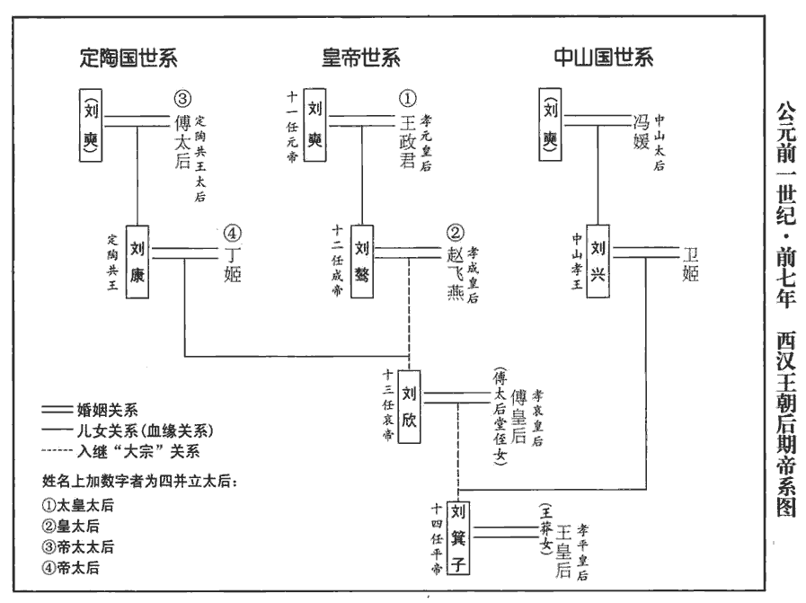
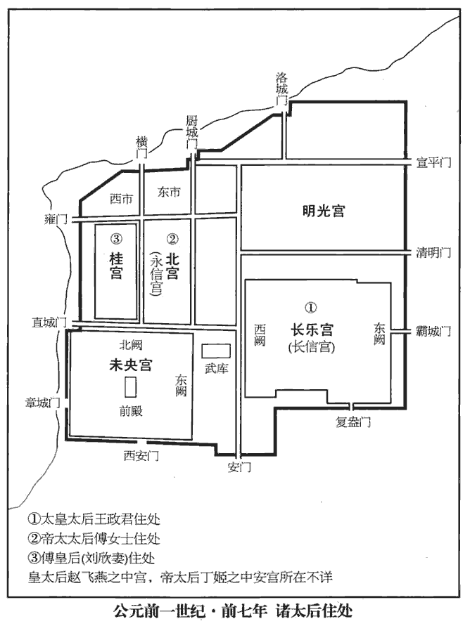
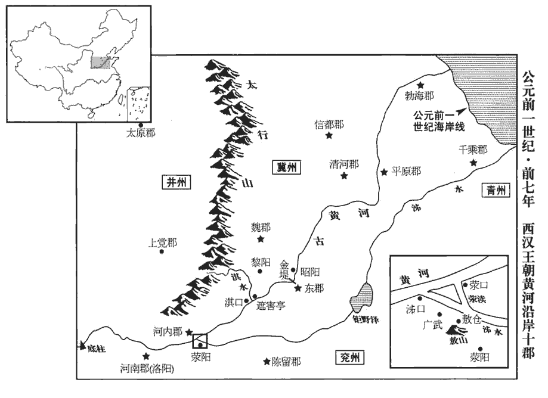

 漢紀二十五起閼逢攝提格（甲寅），盡旃蒙單閼（乙卯），凡二年。

# 孝成皇帝下

## 綏和二年（甲寅，前七）

1春，正月，上‹刘骜，时年四十六›行幸甘泉‹陝西淳化西北›，郊泰畤。

〖译文〗 [1]春季，正月，成帝前往甘泉，在泰祭天。

2二月，考異：荀紀云「赦天下」今本紀無之，故不取。壬子‹十三›，丞相方進薨。

〖译文〗 [2]二月，壬子（十三日），丞相翟方进去世。

時熒惑守心，心為明堂；熒惑守心，王者惡之。火曰熒惑星。熒惑，天子理也。雖有明天子，必視熒惑所在。見天文志。丞相府議曹平陵‹陝西咸陽西平陵乡›李尋議曹，職在論議，自公府至州郡皆有之。奏記方進，言：「災變迫切，大責日加，安得保斥逐之戮！師古曰：言其事重，不但斥逐而已也。闔府三百餘人，師古曰：三百餘人，言丞相之官屬也。唯君侯擇其中，與盡節轉凶。」方進憂之，不知所出。會郎賁麗善為星，善為甘、石之學也。師古曰：賁，姓也。麗，名也。賁，音肥。言大臣宜當之。上乃召見方進。還歸，未及引決，師古曰：引決，自裁也。還，從宣翻。上遂賜冊，責讓以政事不治，災害并臻，百姓窮困，冊，即策書也。說文：冊，符命也，諸侯進受於王也；象其劄一長一短，中有二繩之形。程大昌演繁露曰：策制長二尺，短者半之；其次一長一短；兩編下唯用篆書：此漢策拜丞相之制也。至策免，則以尺一木，兩行而隸書，與策拜異矣。治，直吏翻。曰：「欲退君位，尚未忍，使尚書令賜君上尊酒十石，養牛一，君審處焉！」如淳曰：漢儀注，有天地大變，天下大過，皇帝使侍中持節乘四白馬，賜上尊酒十斛，牛一頭，策告殃咎。使者去半道，丞相即上病。使者還，未白事，尚書以丞相不起聞。律：稻米一斗得酒一斗為上尊，稷米一斗得酒一斗為中尊，粟米一斗得酒一斗為下尊。師古曰：稷，即粟也；宜為黍米，不當言稷。且作酒自有澆、淳之異，為上、中、下耳。處，昌呂翻。方進即日自殺。上祕之，遣九卿策贈印綬，賜乘輿祕器、少府供張，柱檻皆衣素。乘，繩證翻。祕器，東園祕器也。供，音居用翻。張，音竹亮翻。師古曰：柱，屋柱也；檻，軒前闌版也；皆以白素衣之。衣，音於既翻。天子親臨弔者數至，禮賜異於他相故事。師古曰：漢舊儀云：丞相有疾，皇帝法駕親至問疾，從西門入；即薨，移居第中。車駕往弔，賜棺、棺斂斂具；贈錢、葬地。葬日，公卿已下會葬。數，所角翻。

〖译文〗 当时星象显示火星停留在心宿。丞相府议曹平陵人李寻向翟方进上呈文说：“灾害天变逼迫，严厉的谴责天天增加，怎样才能做到只受斥逐的惩罚！整个丞相府有三百余人，请您从中挑选合适的人与他一起尽节，转移凶险。”翟方进感到忧愁，不知如何是好。正好郎官贲丽精通天文星象，说大臣应当代替天子身当灾祸。于是成帝召见翟方进。翟方进从宫里回来，还没来得及自裁，成帝就下策书，斥责他把国家政事管理得乱七八糟，天灾人祸同时并作，百姓穷困。并说：“本打算把你免职，但尚未忍心，派尚书令赐与你上等好酒十石，肥牛一头，你好自为之！”翟方进即日自杀。成帝对此事保密，派九卿拿着皇帝的策书，赠翟方进印信绶带，赐御用冥器，由少府供设帷帐，房柱和栏杆都裹以白布。成帝数次亲临吊唁，礼仪之隆重，赏赐之多，不同于其他丞相，前所未有。

臣光曰：晏嬰有言：「天命不慆tāo，不貳其命。」晏子對齊侯禳彗之辭也。杜預曰：慆，疑也，音他刀翻。禍福之至，安可移乎！昔楚昭王、宋景公不忍移災於卿佐，曰：「移腹心之疾，寘諸股肱，何益也！」左傳：哀六年，有雲如眾赤鳥，夾日而飛，三日。楚子使問諸周太史，周太史曰：「其當王身乎！若禜yíng之，可移於令尹、司馬。」王曰：「移腹心之疾而寘股肱，何益！」遂弗禜。史記：宋景公時，熒惑守心，景公憂之。司星子韋曰：「可移於相。」公曰：「相，吾之股肱。」曰：「可移於民。」公曰：「君者待民。」曰：「可移於歲。」公曰：「歲饑民困，吾誰為君！」子韋曰：「天高聽卑，君有仁人之言三，熒惑宜有動。」候之，果徙三度。藉其災可移，藉之為言借也，假也；設為之言，以發所欲言之意。仁君猶不忍【章：十四行本「忍」作「肯」；乙十一行本同；孔本同。】為，況不可乎！使方進罪不至死而誅之，以當大變，是誣天也；方進有罪當刑，隱其誅而厚其葬，是誣人也；孝成欲誣天、人而卒無所益，卒，子恤翻。可謂不知命矣。

〖译文〗 臣司马光曰：晏婴有句话说：“天命不容怀疑，命运只有一个，无法改变。”祸福降临，难道可以转移吗？从前楚昭王、宋景公不忍将灾祸转移到大臣身上，说：“把心腹的疾患，转移到四肢，有什么好处呢！”假如灾祸可以转移，仁慈的君王还不忍心那样做，何况不可转移呢！假使翟方进罪不至死而诛杀了他，以承当天变，这是诬蔑上天；假使翟方进有罪应当处以死刑，却秘密诛杀，又赐以厚葬，这是欺骗人心。孝成皇帝想欺天、欺人，但最后并没有好处，可以说是不知天命。

3三月，上行幸河東‹山西夏縣›，祠后土。

〖译文〗 [3]三月，成帝前往河东，祭祀后土神。

丙戌‹十八›，帝崩於未央宮‹年四十六›。臣瓚曰，帝年二十即位，即位二十六年，壽四十五。師古曰，即位明年乃改元耳，壽四十六。

〖译文〗 [4]丙戌（十八日），成帝在未央宫驾崩。

帝素強無疾病，自強以為無疾病也。是時，楚思王衍、梁王立來朝，衍，楚孝王囂之子。明旦，當辭去，上宿，供張白虎殿；又欲拜左將軍孔光為丞相，已刻侯印，書贊。師古曰：贊，謂延拜之文。贊，進也，延進而拜之也。書贊者，書贊辭於策也。昏夜，平善，鄉晨，傅絝kù襪欲起，應劭曰：傅，著也。師古曰：鄉，讀曰嚮。傅，讀曰附。絝，古袴字也。襪，音武伐翻。因失衣，不能言，攬衣而失，手緩縱也。晝漏上十刻而崩。司漏之度，有晝漏、夜漏。是時三月，晝漏五十八刻。上者，漏箭浮而上也。上，時掌翻。民間讙譁，咸歸罪趙昭儀。讙，許元翻。皇太后詔大司馬莽雜與御史、丞相、廷尉治，問皇帝起居發病狀；趙昭儀自殺。

〖译文〗 成帝一向身体强壮，没有疾病。当时，楚王刘衍、梁王刘立来京朝见，第二天早晨就要辞行归国。成帝铺设帷帐，宿于白虎殿。成帝又想拜左将军孔光为丞相，已刻好侯爵的印信，准备了封拜诏书。黄昏和夜间，还一切平静如常，清晨，成帝穿裤袜要起床，突然衣服滑落，不能言语，当计时的昼漏到十刻时，成帝驾崩。民间喧哗，都归罪于赵昭仪。皇太后诏令大司马王莽，与御史、丞相、廷尉一起追究审理，查问成帝起居和发病的情况。赵昭仪自杀。

班彪贊曰：臣姑充後宮為婕妤，婕妤，音接予。父子、昆弟侍帷幄，數為臣言：數，所角翻。為，於偽翻。「成帝善修容儀，升車正立，不內顧，不疾言，不親指，師古曰：不內顧者，儼然端嚴，不迴眄也。不疾言者，為輕肆也。不親指者，為惑下也。此三句者，本論語鄉黨篇述孔子之事，班氏引之。今論語云：車中不內顧，不疾言，不親指。內顧者，說者以為前視不過衡軛è，旁視不過輢yǐ較，與此不同。輢，音於綺翻。余謂此亦成帝學論語而有得於脩容儀者也。夫聖人道德之容，積於中而發於外；帝則因論語之文，而剛制其外而已。損者三樂，帝何不能服膺斯言乎！嗚呼，豈唯是哉！論語二十篇，脩身、齊家、治國、平天下盡在是矣。臨朝淵嘿，尊嚴若神，可謂【章：十四行本「謂」下有「有」字；乙十一行本同；孔本同。】穆穆天子之容【章：十四行本「容」下有「者」字；乙十一行本同；孔本同。】矣。淵，深；嘿，靜也。師古曰：禮記云：天子穆穆，諸侯皇皇，大夫濟濟，士蹌蹌。毛晃曰：穆穆，和敬貌。朝，直遙翻；下同。博覽古今，容受直辭，公卿奏議可述。遭世承平，上下和睦。然湛于【章：十四行本「于」作「乎」；乙十一行本同；孔本同。】酒色，師古曰：湛，讀曰耽。孔穎達曰：耽者，過禮之樂。趙氏亂內，外家擅朝，言之可為於邑！」師古曰：於邑，短氣貌，讀如本字。於，又音烏；邑，又音烏合翻。建始以來，王氏始執國命，哀、平短祚，莽遂篡位，蓋其威福所由來者漸矣！言王氏之禍，始於成帝。

〖译文〗 班彪赞曰：我的姑母曾在后宫充当婕妤，她的父亲、兄弟都在宫廷皇帝身边侍奉，他们多次对我说：“成帝善于修饰仪表。上车后端正地站立，不向内回顾，说话不急，不指指划划。临朝时仪态深沉、平静，象神一样尊严，可称之为肃穆温和的天子之容。成帝博览群书，融贯古今，对臣下直率的言辞，能宽容接受，公卿的奏议有可称道的内容。正逢承平之世，上下和睦。然而，他耽于酒色，使赵氏秽乱于内宫，外戚擅权于朝廷，说起来令人叹息！”建始元年以来，王氏开始执掌国家命运，哀帝、平帝都短命，于是王莽篡夺了皇位。王氏的威福有一个逐渐发展的过程。

4是日，孔光於大行前拜受丞相、博山侯印綬。大行前，謂大行皇帝柩jiù前。韋昭曰：大行者，不反之辭。恩澤侯表，博山侯，國於南陽順陽。

〖译文〗 [5]成帝驾崩当天，孔光在大行皇帝灵柩前，拜受丞相、博山侯印信、绶带。

5富平侯張放聞帝崩，思慕哭泣而死。放自河東都尉徵為侍中、光祿勳；丞相翟方進奏免放，遣就國。

〖译文〗 [6]富平侯张放听到成帝驾崩的消息，追思仰慕哭泣，悲痛而死。

荀悅論曰：放非不愛上，忠不存焉。故愛而不忠，仁之賊也！

〖译文〗 荀悦论曰：张放并非不爱成帝，而是光有爱，没有忠。因此，爱而不忠，是仁义的大害！

6皇太后詔，南北郊長安如故。永始三年，復甘泉泰畤、雍五畤，汾陰后土祠，罷長安南、北郊。

〖译文〗 [7]皇太后下诏：恢复长安南北郊祭祀天地大典。

7夏，四月，丙午‹八›，太子‹刘欣，时年十九›即皇帝位，謁高廟；尊皇太后‹王政君›曰太皇太后，皇后‹赵飞燕›曰皇太后。大赦天下。

〖译文〗 [8]夏季，四月，丙午（初八），太子即皇帝位。拜谒汉高祖刘邦的祭庙。尊皇太后为太皇太后，皇后为皇太后。大赦天下。

8哀帝初立，躬行儉約，省減諸用，政事由己出，朝廷翕然望至治焉。治，直吏翻。

〖译文〗 哀帝即位之初，亲自厉行节俭，减省各项费用，政事由自己裁决处理，朝廷上下一致希望能天下大治。

9己卯，葬孝成皇帝於延陵‹咸陽北四公里›。臣瓚曰：自崩至葬凡五十四日。延陵在扶風，去長安六十二里。考異曰：成紀：「三月，丙戌，帝崩於未央宮。四月，己卯，葬延陵。」臣瓚曰：「自崩及葬凡五十四日。」漢紀乃云：「三月，丙午，帝崩，四月，己卯，葬延陵。」自崩及葬三十四日。按是年三月己巳朔，無丙午；四月己亥朔，無己卯。若依成紀，則當云「五月己卯葬」；依荀紀，當云「閏三月丙午崩」。二者各有差舛chuǎn，未知孰是。按是年閏七月，不當頓差四月。今且從成紀之文。

〖译文〗 [9]己卯（疑误），葬孝成皇帝于延陵。

 

10太皇太后‹王政君›令傅太后、丁姬十日一至未央宮。

〖译文〗 [10]太皇太后下诏，命傅太后、丁姬每十天一次到未央宫探望皇帝。

有詔問丞相、大司空：「定陶共王太后宜當何居？」共，讀曰恭。丞相孔光素聞傅太后為人剛暴，長於權謀，自帝在襁褓，而養長教道至於成人，養長，知兩翻。道，讀曰導。帝之立又有力；事見上卷元延四年。光心恐傅太后與政事，師古曰：與，讀曰豫。不欲與帝旦夕相近，近，其靳翻。即議以為：「定陶太后宜改築宮。」大司空何武曰：「可居北宮。」上從武言。北宮有紫房複道通未央宮，長安記：桂宮在未央宮北，亦曰北宮。余按漢書平帝紀，成帝趙皇后退居北宮，哀帝傅皇后退居桂宮，則北宮、桂宮自是兩宮。傅太后果從複道朝夕至帝所，求欲稱尊號，貴寵其親屬，使上不得由直道行。師古曰：不得依正直之道也。余謂小宗不得間大宗，藩后不得位匹長樂，私戚不得妄干恩澤，所謂正道也。高昌侯董宏宏，高昌侯董忠子也。功臣表，高昌侯，國於千乘。希指，上書言：「秦莊襄王母本夏氏，而為華陽夫人所子，及即位後，俱稱太后。事見六卷秦孝文王元年。上，時掌翻。華，戶化翻。宜立定陶共王后為帝太后。」事下有司，下，遐稼翻。大司馬王莽、左將軍、關內侯、領尚書事師丹劾奏宏：「知皇太后至尊之號，天下一統，而稱引亡秦以為比喻，詿guà誤聖朝，劾，戶概翻。詿，戶卦翻。非所宜言，大不道！」上新立，謙讓，納用莽、丹言，免宏為庶人。傅太后大怒，要上，欲必稱尊號。要，一遙翻。上乃白太皇太后，令下詔尊定陶恭王為恭皇。

〖译文〗 哀帝下诏询问丞相、大司空：“定陶共王太后应当居住在什么地方才合适？”丞相孔光素来听说傅太后为人刚强暴烈，工于心计，善于弄权，哀帝在襁褓中时，便由她抚养教导，以至成人，哀帝能继位，她又出了大力，孔光担心傅太后会干预政事，不想使她与皇帝早晚接近，于是就建议说：“定陶太后应另行修筑宫室居住。”大司空何武却说：“可以住在北宫。”哀帝听从何武的建议。北宫有紫房复道通到未央宫，傅太后果然从复道早晚去哀帝住所，请求哀帝加封她尊号，提拔宠信她的亲属，使哀帝无法以正道行事。高昌侯董宏迎合哀帝、傅太后的心意，上书说：“秦庄襄王的母亲，本来是夏氏，后来庄襄王被华阳夫人认为嗣子。等到继位后，夏氏、华阳夫人都被尊称为太后。应该尊定陶共王后为帝太后。”哀帝把此奏章交给有关官署讨论，大司马王莽、左将军、关内侯、主管尚书事师丹联合上奏弹劾董宏说：“董宏明知皇太后是最为尊贵的称号，现今天下一统，他却援引亡秦的事例作为比喻，贻误圣朝，这不是应该说的话，犯了大逆不道之罪。”哀帝新继位，态度谦让，采纳了王莽、师丹的意见，把董宏免官，贬为平民。傅太后勃然大怒，要挟哀帝，非要称崐尊号不可。哀帝于是转告太皇太后，太皇太后同意下诏尊定陶恭王为恭皇。

 

11五月，丙戌‹十九›，立皇后傅氏，傅太后從弟晏之子也。從，才用翻。

〖译文〗 [11]五月，丙戌（十九日），立傅氏为皇后，她是傅太后堂弟傅晏的女儿。

12詔曰：「春秋，母以子貴。見公羊春秋傳隱元年。宜尊定陶太后曰恭皇太后、丁姬曰恭皇后，各置左右詹事，食邑如長信宮、中宮。」應劭曰：成帝母王太后居長信宮。李奇曰：傅姬如長信，丁姬如中宮也。師古曰：中宮，皇后之宮。追尊傅父為崇祖侯，丁父為褒德侯；封舅丁明為陽安侯，舅子滿為平周侯，皇后父晏為孔鄉侯，師古曰：傅父，傅太后之父。丁父，丁太后之父。地理志，汝南郡有陽安縣。恩澤侯表，平周侯，食邑於南陽湖陽。孔鄉侯，食邑於沛郡夏丘。皇太后弟侍中、光祿大夫趙欽為新城侯。地理志，河南郡有新城縣。太皇太后詔大司馬莽就第，避帝外家，莽上疏乞骸骨。帝遣尚書令詔起莽，又遣丞相孔光、大司空何武、左將軍師丹、衛尉傅喜白太皇太后曰：「皇帝聞太后詔，甚悲！大司馬即不起，皇帝即不敢聽政！」太后乃復令莽視事。太皇太后止稱太后，史省文。復，扶又翻。

〖译文〗 [12]哀帝下诏说：“《春秋》说，母以子贵。所以应尊定陶太后为恭皇太后，尊丁姬为恭皇后。各自设置左右詹事，采邑如同长信宫皇太后和中宫皇后 。”同时追尊傅太后的父亲为崇祖侯，丁姬的父亲为褒德侯。封哀帝舅父丁明为阳安侯，舅父的儿子丁满为平周侯，傅皇后的父亲傅晏为孔乡侯。又封皇太后赵飞燕的弟弟、侍中、光禄大夫赵钦为新城侯。太皇太后王政君诏令大司马王莽离开朝廷，回到府第，以避开哀帝的外戚。王莽上书请求退休。哀帝派尚书令持诏书命令王莽出来任职。又派丞相孔光、大司空何武、左将军师丹、卫尉傅喜向太皇太后报告说：“皇上听到太皇太后的诏书，十分悲痛！如果大司马不出来任职，皇上就不敢听政了。”太皇太后于是又命令王莽上朝处理政事。

13成帝‹刘骜›之世，鄭聲尤甚，周末有鄭、衛之樂：東門、溱zhēn洧wěi之詩，鄭聲也；桑中、濮上之音，衛聲也：皆淫聲也。其後凡淫聲通謂之鄭聲。孔子曰：鄭聲淫，是也。黃門名倡丙彊、景武之屬富顯於世，倡，音齒良翻。貴戚至與人主爭女樂。蓋王氏五侯、淳于長之屬也。帝自為定陶王時疾之，又性不好音，好，呼到翻。六月，詔曰：「孔子不云乎：『放鄭聲，鄭聲淫。』師古曰：論語載孔子之言。鄭國有溱、洧之水，男女亟於其間聚會，故俗亂而樂淫。其罷樂府官；立樂府見十九卷元狩三年。郊祭樂及古兵法武樂在經，非鄭、衛之樂者，別【章：十四行本「別」上有「條奏」二字；乙十一行本同；孔本同；張校同；退齋校同。】屬他官。」郊祭樂，亦武帝置，今以給祠南、北郊。大樂鼓、嘉至鼓、邯鄲鼓、騎吹鼓、江南鼓、淮南鼓、巴俞鼓、歌鼓、楚嚴鼓、梁皇鼓、臨淮鼓、茲邡鼓，朝賀置酒，陳殿上，應古兵法，凡鼓十二，人員百一十八人，郊祭員十三人；諸族樂人兼雲招給祠南、北郊用六十七人，兼給事雅樂用四人，夜誦員五人，剛、別柎fū員二人，給盛德主調篪員二人，聽工以日知律冬夏至一人，鍾工、磬工、簫工員各一人；僕射二人，主領諸樂人；皆不可罷。竽工員三人，罷一；琴工員五人，罷三；柱工員二人，罷一；繩弦工員六人，罷四；鄭四會員六十二人，留一人給事雅樂，餘罷；張瑟員八人，留一；安世樂鼓、沛吹鼓。族歌鼓。陳吹鼓、商樂鼓、東海鼓、長樂鼓、縵樂鼓，凡鼓八，員百二十八人，朝賀置酒陳前殿房中，不應經法；治竽員五人，楚鼓員六人，常從倡三十人，常從象人四人，詔隨常從倡十六人；秦倡員二十九人，秦倡象人員三人，詔隨秦倡一人；雅大人員九人，朝賀置酒為樂；楚四會員十七人，巴四會員十二人，銚diào四會員十二人，齊四會員十九人，蔡謳員三人，齊謳員六人，竽、瑟、鍾、磬員五人，皆鄭聲，可罷。師學百四十四人，其七十二人給太官挏dòng馬酒，其七十二人可罷。大凡八百二十九人，其三百八十八人不可罷，可領屬大樂；其四百四十一人不應經法，或鄭、衛之聲，皆可罷。奏可。晉灼曰：邡，音方。師古曰：招，讀與翹同。剛及別柎，皆鼓名也。柎，音膚。柱工，主箏瑟之柱者，弦，琴瑟之弦。繩，言主糾合作之也。縵樂，雜樂也，音漫。挏，音動。李奇曰：以馬乳為酒，撞挏乃成。孟康曰：象人，若今戲蝦、魚、師子者也。韋昭曰：著假面者也。凡所罷省過半。然百姓漸漬日久，又不制雅樂有以相變，豪富吏民湛沔自若。漸，讀曰沾。師古曰：湛，讀曰沈，又讀曰耽。自若，言自如故也。

〖译文〗 [13]汉成帝时代，靡靡之音特别盛行。以致黄门名倡丙强、景武之流，都以富有闻名于世。皇亲国戚甚至与天子竞赛女乐。哀帝在当定陶王时，就对这种风气十分厌恶，生性又不喜好音乐，于是在六月下诏说：“孔子不是说过吗：‘抛弃郑国音乐，郑国音乐太淫荡。’兹撤销乐府官。经书上记载的郊祀大典的音乐以及古代兵法武乐，不属于郑国、卫国的音乐，由其他官署管理。”裁减人员超过一半。但是百姓受靡靡之音熏染的时间很长了，又没有制定其他高雅的音乐来替换，因此富有的官吏百姓，依然沉湎其中，一如往昔。

14王莽薦中壘校尉劉歆有材行，行，下孟翻。為侍中，稍遷光祿大夫，貴幸；更名秀。歆改名秀，冀以應圖讖。更，工衡翻。上復令秀典領五經，卒父前業；秀父向典校書，見三十卷河平三年。師古曰：卒，終也。復，扶又翻。卒，子恤翻。秀於是總群書而奏其七略，有輯略、有六藝略、有諸子略、有詩賦略、有兵書略、有術數略、有方技略。師古曰：輯略，謂群書之總要。輯，與集同。六藝，六經也。諸子，即下九流是也。詩賦，則自屈原、荀卿至揚雄等所作也。兵書，則權謀、技巧、形勢、陰陽之書也。術數，則天文、曆譜、五行、蓍龜、雜占、形法之書也。方技，則醫經、經方、房中、神仙之書也。凡書六略，三十八種，種，章勇翻。五百九十六家、萬三千二百六十九卷。其敘諸子，分為九流：曰儒，曰道，曰陰陽，曰法，曰名，曰墨，曰從橫，曰雜，曰農，從，子容翻。以為：「九家皆起於王道既微，諸侯力政，時君世主好惡殊方，好，呼到翻。惡，烏路翻。是以九家之術蠭出并作，師古曰：蠭與鋒同。各引一端，崇其所善，以此馳說，取合諸侯，其言雖殊，譬如水火相滅，亦相生也；水滅火而生木，木復生火。仁之與義，敬之與和，相反而皆相成也。易曰：『天下同歸而殊塗，一致而百慮』。師古曰：下繫之辭。今異家者推所長，窮知究慮以明其指，雖有蔽短，合其要歸，亦六經之支與流裔；師古曰：裔，衣末也。其於六經，如水之下流，衣之末裔。使其人遭明王聖主，得其所折中，中，竹仲翻。皆股肱之材已。師古曰：已，語終辭。仲尼有言：『禮失而求諸野。』師古曰：言都邑失禮，則於外野求之，亦將有獲。方今去聖久遠，道術缺廢，無所更索，師古曰：索，求也。索，山客翻。彼九家者，不猶愈於野乎！師古曰：愈，勝也。若能脩六藝之術而觀此九家之言，舍短取長，舍，讀曰捨。則可以通萬方之略矣。」

〖译文〗 [14]王莽举荐中垒校尉刘歆，说他有才干德行，任命为侍中，逐步升为光禄大夫，地位显贵，受到皇帝宠信。刘歆改名为刘秀。哀帝又命令刘秀负责审核校对儒学《五经》，完成其父刘向未完成的事业。刘秀于是汇总群书，编成七略上奏，有《辑略》、《六艺略》、《诸子略》、《诗赋略》、《兵书略》、《术数略》、《方技略》。记录书目的共有六略，包括三十八种、五百九十六家、一万三千二百六十九卷。其中叙述诸子的，分为九大流派：儒家、道家、阴阳家、法家、名家、墨家、纵横家、杂家、农家。他认为：“九家都兴起于王道已经衰微、诸侯以实力为政的时代，当时的君主们的喜好厌恶大不相同，因此九家学派同时兴起，各持一端，推崇所喜好的学说，并用这些学说去游崐说各国，争取诸侯的赞同。主张虽然不同，但就象水火相灭，同时也相生一样，它们也是相反相成的。比如仁与义，敬与和，虽然相反，但也都是相成的。《易经》说：‘天下人都回到同一个地方，但走的路不同；天下的道理是一致的，但人们却有许多种思虑。’而今，各个不同学派的人推崇自己学派的长处，如果深入研究，弄清它们的宗旨，虽然都有掩蔽短处的现象，但综合各家学说的主要内容和宗旨，也不过是儒学《六经》的支派或末流。倘若这些人能遇到圣王明主，将他们的主张折中修正，那么他们都可成为栋梁之才。孔子说：‘礼仪失传，到乡野去寻找。’现在距闻圣人的时代，已经很久远了，当时的道术不是缺失，就是废止了，无处追寻，这九家学派，不是胜过乡野吗！如果能钻研儒学《六艺》，再参考这九家学说，舍弃短处，采取精华，就可以精通万种方略了。”

15河間惠王良能脩獻王之行，行，下孟翻。母太后薨，服喪如禮；詔益封萬戶，以為宗室儀表。師古曰：儀表者，言為禮儀之表率。余謂有儀可象謂之儀，四外望之以取正謂之表。

〖译文〗 [15]河间王刘良，能学习献王的高尚品行，母亲王太后去世，他完全按照礼仪的规定服丧。哀帝下诏褒奖，增加采邑万户，使他成为宗室奉行礼仪的表率。

16初，董仲舒說武帝，說，輸芮翻。以「秦用商鞅之法，除井田，事見二卷周顯王十九年。民得賣買，富者田連阡陌，貧者亡立錐之地。亡，讀與無同。邑有人君之尊，里有公侯之富，小民安得不困！古井田法雖難卒行，卒，讀曰猝。宜少近古，少，詩沼翻。限民名田以贍不足，師古曰：名田，占田也。各為立限，不使富者過制，則可使貧弱之家足也。塞并兼之路；去奴婢，除專殺之威；服虔曰：不得專殺奴婢也。塞，悉則翻。去，羌呂翻。薄賦斂，省繇役，斂，力贍翻。繇，讀曰傜。以寬民力，然後可善治也！」治，直吏翻。及上即位，師丹復建言：復，扶又翻。「今累世承平，豪富吏民訾zī數钜萬，訾，與貲同。而貧弱愈困，宜略為限。」天子下其議，下，遐稼翻。丞相光、大司空武奏請：「自諸侯王、列侯、公主名田各有限；關內侯、吏、民名田皆毋過三十頃；奴婢毋過三十人，據哀帝紀：有司條奏：「諸侯王、列侯得名田國中，列侯在長安及公主得名田縣、道。關內侯、吏、民名田皆毋得過三十頃。諸侯王奴婢二百人，列侯、公主百人，關內侯、吏民三十人。」與此少異。食貨志亦與紀同。期盡三年；犯者沒入官。」時田宅、奴婢賈為減賤，賈，讀曰價。貴戚近習皆不便也，皆不以為便於己也。詔書且須後，師古曰：須，待也。遂寢不行。又詔：「齊三服官、諸官，織綺繡難成、害女紅之物，皆止，無作輸。齊三服官及諸織官，皆無作難成之物以輸送也。如淳曰：紅，亦工也。其所作已成、未成，皆止無復作，皆輸所近官府也。師古曰：如說非也，謂未成者不作，已成者不輸耳。余謂如說固非，顏說亦未若餘說之為簡易明白也。除任子令及誹謗詆欺法。應劭曰：任子令者，漢儀注：吏二千石以上視事滿三年，得任同產若子一人為郎。不以德選，故除之。師古曰：任，保也。詆，誣也。掖庭宮人年三十以下，出嫁之；重絕人道也。官奴婢五十以上，免為庶人。益吏三百石以下俸。」

〖译文〗 [16]早先，董仲舒曾劝说汉武帝：“秦国采用商鞅之法，废除井田，人民可以买卖土地，造成富者田地一望无际，贫者没有立锥之地。县邑有尊贵如君王一样的人，乡里有富比公侯的财主，小民怎能不困乏呢？古代的井田法现在虽然难以仓猝实行，但也应该少有恢复，应限制人民占田的数额，将多余的土地补给不足者，堵塞兼并土地的途径。取消奴婢，除去主人可以随便杀害奴婢的特权。减少赋税，减轻徭役，使人民得以休息。然后才可把国家治理好。”等到哀帝即位，师丹又建议说：“而今连续几代的太平盛世，豪有的吏民的家产数目达数万万，而贫弱的人却愈加困乏，应该略为限制一下占田数额。”哀帝把这个奏议让大家讨论。丞相孔光、大司空何武上奏，请求：“从诸侯王开始，诸侯王、列侯、公主占田各定限额。关内侯、官吏、庶民占田都不得超过三十顷。奴婢人数不得超过三十人。期限定为三年，三年后有违犯规定的，财产没收入官。”这一来，造成一时田宅、奴婢的价格下跌，皇帝贵戚和天子的亲信都感到对自己不利，于是哀帝就下诏书说：“暂且等待以后再说。”这个办法遂停止不行。哀帝又下诏：“设于齐国的三服官以及其他主管皇家服装的官署，由于绮罗的纺织刺绣，十分艰难，因而全部停止不再制作和向京师运送；废除二千石官员可以保荐子弟当官的任子令以及诽谤诋欺法；掖庭宫女年龄在三十岁以上的，令其出宫嫁人；官奴婢年龄在五十岁以上的，免除奴婢身份，成为庶民；增加官秩在三百石以下的官吏的俸禄。”

17上置酒未央宮，內者令為傅太后張幄，坐於太皇太后坐旁。百官志：內者令，屬少府，以宦者為之，掌中布張諸衣物。為，於偽翻。師古曰：坐，音材臥翻；下同。大司馬莽按行，行，下孟翻。責內者令曰：「定陶太后，藩妾，何以得與至尊并！」徹去，更設坐。去，羌呂翻。更，工衡翻。傅太后聞之，大怒，不肯會，重怨恚莽；師古曰：會，謂至酒所也。重，音直用翻。莽復乞骸骨。復，扶又翻。秋，七月，丁卯‹一›，上賜莽黃金五百斤，安車駟馬，罷就第。考異曰：公卿表：「十一月，丁卯，大司馬莽免。庚午，師丹為大司馬。四月，徙。」又曰：「十月，癸酉，丹為大司空。」又曰：「太子太傅師丹為左將軍，五月遷。」荀紀：「七月，丁巳，大司馬莽免。」按丹若以十一月為司馬，四月徙官，不得以十月為司空也。七月丁卯朔，無丁巳。年表月誤，荀紀日誤。公卿大夫多稱之者，上乃加恩寵，置中黃門，為莽家給使，蘇林曰：使黃門在其家為使令。十日一賜餐。又下詔益封曲陽侯根、安陽侯舜、新都侯莽、丞相光、大司空武邑戶各有差。益封根二千戶；舜五百戶，舜，音子也；莽三百五十戶；光千戶；武更以南陽犨chōu之博望鄉為氾鄉侯國，益封千戶。以莽為特進、給事中，朝朔望，見禮如三公。朝，直遙翻。又還紅陽侯立於京師。立就國見上卷去年。

〖译文〗 [17]哀帝在未央宫摆设酒席，内者令把傅太后的座位设在太皇太后座位旁边。大司马王莽巡视后，斥责内者令说：“定陶太后不过是藩王妃而已，怎配跟至尊的太皇太后并排而坐！”下令撤去原先的座位，重新摆放。傅太后听说崐后，大怒，不肯赴宴会，极端愤恨王莽。王莽再次上书请求退休。秋季，七月，丁卯（初一），哀帝赐给王莽黄金五百斤、四匹马驾的安车一辆，让他辞官回到府邸。公卿大夫大多称赞王莽，哀帝于是给予他更多的恩宠，特意派中黄门到王莽家，以供差使。每隔十天，哀帝赐餐一次。又下诏，增加曲阳侯王根、安阳侯王舜、新都侯王莽、丞相孔光、大司空何武采邑人户各不等。赐王莽为特进、给事中，每月一日和十五日可以朝见皇帝，朝见时的礼节一如三公。又召回红阳侯王立，使居京师。

傅太后從弟右將軍喜，好學問，有志行。從，才用翻。好，呼到翻。行，下孟翻；下同。王莽既罷退，眾庶歸望於喜。初，上之官爵外親也，外親，外家之親。喜獨執謙稱疾；傅太后始與政事，數諫之；與，讀曰豫。數，所角翻。由是傅太后不欲令喜輔政。庚午‹四›，以左將軍師丹為大司馬，封高鄉亭侯；按丹傳及恩澤侯表，皆云封高樂侯，國於東海。賜喜黃金百斤，上右將軍印綬，以光祿大夫養病；以光祿勳淮陽‹河南淮陽›彭宣為右將軍。大司空何武、尚書令唐林皆上書言：「喜行義修潔，忠誠憂國，內輔之臣也。言可為內朝輔弼之臣。今以寢病一旦遣歸，眾庶失望，皆曰：『傅氏賢子，以論議不合於定陶太后，故退，』百寮莫不為國恨之。為，於偽翻。忠臣，社稷之衛；魯以季友治亂，師古曰：謂季氏亡則魯不昌。治，直吏翻。楚以子玉輕重，師古曰：謂楚殺子玉而晉侯喜可知。魏以無忌折衝，事見六卷秦莊襄王三年。項以范增存亡。事見高帝紀。百萬之眾，不如一賢；故秦行千金以間廉頗，事見五卷周赧王五十五年。間，古莧翻。漢散萬金以疏亞父。事見十卷高帝三年。疏，與踈同。喜立於朝，陛下之光輝，傅氏之廢興也。」如淳曰：傅喜顯則傅氏興，其廢亦如之。晉灼曰：用喜於陛下有光明，而傅氏之廢復得興也。師古曰：如說是。余謂晉說亦未可厚非。上亦自重之，故尋復進用焉。明年，復進用喜。復，扶又翻。

〖译文〗 傅太后的堂弟、右将军傅喜，喜好学问，有大志德行。王莽既已罢职退下，大众希望傅喜接替王莽的位置。当初，哀帝加封外戚官爵，唯独傅喜自称有病而谦让推辞。傅太后刚开始干预政事，傅喜就多次进言规谏，因此傅太后不想让傅喜辅政。庚午（初四），任命左将军师丹为大司马，封高乡亭侯。赐傅喜黄金百斤，缴还右将军的印信绶带、以光禄大夫的身份在家养病。任命光禄勋、淮阳人彭宣为右将军。大司空何武、尚书令唐林都上书说：“傅喜行事仁义，品德高尚廉洁，忠诚忧国，适宜做内朝辅弼大臣。现在以有病为借口，突然被遣返回家，使大众感到失望，都说：‘傅氏是贤能之人，只因见解与定陶太后不合，因此被斥退。’百官没有不为国深深痛惜的。忠臣是国家的卫士。春秋时，鲁国因任用季友，治理好了混乱；楚国以子玉是否活着，决定被别国看重或轻视；魏国依仗有公子无忌，才能战胜强敌；项羽则由范增决定他的生存与灭亡。百万人之众，不如一个贤才。因此秦国用千金去离间廉颇和赵王的关系；汉高祖散万金使项羽疏远范增。傅喜能担当朝廷大任，是陛下的光辉，也是决定傅氏兴废的关键。”哀帝自己也很器重傅喜，因此，不久就再次征召任用他。

18建平侯杜業上書詆曲陽侯【章：十四行本「侯」下有「王」字；乙十一行本同；孔本同；張校同。】根、高陽侯薛宣、安昌侯張禹而薦朱博。帝少而聞知王氏驕盛，少，詩照翻。心不能善，以初立，故且優之。後月餘，司隸校尉解光解，戶買翻。奏：「曲陽侯，先帝山陵未成，公聘取【章：十四行本「取」下有「故」字；乙十一本同；孔本同；張校同。】掖庭女樂五官殷嚴、王飛君等置酒歌舞，如淳曰：五官，官名也。外戚傳云：五官，視三百石。及根兄子成都侯況，亦聘取故掖庭貴人以為妻，況，商子也。皆無人臣禮，大不敬，不道！」於是天子曰：「先帝遇根、況父子，至厚也，今乃背恩忘義！」背，蒲妹翻。以根嘗建社稷之策，師古曰：謂立哀帝為嗣也。事見上卷元延四年。遣歸國；免況為庶人，歸故郡。王氏，故魏郡元城人。根及況父商所薦舉為官者皆罷。以其黨也。

〖译文〗 [18]建平侯杜业上书诋毁曲阳侯王根、高阳侯薛宣、安昌侯张禹，而推荐朱博。哀帝小时候就听说王氏骄横，心里对他们没有好感。因为继位时间短，因此对他们暂且优待。杜业上书一个多月后，司隶校尉解光上奏说：“曲阳侯王根，在先帝还没入陵安葬之时，就公然聘娶后宫女乐五官殷严、王飞君等，在家置酒歌舞。王根的侄子、成都侯王况，也公然聘娶先帝后宫的贵人为妻。他们都没有人臣之礼，犯了大不敬、不道之罪！”于是天子说：“先帝对待王根、王况叔侄，极为优厚，现在他们竟背恩忘义！”由于王根曾有立定陶王为太子的建议，因此仅遣送回封国。王况被夺爵，贬为平民，遣归原郡。由王根以及王况的父亲王商所举荐而当官的人，全部罢免。

19九月，庚申‹二十五›，地震，自京師到北邊郡國三十餘處，壞城郭，壞，音怪。凡壓殺四百餘人。上以災異問待詔李尋，考異曰：尋傳云：使侍中、衛尉傅喜問尋。按公卿表：「傅喜為衛尉；二月，遷右將軍；十一月，罷。」地震在九月，當是時，喜已不為衛尉矣。對曰：「夫日者，眾陽之長，長，知兩翻。人君之表也。君不修道，則日失其度，晻昧亡光。師古曰：晻，與暗同；又音烏感翻。間者日尤不精，光明侵奪失色，邪氣珥、蜺數作；孟康曰：暈適、背鐍jué、抱珥、虹蜺，皆日旁氣也。珥，形點黑也。如淳曰：雄為虹，雌為蜺。凡氣在旁相對為珥，在旁如半鐶向日為抱，向外為背。有氣刺日為鐍，鐍，映傷也。適者，日之將食，先有黑之變也。蜺，讀曰齧niè。珥，音仍吏翻。數，所角翻；下同。小臣不知內事，竊以日視陛下，志操衰於始初多矣。唯陛下執乾剛之德，強志守度，謂守法度也。毋聽女謁、邪臣之態，諸保阿、乳母甘言卑【章：十四行本「卑」作「悲」；乙十一行本同；孔本同。】辭之託，斷而勿聽，勉強大義。斷，丁管翻。強，其兩翻。絕小不忍；良有不得已，良，甚也。可賜以貨財，不可私以官位，誠皇天之禁也！

〖译文〗 [19]九月，庚申（二十五日），发生地震。自京师至北边郡国，有三十余处地方毁坏了城郭，共压死四百余人。哀帝因为发生灾异而询问待诏李寻，他崐回答说：“太阳，是所有阳性物质的主宰，是君王的象征。君王不行正道，则太阳会失去常度，暗淡无光。最近，太阳尤其不明亮，光彩被侵夺而失去原来的颜色，邪气插入，晕霓屡次出现。我地位卑微，不了解内廷的情况，只以太阳的变化来观察陛下，志节和行为都比即位初期大为衰退了。请陛下振奋阳刚之气，意志坚决，严守法度，不听女人的请求，不受邪臣的摆布，那些保姆乳娘甜言卑辞的请托，绝不要听。努力实现大义，不要在小处不忍。实在不得已时，可以赐予他们钱财珍宝，不可用官职去殉私情，因为这实在是皇天之大忌！

臣聞月者，眾陰之長長，知兩翻。妃后、大臣、諸侯之象也。間者月數為變，此為母后與政亂朝與，讀曰豫。朝，直遙翻；下同。陰陽俱傷，兩不相便；外臣不知朝事，竊信天文，即如此，近臣已不足杖矣。師古曰：杖，謂倚任也。唯陛下親求賢士，無強所惡，師古曰：邪佞之人，誠可賤惡，勿得寵而異之，令其盛強也。惡，烏路翻。以崇社稷，尊強本朝！

〖译文〗 “我听说，月亮是阴性物质的主宰，是后妃、大臣、诸侯的象征。近来，月亮多次发生变异，这显示母后干政乱朝，阴阳俱伤，两相妨碍。外臣不知朝廷大事，我只是相信天象。如果应对天象这样解释，那么陛下所亲近的大臣已不足依赖。陛下应亲自另行寻求贤能之士，不要使邪恶之人的势力强大起来，这样才能使国家昌盛，汉王朝强大。

臣聞五行以水為本，五行，一曰水。水者，天一所生。水為準平，王道公正脩明，則百川理，落脈通；師古曰：落，謂經絡也。偏黨失綱，則湧溢為敗。今汝‹淮河支流›、潁‹淮河支流›漂湧，地理志，潁川郡陽城縣陽乾山，潁水所出，東至沛郡下蔡縣入淮，過郡三，行千五百里。汝水出汝南郡定陵縣高陵山，東南至新蔡入淮，過郡四，行千三百四十里。與雨水并為民害，此詩所謂『百川沸騰』，咎在皇甫卿士之屬。師古曰：詩小雅十月之交之詩也。皇甫卿士，周室女寵之族也。唯陛下少抑外親大臣！

〖译文〗 “我听说五行以水为根本，水是公平的标准。实行王道，政治公平修明，则会百川治理，脉络畅通。如果政治偏离正道，失去了纲常，则会江河泛滥成灾。而今汝水、颍水腾涨漫溢，与雨水一起肆虐，给人民造成危害。这正象《诗经》里所说的‘百川沸腾’，这些灾害应归咎于外戚之类。请陛下稍稍抑制外戚大臣！

臣聞地道柔靜，陰之常義也。間者關東‹函谷關之東›地數震，數，所角翻。宜務崇陽抑陰以救其咎，固志建威，固志以用英俊，建威以黜姦邪。建，立也。閉絕私路，拔進英雋，退不任職，以強本朝！夫本強則精神折衝；師古曰：言有欲衝突為害者，則折挫之。本弱則招殃致凶，為邪謀所陵。聞往者淮南王作謀之時，其所難者獨有汲黯，以為公孫弘等不足言也。事見十九卷武帝元狩元年。弘，漢之名相，於今無比，而尚見輕，何況亡弘之屬乎！故曰朝廷亡人，則為賊亂所輕，亡，讀曰無。其道自然也。」

〖译文〗 “我听说大地行事温柔平静，这是阴性事物的正常状态。近来关东地区多次发生地震，为了挽救上天怪罪而降下的灾祸，应该崇阳抑阴。陛下要坚定意志，建树威严，关闭断绝私下请托之路，提拔引进英俊人才，罢退不称职的官吏，使本朝强大！根本强大了，就会精神振奋，所向无敌；根本衰弱了，则招灾惹祸，被邪恶的阴谋侵凌危害。听说当年淮南王谋反之时，他所害怕的只有汲黯一个人，认为公孙弘等都不值得一提。公孙弘是汉朝的名相，今天没有人可以比得上，他尚且被人看轻，何况今天连公孙弘之辈都没有呢！所以说，朝廷无人，就会被乱臣贼子轻视，这是自然的道理。”

20騎都尉平當使領河隄，師古曰：為使而領其事。使，音疏吏翻。奏：「九河今皆窴tián滅。窴，與填同。按經義，治水有決河深川師古曰：決，分泄也。深，浚治也。治，直之翻；下同。而無隄防壅塞之文。塞，悉則翻。河從魏郡‹河北臨漳西南邺镇›以東多溢決；水跡難以分明，四海之眾不可誣。爾雅：九夷、八狄、七戎、六蠻，謂之四海。孔穎達曰：東方曰夷者，風俗通云：東方人好生，萬物觝dǐ觸地而出；夷者，觝也。其類有九。依東夷傳：一曰玄菟，二曰樂浪，三曰高麗，四曰滿飾，五曰鳧臾，六曰索家，七曰東屠，八曰倭人，九曰天鄙。南方曰蠻者，風俗通云：君臣同川而浴，極為簡慢；蠻者，慢也。其類有八。李巡註爾雅云：一曰天竺，二曰咳首，三曰僬僥yáo，四曰跛踵，五曰穿胸，六曰儋dān耳，七曰狗軹zhǐ，八曰旁舂。西方曰戎者，風俗通云：斬伐殺生，不得其中。戎者，兇也。其類有六。李巡註爾雅云：一曰僥夷，二曰戎央，三曰老白，四曰耆羌，五曰鼻息，六曰天剛。北方曰狄者，風俗通云：父子、嫂叔同穴無別；狄者，辟也，其行邪辟。其類有五。李巡註爾雅云：一曰月支，二曰穢貊mò，三曰匈奴，四曰單于，五曰白屋。諸儒之說略有異同。然平當所謂四海之眾，但言四海之內之人耳。宜博求能浚川疏河者。」上從之。

〖译文〗 [20]骑都尉平当，被委派主管治理河堤事务。他上奏说：“古代的九河，现在全都堙灭难寻。查考儒学经义，治水有决开堵塞的河道、深挖河床等方法，而没有高筑堤防、约束水流的记载。黄河从魏郡以东多次发生泛滥决口，水道难以确定，四海之内那么多人，是欺骗不得的。应该广泛征求有浚川疏河能力的人。”哀帝听从他的建议。

 

待詔賈讓奏言：「治河有上、中、下策。古者立國居民，疆理土地，必遺川澤之分，度水勢所不及。師古曰：遺，留也。度，計也。言川澤水所流聚之處，皆留而置之，不以為居邑而妄墾殖，必計水之所不及，然後居而田之也。分，音扶問翻。度，音大各翻。大川無防，小水得入，陂障卑下，以為汙澤，師古曰：停水曰汙；音一胡翻。使秋水多得其所休息，左右遊波寬緩而不迫。夫土之有川，猶人之有口也，治土而防其川，猶止兒啼而塞其口，豈不遽止，然其死可立而待也。塞，悉則翻。師古曰：遽，速也，音其庶翻。故曰：『善為川者決之使道，善為民者宣之使言。』國語召公諫厲王監謗之辭。師古曰：道，讀曰導。導，通引也。蓋隄防之作，近起戰國，雍防百川，各以自利。師古曰：雍，讀曰壅。齊與趙、魏以河為竟，竟，讀曰境。趙、魏瀕山，師古曰：瀕山，猶言以山為邊界也。瀕，音頻，又音賓。余謂趙、魏之地，一邊接山，則地勢高，非邊界也。齊地卑下，齊地瀕海，故卑下也。作隄去河二十五里，河水東抵齊隄則西泛趙、魏；趙、魏亦為隄去河二十五里，雖非其正，水尚有所遊盪。時至而去，則填淤肥美，淤，依據翻。民耕田之；或久無害，稍築宮【嚴：「宮」改「室」。】宅，遂成聚落；大水時至，漂沒，則更起隄防以自救，稍去其城郭，排水澤而居之，湛溺自其宜也。師古曰：湛，讀曰沈，音持林翻。今隄防，陿者去水數百步，陿，與狹同。遠者數里，於故大隄之內復有數重，復，扶又翻。重，直龍翻。民居其間，此皆前世所排也。河從河內‹河南武陟›黎陽‹河南浚縣›至魏郡‹河北臨漳西南邺镇›昭陽‹河南濮阳西北古黄河西岸›，東西互有石隄，激水使還，百餘里間，河再西三東，迫阨如此，不得安息。地理志，黎陽縣屬魏郡。晉灼曰：黎山在其南，河水經其東，其山上碑云：縣取山之名，取水之陽，以為名。按溝洫志具載讓奏曰：河從河內北至黎陽，為石隄，激使抵東郡平剛；又為石隄，使西北抵黎陽觀下；又為石隄，使東北抵東郡津北；又為石隄，使西北抵魏郡昭陽，又為石隄，激使東北。

〖译文〗 待诏贾让上奏说：“治河有上、中、下三策。古人修筑城郭，使人民定居，划定疆界进行垦殖经营时，一定放弃在川泽之水汇聚之处，而要选择在估计水势不能到达的地方。大河不修堤防，而小河小溪可以流入，在地势低下的地方，利用山坡修筑围坝，形成湖泊池泽，秋季可以利用它蓄水，水面宽阔，水流缓慢不急迫。大地上有河流，就象人有口一样，用土石修筑堤防来阻止河水，就象塞住小孩的嘴制止他啼哭一样。难道不是很快就止住了吗？但是孩子的死期也跟着到了。所以说：‘优秀的治水专家，决开堤防，疏导水势；杰出的政治家，使人民心中的想法宣泄出来，畅所欲言。’堤防的修筑，历时未久，兴起于战国时代。各自为了本国利益，修筑堤防，堵塞百川。齐国与赵、魏以黄河为界，赵、魏这边是山，而齐国地势低下，于是齐国在距黄河二十五里处修筑堤防。河水东下到达齐国堤防，受阻，则向西岸泛滥，使赵、魏遭受水灾。赵、魏也在距黄河二十五里处修筑堤防，虽然采取的不是正确的方法，但当时河床宽，足以容纳。洪水时常到来，又走了，淤泥沉积成为肥沃的土壤，人民在上面耕种，或许赶上很久都没有发生水灾，于是陆续在这里兴建住宅，遂成村落。若洪水经常泛滥成灾，漂没田宅人畜，为了自救，就把堤防修筑得更高、更多，然后把城镇稍作迁移，排除积水，居住下来。在这种状况下，自然就会经常发生被洪水冲没淹死的惨剧。而今黄河堤防，近的距河仅数百步，远的有数里，在旧有的大堤之内又修筑数重堤防，人们居住其间，这都是前代的排水设施。黄河从河内、黎阳至魏郡、昭阳，东西两岸都互有石筑的堤防，疾驰的洪峰受到石堤的阻挡，急剧回转，百余里之间，黄河两次向西猛拐、三次向东弯折，挤迫到这种程度，自然不得安宁。

今行上策，徙冀州‹河北南部中部›之民當水衝者，決黎陽遮害亭‹河南滑縣西南古黄河北岸›，遮害亭，在淇口東十八里，有金隄，隄高一丈；自淇口東地稍高，至遮害亭西五丈。水經註曰：舊有宿胥口，河水於此北入。放河使北入海；河西薄大山‹太行山›，東薄金隄‹千里堤，河南濮阳南›，勢不能遠，泛濫朞月自定。薄，伯各翻。難者將曰：『若如此，敗壞城郭、田廬、塚墓以萬數，百姓怨恨。』難，乃旦翻。壞，音怪。敗，補邁翻。昔大禹治水，山陵當路者毀之，故鑿龍門，闢伊闕‹河南洛陽南十里›，析厎dǐ柱‹河南三门峡黃河中流›，破碣jié石‹山，河北昌黎北›，墮斷天地之性；師古曰：闢，開也。析，分也。墮，毀也，音火規翻。斷，丁管翻。此乃人功所造，何足言也！人功所造，謂城郭、田廬、塚墓也。今瀕河十郡，治隄歲費且萬萬；河南‹河南洛陽东白马寺东›、河內‹河南武陟›、東郡‹河南濮陽西南›、陳留‹河南开封东南陳留镇›、魏郡‹河北臨漳西南邺镇›、平原‹山東平原›、千乘‹山東高青东北›、信都‹河北冀縣›、清河‹河北清河›、勃海‹河北滄州东南›，凡十郡。及其大決，所殘無數。如出數年治河之費以業所徙之民，遵古聖之法，定山川之位，謂依禹跡也。使神人各處其所而不相奸；神，謂川瀆之神。人，謂居人也。處，昌呂翻。師古曰：奸，音干。且大漢方制萬里，豈其與水爭咫尺之地哉！此功一立，河定民安，千載無患，故謂之上策。載，子亥翻。

〖译文〗 “如今若实行上策，则迁移冀州洪泛区人民，决开黎阳遮害亭的堤坝，放黄河向北溃决，流入渤海。黄河西邻大山，东近金堤，依水势不会流得太远。洪水泛滥一个月，自然就会稳定下来。有人将会诘难说：‘如果这样，势必毁坏数以万计的城市、田地、房舍、坟墓，人民会怨恨的。’从前大禹治水，山陵挡路，则摧毁山陵，因此凿通龙门、打开伊阙、劈分底柱、击破碣石，使天地的原貌改观。而城郭、田舍、坟墓不过是人工所造，何值得提起！现在濒临黄河的十郡，每年整修河堤的费用，将近万万钱，一旦发生大的决口，将毁坏无数。如果拿出数年治河的费用，可以安置迁移的人民，遵照古代圣贤的作法，确定山川的位置，使神和人都各得其所，互不相扰。况且大汉国土广阔万里，何必与黄河去争那一点土地呢！这计划一旦实现，黄河稳定，人民安居乐业，千年没有水患，因此称为上策。

若乃多穿漕渠於冀州‹河北南部中部›地，使民得以溉田，分殺水怒，殺，所介翻；減也。雖非聖人法，然亦救敗術也。可從淇口‹河南淇縣东南三十里›以東為石隄，地理志：淇水出河內共縣北山，東至黎陽入河。水經註曰：魏、晉之枋fāng頭，古淇口也。共，音恭。多張水門。恐議者疑河大川難禁制，滎陽漕渠足以卜之。如淳曰：今礫lì谿口是也。言作水門流水，流不為害也。師古曰：礫谿，谿名，即水經所云濟水東過礫谿者。冀州渠首盡，當仰此水門，仰，牛向翻。諸渠皆往往股引取之，如淳曰：肢，支別也。據如說，股當作肢。旱則開東方下水門，溉冀州；水則開西方高門，分河流，民田適治，河隄亦成。此誠富國安民、興利除害，支數百歲，故謂之中策。

〖译文〗 “至于在冀州地区大量修筑运河渠道，一方面可使人民用来灌溉良田，另一方面又可分减水势。虽然不是圣人的作法，但也是挽救危局的良策。可从淇口开始，往东修筑石堤，多设水门。恐怕有人会怀疑，黄河这样的大河，用渠道水门难以控制得住，而荥阳粮道运河的功能，就足可以验证。冀州灌溉水渠，从头到尾，正应仰赖于这种水门。各个水渠往往都要从这里取水分流。天旱则打开东方下水门，使冀州田地得以灌溉；一旦洪水到来，则打开西方高处的水门，分散水流。这种方法，可使民田得到适当管理，河堤也不会毁坏。这实在是富国安民、兴利除害、能控制水患数百年的办法。因此称为中策。

若乃繕完故隄，增卑倍薄，勞費無已，數逢其害，此最下策也！」讓所畫治河三策，自漢至今，未有能行之者。大率古人論事，畫為三策者，其上策多孟浪駭俗而難行，其中策則平實合宜而可用，其下策則常人所知也。數，所角翻。

〖译文〗 “至于只是修理完善原有的堤防，把低的地方增高，薄的地方加厚，消耗人力物力没有止境，却仍然频繁地遭受洪灾。因此这是最下策。”

21孔光何武奏：「迭毀之次當以時定，自元帝時貢禹建毀廟之議。韋玄成、匡衡皆踵其說，以為太祖以下五廟，其親廟四，親盡而迭毀。迄於成帝，終莫能定。今二府復奏。請與群臣雜議。」於是光祿勳彭宣等五十三人皆以為「孝武皇帝雖有功烈，親盡宜毀。」太僕王舜、中壘校尉劉歆議曰：「禮，天子七廟。七者其正法數，可常數者也。禮記曰：天子七廟，三昭三穆，與太祖廟而七。宗不在此數中，宗變也。師古曰：言非常數，故云變也。苟有功德則宗之，不可預為設數。臣愚以為孝武皇帝功烈如彼，孝宣皇帝崇立之如此，不宜毀！」立世宗廟，見二十四卷宣帝本始元年。上覽其議，制曰：「太僕舜、中壘校尉歆議可。」

〖译文〗 [21]孔光、何武上奏说：“应撤除的亲情已尽的祖先祭庙的名次，应当及时确定下来。请陛下与群臣讨论。”当时光禄勋彭宣等五十三人都认为：“孝武皇帝虽然功勋卓著，但亲情已尽，应撤除祭庙。”太仆王舜、中垒校尉刘歆却提出异议，说：“按照《礼记》，天子的祭庙应有七座。七是正规的数量，可以作为常数。被尊为‘宗’的，不在此数中，宗是变数。如果有功德，就被尊为‘宗’，因此不可预先规定宗的数量。我们愚昧地认为，孝武皇帝的功勋那样大，而孝宣皇帝又如此地尊崇他，不应该撤除他的祭庙！”哀帝观看奏议后，指示说：太仆王舜、中垒校尉刘歆的建议可行。”

22何武後母在蜀郡，武，蜀郡郫縣‹四川郫pí縣›人。遣吏歸迎；會成帝崩，吏恐道路有盜賊，後母留止。止，不行也。左右或譏武事親不篤，師古曰：左右，謂天子側近之臣。帝亦欲改易大臣，冬，十月，策免武，以列侯歸國。癸酉‹九›，以師丹為大司空。丹見上多所匡改成帝之政，乃上書言：「古者諒闇ān不言，聽於塚宰；師古曰：論語云：子張曰：「書云：高宗諒闇，三年不言。」孔子曰：「何必高宗，古之人皆然。」君薨，百官總己以聽於塚宰，三年。諒，信也。闇，默然也。鄭玄曰：周之六官，皆總屬於塚宰。塚宰於百官，無所不主。爾雅曰：塚，大也。塚宰，太宰也。乃上，時掌翻。三年無改於父之道。師古曰：論語稱孔子曰：「父在觀其志，父沒觀其行，三年無改於父之道，可謂孝矣。」前大行尸柩在堂，而官爵臣等以及親屬，赫然皆貴寵，封舅為陽安侯，皇后尊號未定，豫封父為孔鄉侯。出侍中王邑、射聲校尉王邯等，王邑、王邯，太皇太后親屬也。邯，戶甘翻。詔書比下，變動政事，卒暴無漸。師古曰：比，頻也。比，毗至翻。卒，讀曰猝；下倉卒同。臣縱不能明陳大義，復曾不能牢讓爵位，師古曰：牢，堅也。復，扶又翻。曾，才登翻。相隨空受封侯，增益陛下之過。間者郡國多地動水出，流殺人民，日月不明，五星失行，此皆舉錯失中，號令不定，法度失理，陰陽溷hùn濁之應也。錯，音千故翻。師古曰：溷，音胡頓翻。

〖译文〗 [22]何武的后母在蜀郡，何武派府吏回家乡去接她。正逢成帝驾崩，府吏恐怕道上有盗贼，就留下没有继续赶路。哀帝左右亲信有人指摘何武奉养后母不厚道，哀帝也想更换大臣，于是在冬季，十月，颁策书罢免何武官职，命以列侯身份回到封国。癸酉（初九），任命师丹为太司空。师丹见哀帝对成帝的施政措施多有更改，就上书说：“古代，新君居丧期间沉默不语，国家大事，悉听宰相处理。三年之中，不能改变先父的主张。先前，先帝的尸体棺柩尚在灵堂，就给我们这些臣属以及亲属任官封爵，全都赫然显贵荣宠起来。如封舅父为阳安侯，皇后的尊号还未确定，就预先封她父亲为孔乡侯，并解除侍中王邑、射声校尉王邯等的职务等等。诏书连下，政事变动仓猝突然，急剧得没有逐渐发展的过程。我固然不能公开表明大义，又不能坚决辞让爵位，随波逐流，凭空接受封侯，更增加了陛下的过失。最近，郡国多次发生地震，涌出大水，淹死人民。太阳和月亮昏暗没有光彩，五星也失去正常的运行。这都是举措失当，号令不定，法令制度悖于常理，阴阳混浊不清的反映。

臣伏惟人情無子，年雖六七十，猶博取而廣求。師古曰：取，讀曰娶。孝成皇帝深見天命，燭知至德，師古曰：燭，照也。至德，指謂哀帝。以壯年克己，己者，有我之私。克，去也。立陛下為嗣。先帝暴棄天下，暴者，言無疾而崩。而陛下繼體，四海安寧，百姓不懼，此先帝聖德，當合天人之功也。臣聞『天威不違顏咫尺』，左傳齊桓公對宰孔之言。師古曰：言常若在前，宜自肅懼也。願陛下深思先帝所以建立陛下之意，且克己躬行，以觀群下之從化。天下者，陛下之家也，胏fèi附何患不富貴，不宜倉卒若是，其不久長矣。」丹書數十上，上，時掌翻。多切直之言。

〖译文〗 “我看人之常情，若没有儿子，年纪虽然六七十了，仍然多娶妻妾广为求子。孝成皇帝深刻认识天命，明了陛下有至高的德行，以壮年之身，为公去私，立陛下为嗣子。先帝突然抛弃天下，陛下继位，四海安宁，百姓不惊，这是先帝的圣德，正合天人合一的功效。我听说：‘不要违逆天帝的威严，因为他离你只有咫尺之远。’愿陛下深思先帝之所以选择你为继承人的深意，暂且克制自己，亲自实行新君不言的古制，观察群臣如何从善向化。天下者，是陛下的私产，陛下的亲属亲信们又何愁不会富贵起来，不应该如此仓猝、迫不急待，那样也不会长久。”师丹上书数十次，言词多是痛切直率。

傅太后從弟子遷在左右，尤傾邪，從，才用翻。上惡之，惡，烏路翻。免官，遣歸故郡。傅氏，本河內溫‹河南溫縣西›人。傅太后怒；上不得已，復留遷。復，扶又翻；下同。丞相光與大司空丹奏言：「詔書前後相反，天下疑惑，無所取信。臣請歸遷故郡，以銷姦黨。」卒不得遣，卒，子恤翻；終也。復為侍中。其逼於傅太后，皆此類也。哀帝之時，傅氏固為驕橫，然史家所記如此等語，意其出於王氏愛憎之口。

〖译文〗 傅太后的堂侄傅迁，侍奉在哀帝左右，特别阴险奸邪，哀帝很厌恶他，就下令免去他的官职，遣回原郡。傅太后知道后，大怒，哀帝不得已，只好又留下傅迁。丞相孔光与大司空师丹上奏说：“两个诏书的内容，前后相反，使天下人疑惑，无法取信于民。请陛下仍把傅迁遣回原郡，以清除奸党。”但傅迁终于没有被遣归，而且恢复了侍中的官职。哀帝受傅太后逼迫的窘况，都类乎此。

23議郎耿育上書冤訟陳湯成帝永始二年，陳湯徙邊。冤訟，訟其冤也。曰：「甘延壽、陳湯，為聖漢揚鉤深致遠之威，言湯等深入康居，遠誅郅支，雖其竄伏荒外，能揚威而鉤致之也。為，於偽翻。雪國家累年之恥，討絕域不羈之君，不羈，言不可羈屬也。係萬里難制之虜，豈有比哉！先帝嘉之，仍下明詔，宣著其功，改年垂曆，師古曰：謂改年為竟寧也；不以此事，蓋當其年，上書者附著耳。余按元紀，詔曰：「匈奴郅支單于背叛禮義，既伏其辜，呼韓邪單于修朝保塞，邊垂長無兵革之事，其改元為竟寧。」則改年亦以此事，非附著也。傳之無窮。應是，南郡‹湖北江陵›獻白虎，白虎，西方之獸，主威武，故以為湯等之應。邊垂無警備。會先帝寢疾，然猶垂意不忘，數使尚書責問丞相，趣立其功；數，所角翻。趣使丞相、御史立議以序其功也。師古曰：趣，讀曰促。獨丞相匡衡排而不予，予，讀曰與。封延壽、湯數百戶，事見二十九卷元帝竟寧元年。此功臣戰士所以失望也。孝成皇帝承建業之基，乘征伐之威，兵革不動，國家無事，而大臣傾邪，欲專主威，排妒有功，妒，與妬同。使湯塊然被見拘囚，師古曰：塊然，獨處之意，如土塊也。塊，音口內翻。被，皮義翻。不能自明，卒以無罪老棄，敦煌正當西域通道，通道，通行之路也。卒，子恤翻。敦，徒門翻。令威名折衝之臣，旋踵及身，謂罪及其身也。復為郅支遺虜所笑，誠可悲也！復，扶又翻；下同。至今奉使外蠻者，未嘗不陳郅支之誅以揚漢國之盛。夫援人之功以懼敵，師古曰：援，引也；音爰。棄人之身以快讒，豈不痛哉！且安不忘危，盛必慮衰，今國家素無文帝累年節儉富饒之畜，又無武帝薦延畜，讀與蓄同。如淳曰：薦延，使群臣薦士而延納之。梟俊禽敵之臣，獨有一陳湯耳！師古曰：梟，謂斬其首而縣之也。俊，謂敵之魁率，郅支是也。春秋左氏傳曰：得俊曰克。仲馮曰：梟俊禽敵之臣，宜與薦延通為一句，則與上文相配，而下言「獨有一陳湯耳」自不妨。梟善闘，故云梟俊，猶云梟將也。梟xiāo，堅堯翻。假使異世不及陛下，尚望國家追錄其功，封表其墓，以勸後進也。湯幸得身當聖世，功曾未久，曾，才登翻。反聽邪臣鞭逐斥遠，遠，於願翻。使亡逃分竄，死無處所。師古曰：分，謂散離也。舜典曰：分北三苗。遠覽之士，莫不計度，以為湯功累世不可及，而湯過人情所有，師古曰：言湯所犯之罪過，人情共有不能免者，非特詭異，深可誅責也。度，徒洛翻。湯尚如此，雖復破絕筋骨，暴露形骸，猶復制於脣舌，為嫉妒之臣所係虜耳。言湯功如此之偉，猶不免於罪徙，繼今者雖復捐身為國，終制於吏議，陷於係虜之罪也。復，扶又翻。此臣所以為國家尤戚戚也。」為，於偽翻。書奏，天子還湯，卒於長安。卒子恤翻。

〖译文〗 [23]议郎耿育上书为陈汤鸣冤，说：“甘延寿、陈汤为大汉在边远的异域血战扬威，雪洗了国家多年的耻辱，讨伐绝域不服从中国的君主，捕捉万里之外难以制服的强虏，难道有谁的功劳可与他们相比！先帝赞美他们，因而发布公开诏书，突出宣扬他们的功绩，为此而更改年号，使英雄的事绩，传之无穷。与此相合，南郡贡献白虎，边陲再无警报，不用戒备。当先帝卧病在床，可是仍然念念不忘，多次派尚书责问丞相，催促他们迅速拟定功劳等级。唯独丞相匡衡，从中排斥阻扰，仅封甘延寿、陈汤数百户的采邑，使功臣战士大失所望。孝成皇帝继承的是前人已功成业就的基业，乘讨伐战胜之威，不须动一兵一卒，而国家安宁。可是大臣倾轧邪恶，意欲独专朝廷的权威，排挤嫉妒有功之人，使陈汤只身被拘入狱，无法向陛下剖白辩冤，终于以无罪年老之身，被抛弃在边陲。敦煌正当前往西域的通道，从前威震远方战无不胜的名将，现在一转眼却成了罪徒，还要遭受郅支单于残部的讥笑，实在可悲！至今奉命出使各国的使节，无不用击杀郅支单于的事情来宣扬汉朝的强盛。借助英雄的功绩去威吓敌人，却抛弃英雄本人，使进谗之人称心快意，难道不令人痛心吗！况且安定不可忘记危险，强盛必须忧虑衰弱。而今国家平时没有文帝累年节俭积蓄的大量财富，又没有武帝延揽的众多勇猛善战令敌胆寒的名将，所有的，只是一个陈汤而已！假使陈汤已经过世，没有赶上陛下当政的时代，尚且希望国家追录他的功劳，聚土高筑他的坟墓，以鼓励后来的仁人志士。陈汤有幸得逢圣世，现在距他立功的时间又不太久，如果再听信奸臣的谗言，用鞭子把他驱逐到偏远的边塞，使他家破人亡，死无葬身之地，有远见之人莫不思量，认为陈汤的功劳，几世以来无人可及，而陈汤的过错却是人情难免。陈汤尚且落到如此下场，那么我辈之人纵使粉身碎骨，疆场捐躯，仍免不了还会受制于奸臣的口舌，被嫉妒之臣陷害成罪徒。这正是我为国家特别忧愁的地方。”奏章呈上去后，哀帝下令让陈汤回到长安，后来就在长安去世。

# 孝哀皇帝上諱欣，定陶恭王康之子也，成帝立以為嗣。荀悅曰：諱「欣」之字曰「喜」。應劭曰：諡法，恭仁短折曰哀。

## 建平元年（乙卯，前六年）

1春，正月，隕石於北地‹甘肅庆阳西北马岭镇›十六。

〖译文〗 [1]春季，正月，北地坠落十六颗陨石。

2赦天下。

〖译文〗 [2]大赦天下。

3司隸校尉解光奏言：「臣聞許美人及故中宮史曹宮史，女史也。中宮，皇后宮也。趙皇后傳：宮屬中宮，為學事史，通詩，授皇后。皆御幸孝成皇帝，產子；子隱不見。見，賢遍翻。臣遣吏驗問，皆得其狀：元延元年，宮有身；其十月，宮乳掖庭牛官令舍。師古曰：乳，產也，音而具翻；下皆類此。中黃門田客續漢志：中黃門，比百石，掌給事禁中，以宦者為之。持詔記與掖庭獄丞籍武，令收置暴室獄。掖庭令，屬少府，有左•右丞、暴室丞各一人，皆宦者為之。暴室丞，主中婦人疾病者，就此室；其皇后、貴人有罪，亦就此室。籍姓，晉大夫籍氏之後，其先有孫伯黶yǎn，司晉之典籍，以為大政，故曰籍氏。『毋問兒男、女，誰兒也！』宮曰：『善臧我兒胞。臧，古藏字通。師古曰：胞，謂胎之衣也；音苞。丞知是何等兒也！』師古曰：意言是天子兒耳。後三日，客持詔記與武，問：『兒死未？』武對：『未死。』客曰：『上與昭儀大怒，趙昭儀也。柰何不殺！』武叩頭啼曰：『不殺兒，自知當死；殺之，亦死！』不殺，則為違詔命，故知當死。殺之，則後人以害皇子之罪加之，故知亦死。即因客奏封事曰：『陛下未有繼嗣，子無貴賤，唯留意！』奏入，客復持詔記取兒，付中黃門王舜。舜受詔，內兒殿中，為擇乳母，復，扶又翻。為，於偽翻。告『善養兒，且有賞，毋令漏泄！』舜擇官婢張棄為乳母。官婢，蓋以罪沒入掖庭，男為官奴，女為官婢。鄭玄曰：古者從坐男女沒入縣官為奴，其少才知以為奚。今之侍史官婢，或謂之奚官女。後三日，客復持詔記并藥以飲宮。師古曰：飲，音於禁翻。宮曰：『果也欲姊弟擅天下！我兒，男也，頟é上有壯髮，類孝元皇帝‹刘奭›。師古曰：壯髮當頟前侵下而生，今俗呼為圭guī頭者是也。頟，鄂格翻。今兒安在？危殺之矣！師古曰：危，險也，猶今人言險不殺耳。奈何令長信得聞之？』師古曰：長信，謂太后。遂飲藥死。棄所養兒，師古曰：棄，謂張棄也。十一日，宮長李南以詔書取兒去，晉灼曰：漢儀注，有女長御，比侍中，宮長豈此邪？余謂宮長者，蓋老於宮中諸女御，因稱之為宮長；猶三署諸郎，謂久次者為郎署長也。前持詔記，此以詔書書之，與記有以異乎？曰：有。詔記，手記也，後世謂之手記。光武所謂「詔書、手記不可數得」。手記出於上手；詔書則下為之，以璽為信。長，知兩翻。不知所置。師古曰：終竟不知置何所也。

〖译文〗 [3]司隶校尉解光奏报说：“我听说许美人和前中宫史曹宫，都曾蒙孝成皇帝召幸而生下儿子，而两个孩子下落不明。我派官员追查，他们都报告说：元延元年，曹宫怀孕，同年十月，在掖庭牛官令舍生下一个孩子。中黄门田客将皇帝手诏拿给掖庭狱丞籍武，命令他把曹宫关到暴室狱，并吩咐说：‘不许问她生的是男孩，还是女孩！也不许问是谁的孩子！’曹宫说：‘请把我儿子的胞衣好好藏起来，你知道我儿是什么人吗？’三天后，田客又拿着皇帝手诏给籍武，并说：‘男孩死了没有？’籍武回答：‘没死。’田客说：‘皇上和昭仪大怒，你为什么不动手杀掉？’籍武叩头大哭说：‘不杀这个男孩，自知难逃一死；杀了，也是死！’便让田客代为呈递密封奏书，说：‘陛下还未有嗣子，儿子不分贵贱，请陛下留意三思！’密奏呈上去后，田客又拿着皇帝的手诏来取走了孩子，把小孩交给中黄门王舜。王舜接受手诏，把孩子带到宫中，为他挑选官婢张弃做乳娘，并告诉她说：‘好好喂养这个男孩，会有赏赐的。千万不可泄漏消息！’三天后，田客又拿着皇帝的手诏和毒药，让曹宫自尽。曹宫说：‘果然，她姐妹俩想独擅天下！我的孩子，是个男孩，额上有‘壮发’，跟他祖父孝元皇帝一样。现在我儿在哪里？她们会害他、杀他的！怎样才能让太后知道呢？’遂饮毒药而死。张弃喂养那个男孩，刚十一天，宫长李南就拿着皇帝的诏书，把孩子抱走了。此后就再不知下落。

許美人元延二年懷子，十一月乳。乳，如注翻；娩乳也。昭儀謂帝曰：『常紿我言從中宮來。即從中宮來，許美人兒何從生中！許氏竟當復立邪』晉灼曰：昭儀前要帝不得立許美人以為皇后，而今有子中，許氏竟當復立為皇后邪！此前約之言也。師古曰：此說非也。言美人在內中，何從得兒而生也。故言何從生中次。此下乃始言約耳。懟，以手自擣，師古曰：懟，怨怒也。擣，築也。懟，音直類翻。以頭擊壁戶柱，從牀上自投地，啼泣不肯食，曰：『今當安置我，我欲歸耳！』帝曰：『今故告之，反怒為，師古曰：故以許美人生子告汝，何為反怒。殊不可曉也！』殊，異甚也。帝亦不食。昭儀曰：『陛下自知是，不食何為！陛下嘗自言：「約不負女！」師古曰：女，讀曰汝。今美人有子，竟負約，謂何？』帝曰：『約以趙氏故不立許氏，使天下無出趙氏上者，毋憂也！』後詔使中黃門靳嚴從許美人取兒去，盛以葦篋，靳，居焮翻。盛，時征翻。葦，葭類也；織以為篋也。置飾室簾南去。飾室，室之以金玉為飾者，昭陽舍是也。師古曰：簾，戶簾也，音廉。帝與昭儀坐，使御者于客子解篋緘，未已，御者，侍者也。師古曰：緘，束篋之繩，音古咸翻。帝使客子及御者皆出，自閉戶，獨與昭儀在。須臾開戶，嘑客子嘑，古呼字。使緘封篋，及詔記令中黃門吳恭持以與籍武曰：『告武，篋中有死兒，埋屏處，屏處，有遮蔽處，人所不見者。屏，必郢翻。勿令人知！』武穿獄樓垣下為坎，埋其中。獄，掖庭獄也。

〖译文〗 “许美人元延二年怀孕，十一月生下一个男孩。赵昭仪对成帝说：‘你常常欺骗我，说从中宫皇后那里来，既然从中宫来，许美人的孩子从哪里生出来！难道许氏竟然要重当皇后吗！’赵昭仪十分怨恨，用手捶打自己，用头撞墙壁和门柱，还从床上自己跌到地下，哭泣不肯进食。哭叫着说：‘你现在就得安排我，我要回家！’成帝说：‘我今天特地告诉你，你反而发怒吗，真不懂你这是为什么！’成帝也不吃饭。昭仪说：‘陛下既然自认为对，为什么不吃饭！陛下曾亲口说：“决不负你！”现在许美人生了孩子，终究负约背誓，还有什么话可说？’成帝说：‘我是说因为赵氏的缘故 ，所以不立许氏，使天下没有人能在赵氏之上。你不用忧虑！’后来成帝下诏派中黄门靳严从许美人那里把男孩子取走，装在苇草编的小箱子里，放到饰室门帘的南边。成帝与昭仪坐着，命侍者于客子解开苇箱绳子。一会儿，成帝令于客子和侍者都退出去，自己关闭门户，单独和昭仪留下。一会儿，打开门，呼叫于客子，让他封好箱子，并写下手诏，命中黄门吴恭拿着手诏和箱子去给籍武，并说：‘告诉籍武，箱子里有死孩子，把他埋在隐蔽处所，不许让人知道！’籍武在狱楼墙下挖了个坑，把死孩子掩埋了。

其他飲藥傷墮者無數事，皆在四月丙辰‹十八›赦令前。考異曰：趙后傳作「丙辰」。按哀帝紀，「四月丙午即位，赦天下」。蓋傳誤也。或者即位十日後赦也。臣謹按：永光三年，男子忠等發長陵傅夫人塚，事更大赦，更，工衡翻。孝元皇帝下詔曰：『此朕所不當得赦也！』窮治，盡伏辜。天下以為當。當，丁浪翻。趙昭儀傾亂聖朝，親滅繼嗣，家屬當伏天誅。而同產親屬皆在尊貴之位，迫近帷幄，近，其靳翻。天下寒心，請事窮竟！謂窮治其獄而竟其情。丞相以下議正法。」令外朝大議以正其罪。帝‹刘欣，时年二十›於是免新成侯趙欽、欽兄子咸陽侯訢皆為庶人，訢，臨之子也。將家屬徙遼西郡‹辽宁义县西›。

〖译文〗 “其他强迫吞服毒药、堕胎等事，无法计算了，都发生在四月丙辰（十八日）赦令发布前。据我考察：永光三年，名忠的男子等发掘长陵傅夫人墓，罪行发生在两次大赦前，然而孝元皇帝下诏说：‘这种罪行是朕不应当赦免的。’于是严厉究治，全部伏诛。天下人都认为处理得当。赵昭仪倾覆扰乱圣朝，亲手杀害皇帝的继嗣，家属应受上天诛杀。可是她的同母兄弟姐妹都处在显贵的位置，迫近皇帝，使天下人寒心。请陛下严厉追究此事。”丞相及以下朝臣议决，认为应该依法制裁。于是哀帝罢免了新成侯赵钦和其侄子咸阳侯赵的爵位，全都贬为平民。将赵氏家属迁移到辽西郡。

議郎耿育上疏言：「臣聞繼嗣失統，廢適立庶，師古曰：適，讀曰嫡；下同。聖人法禁，古今至戒。然太伯見歷知適，師古曰：歷，謂王季，即文王之父也。知適，謂知其當為適嗣也。適，丁歷翻。逡循固讓，委身吳、粵，謂太伯逃之吳、粵以避季歷。權變所設，不計常法，致位王季，以崇聖嗣，聖嗣，謂文王。卒有天下，師古曰：卒，終；卒，子恤翻。子孫承業，七八百載，載，子亥翻，年也。爾雅曰：唐、虞曰載，取物終更始。功冠三王，冠，古玩翻。道德最備，是以尊號追及太王。太王，古公亶dǎn父也。武王克商有天下，追王太王、王季。故世必有非常之變，然後乃有非常之謀也。孝成皇帝自知繼嗣不以時立，念雖末有皇子，萬歲之後未能持國，師古曰：末，晚暮也。萬歲，言晏駕也。余謂人之生也，以死為諱，故常人以死後為百年之後，天子曰千秋萬歲後。權柄之重，制於女主，女主驕盛則耆欲無極，如武帝為鉤弋夫人慮者是也。師古曰：耆，讀曰嗜。少主幼弱則大臣不使，師古曰：不使，不可使從命也。世無周公抱負之輔，恐危社稷，傾亂天下。知陛下有賢聖通明之德，仁孝子愛之恩，懷獨見之明，內斷於身，斷，丁亂翻。故廢後宮就館之漸，絕微嗣禍亂之根，師古曰；微嗣者，謂幼主也。乃欲致位陛下以安宗廟。愚臣既不能深援安危，定金匱之計，師古曰：愚臣，謂解光等也。金匱，言長久之法，可藏於金匱石室者。援，音爰。又不知推演聖德，師古曰：演，廣也，音弋善翻。述先帝之志，乃反覆校省內，暴露私燕，師古曰：私燕，謂成帝閒燕之私也。覆，音方目翻。余謂私燕，袵席之私，所謂專房燕，即此燕也。誣汙先帝傾惑之過，汙，烏故翻。成結寵妾妬媢之誅，媢mào，莫報翻。甚失賢聖遠見之明，逆負先帝憂國之意！夫論大德不拘俗，立大功不合眾，用衛鞅語意。此乃孝成皇帝至思所以萬萬於眾臣，陛下聖德盛茂所以符合於皇天也，豈當世庸庸斗筲shāo之臣所能及哉！筲，竹器也，容斗二升，音所交翻。且褒廣將順君父之美，匡救銷滅既往之過，古今通義也。事不當時固爭，防禍於未然，各隨指阿從以求容媚；晏駕之後，尊號已定，萬事已訖，乃探追不及之事，訐jié揚幽昧之過，此臣所深痛也！耿育之言是也。春秋為尊者諱，義正如此。探，吐南翻。師古曰：訐，音居謁翻。願下有司議，下，遐稼翻。即如臣言，宜宣佈天下，使咸曉知先帝聖意所起。不然，空使謗議上及山陵，下流後世，遠聞百蠻，聞，音問。近布海內，甚非先帝託後之意也。蓋孝者，【章：十四行本「者」作「子」；乙十一行本同；孔本同。】善述父之志，善成人之事，唯陛下省察！」省，悉井翻。帝亦以為太子頗得趙太后力，事見上卷成帝元延四年。遂不竟其事。傅太后恩趙太后，師古曰：恩，謂以厚恩接遇之、一曰：恩，謂銜其立哀帝為嗣之恩也。余謂一說是。趙太后亦歸心，故太皇太后及王氏皆怨之。為趙后自殺張本。

〖译文〗 议郎耿育上书说：“我听说，皇位继承顺序失去准则，废嫡立庶，这是圣人立法严厉禁止，也是古今绝对不能容许的事。但是，太伯发现季历适合当王位继承人，便退下来，坚决辞让，甚至逃到吴、粤。这是特殊情况下的权宜应变之法，不应算作常法。太伯把嫡子的地位让给季历，以尊崇圣嗣，结果姬昌终于统一天下，子孙承业，达七八百年之久，功勋居三王之首，道德最为完备，因此尊号追加到始祖，称为太王。所以，世上必有非常的变化，然后才有非常的决策。孝成皇帝自知早年没有及时生下嗣子，考虑到，虽然暮年也有可能得皇子，但自己去世之后，孩子年幼，未能掌握国家权力，重要的权柄，必然控制在母后之手，母后过于骄横，就会贪欲无边，无所不为。少主幼弱，则大臣也不会俯首从命，那时如果没有周公那样的大臣忠心辅佐，恐怕将会危害国家，倾覆扰乱天下。先帝知道陛下有贤圣明达的品德，仁爱孝顺的恩义，独具慧眼，暗下决心，因此就不再去后宫美人们的住所，断绝了由于主幼而带来祸乱的根苗，一心想把皇位传给陛下，以保证汉家宗庙的安定。有些愚昧的臣子，既不能全力挽救国家的安危，制定长远大计，又不知推广圣王的恩德，遵循先帝的志向，却反复在禁宫内调查审讯，暴露宫闱的陷私生活。诬蔑先帝有惑于美色的过失，造成宠妾因妒嫉杀人。这样便大大地抹煞了先帝圣贤远见的英明，违背辜负了先帝忧国的本意！论大德，就不能拘于世俗的见解；立大功，不必与众人相合。这正是孝成皇帝高明的思维胜过众臣万万倍的原因，这也是陛下圣德广大正符合皇天选择的缘故。这岂是当世庸碌短识之臣所能理解的道理呢！况且赞美发扬遵循君父的美德，补救消除已往的过失，这是古今共同的大义。事情发生时，不在当时坚持力争，防患于未然，反而各自顺从迎合，阿谀献媚。等到先帝去世后，尊号已定，万事都已完毕，才开始深究无法挽回的往事，攻击宣扬宫闱幽深昏暗处谁也说不清的过错，这实在令我深深痛心！希望陛下把这件事交付主管官署讨论，假如正如我所说，就应该公开向天下宣布，使小民都知道先帝神圣旨意的起因。不然的话，白白地让诽谤言论伤害到先帝坟陵，再流传到后世，远达边疆蛮族和外国，近则传遍海内，这与先帝将后事托付给陛下的本意，大相径庭了。孝顺的人，善于遵照先父的遗志，善于完成先人未竟的事业。请陛下考虑。”哀帝也认为，当年能被立为太子，赵太崐后出了大力，也就不再追究此事。傅太后感激赵太后当年的厚恩，赵太后也倾心相结，因此太皇太后以及王氏家族都感到怨恨。

4丁酉‹四›，光祿大夫傅喜為大司馬，封高武侯。恩澤侯表：高武侯，國於南陽杜衍縣。考異曰：公卿表：「綏和二年，十一月，庚午，師丹為大司馬，四月，徙。建平元年，四月，丁酉，傅喜為大司馬。」喜傳云：「明年正月，徙師丹為大司空，而拜喜為大司馬。」荀紀亦在正月。按長曆此年四月癸亥朔，無丁酉，今從喜傳、漢紀。

〖译文〗 [4]丁酉（初四），任命光禄大夫傅喜为大司马，封高武侯。

5秋，九月，甲辰‹十五›，隕石於虞‹河南虞城西北›二。地理志，虞縣，屬梁國。

〖译文〗 [5]秋季，九月，甲辰（十五日），虞地坠落两颗陨石。

6郎中令泠褒、師古曰：泠，音零。古者樂工謂之泠人，因以為氏。周有泠州鳩。原父曰：按此時無郎中令。余謂「令」字衍。黃門郎段猶等復奏言：「定陶共皇太后、共皇后皆不宜復引定陶藩國之名，以冠大號；復，扶又翻。共，讀曰恭。冠，古玩翻。車馬、衣服宜皆稱皇之意，師古曰：皇者，至尊之號，其服御宜皆副稱之也。稱，音尺孕翻。置吏二千石以下，各供厥職；師古曰：謂詹事、太僕、少府等眾官也。又宜為共皇立廟京師。」為，於偽翻；下故為同。上復下其議，復，扶又翻。下，遐稼翻。群下多順指言：「母以子貴，宜立尊號以厚孝道。」唯丞相光、大司馬喜、大司空丹以為不可。丹曰：「聖王制禮，取法於天地。尊卑者，所以正天地之位，不可亂也。易繫辭曰：天尊地卑，君臣定矣。卑高以陳，貴賤位矣。又履卦大象曰：上天下澤，履，君子以辯上下、定民志。履者，禮也。今定陶共皇太后、共皇后以『定陶共』為號者，母從子，妻從夫之義也。共皇太后之號，為母從子。共皇后之號，為妻從夫。欲立官置吏，車服與太皇太后并，非所以明『尊無二上』之義也。定陶共皇號諡已前定，義不得復改。復，扶又翻。禮：『父為士，子為天子，祭以天子，其尸服以士服』，子無爵父之義，尊父母也。引禮記喪服小記之言。古者祭祀必有尸，服以生時之服，事亡如事存也。鄭玄曰：祭以天子，養以子道也。尸服士服，父本無爵，不敢以己爵加之，嫌於卑之。為人後者為之子，故為所後服斬衰三年，斬衰，用麤布，其下斬之不緶biàn。衰，音七雷翻。而降其父母朞，明尊本祖而重正統也。本祖，所後之祖。孝成皇帝聖恩深遠，故為共王立後，事見上卷成帝綏和元年。奉承祭祀，令共皇長為一國太祖，前稱共王，後稱共皇，隨其時之所稱而稱之也。諸侯之國，以始封之君為國太祖。萬世不毀，恩義已備。陛下既繼體先帝，持重大宗，承宗廟、天地、社稷之祀，義不可復奉定陶共皇，祭入其廟。復，扶又翻；下同。今欲立廟於京師，使臣下祭之，是無主也。又，親盡當毀，禮，太祖以下親廟四，親盡而迭毀。匡衡曰：孝莫大於嚴父，故父之所尊，子不敢不承；父之所異，子不敢同。禮，公子不得為母信。為後，則於子祭，於孫止。李奇曰：不得信，尊其父也。公子去其所而為大宗後，尚得私祭其母；為孫則止，不得祭公子母也，明繼祖不復顧其私祖母。此皆親盡當毀之義也。師古曰：信，讀曰申。空去一國太祖不墮之祀而就無主當毀不正之禮，共皇立廟於定陶，則為一國太祖之廟，萬世不毀。立廟於京師，則其祭莫適為主；又親盡當毀，而於禮又為不正也。墮，讀曰隳。非所以尊厚共皇也！」丹由是浸不合上意。

〖译文〗 [6]郎中令泠褒、黄门郎段犹等又上奏说：“定陶共皇太后、共皇后都不应再把定陶藩国的名称，加到尊号之上。车马、衣裳服饰也都应与‘皇’的身份相称。应设置二千石以下官员在那里供职。还应为共皇在京师建立祭庙。”哀帝又将此建议交付臣下讨论，大多数官员都承顺哀帝的旨意说：“母以子贵，应该建立尊号，以重孝道。”只有丞相孔光、大司马傅喜、大司空师丹认为不可以。师丹说：“圣王制定礼，是取法于天地。上尊下卑的原则，是摆正天地位置的依据，不可以混乱。现在定陶共皇太后、共皇后以‘定陶共’为号，表示母从子、妻从夫的。要建立官属，设置官吏，车马衣裳服饰与太皇太后一样，是无法表明‘至尊不能有二’的原则的。定陶共皇的尊号、谥号前已确定，从大义出发，不能再改动。《礼记》说：‘父亲是士，儿子成了天子，祭祀父亲时，虽可使用天子的祭仪，但父亲的殡服仍必须穿士的服装。’说明儿子没有给父亲封爵的道理，是表示尊重父母。成为人家的后嗣，也就成为人家的儿子，因此要为人家穿不缝边的粗麻衣服守三年孝，而对生身父母，则要缩短守孝期，用以表明尊崇被继承人的祖先，重视正统。孝成皇帝圣恩深远，特意为共皇选定继承人，以承奉共皇一脉的祭祀，使共皇能长久为藩国的太祖，祭庙香火万世不灭，恩义已经备至。陛下既为先帝的继承人，身居嫡系大宗，承袭了宗庙、天地、社稷的祭祀，从大义出发，就不能再承奉定陶共皇，到共皇祭庙去祭祀。现在要在京师为共皇立庙，派臣下去祭祀，这是无主的祭祀。再有，皇帝的祭庙，当亲情已尽时，就应当撤除。白白放弃一个藩国太祖万世不堕的祭祀，而去趋就一个既无主，将来应撤除，又不符合正道的祭祀，这不是尊崇厚待共皇的作法。”师丹从此渐渐不称哀帝的心意。

會有上書言：「古者以龜、貝為貨，今以錢易之，貝，博蓋翻，海介蟲也；居陸名贆biāo，在水名蜬hán。古者貨貝而寶龜，周有泉，至秦廢貝而行錢。其後王莽以龜貝為貨，蓋祖此說也。埤pí雅：獸為友，貝二為朋。貝中肉如科斗而有首尾，貝之字從目從八，言貝，目之所背也。鹽鐵論曰：教與俗改，敝與世易，夏后氏以玄貝，殷人以紫石。孔穎達曰：爾雅：貝，居陸猋biāo，在水蜬，大者魧，小者鰿jì。今之細貝亦有紫色者，出日南。玄貝，胎貝黑色者。餘蚳chí，黃白文。餘泉，白黃文，白質黃文也。詩成貝錦，則紫貝也。紫貝，以紫為質，黑為文點也。蚆bā博而頯kuí，中廣，兩頭銳。蜠jùn大而儉。鰿jì小而惰，惰狹而長。贆，音標。蜬，音含。魧，音況。鰿，音積。蚳，音治。蚆，音葩。頯kuí，匡軌翻。蜠jùn，音囷qūn。民以故貧，宜可改幣。」上以問丹，丹對言可改。章下有司議，下，遐稼翻；下同。皆以為行錢以來久，難卒變易。師古曰：卒，讀曰猝。丹老人，忘其前語，年老神識衰減則健忘。忘，音巫放翻。復從公卿議。又丹使吏書奏，吏私寫其草；丁、傅子弟聞之，使人上書告「丹上封事，上，時掌翻。行道人徧持其書。」上以問將軍、中朝臣，朝，直遙翻。皆對曰：「忠臣不顯諫。大臣奏事，不宜漏泄，宜下廷尉治。」下，遐稼翻。事下廷尉，劾丹大不敬，承丁、傅風旨也。劾，戶概翻。事未決，給事中、博士申咸、炔guì欽上書蘇林曰：炔，音桂，姓也。言：「丹經、行無比，行，下孟翻。師古曰：比，音必寐翻。余謂讀如字，義自通。自近世大臣能若丹者少。發憤懣，奏封事，懣，音滿，又莫困翻。不及深思遠慮，使主簿書，漢三公府皆有主簿，錄省眾事。簿，文籍也，以版書之。漏泄之過不在丹，以此貶黜，恐不厭眾心。」師古曰：厭，音一贍翻。上貶咸、欽秩各二等；博士秩比六百石，貶二等，則比四百石。遂策免丹曰：「朕惟君位尊任重，懷諼xuān迷國，師古曰：諼，詐也；音虛爰翻。進退違命，反覆異言，甚為君恥之！為，於偽翻；下為賢同。以君嘗託傅位，謂嘗傅上於東宮也。未忍考於理，理，理官也；謂廷尉也。言未召致廷尉而考問之也。其上大司空、高樂侯印綬，罷歸！」上，時掌翻；下同。

〖译文〗 正巧，有人上书说：“古代用龟甲、贝壳作为货币，而今改成钱币，小民因此贫困，应该改变货币。”哀帝问师丹的意见，师丹回答可以改。于是把奏章交付主管官署讨论，主管官员都认为，使用钱币的时间已很长，难以仓猝地改变。师丹人老神衰，忘记了他以前说过的话，就又去附合公卿们的意见。此崐外，师丹让属吏书写奏章，属吏私自抄写了一份草稿。丁、傅两家子弟知道了，派人出面控告师丹说：“师丹呈上的密封奏书，街上行路之人都拿着副本。”哀帝问将军和宫廷官员的看法，都回答说：“忠臣不会显示他对君王的劝谏，大臣奏事的内容不应该泄漏。应该将师丹交廷尉治罪。”此案交付廷尉审理，廷尉弹劾师丹犯了大不敬罪。事情还未最后裁决，给事中、博士申咸、炔钦上书说：“师丹的经学和品行没人能赶得上。自近世以来，大臣能象师丹那样的很少了。由于师丹心中愤懑，呈递密奏，来不及深思熟虑，而命主簿书写，泄露的过错不在师丹。用这个理由把他贬黜，恐怕不能令众人心服。”哀帝命将申咸、炔钦的官秩各降二等。接着下策书罢免师丹说：“朕见你官位尊贵，责任重大，却怀诈惑国，言行违抗诏令，反复无常，言词矛盾，朕深为你感到羞耻！由于你曾担任过朕的师傅，不忍心将你依法究治。今交还大司空、高乐侯的印信、绶带，罢官免爵回家。”

尚書令唐林上疏曰：「竊見免大司空丹策書，泰深痛切。君子作文，為賢者諱。春秋之義，為賢者諱。丹，經為世儒宗，言經學為當世儒者所宗也。德為國黃耇gǒu，師古曰：黃耇，老人之稱也。黃，謂白髮落盡，更生黃者也。耇，老人面色不淨如垢也。親傅聖躬，位在三公；所坐者微，海內未見其大過。事既以往，丹傳「以」作「已」。免爵太重；京師識者咸以為宜復丹爵邑，使奉朝請。朝，直遙翻。師古曰：識者，謂有識之人也。請，音材性翻。成帝尊禮張禹，使奉朝請，後遂以為官名。沈約曰：奉朝會請召而已。請，讀如字。唯陛下裁覽眾心，有以尉復師傅之臣！」尉，與慰同，安也。復，報也。上從林言，下詔，賜丹爵關內侯。自蕭望之以讒間免官，賜爵關內侯，其後周堪等皆用此比，雖曰以恩師傅，其實倚閣之，使之優閒耳。

〖译文〗 尚书令唐林上书说：“我看了罢免大司空师丹的策书，深深地感到痛心。君子作文章时，会为贤者讳言过失。师丹精通五经，是儒学一代宗师，品德高洁，是国家的老前辈，亲自教导辅佐陛下，位列三公，而所犯下的过失极其微小，海内之人都没见他有什么大错。事情既然已成过去，免爵的处罚太重。京师有见识的人，都认为应恢复师丹的封爵采邑，使他有机会朝见陛下。请陛下考虑大家的心愿，用以安慰报答当过师傅的大臣。”哀帝听从了唐林的意见，下诏封师丹为关内侯。

上用杜業之言，召見朱博，起家復為光祿大夫；朱博免官，見上卷成帝綏和元年。按杜業傳：帝初即位，業上書言王氏世權日久，薛宣、張禹惑亂朝廷而薦朱博。見，賢遍翻。遷京兆尹。冬，十月，壬午‹二十三›，以博為大司空。

〖译文〗 哀帝采纳杜业的建议，召见朱博，恢复他的官职，任命为光禄大夫。不久，又升迁京兆尹。冬季，十月，壬午（二十三日），任命朱博为大司空。

7中山‹河北定州›王箕子，幼有眚病，箕子，中山王興之子。孟康曰：災眚之眚，謂妖病也。服虔曰：身盡青也。蘇林曰：名為肝厥，發時，脣口手足十指甲皆青。師古曰：下云「禱祠解舍」，孟說是也。眚，音所領翻，字不作「青」。服蘇說誤矣。祖母馮太后自養視，數禱祠解。數，所角翻。師古曰：解，音懈。余按韻書，解音懈者，釋除也，禱祠以除災也。但顏註上云「禱祠解舍」，則以解為廨舍之廨，其說拘矣。賈公彥曰：求福曰禱，禱禮輕；得求曰祠，祠禮重。上遣中郎謁者張由將醫治之。續漢志：常侍謁者，主殿上時節威儀，比六百石；給事謁者，四百石；灌謁者郎中，比三百石，掌賓贊受事及上章報問。中郎謁者，蓋即灌謁者郎中也。治，直之翻；下同。由素有狂易病，師古曰：狂易者，狂而變易常性也。病發，怒去，西歸長安。尚書簿責由擅去狀，師古曰：簿責，以文簿一一責問也。由恐，因誣言中山太后祝詛上及傅太后。中山太后，馮太后也，即元帝馮昭儀。祝，職救翻。詛，莊助翻。傅太后與馮太后并事元帝，追怨之，因是遣御史丁玄按驗；數十日，無所得。更使中謁者令史立治之；師古曰：官為中謁者令，姓史，名立。續漢志：中宮謁者令，主報中章，宦者為之。更，工衡翻。立受傅太后指，冀得封侯，治馮太后女弟習及弟婦君之，據馮昭儀傳，君之，寡弟婦也。死者數十人，誣奏云：「祝詛，謀弒上，立中山王。」責問馮太后，無服辭。立曰：「熊之上殿何其勇，今何怯也！」當熊事，見二十九卷元帝建昭元年。之上，時掌翻。太后還謂左右：「此乃中語，【章：十四行本「語」下有「前世事」三字；乙十一行本同；孔本同；退齋校同。】師古曰：中語，謂宮中之言語也。吏何用知之？欲陷我，效也！」師古曰：效，徵驗也。乃飲藥自殺。宜鄉侯參、君之、習及夫、子按馮昭儀傳，習夫及子也。當相坐者，或自殺，或伏法，伏法，謂受刑而死。凡死者十七人。眾莫不憐之。

〖译文〗 [7]中山王刘箕子，幼年就患有眼病，祖母冯太后亲自抚养看护，不断祈祷，求神免去他的病灾。哀帝派遣中郎谒者张由去医治刘箕子的病。张由一直患有疯狂变态病，到中山国后，突然犯病，狂怒而离开中山国，西行返回长安。尚书用文簿一一责问张由擅自离开中山的原因，张由恐惧，就编造谎言，说中山国冯太后诅咒皇帝及傅太后。傅太后与冯太后都是汉元帝的妃子，傅太后追想旧恨，于是派遣御史丁玄去追查，调查数十天，没有结果，就又派中谒者令史去追查究治。史立接受傅太后的旨意，希图能因此立功封侯，于是究治冯太后的妹妹冯习以及弟媳君之，严刑拷问之下，死者竟达数十人。随后史立诬告上奏说：“冯太后进行诅咒，阴谋害死皇上，好另立中山王。”但审问冯太后时，并没有认罪的供辞。史立说：“当年熊扑上殿时，你何等勇敢，今天又害怕什么呢？”冯太后回宫后对左右说：“挡熊之事，是旧时宫中的话，这个官吏怎么会知道了？这是宫中有人要陷害我的证明！”于是服毒自杀。宜乡侯冯参、君之、冯习和她的丈夫、儿子，凡被牵连进此案的，或自杀，或受刑被诛，死者共十七人。人们无不对此感到哀怜。

司隸孫寶奏請覆治馮氏獄，傅太后大怒曰：「帝置司隸，主使察我！馮氏反事明白，故欲擿tī抉以揚我惡，師古曰：剔抉，謂挑發之也。擿，音他歷翻。抉，音一決翻。挑，音他聊翻。我當坐之！」上乃順指，下寶獄。下，遐稼翻。尚書僕射唐林爭之，上以林朋黨比周，比，毗至翻。左遷敦煌魚澤障候‹甘肅敦煌东北›。師古曰：敦煌效穀縣，本魚澤障也。大司馬傅喜、光祿大夫龔勝固爭，上為言太后，出寶，復官。為，於偽翻。張由以先告，賜爵關內侯；史立遷中太僕。張由、史立以此受賞，豈知乃以此賈禍邪！

〖译文〗 司隶孙宝奏请重新审理冯氏一案，傅太后怒气冲冲地说：“皇帝设置司隶崐，是用来追查我！冯氏谋反事实明白，孙宝却故意要挑剔，来宣扬我的过错，我应当被治罪！”哀帝顺从傅太后的旨意，把孙宝关进监狱。尚书仆射唐林为孙宝争辩，哀帝却认为唐林营私结党，把他贬为敦煌鱼泽障候。大司马傅喜、光禄大夫龚胜，坚持为孙宝辩护，哀帝把情况禀告傅太后，才释放孙宝，官复原职。张由因首先揭发逆案的功劳，赐爵关内侯。擢升史立为中太仆。

