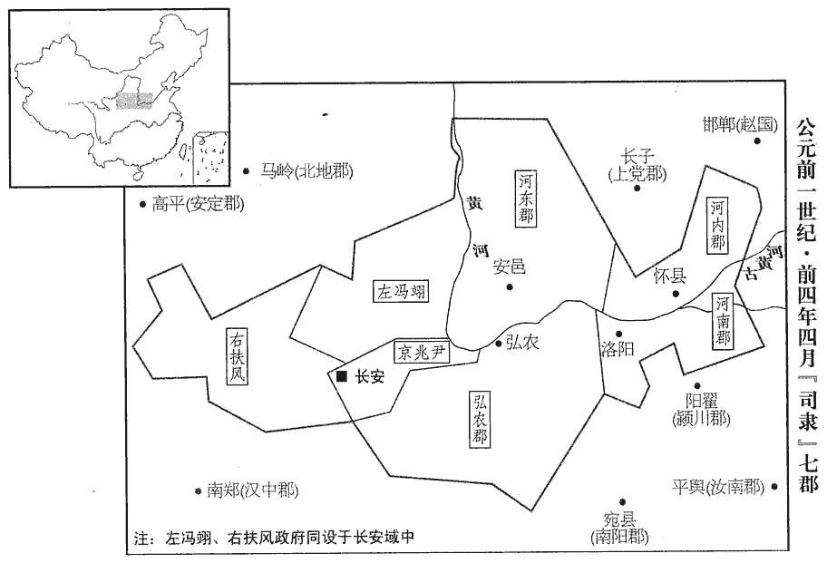

 漢紀二十六起柔兆執徐（丙辰），盡著雍敦牂（戊午），凡三年。

# 孝哀皇帝中

## 建平二年（丙辰，前五）

1春，正月，有星孛於牽牛。晉天文志：牽牛六星，天之關梁，主犧牲事。孛，蒲內翻。

〖译文〗 [1]春季，正月，有异星出现在牵牛星旁。

2丁、傅宗族驕奢，皆嫉傅喜之恭儉。又，傅太后欲求稱尊號，與成帝母齊尊；喜與孔光、師丹共執以為不可。上‹刘欣，时年二十一›重違大臣正議，師古曰：重，難也。又內迫傅太后，依違者連歲。如淳曰：依違，不決事之言也。余謂上二語，即依違之意。傅太后大怒，上不得已，先免師丹以感動喜；師丹免見上卷上年。喜終不順。朱博與孔鄉侯傅晏連結，共謀成尊號事，數燕見，數，所角翻。見，賢遍翻。奏封事，毀短喜及孔光。毀短者，譖毀而言其短也。丁丑‹二十›，上遂策免喜，以侯就第。

〖译文〗 [2]丁、傅宗族的人骄横奢侈，都对傅喜的谦恭节俭十分忌恨。还有，傅太后要求称尊号，想与成帝的母亲、太皇太后一样尊贵，傅喜与孔光、师丹共同坚持认为不可以。哀帝难以违背朝廷大臣的正当议论，又内受傅太后的逼迫，犹豫不决，拖延了一年多。傅太后大发雷霆，哀帝不得已，就先把师丹免职，希望借此使傅喜受到影响和触动。傅喜却始终不顺从。朱博与孔乡侯傅晏勾结，共谋促成变更傅太后的尊号。他们多次在皇帝闲暇时被召见，并经常呈递密封奏书，攻击诽谤傅喜以及孔光。丁丑（疑误），哀帝下策书免去傅喜的官职，以侯爵的身份离开朝廷，返回宅邸。

御史大夫官既罷，成帝綏和元年，罷御史大夫，置大司空，事見三十二卷。議者多以為古今異制，漢自天子之號下至佐史，皆不同於古，漢官至斗食、佐史而止。言漢承秦號為皇帝，下至百官稱號，皆不與古同。而獨改三公，職事難分明，無益於治亂。治，直吏翻。於是朱博奏言：「故事：選郡國守相高第為中二千石，守，式又翻。相，息亮翻。選中二千石為御史大夫，任職者為丞相；言御史大夫能任其職，則進而為相。位次有序，所以尊聖德，重國相也。今中二千石未更御史大夫而為丞相，師古曰：更，經也，音工衡翻。權輕，非所以重國政也。臣愚以為大司空官可罷，復置御史大夫，遵奉舊制。臣願盡力以御史大夫為百僚率！」上從之。夏，四月，戊午‹二›，更拜博為御史大夫。又以丁太后兄陽安侯明為大司馬、衛將軍，置官屬；大司馬冠號如故事。復綏和以前之制也。冠，古玩翻。

〖译文〗 御史大夫的官位既已撤销，很多人认为古今制度不同，汉朝上自天子的称号，下至佐史的名称，都与古时不同，而单单改三公，职权责任难以分明，对治理国家的混乱，没有益处。于是朱博奏言：“依照前例：选拔郡国守、相，考绩优异者，可被定为官秩中二千石的高级官员。再从中二千石的官员中物色御史大夫的人选。御史大夫能任职的，则晋升为丞相。这样晋升官位有一定的顺序，目的在于尊崇圣德，加重国相的权威。现在中二千石的官员，不经御史大夫这一官阶，就直接被任命为丞相，权威轻，不是加强国家的统治的方法。我愚昧地认为，大司空官职可以撤销，应重新设置御史大夫，遵照奉行旧的制度。撤销大司空后，我愿在较低一阶的御史大夫的官位上尽力供职，成为百官的表率！”哀帝采纳了他的建议。夏季，四月，戊午（初二），改变朱博的官职，拜为御史大夫。又任命丁太后的哥哥、阳安侯丁明为大司马、卫将军，设置官属。大司马的头衔如同旧例。

3傅太后又自詔丞相、御史大夫曰：「高武侯喜附下罔上，與故大司空丹同心背畔，放命圮pǐ族，應劭曰：謂放棄教令，圮其族類。背，蒲妹翻。圮pǐ，皮美翻。不宜奉朝請，朝，直遙翻。請，才性翻，又如字。其遣就國！」

〖译文〗 [3]傅太后又亲自下诏给丞相、御史大夫说：“高武侯傅喜，附会臣下，欺骗主上，与前任大司空师丹同心背叛，不听教令，损害宗族。不应给予奉朝请的名义，再让他朝见皇帝，立即遣送他回封国去。”

4丞相孔光，自先帝時議繼嗣，有持異之隙，又重忤傅太后指：持異事見三十二卷成帝綏和元年。重忤傅太后指，謂不使居北宮，奏傅遷，持稱尊號之議也。師古曰：重，音直用翻。忤，五故翻。由是傅氏在位者與朱博為表里，共毀譖光。表，外也。里，內也。傅氏譖之於內，朱博毀之於外也。乙亥‹十九›，策免光為庶人。師古曰：漢舊儀云：丞相有他過，使者奉策書，即時步出府，乘棧zhàn車歸田里。以御史大夫朱博為丞相，封陽鄉侯；恩澤侯表：陽鄉侯，國於山陽湖陵。考異曰：公卿表：「四月乙未，孔光免，朱博為丞相。」又曰：「四月，戊午，博為御史大夫；乙亥，遷。」五行志：「五月，乙亥朔，博為丞相。」荀紀：「乙亥，孔光免。」按長曆，是月丁巳朔，無乙未；十九日乙亥，非朔也。表、志皆有誤。少府趙玄為御史大夫。成帝綏和元年，趙玄自太子太傅左遷，今復進用，皆丁、傅之意也。臨延登受策，師古曰：延入而登殿也。漢舊儀云：丞相、御史大夫初拜，皇帝延登親詔也。有大聲如鍾鳴，殿中郎吏陛者皆聞焉。師古曰：陛者，謂執兵列於陛側。

〖译文〗 [4]丞相孔光，自先帝讨论立皇位继承人时，就对定陶王持有异议，因而与傅太后和哀帝有嫌隙，后来又大大违逆傅太后的旨意。于是傅氏在朝廷任官的人，与朱博内外勾结，共同诋毁孔光。乙亥（十九日），哀帝下策书罢免了孔光的官职和爵位，贬为平民。任命御史大夫朱博为丞相，封阳乡侯。又任命少府赵玄为御史大夫。当二人准备登殿接受皇帝的策书时，忽然传来一种宏大的声音，象钟鸣一样，殿中的郎、吏和阶前的武士，全都听到了。

上以問黃門侍郎蜀郡揚雄續漢志：給事黃門侍郎，六百石，掌侍從左右，給事中，關通中外及諸王朝見於殿上，引王就坐。揚雄解嘲所謂「官不過侍郎，擢纔給事黃門」者也。揚雄自謂其先出自有周伯僑者，食采於晉之楊，因氏焉。不知伯僑，周何別也。及李尋。尋對曰：「此洪范所謂鼓妖者也。師法，以為人君不聰，為眾所惑，空名得進，則有聲無形，不知所從生。洪范五行傳曰：聽之不聰，是謂不謀，時則有鼓妖。君嚴猛而閉下，臣戰栗而塞耳，則妄聞之氣發於音聲，故有鼓妖。妖，於驕翻。其傳曰：『歲、月、日之中，則正卿受之。』今以四月日加辰、巳有異，是為中焉。以一歲三分之，則四月已為歲之中。以一日三分之，則辰、巳已為日之中。正卿，謂執政大臣也。宜退丞相、御史，以應天變。然雖不退，不出期年，其人自蒙其咎。」師古曰：期年，十二月也。蒙，猶被也。期音基。揚雄亦以為「鼓妖，聽失之象也。朱博為人強毅，多權謀，宜將不宜相，將，即亮翻。相，息亮翻。恐有凶惡亟疾之怒。」師古曰：亟，急也；音居力翻。上不聽。

〖译文〗 哀帝为这件怪事询问黄门侍郎、蜀郡人扬雄以及李寻，李寻回答说：“这是《洪范》里所说的那种鼓妖，施法术，往往是在认为君主耳目不明，被人迷惑，使空有虚名的人进入朝廷，升任重要职位时，那时鼓妖就会发声，但无形，让人不知声音从哪里发出。《洪范·传》说：‘鼓妖发声出现在年、月、日的中期者，预示正卿要承受灾难。’现在是四月，又是一天的辰时、巳时，出现怪异，正是中期。所谓正卿，指的是执政大臣。应该罢退丞相、御史，以应付天变。即使现在不罢退，不出一年，本人也自会蒙受灾难。”扬雄也认为：“鼓妖的出现，是君王耳目失灵的象征。朱博为人强悍坚毅，富于权谋，适宜为将，而不适宜为相，如不引退，恐怕会招致上天发怒，降下凶险激切的灾难。”哀帝没有理睬他们的话。

朱博既為丞相，上遂用其議，下詔曰：「定陶共皇之號，不宜復稱定陶；復，扶又翻。尊共皇太后曰帝太太后、稱永信宮；共皇后曰帝太后，稱中安宮；為共皇立寢廟於京師，為，於偽翻。比宣帝父悼皇考制度。」宣帝既立八年，有司言：禮，父為士，子為天子，祭以天子。悼園宜稱皇考，立廟，因園為寢，以時薦享焉。然悼園在廣明成鄉，長安東郭之外也。定陶共王葬定陶而立廟京師，則非因園為寢矣。於是四太后各置少府、太僕，秩皆中二千石。傅太后、丁太后、趙太后與太皇太后為四太后。傅太后既尊後，尤驕，與太皇太后語，至謂之「嫗」yù。嫗，威遇翻。時丁、傅以一二年間暴興尤盛，為公卿列侯者甚眾；然帝不甚假以權，勢不如王氏在成帝世也。

〖译文〗 朱博既已当上丞相，哀帝就采用他的建议，下诏说：“定陶共皇这个称号，不应再称‘定陶’二字。现尊共皇太后的称号为‘帝太太后’，称永信宫。尊共皇后为‘帝太后’，称中安宫。为共皇在京师建立寝庙，比照宣帝的父亲悼皇考的寝庙规格建立。”于是，四位太后各自设置少府、太仆官职，品秩都为中二千石。傅太后取得尊号以后，尤为骄横，与太皇太后说话时，甚至称她为“老太婆”。当时丁、傅两家在一二年间突然崛起，特别贵盛，被封为公卿列侯的人很多。但是哀帝不太赋予他们权势，他们的势力不如成帝在世时的王氏。

5丞相博、御史大夫玄奏言：「前高昌侯宏，首建尊號之議，而為關內侯師丹所劾奏，免為庶人。事見上卷綏和二年。劾，戶概翻。時天下【嚴：「下」改「子」。】衰粗，委政於丹，師古曰：言新有成帝之喪，斬衰粗服，故天子不親政事也。衰，音倉回翻。丹不深惟褒廣尊號之義，惟，思也。而妄稱說，抑貶尊號，虧損孝道，不忠莫大焉！陛下仁聖，昭然定尊號，宏以忠孝復封高昌侯；丹惡逆暴著，雖蒙赦令，不宜有爵邑，請免為庶人。」奏可。

〖译文〗 [5]丞相朱博、御史大夫赵玄奏称：“前高昌侯董宏，首先倡议改尊号之事，因遭关内侯师丹的弹劾，而被罢免官爵，贬为平民。当时天子正在守孝期，把国事委托给师丹，师丹不深思褒美推崇尊号的大义，反而狂妄地胡说，压抑贬低尊号，损伤了陛下的孝道，没有比这更大的不忠了。但陛下仁慈圣明，昭然确定了尊号。董宏以其忠孝，也恢复了高昌侯的封爵。师丹的罪恶逆行，已经暴露，虽然蒙赦令不治死罪，但不应该再有封爵采邑，请求陛下将他贬为平民。”哀帝予以批准。

又奏：「新都侯莽前為大司馬，不廣尊尊之義，抑貶尊號，虧損孝道，事亦見上卷綏和二年。當伏顯戮。幸蒙赦令，不宜有爵土，請免為庶人。」上曰：「以莽與【章：乙十一行本「與」下有「太」字；孔本同。】皇太后有屬，勿免，遣就國。」及平阿侯仁臧匿趙昭儀親屬，皆遣就國。仁，譚之子也。臧，古藏字通。

〖译文〗 朱博、赵玄又奏称：“新都侯王莽，先前为大司马，不能阐扬尊崇尊号的大义，反压抑贬低尊号，损伤了陛下的孝道，罪当公开诛杀。幸蒙赦令得免死罪，但不应该再有封爵采邑，请求陛下将他贬为平民。”哀帝说：“因为王莽是太皇太后的亲属，不免去封爵采邑，而将他遣送回封国。”此外，还有平阿侯王仁，因藏匿赵昭仪的亲属，也都被遣送回封国。

天下多冤王氏者！為下元壽二年王莽復柄國張本。諫大夫楊宣上封事言：「孝成皇帝深惟宗廟之重，稱述陛下至德以承天序，天序，謂帝王正統相傳之次，天所命也。上，時掌翻。聖策深遠，恩德至厚。惟念先帝之意，豈不欲以陛下自代，奉承東宮哉！師古曰：言供養太后。太皇太后春秋七十，數更憂傷，謂先罹lí元帝之喪而又哭成帝也。數，所角翻。更，工衡翻。敕令親屬引領以避丁、傅，師古曰：引領，自引道領而退也。行道之人為之隕涕。為，於偽翻。況於陛下登高遠望，獨不慚於延陵乎！」言王氏斥逐而丁、傅貴寵，若登高而望成帝陵寢，寧不有慚於付託乎！帝深感其言，復封成都侯商中子邑為成都侯。綏和二年，商子況以罪奪侯；今以邑紹封。中，讀曰仲。

〖译文〗 天下人多为王氏感到冤枉。谏大夫杨宣上密封奏书说：“孝成皇帝深思宗庙的重要，称赞陛下有至高的品德，使陛下继承帝位。圣明的决策，意义深远，对陛下的恩德也再厚不过了。追想先帝的本意，岂不是希望陛下代替他本人侍奉太皇太后吗！太皇太后现已七十高龄，数次经历国丧的忧伤，还下令要自己的亲属引退，以避开丁、傅两家，路上的行人都会为此流泪，更何况陛下呢崐！陛下若登高远望，望见成帝之陵，难道不感到惭愧吗！”哀帝深为此言感动，就又封成都侯王商的二儿子王邑为成都侯。

6朱博又奏言：「漢家故事，置部刺史，秩卑而賞厚，漢，刺史秩六百石耳；居部九歲，舉為守相，秩二千石；其有異材功效著者輒登擢。咸勸功樂進。師古曰：勸功，自勸勉而立功也。樂，音洛。前罷刺史，更置州牧，事見三十二卷成帝綏和元年。更，工衡翻。秩真二千石，位次九卿；九卿缺，以高第補；其中材則苟自守而已，恐功效陵夷，師古曰：陵夷，謂漸廢替。姦軌不禁。臣請罷州牧，置刺史如故。」上從之。

〖译文〗 [6]朱博又奏称：“汉家旧例，设置部刺史，官秩较低，但奖赏丰厚，前程远大，因此人人劝勉立功，乐于进取。前几年，撤销了刺史，改为设置州牧，品秩为真二千石，官位仅次于九卿，九卿一有出缺，便由州牧中名次靠前者递补。这样一来，州牧中的才干平庸者，则只求苟且自保而已。做出督察官的功效就会逐渐减退丧失，奸邪不轨的行为就无法禁止。我请求撤销州牧，还和从前一样设置刺史。”哀帝听从了他的建议。

7六月，庚申‹五›，帝太后丁氏崩，詔歸葬定陶共皇之園，從夫也，共皇葬於其國。賢曰：在今曹州濟陰縣北。共，讀曰恭。發陳留‹河南陳留›、濟陰‹山東定陶›近郡國五萬人穿復土。近郡國，謂郡國之近定陶者。前書音義曰：穿復土，謂穿壙kuàng填塞事也。言下棺訖，復以土為墳，故曰復土。近，其靳翻。

〖译文〗 [7]六月，庚中（初五），帝太后丁氏驾崩。哀帝下诏，丁氏棺柩运回定陶，葬于定陶共皇的陵园。征发陈留、济阴靠近定陶地区的民夫五万人，挖土填坟，完成合葬。

8初，成帝時，齊人甘忠可詐造天官曆、包元太平經十二卷，言漢家逢天地之大終，當更受命於天；以教渤海夏賀良等。夏，戶雅翻。中壘校尉劉向奏忠可假鬼神，罔上惑眾；忠可詐稱「天帝使真人赤精子下教我」，故向奏之。下獄，治服；服其挾詐也。下，遐稼翻。未斷，病死。斷，丁亂翻。賀良等復私以相教。復，扶又翻；下同。上即位，司隸校尉解光、騎都尉李尋白賀良等，皆待詔黃門。應劭曰：諸以材技徵召，未有正官，故曰待詔。董巴曰：黃門，禁門黃闥tà。數召見，數，所角翻。見，賢遍翻。陳說「漢曆中衰，當更受命。成帝不應天命，故絕嗣。今陛下久疾，變異屢數，師古曰：數，音所角翻。天所以譴告人也；宜急改元易號，乃得延年益壽，皇子生，災異息矣。得道不得行，師古曰：言知道而不能行。咎殃且無不有，洪水將出，災火且起，滌盪民人。」上久寢疾，班固曰：上即位痿痹，末年浸劇。冀其有益，遂從賀良等議，詔大赦天下，以建平二年為太初元年，號曰「陳聖劉太平皇帝」，李斐曰：陳，道也；言得神道聖者劉也。如淳曰：陳，舜後。王莽，陳之後。謬語陳當立而不知。韋昭曰：敷陳聖劉之德也。師古曰：如、韋二說是也。余謂韋說不詭於正，如說則流於巫。顏以為二說皆是，將安從乎！漏刻以百二十為度。師古曰：舊漏，晝夜共百刻，今增其二十。

〖译文〗 [8]当初，成帝在位时，齐人甘忠可假造《天官历》、《包元太平经》十二卷，说汉朝正逢天地的一次大终结，应当重新受命于天。并把这些传授给渤海人夏贺良等。中垒校尉刘向上奏说，甘忠可假借鬼神，欺骗皇上，蛊惑民众。于是将甘忠可逮捕下狱，并取得服罪的口供，还没等判决，他就病死了。然而夏贺良等人仍然暗中私相传授。哀帝即位后，司隶校尉解光、骑都尉李寻，向哀帝介绍夏贺良等人，使他们都成为待诏得以在黄门伺应召对。夏贺良等人多次被哀帝召见，向哀帝述说：“汉朝的历运中衰，应当重新受命。孝成皇帝没有应合天命，因此断绝了后嗣。如今陛下患病已久，天象变异屡屡发生，这是上天在谴责和警告人们。应该赶快改换年号，才能延年益寿，诞生皇子，平息灾害变异。明白了这个道理，却不实行，灾祸就会无所不有：洪水将会涌出，大火将会燃起，冲淹和焚毁人民。”哀帝久病在床，希望更改年号能得到些益处，就听从夏贺良等人的建议，下诏大赦天下，并改建平二年为太初元年，自称“陈圣刘太平皇帝”，还把计时漏器的刻度改为一百二十度。

9秋，七月，以渭城‹陝西咸陽›西北原上永陵亭‹咸阳东北南贺村›部為初陵，勿徙郡國民。

〖译文〗 [9]秋季，七月，哀帝在渭城西北原上永陵亭一带修筑自己的陵墓，没有令郡国的百姓迁往陵区。

10上既改號月餘，寢疾自若。夏賀良等復欲妄變政事，大臣爭以為不可許。賀良等奏言：「大臣皆不知天命，宜退丞相、御史，以解光、李尋輔政。」上以其言無驗，八月，詔曰：「待詔賀良等建言改元易號，增益漏刻，可以永安國家；朕信道不篤，過聽其言，師古曰：過，誤也。冀為百姓獲福，卒無嘉應。為，於偽翻。卒，子恤翻。夫過而不改，是謂過矣！論語載孔子之言。六月甲子‹九›詔書，非赦令，皆蠲juān除之。如淳曰：悔前赦令不蒙其福，故收令還之。臣瓚曰：改元易號，大赦天下，以求延祚而不蒙福，哀帝悔之，故更下制書，諸非赦事皆除之。謂改制易號，今皆復故也。師古曰：如說非也，瓚說是矣。唯赦令不改，餘皆除之。賀良等反道惑眾，姦態當窮竟。」皆下獄，伏誅。下，遐稼翻。尋及解光減死一等，徙敦煌郡。此漢法所謂減死徙邊也。減死者，罪至死而特為末減也。減死罪一等，為城旦、舂。

〖译文〗 [10]哀帝已经改年号一个多月，病情仍不见好转。夏贺良等人还想胡乱变更国家政事，大臣们争辩，认为不能允许。夏贺良等奏称：“大臣们都不知天命，应该辞退丞相、御史，任用解光、李寻辅政。”哀帝因为他们的预言没有应验，八月，下诏说：“待诏夏贺良等人，建议改换年号，增加漏器刻度，认为这样可以永保国家平安。由于朕对天道的信奉还不够真诚，误听了他们的话，希望能因此为百姓谋求幸福，可是终于没有好的效验。有过失而不改正，才是真正的过失！六月甲子（初九）发布的诏书，除了大赦令以外，其余措施全部废除。夏贺良等人违反正道，蛊惑民众，奸恶行为应予彻底追究。”夏贺良等崐人全部被逮捕入狱，论罪处死。李寻和解光减死罪一等，放逐到敦煌郡。

11上以寢疾，盡復前世所嘗興諸神祠凡七百餘所，成帝建始初，匡衡、張譚奏罷諸神祠不應禮者，今盡復之。一歲三萬七千祠云。神祠既多，而有歲五祠者，有歲四祠者，故其數若是之多。

〖译文〗 [11]哀帝因为卧病在床，把过去成帝时曾祭祀过的各种神祠全部予以恢复，共七百余所。一年之中，祭祀的次数达三万七千次。

12傅太后怨傅喜不已，使孔鄉侯【章：乙十一行本「侯」下有「晏」字；孔本同；張校同。】風丞相朱博令奏免喜侯。師古曰：風，讀曰諷。博與御史大夫趙玄議之，玄言：「事已前決，謂前已決遣就國，罪無重科也。得無不宜？」師古曰：得無，猶言無乃也。博曰：「已許孔鄉侯矣。匹夫相要，尚相得死，要，一遙翻。得死，謂得其死力；一曰：得其相為死也。何況至尊！至尊，謂傅太后。博唯有死耳！」大臣以道事君，而博以死奉私屬，貪權藉勢之心為之也。玄即許可。博惡獨斥奏喜，惡，烏故翻。以故大司空氾鄉侯何武前亦坐過免就國，事見上卷綏和二年。事與喜相似，即并奏：「喜、武前在位，皆無益於治，治，直吏翻。雖已退免，爵土之封，非所當也；皆請免為庶人。」上知傅太后素嘗怨喜，疑博、玄承指，即召玄詣尚書問狀，玄辭服。丞相、御史同奏，而獨召問玄者，以博強毅多權詐，難遽得其情，而玄易以窮詰也。有詔：「左將軍彭宣與中朝者雜問」，宣等奏劾「博、玄、晏皆不道，不敬，劾，戶概翻。請召詣廷尉詔獄」。上減玄死罪三等，削晏戶四分之一；減死罪三等，為隸臣妾。晏封五千戶，削其千二百五十。假謁者節召丞相詣廷尉，博自殺，國除。

〖译文〗 [12]傅太后对傅喜怨恨不已，派孔乡侯博晏去暗示丞相朱博，命他上奏书要求罢免傅喜的侯爵爵位。朱博与御史大夫赵玄商议，赵玄说：“皇上先前已作了裁决，再提是否不合适？”朱博说：“我已许诺孔乡侯了。匹夫之间互相约定的事，尚且不惜以死相报，何况至尊的傅太后呢！朱博我只有效死罢了！”赵玄也就同意了。朱博不愿意单独指控傅喜一个人，由于前大司空、汜乡侯何武先前也因过失被免去官职遣回封国，情况与傅喜相似，因此同时弹劾他们二人说：“傅喜、何武从前在位时，对治理国家都没有什么贡献，尽管已经退位免官，但尚有封爵采邑，这是不妥当的。请求陛下将他们都贬为平民。”哀帝知道傅太后一直怨恨傅喜，怀疑朱博、赵玄是受傅太后的指使，便召赵玄到尚书处询问究竟，赵玄承认了。哀帝下诏说：“命左将军彭宣和中朝官共同审问。”彭宣等上奏弹劾说：“朱博、赵玄、傅晏都犯有不道、不敬之罪。请求陛下召他们到廷尉诏狱。”哀帝减赵玄死罪三等，削减傅晏采邑封户四分之一。又给谒者符节，使他召丞相朱博到廷尉那里接受审判。朱博自杀，封国撤除。

13九月，以光祿勳平當為御史大夫；冬，十月，甲寅‹一›，遷為丞相；以冬月故，且賜爵關內侯。如淳曰：漢儀注，御史大夫為丞相，更春乃封，故先賜爵關內侯也。李奇曰：以冬月非封侯時，故且先賜爵關內侯也。師古曰：李說是也。以京兆尹平陵‹陝西咸陽西平陵乡›王喜為御史大夫。按表、傳，「喜」當作「嘉」，詳見下年。及審是。衍

〖译文〗 [13]九月，任命光禄勋平当为御史大夫。冬季，十月，甲寅（初一），擢升平当为丞相。由于正赶上不宜封侯的冬月，因此暂时赐爵前关内侯。任命京兆尹、平陵人王喜为御史大夫。

14上欲令丁、傅處爪牙官，處，昌呂翻。是歲，策免左將軍淮陽‹河南淮陽›彭宣，以關內侯歸家，而以光祿勳丁望代為左將軍。上策宣曰：「前有司數奏言：諸侯國人不得宿衛；將軍不宜典兵馬，處大位。朕惟將軍任漢將之重，而子又前娶淮陽王女，婚姻不絕，非國之制，其上左將軍印綬。」余按彭宣以連姻藩國而免官，丁、傅以戚黨而見用，卒之奪劉氏者，非藩國，乃外戚也。丁、傅於國有大故之時，拱手授柄於王氏，而彭宣乃能辭三公位於王莽專權之初，任官惟賢材，烏得拘小嫌乎！

〖译文〗 [14]哀帝打算让丁、傅两家族的人担任重要武官。本年，下策书罢免左将军淮阳人彭宣，以关内侯身份回家去，而任命光禄勋丁望代替彭宣为左将军。

15烏孫卑爰疐zhì侵盜匈奴西界，單于遣兵擊之，殺數百人，略千餘人，敺牛畜去。卑爰疐恐，遣子趨逯lù為質匈奴，疐，竹二翻。師古曰：敺，與驅同。逯，音錄。質，音致；下同。單于受，以狀聞。漢遣使者責讓單于，告令還歸卑爰疐質子；責以匈奴、烏孫并為漢臣，單于不當擅受卑爰疐質子。單于受詔遣歸。

〖译文〗 [15]乌孙王国的卑爰侵犯劫掠匈奴西部边境地区，匈奴单于派兵还击，杀死数百人，抢掠千余人，驱赶牛畜而归。卑爰大为恐慌，派遣儿子趋逯到匈奴充当人质。匈奴单于接受了他，并将此事呈报给汉王朝。汉朝派使节到匈奴责备单于，命令单于将人质归还卑爰。单于接受诏令，把趋逯送回。

## 三年（丁巳，前四）

1春，正月，立廣德夷王弟廣漢為廣平王。廣德夷王雲客，成帝鴻嘉二年封；又二年，薨，無後。今立廣漢以奉中山靖王嗣。諡法：安心好靜曰夷；克殺秉政曰夷。

〖译文〗 [1]春季，正月，封广德夷王的弟弟刘广汉为广平王。

2帝太太后【章：乙十一行本「帝」上有「癸卯」二字；孔本同；退齋校同。】所居桂宮正殿火。考異曰：五行志云：「桂宮鴻寧殿災。」荀紀云：「桂宮正殿火。」今從哀紀。

〖译文〗 [2]帝太太后居住的桂宫正殿发生火灾。

3上‹刘欣，时年二十二›使使者召丞相平當，欲封之；當病篤，不應。不應召也。室家或謂當：「不可強起受侯印為子孫邪？」室家，當之妻子也。謂受侯印而死，得以封爵遺子孫也。強，其兩翻。為，於偽翻；下同。當曰：「吾居大位，已負素餐責矣；起受侯印，還臥而死，死有餘罪。今不起者，所以為子孫也！」遂上書乞骸骨，上不許。三月，己酉‹二十八›，當薨。

〖译文〗 [3]哀帝派使者召丞相平当，打算封他为侯爵。平当病重，没有应召前往。家中有的人对平当说：“难道不能为子孙勉强起来接受侯印吗？”平当说：“我居丞相高位，已经背着白吃饭不干事的罪责了。若起来接受侯印，回家倒崐在床上就死去，是死有余辜。现在我所以不起来，正是为子孙打算啊！”遂上书请求退休，哀帝不准。三月，己酉（二十八日），平当去世。

4有星孛於河鼓。天文志：河鼓，在牽牛北；大星，上將；左、右星，左、右將。孛，蒲內翻。

〖译文〗 [4]有异星出现于河鼓星旁。

5夏，四月，丁酉‹十七›，王嘉為丞相，河南‹河南洛陽东白马寺东›太守王崇為御史大夫。守，式又翻。崇，京兆尹駿之子也。嘉以時政苛急，郡國守相數有變動，數，所角翻。乃上疏曰：「臣聞聖王之功在於得人，孔子曰：『材難，不其然與！』師古曰：論語載孔子之言也。材難，言有賢材者難得也。與，讀曰歟。余謂材難二語，古語也；孔子引之，謂其言之是也。故『繼世立諸侯，象賢也。』禮記郊特牲之文。師古曰：象其先父祖之賢耳，非必皆賢也。雖不能盡賢，天子為擇臣、立命卿以輔之。記王制：大國三卿，皆命於天子；次國三卿，二卿命於天子，一卿命於其君；小國二卿，皆命於其君。春秋之時，如晉之六卿，以中軍帥為正卿，亦其君先命之而後聞於天子耳。齊之高、國，魯之三桓，皆世卿也。漢之王國傅、相、中尉命於天子，猶古之命卿也。居是國也，累世尊重，然後士民之眾附焉，是以教化行而治功立。治，直吏翻。今之郡守重於古諸侯，周初班爵五等，公、侯地方百里，伯七十里，子、男五十里。其後齊、晉、秦、楚，以兼併而地始廣大耳。漢郡守方制千里，連城以十數，是重於古諸侯也。守，式又翻；下同。往者致選賢材，致，極也。賢材難得，拔擢可用者，或起於囚徒。昔魏尚坐事繫，文帝感馮唐之言，遣使持節赦其罪，拜為雲中‹內蒙托克托›太守；匈奴忌之。事見十四卷文帝十四年。武帝擢韓安國於徒中，拜為梁‹河南商丘›內史；骨肉以安。按韓安國傳：安國坐法抵罪。會梁內史缺，漢使使者拜安國為梁內史，起徒中為二千石。此景帝時事也。「武帝」，當作「景帝」。師古曰：骨肉以安，言梁孝王免罪也。張敞為京兆尹，有罪當免，黠xiá吏知而犯敞，黠，下八翻。敞收殺之，其家自冤，自言其冤也。使者覆獄，劾敞賊殺人，上逮捕不下，上奏請逮捕敞，而天子不下其奏也。上，時掌翻。下，遐嫁翻。會免；亡命十數日，宣帝徵敞拜為冀州‹河北中部南部›刺史，卒獲其用。事見二十七卷宣帝甘露元年。卒，子恤翻。前世非私此三人，貪其材器有益於公家也。孝文時，吏居官者或長子孫，【章：乙十一行本「孫」下有「以官爲氏」四字；孔本同；張校同；退齋校同。】長，知兩翻；下同。倉氏、庫氏則倉庫吏之後也；其二千石長吏亦安官樂職，樂，音洛。然後上下相望，莫有苟且之意。其後稍稍變易，公卿以下傳相促急，又數改更政事，傳，知戀翻。數，所角翻。更，工衡翻。司隸、部刺史舉劾苛細，發揚陰私，司隸部三輔、三河、弘農，其餘部刺史分部諸郡國。劾，戶概翻。吏或居官數月而退，送故迎新，交錯道路。中材苟容求全，師古曰：不敢操持群下也。下材懷危內顧，師古曰：常恐獲罪，每為私計也。壹切營私者多。二千石益輕賤，吏民慢易之，或持其微過，增加成罪，言於司隸、刺史，或上書告之；眾庶知其易危，師古曰：言易可傾危。易，以豉翻。小失意則有離畔之心。前山陽‹山東金鄉西北昌邑镇›亡徒蘇令等縱橫，事見三十一卷成帝永始三年。師古曰：橫，音胡孟翻。吏士臨難，難，乃旦翻。莫肯伏節死義，以守、相威權素奪也。師古曰：守，郡守也；相，諸侯相也。素奪，謂不先假之威權也。孝成皇帝悔之，下詔書，二千石不為故縱，孟康曰：不以故縱為罪，所以優之也。遣使者賜金，尉厚其意，誠以為國家有急，取辦於二千石；二千石尊重難危，乃能使下。孝宣皇帝愛其善治民之吏，有章劾事留中，會赦壹解。師古曰：不即下治其事，恐為擾重，故每留中；或經赦，令壹切皆解散也。余謂善治民之吏，宣帝愛其材，或有章劾，留中不下，會赦，則其事得釋。治，直之翻。劾，戶概翻。故事：尚書希下章，為煩擾百姓，證驗繫治，或死獄中，章文必有『敢告之』字乃下。師古曰：所以丁寧告者之辭，絕其相誣也。余謂此乃防其誣告耳。下，遐稼翻。為，於偽翻。唯陛下留神於擇賢，記善忘過，容忍臣子，勿責以備。師古曰：不求備於一人也。余謂責備者，求全也。二千石、部刺史、三輔縣令有材任職者，人情不能不有過差，宜可闊略，師古曰：當寬恕其小罪也。令盡力者有所勸。此方今急務，國家之利也。前蘇令發，欲遣大夫使逐問狀，使之逐盜而問其狀也。時見大夫無可使者，師古曰：謂見在大夫皆不堪為使。見，賢遍翻。召盩zhōu厔zhì‹陝西周至›令尹逢，拜為諫大夫遣之。盩厔，音舟窒。今諸大夫有材能者甚少，宜豫畜養可成就者，則士赴難不愛其死；臨事倉卒乃求，非所以明朝廷也。」人材當聚於朝廷；事會之來，無可用者，倉猝求之，適所以明朝廷之無人耳。少，詩沼翻。畜，許六翻。難，乃旦翻。卒，讀曰猝。嘉因薦儒者公孫光、滿昌風俗通：荊蠻有瞞氏，音舛變為「滿」。國語：路，潞、泉、余、滿，皆赤狄，隗wěi姓。及能吏蕭咸、薛脩，皆故二千石有名稱者，天子納而用之。按嘉此疏，誠中當時之病。然為相者在於朝夕納誨，隨事矯正，天下不能窺其際，而自臻於治平，不在著見於奏疏，以騰口說也。自宣帝之後，為相者始加詳於奏疏，而考其治跡，愈不逮前，相業固不在乎此也。稱，尺證翻。

〖译文〗 [5]夏季，四月，丁酉（十七日），哀帝任命王嘉为丞相，任命河南太守王崇为御史大夫。王崇是京兆尹王骏的儿子。王嘉感到当时的政治严苛，担任郡国守、相的官员变动频繁，就上书说：“我听说圣王的成功，在于得到贤能人才的辅佐。孔子说：‘人才难得，难道不是这样吗！’因此，‘选立诸侯的继承人，只要多少像其父祖的贤能就可以了。’虽然不能完全和父祖一样贤能，但天子可以为他选择良臣，任命贤卿来辅佐他。他住在此封国里，代代受到尊重，然后广大士民才会归附，因此教化得以推行而大治的功业得以建立。现今郡守的职权重于古代的诸侯，过去总是精选贤才担任郡守职务，然而贤才难得，为了擢升提拔可以胜任的人，或有起用囚犯的事例。从前魏尚犯罪被羁押监狱，汉文帝被冯唐的一席话所感动，派使者持符节去赦免了他的罪，任命他为云中太守，匈奴对他深为畏惧。武帝从囚徒中选拔出韩安国，任命他为梁国内史，使得刘氏骨肉得以平安。张敞为京兆尹，犯了罪应当被免职，狡猾的小吏知道后故意冒犯，张敞逮捕他，把他杀死。死者家属鸣冤，使者再次进行审查，弹劾张敞凶残杀人，上奏天子要求逮捕他，宣帝搁置不批，不久，免罪。张敞逃亡十来天后，宣帝征召他，授为冀州刺史，终于能够才为所用。前代君王并非偏爱这三个人，而是看重他们的才干对国家有益。孝文帝时，官吏担任公职长期不变动，有些人养了儿子、孙子，就以官名为姓氏，如仓氏、库氏就是管理仓库的官吏的后裔。那些官秩在二千石的高级官员，也安于官位，乐于任职。然后上下互相期待勉励，没有苟且混世之心。以后情况逐渐有所改变，公卿以下官员层层互相督促，要求严苛紧迫，又多次更改政事，司隶、部刺史检举弹劾官吏十分苛刻，细微的过失都不放过，还揭发宣扬别人的阴私，有的官吏在位只数月就被罢免，送旧官回乡和迎新官上任的人，交错行走在道路上。中等才干的人，苟且容身以求保全；下等才干的人，常心怀恐惧反省自己，一切都为自己打算的人很多。二千石官员越来越被人轻视，属下官吏和百姓对他们很轻慢，有的抓住他们的轻微过错，扩大成罪状，向司隶、刺史报告，或崐者上书朝廷检举。广大百姓发现二千石官吏那么容易扳倒，遇到小不如意，就产生背叛之心。前些时，山阳亡命徒苏令等纵横郡国，官吏和武士面对危难，没有一个肯以死尽节的，这是因为郡国守、相的威信和权力早就被夺去了。孝成皇帝感到懊悔，下诏书说，对二千石的官员不加以‘故意放纵’的罪名，派遣使者去赏赐他们黄金，安抚他们的情绪。这确实是由于国家有急难，需要二千石的官员出力解决，只有二千石官员受到尊重而难以被危害，才能驱使属下。孝宣皇帝爱护那些善于治理百姓的官吏，有弹劾他们的奏章都留在宫中不批复，逢到颁发赦令时便一切都解决了。以前的惯例：尚书很少把弹劾奏章交付有关机构查办，为的是怕骚扰百姓，取证、审查、逮捕下狱、处治，有些人就死在狱中。弹劾奏章上都必须写有‘胆敢控告’的字样才交付有关机构查办。希望陛下留意选择贤能的人才，记住他们的善绩、忘掉他们的过失，容忍臣下的缺点，不要求全责备。二千石、部刺史、三辅县令中有才干称职的官员，从人情来看，难免会有过错，应该宽容忽略他们那些小过失，使尽力供职者受到鼓励。这是当前最紧迫的大事，关系到国家的利益。前些时苏令造反，朝廷打算派大夫驱逐盗贼，并调查苏令起兵的原因，当时现有的大夫中没有可用的人选，就征召令尹逢，授为谏大夫，派遣他去。如今众位大夫中有才能的非常少，应该预先培养可造就的人才，才能使其赴难时不惜以死报国。如果事到临头，才仓猝寻求，这就不能表明朝廷有人才了。”王嘉并趁势举荐儒家学者公孙光、满昌，以及干练能干的官吏萧咸、薛，他们都曾是卓有声誉的二千石官员。哀帝采纳了王嘉的建议，任用了他们。

 

6六月，立魯頃王子部鄉侯閔為王。魯共王曾孫頃王封，傳國於其子文王睃suō；睃薨，無後；今立閔紹封。「部鄉」，據紀、表及傳當作「郚wú鄉」。師古曰：郚，音吾，又音魚。睃，音子緣翻。地理志，東海郡有郚鄉侯國。

〖译文〗 [6]六月，立鲁顷王的儿子部乡侯刘闵为王。

7上以寢疾未定，定，猶安也。冬，十一月，壬子‹五›，令太皇太后下詔復甘泉‹陝西淳化西北›泰畤、汾陰‹山西万荣西南榮河镇›后土祠，罷南、北郊。成帝崩，皇太后詔罷甘泉，汾陰祠，復南、北郊。畤，音止。上亦不能親至甘泉、河東，遣有司行事而禮祠焉。

〖译文〗 [7]哀帝因病情仍未见好，冬季，十一月，壬子（初五），让太皇太后下诏：恢复甘泉泰祠、汾阴后土祠的祭祀。撤销长安南郊祭天、北郊祭地的典礼。哀帝也不能亲自到甘泉、河东祭祀，就派遣有关主管官员作为代表去祭祀。

8無鹽‹山東東平东南›危山‹东平东北›土自起覆草，如馳道狀；無鹽縣，屬東平國。危山，山名。言土自起，覆草成路，如人力開掘，作馳道狀也。又，瓠山‹东平西北›石轉立。晉灼曰：漢書作「報山」。山脅石一枚，轉側起立，高九尺六寸，旁行一丈，廣四尺也。師古曰：報山，山名也。古作「瓠」字，為其形似瓠耳。晉說是也。東平王雲及后謁自之石所祭；治石象瓠山立石，束倍草，并祠之。雲，元帝子東平王宇之子也。謁，后名也。蘇林曰：於宮中作山象。師古曰：倍草，黃倍草也。倍，音步賄翻。原父曰：「立石」屬上句。治，直之翻。河內‹河南武陟›息夫躬、息夫，複姓。姓譜：媯guī姓之國為息氏，公子邊受爵為大夫；又有息夫氏出焉。長安孫寵相與謀共告之，曰：「此取封侯之計也！」乃與中郎右師譚張晏曰：右師，姓；譚，名。余謂右師，以官為氏。共因中常侍宋弘上變事，告焉。上，時掌翻。是時上被疾，多所惡，事下有司，逮王后謁下獄驗治；服「祠祭詛祝上，為雲求為天子，被，皮義翻。下，遐稼翻。詛，莊助翻。祝，職救翻。為雲，於偽翻。以為石立，宣帝起之表也。」事見二十三卷昭帝元鳳三年。有司請誅王，有詔，廢徙房陵‹湖北房縣›。雲自殺，謁及舅伍宏及成帝舅安成共侯夫人放，皆棄市。安成共侯王崇，時已死矣，故稱帝舅及諡，以別下御史大夫王崇也。伍宏以醫伎得幸，出入禁門，蓋放薦之，故并得禍。共，音恭。事連御史大夫王崇，左遷大司農。擢寵為南陽‹河南南陽›太守，譚潁川‹河南禹州›都尉，弘、躬皆光祿大夫、左曹、給事中。

〖译文〗 [8]无盐境内的危山，山土忽然自己翻起压盖住青草，形状就象一条驰道。此外，境内瓠山上有块大石突然转侧立起。东平王刘云和王后谒亲自前往大石跟前祭拜。并在王宫树立一块与瓠山立石相似的石头，又捆扎了一些黄倍草，一并祭祀。河内人息夫躬、长安人孙宠共同谋划要一起去揭发此事，说：“这是取得封侯的妙计啊！”于是与中郎右师谭一起通过中常侍宋弘，上书告发事变。奏书呈上，这时哀帝正患病，对很多事都很厌恶，就把此事交付主管机构查办，主管官员逮捕了东平王后谒，关进监狱进行审讯惩处。王后承认：“祭祀山石，诅咒皇上，为刘云谋求当天子。因为山石立起曾是宣帝应天命为天子的预兆。”主管官员请求诛杀东平王，哀帝下诏，废黜刘云王位，放逐到房陵。刘云自杀。王后谒与刘云舅父伍宏，以及成帝的舅母安成共侯夫人放，一起被绑赴闹市处死，将尸体暴露街头。事情牵连到御史大夫王崇，他被贬谪为大司农。擢升孙宠为南阳太守，右师谭为颍川都尉，宋弘、息夫躬都升为光禄大夫、左曹、给事中。

## 四年（戊午，前三年）

1春，正月，大旱。

〖译文〗 [1]春季，正月，大旱。

2關東‹函谷關以東›民無故驚走，持稾或掫zōu一枚，如淳曰：掫，麻幹也。師古曰：稾，禾稈也，音工老翻。掫，音鄒，又音側九翻。轉相付與，曰「行西王母籌」，師古曰：西王母，元后壽考之象。行籌，又言執國家籌策，行於天下。道中相過逢，多至千數；或被髮徒跣，或夜折關，或踰牆入，或乘車騎奔馳，以置驛傳行，被，皮義翻。折，而設翻。傳，知戀翻。經郡國二十六至京師，不可禁止。民又聚會里巷阡陌，設博具，師古曰：博戲之具。歌舞祠西王母，至秋乃止。五行志曰：此異乃王太后、莽之應也。

〖译文〗 [2]函谷关以东地区人民无故惊恐奔走，拿着一枝禾秆或麻秆，互相传递，说：“将西王母的筹策传递天下。”在道路中相遇转手，多达一千余枝。有的披头散发光着脚，有的夜里绕关而行，有的翻墙而过，有的乘车骑马奔驰，利用国家设置的驿传车马赶路传递。经过二十六个郡国，传递到了京师，无法禁止。人们又在街巷、田间小路上聚会，设赌具赌博，唱歌跳舞祭祀西王母，一直闹到秋天才停止。

3上‹刘欣，时年二十三›欲封傅太后從父弟侍中、光祿大夫商，從，才用翻。尚書僕射平陵‹陝西咸陽西平陵乡›鄭崇諫曰：「孝成皇帝封親舅五侯，天為赤黃，晝昏，日中有黑氣。事見三十卷成帝建始元年。為，於偽翻。孔鄉侯，皇后父，高武侯以三公封，尚有因緣。孔鄉侯，傅晏；高武侯，傅喜。言皇后父及三公封侯，尚有漢家舊比可因緣也。今無故復欲封商，壞亂制度，復，扶又翻。壞，音怪。逆天人之心，非傅氏之福也！臣願以身命當國咎！」崇因持詔書案起。李奇曰：持當受詔書案起也。師古曰：李說非也。案者，即寫詔之文。余按更始時，常侍奏事，韓夫人起，抵破書案。則案非文案之案也。李說是。傅太后大怒曰：「何有為天子乃反為一臣所顓制邪！」二月，癸卯‹二十八›，上遂下詔封商為汝昌侯。恩澤侯表，汝昌侯，國於東郡須昌之陽穀。考異曰：哀紀及恩澤侯表皆云「商以今年二月封」，而孫寶傳云：「制詔丞相、大司空」。按建平二年已罷大司空官，疑傳誤。

〖译文〗 [3]哀帝打算封傅太后的堂弟侍中、光禄大夫傅商为侯爵。尚书仆射平陵人郑崇劝谏说：“孝成皇帝封亲舅五人为侯，天色因此而变成赤黄，白昼昏暗，太阳中有黑气。孔乡侯是皇后的父亲，高武侯位列三公，他们封侯还有根据和理由。现在无缘无故又要封傅商，破坏搅乱了汉家制度，违背天意、人心，这不是傅氏的福气！我愿以身家性命承当国家的惩罚！”说罢，拿着诏书草稿站起来。傅太后大怒说：“哪有贵为天子，却反受一个臣子控制的道理！”二月，癸卯（二十八日），哀帝便下诏封傅商为汝昌侯。

4駙馬都尉、侍中雲陽董賢得幸於上，出則參乘，入御左右，乘，繩證翻；御，侍也。賞賜累钜萬，貴震朝廷。常與上臥起；嘗晝寢，偏藉上袖，師古曰：藉，謂身臥其上也。上欲起，賢未覺，師古曰：覺，寐之寤也。覺，音工劾翻。不欲動賢，乃斷袖而起。斷，丁管翻。又詔賢妻得通引籍殿中，止賢廬。師古曰：廬，謂殿中所宿止處。又召賢女弟以為昭儀，位次皇后。昭儀及賢與妻旦夕上下，并侍左右。上，時掌翻。以賢父恭為少府，賜爵關內侯。詔將作大匠為賢起大第北闕下，重殿，洞門，師古曰：重殿，謂有前後殿；洞門，謂闕門相當也：皆僭天子之制度者也。為，於偽翻。重，直龍翻。土木之功，窮極技巧。技，渠綺翻。賜武庫禁兵、上方珍寶。禁中謂之上方。其選物上弟盡在董氏，選物，物之選其尤者。上弟，於眾物之中等第居上也。弟，與第同。而乘輿所服乃其副也。乘，繩證翻。及至東園秘器、珠襦rú、玉匣，【章：乙十一行本「匣」作「柙」。】師古曰：東園，署名，屬少府。漢舊儀云：東園秘器，作棺，梓素木，長三丈，崇廣四尺。珠襦，以珠為襦，如鎧狀，連縫之，以黃金為縷；腰以下，玉為柙xiá，長尺，廣二寸半，為甲至足，亦縫以黃金縷。豫以賜賢，無不備具。又令將作為賢起塚塋義陵旁，義陵，帝壽陵也。塋yíng，餘傾翻，墓域。內為便房，剛柏題湊，服虔曰：便房，藏中便坐也。蘇林曰：以柏木黃心致累棺外，曰黃腸。木頭皆內向，故曰題湊。師古曰：便房，小曲室也。外為徼jiào道，周垣數里，徼道，徼循之道。師古曰：徼，謂遮繞也，音工釣翻。垣，牆也。門闕罘fú罳sī甚盛。罘，音浮。罳，音思。

〖译文〗 [4]驸马都尉、侍中、云阳人董贤很得哀帝的宠爱，出则陪同乘车，入则随侍左右，赏赐累积有巨万，他的显贵震动了朝廷。董贤常与哀帝睡在一张床上，有一次睡午觉，董贤斜身压住了哀帝的袖子，哀帝想起床，但董贤还没睡醒，哀帝不愿惊动他，于是就把袖子割断了再起床。哀帝又诏命董贤的妻子可以经向门使通报姓名记录在案后进入皇宫，住在董贤在宫中的住所。又召董贤的妹妹入宫，封为昭仪，地位仅次于皇后。昭仪与董贤夫妻日夜侍奉哀帝，一同跟随左右。哀帝还任命董贤的父亲董恭为少府，赐爵关内侯。哀帝又下诏，命令将作大匠为董贤在北宫门外建筑宏大的宅邸，里面有前后大殿，殿门宽阔，工程浩大，豪华精巧绝伦。又赐给他武器库里宫中专用的兵器和皇宫的珍宝，宫中珍宝物品上等的，全都被挑选进了董贤的家里，而皇帝所用的不过是次一等的了。甚至连皇家丧葬用的棺木、珍珠连缀制成的寿衣、玉璧制成的寿裤，都预先赐给了董贤，无不齐备。又下令让将作大匠在哀帝的陵墓义陵帝为董贤建筑墓园，内修别室，还用坚实的柏木，大头朝内排垒在棺外。墓园外修筑巡察道路，围墙有数里之长。门阙和用作守望防御的网状障墙十分堂皇。

鄭崇以賢貴寵過度諫上，由是重得罪，師古曰：重，音直用翻。數以職事見責；數，所角翻。發疾頸癰，欲乞骸骨，不敢。尚書令趙昌佞讇chǎn，讇，古諂字。素害崇；知見疏，因奏「崇與宗族通，疑有姦，請治。」治，直之翻；下同。上責崇曰：「君門如市人，師古曰：言請求者多，交通賓客。何以欲禁切主上？」崇對曰：「臣門如市，臣心如水。師古曰：言至清也。願得考覆！」上怒，下崇獄。下，遐稼翻。司隸孫寶上書曰：成帝元延四年，省司隸校尉。綏和二年，上復置，但曰司隸，冠進賢冠，屬大司空。「按尚書令昌奏僕射崇獄，覆治，榜掠將死，卒無一辭；師古曰：榜掠，謂笞擊而考問之也。榜，音彭。掠，音亮。卒，音子恤翻。道路稱冤。疑昌與崇內有纖介，師古曰：言有細故宿嫌也。浸潤相陷。自禁門樞機近臣，蒙受冤譖，虧損國家，為謗不小。臣請治昌以解眾心。」書奏，上下詔曰：「司隸寶附下罔上，以春月作詆欺，遂其姦心，蓋國之賊也。免寶為庶人。」崇竟死獄中。

〖译文〗 郑崇因为董贤贵宠过度而劝谏哀帝，因此深深得罪了哀帝，哀帝多次借公事谴责他。郑崇脖子上长了毒痈，想奏请退休，又不敢提出。尚书令赵昌奸邪、善于谄谀，素来痛恨郑崇，知道哀帝已疏远了郑崇，就趁机上奏说：“郑崇与刘氏宗族中人交往密切，我怀疑有什么奸谋，请追查惩处。”哀帝责问郑崇说”你家人来人往门庭若市，为什么要约束我交？”郑崇回答说：“我家虽门庭若市，但我心里却清静如水。希望陛下考察。”哀帝大怒，将郑崇逮捕下狱崐。司隶孙宝上书说：“尚书令赵昌指控仆射郑崇一案，经过反复调查审讯，郑崇被拷打将死，终究不吐一句口供。道路上的行人都说郑崇冤枉。我怀疑赵昌与郑崇私人之间有宿怨，因此才用谗言来陷害他。假如连宫禁之内皇帝身边主管机要的大臣，都遭诬陷蒙受冤屈，将使国家受到损失，会招来很多诽谤。我请求追查赵昌，以解众人心中的困惑。”奏章呈上后，哀帝下诏说：“司隶孙宝附会臣下，欺骗主上，想利用春月是宽大赦免的时期，进行诋毁和欺骗，以满足他的奸诈之心，是国家的大害。将孙宝免去官职，贬为平民。”郑崇最终死在狱中。

5三月，諸【章：乙十一行本「諸」上有「丁卯」二字；孔本同。】吏、散騎、光祿勳賈延為御史大夫。延為光祿勳而加諸吏、散騎也。百官表：諸吏得舉法；散騎，騎旁乘輿車。師古曰：騎而散從，無常職也。散，悉亶翻。

〖译文〗 [5]三月，任命诸吏、散骑、光禄勋贾延为御史大夫。

6上欲侯董賢而未有緣，侍中傅嘉勸上定息夫躬、孫寵告東平本章，去宋弘，更言因董賢以聞，更定告章，刊去宋弘名而入董賢名。師古曰：定，謂改治其章也。去，羌呂翻。更，工衡翻。欲以其功侯之，皆先賜爵關內侯。頃之，上欲封賢等而心憚王嘉，乃先使孔鄉侯晏持詔書示丞相、御史。於是嘉與御史大夫賈延上封事言：「竊見董賢等三人始賜爵，眾庶匈匈，咸曰賢貴，其餘并蒙恩；師古曰：言董賢以貴寵故妄得封，而躬、寵等遂蒙恩。至今流言未解。陛下仁恩於賢等不已，宜暴賢等本奏語言，師古曰：暴，謂章露也。延問公卿、大夫、博士、議郎，考合古今，明正其義，然後乃加爵土；不然，恐大失眾心，海內引領而議。引領，猶言引頸也。項背曰領。暴評其事，必有言當封者，在陛下所從；天下雖不說，師古曰：說，讀曰悅。咎有所分，不獨在陛下。前定陵侯淳于長初封，其事亦議，事見三十一卷成帝永始二年。大司農谷永以長當封；眾人歸咎於永，先帝不獨蒙其譏。臣嘉，臣延，材駑不稱，稱，尺證翻。死有餘責，知順指不迕，師古曰：迕，逆也，音五故翻。可得容身須臾；所以不敢者，思報厚恩也。」上不得已，且為之止。為，於偽翻；下同。

〖译文〗 [6]哀帝想封董贤侯爵，又没有什么借口。侍中傅嘉劝哀帝更改息夫躬、孙宠告发东平王的奏章，抹去宋弘的名字，改说成是由于董贤报告，皇上才得以知晓。哀帝想用这个功劳封董贤侯爵，就先把进行告发的有功人员全赐封为关内侯。不久，哀帝想封董贤等人，又心里顾忌王嘉反对，便先派孔乡侯傅晏将诏书拿给丞相、御史看。于是王嘉与御史大夫贾延上密封奏书说：“我们看到董贤等三人当初被赐封关内侯时，众人议论纷纷，都说董贤是因为贵宠而得赐封，捎带着其余两人也一起蒙恩受封，至今流言没有平息。陛下对董贤等施加仁恩不已，就应该公布董贤等人的奏章原文，询问公卿、大夫、博士、议郎，请他们考查是否合乎古今前例，使此事能名正名顺，然后再加封他们爵位采邑。不然的话，恐怕会大失众心，天下人要伸长脖子议论抨击。若公开评论此事，必有说应当加封的人，陛下不过是听从采纳其建议，如此，天下人虽然不高兴，责任也有人分担，不单在陛下一人了。从前定陵侯淳于长初封爵之时，也曾经有议论，大司农谷永认为淳于长应当加封，众人怪罪于谷永，先帝因而没有单独蒙受讥刺。臣王嘉、臣贾延，无才无能不称职，虽死仍有余责，明知顺从陛下的旨意，不违逆陛下，可以暂时保全身家性命。所以不敢这样做，是想报答陛下的厚恩啊。”哀帝不得已，暂且停止这样做。

7夏，六月，尊帝太太后為皇太太后。傅太后也。

〖译文〗 [7]夏季，六月，尊帝太太后傅氏为皇太太后。

8秋，八月，辛卯‹十九›，上下詔切責公卿曰：「昔楚有子玉得臣，晉文公為之側席而坐；晉文公與楚戰，勝於城濮，文公猶有憂色，曰：「得臣猶在，憂未歇也。」記曰：有憂者側席而坐。近事，汲黯折淮南之謀。事見十九卷武帝元狩元年。今東平王雲等至有圖弒天子逆亂之謀者，是公卿股肱莫能悉心、務聰明以銷厭未萌故也。師古曰：悉，盡也。務聰明者，廣視聽也。厭，音一涉翻。賴宗廟之靈，侍中、駙馬都尉賢等發覺以聞，咸伏厥辜。書不云乎：『用德章厥善。』師古曰：尚書盤庚之辭也。其封賢為高安侯，恩澤侯表，高安侯，國於朱扶。而朱扶之地無所考。南陽太守寵為方陽侯，恩澤侯表，方陽侯，國於沛郡龍亢。左曹、光祿大夫躬為宜陵侯，恩澤侯表，宜陵侯，國於南陽杜衍。賜右師譚爵關內侯。」又封傅太后同母弟鄭惲子業為陽信侯。恩澤侯表，陽信侯，國於南陽新野。惲，於粉翻。息夫躬既親近，數進見言事，近，其靳翻。數，所角翻。見，賢遍翻。議論無所避，上疏歷詆公卿大臣。眾畏其口，見之仄目。

〖译文〗 [8]秋季，八月，辛卯（十九日），哀帝下诏严厉斥责公卿说：“从前楚国有子玉得臣，晋文公为此忧愁得侧身而坐；近世有汲黯，挫败了淮南王的阴谋。而今东平王刘云等甚至有杀死天子反叛作乱的阴谋，这是身为国家栋梁的公卿们不能尽心职守、致力于察觉阴谋，以把祸患消灭在还未萌发阶段的缘故啊。幸赖祖宗在天之灵的保，侍中、驸马都尉董贤等发觉以后报告了我，使奸人全部伏诛。《书经》不是说吗，‘用恩德表彰善行。’现封董贤为高安侯，南阳太守孙宠为方阳侯，左曹、光禄大夫息夫躬为宜陵侯，赐右师谭爵位关内侯。”又封傅太后同母弟傅郑恽的儿子傅业为阳信侯。息夫躬既蒙哀帝亲近，就频繁进见哀帝言事，议论无所避讳顾忌，上书逐个诋毁公卿大臣。百官畏其口舌，遇见他不敢正眼相看。

9上使中黃門續漢志：中黃門比百石，掌給事禁中。發武庫兵前後十輩，送董賢及上乳母王阿舍。執金吾毋將隆奏言：「武庫兵器，天下公用。國家武備，繕治造作，皆度大司農錢。毋將，複姓。治，直之翻。蘇林曰：用度皆出大司農。大司農錢，自乘輿不以給共養；共養勞賜，一出少府。乘，繩證翻。師古曰：共，音居用翻。養，音弋尚翻。勞，郎到翻。蓋不以本臧給末用，不以民力共浮費，臧，古藏字通，音徂浪翻。師古曰：共，讀曰供；下同。別公私，示正路也。別，彼列翻。古者諸侯、方伯得顓征伐，乃賜斧鉞，禮記曰：諸侯賜斧鉞，然後征。王制：八州八伯，謂之方伯，各統其州之國。漢家邊吏職任距寇，亦賜武庫兵，皆任事然後蒙之。任，音壬。春秋之誼，家不臧甲，春秋公羊傳載孔子墮三都之言。臧，與藏通；讀從平聲。所以抑臣威，損私力也。今賢等便僻弄臣，便，頻連翻。私恩微妾，而以天下公用給其私門，契國威器，共其家備，李奇曰：契，缺也。晉灼曰：契，取也。師古曰：李說是也；音詰結翻。民力分於弄臣，武兵設於微妾，建立非宜，以廣驕僭，非所以示四方也。孔子曰：『奚取於三家之堂！』師古曰：論語云：三家者以雍徹。孔子曰：「相維辟公，天子穆穆，奚取於三家之堂！」言以雍徹食乃天子之禮，何為在三家之堂也。三家，謂魯叔孫、仲孫、季孫也。余謂隆引孔子之言，以謂武庫兵器不當以共臣妾之家，猶歌雍不當在三家之堂也。臣請收還武庫。」上不說。說，讀曰悅。

〖译文〗 [9]哀帝派中黄门到武库拿兵器，前后十次，送到董贤和哀帝乳母王阿的住所。执金吾毋将隆上奏说：“武库兵器，是天下公用的东西。国家武器装备的建造制作，都是用大司农的钱。大司农的钱，连天子的生活费用等都不供给。天子的生活费用和犒劳赏赐臣下的钱，一律出自少府。这就是不把国家用于根本的储藏用在不重要的事情上，不以民财人力供应无谓的消耗。区别公私，以表示所行是正路。古代诸侯、方伯受命主持讨伐，天子才赐给他们斧钺。汉朝边疆官吏接受抗拒侵略的任务和职务时，也赐给他们武库兵器，都是先接受军事和军职，然后接受兵器。《春秋》之义，强调臣民之家不可以私藏武器铠甲，目的在于抑制臣子的武威，削弱私家的力量。而今董贤等不过是陛下亲近宠爱的弄臣、对陛下有私情的卑贱奴仆，而陛下却把国家公用的东西送进私人家门，取走国家的威武之器，供应他们家用，使人民的财力分散于弄臣，国家的武库兵器摆设在卑贱奴仆之家，所做不当，将使骄横僭越愈演愈烈，不能够给四方做出好的榜样。孔子说：‘雍乐怎么会出现在三家的庙堂！’我请陛下把兵器收还武库。”哀帝不高兴。

頃之，傅太后使謁者賤買執金吾官婢八人，隆奏言：「買賤，請更平直。」漢書作「賈賤」。賈，讀曰價；下同。上於是制詔丞相、御史：「隆位九卿，既無以匡朝廷之不逮，而反奏請與永信宮爭貴賤之賈，傅太后稱永信宮。傷化失俗。以隆前有安國之言，左遷為沛郡‹安徽淮北›都尉。」初，成帝末，隆為諫大夫，嘗奏封事言：「古者選諸侯入為公卿，以褒功德，如衛武公、鄭武公、莊公是也。宜徵定陶王使在國邸，以填萬方。」師古曰：填，讀曰鎮；音竹刃翻。故上思其言而宥之。

〖译文〗 不久，傅太后派谒者用低价买进了执金吾官府的八个官奴婢。毋将隆上奏说：“买官婢的价太贱了，请改用平价。”哀帝于是下诏给丞相、御史说：“毋将隆位列九卿，既不能匡正朝廷的过失，反而奏请与永信宫争执买价的贵贱，有伤教化，败坏风俗。姑念他以前有安国的建议，贬降为沛郡都尉。”当初，成帝末年，毋将隆为谏大夫，曾上密封奏书说：“古代遴选诸侯入京担任公卿，以褒奖功德。应该征召定陶王到长安，让他住在定陶王府邸，以镇守万方。”所以哀帝念及他的这个建言而宽恕了他。

10諫大夫渤海‹河北滄州东南›鮑宣上書曰：姓譜：鮑，本自夏禹之裔，因封為鮑氏。齊之鮑氏，世為上卿。「竊見孝成皇帝時，外親持權，人人牽引所私以充塞朝廷，塞，悉則翻。妨賢人路，濁亂天下，奢泰亡度，亡，古無字通。窮困百姓，是以日食且十，彗星四起。日食十，註已見三十二卷元延二年。建始元年，星孛於營室，元延元年，星孛於營室，元延元年，星孛於東井，後又晨出東方，十三日，又夕見西方，是四起也。彗，祥歲翻，延芮翻，又徐醉翻。危亡之徵，陛下所親見也；今奈何反覆劇於前乎！「覆」，當作「復」；劇，增也，甚也。

〖译文〗 [10]谏大夫渤海人鲍宣上书说：“我见到孝成皇帝时，外戚把持权柄，人人引荐他们各自的亲信来充塞朝廷，妨碍贤能之士的进身之路，混乱天下，又奢侈无度，使百姓穷困，因此发生了将近十次日食，四次彗星。这些危险覆亡的征兆，都是陛下所亲眼见到的。如今为什么反而更甚于从前呢！

今民有七亡：師古曰：亡，謂失其作業也。陰陽不和，水旱為災，一亡也；縣官重責更賦租稅，二亡也；師古曰：更，謂為更卒也，音工衡翻。貪吏并公，受取不已，三亡也；師古曰：并，依也，音步浪翻。豪強大姓，蠶食亡厭，四亡也；亡厭，上古無字通；下音於鹽翻。苛吏繇役，失農桑時，五亡也；繇，古傜字通。部落鼓鳴，男女遮列，六亡也；師古曰：言聞桴fú鼓之聲，以為有盜賊，皆當遮列而追捕。盜賊劫略，取民財物，七亡也。七亡尚可，又有七死：酷吏毆殺，一死也；師古曰：毆，擊也，音一口翻。治獄深刻，二死也；治，直之翻。冤陷亡辜，三死也；亡，古無字通；下同。盜賊橫發，四死也；師古曰：橫，音戶孟翻。怨讎相殘，五死也；歲惡饑餓，六死也；時氣疾疫，七死也。天有六氣，陰、陽、風、雨、晦、明也。分為四時，序為五節，過則為災而生疾疫，亦非時之氣所為也。民有七亡而無一得，欲望國安，誠難；民有七死而無一生，欲望刑措，誠難。此非公卿、守相貪殘成化之所致邪！

〖译文〗 “现在人民生业有七失：阴阳不和，出现水旱灾，是一失；国家加重征收更赋和租税，苛责严酷，是二失；贪官污吏借口为公，勒索不已，是三失；豪强大姓蚕食兼并小民土地，贪得无厌，是四失；苛吏横征滥发徭役，耽误种田养蚕的农时，是五失；发现盗贼，村落鸣鼓示警，男女追捕清剿，是六失；盗贼抢劫，夺民财物，是七失。七失尚可勉强忍受，然而还有七死：被酷吏殴打致死，是一死；入狱被虐致死，是二死；无辜被冤枉陷害而死，是三死；盗贼劫财残杀致死，为四死；怨仇相报残杀而死，为五死；荒年饥馑活活饿死，为崐六死；瘟疫流行染病而死，为七死。人民生业有七失而没有一得，想让国家安定，也实在困难；百姓有七条死路而没有一条生路，想要无人犯法，废弃刑罚，也实在困难。这难道不是公卿、守相贪婪残忍成风所造成的后果吗？

群臣幸得居尊官，食重祿，豈有肯加惻隱於細民，助陛下流教化者邪！師古曰：惻隱，皆痛也。志但在營私家，稱賓客，為姦利而已。師古曰：務稱賓客所求也。稱，尺證翻。以苟容曲從為賢，以拱默尸祿為智，拱默，拱手而默然不言也。師古曰：尸，主也；不憂其職，但主食祿而已。謂如臣宣等為愚。陛下擢臣巖穴，誠冀有益豪毛，豈徒使臣美食大官、重高門之地哉！晉灼曰：高門，殿名也。師古曰：在未央宮中，余謂宣蓋言徒知養賢為朝廷之重，而不計其有益於時與否。

〖译文〗 “群臣有幸得以身居高官，享受丰厚的俸禄，难道有肯对小民存有怜悯之心，帮助陛下推广教化的人吗！群臣的志向，不过是经营私产，满足宾客的要求，为图个人奸利而已。他们以苟且纵容、曲意顺从为贤能，以拱手沉默、尸位素餐为明智，认为象我这样的人是愚蠢的。陛下把我从村夫野民提拔为朝臣，实在是希望我能有毫毛般微小的贡献，难道仅仅是让我吃美食，当大官，尊贵地站在高门大殿上吗！

天下，乃皇天之天下也。陛下上為皇天子，下為黎庶父母，為天牧養元元，為天之為，於偽翻。視之當如一，合尸鳩之詩。師古曰：尸鳩，曹國風之篇也。其詩曰：尸鳩在桑，其子七兮，淑人君子，其儀一兮。言尸鳩養其子七，平均如一，善人君子布德施惠亦當然也。毛氏曰：尸鳩，秸jiē鞠也。尸鳩之養其子，朝從上下，暮從下上，平均如一。秸，音居八翻，又音吉。今貧民菜食不厭，衣又穿空，師古曰：厭，飽足也。空，孔也。穿空，言破敝也。父子、夫婦不能相保，誠可為酸鼻。陛下不救，將安所歸命乎！奈何獨養外親與幸臣董賢，多賞賜，以大萬數，使奴從、賓客，漿酒藿肉，劉德曰：視酒如漿，視肉如藿也。師古曰：藿，豆葉也，貧人茹之。從，才用翻。蒼頭廬兒，皆用致富，孟康曰：黎民、黔首，黔、黎，皆黑也；下民陰類，故以黑為號。漢名奴為蒼頭，非純黑，以別於良人也。諸給事殿中者所居為廬，蒼頭侍從，因呼為廬兒。臣瓚曰：漢儀注，官奴給書計，從侍中已下為蒼頭青幘zé。非天意也！

〖译文〗 “天下，是皇天的天下。陛下上为皇天的儿子，下为黎民百姓的父母，是为上天象牧养牛马一样牧养人民。对待人民应当一视同仁，就如《尸鸠》一诗中尸鸠爱它的七个儿子一样。而今贫民连菜都吃不饱，又衣衫褴褛，父子、夫妇不能相互保全，实在令人酸鼻。陛下若不救助，将让他们到哪里去讨生路呢！为什么只供养外戚和弄臣董贤，给他们大量赏赐，以巨万来计算！使他们的仆从、宾客把酒当水，把肉当豆叶来挥霍，他们的奴仆侍从都因而成了富翁。这不是皇天的本意啊！

及汝昌侯傅商，亡功而封。古亡、無字通；下同。夫官爵非陛下之官爵，乃天下之官爵也。陛下取非其官，官非其人，師古曰：此官不當加於此人，此人不當受此官也。而望天說民服，豈不難哉！說，讀曰悅。方陽侯孫寵，宜陵侯息夫躬，辯足以移眾，強可用獨立，姦人之雄，惑世尤劇者也，宜以時罷退；及外親幼童未通經術者，皆宜令休，就師傅。急徵故大司馬傅喜，使領外親；故大司空何武、師丹，故丞相孔光，故左將軍彭宣，經皆更博士，言經學有師法也。更，工衡翻。位皆歷三公；龔勝為司直，郡國皆慎選舉；司直，掌佐丞相舉不法。勝守正不阿，郡國懼為所舉奏，故皆慎於選舉。可大委任也。陛下前以小不忍退武等，師古曰：少有不快於心，不能忍也。海內失望。陛下尚能容亡功德者甚眾，曾不能忍武等邪！治天下者，當用天下之心為心，治，直之翻。不得自專快意而已也。」宣語雖刻切，上以宣名儒，優容之。

〖译文〗 “再说汝昌侯傅商，没有功劳却被封爵。官爵，并不是陛下的官爵，乃是天下的官爵。陛下选取之人不配受此官，此官也不应加给此人，却希望上天高兴，民众心服，岂不困难吗！方阳侯孙宠，宜陵侯息夫躬，辩才足以改变众人的观点，强悍能够独立，这是奸人中的魁首，乱世惑众最为厉害的人物，应及时罢黜斥退他们。那些外戚和幼童不懂儒学经术的，都应让他们辞职，去找老师学习儒术。请速征召前大司马傅喜，使他领导外戚。前大司空何武、师丹、前丞相孔光、前左将军彭宣，儒学经术都学自名师，而官位都高列三公。龚胜任司直，郡国都慎重地向朝廷推荐人才。这些人都可委以重任。陛下前些时因一点小事不能容忍，就罢退了何武等人，使天下人失望。陛下对那么多没有功劳德行的人尚且能容忍，难道不能容忍何武这些人吗？治理天下的人，应当把天下人的心意作为自己的心意，不能光图自己高兴，想怎么干就怎么干。”鲍宣措词虽然尖刻激烈，但哀帝因为他是名儒而优待宽容了他。

11匈奴‹王庭设蒙古哈尔和林›單于上書願朝五年。朝，直遙翻；下同。時帝被疾，被，皮義翻。或言：「匈奴從上游來厭人；服虔曰：遊，猶流也。河水從西北來，故曰上游也。師古曰：上游，亦總謂地形耳，不必係於河水也。厭，音一涉翻。厭，勝也。自黃龍、竟寧時，單于朝中國，輒有大故。」師古曰：大故，謂國之大喪。上由是難之，以問公卿，亦以為虛費府帑tǎng，師古曰：府，物所聚也。帑，藏金帛之所也。帑，音他莽翻；又音奴。可且勿許。單于使辭去，未發，已辭而未行也。使，疏吏翻。黃門郎揚雄上書諫曰：「臣聞六經之治，貴於未亂；兵家之勝，貴於未戰；書周官曰：制治於未亂。兵法曰：戰不必勝，不苟接刃。師古曰：已亂而後治之，戰闘而後獲勝，則不足貴。治，直吏翻。二者皆微，師古曰：微，謂精妙也。然而大事之本，不可不察也。今單于上書求朝，國家不許而辭之，臣愚以為漢與匈奴從此隙矣。言嫌隙從此而開也。匈奴本五帝所不能臣，三王所不能制，其不可使隙明甚。臣不敢遠稱，請引秦以來明之：

〖译文〗 [11]匈奴单于上书汉朝，请求明年到长安朝见天子。这时哀帝正患病在身，有人说：“匈奴从黄河上游的方向来，气势压人，不利。自黄龙、竟宁年间起，单于每到中原朝见，中原就会发生大变故。”哀帝因而感到为难，询问公崐卿，公卿也认为朝见一次要白白花费国库很多钱，可以暂且拒绝。单于使节告辞离去，还没动身，黄门郎扬雄上书规谏说：“我听说，儒学《六经》中所说治理国家之道，推崇在变乱未形成时就把它消弭于无形。军事上的取胜之术，推崇不通过战争厮杀就把敌人制服。以上二者都是高明精妙的策略，然而也都是大事之本，不能不留意。现在单于上书请求朝见，汉朝不准许而辞谢。我愚昧地认为，汉朝与匈奴之间从此种下了嫌隙猜忌的种子。匈奴原本是五帝不能使其臣服，三王对其无法控制的强国，不能使汉匈之间产生嫌隙猜忌是至为明显的。我不敢追溯太远的历史，谨以秦朝以来的史实说明这个问题：

以秦始皇之強，蒙恬之威，然不敢窺西河‹甘肅中、西部›，乃築長城以界之。蒙恬斥逐匈奴，以北河為竟，漢朔方郡地是也。若西河，則漢武威、張掖、敦煌、酒泉地是也。秦不能取，築長城，起臨洮‹甘肅岷縣›以界之。會漢初興，以高祖之威靈，三十萬眾困於平城‹山西大同›，事見十一卷高帝七年。時奇譎之士、石畫之臣甚眾，鄧展曰：石，大也。師古曰：石，言堅固如石也。畫，計策也，音獲。卒其所以脫者，世莫得而言也。師古曰：卒，終也。莫得而言，謂自免之計，其事醜惡，故不傳。卒，子恤翻。又高后時，匈奴悖慢，大臣權書遺之，然後得解。事見十二卷惠帝三年。杜佑曰：以權道為書，順辭以答。遺，于季翻。及孝文時，匈奴侵暴北邊，候騎至雍‹陝西鳳翔›、甘泉‹陝西淳化西北›，京師大駭，發三將軍屯棘門、細柳‹咸阳西南›、霸上‹西安东灞河畔›以備之，數月乃罷。事見十五卷文帝後六年。雍，於用翻。孝武即位，設馬邑‹山西朔縣›之權，欲誘匈奴，徒費財勞師，一虜不可得見，況單于之面乎！事見十七卷武帝元光二年。言欲見匈奴一人且不可得，況使單于面來獻見乎！其後深惟社稷之計，規恢萬載之策，載，子亥翻。乃大興師數十萬，使衛青、霍去病操兵，前後十餘年，於是浮西河‹內蒙准格爾旗西南›，絕大幕，破窴tián顏，襲王庭，窮極其地，追奔逐北，封狼居胥山‹蒙古乌兰巴托东肯特山›，禪於姑衍‹乌兰巴托东南三十公里›，以臨瀚海，虜名王、貴人以百數；自是之後，匈奴震怖，益求和親，然而未肯稱臣也。事并見武帝紀。操，千高翻。窴，音填。怖，普布翻。

〖译文〗 “以秦始皇的强大，蒙恬的雄威，仍然不敢窥伺西河，而是修筑长城作为边界。等到汉朝兴起之初，以高祖的威力和英明，三十万汉军仍被匈奴围困在平城。当时高祖手下，善于出奇计的谋士、筹划决策的谋臣非常多，最后所以能脱身的原因，世人无法知道，因而也无法言说。又如吕后时，匈奴悖理傲慢，幸赖大臣们灵活处置，将言辞谦卑的回信送给单于，才把危机化解。到了孝文帝时，匈奴大举侵犯北部边境，侦察骑兵甚至深入雍城、甘泉，京师震骇。朝廷派三位将军率军驻扎在棘门、细柳、霸上以防备匈奴，数月才撤回。孝武皇帝即位，设下马邑之谋，想引诱匈奴主力深入，结果白白浪费钱财，劳顿军队，连一个匈奴人都没看见，更何况单于本人的面目呢！此后，武帝深思国家存亡大计，规划安定万年的策略，于是动员数十万大军，派卫青、霍去病统率，前后十余年，渡过西河，横穿大漠，攻破颜山，袭击单于王庭，跑遍了匈奴的国土，追逐奔逃的单于和匈奴的残兵败将，在狼居胥山祭天，在姑衍山祭地，到达瀚海，擒获名王、贵族数百人之多。自此之后，匈奴震惊恐惧，越发迫切要求和亲。然而，仍不肯向汉朝称臣。

且夫前世豈樂傾無量之費，役無罪之人，快心狼望之北哉？師古曰：狼望，匈奴中地名。余謂邊人謂舉燧為狼煙。狼望，謂狼煙候望之地。樂，音洛。以為不壹勞者不久逸，不暫費者不永寧，是以忍百萬之師以摧餓虎之喙，師古曰：喙，口也。摧百萬之師於獸口也。喙，許穢翻。余謂順文而為說，其義自通。唐諱虎，故師古改曰獸。運府庫之財填盧山之壑而不悔也。師古曰：盧山，匈奴中山也。余按衛青薨，起塚象盧山。青唯絕幕至窴顏山耳，或者窴顏山即盧山歟？孟康曰：盧山，單于南庭也。至本始之初，匈奴有桀心，師古曰：桀，堅也；言其起立不順。欲掠烏孫，侵公主，乃發五將之師十五萬騎以擊之，時鮮有所獲，徒奮揚威武，明漢兵若雷風耳！雖空行空反，尚誅兩將軍，事見二十四卷宣帝本始三年。鮮，息踐翻。兵若雷風，言師速而疾，風驅霆行，一過而不留也。故北狄不服，中國未得高枕安寢也。枕，職任翻。逮至元康、神爵之間，大化神明，鴻恩溥pǔ洽，而匈奴內亂，五單于爭立，日逐、呼韓邪攜國歸死，扶伏稱臣，事并見宣帝紀。歸死者，歸死命於漢也。扶伏，猶言匍匐也。師古曰：伏，音蒲北翻。然尚羈縻之，計不顓制。師古曰：顓，與專同。專制，謂以為臣妾也。自此之後，欲朝者不距，朝，直遙翻。不欲者不強。師古曰：強，音其兩翻。何者？外國天性忿鷙，形容魁健，負力怙hù氣，難化以善，易肄yì以惡，師古曰：鷙，音竹二翻。鷙，狠也。魁，大也。負，恃也。余謂肄yì，習也，言易習於為惡也。其強難詘qū，詘，與屈同。其和難得。故未服之時，勞師遠攻，傾國殫貨，伏尸流血，破堅拔敵，如彼之難也；既服之後，慰薦撫循，交接賂遺，威儀俯仰，如此之備也。往時嘗屠大宛之城，事見二十一卷武帝太初三年。宛，於元翻。蹈烏桓之壘，事見二十三卷昭帝元鳳三年。探姑繒zēng之壁，事見二十三卷昭帝始元四年。探，吐南翻。藉蕩姐之場，劉德曰：蕩姐，羌屬。師古曰：藉，猶蹈也。姐，音紫。余據元帝永光三年，隴西羌彡xiǎn姐反，豈是邪？艾朝鮮之旃zhān，事見二十一卷武帝元封三年。師古曰：艾，讀曰刈。刈，絕也。朝，音潮。拔兩越之旗，見二十卷武帝元鼎六年。近不過旬月之役，遠不離二時之勞，師古曰：離，歷也。三月為一時。固已犁其庭，師古曰：犁，耕也。掃其閭，郡縣而置之，雲徹席捲，後無餘災。如雲之徹，如席之卷，天清地淨，無纖毫之塵翳yì也。唯北狄為不然，真中國之堅敵也，三垂比之懸矣；師古曰：懸，絕也。前世重之茲甚，師古曰：茲，益也。余謂茲，此也。茲甚，此為甚也。未易可輕也。易，以豉翻。

〖译文〗 “再说，前世之人难道乐于耗费无法计量的钱财，征发无罪的国民，到边塞狼烟以北去求一时痛快吗？那是由于没有一次的辛劳，就得不到长久的安逸；不暂时花费钱财，就不能有永远的安宁。因此狠下心投入百万大军、摧之于饿虎之口，搬运国库的钱财，填平匈奴卢山的沟壑，而不后悔。到本始初年，匈奴有凶暴不驯之心，企图劫掠乌孙，侵夺乌孙公主。于是朝廷派五员大将，率领十五万骑兵去袭击他们。当时很少有所斩获，仅仅是宣扬了我朝的武威，表明我军势如万钧雷霆，行动如疾风罢了。虽然空去空返不失兵卒，但由于没有斩获，朝廷还是诛杀了两位将军，因为北方的蛮族不顺服，中原就不能高枕安卧。及至元康、神爵年间，朝廷政治异常清明，社会风气十分良好，皇恩广施。而匈奴发生内乱，五个单于争夺王位。日逐王和呼韩邪单于率领本国百姓崐死心踏地归顺朝廷，匍匐称臣，然而朝廷仍然对他们采取笼络政策，打算不把他们置于直接统治之下。自此以后，匈奴希望朝见的，朝廷不拒绝，不想来的，也不勉强。这是为什么呢？因为外国人天性凶猛好怒，体魄魁梧健壮，凭借一身蛮力和盛气，教化他们从善很难，引导他们作恶却很容易。他们性格倔强难以屈服，与他们保持和平状态十分难得。所以他们未顺服时，朝廷劳师远攻，耗尽国力，伏尸沙场，血流成河，攻坚破城，打败敌人，是那样的艰难；已经降服之后，朝廷慰藉安抚，赠送礼物，接待的礼节隆重威严，是这样完备周详。过去汉军曾攻破大宛的都城，踏平乌桓的堡垒，袭击姑缯的大营，扫荡荡姐的战场，砍断朝鲜的旌旗，拔取两越的旗帜，历时短的战役，不过一个月，长的也不超过半年，就已在蛮夷王庭耕田种植，扫除原来的聚落设置郡县，犹如云被扫净，席被卷起，不给后世留下祸根。唯独北方的匈奴却不能如此，他们才是中国真正强硬的敌手，与东西南三方的敌人相比有天壤之别。前世对匈奴甚为重视，现在也不能轻易改变态度而等闲视之。

今單于歸義，懷款誠之心，欲離其庭，陳見於前，離，力智翻。此乃上世之遺策，神靈之所想望，國家雖費，不得已者也。柰何距以來厭之辭，謂或言從上游來厭人也。疏以無日之期，止其來朝，辭以他日，而無一定之期，則匈奴與漢疏。消往昔之恩，開將來之隙！夫疑而隙之，使有恨心，負前言，緣往辭，歸怨於漢，師古曰：言單于因緣往昔和好之辭以怨漢也。余謂負，恃也。負前言者，恃前者有和好之言也。因以自絕，終無北面之心，威之不可，諭之不能，焉得不為大憂乎！焉，於虔翻。夫明者視於無形，聰者聽於無聲，誠先於未然，先，悉薦翻。即兵革不用而憂患不生。不然，壹有隙之後，雖智者勞心於內，辯者轂擊於外，師古曰：轂擊，言使車交馳，其轂相擊也。轂，戶穀翻。猶不若未然之時也。且往者圖西域，制車師，置城郭都護三十六國，事并見武帝、宣帝紀。豈【章：乙十一行本「豈」上有「費歲以大萬計者」七字；孔本同；張校同；退齋校同。】為康居、烏孫能踰白龍堆而寇西邊哉？為，於偽翻；下同。乃以制匈奴也。夫百年勞之，一日失之，費十而愛一，謂向者不憚十分之費以制匈奴，今來朝之費十分之一耳，乃愛惜之。臣竊為國不安也。為，於偽翻。唯陛下少留意於未亂、未戰，少，詩沼翻。以遏邊萌之禍！」萌，與氓同，謂邊民也。書奏，天子寤焉，召還匈奴使者，更報單于書而許之。更，工衡翻，改也。賜雄帛五十匹，黃金十斤。單于未發，會病，復遣使願朝明年；復，扶又翻。上許之。

〖译文〗 “而今，匈奴单于归心仁义，怀着诚恳之心，准备离开王庭，来长安朝见陛下，这乃是前代遗留下的和平之策，神灵所盼望出现的太平盛景。国家虽然为此要有所破费，也是不得不如此。怎么能用‘匈奴从上游来，气势压人’这样的话加以拒绝，推说以后再来而不约定确切日期，使匈奴与朝廷疏远，勾消往昔的恩德，打开将来的裂痕！如果单于由猜疑而生嫌隙，含恨在心，仗恃以前有和好之言，将借着上述那些话，把怨恨归于汉朝，趁势断绝与汉朝的关系，最终放弃臣服之心。那时，威慑不住他，劝谕不了他，怎能不成为大患呢！眼明的人能看到无形的东西，耳聪的人能听到无声的音晌，假如真能事先防患于未然，即使不动兵革，也会令忧患不生。否则，一旦产生嫌隙之后，虽然智者辛苦策划于内，善辩者出使奔忙于外，还是不如嫌隙没有发生的时候。况且从前开拓西域，制服车师，设置西域都护，管理西域三十六个城邦国家，岂是为了防备康居、乌孙能越过白龙堆沙漠，进犯我西部边境呢？乃是为了扼制匈奴。一百年艰苦奋斗获得的和平安定局面，却要在一天之内破坏掉；花费十分费用取得的胜利成果，却因爱惜一分而令其全部付之东流，我私下里为国家感到不安。望陛下在尚未发生变乱和尚未爆发战争时稍加留意，以遏止边疆战祸的萌生！”奏章呈上，哀帝醒悟，于是召回匈奴使者，更换致单于的国书，表示允许单于朝见。随后赏赐扬雄丝帛五十匹，黄金十斤。单于还未动身，就赶上生病，于是又派使节到汉朝，希望将朝见推迟一年。哀帝同意了。

12董賢貴幸日盛，丁、傅害其寵，孔鄉侯晏與息夫躬謀欲求居位輔政。會單于以病未朝，躬因是而上奏，上，時掌翻。以為：「單于當以十一月入塞，後以病為解，師古曰：自解說云病。疑有他變。烏孫兩昆彌弱，卑爰疐zhì強盛，東結單于，遣子往侍，事見上建平二年。疐，竹二翻。恐其合勢以并烏孫；烏孫并，則匈奴盛而西域危矣。可令降胡詐為卑爰疐使者來上書，欲因天子威告單于歸臣侍子，因下其章，降，戶江翻。下，遐稼翻。令匈奴客聞焉；則是所謂『上兵伐謀，匈奴客，謂匈奴使者也。服虔曰：謀者，舉兵伐解之也。師古曰：此說非也，言知敵有謀者則以事而應之，沮其所為，不用兵革，所以為貴耳。上兵伐謀，其次伐交，孫武子之言。其次伐交』者也。」師古曰：知敵有外交連結相援者，則間而誤之，令其解散也。

〖译文〗 [12]董贤尊宠日盛，丁、傅两家之人十分嫉妒他的得宠。孔乡侯傅晏与息夫躬谋划取得辅政大臣的地位，正巧匈奴单于因病不能来朝见，息夫躬趁机上奏，认为：“单于应当在十一月入塞，后来自己说有病不能来，怀疑可能有其他变化。乌孙两位昆弥势力弱，逃亡在外的卑爰则强盛，他东去与匈奴单于勾结，还派自己的儿子作为人质侍奉单于，恐怕他们会联合起来吞并乌孙。乌孙被吞并后，则匈奴势力强盛而西域陷于险境。可以让归降朝廷的西域胡人假扮卑爰的使节来长安上书，请求借天子之威对单于施加压力，让其归还人质，崐趁把奏书交与主管机关处理时，让匈奴的使者知道。这就是所谓：‘上等的战术是破坏敌人的谋略，其次的是断绝敌人的外援。’”

書奏，上引見躬，見，賢遍翻；下屢見之見同。召公卿、將軍大議。左將軍公孫祿以為：「中國常以威信懷伏夷狄，躬欲逆詐，逆詐者，敵之詐謀未見，欲迎測其情也。造不信之謀；不可許。且匈奴賴先帝之德，保塞稱藩；今單于以疾病不任奉朝賀，遣使自陳，不失臣子之禮。任，音壬。臣祿自保沒身不見匈奴為邊竟憂也！」竟，讀曰境。躬掎jǐ祿曰：師古曰：掎，從後引之也。謂引躡其言也；音居綺翻。「臣為國家計，為，於偽翻。冀先謀將然，師古曰：謂彼欲有其事，則為謀策以壞之。豫圖未形，師古曰：圖，謀也。未有形兆而圖之。為萬世慮。而祿欲以其犬馬齒保目所見。臣與祿異議，未可同日語也！」上曰：「善！」乃罷群臣，獨與躬議。

〖译文〗 奏书呈上，哀帝召见息夫躬，然后召集公卿、将军，举行大规模的讨论。左将军公孙禄认为：“中国经常依靠威望和信义，令蛮族归附，而伏首听命，息夫躬却先设诈谋对付匈奴，进献这种不讲信义的计策，是不能允许的。况且匈奴依赖先帝的恩德，自称藩属，替汉朝保卫边塞。现在单于因患病不能来朝贺，派使者前来陈告，并不失臣子的礼节。我公孙禄敢保证，直到我死，也不会看到匈奴成为边境的忧患。”息夫躬拉扯公孙禄说：“我为国家着想，才希望在事变未发生前，就先设下防范的计策，预先推测出还未形成的阴谋，我这是为万世安危着想，而公孙禄却只想以他的有生之年保证看不见事变，我与公孙禄的不同意见，是不可同日而语的！”哀帝说：“好！”便命群臣退下，单独与息夫躬磋商。

躬因建言：「災異屢見，恐必有非常之變，可遣大將軍行邊兵，敕武備，師古曰：行，音下孟翻。敕，整也。斬一郡守以立威，震四夷，守，手又翻。因以厭應變異。」師古曰：厭，音一涉翻。上然之，以問丞相嘉，對曰：「臣聞動民以行不以言，行，下孟翻。應天以實不以文，下民微細，猶不可詐，況於上天神明而可欺哉！天之見異，師古曰：見，謂顯示也。所以敕戒人君，欲令覺悟反正，推誠行善，民心說而天意得矣！說，讀曰悅。辯士見一端，或妄以意傅著星曆，師古曰：傅，讀曰附。著，音治略翻。虛造匈奴、【章：乙十一行本「奴」下有「烏孫」二字；孔本同。】西羌之難，難，乃旦翻。謀動干戈，設為權變，非應天之道也。守相有罪，相，息亮翻。車馳詣闕，交臂就死，恐懼如此，而談說者欲動安之危，師古曰：之，往也。言搖動安全之計，往就危殆也。辯口快耳，其實未可從。夫議政者，苦其讇諛、傾險、辯惠、深刻也。讇，古諂字。昔秦繆公不從百里奚、蹇叔之言，以敗其師，其悔過自責，疾詿guà誤之臣，思黃髮之言，名垂於後世。秦穆公欲襲鄭，蹇叔、百里奚諫，不聽，遂出師；晉襄公要而敗諸殽。還歸，作秦誓以悔過，其辭曰：惟古之謀人，則曰未就予忌；惟今之謀人，姑將以為親。雖則云然，尚猷yóu詢茲黃髮，則罔所愆。又曰：惟截截善諞piǎn言，俾bǐ君子易辭，我皇多有之，昧昧我思之。敗，補邁翻。詿，戶卦翻。願陛下觀覽古戒，反覆參考，無以先入之語為主！」師古曰：謂躬為此計先入於帝耳。上不聽。為董賢沮躬策、躬遂得罪張本。

〖译文〗 息夫躬乘机建议说：“灾异屡次出现，恐怕一定会有非常的事变。可以派遣大将军巡查边塞部队，整顿武备，斩一个郡守以树威，震动四边蛮族。用这个方法应合天象应异。”哀帝认为有道理，就用这个建议去询问丞相王嘉。王嘉回答说：“我听说引导下民，靠行动不靠言辞；应验天变，靠实质内容而不靠表面文章。下民虽然卑微弱小，仍然不可以对他们使用诈术，更何况对于上天神明，难道可以欺骗吗！上天显示变异，是用来告诫人间的君王，想让他们觉悟，改正过失，诚心诚意推行善政，民心欢悦，上天就满意了。善辩之士只看见事物的某一方面，有时荒谬地用自己的意思附会星象，凭空捏造出匈奴、西羌将要发难的预言，谋划大动干戈，设下权变的计策，这不是应合上天的正道。郡太守、封国相有罪，就应驱车奔驰到皇宫门前，反缚双臂赴死，恐惧到如此地步，而摇唇鼓舌之人却妄图动摇国家的安全，把国家推向危难，雄辩的口舌只图一逞痛快罢了，实际不可听从。讨论国家大事，最让人头痛的是那些谄谀、阴险、诡辩、用心恶毒的建言。从前，秦穆公不听从百里奚、蹇叔的劝告，因而军队大败。他悔过自责，痛恨那些误国的大臣，想起白发老人的忠告，作《秦誓》以悔过，并得以名垂后世。愿陛下观览古代的戒鉴，反复思考，不要被先提出的建议所左右。”哀帝不听他的劝告。

