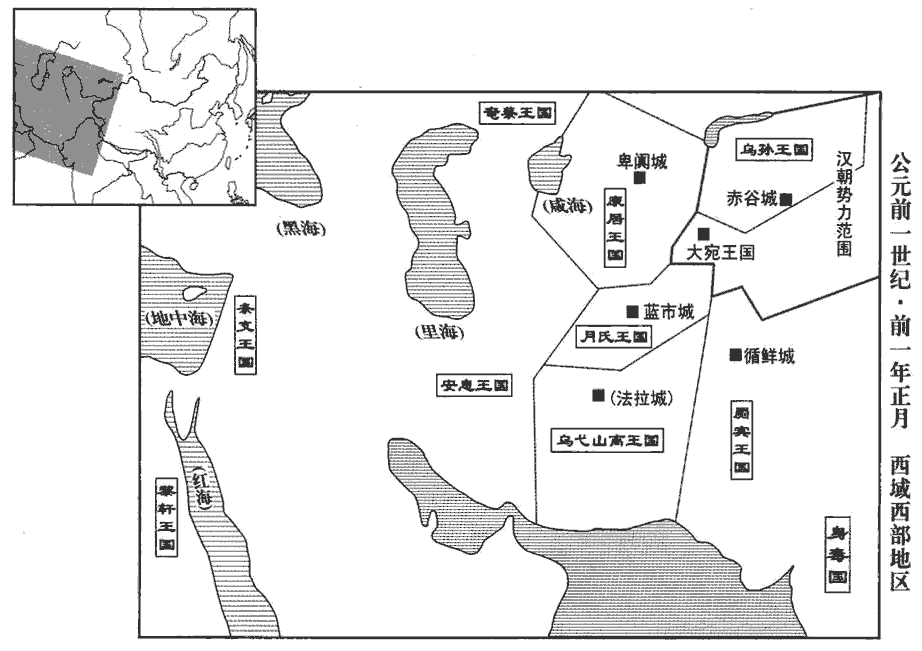

 漢紀二十七起屠維協洽（己未），盡玄黓yì閹茂（壬戌），凡四年。

# 孝哀皇帝下

## 元壽元年（己未，前二）

1春，正月，辛丑‹一›朔，考異曰：荀紀云「辛卯朔」，誤。詔將軍、中二千石舉明習兵法者各一人，因就拜孔鄉侯傅晏為大司馬、衛將軍，陽安侯丁明為大司馬、票騎將軍。用息夫躬之言也。票，頻妙翻。

〖译文〗 [1]春季，正月，辛丑朔（初一），哀帝下诏，要求将军、中二千石官员，各推举通晓军事、熟悉兵法者一人，借此授任孔乡侯傅晏为大司马、卫将军，阳安侯丁明为大司马、票骑将军。

2是日，日有食之。上‹刘欣，时年二十四›詔公卿大夫悉心陳過失；又令舉賢良、方正、能直言者各一人。大赦天下。

〖译文〗 [2]当天，出现日食。哀帝诏令公卿大夫尽心陈述过失。又令举荐贤良、方正、能直言进谏者各一人。大赦天下。

丞相嘉奏封事曰：「孝元皇帝奉承大業，溫恭少欲，少，詩沼翻；下同。都內錢四十萬萬。百官表：大司農有都內令丞。嘗幸上林，後宮馮貴人從臨獸圈，猛獸驚出，貴人前當之，即二十九卷建昭元年事也。圈，求遠翻。元帝嘉美其義，賜錢五萬。師古曰：言此事雖嘉其義而賞亦不多。掖庭見親，有加賞賜，屬其人勿眾謝。師古曰：掖庭宮人有親戚來見而帝賜之者，屬其家勿使於眾人中謝也。見，賢遍翻；下見錢同。屬，音之欲翻。余謂有見親幸者，加之賞賜，則屬其人勿於眾中謝也。示平惡偏，惡，烏路翻。重失人心，賞賜節約。是時外戚貲zī千萬者少耳，故少府、水衡見錢多也。少府掌禁錢。水衡都尉有鍾官辨銅令、丞，掌鑄錢。師古曰：見在之錢也。雖遭初元、永光凶年饑饉，加以西羌之變，永光二年，隴西羌反。外奉師旅，內振貧民，終無傾危之憂，以府臧內充實也。臧，讀曰藏，音徂浪翻。孝成皇帝時，諫臣多言燕出之害，師古曰：燕出，謂微行也。及女寵專愛，耽於酒色，損德傷年，其言甚切，然終不怨怒也。寵臣淳于長、張放、史育，育數貶退，家貲不滿千萬，放斥逐就國，事見三十三卷成帝綏和二年。數，所角翻。長榜死於獄，事見三十二卷綏和元年。榜，音彭。不以私愛害公義，故雖多內譏，朝廷安平，師古曰：言雖有好內之譏而不害政也。傳業陛下。

〖译文〗 丞相王嘉上密封奏书说：“孝元皇帝继承大业，温良谦恭，少有欲望，国库存钱达四十亿。元帝曾前往上林苑，后宫冯贵人跟随一起到了兽圈，猛兽受惊窜出，冯贵人挺身向前，用身体遮挡住皇帝。元帝嘉勉她的义勇，赏赐不过五万钱。在深宫后庭，对宠爱的人加以特别的赏赐，元帝总要嘱咐她，不要在众人面前谢恩。这是为了表示公平，不愿被人指责不公，看重人心的得失，而且赏赐节约。当时外戚资产达千万的很少，因而少府、水衡的积钱才很多。虽然遭受初元、永光年间的灾荒饥馑，再加西羌部族的叛变，对外要供给作战部队的需要，对内要赈济贫苦的灾民，然而国家始终没有倾覆崩溃的忧虑，是因为国库积藏充实。孝成皇帝时，谏臣大多提出皇帝私自出宫的危害，并说到专宠美女，耽于酒色，有损德行，伤身短寿等，言词非常激烈，然而成帝始终不怨恨发怒。宠臣淳于长、张放、史育三人，史育多次被贬退，家资不满千万；张放被斥退逐回封国；淳于长在监狱中被拷打致死。成帝并不以私爱而妨害公义，因此，虽然因宠爱内宫而招致很多讥讽，但是朝廷安定平稳，这才能把大业传给陛下。

陛下在國之時，好詩、書，好，呼到翻。上儉節，徵來，所過道上稱誦德美，此天下所以回心也。師古曰：望為治也。余謂回心者，回其戴成帝之心而戴哀帝也。初即位，易帷帳，去錦繡，去，羌呂翻。乘輿席緣綈tí繒而已。乘，繩證翻。緣，俞絹翻。師古曰：綈，厚繒也，音徒奚翻。繒，慈陵翻。共皇寢廟比當作，共，音恭。比，近也，音毗至翻。憂閔元元，惟用度不足，師古曰：惟，思也。以義割恩，輒且止息，今始作治。治，直之翻；下同。而駙馬都尉董賢亦起官寺上林中，又為賢治大第，開門鄉北闕，為，於偽翻。鄉，讀曰嚮；下獨鄉同。引王渠灌園池，蘇林曰：王渠，官渠也；猶今御渠也。晉灼曰：渠名也，在城東覆盎門外。師古曰：晉說是。使者護作，賞賜吏卒，甚於治宗廟。師古曰：護，監視也。賢母病，長安廚給祠具，師古曰：長安有廚官，主為官食。道中過者皆飲食。如淳曰：禱於道中，故行人皆得飲食。余謂若據文理，則飲，音於禁翻；食，讀曰飤。為賢治器，器成，奏御乃行，或物好，特賜其工；自貢獻宗廟、三宮，猶不至此。師古曰：三宮，天子、太后、皇后也。原父曰：是時太皇太后稱長信宮，傅太后稱永信宮，而丁姬稱中安宮，故以三宮為言。余按此時丁姬死矣，三宮蓋謂長信、永信及趙太后宮也。賢家有賓婚及見親，諸官并共，師古曰：見親，親戚相見也。并共，言百官各以所掌事及財物就供之。共，讀曰供。賜及倉頭、奴婢人十萬錢。使者護視、發取市物，百賈震動，師古曰：賈，謂販賣之人也。言百賈者，非一之稱也。賈，音古。道路讙譁，讙，許元翻。群臣惶惑。詔書罷苑，而以賜賢二千餘頃，均田之制從此墮壞。孟康曰：自公卿以下至於吏民，名曰均田，皆有頃數，於品制中令均等。今賜賢二千餘頃，則壞其制也。師古曰：墮，音火規翻。均田，見三十三卷綏和二年。奢僭放縱，變亂陰陽，災異眾多，百姓訛言，持籌相驚，師古曰：言行西王母籌也。天惑其意，不能自止。陛下素仁智慎事，今而有此大譏。

〖译文〗 “陛下在封国之时，喜好《诗经》、《书经》，崇尚节俭。征召前来长安时，一路经过的地方，都称颂陛下的美德，这正是天下之人把希望转而寄托在陛下身上的原因。初即位时，陛下更换帷帐，撤去锦绣，车马和座席的靠垫不过用绨缯包边而已。每逢共皇寝庙应当兴建，都因怜悯百姓劳苦，考虑国家经费不足，为了公义割舍亲情，总是暂停修建，直到最近才开始动工。可是附马都尉董贤，也在上林苑中兴建官衙，陛下还为他修建了宏大的宅第，开门朝着皇宫的北门，引王渠灌注园林水池，陛下派使者监督施工，赏赐吏卒，超过修建宗庙之时。董贤母亲患病，由官家长安的厨官提供祈祷的用具和食品，道路过往行人都可获得施舍的饮食。陛下为董贤制造器具，做成后，必须奏报陛下审查，才可送去。如果工艺精巧，还特别赏赐工匠。即便是奉献宗庙、奉养三宫太后，也没有达到这种程度。遇到董贤家招待宾客、举办婚礼以及亲戚相见崐，由各官署一起供献财物，甚至赏赐仆人、奴婢的钱，一人达十万钱。董贤家去街市购买物品，有圣上派的使者陪同，监视交易，百商震恐，路人喧哗，群臣为之惶惑。陛下诏令裁撤皇家苑林，却用来赏赐董贤两千余顷土地，官员限田的制度从此破坏。奢侈僭越，横行放纵，变乱阴阳，灾异众多，流言在百姓中传播，路人手持禾秆麻秆惊恐奔走，上天也对百姓的流言和奔走感到迷惑，不能使他们自行停止。陛下一向仁慈智慧，行事谨慎，而今却有这些过失被人大肆嘲讽。

孔子曰：『危而不持，顛而不扶，則將安用彼相矣！』師古曰：論語：季氏將伐顓臾，冉有、季路見於孔子。孔子以此言責之，以其不匡諫也。相，息亮翻。臣嘉幸得備位，竊內悲傷，不能通愚忠之信；身死有益於國，不敢自惜。唯陛下慎己之所獨鄉，察眾人之所共疑！往者【章：甲十六行本「者」下有「寵臣」二字；乙十一行本同；張校同。】鄧通、韓嫣，驕貴失度，逸豫無厭，小人不勝情欲，卒陷罪辜，亂國亡軀，不終其祿，鄧通幸於文帝，賜以蜀嚴道銅山。景帝立，人告通盜出徼jiào外鑄錢，沒入其家，卒以餓死。韓嫣幸於武帝，出入永巷不禁，以姦聞，賜死。嫣，音偃。厭，於鹽翻。勝，音升。卒，子恤翻。所謂『愛之適足以害之』者也！宜深覽前世，以節賢寵，全安其命。」上由是於嘉浸不說。為嘉死不以罪張本。說，讀曰悅。

〖译文〗 “孔子说：‘国家有危险不去解救，见颠覆不去匡扶，要你们这些宰相有什么用！’臣王嘉有幸能够位居丞相，自已私下常内心悲伤，无法使陛下相信我的愚忠。如果身死能够有益于国家，我不敢爱惜自己的生命。请陛下审慎地对待自己的偏宠，细察众人共同的疑惑！从前邓通、韩嫣骄横显贵没有限度，逸乐无厌，小人不能克制情欲，终于犯下大罪，把国家搞乱，使自己丧生，不能最终保全富贵。正所谓‘爱他，却恰恰足以害他’。应该深察前世的教训，节制对董贤的宠爱，以保全他的生命。”哀帝由此对王嘉渐渐不满。

前涼州‹甘肅›刺史杜鄴以方正對策曰：「臣聞陽尊陰卑，天之道也。是以男雖賤，各為其家陽；女雖貴，猶為其國陰。故禮明三從之義，師古曰：謂婦人在家從父，既嫁從夫，夫死從子。雖有文母之德，必繫於子。師古曰：文母，文王之妃太姒sì也。仲馮曰：文母，文王之母也，所謂繫於子也，何預太姒！余謂劉說是。詩曰：思齊太任，文王之母。昔鄭伯隨姜氏之欲，終有叔段篡國之禍；左傳：鄭武姜生莊公及共叔段，惡莊公而愛段，為之請京，使居之。祭仲諫曰：「國之害也。」公曰：「姜氏欲之，焉辟害！」段繕甲兵，具卒乘，將襲鄭，莊公克之。周襄王內迫惠后之難，而遭居鄭之危。史記：周惠王二子，長襄王，次叔帶。惠后愛叔帶，襄王既立，叔帶召狄人，狄人伐周，王御士將禦之。王曰：「先后其謂我何！」乃出居於鄭。難，乃旦翻。漢興，呂太后權私親屬，幾危社稷。事見高后紀。幾，居依翻。竊見陛下約儉正身，欲與天下更始，更，工衡翻。然嘉瑞未應，而日食、地震。案春秋災異，以指象為言語。師古曰：謂天不言，但以景象指意告諭人。日食，明陽為陰所臨。日者，陽宗。陰盛陽微，日為所揜yǎn而食，是為陰所臨也。坤以法地，為土，為母，以安靜為德；震，不陰之效也。師古曰：言地當安靜，而今乃震，是為不遵陰道也。占象甚明，臣敢不直言其事！昔曾子問從令之義，孔子曰：『是何言與！』師古曰：曾子問：「從父之令，可謂孝乎！」孔子非之。事見孝經。與，讀曰歟。善閔子騫守禮，不苟從親，所行無非理【張：「理」作「禮」。】者，故無可間也。師古曰：論語稱孔子曰：「孝哉閔子騫，人不間於其父母兄弟之言！」是也。間，音居莧翻。今諸外家昆弟，無賢不肖，并侍帷幄，布在列位，師古曰：不問賢與不肖，皆親近在位。或典兵衛，或將軍屯，將，即亮翻。寵意并於一家，積貴之勢，世所希見、所希聞也。至乃并置大司馬、將軍之官，皇甫雖盛，三桓雖隆，魯為作三軍，無以甚此！言周以皇甫為卿士，魯三桓強盛，作三軍而三分公室，比丁、傅無以甚也。為，於偽翻。當拜之日，晻àn然日食。師古曰：晻，音烏感翻。不在前後，臨事而發者，明陛下謙遜無專，承指非一，所言輒聽，所欲輒隨，師古曰：謂皆迫於太后也。有罪惡者不坐辜罰，無功能者畢受官爵，流漸積猥，過在於是，猥，遝tà也，言有罪惡者不誅，無功能者并進，其流漸至積遝tà也。欲令昭昭以覺聖朝。朝，直遙翻。昔詩人所刺，春秋所譏，指象如此，殆不在他。由後視前，忿邑非之；師古曰：由，從也。邑，於邑也。逮身所行，不自鏡見，則以為可，計之過者。師古曰：逮，及也。鏡，鑒照也。自以所行為可，是計策之誤者。願陛下加致精誠，思承始初，事稽諸古，以厭下心，師古曰：每事皆考於古者。厭，滿也，音一贍翻。則黎庶群生無不說喜，說，讀曰悅。上帝百神收還威怒，禎祥福祿，何嫌不報！」師古曰：嫌，疑也。

〖译文〗 前凉州刺史杜邺，以方正的身份，回答策问说：“我听说阳尊阴卑，是上天之道。因而男子即便卑贱，仍然各自是本家之阳；女子即便尊贵，仍然是本国之阴。因此礼教明确规定‘三从’的内容。即令有文王之母的盛德，也必须依附于儿子。从前郑伯放任母亲姜氏对幼子的溺爱，终于酿成叔段篡国的大祸。周襄王内迫母亲惠后的压力，而遭受流亡郑国的危难。汉朝兴起，吕太后把朝廷大权私自交给她的亲属，几乎动摇了社稷。我看陛下节俭克已，持身以正，想要振兴天下，开创新的局面。然而，祥瑞没有应验降临，反而发生了日食、地震。考察《春秋》记载灾异，是以景象所指示的含意作为语言，来警告世人。日食，表明阳被阴侵犯。阴为坤，坤被用来表示地，所以称‘坤’为‘土’，为‘母’，以安静为美德。发生地震，是阴气失控，不遵循常轨的证明。占验情况非常明显，我岂敢不直言此事！从前，曾参问孔子听从父命可算孝顺的道理，孔子说：‘这是什么话！’孔子赞扬闵子骞守礼，不苟且听从父母的命令，所行之事没有非理的，所以别人无法离间他与父母及亲人的关系。而今诸外戚家的兄弟，不管贤能或败类，都在宫廷任职，分布要位。或者掌管禁卫，或者率军屯驻，恩宠集中于一家，越来越显贵的声势，世所罕见，世所罕闻。甚至发展到同时设立两个大司马、将军的官职。古时皇甫虽强盛，三桓虽势大，鲁国虽建立三军，然而与今天的皇亲国戚相比，就逊色了！就在拜大司马、将军官职的当天，太阳昏暗，发生日食。不前不后，在拜官的时刻发生日食，说明陛下太过谦逊，不敢专断，不只一次地顺承太后的旨意，所说的话都听从，所要求的东西都满足。外戚中有罪恶的，不受法律制裁；无功无能的，全崐都加封官爵。这类事情逐渐发展加剧，越积越多，陛下的过失正在于此。我想讲清这些过失，从而使圣明的天子醒悟。过去被诗人所抨击、被《春秋》所讥讽的，正是这类现象，恐怕不是针对其他。由后世来看前代发生的事情，会忿怒忧郁地指摘其错误。等到自己去做，就不能像照镜子一样看见自己的过失，自以为合适，其实计策已失误了。但愿陛下更加精诚治国，回顾即位之初，每事都参考遵照古代的规定，以满足下民的心愿。如此，则黎民百姓无不喜悦，上帝和众神灵也会收回怒气，为什么要疑心吉祥福禄不回报降临！”

上又徵孔光詣公車，問以日食事，拜為光祿大夫，秩中二千石，給事中，位次丞相。

〖译文〗 哀帝又征召孔光到公车，询问关于日食之事。授任孔光为光禄大夫，官秩中二千石，任给事中，地位仅次于丞相。

初，王莽既就國，建平二年，莽就國。杜門自守。其中子獲殺奴，中，讀曰仲。莽切責獲，令自殺。在國三歲，吏民上書冤訟莽者百數。師古曰：言其合管朝政，不當就國也。上，時掌翻。至是，賢良周護、宋崇等對策，復深訟莽功德；復，扶又翻。上於是徵莽及平阿侯仁還京師，侍太后。侍太皇太后也。‹王政君›

〖译文〗 当初，王莽返回封国后，闭门不见宾客，以求自保。他的次子王获杀死家奴，王莽严厉责备王获，命他自杀。在封国三年，官吏百姓上书为王莽呼冤的，数以百计。到本年，贤良周护、宋崇等在朝廷对策时，又大大颂扬王莽的功德，为他辩冤。哀帝于是征召王莽以及平阿侯王仁回到京师，让他们侍奉太皇太后。

3董賢因日食之變以沮傅晏、息夫躬之策，沮，在呂翻。辛卯‹十一›，【章：甲十六行本「卯」作「亥」；乙十一行本同；退齋校同。】上收晏印綬，罷就第。

〖译文〗 [3]董贤利用发生日食这一变异，阻止傅晏、息夫躬对匈奴挑动战争的计策。辛卯（疑误）哀帝收缴傅晏印信绶带，罢免官职，让他离开朝廷，回到宅第。

4丁巳‹十七›，皇太太后傅氏崩，合葬渭陵‹陝西咸陽東北›，稱孝元傅皇后。史記正義曰：漢帝后同陵則為合葬，不合陵也；諸陵皆如此。傅氏以側室而合葬，稱孝元傅皇后，太皇太后在上，此心為何如邪！宜其啟王莽而授之以柄也。

〖译文〗 [4]丁巳（正月十七日），皇太太后傅氏驾崩，与元帝合葬渭陵，称为“孝元傅皇后”。

5丞相、御史奏息夫躬、孫寵等罪過，上乃免躬、寵官，遣就國；又罷侍中、諸曹、黃門郎數十人。丁、傅之親黨也。

〖译文〗 [5]丞相、御史上奏，弹劾息夫躬、孙宠等人的罪过。哀帝于是罢免息夫躬、孙宠官职，遣回封国。又罢黜侍中、诸曹、黄门郎等数十人。

鮑宣上書曰：「陛下父事天，母事地，子養黎民；即位以來，父虧明，母震動，子訛言相驚恐。今日食於三始，如淳曰：正月一日為歲之朝、月之朝、日之朝。朝，猶始也。誠可畏懼。小民正朔日尚恐毀敗器物，敗，補邁翻。何況於日虧乎！陛下深內自責，避正殿，舉直言，求過失，罷退外親及旁仄素餐之人，徵拜孔光為光祿大夫，發覺孫寵、息夫躬過惡，免官遣就國，眾庶歙xī然，莫不說喜。師古曰：歙，音翕。天人同心，人心說則天意解矣。說，讀曰悅。乃二月丙戌‹十六›，白虹干日，虹，日旁氣也。白，兵象。干，犯也。連陰不雨，此天下【張：「下」作「有」。】憂結未解，民有怨望未塞者也。塞，悉則翻。侍中、駙馬都尉董賢，本無葭莩之親，但以令色、諛言自進，令，善也。諛，諂也。孔安國曰：令色，無質。巧言，無實。賞賜無度，竭盡府臧，臧，讀曰藏；音徂浪翻。併合三第，尚以為小，復壞暴室。師古曰：時以三第總為一第，賜賢，猶嫌陿小，復取暴室之地以增益之也。復，扶又翻；下同。賢父、子坐使天子使者，言其驕慢也。將作治第，將作大匠，掌治宮室，使為之治第。治，直之翻。行夜吏卒皆得賞賜，師古曰：為賢第上持時行夜者。行，音下孟翻。上塚有會，輒太官為供。為之供具也。為，於偽翻；下同。海內貢獻，當養一君，今反盡之賢家，豈天意與民意邪！天不可久負，暴殄天物以私嬖bì倖，是為負天。厚之如此，反所以害之也！誠欲哀賢，宜為謝過天地，解讎海內，免遣就國，收乘輿器物還之縣官，此所謂謝過解讎也。為，於偽翻。乘，繩證翻。可【章：甲十六行本「可」上有「如此」二字；乙十一行本同；孔本同；張校同。】以父子終其性命；不者，海內之所仇，未有得久安者也。孫寵、息夫躬不宜居國，可皆免，以視天下。師古曰：視，讀曰示。復徵何武、師丹、彭宣、傅喜，曠然使民易視，以應天心，建立大政，興太平之端。」上感大異，納宣言，徵何武、彭宣；拜鮑宣為司隸。

〖译文〗 鲍宣上书说：“陛下把上天当作父亲，把大地当作母亲来侍奉，把人民当作儿女来抚养。即位以来，上天缺少光明，大地发生震动，百姓流传讹言，互相惊扰。而今，元旦年月日‘三始’之时就发生日食，实在令人畏惧。小民在平常元旦之日尚且害怕毁坏器物，何况发生日食呢！陛下深刻地在内心责备自己，避开正殿，举荐直言之士，征求对过失的批评，罢黜斥退外戚以及身边白吃饭不干事的人，征召任命孔光为光禄大夫，察觉了孙宠、息夫躬的罪恶，把他们免官遣回封国。民众一致，无不欢喜。天人同心，人心欢悦了，则天心的愤怒自然化解。然而，二月丙戌（十六日），白气侵犯太阳，天气连阴不雨，这表示天下尚有忧愁纠结在一起没有化解，百姓还有怨气没有平息。侍中、驸马都尉董贤，本来与陛下无丝毫亲戚关系，可是凭着他的媚色和巧言阿谀，博取了陛下的欢心，对他赏赐没有限度，竭尽了府库的积藏，合并三座宅第赐给他，还认为太小，又拆除宫廷暴室来扩充面积。董贤和他的父亲可以坐着支使崐天子的使者，将作大匠为他修建宅第，连夜间为他巡逻的吏卒都得到赏赐。他家祭扫祖坟和举行聚会，都由太官供应。各地的贡献，本应当奉养一位君主，而今反而全到了董贤的家里。这难道是天意和民意吗！天意不可长久地背逆，对董贤如此厚待，反而会因此害了他！如果真要怜惜董贤，应该为他向天地谢罪，解除天下对他的仇视，罢免他的官职，遣回封国，没收所赐的御用器具，归还皇上。只有这样，才可保全他父子的性命。不然的话，作为全国所仇恨的人，他不可能获得长久的安宁。孙宠、息夫躬不应该再拥有封国，应该全部免去，以向天下表示彻底改过。重新征召何武、师丹、彭宣、傅喜，使百姓看到一个全新明朗的局面，以顺应天意，建立大政，开始复兴太平盛世。”哀帝感到非常惊奇，采纳了鲍宣的建议，征召何武、彭宣，并授任鲍宣为司隶。

6上託傅太后遺詔，令太皇太后下丞相、御史，益封董賢二千戶，賢先封千戶。下，遐稼翻。賜孔鄉侯、汝昌侯、陽新侯國。三人者，先雖封侯，未有國邑；今賜之國邑也。陽新侯，即陽信侯鄭業。漢書傅昭儀傳作「陽信」，王嘉傳及恩澤侯表作「陽新」。王嘉封還詔書，後世給、舍封駁本此。師古曰：還，謂欲上之於天子也。因奏封事諫曰：「臣聞爵祿、土地，天之有也。書云：『天命有德，五服五章哉！』師古曰：虞書皋gāo陶謨mó之辭也。言皇天命有德者以居列位，天子、諸侯、卿、大夫、士，尊卑之服，采章各異也。王者代天爵人，尤宜慎之。裂地而封，不得其宜，則眾庶不服，感動陰陽，其害疾自深。師古曰：言此氣損害，故令天子身有疾也。今聖體久不平，此臣嘉所內懼也。高安侯賢，佞幸之臣，陛下傾爵位以貴之，單貨財以富之，師古曰：單，盡也。損至尊以寵之，師古曰：言上意傾惑，為下所窺也。余謂帝為賢治第，儗於宮闕，乘輿器物充牣其家，此所謂損至尊以寵之也。主威已黜，府臧已竭，唯恐不足。財皆民力所為，孝文【章：甲十六行本「文」下有「皇帝」二字；乙十一行本同；孔本同；張校同。】欲起露臺，重百金之費，克己不作。事見文帝紀。今賢散公賦以施私惠，一家至受千金，往古以來，貴臣未嘗有此，流聞四方，皆同怨之。里諺曰：『千人所指，無病而死。』臣常為之寒心。為，於偽翻。今太皇太后以永信太后遺詔，詔丞相、御史，益賢戶，賜三侯國，臣嘉竊惑。山崩、地動、日食於三朝，皆陰侵陽之戒也。前賢已再封，謂賢先封關內侯，繼封高安侯也。晏、商再易邑，商先嗣爵崇祖侯，後改封汝昌侯。晏無所考。按表，晏先以皇后父封三千戶，又益二千戶，食邑於夏丘。業緣私橫求，橫，戶孟翻。恩已過厚，求索自恣，不知厭足，甚傷尊尊之義，封三侯者，所以尊傅太后。今求濫恩，不知厭足，則傷尊尊之義矣。索，山客翻。厭，於鹽翻。不可以示天下，為害痛矣！痛，甚也。臣驕侵罔，師古曰：罔，謂誣蔽也。陰陽失節，氣感相動，害及身體。陛下寢疾久不平，繼嗣未立，宜思正萬事，順天人之心，以求福祐，乃【章：甲十六行本「乃」作「柰」；乙十一行本同；孔本同；張校同。】何輕身肆意，師古曰：肆，放也。不念高祖之勤苦，垂立制度，欲傳之於無窮哉！臣謹封上詔書，不敢露見；上，時掌翻。見，賢遍翻。非愛死而不自法，謂不以違拒詔指之法自劾也。恐天下聞之，故不敢自劾。」言自劾則天下知其事也。劾，戶概翻。

〖译文〗 [6]哀帝假托傅太后的遗诏，请太皇太后下令给丞相、御史，要他们增加董贤采邑二千户人家，并赐给孔乡侯、汝昌侯、阳新侯封国。王嘉把诏书封起来退回，并上密封奏书劝谏说：“我听说爵位、俸禄、土地，是上天所有的。《书经》说：‘皇天命有德之人列居天子、诸侯、卿、大夫、士之位，穿表示尊卑的五种服装，色彩图案各不相同。’君王代表上天给人封爵，尤其应该谨慎。划地分封采邑，如果处理不当，则民心不服，民众的怨气感动阴阳，就会深深损害陛下的身体。现在陛下圣体久不康复，这是我内心所恐惧的事情。高安侯董贤，是奸佞的宠臣，陛下把爵位封给他，使他显贵，竭尽财货赐与他，使他富足，损害圣上的利益去宠爱他，君王的权威已被降低，国库的储积已经枯竭，还唯恐不足。财富都是百姓创造的，孝文帝想兴建露台，因为看重那百金的修建费而克制自己不去兴建。如今董贤却把国家的赋税作为私人恩惠随意施舍，甚至一家就可得到千金的赏赐。古往今来的贵臣，还从未有这样的。有关董贤的流言传播四方，人们全都怨恨他。俗谚说：‘千夫所指，无病而死。’我常为他感到寒心。现在，太皇太后根据永信宫傅太后的遗诏，而下诏给丞相、御史，要增加董贤采邑人户，赐给三位侯爵封国，臣王嘉感到十分困惑。山崩、地震、日食，同时发生在元旦‘三始’之日，这都是上天因为阴侵阳而显示的警告啊。前些时，董贤已再次封爵，傅晏，傅商也再次改换封国采邑，郑业则利用私情横求。陛下所施恩惠已太厚了，他们仍恣意求索，不知满足。这已深深伤害了尊崇傅太后的本意，无法向天下人公布，为害至大！臣属骄横，就会冒犯欺骗主上，使阴阳失去调节，阴气阳气互相冲突，伤害身体。陛下卧病久不痊愈，又未立继承人，应该考虑使万事步入正轨，顺应天心民心，以求上天的保佑，怎么能忽视自身健康而肆意放纵，不念高祖创业的勤奋艰苦，留下所建立的制度，要使它传于无穷呢！我谨把诏书封还，不敢显露让别人看见。并非因爱惜生命而不敢以违抗诏旨之法自劾，实而是恐怕天下人知道，因此不敢自我弹劾。”

初，廷尉梁相治東平王雲獄時，冬月未盡二旬，而相心疑雲冤獄，有飾辭，師古曰：假飾之辭，非其實也。治，直之翻。奏欲傳之長安，師古曰：傳，謂移其獄事也。傳，知戀翻。更下公卿覆治。下，遐稼翻；下同。尚書令鞫譚，僕射宗伯鳳以為可許。師古曰：鞫及宗伯，皆姓也。宗伯，以官為氏。鞫，音居六翻。天子以為相等皆見上體不平，外內顧望，操持兩心，師古曰：操，音千高翻。幸雲踰冬，無討賊疾惡主讎之意，謂僥幸雲獄踰冬，則雲可以減死也。免相等皆為庶人。後數月，大赦，嘉薦「相等皆有材行，行，下孟翻。聖王有計功除過，臣竊為朝廷惜此三人。」按公卿表，建平元年，大司農梁相為廷尉；二年，貶為東海都尉。三年，左馮翊方賞為廷尉；四年，徙。本紀，東平王雲有罪自殺，在建平四年；大赦天下，在今年正月。若以表為證，則當治東平時，廷尉乃方賞，非梁相。表言相貶，不言免為庶人。又今年大赦，上距建平三年十二月治東平獄時，已一朞有餘，是大赦亦不在後數月也。通鑑書王嘉薦梁相等三人，全取漢書王嘉傳；然傳與紀、表歲月自相牴dǐ牾wù。繫年之書，可謂難矣！為，於偽翻；下同。書奏，上不能平。師古曰：心怒也。後二十餘日，嘉封還益董賢戶事，上乃發怒，召嘉詣尚書，責問以「相等前坐不忠，罪惡著聞，君時輒已自劾；今又稱譽，云『為朝廷惜之』，何也？」劾，戶概翻。譽，音餘。嘉免冠謝罪。

〖译文〗 当初，廷尉梁相审理东平王刘云一案时，冬月只剩下二十日，而梁相心里怀疑刘云一案是冤案，供辞有虚饰不实的地方，因而上奏哀帝，请求把一干人犯押解长安，改由公卿复审。尚书令鞫谭、仆射宗伯凤认为可以准许。哀帝则认为，梁相等人都见皇上病情没有起色，内外顾望，怀有二心，希图刘云一案侥幸拖过冬季，则可减刑免死，没有痛恨奸恶、为主上讨贼报仇的忠心，于是罢免了梁相等人的官职，都贬为平民。数月后，大赦天下。王嘉举荐说：“梁相等人都有才干德行，圣明的君王对臣下总是计其功劳、抹去过失，我私下里为朝廷怜惜这三个人才。”奏书呈上，哀帝愤愤不平。过了二十余日，王嘉封还为董贤增加封国户数的诏书，哀帝于是大怒，召王嘉到尚书那里，令尚书责问他：“梁相等人前些时犯了对天子不忠之罪，罪恶昭著，人所共闻，当时你也曾自我弹劾。现在却又称誉赞美他们，说‘为朝廷怜惜他们’，这是为什么？”王嘉脱下官帽谢罪。

事下將軍朝者，朝者，當時見入朝之臣也。朝，直遙翻。光祿大夫孔光等劾「嘉迷國罔上，不道，請謁者召嘉詣廷尉詔獄。」議郎龔等以為「嘉言事前後相違，宜奪爵土，免為庶人。」永信少府猛等以為「嘉罪名雖應法，謂法當下吏也。大臣括髮關械，裸躬就笞chī，師古曰：括，結也。關，貫也。裸，露也。非所以重國，褒宗廟也。」上不聽。【章：甲十六行本「聽」下有「三月」二字；乙十一本同；孔本同；張校同。】詔「假謁者節，召丞相詣廷尉詔獄。」

〖译文〗 哀帝把此案交付将军和当时入朝的官员讨论。光禄大夫孔光等弹劾王嘉说：“王嘉迷惑国家，欺骗主上，大逆不道，请派谒者召王嘉前往廷尉诏狱。”议郎龚等认为：“王嘉的奏言前后不一致，应该剥夺爵位采邑，免去官职，贬为平民。”永信少府猛等认为：“王嘉的罪名虽然应该依法惩处，但是把大臣束住头发，锁上刑具，裸露身体，鞭笞拷打，这不是使国家受到尊重，宗庙受到褒美的作法。”哀帝不听猛的劝告，诏令使者：“凭谒者的符节，召丞相到廷尉诏狱。”

使者既到，府掾、史涕泣，共和藥進嘉，掾，俞絹翻。和，戶臥翻。嘉不肯服。主簿曰：「將相不對理陳冤，相踵以為故事，自周勃繫獄，賈誼以為言，文帝自此待大臣有節，將相有罪皆自殺，不受刑。然景帝時周亞夫、武帝時公孫賀、劉屈氂máo猶下獄死。相踵為故事，言其概也。理，獄也。對理，對獄也。言大臣之體，縱有冤，不對獄而自陳也。師古曰：踵，猶躡也。君侯宜引決！」師古曰：令自殺也。使者危坐府門上，師古曰：以逼促嘉也。主簿復前進藥。嘉引藥柸以擊地，謂官屬曰：官屬，謂掾、史、主簿等。「丞相幸得備位三公，奉職負國，當伏刑都市，以示萬眾。丞相豈兒女子邪！何謂咀藥而死！」師古曰：咀，嚼也，音材汝翻。嘉遂裝，出見使者，再拜受詔；裝出者，朝服而出。乘吏小車，去蓋，不冠，去，羌呂翻。隨使者詣廷尉。廷尉收嘉丞相、新甫侯印綬，恩澤侯表：新甫侯，國於南陽新野。縛嘉載致都船詔獄。百官表：執金吾屬官，有中壘、寺互、武庫、都船四令、丞。如淳曰：漢儀注有寺互、都船獄。上聞嘉生自詣吏，大怒，上欲嘉自裁，而嘉詣獄，故大怒。使將軍以下與五二千石雜治。漢治大臣獄，率使五二千石，今又使將軍同治之，怒之甚也。晉灼曰：大臣獄重，故使秩二千石者五人雜治之。吏詰問嘉，詰jié，去吉翻。嘉對曰：「案事者思得實。竊見相等前治東平王獄，不以雲為不當死，欲關公卿，示重慎，關，會也。古者獄成命三公、六卿參聽之，示明謹於用刑也。誠不見其外內顧望、阿附為雲驗，驗，徵驗也。為，於偽翻；下同。復幸得蒙大赦。復，扶又翻。相等皆良善吏，臣竊為國惜賢，不私此三人。」獄吏曰：「苟如此，則君何以為罪，猶當有以負國，不空入獄矣？」吏欲文致以負國之罪，故云然。吏稍侵辱嘉，嘉喟然仰天歎曰：喟，丘愧翻；歎息之聲。「幸得充備宰相，不能進賢、退不肖，以是負國，死有餘責。」吏責其負國，故以此對。吏問賢、不肖主名。嘉曰：「賢，故丞相孔光、故大司空何武，不能進；惡，高安侯董賢父、子【章：甲十六行本「子」下有「佞邪」二字；乙十一行本同；孔本同；張校同。】亂朝，而不能退。惡，烏路翻。朝，直遙翻。罪當死，死無所恨！」嘉繫獄二十餘日，不食，歐血而死。

〖译文〗 使者到了丞相府，丞相府的掾、史等官员流泪哭泣，共同调和毒药请王嘉喝，王嘉不肯服用。主簿说：“将相不面对执法官为自己诉冤，这种作法世代相沿，已成为惯例，君侯应当自裁！”使者严肃地坐在府门那边，主簿再次上前送上前送上毒药。王嘉拿起药杯扔到地下，对相府官属们说：“丞相我有幸位居三公，如果奉职不谨慎，辜负了国家，理应在都市上伏刑受死，向万众宣告。丞相难道是小儿小女吗！为什么要吃毒药而死！”于是王嘉穿戴官服，出来见使者，再拜，接受诏书，然后乘上小吏坐的小车，去掉车篷，脱下官帽，随使者到了廷尉官衙。廷尉收缴了王嘉的丞相和新甫侯印信绶带，把他捆绑起来，押送到都船诏狱。哀帝听说王嘉活着亲自去见廷尉，勃然大怒，派将军以下官员和五名二千石官员，共同审讯。官吏审问王嘉时，他回答说：“审理案件的人，希望得到事实真相。我见梁相等过去审理东平王一案，并不认为刘云不该处死，只是希望公卿参与审理，以表示慎重。实在看不出他们有内外顾望怀有二心，阿谀攀附刘云的罪证。以后他们又有幸蒙恩获得大赦。梁相等都是优秀的官吏，我是为国惜才，并不是偏袒他们三人。”狱吏说：“假如是这样，那么你为什么有罪？你还是有负国的行为，不是凭白入狱的。”狱吏逐渐开始侵犯凌辱王嘉，王嘉喟然仰天叹息说：“我有幸能够充任丞相，不能引进贤能，斥退奸佞，因此是犯有负国之罪，死有余辜。”狱吏问贤者和奸佞者的名崐字，王嘉说：“贤者，前丞相孔光、前大司空何武，却不能举荐引进他们；恶者，高安侯董贤父子奸佞乱朝，却不能斥退他们。罪当处死，死无所憾！”王嘉被关押在监狱二十余天，不进饮食，吐血而死。

已而上覽其對，思嘉言，會御史大夫賈延免，夏，五月，乙卯‹十七›，以孔光為御史大夫。秋，七月，丙午‹九›，以光為丞相，復故國博山侯；又以氾鄉侯何武為御史大夫。上乃知孔光前免非其罪，以過近臣毀短光者，光免事見上卷建平二年。過，督過也；咎之也。曰：「傅嘉前為侍中，毀譖仁賢，誣愬大臣，令俊艾者久失其位，師古曰：艾，讀曰乂。其免嘉為庶人，歸故郡。」傅氏本河內溫人。

〖译文〗 不久，哀帝看到王嘉的供词，考虑他的话，正好御史大夫贾延被免去官职，于是在夏季五月乙卯（十七日），任命孔光为御史大夫，秋季，七月，丙午（初九），再擢升孔光为丞相，恢复他从前的博山侯爵位和封国。又任用乡侯何武为御史大夫。哀帝这才明白，孔光以前被免职，并不是他真有罪，而是自己所亲近的那些臣子诋毁诬陷孔光造成的。于是说：“傅嘉先前为侍中，诋毁仁智贤能者，诬陷大臣，使杰出的人才长时间失去官位。现在罢免傅嘉的官职，贬为平民，遣返原郡。”

7八月，何武徙為前將軍。辛卯‹二十四›，光祿大夫彭宣為御史大夫。

〖译文〗 [7]八月，调任何武为前将军。辛卯（二十四日），任命光禄大夫彭宣为御史大夫。

8司隸鮑宣坐摧辱丞相，拒閉使者，無人臣禮，減死髡鉗。丞相孔光四時行園陵，官屬行馳道中。宣使吏鉤止丞相掾、史，沒入其車馬，摧辱丞相。事下御史中丞。侍御史至司隸官，欲捕從事，閉門不肯內，坐以拒閉使者罪。

〖译文〗 [8]司隶鲍宣因折辱丞相，闭门拒绝使者，违背臣子之礼而获罪，被减免死罪，剃发，身带刑具服役。

9大司馬丁明素重王嘉，以其死而憐之；九月，乙卯‹十九›，冊免明，使就第。

〖译文〗 [9]大司马丁明一向敬重王嘉，对他的死感到怜惜。九月，乙卯（十九日），哀帝下策书，罢免丁明的官职，让他离开朝廷，回到宅第。

冬，十一月，壬午，以故定陶太傅、光祿大夫韋賞為大司馬、車騎將軍。己丑，賞卒。成帝省王國太傅，更曰傅。此猶曰太傅者，習於舊稱，未能頓從新稱也。賞，韋賢之孫，弘之子也。

〖译文〗 [10]冬季，十一月，壬午（疑误），任用前定陶国太傅、光禄大夫韦赏为大司马、车骑将军。己丑（疑误），韦赏去世。

十二月，庚子‹六›，以侍中、駙馬都尉董賢為大司馬、衛將軍，冊曰：「建爾于公，以為漢輔！往悉爾心，匡正庶事，允執其中！」是時賢年二十二，雖為三公，常給事中，領尚書事，給事禁中而領尚書事也。百官因賢奏事。審食其以丞相而侍禁中，呂后嬖之也。董賢以三公侍禁中，哀帝嬖之也。論道經邦之任安在哉！以父衛尉恭不宜在卿位，徙為光祿大夫、秩中二千石；弟寬信代賢為駙馬都尉。董氏親屬皆侍中、諸曹、奉朝請，寵在丁、傅之右矣。朝，直遙翻。請，才性翻，又如字。

〖译文〗 [11]十二月，庚子（初六），任命侍中、驸马都尉董贤为大司马、卫将军。任命策书上说：“树立你为三公，作为汉朝的辅佐！我一向知道你的忠心，能匡正众事，真诚地坚持中庸之道。”当时董贤二十二岁，虽然为三公，但常在宫中随侍，主管尚书事务，百官必须通过董贤才可奏事。哀帝又因为董贤的父亲卫尉董恭不再适合处在卿位，就把他调升为光禄大夫，官秩为中二千石。董贤的弟弟董宽信，接替董贤为驸马都尉。董氏亲属都成为侍中、诸曹，能够定期朝见皇帝，荣宠在丁、傅两家之上。

初，丞相孔光為御史大夫，賢父恭為御史，事光；及賢為大司馬，與光并為三公。上故令賢私過光。令私往見之，觀其所以接之者何如也。光雅恭謹，雅，素也。知上欲尊寵賢。及聞賢當來也，光警戒衣冠出門待，望見賢車乃卻入，賢至中門，光入閤，既下車，乃出，拜謁、送迎甚謹，不敢以賓客鈞敵之禮。此非恭而無禮者邪！光能卑事董賢，則必能曲徇王莽矣。上聞之，喜，立拜光兩兄子為諫大夫、光有三兄，福、捷、喜。未知兩兄子為誰。常侍。為諫大夫而加常侍官也。賢自是權與人主侔móu矣。師古曰：侔，等也。

〖译文〗 当初，丞相孔光为御史大夫时，董贤的父亲董恭为御史，要事奉孔光。等到董贤当上大司马，与孔光同为三公。哀帝故意让董贤私下去孔光家拜访。孔光素来恭谨小心，知道皇上要尊宠董贤。一听说董贤要到了，孔光布置警戒，穿上官服、戴上官帽，出大门等候。望见董贤的车队，才退入大门。董贤到达中门，孔光进入客厅，等董贤下车后，孔光才出来，拜见、迎送之礼非常恭敬谨慎。不敢用接待同等地位宾客的礼节来接待董贤。哀帝听说后，喜在心头，立即授孔光的两个侄子为谏大夫、常侍。从此，董贤的权势与皇帝相等了。

是時，成帝外家王氏衰廢，唯平阿侯譚子去疾為侍中，去，羌呂翻。弟閎為中常侍。閎妻父中郎將蕭咸，前將軍望之子也，賢父恭慕之，欲為子寬信求咸女為婦，為，不偽翻。使閎言之。咸惶恐不敢當，私謂閎曰：「董公為大司馬，冊文言『允執其中』，此乃堯禪舜之文，論語：堯曰：「咨，爾舜，天之曆數在爾躬；允執其中，四海困窮，天祿永終！」舜亦以命禹。道統之傳，此乎出也。非三公故事，言考之漢家故事，冊三公者未嘗有此語也。長老見者莫不心懼。長，知兩翻。此豈家人子所能堪邪！」師古曰：家人，猶言庶人也。蓋咸自謂。閎性有知略，知，讀曰智。聞咸言，亦悟；乃還報恭，深達咸自謙薄之意。恭歎曰：「我家何用負天下，而為人所畏如是！」意不說。說，讀曰悅；下同。後上置酒麒麟殿，師古曰：在未央宮中。賢父子、親屬宴飲，侍中、中常侍皆在側，上有酒所，師古曰：言酒在體中。從容視賢從，千容翻。笑曰：「吾欲法堯禪舜，何如？」王閎進曰：「天下乃高皇帝天下，非陛下【章：甲十六行本「下」下有「之」字；乙十一行本同；孔本同。】有也！陛下承宗廟，當傳子孫於亡窮，統業至重，天子亡戲言！」周成王剪桐葉為珪guī，與小弱弟戲曰：「以封汝。」周公入賀。王曰：「戲也。」周公曰：「王者不可戲！」乃封小弱弟於唐。古亡、無通。上默然不說，左右皆恐。於是遣閎出歸郎署。三署郎各有署舍；遣出，不得侍禁中也。考異曰：董賢傳但云「遣閎出不得復侍宴」。自「歸郎署」以下，皆漢紀所載也。荀紀無漢書外事，不知此語荀悅何從得之。又云：「閎歸郎署二十日，長樂宮深為閎謝。又御史大夫彭宣上封事，言國安危繼嗣事，上覺寤，召閎。」按太皇太后居長信宮；云長樂宮，誤也。余按漢書註，長信宮以長樂宮中長信殿為稱，亦可言長樂宮也。

〖译文〗 这时，成帝的外戚王氏家族已经衰微了，只有平阿侯王谭的儿子王去疾担任侍中，弟弟王闳担任中常侍。王闳的岳父是中郎将萧咸，萧咸是过去的前将军萧望之的儿子。董贤的父亲董恭对萧咸很仰慕，想为儿子董宽信求娶萧咸的女儿为妻，就请王闳去对萧咸说明这个意思。萧咸惶恐不敢答允，私下对王闳说：“任命董公为大司马时，策书上说：‘真诚地坚持中庸之道。’这是尧将大位禅让给舜时所说的一句话，不是拜三公所惯用的语言。前辈们见到的，元不感到恐惧。这岂是我们普通人家的孩子，所能承当得起的？”王闳生性聪明，有谋略，听了萧咸的话，也醒悟了。于是回报董恭，转达了萧咸自感地位卑微，高攀不上的意思，代致深深的歉意。董恭叹息说：“我家怎么对不起天下，而竟被人畏惧到这种程度！”感到不悦。后来，哀帝在麒麟殿设酒宴，与董贤父子、亲属一起宴饮，侍中、中常侍都在旁边侍候。哀帝喝多了点酒，从容地看着董贤，笑着说：“我打算效法尧禅位于舜，怎么样？”王闳插话说：“天下乃高皇帝的天下，并非陛下所有！陛下承继宗庙，应当传子孙于无穷。王统帝业是至关重大的事情，天子不可戏言！”哀帝默然不悦，左右都感到震惊。于是哀帝命王闳出宫，回到郎署，不许再随侍禁中。

久之，太皇太后為閎謝，復召閎還。為，於偽翻。復，扶又翻；下同。閎遂上書諫曰：「臣聞王者立三公，法三光，三光，日、月、星也。上，時掌翻。居之者當得賢人。易曰：『鼎折足，覆公餗sù，』喻三公非其人也。易鼎之九四曰：鼎折足，覆公餗。餗，音送鹿翻。虞云：八珍之具也。馬云：䭈也。䭈，音之然翻。鄭云：菜也。折，而設翻。昔孝文皇帝幸鄧通，不過中大夫，武帝幸韓嫣，賞賜而已，皆不在大位。武帝幸韓嫣，賞賜儗鄧通，位不過上大夫，以罪賜死。嫣，於虔翻。今大司馬、衛將軍董賢，無功於漢朝，又無肺腑之連，復無名跡高行以矯世，行，戶孟翻。昇擢數年，列備鼎足，典衛禁兵，無功封爵，父子、兄弟橫蒙拔擢，賞賜空竭帑tǎng藏zàng，橫，戶孟翻。帑，它朗翻。藏，徂浪翻。萬民諠譁，偶言道路，誠不當天心也！昔褒神蚖yuán變化為人，實生褒姒，亂周國，國語曰：夏之衰也，有二龍降於夏庭，言曰：「予褒之二君也。」夏后請其漦chí而藏之，歷殷、周莫敢發也。至厲王之末，發而觀之，漦chí流於庭，不可除也。王使婦人不帷而譟zào之，其神化為玄蚖，入於王府；府之童妾既齓chèn而遭之，既笄而孕，懼而棄之。鬻yù檿yǎn弧者收以奔褒，是為褒姒。褒人有獄，以入於幽王。王嬖之，生伯服，遂黜申后而立褒姒，廢太子而立伯服，以亂周國。蚖，音元，又吾官翻。漦chí，似甾翻。檿，於琰翻。恐陛下有過失之譏，賢有小人不知進退之禍，非所以垂法後世也！」上雖不從閎言，多其年少志強，少，詩照翻；下同。亦不罪也。

〖译文〗 很久之后，太皇太后为王闳向哀帝表示道歉，哀帝才又召回王闳。王闳就上书规谏说：“我听说君王设立三公的官职，是效法日、月、星三光，居此位者必须是贤能的人。《易经》说：‘鼎折了脚，里面的食物就会倾倒出来。’用来比喻担任三公的人不是贤能者所造成的后果。从前孝文皇帝宠爱邓通，不过让他担任中大夫而已；武帝宠爱韩嫣，也不过加以赏赐而已，他们二人都不在高位。而今大司马、卫将军董贤，对汉朝没有什么功劳，跟皇家又没有丝毫亲属关系，又没有清白的名声、优秀的事迹、高尚的品行，可以作为世人的表率，却一连数年擢升，列位三公，成为鼎足之一，而且掌管禁卫军队。他无功加封侯爵，父了兄弟凭空受到提拔擢升，赏赐之多，使国库空虚。万民喧哗，在道路上议论纷纷，实在是不合天意！从前，褒国的神蛇变化为人，生下美女褒姒，从而使周朝大乱。我恐怕陛下会因过失受到讥讽，董贤会有小人不知进退的灾祸。陛下现在的所作所为，是不可以传给后世效法的！”哀帝虽然听不进王闳的劝告，但欣赏他年少志壮，也就没有加罪。

## 二年（庚申，前一）

1春，正月，匈奴‹王庭设蒙古哈尔和林›單于及烏孫‹都赤谷城，中亚伊塞克湖东南›大昆彌伊秩靡皆來朝，朝，直遙翻。漢以為榮。是時西域凡五十國，三十六國，分為五十餘國。自譯長至將、相、侯、王皆佩漢印綬，凡三百七十六人；譯長之官，西域諸國皆有之，所以通其國之語言於中國。長，知兩翻。而康居‹巴爾喀什湖西南锡尔河北突厥斯坦›、大月氏‹都蓝市城，阿富汗北部瓦齐拉巴德›、安息‹伊朗›、罽jì賓‹都循鲜城，巴基斯坦伊斯兰堡西北塔克西拉›、烏弋‹都阿富汗西南法拉市›之屬，烏弋山離國去長安萬二千二百里，不屬都護，東與罽賓、西與犂lí靬jiān、條支接。氏，音支。罽，音計。皆以絕遠，不在數中，其來貢獻，則相與報，不督錄總領也。正謂不屬都護也。自黃龍以來，單于每入朝，其賞賜錦繡、繒絮輒加厚於前，以慰接之。單于宴見，見，賢遍翻。群臣在前，單于怪董賢年少，以問譯。師古曰：譯，傳語之人也。上令譯報曰：「大司馬年少，以大賢居位。」單于乃起，拜賀漢得賢臣。是時上以太歲厭勝所在，是年太歲在申。師古曰：厭，音一涉翻。舍單于上林苑蒲陶宮，蒲陶，本出大宛。武帝伐大宛，采蒲陶種植之離宮，宮由此得名。師古曰：舍，止宿。告之以加敬於單于；單于知之，不悅。

〖译文〗 [1]春季，正月，匈奴单于以及乌孙大昆弥伊秩靡都到长安朝见，汉朝认为很荣耀。这时西域共有五十个王国，自译长到将、相、侯、王，都佩带汉朝颁赐的印信、绶带，共有三百七十六人。而康居、大月氏、安息、宾、乌弋等国，都因离汉朝太远，不包括在五十国之内。当他们来贡献，汉朝就给予相当的还报，不把他们归属在西域都护管辖范围。自黄龙年间以来，单于每次来崐长安朝见，天子赏赐的锦绣、丝绸、丝绵，都比前一次多，用安抚来接待他们。单于在天子闲暇时进见天子，群臣正在殿前，单于对董贤的年轻感到惊奇，就向翻译询问，哀帝命翻译回答说：“大司马虽年轻，却是因为有大贤能才居高位的。”单于于是起身，拜贺汉朝得此贤臣。这年，哀帝因太岁在申，压伏南方，就安排单于住在长安之南的上林苑蒲陶宫，告诉单于说，为了更加尊敬单于才这样安排。后来单于知道了内情，感到不悦。

 

2夏，四月，壬辰‹二十九›晦，日有食之。

〖译文〗 [2]夏季，四月，壬辰晦（疑误），出现日食。

3五月，甲子‹二›，正三公官分職。成帝綏和二年，置三公官。哀帝建平三年，罷。今復正三公官名。分職，謂大司馬掌兵事，大司徒掌人民事，大司空掌水土事。分，扶問翻。大司馬、衛將軍董賢為大司馬；丞相孔光為大司徒；彭【章：甲十六行本「彭」上有「御史大夫」四字；乙十一本同；孔本同；張校同。】宣為大司空，封長平侯。恩澤侯表：長平侯，國於濟南。

〖译文〗 [3]五月，甲子（初二），正式确定三公官名和各自的分工职掌。任命大司马、卫将军董贤为大司马；丞相孔光为大司徒；彭宣为大司空，封长平侯。

4六月，戊午‹二十六›，帝‹刘欣›崩於未央宮‹年二十五›。臣瓚曰：帝年二十即位；即位六年，壽二十五。師古曰：即位明年乃改元，壽二十六。

〖译文〗 [4]六月，戊午（二十六日），哀帝在未央宫驾崩。

帝睹孝成之世祿去王室，謂政在王氏也。及即位，屢誅大臣，謂殺朱博、王嘉等。欲強主威以則武、宣。師古曰：則，法也。然而寵信讒諂，謂趙昌、董賢、息夫躬等。憎疾忠直，謂師丹、傅喜、鄭崇等。漢業由是遂衰。

〖译文〗 哀帝目睹了孝成皇帝时代政权脱离王室情形，及至登极，他屡次诛杀大臣，想效法汉武帝和汉宣帝，加强君主之威。然而他宠任奸佞，听信谗言，憎恨忠直的之臣，汉朝的大业从此便衰落了。

太皇太后‹王政君›聞帝崩，即日駕之未央宮，之，往也。收取璽綬。璽，斯氏翻。綬，音受。太后召大司馬賢，引見東箱，見，賢遍翻。問以喪事調度；師古曰：調，選發也。度，計料也。調，徒弔翻。賢內憂，不能對，免冠謝。太后曰：「新都侯莽，前以大司馬奉送先帝大行，謂成帝之喪也。曉習故事，吾令莽佐君。」賢頓首：「幸甚！」太后遣使者馳召莽，詔尚書，諸發兵符節、百官奏事、中黃門、期門兵皆屬莽。中黃門，守禁門黃闥者也。期門兵，守衛殿門者也。莽以太后指，使尚書劾賢，帝病不親醫藥，劾，戶概翻。禁止賢不得入宮殿司馬中；據漢書趙充國傳：子卬，入莫府司馬中亂屯兵。如淳註曰：司馬中，律所謂營軍司馬中也。余謂此宮殿司馬中，蓋宮殿屯衛司馬中也。賢不知所為，詣闕免冠徒跣謝。己未‹二十七›，莽使謁者以太后詔即闕下冊賢師古曰：即，就也。曰：「賢年少，未更事理，少，詩照翻。師古曰：更，歷也，音工衡翻。為大司馬，不合眾心，其收大司馬印綬，罷歸第！」即日，賢與妻皆自殺；家惶恐，夜葬。莽疑其詐死；有司奏請發賢棺，至獄診視，師古曰：謂發塚取其棺柩也。診，驗也；音軫。因埋獄中。太皇太后詔「公卿舉可大司馬者」。莽故大司馬，辭位避丁、傅，眾庶稱以為賢，事見三十三卷綏和二年。又太皇太后近親，自大司徒孔光以下，舉朝皆舉莽。朝，直遙翻。獨前將軍何武、左將軍公孫祿二人相與謀，以為「往時惠、昭之世，外戚呂、霍、上官持權，幾危社稷；幾，居希翻。今孝成、孝哀比世無嗣，比，頻寐翻。方當選立近親【張：「親」下脫「輔」字。】幼主，不宜令外戚大臣持權；外戚大臣，謂王莽也。親疏相錯，親，謂外戚。疏，謂異姓之為將軍、公卿者。師古曰：錯，間雜也。為國計便，」為國之計，唯此為便。於是武舉公孫祿可大司馬，而祿亦舉武。庚申‹二十八›，太皇太后自用莽為大司馬、領尚書事。

〖译文〗 太皇太后得到哀帝驾崩的消息，当天就驾临未央宫，收走了皇帝的玉玺、绶带。太后召大司马董贤，在东厢接见，询问他关于哀帝丧事的布置安排。董贤内心忧惧，不能回答，只有脱下官帽谢罪。太后说：“新都侯王莽，先前曾以大司马身份，办理过先帝的丧事，熟悉旧例，我命他来辅佐你。”董贤叩头说：“那就太好了！”太后派使者骑马速召王莽，并下诏给尚书：所有征调军队的符节、百官奏事、中黄门和期门武士等，都归王莽掌管。王莽遵照太后旨令，命尚书弹劾董贤，说他在哀帝病重时不亲自侍奉医药，因此禁止董贤进入宫殿禁卫军中。董贤不知如何才好，到皇宫大门，脱下官帽，赤着脚叩头谢罪。己未（二十七日），王莽派谒者拿着太后诏书，就在宫门口罢免了董贤，说：“董贤年轻，未经历过事理，当大司马不合民心。着即收回大司马印信、绶带，免去官职，遣回宅第。”当天，董贤与妻子都自杀了。其家人惶恐万分，趁夜将他悄悄埋葬。王莽疑心他诈死，于是主管官员奏请发掘董贤棺柩，把棺柩抬到监狱验视，就将他埋葬在狱中。太皇太后诏令“公卿举荐可担任大司马的人选。”王莽从前是大司马，为避开丁、傅两家才辞去职务，众人都认为他贤能，又是太皇太后的近亲，满朝文武百官自大司徒孔光以下，全都推举他担任大司马，只有前将军何武和左将军公孙禄持异议，两人相互磋商，认为：“往昔，惠帝、昭帝时，外戚吕、霍、上官氏把持朝政，几乎危及刘氏江山，而今孝成、孝哀两帝接连没有后嗣，正应当选立刘氏近支亲属为新帝，不应再让外戚大臣独专朝廷大权。应让外戚跟其他官员互相掺杂，治国之策以此为宜。”于是何武举荐公孙禄为大司马人选，而公孙禄也举荐何武。庚申（二十八日），太皇太后自定任用王莽为大司马，主管尚书事务。

太皇太后與莽議立嗣。安陽侯王舜，莽之從弟，其人修飭chì，師古曰：飭，讀與敕同。敕，整也。從，才用翻。太皇太后所信愛也，莽白以舜為車騎將軍。秋，七月，遣舜與大鴻臚左咸使持節迎中山王箕jī子以為嗣。使持節者，奉使而持節也；魏、晉以下遂以為官稱。臚，陵如翻。嗣，祥吏翻。

〖译文〗 太皇太后与王莽商议选立皇位继承人。安阳侯王舜，是王莽的堂弟，为人正直谨慎，受到太皇太后的信任宠爱，王莽就奏请太皇太后，任命王舜为车骑将军。秋季，七月，派王舜和大鸿胪左咸持符节迎接中山王刘箕子，立为皇位继承人。

莽又白太皇太后，詔有司以皇太后【章：甲十六行本「后」下有「前」字；乙十一本同；孔本同。】與女弟昭儀專寵錮寢，錮，塞也。杜塞後宮侍寢之路，不使進御也。殘滅繼嗣，詳見上卷建平元年。貶為孝成皇后，徙居北宮；又以定陶共王太后與孔鄉侯晏同心合謀，背恩忘本，專恣不軌，背，蒲妹翻。徙孝哀皇后退就桂宮，傅氏、丁氏皆免官爵歸故郡，莽以積年閒退之久，一旦得權，無所不至。傅氏，河內人。丁氏，山陽人。傅晏將妻子徙合浦‹广西合浦东北›。獨下詔褒揚傅喜曰：「高武侯喜，姿性端慤què，師古曰：慤，謹也，音口角翻。論議忠直，雖與故定陶太后有屬，終不順指從邪，介然守節，以故斥逐就國。喜就國見上卷建平二年。傳不云乎：『歲寒然後知松柏之後凋也。』師古曰：論語載孔子之言，以喻有節操之人也。其還喜長安，位特進，奉朝請。」喜雖外見褒賞，孤立憂懼；後復遣就國‹髙武国，河南南阳西南›，以壽終。復，扶又翻。莽又貶傅太后號為定陶共王母，丁太后號曰丁姬。莽又奏董賢父子驕恣奢僭，請收沒入財物縣官，諸以賢為官者皆免；父恭、弟寬信與家屬徙合浦‹广西合浦东北›，母別歸故郡钜鹿‹河北平鄉›。長安中小民讙譁，鄉其第哭，幾獲盜之。師古曰：陽往哭之，實欲竊盜也。讙，音許爰翻。鄉，讀曰嚮。幾，讀曰冀。縣官斥賣董氏財，凡四十三萬萬。賢所厚吏沛‹安徽淮北›朱詡xǔ自劾去大司馬府，劾，戶概翻。買棺衣，收賢尸葬之；莽聞之，以他罪擊殺詡。莽以大司徒孔光名儒，相三主，成、哀及平帝為三主。太后所敬，天下信之，於是盛尊事光，引光女婿甄邯為侍中、奉車都尉。甄zhēn，之人翻，姓也。陳留風俗傳曰：舜陶甄河濱，其後為氏。邯，戶甘翻。諸素所不說者，說，讀曰悅。莽皆傅致其罪，師古曰：傅，讀曰附。附益而引致之，令入罪。為請奏草，令邯持與光，以太后指風光，師古曰：草，謂文書之稾草也。風，讀曰諷。光素畏慎，不敢不上之；上，時掌翻。莽白太后，輒可其奏。於是劾奏何武、公孫祿互相稱舉，皆免官，武就國。又奏董宏子高昌侯武父為佞邪，奪爵。宏為佞邪，謂請立丁姬為帝太后也。又奏南郡‹湖北江陵›太守毋將隆前為冀州‹河北中部南部›牧，治中山馮太后獄，冤陷無辜，關內侯張由誣告骨肉，中太僕史立、泰山‹山東泰安东›太守丁玄陷人入大辟，事并見三十三卷建平元年。辟，毗亦翻。河內‹河南武陟›太守趙昌譖害鄭崇，事見上卷建平四年。幸逢赦令，皆不宜處位在中土，處，昌呂翻。免為庶人，徙合浦‹广西合浦东北›。中山之獄，本立、玄自典考之，但與隆連名奏事；莽少時慕與隆交，隆不甚附，故因事擠之。少，詩照翻。擠，子計翻，又牋西翻；排也。

〖译文〗 王莽又奏报太皇太后，让她下诏书给主管官署：因为皇太后赵飞燕与妹妹赵昭仪，专宠专房，禁锢其他美女进御，残害灭绝成帝嗣子，将赵飞燕贬为孝成皇后，迁到北宫居住；又因定陶共王太后傅氏与孔乡侯傅晏同心合谋，背恩忘本，专断放肆，图谋不轨，现将孝哀皇后贬到桂宫，傅氏、丁氏两家族全部免官罢职，剥夺爵位，遣回原郡，傅晏带同妻儿全家迁居合浦。太皇太后唯独下诏褒奖赞扬傅喜说：“高武侯傅喜，性情端正谨严，言论和主张忠诚正直。虽然跟已故定陶太后有亲属关系，但始终不肯顺从旨意，附合邪恶，孤高耿直，严守节操，因此才被斥逐回封国。经传书不是说：‘岁寒，然后才知松柏不易凋谢。’现召傅喜回到长安，官位特进，可以定期朝见天子。”傅喜虽在外表上受到褒奖，但内心深感孤立和忧惧。以后又被遣回封国，终其天年。王莽又把傅太后的称号贬为定陶共王母，贬丁太后为丁姬。王莽又上奏：董贤父子骄横放纵，奢侈僭越，请求没收他家财物入官府。凡因董贤的关系做官的，一律罢免。董贤的父董恭、弟弟董宽信及其家属迁往合浦。特准董贤的母亲回归原郡钜鹿。长安城中的小民喧闹纷纷，向着董贤的府第哭泣，企图进行盗窃。官府变卖董氏财产，一共四十三亿之多。与董贤交厚的官吏沛人朱诩自我弹劾，辞去大司马府的职务，买了棺材寿衣等，收殓董贤的尸体安葬。王莽听说后，用其他的罪名杀了朱诩。王莽因为大司徒孔光是名儒，在三位皇帝手下担任过丞相，太皇太后对他也很敬重，天下人也信赖他，因此对孔光毕恭毕敬，引荐孔光的女婿甄邯为侍中、奉车都尉。王莽对自己平素不喜欢的人，都附会罗织罪名，写下弹劾奏章草稿，让甄邯拿给孔光，用太后的意思暗示孔光。孔光一向胆小谨慎，不敢不以自己的名义呈递。然后王莽再向太后陈述自己的意见，太后总是予以批准。于是，弹劾何武、公孙禄互相称颂保举，两个都被免去官职，何武被遣回封国。又弹劾高昌侯董武的父亲董宏行为奸佞邪恶，剥夺董武爵位。又奏称：南郡太守毋将隆，先前担任冀州牧时，审理中山冯太后一案，冤枉陷害无辜；关内侯张由诬告皇家骨肉；中太仆史立、泰山太守丁玄，陷害人至死刑；河内太守赵昌，诬害郑崇。他们幸而遇到大赦令，可免一死，但都不适宜留住中原地区，将他们免去官职，贬为平民，放逐到合浦。中山一案，本是史立、丁玄亲自刑讯处理的，只与毋将隆联名上奏而已。王莽年轻时仰慕毋将隆，想与其结交，但毋将隆却不太接近他，王莽因此找借口把他排挤掉了。

紅陽侯立，太后親弟，雖不居位，莽以諸父，內敬憚之，畏立從容言太后，令己不得肆意，復令光奏立罪惡：從，千容翻。復，扶又翻；下同。「前知定陵侯長犯大逆罪，【章：甲十六行本「罪」下有「多受其賂」四字；乙十一行本同；孔本同；張校同；退齋校同。】為言誤朝；事見三十二卷成帝綏和元年。為，於偽翻。誤朝，誤朝廷也。朝，直遙翻。後白以官婢楊寄私子為皇子，眾言曰：『呂氏、少帝復出，』謂呂后名他人子為惠帝子也，事見十三卷。紛紛為天下所疑，難以示來世，成襁褓之功；謂難成輔立幼主之功。請遣立就國。」太后不聽。莽曰：「今漢家衰，比世無嗣，比，毗至翻。太后獨代幼主統政，誠可畏懼。力用公正先天下，尚恐不從；師古曰：力，勉力。先，悉薦翻。今以私恩逆大臣議，如此，群下傾邪，亂從此起。宜可且遣就國，安後復徵召之。」師古曰：安，猶徐也。余謂安，定也。安後，猶言事定後也。太后‹王政君›不得已，遣立就國‹红阳国，河南叶县南›。莽之所以脅持上下，皆此類也。

〖译文〗 红阳侯王立，是太皇太后的亲弟弟，虽已不在官位，但王莽因他是叔父的缘故，内心对他又尊敬又忌惮，害怕王立在太后面前可以从容谈论朝廷政事，使自己不能随心所欲。就又让孔光弹劾王立的罪恶说；“从前，王立明知定陵侯淳于长犯了大逆不道之罪，却为他辩护说情，贻误朝廷。以后，又提议以官婢杨寄的私生子为皇子，大家都说：‘吕氏跟少帝的局面要再度出现。’天下人对他的动机纷纷表示怀疑，使他难以向后世交待，完成辅立幼主的功业。请求遣送王立回封国。”太后不同意。王莽说：“现在汉王朝已衰落，连续两个皇帝都没有子嗣，太后独自代替幼主主持国政，实在令人畏惧。即使勉力做到公正无私，先为天下着想，仍然恐怕人心不服。现在因为私人亲情而反对大臣的建议，这样一来，群下将倾轧作恶，祸乱将由此而起。最好先暂时让王立返回封国，等局势安定后，再把他召回。”太后不得已，只好遣王立回封国。王莽胁持上下的手段，都类似于此。

於是附順莽者拔擢，忤恨者誅滅，忤，五故翻。以王舜、王邑為腹心，甄豐、甄邯主擊斷，斷，丁亂翻。平晏領機事，晏，當之子也。劉秀典文章，孫建為爪牙。豐子尋、秀子棻fēn、師古曰：棻，音扶云翻。涿郡‹河北涿州›崔發、姓譜：齊丁公之子，食采於崔，因以為氏。南陽‹河南南陽›陳崇皆以材能幸於莽。莽色厲而言方，師古曰；外示凜厲之色，而假為方直之言。欲有所為，微見風采，師古曰：見，音胡電翻。黨與承其指意而顯奏之；莽稽首涕泣，固推讓，稽，音啟。推，吐雷翻。上以惑太后，下用示信於眾庶焉。

〖译文〗 于是，攀附、顺从王莽的人，得到提拔；忤逆王莽、被他忌恨的人，被诛杀灭绝。王莽任用王舜、王邑作为心腹骨干；甄丰、甄邯主管弹劾及司法刑狱；平晏主管机要；刘秀掌管起草诏书文告；孙建负责军事。甄丰的儿子甄寻、刘秀的儿子刘、涿郡人崔发、南阳人陈崇，都因为有才干而受到王莽的器重。王莽外表严厉，言谈方直，想要做什么，只略微做出一点暗示，底下的党羽就会按照他的意图公然上奏。王莽却叩头涕泣，坚持推让。用这种办法，他对上迷惑太后，对下向众人显示他的谦恭可信。

5八月，莽復白太皇太后，廢孝成皇后‹赵飞燕›、孝哀皇后為庶人，就其園。就孝成‹刘骜›、孝哀‹刘欣›寢廟園也。復，扶又翻。是日，皆自殺。考異曰：漢春秋「八月，甲寅」，未知胡旦所據。

〖译文〗 [5]八月，王莽再次上奏太皇太后，要求废黜孝成皇后、孝哀皇后，贬为平民，遣送到成帝和哀帝的陵园守墓。当天，两位皇后都自杀子。

6大司空彭宣以王莽專權，乃上書言：「三公鼎足承君；一足不任，則覆亂美實。師古曰：美實，謂鼎中之實也。易鼎卦九四爻辭曰：鼎折足，覆公餗。餗，食也。故宣引以為言。任，音壬。臣資性淺薄，年齒老眊mào，師古曰：眊，與耄同。鄭玄曰：耄，惛忘也。數伏疾病，數，所角翻。昏亂遺忘，忘，巫放翻。願上大司空、長平侯印綬，上，時掌翻。乞骸骨歸鄉里，竢窴tián溝壑。」竢，古俟字。窴，與填同。莽白太后策免宣，使就國。莽恨宣求退，故不賜黃金、安車、駟馬。宣居國數年，薨。

〖译文〗 [6]大司空彭宣因王莽专权，上书说：“三公象鼎的三只脚，一起承奉君王，如果有一只脚不能胜任，就会使鼎倾覆，破坏里面的美食。我资质浅薄，年纪又老，多次患病卧床，头脑昏乱，记忆力衰退。愿缴上大司空、长平侯的印信、绶带，请求批准我辞职退休，返回乡里，等待辞世。”王莽报告太后，太后下策书，免去彭宣的官职，让他返回封国。王莽对彭宣的请求退休深为忌恨，故意不按惯例赐给他黄金、安车、驷马。彭宣在封国居住数年后去世。

班固贊曰：薛廣德保縣車之榮，平當逡巡有恥，彭宣見險而止，異乎苟患失之者矣！薛廣德縣車，在元帝永光元年。平當不肯受封，在建平三年。通鑑因彭宣事以班贊繫之於此。縣，讀曰懸。

〖译文〗 班固赞曰：薛广德能保持悬车的荣耀；平当拒绝封爵，明礼知耻；彭宣发现危险而中止做官。他们与苟且患失之辈，截然不同！

7戊午‹二十七›，右將軍王崇為大司空，光祿勳，東海‹山東郯城›馬宮為右將軍，按班書，馬宮本姓馬矢氏，宮仕學，稱馬氏。左曹、中郎將甄豐為光祿勳。以中郎將加左曹官。

〖译文〗 [7]戊午（二十七日），任命右将军王崇为大司空，光禄勋、东海人马宫为右将军，左曹、中郎将甄丰为光禄勋。

8九月，辛酉‹一›，中山王‹刘箕子，时年九岁›即皇帝位。貢父曰：辛酉去哀帝崩六十四日。大赦天下。

〖译文〗 [8]九月，辛酉（初一），中山王刘箕子即帝位，大赦天下。

平帝年九歲，太皇太后臨朝，大司馬莽秉政，百官總己以聽於莽。援古者天子諒陰，百官總己以聽於塚宰之制，以盜權也。師古曰：聚束曰總，音揔。朱熹曰：謂各總攝己職。莽權日盛，孔光憂懼，不知所出，上書乞骸骨。莽白太后：帝幼少，宜置師傅。徙光為帝太傅，位四輔。記曰：虞、夏、商、周有師、保，有疑、丞，設四輔及三公。莽倣之，以位置孔光。變更官名自此始矣。給事中，領宿衛、供養，行內師古曰：行內，行在所之內中，猶言禁中也。署門戶，省服御食物。師古曰：省，視也。余謂”行內署門戶”當為一句，此宿衛事也，省服御食物則供養事也，文理甚明，師古誤斷其句，因曲為之說耳。行，下孟翻。省，悉井翻。以馬宮為大司徒，甄豐為右將軍。

〖译文〗 平帝时年九岁，太皇太后临朝听政，大司马王莽把持国政。百官各自负责本职，最后都听王莽裁决。王莽的权势日益上升，孔光忧虑恐惧，不知如何才好，上书请求退休。王莽奏报太后，认为皇帝年幼，应该为他配置师傅。于是调任孔光为皇帝的太傅，位居四辅，兼给事中，负责皇宫宿卫和皇帝的供养，兼管禁中官署门户、察看皇帝服饰、御用、食物等。任命马宫为大司徒，甄丰为右将军。

9冬，十月，壬寅‹十二›，葬孝哀皇帝於義陵‹陕西咸阳东北南贺村›。臣瓚曰：自崩至葬凡百五日。義陵在扶風，去長安四十六里。考異曰：哀紀云：「九月，壬寅，葬義陵。」按長曆，是月辛酉朔，無壬寅；壬寅乃十月十二日。又臣瓚註曰：「自崩至葬凡一百五日。」按帝以六月戊午崩，然則葬在十月審矣，蓋本紀月誤也。

〖译文〗 [9]冬季，十月，壬寅（十二日），将孝哀皇帝安葬在义陵。

# 孝平皇帝上荀悅曰：諱「衎」kàn之字曰「樂」。應劭曰：諡法：布綱治紀曰平。余按帝本名箕子，元始二年始更名衎。

## 元始元年（辛酉，一）

1春，正月，王莽‹时年四十六›風益州‹云南晋宁东晋城镇›，令塞外蠻夷自稱越裳氏，重譯獻白雉一、黑雉二。越裳註已見二十八卷元帝初元二年。參考諸家之說，越裳之地不在益州塞外。莽自以輔幼主，欲以致遠人，功德比周公惑眾，故為此耳。師古曰：越裳，南方遠國也。譯，謂傳言也。道路絕遠，風俗殊隔，故累譯而後乃通。風，讀曰諷。莽白太后下詔，以白雉薦宗廟。於是群臣盛陳莽功德，「致周成白雉之瑞；周公及身在而託號於周，時群臣言，聖王之法，臣有大功則生有美號，因引周公事為徵。莽宜賜號曰安漢公，益戶疇爵邑。」張晏曰：漢律，非始封，十減二。疇者，等也；言不復減。賢曰：疇，等也；言功臣子孫襲封與先人等。余謂此言莽進號為公，宜益其邑戶，使與爵等也。太后詔尚書具其事。莽上書言：「臣與孔光、王舜、甄豐、甄邯共定策；今願獨條光等功賞，寢置臣莽，勿隨輩列。」進，息也。寢，舍也。甄邯白太后下詔曰：「『無偏無黨，王道蕩蕩。』師古曰：尚書洪范之言也。蕩蕩，廣平之貌也；故引之。君有安宗廟之功，不可以骨肉故蔽隱不揚，君其勿辭！」莽復上書固讓數四，復，扶又翻；下同。稱疾不起；左右白太后，「宜勿奪莽意，但條孔光等，」莽乃肯起。二月，丙辰‹二十八›，太后下詔：「以太傅、博山侯光為太師，車騎將軍、安陽侯舜為太保，皆益封萬戶；考異曰：平紀作正月事，而王子侯表、公卿表皆云「二月，丙辰」，今從之。余按考異所謂王子侯云二月丙辰封者，謂宣帝耳孫信等也。由今考之，不能無疑。註見下。左將軍、光祿勳豐為少傅，封廣陽侯；恩澤侯表：廣陽侯，國於南陽。皆授四輔之職。侍中、奉車都尉邯封承陽侯。」恩澤侯表：承陽侯，國於汝南。師古曰：承，音烝。四人既受賞，莽尚未起。群臣復上言：「莽雖克讓，朝所宜章，言朝廷所當章顯也。朝，直遙翻。以時加賞，明重元功，無使百僚元元失望！」太后乃下詔：「以大司馬、新都侯莽為太傅，幹四輔之事，號曰安漢公，益封二萬八千戶。」於是莽為惶恐，不得已而起，受太傅、安漢公號，讓還益封事，云：「願須百姓家給，師古曰：給，足也。家給，家家自足。然後加賞。」群臣復爭，太后詔曰：「公自期百姓家給，是以聽之，其令公奉賜皆倍故。奉，讀曰俸，所食之俸也。賜，歲時常賜，著諸令者也。師古曰：倍故，數多於故各一倍也。百姓家給人足，大司徒、大司空以聞。」言待家給人足，二府以其事聞也。莽復讓不受，而建言褒賞宗室群臣，立故東平王雲太子開明為王；哀帝建平二年，雲死，國除，今復立其子。又以故東平思王孫成都為中山王，奉孝王後；東平思王，宣帝子宇也；帝入奉大宗，故立成都以奉孝王後。封宣帝耳孫信等三十六人皆為列侯；晉灼曰：耳，音仍。考異曰：平紀：「元始元年，封孝宣曾孫信等三十六人。」莽傳在五年。按王子侯表皆以元年二月丙辰封，莽傳誤也。余按王子侯表，陶鄉侯恢等十五人皆以二月丙辰封，不及三十六人之數，又無信名。按恢等皆宣帝曾孫也。太僕王惲等二十五人皆賜爵關內侯。惲等以前議定陶傅太后尊號，守經法，不阿指從邪賜爵。惲，於粉翻。又令諸侯王公、列侯、關內侯無子而有孫若同產子者，皆得以為嗣；同產子，同母兄弟之子。宗室屬未盡而以罪絕者，復其屬；謂袒免以上親，以罪絕屬籍者，復其屬籍。免，音問。天下吏比二千石以上年老致仕者，參分故祿，以一與之，終其身。師古曰：參，三也。下及庶民鰥寡，恩澤之政，無所不施。

〖译文〗 [1]春季，正月，王莽暗示益州地方官，命令塞外蛮族自称越裳氏部落，通过几道翻译，向天子进献一只白野鸡，两只黑野鸡。王莽向太皇太后报告此事，建议太后下诏，用白野鸡祭献宗庙。于是群臣大肆歌颂王莽的功德，认为他“像周公姬旦使周成王获得白野鸡的祥瑞一样。姬旦活着时就被称为‘周公’，因此王莽也应该被赐号为‘安汉公’，并增加他的采邑人户，使与公爵爵位相称。”太皇太后诏令尚书备办此事。王莽上书说：“我与孔光、王舜、甄丰、甄邯共同制定迎立今上的国策，现在我希望仅让孔光等人论功行赏，抛开我王莽，不要与他们列在一起。”甄邯向太皇太后报告，太皇太后下诏说：“《尚书》说：‘不偏向，不结党，圣王之道，宽广坦荡。’你有安定宗庙的大功，不能因为你是我的骨肉亲戚，就遮盖隐讳，不加宣扬褒奖。请你不要推辞了。”王莽又四次上书坚持推让，称病不上朝。左右臣子对太后说：“还是不要硬改变王莽谦让的心意，只论功赏赐孔光等人吧。”王莽才肯起床。二月，丙辰（二十八日），太皇太后下诏：“任命太傅、博山侯孔光为太师，车骑将军、安阳侯王舜为太保，均增加采邑民户到万户。任命左将军、光禄勋甄丰为少傅，封广阳侯。以上三人都分别授与四辅的职务。封侍中、奉车都尉甄邯为承阳侯。”四人接受封赏后，而王莽尚未起来上朝理事。群臣又进言：“王莽虽然克己谦让，但朝廷对应当表彰的大臣，还是应及时加以封赏，以表明重视元勋，不要使百官和人民失望！”于是太皇太后下诏：“任命大司马、新都侯王莽为太傅，主管四辅事务，称‘安汉公’，增加采邑民户到二万八千户。”于是王莽惶恐，不得已而起来，接受太傅、安汉公的封号，但推辞了增加的采邑民户。他说：“我愿等到百姓家家自足，然后才能接受赏赐。”群臣又力争，太皇太后下诏说：“安汉公自己约定要等到百姓家家自足之后才接受赏赐，因此，听从安汉公的意见，不过要让俸禄和赏赐都增加一倍。等到百姓家家自崐足时，大司徒、大司空再行奏报。”王莽仍然谦让不接受，而建议褒奖赏赐宗室和群臣。于是，立已故东平王刘云的太子刘开明为东平王；又立已故东平思王的孙子刘成都为中山王，为中山孝王的后嗣；封汉宣帝的曾孙刘信等三十六人都为列侯；又赐太仆王恽等二十五人爵位，均为关内侯；又命诸侯王公、列侯、关内侯，凡无儿子，但有孙子或同母兄弟的儿子的，都可作为继承人；皇族近亲支系的后裔，因犯罪而被开除宗室谱籍的，恢复原来的身份；全国官秩为比二千石以上的官员，年老退休的，以原俸禄的三分之一作为退休金，直到死亡。下至平民百姓、鳏夫寡妇，都使用恩惠照顾政策，无所不施。

莽既媚說吏民，又欲專斷；說，讀曰悅。斷，丁亂翻。知太后老，厭政，乃風公卿奏言：「往者吏以功次遷至二千石，功者，以勞績遷。次者，以資序遷。州【章：甲十六行本「州」上有「及」字；乙十一行本同；孔本同；張校同。】部所舉茂材異等吏，州部，即部刺史也。率多不稱，稱，尺證翻。宜皆見安漢公。又，太后春秋高，不宜親省小事，」省，悉井翻。令太后下詔曰：「自今以來，唯封爵乃以聞，他事安漢公、四輔平決。州牧、二千石及茂材吏初除奏事者，輒引入，至近署對安漢公，考故官，問新職，以知其稱否。」考故官者，考其前任有勞績與否也。問新職者，問其新任當如何施設也。稱，尺證翻。於是莽人人延問，密緻恩意，厚加贈送，其不合指，顯奏免之，權與人主侔矣。

〖译文〗 王莽已经讨好取悦于吏民，又想独断专行。他知道太皇太后年老了，厌倦政事，就暗示公卿上奏说：“以往根据官吏的功绩和资历，按顺序逐阶提升到二千石。各州部刺史所举荐的茂材、异能等被委任为官吏，大多数不称职。应该让他们都去谒见安汉公。另外，太皇太后年事已高，不适宜亲自过问这些小事。”让太皇太后下诏说：“从今以后，只有封爵之事才禀告我，其他事项，由安汉公和四辅裁决处理。新任命的州牧、二千石以及茂材出身的官吏奏报情况，就直接引到安汉公官署回答所问问题，安汉公考核过去官吏的治绩，询问到任后打算如何施政，以了解他们是否能称职。”于是王莽对这些官员一一接见询问，关怀备至，示以恩意，赠送厚重的礼品。对那些不迎合他的旨意的人，就公开奏报，予以免职。王莽的权力几乎与皇帝相等了。

2置羲和官，秩二千石。羲和初置，自為一官。莽既篡，改大司農曰羲和。

〖译文〗 [2]设置羲和官，官秩为二千石。

3夏，五月，丁巳‹一›朔，日有食之。大赦天下。公卿以下舉敦厚能直言者各一人。

〖译文〗 [3]夏季，五月，丁巳朔（初一），出现日食。大赦天下。让公卿及以下官员举荐：“敦厚”和“直言”各一名。

4王莽恐帝外家衛氏奪其權，帝，中山衛姬所生也。白太后：「前哀帝立，背恩義，背，蒲妹翻；下同。自貴外家丁、傅，撓náo亂國家，師古曰：撓，擾也；音火高翻。幾危社稷。幾，居希翻。今帝以幼年復奉大宗為成帝後，宜明一統之義，謂既奉大宗，則以子繼父，一以正統相承，義不得顧私親。以戒前事，為後代法。」六月，遣甄豐奉璽綬，即拜帝母衛姬為中山孝王后。賜帝舅衛寶、寶弟玄爵關內侯。賜帝女弟三人號曰君，謁臣號修義君，皮為承禮君，鬲lì子為尊德君。師古曰：鬲，音歷。皆留中山，不得至京師。

〖译文〗 [4]王莽恐怕平帝的外戚卫氏夺去他的权力，禀告太后说：“从前哀帝即位，背叛恩义，自行使外戚丁、傅两家显贵，扰乱了国家，几乎危害社稷。而今平帝年岁幼小，又奉大宗，成为成帝后嗣，应该明确一统的大义，以防备再出现从前的事情，作为后代效法的榜样。”六月，派甄丰奉玺印、绶带，就在中山国拜平帝的母亲卫姬为中山孝王后。赐平帝舅父卫宝、卫宝的弟弟卫玄为关内侯。赐平帝三个妹妹尊号为君。命令这些亲属全部留居中山国，不准许到京师。

扶風功曹申屠剛以直言對策曰：「臣聞成王幼少，周公攝政，聽言下賢，均權布寵，動順天地，舉措不失；然近則召公不說，遠則四國流言。賢曰：尚書曰：周公為師，相成王，為左右，召公不悅。言周公既還政成王，宜自退，今復為相，故不悅也。四國，謂管、蔡、商，奄也。成王幼小，周公攝政，四國流言曰：公將不利於孺子。說，讀曰悅。今聖主始免襁褓，即位以來，至親分離，外戚杜隔，恩不得通。且漢家之制，雖任英賢，猶援姻戚，親疏相錯，杜塞間隙，援，於元翻。塞，悉則翻。間，古莧翻。誠所以安宗廟，重社稷也。宜亟遣使者徵中山太后，置之別宮，令時朝見，朝，直遙翻。見，賢遍翻。又召馮、衛二族，裁與冗rǒng職，賢曰冗，散也。使得執戟親奉宿衛，以抑患禍之端，上安社稷，下全保傅。」此保傅，謂四輔也。莽令太后下詔曰：「剛所言僻經妄說，違背大義！」背，布內翻。罷歸田里。

〖译文〗 扶风功曹申屠刚，以“直言”身份，在朝廷策问时回答说：“我听说周成王年幼，周公摄政，能听取直言，礼贤下士，平均权力，广布恩宠，所为均顺天地之心，举措没有失当之处。然而，近处的召公不高兴，远处的四国都传布流言。如今圣主刚离襁褓，即位以来，就与至亲骨肉分离，与外戚断绝来往，不能互通亲情。况且汉家制度，虽然任用英杰贤才，仍然要引进外戚，使亲疏交错，阻塞间隙，这实在是为了安定宗庙，以国家为重。所以应该赶快派遗使者征召中山太后到京师，安顿在另外的宫殿，使时常能够朝见。再征召冯、卫崐两家亲属到京，只安排担任闲散官职，使他们能亲执武器，充当宿卫，以抑止祸患的发生。上可以令国家安定，下可以保全四辅。”王莽让太皇太后下诏说：“申屠刚的话，违反儒家经典，背叛大义！”罢免他的官职，遣回家乡。

5丙午‹二十›，封魯頃公之八世孫公子寬為褒魯侯，魯頃公讎，秦孝文王元年為楚所滅。恩澤侯表：褒魯侯，食邑於南陽郡。奉周公祀；封褒成君孔霸曾孫均為褒成侯，恩澤侯表：褒成侯，食邑於山陽瑕丘。奉孔子祀。

〖译文〗 [5]丙午（六月二十日），封鲁顷公的八世孙公子宽为褒鲁侯，事奉周公的祭祀。封褒成君孔霸的曾孙孔均为褒成侯，事奉孔子的祭祀。

6詔「天下女徒已論，歸家，出雇山錢，月三百。如淳曰：已論，罪已定也。令甲，女子犯罪，作女徒六月，雇山遣歸。說以為當於山伐木，聽使入錢雇功直，故謂之雇山。應劭曰：舊刑：鬼薪，取薪於山，以給宗廟。今使女徒出錢雇薪，故曰雇山也。師古曰：如說近之。謂女徒論罪已定，并放歸家，不親役之，但令出錢月三百以雇人也。為此恩者，所以行太皇太后之德，施惠於婦人。復貞婦，鄉一人。師古曰：復，方目翻。鄉一人，取其尤最者。大司農部丞十三人，人部一州，勸農桑。」武帝時，桑弘羊置大司農部丞數十人，分部郡國，主均輸鹽鐵。今以十三人部十三州。

〖译文〗 [6]太皇太后下诏：“天下凡已判定徒刑的女犯人，准予释放回家，但每月须缴三百钱的雇山钱，由官府雇人从事劳役；每乡核定一名贞节女子，免除她家的徭役；派遣十三名大司农部丞，一人一州，劝导农民从事耕田植桑。”

7秋，九月，赦天下徒。

〖译文〗 [7]秋季，九月，赦免天下囚犯。

## 二年（壬戌，二）

1春，黃支國‹越南最南端›獻犀牛。黃支在南海中，去京師三萬里。應劭曰：黃支國，在日南之南。王莽欲燿威德，故厚遺其王，遺，于季翻。令遣使貢獻。

〖译文〗 [1]春季，黄支国贡献犀牛。黄支国在南海，距京师三万里。王莽想要炫耀他的威望和盛德，所以先向黄支国王赠送厚重的礼物，让国王派遣使节到长安贡献。

2越巂suǐ郡‹四川西昌›上黃龍游江中，上，時掌翻。太師光、大司徒宮等咸稱「莽功德比周公，宜告祠宗廟。」大司農孫寶曰：「周公上聖，召公大賢，尚猶有不相說，說，讀曰悅。著於經典，兩不相損。今風雨未時，百姓不足，每有一事，群臣同聲，師古曰：言雷同阿附，妄說福祥。得無非其美者？」謂所美非美也。時大臣皆失色。甄邯即時承制罷議者。會寶遣吏迎母，母道病，留弟家，獨遣妻子。司直陳崇劾奏寶，事下三公即訊。師古曰：就問之也。劾，戶概翻。下，遐稼翻。寶對曰：「年七十，誖眊，恩衰共養，營妻子，如章。」師古曰：誖，惑也。眊，與耄同。自言老耄，心志亂惑，供養之恩衰，具如所奏之章也。誖，音布內翻。共，讀曰供，音居用翻。寶坐免，終於家。

〖译文〗 [2]越郡官员奏报，发现有黄龙在长江中游动。太师孔光、大司徒马宫等都称赞说：“王莽的功德可以比得上周公，应该把他的功德禀告祭祀宗庙。”大司农孙宝说：“周公是崇高的圣人，召公是伟大的贤人，这两人仍然有不和，这种情况被记载在儒学经典中，但对两人的形象，都没有损伤。如今风雨不依时节，百姓衣食不足，然而每遇到一件事，群臣都异口同声赞颂，难道就没有不赞美的人吗？”当时大臣们都大惊失色。甄邯立即宣布：奉旨停止讨论。这时正赶上孙宝派遣属吏去迎接母亲，母亲在途中患病，就留居孙宝弟弟家里，只让孙宝的妻儿赶到长安。司直陈崇上奏弹劾孙宝。此案交付三公立即审讯，孙宝回答说：“我年纪已七十，糊涂昏聩，供养母亲的恩义衰退，只知照顾妻儿，正如奏章所说。”孙宝因而获罪，被免去官职，寿终于家。

3帝更名衎‹时年十一›。衎kàn，空旱翻，又墟岸翻。

〖译文〗 [3]平帝改名为刘。

4三月，癸酉‹二十一›，大司空王崇謝病免，以避王莽。

〖译文〗 [4]三月，癸酉（二十一日），大司空王崇为了避开王莽，称病要求辞职，被免去官职。

5夏，四月，丁酉‹十六›，左將軍甄豐為大司空，右將軍孫建為左將軍，光祿勳甄邯為右將軍。

〖译文〗 [5] 夏季，四月，丁酉（十六日），任命左将军甄丰为大司空，右将军孙建为左将军，光禄勋甄邯为右将军。

6立代孝王玄孫之子如意為廣宗王，江都易王孫盱台侯宮為廣川王，廣川惠王曾孫倫為廣德王。代孝王參孫義，改封清河；傳國至孫年，宣帝地節四年以罪廢；今封如意以奉孝王後。江都易王非傳國子建，武帝元狩二年謀反，自殺；今立宮以奉易王後。廣川惠王越，宣帝地節四年，以其孫文紹封；傳子海陽，甘露四年以罪廢；今立倫以奉惠王後。此皆王莽為政以繼絕世惑眾。盱台，音吁怡。紹封漢興以來大功臣之後周共等皆為列侯及關內侯，共，絳侯周勃玄孫。師古曰：共，讀曰恭。凡百一十七人。

〖译文〗 [6]立代孝王玄孙的儿子刘如意为广宗王；江都易王的孙子、盱台侯刘宫为广川王；广川惠王的曾孙刘伦为广德王；赐汉朝兴起以来大功臣的后裔周共等人继承爵位，都被封为列侯及关内侯，共一百一十七人。

7郡國大旱、蝗，青州‹山東北部›尤甚，青州部平原、千乘、濟南、齊、北海、東萊等郡，甾zī川、膠東、高密等王國。民流亡。王莽白太后：宜衣繒練，師古曰：繒練，謂帛無文者。衣，於既翻。頗損膳，以示天下。莽因上書願出錢百萬，獻田三十頃，付大司農助給貧民。於是公卿皆慕效焉，凡獻田宅者二百三十人，以口賦貧民。師古曰：計口而給其田宅。又起五里於長安城中，如淳曰：民居之里。宅二百區，以居貧民。莽帥群臣奏太后帥，讀曰率。言：「幸賴陛下德澤，間者風雨時，甘露降，神芝生，蓂míng莢、朱草、嘉禾，休徵同時并至。師古曰：休，美也。徵，證也。願陛下遵帝王之常服，復太官之法膳，使臣子各得盡驩心，備共養！」共，居用翻。養，羊尚翻。莽又令太后下詔，不許。每有水旱，莽輒素食，師古曰：素食，即菜食，無肉。左右以白太后。太后遣使者詔莽曰：「聞公菜食，憂民深矣。今秋幸孰，孰，古熟字通。公以時食肉，愛身為國！」為，於偽翻。

〖译文〗 [7]郡国发生大旱灾、蝗灾，青州尤其严重，人民逃荒流亡。王莽禀告太皇太后：应该改穿没有花纹的丝帛服装，减省御用膳食，以向天下表示克已节约。王莽乘机上书，愿意拿出百万钱的捐款和献田三十顷，交付大司农以救助贫民。于是公卿大臣都敬仰而仿效，共有二百三十人捐献田宅，把这些田宅按人口数分配给贫民。又在长安城中兴建五个里，盖民宅二百所，用来安置贫民居住。然后王莽率领群臣奏报太皇太后说：“有幸仰赖陛下的盛德恩泽，最近以来，风雨依时，甘露从天而降，灵芝生长，荚、朱草、嘉禾等诸般美好祥瑞的征兆，同时并至。愿陛下仍然遵照规定穿帝王正常的服装，恢复太官的正常膳食供应。使做臣子的各自都能尽力使陛下有和乐之心，精心周到地供养陛下。”王莽又让太皇太后下诏，表示不同意。每遇水旱灾害，王莽就吃素食。左右侍臣将此情况报告太皇太后，太皇太后派使者诏令王莽说：“听说安汉公只吃素食，真是忧民至深。今年秋天幸而庄稼丰收，请公及时吃肉，为国家爱护自己的身体！”

8六月，隕石於钜鹿‹河北平鄉›二。

〖译文〗 [8]六月，两颗陨石坠落在钜鹿。

9光祿大夫楚國‹江蘇徐州›龔勝、太中大夫琅邪‹山東諸城›邴漢邴，姓也；與丙同。以王莽專政，皆乞骸骨，莽令太后策詔之曰：「朕愍以官職之事煩大夫，大夫其脩身守道，以終高年。」皆加優禮而遣之。

〖译文〗 [9]光禄大夫楚国人龚胜、太中大夫琅邪人邴汉，因为王莽专权，都请求辞职退休。王莽教太后下策书诏令他们说：“朕不忍心用官职上的事务烦扰两位大夫，你们就好自为之，修养品德，严守正道，以终高年吧。”对他们都给予优厚的待遇，遣送回家。

梅福知王莽必篡漢祚，一朝棄妻子去，不知所之。其後，人有見福於會稽‹江蘇蘇州›者，變姓名為吳市門卒云。會稽郡，時治吳縣。會，工外翻。

〖译文〗 [10]梅福知道王莽必定要篡夺汉朝皇位，有一天，忽然抛弃妻子而走开，不知到什么地方去了。以后，有人在会稽看见了他，他已改换姓名，当吴城市场的守门卒了。

秋，九月，戊申‹三十›晦，日有食之，赦天下徒。

〖译文〗 [11]秋季，九月，戊申晦（三十日），出现日食，赦免天下囚犯。

遣執金吾候陳茂晉灼曰：百官表：執金吾屬官有兩丞、候、司馬。諭說江湖賊成重等二百餘人說，輸芮翻。皆自出，送家在所收事。如淳曰：賊雖自出，得還其家而已，不得復除，尚當役作之也。師古曰：如說非也，言身既自出，又各送其家人詣本屬縣邑從賦役耳。貢父曰：賊二百餘人皆異縣人，既自出，故送家在所收事也。余謂劉說是。重徙雲陽‹陝西淳化›，服虔曰：重，成重也；作賊長帥，故徙之也。賜公田宅。

〖译文〗 [12]派遣执金吾候陈茂，劝说江湖盗匪成重等二百余人投降，使盗匪全部出来自首，把他们送回各自家乡，为当地官府供应劳役。成重则迁移安顿在云阳，赐给他公田和屋宅。

王莽欲悅太后以威德至盛，異於前，乃風單于，令遣王昭君女須卜居次云入侍太后，所以賞賜之甚厚。

〖译文〗 [13]王莽想显示太皇太后的威望和恩德已达至盛，超过了前代，以此取悦于太皇太后，就暗示单于，让单于派遣王昭君的女儿须卜居次云到长安侍奉太后，因此而给予单于的赏赐非常丰厚。

車師後王國‹都务涂谷，新疆吉木萨尔南›有新道通玉門關‹甘肃敦煌西北›，車師後王國治務塗谷，去長安八千九百五十里。往來差近，戊己校尉徐普欲開之。車師後王姑句師古曰：句，音鉤以當道供給使者，心不便也。普欲分明其界，然後奏之，召姑句使證之；不肯，繫之。其妻股紫陬zōu師古曰：陬，音子侯翻。謂姑句曰：「前車師前王為都護司馬所殺，此言日前事也。車師前王治交河城‹吐鲁番›，去長安八千一百五十里。今久繫必死，不如降匈奴！」即馳突出高昌壁，入匈奴。拓拔魏時，闞爽始立國於高昌，蓋因漢高昌壁為名。杜佑曰：高昌郡，蓋因其地高敞，人物昌盛立名。或云：昔漢武帝遣兵西討，師旅頓弊者因住焉，有漢時高昌壘故也。又去胡來王唐兜婼ruò羌‹新疆若羌东南阿尔金山南麓›國王，號去胡來王，去陽關千八百里，去長安六千三百里。師古曰：言去胡戎來附漢也。婼，孟康音兒。師古曰：音而遮翻。與赤水羌數相寇，羌之居赤水者，大種也，與婼羌比近。唐有黑党項，居赤水西。數，所角翻。不勝，告急都護，都護但欽不以時救助。但欽，人姓名。姓書，但，平音；或上。唐兜困急，怨欽，東守玉門關；玉門關不內，即將妻子、人民千餘人亡降匈奴；降，戶江翻；下同。單于受置左谷蠡地，左谷蠡王所居地也。谷，音鹿。蠡，盧奚翻。遣使上書言狀曰：「臣謹已受。」詔遣中郎將韓隆等使匈奴，責讓單于；單于叩頭謝罪，執二虜還付使者。二虜，姑句及唐兜也。詔使中郎將王萌待於西域惡都奴界上。服虔曰：惡都奴，西域之谷名也。單于遣使送，因請其罪；為二虜請於漢，求釋其背叛之罪也。使者以聞。莽不聽，詔會西域諸國王，陳軍斬姑句、唐兜以示之；欲以懲後，使不敢叛。乃造設四條，師古曰：更新為此制也。中國人亡入匈奴者，烏孫亡降匈奴者，西域諸國佩中國印綬降匈奴者，烏桓降匈奴者，皆不得受。遣中郎將王駿、王昌、副校尉甄阜、王尋使匈奴，班四條與單于，雜函封，師古曰：與璽書同一函而封之。付單于，令奉行；因收故宣帝所為約束封函還。宣帝與匈奴約，長城以南漢有之，長城以北匈奴有之，有降者不得受。今莽以約束未明，故頒四條而收舊所為約束。時莽奏令中國不得有二名，公羊春秋傳譏二名，故莽效之。因使使者以風單于，宜上書慕化，為一名，漢必加厚賞。單于從之，上書言：「幸得備藩臣，竊樂太平聖制。臣故名囊知牙斯，今謹更名曰知。」莽大說，樂，音洛。更，工衡翻。說，讀曰悅。白太后，遣使者答諭，厚賞賜焉。

〖译文〗 [14]车师后王国有一条新道直通玉门关，往来交通比原先的道路要近。戊己校尉徐普打算开辟它。车师后王姑句因为车师后王国正当新道，汉朝派往西域的使者的旅途供给将由他们负担，心感不便。徐普想要勘明新道的路线分界，然后奏报朝廷，就召来姑句，让他对新道线路给以证实，姑句不肯，徐普就把姑句关押起来。姑句的妻子股紫陬对姑句说：“从前车师前王被都护司马杀死，如今你被囚禁这么久，必死无疑，不如投降匈奴。”姑句等人就骑马突围，冲出高昌城，逃到匈奴。此外，去胡来王唐兜与赤水羌多次相互侵犯，这次唐兜战败，向西域都护告急，都护但钦没有及时救助，唐兜被困危急，怨恨但钦不救援，于是往东退走，想拒守玉门关，玉门关守将不准许他入关，他便率妻儿、百姓千余人逃亡投降匈奴。单于接纳了姑句和唐兜，把他们安置在左谷蠡王所居地区，并派遣使者到长安上书，讲明情况，说：“我已经接纳了他们。”太皇太后下诏派遣中郎将韩隆等出使匈奴，责备单于。单于叩头谢罪，拘捕了姑句和唐兜，交付给使者。太皇太后下诏派中郎将王萌在西域恶都奴边界上等待接收两个俘虏。单于派遣使者护送汉使押解俘虏，乘机请求汉朝宽恕两王的背叛之罪。汉使回到长安，向王莽报告了单于的意思，王莽不听，下诏召集西域各国国王到长安，陈列军队，当众斩杀姑句、唐兜给大家看。又制定四条规定：凡逃亡到匈奴的中国人，凡逃亡到匈奴的乌孙国人，凡投降匈奴的西域诸国佩带中国印信绶带者，凡投降匈奴的乌桓人，匈奴一律不准接纳。派遣中郎将王骏、王昌、副校尉甄阜、王寻出使匈奴，向单于颁布四条规定，把四条文件与诏书同函封好，交付单于，命令他执行。并就此收回先前宣帝制定的约束匈奴的诏令，封好带回。这时王莽上奏，要求命令中国人不准取两个字的名字。因而让使者暗示单于应该上书表示仰慕中国古代文化风俗，要改成一个字的名字，汉朝必定加以优厚的赏赐。单于听从了，就上书说：“我有幸能充当中国的藩国臣属，对太平圣制十分喜欢，我原名囊知牙斯，现在谨改名叫‘知’”。王莽大为高兴，奏报太皇太后，派遣使者到匈奴致以答辞，并给单于以丰厚的赏赐。

莽欲以女配帝為皇后以固其權，奏言：「皇帝即位三年，長秋宮未建，師古曰：秋者，收成之時；長者，恆久之義；故以為皇后宮名。掖庭媵未充。媵，以證翻；從嫁之女也。古者諸侯一國嫁女，九國媵之。乃者國家之難，本從無嗣，配取不正，請考論五經，定取后禮，難，乃旦翻。師古曰：取，皆讀曰娶。正十二女之義，以廣繼嗣，古者天子一娶九女。公羊傳曰：諸侯一聘九女，則周之天子固有十二女之禮。莽之進女也十一媵，蓋通后為十二女也。博采二王後及周公、孔子世、列侯在長安者適子女。」二王後，殷、周之後。周公、孔子世，周、孔之後世，嫡相承者。師古曰：適，讀曰嫡。嫡，謂妻所生也。事下有司，上眾女名，下，遐稼翻。上，時掌翻；下同。王氏女多在選中者，莽恐其與己女爭，即上言：「身無德，子材下，不宜與眾女并采。」太后以為至誠，乃下詔曰：「王氏女，朕之外家，其勿采。」庶民、諸生、郎吏以上，守闕上書者日千餘人，公卿大夫或詣廷中，或伏省戶下，咸言：「安漢公盛勳堂堂若此，今當立后，獨柰何廢公女，天下安所歸命！願得公女為天下母！」莽遣長史以下分部曉止公卿及諸生，師古曰：分，音扶問翻。曉止，開諭之使止也。而上書者愈甚。太后不得已，聽公卿采莽女。莽復自白：「宜博選眾女。」公卿爭曰：「不宜采諸女以貳正統。」師古曰：言皇后之位當在莽女也。莽乃白：「願見女。」

〖译文〗 [15]王莽想把女儿嫁给平帝为皇后，以巩固自己的权力。就上奏说：“陛下即位已三年，还没有立皇后，后宫嫔妃也空缺。以往国家的灾难，本由于无继承人，后妃的来路不正所引起。请考查讨论儒学五经的有关记载，制定聘娶皇后之礼，使古代天子娶十二个女子的规定，纳入正轨，以广求继嗣。广泛地在殷、周天子的后裔，周公、孔子的后代，以及在长安的列侯之家中，挑选合适的女子。”太皇太后将此事交付有关主管机关办理，主管官员呈上众女的名单，王氏家族的女子多在被选中。王莽恐怕王氏其他人的女儿会与自己的女儿争当皇后，就上书说：“我本身没有高尚的品德，女儿的资质才能又为下等，她不适宜与众女子一起被挑选。”太皇太后以为他是诚心诚意谦虚，就下诏说：“王氏家族的女子，是我娘家人，就不要参加挑选了。”平民、诸生、郎吏及以上官吏，守候在皇宫大门上书的，每天有一千余人。公卿大夫，有的前往廷中，有的俯伏在宫内官署的门下，都要求说：“安汉公的盛大功勋，如此辉煌，如今应当立他的女儿为皇后，为什么单单剔除了安汉公的女儿，天下人将把期望归聚到哪一位身上呢！我们希望能让安汉公的女儿做天下之母！”王莽派遣长史及以下官员，分别去劝说阻止公卿及诸生的请愿，然而上书请愿的人崐反而愈来愈多。太皇太后不得已，就听从公卿的意见，挑选王莽的女儿为皇后。王莽又为自己辩白说：“应该广选众女。”公卿争辩说：”再选取其他女子，就会出现两个正统，是不应当的。”王莽只好说：“请察看我的女儿吧。”

