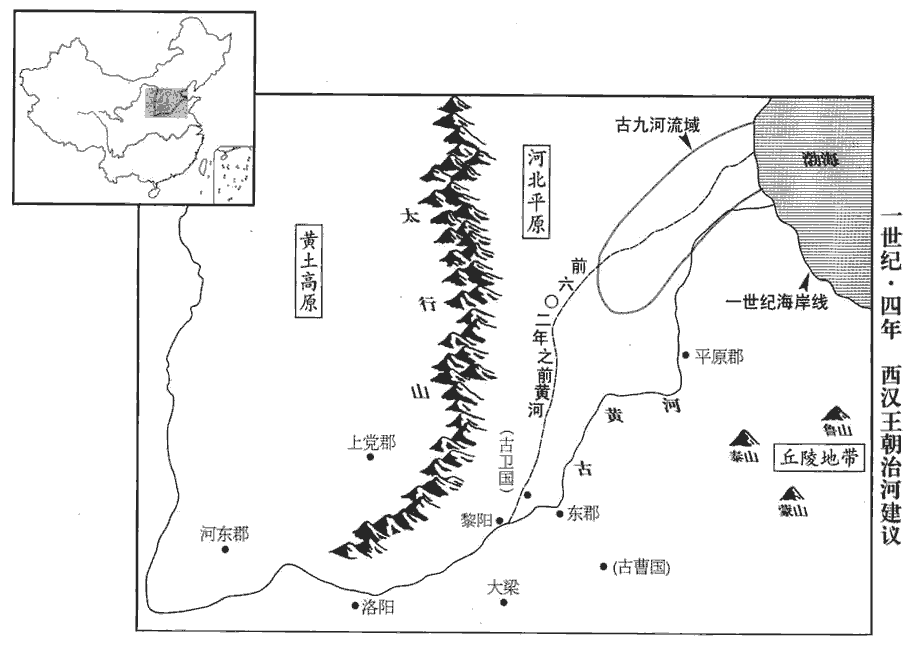
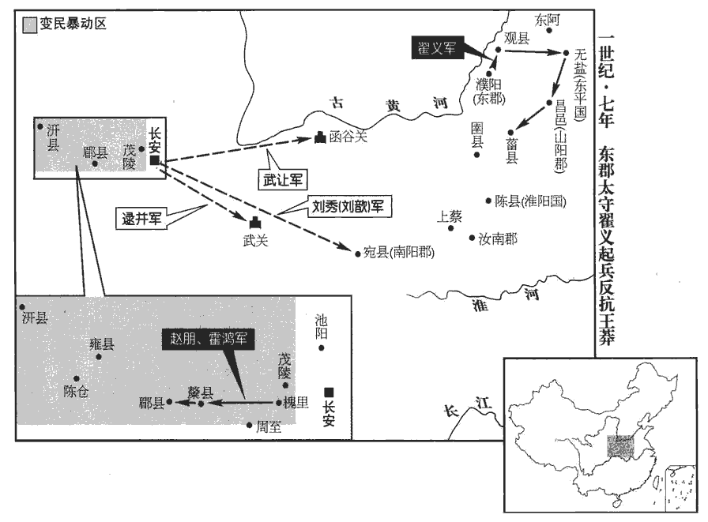
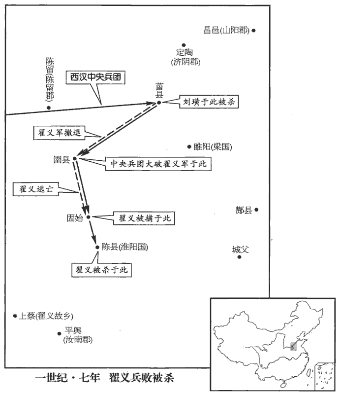

 漢紀二十八起昭陽大淵獻（癸亥），盡著雍執徐（戊辰），凡六年。

# 孝平皇帝下

## 元始三年（癸亥，三）

1春，太后遣長樂少府夏侯藩、宗正劉宏、尚書令平晏納采見女。婚有五禮，納采、問名、納吉、納徵、請期。陸德明曰：采，音七在翻，擇也。師古曰：謂采擇其可者。還，奏言：「公女漸漬zì德化，漸，音沾。有窈窕之容，窈窕，幽閒也。王肅曰：善心曰窈，善容曰窕。宜承天序，奉祭祀。」太師光、大司徒宮、大司空豐、左將軍孫建、執金吾尹賞、行太常事、太中大夫劉秀及太卜、太史令服皮弁biàn、素積，百官表：太常有太卜、太史等令。師古曰：皮弁，以鹿皮為冠，形如人手之弁合也。素積，謂素裳也。朱衣而素裳。積，謂襞bì績，若今之襈zhuàn為也。襈，音雛戀翻。賢曰：素積者，積以為裳也，言要中辟積也。賈公彥曰：皮弁之服，十五升白布衣，積素以為裳。以禮雜卜筮，皆曰：「兆遇金水王相，卦遇父母得位，兆，卜也。卦，筮也。孟康曰：金、水相生也。張晏曰：金王則水相也。遇父母則泰卦，乾下坤上，天下於地，是配享之卦。師古曰：王，音於放翻。原父曰：但言父母得位，安知是泰卦乎！相，息亮翻。所謂康強之占，逢吉之符也。」洪范曰：汝則從、龜從、筮從、卿士從、庶民從，是之謂大同，身其康強，子孫其逢吉。又以太牢策告宗廟。有司奏：「故事：聘皇后，黃金二萬斤，為錢二萬萬；」莽深辭讓，受六千三百萬，而以其四千三百萬分予十一媵家及九族貧者。九族，上自高祖，下至玄孫之親。按漢書王莽傳：「故事聘皇后黃金二萬斤，為錢二萬萬。莽深辭讓，受四千萬，而以其三千三百萬予十一媵家。群臣復言：「今皇后受聘，踰群妾亡幾。」有詔，復益二千三百萬，為三千萬。莽復以其千萬分予九族貧者。又按杜佑通典：聘后黃金二萬斤，漢呂后為惠帝聘魯元公主故事也。予，讀曰與。

〖译文〗 [1]春季，太皇太后王政君派长乐少府夏侯藩、宗正刘宏、尚书令平晏，前往王莽家，呈上礼物，并与王莽的女儿相见。回来后，向王政君奏报：“安汉公的女儿，受到最好的教育，有美丽善良的容貌，适宜承受天命，侍奉皇家宗庙祭祀。”太师孔光、大司徒马宫、大司空甄丰、左将军孙建、执金吾尹赏、行太常事太中大夫刘秀，以及太卜、卜史令，都戴上鹿皮帽，穿上素色衣裳，依照仪式，共同卜卦。都说：“这是金、水互相辅佐的吉兆，父母和睦喜悦的卦象。正是所谓康乐、强健的预示，子孙大吉的征兆。”接着，又用猪牛羊各一头祭祀，以策书禀告宗庙。主管官吏报告：“按照成例，聘皇后的彩礼是黄金二万斤，折合钱二万万。”王莽执意推辞，只愿接受钱六千三百万，而又在其中拨出四千三百万，分赠给被选为从嫁媵妾的十一家，以及王姓家九族以内的贫苦亲属。

2夏，安漢公奏車服制度，吏民養生、送終、嫁娶，奴婢、田宅、器械之品，立官稷，元始元年，莽號安漢公。至是始書以冠事，表其所從來者漸矣。通鑑凡書權臣例始此。如淳曰：郊祀志：已有官社，未有官稷，遂立官稷於官社之後。臣瓚曰：漢初，除秦社稷，立漢社稷；其後又立官社，配以夏禹，而不立官稷。師古曰：淳、瓚二說皆未盡也。初立官稷於官社之後，是為一處。今更創置建於別所，不相從也。及郡國、縣邑、鄉聚皆置學官。張晏曰：聚，邑落名也。師古曰：聚，音才喻翻。

〖译文〗 [2]夏季，安汉公王莽奏报关于车马和衣服穿着的制度，全国官吏平民的日常生活，丧葬送终，男婚女嫁，以及奴婢的买卖和待遇，田地房产的转移，各种用具等等，分别定立等级。又设置祭祀五谷的神庙。并在各郡、各封国、各县、各城、各乡、各村，都设置学官。

3大司徒司直陳崇使張敞孫竦sǒng草奏，師古曰：草，謂創立其文。盛稱安漢公功德，以為：「宜恢公國令如周公，成王以周公有勳勞於天下，封以曲阜地方七百里。建立公子令如伯禽，魯頌閟bì宮之詩曰：王曰叔父，建爾元子，俾bǐ侯於魯。所賜之品亦皆如之，魯公之封於魯也，賜以附庸，殷民六族，大路，大旂qí，封父之繁弱，夏后氏之璜，祝、宗、卜、史，備物典策，官司彝器，白牡之牲，郊望之禮。諸子之封皆如六子。」周公六子，封於凡、蔣、邢、茅、胙、祭。師古曰：六子，伯禽之弟也。祭，側界翻。太后以示群公。群公方議其事，會呂寬事起。

〖译文〗 [3]大司徒司直陈崇，命张敞的孙儿张竦起草奏章，歌颂王莽的功德，说：“应该扩大安汉公的封国，让他象周公一样；赐封安汉公的长子，让他象伯禽一样，赏赐的等级也完全相同。其他儿子的封赏，都像周公的六个儿子一样。”太皇太后王政君把奏章交给大臣们看，大臣们正在讨论这件事，恰巧吕宽事件发生了。

初，莽長子宇非莽隔絕衛氏，隔絕事見上卷元年。長，知兩翻。恐久後受禍，即私與衛寶通書，教衛后上書謝恩，上，時掌翻；下同。因陳丁、傅舊惡，冀得至京師。莽白太皇太后，詔有司褒賞中山孝王后，益湯沐邑七千戶。衛后日夜啼泣，思見帝面，而但益戶邑；宇復教令上書求至京師。復，扶又翻。莽不聽。宇與師吳章及婦兄呂寬議其故，章以【章：甲十六行本「以」下有「爲」字；乙十一行本同。】莽不可諫而好鬼神，好，呼到翻。可為變怪以驚懼之，章因推類說令歸政衛氏。推類者，因變怪而推言事類如洪范五行傳，以說莽也。說，輸芮翻。宇即使寬夜持血灑莽第，門吏發覺之；莽執宇送獄，飲藥死。宇妻焉懷子，師古曰：焉，其名。繫獄，須產子已，殺之。師古曰：須，待也。已，訖也。甄邯等白太后，下詔曰：「公居周公之位，輔成王之主，而行管、蔡之誅，不以親親害尊尊，朕甚嘉之！」莽盡滅衛氏支屬，唯衛后在。吳章要斬，磔zhé尸東市門。要，與腰同。磔，陟格翻，裂也，張也。

〖译文〗 当初，王莽的长子王宇反对王莽隔离卫姓家族，恐怕将来受到报复，便暗中跟卫宝通信，让卫后上书谢恩，并借机陈述丁姓家族和傅姓家族的罪恶，盼望被召到京师长安。王莽报告太皇太后，下诏让主管官吏褒扬赏赐卫后，增加汤沐邑七千户人家。卫后日夜哭泣，思念与平帝见面，然而只是增加了汤沐邑的户数。王宇再次教她上书要求前来京师探望。王莽不听。王宇与他的老师吴章和内兄吕宽商量这件事，吴章认为王莽不可规劝，但相信鬼神，可以制造怪异来恐吓他，再由吴章乘势推演，劝说他把政权移交卫姓家族。王宇便让吕宽于夜晚拿血涂洒王莽的住宅，守门的小吏发觉了这件事，王莽捉拿王宇送到牢狱里，令服毒药而死。王宇的妻子吕焉正怀孕，被囚禁在监狱里，等到生小孩后再杀掉。右将军甄邯等报告太皇太后，王政君下诏褒扬王莽：“阁下身居周公的地位，辅佐象周成王这样的幼主，而实施对管叔、蔡叔的诛杀，不以骨肉私情伤害君臣之间的大义，朕非常嘉勉这种大义灭亲的壮举。”王莽于是下令崐把卫姓家族全部屠杀，只留下卫后一人。吴章遭腰斩，在长安东市门施以分裂肢体的酷刑。

初，章為當世名儒，章治尚書經，為博士。教授尤盛，弟子千餘人。莽以為惡人黨，皆當禁錮不得仕宦，門人盡更名他師。師古曰：更以他人為師，諱不言是章弟子。更，工衡翻。平陵‹陝西咸陽西平陵乡›云敞時為大司徒掾，姓譜：䢵，出自祝融之後，為䢵國；後去邑為云。自劾吳章弟子，劾，戶概翻。收抱章尸歸，棺斂葬之，師古曰：棺，音工喚翻。斂，音力贍翻。京師稱焉。

〖译文〗 原先，吴章是当时著名的儒家学派学者，广收学生，有千余人之多。王莽认为那些学生全是恶人的党徒，都应当禁锢起来，不得为官。学生们全都改换自己的身份，改投别的老师。平陵人云敞，当时任大司徒掾，上书自我弹劾，声称是吴章的学生，把吴章的尸体领回，买一口棺材收殓埋葬。长安人称道他的高义。

莽於是因呂寬之獄，遂窮治黨與，連引素所惡者悉誅之。治，直之翻；下同。惡，烏路翻。元帝女弟敬武長公主素附丁、傅，長，知兩翻。及莽專政，復非議莽；復，扶又翻。紅陽侯王立，莽之尊屬；立，莽叔父也。平阿侯王仁，素剛直；仁，譚子也。莽皆以太皇太后詔，遣使迫守，令自殺。使，疏吏翻；下同。令，力丁翻。莽白太后，主暴病薨；主，言敬武公主。太后欲臨其喪，莽固爭而止。甄豐遣使者乘傳案治衛氏黨與，傳，知戀翻。郡國豪桀及漢忠直臣不附莽，【章：甲十六行本「莽」下有「者」字；乙十一行本同；孔本同。】皆誣以罪法而殺之。何武、鮑宣及王商子樂昌侯安、涿郡王商，相成帝者也。辛慶忌三子護羌校尉通、函谷都尉遵、水衡都尉茂、南郡‹湖北江陵›太守辛伯皆坐死。何武不舉莽為大司馬。鮑宣素有強項名。王商與王鳳不協，為所擠陷，忿毒而死；其子安不附王氏；辛慶忌本王鳳所成，莽見其三子皆能，欲親厚之；辛茂自以名臣子孫，兄弟并顯列，不宜附莽，又不甚詘qū事甄豐、甄邯；伯亦辛氏之族：故并及禍。凡死者數百人，海內震焉。北海‹山東昌樂东南›逄páng萌謂友人曰：「三綱絕矣，莽殺其叔父，又自殺其塚嫡，是滅其天性也；殺其君之祖姑，又盡除忠直之臣，是無君也；故曰三綱絕矣。逄páng，皮江翻。不去，禍將及人！」即解冠掛東都城門，萌時學於長安。賢曰：漢宮殿名：東都門，今名青門。註又見昭紀。歸，將家屬浮海，客於遼東‹遼寧遼陽›。

〖译文〗 王莽于是假借吕宽案件，下令追究吕宽党羽，牵连自己平素所厌恶的人，都予以诛杀。其中包括汉元帝的妹妹敬武长公主，她一向跟丁姓家族、傅姓家族友善，及至王莽专权，又非议王莽；王莽的亲叔父红阳侯王立，平阿侯王仁性格一向刚强正直；王莽都以太皇太后的名义，颁下诏书，并派使节监督，强迫他们自杀。王莽报告太皇太后说，敬武长公主患急病死亡。太皇太后要亲自前往祭悼，王莽竭力劝阻，才罢。大司空甄丰派遣专人，乘坐朝廷驿车，前往各地诛杀卫姓家族党羽。各郡、各封国的豪杰，跟汉王朝的忠臣义士，凡不顺附王莽的，都被诬陷有罪，依法处决。前任前将军何武、前任司隶校尉鲍宣，以及王商的儿子乐昌侯王安、前任左将军辛庆忌的三个儿子：护羌校尉辛通、函谷都尉辛遵、水衡都尉辛茂，以及南郡太守辛伯，全都被处死。共诛杀数百人，全国震惊。北海郡人逢萌对朋友说：“君臣、父子、夫妇之道都废绝了，再不离开，大祸临头。”说完就摘下帽子挂在东都城门，回到故乡，带着家属乘船渡海，到辽东客居。

莽召明禮少府宗伯鳳宗伯，姓也。鳳，名也。鳳明於禮，官為少府。少，詩照翻。入說為人後之誼，白令公卿、將軍、侍中、朝臣并聽，說為人後者義不得顧私親。師古曰：白令皆聽之。朝，直遙翻。欲以內厲天子而外塞百姓之議。厲，諷厲也。厲者，磨錯垢故以就新，取此義也。師古曰：塞，止也。塞，悉則翻。先是，秺dù侯金日磾dī子賞、都成侯金安上子常皆以無子國絕，先，悉薦翻。秺，音妬。磾，丁奚翻。莽以【章：甲十六行本「以」下有「日磾」二字；乙十一行本同；孔本同；張校同。】曾孫當及安上孫京兆尹欽紹其封。當，日磾曾孫也。欽謂「當宜為其父、祖立廟，晉灼曰：當是賞弟建之孫。此言當自為其父及祖父建立廟也。為，於偽翻。而使大夫主賞祭也。」【章：甲十六行本無「也」字；乙十一行本同；孔本「也」作「事」；張校同。】如淳曰：以賞故國君，使大夫掌其祭事。臣瓚曰：當是支庶，上繼大宗，不得顧其私親也。而欽令尊其父、祖以續日磾，不復為賞後，而令大夫主掌祭事。師古曰：瓚說是。甄邯時在旁，廷叱欽，因劾奏「欽誣祖不孝，大不敬；」下獄，自殺。劾，戶概翻：下，遐稼翻。邯以綱紀國體，無所阿私，忠孝尤著，益封千戶。更封安上曾孫湯為都成侯。湯受封日，不敢還歸家，以明為人後之誼。

〖译文〗 王莽征召深明古礼的少府宗伯凤，到宫廷讲解充任继承人的大义。建议由太皇太后下令，公卿、将军、侍中及文武百官，都要参加听讲。目的在于对内教训天子，对外消除百姓的议论。在此之前，侯金日的儿子金赏，都成侯金安上的儿子金常，都因为没有儿子，封国撤除。王莽命金日的曾孙金当，金安上的孙儿京兆尹金钦，分别继承爵位。金钦说：“金当应给他父亲、祖父建立祭庙，而派大夫主持伯祖父金赏的祭祀。”这时，甄邯正在旁边，当着平帝及文武百官，叱责金钦，弹劾他：“诬蔑祖先，不孝，犯大不敬之罪。”逮捕金钦，金钦在狱中自杀。甄邯因维护国家纲纪，不徇私情，忠孝双全，增加封地人家一千户。改封金安上的曾孙金汤当都成侯。金汤受封的当天，不敢回家，用以显示作为大宗继承人应遵循的大义。

4是歲，尚書令潁川‹河南禹州›鍾元為大理。哀帝元壽二年，復改廷尉為大理。潁川太守陵陽‹安徽黄山市西北›嚴詡地理志，陵陽縣屬丹陽郡。本以孝行為官，行，下孟翻。謂掾、史為師友，掾，俞絹翻。有過輒閉閤自責，終不大言。郡中亂。史言世降俗薄，徒善不足以為政。王莽遣使徵詡，官屬數百人為設祖道，為，於偽翻。詡據地哭。掾、史曰：「明府吉徵，不宜若此！」詡曰：「吾哀潁川‹河南禹州›士，身豈有憂哉！我以柔弱徵，必選剛猛代；代到，將有僵仆者，師古曰：僵，偃也。仆，顛也。僵，音薑。仆，音赴。故相弔耳！」詡至，拜為美俗使者；文穎曰：宣美風化使者。徙隴西‹甘肅臨洮›太守【章：甲十六行本「守」下有「平陵」‹陝西咸陽西平陵乡›二字；乙十一行本同；孔本同；張校同。】何並為潁川‹河南禹州›太守。並到郡，捕鍾元弟威及陽翟‹河南禹州›輕俠趙季、李款，皆殺之；郡中震栗。地理志，陽翟縣屬潁川郡。翟，音直格翻。

〖译文〗 [4]本年，尚书令颍川人钟元，被任命为大理。颍川太守陵阳人严诩，当初，以对父母的孝顺行为而被推荐当官，他把掾、史等属官当作教师或朋友，崐遇到过错，就关起来门来，自我责备，从来没有大声说过话。后来，郡中大乱，王莽派使节征召严诩，郡府官吏数百人，设宴给严诩饯行，严诩坐着以手按地大哭，官吏们说：“朝廷征召明府君，这对明府君来说是一件喜事，不应该这么悲伤。”严诩说：“我为颍川人悲伤，岂是为我自己忧愁？我因为柔弱的原因被调走，必选强硬猛烈的人代替我。代替我的人到了，必然有人身死，所以我才悲伤。”严诩到了京师，王莽任命他当美俗使者，改任陇西太守。何并接任颍川太守，他一到任，就逮捕钟元的弟弟钟威及阳翟侠士赵季、李款，一齐诛杀，全郡深为恐惧。

## 四年（甲子，四）

1春，正月，郊祀高祖‹刘邦›以配天，宗祀孝文‹刘恒›以配上帝。師古曰：郊祀，祀於郊也。宗，尊也，祀於明堂也。上帝，太微五帝也；一曰：昊天上帝也。王肅曰：上帝，天也。馬融曰：上帝，泰一之神，在紫微宮，天之最尊者。杜佑曰：元氣廣大則稱昊天；人之所尊莫過於帝，託之於天，故稱上帝。

〖译文〗 [1]春季，正月，平帝在长安郊外用祭祀天地之礼祭祀高祖，以配享上天；在明堂用祭祀祖宗之礼祭祀文帝，以配享上帝。

2改殷紹嘉公曰宋公，周承休公曰鄭公。成帝綏和元年，封殷紹嘉公，進周承休侯爵為公，為二王後。

〖译文〗 [2]改封殷绍嘉公为宋公、周承休公为郑公。

3詔：「婦女非身犯法，及男子年八十以上、七歲已下，家非坐不道、詔所名捕，張晏曰：名捕，謂下詔所特捕也。他皆無得繫；其當驗者即驗問。師古曰：就其所居而問。定著令！」

〖译文〗 [3]平帝下诏：“妇女除非本人犯法，以男子八十岁以上、七岁以下，其家除非被指控为大逆不道，或朝廷指名逮捕，一概不准囚禁。必须调查时，官员应到妇女或老幼所住的地方调查，本诏书自即日起成为法律。”

4二月，丁未‹七›，遣大司徒宮、大司空豐等奉乘輿法駕迎皇后‹时年十二›於安漢公第，授皇后璽紱fú，乘，繩證翻。續漢志：皇后綬，與乘輿同，四采黃、赤、縹piǎo、紺gàn，長丈九尺九寸，五百首。璽，蓋亦玉璽也。師古曰：紱，所以繫璽，音弗。考異曰：王莽傳云「四月，丁未」，平紀云「二月，丁未，立皇后王氏」，下云「夏，皇后見於高廟」。外戚傳云明年春，迎皇后於安漢公第。然則言四月者誤也。入未央宮。大赦天下。

〖译文〗 [4]二月丁未（初七），派大司徒马宫、大司空甄丰等，带着御用车轿跟皇家仪仗队，前往安汉公王莽家宅，迎接王莽的女儿，呈上皇后印信，将她载回未央宫。大赦天下。

5遣太僕王惲等八人各置副，假節，副，副使也。惲等持節，其副則假之以節。惲，於粉翻。分行天下，行，下孟翻。覽觀風俗。

〖译文〗 [5]派太仆王恽等八人为使节，各人再设副手，持节，分别巡视全国各地，考察社会风俗。

6夏，太保舜等及吏民上書者八千餘人，咸請「如陳崇言，加賞於安漢公。」章下有司，下，遐稼翻；下同。有司請「益封公以召陵‹河南郾城东›、新息‹河南息縣›二縣及黃郵聚‹河南新野东北›、新野‹河南新野›田；新息、召陵二縣，屬汝南郡。續漢志，南陽郡新野縣有東鄉，故新都，王莽所封也；又有黃郵聚。聚，才諭翻。采伊尹、周公稱號，加公為宰衡，伊尹曰阿衡，周公位塚宰。稱，尺證翻。位上公，三公言事稱『敢言之』；賜公太夫人號曰功顯君；莽母也。封公子男二人安為褒新侯，臨為賞都侯；莽封新都侯，析其國名二字，加「褒」、「賞」，以封其二子。加后聘三千七百萬，合為一萬萬，以明大禮；太后臨前殿親封拜，安漢公拜前，二子拜後，如周公故事。」成王之侯伯禽於魯也，周公拜前，魯公拜後。莽稽首辭讓，稽，音啟。出奏封事：「願獨受母號，還安、臨印韍fú及號位戶邑。」韍，即紱；音弗。事下，下，遐稼翻。太師光等皆曰：「賞未足以直功；師古曰：直，當也。謙約退讓，公之常節，終不可聽。忠臣之節亦宜自屈，而伸主上之義。宜遣大司徒、大司空持節承制詔公亟入視事；詔尚書勿復受公之讓奏。」復，扶又翻；下同。奏可。莽乃起視事，止減召陵、黃郵、新野之田而已。

〖译文〗 [6]夏季，太保王舜等以及官民八千余人上书朝廷，一致请求：“请按照大司徒司直陈崇的建议，增加对安汉公王莽的赏赐。”奏章交给主管官吏，主管官吏奏报：“增加安汉公王莽的封地，把召陵、新息二县，跟黄邮聚、新野两地的耕田全都划入。采用伊尹和周公的称号，给安汉公加上宰衡的官号，位居上公。三公向安汉公报告工作，自称‘冒昧陈辞’。封王莽的母亲为功显君，封王莽的两个儿子王安为褒新侯，王临为赏都侯。增加皇后彩礼三千七百万钱，合成一万万钱，用来表明礼仪的隆重。太皇太后来到前殿，亲自赐封爵位和称号。王莽在前面下拜，两个儿子在后面下拜，一如周公的旧例。”王莽叩头辞让，出宫以后送上密封的奏章，说：“仅愿接受对我母亲的封号，而退还王安、王临的印玺绶带和爵位称号、封邑民户。”太师孔光等都说：“赏赐不足以抵过功劳，谦虚辞让是安汉公的一贯作风，到底不可以听从。忠臣的气节有时应该自己屈服，使主上的大义得以伸张。应该派遣大司徒、大司空拿着符节，奉皇帝命令征召安汉公赶快入宫主持朝政。并下令尚书，拒绝接受安汉公任何推辞退让的奏章。”奉章被批准了。王莽这才起来办理公务，仅减少召陵、黄邮聚、新野三地的封土罢了。

莽復以所益納徵錢千萬遺太后左右奉共養者。遺，于季翻；下同。白虎通曰：納徵用玄纁xūn。共，居用翻。養，弋向翻。莽雖專權，然所以誑kuáng耀媚事太后，下至旁側長御，方故萬端，賂遺以千萬。數白尊太后姊、妹號皆為君，食湯沐邑。姊君挾為廣恩君，君力為廣惠君，君弟為廣施君。以故左右日夜共譽莽。譽，音餘。莽又知太后婦人，厭居深宮中，莽欲虞樂以市其權，樂，音洛。乃令太后四時車駕巡狩四郊，張晏曰：市權者，以遊觀之樂易其權，若市賈然。師古曰：虞，與娛同。邑外謂之郊，近二十里也。仲馮曰：言郊，不必二十里也。存見孤、寡、貞婦，所至屬縣，輒施恩惠，賜民錢帛、牛酒，歲以為常。太后旁弄兒病，在外舍，服虔曰：官婢、侍史生兒，取以作弄兒也。莽自親候之。其欲得太后意如此。

〖译文〗 王莽又在所增加彩礼的三千七百万中，提出一千万，送给太皇太后左右侍从人员。王莽虽然独裁，但他千方百计迷惑诌媚取悦太皇太后，甚至太皇太后身旁那些常侍的随从，都使用多种方法，致送数以千万计的贿赂。又建议封太后的姐、妹为君，各有汤沐邑。因此，太皇太后身旁的人日夜共同赞美王莽。此外，王莽知道，太皇太后仍是一个女人，厌恶居住在深宫之中。他打算用娱乐换取在太后手里的权力，于是，春夏秋冬四季，都请太后到长安四郊游览，慰问孤儿、寡妇和贞妇。所到长安各属县，都布施恩惠，赏赐平民钱币、丝织品、牛肉、美酒，每年都是如此。太后身旁供支使的小子有病，王莽亲自前往探望。王莽想得到太后的好感，所用手段大致类此。

太保舜奏言：「天下聞公不受千乘之土，古者諸公之國，地方百里，出兵車千乘。辭萬金之幣，謂聘后之幣也。莫不鄉化。鄉，讀曰嚮。蜀郡‹四川成都›男子路建等輟訟，慚怍而退，雖文王卻虞、芮何以加！師古曰：卻，退也。虞、芮，二國名也，并在河之東。二國之君爭田不平，聞文王之德，乃往斷焉；入周之竟，則耕者讓畔，行者讓路，乃相謂曰：「我小人也，不可以履君子之庭！」遂相讓，以其所爭為閒田而退。怍，才各翻。宜報告天下。」【章：甲十六行本「下」下有「奏可」二字；乙十一行本同；孔本同；張校同。】於是孔光愈恐，固稱疾辭位。太后詔：「太師毋朝，朝，直遙翻。十日一入省中，置几杖，賜餐十七物，然後歸；官屬按職如故。」師古曰：食具有十七種物，言十日一入朝，受此寵禮，他日則常在家自養；而其屬官依常各行職務。

〖译文〗 太保王舜奏报：“全国百姓听到安汉公不接受相当于可以出一千辆兵车的国家的封地，推辞万斤黄金的彩礼，没有人不仰慕。蜀郡男子路建等人停止诉讼，惭愧地回去了，就是周文王感化虞君、芮君，让他们自动停止争执返回本国，也不能超过安汉公！应当把这些事情宣告全国。”当时太师孔光愈来愈恐惧，声称有病，坚决辞职。太后下诏：“太师不必再参加朝会，只要每隔十天入宫一次就可以了。宫廷当为你置备几案手杖，赏赐吃十七种食物，然后再回家；太师府的属官各行其职如故。”

7莽奏起明堂、辟雍、靈臺，應劭曰：明堂所以正四時，出教化。明堂上圓下方，八窗四達，布政之宮，在國之陽：上八窗法八風，四達法四時，九室法九州，十二重法十二月，三十六戶法三十六雨，七十二牖法七十二風。黃帝曰合宮，有虞曰總章，殷曰陽館，周曰明堂。辟雍者，象璧；圜之以水，象教化流行。大戴禮：明堂，以茅蓋，上圓下方。天子曰靈臺，諸侯曰觀臺，以望氣，書雲物。為學者築舍萬區，為，於偽翻。制度甚盛。立樂經；益博士員，經各五人。徵天下通一藝、教授十一人以上，及有逸禮、古書、天文、圖讖、張衡曰：圖讖虛妄，非聖人之法。劉向父子領校秘書，閱定九流，亦無讖錄；成、哀之後，乃始聞之。鍾律、月令、兵法、史篇文字，孟康曰：史籀zhòu所作十五篇古文書也。師古曰：周宣王太史史籀所作大篆書也。籀，直救翻。通知其意者，皆詣公車。網羅天下異能之士，前後至者千數，皆令記說廷中，將令正乖謬，壹異說云。令各造廷中而記其說也。

〖译文〗 [7]王莽提议兴建明堂、辟雍和灵台，给学者建筑宿舍一万间，规模十分宏伟。在太学设立《乐经》课程，并增加博士名额，每一经各五人。征求全国精通一经，而且教授弟子十一人以上的经师，以及藏有散失的《礼经》、古文《尚书》、天文、图谶、音乐、《月令》、《兵法》、《史籀篇》文字，通晓它们意义的人，都前往公车衙门。收罗全国具有卓越才能的士人，来到京师的前后数以千计，都让他们到朝廷上记录他们的学说，打算让他们订正流传的错误，统一各种分歧的说法。

又徵能治河者以百數，治，直之翻。其大略異者，長水校尉平陵‹陝西咸陽西平陵乡›關並姓譜：關，夏大夫關龍逢之後。風俗通：關令尹喜之後。言：「河決率常於平原‹山東平原›、東郡‹河南濮陽西南›左右，其地形下而土疏惡。疏，音踈。聞禹治河時，本空此地，以為水猥盛則放溢，少稍自索，少，詩沼翻。師古曰：猥，多也。索，盡也，音先各翻。雖時易處，猶不能離此。離，力智翻。上古難識。近察秦、漢以來，河決曹‹山東定陶›、衛‹河南淇縣›之域，漢之濟陰、定陶，故曹國也。東郡及魏郡黎陽，古衛地也。其南北不過百八十里。可空此地，勿以為官亭、民室而已。」御史臨淮‹江蘇泗洪南›韓牧以為：「可略於禹貢九河處穿之，縱不能為九，但為四、五，宜有益。」大司空掾王橫言：「河入勃海地，高於韓牧所欲穿處。往者天常連雨，東北風，海水溢，西南出，寖數百里，九河之地已為海所漸矣。師古曰：漸，寖也，讀如本字，又音子廉翻。禹之行河水，本隨西山下東北去。師古曰：行，謂通流也。周譜云：『定王五年，河徙，』如淳曰：譜，音補，世統譜諜也。則今所行非禹之所穿也。又秦攻魏，決河灌其都‹大梁，河南開封›，事見七卷秦始皇二十二年。決處遂大，不可復補。復，扶又翻。宜卻徙完平處更開空，空，音孔。師古曰：空，猶穿。使緣西山足，乘高地而東北入海，乃無水災。」西山，謂黎陽以西諸山。司空掾沛國‹安徽淮北›桓譚典其議，為甄豐言：為，於偽翻；下同。「凡此數者，必有一是；宜詳考驗，皆可豫見。計定然後舉事，費不過數億萬，亦可以事諸浮食無產業民。師古曰：事，謂役使也。空居與行役，同當衣食，衣食縣官而為之作，乃兩便，師古曰：言無產業之人，端居無為及發行力役，俱須衣食耳。今縣官給其衣食而使修治河水，是為公私兩便也。可以上繼禹功，下除民疾。」時莽但崇空語，無施行者。

〖译文〗 王莽又征求能够治理黄河的人才以百计算，各人的主张并不相同。长水校尉平陵人关并认为：“黄河溃决的地点，经常在平原、东郡左右，那一带地势低下，土质松软。据说夏禹治理黄河时，原本把这一带地区空出来，认为水大时就到那里倾泄，水小时自会逐渐干涸。虽然时常改变地方，但还没能离开这一带。上古时代往事，难以考察。考察近代秦、汉以来的状况，黄河在古曹国、古卫国的地域决口，南北相距不过百八十里。可以把这一带腾空，不再兴建官亭、民居罢了。”御史临淮人韩牧认为：“《禹贡》有九条河流的记载，我崐们应大略地在故道上挖掘，即令不能凿出九条河流，只要能开凿四五条，应该也有裨益。”大司空掾王横进言：“黄河注入渤海的出口，比韩牧打算挖掘地带的地势要高。过去，降雨频繁，东北风起，海水倒灌，黄河向西南倒流，淹没数百里，古九河的故道，早就被海水吞没了。禹当初疏通黄河，本来是要顺着西山，流向东北。《周谱》说：‘周定王五年黄河改道。’说明今天的黄河，并非禹当年挖掘的故河道。还有，秦国攻击魏国时，决开黄河堤岸，用河水灌入魏国京都大梁，决口于是扩大，无法再次堵塞。所以，应把平地的百姓全部迁移，重新开凿河道，使河水顺着西山脚下，居高临下，向东北注入大海，就没有水患了。”大司空掾沛国人桓谭，主持这项讨论，向少傅甄丰说：“这几项建议中，肯定有一个是对的。应详细考察，都可以预先发现。计划既定而后行动，费用不过数亿万，而且可以使一些无产业的游民找到工作。他们闲着不事生产，与他们参与劳动，同样都需要那么多衣服和粮食。由国家供应他们的衣食，而他们为国家劳作，这对两方面都有好处。这样上可以继承禹的大业，下可以为人民除害。”然而，当时王莽崇尚的只是空话，并没有具体施行。

 

8群臣奏言：「昔周公攝政七年，制度乃定。今安漢公輔政四年，營作二旬，大功畢成，宜升宰衡位在諸侯王上。」詔曰：「可。」仍令議九錫之法。應劭曰：九錫：一曰車馬，二曰衣服，三曰樂器，四曰朱戶，五曰納陛，六曰虎賁百人，七曰鈇fū鉞，八曰弓矢，九曰秬jù鬯chànɡ。此皆天子制度，尊之，故事事錫與，但數少耳。張晏曰：九錫，經本無文；周禮以為九命，春秋說有之。臣瓚曰：九錫備物，霸者之盛禮，齊桓、晉文猶不能備。鄭玄曰：按九錫之名，古無有也。王制：三公一命袞；若有加，則賜也不過九命。孔穎達曰：鄭意以為九命之外，別加九賜。案禮緯含文嘉，上列九錫之差，下云四方所瞻之成，侯子所望。宋均註云：九賜者，乃四方所共見，公侯伯子男所希望。孔引含文嘉所謂九錫，與應劭同，獨樂器曰樂則耳。宋均註云：進退有節，行步有度，賜之車馬以代其步。言成文章，行成法則，賜之衣服以表其德。長於教訓，內懷至仁，賜之樂則以化其民。居處修理，房內不渫xiè，賜之朱戶以明其別。動作有禮，賜之納陛以安其體。勇猛勁疾，執義堅強，賜之虎賁以備非常。亢揚威武，志在宿衛，賜之斧鉞使得專殺。內懷仁德，執義不傾，賜之弓矢使得專征。孝慈父母，賜之秬jù鬯chànɡ以事先祖。

〖译文〗 [8]文武百官奏称：“从前，周公代周成王处理国政七年，国家的制度才厘订妥当。而今，安汉公辅助国政四年，修建明堂等用了二十天，却大功全部完成。所以，应该把宰衡的地位，提高到侯爵亲王之上。”下诏说：“可以。”同时下令讨论九锡之法。

9莽奏尊孝宣廟為中宗，孝元廟為高宗；又奏毀孝宣皇考廟勿脩；宣帝元康元年尊悼園曰皇考。罷南陵、雲陵為縣。南陵，文帝母薄太后陵。雲陵，昭帝母趙太后陵。奏可。

〖译文〗 [9]王莽奏请：将宣帝祭庙尊为中宗，元帝祭庙尊为高宗。又奏请：废弃刘询父亲刘据祭庙，不再修建；撤销南陵、云陵，改成两个普通县。下诏批准。

10莽自以北化匈奴，東致海外，南懷黃支‹越南最南部›，莽自奏曰：越裳氏重譯獻白雉；黃支自三萬里貢生犀；東夷王渡大海，奉國珍；匈奴單于順製作，去二名。唯西方未有加，乃遣中郎將平憲等多持金幣誘塞外羌‹青海東北部›，使獻地願內屬。憲等奏言：「羌豪良願等種可萬二千人，願為內臣，種，章勇翻。獻鮮水海‹青海湖›、允谷、鹽池‹青海湖东北尕gǎ海›，地理志，金城郡臨羌縣西北至塞外，有西海、鹽池。闞駰云：西有卑禾羌海，即獻王莽地為西海郡者也。酈道元曰：世謂之青海，東去西平二百五十里。平地美草，皆與漢民；自居險阻處為藩蔽。問良願降意，降，戶江翻。對曰：『太皇太后聖明，安漢公至仁，天下太平，五穀成孰，或禾長丈餘，長，直亮翻。或一粟三米，或不種自生，或繭不蠶自成；甘露從天下，醴泉自地出；鳳皇來儀，神爵降集。從四歲以來，謂自莽輔政以來也。羌人無所疾苦，故思樂內屬。』宜以時處業，處，謂度地以處之。業，謂使各有作業也。樂，音洛。處，昌呂翻。置屬國領護。」事下莽，莽復奏：下，遐稼翻。「今已有東海‹山東郯城›、南海‹廣東廣州›、北海郡‹山東昌樂东南›，請受良願等所獻地為西海郡。分天下為十二州，應古制。」奏可。冬，置西海郡‹青海海晏›。考異曰：王莽傳，置西海郡在明年秋；今從平紀。又增法五十條，犯者徙之西海‹青海海晏›。徙者以千萬數，民始怨矣。

〖译文〗 [10]王莽自以为他的德威，北边感化了匈奴，东边招来了海外国家，南边怀柔了黄支，只有西边没有施加影响。便派遣平宪等人多多携带金钱礼物，去招引边界以外的羌人，使他们献出土地，归属汉朝。平宪等人奏报说：“羌人以良愿等为首的部落，人口约一万二千，愿意成为汉朝的臣民，献出鲜水海和允谷、盐池，该地区地平草茂，都交给汉朝百姓，自己住到险阻之处，作为汉朝的屏障。我们询问良愿归降的用意，他回答说：‘太皇太后圣明，安汉公最仁慈，天下太平，五谷成熟，有的禾苗长到一丈多长，有的一粒谷子包含三粒米，有的不须种植自己生长，有的茧不要蚕吐丝就可以自织而成，甘露从天上降下，甘泉从地下涌出，凤凰前来朝贺，神雀飞临聚集。四年来，羌人没有遭遇过艰难困苦，所以希望并喜欢归属汉朝。’应及时安排他们的生产和生活，设置属国统辖保护他们。”事情交给王莽处理，王莽回奏说：“现在已有东海郡、南海郡、北海郡，请接受良愿等所献土地设置西海郡。全国分为十二州，以符合古代制度。”平帝批准。冬季，设置西海郡。又增订法律五十条，违犯者被流放到西海郡去。被流放的人数以千万，百姓开始怨恨了。

11梁王立坐與衛氏交通，廢，徙南鄭‹陝西汉中›；自殺。衛氏，帝外家也。

〖译文〗 [11]梁王刘立被指控跟卫姓家族勾结，废去王位，放逐到南郑。刘立自杀。

12分京師置前煇光、後丞烈二郡。前煇光蓋領長安以南諸縣，後丞烈蓋領長安以北諸縣也。更公卿、大夫、八十一元士官名、位次及十二州名、分界。更，工衡翻。郡國所屬，罷置改易，天下多事，吏不能紀矣。

〖译文〗 [12]分割京师长安，设置前辉光郡、后丞烈郡。更改公卿、大夫、八十一元士官名、等级以及十二州州名、分界。更改各郡、各封国的管辖区域，或取消崐，或新设，或变更，从此天下事端增多，官吏记不胜记。

## 五年（乙丑，五）

1春，正月，祫xiá祭明堂；應劭曰：禮，五年而再殷祭，壹禘dì壹祫xiá。祫祭者，毀廟之主皆合食於太祖。師古曰：祫，音合。諸侯王二十八人，列侯百二十人，宗室子九百餘人，徵助祭。禮畢，皆益戶、賜爵及金帛、增秩、補吏各有差。已封者益戶，未有爵者賜爵，已有爵者賜金帛，已有秩者增秩，未有官者補吏。

〖译文〗 [1]春季，正月，平帝在明堂对远近祖先进行大合祭。受征助祭的有诸侯王二十八人，列侯一百二十人，皇家子弟九百余人。典礼完毕，全部增加封地户数，赐封爵位，赏赐金银、丝织品，提高俸禄，任命当官，各有差别。

2安漢公又奏復長安南、北郊。三十餘年間，天地之祠凡五徙焉。成帝建始元年罷甘泉泰畤、汾陰后土祠，作長安南、北郊；永始三年，復甘泉、汾陰；成帝崩，皇太后詔復長安南、北郊；哀帝建平三年，復甘泉、汾陰；今又復南、北郊；是五徙也。

〖译文〗 [2]安汉公王莽再奏请：恢复长安南郊祭天，北郊祭地大典。三十余年间，祭祀天地的地方已经变更了五次。

3詔曰：「宗室子自漢元至今十餘萬人，其令郡國各置宗師以糾之，漢元，漢初也。師古曰：糾，謂禁察也。致教訓焉。」

〖译文〗 [3]平帝下诏：“自从汉王朝建立迄今，皇家子弟已有十余万人。各郡、各封国，应设置宗师，负责纠察训导皇家子弟。”

4夏，四月，乙未‹一›，博山簡烈侯孔光薨，贈賜、葬送甚盛，車萬餘兩。兩，音亮。以馬宮為太師。

〖译文〗 [4]夏季，四月乙未（初一），太师、博山侯孔光去世。赐赠丰厚，葬礼十分盛大，送葬的车就有一万多辆。任命马宫当太师。

5吏民以莽不受新野‹河南新野›田而上書者，前後四十八萬七千五百七十二人，及諸侯王公、列侯、宗室見者見，賢遍翻。皆叩頭言：「宜亟加賞於安漢公。」於是莽上書言：「諸臣民所上章下議者，事【章：乙十一行本「事」作「願」；孔本同；甲十六行本「事」作「以」。】皆寢勿上，上，時掌翻。下，遐稼翻。使臣莽得盡力畢制禮作樂；事成，願賜骸骨歸家，避賢者路。」言久處大位，妨賢者進用之路。避位，所以避賢者路也。甄邯等白太后，詔曰：「公每見輒流涕叩頭言，願不受賞；賞即加，不敢當位。方製作未定，事須公而決，故且聽公制作；畢成，群公以聞，究于前議。師古曰：究，竟也。其九錫禮儀亟奏！」

〖译文〗 [5]官吏、平民因为王莽不接受新野县的田地而上书的，前后达四十八万七千五百七十二人，以及诸侯王、公卿、列侯和皇族被接见的，都叩头说：“应该赶快对安汉公加以奖赏。”于是王莽上书说：“官民所上奏章交下来讨论的，应全部搁置不再呈上，使我得以尽力完成制作礼仪和乐章。等到制作完成，我愿退休返回故乡，避开贤能人才上进的道路。”右将军甄邯等奏报太皇太后，太皇太后下诏给王莽：“安汉公每次进见，都流着眼泪，叩头陈情，不愿接受奖赏。如果加以奖赏，您就不敢处在高位。现在制作礼乐制度的工作没有完成，这件大事，必须靠您决定，所以暂且由您制作礼乐。等工作完成，群臣报告之后，再研究大家从前的建议。但关于九锡礼仪，仍要迅速制定奏报。”

五月，策命安漢公莽以九錫，莽稽首再拜，受綠韍，袞冕，衣裳，師古曰：此韍，謂蔽膝也。或謂韍韠bì。韍，音弗；韠，音畢。瑒yáng琫běng、瑒珌bì，孟康曰：瑒，玉名也。佩刀之飾，上曰琫běng，下曰珌bì。詩云，鞞bǐng琫有珌是也。毛傳曰：鞞，容刀鞞也。琫，上飾；珌，下飾。天子玉琫而珧yáo珌；諸侯璗dàng琫而璆qiú珌。陸云：鞞bǐng，刀室也。琫běng，佩刀削上飾；珌，佩刀下飾。爾雅云：黃金謂之璗。說文云：璗dàng，金之美與玉同色者也。師古曰：瑒，音蕩。琫，音布孔翻。珌，音必。句履，孟康曰：今齊祀履頭飾也，出履三寸。師古曰：其形岐頭。句，音巨俱翻。鸞路、乘馬，師古曰：鸞路，車之施鸞者也。四馬曰乘，音食證翻。龍旂qí九旒liú，周禮：交龍為旂。爾雅：有鈴曰旂。旒，旂之末垂也。皮弁biàn、素積，戎路、乘馬，師古曰：戎路，戎車也。彤弓矢、盧lú弓矢，師古曰：彤，赤色。盧，黑色。左建朱鉞，右建金戚，師古曰：鉞、戚，皆斧屬。甲、冑一具，冑，兜鍪。秬jù鬯chàng二卣yǒu，秬鬯，香酒也。周禮春官鬯人註云：釀秬為酒；秬如黑黍，一稃fū二米。陸佃埤pí雅曰：說文：鬯以秬釀，鬱草芬芳，攸yōu服以降神也。舊說：芬芳條暢，故謂之鬯；禮以鬱合鬯，言鬱於中而鬯於外也。又曰：先鄭、小毛以為鬯，香草也，築而煮之為鬯。秬者，百穀之華，鬯者，百草之英，故先王煮以合鬯。卣yǒu，中樽也。秬，音巨。卣，音攸，又音羊久翻。圭瓚二，九命青玉珪二，師古曰：圭瓚，以圭為勺末。上公九命，青者春色，東方生而長育萬物也。朱戶，納陛，朱戶以居，納陛以登。孟康曰：納，內也，謂鑿殿基際為陛，不使露也。師古曰：孟說是也。尊者不欲露而升陛，故納之於霤liū下也。署宗官、祝官、卜官、史官，放周公也。成王之命周公，祝、宗、卜、史。杜預曰：太祝、宗人、太卜、太史，凡四官。虎賁bēn三百人。孔安國曰：虎賁，勇士稱也。若虎賁戰，言其猛也。賁，音奔。

〖译文〗 五月，颁策书加赐王莽九锡，王莽叩头再拜，接受了绿色的蔽膝和龙冠、礼服，用金玉装饰的佩刀，鞋头突出的履，有铃大车和套马，装饰着九束绦子的大龙旗，皮帽子和细褶白布衫，军车和套马，红色的弓和箭，黑色的弓和箭，立在左边的红色钺斧，立在右边的有金饰的戚斧，铠甲和头盔一套，美酒二卣，玉勺两只，九级青玉两枚，规定家里可以安装红漆大门和修建檐内台阶。设置宗官、祝官、卜官、史官，拥有护卫勇士三百人。

6王惲等八人使行風俗還，惲，於粉翻。行，下孟翻；下同。言天下風俗齊同，詐為郡國造歌謠、頌功德，凡三萬言。閏月，丁酉‹四›，詔以羲和劉秀等四人使治明堂、辟雍，治，直之翻。令漢與文王靈臺、周公作洛同符。詩曰：經始靈臺，經之營之，庶民攻之，不日成之。周公營成周，曰：其作大邑，其自時配皇天中乂。太僕王惲等八人使行風俗，宣明德化，萬國齊同，皆封為列侯。四人者，劉秀，紅休侯；平晏，防鄉侯；孔永，寧鄉侯；孫遷，定鄉侯。八人者，王惲，常鄉侯；閻遷，望鄉侯；陳崇，南鄉侯；李翕xī，邑鄉侯；郝黨，亭鄉侯；謝殷，章鄉侯；逯lù普，蒙鄉侯；陳鳳，盧鄉侯。考異曰：恩澤侯表，劉歆等十一侯皆云丁酉，獨平晏云丁丑。按十二人同功俱封，是年閏五月甲午朔，無丁丑，表誤。

〖译文〗 [6]王恽等八位使者考察风俗回京，说全国风俗整齐划一，并编造各地民歌民谣，颂扬功德，共有三万字。闰月丁酉（初四），平帝下诏命羲和刘秀等四人，负责兴建明堂、辟雍，使汉朝的土木工程，跟周朝文王兴建灵台、周公兴建洛阳城相符。太仆王恽等八人，周游全国，考察风俗，宣扬阐明朝廷的恩德教化，使风俗整齐划一。刘秀等四人和王恽等八人，全封列侯。

時廣平‹河北曲周东北›相班穉zhì獨不上嘉瑞及歌謠，班穉時相廣平王，漢武帝征和二年，於廣平置平干國，宣帝五鳳二年復曰廣平。上，時掌翻，下同。琅邪‹山東諸城›太守公孫閎言災害於公府，甄豐遣屬馳至兩郡，續漢志，大司空掾屬二十九人，掾比三百石，屬比二百石，杜佑曰：正曰掾，副曰屬。諷吏民師古曰：遣言祥應而隱除災害。而劾「閎空造不祥，穉絕嘉應，嫉害聖政，皆不道。」劾，戶概翻。穉，班婕妤弟也。婕妤，音接予。太后曰：「不宣德美，宜與言災害者異罰，且班穉後宮賢家，我所哀也。」師古曰：班婕妤有賢德，故哀閔其家。閎獨下獄誅。下。遐嫁翻。穉懼，上書陳恩謝罪，陳恩者，自陳述世受國恩。願歸相印，入補延陵園郎。園郎，掌守園寢門戶。太后許焉。

〖译文〗 当时，只有广平国丞相班稚，不报告祥瑞和民间歌谣，琅邪太守公孙闳在郡府谈论灾害。御史大夫甄丰，派属官前往两地，暗示官史平民，上书弹劾：“公孙闳伪造灾害的消息，班稚拒绝报告祥瑞。二人嫉恨朝廷的圣政，都犯了不道之罪。”班稚是班的弟弟。太皇太后说：“不宣扬美德，应该跟伪造灾害消息分开处罚。而且班稚是后宫有贤德的姬妾的家人，是我所哀怜的人。”于是，单独逮捕公孙闳入狱，诛杀。班稚恐惧，上书陈述世受国恩，请求恕罪，愿缴回封国丞相印信，到长安当延陵园郎，掌守成帝陵寝。太皇太后批准。

7莽又奏為市無二賈，師古曰：言純質也。賈，讀曰價。官無獄訟，邑無盜賊，野無飢民，道不拾遺，男女異路之制；犯者象刑。師古曰：白虎通云：象者，其衣服象五刑也。犯墨者蒙。犯劓yì者以赭zhě著其衣。犯髕bìn者以墨蒙其髕，象而畫之。犯宮者屝fèi。犯大辟者布衣無領。屝，草屨也。臏，音頻忍翻。屝，音扶味翻。

〖译文〗 [7]王莽又奏报说，做买卖没有两样价格，官府没有诉讼案件，城市没有盗贼，乡野没有饥民，大路上没有人拾取丢下的财物，实行男女不一同走路的制度，对于违犯者处予象征性刑罚。

8莽復奏言：「共王母、丁姬，前不臣妾，師古曰：言不遵臣妾之道。復，扶又翻。共，音恭。塚高與元帝山齊，賈公彥曰：爾雅：山頂，塚。則山塚之塚；封土為丘壠曰塚，則塚墓之塚。塚，知隴翻。懷帝太后、皇太太后璽綬以葬。師古曰：懷，謂挾之以自隨也。璽，斯氏翻。綬，音受。請發共王母及丁姬塚，取其璽綬；徙共王母歸定陶‹山東定陶›，葬共王塚次。」太后以為既已之事，不須復發。復，扶又翻。莽固爭之，太后詔因故棺改葬之。莽奏：「共王母及丁姬棺皆名梓宮，珠玉之衣，謂之梓宮者，以香梓為之，言猶生時所居宮室也。珠玉之衣，珠襦玉匣也。非藩妾服。請更以木棺代，更，工衡翻；下同。去珠玉衣；去，羌呂翻。葬丁姬媵yìng妾之次。」奏可。公卿在位皆阿莽指，入錢帛，遣子弟及諸生、四夷凡十餘萬人，操持作具，作具，畚běn鍤chā之類。操，七刀翻。助將作掘平共王母、丁姬故塚；二旬間，皆平。莽又周棘其處，以為世戒云。師古曰：以棘周繞也。又隳huī壞共皇廟，諸造議者泠líng褒、段猶【章：甲十六行本「猶」下有「等」字；乙十一行本同；孔本同。】皆徙合浦‹广西合浦东北›。褒、猶奏見三十三卷哀帝建平元年。考異曰：師丹傳云：「復免高昌侯宏為庶人。」按功臣表：建平四年，董宏已死；元壽二年，子武坐父為佞邪免；不得至今。丹傳誤也。

〖译文〗 [8]王莽又奏报说：“定陶共王的母亲傅太后、汉哀帝的母亲丁姬，先前不遵守藩臣姬妾的规矩，坟墓竟然跟元帝一般高，而且身挟帝太后、皇太太后的印玺绶带埋葬。我建议发掘定陶共王母亲和丁姬的坟墓，取回印玺绶带。然后把定陶共王母亲的遗体运回到定陶国，安葬在共王的墓园。”太皇太后认为，这都是已经过去的事了，不必再发掘坟墓。王莽坚持自己的意见，太皇太后于是下令用傅太后原来的棺木改葬。王莽又奏报说：“定陶共王母亲和丁姬的棺材，都是用最名贵的梓木制成，而且尸体上还穿着用珠子串缀的外套、金镂玉衣，这都不是藩臣姬妾应该享有的。我请求用普通木棺休替，剥去玉衣。将丁姬埋葬在嫔妃坟墓间。”太皇太后批准。公卿和在位的朝廷文武官员都迎合王莽的意旨，捐出钱币、丝织品，派遣子弟，以弟儒生、四方的夷族，总共十多万人，拿着工具，帮助将作大匠挖掘铲平傅太后和丁姬的坟墓。二十天之间，全部铲平。王莽又用荆棘把原地围绕一圈，作为世人的鉴戒。又下令拆除共皇祭庙，将当初提议造庙者泠褒、段犹，全都放逐合浦。

徵師丹詣公車，賜爵關內侯，食故邑。數月，更封丹為義陽侯；丹，建平元年罷歸故邑，高樂侯戶邑也。恩澤侯表：義陽侯，國於南陽新野。考異曰：恩澤侯表：「丹，元始三年，二月，癸巳，更為義陽侯。」胡旦因此并發傅太后陵、徙泠褒等事俱著之三年。按外戚傳云：「元始五年，莽發共王母及丁姬塚，改葬之。」馬宮傳：「莽發傅太后陵，追誅前議者；宮慙懼，乃乞骸骨。」公卿表：宮以今年八月壬午免。然則褒等徙合浦及丹封侯，皆在今年明矣。按長曆，二月丙申朔，無癸巳。日月必有誤者。月餘，薨。

〖译文〗 征召师丹前往长安公车官署，赐封关内侯，恢复他原来的食邑。数月后，改封他义阳侯。一月余，师丹去世。

初，哀帝時，馬宮為光祿勳，與丞相、御史雜議傅太后諡曰孝元傅皇后。及莽追誅前議者，宮為莽所厚，獨不及。宮內慙懼，上書言：「臣前議定陶共王母諡，希指雷同，詭經僻說，師古曰：詭，違也。以惑誤主上，為臣不忠。幸蒙洒心自新，師古曰：洒，音先禮翻。誠無顏復望闕庭，無心復居官府，無宜復食國邑。宮封扶德侯，邑於琅邪贛榆。復，扶又翻。願上太師、大司徒、扶德侯印綬，避賢者路。」上，時掌翻；下同。八月，壬午‹二十›，莽以太后詔賜宮策曰：「四輔之職，為國維綱；三公之任，鼎足承君；不有鮮明固守，無以居位。鮮明，猶言精明也。君言至誠，不敢文過，朕甚多之。師古曰：多，猶重也。不奪君之爵邑，其上太師、大司徒印綬使者，上印綬於使者也。以侯就第。」

〖译文〗 当初，汉哀帝时，马宫为光禄勋，与丞相、御史一同议定傅太后的谥号为孝元傅皇后。等到王莽追究诛杀从前参与议定的人时，马宫因与跟王莽私交笃厚，单独得以幸免。但马宫内心惭愧恐惧，上书说：“从前，在讨论定陶共王母亲谥号时，我迎合上峰的意旨，附和别人的意见，违反儒家经典，坚持偏邪的说法，用来迷惑贻误圣上。作为臣子，没有尽到忠心。虽然幸运地准许我悔改自新，但实在无颜面再看到宫门金殿，也没有心思再居住官府，不应该再拥有封爵食邑。我愿上交太师、大司徒、扶德侯的印信，避开贤能人才上进之路。”八月壬午（二十日），王莽以太皇太后的诏命赐给马宫策书说：“四辅的崐职务，是为国家维持纲纪。三公的责任，象鼎的三脚，支持君王。不坚持原则，就无法居于高位。你的陈述，至为诚恳，不敢掩饰自己的过失，我十分尊重。现在，不剥夺你的封爵和食邑，仅上交太师、大司徒印信绶带给使者。以侯爵身份离开朝廷，返回家宅。”

9莽以皇后有子孫瑞，通子午道，張晏曰：時年十四，始有婦人之道也。子，水；午，火也。水以天一為牡，火以地二為牝pìn，故火為水妃，今通子午以協之。案男八月生齒，八歲毀齒，二八十六陽道通，八八六十四陽道絕。女七月生齒，七歲毀齒，二七十四陰道通，七七四十九陰道絕。從杜陵‹陝西西安东南›直絕南山‹秦嶺›，徑漢中‹陝西安康›。師古曰：子，北方也。午，南方也。言通南北道相當，故謂之子午耳。今京城直南山有谷通梁、漢道者名子午谷，又宜州西界、慶州東界有山名子午嶺，計南北直相當，此則北山是子，南山是午，共為子午道。仲馮曰：史文自以從杜陵徑漢中為子午道耳，顏說非史意也。三秦記：長安正南山名秦嶺，谷名子午，一名樊川，一名御宿。

〖译文〗 [9]王莽因皇后有了生男育女的吉兆，修通子午道，从杜陵县穿过终南山，直通汉中郡。

10泉陵侯劉慶上書師古曰：眾陵節侯賢，長沙定王子。本始四年，戴侯真定嗣；二十二年薨。黃龍元年、頃侯慶嗣，此則是也。莽傳及翟義傳并云「泉陵」。地理志，泉陵縣屬零陵郡，而表作「眾陵」，表為誤也。言，「周成王幼小【章：甲十六行本「小」作「少」；「少」下有「稱孺子」三字；乙十一行本同；孔本同；張校同。】周公居攝。今帝富於春秋，宜令安漢公行天子事，如周公。」群臣皆曰：「宜如慶言。」

〖译文〗 [10]泉陵侯刘庆上书：“周成王年龄幼小，由周公居位摄政。当今圣上年龄还轻，应当让安汉公代行天子的职务，象周公一样。”群臣都说：“应当照刘庆所说的办。”

11時帝春秋益壯，以衛后故，怨不悅。謂衛后不得至京師，其族皆死徙，故不悅。冬，十二月，莽因臘日上椒酒，上，時掌翻。置毒酒中；帝有疾。莽作策，請命於泰畤，願以身代，藏策金縢，置於前殿，敕諸公勿敢言。師古曰：詐依周公為武王請命作金縢也。書曰：周公納策金縢之匱中。孔安國曰：為請命之書，藏之於匱，緘之以金，不欲人開之。孔穎達曰：縢，是縛約之名。丙午，帝崩於未央宮。臣瓚曰：帝年九歲即位；即位五年，壽十四大赦天下。莽令天下吏六百石以上皆服喪三年。奏尊孝成廟曰統宗；孝平廟曰元宗。斂孝平，加元服，斂，力贍翻。葬康陵。臣瓚曰：康陵，在長安北六十里。

〖译文〗 [11]这时，平帝的年龄渐长，因母亲卫皇太后的缘故，怨恨不快。冬季，十二月，王莽借着腊日向平帝进献椒酒，在椒酒中下了毒。平帝中毒害病。王莽写下策书，到泰祈祷，请求保全平帝的性命，愿意用自身代平帝去死。他把策书收藏在金柜里，放在前殿，告诫各大臣不准说出去。丙午（疑误），平帝在未央宫驾崩。大赦天下。王莽命令官秩六百石以上的官员，一律服丧三年。又上书太皇太后，建议尊称成帝庙叫作统宗，平帝庙叫作元宗。收殓孝平帝，戴上成人冠帽，埋葬在康陵。

班固贊曰：孝平之世，政自莽出，褒善顯功，以自尊盛。觀其文辭，方外百蠻，無思不服，休徵嘉應，頌聲并作；至於變異見於上，見，賢遍翻。民怨於下，莽亦不能文也。如淳曰：不可復文飾也。

〖译文〗 班固赞曰：平帝在位期间，由王莽发号施令，褒扬善行，宣扬功德，用来显示他自己的尊贵威严。从文辞上来看，中原以外的众多蛮族，没有不想归附臣服的。吉祥的征兆纷呈，歌颂的声音四起。至于上有天象的变异，下有沸腾的民怨，王莽也无法掩饰。

12以長樂少府平晏為大司徒。

〖译文〗 [12]任命长乐少府平晏当大司徒。

13太后與群臣議立嗣。時元帝世絕，而宣帝曾孫有見王五人，王之見在者五人，淮陽王縯yǎn、中山王成都、楚王紆、信都王景、東平王開明也。見，賢遍翻。列侯四十八人。廣戚侯顯、陽興侯寄、陵陽侯嘉、高樂侯修、平邑侯閔、平纂zuǎn侯況、合昌侯輔、伊鄉侯開、就鄉侯不害、膠鄉侯武、宜鄉侯恢、昌城侯豐、樂安侯禹、陶鄉侯恢、釐鄉侯褒、昌鄉侯且、新鄉侯鯉、郚wú鄉侯光、新城侯武、宜陵侯封、堂鄉侯護，成陵侯由、成陽侯眾、復昌侯休、安陸侯平、梧安侯譽、朝鄉侯充、扶鄉侯普、方城侯宣、當陽侯益、廣城侯疌jié、春城侯允、呂鄉侯尚、李鄉侯殷、宛鄉侯隆、壽泉侯承、杏山侯遵、嚴鄉侯信、武平侯璜、陵鄉侯曾、武安侯㥅、富陽侯萌、西陽侯偃、桃鄉侯立、栗鄉侯玄成、金鄉侯不害、平通侯且、西安侯漢、湖鄉侯開、重鄉侯少栢，凡五十人。而廣戚侯顯，孺子之父，栗鄉侯玄成，先已免侯，止四十八人耳。師古曰：疌，音竹二翻。㥅，音受。莽惡其長大，惡，烏路翻。長，知兩翻；下同。曰：「兄弟不得相為後。」乃悉徵宣帝玄孫，選立之。

〖译文〗 [13]太皇太后与文武百官，商议遴选继任皇帝。这时元帝的后代断绝了，而宣帝的曾孙有为王的五人，为列侯的四十八人，王莽厌恶他们已经长大，便说：“兄弟之间不能互相作为后代。”于是全部征召宣帝玄孙，逐一选择。

是月，前煇光謝囂奏武功長孟通浚井得白石，武功縣本屬扶風，莽分屬前煇光。師古曰：浚，抒治之也。囂，音許驕翻。浚，音峻。抒，音直呂翻。上圓下方，有丹書著石，師古曰：著，音直略翻。文曰：「告安漢公莽為皇帝」。符命之起，自此始矣。莽使群公以白太后，太后曰；「此誣罔天下，不可施行！」太保舜謂太后曰：「事已如此，無可柰何；沮之，力不能止。沮，慈呂翻。又莽非敢有它，但欲稱攝以重其權，填服天下耳！」師古曰：填，音竹刃翻。太后心不以為可，然力不能制，乃聽許。舜等即共令太后下詔曰：「孝平皇帝短命而崩，已使有司徵孝宣皇帝玄孫二十三人，差度宜者，師古曰：差度，謂擇也。度，音大各翻。以嗣孝平皇帝之後。玄孫年在襁褓，不得至德君子，孰能安之！安漢公莽，輔政三世，與周公異世同符。今前煇光囂、武功長通上言丹石之符，朕深思厥意，云『為皇帝』者，乃攝行皇帝之事也。其令安漢公居攝踐祚，如周公故事，祚，位也。具禮儀奏！」於是群臣奏言：「太后聖德昭然，深見天意，詔令安漢公居攝。臣請安漢公踐祚，服天子韍冕，背斧依立於戶牖之間，背，蒲妹翻。鄭氏曰：斧依，為斧文屏風。師古曰：依，讀曰扆yǐ，音於豈翻。南面朝群臣，聽政事；朝，直遙翻；下同。車服出入警蹕，民臣稱臣妾，皆如天子之制。郊祀天地，宗祀明堂，共祀宗廟，享祭群神，贊曰『假皇帝』，師古曰：贊者，謂祭祝之辭。共，音恭。余謂此贊固主於祭祝，若朝會亦有贊者，所謂贊拜、贊謁是也。民臣謂之『攝皇帝』，自稱曰『予』。平決朝事，朝，直遙翻。常以皇帝之詔稱『制』。以奉順皇天之心，輔翼漢室，保安孝平皇帝之幼嗣，遂寄託之義，寄託，謂寄以天下，託以孤幼也。師古曰：遂，成也。隆治平之化。治，直吏翻。其朝見太皇太后、帝皇后皆復臣節。見，賢遍翻。帝皇后，謂平帝后也。復，如字，反也，還也。自施政教於【章：甲十六行本「於」下有「其」字；乙十一行本同；孔本同。】宮家國采，宮者，謂以安漢公第為宮也。家者，謂其家也。國者，謂其所封新都國‹河南新野东南›也。采，謂以武功縣為采地，名曰漢光邑也。師古曰：采，官也，以官受地，故謂之采。采，音七在翻。又音七代翻。如諸侯禮儀故事。」太后‹王政君›詔曰：「可。」

〖译文〗 这个月，前辉光谢嚣奏报，武功县长孟通疏浚水井挖得了一块白石头，上头是圆形，下部是四方形，有朱红文字写在石头上，文字是“宣告安汉公王莽崐为皇帝”。符命的兴起，从此开始了。王莽使各大臣把这件事上报太皇太后，太皇太后说：“这是欺骗天下，不可以施行！”太保王舜告诉太皇太后：“事已如此，无可奈何。想要制止，力量也达不到。而且王莽没有别的想法，只是想要公开宣告代行皇帝的职权来加强他的权力，好去镇服全国罢了。”太皇太后心里知道不可以这样做，但自己的力量不能制止，只好答应。王舜等人就一起让太皇太后下诏书道：“孝平皇帝短命驾崩，已经命令主管官吏征召孝宣皇帝曾孙二十三人，选择合适的，让他做孝平皇帝的后嗣，玄孙年龄还很幼小，如果不求得有最高德行的君子，谁能够维护他？安汉公王莽，辅佐朝政已经三代，跟周公时代虽异而功业相同。现在前辉光谢嚣和武功县长孟通上报丹书白石的符命，我深深地思索它的意思，说‘为皇帝’的含义，就是代行皇帝的职权。现命令安汉公登上皇位，代行职权，仿照周公的旧例。开列典礼仪式上报。”于是群臣上书说：“太后圣德英明，深深地看到了天意，下诏书让安汉公居位摄政。我们请求安汉公登上皇位，代行职权，穿着天子的礼服，戴着天子的礼帽，背靠着设置在门窗之间的斧形图案屏风，向着南面接受臣子们的朝见，处理政事。他的车驾进出要戒严，平民和臣下向他自称为男奴女奴，全部按照天子的礼仪制度办事。在郊外祭祀天地，在明堂和宗庙祭祀祖宗，祭礼各种神祗，赞辞称‘假皇帝’，平民和臣下称他为‘摄皇帝’，自称为‘予’。讨论决定朝廷大事，通常用皇帝的诏书形式，称为‘制’，从而秉承和遵循上天的心意，辅佐汉朝，抚育孝平皇帝的幼小继承人，完成委托的义务，振兴治平的教化。在朝见太皇太后和孝平皇后时，都恢复臣下的礼节。在他的官署、家宅、封国、采邑，可以独立地实行政治教化，按照诸侯礼仪的成例办。”太皇太后下诏批准。

# 王莽上字巨君，孝元皇后之弟子也。莽父曼，祖禁。禁，武帝繡衣御史賀之子也。

## 居攝元年（丙寅，六）莽既攝政，遂改元為居攝。

1春，正月，王莽‹时年五十一›祀上帝於南郊，又行迎春、大射、養老之禮。上無天子，通鑑不得不以王莽繫年。不書假皇帝而直書王莽者，不與其攝也。及其既篡也書莽，不與其篡也。呂后、武后書「太后」，其義亦然。

〖译文〗 [1]春季，正月，王莽到长安南郊祭祀上帝。又举行迎春、大射、养老的仪式。

2三月，己丑‹一›，立宣帝玄孫嬰為皇太子，號曰孺子。亦因周公輔成王，二叔流言曰，「公將不利於孺子」，而為此號。嬰，廣戚侯顯之子也。楚孝王子勳封廣戚侯，顯則勳之子也。地理志，沛郡有廣戚侯國。年二歲；託以卜相最吉，立之。相，息亮翻。尊皇后曰皇太后。

〖译文〗 [2]三月己丑（初一）册立宣帝玄孙刘婴作皇太子，称号叫作孺子。刘婴是广戚侯刘显的儿子，年仅二岁。王莽声称，卜卦的结果，认为他最吉利，所以才册立。尊王皇后为皇太后。

3以王舜為太傅，左輔甄豐為太阿、右拂，師古曰：拂，讀曰弼。甄邯為太保、後承；又置四少，秩皆二千石。四少，少師、少傅、少阿、少保也。少，詩照翻。

〖译文〗 [3]任命王舜当太傅、左辅，甄丰当太阿、右拂，甄邯当太保、后承。又设置四少官位，官秩都是二千石。

4四月，安眾侯劉崇師古曰：安眾康侯丹，長沙定王子；崇即丹玄孫之子也，見王子侯表。地理志，安眾，侯國，屬南陽郡，故宛西鄉也。與相張紹謀曰：「安漢公莽必危劉氏，天下非之，莫敢先舉，此乃宗室之恥也。吾帥宗族為先，海內必和。」帥，讀曰率。和，戶臥翻。紹等從者百餘人遂進攻宛‹河南南陽›；宛，南陽郡治所。宛，於元翻。不得入而敗。

〖译文〗 [4]四月，安众侯刘崇跟封国丞相张绍商量道：“安汉公王莽一定要危害刘家。天下人反对他，竟没有人敢首先起事，这是我们皇族的耻辱。我率领同族的人倡首，全国必定响应。”张绍等跟随者共一百多人于是进攻宛城，没有攻进去就失败了。

紹從弟竦sǒng與崇族父嘉詣闕自歸；莽赦弗罪。從，才用翻。竦因為嘉作奏，為，於偽翻。稱莽德美，罪狀劉崇：「願為宗室倡始，師古曰：倡，音先向翻。父子兄弟負籠荷鍤chā，師古曰：籠，所以盛土。鍤，鍬也。荷，下可翻；又音何。馳之南陽，豬崇宮室，令如古制；古者畔逆之國，既伏其罪，則豬其宮室以為汙池。師古曰：豬，謂畜水也。及崇社宜如亳社，以賜諸侯，用永監戒！」武王勝殷，分亳社以班諸侯，四牆其社，覆上棧下，使不得通陰陽之氣，所以著亡國之戒也。於是莽大說，說，讀曰悅。封嘉為率禮侯，嘉子七人皆賜爵關內侯；後又封竦為淑德侯。長安為之語曰：「欲求封，過張伯松。師古曰：伯松，張竦之字。力戰鬬，不如巧為奏。」自後謀反【章：甲十六行本「反」下有「者」字；乙十一行本同；孔本同；張校同。】皆汙池云。師古曰：汙，下也，音烏。

〖译文〗 张绍的堂弟张辣和刘崇的远房伯叔刘嘉前往朝廷自首，王莽赦免了他们，没有加罪。张辣代替刘嘉撰写奏章，歌颂王莽美德，痛斥刘崇有罪，声称：“愿意给皇族带头，父子兄弟背着箩筐，扛着锸锹，跑到南阳郡去，掘毁刘崇的宫室使成为蓄积污水的池沼，像古代的制度一样。还有，刘崇的土地神社应当象亡国的毫社一样毁掉，把它分赐给各王侯，用来作永远的鉴戒！”于是王莽非常高兴，封刘嘉为率礼侯，刘嘉的七个儿子都封为内关内侯。后来又封张辣为淑德侯。长安人为这件事编成俗语说：“要想封，去找张柏松。拚命斗，不崐如巧上奏。”从此以后，凡是谋反的人，都把他们的房屋掘毁成污池。

群臣復曰：「劉崇等謀逆者，以莽權輕也；復，扶又翻。宜尊重以填海內。」填，竹刃翻。五月，甲辰‹十七›，太后詔莽朝見太后稱「假皇帝」。朝，直遙翻。見，賢遍翻。

〖译文〗 群臣又上报：“刘崇等人敢于造反，就是因为王莽的权力还小。应当提高他的权力地位去镇服全国。”五月甲辰（十七日），太皇太后命令王莽在朝见她的时候自称“假皇帝”。

5冬，十月，丙辰‹一›朔，日有食之。

〖译文〗 [5]冬季，十月丙辰朔（初一），出现日食。

6十二月，群臣奏請以安漢公廬為攝省，府為攝殿，第為攝宮。奏可。廬，殿中止宿之舍。府，治事之所。第，所居也。

〖译文〗 [6]十二月，群臣上书，请把安汉公在皇宫中的处所称为摄省，官署称为摄殿，住宅称为摄宫。奏章被批准了。

7是歲，西羌‹青海东部›龐恬、傅幡等師古曰：幡，音敷元翻。怨莽奪其地，反攻西海‹青海海晏›太守程永；永奔走。莽誅永，遣護羌校尉竇況擊之。

〖译文〗 [7]这一年，西羌庞恬和傅幡等人怨恨王莽夺取他们的土地，反攻西海郡太守程永，程永逃跑。王莽处死了程永，派遣护羌校尉窦况进击西羌。

## 二年（丁卯，七）

1春，竇況等擊破西羌‹青海东部›。

〖译文〗 [1]春季，窦况等人打败了西羌。

2五月，更造貨：更，工衡翻。錯刀，一直五千；契刀，一直五百；大錢，一直五十；食貨志：錯刀，以黃金錯，其文曰「一刀直五千」。契刀，其環如大錢，身形如刀，長二寸，文曰「契刀五百」。大錢徑寸二分，重十二銖，文曰「大錢五十」。張晏曰：案今所見契刀、錯刀，形質如大錢，而肉好輪厚，異於此。大錢形如大刀環矣。契刀，身形圓，不長二寸也；其文左曰「契」，右曰「刀」，無「五百」字也。錯刀，則刻之作字也；以黃金填其文，上曰「一」，下曰「刀」。二刀泉，甚不與志相應也。似劄單差錯、文字磨滅故耳。師古曰：張說非也。王莽錢刀，今并尚在，形質及文與志相合，無差錯也。索隱曰：錢，本名泉，以貨之流布如泉。布者，言貨流布。刀，以其利於人也。與五銖錢并行，民多盜鑄者。禁列侯以下不得挾黃金，輸御府受直；百官表：少府有御府令、丞。師古曰：御府，主天子衣服。然卒不與直。卒，子恤翻。

〖译文〗 [2]五月间，改铸货币：错刀，一枚值五千钱；契刀，一枚值五百钱；大钱，一枚值五十钱，跟五铢钱同时流通。民间有很多私铸货币的。王莽下禁令，从列侯以下不准私藏黄金，送交御府可以得到相当的代价。然而始终没有付给代价。

3東郡‹河南濮陽西南›太守翟義，方進之子也，翟，直格翻。與姊子上蔡‹河南上蔡›陳豐謀曰：地理志，上蔡縣屬汝南郡。「新都侯攝天子位，號令天下，故擇宗室幼稚者以為孺子，故意為之曰故。稚，直利翻。依託周公輔成王之義，且以觀望，師古曰：言漸試天下人心。必代漢家，其漸可見。方今宗室衰弱，外無強蕃，天下傾首服從，莫能亢扞國難。亢，口浪翻；禦也。扞，戶榦翻。難，乃旦翻。吾幸得備宰相子，身守大郡，父子受漢厚恩，義當為國討賊，以安社稷；為，於偽翻。欲舉兵西誅不當攝者，選宗室子孫輔而立之。設令時命不成，死國埋名，師古曰：埋名，謂身埋而名立。猶可以不慙於先帝。今欲發之，汝肯從我乎？」豐年十八，勇壯，許諾。義遂與東郡‹河南濮陽西南›都尉劉宇、嚴鄉侯劉信。信弟武平侯劉璜結謀，信，璜皆東平煬王雲子。嚴鄉、武平二國，蓋皆在東郡。璜，胡光翻。以九月都試日斬觀‹河南清丰›令，地理志，觀縣屬東郡，本曰畔觀。應劭曰：夏有觀扈；世祖改為衛公國，以封周後。師古曰：觀，音工喚翻。因勒其車騎、材官士，募郡中勇敢，部署將帥。信子匡時為東平王，乃并東平‹山東東平东南›兵，立信為天子；義自號大司馬、柱天大將軍；移檄郡國，言「莽鴆殺孝平皇帝，攝天子位，欲絕漢室。今天子已立，共行天罰！」師古曰：共，讀曰恭。郡國皆震。比至山陽‹山东金乡西北昌邑镇›，眾十餘萬。比，必寐翻。

〖译文〗 [3]东郡太守翟义是翟方进的儿子，与姐姐的儿子上蔡人陈丰密谋说：“新都侯王莽代理皇位，向全国发号施令，故意在皇族中挑选一个幼年孩子，称为孺子，假托周公辅佐成王的作法，试探天下人心，他必然取代汉家，迹象已经逐渐可见。而今，皇族衰弱，长安以外又没有强大的封国，天下全都低头顺从，没有人能挽救国家的灾难。我有幸是宰相的儿子，自己又是一个大郡的郡守，父子都受汉朝的厚恩，有义务为国家讨伐叛贼，使国家安定。我打算发动军队西进，诛杀不应当代理皇位的人，而另行选择、辅助皇族子弟当皇帝。即使事情不能成功，为国而死，身虽埋葬，名却长存，还可以无愧于先帝。如今我准备行动，你肯追随我吗？”陈丰十八岁，勇猛强壮，一口承诺。翟义于是与东郡都尉刘宇、严乡侯刘信、刘信的弟弟武平侯刘璜合谋，在九月检阅军队的日子斩杀观县县令，控制了本地的战车、骑兵、弓箭手，再征召郡中勇士，部署将帅。刘信的儿子刘匡，当时是东平王，于是与东平国的防卫部队合兵一处，拥立刘信为皇帝。翟义自称大司马，兼柱天大将军。通报各郡、各封国，指出：“王莽用鸩酒毒死孝平皇帝，代理皇位，目的在铲除汉朝政权。现在，天子已经即位，当共同代天行罚！”各郡、各封国大为震动。大军抵达山阳时，已有十余万人。

 

莽聞之，惶懼不能食。太皇太后謂左右曰：「人心不相遠也。師古曰：言所見者同。我雖婦人，亦知莽必以此自危。」莽乃拜其黨、親孫建、劉宏、竇況，莽之黨也。王邑、王駿、王況、王昌，莽之親也。輕車將軍、成武侯孫建為奮武將軍，光祿勳、成都侯王邑為虎牙將軍，明義侯王駿為強弩將軍，春王城門校尉王況為震威將軍，師古曰：春王，長安城東出北頭第一門也。本名宣平門，莽改名焉。余按漢城門校尉掌十二城門。觀此，則莽改官名，十二城門各置城門校尉。宗伯、忠孝侯劉宏為奮衝將軍，平帝元始四年，莽更名宗正為宗伯。中少府、建威侯王昌為中堅將軍，莽更少府曰共工。此中少府，蓋長樂少府也；以職在宮中，故曰中少府。中郎將、震羌侯竇況為奮威將軍，凡七人，自擇除關西人為校尉、軍吏，將關東甲卒，發奔命以擊義焉。校，戶教翻。將，即亮翻。復以太僕武讓為積弩將軍，屯函谷關‹河南新安›；復，扶又翻；下同。將作大匠蒙鄉侯逯並為橫壄yě將軍，屯武關‹陝西商南西南›；師古曰：逯，姓也；並，名也。逯，音錄；又音鹿；今東郡有逯姓，二音並得書。本「逯」字，或作「逮」，今河朔有逮姓，自呼音徒戴翻，其義兩通。羲和、紅休侯劉秀為揚武將軍，屯宛‹河南南陽›。宛，於元翻。

〖译文〗 王莽得到消息，惊惶失措，连饭都吃不下。太皇太后对她的侍从说：“人同此心，心同此理。我虽然是一个女人，也知道王莽必定因此而自危。”王莽于是任命他的同党和亲属，轻车将军、成武侯孙建为奋武将军，光禄勋、成都侯王邑为虎牙将军，明义侯王骏为强弩将军，春王城门校尉王况为震威将军，宗伯、忠孝侯刘宏为奋冲将军，中少府、建威侯王昌为中坚将军，中郎将、震羌侯窦况为奋威将军，共七人，由各人自己选择任命函谷关以西地区的人当校尉和军吏，率领以函谷关以东地区的士兵，再征调各郡临时召集的部队，向翟义军发动攻击。王莽又任命太仆武让为积弩将军，驻防函谷关；命将作大匠、蒙乡侯逯并为横将军，驻防武关；羲和、红休侯刘秀为扬武将军，驻防宛城。

三輔聞翟義起，自茂陵‹陝西興平东南›以西至汧qiān‹陝西隴縣南›地理志，汧縣屬右扶風，音口堅翻。賢曰：汧故城在隴州汧源縣南。二十三縣，盜賊并發。槐里‹陝西興平境›男子趙朋、霍鴻等自稱將軍，攻燒官寺，殺右輔都尉及斄tái‹陝西武功西南›令，地理志，右輔都尉治郿，郿與斄縣皆屬扶風。斄tái，周后稷所封邑也。師古曰：斄，與邰同，音胎。相與謀曰：「諸將精兵悉東，京師空，可攻長安！」眾稍多至十餘萬，火見未央宮前殿。見，賢遍翻。莽復拜衛尉王級為虎賁將軍，賁，音奔。大鴻臚、望鄉侯閻遷為折衝將軍，西擊朋等。以常鄉侯王惲為車騎將軍，屯平樂館；樂，音洛。騎都尉王晏為建威將軍，屯城北；城門校尉趙恢為城門將軍；皆勒兵自備。以太保、後承、承陽侯甄邯為大將軍，承陽之承，音烝。受鉞高廟，領天下兵，左杖節，右把鉞，屯城外。王舜、甄豐晝夜循行殿中。行，下孟翻。

〖译文〗 京城附近地区听到翟义起兵的消息，自茂陵以西到县，共二十三县，盗贼一齐爆发。槐里男子赵朋、霍鸿等自称为将军，攻击、焚烧官府，击杀右辅都尉及县县令。他们会商说：“众将和精兵全部东征，京师空虚，我们可以进攻长安！”军队渐渐增多到十余万人，未央宫前殿可以见到火光。王莽又任命卫尉王级为虎贲将军，大鸿胪、望乡侯阎迁为折冲将军，向西攻击赵朋等。任命常乡侯王恽为车骑将军，驻防平乐馆；骑都尉王晏为建威将军，驻防城北；城门校尉赵恢为城门将军，都各自统率军队，进入戒备状态。再任命太保、后承、承阳侯甄邯为大将军，在高帝庙接受斧钺，统率全国的军队，左边执持符节，右边把握斧钺，驻扎在城外。王舜和甄丰昼夜在宫殿之中巡查。

 

莽日抱孺子禱郊廟，會群臣，稱曰：「昔成王幼，周公攝政，而管、蔡挾祿父以畔。師古曰：祿父，紂子也。父，讀曰甫。今翟義亦挾劉信而作亂。自古大聖猶懼此，況臣莽之斗筲shāo！」師古曰：斗筲，諭材器小也。群臣皆曰：「不遭此變，不章聖德！」冬，十月，甲子‹十五›，莽依周書作大誥gào師古曰：武王崩，周公相成王，而三監及淮夷叛，周公作大誥。莽自比周公，故依倣其事。曰：「粵其聞日；孟康曰：翟義反書上聞日也。師古曰：粵，發語辭。宗室之儁有四百人，孟康曰：諸劉見在者。民獻儀九萬夫，孟康曰：民之表儀，謂賢者也。予敬以終於此謀繼嗣圖功。」師古曰：我用此宗室之儁及獻儀者，共圖謀國事，終成其功。遣大夫桓譚等班行諭告天下，以當反位孺子之意。

〖译文〗 王莽每天抱着孺子到郊祀祭坛和宗庙祷告，集合群臣宣称：“从前周成王年幼，周公代君主处理国政，管叔、蔡叔挟持禄父叛变。而今，翟义也挟持刘信作乱。连古代的大圣人都还怕这种事情，何况我王莽这样渺小的人！”群臣都说：“不遭受这次大难，就不能展示你的圣德！”冬季，十月甲子（十五日），王莽仿效《周书》，也撰写《大诰》，说：“当翟义反书传到的那天，刘姓皇族在京师的俊杰有四百人，而民众的贤者有九万男子。我谨依靠这些俊杰和贤人，保卫皇家继承人，建立功业。”派大夫桓谭等前往全国各地，将自己会把政权归还孺子的意图晓喻全国。

諸將東至陳留菑‹河南民权东›，孟康曰：菑，故戴國，在梁，後屬陳留，今曰考城。陳留風俗傳曰：菑縣，秦之穀縣也，遭漢兵起，邑多菑年，故改曰菑縣。章帝東巡過縣，詔曰：陳留菑縣，其名不善，其改曰考城。與翟義會戰，破之，斬劉璜首。莽大喜，復下詔先封車騎都尉孫賢等五十五人皆為列侯，即軍中拜授。因大赦天下。於是吏士精銳遂攻圍義於圉城‹河南杞縣南圉镇›，十二月，大破之。義與劉信棄軍亡，至固始‹河南淮陽北›界中，捕得義，尸磔zhé陳都市；卒不得信。地理志，圉、固始、陳，三縣皆屬淮陽國。賢曰：圉故城在今汴州雍丘縣東南。卒，子恤翻。

〖译文〗 各位将军率军东征，抵达陈留郡县，与翟义的军队进行会战，取得胜利，斩杀刘璜。王莽大喜，再次下诏，将车骑都尉孙贤等五十五人都封为列侯，就在军中授予爵位。因此大赦天下。于是，用精兵围攻翟义于圉城，十二月，大败翟义。翟义与刘信放弃军队逃亡。逃到固始县界内，翟义被捕，押解到淮阳国所属陈县，施以分裂肢体的酷刑，在市上示众。而刘信最终没有抓到。

## 始初元年（戊辰，八）是年十一月，莽始改元始初。

1春，地震。大赦天下。

〖译文〗 [1]春季，发生地震。大赦天下。

2王邑等還京師，西與王級等合擊趙朋、霍鴻。二月，朋等殄滅，諸縣息平。還師振旅，莽乃置酒白虎殿，勞賜將帥。勞，力到翻。詔陳崇治校軍功，第其高下，治，直之翻。校，古效翻。依周制爵五等，以封功臣為侯、伯、子、男，凡三百九十五人，曰「皆以奮怒，東指西擊，羌寇、蠻盜，反虜、逆賊，不得旋踵，應時殄滅，天下咸服」之功封云。其當賜爵關內侯者，更名曰附城，又數百人。項安世家說曰：王莽封諸侯，置附城，漢人蓋以城解墉也。古文庸，即墉字，後人加土以別之。不成國者謂之附城，猶今言支郡為屬城也。余按王制，不能五十里者不達於天子，附於諸侯，曰附庸。鄭註曰：小城曰附庸。附庸者，以國事附於大國。正義曰：庸，城也，謂小國之城不能自通，以其國事附於大國，故曰附庸。項說本諸此。更，工衡翻。莽發翟義父方進及先祖塚在汝南‹河南平舆西北射桥乡›者，燒其棺柩；柩，音舊。夷滅三族，誅及種嗣，種，章勇翻。嗣，祥吏翻。至皆同阬，以棘五毒并葬之。如淳曰：五毒，野葛、狼毒之屬。翟方進，本汝南上蔡人。又取義及趙朋、霍鴻黨眾之尸，聚之通路之旁，濮陽‹河南濮陽›、無鹽‹山東東平东北›、圉‹河南杞縣南圉镇›、槐里‹陝西興平›、盩厔‹陝西周至›凡五所，濮陽、無鹽、圉，義黨之尸也。槐里、盩厔，朋、鴻黨之尸也。盩厔，音舟窒。建表木於其上，師古曰：表者，所以標明也。書曰：「反虜逆賊䲔鯢。」師古曰：䲔鯢，大魚為害者也；以此比敵人之勇桀者。崔豹古今註：鯨，大者長千里，小者數丈，一生數萬子，常以五六月就岸生子，至七八月導從其子還大海中，鼓浪成雷，噴沫成雨，水族驚畏，一皆逃匿，莫敢當。其雌曰鯢，大者亦長千里。蓋鯨鯢有力，能驅食小魚，故以喻夫強暴而淩弱者。而導從數萬子，跋扈大海中，亦有渠魁之義。䲔，古鯨字，音其京翻。鯢，五奚翻。義等既敗，莽於是自謂威德日盛，【章：甲十六行本「盛」下有「大獲天人之助」六字；乙十一行本同；孔本同；張校同；退齋校同。】遂謀即真之事矣。

〖译文〗 [2]王邑等人回到长安，再向西与王级等会合，共同进击赵朋、霍鸿。二月，赵朋等人被消灭，各县秩序恢复。胜利凯旋，整顿军队，王莽于是在白虎殿举行酒宴，慰劳和赏赐将帅。命令陈崇审核军功，排列高低。依照周朝的制度，把爵位分为五等，赐封功臣为侯、伯、子、男，共三百九十五人。指出：“他们都怀着愤怒的心情，东征西讨，羌寇、蛮盗、反叛、逆贼，还没有转过脚跟，便即时扑灭，天下人都敬服。”封爵全用这项理由。应当赐爵为关内侯的，改名附城，又有数百人。王莽下令挖掘翟义父亲翟方进和他祖先在汝南的墓坟，焚烧棺材，屠杀三族，连幼儿都不能幸免。甚至还将尸体都放进同一个大坑，用荆棘跟五毒羼杂一并埋葬。又下令把翟义、赵朋、霍鸿党羽们的尸体，堆积在濮阳、无盐、圉城、槐里、五个地方的交通大道旁边，把木牌竖立在尸堆上，上面写道：“反虏逆贼鲸鲵。”翟义等人已经失败，王莽于是认为自己的声威德行一天天兴盛，便考虑正式登皇位了。

3群臣復奏：進攝皇帝子安、臨爵為公；復，扶又翻；下同。封兄子光為衍功侯。光，莽兄永之子。是時莽還歸新都國‹河南新野东南›；莽既居攝，故還歸新都國。群臣復白以封莽孫宗為新都侯。宗，宇子也。

〖译文〗 [3]文武官员又建议：“晋升王莽的儿子王安、王临为公爵。赐封王莽哥哥的儿子王光为衍功侯。这时，王莽交还了新都国，文武官员又建议赐封王莽的孙子王宗当新都侯。

4九月，莽母功顯君死。莽自以居攝踐阼，奉漢大宗之後，為功顯君緦sī縗cuī，弁biàn而加麻環絰dié，如天子弔諸侯服。周禮，王為諸侯緦縗弁而加環絰，同姓則麻，異姓則葛。師古曰：於弁上加環絰也。謂之環者，言其輕細如環之形。記曰：緦麻十五升去其半，有事其縷，無事其布，曰緦。賈公彥曰：凡五服之絰dié，皆兩股絞之。言環絰，則與絞絰有異矣。謂以麻為體，又以一股麻為糾而橫纏之，如環然，故謂之環絰。縗，倉回翻。凡壹弔再會；而令新都侯宗為主，服喪三年云。

〖译文〗 [4]九月，王莽的母亲功显君去世。王莽自以为他代理皇位，登上宫廷的宝座，尊奉汉室大宗的后嗣，于是为功显君守五服中最轻的缌麻服，在细麻布帽上面加上用麻环绕而成的孝带，如同天子吊唁诸侯的丧服。总共一次吊唁，两次会祭，让新都侯王宗为丧主，由他守三年的丧服。

5司威陳崇莽置司威以司察百官。奏：莽兄子衍功侯光私報執金吾竇況，令殺人；私報者，私屬之也。霍顯曰：少夫幸報我以事。況為收繫，致其法。為，於偽翻。莽大怒，切責光。光母曰：「汝自視孰與長孫、中孫！」長孫、中孫者，宇及獲之字也。獲死見上卷哀帝元壽元年。宇死見上平帝元始三年。師古曰：中，讀曰仲。遂母子自殺，及況皆死。初，莽以事母、養嫂、撫兄子為名，事見三十一卷成帝永始元年。及後悖虐，復以示公義焉。服虔曰：不舍光罪為公義。仲馮曰：莽不服母喪，亦以示公義。悖，蒲內翻，又蒲沒翻。令光子嘉嗣爵為侯。

〖译文〗 [5]司威陈崇奏报：王莽哥哥的儿子、衍功侯王光私下告知执金吾窦况，让窦况替他杀人。窦况替他拘禁了那个人，用法律把那个人处死了。王莽大怒，严厉地责备了王光。王光的母亲对王光说：“你看自己和长孙、仲孙相比怎么样？”长孙、仲孙是王莽长子王宇、次子王获的表字。王光母子便自杀了，连窦况也死了。起初，王莽由于服事母亲，供养嫂子，抚育兄长的儿子求得了名誉，等到后来狂妄凶暴，又这样来显示公正无私。令王光的儿子王嘉继承爵位为侯。

6是歲，廣饒侯劉京言齊郡‹山東淄博东臨淄镇›新井，地理志，齊郡有廣饒縣。車騎將軍千人扈雲言巴郡‹四川重慶›石牛，師古曰：千人，官名，屬車騎將軍。扈，其姓；雲，其名。余按百官表，千人在候、司馬之下。太保屬臧鴻言扶風雍‹陝西鳳翔›石；漢公府有掾有屬。姓譜：魯孝公之子彄kōu，食采於臧，子孫以為氏。雍縣屬扶風。雍，音於用翻。莽皆迎受。十一月，甲子‹二十一›，莽奏太后曰：「陛下遇漢十二世三七之阸è，三七二百一十年，漢元至是歲二百一十四年。承天威命，詔臣莽居攝。廣饒侯劉京上書言：『七月中，齊郡臨淄縣‹山東臨淄›昌興亭長辛當一暮數夢，曰：「吾，天公使也。使，疏吏翻。天公使我告亭長【章：甲十六行本「長」下有「曰」字；乙十一行本同；孔本同。】：『攝皇帝當為真。』即不信我，此亭中當有新井。」亭長晨起視亭中，誠有新井，師古曰：誠，實也。入地且百尺。』十一月，壬子‹九›，直建冬至，師古曰：壬子之日冬至，而其日當建。巴郡‹四川重慶›石牛，戊午‹十五›，雍‹陝西鳳翔›石文，皆到於未央宮之前殿。臣與太保安陽侯舜等視，天風起，塵冥，風止，得銅符帛圖於石前，文曰：『天告帝符，獻者封侯，』騎都尉崔發等視說。師古曰：視其文而說其意也。孔子曰：『畏天命，畏大人，畏聖人之言。』師古曰：論語所載孔子之言。臣莽敢不承用！臣請共事神祇、宗廟，師古曰：共，讀曰恭。奏言太皇太后、孝平皇后，皆稱『假皇帝』；其號令天下，天下奏言事，毋言『攝』；以居攝三年為始初元年；考異曰：莽傳作「初始」。荀紀及韋莊美嘉號錄、宋庠xiáng紀年通譜皆作「始初」。今從之。漏刻以百二十為度；用應天命。臣莽夙夜養育隆就孺子，師古曰：隆，長也。成就之，使其長大也。令與周之成王比德，宣明太皇太后威德於萬方，期於富而教之。孺子加元服，復子明辟，如周公故事。」書洛誥：周公拜手稽首曰：朕復子明辟。孔安國註曰：周公盡禮致敬，言我復還明君之政於子。子，成王也。年二十成人，故必歸政。奏可。眾庶知其奉符命，指意群公【章：甲十六行本「公」作「臣」；乙十一行本同。】博議別奏，以示即真之漸矣。

〖译文〗 [6]这一年，广饶侯刘京奏报齐郡冒出一口新井，车骑将军千人扈云奏报巴郡发现一头石牛，太保属臧鸿奏报扶风雍县发现仙石。王莽都欢迎接受了。十一月甲子（二十一日），王莽上奏给太皇太后说：“陛下现在的处境是汉王朝已经十二世，正碰上‘三七’数字的危险命运，秉承上天威严的命令，陛下下诏让我暂居皇帝之位，处理政务。广饶侯刘京上奏说，七月中，齐郡临淄县昌兴亭长辛当一夜作了几个梦，梦见有声音对他说：‘我是天公的使者。天公打发我告诉亭长：代理皇帝应当作真皇帝。如果不相信我，这个驿亭里会出现一口新井。’亭长早晨起来查看亭中，确实出现了一口新井，深入地下将近一百尺。十一月壬子（初九），节令交替正赶上冬至，巴都的石牛，戊午（十五日），雍县的石文，都到达未央宫的前殿。我和太保安阳侯王舜等人去看时，天空刮起了大风，飞沙走石，天昏地暗，大风停止，在石头前面得到了铜符帛图，上面的文字是：‘上天告示皇帝的符信，进献的人可以封侯。’骑都尉崔发等人看到并进行解说。孔子说：‘畏惧上天的意旨，畏惧尊长辈，畏惧圣人的教导。’我王莽敢不遵照执行！我请求在服事神祗、宗庙，向太皇太后和孝平皇后奏报时，都自称‘假皇帝’。至于向全国臣民发号施令，全国臣民向我奏报，都不要说是‘代理’。把居摄三年改为初始元年，铜壶滴漏的刻度改为一百二十度，以符合上天的意旨。我王莽一定日夜养育孺子成长，让他能够跟周成王的品德相媲美，把太皇太后的声威德行传播到各地，让各地富足并施行教化。等到孺子举行冠礼以后，再把明君的权力归还给他，如同周公旧例。”奏章被批准了。大众知道他信奉符命，指使大臣们广泛议论，分别奏报太皇太后，以显示正式登上皇位的发展趋势。

7期門郎張充等六人謀共劫莽，立楚王。楚王紆，宣帝之曾孫。發覺，誅死。

〖译文〗 [7]期门郎张充等六人策划一道劫持王莽，拥立楚王作皇帝。被发觉后处死。

8梓潼‹四川梓潼›人哀章師古曰：梓潼，廣漢之縣也。潼，音童。哀姓，章名。姓譜曰：哀姓，以諡為氏。余按古人以哀為諡非一，孔子弟子傳有公晳哀，烈士傳有羊角哀，獨不可以為出於其後乎！學問長安，素無行，好為大言，行，下孟翻。好，呼到翻。見莽居攝，即作銅匱，為兩檢，檢，居掩翻。毛晃曰：檢，書檢，印窠kē封題也。署其一曰「天帝行璽金匱圖」，其一署曰「赤帝璽某傳予皇【張：「皇」作「黃」。】帝金策書」。予，讀曰與。某者，高皇帝名也。書言王莽為真天子，皇太后如天命。圖書皆書莽大臣八人，又取令名王興、王盛，章因自竄姓名，師古曰：竄，謂廁著也。凡十一人，皆署官爵，為輔佐。章聞齊井、石牛事下，下，遐稼翻。即日昏時，衣黃衣，時衣，於既翻。持匱至高廟，以付僕射。高廟有令、有僕射。僕射以聞。戊辰‹二十五›，莽至高廟拜受金匱神禪，師古曰：言有神命，使漢禪位於莽也。御王冠，王者之冠也。謁太后，還坐未央宮前殿，下書曰：「予以不德，託於皇初祖考黃帝之後，皇始祖考虞帝之苗裔，詳見下卷。而太皇太后之末屬。皇天上帝隆顯大佑，成命統序，符契、圖文、金匱策書，神明詔告，屬予以天下兆民。師古曰：屬，委付也，音之欲翻。赤帝漢氏高皇帝之靈，承天命，傳【章：甲十六行本「傳」下有「國」字；乙十一行本同；孔本同。】金策之書，予甚祗zhī畏，敢不欽受！以戊辰直定，師古曰：以建除之次，其日當定。御王冠，即真天子位，定有天下之號曰新。因新都國以定號也。其改正朔，易服色，變犧牲，殊徽幟，異器制。師古曰：徽幟，通謂旌旗之屬也。幟，音式志翻。以十二月朔癸酉‹一›為始建國元年正月之朔；以雞鳴為時。以十二月為正，以丑時為十二時之始也。服色配德上黃，犧牲應正用白，以土繼火，故尚黃。萬物紐牙於丑，其色白，故應正用白。使節之旄幡皆純黃，其署曰『新使五威節』，以承皇天上帝威命也。」使，疏吏翻。

〖译文〗 [8]梓潼县人哀章在长安学习，一向品行不好，喜欢说大话。他看见王莽居位摄政，就制造了一只铜柜，做了两道标签，一道写作“天帝行玺金匮图”，另一道写作“赤帝行玺某传予黄帝金策书”。所谓某，就是高皇帝的名字。那策书说王莽是真天子，皇太后应遵照天意行事。图和策书都写明王莽的大臣八人，又加上两个好名字王兴和王盛，哀章乘机把自己的姓名也塞在里面，共十一人，都写明了官职和爵位，作为辅佐。哀章听到齐郡新井和巴郡石牛事件下达了，当天黄昏时候，穿着黄衣，拿着铜柜到高帝祭庙，把它交给了仆射。仆射奏报。戊辰（二十五日），王莽到高帝祭庙拜受天神命令转让统治权的铜柜。他戴上王冠，进见太皇太后，回来便坐在未央宫的前殿，发布文告说：“我德行不好，幸赖是皇初祖黄帝的后代，是皇始祖虞帝的子孙，又是太皇太后的微末亲属。皇天上帝予以隆厚的庇佑，令我继承大统。符命、图文，金柜中的策书，都是神明的诏告，把天下千百万人民托付我。赤帝汉朝高皇帝的神灵，秉承上天的命令，传给我转让政权的金策书，我非常敬畏，敢不敬谨接受！根崐据占卜，戊辰日（二十五日）是吉日，我戴上王冠，登上真天子的座位，建立‘新王朝’。决定改变历法，改变车马、服饰的颜色，改变供祭祀用的牲畜的毛色，改变旌旗，改变用器制度。把今年十二月朔癸酉（初一）定为始建国元年正月的初一，把鸡鸣之时作为一天的开始。车马、服饰的颜色配合土德崇尚黄色，祭祀用的牲畜与正月建丑相应而使用白色，使者符节的旄头旗幡都采用纯黄色，写上‘新使五威节’，表明我们是秉承皇天上帝的威严命令。”

莽將即真，先奉諸符瑞以白太后‹王政君›，太后大驚。是時以孺子未立，璽臧長樂宮。璽，即傳國璽。臧，古藏字通。及莽即位，請璽，太后不肯授莽。莽使安陽侯舜諭指。舜素謹敕，太后雅愛信之。舜既見太后，太后知其為莽求璽，為，於偽翻。怒罵之曰：「而屬父子宗族，師古曰：而，汝也。蒙漢家力，富貴累世，既無以報，受人孤寄，乘便利時奪取其國，師古曰：孤寄，言以孤寄託之。不復顧恩義。人如此者，狗豬不食其餘，師古曰：言惡賤。天下豈有而兄弟邪！言天下無此等人，謂其全無人心也。一曰：言天下將共誅之，不復有兄弟存也。且若自以金匱符命為新皇帝，師古曰：若，亦汝也。變更正朔、服制，更，工衡翻。亦當自更作璽，傳之萬世，何用此亡國不祥璽為，而欲求之！我漢家老寡婦，旦暮且死，欲與此璽俱葬，終不可得！」太后因涕泣而言，旁側長御以下皆垂涕。長御，太后旁側常侍者。舜亦悲不能自止，良久，乃仰謂太后：「臣等已無可言者。師古曰：言不可諫止。莽必欲得傳國璽，太后寧能終不與邪！」太后聞舜語切，恐莽欲脅之，乃出漢傳國璽投之地，以授舜曰：「我老已死，知【章：甲十六行本「知」作「如」；乙十一行本同。】而兄弟今族滅也！」舜既得傳國璽，奏之；莽大說，乃為太后置酒未央宮漸臺，說，讀曰悅。為，於偽翻。師古曰：未央殿西南有蒼池，池中有漸臺。黃圖曰：漸，浸也。言為池水所漸。漸，讀曰沾。大縱眾樂。

〖译文〗 王莽将要即位当真皇帝，先捧来各种符命祥瑞向太皇太后报告，太皇太后大吃一惊。这时，因孺子刘婴并没有即位，所以皇帝御玺仍放在太皇太后所住的长乐宫。等到王莽即位，向太后请求交出御玺，太皇太后不肯给。王莽让安阳侯王舜规劝。王舜一向谨慎恭敬，太后平素喜欢他、信任他。王舜见到了太皇太后，太皇太后知道他是为王莽索求御玺，怒骂他道：“你们父子宗族，靠着汉朝的力量，几代富贵，不但没有回报，反而利用人家托孤寄子的机会，夺取政权，不再顾念恩义。这样的人，连猪狗都不吃他剩余的东西，天下难道会容下你们兄弟吗！而且你们自己以金匮符命当新皇帝，改变历法，改变车马、服饰颜色，改变制度，也应该自己另刻御玺，使它传到万世，用这个亡国不祥的玺作什么，而想得到它？我是汉朝的老寡妇，早晚就要死，打算跟御玺一同埋葬。你们终究得不到！”太后一面说，一面哭泣。身边的常侍随从及下面的人都跟着哭泣。王舜也哀恸落泪，不能自止。过了很久，王舜才抬头问太后：“我等已无话可说，只是王莽一定要得到传国御玺，太后难道能够最终不给他吗？”太后听王舜的话恳切，又怕王莽用暴力胁迫，于是拿出汉朝的传国御玺扔到地上，对王舜说：“待我老死后，你们兄弟将被灭族！”王舜得到传国御玺后，报告王莽。王莽万分喜悦，于是为太皇太后在未央宫渐台设酒宴，让众人纵情欢乐。

莽又欲改太后漢家舊號，易其璽綬，恐不見聽；而莽疏屬王諫欲諂莽，上書言：「皇天廢去漢而命立新室，去，羌呂翻。太皇太后不宜稱尊號，當隨漢廢，以奉天命。」莽以其書白太后，太后曰：「此言是也！」師古曰：恚忿之辭也。莽因曰：「此誖德之臣也，師古曰：誖，乖也；音布內翻。罪當誅！」於是冠軍‹河南鄧州西北冠军寨›張永獻符命銅璧文，冠軍，屬南陽郡。服虔曰：銅璧，如璧形，以銅為之。冠，古玩翻。言太皇太后當為新室文母太皇太后；莽乃下詔從之。於是鴆殺王諫而封張永為貢符子。

〖译文〗 王莽又打算改变王太后在汉朝时的旧封号，更换她的印玺绶带，但又怕她拒绝。而王莽的远族王谏打算向王莽献媚，上奏说：“皇天废除汉朝，而命令建立新朝，太皇太后不宜再称尊号，应该跟汉朝同时废除，顺应天命。”王莽把奏章呈报太后，太后说：“此话有理！”王莽于是说：“这是违背德义之臣，罪当杀！”当时冠军人张永呈献璧形铜片，上有符命文字，说太皇太后应称为“新室文母太皇太后”。王莽下诏接受。于是用鸩酒毒死王谏，封张永为贡符子。

班彪贊曰：三代以來，王公失世，稀不以女寵。及王莽之興，由孝元后歷漢四世為天下母，饗國六十餘載，群小【章：甲十六行本「小」作「弟」；乙十一行本同；退齋校同；張校同，云無註本亦作「小」。】世權，更持國柄；載，子亥翻。更，工衡翻。五將、十侯，師古曰：五將者，鳳、音、商、根、莽皆為大司馬。十侯者，陽平頃侯禁、禁子敬侯鳳、安成侯崇、平阿侯譚、成都侯商、紅陽侯立，曲陽侯根、高平侯逢時、安陽侯音、新都侯莽也。一曰：鳳嗣禁為侯，不當重數，而十人者，淳于長即其一也。卒成新都。卒，子恤翻。位號已移於天下，而元后卷卷猶握一璽，師古曰：卷，音其圓翻。惓惓，忠謹之意。余謂此云卷卷，猶眷戀也。不欲以授莽，婦人之仁，悲夫！

〖译文〗 班彪赞曰：自从夏商周三代以来，无论天子或诸侯失去权势，很少不是因为被宠爱的女人。及至王莽的兴起，也是如此。孝元帝皇后王政君经历了汉朝四世皇帝，身居国母高位，享受国家奉养六十余年。王姓家族的众小人世代掌权，轮换把握国家命脉，共计有五个大司马、十个侯爵，而终于权归王莽。君王的宝座和名号已经完全丧失，而孝元后王政君还恋恋不舍地握着一颗印玺，不想交给王莽。妇人之仁，使人生悲！

