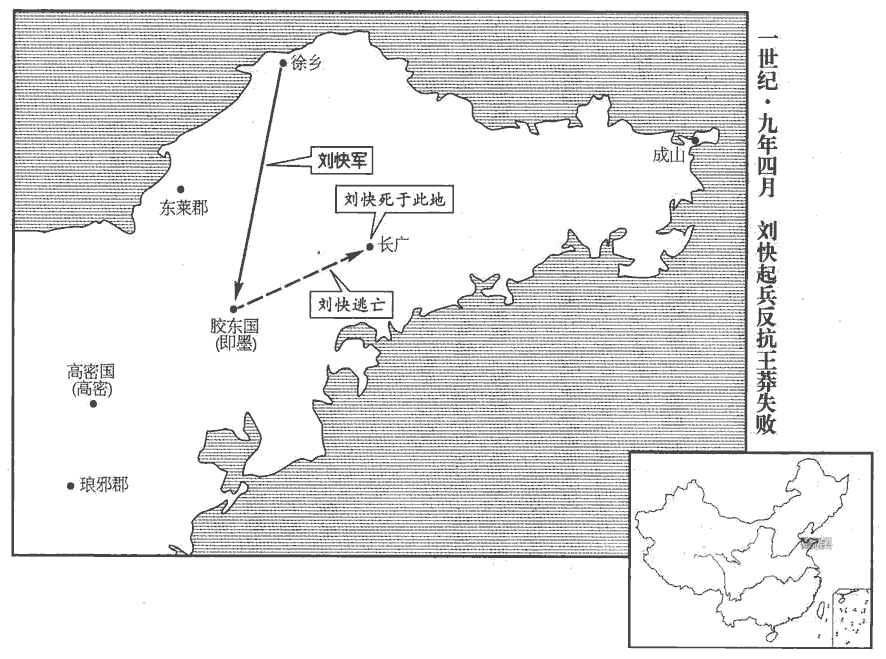
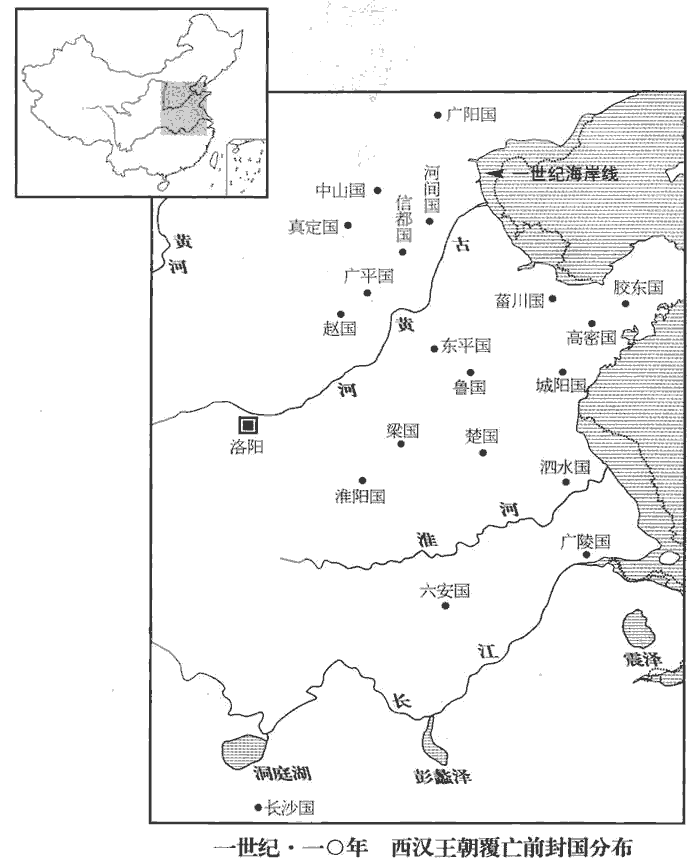
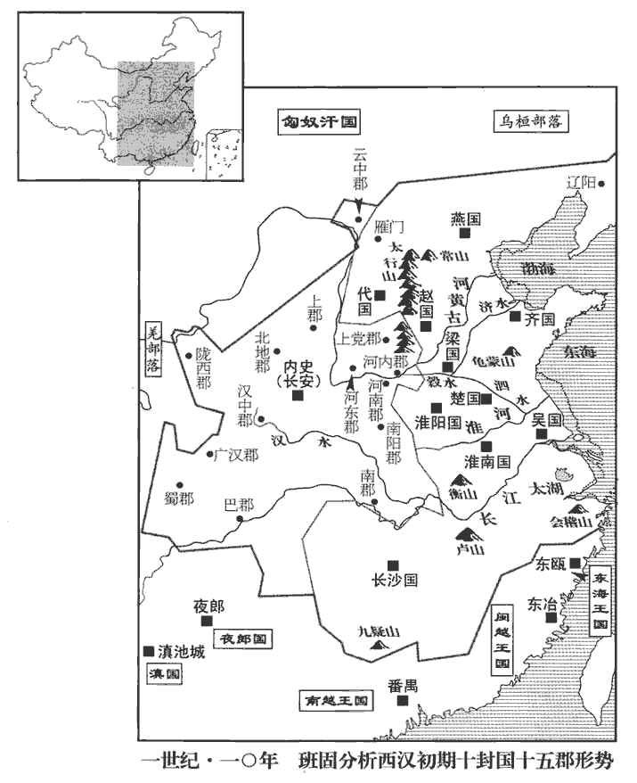
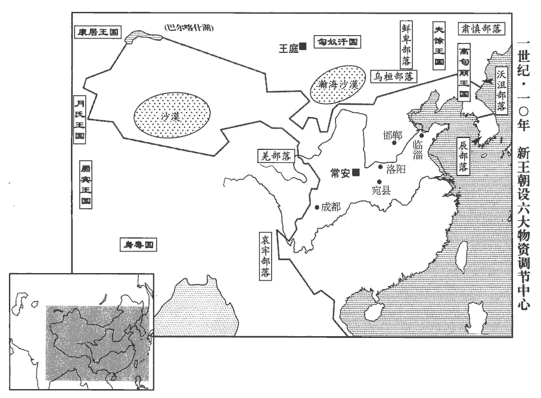
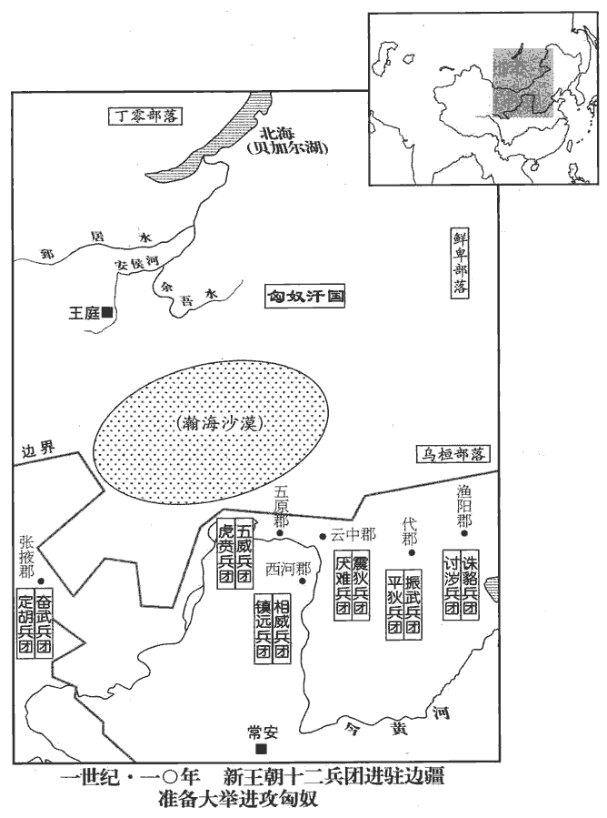
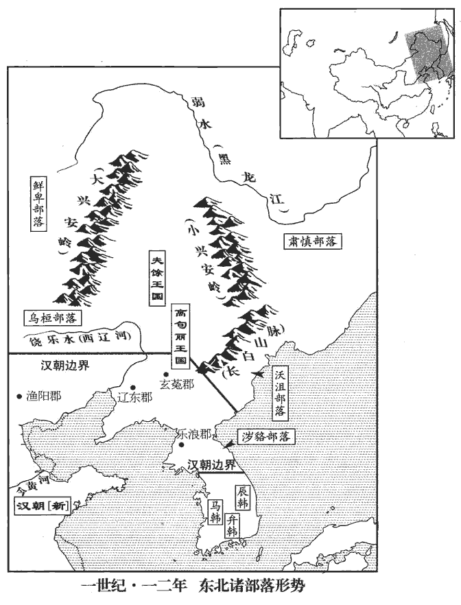
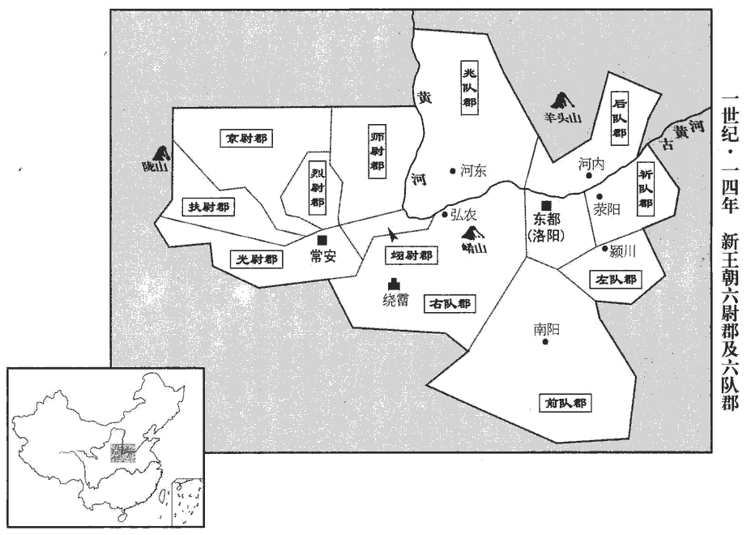

 漢紀二十九起屠維大荒落（己巳），盡閼逢閹茂（甲戌），凡六年。

# 王莽中

## 始建國元年（己巳，九）

1春，正月，朔‹一›，去年十二月莽改元，以十二月為歲首。通鑑不書，不與其改正朔也。莽‹时年五十四›帥公侯卿士奉皇太后‹王政君›璽韍，帥，讀曰率。璽，斯氏翻。師古曰：韍，謂璽之組；音弗。上太皇太后，順符命，去漢號焉。上，時掌翻。去，羌呂翻。

〖译文〗 [1]春季，正月朔（初一），王莽率领公侯卿士捧着新制的皇太后御玺，呈上太皇太后，遵从上天的符命，去掉汉朝的名号。

初，莽娶故丞相王訢xīn孫宜春侯咸女為妻，師古曰：王訢為丞相，初封宜春侯，傳爵至孫咸。恩澤侯表：宜春侯，國於汝南。立以為皇后；生四男，宇、獲前誅死，安頗荒忽，師古曰：荒，音呼廣翻。乃以臨為皇太子，安為新嘉辟。師古曰：辟，君也。謂之辟者，取為國君之義。辟，音壁。封宇子六人皆為公。千為功隆公，壽為功明公，吉為功成公，宗為功崇公，世為功昭公，利為功著公。大赦天下。

〖译文〗 当初，王莽娶了原丞相王的孙子宜春侯王咸的女儿为妻，如今立她作皇后。生有四个儿子，王宇、王获先前已被处死，王安又很有点糊里糊涂的样子，便把王临立为皇太子，把王安封为新嘉辟。赐封王宇的儿子六人都为公。大赦天下。

莽乃策命孺子為定安公，封以萬戶，地方百里；立漢祖宗之廟於其國，與周後并行其正朔、服色；此皆空言耳。以孝平皇后為定安太后。讀策畢，莽親執孺子手，流涕歔欷師古曰：歔，音虛。欷，音許氣翻，又音希。曰：「昔周公攝位，終得復子明辟；今予獨迫皇天威命，不得如意！」哀嘆良久。中傅將孺子下殿，北面而稱臣。漢諸侯王國，有太傅、中傅：太傅秩二千石，中傅則在宮中傅王者耳。賢曰：前書音義曰：中傅，宦者也。百僚陪位，莫不感動。

〖译文〗 王莽下策书命孺子为定安公，把居民一万户，土地纵横各一百里，赐封给他。在封国里建立汉朝祖宗的祠庙，与周朝的后代一样，都使用自己的历法和车马服饰的颜色。把孝平皇后立为定安太后。宣读策书完毕，王莽亲自握着孺子的手，流着眼泪抽泣道：“从前周公代理王位，最后能够把明君的权力归还周成王；现在我偏偏迫于上天威严的命令，不能够如自己的意！”悲伤叹息很久。中傅带着孺子下殿，向着北面自称臣下。百官陪在旁边，没有人不受感动。

又按金匱封拜輔臣：哀章所獻金匱圖、金策書也。以太傅、左輔王舜為太師，封安新公；大司徒平晏為太傅，就新公；少阿、羲和劉秀為國師，嘉新公；廣漢梓潼‹四川梓潼›哀章為國將，美新公；梓潼縣，時屬廣漢郡。將，即亮翻；下同。是為四輔，位上公。太保、後承甄邯為大司馬，承新公；丕進侯王尋為大司徒，章新公；步兵將軍王邑為大司空，隆新公；是為三公。太阿、右拂、大司空甄豐為更始將軍，廣新公；京兆王興為衛將軍，奉新公；輕車將軍孫建為立國將軍，成新公；京兆王盛為前將軍，崇新公；是為四將。凡十一公。王興者，故城門令史；城門令史，事城門校尉，掌文書。王盛者，賣餅；釋名：餅，併也，溲sōu麥使合併也。蒸餅、湯餅之屬，隨形而名之。莽按符命求得此姓名十餘人，兩人容貌應卜相，相，息亮翻。徑從布衣登用，以示神焉。

〖译文〗 王莽又按照金匮图书的说明，对辅政大臣举行授任仪式：任命太傅、左辅王舜为太师，赐封安新公；大司徒平晏为太傅，赐封就新公；少阿、羲和、刘秀为国师，赐封嘉新公；广汉郡梓潼县人哀章为国将，赐封美新公。这是四辅，位列上公。太保、后承甄邯为大司马，赐封承新公；丕进侯王寻为大司徒，赐封章新公；步兵将军王邑为大司空，赐封隆新公。这是三公。太阿、右拂、大司空甄丰为更始将军，赐封广新公；京兆王兴为卫将军，赐封奉新公；轻车将军孙建为立国将军，赐封成新公；京兆王盛为前将军，赐封崇新公。这是四将。总共十一公。王兴原是城门令史，王盛是卖饼的。王莽按照符命，找到十多个有这样姓名的人，而这两人的相貌符合占卜和看相的要求，便直接从平民起用，以显示神奇。

是日，封拜卿大夫、侍中、尚書官凡數百人，諸劉為郡守者皆徙為諫大夫。改明光宮為定安館，定安太后居之；以大鴻臚府為定安公第；皆置門衛使者監領。臚，陵如翻。監，工銜翻。敕阿乳母不得與嬰語，常在四壁中，孟康曰：令定安公居四壁中，不得有所見。漢官典職曰：省中皆胡粉壁，紫素界之，畫古烈士。釋名曰：壁，辟也，辟禦風寒也。至於長大，不能名六畜；長，知兩翻。六畜，牛、馬、羊、犬、豕、雞也。養之曰畜；用之曰牲。畜，音許救翻。後莽以女孫宇子妻之。莽長男宇之子，則女孫也。妻，七細翻。

〖译文〗 这一天，授任卿大夫、侍中、尚书官职总共几百人。各刘姓皇族担任郡太守的，都调任谏大夫。王莽把明光宫改为定安馆，让定安太后住在那里。把大鸿胪官署作为定安公住宅，都设置门卫、使者监护管理。告诫保育人员和奶妈不准跟定安公谈话，让他常在四壁合围的屋子里。一直到长大，定安公还不能叫出六畜的名称。后来王莽把孙女王宇的女儿嫁给了他。

莽策命群司各以其職，如典誥之文。置大司馬司允、大司徒司直、大司空司若，位皆孤卿。師古曰：允，信也。若，順也。余按古之三孤位六卿，爵秩同六卿曰孤卿。更名大司農曰羲和，後更為納言；更，工衡翻；下同。大理曰作士；太常曰秩宗；大鴻臚曰典樂；少府曰共工；師古曰：共，音恭。水衡都尉曰予虞：皆放唐、虞建官也。與三公司卿分屬三公。司卿，即司允、司直、司若。置二十七大夫，八十一元士，分主中都官諸職。又更光祿勳等名為六監，皆上卿。光祿勳曰司中，太僕曰太御，衛尉曰太衛，執金吾曰奮武，中尉曰軍正。又置大贅官，主乘輿服御物；後又典兵。改郡太守曰大尹，都尉曰大尉，縣令、長曰宰；守，式又翻。長，知兩翻。長樂宮曰常樂室，樂，音洛。長安曰常安；其餘百官、宮室、郡縣盡易其名，不可勝紀。勝，音升。

〖译文〗 王莽颁发策书规定百官的职责，犹如典谟训诰的文章一样。设置大司马司允、大司徒司直、大司空司若，职位都是孤卿。将大司农改名叫羲和，后来又改为纳言；大理改名叫作士；太常改名叫秩宗；大鸿胪改名叫典乐；少府改名叫共工；水衡都尉改名叫予虞，加上三公司卿，分别归三公管辖。设置二十七大夫、八十一元士，分别主管京师各官府的所有职务。又把光禄勋等改名，称为六监，职位都是上卿。将郡太守改名叫大尹，都尉改名叫大尉，县令、县长改名叫宰；长乐宫改名叫常乐室，长安改名叫常安；其余百官、宫室、郡县都改了名，不能一一记录了。

封王氏齊縗cuī之屬為侯，齊，音咨。縗裳而緶biàn其下。縗，倉回翻。大功為伯，小功為子，緦麻為男；其女皆為任。師古曰：任，充也。男服之義，男亦任也；音壬。男以「睦」，女以「隆」為號焉。師古曰：睦、隆，皆其受封邑之號，取嘉名也。

〖译文〗 赐封王氏丧服为齐的亲属为侯爵，丧服为大功的亲属为伯爵，丧服为小功的亲属为子爵，丧服为缌麻的亲属为男爵；这样的女亲属都为任爵。男的用“睦”字作称号，女的用“隆”字作称号。

又曰：「漢氏諸侯或稱王，至於四夷亦如之，違於古典，繆於一統。王大一統。王者，有天下之號也。諸侯及四夷稱之，非古也。繆，戾也。其定諸侯王之號皆稱公，及四夷僭號稱王者皆更為侯。」於是漢諸侯王三【章：十二行本「三」作「二」；乙十一行本同；孔本同；退齋校同。】十二人皆降為公，王子侯者百八十一人皆降為子，其後皆奪爵焉。考異曰：諸侯王表，皆云「莽篡位，貶為公。明年，廢。」王子侯表但云「絕」，或云「免」，皆在今年。按明年立國將軍建奏諸劉為諸侯者以戶多少就五等之差，亦不云奪爵也。後漢城陽王祉傳云：「劉氏侯者皆降為子，後奪爵。」不知奪在幾年。

〖译文〗 王莽又说道：“汉朝有的诸侯称王，以至四方的夷民也仿效这样称呼，这违反了古代制度，背离了一统的原则。如今确定诸侯王的名号都称为公，以及四方夷民，冒用帝王尊号的都改为侯。”于是汉诸侯王三十二人的名号都降为公，诸侯王的子弟名号为侯的一百八十一人都降为子，他们在后来都被剥夺了爵号。

2莽又封黃帝、少昊、顓zhuān頊xū、帝嚳kù、堯、舜、夏、商、周及皋gāo陶yáo、伊尹之後皆為公、侯，使各奉其祭祀。姚恂為初睦侯，奉黃帝後。梁護為脩遠伯，奉少昊後。皇孫功隆公千，奉帝嚳後。劉歆為初烈伯，奉顓頊後。國師劉歆子疊為伊休侯，奉堯後。媯guī昌為始睦侯，奉虞帝後。山遵為褒謀侯，奉皋陶後。伊玄為褒衡子，奉伊尹後。周後衛公姬黨更封為章平公。殷後宋公孔弘更封為章昭侯。夏後遼西如豐封為章功侯。

〖译文〗 [2]王莽又赐封黄帝、少昊、颛顼、帝喾、尧、舜、夏、商、周及皋陶、伊尹的后代都为公、侯，使他们各自奉行对自己祖先的祭祀。

3莽因漢承平之業，府庫百官之富，百蠻賓服，天下晏然，莽一朝有之，其心意未滿，未滿，未饜足也。陿小漢家制度，欲更為疏闊。欲變改制度以從古也。陿，與狹同。更，工衡翻。乃自謂黃帝、虞舜之後，至齊王建孫濟北王安失國，齊人謂之王家，因以為氏；故以黃帝為初祖，虞帝為始祖。追尊陳胡公為【章：十二行本「爲」作「曰」；乙十一行本同；孔本同。】陳胡王，田敬仲為田敬王，【章：十二行本「爲田」二字作「曰齊」二字；乙十一行本同；孔本同。】濟北王安為【章：十二行本「爲」作「曰」；乙十一行本同；孔本同。】濟北湣王。以黃帝之後分為有虞氏，有虞之後封於陳，田敬仲自陳奔齊，為田氏，田安之後為王家故也。濟，子禮翻。立祖廟五，親廟四。天下姚、媯guī、陳、田、王五姓皆為宗室，世世復，無所與。復，方目翻。與，讀曰豫；下其復同。封陳崇、田豐為侯，以奉胡王、敬王後。

〖译文〗 [3]王莽承接汉朝盛世的庞大基业，以及国库和诸官府资产的丰厚，众多蛮族归附顺从，天下一派升平。王莽一时攫为己有，他的心意仍不满足，认为汉朝的格局太小，想要更为宏大。于是，自称是黄帝、虞舜的后裔，一直传到齐王田建的孙儿济北王田安，才失去政权。齐人称齐国的王族为“王家”，于是就以“王”为姓氏。所以，以黄帝为王姓的初祖，以虞舜帝为始祖。王莽追尊陈胡公为陈胡王，田敬仲为田敬王，济北王田安为济北愍王。他建造五座祖宗祭庙，四座皇族祭庙。天下姚、妫、陈、田、王五姓都是皇族，世代不纳税，不服役，不负担义务。封陈崇、田丰二人为侯爵，使他们分别作陈胡王妫满、田敬王田完的后嗣。

天下牧、守皆以前有翟義、趙朋等作亂，事見上卷居攝元年。守，式又翻；下同。領州郡，懷忠孝，封牧為男，守為附城。

〖译文〗 全国州牧、郡守，都因先前在翟义、赵朋等人作乱时，领导州郡，忠于新朝，所以州牧都封男爵，郡守都封附城。

以漢高廟為文祖廟。師古曰：欲法舜受終於文祖。漢氏園寢廟在京師者，勿罷，祠薦如故。諸劉勿解其復，復，方目翻。各終厥身；州牧數存問，數，所角翻。勿令有侵冤。

〖译文〗 王莽将汉高庙改为文祖庙。在京师的刘姓皇帝陵园中的宗庙，仍维持原状，祭祀同原来一样。刘姓皇族继续免缴赋税，免服差役，直到去世。各州州牧不断慰问安抚，不让他们遭受侵害和冤枉。

4莽以劉之為字「卯、金、刀」也，詔正月剛卯、金刀之利皆不得行，服虔曰：剛卯，以正月卯日作，佩之，長三寸，廣一寸，四方，或用玉，或用金，或用桃，著革帶佩之。今有玉在者，銘其一面曰：「正月剛卯。」金刀，莽所鑄之錢也。晉灼曰：剛卯，長一寸，廣五分，四方，當中央從穿作孔，以采絲茸，其底如冠纓頭蕤ruí，刻其上面作兩行書，文曰：「正月剛卯既央，靈殳shū四方，青赤白黃，四色是當。帝令祝融，以教夔、龍，庶疫剛癉dàn，莫我敢當！」其一銘曰：「疾日嚴卯，帝令夔化，順爾固伏，化茲靈殳shū，既正既直，既觚gū既方，庶疫剛癉dàn，莫我敢當！」師古曰：今往往有土中得玉剛卯者，案大小及文，服說是也。莽以劉字上有「卯」，下有「金」，旁有「刀」，故禁剛卯及金刀也。余按劉字上本從「丣」yǒu，莽以「丣」字近「卯」，故云爾。乃罷錯刀，契刀孔穎達曰：古文有刀，刀有二種：一是契刀，一是錯刀。契刀直五百；錯刀直一千。契刀無鏤lòu而錯刀用金鏤之。刀形如錢而邊作刀字形也，故世猶呼錢為錢刀。及五銖錢，更作小錢，更，工衡翻。徑六分，重一銖，文曰「小錢直一」，與前「大錢五十」者為二品，并行。欲防民盜鑄，乃禁不得挾銅、炭。

〖译文〗 [4]王莽认为刘字由“卯、金、刀”组成，因而下诏，“正月刚卯”佩饰和金刀钱都不准再使用。于是，废除错刀币、契刀币以及五铢钱，改铸小钱，直径六分，重量一铢，上面有“小钱值一”的字样，加上以前的“大钱五十”的货币为两类，同时发行。为了防止民间私自铸造，便下禁令不准挟带铜、炭。

5夏，四月，徐鄉‹山東龙口东北乡城›侯劉快結黨數千人起兵於其國。師古曰：快，膠東恭王子也。而王子侯表作「炔」，從「火」，與此不同。疑表誤也。快兄殷，故漢膠東王，時為扶崇公。快舉兵攻即墨‹山東平度›，即墨，膠東國都。殷，膠東康王寄玄孫之子也。殷閉城門，自繫獄。吏民距快；快敗走，至長廣‹山東萊陽东›死。地理志，長廣縣，屬琅邪郡。莽赦殷，益其國滿萬戶，地方百里。

〖译文〗 [5]夏季，四月间，徐乡侯刘快集结党羽几千人，在他的封国里起兵。刘快的哥哥刘殷，是原汉朝的胶东王，这时已经改为扶崇公。刘快集结兵力，进攻即墨城，刘殷关闭城门，自投监狱。官民抵抗刘快，刘快失败逃跑，退到长广县死了。王莽赦免刘殷，增加他的封国达一万户人家，面积方圆一百里。

 

6莽曰：「古者一夫田百畝，什一而稅，孟子曰：周人百畝而徹。此言周制也。則國給民富而頌聲作。秦壞聖制，廢井田，見二卷周顯王十九年。壞，音怪。是以兼併起，貪鄙生，強者規田以千數，弱者曾無立錐之居。又置奴婢之市，與牛馬同闌，師古曰：闌，謂遮闌之，若牛馬闌圈也。制於民臣，顓斷其命，繆於『天地之性人為貴』之義。孝經：孔子曰：天地之性人為貴。斷，丁亂翻。減【章：十二行本「減」上有「漢氏」二字；乙十一行本同；孔本同；張校同；退齋校同。】輕田租，三十而稅一，常有更賦，罷癃咸出；師古曰：更，音工衡翻。罷，讀曰疲。癃，音隆。晉灼曰：雖老病者皆復出口算。而豪民侵陵，分田劫假。師古曰：分田，謂貧者無田而取富人田耕種，共分其所收也。假，亦謂貧人賃富人之田也。劫者，富人劫奪其稅，侵欺之也。厥名三十稅一，實什稅五也。故富者犬馬餘菽shū粟sù，驕而為邪；貧者不厭糟糠，窮而為姦；俱陷於辜，刑用不錯。師古曰：錯，置也；音千故翻。今更名天下田曰『王田』，奴婢曰『私屬』，更，工衡翻；下同。皆不得賣買。其男口不盈八而田過一井者，分餘田予九族、鄰里、鄉黨。予，讀曰與。故無田、今當受田者，如制度。敢有非井田聖制、無法惑眾者，投諸四裔，以禦魑魅，師古曰：魑chī，山神也。魅，老物精也。魑，音螭。魅，音媚。如皇始祖考虞帝故事！」舜投四凶於四裔，以禦魑魅。

〖译文〗 [6]王莽下诏：“古代一夫分田一百庙，按十分之一交租税，就能够国家丰裕，百姓富足，于是歌颂的舆论兴起来了。秦破坏圣人制度，废除井田，因此并吞土地的现象出现了，贪婪卑鄙的行为发生了，强者占田数千亩，贫者竟没有立锥之地。又设置买卖奴婢的市场，与牛马一同关闭在栅栏之内，被地方官吏控制，专横地裁决他们的命运，违背了天地之间的生命，人类最宝贵的原则。汉朝减轻土地税，按三十分之一征税，但是经常有代役税，病残而丧失劳力的都要交纳。加以土豪劣绅侵犯欺压，利用租佃关系掠夺财物，于是名义上按三十分之一征税，实际上征收了十分之五的税。所以富人的狗马有吃不完的粮食，因骄奢而作邪恶的事；穷人却吃不饱酒渣糠皮，因贫困而作邪恶的事。他们都陷于犯罪，刑罚因此不能搁置不用。现在把全国的田改名叫‘王田’，奴婢叫‘私属’，都不准买卖。那些家庭人口男性不满八人，而占有田亩超过一井的，把多余的田亩分给亲属、邻居和同乡亲友。原来没有田，现在应当分得田的，按照规定办。敢有反对井田这种圣人首创的制度，无视法律惑乱民众的，把他们流放到四方极远的地方，去抵挡妖怪鬼神，如同我的始祖虞舜帝惩罚四凶的旧例。”

7秋，遣五威將王奇等十二人五威將，分左、右、前、後、中帥，衣冠、車服、駕馬各如其方面色數。將，即亮翻。帥，所類翻；下同。班符命四十二篇於天下：德祥五事，符命二十五，福應十二。五威將奉符命，齎印綬，王侯以下及吏官名更者，師古曰：更，改也。外及匈奴、西域、徼外蠻夷，徼，吉弔翻；下同。皆即授新室印綬，因收故漢印綬。大赦天下。

〖译文〗 [7]秋季，王莽派遣五威将王奇等十二人颁符命四十二篇到全国。其中德祥类五篇，符命类二十五篇，福应类十二篇。五威将恭敬地捧着符命，带着印信，王侯及以下和官吏更改名称的，中原以外到匈奴、西域和远方的蛮夷，都被就地授予新朝的印信，并收缴原来汉朝的印信。大赦天下。

五威將乘乾文車，鄭氏曰：畫天文於車也。駕坤六馬，鄭氏曰：坤，為牝馬。六，地數。背負鷩bì鳥之毛，服飾甚偉。師古曰：鷩鳥，雉屬，即鵔jùn鸃yì也；今俗呼云山雞，非也。鷩，音鼈。每一將各置五帥，將持節，帥持幢chuáng。帥，所類翻。幢，傳江翻，旛也。其東出者至玄菟‹辽宁沈阳›、樂浪‹朝鮮平壤›、高句驪‹吉林集安›、夫餘‹大兴安岭东东北平原›；菟，音塗。樂浪，音洛琅。陸德明曰：句，俱付翻，又音駒。驪，力支翻。師古曰：夫，音扶。范曄曰：武帝滅朝鮮，開高句驪為縣，使屬玄菟；其人有五部，在遼東之東千里。夫餘在玄菟北千里，東明之後也。高句驪，朱蒙之後，以高為氏。南出者隃徼外，歷益州‹云南晉寧东晋城镇›，改句町‹云南广南›王為侯；徼外，邊徼之外。益州，武帝所置益州郡也。昭帝時，姑繒、葉榆夷反，句町侯亡波擊反者有功，立為王。隃，與踰同。徼，工釣翻。句町，音劬qú挺。西出【章：十二行本「出」下均有「者」字；乙十一行本同；孔本同。】至西域，盡改其王為侯；北出至匈奴庭，授單于印，改漢印文，去璽言【章：十二行本「言」作「曰」；乙十一行本同。】章。印，符也，信也，亦因也，封物相因付。漢官儀曰：諸侯王，黃金橐tuó駝鈕，文曰璽。列侯，黃金龜鈕，文曰章。御史大夫，金印；中二千石，銀印，龜鈕，文曰章。千石至四百石皆銅印，文曰印。為莽以更印綬撓亂四夷張本。去，羌呂翻。璽，斯氏翻。

〖译文〗 五威将坐着绘有天文图象的车子，套着六匹母马，背上插着锦鸡的羽毛，服装佩饰很威武。每一位五威将下面各设置五个元帅。五威将手执符节，五帅举着旗幡，东行的到玄菟、乐浪、高句丽、夫余。南行的到边塞之外，经过益州郡，把句町王改为句町侯。西行到西域，把各国国王都改为侯爵。北行到匈奴王庭，授予单于印信，更改了汉朝印信的文字，去掉：“玺”改称“章”。

8冬，雷，桐華。

〖译文〗 [8]冬季，响雷，桐树开花。

9以統睦侯陳崇為司命，主司察上公以下。又以說符侯崔發等為中城、四關將軍，主十二城門及繞霤liū‹陝西商州至丹凤一带七盤十二繞險要›、羊頭‹山西長子东南羊頭山›、肴黽mǐn‹肴山、澠池，在河南三门峡東›、汧qiān隴‹汧水、隴山，在陝西隴縣境›之固，中城將軍，主十二城門。四關將軍，分主繞霤、羊頭、肴黽、汧隴四處。三輔黃圖：長安城東出南頭第一門曰霸城門，莽改曰仁壽門；第二門曰清明門，莽曰宣德門；東出北頭第一門曰宣平門，莽曰春王門；南出東頭第一門曰覆盎城門，莽曰更清門；第二門曰安門，莽曰光禮門；第三門曰便門，莽曰信平門；西出南頭第一門曰章城門，莽曰萬秋門；第二門曰直城門，莽曰正道門；第三門曰雍門，莽曰章儀門；北出東頭第一門曰洛門；第二門曰廚城門，莽曰建子城門；第三門曰橫門。服虔曰：繞霤，隘險之道。師古曰：謂之繞霤者，言四面阸塞，其道屈曲，谿谷之水回繞而霤也；其處即今之商州界七盤、十二繞是也。霤，音力救翻。羊頭，山名，在上黨長子縣。肴，肴山也；黽，黽池也：皆在陝縣之東也。汧，扶風汧縣，有吳山、汧水之阻。隴，謂隴坻也。汧、隴相連。黽，彌袞翻。汧，口堅翻。坻，丁禮翻。皆以五威冠其號。冠，古玩翻。

〖译文〗 [9]任命统睦侯陈崇当司命，负责监视上公及以下所有朝廷官员。又任命说符侯崔发等当中城、四关将军，负责京师十二城门，跟绕、羊头、肴黾、陇四处防务。官衔前都加五威二字。

10又遣諫大夫五十人，分鑄錢於郡國。

〖译文〗 [10]王莽派遣又谏大夫五十人，分别到各郡、各封国铸钱。

11是歲，真定‹河北正定›、常山‹河北元氏›大雨雹。雨，於具翻。

〖译文〗 [11]这一年，真定、常山天降大冰雹。

## 二年（庚午，一零）

1春，二月，赦天下。

〖译文〗 [1]春季，二月，大赦天下。

2五威將帥七十二人還奏事，漢諸侯王為公者悉上璽綬為民，上，時掌翻。無違命者。獨故廣陽‹府蓟县，北京›王嘉以獻符命，廣陽王嘉，燕王旦之玄孫。魯‹府鲁县，山东曲阜›王閔以獻神書，中山王成都以獻書言莽德，皆封列侯。

〖译文〗 [2]五威将帅七十二人回来奏报，汉朝的诸侯王去掉王号改称为公的，全部缴上印信成为平民，没有违抗命令的。只有原广阳王刘嘉因向王莽呈献符命，鲁王刘闵因向王莽呈献神书，中山王刘成都因向王莽呈书歌颂功德，都封为列侯。

 

班固論曰：昔周封國八百，同姓五十有餘，所以親親賢賢，關諸盛衰，深根固本，為不可拔者也。故盛則周、召相其治，致刑錯；相，息亮翻。治，直吏翻。錯，千故翻。衰則五伯扶其弱，與共守；師古曰：伯，讀曰霸。此五霸，謂齊桓、宋襄、秦穆、晉文、吳子夫差也。天下謂之共主，如淳曰：雖至微弱，猶共以之為主。強大弗之敢傾。師古曰：言諸侯雖強大，不敢傾滅周也。歷載八百餘年，數極德盡，降為庶人，用天年終。謂赧nǎn王也。秦訕笑三代，竊自號為皇帝，而子弟為匹夫，內無骨肉本根之輔，外無尺土藩翼之衛；陳、吳奮其白梃tǐng，應劭曰：白梃，大杖也。孟子曰：可使制梃以撻秦、楚，是也。師古曰：梃，音徒鼎翻。劉、項隨而斃之。故曰，周過其曆，秦不及期，國勢然也。應劭曰：武王克商，卜世三十，卜年七百；今乃三十六世，八百六十七年，此謂過其曆者也。秦以諡法少，恐後世相襲，自稱始皇帝，子曰二世，欲以一迄萬；今至子而亡，此之謂不及期也。

〖译文〗 班固论曰：从前，周王朝分封诸侯国八百个，其中同姓家族有五十余个。这正是为了友爱亲属，尊重贤才，它关系到政权的兴衰。根深植，本坚固，使外人就无法动摇。所以强盛之时，周公、召公共同治理，使刑罚停止。哀弱之时，五霸在下扶助，共同守护。天下认为周王是共主，诸侯国的力量再强大，也不敢倾灭周。历时八百余年，气数恩德已尽，被降为平民，但仍终其天年。秦讥笑夏商周三代君王，自称“皇帝”，却让子弟当平民。这个政权内没有骨肉至亲辅佐，外没有藩属封国护卫，一旦陈胜、吴广揭竿而起，刘邦、项羽随之而进，也就覆亡了。所以说，周王朝的统治能够超过期限，秦王朝则短到没有达到期限，是国家形势造成了这样的结局。

漢興之初，懲戒亡秦孤立之敗，於是尊王子弟，王，於況翻。大啟九國。自鴈門‹山西右玉›以東盡遼陽‹遼寧遼陽›，為燕‹北京›、代‹山西太原›；師古曰：遼陽，遼水之陽也。常山‹河北曲阳西北›以南，太行左轉，渡河、濟，漸於海，為齊‹山东淄博东临淄镇›、趙‹河北邯郸›；師古曰：太行，山名也。左轉，亦謂自太行而東也。漸，入也，一曰：浸也。濟，子禮翻。漸，音子廉翻，亦讀如字。穀、泗以往，奄有龜、蒙‹二山均在山东平邑东北›，為梁‹山东定陶›、楚‹江苏徐州›；晉灼曰：水經云：泗水出魯國卞縣。臣瓚曰：穀，在彭城，泗之下流為穀水。師古曰：奄，覆也。龜、蒙，二山名。東帶江、湖，薄會稽‹浙江绍兴南›，為荊‹江苏苏州›、吳‹江苏扬州›；文穎曰：即今吳也。高祖六年為荊國，十六年更名吳。師古曰：荊、吳同是一國。薄，伯各翻。會，工外翻。北界淮瀕，略廬‹江西九江南›、衡‹安徽霍山县西南霍山›，為淮南‹安徽寿县›；師古曰：瀕，水厓也。廬、衡，二山名。波漢之陽，亘九嶷‹湖南宁远南›，為長沙‹湖南长沙›。鄭氏曰：波，音陂澤之陂。孟康曰：亘，竟也；音古贈翻。師古曰：波漢之陽者，循漢水而往也。水北曰陽。波，音彼皮翻，又音彼義翻。九嶷，山名，有九峰，在零陵營道。嶷，音疑。諸侯比境，周匝三垂，外接胡、越。師古曰：比，謂相次也。三垂，謂東、北、南也。比，音頻寐翻，接連也。天子自有三河、東郡‹河南濮陽西南›、潁川‹河南禹州›、南陽‹河南南陽›，自江陵‹湖北江陵›以西至巴‹四川重慶›、蜀‹四川成都›，北自雲中‹內蒙托克托›至隴西‹甘肅臨洮›，與京師、內史，凡十五郡；公主、列侯頗邑其中。師古曰：十五郡中，又往往有列侯、公主之邑。而藩國大者誇州兼郡，連城數十，宮室、百官同制京師，可謂矯枉過其正矣。師古曰：誇，音跨。枉，曲也。正曲曰矯，言矯秦孤立之敗而大封子弟，過於強盛，以至失其中也。雖然，高祖創業，日不暇給，孝惠享國又淺，高后女主攝位，而海內晏如，亡狂狡之憂，卒折諸呂之難，亡，古無字通。卒，子恤翻。難，乃旦翻；下同。成太宗之業者，亦賴之於諸侯也。

〖译文〗 汉朝建立的初期，警觉到秦王朝覆亡的原因，是皇族的孤立，所以大封皇族子弟为王，建立九个封国。从雁门郡以东到辽阳，是燕国、代国。常山以南，太行山以东，渡过黄河、济水，直到大海，是齐国、赵国。水、泗水以南，龟山、蒙山一带，是梁国、楚国。东边围绕长江、太湖，接近会稽郡，是荆国、吴国。北边与淮河附近接界，庐山、衡山一带，是淮南国。汉水之北，顺着汉水而下，九嶷山一带，是长沙国。各封国边界相接，环绕着东方、北方、南方三面边疆，外与匈奴、南越国接壤。皇帝直接控制的地区，有三河、东郡、颍川、南阳，从江陵以西到巴郡、蜀郡，北起云中到陇西，加上京师、内史，共十五个郡。公主和列侯的食邑，大都分布在十五郡之内。而大的封国面积跨州，有几个郡那么大，数十个城镇相连，宫殿、百官制度与京师相同。对秦朝来说，可称是矫枉过正了。尽管如此，高祖创立大业，事务繁多，没有空闲，惠帝在位时间又短，高后以女主身份代理皇位，临朝执政，而全国却一派崐升平，没有叛乱的忧患。后来终于摧毁吕姓家族的篡权阴谋，完成文帝的功业，也依赖于这些封国。

然諸侯原本以大末，流濫以致溢，小者淫荒越法，大者睽孤橫逆以害身喪國，師古曰：睽孤，乖剌之意。睽，音工攜翻。橫，戶孟翻。喪，息浪翻。故文帝分齊、趙，事見十四卷文帝二年，又見十六年。景帝削吳、楚，事見十六卷景帝三年。武帝下推恩之令而藩國自析。事見十八卷武帝元朔二年。自此以來，齊分為七，師古曰：謂齊、城陽、濟北、濟南、甾川、膠西、膠東也。趙分為六，謂趙、平原、真定、中山、廣川、河間也。梁分為五，師古曰：謂梁、濟川、濟東、山陽、濟陰也。淮南分為三。師古曰：謂淮南、衡山、廬江。皇子始立者，大國不過十餘城。長沙、燕、代雖有舊名，皆亡南北邊矣。如淳曰：長沙之南更置郡，燕、代以北更置緣邊郡，其所有饒利、兵馬、器械，三國皆失之也。亡，古無字通；下同。景遭七國之難，抑損諸侯，減黜其官。師古曰：謂改丞相曰相，省御史大夫、廷尉、少府、宗正、博士，損大夫、謁者、諸官長、丞員等也。武有衡山、淮南之謀，事見十九卷武帝元朔五年及元狩元年。作左官之律，服虔曰：仕於諸侯為左官，絕不使得仕於王侯也。應劭曰：人道尚右，今舍天子而仕諸侯，故謂之左官也。師古曰：左官，猶言左道也，蓋僻左不正，應說是也。漢時依上古法，朝廷之列，以右為尊，故謂降秩者為左遷，仕諸侯者為左官。設附益之法；張晏曰：律鄭氏說，封諸侯過限曰附益。或曰：阿媚王侯，有重法也。師古曰：附益者，蓋取孔子云「求也為之聚斂而附益之」之義也，皆背正法而厚於私家也。諸侯惟得衣食稅租，不與政事。與，讀曰預。至於哀、平之際，皆繼體苗裔，親屬疏遠，師古曰：言非始封之君，皆其後裔也，故於天子益疏遠矣。生於帷牆之中，不為士民所尊，勢與富室亡異。而本朝短祚，【章：十二行本「祚」作「世」；乙十一行本同；孔本同。】國統三絕。師古曰：謂成、哀、平皆早崩，又無繼嗣。亡，古無字通。是故王莽知漢中外殫微，師古曰：殫，盡也，音單。本末俱弱，無所忌憚，生其姦心，因母后之權，假伊、周之稱，顓作威福廟堂之上，不降階序而運天下。師古曰：序，謂東西廂。詐謀既成，遂據南面之尊，分遣五威之吏，馳傳天下，傳，知戀翻。班行符命；漢諸侯王厥角稽首，應劭曰：厥者，頓也。角者，額角也。稽首，首至地也。言王莽漸漬威福日久，亦值漢之單弱，王侯見莽篡弒，莫敢怨望，皆厥角稽首至地而上其璽綬也。晉灼曰：厥，猶豎也。叩頭則額角豎。師古曰：應說是也。奉上璽韍，惟恐在後，或乃稱美頌德以求容媚，豈不哀哉！

〖译文〗 然而，封国国君本是皇族的末流，末流太滥，就会满溢出来，造成灾害。小者荒淫触犯法律，大者谋反叛逆，结果自己断送性命，封国也被撤除。所以文帝分割齐国、赵国，景帝削减吴国、楚国，武帝颁布推恩令，使封国自己分解。从此以后，齐国剖分成七国，赵国剖分成六国，梁国剖分成五国，淮南国剖分成三国。皇子封亲王之时，大的封国不过十多个城镇。长沙国、燕国、代国，虽然仍是旧名，都不再紧邻南北边疆了。景帝遭遇七国之乱，更贬抑诸侯王地位，减少封国官员编制。武帝时衡山王刘赐、淮南王刘安图谋不轨，于是颁布左官律，制定附益法。封国国君只能得到供穿衣吃饭的租税，不参与政事。到了哀帝、平帝时代，封国国君都是后代苗裔，跟皇帝的血缘和亲情疏远。生长在封闭的王宫之中，不为人民所尊敬，势力与当地富翁没有什么不同。而本朝君王在位的时间短促，又一连三代没有后嗣。因此王莽知道汉家宫廷内外衰微，根本和末梢都同样脆弱，他无所顾虑惧怕，萌生了邪恶之心。依靠太皇太后的权势，假托伊尹、周公的美名，在朝廷上作威作福，用不着走下台阶就把汉朝政权全部夺取。诈谋完成之后，王莽正式称帝，分别派遣五威将之类的官员，驾着传车急行全国，颁行符命。汉朝封国国君叩头至地，双手呈上印信，只怕落后。有些人更歌功颂德，奉承献媚，以取得王莽的欢心，岂不令人哀痛！

 

3國師公劉秀言：「周有泉府之官，收不售與欲得，師古曰：言賣不售者，官收取之；無而欲得者，官出與之。即易所謂『理財正辭，禁民為非』者也。」易下繫辭曰：理財正辭，禁民為非，曰義。莽乃下詔曰：「周禮有賒貸，師古曰：周禮泉府之職曰：凡賒者，祭祀無過旬日，喪紀無過三月。凡人之貸者，與其有司辨而授之，以國服為之息。謂以祭祀、喪紀故，從官賒買物，不過旬日及三月而償之。其從官貸物者，以共其所屬吏，定價而後與之，各以其國服事之稅而輸息。謂若受園廛chán之田而貸萬錢者，一朞之月，出息五百。貸，音土戴翻。樂語有五均，鄧展曰：樂語，樂元語，河間獻王所傳，道五均事。臣瓚曰：其文云：「天子取諸侯之土，以立五均，則市無二價，四民常均，強者不得困弱，富者不得要貧，則公家有餘，恩及小民矣。」傳記各有筦guǎn焉。筦，古緩翻。今開賒貸、張五均、設諸筦者，所以齊眾庶，抑并兼也。」遂於長安‹陝西西安›及洛陽‹河南洛陽东白马寺东›、邯鄲‹河北邯鄲›、臨菑‹山東淄博东臨淄镇›、宛‹河南南陽›、成都‹四川成都›立五均司市、錢府官。司市常以四時仲月定物上中下之賈，邯鄲，音寒丹。宛，於元翻。師古曰：賈，讀曰價；下同。各為其市平。民賣五穀、布帛、絲綿之物不售者，均官考檢厥實，用其本賈取之；物貴過平一錢，則以平賈賣與民；賤減平者，聽民自相與市。又民有乏絕欲賒貸者，錢府予之；予，讀曰與。每月百錢收息三錢。

〖译文〗 [3]国师公刘秀奏称：“周王朝有泉府之官，收购民间卖不出去的产品，供应民间缺乏的货物，也就是《易经》说：‘治理财富，端正言行，禁止人民为非作歹。’”于是王莽下诏说：“《周礼》上有由官府办理赊贷的记载，《乐语》上有五均的设立，史书上有关于诸的记载。现在，开展赊贷、设立五均、诸，目的在于使民众均平，遏止富豪侵吞兼并。”于是在长安以及洛阳、邯郸、临、宛、成都设立五均司市、钱府官。司市于每季的第二个月，对货物定出上、中、下三等价钱，保持市价的稳定。民间卖不出去的五谷、麻布、丝绸、棉絮等，均官经过调查，认为确实之后，依照成本收购。一旦物价上涨，超过平价一钱，均官将所藏货物以平价卖给百姓。如物价比平价低，则听凭百姓自由交易。另外百姓如果无钱需要赊贷，则钱府可以借给，每月一百钱收利息三钱。

又以周官稅民，凡田不耕為不殖，出三夫之稅；城郭中宅不樹藝者為不毛，師古曰：樹藝，謂種樹果木及菜蔬。出三夫之布；民浮游無事，出夫布一疋；其不能出布者冗作，縣官衣食之。師古曰：冗，散也，音人勇翻。衣，音於既翻。食，讀曰飤。諸取金、銀、連、錫、鳥、獸、魚、鱉於山林、水澤孟康曰：連，錫之別名也。李奇曰：鉛錫。應劭曰：連，似銅。師古曰：孟、李二說皆非也。許慎曰：鏈，銅屬也；一曰：丱kuàng也。鏈，抽延翻，又陵延翻。及畜牧者，畜，許六翻。嬪pín婦桑蠶、織紝、紡績、補縫，師古曰：機縷曰紝，音人禁翻。工匠、醫、巫、卜、祝及他方技，商販、賈人，皆各自占所為於其所之，技，渠綺翻。賈，音古。占，之贍翻；下同。之，往也。縣官除其本，計其利十分之，而以其一為貢；敢不自占、自占不以實者，盡沒入所採取而作縣官一歲。

〖译文〗 同时，新朝朝廷依照古书《周礼》，规定：凡有田不耕种，称为不殖，要崐罚交三个人的赋税，城市中房宅不种树的称为不毛，罚交三个人的布匹；平民游手好闲，无所事事，处罚布匹一匹。缴纳不出布匹的，则应为官府做工，由官府给他衣食。凡是在山林水泽开采金矿、银矿、铅矿、锡矿的工人，捕捉鸟兽的猎人，捞取鱼鳖的渔夫，以及从事畜牧业的牧民，种桑养蚕、织布纺线、缝纫的妇女，工匠、医生、巫师、算卦的人，祭司及有其他技能的人等和小贩、商人，全都要在所前往的地方自己申报经营所得，由地方官府除去其成本，在纯利中征收十分之一作为贡税。胆敢不自行申报，或申报不实的，把经营所得没收，并处罚为官府服役一年。

羲和魯匡復奏請榷què酒酤gū，復，扶又翻。榷，古嶽翻。酤，音故。莽從之。又禁民不得挾弩、鎧，犯者徙西海‹青海海晏›。

〖译文〗 羲和鲁匡又奏请酒类由官府专卖，王莽批准。又下令禁止民间挟带弩弓和铠甲，违犯者流放到西海郡。

 

4初，莽既班四條於匈奴‹王庭设蒙古哈尔和林›，四條見三十五卷平帝元始二年。後護烏桓使者告烏桓民，毋得復與匈奴皮布稅。匈奴遣使者責稅，護烏桓使者，即護烏桓校尉。范曄曰：烏桓自為冒頓所破，常臣伏匈奴，歲輸牛馬羊皮；過時不具，輒沒其妻子。武帝遣霍去病擊破匈奴左地，因徙烏桓於上谷、漁陽、右北平、遼西、遼東五郡塞外；後置護烏桓校尉，秩二千石，擁節監領之。師古曰：故時常稅，是以求之。收烏桓酋豪，縛，倒懸之。酋豪兄弟怒，共殺匈奴使。酋，慈由翻。單于聞之，發左賢王兵入烏桓，攻擊之，頗殺人民，敺婦女弱小且千人去，置左地，敺，讀曰驅。告烏桓曰：「持馬畜皮布來贖之！」烏桓持財畜往贖，匈奴受，留不遣。師古曰：受其財畜而留人不遣。

〖译文〗 [4]最初，王莽给匈奴颁布了关于处理降人的四项条例。后来，护乌桓使者通告乌桓民众，不要再向匈奴进贡兽皮布匹。匈奴派人催促乌桓进贡，并逮捕乌桓部落酋长，捆绑起来，倒着悬挂。酋长的兄弟勃然大怒，共同击杀匈奴使者。匈奴单于听说了这件事，征发左贤王的属兵进入乌桓，展开攻击，杀戮许多百姓，掳掠妇女儿童近千人而去，安置到东部地区，告诉乌桓：“拿牛马、兽皮和布匹来赎！”乌桓人带着财物牲畜去赎俘虏，匈奴收下，但却不遣返俘虏。

及五威將【章：十二行本「將」下有「帥」字；乙十一行本同；孔本同；退齋校同。】王駿等六人至匈奴，六人，一將、五帥也。重遺單于金帛，遺，于季翻；下同。諭曉以受命代漢狀，因易單于故印。故印文曰「匈奴單于璽」；莽更曰「新匈奴單于章」。師古曰：新者，莽自係其國號。更，工衡翻。將率既至，率，讀與帥同，所類翻。授單于印紱，紱，音弗。詔令上故印綬。上，時掌翻；下同。綬，音受。單于再拜，受詔。譯前，欲解取故印紱，譯，通中國之語於匈奴者也。單于舉掖授之。左姑夕侯蘇從旁謂單于曰：蘇者，姑夕侯之名。「未見新印文，宜且勿與。」單于止，不肯與。請使者坐穹廬，單于欲前為壽。奉酒為使者壽。五威將曰：「故印紱當以時上。」單于曰：「諾。」復舉掖授譯，復，扶又翻；下同。蘇復曰：「未見印文，且勿與。」單于曰：「印文何由變更！」更，工衡翻。遂解故印紱奉上將帥，受著新紱，著，陟略翻。不解視印。飲食至夜，乃罷。右帥陳饒謂諸將帥曰：「曏者姑夕侯疑印文，幾令單于不與人。幾，居希翻。如令視印，見其變改，必求故印，此非辭說所能距也。既得而復失之，辱命莫大焉！不如椎破故印以絕禍根。」將帥猶與，莫有應者。師古曰：與，讀曰豫。饒，燕士，果悍，師古曰：果，決也。悍，勇也。悍，音胡幹翻；又下罕翻。即引斧椎壞之。壞，音怪；下同。明日，單于果遣右骨都侯當白將帥曰：「漢單于印言『璽』不言『章』，又無『漢』字；諸王已下乃有『漢』，言『章』。言諸王已下印文有「漢」字，最下文言「章」字。今去『璽』加『新』，言去「璽」字為「章」字，又加「新」字也。去，羌呂翻。與臣下無別。言無所別異也。別，彼列翻。願得故印。」將帥示以故印，謂曰：「新室順天製作，故印隨將帥所自為破壞。單于宜承天命，奉新室之制！」當還白，單于知已無可奈何，又多得賂遺，即遣弟右賢王輿奉馬牛隨將帥入謝，因上書求故印。將帥還【章：十二行本「還」下有「到」字；乙十一行本同；孔本同；張校同。】左犁汙王咸所居地，見烏桓民多，以問咸；咸具言狀。具言前所以略烏桓民之狀。將帥曰：「前封四條，不得受烏桓降者。亟還之！」降，戶江翻。咸曰：「請密與單于相聞，得語，歸之。」謂得單于遣歸之語，然後歸之也。單于使咸報曰：「當從塞內還之邪，從塞外還之邪？」將帥不敢顓決，以聞。詔報：「從塞外還之。」莽悉封五威將為子，帥為男；獨陳饒以破璽之功，封威德子。饒，帥也，以功為子。

〖译文〗 及至五威将王骏等六人抵达匈奴，致送单于黄金、丝绸等厚重礼物，说明新朝接受天命取代汉朝的情况，并更换单于印信。原来的印文是“匈奴单于玺”，王莽更改后的印文是“新匈奴单于章”。已经到达的五威将到达后，授给单于新印信，宣读诏书要求交回汉朝旧印信。单于再拜，接受诏书。翻译官上前，打算从单于身上解取旧印信，单于抬起手臂交印。左姑夕侯苏从旁对单于说：“没有看到新印的印文，应该暂且不交旧印。”单于放下手臂，不准翻译官解绶带。单于请使节坐在穹庐里，要上前敬酒祝寿。五威将说：“旧印信应当按时交上。”单于说：“好”。再抬起手臂，让翻译官解带。左姑夕侯苏再提醒说：“我们汉有看见印文，暂且不要给他们。”单于说：“印文怎么会变！”于是解下旧印信呈交五威将，而接收新印信，没有立刻打开新印查看审视。酒宴至夜方散。五威右帅陈饶对大家说：“刚才姑夕侯怀疑印文，几乎使单于不予交出。如果他们查看新印，发现印文变改，必然要索求旧印，这不是用说辞所能阻挡的。假使旧印已经到手而又失去，是对我们的使命最大的侮辱。不如击破旧印，以断绝祸根。”五威将帅们犹豫不决，没有响应的。陈饶是燕崐地壮士，果断而勇悍，当即拿起斧锥把旧印击坏。第二天，单于果然派遣右骨都侯当对五威将帅说：“汉朝发给我们的印信称‘玺’，不称‘章’，而且没有‘汉’字，王以下的印才有‘汉’字，称‘章’。而今，不但把‘玺’改成‘章’，而且又加上‘新’字，使单于与臣属之间没有分别。希望得到旧印。”五威将帅把已损坏了的旧印拿给他看，解释说：“新朝顺应天命，制定新的印信。所以旧印由我们自行击毁。单于应该接受上天旨意，奉行新朝制度！”当回去报告单于，单于知道事已无可奈何，而且又得到很多新朝的赏赐，便派他的弟弟右贤王舆带着进贡的马牛，随五威将帅前往新朝致谢，并上书新朝，要求重用旧印。五威将帅回国途中，经过左犁污王咸居住的地区，看到很多乌桓人，询问咸，咸详细报告了事件的经过。五威将帅说：“从前，中国对匈奴有四项约束，不可以接受逃亡投降的乌桓人，速 送他们回去！”咸说：“请允许我秘密报知单于，得到单于指示，就让他们回去。”单于教咸询问：“应当从塞内遣回他们呢？还是从塞外遣回他们呢？五威将帅不敢决定，报告朝廷。王莽下诏答复：“从塞外遣返。”王莽把出使匈奴的五威将等，一律封为子爵，五威帅一律封为男爵。只有五威右帅陈饶因为有毁坏匈奴旧印的功劳，赐封威德子。

單于始用夏侯藩求地，有拒漢語，見三十二卷成帝綏和元年。後以求稅烏桓不得，因寇掠其人民，釁由是生，重以印文改易，故怨恨；重，直用翻。乃遣右大且渠蒲呼盧訾等十餘人且，子餘翻。訾，子斯翻。將兵眾萬騎，以護送烏桓‹内蒙西辽河上游›為名，勒兵朔方‹内蒙杭锦旗北黄河南岸›塞下，師古曰：陽云護送烏桓人，實來為寇。朔方太守以聞。莽以廣新公甄豐為右伯，莽以符命分陝，立二伯，豐為右伯，平晏為左伯。當出西域。車師後王‹新疆吉木萨尔南›須置離聞之，憚於供給煩費，謀亡入匈奴；都護但欽召置離，斬之。但姓，欽名。置離兄輔國侯狐蘭支將置離眾二千餘人，亡降匈奴；車師國有輔國侯，猶相也；擊胡侯，猶將也。將，即亮翻。降，戶江翻。單于受之，遣兵與狐蘭支共入寇，擊車師，殺後城長，後城，即車師後王城也。長，知兩翻。傷都護司馬，及狐蘭兵復還入匈奴。匈奴兵既殺傷漢吏，復與狐蘭支兵還入匈奴也。

〖译文〗 匈奴单于栾提知，当初曾因夏侯藩要求割地而说过拒绝汉朝的话，后来因为向乌桓索取贡品而没有得到，攻击劫掠乌桓百姓，中国和匈奴从此产生裂痕。加以印文改换，所以对中国怨恨。于是派右大且渠蒲呼卢訾等十余人，率领一万多骑兵，以护送乌桓俘虏回国的名义，屯军于朔方郡边塞之外。朔方太守奏报朝廷。王莽任命广新公甄丰作右伯，准备取道西域出兵。车师后王国国王须置离听到这个信息，对于送往迎来的庞大开支感到害怕，谋划逃入匈奴。西域都护但钦召来须置离，将他斩杀。须置离的哥哥辅国侯狐兰支，率领须置离部众二千余人，逃入匈奴归降。匈奴单于受降，派兵与狐兰支联合攻击车师，斩杀车师后王国后城长，击伤西域都护司马，然后连同狐兰支的部队又返回匈奴。

時戊己校尉刁護病，姓譜：刁，齊大夫豎刁之後。余按豎刁，寺人，安得有後。史記貨殖傳有刁間。校，戶校翻。史陳良、終帶、司馬丞韓玄、右曲候任商史，校尉之史也。司馬丞，司馬之丞也。右曲候，軍分左右部，部下有曲，曲有候。相與謀曰：「西域諸國頗背叛，背，蒲妹翻。匈奴大【章：十二行本「大」上有「欲」字；乙十一行本同；孔本同。】侵，要死，可殺校尉，帥人眾降匈奴。」如淳曰：言匈奴來侵，會當死耳，可降匈奴也。師古曰：要，音一妙翻。言要之必死也。帥，讀曰率。遂殺護及其子男、昆弟，盡脅略戊己校尉吏士男女二千餘人入匈奴。單于號良、帶曰烏賁都尉。師古曰：賁，音奔。考異曰：匈奴傳云「烏桓都將軍」，西域傳云「烏賁都尉」，今從之。

〖译文〗 当时，戊已校尉刁护有病，史陈良、终带、司马丞韩玄、右曲候任商共同商议说：“西域各国多有背叛，匈奴大举侵袭，我们面临死亡的危险。可以杀掉校尉，率领众人投降匈奴。”于是，杀死刁护跟他的儿子、兄弟，裹胁戊己校尉全部文武官员，及眷属男女，约二千余人，投奔匈奴。匈奴单于任命陈良、终带同为乌贲都尉。

5冬，十一月，立國將軍孫建奏：「九月，辛巳，陳良、終帶自稱廢漢大將軍，亡入匈奴。廢漢，言漢氏已廢滅也。孫建之言云爾。又今月癸酉‹十二›，不知何一男子遮臣建車前，自稱『漢氏劉子輿，成帝下妻子也。師古曰：下妻，猶言小妻。劉氏當復，趣空宮！』師古曰：復，音扶福翻。趣，讀曰促。收繫男子，即常安姓武字仲。莽改長安曰常安。皆逆天違命，大逆無道。漢氏宗廟不當在常安城中，及諸劉當與漢俱廢。陛下至仁，久未定，前故安眾侯劉崇等更聚眾謀反，劉崇事見上卷居攝元年。更反，謂崇敗後劉信、劉快又起兵。師古曰：更，音工衡翻。令狂狡之虜復依託亡漢，復，扶又翻。至犯夷滅連未止者，此聖恩不蚤絕其萌芽故也。臣請漢氏諸廟在京師者皆罷；諸劉為吏者皆【章：十二行本「皆」下有「罷」字；乙十一行本同；孔本同；張校同；退齋校同。】待除於家。」師古曰：罷黜其職，各使退歸，而言在家待遷除。莽曰：「可。嘉新公、國師以符命為予四輔，明德侯劉龔、率禮侯劉嘉等考異曰：燕王旦傳：「廣陽王嘉封扶美侯」，莽傳云「率禮侯劉嘉」，未知其改封或別一人也。今從莽傳。余按率禮侯劉嘉，安眾侯劉崇之族父也，事見上卷居攝元年。凡三十二人，皆知天命，或獻天符，或貢昌言，或捕告反虜，厥功茂焉。諸劉與三十二人同宗共祖者，勿罷，賜姓曰王。」唯國師公以女配莽子，故不賜姓。國師公秀女愔yīn，配莽之子臨。

〖译文〗 [5]冬季，十一月，立国将军孙建奏称：“九月辛巳，（疑误），陈良、终带自称废汉大将军，逃入匈奴。此外，本月癸酉（十二日），一个不明身份的男子，挡在我的车前，自称：‘我是汉朝皇族刘子舆，成帝小妻的儿子。刘家就要重登宝座，快去把宫殿腾出来。’把该男子逮捕，原来是常安人，姓武崐，名仲。这些人都违背天命，大逆不道。因此，我认为：汉朝宗庙不应当在常安城里，而刘姓家族为官者应该跟汉朝同时废弃。陛下最为仁慈，许久未下决定。先前原安众侯刘崇等人更聚众图谋反叛，使一些狂妄狡猾的家伙，又依托已经灭亡的汉朝，以至犯下夷族灭家大罪的事接连不断发生，这就是由于您的圣恩未及早杜绝他们的奢望萌芽的缘故。我建议：汉朝君王在京师的祠庙，全部废除；刘姓当官的，都予以罢免，在家里等待授予新官职。”王莽说：“可以。嘉新公、国师刘秀应符命当我的四辅。明德侯刘龚、率礼侯刘嘉等三十二人都懂得天命，有的进献天符，有的提出好意见，有的拘捕、告发反贼，他们的功劳巨大。刘姓皇族成员中跟这三十二人同宗共祖的不予罢免，赐他们姓王。”只有国师公把女儿许配给了王莽的儿子，所以不赐姓。

6定安公太后自劉氏之廢，常稱疾不朝會。朝，直遙翻。時年未二十，莽敬憚傷哀，欲嫁之，乃更號曰黃皇室主，師古曰：莽自謂土德，故云黃皇室主，若漢之稱公主。余謂室主，若言未嫁在室者也。更，工衡翻；下同。欲絕之於漢；令孫建世子盛飾，將醫往問疾。后大怒，鞭笞其傍侍御，因發病，不肯起。莽遂不復強也。漢孝平王后、周天元楊后，猶有婦人內夫家、外父母家之意。然夷考二后本末，天元楊后不逮孝平后也。復，扶又翻。強，其兩翻。

〖译文〗 [6]定安太后自从汉朝灭亡，时常称病，不去朝见。当时她还不满二十岁，王莽对她既尊敬害怕，又忧伤哀怜，打算让她改嫁。于是取消定安太后称号，改称黄皇室主，想使她跟汉朝一刀两断。命孙建的儿子刻意装扮，带着御医，前往问病。定安太后大怒，鞭打她身旁的侍从，于是真的患病，不肯起床。王莽便不再勉强她。

7十二月，雷。

〖译文〗 [7]十二月，响雷。

8莽恃府庫之富，欲立威匈奴，乃更名匈奴單于曰「降奴服于」，降，戶江翻。下詔遣立國將軍孫建等率十二將分道并出：五威將軍苗訢、姓譜引風俗通曰：楚大夫伯棼之後，賁皇奔晉，食采於苗，因而氏焉。訢，音欣。虎賁將軍王況出五原‹內蒙包頭›；厭難將軍陳欽、震狄將軍王巡出雲中‹內蒙托克托›；師古曰：厭，音一涉翻。難，乃旦翻。振武將軍王嘉、平狄將軍王萌出代郡‹河北蔚縣›；相威將軍李棽chēn、鎮遠將軍李翁出西河‹內蒙准格爾旗西南›；相，息亮翻。師古曰：棽，音所林翻。誅貉mò將軍楊俊、討濊huì將軍嚴尤出漁陽‹北京密云›；貉，音陌，莫百翻。濊，音穢。奮武將軍王駿、定胡將軍王晏出張掖‹甘肅張掖›；及偏裨以下百八十人，募天下囚徒、丁男、甲卒三十萬人，轉輸衣裘、兵器、糧食，自負海江、淮至北邊，使者馳傳督趣，以軍興法從事。言事誅斬也。傳，知戀翻。趣，讀曰促。先至者屯邊郡，須畢具乃同時出；窮追匈奴，內之丁令‹貝加爾湖畔›。師古曰：逐之，遣入丁零也。令，音零。分其國土人民以為十五，立呼韓邪子孫十五人皆為單于。

〖译文〗 [8]王莽仗恃国库储藏丰富，打算对匈奴显示国威，于是把匈奴单于改称为“降奴服于”，下诏派立国将军孙建率领十二位将领，分道并进，讨伐匈奴：五威将军苗、虎贲将军王况从五原出击；厌难将军陈钦、震狄将军王巡从云中出击；振武将军王嘉、平狄将军王萌从代郡出击；相威将军李、镇远将军李翁从西河出击；诛貉将军杨俊、讨将军严尤从渔阳出击；奋武将军王骏、定胡将军王晏从张掖出击。此外，还有偏裨将领一百八十人。募集天下囚犯、成年男子、兵士，共三十万人。转运军服皮衣、兵器和粮食，从沿海、长江、淮河流域到北部边郡，使者乘坐倚车疾行，监督催促，按战时法令行事。先到达的部队在边郡驻扎，等全部到齐才同时出击。目标是穷追匈奴，直追到丁零部落。把匈奴国土百姓分成十五个部分，物色呼韩邪单于的子孙十五人，全都立为单于。

 

9莽以錢幣訖不行，復下書曰：「寶貨皆重則小用不給，皆輕則僦jiù載煩費；復，扶又翻；下同。師古曰：僦，送也，一曰：賃也，音子就翻。輕重大小各有差品，則用便而民樂。」樂，音洛。於是更作金、銀、龜、貝、錢，布之品，名曰寶貨。更，工衡翻。錢貨六品，小錢徑六分，重一銖，名曰小錢直一；次七分，三銖，曰ㄠyāo錢一十；次八分，五銖，曰幼錢二十；次九分，七銖，曰中錢三十；次一寸，九銖，曰壯錢四十；因前大錢五十，為六品。師古曰：ㄠ，音一遙翻。金貨一品，黃金一斤，直錢萬，是為一品。銀貨二品，朱提銀重八兩，為一流，直一千五百八十；他銀一流，直千：是為二品。師古曰：朱，音殊。提，音上支翻。龜貨四品，元龜，岠jù冉長尺二寸，直二千六百一十；公龜九寸，直五百；侯龜七寸以上，直三百；子龜五寸以上，直百：是為四品。孟康曰：冉，龜甲緣也。岠，至也。度背兩邊緣，尺二寸也。元者，大也。貝貨五品，大貝，四寸八分以上，二枚為一朋，直二百一十六；壯貝，三寸六分以上，一朋直五十；ㄠ貝，二寸四分以上，一朋直三十；小貝，寸二分以上，一朋直十；不盈寸二分漏度，不得為朋，率枚直錢三，是為五品。貝，紫貝也。布貨十品，大布、次布、弟布、壯布、中布、差布、厚布、幼布、ㄠ布、小布。小布長寸五分，重十五銖，文曰小布一百。自小布以上各相長一分，相重一銖，文各為其布名，直各加一百。上至大布，長二寸四分，重一兩，而直千錢矣。師古曰：布亦錢耳；謂之布者，言其分佈流行也。凡寶貨五物、六名、二十八品。鑄作錢布，皆用銅，殽以連、錫。百姓潰亂，「潰」，漢書作「憒」。【章：十二行本正作「憒」；孔本同。】其貨不行。莽知民愁，乃但行小錢直一與大錢五十，二品并行；龜、貝、布屬且寢。盜鑄錢者不可禁，乃重其法，一家鑄錢，五家坐之，沒入為奴婢。吏民出入持錢，以副符傳，不持者廚傳勿舍，關津苛留。師古曰：舊法，行者持符傳，即不稽留。今更令持錢，與符相副，乃得過也。廚，行道飲食處。傳，置驛之舍也。苛，問也。傳，音張戀翻。苛，音何。公卿皆持以入宮殿門，欲以重而行之。是時百姓便安漢五銖錢，以莽錢大小兩行，難知，又數變改，不信，數，所角翻。皆私以五銖錢市買；訛言大錢當罷，莫肯挾。莽患之，復下書：「諸挾五銖錢、言大錢當罷者，比非井田制，投四裔！」及坐賣買田宅、奴婢、鑄錢，自諸侯、卿大夫至於庶民，抵罪者不可勝數。勝，音升。於是農商失業，食貨俱廢，民人至涕泣於市道。

〖译文〗 [9]王莽因为钱币一直不流通，又下诏说：“钱币都是大面额，则不能应付小额交易；钱币都是小面额，则运输装载就麻烦费事。轻重大小各有等级，那么使用方便，百姓就欢迎。”于是，更铸宝币六种：金币、银币、龟币、贝币、钱币、布币。其中钱币六种，金币一种，银币二种，龟币四种，贝币五种崐，布币十种。总计，货币共有五类、六种名称，二十八个等级。钱币、布币都用铜铸作，其中混杂铅锡。因为货币的种类太多，百姓生活陷于混乱，货币不能流通。王莽了解人民的怨愁，于是只使用值一钱的小钱和值五十的大钱，两种并行，龟币、贝币、布币暂且停止使用。私自铸钱的无法禁止，便加重那方面的刑罚，一家铸钱，邻居五家连坐，将这些人送到官府作奴婢。官吏和平民外出要携带钱币作为通行副证，不携带的人，旅舍不允许住宿，关卡和渡口要盘问留难，公卿大臣都要携带它才能进入宫殿大门，想要用这样的办法提高它的身价从而得以流通。当时，百姓认为汉五铢钱方便适用，而王莽钱因有大有小，两种钱同时发行，难以分辨，并且不断变化，所以不信任它，都私下用五铢钱在市场上购买商品，并谣传说大钱会废除，没有人肯于挟带。王莽深感烦恼，再下诏书：“凡是挟带五铢钱，说大钱要废除的人，比照‘诽谤井田制’罪状，放逐到四方边远地区！”连同被指控买卖田宅、买卖奴婢、盗铸钱币的人，从封国国君、朝廷官员到平民，犯法的人不计其数。于是农民、商人失业，全国经济崩溃，百姓甚至在街市道路上哭泣。

10莽之謀篡也，吏民爭為符命，皆得封侯。其不為者相戲曰：「獨無天帝除書乎？」司命陳崇白莽曰：「此開姦臣作福之路而亂天命，宜絕其原。」莽亦厭之，遂使尚書大夫趙並驗治，莽分九卿，每一卿置三大夫。尚書大夫，蓋屬共工也。治，直之翻。非五威將帥所班，皆下獄。下，遐稼翻。

〖译文〗 [10]王莽篡夺汉王朝政权时，官吏小民争先恐后地呈献符命，都被封侯爵。有些没有干这种勾当的人，互相开玩笑说：“你独独没有接到天帝的任命状吗？”司命陈崇向王莽奏称：“这将为奸臣开辟追求利禄之路，混 乱天命，应该断其根源。”王莽对这些符命也感到厌倦，于是派尚书大夫赵并负责审查，凡不属于五威将帅所颁布的符命，自行制造者一律逮捕入狱。

初，甄豐、劉秀、王舜為莽腹心，唱導在位褒揚功德；安漢、宰衡之號及封莽母、兩子、兄子，事並見上卷。皆豐等所共謀，而豐、舜、秀亦受其賜，并富貴矣，非復欲令莽居攝也。復，扶又翻；下同。居攝之萌，出於泉陵侯劉慶、前煇光謝囂、事見上卷元始五年。周申伯邑於謝，其後子孫以謝為氏。長安令田終術。事不見於史。莽羽翼已成，意欲稱攝，豐等承順其意；莽輒復封舜、秀、豐等子孫以報之。豐等爵位已盛，心意既滿，又實畏漢宗室、天下豪桀；而疏遠欲進者并作符命，莽遂據以即真，謂哀章等也。疏，與踈同。舜、秀內懼而已。豐素剛強，莽覺其不說，故託符命文，徙豐為更始將軍，說，讀曰悅。更，工衡翻。與賣餅兒王盛同列；豐父子默默。時子尋為侍中、京兆大尹、茂德侯，即作符命：新室當分陝‹河南三门峡›，立二伯，以豐為右伯，太傅平晏為左伯，如周、召故事。師古曰：自陝以東，周公主之；自陝以西，召公主之。陝，即今陝州，是其地也。伯，長也。陝，音式冉翻。召，讀曰邵。莽即從之，拜豐為右伯。當述職西出，未行，尋復作符命，言故漢氏平帝后黃皇室主為尋之妻。莽以詐立，心疑大臣怨謗，欲震威以懼下，因是發怒曰：「黃皇室主天下母，此何謂也！」收捕尋。尋亡，豐自殺。尋隨方士入華山‹陝西華陰南›，華山，在華陰縣南。華，戶化翻。歲餘，捕得，辭連國師公秀子【章：十二行本「子」下有「侍中」二字；乙十一行本同；孔本同。】隆威侯棻fēn、師古曰：棻，亦分字也；音扶云翻。棻弟右曹、長水校尉、伐虜侯泳、大司空邑弟左關將軍、掌威侯奇莽置左關將軍，主函谷。及秀門人侍中、騎都尉丁隆等，牽引公卿黨、親、列侯以下，死者數百人。乃流棻於幽州，放尋於三危，殛隆於羽山，師古曰：放舜之罰共工等也。皆驛車【章：十二行本「車」下有「載」字；乙十一行本同；孔本同。】傳致其尸【章：十二行本作「其尸傳致」；乙十一行本同；孔本同。】云。傳，知戀翻。

〖译文〗 当初，甄丰、刘秀、王舜都是王莽的心腹死党，首先提议让王莽据有高位大权，赞美表彰他的功德。安汉公和宰衡的称号以及赐封王莽的母亲、两个儿子和侄儿，都是甄丰等人所共同策划的，而甄丰、王舜和刘秀也得到恩赐，都名利双收了，没有再想要王莽居位摄政。居位摄政的发端，来自泉陵侯刘庆、前辉光谢嚣和长安令田终术。王莽的羽毛已经丰满，内心想要代掌政权。甄丰等人顺从他的意图，王莽就再封赏王舜和刘秀的两个儿子以及甄丰的孙子。甄丰等人爵位已经尊显，欲望已经满足，又实在害怕汉朝的皇族和天下豪杰。而那些王莽疏远的人想要向上爬，纷纷制作符命，王莽就是依靠这些力量正式登上皇位的，王舜和刘秀内心恐惧而已。甄丰一向刚强，王莽察觉他不高兴，所以假借符命文辞，把他调任更始将军，与卖饼儿王盛处于同等地位。甄丰父子默不吭声。这时甄丰的儿子甄寻任职侍中、京兆大尹，封爵茂德侯，便制作符命，说新朝应当把京师附近地区以陕县为界分开治理，设立两个地区长官，任命甄丰作右伯，太傅平晏作左伯，仿照周公、召公的成例。王莽就照着这样办了，授任甄丰作右伯。甄丰正要述职后西行时，还没有动身，甄寻又制作了一道符命，说原汉朝平帝的皇后黄皇室主是甄寻的妻子。王莽靠骗术登上皇位，心里怀疑大臣怨恨诽谤，正想要显示威严来慑服臣下，因此发怒说：“黄皇室主是国母，这是什么话！”便下命令拘捕甄寻。甄寻逃跑了，甄丰自杀。甄寻跟着方士躲进了华山，过了一年多，被捉到了，供词牵涉到国师公刘秀的儿子崐隆威侯刘，刘的弟弟右曹、长水校尉、代虏侯刘泳，大司空王邑的弟弟左关将军、掌威侯王奇，以及刘秀的学生侍中、骑都尉丁隆等人，牵连公卿、亲族、列侯及以下，死的有几百人。于是把刘流放到幽州，把甄寻驱逐到三危，把丁隆杀死在羽山。死者的尸体都是用驿车装载递送的。

11是歲，莽始興神仙事，以方士蘇樂言，起八風臺，臺成萬金；師古曰：費直萬金也。又種五粱禾於殿中，師古曰：五色禾也。谷永所云耕耘五德者也。晉灼曰：翼氏風角：五德，東方甲，南方丙，西方庚，北方壬，中央戊。種五色禾於此地而耕耘也。氾勝之曰：粱，是秫shú粟sù。先以寶玉漬種，煮鶴髓、瑇dài瑁、犀、玉二十餘物，取汁以漬種。種，章勇翻。計粟斛成一金。

〖译文〗 [11]本年，王莽开始崇拜神仙，听信方士苏乐的建议，兴建八风台，用费达黄金万两。又在宫殿上种植五色秫粟，播种之前，先用煮玉的水泡养。计算起来，一斛粟米成本要黄金一两。

## 三年（辛未，一一）

1遣田禾將軍趙並發戍卒屯田五原‹內蒙包頭›、北假‹河套北阴山南›，以助軍糧。

〖译文〗 [1]新朝朝廷派田禾将军赵并，征发边防兵士在五原、北假一带，开荒屯垦，补助军粮。

2莽‹时年五十六›遣中郎將藺苞、副校尉戴級將兵萬騎，多齎jí珍寶至雲中‹內蒙托克托›塞下，招誘呼韓邪【章：十二行本「邪」下有「單于」二字；乙十一行本同；孔本同。】諸子，欲以次拜為十五單于。苞、級使譯出塞，誘呼左【章：十二行本「左」作「右」；乙十一行本同；孔本同；退齋校同。】犁汙王咸、咸子登、助三人至。誘，音酉。至則脅拜咸為孝單于，助為順單于，皆厚加賞賜；傳送助、登長安。傳，張戀翻。莽封苞為宣威公，拜為虎牙將軍；封級為揚威公，拜為虎賁將軍。單于聞之，怒曰：「先單于受漢宣帝恩，不可負也。先單于，謂呼韓邪單于。今天子非宣帝子孫，何以得立！」遣左骨都侯、右伊秩訾zī王呼盧訾及左賢王樂將兵入雲中‹內蒙托克托›益壽塞，大殺吏民。訾，子斯翻。是後，單于歷告左右部都尉、即左右大都尉也。諸邊王諸王庭近漢邊者。入塞寇盜，大輩萬餘，中輩數千，少者數百，殺鴈門‹山西右玉›、朔方‹內蒙杭锦旗北黄河南岸›太守、都尉，略吏民畜產，不可勝數，勝，音升。緣邊虛耗。

〖译文〗 [2]王莽派中郎将蔺苞、副校尉戴级率领一万骑兵，携带大量金银财宝前往云中边塞，招致引诱匈奴呼韩邪单于的儿子们，打算依照顺序封他们为十五个单于。蔺苞、戴级派翻译出塞，将左犁污王栾提咸，以及栾提咸的儿子栾提登、栾提助等三人，诱骗到云中塞下。他们到达后，就用威胁的手段，封栾提咸为孝单于，栾提助为顺单于，都给予厚重的赏赐，用朝廷驿车把栾提登、栾提助送到长安。王莽封蔺苞为宣威公、任命为虎牙将军，封戴级为扬威公、虎贲将军。匈奴单于栾提知听到上述消息，勃然大怒，说：“先单于受过汉宣帝的恩惠，不能辜负。现在中国皇帝并不是宣帝子孙，恁什么坐上宝座？”于是派左骨都侯、右伊秩訾王栾提呼卢訾、左贤王栾提乐，率军进攻云中郡益寿塞，大肆屠杀中国官吏和平民。从这以后，匈奴单于栾提知逐个地告诉左右部都尉、各沿边亲王，侵入中国边塞进行攻掠，规模大时有一万余人，中等规模有数千人，规模小时则数百人。他们击杀雁门太守、朔方太守，及这两郡的都尉，掳掠官吏百姓、牲畜财产，不可胜数，沿边一带郡县空虚衰败。

是時諸將在邊，以大眾未集，未敢出擊匈奴。討濊將軍嚴尤諫曰：濊，音穢。「臣聞匈奴為害，所從來久矣，未聞上世有必征之者也。後世三家周、秦、漢征之，然皆未有得上策者也。周得中策，漢得下策，秦無策焉。當周宣王時，獫xiǎn狁yǔn‹匈奴前身›內侵，至於涇陽‹甘肅平涼西北›；地理志，安定郡有涇陽縣。賢曰：涇陽故城，在今原州平涼縣南。命將征之，盡境而還。其視戎狄之侵，譬猶蟁wén蝱méng，敺之而已，蟁，古蚊字。蝱，音盲。敺，與驅同。故天下稱明，是為中策。漢武帝選將練兵，約齎jí輕糧，師古曰：約，少也。少齎衣裝。深入遠戍，雖有克獲之功，胡輒報之。兵連禍結三十餘年，中國罷耗，匈奴亦創艾，師古曰：罷，讀曰疲；耗，損也。創，音初向翻。艾，讀曰乂。而天下稱武，是為下策。秦始皇不忍小恥而輕民力，築長城之固，延袤萬里，師古曰：袤，長也，音茂。轉輸之行，起於負海；疆境既完，中國內竭，以喪社稷，是為無策。喪，息浪翻。今天下遭陽九之厄，比年饑饉，比，毗至翻。西北邊尤甚。發三十萬眾，具三百日糧，東援海、代，師古曰：援，音爰，引也。余謂「代」，當作「岱」，岱山也。南取江、淮，然後乃備。計其道里，一年尚未集合，兵先至者聚居暴露，師老械弊，勢不可用，此一難也。邊既空虛，不能奉軍糧，內調郡國，不相及屬，此二難也。師古曰：調，發也，音徒釣翻。屬，音之欲翻。計一人三百日食，用糒bèi十八斛，糒，音備，乾飯也。非牛力不能勝；勝，音升。牛又自當齎食，加二十斛，重矣；胡地沙鹵，多乏水草，以往事揆之，軍出未滿百日，牛必物故且盡，餘糧尚多，人不能負，此三難也。胡地秋冬甚寒，春夏甚風，多齎釜鍑fù、薪炭，重不可勝，師古曰：鍑，釜之大口者也，音富。勝，音升。食糒飲水，以歷四時，糒，音備。師有疾疫之憂，是故前世伐胡不過百日，非不欲久，勢力不能，此四難也。輜重自隨，則輕銳者少，不得疾行，虜徐遁逃，勢不能及。幸而逢虜，又累輜重；謂幸而逢虜，得與之戰，又為輜重所累也。重，直用翻。累，力瑞翻。如遇險阻，銜尾相隨，師古曰：銜，馬銜也。尾，馬尾也。言前後單行，不得并驅。虜要遮前後，危殆不測，此五難也。要，讀曰邀。大用民力，功不可必立，臣伏憂之！今既發兵，宜縱先至者，令臣尤等深入霆擊，且以創艾胡虜。」師古曰：請率見到之兵且以擊虜。艾，音乂。莽不聽尤言，轉兵穀如故，天下騷動。

〖译文〗 这时，在北方边塞的各位将军因大军集结没有完成，不敢出击匈奴。讨崐将军严尤上书建议说：“我听说匈奴侵害中国，为时已久，汉有听说上古之世有非征伐不可的事。后来，周、秦、汉三代王朝才用武力攻击，然而所用的全不是上等策略。周朝用的是中策，汉朝用的是下策，秦朝则没有策略。周宣王时代，猃狁部落侵扰中原，前锋直抵泾阳，周朝命将领征伐，把他们逐出境外，即行班师。宣王看待外族的侵扰，犹如蚊子、虱子，驱赶掉也就算了，所以天下称颂英明，这是中等策略。汉武帝挑选将领，训练军队，携带轻便的装备和粮草，深入遥远的敌人心脏地带，虽然有克敌制胜和获得战利品的功勋，但匈奴反攻，以致兵连祸结三十余年，中国疲惫虚耗，匈奴也受到创伤，从而天下人称之为‘武帝’，这是下等策略。秦始皇忍不住小的耻辱，轻率地浪费民力，修筑长城，坚固结实，长达万里，运输调动，从海滨开始，虽然保持疆界完整，但中国内部枯竭，因而丧失政权，应是没有策略。而今，国家正遭受灾荒，连年饥馑，西北边陲，尤其严重。而朝廷却动员大军三十万人，供给三百天口粮，东方搜刮到海滨、贷山，南方搜刮到长江、淮河，然后才齐备。计算道路，大军一年都还不能集合。先到边塞的军队聚居在露天，士气已衰，武器已钝，在气势上已不可以作战，这是困难之一。边塞既然已经空虚，无法供应粮秣，从内地各郡各封国征集运送，又相互接续不上，这是困难之二。总计一个士兵三百天所用干粮，就要十八斛，不用牛力运输，是不能胜任的。而牛本身也要饲养，再加二十斛，负担就更重了。匈奴境内，都是沙漠碱地，大多缺乏水草，拿往事揣度，大军出发不满一百天，牛一定几乎全部倒毙，剩下的粮秣还很多，士兵却无法携带，这是困难之三。匈奴地区秋冬之季天气苦寒，而春夏又有大风，军队要多带炊具、木柴、炭火，重得几乎搬运不动。吃干粮饮水，经历一年四季，军队里会有发生疾病瘟疫的忧虑。因此从前讨伐匈奴的军事行动不超过一百天，并不是不想持久，而是力量不够，这是困难之四。大军自己携带物资补给品，则轻装的精锐部队很少，不能快速推进，即使敌人慢慢撤退，也无法追及。幸而追及，又被物资等拖累。如果遇到险要而难于通行的地方，大军鱼贯而进，后面马头紧接前面马尾，敌人前后夹攻，危险不能测度，这是困难之五。大量使用民力，功业又未必能够建立，所以我深深地忧虑！而今既然已经征调军队，应该让先到边塞的部队发动攻击。命令臣严尤等深入敌境，以雷霆万钧之势进击，给匈奴一个重创。”王莽不听严尤的建议，如同从前一样，把战士跟粮秣输往边塞，于是天下动乱不安。

咸既受莽孝單于之號，馳出塞歸庭‹蒙古哈尔和林›，具以見脅狀白單于；單于更以為於栗置支侯，匈奴賤官也。漢書，「栗」作「粟」。後助病死，莽以登代助為順單于。

〖译文〗 栾提咸被王莽封为孝单于以后，纵马飞驰出边塞，回归匈奴王庭，向单于栾提知报告了自己被胁迫的经过。栾提知单于改封他为于栗置支侯，这是匈奴低贱的官称。后来，被王莽封为顺单于的栾提助去世，王莽让栾提登接替他成为顺单于。

吏士屯邊者所在放縱，而內郡愁於徵發，民棄城郭，始流亡為盜賊，并州‹山西›、平州‹河北東北及辽宁›尤甚。并州部太原、上黨、上郡、西河、朔方、五原、雲中、定襄、鴈門等郡。余按此時未有平州；漢末公孫度自號平州牧，魏始分幽州置平州。「平」字誤也。莽令七公、六卿號皆兼稱將軍，七公，四輔及三公也。六卿，羲和、作士、秩宗、典樂、共工、予虞。遣著武將軍逯並等鎮名都，中郎將、繡衣執法各五十五人，分鎮緣邊大郡，督大姦猾擅弄兵者。皆乘便為姦於外，撓亂州郡，師古曰：撓，音火高翻；其字從手，下同。貨賂為市，侵漁百姓。莽下書切責之曰：「自今以來，敢犯此者，輒捕繫，以名聞！」然猶放縱自若。北邊自宣帝以來，數世不見煙火之警，謂匈奴款塞之後也。人民熾盛，牛馬布野；及莽撓亂匈奴，與之搆難，難，乃旦翻。邊民死亡係獲，數年之間，北邊虛空，野有暴骨矣。暴，步卜翻。

〖译文〗 驻扎在边塞的部队在当地放纵扰民，而内地各郡因征兵催税，苛刻迫急，百姓不堪愁苦，纷纷抛弃家园，开始流浪逃亡，成为盗贼，并州、平州尤其严重。王莽下令七公、六卿都兼任将军，派著武将军逯并等，镇守各大名城；另派中郎将、绣衣执法各五十五人，分别镇守沿边大郡，监察擅动干戈兴兵作乱的刁徒。而这些人都利用镇守之便在外地干坏事，扰乱州郡，行贿受贿像做买卖一样，掠夺百姓的财物。王莽下诏书严厉斥责：“自今以后，胆敢再犯这类罪行的，就逮捕监禁，把名字报上来。”然而还是照样胡作非为。中国北部边疆，自从汉宣帝以来，百姓已数代看不见烽火的警报，人口繁殖，牛马遍野。及至王莽扰乱匈奴，与匈奴结成仇怨，沿边百姓或死亡，或被俘虏，几年之间，北方边疆一片荒凉，野外有无人掩埋的白骨。

3太師王舜自莽篡位後，病悸寖劇，死。師古曰：心動曰悸。寖，漸也。悸，音葵季翻。

〖译文〗 [3]太师王舜自王莽篡夺皇位后，得了心悸病，渐渐加剧，终于病故。

4莽為太子置師、友各四人，秩以大夫。以故大司徒馬宮等為師疑、傅丞、阿輔、保拂，是為四師；馬宮為師疑，宗伯鳳為傅丞，袁聖為阿輔，王嘉為保拂也。師古曰：拂，讀曰弼。故尚書令唐林等為胥附、奔走、先後、禦侮，是為四友。唐林為胥附，李充為奔走，趙襄為先後，廉丹為禦侮。走，讀曰奏。先，悉薦翻。後，胡茂翻。又置師友、侍中、諫議、六經祭酒各一人，凡九祭酒，秩皆上卿。師友、侍中、諫議三祭酒，并六經六祭酒，為九祭酒。

〖译文〗 [4]王莽为太子设置师、友各四人，俸禄按照大夫发给。任命前大司徒马宫等，分别担任师疑、傅丞、阿辅、保拂，称为四师。任命前尚书令唐林等分别为胥附、奔走、先后、御侮，称为四友。又设置师友祭酒、侍中祭酒、谏议祭酒，以及《六经》祭酒各一人，共九个祭酒，俸禄按照上卿发给。

遣使者奉璽書、印綬、安車、駟馬迎龔勝，即拜為師友祭酒。師古曰：就家迎之，因拜官。璽，斯氏翻。使者與郡太守、縣長吏、三老、官屬、行義、諸生千人以上入勝里致詔。龔勝，楚人，史逸其所居縣。百官表：縣令、丞、尉為長吏。師古曰：行義，謂鄉邑有行義之人。諸生，學徒也。行，下孟翻。使者欲令勝起迎，久立門外。勝稱病篤，為牀室中戶西、南牖下，師古曰：牖，窗也。於戶之西，室之南牖下也。東首加朝服拖紳。師古曰：拖，引也。臥著朝衣，故云加。引大帶於體也。論語稱孔子疾，君視之，東首加朝服拖紳，故放之也。首，守又翻。拖，音吐賀翻。使者付璽書，奉印綬，內安車、駟馬，進謂勝曰：「聖朝未嘗忘君，製作未定，待君為政；思聞所欲施行，以安海內。」勝對曰：「素愚，加以年老被病，命在朝夕，隨使君上道，師古曰：示若尊敬使者，故謂之使君。被，皮義翻。必死道路，無益萬分！」使者要說，師古曰：要，音一遙翻。說，音式芮翻。至以印綬就加勝身；勝輒推不受。推，吐雷翻。使者上言：「方盛夏暑熱，勝病少氣，少，詩沼翻。可須秋涼乃發。」師古曰：須，待也。有詔許之。使者五日壹與太守俱問起居，為勝兩子及門人高暉等言：為，於偽翻。「朝廷虛心待君以茅土之封，雖疾病，宜移動至傳舍，傳，知戀翻。示有行意；必為子孫遺大業。」大業，謂封邑也。暉等白使者語，勝自知不見聽，即謂暉等：「吾受漢家厚恩，無以報；今年老矣，旦暮入地，誼豈以一身事二姓，下見故主哉！」勝因敕以棺斂喪事：敕，誡也。師古曰：棺，音工喚翻。斂，音力贍翻。「衣周於身，棺周於衣。勿隨俗動吾塚、種柏、作祠堂！」師古曰：若葬多設器備，則恐被掘，故云動吾塚也。亦不得種柏及作祠堂，皆不隨俗。貢父曰：勝意謂一葬之後，更不隨俗動塚土，種柏、作祠堂。語畢，遂不復開口飲食。復，扶又翻。積十四日死。死時，七十九矣。

〖译文〗 王莽派使者带着诏书、印信，驾着四匹马的安车去接龚胜，在龚胜家拜授他为师友祭酒。使者与郡太守、县府高级官员、三老、郡县属官、行义、学生千人以上，到龚胜所住的街巷宣读诏书。使者打算让龚胜站起来迎接，长久地站在门外。龚胜声称病情严重，把床放到卧室 门西侧、南窗之下，头向东方，穿上官服。使者把皇帝诏书、印信交给他，把四匹马驾的安车拉到院子里，向龚胜致意说：“圣明的新朝未曾忘记先生。制度的厘订还没有完成，等待先生主持。想听到您的治国之道以安定天下。”龚胜回答：“我向来愚昧，加上年纪老迈，而又身染重病，命在旦夕，如果随阁下上道，一定死在途中，实在是极端无益！”使者要挟劝说，甚至要把印信佩戴到他身上，龚胜却总是推辞。使者只好奏报：“现在正值盛夏，天气酷热，龚胜有病，缺少气力，是不是可以等到秋季凉爽时再动身？”王莽下诏允许。使者每隔五天，就与郡太守一同去问候龚胜起居，并告诉龚胜的两个儿子和学生高晖等说：“朝廷这么虚心地用爵位封地等待龚先生，他虽然身患疾病，但应该移住在驿站官舍，表示有应征进京的意思，这样做必将为子孙留下巨大的家产。”高晖等人把使者的话转告龚胜，龚胜自己知道推辞没有用，便对高晖等人说：“我接受汉朝的厚恩，无法报答，而今年已衰老，随时都会埋入地下，从道义出发，岂可以一身而侍奉两姓君王？在地下如何面对故主？”龚胜于是吩咐他们准备后事，说：“衣服只要能包住身体就够了，棺材只要能包住衣服就够了。不要随时下流行的风俗一样，在墓上动土，种植松柏，建立祠堂！”说完，就不再喝水吃饭，历时十四日而死，终年七十九岁。

是時清名之士，又有琅邪‹山東諸城›紀逡、齊‹山東臨淄›薛方、太原‹山西太原›郇越、郇相、師古曰：逡，音千旬翻。郇，音荀，又音胡頑翻。今郇、荀二姓并有之，俱稱周武王之後也。沛‹安徽淮北›唐林、唐尊，皆以明經飭行顯名於世。師古曰：飭，謹也。行，下孟翻。紀逡、兩唐皆仕莽，封侯，貴重，歷公卿位。唐林數上疏諫正，有忠直節。唐尊衣敝、履空，師古曰：衣，音於既翻。著敝衣，躡空履也。空，穿也。被虛偽名。師古曰：被，音皮義翻。郇相為莽太子四友，病死，莽太子遣使裞shuì以衣衾，師古曰：贈喪衣服曰裞；音式芮翻；其字從衣。其子攀棺不聽，曰：「死父遺言：『師友之送，勿有所受！』今於皇太子得託友官，故不受也。」京師稱之。莽以安車迎薛方，方因使者辭謝曰：「堯、舜在上，下有巢、由。巢父、許由也。今明主方隆唐、虞之德，小臣欲守箕jī山之節。」張晏曰：許由隱於箕山‹河南登封东南›，在陽城，有許由祠。使者以聞。莽說其言，說，讀曰悅。不強致。強，其兩翻。

〖译文〗 这时有名望的人士，还有琅邪人纪逡、齐人薛方、太原人郇越和郇相、沛人唐林和唐尊，都以深明儒家经典，行为谨慎端正而闻名当世。纪逡、唐林、唐尊，都在新朝作官，被封侯爵，受到重视，得以尊贵，历任公卿。唐林多次上书规劝，纠正过失，有忠诚正直的品质。唐尊则身着破衣服，脚穿磨出洞的鞋子，假冒俭朴，享受虚名。郇相是王莽太子王临的四友之一，去世后，王临派人赠送随葬的衣被，郇相的儿子手攀棺木拒绝，说：“死去的父亲留下遗言：‘对师友们的馈赠，不可接受。’而今，皇太子自称是我父亲的朋友，所以不能接受。”京师的人称道此事。王莽派安车去接薛方，薛方通过使者推辞说崐：“唐尧、虞舜在上，民间准许有巢父、许由。而今，圣明的主上正在尊崇唐尧、虞舜的美德，小臣我愿像许由隐居箕山一样，不再入世。”使者奏报，王莽喜欢听这番话，不再勉强。

初，隃麋‹陝西千阳›郭欽為南郡‹湖北江陵›太守，師古曰：隃麋，扶風之縣也。隃，音踰。杜陵‹陝西西安东南›蔣詡為兗州‹山東西部›刺史，姓譜：周公之子封於蔣，後以為氏。亦以廉直為名。莽居攝，欽、詡皆以病免官，歸鄉里，臥不出戶，卒於家。哀、平之際，沛國‹安徽淮北›陳咸以律令為尚書。中興之後，沛方為國。此由范史以後來所見書之也。陳咸，後漢陳寵之曾祖也。莽輔政，多改漢制，咸心非之；及何武、鮑宣死，事見上卷平帝元始三年。咸歎曰：「易稱『見幾而作，不俟終日。』易下繫之辭也。幾，居希翻。吾可以逝矣！」即乞骸骨去職。及莽篡位，召咸為掌寇大夫；掌寇大夫，當屬作士。咸謝病不肯應。時三子參、欽、豐皆在位，咸悉令解官歸鄉里，閉門不出入，猶用漢家祖臘。人問其故，咸曰：「我先人豈知王氏臘乎！」悉收斂其家律令、書文，壁藏之。按三十二卷成帝綏和元年，陳咸以淳于長事，廢歸故郡，以憂死。咸，沛郡相人也。此書沛國陳咸，本之後漢書陳寵傳。光武始改沛郡為沛國，二陳咸雖同居沛，各是一人。又，齊栗融、北海‹山東昌乐东南›禽慶、蘇章、禽，姓也。墨子弟子有禽滑釐，又有碎首禽息。山陽‹山東金鄉西北昌邑镇›曹竟，皆儒生，去官，不仕於莽。

〖译文〗 当初，麋人郭钦任南郡太守，杜陵人蒋诩任兖州刺史，都以廉洁正直闻名。王莽暂居皇位处理政务时，二人都以患病为由被免去官职，回到故乡，躺着闭门不出，在家去世。哀帝、平帝在位期间，沛郡人陈咸由于通晓律令，担任尚书。王莽辅政，大量更改汉朝制度，陈咸心里反对。到何武、鲍宣被诛杀，陈咸叹息说：“《易经》说：‘看破事机的变化，果断行动，不要整天迟疑等待。’我可以走了。”便请求退休去职。等到王莽篡夺帝位，征召陈咸当掌寇大夫，陈咸声称有病不肯接受。当时，他的三个儿子陈参、陈钦、陈丰都在当官，陈咸教他们全都辞职回家，闭门不出，不跟外界来往。祭路神和年终祭众神，仍用汉朝规定的日子。人们问他这样做的缘故，陈咸说：“我祖先难道知道王氏祭祀的日子吗？”他把家中所有有关法令的书籍都收敛起来，藏到墙壁之中。另有齐郡人栗融，北海郡人禽庆、苏章，山阳人曹竟，都是儒生，辞去官位，不在王莽新朝任职。

班固贊曰：春秋列國卿大夫及至漢興將相名臣，耽【章：十二行本「耽」上有「懷祿」二字；乙十一行本同；孔本同；張校同；退齋校同。】寵以失其世者多矣，師古曰：言不能去。是故清節之士，於是為貴；然大率多能自治而不能治人。治，直之翻。王、貢之材，優於龔、鮑。守死善道，勝實蹈焉。師古曰：論語孔子曰：守死善道。今龔勝不受莽官，蹈斯跡也。貞而不諒，薛方近之。師古曰：論語孔子曰：君子貞而不諒。謂君子之人，正其道耳，言不必信也。薛方引避亂朝，詭引巢、許為諭，近此義。近，其靳翻。郭欽、蔣詡，好遯不汙，絕紀、唐矣。師古曰：欽、詡不仕於莽，遯逃濁亂，不汙其節；殊於紀逡及兩唐。好，呼到翻。通鑑書龔勝之死，遂及一時人士，又書班固之論，其為監也，不亦昭乎！

〖译文〗 班固赞曰：从春秋时代各封国卿、大夫，到汉朝的将军、丞相、名臣，为了保护自己的荣华富 贵而丧失立身处世原则的人多了。因此，节操纯洁的人士至为可贵。然而，大多数只能约束自己，不能影响别人。王商、贡禹的才能，强于龚胜、鲍宣。但以死来坚持原则，龚胜付出了实际行动。薛方的行迹相近于用诡诈言语达到忠贞目的，郭钦、蒋诩，逃出污秽，与纪逡、唐林、唐遵完全不同。

是歲，瀕河郡蝗生。

〖译文〗 [5]本年，濒临黄河的各郡，发生蝗虫灾害。

6河決魏郡‹河北臨漳西南邺镇›，泛清河‹河北清河›以東數郡。先是，莽恐河決為元城‹河北大名东北›塚墓害；莽曾祖賀以下塚墓在魏郡元城。先，悉薦翻。及決東去，元城不憂水，故遂不堤塞。塞，悉則翻。

〖译文〗 [6]黄河在魏郡决口，在清河以东数郡泛滥成灾。最初，王莽害怕黄河决口淹没元城王姓皇族祖宗坟墓，及至黄河决口向东泛滥，元城没有水患，所以决定不堵塞河堤。

## 四年（壬申，一二）

1春，二月，赦天下。

〖译文〗 [1]春季，二月，大赦天下。

2厭難將軍陳欽、震狄將軍王巡上言：「捕得虜生口驗問，言虜犯邊者皆孝單于咸子角所為。」莽乃會諸夷，斬咸子登於長安市。

〖译文〗 [2]厌难将军陈钦、震狄将军王巡上书说：“在边塞捕得匈奴人审问，供称匈奴屡次侵犯边塞，都是孝单于栾提咸的儿子 栾提角所为。”王莽于是召集各族驻在京师的使节，在长安的街市上把栾提咸的儿子栾提登斩首。

3大司馬甄邯死。甄，之人翻。邯，戶甘翻。

〖译文〗 [3]大司马甄邯去世。

4莽至明堂，下書：「以洛陽為東都，常安為西都。邦畿連體，各有采、任。男食邑於畿內曰采；女食邑於畿內曰任。師古曰：采，采服也。任，男服也。州從禹貢為九；爵從周氏為五。禹貢冀、兗、青、徐、揚、豫、荊、雍、梁，凡九州。周爵公、侯、伯、子、男，凡五等。諸侯之員千有八百，八州，州二百一十國，并畿內凡千七百七十三國。言千八百國，舉成數也。附城之數亦如之，以俟有功。諸公一同，地方百里曰同。有眾萬戶，其餘以是為差。今已受封者，公侯以下凡七百九十六人，附城千五百五【章：十二行本「五」作「一」；乙十一行本同；孔本同。】十一人；以圖簿未定，未授國邑，且令受奉都內，奉，讀曰俸。都內，積錢之府，屬大司農。月錢數千。」諸侯皆困乏，至有傭作者。

〖译文〗 [4]王莽到明堂下诏：“把洛阳定为东都，常安定为西都。国家疆域联合一体，男女各有封地。遵从《禹贡》的记载，全国划为九州。依照周王朝制度，分为五等爵位，共一千八百个封国，附城的数量也是如此，以等待有功之士。凡是公爵，一律平等，封一万户人家。其他爵位，由此等差而下。现在已经受封的，公侯及以下共七百九十六人，附城一千五百五十一人。只因户籍地簿还没有调查测量完竣，没有授予封地。所以暂且让他们向属于大司农的都内专领薪俸，每月钱数千。”诸侯都贫困，有的甚至受雇为人做工。

5莽性躁擾，不能無為，躁，則到翻。每有所興造，動欲慕古，不度時宜，度，徒洛翻。制度又不定；吏緣為姦，天下謷áo謷，陷刑者眾。師古曰：謷謷，眾口愁聲，音敖。莽知民愁怨，乃下詔：「諸食王田，皆得賣之，勿拘以法。犯私買賣庶人者，且一切勿治。」治，直之翻。然他政誖亂，刑罰深刻，賦斂重數，猶如故焉。誖，蒲內翻。數，所角翻。

〖译文〗 [5]王莽性格浮躁，不能安静下来，每干一件事情，总想模拟古代，不管是否适合现实社会。而制度始终未能确定，贪官污吏乘机为非作歹，天下一片悲愁，被处以刑罚的人很多。王莽知道老百姓忧愁怨恨，于是下诏：“凡是持有国家土地的，都可以自由变卖，不受法律限制。犯法私自买卖平民的，暂且都不处罚。”然而，其他政令荒谬混乱，刑罚残酷，捐税沉重而频繁，则依然如故。

6初，五威將帥出西南夷‹四川西部南部及云南›，改句町‹云南廣南›王為侯，王邯怨怒不附。師古曰：邯，句町王之名也，音下甘翻。莽諷牂柯‹貴州福泉›大尹周歆詐殺邯。牂柯，音臧哥。考異曰：西南夷傳作「周欽」。莽傳作「周歆」，今從之。邯弟承起兵殺歆，州郡擊之，不能服。莽又發高句驪兵擊匈奴；高句驪不欲行，郡強迫，皆亡出塞，因犯法為寇。強，其兩翻。遼西‹河北卢龙›大尹田譚追擊之，為所殺。州郡歸咎於高句驪侯騶，嚴尤奏言：「貉人犯法，不從騶起；貉，與貊同，莫百翻。後漢書，句驪，一名貊耳。正有他心，宜令州郡且尉安之。師古曰：假令騶有惡心，亦當且慰安。今猥被以大罪，師古曰：猥，多也，厚也。被，加也，音皮義翻。余謂猥，積也，曲也。恐其遂畔，夫餘之屬必有和者。和，胡臥翻。匈奴未克，夫餘、濊貉復起，此大憂也。」後漢書：濊與句驪同種，言語法俗大抵相類，各有部界。復，扶又翻。莽不尉安，濊貉遂反；詔尤擊之。尤誘高句驪侯騶至而斬焉，傳首長安。騶，側尤翻。莽大說，更【章：十二行本「更」上有「下書」二字；乙十一行本同；孔本同；退齋校同。】名高句驪為下句驪。說，讀曰悅。更，工衡翻；下同。於是貉人愈犯邊，東北與西南夷皆亂。東，濊貊；北，匈奴也。莽志方盛，以為四夷不足吞滅，專念稽古之事，復下書：「以此年二月東巡狩，具禮儀調度。」復，扶又翻。調，徒弔翻。既而以文母太后‹王政君›體不安，且止待後。

〖译文〗 [6]当初，五威将帅去西南夷，把句町王改为侯，句町王邯怨恨愤怒，不愿服从。王莽示意柯郡大尹周歆采用欺骗手段杀死了邯。邯的弟弟承起兵杀死周歆。州郡官府发兵讨伐，不能征服。王莽又调动高句丽的军队进攻匈奴，高句丽人不想去，受到郡府强迫，就都逃出边界。于是触犯法律，抢劫杀人。辽西郡大尹田谭追击他们，被他们杀死了。州郡长官把罪责归在高句丽侯驺的身上，严尤报告说：“貉人犯法，不是从驺起始的，即使他们有别的用心，应当命令州郡权且安抚他们。现在滥加重大罪名，恐怕他们会因此叛乱，而夫馀等部族一定会有附和的。匈奴汉有打败，夫馀和秽貉又起来，这是大忧患啊！”王莽不加安抚，秽貉于是反叛。王莽下诏命严尤进击。严尤引诱高句丽侯驺到来而把他杀了，传递首级到长安。王莽非常高兴，把高句丽改名为下句骊。于是貉人更加侵犯边境，东部、北部和西南的各蛮夷族都乱起来了。王莽正在志得意满，认为四方蛮夷各族用不着费多大力气就能够加以吞并、消灭，一心想查考古代的作法加以仿效，又下诏书说：“在本年二月，我要到东方巡行视察，有关部门要把礼仪程序开列出来。”随后，因为文母皇太后身体有病，下令暂缓出发。

 

7初，莽為安漢公時，欲諂太皇太后以斬郅支功，奏尊元帝廟為高宗；事見上卷元始四年。太后晏駕後，當以禮配食云。及莽改號太后為新室文母，絕之於漢，不令得體元帝，墮壞孝元廟。師古曰：夫婦一體也。墮，毀也，音火規翻。壞，音怪。更為文母太后起廟；獨置孝元廟故殿以為文母篹zhuàn食堂，置，捨也，留也。孟康曰：篹，音撰。晉灼曰：篹，具也。既成，名曰長壽宮；以太后在，故未謂之廟，莽置酒長壽宮，請太后。既至，見孝元廟廢徹塗地，太后驚泣曰：「此漢家宗廟，皆有神靈，與何治而壞之！師古曰：與，讀曰預。言此何罪於汝，無所干預，何為毀壞之！壞，音怪。且使鬼神無知，又何用廟為！如令有知，我乃人之妃妾，豈宜辱帝之堂以陳饋食哉！」釋名：吳人謂祭為饋。私謂左右曰：「此人慢神多矣，能久得祐乎！」祐，福也。神助也。飲酒不樂而罷。樂，音洛。自莽篡位後，知太后怨恨，求所以媚太后者無不為，然愈不說。說，讀曰悅。莽更漢家黑貂著黃貂；孟康曰：侍中所著貂也，莽改漢制服黃。更，音工衡翻。著，音陟略翻。又改漢正朔、伏臘日。太后令其官屬黑貂；至漢家正、臘日，獨與其左右相對飲食。

〖译文〗 [7]当初，王莽做安汉公时，打算谄媚太皇太后，借口斩杀郅支单于的功劳，报告尊称汉元帝的祭庙为高宗，待太皇太后去世后，就将按照礼仪跟丈夫分享祭祀香火。到新朝建立后，王莽改太皇太后号为“新室文母”，断绝她跟汉朝的关系，不让她跟元帝一体享受汉朝的祭祀，把高宗祭庙摧毁，而另给文崐母太后盖一座祭庙，只保留高宗祭庙的一个殿作为文母的膳堂。落成之后，名叫长寿宫。只因太皇太后仍在人世，所以不称庙。王莽在长寿宫摆设酒席，宴请太皇太后。太皇太后到了之后，看见孝元祭庙被彻底废弃，无法收拾，惊骇悲伤地哭着说：“这些汉朝的祭庙，都是神灵的，什么地方得罪了你，非把它摧毁！况且假使没有鬼神，何必盖庙？假使有鬼神，我是他的妻子，难道应该羞辱元帝的庙堂来摆放祭祀我的食品！”她悄悄对侍从说：“这个人得罪神灵的地方太多了，能够长久得到神灵的保吗？”这次饮酒在不愉快中结束。王莽篡权之后，知道太皇太后怨恨，所以凡是可以取悦讨好她的手段，全部使用。然而，太皇太后愈发不高兴。汉朝的宫廷服装，都用黑色貂皮，王莽下令改穿黄色貂皮。汉朝以正月一日作为元旦，王莽改十二月一日作为元旦。汉朝每年十二月举行腊祭，祭祀天地神灵，王莽改在九月举行。太皇太后教她的官属仍穿汉朝的黑色貂皮，在汉朝元旦和腊祭之日，独自与身边的人聚餐。

## 五年（癸酉，一三）

1春，二月，文母皇太后崩，年八十四；葬渭陵‹陕西咸阳东北七公里›，與元帝合，而溝絕之。如淳曰：葬於司馬門內，作溝絕之。新室世世獻祭其廟；元帝配食，坐於牀下。莽為太后服喪三年。為，於偽翻。

〖译文〗 [1]春季，二月，文母皇太后驾崩，终年八十四岁，安葬在渭陵，与元帝合葬一处，中间开了一条沟把它们隔开来。在常安设立祠庙，规定新朝要世世代代祭祀。元帝配享，神主安放在太后神主的龛架下面。王莽为太后服丧三年，表示哀悼。

2烏孫‹中亚伊塞克湖东南›大、小昆彌遣使貢獻。莽以烏孫國人多親附小昆彌，見匈奴諸邊并侵，意欲得烏孫心，乃遣使者引小昆彌使坐大昆彌使上。使，疏吏翻；下同。師友祭酒滿昌劾奏使者曰：「夷狄以中國有禮誼，故詘而服從。劾，戶概翻。詘，與屈同。大昆彌，君也。今序臣使於君使之上，非所以有夷狄也。奉使大不敬！」莽怒，免昌官。師友祭酒，龔勝不肯就而滿昌為之。鳳皇翻於千仞，烏鳶yuān彈射不去，非虛言也。

〖译文〗 [2]乌孙国的大昆弥和小昆弥派遣使者来进贡。王莽因为乌孙国的人多亲近归附小昆弥，又看到匈奴从它与新朝之间的所有边界上一齐侵掠，想要博得乌孙人的欢心，便派使者带领小昆弥的使节坐在大昆弥使节的上位。师友祭酒满昌上奏章弹劾使者道：“夷狄因为中国讲究礼义，所以屈服。大昆弥是国君，现在安排臣子的使节坐在国君的使节的上位，这不是统治夷狄的办法。被派遣担任招待的使者大不敬！”王莽大怒，罢免了满昌的官职。

3西域諸國以莽積失恩信，焉耆‹新疆焉耆›先叛，焉耆國，治員渠城，去長安七千三百里。殺都護但欽；西域遂瓦解。

〖译文〗 [3]西域各国由于王莽长期没有恩惠和信用，焉耆国首先背叛，杀死了西域都护但钦。于是，西域各国与内地关系崩溃解体。

4十一月，彗星出；二十餘日，不見。彗，祥歲翻，旋芮翻，又徐醉翻。見，賢遍翻。

〖译文〗 [4]十一月间，彗星出现，经过二十多天，消失。

5是歲，以【章：十二行本「以」下有「犯」字；乙十一行本同；孔本同。】挾銅炭者多，除其法。

〖译文〗 [5]这一年，由于私挟铜炭的人太多，废除了该项法令。

6匈奴‹王庭设蒙古哈尔和林›烏珠留單于死，用事大臣右骨都侯須卜當，史記正義：匈奴須卜氏，掌獄訟。即王昭君女伊墨居次云之婿也。云常欲與中國和親，又素與伊【章：十二行本「伊」作「於」；乙十一行本同；退齋校同。】栗置支侯咸厚善，云於咸，咸季父也。見咸前後為莽所拜，故遂立咸為烏累若鞮單于。師古曰：累，音力追翻。烏累單于咸立，以弟輿為右【章：十二行本「右」作「左」；乙十一行本同。】谷蠡王。谷，音鹿。蠡，鹿奚翻。烏珠留單于子蘇屠胡本為左賢王，後更謂之護于，烏珠留單于以左賢王數死，不祥，更易命左賢王為護于。欲傳以國。咸怨烏珠留單于貶己號，乃貶護于為左屠耆王。

〖译文〗 [6]匈奴乌珠留若单于去世，当权大臣右骨都侯须卜当，正是王昭君的女儿伊墨居次栾提云的丈夫。栾提云时常打算跟中国和亲，又一向与栗置支侯栾提咸友善，看到栾提咸曾经被王莽封作孝单于，于是拥立栾提咸为乌累若单于。乌累单于栾提咸即位后，封弟弟栾提舆当右谷蠡王。乌留珠单于的儿子栾提苏屠胡，本封左贤王，后来把左贤王改称护于，打算把单于的宝座传给他。栾提咸怨恨乌留珠单于贬低自己的称号，就把护于栾提苏屠胡贬作左屠耆王。

## 天鳳元年（甲戌，一四）

1春，正月，赦天下。

〖译文〗 [1]春季，正月，大赦天下。

2莽‹时年五十九›下詔：「將以是歲四仲月徧行巡狩之禮，太官齎jí糒bèi、乾肉，內者行張坐臥；乾，音干。內者令，時屬共工。續漢志：內者令，掌布張諸衣物。師古曰：張坐臥者，謂帷帳茵席也。所過毋得有所給。師古曰：言自齎食及帷帳，以行在路所經過，不須供費也。俟畢北巡狩之禮，即於土中居洛陽之都。」群公奏言：「皇帝至孝，新遭文母之喪，顏色未復，飲食損少；今一歲四巡，道路萬里，春秋尊，非糒、乾肉之所能堪。糒，音備。乾，音干。且無巡狩，須闋大服，以安聖體。」師古曰：闋，盡也；音口決翻。莽從之，要期以天鳳七年巡狩；厥明年，即土之中，遣太傅平晏、大司空王邑之洛陽營相宅兆，相，息亮翻。宅，居也。壇域、塋yíng界皆曰兆。圖起宗廟、社稷、郊兆云。

〖译文〗 [2]王莽下诏：“兹定于本年每个季节的仲月周游全国，行巡狩之礼，太官携带干粮干肉，内者令布置帐篷床席，所经过的地方不要有什么供给。等结束北方的巡视活动之后，就在全国的中心洛阳定都。”众大臣奏报：“皇帝最孝顺，新近遭逢文母的丧事，容颜没有恢复，饮食减少。现在要一年四次出巡，路程万里，年岁这样高，不是吃干粮干肉所能适应得了的。请暂时不要去巡行视察，等待国丧期满，从而保养圣体。”王莽听从，改到天凤七年巡行视察，再过一年，前往全国的中心洛阳城。派遣太傅平晏和大司空王邑前往洛阳，选择基地，打算兴建皇家宗庙、土谷神社和祭祀天地的坛址。

3三月，壬申‹三十›晦，日有食之。大赦天下。以災異策大司馬逯並就侯氏朝位，免官，以侯爵就朝位。朝，直遙翻。太傅平晏勿領尚書事。以利苗男訢為大司馬。如淳曰：利苗，邑名。訢，音欣。莽即真，尤備大臣抑奪下權，朝臣有言其過失者，輒拔擢。孔仁、趙博、費興等以敢擊大臣，故見信任，洪氏隸釋曰：餘家所收姓氏文字粗備；以諸書參考，頗多牴牾不合。姓苑云：費氏，禹後，音父位翻。李利涉編古命氏云：費氏出自魯桓公少子季友，受邑於費。元和姓纂：費氏，亦音秘。姓林云：費氏，音蜚；夏禹之後。余嘗攷之，此字有兩姓，音讀不同，源流亦異。其一音蜚，嬴姓，出於伯益之後，史記所載費昌、費中、楚費無極、漢費將軍、費直、費長房、費禕yī之徒，是其後也。其一音祕，姬姓，出於魯季友，姓苑所載琅邪費氏，是其後也。然則姓苑、姓林、姓纂皆云夏禹之後，姓纂又云亦音秘，及謂琅邪費氏為直之後，皆其差誤；而編古命氏以費將軍、費禕yī之徒出於魯季友，亦非也。師古曰：費，音扶味翻。擇名官而居之。國將哀章頗不清，莽為選置和叔，師古曰：特為置此官。余謂莽以國將主冬，故置和叔之官。將，即亮翻；下同。敕曰：「非但保國將閨門，當保親屬在西州‹四川梓潼›者。」章：梓潼‹四川梓潼›人，其親屬在西州。諸公皆輕賤，而章尤甚。言十一公皆為莽所輕賤，而章尤甚也。

〖译文〗 [3]三月壬申晦（疑误），出现日食。大赦天下。因日食天象变异之故，王莽颁策将大司马逯并免职，仅以侯爵身份参加朝会；免去太傅平晏主管尚书事的职务，任命利苗男王担任大司马。王莽正式登上皇位以后，特别防备大臣，限制、削弱大臣的权力，朝官有指责大臣错误的，总是受到提拔。孔仁、赵博、费兴等人因为敢于挟击大臣，所以受到信任，选择显赫的官职让他们担任。国将哀章行为颇不端正，王莽为他挑选设置了和叔之官，告诫道：“不仅要在公府里保全国将本人，还应当保全他在西州的亲属。”王莽对他所封的公都瞧不起，而以哀章为甚。

4夏，四月，隕霜殺草木，海瀕尤甚。師古曰：邊海之地也。六月，黃霧四塞。塞，悉則翻。秋，七月，大風拔樹，飛北闕直城門屋瓦。直城門，長安城西出南頭第二門。雨雹，殺牛羊。雨，於具翻。

〖译文〗 [4]夏季，四月间，降了霜，冻死了草木，沿海尤其厉害。六月间，黄雾弥漫。秋季七月间，大风拔起树木，刮走了北阙直城门屋上的瓦。落下冰雹，打死了牛羊。

5莽以周官、王制之文，置卒正、連率、大尹，職如太守；王制：三十國為卒，卒有正。十國為連，連有率。率，所類翻。守，式又翻。又置州牧、部監二十五人。分長安城旁六鄉，置帥各一人。分三輔為六尉郡；師古曰：三輔黃圖云：渭城、安陵以西，北至栒邑、義渠十縣，屬京尉大夫府，居故長安寺；高陵以北十縣，屬師尉大夫府，居故廷尉府；新豐以東，至湖十縣，屬翊尉大夫府，居城東；霸陵、杜陵，東至藍田，西至武功、鬱夷十縣，屬光尉大夫府，居城南；茂陵、槐里，至汧qiān十縣，屬扶尉大夫府，居城西；長陵、池陽以北，至雲陽、祋duì祤yǔ‹陝西耀縣東›十縣，屬烈尉大夫府，居城北。帥，所類翻。河內‹河南武陟›、河東‹山西夏县›、弘農‹河南灵宝东北›、河南‹荥阳，河南荥阳›、潁川‹河南禹州›、南陽‹河南南阳›為六隊郡。師古曰：隊，音遂。仲馮曰：河南，當為滎陽，莽所分為六隊之一也。下文自有河南大尹更為保忠信卿。河東兆隊，河內後隊，弘農右隊，滎陽祈隊，潁川左隊，南陽前隊。更名河南‹河南洛阳东白马寺东›大尹曰保忠信卿。更，工衡翻；下同。益河南屬縣滿三十，置六郊州長各一人，人主五縣。及他官名悉改。大郡至分為五，合百二十有五郡。九州之內，縣二千二百有三。又倣古六服為惟城、惟寧、惟翰、惟屏、惟垣、惟藩，各以其方為稱，公作甸服，是為惟城；諸在侯服，是為惟寧；在采、任諸侯，是為惟翰；在賓服，是為惟屏；在揆文教、奮武衛，是為惟桓；在九州之外，是為惟藩。屏，必郢翻。稱，尺證翻。總為萬國焉。其後，歲復變更，一郡至五易名，而還復其故。吏民不能紀，每下詔書，輒繫其故名云。按莽傳：詔曰：「祈隊，故滎陽，」是也。

〖译文〗 [5]王莽按照《周官》和《王制》的记载，设置卒正、连率、大尹，职务象太守一样。又设置州牧、部监二十五人。把长安郊区划分为六乡，每乡设置乡帅一人。把三辅地区划分为六尉郡，把河内郡、河东郡、弘农郡、河南郡、颍川郡、南阳郡作为六队郡。把河南郡大尹改名叫保忠信卿。增加河南郡属县达三十个。设置六郊州长各一人，每人管辖五县。其他官名全都改动。还将大郡划分，最多的划分为五个郡，合计共一百二十五个郡。九州的范围里，有二千二百零三县。又模仿古代的六服，把国土划分为惟城、惟宁、惟翰、惟屏、惟垣、惟藩，各以其方位称呼，总共有一万个封国。这以后，每年都有变动，一郡甚至改了五次名称，而还是恢复原来的名称。官吏和平民，无法记忆，每次下诏书，总要在新名之下附记原来的名称。

 

6匈奴‹王庭设蒙古哈尔和林›右骨都侯須卜當、伊墨居次云勸單于和親，遣人之西‹西河郡，内蒙准格尔旗西南›虎猛‹内蒙伊金霍洛旗西南›制虜塞下，漢書作「西河虎猛制虜塞下。」師古曰：虎猛，縣名。制虜塞，在其界。此逸「河」字。之，往也。告塞吏云：「欲見和親侯。」和親侯者，王昭君兄子歙也。師古曰：歙，音翕。中部都尉以聞，漢邊郡置五部都尉，分治屬縣。莽遣歙、歙弟騎都尉、展德侯颯使匈奴，師古曰：颯，音立。賀單于初立，賜黃金、衣被、繒帛；紿dài言侍子登在，因購求陳良、終帶等。單于盡收陳良等二十七人，皆械檻付使者，遣廚唯姑夕王富等四十人送歙、颯。莽作焚如之刑，燒殺陳良等。應劭曰：易有焚如、死如、棄如之言，莽依此作刑名也。如淳曰：焚如、死如、棄如者，謂不孝子也。不畜於父母，不容於朋友，故燒殺棄之。莽依此作刑名也。

〖译文〗 [6]匈奴右骨都侯须卜当、伊墨居次云，建议单于栾提咸与中国和亲。栾提咸同意，派人到西河郡虎猛县制虏塞，告诉边塞的官吏：“匈奴单于想见和亲侯。”和亲侯就是王昭君哥哥的儿子王歙。中部都尉奏报朝廷，王莽派遣王歙与王歙的弟弟骑都尉、殿德侯王飒出使匈奴，祝贺匈奴单于栾提咸即位，赏崐赐黄金、衣服、被褥、丝织品，欺哄说作为人质的单于的儿子栾提登还在人间，并趁机要求用钱财引渡陈良和终带等人。单于便把陈良等二十七人逮捕，全部带上刑具，装进囚车，交付中国使节。派厨唯姑夕王栾提富等四十余人护送王歙、王飒回国。王莽特别制定一种烧杀刑，把陈良等人活活烧死。

7緣邊大饑，人相食。諫大夫如普行邊兵還，言「軍士久屯寒苦，邊郡無以相贍。今單于新和，宜因是罷兵。」校尉韓威進曰：「以新室之威而吞胡虜，無異口中蚤zǎo蝨shī。臣願得勇敢之士五千人，不齎斗糧，飢食虜肉，渴飲其血，可以橫行！」莽壯其言，以威為將軍。然采普言，徵還諸將在邊者，免陳欽等十八人，又罷四關鎮都尉諸屯兵。莽置四關，各有鎮都尉，領屯兵。

〖译文〗 [7]边境地区发生严重饥馑，出现了人吃人的现象。谏大夫如普巡视边境驻军，回来说：“士兵长期驻扎在寒苦之地，边郡没有东西供应。现在单于刚刚与我们和好，应该趁此机会解散部队。”校尉韩威建议说：“凭新朝的威力去吞并匈奴，就好象吃掉口里的跳蚤虱子一样。我愿意求得勇敢的士兵五千人，不要携带一斗粮食，饿了就吃敌人的肉，渴了就喝他们的血，可以在匈奴境内横冲直撞。”王莽认为他的话很豪壮，任命韩威作将军。然而采纳如普的意见，调回驻扎在边境的各将领。免去陈钦等十八人的将军职务，又撤回了四关镇都尉的屯兵。

單于貪莽賂遺，遺，于季翻。故外不失漢故事，然內利寇掠；又使還，知子登前死，怨恨，使，疏吏翻。還，從宣翻；又如字。寇虜從左地入不絕。師古曰：入為寇而虜掠。使者問單于，輒曰：「烏桓與匈奴無狀黠民共為寇入塞，譬如中國有盜賊耳！黠，下八翻。咸初立持國，威信尚淺，盡力禁止，不敢有二心！」莽復發軍屯。復，扶又翻；下同。

〖译文〗 匈奴乌累若单于栾提咸贪图王莽的厚重礼物，所以外貌上仍保持汉朝时代与中国和睦的成例，事实上却不断侵扰劫掠。同时，匈奴使节从中国回去后，知道单于儿子栾提登已被处死，心怀怨恨，不断从东部边境一带攻击侵袭。中国使节向单于栾提咸诘问，栾提咸每次都回答：“乌桓跟匈奴的一些奸猾无赖，合伙干出这种坏事，侵入边塞，就像中国有强盗匪徒一样。我刚刚即位管理国家，威信还不高，我当尽力禁止，不敢有二心！”王莽再次派遣军队进驻北方边塞。

8益州‹云南晉寧东晋城镇›蠻夷愁擾，盡反，復殺益州大尹程降。【章：十二行本「降」作「隆」；乙十一行本同；孔本同。】武帝開滇國為益州郡，屬益州；莽屬梁州。莽遣平蠻將軍馮茂發巴‹四川重慶›、蜀‹四川成都›、犍為‹四川宜賓›吏士，賦斂取足於民，以擊之。犍，居言翻。斂，力贍翻。

〖译文〗 [8]益州蛮夷因忧愁而骚扰，同时叛乱，击杀益州大尹程降。王莽派遣平蛮将军冯茂调发巴郡、蜀郡、犍为郡等地方官兵，粮秣军饷直接向百姓征收，进击益州郡叛乱民众。

9莽復申下金、銀、龜、貝之貨，頗增減其賈直，賈，讀曰價。而罷大、小錢，改作貨布、貨泉二品并行。貨布，長三寸五分，廣一寸；首長八分有奇，廣八分；其圜好，徑二分半；足枝長八分，閒廣二分；其文右曰：「貨」，左曰「布」，重二十五銖，直貨泉二十五。貨泉，徑一寸，重五銖；文右曰「貨」，左曰「泉」；文直一。孔穎達曰：案食貨志，今世謂之「笇suàn錢」，是也；邊猶為貨泉之字。大泉，即今四文錢也，四邊并有文也。貨布之形，今世難識；世人耕地猶有得者，古時一箇準二十五錢也。余按古所謂泉布者，其藏曰泉，其行曰布，取名於水泉，其流行無不徧；無不徧則布之義也。王莽以為貨二品，非古義。考異曰：食貨志，改作貨布在天鳳元年。莽傳在地皇元年，蓋以大錢盡之年；至地皇元年乃絕不行耳，非其年始作貨布也。又以大錢行久，罷之恐民挾不止，乃令民且獨行大錢；盡六年，毋得復挾大錢矣。每一易錢，民用破業而大陷刑。

〖译文〗 [9]王莽又下令恢复金币、银币、龟币、贝币，对价值略加调整。取消大钱、小钱，改由新发行的货布、货泉二种钱币代替。但是，因为大钱流通已久，一旦废除，恐怕无法禁绝人们携带，于是特准百姓暂且使用大钱，以六年为期，六年后完全禁绝。每改变一次币制，百姓随着破产一次，往往因而陷于刑网。

