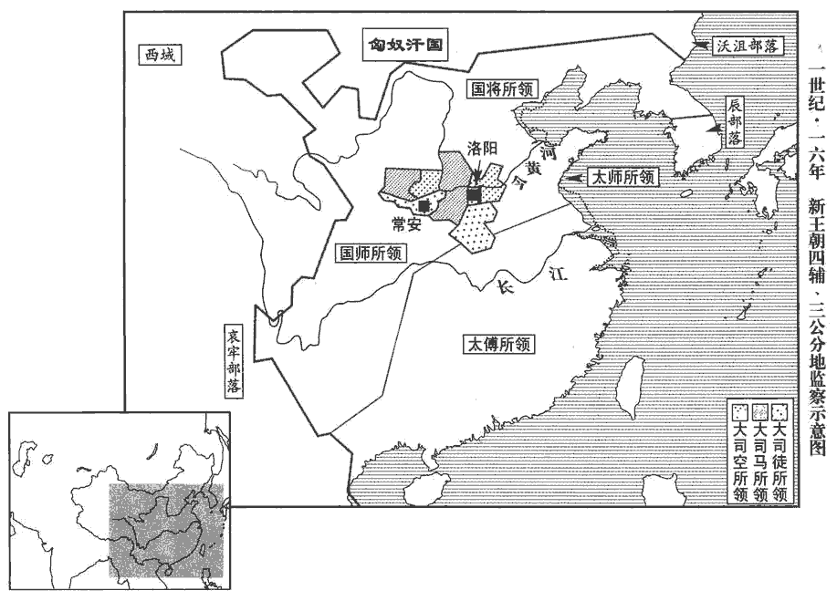
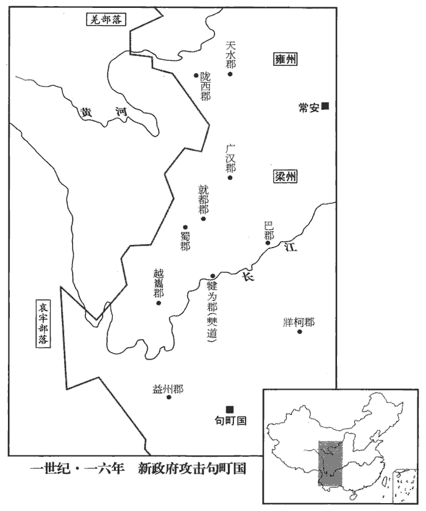
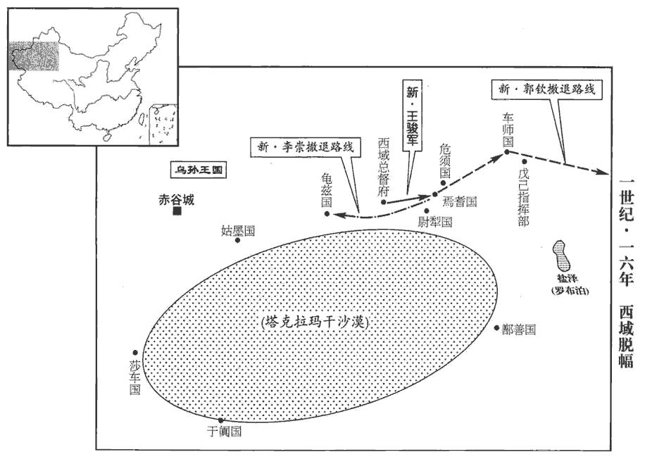
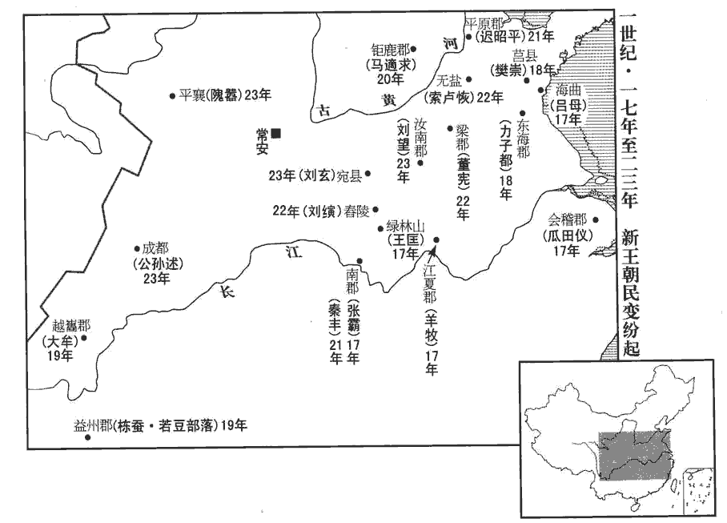
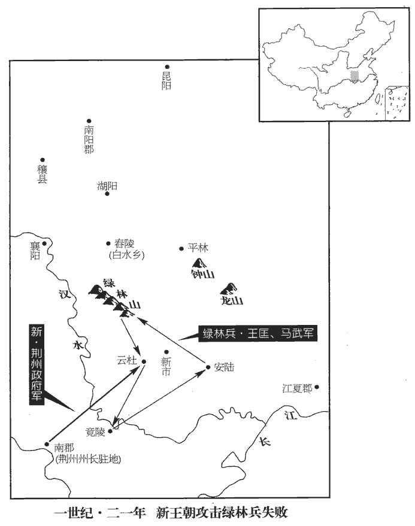
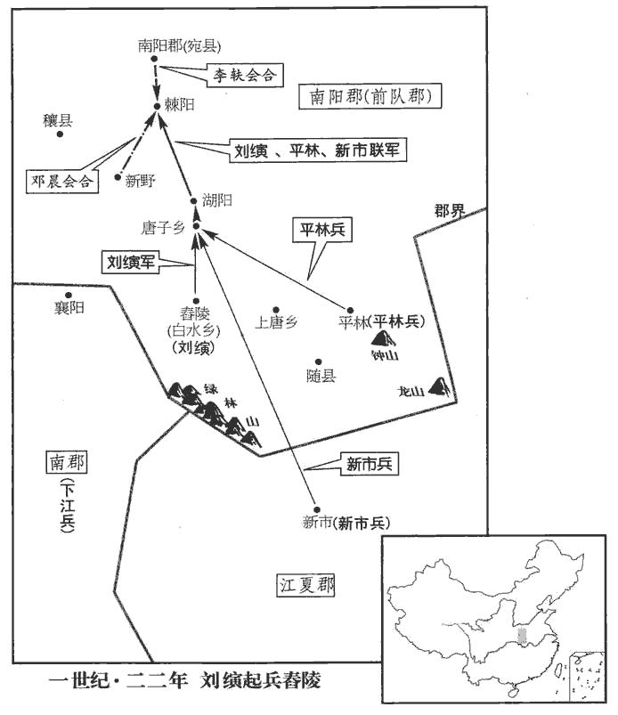

 漢紀三十起旃zhān蒙大淵獻（乙亥），盡玄黓yì敦牂（壬午），凡八年。

# 王莽下

## 天鳳二年（乙亥，一五）

1春，二月，大赦天下。

〖译文〗 [1]春季，二月，大赦天下。

2民訛言黃龍墮死黃山宮中‹陝西興平西南›，晉灼曰：黃山宮在槐里。黃圖：黃山宮在興平縣西三十里。百姓奔走往觀者有萬數。莽‹时年六十›惡之，師古曰：莽自謂黃德，故有此妖。惡，烏路翻。捕繫，問【章：十二行本「問」下有「語」字；乙十一行本同；孔本同；張校同。】所從起；不能得。

〖译文〗 [2]民间谣传有黄龙摔死在黄山宫中，老百姓奔走前往看热闹的有一万人之多。王莽讨厌这件事，拘捕了一些人讯问谣言从哪里传起，没能找到。

3單于咸既和親，求其子登尸。莽欲遣使送致，恐咸怨恨，害使者，乃收前言當誅侍子者故將軍陳欽，以他罪殺之。誅侍子事見上卷始建國三年。使，疏吏翻。莽選辯士濟南‹山東章丘›王咸為大使。夏，五月，莽復遣和親侯歙xī與咸等送右廚唯姑夕王，因奉歸前所斬侍子登及諸貴人從者喪；濟，子禮翻。歙，許及翻。復，扶又翻。從，才用翻。喪，息琅翻。單于遣云、當子男大且渠奢等至塞迎之。且，子餘翻。咸到單于庭，陳莽威德，莽亦多遺單于金珍，因諭說改其號，遺，于季翻。說，輸芮翻。號匈奴曰「恭奴」，單于曰「善於」，賜印綬，封骨都侯當為後安公，當子男奢為後安侯。單于貪莽金幣，故曲聽之；然寇盜如故。

〖译文〗 [3]匈奴单于栾提显既已跟中国和好，便向新朝索取他儿子的尸体。王莽想要派遣使者送去，恐怕栾提咸怨恨伤害使者，便逮捕从前提议要处死栾提咸儿子的原将军陈钦，用别的罪名处死。王莽挑选擅长交涉对答的儒生济南郡人王咸作特使。夏季，五月，再加派和亲侯王歙，与王咸等护送右厨唯姑夕王，一并归还从前所斩首的人质栾提登和他的侍从贵族们的棺材。匈奴单于派栾提云、右骨都侯须卜当的儿子大且渠须卜奢，到边塞迎接。王咸到了单于的王庭，陈述王莽的声威德行，加上王莽又致送栾提咸大量财物，顺势吩咐他改变称号，改匈奴为恭奴，单于为善于，赐予新朝颁发的印信，封骨都侯须卜当为后安公，须卜当之子须卜奢为后安侯。单于栾提咸贪图王莽的财物，所以勉强听从。但攻击掳掠依然如故。

4莽意以為制定則天下自平，故銳思於地理，制禮，作樂，講合六經之說。思，相吏翻。公卿旦入暮出，論議連年不決，不暇省獄訟冤結，省，悉井翻。民之急務。縣宰缺者數年守兼，師古曰：不拜正官，權令人守兼。一切貪殘日甚。中郎將、繡衣執法在郡國者，并乘權勢，傳相舉奏。傳，知戀翻。又十一公士分佈勸農桑，班時令，按諸章，應劭曰：士，掾也。余按漢公府各有掾屬，莽置十一公，改掾曰士。冠蓋相望，交錯道路，召會吏民，逮捕證左，左，音佐。郡縣賦斂，斂，力贍翻。遞相賕qiú賂，白黑紛然，師古曰：白黑，謂清濁也；紛然，亂之意；言清濁不分也。余謂白黑，色之易別者，且紛然不能分，可謂繆亂之甚。守闕告訴者多。莽自見前顓權以得漢政，故務自攬眾事，有司受成苟免。師古曰：莽事事自決，成熟乃以付吏，吏苟免罪責而已。諸寶物名、帑tǎng藏、錢穀官皆宦者領之；帑，他朗翻。藏，徂cú浪翻。吏民上封事，宦官、左右開發，尚書不得知，舊上封事者，先由尚書，乃奏御；莽恐尚書壅蔽，令宦官左右發其封，自省之。上，時掌翻。其畏備臣下如此。又好變改制度，好，呼到翻。政令煩多，當奉行者，輒質問乃以從事，前後相乘，憒眊不渫xiè。師古曰：乘，積也，登也。憒眊，不明也。渫，散也，徹也。憒，音工內翻。眊，音莫報翻。余謂前者省決未了而後者復來，謂之相乘。渫，音泄，清也。莽常御燈火至明，猶不能勝。勝，音升。尚書因是為姦，寢事，上書者，尚書不以聞而竊寢其事。上書待報者連年不得去，拘繫郡縣者逢赦而後出，衛卒不交代者至三歲。穀糴dí常貴，邊兵二十餘萬人，仰衣食縣官；師古曰：仰，音牛向翻。五原‹內蒙包頭西北›、代郡‹河北蔚縣›尤被其毒，被，皮義翻。起為盜賊，數千人為輩，轉入旁郡。莽遣捕盜將軍孔仁將兵與郡縣合擊，歲餘乃定。

〖译文〗 [4]王莽认为制度一经确定，那么天下自然太平，所以精心思考划分地域，制定礼仪，创作乐教，都讲求符合《六经》的说法。公卿大臣早晨上朝，傍晚退朝，议论连年，不能够作出决断，没有时间处理诉讼冤案和百姓迫切需要解决的问题。县宰缺额往往好几年都是派人代理，各种贪赃枉法的行径，一天比一天厉害。派驻郡和封国的中郎将、绣衣执法，纷纷利用权势，互相检举弹劾。还有十一公士分布各地，督促农耕和蚕桑，安排每季每月的工作，检查各种规章的实行情况，车水马龙，在路上络绎不绝。召集官民，逮捕取证，郡县官府征收赋税和财物，层层贿赂，是非清浊不分，前往朝廷申诉冤苦的人很多。王莽看到自己从前因专权而取得了汉朝政权，所以总想自己包揽众事，而有关官员只按既定的政令办事，以图能够免除罪责。各宝库、国库和钱粮官，都由宦官管理；官吏和平民的密奏，由宦官和左右随从开拆，尚书不得知道。他提防臣下就是这样。又喜欢改变制度，政令繁多，本来应当由下面奉命执行的，总要考察过问以后才交去办理，以致前面的事情没有完，后面的事情又赶上了，昏乱糊涂，没完没了。王莽时常在灯光下办公，直到天明还没有办完。尚书借此机会舞弊，阻塞下情，奏报后等待回答的人连年无法离去，被关押在郡县监狱里的人要遇到大赦才得出来，京城卫戍士兵不能轮换甚至达到三年之久。谷物常常很贵，边疆的军队二十多万人仰赖官府供应吃穿。五原郡和代郡尤其遭殃，有的人成为盗贼，几千人成群结队，转到邻近各郡。王莽派遣捕盗将军孔仁率领军队会同地方官兵联合进击，经过一年多才平定。

5邯鄲‹河北邯鄲›以北大雨，水出，深者數丈，流殺數千人。邯鄲，音寒丹。

〖译文〗 [5]邯郸以北地区降了大雨，地下水涌出，水深的地方有几丈深，冲走淹死几千人。

## 三年（丙子，一六）

1春，二月，乙酉，地震，大雨雪；雨，於具翻。關東尤甚，深者一丈，竹柏或枯。竹柏冬青，或至於枯。言常寒之咎。大司空王邑上書，以地震乞骸骨。莽不許，曰：「夫地有動有震，震者有害，動者不害。春秋記地震，易繫坤動；動靜辟翕，萬物生焉。」師古曰：辟，音闢。闢，開也。易上繫之辭曰：夫坤，其動也闢，其靜也翕，是以廣生焉。故莽引之也。其好自誣飾，好，呼到翻。皆此類也。

〖译文〗 [1]春季，二月乙酉（疑误），发生地震，天降大雪，关东地区尤其厉害，雪深的地方有丈把深，竹子、柏树有的枯死了。大司空王邑上书，以地震为由，请求退休。王莽不准，说：“大地有震有动，震有害而动无害。《春秋》记载地震，《易经·系辞上传》只说地动，动的时候就张开，静的时候就合拢，万物由此发生。”王莽喜爱自我欺骗掩饰，都是此类。

2先是，莽以製作未定，先，悉薦翻。上自公侯，下至小吏，皆不得俸祿。俸，扶用翻。夏，五月，莽下書曰：「予遭陽九之阸，傳曰：三統之元，有陰陽之九焉，天地之常數也。百六之會，國用不足，民人騷動，自公卿以下，一月之祿十緵zōng布二匹，孟康曰：緵，八十縷也。師古曰：緵，音子公翻。或帛一匹。帛，繒也。予每念之，未嘗不戚焉。今阸會已度，府帑tǎng雖未能充，帑，他朗翻。略頗稍給。其以六月朔庚寅始，賦吏祿皆如制度。」賦，布也，與也。四輔、公卿、大夫、士下至輿、僚，凡十五等。左傳曰：人有十等：王臣公，公臣大夫，大夫臣士，士臣皁，皁臣輿，輿臣隸，隸臣僚，僚臣僕，僕臣臺。今莽自四輔以下分為十五等。僚祿一歲六十六斛，稍以差稱。【章：十二行本「稱」作「增」；乙十一行本同；孔本同。】稱，尺證翻。上至四輔而為萬斛云。莽又曰：「古者歲豐穰則充其禮，師古曰：穰，音人掌翻，又音如羊翻。有災害則有所損，與百姓同憂喜也。其用上計時通計，上，時掌翻。天下幸無災害者，太官膳羞備其品矣；即有災害，以什率多少而損膳焉。以十為率，視災害所減多少而制分數。自十一公、六司、六卿以下，六司，即前所置六監也。各分州郡、國邑保其災害，東嶽，太師、立國將軍，保東方三州、一部、二十五郡；南嶽，太傅、前將軍，保南方二州、一部、二十五郡；西嶽，國師、寧始將軍，保西方二州、二部、三十五郡；北嶽，國將、衛將軍，保北方二州、一部、二十五郡；大司馬，保納卿、言卿、仕卿、作卿、京尉、扶尉、兆隊、右隊、中部左洎jì前七部；大司徒，保樂卿、典卿、宗卿、秩卿、翼尉、光尉、左隊、前隊、中部、右部，有五郡；大司空，保予卿、虞卿、共卿、工卿、師尉、烈尉、祈隊、後隊、中部洎後十郡；及六司、六卿，皆隨所屬之公，保其災害。亦以十率多少而損其祿。郎、從官、中都官吏食祿都內之委者，從，才用翻。委，於偽翻。委，積也。以太官膳羞備損而為節。冀上下同心，勸進農業，安元元焉。」莽之制度煩碎如此，課計不可理，吏終不得祿，各因官職為姦，受取賕賂以自共給焉。師古曰：共，讀曰供。

〖译文〗 [2]从前，王莽以厘订制度未完为由，上自公爵侯爵，下到小吏，全都停发俸禄。夏季，五月，王莽下诏书说：“我遭遇不幸的命运，灾难难避，国家财政开支不足，人民骚动，从公卿以下，一个月的俸禄只有十布二匹，或丝帛一匹。我每想到这件事，没有不忧愁的。现在困难时期已经过去，国库储备虽然还不充足，但已略微宽裕，将从六月朔（初一）庚寅开始，按照制度发给官吏俸禄。”四辅、公卿、大夫、士，下至舆、僚，共十五等。僚的俸禄每年六十六斛，按照等差逐渐上升，到四辅则是一万斛。王莽又下诏：“古时候，年岁丰收则俸禄增加，年岁歉收则俸禄减少，表示官吏与平民同喜同忧。现在，利用年终统计作为统一计算的根据，天下幸而没有灾害的时候，御厨房各种膳食全备。如有灾害，则以十为率，计算数量而减少膳食。十一位公爵、六司、六卿及以下，各分到若干州郡、封国，保护这些地区渡过灾害，也以十为率，计算受灾多少而削减俸禄。从京师仓库的储积粮里面领取俸禄的郎官、侍从官和京师官吏，以太官膳食的齐备或减少作为尺度。希望上下同心同德，鼓励、促进农业生产，安抚善良的老百姓。”王莽的制度如此琐碎，核算课计很难办理，官吏到底还是领不到俸禄，于是纷纷利用自己的职权干坏事，靠收受贿赂来解决自己的费用开支。

 

3戊辰，長平館‹长平观陕西省泾阳县东南›西岸崩，壅涇水不流，毀而北行。長平館，即長平觀，在涇水之南原。涇水東南流入渭，為岸所壅，故毀而北行。群臣上壽，以為河圖所謂「以土填水」，師古曰：填，讀與鎮同。匈奴‹王庭设蒙古国哈尔和林市›滅亡之祥也。莽乃遣并州‹山西›牧宋弘、游擊都尉任萌等將兵擊匈奴，任，音壬。將，即亮翻。至邊止【章：十二行本「止」作「上」；乙十一行本同；孔本同；張校同；退齋校同。】屯。

〖译文〗 [3]戊辰（初九），长平馆西岸坍塌，把泾河水流阻塞，河水决口向北流去。群臣向王莽祝贺，认为这就是《河图》所说的“用土去镇服水”，是匈奴灭亡的好兆头。于是王莽派遣并州牧宋弘和游击都尉任萌等人统率军队进击匈奴，到达边境驻扎下来。

4秋，七月，辛酉，霸城門災。黃圖：霸城門，長安城東出南頭第一門，亦曰青門。

〖译文〗 [4]秋季，七月辛酉（疑误），霸城门发生火灾。

5戊子‹三十›晦，日有食之。大赦天下。

〖译文〗 [5]戊子晦（疑误）出现日食。大赦天下。

6平蠻將軍馮茂擊句町‹云南廣南›，句町，音劬qú挺。士卒疾疫死者什六七，賦斂民財什取五，斂，力贍翻；下同。益州‹云南晉寧东晋城镇›虛耗而不克；徵還，下獄死。下，遐稼翻。冬，更遣寧始將軍廉丹與庸部牧史熊，孟康曰：莽改益州為庸部。余按莽置州牧、部監，州自是州，部自是部。今史熊為庸部牧，則又若州、部牧為一。大發天水‹甘肅通渭›、隴西‹甘肅臨洮›騎士，廣漢‹四川梓潼›、巴‹四川重慶›、蜀‹四川成都›、犍為‹四川宜宾›吏民十萬人、犍，居言翻。轉輸者合二十萬人擊之。始至，頗斬首數千；其後軍糧前後不相及，士卒飢疫。莽徵丹、熊，丹、熊願益調度，必克乃還，復大賦斂。調，徒弔翻。復，扶又翻；下同。斂，力贍翻。就都‹四川廣都南华阳镇›大尹馮英不肯給，莽於蜀郡廣都縣置就都大尹。上言：「自西南夷反叛以來，積且十年，郡縣距擊不已，上，時掌翻。續用馮茂，苟施一切之政；僰bó道‹四川宜賓›以南，地理志，僰道縣，屬犍為郡。僰，音蒲北翻。山險高深茂，多敺眾遠居，敺，與驅同。費以億計，吏士罹毒氣死者什七。今丹、熊懼於自詭，期會調發諸郡兵穀，復訾zī民取其什四，師古曰：發人訾財，十取其四也。訾，與貲同。空破梁州‹四川云南›，功終不遂。莽改益州曰梁州。師古曰：遂，成也。爾雅註：梁州，以西方金氣剛強，強，梁也。宜罷兵屯田，明設購賞。」莽怒，免英官；後頗覺寤，曰：「英亦未可厚非。」復以英為長沙‹湖南長沙›連率。率，所類翻。越巂‹四川西昌›蠻夷任貴亦殺太守枚根。【章：十二行本「根」下有「自立爲邛穀王」六字；乙十一行本同；孔本同；張校同；退齋校同。】師古曰：枚根者，太守之姓名。巂，音髓。任，音壬。

〖译文〗 [6]平蛮将军冯茂攻打句町，士兵因瘟疫而死亡的有十分之六七，征收百姓财物，十中取五，弄得益州民穷财尽，而战斗却没有取得胜利，王莽把他调回来关进监狱，冯茂死于狱中。冬季，王莽再派宁始将军廉丹与庸部牧史熊，大举征发天水、陇西骑兵，广汉、巴郡、蜀郡、犍为等郡官员丁壮十万人，加上负责粮秣运输的共计二十万人，发动攻击。刚到达时，斩杀敌人数千。后来军粮供应不上，士兵饥饿，又染上瘟疫。王莽征召廉丹、史熊回京师。廉丹、史熊要求增加支援，表示一定要战胜句町才班师还朝。于是，捐税更重了。就都大尹冯英不肯给，奏报说：“自从西南夷叛变以来，前后差不多十年了，郡县地方军民进行抗击没有停止过。接着任用冯茂，苟且推行不顾后果的政策。道县以南地区，山势险峻深邃，冯茂把许多百姓赶到远地居住，费用以亿计，官兵遭受毒气而死亡的达到十分之七。现在廉丹和史熊对于自己保证的规定期限感到害怕，限期征集调发各郡的士兵和粮食，又搜索民间财物，拿走了民财的十分之四，弄得梁州地区民穷财尽，战功到底还是不能够完成。应该停止战斗，派军队驻守并开垦耕种田地，公开设置封赏，召诱夷人。”王莽大怒，免掉了冯英的官职。后来有所觉悟，说道：“冯英也不便深加责怪。”又任命冯英作长沙郡连率。越郡蛮夷酋长任贵，也杀害了太守枚根。

 

7翟義黨王孫慶捕得，莽使太醫、尚方與巧屠共刳kū剝之，師古曰：刳，剖也，音口胡翻。量度五臧，五臧，心、肺、肝、脾、腎也。周禮有九藏。註曰：正藏五，又有胃、旁胱、大腸、小腸。疏曰：正藏五者，肺、脾、心、肝、腎。又有胃、旁胱、大腸、小腸者，此乃六府中取此四者以益五藏，為九藏也。六府：胃、小腸、大腸、旁胱、膽、三焦。以其受盛，故謂之為府；亦有藏稱，故入九藏之數。然六府取此四者，案黃帝八十一難經說：胃為水穀之府，小腸為受盛之府，大腸為行道之府，旁胱為精液之府。氣之所生，下氣象天，故放寫而不實，實不滿，若然，則正府也，故入九藏。其餘，膽者清淨之府，三焦為孤府，非正府，故不入九藏。師古曰：度，音大各翻。臧，讀曰臟。以竹筳tíng導其脈，知所終始，云可以治病。師古曰：筳，竹挺也，音庭。按醫書，脈有三部、六經。心部在左手寸口，屬手少陰經，與小腸、手太陽經合。肝部在左手關上，屬足厥陰經，與膽、足少陽經合。腎部在左手尺中，屬足少陰經，與膀胱、足太陽經合。肺部在右手寸口，屬手太陰經，與大腸、手陽明經合。脾部在右手關上，屬足太陰經，與胃、足陽明經合。右腎在右手尺中，屬手厥陰心包經，與三焦、手少陽經合。手少陰之脈，起於心中，出屬心系，下膈，絡小腸；其支者從心系上俠咽系、目系，其直者復從心系卻上肺，出腋下，下循臑nào內後廉，行太陰，心主之，後下肘內廉，循臂內後廉，抵掌後兌骨之端，入掌內廉，循小指之內，出其端。手太陽之脈，起於小指之端，循手外側上腕，出踝huái中，直上，循臂骨下廉，出肩解，繞肩胛jiǎ，交肩上，入缺盆，絡心，循咽，下膈，抵胃，屬小腸；其支別者，從缺盆循頸，上頰，至目，兌眥zì，卻入耳中；其支者，別頰上䪼zhuō，抵鼻，至目內眥。足厥陰之脈，起於大指聚毛之際，上循足跗fū上廉，去內踝一寸，上踝八寸，交出太陰之後，上膕guó內廉，循股，入陰毛中，環陰器，抵小腹，俠胃，屬肝，絡膽，上貫膈，布脇、肋，循喉嚨之後，上入頏háng顙sǎng，連目系，上出額，與督脈會於巔；其支從目系下頰里，環脣內；其支復從肝貫膈，上注肺。足少陽之脈，起於目兌眥上，抵頭角下耳後，循頸行。手少陽之脈，前至肩上，卻交出少陽之後，入缺盆；其支別者從耳中出，走耳前，至目兌眥後；其支別者，自兌眥下大迎，合手少陽，於䪼zhuō下，交頰車，下頸，合缺盆，下胸中，貫膈，絡肝，屬膽，循脇里，出氣街，繞髮際，橫入髀bì厭中；直者從缺盆下腋，循胸過季脇下，合髀厭中，以下循髀太陽出膝外廉下，外輔骨之前，直下抵絕骨之端，下出外踝之前，循足跗上，入小指、次指之間；其支者從跗上入大指，循歧骨出其端，還貫入爪甲，出三毛。足少陰之脈，起於小指之下，斜趣足心，出然谷之下，循內踝之後，別入跟中，上腨shuàn內，出膕內廉，上股內後廉，貫脊，屬腎，絡膀胱；其直者從腎上貫肝、膈，入肺中，循喉嚨，俠舌本；其支從肺出，絡心，注胸中。足太陽之脈，起於目內眥，上額，交巔上；其支別者，從巔至耳上角，其直行者，從巔入絡腦，還出，別下項，循肩膊內，俠脊，抵腰中，入循膂，絡腎，屬膀胱；其支別者，從腰中下貫臀，入膕中；其支別者，從膊左內右，別下貫胛，俠脊內，過髀bì樞，循髀外後廉，下合膕中，下貫腨shuàn內，出外踝之後，循京骨，至小指外端。手太陰之脈，起於中焦，下絡大腸，還循胃口，上膈，屬肺；從肺系橫出腋下，下循臑nào肉，行少陰，心主之，前下肘中，循臂內上骨下廉，入寸口上魚，循魚際出大指之端；其支者從腕後直出次指內廉，出其端。手陽明之脈，起於大指、次指之端，循指上廉，出合谷、兩肩之間，上入兩筋之中，循臂上廉，入肘外廉，循臑nào內前廉，上肩，出髃yú肩之前廉，上出柱骨之會上，下入缺盆，絡肺，下膈，屬大腸；其支者從缺盆上頸，貫頰，下入齒縫中，還出，俠口，交人中左之右，右之左，上俠鼻孔。足太陰之脈，起於大指之端，循指內側白肉際，過竅骨後上內踝前廉，上臑nào肉，循䯒骨後交出厥陰之前，上循膝股內前廉，入腹，屬脾，絡腎，上膈，俠咽，連舌本，散舌下；其支復從胃別上膈，注心中。足陽明之脈，起於鼻交頞è中，下循鼻外，入上齒中，還出，俠口，環脣，下交承漿，卻循頤後下廉，出大迎，承頰車，上耳前，過客主，入循髮際，至額顱；其支者，從人迎前，下人迎，循喉嚨，入缺盆，下膈，屬胃，絡脾；其直行者，從缺盆下乳內廉下，俠臍，入氣充中；其支者起胃下口，循腹里，下至氣充而合，以下髀bì關，抵伏兔下，入膝臏中，下循䯒外廉，下足跗，入中指內間；其支者下膝三寸，而別以下入大指間，出其端。手厥陰之脈，起於胸中，出屬心包，下膈，歷絡三焦；其支者循胸出脇，下腋三寸，上抵腋下，下循臑nào內，行太陰、少陰之間，入肘內，行兩筋之間，入掌中，循中指，出其端。手少陰之脈，起於小指、次指之端，上出次指之間，循出表腕，出臂外兩骨之間，上貫肘，循臑nào內，上肩，交出足少陽之後，入缺盆，交膻中，散絡心包，下膈，徧屬三焦；其支者從膻中上出缺盆，上項，俠耳後，直出，上耳上角以屈，下頰至䪼zhuō；其支者從耳後入耳中，卻出，至目兌眥。師古曰：云可以治病者，以知血脈之原，則盡攻療之道也。

〖译文〗 [7]翟义的党羽王孙庆被捉，王莽命太医、药剂师和高明的屠手一道解剖他，测量五脏，用竹签贯通他的经脉，弄清来龙去脉，说是可以用来治疗疾病。

8是歲，遣大使五威將王駿、西域都護李崇、戊己校尉郭欽出西域；諸國皆郊迎，送兵穀。駿欲襲擊之，焉耆‹新疆焉耆›詐降而聚兵自備，降，戶江翻。駿等將莎車‹新疆莎車›、龜茲‹新疆庫車›兵七千餘人分為數部，將，即亮翻；下同。莎，素何翻。龜茲，音丘慈。命郭欽及佐帥何封別將居後。帥，所類翻。駿等入焉耆；焉耆伏兵要遮駿，及姑墨‹新疆阿克苏›、封犂‹尉犂，新疆博湖县›、危須國‹新疆和硕›兵為反間，姑墨國王治南城，去長安八千一百五十里。「封犂」，漢書作「尉犂」。要，一遙翻。間，古莧翻。還共襲駿，【章：十二行本「駿」下有「等」字；乙十一行本同；孔本同；張校同。】皆殺之。欽【章：十二行本「欽」下有「封」字；乙十一行本同；孔本同。】後至焉耆，焉耆兵未還，欽襲擊，殺其老弱，從車師‹新疆吐魯番›還入塞。莽拜欽為填外將軍，師古曰：填，音竹刃翻。封劋jiǎo胡子；師古曰：劋，絕也，音子小翻。何封為集胡男。李崇收餘士，還保龜茲‹新疆庫車›。龜茲，音丘慈。及莽敗，崇沒，西域遂絕。

〖译文〗 [8]本年，新朝派特使五威将王骏、西域都护李崇和戊已校尉郭钦出使西域，各国都到郊外迎接并供应民夫和粮秣。王骏想要袭击他们，焉耆假装投降，却秘密集结部队防备。王骏等率领莎车、龟兹的军队七千余人分作数队，命令郭钦和佐帅何封另率一支军队作为后卫。王骏等进入焉耆，焉耆伏兵突起，拦截袭击王骏。而姑墨、封犁、危须等国军队叛变，回兵同向王骏等发动攻击，把王骏等人全部斩杀。郭钦稍后抵达焉耆，焉耆军队还没有返回，郭钦发动袭击，屠杀老弱，取道车师入塞回国。王莽任命郭钦当填外将军，封为胡子，封何封为集胡男。李崇收集残余部队，退保龟兹。等到王莽败亡，李崇去世，西域于是跟中国隔绝。

 

## 四年（丁丑，一七）

1夏，六月，莽‹时年六十二›更授諸侯王【章：十二行本無「王」字；乙十一行本同。】茅土於明堂；親設文石之平，陳菁茅四色之土，師古曰：尚書禹貢，包匭guǐ菁茅，儒者以為菁，菜名也；茅，三脊茅也。而莽此言以菁茅為一物，則是謂善茅為菁茅也。土有五色，而此云四者，中央之土不以封也。春秋大傳曰：天子之國有泰社，東方青，南方赤，西方白，北方黑，上方黃。故將封於東方者取青土，封於南者取赤土，封於西者取白土，封於北者取黑土，各取其方土，裹以白茅，封以為社，此始受封於天子者也。此之謂主土；主土者，立社以奉之也。菁，音精。告於岱宗、泰社、后土、先祖、先妣以班授之。莽好空言，好，呼到翻。慕古法，多封爵人；性實吝嗇，託以地理未定，故且先賦茅土，用慰喜封者。

〖译文〗 [1]夏季六月间，王莽重新在明堂把象征封国的茅草与泥土授予诸侯王，亲自设置有文采的石制几案，陈列菁茅和四色泥土，祭告泰山、国家宗社、后土和先代的祖父祖母，然后进行封授。王莽喜好说空话，羡慕古代的制度，多给人赐封爵位，为人却实在吝啬小气，托辞土地规划没有确定，所以权且先授予象征封国的茅土，用来安慰喜欢封爵的人。

2秋，八月，莽親之南郊，鑄作威斗，以五石銅為之，李奇曰：以五色藥石及銅為之。蘇林曰：以五色銅鑛治之。師古曰：李說是也，若今作鍮tōu石之為。若北斗，長二尺五寸，長，直亮翻。欲以厭勝眾兵。師古曰：厭，音一葉翻。既成，令司命負之，莽出在前，入在御旁。

〖译文〗 [2]秋季八月，王莽亲自到京师南郊，铸作威斗。威斗是用铜掺进五色石子铸成的，形状象北斗，长二尺五寸，想要以此来诅咒战胜各地兵马。威斗铸成了，让司命扛着它，王莽外出置于前头，王莽进宫就放在旁边。

3莽置羲和命士，以督五均、六筦guǎn。鹽，一也。酒，二也。鐵，三也。名山、大澤四也。五均、賒貸，五也。鐵布、銅冶，六也。郡有數人，皆用富賈為之，賈，音古。乘傳求利，傳，知戀翻。交錯天下；因與郡縣通姦，多張空簿，師古曰：簿，計簿也，音步戶翻。府藏不實，藏，徂浪翻。百姓愈病。是歲，莽復下詔申明六筦，下，遐稼翻。每一筦為設科條防禁，為，於偽翻。犯者罪至死。姦民猾吏并侵，眾庶各不安生，又一切調上公以下諸有奴婢者，調，徒釣翻。率一口出【章：十二行本「出」下有「錢」字；乙十一行本同；孔本同。】三千六百，天下愈愁。納言馮常以六筦諫，莽大怒，免常官。法令煩苛，民搖手觸禁，不得耕桑，繇役煩劇，師古曰：繇，讀曰傜。而枯旱、蝗蟲相因，獄訟不決。吏用苛暴立威，旁緣莽禁，師古曰：旁，依也，音步浪翻。侵刻小民，富者不能【章：十二行本無「能」字；乙十一行本同；孔本同；張校同。】自別，【章：十二行本「別」作「保」；乙十一行本同；孔本同；張校同。】別，彼列翻。貧者無以自存，於是并起為盜賊，依阻山澤，吏不能禽而覆蔽之，浸淫日廣。覆，敷救翻。師古曰：浸淫，猶漸染也。余謂此以水為諭，漸浸而至於淫溢也。臨淮‹江蘇盱眙›瓜田儀【章：十二行本「儀」下有「等」字；乙十一行本同；孔本同；張校同。】依阻會稽‹江蘇蘇州›長州‹江蘇苏州西南›；服虔曰：姓瓜田，名儀。師古曰：長州，即枚乘所云長州之苑。余謂今蘇州長洲縣即其地。會，工外翻。琅邪‹山東諸城›呂母聚黨數千人，殺海曲‹山東日照›宰，入海中為盜，莽改縣令長曰宰。初，呂母子為縣吏，為宰所冤殺；母散家財，以酤gū酒買弓弩，陰厚貧窮少年，得百餘人，遂攻海曲縣，殺其宰以祭子墓。地理志，海曲縣屬琅邪郡。賢曰：故城在密州莒jǔ縣東。其眾浸多，至萬數。荊州‹湖北湖南›饑饉，民眾入野澤，掘鳧fú茈cí而食之，荊州部南陽、南郡、桂陽、武陵、零陵、江夏等郡。爾雅曰：芍，鳧茈。郭璞曰：生下田中，苗似龍鬚而細，根如指；根黑色，可食。茈，音才支翻。芍，音胡了翻。更相侵奪。更，工衡翻。新市‹湖北京山东北›人王匡、王鳳為平理諍訟，地理志，新市縣屬江夏郡。為，於偽翻。諍，與爭同。晉王沈釋時論，闒tà茸勇敢於饕諍，叶韻平聲。古字多假借用也。遂推為渠帥，眾數百人。孔安國曰：渠，大也。帥，所類翻。於是諸亡命者南陽‹河南南陽›馬武、潁川‹河南禹州›王常、成丹等，皆往從之；共攻離鄉聚，臧於綠林山‹湖北随州西南›中，賢曰：離鄉聚，謂諸鄉聚離散。去城郭遠者，大曰鄉，小曰聚。前書曰：收合離鄉，置大城中，即其義也。綠林山，在今荊州當陽縣東北。余按郡國志，新市侯國有離鄉聚、綠林山。則以離鄉為聚名。聚，才喻翻。臧，古藏字。數月間至七八千人。又有南郡‹湖北江陵›張霸、江夏‹湖北新洲›羊牧等與王匡俱起，眾皆萬人。莽遣使者即赦盜賊，即，就也；就其相聚為盜處而赦之也。還言：「盜賊解輒復合。復，扶又翻。問其故，皆曰：『愁法禁煩苛，不得舉手力作，所得不足以給貢稅；閉門自守，又坐鄰伍鑄錢挾銅，姦吏因以愁民。』民窮，悉起為盜賊。」莽大怒，免之。其或順指言「民驕黠當誅」黠，下八翻。及言「時運適然，且滅不久」，莽說，輒遷官。說，讀曰悅。

〖译文〗 [3]王莽设置羲和命士，督促实行管理财政的五均、六管制度。每郡有几个名额，都由富豪、大商人担任。这些官员乘坐驿车，谋求奸利，往来全国。乘机与郡县官吏勾结，设立假帐。国库未能充实，而百姓更加穷苦。本年，王莽再下诏，重申肯定六管。每一项管理制度下达，总要为它设置条规禁令，违犯的人罪重的甚至处死。奸猾之徒与贪官污吏同时侵害百姓，百姓不得平安。此外，上公及以下有奴婢的人一律交税金，每一奴婢要缴纳三千六百钱，天下愈发愁苦。纳言冯常就六管制度进行规劝，王莽大怒，把冯常免职。新朝的法令，琐碎苛刻，百姓动辄触犯禁网，农民没有时间耕田种桑，徭役繁重。而旱灾、蝗虫灾接连发生，诉讼和监狱中在押的囚犯长久不能结案。官吏用残暴的手段建立威严，利用王莽的禁令侵占民间财产。富人不能保护自己的财产，穷人不能活命。于是，无论贫富都当起强盗。他们依靠高山大泽的险阻，官吏无法制服，只好蒙蔽上级，以致盗贼渐渐地越来越多。临淮瓜田仪盘据会稽郡长州，琅邪吕母聚集党羽几千人，诛杀海曲县宰，乘船入海，当起海盗，人数越来越多，有一万左右。荆州发生大饥馑，百姓逃入山野沼泽，挖掘荸荠而食，互相攻击争夺。新市人王匡、王凤出面为大家评理，排解纠纷，于是被推做首领，拥有数百人。这时亡命客南阳马武、颍川王常、成丹等，都来投奔。他们一同攻击距城市较远的村落，藏在绿林山中，数月之间，集结到七八千人。又有南郡张霸、江夏羊牧等，与王匡同时崛起，都有一万人之众。王莽派出使者，到当地赦免这些强盗。使者回京之后，奏称：“强盗们解散之后，不久就又聚合，问他们原因，都说：‘忧愁法令既多又苛刻，动辄犯法。努力劳动所得到的报酬，还不够缴纳捐税。就是闭门自守，又往往因邻居私自铸钱或携带铜，要连坐入狱，贪官污吏，逼人欲死。’百姓走投无路，便都起来做盗贼。”王莽大怒，免其官职。有人顺着王莽的意思，说：“小民猖狂刁猾，应该诛杀。”或者说：“这只是偶然的时运，不久将会消灭。”王莽高兴，便升其官职。

 

## 五年（戊寅，一八）

1春，正月，朔‹一›，北軍南門災。北軍壘門之南出者也。

〖译文〗 [1]春季，正月初一，北军南营门失火。

2以大司馬司允費興為荊州‹湖北湖南›牧；見，問到部方略，引見而問其方略也。見，賢遍翻。興對曰：「荊、揚‹江蘇南到岭南›之民，率依阻山澤，以漁采為業。師古曰：漁，謂捕魚也。采，謂採取蔬果之屬。間者國張六筦，稅山澤，妨奪民之利，連年久旱，百姓饑窮，故為盜賊。興到部，欲令明曉告盜賊歸田里，假貸犂牛、種食，種，章勇翻。闊其租賦，師古曰：闊，寬也。冀可以解釋安集。」莽‹时年六十三›怒，免興官。

〖译文〗 [2]王莽任命大司马司允费兴作荆州牧，接见并询问他到任后的施政方案，费兴回答说：“荆州、扬州的百姓大都依靠山林湖沼，以捕捞、樵采为业。前一段时间，国家推行六管制度，征收山林湖沼税，损害、剥夺了百姓的利益，加上连年久旱，百姓饥饿穷困，所以沦为盗贼。我到任后，想要明令晓喻盗贼返回家园，贷放农具、耕牛、种子、粮食，减免他们的赋税，希望可以解散、安抚他们。”王莽大怒，免掉了费兴的官职。

3天下吏以不得俸祿，俸，扶用翻。并為姦利，郡尹、縣宰家累千金。莽乃考始建國二年胡虜猾夏以來諸軍吏及緣邊吏大夫以上為姦利增產致富者，收其家所有財產五分之四以助邊急。助邊費之急也。公府士馳傳天下，傳，知戀翻。考覆貪饕，師古曰：饕，音土高翻。開吏告其將、將，即亮翻。奴婢告其主，冀以禁姦，而姦愈甚。

〖译文〗 [3]全国的官吏因为得不到俸禄，纷纷去牟取非法利益，郡尹、县宰家里积累上千斤黄金。王莽于是检查始建国二年匈奴扰乱中国以来，所有军官和边境官吏大夫以上牟取非法利益增加产业发了财的，没收他们家中所有财产的五分之四，用来资助边防急需。各公府官吏乘坐驿站快车跑遍全国，审查贪污案件，动员官吏告发他们的上级，奴婢告发他们的主人，希望用这样的办法来禁止奸邪，可是奸邪却越加厉害。

4莽孫功崇公宗坐自畫容貌被服天子衣冠、刻三印，發覺，自殺。莽傳：功崇公國於穀城郡。三印，一曰「維祉冠，存已夏，處南山，臧薄冰」，二曰「肅聖寶繼」，三曰「德封昌圖」。畫，古畵通。被，皮義翻。宗姊妨為衛將軍王興夫人，坐祝詛姑，祝，職救翻。詛，莊助翻。殺婢以絕口，與興皆自殺。

〖译文〗 [4]王莽的孙子功崇公王宗由于给自己画了一幅像，穿着天子的衣服，戴着天子的冠冕，刻了三枚印章，被发觉，王宗自杀。王宗的姐姐王妨是卫将军王兴的夫人，被指控祈祷鬼神给她婆母降灾祸，为了灭口而杀死婢女，与王兴都自杀了。

5是歲，揚雄卒。初，成帝之世，雄為郎，給事黃門，與莽及劉秀并列；哀帝之初，又與董賢同官。莽、賢為三公，權傾人主，所薦莫不拔擢，而雄三世不徙官。及莽篡位，雄以耆老久次，轉為大夫。恬於勢利，師古曰：恬，安也。好古樂道，好，呼到翻。樂，音洛。欲以文章成名於後世，乃作太玄以綜天、地、人之道；桓譚曰：揚雄作玄書，以為：玄者，天也，道也，言聖賢制法作事，皆引天道以為本統，而因附屬萬類，王政、人事、法度。故伏羲氏謂之易，老子謂之道，孔子謂之元，揚雄謂之玄。玄經三篇，以紀天、地、人之道，立三體，有上、中、下，如禹貢之陳三品，三三而九，因以九九八十一，故為八十一卦。以四為數，數從一至四，重累變易，竟八十一而徧，不可增損，以三十五蓍shī揲shé之。玄經五千餘言，而傳十二篇。又見諸子各以其智舛馳，師古曰：舛，相背。大抵詆訾zǐ聖人，即為怪迂、析辯詭辭以撓世事，師古曰：大抵，大歸也。詆，訾毀也。迂，遠也。析，分也。詭，異也。言諸子之書，大歸皆非毀周、孔之教，為巧辯異辭以撓亂時政也。訾，音紫。迂，音於。撓，音火高翻。雖小辯，終破大道而惑眾，使溺於所聞而不自知其非也，故人時有問雄者，常用法應之，號曰法言。用心於內，不求於外，於時人皆忽之；師古曰：忽，謂輕也。唯劉秀及范逡敬焉，而桓譚以為絕倫，師古曰：無比類。钜鹿‹河北平鄉›侯芭師事焉。服虔曰：芭，音葩。大司空王邑、納言嚴尤聞雄死，謂桓譚曰：「子常稱揚雄書，豈能傳於後世乎？」譚曰：「必傳，顧君與譚不及見也。凡人賤近而貴遠，親見揚子雲祿位容貌不能動人，揚雄字子雲。故輕其書。昔老聃著虛無之言兩篇，師古曰：謂道德經也。薄仁義，非禮學，然後好之者尚以為過於五經，好，呼到翻。自漢文、景之君及司馬遷皆有是言。今揚子之書文義至深，而論不詭於聖人，師古曰：詭，違也。聖人，謂周公、孔子。則必度越諸子矣！」

〖译文〗 [5]本年，杨雄去世。最初，汉成帝刘骜时，杨雄当郎官，在黄门服务，与王莽、刘秀一起当官。哀帝刘欣初年，又与董贤同官。王莽、董贤后来当了三公高官，权力超越皇帝，所推荐保举的人，没有不升迁的。可是，杨雄经历了三代皇帝，仍是原官。到王莽篡夺皇位，杨雄才以受尊敬的老前辈的资格，擢升为大夫。杨雄对势利看得很淡，爱好古代的典章制度，喜欢儒家学派的道理，打算用文章使自己留名于后代，于是撰写《太玄》一书，讨论天地人三方面的综合关系。杨雄看到其他学派的学说，各用智慧的语言，与儒家背道而驰，大多诋毁訾骂儒家学派的圣人，荒唐怪异，巧言诡辩，以扰乱时政。虽然都是小节小目，但最终破坏儒家学派的大道理而迷惑众人，使众人信奉他们，却不知道错误何在。所以当时常常有人向杨雄提出问题，杨雄总是用合乎礼法的言论回答，收集成书，称为《法言》。只求内省，不向外宣扬，因而当时人都忽略了杨雄。而只有刘秀与范逡尊敬他，而桓谭则认为他无以伦比，巨鹿人侯芭拜他为师。大司空王邑、纳言严尤听说杨雄去世，问桓谭说：“您常称道杨雄的著作，难道能留传后世吗？”桓谭回答：“一定能留传，只是您与我都看不到了。大凡人之常情，对眼前的看得轻贱，而把遥远的看得贵重。大家亲眼看到杨雄的俸禄、地位、容貌，没有一项动人之处，所以瞧不起他的著作。从前，李耳把他的虚无思想写成文章两篇，贬低仁义，抨击礼学，然而后来喜欢它的人，还认为它的价值超过儒家的《五经》，从汉文帝、汉景帝等君王到司马迁，都有这种言论。而今杨雄著作的文字含义十分深刻，而所发议论又不违背儒家学派的圣人，那么将来一定会超越诸子了！”

6琅邪‹山東諸城›樊崇起兵於莒‹山東莒縣›，莒縣，班志屬城陽國，續漢志屬琅邪國。邪，音耶。眾百餘人，轉入太山。群盜以崇勇猛，皆附之，一歲間至萬餘人。崇同郡人逄páng安、賢曰：逄，音龐。東海‹山東郯城›人徐宣、謝祿、楊音各起兵，合數萬人，復引從崇；復，扶又翻。共還攻莒‹山東莒縣›，不能下，轉掠青‹山東北部›、徐‹江蘇北部›間。又有東海‹山東郯城›刀子都，「刁」，一作「力」。【章：作「刀」者刻誤。十二行本正作「刁」；乙十一行本同；熊校同。按下二卷胡均有說。】姓譜：力，黃帝佐力牧之後。漢有力子都。亦起兵鈔擊徐、兗‹山東西部›。鈔，楚交翻。莽遣使者發郡國兵擊之，不能克。

〖译文〗 [6]琅邪樊崇 在莒城聚众起兵，有一百多人，辗转进入泰山。盗贼们因樊崇勇猛，纷纷归附。一年之间，集结到一万余人。樊崇的同郡人逄安，东海人徐宣、谢禄、杨音，也分别起兵，总共有数万人之多，又带着部下跟随樊崇 ，并一同回军进攻莒城，未能攻下。他们就在青州、徐州一带流窜，抢掠。又有东海人刁子都，也起兵，在徐州、兖州一带抢劫掠夺。王莽派遣使者征调各郡、各封国军队进击，未能取胜。

7烏累單于死，累，力追翻。弟左賢王輿立，為呼都而尸道皋gāo若鞮單于。鞮，丁奚翻。輿既立，貪利賞賜，遣大且渠奢與伊墨居次云女弟之子醯xī櫝王且，子餘翻。師古曰：櫝，音讀。俱奉獻至長安。莽遣和親侯歙與奢等俱至制虜塞下‹内蒙伊金霍洛旗西南›，與云及須卜當會；因以兵迫脅云、當，將至長安。云、當小男從塞下得脫，歸匈奴。當至長安，莽拜為須卜單于，欲出大兵以輔立之，兵調度亦不合。調，徒弔翻。而匈奴愈怒，并入北邊為寇。

〖译文〗 [7]匈奴乌累若单于栾提咸去世，他的弟弟左贤王栾提舆继位，为呼都而尸道皋若单于。栾提舆继位后，贪图赏赐，派大且渠奢与伊墨居次栾提云的妹妹的儿子醯椟王，同到长安进贡。王莽派和亲侯王歙与奢等一同到制虏塞下，与栾提云、须卜当会面。并趁机用兵逼迫、威胁栾提云、须卜当，送至长安。二人的小儿子从塞下得以逃脱，回归匈奴。须卜当到长安，王莽封他须卜单于，打算出动大军，帮助他在匈奴即位，然而大军一时无法集结。而匈奴对新朝更加恼怒，纷纷侵入北方边境掳掠抢劫。

## 六年（己卯，一九）

1春，莽‹时年六十四›見盜賊多，乃令太史推三萬六千歲曆紀，六歲一改元，布天下；下書自言「己當如黃帝仙升天」，欲以誑燿百姓，銷解盜賊。眾皆笑之。

〖译文〗 [1]春季，王莽发现全国盗贼很多，于是命令太史推算出三万六千年的日历。下令每隔六年改换一次年号，布告天下。又下诏书：“我会跟黄帝一样成仙升天”想以此对百姓欺骗和夸耀，使盗贼瓦解。众人都觉得可笑。

2初獻新樂於明堂、太廟。新樂，莽所作也。

〖译文〗 [2]王莽第一次把《新乐》呈献于明堂、太庙。

3更始將軍廉丹擊益州‹云南晋宁东晋城镇›，不能克。丹蓋自寧始將軍遷更始將軍。更，工衡翻。益州夷棟蠶、若豆等起兵殺郡守；越巂‹四川西昌›夷人大牟亦叛，殺略吏人。按後漢書，棟蠶、若豆，益州夷兩種也。大牟，越巂姑復縣夷人。巂，音髓。莽召丹還，更遣大司馬護軍郭興、庸部牧李曅yè擊蠻夷若豆等、更，工衡翻。太傅羲叔士孫喜清潔江湖之盜賊。莽以太傅主夏，故置羲叔官。士孫，複姓。姓譜：漢平陵士孫張為博士，明梁丘易。而匈奴寇邊甚，莽乃大募天下丁男及死罪囚、吏民奴，名曰豬突、豨xī勇，以為銳卒。服虔曰：豬性觸突人，故以為諭。師古曰：東方人名豕曰豨；一曰：豨，豕走也；音許豈翻。一切稅天下吏民，訾三十取一，訾，與貲同。縑jiān帛皆輸長安。令公卿以下至郡縣黃綬皆保養軍馬，續漢志：四百石、三百石、二百石，黃綬。師古曰：保者，不許其死傷。多少各以秩為差；吏盡復以與民。師古曰：轉令百姓養之。又博募有奇技術可以攻匈奴者，技，渠綺翻。將待以不次之位，言便宜者以萬數：或言能渡水不用舟楫，師古曰：楫，所以刺舟也。連馬接騎，濟百萬師；或言不持斗糧，服食藥物，三軍不飢；或言能飛，一日千里，可窺匈奴；莽輒試之，取大鳥翮hé為兩翼，師古曰：羽本曰翮，音胡隔翻。頭與身皆著毛，著，側略翻。通引環紐，紐，女九翻。飛數百步墮。莽知其不可用，苟欲獲其名，皆拜為理軍，賜以車馬，待發。

〖译文〗 [3]更始将军廉丹攻打益州郡，不能取胜。益州郡夷人栋蚕、若豆等起兵，击杀郡守。越郡夷人大牟也叛变了，屠杀官吏平民，并侵占他们的财产。王莽召廉丹回来，改派大司马护军郭兴、庸部牧李去攻打蛮夷若豆等部落，派太傅羲叔士孙喜去平定江湖的盗贼。同时匈奴侵犯边境很厉害，王莽便大规模招集全国的壮丁以及死刑罪犯和官吏、平民的家奴，起名叫猪突、勇，把他们作为精锐的士兵。向全国一切官吏和平民征税，抽取财产三十分之一，绸绢都运送到长安。命令公卿及以下直到郡县佩带黄色绶带的官吏都要保养军马，马匹的多少根据各人的官秩规定等级，而官吏都把这个负担转嫁给老百姓。又广泛招集有奇巧技术可以用来攻打匈奴的人才，打算越级提升他们。于是上言建议者有万人左右，有的说能够不用舟船桨楫渡过江河，连接马匹，可以渡过百万军队；有的说不要携带一斗粮食，只要服食药物，军队可以不饥饿；还有的说能够飞行，一天飞行一千里，可以去侦察匈奴。王莽就进行试验，那个人拿大鸟的羽毛做成两扇翅膀，头上和身上都附上羽毛，翅膀用扣环纽带操纵，飞行几百步就掉下来了。王莽知道他们不能起作用，但硬要博取珍惜人才的名声，将他们都任命作理军，赏赐车马，等侍出发。

初，莽之欲誘迎須卜當也，大司馬嚴尤諫曰：「當在匈奴右部，兵不侵邊，單于動靜輒語中國，語，牛倨翻。此方面之大助也。於今迎當置長安槀街，一胡人耳，不如在匈奴有益。」莽不聽。既得當，欲遣尤與廉丹擊匈奴，皆賜姓徵氏，號二徵將軍，令誅單于輿而立當代之。出車城西橫廄，未發。尤素有智略，非莽攻伐四夷，數諫不從；數，所角翻。及當出，廷議，尤固言「匈奴可且以為後，先憂山東盜賊。」莽大怒，策免尤。

〖译文〗 最初，王莽想要引诱须卜当，大司马严尤规劝道：“须卜当在匈奴右部，他的军队没有侵犯过边境，总是把单于的消息告诉我们，这是一个方面的巨大帮助。现在迎接须卜当并安置到长安槁街，就不过是一个胡人罢了，不如让他留 在匈奴有益。”王莽没有听从。已经把须卜当弄来了，想要派遣严尤和廉丹攻打匈奴，都给赐姓征氏，称为二征将军，命令他们诛杀单于栾提舆而立须卜当去代替他。兵车出发到长安城西马圈，没有起行。严尤一向具有智谋和才干，反对王莽攻打四方蛮夷各族，屡次规劝王莽而没有被听从。等到将要出兵时，朝廷进行讨论，严尤坚决说：“匈奴可以权且放在后面，首先要忧虑山东地区的盗贼。”王莽怒火万丈，下策书把严尤免职。

4大司空議曹史代郡‹河北蔚縣›范升漢公府諸曹，有掾、有史、有屬，皆公自辟置。奏記王邑曰：「升聞子以人不間於其父母為孝！間，古莧翻。臣以下不非其君上為忠。賢曰：論語，孔子曰：孝哉閔子騫，人不間於其父母之言！間，非也。言子騫之孝化其父母，言人無非之者。忠臣事君，有過即諫，在下無有非其君者，是忠臣也。令眾人咸稱朝聖，朝，直遙翻；下同。皆曰公明；蓋明者無不見，聖者無不聞。今天下之事，昭昭於日月，震震於雷霆，而朝云不見，公云不聞，則元元焉所呼天！元元，民也；良善之民。師古曰：元元，善意也。焉，於虔翻。公以為是而不言，則過小矣；知而從令，則過大矣；二者於公無可以免，宜乎天下歸怨於公矣。朝以遠者不服為至念，升以近者不悅為重憂。遠者不服，謂四夷也。近者不悅，謂人心不便於莽之法令也。今動與時戾，事與道反，馳騖wù覆車之轍，踵循敗事之後，後出益可怪，晚發愈可懼耳。方春歲首而動發遠役，藜lí藿huò不充，田荒不耕，穀價騰躍，斛至數千，吏民陷於湯火之中，非國家之民也。如此，則胡‹匈奴›、貊mò‹朝鮮半岛东北部›守闕，青‹山東北部›、徐‹江蘇北部›之寇在於帷帳矣。謂京輔之民亦將為變也。升有一言，可以解天下倒縣，縣，讀曰懸。免元元之急；不可書傳，願蒙引見，極陳所懷。」邑不聽。

〖译文〗 [4]大司空议曹史代郡人范升向大司空王邑提出签呈：“我听说，作儿子的，不离间父母之间的感情，才称为孝子；作臣子的，不诋毁君王，才称为忠臣。而今，大家异口同声，歌 颂皇上神圣，赞扬阁下英明。然而，英明的意思是无所不见，神圣的意思是无所不闻。而今天下的大事，比日月在天上还要明显，比雷霆万钧还要震撼。然而，皇上说没看见，阁下说听不到。那么善良的百姓，去哪里呼唤苍天？阁下误认为措施是对的而不开口，这样过失还小；认为是错的而奉命执行，那么过失就大了。两者之中，你一定居于一项，就怪不得天下所有的怨恨都集中到您身上。皇上认为远方不服从是最大的忧虑，我却认为国内百姓的不满才值得特别担心。现在的举动不合时宜，所决定的事跟常理相反。在翻车的道路上奔驰，在失败的轨迹上步步跟进，往后降临的灾祸将更加可怪，爆发得越晚就越是可怕。而今，正逢一年开始的春季，却征调壮丁到远方服役，粗劣的饭菜都不够吃，田地荒芜，无人耕种，粮谷价格猛涨，一斛竟高达数千钱，官吏和百姓陷于水深火热之中，将不再做国家的人民。不久，胡人、貊人就要来把守宫阙，而青州、徐州的强盗匪徒就要进入帷帐了。我有一番话，可以解除天下倒悬的痛苦，免除民众的窘迫，不可以用文字表达，请求引见，愿毫无保留地陈述我心中的想法。”王邑不予理会。

5翼平‹山東壽光东北›連率田況奏郡縣訾民不實，地理志：北海壽光縣，莽曰翼平。師古曰：言舉百姓訾財，不以實數。率，所類翻。訾，與貲同。【章：十二行本正作「貲」；孔本同。】莽復三十取一；以況忠言憂國，進爵為伯，賜錢二百萬，眾庶皆詈之。青、徐民多棄鄉里流亡，老弱死道路，壯者入賊中。

〖译文〗 [5]翼平郡连率田况奏报，郡县对民间财产估计不实，王莽按三十分之一又征税一次。他认为田况说话忠实，关心国家，把他的爵位提升为伯爵，赏赐钱二百万。广大民众都咒骂田况。青州和徐州很多百姓抛弃家园流亡，老弱者死于路上，强壮者加入盗贼。

6夙夜‹山東荣成北›連率韓博地理志：東萊不夜縣，莽曰夙夜。上言：「有奇士，長丈，大十圍，長，直亮翻。來至臣府，【章：十二行本「府」下有「曰」字；乙十一行本同；孔本同。】欲奮擊胡虜，自謂巨毋霸，出於蓬萊‹山東蓬萊›東南五城西北昭如海瀕，師古曰：昭如，海名。瀕，厓也。神仙家言，蓬萊有五城、十二樓。軺yáo車不能載，軺，音遙；小車。三馬不能勝。勝，音升。即日以大車四馬，建虎旗，載霸詣闕。霸臥則枕鼓，以鐵箸食，枕，職任翻。箸，遲倨翻。此皇天所以輔新室也！願陛下作大甲、高車、賁、育之衣，遣大將一人與虎賁百人賁，音奔。迎之於道，京師門戶不容者，開高大之，以示百蠻，鎮安天下。」博意欲以風莽；以莽字巨君，諷言毋得篡盜而霸。風，讀曰諷。莽聞，惡之，惡，烏路翻。留霸在所新豐‹陝西臨潼東北›，師古曰：在所謂其見到之處。更其姓曰巨母氏，謂因文母太后而霸王符也。師古曰：莽字巨君，若言文母出此人，而使我致霸王。更，音古衡翻。徵博，下獄，下，遐嫁翻。以非所宜言，棄市。

〖译文〗 [6]夙夜连率韩博奏报说：“有个奇士，身高一丈，体大十围，来到我的府中，说想要奋力去攻打匈奴。自称名叫巨毋霸，生长在蓬莱东南五城西北的昭如海边，小车装不下，三匹马拖不动。我当天用大车套四马，竖立虎旗，装载巨毋霸前来京城。巨毋霸睡觉就枕在鼓上，用铁筷子吃饭，这是上天派来辅佐新朝的！希望陛下准备一领特大的铠甲，一辆高车，一套古代勇士孟贲、夏育穿的衣服，派遣大将一人和虎贲武士一百人到路上来迎接他。京师的门户不能够容纳他的，把它们开高些、开大些。以此向各蛮族显示，可以镇慑安定天下。”韩博是想以此来讥讽王莽。王莽听到了，痛恨韩博，让巨毋霸留在他所到达的新丰县，更改他的姓氏为巨母，意思是说，因文母太后而出现此人，这是使自己成为霸王的符命。征召韩博，关进监狱，以出言不当为由，将其处死。

7關東‹函谷關以東›饑旱連年，刁子都等黨眾寖多，至六、七萬。

〖译文〗 [7]函谷关以东连年饥馑、大旱，刁子都等党羽部众渐多，达六七万人。

## 地皇元年（庚辰，二零）

1春，正月，乙未，赦天下；改元曰地皇，從三萬六千歲曆號也。

〖译文〗 [1]春季，正月乙未（疑误），大赦天下，根据三万六千年日历，改年号为“地皇”。

2莽‹时年六十五›下書曰：「方出軍行師，敢有趨讙犯法者輒論斬，毋須時！」師古曰：趨讙，謂趨走而讙譁也。須，待也。讙，許元翻。於是春、夏斬人都市，百姓震懼，道路以目。韋昭曰：不敢發言，以目相眄miǎn而已。

〖译文〗 [2]王莽下文告说：“正当出兵行军的时候，敢有奔跑吵闹触犯法律的，就判处杀头，不要等到行刑季节！”于是春季、夏季都在都市里杀人，百姓震恐，路上相见只有以目示意，不敢交谈。

3莽見四方盜賊多，復欲厭之，復，扶又翻。師古曰：厭，音一葉翻。又下書曰：「予之皇初祖考黃帝定天下，將兵為大將軍，內設大將，外置大司馬五人，大將軍至士吏凡七十三萬八千九百人，士千三百五十萬人。予受符命之文，稽前人，將條備焉。」於是置前、後、左、右、中大司馬之位，賜諸州牧至縣宰皆有大將軍、偏、裨pí、校尉之號焉。州牧為大將軍；卒正、連率、大尹為偏將軍；屬令、長為裨將軍；縣宰為校尉。乘傳使者經歷郡國，日且十輩，倉無見穀以給；師古曰：見，謂見在也。傳，知戀翻。見，賢遍翻。傳車馬不能足，賦取道中車馬，師古曰：於道中行者，即執取之以充事也。取辦於民。

〖译文〗 [3]王莽看见四方盗贼很多，又想进行压制，再次下文告说：“我的皇初祖黄帝平定天下，自己统率军队担任大将军，内设大将，外设大司马五人，从大将军至士官共七十三万八千九百人，兵士一千三百五十万人。我接受符命的文辞，取法古人，将一一设置起来。”于是设置前大司马、后大司马、左大司马、右大司马、中大司马的职位，各州牧至县宰都赐予大将军、偏将军、裨将军、校尉的称号。乘坐驿站传车的使者经过各郡国，每天将近十批，仓库里没有现存的粮食供给，驾传车的马匹不够，就取于民间，征用路上的车马。

4秋，七月，大風毀王路堂。莽改未央宮前殿曰王路堂。服虔曰：如言路寢也。路，大也。莽下書曰：「乃壬午餔bū時，有烈風雷雨發屋折木之變，餔，食也。餔時，食時也。或曰：餔，即晡時；日加申為晡。師古曰：烈風，烈暴之風。折，而設翻。予甚恐焉；伏念一旬，迷乃解矣。師古曰：先言烈風雷雨，後言迷乃解矣，蓋取舜烈風雷雨弗迷以為言也。昔符命【章：十二行本「命」下有「文」字；乙十一行本同；孔本同；張校同；退齋校同。】立安為新遷王；臨國洛陽，為統義陽王，議者皆曰：『臨國洛陽為統，謂據土中為新室統也，宜為皇太子。』自此後，臨久病，雖瘳chōu不平。言疾雖有瘳，不能平復如其初也。臨有兄而稱太子，名不正。惟即位以來，陰陽未和，穀稼鮮耗，師古曰：鮮，少也。耗，減也。鮮，音先踐翻。蠻夷猾夏，寇賊姦宄guǐ，夏，戶雅翻。人民征營，無所錯手足。師古曰：征營，惶恐不自安之意也。錯，七故翻。深惟厥咎，在名不正焉。其立安為新遷王，服虔曰：安，莽第三子也。遷，音仙。莽改汝南新蔡曰新遷。師古曰：遷，猶仙耳，不勞假借音。臨為統義陽王。」

〖译文〗 [4]秋季，七月，大风损毁了王路堂。王莽下文告说：“壬午（疑误）傍晚时，发生了暴风大雷雨毁坏房屋、摧折树木的变故，我对此非常恐惧。考虑十天，才解除了迷惑。从前符命文辞说要立王安为新迁王，让王临在洛阳建国，为统义阳王，大家都说：‘王临在洛阳建国为统义阳王，是说他据有全国的中心，是新朝的继承者，应当作皇太子。’从此以后，王临久病，后来虽然痊愈，但没有完全康复。王临有哥哥而称皇太子，名分不正。我登上皇位以来，阴阳不和，粮食减少，蛮族扰乱中国，盗贼奸邪捣乱，人民惶恐不安，不知道怎么办。深深地思考这些罪责，是由于名分不正。应当立王安为新迁王，立王临为统义阳王。”

5莽又下書曰：「寶黃廝赤。服虔曰：以黃為寶，自用其行氣也。廝赤，廝役賤者皆衣赤，賤漢行也。廝，音斯。其令郎從官皆衣絳。」從，才用翻。衣，於既翻。

〖译文〗 [5]王莽又下文告说：“黄色宝贵，红色轻贱，应当让郎官、侍从官都穿着深红色的衣服。”

6望氣為數者多言有土功象；九月，甲申，莽起九廟於長安城南，九廟，祖廟五，親廟四。黃帝廟方四十丈，高十七丈，高，居傲翻。餘廟半之，制度甚盛。博徵天下工匠及吏民以義入錢穀助作者，駱驛道路；師古曰：駱驛，言不絕。窮極百工之巧；功費數百餘萬，卒徒死者萬數。

〖译文〗 [6]很多观察云气的人都说出现了大兴土木的征象；九月甲申（疑误），王莽在长安城南兴建皇家九座祭庙。其中黄帝庙东西南北四方各长四十丈，高十七丈，其它祭庙只有黄帝庙的一半，规模十分宏伟。广泛征召全国工匠及捐助钱粮者，人马粮草在道路上络绎不断。九庙的设计与施工，都极尽各种工匠的持巧。支出数百万钱，而役夫丧生的有一万人左右。

7是月，大雨六十餘日。

〖译文〗 [7]从本月开始，倾盆大雨下了六十余日。

8钜鹿‹河北平鄉›男子馬適求等謀舉燕、趙兵以誅莽。師古曰：馬適，姓也。求，名也。大司空士王丹發覺，以聞。莽遣三公大夫逮治黨與，連及郡國豪桀數千人，皆誅死。封丹為輔國侯。

〖译文〗 [8]钜鹿郡男子马适求等人策划发动燕、赵等地的兵马来讨伐王莽，大司空的属吏王丹发觉后，将此事奏报。王莽派遣三公大夫去逮捕审讯马适求的党羽，牵连到各郡、各封国才能出众的人士几千人，都被处死。赐封王丹为辅国侯。

9莽以私鑄錢死及非沮寶貨投四裔，事見上卷始建國二年。沮，在呂翻。犯法者多，不可勝行；勝，音升。乃更輕其法，私鑄作泉布者與妻子沒入為官奴婢，吏及比伍知而不舉告，與同罪；師古曰：比，音頻寐翻；又頻脂翻。非沮寶貨，民罰作一歲，吏免官。

〖译文〗 [9]王莽规定：凡是私自铸钱的处死；抨击败坏宝货的一律流放到四方遥远荒凉的地方。可是犯法的太多，多到无法执行。于是，把处罚减轻，私自铸钱的连同妻子儿女被收为官府的奴婢，官吏和邻居知道而不检举告发的同罪。散布谣言破坏钱币信誉的，平民罚做苦工一年，官吏免职。

10太傅平晏死；以予虞唐尊為太傅。尊曰：「國虛民貧，咎在奢泰。」乃身短衣小褏xiù，乘牝馬、柴車，藉稾，以瓦器飲食，師古曰：柴車，即棧車。藉稾，去蒲蒻ruò也。褏，古袖字。余按漢氏之盛，乘牸zì牝者禁不得會聚，至鄉閭阡陌皆然。朝市之間，從可知矣。尊為上公而乘牝，亦以矯世也。又以歷遺公卿。遺，于季翻。出，見男女不異路者，尊自下車，以象刑赭zhě幡污染其衣。師古曰：赭幡，以赭汁漬巾幡。汙，烏故翻。莽聞而說之，說，讀曰悅。下詔申敕公卿：「思與厥齊；」師古曰：令與尊同此操行也。論語稱孔子曰：見賢思齊，故莽云然。封尊為平化侯。

〖译文〗 [10]太傅平晏去世，任命予虞唐尊作太傅。唐尊说：“国家空虚，人民贫困，灾祸的根源在于奢侈过度。”于是身穿小袖短衣，乘坐母马拉的简陋车子，坐卧时用禾秆作衬垫，用瓦器作餐具，并将这些东西一一分赠给公卿。外出时，看到不分开走路的男女，唐尊自己下车，采用象征性的刑罚，拿红土水浸过的旗幡污染他们的衣服。王莽听到了，赞赏他的作法，下诏书告诫公卿：“希望你们同他一样。”赐封唐尊为平化侯。

11汝南‹河南平舆西北射桥乡›郅惲明天文曆數，以為漢必再受命，上書說莽曰：惲，於粉翻。說，輸芮翻。「上天垂戒，欲悟陛下，令就臣位。取之以天，還之以天，可謂知命矣！」莽大怒，繫惲詔獄，踰冬，會赦得出。

〖译文〗 [11]汝南人郅恽深明天文星象与历法，认为汉王朝一定复兴，上书劝说王莽：“上天所以发生异象，是在想使陛下觉悟，使你回到臣僚的位置上。取之于天，应该交还给天，才算是知道天命。”王莽大怒，逮捕郅恽，下入诏狱，过了冬天，逢到赦免，才从狱中出来。

## 二年（辛巳，二一）

1春，正月，莽‹时年六十六›妻死，諡曰孝睦皇后。初，莽妻以莽數殺其子，數，所角翻。莽殺子獲見三十四卷哀帝建平二年，通鑑書於三十五卷元壽元年；殺子宇見三十六卷平帝元始三年。涕泣失明；莽令太子臨居中養焉。養，餘亮翻。莽妻旁侍者原碧，莽幸之，臨亦通焉；恐事泄，謀共殺莽。臨妻愔yīn，國師公女，師古曰：愔，音一尋翻。能為星，語臨宮中且有白衣會，晉書天文志：木與金合，為白衣之會。土與金合，亦為白衣之會。言宮中者，以所會之舍占而知之。語，牛倨翻。臨喜，以為所謀且成；後貶為統義陽王，出在外第，愈憂恐。會莽妻病困，臨予書曰：予，讀曰與。「上於子孫至嚴，前長孫、中孫年俱三十而死。宇，字長孫；獲，字中孫；獲先死，安得俱年三十乎！長，知兩翻。中，讀曰仲。今臣臨復適三十，誠恐一旦不保中室，則不知死命所在！」李奇曰：中室，臨之母也。晉灼曰：長樂宮中殿也。師古曰：二說皆非也。臨自言欲於室中自保全，不可得耳。復，扶又翻；下同。莽候妻疾，見其書，大怒，疑臨有惡意，不令得會喪。既葬，收原碧等考問，具服姦、謀殺狀。莽欲祕之，使殺案事使者司命從事，埋獄中，司命從事，司命之屬官也。家不知所在。賜臨藥；臨不肯飲，自刺死。刺，七亦翻。又詔國師公：「臨本不知星，事從愔起。」愔亦自殺。

〖译文〗 [1]春季，正月，王莽的妻子去世，谥号为孝睦皇后。当初，王莽的妻子由于王莽几次杀死了她的儿子，器瞎了眼睛。王莽让太子王临住在宫中照顾她。王莽奸淫了妻子身边的侍女原碧，后来王临也跟她通奸，恐怕事情泄漏，两个人便计划一同杀死王莽。王临的妻子刘，是国师公的女儿，会观察星象，告诉王临宫中将会有白衣之会。王临喜悦，以为自己计划的事会成功。后来被贬降作统义阳王，又被打发到外面的宅第居住，更加忧虑恐惧。当王莽的妻子病得厉害的时候，王临给她一封信说：“皇上对于子孙极为严厉，从前我的哥哥长孙和仲孙都是三十岁的年纪就死了。现在我又刚好三十岁，恐怕一旦母后有什么不幸，我就不知道会死在哪里！”王莽来探望妻子的病情，看见了那封信，大怒，怀疑王临有恶意，不让他参加丧礼。安葬结束逮捕原碧等审问，原碧完全承认了通奸、谋杀等情况。王莽想要掩盖这件事，派人杀死了奉命办案的司命及属官，尸体埋在狱中，死者家里都不知所在。赐给王临毒药，王临不肯喝，自杀而亡。王莽又命令国师公说：“王临本来不懂得星象，事情是从刘发端的。”刘也自杀了。

2是月，新遷王安病死。初，莽為侯就國時，哀帝初，莽就國；元壽元年，召還京師。幸侍者增秩、懷能，生子興、匡，皆留新都‹河南新野东南›國，以其不明故也。師古曰：言侍者或與外人私通所生子，不可分明也。及安死，莽乃以王車遣使者迎興、匡，封興為功脩公，匡為功建公。

〖译文〗 [2]本月，新迁王王安病故。当初，王莽为列侯去到封国的时候，宠爱侍女增秩、怀能，生下儿子王兴、王匡，都留在新都国，这是因为他们身份不明的缘故。等到王安死了，王莽才派遣使者用王车把王兴、王匡接来，封王兴为功公，王匡为功建公。

3卜者王況謂魏成‹河北臨漳西南邺镇›大尹李焉曰：莽改魏郡曰魏成。「漢家當復興，李氏為輔。」因為焉作讖書，合十餘萬言。因為，於偽翻。事發，莽皆殺之。

〖译文〗 [3]占卦先生王况对魏成大尹李焉说：“汉会复兴，姓李的人将当辅佐大臣。”遂替李焉编写谶书共有十多万字。事情败露，王莽把二人都杀了。

4莽遣太師羲仲景尚、莽以太師主春，其屬置羲仲官。更始將軍護軍王黨諸將軍皆置護軍。將兵擊青、徐賊，國師和仲曹放助郭興擊句町‹云南廣南›，莽以國師主秋，故置和仲。句町，音劬qú挺。皆不能克。軍師放縱，百姓重困。重，直用翻。

〖译文〗 [4]王莽派遣太师羲仲景尚、更始将军护军王党，率领军队攻打青州和徐州的盗贼，国师和仲曹放帮助郭兴攻击句町，都不能够取胜。军队胡作非为，百姓更加困苦。

5莽又轉天下穀帛詣西河‹內蒙准格爾旗西南›、五原‹內蒙包頭›、朔方‹內蒙杭锦旗北黄河南岸›、漁陽‹北京密云›，每一郡以百萬數，欲以擊匈奴‹王庭设蒙古哈尔和林›。須卜當病死，莽以庶女妻其子後安公奢，莽女捷，侍者開明所生也，以妻奢。李奇曰：奢，本為侯，莽以女妻之，故進爵為公。妻，七細翻。所以尊寵之甚厚，終欲為出兵立之者。師古曰：言為此計意不止。為，於偽翻；下同。會莽敗，云、奢亦死。

〖译文〗 [5]王莽又转运全国的粮食、丝帛前往西河郡、五原郡、朔方郡和渔阳郡，每一郡以百万计，想要用去攻打匈奴。这时须卜当因病去世，王莽把他的庶女嫁给须卜当的儿子后安公须卜奢，因为最终要用武力送他回匈奴即位，所以对他尊荣宠爱都很深厚。当王莽败亡的时候，栾提云、须卜奢也在中原去世。

6秋，隕霜殺菽shū，關東‹函谷關以東›大饑，蝗。

〖译文〗 [6]秋季，严霜伤害豆类庄稼，函谷关以东发生大饥馑，蝗虫成灾。

7莽既輕私鑄錢之法，犯者愈眾，及伍人相坐，沒入為官奴婢；其男子檻車，女子步，以鐵瑣琅當其頸，傳詣【章：十二行本「詣」下有「長安」二字；乙十一行本同；退齋校同。】鍾官以十萬數。師古曰：琅當，長瑣也。鍾官，主鑄錢之官也。到者易其夫婦。師古曰：改相配匹，不依其舊也。愁苦死者什六七。

〖译文〗 [7]王莽减轻私自铸钱的处罚后，犯法的就更多了，加上邻居连坐，都被收作官府的奴婢。其中男子坐囚车，妇女步行，用铁锁链套住他们的脖子，前往铸钱的官府，以十万计。到达后拆散夫妻，另行改配，愁苦而死的十有六七。

8上谷‹河北懷來›儲夏自請說瓜田儀降之；儲夏，人姓名。戰國時，齊有儲子。儀未出而死。莽求其尸葬之，為起塚、祠室，諡曰瓜寧殤男。此殤，非未成人之殤，強死者也。楚辭所謂國殤者。

〖译文〗 [8]上谷人储夏自动请求去劝说瓜田仪归降。瓜田仪还没有出发就死了。王莽要来他的尸体进行安葬，给他修建坟墓和祠庙，赐谥号瓜宁殇男。

9閏月，丙辰‹二十七›，大赦。

〖译文〗 [9]闰八月，丙辰（二十七日），大赦天下。

10郎陽成脩獻符命，姓陽成，名脩，而官為郎也。言繼立民母；又曰：「黃帝以百二十女致神仙。」漢儒言天子三夫人、九嬪、二十七世婦、八十一御妻，則亦百二十女。莽於是遣中散大夫、謁者各四十五人，百官志：中散大夫秩六百石。時屬司中。分行天下，行，下孟翻。博采鄉里所高有淑女者上名。上，時掌翻。

〖译文〗 [10]郎官阳成进献符命，说应当再立皇后，又说：“黄帝靠着一百二十个女子成了神仙。”王莽于是派遣中散大夫和谒者各四十五人分别巡视全国，广泛选取被邻里所推崇的有淑女的人家，送上名册。

11莽惡漢高廟神靈，惡，烏路翻。遣虎賁武士入高廟，四【章：十二行本「四」上有「拔劍」二字；乙十一行本同；孔本同；張校同；退齋校同。】面提擊，師古曰：謂夢見譴責。提，擲也，音徒計翻。斧壞戶牖，師古曰：以斧斫壞之。壞，音怪。桃湯、赭鞭,鞭灑屋壁，師古曰：桃湯灑之，赭鞭鞭之也。赭，赤也。令輕車校尉居其中。漢以虎賁校尉主輕車。此輕車校尉，莽所置也。

〖译文〗 [11]王莽对汉高祖刘邦祭庙的神灵深为厌恶，派虎贲武士到刘邦祭庙，用武器四面掷击，用斧子砍坏门窗，用桃木汤浇洒墙壁，用土红色鞭子抽打墙壁，让轻车较尉住在里面。

12是歲，南郡‹湖北江陵›秦豐聚眾且萬人；平原‹山東平原›女子遲昭平亦聚數千人在河阻中。姓譜：遲，姓也，樊遲之後，以王父字為氏。一曰：古賢人遲任之後。莽召問群臣禽賊方略，皆曰：「此天囚行尸，命在漏刻。」言其得罪於天，死在須臾；其猖狂為盜，特尸行耳。故左將軍公孫祿徵來與議，師古曰：與，讀曰豫。祿曰：「太史令宗宣，宗姓，晉伯宗之後。伯宗本出於宋桓公。典星曆，候氣變，以凶為吉，亂天文，誤朝廷；太傅平化侯尊，飾虛偽以媮名位，賊夫人之子；夫，音扶。國師嘉信公秀，「信」，當作「新」。顛倒五經，毀師法，令學士疑惑；明學男張邯、地理侯孫陽，造井田，使民棄土業；邯，下甘翻。羲和魯匡，設六筦以窮工商；說符侯崔發，阿諛取容，令下情不上通；宜誅此數子以慰天下！」又言：「匈奴不可攻，當與和親。臣恐新室憂不在匈奴而在封域之中也。」莽怒，使虎賁扶祿出，祿之言則直矣，然以漢舊臣而與莽朝之議，出處語默，於義得乎！事君若龔勝者可也。然頗采其言，左遷魯匡為五原‹內蒙包頭›卒正，以百姓怨誹故也；六筦非匡所獨造，莽厭眾意而出之。師古曰：厭，滿也，音一豔翻。

〖译文〗 [12]这一年，南郡人秦丰聚集部众将近一万人。平原郡女子迟昭平也在黄河之畔的险要地区聚集了几千人。王莽召集群臣询问捉拿盗贼的方略，群臣都说：“这些都是触犯天的罪犯，行走的死尸，活不多久了。”原左将军公孙禄应召来议事，他说：“太史令宗宣掌管星象历法，测候天气，把匈险的征象当作吉利的征象，扰乱天文，贻误 朝廷。太傅、平化侯唐尊用虚伪的言行来窃取名誉地位，害了人家的子弟。国师、嘉信公刘秀颠倒《五经》，毁坏了经师的家法，造成学士思想混乱。明学男张邯和地理侯孙阳制作井田制，使得民众丧失土地产业。羲和鲁匡设立六管制度，使得手工业者和商人陷入走投无路的困境。说符侯崔发吹牛拍马来取悦讨好，弄得下情不能上达。应当处死这几个人来安慰天下！”又说：“匈奴不可以攻打，应当跟他们和亲。我恐怕新朝的忧患不在匈奴，而在国家内部。”王莽大怒，让虎贲武士搀扶公孙禄走了。然而采纳了他的一些意见，把鲁匡降职去作五原郡卒正，因为老百姓怨恨抨击鲁匡。六管制度并不是鲁匡一个人搞起来的，王莽为了满足众人的愿望而把他抛弃。

初，四方皆以飢寒窮愁起為盜賊，稍【章：十二行本重「稍」字；乙十一行本同；孔本同。】群聚，常思歲熟得歸鄉里，眾雖萬數，不敢略有城邑，【章：十二行本「邑」下有「轉掠求食」四字；乙十一行本同；孔本同；張校同；退齋校同。】日闋而已；師古曰：闋，盡也；隨日而盡也。此言群盜攻剽所得，日給口體而已。闋，空穴翻。諸長吏牧守皆自亂斗，中兵而死，師古曰：中，傷也，音竹仲翻。賊非敢欲殺之也，而莽終不諭其故。師古曰：不曉此意也。是歲，荊州‹湖北湖南›牧發奔命二萬人討綠林‹湖北随州西南›賊；賊帥王匡等相率迎擊於雲杜‹湖北京山›，賢曰：雲杜，縣名，屬江夏郡，故城在今復州沔陽縣西北。杜佑曰：安州應城縣，漢雲杜縣地。大破牧軍，殺數千人，盡獲輜重。重，直用翻。牧欲北歸，馬【章：十二行本「馬」上有「賊」字；乙十一行本同；張校同；退齋校同。】武等復遮擊之，復，扶又翻。鈎牧車屏泥，屏泥，緹油飾之，在軾前。刺殺其驂乘，刺，七亦翻。乘，繩證翻。然終不敢殺牧。賊遂攻拔竟陵‹湖北潜江›，賢曰：竟陵，縣名，屬江夏郡；故城在郢州長壽縣南。轉擊雲杜‹湖北京山›、安陸‹湖北云梦›，賢曰：安陸縣，屬江夏郡；今安州縣。多略婦女，還入綠林中，至有五萬餘口，州郡不能制。又，大司馬士按章豫州‹河南›，師古曰：有上章相告者，就而按治之。豫州部潁川、汝南、沛郡、梁國、魯國。為賊所獲，賊送付縣。士還，上書具言狀。還，從宣翻；又如字。莽大怒，【章：十二行本「怒」下有「下獄」二字；乙十一行本同；孔本同。】以為誣罔，因下書責七公曰：七公，謂四輔、三公。「夫吏者，理也。宣德明恩，以牧養民，仁之道也。抑強督姦，師古曰：督，謂察視也。捕誅盜賊，義之節也。今則不然。盜發不輒得，至成群黨遮略乘傳宰士。傳，知戀翻。士得脫者又妄自言：『我責數賊：「何為如是？」數，所具翻。賊曰：「以貧窮故耳。」賊護出我。』今俗人議者率多若此。惟貧困飢寒犯法為非，大者群盜，小者偷穴，師古曰：穴，謂穿牆為盜也。不過二科；今乃結謀連黨以千百數，是逆亂之大者，豈飢寒之謂邪！七公其嚴敕卿大夫、卒正、連率、庶尹、謹牧養善民，急捕殄盜賊！有不同心并力疾惡黠賊，惡，烏路翻。黠，下八翻。而妄曰飢寒所為，輒捕繫，請其罪！」請治其罪也。於是群下愈恐，莫敢言賊情者，州郡又不得擅發兵，賊由是遂不制。言不可制也。

〖译文〗 起初，各地人民都由于饥寒贫苦才起来做盗贼，众人聚集在一起，时常盼望着年景好时能够返回家园。聚众虽然以万计，但不敢攻占城市，劫掠到食物，当天吃完而已。各县长官和州牧、郡太守都是自己乱斗被武器杀伤而死的，盗贼并不敢存心杀死他们，可是王莽始终不懂得这个道理。这一年，荆州牧动员称做奔命的部队二万人攻击绿林贼寇，贼寇首领王匡等率部众在云杜迎战，大破州府官军，杀数千人，把所有的军用物资全部掳获。荆州牧准备向北撤退，绿林将领马武等再予截击，钩住荆州牧车上挡泥的装饰板，刺杀在车上陪乘的人。然而，却始终不敢杀害州牧。贼寇于是攻陷竟陵，转而袭击云杜、安陆，大量掳掠妇女，退回绿林山中。此时已增加到五万余人，州郡官府已无法制止。此外，有个大司马的属吏到豫州办案，被盗贼俘虏了，盗贼把他送交县里。此人回来后，上书详细报告情况。王莽大怒，认为这是诬蔑欺骗。于是下文告责备四辅、三公道：“吏的意思就是管理。宣扬德政，彰明恩泽，去管教养育人民，这是仁政的原则。压制豪强，督察奸邪，逮捕诛杀盗贼，这是正义的节操。而今却不是这个样子。盗贼发生了，总是不能够逮捕，直到结成大帮大伙，拦劫乘坐传车的官吏。官吏脱了身的，又妄自说‘我曾谴责盗贼：“为什么干这种事？”回答说：“是因为贫穷的缘故。”盗贼还护送我出来。’现在庸俗的人谈论事情多是这样。想想看，由于贫困饥寒，犯法胡作非为，大的是一伙人去抢劫，小的是一个人去偷窃，不过这样两类。现在竟然谋划结党，人数以千百计算，这是大规模的叛乱，难道是饥寒可以解释得了的吗？四辅、三公应当严肃告诫卿大夫、卒正、连率和各庶尹，认真管教抚养善良的平民，迅速捉拿歼灭盗贼。如有人不同心合力，不憎恨狡猾的盗贼，而胡说他们是由于饥寒所迫才这样干的，就逮捕监禁，查办罪行！”于是官吏们更加惶恐，没有谁敢说盗贼的真实情况，州和郡又不能擅自调动军队，盗贼因此无法制服。

 

唯翼平‹山東寿光东北›連率田況素果敢，發民年十八以上四萬餘人，授以庫兵，與刻石為約；樊崇等聞之，不敢入界。況自劾奏；劾，戶槩翻。莽讓況：「未賜虎符而擅發兵，此弄兵也，厥罪乏興。師古曰：擅發之罪，與乏軍興同科也。以況自詭必禽滅賊，故且勿治。」治，直之翻；下同。後況自請出界擊賊，所嚮皆破。莽以璽書令況領青、徐二州牧事，璽，斯氏翻。況上言：「盜賊始發，其原甚微，部吏、伍人所能禽也；部吏，部盜賊之吏，郡賊曹、縣遊徼jiào、鄉亭長之類是也。師古曰：伍人，同伍之人，若今伍保者也。咎在長吏不為意，縣欺其郡，郡欺朝廷，實百言十，實千言百。朝廷忽略，不輒督責，遂至延蔓連州，師古曰：延，音弋戰翻。乃遣將帥，多使者，傳相監趣。傳，知戀翻。監，古銜翻。師古曰：趣，讀曰促。郡縣力事上官，應塞詰對，師古曰：力，勤也。塞，當也。塞，悉則翻。詰，去吉翻。共酒食，具資用，以救斷斬，師古曰：交懼斬死之刑也。共，讀曰供。斷，丁管翻，又丁亂翻。不暇復憂盜賊、治官事。復，扶又翻。治，直之翻。將帥又不能躬率吏士，戰則為賊所破，吏氣浸傷，徒費百姓。前幸蒙赦令，賊欲解散，或反遮擊，恐入山谷，轉相告語；語，牛倨翻。故郡縣降賊皆更驚駭，恐見詐滅，因饑饉易動，降，戶江翻。易，以豉翻。旬日之間更十餘萬人，此盜賊所以多之故也。今洛陽以東，米石二千，竊見詔書欲遣太師、更始將軍；二人爪牙重臣，多從人眾，道上空竭，言牢稟不給也。少則無以威示遠方。宜急選牧、尹以下，明其賞罰，收合離鄉；小國無城郭者，小國，諸列侯國也。徙其老弱置大城中，積臧穀食，臧，讀曰藏。并力固守。賊來攻城，則不能下；所過無食，勢不得群聚；如此，招之必降，擊之則滅。今空復多出將帥，復，扶又翻。郡縣苦之，反甚於賊。宜盡徵還乘傳諸使者傳，知戀翻。以休息郡縣；委任臣況以二州盜賊，必平定之。」莽畏惡況，畏惡其能也。惡，烏路翻。陰為發代，為，於偽翻。遣使者賜況璽書。使者至，見況，因令代監其兵，監，古銜翻。遣況西詣長安‹陝西西安›，拜為師尉‹陝西高陵›大夫。況去，齊地遂敗。

〖译文〗 只有翼平郡连帅田况一向果断勇敢，他发动年龄在十八岁上以上的民众四万多人，发给他们库存的武器，把军令刻在石碑上向他们宣布。樊崇等听说了，不敢进入郡界。田况自动弹劾自己，王莽责备田况：“没有发给虎符而擅自调集军队，这是擅动干戈，这种罪过与耽误军事调动一样。因为你自己保证一定捉拿消灭盗贼，所以姑且不予处分。”后来田况自动请求越过郡界攻打盗贼，他所攻击的盗贼都被打败了。王莽用诏书命令田况代理青州和徐州两州牧的职务。田况奏报说：“盗贼刚起事，他们的基础很薄弱，当地的治安官吏和邻里相保的伍人就能捉拿得了。责任在于县府主要官吏不在意，县欺骗郡，郡欺骗朝廷，实际上有一百人，只说十人，实际上有一千人，只说一百人。朝廷忽略，不及时进行督察，给予责罚，终于发展到蔓延几州，才派遣将帅，多派出使者，层层督促。郡县忙着服事上司，应付责问检查，供给酒饭，准备物资和费用，来解救自己的死罪，没有工夫去忧虑盗贼和办理公事。将帅又不能亲自率领官兵去冲锋陷阵，一交战就被盗贼打败，士气逐渐低落，徒然耗费了老百姓的钱财。前次幸而得到了赦免的命令，盗贼打算解散，有人反而加以截击，他们惶恐地退入山谷，辗转相告，所以各郡县已经投降的盗贼都更加惊骇，害怕被欺骗和消灭，由于饥荒时期人心容易动摇，十来天的时间，又是十多万人，这就是盗贼所以众多的缘故。现在洛阳以东地区，米价每石值两千钱。我看见诏书，说要派遣太师和更始将军前来，他们两人是权威的武臣，一定会多带人员，沿途民穷财尽，将无法供给，而如果随从人员太少，则无法用来威震远方。应当迅速在州牧、大尹以下挑选官吏，明确规定对他们的赏罚，让他们收集分散的乡聚和没有城堡的小封国，把它们的老弱居民迁移安顿到大城里，储积粮食，合力坚守。盗贼来攻城，就不能攻下，所经过的地方没有粮食，势必不能群集。这样，招抚他们，他们就一定会投降，攻打他们，他们就一定会被消灭。如今白白地再多派出将帅，地方官民害怕他们，反而比害怕盗贼还厉害。应该把乘坐传车的各位使者全部召回，让郡县官民得到休息。陛下把平定两州盗贼的任务委托我，我一定能够平定。”王莽畏忌、厌恶田况，悄悄地派出了接替他的人，遣使者赐给田况盖了御玺的诏书。使者到达，会见了田况，于是命令由另外的人代替他监管部队。田况则随同使者西行，到了长安，任命他作师尉大夫。田况走了以后，齐地的局势便不可收拾了。

## 三年（壬午，二二）

1春，正月，九廟成，納神主。木主也。莽‹时年六十七›謁見，大駕乘六馬，以五采毛為龍文衣，著角，長三尺。師古曰：以被馬上也。著，陟略翻。長，直亮翻。又造華蓋九重，古今註曰：華蓋，黃帝所作也。黃帝與蚩尤戰於涿鹿之野，常有雲氣，金枝玉葉，因而作華蓋。重，直龍翻。高八丈一尺，高，居傲翻。載以四輪車；輓wǎn者皆呼「登仙」，莽出，令在前。百官竊言：「此似輀ér車，輀，音而，喪車也。非仙物也。」

〖译文〗 [1]春季，正月，九庙建筑竣工，安放了神主。王莽去拜见，车队按照最高规格组成：他的乘车套着六匹马，每匹马都披着用五彩羽毛织成龙形图案的套子，头上装着角，有三尺长。又制造华丽的车盖九层，高八丈一尺，用四轮大车装载，拉车的人都呼喊“登仙”的口号。王莽外出时，让它走在前头。官吏们私下时说：“这象灵柩车，不是神仙的用物。”

2二月，樊崇等殺景尚。景尚，去年所遣。

〖译文〗 [2]二月，樊崇等杀死了太师羲仲景尚。

3關‹函谷关›東人相食。

〖译文〗 [3]函谷关以东地区出现了人吃人的现象。

4夏，四月，遣太師王匡、更始將軍廉丹東討眾賊。更，工衡翻。初，樊崇等眾既寖盛，乃相與為約：「殺人者死，傷人者償創。」創，初良翻。其中最尊號三老，次從事，次卒史。師古曰：言不為大號。余謂三老、從事、卒史皆郡縣史也。崇等起於民伍，所識止此耳。其後黨眾日盛，氣勢日張，則攻長安，立盆子，非其初不為大號也。及聞太師、更始將討之，恐其眾與莽兵亂，乃皆朱其眉以相識別，別，彼列翻。由是號曰赤眉。匡、丹合將銳士十餘萬人，將，即亮翻；下遣將同。所過放縱。東方為之語曰：「寧逢赤眉，不逢太師！太師尚可，更始殺我！」卒如田況之言。卒，子恤翻。

〖译文〗 [4]夏季，四月，王莽派遣太师王匡、更始将军廉丹东征讨伐众盗贼。最初，樊崇等人的部众既然逐渐强盛，于是互相约定：“杀人的抵命，伤人的养创。”其中最尊贵的称号是三老，其次是从事，再其次是卒史。等到听说太师与更始将军率军前来讨伐他们，恐怕部众跟王莽军队在混战时难于辨别，于是下令都用朱砂涂抹双眉，以便互相认识辨别，因此号称赤眉。王匡、廉丹一起率领精兵十余万人，一路放任士兵，不加约束。东部地区为此出现民谣说：“宁遇赤眉，不遇太师！太师尚可，更始杀我！”确实象田况所说的一样。

5莽又多遣大夫、謁者分教民煮草木為酪，服虔曰：煮木實。或曰，如今餌朮之屬也。如淳曰：作杏酪之屬也。師古曰：如說是也。酪不可食，重為煩費。師古曰：重，音直用翻。

〖译文〗 [5]王莽又派遣很多大夫和谒者分别告诉百姓把草木熬成糊状食品。但这种糊状食品无法吃，反倒增加人力、物力的浪费。

6綠林‹湖北随州西南›賊遇疾疫，死者且半，乃各分散引去。王常、成丹西入南郡‹湖北江陵›，號「下江兵」；王鳳、王匡、馬武及其支黨朱鮪wěi、張卬áng等北入南陽‹河南南陽›，號「新市兵」；郡國志，新市縣‹湖北京山東北›屬江夏郡。水經註：新市縣治杜城，屬竟陵郡。杜佑曰：漢新市縣故城，在郢州富水縣東北。皆自稱將軍。莽遣司命大將軍孔仁部豫州‹河南›，納言大將軍嚴尤、秩宗大將軍陳茂擊荊州，莽賜司卿及六卿號皆大將軍。各從吏士百餘人，乘傳到部募士。傳，知戀翻。尤謂茂曰：「遣將不與兵符，必先請而後動，是猶紲xiè韓盧而責之獲也。」師古曰：紲，繫也。韓盧，古韓國之名犬也。黑色曰盧。紲，音私列翻。

〖译文〗 [6]绿林盗贼遇到瘟疫，死亡的将近一半，于是分兵离开了绿林山。王常、成丹等向西进入南郡，称“下江兵”；王凤、王匡、马武及其部下朱鲔、张等向北进入南阳，称“新市兵”。他们都自称将军。王莽派遣司命大将军孔仁巡察豫州，派遣纳言大将军严尤和秩宗大将军陈茂攻打荆州，各随带官员一百多人，乘坐传车，到辖区招募士兵。严尤对陈茂说：“派出将领不发给兵符，遇事一定要先请示然后才能行动，这犹如牵着猎犬而要求它去捉野兽呢。”

7蝗從東方來，飛蔽天。

〖译文〗 [7]蝗虫从东方飞来，铺天盖地。

8流民入關者數十萬人，乃置養贍官稟食之，師古曰：稟bǐng，給也，音彼甚翻。食，讀曰飤。使者監領，監，古銜翻。與小吏共盜其稟，師古曰：盜其稟者，盜所給之物。飢死者什七八。

〖译文〗 [8]流民进入函谷关的有几十万人，于是设置养赡官发粮食给他们吃，由使者监管。而使者却与小吏一起盗窃那些粮食，流民饿死的十有七八。

先是，莽使中黃門王業領長安市買，先，悉薦翻。賤取於民；民甚患之。業以省費為功，賜爵附城。莽聞城中饑饉，以問業。業曰：「皆流民也。」乃市所賣粱飯、肉羹，持入示莽曰：「居民食咸如此。」莽信之。

〖译文〗 在此以前，王莽指令中黄门王业管理长安市场的买卖，他压低价格向百姓收购物品，百姓以此为患。王业由于节省收购费用立了功，被赏赐附城的爵位。王莽听说城里发生了饥荒，向王业询问情况。王业说：“都是流民。”于是买些市场上的精米饭和肉汁，拿进宫给王莽看，说：“居民的食物都是这样。”王莽相信了他的话。

9秋，七月，新市‹湖北京山東北›賊王匡等進攻隨‹湖北隨州›；賢曰：隨縣，屬南陽郡；今隨州縣。平林‹湖北隨州東北平林關›人陳牧、廖湛zhàn復聚眾千餘人，號「平林兵」，以應之。姓譜：廖，周文王子伯廖之後。風俗通：古有廖叔安，左傳作「飂」liáo，蓋其後也。水經註：章水南逕隨郡平林縣故城西，俗謂之將陂城，與新市接界。賢曰：廖，音力弔翻。平林，地名，在今隨州隨縣東北。復，扶又翻。

〖译文〗 [9]秋季，七月，新市盗贼王匡等进攻随县。平林人陈牧、廖湛又聚众一千余人，称“平林兵”，以响应新市兵的攻势。

10莽詔書讓廉丹曰：「倉廩lǐn盡矣，府庫空矣，可以怒矣，可以戰矣！將軍受國重任，不捐身於中野，無以報恩塞責！」塞，悉則翻。丹惶恐，夜，召其掾馮衍，以書示之。掾，俞絹翻。衍因說丹曰：「張良以五世相韓，椎秦始皇博浪之中。事見七卷秦始皇二十九年。說，輸芮翻。相，息亮翻。將軍之先，為漢信臣；賢曰：廉褒，襄武人，宣帝時為後將軍，即丹之先。新室之興，英俊不附。今海內潰亂，人懷漢德，甚於周【章：十二行本「周」作「詩」；乙十一行本同；孔本同。】人思召公也；召公之教，明於南國，周人思之，為賦甘棠。召，音邵。人所歌舞，天必從之。賢曰：詩小雅曰：雖無德與女，式歌且舞。言漢氏之德，人歌舞之也。書曰：人之所欲，天必從之。今方為將軍計，莫若屯據大郡，鎮撫吏士，砥厲其節，納雄桀之士，詢忠智之謀，興社稷之利，除萬人之害，則福祿流於無窮，功烈著於不滅；何與軍覆於中原，身膏於草野，功敗名喪，恥及先祖哉！」師古曰：與，猶如也，喪，息浪翻。丹不聽。衍，左將軍奉世曾孫也。

〖译文〗 [10]王莽下诏书责备廉丹说：“仓库粮食已尽，国库财物已空，真该愤怒，真该出战了。将军身受朝廷委托的重任，如果不捐躯于荒野之中，就无法报答朝廷的厚恩，尽到所负的重大责任。”廉丹慌恐，晚上，召来他的属官冯衍，把诏书拿给看。冯衍趁机对廉丹说：“张良因为五代都是韩国的相国，所以在博浪沙中用铁椎谋刺秦始皇。将军的先人是汉朝的诚实臣属，新朝兴起，天下英雄豪杰没有人心悦诚服。现在全国崩溃大乱，百姓怀念汉朝恩惠，超过周朝百姓对召公的思念。人们所歌颂的，上天定会追随。现在我为将军设计，不如把部众屯驻在一个大郡，安抚官员，磨炼他们的品质，延揽英雄豪杰之士，询问忠直智慧的谋略，为国家兴利，替万人除害。那么，你的福禄将保持无穷，功业将永垂青史。何必连同你的军队一齐在荒野中毁灭，使你的尸体跟草木同时腐烂，身败名裂，使祖先蒙耻？”廉丹拒绝接受。冯衍是汉朝左将军冯奉世的曾孙。

冬，無鹽‹山東東平东南›索盧恢等舉兵，反城附賊，師古曰：索盧，姓也。恢，名也。呂氏春秋：禽滑釐有門人索盧參。反城，據城以反也。一曰：反，音幡，今語賊猶曰幡城。索，音先各翻。余謂一說是。賢曰：無鹽縣，屬東平郡；故城在今鄆州須昌縣之東。廉丹、王匡攻拔之，斬首萬餘級。莽遣中郎將奉璽書勞丹、匡，勞，力到翻。進爵為公；封吏士有功者十餘人。

〖译文〗 冬季，无盐县索卢恢等人占据县城起兵造反，响应赤眉。谦丹和王匡攻陷无盐，斩杀一万余人。王莽派遣中郎将捧着加盖了御玺的诏书去慰劳廉丹和王匡，进封二人为公，赐封有功的官员十多人。

赤眉別校董憲等眾數萬人在梁郡‹河南商丘›，校，戶教翻；下同。梁國，時除為郡。王匡欲進擊之；廉丹以為新拔城罷勞，罷，讀曰疲。當且休士養威。匡不聽，引兵獨進，丹隨之。合戰成昌‹山東東平境›，師古曰：成昌，地名也。余據後漢書，亦當在無鹽縣界。兵敗，匡走；丹使吏持其印、紱、節付匡紱，音弗。曰：「小兒可走，吾不可！」遂止，戰死。校尉汝雲、王隆等二十餘人別闘，汝，姓也。左傳：晉大夫女齊。陸德明曰：女，音汝。聞之，皆曰：「廉公已死，吾誰為生！」為，於偽翻。馳奔賊，皆戰死。

〖译文〗 赤眉军别部校尉董宪等人的部队几万人在梁郡活动，王匡想要进攻他们，廉丹认为新近攻下县城，士兵疲劳，应当暂时让士兵休息一下，以恢复战斗力。王匡不听，单独带领军队前进，廉丹只好跟着他。在成昌地方会战，王匡兵败逃走。廉丹吩咐军官拿着自己的印、绶带和符节交给王匡，说道：“小儿可以逃走，我不可以！”便留下来，战斗而死。校尉汝云和王隆等二十多人在另外的地方进行战斗，听到这个消息，都说：“廉公已经死了，我们还为谁活着？”飞马冲向贼军，都战斗而死。

國將哀章自請願平山東‹崤山之東›，將，即亮翻。莽遣章馳東與太師匡并力。又遣大將軍陽浚守敖倉‹河南滎陽北敖山粮仓›；司徒王尋將十餘萬屯洛陽‹河南洛阳东白马寺东›，鎮南宮；大司馬董忠養士習射中軍北壘；恐當作「北軍中壘。」大司空王邑兼三公之職。

〖译文〗 国将哀章自愿请求去平定崤山以东地区。王莽派遣哀章赶往东方，跟太师王匡合作。又派遣大将军阳浚去防守敖仓；司徒王寻统领十多万人驻扎洛阳，坐镇南宫；大司马董忠在北军中垒营地训练士兵，演习武艺；大司空王邑兼理三公的职务。

11初，【張：「初」下脫「景帝子」三字。】長沙定王發生舂陵‹湖南寧遠›節侯買，買生戴侯熊渠，熊渠生考侯仁。仁以南方卑濕，徙封南陽‹河南南陽›之白水鄉‹湖北棗陽南›，與宗族往家焉。賢曰：舂陵，鄉名，本屬零陵泠道縣，在今永州唐興縣北；元帝時，徙南陽，仍號舂陵，故城在今隨州棗陽縣東。杜佑曰：棗陽，後漢蔡陽縣；漢舂陵故城在今縣東。仁卒，子敞嗣；值莽篡位，國除。節侯少子外為鬱林‹廣西桂平›太守，賢曰：鬱林郡，今郴chēn州縣。余按唐郴州無鬱林縣，而唐之桂、柳、鬱、邕、象、鷰、潯、南、尹、樂、融、賓等州，皆漢鬱林郡地。外生钜鹿‹河北平鄉›都尉回，賢曰：钜鹿郡，今邢州縣。余按唐邢州固有钜鹿縣，而唐邢、趙二州皆漢钜鹿郡地。回生南頓‹河南項城›令欽。賢曰：南頓縣，屬汝南郡；故城在今陳州項城縣西。括地志：陳州南頓縣，古頓子國；逼於陳，南徙，故曰南頓。欽娶湖陽‹河南唐河西南湖阳镇›樊重女，湖陽縣，屬南陽郡。宋白曰：湖陽縣，古蓼liǎo國地。生三男：縯yǎn，仲，秀，縯，音衍。兄弟早孤，養於叔父良。縯性剛毅，慷慨有大節，自莽篡漢，常憤憤，懷復社稷之慮，不事家人居業，傾身破產，交結天下雄俊。秀隆準日角，賢曰：隆，高也。許負云：鼻頭為準。鄭玄尚書中侯註云：日角，謂庭中骨起狀如日。性勤稼穡；賢曰：種曰稼，斂曰穡。縯常非笑之，比於高祖兄仲。賢曰：仲，郃hé陽侯喜也，能為產業。高祖為太上皇壽曰：始大人常以臣不能治產業，不如仲力；今其業所就，孰與仲多？秀姊元為新野‹河南新野›鄧晨妻，秀嘗與晨俱過穰‹河南鄧州›人蔡少公，少公頗學圖讖，言「劉秀當為天子」；少，詩照翻。讖，楚譖翻。或曰：「是國師公劉秀乎？」秀戲曰：「何用知非僕邪！」坐者皆大笑。晨心獨喜。

〖译文〗 [11]最初，汉朝长沙定王刘发，生了舂陵节侯刘买，刘买生了戴侯刘熊渠，刘熊渠生了考侯刘仁。刘仁因南方地势低下，气候潮湿，被改封到南阳郡的白水乡，与宗族迁居于此。刘仁死，儿子刘敞继承爵位，正逢王莽篡夺帝位，封国撤除。舂陵节侯刘买的小儿子刘外当郁林太守，刘外生了钜鹿都尉刘回，刘回生了南顿令刘钦。刘钦娶湖阳樊重的女儿为妻，生了三个儿子：刘、刘仲、刘秀。兄弟幼年丧父，由叔父刘良抚养。刘性情刚强有毅力，慷慨有大节。自从王莽篡夺汉朝政权之后，刘时常愤愤不平，心怀光复汉朝的志向，不经营家产，反而卖田卖宅，用来结交天下英雄俊杰。刘秀生得鼻梁高耸，额角隆起，性格勤勉，爱好种田。刘常讥笑他，把他比作刘邦的哥哥刘喜。刘秀的姐姐刘元，是新野县邓晨的妻子，刘秀曾经跟邓晨一块儿拜访穰县蔡少公，少公对图谶颇有研究，说“刘秀当作天子！”有人接着说“这说的是国师公刘秀吧？”刘秀开玩笑说：“你怎么知道不是我呢？”在座的人都哄堂大笑。只有邓晨暗喜。

宛‹河南南陽›人李守，好星曆、讖記，宛，於元翻。好，呼到翻。為莽宗卿師，賢曰：平帝五年，王莽攝政，郡國置宗師以主宗室。蓋時尊之，故曰宗卿師也。余按莽置宗師，主漢宗室耳。此宗卿師，莽篡時所置也。嘗謂其子通曰：「劉氏當興，李氏為輔。」及新市、平林兵起，南陽騷動，通從弟軼謂通曰：從，才用翻。軼，音逸，又徒結翻。「今四方擾亂，漢當復興。復，扶又翻，又如字。南陽宗室，獨劉伯升兄弟汎愛容眾，可與謀大事。」縯，字伯升。通笑曰：「吾意也！」會秀賣穀於宛‹河南南陽›，宛，於元翻。通遣軼往迎秀，與相見，因具言讖文事，與相約結，定計議。通欲以立秋材官都試騎士日，劫前隊大夫甄阜及屬正梁丘賜，莽改南陽曰前隊，置大夫職如太守，屬正職如都尉。師古曰：隊，音遂。甄，之人翻。因以號令大眾，使軼與秀歸舂陵‹湖南寧遠›舉兵以相應。於是縯召諸豪桀計議曰：「王莽暴虐，百姓分崩；今枯旱連年，兵革并起，此亦天亡之時，復高祖之業，定萬世之秋也！」言定天下傳之萬世，此其時也。眾皆然之。於是分遣親客於諸縣起兵，縯自發舂陵‹湖南寧遠›子弟。諸家子弟恐懼，皆亡匿，曰：「伯升殺我！」及見秀絳衣大冠，董巴輿服志曰：大冠者，武官冠之。東觀記：上時絳衣大冠、將軍服也。皆驚曰：「謹厚者亦復為之！」乃稍自安。凡得子弟七八千人，部署賓客，自稱「柱天都部」。賢曰：柱天，若天之柱也。都部者，都統其眾也。秀時年二十八。李通未發，事覺，亡走；父守及家屬坐死者六十四人。

〖译文〗 宛城人李守，喜好星象与谶书，担任王莽的宗卿师，曾对他的儿子李通说：“刘姓当会复兴，李姓将做辅佐大臣。”等到新市兵、平林兵崛起，南阳郡人心浮动，李通的堂弟李轶对李通说：“现在天下动乱，汉朝当会重新兴盛。南阳刘姓皇族，只有刘伯升兄弟博爱，对人宽大，可以与其磋商大事。”李通笑着说：“我正有此意。”正好刘秀运粮食到宛城贩卖。李通派李轶前往迎接刘秀，与其相见，详细地谈了谶文的事，于是互相结交，商定了计划。李通打算在立秋那天，趁着骑兵武士大检阅的时候，劫持前队大夫甄阜和属正梁丘赐，然后发号施令，聚众起兵，让李轶与刘秀回到舂陵起兵，以互相呼应。于是刘召集当地豪杰商量说：“王莽凶残暴虐，百姓分崩离析，而今又连年大旱，到处兵荒马乱，这是上天灭亡他的时候，是恢复高祖的大业，建立千秋万世的功劳的时候！”大家都表示同意。于是分别派出亲友宾客到各县起事，刘自己则发动舂陵的子弟。各家子弟都感到害怕，纷纷逃避躲藏，说：“刘害死我了！”到看见刘秀身着红衣，头戴大冠，改穿将军服装，都吃了一惊，说：“谨慎忠厚的人也干上了呀！”心里才逐渐安定。共集结子弟七八千人，安排下属，自称柱天都部。刘秀当时二十八岁。李通的起兵计划还未付诸实施，就泄漏了，因而逃亡。他的父亲李守与家属因罪被诛杀，共死六十四人。

縯使族人嘉招說新市、平林兵，說，輸芮翻。與其帥王鳳、陳牧西擊長聚；帥，所類翻。聚，才喻翻；下同。進屠唐子鄉‹湖北枣阳北›，賢曰：多所誅殺曰屠。唐子鄉有唐子山，在今唐州湖陽縣西南。又殺湖陽尉。軍中分財物不均，眾恚恨，欲反攻諸劉；恚，於避翻。劉秀斂宗人所得物，悉以與之，眾乃悅。進拔棘陽‹河南南阳南›，賢曰：棘陽，縣名，屬南陽郡，在棘水之陽，古謝國也；故城在今唐州湖陽縣西北。棘，音紀力翻。李軼、鄧晨皆將賓客來會。將，即亮翻。

〖译文〗 刘让同族人刘嘉去说服了新市、平林兵，与他们的首领王凤、陈牧一起西击长聚。进攻唐子乡杀伤很多人，又杀死了湖阳尉。由于军中分配财物不公平，众人愤怒怨恨，打算反击刘姓家族的部队。刘秀收拢同宗族人所得到的财物，全部交出，大家才高兴了。再向前挺进，攻陷棘阳。李轶、邓晨，各带着他们的宾客前来会合。

 

12嚴尤、陳茂破下江兵；成丹、王常、張卬等收散卒入蔞lóu谿‹湖北隨州北›，略鍾‹随州东北›、龍‹湖北广水东北›間，賢曰：蔞，音力於翻。盛弘之荊州記曰：永陽縣北有石龍山，在今安州應山縣東北。又隨州隨縣東北有三鍾山。眾復振；復，扶又翻；下同。引軍與荊州牧戰於上唐‹湖北棗陽東南›，賢曰：上唐，鄉名，故城在今隨州棗陽縣東北。水經註：上唐本蔡陽縣之上唐鄉，春秋時唐國也。大破之。

〖译文〗 [12]严尤、陈茂打败下江兵；下江兵首领成丹、王常、张等，收集逃散的士兵，退入蒌，大三钟山跟石龙山之间展开战斗，人数增多，声势又振。随后与荆州牧在上唐会战，大破州府官军。

13十一月，有星孛於張。賢曰：張，南方宿。續漢志曰：張為周地。晉書天文志：張六星，在天廟北。孛，蒲內翻。

〖译文〗 [13]十一月，有异星出现在张六星旁。

14劉縯欲進攻宛‹河南南陽›，至小長安聚‹河南南陽南十八公里›，賢曰：續漢書：淯陽縣有小長安聚，故城在今鄧州南陽縣南。杜佑曰：南陽，漢宛縣；縣南三十七里有小長安。與甄阜、梁丘賜戰；時天密霧，漢軍大敗。秀單馬走，遇女弟伯姬，與共騎而奔；前行，復見姊元，趣令上馬，騎，奇寄翻。復，扶又翻；下同。趣，讀曰促。上，時掌翻。元以手揮曰：「行矣，不能相救，無為兩沒也！」會追兵至，元及三女皆死，縯弟仲及宗從死者數十人。從，才用翻。

〖译文〗 [14]刘打算进攻宛城，挺进到小长安聚，与前队大夫甄阜、属正梁丘赐交战。当时，大雾迷漫，刘率领的汉军大败。刘秀单骑逃命，遇到妹妹刘伯姬，兄妹共乘一马奔跑。向前行进，又遇到姐姐刘元，刘秀叫她火速上马。刘元挥手说：“跑吧，你们无法救我，不要死在一起！”这时追兵已到，刘元跟她的三个女儿都被官府军诛杀。刘的弟弟刘仲及刘姓宗族一同死亡的有数十人。

縯復收會兵眾，還保棘陽。阜、賜乘勝留輜重於藍鄉‹河南新野東北›，賢曰：比陽縣有藍鄉。重，直用翻。引精兵十萬南渡潢淳‹河南新野境›，賢曰：酈道元水經註曰：諸水二湖流注，合為黃水；又南經棘陽縣之潢淳聚，又謂之潢淳水。在今唐州湖陽縣。臨沘bǐ水‹流经河南唐河北›，水經註：沘水出沘陽縣東北大胡山，南與澧水會，謂之派水；昔漢光武破甄阜、梁丘賜於沘水西，斬之於斯水也。杜佑曰：漢舞陽故城在唐州泌陽縣北；有泌水，在縣南，光武破阜、賜處。阻兩川間為營，絕後橋，示無還心。新市、平林見漢兵數敗，數，所角翻。阜、賜軍大至，各欲解去，縯甚患之。會下江兵五千餘人至宜秋‹河南唐河東南›，賢曰：宜秋，聚名，在沘陽縣。余按續漢志，南陽平氏縣有宜秋聚。縯即與秀及李通造其壁曰：造，七到翻。「願見下江一賢將，議大事。」眾推王常。縯見常，說以合從之利，賢曰：以利合曰從。說，輸芮翻；下同。從，子容翻。常大悟曰：「王莽殘虐，百姓思漢。今劉氏復興，復，扶又翻；下同。即真主也；誠思出身為用，輔成大功。」縯曰：「如事成，豈敢獨饗之哉！」遂與常深相結而去。常還，具為餘將成丹、張卬言之。常與縯會，餘二將在軍。為，於偽翻。將，即亮翻。丹、卬負其眾曰：「大丈夫既起，當各自為主，何故受人制乎！」常乃徐曉說其將帥曰：「王莽苛酷，積失百姓之心，民之謳吟思漢，非一日也，故使吾屬因此得起。夫民所怨者，天所去也；民所思者，天所興也。舉大事，必當下順民心，上合天意，功乃可成；若負強恃勇，觸情恣欲，雖得天下，必復失之。以秦、項之勢，尚至夷覆，況今布衣相聚草澤，以此行之，滅亡之道也。今南陽諸劉舉【章：十二行本「舉」下有「宗起」二字；乙十一行本同；孔本同；張校同；退齋校同。】兵，觀其來議者，皆有深計大慮，王公之才，與之併合，必成大功，此天所以祐吾屬也！」下江諸將雖屈強少識，屈強，梗戾貌。屈，音居勿翻。強，音其兩翻。少，詩沼翻。然素敬常，乃皆謝曰：「無王將軍，吾屬幾陷於不義！」幾，居希翻。即引兵與漢軍、新市、平林合。於是諸部齊心同力，銳氣益壯。縯大饗軍士，設盟約，休卒三日，分為六部；十二月，晦‹三十›，潛師夜起，襲取藍鄉‹河南新野東北›，盡獲其輜重。重，直用翻。

〖译文〗 刘又集结兵众，退到棘阳据守。甄阜、梁丘赐乘胜把物资留在蓝乡，率领精兵十万南渡潢淳水，到达了水，在潢淳水与水之间扎营布防，破坏身后的桥梁，表示绝不回师的决心。新市兵、平林兵看到汉兵多次遭到挫败，而甄阜、梁丘赐的军队要大举进攻，纷纷打算逃走，刘忧心如焚。正好下江兵五千余人进抵宜秋聚，刘带着刘秀、李通亲自到他们营寨拜访，说：“我们愿见下江的一位贤明将领，商议大事。”下江兵推举王常。刘见到王常，陈述联合作战的利益。王常大大省悟，说：“王莽残酷暴虐，百姓思念汉朝。而今刘姓家族复兴，就是真正的天下之主。我愿挺身而出效力，辅佐大业成功。”刘说：“如果事业成功，我岂敢独自享受？”于是与王常深相结交，告辞而去。王常回来，把他的想法告诉下江兵的其他将领成丹、张。成丹、张自负他们的兵力强大，说：“大丈夫既然起事，应该自己当主子，为什么受别人控制呢？”王常于是不慌不忙地向他们分析说：“王莽苛刻残酷，不断丧失民心。百姓歌唱吟咏，思念汉朝，已经不是一天的事了。正因为如此，我们才能够趁机崛起。民心怨恨的，上天定会铲除；民心盼望的，上天定会赐予。兴起大事业，必须下顺民心，上合天意，然后大功才可以成就。如果仗恃自己强大勇猛，感情用事，为所欲为，虽然得到天下，必然会再失掉它。以秦王朝和西楚霸王项羽的势力，尚且归于消灭，何况而今我们这些平民，在山林水泽聚集成群，如果也任情纵欲，那是走灭亡之路。而今，南阳郡刘姓家族起兵，观察他们派来跟我们商谈的这几位，都有深谋远虑，有王爵公爵的才能。与他们合作，必然成就大功，这是上天用来保我们的啊！”下江兵的将领们虽然倔强，而又缺少见识，然而向来尊敬王常，于是一致道歉说：“如果没有王将军，我们几乎陷于不义！”立即率军与汉军、新市兵、平林兵会合。于是各部同心协力，士气高昂。刘用丰盛的酒食招待军队，订立盟约，让士兵休息三天，然后，把军队分为六路。十二月三十日，军队秘密行动，乘夜出发，攻取兰乡，把甄阜军的物资全部夺获。

