 漢紀三十一起昭陽協洽（癸未），盡閼逢涒tūn灘（甲申），凡二年。

# 淮陽王諱玄，字聖公，光武族兄也。帝王世紀曰：舂陵戴侯熊渠生蒼梧太守利；利生子張；子張生玄。後敗，降赤眉；光武詔封為淮陽王。

## 更始元年（癸未，二三）更，工衡翻。是年二月，即位，改元。

1春，正月，甲子朔‹一›，漢兵與下江兵共攻甄阜、梁丘賜，斬之，甄，之人翻。殺士卒二萬餘人。王莽納言將軍嚴尤、秩宗將軍陳茂引兵欲據宛‹河南南陽›，宛，於元翻。劉縯與戰於淯陽‹河南南陽南六十里綠楊村›下，續漢志，淯陽縣屬南陽郡。賢曰：故城在今鄧州南陽縣南淯水之陽，因名。淯，音育。大破之，遂圍宛‹河南南陽›。先是，青、徐賊眾雖數十萬人，訖無文書、號令、旌旗、部曲；師古曰：文，謂文章。號，謂大位號也。一曰：號，謂號令也。先，悉薦翻。及漢兵起，皆稱將軍，攻城略地，移書稱說。稱說者，數莽之罪也。莽聞之，始懼。

〖译文〗 [1]春季，正月甲子朔（初一），汉军与下江兵一同攻打向甄阜、梁丘赐军，斩甄阜、梁丘赐，杀士卒二万余人。王莽的纳言将军严尤、秩宗将军陈茂率军前进，打算驻防宛城。刘与他们在阳会战，大破严尤、陈茂军，于是包围宛城。在此之前，青州和徐州的盗贼虽有几十万人，但一直没有文书、号令、旗帜、军队组织。但等到汉兵起事，大家都自称将军，进攻城市，夺取土地，传递文书，声讨王莽的罪恶。王莽听到了，开始担心害怕起来。

舂陵‹湖北棗陽南›戴侯曾孫玄在平林兵中，號更始將軍。更，工衡翻。時漢兵已十餘萬，諸將議以兵多而無所統一，欲立劉氏以從人望。南陽豪桀及王常等皆欲立劉縯；而新市、平林將帥樂放縱，樂，音洛。憚縯威明，貪玄懦弱，先共定策立之，然後召縯示其議。縯曰：「諸將軍幸欲尊立宗室，甚厚！然今赤眉起青、徐，眾數十萬，聞南陽立宗室，恐赤眉復有所立，其後赤眉果立盆子。復，扶又翻。王莽未滅而宗室相攻，是疑天下而自損權，言宗室爭立，則天下莫知所從，是疑天下之心而自損其權也。非所以破莽也。舂陵‹湖北棗陽南›去宛‹河南南陽›三百里耳，遽自尊立，為天下準的，使後人得承吾敝，非計之善者也。不如且稱王以號令，王勢亦足以斬諸將。若赤眉所立者賢，相率而往從之，必不奪吾爵位；若無所立，破莽，降赤眉，降，戶江翻。然後舉尊號，亦未晚也。」諸將多曰：「善！」張卬拔劍擊地考異曰：司馬彪續漢書「卬」作「印」，袁宏後漢紀作「斤」，皆誤。今從范曄後漢書。曰：「疑事無功，戰國策，肥義對趙武靈王之言。今日之議，不得有二！」眾皆從之。二月，辛巳朔‹一›，設壇場於淯水‹白河，流经河南南阳南›上沙中，水經註：淯水出弘農盧氏縣攻離山，東南過南陽西鄂縣西北，又東過宛縣南；諸將立聖公於斯水之上。玄即皇帝位，南面立，朝群臣；朝，直遙翻。羞愧流汗，舉手不能言。於是大赦，改元，以族父良為國三老，王匡為定國上公，王鳳為成國上公，朱鮪為大司馬，劉縯為大司徒，陳牧為大司空，餘皆九卿將軍。匡、鳳皆位上公而加定國、成國美號也。九卿將軍，職為九卿，各帶將軍之號，仍王莽之制也。由是豪桀失望，多不服。豪桀欲立縯而今立玄，故失望。

〖译文〗 舂陵戴侯刘熊渠的曾孙刘玄，在平林兵中，称更始将军。这时汉兵已有十余万人，将领们议论，军队虽多，却没有共同的领袖。于是打算拥立一位汉朝的刘姓皇族，以便顺从大家的希望。南阳郡的豪杰与下江兵王常等，都主张立刘。而新市兵、平林兵的将领乐于放纵，害怕刘的威武严明，贪图刘玄的懦弱，抢先共同定下策略拥立刘玄，造成既成事实，然后召来刘告知决议。刘说：“各位将军要尊立刘姓皇族，对我们太厚爱了！然而现在赤眉在青州、徐州崛起，拥有数十万人，听到南阳拥立刘姓皇族的消息，恐怕他们也会拥立一位刘姓皇族。王莽还没有消灭，而刘姓皇族互相进攻，这将使天下疑心而损害自己的力量，不是消灭王莽的办法。而且，舂陵离宛城不过三百里，仓猝自称皇帝，成为天下攻击的目标，让后来人承受衰败，不是好的计谋。不如暂且称王以发号施令，国王的权力也足以斩杀将领。如果赤眉拥立的人贤能，我们就一起前去投奔归附他，绝不会剥夺我们的官爵的。如果赤眉没有立皇帝，那么，等我们消灭了王莽，收服了赤眉，然后再称皇帝，也不算晚。”将领们大都说：“好！”张却拔出宝剑，砍击地面，说：“对自己做的事情，抱着怀疑态度，一定不能成功。今天这项决定，不允许有第二种想法！”众人都赞成。二月辛巳朔（初一），在水畔沙滩中设置坛场，刘玄登极，面向南方站立，接受群臣朝拜。他感到羞愧，满脸流汗，只举手而说不出话来。于是宣布大赦，改变年号，任命堂叔刘良当国三老，王匡当定国上公，王凤当成国上公，朱鲔当大司马，刘当大司徒，陈牧当大司空，其他将领都当九卿将军。从此，英雄豪杰感到失望，多有不服。

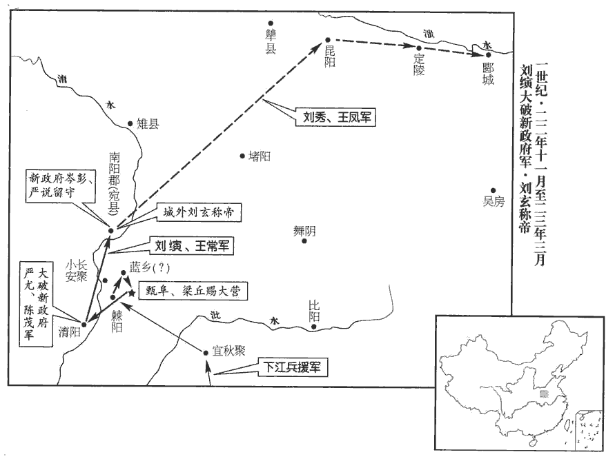 

2王莽‹时年六十八›欲外示自安，乃染其須髮，立杜陵‹陝西西安东南›史諶shèn女為皇后；諶，時壬翻。置後宮，位號視公、卿、大夫、元士者凡百二十人。三夫人視三公，九嬪pín視九卿，二十七世婦視二十七大夫，八十一御妻視八十一元士。

〖译文〗 [2]王莽想要显示自己的心情是安定的，于是染黑了胡子和头发，立杜陵人史谌的女儿作皇后。此外还设置后宫，遴选嫔妃一百二十人，地位封号分别比照公、卿、大夫、元士。

3莽赦天下，詔：「王匡，哀章等討青、徐盜賊，嚴尤、陳茂等討前隊醜虜，明告以生活、丹青之信；師古曰：生活，謂來降者不殺之也。丹青之信，言明著也。復迷惑不解散，復，扶又翻。將遣大司空、隆新公將百萬之師劋jiǎo絕之矣。」師古曰：劋，絕也，音子小翻。司空、隆新公，王邑。

〖译文〗 [3]王莽大赦天下，宣布诏命：“王匡、哀章等讨伐青州、徐州地区的盗贼，严尤、陈茂等讨伐前队地区的盗贼，明白地向他们宣告来降者不杀、守约不变；如果仍然迷惑而不解散，即将派遣大司空、隆新公王邑带领百万大军剿灭他们。”

4三月，王鳳與太常偏將軍劉秀等徇昆陽‹河南葉縣›、定陵‹河南郾城西北›、郾yǎn‹河南郾城›，皆下之。賢曰：昆陽、定陵、郾，皆縣名，并屬潁川郡。昆陽故城，在今許州葉縣北二十五里。郾，今豫州郾城縣也。定陵，在今郾城西北。郾，音於建翻。余按舊唐書，高宗咸亨二年冬，校獵於許州葉縣昆水之陽。

〖译文〗 [4]三月，王凤和太常偏将军刘秀等率领汉军攻掠昆阳、定陵、郾等城，都予攻克。

5王莽聞嚴尤、陳茂敗，乃遣司空王邑馳傳，傳，知戀翻。與司徒王尋發兵平定山東；徵諸明兵法六十三家以備軍吏，以長人巨毋霸為壘尉，鄭玄曰：軍壁曰壘。賢曰：壘尉，主壁壘之事。又驅諸猛獸虎、豹、犀、象之屬以助威武。邑至洛陽，州郡各選精兵，牧守自將，守，式又翻。將，即亮翻。定會者四十三【章：十二行本「三」作「二」；乙十一行本同；孔本同；退齋校同。】萬人，號百萬；餘在道者，旌旗、輜重，千里不絕。賢曰：周禮曰：析羽為旌，熊虎為旗。輜，車名。釋名曰：輜，廁也，謂軍糧什物雜廁載之；以其累重，故稱輜重。重，音直用翻。夏，五月，尋、邑南出潁川‹河南禹州›，與嚴尤、陳茂合。

〖译文〗 [5]王莽知道了严尤、陈茂失败，就派遣司空王邑乘坐传车急速出发，和司徒王寻一起发兵去平定崤山以东地区。同时征召通晓六十三家兵法的人为军官，任用巨人巨毋霸为垒尉，又赶来虎、豹、犀、象等猛兽以助军威。王邑到了洛阳，各州郡选派精锐的士兵，由州郡的长官亲自带领，定期会集起来的有四十三万人，号称百万；其余的正在路上走，旌旗、辎重千里不绝。夏季，五月，王寻、王邑离开颍川南下，同严尤、陈茂会合。

諸將見尋、邑兵盛，皆反走，入昆陽‹河南葉縣›，惶怖，憂念妻孥nú，賢曰：孥，子也，音奴。欲散歸諸城。劉秀曰：「今兵穀既少少，詩沼翻。而外寇強大，并力禦之，功庶可立；如欲分散，勢無俱全。且宛城‹河南南陽›未拔，賢曰：謂伯升圍宛未拔也。不能相救；昆陽即拔，一日之間，諸部亦滅矣。今不同心膽，共舉功名，反欲守妻子財物邪！」諸將怒曰：「劉將軍何敢如是！」秀笑而起。會候騎還，言：「大兵且至城北，軍陳數百里，不見其後。」陳，讀曰陣。諸將素輕秀，及迫急，乃相謂曰：「更請劉將軍計之。」秀復為圖畫成敗，復，扶又翻。為，於偽翻。諸將皆曰：「諾。」時城中唯有八九千人，秀使王鳳與廷尉大將軍王常守昆陽‹河南葉縣›，夜與五威將軍李軼等十三騎賢曰：王莽置五威將軍，其衣服依五方之色，以威天下。李軼初起，猶假以為號。余謂如太常偏將軍、廷尉大將軍之類，亦猶莽之納言大將軍、秩宗大將軍，是即前所云九卿將軍也。出城南門，於外收兵。

〖译文〗 汉军的将领们看到王寻、王邑兵多势众，都往回跑，进入昆阳城，惊慌不安，担忧老婆孩子，想从这里分散而到其他城邑去。刘秀对他们说：“现在城内兵、粮既少，而城外敌军又强大，合力抵抗敌军，也许可以立功；如果分散，势必不能一一保全。况且刘部队还没有攻下宛城，不能前来救援；假如昆阳被敌军占领，只要一天的功夫，我军各部也就都完了。现在怎么能不同心胆，共举大业，反而想要守着妻子财物呢？”将领们发怒说：“刘将军怎么敢这样说！”刘秀笑而起身。正在此时，侦察的骑兵回来，报告说：“敌人大军即将来到城的北面，军阵达几百里，看不到它的尾巴。”将领们一向轻视刘秀，到了这样紧急的时候，才互相议论道：“再去请刘将军谋划这件事。”刘秀又给将领们描述成败因素，将领们都说：“是的。”这时城中只有八九千人，刘秀让王凤和廷尉大将军王常守卫昆阳，自己夜里同五威将军李轶等十三人骑马驰出昆阳城的南门，在外面收集士兵。

時莽兵到城下者且十萬，秀等幾不得出。幾，居希翻。尋、邑縱兵圍昆陽‹河南葉縣›，嚴尤說邑曰：說，輸芮翻。「昆陽城小而堅，今假號者在宛‹河南南陽›，假號者，謂更始也。亟進大兵，彼必奔走；宛敗，昆陽自服。」邑曰：「吾昔圍翟義，坐不生得翟義事見三十六卷王莽居攝二年。賢曰：坐，才臥翻。以見責讓，今將百萬之眾，遇城而不能下，非所以示威也。當先屠此城，蹀血而進，師古曰：蹀，音大頰jiá翻。蹀，謂履涉之也。前歌後舞，顧不快邪！」遂圍之數十重，列營百數，鉦zhēng鼓之聲聞數十里，重，直龍翻。聞，音問。或為地道、衝輣péng撞城；賢曰：衝，橦chuáng車也；詩曰：臨衝閑閑。許慎曰：輣，樓車也。輣，音步耕翻。撞，丈江翻。積弩亂發，矢下如雨，城中負戶而汲。王鳳等乞降，不許。降，戶江翻。尋、邑自以為功在漏刻，不以軍事為憂。嚴尤曰：「兵法：『圍城為之闕』，師古曰：此兵法之言也。闕，不合也。孫子曰：圍師必闕。曹操註云：司馬法云：圍其三面，闕其一面，所以示生路也。宜使得逸出以怖宛下。」怖，普布翻。邑又不聽。

〖译文〗 当时开到昆阳城下的王莽军将近十万，刘秀等人几乎不能出去。王寻、王邑纵兵包围昆阳，严尤向王邑献策说：“昆阳城小而坚固，现在假冒皇帝名号的刘玄在宛城，我们大军迅速向那里进兵，他必定奔逃；宛城方面的汉军一旦失败，昆阳城里的汉军自然向我军降服。”王邑说：“我以前围攻翟义，因没有活捉住他而受到责备，如今带领百万之众，遇城而不能攻下，这就不能显示军威了。应当先攻陷屠杀此城，踏着血泊前进，前歌后舞，难道不痛快吗？”于是把昆阳包围了几十重，列营上百个，钲鼓之声响彻几十里，还挖掘地道，用战车撞城；用许多弓弩向城内乱射，矢下如雨，城内的人为了躲避飞矢，背着门板出外打水。王凤等乞求投降，不被理睬。王寻、王邑自以为片刻就可成功，不担心军事上会出其它事故。严尤建议说：“《兵法》上写着：‘围城要留下缺口’，应让被围之敌得以逃出，从而使围攻宛城的绿林军害怕。”王邑又不听取这个建议。

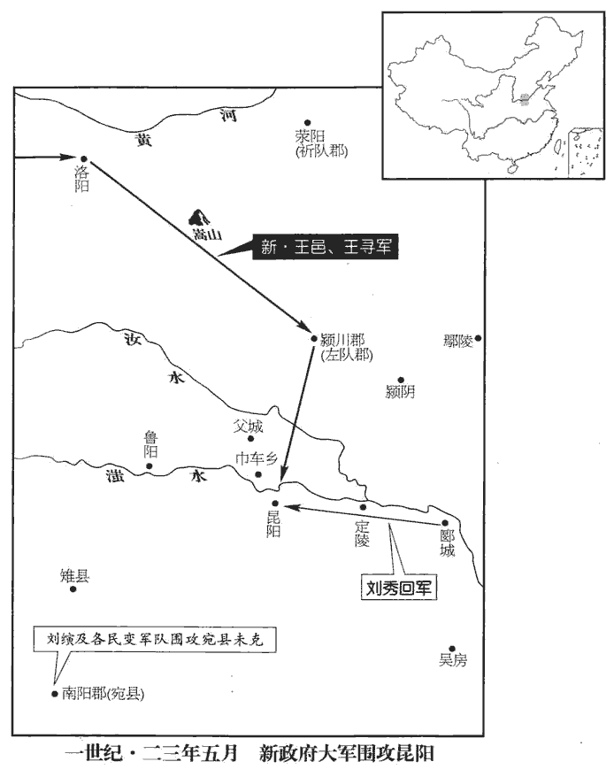 

6棘陽守長岑cén彭姓譜：岑，古岑子國之後。呂氏春秋：周文王封異母弟耀之子渠為岑子，其地梁國岑亭是也。彭，棘陽人，守本縣長。長，知兩翻。與前隊貳嚴說貳，副也。莽使說為前隊大夫甄阜之副也。共守宛城‹河南南陽›，漢兵攻之數月，城中人相食，乃舉城降；更始入都之。諸將欲殺彭，劉縯曰：「彭，郡之大吏，執心固守，是其節也。今舉大事，當表義士，不如封之。」更始乃封彭為歸德侯。賢曰：歸德，縣名，屬北地郡。宋白曰：慶州華池縣，本漢歸德縣地。又，通遠軍西北有歸德川。

〖译文〗 [6]棘阳守长岑彭和前队副将严说同守宛城，汉军围攻了几个月，城中因为缺粮而人吃人，于是全城报降。更始皇帝进城，并在宛城建都。将领们打算杀掉岑彭，刘说：“岑彭是郡的大官，决心固守，是有气节的表现。现在我们办大事，应当表彰义士，不如封他。”更始帝就封岑彭为归德侯。

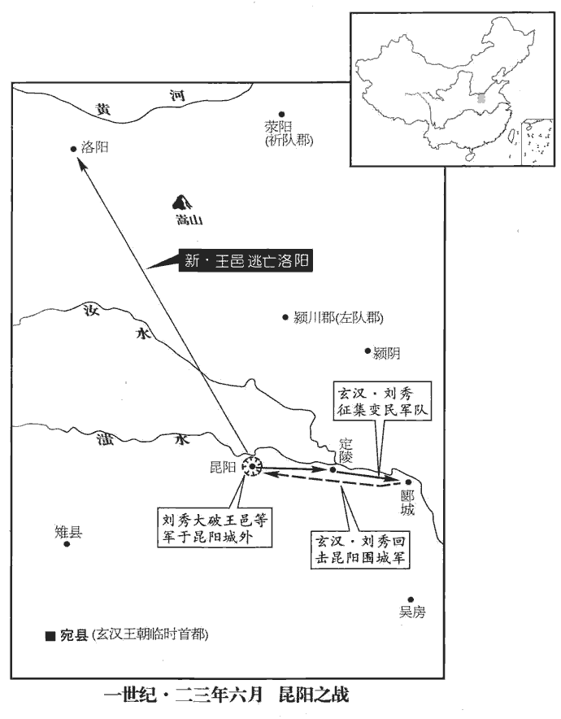 

7劉秀至郾‹河南郾城›、定陵‹河南郾城西北›，悉發諸營兵；諸將貪惜財物，欲分兵守之。秀曰：「今若破敵，珍寶萬倍，大功可成；如為所敗，敗，補邁翻。首領無餘，何財物之有！」乃悉發之。六月，己卯朔‹一›，秀與諸營俱進，自將步騎千餘為前鋒，去大軍四五里而陳；陳，讀曰陣。尋、邑亦遣兵數千合戰，秀奔之，斬首數十級。賢曰：秦法：斬首一，賜爵一級；因謂斬首為級。諸將喜曰：「劉將軍平生見小敵怯，今見大敵勇，甚可怪也！且復居前，請助將軍！」秀復進，尋、邑兵卻，諸部共乘之，斬首數百、千級。自數百級以至千級也。復，扶又翻。連勝，遂前，諸將膽氣益壯，無不一當百，秀乃與敢死者三千人從城西水上衝其中堅。賢曰：敢死，謂果敢而死者。凡軍事，中軍將軍至尊，以堅銳自輔，故曰中堅也。余謂敢死者，敢於致死者也。尋、邑易之，易，以豉翻。自將萬餘人行陳，師古曰：巡行軍陳也。行，音下更翻。陳，讀曰陣；下同。敕諸營皆按部毋得動，獨迎與漢兵戰，不利，大軍不敢擅相救；尋、邑陳亂，漢兵乘銳崩之，遂殺王尋。城中亦鼓譟zào而出，中外合勢，震呼動天地；呼，火故翻。莽兵大潰，走者相騰踐，伏尸百餘里。會大雷、風，屋瓦皆飛，雨下如注，滍zhì川‹沙河，流经叶县北›盛溢，水經曰：滍水出南陽魯陽縣西堯山，東南經昆陽城北，東入汝。滍，音直理翻。虎豹皆股戰，士卒赴水溺死者以萬數，賢曰：數過於萬，故以萬為數。水為不流。為，於偽翻。王邑、嚴尤、陳茂輕騎乘死人渡水逃去，盡獲其軍實輜重，不可勝算，重，直用翻。勝，音升。舉之連月不盡，或燔fán燒其餘。士卒奔走，各還其郡，王邑獨與所將長安勇敢數千人還洛陽，關中‹陝西中部›聞之震恐。於是海內豪桀翕然響應，響應，若響之應聲也。皆殺其牧守，自稱將軍，用漢年號以待詔命；旬月之間，徧於天下。

〖译文〗 [7]刘秀到了郾、定陵等地，调发各营的全部军队；将领们贪惜财物，想要分出一部分兵士留守。刘秀说：“现在如果打垮敌人，有万倍的珍宝，大功可成；如果被敌人打败，头都被杀掉了，还有什么财物！”于是征发了全部军队。六月己卯朔（初一），刘秀和各营部队一同出发，亲自带领步兵和骑兵一千多人为先头部队，在距离王莽大军四五里远的地方摆开阵势。王寻、王邑也派几千人来交战，刘秀带兵冲了过去，斩了几十人首级。将领们高兴地说：“刘将军平时看到弱小的敌军都胆怯，现在见到强敌反而英勇，太奇怪了！还是我们在前面吧，请让我们协助将军！”刘秀又向前进兵，王寻、王邑的部队退却；汉军各部一同冲杀过去，斩了数百上千个首级。汉军接连获胜，继续进兵，将领们胆气更壮，没有一个不是以一当百。刘秀就和敢于牺牲的三千人从城西水岸边攻击王莽军的主将营垒。王寻、王邑轻视汉军，亲自带领一万余人巡行军阵，戒令各营都按兵不动，单独迎上来同汉军交战，不利，大部队又不敢擅自相救；王寻、王邑所部阵乱，汉军乘机击溃敌军，终于杀了王寻。昆阳城中的汉军也击鼓大喊而冲杀出来，里应外合，呼声震天动地；王莽军大溃，逃跑者互相践踏，倒在地上的尸体遍布一百多里。适值迅雷、大风，屋瓦全都被风刮得乱飞，大雨好似从天上倒灌下来，水暴涨，虎豹都吓得发抖，掉入水中溺死的士兵上万，河水因此不能流动。王邑、严尤、陈茂等以轻骑踏着死人渡过水逃走。汉军获得王莽军抛下的全部军用物资，不可胜计，接连几个月都运不完，有些余下的就被烧掉。王莽军的士兵奔跑，各还故乡，只有王邑和他带领的长安勇士几千人回到洛阳，关中听到这个消息十分惊惧。于是海内豪杰一致响应，都杀掉当地的州郡长官，自称将军，用更始年号，等待更始皇帝的诏命；一个月之内，这种形势遍于天下。

8莽聞漢兵言莽鴆zhèn殺孝平皇帝，乃會公卿於王路堂，開所為平帝請命金縢之策，事見三十六卷平帝元始六年。為，於偽翻。泣以示群臣。

〖译文〗 [8]王莽听说汉军说他用鸩酒毒杀了汉平帝，便集合公卿到王路堂，打开收藏在金柜中的他替平帝请求解除疾病、愿以身代死的策书，流着泪出示给群臣看。

9劉秀復徇潁川，攻父城‹河南寶豐東李庄乡西›不下，賢曰：父城，縣名，故城在今許州葉縣東北。汝州郟jiá城縣亦有父城。復，扶又翻；下同。屯兵巾車鄉‹河南平顶山›。賢曰：巾車，鄉名也，在父城界。潁川郡掾馮異監五縣，掾，俞絹翻。監，古銜翻。為漢兵所獲。異曰：「異有老母在父城，願歸，據五城以效功報德！」秀許之。異歸，謂父城長苗萌曰：「諸將多暴橫，長，知兩翻。橫，戶孟翻。獨劉將軍所到不虜略，觀其言語舉止，非庸人也！」遂與萌率五縣以降。降，戶江翻。

〖译文〗 [9]刘秀再向颍川一带夺取土地，进攻父城，未能攻克，大军驻扎巾车乡。颍川郡掾冯异督察五县，被汉兵生擒。冯异说：“我有老母在父城，我愿意回去，献上这五座县城，以功来报答恩德。”刘秀许诺。冯异回去后，告诉父城县长苗萌说：“刘玄的将领们多数凶暴蛮横，只有刘秀将军所到的地方，不抢劫人和财物。看他的言谈举止，不是一个平庸之人。”于是和苗萌一起率领五县军民投降。

10新市、平林諸將以劉縯兄弟威名益盛，陰勸更始除之。秀謂縯曰：「事欲不善。」言更始欲相圖也。縯笑曰：「常如是耳。」更始大會諸將，取縯寶劍視之；繡衣御史申徒建隨獻玉玦；申徒，即申屠。賢曰：玦，決也，令早決斷。更始不敢發。縯舅樊宏謂縯曰：「建得無有范增之意乎？」范增事見九卷高帝元年。縯不應。李軼初與縯兄弟善，後更諂事新貴；新貴，謂朱鮪wěi等。秀戒縯曰：「此人不可復信！」復，扶又翻。縯不從。縯部將劉稷，勇冠三軍，冠，古玩翻。聞更始立，怒曰：「本起兵圖大事者，伯升兄弟也。今更始何為者邪！」更始以稷為抗威將軍，稷不肯拜；不肯拜受抗威之命也。更始乃與諸將陳兵數千人，先收稷，將誅之；縯固爭。李軼、朱鮪wěi因勸更始并執縯，即日殺之；以族兄光祿勳賜為大司徒。賜與更始同祖蒼梧太守利。秀聞之，自父城馳詣宛謝。賢曰：以伯升見害，心不自安，故謝。司徒官屬迎弔秀，縯之官屬也。秀不與交私語，遠嫌也。惟深引過而已，引過以歸己。未嘗自伐昆陽之功；又不敢為縯服喪，為，於偽翻。飲食言笑如平常。更始以是慙，拜秀為破虜大將軍，封武信侯。

〖译文〗 [10]新市兵、平林兵的将领们因为刘兄弟威名日盛，秘密建议更始帝刘玄除掉他俩。刘秀对刘说：“看情况，更始帝打算跟我们过不去。”刘笑着说：“一向就是如此。”不久，刘玄集合全体将领，教刘拿出他的宝剑，接过来仔细观察。这时，绣衣御史申徒建跟着呈上玉，暗示更始帝早下决断，但更始不敢发动。刘的舅舅樊宏对刘说：“申徒建莫非有范增的意图？”刘不作回答。李轶最初跟刘兄弟感情很好，可是后来转而谄媚拥有权柄的新贵，刘秀告诫刘：“对这个人不能再信任了！”刘不听从。刘的部将刘稷，勇冠三军，听说刘玄即位的消息，大怒说：“当初起兵图谋大事的，是刘兄弟。而今更始是干什么的呢！”刘玄任命刘稷当抗威将军，刘稷不肯拜受这一任命。刘玄于是与将领们部署数千军队，先逮捕刘稷，准备诛杀。刘坚持反对。李轶、朱鲔趁机建议刘玄同时逮捕刘，并于当天跟刘稷一齐斩首。刘玄任命堂兄光禄勋刘赐当大司徒。刘秀听到这个消息，从父城夺回宛城，向刘玄请罪。司徒所属官员迎接刘秀，表示哀悼，刘秀不与他们谈一句私话，唯有深自责备而已，不曾自己夸耀保卫昆阳的战功，又不敢为刘服丧；饮食言谈欢笑跟平常一样。刘玄因此惭愧，任命刘秀当破虏大将军，封武信侯。

11道士西門君惠謂王莽衛將軍王涉曰：「讖文劉氏當復興，復，扶又翻；下同。國師公姓名是也。」涉遂與國師公劉秀、大司馬董忠、司中大贅孫伋jí謀，以所部兵劫莽降漢，以全宗族。涉欲全王氏之族也。降，戶江翻。秋，七月，伋以其謀告莽，莽召忠詰責，因格殺之，使虎賁以斬馬劍剉cuò忠，收其宗族，以醇醯xī、毒藥、白刃、叢棘并一坎而埋之；秀、涉皆自殺。莽以其骨肉、舊臣，惡其內潰，故隱其誅。師古曰：王涉，骨肉；劉歆，舊臣。余按莽傳，涉，曲陽侯根子也。惡，烏路翻。莽以軍師外破，大臣內畔，左右亡所信，古亡、無字通。不能復遠念郡國，乃召王邑還，為大司馬，以大長秋張邯為大司徒，崔發為大司空，司中壽容苗訢為國師。邯，下甘翻。訢，音欣。莽憂懣不能食，懣，音悶，又音滿。但飲酒，啗dàn鰒魚；師古曰：此鰒，海魚也，音雹。郭璞註三蒼曰：鰒，似蛤，偏著石。廣志：曰：鰒，無鱗，有殼，一面附石，細孔雜雜，或七或九。本草曰：石決明，一名鰒魚。讀軍書倦，因馮几寐，師古曰：馮，讀曰憑。不復就枕矣。

〖译文〗 [11]道士西门君惠对王莽的卫将军王涉说：“谶文说刘姓应当复兴，国师公的姓名就是。”王涉于是与国师公刘秀、大司马董忠、司中大赘孙商量，准备用所属的部队劫持王莽，投降更始政权，以保全自己的家族。秋季，七月，孙向王莽告密。王莽召见董忠责问，趁机当场格杀，命虎贲武士用斩马剑剁董忠的尸体，逮捕董忠的家族，用浓醋、毒药、利刀、荆棘合成一穴埋葬了他们。刘秀和王涉都自杀了。王莽因为这两个人是至亲和老部下，嫌厌人家说他的内部崩溃了，所以不公开宣布对他们的惩罚。王莽因为军队在外面打了败仗，大臣们又在内部叛变，身边没有人可信任了，不能够再考虑远方的郡国，于是召王邑回来，任命为大司马。同时，任命大长秋张邯担任大司徒，崔发担任大司空，司中寿容苗担任国师。王莽忧闷得吃不下饭了，只喝酒，吃鳆鱼。阅读军书疲倦了，便靠着几案打盹儿，不再上床睡觉了。

12成紀‹甘肅静宁西南›隗kuí崔、隗義、成紀縣，屬天水郡。賢曰：故城在今秦州隴城縣西北。隗姓，出於赤狄。上邽guī‹甘肅天水›楊廣、冀‹甘肅甘谷›人周宗上邽縣，屬隴西郡。賢曰：故邽戎邑，今秦州縣。冀縣，屬天水郡；秦武公伐冀戎，因縣之。宋白曰：秦州治隴城縣，即故冀城。同起兵以應漢，【章：十二行本「漢」下有「衆數千人」四字；乙十一行本同；孔本同；張校同。】攻平襄‹甘肅通渭›，殺莽鎮戎大尹李育。賢曰：平襄，縣名，屬天水郡，故城在今秦州伏羌縣西北：王莽改天水郡曰鎮戎。崔兄子囂，素有名，好經書，好，呼到翻。崔等共推為上將軍；崔為白虎將軍，義為左將軍。崔本自署右將軍；白虎居右，又起兵於西方，白虎主之，因改右將軍號白虎將軍。囂遣使聘平陵‹陝西咸陽西平陵乡›方望，以為軍師。賢曰：平陵，昭帝陵，因以為縣；故城在今咸陽縣西北。武王伐紂，以太公為師尚父；田單守即墨，以一卒為神師；韓信既破趙，師事李左車；皆軍師也。後遂以為官稱。望說囂立高廟於邑東；平襄邑‹甘肅通渭›之東也。說，輸芮翻。己巳‹二十›，祠高祖‹刘邦›、太宗‹刘恒›、世宗‹刘彻›，囂等皆稱臣執事，殺馬同盟，以興輔劉宗；移檄郡國，數莽罪惡。數，所具翻。勒兵十萬，擊殺雍州‹甘肅›牧陳慶、安定‹宁夏固原›大尹王向。莽改漢涼州曰雍州。向，平阿侯王譚之子也。考異曰：王莽傳作「卒正王旬」，袁紀作「太守王向」，今從范書。分遣諸將徇隴西‹甘肅臨洮›、武都‹甘肅西和西南蒿林乡›、金城‹甘肅永靖西北›、武威‹甘肅武威›、張掖‹甘肅張掖›、酒泉‹甘肅酒泉›、敦煌‹甘肅敦煌›，敦，徒門翻。皆下之。

〖译文〗 [12]成纪人隗崔和隗义、上人杨广、冀人周宗同时聚众起兵，响应刘玄的汉军。他们进攻平襄，击杀王莽镇戎大尹李育。隗崔哥哥的儿子隗嚣一向有很好名声，喜爱儒家经典，隗崔等共同推举隗嚣当上将军，隗崔当白虎将军，隗义当左将军。隗嚣派遣使者聘请平陵人方望担任军师。方望建议隗嚣，在平襄东郊兴建汉高祖刘邦祭庙。己巳（二十二日），祭祀汉高祖、太宗、世宗，隗嚣等都称臣执事，杀马盟誓，同心合力辅佐刘姓皇族。向各郡、各封国传递文告，声讨王莽罪行。统率军队十万，击杀雍州牧陈庆、安定大尹王向。然后，分别派出将领，攻打陇西、武都、金城、武威、张掖、酒泉、敦煌，全部攻克。

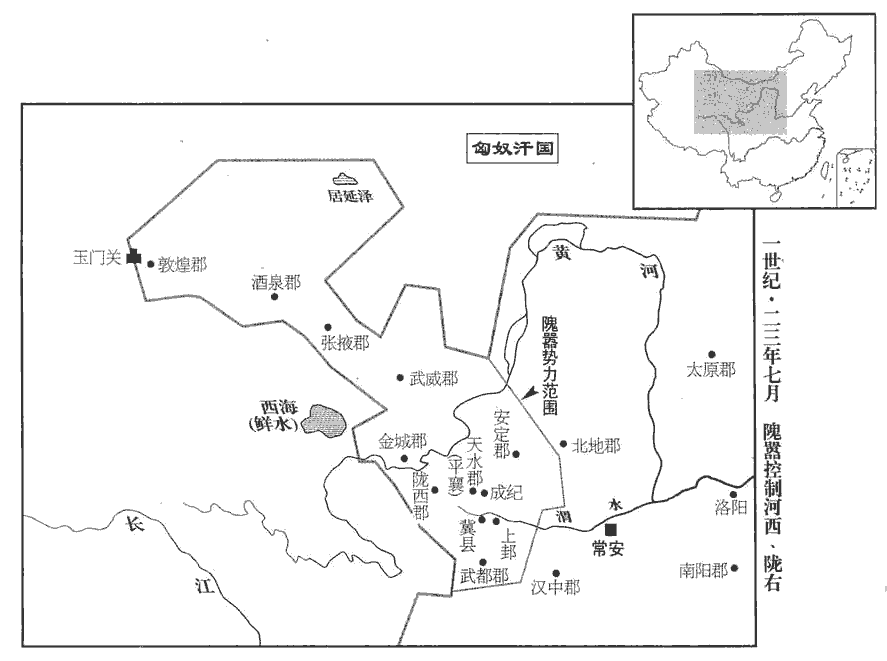 

13初，茂陵‹陝西興平东北›公孫述為清水‹甘肅清水›長，賢曰：清水，縣名，屬天水郡；今秦州縣。有能名；遷導江‹四川成都›卒正，治臨邛‹四川邛崍›。賢曰：王莽改蜀郡曰導江。臨邛，今邛州縣。班志，臨邛縣屬蜀郡。邛，音渠容翻。漢兵起，南陽‹河南南陽›宗成、商‹陝西丹凤›人王岑起兵徇漢中以應漢，宗成，南陽人也。地理志，商縣，屬弘農郡。賢曰：今商州商雒縣也。殺王莽庸部牧宋遵，眾合數萬人。述遣使迎成等，成等至成都，地理志，成都縣，屬蜀郡。虜掠暴橫。橫，戶孟翻。述召郡中豪桀謂曰：「天下同苦新室，思劉氏久矣，故聞漢將軍到，馳迎道路。今百姓無辜而婦子係獲，此寇賊，非義兵也。」乃使人詐稱漢使者，假述輔漢將軍、蜀郡‹四川成都›太守兼益州‹四川云南›牧印綬；選精兵西擊成等，殺之，按臨邛在成都西南。述兵自臨邛迎擊宗成等，非西向也。此承范史之誤。并其眾。

〖译文〗 [13]最初，茂陵公孙述当清水县长，以才能干练闻名于世。后调升导江郡卒正，郡府设于临邛。汉兵崛起时，南阳人宗成、商县人王岑也起兵响应，夺取汉中，杀死王莽庸部牧宋遵，集结数万人。公孙述派人迎接宗成等。宗成等到成都，劫夺抢掠，残暴蛮横。公孙述召集郡中豪杰，对他们说：“天下人不堪新朝的迫害，怀念汉朝很久了，所以听说汉朝的将军来到，奔走相告，到道路上迎接。而今人民无罪，妻子儿女却受到凌辱，这些人是强盗，而不是义军。”于是，派人假冒更始政权的使者，授予公孙述辅汉将军、蜀郡太守兼益州牧的印信。公孙述选派精兵西击宗成等，把他们杀死，兼并了他们的部队。

14前鍾武侯劉望起兵汝南‹河南平舆西北射桥乡›，按王子侯表：鍾武節侯度，長沙定王之孫，成帝元延二年，侯則紹封；其後不見。或者望其則之子歟？鍾武在義陽郡界。水經註：師水過義陽郡城，東逕鍾武故城南。考異曰：王莽傳作「劉聖」，今從范書劉玄傳。嚴尤、陳茂往歸之；八月，望即皇帝位，以尤為大司馬，茂為丞相。

〖译文〗 [14]前汉朝钟武侯刘望在汝南起兵，严尤、陈茂前往归附。八月，刘望登极，任命严尤当大司马，陈茂当丞相。

15王莽使太師王匡、國將哀章守洛陽。將，即亮翻。考異曰：袁紀作「襃章」，今從范書。更始遣定國上公王匡攻洛陽，西屏大將軍申屠建、丞相司直李松攻武關‹陝西商縣西南›，李松，通之從弟。屏，必郢翻。三輔震動。析‹河南西峡›人鄧曄yè、于匡起兵南鄉‹河南淅川西南›以應漢，師古曰：析，南陽之縣。南鄉，析縣之鄉名也。宋白曰：鄧州內鄉縣，古之析邑。析，音先歷翻。攻武關‹陝西商縣西南›都尉朱萌，萌降；降，戶江翻。進攻右隊‹河南靈寶东北›大夫宋綱，殺之；莽改弘農郡曰右隊。西拔湖‹河南靈寶西›。師古曰：湖，弘農之縣也，本屬京兆。莽愈憂，不知所出。崔發言：「古者國有大災，則哭以厭之。師古曰：周禮春官之屬女巫之職曰：凡邦之大災，歌哭以請。哭者，所以告哀也。春秋左氏傳：宣十二年，楚子圍鄭，旬有七日，鄭人大臨，守陴pī者皆哭。故發引之以為言也。厭，音一葉翻。宜告天以求救！」莽乃率群臣至南郊，陳其符命本末，仰天大哭，氣盡，伏而叩頭。諸生小民旦夕會哭，為設飱sūn粥；為，於偽翻。師古曰：飱，音千安翻。甚悲哀者，除以為郎，郎至五千餘人。

〖译文〗 [15]王莽命太师王匡、国将哀章守卫洛阳，更始皇帝派遣定国上公王匡进攻洛阳，西屏大将军申屠建、丞相司直李松进攻武关，三辅地区为之震动。析县人邓晔和于匡在南乡起兵以响应汉军，进攻武关都尉朱萌，朱萌投降；进攻右队大夫宋纲，把宋纲杀掉；向西挺进，攻陷湖县。王莽更加忧虑，不知所措。崔发说：“古时候国家有了大灾难，就用哭向上天告哀来战胜它。应该祷告上天祈求救助。”王莽于是率领群臣到南郊，陈述他承受符命的首尾经过，仰天大哭，声嘶气绝，伏地叩头。众儒生和老百姓每天早晚会集起来哭，给他们准备了稀饭。哭得非常悲哀的人，被任命作郎官，郎官达到五千多人。

莽拜將軍九人，皆以虎為號，將北軍精兵數萬人以東，內其妻子宮中以為質。質，音致。時省中黃金尚六十餘萬斤，他財物稱是，稱，尺證翻。莽愈愛之，賜九虎士人四千錢；眾重怨，無闘意。師古曰：重，音直用翻。九虎至華陰‹陝西華陰›回谿，賢曰：回谿，今俗所謂回阬kēng，在洛州永寧縣東北；其谿長四里，闊二丈，深二丈五尺。華，戶化翻。距隘自守。于匡、鄧曄yè擊之，六虎敗走；二虎詣闕歸死，莽使使責死者安在，皆自殺；其四虎亡。二虎自殺者，史熊、王況也。四虎亡者，史逸其名。三虎收散卒保渭口京師倉‹陝西華陰北›。三虎，郭欽、陳翬huī、成重也。師古曰：京師倉，在華陰灌北渭口也。

〖译文〗 王莽任命将军九人，都用“虎”作为将军的名号，率领禁卫军精锐士兵几万人向东方开去，把他们的妻子儿女收容到皇宫里作为人质。这时宫中储存的黄金还有六十多万斤，其他的贵重珍宝差不多也是这个数目，王莽更加爱不释手，对九虎将军部属，每人仅赏赐四千钱。大家很怨恨，毫无斗志。九虎将军到达华阴县回，扼守险要。于匡、邓晔率军攻击他们，六位虎将军战败逃走，其中两位虎将军回到朝廷接受死刑处分，王莽让使者责问他们死的人在哪里，于是二人自杀，其他四位虎将军逃亡。还有三位虎将军收集散兵，保卫渭口京师仓。

鄧曄開武關‹陕西商南西南›迎漢兵。李松將三千餘人至湖，與曄等共攻京師倉，未下。曄以弘農‹河南靈寶东北›掾王憲為校尉，掾，俞絹翻。將數百人北渡渭，入左馮翊界。李松遣偏將軍韓臣等徑西至新豐‹陝西臨潼東北›擊【章：十二行本「擊」下有「破」字；乙十一行本同；孔本同；張校同；退齋校同。】莽波水將軍，據竇融傳，莽拜融為波水將軍。前書音義曰：波水，在長安南。追奔至長門宮。王憲北至頻陽‹陝西富平東北›，所過迎降。師古曰：所過之處，人皆來迎而降附也。諸縣大姓各起兵稱漢將軍，【章：十二行本無「軍」字；乙十一行本同；孔本同。】率眾隨憲。李松、鄧曄引軍至華陰‹陝西華陰›，而長安旁兵四會城下；又聞天水隗kuí氏方到，皆爭欲【章：十二行本「欲」下有「先」字；乙十一行本同；孔本同；張校同。】入城，貪立大功、鹵掠之利。言入城誅莽，既立大功，又得鹵掠，貪二者之利也。莽赦城中囚徒，皆授兵，殺豨，飲其血，與誓曰：「有不為新室者，社鬼記之！」豨，許豈翻，又音希。為，於偽翻。使更始將軍史諶shèn將之。諶，氏壬翻。渡渭橋，皆散走；諶空還。眾兵發掘莽妻、子、父、祖塚，燒其棺槨guǒ及九廟、明堂、辟雍，火照城中。

〖译文〗 邓晔打开武关关门，迎接汉兵。李松率三千人抵达湖县，与邓晔等会合，共同进攻京师仓，没有攻下。邓晔任命弘农掾王宪当校尉，率领数百人北渡渭河，进入左冯翊境内。李松派遣偏将军韩臣等，一直向西推进到新丰，攻击王莽波水将军窦融。窦融败退，韩臣追击，直抵长门宫。王宪部队推进到频阳，沿途地方官府都迎而降服。各县大姓分别起兵，自称是汉朝将军，率领部众追随王宪。李松、邓晔率军抵达华阴时，长安附近的部队已从四方汇集到城下。大家听说天水隗家军也将抵达，都争着要第一个入城，贪图建立大功和抢劫财宝。王莽赦免城里监狱的犯人，都发给武器，杀猪饮血，跟他们立誓说：“如有不为新朝效力的人，社鬼记住他！”让更始将军史谌率领着他们。这些人渡过渭桥，都四散逃跑了，只剩史谌一个人回来。各路士兵挖掘王莽的妻子、儿子、父亲、祖父的坟墓，焚烧他们的棺材以及九庙、明堂和辟雍，火光映照城中。

九月，戊申朔‹一›，兵從宣平城門入。師古曰：長安城東出北頭第一門。張邯逢兵見殺；王邑、王林、王巡、䠠chì惲yùn等分將兵距擊北闕下，䠠，師古曰：音帶，又音徒蓋翻。䠠姓，惲名。惲，於粉翻。會日暮，官府、邸第盡奔亡。己酉‹二›，城中少年朱弟、張魚等恐見鹵掠，趨讙并和，師古曰：眾群行讙而自相和也。讙，許元翻。和，音乎臥翻。燒作室門，程大昌曰：作室者，未央宮西北織室、暴室之類，黃圖謂為尚方工作之所者也。作室門，則工徒出入之門，蓋未央宮之便門也。斧敬法闥tà，師古曰：敬法，殿名也。闥，小門也。謂斧斫之也。呼曰：「反虜王莽，何不出降！」師古曰：呼，音火故翻。火及掖庭、承明，黃皇室主所居。黃皇室主曰：「何面目以見漢家！」自投火中而死‹年三十二›。

〖译文〗 九月戊申朔（初一），攻城军队从宣平门入城。张邯遇到士兵，被杀。王邑、王林、王巡和恽等人分别带兵在北阙下抗击。恰好天黑，官府和豪门大宅的人全都逃跑了。己酉（初二），城里青年朱弟和张鱼等人恐怕遭抢劫，奔跑喧晔，聚集成群，焚烧尚方工场门，用斧子劈开敬法殿的小门，喊道：“反贼王莽，怎么不出来投降？”大火蔓延到掖庭、承明殿，这里是黄皇室主居住的地方。黄皇室主说：“我还有什么脸面再见汉朝人？”自己纵身投入火中而死。

莽避火宣室前殿，火輒隨之。莽紺gàn袀jūn服，師古曰：紺，深青而揚赤色也。袀，純也，純為紺服也。袀，音均，又音弋旬翻。持虞帝匕首；虞帝安得有匕首，蓋莽自為之以愚夫人。天文郎按式於前，師古曰：式，所以占時日。天文郎，今之用式者也。莽旋席隨斗柄而坐，曰：「天生德於予，漢兵其如予何！」莽引孔子之言以自況。庚戌‹三›，且明，群臣扶掖莽自前殿之漸臺，【章：十二行本「臺」下有「欲阻池水」四字；乙十一行本同；孔本同；張校同；退齋校同。】此未央宮之漸臺也。水經：未央漸臺在滄池中。建章漸臺在太液池中。程大昌曰：漸者，漬zì也，言臺在水中受其漸漬也。凡臺之環浸於水者，皆可名為漸臺。漸，子廉翻。公卿從官尚千餘人隨之。從，才用翻。王邑晝夜戰，罷極，師古曰：罷，讀曰疲。士死傷略盡；馳入宮，間關至漸臺，師古曰：間關，猶言崎嶇，展轉也。見其子侍中睦解衣冠欲逃，邑叱之，令還，父子共守莽。軍人入殿中，聞莽在漸臺，眾共圍之數百重。重，直龍翻。臺上猶與相射，射，而亦翻。矢盡，短兵接，王邑父子、䠠惲、王巡戰死，莽入室。下餔bū時，眾兵上臺，晡bū後，謂之下晡。按前書天文志：旦至食時，食時至日昳dié，日昳至晡，晡至下晡，下晡至日入。苗訢、唐尊、王盛等皆死。訢，音欣。商‹陝西丹凤›人杜吳殺莽，校尉東海‹山東郯tán城›公賓就斬莽首‹年六十八›；師古曰：公賓姓，就名也。風俗通曰：魯大夫公賓庚之後。王莽五十一居攝，五十四即真，六十八誅死。軍人分莽身，節解臠分，爭相殺者數十人；公賓就持莽首詣王憲。憲自稱漢大將軍，城中兵數十萬皆屬焉；舍東宮，師古曰：舍，止宿也。妻莽後宮，乘其車服。癸丑‹六›，李松、鄧曄入長安，將軍趙萌、申屠建亦至；以王憲得璽綬不上，璽，斯氏翻。綬，音受。上，時掌翻。多挾宮女，建天子鼓旗，收斬之。傳莽首詣宛‹河南南陽›，縣於市；百姓共提擊之，縣，讀曰懸。提，音徒計翻。或切食其舌。

〖译文〗 王莽避火到了未央宫宣室前殿，火总是跟着他。王莽穿着全套天青色的衣服，拿着虞帝匕首。天文郎在前面按着占测时日的，王莽转动坐席随着斗柄所指的方向坐着，说道：“上天把这样的品德赋予我，汉军能把我怎么样？”庚戌（初三），天快亮了，群臣搀扶着王莽，从前殿去渐台，公卿等随从官吏还有一千多人跟着他。王邑白天黑夜都在战斗，疲倦极了，士兵死伤快完了，他飞马进入宫中，辗转来到了渐台，看见他的儿子侍中王睦脱下衣帽想要逃走，王邑喝住他，让他转回，父子俩一同守卫着王莽。兵士进入殿中，听说王莽在渐台，众人将其包围了数百重。台上仍用弓箭与包围的士兵对射，箭用尽了，便短兵相接。王邑父子、恽、王巡战斗而死，王莽躲进内室。下午五时三刻，大批士兵上了渐台，苗、唐尊、王盛等人都死在台上。商县人杜吴杀死了王莽，校尉东海人公宾就砍下了王莽的脑袋。兵士们分裂了王莽的身躯，四肢关节、肌肉被切割成许多块，争着去砍杀的有几十人。公宾就拿着王莽的脑袋前往王宪那里。王宪自称汉朝的大将军，城里的军队几十万人都归属了他。王宪住在长乐宫，把王莽的妃嫔都作为妻妾，使用王莽的车马、衣服和器物。癸丑（初六），李松、邓晔进入长安，将军赵萌和申屠建也来到。因为王宪缴获了御玺没有上交，私藏了许多宫女，使用了天子的仪仗，便把他捉来杀掉了。传送王莽的脑袋前往宛城，挂在街市示众，百姓都去掷击它，有人切下他的舌头来吃了。

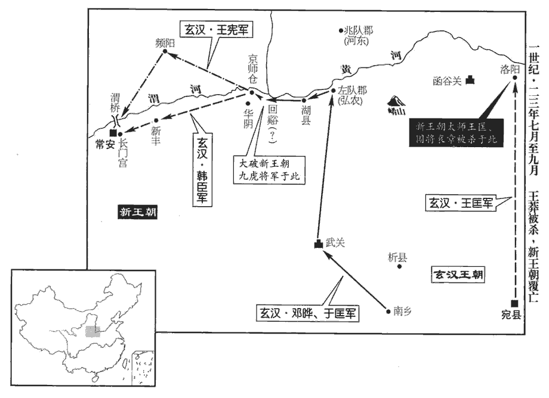 

班固贊曰：王莽始起外戚，折節力行以要名譽，折，而設翻。要，一遙翻。及居位輔政，勤勞國家，直道而行，豈所謂『色取仁而行違』者邪！師古曰：論語載孔子答子張之言也。不仁之人假仁者之色，而行則違之。行，下孟翻。莽既不仁而有佞邪之材，又乘四父歷世之權，四父，謂王鳳、王音、王商、王根相繼秉政，皆莽諸父也。遭漢中微，國統三絕，成、哀、平皆絕。而太后壽考，為之宗主，故得肆其姦慝以成篡盜之禍。推是言之，亦天時，非人力之致矣！及其竊位南面，顛覆之勢險於桀、紂，而莽晏然自以黃、虞復出也，黃帝、虞舜，莽祖之。復，扶又翻。乃始恣睢，奮其威詐，師古曰：睢，音呼季翻。毒流諸夏，亂延蠻貉，猶未足以逞其欲焉。是以四海之內，囂然喪其樂生之心，師古曰：囂然，眾口愁貌也，音五高翻。喪，息浪翻。中外憤怨，遠近俱發，城池不守，支體分裂，遂令天下城邑為虛，虛，讀曰墟。害徧生民，自書傳所載亂臣賊子，考其禍敗，未有如莽之甚者也！昔秦燔fán詩、書以立私議，莽誦六藝以文姦言，師古曰：以六經之事文飾姦言。同歸殊塗，俱用滅亡，皆聖王之驅除云爾。蘇林曰：聖王，光武也，為光武驅除也。師古曰：言驅逐蠲juān除以待聖人也。

〖译文〗 班固赞曰：王莽最初以外戚起家，降低身份，勉力而行，以博取名誉。等到他登上高位，辅佐朝政，为国家辛勤工作，本着正直的原则行事。难道他就是孔子所说的“表面上仁义，行动中却违背它”的人吗？王莽本来没有仁义的品德，却有奸佞邪恶的才能，又利用四个伯父、叔父经历了元帝、成帝两代所掌握的权力，遇到汉朝中途衰落，皇位三代没有继承人，而皇太后王政君寿命很长，为他作主，因此得以施逞奸诈邪恶的手段，从而造成篡夺政权，窃取皇位的灾祸。根据这些事实推论起来，这也是天命，不是人力所能作得到的！等到窃取了皇帝的宝座，败亡的趋势比夏桀、商纣的时候还要危险，而王莽却安然地认为自己就是黄帝、虞舜再世复出。于是开始放纵暴戾，滥施威力诈术，流毒全国，灾祸蔓延到外族，还不足以满足他的欲望。因此天下陷于忧愁，人民丧失了乐生的心意，朝廷和地方都怨愤，远近同时反叛，城池失守，躯体分裂，终于使得全国的城市变成废墟，害尽了百姓。根据书籍传述上所记载的乱臣贼子以来，考察他们引起的苦难，与失败的凄惨，从没有一个超过王莽。从前秦朝焚毁《诗经》、《书经》等典籍从而确立自己的一家主张，王莽引用《六经》来装饰谬论，他们走的路不同，而目的完全一样，都由此而导致灭亡，全是为圣明的帝王开道铺路罢了！

16定國上公王匡拔洛陽，生縛莽太師王匡、哀章，皆斬之。冬，十月，奮威大將軍劉信擊殺劉望於汝南‹河南平舆西北射桥乡›，信，大司徒賜兄顯之子。并誅嚴尤、陳茂，郡縣皆降。降，戶江翻。

〖译文〗 [16]定国上公王匡攻陷洛阳，生擒新莽太师王匡、国将哀章，将他们全都斩首。冬季，十月，奋威大将军刘信在汝南击杀刘望，并诛杀严尤、陈茂。所属郡县全都降服。

17更始將都洛陽，以劉秀行司隸校尉，使前整脩宮府。司隸校尉察三輔、三河、弘農，故使整脩宮府。秀乃置僚屬，作文移，東觀記曰：文書移與屬縣也。從事司察，一如舊章。續漢書：司隸置從事史十二人，秩皆百石，主督促文書，察舉非法。時三輔吏士東迎更始，見諸將過，皆冠幘zé而服婦人衣，漢官儀曰：幘者，古之卑賤不冠者之所服也。方言曰：覆髻謂之幘，或謂之承露。劉昭志曰：秦雄諸侯，乃加武將首飾，為絳袙pà以表貴賤；其後稍作顏題。漢興，續其顏，卻摞luò之，施巾，連題卻覆之，名之曰幘。幘者，賾zé也，頭首嚴賾也。至孝文，乃高顏題，崇其巾，為屋，合後，施收上下；群臣貴賤皆服之，文者長耳，武者短耳。莫不笑之；及見司隸僚屬，皆歡喜不自勝，勝，音升。老吏或垂涕曰：「不圖今日復見漢官威儀！」復，扶又翻；下同。由是識者皆屬心焉。皆屬，音之欲翻。

〖译文〗 [17]刘玄将要建都洛阳，任命刘秀代理司隶校尉，派他先到洛阳修建宫殿官府。刘秀于是设置下属官吏，用正式公文通知地方官府，处理政事完全按照西汉旧制。当时三辅的官员们派代表到洛阳迎接更始刘玄，看见将领们经过，都用布包头，穿着女人的衣裳，没有不耻笑的。等到看见司隶校尉的下属官员，都高兴得不能自制，有些年纪大的官员流泪说：“想不到今天重新看到了汉朝官员威武的仪表！”从此，有见识的人都归心刘秀。

更始北都洛陽，分遣使者徇郡國，曰：「先降者復爵位！」降，戶江翻；下同。使者至上谷‹河北懷來›，漢上谷郡，治沮陽。上谷太守扶風耿況迎，上印綬；上，時掌翻。使者納之，一宿，無還意。功曹寇恂勒兵入見使者，請之，姓譜：蘇忿生為周武王司寇，其後以官為寇氏。百官志：郡功曹，主選署功勞，在諸曹之上。使者不與，曰：「天王使者，功曹欲脅之邪！」恂曰：「非敢脅使君，竊傷計之不詳也。今天下初定，使君建節銜命，郡國莫不延頸傾耳；今始至上谷而先墮大信，賢曰：墮，毀也，讀曰隳。將復何以號令他郡乎！」使者不應。恂叱左右以使者命召況；況至，恂進取印綬帶況。使者不得已，乃承制詔之，況受而歸。

〖译文〗 刘玄北上定都洛阳，分别派出使节到各郡各封国巡行，宣布：“先投降的，恢复他的封爵和官位。”使节到了上谷，上谷太守扶凤人耿况迎接，缴纳印信，使节接受。可是，过了一夜，并无发还的意思。郡功曹寇恂率兵拜访使节，请求发还印信。使节不给，说：“我是皇帝的使臣，你打算威胁吗？”寇恂说：“我并不敢威胁阁下，只是替你的思虑不够周密而感到惋惜。而今天下刚刚安定，阁下代表皇帝驾临，各郡各封国没有不伸长脖子洗耳恭听的。可是现在才到上谷，便先自毁信誉，还有什么方法再对别的郡国发号施令？”使节不作答复。寇恂大声呵斥左右随从，教他们用使节名义召唤耿况。等到耿况来到，寇恂自己把印信交给耿况。使节无可奈何，只好用皇帝名义下诏，耿况受命后告辞。

宛‹河南南陽›人彭寵、吳漢亡命在漁陽‹北京密云›，鄉人韓鴻為更始使，徇北州，承制拜寵偏將軍，行漁陽太守事，為彭寵據漁陽張本。以漢為安樂‹北京順義›令。賢曰：安樂，縣名，屬漁陽郡；故城在今幽州潞縣西北。樂，音洛。

〖译文〗 宛城人彭宠、吴汉逃亡到渔阳。同乡韩鸿，担任更始政府使节，前往北方州郡巡行，用皇帝名义下诏，任命彭宠当偏将军，代理渔阳太守，任命吴汉当安乐县令。

更始遣使降赤眉。遣使者招諭之，使降而釋兵也；後以意推。降，戶江翻。樊崇等聞漢室復興，即留其兵，將【章：十二行本「將」上有「自」字；孔本同；張校同。】渠帥二十餘人隨使者至洛陽，帥，所類翻。更始皆封為列侯。崇等既未有國邑，而留眾稍有離叛者，乃復亡歸其營。崇等時營在濮陽。為赤眉攻更始張本。

〖译文〗 更始皇帝刘玄派人说降赤眉。樊崇等听说汉朝复兴，便留下部众，率将领二十余人，随同使节来到洛阳。刘玄把他们都封为列侯。可是，樊崇等既没有采邑，而留在原地的部众又逐渐有背叛离去的，于是又逃回他的营地。

18王莽廬江‹安徽廬江›連率潁川李憲據郡自守，稱淮南王。率，所類翻。

〖译文〗 [18]王莽朝中的庐江连率颍川人李宪占据本郡自守，自称淮南王。

19故梁王立之子永詣洛陽；立死見三十六卷平帝元始四年。更始封為梁王，都睢陽‹河南商丘›。為永據梁、連群盜張本。睢，音雖。

〖译文〗 [19]前汉朝梁王刘立的儿子刘永到洛阳朝见刘玄，刘玄封刘永为梁王，首府设在睢阳。

20更始欲令親近大將徇河‹黄河›北，大司徒賜言：「諸家子獨有文叔可用。」諸家子，謂南陽諸宗子也。光武諱秀，字文叔。朱鮪wěi等以為不可，更始狐疑，賜深勸之；更始乃以劉秀行大司馬事，持節北渡河，鎮慰州郡。為光武自河北定天下張本。

〖译文〗 [20]刘玄打算派亲信大将巡行河北，大司徒刘赐说：“南阳刘姓宗族子弟中，只有刘秀可以胜任。”朱鲔等认为不可以，刘玄疑惑不决。刘赐恳切规劝他，刘玄才任命刘秀代理大司马，持节北渡黄河，镇抚慰问各州郡。

21以大司徒賜為丞相，令先入關脩宗廟、宮室。將都長安也。

〖译文〗 [21]刘玄赐封大司徒刘赐当丞相，命令他先进入函谷关内，修建宗庙、宫室。

22大司馬秀至河北，所過郡縣，考察官吏，黜陟能否，平遣囚徒，除王莽苛政，賢曰：說文：苛，小草也，言政令繁細。復漢官名，吏民喜悅，爭持牛酒迎勞。勞，力到翻。秀皆不受。

〖译文〗 [22]大司马刘秀到达黄河以北在所经的郡县，考察官吏政绩，根据能力的大小任用或罢免，公平审理诉讼刑狱，废除王莽残酷的政令，恢复汉朝官名制度。官民喜悦，争先恐后地拿着牛肉与美酒迎接慰劳。刘秀一律不接受。

南陽鄧禹杖策追秀，及於鄴‹河北臨漳西南邺镇›。秀曰：「我得專封拜，生遠來，寧欲仕乎？」禹曰：「不願也。」秀曰：「即如是，何欲為？」禹曰：「但願明公威德加於四海，禹得效其尺寸，垂功名於竹帛耳！」漢初未有紙，以竹簡及縑jiān素書，故言竹帛。秀笑，因留宿間語；賢曰：間，私也。禹進說曰：說，輸芮翻；下同。「今山東未安，赤眉、青犢之屬動以萬數。更始既是常才而不自聽斷，斷，丁亂翻。諸將皆庸人屈起，賢曰：屈，音求勿翻。志在財幣，爭用威力，朝夕自快而已，非有忠良明智、深慮遠圖，欲尊主安民者也。歷觀往古聖人之興，二科而已，天時與人事也。今以天時觀之，更始既立而災變方興；以人事觀之，帝王大業非凡夫所任，任，音壬。分崩離析，形勢可見。明公雖建藩輔之功，猶恐無所成立也。況明公素有盛德大功，為天下所嚮服，軍政齊肅，賞罰明信。為今之計，莫如延攬英雄，務悅民心，立高祖之業，救萬民之命，以公而慮，天下不足定也！」鄧禹為中興元功，實本諸此。秀大悅，因令禹【章：十二行本「禹」下有「常」字；乙十一行本同；孔本同；張校同。】宿止於中，與定計議；每任使諸將，多訪於禹，皆當其才。

〖译文〗 南阳人邓禹执鞭驱马而行，追赶刘秀，直追到邺城才追到。刘秀说：“我有权封爵任官，先生这么远前来，难道想进入仕途？”邓禹说：“不愿意。”刘秀说：“既然如此，你想干什么？”邓禹说：“只愿阁下的威望和恩德普及四海，我能在你的属下尽一尺一寸之力，使我的声名记载在史书上而已。”刘秀笑起来，于是留邓禹住下，私下交谈。邓禹建议说：“如今，崤山以东还没有安定，赤眉和青犊的人马都有数以万计。刘玄本是一个平凡人物，而且又不亲自处理政事，所以将领都是庸碌之辈，靠着机运爬到高位，志向在于发财，争着卖弄权势，从早到晚自我快乐罢了，没有忠诚正直，没有聪明智慧，没有深思熟虑，没有远大眼光，不是想要尊主安民的人。观察古代圣明君王的兴起，不过两个条件：天时和人事。现在从天时来看，刘玄即位后，天象变异却兴起了；从人事来看，帝王大业，不是平凡人物所能胜任的。土崩瓦解的形势，已经可见。阁下虽然立下了辅佐的功勋，但恐怕还是没有什么成就。况且您一向具有盛大的德能和功勋，受到天下人的向往和敬佩。无论带兵或从政，纪律严肃，赏罚公开而守信。当今之计，不如招揽英雄，务求取悦民心，创立高祖当年的功业，拯救万民的生命。以阁下的远虑，天下不难统一。”刘秀非常高兴，因而命邓禹在营中下榻，和他进行磋商。刘秀每次任命或派出将领，多征求邓禹的意见。邓禹对将领的判断都与他们的才能相称。

秀自兄縯yǎn之死，每獨居輒不御酒肉，御，進也。枕席有涕泣處，主簿馮異獨叩頭寬譬；馮異自父城歸光武，為司隸主簿；及渡河，為大司馬主簿。寬，釋也；譬，曉也，譬曉以寬釋其哀戚之情。秀止之曰：「卿勿妄言！」異因進說曰：「更始政亂，百姓無所依戴。夫人久飢渴，易為充飽。孟子曰：飢者易為食，渴者易為飲。賢曰：猶言凋殘之後，易流德澤。易，以豉翻。今公專命方面，宜分遣官屬徇行郡縣，行，下孟翻。宣佈惠澤。」秀納之。

〖译文〗 刘秀自从哥哥刘被杀，每逢单独居住，总是不吃酒肉，枕席上有他悲泣的泪痕。主簿冯异单独叩头进言宽慰。刘秀阻止他说：“你可别乱讲！”冯异趁机建议说：“更始帝政治混乱，百姓无所依服拥戴。一个人饥渴得太久，容易使他吃饱。而今阁下得以不待命令而独行事于自己控制的一大块土地，应该分别派遣官属巡行郡县，传播善政恩德。”刘秀采纳了他的建议。

騎都尉宋子‹河北趙縣东北›耿純謁秀於邯鄲‹河北邯鄲›，先是李軼承制拜耿純為騎都尉。賢曰：宋子縣，屬钜鹿郡；故城在今趙州平棘縣北三十里。邯鄲縣，屬趙國；今洺州縣。退，見官屬將兵法度不與他將同，遂自結納。

〖译文〗 骑都尉宋子人耿纯在邯郸晋见刘秀。退下后，发现刘秀的官属带领军队的法令制度，跟其他将领不同，于是留下来跟刘秀结交。

23故趙繆王子林賢曰：繆王，景帝七代孫，名元。前書曰：坐殺人，為大鴻臚所奏，諡曰繆；音謬。說秀決列人‹河北肥鄉›河水以灌赤眉，續漢書：林言於秀曰：「赤眉可破。」秀問其故，對曰：「赤眉今在河東，河水從列人北流，如決河水灌之，可令為魚。」列人縣，屬钜鹿郡。賢曰：故城在今洺州肥鄉縣東北。秀不從；去之真定‹河北正定›。賢曰：真定，縣名，屬真定國，今恆州縣也。林素任俠於趙、魏間，王莽時，長安中有自稱成帝子子輿者，莽殺之。如淳曰：相與信為任，同是非為俠；所謂權行州里，力折公侯者也。或曰：俠之為言挾也，以權力夾輔人者也。子輿事見三十七卷王莽始建國二年。邯鄲卜者王郎緣是詐稱真子輿，云「母故成帝謳者，嘗見黃氣從上下，遂任身；任，音壬。趙后欲害之，偽易他人子，以故得全。」林等信之，與趙國‹河北邯鄲›大豪李育、張參等謀共立郎。會民間傳赤眉將渡河，林等因此宣言「赤眉當立劉子輿」，以觀眾心，百姓多信之。十二月，林等率車騎數百，晨入邯鄲城，止於王宮賢曰：故趙王之宮也。邯鄲，音寒丹。立郎為天子；分遣將帥徇下幽‹河北北部及辽宁›、冀‹河北中部南部›，移檄州郡，趙國以北、遼東‹遼寧遼陽›以西皆望風響應。

〖译文〗 [23]汉朝已故赵缪王刘元的儿子刘林，建议刘秀，在列人县境内决开黄河，用以淹没赤眉军。刘秀没有听从，前往真定。刘林在赵、魏之间，一向讲义气，好打抱不平。新朝时，有人自称是汉成帝的儿子刘子舆，王莽把他处死了。此时，邯郸一位占卜先生王郎因此谎称他才是真正的刘子舆。他解释说：“母亲本是成帝的歌女，曾经看见一股黄气罩到身上，就怀了孕。赵后打算谋害她，幸而用别人家的婴儿顶替，所以能保全一命。”刘林等相信这项解释，与赵国有影响力的豪杰李育、张参等谋划共同拥戴王郎当皇帝。恰好此时民间传说赤眉将渡过黄河，刘林等趁此机会传播谣言：“赤眉当立刘子舆，”以试探众人的反应，而百姓大多数相信不疑。十二月，刘林等率领车骑数百人，于早晨进入邯郸城，在赵王王宫停下来，立王郎当皇帝。然后，分别派出将领，向幽州、冀州夺取土地，把文告分送各州、各郡。赵国以北、辽东以西，都望风响应。

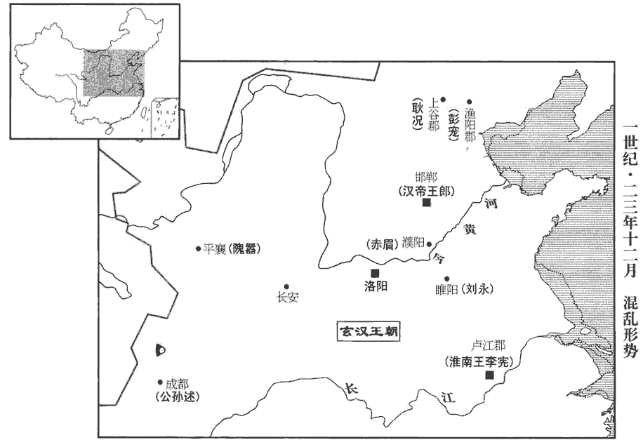 

## 二年（甲申，二四）

1春，正月，大司馬秀以王郎新盛，乃北徇薊‹北京›。賢曰：薊，縣名，屬涿郡；今幽州縣也。薊，音計。

〖译文〗 [1]春季，正月，大司马刘秀因为王郎刚刚崛起，正处于兴盛状态，于是北向蓟州夺取土地。

2申屠建、李松自長安迎更始遷都；二月，更始發洛陽。初，三輔豪桀假號誅莽者，謂假漢將軍號也。人人皆望封侯；申屠建既斬王憲，又揚言「三輔兒大黠xiá，黠，下八翻，桀黠也。共殺其主。」吏民惶恐，屬縣屯聚；建等不能下。更始‹刘玄›至長安，乃下詔大赦，非王莽子，他皆除其罪，於是三輔悉平。

〖译文〗 [2]申屠建、李松自长安迎接刘玄迁都。二月，刘玄从洛阳出发。当初，三辅的英雄人物借用汉将军号诛杀了王莽，人人都盼望封侯。申屠建既把王宪杀了，又宣扬说：“三辅男子太凶狠狡黠，一起杀死了他们的首领。”官员百姓一片恐慌，三辅所属各县聚兵自保，申屠建等不能攻下。刘玄到了长安，才下诏大赦，除王莽后代外，其他都免其罪，于是三辅尽得安定。

時長安唯未央宮被焚，其餘宮室、供帳、倉庫、官府皆案堵如故，市里不改於舊。更始居長樂宮，樂，音洛。升前殿，郎吏以次列庭中；更始羞怍zuò，俛fǔ首刮席，不敢視。賢曰：怍，顏色變也。俛，俯也。刮，爬也；怍，才各翻。俛，音免。諸將後至者，更始問：「虜掠得幾何？」左右侍官皆宮省久吏，驚愕相視。給事天子左右者，謂之侍官。

〖译文〗 当时长安只有未央宫被焚，其余宫室、供具张设、仓库、官府，都安然无恙，犹如以前，城市街巷和原来一样没有改变。刘玄在长乐宫居住，登上前殿，官吏们按照次序，排列在正殿前的院子里。刘玄羞愧惭怍，俯下头用手刮席，不敢看人。将领们有后到的，刘玄问：“抢了多少东西？”左右侍官都是宫禁中的旧吏，对此惊愕不已，相视无语。

李松與棘陽‹河南南阳南›趙萌說更始宜悉王諸功臣；說，輸芮翻。王，於況翻。朱鮪wěi爭之，以為高祖約，非劉氏不王。鮪，於軌翻。更始乃先封諸宗室：祉為定陶王‹山东定陶›，班志：定陶縣，屬濟陰郡。宋白曰：定陶故城在曹州東北三十七里。慶為燕王‹北京›，燕，於賢翻。歙為元氏王‹河北元氏›，元氏縣，屬常山郡。闞駰曰：趙公子元之封邑，故曰元氏嘉為漢中王‹陕西汉中›，祉，舂陵康侯敞之子，大宗也。慶，敞之弟。嘉，敞之弟子。歙，更始之叔父。歙，許及翻。賜為宛王‹河南南阳›，宛縣，屬南陽郡。宋白曰：鄧州南陽縣，漢之宛縣。信為汝陰王‹安徽阜阳›；班志，汝陰縣屬汝南郡，故胡國；唐潁州治所。然後立王匡為泚zǐ陽王‹河南泌阳›，「泚陽」，後漢書作「比陽」。比陽縣，屬南陽郡；唐屬唐州。王鳳為宜城王‹湖北宜城›，班志，宜城縣屬南郡，故鄢。宋為大堤之地，立華山郡；後魏改宜城郡；唐為縣，屬襄州。朱鮪為膠東王‹山东平度›，膠東，漢王國，都即墨。賢曰：故城在今萊州膠水縣東南。王常為鄧王‹湖北襄樊汉水北岸›，鄧縣，屬南陽郡，故鄧國；唐為鄧城縣，屬襄州。申屠建為平氏王‹河南桐柏西北平氏镇›，班志，平氏縣屬南陽郡，有桐柏山；唐為桐柏縣，屬唐州。陳牧為陰平王‹甘肃文县›，賢曰：陰平縣，屬廣漢郡。宋白曰：唐文州曲水縣，漢陰平道也。衛尉大將軍張卬為淮陽王‹河南淮阳›，淮陽，本陳國；漢為淮陽國。賢曰：淮陽故城，在今陳州宛丘縣東南。執金吾大將軍廖湛為穰王‹河南邓州›，穰縣，屬南陽郡。師古曰：今鄧州穰縣是也。尚書胡殷為隨王‹湖北随州›，隨縣，屬南陽郡，古隨國；唐為隨州。柱天大將軍李通為西平王‹河南舞钢东北›，賢曰：西平縣，屬汝南郡；故城在今豫州郾城縣南。五威中郎將李軼為舞陰王‹河南泌阳北›，舞陰縣，屬南陽郡。宋白曰：唐州泌陽縣，本漢舞陰縣地。舞陽故城在葉縣東十里。水衡大將軍成丹為襄邑王‹河南睢县›，襄邑縣，屬陳留郡。國圈稱曰：襄邑，宋地，本承匡襄陵鄉也。宋襄公所葬，故曰襄陵。秦始皇以承匡卑濕，徙縣於襄陵，故曰襄邑。縣西十里有承匡故城。賢曰：今襄邑縣在宋州西。驃騎大將軍宗佻tiāo為潁陰王‹河南许昌›，佻，他彫翻，又田聊翻。班志，潁陰縣，屬潁川郡。尹尊為郾yǎn王‹河南郾城›。班志，郾縣，屬潁川郡。宋白曰：七國時，魏之下邑，今許州郾城縣是也。括地志：豫州褒信縣，本漢郾縣地。師古曰：郾，一戰翻。唯朱鮪辭不受；乃以鮪為左大司馬，宛王賜為前大司馬，使與李軼等鎮撫關東‹崤山之東›。又使李通鎮荊州‹湖南湖北›，王常行南陽‹河南南陽›太守事。以李松為丞相，趙萌為右大司馬，共秉內任。內任，謂朝廷之內。

〖译文〗 李松与棘阳人赵萌建议刘玄尽封功臣为王。朱鲔与他们争辩，认为汉高祖刘邦事先说定，不是刘姓皇族不能当王。刘玄于是首先赐封刘姓宗族：刘祉当定陶王，刘庆当燕王，刘歙当元氏王，刘嘉当汉中王，刘赐当宛王，刘信当汝阴王。然后立王匡当阳王，王凤当宜城王，朱鲔当胶东王，王常当邓王，申屠建当平氏王，陈牧当阴平王，卫尉大将军张当淮阳王，执金吾大将军廖湛当穰王，尚书胡殷当随王，柱天大将军李通当西平王，五威中郎将李轶当舞阴王，水衡大将军成丹当襄邑王，骠骑大将军宗佻当颍阴王，尹尊当郾王。只有朱鲔推辞不肯接受。于是任命朱鲔当左大司马，宛王刘赐当前大司马，让他们与李轶等人安抚函谷关以东地区。又让李通镇守荆州，王常代理南阳太守。任命李松当丞相，赵萌当右大司马，共同承担朝廷之内的责任。

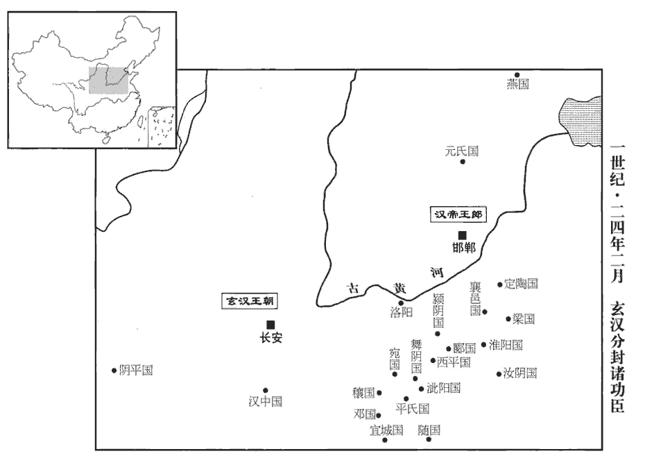 

更始納趙萌女為夫人，故委政於萌，日夜飲讌後庭；群臣欲言事，輒醉不能見，時不得已，乃令侍中坐帷中與語。韓夫人尤嗜酒，每侍飲，見常侍奏事，中常侍，受外朝臣奏事而奏之天子。輒怒曰：「帝方對我飲，正用此時持事來邪！」起，抵破書案。賢曰：抵，擊也。趙萌專權，生殺自恣。郎吏有說萌放縱者，更始怒，拔劍斬之，自是無敢復言。復，扶又翻。以至群小、膳夫皆濫授官爵，長安為之語曰：「竈下養，中郎將。公羊傳曰：炊烹為養，音弋亮翻。爛羊胃，騎都尉。爛羊頭，關內侯。」言以烹煮熟爛為功也。軍師將軍李淑上書諫曰：「陛下定業，雖因下江、平林之勢，斯蓋臨時濟用，不可施之既安。唯名與器，聖人所重；孔子曰：唯名與器不可以假人。今加非其人，望其裨bì益萬分，猶緣木求魚，升山采珠。賢曰：言求之非所，不可得也。海內望此，有以窺度漢祚！」度，徒洛翻。更始怒，囚之。諸將在外者皆專行誅賞，各置牧守；州郡交錯，不知所從。由是關中‹陝西中部›離心，四海怨叛。

〖译文〗 刘玄娶赵萌女儿当夫人，所以把政事都给赵萌去管，日夜在后宫饮宴。臣属们想向君主奏闻或议论政事，刘玄总是因醉酒而不能相见，有时不得已，就命侍中坐帐幕之中与群臣说话。韩夫人尤其爱好喝酒，每当侍奉刘玄喝酒，见中常侍向天子奏事，总是发怒说：“皇上正和我喝酒，你偏利用这时奏事呀！”于是起身，击破书案。赵萌专擅大权，自己随意杀人。郎官中有人说赵萌放纵，刘玄大怒，拔剑斩杀了那个人，从此没有人敢再说赵萌的不是。以至众小人、厨子，都被滥授官爵。长安人把这件事编成歌谣：“灶下炊烹忙，升为中郎将。烹煮烂羊胃，当了骑都尉。烹煮烂羊头，当了关内侯。”军师将军李涉上书规劝说：“陛下创业，虽然是利用下江兵、平林兵的势力，但这是临时措施，不可把它施用于已经安定的时期。只有名份与车服仪制，是圣人所看重的，现在给了不应该给的人，希望他们有万分益处，这犹如上树找鱼，登山采珠。四海之内看到这样，会有人暗中窥伺汉朝的皇位。”刘玄大怒，把他囚禁起来。将领们在朝廷外的都自行赏罚，各设官吏，各州、各郡交叉错杂，不知服从谁好。因此关中地区离心，全国怨恨叛乱。

3更始徵隗囂及其叔父崔、義等。囂將行，方望以更始成敗未可知，固止之；囂不聽，望以書辭謝而去。囂等至長安，更始以囂為右將軍，崔、義皆即舊號。就其舊號以授之。隗kuí囂違方望之言而從更始，違馬援之言而叛光武，始則幾至殺身，後則終於滅族，擇木之難也。

〖译文〗 [3]刘玄征召隗嚣和他的叔父隗崔、隗义等人。隗嚣将要出发，方望因为刘玄成败尚不可知道，坚决地制止他，隗嚣不听他的建议，方望留下一封书信，告辞而去。隗嚣等到达长安，刘玄任命隗嚣当右将军，对隗崔、隗义都按旧有的称号赐封。

4耿況遣其子弇yǎn奉奏詣長安，弇時年二十一。弇，古含翻。行至宋子‹河北趙縣东北›，會王郎起，弇從吏孫倉、衛包曰：「劉子輿，成帝正統；捨此不歸，遠行安之！」弇按劍曰：「子輿弊賊，卒為降虜耳！從，才用翻。卒，終也，音子恤翻。我至長安，與國家陳上谷‹河北懷來›、漁陽‹北京密云›兵馬，歸發突騎，賢曰：突騎，言能衝突軍陳。以轔烏合之眾，如摧枯折腐耳。賢曰：轔lín，轢lì也，音力刃翻。觀公等不識去就，族滅不久也！」倉、包遂亡，降王郎。

〖译文〗 [4]耿况派遣他的儿子耿带着上呈奏章到长安，耿当时二十一岁。走到宋子，正值王郎起事，耿的从官孙仓、卫包说：“刘子舆乃是汉成帝一脉相传的嫡子，舍弃他不归附，远行到哪里去？”耿用手握着剑柄说：“刘子舆是个欺骗蒙混的贼子，最终要成为投降的俘虏。我到长安，向朝廷叙说上谷郡和渔阳郡的兵马状况，回去后征发能冲突军队的骑兵，用来践踏那些乌合之众，犹如摧枯拉朽一般。看你等没有择主而从的眼光，灭族之祸不远了！”孙仓、卫包于是逃亡，投降了王郎。

弇yǎn聞大司馬秀在盧奴‹河北定州›，賢曰：盧奴，縣名，屬中山國；故城在今定州安喜縣。水經註曰：縣有黑水故池。水黑曰盧，不流曰奴，因以為名。乃馳北上謁；上，時掌翻；下異上同。秀留署長史，與俱北至薊‹北京›。薊，故燕都；昭帝改燕為廣陽國，亦治薊。王郎移檄購秀十萬戶，秀令功曹令史潁川‹河南禹州›王霸至市中募人擊王郎，漢舊註：公府令史，秩百石。霸時為大司馬功曹令史。市人皆大笑，舉手邪揄之，霸慚懅jù而反。賢曰：說文曰：歋yē𢋅yú，手相笑也。歋，音弋支翻。𢋅，音踰，或音由。此云邪揄，語輕重不同。懅，亦慙也，音遽。秀將南歸，耿弇yǎn曰：「今兵從南方來，不可南行。漁陽‹北京密云›太守彭寵，公之邑人；彭寵，南陽宛人。上谷‹河北懷來›太守，即弇父也。發此兩郡控弦萬騎，邯鄲不足慮也。」秀官屬腹心皆不肯，曰：「死尚南首，奈何北行入囊中！」賢曰：漁陽、上谷北接塞垣，至彼路窮，如入囊中也。首，音式救翻。秀指弇曰：「是我北道主人也。」

〖译文〗 耿听说大司马刘秀在卢奴，于是骑马奔驰北上拜见。刘秀让他留在府中任长史，与他一块儿北上到达蓟。王郎命人传递檄书，用十万户的采邑作悬赏，擒杀刘秀。刘秀命令大司马功曹令史颍川人王霸到市中召募人打击王郎。市人都发声大笑，举手挖苦他，王霸惭愧而回。刘秀即将南归，耿说：“如今兵从南方来，不可以南行。渔阳太守彭宠，是您的同乡；上谷太守，是我的父亲。征发这两郡弓箭骑兵一万人，王郎就不值得忧虑了。”刘秀的属官和亲信都不肯，说：“人死了，头还要向着南方，为何向北进发入人囊中？”刘秀指着耿说：“这是我北路的主人。”

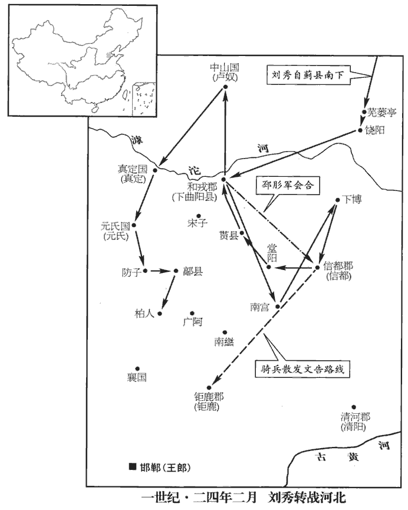 

會故廣陽王子接起兵薊中‹北京›以應郎，賢曰：廣陽王名嘉，武帝五代孫。城內擾亂，言邯鄲使者方到，二千石以下皆出迎。於是秀趣駕而出，賢曰：趣，急也，音促。至南城門，門已閉；攻之，得出，遂晨夜南馳，不敢入城邑，舍食道傍。至蕪蔞亭‹河北肃宁南›，賢曰：蕪蔞，亭名，在今饒陽東北。蔞，音力於翻。時天寒烈，馮異上豆粥。至饒陽‹河北饒陽东北›，賢曰：饒陽，縣名，屬安平國，在饒河之陽；故城在今瀛州饒陽縣東北。官屬皆乏食。秀乃自稱邯鄲使者，入傳舍，賢曰：傳舍，客館也。傳，音知戀翻；下同。傳吏方進食，從者飢，爭奪之。從，才用翻。傳吏疑其偽，乃椎鼓數十通，紿dài言「邯鄲將軍至」；賢曰：椎，直追翻。紿，言欺誑也，音殆。官屬皆失色。秀升車欲馳，既而懼不免，徐還坐，曰：「請邯鄲將軍入。」久，乃駕去。晨夜兼行，蒙犯霜雪，面皆破裂。

〖译文〗 正巧原广阳王的儿子刘接在蓟中起兵，以响应王郎，城内搅扰，混乱不堪，传说王郎的使节刚到，二千石及以下的官吏都出来迎接。于是刘秀急催车辆而出，到南城门，城门已经关闭。攻击南城门，才得出城。于是昼夜向南奔驰，不敢进入城市，食宿都在路旁。到芜蒌亭，当时天气酷寒，冯异呈上豆粥。到饶阳，属官都缺乏食品。刘秀于是自称邯郸的使节，进入客馆。客馆的官吏正在吃饭，刘秀的随从饥饿难忍，争抢食物。官吏怀疑刘秀是假使节，于是用棒槌敲打鼓数十遍，欺哄说：“邯郸将军到。”刘秀的属官都吓得变了脸色。刘秀登车打算逃走，随后又怕逃不掉，慢慢回到座位上，说：“请邯郸将军进来。”过了很久，才乘车辆离开。日夜兼程，顶霜冒雪，满面裂痕。

至下曲陽‹河北晉州西›，賢曰：下曲陽，縣名，屬钜鹿郡。常山郡有上曲陽，故此言下。劉昭曰：下曲陽有鼓聚，故翟鼓子國。宋白曰：鎮州鼓城縣，漢下曲陽縣地。傳聞王郎兵在後，從者皆恐。從，才用翻。至滹hū沱河，賢曰：山海經云：大戲之山，滹沱之水出焉。在今代州繁畤縣，東流經定州深澤縣東南，即光武所渡處；今俗猶謂之危渡口。臣賢按：滹沱河舊在饒陽南，至魏太祖曹操，因饒河故瀆決令北注新溝水，所以今在饒陽縣北。候吏還白「河水流澌，賢曰：澌，音斯，冰澌也。無船，不可濟。」秀使王霸往視之。霸恐驚眾，欲且前，阻水還，即詭曰：「冰堅可度。」官屬皆喜。秀笑曰：「候吏果妄語也！」遂前。比至河，比，必寐翻，及也。河冰亦合，乃令王霸護渡，賢曰：監護渡也。未畢數騎而冰解。至南宮‹河北南宮›，賢曰：南宮，縣名，屬信都國，今冀州縣也。遇大風雨，秀引車入道傍空舍，馮異抱薪，鄧禹爇ruò火，賢曰：爇，音而悅翻。秀對竈燎衣，賢曰：燎，炙也。馮異復進麥飯。復，扶又翻。

〖译文〗 刘秀等到了下曲阳，传言王郎追兵在后，随从的官员都很害怕。到滹沱河，探听消息的官员回来说：“河水解冻，冰随水流，没有船，不可以渡。”刘秀派王霸前往观看。王霸恐怕惊吓众人，打算暂且向前，受到水的阻挡再回来，就狡诈地说：“河水结冰，坚实可渡。”属官都很高兴。刘秀笑着说：“去探听的官吏果然瞎说！”于是向前。等到了河畔，河水却也结冰了。刘秀命令王霸监护渡河，只剩下几个骑马的人还没有到达河对岸时，冰就融解了。到了南宫，遇到大风雨，刘秀引车进入路旁的空房，冯异抱来柴草，邓禹点燃火，刘秀对灶烤衣，冯异又呈上麦饭。

進至下博‹河北深縣东南›城西，賢曰：下博縣，屬信都國；在博水之下，故曰下博；故城在今冀州下博縣南。惶惑不知所之。有白衣老父在道旁，賢曰：蓋神人也。今下博縣西有祠堂。指曰：「努力！信都‹河北冀縣›郡為長安城守，賢曰：信都郡，今冀州。為，於偽翻。去此八十里。」秀即馳赴之。是時郡國皆已降王郎，獨信都‹河北冀縣›太守南陽‹河南南陽›任光、和戎‹河北晉州西›太守信都邳pī肜róng不肯從。東觀記曰：王莽分信都為和戎，居下曲陽。邳肜傳作「和成」。成字為是。風俗通：奚仲為夏車正，封於邳，其後以為氏。肜，餘中翻。光自以孤城獨守，恐不能全，賢曰：獨守無援，故恐。聞秀至，大喜；吏民皆稱萬歲。邳肜亦自和戎‹河北晉州西›來會，議者多言可因信都兵自送，西還長安。邳肜曰：「吏民歌吟思漢久矣，故更始舉尊號而天下響應，三輔清宮除道以迎之。今卜者王郎，假名因勢，驅集烏合之眾，遂振燕、趙之地，振，舉也。無有根本之固。明公奮二郡之兵以討之，二郡，信都、和成。何患不克！今釋此而歸，豈徒空失河北，必更驚動三輔，墮損威重，墮，讀曰隳。非計之得者也。若明公無復征伐之意，復，扶又翻。則雖信都之兵，猶難會也。何者？明公既西，則邯鄲勢成，民不肯捐父母、背成主而千里送公，謂光武西歸，則王郎之位號定，故曰成主。背，蒲妹翻。考異曰：范書邳肜傳：「邯鄲成，民不肯背」。「成主」字皆作「城」。袁紀作「邯鄲和城，民不肯捐和城而千里送公」，漢春秋作「邯鄲之民不能捐父母、背成主。」按文意，「城」皆當作「成」。邯鄲成，謂邯鄲勢成也。成主，謂王朗為已成之主也。其離散亡逃可必也！」秀乃止。

〖译文〗 刘秀等人前进到下博城西，惊惶迷惑，不知道往哪里去。有身着白衣的老人在路旁，指着前面说：“努力干吧！信都郡是长安的门户，离这里还有八十里。”刘秀立即奔赴那里。当时各郡国都已投降王郎，只有信都太守南阳人任光、和戎太守信都人邳肜不肯归附。任光自己认为独守孤城，恐怕不能保全，听说刘秀到来，非常高兴，官民齐呼万岁。邳肜也从和戎来相会。议论的人多数说可以依靠信都兵护送，西回长安。邳肜说：“官民歌咏思念汉朝很久了，所以刘玄举起尊贵的称号而天下响应，三辅清理宫室，修治道路，来迎接他。今占卜先生王郎，冒充汉成帝庶子之名，顺应着事物发展的趋势，驱赶汇集乌合之众，于是声振燕、赵之地，但并无坚固的基础。您使信都、和戎两郡的军队彭起劲来讨伐王郎，为什么担忧不能取胜！现在放弃这样的条件而归，岂不是白白地失去了黄河以北，而且势将惊动三辅，大损您的威信，不是良策。如果阁下没有讨伐王郎的意图，那么即使是信都的地方部队，也难以召集。为什么？阁下既然西行，邯郸方面就控制了局势。百姓不肯抛弃父母妻子，背叛现成的主人，千里迢迢去护送您。他们离散逃亡是必然的。”刘秀于是决定不走。

秀以二郡兵弱，欲入城頭子路、力子都軍中；爰曾起兵盧城頭，曾字子路，故號城頭子路。考異曰：范書作「力子都」。同編修劉攽bān曰：「力」當作「刁」，音彫。任光以為不可。乃發傍縣，得精兵四千人，拜任光為左大將軍，信都都尉李忠為右大將軍，邳肜róng為後大將軍；和戎太守如故，信都令萬脩為偏將軍，萬，姓也。孟子弟子有萬章。皆封列侯。留南陽宗廣領信都太守事，使任光、李忠、萬脩將兵以從。從，才用翻；下使從同。邳肜將兵居前，任光乃多作檄文曰：「大司馬劉公將城頭子路、力子都兵百萬眾從東方來，擊諸反虜！」遣騎馳至钜鹿‹河北平鄉›界中。吏民得檄，傳相告語。傳，知戀翻。語，牛倨翻。秀投暮入堂陽‹河北新河›界，賢曰：堂陽縣，屬钜鹿郡，在堂水之陽；故城在今冀州鹿城縣南。多張騎火，彌滿澤中，堂陽即降；又擊貰shì縣‹河北辛集西南›，降之。賢曰：貰縣，屬钜鹿郡；音時夜翻；師古音式制翻。城頭子路者，東平‹山東東平东南›爰曾也，寇掠河、濟間，有眾二十餘萬，濟，子禮翻。力子都有眾六七萬，故秀欲依之。昌城‹河北冀县西北›人劉植聚兵數千人據昌城，迎秀；賢曰：昌城縣，屬信都郡；故城在今冀州西北。杜佑曰：故城在冀州信都縣北。水經註引應劭曰：在堂陽縣北三十里。秀以植為驍騎將軍。耿純率宗族賓客二千餘人，老病者皆載木自隨，賢曰：左傳曰：又如是而嫁，將就木焉。木，謂棺也。老病者恐死，故載以從軍。迎秀於育；賢曰：育，縣名；故城在冀州。余考兩漢志無育縣，蓋「貰」字之誤。拜純為前將軍。進攻下曲陽‹河北晉州西›，降之；眾稍合，至數萬人，復北擊中山‹河北定州›。賢曰：中山國，一名中人亭；故城在今定州唐縣東北。張曜中山記曰：城中有山，故曰中山也。復，扶又翻。耿純恐宗家懷異心，乃使從弟訢宿歸，燒廬舍以絕其反顧之望。

〖译文〗 刘秀因为两郡的兵力太弱，打算投奔城头子路、力子都的部队。任光认为不可以。于是下令征集邻县丁壮，得精锐部队四千人，任命任光当左大将军，信都都尉李忠当右大将军，邳肜当后大将军，仍兼和戎太守，信都令万当偏将军，都封列侯。刘秀任命南阳人宗广暂任信都太守，让任光、李忠、万跟随自己向王郎反击。邳肜带兵充当前锋。任光于是大量编写声讨文告说：“大司马刘秀率城头子路、力子都的大军百万，从东方前来，讨伐叛逆！”派骑兵到钜鹿郡内散发。官民看到文告后，互相传播。刘秀到晚上抵达堂阳县界，命许多骑兵打起火把，水畔一片光亮，堂阳县误以为大军压境，马上投降。刘秀又进击贳县，贳县也投降了。城头子路本是东平郡人爰曾，在黄河、济水一带抢劫掳掠，有部众二十余万人，而力子都也有部众六七万人，所以刘秀曾想前往投靠。昌城人刘植集结士兵数千人，占据昌城，迎接刘秀。刘秀任命刘植当骁骑将军。耿纯率领宗族宾客二千余人，年老患病的都随身带着棺木，在育地迎接刘秀。刘秀任命耿纯当前将军。进攻下曲阳，下曲阳投降。刘秀的部队渐渐汇合，达数万人。再向北进攻中山。耿纯恐怕宗族怀有二心，就派他的堂弟耿回到故乡，烧掉了房舍，以断绝他们的反顾之心。

秀進拔盧奴‹河北定州›，杜佑曰：定州安喜縣，漢盧奴也。所過發奔命兵，移檄邊郡共擊邯鄲；郡縣還復響應。復，扶又翻；下同。時真定‹河北正定›王楊起兵附王郎，眾十餘萬，秀遣劉植說楊，楊乃降。楊，常山憲王舜六世孫。舜，景帝子也。說，輸芮翻。秀因留真定，納楊甥郭氏為夫人以結之。進擊元氏‹河北元氏›、防子‹河北高邑西南›，皆下之。賢曰：元氏、防子屬常山郡；并今趙州縣也。防與房，古字通用。至鄗hào‹河北柏鄉北›，擊斬王郎將李惲yùn；鄗縣，屬常山郡。賢曰：今趙州高邑縣也。鄗，音呼各翻。惲，於粉翻。至柏人‹河北隆尧西南›，復破郎將李育。賢曰：柏人，縣名，屬趙國；今邢州縣；故城在縣之西北。育還保城；攻之，不下。

〖译文〗 刘秀进军，攻陷卢奴。在所经过的郡县，征发急用的非常部队，向沿边郡县发布文告，号召共击邯郸，各郡县纷纷响应。这时真定王刘杨起兵投靠王郎，部众十余万人。刘秀派刘植游说刘杨，刘杨便投降了。刘秀于是进入真定，并娶刘杨的甥女郭氏当夫人，用以团结刘杨。继续前进，攻击元氏、防子，都攻下了。到达县，击杀王郎的将军李恽。进抵柏人，又击败王郎的将军李育。李育撤退，固守柏人城。刘秀进攻，未能攻下。

5南鄭‹陝西汉中›人延岑cén起兵據漢中；延，姓；岑，名。漢中王嘉擊降之，有眾數十萬。校尉南陽賈復見更始政亂，乃說嘉曰：說，輸芮翻。「今天下未定，而大王安守所保，所保得無不可保乎？」所保，謂漢中也。嘉曰：「卿言大，非吾任也。大司馬在河北，必能相用。」乃為書薦復及長史南陽陳俊於劉秀。復等見秀於柏人‹河北隆尧西南›，秀以復為破虜將軍，俊為安集掾。劉玄傳：玄初從陳牧等為其軍安集掾。賢曰：欲以安集軍眾，故權以為官名。余謂光武用俊之意，不特安集軍眾，蓋為民也。掾，俞絹翻。

〖译文〗 [5]南郑人延岑起兵占据汉中。汉中王刘嘉进击，延岑投降。刘嘉部众多至数十万。校尉南阳人贾复，眼见更始朝廷政治混乱，向刘嘉建议：“如今天下还没安定，大王却对你目前所有的东西心满意足。这些东西就没有不保的可能吗？”刘嘉说：“您说大话，不是我所能任用的。大司马刘秀在黄河以北，一定能任用您。”于是写信给刘秀，推荐贾复与长史南阳人陈俊。贾复等抵达柏人，刘秀任命贾复当破虏将军，陈俊当安集掾。

秀舍中兒犯法，軍市令潁川‹河南禹州›祭zhài遵格殺之，從軍者非一處人，故於軍中立市，使相貿易，置令以治之。姓譜：周公第五子祭伯，其後以為氏。賢曰：祭，音側介翻。秀怒，命收遵。主簿陳副諫曰：「明公常欲眾軍整齊，今遵奉法不避，是教令所行也。」乃貰之，賢曰：貰，猶赦也。以為刺姦將軍，王莽置左右刺姦，使督姦猾，光武因以為將軍號。謂諸將曰：「當備祭遵！吾舍中兒犯法尚殺之，必不私諸卿也。」

〖译文〗 刘秀家里的年轻仆人犯了法，军市令颍川人祭遵把他打死了。刘秀大怒，命人逮捕了祭遵。主簿陈副劝谏说：“您常要求军队军纪整肃，现在祭遵执法毫不回避，这是您的教令得到了贯彻执行呀！”刘秀于是饶恕了祭遵，用他担任刺奸将军。刘秀跟众将说：“你们应该小心祭遵！我家里的小仆人犯法，尚且给杀了，他必定不会偏袒你们。”

6初，王莽既殺鮑宣，事見三十六卷平帝元始三年。上黨‹山西長子›都尉路平欲殺其子永；太守苟諫保護之，永由是得全。更始徵永為尚書僕射，行大將軍事，將兵安集河東‹山西夏縣›、并州，河東郡，本屬司隸。令永安集河東及并州所部諸郡。得自置偏裨。永至河東，擊青犢，大破之。以馮衍為立漢將軍，屯太原，與上黨‹山西長子›太守田邑等繕甲養士以扞衛并土。

〖译文〗 [6]最初，王莽诬杀鲍宣以后，上党郡都尉路平便打算杀鲍宣的儿子鲍永。郡太守苟谏进行保护，鲍永才得以活命。刘玄征召鲍永，任命为尚书仆射，代理大将军，率领军队安抚河东郡及并州所属郡县，可以自行任命偏将和裨将。鲍永到河东郡，攻击青犊，大获全胜。任命冯衍当立汉将军，驻守太原，与上党太守田邑等修理装备，供养并训练士兵，以捍卫并州疆土。

7或說大司馬秀以守柏人‹河北隆尧西南›不如定钜鹿‹河北平鄉›，說，輸芮翻；下同。秀乃引兵東北拔廣阿‹河北隆尧东›。賢曰：廣阿，縣名，屬钜鹿郡；故城在今趙州象城縣西北。杜佑曰：趙州昭慶縣，漢廣阿縣。秀披輿地圖，武帝時，群臣請王皇子，御史奏輿地圖。索隱曰：謂地為輿者，天地有覆載之德，故謂天為蓋，謂地為輿。故地圖稱輿地圖，疑自古有此名，非始漢也。指示鄧禹曰：「天下郡國如是，今始乃得其一；子前言以吾慮天下不足定，何也？」禹曰：「方今海內殽亂，人思明君，猶赤子之慕慈母。古之興者在德薄厚，不以大小也！」

〖译文〗 [7]有人向大司马刘秀建议，用柏人当基地，不如用钜鹿。于是刘秀率军向东北进发，攻陷广阿。刘秀翻阅地图，指给邓禹看，说：“天下郡国如此之多，到今天我才得到其中的一个。你先前认为我忧虑天下不能平定是多余的，为什么？”邓禹回答说：“现在天下混乱，人民想要英明的君王，好象初生的婴儿思慕慈母。古代兴起的帝王，只在他品德的厚薄，不在他地盘的大小。”

8薊中之亂，耿弇yǎn與劉秀相失，北走昌平‹北京昌平南›，賢曰：昌平縣，屬上谷郡；今幽州縣；故城在縣東。就其父況，因說況擊邯鄲。說，輸芮翻；下同。時王郎遣將徇漁陽‹北京密云›、上谷‹河北懷來›，急發其兵，北州疑惑，多欲從之。上谷功曹寇恂、門下掾閔業閔，姓也。魯有大夫閔馬父；孔子弟子有閔子騫。說況曰：「邯鄲拔起，賢曰：拔，猝也。難可信向。大司馬，劉伯升母弟，尊賢下士，可以歸之。」下，遐稼翻。況曰：「邯鄲方盛，力不能獨拒，如何？」對曰：「今上谷完實，控弦萬騎，可以詳擇去就。恂請東約漁陽，齊心合眾，邯鄲不足圖也！」況然之，遣恂東約彭寵，欲各發突騎二千匹、步兵千人詣大司馬秀。

〖译文〗 [8]蓟中之乱时，耿与刘秀失散，向北逃到昌平，回到他父亲耿况那里，趁机劝说耿况攻击邯郸。而这时候，王郎派出的将领，正在渔阳、上谷夺取土地，并紧急征调那里的部队，北方沿边郡县疑惑，但多数都打算服从。上谷郡功曹寇恂、门下掾闵业向耿况建议说：“邯郸仓猝崛起，前途难测。而大司马刘秀，是刘的亲弟弟，礼贤下士，我们可以归附他。”耿况说：“邯郸的势力正兴盛，我们不能单独抵抗，应该怎么办？”寇恂说：“现在上谷郡完好充实，拥有射箭骑兵一万人，可以认真选择自己的前途。我愿意前往东方的渔阳，与彭宠约定，同心合力，就用不着把邯郸放在心上。”耿况同意，派寇恂东行进见彭宠，互相约定，打算每郡出动骑兵突击队两千人、步兵一千人，到大司马刘秀那里去支援他。

安樂‹北京順義›令吳漢、護軍蓋延、狐奴‹北京順義東北›令王梁亦勸寵從秀，樂，音洛。蓋，古盍翻。狐奴縣，屬漁陽郡。寵以為然；而官屬皆欲附王郎，寵不能奪。漢出止外亭，外亭，城門外之亭也。遇一儒生，召而食之，食，讀曰飤。問以所聞。生言：「大司馬劉公，所過為郡縣所稱；邯鄲舉尊號者，實非劉氏。」漢大喜，即詐為秀書，移檄漁陽‹北京密云›，使生齎jí以詣寵，令具以所聞說之。說，輸芮翻。會寇恂至，寵乃發步騎三千人，以吳漢行長史，與蓋延、王梁將之，南攻薊‹北京›，殺王郎大將趙閎。

〖译文〗 安乐令吴汉、护军盖延、狐奴令王梁也劝彭宠归附刘秀，彭宠同意。可是，郡府的下属官员都愿归附王郎，彭宠不能决定。吴汉到城外巡查，在一个行人停留宿食的处所，遇到一位儒生，请来一块进餐，询问他听到的消息。儒生说：“大司马刘秀，受到他所经过的郡县的官民的称赞；而在邯郸举起尊贵称号的人，实际上不是刘氏子弟。”吴汉非常高兴，立即伪造了一份刘秀致送渔阳郡的文告，教那儒生拿着送给彭宠，让他把听到的消息告诉彭宠。恰好寇恂到达，彭宠于是派出步骑兵三千人，命吴汉代理长史，与盖延、王梁共同率领部队，南下进攻蓟县，杀死王郎大将赵闳。

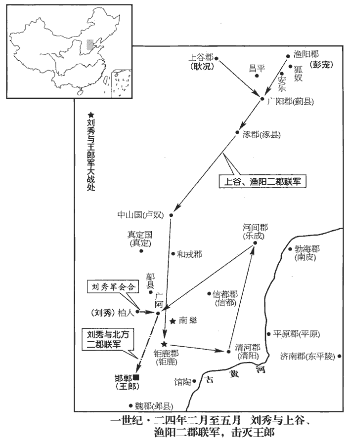 

寇恂還，遂與上谷‹河北懷來›長史景丹及耿弇yǎn將兵俱南，與漁陽軍合，所過擊斬王郎大將、九卿、校尉以下，凡斬首三萬級，定涿郡‹河北涿州›、中山‹河北定州›、钜鹿‹河北平鄉›、清河‹河北清河›、河間‹河北獻縣›凡二十二縣。前及廣阿‹河北隆尧东›，聞城中車騎甚眾，丹等勒兵問曰：「此何兵？」曰：「大司馬劉公也。」諸將喜，即進至城下。城下初傳言二郡兵為邯鄲來，為，於偽翻；下同。眾皆恐。劉秀自登西城樓勒兵問之；耿弇拜於城下，即召入，具言發兵狀。秀乃悉召景丹等入，笑曰：「邯鄲將帥數言我發漁陽、上谷兵，數，所角翻；下同。吾聊應言『我亦發之』，賢曰：王郎將帥數云欲發二郡兵以拒光武，光武聊亦應云然，猶今兩軍相戲弄也。孔穎達曰：聊，且略之辭。何意二郡良為吾來！考異曰：袁紀作「良牧為吾來」，今從景丹傳。韻釋：良，首也，信也。方與士大夫共此功名耳。」乃以景丹、寇恂、耿弇、蓋延、吳漢、王梁皆為偏將軍，使還領其兵，加耿況、彭寵大將軍；封況、寵、丹、延皆為列侯。

〖译文〗 寇恂返回上谷，便与上谷长史景丹以及耿率军一同南下，与渔阳部队会合，所经过的地方，斩杀王郎任命的大将、九卿、校尉及以下，共计三万人，夺取涿郡、中山、巨鹿、清河、河间等二十二县。前锋到达广阿，听说城里兵马很多，景丹等停兵打听道：“这是什么人的军队？”回答说：“是大司马刘秀的。”将领们喜悦，立即来到城下。广阿城下最初谣传上谷、渔阳二郡的军队是王郎派来的，大家都很恐慌。刘秀整治军队，亲自登上西城楼，询问来意。耿就在城下拜见。刘秀立即请他进城，耿说明了两郡发兵经过，刘秀于是把景丹等将领全部请到城中，笑着说：“邯郸将领屡次说：‘我们征发了渔阳、上谷部队。’我姑且应付说：‘我也征发了渔阳、上谷部队。’想不到两郡真的为我而来！我正要与各位官员共同建立功名。”于是任命景丹、寇恂、耿、盖延、吴汉、王梁都当偏将军，让他们回去统领自己的部队。擢升耿况、彭宠为大将军。封耿况、彭宠、景丹、盖延四人列侯。

吳漢為人，質厚少文，造次不能以辭自達，少，詩沼翻。朱子曰：造次，急遽苟且之時。造，七到翻。然沈厚【章：十二行本「厚」作「勇」；乙十一行本同；孔本同；張校同。】有智略，沈，持林翻。鄧禹數薦之於秀，秀漸親重之。

〖译文〗 吴汉为人朴实忠厚，不善言辞，遇到遇急情况，辞不达意，然而沉着而有谋略。邓禹多次向刘秀推荐，刘秀逐渐对他亲近器重。

更始遣尚書令謝躬率六將軍討王郎，不能下；秀至，與之合軍，東圍钜鹿，月餘未下。王郎遣將攻信都，大姓馬寵等開門內之。更始遣兵攻破信都，秀使李忠還，行太守事。王郎遣將倪宏、劉奉率數萬人救钜鹿，秀逆戰於南䜌‹河北鉅鹿北›，不利。賢曰：南䜌，縣名，屬钜鹿郡；故城在今邢州柏人縣東北。左傳：齊國夏伐晉，取欒，即其地也。其後南徙，故加「南」；今謂之倫城，聲之轉也。杜佑曰：唐钜鹿，漢南䜌地；漢钜鹿縣，今平鄉也。䜌，音力全翻。景丹等縱突騎擊之，宏等大敗。秀曰：「吾聞突騎天下精兵，今見其戰，樂可言邪！」樂，音洛。

〖译文〗 刘玄派尚书令谢躬率领六位将军讨伐王郎，没有进展。刘秀到，两军相合，向东围攻钜鹿，一月有余不能取胜。王郎派将攻信都，城中大姓马宠等打开城门迎接。刘玄派兵攻破信都，刘秀让李忠返回信都，代理太守。王郎派遣将领倪宏、刘奉率数万人救钜鹿，刘秀在南迎战，不顺利。景丹等人发骑兵突击部队进行攻击，倪宏等大败。刘秀说：“我听说骑兵突击部队是天下的精兵，今天看见它战斗，高兴得不能用言语来表达。”

耿純言於秀曰：「久守钜鹿，士眾疲弊；不如及大兵精銳，進攻邯鄲，若王郎已誅，钜鹿不戰自服矣。」秀從之。夏，四月，留將軍鄧滿守钜鹿；進軍邯鄲，連戰，破之，郎乃使其諫大夫杜威請降。威雅稱郎實成帝遺體，秀曰：「設使成帝復生，復，扶又翻。天下不可得，況詐子輿者乎！」威請求萬戶侯，秀曰：「顧得全身可矣！」威怒而去。秀急攻之，二十餘日；五月，甲辰‹一›，郎少傅李立開門內漢兵，遂拔邯鄲。郎夜亡走，王霸追斬之。秀收郎文書，得吏民與郎交關謗毀者數千章；關，通也。秀不省，省，悉井翻。會諸將軍燒之，曰：「令反側子自安！」賢曰：反側不安。詩曰：展轉反側。

〖译文〗 耿纯向刘秀建议：“我们长期围守钜鹿，官兵将会疲惫。不如趁大军士气旺盛进攻邯郸，如果王郎被诛，钜鹿用不着战斗自会服从。”刘秀采纳。夏季，四月，刘秀留下将军邓满继续围困钜鹿。自率大军向邯郸挺进，连续战斗，打败敌人。王郎于是派谏大夫杜威请求投降。杜威强调王郎确实是汉成帝刘骜的嫡亲骨肉，刘秀说：“假使汉成帝复活，也不能得到天下，何况他的冒牌儿子？”杜威请求封王郎万户侯，刘秀说：“饶他不死已经够了。”杜威大怒离去。刘秀发动猛烈攻击，历时二十余日。五日甲辰（初一），王郎少傅李立打开城门让汉兵入内，于是邯郸陷落。王郎乘夜逃走，王霸追捕擒获，就地斩首。刘秀检查王郎的文书，发现有自己的官吏与平民的奏章数千，奏章上除了向王郎表示效忠外，还有谤毁刘秀的内容。刘秀并不察看，他集合全体将领，用火烧毁奏章，说：“使背叛的人安心。”

秀部分吏卒各隸諸軍，句絕。士皆言願屬大樹將軍。大樹將軍者，偏將軍馮異也，為人謙退不伐，敕吏士非交戰受敵，常行諸營之後。每所止舍，諸將并坐論功，異常獨屏樹下，屏，必郢翻，蔽也。坐樹下以自蔽也。故軍中號曰「大樹將軍」。

〖译文〗 刘秀把新官兵分配给各将领。大家都说愿属大树将军。所谓大树将军是指偏将军冯异。冯异为人谦逊退让，不夸耀自己的才能、功劳，他命令他的部队，除非跟敌人交战或遭受敌人的攻击，通常要排在别的部队的后面。每到一个地方停留，当将领们坐在一起谈论功劳时，冯异常常独自躲到树下。所以军中称他“大树将军”。

護軍宛‹河南南陽›人朱祜言【章：十二行本「言」上有「從容」二字；乙十一行本同；孔本同。】於秀曰：「長安政亂，公有日角之相，此天命也！」考異曰：范書、袁紀「朱祜hù」皆作「祐」。按東觀記，「祜」皆作「福」，避安帝諱。許慎說文祜字無解，云上諱。然則祜名當作「示」旁古今之古，不當作左右之右也。」【章：十二行本正作「祜」；乙十一行本同；孔本同；張校同，云廿九葉前三行同。】相，息亮翻。秀曰：「召刺姦收護軍！」祜hù事伯升為大司徒護軍；光武為大司馬，復以為護軍。百官表；護軍都尉，秦官；平帝元始元年，更名護軍。祜乃不敢復言。復，扶又翻；下同。

〖译文〗 护军宛城人朱祜向刘秀建议：“长安政令混乱，阁下有帝王的相貌，这是天命！”刘秀说：“快教刺奸来逮捕护军！”朱祜不敢再开口。

更始遣使立秀為蕭王，賢曰：蕭縣‹安徽萧县›，屬沛郡；今徐州縣也。悉令罷兵，與諸將有功者詣行在所；蔡邕獨斷曰：天子以四海為家，故謂所居為行在所。遣苗曾為幽州‹河北北部及辽宁›牧，韋順為上谷太守，蔡充為漁陽太守，并北之部。

〖译文〗 刘玄派遣使节封刘秀当萧王，下令所有部队一律复员。命刘秀与有功将领，一同到长安。派苗曾当幽州牧，韦顺当上谷太守，蔡充当渔阳太守，同时到北方赴任。

蕭王居邯鄲宮，晝臥溫明殿，賢曰：趙王如意之殿也；故基在今洺州邯鄲縣內。水經註：溫明殿在叢臺西。耿弇yǎn入，造牀下請間，造，七到翻。因說曰：「吏士死傷者多，請歸上谷益兵。」蕭王曰：「王郎已破，河北略平，復用兵何為？」復，扶又翻。弇曰：「王郎雖破，天下兵革乃始耳。今使者從西方來，欲罷兵，不可聽也。銅馬‹河北东南›、赤眉‹河南北及山东西部›之屬數十輩，輩數十百萬人，所向無前，聖公不能辦也，賢曰：辦，猶成也；音蒲莧翻。余據史記，項梁曰：「使公主某事不能辦，」即此意。今人謂了事為辦事。敗必不久。」蕭王起坐曰：「卿失言，我斬卿！」弇曰：「大王哀厚弇如父子，故敢披赤心。」蕭王曰：「我戲卿耳，何以言之？」弇曰：「百姓患苦王莽，復思劉氏，聞漢兵起，莫不歡喜，如去虎口得歸慈母。今更始為天子，而諸將擅命於山東，貴戚縱橫於都內，橫，戶孟翻。都內，謂長安。虜掠自恣，元元叩心，更思莽朝，朝，直遙翻。是以知其必敗也。公功名已著，以義征伐，天下可傳檄而定也，天下至重，公可自取，毋令他姓得之！」蕭王乃辭以河北未平，不就徵，始貳於更始。賢曰：貳，離異也。

〖译文〗 刘秀住在邯郸赵王宫，白天在温明殿睡觉。耿闯入，来到床前请求单独谈话。乘机说：“官兵死伤太多，请准许我回上谷补充兵员。”刘秀说：“王郎已经消灭，黄河以北略微平定，还用兵干什么？”耿说：“王郎虽被打败，天下争战却刚刚开始。现在，朝廷的使节从西方来，要让我们的士兵复员，不可听从。铜马、赤眉一类的部队有数十支，而每一支都有数十万人，甚至一百万人，所向无敌。刘玄没有能力应付，不久就会溃败。”刘秀从床上起来坐下说：“你说了不该说的话，我杀了你！”耿说：“大王怜爱厚待我如同父子，所以我敢赤诚相待。”刘秀说：“我和你开玩笑罢了，你为什么这样说？”耿说：“全国百姓被王莽害得很苦，因而再次思念刘氏，听说汉兵崛起，无不高兴，如同逃脱虎口，回到慈母那里一样。现在刘玄当皇帝，将领们在崤山以东不受节制，皇亲国戚在长安胡作非为，随意抢劫掠夺，百姓捶打胸口，转而思念王莽新朝。因此，我知道刘玄必定失败。您的丰功英名传播海内，为了正义进行征伐，天下可以靠传递文告而安定。天下最重要的是政权您应该自己取得，莫让非刘姓皇族的人占有！”刘秀于是以河北还没有平定为推辞的理由，没有接受征召，开始与刘玄离异。

是時，諸賊銅馬、大彤、高湖、重連、鐵脛jìng、大槍、尤來、上江、青犢、五校、五幡、五樓、富平、獲索等各領部曲，眾合數百萬人，賢曰：諸賊或以山川土地為名，或以軍容強盛為號。銅馬賊帥東山荒禿、上淮況等，大彤渠帥樊重，尤來渠帥樊崇，五校賊帥高扈，檀鄉賊帥董次仲，五樓賊帥張文，富平賊帥徐少，獲索賊帥古師郎等，并見東觀記。脛，形定翻。富平，縣名，屬平原郡；今棣dì州厭次縣。所在寇掠。蕭王欲擊之，乃拜吳漢、耿弇俱為大將軍，持節北發幽州十郡突騎；幽州十郡，涿郡‹河北涿州›、廣陽‹北京›、代郡、上谷‹河北怀来›、漁陽‹北京密云›、遼西‹辽宁义县西›、遼東‹辽宁辽阳›、玄菟‹辽宁沈阳›、樂浪郡‹朝鲜平壤›是也。苗曾聞之，陰敕諸郡不得應調。賢曰：調，發也。調，徒弔翻。吳漢將二十騎先馳至無終‹天津蓟县›，賢曰：無終，本山戎國也，無終，山名，因以為國號；漢為縣名，屬右北平，故城在今幽州漁陽縣。是時苗曾蓋治無終。曾出迎於路，漢即收曾，斬之。耿弇到上谷‹河北懷來›，亦收韋順、蔡充，斬之。北州震駭，於是悉發其兵。

〖译文〗 当时，各路盗贼铜马、大彤、高湖、重连、铁胫、大枪、尤来、上江、青犊、五校、五幡、五楼、富平、获索等，各自率领部曲，总数有数百万人，在当地抢夺掳掠。刘秀打算进攻他们，于是任命吴汉、耿同时当大将军，持节征调幽州所属十郡的骑兵突击部队。幽州牧苗曾听到这个消息，暗中吩咐各郡不服从征调。吴汉率二十余骑兵先行驰马到达幽州无终县。苗曾出城在路上迎接吴汉，吴汉当即逮捕苗曾，将他斩杀。耿到上谷，又逮捕韦顺、蔡充，将他们斩杀。北方州郡震惊，于是全都发兵听候调遣。

秋，蕭王擊銅馬於鄡qiāo‹河北辛集市東›，賢曰：鄡，縣名，屬钜鹿郡；故城在冀州鹿城縣東。鄡，音苦堯翻。吳漢將突騎來會清陽‹河北清河›，賢曰：清陽，縣名，屬清河郡；今貝州縣；故城在州西北。士馬甚盛，漢悉上兵簿於莫府，賢曰：莫，大也。兵簿，軍士之名帳。上，時掌翻。請所付與，不敢自私，王益重之。王以偏將軍沛國‹安徽淮北›朱浮為大將軍、幽州牧，使治薊城‹北京›。銅馬食盡，夜遁，蕭王追擊於館陶‹河北館陶›，大破之。賢曰：館陶縣，屬魏郡；今魏州縣。受降未盡，降，戶江翻；下同。而高湖、重連從東南來，與銅馬餘眾合；蕭王復與大戰於蒲陽‹河北满城西›，悉破降之，賢曰：前書音義曰：蒲陽山，蒲水所出，在今定州北平縣西北。余按此乃班書地理志中山曲逆縣下分註，非音義也。復，扶又翻。封其渠帥為列侯。帥，所類翻。諸將未能信賊，降者亦不自安；王知其意，敕令降者各歸營勒兵，自乘輕騎按行部陳。降者更相語曰：「蕭王推赤心置人腹中，安得不投死乎！」賢曰：投死，猶言致死。余謂投，託也，託以死也。行，下孟翻。陳，讀曰陣。更，工衡翻。由是皆服，悉以降人分配諸將，眾遂數十萬。赤眉別帥與青犢、上江、大彤、鐵脛、五幡十餘萬眾在射犬‹河南武陟西北›，賢曰：續漢志，野王有射犬聚；故城在今懷州武德縣北。蕭王引兵進擊，大破之；南徇河內‹河南武陟›，河內太守韓歆降。

〖译文〗 秋季，刘秀在县进击铜马。吴汉率领骑兵突击部队，赶到清阳跟刘秀会合，兵马十分雄壮。吴汉把全军官兵名册呈报给幕府，然后再请拨付，不敢有私心，刘秀对他愈发器重。刘秀任命偏将军沛人朱浮当大将军，兼幽州牧，把州府设在蓟城。铜马粮食吃完了，乘夜逃跑，刘秀追击到馆陶，大败铜马。刘秀受降尚未完毕，而高湖、重连从东南来，与还没有投降的铜马残军汇合。刘秀尾在蒲阳再次与铜马等大战，铜马等全都战败投降。刘秀把他们的首领封为列侯。刘秀的部将们不敢相信降将们的诚意，而降将们内心也不能自安。刘秀了解他们的想法，命令降将们各自回到他们的军营整顿好部队，自己则轻装乘马，巡视部署。降将们互相说道：“萧王对我们推心置腹，我们怎么能不为他效命？”因此大家都心悦诚服。刘秀把投降的部队都分配给各将领，部众于是达到数十万。赤眉的一位分支部队的首领与青犊、上江、大彤、铁胫、五幡，约有十余万人，在射犬集结，刘秀率军进击，大获全胜。于是向南夺取河内，河内太守韩歆投降。

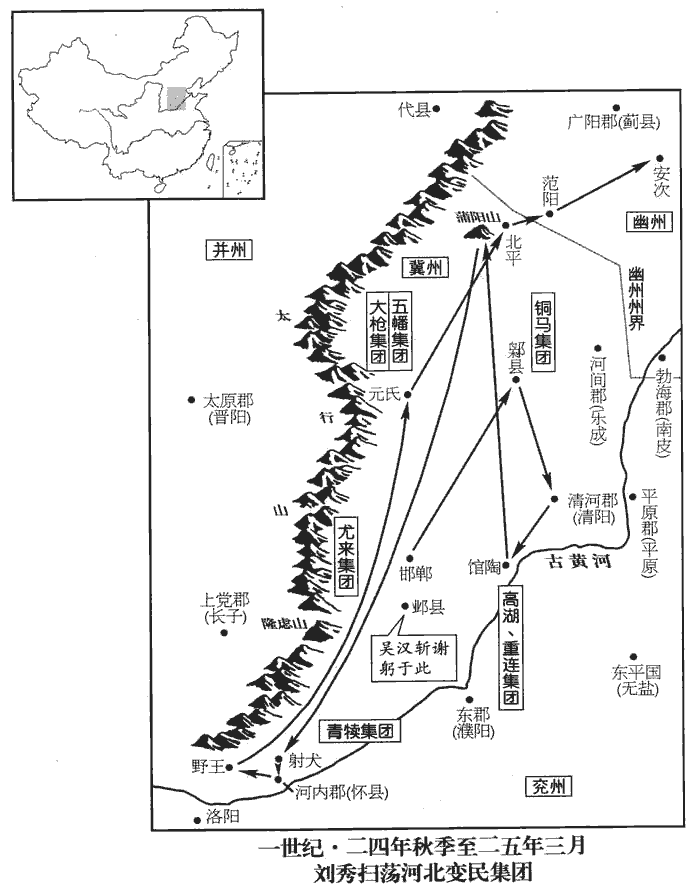 

9初，謝躬與蕭王共滅王郎，數與蕭王違戾，數，所角翻。常欲襲蕭王，畏其兵強而止；雖俱在邯鄲，遂分城而處，處，昌呂翻。然蕭王【章：十二行本「王」下有「每」字；乙十一行本同；孔本同。】有以慰安之。躬勤於吏職，蕭王常稱之曰：「謝尚書，真吏也！」故不自疑。其妻知之，常戒之曰：「君與劉公積不相能，而信其虛談，終受制矣！」躬不納。既而躬率其兵數萬還屯於鄴‹河北臨漳西南邺镇›。鄴縣，屬魏郡。及蕭王南擊青犢，使躬邀擊尤來於隆慮山‹河南林縣北›，地理志：隆慮縣，屬河內郡。應劭曰：隆慮山，在縣北，避殤帝名，改曰林慮。師古曰：慮，音廬。躬兵大敗。蕭王因躬在外，使吳漢與刺姦大將軍岑彭襲據鄴城。躬不知，輕騎還鄴，漢等收斬之，其眾悉降。

〖译文〗 [9]最初，谢躬与刘秀曾一同消灭王郎，但谢躬与刘秀多次冲突对立，谢躬时常想袭击刘秀，却因为畏惧刘秀兵力强大而不敢发动。两支部队，虽都在邯郸，却分城而处，然而刘秀不时对谢军慰问安抚。谢躬对于行政工作非常勤奋，刘秀经常称赞：“谢尚书是真正的官吏！”谢躬因此不再自己猜疑。他的妻子听说了这件事，经常告诫他：“你跟刘秀有积怨，势不两立，可是你却相信他那套虚言，最终会受到挟制的。”谢躬不接受。稍后，谢躬率领他的数万部队返回，屯驻邺城。等到刘秀南击青犊，让谢躬在隆虑山截击尤来，谢躬的军队大败。刘秀利用谢躬领兵在外，让吴汉与刺奸大将军岑彭袭击占据了邺城。谢躬不知道邺城的变化，率领轻装骑兵返回邺城，吴汉等把谢躬逮捕斩首，他的部队全部投降。

10更始遣枉【章：十二行本「枉」作「柱」；乙十一行本同；孔本同。】功侯李寶、益州‹四川云南›刺史李【章：十二行本「李」作「張」；乙十一行本同；張校同。】忠將兵萬餘人徇蜀‹四川成都›、漢‹陝西汉中›；公孫述遣其弟恢擊寶、忠於綿竹‹四川德阳北黄许镇›，賢曰：綿竹，縣名，屬廣漢郡，今益州縣也；故城今在縣東。大破走之。述遂自立為蜀王，都成都，述先居臨邛，今徙成都。民、夷皆附之。

〖译文〗 [10]刘玄派柱功侯李宝、益州刺史李忠率军万余人，夺取汉中郡、蜀郡。公孙述派他的弟弟公孙恢在绵竹迎击李宝、李忠，大败敌军，李宝、李忠逃跑。公孙述于是自立为蜀王，建都成都。当地百姓和夷族全都归附于他。

11冬，更始遣中郎將歸德侯颯、大司馬護軍陳遵使匈奴，授單于漢舊制璽綬，王莽篡漢，易單于璽綬，事見三十七卷始建國二年。今復授之。颯，音立。璽，斯氏翻。綬，音受。因送云、當餘親屬、貴人、從者還匈奴。天鳳五年，莽脅云、當至長安。莽敗，云、當亦死，所餘親屬、貴人、從者，今送還匈奴。從，才用翻。單于輿驕，謂遵、颯曰：「匈奴本與漢為兄弟；匈奴中亂，師古曰：言中間之時也，讀如本字，又音竹仲翻。孝宣皇帝輔立呼韓邪單于，故稱臣以尊漢。今漢亦大亂，為王莽所篡，匈奴亦出兵擊莽，空其邊境，令天下騷動思漢；莽卒以敗而漢復興，亦我力也，當復尊我！」遵與相牚chēng拒，卒，子恤翻。復，扶又翻。師古曰：牚，謂支拄也，音人庚翻，又丑庚翻。單于終持此言。

〖译文〗 [11]冬季，刘玄派中郎将归德侯刘飒、大司马护军陈遵出使匈奴，向单于颁发与汉朝旧制相同的印信，并就此把栾提云与他丈夫须卜当剩下的亲属、贵族、随从送回匈奴。匈奴单于栾提舆态度傲慢，对陈遵、刘飒说：“匈奴与汉朝本来是兄弟，匈奴中期发生内乱，孝宣皇帝帮助立呼韩邪单于，所以匈奴称臣，以尊敬汉朝。而今汉朝也有大乱，被王莽所篡夺，匈奴也曾出兵攻击王莽，使边境荡然一空，引起天下骚动，产生‘人心思汉’的后果，王莽最终失败，汉王朝复兴，这也是靠我们匈奴的力量，汉朝应该反过来尊我！”陈遵守住立场，进行辩驳，但单于始终坚持他的这种观点。

12赤眉樊崇等將兵入潁川‹河南禹州›，分其眾為二部，崇與逄安為一部，東觀記曰：逄，音龐。徐宣、謝祿、楊音為一部。赤眉雖數戰勝，數，所角翻。而疲弊厭兵，皆日夜愁泣，思欲東歸；崇等計議，慮眾東向必散，不如西攻長安。於是崇、安自武關‹陝西商南西南›、宣等從陸渾關‹河南嵩縣東北›賢曰：武關，在今商州上洛縣東。文穎曰：弘農析縣西百七十里有武關。前書曰：陸渾縣有關，在今洛州伊闕縣西南。地理志，陸渾縣屬弘農郡。師古曰：渾，音胡昆翻。兩道俱入。更始使王匡、成丹與抗威將軍劉均等分據河東‹山西夏縣›、弘農‹河南靈寶东北›以拒之。

〖译文〗 [12]赤眉首领樊崇等率军进入颍川，把他的部众分为两部分：樊崇、逢安率领一部分，徐宣、谢禄、杨音率领另一部分。赤眉军虽然不断打胜仗，但已精疲力尽，对战争感到厌倦，都日夜哭泣，想要回到东方。樊崇等商议，担心部众回到东方必然一哄而散，不如向西攻击长安。于是，樊崇、逢安从武 关，徐宣等从陆浑关，分两路一同向长安进军。刘玄命王匡、成丹和抗威将军刘均等人，分别驻防河东、弘农，堵截赤眉军。

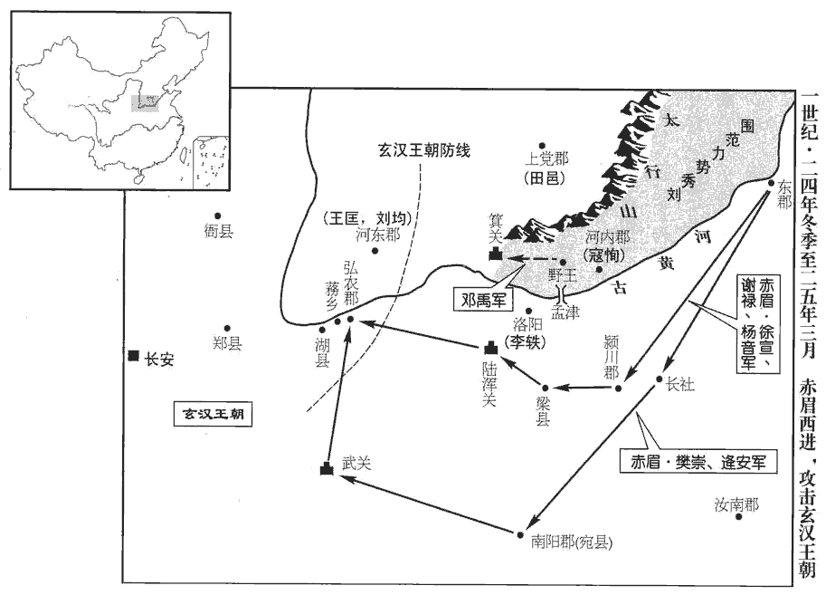 

13蕭王將北徇燕、趙，度赤眉必破長安，度，徒洛翻。又欲乘釁xìn并關中‹陝西中部›而未知所寄，乃拜鄧禹為前將軍，中分麾下精兵二萬人，遣西入關，令自選偏裨以下可與俱者。時朱鮪wěi、李軼、田立、陳僑將兵號三十萬，僑，音喬。與河南‹河南洛陽东白马寺东›太守武勃共守洛陽；鮑永、田邑在并州。蕭王以河內‹河南武陟›險要富實，河內，北有太行之險，南據河津之要。欲擇諸將守河內者而難其人，賢曰：非其人不可，故難之。問於鄧禹。鄧禹曰：「寇恂文武備足，有牧人御眾之才，非此子莫可使也！」乃拜恂河內太守，行大將軍事。考異曰：袁紀：「鄧禹初見王於鄴，即言欲據河內」；至是又云：「更始武陰王李軼據洛陽，尚書謝躬據鄴，各十餘萬眾；王患焉，將取河內以迫之，謂鄧禹曰：『卿言吾之有河內，猶高祖之有關中。關中非蕭何，誰能使一方晏然，高祖無西顧之憂！吳漢之能，卿舉之矣；復為吾舉蕭何。』禹曰：『寇恂才兼文武，有御眾才，非恂莫可安河內也！』」按世祖既貳更始，先得河內、魏郡，因欲守之，以比關中，非本心造謀即欲指取河內也。今依范書為定。蕭王謂恂曰：「昔高祖留蕭何關中‹陝西中部›，吾今委公以河內‹河南武陟›；當給足軍糧，率厲士馬，防遏他兵，勿令北渡而已！」拜馮異為孟津將軍，賢曰：孟，地名，古今以為津；在河內郡河陽縣南門。統魏郡、河內兵於河上，以拒洛陽。蕭王親送鄧禹至野王‹河南沁陽›，禹既西，蕭王乃復引兵而北。寇恂調餱糧，復，扶又翻。調，徒弔翻。餱hóu，音侯，乾食也。治器械以供軍；治，直之翻。軍雖遠征，未嘗乏絕。

〖译文〗 [13]刘秀将要向北夺取燕、赵，估计赤眉军必然攻破长安，所以又打算利用更始朝与赤眉军相争并吞关中，但不知道把任务交给谁好。于是任命邓禹当前将军，分出麾下精兵二万人，派他西入函谷关，并让他自己选择可以同行的偏将裨将及以下幕僚。这时，更始朝将领朱鲔、李轶、田立、陈侨率军号称三十万，与河南郡太守武勃共同守卫洛阳。另外两位将领鲍永、田邑则驻军并州。刘秀因河内郡地势险要，物产丰富而充实，打算在将领中物色一位守河内的人而难于物色到，便向邓禹询问。邓禹说：“寇恂文武全才，有统御众人的能力，除了他再没有合适的人。”刘秀于是任命寇恂当河内郡太守，并代理大将军职务。他对寇恂说：“从前，高祖把关中交给萧何，而今我把河内交给你。应当保证军粮供应，训练兵马，阻挡其他军队，不要让他们北渡黄河。”又任命冯异当孟津将军，在黄河之畔统辖魏郡、河内郡的军队，以抗拒洛阳方面的进攻。刘秀亲自送邓禹到野王。邓禹向西出发以后，刘秀才率军北上。寇恂征集粮食，制造武器，以供应军需。大军虽然远征，物资却从不匮乏。

14隗kuí崔、隗義謀叛歸天水‹甘肅通渭›；隗囂恐并及禍，乃告之。更始誅崔、義，以囂為御史大夫。武帝元鼎三年，置天水郡。秦州記云：郡前湖水，冬夏無增減，因以名焉。

〖译文〗 [14]隗崔、隗义密谋背叛更始朝，返回天水。隗嚣恐怕事情败露而自己被牵连，于是向朝廷检举。刘玄诛杀隗崔、隗义，任命隗嚣当御史大夫。

15梁‹府睢阳，河南商丘›王永據國起兵，招諸郡豪桀；沛‹安徽淮北›人周建等并署為將帥，攻下濟陰‹山東定陶›、山陽‹山東金鄉西北昌邑镇›、沛‹安徽淮北›、楚‹江蘇徐州›、淮陽‹河南淮陽›、汝南‹河南平舆西北射桥乡›，凡得二十八城。將，即亮翻。帥，所類翻。濟，子禮翻。又遣使拜西防賊帥山陽‹山東金鄉西北昌邑镇›佼jiǎo彊為橫行將軍，賢曰：西防，縣名；故城在今宋州單父縣北。佼，音絞，姓也。周大夫原伯佼之後。姓譜曰：春秋絞國，即佼也，後改從「人」；漢有佼彊。杜佑曰：佼，音効。余考兩漢志無西防縣。東海‹山東郯城›賊帥董憲為翼漢大將軍，琅邪‹山東諸城›賊帥張步為輔漢大將軍，督青、徐二州，與之連兵，遂專據東方。

〖译文〗 [15]梁王刘永，凭依他的封国起兵，招揽各郡英雄豪杰。沛人周建等都被任命当将帅，攻陷济阴、山阳、沛、楚、淮阳、汝南等地，共占领二十八城。又派遣使者任命西防贼首领山阳人佼强当横行将军，东海贼首领董宪当翼汉大将军，琅邪贼首领张步当辅汉大将军，监管青州、徐州两州，将军队合并，于是在东方称霸。

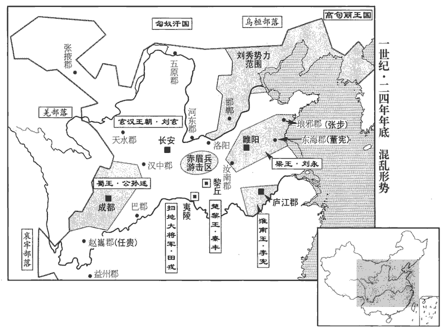 

16邔qǐ‹湖北宜城东北›人秦豐起兵於黎丘‹湖北襄樊东南›，攻得邔、宜城‹湖北宜城北›等十餘縣，有眾萬人，自號楚黎王。按王莽之末，秦豐已起兵矣。通鑑書於上卷地皇二年。邔、宜城二縣，屬南郡。孟康曰：邔，音忌。師古曰：邔，音其。劉昭曰：邔有黎丘城。賢曰：習鑿záo齒襄陽記曰：秦豐，黎丘鄉人。黎丘，楚地，故稱楚黎王。黎丘故城，在今襄州率道縣北。杜佑曰：襄州宜城縣，舊率道也。水經註：黎丘在中廬縣西北，沔水逕其西。

〖译文〗 [16]人秦丰在黎丘起兵，攻陷县、宜城等十余县，有部众一万人，自称楚黎王。

17汝南‹河南平舆西北射桥乡›田戎攻陷夷陵‹湖北宜昌›，賢曰：夷陵，縣名，屬南郡；有夷山，故曰夷陵；今峽州縣；故城在今縣西北。水經註：吳改夷陵為西陵。自稱掃地大將軍；轉寇郡縣，眾數萬人。

〖译文〗 [17]汝南人田戎攻陷夷陵，自称扫地大将军，转战劫掠各郡县，有部众数万人。

