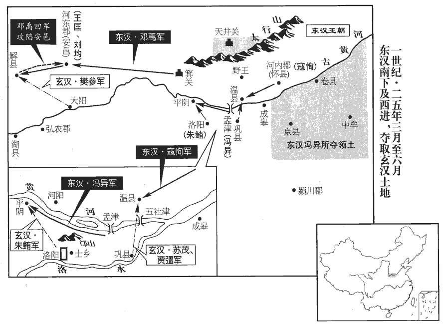
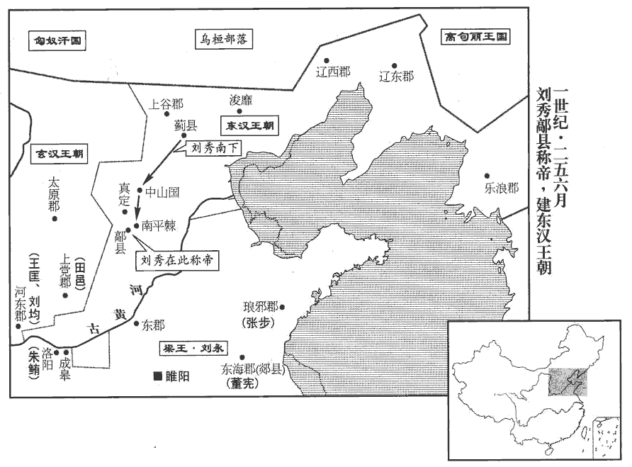
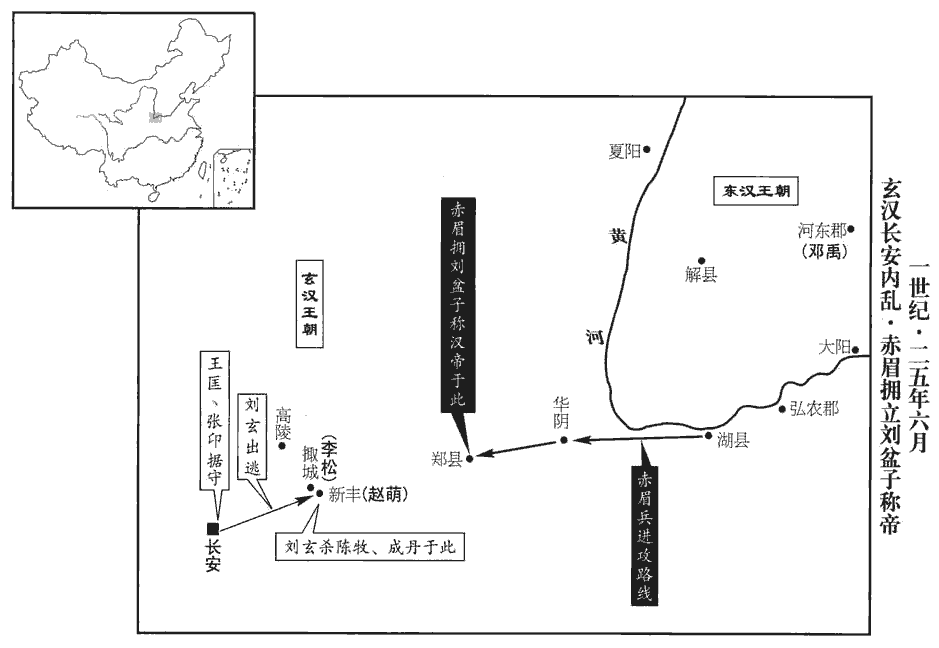
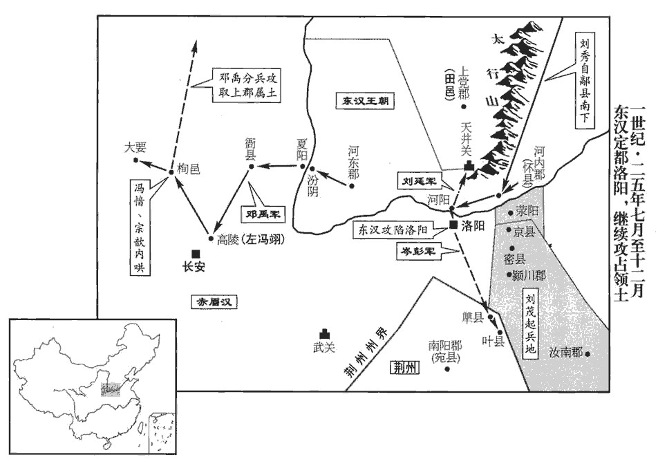
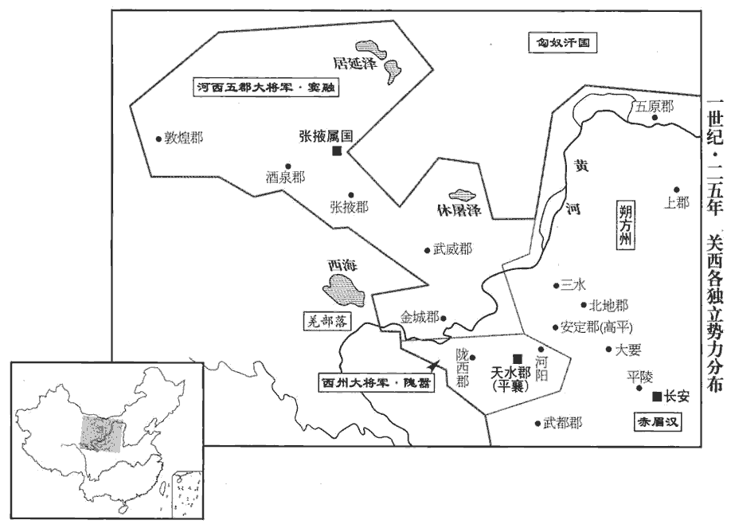
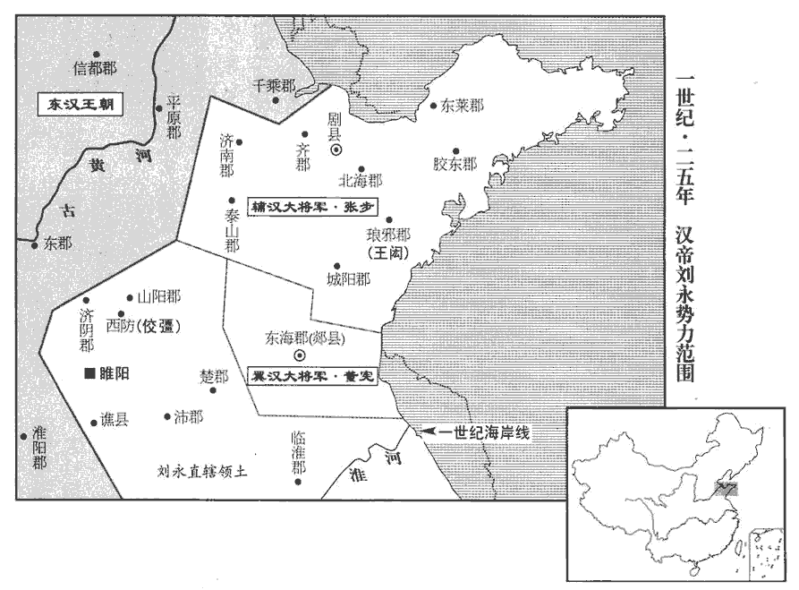
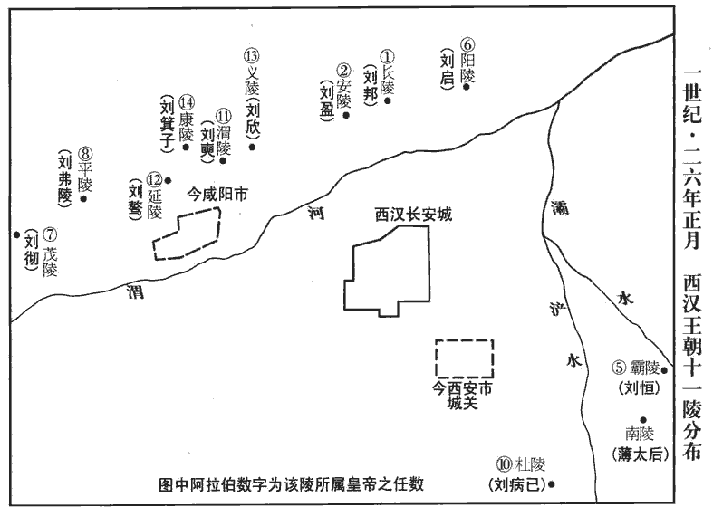
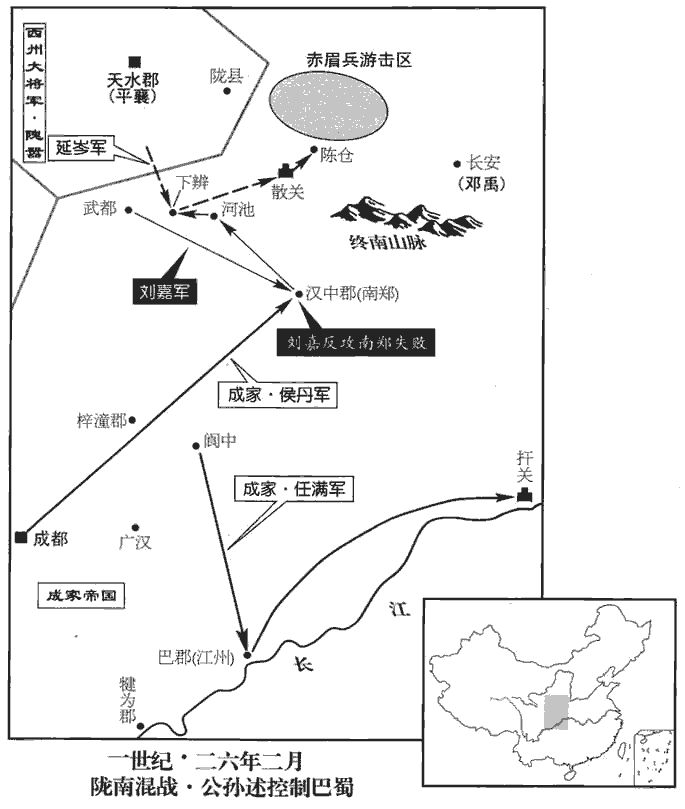
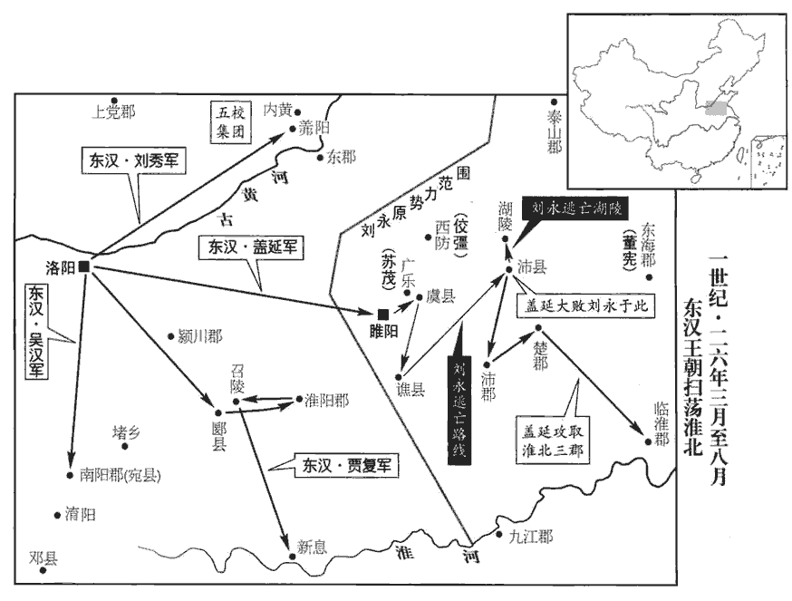
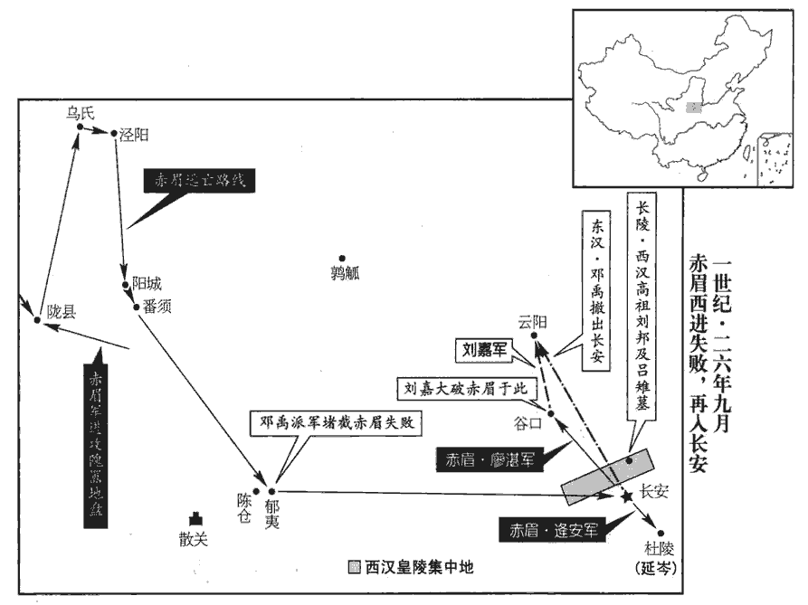

 漢紀三十二起旃zhān蒙作噩（乙酉），盡柔兆閹茂（丙戌），凡二年。

# 世祖光武皇帝上之上諱秀，字文叔。賢曰：禮，祖有功而宗有德。光武中葉興，故廟稱世祖。諡法，能紹前業曰光；克定禍亂曰武。伏侯古今註曰：「秀」之字曰「茂」。伯、仲、叔、季，兄弟之次。長兄伯升，次仲，故字文叔焉。

## 建武元年（乙酉，二五年）是年六月即位改元。

1春，正月，方望與安陵‹陝西咸陽東北安陵乡›人弓林姓譜：弓，魯大夫叔弓之後；又孔子弟子有仲弓，又有馯hàn臂子弓。共立前定安公嬰為天子，聚黨數千人，居臨涇‹甘肅鎮原东南曙光乡›。臨涇縣，屬安定郡。賢曰：今涇州縣。更始遣丞相松等擊破，皆斬之。

〖译文〗 [1]春季，正月，方望和安陵人弓林共同拥立前定安公刘婴当皇帝，聚集党徒数千人，占据临泾。更始皇帝刘玄派遣丞相李松讨伐方望等，将他们全部斩杀。

2鄧禹至箕jī關‹河南济源西›，賢曰：箕關，在今王屋縣東。余據唐王屋縣屬懷州。水經註：箕關故城在垣縣。擊破河東都尉，進圍安邑‹山西夏縣›。縣名，屬河東郡。

〖译文〗 [2]邓禹的军队进抵箕关，打败了河东郡都尉的军队，进军包围了安邑县。

3赤眉二部俱會弘農‹河南靈寶东北›。更始遣討難將軍蘇茂拒之；難，乃旦翻。茂軍大敗。赤眉眾遂大集，乃分萬人為一營，凡三十營。三月，更始遣丞相松與赤眉戰於蓩mǎo鄉‹河南靈寶北›，賢曰：蓩，音莫老翻；字林曰：毒草也；因以為地名。續漢志，弘農有蓩鄉。東觀記曰：崇等入至弘農枯樅山下，與茂戰。崇北至蓩鄉，轉至湖。湖即湖城縣也。以此而言，其地蓋在今虢州湖城縣之間。松等大敗，死者三萬餘人；赤眉遂轉北至湖‹河南靈寶西›。

〖译文〗 [3]赤眉军的两支队伍在弘农会师。更始皇帝刘玄派遣讨难将军苏茂抵挡，苏茂的军队大败。赤眉军于是大为集结，分成一万人为一营，共计三十营。三月，刘玄派遣丞相李松同赤眉军在乡展开大战，李松等大败，死三万余人，于是赤眉军向北推进到湖城。

4蜀郡‹四川成都›功曹李熊說公孫述宜稱天子。說，輸芮翻。夏，四月，述即帝位，號成家，賢曰：以起成都，故號成家。改元龍興；時有龍出其府，因以紀元。李【章：十二行本「李」上有「以」字；乙十一行本同；孔本同；張校同。】熊為大司徒，述弟光為大司馬，恢為大司空。越雟suǐ‹四川西昌›任貴據郡降述。王莽天鳳三年，任貴據越巂。巂，音髓。任，音壬。

〖译文〗 [4]蜀郡功曹李熊劝说蜀王公孙述应当称皇帝。夏季，四月，公孙述在成都即帝位，号称“成家”，改年号为“龙兴”。公孙述任命李熊为大司徒，任命弟弟公孙光为大司马，公孙恢为大司空。越人任贵献郡降附公孙述。

5蕭王北擊尤來、大槍、五幡於元氏‹河北元氏›，地理志，元氏縣屬常山郡。闞駰曰：趙公子元之封邑，故曰元氏。追至北平‹河北滿城›，連破之；賢曰：北平縣，屬中山國，今易州永樂縣也。又戰於順水北，賢曰：水經註云：徐水經北平縣故城北，光武追銅馬、五幡，破之於順水，即徐水之別名也。今在易州。括地志：徐水過北平縣界而東流，又東逕清苑城。乘勝輕進，反為所敗。敗，補邁翻。王自投高岸，突【章：十二行本「突」上有「遇」字；乙十一行本同；孔本同；張校同；退齋校同。】騎王豐下馬授王，騎，奇寄翻；下同。王僅而得免；散兵歸保范陽‹河北定興›。賢曰：縣名，在范水之陽，屬涿郡。范陽故城在今易州易縣東南。軍中不見王，或云已殺，【章：十二行本「殺」作「歿」；乙十一行本同；孔本同。】諸將不知所為，吳漢曰：「卿曹努力！王兄子在南陽‹河南南陽›，何憂無主！」兄子，謂伯升子章及興也。眾恐懼，數日乃定。賊雖戰勝，而憚王威名，夜，遂引去。大軍復進【章：十二行本「進」作「追」；乙十一行本同；張校同。】至安次‹河北廊坊›，連戰，破之。復，扶又翻。賢曰：安次，縣名，屬渤海郡，今幽州縣也；故城在縣東。按我朝霸州文安縣，本漢安次縣地。賊退入漁陽‹北京密云›，所過虜掠。強弩將軍陳俊言於王曰：「賊無輜重，重，直用翻。宜令輕騎出賊前，使百姓各自堅壁以絕其食，可不戰而殄tiǎn也。」王然之，遣俊將輕騎馳出賊前，視人保壁堅完者，敕令固守；放散在野者，因掠取之。賊至，無所得，遂散敗。王謂俊曰：「困此虜者，將軍策也。」

〖译文〗 [5]萧王刘秀率军北进，在元氏攻打尤来、大枪、五幡等几支贼寇军队，一直追到北平，连续打败贼军，又在顺水河的北岸交战。刘秀乘胜率军冒进，反被贼军打败。刘秀自己从悬崖上跳下，骑兵突击队的王丰把战马给了刘秀，刘秀仅得免死。败兵退归范阳据守。军中见不到刘秀，有人说刘秀已经被杀，将领们不知如何是好。吴汉说：“大家努力！大王哥哥的儿子就在南阳，我们何必忧愁没有主君！”大家感到恐慌，几天后才安定下来。贼军虽然战胜了刘秀，但害怕刘秀的威名，于是乘夜撤走。刘秀的军队再次进军，到达安次，接连进攻，打败贼军。贼军撤退进入渔阳郡，所到之处，大肆掳掠。强弩将军陈俊向刘秀进言：“贼寇没有辎重 ，应该派轻骑兵到贼寇的前面，让沿途的百姓各自坚壁清野，以断绝贼寇的粮食。可以不用攻打，贼寇自会消灭。”刘秀赞同，派遣陈俊率轻骑兵飞奔至贼军前面，对那些坚固完整的壁垒，则下令固守；对那些分散在郊野的，则乘机掠取到手。贼寇到达之后，一无所得，于是溃散。刘秀对陈俊说：“使这群贼寇陷入困境，是靠将军您的策略。”

6馮異遺李軼書，為陳禍福，遺，于季翻。為，於偽翻。勸令歸附蕭王；軼知長安已危，而以伯升之死，心不自安，事見上卷更始元年。乃報書曰：「軼本與蕭王首謀造漢，事見三十八卷王莽地皇三年。今軼守洛陽，將軍鎮孟津，俱據機軸，賢曰：機，弩牙也。軸，車軸也。皆在物之要，故取喻焉。千載一會，思成斷金。易曰：二人同心，其義斷金。陸德明曰：斷，丁亂翻；王肅丁管翻。唯深達蕭王，願進愚策以佐國安民。」軼自通書之後，不復與異爭鋒，復，扶又翻。故異得北攻天井關‹山西晉城南›，劉昭志曰：上黨高都縣有天井關。賢曰：在今澤州晉城縣南，今太行山上，關南有天井泉三所。拔上黨‹山西長子›兩城，又南下河南成皋‹河南荥阳西北汜水镇›以東十三縣，降者十餘萬。武勃將萬餘人攻諸畔者，異與戰於士鄉‹河南洛陽東›下，劉昭志：河南雒陽縣有士鄉聚。續漢志曰：士鄉，亭名，屬河南郡。大破，斬勃；軼閉門不救。異見其信效，具以白王。王報異曰：「季文多詐，李軼字季文。人不能得其要領。要，一遙翻。今【張：「今」作「令」。】移其書告守、尉當警備者。」眾皆怪王宣露軼書；朱鮪wěi聞之，鮪，於軌翻。使人刺殺軼，刺，七亦翻。由是城中乖離，多有降者。降，戶江翻。

〖译文〗 [6]冯异给更始将领舞阳王李轶写信，为他陈述利害，劝他归附刘秀。李轶知道长安已危，却因刘之死而心不自安，于是回信给冯异说：“我本来同刘秀最早合谋重建汉王朝。现在我守洛阳，你守孟津，全都据于战略要地。这是千载难逢的良机，你我二人同心，力可断金。请你转达萧王，我甘愿进献愚策，帮助他定国安民。”李轶自从和冯异互通书信之后，便不再同冯异交兵，因此冯异能够向北进攻天井关，攻取上党地区的两个城，又南下，攻取河南成皋以东的十三个县，收受降军十余万人。更始朝将领武勃率领一万余人攻打叛变者，冯异和武勃在士乡交战，大破武勃军，斩武勃。李轶紧闭城门，不予救助。冯异见劝降的书信奏效，一五一十地向刘秀禀报。刘秀回复冯异说：“李轶诡诈多端，一般人不知道他到底是怎么想的，现在把他给你的信转送给应当警备的各郡太守和都尉。”大家全都奇怪刘秀为什么要泄露李轶的书信。更始朝将领朱鲔听说了这件事，派人刺杀了李轶。这样一来，洛阳城中离心离德，有不少人投降。

 

朱鮪聞王北征而河內‹河南武陟›孤，乃遣其將蘇茂、賈彊將兵三萬餘人渡鞏河，攻溫‹河南溫縣西›；鞏縣‹河南鞏縣›屬河南郡，周鞏伯之國也。河水過鞏縣北，謂之鞏河，即五社津也。溫縣，屬河內郡，周大夫蘇子邑。賢曰：鞏、溫，并今洛州縣也。鮪自將數萬人攻平陰‹河南孟津›以綴異。賢曰：平陰，縣名，屬河南郡。杜佑曰：漢平陰縣城在今洛陽縣北五十里。水經註：平陰，即晉之陰地，故陰戎所居；魏文帝改曰河陰。綴，謂連綴也。將，即亮翻。檄書至河內‹河南武陟›，寇恂即勒軍馳出，并移告屬縣，發兵會溫下。軍吏皆諫曰：「今洛陽兵渡河，前後不絕；宜待眾軍畢集，乃可出也。」恂曰：「溫，郡之藩蔽，失溫則郡不可守。」遂馳赴之。旦日，合戰，而馮異遣救及諸縣兵適至，恂令士卒乘城鼓譟，大呼言曰：「劉公兵到！」蘇茂軍聞之，陳動；呼，火故翻。陳，讀曰陣。恂因奔擊，大破之。馮異亦渡河擊朱鮪，鮪走；異與恂追至洛陽，環城一帀zā而歸。環，音宦。帀，作答翻，周回也。自是洛陽震恐，城門晝閉。

〖译文〗 朱鲔得知刘秀大军北征而河内势孤力单，于是派遣部将苏茂、贾强领兵三万余人渡过巩河，进攻温县。朱鲔亲自领兵数万人进攻平阴，以牵制冯异的军队。文书传到河内，寇恂马上集结军队急速出发，并传令下属各县发兵到温县城下会师。军吏们全都劝阻说：“眼下洛阳大军渡过巩河，前后不绝；我们应该等到各县军队全都聚集，才能够出战。”寇恂说：“温县是本郡的屏障，如果温县陷落，那么郡城就守不住。”于是率军驱驰迎敌。第二天，寇恂和敌军交战，而此时冯异派出的救兵和各县的军队恰好赶到。寇恂命士兵在城上呐喊，大声呼叫：“刘公大军来了！”苏茂的部众听到后，阵列骚动。寇恂乘势冲击，大破敌军。冯异也率军渡过巩河袭击朱鲔的军队，朱鲔逃走。冯异和寇恂追到洛阳，绕城一周而还。从此洛阳全城震恐，白天也紧闭城门。

異、恂移檄上狀，諸將入賀，因上尊號。上，時掌翻；下同。將軍南陽‹河南南陽›馬武先進曰：「大王雖執謙退，柰宗廟社稷何！宜先即尊位，乃議征伐。今此誰賊而馳騖擊之乎？」賢曰：誰，謂未有主也。前書音義曰：直馳曰馳，亂馳曰騖。余謂「誰賊」者，蓋謂位號未正，指誰為賊也。王驚曰：「何將軍出此言？可斬也！」乃引軍還薊‹北京›。復遣吳漢率耿弇yǎn、景丹等十三將軍追尤來等，復，扶又翻；下除賈復外皆同。斬首萬三千餘級，遂窮追至浚靡‹河北遵化西北›而還。賢曰：浚靡，縣名，屬右北平郡；故城在今漁陽縣北。靡，音麻。賊散入遼西‹辽宁义县›、遼東‹遼寧遼陽›，為烏桓‹内蒙西辽河上游›、貊‹朝鲜半岛东北部›人所鈔擊略盡。貊，莫白翻。鈔，楚交翻。

〖译文〗 冯异、寇恂发送文书呈报战果，将领们进帐祝贺，乘机请刘秀称帝。将军南阳人马武首先说：“大王您虽然谦恭退让，但国家宗庙社稷托付给谁？您应先即帝位，然后再讨论征讨的事。像现在名号未正，东闯西杀，到底谁是贼呢？”刘秀很吃惊，说：“将军怎么说出这种话？够杀头的罪了！”于是率军返回蓟县，又派吴汉率领耿、景丹等十三位将军追击尤来等贼军，斩首一万三千余人，紧接着穷追到浚靡县才返回。贼军散入辽西、辽东，被乌 桓、貊人抢掠击杀，几乎死尽。

都護將軍賈復漢宣帝置西域都護，盡護南、北道諸國。甘延壽之擊郅支也，自謂為都護將軍；漢朝未以為將軍號也，至光武，乃以命賈復。與五校戰於真定‹河北正定›，復傷創甚；校，戶教翻。創，初良翻。王大驚曰：「我所以不令賈復別將者，將，即亮翻。為其輕敵也。為，於偽翻。果然，失吾名將！聞其婦有孕，生女邪，我子娶之；生男邪，我女嫁之；不令其憂妻子也。」復病尋愈，追及王於薊‹北京›，相見甚驩huān。薊，音計。

〖译文〗 都护将军贾复同五校的贼军在真定交战，贾复身负重伤。刘秀大惊，说：“我所以不让贾复率军独当一面，是因为他轻敌。果然如此，我丧失了一员名将！听说他妻子怀有身孕，如果生下女孩儿，将来我的儿子娶她为妻；如果生男孩儿，将来我的女儿嫁给他。不要让他为妻子儿女担忧。”贾复的伤势不久痊愈，在蓟县追上刘秀，两人见面非常高兴。

還至中山‹河北定州›，諸將復上尊號；王又不聽。行到南平棘‹河北趙縣南›，賢曰：縣名，屬常山郡，今趙州縣；故城在縣南。諸將復固請之；王不許。諸將且出，耿純進曰：「天下士大夫，捐親戚，棄土壤，從大王於矢石之間者，其計固望攀龍鱗，附鳳翼，以成其所志耳。今大王留時逆眾，不正號位，純恐士大夫望絕計窮，則有去歸之思，無為久自苦也。大眾一散，難可復合。」純言甚誠切，王深感曰：「吾將思之」

〖译文〗 刘秀回到中山县，将领们再次请求他称帝，他再次拒绝。大军走到南平棘，将领们再次坚决恳请，他仍然不答应。将领们将要退出，耿纯进谏说：“天下的士大夫舍弃亲属，背井离乡，在弹雨之中跟随大王，他们一心向往的，本是攀龙附凤，以成就志向。现在您拖延时间，违背众意，不确定尊号，我恐怕士大夫会失去希望，无计可施，从而产生退归故里的想法，不会长期忍耐下去。众人一散，就很难再聚合到一处了。”耿纯的话非常诚恳殷切，刘秀十分感谢，说：“我将予以考虑。”

行至鄗hào‹河北柏鄉北›，續漢志：鄗縣，屬常山國，帝於此即位，改曰高邑。鄗，呼各翻。召馮異【章：十二行本「異」下有「詣鄗」二字；乙十一行本同；孔本同；張校同。】問四方動靜。異曰：「更始必敗，宗廟之憂在於大王，宜從眾議！」會儒生彊華自關中‹陝西中部›奉赤伏符來詣王曰：「劉秀發兵捕不道，四夷雲集龍闘野，四七之際火為主。」賢曰：彊，音其兩翻；姓譜：其良翻。風俗通作「疆華」，系之曰：晉有大夫疆劍。四七，二十八也。自高祖至光武初起，合二百二十八年，即四七之際也。漢火德，故火為主也。群臣因復奏請。六月，己未‹二十›，王‹刘秀，时年三十›即皇帝位於鄗南；時設壇於鄗南千秋亭五城陌。賢曰：其地在今趙州柏鄉縣。考異曰：光武本紀，馮異破蘇茂，諸將上尊號，光武還至薊，皆在四月前。而馮異傳，異與李軼書云：「長安壞亂，赤眉臨郊，王侯構難，大臣乖離，綱紀已絕。」又勸光武稱尊號，亦曰：「三王反叛，更始敗亡。」按是年六月己未，光武即位，是月甲子，鄧禹破王匡等於安邑，王匡、張卬等還奔長安，乃謀以立秋貙chū膢lóu時，共劫更始，然則三王反叛，應在光武即位之後，夏秋之交，馮異安得於四月之前已言之也！或者史家潤色其言，致此差互耳！改元，大赦。

〖译文〗 刘秀的军队走到县，刘秀召见冯异打听各方军情。冯异说：“更始必败，忧虑宗庙的大任在您身上，您应当听从大家的建议。”这时，恰好儒生强华从关中拿着《赤伏符》来晋见刘秀，符上说：“刘秀发兵惩奸贼，四方云集龙斗野，四七二八汉当立。”群臣因此再次奏请。六月，己未（二十二日），刘秀在县之南即皇帝位，改年号，大赦天下。

 

7鄧禹圍安邑‹山西夏縣›，數月未下，更始大將軍樊參將數萬人渡大陽‹山西平陸›，賢曰：大陽縣，屬河東郡。前書音義曰：大河之陽。春秋秦伯伐晉，自茅津濟。杜預曰：河東大陽縣也。欲攻禹；禹逆擊於解‹山西临猗西南›南，斬之。賢曰：解縣，屬河東郡；故城在今蒲州桑泉縣東南也。師古曰：解，音蟹。王匡、成丹、劉均合軍十餘萬，復共擊禹，禹軍不利。明日，癸亥‹二十四›，匡等以六甲窮日，不出，禹因得更治兵。治，直之翻。甲子‹二十五›，匡悉軍出攻禹；禹令軍中毋得妄動，既至營下，因傳發諸將，孟康曰：傳令軍中使發也。鼓而并進，大破之。匡等皆走，禹追斬均及河東‹山西夏縣›太守楊寶，遂定河東，匡等奔還長安‹西安›。考異曰：劉玄傳：「王匡、張卬守河東，為鄧禹所破，奔還長安。」鄧禹傳無張卬名。今從之。

〖译文〗 [7]邓禹率军包围安邑，经过几个月也未能攻下。更始大将军樊参率领数万人从大阳渡河，准备攻打邓禹。邓禹在解县南迎击，斩杀樊参。王匡、成丹、刘均纠集十余万军队，再次一起攻打邓禹，邓禹军交战失利。第二天，癸亥（二十六日），王匡等因为当天是六十甲子记日的最后一天，所以闭门不出。而邓禹因此得以整顿部署军队。甲子（二十七日），王匡等全军出击攻打邓禹，邓禹下令军队不得轻举妄动，等到王匡军逼进营垒后，才传令各将领，击鼓并进，大破敌军。王匡等全都逃跑，邓禹追击，斩杀了刘均以及河东太守杨宝，于是平定河东。王匡等逃回长安。

 

張卬與諸將議曰：「赤眉旦暮且至，見滅不久，不如掠長安，東歸南陽‹河南南陽›；事若不集，復入湖池中為盜耳！」乃共入，說更始；說，輸芮翻。更始怒不應，莫敢復言。復，扶又翻。更始使王匡、陳牧、成丹、趙萌屯新豐‹陝西臨潼东北›，李松軍掫zōu‹陝西臨潼北›，以拒赤眉。賢曰：掫，音子侯翻。續漢志新豐有鴻門亭，掫城即此也。張卬、廖湛、胡殷、申屠建與隗囂合謀，欲以立秋日貙chū膢lóu時賢曰：前書音義曰：貙，獸，以立秋日祭獸，王者亦此日出獵，用祭宗廟。冀州北郡以八月朝作飲食為膢，其俗語曰膢、臘、社、伏。風俗通：嘗新始殺食曰貙膢。漢儀：立秋日，郊禮畢，始揚威武，乃祠先虞，告以烹鮮。天子御戎輅lù，白馬朱鬣liè，躬執弩射牲，牲以鹿、麛mí，斬牲於郊東門，載獲，車馳駟，以薦陵廟，名貙劉。劉，殺也。貙，於時殺物，故以應之，又謂之貙膢。廖，力弔翻。貙，去於翻。膢，音婁。共劫更始，俱成前計。考異曰：袁紀云：「申屠建等勸更始讓帝位，更始不應；建等謀劫之。」今從范書。更始知之，託病不出，召張卬等入，將悉誅之；唯隗囂稱疾不入，會客王遵、周宗等勒兵自守。更始狐疑不決，卬、湛、殷疑有變，遂突出；獨申屠建在，更始斬建，使執金吾鄧曄將兵圍隗囂第。卬、湛、殷勒兵燒門，入戰宮中，更始大敗；囂亦潰圍，走歸天水‹甘肅通渭›。明旦，更始東奔趙萌於新豐‹陝西臨潼东北›。更始復疑王匡、陳牧、成丹與張卬等同謀，乃并召入；牧、丹先至，即斬之。王匡懼，將兵入長安，與張卬等合。

〖译文〗 张同将领们商议：“赤眉军早晚就会到达，我们不久就会被消灭。不如抢掠了长安，向东逃回南阳。事情如果办不成，我们再到江湖中，重新做强盗！”于是一同晋见，说服刘玄。刘玄愤怒而不发一言，没有人敢再说话。刘玄命王匡、陈牧、成丹、赵萌驻屯新丰，命宰相李松屯兵城，以抗拒赤眉军。张、廖湛、胡殷、申屠建与隗嚣合谋，准备借立秋这一天杀牲祭宗庙的时候，共同劫持刘玄，实现先前的计划。刘玄得知后，称病不出门。他召张等进宫，准备全都斩首。当时只有隗嚣自称有病没有进宫，召集他的宾客王遵、周宗等率军士自守。刘玄犹疑不决。张、廖湛、胡殷怀疑有变化，于是冲出宫去。只有申屠建还留在宫中，刘玄斩杀了申屠建，命执金吾邓晔领兵包围隗嚣的宅第。张、廖湛、胡殷率兵烧毁宫门，杀入宫中，刘玄大败。隗嚣也突破包围，逃回天水。第二天早晨，刘玄出皇宫向东投奔在新丰屯兵的赵萌。刘玄又怀疑王匡、陈牧、成丹和张等是同谋，于是一块儿召见他们。陈牧、成丹先到，立刻被斩首。王匡恐惧，率军进入长安，与张等人会合。

8赤眉進至華陰‹陝西華陰›，華，戶化翻。軍中有齊巫，齊巫，齊國之巫。常鼓舞祠城陽景王，城陽景王章有誅諸呂之功，故齊人祠之以求福助。巫狂言：「景王大怒曰：『當為縣官，何故為賊！』」賢曰：縣官，謂天子也。有笑巫者輒病，軍中驚動。方望弟陽說樊崇等曰：「今將軍擁百萬之眾，西向帝城，而無稱號，說，輸芮翻。稱，尺證翻。名為群賊，不可以久；不如立宗室，挾義誅伐，以此號令，誰敢不從！」崇等以為然，而巫言益甚。前至鄭‹陝西華縣›，鄭縣，屬京兆。賢曰：今華州縣。乃相與議曰：「今迫近長安，而鬼神若此，當求劉氏共尊立之。」

〖译文〗 [8]赤眉军进抵华阴，随军有一位齐地的巫师，常常击鼓舞蹈，祭祀城阳景王刘章。巫师口出狂言：“景王大怒说：‘应当做天子，为什么当盗贼！’”凡是嘲笑巫师的人，都患了病，为此全军震惊。方望的弟弟方阳劝说樊崇等人：“现在将军拥有百万大军，向西面对帝王都城，却没有称号，被人称作盗贼，不可能长期维持下去。不如拥立一位刘氏宗室，挟天子的名义诛杀讨伐，以此号令天下，谁敢不服从！”樊崇等认为说得很对，而巫师的狂言也越来越厉害。向前进军抵达郑县，于是共同商议说：“现在已经逼近长安，而鬼神的旨意是这样，应该寻求一位刘氏宗室，共同尊他为皇帝。”

先是，赤眉過式‹山東兖州›，地理志，式縣，屬泰山郡。近，其靳翻。先，悉薦翻。掠故式侯萌之子恭、茂、盆子三人自隨。萌之父曰憲，城陽景王五世孫，荒王順之子，元帝時封式侯。恭少習尚書，少，詩照翻。隨樊崇等降更始於洛陽，樊崇等降，見上卷更始元年。降，戶江翻。復封式侯，為侍中，在長安。茂與盆子留軍中，屬右校卒史劉俠卿，主牧牛。漢註：卒史，秩百石，九鄉寺及諸郡及軍行部校皆有之。校，戶教翻。俠，戶頰翻。及崇等欲立帝，求軍中景王後，得七十餘人，唯茂、盆子及前西安侯孝最為近屬。崇等曰：「聞古者天子將兵稱上將軍，」乃書劄為符曰「上將軍」，又以兩空劄置笥中，賢曰：劄，簡也。笥，篋qiè也。於鄭北設壇場，祠城陽景王，諸三老、從事皆大會；赤眉諸帥最尊者號三老，次從事。列盆子等三人居中立，以年次探劄，盆子最幼，後探，得符；探，吐南翻。諸將皆稱臣，拜。盆子時年十五，被髮徒跣，敝衣赭汗，見眾拜，恐畏欲啼。被，皮義翻。茂謂曰：「善臧符！」臧，讀曰藏。盆子即齧折，棄之。折，而設翻。以徐宣為丞相，樊崇為御史大夫，逢安為左大司馬，逢，皮江翻。謝祿為右大司馬，其餘皆列卿、將軍。盆子雖立，猶朝夕拜劉俠卿，時欲出從牧兒戲；俠卿怒止之，崇等亦不復候視也。復，扶又翻。

〖译文〗 早先，赤眉军经过式县，劫持故式侯刘萌的儿子刘恭、刘茂、刘盆子，让三人随军。刘恭幼时学习《尚书》，后来跟从樊崇等在洛阳投降更始皇帝刘玄，重新封为式侯，担任侍中，后到长安。刘茂和刘盆子留在军中，归右校卒史刘侠卿管辖，负责放牛。等到樊崇等想要拥立皇帝时，在军中寻找景王刘章的后代，找到七十余人，其中只有刘茂、刘盆子以及前西安侯刘孝血统最为亲近。樊崇等人说：“听说古时候，天子亲自领兵，称为上将军。”于是用一片木简做符，上写“上将军”三个字，又把两片未写字的木简也放在竹筒中。在郑县北面修筑坛场，祭祀城阳景王刘章，各位三老、从事全都聚会于此。请刘盆子等三人居台中排列站立，按照长幼顺序抽签。刘盆子年纪最小，最后抽，抽中了符。将领们全都向刘盆子称臣叩拜。刘盆子当时十五岁，披散着头发，光着双脚，穿着破衣服，紫涨着脸，浑身冒汗。他看见众将跪拜，惊恐得要哭出来。刘茂对他说：“把你的符藏好！”刘盆子却立即把木简放到口中咬断，扔掉。他任命徐宣为丞相，樊崇为御史大夫，逢安为左大司马，谢禄为右大司马，其余的全被任命为卿、将军。刘盆子虽被立为皇帝，但每天早晚还要叩拜刘侠卿。他时常想到外面去和牧童们嬉戏，刘侠卿愤怒地制止他。樊崇等人也不再来问候探视。

9秋，七月，辛未‹一›，帝使使持節拜鄧禹為大司徒，封酇zàn侯、食邑萬戶；賢曰：酇縣，屬南陽郡，故城在今襄州穀城縣東北。余謂蓋以禹功比蕭何，故封之酇。酇，音贊。禹時年二十四。又議選大司空，帝以赤伏符曰「王梁主衛作玄武」，丁丑‹七›，以野王‹河南沁陽›令王梁為大司空。帝以野王衛之所徙，玄武水神之名，司空水土之官也，於是用梁。賢曰：玄武，北方之神，龜蛇合體。野王縣，屬河內郡。宋白曰：懷州河內縣，古野王也。又欲以讖文用平狄將軍孫咸行大司馬，眾咸不悅。讖，楚譖翻。壬午‹十二›，以吳漢為大司馬。

〖译文〗 [9]秋季，七月辛未（初五），汉光武帝刘秀派使者持符节任命邓禹当大司徒，封为侯，食邑一万户。当时邓禹二十四岁。又商议选任大司空，刘秀凭《赤伏符》上说的“王梁主卫作玄武”，丁丑（十一日），任命野王县令王梁为大司空。刘秀又打算按照谶文中的话任命平狄将军孙咸代理大司马，对此大家都不高兴。壬午（十六日），任命吴汉为大司马。

初，更始以琅邪‹山東諸城›伏湛為平原‹山東平原›太守；姓譜：伏本自伏羲之後，漢初有濟南伏生。守，式又翻。時天下兵起，湛獨晏然，撫循百姓。門下督謀為湛起兵、湛收斬之；諸郡各有門下督，主兵衛。為，於偽翻。於是吏民信向，平原一境賴湛以全。帝徵湛為尚書，使典定舊制。又以鄧禹西征，拜湛為司直，行大司徒事；東都之司徒，西都之丞相也；司直，即丞相司直。車駕每出征伐，常留鎮守。

〖译文〗 起初，刘玄以琅邪人伏湛为平原郡太守。当时各地起兵，只有伏湛安抚百姓，安然不动。门下督为伏湛策划起兵的事，伏湛将他逮捕处斩。因此官民信赖向往伏湛，整个平原境内仗着伏湛而保全下来。刘秀征召伏湛当尚书，让他负责整理旧有的典章制度。又因邓禹率军西征，任命伏湛当司直，代理大司徒职务。刘秀每次外出亲征，往往留伏湛镇守。

10鄧禹自汾陰‹山西万荣西南榮河镇›渡河，入夏陽‹陝西韓城›，汾陰縣，屬河東。夏陽縣，屬馮翊。更始左輔都尉公乘歙xī引其眾十萬與左馮翊兵共拒禹於衙‹陝西白水東北六十里›；地理志，左輔都尉治高陵。賢曰：左輔，即左馮翊也。三輔皆有都尉。衙，縣名，屬左馮翊，故城在今同州白水縣東北。左傳：秦、晉戰於彭衙，即此地。公乘，姓也，以秦爵為氏。乘，繩證翻。歙，許及翻。禹復破走之。復，扶又翻。

〖译文〗 [10]邓禹从汾阴渡过黄河，进入夏阳。更始朝左辅都尉公乘歙率领部众十万人和左冯翊的军队在衙县共同抗拒邓禹。邓禹再次打败敌人，公乘歙等逃走。

宗室劉茂聚眾京‹河南滎陽南›、密‹河南密縣›間，茂，元氏王歙從父弟也。賢曰：京縣，屬河南郡，鄭之京邑；故城在今鄭州滎陽縣東南。密縣，屬河南郡；故城在今密縣東南。自稱厭新將軍，厭，一葉翻。厭，伏也。新，謂新室也。攻下潁川‹河南禹州›、汝南‹河南平舆西北射桥乡›，眾十餘萬人。帝使驃騎大將軍景丹、建威大將軍耿弇yǎn、強弩將軍陳俊攻之；茂來降，降，戶江翻。封為中山王‹府卢奴，河北定州›。

〖译文〗 刘氏宗室刘茂在京县和密县聚集兵众，自称厌新将军，攻下颖川、汝南，部众达十余万人。刘秀派骠骑大将军景丹、建威大将军耿、强弩将军陈俊攻打刘茂。刘茂前来投降，刘秀封他为中山王。

11己亥‹二十九›，帝幸懷‹河南武陟›，懷故城在武陟縣西南十餘里。賢曰：縣名，屬河內郡；故城在懷州武陟縣西。余據河內郡治懷，在雒陽北百四十里。遣耿弇、陳俊軍五社津‹河南鞏縣西北黄河渡口›，即鞏河也。水經註：河水東過鞏縣北，於此有五社渡，為五社津。杜佑曰：一名五渡津。備滎陽‹河南滎陽›以東；使吳漢率建議【章：十二行本「議」作「義」；乙十一行本同；孔本同。】大將軍朱祜hù等十一將軍圍朱鮪wěi於洛陽。八月，進幸河陽‹河南孟縣›。地理志，河陽縣屬河內郡。

〖译文〗 [11]己亥（二十九日），刘秀来到怀县，派遣耿、陈俊在五社津屯驻，防备荥阳以东的变化。命吴汉率领建议大将军朱祜等十一位将军包围朱鲔镇守的洛阳。八月，刘秀前往河阳。

12李松自掫zōu‹陝西臨潼北›引兵還，從更始與趙萌共攻王匡、張卬於長安，連戰月余，匡等敗走，更始徙居長信宮。三輔黃圖曰：從洛門至周廟門，有長信宮在其中。

〖译文〗 [12]更始朝宰相李松从城领兵返回，跟从刘玄与赵萌一同进攻王匡、张，战于长安。一连打了一个多月，王匡等败逃，刘玄迁居到长信宫。

赤眉至高陵‹陝西高陵›，地理志，高陵縣屬馮翊。王匡、張卬等迎降之，遂共連兵進攻東都門。李松出戰，赤眉生得松；松弟況為城門校尉，開門納之。九月，赤眉入長安；更始單騎走，從廚城門出。三輔黃圖曰：洛城門，王莽改曰建子門；其內有長安廚官，俗名之為廚城門，今長安故城北面之中門是也。騎，奇寄翻。式侯恭以赤眉立其弟，自繫詔獄；聞更始敗走，乃出，見定陶王祉，祉為之除械，為，於偽翻。相與從更始於渭濱。右輔都尉嚴本，恐失更始為赤眉所誅，即將更始至高陵‹陝西高陵›，將，如字；領也，攜也，挾也。本將兵宿衛，其實圍之。右輔都尉治郿。高陵，左輔都尉治所也。右，恐當作左。更始將相皆降赤眉，獨丞相曹竟不降，手劍格死。手，守又翻。

〖译文〗 赤眉军到达高陵，王匡、张等迎接并投降赤眉，于是共同连兵攻打长安东都门。李松出战，赤眉军生擒李松。李松的弟弟李况担任城门校尉，他打开城门把赤眉军放了进来。九月，赤眉军进入长安，刘玄一个人骑马从厨城门逃出长安。刘玄所封的式侯刘恭因为赤眉军拥立他的弟弟刘盆子做皇帝，就自己绑缚起来，囚禁诏狱。听说刘玄兵败逃跑，才出狱，去见定陶王刘祉。刘祉替他除去身上的刑具，一起到渭水河畔跟随刘玄。右辅都尉严本害怕刘玄被赤眉军所杀，就挟持刘玄到高陵，严本亲自率兵守卫，实际是把刘玄包围起来。刘玄的文武官员全都投降了赤眉军，只有丞相曹竟不降，手持宝剑格斗而杀。

13辛未‹六›，詔封更始為淮陽王；吏民敢有賊害者，罪同大逆；其送詣吏者封列侯。

〖译文〗 [13]辛未（初六），刘秀下诏封刘玄为淮阳王。诏书说，无论官吏或百姓敢有杀害刘玄的，罪与大逆相同；有把刘玄送到官府的，封为侯爵。

14初，宛‹河南南陽›人卓茂，卓，姓也。史記貨殖傳有蜀卓氏。宛，於元翻。寬仁恭愛，恬蕩樂道，恬，安恬。蕩，坦蕩蕩也。樂，音洛。雅實不為華貌，行己在於清濁之間，自束髮至白首，未嘗與人有爭競，鄉黨故舊，雖行能與茂不同，行，下孟翻。而皆愛慕欣欣焉。哀、平間為密‹河南密縣›令，宋白續通典曰：密縣，古鄶kuài國、密國之地。左傳：諸侯伐鄭，圍新密。漢為縣，屬河南郡。今縣東南三十里有故密城，即漢理所。視民如子，舉善而教，口無惡言，吏民親愛，不忍欺之。民嘗有言部亭長受其米肉遺者，賢曰：部，謂所部也。遺，于季翻；下同。茂曰：「亭長為從汝求乎，為汝有事囑之而受乎，囑，之欲翻；託也，私請也。將平居自以恩意遺之乎？」民曰：「往遺之耳。」茂曰：「遺之而受，何故言邪？」民曰：「竊聞賢明之君，使民不畏吏，吏不取民。今我畏吏，是以遺之；吏既卒受，卒，終也；音子恤翻。故來言耳。」茂曰：「汝為敝民矣！凡人所以群居不亂，異於禽獸者，以有仁愛禮義，知相敬事也。汝獨不欲脩之，寧能高飛遠走，不在人間邪！吏顧不當乘威力強請求耳。亭長素善吏，歲時遺之，禮也。」民曰：「苟如此，律何故禁之？」茂笑曰：「律設大法，禮順人情。今我以禮教汝，汝必無怨惡；以律治汝，汝何所措其手足乎！治，直之翻；下同。一門之內，小者可論，大者可殺也。且歸念之！」初，茂到縣，有所廢置，吏民笑之，鄰城聞者皆蚩其不能。蚩，笑也。河南郡‹河南洛陽东白马寺东›為置守令；茂不為嫌，治事自若。茂正為令，郡復置守令使與茂并居。郡為，於偽翻。數年，教化大行，道不拾遺；遷京部丞，王莽秉政，置大司農部丞十三人，勸課農桑。京部丞，主司隸所部。密人老少皆涕泣隨送。及王莽居攝，以病免歸。上即位，先訪求茂，茂時年七十餘。甲申‹十九›，詔曰：「夫名冠天下，冠，古玩翻。當受天下重賞。今以茂為太傅，東都之制，太傅位上公，絕席，在三公之右。封褒德侯。」

〖译文〗 [14]起初，宛城人卓茂宽厚仁义而谦恭爱人，性情恬淡坦荡而乐守圣贤之道，朴实无华而不修饰，行动在清浊之间而不偏激。从少年到白发的老年，从未跟人争执过，家乡的亲朋故友虽然品行才干与卓茂不同，却全都很爱慕他。卓茂在西汉哀帝、平帝时当密县县令，把老百姓看做自己的儿女，推行仁政教化百姓，口无恶言，官民亲近热爱他，不忍心欺骗他。曾经有一个人上告说，卓茂属下的亭长接受了他所送的米和肉。卓茂说：“是亭长跟你要的吗，还是你有事托他而送给他，还是平时自有恩惠情义而送给他的呢？”那个人说：“是我自己送给他的。”卓茂说：“是你自己送去他接受的，为什么还要上告呢？”那个人说：“我听说贤明的君主让老百性不惧怕官吏，官吏也不向老百姓索取东西。而现在我畏惧官吏，所以送东西给他。而他最终接受了，所以我来报告。”卓茂说：“你是个坏百姓！人所以聚集在一起有秩序地生活而不同于禽兽的原因，就在于人有仁爱礼义，懂得互相尊重。而你偏偏想不在乎这些，难道你能够远走高飞，脱离人间吗？官吏固然不应当凭权力强求索取。亭长向来是一位善良的官吏，每年按时送他一点东西，是符合礼的。”那个人说：“如果这样，法律为什么禁止呢？”卓茂笑着说：“法律设立行为的规范，礼则顺应人之常情。现在我用礼教诲你，你一定没有怨恨恶感；如果我用法律惩罚你，你将有什么举动呢？同一个门内，罪过小的可以论罪，罪过大的可以杀头。你且回去想想吧！”当初，卓茂到密县上任后，有废除的事项，也有新设立的措施。官民嘲笑他，邻城的人听说以后都叽笑他没有才干。河南郡为他设置了一位县令。卓茂并没有感到厌恶不满，照常办公。几年以后，他所推行的教化形成风气，以致路不拾遗。后卓茂升迁当京部丞，密县的老少全流着眼泪，一路跟随着为他送行。等到王莽摄政，卓茂因病辞官，回归故里。刘秀称帝后，首先寻访卓茂的下落。卓茂当时已七十余岁。九月甲申（十九日），刘秀下诏书：“名誉满天下，应当受最重的奖赏。现任命卓茂当太傅，封为褒德侯。”

臣光曰：孔子稱「舉善而教不能則勸。」論語孔子答季康子之言。是以舜舉皋gāo陶yáo，湯舉伊尹，而不仁者遠，論語子夏答樊遲之言。陶，音遙。有德故也。光武即位之初，群雄競逐，四海鼎沸，彼摧堅陷敵之人，權略詭辯之士，方見重於世，而獨能取忠厚之臣，旌循良之吏，拔於草萊之中，寘zhì諸群公之首，宜其光復舊物，享祚久長，蓋由知所先務而得其本原故也。

〖译文〗 臣司马光曰：孔子说：“推举善行，教育能力弱的人，人们就能互相劝勉。”所以，虞舜推荐皋陶，商汤推荐伊尹，邪恶不仁的人远去，是因为这两人品德高尚的缘故。光武帝刚刚即位，群雄竞逐，四海之内像滚水般沸腾。那些冲锋陷阵的人，有权谋而善辩的人，正为世人所敬重。而唯独光武帝能起用忠厚之臣，表彰奉公守法的官吏，从社会最底层选拔人才，安排在公卿首位。他所以能光复汉室，长治久安，是由于他知道首先必须做什么才能达到根本目的的缘故。

15諸將圍洛陽數月，朱鮪wěi堅守不下。帝以廷尉岑彭嘗為鮪校尉，朱鮪為大司馬，以彭為校尉；後從邑人韓歆於河內，遂歸光武。校，戶教翻。令往說之。說，輸芮翻。鮪在城上；彭在城下，為陳成敗。為，於偽翻。鮪曰：「大司徒被害時，鮪與其謀，又諫更始無遣蕭王北伐，事并見上卷更始元年。與，讀曰預。誠自知罪深，不敢降！」彭還，具言於帝。還，從宣翻，又如字。帝曰：「舉大事者不忌小怨。鮪今若降，官爵可保，況誅罰乎！河水在此，吾不食言！」賢曰：指河以為信，言其明白也。索隱曰：左傳曰：食言多矣，能無肥乎！是謂食言為妄言。彭復往告鮪，鮪從城上下索復，扶又翻。下，遐稼翻。索，昔各翻。曰：「必信，可乘此上。」上，時掌翻；下同。彭趣索欲上，賢曰：趣，向也，春遇翻。鮪見其誠，即許降。辛卯‹二十六›，朱鮪面縛，與岑彭俱詣河陽‹河南孟縣西›。帝解其縛，召見之，復令彭夜送鮪歸城。明旦，與蘇茂等悉其眾出降。拜鮪為平狄將軍，封扶溝侯；地理志，扶溝縣，屬淮陽郡。陳留風俗傳：小扶亭有洧wěi水之溝，因以名縣。後為少府，傳封累世。

〖译文〗 [15]刘秀的将领们包围洛阳达几个月，因朱鲔坚守而未能攻下。刘秀因为廷尉岑彭曾经当过朱鲔的校尉，所以派岑彭前去说服朱鲔。朱鲔在城上，岑彭在城下向朱鲔陈述利害得失。朱鲔说：“大司徒刘被害时，我曾经参与谋 划，又曾劝更始不要派遣萧王北伐。我确知自己罪孽深重，不敢投降。”岑彭返回，把这些话向刘秀禀报。刘秀说：“做大事的人不计较小怨。朱鲔现在如果投降，可保全官职和爵位，怎么能够治罪呢？有黄河水在此作证，我决不食言！”岑彭又前去向朱鲔转告刘秀的话。朱鲔从城上垂下大绳子，说：“如果你说的确实是真的，请用绳子上城。”岑彭向前准备攀登，朱鲔看到他的诚意，就答应投降。九月辛卯（二十六日），朱鲔把自己反绑起来，和岑彭一起到河阳。刘秀解下他身上捆绑的绳索，接见了他，又让岑彭连夜送他返回洛阳城。第二天早晨，朱鲔和苏茂等带领全体官兵出城投降。刘秀任命朱鲔为平狄将军，封扶沟侯。朱鲔后当少府，封爵世代相传。

 

帝使侍御史河內‹河南武陟›杜詩安集洛陽。將軍蕭廣縱兵士暴橫，橫，戶孟翻。詩敕曉不改，敕，戒也。曉，開諭也。遂格殺廣，還，以狀聞。上召見，賜以棨qǐ戟，漢雜事曰：漢制，假棨戟以代斧鉞。崔豹古今註曰：棨戟，前驅之器也，以木為之。後代刻偽，無復典刑，以赤油韜之，亦謂之油戟，亦曰棨戟，王公以下通用之以前驅。遂擢zhuó任之。

〖译文〗 刘秀派侍御史河内人杜诗安抚洛阳民心。将军萧广纵容部下为非作歹，杜诗劝戒告谕但萧广不改。于是杜诗杀了萧广，回来后把情况报告刘秀。刘秀接见杜诗，赐给他官吏出行时作前导的戟，并提升官职。

冬，十月，癸丑‹十›，車駕入洛陽，幸南宮，遂定都焉。蔡質漢儀曰：南宮至北宮，中央作大屋，複道，三道行，天子從中道，從官夾左右，十步一衛，兩宮相去七里。

〖译文〗 冬季，十月癸丑（十八日），刘秀进入洛阳，临幸南宫，于是定都。

16赤眉下書曰：「聖公降者，封為長沙王；過二十日，勿受。」更始遣劉恭請降，赤眉使其將謝祿往受之。更始隨祿，肉袒，上璽綬於盆子。璽，斯氏翻。綬，音受。赤眉坐更始，置庭中，將殺之；劉恭、謝祿為請，不能得，為，於偽翻；下同。遂引更始出。劉恭追呼曰：呼，火故翻。「臣誠力極，請得先死！」拔劍欲自刎；刎，武粉翻。樊崇等遽共救止之。乃赦更始，封為畏威侯。劉恭復為固請，復，扶又翻。竟得封長沙王。更始常依謝祿居，劉恭亦擁護之。

〖译文〗 [16]赤眉拥立的刘盆子颁布诏书说：“刘玄如果投降，封为长沙王。超过二十天就不再接受。”刘玄 派遣刘恭去请降。赤眉命右大司马谢禄前往接受刘玄投降。刘玄跟着谢禄，光着臂膀，向刘盆子呈上玉玺、绶带。赤眉将领们让刘玄坐在大庭中央，准备杀他。刘恭、谢禄替他求情，不被采纳。然后赤眉将领们把刘玄拉出去行刑。刘恭一面追一面大声喊：“陛下！我已经尽了最大的努力，请让我先死！”拔剑就要自刎，樊崇等急忙一同上前救助，制止了他。这才赦免了刘玄，封为畏威侯。刘恭又坚持替刘玄请求，刘玄终于得以被封为长沙王。刘玄常常依靠谢禄，和他在一起居住，刘恭也支持保护他。

17劉盆子居長樂宮，樂，音洛。三輔郡縣、營長遣使貢獻，時三輔豪傑處處屯聚，各有營長。長，知兩翻。兵士輒剽奪之，又數暴掠吏民，由是皆復固守。剽，匹妙翻。數，所角翻。復，扶又翻。

〖译文〗 [17]刘盆子住在长乐宫，三辅各郡县和营寨的首领派使节进贡。兵士们每每在途中劫夺财物，又多次残暴地掠夺官民，官民因此全都又回到各自的营寨坚守。

百姓不知所歸，聞鄧禹乘勝獨克而師行有紀，賢曰：紀，綱紀也。言有條貫而不殘暴。皆望風相攜負以迎軍，降者日以千數，眾號百萬。禹所止，輒停車拄節以勞來之，勞，力到翻。來，力代翻。父老、童稺，垂髮、戴白滿其車下，莫不感悅，賢曰：垂髮，童幼也。戴白，父老也。稺，直利翻。於是名震關西。

〖译文〗 三辅百姓不知应归附谁，听说唯独邓禹的军队连打胜仗，且军纪严明，于是全都扶老携幼，老远看见邓禹的军队即迎上前去，归顺的人每天以千数计算，部众号称百万。邓禹所到之处，都停车竖起符节，慰劳归顺的百姓。父老儿童满满地围在邓禹车下，没有不感激喜悦的。于是邓禹的威名震动关西。

諸將豪桀皆勸禹徑攻長安，禹曰：「不然。今吾眾雖多，能戰者少，前無可仰之積，賢曰：仰，魚向翻。後無轉饋之資；赤眉新拔長安，財穀充實，鋒銳未可當也。夫盜賊群居無終日之計，財穀雖多，變故萬端，寧能堅守者也！上郡‹陝西榆林南鱼河堡›、北地‹甘肅庆阳西北马岭镇›，安定‹宁夏固原›三郡，土廣人稀，饒穀多畜，畜，許救翻；謂六畜也。吾且休兵北道，就糧養士，以觀其敝，乃可圖也。」於是引軍北至栒xún邑‹陝西旬邑›，賢曰：栒邑縣，屬右扶風；故城在今豳bīn州三水縣東北。宋白曰：三水縣東北二十五里邠bīn邑原上有栒邑故城。栒，音荀。考異曰：袁紀：「禹曰：『璽書每至，輒曰無與窮赤眉爭鋒。』」按世祖賜禹書，責其不攻長安，不容有此語。二年，十一月，詔徵禹還，乃曰「毋與窮寇爭鋒」。袁紀誤也。所到，諸營保郡邑皆開門歸附。

〖译文〗 各位将领豪杰都劝邓禹直接攻打长安。邓禹说：“不能这样。眼下我们的人数虽然多，可是能打仗的人少。前面没有可依靠的粮草，后面没有运送给我们的物资。赤眉军刚刚攻占长安，钱粮充足，锐不可当。一群强盗匪徒纠合到一起没有长远打算，他们钱粮虽然多，但变故太多，岂能长期固守！上 郡、北地、安定三郡，地广人稀，粮食丰富，牲畜繁多。我暂且领兵向北，到粮多的地方休养军队，以等待赤眉军疲惫，那时才可图谋消灭他们。”于是率军向北到达邑。所到之处，各营寨郡邑全都开门归顺。

18上遣岑彭擊荊州群賊，下犨chōu‹河南魯山东南张家营镇›、葉‹河南叶县西南旧县乡›等十餘城。地理志：犨、葉二縣皆屬南陽郡。賢曰：犨故城在今汝州魯山縣東南，葉，今許州葉縣也。師古曰：犨，音昌牛翻，葉，音式涉翻。

〖译文〗 [18]刘秀派岑彭攻打荆州一带的众贼军，攻下、叶等十余城。

19十一月，甲午‹二十›，上幸懷‹河南武陟›。

〖译文〗 [19]十一月甲午（三十日），刘秀到达怀地。

20梁王永稱帝於睢陽‹河南商丘›。睢，音雖。

〖译文〗 [20]梁王刘永在睢阳称帝。

21十二月，丙戌‹十一›，上還洛陽。

〖译文〗 [21]十二月丙戌（十一日），刘秀返回洛阳。

22三輔苦赤眉暴虐，皆憐更始，欲盜出之；張卬等深以為慮，卬等攻更始，恐其得位而禍及己，故深以為慮。使謝祿縊殺之。劉恭夜往，收藏其尸；帝詔鄧禹葬之於霸陵‹陝西西安東›。中郎將宛‹河南南陽›人趙熹【章：十二行本「熹」作「憙」；乙十一行本同；孔本同。下均同。】將出武關‹陝西商縣西南›，宛，於元翻。熹，許記翻，又許里翻。道遇更始親屬，皆裸跣xiǎn飢困，裸，郎果翻。熹竭其資糧以與之，將護而前；將，送也。宛王賜聞之，迎還鄉里。還，從宣翻，又如字。

〖译文〗 [22]三辅人民苦于赤眉军的暴虐，全都怜悯刘玄，想把他从赤眉军中救出来。张等深感忧虑，于是让谢禄勒死刘玄。刘恭连夜前往，收藏刘玄的尸体。刘秀听说，命邓禹把他安葬在霸陵。原刘玄的中郎将宛城人赵熹将要出武关，在道上遇到刘玄的亲属，全都光着脚，饥饿困乏。赵熹拿出自己的全部财物粮食给他们，护送他们前行。宛王刘赐得到消息，派人迎接，送还故乡。

23隗囂歸天水‹甘肅通渭›，復招聚其眾，復，扶又翻。興修故業，自稱西州上將軍。三輔士大夫避亂者多歸囂，囂傾身引接，為布衣交；以平陵‹陝西咸陽西平陵乡›范逡qūn為師友，逡，七倫翻。前涼州刺史河內‹河南武陟›【章：十二行本「內」作「南」；乙十一行本同；孔本同。】鄭興為祭酒，前書音義曰：禮，飲酒必祭，示有先也，故稱祭酒。祭祀時，唯長者以酒沃酹lèi。茂陵‹陝西興平东北›申屠剛、杜林為治書，賢曰：治書，即治書侍御史。治，直之翻。馬援為綏德將軍，楊廣、王遵、周宗及平襄‹甘肅通渭›行巡、阿陽‹甘肃静宁›王捷、地理志，平襄縣、阿陽縣屬天水郡。行，姓；巡，名。姓譜：周有大行人之官，其後氏焉。長陵‹在陝西咸陽东北›王元為大將軍，安陵‹陝西咸阳东北安陵乡›班彪之屬為賓客，由此名震西州，聞於山東。聞，音問。馬援少時，以家用不足辭其兄況，欲就邊郡田牧。況曰：「汝大才，當晚成；良工不示人以樸，且從所好。」賢曰：從其所請也。少，詩照翻。好，呼到翻；下同。遂之北地田牧。常謂賓客曰：「丈夫為志，窮當益堅，老當益壯。」後有畜數千頭，穀數萬斛，畜，許救翻。既而歎曰：「凡殖財產，貴其能賑施也，施，式豉翻。否則守錢虜耳！」乃盡散於親舊。聞隗囂好士，往從之。囂甚敬重，與決籌策。班彪，穉之子也。班穉見三十六卷平帝元始元年。

〖译文〗 [23]隗嚣回到天水，又招集部众，重整旧时功业，自称西州上将军。三辅的士大夫为了避乱，大都归附隗嚣。隗嚣热诚接待，像平民一样交为朋友。他任命平陵人范逡为师友，以前凉州刺史河内人郑兴为祭酒，以茂陵人申屠刚、杜林为治书，以马援为绥德将军，以杨广、王遵、周宗以及平襄人行巡、阿阳人王捷、长陵人王元为大将军，以安陵人班彪等为宾客，由此威名震动西方州郡，闻名于崤山以东。马援年轻时，因家庭贫困，辞别哥哥马况，准备到边郡一带种田放牧。马况说：“你是大器晚成的人，能工巧匠不把未雕琢的玉石拿给人看。权且按照你自己的意愿，想干什么就干什么吧。”于是马援到北地种田放牧。他常对宾客们说：“大丈夫立志，穷困的时候应当更坚定，年老的时候应当更雄壮。”后来，他拥有数千头牲畜，数万斛粮食。不久又叹息说：“增长财富，可贵之处在于能够赈济施舍，否则的话，不过是守财奴罢了！”于是把全部家产分送给亲友故旧。得知隗嚣礼贤下士，就去投奔他。隗嚣十分敬重马援，让他参与筹划决策。班彪是班的儿子。

24初，平陵竇融累世仕宦河西，知其土俗，與更始右大司馬趙萌善，私謂兄弟曰：「天下安危未可知；河西殷富，帶河為固，張掖屬國精兵萬騎，漢邊郡皆置屬國，有都尉以領之。一旦緩急，杜絕河津，足以自守，此遺種處也！」賢曰：遺，留也。可以保全，不畏絕滅。種，章勇翻。乃因萌求往河西。萌薦融於更始，以為張掖屬國都尉。融既到，撫結雄桀，懷輯羌虜，輯，和也。甚得其歡心。是時，酒泉太守安定‹宁夏固原›梁統、姓譜：梁姓，本自秦仲；周平王封其少子康於夏陽梁山，是為梁伯。後為秦所併，子孫以國為氏。金城‹甘肅永靖西北›太守庫鈞、賢曰：前書音義曰：庫姓，即倉庫吏後也。今羌中有姓庫者，音舍，承鈞之後也。張掖都尉茂陵‹陝西興平东北›史苞、酒泉都尉竺曾、姓譜：竺，孤竹君之後，本姓竹。後漢擬陽侯竺晏報怨有仇，以冑始名賢，不改其族，乃加「二」字以存夷、齊。一曰：天竺國之後。敦煌都尉辛肜róng，敦，徒門翻。肜，餘中翻。并州郡英俊，融皆與厚善。及更始敗，融與梁統等計議曰：「今天下擾亂，未知所歸。河西斗絕在羌、胡中，賢曰：斗，峻絕也。余謂斗，僻絕也。不同心戮力，則不能自守，權鈞力齊，復無以相率，復，扶又翻。當推一人為大將軍，共全五郡，觀時變動。」議既定，而各謙讓。以位次，咸共推梁統；統固辭，乃推融行河西五郡大將軍事。武威太守馬期、張掖太守任仲任，音壬。并孤立無黨，乃共移書告示之；二人即解印綬去。於是以梁統為武威太守，史苞為張掖太守，竺曾為酒泉太守，辛肜róng為敦煌太守。融居屬國，領都尉職如故；置從事，監察五郡。監，古銜翻。河西民俗質樸，而融等政亦寬和，上下相親，晏然富殖；脩兵馬，習戰射，明烽燧，羌、胡犯塞，融輒自將與諸郡相救，皆如符要，賢曰：赴敵不失期契也。將，即亮翻。每輒破之。其後羌、胡皆震服親附，內郡流民避凶饑者歸之不絕。

〖译文〗 [24]当初，平陵人窦融一家几代人曾在河西地区做官，了解当地的风土民情。窦融和刘玄的右大司马赵萌关系很好。窦融私下跟他的弟弟说：“天下是安定还是混乱，不可预测。河西一带殷实富足，有黄河作为牢固的屏障。张掖属国有一万精锐骑兵，一旦有什么变化，切断黄河渡口，完全可以自守。这是保全我们子孙免于灭绝的地方！”于是，窦融凭借赵萌的关系请求前往河西。赵萌向刘玄举荐窦融，窦融被任命为张掖属国都尉。他到任后，抚慰结交豪杰，笼络西羌各部族，深得他们的欢心。当时，酒泉太守安定人梁统、金城太守库钧、张掖都尉茂陵人史苞、酒泉都尉竺曾、敦煌都尉辛肜都是州郡的英雄俊杰，窦融全都和他们交往甚厚。等到更始朝覆亡，窦融跟梁统等计议说：“现在天下大乱，我们不知应归往何处。河西一带偏处在羌人和胡人之间，如果不同心协力，就不能自守。大家的权力和力量都相等，又谁也不能统率谁。我们应当推举一人做大将军，共同保全五郡，观察时局的变化。”商定之后，大家各自谦让。按照地位的高低，一致推举梁统当大将军。梁统坚决推辞，于是推举窦融代理河西五郡大将军职务。武威太守马期、张掖太守任仲，全都孤立没有党援，于是窦融等写信给他们，告知形势。二人马上交出印章绶带离开。于是任命梁统当武威太守，史苞当张掖太守，竺曾当酒泉太守，辛肜当敦煌太守。窦融居住在张掖属国，依然同以前一样任都尉职，同时设置从事，监督五郡。河西一带民风质朴，而窦融等也为政宽厚平和，上下相亲，一片安乐富足的景象。并训练兵马，学习射箭，点燃烽火。羌人和胡人进犯边塞，窦融就亲自领兵和各郡的军队相救助，每次出击都不失期约，每战大都破敌军。以后，羌人胡人全都被威名所震，由此亲近归附。内地躲避战乱饥饿的百姓也络绎不绝地归顺窦融。

 

25王莽之世，天下咸思漢德，安定三水‹宁夏同心东›盧芳居左谷中，續漢志曰：三水縣有左、右谷；故城在今涇州安定縣南。水經註：肥水出高平西北牽條山，東北出峽，注於高平川；水東有山，山東有三水縣。故城本屬國都尉治。詐稱武帝曾孫劉文伯，云「曾祖母，匈奴渾邪王之姊也；」常以是言誑惑安定間。王莽末，乃與三水屬國羌、胡起兵。更始至長安，徵芳為騎都尉，使鎮撫安定以西。更始敗，三水豪桀共立芳為上將軍、西平王，賢曰：欲平定西方，故以為號。使使與西羌、匈奴結和親。單于以為：「漢氏中絕，劉氏來歸，我亦當如呼韓邪立之，令尊事我。」乃使句林王將數千騎迎芳兄弟入匈奴，賢曰：句，古侯翻。立芳為漢帝，以芳弟程為中郎將，將胡騎還入安定‹宁夏固原›。

〖译文〗 [25]王莽当政时，天下人都思念汉朝的恩惠。安定三水人卢芳住在左谷中，诈称自己是汉武帝的曾孙刘文伯，说：“我的曾祖母是匈奴浑邪王的姐姐。”他常用这些话在安定一带欺骗迷惑人。王莽末年，他和三水属国的羌人、胡人一同起兵。刘玄到达长安，征召卢芳做骑都尉，让他镇守安抚安定以西地区。刘玄败亡，三水豪杰共同拥立卢芳为上将军、西平王。卢芳派使节同西羌、匈奴建立和亲关系。匈奴单于认为：“汉朝政权中断，刘氏皇族前来归附，我也应当像当年汉朝扶立呼韩邪那样，扶立卢芳，让他尊敬事奉我。”于是命句林王率领数千骑兵迎接卢芳兄弟到匈奴，立卢芳为汉帝；任命卢芳的弟弟卢程为中郎将，让他们率领胡人的骑兵回到安定。

26帝以關中未定，而鄧禹久不進兵，賜書責之曰：「司徒，堯也；亡賊，桀也。長安吏民遑遑無所依歸，宜以時進討，鎮慰西京，繫百姓之心！」禹猶執前意，別攻上郡‹陝西榆林南鱼河堡›諸縣，更徵兵引穀，歸至大要‹甘肅寧縣東南›。賢曰：大要縣，屬北地郡。積弩將軍馮愔yīn、車騎將軍宗歆守栒邑‹陝西旬邑›，二人爭權相攻，愔遂殺歆，愔，於今翻。因反擊禹，禹遣使以聞。帝問使人：使，疏吏翻。「愔所親愛為誰？」對曰：「護軍黃防。」帝度愔、防不能久和，勢必相忤，度，徒洛翻。忤，五故翻。因報禹曰：「縛馮愔者，必黃防也。」乃遣尚書宗廣持節往降之。降，戶江翻。後月餘，防果執愔，將其眾歸罪。更始諸將王匡、胡殷、成丹等皆詣廣降，廣與東歸；至安邑‹山西夏縣›道，欲亡，廣悉斬之。

〖译文〗 [26]刘秀因为关中还未平定，而邓禹久不发兵进攻长安，写信责备他说：“你作为大司徒，应是圣明的唐尧；亡命的贼寇，应是暴虐的夏桀。长安城的官民们担惊受怕，无依无靠，你应该抓住时机进军讨伐，坐镇抚慰长安，维系民心！”邓禹还是坚持以前自己的意见，另去攻打上郡各县，继而征兵运粮，返回大要。积弩将军冯、车骑将军宗歆同守邑，二人因争权而互相攻打。冯于是杀了宗歆，并乘机反过来攻打邓禹。邓禹派人向刘秀报告。刘秀问使人：“冯最亲近的人是谁？”使人回答说：“是护军黄防。”刘秀估计冯、黄防两人不可能长久和睦，势必互相冲突，因此回答邓禹说：“逮捕冯的人，一定是黄防。”于是刘秀派遣尚书宗广持符节前往招降。过了一个多月，黄防果然抓获了冯，率领他的军队回来请罪。刘玄的几位将领王匡、胡殷、成丹等全都到宗广处投降。宗广和他们一同东归。走到安邑，王匡等半路上打算逃跑，宗广把他们全部处斩。

愔之叛也，引兵西向天水‹甘肅通渭›；隗囂逆擊，破之於高平‹宁夏固原›，地理志，高平縣屬安定郡。賢曰：今原州高平縣。杜佑曰：原州他樓縣，漢高平縣地。又曰：原州平高縣，即漢高平縣地。考異曰：鄧禹傳，愔叛在建武元年；隗囂傳在二年。蓋愔以元年冬末叛，延及二年；囂拜官在二年也。盡獲其輜重。重，直用翻。於是禹承制遣使持節命囂為西州大將軍，得專制涼州‹甘肅›、朔方‹河套地区›事。鄧禹西征，任專方面，權宜命囂，故曰承制，言承制詔而命之也。後之承制始此。

〖译文〗 冯叛变时，曾领兵向西攻打天水，隗嚣迎击，在高平打败冯，夺得全部辎重。于是邓禹代表皇帝派遣使者持符节任命隗嚣为西州大将军，能够全权处理凉州、朔方的事务。

 

27臘日，赤眉設樂大會，酒未行，群臣更相辯闘；更，工衡翻。而兵眾遂各踰宮，斬關入，掠酒肉，互相殺傷。衛尉諸葛稺聞之，稺，直利翻。勒兵入，格殺百餘人，乃定。劉盆子惶恐，日夜啼泣；從官皆憐之。從，才用翻。

〖译文〗 [27]腊祭这一天，赤眉安排奏乐，举行盛大宴会。还没开始喝酒，群臣互相吵闹争斗。兵众于是各自跳墙进皇宫，劈开宫门而入，掠夺酒肉，互相残杀。卫尉诸葛得到消息，率军队进入皇宫，格杀一百余人，才平息了骚乱。刘盆子惶恐不安，日夜哭泣，左右侍从官都很可怜他。

28帝遣宗正劉延攻天井關‹山西晉城西南›，與田邑連戰十餘合，延不得進。及更始敗，邑遣使請降；即拜為上黨‹山西長子›太守。帝又遣諫議大夫儲大伯持節徵鮑永；永未知更始存亡，疑不肯從，收繫大伯，遣使馳至長安，詗xiòng問虛實。詗，翾xuān正翻。候伺也，又古迥翻。

〖译文〗 [28]当初，刘秀派遣宗正刘延攻打天井关，同田邑连战十余回合，刘延不能前进。等到更始朝覆亡，田邑派使者请求投降。刘秀就任命田邑为上党太守。刘秀又派谏议大夫储大伯持符节征召鲍永。鲍永不知道更始朝的存亡，心怀疑虑不肯归顺，逮捕囚禁了储大伯，派使者骑马驱驰到长安，探听虚实。

29初，帝從更始在宛‹河南南陽›，宛，於元翻。納新野‹河南新野›陰氏之女麗華。風俗通：管脩自齊適楚，為陰大夫，其後氏焉。是歲，遣使迎麗華與帝姊湖陽公主、妹寧平公主俱到洛陽；賢曰：寧平縣屬淮陽，故城在今亳州谷陽縣西南。以麗華為貴人。更始西平王李通先娶寧平公主，上徵通為衛尉。

〖译文〗 [29]起初，刘秀跟随刘玄在宛城时，娶新野县阴氏的女儿阴丽华为妻。本年，派人前去迎接阴丽华以及自己的姐姐湖阳公主、妹妹宁平公主一起来到洛阳。刘秀封阴丽华为贵人。更始朝西平王李通先前娶宁平公主为妻，刘秀征召李通，任命为卫尉。

30初，更始以王閎為琅邪‹山東諸城›太守，張步據郡拒之。閎諭降，得贛榆‹江蘇赣榆北›等六縣；地理志，贛榆縣，屬琅邪郡。師古曰：贛，音紺。榆，音踰。賢曰：贛，音貢。今海州東海縣也。余據今人皆從顏音。收兵與步戰，不勝。步既受劉永官號，治兵於劇‹山東寿光南›，地理志，劇縣，屬北海郡。賢曰：故城在今青州壽光縣南，故紀國城也。治，直之翻。遣將徇泰山‹山東泰安东南›、東萊‹山東莱州›、城陽‹山東莒縣›、膠東‹山東平度›、北海‹山東昌樂东南›、濟南‹山東章丘›、齊郡‹山東淄博东临淄镇›，皆下之。閎力不敵，乃詣步相見。步大陳兵而見之，怒曰：「步有何罪，君前見攻之甚！」閎按劍曰：「太守奉朝命，朝，直遙翻。而文公擁兵相拒。張步字文公。閎攻賊耳，何謂甚邪！」步起跪謝，與之宴飲，待為上賓，令閎關掌郡事。賢曰：關，通也。

〖译文〗 [30]当初，刘玄任命王闳当琅邪太守，张步占据琅邪郡抗拒王闳。王闳劝谕招降，先后获取赣榆等六个县。他聚集兵力同张步作战，不能取胜。张步接受了刘永任命的官职以后，就在剧县训练军队，派出将领攻打泰山、东莱、城阳、胶东、北海、济南、齐郡，全部陷落。王闳的力量不能和他对抗，于是到张步的驻地见张步。张步安排大军列队，迎见王闳，发怒说：“我有什么罪，你先前攻打我那么厉害！”王闳手按着剑柄说：“我奉朝廷的命令到任，而阁下领兵抗拒，我只是攻打贼寇罢了，叫做厉害呢！”张步起身跪拜谢罪，设宴和王闳一起喝酒，待他为尊贵的客人，并由他掌管本郡事务。

## 二年（丙戌，二六）

1春，正月，甲子朔‹一›，日有食之。

〖译文〗 [1]春季，正月，甲子朔（初一），出现日食。

2劉恭知赤眉必敗，密教弟盆子歸璽綬，習為辭讓之言。及正旦大會，恭先曰：「諸君共立恭弟為帝，德誠深厚！立且一年，殽亂日甚，誠不足以相成，恐死而無益，願得退為庶人，更求賢知，唯諸君省察！」知，讀曰智。省，悉景翻。樊崇等謝曰：「此皆崇等罪也。」恭復固請，復，扶又翻；下同。或曰：「此寧式侯事邪！」賢曰：劉恭為式侯。言眾立天子，非恭所預。恭惶恐起去。盆子乃下牀解璽綬，叩頭曰：「今設置縣官而為賊如故，四方怨恨，不復信向，此皆立非其人所致。願乞骸骨，避賢聖路！必欲殺盆子以塞責者，無所離死！」賢曰：離，避也。塞，悉則翻。因涕泣噓唏。賢曰：唏，與欷同。崇等及會者數百人，莫不哀憐之，乃皆避席頓首曰：「臣無狀，負陛下，無狀，無善狀也。請自今已後，不敢復放縱！」因共抱持盆子，帶以璽綬；盆子號呼，不得已。號，戶刀翻。既罷出，各閉營自守。三輔翕然，稱天子聰明，百姓爭還長安，市里且滿。後二十餘日，復出，大掠如故。

〖译文〗 [2]刘恭已知赤眉政权必定会瓦解，秘密嘱咐弟弟刘盆子交出玉玺绶带，并教他练习推辞谦让的话。及至元旦大会群臣，刘恭首先说：“各位共同拥立我的弟弟做皇帝，恩德深厚。但即位将近一年，天下混乱，一天比一天厉害。我的弟弟实在不能胜任大家的重托，恐怕就是死了也不会对国家有好处。希望能够让我的弟弟退位做一个老百姓，再另求贤达智慧的人选。谨请各位将军仔细考虑！”樊崇等道歉说：“这都是我们的过失。”刘恭再次坚持请求退位。有人说：“这难道是式侯你的事吗？”刘恭害怕，起身离去。于是刘盆子下了宝座解下玉玺绶带，叩头说：“现在虽然立了皇帝，可是大家像过去一样做强盗，四方怨恨，不再信服向往我们，这全都是因为立皇帝立错了人的缘故。恳请各位将军让我退下，为圣贤让路！如果一定要杀我来抵塞罪责，我也没有什么地方可以逃离一死！”说完，痛哭流涕。樊崇等及朝会的数百人，听到刘盆子的话，没有不哀怜的，于是全都离开座位叩头说：“我们不好，对不起陛下。从今往后，不敢再有放纵的行为！”于是一起把刘盆子抱上宝座，给他挂上玉玺绶带。刘盆子又号又呼，但身不由己。朝会完毕，将领们出宫，各自紧闭营门自守。三辅地区的人一致称颂皇帝聪明，老百姓争着返回长安，街市里人群拥挤。可是，过了二十多天，官兵们又跑出营门，照旧大肆抢劫。

3刀子都為其部曲所殺，餘黨與諸賊會檀鄉‹山東兖州东北›，號檀鄉賊，「刀」，依考異當作「刁」。【章：乙十一行本正作「刁」；孔本同。十二行本誤作「力」。】賢曰：今兗州瑕丘縣東北有檀鄉。寇魏郡‹河北臨漳西南邺镇›、清河‹河北清河›。魏郡大吏李熊弟陸謀反城迎檀鄉，反，音翻。或以告魏郡太守潁川‹河南禹州›銚yáo期，賢曰：銚，音姚；姓也。魏郡，秦置；故城在今相州安陽縣東北。期召問熊，熊叩頭首服，首，式救翻。願與老母俱就死。期曰：「為吏儻不若為賊樂者，可歸與老母往就陸也！」賢曰：必以在城中為吏不如為賊之樂，即任將母往就弟。樂，音洛。使吏送出城。熊行，求得陸，將詣鄴城‹河北臨漳西南邺镇›西門；魏郡治鄴城。將，如字。陸不勝愧感，勝，音升。自殺以謝期。期嗟歎，以禮葬之，而還熊故職。於是郡中服其威信。

〖译文〗 [3]刁子都被他的部曲杀害，余党和其他贼寇在檀乡汇集，被称做檀乡贼。攻掠魏郡、清河。魏郡大吏李熊的弟弟李陆阴谋叛变，迎接檀乡贼进城。有人把李陆的阴谋报告魏郡太守颍川人铫期。铫期召见李熊质问，李熊磕头承认，表示愿意和老母亲一起赴死。铫期说：“做官如果不像做贼那样快乐，可以和老母亲一块儿去投奔李陆！”铫期派官吏把李熊母子送出城。李熊出城，找到李陆，带他到郡治邺城的西门，李陆不胜惭愧，自杀身亡，以向铫期谢罪。铫期叹息，按照礼节安葬李陆，恢复了李熊原来的官职。于是，魏郡的人都敬服铫期的威望。

帝‹刘秀，时年三十一›遣吳漢率王梁等九將軍擊檀鄉於鄴東漳水上，水經：漳水源出上黨長子縣西發鳩山；東過壺關、屯留、潞、武安等縣；又東出山，過鄴縣。大破之，十餘萬眾皆降。又使梁與大將軍杜茂將兵安輯魏郡、清河、東郡，悉平諸營保，保，與堡同。三郡清靜，邊路流通。自雒陽至漁陽、上谷，路出三郡；三郡既平，則邊路流通矣。范史杜茂傳「邊」作「道」。

〖译文〗 刘秀派遣吴汉率领王梁等九位将军，在邺城东面的漳水河畔攻击檀乡贼，大败贼兵，十余万人全部投降。刘秀又派王梁和大将军杜茂率领军队安抚魏郡、清河、东郡，扫平各个自保的营寨保垒，使这三郡平安清静，边疆的道路畅通无阻。

4庚辰‹十七›，悉封諸功臣為列侯；盤州洪氏曰：西京列侯，其傳國皆有世次。東都枝葉不蕃，而史筆又簡略。梁侯鄧禹、禹始封酇，是年改封梁侯。地理志，梁縣屬河南郡；唐汝州治梁縣。宋白曰：漢梁縣故城，在汝水之南。廣平侯吳漢賢曰：廣平縣，屬廣平郡；故城在今洺州永年縣西北。皆食四縣。博士丁恭議曰：「古者封諸侯不過百里，強幹弱枝，所以為治也。治，直吏翻。今封四縣，不合法制。」帝曰：「古之亡國皆以無道，未嘗聞功臣地多而滅亡者也。」陰鄉侯陰識，貴人之兄也，以軍功當增封，識叩頭讓曰：「天下初定，將帥有功者眾，臣託屬掖廷，仍加爵邑，不可以示天下；此為親戚受賞，國人計功也。」戰國公孫龍告平原君之辭。帝從之。帝令諸將各言所樂，樂，音洛。皆占美縣；占，之贍翻。河南太守潁川‹河南禹州›丁綝chēn獨求封本鄉。或問其故，綝曰：「綝能薄功微，得鄉亭厚矣！」帝從其志，封新安鄉侯。綝，丑林翻。漢法，大縣侯位視三公，小縣侯位視上卿，鄉亭侯位視中二千石。綝，潁川定陵人。新安鄉蓋在定陵。帝使郎中魏郡馮勤典諸侯封事；勤差量功次輕重，國土遠近，地勢豐薄，不相踰越，莫不厭服焉。量，音良。厭，於艷翻。帝以為能，尚書眾事皆令總錄之。故事：尚書郎以令史久次補之，帝始用孝廉為尚書郎。百官志：尚書令史十八人，秩二百石；侍郎三十六人，秩四百石，主作文書起草。蔡質漢儀曰：尚書郎，初從三署詣臺試；初上臺，稱守尚書郎中；歲滿，稱尚書郎；三年，稱侍郎。

〖译文〗 [4]正月庚辰（十七日），刘秀把所有的功臣都封为侯爵。梁侯邓禹、广平侯吴汉都亭有四个县的封地。博士丁恭发表意见，说：“古时候，分封诸侯不过百里。树干强壮，树枝弱小，以此来把国家治理好。现在封四个县，不合法制。”刘秀说：“古时候的亡国全是因为无道，从来没有听说过因功臣封地多而亡国的。”阴乡侯阴识，是贵人阴丽华的哥哥，因为战功应当增加封地。阴识磕头辞谢说：“天下刚刚安定，有战功的将帅很多，我作为后宫的亲属，仍然要增加封地，就无法面对天下。这是因为皇亲国戚受到封赏，全国百姓都评价他的功绩。”刘秀表示接受。刘秀让将领们各自说出所愿封的地方，众人全都指出富庶的县分。河南太守颍川人丁只请求分封自己的故乡。有人问他原因，丁说：“我的能力小，功劳又少，能够封乡亭侯就很优厚了！”刘秀听从他的意愿，封他为新安乡侯。刘秀命郎中魏郡人冯勤主持分封诸侯事宜。冯勤估量每个人功劳的大小，分封国土的远近，土地的肥沃贫瘠，使谁也不超越谁，没有不满足不服气的。刘秀认为冯勤有才干，将尚书众事都交给他负责。以前的做法是，尚书郎的位置由尚书令史按年资依次递补，刘秀开始用孝廉当尚书郎。

5起高廟於洛陽，考異曰：帝紀：「正月，壬子」。按正月甲子朔，不應有壬子，誤。四時合祀高祖、太宗、世宗；建社稷於宗廟之右；立郊兆於城南。續漢志曰：立社稷於雒陽，在宗廟之右，皆方壇，四面及中各依方色；無屋，有牆門而已。白虎通曰：天子之壇方五丈，諸侯之壇半天子之壇。社者，土也。人非土不立，非穀不食，故封土立社，示有土也。稷者，五穀之長，得陰陽中和之氣，故祭之也。沈約曰：禮云：共工氏之霸九州，其子句龍，曰后土，能平九土，故祀以為社。烈山氏之有天下，其子曰神農，能殖百穀，其裔曰柱，佐顓頊為稷官，主農事；周棄繼之，法施於人，故祀以為稷。禮，王為群姓立社，曰太社；王自為立社，曰王社。故國有二社，而稷亦有二也。漢、魏則有官社，無稷，故常二社一稷也。傅咸曰：天子親耕以供粢盛；親耕自報，故自為立社，為籍而報也。國以人為本，人以國為命，故又為百姓立社而祈報也。此社之所以有二也。王肅論王社，謂春祈籍田，秋而報之也；其論太社，則曰王者布下圻qí內，為百姓立之，謂之太社，不自立之京師也。杜佑曰：社者，五土之神。五土者，山林、川澤、丘陵、墳衍、原隰xí等，各有所育，群生賴之，故特於吐生物處別立。其名為社稷者。於五土之中，特指原隰之祇；以五土雖各有所生，而山林、川澤、丘陵、墳衍，此四者雜出材用等物，於五穀之功則少。且生人所急者食，故於五土之中，別旌異原隰之祇以報之。以其能生五穀，名其神。但五穀不可遍言，以稷為五穀之長，春生秋成之主，稷者，原隰之中能生五穀之祇，是也。續漢書曰：制郊兆於雒陽城南七里，為壇八階，中又為重壇，天地位皆在壇上，其外壇上為五帝位。青帝位在甲寅，赤帝位在丙巳，黃帝位在丁未，白帝位在庚申，黑帝位在壬亥。其外為壝wéi，重營皆紫，以象紫宮。營有通道，以為門。日月在營內南道，日在東，月在西。北斗在北道之西。外營、中營凡千五百一十四神；高皇帝配食焉。

〖译文〗 [5]刘秀在都城洛阳建立高庙。每年春夏秋冬四季，联合祭祀汉高祖刘邦、汉文帝刘恒、汉武帝刘彻。在宗庙的右边建起祭祀土神和谷神的社稷坛。在洛阳城南建立祭祀天地等众神的神坛。

6長安城中糧盡，赤眉收載珍寶，大縱火燒宮室、市里，恣行殺掠，長安城中無復人行；復，扶又翻。乃引兵而西，眾號百萬，自南山轉掠城邑，遂入安定‹宁夏固原›、北地‹甘肅庆阳西北马岭镇›。鄧禹引兵南至長安，軍昆明池，謁祠高廟，收十一帝神主，送詣洛陽；高、惠、文、景、武、昭、宣、元、成、哀、平，十一帝。賢曰：神主，以木為之，方尺二寸，穿中央，達四方。諸侯王長一尺。虞主用桑，練主用栗。衛宏漢舊儀曰：已葬，收主為木函，藏廟太室中西壁坎中，去地六尺一寸，祭則立主於坎下。因巡行園陵，為置吏士奉守焉。行，下孟翻。為，於偽翻。

〖译文〗 [6]长安城中粮食耗尽，赤眉将领们把搜来的金银财宝装上车，大举纵火焚烧宫室、街巷民宅，恣意烧杀掳掠，长安城中再也看不见行人。赤眉于是领兵向西，号称百万大军。从南山起，对所经过的城邑进行抢掠。随后进入安定、北地。邓禹率领军队向南到达长安，驻屯昆明池，拜谒祭祀高庙，收集西汉十一位皇帝的神位，送往洛阳。同时巡行陵园，安排官兵事奉守护。

 

7真定‹河北正定›王楊造讖記曰：「赤九之後，癭yǐng楊為主。」賢曰：漢以火德，故云赤也。光武於高祖九代孫，故云九。癭，於郢翻。癭生於頸而附於咽。楊病癭，欲以惑眾；與綿曼‹河北平山›賊交通。賢曰：綿曼，縣名，屬真定國；故城在今恆州石邑縣西北；俗音訛謂之人文故城也。帝遣騎都尉陳副、遊擊將軍鄧隆徵之，楊閉城門不內。帝復遣前將軍耿純持節行幽‹河北北部及辽宁›、冀‹河北中部南部›，所過勞慰王、侯，復，扶又翻。行，下孟翻。勞，力到翻。密敕收楊。純至真定‹河北正定›，止傳舍，傳，株戀翻。邀楊相見。純，真定宗室之出也，故楊不以為疑，且自恃眾強，而純意安靜，即從官屬詣之；賢曰：男子謂姊妹之子為出。純母蓋真定宗室之女，故楊不疑而來見純。楊兄弟并將輕兵在門外。將，即亮翻。楊入，見純，純接以禮敬，因延請其兄弟皆入；乃閉閤，悉誅之，因勒兵而出。真定震怖，無敢動者。怖，普布翻。帝憐楊謀未發而誅，復封其子為真定王。楊子德。

〖译文〗 [7]真定王刘杨制造谶文说：“赤九之后，瘿杨为主。”刘杨脖子上生有赘瘤，想以此惑乱民众，并同绵曼县的盗寇互相勾结。刘秀派遣骑都尉陈副、游击将军邓隆去召刘杨，刘杨紧闭城门不让他们入内。刘秀又派遣前将军耿纯持符节巡视幽州、冀州，沿途慰劳各处的王侯，并密令他逮捕刘杨。耿纯到达真定，住在驿站，邀请刘杨见面。耿纯的母亲是刘杨本家，所以刘杨不怀疑他。而且又仗着自己人多势众。而耿纯神情安祥，刘杨就带着随从官属前去见耿纯。刘杨的兄弟们全都带领轻装的士兵守在门外。刘杨走进耿纯的住所，拜见耿纯，耿纯以礼敬的态度迎接，乘机邀请刘杨的兄弟们全都进屋。于是关闭房门，把他们全部诛杀，然后率领军队离开。整个真定都处于震撼和恐怖之中，没有人敢有所举动。刘秀怜悯刘杨谋反还没有行动就被诛杀，又封他的儿子刘德继任真定王。

8二月，己酉‹十六›，車駕幸脩武‹河南獲嘉›。賢曰：縣名，屬河內郡；本殷之寧邑。韓詩外傳曰：武王伐紂，勒兵於寧，故曰脩武。今懷州縣也。

〖译文〗 [8]二月己酉（十六日），刘秀前往武。

9鮑永、馮衍審知更始已亡，乃發喪，出儲大伯等，封上印綬，悉罷兵，幅巾詣河內‹河南武陟›。杜佑曰：按巾，六國時趙、魏之間通謂之承露，庶人及軍旅皆服之。賢曰：幅巾，謂不著冠，但幅巾束首也。傅玄子曰：漢末，王公卿士多委王服，以幅巾為雅，是以袁紹、崔鈞之徒雖為將帥，皆著縑jiān巾。上，時掌翻。考異曰：鮑永傳稱「永等降於河內，時攻懷未拔，帝謂永曰：『我攻懷三日而城不下，關東畏服卿，可且將故人自往城下譬之。』即拜永諫議大夫。至懷，乃說更始河內太守，於是開城而降。」按光武未都洛陽以前屢幸懷，又祠高祖於懷宮，并無更始河內太守據懷事。本紀亦無攻懷一節。按田邑書稱「主亡一歲，莫知定所。」則永、衍之降必在此年。而帝紀光武此年不曾幸河內，但有幸脩武事。然則永、衍實降於脩武。脩武，亦河內縣也。其稱降懷等事，當是史誤，故皆略之。帝見永，問曰：「卿眾安在？」永離席叩頭曰：離，力智翻。「臣事更始，不能令全，誠慙以其眾幸富貴，故悉罷之。」帝曰：「卿言大，」而意不悅。帝雖謂永言大，而以其降晚，意懷不悅也。既而永以立功見用，賢曰：謂說下懷。余按考異不取下懷事，當以永討平魯郡為功也。按永傳，時董憲裨將討魯，侵害百姓，乃拜永為魯郡太守。永到，討擊，大破之。唯別帥彭豐、虞休、皮常等各千餘人稱將軍，不肯下。永以計誘，手格殺豐等，禽破黨與，以功封關內侯，遷揚州牧。衍遂廢棄。永謂衍曰：「昔高祖賞季布之罪，誅丁固之功；事見十一卷高帝五年。丁固，即丁公。今遭明主，亦何憂哉！」衍曰：「人有挑其鄰人之妻者，其長者罵而少者報之。挑，徒了翻。長，知兩翻。少，詩沼翻；下同。後其夫死，取其長者。或謂之曰：『夫非罵爾者邪！』夫非之夫，音扶。曰：『在人欲其報我，在我欲其罵人也！』賢曰：此并陳軫zhěn對秦王之辭，見戰國策。引之者，言己為故主守節，亦冀新帝重之也。挑，徒了翻。夫天命難知，人道易守，易，以豉翻。守道之臣，何患死亡！」

〖译文〗 [9]鲍永、冯衍确实了解到刘玄已死，于是发布文告追悼，放出储大伯等，封存好印信绶带，遣散所有的部众，用头巾包头到河内归降。刘秀召见鲍永，问：“你的部队在什么地方？”鲍永离开座位磕头说：“我效忠刘玄，却不能保全他。靠他的部众企望富贵，使我感到惭愧，所以全都把他们遣散了。”刘秀说：“你的话格调很高。”而心里却不高兴。不久，鲍永因立战功而被刘秀重用，冯衍被废弃不用。鲍永对冯衍说：“过去汉高祖刘邦奖赏有罪的季布，诛杀有功的丁固。现在我们遇到了圣明的君主，还有什么忧虑呢？”冯衍说：“有一个人挑逗邻居的妻妾，年纪大的唾骂他，年纪轻的答应他。后来她们的丈夫死了，这个人娶年 纪大的人为妻。有人对他说：‘她不是那个骂你的人吗？’这个人说：‘她是别人的妻子，我希望她答应我；她是我的妻子，我希望她唾骂别人！’人的命运很难预料，而做人的道理却易于遵守。遵守做人道理的臣子，还怕什么死亡？”

10大司空王梁屢違詔命，梁與吳漢俱擊檀鄉，詔軍事一屬漢，而梁輒發野王兵。帝以其不奉詔，敕令止在所縣，而梁復以便宜進軍，是屢違詔命也。帝怒，遣尚書宗廣持節即軍中斬梁；廣檻車送京師。既至，赦之，以為中郎將，北守箕關‹河南济源西›。水經註：濝qí水出河東垣縣王屋西山濝溪，夾山東南流，逕故城東，即濝關也；光武遣王梁守之。

〖译文〗 [10]大司空王梁多次违背刘秀的命令。刘秀大怒，派遣尚书宗广持符节到军营中就地处死王梁。宗广逮捕王梁，用囚车把他送到首都洛阳。囚车到后，刘秀赦免了王梁 ，任命他为中郎将，到北方镇守箕关。

11壬子‹十九›，以太中大夫京兆‹陝西西安›宋弘為大司空。弘薦沛國‹安徽淮北›桓譚，為議郎、給事中。帝以沛郡為沛國。帝令譚鼓琴，愛其繁聲。弘聞之，不悅；伺譚內出，內出，從禁中出也。伺，相吏翻。正朝服坐府上，朝，直遙翻。遣吏召之。譚至，不與席而讓之，且曰：「能自改邪，將令相舉以法乎？」譚頓首辭謝；良久，乃遣之。後大會群臣，帝使譚鼓琴；譚見弘，失其常度。帝怪而問之，弘乃離席免冠謝曰：離，力智翻。「臣所以薦桓譚者，望能以忠正導主；而令朝廷耽悅鄭聲，臣之罪也。」帝改容謝之。

〖译文〗 [11]壬子（十九日），刘秀任命太中大夫京兆人宋弘当大司空。宋弘举荐沛国人桓谭当了议郎、给事中。刘秀让桓谭弹琴，喜爱那种复杂的音调。宋弘听说后，感到不高兴。打听到桓谭从宫中出来，宋弘穿戴好公服坐在大司空府中，官吏去召桓谭。桓谭到来之后，宋弘不给他座位就责备他，并且说：“能自己改正过失吗？还是让我根据法律检举你呢？”桓谭磕头谢罪。过了很久，宋弘才打发他走。后来，刘秀大会群臣，让桓谭弹琴。桓谭看见宋弘，失却常态。刘秀感到奇怪，问宋弘是怎么回事。宋弘于是离开座席，摘下帽子，谢罪说：“我所以举荐桓谭，是盼望他能用忠心和正义辅导君主；而他却让朝廷上下沉缅于郑国的音乐，这是我的罪过。”刘秀一听，表情由奇怪变为惭愧，向宋弘表示歉意。

湖陽公主新寡，帝與共論朝臣，微觀其意。主曰：「宋公威容德器，群臣莫及。」帝曰：「方且圖之。」後弘被引見，被，皮義翻。見，賢遍翻。帝令主坐屏風後，釋名：屏風，障風也。因謂弘曰：「諺言『貴易交，富易妻，』人情乎？」弘曰：「臣聞貧賤之知不可忘，糟糠之妻不下堂。」帝顧謂主曰：「事不諧矣！」

〖译文〗 刘秀的姐姐湖阳公主新近守寡，刘秀和她一块儿评论朝臣，暗中察看她的心意。公主说：“宋弘的威仪容貌，道德气度，群臣没有人能赶得上他。”刘秀说：“我正计划这件事。”不久宋弘被刘秀召见，刘秀事先让公主坐在屏风后，然后对宋弘说：“谚语说‘地位高了换朋友，财富多了换妻子’，这符合人情吧？”宋弘说：“我听说，贫贱时的朋友不能忘记；贫贱时的妻子不能分离。”刘秀回头对公主说：“事情办不成了！”

12帝之討王郎也，彭寵發突騎以助軍，事見上卷二年。轉糧食，前後不絕。及帝追銅馬至薊‹北京›，寵自負其功，意望甚高；帝接之不能滿，以此懷不平。賢曰：負，恃也。不能滿其望，故心不平也。案寵傳，先是吳漢北發兵，帝遺寵以所服劍，倚為北道主人。及追銅馬北至薊，寵來謁，謂當迎閤，握手交歡并坐。帝接之，不能滿其意，所以失望。及即位，吳漢、王梁，寵之所遣，事見上卷更始二年。并為三公，而寵獨無所加，愈怏怏不得志，怏，於兩翻。歎曰：「如此，我當為王；但爾者，陛下忘我邪！」爾，猶言如此也。

〖译文〗 [12]刘秀征讨王郎时，彭宠征调骑兵突击部队协助作战，转运粮草，前后不断。等到刘秀追击铜马军到蓟城，彭宠仗着自己的功劳，期望很高。但是，刘秀没有满足彭宠的期望，彭宠因此心怀不平。及至刘秀称帝，吴汉、王梁都是彭宠的部将，并列为三公，而唯独彭宠没有加官，更加不满意、不得志，叹息说：“既然他们列为三公，我应当封王。仅仅现在这样，是陛下把我给忘了吗！”

是時北州破散，而漁陽‹北京密云›差完，有舊鐵官，地理志，漁陽郡漁陽有鐵官。寵轉以貿穀，積珍寶，益富強。貿，音茂。幽州牧朱浮，年少有俊才，欲厲風跡，賢曰：風化之跡也。少，詩照翻。收士心，辟召州中名宿有名耆宿之士。及王莽時故吏二千石，皆引置幕府；多發諸郡倉穀稟贍其妻子。寵以為天下未定，師旅方起，不宜多置官屬以損軍實，賢曰：謂甲兵、糧儲也。左傳曰：隳軍實也。不從其令。浮性矜急自多，賢曰：矜，誇；多，自取也。寵亦狠強，嫌怨轉積。浮數譖構之，密奏寵多聚兵穀，意計難量。狠，戶墾翻。數，所角翻。量，音良。上輒漏泄令寵聞，以脅恐之。恐，欺用翻，又如字。至是，有詔徵寵，寵上疏，願與浮俱徵；帝不許。寵益以自疑；其妻素剛，不堪抑屈，固勸無受徵，曰：「天下未定，四方各自為雄，漁陽‹北京密云›大郡，兵馬最精，何故為人所奏而棄此去乎！」寵又與所親信吏計議，皆懷怨於浮，莫有勸行者。帝遣寵從弟子后蘭卿喻之；寵因留子后蘭卿，遂發兵反，拜署將帥，自將二萬餘人，攻朱浮於薊‹北京›。又以與耿況俱有重功，而恩賞并薄，數遣使邀誘況；要，一遙翻。【章：作「邀」者刻誤。十二行本正作「要」；乙十一行本同；孔本同。】況不受，斬其使。

〖译文〗 这时，北方州郡残破零散，而渔阳郡还较为完整。这里有旧时设置的铁官。彭宠运铁矿来换取谷物，积蓄珍宝，一天比一天富强。幽州牧朱浮，年纪轻而才华出众，想要严格风俗教化，收拢士人之心，征召州中素有名望的人，和王莽时俸禄二千石的旧官吏，全都招致安置在州府中；调拨各郡大量粮食赡养他们的妻子儿女。彭宠认为天下没有完全安定，军事行动方兴未艾，不应该多设置官员来消耗军事物资，因此不服从朱浮的命令。朱浮一向骄矜急躁，自以为高人一等。彭宠也倔强不让步，两人之间的嫌隙怨恨越来越深。朱浮多次向刘秀进谗言，陷害彭宠，密奏彭宠集结大量军队和粮草，意图很难预料。刘秀就故意泄露这些话让彭宠听到，以此胁迫，使他害怕。到最后，有诏令征召彭宠，彭宠给刘秀上疏，请求和朱浮一块儿去洛阳，刘秀不准。彭宠因此更加疑心。他的妻子一向刚强，不能忍受这种压抑屈辱，坚决劝丈夫不要接受征召，说：“天下还没有平定，四方英雄各自称雄。渔阳是个大郡，兵马最强，为什么要放弃这里的一切离去呢？”彭宠又和自己亲信的官员商议，大家都怨恨朱浮，没有一个劝他去洛阳的。刘秀派彭宠的堂弟子后兰卿去劝导鼓宠，彭宠便留下子后兰卿，随后起兵叛变。他任命了将帅，自己率领二万余人攻打朱浮所在的蓟城。彭宠又因和耿况都有大功而封赏同样微薄，几次派人邀请引诱耿况。耿况不肯接受，将彭宠派去的人斩杀。

13延岑復反，圍南鄭‹陝西汉中›。岑降嘉見上卷更始二年。復，扶又翻；下同。漢中王嘉兵敗走，岑遂據漢中，進兵武都‹甘肅西和西南蒿林乡›；地理志，武都縣，屬武都郡。為更始柱功侯李寶所破，岑走天水‹甘肅通渭›。走，音奏。公孫述遣將侯丹取南鄭；嘉收散卒得數萬人，以李寶為相，從武都南擊侯丹，不利，還軍河池‹甘肅徽縣›、下辨‹甘肅成縣西北›，賢曰：河池縣，屬武都郡，一名仇池，今鳳州縣也。下辨道，亦屬武都郡，今成州同谷縣。師古曰：辨，音皮莧翻。復與延岑連戰。岑引北，入散關‹陝西寶雞西南›，至陳倉‹陝西寶雞东陈仓›；賢曰：散關故城，在今陳倉縣南十里，有散谷水，因取名焉。地理志，陳倉縣屬右扶風；唐為寶雞縣，屬岐州。嘉追擊，破之。

〖译文〗 [13]延岑再次叛变，包围南郑。汉中王刘嘉兵败逃跑，延岑于是占据汉中随后进攻武都，被原刘玄的柱功侯李宝打败，延岑逃往天水。公孙述派遣将领侯丹夺取南郑。刘嘉收容散兵，得到数万人，用李宝为宰相，从武都向南袭击侯丹，战斗失利，军队退回河池、下辨。又同延岑连打了几仗。延岑领兵向北，进入散关，抵达陈仓。刘嘉追击，打败延岑。

公孫述又遣將軍任滿從閬中‹四川閬中›下江州‹四川重庆›，東據扞關‹四川奉節東›，賢曰：閬中、江州，皆縣名，并屬巴郡。閬中，今隆州縣也。江州故城，在渝州巴縣西。宋白曰：今渝州江津縣，本漢江州縣。史記曰：楚肅王為扞關以拒蜀，故基在今峽州巴山縣。於是盡有益州‹四川及云南›之地。漢益州部漢中、巴郡、廣漢、蜀郡、犍為、牂柯、越巂、益州等郡。

〖译文〗 公孙述又派将军任满从阆中下江州，向东占据关，于是全部占有益州地区。

 

14辛卯，上還洛陽。

〖译文〗 [14]辛卯（疑误），刘秀返回洛阳。

15三月，乙未，大赦。

〖译文〗 [15]三月乙未（疑误），刘秀实行大赦。

16更始諸大將在南方未降者尚多。帝召諸將議兵事，以檄叩地曰：「郾‹河南郾城›最強，宛‹河南南陽›為次，誰當擊之？」叩，去後翻，又丘候翻。師古曰：郾，一戰翻。宛，於元翻。賈復率然對曰：率然，輕遽之貌。「臣請擊郾。」帝笑曰：「執金吾擊郾，吾復何憂！復，扶又翻。大司馬當擊宛。」遂遣復擊郾，破之；尹尊降。又東擊更始淮陽‹河南淮陽›太守暴氾fàn，氾降。賢曰：淮陽故城，在今陳州宛丘縣東南。氾，音泛，又音凡。降，戶江翻。

〖译文〗 [16]更始朝在南方未投降的大将还有很多。刘秀召集将领们商议出兵的事，用檄书敲打地面，说：“郾城最强，宛城其次，谁承担此任攻击这两个地方？”贾复不加思索地说：“我请求攻打郾城。”刘秀笑着说：“执金吾攻郾城，我还有什么可担心的！大司马应去攻宛城。”于是派遣贾复攻打郾城。贾复破城，尹尊投降。又向东攻打更始朝淮阳太守暴，暴投降。

17夏，四月，虎牙大將軍蓋延蓋，古盍翻。督駙馬都尉馬武等四將軍擊劉永，破之；遂圍永於睢陽‹河南商丘›。

〖译文〗 [17]夏季，四月，虎牙大将军盖延统率驸马都尉马武等四位将军进击刘永，打败刘永。于是把刘永围困在睢阳。

故更始將蘇茂反，茂隨朱鮪wěi降，今復反。殺淮陽太守潘蹇，姓譜：周文王之子季孫食采於潘，因氏焉。晉有潘父，楚有潘崇。據廣樂‹河南虞城北›而臣於永；賢曰：廣樂，地闕。今宋州虞城縣有長樂故城，蓋避隋煬帝諱改。永以茂為大司馬、淮陽王。

〖译文〗 原更始朝将领苏茂叛变，杀淮阳太守潘蹇，占据广乐，向刘永称臣。刘永任用苏茂当大司马，封淮阳王。

18吳漢擊宛，宛王賜奉更始妻子詣洛陽降；帝封賜為慎侯。賢曰：慎縣，屬汝南郡；故城在今潁州潁上縣西北。叔父良、族父歙xī、族兄祉皆自長安來。甲午‹二›，封良為廣陽王，祉為城陽王；宛王賜，於光武為族兄，更始近屬也。歙，許及翻；亦更始近屬，更始封為元氏王。祉，族兄舂陵康侯敞之子，光武之族姪，而舂陵節侯買之嫡曾孫也；更始封為定陶王。又封兄縯子章為太原王，興為魯王；更始三子求、歆、鯉皆為列侯。求為襄邑侯，歆為穀孰侯，鯉為壽光侯。

〖译文〗 [18]吴汉攻打宛城。宛王刘赐带着刘玄的妻子儿女到洛阳投降。刘秀封刘赐为慎侯。刘秀的叔父刘良、族父刘歙、堂兄刘祉全从长安来到洛阳。甲午（初二），刘秀封刘良为广阳王，封刘祉为城阳王；又封哥哥刘的儿子刘章为太原王、刘兴为鲁王。刘玄的三个儿子刘求、刘歆、刘鲤全封为侯爵。

19鄧王王常降，帝見之甚歡，曰：「吾見王廷尉，不憂南方矣！」更始以王常為廷尉，故帝稱之，常降則得南陽一郡，故云不憂南方。拜為左曹，前書百官表：左、右曹，加官，受尚書事。此時蓋為專官也。封山桑侯。賢曰：山桑縣，屬沛郡；今亳州縣。

〖译文〗 [19]邓王王常归降。刘秀见到他非常高兴，说：“我看到王廷尉，不担心南方了。”任命王常为左曹，封山桑侯。

20五月，庚辰‹十九›，封族父歙為泗水王。

〖译文〗 [20]五月庚辰（十九日），刘秀封族父刘歙为泗水王。

21帝以陰貴人‹阴丽华›雅性寬仁，欲立以為后。貴人以郭貴人有子，西都後宮之號十四等，未有貴人。光武中興，斲zhuó琱diāo為樸，六宮稱號，惟有皇后、貴人。貴人金印紫綬，奉不過數十斛。終不肯當。六月，戊戌‹七›，立貴人郭氏為皇后，以其子彊為皇太子；大赦。

〖译文〗 [21]刘秀因为贵人阴丽华性情温柔宽厚，想立她为皇后。阴贵人因为郭贵人已有儿子，始终不肯承受这一封号。六月戊戌（初七），刘秀封贵人郭氏为皇后，以她生的儿子刘强为皇太子。实行大赦。

22丙午‹十五›，封泗水王子終為淄川王。終，歙子也，與帝少相親愛，故封為王。

〖译文〗 [22]丙午（十五日），刘秀封泗水王的儿子刘终为淄川王。

23秋，賈復南擊召陵‹河南郾城東›、新息‹河南息縣›，平之。召陵、新息二縣，并屬汝南郡。賢曰：新息故城在今豫州新息縣西南。復部將殺人於潁川‹河南禹州›，潁川太守寇恂捕得，繫獄。時尚草創，軍營犯法，率多相容，恂戮之於市。復以為恥，還，過潁川，謂左右曰：「吾與寇恂并列將帥，而為其所陷，今見恂，必手劍之！」恂知其謀，不欲與相見。姊子谷崇曰：「崇，將也，得帶劍侍側；卒有變，足以相當。」卒，讀曰猝。恂曰：「不然，昔藺相如不畏秦王而屈於廉頗者，為國也。」事見四卷周赧王三十六年。為，於偽翻。乃敕屬縣盛供具，儲酒醪láo；說文曰：醪，兼汁滓zǐ酒。執金吾軍入界，一人皆兼二人之饌zhuàn。賢曰：饌，具也，雛晥翻，又音雛戀翻。恂出迎於道，稱疾而還。復勒兵欲追之，而吏士皆醉，遂過去。恂遣谷崇以狀聞，帝乃徵恂。恂至，引見；時賈復先在坐，坐，徂臥翻。欲起相避。帝曰：「天下未定，兩虎安得私闘！今日朕分之。」分，猶解也。於是并坐極歡，遂共車同出，結友而去。

〖译文〗 [23]秋季，贾复南下，进攻召陵、新息，占领了两地。贾复的部将在颍川杀人，颍川太守寇恂将其捕获，囚禁狱中。当时新的秩序还在创建，军人触犯法律，大多互相包容，而寇恂将那个部将在街市上处死。贾复以此为耻辱，回来时经过颍川，对左右说：“我和寇恂同样都是将帅，而我却被他所欺侮。今天见到寇恂，我一定要亲手给他一剑！”寇恂知道贾复的打算，不想和他见面。寇恂姐姐的儿子谷崇说：“我是一名武将，能够佩带宝剑在旁边侍候。一旦有变化，足可以抵挡。”寇恂说：“不能这么做。从前蔺相如不畏惧秦王而受屈于廉颇，那是为了国家。”于是下令所属各县，预备丰盛的供应，储存含渣的酒浆。执金吾的军队进入颍川境内，每人全都是两份饮食。寇恂出城在道上迎接贾复，然后声称有病返回城内。贾复率军要追寇恂，而官兵们都喝醉了，于是只好过境而去。寇恂派谷崇到洛阳把情况向刘秀汇报，刘秀于是征召寇恂 。寇恂 到达洛阳，被引见刘秀。当时贾复已先在座，想起身回避。刘秀说：“天下还未安定，两虎怎么能私下相斗！今天我替你们调解。”于是两人并肩而坐，都非常高兴，随后乘一辆车出宫，结为好友而离去。

24八月，帝自率諸將征五校，校，戶教翻。丙辰‹二十六›，幸內黃‹河南內黃西北›。賢曰：內黃縣屬魏郡，今相州縣。大破五校於羛xī陽‹河南內黃西南›，降其眾五萬人。賢曰：羛xī陽，聚名，屬魏郡，故城在今相州堯城縣東。余據左傳：晉荀盈如齊逆女，還，卒於戲陽。杜預註：內黃縣北有戲陽城。堯城縣本漢內黃縣，隋開皇十八年更名，唐末改永定縣。戲與羛同，許宜翻。降，戶江翻，下同。

〖译文〗 [24]八月，刘秀亲自统率众将领征讨五校军。丙辰（二十六日），到达内黄。在阳大败五校军，接收投降的部众五万人。

25帝遣遊擊將軍鄧隆助朱浮討彭寵；隆軍潞‹河北三河西›南，浮軍雍奴‹天津武清北›，遣吏奏狀。潞、雍奴二縣，皆屬漁陽郡。水經曰：鮑丘水過潞縣南，曰潞河。鄧隆軍於是水之南，為彭寵所破。宋白曰：幽州武清縣，本漢雍奴縣。水經註云：雍奴，藪sǒu澤之名；四面有水曰雍，水不流曰奴。帝讀檄，怒，謂使吏曰：遣吏來使，故曰使吏。使，疏吏翻。「營相去百里，其勢豈可得相及！比若還，若，汝也。比，必寐翻，及也。北軍必敗矣。」彭寵果遣輕兵擊隆軍，大破之；浮遠，遂不能救。

〖译文〗 [25]刘秀派遣游击将军邓隆协助朱浮讨伐彭宠。邓隆的军队在潞城南屯驻，朱浮的军队在雍奴屯驻，然后派官吏向刘秀奏报军情。刘秀看过文书，非常生气，对那个充当专使的官吏说：“官营相距一百里，这种形势怎么能够相互支援！等你回去，驻扎在北面的潞城的军队必定吃了败仗。”彭宠果然派遣轻装部队攻袭邓隆的军队，大败邓隆军。朱浮离得远，结果无法相救。

26蓋延圍睢陽‹河南商丘›數月，克之。蓋，古盍翻。劉永走至虞‹河南虞城北›，賢曰：虞縣，屬梁國；故城在今宋州虞城縣。虞人反，殺其母、妻；永與麾下數十人奔譙qiáo‹安徽亳州›。地理志，譙縣，屬沛郡。賢曰：今亳州縣。蘇茂、佼彊、周建合軍三萬餘人救永；延與戰於沛‹安徽淮北›西，地理志，沛縣，屬沛郡。賢曰：今徐州縣。佼，音絞，又音効。大破之。永、彊、建走保湖陵‹山東魚台东南›，地理志，湖陵縣，屬山陽郡。茂奔還廣樂‹河南虞城北›；延遂定沛‹安徽淮北›、楚‹江苏徐州›、臨淮‹江苏泗洪南›。三郡也。

〖译文〗 [26]盖延包围睢阳数月后，攻克睢阳。刘永逃到虞县，虞县人反叛，杀了刘永的母亲和妻子。刘永和部下数十人逃往谯县。苏茂、佼强、周建集合大军三万余人来救刘永。盖延和他们在沛县西交战，大败苏茂等人。刘永、佼强、周建逃跑，据守湖陵，苏茂逃回广乐。盖延于是平定了沛、楚、临淮三郡。

帝使太中大夫伏隆持節使青‹山東北部›、徐‹江蘇北部›二州，招降郡國。青、徐群盜聞劉永破敗，皆惶怖請降。怖，普布翻。張步遣其掾孫昱隨隆詣闕上書，獻鰒魚。鰒，步各翻。隆，湛之子也。

〖译文〗 刘秀派太中大夫伏隆持符节出使青州、徐州，招降刘永统治下的各郡、各封国。青州、徐州的盗寇听说刘永失败，全都惊惶恐怖，请求归降。张步派他的属官孙昱跟随伏隆到洛阳，奉上奏章，献上鳆鱼。伏隆是伏湛的儿子。

 

27堵鄉‹河南方城›人董訢反宛城‹河南南陽›，水經註曰：堵水南經小堵鄉。賢曰：在今唐州方城縣。堵，音者。宛，於元翻。執南陽太守劉驎lín。揚化將軍堅鐔xín攻宛‹河南南陽›，拔之；驎，離珍翻。鐔，徒含翻。堅，姓；鐔xín，名。訢走還堵鄉‹河南方城›。

〖译文〗 [27]堵乡人董在宛城反叛，捉住南阳太守刘。扬化将军坚镡进攻宛城，攻陷宛城。董逃回堵乡。

28吳漢徇南陽諸縣，所過多侵暴，破虜將軍鄧奉謁歸新野‹河南新野›。謁歸，謁告而歸也。怒漢掠其鄉里，遂反。擊破漢軍，屯據淯陽‹河南南陽南›，與諸賊合從。從，子容翻。

〖译文〗 [28]吴汉夺取南阳各县，在经过的地方，多有侵暴行为。破虏将军邓奉请求回新野省亲，他对吴汉抢劫他的乡里十分愤怒，于是叛变，击溃吴汉的军队，在阳屯据，同各路贼寇联合起来。

29九月，壬戌‹二›，帝自內黃‹河南內黃西北›還。

〖译文〗 [29]九月壬戌（初二），刘秀从内黄返回洛阳。

30陝賊蘇況攻破弘農‹河南靈寶›；陝，失冉翻。帝使景丹討之。會丹薨，征虜將軍祭遵擊弘農‹河南靈寶东北›、栢華‹河南洛陽南›、蠻中‹河南汝阳东南›賊，皆平之。東觀記曰：栢華，聚也。酈道元曰：河南郡新城縣，故蠻子國也，縣有鄤màn聚，今名蠻中。括地志：故麻城謂之蠻中，在汝州梁縣界。祭，則介翻。

〖译文〗 [30]陕县贼寇苏况攻破弘农。刘秀派景丹征讨。正赶上景丹去世，便改派征虏将军祭遵攻打弘农、柏华、蛮中等地贼寇，把他们全部荡平。

31赤眉引兵欲西上隴‹甘肅张家川›，隴縣，屬天水郡；有大阪，名隴坻。三秦記曰：其阪九回，不知高幾許，欲上者七日乃越；高處可容百餘家，清水四注下。郭仲產秦州記曰：隴山東西百八十里，登山嶺，東望秦川，四五百里，極目泯然。山東人行役，升此而顧贍者，莫不悲思，故歌曰：「隴頭流水，分離四下。念我行役，飄然曠野。登高遠望，涕零雙墮。」渡汧qiān、隴，無蠶桑；八月乃麥，五月乃凍解。隗囂遣將軍楊廣迎擊，破之；又追敗之於烏氏‹宁夏隆德东北›、涇陽‹甘肅平涼西北›間。烏氏、涇陽二縣，屬安定郡。賢曰：烏氏故城，在今涇州安定縣東四十里。涇陽故城，在今原州平高縣之南。敗，補邁翻。氏，音支。赤眉至陽城番須‹陝西隴縣西北›中，酈道元曰：陽城在安民縣。成帝永始二年，罷安定呼他苑以為安民縣。賢曰：番須口與回中相近，并在汧qiān。番，音盤。逢大雪，坑谷皆滿，士多凍死；乃復還，發掘諸陵，復，扶又翻；下同。取其寶貨。凡有玉匣殮者，率皆如生；殮，力贍翻。賊遂汙辱呂后尸。汙，烏故翻。關中記：呂后合葬長陵。高祖陵在西，呂后陵在東。鄧禹遣兵擊之於鬱夷‹陝西宝鸡西›，地理志，鬱夷縣，屬右扶風。反為所敗；敗，補邁翻。禹乃出之雲陽‹陝西淳化西北›。地理志，雲陽縣，屬左馮翊。赤眉復入長安。延岑屯杜陵‹陝西西安東南›，賢曰：縣名，屬京兆，周之杜伯國；在今萬年縣東南。赤眉將逢安擊之。鄧禹以安精兵在外，引兵襲長安；會謝祿救至，禹兵敗走。延岑擊逢安，大破之，逢，音龐。死者十餘萬人。

〖译文〗 [31]赤眉军打算向西去陇地，隗嚣派遣将军杨广迎击。打败赤眉；又乘胜追击，在乌氏、泾阳一带击败赤眉。赤眉抵达阳城、番须地区，天降大雪，把坑坑谷谷都填满了，很多士兵冻死。于是又返回来，挖掘西汉的皇陵，掠取其中的财宝。凡是用玉衣装殓的尸体，大都栩栩如生。贼寇于是侮辱了吕后的尸体。邓禹派兵在郁夷攻打赤眉，反被赤眉打败。邓禹于是撤军，抵达云阳。赤眉又进入长安。延岑驻扎在杜陵，赤眉将领逢安攻打延岑。邓禹因逢安的精兵离开长安，便率军袭击长安。恰巧谢禄的救兵赶到，邓禹战败逃跑。延岑攻击逢安，逢安大败，死十余万人。

廖湛將赤眉十八萬攻漢中‹陝西汉中›王嘉；嘉與戰於谷口‹陕西礼泉东北›，地理志，谷口縣，屬馮翊。賢曰：故城在今醴泉縣東北四十里。水經註曰：涇水東經九嵕zōng山東、中山西，謂之谷口。杜佑曰：谷口，今雲陽縣洛谷是。宋白曰：當涇水所出之處，故謂之谷口。廖，力弔翻，又力救翻。大破之，嘉手殺湛，遂到雲陽就穀。嘉妻兄新野來歙，帝之姑子也，帝令鄧禹招嘉，嘉因歙詣禹降。歙，許及翻。李寶倨慢，禹斬之。考異曰：更始柱功侯李寶時為劉嘉相。此蓋別一人，同姓名。余參考范書，究其本末，漢中王嘉即以更始柱功侯李寶為相，禹誅之，非別一人也。

〖译文〗 廖湛率领十八万赤眉军进攻汉中王刘嘉。刘嘉和廖湛在谷口交战，廖湛大败，刘嘉亲手杀死廖湛，于是到云阳筹备军粮。刘嘉妻子的哥哥新野人来歙，是刘秀姑姑的儿子，刘秀派邓禹招降刘嘉。刘嘉依靠来歙的关系到邓禹的营垒归降。刘嘉的宰相李宝态度傲慢，邓禹斩杀李宝。

 

32冬，十一月，以廷尉岑彭為征南大將軍。帝於大會中指王常謂群臣曰：「此家率下江諸將輔翼漢室，心如金石，真忠臣也！」此家，猶言此人也。即日，拜常為漢忠將軍，使與岑彭率建義大將軍朱祜hù等七將軍討鄧奉、董訢。彭等先擊堵鄉‹河南方城›，堵，音者。鄧奉救之。朱祜軍敗，為奉所獲。

〖译文〗 [32]冬季，十一月，刘秀任命廷尉岑彭当征南大将军。刘秀在大会群臣时，指着王常对群臣说：“此人率领下江将领辅佐保卫汉朝，心像金石一般坚硬，真是忠臣呵！”当天，任命王常为汉忠将军，派他和岑彭率领建义大将军朱祜等七位将军征讨邓奉、董。岑彭等先攻打堵乡的董，邓奉出兵援救董。朱祜战败，被邓奉俘获。

33銅馬、青犢、尤來餘賊共立孫登為天子。登將樂玄殺登，以其眾五萬餘人降。

〖译文〗 [33]铜马、青犊、尤来等贼军残部共同拥立孙登当皇帝。孙登的部将乐玄杀死孙登，率领部众五万多人投降刘秀。

34鄧禹自馮愔叛後，威名稍損，又乏糧食，戰數不利，數，所角翻。歸附者日益離散。赤眉、延岑暴亂三輔，郡縣大姓各擁兵眾，禹不能定。帝乃遣偏將軍馮異代禹討之，車駕送至河南‹河南洛陽›，地理志，河南縣，屬河南郡；故郟jiá、鄏rǔ地。周武王遷九鼎，周公營以為都，是為王城。雒陽，周公遷殷民，是為成周。晉地道記：河南城去雒城四十里。宋白曰：河南縣，周平王徙居於此，至敬王乃徙居成周；漢為河南縣；歷魏、晉及後魏，皆理於唐苑城東北隅。敕異曰：「三輔遭王莽、更始之亂，重以赤眉、延岑之醜，重，直用翻。元元塗炭，賢曰：塗炭者，若陷泥墜火，喻窮困之極也。無所依訴。將軍今奉辭討諸不軌，營保【章：十二行本「保」作「堡」；乙十一行本同；孔本同；張校同。】降者，遣其渠帥詣京師；帥，所類翻。散其小民，令就農桑；壞其營壁，無使復聚。壞，音怪。復，扶又翻。征伐非必略地、屠城，要在平定安集之耳。諸將非不健鬬，然好虜掠。好，呼到翻。卿本能御吏士，念自修敕，無為郡縣所苦！」異頓首受命，引而西；所至布威信，群盜多降。

〖译文〗 [34]邓禹自从冯叛变后，声望逐渐降低，再加上缺乏军粮，和赤眉军交战屡次不利，归附他的人逐渐离散。赤眉军和延岑军同时在三辅地区横暴作乱，郡县的大家族各自集结兵众自保，邓禹无能为力。刘秀于是派遣偏将军冯异接替邓禹讨伐赤眉等贼军。刘秀送冯异到河南，告诫冯异说：“三辅地区遭受王莽、更始的灾难，又加上赤眉、延岑的暴行，生灵涂炭，没有地方哀告倾诉。将军现在奉命讨伐叛逆，对那些投降的营寨，将其首领送到京城洛阳，遣散小民，让他们回家耕田种桑；摧毁营寨堡垒，使他们不能再聚集起来。出征讨伐并不是一定要夺取土地、屠杀城池，关键在于平息叛乱、安抚百姓而已。将领们不是不善于战斗，但喜好掳掠。你本可以驾驭部众，要常常告诫自己，不要给郡县的百姓造成痛苦！”冯异叩头，接受命令，率军向西进发。他在所经过的地方传播威望和信誉，很多盗贼投降。

臣光曰：昔周人頌武王之德曰：「鋪時繹思，我徂cú惟求定。」周頌賚lài之詩也。鋪，布也。繹，陳也。徂，往也。求定，謂安天下也。言王者之兵志在布陳威德安民而已。觀光武之所以取關中，用是道也。豈不美哉！

〖译文〗 臣司马光曰：从前，西周时代的人称颂周武王的恩德说：“宣扬令人怀念的美德，我的追求只是天下安定。”这是说君王的军事行动，目的仅在于传布威望美德，使人民安乐而已。刘秀所以能夺取关中，所用的就是这个原则。这难道不是美好的事吗？

35又詔徵鄧禹還，曰：「慎毋與窮寇爭鋒！窮寇者，言其勢已窮，勢必致死也。兵法曰：窮寇勿追。赤眉無穀，自當來東；吾以飽待飢，以逸待勞，孫武子之言也。折箠笞之，箠，杖也。折杖笞之，言易也。非諸將憂也。無得復妄進兵！」復，扶又翻；下同。

〖译文〗 [35]刘秀又下诏征召邓禹回洛阳，说：“要慎重，不要同穷途末路的敌人争高低！赤眉军断粮，自然会来东方。我们以饱食等待饥饿，以安逸等待疲劳，折断策马用的杖便可抽打他们，大家不用担心。不许再轻率进攻！”

帝以伏隆為光祿大夫，復使於張步，使，疏吏翻。拜步東萊‹山東莱州›太守，并與新除青州‹山東北部›牧、守、都尉俱東。詔隆輒拜令、長以下。令，力政翻。長，知兩翻。

〖译文〗 刘秀任命伏隆当光禄大夫，又派他出使到张步处，任命张步当东莱太守，并同新任命的青州牧、太守、都尉一起东下。刘秀授权伏隆可以自行任命县令、县长及其以下的各级官员。

36十二月，戊午‹三十›，詔宗室列侯為王莽所絕者，皆復故國。王莽始建國二年，免漢宗室列侯為民，事見三十七卷。復，如字。

〖译文〗 [36]十二月戊午（三十日），刘秀发布诏令：凡被王莽新朝废除的刘氏皇族列侯，全都恢复原来的封国。

37三輔大饑，人相食，城郭皆空，白骨蔽野，遺民往往聚為營保，各堅壁清野。赤眉虜掠無所得，乃引而東歸，眾尚二十餘萬，隨道復散。復，扶又翻。帝遣破姦將軍侯進等屯新安‹河南渑池›，建威大將軍耿弇yǎn等屯宜陽‹河南宜陽西›，以要其還路，地理志，新安、宜陽二縣，皆屬弘農郡。要，與邀同。敕諸將曰：「賊若東走，可引宜陽兵會新安；賊若南走，可引新安兵會宜陽。」馮異與赤眉遇於華陰‹陝西華陰›，華，戶化翻。相拒六十餘日，戰數十合，降其將卒五千餘人。

〖译文〗 [37]三辅地区发生了严重的饥荒，出现人吃人的现象。城郭全空，白骨遍野。生存下来的人往往聚在一起兴筑营寨自保，各自坚壁清野。赤眉军掳掠不到东西，于是领兵东归，部众还有二十余万，一路上又纷纷逃散。刘秀派遣破奸将军侯进等驻屯新安，派遣建威大将军耿等驻屯宜阳，以截断赤眉军的归路。他命令将领们说：“贼寇如果向东逃跑，可率宜阳部队去与新安部队会师；贼寇如果向南逃跑，可率新安部队去与宜阳部队会师。”冯异和赤眉军在华阴遭遇，互相对抗六十余天，交锋数十次，赤眉军将士有五千余人投降。

