 漢紀三十三起強圉大淵獻（丁亥），盡屠維赤奮若（己丑），凡三年。

# 世祖光武皇帝上之下

## 建武三年（丁亥，二七）

1春，正月，甲子‹六›，以馮異為征西大將軍。晉書職官志曰：四征起於漢代，謂此。鄧禹慙於受任無功，數以飢卒徼赤眉戰，輒不利；數，所角翻。徼，一遙翻。乃率車騎將軍鄧弘等自河北‹山西芮城›度至湖‹河南靈寶西›，地理志，河北縣，屬河東郡。湖縣，屬京兆。賢曰：湖縣故城在今虢guó州湖城縣西南。要馮異共攻赤眉。要，一遙翻；下同。異曰：「異與賊相拒數十日，雖虜獲雄將，餘眾尚多，可稍以恩信傾誘，難卒用兵破也。卒，讀曰猝；下猝起同。上今使諸將屯澠池‹河南澠池西›，要其東，澠，彌兗翻。而異擊其西，一舉取之，此萬成計也！」十事九成，猶有一不中。萬事萬成，言算無遺計也。要，一遙翻。禹、弘不從，弘遂大戰移日。言日景移也。赤眉陽敗，棄輜重走；重，直用翻。車皆載土，以豆覆其上，覆，敷救翻。兵士飢，爭取之。赤眉引還，擊弘，弘軍潰亂；異與禹合兵救之，赤眉小卻。異以士卒飢倦，可且休；禹不聽，復戰，大為所敗，復，扶又翻。敗，補邁翻。死傷者三千餘人，禹以二十四騎脫歸宜陽‹河南宜陽西›。異棄馬奔【章：十二行本「奔」作「步」；乙十一行本同，孔本同；張校同；退齋校同。】走，上回谿阪‹河南渑池南›，杜佑通典曰：回谿在河南永寧縣東北，俗名回坑，長四里，闊二丈，深二丈五尺，自漢以前，道皆由此。酈道元云：曹公西討，惡南路之險，更開北道。與麾下數人歸營，收其散卒，復堅壁自守。復，扶又翻。

〖译文〗 [1]春季，正月甲子（初六），刘秀任命冯异为征西大将军。邓禹对于自己身受重任而没有功劳感到惭愧，多次用饥饿的士卒去攻击赤眉军，却总是打败仗。于是他率领车骑将军邓弘等通过河北县抵达湖县，邀冯异和他一起攻打赤眉。冯异说：“我同赤眉对抗数十天，虽然俘虏了他们的干将，但剩下的人数还很多。可逐渐用恩德信义动摇引诱他们，很难一下子就用武力打败。现在皇上派将领们屯驻在渑池，威胁赤眉的东翼，而我攻打赤眉的西翼，一举消灭他们，这是万全之计！”邓禹、邓弘不接受冯异的主张。于是邓弘同赤眉军大战了一整天。赤眉假装战败，丢弃辎重逃走。辎重车上装的全是土，用豆子覆盖在最上面。邓弘的士卒饥饿，争着去取豆子。赤眉军乘机返回，攻打邓弘，邓弘的军队大乱。冯异和邓禹联合起来救助邓弘，赤眉军稍稍退却。冯异认为士兵们又饿又累，应该暂且休息。邓禹不听，又去交战，被赤眉打得大败，死伤三千余人。邓禹带着二十四名骑兵逃出战场回到宜阳。冯异抛弃战马奔逃，上了回阪，和部下数人回到营寨，招集离散的士兵，重新固垒自保。

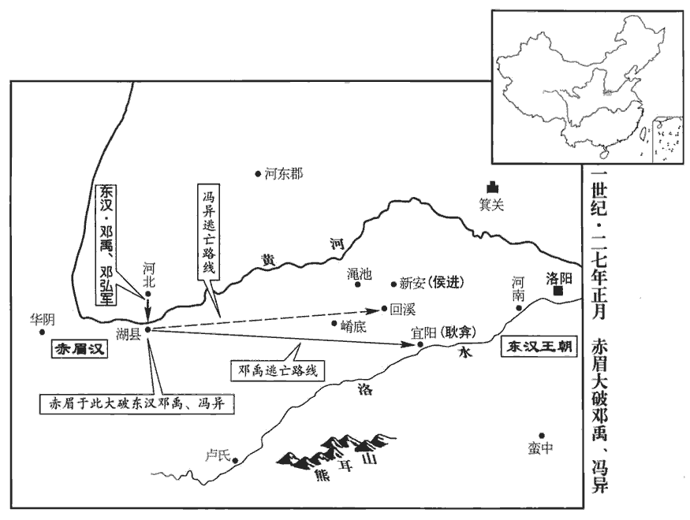 

2辛巳‹二十三›，立四親廟於雒陽，祀父南頓君以上至舂陵節侯。禮，天子立親廟四；今依以立舂陵節侯、鬱林太守、钜鹿都尉、南頓令廟。

〖译文〗 [2]辛巳（二十三日），刘秀在洛阳建立四亲祭庙。祭祀父亲南顿君，往上直到高祖父舂陵节侯。

3壬午‹二十四›，大赦。

〖译文〗 [3]壬午（二十四日），大赦天下。

4閏月，乙巳‹十八›，鄧禹上大司徒、梁侯印綬；上，時掌翻；下同。詔還梁侯印綬，以為右將軍。

〖译文〗 [4]闰月乙巳（十八日），邓禹呈上大司徒、梁侯的印信绶带。刘秀下诏还给邓禹梁侯的印信绶带，任命他为右将军。

5馮異與赤眉約期會戰，使壯士變服與赤眉同，伏於道側。旦日，赤眉使萬人攻異前部，異少出兵以救之；所以示弱也。賊見勢弱，遂悉眾攻異，異乃縱兵大戰。日昃，賊氣衰，伏兵卒起，衣服相亂，赤眉不復識別，卒，讀曰猝。復，扶又翻。別，彼列翻。眾遂驚潰；追擊，大破之於崤底‹河南洛寧西北崤谷之底›，崤谷之底也。賢曰：即崤阪也，在今洛州永寧縣西北。降男女八萬人。降，戶江翻。帝降璽書勞異曰：勞，力到翻。「始雖垂翅回谿，終能奮翼澠池，可謂失之東隅，收之桑榆。賢曰：淮南子曰：至於衡陽，是謂隅中。又前書谷永曰：太白出西方，六十日，法當參天；今已過期，尚在桑榆間。桑榆，謂晚也。余按淮南子曰：西日垂景在樹端，謂之桑榆。方論功賞，以答大勳。」

〖译文〗 [5]冯异同赤眉军定好日期会战。他挑选精壮的士兵，让他们改换服装，穿戴和赤眉军一样，在路边埋伏下来。第二天，赤眉派出一万人攻击冯异军的前部，冯异出动少数军队救援。赤眉见冯异军势弱，于是全军进攻冯异，冯异这才发兵同赤眉军大战。到太阳偏西，赤眉军士气衰落，路边的伏兵突然杀出来，因衣服混杂，赤眉军不能再辨别谁是自己人，于是惊恐溃散。冯异军追击，在崤底大败赤眉军，收降赤眉军男女八万人。刘秀下诏书慰劳冯异说：“你虽然开始时在回阪垂下翅膀，但最终能在渑池奋起双翼。可以说早上在东方丢了东西，晚上在西方找回来。正在为你论功行赏，以报答你卓越的功勋。”

赤眉餘眾東向宜陽‹河南宜陽›。甲辰‹十七›，帝親勒六軍，嚴陳以待之。陳，讀曰陣。赤眉忽遇大軍，驚震不知所謂，乃遣劉恭乞降曰：「盆子將百萬眾降陛下，何以待之？」帝曰：「待汝以不死耳！」丙午‹十九›，盆子及丞相徐宣以下三十餘人肉袒降，上所得傳國璽綬。璽，斯氏翻。綬，音受。積兵甲宜陽城西，與熊耳山‹河南洛宁南›齊。賢曰：宜陽縣故城，韓國城也，在今洛州福昌縣東。水經註曰：洛水之北有熊耳山，雙巒競舉，狀同熊耳；在宜陽西。宋白曰：宜陽故城，在福昌縣東十三里。赤眉眾尚十餘萬人，帝令縣廚皆賜食。宜陽縣廚也。明旦，大陳兵馬臨雒水，帝改「洛」為「雒」。令盆子君臣列而觀之。帝謂樊崇等曰：「得無悔降乎？朕今遣卿歸營，勒兵鳴鼓相攻，決其勝負，不欲強相服也。」強，其兩翻。徐宣等叩頭曰：「臣等出長安東都門，君臣計議，歸命聖德。百姓可與樂成，難與圖始，樂，音洛。故不告眾耳。今日得降，猶去虎口歸慈母，誠歡誠喜，無所恨也！」帝曰：「卿所謂鐵中錚錚，傭中佼佼者也！」賢曰：說文曰：錚錚，金也。鐵之錚，言微有剛利也。錚，初耕翻。佼，古巧翻。詩，佼人僚兮。今相傳胡巧翻。言佼佼者，凡庸之人稍為勝也。戊申‹二十›，還自宜陽。帝令樊崇等各與妻子居雒陽，賜之田宅。其後樊崇、逢安反，誅；楊音、徐宣卒於鄉里。帝憐盆子，以為趙王郎中；趙王良，帝叔父也。以盆子為其國郎中。後病失明，賜滎陽‹河南滎陽›均輸官地，使食其稅終身。賢曰：均輸，官名，屬司農。桓寬鹽鐵論云：郡國諸侯各以其方物貢輸往來，物多苦惡，不償其費，故郡國置均輸官以相紹運，故曰均輸。劉恭為更始報仇，殺謝祿，祿殺更始事見上卷元年。為，於偽翻。自繫獄；帝赦不誅。

〖译文〗 赤眉军残部向东方的宜阳移动。甲辰（十七日），刘秀亲率大军，严阵以待。赤眉突然遇到大军，震惊得不知所措。于是，刘盆子派刘恭向刘秀乞降，说：“我率领百万部众投降陛下，陛下怎样对待呢？”刘秀说：“饶恕你不死罢了！”丙午（十九日），刘盆子和丞相徐宣及以下三十余人袒露出臂膀投降，献出所得的传国玉玺和绶带。赤眉的兵器堆积在宜阳城西，和熊耳山一样高。赤眉部众还有十余万人，刘秀命令宜阳县厨房赐给所有的人食物。第二天，刘秀在洛水边陈列大军，命刘盆子君臣排队观看。刘秀对樊崇等人说：“该不会后悔投降吧？我今天送你们回营，统率军队鸣起战鼓再战，一决胜负。不想强迫你们服输。”徐宣等叩头说：“我们走出长安东都门，君臣商议，要把自己的生命交给陛下。可以和百姓同享受成果，难以和他们同谋开端，所以没有告诉众人。今天能够投降，就像离开虎口，回到慈母的怀抱，确实欢乐欣喜，没有什么可遗憾的！”刘秀说：“你就是所谓铁中的刚利部分，凡人中的出类拔萃者！”戊申（二十日），刘秀从宜阳返回洛阳。他让樊崇等人各自偕妻子儿女住在洛阳，赐给他们田地和住宅。后来樊崇、逢安谋反，被诛杀。杨音、徐宣在他们的故乡去世。刘秀可怜刘盆子，任命他当赵王刘良的郎中。后来刘盆子患病，双目失明，刘秀把荥阳均输官掌握的国有土地赏赐给他，使他终身以收取地租为生。刘恭替刘玄报仇，杀了谢禄，自己投入临狱。刘秀赦免了他，不予诛杀。

6二月，劉永立董憲為海西王。賢曰：海西縣，屬琅邪郡。永聞伏隆至劇‹山東寿光南›，地理志，劇縣，屬北海郡；春秋紀國之地。杜佑曰：漢劇縣故城，在壽光縣南。亦遣使立張步為齊王。步貪王爵，猶豫未決。隆曉譬曰：「高祖與天下約，非劉氏不王；今可得為十萬戶侯耳！」步欲留隆，與共守二州；二州，青州、徐州也。隆不聽，求得反命，步遂執隆而受永封。隆遣間使上書曰：間，古莧翻。使，疏吏翻。「臣隆奉使無狀，賢曰：言罪大也。受執凶逆；雖在困阨，授命不顧。又，吏民知步反畔，心不附之，願以時進兵，無以臣隆為念！臣隆得生到闕廷，受誅有司，此其大願。若令沒身寇手，以父母、昆弟長累陛下。賢曰：累，托也，音力偽翻。陛下與皇后、太子永享萬國，與天無極！」帝得隆奏，召其父湛，流涕示之，曰：「恨不且許而遽求還也！」其後步遂殺之。帝方北憂漁陽‹北京密云›，南事梁、楚，故張步得專集齊地，據郡十二焉。步據城陽‹山东莒县›、琅邪‹山东诸城›、高密‹山东高密›、膠東‹山东平度›、東萊‹山东莱州›、北海‹山东昌乐东南›、齊‹山东淄博东临淄镇›、千乘‹山东高青东北›、濟南‹山东章丘›、平原‹山东平原›、泰山‹山东泰安东›、菑川‹山东寿光南›十二郡。

〖译文〗 [6]二月，刘永封董宪为海西王。刘永听说伏隆到达剧县，便也派遣使者封张步为齐王。张步贪图王爵，犹豫不决。伏隆解释说：“高祖曾向天下规定，除刘姓皇族外不能封王爵，现在你仅能成为做十万户侯罢了！”张步想留下伏隆，与他共同据守青、徐二州。伏隆不同意，要求能返回洛阳报告情况。于是张步拘捕伏隆而接受刘永的封爵。伏隆派密使上书说：“我奉命出使，不能完成使命，被叛逆拘捕，处于险境。我虽然身处艰难窘迫之中，但为完成陛下授予的使命，即使牺牲生命，也在所不惜。再有，官民们知道张步叛变，民心不能归附。希望陛下及时进军，不要顾念我。我能够活着回到朝廷，被主管官吏诛杀，这是我最大的愿望。假如我死于叛贼之手，就把父母兄弟长期托付给陛下。祝福陛下和皇后、太子永远享受万国的拥戴，同上天一样无穷无尽！”刘秀得到伏隆的奏书，召见他的父亲伏湛，流着眼泪把奏书拿给他看，说：“我恨不得暂且许诺张步封王而马上求得伏隆返回！”后来，张步终于杀了伏隆。当时，刘秀北方担心渔阳，南方担心梁国、楚国，所以张步能够独霸齐地，占据十二个郡。

7帝幸懷‹河南武陟›。

〖译文〗 [7]刘秀到达怀县。

8吳漢率耿弇yǎn、蓋延擊青犢於軹zhǐ‹河南濟源南轵城›西，大破降之。賢曰：軹縣，屬河內郡；故城在今洛州濟源縣東南。蓋，古盍翻。

〖译文〗 [8]吴汉率领耿、盖延在轵县西攻打青犊军，大破青犊军并使之归降。

9三月，壬寅‹十六›，以司直伏湛為大司徒。

〖译文〗 [9]三月壬寅（十六日），刘秀提拔司直伏湛当大司徒。

10涿郡‹河北涿州›太守張豐反，郡國志：涿郡，在雒陽東北千八百里。自稱無上大將軍，與彭寵連兵。朱浮以帝不自征彭寵，上疏求救。詔報曰：「往年赤眉跋扈長安，賢曰：跋扈，猶言暴橫也。吾策其無穀必東；果來歸附。今度此反虜，度，徒洛翻。勢無久全，其中必有內相斬者。今軍資未充，故須後麥耳！」須，待也。浮城中糧盡，人相食，會耿況遣騎來救，浮乃得脫身走，薊城‹北京›遂降於彭寵。考異曰：朱浮傳：「尚書令侯霸奏：『浮敗亂幽州，構成寵罪，徒勞軍師，不能死節，罪當伏誅。』」按霸明年乃為尚書令，蓋追劾之。寵自稱燕王，攻拔右北平‹河北豐潤›、上谷‹河北懷來›數縣，賂遺匈奴，遺，于季翻。借兵為助；又南結張步及富平、獲索諸賊，皆與交通。

〖译文〗 [10]涿郡太守张丰反叛，自称无上大将军，和彭宠的军队联合起来。朱浮因为刘秀不亲自讨伐彭宠，向刘秀上书求援。刘秀下诏回答说：“去年赤眉军在长安飞扬跋扈，我叛定他们在没有粮食的时候一定向东撤。后果然前来归顺。现在估计这些叛逆，势必不能长期保全，他们内部一定会出现互相斩杀的情况。现在我军的军事物资不充足，所以要等小麦收割以后才行。”朱浮所在的蓟城粮食吃尽，出现了人吃人的现象，正赶上耿况派骑兵来救援，朱浮才能够脱身逃跑。于是蓟城向彭宠投降。彭宠自称为燕王，进攻夺取右北平、上谷的几个县。他还送礼物贿赂北方的匈奴，向匈奴借兵作为援军，又向南结交张步及富平、获索各路贼军，与他们全都建立了联系。

11帝自將征鄧奉，至堵陽‹河南方城›；堵陽縣，屬南陽郡。杜佑曰：唐州方城縣，漢堵陽縣。應劭shào曰：堵陽，景帝改為順陽。二說不同。奉逃歸淯陽‹河南南陽南三十公里›，董訢降。訢，音欣。降，下江翻；下同。夏，四月，帝追奉至小長安‹淯陽北›，與戰，大破之；奉肉袒因朱祜降。去年奉禽祜，今因祜而降。帝憐奉舊功臣，奉，鄧晨之兄子也。且釁起吳漢，事見上卷上年。欲全宥之。岑彭、耿弇諫曰：「鄧奉背恩反逆，背，蒲妹翻。暴師經年，陛下既至，不知悔善，而親在行陳，陳，讀曰陣。兵敗乃降；若不誅奉，無以懲惡！」於是斬之。復朱祜位。

〖译文〗 [11]刘秀亲自率军讨伐邓奉，抵达堵阳。邓奉逃回阳，董投降。夏季，四月，刘秀追击邓奉到小长安，同邓奉交战，大败邓奉。因朱祜从中调和，邓奉露出臂膀投降。刘秀怜惜邓奉是功臣故旧，而且反叛是因吴汉所逼，想要保全宽恕他。岑彭、耿进谏说：“邓奉背叛恩主，起兵叛变，一连几年残暴掳掠。陛下亲征抵达堵阳，他不知悔过从善，反而亲自上阵和您交战，打败了才被迫投降。如果不杀邓奉，就不能惩办邪恶。”于是，斩邓奉，恢复朱祜的官职。

12延岑既破赤眉，即拜置牧守，欲據關中。時關中眾寇猶盛，岑據藍田‹陝西藍田›，王歆據下邽‹陝西渭南东北›，賢曰：秦武公伐邽戎置，以隴西有上邽，故此云下。芳丹據新豐‹陝西臨潼东北›，芳，姓也。風俗通有漢幽州刺史芳乘。蔣震據霸陵‹陝西西安東北›，張邯據長安，公孫守據長陵‹陝西咸陽東北›，楊周據谷口‹陝西礼泉东北›，呂鮪wěi據陳倉‹陝西寶雞东陈仓›，角閎據汧qiān‹陝西隴縣›，角，姓也，漢有角善叔。汧，苦堅翻。駱延據盩厔‹陝西周至›，盩厔，音舟窒。姓譜：齊太公之後有公子駱，子孫以為氏。史記，秦之先有大駱。任良據鄠hù‹陝西戶縣›，鄠，音戶。汝章據槐里‹陝西興平›，汝，姓也。商有汝鳩、汝方。春秋，晉有汝齊、汝寬。各稱將軍，擁兵多者萬餘人，少者數千人，轉相攻擊。馮異且戰且行，屯軍上林苑中。異自崤谷之勝，引兵而西，且戰且行，進屯上林苑中。延岑引張邯、任良共擊【章：十二行本「擊」作「攻」；乙十一行本同；孔本同。】異；異擊，大破之，諸營保附岑者皆來降，保，與堡同。岑遂自武關‹陝西商南西南›走南陽。走，音奏。時百姓飢餓，黃金一斤易豆五升，道路斷隔，委輸不至，委，於偽翻。輸，舂遇翻。馮異軍士悉以果實為糧。詔拜南陽趙匡為右扶風，將兵助異，并送縑、穀。異兵穀漸盛，乃稍誅擊豪傑不從令者，褒賞降附有功勞者，悉遣諸營渠帥詣京師，帥，所類翻。散其眾歸本業，威行關中。唯呂鮪、張邯、蔣震遣使降蜀‹成都›，鮪，於軌翻。邯，下甘翻。其餘悉平。

〖译文〗 [12]延岑打败赤眉军以后，即刻任命州牧郡守等官职，打算占据关中。当时关中地区各路盗贼气势还很旺盛。延岑占据蓝田，王歆占据下，芳丹占据新丰，蒋震占据霸陵，张邯占据长安，公孙守占据长陵，杨周占据谷口，吕鲔占据陈仓，角闳占据，骆延占据，任良占据，汝章占据槐里。他们各称将军，拥有士兵，多的一万余人，少的数千人，各军之间互相攻击。冯异一边作战，一边向前推进，军队屯驻于上林苑中。延岑联合张邯、任良一起攻打冯异，冯异迎击，大败延岑等联军，归附延岑的营垒都来投降冯异，延岑于是从武关向南阳逃跑。当时百姓饥饿，用一斤黄金才换五升豆子。道路断绝，运送的粮食不能到达，冯异的士兵都以果实充饥。刘秀下诏任命南阳人赵匡当右扶风，率军协助冯异，并运送绢帛、粮食。冯异的军队逐渐强盛，粮食渐渐充足，于是逐步诛杀打击不服从命令的豪强，褒扬奖赏归降有功劳的人，把各营寨的首领全都送到洛阳，遣散他们的徒众，使徒众回到各自本来的行业，冯异威振关中。只有吕鲔、张邯、蒋震派出使者投降了占据西蜀的公孙述，其余全部平定。

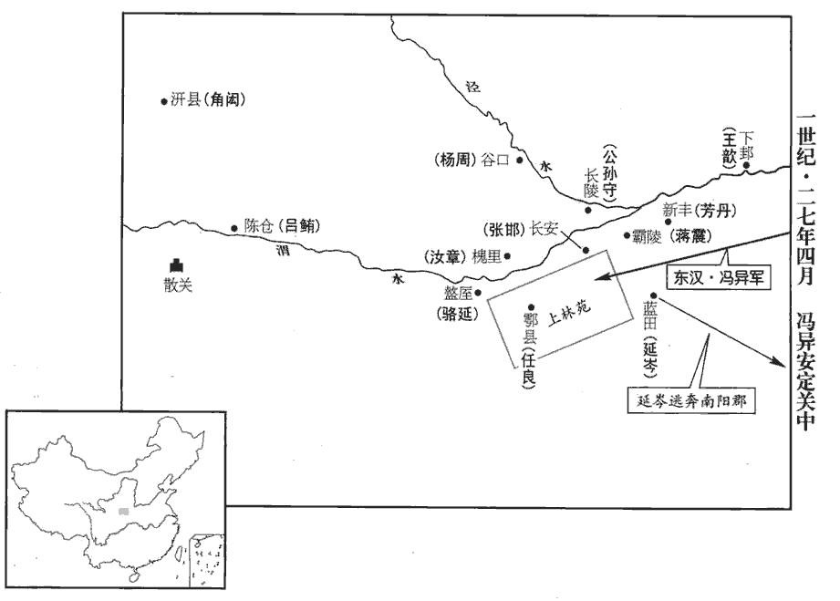 

13吳漢率驃騎大將軍杜茂等七將軍圍蘇茂於廣樂‹河南虞城北›；周建招集得十餘萬人救之。周建，劉永將也。漢迎與之戰，不利，墮馬傷厀，還營；厀，與膝同。建等遂連兵入城。諸將謂漢曰：「大敵在前，而公傷臥，眾心懼矣！」三軍之氣，以將為主，故云然。漢乃勃然裹創而起，創，初良翻。椎牛饗士，慰勉之，士氣自倍。旦日，蘇茂、周建出兵圍漢；漢奮擊，大破之，茂走還湖陵。睢陽‹河南商丘›人反城迎劉永，蓋延率諸將圍之；反，音幡。蓋，古盍翻。吳漢留杜茂、陳俊守廣樂‹河南虞城北›，自將兵助延圍睢陽‹河南商丘›。睢，音雖。

〖译文〗 [13]吴汉率领骠骑大将军杜茂等七位将军在广乐包围苏茂。周建招集到十余万人援救苏茂。吴汉迎战周建，不能取胜，从马上摔下，膝盖受伤，回到大营。于是周建等带兵进城。将领们对吴汉说：“大敌当前，而您受伤躺在床上，大家心里感到恐惧。”吴汉于是包扎伤口，勃然而起，杀牛犒劳战士，慰问勉励他们，军中士气倍增。第二天，苏茂、周建出兵包围吴汉，吴汉奋力反击，大败敌军。苏茂逃回湖陵。这时，睢阳人在城内叛乱，迎接刘永进城。东汉大将盖延率众将领包围睢阳。吴汉留下杜茂、陈俊守卫广乐，自己带兵协助盖延包围睢阳。

14車駕自小長安‹河南南阳南›引還，令岑彭率傅俊、臧宮、劉宏等三萬余人，南擊秦豐。五月，己酉‹二十四›，車駕還宮。

〖译文〗 [14]刘秀从小长安率军返回。命令岑彭率领傅俊、臧宫、刘宏等三万余人向南攻打秦丰。五月己酉（二十四日），刘秀回到洛阳皇宫。

15乙卯晦‹三十›，日有食之。

〖译文〗 [15]乙卯晦（三十日），出现日食。

16六月壬戍‹七›，大赦。

〖译文〗 [16]六月壬戌（初七），大赦天下。

17延岑攻南陽，得數城；建威大將軍耿弇與戰於穰‹河南鄧州›，地理志，穰縣，屬南陽郡。大破之。岑與數騎走東陽‹河南鄧州东北穰東鎮›，與秦豐合；豐以女妻之。走，音奏。妻，七細翻。建義大將軍朱祜率祭遵等與岑戰於東陽，破之；賢曰：東陽，聚名也；故城在今鄧州南。臨淮郡復有東陽縣，非此地也。余據郡國志，南陽淯陽縣有東陽聚。岑走歸秦豐。祜遂南與岑彭等軍合。

〖译文〗 [17]延岑进攻南阳，夺取了几座城。东汉建威大将军耿同延岑在穰城交战，大败延岑。延岑和几个人骑马逃向东阳，与秦丰联合。秦丰把女儿嫁给延岑。东汉建义大将军朱祜率领祭遵等同延岑在东阳交战，打败延岑。延岑逃跑回到秦丰所在的黎丘。于是朱祜南下与岑彭等军队汇合。

延岑護軍鄧仲況擁兵據陰縣‹湖北老河口西北›，賢曰：陰縣，屬南陽郡；故城在今襄州穀城縣界北。水經註：沔水南逕穀城東，又南過陰縣西。宋白曰：今光化軍，本陰縣地。而劉歆孫龔為其謀主。前侍中扶風‹陕西兴平›蘇竟以書說之，前此帝嘗用竟為侍中。說，輸芮翻。仲況與龔降。竟終不伐其功，隱身樂道，壽終於家。樂，音洛。

〖译文〗 延岑的护军邓仲况领兵占据阴县，而刘歆的孙子刘龚是他的主要谋士，前侍中扶风人苏竟写信劝说他们。邓仲况与刘龚便投降了刘秀。苏竟始终不夸耀这份功劳，隐退故里，乐守圣人之道，在家乡寿终。

秦豐拒岑彭於鄧‹湖北襄樊汉水北岸›，地理志，鄧縣，屬南陽郡；春秋之鄧國也。秋，七月，彭擊破之。進圍豐於黎丘‹湖北襄樊东南›，別遣積弩將軍傅俊將兵徇江東‹江蘇南部›，揚州悉定。

〖译文〗 秦丰在邓县抗拒岑彭。秋季，七月，岑彭击败秦丰。又进军在黎丘包围秦丰，另外派遣积弩将军傅俊领兵攻占长江以东地区，扬州全部平定。

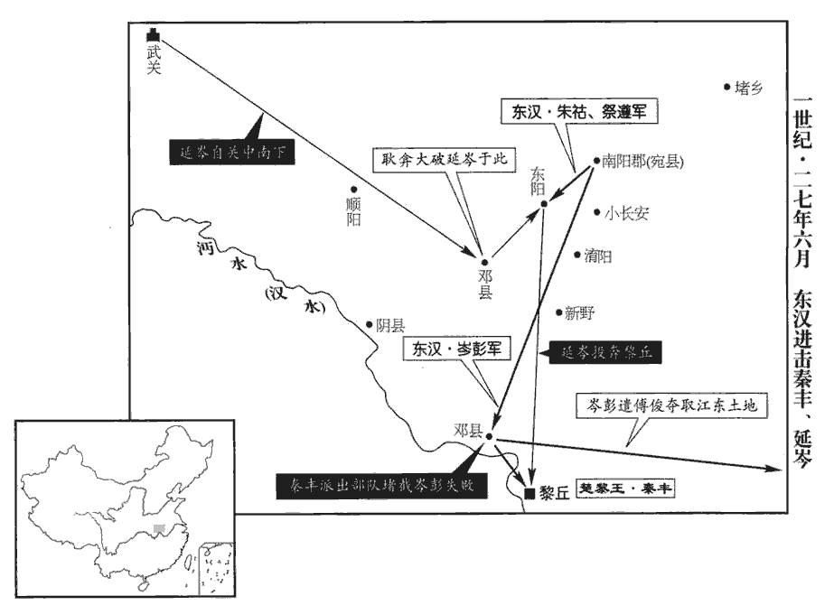 

18蓋延圍睢陽‹河南商丘›百日，劉永、蘇茂、周建突出，將走酇‹河南永城西鄼城乡›；此沛郡之酇縣也。賢曰：今亳州縣；音在何翻。延追擊之急，永將慶吾斬永首降。姓譜：齊大夫慶氏之後。蘇茂、周建奔垂惠‹安徽蒙城北›，郡國志：沛郡山桑縣有垂惠聚。賢曰：在今亳州山桑縣西北，一名禮城。杜佑通典曰：垂惠聚在亳州蒙城縣西北。共立永子紆yū為梁王。佼彊奔保西防‹山东成武东›。佼，古巧翻，又音効。

〖译文〗 [18]盖延包围睢阳达一百天。刘永、苏茂、周建突围而出，准备逃往县。盖延急速追击，刘永的将领庆吾砍下刘永的人头投降。苏茂、周建逃到垂惠，一齐拥立刘永的儿子刘纡当梁王。刘永的另一将领佼强逃到西防据守。

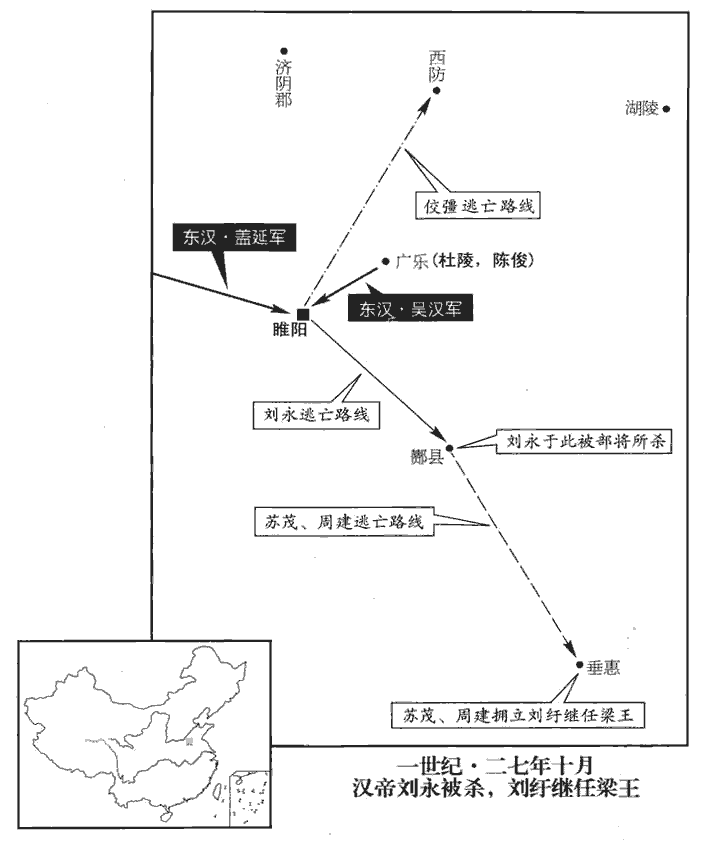 

19冬，十月，壬申‹十九›，上幸舂陵‹湖北棗陽南›，祠園廟。舂陵節侯以下四世園廟也。

〖译文〗 [19]冬季，十月壬申（十九日），刘秀到达故乡舂陵，祭祀祖先的陵园祭庙。

20耿弇yǎn從容言於帝，從，千容翻。自請北收上谷‹河北懷來›兵未發者，定彭寵於漁陽‹北京密云›，取張豐於涿郡‹河北涿州›，還收富平、獲索，東攻張步，以平齊地。帝壯其意，許之。

〖译文〗 [20]耿从容地向刘秀说，他请求北上招收上谷郡还没有调动的士兵，在渔阳铲除彭宠，在涿郡打败张丰；返回洛阳时消灭富平、获索军；向东攻击张步，从而平定齐地。刘秀认为他很有雄心壮志，答应了他的要求。

21十一月，乙未‹十二›，帝還自舂陵‹湖北棗陽南›。

〖译文〗 [21]十一月乙未（十二日），刘秀从舂陵返回。

22是歲，李憲稱帝，置百官，擁九城，眾十余萬。廬江‹安徽廬江›十二城，憲所得者九城耳。

〖译文〗 [22]这一年，李宪在庐江称帝，设置百官，拥有九座城，部众十余万人。

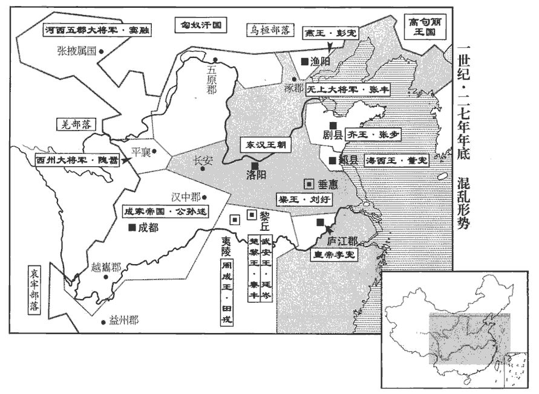 

23帝謂太中大夫來歙曰：姓譜：郲，子姓，商之支孫，食采於郲，因以為氏；後避難去邑。漢功臣表有軑dài侯來蒼。歙，許及翻。「今西州‹甘肅東部›未附，西州，謂隗囂也。子陽稱帝，子陽，公孫述字。道里阻遠，諸將方務關東，思西州方略，未知所在。」【章：十二行本「在」下有「奈何」二字；乙十一行本同；孔本同；張校同。】歙曰：「臣嘗與隗囂相遇長安。其人始起，以漢為名。事見三十九卷更始元年。臣願得奉威命，開以丹青之信，揚子曰：聖人之言，炳若丹青。囂必束手自歸；則述自亡之勢，不足圖也！」帝然之，始令歙使於囂。使，疏吏翻；下同。囂既有功於漢，又受鄧禹爵署，事見上卷元年。其腹心議者多勸通使京師，囂乃奉奏詣闕。帝報以殊禮，言稱字，用敵國之儀，所以慰藉之甚厚。賢曰：慰，安也。藉，薦也。言安慰而薦藉之也。

〖译文〗 [23]刘秀对太中大夫来歙说：“现在西州没有归附，公孙述自称皇帝，道路阻塞遥远，将领们正把力量用在关东。思量攻相西州的策略，不知道怎么办好。”来歙说：“我曾经和隗嚣在长安会见。这个人最初起兵时，以恢复汉王朝为名义。我请求奉陛下之命，开诚布公，他一定会束手归附。那样的话，公孙述会处于自亡的境地，不值得费力图谋了！”刘秀同意来歙的话，便派他出使去见隗嚣。隗嚣既对更始朝建有功勋，又接受东汉大司徒邓禹任命的官职。他的心腹以及谋士们多劝他和洛阳取得联系。于是隗嚣到洛阳奉上奏章。刘秀用特殊的礼仪进行回报，交谈时对隗嚣用表字，用对待地位平等国家的礼仪相待，安慰推许他，充满了深情厚谊。

## 四年（戊子，二八）

1正月，甲申‹二›，大赦。

〖译文〗 [1]正月甲申（初二），刘秀实行大赦。

2二月，壬子‹一›，上‹刘秀，时年三十三›行幸懷‹河南武陟›；壬申‹二十一›，還雒陽。

〖译文〗 [2]二月壬子（初一），刘秀前往怀县。壬申（十一日），返回洛阳。

3延岑復寇順陽‹河南淅川東南›；郡國志，順陽縣屬南陽郡。順水東南入蔡。括地志：順陽故城，在鄧州穰縣西三十里，楚之郇邑也。復，扶又翻；下同。遣鄧禹將兵擊破之。岑奔漢中‹陝西汉中›；公孫述以岑為大司馬，封汝寧王。

〖译文〗 [3]延岑又攻打顺阳。刘秀派邓禹率领军队击败延岑。延岑逃往汉中。公孙述任命延岑当大司马，封为汝宁王。

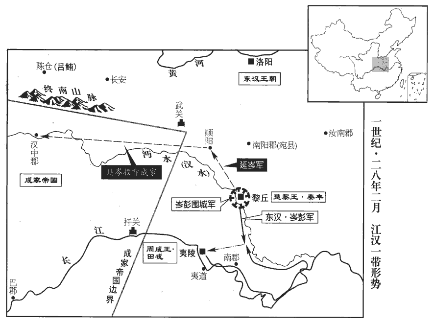 

4田戎聞秦豐破，恐懼，欲降。降，戶江翻；下同。其妻兄辛臣圖彭寵、張步、董憲、公孫述等所得郡國以示戎曰：「雒陽地如掌耳，如掌，喻其狹也。不如且按甲以觀其變。」戎曰：「以秦王之強，猶為征南所圍，吾降決矣！」岑彭時為征南大將軍，故戎云然。乃留辛臣使守夷陵‹湖北宜昌›，自將兵沿江泝沔上黎丘‹湖北襄樊东南›。自夷陵沿江而下，至沔口；自沔口泝沔而上，可至黎丘也。上，時掌翻。辛臣於後盜戎珍寶，從間道先降於岑彭，間，古莧翻。而以書招戎曰：「宜以時降，無拘前計！」戎疑臣賣己，灼龜卜，降兆中坼chè，周禮菙氏：凡卜，以明火爇ruò燋zhuó，吹其焌jùn，契以授卜師。鄭玄曰：燋焌，用荊菙之類。兆者，灼龜，發於火，其形可占者。菙chuí，時髓翻。燋，哉約翻。焌，音俊，又子寸翻。遂復反，與秦豐合；岑彭擊破之，戎亡歸夷陵‹湖北宜昌›。

〖译文〗 [4]田戎听说秦丰被打败，感到恐慌，准备投降。田戎妻子的哥哥辛臣画出彭宠、张步、董宪、公孙述等占有的郡国给田戎看，对他说：“洛阳这块地方，不过像手掌那么大罢了，我们不如暂且按兵不动，以观察局势的变化。”田戎说：“凭着秦丰的强盛，还陷于征南大将军岑彭的包围之中，我决心投降了！”于是留下辛臣，让他守卫夷陵，自己率领军队沿着长江至 沔江，逆流而上进军黎丘。辛臣在田戎出发后，盗取田戎的珍宝，抄小路逃跑，先向岑彭投降，然后写信招降田戎说：“你应该及时投降，不要拘泥于我们以前的打算！”田戎怀疑辛臣出卖自己，烧龟甲占卜应否投降。龟甲从中裂开，大凶。于是又进行反叛，同秦丰联合。岑彭打败田戎，田戎逃回夷陵。

5夏，四月，丁巳‹七›，上行幸鄴‹河北臨漳西南邺镇›；己巳‹十九›，幸臨平‹河北辛集北›，賢曰：縣名，屬钜鹿郡，故城在今定州鼓城縣東南。遣吳漢、陳俊、王梁擊破五校於臨平。鬲gé縣五姓共逐守長，據城而反；賢曰：鬲縣屬平原郡，故城在今德州西北。五姓，蓋當土強宗豪右。鬲，音革。余謂守長者，守鬲縣長，非正官也。長，知兩翻；下同。諸將爭欲攻之。吳漢曰：「使鬲反者，守長罪也。敢輕冒進兵者斬！」乃移檄告郡使收守長，而使人謝；城中五姓大喜，即相率降。諸將乃服，曰：「不戰而下城，非眾所及也！」

〖译文〗 [5]夏季，四月丁巳（初七），刘秀前往邺城。己巳（十九日），前往临平。派遣吴汉、陈俊、王梁在临平击败五校军。鬲县五大家族联合起兵，驱逐代理县长，占据县城反叛。将领们争先恐后地要前去攻打。吴汉说：“促使鬲县人反叛的，是代理县长的罪过。胆敢轻率进兵的，一律斩首！”于是用公文通告郡府拘捕代理县长，并派人酬谢。城中五大家族非常高兴，立刻相继投降。将领们于是佩服吴汉，说：“不经过战斗就能得到城池，这种本领不是一般人所能赶得上的！”

6五月，上幸元氏‹河北元氏›；辛巳‹一›，幸盧奴‹河北定州›，將親征彭寵。伏湛諫曰：「今兗、豫、青、冀，中國之都，而寇賊從橫，未及從化。從，子容翻。漁陽‹北京密云›邊外荒耗，邊外者，邊於外夷也。豈足先圖！陛下捨近務遠，棄易求難，易，以豉翻。誠臣之所惑也！」上乃還。

〖译文〗 [6]五月，刘秀前往元氏。辛巳（初一），抵达卢奴，准备亲自征讨彭宠。伏湛劝阻说：“现在，兖州、豫州、青州、冀州本是中国的内地，而盗匪贼寇横行无忌，还没有来得及使他们顺从，接受教化。渔阳不过是临近北方外族的荒凉地方，怎么值得先去图谋呢？陛下舍近求远，放弃容易做的事，去做难做的事，真使我感到迷惑！”刘秀这才返回。

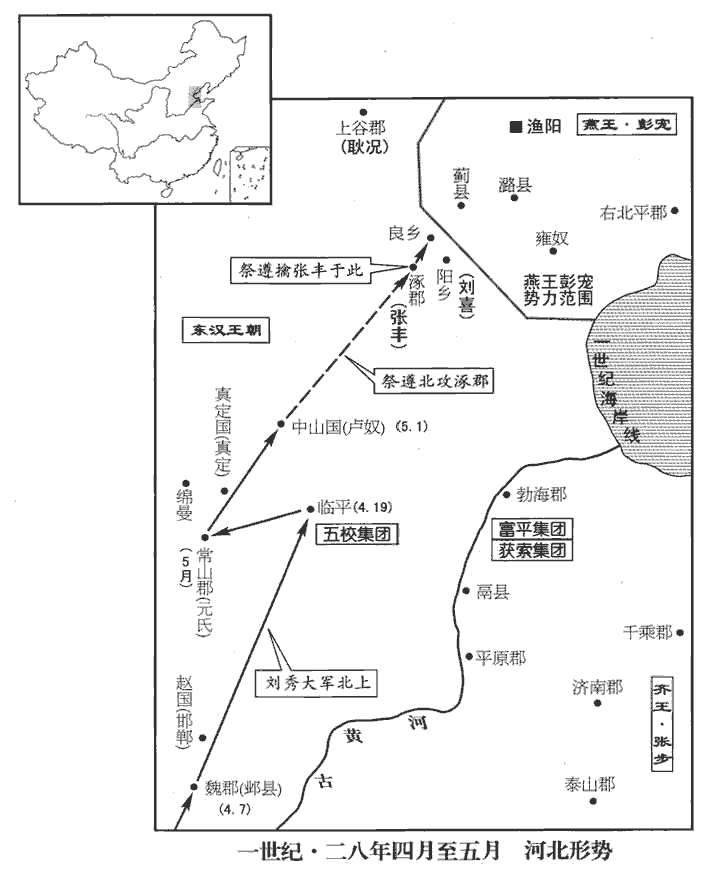 

7帝遣建議【章：十二行本「議」作「義」；乙十一行本同；孔本同。】大將軍朱祜、建威大將軍耿弇、征虜將軍祭遵、祭，側界翻。驍騎將軍劉喜討張豐於涿郡。祭遵先至，急攻豐；禽之。初，豐好方術，有道士言豐當為天子，西都有方士，東都因稱為道士。好，呼到翻。以五綵囊裹石繫豐肘，云「石中有玉璽」。豐信之，遂反。既執，當斬，猶曰「肘石有玉璽」。傍人為椎破之，為，於偽翻；下同。豐乃知被詐，仰天嘆曰：「當死無恨！」

〖译文〗 [7]刘秀派遣建议大将军朱祜、建威大将军耿、征虏将军祭遵、骁骑将军刘喜在涿群讨伐张丰。祭遵先行到达，猛烈攻打张丰，把他生擒。当初，张丰喜好法术，有个道士说张丰会做皇帝，并用五彩的口袋包裹石头绑在张丰的肘上，说：“石头中有皇帝用的玉玺。”张丰相信道士的话，于是叛变。把他捉住以后，应当斩首，他还说：“我肘上的石头里有玉玺。”旁人为他用槌子打破石头，张丰才知受骗了。他仰天长叹说：“我应当死，死而无恨！”

上詔耿弇yǎn進擊彭寵。弇以父況與寵同功，況與寵同有助漢之功，事見上卷、三十九卷更始二年。又兄弟無在京師者，不敢獨進，求詣雒陽。詔報曰：「將軍舉宗為國，功效尤著，何嫌何疑，而欲求徵！」況聞之，更遣弇弟國入侍。時祭遵屯良鄉‹北京西南窦店›，劉喜屯陽鄉‹河北涿州东›，賢曰：良鄉、陽鄉，皆縣名，并屬涿郡。陽鄉故城，在今幽州故安縣西北。宋白曰：良鄉，在燕為中都，漢為良鄉縣。彭寵引匈奴兵欲擊之，耿況使其子舒襲破匈奴兵，斬兩王，寵乃退走。

〖译文〗 刘秀颁下诏书，命令耿进攻彭宠。耿因为父亲耿况和彭宠有同样的功劳，再加上兄弟没有人在洛阳做人质，不敢单独进军，请求返回洛阳。刘秀下诏回答说：“将军全家为国效忠，功劳卓著，有什么嫌疑而要求征召回洛阳呢？”耿况听说以后，另外派耿的弟弟耿国前往洛阳，到宫廷服务。这时，祭遵驻屯良乡，刘喜驻屯阳乡，彭宠率领匈奴的军队准备袭击。耿况命他的儿子耿舒击败匈奴军，诛杀匈奴两位亲王，彭宠这才退兵。

8六月，辛亥‹二›，車駕還宮。

〖译文〗 [8]六月辛亥（初二），刘秀返回洛阳。

9秋，七月，丁亥‹八›，上幸譙qiáo‹安徽亳州›，考異曰：袁紀，「六月幸譙」，今從范書。遣捕虜將軍馬武、騎都尉王霸圍劉紆yū、周建於垂惠‹安徽蒙城北›。

〖译文〗 [9]秋季，七月丁亥（初八），刘秀到谯城。派遣捕虏将军马武、骑都尉王霸在垂惠包围刘纡、周建。

10董憲將賁休以蘭陵‹山東苍山西南兰陵镇›降；賢曰：前書賁赫，音肥。今姓作賁，音奔。蘭陵縣，屬東海郡；故城在今沂州丞縣東。憲聞之，自郯‹山東郯城›圍之。賢曰：郯縣，屬東海郡；故城在今泗州下邳縣東北。郯，音談。蓋延及平狄將軍山陽‹山東金鄉西北昌邑镇›龐萌在楚‹江苏徐州›，楚，彭城也。請往救之。帝敕曰：「可直往擣郯，賢曰：擣，擊也。余謂擣，擣虛也；此兵法所謂攻其必救也。則蘭陵自解。」延等以賁休城危，遂先赴之。憲逆戰而陽敗退，延等因拔圍入城。明日，憲大出兵合圍；延等懼，遽出突走，因往攻郯‹山東郯tán城›。帝讓之曰：「間欲先赴郯者，以其不意故耳！今既奔走，賊計已立，圍豈可解乎！」延等至郯，果不能克；而董憲遂拔蘭陵‹山東苍山西南兰陵镇›，殺賁休。

〖译文〗 [10]董宪的将领贲休献出兰陵县投降。董宪得到消息，从郯县率军包围兰陵。盖延与平狄将军山阳人庞萌在楚驻屯，请求前往兰陵救援贲休。刘秀告诫说：“大军可以去直捣郯县，兰陵之围自然就会解除。”盖延等认为贲休所守的兰陵城危险，于是先奔赴兰陵救援。董宪迎战，然后假装战败撤退。盖延等因此攻破围军进城内。第二天，董宪率大军合围。盖延等恐惧，迅速突围逃跑，于是前往攻打郯县。刘秀责备盖延等人说：“先前要进攻郯县，是由于出其不意的缘故罢了！现在既然败逃，敌人的计谋已经确定，怎么还能解除兰陵之围呢！”盖延等到达郯县，果然不能攻克。而董宪终于攻陷兰陵，诛杀贲休。

11八月，戊午‹十›，上幸壽春‹安徽壽縣›。地理志：壽春縣屬九江郡。賢曰：今壽州縣。遣揚武將軍南陽馬成率誅虜將軍南陽劉隆等三將軍，發會稽‹江蘇蘇州›、丹陽‹安徽宣城›、九江‹安徽壽縣›、六安‹安徽六安›四郡兵擊李憲。九月，圍憲於舒‹安徽廬江›。地理志：廬江郡治舒縣。賢曰：故城在今廬州廬江縣西。會，古外翻。

〖译文〗 [11]八月戊午（初十），刘秀到寿春县。派遣扬武将军南阳人马成率领诛虏将军南阳人刘隆等三位将军，征调会稽、丹阳、九江、六安四个郡的兵力攻打李宪。九月，在舒县包围李宪。

王莽末，天下亂，臨淮‹江蘇泗洪南›大尹河南侯霸獨能保全其郡。郡國志：臨淮郡在雒陽東千四百里。帝徵霸會壽春‹安徽壽縣›，拜尚書令。時朝廷無故典，又少舊臣，少，詩沼翻。霸明習故事，收錄遺文，條奏前世善政法度，施行之。

〖译文〗 王莽末年，天下大乱，唯独临淮郡大尹河南人侯霸能够保全一郡平安。刘秀征召侯霸在寿春见面，任命他当尚书令。当时朝廷没有旧法则可依，又缺少旧臣，侯霸熟悉过去的典章制度，搜集失散的文献档案，列出前朝好的政策和法令制度上奏，予以施行。

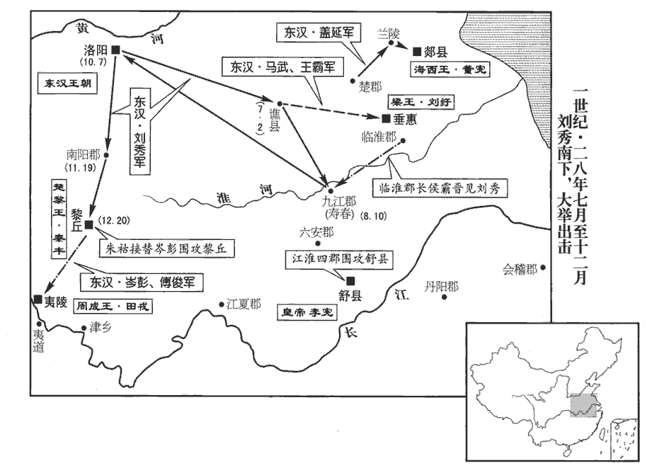 

冬，十月，甲寅‹七›，車駕還宮。

〖译文〗 冬季，十月甲寅（初七），刘秀返回洛阳。

12隗囂使馬援往觀公孫述。援素與述同里閈hàn，相善，援與述皆茂陵‹陝西興平›人。說文曰：閈，閭也，侯旰翻。以為既至，當握手歡如平生；而述盛陳陛衛以延援入，交拜禮畢，使出就館。更為援制都布單衣、何承天纂文曰：都、致、錯、履、無極，皆布名。方言曰：襌衣，江、淮、南楚之間謂之褋dié，關之東西謂之襌衣。為，於偽翻。交讓冠，會百官於宗廟中，立舊交之位，述鸞旗、旄騎，鸞旗註見十三卷文帝元年。旄騎，旄頭騎也。秦穆公伐南山大梓，有一青牛出走，入豐水中；其後牛出豐水中，使騎擊之，不勝；有騎墮地復上，髮解，牛畏之，入不出：故置旄頭騎以前驅。警蹕就車，磬折而入，賢曰：磬qìng折，屈身如磬之曲折，敬也。孔穎達曰：磬折者，屈身如磬之折殺。按考工記云：磬氏為磬，倨句一矩有半。鄭云：必先度一矩為句，一矩為股，而求其弦。既以一矩有半觸其弦，則磬之倨句也。是磬之折殺，其形必曲，人之倚式亦當然也。禮饗官屬甚盛，欲授援以封侯大將軍位。賓客皆樂留，樂，音洛。援曉之曰：「天下雄雌未定，公孫不吐哺走迎國士，周公一飯三吐哺以下天下之士。與圖成敗，反修飾邊幅，賢曰：言若布帛修整其邊幅也。如偶人形，此子何足久稽天下士乎！」稽，留也。因辭歸，謂囂曰：「子陽，井底蛙耳，言志識褊狹，如坎井之蛙。而妄自尊大！不如專意東方。」東方，謂雒陽也。

〖译文〗 [12]隗嚣派马援前往成都观察公孙述的情况。马援和公孙述是同乡，关系很好，他以为到达之后，公孙述一定像平时那样和他握手言欢。但公孙述让许多卫士排列在殿阶下，戒备森严，然后请马援进入。行过交拜礼之后，公孙述让马援出去，到宾馆休息。又替马援制做布衣服和交让寇。在宗庙中召集百官，设立了旧交老友的座位。公孙述用绣着鸾鸟的旗帜、披头散发的骑士作前导，开路清道，实行警戒，登车出发。他向左向迎侯的官员屈身作答后，进入宗庙。礼仪祭品及百官的阵容十分盛大。公孙述准备封马援侯爵，任命当大将军。马援带领的宾客们都乐意留下来。马援向他们解释说：“天下胜负未定，公孙述不懂得吐出口中的饭，奔走迎接有才干的人，与他共同图谋成败的大事，他反而注重繁琐的小节，就像一个木偶人，这种人怎么能够长久留住天下有志之士呢？”因此告辞返回，对隗嚣说：“公孙述不过是井底之蛙罢了，却妄自尊大！我们不如一心与东方的刘秀往来。”

囂乃使援奉書雒陽。援初到，良久，中黃門引入。中黃門，宦者也；屬少府。帝在宣德殿南廡下，廡，音武，堂下周屋也。但幘zé，坐，迎笑，董巴曰：古者有冠無幘，其戴也加首有頍kuǐ，所以安物。詩曰：有頍者弁，謂此也。秦加武將首飾為絳袙pà，其後稍稍作顏題。漢興，續其顏，卻摞luò之，施巾連題，卻覆之，今喪幘是其制也，名之曰幘。幘者，頭首嚴賾zé也。至孝文，乃高顏題，續之為耳，崇其巾為屋，合後施收，貴賤皆服之。蔡邕曰：幘，古者卑賤執事不冠者之所服。元帝額有壯髮，不欲使人見，始進幘服之。謂援曰：「卿遨遊二帝間；今見卿，使人大慙。」援頓首辭謝，因曰：「當今之世，非但君擇臣，臣亦擇君矣！臣與公孫述同縣，少相善；少，詩照翻。臣前至蜀，述陛戟而後進臣。陛戟，謂衛者持戟俠陛也。臣今遠來，陛下何知非刺客姦人，而簡易若是！」帝復笑曰：「卿非刺客，顧說客耳。」說，去聲。援曰：「天下反覆，盜名字者不可勝數；盜名字，謂僭竊位號，稱帝稱王也。易，以豉翻。復，扶又翻。說，輸芮翻。勝，音升。今見陛下恢廓大度，同符高祖，乃知帝王自有真也。」

〖译文〗 于是隗嚣派马援带着给刘秀的信到洛阳去。马援初到，等了很久，中黄门引进。刘秀在宣德殿南面的廊屋里，只戴着头巾，坐在那里，笑迎马援。刘秀对马援说：“您在两个皇帝之间游历，今天见到您，令人非常惭愧。”马援叩头辞谢，于是说：“当今的天下，不但君主选择臣子，臣子也选择君主。我和公孙述同是一县的人，自幼关系很好。我前些时候到成都，公孙述让武士持戟立在殿阶下，然后才接见我。我今天远道而来，您怎么知道我不是刺客或奸恶的人，而这样平易地接见我！”刘秀又笑着说：“您不是刺客，不过是说客罢了。”马援说：“天下大局，反复未定，盗用帝王称号的人不计其数。今天我看见您恢宏大度，和高祖一样，才知道自有真正的天子。”

13太傅卓茂薨。

〖译文〗 [13]太傅卓茂去世。

14十一月，丙申‹十九›，上行幸宛‹河南南陽›。宛，於元翻。岑彭攻秦豐三歲，斬首九萬余級，豐餘兵裁千人，食且盡。十二月，丙寅‹二十›，帝幸黎丘，遣使招豐，豐不肯降，降，戶江翻，下同。乃使朱祜等代岑彭圍黎丘。使岑彭、傅俊南擊田戎。

〖译文〗 [14]十一月丙申（十九日），刘秀前往宛城。岑彭围攻秦丰三年，斩杀九万余人。秦丰剩余的军队才一千人，粮食将要耗尽。十二月丙寅（二十日），刘秀抵达黎丘，派使者招降秦丰，秦丰不肯投降。于是派遣朱祜等代替岑彭包围黎丘；派遣岑彭、傅俊率军南下，攻打田戎。

15公孫述聚兵數十萬人，積糧漢中‹陝西汉中›；又造十層樓船，多刻天下牧守印章。守，式又翻。遣將軍李育、程烏【張：「烏」作「焉」，下同。】將數萬眾出屯陳倉‹陝西寶雞东陈仓›，就呂鮪wěi，將徇三輔；馮異迎擊，大破之，育、烏俱奔漢中。考異曰：公孫述傳：「使李育、程烏與呂鮪徇三輔。三年，馮異擊鮪、育於陳倉，大敗之。」按本紀，「四年，馮異與述將程焉戰陳倉，破之。」馮異傳亦在今年。蓋述傳誤以「四年」為「三年」，「焉」作「烏」耳。異還，擊破呂鮪，營保降者甚眾。

〖译文〗 [15]公孙述聚集军队数十万人，在汉中囤积粮食。又建造十层高的楼船，大量刻制天下州郡长官的印章。公孙述派遣将军李育、程焉率领数万军队进军，在陈仓驻屯，去和吕鲔合兵，准备攻占三辅地区。冯异迎击，大败敌军。李育、程焉都逃往汉中。冯异返回，击败吕鲔，有大量营寨投降。

是時，隗囂遣兵佐異有功，遣使上狀，帝報以手書曰：「慕樂德義，思相結納。樂，音洛。昔文王三分，猶服事殷，孔子曰：三分天下有其二，以服事殷，周之德可謂至德也已矣！但駑馬、鉛刀，不可強扶，賢曰：周禮：校人掌六馬；駑馬，最下者也。說文：鉛，青金也，似錫而色青。言駑馬、鉛刀，不可強扶而用也。強，其兩翻。數蒙伯樂一顧之價。戰國策，蘇代謂淳于髡kūn曰：人有賣駿馬者，比三旦立於市，市人莫之知；往見伯樂曰：臣有駿馬，欲賣之，比三旦立市，市人莫與言，願子還而視之，去而顧之。臣請獻一朝之價。伯樂如其言，一旦而價十倍也。數，所角翻。樂，音洛。將軍南拒公孫之兵，北御羌、胡之亂，御，讀曰禦。是以馮異西征，得以數千百人躑躅三輔。賢曰：躑躅，猶踟chí躕chú也。毛晃曰：躑躅，跳也。躑，直炙翻。躅，直錄翻。微將軍之助，則咸陽已為他人禽矣！如令子陽到漢中‹陝西汉中›，三輔願因將軍兵馬，鼓旗相當。儻肯如言，即智士計功割地之秋也！賢曰：秋，一歲中功成之時，故舉以為言。管仲曰：『生我者父母，成我者鮑子。』賢曰：事見史記。自今以後，手書相聞，勿用傍人間構之言。」間，古莧翻；下同。其後公孫述數遣將間出，囂輒與馮異合勢，共摧挫之。述遣使以大司空、扶安王印綬授囂；扶安，謂相扶助而安也。囂斬其使，出兵擊之，以故蜀兵不復北出。復，扶又翻。

〖译文〗 当时，隗嚣派遣军队协助冯异作战有功，派使者人给刘秀上书报告情况。刘秀亲笔写信回答说：“因为思慕道德仁义，盼望与将军结交。从前周文王占有天下的三分之二，仍向商朝称臣，但劣马和铅质的刀，不能勉强扶持，我却几次承蒙您这位伯乐看顾一眼的荣耀。您在南方抗拒公孙述的军队，在北方抵御羌、胡外族的骚扰。因此冯异西征，能够仅用数千人在三辅地区周旋。如果没有将军的帮助，咸阳就已被别人占领了。假如公孙述到汉中，三辅地区愿凭借将军的军队和他对抗，使双方力量旗鼓相当。如果您肯像我说的这样做，那就是给智士贤人计算功劳、分封土地的时候！管仲说过：‘生养我的是父母，使我成功的是鲍叔牙。’从今以后，我们之间用亲笔书信互通消息，不要听信别 人挑拨离间的话。”从那以后，公孙述几次派将领秘密出兵，隗嚣都同冯异联合起来，一齐将公孙述军挫败。公孙述派使者将大司空、扶安王的印信绶带授给隗嚣，隗嚣诛杀使者，派出军队攻击。因此公孙述的军队不再向北进攻。

16泰山‹山東泰安东›豪傑多與張步連兵。吳漢薦強弩大將軍陳俊為泰山太守，擊破步兵，遂定泰山。郡國志：泰山郡在雒陽東千四百里。

〖译文〗 [16]泰山郡的豪强大多和张步的军队联合。吴汉举荐强弩大将军陈俊做泰山太守，击败张步的军队，因而平定了泰山郡。

## 五年（己丑，二九）

1春，正月，癸巳‹十七›，車駕還宮。

〖译文〗 [1]春季，正月癸巳（十七日），刘秀回到洛阳。

2帝‹刘秀，时年三十四›使來歙持節送馬援歸隴右。考異曰：袁紀曰：「援與拒蜀侯國遊先俱奉使，遊先至長安，為仇家所殺；其弟為囂雲旗將軍。來歙恐其怨恨，與援俱還長安。」按囂使被殺者，周遊也，不在此時。隗囂與援共臥起，問以東方事，曰：「前到朝廷，上引見數十，東觀記曰：凡十四見。每接燕語，自夕至旦，才明勇略，非人敵也。且開心見誠，無所隱伏，闊達多大節，略與高帝同；經學博覽，政事文辨，前世無比。」囂曰：「卿謂何如高帝？」援曰：「不如也。高帝無可無不可；賢曰：此論語孔子自言己之所行也。今上好吏事，好，呼到翻。動如節度，又不喜飲酒。」喜，許記翻。囂意不懌yì，曰：「如卿言，反復勝邪！」復，扶又翻。

〖译文〗 [2]刘秀派遣来歙持符节送马援回到陇右。隗嚣和马援一同睡觉、起床，询问东方的情况。马援说：“先前到朝廷，皇上接见我有数十次。每次接见，都在一起闲谈，从晚上一直到天亮。他的聪明才智，勇气谋略，不是他人所能匹敌的。并且心胸开阔，坦率真诚，无所隐藏，豁达而注重大节，和汉高祖很相像。他博读经书，政事处理得条理清楚，前世的帝王没人能够和他相比。”隗嚣说：“你认为他和汉高祖相比，怎样？”马援说：“不如。高祖没有什么可以不可以，而当今皇上喜好处理政务，行动符合规矩，又不喜欢喝酒。”隗嚣感到不高兴，说：“要像你说的那样，皇上反而比高祖更高明了！”

3二月，丙午‹一›，大赦。

〖译文〗 [3]二月丙午（初一），刘秀实行大赦。

4蘇茂將五校兵救周建於垂惠‹安徽蒙城北›。校，戶教翻。馬武為茂、建所敗，奔過王霸營，大呼求救。敗，蒲邁翻。呼，火故翻。霸曰：「賊兵盛出，必兩敗，弩力而已！」乃閉營堅壁。軍吏皆爭之，霸曰：「茂兵精銳，其眾又多，吾吏士心恐，而捕虜與吾相恃，馬武為捕虜將軍。兩軍不一，此敗道也。今閉營固守，示不相援，賊必乘勝輕進；捕虜無救，其戰自倍。人各致死，則一人倍二人之力。如此，茂眾疲勞，吾承其敝，乃可克也。」茂、建果悉出攻武，悉兵而出攻也。合戰良久，霸軍中壯士數十人斷髮請戰，斷，丁管翻。霸乃開營後，出精騎襲其背。茂、建前後受敵，驚亂敗走，霸、武各歸營。茂、建復聚兵挑戰，復，扶又翻。挑，徒了翻；下同。霸堅臥不出，方饗士作倡樂；倡，音昌。茂雨射營中，射矢如雨也。射，而亦翻。中霸前酒樽，中，竹仲翻。霸安坐不動。軍吏皆曰：「茂前日已破，今易擊也！」易，以豉翻。霸曰：「不然，蘇茂客兵遠來，糧食不足，故數挑戰，以徼一時之勝。數，所角翻。徼，堅堯翻，又一遙翻。今閉營休士，所謂『不戰而屈人兵』者也。」孫子曰：百戰百勝，非善之善者也；不戰而屈人兵，善之善者也。霸蓋引其言。茂、建既不得戰，乃引還營。其夜，周建兄子誦反，閉城拒之：建於道死；茂奔下邳‹江蘇睢寧北古邳镇›，地理志，下邳縣，屬東海郡。與董憲合；劉紆奔佼彊‹时驻西防山东省成武县东北›。

〖译文〗 [4]苏茂率领五校军在垂惠援救周建。马武被苏茂、周建打败，奔逃时经过王霸营垒，大声呼救。王霸说：“贼军的士气很盛，我如果出兵，你我两军一定会都被打败，你只有自己努力了！”于是关闭营门，严密戒备。军官们全表示反对，王霸说：“苏茂的军队很精锐，人数又多，我们的将士内心恐惧。而马武依赖我军，两支军队不一致，这是失败之道。现在我们闭营坚守，表示我们不援助马武，贼军定会乘胜轻举冒进。马武得不到救兵，战斗力自然培增。这样，苏茂的军队就会疲劳，我们趁他疲劳的时候进攻，才可以打败他。”苏茂、周建果然出动所有的军队进攻马武。交战了很长时间，王霸军中有数十名壮士割断头发请战。于是王霸打开营垒后门，派出精锐骑兵从背后袭击苏茂、周建。苏茂、周建前后受敌，在惊慌混乱中败阵逃跑，王霸、马武各自回营。苏茂、周建又聚集起军队挑战。王霸坚守不出战，正在大宴部下，唱歌取乐，苏茂向王霸营中放箭，箭如雨下，射中王霸面前的酒杯，王霸安然坐在那里不动。军官们都说：“我们昨天已经击败了苏茂，现在容易打他！”王霸道：“不是这样，苏茂的军队从远道而来，粮食不足，所以频繁挑战，想取得一时的胜利。现在我们关闭营门，休整军队，正是所谓‘不用打仗就能使敌人屈服’！”苏茂、周建既然不能和王霸交战，只好率军回营。夜里，周建哥哥的儿子周诵反叛，关闭垂惠城门，不让他们进城。周建死在途中，苏茂逃奔到下邳，与董宪会合。梁王刘纡投奔佼强。

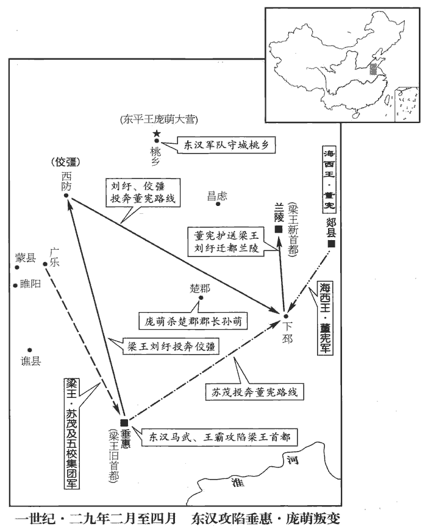 

5乙丑‹二十›，上行幸魏郡‹河北臨漳西南邺镇›。

〖译文〗 [5]乙丑（二十日），刘秀前往魏郡。

6彭寵妻數為惡夢，數，所角翻。又多見怪變；卜筮、望氣者皆言兵當從中起。寵以子后蘭卿質漢歸，不信之，子后蘭卿歸，見上卷二年。質，音致。使將兵居外，無親於中。寵齋在便室，賢曰：便坐之室，非正室也。蒼頭子密等三人賢曰：秦呼民為黔首；謂奴為蒼頭者，以別於良人也。因寵臥寐，共縛著牀，著，直略翻。告外吏云：「大王齋禁，皆使吏休。」偽稱寵命，收縛奴婢，各置一處。又以寵命呼其妻，妻入，驚曰：「奴反！」奴乃捽zuó其頭，擊其頰。捽，昨沒翻。寵急呼曰：「趣為諸將軍辦裝！」趣，讀為促。賢曰：呼奴為將軍者，欲其赦己也。呼，火故翻。為，於偽翻。於是兩奴將妻入取寶物，留一奴守寵。寵謂守奴曰：「若小兒，吾素所愛也。今為子密所迫劫耳！解我縛，當以女珠妻汝，妻，七細翻。家中財物皆以與若。」若，亦汝也。小奴意欲解之，視戶外，見子密聽其語，遂不敢解。於是收金玉衣物，至寵所裝之，被馬六匹，被，皮義翻。加馬以鞍勒曰被馬。使妻縫兩縑囊。昏夜後，解寵手，令作記告城門將軍云：「今遣子密等至子后蘭卿所，【章：十二行本「所」下有「速開門出」四字；乙十一行本同；孔本同；張校同；退齋校同。】勿稽留之。」書成，斬寵及妻頭置囊中，便持記馳出城，因以詣闕。明旦，閤門不開，官屬踰牆而入，見寵尸，驚怖。怖，普布翻。其尚書韓立等共立寵子午為王，國師韓利斬午首詣祭遵降，國師，以寵所；署置也，蓋遵王莽之制。夷其宗族。帝封子密為不義侯。

〖译文〗 [6]彭宠的妻子多次做恶梦，又常常看到奇异反常的现象。占卜师、望气先生都说兵乱要从内部兴起。彭宠因为堂弟子后兰卿在洛阳做人质后归来，不信任他，派他率领军队住在外地，远离宫中。彭宠在供休息用的便室斋戒，奴仆子密等三人趁彭宠在躺着睡觉，一起把他绑在床上，告诉外面的官员：“大王 正在斋戒，官吏们全都放假。”又假传彭宠的命令，把男女奴仆全都捆起来，分别囚禁。又以彭宠的命令唤请他的妻子，彭宠的妻子进入便室，一惊，说：“奴才反了！”家奴们竟然揪着她的头，狠打她耳光。彭宠急忙叫道：“赶快为将军们置办行装！”于是两个奴仆押着彭宠妻子到后宫收取珍珠财宝，留一个奴仆看守彭宠。彭宠对看守自己的奴仆说：“你这个小孩子，我一向爱护你。而今你不过被子密胁迫罢了！替我解开绳索，我将把女儿彭珠给你做妻子，家里的财宝全都给你。”小奴仆想要解开绳索，看看门外，见子密正听他们说话，便不敢去解。于是子密等人收取了后宫中的财宝衣物，回到彭宠所在的便室装好，备好六匹马，命彭宠的妻子缝制两个细绢做的口袋。天黑以后，解开彭宠的手，命他给守卫城门的将军亲笔下命令：“今派子密等人到子后兰卿处，不要留难。”写好之后，子密等人斩杀彭宠和他的妻子，把人头放到口袋里，就拿着彭宠的手令骑马疾驰出城，将人头等送到东汉京师洛阳。第二天，宫门不开，彭宠的官属们翻墙而入，看到彭宠的尸体，惊慌恐怖。彭宠的尚书韩立等共同拥立彭宠的儿子彭午为燕王。国师韩利诛杀彭午，砍下人头，带到东汉征虏将军祭遵处投降。祭遵把彭宠家族全部杀死。刘秀封子密为不义侯。

權德輿議曰：伯通之叛命，伯通，彭寵字也。子密之戕君，同歸於亂，罪不相蔽，宜各致於法，昭示王度；王度，猶言王法也。反乃爵於五等，又以『不義』為名。且舉以不義，莫可侯也；此而可侯，漢爵為不足勸矣。春秋書齊豹盜、三叛人名之義，衛司寇齊豹以私怨殺衛侯之兄孟縶zhí，春秋書之曰盜。三叛人名，謂襄二十一年，邾庶其以漆、閭丘來奔；昭五年，莒牟móu夷以牟婁及防茲來奔；哀十四年，小邾射以句繹yì來奔。句，音鉤。無乃異於是乎！

〖译文〗 权德舆议曰：彭宠叛变，子密杀君，同样是乱臣贼子，罪恶不能相遮盖，应当分别绳之以法，使王法显示于天下。但刘秀反而封子密做五等爵，又冠以“不义”的称号。既然提出他不义，就不可以封侯。如果这样的行为可以封侯的话，汉朝的爵位就失去劝勉的意义了。《春秋》把因私仇杀害卫侯兄孟絷的卫国司寇齐豹称为强盗；记载庶其、牟夷、射三个叛徒的名字，它的原则恐怕与此不同吧！

7帝以扶風‹陕西兴平›郭伋jí為漁陽‹北京密云›太守。郡國志：漁陽郡，在雒陽東北二千里。伋承離亂之後，養民訓兵，開示威信，盜賊銷散，匈奴遠跡；在職五年，戶口增倍。

〖译文〗 [7]刘秀任命扶风人郭做渔阳太守。郭接受的是流离战乱后的烂摊子，他休养百姓，训练士兵，建立威信。不久盗贼消散，匈奴人的踪迹远去。郭在职五年，户口增加一倍。

8帝使光祿大夫樊宏持節迎耿況於上谷‹河北懷來›，郡國志：上谷郡，在雒陽東北二千里。曰：「邊郡寒苦，不足久居。」況至京師，賜甲第，奉朝請，封牟móu平侯。地理志，牟平縣，屬東萊郡；唐、宋屬登州。宋白曰：牟平縣以在牟山之陽，其地平坦，故曰牟平。漢牟平故城，在今黃縣東百三十里。朝，直遙翻。請，音才性翻，又如字。

〖译文〗 [8]刘秀命光禄大夫樊宏持符节在上谷郡迎接耿况，说：“边疆郡县，寒冷贫穷，不能长期居住。”耿况到达洛阳，被赐予上等住宅，有权参加朝会封他为牟平侯。

吳漢率耿弇yǎn、王常擊富平、獲索賊於平原‹山東平原›，郡國志：平原郡，在雒陽北一千三百里。大破之；追討餘黨，至勃海‹河北沧州东南›，郡國志：勃海郡在雒陽北一千六百里。降者四萬餘人。上因詔弇進討張步。

〖译文〗 吴汉率领耿、王常在平原郡攻打富平、获索贼军，大败贼军。追击余部至勃海郡，有四万余人投降。刘秀接着颁诏书，命耿进军讨伐张步。

9平敵將軍龐萌，為人遜順，前作「平狄將軍」。帝信愛之，常稱曰：「可以託六尺之孤，寄百里之命者，論語孔子之言。呂與叔曰：託六尺之孤，謂輔幼主；寄百里之命，謂為諸侯。龐萌是也。」使與蓋延共擊董憲。時詔書獨下延而不及萌，下，遐稼翻。萌以為延譖己，自疑，遂反，襲延軍，破之；考異曰：東觀記、漢書皆云：「萌攻延；延與戰，破之。詔書勞延曰：『龐萌一夜反畔，相去不遠，營壁不堅，殆令人齒欲相擊；而將軍有不可動之節，吾甚美之。』」延傳言「僅而得免」，與彼不同，今從延傳。與董憲連和，自號東平王，屯桃鄉‹山東濟寧东›之北。東平國任城縣有桃鄉。賢曰：故城在今兗州龔丘縣西北。帝聞之，大怒，自將討萌，與諸將書曰：「吾嘗【章：十二行本「嘗」作「常」；乙十一行本同；孔本同。】以龐萌為社稷之臣，將軍得無笑其言乎！老賊當族，其各厲兵馬，會睢陽‹河南商丘›！」睢陽，梁國都。郡國志：在雒陽東南八百五十里。

〖译文〗 [9]平敌将军庞萌为人谦逊和顺，刘秀信任并喜爱他，常常称赞他说：“可以托付六尺高的孤儿，托付一县百里土地的是庞萌。”派他和盖延共同攻打董宪。当时诏书只颁给盖延而没有颁给庞萌，庞萌以为是盖延在刘秀面前说了自己的坏话，起了疑心，于是叛变，袭击盖延军，打败盖延和董宪联合起来，自称东平王，在桃乡以北驻扎军队。刘秀听到庞萌叛变的消息，大怒，亲率军队讨伐庞萌，他给将领们写信说：“我曾经以为庞萌是可以把国家托付给他的重臣，将军们恐怕要笑我说的话吧？庞萌这个老贼应当灭族，你们加紧操练军队，在睢阳会师！”

龐萌攻破彭城‹江蘇徐州›，將殺楚郡太守孫萌。郡國志：楚郡在雒陽東千二百二十里。考異曰：袁紀作「楚相孫萌」，今從范書。郡吏劉平伏太守身上，號泣請代其死，身被七創；號，戶刀翻；下同。被，皮義翻。創，初良翻。龐萌義而捨之。太守已絕復蘇，孔穎達曰：更息曰蘇，言氣絕而更息也。渴求飲，平傾創血以飲之。

〖译文〗 庞萌攻下彭城，要杀楚郡太守孙萌。楚郡官吏刘平趴在太守身上，哭号着请求代替太守去死，身上受了七处伤。庞萌觉得他很讲义气而赦免了孙萌。孙萌已经气绝，又苏醒过来，口渴想要喝水，刘平将伤口流出的血倒给孙萌喝。

10岑彭攻拔夷陵‹湖北宜昌›，田戎亡入蜀，盡獲其妻子、士眾數萬人。公孫述以戎為翼江王。

〖译文〗 [10]岑彭攻下夷陵，田戎逃入蜀地。岑彭全部俘获了田戎的妻子儿女及部众数万人。公孙述封田戎为翼江王。

岑彭謀伐蜀，以夾川穀少，夾川，猶言夾江也。江，大川也。水險難漕，留威虜將軍馮駿軍江州，都尉田鴻軍夷陵‹湖北宜昌›，領軍李玄軍夷道‹湖北枝城›；地理志，夷道縣屬南郡。自引兵還屯津鄉‹湖北江陵东›，郡國志，南郡江陵縣有津鄉。賢曰：所謂江津也。當荊州‹湖北、湖南›要會，喻告諸蠻夷降者，奏封其君長。

〖译文〗 岑彭策划攻打蜀地。因长江两岸粮食不足，水势险恶，而漕运困难，留下威虏将军冯骏驻屯江州、都尉田鸿驻屯夷陵，领军李玄驻屯夷道。岑彭自己率领军队返回，驻屯津乡，把守荆州要冲，通告投降的各夷蛮族，已经上奏请求封他们的首领。

11夏，四月，旱蝗。

〖译文〗 [11]夏季，四月，天旱，出现蝗灾。

12隗囂問於班彪曰：「往者周亡，戰國并爭，數世然後定。意者從橫之事將復起於今乎，從，子容翻。復，扶又翻。將承運迭興，在於一人也？」彪曰：「周之廢興，與漢殊異。昔周爵五等，諸侯從政，師古曰：言諸侯之國各自為政。本根既微，枝葉強大，本根，謂王室。枝葉，謂諸侯。故其末流有從橫之事，勢數然也。漢承秦制，改立郡縣，主有專己之威，臣無百年之柄。至於成帝，假借外家，師古曰：假，音工暇翻，又工雅翻。哀、平短祚，國嗣三絕，故王氏擅朝，能竊號位，危自上起，傷不及下，賢曰：成帝威權借於外家，是危自上起也。漢不得罪於百姓，是傷不及下也。朝，直遙翻。是以即真之後，天下莫不引領而歎。十餘年間，中外騷擾，遠近俱發，假號雲合，咸稱劉氏，不謀同辭。方今雄桀帶州域者，皆無六國世業之資，而百姓謳吟思仰，漢必復興，已可知矣。」

〖译文〗 [12]隗嚣问班彪说：“从前，周朝灭亡，战国时期群雄争战，几代以后天下才统一。大概合纵连横的旧事将会在今天重演吧？将由一个人承受天命，再度兴起吗？”班彪说：“周朝的兴亡，同汉朝完全不同。过去周朝把爵位分成五等，诸侯各自为政。衰微以后，枝叶强大，所以到了末期出现合纵连横的事，是形势发展的必然结果。汉朝继承秦朝的政治制度，改置郡县，君主有专制独裁的威严，臣下没有积累到一百年的权力。到了汉成帝时，把皇帝的威严让给外戚。以后汉哀帝、汉平帝在位时间都很短，皇位的合法继承人三次断绝。所以王莽专擅朝政，得以篡夺皇位。国家的危机来自最上层，没有伤害到百姓。所以王莽篡夺皇位成为事实以后，天下人无不伸长脖子叹息。在十余年时间里，内扰外乱，远近一齐爆发。各路人马风起云涌，全都假借刘姓宗室的名号，大家不谋而合。当今拥有州郡的英雄豪杰，都没有六国那种世代积累的资本，而老百姓讴歌、吟咏、思念、仰慕的是汉朝，汉朝必然复兴，已经可以知道了。”

囂曰：「生言周、漢之勢可也，至於但見愚人習識劉氏姓號之故，而謂漢復興，疏矣！昔秦失其鹿，劉季逐而掎jǐ之，師古曰：掎，偏持其足也；居蟻翻。時民復知漢乎？」彪乃為之著王命論以風切之，為，於偽翻。風，讀曰諷。曰：「昔堯之禪舜曰：『天之曆數在爾躬。』舜亦以命禹。論語所載。洎jì於稷、契，咸佐唐、虞，至湯、武而有天下。洎，其冀翻。契，息列翻。劉氏承堯之祚，堯據火德而漢紹之，有赤帝子之符，事見七卷秦二世元年。故為鬼神所福饗，天下所歸往。由是言之，未見運世無本，功德不紀，師古曰：不紀，言不為人所記。而得屈起在此位者也！屈起，特起也。屈，求勿翻。俗見高祖興於布衣，不達其故，至比天下於逐鹿，幸捷而得之。不知神器有命，不可以智力求也。劉德曰：神器，璽也。李奇曰：帝王賞罰之柄也。師古曰：李說是也。仲馮曰：神器，「聖人之大寶曰位」是也。悲夫，此世所以多亂臣賊子者也！夫餓饉流隸，師古曰：隸，賤隸。飢寒道路，所願不過一金，然終轉死溝壑，何則？貧窮亦有命也。況乎天子之貴，四海之富，神明之祚，可得而妄處哉！處，昌呂翻。故雖遭罹阨會，竊其權柄，勇如信、布，強如梁、籍，謂項梁、項籍也。成如王莽，然卒潤鑊huò伏質，師古曰：質，鍖chěn也。伏於鍖上而斬之也。卒，子恤翻。亨醢hǎi分裂；亨，與烹同。又況ㄠyāo麼尚不及數子，師古曰：ㄠ麼，皆微小之稱也。ㄠ，音一堯翻。麼，音莫可翻。而欲闇奸天位者虖！奸，音干。昔陳嬰之母以嬰家世貧賤，卒富貴不祥，止嬰勿王；卒，讀曰猝。事見八卷秦二世二年。王陵之母知漢王必得天下，伏劍而死，以固勉陵。事見九卷高祖元年。夫以匹婦之明，猶能推事理之致，探禍福之機，而全宗祀於無窮，垂策書於春秋，師古曰：凡言匹夫、匹婦，謂凡庶之人。春秋，史書記事之總稱。而況大丈夫之事虖！是故窮達有命，吉凶由人，嬰母知廢，陵母知興，審此二者，帝王之分決矣。分，扶問翻；下同。加之高祖寬明而仁恕，知人善任使，當食吐哺，納子房之策；拔足揮洗，揖yī酈生之說；舉韓信於行陳，洗，息典翻。行，戶剛翻。陳，讀曰陣。收陳平於亡命；事并見高帝紀。英雄陳力，群策畢舉，此高祖之大略所以成帝業也。若乃靈瑞符應，其事甚眾，故淮陰、留侯謂之天授、非人力也。英雄誠知覺寤，超然遠覽，淵然深識，收陵、嬰之明分，絕信、布之覬覦，覬，音冀。覦，音俞。距逐鹿之瞽說，審神器之有授，毋貪不可冀，為二母之所笑，則福祚流於子孫，天祿其永終矣！」囂不聽。彪遂避地河西‹甘肅中部、西部›；竇融以為從事，漢制，將軍府及司隸、刺史、郡守皆有從事。甚禮重之。彪遂為融畫策，為，於偽翻。使之專意事漢焉。

〖译文〗 隗嚣说：“先生讲的周朝、汉朝的形势是对的，至于只看见愚昧的人习惯于刘氏宗室统治的缘故，就说汉朝一定复兴，看法就不周密了。从前，秦朝失去了天下，刘邦奋起而夺得天下，当时的老百姓又能知道汉朝吗？”于是班彪为他撰写了《王命论》，用深刻的话进行讽喻，劝告隗嚣说：“从前，尧把天下禅让给舜时说：‘上天的大命落在你的身上。’舜也将同样的话告诉禹。到后稷、子契，他们都辅佐唐尧、虞舜。一直到商汤、周武王而拥有天下。刘姓继承的是尧的大业，尧是火德，而汉朝承袭下来，刘邦有赤帝儿子的符命，因此被鬼神祝福供奉，天下全都归附于他。由此可以说，从未见过命运没有基础，功德不为人所记，而能够崛起处在帝王之位的。按照世俗的观点，看到刘邦从一个普通的老百姓登上皇帝的宝座，不明白其中的缘故，甚至认为争夺天下就像追逐奔跑的鹿，幸运腿快的就能捉到，却不知帝王的权力自有命运注定，不能凭借智慧和力量追求。可悲呵，这就是世上所以多有乱臣贼子的原因。饥饿的流民在路途上挨饿受冻，他们的愿望不过是能有一点钱，然而最终辗转死于沟壑。为什么？因为贫穷也是命运注定的。况且帝王的尊贵，拥有四海的富饶，受到神明的赐福，能够随便处置吗？“所以，虽然国家遇到忧患和战乱，有的人窃取了权力，但是勇猛如同韩信、英布；强大如同项梁、项羽；成功如同王莽，尚且最终败亡，被烹杀斩首，剁成肉酱，肢体分裂。又何况一些微不足道的小人物，还不如上述这几个人，却想趁着黑暗篡夺天子的尊位呢！过去，陈婴的母亲因为陈婴家世代贫贱，突然富贵，认为是不吉祥，阻止陈婴当王。王陵的母亲知道刘邦一定会得到天下，用宝剑自杀，以坚定和勉励王陵效忠刘邦的决心。凭一个老妇人的明智，还能够推断事理的精到之处，探知祸福的关键，而永久保全家族，使事迹记载在史书上。何况大丈夫的业绩呢？因此，贫贱富贵由命运安排，吉凶由自己掌握。陈婴的母亲知道谁会灭亡，王陵的母亲知道谁会兴起。详知这两个方面，帝王何在就清楚了。加上刘邦宽厚英明，仁爱忠恕，知人善任。正在吃饭的时候，能够吐出口中的饭食，接受张良提出的策略；正在洗脚的时候，能够拔出脚，为郦食其的话而作揖，在军队的行列中选拔韩信，在逃亡奔命后任用陈平。英雄们献出力量，各种计策都被提出，这就是高祖的雄才大略，他因此而成就了帝王大业。至于灵验的预兆，瑞符的应验，这种事很多。所以韩信、张良认为是上天授予，而不是由于人的力量。英雄如果能够知道觉悟，高瞻远瞩，深刻认识，学习王陵、陈婴的明白自己的本分，弃绝韩信、英布的野心，抵制‘逐鹿’的那些盲人瞎话，认识到皇帝的至高无上的权力是上天授予的；不贪图不可希冀的东西，不被陈婴、王陵的母亲嘲笑，那么，福分就会流传给子孙，上天将永远赐福！”隗嚣不听班彪的劝告。班彪于是躲避到河西。窦融任命他当从事，十分礼敬尊重。班彪于是替窦融谋划，使窦融专心一意为东汉朝廷效力。

13初，竇融等聞帝威德，心欲東向，以河西隔遠，未能自通，乃從隗囂受建武正朔；囂皆假其將軍印綬。囂外順人望，內懷異心，使辯士張玄說融等曰：「更始事已成，尋復亡滅，說，輸芮翻。復，扶又翻。此一姓不再興之效也！今即有所主，便相係屬，一旦拘制，自令失柄，後有危敗，雖悔無及。方今豪桀競逐，雌雄未決，當各據土宇，與隴、蜀合從，從，子容翻。高可為六國，下不失尉佗。」尉佗事見十二卷高帝十一年。佗，徒何翻。融等召豪桀議之，其中識者皆曰：「今皇帝姓名見於圖書，見，賢遍翻。自前世博物道術之士谷子雲、夏賀良等皆言漢有再受命之符，谷永書見三十一卷成帝永始二年。夏賀良事見三十三卷哀帝建元二年。故劉子駿改易名字，冀應其占。劉歆改名事見三十三卷成帝綏和二年。歆，字子駿，意在改名之後。及莽末，西門君惠謀立子駿，事覺被殺，出謂觀者曰：『讖文不誤，劉秀真汝主也！』事見三十九卷更始元年。讖，楚譖翻。此皆近事暴著，暴，步木翻。毛晃曰：顯示也；又如字，義同。眾所共見者也。況今稱帝者數人，而雒陽土地最廣，甲兵最強，號令最明，觀符命而察人事，它姓殆未能當也！」眾議或同或異。

〖译文〗 [13]当初，窦融等听说刘秀的威望恩德，一心向往东方，因为河西和洛阳相隔遥远，自己不能直接联系，于是自隗嚣那里接受东汉“建武”的年号。隗嚣一并授给他将军印信和绶带。隗嚣表面上顺应众望，实际上怀有二心，他派善辩之士张玄劝说窦融等人道：“更始的大事已经成功，但很快又灭亡，这是刘氏一姓不能再起的证明。如果马上就认定君主，隶属于他，一旦受到束缚和制约，自己就会失掉权力。以后跟着他败亡，后悔莫及。当今英雄豪杰相互竞争，胜败未定。我们应当各守地盘，和陇西隗嚣、西蜀公孙述结成合纵联盟。搞得好可以成为战国时代的六国之一，搞不好也可成为南海尉佗。”窦融等召集豪杰们商议，其中有见识的人都说：“当今皇帝的名字，在预言书中可以看到，前辈的法术大师谷子云、夏贺良等都认为，汉朝有再度兴起的祥瑞征兆，所以刘歆改名为刘秀，希望应和预言书上的话。等到王莽末年，西门君惠谋划拥立刘歆做皇帝，事情败露被杀。西门在被绑缚刑场的途中，对围观的人说：‘预言书上的话不错，刘秀确实是你们的君主！’这是近年发生的事，人人皆知，大家亲眼所见。何况当今号称皇帝的几个人中，刘秀拥有的土地最多，兵力最为强盛，军令最为严明。观察预言书上的话，考察世间的事情，其他姓氏的人恐怕不能担当君主。”大家商议，有的赞同，有的反对。

融遂決策東向，遣長史劉鈞等奉書詣雒陽。時眾推融為大將軍，故置長史。先是，帝亦發使遺融書以招之，先，悉薦翻。遺，于季翻。遇鈞於道，即與俱還。帝見鈞歡甚，禮饗畢，乃遣令還，賜融璽書曰：「今益州‹四川›有公孫子陽，天水‹甘肅東部›有隗將軍。方蜀、漢相攻，權在將軍，舉足左右，便有輕重。言左投則蜀重，右投則漢重也。以此言之，欲相厚豈有量哉！欲遂立桓、文，輔微國，當勉卒功業；欲三分鼎足，連衡合從，亦宜以時定。開兩說以觀融去就。量，音良。卒，子恤翻。衡，讀曰橫。從，子容翻。天下未并，吾與爾絕域，非相吞之國。今之議者，必有任囂教尉佗制七郡之計。事見十二卷高帝十一年。賢曰：七郡，蒼梧、鬱林、合浦、交趾、九真、南海、日南也。余謂尉佗之時未置七郡，光武據後來置郡言之。王者有分土，無分民，分，扶問翻。自適己事而已。」因授融為涼州牧。璽書至河西，河西皆驚，以為天子明見萬里之外。

〖译文〗 窦融于是决定归顺东方的刘秀，派长史刘钧等人带着给刘秀的信到洛阳去。在这之前，刘秀也派使者给窦融送信招致他。刘秀的使者在路上遇到刘钧，就和刘钧一起返回洛阳。刘秀见到刘钧十分高兴，和他以礼相见，设宴款待，然后，让他回去汇报，赐给窦融诏书说：“现在益州有公孙述，天水有隗嚣。公孙述和隗嚣两家正互相攻打，胜败的命运掌握在将军手中，有着举足轻重的作用。由此说来，您打算帮助某一方时，力量岂能计量！如果要创立齐桓公、晋文公的霸业，辅佐我这个弱小的政权，就应当努力完成这一功业；如果想实现三足鼎立的局面，连横合纵，也应该抓住时机决定。天下还没有统一，我和您土地不接壤，不会互相吞并。现在谈论这件事的人，一定有像任嚣让尉佗控制七个郡那样的计策。君王可以分封土地，便不分割百姓。，自己做适合自己的事情罢了。”于是任命窦融当凉州牧。诏书传到河西，整个地区震惊，认为天子明察，远到万里之外。

14朱祜急攻黎丘‹湖北襄樊东南›。六月，秦豐窮困出降，檻車送洛陽。吳漢劾祜廢詔命，受豐降。上誅豐，不罪祜。

〖译文〗 [14]朱祜猛烈攻打黎丘。六月，秦丰因处于困境而出城投降。朱祜用囚车把秦丰送到洛阳。吴汉弹劾朱祜不顾诏命，接受秦丰投降。刘秀杀掉秦丰，不怪罪朱祜。

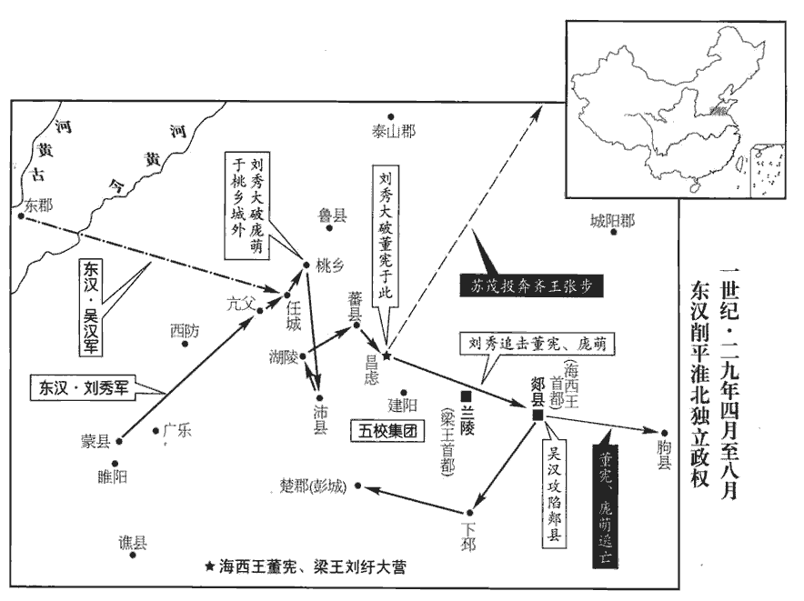 

15董憲與劉紆、蘇茂、佼彊去下邳‹江蘇睢宁北›，還蘭陵‹山東苍山西南›，使茂、彊助龐萌圍桃城‹山東濟寧东›。桃城，即桃鄉之城也。賢曰：在今兗州任城縣北。帝時幸蒙‹河南商丘›，聞之，乃留輜重，重，直用翻。自將輕兵晨夜馳赴。至亢父‹山東濟寧南五十里›，賢曰：蒙，縣名，屬梁國，故城在今宋州北。地理志，亢父縣屬東平國。師古曰：音抗甫。或言百官疲倦，可且止宿；上不聽，復行十里，宿任城‹山東濟寧东南›，復，扶又翻。任，音壬。欲度亢父之險，故進而宿任城。去桃城六十里。旦日，諸將請進，龐萌等亦勒兵挑戰；挑，徒了翻。帝令諸將不得出，休士養銳以挫其鋒。時吳漢等在東郡，郡國志：東郡，去雒陽八百里。馳使召之。萌等驚曰：「數百里晨夜行，以為至當戰，而堅坐任城，致人城下，真不可往也！」乃悉兵攻桃城。城中聞車駕至，眾心益固；萌等攻二十餘日，眾疲困，不能下。吳漢、王常、蓋延、王梁、馬武、王霸等皆至，帝乃率眾軍進救桃城，親自搏戰，大破之。龐萌、蘇茂、佼彊夜走從董憲。

〖译文〗 [15]董宪和刘纡、苏茂、佼强离开下邳，回到兰陵，让苏茂、佼强协助庞萌围攻桃城。刘秀当时正在蒙县，听说之后，就留下辎重，亲自率领轻装的部队，日夜奔驰赶赴救援。到达亢父县，有人说官员们都很疲劳，可暂且停止行军，住宿休息。刘秀不同意，又行军十里路，在任城住宿，距离桃城六十里。第二天，将领们请求进军，庞萌等也派军挑战。刘秀命令将领们不得出击，休整部众，养精蓄锐，以挫败敌军的锐气。当时吴汉等在东郡，刘秀派人骑快马招他前来。庞萌等吃惊说：“数百里路日夜行军，以为就会投入战斗，可是刘秀却稳坐任城，招别人到城下。我们确实不能前往！”于是全力进攻桃城。城内的人听说皇帝自来救援，军心更加牢固。庞萌等攻打二十多天，将士们疲劳不堪，不能攻陷。吴汉、王常、盖延、王梁、马武、王霸等都到达后，刘秀便率领各路大军进攻桃城，亲自参加战斗，大破敌军。庞萌、苏茂、佼强连夜逃跑，投奔董宪。

秋，七月，丁丑‹四›，帝幸沛‹江蘇沛縣›，進幸湖陵‹山東魚台东南›。董憲與劉紆悉其兵數萬人屯昌慮‹山東滕州東南›；地理志，昌慮縣，屬東海郡。宋白曰：徐州滕縣，漢蕃、昌慮二縣地。應劭註：蕃縣，即小邾國。又有邾國濫城，在今縣東南，即漢之昌慮縣也。師古曰：慮，音廬。憲招誘五校餘賊，與之拒守建陽‹山東枣庄西南›。賢曰：建陽縣，屬東海郡；故城在今沂州丞縣北。丞，時證翻。帝至蕃‹山東滕州›，賢曰：蕃，音皮，又音婆。地理志，蕃縣，屬魯國。應劭曰：小邾國也。師古曰：白裒póu云：陳蕃為魯相，國人為諱，改曰皮。此說非也。郡縣之名，土俗各有別稱，不必皆依本字。杜佑通典：蕃，音反。余謂「皮」字乃傳寫「反」字之誤，當從通典。反，音孚袁翻。去憲所百餘里，諸將請進；帝不聽，知五校乏食當退，敕各堅壁以待其敝。頃之，五校果引去。帝乃親臨，四面攻憲，三日，大破之；佼彊將其眾降，降，戶江翻。蘇茂奔張步，憲及龐萌走保郯‹山東郯城›。八月，己酉‹六›，帝幸郯，留吳漢攻之，車駕轉徇彭城、下邳‹江蘇睢宁北›。吳漢拔郯，董憲、龐萌走保胊qú‹江蘇连云港›。賢曰：胊縣，屬東海郡；今海州胊山縣西有故胊城。胊，音劬qú。宋白曰：胊故城，在胊山縣西九十里。劉紆不知所歸，其軍士高扈斬之以降。吳漢進圍胊。

〖译文〗 秋季，七月丁丑（初四），刘秀到达沛县，又到达湖陵。董宪和刘纡带领全部兵马数万人屯驻在昌虑县。董宪招致引诱五校军残部，和他们防守建阳。刘秀到达蕃县，距离董宪的营垒一百余里，将领们请求进攻。刘秀不同意，知道五校军缺乏粮食，就会撤退。告诫各路大军坚守营垒，以等待敌军疲惫。不久，五校军果然离去。刘秀于是亲临战场，四面围攻董宪。三天后，大破董宪的军队。佼强率领部众投降，苏茂投奔张步，董宪和庞萌逃跑，据守郯县。八月己酉（初六），刘秀到达郯县，留下吴汉攻城，自己转而攻取彭城、下邳。吴汉攻占郯县，董宪、庞萌逃到朐县据守。刘纡不知该逃往何处，被他的军士高扈所斩，高扈投降刘秀。吴汉进军包围朐县。

16冬，十月，帝幸魯。魯國本屬徐州，帝改屬豫州。

〖译文〗 [16]冬季，十月，刘秀到达鲁城。

17張步聞耿弇yǎn將至，使其大將軍費邑軍歷下‹山東济南›，賢曰：歷下城在今齊州歷城縣。考異曰：袁紀作「濟南王費邑」，今從耿弇傳。又令兵屯祝阿‹山東長清东北›，地理志，祝阿縣，屬平原郡。賢曰：今齊州縣，故城在今山茌chí縣東北。天寶元年改祝阿為禹城，以縣西有禹息故城也。別於泰山、鍾【章：十二行本「鍾」作「鐘」；乙十一行本同；孔本同。下均同。】城‹山東济南南›列營數十以待之。弇渡河，先擊祝阿‹山東長清东北›，自旦攻城，日未中而拔之；故開圍一角，令其眾得奔歸鍾城。鍾城人聞祝阿已潰，大恐懼，遂空壁亡去。

〖译文〗 [17]张步听说耿将要到达，命他的大将军费邑驻屯历下城；又派军队驻屯祝阿县；另外在泰山、钟城排列数十个营垒，等待耿军。耿渡过黄河，先攻打祝阿。从早晨开始攻城，还没到中午就攻陷城池。故意打开一个缺口，让城里的残兵得以跑出，投奔钟城。钟城的军队听说祝阿已经陷落，极度恐慌，于是留下一座空城逃走。

費邑分遣弟敢守巨里‹山東章丘西›。郡國志，濟南歷城有巨里聚。賢曰：一名巨合城，在今齊州全節縣東南。弇進兵先脅巨里，嚴令軍中趣脩攻具，趣，讀曰促。宣敕諸部，後三日當悉力攻巨里城；陰緩生口，令得亡歸，以弇期告邑。邑至日，果自將精兵三萬餘人來救之。弇喜，謂諸將曰：「吾所以脩攻具者，欲誘致之耳。誘，音酉。野兵不擊，何以城為！」即分三千人守巨里；自引精兵上岡阪，爾雅曰：山脊曰岡，坡者曰阪。上，時掌翻。乘高合戰，大破之，臨陳斬邑；陳，讀曰陣。既而收首級以示城中，城中兇懼。賢曰：兇，恐懼聲，音呼勇翻。費敢悉眾亡歸張步。弇復收其積聚，復，扶又翻。積，子賜翻。聚，才喻翻。縱兵擊諸未下者，平四十餘營，遂定濟南‹山东省章丘市›。郡國志：濟南郡，在雒陽東千八百里。濟，子禮翻。

〖译文〗 费邑派遣弟弟费敢据守巨里 。耿进兵先威胁巨里，严令军队立即准备攻城工具，通告全军，三天后将要全力进攻巨里城。暗中释放几名俘虏，让他们逃回，把耿的行动日期告诉费邑。费邑在三天后，果然亲自率领精锐部队三万余人赶来援救。耿非常高兴，对将领们说：“我准备攻城工具的目的，就是要引诱费邑前来。不攻打他们的野战部队，要城干什么！”马上分兵三千人看守巨里；自己统率精兵登上山坡，占据高地和费邑交战，大破敌军，在阵地上斩杀费邑。然后把费邑的人头带给巨里城中的人看，城中震恐。费敢率全体部众逃跑，投奔张步。耿又收取费敢留下的粮草，派兵攻取那些未归附的营寨，扫平四十余座，于是平定济南郡。

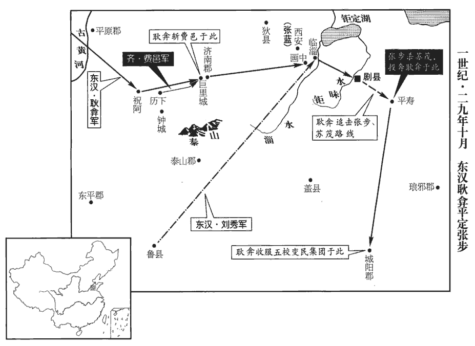 

時張步都劇‹山東寿光南›，使其弟藍將精兵二萬守西安‹山東桓台东›，賢曰：西安，縣名，屬齊郡；故城在今青州臨菑縣西北。諸郡太守合萬餘人守臨菑，臨菑縣，屬齊郡。相去四十里。弇進軍畫中，賢曰：畫中，邑名也。畫，音胡麥翻。故城在今西安城東南；有澅水，因名焉。水經註：澅水東去臨菑城十八里。居二城之間。弇視西安城小而堅，且藍兵又精，臨菑名雖大而實易攻，易，以豉翻。乃敕諸校後五日會攻西安。校，戶教翻。藍聞之，晨夜警守。至期，夜半，弇敕諸將皆蓐rù食，前書音義曰：未起而牀蓐中食也。會明，至臨菑城。護軍荀梁等爭之，以為「攻臨菑，西安必救之，攻西安，臨菑不能救，不如攻西安。」弇曰：「不然，西安聞吾欲攻之，日夜為備，方自憂，何暇救人！臨菑出不意而至，必驚擾，吾攻之一日，必拔。拔臨菑，即西安孤，與劇‹山東寿光南›隔絕，必復亡去，復，扶又翻。所謂『擊一而得二』者也。若先攻西安，不能卒下，卒，讀曰猝。頓兵堅城，死傷必多。縱能拔之，藍引軍還奔臨菑，并兵合勢，觀人虛實；吾深入敵地，後無轉輸，旬月之間，不戰而困矣。」遂攻臨菑；半日，拔之，入據其城。張藍聞之，懼，遂將其眾亡歸劇‹山東寿光南›。

〖译文〗 当时张步以剧县作为都城。他派弟弟张蓝率领精兵二万人驻守西安县，派各郡太守集合一万余人守卫临县，两地相距四十里。耿率军进军画中，画中位于西安和临之间。耿看到西安城垣小，但很坚固，而且张蓝的军队又很精锐，临虽有盛名，但实际上却容易攻取。于是，耿命令各指挥官，五天以后联合攻打西安。张蓝听说以后，日夜警戒守卫。到了预定日期，夜半时分，耿命将领们全都在住宿地吃饭。到天亮时，抵达临城。护军荀梁等表示反对，认为：“攻打临，西安必定救援；攻打西安，临不能救援，不如攻打西安。”耿说：“不是这样。西安方面知道我们要攻打他们，日夜戒备，正担心自己的安全，哪有功夫援救别人！临方面想不到我们会去攻打他们，一定会惊慌失措。我用一天的时间，必能攻破。攻陷了临，西安立即变得孤立，和剧县的交通被我们切断，西安守军必然再弃城逃跑。这正是所谓‘击一而得二’。如果先攻打西安，不能很快攻下，军队被困在坚城之下，伤亡一定很多。纵使能够攻破，张蓝将率军逃回临，和那里的守军合并，观察我们的虚实。我们深入敌地，后面没有补给运送，一个月之内，不打仗就已困窘不堪了。”于是进攻临，半天时间后攻陷，进占该城。张蓝听到消息，十分恐惧，于是率领军队逃回到剧县。

弇yǎn乃令軍中無得虜掠，須張步至乃取之，以激怒步。步聞，大笑曰：「以尤來、大彤十餘萬眾，吾皆即其營而破之；今大耿兵少於彼，即，就也。賢曰：弇，況之長子，故呼為大耿。少，詩沼翻。又皆疲勞，何足懼乎！」乃與三弟藍、弘、壽及故大彤渠帥重異等兵賢曰：重，姓；異，名。重，直龍翻。姓譜：南正重之後。號二十萬，至臨菑大城東，將攻弇。弇上書曰：「臣據臨菑，深塹高壘；張步從劇縣來攻，疲勞飢渴。欲進，誘而攻之；欲去，隨而擊之。臣依營而戰，精銳百倍，以逸待勞，以實擊虛，旬日之間，步首可獲。」於是弇先出菑水上，水經：淄水出泰山萊蕪縣原山東北，過臨菑縣東。與重異遇；突騎欲縱，弇恐挫其鋒，令步不敢進，故示弱以盛其氣，乃引歸小城，陳兵於內，使都尉劉歆、泰山太守陳俊分陳於城下。陳，讀曰陣；下同。步氣盛，直攻弇營，與劉歆等合戰。弇升王宮壞臺望之，賢曰：臨菑，本齊國所都，即齊王宮中有壞臺也。視歆等鋒交，乃自引精兵以橫突步陳於東城下，大破之。飛矢中弇股，中，竹仲翻。以佩刀截之，左右無知者。至暮，罷；弇明旦復勒兵出。復，扶又翻；下同。

〖译文〗 耿于是下令军队不能掳掠，等到张步到来时才取财物，以激怒张步。张步听后，大笑说：“以尤来、大彤的十余万人之多，我都到他们的营垒摧毁他们。现在耿的军队比他们少，又全疲劳不堪，有什么可怕的？”于是联合三个弟弟张蓝、张弘、张寿以及前大彤军首领重异等的军队，号称二十万人，抵达临大城东，准备进攻耿。耿向刘秀报告军情说：“我占据临城，挖深壕，筑高墙。张步从剧县前来攻打，军队疲劳饥渴。他要推进，我就引诱而攻打他；他要撤退，我尾随而追击他。我依靠自己的营垒作战，精锐百倍，以逸待劳，以实攻虚，十天之内，可以获得张步首级。”于是耿率军先出营到水边，与重异遭遇。骑兵突击队就进攻，耿恐怕挫败敌军锐气，使张步不敢前进，就有意显示自己懦弱而助长对方的骄气，率军回到临小城，陈兵城内，派都尉刘歆、泰山太守陈俊分别在城下布阵。张步气盛，径直攻打耿军营，同刘歆等交战。耿登上原齐国宫殿残破的高台观望，察看刘歆等同张步作战的情况，于是亲自率领精锐部队，在东城下横冲进张步的军队，大败敌军。流箭射中耿大腿。耿用佩刀截断箭杆，左右没人知道主帅受伤。战到天黑，收兵。第二天早晨，耿又率军出营。

是時帝在魯，聞弇為步所攻，自往救之。未至，陳俊謂弇曰：「劇虜兵盛，可且閉營休士，以須上來。」弇曰：「乘輿且到，乘，繩證翻。臣子當擊牛、釃shī酒以待百官，釃，山宜翻。陸德明曰：以筐𥂖酒。賢曰：濾也。反欲以賊虜遺君父邪！」遺，于季翻。乃出兵大戰。自旦及昏，復大破之；殺傷無數，溝塹皆滿。弇知步困將退，豫置左右翼為伏以待之；兩旁伏兵如鳥之舒翼。人定時，步果引去，昏後，謂之人定時。伏兵起縱擊，追至钜昩水‹弥河，流经山東壽光南›上，賢曰：钜昩，水名，一名巨洋水，在今青州壽光縣西。水經註：巨洋水出朱虛縣東泰山，袁宏謂之钜昩，王韶之以為巨蔑；北過臨胊縣東，又北過臨胊縣西，又東北過壽光縣西。昩，音莫葛翻。八九十里，僵尸相屬，屬，之欲翻。收得輜重二千餘兩。重，直用翻。兩，音亮；下同。風俗通：車一乘為一兩。箱、轅及輪兩兩而偶，故稱兩。步還劇，兄弟各分兵散去。

〖译文〗 这时刘秀在鲁城，听说耿被张步攻击的消息，亲自率军前去援救。还未抵达，陈俊对耿说：“剧县敌兵士气正盛，我们可以暂且关闭营门，休养军士，等皇上前来。”耿说：“皇上将到，臣子应当杀牛备酒等待百官，反而要把盗贼匪徒送给君王吗！”于是出兵大战，从早晨到黄昏，再次大败敌军。杀伤敌人无数，尸体填满了水沟战壕。耿料到张步受到重创以后将会撤军，预先在左右两翼设下伏兵等候。深夜，张步果然率军离去。伏兵奋起攻击，一直追到臣水畔。前后八九十里，死尸相连。耿缴获张步的辎重车两千余辆。张步逃回剧县，兄弟们各自带兵离开。

後數日，車駕至臨菑，自勞軍，勞，力到翻。群臣大會。帝謂弇曰：「昔韓信破歷下以開基，事見十卷高祖四年。今將軍攻祝阿以發跡，此皆齊之西界，功足相方。而韓信襲擊已降，將軍獨拔勍qíng敵，其功又難於信也。勍，渠京翻。又，田橫亨酈生，及田橫降，高帝詔衛尉不聽為仇；事見十一卷高帝五年。亨，與烹同。張步前亦殺伏隆，事見上三年。若步來歸命，吾當詔大司徒釋其怨，又事尤相類也。將軍前在南陽，建此大策，謂三年冬弇從帝幸舂陵，自請平齊也。常以為落落難合，賢曰：落落，猶疏闊也。有志者事竟成也！」帝進幸劇。

〖译文〗 又过了几天，刘秀抵达临，亲自慰劳军队，大会文武百官。刘秀对耿说：“过去韩信攻破历下，开创了大业的基础；今天将军攻破祝阿，建立了功绩，这些地方全是故齐国的西方边界，你们二人的功劳足可以相比。而韩信攻击的是已经投降的军队，将军单独打败强大的敌人，建功又比韩信艰难了。再有，田横曾经烹杀郦食其，等到田横投降刘邦，刘邦下诏卫尉郦商不要报仇。张步先前也杀了伏隆，今天如果他来归顺，我将下诏让大司徒伏湛解除怨恨，这两件事情又尤其相似。将军以前在南阳时，曾提出建树这项功业的重大策略。我总感到计划庞大，难以实现。但对于有志的人，事情终究可以成功！”刘秀进抵剧县。

耿弇復追張步，步奔平壽‹山東昌乐东南›，賢曰：平壽，縣名，屬北海郡；故城在今青州北海縣。復，扶又翻。蘇茂將萬餘人來救之。茂讓步曰：「以南陽兵精，延岑善戰，而耿弇走之，事見上三年。大王柰何就攻其營？既呼茂，不能待邪！」步曰：「負負，無可言者。」賢曰：負，愧也。再言負者，愧之甚也。帝遣使告步、茂，能相斬降者，封為列侯。降，戶江翻。步遂斬茂，詣耿弇軍門肉袒降；弇傳詣行在所，傳，直戀翻。而勒兵入據其城，平壽城‹山東昌乐东南›也。樹十二郡旗鼓，令步兵各以郡人詣旗下，眾尚十餘萬，輜重七千餘兩，皆罷遣歸鄉里。張步三弟各自繫所在獄，詔皆赦之，封步為安丘侯，地理志，安丘侯國，屬琅邪郡；又北海郡有安丘縣。宋白曰：密州有安丘縣，古根牟國城，漢為安丘；縣有渠丘亭，故莒渠丘公所居也。與妻子居雒陽。

〖译文〗 耿又追击张步。张步逃奔平寿县，苏茂率领一万余人前来援救。苏茂责备张步说：“以南阳军队的精锐，延岑的勇敢善战，耿却击败了他们。大王为什么靠近并攻击耿的阵地呢？您既然征召我，就不能等待吗？”张步说：“惭愧惭愧，我没有什么可说的。”刘秀派人告诉张步、苏茂，能诛杀对方而投降的，封侯。于是张步杀了苏茂，到耿军营门前，露出臂膀投降。耿用驿车把张步送到刘秀驻地，自己率军进入平寿城。树起十二个郡的旗帜，在旗下设鼓，命张步的士兵分别到本郡的旗下。此时，张步军队还有十余万，辎重车七千余辆，全部遣散返回乡里。把张步的三个弟弟分别囚禁在当地的监狱，刘秀下诏全都赦免，封张步为安丘侯，让他和妻子儿女住在洛阳。

於是琅邪‹山東諸城›未平，郡國志：琅邪郡，在雒陽東千五百里。上徙陳俊為琅邪太守；始入境，盜賊皆散。

〖译文〗 当时琅邪郡还没有平定，刘秀调陈俊当琅邪太守。陈俊刚刚入境，盗贼全都散去。

耿弇復引兵至城陽‹山東莒縣›，地理志，城陽國，都莒。賢曰：城陽故城，在今沂州臨沂縣南。降五校餘黨，校，戶教翻。齊地悉平，振旅還京師。弇為將，凡所平郡四十六，屠城三百，未嘗挫折焉。

〖译文〗 耿又率军抵达城阳，收降五校军残部，齐地全部平定。耿整军返回洛阳。耿为将领，一共平定四十六个郡；屠城三百座，未曾被敌人击败过。

18初起太學，車駕還宮，幸太學。陸機洛陽記曰：太學在洛陽城故開陽門外，去宮八里，講堂長十丈，廣三丈。稽式古典，修明禮樂，煥然文物可觀矣。

〖译文〗 [18]东汉开始兴建太学。刘秀返回洛阳，到太学视察。效法古代的旧规，昌明礼乐，典章制度焕然一新，大为可观。

19十一月，大司徒伏湛免，以侯霸為大司徒。霸聞太原‹山西太原›閔仲叔之名而辟之，既至，霸不及政事，徒勞苦而已。賢曰：勞其勤苦也。勞，音力到翻。仲叔恨曰：「始蒙嘉命，且喜且懼。今見明公，喜懼皆去。以仲叔為不足問邪，不當辟也。辟而不問，是失人也！」遂辭出，投劾而去。賢曰：案罪曰劾，自投其劾狀而去也。投，猶下也。今有投辭、投牒之言也。劾，戶概翻。

〖译文〗 [19]十一月，免去大司徒伏湛的职务，任命侯霸当大司徒。侯霸听说太原人闵仲叔的名声，征召他到洛阳。闵仲叔到洛阳后，侯霸不与他谈国家大事，只是慰劳他旅途的辛苦。闵仲叔不满地说：“刚刚接到征召的命令时，又高兴又害怕。今天见到您，高兴和害怕全都消失了。如果认为我不值得您发问，那么就不应征召我。您征召我而不询问我，是失去人才。”于是告辞出来，递送自责的辞呈然后离去。

20初，五原‹內蒙包頭›人李興、隨昱、姓譜：隨侯之後。又杜伯之玄孫為晉大夫，食采於隨，曰隨會。朔方‹內蒙杭锦旗北黄河南岸›人田颯、颯，音立。代郡‹河北蔚縣›人石鮪、閔堪各起兵自稱將軍。匈奴單于遣使與興等和親，欲令盧芳還漢地為帝。興等引兵至單于庭迎芳；十二月，與俱入塞，都九原縣‹內蒙包頭›；賢曰：九原，縣名，屬五原郡；故城在今勝州銀城縣。掠有五原‹內蒙包頭›、朔方‹內蒙杭锦旗北黄河南岸›、雲中‹內蒙托克托›、定襄‹內蒙和林格爾›、鴈門‹山西右玉›五郡，并置守、令，與胡【章：十二行本「胡」下有「通」字；乙十一行本同；孔本同；張校同；退齋校同。】兵，侵苦北邊。

〖译文〗 [20]当初，五原人李兴、随昱，朔方人田飒，代郡人石鲔、闵堪分别起兵，自称将军。匈奴单于派人同李兴等人结亲通好，想让卢芳返回中国当皇帝。李兴等率军到匈奴单于的王庭迎接卢芳。十二月，卢芳和李兴一起进入边塞，在九原县建都，夺取五原、朔方、云中、定襄、雁门五郡，并设置郡守、县令，和匈奴军队一起侵扰、掠夺北方边境地区。

21馮異治關中‹陝西中部›，出入三歲，上林成都。賢曰：成都，言歸附之多也。史記曰：一年成邑，二年成都。治，直之翻。人有上章言：「異威權至重，百姓歸心，號為咸陽王。」帝以章示異；異惶懼，上書陳謝。詔報曰：「將軍之於國家，義為君臣，恩猶父子，何嫌何疑，而有懼意！」

〖译文〗 [21]冯异治理关中地区，历经三年，上林像都市一样繁华。有人给刘秀上奏章说：“冯异威望和权力太大，人心归附，号称咸阳王。”刘秀把奏章给冯异看。冯异十分惶恐，上书谢罪。刘秀下诏书回答说：“将军对于我，从道义上讲是君臣关系，从情义上讲就像父子，你有什么嫌疑而要害怕！”

22隗囂矜己飾智，每自比西伯，西伯，文王也。與諸將議欲稱王。鄭興曰：「昔文王三分天下有其二，尚服事殷；論語載孔子之言。武王八百諸侯不謀同會，猶還兵待時；武王觀兵孟津，諸侯不期而會者八百，皆曰：「紂可伐矣。」王曰：「汝未知天命。」乃還師。高帝征伐累年，猶以沛公行師。今令德雖明，世無宗周之祚；威略雖振，未有高祖之功；而欲舉未可之事，昭速速，不速之速，明召也。禍患，昭，明也。無乃不可乎！」囂乃止。後又廣置職位以自尊高，鄭興曰：「夫中郎將、太中大夫、使持節官，皆王者之器，非人臣所當制也。無益於實，有損於名，非尊上之意也。」囂病之而止。賢曰：病，猶難也。

〖译文〗 [22]隗嚣夸耀自己，矫饰弄巧，常常自比周文王。他和将领们商议，想要称王。郑兴说：“过去周文王占有天下的三分之二，还向商朝称臣。周武王和八百个诸侯事先没有商量而一同集结起来，还要退兵等待时机。高帝连年征战，还用‘沛公’的名义指挥军队。如今您的恩德虽然显明，但是没有周朝世代相承的王位；您的威望才略虽然高，但没有高帝的战功。想要做不可能做到的事，显然会加速祸患的降临，恐怕不能这样做吧！”隗嚣于是放弃自己的打算。后来隗嚣又大量任命官员，以示自己的尊严和高贵。郑兴说：“中郎将、太中大夫、使持节官，都是帝王的规格，不是臣子所应设置的。对实际并无好处，对名义却有损害，不是尊重主上的本意。”隗嚣很不满意，但也只好作罢。

時關中將帥數上書，言蜀可擊之狀，數，所角翻；下同。帝以書示囂，因使擊蜀以效其信。效，驗也。囂上書，盛言三輔單弱，劉文伯在邊，盧芳自稱劉文伯。未宜謀蜀。帝知囂欲持兩端，不願天下統一，於是稍黜其禮，正君臣之儀。帝與囂書，初用敵國禮，今黜其禮。帝以囂與馬援、來歙相善，數使歙、援奉使往來，勸令入朝，朝，直遙翻。許以重爵。囂連遣使，深持謙辭，言無功德，須四方平定，退伏閭里。帝復遣來歙說囂遣子入侍，復，扶又翻。說，輸芮翻；下同。囂聞劉永、彭寵皆已破滅，乃遣長子恂隨歙詣闕；帝以為胡騎校尉，封鐫juān羌侯。胡騎校尉，武帝置，秩二千石。賢曰：鐫，謂鐫鑿也。鐫，子全翻。

〖译文〗 当时，关中将领们多次向刘秀上书，说明可以攻打西蜀公孙述的理由。刘秀把这些奏书送给隗嚣看，趁势让隗嚣攻打公孙述，以证明他的信义。隗嚣上书，大谈三辅的孤单薄弱，卢芳在北方边境的威胁，不适宜谋取西蜀。刘秀知道隗嚣想要脚踩两只船，不愿天下统一，于是逐渐降低对他的礼节，以端正君臣之间的礼仪。刘秀因为隗嚣和马援、来歙关系很好，多次派来歙、马援遵奉使命前往隗嚣处，规劝他到洛阳朝见，并许诺封给他尊贵的爵位。隗嚣接连派遣使者到洛阳去，用十分谦恭的语言，说自己没有建树功德，等到四方平定，就隐退回乡。刘秀又派来歙劝说隗嚣派长子到宫廷服务。隗嚣听说刘永、彭宠都已败亡，于是派遣长子隗恂跟随来歙到洛阳去。刘秀任命隗恂当胡骑校尉，封镌羌侯。

鄭興因恂求歸葬父母，囂不聽，而徙興舍，益其秩禮。興入見曰：「今為父母未葬，乞骸骨；為，於偽翻。若以增秩徙舍，中更停留，是以親為餌也，賢曰；猶釣餌也。無禮甚矣，將軍焉用之！焉，於虔翻。願留妻子，獨歸葬，將軍又何猜焉！」囂乃令與妻子俱東。馬援亦將家屬隨恂歸雒陽，以所將賓客猥多，求屯田上林苑中；帝許之。將，如字。

〖译文〗 郑兴趁隗恂之行，请求返回故乡安葬父母，隗嚣不同意，却让郑兴迁居舍，增加俸禄和礼遇。郑兴来见隗嚣，说：“我如今因为父母没有安葬，请求返回家乡。如果以增加俸禄，迁移住所，就改变主意留下来，是用双亲做诱饵，太无礼了！将军怎么能够任用这样的人呢？我情愿留下妻子儿女，只身返回故乡安葬双亲，将军还猜疑什么呢？”隗嚣于是允许郑兴和妻子儿女一起东行。马援也带着家属随同隗恂东回洛阳，因为所带的宾客太多，请求在长安上林苑垦田耕种，刘秀准许。

囂將王元以為天下成敗未可知，不願專心內事，說囂曰：「昔更始西都，四方饗應，天下喁喁yóng，賢曰：喁喁，魚口向上也；音魚容翻。謂之太平；一旦壞敗，將軍幾無所厝cuò。事見上卷元年。今南有子陽，北有文伯，江湖海岱，王公十數，而欲牽儒生之說，賢曰：儒生，謂馬援說囂歸光武。余謂儒生，指鄭興、班彪等。棄千乘之基，列國之賦，兵車千乘。乘，繩證翻。羈旅危國以求萬全，此循覆車之軌者也。今天水‹甘肅通渭›完富，士馬最強，元請以一丸泥為大王東封函谷關，為，於偽翻。此萬世一時也。若計不及此，且畜養士馬，畜，許六翻。據隘自守，曠日持久，以待四方之變；圖王不成，其敝猶足以霸。前書徐樂之言。要之，魚不可脫於淵，神龍失勢，與蚯蚓同！」老子曰：魚不可脫於泉。脫，失也，失泉則涸矣。慎子曰：騰蛇遊霧，飛龍乘雲；雲罷霧除，與蚯蚓同，失其所乘故也。囂心然元計，雖遣子入質，質，音致。猶負其險阨，欲專制方面。

〖译文〗 隗嚣的将领王元认为天下胜败还不能预料，不愿意专心经营境内，劝说隗嚣道：“过去刘玄定都西安，四方群起响应，天下人心归向，认为已太平。一旦败亡，将军几乎没有安身之地。现在，南方有公孙述，北方有卢芳，江湖山海，称王称公的有十数人。而要听从儒生的劝说，舍弃诸侯的基业，寄居在危险的国家以求万全，这是沿着翻车的轨迹走下去。当今天水完整富饶，兵马最强。我请求用一丸泥土替大王在东边封闭函谷关，这是千载难逢的好时机。如果计议不到这里，可暂且休养军士，训练战马，占据险要关口自守，旷日持久，以等待四方发生变化。图谋王位不成，败落时还足可以称霸一方。重要的是，鱼不能脱离水，神龙失去凭借，和蚯蚓相同！”隗嚣心里赞同王元的计策，他虽然派遣长子到洛阳当人质，但仍然依靠地势的险阻，想要专制一方。

申屠剛諫曰：「愚聞人所歸者天所與，人所畔者天所去也。本朝誠天之所福，非人力也。賢曰：本朝，謂光武也。今璽書數到，數，所角翻。委國歸信，欲與將軍共同吉凶。布衣相與，尚有沒身不負然諾之信，況於萬乘者哉！今何畏何利，而久疑若是？賢曰：言從漢何畏，附蜀何利，而久疑不決。卒有非常之變，卒，讀曰猝。上負忠孝，下愧當世。夫未至豫言，固常為虛；及其已至，又無所及；是以忠言至諫，希得為用，誠願反覆愚老之言！」囂不納，於是遊士長者稍稍去之。

〖译文〗 申屠刚劝谏隗嚣说：“我听说，人心归附他时，上天就会赐与他；人心背叛他时，上天就会除掉他。当今王朝确实是天所赐福，不是人力所及。现在诏书不断到来，托付国土，表达信任，愿同将军同当祸福。平民相交，还有终身不忘承诺的信义，何况对于君王呢？如今你害怕什么？贪图什么？为何这样长时间地迟疑不决？一旦发生异乎寻常的变化，将上违背忠孝，下愧对世人。事情没有发生时的预言，原本常被认为是虚幻。等到事情已经发生，又什么都来不及了。所以用忠言恳切地规劝，希望能够被采纳，真心希望您再三考虑我这个愚昧老人的话！”隗嚣不听，于是外来的士人及长者逐渐地离开他。

23王莽末，交趾諸郡閉境自守。賢曰：交趾郡，今交州縣也，南濱大海。輿地志云：其夷足大指開析；兩足并立則相交。應劭曰：始開北方，遂交於南方，為子孫基阯也。余按武帝元鼎六年，置交趾州，治廣信；時已開朔方，遂交於南方，為子孫基趾也。七郡，謂南海‹廣東廣州›、蒼梧‹廣西梧州›、鬱林‹廣西桂平›、合浦‹廣西合浦東北›、交趾‹越南河內›、九真‹越南清化›、日南‹越南东河›，并屬交州。余謂唐之交州、峰州皆漢交趾郡之地，固不可指唐交趾一縣而言也。岑彭素與交趾牧鄧讓厚善，與讓書，陳國家威德；又遣偏將軍屈充移檄江南，班行詔命。屈，其勿翻。於是讓與江夏‹湖北新州›太守侯登、武陵‹湖南常德›太守王堂、長沙‹湖南長沙›相韓福、桂陽‹湖南郴州›太守張隆、零陵‹湖南永州›太守田翕、蒼梧‹廣西梧州›太守杜穆、交趾‹越南河內›太守錫光等相率遣使貢獻；郡國志：江夏郡，在雒陽南千五百里。武陵郡，在雒陽南二千一百里。長沙郡，在雒陽南二千八百里。桂陽郡，在雒陽南三千九百里。零陵郡，在雒陽南三千三百里。蒼梧郡，在雒陽南六千四百一十里。交趾郡，在雒陽南一萬一千里。夏，戶雅翻。守，式又翻；下同。錫，姓；光，名。悉封為列侯。錫光者，漢中‹陝西汉中›人，在交趾，教民夷以禮義；帝復以宛‹河南南陽›人任延為九真太守，郡國志：九真郡，在雒陽南萬一千五百八十里。復，扶又翻。任，音壬。延教民耕種嫁娶，故嶺南華風始於二守焉。

〖译文〗 [23]王莽末年，交趾所属各郡封闭边境自守。岑彭平素和交趾牧邓让友情深厚，给邓让写信，陈述东汉朝廷的威望和恩德；又派遣偏将军屈充在江南地区传布文告，颁行皇上的命令。于是，邓让和江夏太守侯登、武陵太守王堂、长沙国相韩福、桂阳太守张隆、零陵太守田翕、苍梧太守杜穆、交趾太守锡光等，相继派遣使者向朝廷进贡。刘秀将他们全部封为侯爵。锡光是汉中人，在交趾用中原的礼仪教导百姓和外族。刘秀又任命宛城人任延当九真太守。任廷教当地百姓耕种以及婚配的礼仪。所以岭南地区接受中原的文化习俗，是从锡光、任廷两位郡太守开始的。

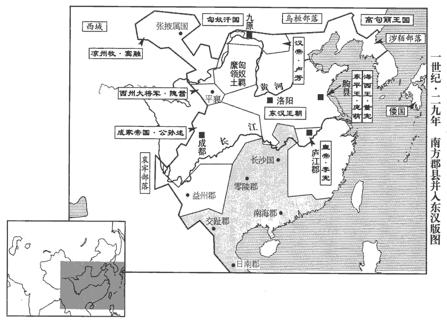 

24是歲，詔徵處士太原周黨、會稽‹江蘇苏州›嚴光等至京師。處，昌呂翻。會，古外翻。黨入見，伏而不謁，凡朝謁者，必拜稽首，以姓名自言。見，賢遍翻。自陳願守所志。博士范升奏曰：「伏見太原周黨、東海‹山東郯城›王良、山陽‹山東金鄉西北昌邑镇›王成等，蒙受厚恩，使者三聘，乃肯就車；及陛見帝廷，見，賢遍翻。黨不以禮屈，伏而不謁，偃蹇驕悍，同時俱逝。黨等文不能演義，武不能死君。釣采華名，庶幾三公之位。幾，居希翻。臣願與坐雲臺之下，續漢志曰：雲臺，周家之所造，圖書、術籍、珍玩、寶怪皆藏焉。考試圖國之道。不如臣言，伏虛妄之罪；而敢私竊虛名，誇上求高，皆大不敬！」書奏，詔曰：「自古明王、聖主，必有不賓之士，伯夷、叔齊不食周粟，太原周黨不受朕祿，亦各有志焉。其賜帛四十匹，罷之。」

〖译文〗 [24]这一年，刘秀下诏征召隐居的士人。太原人周党、会稽人严光等到洛阳。周党晋见时，伏下身子，不叩头拜谒，也不通报姓名，对刘秀说愿意恪守自己的志向。博士范升上奏章说：“我看到，太原人周党、东海人王良、山阳人王成等，承蒙陛下的厚恩，使者三次聘请，才肯上车动身。到宫廷晋见陛下时，周党不顾礼仪，仅伏下身子不叩头，行动随便迟缓，骄横无理，同时一起离开。周党等人文不能引申、发挥大义，武不能替君王去死，沽名钓誉，期望三公的高位。我愿意和他们同坐在珍藏图书典籍的云台下面，考究治理国家之道。如果我说得不对，则担当虚夸妄诞的罪名；如果他们胆敢盗窃虚名，向上夸耀，谋求高位，全应以‘大不敬’的罪名惩处。”奏章呈给刘秀，刘秀下诏说：“自古以来，英明的君王，圣贤的天子，都必定会遇到不服从的士人。伯夷、叔齐不吃周王朝的粮食，太原人周党不接受我的俸禄，也是各有志向。赐给周党帛四十匹，送回故乡。”

帝少與嚴光同遊學，少，詩沼翻。及即位，以物色訪之，賢曰：以其形貌求之。得於齊國，累徵乃至；拜諫議大夫，不肯受，去，耕釣於富春山‹浙江桐庐南富春江镇›中。地理志，富春縣，屬會稽郡。賢曰：今杭州富陽縣，本漢富春縣，避晉簡文帝鄭太后諱，改曰富陽。以壽終於家。

〖译文〗 刘秀幼时和严光同窗读书，等到刘秀即帝位，派人按照形貌察访，在齐地找到了严光。刘秀多次征召后，严光才到洛阳。任命他当谏议大夫，严光不肯接受。他离开了洛阳，在富春山种田钓鱼，最后在故乡寿终。

王良後歷沛郡‹安徽淮北›太守、大司徒司直，在位恭儉，布被瓦器，妻子不入官舍。後以病歸，一歲復徵；復，扶又翻。至滎陽‹河南滎陽›，疾篤，不任進道，言以疾篤稽留道上，不進於行也。任，音壬。過其友人。友人不肯見，曰：「不有忠言奇謀而取大位，何其往來屑屑不憚煩也！」揚雄方言曰：屑屑，不安也；秦、晉曰屑屑。郭景純曰：往來貌。遂拒之。良慙，自後連徵不應，卒於家。卒，子恤翻。

〖译文〗 王良后来历任沛郡太守、大司徒司直，在位时谦恭节俭，用的是布做的被子和瓦质的器具，妻子儿女，从来不进官署。后因病返回故乡，一年后又被征召。走到荥阳，病情加重，不能再走。他去拜访朋友，那位朋友不肯见他，说：“没有忠言和奇谋，却取得高位，怎么这样来来往往不怕烦！”于是拒绝王良登门。王良感到惭愧。从此以后，接连征召全都不应征，在家乡寿终。

25元帝之世，莎車‹新疆莎車›王延嘗為侍子京師，慕樂中國。樂，音洛。及王莽之亂，匈奴略有西域，唯延不肯附屬；常敕諸子：「當世奉漢家，不可負也！」延卒，子康立。康率旁國拒匈奴，旁國，猶鄰國也。擁衛故都護吏士、妻子千餘口；王莽之亂，西域攻沒都護，其吏士、妻子皆不得還。檄書河西‹甘肅中部、西部›，問中國動靜。竇融乃承制立康為漢莎車建功懷德王、西域大都尉，五十五國皆屬焉。

〖译文〗 [25]西汉元帝时代，莎车王延曾经在京都长安当人质，羡慕喜欢汉朝。等到王莽之乱时，匈奴夺取占有西域各国，只有延不肯归附。他常常告诫儿子们：“应当世代事奉汉朝，不能背叛！”延去世，儿子康继位。康率领邻国抗拒匈奴，保护原都护官员和他们的妻子儿女一千余人，写文书给河西，询问中原的情况。窦融于是承旧制，封康为汉莎车建功怀德王、西域大都尉，五十五国全隶属于莎车。

