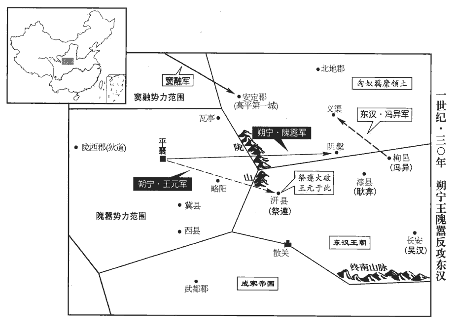
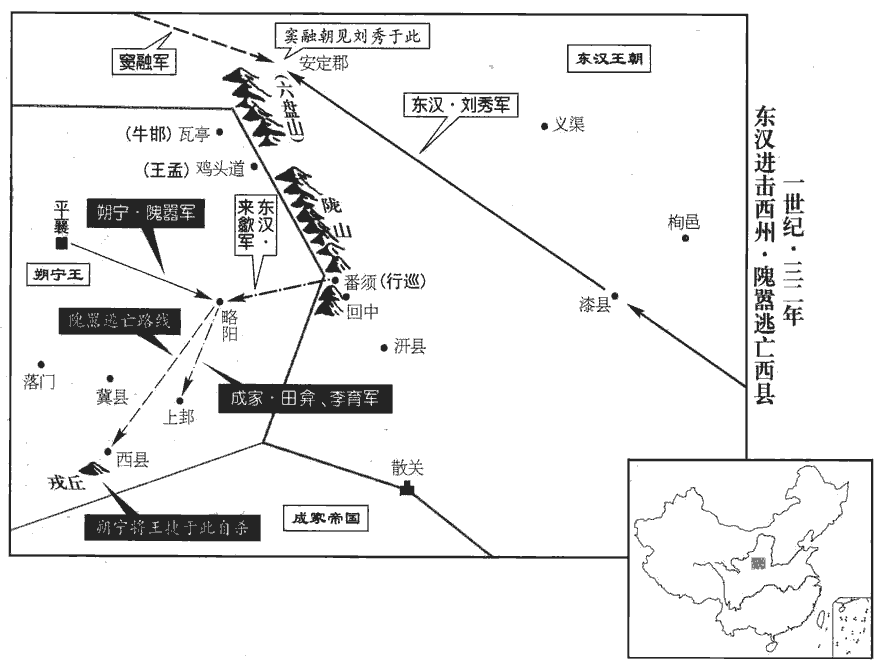
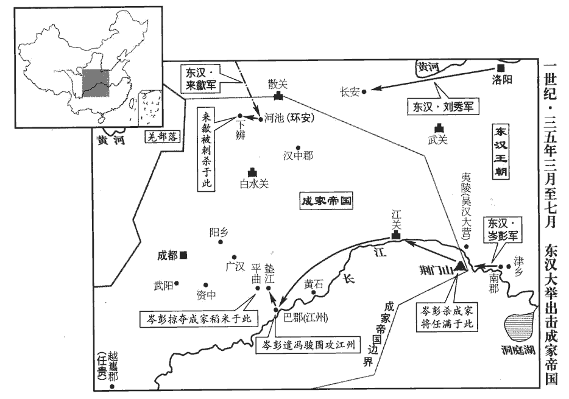
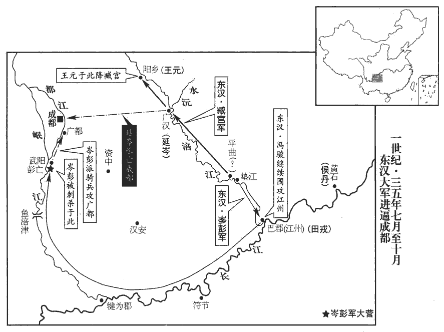
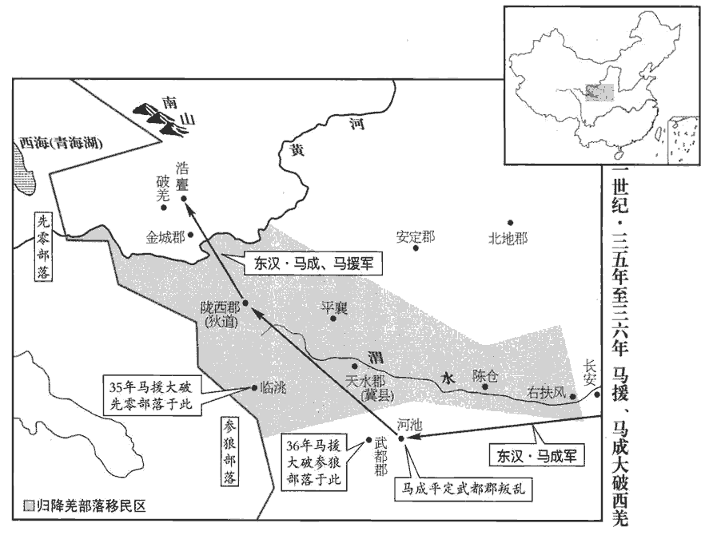

 漢紀三十四起上章攝提格（庚寅），盡旃蒙協洽（乙未），凡六年。

# 世祖光武皇帝中之上

## 建武六年（庚寅，三零）

1春，正月，丙辰‹十六›，以舂陵鄉為章陵縣‹湖北棗陽南›，世世復傜役，比豐‹江蘇豐縣›、沛‹江蘇沛縣›。復，方目翻。

〖译文〗 [1]春季，正月丙辰（十六日），东汉把舂陵乡改为章陵县，按照刘邦祖籍丰县和沛县的作法，世世代代免除赋税徭役。

2吳漢等拔朐qú‹江蘇连云港›，斬董憲、龐萌，江、淮、山東悉平。據范紀，是年馬成等拔舒，獲李憲；吳漢等拔朐，斬董憲、龐萌。蓋獲李憲則江、淮平，斬董憲、龐萌，則山東平也。拔朐之上，逸拔舒事。諸將還京師，置酒賞賜。還，從宣翻，又如字。

〖译文〗 [2]吴汉等攻下朐县，斩杀董宪、庞萌，长江、淮河、崤山以东全部平定。将领们返回洛阳，刘秀设酒宴赏赐。

帝‹刘秀，时年三十五›積苦兵間，以隗囂遣子內侍，公孫述遠據邊垂，乃謂諸將曰：「且當置此兩子於度外耳。」因休諸將於雒陽，分軍士於河內，數騰書隴、蜀，告示禍福。說文曰：騰，傳也。數，所角翻。

〖译文〗 刘秀被多年的戎马生活所苦，因为隗嚣又派遣长子做人质，公孙述又在遥远的边陲，就对将领们说：“暂且应当把这两个人置之度外。”于是命将领们在洛阳休养，把军队调防到河内，多次向隗嚣、公孙述传送书信，告诉他们祸福利害。

公孫述屢移書中國，自陳符命，冀以惑眾。帝與述書曰：「圖讖言公孫，即宣帝也。宣帝有「公孫病已」之符。代漢者姓當塗，其名高；君豈高之身邪？乃復以掌文為瑞，述刻其掌文曰「公孫帝」，自言手文有奇。復，扶又翻。王莽何足效乎！王莽自陳符命，遣五威將帥班之天下。君非吾賊臣亂子，倉卒時人皆欲為君事耳。卒，讀曰猝。君日月已逝，謂已老也。妻子弱小，當早為定計。天下神器，不可力爭，宜留三思！」署曰「公孫皇帝」。述不答。

〖译文〗 公孙述屡次向中原地区发送文书，说自己有将当皇帝的天赐符命，想以此迷惑众人。刘秀给公孙述写信说：“符命上说的‘公孙’，是指汉宣帝取代汉朝的人姓当涂，名高。您难道是高本人吗？您又把掌纹‘公孙帝’作为祥瑞，王莽怎么值得效法呢？如今您不是我的乱臣贼子，只不过在仓猝之时，人人都想做君主罢了。您已经年老，妻子儿女还小，应当早作决定。天下帝王之位，不可以凭人力争得。您应当三思！”信封上写的是“公孙皇帝”。公孙述不予答复。

其騎都尉平陵‹陝西咸陽西平陵乡›荊邯說述曰：「漢高祖起於行陳之中，兵破身困者數矣；然軍敗復合，瘡愈復戰。邯，下甘翻。說，輸芮翻。行，戶剛翻。陳，讀曰陣。數，所角翻。復，扶又翻；下同。何則？前死而成功，愈於卻就於滅亡也！隗囂遭遇運會，割有雍州‹甘肅東部›，兵強士附，威加山東；賢曰：隴西、天水，皆雍州之地，故言割有。囂傳曰：名震西州，流聞山東，是威加也。雍，於用翻。遇更始政亂，復失天下，眾庶引領，四方瓦解，囂不及此時推危乘勝推，吐雷翻。以爭天命，而退欲為西伯之事，尊師章句，賓友處士，處，昌呂翻。偃武息戈，卑辭事漢，喟然自以文王復出也！令漢帝釋關、隴之憂，賢曰：以囂居西，無東之意，故置之度外而不為憂。專精東伐，四分天下而有其三；發間使，召攜貳，賢曰：間使，謂來歙、馬援等也。攜貳，謂王遵、鄭興、杜林、牛邯等相次而歸光武。間，古莧翻。使西州‹甘肅東部›豪傑咸居心於山東，則五分而有其四；若舉兵天水，必至沮潰，沮，在呂翻。天水既定，則九分而有其八。陛下以梁州之地‹四川及陝西南部›，益州，禹貢梁州之域也。內奉萬乘，外給三軍，百姓愁困，不堪上命，將有王氏自潰之變矣！賢曰：王氏，即王莽也。臣之愚計，以為宜及天下之望未絕，豪傑尚可招誘，誘，音酉。急以此時發國內精兵，令田戎據江陵‹湖北江陵›，臨江南之會，倚巫山之固，賢曰：巫山，在今夔州巫山縣東。築壘堅守，傳檄吳、楚，長沙‹湖南長沙›以南必隨風而靡。令延岑出漢中‹陝西汉中›，定三輔，天水、隴西拱手自服。如此，海內震搖，冀有大利。」述以問群臣，博士吳柱曰：「武王伐殷，八百諸侯不期同辭，然猶還師以待天命。武王伐紂，至於孟津，諸侯不期而會者八百，皆曰：「紂可伐矣。」武王曰：「汝未知天命！」乃還。未聞無左右之助而欲出師千里之外者也！」邯曰：「今東帝無尺土之柄，東帝，謂光武。驅烏合之眾，跨馬陷敵，所向輒平，不亟乘時與之分功，而坐談武王之說，是復效隗囂欲為西伯也！」

〖译文〗 公孙述的骑都尉平陵人荆邯向公孙述建议：“汉高祖刘邦从军队中崛起，好几次兵败被困。然而溃败之后又重新聚合，养好了创伤再投入战斗。为什么呢？冒死前进反而获得成功，胜过后退归于灭亡。隗嚣遭逢时世的机运，占据雍州，军队强盛，士人归附他，威望传到崤山之东。遇到更始朝政治混乱，刘玄又失去天下，天下老百姓伸长脖子盼望太平，全国陷于土崩瓦解，隗嚣不趁此时除去危险赢得胜利，争得皇帝的宝座，而退却打算做周文王式的西方霸主。他尊崇并学习儒家经典，招揽宾客隐士，停止扩充和训练军队，低声下气地事奉汉朝，还感叹地以为自己是周文王再世。使刘秀将对隗嚣的忧虑置之一边，专心倾注力量在东边征讨群雄，四分天下，刘秀占有三分。又派出秘密使节，招纳叛离的人，使西州一带英雄豪杰都心向崤山以东，于是五分天下，刘秀占有四分。如果向天水进攻，必定击溃隗嚣。天水平定以后，则九分天下，刘秀占有八分。陛下依靠梁州这块地方，对内要供奉皇帝，对外要供给军队。百姓愁苦困顿，不能忍受上面的驱使，将会发生王莽那种内部自己瓦解的变化。以我的愚见，应该趁着天下百姓要求太平的愿望没有断绝，英雄豪杰还可以招纳罗致，赶紧在此时，征调国内的精锐部队，命田戎占据江陵，面对长江的会合处，依靠巫山的险阻，修筑壁垒坚守；向吴、楚各地发布文书，长沙以南一定会望风归降；命延岑出兵汉中，平定三辅，天水、陇西会拱手自己臣服。这样一来，天下震撼，希望有最大的利益可图。”公孙述以荆邯的话询问群臣，博士吴柱说：“周武王讨伐商王朝，八百个诸侯不约而同地表示赞成，然而仍退兵等待上天的旨意。没有听说过没有周围邻国的协助，而打算出兵千里之外的事！”荆邯说：“刘秀并没有一尺土地的凭藉，驱驰一群乌合之众，但跨上战马冲锋陷阵，所向无敌。不赶快抓住时机和刘秀分享功业，却坐在那里大谈周武王的主张，这是再次效法隗嚣想当周文王的做法。”

述然邯言，欲悉發北軍屯士及山東客兵，述倣漢制，亦置北軍。山東之人僑寓於蜀者，述以為兵，故曰客兵。使延岑、田戎分出兩道，與漢中諸將合兵并勢。蜀人及其弟光以為不宜空國千里之外，決成敗於一舉，固爭之，述乃止。延岑、田戎亦數請兵立功，述終疑不聽，唯公孫氏得任事。

〖译文〗 公孙述同意荆邯的话，准备征发所有北军屯垦的士兵以及由崤山以东地区的人组成的客籍军队。命令延岑、田戎分两路出发，和汉中各将领的部队合并，共同进击。可是蜀地人士和公孙述的弟弟公孙光认为，不应倾全国之力征战千里之外，以此一举决定成败。他们极力反对，公孙述才作罢。延岑、田戎也多次请求带兵建立功绩，公孙述始终疑虑不接受，只有公孙氏家族的人能够掌权。

述廢銅錢，置鐵錢，貨幣不行，百姓苦之。為政苛細，察於小事，如為清水‹甘肅清水›令時而已。好改易郡縣官名。少嘗為郎，哀帝時，述以父任為郎。好，呼到翻。少，詩照翻。習漢家故事，出入法駕，鸞旗旄騎。又立其兩子為王，食犍為‹四川宜賓›、廣漢‹四川梓潼›各數縣。犍，居言翻。或諫曰：「成敗未可知，戎士暴露而先王愛子，先王，於況翻。示無大志也！」述不從，由此大臣皆怨。為述亡國張本。

〖译文〗 公孙述下诏令废除铜钱，铸铁钱，结果货币不通行，老百姓苦不堪言。公孙述为政苛细，对于很小的事也要过问，就像当初做清水县令时那样。并喜欢改换郡县官名。他年轻时曾经出任过郎的官职，熟悉汉朝的旧典，称帝后出宫入宫都用法驾，以绣着鸾鸟的大旗、枪杆上挂着牦牛尾的骑士作前导。又封他的两个儿子为王，各以犍为、广汉两郡的几个县做食邑。有人向公孙述进谏：“成败还未可知，战士们暴露在沙场上，而先封自己的爱子为王，这表示没有远大的志向！”公孙述不听规劝。从此大臣们全都怨恨。

3馮異自長安入朝，帝謂公卿曰：「是我起兵時主簿也，帝起兵，徇潁川，異降，以為主簿。為吾披荊棘，定關中。」為，於偽翻。既罷，賜珍寶、錢帛，詔曰：「倉卒蕪蔞亭豆粥，虖沱河麥飯，事見三十九卷更始二年。卒，與猝同。厚意久不報。」異稽首謝曰：「臣聞管仲謂桓公曰：『願君無忘射鉤，臣無忘檻車。』齊國賴之。史記：管仲射桓公中鉤；後魯桎梏管仲而送於齊，公以為相。說苑曰：管仲桎梏檻車中，非無愧也，自裁也。新序曰：齊桓公與管仲飲酣，管仲上壽曰：「願君無忘出奔於莒也，臣亦無忘束縛於魯也。」此云射鉤、檻車，義亦通。射，而亦翻。臣今亦願國家無忘河北之難，東都臣子率謂天子為國家。難，乃旦翻。小臣不敢忘巾車之恩。」事見三十九卷更始元年。留十餘日，令與妻子還西。

〖译文〗 [3]冯异从长安到洛阳入朝晋见。刘秀对公卿说：“冯异是我当初起兵时的主簿，为我披荆斩棘，平定关中。”晋见已毕，赏赐珍宝、钱、帛，颁下诏书说：“当初在仓猝之时，你在芜蒌亭进献豆粥，在滹沱河进献麦饭，深情厚意，长时间未能回报。”冯异叩头拜谢说：“我听说管仲对齐桓公说：‘愿君王不忘我射您带钩的事，我不忘被装入囚车的事。’齐国依靠这两个人强盛起来，我今天也愿陛下勿忘河北的苦难，我不会忘记在巾车乡您对我的恩德。”冯异在洛阳逗留十余天，刘秀命他和妻子儿女西行返回任所。

4申屠剛、杜林自隗囂所來，考異曰：本傳云七年徵剛。按明年囂已臣公孫述，必不用詔書。當在此年。帝皆拜侍御史。以鄭興為太中大夫。

〖译文〗 [4]申屠刚、杜林从隗嚣那里来到洛阳，刘秀任命二人当侍御史。任命郑兴当太中大夫。

5三月，公孫述使田戎出江關‹重庆奉節東›，地理志：江關都尉，治巴郡魚復縣。賢曰：華陽國志曰：巴、楚相攻，故置江關，舊在赤甲城，後移在江州南岸，對白帝城。故基在今夔州魚復縣南。招其故眾，欲以取荊州，不克。

〖译文〗 [5]三月 ，公孙述命田戎出江关，招集其旧部，准备夺取荆州。不能取胜。

帝乃詔隗囂，欲從天水伐蜀。囂上言：「白水險阻，棧閣敗絕。賢曰：白水縣有關，屬廣漢郡。棧閣者，山路懸險，棧木為閣道。又公孫述傳註曰：白水關‹四川广元北朝天镇›在漢陽西縣。梁州記曰：關城西南有白水關。余據水經，白水出隴西臨洮縣西南西傾山，東南流入陰平，又東南經廣漢白水縣。臨洮與西縣接界，故天水之西縣有白水關，而廣漢之白水縣亦有白水關，自源徂流，同一白水也。賢曰：梁州記曰：關城西南百八十里有白水關。故關城在今梁州金牛縣西。述性嚴酷，上下相患，須其罪惡孰著而攻之，此大呼響應之勢也。」須，待也。孰，古熟字通用。人大呼則響必應，言俟其上下乖離而攻之，必有為內應者。呼，火故翻。帝知其終不為用，乃謀討之。

〖译文〗 刘秀于是给隗嚣下诏，打算让他从天水出兵攻打公孙述。隗嚣上书说：“白水关险恶，难以通过，栈道残破断绝，无法利用。公孙述性情严厉残暴，上下相互不信任，等到他的罪恶显露出来再攻打他，就能造成一呼而内外响应的形势。”刘秀知道隗嚣终不能被己所用，于是策划出兵讨伐他。

6夏，四月，丙子‹八›，上行幸長安，郡國志：長安在雒陽西九百五十里。謁園陵；遣耿弇yǎn、蓋延等七將軍從隴道伐蜀，先使中郎將來歙奉璽書賜囂諭旨。囂復多設疑故，歙，許及翻。璽，斯氏翻。疑，疑難。故，事故也。復，扶又翻。事久冘yóu豫不決。賢曰：冘豫，不定之意也。說文曰：冘冘，行貌也，音淫。余按冘讀與猶同。毛晃曰：冘字，從犬曲其足，古與尤字同。唐史以冘豫之冘音淫者，誤也。歙遂發憤質責囂曰：賢曰：質，正也。「國家以君知臧否，曉廢興，否，音鄙。故以手書暢意。足下推忠誠，既遣伯春委質，囂子恂，字伯春。質，職日翻。賢曰：委質，猶屈膝也，又音摯。而反欲用佞惑之言，為族滅之計邪！」因欲前刺囂。刺，七亦翻。囂起入，部勒兵將殺歙，歙徐杖節就車而去，囂使牛邯將兵圍守之。邯，下甘翻。囂將王遵諫曰：「君叔雖單車遠使，而陛下之外兄也，來歙，字君叔。賢曰：光武之姑子，故曰外兄。使，疏吏翻。殺之無損於漢，而隨以族滅。昔宋執楚使，遂有析骸易子之禍。左傳：楚使申舟聘齊，不假道於宋。華元曰：「過我而不假道，鄙我也！」乃殺之。楚子聞之，遂圍宋；宋人易子而食，析骸而爨cuàn。小國猶不可辱，況於萬乘之主，重以伯春之命哉！」重，直用翻。歙為人有信義，言行不違，及往來遊說，皆可按覆；行，下孟翻。說，輸芮翻。西州士大夫皆信重之，多為其言，為，於偽翻。故得免而東歸。

〖译文〗 [6]夏季，四月丙子（初八），刘秀前往长安，拜谒汉朝历代皇帝的陵墓。派遣耿、盖延等七位将军取道陇西征讨公孙述。刘秀先派中郎将来歙赐给隗嚣诏书，告诉他自己的意图。隗嚣又反复考虑，疑虑重重，很长时间不能决断。来歙生气地责备隗嚣说：“皇上认为您懂得善恶是非，通晓胜衰兴亡，所以亲自写信，充分表达自己的意愿。您推诚效忠，已经派您的儿子隗恂到洛阳做人质，却反而要听从小人的蛊惑之言，要做灭族的打算吗？”于是准备向前刺杀隗嚣。隗嚣起身入内，召集部众要杀来歙。来歙从容地拿着符节登车离去。隗嚣让牛邯率兵把来歙的车团团围住。隗嚣的部将王遵劝谏说：“来歙虽然是单独充任远方的使节，但他是刘秀的表哥。杀了他无损于汉朝，却会随之召来灭族之灾。从前，宋国捕杀楚国的使节，招来用人骨作木柴、易子而食的大祸。对小国尚且不可以侮辱，何况对于万乘之尊的帝王。您要以隗恂的性命为重啊！”来歙为人讲信义，言行一致，往来游说，诚实可信，都可一一对证。西州的士大夫都信任、尊重他，很多人替他求情。所以能够免于死难，回到洛阳。

五月已未‹二十一›，車駕至自長安。

〖译文〗 五月己未（二十三日），刘秀从长安回到洛阳。

隗囂遂發兵反，使王元據隴坻‹甘肅庄浪东›，師古曰：坻，音丁計翻，又音底。伐木塞道。塞，悉則翻。諸將因與囂戰，大敗，各引兵下隴；囂追之急，馬武選精騎為後拒，殺數千人，諸軍乃得還。還，從宣翻，又如字。

〖译文〗 隗嚣于是起兵叛变。命王元防守陇坻，砍伐树木，堵塞道路。东汉将领们因此和隗嚣交战，被打得大败，各自率兵逃下陇山。隗嚣急速追赶，东汉将军马武挑选精锐骑兵断后，杀敌数千人，各路军队才得以返回。

7六月辛卯‹二十四›，詔曰：「夫張官置吏，所以為民也。為，於偽翻。今百姓遭難，戶口耗少，難，乃旦翻。少，詩沼翻。而縣官吏職，所置尚繁；其令司隸、州牧各實所部，所部郡縣各考覈hé其實也。省減吏員，縣國不足置長吏者并之。」於是并省四百餘縣，吏職減損，十置其一。

〖译文〗 [7]六月辛卯（二十四日），刘秀下诏说：“设置官吏，是替老百姓服务。而今百姓遭难，户口减少，而国家官吏的设置还很繁多。现令司隶、州牧各自在所辖范围核实实际需要，裁减官员。无论是县还是封国，不足以设置长吏的，予以合并。”于是合并减少四百余个县，官吏的职位也减少了，十个官员，留任一个。

8九月，丙寅晦‹三十›，日有食之。執金吾朱浮上疏曰：「昔堯、舜之盛，猶加三考；賢曰：考，謂考其功最也。尚書舜典曰：三載考績，三考黜陟幽明。大漢之興，亦累功效，吏皆積久，至長子孫。如倉氏、庫氏之類是也。長，知兩翻；下同。當時吏職，何能悉治，論議之徒，豈不喧譁！蓋以為天地之功不可倉卒，艱難之業當累日也。而間者守宰數見換易，卒，與猝同。數，所角翻。迎新相代，疲勞道路。尋其視事日淺，未足昭見其職，既加嚴切，人不自保，迫於舉劾，劾，戶概翻。懼於刺譏，故爭飾詐偽以希虛譽，斯所以致日月失行之應也。夫物暴長者必夭折，功卒成者必亟壞，夭，於紹翻。卒，讀曰猝。如摧長久之業而造速成之功，非陛下之福也。願陛下遊意於經年之外，望治於一世之後，孔子曰：如有王者，必世而後仁。三十年為一世。治，直吏翻。天下幸甚！」帝采其言，自是牧守代易頗簡。

〖译文〗 [8]九月丙寅晦（三十日），出现日食。执金吾朱浮给上书说：“从前，在尧、舜时的太平盛世，还每隔三年对官员进行考核。大汉王朝兴起，也是被功绩所带累，官吏在职的时间都很长，甚至传给长子长孙。当时的官吏办事，怎么能够治理得好，评论抨击的人，怎不喧哗？我认为，创建天地那样大的功业，不可能仓促完成；艰难的事业应当逐日积累，才能成功。近来郡县长官频繁地被替换，迎新送旧，在路途上疲于奔波。探究起来，他们在任的时间很短，不足以明确显示他们的政绩就已遭到严厉的责备，官吏不能自保，为检举、弹劾所迫，又害怕讽刺讥笑，所以争着装扮自己，用欺诈伪装的手段求得虚浮的美名。这正是导致日月不能正常运行、出现日食的原因。生物突然暴长必定会夭折，功业一下子成功必定会很快衰败。如果摧毁长久的大业，而求速成的功效，不是陛下的福分。希望陛下高瞻远瞩，从长远考虑，直看到三十年之后，天下有幸！”刘秀采纳朱浮的建议，从此以后，地方州牧太守更换的次数大为减少。

9十二月，壬辰‹二十七›，大司空宋弘免。

〖译文〗 [9]十二月壬辰（二十七日），免去大司空宋弘的职务。

10癸巳‹二十八›，詔曰：「頃者師旅未解，用度不足，故行十一之稅。謂十分而稅其一也。今糧儲差積，其令郡國收見田租，三十稅一，如舊制。賢曰：景帝二年，令田租三十而稅一。今依景帝，故云舊制。見，賢遍翻。

〖译文〗 [10]癸巳（二十八日），刘秀下诏：“前些时战事不息，国家经费不足，所以按十分之一收税。如今粮食储备增多，从现在起，各郡、各封国收取现有田地的田租，按三十分之一征税，恢复原来的制度。”

11諸將之下隴也，帝詔耿弇軍漆‹陝西彬县›，賢曰：漆，縣名，屬右扶風，故城在今豳州新平縣，漆水在西。馮異軍栒邑‹陝西旬邑›，祭遵軍汧qiān‹陝西隴縣›，賢曰：汧，水名，因以名縣，屬右扶風，故城在今隴州汧城縣南。汧，苦堅翻。吳漢等還屯長安。馮異引軍未至栒邑，隗囂乘勝使王元、行巡將二萬餘人下隴，行，姓也。姓譜：周有大行人之官，其後氏焉。分遣巡取栒邑，異即馳兵欲先據之。諸將曰：「虜兵盛而乘勝，不可與爭鋒，宜止軍便地徐思方略。」異曰：「虜兵臨境，忸niǔ𢗗小利，賢曰：忸𢗗，猶慣習也，謂慣習前事而復為之。爾雅曰：忸，復也。郭景純曰：謂慣忸復為之也。忸，尼丑翻。𢗗，音逝。遂欲深入；若得栒邑，三輔動搖。夫攻者不足，守者有餘。孫武子之言。今先據城，以逸待勞，非所以爭也。」潛往，閉城，偃旗鼓。行巡不知，馳赴之。異乘其不意，卒擊鼓、建旗而出。卒，讀曰猝。巡軍驚亂奔走，追擊，大破之。祭遵亦破王元於汧。於是北地‹宁夏吴忠西南›諸豪長耿定等悉畔隗囂降。長，知兩翻。詔異進軍義渠‹甘肃西峰›，義渠縣，屬北地郡，古義渠戎地也。擊破盧芳將賈覽、匈奴奧鞬日逐王，北地、上郡‹陝西榆林南鱼河堡›、安定‹宁夏固原›皆降。奧，音鬱，鞬，居言翻。

〖译文〗 [11]东汉将领们兵败退下陇山之后，刘秀命耿在漆县驻屯，命冯异在邑驻屯，命祭遵在县驻屯，命吴汉等率军返回长安驻屯。冯异率军还没到达邑，隗嚣乘胜派王元、行巡率领二万余人下陇山，分派行巡夺取邑。冯异马上急行军挺进，要抢先占据邑。将领们说：“敌人强盛，又乘着胜利的锐气，不能和他们争锋。应停止行军，在有利的地点安营，慢慢图谋策划。”冯异说：“敌军压境，是习惯于获取小利，因而打算深入。敌人如果取得邑，三辅就会动摇。采取攻势不足时，采取守势则有余。我们抢先占据邑，是以逸待劳，不是和敌人决高下。”于是秘密进城，关闭城门，偃旗息鼓。行巡完全蒙在鼓里，急忙赶赴邑。冯异乘其不备，突然间战鼓齐鸣、旌旗招展，率军而出。行巡的军队惊慌散乱，四下奔逃。冯异追击，大破敌军。祭遵也在县打败王元的军队。于是北地郡诸豪强首领耿定等全都背叛隗嚣，投降东汉。刘秀命令冯异进军义渠。冯异击败卢芳的将领贾览以及匈奴奥日逐王。北地郡、上郡、安定郡全部归降。

 

12竇融復遣其弟友上書曰：「臣幸得託tuō先後末屬，謂孝文竇皇后之親屬也。復，扶又翻。累世二千石，臣復假歷將帥，守持一隅，復，扶又翻。故遣劉鈞口陳肝膽，事見上卷上年。自以底裡上露，長無纖介。賢曰：底裡皆露，言無藏隱。而璽書盛稱蜀、漢二主三分鼎足之權，任囂、尉佗之謀；竊自痛傷。臣融雖無識無知，利害之際，順逆之分，豈可背真舊之主，事姦偽之人，分，扶問翻。背，蒲妹翻。廢忠貞之節，為傾覆之事，棄已成之基，求無冀之利！此三者，雖問狂夫，猶知去就，而臣獨何以用心！謹遣弟友詣闕，口陳至誠。」友至高平‹宁夏固原›，賢曰：高平縣屬安定，後改為平高，今原州縣。會隗囂反，道不通，乃遣司馬席封間道通書。姓譜：席，其先姓籍，避項羽諱，改姓席氏。帝復遣封賜融、友書，所以尉藉之甚厚。尉，與慰同；尉，安也。藉，薦也。尉以安於身上，藉以安於身下。

〖译文〗 [12]窦融又派弟弟窦友前往洛阳，向刘秀上书说：“我很幸运，能够成为先皇后亲属的后代，好几代都是二千石俸禄。我又暂任将帅，镇守一方。所以派遣刘钧，向您口头表达我的赤胆忠心，从内心深处对您没有丝毫隐瞒。而您的诏书却称赞公孙述、隗嚣两位君主三分天下、形成鼎足之势的权力，提到任嚣、尉佗的谋划，我深感忧伤悲痛。我窦融虽然无知无识，但在利与害之际、顺与逆之间，岂能背叛真主旧主，去事奉奸恶、假冒的人！岂能废弃忠贞的节操，去做颠覆国家的坏事！岂能抛弃已经成就的基础，去追求并无希望的利益！就此三项，即使去问一个疯子 ，还知道如何决定，而我为什么偏偏会别有用心！谨派我的弟弟窦友前往，亲口陈述我的至诚。”窦友走到高平县，正赶上隗嚣叛变，道路不通，于是派遣司马席封从小路把信带到洛阳。刘秀又派席封给窦融、窦友带信，安慰他们，感情深厚。

融乃與隗囂書曰：「將軍親遇厄會之際，國家不利之時，賢曰：謂漢遭王莽篡奪也。守節不回，承事本朝；融等所以欣服高義，願從役於將軍者，良為此也！為，於偽翻。而忿悁之間，悁，恚也，吉縣翻，躁急也。改節易圖，委成功，造難就，委，棄也。就，成也。百年累之，一朝毀之，豈不惜乎？殆執事者貪功建謀，以至於此。言隗囂執政事者貪有其功而立此逆謀也。當今西州地勢局迫，民兵離散，易以輔人，易，以豉翻；下同。難以自建。計若失路不反，聞道猶迷，不南合子陽，則北入文伯耳。夫負虛交而易強禦，負，恃也。易，輕也。恃遠救而輕近敵，未見其利也。自兵起以來，城郭皆為丘墟，生民轉於溝壑。幸賴天運少還，而將軍復重其難，復，扶又翻；下同。難，乃旦翻。是使積痾kē不得遂瘳chōu，幼孤將復流離，言之可為酸鼻；庸人且猶不忍，況仁者乎！融聞為忠甚易，得宜實難。憂人太過，以德取怨，謂憂之之過而言之甚切，將以為德而反以取怨也。知且以言獲罪也！」囂不納。

〖译文〗 窦融于是给隗嚣写信说：“当年，将军亲身遭遇艰难时世，国家蒙受不幸之际，能够坚守节操，义无返顾，效忠汉朝。我等所以钦佩您的高义，愿意听从您的役使，原因的确在此。然而您在愤怒急躁之间，改变自己的节操和意图，舍弃已成之功，去开创难成之业。百年积累的成果，毁于一旦，难道不可惜吗？恐怕是在下面管事的人贪功，设计阴谋，以至成了现在这个样子。当前西州地区地势狭窄局促，人民和军队分散，辅助别人是容易的，自己单独开创局面是艰难的。假若迷途而不返，听到道理仍然迷惑，那么，不是向南投向公孙述，就是向北加入卢芳罢了。依靠虚假的交情而轻视敌人的强悍，仗恃远方的援救而轻视眼前的敌人，看不到有什么好处。自从战争发生以来，城市全变成废墟，百姓辗转于沟壑之间。幸运的是，天运稍有回转，可是将军又要重复当初的灾难。这是使旧病不能痊愈，幼童孤儿将再度流离失所，提起这些就可以使人悲痛酸鼻。庸人还都不忍心，何况仁慈的人呢？我听说做忠诚的事很容易，但做得得当确实很难。替人担忧过分，就是以恩德换取怨恨。我知道我将因为上述这些话而获罪。”隗嚣不采纳。

融乃與五郡太守共砥厲兵馬，上疏請師期；帝深嘉美之。融即與諸郡守將兵入金城‹甘肅永靖西北›，擊囂黨先零‹青海贵德以西一带›羌封何等，大破之。更始時，先零羌封何諸種殺金城太守，據其郡。囂賂遺封何，與結盟，欲發其眾。零，音憐。因并河，揚威武，賢曰：并，蒲浪翻。伺候車駕。時大兵未進，融乃引還。

〖译文〗 窦融于是和五郡太守共同厉兵秣马，并向刘秀上书，请求指示出兵日期。刘秀深切嘉勉赞美窦融。窦融随即和各郡太守率军进入金城，攻击隗嚣同党先零羌首领封何等，大破羌军。于是沿着黄河，显扬军威，恭侯圣驾。当时大军还未进发，窦融于是率军返回。

帝以融信效著明，益嘉之，脩理融父墳墓，祠以太牢，融祖父墳墓在扶風。數馳輕使，致遺四方珍羞。遺以四方珍羞，既以厚融，且示四方來服，能致遠物也。數，所角翻。遺，于季翻。

〖译文〗 刘秀因为窦融很讲信义，清楚地表明了立场，更加嘉奖他。下令整修窦融父亲的坟墓，用牛羊猪各一祭祀，屡次派出轻装使者，送给窦融四方进贡的珍奇食物。

梁統猶恐眾心疑惑，乃使人刺殺張玄。張玄，隗囂使。刺，七亦翻。遂與隗囂絕，皆解所假將軍印綬。

〖译文〗 梁统仍然担心大家犹豫疑惑，便派人刺杀隗嚣的使者张玄，于是同隗嚣绝交。把隗嚣授予的将军印信绶带全都解下。

13先是，馬援聞隗囂欲貳於漢，先，悉薦翻。數以書責譬之，囂得書增怒。及囂發兵反，援乃上書曰：「臣與隗囂本實交友，初遣臣東，謂臣曰：『本欲為漢，為，於偽翻。願足下往觀之，於汝意可，即專心矣。』及臣還反，報以赤心，實欲導之於善，非敢譎jué以非義。而囂自挾姦心，盜憎主人，左傳：晉伯宗妻曰：盜憎主人，民惡其上。怨毒之情，遂歸於臣。臣欲不言，則無以上聞，願聽詣行在所，極陳滅囂之術。」帝乃召之。援具言謀畫。

〖译文〗 [13]先前，马援听说隗嚣对汉朝怀有二心，准备独立，几次写信责备 劝说他。隗嚣收到信后更加愤怒。等到隗嚣发兵反叛，马援于是给刘秀上书说：“我和隗嚣本是朋友，开始派我东来时，他对我说：‘我本打算拥戴汉朝，请你前往洛阳观察，你认为可以，我就专心一意拥戴汉王朝。’等我返回，真心诚意地以实汇报，确实想引导他从善，不敢用不义欺诈他。可是隗嚣自怀奸恶之心，就像强盗憎恨主人，怨恨的感情，于是集中在我的身上。我如果不说明，陛下就无法知道。我请求前往陛下所在之地，向您详尽地陈述消灭隗嚣的策略。”刘秀于是召见马援。马援一五一十地提出作战方案。

帝因使援將突騎五千，往來遊說囂將高峻、任禹之屬，下及羌豪，為陳禍福，說，輸芮翻。為，於偽翻。說客，單車往使足矣；光武遣馬援將突騎五千，欲耀兵威以示隴右諸將，使謀而來。以離囂支黨。援又為書與囂將楊廣，使曉勸於囂曰：「援竊見四海已定，兆民同情，而季孟閉拒背畔，為天下表的，隗囂，字季孟。賢曰：表，猶標也；言為標表。的，謂射的也；言背畔之罪，為天下所指射也。背，蒲妹翻。常懼海內切齒，思相屠裂，故遺書戀戀，以致惻隱之計。遺，于季翻。乃聞季孟歸罪於援，而納王游翁諂邪之說，賢曰：王元，字游翁。據隗囂傳，元，字惠孟，游翁蓋其別字也。因自謂函谷‹河南新安›以西，舉足可定。所謂以丸泥封函谷關也。以今而觀，竟何如邪！

〖译文〗 刘秀遂命马援率领骑兵突击队五千人，往来劝说隗嚣的将领高峻、任禹等，以及羌族的首领，为他们分析利害，以离间瓦解隗嚣部属。马援又写信给隗嚣的将领杨广，让他劝说隗嚣，信中说：“我看到四海之内已经平定，万民都有同感。可是隗嚣封闭边界，起兵反叛，成了天下众矢之的。我常害怕大家对隗嚣咬牙切齿，要争相扑杀，因此以眷恋之情给他写信，表达我的伤痛和忧虑。然而竟听说隗嚣把罪过都推到我身上，并采纳王元谄媚邪恶的意见，宣称函谷关以西，一抬脚就可以平定。从现在的局势来看，究竟怎样呢？

援間至河內‹河南武陟›，間，古莧翻。過存伯春，存，存問也。時囚囂子恂於河內。伯春，恂字也。見其奴吉從西方還，說伯春小弟仲舒望見吉，欲問伯春無他否，竟不能言，曉夕號泣，【章：十二行本「泣」下有「宛轉塵中」四字；乙十一行本同；孔本同；張校同；退齋校同。】號，戶刀翻。又說其家悲愁之狀，不可言也。夫怨讎可刺不可毀，援聞之，不自知泣下也。援素知季孟孝愛，曾、閔不過。夫孝於其親，豈不慈於其子！可有子抱三木而跳梁妄作，自同分羹之事乎！賢曰：三木者，謂桎梏及械也。分羹，謂樂羊也。余謂此正引高帝答項羽之事。

〖译文〗 “我不久前曾到过河内，拜访慰问隗嚣的儿子隗恂。看见他的奴仆吉从西州回来，说隗恂的小弟弟隗仲舒看见吉，想问隗恂是否已遭意外，竟然说不出口，早晚哀号哭泣。又说到全家悲苦忧愁的情况，无法用言语表达。有怨仇可以指责，不可以用毁灭的手段报复，我听说这些事后，不知不觉流下眼泪。我一向了解隗嚣孝顺慈爱，曾参、闵子骞也比不过。孝敬的父母，哪能不爱孩子！可有儿子身戴刑具，而父亲飞扬跋扈、胡作非为，并想分一杯用儿子的肉做成肉羹这类事吗？

季孟平生自言所以擁兵眾者，欲以保全父母之國而完墳墓也，又言苟厚士大夫而已；即其所常言以感人悟物者，而窮其本情。而今所欲全者將破亡之，所欲完者將傷毀之，所欲厚者將反薄之。季孟嘗折愧子陽而不受其爵，事見上卷四年。賢曰：愧，猶辱也。今更共陸陸往【章：十二行「往」上有「欲」字；乙十一行本同；孔本同，張校同。】附之，賢曰：陸陸，猶碌碌也。將難為顏乎！言將有慙色也。若復責以重質，當安從得子主給是哉！言蜀若復責質子，當何從得子以為質也。復，扶又翻。質，音致。往時子陽獨欲以王相待而春卿拒之，今者歸老，更欲低頭與小兒曹共槽櫪而食，併肩側身於怨家之朝乎！歸，入也，言其年已入老境也。字林曰：併，音卑正翻。朝直遙翻。

〖译文〗 “隗嚣平时自己说，他所以拥有军队，是用来保全乡土和父母的坟墓，又说不过是为了厚待士大夫罢了。可是现在，所要保全的乡土将要分裂丧失，所要保全的父母坟墓将被毁掉，所要等待的将反而要受到轻视。隗嚣曾折辱公孙述而不接受他的爵位，今天却乖乖地去依附他，将有惭愧之色吧！如果公孙述也要求用长子做人质，隗嚣又从何再得一个长子给他呢？从前，公孙述要单独封你为王，而你拒绝。现在你年纪老了，还要低着头和小孩子们挤一个食槽吃食，并着肩侧着身在怨恨的朝中作官吗？

今國家待春卿意深，宜使牛孺卿與諸耆老大人共說季孟，牛邯，字孺卿。說，輸芮翻。若計畫不從，真可引領去矣。前披輿地圖，見天下郡國百有六所，柰何欲以區區二邦以當諸夏百有四乎！二邦，謂隴西、天水。夏，戶雅翻。春卿事季孟，外有君臣之義，內有朋友之道。言君臣邪，固當諫爭；語朋友邪，應有切磋。賢曰：骨曰切，象曰磋。言朋友之道，如切磋以成器也。豈有知其無成，而但萎腇něi咋zé舌，叉手從族乎！賢曰：萎腇，耎ruǎn弱也。萎，音於罪翻。腇，音乃罪翻。咋，士格翻，齧niè也。及今成計，殊尚善也，過是，欲少味矣！賢曰：以食為喻。少，詩沼翻。且來君叔天下信士，朝廷重之，其意依依，常獨為西州言。為，於偽翻。援商朝廷，尤欲立信於此，商，度也。必不負約。援不得久留，願急賜報。」廣竟不答。

〖译文〗 “现在朝廷对你的期望很大，你应该请牛邯和各位前辈尊长共同劝说隗嚣。如果说服不了他，确实应该离开他。前些天我观看地图，见天下有一百零六个郡和封国，怎么要用区区两个郡对抗中国的其余的一百零四个郡呢？你事奉隗嚣，从外部讲是君臣关系，从内部讲是朋友关系。说君臣呢，本应该直言进谏；说朋友呢，应该切磋协商。哪有知道他不能成功，却只是懦弱畏缩，咬着舌头，拱手跟他一起陷入灭族之灾的呢？趁现在定下大计还是很好的，过了这一步，就不同了。况且，来歙是天下忠信之士，朝廷尊重他，他对隗嚣依依不舍，常独自为西州说话。我认为朝廷尤其要在这件事情上建立信誉，必不负约。我不能久留，愿你急速给我回信。”杨广竟然不作答复。

諸將每有疑議，更請呼援，咸敬重焉。更，工衡翻。

〖译文〗 将领们每有疑惑争议，都向马援请教，对他十分敬重。

14隗囂上疏謝曰：「吏民聞大兵卒至，卒，讀曰猝。驚恐自救，臣囂不能禁止。兵有大利，不敢廢臣子之節，親自追還。此因王元隴坻之捷而有嫚書也。昔虞舜事父，大杖則走，小杖則受。賢曰：家語，孔子謂曾子之辭。臣雖不敏，敢忘斯義！今臣之事在於本朝，賜死則死，加刑則刑；如更得洗心，死骨不朽。」有司以囂言慢，請誅其子；帝不忍，復使來歙至汧qiān，復，扶又翻。汧，苦堅翻。賜囂書曰：「昔柴將軍云：『陛下寬仁，諸侯雖有亡叛而後歸，輒復位號，不誅也。』高帝時，柴武與韓王信書之言。今若束手，復遣恂弟歸闕庭者，則爵祿獲全，有浩大之福矣！吾年垂四十，在兵中十歲，厭浮語虛辭。即不欲，勿報。」囂知帝審其詐，遂遣使稱臣於公孫述。使，疏吏翻。

〖译文〗 [14]隗嚣上书向刘秀请罪说：“官吏百姓听说大军突然到来，惊慌惧怕，只求自救，我不能禁止。我的部队虽然获得胜利，但我不敢废弃做臣子的节操，亲自把他们追回来。过去虞舜侍奉父亲，如父亲用大棍子打就跑掉，如用小棍子打则承受。我虽然不聪明，怎敢忘此君臣大义！如今我在朝廷掌握之中，赐我死我就死，给我加刑我就受刑。如能再使我有机会洗面革心，我就是变成一堆死骨，也不会忘记。”主管部门认为隗嚣言语傲慢，请求杀他的儿子隗恂。刘秀不忍心，又派来歙到县送亲笔信给隗嚣，说：“从前，高祖的大将柴武说：‘陛下宽厚仁爱，诸侯中虽有逃亡反叛的，以后归顺，就恢复爵位封号，不予诛杀。’现在你如果能约束自己，再派隗恂的弟弟到朝廷来做人质，那你的爵位和俸禄都可保全，洪福齐天。我年近四十，在军旅中度过十年，厌恶花言巧语。如果你不愿意，不必答复。”隗嚣知道刘秀已看穿他的欺骗术，于是派使者向公孙述称臣。

15匈奴與盧芳為寇不息，帝令歸德侯颯使匈奴以脩舊好。颯使匈奴，見三十九卷更始二年。颯，音立。好，呼到翻。單于驕倨，雖遣使報命，而寇暴如故。

〖译文〗 [15]匈奴和卢芳不断侵扰，刘秀命归德侯刘飒出使匈奴，谋求恢复以前的良好关系。匈奴单于骄横傲慢，虽然也派使节到洛阳回报，但侵扰如故。

## 七年（辛卯，三一）

1春，三月，罷郡國輕車、騎士、材官，令還復民伍。漢官儀曰：高祖命天下郡國選能引關蹶張材力武猛者，以為輕車、騎士、材官。平地用車騎，山阻用材官。

〖译文〗 [1]春季，三月，免去郡县、封国的轻车、骑士、材官，命他们回归为民。

2公孫述立隗囂為朔寧王‹府平襄，甘肃通渭›，賢曰：欲其寧靜北邊也。遣兵往來，為之援勢。張形勢以為之援也。

〖译文〗 [2]公孙述封隗嚣为朔宁王，让他派出军队往来造声势，作为援助。

3癸亥晦‹三十›，日有食之。詔百僚各上封事，其上書者不得言聖。上，時掌翻。太中大夫鄭興上疏曰：「夫國無善政，則謫zhé見日月；賢曰：謫，責也，音直革翻。見，賢遍翻。要在因人之心，擇人處位。處，昌呂翻。今公卿大夫多舉漁陽‹北京密云›太守郭伋可大司空者，而不以時定；道路流言，咸曰『朝廷欲用功臣』，功臣用則人位謬矣。人不稱其位，位不宜其人也。願陛下屈己從眾，以濟群臣讓善之功。賢曰：濟，成也。頃年日食多【章：十二行本「多」上有「每」字；乙十一行本同；孔本同。】在晦，先時而合，皆月行疾也。日君象而月臣象；君亢急而臣下促迫，故月行疾。亢，苦浪翻。今陛下高明而群臣惶促，宜留思柔克之政，垂意洪范之法。」賢曰：克，能也；柔克，謂和柔而能立事也。尚書洪范曰：高明柔克。帝躬勤政事，頗傷嚴急，故興奏及之。

〖译文〗 [3]癸亥晦（三十日），出现日食。刘秀诏命百官各自呈递密封奏章，奏章中不得有“圣”字。太中大夫郑兴上书说：“国家没有善政，上天的谴责就在太阳月亮上显现。关键在于顺应人心，用人得当。现在公卿大夫多数推举渔 阳太守郭，认为可以做大司空，而陛下不及时决定。道路上谣言四起，都说‘朝廷打算任用功臣’，但任用功臣就会人和职位不相配。请求陛下委曲自己，听从大家的意见，以鼓励群臣谦让的美德。近来，日食多发生在每月三十日，太阳和月亮提前重合，都是由于月亮运行快的缘故。太阳象征君主，月亮臣子。君主急促而臣子迫切，所以月亮运行得快。当今陛下高明而群臣遑急不安，应当考虑用柔和而行之有效的政治手段，请陛下留心《尚书·洪范》的做法。”刘秀亲自处理政事，往往过于严苛急迫，所以郑兴上书提及。

4夏，四月，壬午‹十九›，大赦。

〖译文〗 [4]夏季，四月壬午（十九日），刘秀实行大赦。

5五月，戊戌‹六›，以前將軍李通為大司空。

〖译文〗 [5]五月戊戌（初五），刘秀任命前将军李通做大司空。

6大司農江馮上言，「宜令司隸校尉督察三公。」司空掾陳元上疏曰：「臣聞師臣者帝，賓臣者霸。元，王莽厭難將軍陳欽之子。賢曰：言以臣為師，以臣為賓也。故武王以太公為師，齊桓以夷吾為仲父，近則高帝優相國之禮，太宗假宰輔之權。賢曰：蕭何為相國，高祖賜劍履上殿，入朝不趨。太宗，孝文也。申屠嘉召責鄧通，孝文令人謝嘉，故曰假權也。及亡新王莽，遭漢中衰，專操國柄以偷天下，操，千高翻。況己自喻，不信群臣，奪公輔之任，損宰相之威，以刺舉為明，激訐jié為直，至乃陪僕告其君長，子弟變其父兄，王莽時，開吏告其將，奴婢告其主。變者，上變告之也。陪僕，猶左傳所謂陪臺也。毛晃曰：陪臺，臣也，蓋古者家臣謂之陪臣，故家之臣僕謂之陪僕。長，知兩翻。罔密法峻，大臣無所措手足；然不能禁董忠之謀，事見三十九卷更始元年。身為世戮。方今四方尚擾，天下未一，百姓觀聽咸張耳目。陛下宜修文、武之聖典，襲祖宗之遺德，勞心下士，屈節待賢，誠不宜使有司察公輔之名。」帝從之。

〖译文〗 [6]大司农江冯上书说：“应当命司隶校尉督察三公。”司空掾陈元上书说：“我听说把臣子当做老师的，是帝王；把臣子当做宾客的，是霸主。所以周武王以姜太公为老师，齐桓公以管仲为仲父。乃至近代，汉高祖对相国萧何的礼遇特别优待，汉文帝授予宰相申屠嘉生杀予夺的权力。到王莽时，逢汉朝中衰，王莽专断，把持最高权力，窃国篡位。他以自己做比方，不信任群臣，剥夺三公的职权，降低宰相的威严，把揭发隐私当作高明，把攻击过失作为正直。以至于奴仆告发主人，儿子、弟弟告发父亲、哥哥。法网严密，刑法苛刻，使大臣无所措手足。然而仍不能禁止董忠的叛变，王莽自己也遭世人杀戮。现在四方仍然纷扰不安，天下没有统一，百姓全都睁大眼睛观看，竖起耳朵倾听。陛下应当研究、学习周文王、周武王时代的圣典，承袭祖先留下的美德，用心结交下面的有识之士，屈身对待贤能的人，实在不应派有关部门监视三公的名声。”刘秀接受了他的意见。

7酒泉‹甘肅酒泉›太守竺曾以弟報怨殺人，東觀記曰：曾弟嬰報怨，殺屬國侯王胤等。自免去郡；竇融承制拜曾武鋒將軍，更以辛肜róng為酒泉太守。更，工衡翻。肜，餘中翻。

〖译文〗 [7]酒泉太守竺曾，因自己的弟弟报仇杀人，自行辞职离郡。窦融代表皇帝，任命竺曾做武锋将军，改以辛肜为酒泉太守。

8秋，隗囂將步騎三萬侵安定‹宁夏固原›，至陰槃‹陝西長武西北›，賢曰：陰槃，縣名，屬安定郡，今涇州縣。宋白曰：滑渭州潘原縣，漢陰槃縣地。馮異率諸將拒之；囂又令別將下隴攻祭遵於汧qiān‹陝西隴縣›：并無利而還。考異曰：帝紀：「六年冬，隗囂將行巡寇扶風，馮異拒破之。」馮異傳：「六年夏，諸將上隴，為隗囂所敗，乃詔異軍栒邑。未及至，囂乘勝使王元、行巡將二萬人下隴，分遣巡取栒邑。異即先據栒邑，破巡。」又云：「祭遵亦破王元於汧」。隗囂傳，侵三輔事亦同。按此文勢，緣諸將才敗還，隗囂即遣二將追之，故得云乘勝，又云「馮異未及至栒邑」也。「然則馮異、祭遵之破王元、行巡，實在六年明矣。至七年八月，紀又有「隗囂寇安定，馮異、祭遵擊卻之」，此即隗囂傳所書「秋，囂侵安定，至陰槃，馮異拒之，又令別將攻祭遵於汧，兵并無利」者也。據此，是囂兩歲各嘗攻馮異、祭遵矣，故遵傳亦云「數挫隗囂」也。而袁紀不載六年事，併在七年秋紀之，且傳云「囂乘勝」，若事已一年，安可云乘勝！又馮異何緣稽緩爾久不至栒邑！故知袁紀誤矣。

〖译文〗 [8]秋季，隗嚣率领步、骑兵三万人侵犯安定，到达阴县，冯异率领诸将抵挡。隗嚣又命其他将领下陇山，在县攻打祭遵。都不能取胜，返回。

帝將自征隗囂，先戒竇融師期，會遇雨，道斷，且囂兵已退，乃止。

〖译文〗 刘秀准备亲自征讨隗嚣，先和窦融约定出兵日期。正赶上大雨，道路断绝，而且隗嚣的军队已经撤退，才停止进攻。

帝令來歙以書招王遵，遵來降，降，戶江翻；下同。拜太中大夫，封向義侯。

〖译文〗 刘秀命来歙写信招降王遵，王遵前来投降。刘秀任命他当太中大夫，封向义侯。

9冬，盧芳以事誅其五原‹內蒙包頭›太守李興兄弟；其朔方‹內蒙杭锦旗北黄河南岸›太守田颯、颯，音立。守，式又翻；下同。雲中‹內蒙托克托›太守喬扈各舉郡降，前代錄：匈奴貴姓喬氏，代為輔相。帝令領職如故。

〖译文〗 [9]冬季，卢芳因事诛杀五原太守李兴兄弟。朔方太守田飒、云中太守乔扈各自献郡投降。刘秀命他们照旧留任原官职。

10帝好圖讖，讖，楚譖翻。與鄭興議郊祀事，曰：「吾欲以讖斷之，好，呼到翻。斷，丁亂翻。何如？」對曰：「臣不為讖！」帝怒曰：「卿不為讖，非之邪？」興惶恐曰：「臣於書有所未學，而無所非也。」帝意乃解。

〖译文〗 [10]刘秀喜好运用隐语或预言占验吉凶的图谶，和郑兴讨论到郊外祭祀的事，说：“我想用图谶来推断，怎么样？”郑兴回答：“我不从事预言。”刘秀发怒说：“你不从事预言，是认为它不对吗？”郑兴惶惧，说：“我未学过图谶之书，并没有认为它不对。”刘秀的怒气才消。

11南陽‹河南南陽›太守杜詩郡國志：南陽郡在雒陽南七百里。政治清平，治，直吏翻。興利除害，百姓便之。又修治陂bēi池，治，直之翻。廣拓土田，郡內比室殷足，比，薄必翻，又毗至翻。時人方於召信臣。方比也。召信臣事見二十九卷元帝竟寧元年。召，讀曰邵。南陽為之語曰：「前有召父，後有杜母。」

〖译文〗 [11]南阳太守杜诗，为政清廉公正，兴利除害，百姓安逸无忧。杜诗又兴修水利，大量开垦荒地，南阳郡内家家户户殷实富足。当时的人们把他比作汉元帝时的召信臣，南阳流传着称颂他的歌谣：“从前有召父，现在有杜母。”

## 八年（壬辰，三二）

1春，來歙將二千餘人伐山開道，從番須‹陝西隴縣西北›、回中‹陝西隴縣西北›徑襲略陽‹甘肅秦安东北›，賢曰：略陽，縣名，屬天水郡，故城在今秦州隴城縣西北。番，音盤。宋白曰：略陽道在隴城縣東六十里，即故冀城；魏黃初中，改為隴城。時隗囂居冀。以地理考之，當從宋說。斬隗囂守將金梁。姓譜：金，古金天氏之後。又，漢金日磾，本匈奴休屠王子，以祭天金人為金氏。囂大驚曰：「何其神也！」帝聞得略陽‹甘肅秦安东北›，甚喜，曰：「略陽，囂所依阻，心腹已壞，則制其支體易矣！」易，以豉翻。

〖译文〗 [1]春季，来歙率领两千余人伐山开路，从番须、回中径直袭击略阳县，斩隗嚣的守将金梁。隗嚣大为震惊，说：“怎么这么神速！”刘秀听说攻取略阳，非常高兴，说：“略阳是隗嚣所依据的屏障，心脏腹部已坏，那么制服他的肢体就容易了。”

吳漢等諸將聞歙據略陽‹甘肅秦安东北›，爭馳赴之。上以為囂失所恃，亡其要城，勢必悉以精銳來攻；曠日久圍而城不拔，士卒頓敝，乃可乘危而進。皆追漢等還。隗囂果使王元拒隴坻‹甘肅庄浪东›，行巡守番須口‹陕西陇县西北›，王孟塞雞頭道‹宁夏隆德，六盘山峡道之一›，賢曰：雞頭，山道也，一名崆峒山，在原州西。塞，悉則翻。牛邯軍瓦亭‹宁夏西吉东南›。賢曰：安定烏氏縣有瓦亭故關，有瓦亭川水，在今原州南。杜佑曰：瓦亭關在唐原州之蕭關。蕭關，漢朝那縣地。邯，下甘翻。囂自悉其大眾數萬人圍略陽，公孫述遣將李育、田弇yǎn助之，斬山築堤，激水灌城。來歙與將士固死堅守，矢盡，發屋斷木以為兵。斷，丁管翻；下同。囂盡銳攻之，累月不能下。

〖译文〗 吴汉等将领听说来歙占据略阳，争着率军驱驰前往。刘秀认为，隗嚣失去所依据的险阻，丢掉了重要的城市，势必出动所有的精锐部队前来进攻，等到旷日持久，敌军包围城市而不能攻占城市，士兵困顿疲惫的时候，东汉军队才可以乘敌人之危挺进。于是，把吴汉等全都追回。隗嚣果然派王元在陇坻抵御，派行巡把守番须口，派王孟堵住鸡头道，派牛邯在瓦亭驻屯。隗嚣亲自率领大军数万人包围略阳。公孙述派遣将领李育、田协助作战。他们挖山筑堤，企图放水灌城。来歙和将士们誓死坚守，箭射完了，就拆掉房屋把木头断开作为兵器。隗嚣用全部精锐部队攻城，几个月都不能攻下。

 

夏，閏四月，帝自將征隗囂，光祿勳汝南‹河南平舆西北射桥乡›郭憲諫曰：「東方初定，車駕未可遠征。」乃當車拔佩刀以斷車靷yǐn。靷，在馬胸；音胤。帝不從，西至漆‹陝西彬縣›。漆縣，屬右扶風，以漆水名縣。杜佑曰：新平，漢漆縣地。諸將多以王師之重，不宜遠入險阻，計冘yóu豫未決；冘，與猶同。帝召馬援問之。援因說隗囂將帥有土崩之勢，兵進有必破之狀；說，如字。又於帝前聚米為山谷，指畫形勢，開示眾軍所從道徑，往來分析，昭然可曉。帝曰：「虜在吾目中矣！」明旦，遂進軍，至高平第一‹宁夏固原›，郡國志：高平縣有第一城。

〖译文〗 夏季，闰四月，刘秀亲自率军征伐隗嚣。光禄勋汝南人郭宪劝阻说：“东方刚刚平定，陛下不能远征。”于是挡住车，拔出佩刀，砍断引车前行的皮带。刘秀不听，西行至漆县。将领们多数都认为，皇上率领的军队重要，不宜远行深入到险恶、阻塞的地方。刘秀拿不定主意，召见马援询问意见。马援于是说，隗嚣的将领们已有土崩瓦解之势，如果进军，就会有必破之状。他又在刘秀面前，用米聚成山谷，指出敌我双方的形势，展示大军进攻的路线，来回分析，十分清晰明白。刘秀说：“敌人的情况都在我的眼里了！”第二天一早，大军出发，抵达高平县第一城。

竇融率五郡太守及羌虜小月氏‹祁连山南麓›等步騎數萬，月氏為匈奴所破，餘種西踰蔥嶺，其不能去者，保南山，號小月氏。氏，音支。輜重五千餘兩，重，直用翻。兩，音亮。與大軍會。是時軍旅草創，諸將朝會禮容多不肅，朝，直遙翻。融先遣從事問會見儀適。賢曰：猶言儀注。余謂適，當也，會見之儀各有當也。見，賢遍翻。帝聞而善之，以宣告百僚，乃置酒高會，待融等以殊禮。殊，異也，絕也；謂待之之禮異絕於群臣也。

〖译文〗 窦融率领五郡太守以及羌族、小月氏等步骑兵数万人、辎重车五千余辆，和刘秀的大军会合。当时军队还处于草创时期，将领们朝拜皇帝的礼仪多不整肃。窦融先派从事请示朝见的恰当礼仪。刘秀听后认为很好，宣告百官让他们效法。于是设置盛大的酒宴，用特别的尊贵礼仪招待窦融等。

遂共進軍，數道上隴。上，時掌翻。使王遵以書招牛邯，下之，拜邯太中大夫。於是囂大將十三人、屬縣十六、地理志：天水郡十六縣。眾十餘萬皆降。囂將妻子奔西城‹甘肅礼县东北›，從楊廣，賢曰：西城，縣名，屬漢陽郡，一名始昌城，在今秦州上邽guī縣西南。余據地理志，西縣本屬隴西郡，後乃改屬漢陽。西城者，西縣城也；以西城為縣名，誤矣。明帝永平十七年方改天水為漢陽。而田弇、李育保上邽‹甘肅天水›。上邽縣屬天水郡。弇yǎn，古含翻。略陽圍解。帝勞賜來歙，勞，力到翻。班坐絕席，在諸將之右，專席而坐於諸將之上，不與諸坐者并也。賜歙妻縑jiān千匹。毛晃曰：縑，并絲繒zēng；又絹也。

〖译文〗 于是，联军共同进军，分成几路上陇山。刘秀命王遵写信招降牛邯。牛邯投降，刘秀任命他当太中大夫。于是隗嚣的十三位大将、所属的十六个县、部众十余万人全部归降。隗嚣带着妻子儿女逃往西城，投奔杨广。公孙述的将领田、李育退保上县。略阳县解围。刘秀慰劳、赏赐来歙，把席位单独设在将领们的上首，赐给来歙的妻子一千匹绢帛。

進幸上邽‹甘肅天水›，詔告隗囂曰：「若束手自詣，父子相見，保無他也。若遂欲為黥qíng布者，亦自任也。」謂必不歸降，如黥布云欲為帝，亦任之也。囂終不降，於是誅其子恂。使吳漢、岑彭圍西城‹甘肅礼县东北›，耿弇、蓋延圍上邽。

〖译文〗 刘秀到达上，下诏给隗嚣说：“你如果放弃武力，自己前来投降，父子能够相见，保证没有其他事故。你如果要做黥布，也随你便。”隗嚣到底不肯投降。于是刘秀诛杀他的儿子隗恂。派吴汉、岑彭包围西城，派耿、盖延包围上。

以四縣封竇融為安豐侯，融封安豐、陽泉、蓼lù安、風四縣，皆屬廬江郡。弟友為顯親侯，郡國志：漢陽郡有顯親縣。賢曰：故城在今秦州成紀縣東南。帝置顯親縣以封友，褒顯竇氏有孝文皇后之親也。及五郡太守皆封列侯，竺曾，助義侯；梁統，成義侯；史苞，褒義侯；庫鈞，輔義侯；辛肜róng，扶義侯。遣西還所鎮。融以久專方面，懼不自安，數上書求代；數，所角翻；下同。詔報曰：「吾與將軍如左右手耳，數執謙退，何不曉人意！勉循士民，循，撫循也，順也。無擅離部曲！」離，力智翻。

〖译文〗 刘秀用四个县的土地封窦融为安丰侯，封窦融的弟弟窦友为显亲侯。五郡太守全封为列侯，命他们回到西方的任所。窦融因长期在一个地方独揽大权，心里畏惧不自安，几次上书请以别人接替。刘秀下诏回答说：“我和将军的关系，就像左右手，你几次谦虚退让，怎么不明了我的心意？你要尽力安抚士人百姓，不要擅自离开自己的部曲。”

潁川‹河南禹州›盜賊群起，寇沒屬縣，河東‹山西夏縣›守兵亦叛，京師騷動。郡國志：潁川郡在雒陽東南五百里。河東郡在雒陽西北五百里。帝聞之曰：「吾悔不用郭子橫之言。」郭憲，字子橫。秋，八月，帝自上邽‹甘肅天水›晨夜東馳，賜岑彭等書曰：「兩城若下，便可將兵南擊蜀虜。人苦不知足，既平隴，復望蜀。復，扶又翻；下同。每一發兵，頭須為白！」言苦心於軍事也，須，與鬚同，古字通用。

〖译文〗 颍川郡盗贼蜂起，攻陷本郡所属县城，河东郡的守军也叛变了，京都洛阳震动。刘秀听到消息说：“我后悔没有听郭宪的话！”秋季，八月 ，刘秀从上县日夜向东奔驰。他写信给岑彭等，说：“如果攻陷两城，就可率领军队向南攻打公孙述。人被不知足所苦，已经平定了陇，又想得到蜀。每一次出兵，头发胡须都因此变白。”

九月，乙卯‹一›，車駕還宮。帝謂執金吾寇恂曰：「潁川迫近京師，近，其靳翻。當以時定。惟念獨卿能平之耳，從九卿復出以憂國可也！」對曰：「潁川聞陛下有事隴、蜀，故狂狡乘間，相詿guà誤耳。賢曰：狡，猾也。間，古莧翻。說文曰：詿，亦誤也，音卦。如聞乘輿南向，乘，繩證翻。賊必惶怖歸死，怖，普布翻。臣願執銳前驅。」帝從之。庚申‹六›，車駕南征，潁川‹河南禹州›盜賊悉降。寇恂竟不拜郡，百姓遮道曰：「願從陛下復借寇君一年。」恂前為潁川太守，故云復借也。乃留恂長社‹河南長葛›，長社縣，屬潁川郡。應劭曰：宋人圍長葛是也；其社中樹暴長，更名長社。師古曰：長，讀如字。鎮撫吏民，受納餘降。降，戶江翻。

〖译文〗 九月乙卯（初一），刘秀回到洛阳皇宫。刘秀对执金吾寇恂说：“颍川靠近洛阳，应当及时平定。我想到只有你能扫平盗贼。请你以九卿的身分，再次出征为国解忧！”寇恂回答说：“颍川盗贼听说陛下远征陇、蜀，所以那些狂徒、狡诈之辈想乘机作乱。如果他们听说陛下南行，一定吓得要死，我愿手持兵器充当前锋。”刘秀同意。庚申（初六），刘秀南征，颍川盗贼全部投降。寇恂最终没有被任命为郡守。百姓在道路上挡住车驾的去路说：“愿陛下把寇君再借给我们一年。”刘秀于是把寇恂留在长社县，命他镇慑安抚官民，收容投降的残余贼寇。

東郡‹河南濮陽西南›、濟陰‹山東定陶›盜賊亦起，郡國志：東郡去雒陽八百餘里。濟陰郡在雒陽東八百里。濟，子禮翻。帝遣李通、王常擊之。以東光侯耿純嘗為東郡太守，東光縣屬勃海郡。賢曰：今滄州縣。威信著於衛地，東郡，衛地也。遣使拜太中大夫，使與大兵會東郡‹河南濮陽›。東郡聞純入界，盜賊九千餘人皆詣純降，大兵不戰而還；璽書復以純為東郡太守。璽，斯氏翻。戊寅‹二十四›，車駕還自潁川‹河南禹州›。

〖译文〗 东郡、济阴也有盗贼兴起，刘秀派遣李通、王常予以打击。因东光侯耿纯曾经当过东郡太守，在卫地很有威信，刘秀派使者任命耿纯当太中大夫，让他和李通、王常率领的大军在东郡会合。东郡人听说耿纯进入郡界，九千多名盗贼全都向耿纯投降，大军没有经过战斗就返回了。刘秀再度任命耿纯当东郡太守。戊寅（二十四日），刘秀从颍川返回洛阳。

2安丘侯張步將妻子逃奔臨淮‹江蘇泗洪南›，與弟弘、藍欲招其故眾，乘船入海；琅邪‹山東諸城›太守陳俊追討，斬之。

〖译文〗 [2]安丘侯张步带领妻子儿女逃往临淮，和弟弟张弘、张蓝打算招集旧部，乘船入海。琅邪太守陈俊追击，将张步斩首。

3冬，十月，丙午‹二十二›，上行幸懷‹河南武陟›；十一月，乙丑‹十二›，還雒陽。

〖译文〗 [3]冬季，十月丙午（二十二日），刘秀前往怀城。十一月乙丑（十二日），刘秀返回洛阳。

4楊廣死，隗囂窮困，其大將王捷別在戎丘，水經註：戎丘城在西城西北，戎溪水逕其南。登城呼漢軍曰：「為隗王城守者，皆必死，無二心，為，於偽翻。願諸軍亟罷，請自殺以明之。」遂自刎死。刎，扶粉翻。

〖译文〗 [4]杨广去世，隗嚣处于穷途末路。他的大将王捷另外在戎丘城驻扎，王捷登上城楼向汉军高喊：“替大王隗嚣守城的人，全都必死，但没有二心。请你们赶快停止进攻，我用自杀来表明我们的决心。”于是自刎而死。

初，帝敕吳漢曰：「諸郡甲卒但坐費糧食，若有逃亡，則沮敗眾心，沮，在呂翻。敗，蒲邁翻。宜悉罷之。」漢等貪并力攻囂，遂不能遣，糧食日少，吏士疲役，逃亡者多。岑彭壅谷水灌西城，城未沒丈餘。會王元、行巡、周宗將蜀救兵五千餘人乘高卒至，卒，讀曰猝。鼓譟大呼曰：「百萬之眾方至！」漢軍大驚，未及成陳，呼，火故翻。陳，讀曰陣。元等決圍殊死戰，遂得入城，迎囂歸冀‹甘肅甘谷›。吳漢軍食盡，乃燒輜重，引兵下隴，蓋延、耿弇亦相隨而退。重，直用翻。蓋，古盍翻。囂出兵尾擊諸營，尾擊，謂尋其後而擊之也。岑彭為後拒，諸將乃得全軍東歸；唯祭遵屯汧qiān不退。汧，口堅翻。吳漢等復屯長安，岑彭還津鄉‹湖北江陵东›。於是安定‹宁夏固原›、北地‹宁夏吴忠西南›、天水‹甘肅通渭›、隴西‹甘肅臨洮›復反為囂。為，於偽翻。

〖译文〗 当初，刘秀对吴汉下令说：“各郡来的士兵只坐着消耗粮食，如果有人逃亡，就会动摇军心，应当全部遣散。”吴汉等贪图用众多的军队围攻隗嚣，因而未能遣散。粮食日渐减少，官兵疲惫，逃跑的人很多。岑彭堵住谷水，把水灌进西城，水位离城头还有一丈多。这时，王元、行巡、周宗率领公孙述派的救兵五千余人，从高处突然到来，擂起战鼓大声呼喊：“百万大军来了！”东汉军队大惊失色，没有来得及布阵。王元等突破包围，殊死战斗，于是得以进入西城，接隗嚣回到冀县。吴汉的军队粮食吃尽，就烧掉辎重装备，领兵下陇山。盖延、耿也相继撤退。隗嚣出兵尾随攻打各部队。岑彭率军断后，将领们才得以全军东归。只有祭遵驻屯县没有撤退。吴汉等又驻屯长安，岑彭回到津乡。于是安定、北地、天水、陇西又反被隗嚣占领。

校尉太原‹山西太原›溫序為囂將苟宇所獲，姓譜：唐叔虞之子受封於河內溫，因以命族。又郤xì至食采於溫，號溫季，因以為族。據序傳，序為護羌校尉，行部至襄武，為苟宇所獲。考異曰：按序傳及袁紀皆稱「序為護羌校尉」。檢西羌傳，九年方置此官，牛邯為之。又云：「邯卒，職省」，則序無緣作「護羌」，今但云校尉。宇曉譬數四，欲降之。序大怒，叱宇等曰：「虜何敢迫脅漢將！」因以節檛zhuā殺數人。檛，職瓜翻，擊也。宇眾爭欲殺之，宇止之曰：「此義士，死節，可賜以劍。」序受劍，銜須於口，顧左右曰：「既為賊所殺，無令須汙土！」汙，烏故翻。遂伏劍而死。從事王忠持其喪歸雒陽，詔賜以塚地，拜三子為郎。

〖译文〗 校尉太原人温序被隗嚣的将领苟宇俘获，苟宇再三再四地劝说温序投降。温序大怒，呵斥苟宇等说：“你们这些匪徒怎么敢胁迫汉将！”然后用手中符节击杀数人。苟宇的左右争着要杀温序。苟宇制止说：“这是一位义士，以死来保全名节。可以赐他宝剑。”温序接受宝剑，把胡须衔到嘴里，对左右说：“既然被贼寇所杀，不要让胡须被土玷污。”于是用剑自杀。从事王忠把他的尸首送回洛阳，刘秀下诏赐给他墓地，任命他的三个儿子为郎。

5十二月，高句麗‹都国内城，吉林集安›王遣使朝貢，帝復其王號。王莽貶高句麗為侯，今復其王號。句，音如字，又音駒，又巨俱翻。

〖译文〗 [5]十二月，高句丽王派使者朝贡，刘秀恢复了他的王号。

6是歲，大水。

〖译文〗 [6]这一年，发生水灾。

## 九年（癸巳，三三）

1春，正月，潁陽成侯祭遵薨於軍，潁陽縣，屬潁川郡。詔馮異并將其營。遵為人，廉約小心，克己奉公，賞賜盡與士卒；約束嚴整，所在吏民不知有軍。取士皆用儒術，對酒設樂，必雅歌投壺。賢曰：雅歌，謂歌雅詩也。禮記投壺經曰：壺頸脩七寸，腹脩五寸，口徑二寸半，容斗五升。壺中實小豆焉，為其矢之躍而出也。矢以柘zhè若棘，長二尺八寸，無去其皮，取其堅而重。投之，勝者飲不勝者，以為優劣也。臨終，遺戒薄葬；問以家事，終無所言。帝愍悼之尤甚，遵喪至河南，車駕素服臨之，望哭哀慟；還，幸城門，閱過喪車，涕泣不能已；喪禮成，復親祠以太牢。復，扶又翻；下同。詔大長秋、謁者、河南尹護喪事，大司農給費。皇后卿曰將行，秦官也，景帝中六年，更名大長秋。師古曰：秋者，收成之時，長者，恆久之義，故以為皇后官名。西都或用中人，或用士人，東都之後純用閹人矣。至葬，車駕復臨之；既葬，又臨其墳，存見夫人、室家。其後朝會，帝‹刘秀，时年三十八›每歎曰：「安得憂國奉公如祭征虜者乎！」遵為征虜將軍。衛尉銚yáo期曰：「陛下至仁，哀念祭遵不已，群臣各懷慚懼。」言帝念祭遵，屢以為言，群臣愧不如遵，各懷懼也。銚，音姚。帝乃止。

〖译文〗 [1]春季，正月，颍阳成侯祭遵在军中去世。刘秀下诏，命冯异接管他的军队。祭遵为人廉洁、节俭，小心谨慎，克己奉公，所得赏赐全都分给士卒。他的军队纪律严明，所到之处，地方官民不知有大军屯驻。取用人才，全以儒家的思想方法为准则，在酒席宴上设乐，一定用儒家喜爱的雅歌，并有古老的投壶游戏。临终时，祭遵嘱咐薄葬。当人问起家里的事情，他始终不说话。刘秀对祭遵去世异常哀痛。祭遵的棺木运到河南，刘秀穿着丧服亲临吊丧，望着棺木痛哭。回宫时，经过城门，看灵车经过，泪流满面不能克制。举行丧礼之后，又亲自用牛、羊、猪各一祭奠。下诏令大长秋、谒者、河南尹共同主持丧事，由大司农负担费用。到下葬时，刘秀又亲到现场。下葬以后，又到墓前致哀，慰问祭遵夫人和全家。以后在朝会时，刘秀往往叹息说：“我怎能得到像祭遵这样爱国奉公的人啊！”卫尉铫期说：“陛下极其仁爱，哀悼祭遵不已，使群臣各自感到惭愧惶恐。”刘秀才停止念叨。

2隗囂病且餓，餐糗qiǔ糒bèi，鄭康成曰：糗，熬大豆與米也。糒，乾飯。糗，去久翻，又丘救翻。糒，音備。恚憤而卒。恚，於避翻。卒，子恤翻。王元、周宗立囂少子純為王，總兵據冀。公孫述遣將趙匡、田弇yǎn助純。帝使馮異擊之。

〖译文〗 [2]隗嚣患病，又赶上饥荒，只能吃到黄豆干饭，愤恨而死。王元、周宗拥立隗嚣的幼子隗纯为王，统兵据守冀县。公孙述派遣将领赵匡、田协助隗纯。刘秀派遣冯异攻击。

3公孫述遣其翼江王田戎、大司徒任滿、南郡‹湖北江陵›太守程汎將數萬人下江關‹重庆奉節东›，任，音壬。擊破馮駿等軍，遂拔巫‹重庆巫山›及夷道‹湖北枝城›、夷陵‹湖北宜昌›，五年，岑彭留馮駿軍江州，分屯夷道、夷陵。巫縣亦屬南郡。因據荊門‹湖北枝城西北长江西岸›、虎牙‹湖北枝江西北猇xiāo亭镇北›，水經註曰：江水東歷荊門、虎牙之間。荊門山在南，上合下開，其狀似門。虎牙山在北，石壁色紅，間有白文，類牙，故以名也。此二山，楚之西塞也。賢曰：在今峽州夷陵縣東南，宜都縣西北，今猶有故城基址在山上。橫江水起浮橋、關樓，立欑cuān柱以絕水道，「關樓」，范書作「闘樓」，猶今城上敵樓也。欑，徂官翻。叢木為柱曰欑柱，又作管翻。結營跨山以塞陸路，塞，悉則翻。拒漢兵。

〖译文〗 [3]公孙述派遣翼江王田戎、大司徒任满、南郡太守程率领数万人下江关，击败东汉将领冯骏等的军队，于是攻陷巫县和夷道、夷陵，随后占据荆门山、虎牙山。在长江上驾起浮桥，建筑关楼。把木柱集中在一起，竖立在江中阻断水道，跨山连接营垒堵塞陆路，以抗拒汉军。

4夏，六月，丙戌‹六›，帝幸緱gōu氏‹河南偃師东南›，登轘huán轅yuán‹河南登封西北›。緱氏縣，屬河南尹；縣有緱氏山、轘轅山、轘轅阪，并在雒陽之東南。緱，工侯翻。轘，音環。

〖译文〗 [4]夏季，六月丙戌（初六），刘秀到缑氏县，登上辕山。

5吳漢率王常等四將軍兵五萬餘人擊盧芳將賈覽、閔堪於高柳‹山西陽高›；高柳縣，屬代郡。賢曰：故城在今雲州定襄縣。水經註曰：高柳在代中，其山重巒疊巘yǎn，霞舉雲高，連山隱隱，東出遼塞。匈奴救之，漢軍不利。於是匈奴轉盛，鈔暴日增。鈔，楚交翻。詔朱祜屯常山‹河北元氏›，王常屯涿郡‹河北涿州›，破姦將軍侯進屯漁陽‹北京密云›，以討虜將軍王霸為上谷‹河北懷來›太守，以備匈奴。

〖译文〗 [5]吴汉率领王常等四位将军统领五万余人，在高柳县攻打卢芳部将贾览、闵堪。匈奴派兵救援，东汉军队不能取胜。于是匈奴气势变得强盛，烧杀掳掠日益严重。刘秀命朱祜驻屯常山郡、王常驻屯涿郡、破奸将军侯进驻屯渔阳郡，任命讨虏将军王霸当上谷郡太守，以防备匈奴。

6帝使來歙悉監護諸將屯長安，監，古禦翻。太中大夫馬援為之副。歙上書曰：「公孫述以隴西‹甘肃临洮›、天水‹甘肅通渭›為藩蔽，故得延命假息；息，氣息也。今二郡平蕩，則述智計窮矣。宜益選兵馬，儲積資糧。今西州‹甘肅東部›新破，兵人疲饉，若招以財穀，則其眾可集。臣知國家所給非一，用度不足，然有不得已也！」帝然之。於是詔於汧qiān‹陝西隴縣›積穀六萬斛。秋八月，來歙率馮異等五將軍討隗純於天水‹甘肅通渭›。

〖译文〗 [6]刘秀命来歙统帅驻屯长安的所有将领，太中大夫马援做他的副手。来歙上书说：“公孙述把陇西、天水作为屏障，所以能够苟延残喘。现在这两郡如能平定，公孙述就无计可施了。我们应当增派兵马，储备粮草。现在西州刚刚破败，军民疲劳饥饿，如果用金钱粮食招引他们，那么当地军民就能够集结起来 。我知道国家所要供给的不止一支军队，经费不足，然而这样做也是不得已！”刘秀表示赞同。于是下诏，在县储备六万斛粮食。秋季，八月，来歙率领冯异等五位将军在天水讨伐隗纯。

7驃騎將軍杜茂與賈覽戰於繁畤‹山西浑源西南›，賢曰：繁畤縣，屬鴈門郡，今代州縣。畤，音止。余按唐代州繁畤雖存漢縣名，然非古繁畤也。茂軍敗績。

〖译文〗 [7]骠骑将军杜茂同贾览在繁县交战，杜茂的军队失败。

8諸羌自王莽末入居塞內，金城‹甘肅永靖西北›屬縣多為所有。隗囂不能討，因就慰納，發其眾與漢相拒。司徒掾班彪上言：續漢志：司徒掾屬三十一人，掾比三百石，屬比二百石。「今涼州部皆有降羌。降，戶江翻。羌胡被髮左衽，而與漢人雜處，習俗既異，言語不通，數為小吏黠xiá人所見侵奪，窮恚huì無聊，故致反叛。夫蠻夷寇亂，皆為此也。被，皮義翻。處，昌呂翻。數，所角翻。黠，下八翻。為，於偽翻。舊制，益州部置蠻夷騎都尉，武帝開西南夷，置一都尉。幽州部置領烏桓校尉，涼州部置護羌校尉，皆持節領護，應劭曰：漢官，護烏桓、護羌校尉，比二千石，擁節；長史一人，司馬二人，皆六百石。校，戶教翻。治其怨結，治，直之翻。歲時巡行，行，下孟翻。問所疾苦。又數遣使譯，通導動靜，使塞外羌夷為吏耳目，州郡因此可得警備。今宜復如舊，以明威防。」帝從之。以牛邯為護羌校尉。

〖译文〗 [8]西羌各部落从王莽末年迁徙到边塞以内，金城郡所属各县多被占据。隗嚣无力征讨，便就势慰问笼络，征调他们的部众和汉朝相对抗。司徒掾班彪上书说：“现在凉州各地都有归降的羌人。羌族人披散着头发，衣服在左边开襟。他们和汉族人混杂生活在一起，风俗习惯既不同，语言也不通，经常被小 官小吏、奸滑之人侵害掠夺，穷困愤懑，无所依赖，所以导致反抗。夷人和蛮人的叛乱，都是因为这个缘故。旧的制度规定，益州地区设置蛮夷骑都尉，幽州地区设置领乌桓校尉，凉州地区设置护羌校尉。都持符节，统辖守护当地，处理纷争，每年定时巡行各地，询问疾苦。并不断派出翻译，疏通关系，了解动静，让边塞之外的羌人夷人充当官吏耳目，州郡因此可以有所戒备。现在应恢复昔日制度，以示威严，加强防备。”刘秀接受班彪的建议。任命牛邯当护羌校尉。

9盜殺陰貴人母鄧氏及弟訢xīn。訢，許靳翻。帝甚傷之，封貴人弟就為宣恩侯。帝追爵貴人父陸為宣恩哀侯，以就嗣哀侯。後漢舊制，惟皇后父封侯。貴人未正位中宮而追爵其父，非舊也。復召就兄侍中興，欲封之，置印綬於前。興固讓曰：「臣未有先登陷陳之功，復，扶又翻。陳，讀曰陣。而一家數人，并蒙爵土，令天下觖jué望，賢曰：觖，音羌志翻。前書音義曰：觖，猶冀也，一音決，猶望之也。誠所不願！」帝嘉之，不奪其志。貴人問其故，興曰：「夫外戚家苦不知謙退，嫁女欲配侯王，取婦眄miǎn睨nì公主，取，讀曰娶。愚心實不安也。富貴有極，人當知足，誇奢益為觀聽所譏。」貴人感其言，深自降挹yì，以器俯而取水曰挹，人之謙下者亦曰挹。卒不為宗親求位。卒，子恤翻。為，於偽翻。

〖译文〗 [9]强盗杀害阴贵人的母亲邓氏和弟弟阴。刘秀非常悲伤，封阴贵人的弟弟阴就为宣恩侯。又召见阴就的哥哥侍中阴兴，也要封侯，把印信绶带放到他面前。阴兴坚持推辞，说：“我没有冲锋陷阵的功劳，而一家人中，已有好几个人承蒙封爵赐土，使天下人不满，这确实是我不愿意的！”刘秀赞美他的举动，不强迫他改变想法。阴贵人问阴兴为什么要这样做，阴兴说：“皇帝的外戚家往往被不知谦让退避所害。嫁女儿要配侯王，娶媳妇要打公主的主意，我心里实在不安。富贵有极限，人应当知足，夸耀奢侈会增加世人的指责。”阴贵人为他的话所感动，深深地自我贬抑，始终不替亲属要求官爵。

10帝召寇恂還，以漁陽‹北京密云›太守郭伋為潁川‹河南禹州›太守。伋招降山賊趙宏、召吳等數百人，皆遣歸附農；附農者，附於農籍也。召，讀曰邵。因自劾專命，賢曰：謂擅放降賊也。劾，戶概翻。帝不以咎之。後宏、吳等黨與聞伋威信，遠自江南，或從幽、冀，不期俱降，駱驛不絕。

〖译文〗 [10]刘秀征召寇恂回洛阳，任命渔阳太守郭当颍川太守。郭招降山贼赵宏、召吴等数百人，全都遣送回乡务农，他因此弹劾自己擅自放回降贼，刘秀没有怪罪他。后来，赵宏、召吴等人的同党听到郭的威望和信誉，从遥远的江南，或从幽州、冀州，不约而同都来投降，路途上络绎不绝。

11莎車‹新疆莎車›王康卒，弟賢立，攻殺拘彌‹新疆于田›、西夜王‹新疆叶城南七十公里›，拘彌，即前漢之杅wū冞mí。唐曰寧彌。西夜國，去雒陽萬四千四百里。而使康兩子王之。王，於況翻。

〖译文〗 [11]莎车王康去世，弟弟贤继位，攻打诛杀拘弥国王、西夜国王，而让康的两个儿子分别担任两国国王。

## 十年（甲午，三四）

1春，正月，吳漢復率捕虜將軍王霸等四將軍六萬人出高柳‹山西陽高›，擊賈覽，復，扶又翻。匈奴‹王庭设蒙古哈尔和林›數千騎救之，連戰於平城‹山西大同›下，平城縣，屬鴈門郡。破走之。

〖译文〗 [1]春季，正月，吴汉又率领捕虏将军王霸等四位将军六万人出高柳县攻打贾览，匈奴数千名骑兵援救贾览，接连在平城附近交战。吴汉打败赶走匈奴骑兵。

2夏陽節侯馮異等馮異傳云：封異陽夏侯。賢曰：夏，音賈。馬武傳末列二十八將官位姓名，曰夏陽侯馮異。陽夏縣屬淮陽郡，夏陽縣屬左馮翊，未知孰是。夏陽之夏，戶雅翻。與趙匡、田弇yǎn戰且一年，皆斬之。隗純未下，諸將欲且還休兵，異固持不動，共攻落門‹甘肃武山东北洛门乡›，天水冀縣有落門聚，有落門山。賢曰：在今渭州隴西縣東南。未拔。夏，異薨於軍。

〖译文〗 [2]夏阳节侯冯异等同隗纯的将领赵匡、田交战将近一年，斩杀赵匡、田。隗纯尚未被打败，东汉将领们想暂且返回休整部队，冯异坚决主张留下 不动。于是共同攻打隗纯据守的落门，未能攻陷。夏季，冯异在军中去世。

3秋，八月，己亥‹二十五›，上‹刘秀，时年三十九›幸長安。

〖译文〗 [3]秋季，八月己亥（二十五日），刘秀到达长安。

4初，隗囂將安定‹宁夏固原›高峻擁兵據高平第一，帝之上隴也，遣馬援招降峻，及吳漢等軍退，峻亡歸故營，復助囂拒隴坻。建威大將軍耿弇等圍之，一歲不拔。帝自將征之，寇恂諫曰：「長安道里居中，賢曰：從雒陽至高平，長安為中。應接近便，安定‹宁夏固原›、隴西‹甘肅臨洮›必懷震懼；此從容一處，可以制四方也。從，千容翻。今士馬疲倦，方履險阻，非萬乘之固也。前年潁川‹河南禹州›，可為至戒。」帝不從，進【章：十二行本「進」上有「戊戌」二字；乙十一行本同；孔本同；張校同。】幸汧qiān‹陝西隴縣›。峻猶不下，帝遣寇恂往降之。降，戶江翻；下同。恂奉璽書至第一，峻遣軍師皇甫文出謁，辭禮不屈；恂怒，將誅之。諸將諫曰：「高峻精兵萬人，率多強弩，西遮隴道，連年不下，今欲降之而反戮其使，使，疏吏翻。無乃不可乎？」恂不應，遂斬之，遣其副歸告峻曰：「軍師無禮，已戮之矣！欲降，急降；不欲，固守！」峻惶恐，即日開城門降。諸將皆賀，因曰：「敢問殺其使而降其城，何也？」恂曰：「皇甫文，峻之腹心，其所取計者也。今來，辭意不屈，必無降心。全之則文得其計，殺之亡其膽，謂文死則峻亡其膽也。是以降耳。」諸將皆曰：「非所及也！」

〖译文〗 [4]最初，隗嚣的将领安定人高峻带领军队据守高平县第一城。建威大将军耿等包围该城，一年未能攻陷。刘秀准备亲自征伐，寇恂劝告说：“长安的位置在洛阳和高平的中间，接应近便。陛下坐镇长安，安定、陇西之人必定心中震恐。这样，从容地呆在一处，就可以控制四方。现在人困马乏，要到险阻的地方，对陛下是不安全的。去年颍川郡盗贼蜂起的往事，应当引以为大戒。”刘秀不听。进军到县。高峻依然不降，刘秀派遣寇恂前往劝降。寇恂带着刘秀的诏书到达第一城，高峻派遣军师皇甫文出城拜见。皇甫文的言辞礼节毫不卑屈。寇恂大怒，准备诛杀。将领们劝阻说：“高峻有精兵一万人，多半都是强弩射手，在西面堵塞陇道，连年不能攻下。现在准备招降高峻，却反而屠戮他的来使，恐怕不行吧？”寇恂不答应，于是诛杀皇甫文。放他的副使回去。转告高峻说：“军师无礼，已经杀死了！要投降，赶快投降；不想投降，继续坚守！”高峻惊慌恐惧，当天打开城门投降。将领们全都向寇恂祝贺，顺便问他：“请教您，杀了他的使节而又能使他献城投降，为什么呢？”寇恂说：“皇甫文是高峻的心腹，是为高峻谋划的智囊。这次前来，言辞态度强硬，肯定没有归降的意思。如果保全他则皇甫文的计策得逞，杀掉他则使高峻丧胆，所以高峻投降。”将领们全都叹服说：“您的智慧不是我们所能赶得上的！”

5冬，十月，來歙與諸將攻破落門，周宗、行巡、苟宇、趙恢等將隗純降，王元奔蜀。徙諸隗於京師以東。隗純降而徙其族，以其西州強宗，恐其後復能為變也。後隗純與賓客亡入胡，至武威‹甘肅武威›，捕得，誅之。

〖译文〗 [5]冬季，十月，来歙和将领们攻陷落门。周宗、行巡、苟宇、赵恢等献出隗纯投降。王元投奔公孙述。刘秀把隗氏家族迁徙到洛阳以东。后来，隗纯和宾客们逃跑，企图投奔匈奴。逃到武威县，被捕获，处死。

6先零羌‹青海贵德以西一带›與諸種寇金城‹甘肅永靖西北›、隴西‹甘肅臨洮›，零，音憐。種，章勇翻。來歙率蓋延等進擊，大破之，蓋，古盍翻。斬首虜數千人。於是開倉廩以賑饑乏，隴右遂安，而涼州‹甘肃›流通焉。涼州諸郡至京師，皆須度隴。隴右安，則涼州之路流通。

〖译文〗 [6]先零羌部落和其他羌人部落侵犯金城、陇西。来歙率领盖延等出击，大败羌人，斩首及俘虏数千人。然后打开粮仓，赈救饥民，陇右于是安定，凉州的道路就打通了。

7庚寅‹十七›，車駕還宮。

〖译文〗 [7]庚寅（十七日），刘秀回到洛阳。

## 十一年（乙未，三五）

1春，三月，己酉‹九›，帝‹刘秀，时年四十›幸南陽‹河南南陽›，考異曰：帝紀：「己酉，幸南陽，庚午，車駕還宮。」上有「二月己卯」。袁紀：「三月己酉，幸南陽。」以長曆考之，二月壬申朔，己卯八日也。己酉、庚午，皆在三月。蓋帝紀「己酉」上脫「三月」字。今從袁紀。還幸章陵‹湖北棗陽南›；庚午‹三十›，車駕還宮。

〖译文〗 [1]春季，三月己酉（初九），刘秀到南阳。又到章陵。庚午（三十日），回到洛阳皇宫。

2岑彭屯津鄉‹湖北江陵東›，數攻田戎等，不克。數，所角翻。帝遣吳漢率誅虜將軍劉隆等三將，發荊州兵凡六萬餘人、騎五千匹，與彭會荊門‹湖北枝城西北长江西岸›。彭裝戰船數千【章：十二行本「千」作「十」；乙十一行本同。】艘，艘，蘇遭翻。吳漢以諸郡棹zhào卒多費糧穀，欲罷之；棹卒，持棹行船者也。彭以為蜀兵盛，不可遣，上書言狀。帝報彭曰：「大司馬習用步騎，不曉水戰，荊門之事，一由征南公為重而已。」彭為征南大將軍，故稱為征南公。

〖译文〗 [2]岑彭驻屯津乡，几次攻打田戎等，不能取胜。刘秀派遣吴汉率领诛虏将军刘隆等三位将领，征调荆州军队共六万余人、骑兵五千人，与岑彭在荆门会师。岑彭武装战船数千艘，吴汉因为各郡派来的水兵消耗粮食太多，打算遣散。岑彭认为公孙述的兵力强盛，不能遣散，上书说明情况。刘秀答复岑彭说：“大司马习惯用步兵骑兵，不懂水战。荆门方面的事，全凭征南大将军岑彭作主。”

 

閏月，岑彭令軍中募攻浮橋，先登者上賞。於是偏將軍魯奇應募而前，時東風狂急，魯奇船逆流而上，直衝浮橋，上，時掌翻。而欑cuān柱有反杷鉤，反杷鉤者，既鉤住敵船，使不得退，又逆拒之使不得進也。奇船不得去；奇等乘勢殊死戰，因飛炬焚之，風怒火盛，橋樓崩燒。岑彭悉軍順風并進，所向無前，蜀兵大亂，溺死者數千人，斬任滿，生獲程汎，而田戎走保江州‹四川重庆›。

〖译文〗 闰三月。岑彭在军中招募攻击浮桥的战士，下令先登上浮桥的，给予上等奖赏。于是偏将军鲁奇应募前行。当时东风刮得十分猛烈，鲁奇的船逆流而上，直冲浮桥。但密排在江中的木柱装有反拉的杷钩，钩住鲁奇的船，进退不能。鲁奇等乘势作殊死战斗，便掷火炬焚烧浮桥。风狂火烈，桥楼烧毁崩塌。岑彭率领全军顺风并进，所向披靡。公孙述的军队大乱，落水淹死数千人。岑彭斩杀任满，活捉程；田戎逃跑，据守江州。

彭上劉隆為南郡‹湖北江陵›太守；先以隆守南郡而上奏也。上，時掌翻。自率輔威將軍臧宮、驍騎將軍劉歆長驅入江關‹四川奉節東›。華陽國志：巴、楚相攻，故置江關，舊在赤甲城，後移在江州南岸，對白帝城。故城在今夔州魚復縣南，即古扞關也。杜佑曰：巴山縣，古扞hàn關。如此則別是一處。令軍中無得虜掠，所過百姓皆奉牛酒迎勞，彭復讓不受；勞，力到翻。復，扶又翻。百姓大喜，爭開門降。降，戶江翻。詔彭守益州牧，所下郡輒行太守事，彭若出界，即以太守號付後將軍。後將軍者，將兵繼彭後而進者也。選官屬守州中長吏。

〖译文〗 岑彭奏请刘秀任命刘隆为南郡太守，自己率领辅威将军臧宫、骁骑将军刘歆，长驱直入江关。下令军中，不得掳掠。军队所到之处，百姓们都奉献牛肉美酒迎接慰劳大军。岑彭一再推辞，不肯接受。百姓大喜，争着打开城门归降。刘秀下诏，任命岑彭代理益州牧；攻下某郡，则兼任某郡太守，岑彭如果离开某郡，就把太守的职位交付后面接防的将领。岑彭挑选属官作为益州的代理行政官员。

彭到江州‹重庆›，以其城固糧多，難卒拔，卒，讀曰猝。留馮駿守之；自引兵乘利直指墊江‹重庆合川›，攻破平曲‹合川東龍洞乡›，賢曰：墊江，縣名，屬巴郡，今忠州縣也。按宋白續通典：忠州墊江縣本後漢臨江縣地，後魏恭帝分臨江置墊江縣。合州石鏡縣，本漢墊江縣，凡合州管下諸縣，皆漢墊江地也。墊，音徒協翻。平曲，地闕。收其米數十萬石。吳漢留夷陵‹湖北宜昌›，裝露橈ráo繼進。爾雅曰：檝jí謂之橈。露橈，謂露檝在外，人在船中。橈，音饒。

〖译文〗 岑彭抵达江州，因为江州城池坚固，粮食充足，难以很快攻陷，便留冯骏看守，自己乘胜直指垫江县，攻占平曲，获得稻米数十万石。吴汉留在夷陵，乘坐只露桨楫的战船，继续前进。

3夏，先零羌寇臨洮‹甘肅岷縣›。臨洮縣，屬隴西郡。零，音憐。洮，音韜。來歙薦馬援為隴西‹甘肅臨洮›太守，郡國志：隴西郡，在雒陽西二千二百二十里。擊先零羌，大破之。

〖译文〗 [3]夏季，先零羌部落侵犯临洮。来歙举荐马援当陇西太守。马援率军进击，大败先零羌部落。

4公孫述以王元為將軍，使與領軍環安拒河池‹甘肅徽縣›。姓譜：環，姓也，楚環列尹之後；又楚有賢者環淵。河池縣，屬武都郡。六月，來歙與蓋延等進攻元、安，大破之，遂克下辨‹甘肅成縣›，辨，皮莧翻。乘勝遂進。蜀人大懼，使刺客刺歙，未殊，未殊，謂未絕也。客刺，七亦翻。馳召蓋延。延見歙，因伏悲哀，不能仰視。歙叱延曰：「虎牙何敢然！延為虎牙大將軍，故以虎牙稱之。今使者中刺客，無以報國，中，竹仲翻；下同。故呼巨卿，欲相屬以軍事，蓋延，字巨卿。屬，之欲翻。而反效兒女子涕泣乎！刃雖在身，不能勒兵斬公邪！」延收淚強起，受所誡。強，其兩翻。歙自書表曰：「臣夜人定後，日入而群動息，故甲夜謂之人定。為何人所賊傷，中臣要害。何人，謂不知何人也。臣不敢自惜，誠恨奉職不稱，以為朝廷羞。稱，尺證翻。夫理國以得賢為本，太中大夫段襄，骨鯁可任，賢曰：骨鯁，謂正直也。說文曰：鯁，魚骨也；食骨留咽中為鯁。願陛下裁察。又臣兄弟不肖，終恐被罪，陛下哀憐，數賜教督。」被，皮義翻。數，所角翻。投筆抽刃而絕。凡為人所刺者，刃在身猶未死，抽刃則氣絕矣。帝聞，大驚，省書攬涕；省，悉景翻。以揚武將軍馬成守中郎將代之。歙喪還洛陽，乘輿縞素臨弔，送葬。乘，繩證翻。

〖译文〗 [4]公孙述任命王元为将军，命他和领军环安在河池御敌。六月，来歙和盖延等进攻王元、环安，大败敌军。于是攻克下辨，乘胜前进。蜀人十分恐慌，派刺客行刺来歙，来歙未死，命人紧急召来盖延。盖延看到来歙，伏地哀痛，不能抬头仰视。来歙斥责盖延说：“你怎么敢这个样子！现在我被刺客刺中，不能报效国家，所以叫你来，要把军事托付给你，你反而学小儿女那样哭吗！刀虽然在我身上，我就不能用兵杀了你吗？“盖延收住眼泪，勉强起身接受嘱托。来歙亲手书写奏章，说：“我在深夜时，不知被什么人刺伤，中了要害。我不敢痛惜自己，深恨没有尽到职责，给朝廷带来羞辱。治理国家以能够任用贤才为根本，太中大夫段襄，正直刚强，可以重用，望陛下裁决明察。此外我的兄弟不贤，最终恐会获罪，请陛下可怜他们，时常都诲监督。”写罢，扔掉笔，拔出凶器，气绝身亡。刘秀听到消息，极为震惊，一面看奏章，一面流泪。任命扬武将军马成代理中郎将，接替来歙。来歙的灵车运回洛阳。刘秀乘车，身穿丧服，亲自吊丧、送葬。

5趙王良從帝送歙喪還，入夏城門，雒陽十二城門，夏門位在亥。與中郎將張邯爭道，叱邯旋車；又詰責門候，百官志：城門校尉掌雒陽十二城門，每門候一人。邯，戶甘翻。使前走數十步。司隸校尉鮑永劾奏「良無藩臣禮，大不敬。」良尊戚貴重，而永劾之，劾，戶概翻，又戶得翻。朝廷肅然。永辟扶風鮑恢為都官從事，百官志：司隸校尉從事史十二人，都官從事，主察舉百官犯法者。蔡質漢儀曰：都官主雒陽朝會，與三府掾同。恢亦抗直，不避強禦。帝常曰：「貴戚且斂手以避二鮑。」

〖译文〗 [5]赵王刘良跟随刘秀为来歙送葬回来，进入夏城门，和中郎将张邯争夺道路，呵斥张邯掉转车头；又责骂守卫城门的门候，罚他往前走数十步。司隶校尉鲍永弹劾刘良：“刘良不守藩臣的礼节，犯了大不敬之罪。”刘良是尊贵显要的皇族，而鲍永弹劾他，朝廷对鲍永肃然起敬。鲍永任命扶风鲍恢当都官从事。鲍恢也刚正不屈，不畏强权显贵。刘秀常说：“皇亲贵戚姑且收敛，以避开二鲍。”

永行縣到霸陵，司隸校尉，主三河，三輔、弘農。霸陵縣，屬京兆。行，下孟翻。路經更始墓，下，拜，哭盡哀而去；西至扶風，椎牛上苟諫塚。苟諫保護鮑永事見三十六卷更始二年。上，時掌翻。帝聞之，意不平，問公卿曰：「奉使如此，何如？」武帝置十三州刺史，皆部使者也。司隸今出所部，故言奉使。使，疏吏翻。太中大夫張湛對曰：「仁者，行之宗，忠者，義之主也；仁不遺舊，忠不忘君，行之高者也。」行，下孟翻。帝意乃釋。

〖译文〗 鲍永到霸陵巡查，途经刘玄坟墓，下拜，哭泣尽哀才离开。向西到达扶风，杀牛祭奠苟谏的坟墓。刘秀知道后，心里不痛快，问公卿说：“奉皇帝的使命，做这样的事，怎么样呢？”太中大夫张湛回答说：“仁，是行为的宗旨；忠，是道德的主宰。仁者不忘故旧，忠者不忘君王，鲍永的行为是高尚的。”刘秀的不满才消除。

6帝自將征公孫述；秋七月，次長安。

〖译文〗 [6]刘秀将亲率大军征讨公孙述。秋季，七月，抵达长安。

 

7公孫述使其將延岑、呂鮪wěi、王元、公孫恢悉兵拒廣漢‹四川射洪东南柳树镇›及資中‹四川資陽›，廣漢縣，屬廣漢郡。賢曰：資中，縣名，屬犍為郡，其地在今資州資陽縣。宋白曰：資州諸縣，皆漢資中地；盤石縣，資州治所，漢資中故城也。又遣將侯丹率二萬餘人拒黃石‹四川涪陵东北珍溪镇›。賢曰：即黃石灘也。水經註曰：江水自涪陵東出百里而屆jiè於黃石。在今涪州涪陵縣。杜佑曰：今謂之橫石灘。岑彭使臧宮將降卒五萬，從涪水上平曲，拒延岑，涪，音浮，杜佑音符。水經：涪水出廣漢屬國剛氐道徼外，東南流逕涪縣北，又東南逕緜竹縣北，即臧宮遡涪至平陽鄉之地。涪水又東南與建始水合。水發平洛郡西溪，西南流，屈而東西流。意此即平曲也。上，時掌翻。自分兵浮江下還江州‹四川成都›，泝都江而上，賢曰：都江，成都江也。宋白曰：郫pí江，一名都江，一名成都江。襲擊侯丹，大破之；因晨夜倍道兼行二千餘里，徑拔武陽‹四川彭山›。賢曰：武陽縣，屬犍為郡，故城在今隆州隆山縣東也；又曰：故城在今眉州。劉昫曰：唐陵州仁壽縣，漢武陽縣地；或曰：今眉州眉山彭山縣，本漢武陽縣地。杜佑曰：漢武陽縣故城，在嘉州綏山縣東。使精騎馳擊廣都，去成都數十里，賢曰：廣都，縣名，屬蜀郡，故城在今益州成都縣東南。宋白曰：蜀志，漢元朔二年置廣都縣；隋仁壽元年，避煬帝諱，改為雙流；唐龍朔三年，析雙流縣，又置廣都縣於舊縣南一十二里。勢若風雨，所至皆奔散。初，述聞漢兵在平曲，故遣大兵逆之。及彭至武陽，繞出延岑軍後，蜀地震駭。述大驚，以杖擊地曰：「是何神也！」

〖译文〗 [7]公孙述派将领延岑、吕鲔、王元、公孙恢调动所有的兵力，据守广汉和资中。又派将领侯丹率领二万余人据守黄石。岑彭命臧宫率领归降士兵五万人，沿涪水而上到平曲，对抗延岑。岑彭自己率领军队从垫江乘船由长江而下返回江州，又逆都江而上，袭击侯丹，大破敌军。然后日夜兼程，急行军二千余里，径直攻陷武阳。又派出精锐骑兵，疾驰袭击广都，离成都数十里。攻势如暴风骤雨，兵锋所至，公孙述的军队全都奔逃四散。当初，公孙述听说东汉军队在平曲，所以派大军迎击。等到岑彭进抵武阳县，绕到延岑军队的背后，蜀地之人震骇。公孙述大惊，用杖敲打地面，说：“怎么这样神速！”

延岑盛兵於沅水。帝紀作「沈水」，此作「沅」，承臧宮傳之誤也。賢曰：水經註曰：沈水出廣漢縣，下入涪水。本或作「沉水」及「沅水」者，并非。余據今潼川府通泉縣北有沈水。臧宮眾多食少，轉輸不至，降者皆欲散畔郡邑，復更保聚，觀望成敗。復，扶又翻。宮欲引還，恐為音去聲。所反；賢曰：反，音翻。會帝遣謁者將兵詣岑彭，有馬七百匹，宮矯制取以自益，晨夜進兵，多張旗幟，登山鼓譟，右步左騎，幟，昌志翻。騎，奇寄翻。挾船而引，呼聲動山谷。岑不意漢軍卒至，呼，火故翻。卒，讀曰猝。登山望之，大震恐，宮因縱擊，大破之，斬首溺死者萬餘人，水為之濁。為，於偽翻。延岑奔成都，其眾悉降，降，戶江翻。盡獲其兵馬珍寶。自是乘勝追北，賢曰：人好陽而惡陰，北方幽陰之地，故軍敗者皆謂之北。史記樂書曰：北者，敗也，近代音北為背，失其指矣。降者以十萬數。軍至陽鄉‹四川三台›，臧宮傳作「平陽鄉」，此逸「平」字。水經註曰：臧宮泝涪至平陽，公孫述將王元降，遂拔綿竹。涪水經綿竹縣北，則平陽鄉當在綿竹縣界。王元舉眾降。

〖译文〗 延岑在沅水布下大军。臧宫人多粮少，粮草等物资运输不继，投降的官兵都想逃散背叛，当地郡县城邑又重新屯聚堡垒自守，以观望成败输赢。臧宫想率军撤退，，恐怕会引起大规模反叛。正巧，刘秀派谒者带兵到岑彭那里，有战马七百匹。臧宫假传圣旨，全部收取充实自己。不分昼夜地进军，树起许多旗帜，登上山头擂鼓呐喊。右岸是步兵，左岸是骑兵，护卫着战船推进，呼喊声震动山谷。延岑想不到东汉的军队会突然到来，登上山头眺望，大为震恐。臧宫趁机纵兵攻击，大败敌军，斩首、淹死的有一万余人，水流都因此变得混浊了。延岑逃奔成都，他的军队全都投降，臧宫夺得延岑所有的兵马珍宝。于是乘胜追击败兵，投降的公孙述军队数以十万计。大军抵达阳乡，王元率部众投降。

帝與公孫述書，陳言禍福，示以丹青之信。述省書太息，以示所親。太常常少、光祿勳張隆皆勸述降。述曰：「廢興，命也，豈有降天子哉！」左右莫敢復言。少、隆皆以憂死。省，悉景翻。少，詩照翻。復，扶又翻。

〖译文〗 刘秀给公孙述写信，陈述利害祸福，表示坚决信守的承诺。公孙述看信叹息，把它给亲信传阅。太常常少、光禄勋张隆全都劝公孙述投降。公孙述说：“一废一兴，都是天命，岂有投降的天子呢？”左右不敢再说话。常少、张隆都因过度忧虑而死。

帝還自長安。

〖译文〗 [8]刘秀从长安返回洛阳。

9冬，十月，公孫述使刺客詐為亡奴，降岑彭，夜，刺殺彭；刺殺之刺，七亦翻。太中大夫監軍鄭興領其營，以俟吳漢至而授之。彭持軍整齊，秋豪無犯。邛穀王任貴聞彭威信，數千里遣使迎降；任貴降述事見四十卷元年。邛，渠恭翻。任，音壬。會彭已被害，被，皮義翻。帝盡以任貴所獻賜彭妻子。蜀人為立廟祠之。為，於偽翻。

〖译文〗 [9]冬季，十月，公孙述派刺客谎称是逃亡的奴仆，归降岑彭，在夜间刺杀了岑彭。太中大夫、监军郑兴统领他的军队，等待吴汉率军赶到后移交。岑彭治军严格，秋毫无犯。公孙述封的邛谷王任贵听说了岑彭的威望信誉，从几千里之外派使者来投降。正赶上岑彭已被杀害，刘秀把任贵所献的礼品全都赐予岑彭的妻子儿女。蜀郡人为岑彭立庙来祭祀他。

10馬成等破河池，遂平武都‹甘肅成縣›。郡國志：武都郡在雒陽西一千九百里。先零諸種羌‹青海湖东湟水以南›數萬人，屯聚寇鈔，拒浩亹mén‹甘肃永登西南河桥镇›隘。零，音憐。種，章勇翻。鈔，楚交翻。浩亹，音告門。成與馬援深入討擊，大破之，徙降羌置天水‹甘肅甘谷›、隴西、扶風。

〖译文〗 [10]东汉将军马成等攻陷河池，于是平定武都郡。先零部落和其他羌人部落共计数万人，屯聚起来，进行侵扰掠夺，据守在浩隘。马成和马援深入其地讨伐，大败羌人。把投降的羌人迁徙安置在天水、陇西、扶风。

是時，朝臣以金城‹甘肃永靖西北›破羌‹青海民和›之西，破羌縣屬金城郡。賢曰：故城在今鄯州湟水縣西。宋白曰：湟水縣本漢破羌縣地，後魏得羌地，於此置西都縣；隋改為湟水。塗遠多寇，議欲棄之。馬援上言：「破羌以西，城多堅牢，易可依固；易，以豉翻。其田土肥壤，賢曰：無塊曰壤。灌溉流通。如令羌在【張：「在」作「有」。】湟中，則為害不休，不可棄也。」帝從之。民歸者三千餘口，援為置長吏，繕城郭，為，於偽翻。長，知兩翻。起塢wù候，字林曰：塢，小障也，字或作「隖」，一古翻。開溝洫xù，洫，況域翻。勸以耕牧，郡中樂業。樂，音洛。又招撫塞外氐、羌，皆來降附，援奏復其侯王君長；帝悉從之。乃罷馬成軍。

〖译文〗 这时，朝臣们认为，金城郡破羌县以西路途遥远，盗贼又多，主张放弃。马援上书说：“破羌县以西，城多坚固，易于固守。那里土地肥沃，灌溉方便。如果让羌人占有湟中地区，就会为害不止，不可以放弃。”刘秀同意。老百姓回归的有三千余人。马援为他们设置官吏，修缮城郭，筑起坞堡亭候，开挖沟渠，鼓励耕田放牧，郡中人民安居乐业。马援又招抚塞外的氐人、羌人，使他们都来归附，并奏请刘秀恢复他们侯王首领称号。刘秀全都赞同。于是命马成班师。

 

11十二月，吳漢自夷陵將三萬人溯江而上，伐公孫述。上，時掌翻。

〖译文〗 [11]十二月，吴汉从夷陵率领三万大军，逆长江而上，讨伐公孙述。

12郭伋為并州‹山西及河套地区›牧，過京師，過，古禾翻。帝問以得失，伋曰：「選補眾職，當簡天下賢俊，不宜專用南陽人。」是時在位多鄉曲故舊，故伋言及之。

〖译文〗 [12]郭担任并州牧，经过京城洛阳，刘秀询问他为政的得失，郭说：“选拔补充各级官吏，应当从全国这个大范围选取贤能和俊杰，不应专用陛下的那些南阳郡同乡。”这时担任官职的很多都是刘秀的同乡或故旧，所以郭谈到这一点。

