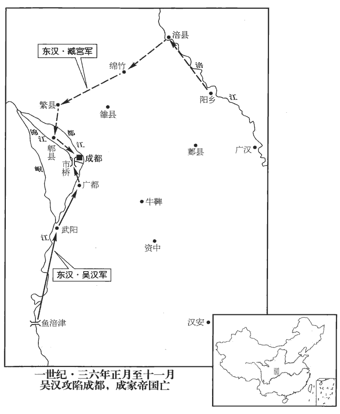
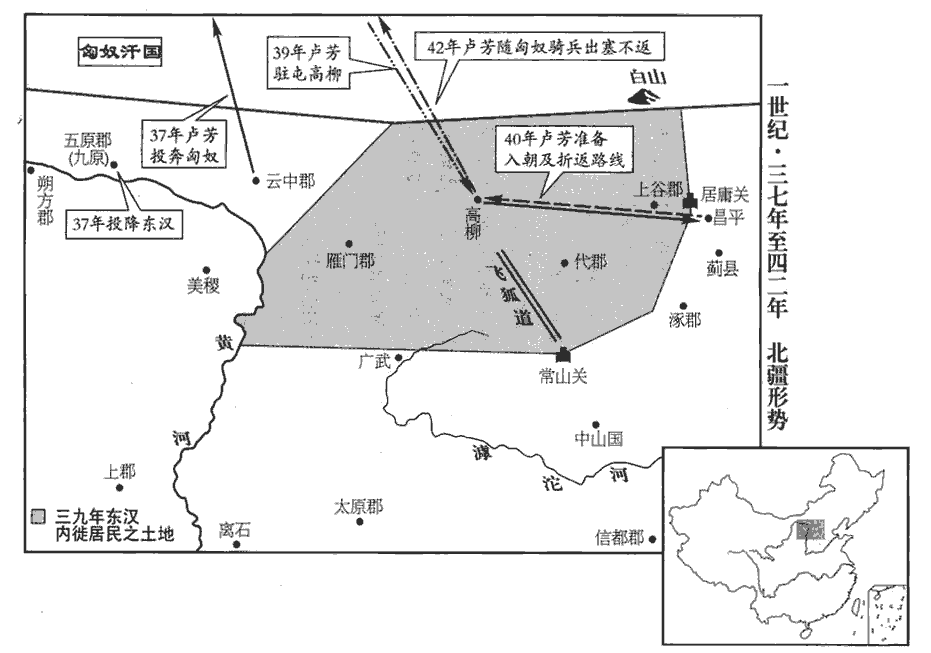
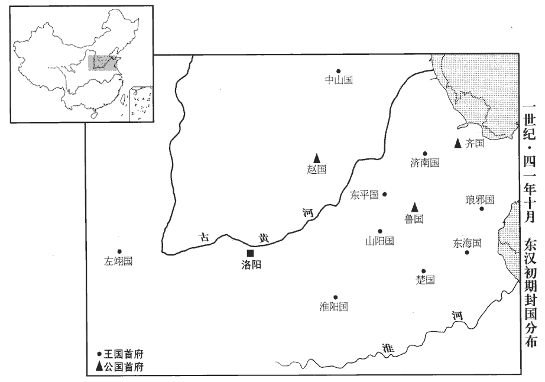
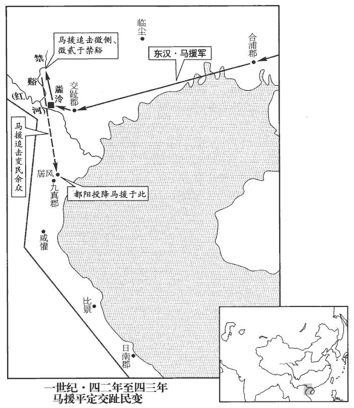
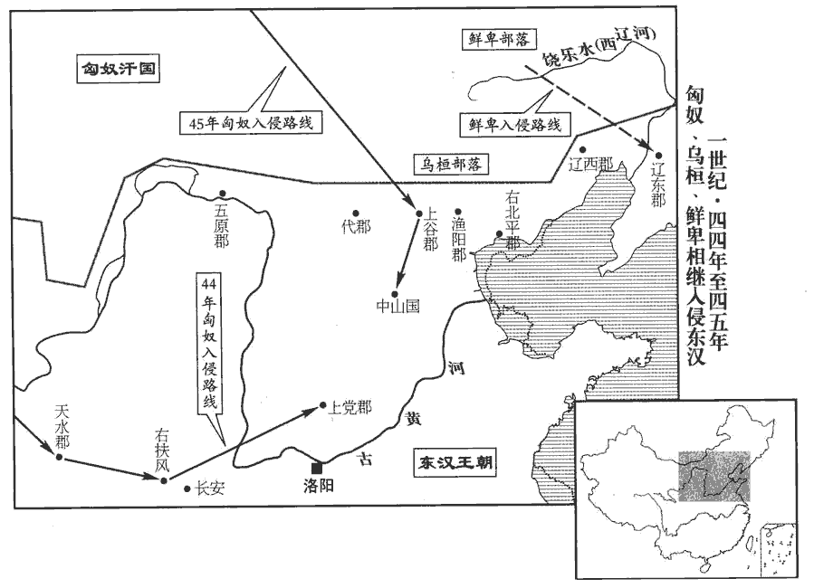
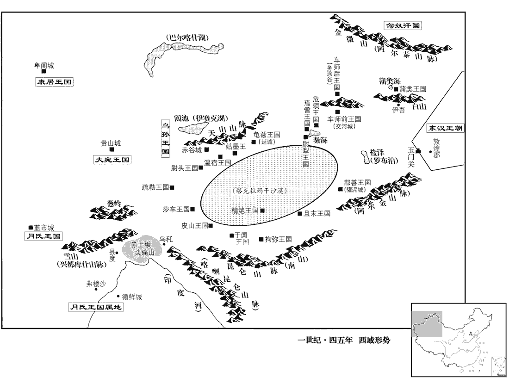

 漢紀三十五起柔兆涒tūn灘（丙申），盡柔兆敦牂（丙午），凡十一年。

# 世祖光武皇帝中之下

## 建武十二年（丙申，三六）

1春，正月，吳漢破公孫述將魏黨、公孫永於魚涪津‹四川乐山北›，續漢書曰：犍為郡南安縣有魚涪津，在縣北，臨大江。南中志曰：魚涪津廣數百步。涪，音浮。遂圍武陽‹四川彭山›。述遣子婿史興救之，漢迎擊，破之，因入；犍為‹四川宜賓›界諸縣皆城守。詔漢直取廣都‹四川成都東南华阳镇›，據其心腹。漢乃進軍攻廣都‹四川成都東南华阳镇›，拔之，武帝元朔二年，置廣都縣，屬蜀郡。遣輕騎燒成都市橋。賢曰：市橋，即七星橋之一橋也。李膺益州記，沖星橋，舊市橋也，在今成都縣西南四里。水經註：成都中，兩江有七橋，西南石牛門外曰市橋。公孫述將帥恐懼，日夜離叛，述雖誅滅其家，猶不能禁。將，即亮翻。帥，所類翻。帝必欲降之，降，戶江翻；下同。又下詔諭述曰：「勿以來歙、岑彭受害自疑，二人受害，見上卷上年。歙，許及翻。今以時自詣，則宗族完全。詔書手記，不可數得。」數，所角翻。述終無降意。

〖译文〗 [1]春季，正月，吴汉在鱼涪津打败公孙述的将领魏党、公孙永，随后包围武阳县。公孙述派遣女婿史兴救援。吴汉迎击，打败史兴，于是进入犍为郡内。郡内各县都闭城坚守。刘秀命令吴汉径直夺取广都，占据敌人心腹。吴汉于是进军广都，占领该地，又派遣轻骑兵烧毁成都市桥。公孙述的将帅十分恐惧，日夜逃离叛变。尽管公孙述诛杀了叛离逃亡将领的全家，还是不能禁止。刘秀一定要公孙述投降，又一次下诏告诉公孙述说：“不要因来歙、岑彭两个人被害的事而自己疑虑，现在及时投降，家族就可以保全。诏书和亲笔信，不可能屡屡得到。”公孙述始终没有投降的意思。

 

2秋，七月，馮駿拔江州‹四川重庆›，獲田戎。

〖译文〗 [2]秋季，七月，东汉将军冯骏攻陷江州，俘获田戎。

3帝戒吳漢曰：「成都十餘萬眾，不可輕也。但堅據廣都‹四川成都東南华阳镇›，待其來攻，勿與爭鋒。若不敢來，公轉營迫之，須其力疲，乃可擊也。」漢乘利，遂自將步騎二萬進逼成都；去城十餘里，阻江北【張：「北」下脫「爲」字。】營，作浮橋，使副將武威將軍劉尚將萬餘人屯於江南，為營相去二十餘里。帝聞之大驚，讓漢曰：「比敕公千條萬端，何意臨事勃亂！比，毗至翻。千條萬端，言詳細也。勃，與悖同。既輕敵深入，又與尚別營，事有緩急，不復相及。復，扶又翻。賊若出兵綴公，以大眾攻尚，尚破，公即敗矣。幸無他者，言幸而無他虞，不至喪敗也。急引兵還廣都。」詔書未到，九月，述果使其大司徒謝豐、執金吾袁吉將眾十許萬，十許萬者，約言之也。分為二十餘營，出攻漢，使別將將萬餘人劫劉尚，令不得相救。漢與大戰一日，兵敗，走入壁，豐因圍之。漢乃召諸將厲之曰：厲，勉也。毛晃曰：勉厲之厲，有修飾振起之意。「吾與諸君踰越險阻，轉戰千里，遂深入敵地，至其城下。而今與劉尚二處受圍，勢既不接，其禍難量；量，音良。欲潛師就尚於江南，并兵禦之。若能同心一力，人自為戰，大功可立；如其不然，敗必無餘。成敗之機，在此一舉。」諸將皆曰：「諾。」於是饗士秣馬，閉營三日不出，乃多樹旛旗，使煙火不絕，夜，銜枚引兵與劉尚合軍。豐等不覺，明日，乃分兵拒水北，自將攻江南。漢悉兵迎戰，自旦至晡，日加申為晡；奔謨翻。遂大破之，斬豐、吉。於是引還廣都‹四川成都東南华阳镇›，留劉尚拒述，具以狀上，上，時掌翻。而深自譴責。帝報曰：「公還廣都，甚得其宜，述必不敢略尚而擊公也。賢曰：略，猶過也。若先攻尚，公從廣都五十里悉步騎赴之，適當值其危困，破之必矣！」自是漢與述戰於廣都、成都之間，八戰八克，遂軍於其郭中。成都郭中也。

〖译文〗 [3]刘秀告诫吴汉说：“成都有十余万大军，不能轻视。只可坚守广都，等待敌人来攻，千万不要和敌人一争高下。如果敌人不敢来攻，你就移动军营逼迫他们，等到敌人精疲力尽，才可发起攻击。”而吴汉却乘着胜利，自己率领步、骑兵二万人进逼成都，离城十余里，隔江在北岸扎营，架浮桥，命副将武威将军刘尚率领一万余人在江南屯兵，军营相隔二十余里。刘秀听说以后十分震惊，责备吴汉说：“我不久前告诫你千言万语，怎料想事到临头就乱来！你既然轻敌深入，又和刘尚分别扎营，一旦发生危急，就不再能互相顾及。敌人如果出兵牵制你，用主力攻击刘尚，刘尚失败，你也就失败了。幸而还没有其他变故，你要火速率军返回广都。”诏书还未到达，已进入九月。公孙述果然派大司徒谢丰、执金吾袁吉率领军队大约十万人，分成二十余营，攻打吴汉；另派其他将领率领一万余人牵制刘尚，使他不能救援。吴汉大战了一整天，兵败，退回到营垒。谢丰趁机包围。于是吴汉召集将领们，勉励他们说：“我和你们各位越过险阻，转战千里，才深入敌境，进逼城下。可是现在和刘尚分别困在两地，既然不能互相援救，大祸不可估量。我准备悄悄率军到南岸和刘尚会师，合力抵抗敌人。如果能够同心协力，人人全力奋战，可以建立大功业；否则的话，定会一败涂地。成败的关键，在此一举。”将领们都说：“听您的吩咐！”于是犒劳士兵，喂饱战马，关闭营门，三天不出。并多多竖立旌旗，使烟火不断。入夜，吴汉悄悄率领军队与刘尚会合。谢丰等没有发觉。第二天，兵分两路，一路在江北据守，谢丰自己率军进攻江南。吴汉投入所有兵力迎战，从早晨打到下午，大败敌军，斩杀谢丰、袁吉。于是率军返回广都，留下刘尚抗拒公孙述。吴汉把情况一一向刘秀报告，深刻地谴责自己。刘秀回答说：“你回到广都，最恰当不过。公孙述必定不敢绕过刘尚而攻打你。他如果先攻打刘尚，你从广都救援，五十里的路程，出动全部步兵骑兵赶赴，这时正是敌军危险困顿的时候，打败他们是必定的！”自此，吴汉和公孙术在广都和成都之间交战，八战八胜，东汉大军终于进入成都外城。

臧宮拔綿竹‹四川德阳北黄许镇›，破涪城‹四川綿陽›，涪縣，屬廣漢郡。賢曰：涪城，今綿竹縣。宋白曰：綿州巴西縣本漢涪縣。斬公孫恢；恢，述弟也。復攻拔繁‹四川新都西北新繁镇›、郫pí‹四川郫縣›，與吳漢會於成都。賢曰：繁，縣名，屬蜀郡。繁，江名，因以為縣名，故城在今益州新繁縣北。郫，縣名，屬蜀郡，故城在今益州郫縣北。郫，音皮。

〖译文〗 臧宫占领绵竹，又攻陷涪城，斩杀公孙恢。又接连攻克繁县、郫县，和吴汉大军在成都会师。

4李通欲避權勢，乞骸骨；積二歲，帝乃聽上大司空印綬，上，時掌翻。以特進奉朝請。後有司奏封皇子，帝感通首創大謀，事見三十八卷王莽地皇三年。即日，封通少子雄為召陵侯。召，讀與邵同。

〖译文〗 [4]李通想避开权势，请求退休。过了两年，刘秀才允许他交出大司空的印信绶带，要他以特进身分参加朝会。后来，有关部门上奏章请封皇子爵位，刘秀感念李通首先拥戴他谋划大事功绩，当天，封李通的幼子李雄为召陵侯。

5公孫述困急，謂延岑曰：「事當奈何？」岑曰：「男兒當死中求生，可坐窮乎！財物易聚耳，易，以豉翻。不宜有愛。」述乃悉散金帛，募敢死士五千餘人以配岑。岑於市橋偽建旗幟，鳴鼓挑戰，幟，昌志翻，挑，徒了翻，下同。而潛遣奇兵出吳漢軍後，襲擊破漢，漢墮水，緣馬尾得出。漢軍餘七日糧，陰具船，欲遁去；蜀郡‹四川成都›太守南陽‹河南南陽›張堪聞之，時成都未破，先署蜀郡太守以招懷蜀人。馳往見漢，說述必敗、不宜退師之策。說，如字漢從之，乃示弱以挑敵。

〖译文〗 [5]公孙述危困窘迫，对延岑说：“事情应当怎么办？”延岑说：“男子汉应当死里逃生，怎么能坐着等死？财物容易聚敛，不应爱惜。”于是公孙述散发所有的黄金、绢帛，招募敢死队五千余人分配给延岑。延岑在成都市桥先布疑阵，树立旌旗，擂鼓向东汉军队挑战。同时悄悄派出奇兵绕到吴汉军队的后面，打败吴汉军。吴汉堕马落水，抓着马尾才脱离险境。吴汉的军队只剩下七天用的粮草，秘密准备战船，打算撤退。蜀郡太守南阳人张堪听说以后，火速前往求见吴汉，陈述公孙述必然灭亡、不应退军的策略。吴汉接受他的意见，于是故意示弱，挑动敌人出战。

冬，十一月，臧宮軍咸陽門；臧宮傳作「咸門」。賢曰：成都城北面東頭門。此衍「陽」字。「東」，或作「西」。戊寅‹十八›，述自將數萬人攻漢，使延岑拒宮。大戰，岑三合三勝，自旦及日中，軍士不得食，并疲。漢因使護軍高午、唐邯將銳卒數萬擊之，邯，戶甘翻。述兵大亂；高午奔陳刺述，陳，讀曰陣。刺，七亦翻。洞胸墜馬，左右輿入城。述以兵屬延岑，屬，之欲翻。其夜，死；明旦，延岑以城降。降，戶江翻。辛巳‹二十一›，吳漢夷述妻子，盡滅公孫氏，并族延岑，遂放兵大掠，焚述宮室。帝聞之怒，以譴漢。又讓劉尚曰：「城降三日，吏民從服，孩兒、老母，口以萬數，一旦放兵縱火，聞之可為酸鼻。尚宗室子孫，更嘗吏職，更，工衡翻。何忍行此！仰視天，俯視地，觀放麑、啜羹，二者孰仁？韓子曰：孟孫獵得麑，使秦西巴持之。其母隨而呼，秦西巴不忍，放而與其母。孟孫怒而逐西巴；既而復之，使傅其子。戰國策曰：樂羊為將，為魏文侯攻中山。中山之君烹其子而遺之羹，樂羊坐於幕下而啜之，盡一杯。文侯謂褚師贊曰：「樂羊以我故而食其子之肉。」答曰：「子且食之，其誰不食！」既拔中山，文侯賞其功而疑其心。良失斬將弔民之義也！」將，即亮翻。

〖译文〗 冬季，十一月，臧宫进驻成都咸阳门。戊寅（十八日），公孙述亲自率领数万人攻打吴汉，派延岑抗击臧宫。双方展开大战，延岑三战三胜，从早晨打到中午，官兵得不到饭食，全都感到疲劳。吴汉于是派遣护军高午、唐邯率领精锐部队数万人攻打公孙述，公孙述的军队大乱。高午直奔阵前，猛刺公孙述，公孙述胸被刺穿，掉下战马，左右将他抬入城中。公孙述把军队交给延岑，当夜去世。第二天，延岑献城投降。辛巳（二十一日），吴汉诛杀公孙述的妻子儿女，屠杀公孙氏家族，长幼不留。并将延岑灭族，然后纵兵大肆掳掠，焚烧公孙述宫室。刘秀听说以后大怒，因此谴责吴汉。又谴责刘尚说：“成都城投降已经三天，官民都服从归顺。连同孩子和母亲，人口数以万计，一旦纵兵放火，听到的人都会酸鼻掉泪。你是汉宗室子弟，又曾经当过官吏，怎么忍心做出这种事！仰视苍天，俯视大地，比较秦西巴释放小鹿、乐羊吃他儿子的肉羹，这两个人谁仁义？你们真是失掉了斩杀敌将、拯救百姓的道义！”

初，述徵廣漢李業為博士，業固稱疾不起。業，平帝元始中除為郎，會王莽居攝，以病去官，杜門不應州郡之命。王莽以業為酒士，病不之官，遂隱藏山谷，絕匿名跡。夫既不仕於莽，其肯為述起乎！述羞不能致，使大鴻臚尹融奉詔命以劫業，「若起則受公侯之位，不起賜以毒酒。」融譬旨曰：「方今天下分崩，孰知是非，而以區區之身試於不測之淵乎！朝廷貪慕名德，曠官缺位，於今七年，四時珍御，不以忘君；珍御，謂食珍之供進者。宜上奉知己，下為子孫，為，於偽翻；下同。身名俱全，不亦優乎！」業乃歎曰：「古人危邦不入，亂邦不居，論語載孔子之言也。為此故也。君子見危授命，論語載子張言也。何乃誘以高位重餌哉！」誘，音酉。融曰：「宜呼室家計之」業曰：「丈夫斷之於心久矣，斷，丁亂翻。何妻子之為！」遂飲毒而死。述恥有殺賢之名，遣使弔祠，賻fù贈百匹，業子翬huī逃，辭不受。翬，音暉。述又聘巴郡‹四川重慶›譙qiáo玄，姓譜：曹大夫食采於譙，因氏焉。玄，平帝元始四年為繡衣使者，分行天下，觀省風俗。會莽居攝，棄使者車，歸家隱遁。玄不詣；亦遣使者以毒藥劫之，太守自詣玄廬，勸之行，玄曰：「保志全高，死亦奚恨！」遂受毒藥。玄子瑛泣血叩頭於太守，願奉家錢千萬以贖父死，太守為請，為，於偽翻。述許之。述又徵蜀郡王皓、王嘉，平帝時，皓為美陽令，嘉為郎。王莽篡位，并棄官西歸。恐其不至，先繫其妻子，使者謂嘉曰：「速裝，妻子可全。」對曰：「犬馬猶識主，況於人乎！」言身為漢臣，豈不念故主乎！王皓先自刎，以首付使者。刎，武粉翻。述怒，遂誅皓家屬。王嘉聞而嘆曰：「後之哉！」乃對使者伏劍而死。犍為‹四川宜賓›費貽yí不肯仕述，漆身為癩，陽狂以避之。犍，居言翻。費，音祕，又父沸翻。同郡任永、馮信皆託青盲以辭徵命。青盲者，其瞳子不精明，不能睹物。任，音壬。帝既平蜀，詔贈常少為太常，張隆為光祿勳。少、隆死見上卷上年。譙qiáo玄已卒，祠以中牢，師古曰：中牢，即少牢，謂羊、豕也。敕所在還其家錢，而表李業之閭。徵費貽、任永、馮信，會永、信病卒，獨貽仕至合浦‹广西合浦东北›太守。郡國志：合浦郡，在雒陽南九千一百九十一里。上以述將程烏、李育有才幹，皆擢用之。於是西土咸悅，莫不歸心焉。

〖译文〗 当初，公孙述征召广汉人李业当博士，李业坚持说有病而不肯接受。公孙述因不能把李业召来而感到羞耻，派大鸿胪尹融拿着诏书胁迫李业：“你如果接受职位就封公侯，如果不接受职位就赐予毒酒。”尹融解释说：“当今天下分崩离析，谁知道什么是是和非，而敢用区区身体去试探不可测的深渊？朝廷仰慕您的名望品德，给您留下官位，到现在已七年了。四季进贡的山珍美味，不会忘记送给您。您应该让奉知己，下为子孙，性命和名誉都可保全，这样做不是上策吗？”李业于是叹息说：“古人说，危险之邦不进入，混乱之邦不居住，我正是为了这个缘故。君子遇到危险而肯献出生命，为什么竟用高官厚禄引诱呢？”尹融说：“应该叫家人来商量。”李业说：“大丈夫决心断绝仕途已经很久了，为什么要和妻子儿女商量？”于是饮毒酒而死。公孙述耻于背上杀死贤才的名声，派使者吊丧祭祀，赠送一百疋绢帛助丧。李业的儿子李逃跑，推辞不接受。公孙述又聘请巴郡人谯玄，谯玄不接受任命。公孙述也派使者用毒药相威胁。太守亲自到谯玄家拜访，劝他动身，谯玄说：“坚持我的志向，保全我的气节，死又有何遗憾！”于是接受毒药。谯玄的儿子谯瑛通哭，向太守磕头，情愿捐献家产一千万钱，以赎父亲的死罪。太守为此请示公孙述，公孙述应允。公孙述又征召蜀郡人王皓、王嘉，怕他们不来，先拘捕他们的妻子儿女。使节对王嘉说：“赶快整理行装，妻子儿女可以保全。”王嘉回答说：“狗、马还认识主人，何况人呢？”王皓先自刎而死，使者用首级上报。公孙述大怒，于是诛杀王皓的家属。王嘉听说后叹息说：“我走在后面了！”于是面对使节用剑自杀而死。犍为郡人费贻，不肯做公孙述的官，身涂油漆成为癞疮，假装疯狂以逃避做官。同郡人任永、冯信全都假托患青光眼而辞谢征召。刘秀平定蜀地后，下诏追赠常少为太常，追赠张隆为光禄勋。谯玄已经去世，用羊、猪各一头祭祀，命令当地官府还给他家赎死的钱。在李业家所居地的里门刻石，表彰他的节操。征召费贻、任永、冯信，正巧任永、冯信病逝，只有费贻官至合浦太守。刘秀因公孙述的将领程乌、李育有才干，一齐提拔任用。于是蜀地上下喜悦，百姓无不归顺。

初，王莽以廣漢‹四川梓潼›文齊為益州‹云南晉寧东晋城镇›太守，郡國志：益州郡，在雒陽西五千五百里。齊訓農治兵，治，直之翻。降集群夷，甚得其和。降，戶江翻；下同。公孫述時，齊固守拒險，述拘其妻子，許以封侯，齊不降。聞上即位，間道遣使自聞。間，古莧翻。使，疏吏翻。蜀平，徵為鎮遠將軍，封成義侯。

〖译文〗 起初，王莽任命广汉人文齐当益州郡太守。文齐劝导农民耕田，训练军队，招降各部夷人，郡内十分和平。公孙述时代，文齐据守险要。公孙述拘捕他的妻子儿女，向他许愿封做侯爵，文齐不肯投降。后来他听说刘秀即位，派人从小路到洛阳，为自己呈上奏章。蜀郡平定后，刘秀征召文齐当镇远将军，封成义侯。

6十二月，辛卯‹一›，揚武將軍馬成行大司空事。

〖译文〗 [6]十二月辛卯（初一），杨武将军马成代理大司空职务。

7是歲，參狼‹甘肃舟曲东›羌與諸種寇武都‹甘肅成縣›，參狼羌，無弋爰劍之後也。爰劍孫邛，將其種人南出賜支河曲之西數千里，其後子孫分別，各自為種：或為氂máo牛種，越巂羌是也；或為白馬種，廣漢羌是也；或為參狼種，武都羌是也。爰劍曾孫忍及弟舞留湟中，是為湟中諸種羌。種，章勇翻。隴西‹甘肅臨洮›太守馬援擊破之，降者萬餘人，於是隴右清靜。援務開恩信，寬以待下，任吏以職，但總大體，而賓客故人日滿其門。諸曹時白外事，援輒曰：「此丞、掾之任，何足相煩！百官志：郡守有丞一人，有諸曹掾、史。有功曹史，主選署功勞；有五官掾，署功曹及諸曹事；其餘有議曹、法曹、賊曹、決曹、金曹、倉曹等。掾，俞絹翻。頗哀老子，使得遨遊，若大姓侵小民，黠吏不從令，黠，下八翻。此乃太守事耳。」傍縣嘗有報讎者，吏民驚言羌反，百姓奔入城，狄道‹甘肅臨洮›長詣門，請閉城發兵。賢曰：狄道縣，屬隴西郡，今蘭州縣。余據隴西郡治狄道，故得詣門白太守。長，知兩翻。援時與賓客飲，大笑曰：「虜何敢復犯我！曉狄道長，歸守寺舍。賢曰：曉，喻也。寺舍，官舍也。良怖急者，可牀下伏！」怖，普布翻。後稍定，郡中服之。

〖译文〗 [7]这一年，参狼羌部落和其他羌人部落侵犯武都。陇西太守马援，击败羌军，一万余人投降，于是陇右一带平安无事。马援的宗旨是要对人有恩德，讲求信誉，对下宽厚，任用官吏职责分明，自己只总揽大局。因此，宾客故旧每天都挤满大门。各部门主管有时向他报告外面的公事，马援就说：“这是丞、掾分内的事，哪值得麻烦我！可怜可怜我这老头子，让我能够游乐玩耍。如果豪强大姓侵犯小民，或者狡猾的官吏枉法，这才是太守的事。”邻县曾有人报私仇，官民震惊，传言羌人反叛，百姓跑到城内。狄道县长上门，请求关闭城门征调军队。当时马援正和宾客喝酒，大笑说：“羌人怎么敢再来侵犯我？告诉狄道县长，回去守在官舍，害怕得太厉害的话，可以伏在床底下。”后来，情况逐渐安定，全郡人都佩服马援。

8詔：「邊吏力不足戰則守，追虜料敵，不拘以逗留法。」賢曰：漢法，軍行逗留畏愞nuò者斬。追虜或近或遠，量敵進退，不拘以軍法，直取勝敵為務。

〖译文〗 [8]刘秀下诏：“边疆官吏如果没有力量交战就采取守势；追击敌人时要估量敌人的情况，或远或近，不要拘泥于军法中的‘逗留法’。”

9山桑節侯王常、牟mù平烈侯耿況、東光成侯耿純皆薨。諡法：好廉自克曰節；有功安民曰烈。賀琛曰：佐相克終曰成；惇dūn厖máng淳固曰成。況疾病，乘輿數自臨幸，復以弇yǎn弟廣、舉并為中郎將。乘，繩證翻。數，所角翻。復，扶又翻。弇兄弟六人，弇、舒、國、廣、舉、霸，兄弟六人。皆垂青紫，省侍醫藥，省，悉景翻。當世以為榮。

〖译文〗 [9]山桑节侯王常、牟平烈侯耿况、东光成侯耿纯都已去世。耿况患病时，刘秀好几次亲自探望，又任命耿的弟弟耿广、耿举同时担任中郎将。耿兄弟六人，全都身佩青紫色印信绶带，在病榻前控视、侍奉汤药，当世认为是荣耀。

10盧芳與匈奴、烏桓連兵，數寇邊。帝遣驃騎大將軍杜茂等將兵鎮守北邊，治飛狐道‹河北涞源南，太行山八陉之一›，治飛狐道以通趙、魏應援北邊之兵。築亭障，修烽燧，凡與匈奴、烏桓大小數十百戰，終不能克。

〖译文〗 [10]卢芳和匈奴、乌桓的军队联合，多次侵犯边境。刘秀派遣骠骑大将军杜茂等率军镇守北方边境，整修飞狐道，修筑碉堡，建造烽火台。和匈奴、乌桓大大小小共打了数十上百次战斗，始终不能取胜。

11上詔竇融與五郡太守入朝。融等奉詔而行，官屬賓客相隨，駕乘千餘兩，馬牛羊被野。乘，繩證翻。兩，音亮。被，皮義翻。既至，詣城門，上印綬。上，時掌翻。詔遣使者還侯印綬，引見，賞賜恩寵，傾動京師。尋拜融冀州‹河北中部南部›牧。冀州部魏郡、钜鹿、常山、中山、信都、河間、清河、趙國、勃海。又以梁統為太中大夫，姑臧長孔奮為武都郡丞。姑臧在河西最為富饒，姑臧縣，屬武威郡。劉昫xù曰：姑臧縣，秦月氏戎所處，匈奴名蓋藏城，語訛為姑臧城。長，知兩翻。天下未定，士多不修檢操，居縣者不盈數月，輒致豐積；奮在職四年，力行清潔，為眾人所笑，以為身處脂膏不能自潤。說文：戴角者脂，無角者膏。處，昌呂翻。及從融入朝，諸守、令財貨連轂，彌竟川澤；轂，古穀翻。唯奮無資，單車就路，帝以是賞之。

〖译文〗 [11]刘秀诏令窦融和五郡太守到京都洛阳朝见。窦融等接到诏令后动身前往，官属和兵客跟随，车队有一千多辆，马牛羊遍野。到达以后，窦融前往城门，奉上印信绶带。刘秀下诏派使者发还侯爵印信绶带。接见窦融，对他的赏赐恩宠轰动了洛阳。不久，刘秀任命窦融当冀州牧。又任命梁统当太中大夫，姑臧县长孔奋当武都郡丞。姑臧县在河西是最富饶的地方，当时全国还未平定，士人多不检点，没有节操，在县长的位置上不满几个月就积累起大量财富。孔奋在职四年，行为清正廉洁，被众人所讥笑，认为他身在油脂之中却不能滋润自己。等到跟随窦融到京都洛阳，各郡守、县令的钱财货物装了一车又一车，布满平川洼泽，唯独孔奋没有财产，只乘一辆车上路。刘秀因此奖赏他。

帝以睢suī陽‹河南商丘›令任延為武威太守，睢，音雖。任，音壬。帝親見，戒之曰：「善事上官，無失名譽。」延對曰：「臣聞忠臣不和，和臣不忠。考異曰：延傳作「忠臣不私，私臣不忠」，按高峻小史作「忠臣不和，和臣不忠」，意思為長，又與上語相應。今從之。履正奉公，臣子之節；上下雷同，非陛下之福。曲禮曰：毋雷同。鄭氏註曰：雷之發聲，物無不同時應者；人之言當各由己，不當然也。善事上官，臣不敢奉詔。」帝歎息曰：「卿言是也！」

〖译文〗 刘秀任命睢阳县令任廷当武威太守。刘秀亲自召见，告诫他说：“好好侍奉长官，不要丢掉名誉。”任延回答说：“我听说忠诚的臣子与人不和睦，与人和睦的臣子不忠诚。履行正道，奉公守法，是臣子的节操。如果下级对上级随声附和，那不是陛下的福分。陛下说要好好侍奉长官，我不敢接受。”刘秀叹息说：“你说得对呀！”

## 十三年（丁酉，三七）

1春，正月，庚申‹一›，大司徒侯霸薨。

〖译文〗 [1]春季，正月庚申（初一），大司徒侯霸去世。

2戊子‹二十九›，詔曰：「郡國獻異味，其令太官勿復受！百官志：太官令一人，秩六百石，掌御膳飲食。復，扶又翻。遠方口實所以薦宗廟，自如舊制。」漢官儀曰：口實，膳羞之事也。時異國有獻名馬者，日行千里，又進寶劍，價直百金。詔以劍賜騎士，馬駕鼓車。輿服志：乘輿法駕後有金鉦zhēng、黃鉞yuè、黃門鼓車。上雅不喜聽音樂，喜，許既翻。手不持珠玉。嘗出獵，車駕夜還，上東門候汝南‹河南平舆西北射桥乡›郅惲拒關不開。賢曰：上東門，洛陽城東面北頭門也。惲，於粉翻。上令從者見面於門間，見，賢遍翻。惲曰：「火明遼遠。」遂不受詔。上乃回，從東中門入，賢曰：東面中門也。明日，惲上書諫曰：「昔文王不敢槃於遊田，以萬民惟正之供。尚書無逸之辭。槃，樂也。而陛下遠獵山林，夜以繼晝，其如社稷宗廟何！」書奏，賜惲布百匹，貶東中門候為參封尉。雒陽十二城門，每門候一人，秩六百石。參封縣，屬琅邪郡。

〖译文〗 [2]戊子（二十九日），刘秀下诏：“各郡、封国进贡山珍海味，太官不能再接受。远方进献祭祀宗庙食物，则依照旧例。”当时外国有进献良马的，可日行千里；又有人进献宝剑，价值一百两黄金。刘秀下诏，把宝剑赏赐给骑士，让良马去驾皇家的鼓车。刘秀平素不喜欢听音乐，手不持珍珠宝玉。有一次外出打猎，车驾夜里返回，上东门候汝南人郅恽拒绝开门。刘秀命随从在门缝间和郅恽见面，郅恽说：“灯火太远，看不清是谁。”于是不接受诏命。刘秀只好返回，从东中门进城。第二天，郅恽上书规劝说：“从前，周文王不敢沉溺于狩猎，全身心地为万民服务。可是陛下远到山林中打猎，夜以继日，这对社稷和宗庙有什么好处呢？”奏章呈上后，刘秀赏赐郅恽一百匹布，贬逐东中门候当参封县尉。

3二月，遣捕虜將軍馬武屯虖沱河以備匈奴。虖，讀曰呼。

〖译文〗 [3]二月，刘秀派遣捕虏将军马武屯军滹沱河，以防备匈奴。

4盧芳攻雲中‹內蒙托克托›，久不下。其將隨昱yù留守九原‹內蒙包頭›，欲脅芳來降；芳知之，與十餘騎亡入匈奴，其眾盡歸隨昱，昱乃詣闕降。詔拜昱五原‹內蒙包頭西北›太守，封鐫juān胡侯。鐫，子全翻。

〖译文〗 [4]卢芳进攻云中，久攻不下。卢芳的将领随昱在九原留守，想胁迫卢芳投降东汉。卢芳得知后，与十余名骑兵卫士逃入匈奴地区。卢芳的部众全都属随昱所有，随昱于是到洛阳投降。刘秀下诏，任命随昱当五原太守，封为镌胡侯。

5朱祜hù奏：「古者人臣受封，不加王爵。」丙辰‹二十七›，詔長沙王興、真定王得、河間王邵、中山王茂皆降爵為侯：高帝封諸侯王，其子孫無有與漢俱存亡者。文帝封梁王、城陽、菑川，景帝封河間、長沙、中山、常山、昭帝封廣陽、廣陵、高密，此數國至王莽篡漢而廢。但封長沙、真定、河間、中山者，與帝同出於景帝也。長沙，舂陵之大宗；真定，常山王憲之後改封者，今復降爵為侯，以服屬已疏也。丁巳‹二十八›，以趙王良為趙公，太原王章為齊公，魯王興為魯公。良，帝叔父；章、興，帝兄子也。是時，宗室及絕國封侯者凡一百三十七人。富平侯張純，安世之四世孫也，歷王莽世，以敦謹守約保全前封；建武初，先來詣闕，為侯如故。於是有司奏：「列侯非宗室不宜復國。」上曰：「張純宿衛十有餘年，其勿廢！」更封武始侯，食富平之半。賢曰：武始縣，屬魏郡；富平縣，屬平原郡。

〖译文〗 [5]朱祜上奏章说：“古时候，臣子受封，不是直系皇族，不封王爵。”丙辰（二十七日），刘秀下诏，长沙王刘兴、真定王刘得、河间王刘邵、中山王刘茂，都降爵为侯。丁巳（二十八日），改封赵王刘良为赵公，太原王刘章为齐公，鲁王刘兴为鲁公。这时，刘氏皇族以及原封国撤销而由后世继承爵位的，共一百三十七人。富平侯张纯，是张安世的四世孙，曾经历王莽时代，因敦厚谨慎守法而能保全爵位。建武初年，张纯先来归附，照旧为侯。现在主管部门上奏：“侯爵中除非刘姓宗室，不应恢复封国。”刘秀说：“张纯在宫禁中值宿警卫已十余年，不要废除。”改封为武始侯，封地为富平县的一半。

6庚午，以紹嘉公孔安為宋公，承休公姬常為衛公。平帝元始四年，改紹嘉公曰宋公，承休公曰鄭公，今又改鄭曰衛。

〖译文〗 [6]庚午（疑误），封绍嘉公孔安为宋公，承休公姬常为卫公。

7三月，辛未‹十二›，以沛郡‹安徽淮北›太守韓歆為大司徒。郡國志，沛郡在雒陽東南一千二百里。

〖译文〗 [7]三月辛未（十二日），刘秀任命沛郡太守韩歆当大司徒。

8丙子‹十七›，行大司空馬成復為揚武將軍。

〖译文〗 [8]丙子（十七日），代理大司空职务的马成又担任杨武将军。

9吳漢自蜀‹四川›振旅而還，至宛‹河南南陽›，宛，於元翻。詔過家上塚，賜穀二萬斛；上，時掌翻。夏四月，至京師。於是大饗將士、功臣，增邑更封更，工衡翻。凡三百六十五人，其外戚、恩澤封者四十五人。定封鄧禹為高密侯，食四縣；禹食昌安、夷安、淳于、高密四縣。賢曰：高密，國名，今密州縣。余據西漢以高密為王國，東漢為侯國，屬北海國，賢所云蓋侯國也。李通為固始侯；賈復為膠東侯，食六縣；固始侯國，屬汝南郡；故寢縣也，帝更名。史記正義曰：孫叔敖以寢丘土寢薄，取為封邑。李通又慕叔敖受邑，光武嘉之，改名固始。膠東，西漢以為王國，帝以為侯國，併屬北海，食鬱秩、壯武、下密、即墨、挺胡、觀陽，凡六縣。餘各有差。已歿者益封其子孫，或更封支庶。

〖译文〗 [9]吴汉从蜀地整军返回，到达宛城。刘秀下诏，准许他到家乡祭祀祖坟，赐谷二万斛。夏季，四月，吴汉回到洛阳。于是刘秀举行盛大宴会犒赏将士。有功之臣封土调整增加的，共计三百六十五人。外戚及加恩分封的，有四十五人。封邓禹为高密侯，辖地四个县。封李通为固始侯、贾复为胶东侯，辖地都是六个县。其他侯爵的封地各有等差。对已经死去的，加封他的子孙，或改封其宗族旁支。

帝在兵間久，厭武事，且知天下疲耗，思樂息肩，自隴、蜀平後，非警急，未嘗復言軍旅。樂，音洛。復，扶又翻。皇太子嘗問攻戰之事，帝曰：「昔衛靈公問陳，孔子不對。論語：衛靈公問陳於孔子，孔子曰：「俎zǔ豆之事，則嘗聞之矣；軍旅之事，未之學也。」陳，讀曰陣。此非爾所及。」鄧禹、賈復知帝偃干戈，修文德，不欲功臣擁眾京師，乃去甲兵，敦儒學。去，羌呂翻。帝亦思念，欲完功臣爵土，不令以吏職為過，恐其以職事有過而失爵邑也。遂罷左、右將軍官。耿弇等亦上大將軍、將軍印綬，上，時掌翻。皆以列侯就第，加位特進，奉朝請。朝，直遙翻。請，才性翻，又如字。

〖译文〗 刘秀在军旅中时间很长，厌倦战争，而且知道天下百姓疲惫贫困，渴望休息。自从陇、蜀平定之后，除非有危险紧急的情况，未曾再谈论军事。皇太子曾向他请教打仗的事，刘秀说：“从前卫灵公请教战争的事，孔子不肯答复。这不是你应该问的。”邓禹、贾复知道刘秀决定放下武器，用礼乐教化进行统治，不愿功臣们身在洛阳而拥有重兵，于是二人交出军权，潜心研究儒家经典。刘秀也考虑到功臣们今后的去向，想保全他们的爵位和封地，不让他们因为职务而有过失，于是撤销左将军、右将军的官职。耿等也交出大将军、将军的印信绶带，全都以侯爵的身份离开朝廷，回到自己的宅第。他们被加以特进之衔，定期参加朝会。

鄧禹內行淳備，行，下孟翻。有子十三人，各使守一藝，修整閨門，教養子孫，皆可以為後世法，資用國邑，不修產利。凡用度皆資於國邑，不事生產、作業及營利也。

〖译文〗 邓禹性格敦厚，有十三个儿子，让他们各自研习一种技能。他治家的严谨，对子孙的教育，都可以作为后世效法的榜样。家里的开支取自封地的收入，不从其他产业营利。

賈復為人剛毅方直，多大節，既還私第，闔門養威重。朱祜等薦復宜為宰相，帝方以吏事責三公，故功臣并不用。是時，列侯唯高密、固始、膠東三侯與公卿參議國家大事，恩遇甚厚。帝雖制御功臣，而每能回容，回容，猶今言回護也。賢曰：回，曲也，曲法以容也。宥其小失。遠方貢珍甘，必先徧賜諸侯，而太官無餘，故皆保其福祿，無誅譴者。

〖译文〗 贾复刚毅正直，有大节。回到宅第以后，关起门来修身养性。朱祜等举荐贾复，认为他适宜做宰相，而刘秀正责成三公整顿官吏制度，所以一律不任用功臣。这时，侯爵中只有高密侯邓禹、固始侯李通、胶东侯贾复三人和三公九卿一起议论国家大事，恩宠特别深厚。刘秀虽然控制功臣，但往往能维护包容他们，原谅他们的小过失。远方进贡珍味美食，一定先赏赐所有诸侯，而太官都没有多余的，因此功臣全都保持他们的爵位财产，没有被诛杀或谴退的。

10益州傳送公孫述瞽師、郊廟樂器、葆車、輿輦，於是法物始備。賢曰：瞽，無目之人也，為樂師，取其無所見，於音審也。郊廟之器，樽彝之屬也。樂器，鍾磬之屬也。葆車，謂上建羽葆也；合聚五采羽，名為葆。孔穎達曰：羽葆者，以鳥羽注於柄頭如蓋，謂之羽葆，謂蓋也。輿者，車之總名也。輦者，駕人以行。法物，謂大駕鹵簿儀式也。時草創未暇，今得之始備。余謂法物，即上樂器、葆車、輿輦之類。傳，直戀翻。時兵革既息，天下少事，文書調役，調，徒弔翻。務從簡寡，至乃十存一焉。

〖译文〗 [10]益州把公孙述的盲人乐师、祭祀用的乐器、用五采羽毛编成篷盖的车，以及帝王后妃专用的各种车辆等，送到洛阳，于是帝王仪伏所用的器物才开始完备。当时战事已经平息，天下少事，各种公文的往来和差役的调遣，力求从简从少，只有从前的十分之一。

11甲寅‹二十六›，以冀州‹河北中部南部›牧竇融為大司空。融自以非舊臣，一旦入朝，朝，直遙翻；下同。在功臣之右，每朝【章：十二行本「朝」作「召」；乙十一行本同。】會進見，容貌辭氣，卑恭已甚，帝以此愈親厚之。融小心，久不自安，數辭爵位，數，所角翻。上疏曰：「臣融有子，朝夕教導以經藝，不令觀天文，見讖記，讖，楚譖翻。誠欲令恭肅畏事，恂恂守道，不願其有才能，何況乃當傳以連城廣土，享故諸侯王國哉！」因復請間求見，復，扶又翻。間，古莧翻。見，賢遍翻；下以意推。帝不許。後朝罷，逡巡席後，逡巡，卻退貌。帝知欲有讓，遂使左右傳出。傳旨使融出也。它日會見，迎詔融曰：「日者知公欲讓職還土，賢曰：日者，猶往日也。故命公暑熱且自便；今相見，宜論它事，勿得復言。」融不【章：十二行本「不」上有「乃」字；孔本同。】敢重陳請。重，直用翻。

〖译文〗 [11]甲寅（疑误），刘秀任命冀州牧窦融当大司空。窦融因自己不是刘秀的旧臣，一旦入朝，官位在那些功臣之上，所以朝会晋见，神情和言辞都十分卑谦，刘秀因此更加亲近厚待他。窦融小心翼翼，内心却总是不安，几次请求辞去官职和爵位。他上书说：“我有儿子，每天早晚用儒家经典教导他。不让他学习天文，不准他研究预知祸福的谶记，只想让他恭敬怕事，恪守正道，不愿他有才能，何况竟要把连接几个城市的广大土地传给他，让他享受继承诸侯王国呢！”因此又请求单独晋见刘秀。刘秀不准。后来，有一次朝会完毕，窦融在席位后面徘徊，刘秀知道他要谈辞职的事，就让左右传旨催他离开。几天以后，有一天刘秀见到窦融，对他说：“那天，我知道你要辞职，归还封土，所以让左右告诉你，天气太热，暂且去自己凉快一下。今天见面，应当谈论别的 事，不能再说辞职。”于是窦融不敢再提这件事。

12五月，匈奴寇河東‹山西夏縣›。

〖译文〗 [12]五月，匈奴侵犯河东郡。

## 十四年（戊戌，三八）

1夏，邛穀王任貴遣使上三年計，即授越巂suǐ‹四川西昌›太守。郡國志：越巂郡，在雒陽西四千八百里。巂，音髓。邛，渠容翻。任，音壬。上，時掌翻。

〖译文〗 [1]夏季，邛王任贵派使者呈递三年的计簿，报告人口、赋税、治安等情况。刘秀任命任贵当越太守。

2秋，會稽‹江苏苏州›大疫。郡國志：會稽郡，在雒陽東三千八百里。會，古外翻。

〖译文〗 [2]秋季，会稽郡瘟疫流行。

3莎車‹新疆莎車›王【張：「莎」上脫「冬」字。】賢、鄯善‹新疆若羌›王安皆遣使奉獻。莎，素禾翻。鄯，時戰翻。西域苦匈奴重斂，斂，力贍翻。皆願屬漢，復置都護；上‹刘秀，时年四十三›以中國新定，不許。

〖译文〗 [3]莎车王贤、鄯善王安都派使者进贡。西域各国被匈奴的大量征敛所苦，都愿归属汉朝，愿朝廷重新设置都护。刘秀因为中原刚刚平定，不肯应许。

4太中大夫梁統上疏曰：「臣竊見元帝初元五年，輕殊死刑三十四事，哀帝建平元年，輕殊死刑八十一事；其四十二事手殺人者，減死一等。自是之後，著為常準，故人輕犯法，吏易殺人。易，以豉翻。臣聞立君之道，仁義為主，仁者愛人，義者正理。愛人以除殘為務，正理以去亂為心；去，羌呂翻。刑罰在衷，無取於輕。衷，中也；適也。高帝受命，約令定律，誠得其宜，高帝入關，約法三章，後蕭何定律九章。文帝唯除省肉刑、相坐之法，文帝元年，除收孥nú相坐法；十三年，除肉刑。自餘皆率由舊章。至哀、平繼體，即位日淺，聽斷尚寡。斷，丁亂翻。丞相王嘉輕為穿鑿，虧除先帝舊約成律，按嘉傳及刑法志并無其事，統與嘉時代相接，所引固不妄矣，但班固略而不載也。數年之間百有餘事，或不便於理，或不厭民心，厭，於葉翻。謹表其尤害於體者，傅奏於左。體，政體也。傅，音附。願陛下宣詔有司，詳擇其善，定不易之典！」事下公卿。下，遐嫁翻。光祿勳杜林奏曰：「大漢初興，蠲juān除苛政，海內歡欣；及至其後，漸以滋章。老子曰：法令滋章，盜賊多有。果桃菜茹之饋，集以成贓，小事無妨於義，以為大戮。至於法不能禁，令不能止，上下相遁，為敝彌深。賢曰：遁，猶回避也。前書曰：上下相匿，以文避法焉。臣愚以為宜如舊制，不合翻移。」統復上言曰：復，扶又翻。「臣之所奏，非曰嚴刑。經曰：『爰制百姓，于刑之衷。』尚書呂刑之言。衷之為言，不輕不重之謂也。自高祖至於孝宣，海內稱治，治，直吏翻。至初元、建平而盜賊浸多，皆刑罰不衷，愚人易犯之所致也。易，以豉翻。由此觀之，則刑輕之作，反生大患，惠加姦軌，而害及良善也！」事寢，不報。

〖译文〗 [4]太中大夫梁统上书说：“我看到，元帝初元五年，死罪减刑的有三十四件。哀帝建平元年，死罪减刑的有八十一件，其中四十二件是亲手杀人，而作减死一等判决。从此以后，成为惯例，所以人们轻率犯法，官吏轻视杀人。我听说做君主的道义，是以仁义为主。仁是爱人，义是坚持原则。爱人就要以除暴为目的，坚持原则就要以消灭祸乱为中心。设置刑罚在于适中，不能偏轻。高祖承受天命，制订法令，确实都很恰当。文帝只取消了肉刑和连坐法，其余全都遵循旧制。到哀帝、平帝继位，在位时间短，处理案子还很少。丞相王嘉轻率地穿凿附会，删减先辈君王的既定法律规章，几年之间有一百余件事，有的不合道理，有的不得民心。我谨把其中对大体为害最严重的，附在后边，向您陈奏。希望陛下命令主管部门，仔细选择好的律条，制订一部不容更改的法典。”刘秀把梁统的奏章交给公卿讨论。光禄勋杜林上奏说：“汉朝初兴时，废除苛政，四海之内欢欣鼓舞。等到以后，法令逐渐增多，连果桃、菜蔬之类的馈赠，都集中起来成为赃物。小的事不妨害大义，也要判处死刑。以至于发展到有法不禁，有令不止，上下互相掩护逃避，弊病更加严重。我认为应沿袭原有的法令条文，不宜于重新制订修改。”梁统又上奏说：“我所奏请的，并不是说要有严刑峻法。《书经》上说：‘治理百姓，刑法要适中。’适中的意思是不轻也不重。从高祖到宣帝，天下被称为治平，到元帝、哀帝时，盗贼渐渐增多，都是因为刑罚不适中，愚昧的人轻视犯法所造成的。由此看来，减轻刑罚的作法，反而酿成大祸。对奸诈不轨的人施恩，就是伤害善良的人。”这件事情被搁置，没有再交付讨论。

## 十五年（己亥，三九）

1春，正月，辛丑‹二十三›，大司徒韓歆免。歆好直好，呼到翻。言，無隱諱，帝‹刘秀，时年四十四›每不能容。歆於上前證歲將饑凶，指天畫地，言甚剛切，故坐免歸田里。帝猶不釋，復遣使宣詔責之；復，扶又翻。歆及子嬰皆自殺。歆素有重名，死非其罪，眾多不猒yàn；猒，一葉翻。帝乃追賜錢穀，以成禮葬之。賢曰：成禮，具禮也；言不以非命而降其葬禮。

〖译文〗 [1]春季，正月辛丑（二十三日），免去大司徒韩歆的职务。韩歆性格刚直，说话不隐讳，刘秀往往不能容忍。韩歆在刘秀面前有根有据地说天下将有严重的饥馑荒年出现，并指天划地，言辞非常激烈，因此被免职，回归故里。韩歆走后，刘秀仍然不能消气，又派使者宣读诏书责备他。韩歆和儿子韩婴全都自杀。韩歆平素享有重名，无罪被逼死，人多不服，刘秀于是追赠钱谷，以完整的礼仪安葬他。

臣光曰：昔高宗命說曰：「若藥弗瞑眩，厥疾弗瘳chōu。」說，傅說也，音悅。孔安國曰：如服藥必瞑眩極，其病乃除，欲其出切言以自警。陸德明音瞑，莫遍翻。眩，玄遍翻；徐：又呼縣翻。瞑眩，困極也。夫切直之言，非人臣之利，乃國家之福也。是以人君日夜求之，唯懼弗得聞。惜乎，以光武之世而韓歆用直諫死，豈不為仁明之累哉！累，力瑞翻。

〖译文〗 臣司马光曰：从前，商王武丁对傅说说：“如果药物不能使人感到昏眩，疾病就不能痊愈。”激烈直率的话，对臣子不利，却是国家的福分。所以君王日夜寻求这样的话，唯恐听不到。可惜呵，在光武帝时代，韩韵竟因直言进谏而死，岂不是仁义圣明的缺欠吗！

2丁未‹二十九›，有星孛bèi於昴mǎo。昴七星，西方之宿也，主獄事；又為旄頭，胡星也。昴、畢間為天街，黃道之所經也。孛，蒲內翻。

〖译文〗 [2]丁未（二十九日），有异星出现在昂宿。

3以汝南‹河南平舆西北射桥乡›太守歐陽歙為大司徒。郡國志：汝南郡，在雒陽南六百五十里。歙，許及翻。

〖译文〗 [3]刘秀任命汝南太守欧阳歙当大司徒。

 

4匈奴‹王庭设蒙古哈尔和林›寇鈔日盛，鈔，楚交翻。州郡不能禁。二月，遣吳漢率馬成、馬武等北擊匈奴，徙鴈門‹山西右玉›、代郡‹山西陽高›、上谷‹河北懷來›吏民六萬餘口置居庸‹北京昌平西北›、常山關‹即飞狐关，河北唐縣西北倒马关›以東，以避胡寇。郡國志：鴈門郡，在雒陽北一千五百里。代郡，在雒陽東北二千五百里。前書曰：「代郡有常山關。上谷郡居庸縣有關。匈奴左部遂復轉居塞內，復，扶又翻。朝廷患之，增緣邊兵，部數千人。每部各數千人也。

〖译文〗 [4]匈奴的侵扰掠夺一天比一天厉害，州、郡无力禁止。二月，派遣吴汉率领马成、马武等北上打击匈奴。迁徙雁门郡、代郡、上谷郡的官民六万余人，安置到居庸关、常山关以东，以避开匈奴的骚扰。匈奴左部于是又转移到边 塞以内居住。朝廷为此担忧，在边塞增派武装部队，每个据点达数千人。

5夏，四月，丁巳‹十一›，封皇子輔為右翊yì公，英為楚公，陽為東海公，康為濟南公，濟，子禮翻。蒼為東平公，延為淮陽公，荊為山陽公，衡為臨淮公，焉為左翊公，京為琅邪公。邪，音耶。癸丑‹十七›，追諡兄縯為齊武公，兄仲為魯哀公。帝感縯功業不就，事見三十九卷更始元年。撫育二子章、興，恩愛甚篤；以其少貴，少，詩照翻。欲令親吏事，使章試守平陰‹河南孟津›令，興緱gōu氏‹河南偃師东南›令；平陰、緱氏二縣，皆屬河南尹。緱，工侯翻。其後章遷梁郡‹河南商丘›太守，梁郡，在雒陽東南八百五十里。興遷弘農‹河南靈寶东北›太守。郡國志：弘農郡，在雒陽西南四百五十里。

〖译文〗 [5]夏季，四月丁巳（十一日），刘秀封皇子刘辅为右翊公，刘英为楚公，刘阳为东海公，刘康为济南公，刘苍为东平公，刘延为淮阳公，刘荆为山阳公，刘衡为临淮公，刘焉为左翊公，刘京为琅邪公。癸丑（十七日），刘秀追封大哥刘为齐武公，二哥刘仲为鲁哀公。刘秀感念大哥刘功业未成。抚育刘的两个儿子刘章、刘兴，十分宠爱。因为他们年轻而地位尊贵，想让他们亲身体验了解行政事务，派刘章暂时代理平阴县令，刘兴暂时代理缑氏县令。后来刘章升任梁郡太守，刘兴升任弘农太守。

6帝以天下墾田多不以實自占，占，之贍翻。又戶口、年紀互有增減，乃詔下州郡檢覈hé。覈者，考其實也。下，戶稼翻。於是刺史、太守多為詐巧，苟以度田為名，聚民田中，并度廬屋、里落，民遮道啼呼；度，徒洛翻。呼，火故翻。或優饒豪右，侵刻羸弱。羸，倫為翻。

〖译文〗 [6]刘秀因为全国的耕地面积自行申报，多不据实，并且户口、年龄都有增减，于是下诏，令各州郡进行检查核实。当时州刺史、郡太守多行诡诈，投机取巧，他们胡乱地以丈量土地为名，把农民聚集到田中，连房屋、乡里村落也一并丈量，百姓挡在道路上啼哭呼喊；有的官吏优待豪强，侵害苛待贫弱的百姓。

時諸郡各遣使奏事，帝見陳留‹河南开封东南陳留镇›吏牘dú上有書，視之云：「潁川‹河南禹州›、弘農‹河南靈寶东北›可問，河南‹河南洛陽东白马寺东›、南陽‹河南南陽›不可問。」宋白曰：漢割秦南陽、河南二郡之西境置弘農郡，義取弘大農桑為名。帝詰吏由趣，由，從也，問是書之所從來也。趣，向也，問是書之意，其所向為何如也。吏不肯服，抵言「於長壽街上得之。」抵，欺也。賢曰：長壽街在雒陽城中。帝怒。時東海公陽年十二，在幄後言曰：「吏受郡敕，敕，教戒也。當欲以墾田相方耳。」敕，教也，戒也。相方，求問其墾田之數以相比也。帝曰：「即如此，何故言河南、南陽不可問？」對曰：「河南帝城，多近臣；南陽帝鄉，多近親；田宅踰制，不可為準。」帝令虎賁將詰問吏，虎賁將，虎賁中郎將也。將，即亮翻。吏乃實首服，如東海公對。首，式救翻。上由是益奇愛陽。為立陽為太子張本。

〖译文〗 当时各郡各自派使者呈递奏章，刘秀发现陈留郡官吏的简牍上面有字，看到上面写的是：“颖川、弘农可以问，河南、南阳不可问。”刘秀责问陈留的官吏是怎么回事，官吏不肯承认，抵赖说“是在长寿街上捡到的。”刘秀大怒。当时东海公刘阳只有十二岁，在帐子后面说：“那是官吏接受郡守下的指令，将要同其他郡丈量土地的情况作比较。”刘秀说：“既然这样，为什么说河南、南阳不可问？”刘阳回答说：“河南是京都，有很多陛下亲近的臣僚；南阳是陛下的故乡，有很多皇亲国戚。他们的田地住宅都超过规定，不能做标准。”刘秀命虎贲中郎将责问陈留官吏，那个官吏才据实承认，正像东海公刘阳所回答的一样。刘秀于是更加喜爱刘阳。认为他不同寻常。

遣謁者考實二千石長吏阿枉不平者。長，知兩翻。冬，十一月，甲戌‹一›，大司徒歙坐前為汝南太守，度田不實，贓罪千餘萬，下獄。下遐稼翻。歙世授尚書，八世為博士，自歐陽生傳伏生尚書，至歙八世，皆為博士。諸生守闕為歙求哀者千餘人，為，於偽翻。至有自髡kūn剔者。毛晃曰：剃髮曰髡，盡及身毛曰剔。平原‹山東平原›禮震，年十七，禮，姓也。左傳，衛有大夫禮孔。求代歙死；帝竟不赦，歙死獄中。

〖译文〗 刘秀派遣谒者对二千石官员中循私枉法的行为进行考察核实。冬季，十一月甲戌（初一），有大司徒欧阳歙因先前在汝南太守任内丈量土地作弊，获赃款一千余万，被逮捕下狱。欧阳歙家世代教授《尚书》，有八代人是博士。学生门徒守在宫门外替欧阳歙求情的有一千余人，甚至有人把自己的头发剃掉，自处髡刑。平原人礼震才十七岁，请求替欧阳歙去死。刘秀终究未赦免，欧阳歙死在狱中。

7十二月，庚午‹二十七›，以關內侯戴涉為大司徒。

〖译文〗 [7]十二月庚午（二十七日），刘秀任命关内侯戴涉当大司徒。

8盧芳自匈奴復入居高柳‹山西陽高›。復，扶又翻。

〖译文〗 [8]卢芳从匈奴地区又返回内地，住在高柳。

9是歲，驃騎大將軍杜茂坐使軍吏殺人，免。使揚武將軍馬成代茂，繕治障塞，十里一候，以備匈奴。治，直之翻。使騎都尉張堪領杜茂營，擊破匈奴於高柳‹山西陽高›。杜佑曰：雲州，治雲中縣，縣界有高柳城。闞駰曰：高柳，在狋quán氏縣北百三十里。酈道元曰：高柳縣故城，舊代郡治。高柳在代中，其山重巒疊巘yǎn，霞舉雲高，連山隱隱，東出遼塞。拜堪漁陽‹北京密云›太守。堪視事八年，匈奴不敢犯塞，勸民耕稼，以致殷富。百姓歌曰：「桑無附枝，麥秀兩岐。【章：十二行本「秀」作「穗」，「岐」从「止」；乙十一行本均同。】蠶月既採桑，斫去繁枝，留其特長者，則來年桑葉茂盛。麥率一莖一穗，罕有兩岐者，故以為瑞。張君為政，樂不可支！」樂，音洛。

〖译文〗 [9]这年，骠骑大将军杜茂因指使军官杀人而被免职。命杨武将军马成代替杜茂的职务。马成修缮要塞，每隔十里有一个烽燧，以防备匈奴进犯。刘秀命骑都尉张堪率领杜茂的部队，在高柳击败匈奴。任命张堪为渔阳太守。张堪任职八年，匈奴不敢进犯边塞。他鼓励百姓从事农业生产，使他们生活富足。百姓用歌颂他：“桑树无繁枝，麦子两穗多，张君当太守，百姓真安乐。”

10安平侯蓋延薨。蓋，古盍翻。

〖译文〗 [10]安平侯盖延去世。

11交趾‹越南河内东北北宁府›麊mí泠縣‹越南河內西北六十里›雒將女子徵側，甚雄勇，師古曰：麊泠，音麋零。交州外域記曰：交趾昔未有郡縣之時，土地有雒田，民墾食其田，因名為雒民，設雒王、雒侯，主諸郡縣。縣有雒將，銅印青綬。宋白曰：峰州，漢麊泠縣地。交趾‹越南河內›太守蘇定以法繩之，徵側忿怨。

〖译文〗 [11]交趾泠县雒将的女儿征侧，十分层悍勇猛。交趾太守苏定用法律约束她，征侧怨恨。

## 十六年（庚子，四零）

1春，二月，徵側與其妹徵貳反，九真‹越南清化›、日南‹越南东河›、合浦‹廣西合浦东北›蠻俚皆應之，郡國志：日南郡，秦象郡地，在雒陽南萬三千四百里。賢曰：俚，蠻之別號，今呼為俚人。宋白曰：愛州，漢九真郡，治胥浦縣。驩huān州，漢日南郡，治朱吾縣。凡略六十五城，自立為王，都麊mí泠‹越南河內西北六十里›。交趾刺史及諸太守僅得自守。

〖译文〗 [1]春季，二月，征侧和她的妹妹征贰反叛。九真、日南，合浦的蛮人全都起来响应，共攻占六十五个城。征侧自立为王，建都泠。交趾郡刺史和各郡太守仅能自守。

2三月，辛丑晦‹三十›，日有食之。

〖译文〗 [2]三月，辛丑晦（三十日），出现日食。

3秋，九月，河南‹河南洛陽东白马寺东›尹張伋及諸郡守十餘人皆坐度田不實，下獄死。後上‹刘秀，时年四十五›從容謂虎賁中郎將馬援曰：武帝置期門郎，掌執兵送從；平帝元始元年，更名虎賁郎，置中郎將。漢儀：虎賁騎，鶡hé冠，虎文單衣。度，徒洛翻。從，千容翻。賁，音奔。「吾甚恨前殺守、相多也！」守，式又翻。相，息亮翻。對曰：「死得其罪，何多之有！但死者既往，不可復生也！」復，扶又翻。上大笑。

〖译文〗 [3]秋季，九月，河南尹张和各郡太守十余人，都因丈量土地中作弊，被逮捕入狱处死。后来，刘秀语气和缓地对虎贲中郎将马援说：“我十分悔恨先前杀了很多太守和相。”马援回答说：“他们的死和罪过相当，有什么多不多呢？只是已经死了的人，不能再复生了。”刘秀大笑。

4郡國群盜處處并起，郡縣追討，到則解散，去復屯結，青‹山東北部›、徐‹江蘇北部›、幽‹河北北部及辽宁›、冀‹河北中部南部›四州尤甚。冬十月，遣使者下郡國，下，遐稼翻。聽群盜自相糾擿tī，賢曰：擿，猶發也，他狄翻。五人共斬一人者，除其罪；吏雖逗留回避故縱者，皆勿問，聽以禽討為效。其牧守令長坐界內有盜賊而不收捕者，又以畏愞nuò捐城委守者，皆不以為負，賢曰：委守，謂棄其所守也。負，罪負也。愞，而戀翻，又奴亂翻。但取獲賊多少為殿最，殿，丁甸翻。唯蔽匿者乃罪之。於是更相追捕，更，工衡翻。賊并解散，徙其魁帥於他郡，賦田受稟，稟，給也。帥，所類翻。使安生業。自是牛馬放牧不收，邑門不閉。

〖译文〗 [4]各郡、封国的盗贼处处并起，郡县追击征剿，军队到时盗贼就散开，军队离开后又重新屯聚集结，青州、徐州、幽州、冀州四个州尤其厉害。冬季，十月，朝廷派使节到各郡、封国，听凭盗贼们自相检举攻击。五个人共同斩杀一个人，免除五个人的罪。即使官吏畏怯逗留、逃避、故意放纵盗贼，也一律不追究，允许以擒贼讨贼立功。州、郡太守、县令县长在所辖界内有盗贼而不拘捕，或因畏惧懦弱弃城放弃职责的，全都不予处罚，只看捕获盗贼的多少来排列先后名次。仅对窝藏盗贼的人才加罪。于是，大捕盗贼，盗贼全部解散。把他们的头领迁徙到其他郡，给他们土地，供应粮食，使他们安心生产。从此以后，放牧的牛马晚上不用牵回，城门夜间不用关闭，一片升平景象。

5盧芳與閔堪使使請降，帝立芳為代王，堪為代相，賜繒二萬匹，繒，慈陵翻。因使和集匈奴。芳上疏謝，自陳思望闕庭；詔報芳朝明年正月。朝，直遙翻；下同。

〖译文〗 [5]卢芳和闵堪派使者请求投降。刘秀封卢芳为代王，任命闵堪当代相，赏赐绸缎二万匹，让他为朝廷安抚匈奴，建立和睦的关系。卢芳上书谢恩，并说自己思念想往朝廷。刘秀下诏回答卢芳，让他明年正月来朝见。

初，匈奴聞漢購求芳，貪得財帛，故遣芳還降。既而芳以自歸為功，不稱匈奴所遣，單于復恥言其計，復，扶又翻；下同。故賞遂不行。由是大恨，入寇尤深。

〖译文〗 起初，匈奴听说汉朝悬赏捉拿卢芳，因贪图得到财帛，所以送回卢芳让他投降。后来卢芳以自动归附为功，不说是匈奴所遣，匈奴单于也耻于提到当初的谋划，因而汉朝没有进行赏赐。匈奴从此大为愤恨，入境侵扰得更厉害。

6馬援奏，宜如舊鑄五銖錢，廢五銖錢事見三十七卷王莽始建國元年。上從之；天下賴其便。

〖译文〗 [6]马援上奏建议，应当按旧币制铸造五铢钱。刘秀赞同。百姓都因这一措施而感到方便。

7盧芳入朝，南及昌平‹北京昌平南›，昌平縣屬上谷郡，賢曰：故城在今幽州昌平縣東南。有詔止，令更朝明歲。

〖译文〗 [7]卢芳入朝，南下到达昌平。刘秀下诏命他停止，改为明年朝见。

## 十七年（辛丑，四一）

1春，正月，趙孝公良薨。諡法：慈惠愛親曰孝。初，懷縣‹河南武陟›大姓李子春二孫殺人，懷令趙憙窮治其姦，憙，許記翻，又讀曰熹。治，直之翻。二孫自殺，收繫子春。京師貴戚為請者數十，為，於偽翻。憙終不聽。及良病，上‹刘秀，时年四十六›臨視之，問所欲言，良曰：「素與李子春厚，今犯罪，懷令趙憙欲殺之，願乞其命。」帝曰：「吏奉法律，不可枉也。更道他所欲。」良無復言。復，扶又翻。既薨，上追思良，乃貰shì出子春。貰，時夜翻，赦也。遷憙為平原‹山東平原›太守。郡國志：平原郡，在雒陽北千三百里。

〖译文〗 [1]春季，正月，赵孝公刘良去世。当初，怀县大姓李子春的两个孙子杀人，怀县县令赵深入追究凶犯，两个孙子自杀，李子春被捕入狱。洛阳的皇亲国戚有数十人替李子春说情，赵始终不答应。及至刘良病重，刘秀到他家探望，问他有什么话要说。刘良说：“我一向和李子春交往深厚。现在他犯罪，怀县县令赵要杀他，我愿乞求饶他一命。”刘秀说：“官吏尊奉法律，不能歪曲。请另外说其他的愿望。”刘良不再说话。刘良去世后，刘秀追念刘良，才赦免释放了李子春，提拔赵为平原太守。

2二月，乙未晦‹三十›，日有食之。考異曰：帝紀：「乙亥晦」，袁紀「乙未」。據長曆，三月丙申朔。帝紀誤。

〖译文〗 [2]二月乙未晦（三十日），出现日食。

3夏，四月，乙卯‹二›，上行幸章陵‹湖北棗陽南›；章陵，故舂陵，帝更名。五月，乙卯‹二十一›，還宮。

〖译文〗 [3]夏季，四月乙卯（初二），刘秀前往章陵。五月乙卯（二十一日），返回洛阳皇宫。

4六月，癸巳‹二十九›，臨淮懷公衡薨。

〖译文〗 [4]六月癸巳（二十九日），临淮怀公刘衡去世。

5妖賊李廣攻沒皖城‹安徽潛山›，賢曰：皖，縣名，屬廬江郡，故城在今舒州；有皖水。妖，於驕翻。皖，音下板翻。遣虎賁中郎將馬援、驃騎將軍段志討之。秋，九月，破皖城，斬李廣。

〖译文〗 [5]盗贼李广攻陷皖城。朝廷派虎贲中郎将马援、骠骑将军段志征讨。秋季，九月，攻破皖城，斩杀李广。

6郭后寵衰，數懷怨懟，數，所角翻。懟，直類翻。上怒之。冬，十月，辛巳‹十九›，廢皇后郭氏，立貴人陰氏為皇后。詔曰：「異常之事，非國休福，不得上壽稱慶。」郅惲言於帝曰：「臣聞夫婦之好，好，呼到翻。父不能得之於子，況臣能得之於君乎！賢曰：得，猶制御也。司馬遷曰：妃匹之愛，君不能得之臣，父不能得之子，況卑下乎！是臣所不敢言。雖然，願陛下念其可否之計，無令天下有議社稷而已。」帝曰：「惲善恕己量主，量，音良。知我必不有所左右而輕天下也！」賢曰：左右，猶向背也；言其齊等。帝進郭后子右翊yì公輔為中山王，以常山‹河北元氏›郡益中山國，郡國志：中山國，在雒陽北一千四百里。郭后為中山太后；其餘九國公皆為王。

〖译文〗 [6]郭皇后失宠，常怀有怨恨，刘秀对她很生气。冬季，十月辛巳（十九日），废黜皇后郭氏，立贵人阴氏皇后。下诏说：“这是一件异常的事，不是国家之福，不准祝福庆贺。”郅恽对刘秀说：“我听说夫妇之间的私情，做父亲的尚且不能干涉儿子，何况我们做臣子的，能够干涉君王吗？所以，我不敢说什么。尽管如此，希望陛下考虑是否可行，不要让天下人议论社稷而已。”刘秀说：“你善于用自己的心揣度君王，知道我一定会适当处理，不会轻视天下人的反应。”刘秀封郭后的儿子右翊公刘辅为中山王，把常山郡并入中山国。封郭后为中山太后。其余九位皇子，全从公爵晋封为王。

 

7甲申‹二十二›，帝幸章陵，修園廟，祠舊宅，觀田廬，置酒作樂，賞賜。時宗室諸母因酣悅相與語曰：「文叔少時謹信，少，詩照翻。與人不款曲，唯直柔耳，今乃能如此！」帝聞之，大笑曰：「吾治天下，亦欲以柔道行之。」治，直之翻。十二月，還自章陵。

〖译文〗 [7]十月甲申（二十二日），刘秀前往章陵。修葺先人墓园祭庙，祭祀旧宅，巡视田地农舍，摆设酒宴，演奏乐曲，进行赏赐。当时刘氏宗室的伯母、姑母、婶娘们因喝酒喝得酣畅高兴，在一起说：“刘秀小时候谨慎守信，和人交往不殷勤应酬，仅知柔和而已，今天竟能如此！”刘秀听说以后，大笑说：“我治理天下，也要推行柔和之道。”十二月，刘秀从章陵回到洛阳。

8是歲，莎車‹新疆莎車›王賢復遣使奉獻，請都護；復，扶又翻。帝賜賢西域都護印綬及車旗、黃金、錦繡。敦煌‹甘肅敦煌›太守裴遵上言：「夷狄不可假以大權；唐氏族志：伯益之後封於𨛬péi鄉，因以為氏；後徙封解邑，乃去「邑」從「衣」。郡國志，敦煌郡，在雒陽西五千里。敦，徒門翻。又令諸國失望。」詔書收還都護印綬，更賜賢以漢大將軍印綬；其使不肯易，遵迫奪之。賢由是始恨，而猶詐稱大都護，移書諸國，諸國悉服屬焉。

〖译文〗 [8]这一年，莎车王贤又派使者进贡，请求设置都护。刘秀赐给贤西域都护印信绶带，以及车辆、旗帜、黄金、绵绣。敦煌太守裴遵上书说：“对于夷狄，不可以授给他们大权，而且这样做会使其他各国失望。”刘秀于是下诏书收回都护印信、绶带，把大将军印信、绶带改赐给贤。莎车使者不肯交换，裴遵强行夺回。贤从此开始怨恨，而仍诈称是西域都护，向西域各国发送文书，各国全都服从、归附。

9匈奴‹王庭设蒙古哈尔和林›、鮮卑‹内蒙东部大兴安岭西麓›、赤山烏桓‹河北北部滦河上游›數連兵入塞，鮮卑，亦東胡也，別依鮮卑山，故因號焉。漢初為冒頓所破，遠竄遼東塞外，與烏桓相接，未嘗通中國，至是始入塞為寇。烏桓傳：赤山在遼東西北數千里。數，所角翻；下同。殺略吏民；詔拜襄賁‹山東苍山东南长城镇›令祭肜róng為遼東‹遼寧遼陽›太守。賢曰：襄賁，縣名，屬東海郡，故城在今沂州臨沂縣南。賁，音肥。郡國志：遼東郡，在雒陽東北三千六百里。祭，則介翻。「肜」，當作「彤」。肜有勇力，虜每犯塞，常為士卒鋒，數破走之。肜，遵之從弟也。從，才用翻。

〖译文〗 [9]匈奴、鲜卑、赤山乌桓多次联合军队攻入边塞，屠杀官吏百姓，大肆掠夺。刘秀下诏任命襄贲令祭肜当辽东太守。祭肜勇猛有力，每当蛮族侵犯边境，他总是身先士卒，多次打败击退来犯者。祭肜是祭遵的堂弟。

10徵側等寇亂連年，詔長沙‹湖南長沙›、合浦‹廣西合浦东北›、交趾‹越南河內东北北宁府›具車船，修道橋，通障谿，障，與嶂同，山也。山谿為阻，則治橋道以通之。儲糧穀。拜馬援為伏波將軍，以扶樂侯劉隆為副，賢曰：扶樂，縣名，屬九真郡。余謂賢說誤矣，九真郡未嘗有扶樂縣。隆初封亢父侯，以度田不實免，次年，封為扶樂鄉侯。則扶樂乃鄉名，非縣名，賢考之不詳也。水經註：扶樂城在扶溝縣，砂水逕其北。南擊交趾‹越南河內›。

〖译文〗 [10]征侧等连年为寇作乱，朝廷命长沙、合浦、交趾等郡准备车辆船只，修筑道路、桥梁，打通山间溪谷的道路，储备粮食。任命马援当伏波将军、扶乐侯刘隆当副统帅，南征交趾。

## 十八年（壬寅，四二）

1二月，【張：「二月」上脫「春」字。】蜀郡‹四川成都›守將史歆反，攻太守張穆，穆踰城走；宕渠‹四川渠縣东北三汇镇›楊偉等起兵以應歆。宕渠縣，屬巴郡。宕渠故城，在今渠州流江縣東北七十里。賢曰：宕渠，山名，因以名縣，故城在今渠州流江縣東北，俗名車騎城是也。師古曰：宕，音徒浪翻。帝遣吳漢等將萬餘人討之。

〖译文〗 [1]二月，蜀郡守将史歆反叛，攻打太守张穆，张穆越城逃跑。宕渠人杨伟等起兵响应史歆。刘秀派遣吴汉等率领一万余人进行讨伐。

2甲寅，上行幸長安；三月，幸蒲阪‹山西永濟›，蒲阪縣，屬河東郡。祠后土。

〖译文〗 [2]甲寅（疑误），刘秀前往长安。三月，到达蒲坂，祭祀后土神。

3馬援緣海而進，隨山刊道千餘里，至浪泊‹越南北›上，浪泊，在交趾封溪縣界。按馬援既平交趾，奏分西里置封溪、望海二縣。水經曰：葉榆水過交趾麊mí泠‹越南河內西北六十里›縣北，分為五水，絡交趾郡中，其南水自麊泠縣東，逕封溪縣北，又東逕浪泊。馬援以其地高，自西里進屯焉。宋白曰：馬援自九真以南，隨山刊木，至日南。與徵側等戰，大破之，追至禁谿‹求江，流经越南河内北›，「禁谿」，水經註及越志皆作「金溪」。其地蓋在麊泠縣西南。水經註曰：徵側走入金谿究，三歲乃得之。竺芝扶南記曰：山溪瀨中謂之究。賢曰：其地今岑州新昌縣也。余按唐志：新昌縣屬豐州，「岑」字誤。賊遂散走。

〖译文〗 [3]马援缘着大海推进，沿山开道一千余里，抵达浪泊。同征侧等交战，大败征侧，追到禁，征侧部众于是四散奔逃。

4夏，四月，甲戌‹十五›，車駕還宮。

〖译文〗 [4]夏季，四月甲戌（十五日），刘秀返回洛阳。

5戊申，上行幸河內‹河南武陟›；戊子‹二十九›，還宮。

〖译文〗 [5]戊申（疑误），刘秀前往河内郡。戊子（二十九日），返回洛阳皇宫。

6五月，旱。

〖译文〗 [6]五月，发生旱灾。

7盧芳自昌平‹北京昌平南›還，內自疑懼，遂復反，復，扶又翻。與閔堪相攻連月。匈奴遣數百騎迎芳出塞。芳留匈奴中十餘年，病死。

〖译文〗 [7]卢芳从昌平返回后，内心疑虑恐惧，于是再度反叛，同闵堪互相攻击，连战数月。匈奴派数百名骑兵接卢芳到塞外。卢芳留在匈奴，十余年后，病死。

8吳漢發廣漢‹四川梓潼›、巴‹四川重慶›、蜀‹四川成都›三郡兵，郡國志：廣漢郡，在雒陽西三千里。巴郡，在雒陽西二千七百里。蜀郡，在雒陽西三千一百里。圍成都百餘日，秋，七月，拔之，斬史歆等。漢乃乘桴編竹木以渡水，大曰筏，小曰桴。沿江下巴郡，楊偉等惶恐解散。漢誅其渠帥，徙其黨與數百家於南郡‹湖北江陵›、長沙‹湖南長沙›而還。帥，所類翻。還，從宣翻，又如字。

〖译文〗 [8]吴汉征调广汉、巴、蜀三郡的部队，包围成都一百余天。秋季，七月，攻陷成都，斩杀史歆等。吴汉于是乘筏顺江而下，抵达巴郡。扬伟等惊恐瓦解。吴汉诛杀了叛军首领，把他们的党羽数百家迁到南郡、长沙，然后返回。

 

9冬，十月，庚辰‹二十四›，上幸宜城‹湖北宜城›；賢曰：宜城縣，屬南郡，楚之鄢邑也，故城在今襄州率道縣南。還，祠章陵‹湖北棗陽南›；十二月，還宮。

〖译文〗 [9]冬季，十月庚辰（二十四日），刘秀前往宜城。返回时，在章陵祭祀父祖。十二月，回到洛阳。

10是歲，罷州牧，置刺史。置州牧事始見三十二卷成帝綏和元年；至哀帝建平二年，復為刺史；元壽二年，復為牧。

〖译文〗 [10]这一年，撤销州牧，设置刺史。

11五官中郎將張純與太僕朱浮奏議：「禮，為人子，事大宗，降其私親。當除今親廟四，以先帝四廟代之。」大司徒涉等奏「立元、成、哀、平四廟。」上自以昭穆次第，當為元帝後。昭，讀為佋zhāo；音韶。

〖译文〗 [11]五官中郎将张纯和太仆朱浮上奏上建议：“按照礼制，既做某人的儿子，就应尊奉大宗，降低自己父母亲的地位。应当撤除现在章陵的四座父祖祭庙，用陛下即位前四位先帝的祭庙代替。”大司徒戴涉等上奏：“请建立元帝、成帝、哀帝、平帝四座祭庙。”刘秀认为，按照宗族的辈份，他应是元帝刘的后代。

## 十九年（癸卯，四三）

1春，正月，庚子‹十五›，追尊宣帝曰中宗。始祠昭帝、元帝於太廟，賢曰：漢官儀曰：光武第雖十二，於父子之次，於成帝為兄弟，於哀帝為諸父，於平帝為祖父，皆不可為之後。上至元帝於光武為父，故上繼元帝而為九代。故河圖云：赤九會昌，謂光武也。然則宣帝為祖，昭帝為曾祖，故追尊及祠之。成帝、哀帝、平帝於長安，舂陵‹即章陵，湖北枣阳南›節侯以下於章陵；其長安、章陵，皆太守、令、長侍祠。祭祀志曰：時詔曰：「宗廟處所未定，且祫xiá祭高廟，其成、哀、平且祠祭長安故高廟。其南陽舂陵，歲時且各因故園廟祭祀。園廟去太守治所遠者，在所令、長行太守事侍祠。」如淳曰：宗廟在章陵者，南陽太守稱使者往祭；不使侯王祭者，諸侯不得祖天子。凡臨祭宗廟，皆為侍祠。

〖译文〗 [1]春季，正月庚子（十五日），刘秀追尊宣帝刘询为中宗。开始在太庙祭祀昭帝、元帝。在长安祭祠成帝、哀帝、平帝，在章陵祭祀刘秀高祖父舂陵节侯刘买及以下的先人。长安、章陵两地的祭庙，全由当地太守、县令、县长负责侍奉祭祀。

2馬援斬徵側、徵貳。

〖译文〗 [2]马援诛斩征侧、征贰姐妹。

3妖賊單臣、傅鎮等相聚入原武城‹河南原阳›，妖，於驕翻。單，音善。原武縣屬河南尹。自稱將軍。詔太中大夫臧宮將兵圍之，數攻不下，數，所角翻。士卒死傷。帝召公卿、諸侯王問方略，皆曰：「宜重其購賞。」東海‹府郯县，山东郯城›王陽獨曰：「妖巫相劫，勢無久立，其中必有悔欲亡者，但外圍急，不得走耳。宜小挺緩，令得逃亡，賢曰：挺，解也。余據禮記月令，挺重囚。挺，寬也，音待鼎翻。逃亡，則一亭長足以禽矣。」帝然之，即敕宮徹圍緩賊，賊眾分散。夏四月，拔原武‹河南原阳›，斬臣、鎮等。

〖译文〗 [3]贼寇单臣、傅镇等聚众进入原武城，自称将军。刘秀下诏，命太中大夫臧宫率兵包围原武城，屡次攻城不克，士兵有不少伤亡。刘秀召集公卿、诸王询问方略，众人都说：“应该提高悬赏价格。”唯独皇子东海王刘阳说：“这群人被妖师、巫师所胁迫，势必不能长久。其中一定有后悔想逃跑的，只是外面围攻太急，不能逃走罢了。应该稍稍放松，让他们能够逃亡。逃亡溃散，有一个亭长就可以对付了。”刘秀认为说得很对，命臧宫撤围，放走贼兵，于是贼军四散。夏季，四月，攻陷原武城，斩杀单臣、傅镇等。

4馬援進擊徵側餘黨都陽等，至居風‹越南清化北›，降之；賢曰：居風，縣名，屬九真郡，今愛州。交州記曰：居風有山，出金牛，往往夜見，光耀十里。山有風門，常有風。嶠南悉平。賢曰：嶠，嶺嶠也。爾雅曰：山銳而高曰嶠；居廟翻。考異曰：援傳作「都羊」，帝紀作「都陽」，今從紀。又帝紀：「十八年四月，遣援擊交趾。十九年四月，斬側、貳等，因擊都陽等，降之。」援傳：「十七年，拜伏波將軍，討側、貳。十八年春，軍至浪泊，明年正月，斬側、貳。」蓋紀之所書者，援奏破側、貳及傳側、貳首至雒之時也。沈懷遠南越志云：「徵側奔入金溪穴中，二年乃得之。」援傳近是，今從之。援與越人申明舊制以約束之，自後駱越奉行馬將軍故事。賢曰：駱者，越別名。林邑記曰：日南、盧容、浦通、銅鼓外越。銅鼓即駱越也；有銅鼓，因得其名。馬援取其鼓以鑄銅馬。

〖译文〗 [4]马援进军追击征侧余党都阳等，追到居风，都阳等投降，峤南全部平定。马援向越人申明原有的制度，约束他们。从此以后，南越土著一直奉行马援的规定。

5閏月，戊申‹二十五›，進趙‹河北邯郸›、齊‹山东淄博东临淄镇›、魯‹山东曲阜›三公爵皆為王。

〖译文〗 [5]闰四月戊申（二十五日），赵公刘栩、齐公刘章、鲁公刘兴都晋封为王。

6郭后既廢，太子彊意不自安。郅惲說太子曰：「久處疑位，上違孝道，下近危殆，說，輸芮翻。處，昌呂翻。近，其靳翻。不如辭位以奉養母氏。」太子從之，數因左右及諸王陳其懇誠，願備藩國。數，所角翻。上不忍，遲回者數歲。六月，戊申‹二十六›，詔曰：「春秋之義，立子以貴。春秋公羊傳曰：立嫡以長不以賢，立子以貴不以長。桓公何以貴？母貴也。母貴則子貴，子以母貴，母以子貴。東海王陽，皇后‹阴丽华›之子，宜承大統。皇太子彊，崇執謙退，願備藩國，父子之情，重久違之。重，難也。其以彊為東海王，立陽為皇太子，改名莊。」

〖译文〗 [6]郭皇后被废，皇太子刘强心不自安。郅恽劝告太子说：“长久地处在不稳定的位置上，上违背孝道，下靠近危险。不如辞去太子之位，以奉养母亲。”刘强听从劝告。多次托刘秀左右亲信和诸王表达他的诚意，希望退居藩国。刘秀不忍心这样做，迟疑徘徊了几年。本年六月戊申（二十六日），刘秀下诏：“《春秋》大义，选立继承人，以身份高贵为标准。东海王刘阳是皇后之子，应该继承皇位。皇太子刘强，坚决谦让，愿退居藩国。出于父子之情，难以长久违背他的愿望。今封刘强为东海王；立刘阳为皇太子，改名刘庄。”

袁宏論曰：夫建太子，所以重宗統，一民心也，非有大惡於天下，不可移也。世祖中興漢業，宜遵正道以為後法。今太子之德未虧於外，內寵既多，嫡子遷位，可謂失矣。然東海歸藩，謙恭之心彌亮；明帝承統，友于之情愈篤；論語：孔子曰：惟孝友于兄弟。雖長幼易位，興廢不同，父子兄弟，至性無間。夫以三代之道處之。間，古莧翻。處，昌呂翻。亦何以過乎！

〖译文〗 袁宏论曰：设立太子，为的是尊重宗法统绪，统一民心，如果不是对天下有重大罪恶，就不该变动。光武帝中兴汉家大业，应当遵循正道以作为后世的楷模。如今太子的德行对外无所亏损，对内又多得恩宠，将嫡子改易位次，可以说是一个失误了。然而东海王刘强归于藩王地位，谦恭的心更加豁亮；明帝刘庄承继大统，对兄弟的情谊更加深厚。虽然长幼位置改变，一兴一废结局不同，但是父子兄弟之间，存在着真情，没有隔阂。即使以三代之道来处理，又怎能超过呢！

7帝以太子舅陰識守執金吾，陰興為衛尉，皆輔導太子。識性忠厚，入雖極言正議，及與賓客語，未嘗及國事。帝敬重之，常指識以敕戒貴戚，激厲左右焉。興雖禮賢好施，而門無遊俠，西都之季，萬章、樓護、陳遵等皆俠遊於貴近之門，至於此時，亦有杜保、王磐之徒。好，呼到翻。施，式豉翻。俠，戶頰翻。與同郡張宗、上谷‹河北懷來›鮮于裒póu不相好，姓譜：鮮于，本子姓，周武王封箕子於朝鮮，支子仲食采於于，因以鮮于為氏。裒，蒲侯翻。知其有用，猶稱所長而達之；友人張汜、杜禽，與興厚善，以為華而少實，俱【章：十二行本「俱」作「但」；乙十一行本同；孔本同。】私之以財，終不為言；少，詩沼翻。為，於偽翻。是以世稱其忠。

〖译文〗 [7]刘秀任命皇太子刘庄的舅父阴识代理执金吾，任命另一位舅父阴兴当卫尉，一齐辅导太子。阴识天性忠厚，在朝廷中虽然直言正谏，但等到和宾客们一起谈话时，从不涉及国事。刘秀敬重他，常常指着他告诫皇亲贵戚，勉励左右仿效。阴兴虽然礼贤下士，乐于助人，但宾客中没有豪杰侠客。他和同郡人张宗、上谷人鲜于裒关系不好，但知道他们对国家有用，仍然称赞其长处推荐他们做官。友人张汜、杜禽，和阴兴交往很深，阴兴认为他们华而不实，都只在钱财上帮助他们，始终不替他们说话，所以世人称赞他对国家的忠诚。

上以沛國‹安徽淮北›桓榮為議郎，沛國，即沛郡，建武二十年，中山王輔徙封沛，始為國。續漢志：凡郎官皆主更直執戟，宿衛諸殿門，出充車騎；惟議郎不在直中。議郎，秩六百石。使授太子經。車駕幸太學，會諸博士論難於前，難，乃旦翻。榮辨明經義，每以禮讓相厭，厭，服也，一葉翻。不以辭長勝人，儒者莫之及，特加賞賜。又詔諸生雅歌擊磬，盡日乃罷。帝使左中郎將汝南‹河南平舆西北射桥乡›鍾興授皇太子及宗室諸侯春秋，鍾興為公羊春秋，嚴氏學也。賜興爵關內侯。興辭以無功，帝曰：「生教訓太子及諸王侯，非大功耶？」興曰：「臣師少府丁恭。」於是復封恭，復，扶又翻。而興遂固辭不受。

〖译文〗 刘秀任命沛国人桓荣当议郎，命他教授太子儒家经典。刘秀亲自到太学，召集众博士在他面前讨论问题，提出质疑。桓荣辩析和阐述经典的精义，每每以礼让的态度使人折服，不以言辞锋利压倒对方，其他儒家学者都赶不上他。刘秀对他特加赏赐。刘秀又命学生们一面击磬，一面唱儒家的雅歌。一整天才结束。刘秀让左右郎将汝南人钟兴教授皇太子和宗室诸侯爵读《春秋》，封钟兴为关内侯。钟兴以自己没有功劳而推辞。刘秀说：“你教训太子和亲王侯爵，不是大功劳吗？”钟兴说：“我是从师于少府丁恭。”刘秀于是又封丁恭为关内侯。而钟兴则坚决推辞，没有接受。

8陳留‹河南陳留›董宣為雒陽令。湖陽公主蒼頭白日殺人，因匿主家，吏不能得。及主出行，以奴驂乘，宣於夏門亭候之，雒陽十二城門，夏門位在亥。蔡質漢儀曰：雒陽十二城門，門一亭。賢曰：夏門，雒陽城北面西頭門，門外有萬壽亭。乘，繩證翻。駐車叩馬，叩，近也。以刀畫地，大言數主之失；數，所具翻。叱奴下車，因格殺之。主即還宮訴帝，帝大怒，召宣，欲箠殺之。箠chuí，止蕊翻。宣叩頭曰：「願乞一言而死。」帝曰：「欲何言？」宣曰：「陛下聖德中興，而縱奴殺人，將何以治天下乎？治，直之翻。臣不須箠，請得自殺！」即以頭擊楹，楹，柱也。流血被面。被，皮義翻。帝令小黃門持之。小黃門，宦者也，屬少府。使宣叩頭謝主，宣不從；強使頓之，強，其兩翻。宣兩手據地，終不肯俯。主曰：「文叔為白衣時，藏亡匿死，亡，謂亡命；死，謂犯死罪者。吏不敢至門；今為天子，威不能行一令乎？」帝笑曰：「天子不與白衣同！」因敕「強項令出！」賢曰：強項，言不低屈也。賜錢三十萬；宣悉以班諸吏。由是能搏擊豪強，京師莫不震慓piāo。「慓」，當作「慄」。慓，音匹妙翻。前書音義曰：慓，疾也；非此義。【章：十二行本正作「慄」；孔本同。】

〖译文〗 [8]陈留人董宣担任洛阳令。刘秀的姐姐湖阳公主的奴仆白天杀人，就藏在公主家里，官吏不能逮捕他。后来公主出门，让这奴仆陪同乘车。董宣在夏门亭等候，叫车停下，上前扣住了马缰绳，用刀划着地，大声数落公主的过失，怒喝那奴仆下车，接着就杀死了他。公主立即回宫告诉了刘秀。刘秀大怒，召董宣前来，要用刑杖把他打死。董宣叩头说：“我请求说句话再死。”刘秀说：“打算说什么？”董宣说：“陛下圣德，复兴汉室，却放纵奴仆杀人，将怎么治理天下呢？我不等着被打死，请让我自杀吧！”就头撞大柱，流了一脸血，刘秀命太监拽住他。后来让董宣叩头向公主道歉，董宣不服从，就叫人使劲按他的脑袋。董宣两手撑着地面，到底不肯低头。公主对刘秀说：“你当平民百姓的时候，窝藏逃犯，官吏不敢上门来找；现在当了皇帝，威权就不能行使在一个县令的身上吗？”刘秀笑着说：“天子跟平民不同！”接着命令：“硬脖子县令出去！”刘秀赏钱三十万，董宣都分给了手下官吏。从此他能够打击豪强，京城的人，无不震惊害怕。

9九月，壬申‹二十一›，上行幸南陽；進幸汝南南頓‹河南項城›縣舍，置酒會，賜吏民，復南頓田租一歲。復，芳目翻；下同。父老前叩頭言：「皇考居此日久，陛下識知寺舍，賢曰：光武嘗從皇考至南頓，故識知官府舍宇。風俗通曰：寺者，嗣也；理事之吏嗣續於其中也。又曰：寺，司也；諸官府所止皆曰寺。每來輒加厚恩，願賜復十年。」帝曰：「天下重器，常恐不任，任，音壬，勝也。日復一日，日復之復，扶又翻；下復增同。安敢遠期十歲乎！」吏民又言：「陛下實惜之，何言謙也！」帝大笑，復增一歲。進幸淮陽‹河南淮陽›、梁‹河南商丘›、沛‹安徽淮北›。

〖译文〗 [9]九月壬申（二十一日），刘秀前往南阳。又前往汝南郡南顿县，设置盛大酒宴，赏赐官民，下令免除南顿县田租一年。父老们上前叩头，说：“陛下的父亲住在本县时间很长，陛下对本县的官俯衙门也很熟悉，每次圣驾来临都赐予厚恩。愿陛下免除本县田租十年。”刘秀说：“帝王之位是天下大器，常常担心不能胜任，过一天是一天，怎么敢远推到十年呢？”大家又说：“陛下实际是吝惜，为什么要说谦恭的话呢？”刘秀大笑。于是又增加一年。接着，刘秀前往淮阳县、梁郡、沛国。

10西南夷‹四川西部、南部›棟蠶‹在云南晋宁东晋城镇›反，殺長吏；詔武威將軍劉尚討之。路由越巂suǐ‹四川西昌›，巂，音髓。邛穀王任貴恐尚既定南邊，威法必行，己不得自放縱；即聚兵起營，多釀毒酒，欲先勞軍，勞，力到翻。因襲擊尚。尚知其謀，即分兵先據邛都‹四川西昌›，越巂郡治邛都，任貴所據。宋白曰：漢邛都縣，唐為巂州越巂縣。遂掩任貴，誅之。

〖译文〗 [10]西南夷栋蚕部落反叛，诛杀地方官员。刘秀下诏，命武威将军刘尚讨伐。大军路过越郡，邛谷王任贵害怕刘尚平定南方边境以后，朝廷的政令和法律必定得以推行，而自己不能再随心所欲，为所欲为，于是聚集军队，筑起营寨，酿制了大量毒酒，想先用毒酒慰劳军队，然后进攻袭击。刘尚得知了他的阴谋，即刻分兵先去攻取邛都，然后袭击任贵，把他诛杀。

## 二十年（甲辰，四四）

1春，二月，戊子‹十›，車駕還宮。

〖译文〗 [1]春季，二月戊子（初十），刘秀返回洛阳皇宫。

2夏，四月，庚辰‹三›，大司徒戴涉坐入故太倉令奚涉罪，下獄死。無罪加之以罪曰入。百官志：太倉令屬大司農，主受郡國漕轉穀，秩六百石。下，遐稼翻。帝以三公連職，策免大司空竇融。

〖译文〗 [2]夏季，四月庚辰（初三）大司徒戴涉被指控陷害前太仓令奚涉，被逮捕入狱，处死。刘秀认为三公的职务相连，颁策书免去大司空窦融的职务。

3廣平忠侯吳漢病篤，車駕親臨，問所欲言，對曰：「臣愚，無所知識，惟願陛下慎無赦而已。」五月，辛亥，漢薨；詔送葬如大將軍霍光故事。事見二十四卷宣帝地節二年。

〖译文〗 [3]广平忠侯吴汉病重，刘秀亲往探望，问他有什么话要说。吴汉回答说：“我愚昧没有知识，只希望陛下特别谨慎，不要赦免罪犯而已。”五月辛亥（初四），吴汉去世。刘秀下诏，命隆重安葬，礼仪如同安葬大将军霍光的旧例。

漢性強力，每從征伐，帝未安，常側足而立。諸將見戰陳不利，陳，讀曰陣。或多惶懼，失其常度，漢意氣自若，方整厲器械，激揚吏士。帝時遣人觀大司馬何為，還言方修戰攻之具，乃歎曰：「吳公差強人意，隱若一敵國矣！」賢曰：隱，威重之貌，言其威重若敵國。每當出師，朝受詔，夕則引道，初無辨【章：十二行本「辨」作「辦」；乙十一行本同。】嚴之日。辨，皮莧翻，具也。賢曰：嚴，即裝也，避明帝諱改之。及在朝廷，斤斤謹質，形於體貌。爾雅曰：明明、斤斤，察也。李巡曰：斤斤，精詳之察也。孫炎曰：謹慎之察也。斤，音靳。漢嘗出征，妻子在後買田業，漢還，讓之曰：「軍師在外，吏士不足，何多買田宅乎！」遂盡以分與昆弟、外家。故能任職以功名終。

〖译文〗 吴汉性格刚强有力。每当跟随刘秀出征，刘秀没有安顿好，他就总是小心地侍立。将领们看到战斗形势不利，多数人惊慌失措，失去常度，而吴汉却神态自若，同时加紧准备兵器，激励官兵的士气。刘秀有时派人去看吴汉在干什么，回报就说正在准备作战进攻的装备。刘秀于是叹息说：“吴汉比较令人满意，他的威重使人感到就像一个敌国。”吴汉每次出征，早上接到命令，晚上就踏上征途，从来没有时间准备行装。及至在朝廷，他处处谨慎，表现在举止和态度上。有一次吴汉率军出征，妻子儿女在后方购置田产。吴汉回来，责备她说：“军队在外，官兵供给不足，为什么要大量购置田地房舍呢！”于是全都分给兄弟和舅父家。吴汉因此能够终身任职，享有功名。

4匈奴寇上黨‹山西長子›、天水‹甘肅甘谷›，遂至扶風‹陝西興平›。郡國志：上黨郡，在雒陽北一千五百里；天水郡，在雒陽西二千里。

〖译文〗 [4]匈奴入侵上党郡、天水郡，到达扶风进犯。

5帝苦風眩，疾甚，以陰興領侍中，受顧命於雲臺廣室。賢曰：尚書曰：成王將崩，命召公作顧命。孔安國註云：臨終之命曰顧命。顧，音古。雒陽南宮有雲臺、廣德殿。余謂廣室者，寢殿也。據晉書元帝紀有司奏太極殿廣室施絳帳，帝令夏施青練帷，冬施青布，則廣室之為寢殿明矣。會疾瘳chōu，召見興，見，賢遍翻。欲以代吳漢為大司馬，興叩頭流涕固讓，曰：「臣不敢惜身，誠虧損聖德，不可苟冒！」至誠發中，感動左右，帝遂聽之。太子太傅張湛，自郭后之廢，稱疾不朝，帝強起之，欲以為司徒，湛固辭疾篤，不能復任朝事，強，其兩翻。復，扶又翻。任，音壬。朝，直遙翻。遂罷之。

〖译文〗 [5]刘秀被一种头痛目眩的病所折磨，病得很严重。任命阴兴兼任侍中，在云台广室向他托付身后之事。等到病好以后，刘秀召见阴兴，打算让他接替吴汉担任大司马。阴兴叩头，流着眼泪，坚决推辞。他说：“我不敢爱惜自己的生命，实在是担心有损于陛下的圣德，所以不能随便冒充。”诚意发自内心，感动了刘秀左右的侍从，刘秀于是依从了他。太子太傅张湛，自从郭皇后被废之后，便称病不再上朝。刘秀勉强他上朝，要任命他当司徒。张湛说自己病得很重，不能再担任朝廷官员，坚决推辞。于是刘秀把他免职。

六月，庚寅‹十四›，以廣漢‹四川梓潼›太守河內‹河南武陟›蔡茂為大司徒，太僕朱浮為大司空。壬辰‹十六›，以左中郎將劉隆為驃騎將軍，行大司馬事。

〖译文〗 六月庚寅（十四日），刘秀任命广汉太守河内人蔡茂当大司徒，任命太仆朱浮当大司空。壬辰（十六日），任命左中郎将刘隆当骠骑将军，代理大司马的职务。

6乙未‹十九›，徙中山王輔為沛王。以郭況為大鴻臚，帝數幸其第，賞賜金帛，豐盛莫比，況，郭后弟也，數恩況者，以慰后心耳。數，所角翻。京師號況家為「金穴」。

〖译文〗 [6]乙未（十九日），刘秀把中山王刘辅改封沛王。任命郭况当大鸿胪。刘秀多次到郭况家，赏赐金帛，丰盛无比，洛阳人称郭况家是“金穴”。

7秋，九月，馬援自交趾‹越南河內东北北宁府›還，平陵‹陝西咸陽西平陵乡›孟冀迎勞之。勞，力到翻。援曰：「方今匈奴、烏桓尚擾北邊，欲自請擊之，男兒要當死於邊野，以馬革裹尸還葬耳，何能臥牀上在兒女子手中邪！」冀曰：「諒！為烈士當如是矣！」

〖译文〗 [7]秋季，九月，马援从交趾返回，平陵人孟冀迎接、慰劳他。马援说：“现在匈奴、乌桓还在侵扰北部边疆，我想请求出兵讨伐。男子汉只应当战死在疆场，用马革裹尸送回家乡安葬罢了，怎么能躺在床上，死在女人手中呢？”孟冀说：“确实如此！做烈士就应当这样！”

8冬，十月，甲午‹二十›，上行幸魯‹山東曲阜›、東海‹山東郯城›、楚‹江蘇徐州›、沛國‹安徽淮北›。皆諸皇子封國也，後東海王彊兼食魯郡而都於魯，時猶為魯王興國。

〖译文〗 [8]冬季，十月甲午（二十日），刘秀前往鲁国、东海国、楚国、沛国。

9十二月，匈奴寇天水‹甘肅甘谷›、扶風‹陝西興平›、上黨‹山西長子›。

〖译文〗 [9]十二月，匈奴入侵天水、扶风、上党。

10壬寅‹二十八›，車駕還宮。

〖译文〗 [10]壬寅（二十八日），刘秀返回洛阳皇宫。

 

11馬援自請擊匈奴，帝許之，使出屯襄國‹河北邢臺›，賢曰：襄國，縣名，屬趙國，今邢州龍岡縣。詔百官祖道。援謂黃門郎梁松、竇固曰：「凡人富貴，當使可復賤也；如卿等欲不可復賤，復，扶又翻。居高堅自持。勉思鄙言！」松，統之子；固，友之子也。

〖译文〗 [11]马援请求攻打匈奴，刘秀准许，让马援出兵驻屯襄国，下诏命令百官祭祀路神，为马援饯行。马援对黄门郎梁松、窦固说：“一个人富贵以后，还可以回到贫贱地位。如果你们不希望再贫贱，就要身居高位而自己谨慎小心。请考虑我说的话！”梁松是梁统的儿子，窦固是窦友的儿子。

12劉尚進兵與棟蠶等連戰，皆破之。

〖译文〗 [12]刘尚进兵和栋蚕等交战，连战连捷。

## 二十一年（乙巳，四五）

1春，正月，追至不韋‹云南保山›，孫盛蜀譜曰：初，秦徙呂不韋子弟宗族於蜀；漢武帝開西南夷，置郡縣，徙呂氏以充之，因置不韋縣。華陽國志曰：武帝通博南山，置不韋縣，徙南越相呂嘉子孫、宗族實之，因名不韋，以章其先人惡行也。郡國志：本屬益州郡，明帝永平二年，分置永昌郡，治不韋。史記正義：不韋縣，北去葉榆六百里。斬棟蠶帥，西南諸夷悉平。帥，所類翻。

〖译文〗 [1]春季，正月，刘尚追击到不韦县，斩杀栋蚕。西南夷人地区全都平定。

2烏桓與匈奴、鮮卑連兵為寇，代郡‹山西陽高›以東尤被烏桓之害；被，皮義翻。其居止近塞，近，其靳翻。朝發穹廬，暮至城郭，五郡民庶，家受其辜，五郡，謂代郡‹山西陽高›、上谷‹河北懷來›、漁陽‹北京密云›、右北平‹河北豐潤›、遼西‹遼寧义县›也。至於郡縣損壞，百姓流亡，邊陲蕭條，無復人跡。秋，八月，帝遣馬援與謁者分築堡塞，稍興立郡縣，或空置太守、令、長，招還人民。烏桓居上谷‹河北懷來›塞外白山者最為強富，援將三千騎擊之，無功而還。考異曰：劉昭註補後漢書志亦謂之續漢志，其郡國志註云「中郎將馬援」，誤也。帝紀「冬十月，遣援出塞擊烏桓」，援傳：「十二月，出屯襄國，明年秋，將三千騎出高柳。」袁紀在八月祭肜róng事前。今從之。

〖译文〗 [2]乌桓和匈奴、鲜卑的军队联合起来进行侵扰。代郡以东受乌桓部落的伤害，尤其严重。乌桓部落的居住地接近边塞，早晨从他们的帐篷中出发，傍晚就能抵达城郭，沿边五郡的百姓，家家户户受到侵害。以至于郡县遭到破坏，人民流亡，边境萧条，不见人烟。秋季，八月，刘秀派遣马援和谒者分别修筑城堡要塞，逐渐恢复郡县，在有些地方虚设太守、县令、县长，招集百姓返回故乡。乌桓部落中，以聚居在上谷郡塞外白山地区的最为强悍富庶。马援率领三千名骑兵袭击，不能取胜，返回。

3鮮卑萬餘騎寇遼東‹遼寧遼陽›，太守祭肜róng率數千人迎擊之，自被甲陷陳；被，皮義翻。陳，讀曰陣。虜大奔，投水死者過半，遂窮追出塞；虜急，皆棄兵裸身散走。是後鮮卑震怖，畏肜，不敢復闚塞。裸，郎果翻。怖，普布翻。復，扶又翻。

〖译文〗 [3]鲜卑部落一万余骑兵侵犯辽东郡。辽东太守祭肜率领数千人迎击。祭肜亲自身穿盔甲上阵冲杀。鲜卑骑兵大举奔逃，落水而死的超过一半，祭肜于是穷追至塞外。鲜卑人在急迫中，全都抛弃武器，赤身裸体四散逃命。从此以后，鲜卑人感到震恐，畏惧祭肜，不敢再窥伺边塞。

4冬，匈奴寇上谷‹河北懷來›、中山‹河北定縣›。

〖译文〗 [4]冬季，匈奴进犯上谷、中山。

5莎車‹新疆莎車›王賢浸以驕橫，欲兼併西域，數攻諸國，橫，戶孟翻。數，所角翻。重求賦稅，諸國愁懼。車師前王‹吐魯番›、鄯善‹新疆若羌›、焉耆qí‹新疆焉耆›等十八國俱遣子入侍，獻其珍寶；及得見，皆流涕稽首，鄯，上扇翻。稽，音啟。願得都護。帝以中國初定，北邊未服，皆還其侍子，史所謂量時度力也。厚賞賜之。諸國聞都護不出，而侍子皆還，大憂恐，乃與敦煌太守檄，郭，徒門翻。「願留侍子以示莎車‹新疆莎車›，言侍子見留，都護尋出，冀且息其兵。」裴遵以狀聞，帝許之。

〖译文〗 [5]莎车王贤逐渐骄横跋扈，想要兼并西域，不断进攻邻国，索求沉重的赋税，西域各国忧虑恐惧。于是车师前王国、鄯善国、焉耆国等十八国，同时派他们的王子到洛阳充当人质，奉献珍宝。等到晋见皇帝刘秀时全都痛哭流涕地叩头，希望汉朝再派西域都护。刘秀因中原刚刚安定，北方异族还未顺服，所以让各国的人质全都返回，赏赐他们丰厚的礼物。西域各国听说汉朝不肯派出都护，而让人质全都返回，十分忧愁恐惧，于是给敦煌太守裴遵呈送公文：“希望您留下我们的人质，向莎车国宣称：人质已被留下，汉朝的都护不久就会出关，望暂且停止军事行动。”裴遵将情况奏报，刘秀应允。

 

## 二十二年（丙午，四六）

1春，閏正月，丙戌‹十九›，上‹刘秀，时年五十一›幸長安；二月，己巳，還雒陽。

〖译文〗 [1]春季，闰正月丙戌（十九日），刘秀去长安。二月己巳（疑误），返回洛阳。

2夏，五月，乙未晦‹三十›，日有食之。

〖译文〗 [2]夏季，五月乙未晦（三十日），出现日食。

3秋，九月，戊辰‹五›，地震。

〖译文〗 [3]秋季，九月戊辰（疑误），发生地震。

4冬，十月，壬子‹十九›，大司空朱浮免；癸丑‹二十›，以光祿勳杜林為大司空。

〖译文〗 [4]冬季，十月壬子（十九日），免去大司空朱浮的职务。癸丑（二十日），任命光禄勋杜林当大司空。

初，陳留劉昆為江陵‹湖北江陵›令，縣有火災，昆向火叩頭，火尋滅；江陵縣，屬南郡。後為弘農‹河南靈寶东北›太守，虎皆負子渡河。帝聞而異之，徵昆代林為光祿勳。帝問昆曰：「前在江陵，反風滅火，後守弘農，虎北渡河，行何德政而致是事？」對曰：「偶然耳。」左右皆笑，帝歎曰：「此乃長者之言也！」顧命書諸策。策，簡策，編簡為之。漢制：天子策書，長二尺。國史亦用簡策。此書諸策，即史策也。尚書古文書以八寸策。

〖译文〗 起初，陈留人刘昆当江陵令，县里发生火灾，刘昆对着烈火磕头，大火随即熄灭。后来刘昆当弘农太守，郡中老虎都背着幼虎渡过黄河远去。刘秀听说以后感到惊奇，征召刘昆代替杜林当光禄勋。刘秀问刘昆：“以前你在江陵，转变风向，扑灭烈火；后在弘农任太守，老虎向北渡过黄河。你推行的什么德政，竟至发生这样的事？”刘昆回答：“不过是偶然碰上罢了。”左右侍从都忍不住笑起来。刘秀叹息说：“这才是年高有德的人说的话。”下令把这件事记载在史书上。

5是歲，青州‹山東北部›蝗。青州部濟南、平原、樂安、北海、東萊、齊國。

〖译文〗 [5]这一年，青州发生蝗灾。

6匈奴單于輿死，子左賢王烏達鞮侯立；復死，鞮，丁奚翻。弟左賢王蒲奴立。匈奴中連年旱蝗，赤地數千里，赤地，言在地之物皆盡。人畜饑疫，死耗太半。賢曰：三分損二為太半。單于畏漢乘其敝，乃遣使詣漁陽‹北京密云›求和親；帝遣中郎將李茂報命。考異曰：帝紀：「是歲匈奴日逐王比遣使詣漁陽請和親，使茂報命。」按明年又有「比遣使詣西河內附。」然則茂所報者，非比也。今從南匈奴傳。

〖译文〗 [6]匈奴单于舆去世。儿子左贤王乌达侯继位，不久又去世。乌达候的弟弟左贤王蒲奴继位。匈奴所辖地区连年发生旱灾、蝗灾，数千里荒无生机，人和牲畜因饥饿和瘟疫流行，已死去多半。匈奴单于畏惧东汉朝廷乘其疲惫进行攻击，就派使节到渔阳请求和亲。刘秀派遣中郎将李茂回报。

7烏桓乘匈奴之弱，擊破之，匈奴北徙數千里，幕南地空。詔罷諸邊郡亭候、吏卒，以幣帛招降烏桓。降，戶江翻。

〖译文〗 [7]乌桓部落乘着匈奴汗国衰落，发起攻击，击败匈奴。匈奴向北迁徙数千里，沙漠以南地区成为一片空地。刘秀下诏撤销沿边各郡亭候和边防官兵。又用金钱和绢帛招降乌桓部落。

8西域諸國侍子久留敦煌，皆愁思亡歸。莎車‹新疆莎車›王賢知都護不至，擊破鄯善‹新疆若羌›，攻殺龜茲‹新疆庫車›王。龜茲，前書音丘茲。賢曰：今龜，音丘勿翻；茲音沮惟翻；蓋急言耳。鄯善王安上書：「願復遣子入侍，復，扶又翻；下同。更請都護；都護不出，誠迫於匈奴。」帝報曰：「今使者大兵未能得出，如諸國力不從心，東西南北自在也。」，任其所從。於是鄯善‹羅布泊畔›、車師‹吐魯番›復附匈奴。

〖译文〗 [8]西域各国充当人质的王子长期留在敦煌，都愁眉不展，因思乡而逃回本国。莎车王贤知道东汉朝廷不会派都护来，于是出兵击败鄯善，击杀龟兹国王。鄯善王安给汉朝上书说：“愿意再派王子到洛阳做人质，再次请求汉朝廷派都护。如果汉朝廷不派都护，只能被迫向匈奴屈服。”刘秀回答说：“现在使节和军队无力派遣，如果西域各国感到力不从心，东西南北，何去何从，自己选择。”于是鄯善国、车师国又归附匈奴。

班固論曰：孝武之世，圖制匈奴，患其兼從西國，結黨南羌，南羌，即湟中諸羌。從，子容翻。乃表河曲列四郡，四郡：武威、張掖、酒泉、敦煌也。開玉門，通西域，以斷匈奴右臂，隔絕南羌、月氏；斷，丁管翻。氏，音支。單于失援，由是遠遁，而幕南無王庭。遭值文、景玄默，養民五世，高、惠及呂后、文、景為五世。財力有餘，士馬強盛，故能睹犀布、瑇瑁，瑇，音代。瑁，音妹。則建珠厓‹海南島瓊山›七郡；感蒟jǔ醬、竹杖，則開牂柯‹貴州福泉›、越巂suǐ‹四川西昌›；蒟，音矩。牂，音臧。巂，音髓。聞天馬、蒲陶，則通大宛‹都贵山城，中亚纳曼干市西北卡散赛城›、安息‹伊朗›；自是殊方異物，四面而至。於是開苑囿，廣宮室，盛帷帳，美服玩，設酒池肉林以饗四夷之客，作魚龍角抵之戲以觀視之；觀，古玩翻。師古曰：視，讀曰示，觀視之者，示之令觀也。及賂遺贈送，遺，于季翻。萬里相奉，師旅之費，不可勝計。勝，音升。至於用度不足，乃榷què酒酤gū，榷，古嶽翻。酤，古暮翻。筦guǎn鹽鐵，鑄白金，造皮幣，算至車船，租及六畜。畜，許救翻。民力屈，屈，其勿翻。財用竭，因之以凶年，寇盜并起，道路不通，直指之使始出，衣繡杖斧，斷斬於郡國，使，疏吏翻。衣，於既翻。斷，丁亂翻。然後勝之。是以末年遂棄輪臺之地‹新疆輪臺›而下哀痛之詔，豈非仁聖之所悔哉！事并見武帝紀。

〖译文〗 班固论曰：汉武帝时代，图谋制服匈奴。担忧匈奴吞并西域各国，同西羌各部落结成联盟。于是在黄河以西设立四郡，打开玉门关，打通通往西域的道路，以此切断匈奴右臂，隔绝匈奴同南羌、月氏各部落的交通。单于失去外力援助，因此不得不逃向远方，浩瀚沙漠以南没有匈奴王庭。西汉文帝、景帝时代长期宁静，人民休养生息，历经五朝，财富有余，兵强马壮。所以看到南方的犀布、瑁，就设置珠崖等七郡；为酱、竹杖所动，就设置柯、越两郡；听说天马、葡萄，则远交大宛、安息。从此各方的珍奇物品，从四面八方进入中国。于是，朝廷开辟园林，扩建宫殿，帷帐豪华，衣服玩物艳丽。建立酒池肉林以款待远道而来的各国使节宾客，又作“鱼龙”“角抵”的游戏来观赏。加上贿赂馈赠，万里相送，所耗军旅费用，不可胜计。以至于国库开支不足，只好实行酒专卖、盐专卖、铁专卖。铸造白金币、鹿皮币。连坐车乘船，以及饲养牛羊猪狗等六畜，都要征税。用尽民力，财源枯竭。接着又发生灾荒，盗贼蜂起，道路断绝。为此，朝廷派出使节，穿着锦绣的衣服，手持代表权力的斧钺，到各郡各封国惩罚诛斩，而后才克服了困难局面。所以到汉武帝末年，决心放弃新疆轮台，颁下哀痛的诏书。这难道不是表示仁圣之君的悔意吗？

且通西域，近有龍堆‹罗布泊东畔›，遠則蔥嶺‹帕米尔高原›，身熱、頭痛、懸度之阨，淮南、杜欽、揚雄之論，皆以為此天地所以界別區域，絕外內也。別，彼列翻。西域諸國，各有君長，兵眾分弱，無所統一，雖屬匈奴，不相親附；匈奴能得其馬畜、旃zhān罽jì而不能統率，與之進退。畜，許救翻。與漢隔絕，道里又遠，得之不為益，棄之不為損，盛德在我，無取於彼。故自建武以來，西域思漢威德，咸樂內屬，數遣使置質於漢，樂，音洛。數，所角翻。質，音致，謂侍子也。願請都護。聖上遠覽古今，因時之宜，辭而未許；雖大禹之序西戎，周公之讓白雉，太宗之卻走馬，義兼之矣！禹貢曰：西戎即序。即，就也；序，次也。禹就而序之，非尚威服，致其貢物也。師古曰：昔周公相成王，越裳氏重九譯而獻白雉。成王問周公，公曰：「德不加焉，則君子不饗其質，政不施焉，則君子不臣其遠；吾何以獲此物也？」譯曰：「吾受命、國之黃耇gǒu曰：『久矣天之無烈風雷雨也，意者中國有聖人乎？』」然後歸之王，稱先王之神所致，以薦宗廟。卻走馬事見十三卷文帝元年。

〖译文〗 再说通使西域，距离近的有龙堆，距离远的则有葱岭，那里有身热、头痛、悬度等险恶地段，按照刘安、杜钦、扬雄的看法，都认为那里是天地用以划分疆界、隔绝内外之处。西域各国，各有君王，士兵分散力弱，无法统一。虽然归附匈奴，却并不心悦诚服。匈奴能得到他们的马匹牲畜、毛织品，但却不能统率他们的军队，和他们共进退。西域各国和西汉朝廷互相隔绝，又路途遥远。得到它，对汉室没有利益；丢弃它，对汉室没有损害。盛大的恩德出自汉室，汉室对他们却没任何索取。所以，自从光武帝刘秀以来，西域各国思念汉朝的威望高德，全都乐意归降，多次派出使节，把王子送到汉朝充当人质，请求设置都护。圣明的皇帝纵览古今，因时机还没有成熟，推辞而没有承诺。从前，虽然有大禹的善待西戎部落，周公的退回白野鸡，汉文帝的不接受千里马，而刘秀的做法，却包含了上述所有的意义。

