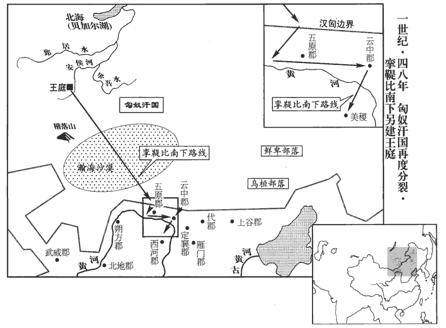
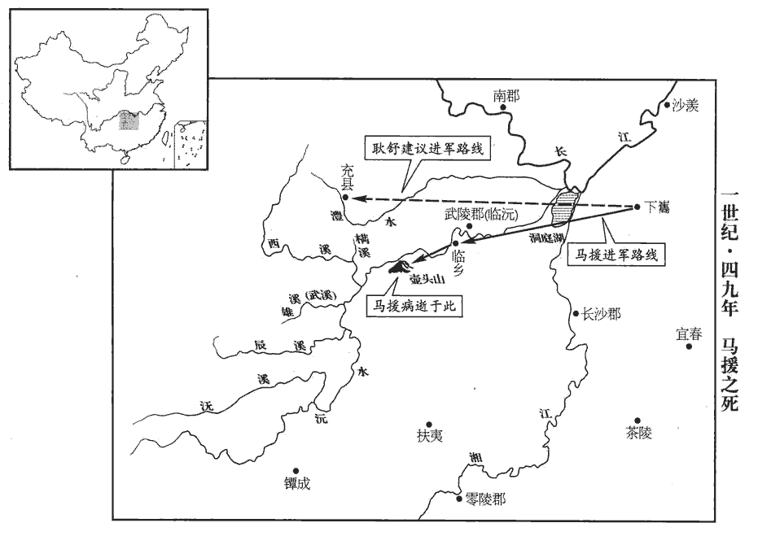
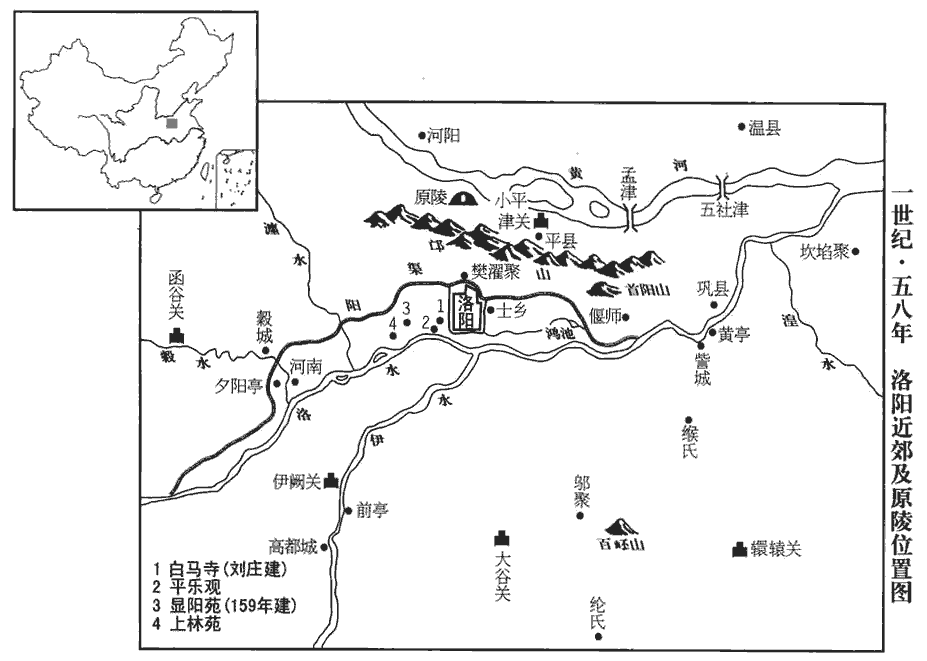

 漢紀三十六起強圉協洽（丁未），盡上章涒tūn灘（庚申），凡十四年。

# 世祖光武皇帝下

## 建武二十三年（丁未，四七）

1春，正月，南郡‹湖北江陵›蠻叛；郡國志：南郡，在雒陽南一千五百里。蠻，即緣沔諸山蠻也。杜佑曰：時南郡潳tú山蠻反，劉尚討破之，徙其種人七千餘口，置江夏界中，其後沔中蠻是也。遣武威將軍劉尚討破之。

〖译文〗 [1]春季，正月，南郡蛮人反叛。东汉朝廷派遣武威将军刘尚讨伐，将蛮人击败。

2夏，五月，丁卯‹八›，大司徒蔡茂薨。

〖译文〗 [2]夏季，五月丁卯（初八），大司徒蔡茂去世。

3秋，八月，丙戌，大司空杜林薨。

〖译文〗 [3]秋季，八月丙戌（疑误），大司空杜林去世。

4九月，辛未‹十三›，以陳留‹河南陳留›【章：十二行本「留」下有「太守」二字；乙十一行本同；孔本同；張校同。】玉況為大司徒。賢曰：玉，音肅，姓也。

〖译文〗 [4]九月辛未（十三日），任命陈留人玉况为大司徒。

5冬，十月，丙申‹九›，以太僕張純為大司空。

〖译文〗 [5]冬季，十月丙申（初九），任命太仆张纯为大司空。

6武陵‹湖南常德›蠻精夫相單程等反，秦昭王使白起伐楚，略取蠻夷，始置黔中郡；漢興，改為武陵。范書曰：長沙武陵蠻名渠帥曰精夫，槃瓠hù之後也。遣劉尚發兵萬餘人泝沅水‹沅江›入武谿‹流经湖南吉首南›擊之。賢曰：沅水出牂柯故且蘭，東北經辰州、潭州、嶽州，經洞庭湖入江。武谿，在今辰州盧谿縣西百八十里，即五谿之一也。沅，音元。尚輕敵深入，蠻乘險邀之，尚一軍悉沒。

〖译文〗 [6]武陵蛮人首领相单程等反叛。东汉朝廷派刘尚发兵一万余人，沿沅水逆流而上，到武进行讨伐。刘尚轻敌而深入蛮地，蛮人据险邀战，刘尚全军覆没。

7初，匈奴單于輿弟右谷蠡王知牙師以次當為左賢王，谷蠡，音鹿黎。左賢王次即當為單于。單于欲傳其子，遂殺知牙師。烏珠留單于有子曰比，為右薁yù鞬日逐王，薁，音鬱。鞬，居言翻。領南邊八部。比見知牙師死，出怨言曰：「以兄弟言之，右谷蠡王次當立；以子言之，我前單于長子，我當立！」呼韓邪單于約其諸子以兄弟次相傳，單于輿殺其弟知牙師而立其子，亂呼韓邪之約，而比則烏珠留之長子也。比自謂若父子相傳，則烏珠留死，比當立為單于，何待至輿而始傳其子也。師古曰：谷，音鹿。蠡，盧奚翻。遂內懷猜懼，庭會稀闊。匈奴諸王歲正月會單于庭。單于疑之，乃遣兩骨都侯監領比所部兵。監，古銜翻。及單于蒲奴立，比益恨望，密遣漢人郭衡奉匈奴地圖詣西河‹山西离石›太守求內附。郡國志：西河郡，在雒陽北千二百里。守，式又翻。兩骨都侯頗覺其意，會五月龍祠，匈奴諸王每歲五月會龍城‹蒙古哈尔和林›祠。南匈奴傳曰：匈奴俗歲有三龍祠，常以正月、五月、九月戊日。勸單于誅比。比弟漸將王在單于帳下，南匈奴傳：大臣貴者左賢王，次左谷蠡王，次右賢王，次右谷蠡王，謂之四角。次左、右日逐王，次左、右溫禺yú鞮王，次左、右斬將王，是為六角。「漸」，當作「斬」，傳寫誤加水旁耳。聞之，馳以報比。比遂聚八部兵四五萬人，待兩骨都侯還，欲殺之。骨都侯且到，知其謀，亡去。單于遣萬騎擊之，見比眾盛，不敢進而還。

〖译文〗 [7]起初，匈奴单于舆的弟弟右谷蠡王知牙师依照顺序当为左贤王，而左贤王即王储，依照顺序当为单于。但单于舆打算将其位传给自己的儿子，于是杀死了知牙师。舆的前任、乌珠留单于的儿子名叫比，为右日逐王，统领南边八大部落。比见知牙师被诛，口出怨言道：“若以兄弟次序来说，右谷蠡王应当继位；若伦传子，则我是前单于长子，我应当继位！”于是心怀猜忌恐惧，很少去单于王庭朝会。单于怀疑他，就派两名骨都侯去监督统领比部下的兵马。及至单于蒲奴继位，比愈发怒恨。他秘密派遣汉人郭衡诣见西河太守，献上匈奴地图，请求归附。两名骨都侯对比的意图颇有觉察，适逢五月龙城祭祀，他们便劝单于杀比。比的弟弟渐将王在单于帐中，闻知此讯，便跑去告诉比。于是比召集八部兵马四五万人，等待两骨都侯归来，要杀死他们。两骨都侯在将要到达时，发觉了比的计划，便逃走了。单于派出万名骑兵去攻打比，因见到比的军容强大，未敢进兵就撤回了。

8是歲，鬲gé侯朱祜hù卒。范書朱祜傳：二十四年卒。祜為人質直，尚儒學；為將多受降，將，即亮翻。降，戶江翻。以克定城邑為本，不存首級之功。又禁制士卒不得虜掠百姓，軍人樂放縱，樂，音洛。多以此怨之。

〖译文〗 [8]同年，鬲侯朱祜去世。朱祜为人质朴正直，崇尚儒学，身为将领，他愿意接受敌人投降，以夺取城池为目的，而不贪图用人头报功。他还禁止士卒掳掠百姓，而军人喜欢自由放纵，因此对朱祜多怀怨恨。

## 二十四年（戊申，四八）

1春，正月，乙亥‹十九›，赦天下。

〖译文〗 [1]春季，正月乙亥（十九日），大赦天下。

2匈奴八部大人共議立日逐王比為呼韓邪單于，款五原‹內蒙包頭›塞，願永為藩蔽，扞禦北虜。事下公卿，下，遐稼翻。議者皆以為「天下初定，中國空虛，夷狄情偽難知，不可許。」五官中郎將耿國五官中郎將，掌五官郎。杜佑曰：漢制，三署郎，年五十以上屬五官，其次分屬左、右署。獨以為「宜如孝宣故事，受之，事見二十七卷宣帝甘露、黃龍間。令東扞鮮卑‹内蒙东部大兴安岭西麓›，北拒匈奴，率厲四夷，完復邊郡。」時邊郡皆創殘，有南匈奴為扞蔽，則可以完復矣。帝從之。

〖译文〗 [2]匈奴八大部落首领共同议定，拥立日逐王比为呼韩邪单于，派使者前往五原塞，表示愿永远做汉王朝的藩属屏障，抵御北方敌人。光武帝将此事交付公卿商议。大家都认为：“天下方才安定，中原空虚，而夷狄意图真假难辨，不可应许。”唯独五官中郎将耿国认为：“应当依照孝宣皇帝的先例，接受归附，命他们在东面抵御鲜卑，在北面抗拒匈奴，做四方蛮夷的表率，修复沿边诸郡。”光武帝听从了耿国的意见。

 

3秋七月，武陵‹府临沅，湖南常德›蠻寇臨沅‹湖南常德›；賢曰：臨沅，縣名，屬武陵郡，故城在今郎州武陵縣。遣謁者李嵩、中山‹河北定州›太守馬成討之，不克。馬援請行，帝愍其老，未許，援曰：「臣尚能被甲上馬。」被，皮義翻。帝令試之。援據鞍顧眄miǎn，以示可用，帝笑曰：「矍鑠哉是翁！」賢曰：矍鑠，勇貌也。遂遣援率中郎將馬武、耿舒等將四萬餘人征五溪。酈道元註水經云：武陵有五溪，謂雄溪、樠mán溪、酉溪、潕wǔ溪、辰溪，悉是蠻夷所居，故謂五溪，皆槃瓠之子孫也。土俗「雄」作「熊」，「樠」作「朗」，「潕」作「武」。賢曰：五溪在今辰州界。援謂友人杜愔yīn曰：「吾受厚恩，年迫日索，索，盡也。愔，於今翻。索，昔各翻。常恐不得死國事；今獲所願，甘心瞑目，但畏長者家兒或在左右，或與從事，殊難得調，介介獨惡是耳！」賢曰：長者家兒，謂權要子弟等。介介，猶耿耿也。余謂調，和也。援固已慮耿舒之難與共事，梁松、竇固之邇言矣。惡，烏路翻。

〖译文〗 [3]秋季，七月，武陵蛮人攻打临沅。东汉朝廷派谒者李嵩、中山太守马成讨伐，未能取胜。马援请求出征，光武帝怜他年迈，不肯应允。马援说：“我还能够身穿盔甲，上马驰骋。”光武帝命他一试身手。马援跨在鞍上，转身回视，以示仍可征战。光武帝笑道：“好一位精神矍铄的老翁啊！”于是派马援带领中郎将马武、耿舒等率四万余众进军五溪。马援对友人杜说：“我受皇恩深重。但年事已高，去日无多，总是担心不能为国而死。今日得遂所愿，我心甘情愿，死也瞑目。只是顾虑那些权贵子弟，他们或者近在左右，或者随从办事，很难调动，我唯独有此心病！”

4冬，十月，匈奴日逐王比自立為南單于，遣使詣闕奉藩稱臣。上以問朗陵侯臧宮。賢曰：朗陵，縣名，屬汝南郡，故城在今豫州朗山縣西南。宮曰：「匈奴飢疫分爭，臣願得五千騎以立功。」帝笑曰：「常勝之家，難與慮敵，吾方自思之。」

〖译文〗 [4]冬季，十月，匈奴日逐王比自立为南单于，派使节到汉廷，愿做藩国，自称臣属。光武帝询问朗陵侯臧宫的意见。臧宫说：“匈奴发生了饥荒瘟疫和分裂争斗，我愿得到五千骑兵去 立战功。”光武帝笑道：“面对常胜将军，难以商议敌情。我要自己考虑此事。”

## 二十五年（己酉，四九）

1春，正月，遼東‹遼寧遼陽›徼外貊mò人‹朝鲜半岛东部›寇邊，徼，古弔翻。貊，莫百翻。太守祭肜róng招降之。降，戶江翻。肜又以財利撫納鮮卑大都護偏何，使招致異種，駱驛款塞。種，章勇翻。駱驛，相繼也。款，叩也，至也。肜曰：「審欲立功，當歸擊匈奴，斬送頭首，乃信耳。」偏何等即擊匈奴，斬首二千餘級，持頭詣郡。其後歲歲相攻，輒送首級，受賞賜。自是匈奴衰弱，邊無寇警，鮮卑、烏桓并入朝貢。朝，直遙翻。肜為人質厚重毅，撫夷狄以恩信，故皆畏而愛之，得其死力。

〖译文〗 [1]春季，正月，辽东郡塞外的貊人侵犯边境，太守祭肜招诱他们归降。祭肜还用财物来安抚结纳鲜卑首领偏何，让他招集其他外族部落，陆续到边塞归降。祭肜说：“你们要是真想立功，就应当回去打匈奴，斩下匈奴首领的头送来，我才会信任你们。”偏何等就去攻打匈奴，斩杀二千余人，将人头献到辽东郡官府。此后，他们每年都去打匈奴，送来人头，接受赏赐。匈奴势力从此衰落，而汉王朝边境不再有敌侵的警报，鲜卑、乌桓一同入朝进贡。祭肜为人质朴敦厚，沉着坚毅，用恩惠和信义招抚外族，因此外族对他既怕又爱，拼死效力。

2南單于遣其弟左賢王莫莫者，左賢王之名。將兵萬餘人擊北單于弟薁yù鞬左賢王，生獲之；北單于震怖，怖，普布翻。卻地千餘里。北部薁鞬骨都侯與右骨都侯率眾三萬餘人歸南單于。三月，南單于復遣使詣闕貢獻，求使者監護，復，扶又翻。監，古銜翻。遣侍子，修舊約。舊約，宣帝舊約。

〖译文〗 [2]南单于派他的弟弟左贤王莫率兵一万余众进攻北单于的弟弟左贤王，将他生擒。北单于十分震恐，后撤了一千余里。北匈奴所属的骨都侯和右骨都侯带领三万余人归附南单于。三月，南单于再度遣使者到朝廷进贡，请汉朝派使者进行监护，并要求将王子送到汉朝作人质，重修旧日和约。

3戊申晦‹二十九›，日有食之。

〖译文〗 [3]三月戊申晦（二十九日），出现日食。

4馬援軍至臨鄉‹湖南桃源›，水經註：武陵郡沅南縣，建武中所置縣，在沅水之陰，因以沅南為名，縣治故城，昔馬援討臨鄉所築也。擊破蠻兵，斬獲二千餘人。

〖译文〗 [4]马援的军队到达临乡，攻破蛮兵，斩杀、俘获二千余人。

初，援嘗有疾，虎賁中郎將梁松來候之，虎賁中郎將，掌虎賁郎。賁，音奔。獨拜牀下，援不答。松去後，諸子問曰：「梁伯孫，帝婿，梁松，字伯孫，尚帝女舞陰公主。爾雅曰：女子之夫為婿。貴重朝廷，公卿已下莫不憚之，大人柰何獨不為禮？」援曰：「我乃松父友也，雖貴，何得失其序乎！」

〖译文〗 起初，马援曾经患病，虎贲中郎将梁松前往探望。梁松独自在床下拜见，而马援没有还礼。梁松走后，马援的儿子们问道：“梁伯孙是皇上的女婿，朝廷显贵，公卿以下的官员没有不惧怕他的，为何唯独您对他不礼敬？”马援答道：“我是他父亲的朋友，他身份虽贵，可怎能不讲辈份呢？”

援兄子嚴、敦并喜譏議，賢曰：喜，許吏翻。通輕俠，援前在交趾‹越南河內东北北宁府›，還書誡之曰：「吾欲汝曹聞人過失，如聞父母之名，耳可得聞，口不可得言也。好論議人長短，好，呼到翻；下同。妄是非政法，賢曰：謂譏刺時政也。此吾所大惡也；寧死，不願聞子孫有此行也。惡，烏路翻。行，下孟翻；下同。龍伯高敦厚周慎，口無擇言，謙約節儉，廉公有威，吾愛之重之，願汝曹效之。杜季良豪俠好義，憂人之憂，樂人之樂，樂，音洛。父喪致客，數郡畢至，吾愛之重之，不願汝曹效也。效伯高不得，猶為謹敕之士，所謂『刻鵠hú不成尚類鶩wù』者也；賢曰：鶩，鴨也。鶩，莫卜翻。毛晃曰：舒鳧俗謂之鴨，可畜而不能高飛者曰鴨，野生而高飛者曰鶩。效季良不得，陷為天下輕薄子，所謂『畫虎不成反類狗』者也。伯高者，山都‹湖北谷城东南›長龍述也；龍，姓；述，名。賢曰：山都，縣名，屬南陽郡，舊南陽之赤鄉，秦以為縣，故城在今襄州義清縣東北。長，知兩翻。季良者，越騎司馬杜保也；百官志：越騎校尉，其屬有司馬，秩千石。皆京兆人。會保仇人上書，訟「保為行浮薄，亂群惑眾，伏波將軍萬里還書以誡兄子，而梁松、竇固與之交結，將扇其輕偽，敗亂諸夏。」敗，補邁翻。書奏，帝‹刘秀，时年五十四›召責松、固，以訟書及援誡書示之，松、固叩頭流血，而得不罪。詔免保官，擢拜龍述為零陵‹湖南永州›太守。賢曰：零陵，今永州。守，式又翻。松由是恨援。

〖译文〗 马援的侄子马严、马敦都爱发议论，结交游侠。马援先前在交趾时，曾写信回家告诫他们：“我希望你们在听到他人过失的时候，就像听到自己父母的名字一样，耳可以听，而口却不能讲。好议论他人是非，随意褒贬时政和法令，这是我最厌恶的事情。我宁可死，也不愿听到子孙有此类行径。龙伯高为人宽厚谨慎，言谈合乎礼法，谦恭而俭朴，廉正而威严，我对他既敬爱，又尊重，希望你们效法他。杜季良为人豪侠仗义，将别人的忧虑当作自己的忧虑，将别人的快乐当作自己的快乐。他父亲去世开吊，几郡的客人全来了。我对他又敬爱又尊重，却不希望你们效法他。效法龙伯高不成，还可以做恭谨之士，正如人们所说的‘刻鸿鹄不成还象鸭’；若是效法杜季良不成，就会堕落成天下的轻浮子弟，正如人们所说的‘画虎不成反似狗’了。”龙伯高，即山都县长龙述；杜季良，即越骑司马杜保，两人都是京兆人。适逢杜保的仇人上书，指控杜保：“行为浮躁，蛊惑人心，伏波将军马援远从万里之外写信回家告诫侄儿不要与他来往，而梁松、窦固却同他结交，对他的轻薄伪诈行为煽风点火，败坏扰乱国家。”奏书呈上，光武帝召梁松、窦固责问，出示指控的奏书和马援告诫侄儿的书信。梁松、窦固叩头流血，才未获罪。诏命免去杜保官职，将龙述擢升为零陵太守。梁松由此憎恨马援。

及援討武陵蠻，軍次下雋‹湖北通城›，賢曰：下雋，縣名，屬長沙國，故城在今辰州沅陵縣。宋白曰：岳州巴陵縣，漢地理志，下雋縣，屬長沙郡，在今鄂州蒲圻qí縣界，即此地。按水經，江水東至長沙下雋縣北，澧水、資水、沅水合，東流注之，則宋說為是，賢說非。雋，子兗翻。有兩道可入，從壺頭‹湖南沅陵東北›則路近而水嶮xiǎn，水經註：夷水南出夷山，北流注沅。夷山，東接壺頭山，山下水際有馬援停軍處。賢曰：壺頭山在今辰州沅陵東。從充‹湖南桑植›則塗夷而運遠。賢曰：充，縣名，屬武陵郡。充，昌容翻。耿舒欲從充道；援以為棄日費糧，不如進壺頭，搤è其喉咽，搤，持也。咽，音煙；喉嚨也。充賊自破；以事上之，上，時掌翻；下同。帝從援策。進營壺頭，賊乘高守隘，水疾，船不得上；會暑甚，士卒多疫死，援亦中病，乃穿岸為室以避炎氣。武陵記曰：壺頭山邊有石窟，即援所穿室也。中，竹仲翻。賊每升險鼓譟，援輒曳足以觀之，左右哀其壯意，莫不為之流涕。為，於偽翻。耿舒與兄好畤zhì侯弇yǎn書曰：好畤縣，屬扶風。畤，音止。「前舒上書當先擊充，糧雖難運而兵馬得用，軍人數萬，爭欲先奮。今壺頭竟不得進，大眾怫fú鬱行死，師古曰：怫鬱，憂不樂也。怫，符弗翻。怫鬱，氣蘊積而不得舒也。行死，謂行將疫死也。誠可痛惜！前到臨鄉‹湖南桃源›，賊無故自致，若夜擊之，即可殄滅，伏波類西域賈胡，到一處輒止，賢曰：言似商胡，所至之處輒停留也。賈，音古。以是失利。今果疾疫，皆如舒言。」弇yǎn得書奏之，帝乃使梁松乘驛責問援，因代監軍。監，古銜翻。

〖译文〗 到后来，马援征讨武陵蛮人，大军到达下隽。有两条道路可入蛮界：一从壶头，这条路近而水势深险；一从充县，这条路是坦途，但运输线太长。耿舒主张走充县，马援却认为那样会消耗时日和军粮，不如进军壶头，扼住蛮人咽喉，则充县之敌将不攻自破。两种意见上报朝廷，光武帝批准了马援的战略。于是汉军进兵壶头。蛮贼登高，把守险要，水流湍急，汉军舰船不能上行。适逢酷暑，很多士兵患瘟疫而死，马援也被传染，于是在河岸凿窟栖身以避暑热。每当蛮贼爬到高处擂鼓呐喊，马援便蹒跚跛行着察看敌情，左右随从无不为他的壮志所感而哀痛流泪。耿舒在给他哥哥好侯耿的信中写道：“当初我曾上书建议先打充县，尽管粮草运输困难，但兵马前进无阻，大军数万，人人奋勇争先。而如今竟在壶头滞留，官兵忧愁抑郁，行将病死，实在令人痛惜！前在临乡，敌兵无故自来，如果乘夜出击，就可以将他们全歼。但马援就像个作生意的西域商人，所到之处，处处停留，这就是 失利的原因。现在果然遇到了瘟疫，完全同我预言的一样。”耿收到信后上奏朝廷，于是光武帝派梁松乘驿车前去责问马援，并就此代理监军事务。

 

會援卒，松因是構陷援。帝大怒，追收援新息侯印綬。郡國志：新息，侯國，屬汝南郡。應劭曰：古息國，其後東徙，加「新」字。初，援在交趾，常餌薏yì苡yǐ，神農本草經曰：薏苡味甘，微寒，主風濕痺bì，下氣，除筋骨邪氣，久服輕身益氣。實能輕身，勝障氣，障，與瘴同。軍還，載之一車。及卒後，有上書譖之者，以為前所載還皆明珠文犀。文犀，犀之有文彩者。帝益怒。

〖译文〗 正当此时，马援去世，梁松乘机陷害马援。光武帝大怒，下令收回马援的新息侯印信。当初，马援在交趾时经常服食薏苡仁，因为此物可使身体轻健，抵御瘴气。班师时，曾载回了一车。等到马援死后，却有人上书诬告他当初用车载的全是上好的珍珠和犀角。于是光武帝益发愤怒。

援妻孥惶懼，孥，音奴，子也。不敢以喪還舊塋，稾gǎo葬域西，賢曰：稾，草也，以不歸舊塋，時權葬，故稱稾。馬援傳作「城西」。【章：乙十一行本正作「城西」。張校云：「域」作「城」，誤。】說文曰：塋，墓地。廣雅曰：塋域，葬地也。賓客故人，莫敢弔會。不敢弔及會葬。嚴與援妻子草索相連，詣闕請罪。索，昔各翻。帝乃出松書以示之，方知所坐，上書訴冤，前後六上，辭甚哀切。上，時掌翻；下同。

〖译文〗 马援的妻子儿女又慌又怕，不敢将马援的棺柩运回祖坟，便草草葬在城西。他门下的宾客旧友，没有人来祭吊。马严和马援的妻子把自己用草绳捆绑起来，连在一起，到皇宫门口请罪。于是光武帝拿出梁松的奏书给他们看，他们方才得知马援的罪名，便上书鸣冤，前后共六次，情辞十分哀伤悲切。

前雲陽‹陝西淳化西北›令扶風‹陕西兴平›朱勃雲陽縣，屬左馮翊yì，有秦雲陽宮。鉤弋夫人葬雲陽，昭帝為起雲陵邑，後為縣。詣闕上書曰：「竊見故伏波將軍馬援，拔自西州‹甘肅東部›，欽慕聖義，間關險難，難，乃旦翻。觸冒萬死，經營隴‹陇山以西›、冀‹甘肅甘谷›，謂征隗囂時也。謀如湧泉，勢如轉規，規，圓也。兵動有功，師進輒克。誅鋤先零，飛矢貫脛；零，音憐。建武十一年，援擊破先零，飛矢貫脛。脛，形定翻。出征交趾，與妻子生訣。征交趾事見上卷十七年、十八年、十九年。間復南討，復，扶又翻。立陷臨鄉‹湖南桃源›，師已有業，業，緒也。未竟而死；吏士雖疫，援不獨存。夫戰或以久而立功，或以速而致敗，深入未必為得，不進未必為非，人情豈樂久屯絕地不生歸哉！樂，音洛。惟援得事朝廷二十二年，北出塞漠，謂討烏桓。南渡江海，觸冒害氣，僵死軍事，名滅爵絕，國土不傳，海內不知其過，眾庶未聞其毀，家屬杜門，葬不歸墓，怨隙并興，宗親怖慄，怖，普布翻。死者不能自列，生者莫為之訟，為，於偽翻。臣竊傷之！夫明主醲nóng於用賞，約於用刑，高祖嘗與陳平金四萬斤以間楚軍，不問出入所為，事見十卷高帝三年。間，古莧翻。豈復疑以錢穀間哉！復，扶又翻。願下公卿，平援功罪，宜絕宜續，以厭海內之望。」下，遐稼翻。厭，一葉翻。帝意稍解。

〖译文〗 前任云阳县令、扶风人朱勃前往皇宫门阙上书说：“我看见已故的伏波将军马援，从西州崛起，钦敬仰慕皇上圣明仁义，历经艰险，万死一生，在陇、冀两地征战。他的智谋如泉水一样喷涌不绝，行动如转动圆规一样灵活迅速。他用兵战无不胜，出师攻无不克。剿伐先零时，飞箭曾射穿他的小腿；出征交趾时，以为此行必死，曾与妻儿诀别。过了不久又再度南征，很快攻陷临乡，大军已经建立功业，但未完成而马援先死。军官士兵虽然遭受瘟疫，而马援也没有独自生还。战争有以持久而取胜的，也有因速战而败亡的；深入敌境未必就正确，不深入也未必为不对。论人之常情，难道有乐意久驻危险之地不生还的吗？马援得以为朝廷效力二十二年，在北方出塞到大漠，在南方渡江漂海。他触冒瘟疫，死在军中，名声被毁，失去爵位，封国失传。天下不知他所犯的过错，百姓不知对他的指控。他的家属紧闭门户，遗体不能归葬祖坟。对马援的怨恨和嫌隙一时并起，马氏家族震恐战栗。已死的人，不能自己剖白；活着的人，不能为他分辩，我为此感到痛心！圣明的君王重于奖赏，轻于刑罚。高祖曾经交给陈平四万斤金用以离间楚军，并不问账目与用途，又岂能疑心那些钱谷的开销呢？请将马援一案交付公卿议论，评判他的功罪，决定是否恢复爵位，以满足天下人的愿望。”光武帝之怒稍有消解。

初，勃年十二，能誦詩、書，常候援兄況，辭言嫺雅，賢曰：嫺，音閑。嫺雅，猶言沈靜也；余謂嫺，習也。屈原傳：嫺於辭令。援裁知書，見之自失。況知其意，乃自酌酒慰援曰：「朱勃小器速成，智盡此耳，卒當從汝稟學，卒，子恤翻；終也。賢曰：稟，受也。勿畏也。」勃未二十，右扶風請試守渭城‹陝西咸陽›宰。前書音義曰：試守者，試守一歲乃為真，食其全俸。賢曰：渭城，縣名，故城在今咸陽縣東北。及援為將軍封侯，而勃位不過縣令。援後雖貴，常待以舊恩而卑侮之，勃愈身自親。及援遇讒，唯勃能終焉。

〖译文〗 起初，朱勃十二岁时就能背诵《诗经》、《书经》，经常拜望马援之兄马况，言辞温文尔雅。当时马援才开始读书，看到朱勃，他自况不如，若有所失。马况觉出了马援的心情，就亲自斟酒安慰他说：“朱勃是小器，早成，聪明才智尽此而已，他最终将从学于你，不要怕他。”朱勃还不到十二岁，右扶风便试用他代理渭城县宰。而等到马援做了将军并封侯的时候，朱勃的官位还不过是个县令。马援后来虽然身居显贵，仍然常常以旧恩照顾朱勃，但又卑视和怠慢他，而朱勃本人的态度却愈发亲近。及至马援受到诬陷。唯有朱勃能够最终保持忠诚不渝。

謁者南陽‹河南南陽›宗均監援軍，「宗均」，列傳作「宋均」。趙明誠金石錄有漢司空宗俱碑。按後漢宋均傳：均族子意，意孫俱，靈帝時為司空。余嘗得宗資墓前碑龜膊上刻字，因以後漢帝紀及姓苑、姓纂zuǎn諸書參考，以謂自均以下，其姓皆作「宗」，而列傳轉寫為「宋」，誤也。後得此碑，益知前言之不繆。援既卒，軍士疫死者太半，蠻亦飢困。均乃與諸將議曰：「今道遠士病，不可以戰，欲權承制降之，何如？」諸將皆伏地莫敢應。降，戶江翻。均曰：「夫忠臣出竟，有可以安國家，專之可也。」公羊傳曰：聘禮，大夫受命不受辭，出境有可以安社稷，全國家者，則專之可也。竟，讀曰境。乃矯制調伏波司馬呂種守沅陵‹湖南沅陵›長，調，徒弔翻。命種奉詔書入虜營，告以恩信，因勒兵隨其後。蠻夷震怖，冬十月，共斬其大帥而降。帥，所類翻。於是均入賊營，散其眾，遣歸本郡，為置長吏而還，為，於偽翻。還，從宣翻，又如字。群蠻遂平。均未至，先自劾矯制之罪；劾，戶概翻，又戶得翻。上嘉其功，迎，賜以金帛，令過家上塚。受命而出，未復命則不當先過家，今使過家上塚，所以示寵榮也。上，時掌翻。

〖译文〗 谒者、南阳人宗均任马援大军的监军。马援去世后，官兵因瘟疫而死的已超过半数，蛮军也饥困交迫。于是宗均同将领们商议道：“我们如今道路遥远，官兵染疾，不可以再作战了，我打算权且代表皇上发布命令招降敌人，怎么样？”将领们全都伏在地上不敢应声。宗均说：“忠臣远在境外，若有保护国家安全之策，可以专断专行。”于是假传诏旨，调伏波司马吕种代理沅陵县长，命他带着诏书进入敌营，宣告朝廷的恩德和信义，而自己率军尾随其后。蛮人十分震恐，冬季十月，他们一道杀死首领投降。于是宗均进入蛮贼大营，遣散兵众，命他们各回本郡，又委任了地方官吏，然后班师。蛮人之乱于是平定。宗均还没到京成，先自我弹劾假传诏旨之罪。光武帝嘉奖他的功绩，派人出迎，赏赐金帛，命他经过家乡时祭扫祖坟。

5是歲，遼西‹遼寧义县西›烏桓大人郝旦等率眾內屬，考異曰：帝紀今春既著烏桓來朝。歲末又紀是歲烏桓朝貢內屬。蓋始獨大人來朝，後乃率種族內屬耳。詔封烏桓渠帥為侯、王、君長者八十一人，帥，所類翻。長，知兩翻。使居塞內，布於緣邊諸郡，令招來種人，種，章勇翻。給其衣食，遂為漢偵候，偵，丑鄭翻。助擊匈奴、鮮卑。時司徒掾班彪上言：「烏桓天性輕黠xiá，好為寇賊，若久放縱而無總領者，必復掠居人，掾，俞絹翻。黠，下八翻。好，呼到翻。復，扶又翻。但委主降掾吏，賢曰：蓋當時權置也。降，戶江翻。恐非所能制。臣愚以為宜復置烏桓校尉，西都置護烏桓校尉，至王莽時，烏桓叛，校尉由是罷。闞駰十三州志曰：護烏桓，擁節，秩比二千石，武帝置以護內附烏桓，既而并於匈奴中郎將。余據匈奴中郎將，亦此時方置，未知并於匈奴中郎將果何時也！校，戶教翻。誠有益於附集，省國家之邊慮。」帝從之，於是始復置校尉於上谷‹河北懷來›甯城‹河北万全›，賢曰：甯城，縣名。前書「甯」作「寧」，「寧」、「甯」兩字通也。杜佑曰：甯城，在媯guī州郡懷戎縣西北，俗名西吐㪍bó城。開營府，并領鮮卑賞賜、質子，歲時互市焉。質，音致。

〖译文〗 [5]同年，辽西郡乌桓部落大人郝旦等率领部众归附汉朝。光武帝下诏将乌桓各级首领封为侯、王、君长，共计八十一人，让他们移居塞内，分布在沿边各郡。并命令他们招徕本族之人，由官府供给衣服饭食。于是这些人便成为汉朝边疆的警哨，协助击讨匈奴和鲜卑。其时，司徒掾班彪上书道：“乌桓人天性轻薄狡黠，喜做强盗，如果长久放纵而无人统领，必将再度劫掠汉朝居民。只委派主持受降的低级官吏，恐怕不能控制他们。我认为应当再度设置护乌桓校尉，这必将有益于招抚外族，减少国家的边疆忧患。”光武帝听从了他的建议，于是在上谷宁城重新设置护乌桓校尉，建立大营和官府，负责对鲜卑的赏赐、接送人质和每年四季的双边贸易等事务。

## 二十六年（庚戌，五十）

1正月，詔增百官奉，百官志：大將軍、三公奉，月三百五十斛；秩中二千石奉，月百八十斛；二千石，月百二十斛；比二千石，月百斛；千石，月九十斛；比千石，月八十斛；六百石，月七十斛；比六百石，月五十五斛；四百石，月五十斛；比四百石，月四十五斛；三百石，月四十斛；比三百石，月三十七斛；二百石，月三十斛；比二百石，月二十七斛；百石，月十六斛；斗食，月十一斛；佐史，月八斛。凡諸受奉，錢、穀各半。奉，音扶用翻。其千石已上，減於西京舊制，六百石已下，增於舊秩。

〖译文〗 [1]正月，光武帝下诏，增加百官的俸禄。千石以上的官吏，低于西汉旧制；六百石以下的官吏，高于西汉旧制。

2初作壽陵‹河南孟津东北十四公里于家村›。賢曰：初作陵，未有名，故號壽陵，蓋取久長之義也。帝‹刘秀，时年五十五›曰：「古者帝王之葬，皆陶人、瓦器、木車、茅馬，使後世之人不知其處。太宗識終始之義，景帝能述遵孝道，遭天下反覆，而霸陵獨完受其福，豈不美哉！謂赤眉入長安，惟霸陵不掘。今所制地不過二三頃，無【章：十二行本「無」下有「爲」字；乙十一行本同；張校同。】山陵陂bēi池，裁令流水而已。賢曰：言不起山陵，裁令封土陂池不停水而已。陂，音普何翻。池，音徒河翻。使迭興之後，與丘隴同體。」迭興，謂易姓而王者。

〖译文〗 [2]开始兴建皇陵。光武帝说：“古代帝王的随葬之物，全都是陶人、瓦器、木制之车、茅编之马，使后世的人不知道陵墓所在。文帝明了生死的真义，景帝能够遵从孝道，所以经历了天下大乱的变故之后，霸陵唯独有幸保全，这岂不是美事吗！现在设计的陵墓，占地不过二三顷，不起山陵，不修池，只令不积水而已。使陵墓在改朝换代之后，能与丘陇泥土成为一体。”

3詔遣中郎將段彬、【章：十二行本「彬」作「郴」；乙十一行本同。】彬，丑林翻。副校尉王郁使南匈奴，立其庭，去五原‹內蒙包頭›西部塞八十里。地理志，五原西部都尉治田辟。師古曰：辟，讀曰壁。使者令單于伏拜受詔，單于顧望有頃，乃伏稱臣。拜訖，令譯曉使者曰：「單于新立，誠慙於左右，願使者眾中無相屈折也。」詔聽南單于入居雲中‹內蒙托克托›，賢曰：雲中，郡名，在今勝州北。宋白曰：漢雲中故城，在勝州東北四十里榆林縣界，趙武侯所築。始置使匈奴中郎將，將兵衛護之。

〖译文〗 [3]光武帝下诏，派中郎将段彬、副校尉王郁出使南匈奴，为南匈奴建立王庭，距五原西部塞八十里。汉朝使者命令单于伏地跪拜，接受诏书。单于犹豫片刻，于是伏地，自称臣属。跪拜完毕后，他命翻译告诉汉朝使者说：“单于新近即位，在左右群臣面前跪拜实在羞惭，希望使者不要在大庭广众中使单于屈节。”光武帝下诏，听任南单于进入云中郡居住。汉朝自此设置使匈奴中郎将，领军护卫。

4夏，南單于所獲北虜薁yù鞬左賢王將其眾及南部五骨都侯韓氏骨都侯、當于骨都侯、呼衍骨都侯、郎氏骨都侯、粟藉骨都侯，凡五。薁，音鬱。鞬，居言翻。合三萬餘人畔歸，去北庭三百餘里，自立為單于。月餘，日更相攻擊，更，工衡翻。五骨都侯皆死，左賢王自殺，諸骨都侯子各擁兵自守。

〖译文〗 [4]夏季，南单于所俘虏的北匈奴左贤王带领旧部及南匈奴的五位骨都侯，共计三万多人，叛变北逃，在距北匈奴王庭三百余里处，自立为单于。一个多月以后，发生了内讧，每天互相攻击，五位骨都侯全部死去，左贤王自杀，五位骨都侯的儿子们各自拥兵独立。

5秋，南單于遣子入侍。詔賜單于冠帶、璽綬、南匈奴傳：黃金璽，盭lì緺guā綬。賢曰：盭，音戾，草名；以戾草染綬，因以為名，別漢諸侯王制。戾，綠色。緺，紫青色，音瓜。璽，斯氏翻。綬，音受。車馬、金帛、甲兵、什器。賢曰：古之師行，二五為什，食器之類必供之，故曰什物、什具。今人通謂生生之具為什物。又轉河東‹山西夏縣›米糒bèi二萬五千斛，牛羊三萬六千頭以贍給之。糒，音備，糗qiǔ也。令中郎將將弛刑五十人，隨單于所處，參辭訟，察動靜。弛刑者，弛刑徒也。說文：弓解曰弛。此謂解其罪而輸作者。處，昌呂翻。考異曰：帝紀：今年春，使段彬賜璽綬，置使匈奴中郎將。據匈奴傳，賜璽綬在秋，其置中郎將亦未知決在何時。或者今春置之，至是更為之約束制度耳。單于歲盡輒遣奉奏，送侍子入朝，漢遣謁者送前侍子還單于庭，賜單于及閼氏、左•右賢王以下繒綵合萬匹，歲以為常。閼，音煙。氏，音支。於是雲中‹內蒙托克托›、五原‹內蒙包頭›、朔方‹內蒙磴口›、北地‹宁夏吴忠西南金积镇›，定襄‹山西右玉南›、鴈門‹山西朔州东南›、上谷‹河北懷來›、代‹山西陽高›八郡民歸於本土。前此避匈奴內徙者，令皆歸復本土。遣謁者分將弛刑，補治城郭，將，即亮翻；下同。治，直之翻。發遣邊民在中國者布還諸縣，皆賜以裝錢，轉給糧食。時城郭丘墟，掃地更為，上乃悔前徙之。徙民見上卷十五年。

〖译文〗 [5]秋季，南单于派遣儿子到汉朝做人质。光武帝下诏，赐给南单于官帽、腰带、印玺、车马、金帛、武器及日用什物。又从河东郡调粮二万五千斛、牛羊三万六千头供给南匈奴。命令中郎将率领免刑囚徒五十人，跟随南单于，参与处理诉讼案件，并伺察动静。到了年底，南单于便派使者呈送奏书，护送做新人质的王子到汉朝。汉朝则派谒者将上一次充当人质的王子送回单于王庭，赐给单于和王后、左右贤王及以下官员彩色丝绸一万匹，每年如此，成为常例。于是，云中、五原、朔方、北地、定襄、雁门、上谷、代等八郡的流亡居民回到本土。汉朝派出谒者，分别带领免刑囚徒修补整治城墙。并遣送内迁中原的边疆居民回到各县，对返归的人全都赐给治装费，调粮供应。此时沿边城郭已成废墟，需要清除瓦砾，重新建设，于是光武帝对先前的徙民之举感到后悔。

6冬，南匈奴五骨都侯子復將其眾三千人歸南部，北單于使騎追擊，悉獲其眾。南單于遣兵拒之，逆戰不利，於是復詔單于徙居西河‹内蒙准格尔旗西南›、美稷‹內蒙准格爾旗›，復，扶又翻。因使段彬、王鬱留西河‹内蒙准格尔旗西南›擁護之，使匈奴中郎將自是亦屯西河美稷。杜佑曰：汾州隰xí城縣有美稷鄉，即漢美稷縣也。隰城，漢之茲氏縣也。令西河長史歲將騎二千、弛刑五百人助中郎將衛護單于，冬屯夏罷，自後以為常。南單于既居西河，亦列置諸部王，助漢扞戍北地、朔方、五原、雲中、定襄、鴈門、代郡，皆領部眾，為郡縣偵邏耳目。偵，丑鄭翻。賢曰：邏，音力賀翻。北單于惶恐，頗還所掠漢民以示善意，鈔兵每到南部下，鈔，楚交翻。還過亭候，輒謝曰：「自擊亡虜薁yù鞬日逐耳，薁，於六翻。鞬，居言翻。非敢犯漢民也。」

〖译文〗 [6]冬季，南匈奴五位骨都侯之子率领部众三千人回归南匈奴，北匈奴单于派骑兵追击，将他们全部俘获。南匈奴单于发兵抵抗北匈奴，迎战失利。于是光武帝再次下诏，让南单于移居西河郡美稷县，命段彬、王郁留驻西河护卫。又命西河长史每年冬天带领二千骑兵、五百免刑囚徒协助中郎将护卫南单于，冬天屯驻，到夏天时撤走，从此成为常例。南单于移民西河郡以后，依旧设立诸部落王，协助汉朝戍守北地、朔方、五原、云中、定襄、雁门、代郡。诸部落王全都率领部众为郡县巡逻侦察。北单于十分惊恐，送回了不少被掠走的汉朝居民，以表示善意。每当其突击部队南下南匈奴，经过汉朝的边塞亭燧，便致歉道：“我们只是讨伐叛徒日逐王而已，不敢侵犯汉朝居民。”

## 二十七年（辛亥，五一）

1夏，四月，戊午‹二十一›，大司徒玉況薨。

〖译文〗 [1]夏季，四月戊午（二十一日），大司徒玉况去世。

2五月，丁丑‹十一›，詔司徒、司空并去「大」名，去，羌呂翻。改大司馬為太尉。驃騎大將軍行大司馬劉隆即日罷，以太僕趙熹為太尉，大司農馮勤為司徒。

〖译文〗 [2]五月丁丑（十一日），光武帝下诏，命将大司徒、大司空的“大”字全都去掉，并将大司马改为太慰。将骠骑大将军、代理大司马刘隆即日罢免，任命太仆赵熹为太尉，大司农冯勤为司徒。

3北匈奴遣使詣武威‹甘肅武威›求和親，自北地以東、南部分居塞內，北使不敢至塞下，故詣武威求和。賢曰：武威郡故城，在今涼州姑臧縣西北，故涼城是也。帝召公卿廷議，不決；皇太子言曰：「南單于新附，北虜懼於見伐，故傾耳而聽，爭欲歸義耳。今未能出兵而反交通北虜，臣恐南單于將有二心，北虜降者且不復來矣。」復，扶又翻；下同。帝然之，告武威太守勿受其使。

〖译文〗 [3]北匈奴派使者到武威郡请求和亲。光武帝召集公卿在朝堂商议，决定不下。皇太子说道：“南单于新近归附，北匈奴害怕遭到讨伐，所以倾耳听命，争着要归顺汉朝。如今我们没能为南匈奴出兵，却反与北匈奴交往，我担心南匈奴将生二心，而想要投降的北匈奴也不会再来了。”光武帝赞同这一见解，告知武威太守不要接待北匈奴使者。

4朗陵侯臧宮、揚虛侯馬武上書曰：朗陵侯國，屬汝南郡。水經註：揚虛縣屬平原，漯水逕其東，商河發源於此。「匈奴貪利，無有禮信，窮則稽首，安則侵盜。稽，音啟。虜今人畜疫死，旱蝗赤地，疲困乏力，不當中國一郡，萬里死命，縣在陛下；縣，讀曰懸；下同。福不再來，時或易失，豈宜固守文德而墮武事乎！左傳曰：大福不再。蒯kuǎi通曰：時難得而易失。易，以豉翻。墮，讀曰隳。今命將臨塞，厚縣購賞，將，即亮翻。縣，讀曰懸。喻告高句驪、烏桓、鮮卑攻其左，句，如字，又音駒。驪，力知翻。發河西‹甘肅中、西部›四郡、天水‹甘肅甘谷›、隴西‹甘肅臨洮›羌、胡擊其右，如此，北虜之滅，不過數年。臣恐陛下仁恩不忍，謀臣狐疑，令萬世刻石之功不立於聖世！」詔報曰：「黃石公記曰：『柔能制剛，弱能制強。賢曰：黃石公即張良於下邳pī圯yí上所見老父，出一編書者。舍近謀遠者，勞而無功；舍遠謀近者，逸而有終。舍，讀曰：捨。故曰：務廣地者荒，務廣德者強，有其有者安，貪人有者殘。殘滅之政，雖成必敗。』今國無善政，災變不息，百姓驚惶，人不自保，而復欲遠事邊外乎！孔子曰：『吾恐季孫之憂不在顓zhuān臾yú。』見論語。且北狄尚強，而屯田警備，傳聞之事，恆多失實。恆，戶登翻。誠能舉天下之半以滅大寇，豈非至願！苟非其時，不如息民。」自是諸將莫敢復言兵事者。

〖译文〗 [4]朗陵侯臧宫、扬虚侯马武上书说：“匈奴贪图利益，没有礼仪和信义，困难时向汉朝叩头，太平时便侵边掳掠。如今北匈奴遇到瘟疫，人马、牲畜病死，又遭旱灾、蝗灾，赤地千里，疲惫困顿不堪，实力抵不过汉朝的一个郡。万里之外的垂死性命，悬在陛下之手。福运不会再来，时机容易丧失，难道应当死守斯文道德而放弃武力吗？现在应当命令将领进驻边塞，悬以重赏，命高句骊、乌桓、鲜卑进攻北匈奴左翼。如果这样，北匈奴的灭亡，不过数年之事。我们担心陛下仁慈恩厚，不忍开战，而参谋之臣又犹豫不决，使刻石铭记流传万代的功业不能在圣明的今世建立！”光武帝用诏书回报道：“《黄石公记》说：‘柔能克刚，弱能胜强。舍弃近处 而经营远方，劳碌而无功效；舍弃远方而经营近处，轻松而有成果。所以说：一心扩充地盘就会精疲力尽，一心推广恩德就会壮大强盛。拥有自己所有的人，得到安宁；贪图别人所有的人，变得凶恶。残暴的政令，既便一时成功，也终将失败。’如今国家没有为民造福的政策，灾祸变异不断，百姓惊慌不安，不能保全自己，难道还要再去经营遥远的塞外吗？孔子说：‘我恐怕季孙家的祸患不是外部之敌颛臾，而在内部。’况且北匈奴的实力仍然强盛，而我们屯兵边境，开垦田地，戒备敌侵，传闻的事，总是多有失实。果真能以一半国力消灭大敌，岂不是我最高的愿望！若是时机未到，不如让人民休息。”从此，将领们不敢再建议用兵。

5上問趙熹以久長之計，熹請遣諸王就國。冬，上始遣魯王興、齊王石就國。興，縯yǎn之次子。石，章之子，縯之嫡孫也。

〖译文〗 [5]光武帝向赵熹垂问永保帝业之策。赵熹建议派遣诸侯王各回封国就位。冬季，光武帝开始派遣鲁王刘兴、齐王刘石前往封国就位。

6是歲，帝舅壽張恭侯樊宏薨。壽張縣，屬東平國，春秋曰良，漢曰壽良，帝避叔父趙王良諱，改曰壽張。宏，帝舅也，諡敬侯；曰恭侯，溫公避國諱也。考異曰：袁紀「宏」皆作「密」，今從范書。宏為人，謙柔畏慎，每當朝會，輒迎期先到，俯伏待事；所上便宜，朝，直遙翻；下同。上，時掌翻。手自書寫，毀削草本；公朝訪逮，逮，及也。不敢眾對。宗族染其化，未嘗犯法。帝甚重之。及病困，遺令薄葬，一無所用，以為棺柩jiù一藏，不宜復見，復，扶又翻。如有腐敗，傷孝子之心，使與夫人同墳異藏。古夫婦合葬，詩曰：穀則異室，死則同穴是也。同墳異藏自宏始。帝善其令，以書示百官，因曰：「今不順壽張侯意，無以彰其德；且吾萬歲之後，欲以為式。」

〖译文〗 [6]本年，光武帝的舅父寿张恭侯樊宏去世。樊宏为人谦和谨慎，每逢朝会，总是提前到达，俯身待命。所上奏章都由他亲手书写，销毁底稿。朝会时皇上有所询问，他不敢当众对答。宗族受到他的影响，没有人触犯法令。光武帝对他十分敬重。他病重的时候，遗命实行薄葬，不用任何随葬物品。他认为，棺柩一旦掩埋，便不应再见。如果棺木朽烂，会使子女伤心，所以他吩咐要与夫人同坟不同穴而葬。光武帝赞赏他的遗嘱，把他的遗书出示百官，并说：“如今不顺从寿张侯的意愿，便无法显示他的品德；况且在我去世之后，也要依照此法。”

## 二十八年（壬子，五二）

1春，正月，己巳，徙魯王興為北海王；以魯益東海。帝以東海王彊去就有禮，謂以天下讓。故優以大封，食二十九縣，賜虎賁、旄頭，設鍾虡jù之樂，漢官儀曰：虎賁千五百人，戴鶡hé尾，屬虎賁中郎將。旄頭，註見前。爾雅：木謂之虡，所以懸鍾磬也。說文曰：虡飾為猛獸。虡，音巨。擬於乘輿。乘，繩證翻。

〖译文〗 [1]春季，正月己巳（疑误），改封鲁王刘兴为北海王，将鲁国并入东海国。光武帝认为东海王刘强去就有礼，所以对他特别优待，加大封国，食封二十九县，并赐予虎贲武士、骑兵仪仗，以木架钟磬设礼乐，同帝王相仿。

2夏，六月，丁卯‹七›，沛‹府相县，安徽淮北›太后郭氏薨。

〖译文〗 [2]夏季，六月丁卯（初七），沛太后郭氏去世。

3初，馬援兄子婿王磐，平阿侯仁之子也。王莽敗，磐擁富貲為遊俠，俠，戶頰翻。有名江、淮間。後遊京師，與諸貴戚友善，援謂姊子曹訓曰：「王氏，廢姓也，子石當屏居自守，磐，字子石。屏，必郢翻。而反遊京師長者，賢曰：長者，謂豪俠者也。余謂長者，正指諸貴戚耳，前所謂長者家兒，可以概推。用氣自行，多所陵折，其敗必也。」後歲餘，磐坐事死；磐子肅復出入王侯邸第。復，扶又翻。時禁罔尚疏，諸王皆在京師，競脩名譽，招遊士。馬援謂司馬呂種曰：「建武之元，名為天下重開，種，持中翻。重，直龍翻。自今以往，海內日當安耳。但憂國家諸子并壯而舊防未立，若多通賓客，則大獄起矣。賢曰：舊防，諸侯王子不許交通賓客。卿曹戒慎之！」至是，有上書告肅等受誅之家，為諸王賓客，慮因事生亂。會更始之子壽光侯鯉得幸於沛王，賢曰：壽光縣，屬北海郡，今青州縣。怨劉盆子，結客殺故式侯恭。帝怒，沛王坐繫詔獄，三日乃得出。因詔郡縣收捕諸王賓客，更相牽引，更，工衡翻。死者以千數；呂種亦與其禍，與，讀曰豫。臨命嘆曰：「馬將軍誠神人也！」

〖译文〗 [3]当初，马援的侄婿王磐是平阿侯王仁的儿子。王莽败亡之后，王磐拥有巨额资产而成为游侠，闻名于长江、淮河之间。后来他前往京城，与皇亲国戚结为好友。马援对姐姐的儿子曹训说：“王姓是败落之家，王磐本应深居自保，可他反而与京城显贵交往，又意气用事，得罪了很多人，他必遭祸事。”过了一年多，王磐获罪被杀，而他的儿子王肃却重新出入王侯府第。当时禁令还不严密，诸侯王全在京城，竞相博取声誉，招揽宾客。马援对司马吕种说：“建武开国，重建天下，从今以后，海内当日益安定。我只是忧虑皇子们同时长大，而旧有的禁令未能恢复，如果广纳宾客，那么将会大狱兴起了。你们要警戒小心！”在这时，有人上书控告王肃等人出身受诛之家，却成为诸侯王们的宾客，恐怕会寻找机会，制造变乱。恰巧刘玄之子、寿光侯刘鲤受到沛王宠信，而刘鲤对刘盆子心怀怨恨，纠结宾客杀死了刘盆子之兄、前式侯刘恭。光武帝大怒，沛王因此获罪，囚禁诏狱，三天后才被释放。于是下诏在全国各郡县搜捕诸 侯王的宾客，加之互相牵连，诛杀者数以千计。吕种也遭此祸，他在处决前叹息道：“马将军真是神人啊！”

4秋，八月，戊寅‹十九›，東海王彊、沛王輔、楚王英、濟南王康、淮陽王延始就國。濟，子禮翻。

〖译文〗 [4]秋季，八月戊寅（十九日），东海王刘强、沛王刘辅、楚王刘英、济南 王刘康、淮南王刘延才前往各自封国。

5上大會群臣，問「誰可傅太子者？」群臣承望上意，皆言「太子舅執金吾原鹿侯陰識可。原鹿縣，屬汝南郡，春秋之鹿上也。可，言可任也。博士張佚正色曰：「今陛下立太子，為陰氏乎，為天下乎？即為陰氏，則陰侯可；為天下，則固宜用天下之賢才！」為，於偽翻。帝稱善，曰：「欲置傅者，以輔太子也；今博士不難正朕，況太子乎！」即拜佚為太子太傅，以博士桓榮為少傅，賜以輜車、乘馬。乘，繩證翻。榮大會諸生，陳其車馬、印綬，曰：「今日所蒙，稽古之力也，可不勉哉！」

〖译文〗 [5]光武帝召集百官，询问：“谁人可任太子的师傅？”百官迎合光武帝的意思，一致说：“太子的舅父、执金吾原鹿侯阴识可以担当此任。”博士张佚严肃地说：“如今陛下立太子，是为阴家呢，还是为天下呢？若是为阴家，那么阴识可用；若是为天下，那么就定当用天下贤才！”光武 帝表示赞许，说道：“我所以要设太子太傅，是为了辅佐太子，今天博士不难匡正朕的偏误，何况对于太子呢！”随即任命张佚为太子太傅，任命博士桓荣为太子少傅，赐予帷车、马匹。桓荣召集全体学生聚会，摆出光武帝赏给他的车马、印绶，说道：“我今日蒙此荣幸，是得力于对古书的钻研，你们岂可不勉励自己吗！”

6北匈奴遣使貢馬及裘，更乞和親并請音樂，又求率西域諸國胡洛【章：十二行本「洛」作「客」；乙十一行本同；熊校同。】俱獻見。帝下三府議酬答之宜，三府，太尉、司徒、司空府也。見，賢遍翻；下，遐稼翻。司徒掾班彪曰：「臣聞孝宣皇帝敕邊守尉曰：『匈奴大國，多變詐，交接得其情，則卻敵折衝；應對入其數，則反為輕欺。』數，術數也；言入其術中也。今北單于【章：十二行本「單于」作「匈奴」；乙十一行本同；孔本同；退齋校同。】見南單于來附，懼謀其國，故數乞和親，數，所角翻；下同。又遠驅牛馬與漢合市，合市，與漢和合為市也。重遣名王，多所貢獻，斯皆外示富強以相欺誕也。臣見其獻益重，知其國益虛；歸親愈數，為懼愈多。然今既未獲助南，則亦不宜絕北，羈縻之義，禮無不答。謂可頗加賞賜，略與所獻相當，報答之辭，令必有適。賢曰：適，猶所也，言報答之辭，必令得所也。余謂適，當也，言報答之辭必有當乎事情也。今立稾草并上，曰：『單于不忘漢恩，追念先祖舊約，謂呼韓邪舊約也。上時掌翻。欲修和親，以輔身安國，計議甚高，為單于嘉之！為，於偽翻。往者匈奴數有乖亂，呼韓邪、郅支自相讎隙，并蒙孝宣帝【章：十二行本「帝」上有「皇」字；乙十一行本同。】垂恩救護，故各遣侍子稱藩保塞。其後郅支忿戾，自絕皇澤，而呼韓附親，忠孝彌著。及漢滅郅支，遂保國傳嗣，子孫相繼。事并見前紀。今南單于攜眾向南，款塞歸命，自以呼韓嫡長，次第當立，而侵奪失職，猜疑相背，數請兵將，歸掃北庭，長，知兩翻。背，蒲妹翻。將，即亮翻。策謀紛紜，無所不至。惟念斯言不可獨聽，惟，思也。又以北單于比年貢獻，比，毗至翻。欲脩和親，故拒而未許，將以成單于忠孝之義。漢秉威信，總率萬國，日月所照，皆為臣妾，殊俗百蠻，義無親疏，服順者褒賞，畔逆者誅罰，善惡之效，呼韓、郅支是也。今單于欲脩和親，款誠已達，何嫌而欲率西域諸國俱來獻見！西域國屬匈奴與屬漢何異！單于數連兵亂，國內虛耗，貢物裁以通禮，何必獻馬裘！今齎jí雜繒五百匹，弓鞬韥dú丸一，賢曰：鞬，音居言翻。方言曰：藏弓為鞬，藏箭為韥dú。丸，即箭箙fú也。韥，與韣dú同；徒穀翻。矢四發，遺單于；遺，于季翻。又賜獻馬左骨都侯、右谷蠡王谷，音鹿。蠡，音黎。雜繒各四百匹，斬馬劍各一。單于前言「先帝時所賜呼韓邪竽、瑟、空侯皆敗，竽管三十六簧。劉昫xù曰：女媧氏造匏páo，列管於匏上，內簧其中；爾雅謂之巢。大者曰竽，小者曰和。竽，煦也，立春之氣，煦生萬物也。竽管三十六宮，管在左，和管十三宮，管居中。今之竽笙，并以木代匏而漆之，無復八音矣。瑟，註見前。空侯，世本云：空國侯所造。劉昫曰：漢武帝使樂人侯調所作，以祠太廟。或曰：侯暉所作，其聲坎坎應節，謂之坎侯，聲訛為箜篌；或謂師賢靡靡樂，非也。舊說一依琴制，今按，其形似瑟而小，七絃，用撥彈之如琵琶。願復裁賜。」賢曰：言更請裁賜也。余謂裁，量也，量多少以賜也。復，扶又翻。念單于國尚未安，方厲武節，以戰攻為務，竽、瑟之用，不如良弓、利劍，故未以齎jí。朕不愛小物，於單于便宜，所欲遣驛以聞。』帝悉納從之。

〖译文〗 [6]北匈奴派使节进贡马匹、皮衣，再次乞求和亲，并请求传授汉朝音乐，还要求率领西域各国使节一同进贡朝见。光武帝命令太尉、司徒、司空三府研究如何答复。司徒掾班彪说：“我听说，孝宣皇帝曾训令守边官员道：‘匈奴是个大国，多变狡诈，同它交往，如能得它的真心，那么它可为我冲锋杀敌；但如果落入它的圈套，那么反而会受到轻视欺侮。’现在北单于见南单于前来归附，害怕他的国家受到谋算，所以屡次来求和亲，并从远方赶来牛羊同汉朝贸易，还几番派遣地位显赫的藩王前来，大量进贡。这些都是对外显示富强以欺骗我们的举动。我见北匈奴的贡品越贵重，知它国家的实力越空虚，见它求和的次数越多，知它的恐惧越大。然而我们如今既然未能帮助南匈奴，那么也不便与北匈奴绝交。依据安抚笼络的原则，外族致礼，无不酬答。我建议可多给些赏赐，其价值大致同贡品相等，而回信之辞，必须恰当。我今天拟好草稿，一并呈上。信的内容如下：‘单于不忘汉朝恩德，追念先祖订立的旧和约，想同汉朝通好亲善，以求安身保国，这是十分高明的国策，朕对单于的眼光表示赞赏！以往匈奴多次内乱，呼韩邪、郅支两单于自相敌视，但他们同蒙孝宣皇帝的救助保护之恩 ，所以分别派遣王子到汉朝做人质，自称藩属，保卫汉朝边塞。后来郅支翻脸，自己同汉朝决裂而断绝皇恩。而呼韩邪却依旧依附亲近汉朝，忠孝愈发显明。及至汉朝消灭了郅支，呼韩邪于是得以保国传位，子孙相继为单于。如今南单于带领部众南来，到边塞归附，自认为是呼韩邪嫡传之长，依照顺序当立为单于，因被人侵夺而失去王位，又因遭到猜忌而分裂出走。他屡次请求汉朝出兵，要返回故土，扫荡北匈奴王庭。为了说动汉朝，使用种种计谋，穷思极虑，没有不到之处。我们认为对他的话不可偏听，又因北单于年年进贡，想建立亲善关系，所以我们没有应许南单于的请求，目的是要成全北单于的忠孝之心。汉朝凭着威望和信义统率天下各国，但凡太阳月亮照耀之处，都是汉朝的臣属。对待风俗不同的众蛮夷，汉朝在道义上不分亲疏。对归顺者褒奖赏赐，对叛逆者诛杀讨伐。奖善惩恶，在呼韩邪、郅支两人身上得到效验。如今单于想建立和亲关系，已经表达了诚意，还有什么嫌疑顾虑，要带领西域各国一同来进贡朝见！西域各国臣属匈奴与臣属汉朝有什么不同！北匈奴连遭战乱，国内财力枯竭，进贡只是交往的礼节，何必献马匹和皮衣！现将各色丝绸五百匹，弓箭套一副、箭四支，赠与单于；并赏赐前来献马的左骨都侯和右谷蠡王，每人各色丝绸四百匹，斩马剑一柄。单于先前曾说：“汉朝先帝赐给呼韩邪单于的竽、瑟和箜篌都已毁坏，望能再度赏赐。”我念及您的国家尚未安定，正在秣马厉兵而推崇武功，以打仗攻敌为主要目的，竽和瑟的用途，不及精良的弓、剑，所以没有相赠。朕不吝惜小物件，这样是为了对单于有益。如有所需，可派遣信使告知。’”光武帝对他的建议全部采纳。

## 二十九年（癸丑，五三）

1春，二月，丁巳朔‹一›，日有食之。

〖译文〗 [1]春季，二月丁巳朔（初一），发生日食。

## 三十年（甲寅，五四）

1春，二月，車駕東巡。群臣上言：「即位三十年，宜封禪泰山。」詔曰：「即位三十年，百姓怨氣滿腹，『吾誰欺，欺天乎！』『曾謂泰山不如林放乎！』論語記孔子之言。何事汙七十二代之編錄！賢曰：莊子曰：易姓而王，封於泰山，禪於梁父者，七十有二代；其有形兆垠堮è，勒石凡千八百餘處。許慎說文序曰：蒼頡之初作書，蓋依類象形，故謂之文；其有形聲相益，即謂之字。字者，言孳zī乳而滋多也。著於竹帛，謂之書。書者，如也。以迄五帝、三王之世，改易殊體，封於泰山者，七十有二代，靡有同焉。汙，烏故翻。若郡縣遠遣吏上壽，盛稱虛美，必髡kūn，令屯田。」於是群臣不敢復言。復，扶又翻。

〖译文〗 [1]春季，二月，光武帝乘车去东方巡视。大臣们向光武帝建议：“陛下即位已三十年，应当到泰山封禅，祭祀天地。”光武帝下诏答复道：“朕即位三十年来，百姓怨恨满腹，《论语》说：‘我欺骗谁？难道欺骗上天吗？’‘居然以为泰山的神灵不如林放吗？’为什么要玷污记载七十二位封禅贤君的史册！若是各郡县远道派官吏前来上寿，用虚浮溢美之辞歌功颂德，朕一定剃去他们的头发，处以髡刑，并命他们去边疆屯垦。”于是大臣们不敢再建议封禅。

甲子‹十三›，上‹刘秀，时年五十九›幸魯濟南‹山東章丘›；濟，子禮翻。閏月，癸丑‹三›，還宮。

〖译文〗 二月甲子（十三日），光武帝临幸鲁国济南。闰三月癸丑（初三），回到京城皇宫。

2有星孛於紫宮。孛，蒲內翻。

〖译文〗 [2]紫宫星座出现异星。

3夏，四月，戊子‹九›，徙左翊‹陕西高陵›王焉為中山‹河北定州›王。

〖译文〗 [3]夏季，四月戊子（初九），改封左翊王刘焉为中山王。

4五月，大水。

〖译文〗 [4]五月，发生水灾。

5秋，七月，丁酉，上行幸魯；冬，十一月，丁酉，還宮。

〖译文〗 [5]秋季，七月丁酉（疑误），光武帝出行，临幸鲁国。冬季，十一月丁酉（疑误），回到京城皇宫。

6膠東剛侯賈復薨。諡法：能補前過曰剛。此直以賈復剛毅而諡之耳。考異曰：本傳在三十一年。今從袁紀。復從征伐，未嘗喪敗，數與諸將潰圍解急，身被十二創。喪，息浪翻。數，所角翻。被，皮義翻。創，初良翻。帝以復敢深入，希令遠征，而壯其勇節，常自從之，常以復自從也。故復少方面之勳。少，詩沼翻。諸將每論功伐，復未嘗有言。帝輒曰：「賈君之功，我自知之。」

〖译文〗 [6]胶东刚侯贾复去世。贾复从军征战，从未打过败仗，曾多次同将领们冲破敌围解救急难，身受创伤达十二处。光武帝由于贾复敢于冲锋陷阵，勇猛过度，很少命他出征远行，但赞赏贾复的忠勇，常让他跟随自己，所以贾复少有独当一面的功勋。每当将领们议论战功，贾复从不开口。光武帝便说：“贾君的功劳，我自己知道。”

## 三十一年（乙卯，五五）

1夏，五月，大水。

〖译文〗 [1]夏季，五月，发生水灾。

2癸酉晦‹三十›，日有食之。

〖译文〗 [2]癸酉晦（三十日），出现日食。

3蝗。

〖译文〗 [3]发生蝗灾。

4京兆掾第五倫倫之先，齊諸田，徙長陵；諸田徙園陵者多，故以次第為氏。掾，俞絹翻。領長安市，公平廉介，市無姦枉。每讀詔書，常歎息曰：「此聖主也，一見決矣。」等輩笑之曰：「爾說將尚不能下，賢曰：將謂州將。說，輸芮翻。將，即亮翻。安能動萬乘乎！」乘，繩證翻。倫曰：「未遇知己，道不同故耳。」後舉孝廉，補淮陽王醫工長。百官志：王國官有禮樂長，主樂人；衛士長，主衛士；醫工長，主醫藥；永巷長，主宮中婢使；祠祀長，主祠祀；皆比四百石。長，知兩翻。

〖译文〗 [4]京兆掾第五伦负责管理长安的市，他公平正直，清廉耿介，市中奸邪冤枉之事绝迹。第五伦每次阅读诏书，总叹息道：“这是一位圣明的君主，见一次面便可以决定大事。”同辈们嘲笑他道：“你连地方长官都不能说动，又怎能说动皇上！”第五伦道：“只因没有遇到知己，道不同不能与谋罢了。”后来，他被推举为孝廉，任淮阳王医工长。

## 中元元年（丙辰，五六）洪氏隸釋曰：成都有漢蜀郡太守何君造尊楗jiàn閣碑，其末云「建武中元二年六月。」按范史本紀，建武止三十一年，次年改為中元，直書為中元元年。觀此所刻，乃是雖別為中元，猶冠以建武，如文、景中元、後元之類也。又祭祀志載封禪後赦天下詔，明言云「改建武三十二年為建武中元元年。」東夷倭國傳，「建武中元二年，來奉貢，」證據甚明。宋莒公紀年通譜云：「紀、志俱出范史，必傳寫脫誤，學者失於精審，以意刪去。梁武帝大同、大通俱有『中』字，是亦憲章於此。司馬公作通鑑，不取其說。」余按考異，溫公非不取宋說也，從袁、范書中元者，從簡易耳。

1春，正月，淮陽王入朝，倫隨官屬得會見。見，賢遍翻。帝問以政事，倫因此酬對，帝大悅；明日，復特召入，與語至夕。復，扶又翻。帝謂倫曰：「聞卿為吏，篣péng婦公，篣，音彭。不過從兄飯，寧有之邪？」過，工禾翻。從，才用翻。飯，扶晚翻。對曰：「臣三娶妻，皆無父。少遭饑亂，少，詩照翻。實不敢妄過人食。眾人以臣愚蔽，故生是語耳。」帝大笑。以倫為扶夷‹湖南邵阳›長，賢曰：扶夷縣，屬零陵郡，故城在今邵shào州武岡縣東北。水經註：夫夷縣在邵陵西。未到官，追拜會稽‹江苏苏州›太守；會，古外翻。守，式又翻。為政清而有惠，百姓愛之。

〖译文〗 [1]春季，正月，淮阳王入京朝觐，第五伦随同其他官属得以会见光武帝。光武帝垂问政事，第五伦乘机应对，光武帝十分高兴。第二天，又特地召第五伦入宫，交谈直至黄昏。光武帝对第五伦说：“听说你做了官，曾拷打过你的岳父；又听说你拜访堂兄家而不肯留下吃饭，难道有这等事吗？”第五伦回答说：“我先后娶过三次妻，但她们都没有父亲。我小时候遭受过饥荒动乱，实在不敢随便到别人家吃饭。人们认为我愚笨不开窍，因此制造了这些谣言。”光武帝大笑，任命第五伦为扶夷县长。第五伦还没到任，又被任命为会稽郡太守。他主持地方政务，清明廉正，施惠于民，受到百姓的爱戴。

2上讀河圖會昌符曰：「赤劉之九，會命岱宗。」風俗通曰：岱，始也。泰山，山之尊者，一曰岱宗。岱，始也；宗，長也。萬物之始，陰陽交代，故為五嶽之長。上感此文，乃詔虎賁中郎將梁松等按察【章：十二行本「察」作「索」；乙十一行本同。】河、雒讖文，言九世當封禪者凡三十六事。讖，楚譖翻。於是張純等復奏請封禪，復，扶又翻。史記集註曰：泰山上築土為壇以祭天，報天之功，故曰封。泰山下、小山上除地，報地之功，故曰禪。上乃許焉。詔有司求元封故事，當用方石再累，玉檢、金泥。元封故事，武帝封禪故事也。用方石再累，置壇中，皆方五尺，厚一尺。用玉牒書藏方石，牒厚五寸，長尺三寸，廣五寸。有玉檢，又有石檢十枚，列於石旁，東西各三，南北各二，皆長五尺，廣三尺，厚七寸。檢中刻三處，深四寸，方五寸，有蓋。檢用金縷五周，以水銀和金以為泥。上以石功難就，欲因孝武故封石，置玉牒其中，梁松等爭以為不可，乃命石工取完青石，無必五色。舊制用石，蓋各依方色也。

〖译文〗 [2]光武帝读《河图会昌符》，书中写道：“赤刘之九，会命岱宗。”光武帝为这句话所触动，于是下诏命令虎贲中郎将梁松等人对《河洛谶文》进行考证。该书提到汉朝九世应去泰山封禅的地方共有三十六处。于是张纯等人再次上书建议去泰山行封禅之礼。光武帝这才批准了这一建议，下诏命令有关官员查考汉武帝元封时期封禅的旧典。查出：需要“方石再累”——可以对合的巨型方石，“玉检”——玉制封检，“金泥”——用水银和黄金制成的封泥。光武帝认为刻石费功难成，打算利用汉武帝时的旧方石，将上奏天神的玉牒存放其内。梁松等人力争，认为不可。于是光武帝命令石工采用完整的青石刻制，不一定五色俱备。

丁卯‹二十八›，車駕東巡，二月己卯‹十›，幸魯‹山東曲阜›，進幸泰山。辛卯‹二十二›，晨燎，祭天於泰山下南方，群神皆從，從，從祀之。從，才用翻。用樂如南郊。事畢，至食時，天子御輦登山，日中後，到山上，郭璞註山海經曰：泰山從山下至頭，四十八里二百步。更衣。易服，乃即事也。更，工衡翻。晡bū時，升壇北面，尚書令奉玉牒檢，天子以寸二分璽親封之，璽，斯氏翻。訖，太常命騶騎二千餘人騶zōu，側尤翻。發壇上方石，尚書令藏玉牒已，復石覆訖，覆，敷救翻。尚書令以五寸印封石檢。事畢，天子再拜。群臣稱萬歲，乃復道下。謂復故道而下山也。夜半後，上乃到山下，百官明旦乃訖。甲午‹二十五›，禪祭地於梁陰‹山東泰安东南›，梁父之陰也。禪，時戰翻。以高后配，山川群神從，從，從祀也。從，才用翻。如元始中北郊故事。

〖译文〗 正月丁卯（二十八日），光武帝东行巡视。二月己卯（初十），临幸鲁国，前往泰山。辛卯（二十二日），清晨，燃起柴火，在泰山南麓之下祭天，并随同祭祀众神，使用礼乐，一如在京城南郊举行的祭天之礼。此项仪式结束后，至“食时”，即上午辰时，光武帝乘坐御用挽车登泰山，“日中”后，即中午午时之后，到达山顶，更换祭服。至“晡时”，即傍晚申时，光武帝登上祭坛，面对北方。尚书令献上玉牒及玉检，光武帝亲手用一寸二分的御玺钤封。封好后，太常命骑士二千余人抬起坛上的方石，尚书令将玉牒藏入其内以后，再用方石盖好，其后又由尚书令用五寸之印钤封石检。仪式完毕，光武帝再次叩拜，百官齐呼万岁。于是又从原路下山。“夜半”后，即深夜子时之后，光武帝才抵达山下。而群臣到“明旦”——即次日清晨寅时才全部下山。二月甲午（二十五日），在梁阴祭地神，以高后配享，随同祭祀山川众神，一如西汉平帝元始年间在京城北郊举行祭地之礼的旧典。

3三月，戊辰‹三十›，司空張純薨。

〖译文〗 [3]三月戊辰（三十日），司空张纯去世。

4夏，四月，癸酉‹五›，車駕還宮；己卯‹十一›，赦天下，改元。考異曰：續漢志云：「以建武三十二年為建武中元元年。」紀年通譜云：據紀、志俱出范氏，而所載不同，此必傳寫脫誤。今官書累經校定，學者失於精審，但見紀元復有建武二字，輒以意刪去，斯為繆矣。梁武帝大同、大通之號俱有「中」字，是亦憲章於此。今從袁紀、范書。

〖译文〗 [4]夏季，四月癸酉（初五），光武帝返回京城皇宫。己卯（十一日），大赦天下，改年号。

5上行幸長安；五月，乙丑‹二十八›，還宮。

〖译文〗 [5]光武帝出巡，临幸长安。五月乙丑（二十八日），返回京城皇宫。

6六月，辛卯‹二十四›，以太僕馮魴為司空。魴fáng，符方翻。

〖译文〗 [6]六月辛卯（二十四日），任命太仆冯鲂为司空。

7乙未‹二十八›，司徒馮勤薨。

〖译文〗 [7]六月乙未（二十八日），司徒冯勤去世。

8京師醴泉湧出，爾雅：甘雨時降，萬物以嘉，謂之醴泉。又有赤草生於水崖，賢曰：赤草，朱草也。大戴禮曰：朱草日生一葉，至十五日以後，日落一葉，週而復始。郡國頻上甘露。上，時掌翻；下同。群臣奏言：「靈物仍降，宜令太史撰集，以傳來世。」賢曰：太史，史官之長也。撰zhuàn，雛chú免翻。帝不納。帝【章：十二行本「帝」作「常」；乙十一行本同；孔本同。】自謙無德，于【章：十二行本「于」作「每」；乙十一行本同；孔本同；熊校同。】郡國所上，輒抑而不當，故史官罕得記焉。

〖译文〗 [8]京城有甘泉涌出，又有朱红之草生在水畔，各郡、各封国也纷纷上报天降甘露。百官奏称：“祥瑞频繁降临，应当命令太史予以收集，载入史册，以流传后世。”光武帝不采纳这个建议。他谦虚地认为自己并无多少德行，对各郡各封国所上关于祥瑞的奏报，每每表示退让而不敢当，因此史官很少得以记录。

9秋，郡國三蝗。

〖译文〗 [9]秋季，有三个郡和封国发生蝗灾。

10冬，十月，辛未‹六›，以司隸校尉東萊‹山東龙口东黄城集›李訢xīn為司徒。郡國志：東萊郡，在雒陽東三千一百二十八里。訢，許斤翻。

〖译文〗 [10]冬季，十月辛未（初六），任命司隶校尉、东莱人李为司徒。

11甲申‹十九›，使司空告祠高廟，上薄太后尊號曰高皇后，配食地祇zhǐ。上，時掌翻。遷呂太后廟主于園，以呂太后幾危劉氏也。賢曰：園，謂塋域也，於中置寢。四時上祭。上，時掌翻。

〖译文〗 [11]十月甲申（十九日），命令司空在汉高祖庙祭祀禀告：尊称薄太后为高太后，在地神之旁配享祭飨。将吕太后的牌位迁到墓园，保留四季的祭祀。

12十一月，甲子晦‹二十九›，日有食之。

〖译文〗 [12]十一月甲子晦（疑误），出现日食。

13是歲，起明堂、靈臺、辟雍，賢曰：漢官儀：明堂去平城門二里所，天子出從平城門，先歷明堂，乃至郊祀。又曰：辟雍，去明堂三百步，車駕臨辟雍，從北門入；三月、九月，皆於中行鄉射禮。辟雍，以水周其外，以節觀者。漢宮闕疏曰：靈臺，高三丈，十二門。楊衒xuàn之雒陽記曰：平昌門直南，大道東是明堂，大道西是靈臺。宣佈圖讖於天下。

〖译文〗 [13]本年，兴建用于朝会和祭祀大典的明堂、皇家观测天象的灵台、太学辟雍。向天下公布预言吉凶的符命之书图谶。

初，上‹刘秀，时年六十一›以赤伏符即帝位，見四十卷建武元年。由是信用讖文，多以決定嫌疑。給事中桓譚上疏諫曰：「凡人情忽於見事而貴於異聞。見，賢遍翻。觀先王之所記述，咸以仁義正道為本，非有奇怪虛誕之事。蓋天道性命，聖人所難言也，自子貢以下，不得而聞，論語：子貢曰：夫子之言性與天道，不可得而聞也。況後世淺儒，能通之乎！今諸巧慧小才、伎數之人，增益圖書，矯稱讖記，伎，謂方伎，醫方之家也。數，謂數術。明堂羲和、史卜之官也。圖書，即讖緯符命之類是也。伎，渠綺翻。以欺惑貪邪，詿guà誤人主，焉可不抑遠之哉！詿，古賣翻，又戶卦翻。焉，於虔翻。遠，於願翻。臣譚伏聞陛下窮折方士黃白之術，甚為明矣；黃白，謂以藥化成金銀也。方士，有方術之士也。而乃欲聽納讖記，又何誤也！其事雖有時合，譬猶卜數隻偶之類。賢曰：言偶中也。陛下宜垂明德，發聖意，屏群小之曲說，屏，必郢翻，又卑正翻。述五經之正義。」疏奏，帝不悅。會議靈臺所處，處，昌呂翻。帝謂譚曰：「吾欲以讖決之，何如？」譚默然，良久曰：「臣不讀讖。」帝問其故，譚復極言讖之非經。復，扶又翻。帝大怒曰：「桓譚非聖無法，將下，斬之！」將，資良翻，持也，領也。譚叩頭流血，良久，乃得解。出為六安‹安徽六安›郡丞，賢曰：六安郡故城，在今壽州安豐縣南。余據郡國志，建武十六年，省六安國，以其縣屬廬江郡，譚出為郡丞，必不在是年，通鑑因靈臺事，併書於此。道病卒。

〖译文〗 当初，光武帝认为自己是应验了《赤伏符》的预言而登上帝位的，因此相信符谶，多用来解决疑难困惑。给事中桓谭上书劝谏道：“但凡人之常情，总是忽略眼前的常见事物而看重奇异的传闻。察看圣明先王的史迹，都以仁义正道作为根本，并无奇异怪诞的事情。天道与命运，是圣人也难以阐说的高深莫测的问题，自子贡以后，已听不到孔子讲述。何况后世学识浅陋的儒生，能通晓吗？如今一些有聪明、小技能的人，编造图书，伪称这就是符谶，用来欺骗迷惑贪心大、不正派的人，连累了君主，对他们怎能不拒而远之呢！我听说陛下对方士烧炼丹药点化金银之术穷根究底，百般质疑，甚是英明，但却愿意听从符谶之言，这又是何等的失误！符谶的预言虽然有时与事实相符，但这不过如同占卜单双之类，总有巧合。陛下应当听取正确意见，发扬圣明思想，摒弃那些小人的邪说，遵循儒学五经——《诗经》、《书经》、《礼记》、《易经》、《春秋》所讲述的正道。”奏书呈上，光武帝感到不快。适逢朝廷为灵台选址进行讨论，光武帝便对桓谭说：“我打算用符谶来决定此事，怎么样？”桓谭沉默不语，过了很久才说：“我不读符谶之书。”光武帝问原因，桓谭再次极力论说符谶之书不是经典。光武帝大怒道：“桓谭诽谤圣圣，目无国法，把他带下去，斩首！”桓谭叩头请罪，直至头部流血。过了很久，光武帝之怒才告平息。桓谭调走担任六安郡丞，在赴任途中病死。

范曄yè論曰：桓譚以不善讖流亡，鄭興以遜辭僅免；賈逵能傅會文致，最差貴顯；鄭興事見四十二卷七年。明帝永平中，賈逵上言：左氏與圖讖合，明劉氏為堯後。帝嘉之，歷遷侍中，領騎都尉，甚見信用。傅，讀曰附。世主以此論學，悲哉！

〖译文〗 范晔论曰：桓谭因反对符谶而流亡，郑兴也反对符谶，但由于言辞恭顺，仅免一死；而贾逵却以能对符谶附会演绎，最为显贵。 世上的君主用这种标准来对待学术，真是可悲啊！

逵，扶風人也。

〖译文〗 贾逵是扶风人。

14南單于‹王庭设美稷，内蒙准格尔旗›比死，弟左賢王莫立，為丘浮尤鞮單于。鞮，丁奚翻。帝遣使齎jí璽書拜授璽綬，賜以衣冠及繒綵，繒，慈陵翻。是後遂以為常。

〖译文〗 [14]南匈奴单于比去世。他的弟弟左贤王莫继位，此即丘浮尤单于。光武帝派使者带着诏书会见单于，举行授玺仪式，并赏赐单于官服、官帽和什色绸缎。自此以后，便成为常例。

## 二年（丁巳，五七）

1春，正月，辛未‹八›，初立北郊，祀后土。

〖译文〗 [1]春季，正月辛未（初八），在京城北郊始立社坛，祭祀后土神。

2二月，戊戌‹五›，帝‹刘秀›崩於南宮前殿，年六十二。帝每旦視朝，日昃乃罷，日過中則昃。朝，直遙翻。數引公卿、郎將數，所角翻。講論經理，夜分乃寐。賢曰：分，猶半也。皇太子見帝勤勞不怠，承間諫曰：間，古莧翻。「陛下有禹、湯之明，而失黃、老養性之福，願頤愛精神，優遊自寧。」帝曰：「我自樂此，不為疲也！」樂，音洛。雖以征伐濟大業，及天下既定，乃退功臣而進文吏，明慎政體，總攬權綱，量時度力，量，音良。度，徒洛翻。舉無過事，故能恢復前烈，身致太平。

〖译文〗 [2]二月戊戌（初五），光武帝在南宫前殿驾崩，享年六十二岁。光武帝生前，每日早晨主持朝会，午后才散，屡屡召见卿、郎将讲说经书义理，到半夜才睡。皇太子见光武帝辛勤劳苦而不知疲倦，找机会劝谏道：“陛下有夏禹、商汤的圣明，却没有黄帝、老子涵养本性的福分。希望您爱惜身体而颐养精神，悠游岁月而自求宁静。”光武帝说：“我自己乐于作这些事，不为此感到劳累！”光武帝虽以武力建立帝业，但到了天下安定之后，却并不重用有功的武将，反而提拔文官。他清醒谨慎地制定国策，大权总揽，审时度势，量力而为，措施得当，所以能恢复前代的功业，在有生之年实现了天下太平。

太尉趙熹典喪事。時經王莽之亂，舊典不存，皇太子與諸王雜止同席，藩國官屬出入宮省，宮省，即宮禁也。與百僚無別。別，彼列翻。熹正色，橫劍殿階，扶下諸王以明尊卑；奏遣謁者將護官屬分止他縣，諸王并令就邸，諸王國各置邸洛陽。唯得朝晡入臨；臨，臨哭也，力鴆翻；下同。整禮儀，嚴門衛，賈公彥曰：漢宮殿門每門皆使司馬一人守門，比千石，皆號司馬殿門。內外肅然。

〖译文〗 太尉赵熹主持治丧。当时经历了王莽之乱，旧的典章制度已不复存在。皇太子与诸亲王杂处，不分座次。封国的官员出入宫禁，与朝廷百官没有区别。赵熹神情严肃，在殿阶上手按剑柄，将诸亲王扶下大殿，以明尊卑之分。并上奏书，请求派谒者护送封国官员分别迁到外县，命诸亲王一一回到本封国设在京城的官邸，只准在上午和下午入宫哭悼。使礼仪分明，门禁森严，朝廷内外井然有序。

3太子‹刘庄，时年三十›即皇帝位，尊皇后‹阴丽华›曰皇太后。

〖译文〗 [3]皇太子刘庄即帝位，将阴皇后尊称为皇太后。

4山陽王荊哭臨不哀，而作飛書，令蒼頭詐稱大鴻臚郭況書與東海王彊，言其無罪被廢，被，皮義翻。及郭后黜辱，勸令東歸舉兵以取天下，且曰：「高祖起亭長，陛下興白水‹湖北棗陽南›，謂光武起於南陽舂陵之白水鄉也。長，知兩翻。何況於王，陛下長子、故副主哉！故副主，謂舊為太子也。長，知兩翻。當為秋霜，毋為檻羊。賢曰：秋霜，肅殺於物；檻羊，受制於人。人主崩亡，閭閻之伍尚為盜賊，欲有所望，何況王邪！」彊得書惶怖，佈，普故翻。即執其使，使，疏吏翻。封書上之。上，時掌翻。明帝以荊母弟，帝及荊皆陰后所生。祕其事，遣荊出止河南宮。宮在河南縣。

〖译文〗 [4]山阳王刘荆在哭悼先帝时不悲伤，却写了一封匿名信，让他的奴仆诈言大鸿胪郭况写信给东海王刘强。说刘强无罪而被废去皇太子之位，母亲郭后也遭罢黜屈辱，劝刘强回到东方起兵，夺取天下。并且说：“高祖起兵时，只是一个亭长；陛下在白水乡间，兴起了大业；何况大王身为陛下长子、原来的储君？您应当做秋天寒霜，肃杀万物；莫做圈栏之羊，受人宰割。皇上驾崩，民间百姓尚且要做强盗，准备有所图谋，何况大王呢！”刘强收到此信，又惊又怕，立即抓住冒充信使的奴仆，将原信封好，上呈明帝。明帝因刘荆是同母胞弟，便将此事保密，命令刘荆离开京城，移居到河南宫。

5三月，丁卯‹五›，葬光武皇帝於原陵‹河南孟津东北十四公里于家村›。帝王紀曰：原陵，在臨平亭東南，去雒陽十五里。水經註：光武葬臨平亭南，西望平陰，大河逕其北。

〖译文〗 [5]三月丁卯（初五），将光武帝葬在原陵。

6夏，四月，丙辰‹二十四›，詔曰：「方今上無天子，下無方伯，若涉淵水而無舟楫。夫萬乘至重而壯者慮輕，實賴有德左右小子。帝謙言年尚少壯，思慮輕淺，故須賢人輔弼。賴，恃也。左右，助也。左右，音佐佑。高密侯禹，元功之首；東平王蒼，寬博有謀；其以禹為太傅，蒼為驃騎將軍。」蒼懇辭，帝不許。又詔驃騎將軍置長史，掾史員四十人，位在三公上。賢曰：四府掾史，皆無四十人，今特置以優之也。驃，匹妙翻。掾，俞絹翻。蒼嘗薦西曹掾齊國吳良，百官志：西曹主府史署用。掾，秩比四百石。帝曰：「薦賢助國，宰相之職也。蕭何舉韓信，設壇而拜，不復考試，復，扶又翻；下同。今以良為議郎。」

〖译文〗 [6]夏季，四月丙辰（二十四日），明帝下诏：“朕如今在上没有先帝，在下没有重臣，就像涉越深渊而没有舟船桨辑。皇上的责任，至为重要，而年轻人的思虑，往往轻率，朕实在有赖于年高德劭的长辈辅佐。高密侯邓禹是功臣的首领，东平王刘苍宽厚渊博而有谋略。兹任命邓禹为太傅，刘苍为骠骑将军。”刘苍恳切地推辞这一任命，但明帝不许。明帝又下诏命令骠骑将军府设置长史、掾史等属官四十人，使骠骑将军的地位高于三公。刘苍曾向朝廷举荐西曹掾、齐国人吴良，明帝说：“为国举荐贤才，是宰相的职责。当初萧何推举了韩信，便设坛授官，不再考试。今任命吴良为议郎。”

7初，燒當‹青海贵德以北一带›羌豪滇良擊破先零，奪居其地；羌無弋爰劍玄孫研，居湟中‹青海東北部›，至豪健，羌中號其種為研種。至研十三世孫燒當復豪健，其子孫更以燒當為種號。滇良者，燒當之玄孫也。自燒當至滇良，世居河北大允谷，而先零卑湳nǎn，并皆強富。滇良集諸雜種，掩擊先零卑湳，大破之，奪居大榆中地，繇是始強。滇，音顛。零，音憐。滇良卒，子滇吾立，附落轉盛。秋，滇吾與弟滇岸率眾寇隴西‹甘肅臨洮›，敗太守劉盱xū於允街‹甘肅永登南›，敗，補邁翻。賢曰：允，音鉛；街，音皆；屬金城郡，故城在今涼州昌松縣東南，城臨麗水，一名麗水城。於是守塞諸羌皆叛。詔謁者張鴻領諸郡兵擊之，戰於允吾‹甘肅永靖西北›，賢曰：允吾，縣名，屬金城郡，故城在今蘭州廣武縣西南。允，音鉛。吾，音牙。杜佑曰：西平郡龍支縣，漢允吾縣地，後漢為龍耆縣。鴻軍敗沒。冬，十一月，復遣中郎將竇固監捕虜將軍馬武等二將軍、四萬人討之。監，古銜翻。

〖译文〗 [7]起初，西羌烧当部落首领滇良打败先零，夺取了先零的领地。滇良死后，他的儿子滇吾继位，该部落日趋强盛。在本年秋季，滇吾同他的弟弟滇岸率领部众入侵陇西郡，在允街打败了陇西太守刘盱。于是，原来为陇西郡守卫边塞的羌人全部背叛了汉朝。明帝下诏命令谒者张鸿率领各郡郡兵讨伐羌人。双方在允吾县交战，张鸿被打败，全军覆没。冬季，十一月，明帝又派中郎将窦固监督捕虏将军马武等两名将军，率领四万兵众讨伐羌人。

8是歲，南單于莫死，弟汗立，為伊伐於慮鞮單于。鞮，丁奚翻。

〖译文〗 [8]本年，南匈奴单于莫去世，他的弟弟汗继位，此即伊伐於虑单于。

# 顯宗孝明皇帝上幼名陽，後改名莊。伏侯古今註曰：「莊」之字曰「嚴」。諡法，照臨四方曰明。光武第四子也。

## 永平元年（戊午，五八）

1春，正月，帝‹刘庄，时年三十一›率公卿已下，已下，即以下。孔穎達曰：已與以字本同。朝于原陵‹河南孟津东北于家村›，如元會儀。朝陵如元會儀，事死如事生也。朝，直遙翻。乘輿拜神坐，乘，繩證翻。坐，徂臥翻。退，坐東廂；侍衛官皆在神坐後，太官上食，上，時掌翻；下同。太常奏樂；郡國上計吏以次前，當神軒占其郡穀價及民所疾苦。是後遂以為常。

〖译文〗 [1]春季，正月，明帝率领公卿及百官在原陵朝拜，如同光武帝生前举行元旦朝会的仪式。明帝先在光武帝的牌位前叩拜，然后退下，坐在东厢。侍卫官全都围列在牌位之后，由太官献上御膳，太常演奏乐曲。各郡、各封国呈送年终考绩的官员——上计吏依次上前，在供奉光武帝牌位的大堂上奏报本地的粮价和人民疾苦之事。从此以后，这项仪式便成为固定的常例。

2夏，五月，高密元侯鄧禹薨。諡法：行義說民曰元；主義行德曰元。此特以鄧禹中興元功而諡之耳，後世諡法始有茂德丕績曰元。

〖译文〗 [2]夏季，五月，高密元侯邓禹去世。

3東海恭王彊病，上遣使者太醫乘驛視疾，駱驛不絕。驛，傳遞馬也。左傳謂之乘馹rì者，乘驛馬也，西漢謂之置傳、馳傳。駱驛，往來不絕也。詔沛王輔、濟南王康、淮陽王延詣魯省疾。省，悉景翻。戊寅‹二十二›，彊薨，臨終，上書謝恩言：「身既夭命，孤弱復為皇太后‹阴丽华›、陛下‹刘庄›憂慮，言身既夭死，而子孫又貽yí上之人憂慮也。夭，於紹翻。復，扶又翻；下同。誠悲誠慙！息政，小人也，息，子也；政其名。猥當襲臣後，必非所以全利之也，願還東海郡‹山東郯城›。今天下新罹大憂，謂光武崩也。惟陛下加供養皇太后，數進御餐。供，居用翻。養，羊亮翻。數，所角翻。臣彊困劣，言不能盡意，願并謝諸王，不意永不復相見也！」帝覽書悲慟，從太后出幸津門亭發哀，賢曰：津門，雒陽城南面西頭門也，一名津陽門。每門皆有亭。李尤銘，津門位未。使大司空持節護喪事，百官志：司空掌水土事；大喪，掌將校復土。今使護藩王喪，殊禮也。贈送以殊禮，詔楚王英、趙王栩xǔ、北海王興及京師親戚皆會葬。栩，況羽翻。帝追惟彊深執謙儉，惟，思也。不欲厚葬以違其意，於是特詔：「遣送之物，務從約省，衣足斂形，斂，力贍翻。茅車瓦器，物減於制，以彰王卓爾獨行之志。」將作大匠留起陵廟。秦曰將作少府，景帝改為將作大匠；掌修作宗廟、路寢、宮室、陵園土木之工，并樹桐梓之類，列於道側。

〖译文〗 [3]东海恭王刘强病重，明帝派使者和太医乘驿车前往诊治疾病，车马络绎不绝。明帝还下诏命令沛王刘辅、济南王刘康、淮南王刘延去东海国首府鲁城探望刘强的病情。五月戊寅（二十二日），刘强去世。临死前，他曾上书叩谢皇恩，书中写道：“我自身已是短命，留下的孤儿寡妇还要让皇太后和陛下操心忧虑，我真是又悲伤又惭愧！我的儿子刘政是个幼童，本当勉强继承我的爵位和封土，但这必定不是保护他的万全之计，我请求交还封国，将东海国恢复为东海郡。如今天下刚刚经历了大变故，我盼望陛下加倍奉养皇太后，多进餐饭。我困顿衰颓，言辞不能表达全部心意，愿一并向各位亲王辞别，想不到我们永远不能再相见了！”明帝见到遗书，十分悲痛，跟随太后出城，临幸津门亭，为刘强举哀。明帝命令大司空持御赐符节督治丧事，对刘强的赏赐赠送超过通常的礼仪，下诏命令楚王刘英、赵王刘栩、北海王刘兴以及在京城的亲戚们都去参加葬礼。明帝追念刘兴以及在京城的亲戚们都去参加葬礼，明帝追念刘强坚持谦恭节俭，不愿违背他的原意实行厚葬，于是发布特诏：“东海王的随葬物品，务必符合简单俭省的原则，寿衣足以包住身体即可，要用茅草之车，陶瓦之器，物品少于通常制度，以此显示东海王卓尔不群独行特立的志节。”并命令将作大匠留在东海国兴建王陵祭庙。

 

4秋，七月，馬武等擊燒當羌‹青海湟中一带›，大破之，餘皆降散。降，戶江翻。

〖译文〗 [4]秋季，七月，马武等攻打烧当羌，烧当羌大败。一同叛乱的其他羌人部落全部投降或逃散。

5山陽王荊私迎能為星者，與謀議，冀天下有變；帝聞之，徙封荊廣陵王，遣之國。郡國志，廣陵，在雒陽東一千六百四十里。

〖译文〗 [5]山阳王刘荆下聘请利用星象占险吉凶的星家，与他们一同谋划，希望天下发生变乱。明帝听说此事，便将刘荆改封为广陵王，命他前往广陵国。

6遼東‹遼寧遼陽›太守祭肜róng使偏何討赤山偏氏，高辛後。急就章有偏、呂、何。烏桓‹河北北部›，烏桓傳：赤山，在遼東西北數千里。鮮卑傳云：偏何擊漁陽赤山烏桓欽歆志賁。蓋歆志賁本赤山種而居漁陽塞外也。大破之，斬其魁帥。帥，所類翻。塞外震讋zhé，讋，之涉翻。西自武威‹甘肅武威›，東盡玄菟‹遼寧瀋陽›，郡國志：武威郡，在雒陽西三千五百里。玄菟郡，在雒陽東北四千里。菟，同都翻。皆來內附，野無風塵，乃悉罷緣邊屯兵。

〖译文〗 [6]辽东郡太守祭肜派鲜卑首领偏何讨伐赤山的乌桓部落，大败乌桓人，斩杀其首领。塞外震恐，西起武威郡，东到玄菟郡，各异族部落都来归附汉朝。边疆不再有烽烟与战尘，于是东汉朝廷将屯驻边境的军队全部撤走。

7東平王蒼以為中興三十餘年，四方無虞，宜修禮樂，乃與公卿共議定南北郊冠冕、車服制度光武建武二年，立南郊。中元元年，立北郊於雒陽城北四里。今定其冠冕、車服制度。漢官儀曰：北郊壇在城西北角，去城一里所。及光武廟登歌、八佾yì舞數，上之。記曰：歌者，在上貴人聲也，天子樂舞八佾，六十四人，八八六十四人也。佾，音逸，舞行列也。上，時掌翻。

〖译文〗 [7]东平王刘苍认为东汉中兴三十多年，四方安宁无忧，应当建立礼乐制度。于是，他和公卿一同商讨制定了在京城南效祭天、北郊祭地时所用的冠帽、车马、衣服等制度，以及祭祀光武庙时所用的歌乐和八佾舞的形式，向明帝呈报。

8好畤zhì湣侯耿弇yǎn薨。畤，音止。諡法：在國遭憂曰湣。時國有大喪，故以諡弇，言與國同戚也。弇，古含翻。

〖译文〗 [8]好愍侯耿去世。

## 二年（己未，五九）

1春，正月，辛未‹十九›，宗祀光武皇帝於明堂，宗，尊也，尊而祀之以配上帝。帝‹刘庄，时年三十二›及公卿列侯，始服冠冕、玉佩以行事。漢官儀曰：天子冠通天，諸侯王冠遠遊，三公諸侯冠進賢三梁，卿大夫尚書二千石博士冠兩梁，千石以下至小吏冠一梁。天子、公卿、特進、諸侯祀天地明堂，皆冠平冕，天子十二旒liú，三公、九卿、諸侯七；其纓各如其綬色，玄衣纁xūn裳。周禮曰：王祀昊天上帝，則服大裘而冕，祀五帝亦如之。三禮圖曰：冕以三十升布漆而為之，廣八寸，長尺六寸，前圜後方，前下後高，有俛fǔ伏之形，故謂之冕。欲人之位彌高而志彌下，故以名焉。董巴輿服志曰：顯宗初服冕衣裳以祀天地。衣裳以玄上纁下，乘輿備文日月星辰十二章，三公，諸侯用山龍九章，卿已下用華蟲七章，皆五色采；乘輿刺繡，公卿已下皆織成，陳留、襄邑獻之。徐廣車服註曰：漢明帝案古禮備服章，天子郊廟衣，皂上絳下，前三幅，後四幅，衣畫而裳繡。禮記：古之君子必佩玉，君子於玉比德焉。天子佩白玉，公侯佩山玄玉，大夫佩水蒼玉，世子佩瑜玉。晉志曰：周禮弁biàn師掌六冕，司服掌六服，自后王至庶人，各有等差。秦變古制，郊祭之服皆以袀jūn玄，舊法掃地盡矣。漢承秦故，二百餘年，未能有所制立。及中興後，明帝乃始采周官、禮記、尚書及諸儒記說，備袞冕之服。天子車乘冠服，從歐陽氏說；公卿已下，從大、小夏侯氏說。禮畢，登靈臺，望雲物。春秋左氏傳曰：分至啟閉，必書雲物。杜預註曰：雲物，氣色災變也，素察妖祥，逆為之備。前書天文志曰：歲正月旦，旦至食為麥，食至日昳dié為稷，昳至晡bū為黍shǔ，晡至下晡為菽shū，下晡至日入為麻，各以其時用雲色，占種所宜。赦天下。

〖译文〗 [1]春季，正月辛未（十九日），在明堂为光武帝举行祭祀大典。明帝及公卿、诸侯，初次戴上特制的专用冠帽和玉佩参加仪式。典礼结束后，登上灵台，察看天象。大赦天下。

2三月，臨辟雍，初行大射禮。儀禮曰：大射之禮，王將祭射宮，擇士以助祭也。張虎侯、熊侯、豹侯，其制若今之射的也。

〖译文〗 [2]三月，明帝临幸辟雍。第一次举行大射礼。

冬，十月，壬子‹五›，上幸辟雍，初行養老禮；以李躬為三老，桓榮為五更。更，工衡翻。三老服都紵zhù大袍，冠進賢，扶玉杖；紵，直呂翻。說文曰：紵，檾qǐng屬。績紵以為美布，故曰都紵。續漢志：進賢冠，古緇布冠也，文儒者之服也。前高七寸，後高三寸，長八寸。公侯三梁，中二千石至博士兩梁，自博士以下至小史、私學弟子皆一梁。又，仲春之月，縣道皆案戶比民，民年始七十者授之以玉杖。玉杖，長九尺，端以鳩鳥為飾。鳩者，不噎之鳥也，欲老人不噎。爾雅翼曰：刻玉為鳩，置之杖端，謂之鳩杖，亦曰玉杖。五更亦如之，不杖。乘輿到辟雍禮殿，乘，繩證翻。御坐東廂，遣使者安車迎三老、五更於太學講堂，天子迎于門屏，交禮；道自阼zuò階，道，讀曰導。三老升自賓階；至階，天子揖yī如禮。三老升，東面，三公設几，九卿正履，天子親袒割牲，執醬而饋，饋，進食也，醬，食味之主，故執之而饋。執爵而酳yìn，酳，音胤，又士覲翻。祝鯁在前，祝饐在後。饐，一結翻，食窒氣不通。五更南面，三公進供，禮亦如之。賢曰：宋均曰：三老，老人知天地人之事者；五更，老人知五行更代事者。鄭康成曰：三老、五更，皆年老更事致仕者也；天子以父兄養之，示天下之孝弟也。名以三、五者，取象三辰、五星，天所以照明天下者。都布，布名。進賢冠，古緇布冠也，文儒者之服，前高七寸，後高三寸，長八寸。禮殿，先聖、先師也。阼階，東階，主階也；賓階，西階也。賢曰：醬，醢hǎi也；酳yìn，漱也，所以潔口也。陸德明曰：以酒曰酳，以水曰漱。音義隱云：飯畢盪口也，音胤。老人食多鯁饐，故置人於前後祝之，令其不鯁饐也。都，布之美者也。進賢冠，古緇布冠也。玉杖，長七尺，端以鳩鳥為飾，鳩者，不噎之鳥也，欲老人不噎。更，工衡翻。禮畢，引桓榮及弟子升堂，上自為下說，賢曰：下說，謂下語而講說也。諸儒執經問難於前，難，乃旦翻。冠帶縉紳之人圜橋門而觀聽者，蓋億萬計。漢官儀曰：辟雍，四門外有水，以節觀者，門外皆有橋，觀者在水外，故云圜橋門也。圜，繞也。於是下詔賜榮爵關內侯；考異曰：帝紀載詔文，上言李躬而下獨封榮，似脫「躬」字。榮傳、袁紀，詔獨言桓榮，不及李躬，今闕疑。三老五更皆以二千石祿養終厥身。賜天下三老酒，人一石，肉四十斤。

〖译文〗 冬季，十月壬子（初五），明帝临幸辟雍，第一次举行养老礼。命李躬为三老，桓荣为五更。三老身穿麻布大袍，头戴前高七寸、后高三寸、长八寸的黑布进贤冠，手扶玉杖。五更的装束也同三老一样，但不用玉杖。明帝来到辟雍的礼殿，坐在东厢，派使者用单马牵拉的安车将三老和五更接到太学讲堂。明帝在门屏处亲迎，互相行礼。然后明帝自东阶引路，三老从西阶而上。到达阶顶，明帝依礼作揖。三老登堂，面向东方，三公摆设几案，九卿将鞋放正。明帝亲自卷起衣袖切割祭肉，捧上酱汁请三老食用，手执盛酒之爵向三老敬酒。先祝进餐不梗，后祝咽食不噎。五更面向南方，由三公进奉肉、酒，礼仪和进奉三老相同。仪式结束后，召桓荣和他的学生登堂。明帝亲自讲论经书，儒生们则手执经书在明帝面前询问疑难。环绕在辟雍大门外桥头观看和聆听的官吏和士人，不计其数。于是明帝下诏，赐封桓荣为关内侯，三老、五更都终身享受二千石俸禄。并赏赐全国的三老，每人一石酒，四十斤肉。

上自為太子，受尚書於桓榮，及即帝位，猶尊榮以師禮。嘗幸太常府，令榮坐東面，設几杖，會百官及榮門生數百人，門生，受業於門者也。上親自執業；執業，猶執經也。諸生或避位發難，發難，發疑難也。難，乃旦翻。上謙曰：「太師在是。」既罷，悉以太官供具賜太常家。榮每疾病，帝輒遣使者存問，太官、太醫相望於道。及篤，上疏謝恩，讓還爵土。帝幸其家問起居，入街，下車，擁經而前，撫榮垂涕，賜以牀茵、帷帳、刀劍、衣被，良久乃去。自是諸侯、將軍、大夫問疾者，不敢復乘車到門，復，扶又翻。皆拜牀下。榮卒，帝親自變服臨喪送葬，賜塚塋於首山之陽。賢曰：首陽山，在今偃師縣西北。子郁當嗣，讓其兄子汎；帝不許，郁乃受封，而悉以租入與之。帝以郁為侍中。

〖译文〗 明帝当太子时，曾向桓荣学习《尚书》。及至登上帝位，仍以师生之礼尊奉桓荣。他曾临幸太常府，命桓荣朝东而坐，为桓荣设置几案和手杖，集合文武百官和桓荣的学生数百人，而他本人则亲手拿着经书听讲。儒生们有离开座位向明帝提出疑难的，明帝便谦虚地说：“有老师在这里，我怎能讲解呢？”事后，明帝将太官供应的食具全套赏赐给桓荣家。每当桓荣患病，明帝便派使者慰问，送食物的太官和治病的太医在路上前后相望，来往不断。桓荣病重时，上书叩谢皇恩，请求奉还爵位和封地。明帝亲临桓家问候病情，一到街口，便下了车，手抱经书来到病榻之前。他手抚桓荣，泣涕流泪，赐给桓荣床垫、帷帐、刀剑、衣服、被褥，停留许久才走。从此，前来探病的诸侯、将军、大夫们不敢再乘车直抵桓家大门，全都步行到桓荣床前拜见。桓荣去世后，明帝亲自改换丧服吊唁送葬，在首山南麓赐给桓荣一块墓地。桓荣之子桓郁本应继承爵位，但他要让给哥哥的儿子桓。因明帝不许，桓郁才接受了封爵，但将封地上的田赋收入全部送给桓。明帝任命桓郁为侍中。

3上以中山王焉，郭太后少子，太后尤愛之，故獨留京師，至是始與諸王俱就國，賜以虎賁、官騎，賢曰：漢官儀：騶騎，王家名官騎。余據焉傳，時賜以北軍胡騎百人，便兵善射。騶，側優翻。恩寵尤厚，獨得往來京師。帝禮待陰、郭，每事必均，數受賞賜，數，所角翻；下同。恩寵俱渥。

〖译文〗 [3]明帝因中山王刘焉是郭太后的小儿子，又深得阴太后的宠爱，所以唯独让他留在京城，直到本年才同其他亲王一起前往封国。赏给他虎贲卫士和骑士，恩宠特厚，只准他一人来往京城。明帝对阴太后和郭太后所生的儿子，都以礼相待，事事必定一律平等。这些亲王经常得到赏赐，都蒙受深厚的皇恩和眷顾。

4甲子‹十七›，上行幸長安‹西安›。十一月，甲申‹七›，遣使者以中牢祠蕭何、霍光，帝過，式其墓。進幸河東‹山西夏縣›；癸卯‹二十六›，還宮。

〖译文〗 [4]十月甲子（十七日），明帝出行，临幸长安。十一月甲申（初七），派使者用中牢——以一猪一羊为祭牲祭祀萧何和霍光。明帝经过他们的墓地时，在车上手按横木，俯身致敬。明帝又从长安前往河东郡。十一月癸卯（二十六日），返回京城皇宫。

5十二月，護羌校尉竇林坐欺罔及臧罪，下獄死。時羌滇吾叛，滇岸來降，林奏以滇岸為大豪。後滇吾復降，林又奏其為第一豪。帝怪其一種兩豪，以詰jié林，窮驗，知之，怒而免林官。涼州刺史又奏林臧罪，遂下獄死。下，遐稼翻。林者，融之從兄子也。從，才用翻。於是竇氏一公、兩侯、三公主、四二千石相與并時，賢曰：一公：大司空也。兩侯：安豐、顯親也。四二千石：衛尉、城門校尉、護羌校尉、中郎將也。余據融傳，融子穆尚內黃公主，穆子勳尚東海王彊女沘陽公主，友子固尚光武女溫陽公主。自祖及孫，官府邸第相望京邑，於親戚功臣中莫與為比。及林誅，帝數下詔切責融，融惶恐乞骸骨，詔令歸第養病。

〖译文〗 [5]十二月，护羌校尉窦林因欺骗主上及贪赃枉法之罪，下狱处死。窦林是窦融堂兄之子。当时的窦氏家族，有一个公、两个侯、三个公主和四个二千石官。从祖父到孙儿，他们的官府和私邸遍布京城地区，可以彼此相望。窦氏的富贵与显赫，皇帝国戚和功臣中无人能够与之相比。及至窦林被诛，明帝接连下诏严厉责备窦融。窦融惶恐不安，请求退休，明帝便下诏命令他回家养病。

6是歲，初迎氣於五郊。續漢書曰：迎氣五郊之兆，四方之兆各依其位，中央之兆在未，壇皆三尺。立春之日，迎春於東郊，祭青帝、句芒，車服皆青，歌青陽，八佾舞雲翹之舞。立夏之日，迎夏於南郊，祭赤帝、祝融，車服皆赤，歌朱明，舞如迎春。先立秋十八日，迎黃靈於中兆，祭黃帝、后土，車服皆黃，歌朱明，八佾舞雲翹育命之舞。立秋之日，迎秋於西郊，祭白帝、蓐rù收，車服皆白，歌白藏，八佾舞育命之舞。立冬之日，迎冬於北郊，祭黑帝、玄冥，車服皆黑，歌玄冥，舞如迎秋。

〖译文〗 [6]本年，第一次举行“五郊迎气”典礼。

7新陽侯陰就子豐尚酈邑公主。公主驕妬，豐殺之，被誅，父母皆自殺。公主，光武女。賢曰：酈縣，屬南陽郡。酈，音櫟lì。

〖译文〗 [7]新阳侯阴就之子阴丰娶郦邑公主为妻，公主骄横嫉妒，阴丰将她杀死，因此获罪被诛。他的父母阴就夫妇自杀。

8南單于汗死，單于比之子適立，為䤈僮尸逐侯鞮單于。賢曰：䤈，火奚翻。

〖译文〗 [8]南匈奴单于汗去世，前单于比的儿子适继位，此即僮尸逐侯单于。

## 三年（庚申，六零）

1春，二月，甲寅‹九›，太尉趙熹、司徒李訢免。丙辰‹十一›，以左馮翊‹陕西高陵›郭丹為司徒。己未‹十四›，以南陽‹河南南陽›太守虞延為太尉。

〖译文〗 [1]春季，二月甲寅（初九），将太尉赵熹、司徒李免职。二月丙辰（十一日），任命左冯翊郭丹为司徒。二月己未（十四日），任命南阳太守虞延为太尉。

2甲子‹十九›，立貴人馬氏為皇后，皇子炟dá為太子。賢曰：炟，音丁達翻。

〖译文〗 [2]二月甲子（十九日），将贵人马氏立为皇后，皇子刘立为太子。

后，援之女也，光武時，以選入太子宮，能奉承陰后，傍接同列，禮則脩備，上下安之，遂見寵異；及帝即位，為貴人。時后前母姊女賈氏亦以選入，生皇子炟；帝以后無子，命養之，謂曰：「人未必當自生子，但患愛養不至耳！」后於是盡心撫育，勞悴過於所生。悴，秦醉翻。太子亦孝性淳篤，母子慈愛，始終無纖介之間。賢曰：纖介，猶細微也。間，隙也。間，古莧翻。后常以皇嗣未廣，薦達左右，若恐不及。後宮有進見者，每加慰納；若數所寵引，見，賢遍翻。數，所角翻；下同。輒加隆遇。

〖译文〗 马皇后是马援的女儿，光武帝时被选入太子宫。她能够侍奉顺承阴皇后，和同辈友好相处，礼数周全，上下和睦，于是特别受到宠幸。及至明帝即位，便将她立为贵人。当初，她的异母姐姐的女儿贾氏也被选入太子宫，生下 儿子刘。明帝因马氏没有儿子，便命她抱养刘，对她说：“人不一定非得亲自生儿子，只担心爱心不够、养护不周罢了。”于是马氏全心全意地抚育刘，操劳辛苦胜过亲母对待亲子。刘也天性孝顺，于是母慈子爱，两人始终亲密无间。马氏常因明帝子嗣不多，向明帝推荐左右的美女，唯恐做的不周全。每当后宫有人陪伴了明帝，她总是加以慰存和接见；若是有人被多次召幸，便给予崇厚的待遇。

及有司奏立長秋宮，皇后宮謂之長秋宮。帝未有所言，皇太后曰：「馬貴人德冠後宮，冠，古玩翻。即其人也。」后既正位宮闈，愈自謙肅，好讀書。常衣大練，賢曰：大練，大帛也。杜預註左傳曰：大帛，厚繒也。好，呼到翻。衣，於既翻。裙不加緣；緣，俞絹翻。朔望諸姬主朝請，朝，直遙翻。望見后袍衣疏粗，以為綺qǐ縠hú，就視，乃笑。后曰：「此繒特宜染色，故用之耳。」群臣奏事有難平者，平，決也。難平，難決者也。帝數以試后，后輒分解趣理，各得其情，然未嘗以家私干政事。帝由是寵敬，始終無衰焉。

〖译文〗 及至有关官员上书建议选立皇后，明帝还没有开口，阴太后便说：“马贵人在后宫中品德最佳，就选这个人吧。”马氏登上皇后之位以后，越发自谦庄重，爱好读书。她常穿粗丝之服，裙脚不加边缘。每月初一、十五，嫔妃和公主们入宫请安，远远看见皇后衣著简单粗糙，还以为是特制的丝绸，走近一看，才笑了起来。皇后道：“这种绸料特别适于染色，所以用它。”百官上书中有难以决定的事项，明帝曾多次用来试验皇后的才识。皇后便分析推理，一一得到了真实情况。然而她从不为家人私情干预政事。明帝因此对她既宠爱，又敬重，始终不衰。

3帝思中興功臣，乃圖畫二十八將於南宮雲臺，以鄧禹為首，次馬成、吳漢、王梁、賈復、陳俊、耿弇、杜茂、寇恂、傅俊、岑彭、堅鐔xín、馮異、王霸、朱祜、任光、祭遵、李忠、景丹、萬脩、蓋延、邳肜róng、銚yáo期、劉植、耿純、臧宮、馬武、劉隆；又益以王常、李通、竇融、卓茂，合三十二人。雲臺功臣之次，以鄧禹、吳漢、賈復，耿弇、寇恂、岑彭、馮異、朱祜、祭遵、景丹、蓋延、銚期、耿純、臧宮、馬武、劉隆為一列，馬成、王梁、陳俊、杜茂、傅俊、堅鐔xín、王霸、任光、李忠、萬脩、邳肜、劉植、王常、李通、竇融、卓茂為一列。此序其次，不與前史合。鐔，音覃qín，又音尋。祭，則介翻。蓋，古盍翻。銚，音姚。馬援以椒房之親，獨不與焉。與，讀曰預。

〖译文〗 [3]明帝怀念创立东汉中兴大业的功臣，于是在南宫云台画上二十八位将领的肖像。邓禹居第一位，以下是马成、吴汉、王梁、贾复、陈俊、耿、杜茂、寇恂、傅俊、岑彭、坚镡、冯异、王霸、朱祜、任光、祭遵、李忠、景丹、万、盖延、邳肜、铫期、刘植、耿纯、臧宫、马武、刘隆。又增补王常、李通、窦融、卓茂，共计三十二人。因为马援是皇后之父，所以唯独他不在其内。

4夏，四月，辛酉‹十七›，封皇子建為千乘王‹山东高青东北›，羨為廣平王‹河北曲周东北›。郡國志：高帝以西平昌置千乘郡，在雒陽東千五百二十里。地理志：武帝征和元年，置為平干國，宣帝五鳳二年，復為廣平國。郡國志：光武建武十三年，省廣平國，以其縣屬钜鹿郡。賢曰：廣平縣故城，在今洺州永年縣北。千乘，今青州縣，故城在今淄州高苑縣北。乘，繩證翻。

〖译文〗 [4]夏季，四月辛酉（十七日），将皇子刘建封为千乘王，刘羡封为广平王。

5六月，丁卯‹二十四›，有星孛於天船北。晉天文志，大陵八星在胃北，又北九星曰天船，一曰舟星，所以濟不通也。天漢西南行，絡大陵、天船、捲舌而南行。孛，蒲內翻。

〖译文〗 [5]六月丁卯（二十四日），天船星座北方出现异星。

6帝大起北宮。時天旱，尚書僕射會稽‹江苏苏州›鍾離意會，古外翻。詣闕、免冠、上疏曰：「昔成湯遭旱，以六事自責曰：『政不節邪？使民疾邪？宮室營邪？營，范書作榮。【章：十二行本正作「榮」；乙十一行本同。】女謁yè盛邪？苞苴jū行邪？讒夫昌邪？』帝王記曰：成湯大旱七年，齋戒，剪髮斷爪，以己為犧牲，禱於桑林之社，以六事自責。竊見北宮大作，民失農時；自古非苦宮室小狹，但患民不安寧，宜且罷止，以應天心。」帝策詔報曰：「湯引六事，咎在一人，其冠、履，勿謝！」策詔者，書詔於策也。又敕大匠止作諸宮，減省不急。詔因謝公卿百僚，遂應時澍shù雨。說文曰：雨所以澍注萬物，故曰澍，音注。

〖译文〗 [6]明帝大兴土木，兴建北宫。当时正逢天旱，尚书仆射会稽人种离意来到皇宫门前，摘去官帽，上书道：“人前商汤遇到旱灾，曾用六件事责问自己：‘是执政用权不节制吗？是使用民力过度吗？是修建宫殿建筑太多吗？是女人、宦官掌权吗？是贿赂贪污盛行吗？是进谗言的小人得势吗？’如今，我看到正在大修北宫，农民不能适时耕作。自古以来，忧患之事不是宫室狭小，只是担心人民不安。应当暂且停止修建北宫，以顺应天心。”明帝下诏答复道：“商汤提到的六件事，错误只在一人身上。钟离意可以戴上官帽，穿上鞋，不要请罪！”并命令大匠停止营建一切宫室，减少不急的开支。他还因此下诏向公卿和百官谢罪，承认过失。于是上天应时降雨。

意薦全椒‹安徽全椒›長劉平，全椒縣，屬九江郡。賢曰：今滁州縣。詔徵拜議郎。平在全椒，政有恩惠，民或增貲zī就賦，或減年從役。刺史、太守行部，行，戶孟翻。獄無繫囚，人自以得所，不知所問，唯班詔書而去。

〖译文〗 钟离意向朝廷举荐全椒县长刘平，明帝下诏将刘平征召入京，任命为议郎。刘平在全椒主持政务时施惠于民，当地百姓中，有人增报资产以多纳赋税，有人自减年龄来主动服役。刺史、太守等州郡官员到县视察，发现监狱中没有羁押的囚犯，百姓认为各得其所。因找不出有何问题应当查问，只得宣布诏书，然后离去。

帝性褊biǎn察，好以耳目隱發為明，賢曰：隱，猶私也。余謂隱者，人耳目之所不及，帝好以耳目窺其隱而發之。好，呼到翻。公卿大臣數被詆毀，數，所角翻；下同。近臣尚書以下至見提曳yè。提，讀如「冒絮提文帝」之提，音大計翻；擲物以擊之也。曳，讀曰拽，音奚結翻，拖也，引也。一說：提、曳，讀皆如字。常以事怒郎藥崧，藥，姓；崧，名。以杖撞之；撞，直江翻。崧走入牀下，帝怒甚，疾言曰：「郎出！」崧乃曰：「天子穆穆，諸侯皇皇，記曲禮之文。鄭曰：皆行容止之貌也。賢曰：穆穆，美也。煌煌，盛也。未聞人君，自起撞郎。」帝乃赦之。

〖译文〗 明帝性情狭隘而苛察，好用耳目窥探群臣的隐私，认为这就是英明。公卿等高级官员屡屡被辱骂，陪伴近侧的尚书以下官员甚至遭到殴打。明帝曾因事对郎官药崧发火，用手杖责打药菘。药崧逃跑，躲到床下。明帝十分愤怒，厉声喊道：“郎官出来！”药崧便说：“‘天子穆穆，诸侯皇皇’，哪有皇上，动手打郎！”明帝这才将他放过。

是時朝廷莫不悚慄，爭為嚴切以避誅責，唯鍾離意獨敢諫爭，爭，讀曰諍。數封還詔書，臣下過失，輒救解之。會連有變異，上疏曰：「陛下敬畏鬼神，憂恤黎元，而天氣未和，寒暑違節者，咎在群臣不能宣化治職，治，直之翻。而以苛刻為俗，百官無相親之心，吏民無雍雍之志，爾雅曰：雍雍，和也。至於感逆和氣，以致天災。百姓可以德勝，難以力服，鹿鳴之詩必言宴樂者，鹿鳴，詩小雅宴群臣也。其詩曰：呦呦鹿鳴，食野之苹；我有嘉賓，鼓瑟吹笙。又曰：我有旨酒，以宴樂嘉賓之心。樂，音洛。以人神之心洽，然後天氣和也。願陛下垂聖德，緩刑罰，順時氣以調陰陽。」帝雖不能時用，然知其至誠，終愛厚之。

〖译文〗 当时朝中群臣无不胆战心惊，争着表现出严厉苛刻的态度，以逃避诛杀或斥责。唯独钟离意敢于同明帝争辩，直言劝谏，屡次将他认为不妥的诏书封起 来奉还。官员有了过错，他便设法解救。适逢天象接连出现怪异，钟离意上书道：“陛下尊敬畏惧鬼神，怜悯体恤百姓，然而却出现气候失调，寒暑不合时令的现象，其过错在于百官不能推广皇恩和尽到职守，而以苛刻作为时尚。群臣之间没有相亲的心愿，官民之间没有谐调的感情，以至影响违逆了祥和之气，招致天灾。百姓可以用恩德来感化，却难以用强力来压服。《诗经·鹿鸣》之诗一定要提到欢宴的缘故，是由于人神之心相通，然后气候才能调和。希望陛下赐恩德，宽刑罚，使天时之气和顺，以谐调阴阳。”明帝虽未采纳钟离意的建议，但知道他是出于至诚之心，因而始终爱护和厚待他。

7秋，八月，戊辰‹二十五›，詔改太樂官曰太予，用讖文也。賢曰：尚書璇璣鈐qián曰：有帝漢出，德洽作樂，名予。故據璇璣鈐改之。漢官儀曰：太予樂令一人，秩六百石。蔡邕yōng禮樂志曰：漢樂四品：一曰太予樂，典郊廟、上陵殿諸食舉之樂；二曰周頌雅樂，典辟雍、饗xiǎng射、六宗、社稷之樂；三日黃門鼓吹，天子所以宴樂群臣；四曰短簫鐃náo歌、軍樂也。

〖译文〗 [7]秋季，八月戊辰（二十五日），明帝下诏：依照谶文，将太乐官改称为太予。

8壬申晦‹二十九›，日有食之。詔曰：「昔楚莊無災，以致戒懼，說苑曰：楚莊王見天不見妖而地不出孽niè，則曰：天其忘予歟？此能求過於天，必不逆諫矣！魯哀禍大，天不降譴。春秋感精符曰：魯哀公時，政彌亂，絕不日食。政亂之類，當致日食之變；而不應者，譴之何益，告之不悮wù悟，故哀公之篇，絕無日食之異。今之動變，儻尚可救，有司勉思厥職，以匡無德！」

〖译文〗 [8]壬申晦（疑误），出现日食，明帝下诏：“从前楚庄王因本国无灾而生怕上天遗忘了自己，以至生出警戒恐惧之心；鲁哀公昏庸乱政，但因无可挽救，上天也没有降下灾异进行谴责。如今出现了日食，表示我们或许还可以救药。各部门主管官员要努力尽心于职责，以助我完成天子的重任！”

9冬，十月，甲子‹二十二›，車駕從皇太后幸章陵‹湖北棗陽南›。光武建武六年，改舂陵鄉為章陵縣。荊州‹湖南常德›刺史郭賀，官有殊政，荊州統南陽、南郡、江夏、零陵、桂陽、武陵、長沙等郡。上賜以三公之服，黼fǔ黻fú、冕旒；東漢之制，冕冠垂旒，前後邃延，三公、諸侯七旒，青玉為珠。敕行部去襜chān帷，爾雅曰：襜帷蔽前。襜帷者，車之前帷也。孔穎達曰：襜帷，山東謂之裳，或曰潼容，氓之詩曰：淇水湯湯，漸車帷裳。註：帷裳，潼容也。其上有蓋，四方旁垂而下，謂之幨。行，下孟翻。去，羌呂翻。襜，蚩占翻。使百姓見其容服，以章有德。戊辰‹二十六›，還自章陵。

〖译文〗 [9]冬季，十月甲子（二十二日），明帝随同皇太后临幸章陵县。荆州刺史郭贺政绩优异，明帝赐给他三公穿用的礼服，上面绣有黑白相间的斧形花纹和黑青相间的双“己”形花纹，并赐给他悬有七条玉串的礼冠。命郭贺在巡行所部时除去车前的帘帐，让百姓观瞻仪容服饰，以表彰他的德行。十月戊辰，明帝一行从章陵返回京城。

10是歲，京師及郡國七大水。

〖译文〗 [10]本年，京城洛阳及七个郡和封国发生水灾。

11莎車‹新疆莎車›王賢以兵威逼奪于窴tián‹新疆和田›、大宛‹都贵山城，中亚纳曼干西北卡散赛城›、媯guī塞王國，媯塞國，塞種，臨媯水而居者，因以為國名。莎，素禾翻。窴，徒賢翻。宛，於元翻。媯，居為翻。塞，悉則翻。使其將守之。于窴人殺其將君德，立大人休莫霸為王，賢率諸國兵數萬擊之，大為休莫霸所敗，脫身走還。休莫霸進圍莎車，中流矢死，敗，補邁翻。中，竹仲翻。于窴人復立其兄子廣德為王，廣德使其弟仁攻賢。廣德父先拘在莎車，賢乃歸其父，以女妻之，復，扶又翻。妻，七細翻。與之和親。為廣德殺賢張本。

〖译文〗 [11]莎车国王贤用武力强占了于阗、大宛、妫塞等三王国，派莎车将领镇守。于阗人杀死了莎车守将君德，拥立本族首领休莫霸为王。于是贤率领西域各国数万兵众攻打于阗，却被休莫霸大败，贤脱身逃回到本国。休莫霸进军包围莎车，身中流箭而死。于是于阗人又推立休莫霸哥哥的儿子广德为王。广德便派弟弟仁去攻打贤。广德的父亲先前被扣在莎车，至此，贤便送还广德之父，并将自己的女儿嫁给他做妻子，同于阗建立了和亲关系。

