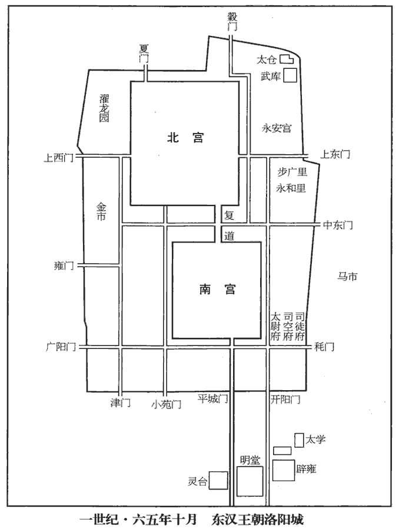
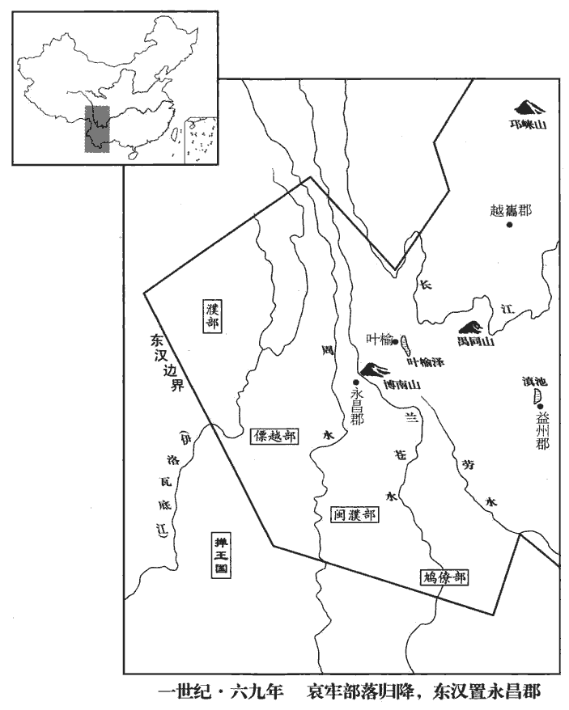
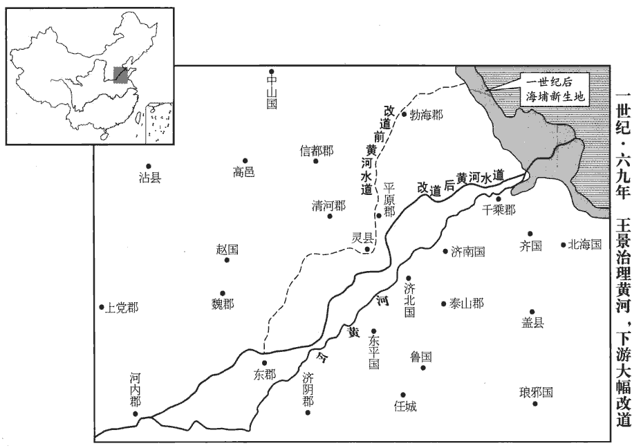
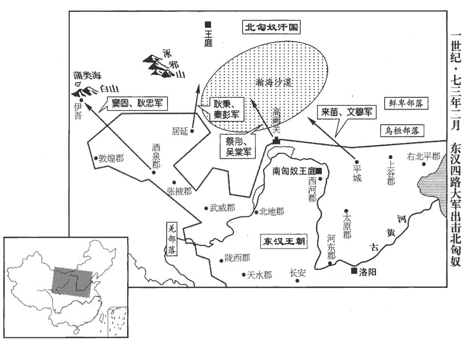
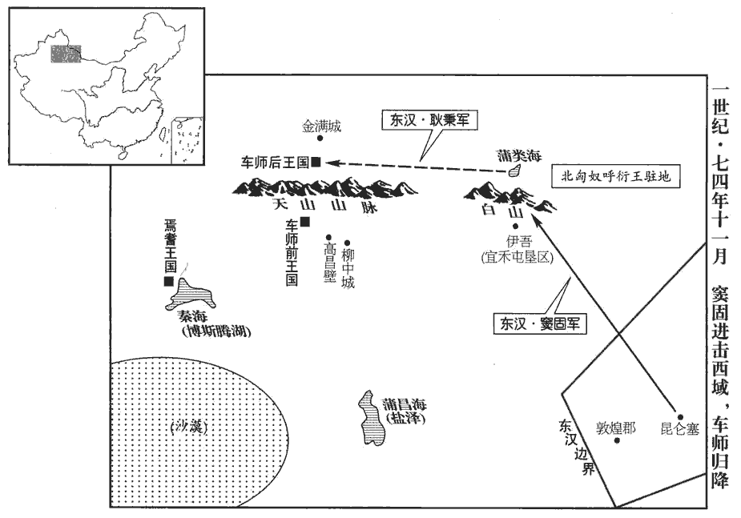

 漢紀三十七起重光作噩（辛酉），盡旃蒙大淵獻（乙亥），凡十五年。

# 顯宗孝明皇帝下

## 永平四年（辛酉，六一）

1春，帝‹刘庄，时年三十四›近出觀覽城第，城，雒陽城。第，宅也。賢曰：有甲乙之次，故曰第。欲遂校獵河內‹河南武陟›；河內郡，在雒陽北百二十里。東平王蒼上書諫；帝覽奏，即還宮。

〖译文〗 [1]春季，明帝出宫，在附近观览洛阳城楼宅第，打算随后去河内郡行猎。东平王刘苍上书劝止。明帝看到奏书后，立即回宫。

2秋，九月，戊寅‹十二›，千乘哀王建薨，無子，國除。乘，繩證翻。

〖译文〗 [2]秋季，九月戊寅（十二日），千乘哀王刘建去世。因无子嗣，封国撤除。

3冬，十月，乙卯‹十九›，司徒郭丹、司空馮魴fáng免，魴，音房。以河南尹沛國‹安徽淮北›范遷為司徒，太僕伏恭為司空。恭，湛zhàn之兄子也。

〖译文〗 [3]冬季，十月乙卯（十九日），将司徒郭丹、司空冯鲂免职，将河南尹、沛国人范迁任命为司徒，太仆伏恭任命为司空。伏恭是伏湛哥哥的儿子。

4陵鄉侯梁松坐怨望、縣飛書誹謗，下獄死。松嗣父統爵為陵鄉侯。縣，讀曰懸。下，遐稼翻。

〖译文〗 [4]陵乡侯梁松因怨恨朝廷、悬挂匿名书进行诽谤而被捕入狱，处以死刑。

初，上為太子，太中大夫鄭興子眾以通經知名，知名者，有名於時，人皆知之也。太子及山陽王荊因梁松以縑jiān帛請之，眾曰：「太子儲君，無外交之義；儲，副也。漢有舊防，蕃王不宜私通賓客。」松曰：「長者意，不可逆。」眾曰：「犯禁觸罪，不如守正而死。」遂不往。及松敗，賓客多坐之，唯眾不染於辭。

〖译文〗 当初，皇上做太子的时候，太中大夫郑兴之子郑众以精通儒家经典而闻名于世。太子和山阳王刘荆曾让梁松用绸缎作礼物聘请郑众做门客，郑众说：“太子是王储，没有同外界随便交往的道理。汉朝有旧时禁令，亲王也不应私自招徕宾客。”梁松说：“这是上面的意思，不可忤逆。”郑众说：“与其违禁犯罪，不如坚守正道而死。”便拒绝梁松之请，没有应聘前往。及至梁松获罪，宾客们多被指控有罪，唯独郑众不受案中供辞的牵连。

5于窴‹新疆和田›王廣德將諸國兵三萬人攻莎車‹新疆莎車›，誘莎車王賢，殺之，窴，徒賢翻。莎，素禾翻。并其國。匈奴發諸國兵圍于窴，廣德請降。匈奴立賢質子不居徵為莎車王，質，音致。廣德又攻殺之，更立其弟齊黎為莎車王。更，工衡翻。

〖译文〗 [5]于阗王广德率领各国兵众三万人进攻莎车，用计引诱莎车王贤，将他杀死，吞并了莎车国。于是，匈奴调发西域诸国军队包围了于阗，广德请求投降。匈奴便将贤生前送来做人质的儿子不居徵立为莎车王。后来，广德再次进攻莎车，杀死了不居徵，改立他的弟弟齐黎为莎车王。

6東平‹山東東平东南›王蒼自以至親輔政，蒼輔政，始上卷中元二年。聲望日重，意不自安，前後累上疏稱：「自漢興以來，宗室子弟無得在公卿位者，乞上驃騎將軍印綬，退就藩國。」辭甚懇切，帝乃許蒼還國，而不聽上將軍印綬。上，時掌翻。

〖译文〗 [6]东平王刘苍由于自己是明帝至亲而辅佐大政，又声望日高，内心感到不安，曾先后多次上书道：“自从汉朝开国以来，皇族子弟无一人身居公卿要位，我请求奉还骠骑将军的印信绶带，退官并前往封国。”奏书辞意十分恳切。于是明帝便允许刘苍返回封国，但不准他奉还骠骑将军的印信绶带。

## 五年（壬戌，六二）

1春，二月，【章：十二行本「月」下有「庚戌」‹十六›二字；乙十一行本同。】蒼罷歸藩；東平國，在雒陽東六百七十二里。帝以驃騎長史為東平太傅，掾為中大夫，令史為王家郎，百官志：將軍長史一人，秩千石；掾屬二十九人，秩比四百石至比二百石；令史及御屬三十一人，百石。帝特為蒼置掾、史、員四十人。王國太傅秩二千石，中大夫比六百石，郎二百石。掾，俞絹翻。加賜錢五千萬，布十萬匹。

〖译文〗 [1]春季，二月，刘苍免官返回封国。明帝任命骠骑将军府长史为东平国太傅，掾史为中大夫，令史为王府郎。特赐东平王五千万钱，十万匹布。

2冬，十月，上行幸鄴‹河北臨漳西南邺镇›；是月，還宮。

〖译文〗 [2]冬季，十月，明帝出行，临幸邺。当月返回京城皇宫。

3十一月，北匈奴寇五原‹內蒙包頭›；十二月，寇雲中‹內蒙托克托›，南單于擊卻之。

〖译文〗 [3]十一月，北匈奴侵犯五原郡；十二月，侵犯云中郡，被南匈奴单于击退。

4是歲，發遣邊民在內郡者，賜裝錢，人二萬。賜錢為辦裝也。

〖译文〗 [4]本年，征发遣返迁到内地的边疆居民，赏赐治装费，每人二万钱。

5安豐戴侯竇融年老，子孫縱誕，多不法。長子穆尚內黃公主，內黃縣，屬魏郡。矯稱陰太后詔，令六安侯劉盱xū去婦，以女妻之。六安國，屬廬江郡。賢曰：今之廬州。按前漢以六安為王國，後漢以六安為侯國，屬廬江郡。賢以唐之廬州為漢之廬江郡可也，若漢之六安侯國實在唐壽州界。劉昫xù地理志：壽州安豐縣，漢六國故城在縣南，此為可據。此後章帝元和二年，徙江陵王恭為六安王，以廬江郡為國，卻可以用賢註。妻，七細翻。盱婦家上書言狀，帝大怒，盡免穆等官。諸竇為郎吏者，皆將家屬歸故郡，竇氏，故扶風平陵人。獨留融京師；融尋薨。後數歲，穆等復坐事與子勳、宣皆下獄死。復，扶又翻。下，遐稼翻。久之，詔還融夫人與小孫一人居雒陽。

〖译文〗 [5]安丰戴侯窦融年事已高，他的子孙放纵荒唐，作了许多不法之事。窦融的长子窦穆是内黄公主的夫婿，他假传阴太后的旨意，命令六安侯刘盱休掉原妻，而将自己的女儿嫁给了刘盱。刘盱原妻的娘家上书控告此事，明帝大怒，将窦穆兄弟全部罢免。凡窦氏家族中作官的，一律带着家属返回原郡，只留窦融一人在京城。窦融不久便去世了。几年后，窦穆等人再次遭到指控，连同窦穆的儿子窦勋和窦宣，一道被捕入狱，处以死刑。又过了很久，明帝才下诏准许窦融的夫人和小孙一人回到洛阳居住。

## 六年（癸亥，六三）

1春，二月，王雒山出寶鼎，獻之。據本紀，王雒山在廬江郡。夏四月，甲子‹七›，詔曰：「祥瑞之降，以應有德；方今政化多僻，何以致茲！易曰：『鼎象三公』，三公鼎足承君，故云然。此蓋易緯之辭。豈公卿奉職得其理邪！其賜三公帛五十匹，九卿、二千石半之。先帝詔書，禁人上事言『聖』，見四十二卷光武建武七年。上，時掌翻。而間者章奏頗多浮詞；自今若有過稱虛譽，尚書皆宜抑而不省，省，悉景翻。示不為諂子蚩也。」蚩，笑也。

〖译文〗 [1]春季，二月，有宝鼎在王洛山出土，献给明帝。夏季，四月甲子（初七），明帝下诏：“祥瑞降临，是德行的感应。如今政治多有邪僻，怎么能够引来祥瑞！《易经》说：‘鼎是三公的象征，’莫非是公卿奉职尽责符合了天理吗？今赐予三公每人五十匹帛，九卿和二千石官每人二十五匹。先帝曾有诏旨，禁止人们在上书时称颂圣明，而近来奏章中虚浮之辞较之。从今以后，如果再有溢美的言词，尚书应一律拒不受理，以示朕不为谄媚者欺骗嘲弄。”

2冬，十月，上‹刘庄，时年三十六›行幸魯‹山東曲阜›；十二月，還幸陽城‹河南登封东南›；陽城縣，屬潁川。壬午‹二十九›，還宮。

〖译文〗 [2]冬季，十月，明帝出行，临幸鲁城。十二月，在归途中临幸阳城县。十二月壬午（二十九日），返回京城皇宫。

3是歲，南單于適死，單于莫之子蘇立，為丘除車林鞮單于；鞮dī，丁奚翻；下同。數月，復死，復，扶又翻；下同。單于適之弟長立，為湖邪尸逐侯鞮單于。

〖译文〗 [3]本年，南匈奴单于适去世，前单于莫的儿子苏继位，此即丘除车林单于。数月后，苏又去世，单于适的弟弟长继位，此即湖邪尸逐侯单于。

## 七年（甲子，六四）

1春，正月，癸卯‹二十›，皇太后陰氏‹阴丽华›崩。二月，庚申‹八›，葬光烈皇后。西京諸后皆從帝諡，惟衛思后、許恭哀后不以壽終而別追諡之。從帝諡而又加一字，自陰后始。范曄yè曰：漢世皇后皆因帝諡為稱，明帝始建光烈之稱，其後并以德為配，至於賢愚優劣，混同一貫。賢曰：諡法：執德遵業曰烈。

〖译文〗 [1]春季，正月癸卯（二十日），皇太后阴氏驾崩。二月庚申（初八），光烈皇后阴氏入葬。

2北匈奴猶盛，數寇邊，數，所角翻。遣使求合市；上‹刘庄，时年三十七›冀其交通，不復為寇，許之。

〖译文〗 [2]北匈奴依然实力强盛，屡次侵犯边境，又派使者请求与汉朝进行双边贸易。明帝希望利用通商手段使匈奴不再入侵，便应许了这一要求。

3以東海‹山東曲阜›相宗均為尚書令。初，均為九江太守‹安徽壽縣›，九江郡，在雒陽東南一千五百里。五日一聽事，悉省掾、史，閉督郵府內，屬縣無事，郡有五部督郵，監屬縣。閉之府內者，恐以司察為功能，侵擾屬縣，適以多事故也。百姓安業。九江舊多虎暴，常募設檻穽jǐng，賢曰：檻，為機以捕獸。穽，謂穿地陷之。而猶多傷害。均下記屬縣曰：「夫江、淮之有猛獸，猶北土之有雞豚也，今為民害，咎在殘吏，而勞勤張捕，張，設也，設為機穽以伺鳥獸曰張。裴炎猩猩銘所謂「奴欲張我」是也。非憂恤之本也。其務退姦貪，思進忠善，可一去檻穽，去，羌呂翻。除削課制。」其後無復虎患。復，扶又翻。帝聞均名，故任以樞機。均謂人曰：「國家喜文法、廉吏，以為足以止姦也；喜，許記翻。然文吏習為欺謾，而廉吏清在一己，謾，音慢，又莫連翻。無益百姓流亡、盜賊為害也。均欲叩頭爭之，時未可改也，久將自苦之，乃可言耳！」未及言，會遷司隸校尉。後上聞其言，追善之。

〖译文〗 [3]任命东海国相宗均为尚书令。先前，宗均曾任九江郡太守。任上，他每五天处理一次政务，将掾、史等官员一律裁撤，不让督邮外出巡查而留在府内，下属各县全都太平无事，百姓安居乐业。九江一向多虎害，官府经常招募猎手设栅栏陷阱捕捉，但猛虎仍然造成了很多伤害。宗均颁下公文命令所属各县：“长江、淮河一带有猛兽，正如北方有鸡、猪，本是平常之事。如今猛虎为害民间，原因在于官吏残暴，而使人辛苦捕猎，也不符合怜悯体恤百姓的原则。如今务必要清除贪官污吏，考虑提拔忠诚善良之士，可一举撤去栅栏陷阱，并减免赋锐。”从此以后，九江便不再出现虎害。明帝听说了宗均的名声，所以让他负责中枢机要。宗均对人说：“皇上喜用处理公文法令的文吏和廉洁的清官，认为有他们便足以禁止奸恶发生。然而文吏常常利用文字技巧欺上瞒下，而清官又只能独善一身，不能阻止百姓流亡、盗匪作乱。我要向皇上叩头力争，虽然一时不能改变现状，但长此以往皇上将自受其苦，到那时我便可以说话了！”宗均还没来得及进谏，恰好转任司隶校尉，离开了尚书台。后来，明帝听说了宗均的这番言论，表示赞同。

## 八年（乙丑，六五）

1春，正月，己卯‹二›，司徒范遷薨。

〖译文〗 [1]春季，正月己卯（初二），司徒范迁去世。

2三月，辛卯，以太尉虞延為司徒，衛尉趙熹行太尉事。

〖译文〗 [2]三月辛卯（疑误），将太尉虞延任命为司徒，命卫尉赵熹代理太尉职务。

3越騎司馬鄭眾使北匈奴，越騎校尉司馬一人，秩千石。單于欲令眾拜，眾不為屈。單于圍守，閉之不與水火；眾拔刀自誓，自誓以死，不為單于屈也。單于恐而止，乃更發使，隨眾還京師。

〖译文〗 [3]越骑司马郑众出使北匈奴，北匈奴单于想要让郑众叩拜，郑众没有屈从。单于派人包围看守，关闭起来，断绝了水火供应。郑众拔出佩刀发誓。单于恐惧，这才罢休，于是重新派遣使者，随郑众回到都城洛阳。

初，大司農耿國上言：「宜置度遼將軍屯五原‹內蒙包頭›，以防南匈奴逃亡，」朝廷不從。南匈奴須卜骨都侯等知漢與北虜交使，內懷嫌怨，欲畔，匈奴異姓大臣，左、右骨都侯也。又異姓有呼衍氏、須卜氏、立林氏、蘭氏，皆匈奴國中名族，常與單于婚姻。密使人詣北虜，令遣兵迎之。鄭眾出塞，疑有異；伺候，果得須卜使人。伺，相吏翻。使，疏吏翻。乃上言：「宜更置大將，以防二虜交通。」由是始置度遼營，以中郎將吳棠行度遼將軍事，將黎陽‹河南浚縣›虎牙營士屯五原曼柏‹內蒙达拉特旗东南六十公里马场壕›。漢官儀曰：光武以幽、冀兵克定天下，故於黎陽立營，以謁者監領，兵騎千人。賢曰：昭帝拜范明友為度遼將軍，至此復置焉。曼柏縣，在今勝州銀城縣界。

〖译文〗 先前，大司农耿国曾上书说：“应当设置度辽将军屯兵五原郡，以防备南匈奴逃亡。”朝廷没有采纳他的建议。南匈奴须卜骨都侯等人听到汉朝同北匈奴互通使者的消息，心怀怨恨，打算反叛，于是秘密派人前往北匈奴，要北匈奴派兵接应。郑众出塞时，疑心情况有异，便伺察等侯，果然抓到了须卜的信使。郑众便上书说：“应当重新在边境设置大将，以防备南北匈奴互相联络。”从此，汉朝便开始设置度辽营，命中郎将吴棠代理度辽将军事务，率领黎阳虎牙营的兵士，屯驻在五原郡曼柏县。

4秋，郡國十四大水。

〖译文〗 [4]秋季，十四个郡和封国发生水灾。

5冬，十月，北宮成。

〖译文〗 [5]冬季，十月，北宫落成。

 

6丙子‹四›，募死罪繫囚詣度遼營；有罪亡命者，令贖罪各有差。楚‹府彭城，江苏徐州›王英奉黃縑、白紈詣國相曰：漢成帝王國省內史，令相治民，職如太守，秩二千石。紈，今之絹也。師古曰：紈，素也；縑，并絲絹也。相，息亮翻。「託在藩輔，過惡累積，歡喜大恩，奉送縑帛，以贖愆罪。」國相以聞，詔報曰：「楚王誦黃、老之微言，尚浮屠之仁慈，潔齊三月，齊，讀曰齋。與神為誓，何嫌何疑，當有悔吝！其還贖，以助伊蒲塞、桑門之盛饌。」塞，悉則翻。饌，雛戀翻，又雛皖翻。

〖译文〗 [6]十月丙子（初四），募集犯有死罪的囚徒前往度辽营。命令逃亡的罪犯赎罪，依据不同的情况，各分等级。楚王刘英带着黄色细绢和素色薄绸去见国相，说道：“我身居藩国，罪过积累，我非常高兴，蒙受大恩。献上细绢薄绸，以赎我罪。”国相将此事上报朝廷，明帝下诏答复说：“楚王口念黄帝、老子的精微之言，崇尚佛家的仁爱慈悲，曾戒斋三个月，对佛立誓。有什么猜嫌和疑问，应当悔恨？把那些赎罪之物退还，赞助他以美食款待佛门弟子。”

初，帝聞西域有神，其名曰佛，因遣使之天竺求其道，得其書及沙門以來。其書大抵以虛無為宗，貴慈悲不殺；以為人死，精神不滅，隨復受形；生時所行善惡，皆有報應，故所貴修煉精神，以至為佛。善為宏闊勝大之言，以勸誘愚俗。精於其道者，號曰沙門。於是中國始傳其術，圖其形像，而王公貴人，獨楚王英最先好之。袁宏漢紀：浮屠，佛也。西域天竺國有佛道焉。佛者，漢言覺也，將以覺悟群生也。其教以修善慈心為主，不殺生，專務清靜。其精者為沙門。沙門，漢言息也。蓋息意去欲以歸於無為。長丈六尺，黃金色。初，明帝夢見金人長大，以問群臣。或曰：「西方有神，其名曰佛，陛下所夢，得無是乎？」於是遣使天竺，問其道術而圖其形像焉。賢曰：伊蒲塞，即優婆塞也，中國翻為近住，言受戒行堪近僧住也。桑門，即沙門，梵云沙門那，或曰桑門，唐言勤息，秦譯云勤行，又云善覺。魏收曰：漢武帝遣霍去病討匈奴，獲休屠王金人，以為大神，列於甘泉宮，不祭祀，但燒香禮拜而已。此則佛道流通之漸也。張騫使大夏，傳其旁有身毒國，一名天竺，始聞有浮屠之教。哀帝元壽元年，博士弟子秦景憲受大月氏王使伊存口授浮屠經，中國聞之，未信了也。後明帝夜夢金人，頂有白光，飛行殿庭，乃訪群臣，傅毅始以佛對。帝遣郎中蔡愔yīn等使天竺，寫浮屠遺范，仍與沙門攝摩騰、竺法蘭東還洛陽，中國有沙門跪拜之法自此始。愔之還，以白馬負經而至，漢因立白馬寺於洛城雍關西。好，呼到翻。

〖译文〗 起初，明帝听说西域有一神祗，名字叫作“佛”，于是派使者前往天竺国寻求佛教道义。使者在西域找到了佛经，并带着沙门回到中原。佛经大抵以一切虚无为本，崇尚慈悲不杀生。认为人死之后，精神不灭，可以再次投胎转世，而人生前所作的善事恶事，全都会有报应。因此，提倡修炼精神，直至成“佛”。佛家擅于使用恢弘博大的言词，以劝化诱导愚昧的凡夫俗子。精通佛家道义的人，称为“沙门”。于是佛教便开始在中原传播，图画佛门形像。在天子、诸王和显贵当中，唯独楚王刘英最先喜好佛教。

7壬寅晦‹三十›，日有食之，既。既，盡也。詔群司勉脩職事，極言無諱。於是在位者皆上封事，各言得失；帝覽章，深自引咎，以所上班示百官。上，時掌翻。詔曰：「群僚所言，皆朕之過。民冤不能理，吏黠不能禁；黠，下八翻。而輕用民力，繕脩宮宇，出入無節，喜怒過差。永覽前戒，竦然兢懼；徒恐薄德，久而致怠耳！」人主能切己省察，然後能有是言。

〖译文〗 [7]十月壬寅晦（三十日），出现日全食。明帝下诏，勉励百官各尽职守，用最直率的态度批评朝政而无所忌讳。于是官员们全都呈上密封的奏章，各自议论朝政的得失。明帝观看奏章，深自责备，便将这些奏章向百官公布，并下诏说：“群臣指摘之事，都是朕的过错。人民冤屈不能申雪，贪官污吏不能查禁，却轻率地使用民力，营建宫室，开支与征税无节制，而且喜怒无常。回顾古人的鉴戒，十分恐惧，只怕朕品德寡薄，日久生怠！”

8北匈奴‹王庭设蒙古哈尔和林›雖遣使入貢，而寇鈔不息，鈔，楚交翻。邊城晝閉。帝議遣使報其使者，鄭眾上疏諫曰：「臣聞北單于所以要致漢使者，要，一遙翻。欲以離南單于之眾，堅三十六國之心也；賢曰：武帝開通西域，本三十六國，余謂堅其心者，欲使之專附匈奴。又當揚漢和親，誇示鄰敵，令西域欲歸化者局足狐疑，懷土之人絕望中國耳。漢使既到，便偃蹇自信；信，音申。若復遣之，虜必自謂得謀，得謀，猶言得計。復，扶又翻；下同。其群臣駁議者不敢復言。賢曰：駁議，謂勸單于歸漢。駁，北角翻。如是，南庭動搖，烏桓有離心矣。南單于庭在西河美稷。動搖，謂欲出塞北去。烏桓本附匈奴，漢置校尉領護，使不得與匈奴交通。離心，謂其心不親附漢而貳於匈奴也。南單于久居漢地，具知形勢，萬分離析，旋為邊害。今幸有度遼之眾揚威北垂，雖勿報答，不敢為患。」帝不從。復遣眾往，眾因上言：「臣前奉使，不為匈奴拜，為，於偽翻；下同。單于恚恨，遣兵圍臣；恚，於避翻。今復銜命，必見陵折，臣誠不忍持大漢節對氈zhān裘獨拜。前書匈奴傳曰：自君王以下，皆食畜肉，衣其皮革，被旃裘。旃，與氈同。如令匈奴遂能服臣，將有損大漢之強。」帝不聽。眾不得已，既行，在路連上書固爭之；詔切責眾，追還，繫廷尉，會赦，歸家。其後帝見匈奴來者，聞眾與單于爭禮之狀，乃復召眾為軍司馬。漢制：大將軍營五部，部校尉一人，比二千石；軍司馬一人，比千石；其不置校尉部，但軍司馬一人。帝召眾為軍司馬，使與馬賡gēng擊車師。

〖译文〗 [8]北匈奴虽然派使者入朝进贡，但侵掠不断，致使边疆城镇白日关闭城门。明帝同群臣商议，打算派遣使者回报匈奴来使。郑众上书劝谏道：“我听说，北匈奴单于所以要挟汉朝派出使者，目的是想离散南匈奴单于的部众，坚定西域三十六国对北匈奴的效忠之心。他还将吹嘘已同汉朝和解通好，向邻近敌国夸耀，使西域那些打算归附汉朝的国家畏缩猜疑，使流亡在外怀念故土的人对汉朝绝望。汉朝使者到过北匈奴以后，单于便已十分傲慢自负，如果再派使者，他一定会自以为得计，而北匈奴群臣中反对与汉朝为敌的人也不敢再说话了。这样，南匈奴王庭便会发生动摇，乌桓也将与我们离心离德。南匈奴单于长期居住在中国内地，对我方的情况与地形一一知晓，万一同汉朝分裂，即刻便成为边境的祸患。如今，幸而有度辽营的大军在北疆扬威镇守，即便我们不派使者回报北匈奴，他们也不敢作乱。”明帝不接受郑众的劝谏，再次派他做使者前往北匈奴。于是郑众上书说：“我前次奉命出使北匈奴时，因不肯行叩拜之礼，单于十分愤恨，曾派兵把我围困起来。如今我再次领命前往，定会遭到凌辱，我实在不愿自己手持大汉的符节，对着毛毡皮衣独拜。而如果我迫于形势向匈奴屈服，则将有损于汉朝的国威。”明帝不听郑众的劝谏，郑众不得已而动身。出发后，他在路上接连上书力争，坚持自己的主张。于是明帝下诏严厉责备郑众，将他追回，囚禁于廷尉监狱。适逢赦免，他便回到家乡。后来，明帝会见北匈奴的来客，听到郑众与单于因礼仪相争的情况，便再次征召郑众，任命为军司马。

## 九年（丙寅，六六）

1夏，四月，甲辰，詔司隸校尉、部刺史歲上墨綬長吏視事三歲已上、治狀尤異者各一人與計偕上，及尤不治者亦以聞。杜佑曰：後漢十三州部：司隸治河南，今府；豫治譙，今酇縣；兗治昌邑，今魯郡金鄉縣；徐治郯，今臨淮郡下邳縣；青治臨淄，今北海郡縣；涼治隴，今天水郡隴城縣；并治晉陽，今太原府；冀治鄗hào，今趙郡鄗縣；幽治薊，今范陽郡；揚治歷陽，今郡縣；荊治漢壽，今武陵郡武陵縣；交治廣信，今蒼梧郡蒼梧縣。漢制：千石、六百石，墨綬，三采青、赤、紺gàn，長丈六尺，八十首；四百石、三百石長同。此墨綬長吏，謂大縣令以下。上，時掌翻。治，直吏翻。

〖译文〗 [1]夏季，四月甲辰（疑误），明帝下诏命令司隶校尉、部刺史：每年各从任职三年以上、考绩最优异的县令以下官员中选拔一人上报，让此人随同呈送年终考绩的官员进京。对于考绩最劣者，也要上报朝廷。

2是歲，大有年。穀梁傳曰：五穀皆熟，書大有年。

〖译文〗 [2]本年，粮食大丰收。

3賜皇子恭號曰靈壽王，黨號曰重熹王，賢曰：取其美名也。未有國邑。

〖译文〗 [3]明帝将皇子刘恭赐号为灵寿王，皇子刘党赐号为重熹王，都没有封国。

4帝‹刘庄，时年三十九›崇尚儒學，自皇太子諸王侯及大臣子弟、功臣子孫，莫不受經。又為外戚樊氏、郭氏、陰氏、馬氏諸子立學於南宮，號「四姓小侯」。賢曰：以非列侯，故曰小侯。禮記曰「庶方小侯」，亦其義也。余據東平王蒼傳，送列侯印十九枚，諸王子年五歲以上能趨拜者，皆令帶之。意四姓小侯亦猶是也。置五經師，搜選高能以授其業。自期門、羽林之士，悉令通孝經章句。匈奴亦遣子入學。

〖译文〗 [4]明帝尊崇儒学，上自太子、诸王、侯爵，下至高官的子弟、功臣的子孙，无人不学习儒家经典。明帝还为外戚樊氏、郭氏、阴氏、马氏的儿子们在南宫设立学校，这些学生号称“四姓小侯”。明帝给他们安排讲解儒家《五经》的老师，寻找选拔学问高超的贤才授课。即便是期门、羽林等禁卫武官，也都命令通晓《孝经》章句的含义。匈奴也派出贵族子弟到汉朝学习。

5廣陵‹江蘇揚州›王荊復呼相工謂曰：「我貌類先帝，先帝三十得天下，我今亦三十，可起兵未？」相者詣吏告之，相，息亮翻。荊惶恐，自繫獄，帝加恩，不考極其事，詔不得臣屬吏民，唯食租如故，恐其復謀不軌，故不得臣屬吏民，唯食國之租稅。使相、中尉謹宿衛之。荊又使巫祭祀、祝詛。祝，職又翻。詛，莊助翻。詔長水校尉樊鯈tiáo等雜治其獄，鯈，直留翻。治，直之翻。事竟，奏請誅荊。帝怒曰：「諸卿以我弟故，欲誅之；即我子，卿等敢爾邪？」鯈對曰：「天下者高帝天下，非陛下之天下也。春秋之義，君親無將，將而必誅。賢曰：春秋公羊傳之文也。將者，將為弒逆之事也。臣等以荊屬託母弟，帝與荊皆出於陰后。陛下留聖心，加惻隱，故敢請耳；如令陛下子，臣等專誅而已。」賢曰：專，謂不請也。帝歎息善之。鯈，宏之子也。

〖译文〗 [5]广陵王刘荆又召来相面的术士，说道：“我的容貌和先帝相像。先帝三十岁时即位称帝，我如今也三十岁了，可以起兵了吗？”相面的术士向有关官员告发了此事。刘荆惊慌恐惧，到狱中将自己囚禁起来。明帝特别加恩，不对事情进行追究。下诏不许他统治封国的官员和百姓，只可继续享用租税收入。并命令封国国相和中尉对他严密监护。刘荆又让巫师进行祭祷和诅咒。明帝下诏，命令长水校尉樊等人联合审判此案。审判结束后，樊等人上书，请将刘荆处死。明帝生气地说道：“你们因广陵王是我弟弟的缘故，所以要杀他，如果是我的儿子，你们敢这样吗？”樊回答道：“天下是高帝的天下，不是陛下的天下。根据《春秋》大义，君王至亲不得有弑逆图谋，有则必杀。我们因为刘荆是陛下同母之弟，陛下特别留意，恻隐有加，所以才敢请示。如果是陛下的儿子，我们只专断诛杀而已。”明帝叹息着表示赞许。樊是樊宏之子。

## 十年（丁卯，六七）

1春，二月，廣陵‹江蘇揚州›思王荊自殺，諡法：追悔前過曰思。國除。

〖译文〗 [1]春季，二月，广陵王刘荆自杀，封国撤除。

2夏，四月，戊子‹二十四›，赦天下。

〖译文〗 [2]夏季，四月戊子（二十四日），大赦天下。

3閏月，甲午‹三›，上‹刘庄，时年四十›幸南陽‹河南南陽›，召校官弟子作雅樂，賢曰：校，學也，戶教翻。雅樂，註見上。奏鹿鳴，帝自奏塤xūn篪chí和之，以娛嘉賓。鄭玄註周禮云：塤，燒土為之，大如鴈子。鄭眾云：有六孔。世本曰：暴辛公作篪，以竹為之，長尺四寸，有八孔。孔穎達曰：土曰壎，竹曰篪。周禮小師職作「塤」，古今字異耳。釋樂云：大塤謂之嘂jiào，音叫。孫炎曰：音大如叫呼也。郭璞曰：塤，燒土為之，大如鵝子，銳上平底，形似稱鎚；六孔；小者如雞子。釋樂又云：大篪謂之沂。李巡曰：大篪，其聲非一也。郭璞曰：篪以竹為之，長尺四寸，圍三寸，一孔上出，逕三分，橫吹之，小者尺二寸。廣雅云：八孔。鄭司農小師註云：篪七孔，蓋不數其上出者，故七也。世本云：暴辛公作塤，蘇成公作篪。譙周古史考云：古有塤、篪，尚矣。周幽王時，暴辛公善塤，蘇成公善篪，記者因以為作，繆矣。釋名：塤，喧也，聲濁喧然。塤，況袁翻。篪，音池。和，戶臥翻。還，幸南頓‹河南項城›。冬，十二月，甲午‹四›，還宮。

〖译文〗 [3]闰十月甲午（初三），明帝临幸南阳，召集地方学校的学生演奏庙堂正乐。当演奏《诗经·鹿鸣》时，明帝亲自吹起陶埙和竹应和，以娱乐嘉宾。回京途中，明帝临幸南顿。冬季，十二月甲午（初四），返回京城皇宫。

4初，陵陽侯丁綝卒，陵陽縣，屬丹陽郡。綝，丑林翻。子鴻當襲封，上書稱病，讓國於弟盛，不報。既葬，乃掛衰cuī絰dié於塚廬而逃去。衰，倉回翻。友人九江‹安徽壽縣›鮑駿遇鴻於東海‹山東郯城›，東海郡，在雒陽東一千五百里。讓之曰：「昔伯夷、吳札zhá，亂世權行，故得申其志耳。賢曰：伯夷，孤竹君之子，讓其弟叔齊。季札，吳王壽夢之季子也，諸兄欲讓以國，季子乃舍其室而耕。皆是權時所行，非常道也。伯夷當紂時，季札當周末，故言亂世也。春秋之義，不以家事廢王事。春秋：衛靈公卒，孫輒立，父蒯kuǎi聵kuì與輒爭國。公羊傳曰：輒者，蒯聵之子。然則曷為不立蒯聵而立輒？蒯聵無道，靈公遂之而立輒。然則輒之義可以立乎？曰：可，不以父命辭於王父命，不以家事辭於王事。故駿引以為言。今子以兄弟私恩而絕父不滅之基，可乎？」鴻感悟垂涕，乃還就國。鮑駿因上書薦鴻經學至行，行，下孟翻。上徵鴻為侍中。

〖译文〗 [4]当初，陵阳侯丁去世时，他的儿子丁鸿应当继承封国。但丁鸿上书自称有病，要将封国让给弟弟丁盛，朝廷未予答复。丁鸿安葬父亲以后，便将丧服挂在守墓的小屋里逃走了。丁鸿的朋友、九江人鲍骏在东海国遇到了丁鸿，责备他道：“从前孤竹君之子伯夷和吴王之子季札推让王位，是乱世中的权宜行为，那样作才能表明他们的志节。根据《春秋》大义，不可以因家事废弃国事。如今您由于兄弟手足之情而断送父亲建立的永不毁灭的基业，这样行吗？”丁鸿醒悟过来，流下眼泪，便回去继承了封国。鲍骏于是上书向朝廷举荐丁鸿，称赞他精通经学，行为高尚。明帝便征召丁鸿进京，任命他为侍中。

## 十一年（戊辰，六八）

1春，正月，東平王蒼與諸王俱來朝，月餘，還國。帝‹刘庄，时年四十一›臨送歸宮，悽然懷思，乃遣使手詔賜東平國中傅曰：「辭別之後，獨坐不樂，樂，音洛；下同。因就車歸，伏軾而吟，瞻望永懷，實勞我心。誦及采菽，以增歎息。采菽，詩小雅之章也。其詩曰：采菽采菽，筐之筥jǔ之；君子來朝，何錫予之。毛詩註云：菽，所以芼máo太牢而待君子，羊則苦，豕則薇。箋云：菽，大豆也，采其葉以為藿。三牲，牛、羊、豕，芼以藿。正義曰：傳既言羊則苦，豕則薇，則菽不總芼三牲；而言菽所以芼太牢者，舉牛之芼，則羊豕之苦、薇從可知矣。日者問東平王：『處家何等最樂？』王言：『為善最樂。』處，昌呂翻。樂，音洛。其言甚大，副是要腹矣。要，讀曰腰。蒼腰帶十圍。今送列侯印十九枚，諸王子年五歲已上能趨拜者，皆令帶之。」

〖译文〗 [1]春季，正月，东平王刘苍和诸位亲王一同进京朝见。一个多月后，返回封国。明帝亲自送行，回到皇宫后，凄然思念，便亲手动笔写诏，派使者送给东平国中傅。诏书写道：“分别之后，朕孤身独坐，心中郁郁不乐，便乘车而归。俯身车前横木而低吟，遥远的瞻望与长久的怀念，真让我心神劳苦。朗诵《诗经·采菽》之章，更增加我的叹息。日前我曾问东平王：‘居家做什么事最快乐？’东平王说：‘行善最快乐。’这句话口气甚大，正与他的腰围肚量相称。如今送去列侯印信十九枚，东平王的儿子们年满五岁并懂得行礼的，让他们全都佩带印信。”

## 十二年（己巳，六九）

1春，哀牢‹云南南›王柳貌率其民五萬餘戶內附，以其地置哀牢‹云南保山›、博南‹云南永平›二縣。哀牢夷者，九隆種也，居牢山，絕域荒外，山川阻深，未嘗通中國，西南去雒陽七千里。賢曰：在今匡州匡州縣西。張柬之曰：姚州，哀牢國地。始通博南山‹云南永平境›，度蘭倉水‹瀾滄江›，華陽國志曰：博南縣西山高三十里，越之，得蘭倉水，有金沙，洗取融為金。行者苦之，歌曰：「漢德廣，開不賓；度蘭倉，為他人。」為，於偽翻。

〖译文〗 [1]春季，哀牢王柳貌率领属民五万余户旧附汉朝。朝廷在原地设立哀牢、博南两县，并开始进行开辟博南山通道和渡越兰仓水的工程。服役者因工程艰苦，作歌道：“汉德广大，开辟荒蛮，渡越兰仓，全为他人。”

2初，平帝時，河、汴決壞，久而不脩。建武十年，光武欲脩之；浚儀‹河南開封›令樂俊上言，民新被兵革，未宜興役，乃止。浚儀縣，屬陳留郡。被，皮義翻。其後汴渠東侵，日月彌廣，兗‹山東西部›、豫‹河南›百姓怨歎，以為縣官恆興他役，不先民急。會有薦樂浪‹朝鮮平壤›王景能治水者，樂浪，在雒陽東北五千里。恆，戶登翻。先，悉薦翻。樂浪，音洛琅。夏，四月，詔發卒數十萬，遣景與將作謁者王吳脩汴渠隄，自滎陽‹河南滎陽›東至千乘‹山東高青东北›海口千餘里，謁者，屬光祿勳。王吳以謁者而將作，故謂之將作謁者。賢曰：汴渠，即莨làng蕩渠也。汴自滎陽首受河，所謂石門，在滎陽山北一里，過汴以東，積石為隄，亦號金隄，成帝陽嘉中所作也。十里立一水門，令更相洄注，爾雅曰：逆流而上曰洄。郭璞註云：旋流也。更，工衡翻。無復潰漏之患。復，扶又翻。景雖簡省役費，然猶以百億計焉。十萬曰億。

〖译文〗 [2]最初，在西汉平帝时，黄河、汴水曾经决口，久不修复。到了建武十年，当光武帝打算动工治理时，浚仪县令乐俊上书说：“人民新近经历了战争，不宜征发徭役。”于是将此事作罢。后来汴渠向东泛滥，区域日益扩展。兖州、豫州的百姓哀怨叹息，认为朝廷总在办其它工程，而不优先解救人民急难。恰好有人向朝廷举荐乐浪人王景，说他有治水才能。本年夏季，四月，明帝下诏征发役夫数十万人，派王景和将作谒者王吴修筑汴渠堤岸。从荥阳向东，直到千乘的入海口，共一千余里，每隔十里修建一个水闸，使水闸之间的水流相互调节，不再有决堤和漏水的忧患。王景虽然节省工程费用，然而仍消耗了数以百亿计的钱财。

 

 

3秋，七月，乙亥‹二十四›，司空伏恭罷；乙未，以大司農牟móu融為司空。風俗通：牟子國，祝融之後，後因氏焉。

〖译文〗 [3]秋季，七月乙亥（二十四日），将司空伏恭免职。七月乙未（疑误），将大司农牟融任命为司空。

是時，天下安平，人無徭役，歲比登稔rěn，百姓殷富，粟斛三十，牛羊被野。比，毗至翻。被，皮義翻。

〖译文〗 [4]此时，天下太平，无人服事徭役，粮食连年丰收，百姓殷实富裕，谷价每斛三十钱，牛羊遍野。

## 十三年（庚午，七零）

1夏，四月，汴渠成；河、汴分流，復其舊跡。河、汴之隄決壞，則汴水東侵而與河合；今隄成，則河東北入海，而汴東南入泗，是分流復其舊跡也。辛巳‹四›，帝‹刘庄，时年四十三›行幸滎陽‹河南滎陽›，巡行河渠，行，下孟翻。遂渡河，登太行，幸上黨‹山西長子›；行，戶剛翻。壬寅‹二十五›，還宮。

〖译文〗 [1]夏季，四月，汴渠治水工程完成。从此黄河与汴水的水流分离，重新回到各自原来的河道。四月辛巳（初四），明帝出行，临幸荥阳，视察水利工程。然后渡过黄河，登上太行山，临幸上党郡。四月壬寅（二十五日），返回京城皇宫。

2冬，十月，壬辰晦‹三十›，日有食之。

〖译文〗 [2]冬季，十月壬辰晦（疑误），出现日食。

3楚‹江蘇徐州›王英與方士作金龜、玉鶴，刻文字為符瑞。男子燕廣姓譜：燕召公之後，為秦所滅，子孫以國為氏。燕，於賢翻。告英與漁陽‹北京密云›王平、顏忠等造作圖書，有逆謀；事下案驗。下，遐稼翻。有司奏「英大逆不道，請誅之。」帝以親親不忍。十一月，廢英，徙丹陽涇縣‹安徽涇縣›，賢曰：今宣州縣。賜湯沐邑五百戶；賢曰：湯沐者，取其賦稅以供湯沐之具也。男女為侯、主者，食邑如故；許太后勿上璽綬，留住楚宮。許太后者，英母許氏。上，時掌翻。先是有私以英謀告司徒虞延者，先，悉薦翻。延以英藩戚至親，不然其言。及英事覺，詔書切讓延。

〖译文〗 [3]楚王刘英和方士制作金龟、玉鹤，刻上文字，用作将为皇帝的天赐凭证。有个叫燕广的男子，告发刘英与渔阳人王平、颜忠等编造符谶之书，蓄谋造反。朝廷将此事下交有关部门追查核实。主管官员上奏道：“刘英大逆不道，请将他处死。”明帝因手足之亲而不忍批准。十一月，废掉刘英王位，将他迁往丹阳郡泾县，赏赐五百户赋税。刘英的儿子女儿当侯、当公主的，依旧享用原有食邑。命刘英的母亲许太后不必上交她的印玺印绶带，留在楚王宫中居住。先前，曾有人暗中将刘英的逆谋告诉司徒虞延，但虞延认为刘英是明帝手足至亲，不相信密报。及至刘英逆谋暴露，明帝下诏严厉责备虞延。

## 十四年（辛未，七一）

1春，三月，甲戌‹三›，延自殺。以太常周澤行司徒事；頃之，復為太常。考異曰：澤傳云「十二年」。按十二年不闕司徒，當是虞延免後、邢穆未至間，澤行司徒事爾，故云數月。夏，四月，丁巳‹十六›，以钜鹿‹河北宁晋西南›太守南陽‹河南南陽›邢穆為司徒。钜鹿郡在雒陽北一千一百里。邢本周公之胤，為衛所滅，子孫以國為氏。

〖译文〗 [1]春季，三月甲戌（初三），虞延自杀。明帝命令太常周泽代理司徒职务。不久，周泽又为太常。夏季，四月丁巳（十六日），将钜鹿太守南阳人邢穆任命为司徒。

2楚王英至丹陽‹安徽宣城›，自殺。詔以諸侯禮葬於涇‹安徽涇縣›。封燕廣為折姦侯。

〖译文〗 [2]楚王刘英抵达丹阳郡后自杀。明帝下诏，命令以诸侯之礼将他葬在泾县。将燕广封为折奸侯。

是時，窮治楚獄，遂至累年。治，直之翻；下同。其辭語相連，自京師親戚、諸侯、州郡豪桀及考案吏，阿附坐死、徙者以千數，而繫獄者尚數千人。

〖译文〗 当时，朝廷极力追究楚王之案，以至连年不止。案中的供词互相牵连，从京城皇亲国戚、诸侯、州郡豪杰，直到审案官吏，因附从反逆而被处死、流放的数以千计，而关在狱中的还有几千人。

初，樊鯈tiáo弟鮪wěi，鯈，除留翻。鮪，於軌翻。為其子賞求楚王英女，為，於偽翻。鯈聞而止之曰：「建武中，吾家并受榮寵，一宗五侯。」謂宏封長羅侯，弟丹射陽侯，兄子尋玄鄉侯，族兄忠更父侯，宏又封壽張侯也。時特進一言，女可以配王，男可以尚主；賢曰：宏為特進。但以貴寵過盛，即為禍患，故不為也。且爾一子，柰何棄之於楚乎！」鮪wěi不從。及楚事覺，鯈tiáo已卒，上追念鯈謹恪，故其諸子皆得不坐。

〖译文〗 当初，樊的弟弟樊鲔曾为儿子樊赏求娶楚王刘英的女儿为妻。樊听到消息后制止他说：“建武年间，咱们全家同受恩宠，一门之内，曾出了五个侯爵。当时只要当特进的父亲一句话，女可以配亲王，男可以娶公主。但父亲认为尊贵恩宠过度就成为祸患，所以不作这种事。况且你只有一个儿子，为什么把他丢给楚国呢？”樊鲔不听劝告。及至楚王谋反事发，樊已经去世。明帝追念樊为人严谨恭敬，所以他的儿子们都没有连坐。

英陰疏天下名士，上得其錄，有吳郡‹江蘇吳縣›太守尹興名，吳郡在雒陽東三千二百里。乃徵興及掾史五百餘人詣廷尉就考。掾，俞絹翻。諸吏不勝掠治，勝，音升。掠，音亮。治，直之翻。死者大半；惟門下掾陸續、主簿梁宏、功曹史駟勳，備受五毒，門下掾，在郡門下總錄眾事。功曹史，主選署功勞。五毒，四肢及身備受楚毒也；或云，鞭、箠、及灼及徽、纆mò為五毒。肌肉消爛，終無異辭。續母自吳‹江蘇吳縣›來雒陽，作食以饋續。續雖見考，辭色未嘗變，而對食悲泣不自勝。治獄使者問其故，續曰：「母來不得見，故悲耳。」問：「何以知之？」續曰：「母截肉未嘗不方，斷蔥以寸為度，斷，丁管翻。故知之。」使者以狀聞，上乃赦興等，禁錮終身。

〖译文〗 刘英曾暗中将天下名人记录在册。明帝得到这个名单，见上面有吴郡太守尹兴的名字，便召尹兴及其属官五百多人到廷尉受审。属官们经受不住苦刑拷打，大部分人死去。唯有门下掾陆续、主簿梁宏、功曹吏驷勋，虽受尽五种毒刑，肌肉溃烂，但到底也不改口供。陆续的母亲从吴郡来到洛阳，作了食物送给陆续。陆续以往虽遭拷打，言辞神色从不改变，但面对饭菜却痛哭流涕，不能自制。审案官问是何缘故，陆续说：“母亲来了，而我们不能相见，所以悲伤。”审案官问：“你怎么知道她来了？”陆续说：“我母亲切肉无不方方正正，切葱也总是一寸长短。我见到这食物，所以知道她来了。”审案官将此情况上报后，明帝便赦免尹兴等人，但限制他们终生不准作官。

顏忠、王平辭引隧鄉侯耿建、朗陵侯臧信、濩huò澤侯鄧鯉、曲成侯劉建。耿純弟宿，封隧鄉侯，建蓋紹封者也。朗陵侯臧信，宮之子也。鄧鯉、劉建皆無可考。濩澤，侯國，屬河東郡。曲成，侯國，屬東萊郡；賢曰：故城在今萊州掖縣西北。師古曰：濩，音烏虢翻。建等辭未嘗與忠、平相見。是時，上怒甚，吏皆惶恐，諸所連及，率一切陷入，無敢以情恕者。侍御史寋朗心傷其冤，考異曰：范書作「寒」，陸龜蒙離合詩云：「初寒朗詠徘徊立」。袁紀作「寋jiàn」。按今有寋姓，音件，與袁紀合。今從之。余按姓譜有寒姓，以為夏諸侯后寒之後。又曰：周武王子寒侯之後。試以建等物色，獨問忠、平，賢曰：物色，謂形狀也。而二人錯愕不能對。賢曰：錯愕，猶倉卒也。錯，音七故翻。愕，音五故翻。朗知其詐，乃上言：「建等無姦，專為忠、平所誣；疑天下無辜，類多如此。」帝曰：「即如是，忠、平何故引之？」對曰：「忠、平自知所犯不道，漢法有大逆不道。故多有虛引，冀以自明。」帝曰：「即如是，何不早奏？」對曰：「臣恐海內別有發其奸者。」帝怒曰：「吏持兩端，促提下捶之。」捶，止蕋翻。左右方引去，朗曰：「願一言而死。」帝曰：「誰與共為章？」對曰：「臣獨作之。」上曰：「何以不與三府議？」三府，太尉、司徒、司空府也。對曰：「臣自知當必族滅，不敢多汙染人。」汙，烏故翻。上曰：「何故族滅？」對曰：「臣考事一年，不能窮盡姦狀，反為罪人訟冤，為，於偽翻；下同。故知當族滅。然臣所以言者，誠冀陛下一覺悟而已。臣見考囚在事者，咸共言妖惡大故，故，事也，囚也。妖，於驕翻。臣子所宜同疾，今出之不如入之，言出其罪，不如入其罪也。可無後責。是以考一連十，考十連百。又公卿朝會，陛下問以得失，皆長跪言『舊制，大罪禍及九族；陛下大恩，裁止於身，天下幸甚！』裁，與纔同。及其歸舍，口雖不言而仰屋竊歎，莫不知其多冤，無敢牾wǔ陛下言者。牾，五故翻，逆也。臣今所陳，誠死無悔！」帝意解，詔遣朗出。

〖译文〗 颜忠、王平的供词牵连到隧乡侯耿建、朗陵侯臧信、泽侯邓鲤、曲成侯刘建。耿建等人声称从未同颜忠和王平见过面。当时，明帝十分愤怒，审案官员全都惶恐不安，凡被牵连者，几乎一律判罪定案，无人敢根据实情予以宽恕。侍御史朗怜悯耿建等人冤枉，便以耿建等人的形貌特征，单独讯问颜忠和王平。颜、王二人仓皇惊愕不能应对。朗知道其中有诈，便上书说：“耿建等人没有罪过，只是被颜忠和王平诬陷了。我怀疑天下的无辜罪人，遭遇多与此相似。”明帝问：“如果是这样，那么颜忠、王平为什么要牵连他们？”朗回答道：“颜忠、王平自己知道犯了大逆不道之罪，所以虚招了许多人，企图以此来表白自己。”明帝问：“如果是这样，你为什么不早报告？”朗回答说：“我担心国内另有人真能揭发出耿建等人的奸谋。”明帝生气地说：“你这审案官，骑墙滑头！”便催人把朗拉下去责打。左右侍卫刚要拉走朗，朗说：“我想说一句话再死。”明帝问：“谁和你一起写的奏章？”回答说：“是我一个人写的。”明帝问：“为什么不和三府商议？”回答说：“我自己知道一定会有灭族之罪，不敢多连累他人。”明帝问：“为什么是灭族之罪？”回答说：“我审案一年，不能彻底清查奸谋的实情，反而为罪人辩冤，所以知道该当灭族之罪。然而我所以上奏，实在是盼望陛下能一下子觉悟罢了。我见审问囚犯的官员，众口一词地说臣子对叛逆大罪应同仇敌忾，如今判人无罪不如判人有罪，可以以后免受追究。因此，官员审讯一人便牵连十人，审讯十人便牵连百人。还有，公卿上朝的时候，当陛下询问案情处理是否得当，他们全都直身跪着回答：‘依照以往制度，大罪要诛杀九族，而陛下大恩，只处决当事者，天下人太幸运了！’而等他们回到家里，口中虽无怨言，却仰望屋顶暗自叹息。没有人不知道这里多有冤枉，但不敢忤逆陛下而直言。我今天说出这番话，真是死而不悔！”明帝怒气消解，便下令将郎放走。

後二日，車駕自【章：十二行本「自」作「因」。】幸洛陽獄錄囚徒，師古曰：省錄之，知其情狀為冤滯為不也。今之慮囚，本錄聲之去者耳，音力具翻；而近俗不曉其意，訛其文，遂為思慮之慮，失其源矣。理出千餘人。時天旱，即大雨。馬后亦以楚獄多濫，乘間為帝言之，間，古莧翻。帝惻然感悟，夜起彷徨，彷徨，釋徘徊也，莊子註：猶翱翔也。余謂彷徨，不自安之貌。由是多所降宥。

〖译文〗 两天以后，明帝亲临洛阳监狱甄别囚犯，释放了一千多人。当时正值天旱，立刻降下了大雨。马皇后也认为楚王之案多有滥捕滥杀，便乘机向明帝进言。明帝醒悟过来，恻然而悲，夜间起床徘徊。从此对罪犯多所宽赦。

任城‹山東濟寧东南›令汝南‹河南平舆西北射桥乡›袁安遷楚郡太守，任城縣，屬東平國。任，音壬。到郡不入府，先往按楚王英獄事，理其無明驗者，條上出之。上，時掌翻。府丞、掾史皆叩頭爭，以為「阿附反虜，法與同罪，不可。」安曰：「如有不合，太守自當坐之，不以相及也。」遂分別具奏。別，彼列翻。帝感悟，即報許，得出者四百餘家。

〖译文〗 任城县令汝南人袁安被擢升为楚郡太守。到达楚郡之后，他不进太守府，而先去处理楚王之案，查出缺少确凿证据的囚犯，登记上报而准备释放。郡府的大小官员全都叩头力争，认为“附从反逆，依法同罪，万万不可”。袁安说：“如果违背了朝廷，太守自当承担罪责，不因此牵连你们。”于是便与其他官员分别奏报。此时明帝已经醒悟，便批准了袁安的奏书。有四百多家因此获得了释放。

3夏，五月，封故廣陵王荊子元壽為廣陵侯，食六縣。篤兄弟之恩也。又封竇融孫嘉為安豐侯。念功臣之世也。

〖译文〗 [3]夏季，五月，将已故广陵王刘荆的儿子刘元寿封为广陵侯，享有六县食邑。又将窦融的孙子窦嘉封为安丰侯。

4初作壽陵，制：「令流水而已，無得起墳。萬年之後，掃地而祭，杅yú水脯糒bèi而已。說文曰：杅，飲器，音於。方言曰：盌wǎn謂之盂。過百日，唯四時設奠。置吏卒數人，供給灑掃。灑，所賣翻；掃，悉報翻：又并如字。敢有所興作者，以擅議宗廟法從事。」前書曰：擅議宗廟者，棄市。

〖译文〗 [4]开始预建皇陵。明帝下令：“修建陵墓，只要使水能够流淌出去而已，不许堆高坟丘。我去世以后，清扫地面设祭，有一碗水和干肉干粮即可。一百天以后，只在每年四季设祭。安排官兵数人，负责洒扫之事。若有人胆敢重修扩建陵墓，将以擅自篡改非议宗庙法论罪。”

## 十五年（壬申，七二）

1春，二月，庚子‹四›，上‹刘庄，时年四十五›東巡。癸亥‹二十七›，耕於下邳‹江蘇睢宁西北古邳镇›。下邳縣，本屬東海郡；是年，以臨淮郡為下邳國，下邳縣屬焉，在雒陽東一千四百里。三月，至魯‹山東曲阜›，幸孔子宅，親御講堂，孔子宅，在闕里。講堂，講授之堂。魯共王升孔子堂，聞金石絲竹之音，即此。命皇太子、諸王說經：又幸東平‹山東東平东南›、大梁‹河南開封›。浚儀縣，本大梁。夏，四月，庚子‹五›，還宮。

〖译文〗 [1]春季，二月庚子（初四），明帝去东方巡视。二月癸亥（二十七日），在下邳举行耕籍之礼，明帝亲耕。三月，到达鲁城，临幸孔子故居，亲自登上讲堂，命皇太子和亲王们阐说儒家经典。然后临幸东平、大梁。夏季，四月庚子（初五），返回京城皇宫。

2封皇子恭為钜鹿王，黨為樂成王，樂成國，本信都郡，帝更名，在雒陽北二千里。衍為下邳王，暢為汝南王，昞bǐng為常山王，長為濟陰王；濟，子禮翻。帝親定其封域，裁令半楚、淮陽。馬后曰：「諸子數縣，於制不亦【章：十二行本「亦」作「已」；乙十一行本同。】儉乎？」帝曰：「我子豈宜與先帝子等，歲給二千萬足矣！」

〖译文〗 [2]将皇子刘恭封为钜鹿王，皇子刘党封为乐成王，皇子刘衍封为下邳王，皇子刘畅封为汝南王，皇子刘封为常山王，皇子刘长封为济阴王。明帝亲自划定封国疆域，使各封国的面积只有楚国、淮阳国的一半大小。马皇后说：“皇子们只分得了几个县，同旧制相比，不是太少了吗？”明帝说：“我的儿子怎应与先帝的儿子相等？每年有两千万钱的收入就足够了！”

3乙巳‹十›，赦天下。

〖译文〗 [3]四月乙巳（初十），大赦天下。

4謁者僕射耿秉數上言請擊匈奴，百官志：謁者僕射，秩比千石，為謁者臺率，主謁者。古重習武，有主射以督錄之，故曰僕射。數，所角翻。上以顯親侯竇固嘗從其世父融在河西‹甘肅中、西部›，爾雅曰：父之昆弟，先生為世父，後生為叔父。明習邊事，乃使秉、固與太僕祭肜róng、虎賁中郎將馬廖、廖，音聊。下博侯劉張、張，齊王縯之孫。好畤zhì侯耿忠等共議之。畤，音止。耿秉曰：「昔者匈奴援引弓之類，援，於元翻。并左衽之屬，故不可得而制。孝武既得河西四郡及居延‹内蒙额济纳旗›、朔方‹內蒙杭锦旗北黄河南岸›，居延，武帝置縣，屬張掖郡。賢曰：故城在今甘州張掖縣北。虜失其肥饒畜兵之地，羌、胡分離；唯有西域，俄復內屬；復，扶又翻。故呼韓邪單于請事款塞，其勢易乘也。易，以豉翻。今有南單于，形勢相似；然西域尚未內屬，北虜未有舋xìn作。臣愚以為當先擊白山‹新疆哈密北天山›，西河舊事曰：白山冬夏有雪，故曰白山，匈奴謂之天山，過之，皆下馬拜焉，去蒲類海百里之內。得伊吾‹新疆哈密›，賢曰：伊吾即伊吾盧地，本屬匈奴，後取其地置宜禾都尉，以為屯田，今伊州納職縣伊吾故城是也。又曰：伊吾故城，在今瓜州晉昌縣北。破車師‹新疆吐魯番›，通使烏孫‹都赤谷城，中亚伊赛克湖东南›諸國以斷其右臂；使，疏吏翻。斷，丁管翻。伊吾亦有匈奴南呼衍一部，破此，復為折其左角，復，扶又翻。折，而設翻。然後匈奴可擊也。」上善其言。議者或以為「今兵出白山，匈奴必并兵相助，又當分其東以離其眾。」上從之。十二月，以秉為駙馬都尉，固為奉車都尉；以騎都尉秦彭為秉副，三都尉皆武帝置，奉車都尉掌乘輿，駙馬都尉掌天子之副馬。師古曰：駙，副也；一曰，近也，疾也。耿忠為固副，皆置從事、司馬，出屯涼州‹甘肅›。秉，國之子；忠，弇yǎn之子；廖，援之子也。

〖译文〗 [4]谒者仆射耿秉屡次上书请求攻打北匈奴。皇上因显亲侯窦固曾在河西跟随伯父窦融，熟悉边疆事务，便让耿秉、窦固和太仆祭肜、虎贲中郎将马廖、下博侯刘张、好侯耿忠等人共同会商。耿秉说：“从前匈奴有游猎部落的援助和其他蛮族的依附，所以不能将它制服。在孝武皇帝得到武威、酒泉、张掖、敦煌等河西四郡及居延、朔方以后，匈奴便失去富饶的养兵之地，断绝了羌、胡关系，势力范围只剩下西域，而西域不久也依附了汉朝。所以，呼韩邪单于到边塞请求归属，乃是大势所趋。如今的南匈奴单于，情形与呼韩邪相似。但目前西域尚未依附汉朝，而北匈奴也没有挑衅作乱。我认为应当首先进攻白山，夺取伊吾，打败车师，派使者联合乌孙各国以切断匈奴的右臂。在伊吾还有一支匈奴南呼衍的军队，如果将他们打败，便又折断了匈奴的左角，此后就可以对匈奴本土发动进攻了。”明帝对他的建议表示赞许。会商的大臣中有人认为：“如今进攻白山，匈奴必定集合部队救援，我们还应当在东方分散匈奴兵力。”明帝同意。十二月，任命耿秉为驸马都尉，窦固为奉车都尉，骑都尉秦彭为耿秉的副手，耿忠为窦固的副手，全都设置从事、司马等属官，出京屯驻凉州。耿秉是耿国之子，耿忠是耿之子，马廖是马援之子。

## 十六年（癸酉，七三）

1春，二月，遣肜róng與度遼將軍吳棠將河東‹山西夏縣›、西河‹内蒙准格尔旗西南›羌、胡及南單于‹王庭设美稷，内蒙准格尔旗›兵萬一千騎出高闕塞‹内蒙乌拉特后旗东南古长城口›，高闕，在朔方北。竇固、耿忠率酒泉、敦煌、張掖甲卒及盧水羌、胡萬二千騎出酒泉塞，賢曰：案湟水東經臨羌縣故城北，又東盧溪水注之，水出西南，盧川即其地也。余據西南夷傳，冉駹máng夷北有黃石、北地、盧水胡。敦，徒門翻。耿秉、秦彭率武威‹甘肃武威›、隴西‹甘肅臨洮›、天水‹甘肅甘谷›募士及羌、胡萬騎出張掖居延塞，騎都尉來苖dí、護烏桓校尉文穆將太原‹山西太原›、鴈門‹山西代县›、代郡‹山西阳高›、上谷‹河北怀来›、漁陽‹北京密云›、右北平‹河北丰润›、定襄郡‹山西右玉›兵及烏桓‹河北北部›、鮮卑‹内蒙西辽河上游›萬一千騎出平城‹山西大同›塞，伐北匈奴。竇固、耿忠至天山，賢曰：天山，即祁連山，一名雪山，今名折羅漢山，在伊州北。「漢」，一作「漫」。擊呼衍王，斬首千餘級；追至蒲類海‹新疆巴里坤西北巴里坤湖›，賢曰：蒲類海，今名婆悉海，在今庭州蒲昌縣東南。取伊吾盧地，置宜禾都尉，留吏士屯田伊吾盧城‹新疆哈密›。耿秉、秦彭擊匈林王，「匈林」，恐當作「句林」。建武時，匈奴嘗遣句林王迎盧芳。句，音古侯翻。絕幕六百餘里，至三木樓山而還。來苖dí、文穆至匈河水上，據前書，匈河水去令居數千里。臣瓚曰：去令居千里。虜皆奔走，無所獲。祭肜與南匈奴左賢王信不相得，出高闕塞‹内蒙乌拉特后旗东南古长城口›九百餘里，得小山，信妄言以為涿邪山‹蒙古巴彦温都尔山›，北史曰：循弱水西行得涿邪山。不見虜而還。肜與吳棠坐逗留畏懦，下獄，免。下，遐稼翻。考異曰：袁紀「棠」，皆作「常」；今從范書。肜自恨無功，出獄數日，歐血死；臨終，謂其子曰：「吾蒙國厚恩，奉使不稱，稱，尺證翻。身死誠慚恨，義不可以無功受賞。死後，若悉簿上所得物，若，汝也，皆為文簿而上之。上，時掌翻。身自詣兵屯，效死前行，以副吾心。」既卒，行，戶剛翻。卒，子恤翻。其子逢上疏，具陳遺言。帝雅重肜，方更任用，聞之，大驚，嗟嘆良久。烏桓、鮮卑每朝賀京師，常過肜塚拜謁，仰天號泣；遼東‹遼寧遼陽›吏民為立祠，四時奉祭焉。肜，先為遼東太守，威信行於烏桓、鮮卑。號，戶刀翻。為，於偽翻。竇固獨有功，加位特進。

〖译文〗 [1]春季，二月，派祭肜与度辽将军吴棠率领河东、河西的羌人胡人部队和南匈奴单于的部队，共一万一千骑兵，出高阙塞；派窦固、耿忠率领酒泉、敦煌、张掖三郡郡兵和卢水的羌人胡人部队，共一万二千骑兵，出酒泉塞；派耿秉、秦彭率领由武威、陇西、天水等三郡募士和羌人胡人部队，共一万骑兵，出张掖居延塞；派骑都尉来苗、护乌桓校尉文穆率领太原、雁门、代郡、上谷、渔阳、右北平、定襄等七郡郡兵和乌桓、鲜卑部队，共一万一千骑兵，出平城塞，一同讨伐北匈奴。窦固和耿忠抵达天山，进攻北匈奴呼衍王，斩杀一千余人。又追击到蒲类海，夺取伊吾卢地区，设置了宜禾都尉，在伊吾卢城留下将士开荒屯垦。耿秉和秦彭进攻北匈奴匈林王，横越沙漠六百里，到达三木楼山后班师。来苗和文穆抵达匈河水畔，北匈奴部众全都溃散逃跑，没有斩获。祭肜与南匈奴左贤王信不合，他们出高阙塞九百余里，占领一座小山，信便谎称此山是涿邪山，结果他们没有找到敌人就回师了。祭肜和吴棠被指控犯有率军逗留、畏缩不前之罪，逮捕入狱，免去官职。祭肜自恨没有建立功勋，出狱几天后，吐血而死。临终时，他对儿子说：“我蒙受国家厚恩，没有完成使命，身死而心怀愧恨。根据道义，不可以无功而接受赏赐。我死后，你要将我所得的赏赐之物全部登记上缴，自己到兵营投军，在阵前效死，以称我心。”祭肜死后，他的儿子祭逢上书朝廷，一一陈述父亲的遗言。明帝一向器重祭肜，正要重新任用，听到他的遗言后，大为震惊，叹息了许久。后来，乌桓、鲜卑部落每次派使者到京城朝贺，总要经过祭肜的坟墓祭拜，仰天大哭。辽东郡的官吏和人民为祭肜建立了祠庙，四季祭祀。在这次战役中，唯独窦固一人有功，擢升特进。

 

固使假司馬班超與從事郭恂俱使西域。百官志：大將軍營五部，部有校尉一人，軍司馬一人；又有軍假司馬，為副貳。使，疏吏翻；下同。超行到鄯善‹新疆若羌›，鄯，上扇翻。鄯善王廣奉超禮敬甚備，後忽更疏懈。懈，古隘翻。超謂其官屬曰：「寧覺廣禮意薄乎？」官屬曰：「胡人不能常久，無他故也。」超曰：「此必有北虜使來，狐疑未知所從故也。明者睹未萌，況已著邪！」乃召侍胡，詐之曰：「匈奴使來數日，今安在乎？」侍胡惶恐曰：「到已三日，去此三十里。」超乃閉侍胡，侍胡，鄯善所遣侍超者。使，疏吏翻。悉會其吏士三十六人，與共飲，酒酣，因激怒之曰：「卿曹與我俱在絕域，今虜使到裁數日，而王廣禮敬即廢。如令鄯善收吾屬送匈奴，骸骨長為豺狼食矣，為之柰何？」官屬皆曰：「今在危亡之地，死生從司馬！」超曰：「不入虎穴，不得虎子。當今之計，獨有因夜以火攻虜，使彼不知我多少，必大震怖，可殄盡也。怖，普布翻。滅此虜，則鄯善破膽，功成事立矣。」眾曰：「當與從事議之。」超怒曰：「吉凶決於今日；從事文俗吏，聞此必恐而謀泄，死無所名，非壯士也。」眾曰：「善！」初夜，超遂將吏士往奔虜營。初夜，甲夜也。會天大風，超令十人持鼓藏虜舍後，約曰：「見火然，皆當鳴鼓大呼。呼，火故翻。餘人悉持兵弩，夾門而伏。」超乃順風縱火；前後鼓譟，虜眾驚亂，超手格殺三人，吏兵斬其使及從士三十餘級，從，才用翻。餘眾百許人悉燒死。明日乃還，告郭恂，還，從宣翻，又如字。恂大驚；既而色動，意欲分超功而不能自揜yǎn於外，故色動。超知其意，舉手曰：「掾雖不行，班超何心獨擅之乎！」從事，掾也。掾，俞絹翻。恂乃悅。超於是召鄯善王廣，以虜使首示之，一國震怖。超告以漢威德，「自今以後，勿復與北虜通。」復，扶又翻。廣叩頭，「願屬漢，無二心，」遂納子為質。還白竇固，固大喜，具上超功效，質，音致。上，時掌翻。并求更選使使西域。帝曰：「吏如班超，何故不遣，而更選乎！今以超為軍司馬，令遂前功。」

〖译文〗 窦固派副司马班超和从事郭恂一同出使西域。班超到达鄯善国时，鄯善王广用十分尊敬周到的礼节接待他，但后来忽然变得疏远懈怠了。班超对他的部下说：“你们可曾觉出广的态度冷淡了吗？”部下说：“胡人行事无常性，并没有别的原因。”班超说：“这一定是因为有北匈奴的使者前来，而鄯善王心里犹豫，不知所从的缘故。明眼人能够在事情未发生前看出端倪，何况事情已显著暴露！”于是他召来胡人侍者，假装已知实情，说：“匈奴使者来了几天，如今在什么地方？”胡人侍者慌忙答道：“已经来了三天，离此地三十里。”于是班超就把胡人侍者关起来，召集全体属员，共三十六人，和他们一同饮酒。饮到酣畅之时，班超借酒激怒众人说：“你们和我同在绝远荒域，如今北匈奴使者才来了几天，而鄯善王就已不讲礼节了，若是使者命令鄯善把我们抓起来送给匈奴，那么我们的骨头就要永远喂给豺狼了。我们应该怎么办？”部下一致回答：“如今处在危亡之地，我们跟随司马同生共死！”班超说：“不入虎穴，不得虎子。如今可行的办法，只有乘夜用火进攻匈奴人，使对方不知我们到底有多少人马，必定大为震恐，这样便可将他们一网打尽。除掉了北匈奴使者，那么鄯善人就会胆战心惊，我们便成功了。”众人说：“应当和从事商议此事。”班超生气地说：“命运的吉凶就在今天决定，而从事不过是平庸的文吏，听到我们的打算定要害怕，计谋便会泄露，到那时候，我们死得没有名堂，就不是英雄了。”众人说：“好！”一入夜，班超便带领部下奔向北匈奴使者的营地。当时正刮着大风，班超命令十人拿鼓，躲到匈奴人的帐房后面，相约道：“看见火起，就要一齐擂鼓呐喊。”其余的人全都手持刀剑弓弩，埋伏在帐门两侧。于是班超顺风放火，大火一起，帐房前后鼓声齐鸣，杀声震耳。匈奴人惊慌失措，一时大乱。班超亲手格杀三人，下属官兵斩杀北匈奴使者及其随从共三十余人，其余约一百人全部被火烧死。班超等人次日返回，将事情的经过告诉了郭恂。郭恂大为震惊，接着神色一变。班超明白了他的意思，举手声称：“从事虽然没有前去参与行动，可班超怎有心一人居功！”郭恂这才大喜。于是班超叫来鄯善王广，给他看匈奴使者的首级，鄯善全国震恐。班超将汉朝的国威和恩德告诉鄯善王，并说：“从今以后，不要再同北匈奴来往。”广叩头声称：“我愿臣属汉朝，没有二心。”于是将王子送到汉朝充当人质。班超归来后，向窦固讲述了出使经过，窦固十分高兴，将班超的功劳一一上报，并请求重新选派使者出使西域。明帝说：“有班超这样的官员，为什么不派遣，而要另选他人呢？现任命班超为军司马，让他完成先前的功业。”

固復使超使于窴tián‹新疆和田›，復，扶又翻；下同。窴，徒賢翻。欲益其兵；超願但將本所從三十六人，曰：「于窴國大而遠，今將數百人，無益於強；如有不虞，多益為累耳。」累，力瑞翻。是時于窴王廣德雄張南道，賢曰：雄張，猶熾盛也。張，竹亮翻。予謂張者，自大之意。而匈奴遣使監護其國。監，古銜翻。超既至于窴，廣德禮意甚疏。且其俗信巫，巫言：「神怒，何故欲向漢？漢使有騧guā馬，急求取以祠我！」賢曰：續漢及華嶠書并作「騩guī」。說文：馬淺黑色也，音京媚翻。余謂騧，音瓜；黃馬黑喙曰騧，讀如本字。廣德【章：十二行本「德」下有「乃」字；乙十一行本同。】遣國相私來比就超請馬。相，息亮翻。超密知其狀，報許之，而令巫自來取馬。有頃，巫至，超即斬其首；收私來比，鞭笞數百。以巫首送廣德，因責讓之。廣德素聞超在鄯善誅滅虜使，大惶恐，即殺匈奴使者而降。降，戶江翻。超重賜其王以下，因鎮撫焉。於是諸國皆遣子入侍，西域與漢絕六十五載，至是乃復通焉。王莽天鳳三年，焉耆擊殺王駿，西域遂絕，至此五十八載耳；此言與漢絕六十五載；蓋自始建國元年數之，謂莽篡位而西域遂與漢絕也。復，扶又翻。載，子亥翻。超，彪之子也。

〖译文〗 窦固又让班超出使于阗国，想为他增加随行兵马，但班超只愿带领原来跟从的三十六人。他说：“于阗是个大国，道路遥远，如今率领几百人前往，无益于显示强大。而如有不测之事发生，人多反而成为累赘。”当时，于阗王广德称雄于西域南道，但该国仍受匈奴使者的监护。班超到达于阗后，广德待他礼仪态度十分疏淡。于阗又有信巫之俗，而巫师声称：“神已发怒，问我们为何要倾向汉朝？汉朝的使者有一匹黑唇黄马，快去找来给我做祭品！”于是广德派宰相私来比向班超索求赠马。班超暗中获知底细，便答应此事，但要巫师亲自前来取马。不久，巫师来了，班超便立刻将他斩首，并逮捕了私来比，痛打数百皮鞭。班超将巫师的首级送给广德，借机对他进行谴责。广德早已听说过班超在鄯善斩杀北匈始使者的事迹，大为惊恐，便随即杀死匈奴使者投降。班超重赏于阗王及其大臣，就此镇服安抚于阗。于是西域各国全都派出王子到汉朝做人质。西域与汉朝的关系曾中断了六十五年，至此才恢复交往。班超是班彪之子。

2淮陽王延，性驕奢，而遇下嚴烈。有上書告「延與姬兄謝弇及姊婿韓光招姦猾，作圖讖，祠祭祝詛。」事下案驗。讖，楚譖翻。祝，職救翻。詛，莊助翻。下，遐稼翻。五月，癸丑‹二十五›，弇yǎn、光及司徒邢穆皆坐死，所連及死徙者甚眾。

〖译文〗 [2]淮阳王刘延生性骄横而奢侈，对待下属严酷无情。有人向朝廷上书控告：“刘延同姬妾之兄谢及姐夫韩光招揽奸猾之人，编造图谶，进行祭祷诅咒。”此案下交有关官员追查核实。五月癸丑（二十五日），谢、韩光和司徒邢穆都因罪被判处死刑，受此案牵连而被处死或流放者众多。

3戊午晦‹三十›，日有食之。

〖译文〗 [3]五月戊午晦（三十日），出现日食。

4六月，丙寅‹八›，以大司農西河‹内蒙准格尔旗西南›王敏為司徒。

〖译文〗 [4]六月丙寅（初八），将大司农西河人王敏任命为司徒。

5有司奏請誅淮陽王延；上以延罪薄於楚王英，秋，七月，徙延為阜陵‹安徽全椒东南›王，食二縣。賢曰：阜陵，縣名，屬九江郡，故城在今滁州全椒縣南。

〖译文〗 [5]有关官员奏请将淮阳王刘延处死。而明帝认为刘延之罪轻于楚王刘英，秋季，七月，将刘延改封为阜陵王，以两个县作为他的食邑。

6是歲，北匈奴大入雲中‹內蒙托克托›，雲中太守廉范拒之；吏以眾少，欲移書傍郡求救，范不許。會日暮，范令軍士各交縛兩炬，三頭爇ruò火，營中星列。賢曰：用兩炬交縛如十字，爇其三頭，手持一端，使敵人望之，疑兵士之多。爇，懦劣翻。虜謂漢兵救至，大驚，待旦將退。范令軍中蓐食，晨，往赴之，賢曰：蓐食，早起食於寢蓐中也。斬首數百級，虜自相轔藉，死者千餘人，賢曰：轔，轢lì也。藉，相蹈藉也。轔，良刃翻。由此不敢復向雲中‹內蒙托克托›。復，扶又翻。范，丹之孫也。廉丹為王莽將。

〖译文〗 [6]本年，北匈奴大举进攻云中郡。云中郡太守廉范进行抵抗。下属官员因本郡兵少，想要送信给邻郡请求救援，廉范不许。这时天已黄昏，廉范命令军士各将两支火把交叉捆绑成十字形，点燃三端，在军营中排开，状如繁星。匈奴人以为汉朝援军已到，大为震惊，打算等到天亮时便撤走。廉范命令部队在夜宿之地进餐。清晨，汉军出击，斩杀数百人。而匈奴军队自相践踏而死的有一千余人。北匈奴从此不敢再侵扰云中郡。廉范是廉丹之孙。

## 十七年（甲戌，七四）

1春，正月，上‹刘庄，时年四十七›當謁原陵‹河南孟津东北于家村›，夜，夢先帝‹刘秀›、太后‹阴丽华›如平生歡，既寤，悲不能寐；即案曆，明旦日吉，遂率百官上陵。上，時掌翻。其日，降甘露於陵樹，考異曰：帝紀云：「甘露降甘陵。」皇后紀云：「謁原陵，甘露降於樹。」然則實降原陵也。帝紀誤以「原」為「甘」。帝令百官採取以薦。會畢，帝從席前伏御床，視太后鏡奩中物，奩，鏡匣也，音廉。感動悲涕，令易脂澤裝具；左右皆泣，莫能仰視。沈約曰：三代以前無墓祭，至秦，始出寢，起於墓側。漢因秦上陵皆有園寢，故稱寢殿。起居衣服，象生人之具，古寢之意也。

〖译文〗 [1]春季，正月，明帝正准备去拜祭原陵，夜间梦见先帝和太后，如生前一样欢乐团聚。醒来后，心中悲伤不能入眠，便查看历书，发现第二天就是吉日，于是带领百官出宫祭陵。祭陵之日，天降甘露，洒在原陵的树上。明帝命令百官收集甘露作为祭品。仪式结束后，明帝从席垫前向御床俯身，观看太后镜匣中的梳妆用品，悲伤痛哭，命人更换化装品和化装用具。左右随从之人全都流下眼泪，不能抬头仰视。

2北海‹府剧县，山东昌乐西›敬王睦薨。睦，北海靖王興之子。睦少好學，少，詩照翻。好，呼到翻；下同。光武及上皆愛之。嘗遣中大夫詣京師朝賀，賢曰：中大夫，王國官也，掌奉王使京師，奉璧賀正月。朝，直遙翻。召而謂之曰：「朝廷設問寡人，賢曰：朝廷，謂天子也。大夫將何辭以對？」使者曰：「大王忠孝慈仁，敬賢樂士，樂，音洛。臣敢不以實對！」睦曰：「吁，子危我哉！賢曰：吁，音於。孔安國註尚書曰：吁者，疑怪之聲。余按吁，匈於翻。此乃孤幼時進趣之行也。趣，讀曰趨，又七喻翻。行，下孟翻。大夫其對以孤襲爵以來，志意衰惰，聲色是娛，犬馬是好，乃為相愛耳。」其智慮畏慎如此。時禁切藩王，法憲頗峻，故睦慮及此。

〖译文〗 [2]北海王刘睦去世。刘睦自幼喜爱读书，光武帝和明帝对他都很宠爱。他曾派中大夫进京朝贺，召这位使者前来，对他说：“假如朝廷问到我，你将用什么话回答？”使者说：“大王忠孝仁慈，尊敬贤才而乐与士子结交，我敢不据实回答！”刘睦说：“唉！你可要害我了！这只是我年轻时的进取行为。你就说我自从袭爵以来，意志衰退而懒惰，以淫声女色为娱乐，以犬马狩猎为爱好。你要这样说才是爱护我。”刘睦就是这样聪明多虑和小心谨慎。

3二月，乙巳，司徒王敏薨。

〖译文〗 [3]二月乙巳（疑误），司徒王敏去世。

4三月，癸丑‹二十九›，以汝南‹河南平舆西北射桥乡›太守鮑昱yù為司徒。昱，永之子也。

〖译文〗 [4]三月癸丑（二十九日），将汝南太守鲍昱任命为司徒。鲍昱是鲍永之子。

5益州‹四川云南›刺史梁國‹河南商丘›朱輔益州部漢中、巴郡、廣漢、蜀郡、犍為、牂柯、越巂、益州、永昌等郡。益州刺史治廣漢郡雒縣。宣示漢德，威懷遠夷，自汶山‹岷山，四川若尔盖东›以西，汶山，在蜀郡湔jiān氐道西徼外，江水所出。杜佑曰：茂州，漢汶山縣，汶，晉書音讀曰岷。湔，裴松之音剪。前世所不至，正朔所未加，白狼、槃木等百餘國，皆舉種稱臣奉貢。種，章勇翻。白狼王唐菆zōu作詩三章，歌頌漢德，菆，側鳩翻，又徂丸翻。輔使犍為‹四川宜宾›郡掾由恭譯而獻之。犍為郡，在雒陽西三千二百七十里，夷言不與中國通，故譯而後獻。犍，居言翻。掾，俞絹翻。由，姓也。秦有由余；或曰：楚王孫由子之後。

〖译文〗 [5]益州刺史梁国人朱辅宣扬汉朝的德政，使朝廷威望远播到遥远的蛮夷之邦。从汶山以西，前代汉人足迹所不到、朝廷力量所未及的白狼、木等一百余国，全都举国称臣进贡。白狼王唐曾作诗三首，歌颂汉朝的恩德。朱辅命犍为郡掾由恭译成汉文，献给朝廷。

6初，龜茲‹新疆庫車›王建為匈奴所立，龜茲，音見前。倚恃虜威，據有北道，攻殺疏勒‹新疆喀什›王，立其臣兜題為疏勒王。班超從間道至疏勒，間，古莧翻。范史，疏勒國，去雒陽萬三百里。去兜題所居槃橐tuó城九十里，逆遣吏田慮先往降之，降，戶江翻；下同。敕慮曰：「兜題本非疏勒種，種，章勇翻。國人必不用命；若不即降，便可執之。」慮既到，兜題見慮輕弱，殊無降意。降，戶江翻。慮因其無備，遂前劫縛兜題，左右出其不意，皆驚懼奔走。慮馳報超，超即赴之，悉召疏勒將吏，說以龜茲‹新疆庫車›無道之狀，因立其故王兄子忠為王，考異曰：袁紀云：「求索故王近屬，得兄榆勒立之，更名忠。」續漢書云：「求得故王兄子榆勒立之，更名忠。」今從超傳。國人大悅。超問忠及官屬：「當殺兜題邪，生遣之邪？」咸曰：「當殺之。」超曰：「殺之無益於事，當令龜茲知漢威德。」遂解遣之。

〖译文〗 [6]当初，龟兹王建是匈奴所立，他倚仗匈奴的威势，控制西域北道，进攻并杀死了疏勒王，将自己的臣子兜题立为新王。班超等人由偏僻小道抵达疏勒，在距离兜题所居住的城九十里处扎营，派属官田虑先去，劝兜题投降。班超吩咐田虑道：“兜题本来不是疏勒族人，人民一定不听他的命令。如果他不立即投降，便可将他逮捕。”田虑一行到达城以后，兜题见他们势单力薄，丝毫没有投降之意。田虑乘人不备，便上前劫持了兜题，将他捆绑起来。兜题的左右随从不料会出此事，全都又慌又怕地逃跑了。田虑急忙驰马向班超报告。班超立即赶赴城，召集全体疏勒文武官员，数说龟兹王的罪行，于是将前疏勒王哥哥的儿子忠立为疏勒王，人民十分欢喜。班超问忠及其属官：“应当杀死兜题呢，还是活着放他走呢？”众人都说：“应当杀死兜题。”班超说：“杀他无益于大事，应当让龟兹知道汉朝的恩威。”于是放走兜题。

7夏，五月，戊子‹五›，公卿百官以帝威德懷遠，祥物顯應，并集朝堂奉觴上壽。班固西都賦：左右廷中，朝堂百僚之位，蕭、曹、丙、魏謀謨mó乎其上，蓋在殿庭左右也。賢曰：壽者，人之所欲，故卑下奉觴進酒，皆言上壽。朝，直遙翻。制曰：「天生神物，以應王者；遠人慕化，實由有德；朕以虛薄，何以享斯！唯高祖、光武聖德所被，被，皮義翻。不敢有辭，其敬舉觴，太常擇吉日策告宗廟。」仍推恩賜民爵及粟有差。時賜天下男子爵人二級，三老、孝悌、力田人三級，流人無名數欲占者人一級，鰥、寡、孤、獨、篤癃、貧不能自存者，粟人三斛。

〖译文〗 [7]夏季，五月戊子（初五），公卿百官认为，圣上的恩德和威望遍及远方，有祥瑞应合，于是一同聚集朝堂，举酒向明帝上寿。明帝下诏说：“上天降下神物，是应合贤君的出现；边远民族仰慕归化，实由于贤君的德政。以朕的孱弱浅薄，有何资格担当？只因蒙受高祖皇帝和光武皇帝的圣恩大德才能如此。我不敢推辞，谨与众人一起举酒。命太常选定良辰吉日，策书祭告宗庙。”于是推广皇恩，赐给人民爵位和谷物，各有等级差别。

8冬，十一月，遣奉車都尉竇固、駙馬都尉耿秉、騎都尉劉張出敦煌、崑崙塞‹甘肃安西›，擊西域，賢曰：崑崙，山名，因以為塞，在今肅州酒泉縣西南，山有崑崙之體，故名之。周穆王見西王母於此山，有石室、王母臺。又曰：前書敦煌郡廣至縣有崑崙障，宜禾都尉居也。廣至故城；在今瓜州常樂縣東。敦，徒門翻。侖，盧昆翻。秉、張皆去符、傳以屬固，符，傳，皆合之以為信。符，兵符也。張晏曰：傳，若今過所也。如淳曰：兩行書繒帛，分持其一，出入關，合之乃得過，謂之傳。此傳，蓋亦行兵所用以為信，非度關所用之傳也。專將則有符、傳，今以兵屬固，故去之。去，羌呂翻。傳，株戀翻。合兵萬四千騎，擊破白山‹新疆哈密北天山›虜於蒲類海上‹新疆巴里坤西北巴里坤湖›，遂進擊車師‹吐鲁番›。車師前王‹交河城，吐鲁番›，即後王‹金蒲城，新疆吉木萨尔南›之子也，其廷相去五百餘里。車師前王居交河城‹吐鲁番›，後王居務塗谷。固以後王道遠，山谷深，士卒寒苦，欲攻前王；秉以為先赴後王，并力根本，則前王自服。固計未決，秉奮身而起曰：「請行前。」乃上馬引兵北入，眾軍不得已，并進，斬首數千級。後王安得震怖，走出門迎秉，脫帽，抱馬足降，降，戶江翻。秉將以詣固；其前王亦歸命，遂定車師而還。還，從宣翻，又如字。於是固奏復置西域都護及戊、己校尉。宣帝置都護，元帝置戊、己校尉，自王莽之亂，西域與中國絕，不復置；今通西域，復置之。以陳睦為都護；考異曰：袁紀「睦」作「穆」，今從范書。司馬耿恭為戊校尉，屯後王部金蒲城‹新疆吉木萨尔南›；賢曰：金蒲城，車師後王城廷也，今庭州蒲昌縣城是也。杜佑曰：金蒲城，即車師後王所治務塗谷，今北庭府蒲類縣也。謁者關寵為己校尉，屯前王部柳中城‹新疆鄯善西南鲁克沁城›，賢曰：柳中，今西州縣。考異曰：袁紀作「折中」，今從范書。屯各置數百人。恭，況之孫也。耿況以上谷歸光武，子孫多著功名。

〖译文〗 [8]冬季，十一月，派奉车都尉窦固、驸马都尉耿秉、骑都尉刘张都出敦煌郡昆仓塞，进攻西域。命耿秉、刘张都交出调兵符传，归属窦固。汉军集合部队共一万四千人，在蒲类海边打败了白山的北匈奴部队，于是进军攻打车师。车师前王是车师后王的儿子，两个王庭相距五百余里。窦固认为后王之地路远，山谷深险，士兵将受到寒冷的折磨，因而打算进攻前王。但耿秉认为应当先去打后王，集中力量除掉老根，那么前王将不战自降。窦固思虑未定，耿秉奋然起身道：“请让我去打先锋！”于是跨上战马，率领所属部队向北挺入。其他部队不得已而一同进军，斩杀数千敌人。车师后王安得震惊恐慌，便走到城门外面迎接耿秉，摘去王冠，抱住马足投降。耿秉便带着他去拜见窦固。车师前王也随之投降。车师便全部平定，大军回国。于是窦固上书建议重新设置西域都护及戊、己校尉。明帝将陈睦任命为西域都护，将司马耿恭任命为戊校尉，屯驻后车师金蒲城；将谒者关宠任命为己校尉，屯驻前车师柳中城，各设置驻军数百人。耿恭是耿之孙。

 

## 十八年（乙亥，七五）

1春，二月，詔竇固等罷兵還京師。

〖译文〗 [1]春季，二月，明帝下诏，命令窦固等解散部队，返回京城洛阳。

2北單于遣左鹿蠡王率二萬騎擊車師，蠡，盧奚翻。耿恭遣司馬將兵三百人救之，皆為所沒，匈奴遂破殺車師後王安得而攻金蒲城‹新疆吉木萨尔南›。恭以毒藥傅矢，語匈奴曰：「漢家箭神，其中瘡者必有異。」虜中矢者，視瘡皆沸，傅，音附。語，牛倨翻。中，竹仲翻。大驚。會天暴風雨，隨雨擊之，殺傷甚眾；匈奴震怖，怖，普布翻。相謂曰：「漢兵神，真可畏也！」遂解去。

〖译文〗 [2]北匈奴单于派左鹿蠡王率领两万骑兵进攻车师。戊校尉耿恭派司马领兵三百人前去救援，全军覆没。于是匈奴打败车师后王安得，将他杀死，继而攻打金蒲城。耿恭把毒药涂在箭上，对匈奴人说：“这是汉朝神箭，中箭者必出怪事。”中箭的匈奴人一看伤口，全都烫如沸水，大为惊慌。当时正好出现了狂风暴雨，汉军乘雨出击，杀伤众多。匈奴人十分震恐，互相说道：“汉军有神力，真可怕啊！”于是解围撤退。

3夏，六月，己未‹十二›，有星孛於太微。晉天文志：太微，天子廷也，十二諸侯府也。孛，蒲內翻。

〖译文〗 [3]夏季，六月己未（十二日），太微星处出现异星。

4耿恭以疏勒城傍有澗水可固，引兵據之。此疏勒城在車師後部，非疏勒國城也。據西域傳，疏勒國去長史所居五千里，後部去長史所居五百里，耿恭自後部金蒲城移據疏勒城，其後范羌又自前部交河城從山北至疏勒迎恭。審觀本末，則非疏勒國城明矣。秋，七月，匈奴復來攻，復，扶又翻。擁絕澗水；恭於城中穿井十五丈，不得水，吏士渴乏，至笮zé馬糞汁而飲之。賢曰：笮，謂壓笮也，音側駕翻。恭身自率士輓籠，輓wǎn，音晚。師古曰：籠，所以盛土也；音盧紅翻。鄭氏周禮註：竁cuì土之器曰籠。陸德明音力董翻。朱熹曰：蕢kuì，土籠也。有頃，水泉奔出，眾皆稱萬歲。乃令吏士揚水以示虜，虜出不意，以為神明，遂引去。

〖译文〗 [4]耿恭因疏勒城边有溪流可以固守，便率军占据该城。秋季，七月，匈奴再次前来进攻，堵绝了溪流。耿恭在城中掘井十五丈，仍不出水。官兵焦渴困乏，甚至挤榨马粪汁来饮用。耿恭亲自带领士兵挖井运土，不久，泉水涌出，众人齐呼万岁。耿恭便命官兵在城上泼水给匈奴人看。匈奴人感到意外，以为有神明在帮助汉军，便撤走了。

5八月，壬子‹六›，帝‹刘庄›崩於東宮前殿，年四十八。遺詔：「無起寢廟，藏主於光烈皇后更衣別室。」賢曰：禮藏主於廟，既不起寢廟，故藏於后之易衣別室。更，易也。更，工衡翻；下同。

〖译文〗 [5]八月壬子（初六），明帝在东宫前殿驾崩，年四十八岁。遣诏说：“不要为我兴建寝殿祭庙，可将牌位放在阴太后陵寝的便殿中。”

帝遵奉建武制度，無所變更，后妃之家不得封侯與政。館陶公主‹刘红夫›為子求郎，館陶公主，光武女紅夫也，適駙馬都尉韓光。與，讀曰預。為，於偽翻。不許，而賜錢千萬，謂群臣曰：「郎官上應列宿，史記曰：太微宮後二十五星，郎位也。宿，音秀。出宰百里，苟非其人，則民受其殃，是以難之。」公車以反支日不受章奏，陰陽書曰：凡反支日，用月朔為正：戌、亥朔，一日反支；申、酉朔，二日反支；午、未朔，三日反支；辰、巳朔，四日反支；寅、卯朔，五日反支；子、丑朔，六日反支。帝聞而怪曰：「民廢農桑，遠來詣闕，而復拘以禁忌，復，扶又翻。豈為政之意乎！」於是遂蠲juān其制。尚書閻章二妹為貴人，章精力曉舊典，久次當遷重職，帝為後宮親屬，竟不用。是以吏得其人，民樂其業，樂，音洛。遠近畏服，戶口滋殖焉。

〖译文〗 明帝遵守奉行光武帝创建的制度，无所改变更动。皇后妃子之家都不得封侯参政。馆陶公主曾为儿子请求郎官之职，明帝不许，只赏了一千万钱。他对群臣说：“郎官与天上的星宿相应，派到地方是一县之长，如果任人不当，那么人民将受其害，所以我拒绝这一请求。”掌管皇宫大门的官署公车，每逢“反支日”都不接受奏章。明帝听到这一情况后责怪道：“人民丢掉自己的农耕桑蚕之业，远行到宫门拜谒投诉，却又受到这种禁忌的限制，这难道是为政的本意吗！”于是取消了这项制度。尚书阎章有两个妹妹是贵人，他本人研究并且精通过去的典章和制度，早就应当提升要职，但明帝因他是后宫妃子的亲属，竟不擢用。由于明帝施政得当，所以官吏称职胜任，人民安居乐业，远近蛮夷敬畏臣服，国家户口繁衍增殖。

6太子‹刘炟dá›即位，年十八，尊皇后曰皇太后。

〖译文〗 [6]太子即帝位，年十八岁。将马皇后尊称为皇太后。

明帝‹刘庄›初崩，馬氏兄弟爭欲入宮。北宮衛士令楊仁被甲持戟，嚴勒門衛，人莫敢輕進者。東都南、北宮皆有衛士令一人，秩六百石，各掌其宮衛士。漢官曰：北宮員吏七十二人，衛士四百七十一人，朱爵司馬主南掖門，員吏四人，衛士百二十四人，東明司馬主東門，員吏十三人，衛士百八十人；朔平司馬主北門，員吏五人，衛士百一十七人：凡員吏皆隊長佐。凡居宮中者，皆有口籍於門之所屬宮名兩字，為鐵印文符，案省符乃內之。若外人以事當入本宮，長吏為封棨qǐ傳；其有官位者，令御者言其官。胡廣曰：符用木，長可二寸，鐵印以符之。被，皮義翻。諸馬乃共譖仁於章帝，言其峻刻，帝知其忠，愈善之，拜為什邡‹四川什邡›令。什邡縣，屬廣漢郡，此即高帝封雍齒之什方也。邡，讀曰方。

〖译文〗 明帝刚驾崩时，马皇后家的兄弟争着要进宫。北宫卫士令杨仁身穿甲胄，手持长戟，严密部署卫士在宫门把守，没有人敢随便入内。马氏兄弟便一同向章帝诬告杨仁，说他苛刻。章帝知道杨仁的忠诚，愈发厚待他，将他任命为什邡县令。

7壬戌‹十六›，葬孝明皇帝于顯節陵‹河南孟津东南三十里铺南›。帝王紀曰：顯節陵，故富壽亭也，西北去雒陽三十七里。

〖译文〗 [7]八月壬戌（十六日），将明帝安葬在显节陵。

8冬，十月，丁未‹二›，赦天下。

〖译文〗 [8]冬季，十月丁未（初二），大赦天下。

9詔以行太尉事節鄉侯熹為太傅，司空融為太尉，并錄尚書事。光武不任三公，事歸臺閣，惟錄尚書事者權任稍重，自是迄于齊、梁，謂之錄公。賢曰：武帝初以張子孺領尚書事，錄尚書事由此始。晉百官志曰：漢武時，左右曹、諸吏分平尚書奏事，知樞要者始領尚書事，張安世以車騎將軍、霍光以大將軍、王鳳以大司馬、師丹以左將軍并領尚書事。後漢章帝以太傅趙熹、太尉牟móu融并錄尚書事，尚書有錄名，自此始，亦西京領尚書之任，猶唐、虞大麓lù之職也。沈約曰：漢東京每帝即位，輒置太傅、錄尚書事，薨輒省。

〖译文〗 [9]章帝下诏，将代理太尉职务的节乡侯赵熹任命为太傅，将司空牟融任命为太尉，一同主管尚书事务。

10十一月，戊戌‹二十四›，以蜀郡‹成都›太守第五倫為司空。倫在郡公清，所舉吏多得其人，故帝自遠郡用之。續漢志：蜀郡，在雒陽西三千一百里。守，式又翻。

〖译文〗 [10]十一月戊戌（二十四日），将蜀郡太守第五伦任命为司空。第五伦在蜀郡时，为官公正清廉，所举荐的官吏多能称职胜任，所以章帝将他从边远之郡调到朝廷任用。

11焉耆‹新疆焉耆›、龜茲‹新疆庫車›攻沒都護陳睦，北匈奴圍關寵於柳中城‹新疆鄯善西南鲁克沁城›。會中國有大喪，救兵不至，車師復叛，復，扶又翻；下同。與匈奴共攻耿恭。恭率厲士眾禦之，數月，食盡窮困，乃煮鎧弩，食其筋革。鎧，可亥翻。恭與士卒推誠同死生，故皆無二心，而稍稍死亡，餘數十人。單于知恭已困，欲必降之，遣使招恭曰：「若降者，當封為白屋王，按李巡註爾雅，五狄有白屋一種。降，戶江翻。妻以女子。」妻，七細翻。恭誘其使上城，手擊殺之，炙諸城上。單于大怒，更益兵圍恭，不能下。

〖译文〗 [11]焉耆和龟兹两国进攻西域都护陈睦，陈睦全军覆没。北匈奴的军队则在柳中城包围了己校尉关宠。当时明帝驾崩，汉朝出了大丧事，没有派出救兵。于是车师再度反叛，同匈奴一道进攻耿恭。耿恭率领勉励官兵进行抵抗。几个月后，汉军粮食耗尽，便用水煮铠甲弓弩，吃上面的兽筋皮革。耿恭和士卒推诚相见，同生共死，所以众人全无二心。但死者日渐增多，只剩下了数十人。北匈奴单于知道耿恭已身陷绝境，定要让他投降，便派使者去招抚道：“你如果投降，单于就封你做白屋王，给你女子为妻。”耿恭引诱使者登城，亲手将他杀死，在城头用火炙烤。单于大为愤怒，更增派援兵围困耿恭，但仍不能破城。

關寵上書求救，詔公卿會議，司空倫以為不宜救；司徒鮑昱yù曰：「今使人於危難之地，急而棄之，外則縱蠻夷之暴，內則傷死難之臣，難，乃旦翻。誠令權時，後無邊事可也。匈奴如復犯塞為寇，陛下將何以使將！將，即亮翻。又二部兵人裁各數十，賢曰：二部謂關寵及恭也。匈奴圍之，歷旬不下，是其寡弱力盡之效也。力盡，猶言盡力也。可令敦煌、酒泉太守各將精騎二千，多其幡幟，倍道兼行以赴其急；幟，昌志翻。匈奴疲極之兵，必不敢當，四十日間足還入塞。」帝然之。乃遣征西將軍耿秉屯酒泉，行太守事，遣酒泉太守段彭考異曰：耿恭傳云「秦彭」，今從帝紀。與謁者王蒙、皇甫援姓譜：宋有皇甫充石，宋之公族也。漢初有皇甫鸞，自魯徙居茂陵，改父為甫。余按詩，周亦有皇父卿士。發張掖、酒泉、敦煌三郡及鄯善兵合七千餘人以救之。鄯，上扇翻。

〖译文〗 关宠上书请求救兵，章帝下诏，命令公卿会商。司空第五伦认为不宜援救。司徒鲍昱说：“如今派人前往危险艰难之地，发生了紧急情况，便将他们抛弃，这种作法是对外纵容蛮夷的暴行，对内伤害效死的忠臣。果真要衡量 时势而采取权宜之计，以后边界太平无事则可，若是匈奴再度侵犯边塞作乱，陛下将如何使用将领！此外，耿恭、关宠两校尉仅各有数十人，而匈奴围攻他们，历久不能攻克，这是匈奴兵弱力竭的证明。我建议，可命令敦煌、酒泉两郡太守各率领精锐骑兵二千人，多带旗帜，以加倍的速度日夜兼行，去解救急难。北匈奴的军队疲惫已极，一定不敢抵挡。在四十天之内，足以返回塞内。”章帝表示同意。于是派征西将军耿秉屯驻酒泉郡，代理太守职务；派酒泉太守段彭与谒者王蒙、皇甫援征发张掖、酒泉、敦煌三郡郡兵及鄯善的军队，共七千余人，前往救援。

12甲辰晦‹三十›，日有食之。

〖译文〗 [12]十一月甲辰晦（三十日），出现日食。

13太后兄弟虎賁中郎廖及黃門郎防、光百官志：給事黃門侍郎六百石，掌侍從左右。漢舊儀曰：黃門郎屬黃門令，日暮，入對青瑣門拜，名曰夕郎。終明帝世未嘗改官。帝以廖為衛尉，防為中郎將，光為越騎校尉。廖等傾身交結，冠蓋之士爭赴趣之。趣，七喻翻。第五倫上疏曰：「臣聞書曰：『臣無作威作福，其害於而家，凶於而國。』尚書洪范之言。近世光烈皇后雖友愛天至，而抑損陰氏，不假以權勢。謂陰后不為宗親求位也。其後梁、竇之家，互有非法，明帝即位，竟多誅之。謂梁松、竇穆等也。自是洛中【章：十二行本「洛」作「雒」；乙十一行本同；下均同。】無復權戚，書記請託，一皆斷絕。復，扶又翻。斷，丁管翻。又諭諸外戚曰：『苦身待士，不如為國。為，於偽翻。戴盆望天，事不兩施。』司馬遷書曰：戴盆何以望天。今之議者，復以馬氏為言。竊聞衛尉廖以布三千匹，城門校尉防以錢三百萬，私贍三輔衣冠，知與不知，莫不畢給。又聞臘日亦遺其在雒中者錢各五千。遺，于季翻。越騎校尉光，臘用羊三百頭，米四百斛，肉五千斤。臣愚以為不應經義，惶恐，不敢不以聞。陛下情欲厚之，亦宜所以安之。臣今言此，誠欲上忠陛下，下全后家也。」

〖译文〗 [13]马太后的兄弟、虎贲中郎将马廖和黄门郎马防、马光三人，在明帝当政时一直没有升迁。章帝将马廖任命为卫尉，马防任命为中郎将，马光任命为越骑校尉。马廖等人热衷于结交宾朋，官吏士人争相趋附马家。第五伦上书说：“我听说《尚书》中写道：‘臣子不得作威作福，否则加祸于家，危害于国。’近代光烈阴皇后虽然天性友爱，却压抑约束阴家之人，不为他们求官求权。后来的梁家、窦家，都有人犯法，明帝即位以后，竟多加诛杀。从此洛阳城中不再有专权的外戚，写信请托之事，一概消除。明帝还告诫外戚说：‘辛苦结交士子，不如全心报效国家。戴盆而望天，两事不能全。’如今人们的议论，又集中在马家。我听说卫尉马廖用三千匹布，城门校尉马防用三百万钱，私下供给长安一带的士人，无论认识与否，无不给予馈赠。还听说在腊祭之日，又送给洛阳地区的士人每人五千钱。越骑校尉马光，曾在腊祭时用掉羊三百头，米四百斛，肉五千斤。我认为这些行为与儒家经典大义不合，心中惶恐不安，不敢不让陛下知晓。陛下的本意是要厚待他们，但也应使他们平安。我今天说这番话，确实是盼望上能效忠陛下，下能保全太后一家。”

14是歲，京師及兗‹山東西›、豫‹河南›、徐州‹江蘇北›大旱。兗州部陳留、東郡、東平、泰山、濟北、山陽、濟陰等郡國。豫州部汝南、潁川二郡，梁、沛、陳、魯等國。徐州部東海、琅邪、彭城、廣陵、下邳等郡國。杜佑曰：兗州蓋以沇yǎn水為名。又兗之為言端也，信也。端，言陽氣端端，故其氣纖殺也。徐州蓋取舒緩之義，或云：因徐丘以為名。

〖译文〗 [14]本年，京城及兖州、豫州、徐州出现大旱。

