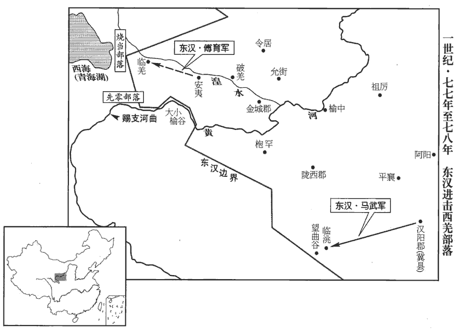
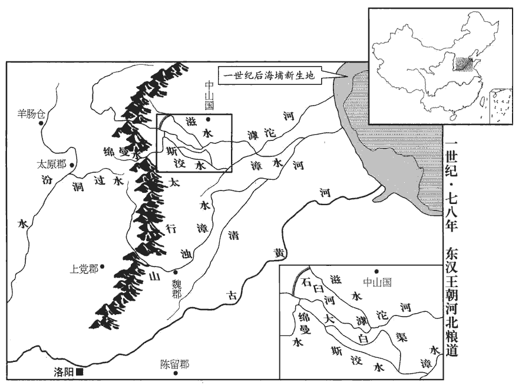

 漢紀三十八起柔兆困敦（丙子），盡閼逢涒tūn灘（甲申），凡九年。

# 肅宗孝章皇帝上諱炟dá，顯宗第五子，母賈貴人，以馬后母養為嫡，即位。諡法：溫克令儀曰章。伏侯古今註：「炟」之字曰「著」。

## 建初元年（丙子，七六）

1春，正月，詔兗‹山東西›、豫‹河南›、徐‹江蘇北›三州稟贍飢民。上問司徒鮑昱yù：「何以消復旱災？」消復者，消去災異而復其常。對曰：「陛下始踐天位，雖有失得，未能致異。臣前為汝南‹河南汝南›太守，典治楚事，賢曰：永平十三年，楚王英謀反，連坐者在汝南，昱時主劾之也。治，直之翻。繫者千餘人，恐未能盡當其罪。夫大獄一起，冤者過半。又，諸徙者骨肉離分，孤魂不祀。宜一切還諸徙家，蠲juān除禁錮，使死生獲所，則和氣可致。」帝‹刘炟，时年十九›納其言。

〖译文〗 [1]春季，正月，章帝下诏，命令兖州、豫州、徐州等三州官府开仓赈济饥饿的难民。章帝问司徒鲍昱：“怎样消除旱灾？”鲍昱答道：“陛下刚即位，即使有失当之处，也不会导致灾异出现。我先前曾任汝南太守，负责审理楚王之案，在当地拘禁了一千多人，这些囚犯恐怕不是全都有罪。大案一发，被冤枉者往往超过半数。此外，由于被流放的人和亲属分离，死后的孤魂得不到祭祀。我建议，让流放者全都返回家乡，除去不准作官的禁令，使死者生者各得其所，这样便可召致祥和之气，消除旱象。”章帝采纳了他的建议。

校書郎楊終上疏曰：「間者北征匈奴，西開三十六國，百姓頻年服役，轉輸煩費；愁困之民足以感動天地，陛下宜留念省察！」漢蘭臺，藏書之室也；當時文學之士，使讎校於其中，故有校書之職，劉向、揚雄輩是也。東都於蘭臺置令史，典校秘書，以郎居其任者，謂之校書郎。終徵詣蘭臺，拜校書郎。省，悉景翻。帝下其章，下，遐稼翻。第五倫亦同終議。牟融、鮑昱皆以為：「孝子無改父之道，引論語孔子之言。征伐匈奴，屯戍西域，先帝所建，不宜回異。」終復上疏曰：「秦築長城，功役繁興；胡亥不革，卒亡四海。事見秦紀。復，扶又翻。卒，子恤翻。故孝元棄珠厓‹海南島瓊山›之郡，事見二十八卷元帝初元二年。光武絕西域之國，事見四十三卷光武建武二十二年。不以介鱗易我衣裳。賢曰：介鱗，喻遠夷，其人與魚鱉無異也。衣裳，謂中國也。揚雄法言曰：珠厓之絕，捐之之力也；否則介鱗易我衣裳。魯文公毀泉臺，春秋譏之曰：『先祖為之而己毀之，不如勿居而已，』以其無妨害於民也；襄公作三軍，昭公舍之，君子大其復古，以為不舍則有害於民也。舍，讀曰捨。今伊吾‹新疆哈密›之役，樓蘭‹即鄯善，新疆若羌›之屯兵竇固等取伊吾，見上卷永平十六年。樓蘭，即鄯善，此兵蓋謂班超所將吏士也。久而未還，非天意也。」帝從之。

〖译文〗 校书郎杨终上书说：“近年在北方讨伐匈奴，在西方开通三十六国，致使百姓连年服事徭役，转运繁巨而费用浩大。忧愁苦难的人民足以感动天地，陛下应当留意省察！”章帝将杨终的奏书下交群臣讨论。第五伦也同杨终的意见一致，而牟融、鲍昱都认为：“孝顺之子不改父亲的主张。讨伐匈奴、屯驻西域，都是先帝的决策，不应有所变化。”杨终再度上书说：“秦始皇修长城，工程浩大，徭役频征，胡亥不改前代政策，终于失去了天下。因此，孝元皇帝放弃了珠崖郡，光武皇帝拒绝了西域各国的归附，不能让鱼鳖去掉鳞甲，而穿上我们的衣服。春秋时，鲁文公拆毁了泉台，《春秋》讥讽道：‘先祖造台而子孙自毁台，还不如只留着它不去居住。’这是由于泉台的存在不会妨害人民。鲁襄公曾建立三军，而被鲁昭公裁撤，君子却赞扬他的复古举动，认为不裁撤便会妨害人民。如今在伊吾屯田和在楼兰驻防的士卒久不还乡，这不合上天之意。”章帝接受了他的意见。

2丙寅‹二十三›，詔：「二千石勉勸農桑；罪非殊死，須秋案驗。有司明慎選舉，進柔良，退貪猾，順時令，理冤獄。」是時承永平故事，吏政尚嚴切，尚書決事，率近於重。近，其靳翻。尚書沛國‹安徽淮北›陳寵以帝新即位，宜改前世苛俗，乃上疏曰：「臣聞先王之政，賞不僭，刑不濫；與其不得已，寧僭無濫。左傳蔡大夫聲子之言。往者斷獄嚴明，斷，丁亂翻；下同。所以威懲姦慝；姦慝既平，必宜濟之以寬。陛下即位，率由此義，數詔群僚，弘崇晏晏，賢曰：晏晏，溫和也。尚書考靈耀曰：堯聰明文塞晏晏。數，所角翻。而有司未悉奉承，猶尚深刻；斷獄者急於篣格酷烈之痛，賢曰：篣péng，即榜也，古字通用。聲類曰：笞也。說文曰：格，擊也。執憲者煩於詆欺放濫之文，或因公行私，逞縱威福。夫為政猶張琴瑟，大絃急者小絃絕。賢曰：新序，臧孫，魯大夫，行猛政。子貢非之曰：夫政猶張琴瑟也，大絃急則小絃絕矣，故曰：罰得則姦邪止，賞得則下歡悅。陛下宜隆先王之道，蕩滌煩苛之法，輕薄箠楚以濟群生，箠，止橤翻。全廣至德以奉天心！」帝深納寵言，每事務於寬厚。

〖译文〗 [2]正月丙寅（二十三日），章帝下诏：“二千石官员应大力劝勉百姓从事农耕和桑蚕之业，除非犯有该当斩首之罪，一切案件都等到秋后审理。各部门要审慎地任命官吏，提拔温和良善之士，排除贪婪奸滑的小人，顺应天时节令，清理冤案。”当时沿袭明帝旧制，官吏政风崇尚严苛，尚书所作裁决，大多从重。尚书沛国人陈宠认为，章帝新近即位，应当改革前代的这种严苛风气，便上书道：“我听说古代贤君为政，奖赏不过度，刑罚不滥施。在不得已时，宁可过度奖赏，也不滥施刑罚。以往官员判案严厉，因此能够以威力惩治奸恶；而在奸恶清除以后，就必应以宽厚相补。陛下即位以来，多根据这个宗旨行事，屡次诏告群臣，劝勉温和之政。然而有关官员未能完全顺承圣上的旨意，仍然追求苛刻。审案官急于采取严刑拷打的残酷手段，执法者则纠缠于肆意诬陷的文书，或假公济私，作威作福。执政就象琴瑟上弦，如果大弦太紧，小弦就会崩断。陛下应当发扬古代贤君的治国之道，清除那些繁琐苛刻的法令，减轻苦刑以拯救生命，全面推行德政以顺奉天心！”章帝将他的意见全部采纳，在处理政务时总是依据宽厚的原则。

3酒泉太守段彭等兵會柳中‹新疆鄯善西南鲁克沁城›，擊車師，攻交河城‹吐魯番›，賢曰：前書，車師前王居交河城，河水分流繞城下，故號交河，去長安八千一百里，故城在今西州交河縣。斬首三千八百級，獲生口三千餘人。北匈奴驚走，車師復降。復，扶又翻。會關寵已歿，謁者王蒙等欲引兵還；耿恭軍吏范羌，時在軍中，先是，恭遣羌至敦煌迎兵士寒服，因隨王蒙軍出塞。固請迎恭。諸將不敢前，乃分兵二千人與羌，從山北迎恭，遇大雪丈餘，軍僅能至。城中夜聞兵馬聲，以為虜來，大驚。羌遙呼曰：呼，火故翻。「我范羌也，漢遣軍迎校尉耳。」校，戶教翻。城中皆稱萬歲。開門，共相持涕泣。明日，遂相隨俱歸。虜兵追之，且戰且行，吏士素飢困。發疏勒時，尚有二十六人，隨路死沒，三月至玉門‹甘肅敦煌西北›，賢曰：玉門，關名，屬敦煌郡，在今沙州。臣賢案：酒泉郡又有玉門縣，據東觀記，曰至敦煌，明即玉門關也。唯餘十三人，衣屨jù穿決，形容枯槁。中郎將鄭眾為恭以下洗沐，易衣冠，眾先以軍司馬與馬廖擊車師，至敦煌，拜為中郎將。為，於偽翻。上疏奏：「恭以單兵守孤城，當匈奴數萬之眾，連月踰年，心力困盡，鑿山為井，煮弩為糧，前後殺傷醜虜數百千計，卒全忠勇，卒，子恤翻。不為大漢恥，宜蒙顯爵，以厲將帥。」將，即亮翻。帥，所類翻。恭至雒陽，拜騎都尉。詔悉罷戊、己校尉及都護官，二官明帝永平十七年置。徵還班超。

〖译文〗 [3]酒泉郡太守段彭等人率军在柳中集结，进击车师，攻打交河城，斩杀三千八百人，俘虏三千余人。北匈奴惊慌而逃，车师再度投降。这时，关宠已经去世，谒者王蒙等人打算引兵东归。耿恭的一位军吏范羌当时正在王蒙军中，他坚持要求去救耿恭。将领们不敢前往，便分出两千救兵交给范羌。范羌经由山北之路去接耿恭，途中曾遇到一丈多深的积雪。援军精疲力尽，仅能勉强到达。耿恭等人夜间在城中听到兵马之声，以为匈奴来了援军，大为震惊。范羌从远处喊道：“我是范羌，汉朝派部队迎接校尉来了！”城中的人齐呼万岁。于是打开城门，大家互相拥抱，痛哭流涕。次日，他们便同救兵一道返回。北匈奴派兵追击，汉军边战边走。官兵饥饿已久，从疏勒城出发时，还有二十六人，沿途不断死亡，到三月抵达玉门时，只剩下了十三人。这十三人衣衫褴褛，鞋履洞穿，面容憔悴，形销骨立。中郎将郑众为耿恭及其部下安排洗浴，更换衣帽，并上书说：“耿恭以微弱的兵力固守孤城，抵抗匈奴数万大军，经年累月，耗尽了全部心力，凿山打井，煮食弓弩，先后杀伤敌人数以千计，忠勇俱全，没有使汉朝蒙羞。应当赐给他荣耀的官爵，以激励将帅。”耿恭到达洛阳后，被任命为骑都尉。章帝下诏，将戊校尉、己校尉和西域都护一并撤销，召班超回国。

超將發還，疏勒‹新疆喀什›舉國憂恐；其都尉黎弇yǎn曰：「漢使棄我，使，疏吏翻；下同。我必復為龜茲‹新疆庫車›所滅耳，誠不忍見漢使去。」因以刀自剄。前書，疏勒國官有疏勒侯，擊胡侯，輔國侯，都尉。復，扶又翻；下同。龜茲，音丘慈。超還至于窴‹新疆和田›，王侯以下皆號泣，窴，徒賢翻。號，戶刀翻。曰：「依漢使如父母，誠不可去！」使，疏吏翻。互抱超馬腳不得行。超亦欲遂其本志，乃更還疏勒‹新疆喀什›。疏勒兩城已降龜茲‹新疆庫車›，而與尉頭連兵。前書，尉頭國居尉頭谷，去長安八千六百五十里，南與疏勒接。超捕斬反者，擊破尉頭，殺六百餘人，疏勒復安。

〖译文〗 班超将要运身返回，疏勒全国一片忧虑恐慌。疏勒都尉黎说：“汉朝使者抛弃我们，疏勒必定再次被龟兹毁灭，我真不忍见汉朝使者离去！”于是拔刀刎颈自杀。班超在归途中经过于阗，于阗王和贵族群臣全都号啕痛哭，说道：“我们依赖汉朝使者，犹如依赖父母，您确实不能走啊！”他们抱住班超的马腿，使他不能前进。班超也想实现自己本来的志愿，于是重新返回疏勒。这时疏勒已有两城投降了龟兹，并与尉头国结盟。班超逮捕斩杀了叛变者，打败尉头国，杀死六百余人。疏勒再度恢复安定。

4甲寅‹十二›，山陽‹山東金鄉西北昌邑镇›、東平‹山東東平东南›地震。

〖译文〗 [4]三月甲寅（十二日），山阳、东平两地发生地震。

5東平王蒼上便宜三事。上，時掌翻。帝報書曰：「間吏民奏事亦有此言；但明智淺短，或謂儻tǎng是，復慮為非，不知所定。得王深策，恢然意解；恢然，猶廓然也。思惟嘉謀，以次奉行。特賜王錢五百萬。」後帝欲為原陵、顯節陵起縣邑，為，於偽翻。蒼上疏諫曰：「竊見光武皇帝躬履儉約之行，深覩始終之分，行，下孟翻。分，扶問翻。勤勤懇懇，以葬制為言；事見四十四卷光武建武二十六年。孝明皇帝大孝無違，承奉遵行；事見上卷明帝永平十四年。謙德之美，於斯為盛。臣愚以園邑之興，始自強秦。秦始皇葬于驪山，徙三萬家，起驪邑；西漢因之，諸陵皆起陵邑，至元帝乃止。古者丘隴且不欲其著明，賢曰：禮記曰：古者墓而不墳，故言不欲其著明。豈況築郭邑、建都郛fú哉！穀梁傳曰：人之所聚曰都。杜預註左傳曰：郛，郭也。上違先帝聖心，下造無益之功，虛費國用，動搖百姓，非所以致和氣、祈豐年也。陛下履有虞之至性，虞舜孝於親，故以為言。追祖禰mí之深思，臣蒼誠傷二帝純德之美不暢於無窮也！」帝乃止。自是朝廷每有疑政，輒驛使諮問，使，疏吏翻。蒼悉心以對，皆見納用。

〖译文〗 [5]东平王刘苍上书提出三项建议，章帝下诏答复说：“最近在官员和百姓的奏书中也有此类建议，但我见识才智浅薄，有时认为或许可行，后来又认为不可行，不知如何裁定。读到您深思熟虑写就的奏书，我心豁然开朗。我思考您的治国良策，依次实行。特别赏赐给您五百万钱。”后来，章帝打算在光武帝的原陵和明帝的显节陵两地设县，刘苍上书劝谏说：“我曾见光武皇帝亲身履行节俭的原则，他深明什么是生命之始与生命之终，恳切地指示丧葬后事。孝明皇帝大孝而不敢有所违背，遵从执行了父命。自谦的美德，这是最为盛大的了。我认为，在皇陵设邑这一制度的出现，始于强暴的秦朝。古代有墓无坟，连葬身的土垅都不要它显著突出地面，何况建立城市、修筑墙垣！上违先c帝的圣意，下造无用的工程，白白浪费国家资财，使百姓不得安宁，这不是招致祥和之气、祈求丰年的作法。望陛下履行虞舜的至孝，追念先人的深意。我实在担忧两位先帝的纯洁美德不能够永久流传！”章帝这才作罢。从此，每当朝廷遇到疑难，就派使者乘坐驿车前往咨询，刘苍则尽心答复。他的意见，全都被采纳实施。

6秋，八月，庚寅‹二十›，有星孛於天市。晉天文志：參十星，一曰天市；又危三星，亦為天市。又天市垣二十二星在房、心東北。史記曰：房為天駟；東北十二星曰旗，中四星曰天市。孛，蒲內翻。

〖译文〗 [6]秋季，八月庚寅（二十日），天市星座出现异星。

7初，益州‹云南晋宁东晋城镇›西部都尉廣漢‹四川梓潼›鄭純，為政清潔，化行夷貊，君長感慕，皆奉珍內附；貊，莫百翻。長，知兩翻。明帝為之置永昌郡‹云南保山›，明帝永平十年，置益州西部都尉，居巂唐，領不韋、巂唐、比蘇、楪yè榆、邪龍、雲南六縣。十二年，哀牢內屬，置哀牢、博南二縣，合為永昌郡。為，於偽翻。以純為太守。純在官十年而卒。守，式又翻。卒，子恤翻。後人不能撫循夷人，九月，哀牢‹云南南部›王類牢殺守令反，攻博南‹云南永平›。

〖译文〗 [7]先前，益州西部都尉、广汉人郑纯为政清廉，教化夷人貊人。夷人貊人首领对他十分敬慕，全都献上珍宝，归附汉朝。明帝在当地设立了永昌郡，任命郑纯为太守。郑纯在任十年去世。后任太守不能安抚夷人，到本年九月，哀牢王类牢杀死郡县长官反叛，进攻博南。

8阜陵‹府阜陵，安徽全椒东南›王延數懷怨望，數，所角翻。有告延與子男魴造逆謀者；魴，音房。上不忍誅，冬十一月，貶延為阜陵侯，食一縣，不得與吏民通。延徙王阜陵事見上卷明帝永平十六年。

〖译文〗 [8]阜陵王刘延屡屡心怀不满，有人告发他与儿子刘鲂密谋造反。章帝不忍将刘延处死，冬季十一月，将他贬为阜陵侯，只享有一个县的封地，不许他与官员人民来往。

9北匈奴皋林溫禺犢王將眾還居涿邪山‹蒙古巴彦温都尔山›，南單于‹王庭设美稷，内蒙准格尔旗›與邊郡及烏桓共擊破之。皋林溫禺犢王本居涿邪山，永平十六年，祭肜等北伐，將眾遁去，今復還。是歲，南部次【章：甲十六行本「次」作「大」；乙十一行本同；孔本同；熊校同。】饑，詔稟給之。

〖译文〗 [9]北匈奴皋林温禺犊王率领部众返回涿邪山居住。南匈奴单于和汉朝边境郡兵及乌桓部落一同出击，将北匈奴打败。本年，南匈奴发生饥荒，章帝下诏为南匈奴供应粮食。

## 二年（丁丑，七七）

1春，三月，甲辰‹八›，罷伊吾盧‹新疆哈密›屯兵，匈奴復遣兵守其地。伊吾盧置屯兵事見上卷永平十六年。復，扶又翻。

〖译文〗 [1]春季，三月甲辰（初八），撤销在西域伊吾卢的屯田部队。于是北匈奴再度派兵占领该地。

2永昌‹云南保山›、越巂suǐ‹四川西昌›、益州‹云南晉寧东晋城镇›三郡兵及昆明夷鹵承等擊哀牢王類牢於博南，大破，斬之。巂，音髓。

〖译文〗 [2]永昌、越、益州三郡郡兵及昆明夷人卤承等在博南进攻哀牢王类牢，大败哀牢军，斩杀类牢。

3夏，四月，戊子‹二十二›，詔還坐楚、淮陽事徙者四百餘家。楚獄見上卷明帝永平十四年。淮陽獄，即阜陵王延徙封時也。

〖译文〗 [3]夏季，四月戊子（二十二日），章帝下诏，准许因楚王之案、淮阳王之案而被流放的四百余户返回故乡。

4上欲封爵諸舅，太后不聽。會大旱，言事者以為不封外戚之故，有司請依舊典。賢曰：漢制，外戚以恩澤封侯，故曰舊典。太后詔曰：「凡言事者，皆欲媚朕以要福耳。要，一遙翻。昔王氏五侯同日俱封，黃霧四塞，事見三十卷成帝建始元年。塞，悉則翻。不聞澍雨之應。澍zhù，音注。夫外戚貴盛，鮮不傾覆；鮮，息淺翻。故先帝防慎舅氏，不令在樞機之位，又言『我子不當與先帝子等』，事見上卷永平十五年。今有司柰何欲以馬氏比陰氏乎！且陰衛尉，天下稱之，省中御者至門，出不及履，此蘧qú伯玉之敬也；衛尉，興也。省中，禁中也。御者，內人也。蘧伯玉，衛賢大夫。蘧，求於翻。新陽侯雖剛強，微失理，然有方略，據地談論，一朝無雙；新陽侯，就也。賢曰：新陽縣屬汝南郡，故城在今豫州真陽縣西南。原鹿貞侯，勇猛誠信；原鹿侯，識也。原鹿縣，屬汝南郡。此三人者，天下選臣，豈可及哉！馬氏不及陰氏遠矣。吾不才，夙夜累息，息，氣一出入之頃；屏氣者累息乃一舒氣。常恐虧先后之法，有毛髮之罪吾不釋，言之不捨晝夜而親屬犯之不止，治喪起墳，又不時覺，治，直之翻。是吾言之不立而耳目之塞也。塞，悉則翻。

〖译文〗 [4]章帝打算赐封各位舅父，但马太后不同意。适逢天旱，有人上书说是因为未封外戚的缘故，于是有关部门奏请依照旧制赐封。马太后下诏说：“那些上书建议封外戚的人，都是要向朕献媚，以谋求好处罢了。从前，王氏家族一日之内有五人一起封侯，而当时黄雾弥漫，并未听说有天降好雨的反应。外戚富贵过盛，很少不倾覆的。所以先帝对他的舅父慎重安排，不放在朝廷要位，还说：‘我的儿子不应与先帝的儿子等同。’如今有关部门为什么要将马家同阴家相比呢！况且卫尉阴兴，受到天下人的称赞，宫中的使者来到门前，他连鞋都来不及穿，便急忙出迎，如同蘧伯玉一样恭敬有礼；新阳侯阴就，虽然性格刚强，略失规矩，然而胸有谋略，以手撑地，坐着发表议论，朝中无人能与他相比；原鹿贞侯阴识，勇敢忠诚而有信义。这三个人都是天下群臣中的出类拔萃者，难道能比得上吗！马家比阴家差远了。我没有才干，日夜因恐惧而喘息不安，总怕有损先后订立的法则。即便是细小的过失，我也不肯放过，日夜不停地告诫。然而我的亲属们仍然不断犯法，丧葬时兴筑高坟，又不能及时察觉错误，这表明我的话没有人听，我的耳目已被蒙蔽。

吾為天下母，而身服大練，賢曰：大練，大帛也。杜預註左傳曰：大帛，厚繒也。食不求甘，左右但著帛布，無香薰之飾者，欲身率下也。著，側略翻。以為外親見之，當傷心自敕；但笑言『太后素好儉』。好，呼到翻。前過濯zhuó龍‹洛阳西北角›續漢志：濯龍，園名，近北宮。門上，見外家問起居者，車如流水，馬如遊龍，倉頭衣綠褠gōu，領袖正白，賢曰：褠，臂衣。今之臂鞲，以縛左右手，於事便也。余據字書，臂鞲之鞲從革，此褠從衣，釋單衣也，皆音古侯翻。領袖正白，言其新潔無垢汙也。衣，於既翻。顧視御者，不及遠矣。故不加譴怒，但絕歲用而已，冀以默愧其心；猶懈怠無憂國忘家之慮。懈，古隘翻。知臣莫若君，況親屬乎！吾豈可上負先帝之旨，下虧先人之德，重襲西京敗亡之禍哉！」賢曰：西京外戚，呂祿、呂產，竇嬰，上官桀、安父子，霍禹等皆被誅。重，直龍翻。固不許。

〖译文〗 “我身为天下之母，然而身穿粗丝之服，饮食不求香甜，左右随从之人只穿普通帛布，不使用熏香饰物，目的就是要亲身做下面的表率。本以为娘家人看到我的行为当会痛心自责，但他们只是笑着说‘太后一向喜爱节俭’。前些时候，我经过濯龙门，看见那些到我娘家问候拜访的人们，车辆如流水不断，马队如游龙蜿蜒，奴仆身穿绿色单衣，衣领衣袖雪白。回视我的车夫，差得远了。我所以对娘家人并不发怒谴责，而只是裁减每年的费用，是希望能使他们内心暗愧。然而他们仍然懈怠放任，没有忧国忘家的觉悟。了解臣子的，莫过于君王，更何况他们是我的亲属呢！我难道可以上负先帝的旨意，下损先人的德行，重蹈前朝外戚败亡的灾祸吗！”她坚持不同意赐封。

帝省詔悲嘆，復重請曰：省，悉景翻。復，扶又翻。重，直用翻。「漢興，舅氏之封侯，猶皇子之為王也。太后誠存謙虛，柰何令臣獨不加恩三舅乎！且衛尉年尊，兩校尉有大病，衛尉，太后兄廖；兩校尉，兄防、兄光也。校，戶教翻。如令不諱，使臣長抱刻骨之恨。宜及吉時，不可稽留。」漢封爵群臣皆涓吉。太后報曰：「吾反覆念之，思令兩善，兩善，謂國家無濫恩，而外戚亦以安全也。豈徒欲獲謙讓之名而使帝受不外施之嫌哉！以恩澤封爵外家為外施也。施，式智翻。昔竇太后欲封王皇后之兄，丞相條侯言：『高祖約，無軍功不侯。』事見十六卷景帝中三年。今馬氏無功於國，豈得與陰、郭中興之后等邪！常觀富貴之家，祿位重疊，猶再實之木，其根必傷。文子曰：再實之木根必傷，掘臧之家後必殃。重，直龍翻。且人所以願封侯者，欲上奉祭祀，下求溫飽耳；今祭祀則受太官之賜，衣食則蒙御府餘資，自西都以來，皇后家祀其父母，太官供具。御府令，掌中衣服及補澣huàn之屬；飲食則太官主之。此言衣食皆資於御府，概言之也。斯豈不可足，而必當得一縣乎！吾計之孰矣，古字孰熟通。勿有疑也！

〖译文〗 章帝看到马太后的诏书后悲哀叹息，再次请求道：“自从汉朝建立，舅父封侯，犹如皇子为王，乃是定制。太后固然存心谦让，却为何偏偏使我不能赐恩给三位舅父！而且卫尉马廖年老，城门校尉马防、越骑校尉马光身患大病，如果发生意外，将使我永怀刻骨之憾。应当趁着吉时赐封，不可延迟。”太后回答说：“我反复考虑此事，希望能对国家和马氏双方有益，难道只是想博取谦让的名声，而让皇帝蒙受不施恩于外戚的怨恨吗？从前窦太后要封王皇后的哥哥，丞相条侯周亚夫进言：‘高祖有规定，无军功者不得封侯。’如今马家没有为国立功，怎能与阴家、郭家那些建武中兴时期的皇后家相等呢！我曾观察那些富贵之家，官位爵位重迭，如同一年之中再次结果的树木，它的根基必受损伤。况且人们所以愿封为侯，不过是希望上能以丰足的供物祭祀祖先，下能求得衣食的温饱罢了。如今皇后家的祭祀由太官供给，衣食则享受御府的剩余之物，这难道还不够，而定要拥有一县的封土吗？我已深思熟虑，你不要再有疑问！

夫至孝之行，安親為上。揚子曰：孝莫大於寧親，寧親莫大於四表之驩心。行，下孟翻。今數遭變異，數，所角翻。穀價數倍，憂惶晝夜，不安坐臥，而欲先營外家之封，違慈母之拳拳乎！賢曰：拳拳，猶勤勤也，音權。吾素剛急，有匈中氣，不可不順也。匈中氣，今所謂上氣之疾。匈，與胸同。子之未冠，由於父母，已冠成人，則行子之志。冠，古玩翻。念帝，人君也；吾以未踰三年之故，自吾家族，故得專之。若陰陽調和，邊境清靜，然後行子之志；吾但當含飴弄孫，方言曰：飴，餳也，宋、衛之間通語。不能復關政矣。」關，豫政也。復，扶又翻。上乃止。

〖译文〗 “儿女孝顺，最好的行为是使父母平安。如今不断发生灾异，谷价上涨数倍，我日夜忧愁惶恐，坐卧不安，而皇帝却打算先为外戚赐封，违背慈母的拳拳之心！我平素刚强性急，胸有气痛之症，不可以不顺气。儿子未成年，听从父母的教导，成年以后，则按照自己的意愿行事。我想，你是皇帝，人之君主，当然可以自行其是。但我因你尚未超过三年的服丧期，又事关我的家族，故此专断裁决。如果天地阴阳之气调和，边境宁静无事，此后你便可以按照自己的意愿行事，而我则只管含糖逗弄小孙，不再干预政事。”章帝这才放弃了这一打算。

太后嘗詔三輔：諸馬婚親有屬託郡縣、干亂吏治者，以法聞。繩之以法而奏聞也。屬，之欲翻。治，直吏翻。太夫人葬起墳微高，太夫人，太后母也。漢列侯墳高四丈，關內侯以下至庶人有差。太后以為言，兄衛尉廖等即時減削。其外親有謙素義行者，行，下孟翻。輒假借溫言，賞以財位；如有纖介，則先見嚴恪kè之色，見，賢遍翻。然後加譴。其美車服、不遵法度者，便絕屬籍，遣歸田里。絕外戚之屬籍也。廣平、钜鹿、樂成王，車騎樸素，無金銀之飾，廣平王羨，钜鹿王恭，樂成王黨，皆明帝子。帝以白太后，即賜錢各五百萬。於是內外從化，被服如一；被，皮義翻。諸家惶恐，倍於永平時。置織室，蠶於濯龍中，續漢志：濯龍監，屬鉤gōu盾令。本註曰：濯龍，亦園名，近北宮。數往觀視，以為娛樂。數，所角翻。樂，音洛。常與帝旦夕言道政事及教授小王論語經書，小王，諸王年尚幼，未就國者。述敘平生，雍和終日。

〖译文〗 太后曾对三辅下诏：“马氏家族及其亲戚，如有因请托郡县官府，干预扰乱地方行政的，应依法处置、上报。”马太后的母亲下葬时堆坟稍高，马太后对此提出反对意见，她的哥哥卫尉马廖等人就立即将坟减低。在马家亲属和亲戚中，有行为谦恭正直的，马太后便以温言好语相待，赏赐财物和官位。如果有人犯了微小的错误，马太后便首先显出严肃的神色，然后加以谴责。对于那些车马衣服华美、不遵守法律制度的家属和亲戚，马太后就将他们从皇亲名册中取消，遣送回乡。广平王刘羡、钜鹿王刘恭和乐成王刘党，车马朴素无华，没有金银饰物。章帝将此情况报告了太后，太后便立即赏赐他们每人五百万钱。于是内外亲属全都接受太后的教导和影响，一致崇尚谦逊朴素。外戚家族惶恐不安，超过了明帝时期。马太后曾设立织室，在濯龙园中种桑养蚕，并频频前往查看，把这当成一项娱乐。她经常与章帝早晚在一起谈论国家大事，教授年幼的皇子读《论语》等儒家经书，讲述平生经历，终日和睦欢洽。

馬廖慮美業難終，上疏勸成德政曰：「昔元帝罷服官，事見二十八卷初元五年。成帝御浣衣，言服浣濯之衣也。哀帝去樂府，事見三十三卷綏和二年。去，羌呂翻。然而侈費不息，至於衰亂者，百姓從行不從言也。書曰：違上所命，從厥攸好。行，下孟翻。夫改政移風，必有其本。傳曰：『吳王好劍客，百姓多創瘢；傳，直戀翻。創，初良翻。瘢，蒲官翻，痕也。好劍客，蓋指吳王闔閭也。楚王好細腰，宮中多餓死。』墨子曰：楚靈王好細腰，而國多餓人。長安語曰：賢曰：當時諺語。『城中好高結，四方高一尺；結，讀曰髻。城中好廣眉，四方且半額；城中好大袖，四方全匹帛。』斯言如戲，有切事實。前下制度未幾，後稍不行；未幾，言未幾時也。幾，居豈翻。雖或吏不奉法，良由慢起京師。今陛下素簡所安，發自聖性，賢曰：言儉素簡約，后之所安。誠令斯事一竟，竟，猶終也。則四海誦德，聲薰天地，賢曰：薰，猶蒸也，言芳聲薰天地也。神明可通，況於行令乎！」太后深納之。

〖译文〗 马廖担心马太后倡导的美好的事情难以持久，上书劝太后完成德政。他说：“从前元帝取消服官，成帝穿用洗过的衣袍，哀帝撤除乐府，然而奢侈之风不息，最终导致衰落而发生动乱的原因，就在于百姓跟随朝廷所行，而不听信朝廷所言。改变政风民风，一定要从根本着手。经传说：‘吴王好剑客，百姓多伤疤；楚王好细腰，宫中多饿死。’长安有谚语说：‘城中喜爱高发髻，乡下的发髻高一尺；城中喜爱宽眉毛，乡下的眉毛半前额；城中喜爱大衣袖，乡下的衣袖用了整匹帛。’这些话有如戏言，但切近事实。前些时候，朝廷颁布制度后没有多久，便有些推行不下去了，虽然这或许是由于官吏不遵奉法令，但实际上是由于京城率先怠慢。如今陛下安于俭朴的生活，是出自神圣的天性，假如能将此坚持到底，那么天下人都要称诵道德，美好的名声将传遍天地，同神灵都可以相通，何况是推行法令呢！”太后认为他的话很正确，全部采纳。

 

5初，安夷‹青海平安›縣吏略妻卑湳nǎn種羌人婦，安夷縣屬金城郡。杜預曰：不以道取曰略。湳，乃感翻。種，章勇翻；下同。吏為其夫所殺，安夷長宗延追之出塞。長，知兩翻。種人恐見誅，遂共殺延而與勒姐、吾良二種相結為寇。勒姐羌居勒姐溪，因以為種名。於是燒當‹青海湟中一带›羌豪滇吾之子迷吾率諸種俱反，姐，子也翻，又音紫。滇，音顛。敗金城‹甘肅永靖西北›太守郝崇。敗，補邁翻。郝，呼各翻；姓譜：殷帝乙有子期，封太原郝鄉，後因氏焉。詔以武威‹甘肅武威›太守北地‹寧夏吴忠西南金积镇›傅育為護羌校尉，自安夷‹青海西寧東›徙居臨羌‹青海湟源›。臨羌縣，屬金城郡。杜佑曰：臨羌在今西平郡。水經註：湟水東合安夷川水，又東逕安夷縣，故城在漢西平亭東七十里。湟水又東合勒姐溪水。迷吾又與封養種豪布橋等五萬餘人共寇隴西‹甘肅臨洮›、漢陽‹甘肅甘谷›。本天水郡，明帝永平十七年，改名漢陽。秋，八月，遣行車騎將軍馬防、長水校尉耿恭將北軍五校兵武帝置北軍八校，中壘、屯騎、越騎、長水、胡騎、射聲、步兵、虎賁也；中興，省中壘、胡騎、虎賁，惟越騎、屯騎、步兵、長水、射聲五校。屯騎、越騎、步兵、射聲各領士七百人，長水領烏桓胡騎七百三十六人，皆宿衛兵也。及諸郡射士三萬人擊之。馬防傳云：積射士。第五倫上疏曰：「臣愚以為貴戚可封侯以富之，不當任以職事。何者？繩以法則傷恩，私以親則違憲。伏聞馬防今當西征，臣以太后恩仁，陛下至孝，恐卒有纖介，難為意愛。」賢曰：恐卒然有小過，愛而不罰，則廢法也。卒，讀曰猝。帝不從。

〖译文〗 [5]起初，安夷县有官吏强抢羌人卑部落的妇女为妻，被那个妇女的丈夫杀死。安夷县长宗延追捕凶手，直至塞外。该部落的羌人害怕受到处罚，就一同杀掉宗延，而与勒姐、吾良两个部落联合，起兵叛变。在此形势下，烧当羌人部落首领滇吾的儿子迷吾便率领各部落一同造反，打败了金城太守郝崇。章帝下诏，任命武威太守北地人傅育为护羌校尉，由安夷迁往临羌。迷吾又和封养部落首领布桥等集结五万余人，一同进攻陇西、汉阳二郡。秋季，八月，章帝派代理车骑将军马防和长水校尉耿恭率领北军的越骑、屯骑、步兵、长水、射声等五校兵以及各郡的弓弩射手，共三万人，讨伐羌人。第五伦上书说：“我认为，对于皇亲国戚，可以封侯使他们富有，但不应当委派职务。这是为什么呢？因为他们若是有了过失，以法制裁就会伤害感情，以亲徇私就会违背国法。听说马防如今将要率军西征，我认为，太后恩德仁慈，皇上至为孝顺，如果突然有了小差错，怕将难以维护亲情。”章帝不采纳他的意见。

馬防等軍到冀‹甘肅甘谷›，布橋等圍南部都尉於臨洮‹甘肅岷縣›，前書，隴西南部都尉治臨洮。賢曰：即今岷、洮二州地。防進擊，破之，斬首虜四千餘人，遂解臨洮圍；其眾皆降，唯布橋等二萬餘人屯望曲谷‹甘肅岷縣西南›不下。酈道元註水經云：望曲在臨洮西南，去龍桑城二百里。

〖译文〗 马防等人的部队到达冀县时，布桥正率羌军在临洮围攻南部都尉。马防发动进攻，打败了布桥，斩杀、俘虏四千余人，于是临洮解围。羌军全部投降，只剩下布桥等二万余人，盘踞在望曲谷，未被攻克。

6十二月，戊寅‹十六›，有星孛於紫宮。晉天文志：中宮，北極五星，鉤陳六星，皆在紫宮中。紫宮垣yuán十五星，其西蕃七，東蕃八。孛，蒲內翻。

〖译文〗 [6]十二月戊寅（十六日），紫宫星座出现异星。

7帝納竇勳女為貴人，有寵。為後諸竇竊權張本。貴人母，即東海恭王女沘bǐ陽公主也。沘，音比。

〖译文〗 [7]章帝将窦勋的女儿选为贵人，十分宠幸。窦贵人的母亲，就是东海恭王刘强的女儿阳公主。

8第五倫上疏曰：「光武承王莽之餘，頗以嚴猛為政，後代因之，遂成風化；郡國所舉，類多辦職俗吏，殊未有寬博之選以應上求者也。陳留令劉豫，冠軍‹河南鄧州西北冠军寨›令駟協，陳留縣，屬陳留郡。冠軍縣，屬南陽郡。冠，古玩翻。并以刻薄之姿，務為嚴苦，吏民愁怨，莫不疾之。而今之議者反以為能，違天心，失經義；非徒應坐豫、協，亦宜譴舉者。務進仁賢以任時政，不過數人，則風俗自化矣。臣嘗讀書記，知秦以酷急亡國，又目見王莽亦以苛法自滅，故勤勤懇懇，實在於此。又聞諸王、主、貴戚，驕奢踰制，京師尚然，何以示遠！故曰：『其身不正，雖令不行，』論語孔子之言。以身教者從，以言教者訟。」上善之。倫雖天性峭直，賢曰：峭，峻也，音七笑翻。然常疾俗吏苛刻，論議每依寬厚云。

〖译文〗 [8]第五伦上书说：“光武帝继承王莽以后的局面，为政多采用严厉手段，后代沿袭，便成为风气。各郡各封国所举荐的人，多属只会应付公务的庸官，绝少宽宏博学之才，以满足朝廷的需求。陈留县令刘豫和冠军县令驷协，全都作风刻薄，务求严苛，使官民忧伤哀怨，无不痛恨他们。然而如今的舆论，反而认为他们有能力，这是违反天意，背离经书的义理。不仅应对刘豫、驷协加以惩处，还应谴责那些保举他们的人。一定要提拔任用仁慈贤能者为政，不过几个人，而风气自会转化。我曾阅读史书，知道秦朝由于残酷暴虐而亡国，又亲眼看见王莽新朝也因法令苛刻而自行毁灭。我所以恳切地上书劝谏，原因就在于此。我还听说诸亲王、公主和外戚骄傲奢侈超过了规定，京城尚且这样，如何做外地的榜样！所以孔子说：‘自身不正，虽有令而不被执行。’以身为教，众人跟从；以言为教，众人争讼。”章帝对他的意见表示赞许。第五伦虽然天性严厉梗直，却常常痛恨庸俗官吏的苛刻。他的政论，总是以宽厚为其原则。

## 三年（戊寅，七八）

1春，正月，己酉‹十七›，宗祀明堂，登靈臺，赦天下。

〖译文〗 [1]春季，正月己酉（十七日），章帝在明堂祭祀列祖列宗。登上灵台，观察天象。大赦天下。

2馬防擊布橋，大破之，考異曰：帝紀，防破羌在四月。蓋春破而京師四月始聞也。今從防傳。布橋將種人萬餘降，詔徵防還。留耿恭擊諸未服者，斬首虜千餘人，勒姐、燒何等十三種數萬人，皆詣恭降。姐，音紫，又子也翻。種，章勇翻。恭嘗以言事忤馬防，初，恭出隴西，上言薦竇固鎮撫涼部，由是大忤於防。忤，五故翻。監營謁者承旨，奏恭不憂軍事，坐徵下獄，免官。監，古銜翻。下，遐稼翻。

〖译文〗 [2]马防进攻布桥，布桥大败，率领部众一万余人投降。章帝下诏，命令马防回朝。留下耿恭讨伐那些尚未归顺的部落，斩杀俘虏了一千余人。于是，勒姐、烧何等十三个部落共数万羌人，全部向耿恭投降。耿恭曾因上书奏事冒犯过马防，监军谒者便秉承马防的意思，弹劾耿恭不留意军事。耿恭因罪被召回，逮捕入狱，免去官职。

3三月，癸巳‹二›，立貴人竇氏為皇后。

〖译文〗 [3]三月癸巳（初二），将贵人窦氏立为皇后。

4初，顯宗‹刘庄›之世，治虖沱、石臼河‹流经河北灵寿西境›，從都慮至羊膓倉‹山西静乐›，賢曰：石臼河，在今定州唐縣東北。酈道元註水經云：汾陽故城積粟所在，謂之羊膓倉，在晉陽西北；石隥縈紆，若羊膓焉，故以為名。今嵐州界羊膓阪是也。唐嵐州宜芳縣，本漢汾陽縣，隋置嵐城縣，唐更名宜芳。杜佑曰：宜芳縣有古秀容城，漢羊膓倉。余考水經註云：案司馬彪郡國志，常山南行唐縣有石臼谷，蓋欲乘呼沱之水，轉山東之漕，自都慮至羊膓倉，憑汾水以漕太原。又考郡國志，常山蒲吾縣註引古今註曰：永平十年，作常山呼沱河蒲吾渠通漕船。又考班固地理志，太原郡上艾縣註曰：綿曼水東至蒲吾入呼沱水。又蒲吾縣註曰：大白渠水首受綿曼水，東南至下曲陽入斯洨xiáo。則知此漕自大白渠入綿曼水，自綿曼水轉入汾水以達羊膓倉也。慮，音閭，杜佑曰：石臼河，在定州唐昌縣。唐昌，漢苦陘xíng縣也。欲令通漕。太原吏民苦役，連年無成，死者不可勝算。勝，音升。帝以郎中鄧訓為謁者，監領其事。訓考量隱括，賢曰：隱審量括之也。孫卿子曰：鉤木必待隱括蒸揉，然後直也。監，古銜翻。量，音良。知其難成，具以上言。上，時掌翻。夏，四月，己巳‹九›，詔罷其役，更用驢輦，更，工衡翻。歲省費億萬計，全活徒士數千人。訓，禹之子也。

〖译文〗 [4]当初，明帝时曾经治理过滹沱河和石臼河，打算让都虑到羊肠仓两地通航，以运送漕粮。工程艰巨，太原的官吏和百姓苦于徭役，连年不能完工，死亡者不可胜数。章帝任命中郎将邓训为谒者，主持这一工程。邓训经过考察测量，明白此事难以完成，便将实情一一奏报。本年夏季，四月己巳（初九），章帝下诏，撤销该项工程，改用驴车运粮。停工以后，每年节省开支以亿万计，得以活命的役夫有数千人。邓训是邓禹之子。

 

5閏月，西域假司馬班超率疏勒、康居、于窴‹新疆和田›、拘彌‹新疆于田›兵一萬人攻姑墨石城‹姑墨首都，新疆温宿西北›，破之，前書，姑墨國治南城，去長安八千一百五十里。斬首七百級。

〖译文〗 [5]闰九月，西域副司马班超率领疏勒、康居、于阗、拘弥等国军队，共一万人，进攻姑墨国石城，将石城攻破，斩杀七百人。

6冬，十二月，丁酉‹十一›，以馬防為車騎將軍。

〖译文〗 [6]冬季，十二月丁酉（十一日），任命马防为车骑将军。

7武陵‹湖南常德›漊lóu中蠻反。【賢曰：漊，水名，源出今澧州崇義縣西北。余據溫公類篇，漊，郎侯翻。】

〖译文〗 [7]武陵郡中蛮人反叛。

是歲，有司奏遣廣平王羨‹府广平，河北曲周东北›、钜鹿王恭‹府瘿陶，河北宁晋西南›、樂成王黨‹府信都，河北冀县›俱就國；上性篤愛，不忍與諸王乖離，遂皆留京師‹洛阳›。

〖译文〗 [8]本年，有关部门上奏，请派遣广平王刘羡、钜鹿王刘恭、乐成王刘党一同前往他们的封国就位。章帝因手足情深，不忍心与诸亲王分离，便将他们全都留在京城。

## 四年（己卯，七九）

1春，二月，庚寅‹五›，太尉牟融薨。

〖译文〗 [1]春季，二月庚寅（初五），太尉牟融去世。

2夏，四月，戊子‹四›，立皇子慶為太子。

〖译文〗 [2]夏季，四月戊子（初四），将皇子刘庆立为太子。

3己丑‹五›，徙钜鹿王恭為江陵王，汝南王暢為梁王，常山王昞bǐng為淮陽王。

〖译文〗 [3]四月己丑（初五），章帝将钜鹿王刘恭改封为江陵王，汝南王刘畅改封为梁王，常山王刘改封为淮阳王。

4辛卯‹七›，封皇子伉kàng為千乘王，全為平春王。平春縣，屬江夏郡。伉，音抗。乘，繩證翻。

〖译文〗 [4]四月辛卯（初七），章帝将皇子刘伉封为千乘王，皇子刘全封为平春王。

5有司連據舊典，請封諸舅；帝‹刘炟，时年二十二›以天下豐稔rěn，方垂無事，癸卯‹十九›，遂封衛尉廖為順陽侯，順陽侯國，屬南陽郡。賢曰：故城在今鄧州穰縣西。車騎將軍防為潁陽侯，潁陽縣，屬潁川郡。執金吾光為許侯。許縣，屬潁川郡。太后聞之曰：「吾少壯時，但慕竹帛，志不顧命。賢曰：言慕古人書名竹帛，不顧命之長短。少，詩沼翻。今雖已老，猶戒之在得，論語：孔子曰：及其老也，戒之在得。故日夜惕厲，惕，懼也；厲，危也。思自降損，冀乘此道，不負先帝。所以化導兄弟，共同斯志，欲令瞑目之日，無所復恨，何意老志復不從哉！瞑，莫定翻。復，扶又翻。萬年之日長恨矣！」廖等并辭讓，願就關內侯，考異曰：皇后紀稱「廖等并辭讓，願就關內侯，太后聞之云云；廖等不得已受封爵。」按太后之辭，皆不欲封廖等之意，而史家文勢，反似太后欲令廖等受封。今輒移廖等辭讓於太后語下，使文勢有序，讀者易解。帝不許。廖等不得已受封爵而上書辭位，帝許之。五月，丙辰‹二›，防、廖、光皆以特進就第。

〖译文〗 [5]有关部门接连以旧制为依据，请章帝赐封各位舅父。章帝因全国丰收，四方边境太平无事，四月癸卯（十九日），便将卫尉马廖封为顺阳侯，将车骑将军马防封为颍阳侯，将执金吾马光封为许侯。太后听到消息后说：“我年轻的时候，只羡慕古人留名史册，心中不顾惜性命。如今虽已年老，仍然告诫自己不要贪得无厌。我所以日夜警惕，想自我贬损，是希望遵循这一宗旨，不辜负先帝。因此我劝导兄弟，共守此志，要使闭目身死之日，不再遗憾。不料我这老人的心愿不再被遵从！身死之日，我将永怀长恨了！”马廖等人一同辞让，愿降为关内侯，但章帝不许。马廖等人不得已而接受了封爵，但又上书请求辞去官职，章帝应允。五月丙辰（初二），马防、马廖、马光都以特进身份离开朝廷，前往邸第。

6甲戌‹二十›，以司徒鮑昱yù為太尉，南陽太守桓虞為司徒。

〖译文〗 [6]五月甲戌（二十日），将司徒鲍昱任命为太尉，将南阳太守桓虞任命为司徒。

7六月，癸丑‹三十›，皇太后馬氏崩‹年四十›。帝既為太后所養，專以馬氏為外家，故賈貴人不登極位，賈氏親族無受寵榮者。及太后崩，但加貴人王赤綬，漢制：貴人綠綬，三采綠、紫、紺gàn，長二丈一尺，二百四十首；諸侯赤綬，四采赤、黃、縹piǎo、紺、長二丈一尺，三百首。安車一駟，永巷宮人二百，賢曰：永巷宮人，宮婢也。御府雜帛二萬匹，大司農黃金千斤，錢二千萬而已。

〖译文〗 [7]六月癸丑（三十日），皇太后马氏驾崩。章帝被马太后抱养以后，只认马氏家族为外家，所以章帝的生母贾贵人不能登御太后之位，贾氏家族没有一人蒙受恩宠荣耀。及至太后驾崩，章帝只将贾贵人的绿色绶带改为与诸侯王同级的红色绶带，并赐四马牵拉的座车一辆，永巷宫女二百人，御府各色丝绸二万匹，大司农所藏黄金一千斤，钱两千万，如此而已。

8秋，七月，壬戌‹九›，葬明德皇后。賢曰：諡法：中和純淑曰德。

〖译文〗 [8]秋季，七月壬戌（初九），安葬马太后。

9校書郎楊終建言：「宣帝博徵群儒，論定五經於石渠閣。事見二十七卷甘露三年。方今天下少事，少，詩沼翻。學者得成其業，而章句之徒，破壞大體。壞，音怪。宜如石渠故事，永為後世則。」帝從之。冬，十一月，壬戌‹十一›，詔太常：句斷。「將、大夫、博士、郎官及諸儒會白虎觀，議五經同異。」將，即亮翻。將，三署及虎賁、羽林中郎將也。大夫，光祿、太中、中散、諫議大夫也。博士，五經博士也。郎官，五署郎及尚書郎、蘭臺、東觀校書郎也。白虎觀在北宮。觀，古玩翻。使五官中郎將魏應承制問，侍中淳于恭奏，帝親稱制臨決，作白虎議奏，名儒丁鴻、樓望、成封、桓郁、班固、賈逵及廣平王羨皆與焉。固，超之兄也。與，讀曰預。

〖译文〗 [9]校书郎杨终建议：“宣帝曾广召儒生，在石渠阁讨论儒家《五经》&\#0;&\#0;《诗经》、《书经》、《仪礼》、《易经》和《春秋》。如今天下太平，学者们得以完成事业，但那些只知分析注释文章辞句的人，却破坏了《五经》的主旨。应当依照石渠阁的先例，重新研究宏扬经书大义，作为后世永久的法则。”章帝采纳了他的建议。冬季，十一月壬戌（十一日），章帝对太常下诏说：“命诸将、大夫、博士、郎官及儒生们在白虎观集会，就众人对《五经》的相同与不同的见解进行讨论。”章帝命五官中郎将魏应承命发问，侍中淳于恭向上奏报，由章帝亲自出席，作出裁决，将结果记录下来，撰成《白虎议奏》。著名儒家学者丁鸿、楼望、成封、桓郁、班固、贾逵及广平王刘羡都曾参与此会。班固是班超之兄。

## 五年（庚辰，八零）

1春，二月，庚辰朔‹一›，日有食之；詔舉直言極諫。

〖译文〗 [1]春季，二月庚辰朔（初一），出现日食。章帝下诏，命令举荐“直言极谏”&\#0;&\#0;敢于直率批评朝廷的人士。

2荊‹湖北、湖南›、豫‹河南›諸郡兵討漊中‹湖南慈利›蠻，破之。漊，郎侯翻。

〖译文〗 [2]荆州、豫州诸郡郡兵讨伐中蛮人，打败蛮人叛军。

3夏，五月，辛亥‹三›，詔曰：「朕思遲直士，側席異聞，賢曰：遲，猶希望也，音持二翻。側席，謂不正坐，所以待賢良也。其先至者，各已發憤吐懣，懣，莫困翻，又莫旱翻。略聞子大夫之志矣。皆欲置於左右，顧問省納。句斷。省，悉景翻。建武詔書又曰：『堯試臣以職，不直以言語筆劄。』今外官多曠，并可以補任。」

〖译文〗 [3]夏季，五月辛亥（初三），章帝下诏说：“朕希望会见正直的人士，侧坐在席上，聆听新的言论。先来到的，都已倾吐各自的愤懑，朕大致了解贤才们的志趣了。朕打算将你们全都安排在身边，以备顾问咨询。但光武皇帝在诏书中曾说：‘尧以任职能力来考察官员，而不单看他们的言论和文字。’如今地方上有很多官员出缺，你们可一并去补充接任。”

4戊辰‹二十›，太傅趙熹薨。

〖译文〗 [4]五月戊辰（二十日），太傅赵熹去世。

5班超欲遂平西域，上疏請兵曰：「臣竊見先帝欲開西域，故北擊匈奴，西使外國，使，疏吏翻。鄯善‹新疆若羌›、于窴‹新疆和田›即時向化，鄯、上扇翻。今拘彌‹新疆于田›、莎車‹新疆莎車›、疏勒‹新疆喀什›、月氏‹都蓝市城，阿富汗北部瓦齐拉巴德›、烏孫‹都赤谷城，中亚伊赛克湖东南›、康居‹都卑阗城，中亚巴尔喀什湖锡尔河北岸突厥斯坦›復願歸附，復，扶又翻。欲共并力，破滅龜茲‹新疆庫車›，平通漢道。若得龜茲，則西域未服者百分之一耳。前世議者皆曰：『取三十六國，號為斷匈奴右臂。』賢曰：前書曰：漢遣公主為烏孫夫人，結為昆弟，則是斷匈奴右臂也。哀帝時，劉歆上議曰：武帝立五屬國，起朔方伐朝鮮，起玄菟、樂浪以斷匈奴左臂也；西伐大宛，結烏孫，裂匈奴之右臂也。南面，以西為右。斷，丁管翻。今西域諸國，自日之所入，莫不向化，西域傳曰：自條支國乘水西行，可百餘日，近日所入也。大小欣欣，貢奉不絕，唯延【章：甲十六行本「延」作「焉」；乙十一行本同；孔本同；張校同。】耆‹新疆焉耆›、龜茲‹新疆庫車›獨未服從。臣前與官屬三十六人奉使絕域，備遭艱戹è，自孤守疏勒‹新疆喀什›，於今五載，使，疏吏翻。載，子亥翻。胡夷情數，臣頗識之，問其城郭小大，皆言倚漢與依天等。謂城郭之國，若小若大，其言皆然。以是效之，賢曰：效猶驗也。則蔥領可通，古領、嶺字通。龜茲可伐。今宜拜龜茲侍子白霸為其國王，以步騎數百送之，與諸國連兵，歲月之間，龜茲可禽。以夷狄攻夷狄，計之善者也！臣見莎車‹新疆莎車›、疏勒‹新疆喀什›田地肥廣，草牧饒衍，不比敦煌、鄯善間也，敦，徒門翻。兵可不費中國而糧食自足。且姑墨‹新疆阿克苏西北›、溫宿‹新疆烏什›二王，特為龜茲所置，前書，溫宿國治溫宿城，去長安八千三百五十里。既非其種，種，章勇翻。更相厭苦，其勢必有降者；若二國來降，則龜茲自破。更，工衡翻。降，戶江翻；下同。願下臣章，參考行事，誠有萬分，死復何恨！下，遐稼翻。復，扶又翻。臣超區區特蒙神靈，竊冀未便僵仆，目見西域平定，陛下舉萬年之觴，言西域平定，廷臣畢賀，天子為之舉觴也。薦勳祖廟，布大喜於天下。」賢曰：薦，進也。勳，功也。左氏傳曰：反行飲至，舍爵策勳也。余謂超蓋言平西域，告成功於祖廟也。書奏，帝知其功可成，議欲給兵。平陵‹陝西咸陽西平陵乡›徐幹上疏，願奮身佐超，帝以幹為假司馬，將弛刑及義從千人就超。弛，刑徒也。義從，自奮願從行者。或曰：義從胡也。從，才用翻。

〖译文〗 [5]班超想要完成平定西域的事业，上书请求用兵。他说：“我看到先帝打算开拓西域，所以向北进攻匈奴，向西派使者与各国交往，鄯善、于阗两国立即归附了汉朝。如今拘弥、莎车、疏勒、月氏、乌孙及康居等国都愿再度归附，并准备联合力量消灭龟兹，铲平通往中国道路上的障碍。如果攻下龟兹，那么西域地区不服从汉朝的，只剩百分之一而已。前代谈论西域的人都说：‘征服三十六国，可称作斩断匈奴的右臂。’如今西域各国，自太阳落山处以东，无不向往归顺汉朝，大国小国全都十分踊跃，不断地进贡奉献，唯独焉耆和龟兹拒不服从。先前，我曾率领部下三十六人出使绝远的异域，备受艰难困苦，自从孤守疏勒，到如今已有五年。对于异族的情况，我颇有了解。无论询问西域的大国小国，全都一致回答：依赖汉朝，等于依赖上天。从这一点能够证明，葱岭可以打通，龟兹可以讨伐。如今应将龟兹派到汉朝做人质的王子白霸封为龟兹王，用步骑兵数百人护送，让他同西域各国组成联合部队，数月到一年间便可夺取龟兹。利用夷狄去打夷狄，这是计策中最高明的计策！我看到莎车、疏勒的土地肥沃广袤，牧草茂盛，牲畜成群，不象敦煌、鄯善一带，用兵无须消耗中原物资，而粮秣却自给自足。而且姑墨、温宿两国国王系由龟兹特别委任，他们与本国人既非同种，又相互厌恶敌对，迫于形势，一定会有人投降。如果这两国归顺了汉朝，那么龟兹便不攻自败。请将我的奏章交付朝廷讨论，作为决事的参考。真的有一点可行之处，死又有何遗憾！但微臣班超特别幸运地得到了神灵的保佑，我希望且不要倒下死去，愿亲眼看到西域归顺，陛下举起祝福万年的酒觞，向祖庙祭告献功，向天下宣布大喜。”奏书呈上，章帝知道这一事业可以成功，便召集群臣商议，准备给班超派兵。平陵人徐干上书朝廷，愿奋勇出征，做班超的助手。于是章帝将徐干任命为副司马，率领免刑囚徒及志愿从军的义勇，共一千人，到西域听候班超指挥。

先是莎車‹新疆莎車›以為漢兵不出，先，悉薦翻。遂降於龜茲‹新疆庫車›，而疏勒‹新疆喀什›都尉番辰亦叛。賢曰：番，音潘。會徐幹適至，超遂與幹擊番辰，大破之，斬首千餘級。欲進攻龜茲‹新疆庫車›，以烏孫‹都赤谷城，中亚伊赛克湖东南›兵強，宜因其力，乃上言：「烏孫大國，控弦十萬，故武帝妻以公主，事見二十一卷元封六年。妻，七細翻。至孝宣帝卒得其用，事見二十四卷本始三年。卒，子恤翻。今可遣使招慰，與共合力。」帝納之。

〖译文〗 此前，莎车认为汉朝不会出兵，便向龟兹投降，疏勒都尉番辰也背叛了汉朝。恰好徐干赶到，班超便和他一同进攻番辰。他们大败番辰，斩杀了一千多人。班超打算攻打龟兹，认为乌孙兵强，应当利用乌孙的力量，于是上书说：“乌孙是个大国，有善射之兵十万，因此武帝把公主嫁给了乌孙王。到孝宣皇帝时，终于收到成效。如今应当派使者去招抚慰问，使乌孙与我们同心合力。”章帝采纳了他的建议。

## 六年（辛巳，八一）

1春，二月，辛卯‹十七›，琅邪‹府开阳，山东临沂›孝王京薨。

〖译文〗 [1]春季，二月辛卯（十七日），琅邪王刘京去世。

2夏，六月，丙辰‹十五›，太尉鮑昱薨。

〖译文〗 [2]夏季，六月丙辰（十五日），太尉鲍昱去世。

3辛未晦‹三十›，日有食之。

〖译文〗 [3]六月辛未晦（三十日），出现日食。

4秋，七月，癸巳‹二十二›，以大司農鄧彪為太尉。

〖译文〗 [4]秋季，七月癸巳（二十二日），将大司农邓彪任命为太尉。

5武都‹甘肅成縣›太守廉范遷蜀郡‹四川成都›太守。成都民物豐盛，邑宇逼側，舊制，禁民夜作以防火災，而更相隱蔽，燒者日屬。更，工衡翻。屬，之欲翻；聯也，聯日有火也。范乃毀削先令，但嚴使儲水而已。百姓以為便，歌之曰：「廉叔度，來何暮！廉范，字叔度。不禁火，民安作。賢曰：作，協韻則護翻。昔無襦rú，今五絝kù。」襦，汝朱翻，短衣也。絝，五故翻，脛衣也。

〖译文〗 [5]武都太守廉范调任蜀郡太守。成都人民富有，物产丰盛，城中房屋十分拥挤。以往制度规定：禁止人民夜间劳作，以防火灾。然而人们互相隐瞒，暗中用火，结果火灾连日不断。于是廉范便撤销了原来的禁令，只严格规定储水防火而已。百姓感到便利，他们歌颂廉范道：“廉叔度，来太晚！不禁火，民平安。从前没有短上衣，今有五条裤子穿。”

6帝‹刘炟，时年二十四›以沛‹安徽淮北›王等將入朝，遣謁者賜貂裘說文曰：貂鼠大而黃黑，出胡丁零國。及太官食物、珍果，又使大鴻臚竇固持節郊迎。臚，陵如翻。帝親自循行邸第，行，下孟翻。豫設帷牀，其錢帛、器物無不充備。

〖译文〗 [6]章帝因沛王等诸亲王即将入京朝见，派谒者赐给他们貂皮袍、太官食物和珍奇的果品，并让大鸿胪窦固持符节到郊外迎接。章帝亲自到各封国设在洛阳的官邸巡视，预备帐床。接待沛王等人所需的钱帛、什器、物品等十分齐备。

## 七年（壬午，八二）

1春，正月，沛‹安徽淮北›王輔、濟南‹山东章丘›王康、東平‹山东东平东南›王蒼、中山‹河北定州›王焉、東海‹山东曲阜›王政、琅邪‹山东临沂›王宇來朝。政，東海王彊子。宇，琅邪王京子。濟，子禮翻。詔沛、濟南、東平、中山王贊拜不名；賢曰：謂讚者不唱其名。余謂四王，帝諸父也，故異其禮。升殿乃拜，上親答之，所以寵光榮顯，加於前古。每入宮，輒以輦迎，至省閣乃下，省閣，入禁中閣門也。上為之興席改容，為，於偽翻；下同。皇后親拜於內；皆鞠躬辭謝不自安。鞠，曲也。鞠躬，曲身也。三月，大鴻臚奏遣諸王歸國，帝特留東平王蒼於京師。

〖译文〗 [1]春季，正月，沛王刘辅、济南王刘康、东平王刘苍、中山王刘焉、东海王刘政、琅邪王刘宇来京城朝见。章帝下诏，命沛王、济南王、东平王和中山王朝拜时不唱名。四王上殿后才向章帝叩拜，章帝则亲自还礼，以显示对他们的恩宠和给予的荣耀，超过了前代。每当他们进宫的时候，章帝就派辇车去接，他们直到禁宫门口才下车步行。章帝见到他们以后，起身迎接，神态恭敬，皇后则亲自在内室参拜。四王全都鞠躬辞谢，心不自安。三月，大鸿胪上奏，请命令诸亲王返回封国。章帝特命东平王刘苍留在京城。

2初，明德太后為帝納扶風‹陝西興平›宋楊二女為貴人，大貴人生太子慶；梁松弟竦sǒng有二女，亦為貴人，小貴人生皇子肇。竇皇后無子，養肇為子。宋貴人有寵於馬太后，太后崩，竇皇后寵盛，與母沘bǐ陽公主謀陷宋氏，沘，音比。外令兄弟求其纖過，內使御者偵伺得失。賢曰：偵，候也；音丑政翻。廣雅曰：偵，問也。伺，相吏翻。宋貴人病，思生兔，兔，獸名。口有缺，尻kāo有九孔，舐shì毫而孕，生子從口出。霜前獵取而食之，其味甚美。令家求之，因誣言欲為厭勝之術，厭，一葉翻，又於琰yǎn翻。由是太子出居承祿觀。續漢志：中藏府有承祿署。夏六月，甲寅‹十八›，詔曰：「皇太子‹刘庆›有失惑無常之性，不可以奉宗廟。大義滅親，春秋左氏傳之言。況降退乎！今廢慶為清河王。皇子肇，保育皇后，承訓懷袵，袵，衣襟，亦臥席也。今以肇為皇太子。」遂出宋貴人姊妹置丙舍，丙舍，宮中之室，以甲乙丙為次也。續漢志：南宮有丙署。使小黃門蔡倫案之。二貴人皆飲藥自殺，父議郎楊免歸本郡。慶時雖幼，亦知避嫌畏禍，言不敢及宋氏；帝更憐之，敕皇后令衣服與太子齊等。太子亦親愛慶，入則共室，出則同輿。

〖译文〗 [2]当初，马太后为章帝选纳扶风人宋杨的两个女儿为贵人，其中大贵人生下了太子刘庆。梁松的弟弟梁竦有两个女儿，也是章帝的贵人，其中小贵人生下了皇子刘肇。窦皇后没有儿子，便抚养刘肇，做为自己的儿子。宋贵人姐妹得到马太后的宠爱。马太后驾崩以后，窦皇后大受章帝恩宠，便同母亲阳公主阴谋陷害宋氏姐妹。她命自己的兄弟在外面搜求宋家的微小过失，让宫中的侍者在内部伺察宋氏姐妹的行动。宋贵人患病，想吃鲜兔，曾吩咐娘家寻找，于是窦皇后就诬告宋贵人要作法诅咒。章帝因此命太子搬出太子宫，到承禄观居住。夏季，六月甲寅（十八日），章帝下诏说：“皇太子精神恍惚失常，不能够侍奉宗庙。大义之下，亲情可灭，何况是贬降？今废去刘庆的皇太子名号，改封为清河王。皇子刘肇，由皇后抚育，在怀抱中就承受教诲。现将刘肇立为皇太子。”于是将宋贵人姐妹逐出内宫，囚禁丙舍，命小黄门蔡伦负责审问。两位贵人双双喝下毒药自杀，她们的父亲、议郎宋杨被免官，逐回原郡。当时刘庆虽然年幼，也知道躲避嫌疑，畏惧灾祸，口中不敢提到宋氏。章帝又生怜惜之心，命令皇后：要使刘庆的衣服和太子一样。太子刘肇也和刘庆十分友爱，他们入则同在一室，出则同乘一车。

3己未‹二十三›，徙廣平‹河北曲周东北›王羨為西平‹河南舞阳东南›王。西平縣，屬汝南郡。賢曰：西平故栢子國，在今豫州吳房縣西北。

〖译文〗 [3]六月己未（二十三日），将广平王刘羡改封为西平王。

4秋，八月，飲酎zhòu畢，酎，直又翻。有司復奏遣東平王蒼歸國，復，扶又翻。帝乃許之，手詔賜蒼曰：「骨肉天性，誠不以遠近為親疏；然數見顏色，數，所角翻。情重昔時。念王久勞，思得還休，欲署大鴻臚奏，不忍下筆，顧授小黃門；賢曰：大鴻臚奏主歸國，小黃門受詔者。臚，陵如翻。中心戀戀，惻然不能言。」於是車駕祖送，祖道供張以送之。流涕而訣；復賜乘輿服御、珍寶、輿馬，錢布以億萬計。復，扶又翻。乘，繩證翻。

〖译文〗 [4]秋季，八月，在宗庙举行酎礼之后，有关官员再度上奏，请命令东平王刘苍返归封国。章帝这才应允，并亲手写诏赐给刘苍。诏书说：“骨肉之情，乃是天性，确实不因相隔远近而有亲疏之别。然而我们数次见面，感情愈重于昔时。想到大王久在京师劳累，希望能回国休养，我打算签署大鸿胪的奏书，却又不忍落笔，回望小黄门，授命传送此信。心中恋恋不舍之情，悲伤不能尽言。”于是章帝亲自祭祀路神，为刘苍送行，洒泪而别。并再次赐给东平王御用衣服器物、珍宝、车马、钱布，价值亿万。

5九月，甲戌‹十›，帝幸偃師‹河南偃師›，偃師縣，屬河南郡。東涉卷津‹河南原阳西娄庄北›，卷縣，屬河南郡，其北即河津。卷，丘權翻。至河內‹河南武陟›，下詔曰：「車駕行秋稼，觀收穫，行，下孟翻。因涉郡界，皆精騎輕行，無他輜重。重，直用翻。不得輒脩道橋，遠離城郭，離，力智翻。遣吏逢迎，刺探起居，賢曰：刺探，謂候伺也。刺，七亦翻。探，音湯勘翻出入前後，以為煩擾。動務省約，但患不能脫粟sù瓢飲耳。」賢曰：晏子相齊，食脫粟之飯。孔子曰：顏回一瓢飲。己酉，進幸鄴‹河北临漳西南邺镇›；辛卯‹二十七›，還宮。

〖译文〗 [5]九月甲戌（初十），章帝临幸偃师县，东行，在卷县渡口渡过黄河，到达河内郡。下诏说：“朕巡视秋季庄稼，查看收获情况，因而进入河内郡界。一路都是轻装前进，并无其它辎重。地方官府不得为此筑路修桥，不得派官吏远离城郭迎接，打听伺候饮食行卧，出出进进，跑前跑后，带来烦扰。一切举动务求简省，朕只恨自己不能食糙米之饭，饮瓢中之水罢了！”九月己酉（疑误），章帝临幸邺城。九月辛卯（二十七日），返回京城皇宫。

6冬，十月，癸丑‹十九›，帝行幸長安，封蕭何末孫熊為酇侯。進幸槐里‹陝西興平›、岐山‹陝西岐山东北›；槐里縣，屬扶風。杜佑曰：槐里，周曰犬丘，秦曰廢丘，漢改曰槐里。岐山，在扶風美陽縣。又幸長平‹陝西涇陽东南›，御池陽宮，東至高陵‹陝西高陵›；十二月丁亥，還宮。

〖译文〗 [6]冬季，十月癸丑（十九日），章帝出行，临幸长安，将萧何的末代子孙萧熊封为侯。并前往槐里、岐山。又临幸长平和池阳宫，东行到高陵。十二月丁亥（疑误），返回京城皇宫。

7東平獻王蒼疾病，考異曰：范書作「憲」，今從袁紀。馳遣名醫、小黃門侍疾，使者冠蓋不絕於道。又置驛馬，千里傳問起居。傳，直戀翻。

〖译文〗 [7]东平献王刘苍患病，章帝贤急派遣名医和小黄门前往诊治。问病的使者车驾在路上前后不断。又设专用驿马，在千里之间传达问候东平王的病情。

## 八年（癸未，八三）

1春，正月，壬辰‹二十九›，王薨。詔告中傅「封上王自建武以來章奏，并集覽焉。」遣大鴻臚持節監喪，上，時掌翻。監，古銜翻。令四姓小侯、諸國王、主悉會葬。

〖译文〗 [1]春季，正月壬辰（二十九日），东平王刘苍去世。章帝下诏，命令东平国中傅：“将东平王自建武以来的奏章加封上送，我要集中阅览。”并派大鸿胪持符节主持治丧，命令樊、阴、郭、马四姓小侯和各封国的亲王、公主都去参加葬礼。

2夏，六月，北匈奴三木樓訾zī大人稽留斯等率三萬餘人款五原‹内蒙包头›塞降。稽留斯等部落，蓋居三木樓山。訾，子斯翻。

〖译文〗 [2]夏季，六月，北匈奴三木楼訾大人稽留斯等，率三万余人到五原塞归降。

3冬，十二月，甲午‹七›，上行幸陳留‹河南陳留›、梁國‹河南商丘›、淮陽‹河南淮陽›、潁陽‹河南襄城东北颖桥镇北›；戊申‹二十一›，還宮。

〖译文〗 [3]冬季，十二月甲午（初七），章帝出行，临幸陈留、梁国、淮阳、颍阳。十二月戊申（二十一日），返回京城皇宫。

4太子肇之立也，梁氏私相慶；諸竇聞而惡之。惡，烏露翻。皇后欲專名外家，忌梁貴人姊妹，數譖之於帝，數，所角翻。漸致疏嫌。是歲，竇氏作飛書，陷梁竦sǒng以惡逆，賢曰：飛書，若今匿名書也。竦遂死獄中，家屬徙九真‹越南清化›，貴人姊妹以憂死。辭語連及梁松妻舞陰公主，坐徙新城‹河南伊川西南古城村›。新城縣屬河南郡。賢曰：今洛州伊闕縣。

〖译文〗 [4]皇子刘肇被立为太子以后，梁家私下互相庆贺。窦家听到这个消息，感到厌恶。窦皇后想使窦家成为刘肇唯一的舅家，因而忌恨梁贵人姐妹，不断地在章帝面前进行诋毁，逐渐使章帝与她们日益疏远而产生嫌弃之心。本年，窦家用匿名书诬告梁竦，使他陷入谋反大罪。梁竦死在狱中，家属被流放到九真，梁贵人姊妹则忧愁而死，梁竦的供词牵连到梁松的妻子舞阴公主，舞阴公主因罪被贬逐到新城。

5順陽侯馬廖，謹篤自守，而性寬緩，不能教勒子弟，皆驕奢不謹。校書郎楊終與廖書，戒之曰：「君位地尊重，海內所望。黃門郎年幼，血氣方盛，賢曰：廖弟防及光俱為黃門郎。即無長君退讓之風，孝文竇皇后兄長君，退讓不敢以富貴驕人。長，知兩翻。而要結輕狡無行之客，要，一遙翻。行，下孟翻。縱而莫誨，視成任性，覽【張：「覽」作「鑒」。】念前往，可為寒心！」廖不能從。防、光兄弟資產巨億，大起第觀，觀，古玩翻。彌亘gèn街路，食客常數百人。防又多牧馬畜，賦斂羌、胡。帝不喜之，數加譴敕，斂，力贍翻。喜，許記翻。數，所角翻。所以禁遏甚備。由是權勢稍損，賓客亦衰。

〖译文〗 [5]顺阳侯马廖为人谨慎小心，但天性厚道宽容，不能管教约束马家子弟。因此，马家子弟全都骄傲奢侈，为所欲为。校书郎杨终曾给马廖写信，告诫他说：“阁下的地位尊贵显要，四海之内，众人瞩望。您的弟弟、黄门郎马防、马光都还年轻，血气方刚，他们既没有文帝窦皇后的哥哥长君的退让精神，却反而结交一些轻浮狡猾、品行不端的宾朋。您对他们放纵而不加教诲，眼看他们养成了任性的作风。回顾前事，我要为马家感到寒心！”马廖未能接受他的劝告。马防、马光兄弟的财产无数，他们大规模地建造宅第，使房屋连绵相接，占满街巷，食客经常有数百之多。马防还饲养了大批马匹牲畜，对羌人胡人征收赋税。章帝对此感到不悦，屡次下令进行谴责，并处处予以限制。于是马家的权势稍有减损，宾朋也逐渐离去。

廖子豫為步兵校尉，投書怨誹。於是有司并奏防、光兄弟奢侈踰僭，濁亂聖化，悉免就國。臨上路，上，時掌翻。詔曰：「舅氏一門俱就國封，四時陵廟無助祭先后者，朕甚傷之。其令許侯思諐qiān田廬，許侯，光也。賢曰：留之於京，守田廬而思愆過也。諐，與愆同。有司勿復請，復，扶又翻。以慰朕渭陽之情。」秦康公送舅晉文公於渭陽，念母之不見也。其詩曰：我見舅氏，如母存焉。光比防稍為謹密，故帝特留之，後復位特進。豫隨廖歸國，考擊物故。謂死於考掠也。後復有詔還廖京師。復，扶又翻。

〖译文〗 马廖的儿子马豫任步兵校尉，投书表示怨恨不满。于是有关部门对马豫连同马防、马光兄弟一并进行弹劾，称马防、马光的豪华奢侈，超过他们的身份，扰乱了圣明的礼教。建议将马氏兄弟一律免官，命他们前往各自封国。马廖等人即将上路时，章帝下诏说：“舅父一家全都前往封国，四季祭祀陵庙时便没有助祭先后的人了，朕甚感悲伤。今命许侯马光留下，在乡间田庐闭门思过。有关部门不要再提出异议，以慰朕的甥舅之情。”马光较马防谨慎收敛一些，所以章帝特别将他留下，后又恢复他的特进之位。马豫随马廖到封国，被审讯拷打致死。后来，章帝又下诏书，命马廖返回京城。

諸馬既得罪，竇氏益貴盛。皇后兄憲為侍中、虎賁中郎將，弟篤為黃門侍郎，并侍宮省，賞賜累積；喜交通賓客。喜，許記翻。司空第五倫上疏曰：「臣伏見虎賁中郎將竇憲，椒房之親，典司禁兵，出入省闥，年盛志美，卑讓樂善，此誠其好士交結之方。樂，音洛。好，呼到翻。然諸出入貴戚者，類多瑕釁禁錮之人，尤少守約安貧之節；士大夫無志之徒，更相販賣，少，詩沼翻。更，工衡翻。雲集其門，蓋驕佚所從生也。三輔論議者至云，『以貴戚發錮，當復以貴戚浣濯zhuó之，復，扶又翻。猶解酲chéng當以酒也。』病酒曰酲。詖bì險趣勢之徒，誠不可親近。趣，七喻翻。近，其靳翻。臣愚願陛下、中宮嚴敕憲等閉門自守，無妄交通士大夫，防其未萌，慮於無形，令憲永保福祿，君臣交歡，無纖介之隙，此臣之所至願也！」

〖译文〗 马家获罪以后，窦家地位愈加显赫。窦皇后的哥哥窦宪任侍中、虎贲中郎将，弟弟窦笃任黄门侍郎，二人同在宫中服务，受到大量赏赐，喜欢结交宾朋。司空第五伦上书说：“我看到虎贲中郎将窦宪，身为皇后的亲属，统御皇家禁军，出入宫廷，正值壮年，志向美好，恭敬谦让，乐于为善，这诚然是他喜好结交士子的原因。然而那些奔走出入于皇亲国戚门下的人，多有劣迹和罪过，在政治仕途上受到压制，特别缺少守分安贫的节操。官僚中的志趣低下之辈，更互相推荐吹捧，大量涌向他的家门，这将是骄傲放纵产生的根源。三辅地区喜好议论的人甚至说：‘因贵戚连累而遭贬黜压制，应当重新由贵戚来清洗罪过，犹如应当用酒来解醉一样。’那些邪僻阴险、趋炎附势之辈，实在不能亲近。我希望陛下和皇后严令窦宪等人闭门自守，不得随便结交官僚士子。防备于祸患萌芽以前，思虑于灾害无形之时，使窦宪永保荣华富贵。而君臣同欢，没有丝毫隔阂，是我最大的愿望！”

憲恃宮掖聲勢，自王、主及陰、馬諸家，莫不畏憚。憲以賤直請奪沁水公主園田，沁水公主，明帝女。沁水縣，屬河內郡。師古曰：沁，音千浸翻。主逼畏不敢計。計，猶今言計較也。後帝出過園，過，工禾翻；下同。指以問憲，憲陰喝不得對。賢曰：陰喝，猶噎塞也。陰，音於禁翻。喝，音一介翻。余謂喝，訶hē也；許葛翻。陰，密也，潛也；當帝問之時，密訶左右不得對也。觀帝以趙高指鹿為馬責憲，則陰喝之義可知矣。後發覺，帝大怒，召憲切責曰：「深思前過奪主田園時，何用愈趙高指鹿為馬！事見八卷秦二世三年。賢曰：愈，差也。久念使人驚怖。怖，普布翻。昔永平中，常令陰黨、陰博、鄧疊三人更相糾察，賢曰：以陰、鄧皆外戚，恐其踰侈，故使更相糾察也。博，陰興之子。更，工衡翻。故諸豪戚莫敢犯法者。今貴主尚見枉奪，何況小民哉！國家棄憲，如孤雛、腐鼠耳！」賢曰：鳥子生而啄曰雛。憲大懼，皇后為毀服深謝，良久乃得解，毀服，猶降服也。為，於偽翻。使以田還主。雖不繩其罪，然亦不授以重任。

〖译文〗 窦宪倚仗皇后的影响和势力，从亲王、公主，到阴家、马家等外戚，没有人不怕他。窦宪曾以低价强买沁水公主的庄园，公主害怕他的权势而不敢计较。后来章帝出行时经过那里，指着庄园向窦宪询问，窦宪暗中喝阻左右的人不得照实回答。后来，章帝发现了真相，大为愤怒，把窦宪叫来严厉责备道：“深思以前经过你强夺的公主庄园时，你为什么要采取甚于赵高指鹿为马的欺骗手段！此事多想令人震惊。从前，在永平年间，先帝经常命令阴党、阴博、邓叠三人互相监察，所以诸贵戚中没有人敢触犯法律。如今尊贵的公主尚且横遭掠夺，何况小民呢！国家抛弃窦宪，就像丢掉一只小鸟和腐臭的死鼠！”窦宪大为恐惧，窦皇后也因此脱去皇后的衣饰深切地表示谢罪。过了很久，章帝的愤怒才告平息，命窦宪将庄园还给公主。章帝虽对窦宪没有依法治罪，但也不再委以重任。

臣光曰：人臣之罪，莫大於欺罔，是以明君疾之。孝章謂竇憲何異指鹿為馬，善矣；然卒不能罪憲，卒，子恤翻。則姦臣安所懲哉！夫人主之於臣下，患在不知其姦，苟或知之而復赦之，復，扶又翻。則不若不知之為愈也。何以言之？彼或為姦而上不之知，猶有所畏；既知而不能討，彼知其不足畏也，則放縱而無所顧矣！是故知善而不能用，知惡而不能去，去，羌呂翻。人主之深戒也。溫公此論，用齊桓公、管仲論郭公所以亡國之意。為竇憲擅權張本。

〖译文〗 臣司马光曰：臣子的罪恶，莫过于欺骗君主，所以圣明的君主痛恨这种行为。孝章皇帝称窦宪的行为无异于指鹿为马，这是对的；然而他最终不能降罪于窦宪，那么奸臣在哪里受惩诫呢！君主对待臣子，困难在于不知道谁是邪恶之辈，假如已经知道而又将他赦免，那还不如不知道更好。为什么这样讲？奸臣为非作歹而君主不知，奸臣心中还有所畏惧；君主已知而又不能予以处罚，奸臣便明白君主不值得畏惧，就会放纵大胆而无所顾忌了！因此，已知良臣而不能任用，已知恶人而不能铲除，乃是君主的大戒。

6下邳‹江蘇睢宁北古邳镇›周紆yū為雒陽令，紆，邕具翻。下車，先問大姓主名；吏數閭里豪強以對數。數，所具翻。【章：甲十六行本無「數」字；乙十一行本同；孔本同。】紆厲聲怒曰：「本問貴戚若馬、竇等輩，豈能知此賣菜傭乎！」於是部吏望風旨，爭以激切為事，貴戚跼蹐jí，跼，音局。蹐，資昔翻。毛氏曰：跼，曲也；蹐，累足也。京師肅清。竇篤夜至止姦亭，亭長霍延拔劍擬篤，肆詈lì恣口。篤以表聞，詔召司隸校尉、河南尹詣尚書譴問；遣劍戟士收紆，送廷尉詔獄，劍戟士，左右都候掌之。數日，貰shì出之。賢曰：貰，赦也；市夜翻。余謂以貰之為是，則收之為非。

〖译文〗 [6]下邳人周纡被任命为洛阳令。他下车伊始，首先询问当地大族的户主姓名。下属官吏便历数里巷豪强的姓名向他报告。周纡厉声怒喝：“我问的本是象马家、窦家那样的皇亲国戚，难道会管这些卖菜的贩夫吗！”于是下属官吏按照他的意图，争着用激烈的手段行事。贵戚们畏缩不安而举止收敛，京城不法行为绝迹，秩序井然。窦笃曾夜行到止奸亭，遭到亭长霍延的阻拦。霍延拔剑指向窦笃，并肆意谩骂。窦笃将此事上报章帝。章帝下诏，命司隶校尉、河南尹去见尚书，接受申斥责问；派武装士兵逮捕周纡，押送廷尉诏狱。数日后，将他赦免释放。

7帝拜班超為將兵長史，大將軍置長史、司馬；其不置將軍而長史特將者為將兵長史。以徐幹為軍司馬，別遣衛候李邑護送烏孫使者。邑到于窴‹新疆和田›，值龜茲‹新疆庫車›攻疏勒‹新疆喀什›，恐懼不敢前；因上書陳西域之功不可成，又盛毀超：「擁愛妻，抱愛子，安樂外國，無內顧心。」樂，音洛。超聞之歎曰：「身非曾參而有三至之讒，事見三卷周赧王七年。參，疏簪翻。恐見疑於當時矣！」遂去其妻。去，羌呂翻。帝知超忠，乃切責邑曰：「縱超擁愛妻，抱愛子，思歸之士千餘人，何能盡與超同心乎！」令邑詣超受節度，詔：「若邑任在外者，便留與從事。」任，音壬。超即遣邑將烏孫侍子還京師。徐幹謂超曰：「邑前親毀君，欲敗西域，敗，補邁翻。今何不緣詔書留之，更遣他吏送侍子乎？」超曰：「是何言之陋也！以邑毀超，故今遣之。內省不疚，何卹xù人言！賢曰：疚，病也；恤，憂也。論語，孔子曰：內省不疚，夫何憂何懼！左氏傳曰：詩云：禮義不愆，何卹人之言！詩，謂逸詩也。省，悉景翻。快意留之，非忠臣也。」

〖译文〗 [7]章帝任命班超为将兵长史，徐干为军司马。又另派卫候李邑护送乌孙使者回国。李邑到达于阗时，正值龟兹进攻疏勒，他因恐惧而不敢前进，便上书声称西域的功业不可能成功，还大肆诋毁班超，说班超：“拥爱妻，抱爱子，在外国享安乐，没有思念中原之心。”班超听到消息后叹息道：“我虽不是曾参，却碰到曾参所遇的三次谗言，恐怕要受到朝廷的猜疑了！”于是将妻子送走。章帝知道班超的忠心，便严厉斥责李邑说：“纵然班超拥爱妻，抱爱子，而思念家乡的汉军还有一千余人，为什么能都与班超同心呢！”章帝命令李邑到班超那里听候指挥，并下诏给班超说：“如果李邑在西域能够胜任，就留他随从办事。”但班超却随即派李邑带领乌孙送往汉朝做人质的王子返回京城。徐干对班超说：“先前李邑亲口诋毁阁下，想要破坏我们在西域的事业，如今为何不以诏书为理由将他留下，另派其他官员送人质呢？”班超说：“这话是多么的浅陋！正是因为李邑诋毁我，所以如今才派他回去。我自问内心无愧，为什么要怕别人的议论！为求自己称心快意而留下李邑，不是忠臣所为。”

8帝以侍中會稽‹江苏苏州›鄭弘為大司農。會，工外翻。舊交趾七郡貢獻轉運，皆從東冶‹福建福州›汎海而至，交趾州部南海‹廣東廣州›、蒼梧‹廣西梧州›、鬱林‹廣西桂平›、合浦‹廣西合浦东北›、交趾‹越南河內东北北宁府›、九真‹越南清化›、日南‹越南东河›七郡。賢曰：東冶縣，屬會稽郡。太康地理志云：漢武帝名為東冶，後改為東候官，今泉州閩縣是。風波艱阻，沉溺相係。沉，持林翻。溺，奴歷翻。弘奏開零陵‹湖南永州›、桂陽‹湖南郴州›嶠道，自是夷通，遂為常路。賢曰：嶠，嶺也。夷，平也。余據武帝遣路博德伐南越，出桂陽，下湟水，則舊有是路，弘特開之使夷通。在職二年，所省息以億萬計。遭天下旱，邊方有警，民食不足而帑tǎng藏殷積。說文曰：帑，金帛所藏之府。帑，他朗翻。藏，祖浪翻。弘又奏宜省貢獻，減傜費以利飢民；帝從之。

〖译文〗 [8]章帝将侍中会稽人郑弘任命为大司农。以往，交趾州所属的七个郡向京城输送贡品，全都经东冶渡海运来。海上风浪颠簸，航程艰险，不断发生船沉人亡的事故。于是郑弘上书，建议开辟零陵、桂阳的山道。自此，从交趾到内地畅通无阻，这条路便成为常用的干线。郑弘在任两年，节省了亿万经费。当时全国大旱，边疆又有警报，人民粮食不足，但国库充实，积存的物资很多。郑弘还上书提出应当免除若干地区的进贡，减轻徭役开支，以利于饥民。章帝采纳了他的建议。

## 元和元年（甲申，八四）是年八月，方改元。

1春，閏正月，辛丑‹十五›，濟陰‹山东定陶›悼王長薨。濟，子禮翻。

〖译文〗 [1]春季，闰正月辛丑（十五日），济阴悼王刘长去世。

2夏，四月，己卯‹二十四›，分東平國‹山东东平东南›，封獻王子尚為任城王‹山东济宁东南›。任城國，在雒陽東千一百里。任，音壬。

〖译文〗 [2]夏季，四月己卯（二十四日），分出东平国部分封土，将前东平王刘苍之子刘尚封为任城王。

3六月，辛酉‹七›，沛‹安徽淮北›獻王輔薨。

〖译文〗 [3]六月辛酉（初七），沛献王刘辅去世。

4陳事者多言「郡國貢舉，率非功次，故守職益懈懈，古隘翻。而吏事寖疏，疏，與踈同。咎在州郡。」有詔下公卿朝臣議。大鴻臚韋彪上議曰：「夫國以簡賢為務，賢以孝行為首，行，下孟翻；下同。是以求忠臣必於孝子之門。賢曰：孝經緯之文也。夫人才行少能相兼，少，詩沼翻。是以孟公綽優於趙、魏老，不可以為滕、薛大夫。論語孔子之言也。公綽，魯大夫，趙、魏，晉卿之邑也。家臣稱老。公綽性寡欲，趙、魏老優閒無事。滕、薛小國，大夫職繁，故不可為也。忠孝之人，持心近厚；鍛鍊之吏，持心近薄。蒼頡篇曰：鍛，椎也。鍛鍊，猶成熟，言深文之吏，入人之罪，猶工冶陶鑄鍛鍊，使之成熟也。近，其靳翻。士宜以才行為先，不可純以閥閱。史記曰：明其等曰閥。積功曰閱。行，下孟翻。然其要歸，在於選二千石。二千石賢，則貢舉皆得其人矣。」彪又上疏曰：「天下樞要，在於尚書，賢曰：百官志曰：尚書，主知公卿、二千石吏官上書外國夷狄事，故曰樞要。尚書之選，豈可不重！而間者多從郎官超升此位，雖曉習文法，長於應對，然察察小慧，類無大能。宜鑒嗇夫捷急之對，深思絳侯木訥nè之功也。」嗇夫事見十四卷文帝三年。帝皆納之。彪，賢之玄孫也。韋賢相元帝。

〖译文〗 [4]许多人上书指出：“各郡、各封国举荐人才，多不依据功劳大小，因此官吏越来越不尽职，办事效率日趋低落，其责任在于州郡官府。”章帝下诏命令公卿大臣对此进行讨论。大鸿胪韦彪上书说：“朝廷以选拔贤才为职责，而贤才则以孝顺父母为第一要务。因此，要想得到忠臣，就必须到孝子之门访求。人的才干、品行很少能够兼备，所以孟公绰能轻松胜任晋国赵、魏两家的家臣，却做不了滕、薛两国的大夫。忠孝的人，心地较为仁厚；而干练苛刻的官吏，性情较为凉薄。选拔人才，应当首先考虑才干品行，不能只根据资历，而问题的关键，在于对二千石官的选用。如果二千石官贤能，那么他所举荐的必定都是人才。”他还上书说：“朝廷的机要在尚书，尚书的任命，岂能不慎重！然而近来尚书多由郎官升任，他们虽然通晓法令条文，擅长应对，但这只是一点小聪明，多没有处理大事的才能。虎圈啬夫曾敏捷地回答文帝的询问，但张释之认为不能因此而予以提拔；绛侯周勃质朴而不善于辞令，却建立了不朽的功勋。圣上应当借鉴史事，三思而行。”章帝将他的意见全部采纳。韦彪是韦贤的玄孙。

5秋，七月，丁未‹二十三›，詔曰：「律云『掠者唯得榜、笞、立』；蒼頡篇曰：掠，問也。廣雅曰：榜，擊也，音彭。說文曰：笞，擊也。立，謂立而考訊之。掠，音亮。榜，音彭。又令丙，箠長短有數。賢曰：令丙為篇之次也，前書音義曰：令有先後，有令甲、令乙、令丙。又景帝定箠令，箠長五尺，本大一寸；其竹也末薄半寸，其平去節。故云長短有數。箠，止蘂翻。自往者大獄以來，掠考多酷，鉆鑽之屬，慘苦無極。大獄，謂楚王英等獄也。鉆，其廉翻。說文曰：鉆，鍛也。國語曰：中刑用鑽鑿，皆謂慘酷其肌膚也。念其痛毒，怵然動心！怵，敕律翻，悚懼也。宜及秋冬治獄，明為其禁。」治，直之翻。

〖译文〗 [5]秋季，七月丁未（二十三日），章帝下诏：“汉律规定：‘拷问犯人只许使用以下手段：杖击、鞭打、罚站。’此外，《令丙》对刑棍的长短有具体的规定。自从先前大狱兴起以来，审案拷问多采用残酷的方式，诸如铁钳锁c颈、锥刺肌肤之类，真是惨痛无比。想到毒刑的苦楚，令人恐惧而心惊！今后应当等到秋冬两季再审理案件，并明确规定禁止事项。”

6八月，甲子‹十一›，太尉鄧彪罷，以大司農鄭弘為太尉。

〖译文〗 [6]八月甲子（十一日），将太尉邓彪免官，任命大司农郑弘为太尉。

7癸酉‹二十›，詔改元。改元元和。丁酉，車駕南巡。詔：「所經道上州【章：甲十六行本「州」作「郡」；乙十一行本同；孔本同；張校同。】縣，毋得設儲跱zhì。賢曰：儲，積也；跱，具也；言不得豫有蓄備。跱，丈里翻。命司空自將徒支拄橋梁。司空掌水土，故使之。拄，竹柱翻。有遣使奉迎，探知起居，探，湯勘翻。二千石當坐。」

〖译文〗 [7]八月癸酉（二十日），下诏改变年号。八月丁酉（疑误），章帝到南方巡视。下诏说：“沿途所经各州、各县，不得事先积蓄用品。命司空自带工人修架桥梁。若有派遣使者接驾，打探行踪动静的，要向郡太守问罪。”

8九月，辛丑‹十八›，幸章陵‹湖北棗陽南›；十月，己未‹七›，進幸江陵‹湖北江陵›；還，幸宛‹河南南陽›。召前臨淮‹江蘇泗洪›太守宛‹河南南陽›人朱暉拜尚書僕射。宛，於元翻。暉在臨淮‹江蘇盱眙›，有善政，民歌之曰：「強直自遂，南陽朱季，吏畏其威，民懷其惠。」時坐法免，家居，東觀記曰：坐考長史，囚死獄中，州奏免官，故上召而用之。十一月，己丑‹七›，車駕還宮。尚書張林上言：「縣官經用不足，宜自煮鹽，及復脩武帝均輸之法。」煮鹽、均輸，皆始於武帝。賢曰：武帝作均輸法，謂州郡所出租賦并雇運之直，官總取之，市其土地所出之物，官自轉輸於京，謂之均輸。朱暉固執以為不可，曰：「均輸之法，與賈販無異，賈，音古。鹽利歸官，則下民窮怨，誠非明主所宜行。」帝因發怒切責諸尚書，暉等皆自繫獄。三日，詔敕出之，曰：「國家樂聞駁義，【章：甲十六行本「義」作「議」；乙十一行本同。】樂，音洛。駁，北角翻。黃髮無愆qiān；黃髮，老稱，謂朱暉也。詔書過耳，何故自繫！」暉因稱病篤，不肯復署議。復，扶又翻；下同。尚書令以下惶怖，謂暉曰：「今臨得譴讓，謂譴讓已臨乎其前也。怖，普布翻。柰何稱病，其禍不細！」暉曰：「行年八十，蒙恩得在機密，當以死報。若心知不可，而順旨雷同，負臣子之義！今耳目無所聞見，伏待死命。」遂閉口不復言。諸尚書不知所為，乃共劾奏暉。劾，戶概翻，又戶得翻。帝意解，寢其事。後數日，詔使直事郎問暉起居，賢曰：直事郎，謂署郎當次直者。太醫視疾，太官賜食，暉乃起謝；上既加禮，乃起謝；所謂強直自遂也。復賜錢十萬，布百匹，衣十領。

〖译文〗 [8]九月辛丑（十八日），章帝临幸章陵。十月，己未（初七），又临幸江陵。在归途之中，又临幸宛城。章帝召见前任临淮太守、宛人朱晖，将他任命为尚书仆射。朱晖在临淮任上作了不少好事，人民歌颂道：“刚强自专，南阳朱季，官怕其威，民怀其惠。”当时朱晖因犯法免职，正在家中闲居，因此章帝召他出来任用。十一月己丑（初七），章帝返回京城皇宫。尚书张林上奏说：“国家经费不足，应当由官府自行煮盐专卖，并恢复武帝时的均输法。”朱晖坚决反对这一建议，他说：“实行均输法，会使官员和商贩没有区别。而将卖盐所得之利归于官府，盐民就会因为贫困产生怨恨，这实在不是圣明君王所应作的事情。”于是章帝大怒，严厉斥责尚书台官员，朱晖等人全都自投监狱等待问罪。三天以后，章帝下诏将他们释放，说道：“我乐于听反对的意见，老先生并没有罪，只是诏书的斥责过分罢了，你们为什么要自投监狱！”朱晖于是自称病重，不肯再在奏议上署名。尚书令以下官员十分惊慌恐惧，对朱晖说：“如今正面临谴责，怎么可以称病，此祸不小！”朱晖说：“我年近八十，而蒙受皇恩，能够参与尚书机密，应当以死相报。如果我心知事不可行，却顺从旨意附合，那就违背了做臣子的大义！如今我耳不听，眼不见，伏身等待诛杀。”便闭口不再说话。尚书们不知如何是好，于是就一同上书弹劾朱晖。章帝怒气已平，便将此事搁置。又过了几天，章帝下诏，命值班的郎官问候朱晖，派御医前往诊病，太官送去食物。朱晖这才起来谢恩。章帝又赏赐他十万钱，一百匹布，十套衣服。

9魯國孔僖、涿郡‹河北涿州›崔駰駰，音因。同遊太學，相與論「孝武皇帝，始為天子，崇信聖道，五六年間，號勝文、景；及後恣己，忘其前善。」鄰房生梁鬱上書，告「駰、僖誹謗先帝，刺譏當世」，事下有司。駰詣吏受訊。受訊，謂受鞠問也。下，遐稼翻。僖以書自訟曰：「凡言誹謗者，謂實無此事而虛加誣之也。至如孝武皇帝，政之美惡，顯在漢史，坦如日月，是為直說書傳實事，傳，柱戀翻。非虛謗也。夫帝者，為善為惡，天下莫不知，斯皆有以致之，故不可以誅於人也。誅，責也。且陛下即位以來，政教未過賢曰：言政教未有過失也。而德澤有加，天下所具也，謂天下之人所具知也。【章：孔本「具」下正有「知」字。】臣等獨何譏刺哉！假使所非實是，則固應悛quān改，悛，丑緣翻。儻其不當，當，丁浪翻。亦宜含容，又何罪焉！陛下不推原大數，深自為計，徒肆私忌以快其意，臣等受戮，死即死耳；顧天下之人，必回視易慮，以此事闚陛下心，自今以後，苟見不可之事，終莫復言者矣。復，扶又翻；下同。齊桓公親揚其先君之惡以唱管仲，國語曰：魯莊公束縛管仲以與齊桓公，公親迎於郊而與之坐，問曰：「昔吾先君築臺以為高位，田狩畢弋，不聽國政，卑聖侮士而唯女是崇，九妃六嬪，陳妾數百，食必粱肉，衣必文繡，戎士凍餒，是以國家不日引，不月長，恐宗廟不掃除，社稷不血食，敢問為此若何？」管子對以致霸之術。然後群臣得盡其心。今陛下乃欲為十世之武帝遠諱實事，此言十世，不以赤劉之九為數，直以武、昭、宣、元、成、哀、平、光、明及帝為數。為，於偽翻。豈不與桓公異哉！臣恐有司卒然見構，卒，讀曰猝。銜恨蒙枉，不得自敘，使後世論者擅以陛下有所比方，寧可復使子孫追掩之乎！謹詣闕伏待重誅。」書奏，帝立詔勿問，拜僖蘭臺令史。百官志：蘭臺令史，六百石，掌奏及印工文書。

〖译文〗 [9]鲁国人孔僖、涿郡人崔同在太学读书，他们在一起谈论道：“孝武皇帝刚即位的时候，信仰圣人之道，最初五六年的政绩，被人称作胜过文、景二帝。但到后来放纵自己，抛弃了从前的善政。”邻屋的另一位太学生梁郁听到议论，上书控告他们：“崔、孔僖诽谤先帝，讽刺当朝。”此案交付有关部门审理。崔去见官吏。孔僖上书自我申辩说：“但凡说到诽谤，是指无中生有地进行诬蔑。至于孝武皇帝，他政绩上的得失，都显示在汉史上，清楚如日月一样，而我们的议论，只是直述史书记载的事实，并不是诽谤。身为皇帝，无论做好事还是坏事，天下人无不知晓，那都是能够了解到的，因此不能对议论者进行责备。况且陛下即位以来，政治、礼教没有过失，而恩德增加，这是天下人俱知的事实。我们偏要讽刺什么呢！假如我们批评的是事实，那么本应诚心改正，倘若不当，也应包涵，又为什么要向我们问罪！陛下不推求研究国家命运，深入考虑本朝国策，而只是大搞个人忌讳，以求快意。我们被诛杀，死就死罢了，只怕天下人定将转过目光，改变看法，以这件事来窥测陛下的心思。从今以后，即使见到不对的事，却终不肯再出来说话了。春秋时，齐桓公曾亲自公布前任国君的罪恶，向管仲请教处理的办法，从此以后，群臣才尽心地为他效力。而如今陛下却要为远在十世的武帝掩盖事实真相，这岂不是与齐桓公大相径庭！我担心有关部门会突然定案，让我衔恨蒙冤，不能自作申辩，因而使后世评论历史的人擅将陛下有所比喻，难道可以再要子孙为陛下掩饰吗？我谨来到皇宫门前，伏身等候严厉的处罚。”奏书呈上，章帝立即下诏停止追究，并将孔僖任命为兰台令史。

10十二月，壬子‹一›，詔：「前以妖惡禁錮三屬者，一皆蠲juān除之，賢曰：三屬，即三族也，謂父族、母族及妻族。左傳曰：以重幣錮之。杜預曰：禁錮勿令仕也。妖，於驕翻。但不得在宿衛而已。」

〖译文〗 [10]十二月壬子（初一），章帝下诏：“以往因犯有妖言惑众之罪，而父族、母族、妻族遭到禁锢而不准做官的，一律解除禁锢，只是不准到宫廷值宿警卫。”

11廬江‹安徽庐江›毛義，東平‹山東東平›鄭均，皆以行義稱於鄉里。行，下孟翻。南陽‹河南南陽›張奉慕義名，往候之，坐定而府檄xí適至，以義守安陽‹河南正陽›令，賢曰：檄，召書也。東觀記曰：義為安陽尉，府檄至。令，守令也。安陽縣，屬汝南郡。賢曰：安陽故城，在今豫州新息縣西南。義捧檄而入，喜動顏色；奉心賤之，辭去。後義母死，徵辟皆不至，奉乃歎曰：「賢者固不可測。往日之喜，乃為親屈也。」為，於偽翻。均兄為縣吏，頗受禮遺，遺，於貴翻。均諫不聽，乃脫身為傭，歲餘得錢帛，歸以與兄曰：「物盡可復得；復，扶又翻；下同。為吏坐臧，終身捐棄。」臧，與藏同。兄感其言，遂為廉潔。均仕為尚書，免歸。帝下詔褒寵義、均，賜穀各千斛，常以八月長吏問起居，加賜羊酒。考異曰：義傳云「建初中」，今從均傳。

〖译文〗 [11]庐江人毛义、东平人郑均，都以仁义的行为，称道于乡里。南阳人张奉仰慕毛义的名声，前往拜访。坐定后，恰好官府来了公文，任命毛义代理安阳县令。毛义手捧公文进入内室，喜形于色。张奉心中看不起这种举动，便告辞而去。后来，毛义的母亲去世了，朝廷又召毛义出来作官，却被他全部拒绝。于是张奉叹道：“对贤人本不可以妄测。毛义当时的喜悦，乃是为了母亲而屈就。”郑均的哥哥在县里做官，接受了不少礼物贿赂。郑均规劝他，但遭到了拒绝。于是郑均离家出走，为人帮佣。过了一年多，他把所得钱帛带回家送给哥哥，说道：“钱物用光，可以再得，而当官犯下赃罪，就要终生罢黜。”哥哥被他的话所感动，此后便成为清官。郑均官至尚书，后来免官回乡。章帝下诏嘉奖毛义、郑均，各赏赐一千斛谷。每年八月，地方官员都要去拜访他们，问候起居平安，并加赐羊、酒。

12武威‹甘肅武威›太守孟雲上言：「北匈奴復願與吏民合市；」詔許之。北匈奴大且渠伊莫訾王等且，子閭翻。訾，子斯翻。驅牛馬萬餘頭來與漢交易，南單于遣輕騎出上郡‹陝西榆林南鱼河堡›鈔之，鈔，楚交翻。大獲而還。

〖译文〗 [12]武威太守孟云上书说：“北匈奴愿意恢复同汉朝官民的贸易。”章帝下诏批准。于是北匈奴大且渠伊莫訾王等人，驱赶牛马一万余匹前来，准备同汉朝交易。南匈奴单于派轻装骑兵从上郡出发对他们进行袭击，夺取大批牲畜后返回。

13帝復遣假司馬和恭等姓譜：和本自羲和之後，一云卞和之後。將兵八百人詣班超。超因發疏勒‹新疆喀什›、于窴‹新疆和田›兵擊莎車‹新疆莎車›。莎車以賂誘疏勒王忠，莎，素何翻。忠遂反，從之，西保烏即城。超乃更立其府丞成大為疏勒王，更，工衡翻。悉發其不反者以攻忠，使人說康居王執忠以歸其國，超立忠為疏勒王，見上卷明帝永平十七年。說，輸芮翻。烏即城遂降。降，戶江翻。

〖译文〗 [13]章帝又派副司马和恭等率领八百援兵到班超那里去。班超于是征调疏勒、于阗军队进攻莎车。莎车向疏勒王忠进行贿赂，忠便背叛了汉朝，跟随莎车，西行到乌即城据守。于是班超改立疏勒府丞成大为疏勒王，征发所有未叛变的疏勒军队去进攻忠。又派人游说康居王将忠捉住，带回本国。于是乌即城向班超投降。

