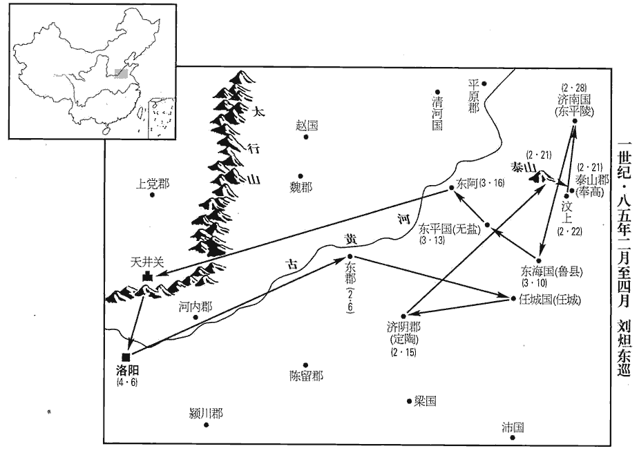
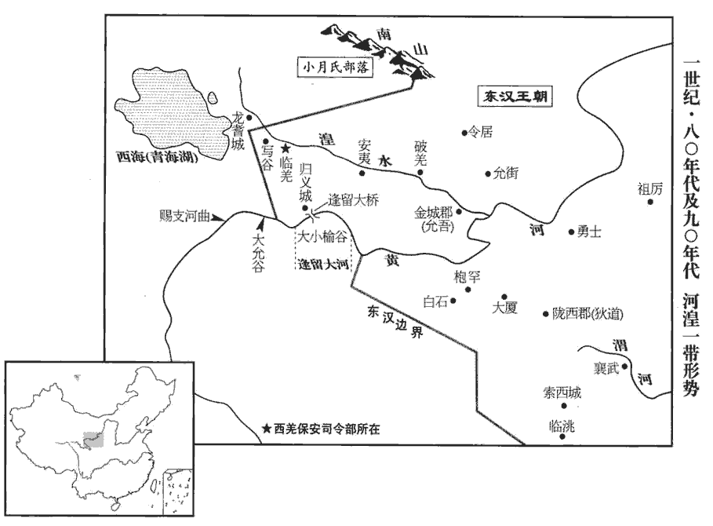
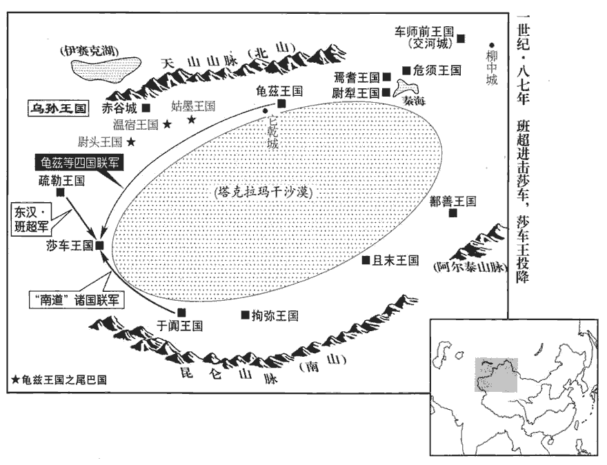
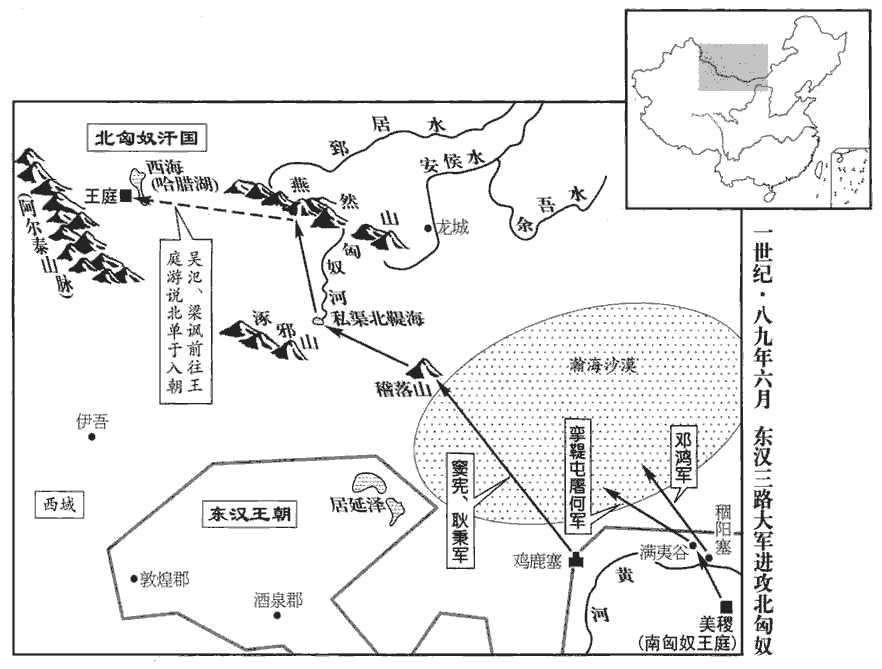
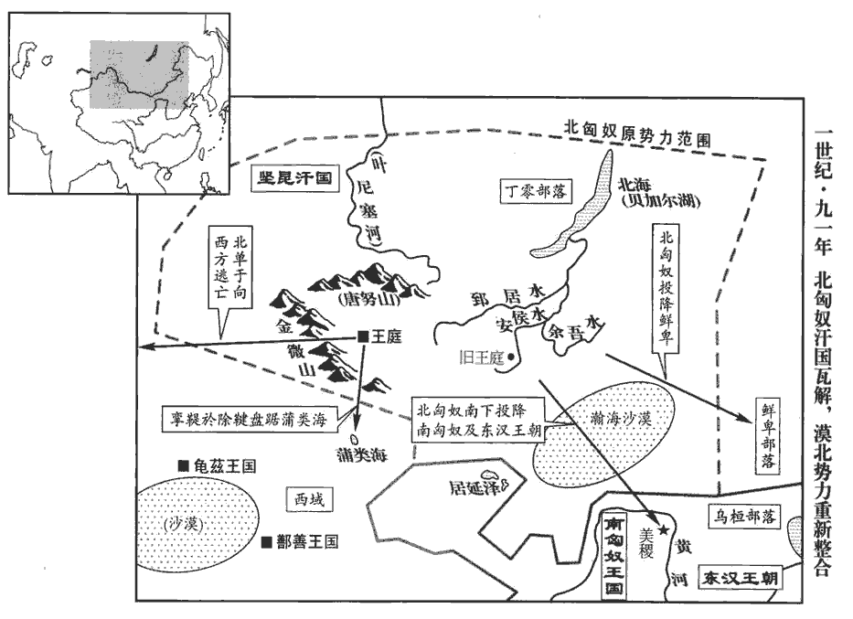
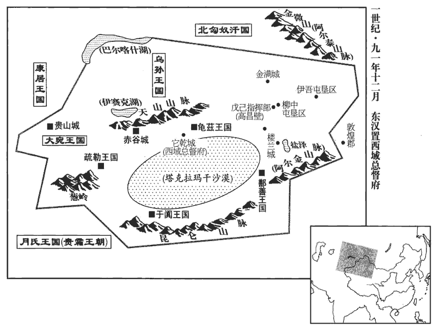

 漢紀三十九起旃蒙作噩（乙酉），盡重光單閼（辛卯），凡七年。

# 肅宗孝章皇帝下

## 元和二年（乙酉，八五）

1春，正月，乙酉‹五›，詔曰：「令云：『民有產子者，復勿算三歲。』復，方目翻；復其夫勿輸算也。今諸懷姙者，賢曰：姙，孕也；音壬。賜胎養穀人三斛，復其夫勿算一歲。著以為令！」又詔三公曰：【章：甲十六行本「曰」下有「夫俗吏矯飾外貌，似是而非，朕甚饜之，甚苦之！」十八字；乙十一行本同；孔本同；張校同，「饜」作「厭」。】「安靜之吏，悃kǔn愊bì無華，說文曰：悃愊，至誠也。悃，音苦本翻。愊，音孚逼翻。日計不足，月計有餘。莊子有是言，此謂以日計功，若不足者，然久而計之，則民安其生，家給人足，固有餘矣。如襄城‹河南襄城›令劉方，襄城縣，屬潁川郡。吏民同聲謂之不煩，雖未有他異，斯亦殆近之矣！近，其靳翻。夫以苛為察，以刻為明，以輕為德，以重為威，四者或興，則下有怨心。吾詔書數下，冠蓋接道，冠蓋接道，謂奉詔出使者相接於道也。數，所角翻。而吏不加治，民或失職，其咎安在？勉思舊令，稱朕意焉！」舊令，謂故府之籍所疏載者。稱，尺證翻。

〖译文〗 [1]春季，正月乙酉（初五），章帝下诏说：“法令规定：‘凡有百姓生育，免收人头税三年。’如今再作规定：所有怀孕的妇女，由官府赏赐胎养谷，每人三斛，免收其丈夫人头税一年。将此诏书定为法令！”又对三公下诏说：“踏实稳重的官吏，诚恳而无虚华，考察他每日的劳绩，好象不足，而考察他每月的劳绩，便绰绰有余了。例如襄城县令刘方，当地官民异口同声地说他为政从简，不烦扰百姓。他虽然没有其它特殊的表现，但这也接近了朕的要求了！如果以苛求为明察，以刻薄为智慧，以对过失从轻发落为德，从重惩处为威，一旦有了这四种观念，那么下面的人民就会心怀怨恨。朕曾不断地下诏，颁行诏书的使者车驾在路上前后相接，然而吏治不见好转，有些百姓仍然不守本份，毛病出在哪里？希望各位官员，努力牢记以往的法令，以称朕意！”

2北匈奴‹王庭设蒙古哈尔和林›大人車利涿兵等車，昌遮翻。亡來入塞，凡七十三輩。時北虜衰耗，黨眾離畔，南部攻其前，丁零‹貝加爾湖地區›寇其後，鮮卑‹內蒙西辽河上游›擊其左，西域侵其右，不復自立，復，扶又翻。乃遠引而去‹王庭西迁至西海，蒙古科布多东哈腊湖›。

〖译文〗 [2]北匈奴首领车利涿兵等叛逃，投奔到汉朝边塞，前后共有七十三批人。当时北匈奴力量衰弱，各部落纷纷离散反叛，南匈奴进攻它的南部地区，丁零进攻北部地区，鲜卑进攻东部地区，西域各国进攻西部地区。北匈奴四面受敌，不再能独立自保，便离开故地向远方迁移。

3南單于長死，單于汗之子宣立，為伊屠於閭鞮單于。屠，直於翻。鞮，丁奚翻。

〖译文〗 [3]南匈奴单于长去世，前单于汗的儿子宣继位，此即伊屠於闾单于。

4太初曆施行百餘年，曆稍後天。謂七曜之行，在曆家所推步躔chán次之前，晦朔弦望不合也。上命治曆編訢、李梵等綜校其狀，治，直之翻。訢，音欣。梵，扶中翻。作四分曆；考異曰：按王莽初已廢太初，用三統曆。今云太初曆失天益遠，蓋光武中興，廢莽曆，復用太初也。續漢志又云：「自太初元年始用三統曆。」按三統曆劉歆所造，云太初元年始用，誤也。二月，甲寅‹四›，始施行之。

〖译文〗 [4]《太初历》已经实施了一百多年，渐与天象不合，略微向后延迟。章帝命令治历官编、李梵等整理校正误差，制定了《四分历》。本年二月甲寅（初四），开始实施这一新历法。

5帝之為太子也，受尚書於東郡‹河南濮陽西南›太守汝南‹河南平舆西北射桥乡›張酺pú。續漢志：東郡，去雒陽八百餘里。酺，薄乎翻。丙辰‹六›，帝東巡，幸東郡‹河南濮陽西南›，引酺及門生并郡縣掾史并會庭中。東郡庭也。掾，俞絹翻。帝先備弟子之儀，使酺講尚書一篇，然後脩君臣之禮；賞賜殊特，莫不沾洽。行過任城‹山東濟寧东南›，幸鄭均舍，賜尚書祿以終其身，時人號為「白衣尚書」。先是，均事帝為尚書，數納忠言，帝敬重之，謝病歸任城，今祿以尚書。任，音壬。

〖译文〗 [5]章帝做太子的时候，曾师从现任东郡太守汝南人张学习《尚书》。二月丙辰（初六），章帝前往东方巡视，临幸东郡。章帝带领张及其学生，连同郡县官吏在郡府庭中集会，章帝先行弟子之礼，让张讲解《尚书》一篇，然后改行君臣之礼。章帝特别颁发赏赐，与会者无不满意欢喜。途经任城时，章帝临幸郑均家，赐给他尚书俸禄，享用终身。因平民穿白衣，所以当时人称郑均为“白衣尚书”。

 

6乙丑‹十五›，帝‹刘炟，时年二十八›耕於定陶‹山東定陶›。辛未‹二十一›，幸泰山，柴告岱宗；書舜典：至於岱宗，柴。孔安國註曰：泰山為四岳所宗。燔fán柴祭天，告至。進幸奉高‹山東泰安›。壬申‹二十二›，宗祀五帝於汶上‹汶水之畔，流经山東泰安南›明堂；汶上明堂，武帝所作，在奉高縣西南四里。汶，音問。丙子‹二十六›，赦天下。【章：甲十六行本「下」下有「戊寅」‹二十八›二字；乙十一行本同；孔本同；張校同；退齋校同。】進幸濟南‹山東章丘›。濟南國，在雒陽東千八百里。賢曰：濟南故城，在淄州長山縣西北。濟，子禮翻。三月，己丑‹十›，幸魯‹山東曲阜›；庚寅‹十一›，祠孔子於闕里，續漢志：魯縣古曲阜有闕里，孔子所居。及七十二弟子，自顏回以下七十餘人。作六代之樂，黃帝曰雲門，堯曰咸池，舜曰大韶，禹曰大夏，湯曰大護，周曰大武。大會孔氏男子二十以上者六十二人。帝謂孔僖曰：「今日之會，寧於卿宗有光榮乎？」對曰：「臣聞明王聖主，莫不尊師貴道。今陛下親屈萬乘，辱臨敝里，此乃崇禮先師，增煇聖德；先師，謂孔子。至於光榮，非所敢承！」帝大笑曰：「非聖者子孫焉有斯言乎！」焉，於虔翻。拜僖郎中。

〖译文〗 [6]二月乙丑（十五日），章帝在定陶举行耕藉之礼。二月辛未（二十一日），临幸泰山，燃柴祭告岱宗。继而前往奉高。二月壬申（二十二日），在汶上明堂祭祀五帝。二月丙子（二十六日），大赦天下。继而临幸济南。三月己丑（初十），临幸鲁。三月庚寅（十一日），在阙里祭祀孔子以及孔子的七十二位弟子，奏黄帝、尧、舜、禹、汤、周等六代古乐，并举行大会，召见孔家二十岁以上的男子共六十二人。章帝对孔僖说：“今天的大会，对你们家族是不是很荣耀？”孔僖回答道：“我听说，圣明的君王无不尊重师道。如今陛下以天子的身份亲自屈驾，光临我们卑微的乡里，这是崇敬先师，发扬君王的圣德。至于说荣耀，我们可不敢当！”章帝大笑，说道：“不是圣人的子孙，怎能说出这样的话！”于是将孔僖任命为郎中。

7壬辰‹十三›，帝幸東平‹山東東平›，追念獻王，謂其諸子曰：「思其人，至其鄉；其處在，其人亡。」因泣下沾襟。遂幸獻王陵，賢曰：陵在今鄆yùn州峗wéi山南。峗，音魚委翻。祠以太牢，親拜祠坐，坐，徂臥翻。哭泣盡哀。獻王之歸國也，事見四十二卷明帝永平四年。驃騎府吏丁牧、周栩xǔ以獻王愛賢下士，不忍去之，遂為王家大夫數十年，事祖及孫。獻王及子懷王忠及今王敞。栩，況羽翻。下，遐稼翻。帝聞之，皆引見，見，賢遍翻。既愍其淹滯，且欲揚獻王德美，即皆擢為議郎。乙未‹十六›，幸東阿‹山東陽穀东北阿城镇›，北登太行山，至天井關‹山西晉城南›。行，戶剛翻。夏，四月，乙卯‹六›，還宮。庚申‹十一›，假于祖禰mí。虞書：一歲巡四嶽，歸格于藝祖。孔安國註曰：巡狩四嶽，然後歸，告至文祖之廟。賢曰：假，至也，音格。禰，父廟。

〖译文〗 [7]三月壬辰（十三日），章帝临幸东平国，追念前东平王刘苍，对刘苍的儿子们说：“我想念他，来到他的故地，屋舍尚在，人已死亡！”说着，流下眼泪，沾湿衣襟。于是来到刘苍陵墓，命人用牛、羊、猪三牲设祭。章帝亲自在祠庙祭拜刘苍的牌位，尽情地哭泣。当年东平王刘苍从京城归国时，原骠骑将军府官员丁牧、周栩因刘苍礼贤下士，不忍离去，便留下来做了亲王府的家臣，至今已数十年，曾事奉刘苍祖孙三代。章帝听说后，召见丁、周二人，既怜惜他们久居下位，又要宣扬刘苍的美德，便将他们全都擢升为议郎。三月乙未（十六日），章帝临幸东阿，北行，登上太行山，到达天井关。夏季，四月乙卯（初六），返回京城皇宫。四月庚申（十一日），到宗庙祭告出巡经过。

8五月，徙江陵王恭為六安王‹府舒县，安徽庐江›。恭封六安王，以廬江郡為國，在雒陽東一千七百里。

〖译文〗 [8]五月，章帝将江陵王刘恭改封为六安王。

9秋，七月，庚子‹二十三›，詔曰：「春秋重三正，慎三微。賢曰：三正，謂天、地、人之正。所以有三者，由有三微之月，王者所當奉而成之。禮記曰：正朔三而改，文質再而復。三微者，三正之始；萬物皆微，物色不同，故王者取法焉。十一月時，陽氣始施於黃泉之下，色皆赤；赤者陽氣，故周為天正，色尚赤。十二月，萬物始牙而色白，白者陰氣，故殷為地正，色尚白。十三月，萬物莩fú甲而出，其色皆黑，人得加功展業；故夏為人正，色尚黑。尚書大傳曰：夏以十三月為正，平旦為朔；殷以十二月為正，雞鳴為朔；周以十一月為正，夜半為朔。必以三微之月為正者，當爾之時，物皆尚微，王者受命，當扶微理弱，奉承之義也。其定律無以十一月、十二月報囚，止用冬初十月而已。」

〖译文〗 [9]秋季，七月庚子（二十三日），章帝下诏说：“《春秋》重天、地、人‘三正’，而慎‘三微’，即‘三正’的开始。现制定法律：每年的十一月、十二月，不许判决罪人。只准在冬初十月判决罪人。”

10冬，南單于遣兵與北虜溫禺犢王戰於涿邪山‹蒙古巴彦温都尔山›，斬獲而還。武威‹甘肅武威›太守孟雲上言：「北虜以前既和親，而南部復往抄掠，復，扶又翻。北單于謂漢欺之，謀欲犯塞，謂宜還南所掠生口以慰安其意。」詔百官議於朝堂。朝，直遙翻。太尉鄭弘、司空第五倫以為不可許，司徒桓虞及太僕袁安以為當與之。弘因大言激厲虞曰：「諸言當還生口者，皆為不忠！」虞廷叱之，倫及大鴻臚韋彪皆作色變容。臚，陵如翻。司隸校尉舉奏弘等，弘等皆上印綬謝。詔報曰：「久議沈滯，沈，持林翻。各有所志，蓋事以議從，策由眾定，誾誾yín衎衎kàn，得禮之容，賢曰：誾誾，忠正貌。衎衎，和樂貌。誾，魚巾翻。衎，音侃，又苦旦翻。寢嘿抑心，更非朝廷之福。寢，息也。君何尤而深謝！其各冠履！」帝乃下詔曰：「江海所以【章：甲十六行本「以」下有「能」字；乙十一行本同。】長百川者，以其下之也。老子曰：江海所以為百谷王者，以其善下也。長，知兩翻。下，遐稼翻。少加屈下，尚何足病！況今與匈奴君臣分定，少，詩沼翻。分，扶問翻。辭順約明，貢獻累至，豈宜違信，自受其曲！其敕度遼及領中郎將龐奮倍雇南部所得生口以還北虜；領中郎將，領護匈奴中郎將也。賢曰：雇，賞報也。其南部斬首獲生，計功受賞，如常科。」

〖译文〗 [10]冬季，南匈奴单于发兵，同北匈奴温禺犊王在涿邪山交战。南匈奴得胜，斩杀并俘虏北匈奴的人民和牲畜后返回。武威太守孟云上书说：“北匈奴先前已同汉朝和解，而南匈奴又去进行抢掠，北匈奴单于会说汉朝是在欺弄他，因而打算进犯边塞。我建议，应当让南匈奴归还抢来的俘虏和牲畜，以安抚北匈奴。”章帝下诏，命群臣在朝堂会商。太尉郑弘、司空第五伦认为不应归还，司徒桓虞和太仆袁安则认为应当归还。双方意见争执不下，郑弘因而大声激怒桓虞说：“凡是声称应当归还俘虏和牲畜的，都是不忠之人！”桓虞也在朝堂呵斥郑弘，第五伦和大鸿胪韦彪全都愤怒得变了脸色。于是司隶校尉上书弹劾郑弘等人，郑弘等人全都交上印信绶带谢罪。章帝下诏答复道：“问题反复讨论，迟迟不决，群臣们的意见，各不相同。大事需要集思广益，政策需由众人商定。忠诚、正直而和睦，这才符合朝廷之礼，而缄默不语压抑情志，更不是朝廷之福。你们有什么过失要谢罪？请各自戴上官帽，穿上鞋！”于是章帝便下诏决定：“江海所以成为百川的首领，是由于其地势低下。汉朝略受委屈，又有什么危害！何况如今在汉朝与北匈奴之间，君臣的名分已确定。北匈奴言辞恭顺而守约，不断进贡，难道我们应当违背信义，自陷于理亏的境地？现命令度辽将军兼中郎将庞奋，用加倍的价格赎买南匈奴所抢得的俘虏和牲畜，归还给北匈奴。而南匈奴曾杀敌擒虏，应当论功行赏，一如惯例。”

## 三年（丙戌，八六）

1春，正月，丙申‹二十二›，帝‹刘炟，时年二十九›北巡；辛丑‹二十七›，耕于懷‹河南武陟›；二月，乙丑‹二十一›，敕侍御史、司空曰：「方春所過，毋得有所伐殺；車可以引避，引避之，騑fēi馬可輟解，輟解之。」侍御史，掌舉劾；司空，掌土功。車駕行幸，則侍御史掌舉劾道路之不如法，司空帥工徒治道路，修橋梁，故皆敕之。賢曰：夾轅為服馬，服馬外為騑馬。孔穎達曰：車有一轅，而四馬駕之，中央兩馬夾轅者名服馬，兩邊名騑馬，亦曰驂馬。騑，音非。戊辰‹二十四›，進幸中山‹河北定州›，出長城；賢曰：史記，蒙恬為秦築長城，西自臨洮，東至海。余謂此非秦長城，蓋趙所築長城也。癸酉‹二十九›，還，幸元氏‹河北元氏›；三月，己卯‹六›，進幸趙‹河北邯鄲›；趙國，在雒陽北一千一百里。辛卯‹十八›，還宮‹洛阳›。

〖译文〗 [1]春季，正月丙申（二十二日），章帝到北方巡视。正月辛丑（二十七日），在怀县举行耕藉之礼。二月乙丑 （二十一日），训令侍御史、司空说：“如今正值春季，我所经过的地方，不得造成任何伤害。车辆可以绕行便绕行，驾车的边马能够解除便解除。”二月戊辰（二十四日），前往中山国，穿越长城。二月癸酉（二十九日），返回，临幸元氏县。三月己卯（初六），前往赵国。三月辛卯（十八日），返回京城皇宫。

2太尉鄭弘數陳侍中竇憲權勢太盛，數，所角翻。言甚苦切，憲疾之。會弘奏憲黨尚書張林、雒陽令楊光在官貪殘。書奏，吏與光故舊，因以告之，光報憲。憲奏弘大臣，漏洩密事，帝詰讓弘。詰，去吉翻。夏，四月，丙寅‹二十三›，收弘印綬。弘自詣廷尉，詔敕出之，因乞骸骨歸，未許。病篤，上書陳謝曰：「竇憲姦惡，貫天達地，海內疑惑，賢愚疾惡，惡，烏路翻。謂『憲何術以迷主上！近日王氏之禍，昞然可見。』謂王氏以戚屬而成篡國之禍。昞，音炳。陛下處天子之尊，處，昌呂翻。保萬世之祚，而信讒佞之臣，不計存亡之機；臣雖命在晷guǐ刻，死不忘忠，願陛下誅四凶之罪，以厭人鬼憤結之望！」厭，一豔翻；滿也。考異曰：袁紀云：「弘為尚書僕射，烏孫王遣子入侍，上問弘：『當答其使否？』弘對曰：『烏孫前為大單于所攻，陛下使小單于往救之，尚未賞；今如答之，小單于不當怨乎！』上以弘議問侍中竇憲，對曰：『禮存往來。弘章句諸生，不達國體。』上遂答烏孫。小單于忿恚，攻金城郡，殺太守任昌。上謂弘曰：『朕前不從君議，果如此。』弘對曰：『竇憲，姦臣也，有少正卯之行，未被兩觀之誅，陛下前何為用其議！』按肅宗時無小單于寇金城事，今不取。帝省章，遣醫視弘病，比至，已薨。省，悉景翻。比，必寐翻。

〖译文〗 [2]太尉郑弘屡次上书，指出侍中窦宪的权势太盛，言辞极具苦心而恳切，窦宪对他十分怀恨。后来，当郑弘弹劾窦宪的党羽尚书张林和洛阳令杨光，说他们为官贪赃枉法而行为残暴的时候，奏书呈上，处理奏书的官吏却是杨光的旧交，此人便通知杨光，杨光又报告了窦宪。于是窦宪弹劾郑弘身为重臣，泄露机密。章帝因此责问郑弘。夏季，四月丙寅（二十三日），收回郑弘的印信绶带。郑弘亲自到廷尉投案待审，章帝下诏将他释放。于是他请求退休回乡，但未被批准。郑弘病重，上书谢恩说：“窦宪的奸恶，上通于天，下达于地，天下人疑惑不解，贤者愚者心怀憎恶，都说：‘窦宪用什么方法迷住了主上！近代王莽之祸，依然历历在目。’陛下居于天子的尊位，守护万世长存的帝业，却信任进谗献媚的奸臣，而不计较这是关系国家存亡的关键！我虽然命在顷刻之间，死而不忘效忠，愿陛下如舜帝除掉‘四凶’一样惩办奸臣之罪，以平息人与鬼神共同的愤恨！”章帝看到奏书后，派医生为郑弘诊病。当医生到达郑家的时候，郑弘已经去世。

3以大司農宋由為太尉。

〖译文〗 [3]将大司农宋由任命为太尉。

4司空第五倫以老病乞身；委身以事君，則身非我有，故於其老而乞退也，謂之乞身，猶言乞骸骨也。五月，丙子‹三›，賜策罷，以二千石俸終其身。倫奉公盡節，言事無所依違。若依若違，兩可不決之論也。性質愨què，少文采，少，詩沼翻。在位以貞白稱。或問倫曰：「公有私乎？」對曰：「昔人有與吾千里馬者，吾雖不受，每三公有所選舉，心不能忘，亦【章：甲十六行本「亦」上有「而」字；乙十一行本同；孔本同；張校同。】終不用也。若是者，豈可謂無私乎！」

〖译文〗 [4]司空第五伦因年老患病请求退休。五月丙子（初三），章帝赐策书，将第五伦免官，赏给他二千石的终身俸禄。第五伦奉公尽节，发表政见时观点鲜明，从不模棱两可。他天性质朴诚实，少有文采，为官以清白著称。有人问第五伦说：“阁下有私心吗？”他回答道：“从前曾有人送我千里马，我虽未接受，但每当要三公举荐人才的时候，心中总不忘此事，只是最终也没有举荐这个人。像这样，难道能说没有私心吗？”

以太僕袁安為司空。

〖译文〗 章帝将太仆袁安任命为司空。

5秋，八月，乙丑‹二十四›，帝幸安邑‹山西夏縣›，觀鹽池。安邑縣，屬河東郡；鹽池在縣西南。楊佺期洛陽記曰：河東鹽池長七十里，廣七里，水氣紫色。許慎曰：河東鹽池袤五十一里，廣七里，周百一十六里。酈道元曰：安邑鹽池，上承鹽水，水出東南薄山，西北流逕巫咸山北，又逕安邑故城南，又西流，注于鹽池。水出石鹽，自然即成，朝取夕復，終無減損。唯山暴雨，澍甘澤，潢潦奔逸，則鹽池用耗；故公私共堨è水逕，防其淫濫，故謂之鹽水，亦為堨è水也。池西又有一池，謂之女鹽澤，東西二十五里，南北二十里，在猗yī氏故城南。土人鄉俗引水裂沃麻，分灌川野，畦qí水耗竭，土自成鹽，即所謂咸鹺cuó也，而味苦。賢曰：在今蒲州虞鄉縣西。九月，還宮。

〖译文〗 [5]秋季，八月乙丑（二十四日），章帝临幸安邑，视察盐池。九月，返回京城皇宫。

6燒當羌‹青海湟中一带›迷吾復與弟號吾及諸種反。復，扶又翻。種，章勇翻。號吾先輕入，寇隴西‹甘肅臨洮›界，督烽掾李章追之，督烽掾，郡掾之督烽燧者。生得號吾，將詣郡。號吾曰：「獨殺我，無損於羌；誠得生歸，必悉罷兵，不復犯塞。」隴西太守張紆放遣之，羌即為解散，為，於偽翻。各歸故地。迷吾退居河北‹青海貴德至尖扎县段黃河称逢留大河›歸義城‹青海贵德东北›。河北，逢留大河之北也。歸義城，本漢所築，以招來諸羌之歸義者。

〖译文〗 [6]羌人烧当部落首领迷吾又与弟弟号吾和其他部落起来造反。号吾率先轻装入侵，进犯陇西郡边界。督烽掾李章进行追击，将号吾生擒，押送到郡府。号吾说：“杀我一人，羌人并无损失，如果放我活着回去，我一定设法使羌军全部撤兵，不再侵犯边塞。”陇西太守张纡便将号吾放走，羌军果然随即被号吾解散，各自返回故地。迷吾退居到黄河以北的归义城。

7疏勒‹新疆喀什›王忠從康居‹都卑阗城，中亚巴尔喀什湖西南锡尔河北岸突厥斯坦›王借兵，還據損中，忠叛見上卷元年。賢曰：損中，未詳；東觀記作「頓中」，續漢書及華嶠書并作「損中」，本或作「楨」，未知孰是。余按西域傳，靈帝建寧三年，涼州刺史孟佗，遣兵討疏勒，攻楨中城。「楨中」是也。遣使詐降於班超；超知其姦而偽許之。忠從輕騎詣超，超斬之，因擊破其眾，南道遂通。

〖译文〗 [7]疏勒王忠向康居王借兵，回到损中据守，派使者向班超诈降。班超看穿他的诡计，假意应允。于是忠便带领轻装骑兵前来拜见班超，班超将他斩首，又乘机击败他的部众。西域南道从此畅通。

8楚許太后薨。楚王英之徙也，許太后留楚宮。詔改葬楚王英，追爵諡曰楚厲侯。諡法：殺戮無辜曰厲。

〖译文〗 [8]楚国许太后去世。章帝下诏，改建楚王刘英之墓，将他追封为楚厉侯。

9帝以潁川‹河南禹州›郭躬為廷尉。決獄斷刑，斷，丁亂翻。多依矜恕，條諸重文可從輕者四十一，奏之，事皆施行。

〖译文〗 [9]章帝将颖川人郭躬任命为廷尉。郭躬在审案判刑的时候，多采取宽大慎重的态度。他从关于判处重刑的律文中，找出四十一条可以从轻判处的，加以整理，上奏章帝。他的建议被一一采纳实施。

10博士魯國曹褒上疏，以為「宜定文制，著成漢禮。」太常巢堪巢姓，有巢氏之後，春秋有巢牛臣。以為「一世大典，非褒所定，言非褒所能定。不可許。」帝知諸儒拘攣，攣，呂員翻。難與圖始，賢曰：拘攣，猶拘束也。朝廷禮憲，宜以時立，乃拜褒侍中。玄武司馬班固以為「宜廣集諸儒，共議得失。」百官志：玄武司馬，主南宮玄武門，秩比千石。帝曰：「諺言：『作舍道邊，三年不成。』會禮之家，名為聚訟，會禮，言會而議禮。賢曰：聚訟，言相爭不定也。互生疑異，筆不得下。昔堯作大章，一夔足矣。」堯作樂曰大章。記曰：大章，章之也。賢曰：夔，堯樂官。呂氏春秋曰：魯哀公問於孔子曰：樂正，夔一足矣。皇侃曰：章，明也。民樂堯德大明，故名樂曰大章。

〖译文〗 [10]博士鲁国人曹褒上书指出：“应当建立典章制度，编写汉朝礼仪大典。”太常巢堪认为：“这是一代大典，非曹褒这样地位的人所能制定，不可应许。”章帝知道儒生拘谨，难以一同创新，而朝廷的礼仪规章，却应当及时确立，于是就任命曹褒为侍中。玄武司马班固认为：“应当广招儒家各派学者，综合不同的意见，共同讨论。”章帝说：“俗话说：‘路边建房，三年不成。’众人会商讨论礼仪制度，就像在一起吵架，相互生出各种疑问和分歧，无法下笔。从前舜帝作《大章》时，有夔一人就足够了。

## 章和元年（丁亥，八七）是年七月改元。

1春，正月，帝‹刘炟，时年三十›召褒，受【章：甲十六行本「受」作「授」；乙十一行本同。】以叔孫通漢儀十二篇，通制漢儀，見十卷高帝六年、七年，其書與律令同藏於理官。曰：「此制散略，多不合經，今宜依禮條正，使可施行。」

〖译文〗 [1]春季，正月，章帝召见曹褒，将叔孙通制定的《汉仪》十二篇交给他，说道：“这套制度松散精略，多与儒家经义不合，现在应当依据正规礼仪一一订正，使它能够颁布实施。”

2護羌校尉傅育欲伐燒當羌，為其新降，為，於偽翻。不欲出兵，乃募人闘諸羌、胡；募人間搆諸羌，使之自闘也。羌、胡不肯，遂復叛出塞，復，扶又翻。更依迷吾。育請發諸郡兵數萬人共擊羌。未及會，三月，育獨進軍。迷吾聞之，徙廬落去。廬，穹廬；落，居也。育遣精騎三千窮追之，夜，至三兜谷‹青海尖扎西北›，三兜谷，在建威南。不設備，迷吾襲擊，大破之，殺育及吏士八百八十人。及諸郡兵到，羌遂引去。詔以隴西‹甘肅臨洮›太守張紆為校尉，將萬人屯臨羌‹青海湟源›。紆，邕俱翻。

〖译文〗 [2]护羌校尉傅育想要讨伐烧当羌人部落，但由于该部落新近投降，便不打算出兵，而收买内探去挑拨羌人与胡人的关系，使二者互相争斗。羌人和胡人看穿傅育的企图，不肯相斗，于是再次反叛出塞，重新依附了迷吾。傅育请求征调各郡郡兵数万人，一同进攻羌人。还没等各郡郡兵集结，本年三月，傅育率部单独出击。迷吾得到消息后，便和部众带着帐幕撤离。傅育派遣三千精锐骑兵穷追不舍。夜里，汉军抵达三兜谷，放松了戒备。迷吾乘机发动袭击，大败汉军，杀死傅育及其部下将士八百八十人。及至各郡郡兵到达，迷吾便率军离去。章帝下诏，将陇西太守张纡任命为护羌校尉，率领汉军万人屯驻临羌。

3夏，六月，戊辰‹二›，司徒桓虞免。癸卯，以司空袁安為司徒，光祿勳任隗為司空。隗，光子之也。任，音壬。隗wěi，五罪翻。

〖译文〗 [3]夏季，六月戊辰（初二），将司徒桓虞免官。六月癸卯（疑误），将司空袁安任命为司徒，将光禄勋任隗任命为司空。任隗是任光之子。

4齊王晃及弟利侯剛，班志，利縣，屬齊郡。晃，齊武王縯之曾孫，殤王石之子。與母、太姬更相誣告。更，工衡翻。秋，七月，癸卯‹八›，詔貶晃爵為蕪湖侯，賢曰：蕪湖，縣名，屬丹陽郡，其故城在今宣州當塗縣東南。削剛戶三千，收太姬璽綬。璽，斯氏翻。，綬，音受。

〖译文〗 [4]齐王刘晃和弟弟利侯刘刚，与他们的母亲太姬互相诬告。秋季，七月癸卯（初八），章帝下诏，将刘晃的爵位贬为芜湖侯，将刘刚的封地削减三千户，收回太姬的玺印绶带。

5壬子‹十七›，淮陽頃王昞薨。昞，明帝子。

〖译文〗 [5]七月壬子（十七日），淮阳顷王刘去世。

6鮮卑‹内蒙西辽河上游›入左地，匈奴左地也。擊北匈奴‹王庭设西海，蒙古科布多东哈腊湖›，大破之，斬優留單于而還。還，從宣翻，又如字。

〖译文〗 [6]鲜卑部族进入北匈奴东部地区，并发动攻击，大败北匈奴，斩杀优留单于后返回故地。

 

7羌豪迷吾復與諸種寇金城塞‹甘肅永靖西北›，復，扶又翻。種，章勇翻；下同。張紆遣從事河內‹河南武陟›司馬防，百官志：使匈奴中郎將，置從事二人；護羌校尉蓋亦置二人也。與戰於木乘谷‹青海湟源西›；迷吾兵敗走，因譯使欲降，紆納之。迷吾將人眾詣臨羌‹青海湟源›，紆設兵大會，譯，通夷言，使之將命，因謂之譯使。設兵，陳兵也。使，疏吏翻。降，戶江翻。施毒酒中，伏兵殺其酋豪八百餘人，酋，慈由翻。斬迷吾頭以祭傅育塚，復放兵擊其餘眾，斬獲數千人。迷吾子迷唐，與諸種解仇，結婚交質，質，音致。據大、小榆谷‹青海尖扎西›以叛，水經：河水逕西海郡南，又東逕允川而歷大榆谷、小榆谷北。二榆土地肥美，羌所依阻也。種眾熾盛，張紆不能制。

〖译文〗 [7]羌人首领迷吾再次联合其他羌人部落进攻金城塞。张纡派从事河内人司马防在木乘谷迎战。迷吾战败退却，于是派翻译充当使者向汉军请降，被张纡接受。于是迷吾率领部众到临羌归附。张纡严阵以待，大张筵席，将毒药下在酒中，用伏兵杀死羌军首领八百余人，并斩下迷吾的人头，用来祭祀傅育的陵墓。他还发兵攻打迷吾的余部，斩杀俘获数千人。然而迷吾的儿子迷唐，与其他部落解除了仇怨，他们互相通婚，交换人质，据守在大、小榆谷反叛。这些人数量众多，实力强盛，张纡无法制服。

8壬戌‹二十七›，詔以瑞物仍集，改元章和。章：明也，明和氣之致祥也。是時，京師四方屢有嘉瑞，前後數百千，言事者咸以為美。而太尉掾平陵‹陝西咸陽西平陵乡›何敞獨惡之，惡，烏路翻。杜佑曰：漢武帝割槐里置茂陵邑，昭帝又割置平陵邑。謂宋由、袁安曰：「夫瑞應依德而至，災異緣政而生。今異鳥翔於殿屋，怪草生於庭際，不可不察！」由、安懼不敢答。

〖译文〗 [8]七月壬戌（二十七日），章帝下诏，因祥瑞频出而数量众多，将年号改为“章和”。当时，京城和四方不断发现祥瑞，前后有千百次，谈论的人都认为是美事。然而太尉掾平陵人何敞却偏偏表示厌恶。他对太尉宋由、司徒袁安说：“祥瑞伴随恩德而来，灾异由于恶政而生。如今有奇特的鸟飞到皇家殿堂，怪异的草生在宫廷庭院，不可不小心注意！”宋、袁二人感到恐惧，不敢回答。

9八月，癸酉‹八›，帝南巡。戊子‹二十三›，幸梁‹河南商丘›；乙未晦‹三十›，幸沛‹安徽淮北›。梁、沛二國。

〖译文〗 [9]八月癸酉（初八），章帝到南方巡视。八月戊子（二十三日），临幸梁国。八月乙未晦（三十日），临幸沛国。

10日有食之。

〖译文〗 [10]出现日食。

11九月，庚子‹五›，帝幸彭城‹江蘇徐州›。辛亥‹十六›，幸壽春‹安徽壽縣›；壽春縣屬九江郡。復封阜陵侯延為阜陵王。延貶事見上卷建初元年。己未‹二十四›，幸汝陰‹安徽阜陽›。汝陰縣，屬汝南郡。賢曰：今潁州縣。冬，十月，丙子‹十二›，還宮。

〖译文〗 [11]九月庚子（初五），章帝临幸彭城。九月辛亥（十六日），临幸寿春。将阜陵侯刘延重新封为阜陵王。九月己未（二十四日），临幸汝阴。冬季，十月丙子（十二日），返回京城皇宫。

12北匈奴大亂，屈蘭儲等五十八部，口二十八萬，詣雲中‹內蒙托克托›、五原‹內蒙包頭›、朔方‹內蒙磴口›、北地‹寧夏吴忠西南金积镇›降。

〖译文〗 [12]北匈奴发生大乱，屈兰储等五十八个部落、人口二十八万，到云中、五原、朔方、北地归降。

13曹褒依準舊典，雜以五經、讖記之文，撰次天子至於庶人冠、婚、吉、凶終始制度撰次制度，備其終始也。讖，楚譖翻。撰，雛免翻。冠，古玩翻。凡百五十篇，奏之。帝以眾論難一，故但納之，不復令有司平奏。平奏者，平其可行與否而奏之。復，扶又翻。

〖译文〗 [13]曹褒以旧典为基础，加入儒家《五经》和《谶记》上的记载，依次编写由皇帝到平民的成年加冠礼、婚嫁礼、祭祀礼、丧葬凶灾礼等仪程，共一百五十篇，奏报章帝。章帝认为众人的意见很难统一，所以就接受了曹褒制定的典章，不再命有关部门进行评议。

14是歲，班超發于窴‹新疆和田›諸國兵共二萬五千人擊莎車‹新疆莎車›，元和元年，超擊莎車未克故也。窴，徒賢翻。莎，素禾翻。龜茲‹新疆庫車›王發溫宿‹新疆烏什›、姑墨‹新疆阿克苏西北›、尉頭‹新疆阿合奇西南哈拉奇›兵合五萬人救之。龜茲，音丘慈。超召將校及于窴王議曰：將，即亮翻。校，戶教翻。「今兵少不敵，其計莫若各散去；于窴從是而東，長史亦於此西歸，班超時為將兵長史，蓋西歸疏勒也。可須夜鼓聲而發。」須，待也。夜鼓聲，鼓鼜cào之聲也。周禮：軍旅夜鼓鼜。註云：鼜，夜戒守鼓也。司馬法曰：昏鼓四通為大鼜，夜半三通為晨戒，旦明五通為發昫xù，所謂三鼜也。此則待夜半鼓聲也。鼜，千歷翻。昫，休具翻，劉休武翻。陰緩所得生口。使生口得歸，言將散去也。龜茲王聞之，大喜，自以萬騎於西界遮超，溫宿王將八千騎於東界徼yāo于窴。徼，一遙翻。超知二虜已出，密召諸部勒兵，【章：甲十六行本「兵」下有「雞鳴」二字；乙十一行本同；孔本同；張校同。】馳赴莎車營。胡大驚亂，奔走，追斬五千餘級；莎車遂降，降，戶江翻。龜茲等因各退散。自是威震西域。

〖译文〗 [14]本年，班超征调于阗等各国军队，共二万五千人，进攻莎车。龟兹王则征调温宿、姑墨、尉头三国军队，共五万人，前往救援。班超召集部下将校和于阗王商议道：“如今我方兵少，打不过敌人，不如各自分散撤离。于阗军队由此向东，长史也同时动身，从这里西行返回疏勒，可等到夜间鼓声起时出发。”然后假意放松戒备，让俘虏逃跑。龟兹王得知消息后大喜，亲自率领一万骑兵，到西面拦截班超。温宿王则率领八千骑兵，到东面拦截于阗军队。班超听说龟兹、温宿两国军队已经出动，就秘密集结部队备战，急速奔袭莎车军营。莎车人大为惊慌，乱作一团，四处奔逃，班超等追击斩杀五千余人，于是莎车投降。龟兹等国军队只好各自撤退散去。从此，班超的威名震动西域。

 

## 二年（戊子，八八）

1春，正月，濟南王康、阜陵王延、中山王焉來朝。上性寬仁，篤於親親，故叔父濟南、中山二王，每數入朝，濟，子禮翻。數，所角翻。朝，直遙翻。特加恩寵，及諸昆弟并留京師，不遣就國。漢制，諸藩王朝會之禮畢，各就國，不得留京師。又賞賜群臣，過於制度，倉帑tǎng為虛。帑，他朗翻。為，於偽翻。何敞奏記宋由曰：「比年水旱，民不收穫；涼州緣邊，家被凶害；賢曰：時西羌犯邊為害也。比，毗至翻。被，皮義翻。中州內郡，公私屈竭；此實損膳節用之時。國恩覆載，言恩同天地也。覆，敷救翻。賞賚lài過度，但聞臘賜，自郎官以上，公卿、王侯以下，至於空竭帑藏，藏，徂浪翻。損耗國資。尋公家之用，皆百姓之力。明君賜賚，宜有品制；忠臣受賞，亦應有度。賢曰：漢官儀：臘，賜大將軍、三公錢各二十萬，牛肉二百斤，粳jīng米二百斛；特進侯十五萬，卿十萬，校尉五萬，尚書三萬，侍中、將、大夫各二萬，千石、六百石各七千，虎賁、羽林郎二人，共三千，以為祀門戶直。是以夏禹玄圭，書禹貢曰：禹錫玄圭。周公束帛。賢曰：尚書曰：召公出取幣，入錫周公。今明公位尊任重，責深負大，上當匡正綱紀，下當濟安元元，豈但空空無違而已哉！空，當作悾。悾悾，謹愨què貌。宜先正己以率群下，還所得賜，因陳得失，奏王侯就國，除苑囿之禁，節省浮費，賑卹窮孤，則恩澤下暢，黎庶悅豫矣。」由不能用。考異曰：敞傳，此事在肅宗崩後，云「竇氏專政，外戚奢侈，賞賜過制，敞奏記云云。」袁紀在元和三年。按敞記云：「明公視事，出入再朞」，又言臘賜，知在此時。

〖译文〗 [1]春季，正月，济南王刘康、阜陵王刘延、中山王刘焉来京城朝见。章帝天性宽厚仁爱，重视骨肉亲情。因此，每当叔父刘康和刘焉二位亲王进京朝见时，都受到特别的优待。章帝还将兄弟们全都留在京城，不派遣他们去封国就位。并大量赏赐百官，超过了制度规定，国库因此而空虚。何敞对宋由上书说：“如今年年发生水旱灾害，人民收不到粮食；凉州边境一带，居民遭到羌军的侵害；中原内地各郡，公私财力都已枯竭，这正是减少消费、节约用度的时机。皇恩如同天复地载，无与伦比，但陛下的赏赐超过了限度。听说仅在腊日，对郎官以上、公卿王侯以下官员的赏赐，就使国库一空，损耗了国家储备。追究公家的经费来源，都是出自百姓的血汗。贤明的君王进行赏赐，应当根据等级制度；忠臣接受赏赐，也应有一定的法规。因此尧帝赐给禹黑色的玉圭，而召公则赐给周公五匹帛。如今阁下地位尊贵而责任重大，对上应当匡正朝廷纲纪，对下应当安抚人民，难道只恭谨忠诚而不违上命就够了吗！您应当首先端正自身，做下官的表率，交还所得的赏赐；向皇上陈述利害得失，奏请遣送亲王侯爵各往封国就位；解除禁止人民在皇家园林耕种的法令，节省不必要的开支，赈济抚恤穷苦孤独的人，那么恩泽就会下达，百姓就会喜悦安乐。”宋由未能接受他的建议。

尚書南陽宋意上疏曰：「陛下至孝烝烝，烝，進也。烝烝，進進也。恩愛隆深，禮寵諸王，同之家人，車入殿門，漢制，太子諸王至司馬門，皆下車，故謂止車門。即席不拜，臣於君前拜而後就席。分甘損膳，賞賜優渥。損御膳以分甘也。康、焉幸以支庶，享食大國，陛下恩寵踰制，禮敬過度。春秋之義，諸父、昆弟，無所不臣，君君臣臣，不以親厭殺，天地之大經也，春秋尊王，故以為春秋之義。所以尊尊卑卑，強幹弱枝者也。陛下德業隆盛，當為萬世典法，不宜以私恩損上下之序，失君臣之正。又西平王羨等六王，皆妻子成家，謂有妻有子，自成一家也。官屬備具，謂王國官已具也。當早就蕃國，為子孫基阯；而室第相望，久磐京邑，賢曰：磐謂磐桓不去。驕奢僭擬，寵祿隆過。宜割情不忍，以義斷恩，賢曰：禮記曰：門內之政恩掩義，門外之政義斷恩。斷，丁亂翻。發遣康、焉，各歸蕃國，令羨等速就便時，以塞眾望。」賢曰：行日取便利之時也。塞，悉則翻。帝未及遣。

〖译文〗 尚书南阳人宋意上书说：“陛下大孝，皇恩深厚，宠爱诸王，亲情如同凡人之家。亲王们可以乘车进入殿门，就座时不叩拜，分享御膳房的饭食，获得优厚的赏赐。刘康和刘焉，有幸以旁支庶子的身份享有巨大的封国，陛下对他们的恩宠超过了常制，优礼尊敬超过了限度。根据《春秋》大义，对皇帝来说，伯父、叔父和兄弟，无不都是臣属，这是为了使尊者受到尊敬，卑者自守卑位，加强主干而削弱旁枝的缘故。陛下恩德伟业隆盛，当永为后世的典范，不应该由于亲情而破坏上下等级，失掉君臣间的正常秩序。此外，西平王刘羡等六位亲王，都已娶妻生子而自成一家，官属齐备，应当尽早去封国就位，为自己的子孙奠定基业。然而他们广修宅第，前后相望，长久地盘踞在京城，骄傲奢侈，超越本分，自比于居上位者；所得的恩宠和俸给，也都过度。陛下应当抛开亲情，不再容忍，以大义切断私恩，遣送刘康、刘焉各回封国，命刘羡等择日速往封国就位，以平息人们的怨言。”然而章帝已来不及遣送。

2壬辰‹三十›，帝‹刘炟›崩于章德前殿，年三十一。遺詔：「無起寢廟，一如先帝法制。」

〖译文〗 [2]正月壬辰（疑误），章帝在章德前殿驾崩。享年三十一岁。遗诏命令：“不要在墓地修建祠庙寝殿，一切依照先帝之制。”

范曄論曰：魏文帝稱明帝察察，章帝長者。章帝素知人，厭明帝苛切，事從寬厚；奉承明德太后，盡心孝道；平徭簡賦，而民賴其慶；又體之以忠恕，文之以禮樂。謂之長者，不亦宜乎！

〖译文〗 范晔论曰：魏文帝称明帝明辨洞察，而章帝则是忠厚之人。章帝一向通达人情，他不喜明帝的苛刻严厉，事事依从宽厚的原则；侍奉马太后，尽心地履行孝道；减轻徭役和赋税，使人民受到恩惠。并以忠恕之道为体，以礼乐教化为文。将他称为忠厚之人，不是很恰当吗？

3太子‹刘肇›即位，年十歲，尊皇后曰皇太后。

〖译文〗 [3]太子即位，时年十岁。将窦皇后尊称为皇太后。

4三月，【章：甲十六行本「月」下有「丁酉」‹五›二字；乙十一行本同；孔本同。】用遺詔徙西平王羨為陳王，六安王恭為彭城王。改淮陽為陳國，楚郡為彭城國，西平併汝南郡，六安復為廬江郡。

〖译文〗 [4]三月，根据章帝遗诏，将西平王刘羡改封为陈王，将六安王刘恭改封为彭城王。

5癸卯‹十一›，葬孝章皇帝于敬陵‹河南孟津東南三十里铺南›。敬陵，在雒陽城東南三十九里。

〖译文〗 [5]三月癸卯（十一日），将章帝安葬于敬陵。

6南單于‹王庭设美稷，内蒙准格尔旗›宣死，單于長之弟屯屠何立，為休蘭尸逐侯鞮單于。鞮，丁兮翻。

〖译文〗 [6]南匈奴单于宣去世，前单于长的弟弟屯屠何继位，此即休兰尸逐侯单于。

7太后臨朝，蔡邕獨斷曰：少帝即位，太后即代攝政，臨前殿，朝群臣，太后東面，少帝西面。群臣上書奏事，皆為兩通，一詣太后，一詣少帝。竇憲以侍中內幹機密，賢曰：幹，主也，或曰：幹，古管字也。出宣誥命；弟篤為虎賁中郎將，篤弟景、瓌guī并為中常侍，兄弟皆在親要之地。憲客崔駰駰，音因。以書戒憲曰：「傳曰：『生而富者驕，生而貴者慠。』傳，直戀翻。慠，五到翻。生富貴而能不驕慠者，未之有也。今寵祿初隆，百僚觀行，行，下孟翻。豈可不『庶幾夙夜，以永終譽』乎！詩周頌振鷺之辭，言庶幾於夙夜匪懈，以終保令名於有永也。昔馮野王以外戚居位，稱為賢臣；馮野王妹為元帝昭儀，於九卿中，野王行能第一。近陰衛尉克己復禮，終受多福。陰衛尉，興也，謂讓侯爵，又讓大司馬也。外戚所以獲譏於時，垂愆於後者，蓋在滿而不挹yì，位有餘而仁不足也。漢興以後，迄于哀、平，外家二十，保族全身，四人而已。外家二十者，呂氏、張氏、薄氏、竇氏、王氏、陳氏、衛氏、李氏、趙氏、上官氏、史氏、許氏、霍氏、卬成王氏、元后王氏、趙氏、傅氏、丁氏、馮氏、衛氏也。唯文帝薄太后、竇后、景帝王后、卬成王后四人，保族全家。武帝夫人李氏雖追配武帝，昌邑王立未幾而廢，非外家，當以史皇孫王夫人足二十之數。書曰：『鑒于有殷，』書召誥曰：我不可不鑒于有夏，亦不可不鑒于有殷。可不慎哉！」

〖译文〗 [7]窦太后临朝摄政，窦宪以侍中的身份，入宫主持机要，出宫宣布太后的命令。他的弟弟窦笃为虎贲中郎将，窦笃的弟弟窦景、窦同为中常侍。窦家兄弟全都在接近皇帝、皇后的显要位置上。窦宪的门客崔上书告诫窦宪说：“古书说：‘生来就富有的人骄横，生来就尊贵的人倨傲。’生于富有尊贵而能不骄横倨傲的人。未曾有过。如今您的恩宠和官位正开始上升，朝中百官都在观察您的所作所为，怎能不象《诗经·周颂》所说‘望能以终日的小心谨慎，求得终身的荣耀’呢！从前冯野王以外戚身份居于官位，被人称作贤臣；近代阴兴克己守礼，最终成为多福之人。外戚之所以被当时的人讥嘲，被后世的人责备，原因在于权势太盛而不知退让，官位太高而仁义不足。从汉朝建立以后，直到哀帝、平帝，皇后家族共计二十，而能保全家族和自身的，只有四位皇后。《尚书》说：‘以殷商的覆亡，作为鉴戒，’岂能不谨慎吗！”

8庚戌‹十八›，皇太后詔：「以故太尉鄧彪為太傅，賜爵關內侯，錄尚書事，百官總己以聽。」竇憲以彪有義讓，先帝所敬，彪父邯，封鄳méng鄉侯，父卒，彪讓國於弟鳳；顯宗高其節。而仁厚委隨，賢曰：委隨，猶順從也。故尊崇之。其所施為，輒外令彪奏，內白太后，事無不從。王莽用孔光之故智也。彪在位，修身而已，不能有所匡正。憲性果急，睚yá眥zì【章：甲十六行本「䀝」作「眦」；乙十一行本同。】之怨，莫不報復。賢曰：睚，音語懈翻。眥，音仕懈翻。廣雅曰：睚，裂也。或謂：裂眥，瞋目貌也。永平時，謁者韓紆考劾憲父勳獄，勳下獄死，事見四十五卷明帝永平五年。劾，戶概翻，又戶得翻憲遂令客斬紆子，以首祭勳塚。

〖译文〗 [8]庚戌（十八日），窦太后下诏 ：“将前任太尉邓彪任命为太傅，赐爵为关内侯，主管尚书机要。百官各统己职，听命于太傅。”窦宪因邓彪仁义礼让，受到先帝的敬重，其为人又忠厚随和，所以把他捧上高位。窦宪要有所举动的时候，就在外面教邓彪奏报，自己到内宫向太后说明，无一事不被批准。邓彪身居太傅之位，只是修身自好而已，不能匡正朝廷纲纪。窦宪性情暴烈，连瞪他一眼的小怨恨，都无不报复。明帝永平年间，谒者韩纡曾审理过窦宪之父窦勋的案件，窦宪便命令门客斩杀韩纡的儿子，用人头祭祀窦勋之墓。

9癸亥‹二›，陳王羨、彭城王恭、樂成王黨、下邳王衍、梁王暢始就國。

〖译文〗 [9]癸亥（疑误），陈王刘羡、彭城王刘恭、乐成王刘党、下邳王刘衍、梁王刘畅开始前往封国就位。

10夏，四月，戊寅‹十七›，以遺詔罷郡國鹽鐵之禁，縱民煮鑄。自武帝以來，鹽鐵有禁；光武中興，收而未罷；今縱民得煮鹽、鑄鐵。

〖译文〗 [10]夏季，四月戊寅（十七日），根据章帝遗诏，撤销各郡各封国盐铁专卖的规定，允许民间煮盐铸铁，自由经营。

11五月，京師旱。

〖译文〗 [11]五月，京城发生旱灾。

12北匈奴饑亂，降南部者歲數千人。降，戶江翻；下同。秋，七月，南單于上言：「宜及北虜分爭，出兵討伐，破北成南，共【章：甲十六行本「共」作「幷」；乙十一行本同；孔本同。】為一國，考異曰：袁紀：「章和元年十月，南單于上書，求出兵破北成南。宋意諫，不聽，師未出而帝寢疾。」范書南匈奴傳，事并在此年七月。按單于書云：「孝章皇帝聖思遠慮。」則范書是也。今從之。令漢家長無北念。謂北部既滅，南部保塞，則漢家無復北顧以為念也。臣等生長漢地，長，知兩翻。開口仰食，仰，魚向翻。歲時賞賜，動輒億萬，雖垂拱安枕，慙無報效之義，願發國中及諸郡【章：甲十六行本「郡」作「部」；乙十一行本同；張校同。】故胡新降精兵，故胡，南部舊眾也。新降，新從北部來降者。分道并出，期十二月同會虜地。臣兵眾單少，不足以防內外，少，詩沼翻。願遣執金吾耿秉、度遼將軍鄧鴻及西河‹內蒙准格爾旗西南›、雲中‹內蒙托克托›、五原‹內蒙包頭›、朔方‹內蒙磴口›、上郡‹陝西榆林南鱼河堡›太守守，式又翻。并力而北，冀因聖帝威神，一舉平定。臣國成敗，要在今年，已敕諸部嚴兵馬，唯裁哀省察！」省，悉景翻。太后以示耿秉。以南單于書示之也。秉上言：「昔武帝單極天下，單，與殫同。欲臣虜匈奴，未遇天時，事遂無成。謂不能使匈奴臣服也。今幸遭天授，北虜分爭，以夷伐夷，謂以南部伐北部也。國家之利，宜可聽許。」秉因自陳受恩，分當出命效用。分，扶問翻。太后議欲從之。尚書宋意上書曰：「夫戎狄簡賤禮義，無有上下，強者為雄，弱即屈服。自漢興以來，征伐數矣，數，所角翻。其所克獲，曾不補害。光武皇帝躬服金革之難，深昭天地之明，因其來降，羈縻畜養，畜，許六翻。邊民得生，勞役休息，於茲四十餘年矣。建武二十四年受南單于降，至是四十一年。今鮮卑奉順，斬獲萬數，謂破殺優留單于也。中國坐享大功而百姓不知其勞，漢興功烈，於斯為盛。所以然者，夷虜相攻，無損漢兵者也。臣察鮮卑侵伐匈奴，正【嚴：「正」改「止」。】是利其抄掠；及歸功聖朝，實由貪得重賞。洞見鮮卑之情。抄，楚交翻。今若聽南虜還都北庭，則不得不禁制鮮卑；鮮卑外失暴掠之願，內無功勞之賞，豺狼貪婪，婪，盧含翻。方言：殺人而取其財曰婪。必為邊患。今北虜西遁，請求和親，宜因其歸附，以為外扞，巍巍之業，無以過此。若引兵費賦，以順南虜，則坐失上略，去安即危矣。誠不可許。」

〖译文〗 [12]北匈奴因饥荒而发生内乱，每年有数千人向南匈奴投降。秋季，七月，南匈奴单于上书朝廷：“应当趁着北匈奴内乱分裂的机会，派出军队进行讨伐，打败北匈奴，成全南匈奴，让南北匈奴统一成为整体，使汉朝永无北方之忧。我们长期生活在汉朝境内，仰仗汉朝，才能张口吃饭。汉朝每年四季给我们赏赐，动不动就达亿万之数。我们虽然无须操劳而安享太平，却因未能实行报效之义而感到惭愧。我们愿征调本部和分散在各郡的匈奴精锐，包括老兵和新近归降的北匈奴军队，分为几路，同时进发，约定十二月在北匈奴会师。我的部队力量单薄，不足以内外兼顾，请汉朝派遣执金吾耿秉、度辽将军邓鸿及西河、云中、五原、朔方、上郡等郡太守，合力北征。望能凭着圣上的神威，一举平定北方敌害。我匈奴国的成败，就在今年决定。我已命令各部厉兵秣马，准备作战。请陛下节哀审定。”窦太后把南单于的奏书给耿秉看，耿秉进言：“从前武帝耗尽天下之力，想使匈奴臣服，但时机未到，便没有成功。如今遇到天赐良机，北匈奴内部分裂争斗，我们让外族打外族，对国家有利，应当答应南匈奴的请求。”耿秉于是表示自己身受皇恩，应该出征效命。窦太后在商议时打算采纳他的意见。尚书宋意上书说：“匈奴人轻视礼仪，没有君臣上下之分。强悍者则称雄，弱小者便屈服。自从汉朝建立以来，讨伐他们的次数已很频繁了，但所得的收获，不能补偿国家的损失。光武皇帝亲身经历过战乱，显示天地间无与伦比的英明，乘匈奴人前来归降的机会，对他们采取了笼络豢养的政策。于是边疆人民获得生机，减除了劳役，至今已经四十余年了。现在鲜卑顺服汉朝，斩杀及俘虏北匈奴数万人，汉朝坐观成败，安享巨大成果，而百姓并不感到辛劳。汉朝建立以来的功业，这是最伟大的一项。所以如此，是因为异族相互攻伐，而汉军却全无损失。据我观察，鲜卑攻击北匈奴，是由于抢掠对他们有利；而将战功献给汉朝，实际上是贪图得到重赏。如今若是允许南匈奴回到北匈奴王庭建都，那就不得不限制鲜卑的行动。鲜卑外不能实现抢掠的愿望，内不能因功而得到赏赐，以其豺狼般的贪婪，必将成为边疆的祸患。现在北匈奴已经向西逃遁，请求与汉朝通好，应当乘他们归顺的机会，使之成为外藩。巍巍的功业，莫过于此。如果征调军队，消耗国家经费，以听从南匈奴的意愿，那就是平白丢掉了最佳策略，放弃安全，走向危亡。对南匈奴的请求，实在不可应许。”

會齊殤王子都鄉侯暢來弔國憂，齊殤王石，齊武王縯之孫，哀王章之子。考異曰：袁紀作「郁鄉侯暢」，今從范書。太后數召見之，范書曰：暢素行邪僻，因鄧疊母元自通長樂宮，得幸太后。數，所角翻。竇憲懼暢分宮省之權，遣客刺殺暢於屯衛之中，何敞傳曰：刺殺暢於城門屯衛之中。刺，七亦翻。而歸罪於暢弟利侯剛，乃使侍御史與青州‹山東北部›刺史雜考剛等。青州刺史部齊國。暢見殺於京師，而令青州刺史考竟，欲移獄以絕蹤也。尚書潁川‹河南禹州›韓稜以為「賊在京師，不宜捨近問遠，恐為姦臣所笑。」太后怒，以切責稜，稜固執其議。何敞說宋由曰：說，輸芮翻。「暢，宗室肺府，府，與腑同。茅土藩臣，來弔大憂，上書須報，賢曰：須，待也。親在武衛，致此殘酷。奉憲之吏，莫適討捕，賢曰：適，音的；謂無指的討捕也。蹤跡不顯，主名不立。敞備數股肱，職典賊曹，賢曰：股肱，謂手臂也，公府有賊曹，主知盜賊。余按字書，股，髀bì幹；肱，臂幹；股肱，言手足之要；以為手臂，誤矣。欲親至發所以糾其變。發所，賊發之所。糾，督察也。而二府執事，以為【章：甲十六行本「爲」下有「故事」二字；乙十一行本同；孔本同；張校同；退齋校同。】三公不與賊盜，賢曰：敞在太尉府。二府：謂司徒、司空。邴吉為丞相不案事，遂以為故事。與，讀曰預。公縱姦慝，莫以為咎。敞請獨奏案之。」由乃許焉。二府聞敞行，皆遣主者隨之。賢曰：主者，謂主知賊盜之曹也。於是推舉，具得事實。太后怒，閉憲於內宮。憲懼誅，因自求擊匈奴以贖死。

〖译文〗 适逢齐殇王刘石的儿子都乡侯刘畅到京城来祭吊章帝。窦太后频繁地召见他。窦宪怕刘畅分去自己在内宫的权势，便派刺客在皇宫禁卫军中将刘畅暗杀，而归罪于刘畅的弟弟利侯刘刚。于是朝廷派侍御史和青州刺史一同审讯刘刚等人。尚书颍川人韩棱认为：“凶手就在京城，不应舍近求远。而现在的作法，怕要让奸臣讥笑。”太后大怒，严厉地责备韩棱，但韩棱仍然坚持自己的看法。何敞对太尉宋由说：“刘畅是皇室宗亲，封国藩臣，到京城来祭吊先帝，上书听候命令，身在武装卫士当中，却遭到这样的惨死。执法官吏盲目地追捕凶手，既不见凶手的踪影，也不知他们的姓名。我充数为您属下的要员，主管捕审罪犯，打算亲自到判案场所，以督察事态的进展。但司徒和司空二府的负责人认为，三公不应参与地方刑事案件，于是公然放纵奸恶，而并不认为是过错，因此我打算单独奏请，参与审案。”宋由便答应了何敞的请求。司徒、司空二府听说何敞将去参与审案，都派主管官员随同前往。于是清查案情，得到全部事实。窦太后知道真相后大怒，将窦宪禁闭在内宫。窦宪害怕被杀，就自己请求去打匈奴，以赎死罪。

13冬，十月，乙亥‹十七›，以憲為車騎將軍，伐北匈奴，以執金吾耿秉為副；發北軍五校、黎陽‹河南浚縣›、雍營、緣邊十二郡騎士及羌、胡兵出塞。北軍五校，屯騎、越騎、步兵、長水、射聲五校尉所掌宿衛兵也。黎陽營，註見前。扶風校尉部在雍縣‹陝西鳳翔›，以涼州近羌，數犯三輔，將兵衛護園陵，故俗稱雍營。緣邊十二郡，上郡‹陝西榆林南鱼河堡›、西河‹內蒙准格爾旗西南›、五原‹內蒙包頭›、雲中‹內蒙托克托›、定襄‹山西右玉›、鴈門‹山西朔州东南›、朔方‹內蒙磴口›、代郡‹山西陽高›、上谷‹河北懷來›、漁陽‹北京密云›、安定‹宁夏鎮原›、北地‹寧夏吴忠西南金积镇›也。校，戶教翻。雍，於用翻。

〖译文〗 冬季，十月乙亥（十七日），任命窦宪为车骑将军，讨伐北匈奴。任命执金吾耿秉为副统帅，征调北军屯骑、越骑、步兵、长水、射声五校兵和黎阳营、雍营、边疆十二郡的骑兵，以及羌人、胡人部队，出塞征战。

14公卿舉故張掖‹甘肅張掖›太守鄧訓代張紆為護羌校尉。迷唐率兵萬騎來至塞下，未敢攻訓，先欲脅小月氏胡。匈奴破月氏，月氏西徙；其餘眾保南山不得去者，號小月氏。氏，音支。訓擁衛小月氏胡，令不得戰。議者咸以羌、胡相攻，縣官之利，不宜禁護。訓曰：「張紆失信，眾羌大動，涼州吏民，命縣絲髮。縣，讀曰懸。原諸胡所以難得意者，皆恩信不厚耳。今因其迫急，以德懷之，庶能有用。」遂令開城及所居園門，護羌校尉所居寺舍後園之門也。悉驅群胡妻子內之，嚴兵守衛。羌掠無所得，又不敢逼諸胡，因即解去。由是湟中‹青海東北›諸胡皆言：「漢家常欲闘我曹；賢曰：湟中，月氏胡所居，今鄯州湟水縣也。今鄧使君待我以恩信，開門內我妻子，乃是得父母也！」咸歡喜叩頭曰：「唯使君所命。」訓遂撫養教諭，大小莫不感悅。於是賞賂諸羌種，使相招誘。誘音酉。迷唐叔父號吾，將其種人八百戶來降。種，章勇翻。訓因發湟中秦、胡、羌兵四千人出塞，秦威服四夷，故夷人率謂中國人為秦人。掩擊迷唐於寫谷‹鴈谷，青海湟源西›，破之，賢曰：東觀記曰：「寫」作「鴈」。迷唐乃去大、小榆‹青海尖扎西›，大、小榆谷。杜佑曰：大、小榆谷在漢榆中縣，今在蘭州五泉縣界。按水經：大、小榆谷在漢金城郡塞外。河水過大、小榆谷北又東過河關縣北，又東過允吾縣北，又東過榆中縣北。榆中縣，與大、小榆相去甚遠；杜佑說非。居頗巖谷，眾悉離散。

〖译文〗 [13]公卿推举前张掖太守邓训接替张纡任护羌校尉。烧当羌人部落首领迷唐率领一万骑兵，逼近边塞，但没有敢进攻邓训，而准备先胁迫小月氏胡人臣服。由于邓训的庇护，迷唐未能与小月氏胡人交战。议论此事的官员一致认为，羌人和胡人互相攻击，是对汉朝有利的事情，不应采取制止和庇护的策略。邓训说：“由于张纡失信，致使羌人各部落群起反叛，凉州官民的性命，就像悬在一根发丝上那样危险。推求胡人所以难与汉朝同心的原因，全都是因为我们的恩德信义不厚。现在乘胡人受到逼迫的机会，以恩德相待，希望将来能为我所用。”于是下令打开城门和他所居住的护羌校尉府后园大门，将胡人的妻子儿女全部驱赶接纳入内，派兵严密守卫。羌兵抢掠没有收获，又不敢对小月氏胡人各部落进行逼迫，便撤退离去。因此，湟中地区的胡人部族都说：“汉朝官吏总是要我们相斗，而如今邓使君却用恩德信义对待我们，开门收容我们的妻子儿女，我们如同得到了父母的庇护！”他们全都十分欢喜，向邓训叩头说：“我们一切听从您的命令！”邓训便进行安抚教化，胡人大小无不心悦诚服。于是邓训又悬赏招降羌族各部落，让已降的羌人引诱其他羌人前来归顺。迷唐的叔父号吾率领本部落羌人八百户前来依附汉朝。于是，邓训征调湟中地区的汉人、胡人、羌人部队四千人出塞，在写谷袭击迷唐，将他打败。于是迷唐撤离大、小榆谷，移居到颇岩谷，部众全部离散。

# 孝和皇帝上諱肇，肅宗第四子也。竇后養以為子，廢長立之。諡法：不剛不柔曰和。伏侯古今註曰：「肇」之字曰「始」，音兆。賢曰：案許慎說文：肇，音大可翻；上諱也。但伏侯、許慎并漢時人，而帝諱音不同，蓋應別有所據。

## 永元元年（己丑，八九）

1春，迷唐欲復歸故地；鄧訓發湟中‹青海東北›六千人，令長史任尚將之，將，即亮翻。縫革為船，置於箄pái上以渡河，賢曰：箄，木筏也；音步佳翻。掩擊迷唐，大破之，斬首前後一千八百餘級，獲生口二千人，馬牛羊三萬餘頭，一種殆盡。賢曰：一種，謂迷唐也。種，章勇翻。考異曰：西羌傳：「永元元年，張紆坐徵，以訓代為校尉。」鄧訓傳：「章和二年，紆誘誅羌，羌謀報怨，公卿舉訓代紆，擊破之。其春，迷唐復欲歸訓，又破之。」按訓傳，下云「永元二年」，則其春，永元元年春也。今從訓傳。迷唐收其餘眾西徙千餘里，諸附落小種皆畔之。附落，羌部落之附迷唐者。燒當豪帥東號，稽顙歸死，歸死，自歸而請死也。帥，所類翻。餘皆款塞納質。質，音致。於是訓綏接歸附，威信大行，遂罷屯兵，各令歸郡，以羌反，發諸郡兵屯於塞上，今羌已破，罷令各歸其郡。唯置弛刑徒二千餘人，分以屯田、脩理塢壁而已。

〖译文〗 [1]春季，迷唐打算重新回到故地。邓训在湟中征调六千士兵，命长史任尚率领，用皮革缝制小船，放在木筏上，作为渡河工具。汉军发动袭击，大败迷唐，先后斩杀一千八百余人，俘虏二千人，缴获马牛羊三万余头，迷唐的整个部落几乎全被消灭。迷唐收集残余的部众，向西迁移了一千余里，原来依附他的那些小部落全部叛变。烧当部落贵族东号前来归降，叩头请死。其余的贵族都将人质送到边塞投诚。于是邓训安抚接纳归顺的羌人，他的威望和信誉广为传播。由于边境安宁，便撤除驻军，命士兵各回本郡，只留下免刑囚徒二千余人，分别从事开荒垦田和修缮堡垒亭障而已。

2竇憲將征匈奴，三公、九卿詣朝堂上書諫，以為：「匈奴不犯邊塞，而無故勞師遠涉，損費國用，徼yāo功萬里，徼，一遙翻。非社稷之計。」書連上，輒寢，上，時掌翻；下同。宋由懼，遂不敢復署議，復，扶又翻。而諸卿稍自引止；唯袁安、任隗守正不移，至免冠朝堂固爭，前後且十上，眾皆為之危懼，為，於偽翻；下同。安、隗正色自若。侍御史魯恭上疏曰：「國家新遭大憂，陛下方在諒闇，闇，音陰。百姓闕然，三時不聞警蹕之音，賢曰：三時，夏、秋、冬也。天子出警入蹕。沈約曰：漢制曰：出稱警，入稱蹕，而今則并稱之。史臣以為警者，警戒也；蹕者，止行也。今從乘輿而出者，并警戒以備非常也；從外而入，與乘輿相干者，蹕而止之也。和帝章和二年二月即位，明年春議擊匈奴，帝在諒闇不出，故三時不聞警蹕之音。莫不懷思皇皇，若有求而不得。禮記，顏丁善居喪，始死，皇皇如有求而不得。此言百姓思慕之意。今乃以盛春之月興發軍役，擾動天下以事戎夷，誠非所以垂恩中國，改元正時，由內及外也。萬民者，天之所生；天愛其所生，猶父母愛其子，一物有不得其所，則天氣為之舛錯，況於人乎！故愛民者必有天報。夫戎狄者，四方之異氣，與鳥獸無別；別，彼列翻。若雜居中國，則錯亂天氣，汙辱善人，汙，烏故翻。是以聖王之制，羈縻不絕而已。字書曰：羈，馬絡頭也。蒼頡篇曰：縻，牛韁也。今匈奴為鮮卑所破，遠藏於史侯河西，去塞數千里，而欲乘其虛耗，利其微弱，是非義之所出也。今始徵發，而大司農調度不足，調，徒弔翻。賢曰：度，音大各翻。余據今人多讀如本字。上下相迫，民間之急，亦已甚矣。群僚百姓咸曰不可，陛下【章：甲十六行本「下」下有「獨」字；乙十一行本同；孔本同。】柰何以一人之計，棄萬人之命，不卹其言乎！上觀天心，下察人志，足以知事之得失。臣恐中國不為中國，豈徒匈奴而已哉！」尚書令韓稜、騎都尉朱暉、議郎京兆樂恢，皆上疏諫，太后不聽。

〖译文〗 [2]窦宪将要出征讨伐匈奴。三公及九卿到朝堂上书劝阻，认为：“匈奴并未侵犯边塞，而我们却要无缘无故地劳师远行，消耗国家资财，求取万里以外的功勋，这不是为国家着想的策略。”奏书接连呈上，却都被搁置下来。太尉宋由感到恐惧，便不敢再在奏章上署名，九卿也逐渐自动停止劝谏。唯独司徒袁安、司空任隗严守正道，坚定不移，甚至脱去官帽在朝堂力争，先后上书约达十次。众人都为他们感到危险和恐惧，但袁、任二人却神情镇定，举止如常。侍御史鲁恭上书说：“我国新近有大忧，陛下正在守丧，百姓失去了先帝的庇护，夏、秋、冬三季听不到圣上出巡时禁卫军警戒喝道的声音，人们无不因思念而惶惶不安，如同有求而不能得。如今却在盛春之月征发兵役，为了远征匈奴而搅扰全国，这实在不符合恩待自己国家、改年号而变更朝代、由内及外地处理政务的原则。万民百姓，乃是上天所生。上天爱所生，犹如父母爱子女。天下万物中，只要有一物不能安适，那么天象就会为此发生错乱，何况对于人呢？因此，爱民的，上天必有回报。戎狄异族，如同四方的异气，与鸟兽没有分别，如果让他们混居在中原内地，就会扰乱天象，玷污良善之人。所以，圣明君王的作法，只是对他们采取不断笼络和约束的政策而已。如今北匈奴已被鲜卑打败，远远地躲藏到史侯河以西，距离汉朝边塞数千里，而我们打算乘他们空虚之机，利用他们的疲弱，这不是仁义的举动。现在刚刚开始征发，而物资已不能满足大司农的调度，上官下官互相逼迫，人民的困苦也已到了极点。群臣和百姓都说此事不可行，而陛下为什么只为窦宪一人打算，因而毁弃万人的性命，不体恤他们忧患的呼声呢！上观天心，下察民意，便足以明白事情的得失了。我担心中国将不再是真正的中国，岂只匈奴不把中国当中国看待而已！”尚书令韩棱、骑都尉朱晖、京兆人议郎乐恢，也都上书劝谏，但太后不听。

又詔使者為憲弟篤、景并起邸第，勞役百姓。為，於偽翻；下同。侍御史何敞上疏曰：「臣聞匈奴之為桀逆久矣，平城之圍，事見十一卷高帝七年。慢書之恥，事見十二卷惠帝三年。此二辱者，臣子所為捐軀而必死，高祖、呂后忍怒含忿，舍而不誅。舍，讀曰捨。今匈奴無逆節之罪，漢朝無可慙之恥，朝，直遙翻；下同。而盛春東作，賢曰：歲起於東，人始就耕，故曰東作。興動大役，元元怨恨，咸懷不悅。又猥為衛尉篤、奉車都尉景繕脩館第，彌街絕里。篤、景親近貴臣，當為百僚表儀。今眾軍在道，朝廷焦脣，百姓愁苦，縣官無用，無財用也。而遽起大第，崇飾玩好，好，呼到翻。非所以垂令德、示無窮也。宜且罷工匠，專憂北邊，卹民之困。」書奏，不省。省，悉景翻。

〖译文〗 太后又下诏命令使者为窦宪的弟弟窦笃、窦景同时兴建宅第，役使百姓。侍御史何敞上书说：“我听说，匈奴凶暴叛逆由来已久。高祖在平城被围，吕后收到冒顿傲慢的书信，为了这两次侮辱，臣子一定要捐躯而死，但高祖和吕后却忍怒含忿，放过匈奴而未加惩处。如今北匈奴没有叛逆之罪，汉朝也没有值得羞惭的耻辱，而时值盛春时节，农民正在田中耕作，大规模地征发兵役，会使百姓产生怨恨。人人心怀不满。又为卫尉窦笃、奉车都尉窦景滥修宅第，屋舍占满了街巷。窦笃、窦景是陛下的亲近贵臣，应当成为百官的表率。现在远征大军已经上路，朝廷焦灼不安，百姓愁苦，国家财政空虚，而此时骤然兴建巨宅，重视和装饰喜好的东西，这不是发扬恩德、使后世永远仿效的作法。应当暂且停工，专心考虑北方边疆的战事，体恤人民的困难。”奏书呈上，未被理睬。

竇憲嘗使門生齎jī書詣尚書僕射郅壽，有所請託，壽即送詔獄，前後上書，陳憲驕恣，引王莽以誡國家；又因朝會，刺譏憲等以伐匈奴、起第宅事，厲音正色，辭旨甚切。憲怒，陷壽以買公田、誹謗，下吏，當誅，下，遐稼翻。何敞上疏曰：「壽機密近臣，匡救為職，若懷默不言，其罪當誅。今壽違眾正議以安宗廟，豈其私邪！臣所以觸死瞽言，論語曰：侍於君子有三愆，未見顏色而言謂之瞽。非為壽也。忠臣盡節，以死為歸；臣雖不知壽，度其甘心安之。度，徒洛翻。誠不欲聖朝行誹謗之誅，以傷晏晏之化，鄭玄註尚書考靈曜曰：寬容覆載，謂之晏晏。杜塞忠直，塞，悉則翻。垂譏無窮。臣敞謬與機密，與，讀曰預。言所不宜，罪名明白，當填牢獄，先壽僵仆，先，悉薦翻。萬死有餘。」書奏，壽得減死論，徙合浦‹廣西合浦东北›，未行，自殺。壽，惲之子也。郅惲事光武。惲，於粉翻。

〖译文〗 窦宪曾派他的门生带信去见尚书仆射郅寿，有私事请托，郅寿立即将该门生送到诏狱。他还屡次上书，指出窦宪的骄横，引用王莽的史事来告诫朝廷。又趁着上朝的机会，就讨伐匈奴和大肆兴建宅第之事抨击窦宪等人，厉声正色，辞意十分激切。窦宪大怒，反诬郅寿私买公田，诽谤朝廷。郅寿被交付官吏审讯，当处斩刑。何敞上书说：“郅寿是圣上身边参与机密的官员，纠正大臣的错误，是他的职责。如果他面对错误而沉默不语，就罪该处死。如今郅寿为了宗庙的平安而反对群臣，提出正确主张，这难道是为了个人吗？我所以冒死上言，并不是为了郅寿。忠臣尽节，视死如归，我虽不了解郅寿，但估计他会心甘情愿地安然赴死。我实在不希望圣明的朝廷会对诽谤罪进行诛杀，那将伤害宽厚的教化，堵塞忠诚正直之士的道路，永远被后人讥笑。我参与国家机密，却说出了这些不应由我说出的话，罪名十分清楚，该当入狱，先于郅寿被杀，卧尸在地，死有余辜。”奏书呈上，郅寿被判减死一等之刑，流放合浦。还没有动身，他便自杀了。郅寿是郅恽的儿子。

夏六月，竇憲、耿秉出朔方雞鹿塞‹內蒙磴口西北七十公里›，賢曰：今在朔方窳yǔ渾縣北。闞駰十三州志曰：窳渾縣有大道，西北出雞鹿塞。窳，音羊主翻。南單于出滿夷谷‹內蒙包头北›，賢曰：滿夷谷，闕。余按南單于庭在西河美稷，滿夷谷當在美稷縣西北。後鄧鴻討逢侯，兵至美稷，逢侯乘冰度隘，向滿夷谷，可以知矣。度遼將軍鄧鴻出稒gū陽塞‹內蒙包頭东南古城湾东›，賢曰：稒陽縣，屬九原郡，故城在今勝州銀城縣界。稒，音固。皆會涿邪山‹蒙古巴彦温都尔山›。憲分遣副校尉閻盤、司馬耿夔、耿譚將南匈奴精騎萬餘，與北單于戰於稽洛山‹蒙古伊赫巴颜山›，余按唐太宗以斛薩部地置稽落州，蓋因山以名之。大破之，單于遁走；追擊諸部，遂臨私渠北鞮海‹蒙古巴彦洪戈尔城西南本查干湖›，鞮，丁奚翻。斬名王已下萬三千級，獲生口甚眾，雜畜百餘萬頭，諸裨小王率眾降者，前後八十一部二十餘萬人。憲、秉出塞三千餘里，登燕然山‹蒙古杭愛山›，唐太宗又以多濫葛部地置燕然州。又按北史，燕然山在菟園水北。燕，於賢翻。命中護軍班固刻石勒功，西都有護軍都尉，今始有中護軍。紀漢威德而還。還，從宣翻，又如字；下同。遣軍司馬吳氾、梁諷奉金帛遺北單于，遺，于季翻。時虜中乖亂，氾、諷及北單于於西海‹蒙古科布多城东哈腊湖›上，宣國威信，以詔致賜，單于稽首拜受。稽，音啟。諷因說令脩呼韓邪故事，謂臣服於漢為北藩。說，輸芮翻。單于喜悅，即將其眾與諷俱還；到私渠海，聞漢軍已入塞，乃遣弟右溫禺鞮王奉貢入侍，隨諷詣闕。憲以單于不自身到，奏還其侍弟。

〖译文〗 夏季，六月，窦宪、耿秉从朔方鸡鹿塞出发，南匈奴单于从满夷谷出发，度辽将军邓鸿从阳塞出发。三路大军预定在涿邪山会师。窦宪分别派遣副校尉阎盘、司马耿夔、耿谭，率领南匈奴一万余精锐骑兵，同北匈奴单于在稽洛山会战。大败北匈奴军，北匈奴单于逃走。汉军追击北匈奴各部落，于是到达了私渠北海，共斩杀大部落王以下一万三千人，生擒者甚多，还俘获了各种牲畜百余万头。由副王、小王率众前来投降的，先后有八十一部、二十余万人。窦宪、耿秉出塞三千余里，登上燕然山，命令中护军班固刻石建立功碑，记录汉朝的国威和恩德，然后班师。窦宪派军司马吴、梁讽带上金帛财物送给北匈奴单于。当时北匈奴内部大乱，吴、梁二人到西海之畔才追上单于，向他宣布汉朝的国威和信誉，并以皇帝的名义进行赏赐，单于叩首接受。于是梁讽向单于游说，让他效法呼韩邪单于的先例，做汉朝的藩属。单于欣然同意，立即率领部众同梁讽一道南归。抵达私渠海时，听说汉军已经入塞，单于便派他的弟弟右温禺王带着贡物去汉朝做人质，随梁讽一同入京朝见。窦宪因北匈奴单于没有亲自前来，便奏报窦太后，把单于派来充当人质的弟弟送回去了。

 

3秋，七月，己未‹十一›，會稽山‹浙江绍兴南›崩。會，工外翻。

〖译文〗 [3]秋季，七月乙未（十一日），会稽发生山崩。

4九月，庚申‹七›，以竇憲為大將軍，中郎將劉尚為車騎將軍，封憲武陽侯，郡國志，東郡有東武陽縣，泰山郡有南武陽侯國。憲其封南武陽歟！食邑二萬戶；憲固辭封爵，詔許之。舊，大將軍位在三公下，至是，詔憲位次太傅下、三公上；長史、司馬秩中二千石。太傅位上公，則憲亦班於上公矣。大將軍長史、司馬秩千石；今秩中二千石，則亦比九卿矣。封耿秉為美陽侯。美陽縣，屬扶風。

〖译文〗 [4]九月庚申（初七），将窦宪任命为大将军，中郎将刘尚任命为车骑将军；并将窦宪封为武阳侯，享有二万户食邑。窦宪坚决推辞，不肯接受封爵，窦太后下诏准许。依照旧例，大将军的地位原在太尉、司徒、司空三公之下。至此，太后下诏规定：窦宪的地位在太傅以下，三公以上；大将军府的长史、司马的品秩为中二千石。将耿秉封为美阳侯。

竇氏兄弟驕縱，而執金吾景尤甚，奴客緹騎強奪人財貨，篡取罪人，妻略婦女；賢曰：漢官儀，執金吾，緹騎二百人。說文曰：緹，丹黃色也。言奴客及緹騎并為縱橫也。緹tí，杜兮翻，又他禮翻。商賈閉塞，賈，音古。塞，悉則翻。如避寇讎；又擅發緣邊諸郡突騎有才力者。有司莫敢舉奏，袁安劾景「擅發邊民，【章：甲十六行本「民」作「兵」；乙十一行本同；張校同。】驚惑吏民；二千石不待符信符信，謂虎符以為信也。劾，戶概翻，又戶得翻；下同。而輒承景檄，當伏顯誅。」又奏「司隸校尉河南尹阿附貴戚，不舉劾，請免官案罪。」并寢不報。駙馬都尉瓌guī，獨好經書，節約自脩。瓌，古回翻。好，呼到翻。

〖译文〗 窦氏兄弟骄傲放纵，而执金吾窦景尤为突出。他的奴仆和部下骑士抢夺人民的财物，非法夺取罪犯，并奸淫掳掠妇女。商人们不敢出门经商，如同躲避敌寇。窦景还擅自征发边疆各郡骑兵部队的精锐，为己所用。有关部门无人胆敢举报。司徒袁安弹劾窦景：“擅自征发边疆人民，惊扰欺骗官吏百姓，边郡太守不等待调兵的符信，却即刻奉行窦景的檄书，应当处死示众。”他还上书说：“司隶校尉、河南尹阿谀攀附地位尊贵的外戚，不举报弹劾他们的不法情事，建议免官治罪。”这些奏书全部被搁置下来，得不到答复。窦家兄弟中，唯独驸马都尉窦喜好儒家经书，约束节制而修身自好。

尚書何敞上封事曰：「昔鄭武姜之幸叔段，賢曰：鄭武姜愛少子叔段。鄭莊公立，武姜請以京封共叔段，謂之京城太叔。後武姜引以襲鄭，莊公伐之，出奔共。衛莊公之寵州吁，賢曰：衛莊公寵庶子州吁，州吁好兵，公弗禁；石碏què諫，不聽。及桓公立，州吁乃弒桓公而篡。愛而不教，終至凶戾。由是觀之，愛子若此，猶飢而食之以毒，食，讀曰飤。適所以害之也。伏見大將軍憲，始遭大憂，公卿比奏，賢曰：比，頻也；音毗至翻。欲令典幹國事；憲深執謙退，固辭盛位，懇懇勤勤，言之深至，天下聞之，莫不說喜。今踰年未幾，說，讀曰悅。幾，居豈翻。入【章：甲十六行本「入」作「大」；乙十一行本同；孔本同；張校同。】禮未終，卒然中改，禮，事君，方喪三年。時遭國憂纔踰年，故曰入禮未終，卒，讀曰猝。兄弟專朝，朝，直遙翻。憲秉三軍之重，篤、景總宮衛之權，而虐用百姓，奢侈僭偪，誅戮無罪，肆心自快。今者論議訩訩，訩，許容翻，又許勇翻。咸謂叔段、州吁復生於漢。復，扶又翻。臣觀公卿懷持兩端，不肯極言者，以為憲等若有匪懈之志，則已受吉甫褒申伯之功；賢曰：申伯，周宣王元舅，有令德，故尹吉甫作詩以美之。如憲等陷於罪辜，則自取陳平、周勃順呂后之權，事見高后紀。終不以憲等吉凶為憂也！此言曲盡當時廷臣之情，嗚呼，豈特當時哉！臣敞區區誠欲計策兩安，絕其緜緜，塞其涓涓，周金人銘曰：涓涓不壅，終為江河；緜緜不絕，或成網羅。塞，悉則翻。涓，圭淵翻。上不欲令皇太后損文母之號、陛下有誓泉之譏，詩曰：思齊太任，文王之母。左傳武姜啟叔段襲鄭，莊公窴tián姜氏於城潁而誓之曰：不及黃泉，無相見也。下使憲等得長保其福祐也。駙馬都尉瓌guī，比請退身，願抑家權，願抑其家，不與之以權。比，毗至翻。可與參謀，聽順其意，漢之外戚，傅喜、竇瓌、鄧康咸能履盛滿而思謙挹，然終不能全其家門十分之一，蓋一杯水不能救車薪之火也。誠宗廟至計，竇氏之福！」時濟南王康尊貴驕甚，康，光武少子。憲乃白出敞為濟南太傅。康有違失，敞輒諫爭，爭，側迸翻。康雖不能從，然素敬重敞，無所嫌牾焉。牾，五故翻，逆也。

〖译文〗 尚书何敞呈上密封奏书，书中写道：“从前，春秋时郑国太后武姜宠爱幼子叔段，卫国国君庄公宠爱庶子州吁，都是只宠爱而不管教，终使叔段和州吁成为凶恶暴戾之人。由此看来，像这样宠爱子弟，就好象在他们饥饿时喂给毒药，恰恰是害了他们。我看到大将军窦宪，在先帝驾崩后不久，公卿曾接连上奏，希望由他主持国家事务，但他严守谦恭退让的原则，坚决辞去高位，态度十分诚恳，言辞极为深挚。天下人听到以后，无不感到欣喜。现在一年过去没有多久，国丧尚未告终，窦宪却中途突然改变了态度。如今窦家兄弟都在朝廷专权，窦宪掌握全国的武装，窦笃、窦景统领宫廷禁卫部队。他们苛刻暴虐，役使百姓；生活奢侈，超过本来的身份；诛杀无罪之人，随心所欲而只求自己快意。如今人们议论纷纷，都说叔段和州吁在汉朝再次出现。据我观察，公卿所以采取骑墙态度，不肯直言，是为了这样的目的：如果窦宪等人有始终效忠朝廷的志节，那么他们自己就有周代吉甫褒扬申国国君的功劳；而如果窦宪等人陷于重罪，那么自己则只是采取了汉初陈平、周勃顺从吕后的权宜之计，到底不忧虑窦宪兄弟的命运吉凶！微臣何敞真诚地愿为朝廷和窦家筹划两全的方法，斩断灾难的绳索，堵塞祸患的涓流。上不愿使太后如周代文母的美誉受到损害，不愿陛下如郑庄公怨恨母亲那样发誓‘黄泉相见’而留下话柄；下使窦宪等人永远保有所获得的福分和庇佑。驸马都尉窦，曾多次请求从高位退下，希望抑制窦家的权势，陛下可以同他进行磋商，听取他的意见。这才确实是维护江山社稷的最佳策略，也是窦氏家族的福分！”当时济南王刘康地位尊贵而十分骄横，于是窦宪就告诉太后，让何敞离开京城，出任济南国太傅。每当刘康有失误的时候，何敞便进行劝谏。刘康虽然不能听从何敞的意见，但他一向敬重何敞，并没有什么嫌隙和冲突。

5冬，十月，庚子‹十八›，阜陵質王延薨。諡法：名實不爽曰質。

〖译文〗 [5]冬季，十月庚子（疑误），阜陵质王刘延去世。

是歲，郡國九大水。

〖译文〗 [6]本年，九个郡和封国发生水灾。

## 二年（庚寅，九零）

1春，正月，丁丑‹二十六›，赦天下。

〖译文〗 [1]春季，正月丁丑（二十六日），大赦天下。

2二月，壬午‹二›，日有食之。

〖译文〗 [2]二月壬午（初二），出现日食。

3夏，五月，丙辰‹七›，封皇弟壽為濟北王，開為河間王，淑為城陽王；濟北、河間、城陽，皆漢舊國也。光武省濟北并泰山，省河間并信都，省城陽并琅邪。今復泰山為濟北國，在雒陽東千一百五十里；分樂成、涿郡、勃海為河間國，在雒陽北二千五百里；分琅邪為城陽國。濟，子禮翻。紹封故淮陽頃王子側為常山王。章和元年，淮陽頃王昞薨，未及立嗣，而國有大喪，今乃紹封。

〖译文〗 [3]夏季，五月丙辰（初七），将皇弟刘寿封为济北王，皇弟刘开封为河间王，皇弟刘淑封为城阳王。将前淮南顷王的儿子刘侧封为常山王，继承其父刘。

4竇憲遣副校尉閻礱lóng將二千餘騎掩擊北匈奴之守伊吾‹新疆哈密›者，復取其地。礱，盧紅翻。復，扶又翻。考異曰：西域傳作「閻槃」，今從帝紀。余謂副校尉閻槃，即前戰於稽落山，恐當作「盤」。【章：乙十一行本正作「盤」。】西域傳：章帝建初元年，罷伊吾屯田，北匈奴遣兵守其地，今復擊取之。車師‹新疆吐魯番›震慴shè，前、後王各遣子入侍。慴，之涉翻。

〖译文〗 [4]窦宪派副校尉阎砻率领骑兵二千余人袭击北匈奴在伊吾的守军，重新占领该地。车师深感震恐，前后王国的国王都分别派遣王子到汉朝充当人质。

5月氏‹都蓝市城，阿富汗北部瓦齐拉巴德市›求尚公主，班超拒還其使，氏，音支。使，疏吏翻。由是怨恨，遣其副王謝將兵七萬攻超。超眾少，皆大恐；超譬軍士曰：譬，喻也。少，詩沼翻。「月氏兵雖多，然數千里踰蔥嶺‹帕米爾高原›來，非有運輸，何足憂邪！言糧盡自當降也。但當收穀堅守，彼飢窮自降，不過數十日決矣！」謂勝負決也。降，戶江翻。謝遂前攻超，不下，又鈔掠無所得。超度其糧將盡，鈔，楚交翻。度，大各翻。必從龜茲‹新疆庫車›求食，乃遣兵數百於東界要之。要，一遙翻。謝果遣騎齎jí金銀珠玉以賂龜茲，超伏兵遮擊，盡殺之，持其使首以示謝。謝大驚，即遣使請罪，願得生歸，超縱遣之。月氏由是大震，歲奉貢獻。

〖译文〗 [5]月氏王求娶汉朝的公主。班超拒绝，并遣回月氏派来的使者。月氏王因此心怀怨恨，派副王谢率领七万大军进攻班超。班超兵少，众人都大为恐慌。班超告诉士兵们说：“月氏兵虽然多，但他们远从数千里之外翻越葱岭而来，没有运输补给，有什么值得忧虑呢！我们只要将粮食收割干净，据城固守，而敌方饥饿困顿，自会降服，不过数十天，便可以见分晓了！”谢领兵到达后，便前来进攻班超，不能取胜。又在城外抢掠，也没有收获。班超估计敌方的军粮快要吃完，一定会向龟兹求援，便派出数百伏兵在东方路上拦截。谢果然让人骑马带着金银珠玉去龟兹换取粮秣。班超的伏兵发动突袭，将他们全部杀死，斩下使者的人头送给谢看。谢大吃一惊，立即派人向班超请罪，希望放他们活着回去。班超便把他们放走了。月氏因此受到巨大震动，每年都向汉朝进贡。

6初，北海哀王無後，章帝元和三年，北海哀王基薨，無後。肅宗以齊武王首創大業而後嗣廢絕，心常愍之，遺詔令復齊、北海二國。丁卯‹十八›，封蕪湖侯無忌為齊王，無忌，齊王晃子；章和元年，晃貶。北海敬王庶子威為北海王。北海敬王睦也。

〖译文〗 [6]当初，北海哀王刘基死后没有继承人。章帝因齐武王刘首创王朝大业而后嗣断绝，心中常常哀怜。他留下遗诏，命令恢复齐国和北海国两个封国。本年五月丁卯（十八日），和帝将芜湖侯刘无忌封为齐王，将前北海敬王刘睦的庶子刘威封为北海王。

7六月，辛卯‹十二›，中山簡王焉薨。諡法：一德不懈曰簡。焉，東海恭王之母弟，而竇太后，恭王之甥也；竇太后母沘bǐ陽公主，東海恭王彊女也。故加賻fù錢一億，賻，音附。大為脩塚塋，為，於偽翻。平夷吏民塚墓以千數，作者萬餘人，凡徵發搖動六州十八郡。

〖译文〗 [7]六月辛卯（十二日），中山简王刘焉去世。因刘焉是东海恭王刘强的同母弟，而窦太后是刘强的外孙女，因此赏赐丰厚，增加助丧钱一亿，为刘焉大修陵墓。在这项工程中，铲平的官民坟墓数以千计，使用的役夫达一万余人。因征发受到扰动的地区，共计六州十八郡。

8詔封竇憲為冠軍侯，篤為郾yǎn侯，瓌guī為夏陽侯；冠軍縣，屬南陽郡。郾縣，屬潁川郡。夏陽縣，屬馮翊郡。冠，古玩翻。夏，戶雅翻。憲獨不受封。

〖译文〗 [8]诏书宣布将窦宪封为冠军侯，将窦笃封为郾侯，将窦封为夏阳侯。唯独窦宪不肯接受赐封。

9秋七月，乙卯‹七›，竇憲出屯涼州‹甘肅›，涼州部隴西、漢陽、武都、金城、安定、北地、武威、張掖、敦煌、酒泉等郡。以侍中鄧疊行征西將軍事為副。

〖译文〗 [9]秋季，七月乙卯（初七），窦宪出京屯驻凉州。命侍中邓叠代理征西将军职务，充当副统帅。

10北單于以漢還其侍弟，九月，復遣使款塞稱臣，欲入朝見。復，扶又翻；下同。朝，直遙翻。見，賢遍翻。冬十月，竇憲遣班固、梁諷迎之。會南單于復上書求滅北庭，於是遣左谷蠡王師子等將左右部八千騎出雞鹿塞‹內蒙磴口西北七十公里›，谷，音鹿。蠡，盧奚翻。中郎將耿譚遣從事將護之，耿譚為使匈奴中郎將。將，領也；護，監也。襲擊北單于。夜至，圍之，北單于被創，被，皮義翻。創，初良翻。僅而得免，獲閼氏及男女五人，氏，音支；下同。斬首八千級，生虜數千口。班固至私渠海而還。是時，南部黨眾益盛，領戶三萬四千，勝兵五萬。勝，音升。

〖译文〗 [10]北匈奴单于因汉朝遣回他送去做人质的弟弟，本年九月，再次派遣使者到边塞表示服臣，并请求入京朝见。冬季，十月，窦宪派班固、梁讽前往迎接。适逢南匈奴单于再度上书请求消灭北匈奴王庭，听到这个消息，他便派左谷蠡王师子等人率领左右两部八千骑兵出鸡鹿塞，由中郎将耿谭派遣的从事充当监军，袭击北匈奴单于。大军夜间到达，向北匈奴单于发动围攻。北匈奴单于受伤，仅得活命。南匈奴俘虏了北匈奴王后及其子女五人，斩首八千人，生擒数千人。班固等抵达私渠海后返回。此时，南匈奴的势力日益强盛，拥有人口三万四千户，兵员达五万人。

## 三年（辛卯，九一）

1春，正月，甲子‹十九›，帝‹刘肇，时年十三›用曹褒新禮，加元服；禮儀志：正月甲子若丙子為吉日，可加元服，儀從冠禮，乘輿初緇布進賢，次爵弁biàn，次武弁，次通天，以據，皆於高祖廟如禮謁。賢曰：元，首也；謂加冠於首。擢zhuó褒監羽林左騎。百官志：羽林左監，秩六百石，主羽林左騎，屬光祿勳。褒監，古銜翻。

〖译文〗 [1]春季，正月甲子（十九日），和帝用曹褒制定的新礼仪，举行了成年加冠礼。擢升曹褒督领羽林左骑。

2竇憲以北匈奴‹王庭设西海，蒙古科布多城东哈腊湖›微弱，欲遂滅之，二月，遣左校尉耿夔、司馬任尚出居延塞‹内蒙额济纳旗›，圍北單于於金微山‹蒙古阿爾泰山›，賢曰：居延縣，屬張掖郡；居延澤在東北。武帝使路博德築遮虜障於居延北。余按唐太宗以僕固部置金微都督府。大破之，獲其母閼氏，【張：「氏」下脫「斬」字。】名王已下五千餘級，北單于逃走，不知所在。出塞五千餘里而還，自漢出師所未嘗至也。封夔為粟邑侯。賢曰：粟邑，縣名，屬左馮翊，故城在今同州白水縣西北。

〖译文〗 [2]窦宪因北匈奴力量微弱，想趁势将它消灭。二月，他派遣左校尉耿夔、司马任尚出居延塞，在金微山包围了北匈奴单于。汉军大败北匈奴军队，俘虏了北匈奴单于之母阏氏，斩杀大部落王以下五千余人。北匈奴单于逃走，不知去向。汉军出塞五千余里后班师，其距离之远，是自汉朝出兵匈奴以来未曾达到过的。将耿夔封为粟邑侯。

 

3竇憲既立大功，威名益盛，以耿夔、任尚等為爪牙，鄧疊、郭璜為心腹，班固、傅毅之徒典文章，刺史、守、令，多出其門，賦【章：甲十六行本「賦」上有「競」字；乙十一行本同；孔本同；張校同。】斂吏民，共為賂遺。斂，力贍翻。遺，于季翻。司徒袁安、司空任隗舉奏諸二千石并所連及，貶秩免官【章：甲十六行本「官」下有「者」字；乙十一行本同；孔本同。】四十餘人，竇氏大恨；但安、隗素行高，亦未有以害之。行，下孟翻。尚書僕射樂恢，刺舉無所回避，憲等疾之。恢上書曰：「陛下富於春秋，賢曰：春秋，謂年也；言年少，春秋尚多，故稱富。纂zuǎn承大業，諸舅不宜幹正王室，以示天下之私。方今之宜，上以義自割，下以謙自引，四舅可長保爵土之榮，四舅，謂憲、篤、景、瓌guī。皇太后永無慙負宗廟之憂，誠策之上者也。」書奏，不省。省，悉景翻。恢稱疾乞骸骨，歸長陵‹陝西咸陽东北›；恢，京兆長陵人。憲風厲州郡，迫脅恢飲藥死。於是朝臣震慴shè，慴，之涉翻。望風承旨，無敢違者。袁安以天子幼弱，外戚擅權，每朝會進見見，賢遍翻。及與公卿言國家事，未嘗不喑yīn嗚流涕；范書作「噫嗚」。賢曰：噫，音醫，又一戒翻；嗚，一故翻；歎傷之貌也。自天子及大臣，皆恃賴之。

〖译文〗 [3]窦宪立下大功以后，威名越发显赫。他以耿夔、任尚等人为爪牙，邓叠、郭璜为心腹，用班固、傅毅之辈为他撰写文章。州刺史、郡太守和诸县县令，大多由窦氏举荐任命，这些人搜刮官吏百姓，一同进行贪污贿赂的勾当。司徒袁安、司空任隗弹劾了一批二千石官员，连同受牵连者，被贬官或免职的达四十余人。窦家兄弟对此十分怨恨，但由于袁安、任隗二人一向行为高尚，声望甚重，因此也没有加害于他们。尚书仆射乐恢，监察检举无所忌讳，窦宪等人对他很是厌恶。乐恢上书说：“陛下正年轻，继承了帝业，各位舅父不应控制中央大权，向天下显示私心。目前最好的办法是，在上位的人以大义自行割爱，在下位的人以谦让的态度主动引退。这样，四位国舅才可以长久保有封爵和国土的荣耀，皇太后才可以永远没有辜负宗庙的忧虑。确实这是最佳的良策。”奏书呈上，未被理睬。于是乐恢称病，上书请求退休，返回故乡长陵。窦宪暗中严令州郡官府，胁迫乐恢服毒而死。于是朝廷官员十分震恐，全都观望风色而逢迎窦宪的意思，无人胆敢违抗。袁安因和帝年幼单弱，外戚专权，每当朝会进见之际，以及与公卿谈论国家大事的时候，未曾不呜咽流泪。上自天子，下至大臣，全都依靠信赖袁安。

4冬，十月，癸未‹十二›，上行幸長安，詔求蕭、曹近親宜為嗣者，紹其封邑。

〖译文〗 [4]冬季，十月癸未（十二日），和帝出行，临幸长安，下诏在萧何、曹参的近亲中寻访适合做后嗣的人，继承萧、曹的封土。

5詔竇憲與車駕會長安。憲至，尚書以下議欲拜之，伏稱萬歲，尚書韓稜正色曰：「夫上交不諂，下交不瀆；易下系之辭。禮無人臣稱萬歲之制。」議者皆慚而止。尚書左丞王龍私奏記、上牛酒於憲，百官志：尚書左丞、右丞各一人，掌錄文書期會，左丞主吏民章報及騶伯史，右丞假署印綬及紙筆墨諸財用庫藏，秩皆四百石。蔡質漢儀曰：總典臺中綱紀，無所不統。上，時掌翻。稜舉奏龍，論為城旦。

〖译文〗 [5]和帝下诏，命令窦宪到长安会面。窦宪到达时，尚书下面的官员中有人提出要向窦宪叩拜，伏身口称“万岁”。尚书韩棱正色说道：“同上面的人交往，不可谄媚；同下面的人交往，不可轻慢。在礼仪上，没有对人臣称‘万岁’的制度！”倡议者都感到惭愧，因而作罢。尚书左丞王龙私自向窦宪上书，并奉献牛、酒，受到韩棱的弹劾。王龙被判处服苦役四年。

6龜茲‹新疆庫車›、姑墨‹新疆阿克苏西北›、溫宿‹新疆烏什›諸國皆降。降，戶江翻。十二月，復置西域都護騎都尉、戊己校尉官。章帝建初元年，罷西域都護及戊己校尉官，今復置。復，扶又翻。以班超為都護，徐幹為長史。拜龜茲侍子白霸為龜茲王，遣司馬姚光送之。超與光共脅龜茲，廢其王尤利多而立白霸，使光將尤利多還詣京師。將，如字。超居龜茲它乾城，徐幹屯疏勒‹新疆喀什›，惟焉耆‹新疆焉耆›、危須‹新疆和碩縣›、尉犁‹新疆博湖›以前沒都護，事見四十五卷明帝永平十八年。猶懷二心，為班超誅焉耆、尉犁王張本。其餘悉定。言其餘諸國皆臣服於漢也。

〖译文〗 [6]龟兹、姑墨、温宿等国，都向汉朝投降。十二月，朝廷重新设置西域都护，骑都尉和戊校尉、己校尉。将班超任命为西域都护，徐干为长史。将龟兹送到汉朝做人质的王子白霸封为龟兹王，派司马姚光护送回国。班超和姚光共同胁迫龟兹，废掉国王尤利多而改立白霸，让姚光带着尤利多返回京城洛阳。班超的西域都护府设在龟兹的它乾城，徐干则驻扎疏勒。只有焉耆、危须、尉犁三国，因先前曾经杀死过汉朝的都护，所以仍旧怀着二心，而西域其它各国全都降服。

 

7初，【章：甲十六行本「初」上有「庚辰，上至自長安」七字；乙十一行本同；孔本同；張校同；退齋校同。】北單于既亡，其弟右谷蠡王於除鞬自立為單于，鞬，九言翻。將眾數千人止蒲類海‹新疆巴里坤县西北巴里坤湖›，遣使款塞。竇憲請遣使立於除鞬為單于，置中郎將領護，如南單于故事。事下公卿議，下，遐稼翻；下同。宋由等以為可許；袁安、任隗奏以為：「光武招懷南虜，非謂可永安內地，正以權時之算，可得扞禦北狄故也。今朔漠已定，宜令南單于反其北庭，并領降眾，降，戶江翻；下同。無緣更立於除鞬以增國費。」事奏，未以時定。言其議雖已奏上，而上意從否未定也。安懼憲計遂行，乃獨上封事曰：「南單于屯先父舉眾歸德，屯，即屯屠何。自蒙恩以來四十餘年，三帝積累以遺陛下，遺，于季翻。陛下深宜追述先志，成就其業。況屯首創大謀，空盡北虜，輟而弗圖，而立新降；以一朝之計，違三世之規，失信於所養，建立於無功。所養，謂南單于；無功，謂於除鞬。論語曰：『言忠信，行篤敬，雖蠻貊mò行焉。』孔子答子張之言。行，下孟翻。貊，莫北翻。今若失信於一屯，則百蠻不敢復保誓矣。誓，謂漢與夷人信誓之言。復，扶又翻。又，烏桓、鮮卑新殺北單于，謂章和元年，斬優留單于。凡人之情，咸畏仇讎，今立其弟，則二虜懷怨。且漢故事，供給南單于，費直歲一億九十餘萬，西域歲七千四百八十萬；今北庭彌遠，其費過倍，是乃空盡天下而非建策之要也。」詔下其議，安又與憲更相難折。難，乃旦翻。折，之舌翻。憲險急負勢，言辭驕訐jié，賢曰：訐，謂發人之惡，音居謁翻。至詆毀安，稱光武誅韓歆xīn、戴涉故事，韓歆死見四十三卷建武十五年。戴涉死見同卷二十年。安終不移，然上竟從憲策。考異曰：袁安傳云：「憲請立左鹿蠡王阿佟為北單于，安以為不可，憲竟立右鹿蠡王於除鞬。」據此，則阿佟與於除鞬是二人。袁紀作「阿脩」，南匈奴傳止有右谷蠡王於除鞬，無阿佟名。今從之。袁紀又云：「宋由、丁鴻、尹睦以為阿脩誅君之子，又與烏丸、鮮卑為父兄之讎，不可立。南單于先帝所置，今首破北虜，新建大功，宜令并領降眾。」與范書不同。又云「卒從安議」，蓋誤。今從袁安傳。

〖译文〗 [7]起初，北匈奴单于不知去向以后，他的弟弟右谷蠡王于除便自称为单于，率领数千部众驻扎在蒲类海一带，派使者到汉朝边塞请求归附。窦宪建议派使者将于除立为单于，设置中郎将进行监护，如同对待南匈奴单于的先例。此事交付公卿进行商议。宋由等人认为可以批准窦宪的建议。袁安、任隗上奏表示反对。他们认为：“光武皇帝招抚南匈奴，并不是说可以让他们永远安居内地，而只是一种权宜之计，为的是能利用他们去抵御北匈奴。如今北方大漠已经平定，应当命令南匈奴单于返回他的北方王庭，统领归降部众。没有理由再另封于除做单于来增加国家的经费开支。”两种意见奏报后，一时决定不下。袁安担心窦宪的主张会被批准实行，便独自呈递密封奏书，奏书写道：“南匈奴单于屯屠何的先人曾率领部众归降，蒙受汉朝的大恩，至今已四十余年，历经三位汉帝经营而交到陛下手中。陛下应当深切地追思继承先帝的遗愿，完成他们的事业。况且屯屠何是首先提出北征重大方案的人，消灭北匈奴以后，我们停下来不再进取，却要另立一个新降服的北单于。为了一时的打算，违背三世以来的规划，失信于我们所养护的南匈奴单于，而去扶植无功的北匈奴单于。《论语》说：‘言辞忠诚而守信，行为敦厚而恭敬，即便在荒蛮之地也通行无阻。’如今要是失信于一个屯屠何，那么将有一百个蛮族不敢再相信汉朝的承诺了。再说乌桓、鲜卑新近斩杀了北匈奴优留单于，凡人之常情，全都忌惮仇人，现在扶植优留单于的弟弟，那么乌桓鲜卑就会心怀怨恨。况且依照汉朝旧制，供给南匈奴单于的费用，每年达一亿九十余万；供给西域的费用，每年七千四百八十万；如今北匈奴距离更远，费用超过一倍，这将耗尽国家的财富，不是制定政策的正确原则。”和帝下诏，命令将此奏章交付群臣讨论，袁安又与窦宪进一步争执，互相诘难。窦宪仗势凌人，言辞骄横，甚至诋毁袁安，提出光武帝诛杀韩歆、戴涉的旧事进行威胁，但袁安始终不动摇。然而和帝终于听从了窦宪的建议。

