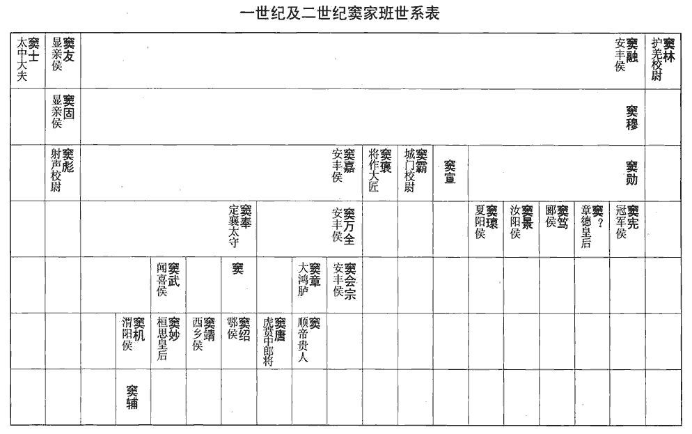
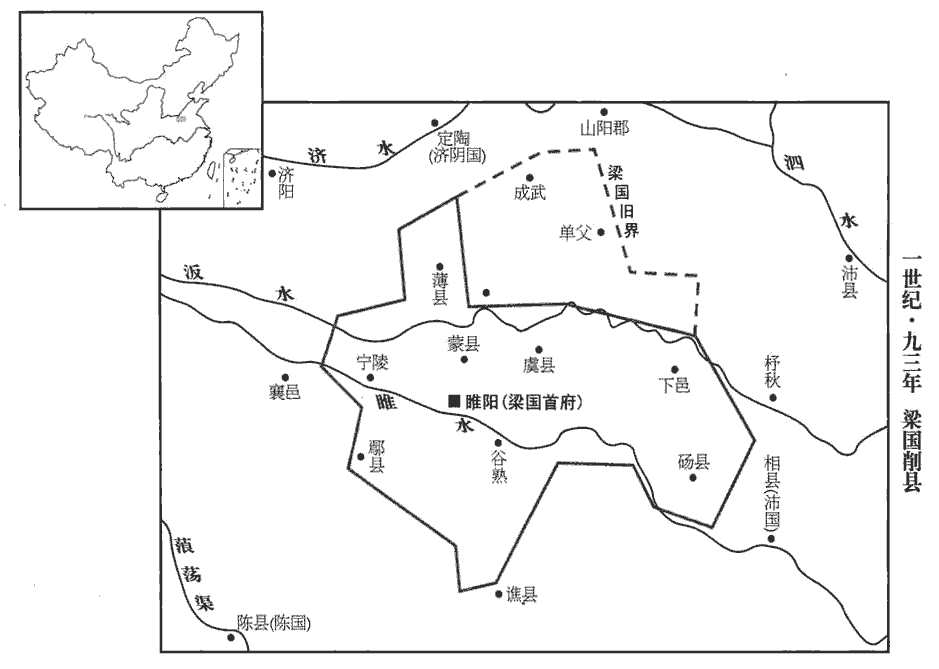
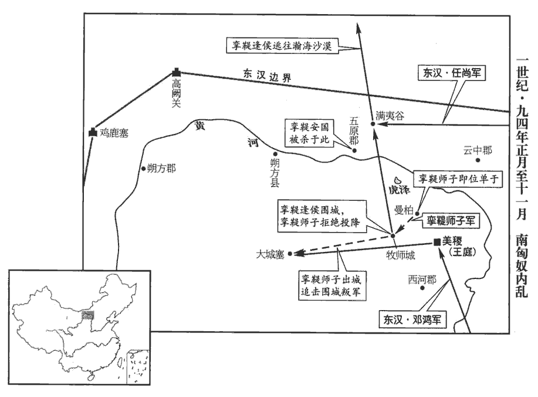
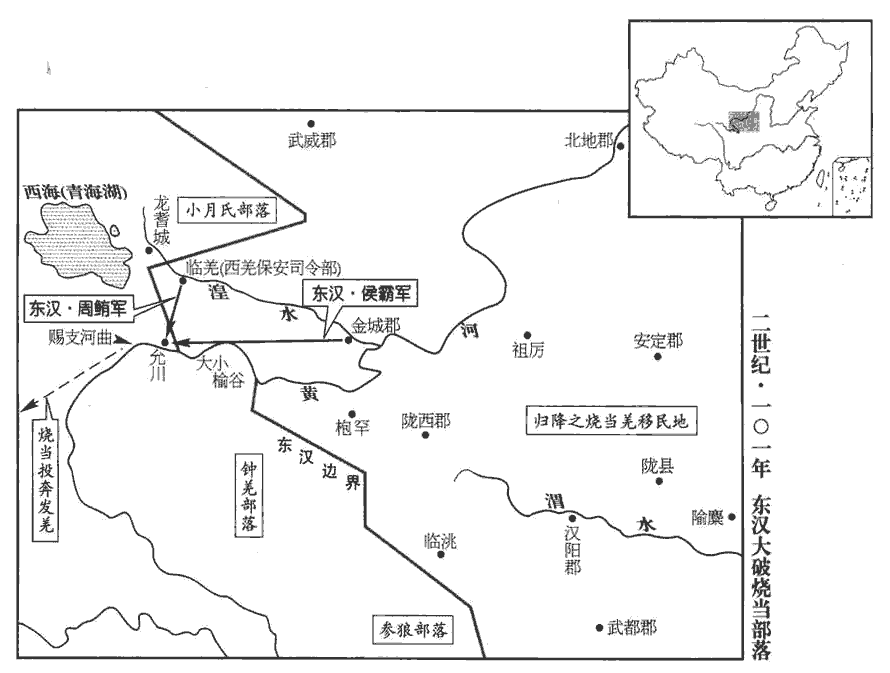

 漢紀四十起玄黓yì執徐（壬辰），盡旃蒙大荒落（乙巳），凡十四年。

# 孝和皇帝下

## 永元四年（壬辰，九二）

1春，正月，遣大將軍左校尉耿夔授於除鞬印綬，校，戶教翻。鞬，九言翻。使中郎將任尚持節衛護屯伊吾‹新疆哈密›，如南單于故事。任，音壬。

〖译文〗 [1]春季，正月，派遣大将军左校尉耿夔授予北匈奴于除印信绶带，命中郎将任尚持符节护卫，屯驻伊吾，一如南匈奴单于先例。

初，廬江‹安徽庐江›周榮辟袁安府，安舉奏竇景事見上卷元年。及爭立北單于事，見上卷上年。皆榮所具草，竇氏客太尉掾徐齮yǐ深惡之，掾，俞絹翻。齮，魚倚翻。惡，烏路翻。脅榮曰：「子為袁公腹心之謀，排奏竇氏，竇氏悍士、刺客滿城中，謹備之矣！」悍，下罕翻，又侯旰翻。榮曰：「榮，江淮孤生，得備宰士，賢曰：榮辟司徒府，故稱宰士。縱為竇氏所害，誠所甘心！」因敕妻子：敕，戒也。「若卒遇飛禍，卒，讀曰猝。賢曰：飛禍，言倉卒而死也。余謂飛禍者，言刺客竊發，不可得而備，若鳥之飛集也。無得殯斂，斂，力贍翻。冀以區區腐身覺悟朝廷。」

〖译文〗 当初，庐江人周荣在司徒袁安府中供职。袁安弹劾窦景和反对封立北匈奴单于等事所上的奏章，都由周荣起草。窦家的门客、太尉掾徐深为痛恨，他威胁周荣说：“您做袁公的心腹谋士，排斥弹劾窦家，窦家的壮士、刺客遍布京城，请好生防备吧！”周荣说：“我周荣是长江、淮河地区的一介孤单书生，有幸能在司徒府中任职，纵然被窦家所害，也确实心甘情愿！”于是他告诫妻子：“如果我突然遭遇飞来横祸，不要收殓安葬，我希望借此区区遗躯使朝廷省悟。”

2三月，癸丑‹十四›，司徒袁安薨。

〖译文〗 [2]三月癸丑（十四日），司徒袁安去世。

3閏月，丁丑‹九›，以太常丁鴻為司徒。

〖译文〗 [3]闰三月丁丑（初九），将太常丁鸿任命为司徒。

4夏，四月，丙辰‹十八›，竇憲還至京師。還，從宣翻，又如字。

〖译文〗 [4]夏季，四月丙辰（十八日），窦宪回到京城洛阳。

5六月，戊戌朔‹一›，日有食之。丁鴻上疏曰：「昔諸呂擅權，統嗣幾移；事見高后紀。幾，居希翻。哀、平之末，廟不血食。事見王莽紀，鴻引此事以指言外戚之禍。故雖有周公之親而無其德，不得行其勢也。賢曰：言親賢兼重，方可執政。今大將軍雖欲敕身自約，不敢僭差；然而天下遠近，皆惶怖承旨。怖，普布翻。刺史、二千石初除，謁辭、求通待報，初除而謁，之官則辭。求通者，求通名也；待報者，得謁與不得謁，得辭與不得辭，皆待報也。雖奉符璽，受臺敕，符璽所以為信，初除者詣尚書臺受敕。璽，斯氏翻。不敢便去，久者至數十日，背王室，背，蒲妹翻。向私門，此乃上威損，下權盛也。人道悖於下，效驗見於天，雖有隱謀，神照其情，垂象見戒，以告人君。悖，蒲內翻。見，賢遍翻。禁微則易，易，以豉翻。救末則難；人莫不忽於微細以致其大，恩不忍誨，義不忍割，去事之後，未然之明鏡也。言禍伏於隱微，人多忽之，及發見之後，昭昭而不可掩，是為未然之明鏡。夫天不可以不剛，不剛則三光不明；王不可以不強，不強則宰牧從橫。從，子用翻，又子容翻。橫，戶孟翻，又如字。宜因大變，改政匡失，以塞天意！」塞，悉則翻。

〖译文〗 [5]六月戊戌朔（初一），出现日食。丁鸿上书说：“当年吕氏家族专权，皇统几乎移位；哀帝、平帝末年，皇家宗庙祭祀中断。所以，即便是像周公那样的近亲，如果其人没有品德，也不能让他得势。如今大将军窦宪虽然希望自我约束，不敢有所僭越等级，但天下远近之人，全都对他诚惶诚恐地奉承听命。新任命的刺史、二千石官员，要到窦家拜谒辞行，求通姓名，听候答复。尽管已敬受皇上赐予的印信，接受过尚书台的训令，也不敢就此离去。等待召见的时间，久的要长达数十天。背对朝廷，趋向私门，这是君王威望受损、臣下权势过盛的表现。人间的伦常如果在下面被扰乱，天象就会出现相应的变化。尽管事有隐密，神灵也能洞察内情，用天象示警，以告诫人间的君王。在灾祸之初，可以轻易地加以禁绝，而到了灾祸之末，则难以挽救。人们无不是因疏忽了微小的祸端，以致酿成了大祸。出于恩情而不忍教诲，由于仁义而不忍割爱，而事过之后，再看灾祸发生前的迹象，便昭如明镜了。上天不可以不刚，不刚则日、月、星三光不亮；君王不可以不强，不强则大小官员横行无道。应当趁着天象示警，改正朝政的失误，以回报天意！”

6丙辰‹十九›，郡國十三地震。

〖译文〗 [6]丙辰（十九日），有十三个郡和封国发生地震。

7旱，蝗。

〖译文〗 [7]发生旱灾和蝗灾。

8竇氏父子兄弟并為卿、校卿，九卿；校，諸校尉。校，戶教翻。充滿朝廷，穰侯鄧疊、疊弟步兵校尉磊及母元、憲女婿射聲校尉郭舉、舉父長樂少府璜共相交結；賢曰：太后居長樂宮，故有少府，秩二千石。樂，音洛。元、舉并出入禁中，舉得幸太后，遂共圖為殺害，謀弒逆也。帝陰知其謀。是時，憲兄弟專權，帝與內外臣僚莫由親接，所與居者閹宦而已。閹宦，周禮謂之奄。鄭玄註曰：奄，精氣蔽藏者；今謂之宦人。閹，衣廉翻，又衣檢翻。帝以朝臣上下莫不附憲，獨中常侍鉤盾令鄭眾，謹敏有心幾，百官志：鉤盾令，秩六百石，宦者為之，典諸近池苑囿遊觀之處，屬少府。幾，事也；心幾，謂心事也，今人謂人胸中有城府者為有心事。朝，直遙翻。盾，食尹翻。幾，居希翻。不事豪黨，遂與眾定議誅憲，以憲在外，謂出屯涼州時也。慮其為亂，忍而未發；會憲與鄧疊皆還京師。還，從宣翻，又如字。時清河王慶，恩遇尤渥，渥，厚漬zì也。常入省宿止；省，禁中也。帝將發其謀，欲得外戚傳，賢曰：前書外戚傳。傳，直戀翻。懼左右，不敢使，令慶私從千乘王求，千乘王伉，帝長兄也。乘，繩證翻。夜，獨內之；又令慶傳語鄭眾，求索故事。賢曰：謂文帝誅薄昭，武帝誅竇嬰故事。索，山客翻。庚申‹二十三›，帝幸北宮，詔執金吾、五校尉勒兵屯衛南、北宮，執金吾掌宮外戒司非常，北軍五校尉主五營士，故令勒兵屯衛。閉城門，收捕郭璜、郭舉、鄧疊、鄧磊，皆下獄死。下，遐稼翻。遣謁者僕射收憲大將軍印綬，更封為冠軍侯，憲先已封冠軍侯，不受，今復封，以侯就國。更，居孟翻。與篤、景、瓌guī皆就國。瓌，古回翻。帝以太后故，不欲名誅憲言不欲正名誅之。為選嚴能相督察之。為，於偽翻。憲、篤、景到國，皆迫令自殺。

〖译文〗 [8]窦氏父子兄弟同为九卿、校尉，遍布朝廷。穰侯邓叠，他的弟弟、步兵校尉邓磊，母亲元，窦宪的女婿、射声校尉郭举，郭举的父亲、长乐少府郭璜等人，相互勾结在一起。其中元、郭举都出入宫廷，而郭举又得到窦太后的宠幸，他们便共同策划杀害和帝。和帝暗中了解到他们的阴谋。当时，窦宪兄弟掌握大权，和帝与内外臣僚无法亲身接近，一同相处的只有宦官而已。和帝认为朝中大小官员无不依附窦宪，唯独中常侍、钩盾令郑众谨慎机敏而有心计，不谄事窦氏集团，便同他密谋，决定杀掉窦宪。由于窦宪出征在外，怕他兴兵作乱，所以暂且忍耐而未敢发动。恰在此刻，窦宪和邓叠全都回到了京城。当时清河王刘庆特别受到和帝的恩遇，经常进入宫廷，留下住宿。和帝即将采取行动，想得《汉书·外戚传》一阅。但他惧怕左右随从之人，不敢让他们去找，便命刘庆私下向千乘王刘伉借阅。夜里，和帝将刘庆单独接入内室。又命刘庆向郑众传话，让他搜集皇帝诛杀舅父的先例。六月庚申（二十三日），和帝临幸北宫，下诏命令执金吾和北军五校尉领兵备战，驻守南宫和北宫；关闭城门，逮捕郭璜、郭举、邓叠、邓磊，将他们全部送往监狱处死。并派谒者仆射收回窦宪的大将军印信绶带，将他改封为冠军侯，同窦笃、窦景、窦一并前往各自的封国。和帝因窦太后的缘故，不愿正式处决窦宪，而为他选派严苛干练的封国宰相进行监督。窦宪、窦笃、窦景到达封国以后，全都强迫命令自杀。

 

初，河南尹張酺pú，數以正法繩治竇景，酺，薄乎翻。酺先為魏郡太守，郡人鄭據奏竇景罪，景遣掾夏猛私謝酺，使罪據子，酺收猛系獄。及入為河南尹，景家人擊傷市卒，吏捕得之，景怒，遣緹騎侯海毆傷市丞，酺部吏楊章窮究，正海罪，徙朔方。數，所角翻。治，直之翻。及竇氏敗，酺上疏曰：「方憲等寵貴，群臣阿附唯恐不及，皆言憲受顧命之託，懷伊、呂之忠，至乃復比鄧夫人於文母，賢曰：案鄧夫人，即穰侯鄧疊母元。張酺論憲兼及其黨，稱鄧夫人，猶如前書霍光妻稱霍顯，祁大伯母號祁夫人之類。復，扶又翻。今嚴威既行，皆言當死，不【章：甲十六行本「不」下有「復」字；張校同。】顧其前後，考折厥衷。折，之舌翻。衷，竹仲翻。臣伏見夏陽侯瓌guī每存忠善，前與臣言，常有盡節之心，檢敕賓客，未嘗犯法。臣聞王政骨肉之刑，有三宥之義，禮記：公族有罪，獄成，有司讞於公曰：「某之罪在大辟。」公曰：「宥之。」有司又曰：「在大辟。」公又曰：「宥之。」有司又曰：「在辟。」公又曰：「宥之。」及三宥不對，走出，致刑於甸人。公又使人追之曰：「必宥之。」有司對曰：「無及也。」反命於公，公素服，如其倫之喪。過厚不過薄。今議者欲為瓌選嚴能相，為，於偽翻。相，息亮翻，侯國相也。恐其迫切，必不完免，宜裁加貸宥，以崇厚德。」帝感其言，由是瓌guī獨得全。竇氏宗族賓客以憲為官者，皆免歸故郡。

〖译文〗 当初，河南尹张曾屡次依法制裁过窦景。及至窦氏家族败亡，张上书说：“当初窦宪等人受宠而身居显贵的时候，群臣阿谀附从他们唯恐不及，都说窦宪接受先帝临终顾命的嘱托，怀有辅佐商汤之伊尹、辅佐周武王之吕尚的忠诚，甚至还将邓叠的母亲元比作周武王的母亲文母。如今圣上的严厉诏命颁行以后，众人又都说窦宪等人该当处死，而不顾他们的前前后后，推究他们的真实思想。我看到夏阳侯窦一贯忠诚善良，他曾与我交谈，经常表露出为国尽节之心。他约束管教宾客，从未违犯法律。我听说圣明君王之政，对于亲属的刑罚，原则上能够赦免三次，可以过于宽厚，而不过于刻薄。如今有人建议为窦选派严厉干练的封国宰相，我担心这样会使窦遭到迫害，必不能保全性命而免去一死。应只对窦予以宽大，以增厚恩德。”和帝被他的言辞所感动，因此窦独得保全。窦氏家族及其宾客，凡因窦宪的关系而当官的，一律遭到罢免，被遣回原郡。

初，班固奴嘗醉罵洛陽令种兢，姓譜：种本仲氏，避難改焉。兢因逮考竇氏賓客，收捕固，死獄中。固嘗著漢書，尚未就，詔固女弟曹壽妻昭，踵而成之。昭，即曹大家也。

〖译文〗 当初，班固的奴仆曾因醉酒辱骂过洛阳令种兢。种兢便借着捉拿审讯窦家宾客的机会，逮捕了班固。班固死在狱中。班固曾编著《汉书》，当时尚未完稿。和帝下诏，命班固的妹妹、曹寿的妻子班昭继续撰写，完成此书。

華嶠論曰：固之序事，不激詭，不抑抗，賢曰：激，揚也。詭，毀也。抑，退也。抗，進也。余謂激詭抑抗，皆指史家作意以為文之病。華，戶化翻。贍而不穢，詳而有體，使讀之者亹wěi亹而不厭，爾雅曰：亹亹，猶勉勉也；音無匪翻。信哉其能成名也！固譏司馬遷是非頗謬於聖人，賢曰：言遷所是非與聖人乖謬，即崇黃、老而薄六經，輕仁義而賤守節是也。然其論議，常排死節，謂言龔勝竟夭天年之類。否正直，謂言王陵、汲黯之戇之類。而不敘殺身成仁之為美，謂不立忠義傳。則輕仁義，賤守節甚矣！

〖译文〗 华峤论曰：班固记述史事，不偏激，不诋毁，不贬抑，不抬举，丰富而不芜杂，周详而有系统，令人一读再读，不知厌倦。正是由于这个原因，他才得以成名。班固讥刺司马迁所是所非颇违背圣人之道，然而他自己的议论，却常常排斥死节，否定公正刚直，而且不记述杀身成仁者的美德。如此看来，班固本人则是太轻仁义、贱守节了！

9初，竇憲納妻，天下郡國皆有禮慶。漢中郡‹陝西汉中›亦當遣吏，漢中郡，在洛陽西千九百九十里。戶曹李郃hé郡有戶曹，主民戶、祠祀、農桑。郃，曷閤翻。諫曰：「竇將軍椒房之親，不修德禮而專權驕恣，危亡之禍，可翹足而待；翹，舉也。願明府一心王室，勿與交通。」太守固遣之，郃不能止，請求自行，許之。郃遂所在遲留以觀其變，行至扶風‹陝西興平›潘岳關中記曰：三輔舊治長安城中，長吏各居其縣治民。東都之後，扶風出治槐里，馮翊yì出治高陵。而憲就國。凡交通者皆坐免官，漢中太守獨不與焉。與，讀曰預。

〖译文〗 [9]当初，窦宪娶妻的时候，天下各郡各封国都致送贺礼。汉中郡也要派官员前去送礼，户曹李劝谏太守说：“窦将军身为皇后的亲属，不修养德礼，却专权骄横，他的危险败亡之祸，马上就要来临。愿阁下一心效忠王室，不要与他来往。”但太守坚持要派人送礼，李不能阻止，就请求让自己前去。太守应允。李便随处拖延停留，以观察形势变化。当他走到扶风时，窦氏家族倾覆。窦宪被遣送封国。凡与窦宪交往的官员，全都因罪免官，而汉中郡太守独不在内。

帝賜清河王慶奴婢、輿馬、錢帛、珍寶，充牣其第。慶或時不安，帝朝夕問訊，進膳藥，所以垂意甚備。慶亦小心恭孝，自以廢黜，尤畏事慎法，故能保其寵祿焉。

〖译文〗 和帝赏赐清河王刘庆奴婢、车马、钱帛、珍宝，装满他的府第。刘庆身体偶有不适，和帝就派人早晚探问，送去饮食和医药，垂顾关怀十分周到。而刘庆也小心谨慎而恭敬孝友，因自身曾遭废黜，他特别怕事，唯恐触犯法律，所以能够保住恩宠和厚禄。

10帝除袁安子賞為郎，任隗wěi子屯為步兵校尉，以安、隗守正不附竇氏也。任，音壬。隗，五罪翻。鄭眾遷大長秋。百官志：大長秋，秩二千石，承秦將行；景帝更為大長秋，或用士人，中興常用宦者。職掌奉宣中宮命，凡給賜宗親及宗親當謁見者關通之，中宮出則從。張晏曰：皇后卿。師古曰：秋者，收成之時，長者，恆久之義，故以為皇后官名。帝策勳班賞，眾每辭多受少，帝由是賢之，常與之議論政事，宦官用權自此始矣。

〖译文〗 [10]和帝将袁安的儿子袁赏任命为郎，将任隗的儿子任屯任命为步兵校尉，将郑众擢升为大长秋。和帝论功行赏，郑众总是谦让多而接受少。和帝因此认为郑众是位贤臣，常常同他一起讨论政事。宦官掌权，便从此开始了。

11秋，七月，乙丑‹二十三›，太尉宋由以竇氏黨策免，自殺。

〖译文〗 [11]秋季，七月己丑（二十三日），太尉宋由被指控为窦氏党羽，由和帝颁策罢免。宋由自杀。

12八月，辛亥‹十五›，司空任隗wěi薨。

〖译文〗 [12]八月辛亥（十五日），司空任隗去世。

13癸丑‹十七›，以大司農尹睦為太尉。太傅鄧彪以老病上還樞機職，上，時掌翻。尚書，樞機之職。鄧彪錄尚書。詔許焉，以睦代彪錄尚書事。

〖译文〗 [13]癸丑（十七日），将大司农尹睦任命为太尉。太傅邓彪因年老多病，请求辞去主管中枢机要的职务。和帝下诏应允，命令尹睦代替邓彪主管尚书事务。

14冬，十月，【章：甲十六行本「月」下有「己亥」‹四›二字；乙十一行本同；孔本同；退齋校同。】以宗正劉方為司空。

〖译文〗 [14]冬季，十月，将宗正刘方任命为司空。

15武陵‹湖南常德›、零陵‹湖南永州›、澧中‹澧水发源湖南桑植西北，东流至沅江市北，入洞庭湖›蠻叛。

〖译文〗 [15]武陵、零陵、澧中蛮人反叛。

16護羌校尉鄧訓卒，吏、民、羌、胡旦夕臨者日數千人。臨，力鴆翻，哭也。羌、胡或以刀自割，又刺殺其犬馬牛羊，刺，七逆翻，又七四翻。曰：「鄧使君已死，我曹亦俱死耳！」前烏桓吏士皆奔走道路，賢曰：訓前任烏桓校尉時吏士也。至空城郭；吏執，不聽，以狀白校尉徐傿yān，傿，蓋為烏桓校尉。傿，於建翻。傿歎息曰：「此為義也！」乃釋之。遂家家為訓立祠，為，於偽翻；下同。每有疾病，輒請禱求福。

〖译文〗 [16]护羌校尉邓训去世。宦吏、百姓、羌人和胡人从早到晚前往哀悼的，每日有数千人。有的羌人和胡人甚至用刀自刺，并杀死自己的狗马牛羊，说：“邓使君已死，我们也一起死吧！”邓训先前担任护乌桓校尉时的部下，全都上路奔丧，以至城郭为之一空。有关官员用逮捕奔丧者的手段进行阻拦，但人们并不理会。有关官员将情况报告了护乌桓校尉徐，徐叹道：“这是为了义呵！”便下令将被捕者释放。于是，当地家家户户为邓训立祠进行供奉，每当疾疫发生，人们就向邓训祭告祈福。

蜀郡‹四川成都›太守聶尚代訓為護羌校尉，欲以恩懷諸羌，乃遣譯使招呼迷唐，使還居大、小榆谷‹青海尖扎西›。迷唐去大、小榆谷，事見上卷章和二年。鄧訓驅逐迷唐，而聶尚招呼之，欲以反鄧訓之政也。聶，缺昵輒翻。使，疏吏翻。迷唐既還，遣祖母卑缺詣尚，卑缺，蓋迷吾之母。尚自送至塞下，為設祖道，令譯田汜等五人護送至廬落。迷唐遂反，與諸種共生屠裂汜等，以血盟詛，種，章勇翻。汜，詳里翻。詛，莊助翻。復寇金城‹甘肃永靖西北›塞。復，扶又翻。尚坐免。

〖译文〗 蜀郡太守聂尚接替邓训担任护羌校尉。他打算对羌人各部落实行怀柔政策，便派翻译做使者招抚迷唐，让他返回大、小榆谷居住。迷唐回到大、小榆谷以后，派他的祖母卑缺来拜见聂尚。聂尚亲自将卑缺送到边塞之外，为她饯行，命翻译田汜等五人护送她回到羌人驻地。但迷唐又一次反叛，会同各部落一道生屠田汜等人，割裂他们的肢体，用鲜血盟誓，再度侵犯金城塞。聂尚因罪 而免官。

## 五年（癸巳，九三）

1春，正月，乙亥‹十一›，宗祀明堂，登靈臺，赦天下。

〖译文〗 [1]春季，正月乙亥（十一日），和帝在明堂祭祀祖宗。登上灵台，观察天象。大赦天下。

2戊子‹二十四›，千乘貞王伉薨。諡法：臣諡，直道不撓曰貞；事君無猜曰貞；清白守節曰貞；固節幹事曰貞。伉，音抗。

〖译文〗 [2]戊子（二十四日），千乘贞王刘伉去世。

3辛卯‹二十七›，封皇弟萬歲為廣宗王。廣宗縣，屬钜鹿郡。賢曰：今貝州宗城縣。隋煬帝諱廣，故改為宗城。

〖译文〗 [3]辛卯（二十七日），将皇弟刘万岁封为广宗王。

4甲寅‹二十一›，太傅鄧彪薨。

〖译文〗 [4]甲寅（疑误），太傅邓彪去世。

5戊午‹二十五›，隴西‹甘肅臨洮›地震。

〖译文〗 [5]戊午（疑误），陇西郡发生地震。

6夏，四月，壬子‹二十›，紹封阜陵殤王兄魴為阜陵‹安徽全椒东南›王。諡法：未家短折曰殤。阜陵殤王沖，質王延之子，元年嗣封，三年薨，無嗣，今以魴紹封。魴，符方翻。

〖译文〗 [6]夏季，四月壬子（二十日），将已故阜陵殇王刘冲的哥哥刘鲂封为阜陵王。

7九月，辛酉‹一›，廣宗殤王萬歲薨，無子，國除。

〖译文〗 [7]九月辛酉（初一），广宗王刘万岁去世。因无子嗣，封国撤除。

8初，竇憲既立於除鞬為北單于，欲輔歸北庭，事見上卷三年。鞬，居言翻。會憲誅而止。於除鞬自畔還北，詔遣將兵長史王輔以千餘騎與任尚共追討，斬之，破滅其眾。

〖译文〗 [8]当初，窦宪将於除立为北匈奴单于以后，曾计划护送他返回北匈奴王庭。遇到窦宪败亡，该计划作罢。於除自行叛离，返回北方。和帝下诏，派将兵长史王辅率领一千余骑兵，同中郎将任尚一同追击讨伐。汉军将於除斩杀，消灭了他的部众。

9耿夔之破北匈奴也，事見上卷三年。鮮卑因此轉徙據其地。拓拔氏自北荒南徙，蓋此時也。匈奴餘種留者尚有十餘萬落，種，章勇翻。皆自號鮮卑；鮮卑由此漸盛。

〖译文〗 [9]自从耿夔大败北匈奴，鲜卑人便乘此机会辗转迁徙，占据了北匈奴的故地。匈奴人残存的还有十余万户，全都自称为鲜卑人。鲜卑从此日益强盛。

10冬，十月，辛未，太尉尹睦薨。

〖译文〗 [10]冬季，十月辛未（疑误），太尉尹睦去世。

11十一月，乙丑‹六›，太僕張酺為太尉。酺與尚書張敏等奏「射聲校尉曹褒，擅制漢禮，破亂聖術，宜加刑誅。」書凡五奏。帝知酺守學不通，言守其家學也。雖寢其奏，而漢禮遂不行。褒制禮事，見上卷章帝章和元年。

〖译文〗 [11]十一月乙丑（初六），将太仆张任命为太尉。张与尚书张敏等人上书指出：“射声校尉曹褒，擅自制定汉朝礼仪，破坏扰乱圣人之道，应当处以刑罚。”先后共上书五次。和帝知道张严守儒学正统，但僵固而不通达。他虽然不理会张的奏书，但从此便不再实行曹褒制定的汉礼。

12是歲，武陵‹湖南常德›郡兵破叛蠻，降之。降，戶江翻。

〖译文〗 [12]本年，武陵郡郡兵打败叛乱的蛮人，接受蛮人投降。

13梁王暢與從官卞忌祠祭求福，姓譜：卞本自有周曹叔振鐸之後，曹之支子封於卞，遂以建族。余按魯有卞莊子，楚有卞和。忌等諂媚云：「神言王當為天子。」暢與相應答，為有司所奏，請徵詣詔獄。帝不許，但削成武‹山東成武›、單父‹山東單縣›二縣。成武、單父二縣，本屬山陽，後屬濟陰，章帝以益梁國。賢曰：成武，今曹州縣；單父，今宋州縣。單，音善。暢慙懼，上疏深自刻責曰：「臣天性狂愚，不知防禁，自陷死罪，分伏顯誅。分，扶問翻。陛下聖德，枉法曲平，賢曰：曲平，曲法申恩，平處其罪。橫赦貸臣，為臣受汙。橫，胡孟翻。汙，惡也，天下以赦暢為納汙，是為暢受汙。為，於偽翻。臣知大貸不可再得，自誓束身約妻子，不敢復出入失繩墨，不敢復有所橫費，橫，戶孟翻。復，扶又翻。租入有餘，乞裁食睢陽‹河南商丘›、穀熟‹河南虞城西南谷熟镇›、虞‹河南虞城北›、蒙‹河南商丘›、寧陵‹河南寧陵›五縣，還餘所食四縣。四縣，下邑‹安徽碭山›、尉氏、薄‹山東曹縣南›、郾yǎn也。睢，音雖。臣暢小妻三十七人，凡非正室者，皆小妻也。其無子者，願還本家，自選擇謹敕奴婢二百人，其餘所受虎賁、官騎及諸工技、鼓吹、倉頭、奴婢，兵弩、廄馬，皆上還本署。虎賁士，屬虎賁中郎將。官騎，騶騎也。漢官儀曰：騶騎，王家名官騎，與廄馬皆屬太僕。工技，屬尚方。鼓吹，屬黃門。倉頭、奴婢，屬永巷、御府、奚官等令。兵弩，屬考工令。各有本署也。賁，音奔。技，渠綺翻。吹，昌瑞翻。上，時掌翻。臣暢以骨肉近親，亂聖化，汙清流，汙，烏故翻。既得生活，誠無心面目以凶惡復居大宮，食大國，張官屬，藏什物，賢曰：古者師行，二五為什，食器之類必共之，故曰什物、食具。今人通謂生生之具為什物。復，扶又翻。願陛下加恩開許。」上優詔不聽。

〖译文〗 [13]梁王刘畅与随从官卞忌一道祭祀祈福。卞忌等谄媚说：“神灵说大王应当做皇帝。”刘畅便同他对答谈论起来。有关官员对此提出弹劾，请求下令将刘畅征召进京，囚禁诏狱。和帝没有批准，只将刘畅的封土削去成武、单父两县。刘畅惭愧而又惶恐，上书痛切地自责道：“我生性狂妄愚昧，不知禁忌，自陷于死罪，按理该当诛杀示众。但陛下恩德深厚，违背法律和公平，而硬将我予以赦免，为我受到了玷污。我心知宽大的赦免不可再得，因此发誓约束自己和妻子儿女，不敢再有越轨的举动，也不敢再有浪费的行为。封国租税收入有余，我请求只享用睢阳、谷熟、虞、蒙、宁陵五县，将剩下的四县封土交还国家。我有妾三十七人，其中没有子女的，愿将她们送回娘家。我自己挑选谨慎规矩的奴婢二百人留下，除此之外，将赐给我的虎贲武士、骑兵仪仗，以及各种技艺的工匠、乐队、仆隶、奴婢、兵器、马匹，全部上缴原来所属官署。我身为圣上的骨肉近亲，竟扰乱圣明的教化，玷污纯洁的风气，如今既然已经保全性命，我实在无心无颜以罪恶之身再在巨大的宫室居住，拥有广袤的封国，设置官员僚属，收罗享用各种器具。愿陛下开恩准许我的请求。”和帝下诏表示宽大，温和地拒绝了他的请求。

 

14護羌校尉貫友貫，姓也，漢初有趙相貫高。遣譯使構離諸羌，誘以財貨，由是解散。使，疏吏翻。誘，音酉。乃遣兵出塞，攻迷唐於大、小榆谷‹青海尖扎西›，獲首虜八百餘人，收麥數萬斛，遂夾逢留大河築城塢，此大河即黃河。河水至此有逢留之名，在二榆谷北。作大航，造河橋，欲度兵擊迷唐。酈道元水經註曰：於河狹作橋。航，戶剛翻。迷唐率部落遠徙，依賜支河曲‹青海共和东南黃河›。西羌傳：賜支者，禹貢所謂析支者也。羌居河關之西南，濱於賜支，至於河首，緜地千里。司馬彪曰：西羌自析支以西濱河首，在右居也。河水屈而東北流，逕於析支之地，是為河曲矣。應劭曰：禹貢析支屬雍州，在河關之西，東去河關千餘里，羌人所居，謂之河曲羌。

〖译文〗 [14]护羌校尉贯友派翻译官做使者，离间羌人诸部落，并用财物进行引诱，羌人诸部落联盟因此瓦解。于是贯友派兵出塞，在大、小榆谷对迷唐展开进攻，斩杀及俘虏八百余人，缴获小麦数万斛，然后又在逢留大河两岸修筑城堡，制造大船，兴建河桥，打算派兵渡河去追击迷唐。迷唐率领部落向远方迁徙，到达赐支河曲。

15單于屯屠何死，單于宣弟安國立。安國初為左賢王，無稱譽；及為單于，單于適之子右谷蠡王師子，以次轉為左賢王。谷，音鹿。蠡，盧奚翻。師子素勇黠xiá多知，黠，下八翻。知，古智字通。前單于宣及屯屠何皆愛其氣決，數遣將兵出塞，數，所角翻；下同。掩擊北庭，還，受賞賜，天子亦加殊異。由是國中盡敬師子而不附安國，安國欲殺之；諸新降胡，初在塞外數為師子所驅掠，在塞外，謂先屬北部時。降，戶剛翻。多怨之。安國【章：甲十六行本「國」下有「因是」二字；乙十一行本同；孔本同；張校同。】委計降者，與同謀議。師子覺其謀，乃別居五原界，每龍庭會議，匈奴龍庭，本在塞外，是時南單于居塞內，亦謂所居為龍庭。師子輒稱病不往。度遼將軍皇甫稜知之，亦擁護不遣，單于懷憤益甚。

〖译文〗 [15]匈奴单于屯屠何去世，前单于宣的弟弟安国继位。安国曾为左贤王，声誉不佳，及至他当了单于，前单于适的儿子右谷蠡王师子按照顺序转升为左贤王。师子一向勇猛狡黠而足智多谋，前单于宣和屯屠何二人都喜爱他的勇气和果敢，屡次派他领兵出塞，去袭击北匈奴。他回师后，受到赏赐，汉朝皇帝也对他特别看重。因此，匈奴国内都尊敬师子而不依附安国，安国想杀死师子。而那些新投降的北匈奴人，当初在塞外曾屡遭师子的袭击掳掠，多对他十分痛恨。安国便将自己的打算寄托在投降者身上，和他们一同策划。师子察觉了他们的阴谋，就分居五原郡界。每逢匈奴王庭集会，他总是称病而不肯前往。度辽将军皇甫棱知悉这一内情，也支持保护师子而不派他前往王庭。单于安国愈发怀恨。

## 六年（甲午，九四）

1春，正月，皇甫稜免，以執金吾朱徽行度遼將軍。時單于與中郎將杜崇不相平，乃上書告崇；崇諷西河太守令斷單于章，中郎將，使匈奴中郎將也。斷，音短。單于居西河美稷‹內蒙准格爾旗›，故諷令太守斷其章，使不上聞。單于無由自聞。崇因與朱徽上言：「南單于安國，疏遠故胡，親近新降，遠，於願翻。近，其靳翻。降，戶江翻。欲殺左賢王師子及左臺且渠劉利等；又，右部降者，謀共迫脅安國起兵背畔，且，子餘翻。背，蒲妹翻。請西河‹內蒙准格爾旗西南›、上郡‹陝西榆林南鱼河堡›、安定‹宁夏鎮原›為之儆備。」帝下公卿議，下，遐稼翻。皆以為：「蠻夷反覆，雖難測知，然大兵聚會，必未敢動搖。今宜遣有方略使者之單于庭，之，往也。使，疏吏翻。與杜崇、朱徽及西河太守并力，觀其動靜。如無他變，可令崇等就安國會其左右大臣，責其部眾橫暴為邊害者，共平罪誅。相與平處其罪，當誅者則誅之。橫，戶孟翻。若不從命，令為權時方略，事畢之後，裁行賞賜，賢曰：裁量賜物，不多與也。亦足以威示百蠻。」【章：甲十六行本「蠻」下有「帝從之」二字；乙十一行本同；張校同。】於是徽、崇遂發兵造其庭。造，七到翻。安國夜聞漢軍至，大驚，棄帳而去，帳，單于所居，即謂之穹廬，又謂之廬帳。因舉兵欲誅師子。師子先知，乃悉將廬落入曼柏城‹內蒙达拉特旗东南六十公里马场壕›；曼柏縣，屬五原郡。安國追到城下，門閉，不得入。朱徽遣吏譬【章：甲十六行本「譬」上有「曉」字；乙十一行本同；退齋校同。】和之，安國不聽，城既不下，乃引兵屯五原‹內蒙包頭›。崇、徽因發諸郡騎追赴之急，眾皆大恐，安國舅骨都侯喜為等慮并被誅，乃格殺安國，被，皮義翻。考異曰：帝紀在去年，誤。今從南匈奴傳。立師子為亭獨尸逐侯鞮單于。鞮，丁奚翻。

〖译文〗 [1]春季，正月，将皇甫棱免官，命执金吾朱徽代理度辽将军职务。当时因匈奴单于与中郎将杜崇不和，单于便上书控告杜崇。杜崇暗示西河太守截留单于的奏章，使单于无法申诉自己的意见。杜崇自己却乘机与朱徽一同上书说：“南匈奴单于安国，疏远旧部，亲近新降之人，想要杀害左贤王师子和左台且渠刘利等。再者，匈奴右部的投降者正在策划共同胁迫安国起兵反叛。请西河、上郡、安定三郡为此警戒备战。”和帝将此事交付公卿进行讨论。众人都认为：“匈奴反复无常，尽管难以预料，但由于汉朝有重兵集结，它必定不敢有大的举动。如今应派遣有谋略的使者前往单于王庭，与杜崇、朱徽及西河太守合作，观察匈奴的动静。如果没有其它变化，可命令杜崇等人在安国那里召集他的左右大臣，责罚横行凶暴侵害边疆的部众，共同评议，论罪诛杀。倘若安国不听从命令，则授权使者随机应变，采取权宜之计，等事情结束之后，再酌情进行赏赐，也足以向所有蛮族显示汉朝的国威。”朱徽、杜崇便率军来到匈奴王庭。安国夜里听到汉军抵达的消息，大为震惊，丢弃庐帐而逃，随即调集军队，要诛杀师子。师子事先得到消息，便率领全体部众进入曼柏城。安国追到城下，城门关闭，不能进入。朱徽派官员进行调停，安国不肯接受。城既不能攻克，安国便率兵驻扎五原。于是杜崇、朱徽调发各郡骑兵急速追击，匈奴人全都大为恐慌。安国的舅父、骨都侯喜为等担心一并被诛，便将安国格杀，拥立师子为亭独尸逐侯单于。

2己卯‹二十一›，司徒丁鴻薨。

〖译文〗 [2]正月己卯（二十一日），司徒丁鸿去世。

3二月，丁未‹二十›，以司空劉方為司徒，太常張奮為司空。

〖译文〗 [3]二月丁未（二十日），将司空刘方任命为司徒，将太常张奋任命为司空。

4夏，五月，城陽‹山东鄄城东南›懷王淑薨，無子，國除。

〖译文〗 [4]夏季，五月，城阳怀王刘淑去世。因无子嗣，封国撤除。

5秋，七月，京師旱。

〖译文〗 [5]秋季，七月，京城发生旱灾。

6西域都護班超發龜茲‹新疆庫車›、鄯善‹新疆若羌›等八國兵合七萬餘人龜茲，音丘慈。鄯，上扇翻。討焉耆‹新疆焉耆›，到其城下，誘焉耆王廣、尉犁‹新疆博湖›王汎等於陳睦故城，斬之，傳首京師；誘，音酉。考異曰：袁紀「汎」作「沈」，今從超傳。因縱兵鈔掠，鈔，楚交翻。斬首五千餘級，獲生口萬五千人，更立焉耆左侯元孟為焉耆王。焉耆國有左右將、左右侯。更，工衡翻。超留焉耆半歲，慰撫之。於是西域五十餘國悉納質內屬，至於海濱，西海之濱也，所謂條支、大秦、蒙奇、兜勒諸國也。質，音致。四萬里外，皆重譯貢獻。重，直龍翻。班超所以成西域之功者，以匈奴衰困，力不能及西域也。

〖译文〗 [6]西域都护班超征发龟兹、鄯善等八国军队，共七万余人，讨伐焉耆。大军抵达焉耆城下，把焉耆王广、尉黎王等引诱到已故西域都护陈睦驻扎过的故城，然后斩杀，将人头送往京城洛阳。班超乘胜放纵士兵抄劫掳掠，斩杀五千余人，生擒一万五千人，改立焉耆左侯元孟为焉耆王。班超留驻焉耆半年，进行安抚。于是西域五十余国全都派送人质，归附汉朝。远至西海之滨，四万里外的国家，都经过几重翻译来汉朝进贡。

7南單于師子立，降胡五六百人夜襲師子，降，戶江翻。安集掾王恬將衛護士與戰，破之。使匈奴中郎將置掾，隨事為員，安集掾，以安集匈奴為稱也。光武在河北，亦置安集掾，以天下未定，使之安集斯民也。建武二十六年，使匈奴中郎將置安集掾史，將弛刑五十人，持兵弩隨單于所處，參辭訟，察動靜。掾，俞絹翻。於是降胡遂相驚動，十五部二十餘萬人皆反，脅立前單于屯屠何子薁yù鞮日逐王逢侯為單于，「鞮」，當作「鞬」。賢曰：前「鞮」、「鞬」兩字通，今不改亦可。薁，於六翻。鞬，九言翻。遂殺略吏民，燔fán燒郵亭、廬帳，將車重向朔方‹內蒙杭锦旗北黄河南岸›，欲度幕北。郵，音尤。重，直用翻。九月，癸丑，以光祿勳鄧鴻行車騎將軍事，與越騎校尉馮柱、行度遼將軍朱徽將左右羽林、北軍五校士及郡國跡射、緣邊兵，賢曰：漢有跡射士，言尋跡而射也。烏桓校尉任尚將烏桓、鮮卑合四萬人討之。時南單于及中郎將杜崇屯牧師城‹內蒙東勝东›，漢邊郡有牧師菀wǎn以養馬，此牧師菀城也，當在西河郡美稷縣界。逢侯將萬餘騎攻圍之。冬，十一月，鄧鴻等至美稷，逢侯乃解圍去，向滿夷谷‹內蒙包头北›，南單于遣子將萬騎及杜崇所領四千騎，與鄧鴻等追擊逢侯於大城塞‹內蒙杭锦旗东南三十公里›，大城縣故屬西河郡，郡國志屬朔方郡。斬首四千餘級。任尚率鮮卑、烏桓要擊逢侯於滿夷谷‹內蒙包头北›，要，一遙翻。復大破之，復，扶又翻；下同。前後凡斬萬七千餘級。逢侯遂率眾出塞，漢兵不能追而還。還，從宣翻，又如字。

〖译文〗 [7]南匈奴单于师子即位后，有五六百投降的北匈奴人乘夜袭击师子。安集掾王恬率领卫士迎战，将他们击败。于是投降的北匈奴人互相惊扰，十五个部落、二十余万人全部叛变。他们胁迫前单于屯屠何的儿子日逐王逢侯，将他立为单于。然后，屠杀抢劫官吏百姓，焚烧邮亭和庐帐，带着辎重前往朔方，打算穿越大漠北去。九月癸丑（疑误），和帝命光禄勋邓鸿代理车骑将军职务，同越骑校尉冯柱、代理度辽将军朱徽一道率领左右羽林军、北军五校士及各郡各封国的弓箭手、边郡士兵，另由乌桓校尉任尚率领乌桓、鲜卑部队，共计四万人，进行讨伐。当时，南匈奴单于和中郎将杜崇驻扎在牧师城，逢侯率领万余骑兵向他们发动围攻。冬季，十一月，邓鸿等到达美稷，逢侯这才解围离去，向满夷谷行进。南单于派他的儿子率领一万骑兵及杜崇部下四千骑兵，会同邓鸿的部队，在大城塞追击逢侯，斩杀四千余人。任尚则率领鲜卑、乌桓兵在满夷谷进行截击，再次大败叛军。先后共斩杀一万七千余人。于是逢侯率领部众逃出塞外，汉军因无法追击而返回。

 

8以大司農陳寵為廷尉。寵性仁矜，數議疑獄，數，所角翻。每附經典，務從寬恕，刻敝之風，於此少衰。少，詩沼翻。

〖译文〗 [8]和帝将大司农陈宠任命为廷尉。陈宠生性仁厚端庄，曾多次审理疑难案件，总是引用儒家经典，力求遵循宽恕之道。苛刻的风气，从此稍有衰减。

9帝‹刘肇，时年十六›以尚書令江夏‹湖北新洲›黃香為東郡‹河南濮陽西南›太守，香辭以：「典郡從政，才非所宜，乞留備冗官，冗，而隴翻，散也。賜以督責小職，任之宮臺煩事。」宮，謂宮中；臺，謂尚書臺也。尚書出納王命，故云宮臺煩事。帝乃復留香為尚書令，增秩二千石，按百官志：尚書令秩千石，今特增秩二千石，以香在尚書日久，又辭不拜郡，故復留為尚書令而祿以郡守祿。甚見親重。香亦祗勤物務，憂公如家。

〖译文〗 [9]和帝任命尚书令江夏人黄香为东郡太守。黄香推辞道：”主管郡的地方行政，我的能力并不适宜。请让我留下充当散官，赐予从事督察的微职，承担宫中尚书台的繁琐事务。”于是和帝便重新任命黄香为尚书令，而将官秩增加为二千石，对他很是亲近器重。黄香本人也谦恭勤奋，忠于职守，忧公事如忧家事。

## 七年（乙未，九五）

1春，正月，鄧鴻等軍還，馮柱將虎牙營留屯五原‹內蒙包頭›；鴻坐逗留失利，下獄死。後帝知朱徽、杜崇失胡和，又禁其上書，以致胡反，皆徵，下獄死。下，遐稼翻。

〖译文〗 [1]春季，正月，邓鸿等率军班师，冯柱率虎牙营留驻五原。邓鸿被指控逗留不进、坐失军机，下狱处死。后来，和帝发现了朱徽、杜崇与匈奴不和，并使单于无法上书，致使匈奴反叛，于是将朱、杜二人征召进京，下狱处死。

2夏，四月，辛亥朔‹一›，日有食之。

〖译文〗 [2]夏季，四月辛刻朔（初一），出现日食。

3秋，七月，乙巳‹二十六›，易陽‹河北永年东南›地裂。余按地理志及郡國志，易陽縣屬趙國。應劭曰：易水出涿郡故安；師古及賢皆曰縣在易水之陽，此皆承應劭之誤也。易水在燕南界，漢屬河間郡界，此時趙國僅有唐邢、洺二州之地，安得有屬縣遠在易水之陽邪！五代史志：洺州臨洺縣，舊曰易陽，後齊廢，入襄國縣；後周改為易陽縣，別置襄國縣；隋開皇六年，改易陽縣為邯鄲縣，十年，改邯鄲縣為臨洺而別置邯鄲縣。由是觀之，漢易陽縣當在邯鄲、襄國二縣之間。

〖译文〗 [3]秋季，七月乙巳（二十六日），易阳发生地裂。

4九月，癸卯‹二十五›，京師地震。

〖译文〗 [4]九月癸卯（二十五日），京城洛阳发生地震。

5樂成王黨坐賊殺人，削東光‹河北東光›、鄡qiāo‹河北辛集东›二縣。東光縣，本屬勃海郡；鄡縣，本屬钜鹿郡，章帝以益樂成國。鄡，音羌堯翻。舊禁宮人出嫁，不得適諸國。有故掖庭技人哀置嫁男子章初，黨召入宮與通；初欲上書告之，黨賂哀置姊昭殺初。

〖译文〗 [5]乐成王刘党被指控有杀人之罪，削去封国的东光、县二县。

## 八年（丙申，九六）

1春，二月，立貴人陰氏為皇后。后，識之曾孫也。

〖译文〗 [1]春季，二月，将贵人阴氏立为皇后，阴皇后是阴识的曾孙女。

2夏，四月，【章：甲十六行本「月」下有「癸亥」‹十八›二字；乙十一行本同；退齋校同。】樂成靖王黨薨。子哀王崇立，尋死，無子，國除。

〖译文〗 [2]夏季，四月，乐成靖王刘党去世。他的儿子哀王刘崇继位为王，不久也去世了。因无子嗣，封国撤除。

3五月，河內‹河南武陟›、陳留‹河南陳留›蝗。

〖译文〗 [3]五月，河内、陈留两郡发生蝗灾。

4南匈奴‹王庭设美稷，内蒙准格尔旗›右溫禺犢王烏居戰畔出塞。賢曰：溫禺犢王名烏居戰。秋，七月，度遼將軍龐奮、越騎校尉馮柱追擊破之，徙其餘眾及諸降胡二萬餘人於安定‹宁夏固原›、北地‹寧夏吴忠西南金积镇›。安定郡，在雒陽西千七百里。北地郡，在雒陽西千一百里。

〖译文〗 [4]南匈奴右温禺犊王乌居战反叛出塞。秋季，七月，度辽将军庞奋、越骑校尉冯柱出兵追击，打败乌居战，将他的残余部众及归降的匈奴部落二万余人迁徙到安定、北地二郡。

5車師後部‹新疆吉木萨尔南›王涿鞮反，擊前‹新疆吐魯番›王尉畢大，獲其妻子。「尉畢大」，西域傳作「尉卑大」。時戊己校尉索頵jūn欲廢後部王涿鞮，涿鞮忿前王尉卑大賣己，因反，擊尉卑大。鞮，丁奚翻。

〖译文〗 [5]车师后部王涿反叛，攻击车师前王尉毕大，俘虏了尉毕大的妻子儿女。

6九月，京師蝗。

〖译文〗 [6]九月，京城洛阳发生蝗灾。

7冬，十月，乙丑‹二十三›，北海王威以非敬王子，又坐誹謗，自殺。

〖译文〗 [7]冬季，十月乙丑（二十三日），北海王刘威由于不是前北海王刘睦的亲子，并被指控犯有诽谤之罪，因而自杀。

8十二月，辛亥‹十›，陳敬王羨薨。

〖译文〗 [8]十二月辛亥（初十），陈敬王刘羡去世。

9丁巳‹十六›，南宮宣室殿火。

〖译文〗 [9]丁巳（十六日），南宫宣室殿失火。

10護羌校尉貫友卒，以漢陽‹甘肅甘谷›太守史充代之。充至，遂發湟中‹青海東北›羌、胡出塞擊迷唐。迷唐迎敗充兵，敗，補邁翻。殺數百人。充坐徵，以代郡‹山西陽高›太守吳祉代之。

〖译文〗 [10]护羌校尉贯友去世。命汉阳太守史充接替贯友之职。史充到任后，便征发湟中的羌人、胡人出塞攻打迷唐。迷唐迎战，打败史充的部队，杀死数百人。史充因罪被召回京城，命代郡太守吴祉接替史充之职。

## 九年（丁酉，九七）

1春，三月，庚辰‹十›，隴西‹甘肅臨洮›地震。

〖译文〗 [1]春季，三月庚辰（初十），陇西郡发生地震。

2癸巳‹二十三›，濟南安王康薨。諡法：好和不爭曰安；寬裕和平曰安。濟，子禮翻。

〖译文〗 [2]癸巳（二十三日），济南安王刘康去世。

3西域長史王林擊車師後王‹新疆吉木萨尔南›，斬之。後王涿鞮。

〖译文〗 [3]西域长史王林进攻车师后王，将他斩杀。

4夏，四月，丁卯‹二十八›，封樂成王黨子巡為樂成‹河北冀县›王。

〖译文〗 [4]夏季，四月丁卯（二十八日），将乐成王刘党的儿子刘巡封为乐成王。

5五月，封皇后父屯騎校尉陰綱為吳房侯，郡國志：吳房縣，屬汝南郡，有棠谿亭。左傳，房國，楚靈王所滅，又，楚昭王封吳王夫概於棠谿。地道記有吳城。吳房蓋合吳城、房國以名縣也。以特進就第。

〖译文〗 [5]五月，将皇后的父亲、屯骑校尉阴纲封为吴房侯，阴纲以特进身份离开官位，前往邸第。

6六月，旱，蝗。

〖译文〗 [6]六月，发生旱灾和蝗灾。

7秋，八月，鮮卑寇肥如‹河北迁安东北›，遼東‹遼寧遼陽›太守祭參坐沮敗，下獄死。賢曰：肥如縣，屬遼西郡。前書音義曰：肥子奔燕，封於此，今平州也。按祭肜róng傳：參守遼東，鮮卑入郡界，參坐沮敗，下獄死。蓋寇遼西之肥如，遂入遼東郡界也。沮，在呂翻。

〖译文〗 [7]秋季，八月，鲜卑侵犯肥如。辽东太守祭参被指控怯懦无能、作战失利，下狱处死。

8閏月，辛巳‹十四›，皇太后竇氏崩。初，梁貴人既死，事見四十六卷章帝建初八年。宮省事祕，莫有知帝為梁氏出者。舞陰公主子梁扈遣從兄䄠奏記三府，扈，梁松子也。帝母梁貴人，少失母，為伯母舞陰公主所養。從，才用翻。賢曰：䄠，古禪字。以為「漢家舊典，崇貴母氏，而梁貴人親育聖躬，不蒙尊號，求得申議。」賢曰：求申理而議之也。太尉張酺pú言狀，帝感慟良久，曰：毛晃曰：良，頗也；良久，頗久也。或曰：良久，少久也。一曰：良，略也，聲輕，故轉略為良。慟，徒弄翻，大哭也，哀過也。「於君意若何？」酺請追上尊號，存錄諸舅。錄，采也，收拾也。帝從之。會貴人姊南陽‹河南南陽›樊調妻嫕yì嫕，音於計翻。考異曰：袁紀「嫕」皆作「憑」，今從皇后紀、梁竦傳。上書自訟曰：「妾父竦冤死牢獄，骸骨不掩；母氏年踰七十，及弟棠等遠在絕域，不知死生。願乞收竦朽骨，使母、弟得歸本郡。」帝引見嫕，乃知貴人枉歿之狀。三公上奏，「請依光武黜呂太后故事，事見四十五卷光武中元元年。按此事乃光武之失，而可引之為故典乎！貶竇太后尊號，不宜合葬先帝，百官亦多上言者。帝手詔曰：「竇氏雖不遵法度，而太后常自減損。朕奉事十年，自嗣位至是十年。深惟大義：惟，思也。禮，臣子無貶尊上之文，恩不忍離，義不忍虧。案前世，上官太后亦無降黜，謂上官桀父子誅，不累及上官后也。事見二十二卷昭帝元鳳元年。其勿復議！」復，扶又翻。丙申‹二十九›，葬章德皇后。

〖译文〗 [8]闰八月辛巳（十四日），皇太后窦氏驾崩。当初，梁贵人死后，宫廷保守秘密，没有人知道和帝是梁贵人所生。至此，舞阴公主之子梁扈派堂兄梁向太尉、司徒、司空三府上书，提出：“汉朝旧制，一向尊崇皇帝生母。然而梁贵人亲自诞育皇上，却没有尊号，请求得到申理讨论。”太尉张向和帝报告了实情。和帝伤感哀痛良久，说道：“您认为应当怎样？”张建议为梁贵人追加尊号，并查找各位舅父，给予他们应有的名份。和帝听从了他的建议。适逢梁贵人的姐姐、南阳人樊调的妻子梁上书自诉道：“我的父亲梁竦屈死在牢狱之中，尸骨不得掩埋；母亲年过七十，同弟弟梁堂等在极远的边域，不知道是死是活。我请求准许安葬父亲的朽骨，让我的母亲和弟弟返回故郡。”和帝召见梁，这才知道生母梁贵人枉死的惨状。三公上书：“请依照光武帝罢黜吕太后的先例，贬去窦太后的尊号，不应让他与先帝合葬。”文武百官也纷纷上言。和帝亲手写诏作答：“窦氏家族虽不遵守法律制度，但窦太后却常常自我减损。朕将她当作母亲，侍奉了十年。深思母子大义：依据礼制，为臣、为子者没有贬斥尊长的道理。从亲情出发，不忍将太后之墓与先帝之墓分离；从仁义考虑，不忍作有损于窦太后的事情。考察前代，上官桀被诛杀，而上官太后也不曾遭到贬降罢黜。对此事不要再作议论！”丙申（二十九日），安葬窦太后。

9燒唐【章：甲十六行本「唐」作「當」；乙十一行本同；熊校同。】羌迷唐率眾八千人寇隴西‹甘肅臨洮›，脅塞內諸種羌合步騎三萬人擊破隴西兵，殺大夏‹甘肅广河›長。大夏縣，屬隴西郡。宋白曰：今大夏縣屬河州。夏，戶雅翻。種，章勇翻。長，知兩翻。詔遣行征西將軍劉尚、越騎校尉趙世副之，以趙世副劉尚也。考異曰：西羌傳作「趙代」，今從帝紀。余謂唐太宗諱世民，賢註范史，偶檢點及此，遂改「世」為「代」耳。將漢兵、羌、胡共三萬人討之。尚屯狄道‹甘肅臨洮›，世屯枹罕‹甘肅臨夏›；狄道、枹罕二縣，皆屬隴西郡。宋白曰：狄道縣，屬蘭州；枹罕縣，河州治所。枹，音膚。尚遣司馬寇盱監諸郡兵，四面并會。監，古銜翻。迷唐懼，棄老弱，奔入臨洮‹甘肃岷县›南。奔入臨洮南山也。尚等追至高山，大破之，斬虜千餘人。迷唐引去，漢兵死傷亦多，不能復追，復，扶又翻。乃還。

〖译文〗 [9]烧当羌部落首领迷唐率领部众八千人侵犯陇西郡，并裹胁塞内各羌人部落，共计步兵、骑兵三万人，打败了陇西郡郡兵，杀死大夏县长。和帝下诏，派遣刘尚代理征西将军，以越骑校尉赵世为刘尚的副手，率领汉兵和羌、胡兵，共三万人，进行讨伐。刘尚驻扎在狄道，赵世驻扎在罕。刘尚派司马寇盱监督各郡郡兵，从四面一同会合。迷唐感到恐惧，抛弃了部落中的老弱成员，逃到临洮之南。刘尚等人追击到高山，大败迷唐军，斩杀、俘获一千余人。迷唐退走。汉军也有大量死伤，不能再继续追赶，于是回师。

10九月，庚申‹二十四›，司徒劉方策免，自殺。

〖译文〗 [10]九月庚申（二十四日），和帝颁策将刘方免官。刘方自杀。

11甲子‹二十八›，追尊梁貴人為皇太后，諡曰恭懷，追復喪制。冬，十月，乙酉‹十九›，改葬梁太后及其姊大貴人於西陵。西陵，蓋以其地在敬陵之西，故稱西陵，猶薄太后陵在霸陵南，因謂之南陵也。賢曰：初，后葬有闕，故改葬。擢樊調為羽林左監。追封諡皇太后父竦為褒親湣侯，諡法：在國逢難曰湣。遣使迎其喪，葬於恭懷皇后陵旁。徵還竦妻子；封子棠為樂平侯，樂平，侯國，屬東郡，故清縣也，章帝更名。棠弟雍為乘氏侯，乘氏，侯國，屬濟陰郡，春秋之乘丘也。乘，繩證翻。雍弟翟為單父侯，單父，音善甫。位皆特進，賞賜以巨萬計，寵遇光於當世，梁氏自此盛矣。

〖译文〗 [11]甲子（二十八日），和帝追尊梁贵人为皇太后，谥号“恭怀”，追补服丧。冬季，十月乙酉（十九日），将梁太后及她的姐姐梁大贵人之墓改葬到章帝陵墓之西。将樊调擢升为羽林左监。追封皇太后之父梁竦为褒亲侯，谥号为“愍”，派使者迎接他的灵柩，葬在梁太后墓旁。召回梁竦的妻子儿女，将梁竦的儿子梁棠封为乐平侯，将梁棠的弟弟梁雍封为乘氏侯，将梁雍的弟弟梁翟封为单父侯，全都位居特进。他们所得的赏赐极多，所蒙受的的恩宠和优待荣耀于当世。梁氏家族从此兴盛了。

清河王慶始敢求上母宋貴人塚，宋貴人塚，在雒陽城北樊濯聚。上，時掌翻。帝許之，詔太官四時給祭具。慶垂涕曰：「生雖不獲供養，供，俱用翻。養，羊尚翻。終得奉祭祀，私願足矣！」欲求作祠堂，恐有自同恭懷梁后之嫌，遂不敢言，常泣向左右，以為沒齒之恨。齒，年也。後上言：「外祖母王年老，乞詣雒陽療疾，」於是詔宋氏悉歸京師，宋氏歸故郡，事見四十六卷章帝建初七年。除慶舅衍、俊、蓋、暹xiān等皆為郎。

〖译文〗 清河王刘庆这才敢请求为母亲宋贵人祭扫坟墓。和帝应许，下诏命令太官春夏秋冬四季供应祭祀之物。刘庆流泪说道：“虽然不能在母亲生前供养，但最终能为她进行祭祀，我的心愿满足了！”他想请求为母亲建造祠堂，但又害怕有自比梁太后的嫌疑，于是不敢开口。他经常对左右随从哭泣，认为这是终身之憾。后来，他上书说：“我的外祖母王氏年事已高，请准许她到洛阳治病。”于是和帝下诏准许宋氏全家返回京城，并将刘庆的舅父宋衍、宋俊、宋盖、宋暹等全都任命为郎。

12十一月，癸卯‹八›，以光祿勳河南‹河南洛陽›呂蓋為司徒。

〖译文〗 [12]十一月癸卯（初八），将光禄勋、河南人吕盖任命为司徒。

13十二月，丙寅‹一›，司空張奮罷。壬申‹七›，以太僕韓稜為司空。

〖译文〗 [13]十二月丙寅（初一），将司空张奋免官。十二月壬申（初七），将太仆韩棱任命为司空。

14西域都護定遠侯班超遣掾甘英使大秦‹羅馬帝國›、條支‹叙利亚›，東觀記曰：以漢中郡南鄭縣之西鄉千戶封超為定遠侯。賢曰：定遠故城，在今洋州西鄉縣南。西域傳曰：自皮山西南經烏秅ná，涉懸度，歷罽jì賓，六十餘日，行至烏弋山離國，復西南，馬行百餘日，至條支。條支臨西海，海水曲環其南及東北三面，路絕，唯西北隅通陸道。大秦國，西漢之犁軒也，在西海西，其人民長大平正，有類中國，故謂之大秦，今拂菻國是也。掾，俞絹翻。使，疏吏翻。窮西海，皆前世所不至，莫不備其風土，傳其珍怪焉。及安息‹伊朗›西界，自條支轉北而東，馬行六十餘日，至安息。臨大海‹地中海›，欲渡，船人謂英曰：「海水廣大，往來者逢善風，善風，謂順風也。三月乃得渡，若遇遲風，亦有二歲者；故入海，人皆齎jí三歲糧，海中善使人思土戀慕，數有死亡者。」數，所角翻。英乃止。

〖译文〗 [14]西域都护、定远侯班超派遣属官甘英出使大秦帝国和条支王国。甘英走遍了西海一带，沿途所经，都是前代之人所未到过的地方，他在各处都全面了解风土人情，收集带走珍奇的物产。当他到达安息国西部边界的时候，遇到了大海。他打算渡过大海，船夫告诉他说：“海水广阔，航海者遇到顺风，要用三个月才能到达彼岸；如果遇到逆风，也有用两年的。所以，渡海的人都带上三年的口粮。海上容易使人怀恋乡土，经常有人死亡。”甘英这才作罢。

## 十年（戊戌，九八）

1夏，五月，京師大水。

〖译文〗 [1]夏季，五月，京城洛阳发生水灾。

2秋，七月，己巳，司空韓稜薨。八月，丙子‹十五›，以太常太山巢堪為司空。

〖译文〗 [2]秋季，七月己巳（疑误），司空韩棱去世。八月丙子（十五日），将太常太山人巢堪任命为司空。

3冬，十月，五州雨水。

〖译文〗 [3]冬季，十月，有五个州大雨成灾。

4行征西將軍劉尚、越騎校尉趙世坐畏懦徵，下獄，免。謁者王信領尚營屯枹罕‹甘肅臨夏›，謁者耿譚領世營屯白石‹甘肅臨夏西南›。白石縣，本屬金城郡，時屬隴西郡。水經註：白石川水南逕白石城西而注灕水，水又逕白石縣故城南。闞駰曰：白石縣，在狄道縣西北二百八十五里。賢曰：白石山在今蘭州；或曰：河州鳳林縣，本漢白石縣，張駿改為永固，唐為烏州，後廢州置安昌縣，後又更名鳳林。杜佑曰：直道縣有白石山。譚乃設購賞，諸種頗來內附。迷唐恐，乃請降；信、譚遂受降罷兵。十二月，迷唐等帥種人詣闕貢獻。帥，讀曰率。種，章勇翻。

〖译文〗 [4]代理征西将军刘尚、越骑校尉赵世被指控畏惧敌人、怯懦无能，被召回京城，下狱，免去官职。谒者王信率领刘尚的部队，驻扎在罕；谒者耿谭率领赵世的部队，驻扎在白石。耿谭便悬赏招降，有不少羌人部落前来依附。迷唐感到恐惧，就向汉军请降。于是王信、耿谭接受归降而罢兵。十二月，迷唐等率领本族人到京城朝见进贡。

5戊寅‹十九›，梁節王暢薨。

〖译文〗 [5]戊寅（十九日），梁节王刘畅去世。

6初，居巢侯劉般薨，居巢縣，屬廬江郡。般，建初三年薨。子愷當嗣，稱父遺意，讓其弟憲，遁逃久之，有司奏絕愷國。肅宗美其義，特優假之，愷猶不出。積十餘歲，有司復奏之，復，扶又翻。侍中賈逵上書曰：「孔子稱『能以禮讓為國乎何有』。見論語。有司不原樂善之心樂，音洛。而繩以循常之法，懼非長克讓之風，成含弘之化也。」長，知兩翻。帝納之，下詔曰：「王法崇善，成人之美，其聽憲嗣爵；遭事之宜，後不得以為比。」乃徵愷，拜為郎。

〖译文〗 [6]起初，居巢侯刘般去世，他的儿子刘恺应当继位。但刘恺声称遵从父亲的遗愿，要将爵位让给弟弟刘宪，自己却逃走了。刘恺逃走后很久，有关部门上书请求撤除他的封国。章帝赞美刘恺的义行，特别优待宽容，可刘恺还是不肯露面。过了十余年，有关部门重申原来的请求。侍中贾逵上书说：“孔子说：‘能够以礼让治国吗？这有什么困难？’有关部门不推究刘恺乐于为善的本意，而依照平常的法则处理此事，这恐怕不能鼓励礼让的风气，也不能成全宽容仁厚的教化。”和帝采纳了他的意见，下诏说：“王法推崇善举，助人完成美事。现准许刘宪袭爵。这是对特殊情况的权宜处理，以后不得以此为例。”于是征召刘恺，将他任命为郎。

7南單于師子死，單于長之子檀立，為萬氏尸逐鞮單于。

〖译文〗 [7]南匈奴单于师子去世，前单于长的儿子檀继位，此即万氏尸逐单于。

## 十一年（己亥，九九）

1夏，四月，丙寅‹九›，赦天下。

〖译文〗 [1]夏季，四月丙寅（初九），大赦天下。

2帝‹刘肇，时年二十一›因朝會，召見諸儒，朝，直遙翻。見，賢遍翻。使中大夫魯丕與侍中賈逵、尚書令黃香等相難數事，難，乃旦翻。以經疑相難也；下同。帝善丕說，罷朝，特賜衣冠。丕因上疏曰：「臣聞說經者，傳先師之言，非從己出，不得相讓；相讓則道不明，若規矩權衡之不可枉也。賢曰：規，圓也。矩，方也。權，秤錘。衡，秤衡也。難者必明其據，說者務立其義，漢儒專門名家，各守師說，故發難者必明其師之說以為據；答難者亦必務立大義以申其師之說。浮華無用之言，不陳於前，故精思不勞而道術愈章。章：明也。思，相吏翻。法異者各令自說師法，博觀其義，無令芻蕘以言得罪，自比於芻蕘，謙也。蕘，如招翻。幽遠獨有遺失也。」

〖译文〗 [2]和帝利用朝会之机召见儒生，让中大夫鲁丕和侍中贾逵、尚书令黄香等，就儒家经书中的难点互相质疑。和帝赞同鲁丕的观点，散朝后，特别赏赐他礼服冠帽。于是鲁丕上书说：“我听说，讨论经书，乃是传述先师的理论，并非发表个人见解，不能相互退让。如果相互退让，道理就难以明白，如同圆规、方矩、秤锤、尺寸的标准不可随意增减一样。质疑的一定要说清根据，解答的务必讲明观点。那些华而不实的言辞，不在人前铺陈办列，因此神思不劳苦而道理却愈发明白。当意见分歧时，让各自申说先师的理论，以便面了解经典的大义，不使儒生们因言辞不当而获罪，不可唯独让那些精微深刻的见解有所遗漏。”

## 十二年（庚子，一零零）

1夏，四月，戊辰‹十六›，秭歸‹湖北秭歸›山崩。賢曰：秭歸縣，屬南郡，古之夔國，今歸州也。袁山松曰：屈原此縣人，既被流放，忽然蹔zàn歸，其姊亦來，因名其地為秭歸。秭，亦姊也，音蔣兕翻。

〖译文〗 [1]夏季，四月戊辰（十六日），秭归山发生山崩。

2秋，七月，辛亥朔‹一›，日有食之。

〖译文〗 [2]秋季，七月辛亥朔（初一），出现日食。

3九月，戊午‹九›，太尉張酺免。丙寅‹十七›，以大司農張禹為太尉。

〖译文〗 [3]九月戊午（初九），将太尉张免职。丙寅（十七日），将大司农张禹任命为太尉。

4燒當羌豪迷唐既入朝，其餘種人不滿二千，飢窘不立，不能自立也。種，章勇翻；下同。入居金城‹甘肅永靖西北›。帝令迷唐將其種人還大、小榆谷‹青海尖扎西›；迷唐以漢作河橋，即五年貫友所作之橋。兵來無常，故地不可復居，復，扶又翻；下同。辭以種人飢餓，不肯遠出。護羌校尉吳祉等多賜迷唐金帛，令糴dí穀市畜，畜，許又翻。促使出塞，種人更懷猜驚。是歲，迷唐復叛，脅將湟中‹青海东北部›諸胡寇鈔而去，鈔，楚交翻。王信、耿譚、吳祉皆坐徵。

〖译文〗 [4]烧当羌人部落首领迷唐到京城洛阳朝见以后，他的残余部众已不足两千人，饥饿穷困无法生存，全部迁入金城居住。和帝命令迷唐率领部众返回大、小榆谷。而迷唐认为，汉朝修筑了河桥，军队来往无常，而旧地已不能再去居住，于是推辞说部众饥饿，不肯远行。护羌校尉吴祉等赐给迷唐很多金帛，命他购买谷物牲畜，催促早日出塞。但羌人却更加猜疑和惊恐。本年，迷唐再度叛乱，裹胁湟中地区各胡人部落，攻杀抢掠而去。王信、耿谭、吴祉三人全都因罪被征召入京。

## 十三年（辛丑，一零一）

1秋，八月，己亥‹二十五›，北宮盛饌門閣火。盛饌門閣，御廚門閣也。晉書天文志曰：紫宮垣西南角外二星，內二星曰內廚，主六宮之內飲食，后妃、夫人與太子宴飲。東北維外六星，曰天廚，主盛饌。皇居則象於天極，故北宮有盛饌門閣。

〖译文〗 [1]秋季，八月己亥（二十五日），洛阳北宫盛馔门楼失火。

2迷唐復還賜支河曲‹青海共和东南黄河›，將兵向塞。護羌校尉周鮪wěi與金城太守侯霸金城郡在洛陽西二千八百里。鮪，於軌翻。及諸郡兵、屬國羌、胡合三萬人【章：甲十六行本「人」下有「出塞」二字；乙十一行本同；孔本同；張校同；退齋校同。】至允川‹青海貴德西›。水經註曰：允川去賜支河曲數十里，在大、小榆谷之西。侯霸擊破迷唐，種人瓦解，降者六千餘口，種，章勇翻。降，戶江翻。分徙漢陽‹甘肅甘谷›、安定‹宁夏鎮原›、隴西‹甘肅臨洮›。迷唐遂弱，遠踰賜支河首，依發羌‹青海中西部›居。發羌，羌之別種，或曰：唐之吐蕃即其後也。久之，病死，其子來降，戶不滿數十。

〖译文〗 [2]迷唐又回到赐支河曲，率兵接近汉朝边塞。护羌校尉周鲔和金城太守侯霸，率领各郡郡兵、附属国的羌兵、胡兵，共三万人，到达允川。侯霸打败迷唐，烧当部落瓦解，六千余人投降，将他们分别迁徙到汉阳、安定和陇西。迷唐从此势力衰弱，他越过赐支河源头远逃，投靠到发羌部落定居。多年以后，迷唐病死，他的儿子前来归降，部众已不足数十户。

 

3荊州‹湖北、湖南›雨水。

〖译文〗 [3]荆州大雨成灾。

4冬，十一月，丙辰‹十四›，詔曰：「幽‹河北北及辽宁›、并‹山西›、涼州‹甘肅›戶口率少，幽州部涿郡、廣陽、代郡、上谷、漁陽、右北平、遼西、遼東、玄菟、樂浪等郡。并州部上黨、太原、上郡、西河、五原、雲中、定襄、鴈門、朔方等郡。幽州大郡，戶猶十萬餘，唯玄菟戶一千五百二十四。并州大郡三萬餘，小郡不滿二千。涼州大郡不滿三萬，敦煌七百四十八而已。少，詩沼翻。邊役眾劇，束脩良吏進仕路狹。束脩，謂束髮自脩者也。撫接夷狄，以人為本，其令緣邊郡口十萬以上，歲舉孝廉一人，不滿十萬，二歲舉一人，五萬以下，三歲舉一人。」

〖译文〗 [4]冬季，十一月丙辰（十四日），和帝下诏说：“幽州、并州、凉州地区户口大多稀少，而边境差役繁重，奉公守法的优秀官吏升迁困难。安抚外族和与异国交往，人才最为重要。现规定：边疆人口十万以上的郡，每年推举孝廉一人；人口不足十万的郡，每两年推举孝廉一人；人口五万以下的郡，每三年推举孝廉一人。”

5鮮卑寇右北平‹河北豐潤›，右北平郡，在雒陽北二千三百里。遂入漁陽‹北京密云›，漁陽太守擊破之。

〖译文〗 [5]鲜卑进攻右北平，继而侵入渔阳。渔阳太守迎战，打败鲜卑军。

6戊辰‹二十六›，司徒呂蓋以老病致仕。

〖译文〗 [6]戊辰（二十六日），司徒吕盖因年老患病退休。

7巫‹重庆巫山›蠻許聖以郡收稅不均，怨恨，遂反；賢曰：巫縣，屬南郡，故城在今夔州巫山縣。辛卯，寇南郡‹湖北江陵›。

〖译文〗 [7]巫山蛮人许圣因本郡官府征收赋税不均，心怀怨恨，于是起兵造反。辛卯（疑误），攻打南郡。

## 十四年（壬寅，一零二）

1春，安定‹宁夏固原›降羌燒何種反，燒當與燒何各是一種。種，章勇翻；下同。郡兵擊滅之。時西海‹青海湖›及大、小榆谷‹青海尖扎西›左右無復羌寇，水經：河水自東河曲逕西海郡南，又東逕允川而歷大、小榆谷北。復，扶又翻。隃麋‹陝西千陽›相曹鳳上言：隃麋，侯國，屬右扶風。隃，言踰。麋，音眉。賢曰：隃麋故城，在今隴州汧qiān陽縣東南。「自建武以來，西羌犯法者，常從燒當種起，所以然者，以其居大、小榆谷，土地肥美，有西海‹青海湖›魚鹽之利，西海有允谷鹽池。阻大河以為固。又，近塞諸種，易以為非，易，以豉翻。難以攻伐，故能強大，常雄諸種，恃其拳勇，詩云：無拳無勇。毛萇註云：拳，力也。招誘羌、胡。今者衰困，黨援壞沮，誘，音酉。沮，在呂翻。亡逃棲竄，遠依發羌。臣愚以為宜及此時建復西海郡縣，建，立也。立策復置郡縣也。置西海郡見三十六卷平帝元始四年。規固二榆，規，圖也，謀也。廣設屯田，隔塞羌、胡交關之路，塞，悉則翻。遏絕狂狡窺欲之源。又殖穀富邊，省委輸之役，委，於偽翻。輸，舂遇翻。國家可以無西方之憂。」上從之，繕脩故西海郡‹青海海晏›，徙金城西部都尉以戍之，孟康曰：金城西部都尉府在金城縣。拜鳳為金城西部都尉，屯龍耆‹青海海晏›。賢曰：龍耆，即龍支也，今鄯州縣。宋白曰：鄯州龍支縣，本漢允吾縣地，取縣西龍支堆為名。後增廣屯田，列屯夾河，合三十四部。其功垂立，會永初中，諸羌叛，乃罷。

〖译文〗 [1]春季，安定郡原已归降的羌人烧何部落造反，被郡兵剿平。至此，西海及大、小榆谷一带，不再有羌人叛乱。麋国相曹凤上书说：“自从光武帝建武年代以来，西羌人犯法作乱，常由烧当部落发起。所以如此的原因，是由于烧当部落所居住的大、小榆谷，土地肥沃，享有西海的渔业、盐业收益，以大河作为固守的屏障。再者，靠近边塞的各部落，易于作乱，而汉朝又难以进行讨伐，所以他们能够强大起来，经常称雄于其他部落，并倚仗自己的实力和骁勇，招揽引诱羌人、胡人。如今烧当部落衰落困窘，孤立无援，仓惶逃亡，到远方投靠发羌部落。我认为应当乘这个时机重建恢复西海郡县，规划、控制大、小榆谷，广设屯田，切断边塞内外羌人、胡人的交往通道，遏止切断狂妄狡猾者觊觎的源泉。同时广种粮食，使边疆富庶，减少由内地向边塞运输粮秣的差役。这样，国家便可以没有西方的忧虑。”和帝听从了他的建议，下令对原西海郡进行修缮整治，命金城西部都尉府迁往该地戍守。又将曹凤任命为金城西部都尉驻扎龙耆。随后扩大垦田面积，在黄河西岸屯兵，共计有三十四部。这一事业即将告成时，恰逢安帝永初年间羌人各部落叛乱，于是废止。

2三月，戊辰‹二十七›，臨辟雍饗射，赦天下。

〖译文〗 [2]三月戊辰（二十七日），和帝临幸太学，饮宴射箭，举行飨射之礼。大赦天下。

3夏，四月，遣使者督荊州兵萬餘人，分道討巫蠻許聖等，大破之。聖等乞降，悉徙置江夏‹湖北新洲›。晉、宋之荊州蠻，分居沔中西陽者，即巫蠻之餘種也。降，戶江翻。

〖译文〗 [3]夏季，四月，派使者督领荆州兵一万余人，分路讨伐巫山蛮人许圣等，大败叛军。许圣等乞求投降。东汉朝廷将巫山蛮人全部迁徙安置到江夏。

4陰皇后多妬忌，寵遇浸衰，數懷恚恨。數，所角翻。恚，衣避翻。后外祖母鄧朱，出入宮掖，有言后與朱共挾巫蠱道者；賢曰：巫師為蠱，故曰巫蠱。左傳註曰：蠱，惑也。帝使中常侍張慎與尚書陳褒案之，劾以大逆無道，劾，戶概翻，又戶得翻。朱二子奉、毅，后弟輔皆考死獄中。六月，辛卯‹二十二›，后坐廢，遷於桐宮，以憂死。父特進綱自殺，后弟軼、敞及朱家屬徙日南‹越南东河›比景‹越南筝河口›。日南郡，秦象郡也，武帝更名，在雒陽南萬三千四百里；比景縣屬焉。如淳曰：日中於頭上，景在己下，故名之。師古曰：日南，言其在日之南，所謂「開北戶以向日」者。軼，音逸。

〖译文〗 [4]阴皇后忌妒心十分强烈，因和帝对她的宠幸逐渐减退，心中常怀怨恨。她的外祖母邓朱，出入往来于内宫，有人指控阴皇后和她一同施用巫蛊。和帝让中常侍张慎与尚书陈褒审讯核实，张、陈二人以“大逆无道”的罪名进行弹劾。邓朱的两个儿子邓奉、邓毅，以及阴皇后的弟弟阴辅都在狱中被拷打而死。六月辛卯（二十二日），阴皇后因罪罢黜，被迁到桐宫，忧愁而死。她的父亲特进阴纲自杀，弟弟阴轶、阴敞及邓朱的家属被流放到日南郡比景县。

5秋，七月，壬子‹十三›，常山殤王側薨，無子，立其兄防子侯章為常山王。房子縣屬常山國。

〖译文〗 [5]秋季，七月壬子（十三日），常山殇王刘侧去世。因无子嗣，将他的哥哥防子侯刘章立为常山王。

6三州大水。

〖译文〗 [6]有三个州发生水灾。

7班超久在絕域，超始出西域，見四十五卷明帝永平十六年。年老思土，上書乞歸曰：「臣不敢望到酒泉郡，但願生入玉門關。酒泉郡，在雒陽西四千七百里。賢曰：玉門關，屬敦煌郡，今沙州也，去長安三千六百里，關在敦煌縣西北。酒泉郡，今肅州也，去長安二千八百五十里。謹遣子勇隨安息‹伊朗›獻物入塞，及臣生在，令勇目見中土。」朝廷久之未報，超妹曹大家超妹昭，嫁扶風曹壽，博學高才，有節行法度。帝數召入宮，令皇后諸貴人師事焉，號曰大家。家，今人相傳讀曰姑。又據皇后紀，沖帝母虞貴人，梁冀秉政，抑而不加爵號，但稱大家而已。則大家者，宮中相尊之稱也。上書曰：「蠻夷之性，悖逆侮老；」悖，蒲內翻，又蒲沒翻。而超旦暮入地，久不見代，恐開姦宄guǐ之原，生逆亂之心。而卿大夫咸懷一切，莫肯遠慮，如有卒暴，卒，讀曰猝；下同。超之氣力不能從心，便為上損國家累世之功，下棄忠臣竭力之用，誠可痛也！故超萬里歸誠，自陳苦急，延頸踰望，賢曰：踰，遙也，高祖踰謂黥qíng布曰：何苦而反？余按前書，當作「隃」，讀曰遙，傳寫誤作「踰」。三年於今，未蒙省錄。省，悉景翻。妾竊聞古者十五受兵，六十還之，賢曰：周禮鄉大夫職曰：國中七尺以及六十有五，皆征之。征，謂賦稅從征役也。韓詩外傳曰：二十行役，六十免役；與周禮國中同，即知一與周禮七尺同。禮，國中六十免役，野即六十有五，晚於國中五年。國中七尺從役，野六尺，即是野又早於國中五年。七尺，謂二十；六尺，即十五也。此言十五受兵，據野外為言；六十還之，據國中為說也。亦有休息，不任職也。任，音壬。故妾敢觸死為超求哀，匃gài超餘年，為，於偽翻。賢曰：匃，乞也。一得生還，復見闕庭，使國家無勞遠之慮，西域無倉卒之憂，超得長蒙文王葬骨之恩，新序曰：周文王作靈臺，掘地得死人之骨，王曰：「更葬之！」吏曰：「此無主矣。」文王曰：「有天下者，天下之主也，有一國者，一國之主也；寡人固其主，又安求之主！」遂更葬之。天下皆曰：「文王賢矣，澤及朽骨，而況於人乎！」子方哀老之惠。」賢曰：田子方，魏文侯之師也，見君之老馬棄之，曰：「少盡其力，老而棄之，非仁也。」於是收而養之。帝感其言，乃徵超還。八月，超至雒陽，拜為射聲校尉；九月，卒。考異曰：本傳稱超十二年上疏，十四年至雒陽。而妹昭上書曰：「延頸踰望，三年於今。」註引東觀記曰：「安息遣使獻大雀、師子，超遣子勇隨入塞。」按帝紀：「十三年，安息國入貢」，袁紀載超書亦在十三年。今并置其書於此。袁紀又云「超到數月薨」，今從本傳。

〖译文〗 [7]班超久在遥远的边域，因年老而思念故乡，上书请求回国。奏书说：“我不敢企望能到酒泉郡，但愿能活着进入玉门关。现在派遣我的儿子班勇随同安息国的进贡使者入塞，趁我尚在人世，让班勇亲眼看到中原的风土。”奏书呈上，朝廷久不答复。班超的妹妹曹大家上书说：“蛮夷生性欺老，而班超已经年迈，随时可能故世，却久不被人替代。我担心这将打开奸恶的源泉，使蛮夷萌生叛逆之心。但大臣们都只顾眼前，不肯作长远考虑。如果猝然有变，班超力不从心，将对上损害国家累世建立的功业，对下毁弃忠臣竭力经营的成果，实在是令人痛惜！因此，班超万里之外表示忠诚，陈述困苦急迫之情，伸长脖颈遥望，至今已经三年，但朝廷却没有考虑批准他的请求。我曾听说，在古代，十五岁当兵，六十岁复员，也有休息之日，年老便不再任职。因此我胆敢冒死代班超哀求，请在班超的余年，让他能够活着回来，再次看到京都城阙和皇家宫庭，使国家没有远方的忧虑，西域没有猝然的变故，而班超也能蒙受周文王埋葬骸骨的厚恩和田子方哀怜老马的仁慈。”和帝被班超的奏书所感动，于是召班超回国。本年八月，班超抵达洛阳，被任命为射声校尉。九月，班超去世。

超之被徵，被，皮義翻。以戊己校尉任尚代為都護。尚謂超曰：「君侯在外國三十餘年，而小人猥承君後，任重慮淺，宜有以誨之！」超曰：「年老失智。君數當大位，數，所角翻。豈班超所能及哉！必不得已，願進愚言：塞外吏士，本非孝子順孫，皆以罪過徙補邊屯；而蠻夷懷鳥獸之心，難養易敗。易，以豉翻。今君性嚴急，水清無大魚，察政不得下和，家語：孔子曰：水至清則無魚，人至察則無徒。宜蕩佚簡易，易，以豉翻。寬小過，總大綱而已。」超去，尚私謂所親曰：「我以班君當有奇策，今所言，平平耳。」尚後竟失邊和，如超所言。為任尚徵還、漢失西域張本。

〖译文〗 班超被召，戊己校尉任尚受命继任西域都护。任尚对班超说：“您在外国三十多年，而由我接替您的职务，责任重大，但我的见识短浅，希望您能予以指教！”班超说：“我年纪已老，智力衰退，而您多次担任高官，难道我班超能比得上吗！一定要我提建议，我就想贡献一点愚见。塞外的官吏士兵，本来就不是孝子顺孙，都是因为犯有罪过，而被迁徒塞外，守边屯戌。而西域各国，心如鸟兽，难于扶植，却容易叛离。如今您性情严厉急切，但清水无大鱼，明察之政不得人心，应当采取无所拘束、简单易行的政策，宽恕他们的小过，只总揽大纲而已。”班超走后，任尚私下对自己的亲信说：“我以为班君会有奇策，而他今天所说的这番话，不过平平罢了。”任尚后来终于断送了西域和平，正如班超的预言。

8初，太傅鄧禹嘗謂人曰：「吾將百萬之眾，未嘗妄殺一人，後世必有興者。」其子護羌校尉訓，有女曰綏，性孝友，好書傳，好，呼到翻。傳，柱戀翻。常晝修婦業，暮誦經典，家人號曰「諸生」。叔父陔gāi曰：「嘗聞活千人者子孫有封。兄訓為謁者，使修石臼河，歲活數千人，陔，柯開翻。石臼河事見四十六卷章帝建初三年。天道可信，家必蒙福。」綏後選入宮為貴人，恭肅小心，動有法度，承事陰后，接撫同列，常克己以下之，謂克去有己之私，不欲上人也。下，遐稼翻。雖宮人隸役，皆加恩借，既有以恩之，又假借以辭色。帝深嘉焉。嘗有疾，帝特令其母、兄弟入親醫藥，不限以日數，貴人辭曰：「宮禁至重，而使外舍久在內省，外舍，猶言外家；內省，猶言內禁也。上令陛下有私幸之譏，私幸謂私於所幸者。下使賤妾獲不知足之謗，上下交損，謂交有所損。誠不願也。」帝曰：「人皆以數入為榮，數，所角翻；下同。貴人反以為憂邪！」每有讌會，諸姬競自修飾，貴人獨尚質素，其衣有與陰后同色者，即時解易，若并時進見，見，賢遍翻；下同則不敢正坐離立，賢曰：離，并也。禮記曰：離坐離立。行則僂身自卑，僂，力主翻，俯也。帝每有所問，常逡巡後對，不敢先后言。先，悉薦翻。陰后短小，舉指【章：甲十六行本「指」作「止」；乙十一行本同。】時失儀，左右掩口而笑，貴人獨愴然不樂，為之隱諱，若己之失。樂，音洛。為，於偽翻。帝知貴人勞心曲體，歎曰：「修德之勞，乃如是乎！」後陰后寵衰，貴人每當御見，御，進也。見，賢遍翻。輒辭以疾。時帝數失皇子，貴人憂繼嗣不廣，數選進才人以博帝意。西漢宮中爵號有美人、良人；若才人，蓋東都所置也。博，廣也。陰后見貴人德稱日盛，稱，尺證翻。深疾之；疾，與嫉同，妬也。帝嘗寢病，危甚，陰后密言：「我得意，不令鄧氏復有遺類！」復，扶又翻。貴人聞之，流涕言曰：「我竭誠盡心以事皇后，竟不為所祐。今我當從死，從，才用翻。上以報帝之恩，中以解宗族之禍，下不令陰氏有人豕之譏。」人豕，即人彘，事見十二卷惠帝元年。即欲飲藥。宮人趙玉者固禁止之，因詐言「屬有使來，屬，之欲翻，會也。使，疏吏翻。上疾已愈」，貴人乃止。明日，上果瘳chōu。瘳，丑留翻。及陰后之廢，貴人請救，不能得；帝欲以貴人為皇后，貴人愈稱疾篤，深自閉絕。冬，十月，辛卯‹二十四›，詔立貴人鄧氏為皇后；后辭讓，不得已，然後即位。郡國貢獻，悉令禁絕，漢郡國貢獻，進御之外，別上皇后宮。歲時但供紙墨而已。毛晃曰：楮籍不知所始，後漢蔡倫以魚網、木皮為紙，俗以為紙始於倫，非也。案前書外戚傳已有赫蹏tí紙矣。墨，膠煤以為之。帝每欲官爵鄧氏，后輒哀請謙讓，故兄騭終帝世不過虎賁中郎將。騭，職日翻。賢曰：東觀記：「騭」作「陟」。

〖译文〗 [8]当初，太傅邓禹曾对人说：“我率领百万兵众，却不曾错杀一人，后世必有子孙兴起。”他的儿子、护羌校尉邓训，有个女儿名叫邓绥，性情孝顺友爱，喜好读书，经常白天学习妇女的活计，晚上诵读儒家经典，家人称她为“女学生”。她的叔父邓陔说：“我曾听说，救活一千人的，子孙将会受封。我的兄长邓训当谒者时，奉命修石臼河，每年救活数千人。天道可以信赖，我家必定蒙福。”后来，邓绥被选入后宫，当了贵人。她谦恭小心，举止合乎法度，侍奉阴皇后和同其他嫔妃相处时，总是克制自己，居人之下。即使是对宫人和作杂役的奴仆，也都施以恩惠和帮助。和帝对她深为赞赏。邓绥曾患病，和帝特命她的母亲和兄弟入宫照料医药，不限定天数。邓绥辞让说：“皇宫是最重要的禁地，而让外戚久住在内，上会给陛下召来宠幸私亲的讥讽，下将使我遭到不知足的非议，上下都要受损，我实在不愿如此！”和帝说：“人们都以亲属多次进宫为荣耀，你反而以此为忧虑吗！”每逢宴会，嫔妃们都争着修饰自己，唯独邓贵人喜欢朴素无华。她的衣服如有和阴皇后一样颜色的，便立即脱下换掉。若是和阴皇后同时进见，则不敢正坐或并立，行走时微躬上身，表示自己身分卑微。每当和帝有所询问，她总是退让在后，不敢先于阴皇后开口。阴皇后身材矮小，举止时有不合礼仪之处，左右随从之人掩口窃笑，唯独邓贵人忧而不乐，为阴皇后隐瞒遮掩，仿佛是自己的过失一样。和帝知道邓贵人的苦心和委屈，叹息道：“修养德性的辛劳，竟达到这种样子！”后来，阴皇后失宠，邓贵人每当遇到和帝召见，就借病推辞。当时和帝接连失去皇子，邓贵人担心后嗣不多，屡次挑选才人进献，以博取和帝的欢心。阴皇后见邓贵人的德望一天比一天高，十分嫉妒。和帝曾经卧病，情况非常危险，阴皇后暗中说：“我若是能够得意，就不让邓家再留下活口！”邓贵人听到这番话，流泪说道：“我全心全意地侍奉皇后，竟然得不到她的护佑。我今天应当跟随皇上去死，上报皇上的大恩，中解家族的灾祸，下不使阴氏如吕太后那样有‘人彘’的讥讽。”说完，就要喝毒药自杀。有个叫赵玉的宫人坚决阻止她，于是谎称：“适才有差人来，皇上的病已经好了。”邓贵人这才作罢。次日，和帝果然病愈。及至阴皇后被罢黜，邓贵人求情挽救，没有成功。和帝打算将邓贵人立为皇后，而邓贵人却愈发谦恭，她声称病重，闭门深居，把自己隔绝起来。本年冬季，十月辛卯（二十四日），和帝下诏，将邓贵人立为皇后。邓贵人表示辞让，不得已，然后才即位为皇后。她下令：各郡、各封国一律不再进贡物品，每年四季只供应纸墨而已。每当和帝想封邓氏家族官爵时，邓皇后总是苦苦哀求，表示谦让。因此，在和帝生前，她的哥哥邓骘的官职没有超过虎贲中郎将。

9丁酉‹三十›，司空巢堪罷。

〖译文〗 [9]十月丁酉（三十日），和帝将司空巢堪罢免。

10十一月，癸卯‹六›，以大司農沛國‹安徽淮北›徐防為司空。防上疏，以為：「漢立博士十有四家，漢官儀曰：光武中興，恢弘稽古，易有施、孟、梁丘賀、京房，書有歐陽和伯、夏侯勝、建，詩有申公、轅固、韓嬰，春秋有嚴彭祖、顏安樂，禮有戴德、戴聖，凡十四博士。設甲乙之科前書，博士弟子，歲課甲科四十人為郎中，乙科二十人為太子舍人，丙科四十人為文學掌故。以勉勸學者。伏見太學試博士弟子，皆以意說，不修家法，賢曰：諸經為業，各自名家。私相容隱，開生姦路。每有策試，策，編簡也。策試，即射策也。漢書音義曰：作簡策難問，列置案上，在試者意投射，取而答之，謂之射策。輒興諍訟，諍，讀與爭同。論議紛錯，互相是非。孔子稱『述而不作』，見論語。賢曰：祖述先聖之言，不自製作。又曰『吾猶及史之闕文』。亦見論語。賢曰：古者史官於書有所不知，則闕以待能者。孔子言吾少時猶及見古史官之闕文，今則無之，疾時多穿鑿也。今不依章句，妄生穿鑿，以遵師為非義，意說為得理，意說者，創意而為之說。輕侮道術，浸以成俗，誠非詔書實選本意。改薄從忠，三代常道；賢曰：太史公曰：夏之政忠，忠之敝小人以野，故殷人承之以敬；敬之敝小人以鬼，故周人承之以文；文之敝小人以僿sài，故救僿莫若以忠。三王之道若循環，周而復始。僿，音西志翻。史記「僿」作「薄」。專精務本，儒學所先。先，悉薦翻。臣以為博士及甲乙策試，宜從其家章句，開五十難以試之，難，乃旦翻。解釋多者為上第，引文明者為高說。若不依先師，義有相伐，賢曰：伐，謂相攻伐也皆正以為非。」上從之。

〖译文〗 [10]十一月癸卯（初六），和帝将大司农、沛国人徐防任命为司空。徐防上书指出：“汉朝设立十四家博士，规定科别等级，用以鼓励学者。但是，我看到，太学考察博士弟子，都是凭个人的意见立说，并不钻研本家的理论，而私自互相包容，生出邪门歪道。每当进行策试，总是发生争执，议论纷纷，互相批驳。孔子称自己‘阐述先代圣贤的成说，自己并不创作’。又说：‘在我年轻时，还曾赶上见到史书上有缺文。’如今人们不依照经书原文的章句，自己妄加发挥，认为遵循先师是错误的，而自己的意见才正确合理，对传统经典学术轻蔑不敬，逐渐成为风气，这实在不符合陛下遴选人才的本意。改变浅薄的习俗，遵从忠诚之道，这是夏、商、周三代的一贯法则。专注而精心地研究经典大师的理论，是儒家学者的首要任务。我认为，对于博士和科别等级的策试，应当依从各家的经典传本，设立五十个问答来考试他们，解释周详的为上等，引文出处明确的为优秀。如果不根据先师学说，而是个人见解发生冲突，都一律作为错误予以纠正。”和帝听从了他的意见。

11是歲，初封大長秋鄭眾為鄛cháo鄉侯。賞誅竇憲功也，宦官封侯自此始。賢曰：說文曰：南陽郡棘陽縣有鄛鄉。鄛，音上交翻。

〖译文〗 [11]本年，和帝打破常例，首次将大长秋郑众封为乡侯。

## 十五年（癸卯，一零三）

1夏，四月，甲子晦‹三十›，日有食之。時帝‹刘肇，时年二十五›遵肅宗故事，兄弟皆留京師，有司以日食陰盛，奏遣諸王就國。詔曰：「甲子之異，責由一人。諸王幼稚，早離顧復，詩小雅蓼lù莪é之篇曰：「父兮生我，母兮鞠我，顧我復我，出入腹我。鄭氏箋曰：顧，旋視也；復，反覆也。離，力智翻。弱冠相育，冠，古玩翻。常有蓼莪、凱風之哀。詩小雅曰：蓼蓼者莪，匪莪伊蒿，哀哀父母，生我劬qú勞。又國風曰：凱風自南，吹彼棘心。棘心夭夭，母氏劬勞。蓼lù，力竹翻。選懦之恩，知非國典，且復宿留。」賢曰：選懦，慈戀不決之意也。懦，音人兗翻。復，扶又翻。宿，音秀。留，音溜。

〖译文〗 [1]夏季，四月甲子晦（三十日），出现日食。当时，和帝遵循章帝的前例，把兄弟们都留在京城。有关部门认为，日食意味着阴气过盛，上书请求派遣诸位亲王前往封国就位。和帝下诏说：“甲子那天出现日食，责任在朕一人身上。诸位亲王幼年时便早早地失去了父母的照顾，长大以后互相扶持，经常有《诗经》《蓼莪》篇和《凯风》篇中所吟咏的悲哀。手足亲情使我恋恋不舍，明知这样违背国法，但姑且再次让他们留居京城。”

2秋，九月，壬午‹二十›，車駕南巡，清河‹河北清河›、濟北‹山东长清›、河間‹河北献县›三王并從。濟，子禮翻。從，才用翻。

〖译文〗 [2]秋季，九月壬午（二十日），和帝去南方巡视。清河王、济北王、河间王三王一同随从前往。

3四州雨水。

〖译文〗 [3]有四个州大雨成灾。

4冬，十月，戊申‹十七›，帝幸章陵‹湖北棗陽南›；戊午‹二十七›，進幸雲夢‹湖北安陆南›。賢曰：雲夢，今安州縣也，即在雲夢澤中。時太尉張禹留守，守，手又翻。聞車駕當幸江陵‹湖北江陵›，以為不宜冒險遠遊，驛馬上諫。上，時掌翻。詔報曰：「祠謁既訖，謂幸章陵，祠謁四親陵廟。當南禮大江；會得君奏，臨漢回輿而旋。」十一月，甲申‹二十三›，還宮。

〖译文〗 [4]冬季，十月戊申（十七日），和帝临幸章陵。十月戊午（二十七日），又临幸云梦。当时太尉张禹在京城留守，他听说和帝要临幸江陵，认为不应冒险远行，便派官府驿马传送奏书进行劝阻。和帝下诏答复道：“祭祀先祖陵庙已毕，本当南下观瞻长江，恰好收到阁下的奏书，我只到达汉水便掉转车驾返回。”十一月甲申（二十三日），返回京城皇宫。

5嶺南舊貢生龍眼、荔枝，十里一置，五里一候，賢曰：交州記曰：龍眼、樹高五六丈，似荔支而小。廣州記曰：子似荔支而圓，七月熟。荔支，樹高五六丈，大如桂樹，實如雞子，甘而多汁，似安石榴；有甜醋者，至日禺中，翕然俱赤，即可食。置，謂驛也。候，即堠也，立之道旁。荔，立計翻。晝夜傳送。傳，直戀翻。臨武‹河南臨武›長汝南‹河南平舆西北射桥乡›唐羌賢曰：臨武縣，屬桂陽郡，今郴州縣。嶺南入獻，道經臨武。長，知兩翻。上書曰：「臣聞上不以滋味為德，下不以貢膳為功。伏見交趾七郡交趾州部南海‹廣東廣州›、蒼梧‹廣西梧州›、鬱林‹廣西桂平›、合浦‹廣西合浦›、交趾‹越南河內东北北宁府›、九真‹越南清化›、日南‹越南东河›七郡。獻生龍眼等，鳥驚風發；言其疾也。南州土地炎熱，惡蟲猛獸，不絕於路，至於觸犯死亡之害。死者不可復生，來者猶可救也。復，扶又翻；下同。此二物升殿，未必延年益壽。」帝下詔曰：「遠國珍羞，本以薦奉宗廟，宗廟之薦，各以其土之所有而致之，貴遠物也。苟有傷害，豈愛民之本，其敕太官勿復受獻！」

〖译文〗 [5]以往，岭南地区进贡鲜龙眼和荔枝，十里设一个驿站，五里设一个岗亭，日夜不停地传送。临武县长汝南人唐羌上书说：“我听说，在上位的人不因享受美味而为有德，在下位的人不因进贡美味而为有功。我看到交趾州的七郡进贡鲜龙眼等物，一路疾驰，鸟惊风动。南方州郡土地炎热，毒虫猛兽在路上到处可见，传送贡物的人甚至会遭到死亡的危害。已死的人不能复活，后来的人仍可挽救。而将这两种水果献上殿堂，也不一定能使人延年益寿。”和帝下诏说：“边远地区进贡珍奇的美味，本是用来供奉宗庙。如果因此造成伤害，岂是爱护人民的本意！现在下令：太官不再接受此类贡品！”

6是歲，初令郡國以日北至按薄刑。時有司奏以為夏至則微陰起，靡草死，可以決小事，遂令以日北至按薄刑。賢曰：禮記月令曰：孟夏之月，靡草死，麥秋至，斷薄刑，決小罪。按五月一陰爻生，可以言微陰。今月令云孟夏，乃是純陽之月。此言夏至者，與月令不同。余按安帝永初元年，魯恭言自永元十五年，按薄刑改用孟夏，則夏至乃謂夏之初至。范史以日北至書之，其誤後人甚矣。

〖译文〗 [6]本年，首次命令各郡、各封国从夏至日开始审理轻刑案件。

## 十六年（甲辰，一零四）

1秋，七月，旱。

〖译文〗 [1]秋季，七月，发生旱灾。

2辛酉‹四›，司徒魯恭免。

〖译文〗 [2]辛酉（初四），将司徒鲁恭免职。

3庚午‹十三›，以光祿勳張酺為司徒；八月，己酉‹二十二›，酺薨。冬，十月，辛卯‹五›，以司空徐防為司徒，大鴻臚陳寵為司空。臚，陵如翻。

〖译文〗 [3]庚午（十三日），将光禄勋张任命为司徒。八月己酉（二十二日），张去世。冬季，十月辛卯（初五），将司空徐防任命为司徒，将大鸿胪陈宠任命为司空。

4十一月，己丑‹十›，帝‹刘肇，时年二十六›行幸緱gōu氏‹河南偃師南›，登百岯pī山‹河南偃师南›。緱氏縣，屬河南尹。賢曰：即柏岯山也，在洛州緱氏縣南。爾雅云：山一成曰岯。緱，工侯翻。岯，平眉翻。

〖译文〗 [4]十一月己丑（疑误），和帝出行，临幸缑氏，登上百山。

5北匈奴遣使稱臣貢獻，願和親，脩呼韓邪故約。帝以其舊禮不備，未許；而厚加賞賜，不答其使。

〖译文〗 [5]北匈奴派遣使者称臣进贡，愿意和亲通好，请求重新修订呼韩邪单于00时代的旧约。和帝认为北匈奴不具备呼韩邪单于的礼数，没有接受请求，只给厚重的赏赐，不派使者回报。

## 元興元年（乙巳，一零五）

1春，高句驪‹吉林集安›王宮入遼東‹辽宁辽阳›塞，寇略六縣。句驪至宮浸強，數犯邊。句，如字，又音駒。驪，力知翻。

〖译文〗 [1]春季，高句丽国王宫侵入辽东郡边塞，抢掠该郡下属六县。

2夏，四月，庚午，赦天下，改元。

〖译文〗 [2]夏季，四月庚午（疑误），大赦天下，改年号。

3秋，九月，遼東‹遼寧遼陽›太守耿夔擊高句驪，破之。

〖译文〗 [3]秋季，九月，辽东郡太守耿夔进攻高句丽，将高句丽军打败。

4冬，十二月，辛未‹二十二›，帝‹刘肇›崩于章德前殿。年二十七。初，帝失皇子，前後十數，後生者輒隱祕養於民間，群臣無知者。及帝崩，鄧皇后乃收皇子於民間。長子勝，有痼疾；痼，音固。痼疾，堅久之疾也。長，知兩翻。少子隆，生始百餘日，少，詩照翻。迎立以為皇太子，是夜，即皇帝位。廢長立幼，卒以不終，為群臣疑勝疾非痼、周章有異謀張本。尊皇后曰皇太后，太后臨朝。朝，直遙翻。是時新遭大憂，法禁未設，宮中亡大珠一篋；篋，詰協翻，竹笥sì也。太后念欲考問，必有不辜，考問則下之獄，辭所連及，必有無辜而被逮者。乃親閱宮人，觀察顏色，即時首服。首，式救翻。又，和帝幸人吉成，御者共枉吉成以巫蠱事，下掖庭考訊，辭證明白。幸人，常見幸於和帝者也。御者，即侍者。辭，謂告者之辭。證，謂證佐也。下，遐稼翻。太后以吉成先帝左右，待之有恩，平日尚無惡言，今反若此，不合人情；謂婦人之情，有寵則上僭jiàn而生譖zèn愬。吉成在先帝之時，后待之以恩，尚未嘗挾寵而有惡言加於后，今帝已晏駕，太后臨朝，不應反為巫蠱。更自呼見實覈hé，果御者所為，實覈者，審考其實也。莫不歎服以為聖明。

〖译文〗 [4]冬季，十二月辛未（二十二日），和帝在章德前殿驾崩。当初，和帝的儿子接连夭亡，前后达十余人。后出生的皇子就被秘密地送到民间养育，群臣无人知晓。及至和帝驾崩，邓皇后才将皇子从民间收回。长子刘胜，身患久治不愈的顽疾；幼子刘隆，出生才一百多天。于是邓皇后将刘隆接回宫中，立为皇太子。当夜，刘降即位为皇帝。邓皇后被尊称为皇太后，临朝摄政。当时刚刚遭受大丧，法律、禁令还不完备，宫中丢失大珠一箱。邓太后想到，如果要审问，必会牵累无罪受冤的人。于是她亲自查看宫人，审视涉嫌者的面容神色。盗珠人当即自首认罪。再有，和帝的一个宠幸者叫吉成，侍从们一同诬陷他施用巫蛊害人。吉成被交付掖庭进行审讯，供词、证据都很清楚。但邓太后认为吉成是和帝身边的人，对他有恩，平时尚且不讲自己的坏话，如今反而采取这种手段，不合人情。于是她亲自下令传见吉成，重新核实，查出果然是出自侍从们的陷害。众人无不赞叹佩服，认为太后圣明。

5北匈奴重遣使詣敦煌貢獻，重，直用翻。敦，音屯。辭以國貧未能備禮，願請大使，當遣子入侍。賢曰：天子降大使至其國，即遣子隨大使入侍。太后亦不答其使，加賜而已。

〖译文〗 [5]北匈奴再次派遣使者到敦煌进贡，解释说：由于我国贫穷，不能礼数周全，希望能请汉朝使者前来，北匈奴将派遣王子到汉朝充当人质。邓太后也没有派使者回报，只给予赏赐而已。

6雒陽令廣漢‹四川梓潼›王渙，居身平正，能以明察發擿tī姦伏，擿，他狄翻。外行猛政，內懷慈仁。凡所平斷，斷，丁亂翻。人莫不悅服，京師以為有神，是歲卒官，卒於官也。卒，子恤翻。百姓市【張：「市」作「帀」zā。】道，莫不咨嗟流涕。渙喪西歸，道經弘農‹河南靈寶东北›，民庶皆設槃案於路，以祭渙也，槃以盛祭物，案以陳槃，今野人之祭猶然。吏問其故，咸言：「平常持米到雒，為吏卒所鈔，賢曰：鈔，掠也。余謂此言鈔者，非至如盜賊之鈔掠，特不以道而侵取之，故曰鈔；音楚交翻。恆亡其半，恆，戶登翻。自王君在事，在事，謂在官當事也。不見侵枉，故來報恩。」雒陽民為立祠、作詩，每祭，輒弦歌而薦之。以所作詩被之弦歌也。為，於偽翻。太后詔曰：「夫忠良之吏，國家之所以為治也，治，直之翻。求之甚勤，得之至寡，今以渙子石為郎中，以勸勞勤。」

〖译文〗 [6]洛阳令广汉人王涣，为人正直，办事公平，能够洞察暗藏的奸邪，予以惩治。从表面看，他施行苛猛之政，而内心却十分仁慈。凡是他所作的判决，人们无不心悦诚服，整个京城都认为他似有神明相助。本年，王涣在任上去世，百姓们围住道路，无不叹息流泪。王涣的灵柩向西运回家乡，途经弘农时，当地人民全都在路旁设案摆盘，进行祭祀。官吏询问缘故，他们一致说道：“我们以往运米到洛阳，受到官吏和士卒的掠夺，总要损失一半。而自从王君到任，我们就不再遭受侵害和冤屈了，因此前来报恩。”洛阳人民为王涣建立祠庙，并作诗纪念他。每逢祭祀的时候，就奏乐歌唱这些诗篇。邓太后下诏说：“有了忠良的官吏，国家才得到治理。朝廷十分殷切地寻求这种官吏，但却极少得到。现任命王涣的儿子王石为郎中，以勉励那些任职劳苦而勤奋的官吏。”

