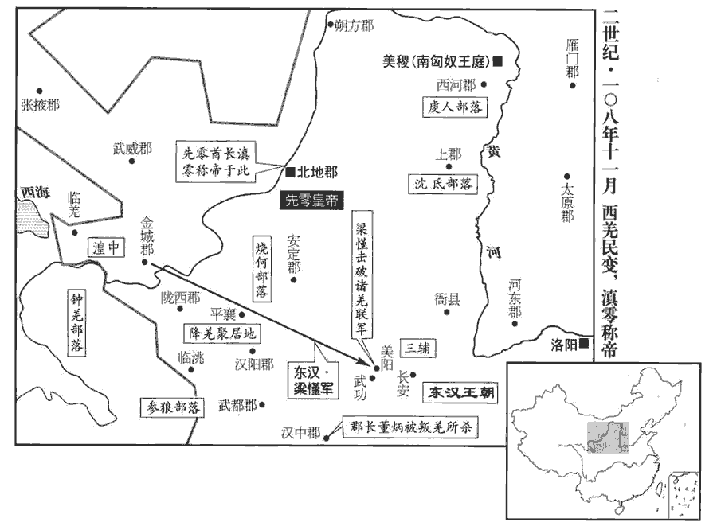
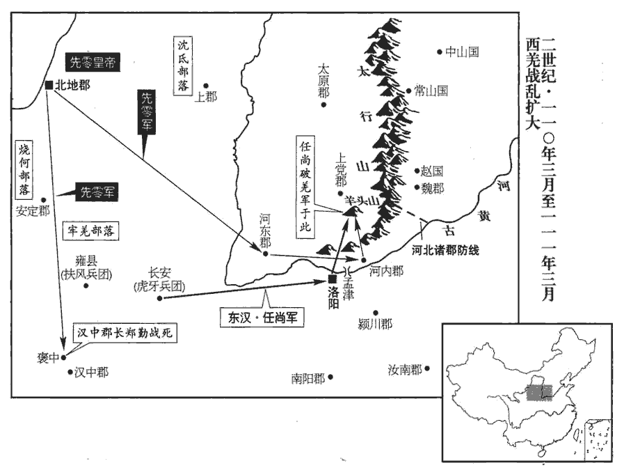
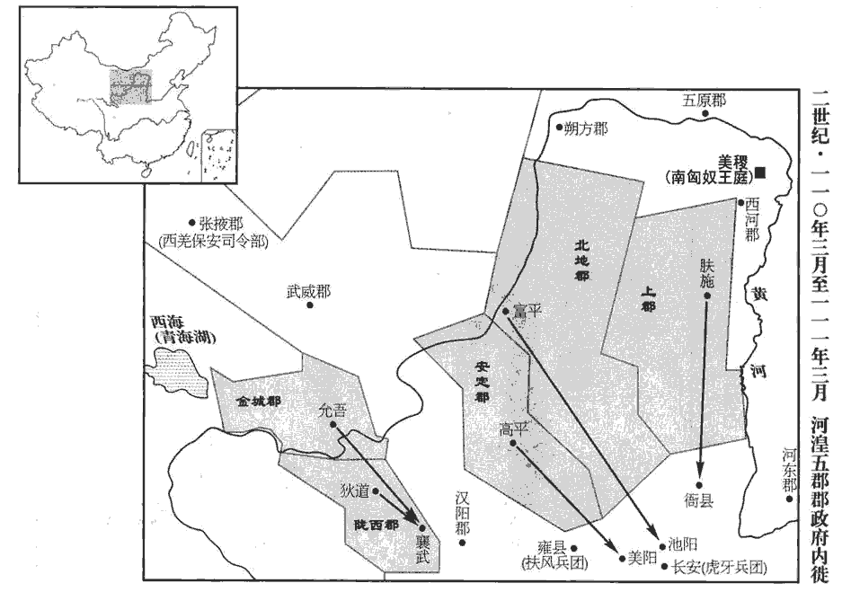
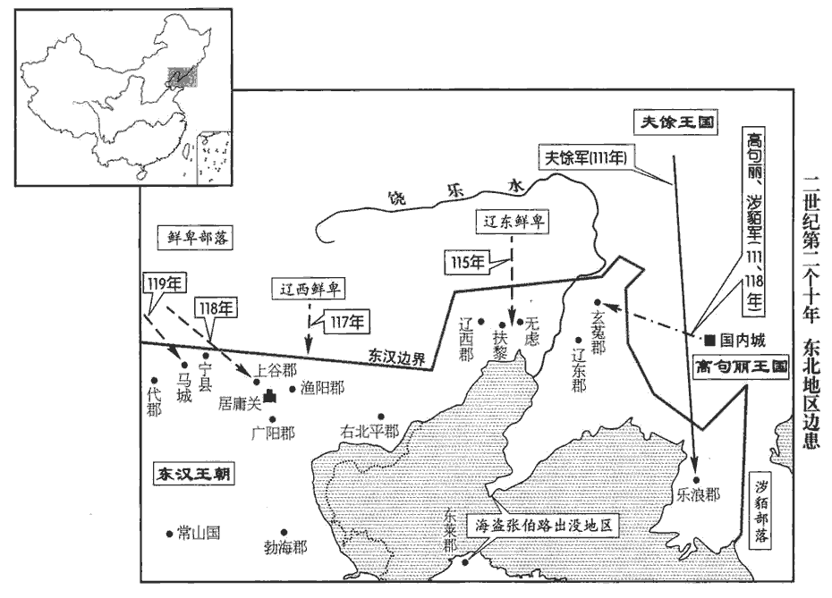
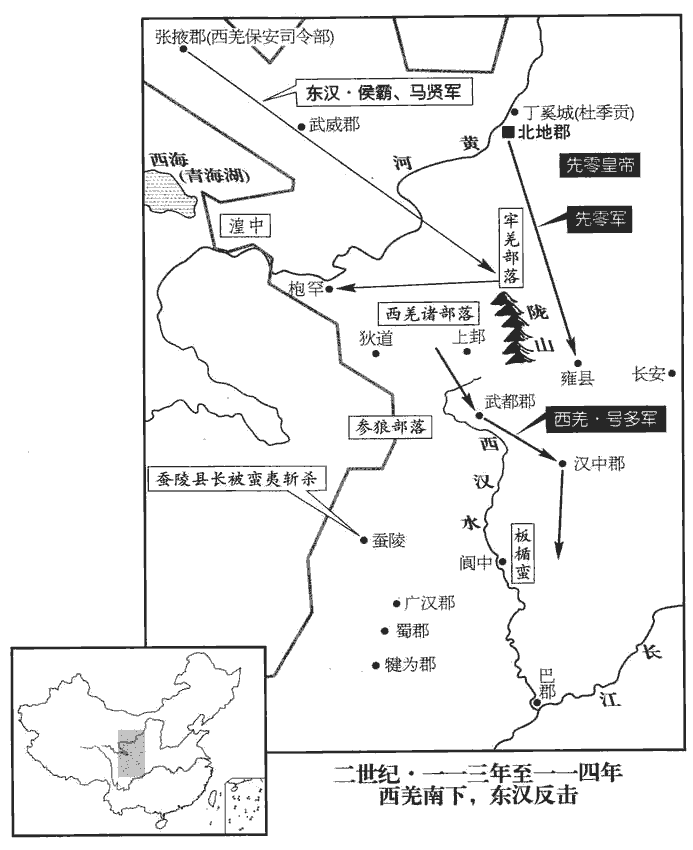
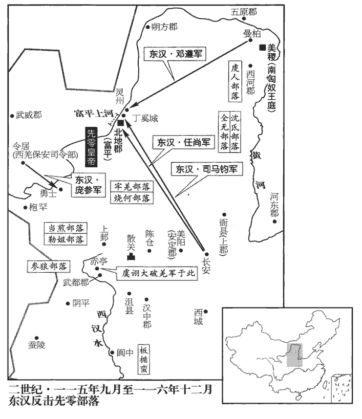
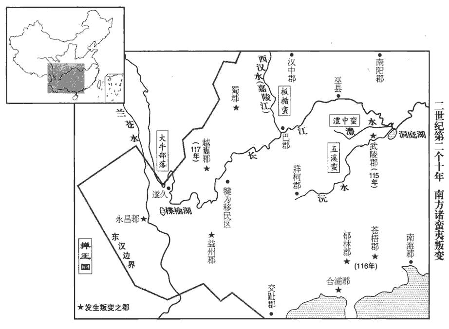

 漢紀四十一起柔兆敦牂（丙午），盡旃蒙單閼（乙卯），凡十年。

# 孝殤皇帝諱隆，和帝少子也。諡法：短折不成曰殤。伏侯古今註曰：「隆」之字曰「盛」。

## 延平元年（丙午，一零六）

1春，正月，辛卯‹十三›，以太尉張禹為太傅，司徒徐防為太尉，參錄尚書事。太后以帝‹刘隆，时年二岁›在襁褓，襁，居兩翻。褓，音保。欲令重臣居禁內。乃詔禹舍宮中，五日一歸府；每朝見，特贊，與三公絕席。特贊者，每朝見，贊拜者先獨贊禹名，既乃贊太尉名以下，禹不與三公同贊也。絕席者，朝位獨在百僚上，不與三公聯席也。朝，直遙翻。見，賢遍翻。

〖译文〗 [1]春季，正月辛卯（十三日），将太尉张禹任命为太傅，将司徒徐防任命为太尉，参与主管尚书事务。邓太后因皇帝是个婴孩，尚在襁褓怀抱之中，打算让重要的大臣住在宫内，于是下诏，命张禹留居宫中，每五天回家一次；每逢朝见，都专门为他唱名，让他单独就座，不与三公同席。

2封皇兄勝為平原王。

〖译文〗 [2]将皇兄刘胜封为平原王。

3癸卯‹二十五›，以光祿勳梁鮪wěi為司徒。鮪，於軌翻。

〖译文〗 [3]正月癸卯（二十五日），将光禄勋梁鲔任命为司徒。

4三月，甲申‹七›，葬孝和皇帝于慎陵‹河南孟津东南平乐乡北›，賢曰：慎陵，在雒陽東南三十里。廟曰穆宗。

〖译文〗 [4]三月甲申（初七），将和帝安葬在慎陵，庙号称为穆宗。

5丙戌‹九›，清河王慶、濟北王壽、河間王開、常山王章始就國；濟，子禮翻。太后特加慶以殊禮。殊，異也，其禮異於諸王也。慶子祜hù，年十三，太后以帝幼弱，遠慮不虞，留祜與嫡母耿姬居清河邸。為帝崩立祜張本。耿姬，況之曾孫也；耿況以上谷從光武。祜母，犍為‹四川宜宾›左姬也。犍，居言翻。

〖译文〗 [5]丙戌（初九），清河王刘庆、济北王刘寿、河间王刘开、常山王刘章从此前往封国就位。邓太后对刘庆特别优待，礼遇超过其他亲王。刘庆的儿子刘祜，当时十三岁，邓太后因皇帝幼小单弱，担心将来发生不测，就让刘祜和他的嫡母耿姬留下，住在清河国设在京城的官邸。耿姬是耿的曾孙女。刘祜的生母是犍为人左姬。

6夏，四月，鮮卑寇漁陽‹北京密云›，漁陽太守張顯率數百人出塞追之。兵馬掾嚴授諫曰：「前道險阻，賊勢難量，掾，俞絹翻。量，音良。宜且結營，先令輕騎偵視之。」顯意甚銳，怒，欲斬之，遂進兵。遇虜伏發，士卒悉走，唯授力戰，身被十創，手殺數人而死。緣邊郡曹有兵馬掾，掌兵馬。偵，丑鄭翻。創，初良翻。主簿衛福、功曹徐咸皆自投赴顯，俱沒於陳。陳，讀曰陣。

〖译文〗 [6]夏季，四月，鲜卑侵犯渔阳。渔阳太守张显率领数百人出塞追击。兵马掾严授劝谏道：“前方道路险恶而阻碍重重，敌人的实力难以估量，我军应暂且安营扎寨，先命轻装骑兵进行侦察。”张显锐气正盛，听后大怒，要将严授处斩。于是汉军向前挺进。途中遇到鲜卑军伏兵袭击，汉军全部逃散，唯独严授奋力迎战，身受十处创伤，亲手格杀数人后战死。渔阳郡主簿卫福、郡功曹徐咸二人自动赶来营救张显，一同阵亡。

7丙寅‹十九›，以虎賁中郎將鄧騭為車騎將軍、儀同三司。三司，三公也。晉職官志曰：儀同三司之名始此。騭，職日翻。騭弟黃門侍郎悝kuī為虎賁中郎將，弘、閶皆侍中。悝，苦回翻。閶，齒良翻。

〖译文〗 [7]丙寅（十九日），将虎贲中郎将邓骘任命为车骑将军、仪同三司，待遇与三公相同。将邓骘的弟弟、黄门侍郎邓悝任命为虎贲中郎将，邓弘、邓阊二人皆为侍中。

8司空陳寵薨。

〖译文〗 [8]司空陈宠去世。

9五月，辛卯‹十五›，赦天下。

〖译文〗 [9]五月辛卯（十五日），大赦天下。

10壬辰‹十六›，河東‹山西夏縣›垣山崩。賢曰：垣縣‹山西垣曲›，今絳州縣也。

〖译文〗 [10]壬辰（十六日），河东郡垣山发生山崩。

11六月，丁未‹一›，以太常尹勤為司空。

〖译文〗 [11]六月丁未（初一），将太常尹勤任命为司空。

12郡國三十七雨水。

〖译文〗 [12]有三十七个郡和封国大雨成灾。

13己未‹十三›，太后詔減太官、導官、尚方、內署諸服御、珍膳、靡麗難成之物，賢曰：太官令，周官也，秩千石，典天子御膳。導官，掌擇御米。導，擇也。尚方，掌作御刀劍諸器物；內署，掌內府衣物：令秩皆六百石。自非供陵廟，稻粱米不得導擇，朝夕一肉飯而已。舊太官、湯官經用歲且二萬萬，自是裁數千萬。百官志：湯官丞，主酒，屬太官令。及郡國所貢，皆減其過半；悉斥賣上林鷹犬；東都亦有上林苑，在雒陽西。斥，開也，棄也。離宮、別館儲峙米糒、薪炭，悉令省之。峙，丈里翻。糒，音備。

〖译文〗 [13]六月已未（十三日），邓太后下诏，削减太官、导官、尚方、内署的各种御用衣服车马、珍羞美味，和各色奢靡富丽精巧难成的物品。除非供奉皇陵祠庙，否则稻谷粱米不得加工精选，每日早晚只吃一次肉食。以往太官、汤官的费用每年将近二万万钱，至此才数千万钱。连同各郡、各封国的贡物，都削减一半以上。将上林苑的猎鹰、猎犬全部卖掉。各地离宫、别馆所储备的存米、干粮、薪柴、木炭，也一律下令减少。

14丁卯‹二十一›，詔免遣掖庭宮人及宗室沒入者皆為庶民。

〖译文〗 [14]六月丁卯（二十一日），下诏遣散掖庭部分宫人，并将罚入掖庭当奴婢的皇族成员一律免罪，使他们成为平民。

15秋，七月，庚寅‹十五›，敕司隸校尉、部刺史曰：司隸校尉及諸州部刺史也。「間者郡國或有水災，妨害秋稼，朝廷惟咎，憂惶悼懼。惟，思也。咎，過也。而郡國欲獲豐穰虛飾之譽，遂覆蔽災害，覆，敷又翻。多張墾田，不揣流亡，揣，音初委翻。競增戶口，掩匿盜賊，令姦惡無懲，隱蔽盜賊，不以上聞，弗加誅討，使姦惡無所懲艾。署用非次，選舉乖宜，貪苛慘毒，延及平民。賢曰：平民，謂善人也。刺史垂頭塞耳，阿私下比，塞悉則翻。比，毗至翻。不畏于天，不愧於人。詩小雅何人斯之辭。假貸之恩，不可數恃，數，所角翻。自今以後，將糾其罰。二千石長吏其各實覈所傷害，為除田租芻稾。」長，知兩翻。為，於偽翻。

〖译文〗 [15]秋季，七月庚寅（十五日），敕令司隶校尉和部刺史：“近来有些郡和封国发生水灾，伤害了秋天的庄稼，朝廷思考自己的过失，深为忧虑惶恐。然而各地方官府为了要得到丰产的虚名假誉，便隐瞒灾情，夸大垦田面积；不去统计逃亡人数，却竞相增加户口；掩盖盗匪活动情况，使罪犯得不到惩处；不依照规定次序任用官吏，举荐人才不当，将贪婪苛刻的祸害，加在人民的身上。而刺史却低头塞耳，循私包庇，在下面互相勾结，不知畏惧上天，也不知愧对于人。不能让他们一再地仗恃朝廷的宽容恩典，从今以后，将加重对不法官员的处罚。现命令二千石官员各自核查百姓受灾情况，免除他们应向国家交付的田赋禾秆。”

16八月，辛卯‹六›，帝‹刘隆›崩。年二歲。癸丑‹八›，殯於崇德前殿。賢曰：雒陽南宮有崇德殿。太后與兄車騎將軍騭、虎賁中郎將悝kuī等定策禁中，悝，苦回翻。其夜，使騭持節以王青蓋車迎清河王子祜，賢曰：續漢志曰：皇太子、皇子，皆安車，朱班輪、青蓋、金華蚤。皇子為王，錫以乘之，故曰王青蓋車。皇孫則綠車。齋於殿中。皇太后御崇德殿，百官皆吉服陪位，賢曰：不可以凶事臨朝，改吉服也。引拜祜為長安侯。賢曰：不即立為天子而封侯者，不欲從微即登皇位。余謂先封侯者，用立孝宣帝故事也。乃下詔，以祜為孝和皇帝嗣，又作策命。有司讀策畢，太尉奉上璽綬，即皇帝位，上，時掌翻。璽，斯氏翻。綬，音受。太后猶臨朝。公羊傳曰：猶者，可止之辭。

〖译文〗 [16]八月辛卯（疑误），皇帝驾崩。癸丑（初八），将皇帝入殓后，灵柩停放在崇德前殿。邓太后与她的哥哥车骑将军邓骘、虎贲中郎将邓悝等在宫中商议大计，决定了继位人选。当夜，派邓骘持符节，用已封王的皇子才能乘坐的青盖车将清河王的儿子刘祜接来，在殿中斋戒。皇太后登上崇德殿，文武百官都穿上吉服陪同出席。刘祜被引导上殿，皇太后将他封为长安侯。随即下诏，将刘祜立为和帝的后嗣。接着又撰写了册立皇帝的诏命。有关官员宣读完诏令，太尉献上皇帝的御玺，刘祜便正式即位。邓太后仍旧临朝摄政。

17詔告司隸校尉、河南尹、南陽‹河南南陽›太守曰：「每覽前代，外戚賓客濁亂奉公，言其挾勢恣橫，奉公之吏為所濁亂也。為民患苦，咎在執法怠懈，不輒行其罰故也。懈，古隘翻。今車騎將軍騭等雖懷敬順之志，而宗門廣大，姻戚不少，賓客姦猾，多干禁憲，賢曰：干，犯也。其明加檢敕，勿相容護。」自是親屬犯罪，無所假貸。

〖译文〗 [17]邓太后对司隶校尉、河南尹、南阳太守下诏说：“每每查阅前代史事，看到皇后家族及其宾客仗势横行，使奉公而不徇私情的官员陷于混乱，给人民带来痛苦，这是由于执法不严，没有立即施行惩罚的缘故。如今车骑将军邓骘等虽然怀有恭敬顺从的心意，但家族庞大，亲戚不少，宾客奸诈狡猾，对国家的法律禁令多有冒犯。现命令对邓氏家族的不法行为要公开地加以检束，不许包容袒护。”从此以后，邓氏家族亲属犯罪，官员都不予以宽免。

18九月，六州大水。

〖译文〗 [18]九月，有六个州发生水灾。

19丙寅，葬孝殤皇帝于康陵。賢曰：康陵，在慎陵塋中庚地。以連遭大水，【章：甲十六行本「水」作「憂」；乙十一行本同；孔本同；退齋校同。】百姓苦役，方中祕藏賢曰：方中，陵中也；塚藏之中，故言祕也。孔穎達曰：凡天子之葬，掘地為方壙，漢書謂之方中。方中之內，先累槨於其方中，南面為羨道，以蜃車載柩至壙，說而載以龍輴，從羨道而入，至方中，乃屬紼fú於棺之緘，從上而下棺，入於槨之中。方上，謂覆坑方石上。及諸工作事，減約十分居一。十分居一者，減其九分也。

〖译文〗 [19]丙寅（疑误），将殇帝安葬于康陵。因国家接连遭受水灾，人民苦于徭役，所以陵墓中的随葬之物及各项工程都予以裁减，只留十分之一。

20乙亥‹一›，殞石於陳留‹河南陳留›。陳留郡，在雒陽東五百三十里。

〖译文〗 [20]乙亥（初一），陈留郡天降陨石。

21詔以北地‹宁夏吴忠西南金积镇›梁慬qín為西域副校尉。慬，音勤。校，戶教翻。慬行至河西‹甘肃中西部›，會西域諸國反，攻都護任尚於疏勒‹新疆喀什›；尚上書求救，詔慬將河西四郡羌、胡五千騎馳赴之。慬未至而尚已得解，詔徵尚還，以騎都尉段禧為都護，西域長史趙博為騎都尉。禧、博守它乾城‹新疆新和西南›，班超為都護，居龜茲它乾城。城小，梁慬以為不可固，乃譎說龜茲王白霸，譎，古穴翻。說，輸芮翻。龜茲，音丘慈。欲入共保其城；白霸許之，吏民固諫，白霸不聽。慬既入，遣將急迎段禧、趙博，合軍八九千人。龜茲吏民并叛其王，而與溫宿‹新疆乌什›、姑墨‹新疆阿克苏西北›數萬兵反，共圍城，慬等出戰，大破之。連兵數月，胡眾敗走，乘勝追擊，凡斬首萬餘級，獲生口數千人，龜茲乃定。梁慬非不健闘，然終不能定西域者，徒勇而無策略也。

〖译文〗 [21]朝廷任命北地人梁为西域副校尉。梁到达河西时，恰逢西域各国背叛了汉朝，在疏勒向西域都护任尚发动进攻。任尚上书朝廷求救，朝廷便命令梁率领河西四郡&\#0;&\#0;敦煌、武威、酒泉、张掖的羌、胡骑兵五千人急速前去救援。梁还没有到达，任尚已经解围。朝廷将任尚召回，任命骑都尉段禧为西域都护，任命西域长史赵博为骑都尉。段禧和赵博据守在它乾城。它乾城是个小城，梁认为不能固守，于是用诈术游说龟兹王白霸，声称愿意进入龟兹，和他共同守城。白霸同意了梁的建议。龟兹的官员和百姓极力进行劝阻，但白霸不听。梁进入龟兹城以后，派将领急速前去迎接段禧和赵博，汉军汇合为八九千人。龟兹的官员和百姓一同背叛了龟兹王，与温宿、姑墨两国联合造反，军队达数万人，一同围攻龟兹城。梁等出城迎战，大破联军。战争持续了数月，联军兵败退走。梁乘胜追击，共斩杀一万余人，生擒数千人，龟兹局势才告平定。

22冬，十月，四州大水，雨雹。雨，於具翻。

〖译文〗 [22]冬季，十月，有四个州发生水灾和雹灾。

23清河孝王慶病篤，上書求葬樊濯‹洛阳北›宋貴人塚旁。欲從其母也。十二月，甲子‹二十一›，王薨。

〖译文〗 [23]清河王刘庆病重，上书请求死后葬在樊濯宋贵人墓旁。十二月甲子（二十一日），刘庆去世。

24乙酉，罷魚龍曼延戲。武帝元封三年，作魚龍曼延戲，今罷之。曼，音萬。延，衍面翻。

〖译文〗 [24]十二月乙酉（疑误），废止杂戏“鱼龙曼延”。

25尚書郎南陽‹河南南陽›樊準以儒風寖衰，上疏曰：「臣聞人君不可以不學。光武皇帝受命中興，東西誅戰，不遑啟處，處，昌呂翻。然猶投戈講藝，藝，六藝也。息馬論道。孝明皇帝庶政萬機，無不簡心，朱子曰：簡，閱也。而垂情古典，遊意經藝，每饗射禮畢，正坐自講，諸儒并聽，四方欣欣。又多徵名儒，布在廊廟，每讌會則論難衎衎kàn，賢曰：衎衎，和樂貌也。難，乃旦翻。衎，苦旱翻，又苦汗翻。共求政化，期門、羽林介冑之士，悉通孝經，期門，即虎賁士。化自聖躬，流及蠻荒，是以議者每稱盛時，咸言永平。今學者益少，少，詩沼翻。遠方尤甚，博士倚席不講，賢曰：禮記曰：凡侍坐於大司成者，遠間三席。又曰：若非飲食之客，則布席，席間凾hán丈。註云：謂講問客也。倚席，言不施講坐也。儒者競論浮麗，忘蹇蹇之忠，習諓諓jiàn之辭。賢曰：諓諓，諂言也，音踐。前書曰：昔秦穆公說諓諓之言。臣愚以為宜下明詔，博求幽隱，寵進儒雅，以俟聖上講習之期。」時安帝始年十三，故請求儒雅以俟講習。太后深納其言，詔：「公、卿、中二千石各舉隱士、大儒，務取高行，以勸後進，行，下孟翻。妙簡博士，妙，精也。簡，擇也。必得其人。」

〖译文〗 [25]尚书郎、南阳人樊准因儒家学风日渐衰颓，上书说：“我听说，君主不可以不学习。光武皇帝承受天命，使汉朝中兴，东征西伐，顾不上安居休息。但他仍然放下武器，讲说儒家学问；停鞍歇马，讨论圣人之道。孝明皇帝日理万机，事事经心，但却爱好古籍，留意儒家经典，每当行过飨射礼 ，在学校举办宴会和射箭比赛之后，都坐在正位上，亲自讲解经书，儒生们则一同聆听，四方都欢欣喜悦。他还广召著名的儒家学者，将他们安置在朝廷，每逢宴会，便亲切地和他们讨论疑难，共同研究治国和教化之道。即便是期门、羽林的武士军官，也都人人通晓《孝经》。儒学的影响从圣明的君王身上开始，扩展到野蛮荒凉之地。因此，每当人们称颂盛世的时候，都谈到明帝永平年代。如今学者日益减少，京城以外的远方尤其严重。博士把坐席放在一旁，不再讲学，儒生则竞相追求华而不实的理论，忘掉了正直忠诚的原则，只熟悉谄媚阿谀的言词。我认为应当颁布诏书，明告天下，广泛寻访隐居的学者，提拔渊博的儒士，等到将来圣上上学的时候，为他讲解经书。”邓太后认为樊准的意见很对，予以采纳，下诏说：“三公、九卿和中二千石官员，要各自举荐隐士、大儒；被举荐者务必具有高尚的德行，以劝导晚生后进。从中精选博士，一定可以得到适当的人选。”

# 孝安皇帝上諱祜，肅宗孫也，父曰清河孝王慶。諡法：寬容和平曰安。伏侯古今註曰：「祜」之字曰「福」。

## 永初元年（丁未，一零七）

1春，正月，癸酉朔‹一›，赦天下。

〖译文〗 [1]春季，正月癸酉朔（初一），大赦天下。

2蜀郡徼jiào外羌‹四川马尔康县邛崃山西麓一带›內屬。徼，吉弔翻；下同。

〖译文〗 [2]蜀郡边境外的羌人归附汉朝。

3二月，丁卯‹二十五›，分清河國‹河北清河›，封帝‹刘祜，时年十四›弟常保為廣川‹河北棗強东北›王。廣川縣，屬信都國。賢曰：故城在今冀州棗強縣東北。

〖译文〗 [3]二月丁卯（二十五日），分割清河国部分封土，将安帝的弟弟刘常保封为广川王。

4庚午‹二十八›，司徒梁鮪wěi薨。

〖译文〗 [4]庚午（二十八日），司徒梁鲔去世。

5三月，癸酉‹二›，日有食之。

〖译文〗 [5]三月癸酉（初二），出现日食。

6己卯‹八›，永昌‹云南保山›徼外僬jiāo僥yáo種夷陸類等舉種內附。永昌郡，在雒陽西七千二百六十里。僬僥國，人長不過三尺。徼，吉弔翻。僬，茲消翻。僥，倪ㄠ翻。種，章勇翻。

〖译文〗 [6]已卯（初八），永昌郡边境外夷人僬侥部落的首领陆类等人，率领全体部众归附汉朝。

7甲申‹十三›，葬清河孝王於廣丘‹山东临清›，廣丘在清河厝cuò縣，後更名甘陵。司空、宗正護喪事，儀比東海恭王。恭王葬見四十五卷明帝永平元年。考異曰：帝紀書「車騎將軍護葬」，今從傳。

〖译文〗 [7]三月甲申（十三日），将清河孝王刘庆安葬在广丘，由司空、宗正负责治丧，礼仪比照东海恭王刘强。

8自和帝‹刘肇›之喪，鄧騭兄弟常居禁中。騭不欲久在內，連求還第，太后許之。夏，四月，封太傅張禹、太尉徐防、司空尹勤、車騎將軍鄧騭，城門校尉鄧悝kuī、虎賁中郎將鄧弘、黃門郎鄧閶皆為列侯，禹，安鄉侯；防，龍鄉侯；騭，上蔡侯；悝，葉侯；弘，西平侯；閶，西華侯。閶，音昌。考異曰：袁紀前作「閶」，後作「闓」kǎi，蓋誤。食邑各萬戶，騭以定策功增三千戶；騭及諸弟辭讓不獲，遂逃避使者，間關詣闕，賢曰：間關，猶崎嶇也。上疏自陳，至於五六，乃許之。

〖译文〗 [8]自从和帝驾崩，邓骘兄弟一直住在皇宫。邓骘不愿久在宫中，一再请求回家，太后应允。夏季，四月，将太傅张禹、太尉徐防、司空尹勤、车骑将军邓骘、城门校尉邓悝、虎贲中郎将邓弘、黄门郎邓阊全都封为侯爵，各自享有一万户的食邑。邓骘因协助册立皇帝有功，增加三千户。邓骘和他的弟弟们推辞谦让，但未获批准。于是他们躲开朝廷的使者，绕路前往皇宫大门，上书陈述自己的请求，前后达五六次，邓太后这才应允。

9五月，甲戌‹三›，以長樂衛尉魯恭為司徒。樂，音洛。恭上言：「舊制立秋乃行薄刑，自永元十五年以來，改用孟夏。事見上卷。而刺史、太守因以盛夏徵召農民，拘對考驗，連滯無已；連，謂獄辭相連及也。滯，謂留滯不決也。上逆時氣，下傷農業。案月令『孟夏斷薄刑』者，謂其輕罪已正，謂已結正也。斷，丁亂翻；下同。不欲令久繫，故時斷之也。臣愚以為今孟夏之制，可從此令；其決獄案考，皆以立秋為斷。」又奏：「孝章皇帝欲助三正之微，定律著令，斷獄皆以冬至之前。事見四十七卷章帝元和三年。小吏不與國同心者，率【章：甲十六行本「率」下有「入」字；乙十一行本同；孔本同。】十一月得死罪賊，不問曲直，便即格殺，雖有疑罪，不復讞yàn正。復，扶又翻。讞，魚列翻，又魚戰翻，又魚蹇翻，議獄也。可令大辟之科，辟，毗亦翻。盡冬月乃斷。」朝廷皆從之。

〖译文〗 [9]五月甲戌（初三），将长乐卫尉鲁恭任命为司徒。鲁恭上书说：“以往制度规定，立秋之日才开始审理轻刑案件。但自从永元十五年以来，将时间改到了孟夏四月。而州刺史、郡太守便在盛夏时节传讯农民，拘捕、审讯、拷问、核实，连续拖延不断。对上违背了天时，对下伤害了农业。考查《月令》所说‘孟夏四月判决轻刑’的含义，是说对于罪行轻微并已定案的犯人，不愿使他们长期地遭受囚禁，因此要及时判决。我认为，如今的孟夏四月判决制度，可以照此施行；而其它案件的审讯、拷问、核实，则都从立秋开始。”他还上书说：“孝章皇帝想有助于天、地、人‘三正’的开端，制订律令，规定审理判决罪案一律在冬至之前结束。而那些不与国家同心的执法小官，却大都在十一月捕到被控犯有死罪的犯人后，不问是非曲直便立即处死，尽管罪状可疑，也不再重新审理。我建议，对死刑重罪的判决，可延长到十二月底再截止。”朝廷将他的建议全部采纳。

10丁丑‹六›，詔封北海王睦孫壽光侯普為北海王。和帝永元八年，北海王威自殺，今復紹封。壽光縣，本屬北海，後屬樂安國。

〖译文〗 [10]丁丑（初六），邓太后下诏，将前北海王刘睦的孙子、寿光侯刘普封为北海王。

11九真‹越南清化›徼外、夜郎蠻夷，舉土內屬。

〖译文〗 [11]九真郡边境外的蛮夷及夜郎国蛮夷，以全部领土归属汉朝。

12西域都護段禧等雖保龜茲‹新疆庫車›，而道路隔塞，塞，悉則翻。檄書不通。公卿議者以為「西域阻遠，數有背叛，數，所角翻。背，蒲妹翻。吏士屯田，其費無已。」六月，壬戌‹二十二›，罷西域都護，和帝永元三年，復置西域都護，今罷。遣騎都尉王弘發關中兵迎禧及梁慬qín、趙博、伊吾盧‹新疆哈密›、柳中‹新疆鄯善西南鲁克沁城›屯田吏士而還。

〖译文〗 [12]西域都护段禧等虽然保住了龟兹，但通往中原的道路已被堵塞，命令、文件无法传递。公卿中议论此事的人认为：“西域阻碍重重而距离遥远，又屡次反叛；官兵在那里屯戍垦田，经费消耗没有止境。”六月壬戌（二十二日）东汉朝廷撤销西域都护，派遣骑都尉王弘征调关中兵，将段禧和梁、赵博以及伊吾庐和柳中的屯田官兵接回汉朝本土。

13初，燒當羌豪東號之子麻奴隨父來降，東號降見四十七卷和帝永元元年。降，戶江翻。居於安定‹宁夏鎮原›。時諸降羌布在郡縣，皆為吏民豪右所傜役，傜，使也。積以愁怨。及王弘西迎段禧，發金城‹甘肅永靖西北›、隴西‹甘肅臨洮›、漢陽‹甘肅甘谷›羌數百千騎與俱，郡縣迫促發遣。群羌懼遠屯不還，行到酒泉‹甘肅酒泉›，頗有散叛，諸郡各發兵邀遮，或覆其廬落；於是勒姐、當煎大豪東岸等愈驚，遂同時奔潰。姐，音紫且翻，又音紫。麻奴兄弟因此與種人俱西出塞，【章：甲十六行本「塞」下有「先零別種」四字；乙十一行本同；孔本同；張校同；退齋校同。】滇零與鍾羌諸種大為寇掠，斷隴道。零，音憐。續漢書曰：鍾羌九千餘戶，在隴西臨洮谷。隴道，隴坻之道也。種，章勇翻。斷，丁管翻。時羌歸附既久，無復器甲，或持竹竿木枝以代戈矛，或負板案以為楯，楯，食尹翻。或執銅鏡以象兵，銅鏡暎日，人遙望之以為兵也。郡縣畏懦不能制。丁卯‹二十七›，赦除諸羌相連結謀叛逆者罪。

〖译文〗 [13]起初，烧当羌人部落首领东号的儿子麻奴跟随父亲前来归降，居住在安定郡。当时，归降的羌人诸部落分散于各个郡县，全都遭受汉人官吏和民间豪强的役使，悲愁怨恨日益深重。后来，王弘西行迎接段禧，要征调金城、陇西、汉阳千百羌人充当骑兵，一同前往。于是郡县官府紧急征发遣调。羌人们担心会被派到远方屯戍，不能再返回家乡，行进到酒泉的时候，已有不少人逃散叛离。诸郡各自派兵进行拦截，有些郡兵捣毁了羌人住宿的庐落。于是勒姐、当煎部落的首领东岸等人愈发惊恐，便一同急速地大举逃亡。麻奴兄弟因此与本部落的人一同西行出塞。而滇零与钟羌各部落则大肆抢掠，切断了陇道。这时，羌人因归附汉朝已久，不再拥有武器，他们便有人手持竹竿、树枝代替戈、矛，有人用木板桌案当作盾牌，还有人拿着铜镜，伪装兵器。郡县官府畏惧怯懦，不能制止。六月丁卯（二十七日），朝廷赦免羌人各部落中互相勾结进行谋反叛逆者的罪行。

14秋，九月，庚午‹一›，太尉徐防以災異、寇賊策免。三公以災異免，自防始。辛未‹二›，司空尹勤以水雨漂流策免。

〖译文〗 [14]秋季，九月庚午（初一），太尉徐防因天灾、天象异常和叛匪作乱而被颁策罢免。太尉、司徒、司空三公由于天灾或天象异常而遭罢免，徐防乃是首例。辛未（初二），司空尹勤因大雨水灾被颁策罢免。

仲長統昌言曰：仲，姓也。商湯左相仲虺huǐ，周有仲山甫，舜十六相有仲堪、仲熊，周八士有仲突、仲忽。光武皇帝慍yùn數世之失權，忿強臣之竊命，賢曰：昌，當也。慍，猶恨也。數世，謂元、成、哀、平。強臣，謂王莽。矯枉過直，政不任下，雖置三公，事歸臺閣。賢曰：臺閣，謂尚書。余謂三公失職，非至光武時始然也，自武帝遊宴後庭，用宦者處樞機，至於宣帝，專任恭、顯，而丞相、御史取充位。事歸臺閣，其所由來者漸矣。自此以來，三公之職，備員而已；然政有不治，猶加譴責。而權移外戚之家，寵被近習之豎，被，皮義翻。親其黨類，用其私人，內充京師，外布州【章：甲十六行本「州」作「列」；乙十一行本同；孔本同。】郡，顛倒賢愚，貿易選舉，貿，音茂。疲駑守境，駑，音奴。駑駘tái，馬之下乘，以諭不才之吏。貪殘牧民，撓擾百姓，撓，音火高翻。忿怒四夷，招致乖叛，亂離斯瘼mò，用詩語。賢曰：瘼，病也。怨氣并作，陰陽失和，三光虧缺，怪異數至，數，所角翻。蟲螟食稼，水旱為災。此皆戚宦之臣所致然也，反以策讓三公，至於死、免，乃足為叫呼蒼天，號咷泣血者矣！放聲而哭曰號咷。號，戶刀翻。咷，徒刀翻。又，中世之選三公也，務於清愨què謹慎，循常習故者，是乃婦女之檢柙xiá，賢曰：檢柙，猶規矩也。揚子曰：蠢迪撿押。註云：撿押，猶隱括也。毛晃曰：撿押，檢束也，輔也，俗作「檢柙」，非。鄉曲之常人耳，惡足以居斯位邪！惡，音烏；下同。勢既如彼，選又如此，而欲望三公勳立於國家，績加於生民，不亦遠乎！昔文帝之於鄧通，可謂至愛，而猶展申徒嘉之志。事見十四卷文帝後二年。夫見任如此，則何患於左右小臣哉！至如近世，外戚、宦豎，請託不行，意氣不滿，立能陷人於不測之禍，惡可得彈正者哉！曩者任之重而責之輕，今者任之輕而責之重。光武奪三公之重，至今而加甚；不假后黨以權，數世而不行；蓋親疏之勢異也！賢曰：言光武奪三公重任，今奪更甚。光武不假后黨威權，數代遂不遵行，此為三公疏，后黨親故也。今人主誠專委三公，分任責成，而在位病民，病民，謂百姓受其害也。舉用失賢，百姓不安，爭訟不息，天地多變，人物多妖，妖，於驕翻。然後可以分此罪矣！

〖译文〗 仲长统《昌言》曰：光武皇帝因西汉数世失去权柄而愤慨，对强悍之臣窃取帝位深为痛恨。因此他矫枉过正，权力不交给臣下，虽然设立了三公，政事却归尚书台总理。从此以后，三公的作用，只是充数而已，但当国家治理不善的时候，仍对三公加以谴责。而实权却转移到皇后家族，宠信则施加到皇帝身边的宦官。这些人亲近自己的同类同党，任用私已，在内充斥京城，在外遍布州郡。他们颠倒贤能与愚劣，利用举荐人才的机会，进行私人交易。使无能不才者守卫疆土，贪婪凶残者统治人民。黎民百姓受到搅扰，四方外族又被激怒，终于导致反叛，带来战乱流亡和忧患疾苦。怨愤之气一时并发，阴阳失和，日、月、星三光出现亏缺，怪异不断降临，害虫吃掉庄稼，水旱带来灾难。这样的局面都是外戚宦官所造成的，而朝廷反而颁策责备三公，甚至将三公处死、免官，足以使人为此呼叫苍天，号啕泣血！再者，从中期开始，选任三公，都务必从清廉忠厚而又谨慎小心、循规蹈矩而又熟悉旧典的人中擢拔。这乃是妇女的楷模，乡间的平常之人罢了，怎么足以身居三公高位呢！三公的势力既然已是那样低落，人选又是如此平庸，却希望三公为国家建立功勋，为人民取得政绩，这岂不是遥远的事情吗！从前，汉文帝对待邓通，可以说是宠爱之至，但仍使申徒嘉得以实现自己的意图，惩罚了邓通。受到这般信任，那么对皇帝左右的小臣又有什么顾忌呢！可是到了近代，对待外戚、宦官，官员如果不执行他们的请托，馈献不够丰足，立刻便会陷入意外的灾祸，哪里还能够弹劾纠正他们呢！从前，对三公信任多而责罚轻，如今，对三公信任少而责罚重。光武帝夺去三公的大权，如今则剥夺得更为彻底；光武帝制定不让皇后家族掌权的政策，几代之后却已不再遵行，其原因就在于皇帝与三公和外戚的亲疏关系不同。如今，若是君主真能信赖三公，将权力交给他们，责令完成重任，而三公身居高位却为害人民，不能举荐任用贤才，致使百姓不安，纠纷不断，天地变化无常，人间妖物大量出现，到了那个时候，才可以让三公分担此罪！

15壬午‹十三›，詔：「太僕少府減黃門鼓吹以補羽林士；漢官儀曰：黃門鼓吹，百四十五人。羽林左監主羽林八百人，右監主九百人。杜佑曰：漢代有黃門鼓吹，享宴食舉樂十三曲，與魏代鼓吹、長簫伎錄，并云絲竹合作，執節者歌。又建初錄云：務成、黃爵、玄雲、遠期，皆騎吹曲，非鼓吹曲。此則列於殿庭者為鼓吹，今之從行者為騎吹，二曲異也。孫權觀魏武軍作鼓吹而還，應是此鼓吹。魏、晉代給鼓吹甚輕，牙門督將五校，悉有鼓吹，齊、梁至陳則重矣。今代短簫鐃歌，亦謂之鼓吹。蔡邕曰：鼓吹，軍樂也，黃帝岐伯所作，以揚威武，勸士諷敵也。雍門周說孟嘗君鼓吹於不測之淵。說者云，鼓自一物，吹自竽籟之屬，非簫鼓合奏，別為一樂之名也。然則短簫鐃náo歌，此時未名鼓吹矣。宋白曰：鼓吹，據崔豹古今註，張騫使西域得摩訶兜勒一曲，李延年增之，分為二十八曲。梁置清商鼓吹令二人，唐又有𢱫gāng鼓、金鉦、大鼓、長嗚歌、簫、笳、笛，合為鼓吹十二。案大享會，則設於縣外。廄馬非乘輿常所御者，皆減半食；賢曰：乘輿，所乘車輿也，不敢斥言尊者，故稱乘輿。見蔡邕獨斷。乘，繩證翻。諸所造作，非供宗廟園陵之用，皆且止。」

〖译文〗 [15]九月壬午（十三日），诏书命令：太仆、少府裁减黄门乐队，用来增补羽林武士的名额；厩苑中的官马，凡不是皇上经常使用的，一律将食料减半；各项工程，凡不是用来供应皇家宗庙和陵园的，一律暂停。

16庚寅‹二十一›，以太傅張禹為太尉，太常周章為司空。

〖译文〗 [16]庚寅（二十一日），将太傅张禹任命为太尉，将太常周章任命为司空。

大長秋鄭眾、中常侍蔡倫等皆秉勢豫政，周章數進直言，數，所角翻。太后不能用。初，太后以平原王勝有痼疾，而貪殤帝孩抱，養為己子，故立焉。及殤帝崩，群臣以勝疾非痼，意咸歸之；太后以前不立勝，恐後為怨，乃迎帝而立之。周章以眾心不附，密謀閉宮門，誅鄧騭兄弟及鄭眾、蔡倫，劫尚書，廢太后於南宮，封帝為遠國王而立平原王。事覺，冬，十一月，丁亥‹十九›，章自殺。

〖译文〗 大长秋郑众和中常侍蔡伦等依靠权势干预朝政，周章曾多次直率地进言劝谏，但邓太后未能采纳。当初，邓太后认为平原王刘胜有久治不愈的顽疾，而贪图殇帝是个怀抱中的婴孩，便将他收养为自已的儿子，立为皇帝。及至殇帝驾崩，群臣认为刘胜的病并非不可痊愈，便一致属意于刘胜。但邓太后因先前没有立刘胜，怕他将来怀恨，就将刘祜接来，立为皇帝。周章认为群臣并不归心于太后，于是密谋关闭宫门，诛杀邓骘兄弟及郑众、蔡伦，胁迫尚书写诏，于南宫罢黜邓太后，把安帝贬到遥远的封国为王，将平原王立为皇帝。但事机泄露。冬季，十一月丁亥（十九日），周章自杀。

17戊子‹二十›，敕司隸校尉、冀‹河北中部南部›、并‹山西›二州刺史，「民訛言相驚，棄捐舊居，老弱相攜，窮困道路。其各敕所部長吏躬親曉喻：長，知兩翻。若欲歸本郡，在所為封長檄；不欲，勿強。」為，於偽翻。賢曰：封，謂印封之也。長檄，猶今長牒也。欲歸者，皆給以長牒為驗。強，音其兩翻。

〖译文〗 [17]十一月戊子（二十日），太后训令司隶校尉及冀州、并州两州刺史：“人民受到谣言的惊扰，抛弃了旧居，扶老携幼，在路上贫困交加。司隶校尉及冀州、并州两位刺史，要命令下属官员亲自对百姓进行劝导，说明情况：如果他们愿意返回原郡，由当地官府为他们出县公文；如果不愿返回，也不勉强。”

18十二月，乙卯‹十八›，以潁川‹河南禹州›太守張敏為司空。

〖译文〗 [18]十二月乙卯（十八日），将颍川太守张敏任命为司空。

19詔車騎將軍鄧騭、征西校尉任尚將五營及諸郡兵五萬人，五營，北軍五校營也。屯漢陽‹甘肅甘谷›以備羌。考異曰：帝紀在六月。今從西羌傳。

〖译文〗 [19]诏书命令车骑将军邓骘和征西校尉任尚，率领屯骑、步兵、越骑、长水、射声等五营兵及各郡郡兵，共五万人，进驻汉阳，以防备羌军进攻。

20是歲，郡國十八地震，四十一大水，二十八大風，雨雹。

〖译文〗 [20]本年，有十八个郡和封国发生地震，四十一个郡和封国大水成灾，二十八个郡和封国发生风灾和雹灾。

21鮮卑大人燕荔陽詣闕朝賀。太后賜燕荔陽王印綬、赤車、參駕，赤車者，帷裳衡軛è皆赤。參駕者，駕三馬。燕，於賢翻。荔，力計翻。令止烏桓校尉所居寧城‹河北萬全›下，寧城，屬上谷郡。通胡市，因築南、北兩部質館。賢曰：築館以受降質。質，音致；下同。鮮卑邑落百二十部各遣入質。

〖译文〗 [21]鲜卑首领燕荔阳到汉朝宫廷朝贺。邓太后将王爵印信绶带和三匹马驾驶的赤车赐给燕荔阳，命他定居在乌桓校尉的驻地宁城附近，开通边塞贸易，还特地修建了南北两个宾馆，用来接待人质。鲜卑一百二十个部落分别将人质送到汉朝。

## 二年（戊申，一零八）

1春，正月，鄧騭至漢陽‹甘肅甘谷›；諸郡兵未至，鍾羌數千人擊敗騭軍于冀西，冀縣‹甘肅甘谷›之西也。敗，補邁翻。殺千餘人。梁慬qín還，至敦煌，自西域還也。敦，徒門翻。逆詔慬留為諸軍援。逆，迎也。慬至張掖，張掖郡，在雒陽西四千二百里。應劭曰：張掖者，言為國張臂掖也。破諸羌萬餘人，其能脫者十二三；進至姑臧‹甘肅武威›，羌大豪三百餘人詣慬降，并慰譬，遣還故地。

〖译文〗 [1]春季，正月，邓骘抵汉阳。各郡郡兵还没有到达，钟羌部落数千人便在冀县以西打败邓骘军，杀死一千余人。当时梁刚从西域回国，到达敦煌郡时，接到诏书，让他留下来担任各部队的后援。梁军到达张掖，打败羌军各部队一万余人，逃脱者仅占十分之二三。梁军开到姑臧，羌人首领三百余人向他投降。梁对他们全都进行安抚开导，遣送他们返回故地。

2御史中丞樊準以郡國連年水旱，民多飢困，上疏：「請令太官、尚方、考功、上林池籞諸官，實減無事之物；賢曰：前書百官表：少府，掌山海、池澤之稅，屬官有太官、考工、尚方，上林中十池監。太官掌御膳飲食，考工主作器械，尚方主作刀劍。實減，謂實覆其數減之也。功，當作工。籞yù，偶許翻。五府調省中都官吏、京師作者。賢曰：五府，謂太傅、太尉、司徒、司空、大將軍也。調，徵發也。省，減也。中都官吏，在京師之官吏也。作，謂營作者也。余按是時不拜大將軍，獨鄧騭為車騎將軍耳。調，徒弔翻。又，被災之郡，百姓凋殘，恐非賑給所能勝贍，被，皮義翻。勝，音升。雖有其名，終無其實。可依征和元年故事，賢曰：武帝征和元年詔曰：「當今務在禁苛暴，止擅賦，力本農桑，毋乏武備而已。」余據此乃征和四年詔也。征和元年，當有遣使慰安故事。遣使持節慰安，尤困乏者徙置荊‹湖北湖南›、揚‹安徽中部及江南›孰郡。孰，古熟字通。今雖有西屯之役，宜先東州之急。」西屯，謂討羌之師。東州，謂雒陽以東冀、兗諸州被水旱也。先，悉薦翻。太后從之，悉以公田賦與貧民，賦，布也。即擢準與議郎呂倉并守光祿大夫。二月，乙丑‹二十九›，遣準使冀州、倉使兗州稟貸，流民咸得蘇息。稟，給也。貸，施也。死而更生曰蘇。氣絕而復續曰息。

〖译文〗 [2]御史中丞樊准因各地连年水旱成灾，许多百姓饥饿贫困，上书说：“请命令太官、尚方、考工、上林等各官署，核实裁撤无用之物；太傅、太尉、司徒、司空、车骑将军等五府，调整削减中央官吏及在京城营造建筑的工匠。再者，受灾各郡的百姓凋零残破，恐怕官府的赈济不能拯救他们，虽然有赈济之名，却最终收不到赈济之实。建议依照汉武帝征和元年的先例，派遣使者持符节前往灾区进行慰问，将特别贫困的灾民迁徙安置到荆州、扬州所属的丰产郡。目前虽然西方有战事，也应先解救东方的急难。”邓太后听从了樊准的建议，将国家所有的公田全部交给贫民使用，并随即擢升樊准，将他和议郎吕仓一同任命为代理光禄大夫。二月乙丑（二十九日），派遣樊准为使者前往冀州，派遣吕仓为使者前往兖州，对灾民进行赈济，流亡的百姓全都得以复苏。

3夏，旱。五月，丙寅‹一›，皇太后幸雒陽寺賢曰：寺，官舍也。風俗通曰：寺，嗣也，理事之吏，嗣續於其中。及若盧獄前漢有若盧獄，屬少府。漢舊儀曰：主鞠將相大臣，東都初省，和帝永元九年復置。錄囚徒。雒陽有囚，實不殺人而被考自誣，羸困輿見，輿，箯biān輿也。獄囚被掠委困者，以箯輿處之。師古曰：編竹木以為輿，形如今之食輿。見，賢遍翻。箯，音編。畏吏不敢言，將去，舉頭若欲自訴。太后察視覺之，即呼還問狀，具得枉實。得其見枉之實也。即時收雒陽令下獄抵罪。下，遐稼翻。行未還宮，澍雨大降。澍，音注，又殊遇翻，時雨也。

〖译文〗 [3]夏季，发生旱灾。五月丙寅（初一），邓太后亲临洛阳地方官府及若卢监狱，审查囚犯的罪状。有个洛阳的囚犯，实际上并没有杀过人，但被屈打成招，自认有罪。他十分瘦弱，身有伤残，被人抬上来进见，却因惧怕官吏而不敢开口。将要离去的时候，他抬起头来，像要为自己申诉。邓太后看到后，有所察觉，便马上把他叫回来询问情况，查清了全部冤屈事实。于是立即将洛阳令逮捕入狱，抵偿罪过。太后起驾，还没有回到皇宫，一场丰沛的及时雨便从天而降。

4六月，京師及郡國四十大水，大風，雨雹。東觀記曰：雹大如芋魁、雞子，風拔樹發屋。雨，於具翻。

〖译文〗 [4]六月，京城及四十个郡和封国出现水灾、风灾和雹灾。

5秋，七月，太白入北斗。晉書天文志：北斗七星，在太微北，七政之樞機，陰陽之元本也，故運乎中央而臨制四方，所以建四時而均五行也。天文志曰：太白入斗中，為貴相凶。

〖译文〗 [5]秋季，七月，金星进入北斗星座。

6閏月，【章：甲十六行本「月」下有「辛丑」‹七›二字；乙十一行本同；退齋校同。】廣川王常保薨，無子，國除。

〖译文〗 [6]闰七月，广川王刘常保去世。因无子嗣，封国撤除。

7癸未，蜀郡徼外羌舉土內屬。東觀記曰：徼外羌薄申等八種舉眾降。儌，吉弔翻。

〖译文〗 [7]癸未（疑误），蜀郡边境外的羌人以全部土地归属汉朝。

8冬，鄧騭使任尚及從事中郎河內‹河南武陟›司馬鈞率諸郡兵與滇零等數萬人戰于平襄‹甘肅通渭›，平襄縣，屬漢陽郡。賢曰：故襄戎邑。零，音憐。尚軍大敗，死者八千餘人，羌眾遂大盛，朝廷不能制。湟中‹青海湖以東›諸縣，粟石萬錢，百姓死亡不可勝數，而轉運難劇。劇，甚也。勝，音升。故左校令河南龐參將作大匠屬官有左、右校令各一人，秩六百石；左校令掌左工徒，右校令掌右工徒。校，戶教翻。龐，皮江翻。先坐法輸作若盧，使其子俊上書曰：「方今西州‹甘肃东部›流民擾動，而徵發不絕，水潦不休，地力不復，賢曰：言其耗損，不復於舊。重之以大軍，重，直用翻。疲之以遠戍，農功消於轉運，資財竭於徵發，田疇不得墾闢，禾稼不得收入，搏手困窮，賢曰：兩手相搏，言無計也。無望來秋，百姓力屈，不復堪命。復，扶又翻。臣愚以為萬里運糧，遠就羌戎，不若總兵養眾，以待其疲。車騎將軍騭宜且振旅，傳曰：三年而治兵，入而振旅。書曰：班師振旅。振，整也，整眾而還也。留征西校尉任尚，使督涼州‹甘肅›士民轉居三輔，參建棄涼州之議，發於此書。休傜役以助其時，止煩賦以益其財，令男得耕種，女得織絍，賢曰：絍，音如深翻。杜預註左傳云：織絍，織繒布也。字釋云：絍，機縷也，又如沁翻。然後畜精銳，乘懈沮，出其不意，攻其不備，則邊民之仇報，奔北之恥雪矣。」懈，古隘翻。沮，在呂翻。書奏，會樊準上疏薦參，太后即擢參於徒中，召拜謁者，使西督三輔諸軍屯。十一月，辛酉‹二十九›，詔鄧騭還師，留任尚屯漢陽‹甘肅甘谷›為諸軍節度。遣使迎拜騭為大將軍。既至，使大鴻臚親迎，中常侍郊勞，臚，陵如翻。勞，力到翻。王、主以下候望於道，寵靈顯赫，光震都鄙。王、主，諸王及諸公主也。鄧騭西征，無功而還，當引罪求自貶以謝天下，據勢持權，冒受榮寵，於心安乎！君子是以知其不終也。

〖译文〗 [8]冬季，邓骘命令任尚及从事中郎、河内人司马钧率领各郡郡兵，在平襄同滇零率领的数万羌军交战。任尚军大败，八千余人战死。羌军于是声势大振，实力强盛，朝廷不能控制。湟中地区各县的谷价，每石达一万钱，死亡的百姓多得无法统计，但粮食运输十分艰难。原左校令河南人庞参因先前被控犯法而在若卢监狱作苦工，让他的儿子庞俊上书说：“目前，西部地区的流民动荡不宁，但徭役征发仍然不停，水灾没有止休，地力不能恢复，又加上大军出动，因戍守远方而人民疲劳。农业劳动力被消耗于运输，百姓资财因征发而枯竭。田地得不到开垦，庄稼无法收割，人们急得击掌而一筹莫展。既使到了明年秋天，也不会有指望，百姓的力量已经用尽，不能再承受负担。我认为，从万里之外运粮到遥远的羌人地区，还不如集合部队，休养生息，等待敌人衰败。车骑将军邓骘应当暂且整军回师，留下征西校尉任尚，命他负责将凉州的士人和平民迁居到三辅地区。停止征发徭役，使百姓不误农时；免除繁重的赋税，以增加百姓的资财。让男子能够耕种田地，女子能够从事纺织。然后养精蓄锐，乘着敌人懈怠的机会，出其不意，攻其不备，那么便可以为边疆人民报仇，为往昔的失败雪耻了。”奏书呈上，恰好樊准正上书保荐庞参，邓太后便召见庞参，将他由刑徒擢拜为谒者，命令他西上三辅，监督驻扎在该地区的各部队。十一月辛酉（二十九日），邓太后下诏，命邓骘回师，留下任尚驻扎汉阳，负责各军的调度。邓太后派使者迎接邓骘，将他任命为大将军。邓骘到达洛阳以后，邓太后又派大鸿胪亲自出迎，中常侍前往效外慰劳。亲王、公主以下的群臣则在路旁等候。邓骘所得的恩宠和荣耀极为显赫，声势震动京城内外。

 

9滇零自稱天子，於北地‹宁夏吴忠西南金积镇›招集武都‹陝西成縣›參狼、羌居武都者為參狼種。參，所簪翻。上郡‹陝西榆林南鱼河堡›、西河‹內蒙准格爾旗›諸雜種羌斷隴道，寇鈔三輔，斷，丁管翻。鈔，楚交翻。南入益州‹四川云南›，殺漢中‹陝西汉中›太守董炳。梁慬受詔當屯金城‹甘肅永靖西北›，聞羌寇三輔，即引兵赴擊，轉戰武功‹陝西武功西›、美陽‹陝西武功西北›間，武功、美陽二縣，屬扶風。連破走之，羌稍退散。

〖译文〗 [9]羌人首领滇零在北地自称天子，招集武都的参狼部落，以及散布在上郡、西河的杂种羌人，切断陇道，进攻抢掠三辅地区，并南下进入益州，杀死汉中太守董炳。梁接受诏命，本当驻守金城，但听说羌军进攻三辅，便立即率兵赶来迎敌。他转战于武功、美阳一带，接连将敌军击败赶跑。羌人略向后撤，有所离散。

10十二月，廣漢‹四川梓潼›塞外參狼羌‹甘肃文县一带›降。此與武都參狼同種，而分居廣漢塞外者也。

〖译文〗 [10]十二月，广汉郡边塞外的羌人参狼部落归降。

11是歲，郡國十二地震。

〖译文〗 [11]本年，有十二个郡和封国发生地震。

## 三年（己酉，一零九）

1春，正月，庚子‹九›，皇帝‹刘祜，时年十六›加元服，赦天下。

〖译文〗 [1]春季，正月庚子（初九），安帝举行成年加冠礼。大赦天下。

2遣騎都尉任仁督諸郡屯兵救三輔。仁戰數不利，數，所角翻。當煎、勒姐羌攻沒破羌縣‹青海民和›，破羌縣，屬金城郡。鍾羌攻沒臨洮縣‹甘肅岷縣›，執隴西南部都尉。臨洮縣，隴西南部都尉治所。洮，土刀翻。

〖译文〗 [2]派遣骑都尉任仁率领各郡驻军救援三辅。任仁屡战屡败。羌人当煎、勒姐部落攻陷破羌县，钟羌部落则攻陷临洮县，俘虏了陇西南部都尉。

3三月，京師大饑，民相食。壬辰‹二›，公卿詣闕謝；詔「務思變復以助不逮。」變，改也；改過以復於善也。

〖译文〗 [3]三月，京城洛阳发生饥荒，出现人吃人的现象。壬辰（初二），三公九卿前往宫门请罪。诏书回答：“大家要一心改过向善，以助我完成力所不及的重任。”

4壬寅‹十二›，司徒魯恭罷。恭再在公位，和帝永元十二年，恭代呂蓋為司徒；永初元年，復代梁鮪為司徒。選辟高第至列卿、郡守者數十人，此謂恭府掾屬之高第也。守，手又翻。而門下耆生耆，老也。或不蒙薦舉，至有怨望者。恭聞之，曰：「學之不講，是吾憂也，論語載孔子之言。諸生不有鄉舉者乎！」賢曰：言人患學之不習耳，若能究習，自有鄉里之舉，豈要待三公之辟乎！終無所言，亦不借之議論。學者受業，必窮核問難，難，乃旦翻。道成，然後謝遣之。學者曰：「魯公謝與議論，不可虛得。」

〖译文〗 [4]三月壬寅（十二日），将司徒鲁恭罢免。鲁恭曾两次出任三公，由他遴选征召的成绩优秀的官吏，升任九卿和郡太守的有几十人。而那些长期跟随他的学生门徒，却往往得不到举荐，有人甚至产生了怨恨。鲁恭听到这个情况后，说：“学问讲解得不明白，才是我所操心的事。诸位儒生不是可以由故乡郡县来举荐吗！”他到底不肯开口举荐，也不借此发表议论。学生向他学习，他总是对难点穷根究底地下断提问。学业完成以后，才同学生辞别，让他们离去。学者们说：“鲁公的辞别和议论，都不可凭空得到。”

5夏，四月，丙寅‹七›，以大鴻臚九江‹安徽定远西北›夏勤為司徒。

〖译文〗 [5]夏季，四月丙寅（初七），将大鸿胪九江人夏勤任命为司徒。

6三公以國用未足，奏令吏民入錢穀得為關內侯、虎賁、羽林郎、五官、大夫、官府吏、緹騎、營士各有差。五官，亦郎也。大夫，光祿、太中、中散、諫議大夫也。官府吏，給事諸官府者。賢曰：續漢志曰：執金吾，緹騎二百人。緹，赤黃色。營士，謂五校營士也。緹，丁禮翻，又丁奚翻。

〖译文〗 [6]三公因国家经费不足，上书请求准许官吏和百姓在缴纳钱财和谷物之后，成为关内侯、虎贲、羽林郎、五官、大夫、政府官吏、缇骑武士、五校营士。依缴纳数量的多少，各分等级。

7甲申‹二十五›，清河湣王虎威薨，無子。五月，丙申‹七›，封樂安王寵子延平為清河王，奉孝王後。

〖译文〗 [7]四月甲申（二十五日），清河愍王刘虎威去世，没有子嗣。五月丙申（初七）将乐安王刘宠的儿子刘延平封为清河王，作为清河孝王刘庆的后嗣。

8六月，漁陽‹北京密云›烏桓與右北平‹河北豐潤›胡千餘寇代郡‹山西陽高›、上谷‹河北懷來›。考異曰：紀有涿郡，傳無之。今從傳。

〖译文〗 [8]六月，渔阳郡的乌桓部落与右北平的胡人部落，共一千余人，进攻代郡、上谷。

9漢人韓琮隨匈奴南單于‹王庭设美稷，内蒙准格尔旗›入朝，漢人與匈奴錯居，韓琮因事南單于。琮，徂宗翻。既還，說南單于云：說，式芮翻。「關東水潦，人民飢餓死盡，可擊也。」單于信其言，遂反。

〖译文〗 [9]汉人韩琮随同南匈奴单于进京朝见。回去以后，他向南匈奴单于建议：“函谷关以东发生水灾，人民因饥饿几乎死尽，我们可以向汉朝发动攻击。”单于听信了他的主张，于是反叛。

10秋，七月，海賊張伯路等寇濱海九郡，殺二千石、令、長；長，知兩翻。遣侍御史巴郡‹四川重慶›龐雄督州郡兵擊之，伯路等乞降，尋復屯聚。復，扶又翻。

〖译文〗 [10]秋季，七月，海匪张伯路等攻打沿海九郡，杀死郡县长官。东汉朝廷派遣侍御史、巴郡人庞雄指挥州郡地方军进行讨伐。张伯路等人求降，但不久又再度集结。

11九月，鴈門‹山西朔州东南›烏桓率眾王無何允與鮮卑大人丘倫等及南匈奴骨都【章：甲十六行本「都」下有「侯」字；乙十一行本同；孔本同；張校同；退齋校同。】合七千騎寇五原‹內蒙包頭›，與太守戰于高渠谷，賢曰：東觀記：戰九原高梁谷。「渠」、「梁」相類，必有誤。漢兵大敗。

〖译文〗 [11]九月，雁门郡的乌桓率众王无何允与鲜卑大人丘伦等，联合南匈奴的骨都，共七千骑兵，进攻五原郡，与五原郡太守在高渠谷交战，汉军大败。

12南單于圍中郎將耿種於美稷‹內蒙准格爾旗›。使匈奴中郎將也。種，音沖。冬十一月，以大司農陳國‹河南淮阳›何熙行車騎將軍事，中郎將龐雄為副，將五營及邊郡兵二萬餘人，又詔遼東‹遼寧遼陽›太守耿夔率鮮卑及諸郡【章：甲十六行本「郡」下有「兵」字；乙十一行本同；孔本同；張校同；退齋校同。】共擊之。以梁慬行度遼將軍事。雄、夔擊南匈奴薁鞬日逐王，破之。薁，於六翻。鞬，居言翻。

〖译文〗 [12]南匈奴单于在美稷包围了中郎将耿仲。冬季，十一月，东汉政府任命大司农陈国人何熙代理车骑将军职务，以中郎将庞雄为副手，统领五营兵及边境各郡郡兵，共二万余人。又命令辽东郡太守耿夔率领鲜卑兵及诸郡兵，一同参战。任命梁代理度辽将军职务。庞雄、耿夔进攻南匈奴日逐王，打败南匈奴军。

13十二月，辛酉‹五›，郡國九地震。

〖译文〗 [13]十二月辛酉（初五），有九个郡和封国发生地震。

14乙亥‹十九›，有星孛于天苑。晉書天文志：天苑十六星在昴、畢南，天子之苑囿，養獸之所也。孛，蒲內翻。

〖译文〗 [14]十二月乙亥（十九日），天苑星座出现异星。

15是歲，京師及郡國四十一雨水，并‹山西›、涼‹甘肅›二州大饑，人相食。

〖译文〗 [15]本年，京城洛阳和四十一个郡和封国大雨成灾，并州、凉州发生严重饥荒，出现人吃人的现象。

16太后以陰陽不和，軍旅數興，數，所角翻。詔歲終饗遣衛士勿設戲作樂，西都之制，歲盡，衛卒交代，上臨饗罷遣之。續漢志曰：饗遣故衛士儀：百官會，位定，謁者持節引故衛士入自端門，衛司馬執幡鉦護行。行定，侍御史持節慰勞，以詔恩問所疾苦，受其章奏所欲言。畢，饗賜作樂，觀以角抵。樂闋，罷遣，勸以農桑。減逐疫侲zhèn子之半。賢曰：侲子，逐疫之人也，音振。薛綜註西京賦云：侲之言善也，善，童幼子也。續漢書曰：大儺nuó，選中黃門子弟年十歲以上、十二以下百二十人為侲子，皆赤幘zé皂製，執大鞉táo。

〖译文〗 [16]邓太后因天地阴阳失调，又接连发生战事，征调军队，于是下诏：在年终为退役的皇家卫士举行宴会时，不再安排游戏和奏乐。将参加大傩仪式的逐疫童子的数量减少一半。

## 四年（庚戌，一一零）

1春，正月，元會，徹樂，不陳充庭車。賢曰：每大朝會，必陳乘輿法物車輦於庭，以年饑，故不陳。

〖译文〗 [1]春季，正月，在举行元旦朝会时，取消奏乐和在庭中陈列御用车驾的仪式。

2鄧騭在位，頗能推進賢士，薦何熙、李郃等列於朝廷，郃，曷閣翻。又辟弘農‹河南靈寶东北›楊震、巴郡‹四川重慶›陳禪等置之幕府，天下稱之。震孤貧好學，明歐陽尚書，通達博覽，諸儒為之語曰：「關西孔子楊伯起。」楊震，字伯起，居弘農，在函谷關之西。教授二十餘年，不答州郡禮命，禮，謂延聘之禮。命，謂辟置之命。眾人謂之晚暮，謂歲月已老而出仕遲也。而震志愈篤。騭聞而辟之，時震年已五十餘，累遷荊州‹湖南湖北›刺史、東萊‹山東龙口东黄城集›太守。郡國志：東萊郡，在雒陽東三千一百二十八里。當之郡，道經昌邑‹山東金鄉西北昌邑镇›，昌邑縣，屬山陽郡。賢曰：昌邑故城在今兗州金鄉縣西北。故所舉荊州茂才王密為昌邑令，夜懷金十斤以遺震。遺，于季翻；下同。震曰：「故人知君，君不知故人，何也？」密曰：「暮夜無知者。」震曰：「天知，地知，我知，子知，何謂無知者！」密愧而出。後轉涿郡‹河北涿州›太守，郡國志：涿郡，在雒陽東北千八百里。性公廉，子孫常蔬食、步行；食不魚肉，行不車騎也。故舊或欲令為開產業，為，於偽翻。震不肯，曰：「使後世稱為清白吏子孫，以此遺之，不亦厚乎！」

〖译文〗 [2]邓骘身居大将军之位，颇能推举贤能人才。他保荐何熙、李等进入朝廷任职，还延聘弘农人杨震、巴郡人陈禅等做自己的幕僚，受到天下人的称赞。杨震自幼孤弱贫困而好学，通晓欧阳氏解释的《尚书》，而且知识丰富，博览群书，儒家学者们称他为“关西孔子杨伯起”。他教生授徒二十多年，不接受州郡官府的延聘征召。人们认为杨震年岁已大，步入仕途已晚，但他的志向却愈发坚定。邓骘听到杨震的名声以后，将他聘为幕僚。当时，杨震已经五十多岁，接连出任荆州刺史和东莱太守。在前往东莱郡的路上，途经昌邑，他先前所举荐的荆州茂才王密正担任昌邑县令。夜里，王密揣着十斤金来送给杨震。杨震说：“故人了解你，你却不了解故人，这是为什么？”王密说：“黑夜之中，没有人知道。”杨震说：“天知，地知，我知，你知，怎能说没有人知道！”于是王密惭愧地出门走了。杨震后转任涿郡太守。他公正清廉，子孙经常以蔬菜为食，徒步出行。有的故人旧友劝杨震为子孙置办产业，但杨震不肯，他说：“使后代人说他们是清官的子孙，把这当作遗产留下，不也很丰厚吗？”

3張伯路復攻郡縣，殺守令。復，扶又翻；下同。黨眾浸盛；詔遣御史中丞王宗持節發幽‹河北北部及辽宁›、冀‹河北中部南部›諸郡兵，合數萬人，徵宛陵‹安徽宣城›令扶風‹陝西興平›法雄為青州‹山東北部›刺史，宛陵縣，屬河南尹。法，姓也。齊襄王法章之後，秦滅齊，子孫不敢稱田姓，故以法為氏。與宗并力討之。

〖译文〗 [3]张伯路再次进攻郡县，杀死郡太守和县令，跟随他的人逐渐增多。朝廷下诏，派遣御史中丞王宗持符节，征调幽州、冀州的各郡郡兵，合计数万人。征召宛陵县令扶风人法雄，将他任命为青州刺史，与王宗合作，一道进行讨伐。

4南單于圍耿種數月，梁慬qín、耿夔擊斬其別將於屬國故城，班志：西河美稷縣，屬國都尉治，故城蓋在美稷縣界。將，即亮翻；下同。單于自將迎戰，慬等復破之，單于遂引還虎澤‹內蒙达拉特旗东›。班志：西河郡穀羅縣，虎澤在西北。師古避唐諱，以「虎」為「武」。

〖译文〗 [4]南匈奴包围耿种已达数月，梁、耿夔在原先是属国都尉治所的旧城与南匈奴军交锋，斩杀敌将。单于亲自率兵迎战，梁等再次败敌军。于是单于引军退回虎泽。

5丙午‹二十一›，詔減百官及州郡縣奉，各有差。奉，讀曰俸。

〖译文〗 [5]正月丙午（二十一日），下诏削减文武百官及州郡县各级官吏的俸禄，依照等级，各有差别。

6二月，南匈奴寇常山‹河北元氏›。

〖译文〗 [6]二月，南匈奴军进攻常山。

7滇零遣兵寇褒中‹陝西汉中西北褒河镇›，褒中縣，屬漢中郡，古褒國也。賢曰：今梁州褒城縣。漢中‹陝西汉中›太守鄭勤移屯褒中。

〖译文〗 [7]滇零派兵进攻褒中。汉中郡太守郑勤进驻褒中，以抵抗羌军。

任尚軍久出無功，民廢農桑，乃詔尚將吏民，【章：甲十六行本「民」作「兵」；乙十一行本同。】還屯長安，罷遣南陽‹河南南陽›、潁川‹河南禹州›、汝南‹河南平舆西北射桥乡›吏士。

〖译文〗 任尚的大军出征已久而没有战功，人民无法从事农业和桑蚕之业。于是朝廷下诏命令任尚率领官吏和百姓回到长安，让南阳、颍川、汝南的官兵复员，返归本郡。

乙丑‹十›，初置京兆虎牙都尉於長安‹陝西西安›，扶風都尉於雍‹陝西鳳縣›，如西京三輔都尉故事。賢曰：漢官儀；京兆虎牙、扶風都尉，以涼州近羌，數犯三輔，將兵衛護園陵。扶風都尉居雍，故俗人稱雍營。西京三輔，京兆有京輔都尉，馮翊有左輔都尉，扶風有右輔都尉。

〖译文〗 乙丑（初十），首次在长安设置京兆虎牙都尉，在雍设置扶风都尉，如同西汉在三辅地区设置都尉的旧制。

謁者龐參說鄧騭，說，輸芮翻。「徙邊郡不能自存者入居三輔」，騭然之，欲棄涼州‹甘肅›，并力北邊。乃會公卿集議，騭曰：「譬若衣敗壞，一以相補，猶有所完，壞，音怪。若不如此，將兩無所保。」【章：甲十六行本「保」下有「公卿皆以爲然」六字；乙十一行本同；孔本同；張校同；退齋校同。】郎中陳國‹河南淮阳›虞詡言於太尉張禹曰：「若大將軍之策，不可者三：先帝開拓土宇，劬qú勞後定，而今憚小費，舉而棄之，此不可一也。涼州既棄，即以三輔為塞，隴西、安定、北地，皆涼州所部。涼州既棄，則三輔為極邊。則園陵單外，此不可二也。喭曰：『關西出將，關東出相。』賢曰：說文：喭，傳言也。前書，秦、漢以來，山西出將，山東出相。秦時，郿白起，頻陽王翦；漢興，義渠公孫賀、傅介子，成紀李廣、李蔡，上邽趙充國，狄道辛武賢，皆名將也。丞相則蕭、曹、魏、邴、韋、平、孔、翟之類也。烈士武臣，多出涼州，土風壯猛，便習兵事。今羌、胡所以不敢入據三輔為心腹之害者，以涼州在後故也。涼州士民所以推鋒執銳，蒙矢石於行陳，行，戶剛翻。陳，讀曰陣。父死於前，子戰於後，無反顧之心者，為臣屬於漢故也。為，於偽翻。今推而捐之，推，通回翻。割而棄之，民庶安土重遷，必引領而怨曰：『中國棄我於夷狄！』雖赴義從善之人，不能無恨。如卒然起謀，卒，讀曰猝。因天下之饑敝，乘海內之虛弱，豪雄相聚，量材立帥，量，音良。帥，所類翻。驅氐、羌以為前鋒，席捲而東，雖賁、育為卒，太公為將，賁，音奔。將，即亮翻。猶恐不足當禦；如此，則函谷以西，園陵舊京非復漢有，復，扶又翻。此不可三也。是後北宮伯玉、王國、閻忠、馬騰、韓遂之變，卒如詡言。賢曰：席捲，言無餘也。前書曰：雲徹席捲，後無餘災也。余謂席捲者，言其勢便易也。議者喻以補衣猶有所完，詡恐其疽jū食侵淫而無限極也！」賢曰：疽，癰瘡也。余謂食者，言其侵食肌肉也。考異曰：龐參虞詡傳皆云，「四年，羌轉盛，故有棄涼州之畫，又干說鄧騭，」則是騭未以喪罷以前明矣。而虞詡傳中言「詡辟太尉李脩府為郎中，說李脩，」脩以五年正月方自光祿勳拜太尉。按袁紀，「四年春匈奴寇常山」下載「騭欲棄涼州，詡說太尉張禹」，又其言語小異於范書，此近得實，今從之。禹曰：「吾意不及此，微子之言，幾敗國事！」微，無也。幾，居希翻。詡因說禹：「收羅涼土豪桀，說，輸芮翻。引其牧守子弟於朝，守，式又翻。朝，直遙翻。令諸府各辟數人，外以勸厲答其功勤，內以拘致防其邪計。」禹善其言，更集四府，皆從詡議。於是辟西州豪桀為掾屬，拜牧守、長吏子弟為郎，以安慰之。掾，俞絹翻。長，知兩翻；下同。

〖译文〗 谒者庞参向邓骘建议：“将边疆各郡因贫困而无法生存的人民迁徙到三辅居住。”邓骘同意庞参的建议，打算放弃凉州，集中力量对付北方的边患。于是他召集公卿进行商议，说道：“这就好比是破衣服，牺牲其中的一件去补另一件，还能得到一件整衣，不然的话，就两件全都不保了。”郎中陈国人虞诩对太尉张禹说：“大将军邓骘的计策不可行，理由有三点：先帝开疆拓土，历尽辛劳，才取得了这块土地，而现在却因害怕消耗一点经费，便将它全部丢弃，这是不可行的第一点。丢弃凉州以后，便以三辅为边塞，皇家祖陵墓园便失去屏障而暴露在外，这是不可行的第二点。俗话说：‘函谷关以西出将，函谷关以东出相。’猛士和武将，多数出在凉州，当地民风雄壮勇武，惯于从军作战。如今羌人、胡人所以不敢占据三辅而在我汉朝心腹之地作乱的缘故，是因为凉州在他们的背后。而凉州的人民所以手执兵器，冒着流矢飞石冲锋陷阵，父亲死在前面，儿子继续作战，并无反顾之心的缘故，是由于他们归属于汉朝。如今将凉州推开不管，割断抛弃，而人民安于乡土而不愿迁徙，必然引颈哀叹：‘朝廷把我们丢给了夷狄！’虽然是忠义善良之人，也不能没有怨恨。假如突然有人起事，乘着天下饥馑和国力虚弱的时机，郡雄聚会，依据才能推选领袖，驱使氐人、羌人做前锋，席卷东来，即使是用古代勇士孟贲和夏育当士兵，用姜太公做大将，仍然恐怕难以抵挡。果真如此，那么函谷关以西，历代帝陵和旧京长安将不再归汉朝所有，这是不可行的第三点。倡议者用补破衣做比喻，认为还可以保留一件，而我担心局势正如恶疮，不断侵蚀溃烂而没有止境！”张禹说：“我没有考虑到这些，如果没有你这番话，几乎要坏了国家大事！”于是虞诩向张禹建议：“收揽网罗凉州当地的英雄豪杰，将州郡长官的子弟带到朝廷来，命中央各官府分别任用数人，表面上是一种奖励，用来回报他们父兄的功勋劳绩，而实质上是将他们控制起来，做为人质，以防叛变。”张禹赞赏他的意见，再次召集大将军、太尉、司徒、司空等四府进行商议。众人一致同意虞诩的意见。于是征辟凉州地区有势力和有影响的人士到四府担任属官，并将当地刺史、太守和其他州郡高级官员的子弟任命为郎，进行安抚。

鄧騭由是惡詡，欲以吏法中傷之。惡，烏路翻。中，竹仲翻。會朝歌‹河南淇縣›賊寧季等數千人攻殺長吏，屯聚連年，州郡不能禁，乃以詡為朝歌長。朝歌縣，屬河內郡。賢曰：朝歌故城，在今衛州衛縣西。故舊皆弔之，謂其將得罪也。詡笑曰：「事不避難，臣之職也。不遇槃根錯節，無以別利器，以斤斧自喻也。別，彼列翻。此乃吾立功之秋也！」始到，謁河內‹河南武陟›太守馬稜。稜曰：「君儒者，當謀謨mó廟堂，乃在朝歌，甚為君憂之！」為，於偽翻。詡曰：「此賊犬羊相聚，以求溫飽耳，願明府不以為憂！」稜曰：「何以言之？」詡曰：「朝歌者，韓、魏之郊，賢曰：韓界上黨，魏界河內，相接太行，故云郊也。背太行，背，蒲妹翻。行，戶剛翻。臨黃河，去敖倉‹河南滎陽北敖山北麓›不過百里，而青、冀之民流亡萬數，賊不知開倉招眾，劫庫兵，守成皋‹河南荥阳西北汜水镇›，斷天下右臂，賢曰：右臂，喻要便也。余謂右臂之說祖張儀，見三卷周赧王四年。斷，丁管翻。此不足憂也。今其眾新盛，難與爭鋒；兵不厭權，願寬假轡策，勿令有所拘閡而已。」詡欲用度外之人以制群盜，恐郡守循常襲故，以文法繩之，故先以此言於稜。賢曰：閡，與礙ài同。及到官，設三科以募求壯士，自掾史以下各舉所知，百官志：縣有廷掾，猶郡之五官掾也，監鄉部，春夏為勸農掾，秋冬為制度掾。史則有獄史、佐史、斗食、令史、掾史、幹小史。其攻劫者為上，傷人偷盜者次之，不事家業者為下，收得百餘人。詡為饗會，悉貰shì其罪，此三等人皆惡少年負宿罪者也，悉貰之，使入賊為間。為，於偽翻。貰，始制翻。使入賊中誘令劫掠，乃伏兵以待之，遂殺賊數百人。誘賊出劫掠而伏兵殺之。誘，音酉。又潛遣貧人能縫者傭作賊衣，以采線縫其裙，有出市里者，吏輒禽之。賊由是駭散，咸稱神明，縣境皆平。

〖译文〗 邓骘因放弃凉州的计划未被采纳，从此对虞诩怀恨，打算用吏法进行陷害。恰好朝歌县叛匪宁季等数千人造反，杀死官吏，聚众作乱连年，州郡官府无法镇压。于是邓骘便任命虞诩为朝歌县长。虞诩的故人旧友都为他深感忧虑，虞诩却笑着说：“做事不避艰难，乃是臣子的职责。不遇到盘根错节，就无法识别锋利的刀斧，这正是我建功立业的时机！”他一到任，便去拜见河内太守马棱。马棱说：“您是一位儒家学者，应当在朝廷做谋士，如今却到了朝歌，我很是为您担忧！”虞诩说：“朝歌的这群叛匪，只是象狗群羊群那样聚在一起，以寻求温饱罢了，请阁下不要担忧！”马棱问：“为什么这样讲？”虞诩说：“朝歌位于古代韩国与魏国的交界处，背靠太行山，面临黄河，离敖仓不过百里，而青州、冀州逃亡的难民数以万计，但叛匪却不懂得打开敖仓，用粮食招揽民众，抢劫武库中的兵器，据守成皋，斩断天下的右臂，这说明对他们不值得忧虑。如今他们的势力正在高涨，我们难于以强力取胜，兵不厌诈，请允许我放开手脚去对付他们，只不要有所约束阻碍即可。”及至上任以后，虞诩制定了三个等级，用来召募勇士，命掾史及以下官员各自就所了解的情况进行保举：行凶抢劫的，属上等；打架伤人，偷盗财物的，属中等；不经营家业、不从事生产的，属下等。共收罗了一百多人。虞诩设宴招待他们，将他们的罪行一律赦免，命混入匪帮，诱使叛匪进行抢劫，而官府则设下伏兵等候，于是杀死叛匪数百人。虞诩还秘密派遣会缝纫的贫民为叛匪制作服装。这些人用彩线缝制裙衣，叛匪穿上以后，在集市街巷一露面，就被官吏抓获。叛匪因此惊骇四散，都说有神灵在帮助官府。于是朝歌县境内全部平定。

8三月，何熙軍到五原‹內蒙包頭›曼柏‹內蒙达拉特旗东南六十公里马场壕›，暴疾，不能進；遣龐雄與梁慬、耿種將步騎萬六千人攻虎澤‹內蒙达拉特旗东›，連營稍前。單于見諸軍并進，大恐怖，怖，普布翻。顧讓韓琮曰：「汝言漢人死盡，今是何等人也！」賢曰：顧，反也。讓，責也。反顧責韓琮也。乃遣使乞降，許之。單于脫帽徒跣，對龐雄等拜陳，道死罪。自陳謝罪，言當死也。於是赦之，遇待如初，乃還所鈔漢民男女鈔，楚交翻。及羌所略轉賣入匈奴中者合萬餘人。會熙卒，即拜梁慬為度遼將軍。龐雄還，為大鴻臚。

〖译文〗 [8]三月，何熙率军到达五原曼柏，突然身患急病，不能继续前进。于是派庞雄与梁、耿种率领步骑兵一万六千人，进攻虎泽。汉军连营行动，逐渐向前推进。南匈奴单于见汉朝各路兵马一同进军，大为惊恐，责备韩琮道：“你说汉人已经死光，现在来的是什么人！”于是派使者求降，汉军表示准许。南匈奴单于脱掉帽子，赤着双足，向庞雄等人下拜，责备自已犯了死罪。于是东汉朝廷将他赦免，待遇照旧。单于则送还所掳掠的男女汉民，以及被羌人劫走后转卖到匈奴的汉民，共计一万余人。适逢何熙病故，朝廷便将梁任命为度辽将军。庞雄回到京城，被任命为大鸿胪。

9先零羌復寇褒中，復，扶又翻；下同。鄭勤欲擊之，主簿段崇諫，以為「虜乘勝，鋒不可當，宜堅守待之。」勤不從，出戰，大敗，死者三千餘人，段崇及門下史王宗、原展周原伯之後有原莊公。又晉卿先軫邑於原，子孫以為氏。又孔子弟子有原憲。以身扞刃，與勤俱死。郡門下有掾有史。徙【張：「徙」上脫「於是」二字。】金城郡‹甘肅永靖西北›居襄武‹甘肅隴西›。襄武縣，屬隴西郡。賢曰：今渭州縣。

〖译文〗 [9]羌人先零部落再次进攻褒中。汉中郡太守郑勤准备回击，主簿段崇进行劝阻，认为：“敌人乘胜而来，锐不可当，我们应当坚守城池，等待时机。”郑勤不听，出城迎战。汉军大败，死亡三千余人。段崇及门下史王宗、原展用身躯抵挡兵刃，保护郑勤，与郑勤一同战死。金城郡府迁移到襄武。

戊子‹四›，杜陵園火。宣帝陵園也。

〖译文〗 [10]戊子（初四），汉宣帝陵园杜陵园失火。

癸巳‹九›，郡國九地震。

〖译文〗 [11]癸巳（初九），有九个郡和封国发生地震。

夏，四月，六州蝗。東觀記曰：司隸、豫、兗、徐、青、冀六州。

〖译文〗 [12]夏季，四月，有六个州发生蝗灾。

丁丑‹二十三›，赦天下。

〖译文〗 [13]四月丁丑（二十三日），大赦天下。

王宗、法雄與張伯路連戰，破走之。會赦到，赦書到也。賊以軍未解甲，不敢歸降。降，戶江翻。王宗召刺史太守共議，刺史，青州刺史；太守，青州所部諸郡太守。皆以為當遂擊之，法雄曰：「不然。兵兇器，戰危事，賢曰：史記范蠡之辭。勇不可恃，勝不可必。賊若乘船浮海，深入遠島，島，都老翻。水中有山曰島。攻之未易也。易，以豉翻。及有赦令，可且罷兵以慰誘其心，勢必解散，然後圖之，可不戰而定也。」宗善其言，即罷兵。賊聞，大喜，乃還所略人；而東萊‹山東龙口东黄城集›郡兵獨未解甲，賊復驚恐，遁走遼東‹遼寧遼陽›，止海島上。果如法雄之言。

〖译文〗 [14]王宗、法雄与张伯路连续交战，张伯路兵败而逃。当赦令到达时，张伯路等因官兵没有解去盔甲，不敢投降。王宗召集州刺史和郡太守共同商议对策。众人都认为，敌人既然不投降，就应当进行攻击。而法雄却说：“这种见解不对。刀枪是凶恶的器物，战争是危险的行为，不可仗恃勇猛，没有必胜之人。叛匪如果乘船渡海，深入到遥远的岛屿，攻击他们就不容易了。我们乘着朝廷发布赦令的机会，可暂且放下武器，进行安抚劝诱，叛匪势必溃散瓦解。然后再打他们的主意，就可以不经过战斗而取胜。”王宗赞同他的意见，立即解除了官军的武装。叛匪听到消息后，十分高兴，便将所劫掠的俘虏释放。而唯独东莱郡官军没有解去盔甲，叛匪见了，再次惊疑恐慌，逃往辽东郡，停留在海岛上。

秋，七月，乙酉‹三›，三郡大水。

〖译文〗 [15]秋季，七月乙酉（初三），有三个郡发生水灾。

騎都尉任仁與羌戰累敗，而兵士放縱，檻車徵詣廷尉，死。護羌校尉段禧卒，復以前校尉侯霸代之，移居張掖。永初二年，侯霸以眾羌反叛免。護羌校尉時居狄道‹甘肅臨洮›。按水經註，羌水出湟中西南山下，逕護羌城東，故護羌校尉治，又東逕臨羌城西。護羌校尉蓋治金城郡臨羌縣界也。然宣帝置護羌校尉，本治金城令居，東都定河、隴之後，護羌校尉治安夷縣，既而自安夷徙臨羌。侯霸先居隴西狄道，以羌叛而臨羌不可居也；今移居張掖，以隴西殘破，復渡河而西。

〖译文〗 [16]骑都尉任仁与羌军交战，接连失利，而士兵放纵。朝廷下令将任仁用囚车押送到洛阳，交付廷尉后处死。护羌校尉段禧去世。朝廷再度委任前护羌校尉侯霸接替此职，并将校尉府迁到张掖。

九月，甲申‹三›，益州郡‹云南晉寧东晋城镇›地震。賢曰：益州郡故城，在今昆州晉寧縣。

〖译文〗 [17]九月甲申（初三），益州郡发生地震。

皇太后母新野君病，續漢志曰：婦人封君，儀比公主，油鞬jiàn軿píng車，帶綬，以采組為緄gǔn帶，各如其綬色，黃金辟邪加其首為帶。太后幸其第，連日宿止；三公上表固爭，乃還宮。冬，十月，甲戌‹二十三›，新野君薨，使司空護喪事，儀比東海恭王。恭王，事見四十四卷明帝永平元年。鄧騭等乞身行服，太后欲不許，以問曹大家，大家上疏曰：「妾聞謙讓之風，德莫大焉。今四舅深執忠孝，引身自退，賢曰：四舅，謂騭、悝kuī、弘、閶也。而以方垂未靜，拒而不許，如後有毫毛加於今日，誠恐推讓之名不可再得。」賢曰：謂有纖微之過，則推讓之美失也。太后乃許之。及服除，詔騭復還輔朝政，朝，直遙翻。更授前封，帝即阼zuò之初，封騭、悝、弘、閶，皆辭不受。騭等叩頭固讓，乃止。於是并奉朝請，位次三公下，特進。侯上，賢曰：在特進及侯之上。請，才性翻，又如字。其有大議，乃詣朝堂，與公卿參謀。

〖译文〗 [18]邓太后的母亲新野君患病。邓太后前往新野君府省亲，连续留居数日。三公上表坚决反对这种举动，邓太后这才回宫。冬季，十月甲戌（二十三日），新野君去世。邓太后命令司空负责治丧，礼仪比照东海恭王刘强。邓骘兄弟请求辞官服丧，邓太后打算拒绝，询问曹大家的意见。曹大家上书说：“我听说，谦让的风格，是最大的美德。如今四位舅父坚持忠孝原则，自动引身退下高位，而陛下却因边境战乱不宁，不肯应允。然而，如果将来有人对今日的作法提出毫毛般的指摘，我担心那谦让的美名便不可再得。”邓太后这才答应了邓骘等人的请求。及至服丧期满，邓太后下诏命令邓骘重新回来辅佐朝政，并再次授予以前曾欲加封的爵位。邓骘等一再叩头，坚决地辞让，邓太后这才罢休。于是邓氏兄弟全都被赐予“奉朝请”的名义，他们的地位在三公之下，在特进及侯之上，遇到国家大事，便前往朝堂，与三公九卿一同参议。

太后詔陰后家屬皆歸故郡，陰后家南徙事見上卷和帝永元十四年。歸故郡，歸南陽也。還其資財五百餘萬。

〖译文〗 [19]邓太后下诏，准许被贬逐的阴皇后的家属全部返回原郡，发还被官府没收的资产五百余万。

## 五年（辛亥，一一一）

1春，正月，庚辰朔‹一›，日有食之。

〖译文〗 [1]春季，正月庚辰朔（初一），出现日食。

2丙戌‹七›，郡國十地震。

〖译文〗 [2]丙戌（初七），有十个郡和封国发生地震。

3己丑‹十›，太尉張禹免。甲申，以光祿勳潁川‹河南禹縣›李脩為太尉。

〖译文〗 [3]已丑（初十），将太尉张禹免职。甲申（初五），将光禄勋颍川人李任命为太尉。

4先零羌寇河東‹山西夏縣›，至河內‹河南武陟›，零，音憐。百姓相驚，多南奔渡河，使北軍中候朱寵將五營士屯孟津‹河南孟津›，北軍中候，掌監屯騎、越騎、步兵、長水、射聲五營。續漢志曰：舊有中壘校尉，領北軍營壘之事；中興，省中壘，但置中候以監五營。洪氏隸釋曰：按祝睦後碑書為「北軍軍中候」，則知此亦省文耳。詔魏郡‹河北臨漳西南邺镇›、趙國‹河北邯鄲›、常山‹河北元氏›、中山‹河北定州›繕作塢候六百一十六所。郡國四，皆屬冀州。懼羌自河東、河內北入冀州界，故作塢候以備之。羌既轉盛，而緣邊二千石、令、長多內郡人，并無守戰意，皆爭上徙郡縣以避寇難。長，知兩翻。上，時掌翻。三月，詔隴西‹甘肃临洮›徙襄武‹甘肅隴西›，隴西郡，本治狄道。考異曰：上云「金城徙襄武」，此又云「隴西徙襄武」，紀傳皆然。或者二郡皆寄治於襄武歟！安定‹宁夏固原›徙美陽‹陝西武功西北›，北地‹宁夏吴忠西南金积镇›徙池陽‹陝西涇陽›，上郡‹山西榆林南鱼河堡›治【章：甲十六行本「治」作「徙」；乙十一行本同。】衙‹陝西白水东北›。賢曰：安定郡，今涇州也。美陽故城，在今武功縣北。北地郡，今寧州。池陽縣故城，在今涇陽縣北。上郡，今綏州也。衙縣故城，在今同州白水縣東北。左傳秦、晉戰于彭衙，即此也。余按郡國志，美陽縣，屬扶風；池陽、衙二縣，屬馮翊。衙，音牙。百姓戀土，不樂去舊，樂，音洛。遂乃刈yì其禾稼，發徹室屋，夷營壁，破積聚。積，子賜翻。聚，慈喻翻。時連旱蝗饑荒，而驅䠞劫掠，流離分散，隨道死亡，或棄捐老弱，或為人僕妾，喪其太半。䠞，與蹙同。喪，息浪翻。復以任尚為侍御史，擊羌於上黨‹山西長子›羊頭山‹长子东南›，破之；賢曰：羊頭山，在上黨郡穀遠縣。復，扶又翻；下同。乃罷孟津屯。

〖译文〗 [4]羌人先零部落攻打河东郡，到达河内郡。百姓惊慌不安，很多人南逃，渡过黄河。东汉朝廷派遣北军中候朱宠率领五营兵在孟津驻防，下诏命令魏郡、赵国、常山、中山等地修建堡垒，共六百一十六座。羌人势力已经转盛，但沿边郡县的二千石官员、县令、县长多数是内地人，并没有守土抗战的决心，全都争着上书请求将郡县官府内迁，以躲避兵灾祸难。三月，朝廷下令，将陇西郡府迁到襄武，安定郡府迁到美阳，北地郡府迁到池阳，上郡官府迁到衙县。百姓眷恋乡土，不愿离开故地，于是官府下令割去庄稼，拆除房屋，铲平营垒，毁掉粮仓。当时接连发生旱灾、蝗灾和饥荒，加上驱赶劫掠，百姓流离四散，沿路死亡，或者抛弃老弱，或者沦为他人的奴仆婢妾，人口损失超过半数。朝廷再次任命任尚为侍御史，在上党郡羊头山与羌军交战，打败了羌军。于是朝廷撤销在孟津的驻兵。

 

 

5夫餘‹大兴安岭东东北平原›王寇樂浪‹朝鮮平壤›。夫餘為寇始此。夫，音扶。樂浪，音洛琅。高句驪‹都国内城，吉林集安›王宮與濊貊寇玄菟‹遼寧瀋陽›。句，如字，又音駒。驪，力知翻。濊，音穢。貊，莫百翻。菟，同都翻。

〖译文〗 [5]夫馀国国王进攻乐浪郡。高句骊国国王宫和貊部落进攻玄菟郡。

 

6夏，閏四月，丁酉‹十九›，赦涼州、河西四郡‹敦煌郡甘肃省敦煌市›、酒泉郡甘肃省酒泉市、张掖郡甘肃省张掖市、武威郡甘肃省武威市。

〖译文〗 [6]夏季，闰四月丁酉（十九日），在凉州与河西四郡实行大赦。

7海賊張伯路復寇東萊‹山東龙口东黄城集›，青州‹山東北部›刺史法雄擊破之；賊逃還遼東‹遼寧遼陽›，遼東人李久等共斬之，張伯路永初三年作亂，至是始平。於是州界清靜。

〖译文〗 [7]海匪张伯路再次进攻东莱郡，被青州刺史法雄击败。叛匪逃回辽东郡，辽东人李久等一同将张伯路斩杀。于是青州全境平静。

8秋，九月，漢陽‹甘肅甘谷›人杜琦及弟季貢、同郡王信等與羌通謀，聚眾據上邽城‹甘肅天水›。冬，十二月，漢陽太守趙博遣客杜習刺殺琦；刺，七亦翻。封習討姦侯。杜季貢、王信等將其眾據樗chū泉營。

〖译文〗 [8]秋季，九月，汉阳人杜琦和他的弟弟杜季贡、同郡人王信等与羌军勾结，聚众占领了上城。冬季，十二月，汉阳郡太守赵博派遣刺客杜习杀死了杜琦。朝廷将杜习封为讨奸侯。杜季贡、王信等率领部众据守在樗泉营。

9是歲，九州蝗，郡國八雨水。

〖译文〗 [9]本年，有九个州发生蝗灾，有八个郡和封国大雨成灾。

## 六年（壬子，一一二）

1春，正月，甲寅‹十一›，詔曰：「凡供薦新味，多非其節，或鬱養強孰，謂為土室蓄火，使土氣蒸鬱而養之，強使成熟也。前書召信臣傳曰：太官園種冬生蔥韭，菜茹覆以屋廡，晝夜然蘊火，待溫氣乃生。強，其兩翻。或穿掘萌芽，味無所至而夭折生長，夭，於兆翻；短折曰夭。長，知兩翻。豈所以順時育物乎！傳曰：『非其時不食。』賢曰：論語曰：不時不食。言非其時物，則不食之。前書，召信臣曰：不時之物，有傷於人，不宜以奉供養。自今當奉祠陵廟及給御者，皆須時乃上。」時熟乃上進也。上，時掌翻。凡所省二十三種。種，章勇翻。

〖译文〗 [1]春季，正月甲寅（十一日），诏书说：“各地进贡的新鲜食物，多数违反时令。或者用火熏暖，强使成熟；或者萌芽时便从土中掘出，还未生出滋味，便已夭折。这难道是顺应天时化育万物吗！《论语》说：‘不合乎时令的东西不吃。’从今以后，供奉皇家陵园宗庙及御用的食物，一律等到成熟时再进献。”省减的食物共有二十三种。

2三月，十州蝗。

〖译文〗 [2]三月，有十个州发生蝗灾。

3夏，四月，乙丑，司空張敏罷。己卯‹七›，以太常劉愷kǎi為司空。

〖译文〗 [3]夏季，四月乙丑（疑误），将司空张敏罢免。四月己卯（初七），将太常刘恺任命为司空。

4詔建武元功二十八將皆紹封。

〖译文〗 [4]诏书宣布，光武帝建武时期的元勋&\#0;&\#0;二十八将的封爵，无论曾否撤销，一律由其后裔继承。

5五月，旱。

〖译文〗 [5]五月，发生旱灾。

6丙寅‹二十五›，詔令中二千石下至黃綬，一切復秩。董巴輿服志：中二千石，青綬；四百石、三百石、二百石，黃綬。四年，減百官奉，今復之。

〖译文〗 [6]丙寅（二十五日），诏书命令全国官员，上自中二千石，下至黄绶&\#0;&\#0;四百石到二百石的小吏，一律恢复原来的俸禄。

7六月，壬辰‹二十一›，豫章‹江西南昌›員谿原山崩。豫章郡，在雒陽南二千七百里，屬揚州。

〖译文〗 [7]六月壬辰（二十一日），豫章郡员溪原山发生山崩。

8辛巳‹十›，赦天下。

〖译文〗 [8]辛巳（初十），大赦天下。

9侍御史唐喜討漢陽‹甘肅甘谷›賊王信，破斬之。杜季貢亡，從滇零。是歲，滇零死，子零昌立，年尚少，同種狼莫為其計策，滇，音顛。零，音憐。少，詩照翻。種，章勇翻。以季貢為將軍，別居丁奚城‹寧夏靈武境›。按東觀記，丁奚城在北地郡靈州縣。

〖译文〗 [9]侍御史唐喜讨伐汉阳叛匪王信。打败叛军，将王信斩杀。杜季贡逃亡，投奔羌人首领滇零。本年，滇零去世，他的儿子零昌继位。零昌年龄还小，同一部族的狼莫为他出谋划策，将杜季贡任命为将军，分兵驻扎到丁奚城。

## 七年（癸丑，一一三）

1春，二月，丙午，郡國十八地震。

〖译文〗 [1]春季，二月丙午（疑误），有十八个郡和封国发生地震。

2夏，四月，乙未‹二十九›，平原懷王勝薨，無子，太后立樂安夷王寵子得為平原王。

〖译文〗 [2]夏季，四月乙未（二十九日），平原怀王刘胜去世，没有子嗣。邓太后将乐安夷王刘宠的儿子刘得封为平原王。

3丙申晦‹三十›，日有食之。

〖译文〗 [3]丙申晦（三十日），出现日食。

4秋，護羌校尉侯霸、騎都尉馬賢擊先零別部牢羌於安定‹陝西武功西北›，零，音憐。獲首虜千人。

〖译文〗 [4]秋季，护羌校尉侯霸、骑都尉马贤在安定郡进攻羌人先零部落的分支牢羌，斩首俘获一千人。

5蝗。

〖译文〗 [5]发生蝗灾。

## 元初元年（甲寅，一一四）

1春，正月，甲子‹二›，改元。

〖译文〗 [1]春季，正月甲子（初二），改年号。

2二月，乙卯‹二十四›，日南‹越南东河›地坼chè，長百餘里。東觀記曰：坼長百八十二里，廣五十六里。長，直亮翻。

〖译文〗 [2]二月乙卯（二十四日），日南郡发生地裂，长一百余里。

3三月，癸亥‹二›，日有食之。考異曰：帝紀，「二月己卯，日南地坼。三月癸酉。日食。」本志及袁紀皆云「三月己卯，日南地坼。」按長曆，是年二月壬辰朔，無己卯；三月壬戌朔，癸酉十二日，不應日食。二月當是乙卯，三月當是癸亥。

〖译文〗 [3]三月癸亥（初二），出现日食。

4詔遣兵屯河內‹河南武陟›通谷衝要三十六【章：甲十六行本「六」作「三」；乙十一行本同；孔本同。】所，皆作塢壁，設鳴鼓，以備羌寇。自太行北至恆山，限隔并、冀，其間多有谷道以相通，今於衝要之地作塢壁以備羌寇。

〖译文〗 [4]朝廷下诏，派兵驻守河内郡关隘要冲三十六处，各处全都修筑堡寨，设置传警之鼓，以防备羌人进攻。

5夏，四月，丁酉‹七›，赦天下。

〖译文〗 [5]夏季，四月丁酉（初七），大赦天下。

6京師‹洛阳›及郡國五旱，蝗。

〖译文〗 [6]京城洛阳及五个郡和封国发生旱灾、蝗灾。

7五月，先零羌‹都北地郡宁夏吴忠市西南金积镇›寇雍城‹陝西鳳翔›。右扶風雍縣城也。雍，於用翻。

〖译文〗 [7]五月，羌人先零部落进攻雍城。

 

8蜀【章：甲十六行本「蜀」上有「秋七月」三字；乙十一行本同；孔本同；張校同；退齋校同。】郡夷寇蠶陵‹四川茂县西北›，殺縣令。蠶陵縣，屬蜀郡。賢曰：蠶陵故城在今翼州翼水縣西，有蠶陵山，因以名焉。

〖译文〗 [8]罗郡夷人进攻蚕陵县，杀死县令。

9九月，乙丑‹七›，太尉李脩罷。

〖译文〗 [9]九月乙丑（初七），将太尉李罢免。

10羌‹青海东部›豪號多與諸種鈔掠武都‹甘肅成縣›、漢中‹陝西汉中›，巴郡‹四川重慶›板楯蠻救之，按范書，板楯蠻夷者，秦昭襄王時射殺白虎有功，昭王復夷人頃田不租，十妻不算，傷人者論，殺人者得以倓tàn錢贖死。高祖為漢王，發夷人以定三秦，復其渠帥七姓不輸租賦，餘戶乃歲入賨cóng錢，口四十。世號為板楯蠻夷。閬中有渝水，其人多居水左右，天性勁勇，數陷陳，喜歌舞，高祖為制巴渝舞。蠻蓋挾板楯而戰，因以為名。楯，食尹翻。倓，徒濫翻。賨，藏宗翻。漢中‹陝西汉中›五官掾程信率郡兵與蠻共擊破之。百官志：郡有五官掾，署功曹及諸曹事。掾，俞絹翻。號多走還，斷隴道，與零昌合，斷，丁管翻。零，音憐。侯霸、馬賢與戰於枹罕‹甘肅臨夏›，破之。枹罕縣，屬隴西郡，唐之河州。枹，音膚。

〖译文〗 [10]羌人首领号多与诸部落在武都、汉中二郡掳掠抢劫。巴郡的析蛮人前往救援。汉中郡五官掾程信率领郡兵与蛮人一同作战，打败羌军。号多逃归，切断陇道，与零昌会合。侯霸、马贤同羌军在罕交战，打败羌军。

11辛未‹十三›，以大司農山陽‹山東金鄉西北昌邑镇›司馬苞為太尉。

〖译文〗 [11]九月辛未（十三日），将大司农山阳人司马苞任命为太尉。

12冬，十月，戊子朔‹一›，日有食之。

〖译文〗 [12]冬季，十月戊子朔（初一），出现日食。

13涼州刺史皮楊姓譜：皮，樊仲皮之後；又鄭有上卿子皮，出於罕氏。擊羌於狄道‹甘肃临洮›，大敗，死者八百餘人。考異曰：紀作「皮陽」，今從西羌傳。余按隴西郡舊治狄道，去年徙襄武，則其地已棄而不有矣。

〖译文〗 [13]凉州刺史皮杨在狄道与羌军交战，皮杨大败，八百余人战死。

14是歲，郡國十五地震。

〖译文〗 [14]本年，有十五个郡和封国发生地震。

## 二年（乙卯，一一五）

1春，護羌校尉龐參以恩信招誘諸羌，號多等帥眾降；帥，讀曰率。降，戶江翻。參遣詣闕，賜號多侯印，遣之。參始還治令居‹甘肅永登西›，自張掖徙還令居也。通河西道。

〖译文〗 [1]春季，护羌校尉庞参用恩德信义招抚引诱各羌人部落，号多等率领部众归降。庞参派他们前往京城朝见。东汉朝廷赐予号多侯爵印信，让他返回。庞参从此将护羌校尉府迁回令居，打通了河西走廊与内地之间的道路。

2零昌分兵寇益州‹四川、云南›，遣中郎將尹就討之。

〖译文〗 [2]零昌分兵攻打益州，朝廷派遣中郎将尹就进行讨伐。

3夏，四月，丙午‹二十一›，立貴人滎陽‹河南滎陽›閻氏為皇后。閻后之母，鄧弘之妻之同產也，故得立。后性妬忌，後宮李氏生皇子保，后鴆殺李氏。為后廢保張本。保後立，是為順帝。

〖译文〗 [3]夏季，四月丙午（二十一日），将贵人荥阳人阎氏立为皇后。阎皇后生性忌妒，宫女李氏生下皇子刘保，阎皇后便将她毒死。

4五月，京師旱，河南及郡國十九蝗。河南，即京師也。

〖译文〗 [4]五月，京城洛阳发生旱灾。河南及十九个郡和封国发生蝗灾。

5六月，丙戌‹二›，太尉司馬苞薨。

〖译文〗 [5]六月丙戌（初二），太尉司马苞去世。

6秋，七月，辛巳‹二十八›，以太僕泰山‹山東泰安东›馬英為太尉。

〖译文〗 [6]秋季，七月辛巳（二十八日），将太仆泰山人马英任命为太尉。

7八月，遼東鮮卑圍無慮‹遼寧北鎮縣›；無慮縣，屬遼東郡。應劭曰：慮，音閭。師古曰：即所謂毉無閭。按郡國志：無慮縣，時屬遼東屬國。九月，又攻夫犁營‹辽宁义县东›，殺縣令。賢曰：夫犁縣，屬遼東屬國，故城在今營州東南。余按兩漢志，遼東郡及遼東屬國皆無夫犁縣，今言殺縣令，則嘗為縣矣，未知賢所據者何書也。

〖译文〗 [7]八月，辽东郡鲜卑人包围了无虑县。九月，又进攻夫犁营，杀死县令。

8壬午晦‹三十›，日有食之。

〖译文〗 [8]九月壬午晦（三十日），出现日食。

9尹就擊羌黨呂叔都等，蜀人陳省、羅橫應募刺殺叔都，刺，七亦翻。皆封侯，賜錢。

〖译文〗 [9]尹就讨伐与羌军勾结的吕叔都等，招募蜀郡人陈省、罗横刺杀了吕叔都。朝廷将陈、罗二人封为侯爵，并赏赐钱财。

10詔屯騎校尉班雄屯三輔。雄，超之子也。以左馮翊‹陕西高陵›司馬鈞行征西將軍，督關中‹陝西中部›諸郡兵八千餘人。龐參將羌、胡兵七千餘人，與鈞分道并擊零昌。參兵至勇士‹甘肅榆中東北›東，賢曰：勇士縣屬天水郡。余按，天水時已改為漢陽郡。為杜季貢所敗，引退。敗，補邁翻。鈞等獨進，攻拔丁奚城‹寧夏靈武境›，杜季貢率眾偽逃。鈞令右扶風仲光等收羌禾稼，考異曰：袁紀作「右扶風太守种暠hào」。今從范書。光等違鈞節度，散兵深入，羌乃設伏要擊之，要，一遙翻。鈞在城中，怒而不救。冬十月，乙未‹十三›，光等兵敗，并沒，死者三千餘人，鈞乃遁還。龐參既失期，稱病引還，皆坐徵，下獄，下，遐稼翻。鈞自殺。時度遼將軍梁慬qín亦坐事抵罪。校書郎中扶風‹陝西興平›馬融融以郎中校蘭臺書，故稱校書郎中。上書稱參、慬智能，宜宥過責效，詔赦參等。考異曰：慬傳曰：「慬為度遼將軍。明年，安定、北地、上郡皆被羌寇，不能自立，詔慬發邊兵迎三郡吏民，徙扶風界。慬即遣南單于兄子優孤塗奴將兵迎之。既還，慬以塗奴接其家屬有勞，輒授以羌侯印綬，坐專擅，徵下獄抵罪。明年，校書郎馬融上書訟慬與參。」按慬為度遼將軍在永初四年，徙三郡民在五年，參下獄在今年，不得云明年融訟之也。疑傳誤。以馬賢代參領護羌校尉，復以任尚為中郎將，代班雄屯三輔。考異曰：帝紀，「冬，十月，遣任尚屯三輔。」按西羌傳，司馬鈞、龐參抵罪後，尚乃代雄屯三輔耳。復，扶又翻。

〖译文〗 [10]诏书命令屯骑校尉班雄在三辅驻防。班雄是班超之子。命左冯翊司马钧代理征西将军职务，指挥关中各郡郡兵八千余人。庞参率领羌、胡兵七千余人，与司马钧分路进军，一同攻打零昌。庞参军到达勇士县以东，被杜季贡击败，庞参撤退。司马钧孤军挺进，攻克丁奚城，杜季贡带领兵众假装逃跑。司马钧命右扶风仲光率兵收割羌人的庄稼，仲光等却违背司马钧的调度，分散兵力，深入敌区。于是羌人设下埋伏，对仲光进行拦腰袭击。司马钧在城中得到消息，大为愤怒，不肯救援。冬季，十月乙未（十三日），仲光等战败，全军覆没，死亡三千余人。于是司马钧逃归内地。庞参既然未能按期到达预定地点，便声称患病，撤退返回。司马钧和庞参都被指控有罪，召回京城，逮捕下狱。司马钧自杀。当时，度辽将军梁也因遭到指控而被判罪。校书郎中、扶风人马融上书说，庞参、梁机智而有才干，应当宽宥过失，让他们戴罪立功。于是朝廷下令将庞参、梁赦免，任命马贤接替庞参，兼任护羌校尉，再次任命任尚为中郎将，接替班雄驻防三辅。

 

懷‹河南武陟›令虞詡說尚曰：說，輸芮翻。「兵法：弱不攻強，走不逐飛，自然之勢也。今虜皆馬騎，日行數百里，來如風雨，去如絕弦，以步追之，勢不相及，所以雖屯兵二十餘萬，曠日而無功也。為使君計，莫如罷諸郡兵，各令出錢數千，二十人共市一馬，以萬騎之眾，逐數千之虜，追尾掩截，賢曰：尾，猶尋也。余謂尾者，隨其後而擊之也。掩，襲也。截，邀也。其道自窮。言虜之路自窮，不能捷出而寇掠也。便民利事，大功立矣！」尚即上言，用其計，遣輕騎擊杜季貢於丁奚城‹寧夏靈武境›，破之。

〖译文〗 怀县县令虞诩向任尚建议道：“依据兵法，弱的不去进攻强的，走的不去追赶飞的，这是自然之势。如今羌兵全都骑马，每天可行数百里，来时像急风骤雨，去时像离弦飞箭，而我军用步兵追赶，是势必追不上的。所以，尽管集结兵力二十余万，旷日持久，却没有战功。我为阁下打算，不如让各郡郡兵复员，命他们每人出数千钱，二十人合买一匹马，这样便可用一万骑兵去驱逐数千敌寇，尾追截击，羌人自然走投无路。既方便了人民，也有利于战事，大功便可以建立了！”于是任尚根据虞诩的建议上书，被朝廷采纳。任尚派轻骑兵在丁奚城打败了杜季贡。

太后聞虞詡有將帥之略，以為武都‹甘肅成縣›太守。考異曰：詡傳曰：「羌寇武都，太后以詡有將帥之略，遷武都太守。」又曰：「賊敗散，南入益州。」本紀，「元初元年，羌寇武都漢中。」據此，似詡以元初元年為武都太守也。然按西羌傳，「龐參抵罪後，任尚屯三輔，時詡猶為懷令，說尚用騎兵。」袁紀亦云懷令虞詡說尚，如范書所言。又云：「上問『何從發此計？』尚表之，受於懷令虞詡，由是知名，遷武都太守。」以此驗之，當在龐參抵罪後也。羌眾數千遮詡於陳倉‹陝西寶雞东陈仓›崤谷‹宝鸡西南大散关›，此崤谷當在陳倉縣界，即今之大散關，非弘農澠池縣之崤山也。詡即停軍不進，而宣言「上書請兵，須到當發。」羌聞之，乃分鈔傍縣。鈔，楚交翻。詡因其兵散，日夜進道，兼行百餘里，令吏士各作兩竈zào，日增倍之，羌不敢逼。或問曰：「孫臏減竈而君增之；減竈事見二卷周顯王二十八年。臏，頻忍翻。兵法日行不過三十里，以戒不虞，前書吉行五十里，師行三十里。而今日且二百里：何也？」詡曰：「虜眾多，吾兵少，徐行則易為所及，易，以豉翻。速進則彼所不測。虜見吾竈日增，必謂郡兵來迎，眾多行速，必憚追我。孫臏見弱，見，賢遍翻。吾今示強，勢有不同故也。」既到郡‹下辨，甘肃成县›，兵不滿三千，而羌眾萬餘，攻圍赤亭‹甘肅成縣西北四里›數十日。賢曰：赤亭故城，在今渭州襄武縣東南，有赤亭水。余按唐渭州，漢隴西郡地；漢武都，唐階、成州地。此自是武都之赤亭，非渭州之赤亭也。又按郡國志，武都下辨縣‹甘肅成縣›有赤亭，即此。詡乃令軍中，強弩勿發，而潛發小弩；羌以為矢力弱，不能至，并兵急攻。詡於是使二十強弩共射一人，發無不中，射，而亦翻。中，竹仲翻。羌大震。退，詡因出城奮擊，多所傷殺。明日，悉陳其兵眾，令從東郭門出，北郭門入，貿易衣服，回轉數周；羌不知其數，更相恐動。貿，音茂。更，工衡翻。詡計賊當退，乃潛遣五百餘人於淺水設伏，候其走路；詡知賊退，遇水必踏淺而渡，因於其處設伏以待之。虜果大奔，因掩擊，大破之，斬獲甚眾，賊由是敗散。詡乃占相地勢，相，息亮翻。築營壁百八十所，招還流亡，假賑貧民，開通水運。詡按行川谷，自沮‹陕西略陽東›至下辨‹甘肅成縣›數十里，燒石翦木，開漕船道。詡始到郡，穀石千，鹽石八千，見戶萬三千；見存之戶也。見，賢遍翻。視事三年，米石八十，鹽石四百，民增至四萬餘戶，人足家給，一郡遂安。

〖译文〗 邓太后听说虞诩有将帅的韬略，将他任命为武都郡太守。数千羌军在陈仓崤谷集拦截虞诩。虞诩得知后，立即下令部队停止前进，宣称：“我已上书请求援兵，等援兵到后，再动身出发。”羌军听说以后，便分头前往邻县劫掠。虞诩乘羌军兵力分散的机会，日夜前进，兼程行进了一百余里。他让官兵每人各作两个灶，以后每日增加一倍。于是羌军不敢逼近。有人问虞诩：“以前孙膑使用过减灶的计策，而您却增加灶的数量；兵法说每日行军不超过三十里，以保持体力，防备不测，而您如今却每天行军将近二百里，这是什么道理？”虞诩说：“敌军兵多，我军兵少，走慢了容易被追上，走快了对方便不能测知我军的底细。敌军见我军的灶数日益增多，必定以为郡兵已来接应。我军人数既多，行动又快，敌军必然不敢追赶。孙膑有意向敌人示弱，我现在有意向敌人示强，这是由于形势不同的缘故。”虞诩到达郡府以后，兵员不足三千，而羌军有一万余人，围攻赤亭达数十日。虞诩便向部队下令，不许使用强弩，只许暗中使用小弩。羌人误认为汉军弓弩力量微弱，射不到自己，便集中兵力猛烈进攻。于是虞诩命令每二十只强弩集中射一个敌人，射无不中。羌军大为震恐，纷纷退下。虞诩乘胜出城奋战，杀伤众多敌人。次日，他集合全部兵众，命令他们先从东门出城，再从北门入城，然后改换服装，往复循环多次。羌人不知城中有多少汉军，于是更加惊恐不安。虞诩估计羌军将要撤走，便秘密派遣五百余人在河道浅水处设下埋伏，守住羌军的逃路。羌军果然大举奔逃，汉军乘机突袭，大败羌军，杀敌擒虏数量极多。羌军从此溃败离散。于是虞诩查看研究地形，修建营堡一百八十处，并招回流亡的百姓，赈济贫民，开通水路运输。虞诩刚到任时，谷价每石一千钱，盐价每石八千钱，仅存户口一万三千户。而在任三年之后，米价每石八十钱，盐价每石四百钱，居民增加到四万多户。人人富足，家家丰裕，从此一郡平安。

 

11十一月，庚申‹九›，郡國十地震。

〖译文〗 [11]十一月庚申（初九），有十个郡和封国发生地震。

12十二月，武陵‹湖南常德›澧中‹湖南西北部›蠻反，澧中，今澧州地。澧，音禮。州郡討平之。

〖译文〗 [12]十二月，武陵郡澧中蛮人反叛，被州郡官府剿平。

13己酉‹二十八›，司徒夏勤罷。夏，戶雅翻。

〖译文〗 [13]己酉（二十八日），将司徒夏勤罢免。

14庚戌‹二十九›，以司空劉愷為司徒，光祿勳袁敞為司空。敞，安之子也。

〖译文〗 [14]庚戌（二十九日），将司空刘恺任命为司徒，将光禄勋袁敞任命为司空。袁敞是袁安之子。

15前虎賁中郎將鄧弘卒。弘自遭母喪去官，奉朝請，故曰前。弘性儉素，治歐陽尚書，漢千乘歐陽生傳伏生尚書，由是尚書有歐陽氏學。治，立之翻。授帝禁中。有司奏贈弘驃騎將軍，位特進，封西平侯。西平縣，屬汝南郡。太后追弘雅意，不加贈位、衣服，但賜錢千萬，布萬匹；兄騭等復辭不受。復，扶又翻；下同。詔封弘子廣德為西平侯。將葬，有司復奏發五營輕車騎士，禮儀如霍光故事。賢曰：霍光薨，宣帝遣太中大夫、侍御史持節護喪事，中二千石修莫府塚，上賜玉、衣、梓宮、便房、黃腸題湊，轀wēn輬liáng車、黃屋左纛dào，輕車、材官、五校士以送葬也。太后皆不聽，但白蓋雙騎，門生輓送。賢曰：白蓋，車也。輓，音晚。騎，奇寄翻。後以帝師之重，分西平‹河南舞阳东南›之都鄉，封廣德弟甫德為都鄉侯。

〖译文〗 [15]前虎贲中郎将邓弘去世。邓弘生性节俭朴素，研究欧阳氏解释的《尚书》，曾在宫中教授安帝。有关部门建议追赠邓弘为骠骑将军，位居特进，并封为西平侯。邓太后追念邓弘平素的志向，不加赠官爵及衣服，只赐钱一千万，布一万匹。邓弘的哥哥邓骘等人仍然辞让，不肯接受。太后下诏，将邓弘的儿子邓广德封为西平侯。下葬之前，有关部门再次上奏，请求征调北军五营的轻车骑士护灵，礼仪如同西汉霍光的旧例。邓太后一概不准，只许使用白盖丧车，派两名骑士护卫，由邓弘的学生门徒送葬。后来，因邓弘曾做过安帝的师傅，地位重要，便分割西平国的封土，将邓广德的弟弟邓甫德封为都乡侯。

