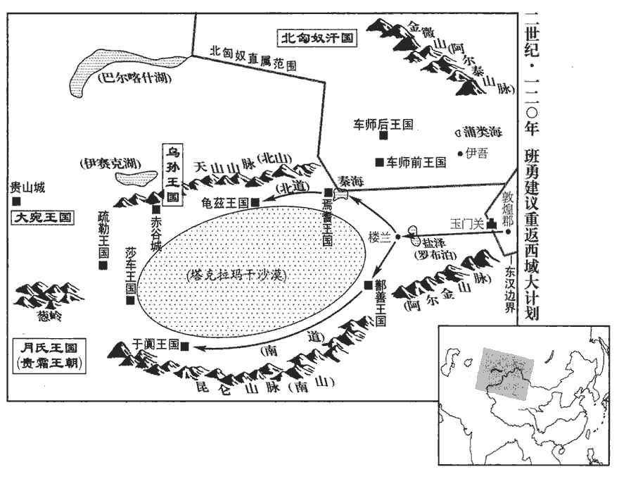
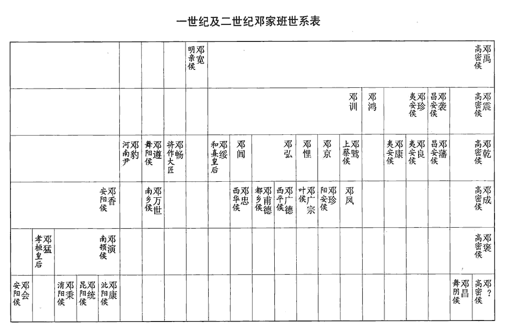
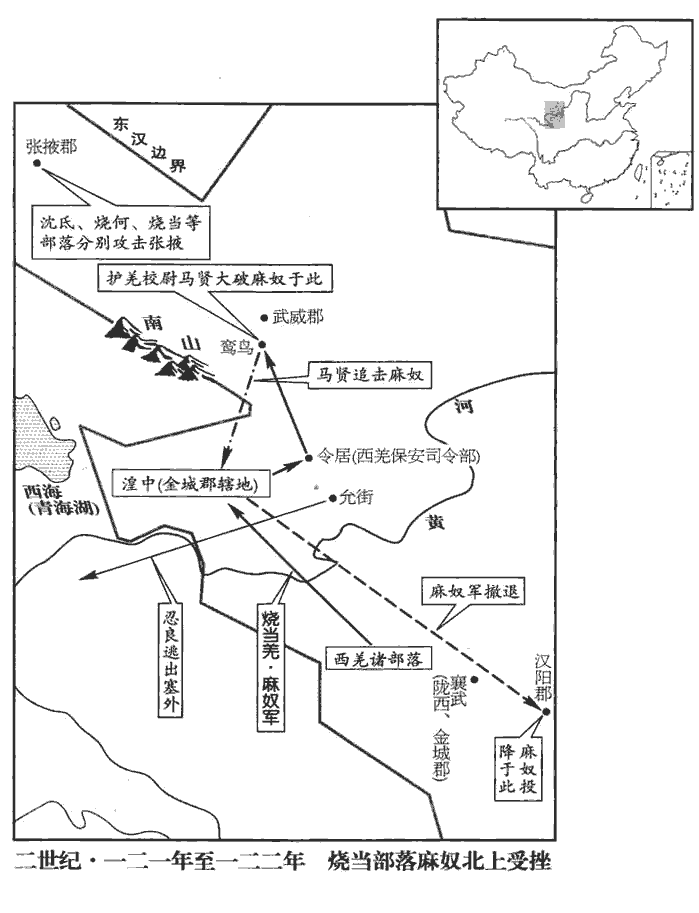
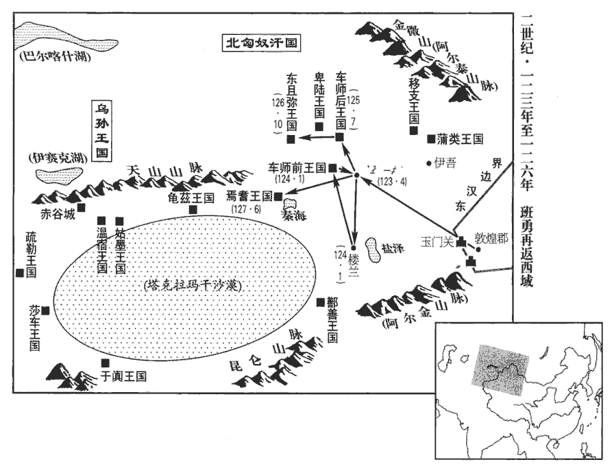
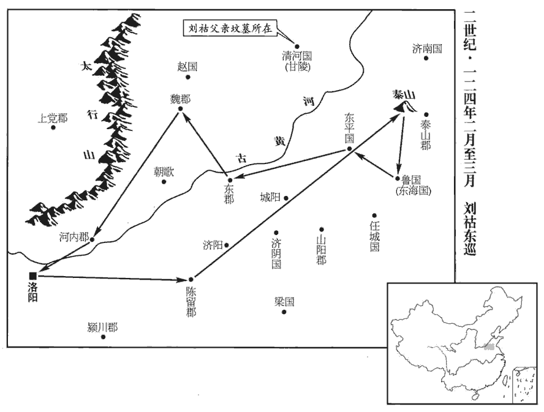

 漢紀四十二起柔兆执徐（丙辰），尽阏逢困敦（甲子），凡九年。

# 孝安皇帝中

## 元初三年（丙辰，一一六）

1春，正月，蒼梧‹广西梧州›、鬱林‹广西桂平›、合浦‹广西合浦东北›蠻夷反；三郡皆屬交州。二月，遣侍御史任逴chuō督州郡兵討之。任，音壬。賢曰：逴，音丁角翻，又音卓。

〖译文〗 [1]春季，正月，苍梧、郁林、合浦三郡蛮夷反叛。二月，朝廷派遣侍御史任指挥州郡兵进行讨伐。

2郡国十地震。

〖译文〗 [2]有十个郡和封国发生地震。

3三月，辛亥‹二›，日有食之。

〖译文〗 [3]三月辛亥（初二），出现日食。

4夏四月，京师旱。

〖译文〗 [4]夏季，四月，京城洛阳发生旱灾。

5五月，武陵‹湖南常德›蛮反。州郡讨破之。

〖译文〗 [5]五月，武陵郡蛮人反叛，州郡官府进行讨伐，打败叛军。

6癸酉‹二十五›，度遼將軍邓遵率南單于擊零昌於靈州‹宁夏灵武›，范書匈奴傳曰：自置度遼將軍以來，皆權行其事，獨遵以皇太后從弟為真將軍，此後更無行將軍者。志云：度遼將軍，銀印青綬，秩二千石。靈州縣，屬北地郡。賢曰：在今慶州馬嶺縣西北。零，音憐。斬首八百餘級。

〖译文〗 [6]癸酉（二十五日），度辽将军邓遵率领南匈奴单于，在灵州进攻零昌，斩杀八百余人。

7越巂‹四川西昌›徼外夷舉種內屬。巂，音髓。徼，吉弔翻。種，章勇翻。

〖译文〗 [7]越边境外的夷人，整个部落归附汉朝。

8六月，中郎将任尚任音壬。遣兵击破先零羌于丁奚城‹宁夏灵武境›。零，音憐。

〖译文〗 [8]六月，中郎将任尚派兵在丁奚城打败羌人先零部落。

9秋七月，武陵‹湖南常德›蛮复反，复，扶又翻。州郡讨平之。

〖译文〗 [9]秋季，七月，武陵蛮人再次反叛，被州郡官府剿平。

10九月，築馮翊北界候塢五百所以備羌。馮翊北界，接安定北地。

〖译文〗 [10]九月，在冯翊北部边界修筑堡寨五百处，防备羌军。

11冬，十一月，蒼梧‹广西梧州›、鬱林‹广西桂平›、合浦‹广西合浦东北›蠻夷降。降，戶江翻。

〖译文〗 [11]冬季，十一月，苍梧、郁林、合浦三郡蛮夷投降。

舊制：公卿、二千石、刺史不得行三年喪，司徒劉愷以為「非所以師表百姓，宣美風俗。」丙戌‹十一›，初聽大臣行三年喪。賢曰：文帝遺詔以日易月，於後大臣，遂以為常；至此，復遵古制也。

〖译文〗 [12]以往制度规定：三公、九卿、二千石官员、刺史，不得守丧三年。司徒刘恺认为：“这种作法不能成为百姓的表率和倡导优良风俗。”十一月丙戌（十一日），首次允许大臣守丧三年。

12癸卯‹二十八›，郡國九地震。

〖译文〗 [13]十一月癸卯（二十八日），有九个郡和封国发生地震。

13十二月，丁巳‹十二›，任尚遣兵擊零昌於北地‹宁夏吴忠西南金积镇›，殺其妻子，燒其廬舍，【章：甲十六行本「舍」作「落」；乙十一行本同；孔本同；張校同。】斬首七百餘級。羌勢自此衰矣。

〖译文〗 [14]十二月丁巳（十二日），任尚派兵在北地进攻零昌，杀死零昌的妻子儿女，焚烧他们的住舍，将七百余人斩首。

## 四年（丁巳，一一七）

1春，二月，乙巳朔‹一›，日有食之。

〖译文〗 [1]春季，二月乙巳朔（初一），出现日食。

2乙卯‹十一›，赦天下。

〖译文〗 [2]二月乙卯（十一日），大赦天下。

3壬午‹十八›，武库灾。

〖译文〗 [3]二月壬戌（十八日），武库失火。

4任尚遣當闐種羌榆鬼等刺殺杜季貢，闐，徙賢翻。種，章勇翻。刺，七亦翻；下同。封榆鬼為破羌侯。

〖译文〗 [4]任尚派遣羌人当阗部落的榆鬼等人刺杀了杜季贡。朝廷将榆鬼封为破羌侯。

5司空袁敞，廉勁不阿權貴，失鄧氏旨。尚書郎張俊有私書與敞子俊，怨家封上之。怨，於元翻。上，時掌翻。夏，四月，戊申‹五›，敞坐策免，自殺；俊等下獄當死。下，遐稼翻。俊上書自訟；臨刑，太后詔以減死論。

〖译文〗 [5]司空袁敞为人廉正刚直，不肯阿附权贵，不合邓氏家族之意。尚书郎张俊有一封写给袁敞之子袁俊的私信，被仇家得到，仇家上书告密。夏季，四月戊申（初五），袁敞被指控有罪，颁策免官，自杀而死。张俊等人下狱，被判处死刑。张俊上书鸣冤，为自己辩护。临刑时，邓太后下诏免他一死，判处轻于死刑一等的刑罚。

6己巳‹二十六›，遼西‹辽宁义县西›鮮卑連休等入寇，考異曰：范書鮮卑傳上作「連休」，下作「休連」，今從上文。遼西郡，在雒陽東北三千三百里。賢曰：遼西郡故城，在今平州東陽樂城是。郡兵與烏桓大人於秩居等共擊，大破之，斬首千三百級。

〖译文〗 [6]四月已巳（二十六日），辽西郡鲜卑人连休等入侵边塞。辽西郡郡兵与乌桓大人於秩居等一同迎战，大败鲜卑军，斩杀一千三百人。

7六月，戊辰‹二十六›，三郡雨雹。雨，于具翻。

〖译文〗 [7]六月戊辰（二十六日），有三个郡发生雹灾。

8尹就坐不能定益州‹四川、云南›，徵抵罪：以益州刺史張喬領其軍屯，招誘叛羌，稍稍降散。誘，音酉。降，戶江翻。

〖译文〗 [8]中郎将尹就因未能平定益州，被召回京城问罪。朝廷命令益州刺史张乔接管尹就的部队。张乔招抚引诱羌人投降，羌军稍有瓦解。

9秋，七月，京師及郡國十雨水。

〖译文〗 [9]秋季，七月，京城洛阳及十个郡和封国大雨成灾。

10九月，護羌校尉任尚復募効功種羌號封刺殺零昌；復，扶又翻。封號封為羌王。

〖译文〗 [10]九月，护羌校尉任尚又收买羌人效功部落的号封，刺杀了零昌。朝廷封号封为羌王。

11冬，十一月，己卯‹九›，彭城靖王恭薨。

〖译文〗 [11]冬季，十一月已卯（初九），彭城靖王刘恭去世。

12越巂‹四川西昌›夷以郡縣賦斂煩數，巂，音髓。斂，力贍翻。數，所角翻。十二月，大牛種‹云南中甸一带›封離等反，殺遂久‹云南丽江›令。遂久縣，屬越巂郡。賢曰：遂久故縣，在今靡州界。考異曰：西南夷傳云「五年叛」，今從帝紀。

〖译文〗 [12]赵夷人因郡县官府征收赋税繁重，十二月，大牛部落封离等人反叛，杀死遂久县令。

13甲子‹二十五›，任尚與騎都尉馬賢共擊先零羌狼莫，追至北地，相持六十餘日，戰於富平河上‹宁夏灵武段黄河›，大破之，范書帝紀作「富平上河」，西羌傳作「河上」。賢曰：富平縣，屬北地郡，故城在今靈州回樂縣西南。余按水經，河水東北逕安定郡眴卷縣故城西。註曰：地理志，河水別出為河溝，東至富平北入河，河水於此有上河之名。前漢馮參為上河典農都尉。則上河為是。宋白曰：唐靈州，即漢富平縣之地。杜佑曰：漢富平，今靈州迴樂縣。應劭曰：眴，音旬日之旬。卷，音箘jùn簬lù之箘。斬首五千級，狼莫逃去。於是西河‹内蒙准格尔旗西南›虔人種羌萬人詣鄧遵降，隴右平。狼莫者，零昌之謀主，零昌既死而狼莫敗逃，虔人羌失援而降，故隴右平。降，戶江翻。

〖译文〗 [13]十二月甲子（二十五日），任尚与骑都尉马贤一同进攻羌人先零部落首领狼莫，追击到北地。双方相持六十多天，在富平县黄河之畔交战，大败羌军，斩杀五千人，狼莫逃走。于是西河郡的羌族虔人部落一万人前往度辽将军邓遵处归降，陇右地区平定。

14是歲，郡國十三地震。

〖译文〗 [14]本年，有十三个郡和封国发生地震。

## 五年（戊午，一一八）

1春，三月，京師及郡國五旱。

〖译文〗 [1]春季，三月，京城洛阳及五个郡和封国发生旱灾。

2夏，六月，高句驪‹吉林集安›與濊貊‹朝鲜半岛东北部›寇玄菟‹辽宁沈阳›。句，如字，又音駒。驪，力知翻。濊，音穢。貊，莫百翻。菟，同都翻。

〖译文〗 [2]夏季，六月，高句丽国与貊部落一同进攻玄菟郡。

3永昌‹云南保山›、益州‹云南晋宁东晋城镇›、蜀郡夷皆叛應封離，眾至十餘萬，破壞二十餘縣，壞，音怪。殺長吏，焚掠百姓，骸骨委積，千里無人。

〖译文〗 [3]永昌、益州、蜀郡三郡的夷人全体反叛，响应封离，部众多达十余万。他们攻陷二十余县，杀死官吏，放火焚烧房屋，抢劫百姓，致使尸骨堆积，千里无人。

4秋，八月，丙申朔‹一›，日有食之。

〖译文〗 [4]秋季，八月丙申朔（初一），出现日食。

5代郡‹山西阳高›鮮卑入寇，殺長吏；考異曰：獨行傳云：「元初中，鮮卑數百餘騎寇漁陽，太守張顯率吏士追出塞，遙望虜營煙火，急趣之。兵馬掾嚴授慮有伏兵，苦諫止，不聽。顯蹙令进，授不获已前战，伏兵发，授身被十创，没于阵，顯拔刃追散兵不能制，虜射中顯，主簿衛福、功曹徐咸遽趣之，顯遂墮馬，福以身擁蔽，虜并殺之。朝廷愍授等節，詔書褒歎，厚加賞賜。」按元初凡六年，鮮卑不曾犯漁陽，殺長吏；惟是入代郡曾殺長吏。今疑漁陽本是代郡‹山西阳高›，史之誤也。余按張顯事，通鑑已書於上卷殤帝延平元年，從范書帝紀也。發緣邊甲卒、黎陽‹河南浚县›營兵屯上谷‹河北怀来›以備之。冬，十月，鮮卑寇上谷，攻居庸關‹北京昌平西北›，郡國志：居庸縣，屬上谷郡。新唐志：幽州昌平縣西北三十五里，有納款關，即居庸故關。復發緣邊諸郡黎陽營兵、積射士步騎二萬人，復，扶又翻。屯列衝要。

〖译文〗 [5]代郡的鲜卑人向内地进攻，杀死官吏。朝廷征调沿边地方军队和黎阳营兵驻扎上谷，加以防御。冬季，十月，鲜卑军入侵上谷，攻打居庸关。朝廷再次增调沿边各郡郡兵和黎阳营兵、弓弩手等，步、骑兵共二万人，分驻要塞。

6鄧遵募上郡‹陕西榆林南鱼河堡›全無種羌雕何刺殺狼莫；刺，七亦翻。封雕何為羌侯。自羌叛十餘年間，永初元年羌叛，至是年凡十二年。軍旅之費，凡用二百四十餘億，府帑tǎng空竭，邊民及內郡死者不可勝數，帑，他朗翻。勝，音升。并、涼二州遂至虛耗。及零昌、狼莫死，零，音憐。諸羌瓦解，三輔、益州無復寇警。詔封鄧遵為武陽侯，邑三千戶。東郡有東武陽，泰山郡有南武陽，鄧騭傳又作「舞陽」。遵以太后從弟，故爵封優大。任尚與遵爭功，又坐詐增首級、受賕qiú枉法贓千萬已上，十二月，檻車徵尚，棄市，沒入財物。鄧騭子侍中鳳嘗受尚馬，騭髡kūn妻及鳳以謝罪。騭，職日翻。

〖译文〗 [6]度辽将军邓遵收买上郡羌人全无部落的雕何刺杀了狼莫，朝廷将雕何封为羌侯。自从羌人反叛，十余年间，军费开支共计二百四十多亿，国库枯竭，边疆及内地百姓的死亡人数多得无法统计，并州、凉州两州因此而空虚衰败。及至零昌、狼莫死后，羌人各部落瓦解，三辅和益州不再有战争的警报。朝廷将邓遵封为武阳侯，享有三千户食邑。因邓遵是邓太后的堂弟，所以封赐优厚。任尚与邓遵争功，又被指控虚报斩杀敌人数量、枉法贪赃一千万钱以上，十二月，将他用囚车押回京城，在闹市斩首，尸体暴露街头，财产没收。邓骘的儿子、侍中邓凤曾接受过任尚的赠马，于是邓骘用剃发的髡刑来惩罚自己的妻子和邓凤，向朝廷谢罪。

7是歲，郡國十四地震。

〖译文〗 [7]本年，有十四个郡和封国发生地震。

8太后弟悝kuī、閶皆卒，封悝子廣宗為葉侯，閶子忠為西華侯。葉縣，屬南陽郡；西華縣，屬汝南郡。悝，苦回翻。閶，音昌。葉，式涉翻。

〖译文〗 [8]邓太后的弟弟邓悝、邓阊都在本年去世。将邓悝的儿子邓广宗封为叶侯，将邓阊的儿子邓忠封为西华侯。

## 六年（己未，一一九）

1春，二月，乙巳‹十二›，京師及郡國四十二地震。

〖译文〗 [1]春季，二月乙巳（十二日），京城洛阳及四十二个郡和封国发生地震。

2夏，四月，沛國‹安徽淮北›、勃海‹河北南皮›大風，雨雹。雨，于具翻。

〖译文〗 [2]夏季，四月，沛国、勃海刮大风，下冰雹。

3五月，京師旱。

〖译文〗 [3]五月，京城洛阳发生旱灾。

4六月，丙戌‹二十六›，平原哀王得薨，無子。

〖译文〗 [4]六月丙戌（二十六日），平原哀王刘得去世，没有子嗣。

5秋，七月，鮮卑寇馬城塞‹河北怀安›，殺長吏，馬城縣，屬代郡。賢曰：搜神記：昔秦人築城於武周塞以備胡，將成而崩者數矣。有馬馳走周旋反覆，父老異之，因依以築城，城乃不崩，遂以名焉。其故城，則今之朔州也。余按續漢志、搜神記所云，乃鴈門郡之馬邑，此乃代郡之馬城，賢誤。度遼將軍鄧遵及中郎將馬續率南單于追擊，大破之。

〖译文〗 [5]秋季，七月，鲜卑军攻打马城要塞，杀死官吏。度辽将军邓遵和中郎将马续率领南匈奴单于进行追击，大败鲜卑军。

6九月，癸巳‹四›，陳懷王竦薨，無子，國除。竦sǒng，陳王羨之孫。

〖译文〗 [6]九月癸巳（初四），陈怀王刘竦去世。因无子嗣，封国撤除。

7冬，十二月，戊午朔‹一›，日有食之，既。

〖译文〗 [7]冬季，十二月戊午朔（初一），出现日全食。

8郡國八地震。

〖译文〗 [8]有八个郡和封国发生地震。

9是歲，太后徵和帝‹刘肇›弟濟北王壽、河間王開子男女年五歲以上四十餘人濟，子禮翻。及鄧氏近親子孫三十餘人，并為開邸第，賢曰：蒼頡篇曰：邸，舍也。為，于偽翻。教學經書，躬自監試。監，古銜翻。詔從兄河南尹豹、越騎校尉康等曰：「末世貴戚食祿之家，溫衣美飯，乘堅驅良，賢曰：堅，謂好車，良，謂善馬。余按此語出史記范蠡傳。從，才用翻。而面牆術學，不識臧否，尚書曰：弗學牆面。言正牆面而立，無所見也。否，音鄙。斯故禍敗之所從來也。」

〖译文〗 [9]本年，邓太后征召和帝的弟弟、济北王刘寿和河间王刘开五岁以上的子女，共四十余人，以及邓氏家族的近亲子孙三十余人，为他们建立官舍，教学儒家经书，邓太后亲自监督考试。她下诏给堂兄、河南尹邓豹和越骑校尉邓康等人说：“处于末世的皇亲国戚和官宦人家，穿暖衣，吃美食，乘坚车，驱良马，但对待学术，却如面向墙壁而目无所见，不知道善恶得失，这就是灾祸与败亡的由来。”

10豫章‹江西南昌›有芝草生，太守劉祗zhī欲上之，上，時掌翻。以問郡人唐檀，檀曰：「方今外戚豪盛，君道微弱，斯豈嘉瑞乎！」祗乃止。

〖译文〗 [10]豫章郡发现灵芝草，太守刘祗打算作为祥瑞献给朝廷，询问本郡人唐檀的意见。唐檀说：“如今外戚之势大盛，君王权力衰微，这怎能是祥瑞呢！”刘祗这才作罢。

11益州刺史張喬遣從事楊竦將兵至楪yè榆‹云南大理北›，楪榆縣，武帝開置，屬益州郡，有葉榆澤在縣東，因名；明帝分屬永昌郡。楪，與葉同。擊封離等，大破之，斬首三萬餘級，獲生口千五百人。封離等惶怖，斬其同謀渠帥，詣竦乞降。怖，普布翻。帥，所類翻。降，戶江翻；下同。竦厚加慰納，其餘三十六種皆來降附。種，章勇翻。竦因奏長吏姦猾，侵犯蠻夷者九十人，皆減死論。

〖译文〗 [11]益州刺史张乔派从事杨竦率兵进驻榆，攻打封离等，打败了封离等，斩杀三万余人，俘虏一千五百人。封离等十分惊恐，杀死共同谋反的其他首领，前来拜见杨竦，请求归降。杨竦对封离进行安抚，并给予优厚的待遇。其余的三十六个部落也都前来归降。于是杨竦上书，举报奸恶狡猾、欺压蛮夷的地方官吏共九十人。这些人全都被判处轻于死刑一等的刑罚。

12初，西域諸國既絕於漢，事見上卷永初元年。北匈奴復以兵威役屬之，役使而臣屬之。復，扶又翻；下同。與共為邊寇。敦煌太守曹宗患之，敦，徒門翻。乃上遣行長史索班將千餘人屯伊吾‹新疆哈密›以招撫之。索姓出敦煌。又左傳，商人七族有索氏。上，時掌翻。索，昔各翻。上遣者，上奏而遣之也。行長史者，行長史事，未為真也。於是車師前王‹新疆吐鲁番›及鄯善‹新疆若羌›王復來降。鄯，上扇翻。

〖译文〗 [12]起初，西域各国同汉朝断绝关系以后，北匈奴重新以武力相威胁，驱使西域各国向自己臣服，并一同侵犯汉朝边境。敦煌太守曹宗对此感到忧虑，便请示朝廷，派遣代理长史索班率领一千余人驻扎伊吾，对西域各国进行招抚。于是车师前王及鄯善王再度前来归降。

13初，疏勒‹新疆喀什›王安國死，無子，國人立其舅子遺腹為王；遺腹叔父臣磐在月氏‹都蓝市城，阿富汗北部瓦齐拉巴德›，月氏納而立之。西域傳曰：元初中，安國以舅臣磐有罪，徙於月氏，月氏王親愛之。遺腹既立，月氏遣兵送臣磐還疏勒‹新疆喀什›。國人素敬愛臣磐，又畏憚月氏，即共奪遺腹印綬，迎臣磐，立以為王。氏，音支。後莎車‹新疆莎車›畔于窴‹新疆和田›，屬疏勒，自明帝永平四年，莎車屬于窴。疏勒遂強，與龜茲‹新疆库车›、于窴‹新疆和田›為敵國焉。

〖译文〗 [13]当初，疏勒王安国去世时，没有子嗣，国人将安国舅父之子遗腹拥立为王。遗腹的叔父臣磐在月氏国，月氏国与臣磐亲善，因而又将他改立为疏勒王。后来，莎车国背叛了于阗国而臣属于疏勒国，疏勒国便强盛起来，与龟兹、于阗两国互相抗衡。

## 永寧元年（庚申，一二零）是年，夏，四月，改元。

1春，三月，丁酉‹十一›，濟北惠王壽薨。濟，子禮翻。

〖译文〗 [1]春季，三月丁酉（十一日），济北惠王刘寿去世。

2北匈奴率車師後王‹新疆吉木萨尔南›軍就共殺後部司馬及敦煌長史索班等，賢曰：司馬，即屬戊己校尉所統也；和帝時置戊己校尉，鎮車師後部。考異曰：班勇傳：「元初六年，曹宗遣索班屯伊吾。後數月，北單于與車師後部共攻沒索班。」按本紀，「永寧元年，車師後王叛，殺部司馬。」車師傳亦曰：「永寧元年，後王軍就及母沙麻反畔，殺後部司馬及敦煌行事。」蓋班以去年末屯伊吾，今春見殺，或今春奏事方到也。遂擊走其前王，略有北道。鄯善‹新疆若羌›逼急，求救於曹宗，鄯，上扇翻。宗因此請出兵五千人擊匈奴，以報索班之恥，因復取西域；公卿多以為宜閉玉門關‹甘肃敦煌西北›，絕西域。太后聞軍司馬班勇有父風，召詣朝堂問之。班固西都賦曰：左右廷中，朝堂百僚之位；朝堂蓋在殿庭左右。朝，直遙翻。勇上議曰：「昔孝武皇帝患匈奴強盛，於是開通西域，論者以為夺匈奴府藏，上，時掌翻。藏，徂浪翻。斷其右臂。斷，丁管翻。光武中興，未遑huáng外事，故匈奴負強，驅率諸國；及至永平，再攻敦煌、敦，徒門翻。河西‹甘肃西部、中部›諸郡，城門晝閉。孝明皇帝深惟廟策，惟，思也。賢曰：古者謀事必就祖，故言廟策也。余謂古者遣將必於廟，先定制勝之策，故謂之廟策。乃命虎臣出征西域，虎臣，謂其父超也。故匈奴遠遁，邊境得安；及至永元，莫不內屬。會間者羌亂，西域復絕，復，扶又翻。北虜遂遣責諸國，備其逋bū租，高其價直，嚴以期會，備，償也。西域屬漢之後，不復以馬畜、旃zhān罽jì輸匈奴，及與漢絕，匈奴復遣使責其積年所逋。逋，欠也。鄯善‹新疆若羌›、車師‹新疆吐鲁番›皆懷憤怨，思樂事漢，樂，音洛。其路無從；前所以時有叛者，皆由牧養失宜，還為其害故也。今曹宗徒恥於前負，欲報雪匈奴，負，敗也。報雪，謂報伊吾之役，雪索班之恥也。而不尋出兵故事，未度當時之宜也。度，徒洛翻。夫要功荒外，萬無一成，要，一遙翻。荒外，謂在荒服之外。若兵連禍結，悔無所及。況今府藏未充，藏，徂cú浪翻。師無後繼，是示弱於遠夷，暴短於海內，臣愚以為不可許也。舊敦煌郡有營兵三百人，今宜復之，復置護西域副校尉，居於敦煌，如永元故事，校，戶教翻。又宜遣西域長史將五百人屯樓蘭‹罗布泊畔›，樓蘭，即鄯善。西當焉耆‹新疆焉耆›、龜茲‹新疆库车›徑路，南強鄯善‹新疆若羌›、于窴‹新疆和田›心膽，北扞匈奴，東近敦煌，如此誠便。」龜茲，音丘慈。窴tián，徒賢翻。

〖译文〗 [2]北匈奴率领车师后王军就，一同杀死后部司马及敦煌长史索班等人，乘胜赶走车师前王，控制了西域北道。鄯善国形势危急，向曹宗求救。于是曹宗上书朝廷，请求出兵五千人进攻匈奴，为索班雪耻，就此重新收回西域。朝中公卿多数认为应当关闭玉门关，和西域断绝关系。邓太后听说军司马班勇有其父之风，便召他到朝堂进见，询问他的意见。班勇建议道：“从前孝武皇帝因匈奴强盛而感到忧虑，于是开通了西域。评论者认为，这一举动是夺取了匈奴的宝藏，切断了匈奴的右臂。光武帝使大业中兴，未能顾及外部事务，因此匈奴得以仗恃强力，驱使各国服从。到了永平年间，匈奴再次进攻敦煌，致使河西地区各郡的城门白天关闭。孝明皇帝深思熟虑，制定国策，命虎将出征西域，匈奴因此向远方逃遁，边境才得到了安宁。及至永元年间，异族无不归附汉朝。但不久之前又发生了羌乱，汉朝与西域的关系再度中断。于是北匈奴派遣使者，督责各国缴纳拖欠的贡物，并提高价值，严格规定缴纳期限。鄯善、车师两国全都心怀怨愤，愿意臣属于汉朝，但却找不到途径。从前西域所以时常发生叛乱，都是由于汉朝官员对他们管理不当，并加以迫害的缘故。如今曹宗只是为先前的失败感到羞耻，要向匈奴报仇雪恨，并不研究从前的战史，也未衡量当前战略的利弊。在遥远的蛮荒建立功业，可能性极其微小，如果导致战争连年，祸事不断，则将后悔不及。况且如今国库并不充足，大军没有后继力量。这是向远方的异族显示我们的弱点，向天下暴露我们的短处，我认为不可批准曹宗的请求。从前敦煌郡有营兵三百人，现在应当恢复，并重新设置护西域副校尉，驻扎敦煌，如同永元年间的旧例。还应派遣西域长史率领五百人驻扎楼兰，在西方控制焉耆、龟兹的通道，在南方增强鄯善、于阗的信心和胆量，在北方抵抗匈奴，在东方捍卫敦煌。我确信这是上策。”

尚書復問勇：「利害云何？」勇既上議，尚書復問，使悉陳其利害。復，扶又翻。勇對曰：「昔：永平之末，始通西域，初遣中郎將居敦煌，謂鄭眾也。後置副校尉於車師，謂耿恭、關寵也。既為胡虜節度，又禁漢人不得有所侵擾，故外夷歸心，匈奴畏威。今鄯善王尤還，漢人外孫，若匈奴得志，則尤還必死。賢曰：尤還，鄯善王名。此等雖同鳥獸，亦知避害，若出屯樓蘭，足以招附其心，愚以為便。」此勇所謂利也。

〖译文〗 尚书又向班勇询问：“这个计策利害如何？”班勇回答说：“从前，在永平末年，刚刚恢复与西域的交通，第一次派遣中郎将驻守敦煌，后来又在车师设置了副校尉。既指挥胡人，调解他们的冲突；又防禁汉人，不许对胡人有所侵扰。所以外族归心于汉朝，匈奴畏惧汉朝的威望。当今的鄯善王尤还，是汉人的外孙，如果匈奴得逞，那么尤还必死。这些外族虽然如同鸟兽，也知道逃避危害，我们如果在楼兰驻军，便足以使他们归心，我认为这样做是有利的。”

長樂衛尉鐔tán顯、類篇：鐔，如心翻，姓也。賢曰：鐔，音徒南翻。唐韻又音尋。廷尉綦qí毋‹毌›參、綦毌，姓也，左傳晉有綦毌張。司隸校尉崔據難曰：難，乃旦翻；下同。「朝廷前所以棄西域者，以其無益於中國而費難供也。今車師已屬匈奴，鄯善不可保信，一旦反覆，班將能保北虜不為邊害乎？」賢曰：以勇為軍司馬，故以將言之。將，音子亮翻。勇對曰：「今中國置州牧者，以禁郡縣姦猾盜賊也。若州牧能保盜賊不起者，臣亦願以要斬保匈奴之不為邊害也。要，讀曰腰。今通西域則虜勢必弱，虜勢弱則為患微矣；孰與歸其府藏，續其斷臂哉？今置校尉以扞撫西域，設長史以招懷諸國，若棄而不立，則西域望絕，望絕之後，屈就北虜，緣邊之郡將受困害，恐河西城門必須復有晝閉之儆矣！明帝永平中，北匈奴脅諸國共寇河西郡縣，城門晝閉。復，扶又翻；下同。今不廓開朝廷之德而拘屯戍之費，若此，北虜遂熾，豈安邊久長之策哉！」此勇所謂害也。熾，尺志翻。

〖译文〗 长乐卫尉镡显、廷尉綦毋参、司隶校尉崔据提出诘难，说：“朝廷先前所以放弃西域，是由于西域不能给汉朝带来利益，而且费用庞大，难以供应的缘故。目前车师已经臣属于匈奴，鄯善也不可信赖，一旦局势有变，班将军能担保北匈奴不来侵害边疆吗？”班勇回答说：“如今汉朝设置州牧，是为了禁止郡县的奸人盗匪。如果州牧能够担保盗匪不作乱，我也愿以腰斩来担保匈奴不侵害边疆。现在若是开通西域，那么匈奴的势力就必定削弱；匈奴的势力削弱，那么危害也就轻微了。这与把宝藏交还给匈奴，并为它接上断臂能相比吗？如今设置西域校尉，是用来保护安抚西域；设置长史，是用来招揽怀柔各国。假如放弃西域而不设置校尉、长史，那么西域就会对汉朝绝望，绝望之后就会屈从北匈奴，汉朝的沿边各郡就将受到侵害，恐怕河西地区必定又将有白天关闭城门的警报了！现在不推广朝廷的恩德，而吝惜屯戍的费用，这样下去，北匈奴就会气焰高涨，这难道是保护边疆安全的长久策略吗！”

 

太尉屬毛軫zhěn難曰：「今若置校尉，則西域駱驛遣使，求索無厭，索，山客翻。厭，於鹽翻。百官志：太尉掾屬二十四人；東、西曹掾比四百石，餘掾比三百石，屬比二百石。與之則費難供，不與則失其心，一旦為匈奴所迫，當復求救，則為役大矣。」勇對曰：「今設以西域歸匈奴，而使其恩德大漢，不為鈔盜，則可矣。鈔，楚交翻。如其不然，則因西域租入之饒，兵馬之眾，以擾動緣邊，是為富仇讎之財，增暴夷之勢也。置校尉者，宣威布德，以繫諸國內向之心而疑匈奴覬覦之情，覬，音冀。覦，音俞。而無費財耗國之慮也。且西域之人，無他求索，其來入者不過稟食而已；稟bǐng，筆錦翻，給也。食，讀曰飤。今若拒絕，勢歸北屬夷虜，言其事勢所歸，必至北屬匈奴。并力以寇并‹山西›、涼‹甘肃›，則中國之費不止十億。置之誠便。」

〖译文〗 太尉属毛轸诘难道：“如今要是设置了校尉，那么西域各国就会络绎不断地派遣来使，索求赏赐，不知满足。若是给予他们，那么费用太多而难以供应，若是不给他们，就会失掉归顺之心。而一旦受到匈奴的逼迫，还要再向汉朝求救，那时便需动用兵力，费事就更大了。”班勇答复道：“假设我们现在把西域交给匈奴，使匈奴感激汉朝的恩德，以使它从此不再侵略作乱，那么就可以这样办。假如不然，匈奴就会因为得到了西域，而利用西域丰厚的贡物和众多的兵马，骚扰攻击汉朝的边境。这是为仇人增加财富，为横暴的敌国增强实力。设置校尉，是为了宣扬推广汉朝的国威和恩德，以维系西域各国的归附之心，动摇匈奴的觊觎之意，不会带来消耗国家资财的忧虑。况且西域之人，并没有其它的要求，使节来到汉朝，不过是供应他们膳食而已。现在若是拒绝西域各国，它们势必归属北方的匈奴人。如果各种力量联合起来，一同侵略并州、凉州，那么国家的开支将不止十亿。我相信，设置西域校尉确实是有利的。”

於是從勇議，復敦煌郡營兵三百人，置西域副校尉居敦煌，雖復羈縻西域，然亦未能出屯。謂未能如勇計出屯樓蘭西也。然使盡行勇之計，亦未必能羈制西域，何者？武帝通西域，未能盡臣屬西域也；及宣帝時，日逐降，呼韓邪內附，始盡得西域。明帝使班超通西域，未能盡臣屬西域也；及竇憲破北匈奴，超始盡得西域。今漢內困於諸羌，而北匈奴游魂蒲類，安能以五百人成功哉！其後匈奴果數與車師共入寇鈔，河西大被其害。數，所角翻。鈔，楚交翻。被，皮義翻。

〖译文〗 于是朝廷采纳了班勇的建议，向敦煌郡重新派遣营兵三百人，并设置西域副校尉驻守敦煌。朝廷虽然再次控制西域，却未能越出边境，到西域驻兵。后来，匈奴果然屡次同车师一道侵犯内地，河西地区受到严重伤害。

3沈氐‹陕西北部›羌寇張掖‹甘肃张掖›。賢曰：沈氐dī，羌號也。續漢書曰：羌在上郡西河者，號沈氐。

〖译文〗 [3]羌人沈氐部落攻打张掖郡。

4夏，四月，丙寅‹十一›，立皇子保為太子，改元，赦天下。

〖译文〗 [4]夏季，四月丙寅（十一日），将皇子刘保立为太子。改年号。大赦天下。

5己巳‹十四›，紹封陳敬王子崇為陳王，濟北惠王子萇為樂成王，濟，子禮翻。河間孝王子翼為平原王。

〖译文〗 [5]己巳（十四日），将前陈敬王刘羡的儿子刘崇封为陈王，继承刘羡。将济北惠王刘寿的儿子刘苌封为乐成王，将河间孝王刘开的儿子刘翼封为平原王。

6六月，護羌校尉馬賢將萬人討沈氐羌於張掖，破之，斬首千八百級，獲生口千餘人，餘虜悉降。降，戶江翻。時當煎等【章：甲十六行本「等」作「種」；乙十一行本同；張校同。】大豪飢五等，以賢兵在張掖，乃乘虛寇金城‹甘肃陇西›，賢還軍【章：甲十六行本「軍」下有「追之」二字；乙十一行本同；孔本同；張校同，退齋校同。】出塞，斬首數千級而還。燒當‹渭水上游一带›、燒何‹宁夏南部›種聞賢軍還，復寇張掖，殺長吏。馬賢於時為健闘。然觀其往來奔命，羌人輒議其後，賢不思所以制之之術，重以不恤軍事，宜其有射姑山之敗也。還，從宣翻，又如字。種，章勇翻。復，扶又翻。長，知兩翻。

〖译文〗 [6]六月，护羌校尉马贤率领一万兵众，在张掖郡讨伐羌人沈氐部落。打败羌军，斩杀一千八百人，俘虏一千余人，其余的全部投降。当时，当煎部落首领饥五等人，因马贤的部队集中在张掖，便乘虚而入，攻打金城。马贤率军由张掖返回，追击直到塞外，斩杀数千人后班师。烧当、烧何二部落听说马贤大军返回金城，又再次进攻张掖，杀害官吏。

7秋，七月，乙酉朔‹一›，日有食之。

〖译文〗 [7]秋季，七月乙酉朔（初一），出现日食。

8冬，十月，己巳‹十六›，司空李郃免。郃，古合翻；又曷閣翻。癸酉‹二十›，以衛尉廬江‹安徽庐江›陳褒為司空。

〖译文〗 [8]冬季，十月己巳（十六日），将司空李免官。癸酉（二十日），将卫尉、庐江人陈褒任命为司空。

9京师及郡国三十三大水。

〖译文〗 [9]京城洛阳及三十三个郡和封国发生水灾。

10十二月，永昌‹云南保山›徼外撣shàn國‹缅甸中部›王雍曲調遣使者獻樂及幻人。西南夷傳：幻人能變化、吐火、自支解、易牛馬頭，自言我海西人，海西即大秦也。今按大秦即武帝時犁靬國，今謂之拂菻。撣，音檀。范書「雍曲調」作「雍由調」，徼，吉弔翻。

〖译文〗 [10]十二月，永昌郡边境外的掸国国王雍曲调派遣使者进献乐队和魔术艺人。

11戊辰‹十六›，司徒劉愷請致仕；許之，以千石祿歸養。

〖译文〗 [11]戊辰（十六日），司徒刘恺请求退休，获得批准，被赐予每年一千石的终身俸禄，回乡养老。

12遼西‹辽宁义县西›鮮卑大人烏倫、其至鞬各以其眾詣度遼將軍鄧遵降。烏倫、其至鞬，二人也。鞬，居言翻。

〖译文〗 [12]辽西郡的鲜卑大人乌伦和其至，各自率领部众向度辽将军邓遵投降。

13癸酉‹二十一›，以太常楊震為司徒。

〖译文〗 [13]癸酉（二十一日），将太常杨震任命为司徒。

14是岁，郡国二十三地震。

〖译文〗 [14]本年，有二十三个郡和封国发生地震。

15太后從弟越騎校尉康，以太后久臨朝政，宗門盛滿，數上書太后，從，才用翻。上元初六年書從兄康，此書從弟；徵諸范史，當從「兄」字。數，所角翻。上，時掌翻。以為宜崇公室，自損私權，言甚切至，太后不從。康謝病不朝，太后使內侍者問之；所使者乃康家先婢，先本康家婢，後入宮，在太后左右。自通「中大人」，時宮中耆宿皆稱中大人。康聞而詬之。賢曰：詬，罵也；音許遘翻，又古候翻。婢怨恚，恚huì，於避翻。還，白康詐疾而言不遜。太后大怒，免康官，遣歸國‹山东高密›，康永初中紹封夷安侯。絕屬籍。

〖译文〗 [15]邓太后的堂弟、越骑校尉邓康，因邓太后摄政已久，家庭权势过盛，屡次向邓太后上书，认为应当抬高朝廷的威望，自行削减外戚的私权，言辞极其恳切。邓太后拒不采纳。于是邓康声称有病，不去朝见。邓太后派内宫侍者前去探问。这位侍者先前做过邓康家的婢女，而通报自己是“中大人”，邓康听到以后，辱骂了这位侍者。侍者心怀怨恨，回宫后，便报告说邓康装病，并且出言不逊。邓太后大怒，将邓康免官，遣回封国，取消了他的族籍。

16初，當煎種饑五同種大豪盧怱、忍良等千餘戶種，章勇翻；下同。別留允街‹甘肃永登南›，而首施兩端。賢曰：首施，猶首鼠也。允，音鉛。

〖译文〗 [16]当初，与饥五同族的当煎部落首领卢、忍良等一千余户单独居住在允街，而摇摆不定。

## 建光元年（辛酉，一二一）是年七月改元。考異曰：陳禪傳曰：「北匈奴入遼東，追拜禪遼東太守。胡憚其威強，退還數百里。禪不加兵，但遣吏卒往曉慰之。單于隨使還郡，禪於學行禮，為說道義以感化之，單于懷服，遺以胡中珍貨而去。」當在此年矣。又按北單于，漢朝所不能臣，未嘗入朝天子，安肯見遼東太守！此事可疑，今不取。余按和帝以來，北匈奴益西徙，自代郡以東至遼東塞外之地，皆鮮卑、烏桓居之，北單于安能至遼東邪！不取，當也。

1春，護羌校尉馬賢召盧怱斬之，因放兵擊其種人，獲首虜二千餘，忍良等皆亡出塞。

〖译文〗 [1]春季，护羌校尉马贤征召卢，将他斩杀，乘机发兵攻击卢的部众，斩杀两千余人。忍良等全部逃亡出塞。

2幽州刺史巴郡馮煥、玄菟‹辽宁沈阳›太守姚光、遼東‹辽宁辽阳›太守蔡諷等將兵擊高句驪，高句麗王宮遣子遂成詐降而襲玄菟、遼東，殺傷二千餘人。菟，同都翻。句，如字，又音駒。麗，讀曰驪，力知翻。降，戶江翻。

〖译文〗 [2]幽州刺史巴郡人冯焕、玄菟郡太守姚光、辽东郡太守蔡讽等率兵进攻高句丽，高句丽国王宫派遣他的儿子遂成诈降而袭击玄菟郡和辽东郡，杀伤二千余人。

3二月，皇太后‹邓绥›寢疾，癸亥‹十二›，赦天下。三月，癸巳‹十三›，皇太后鄧氏崩‹年四十一›。未及大斂，帝‹刘祜，时年二十八›復申前命，斂，力贍翻。復，扶又翻；下同。封鄧騭為上蔡侯，位特進。封騭事見上卷永初元年。

〖译文〗 [3]二月，邓太后卧病。癸亥（十二日），大赦天下。三月癸巳（十三日），邓太后驾崩。还未等到大敛，安帝便重申先前发布的命令，将邓骘封为上蔡侯，位居特进。

丙午‹二十六›，葬和熹皇后。范曄曰：漢世皇后無諡，皆因帝諡以為稱，雖呂氏專政，上官臨制，亦無殊號。中興，明帝始建光烈之稱，其後并以德為配，至於賢愚優劣，混同一貫，故馬、竇二后，俱稱德焉。其餘皇帝之庶母及蕃王承統，以追尊之重，特為其號，恭懷、孝崇之比是也。初平中，蔡邕始追正和熹之諡，其安思、順烈以下，皆依而加焉。賢註云：蔡邕集諡議曰：漢世母后無諡，明帝始建光烈之稱，是後轉因帝號加之以德，上下優劣，混而為一，違禮「大行受大名、小行受小名」之制。諡法：有功安民曰熹，帝后一體，禮亦宜同，大行皇太后宜為和熹。

〖译文〗 丙午（二十六日），安葬邓太后。

太后自臨朝以來，水旱十載，載，子亥翻。四夷外侵，盜賊內起，每聞民饑，或達旦不寐，躬自減徹謂減膳徹樂之類。以救災戹，故天下復平，歲還豐穰。和熹臨朝之政，可謂牝雞之晨，唯家之索矣。

〖译文〗 自从邓太后临朝摄政以来，水旱灾害达十年，四方异族从外入侵，盗贼叛匪在内纷起。每当听说民间饥馑，邓太后往往通宵不眠，亲自裁膳撤乐，削减个人享受，以拯救灾难。因此天下重新安定，恢复了丰收年景。

上始親政事，尚書陳忠薦隱逸及直道之士潁川‹河南禹州›杜根、平原‹山东平原›成翊yì世之徒，上皆納用之。忠，寵之子也。初，鄧太后臨朝，根為郎中，與同時郎上書言：「帝年長，宜親政事。」長，知兩翻。太后大怒，皆令盛以縑囊，於殿上撲殺之，盛，時征翻。撲，普卜翻，蜀本弼角切。既而載出城外，根得蘇；太后使人檢視，根遂詐死，三日，目中生蛆，蛆，子余翻。凡蠅所集，其遺子之處生為蛆。因得逃竄，為宜城‹湖北宜城›山中酒家保，積十五年；宜城縣，屬南郡。賢曰：宜城故城，在今襄州率道縣南，其地出美酒。廣雅云：保，使也，言為人傭力保任而使也。成翊yì世以郡吏亦坐諫太后不歸政抵罪；帝皆徵詣公車，拜根侍御史，翊世尚書郎。為諸鄧得罪張本。或問根曰：「往者遇禍，天下同義，天下之士以根直諫遇禍，同義之也。知故不少，少，詩沼翻。何至自苦如此？」根曰：「周旋民間，非絕跡之處，邂逅發露，邂逅，不期而會，謂出於意料之外也。禍及親知，故不為也。」申屠蟠pán絕跡梁、碭，祖根之故智也。

〖译文〗 安帝开始亲自接管政事。尚书陈忠举荐“隐逸”及“直道”之士颍川人杜根、平原人成翊世等人，安帝全部接纳而予以任用。陈忠是陈宠之子。当初，邓太后主持朝政，杜根任郎中，他与当时的一位郎官共同上书说：“皇上已经长大，应当亲自主持政事。”邓太后大怒，命人将他们全都装入白绢制的袋中，在殿上当场打死，然后用车运出城外。杜根苏醒过来，邓太后派人查看尸体时，他便装死。三天之后，他的眼中长出了蛆虫，才得以逃走，成为宜城山中一家酒铺的佣工，长达十五年。成翊世原是郡府的官吏，也因劝谏邓太后归还大权而被判罪。安帝命二人前往公车——主管征召事务的官署报到，将杜根任命为侍御史，将成翊世任命为尚书郎。有人问杜根说：“从前您遇到灾祸时，天下人都认为您是义士，您的知交故人不少，何至于让自己这样受苦？”杜根说：“奔走躲藏于民间，那不是隐匿踪迹的处所，一旦被人碰见而暴露身份，就会给亲友带来灾祸，所以我不肯那样作。”

4戊申‹二十八›，追尊清河孝王‹刘庆›曰孝德皇，皇妣左氏‹左小娥›曰孝德后，祖妣宋貴人曰敬隱后。尊其所自出也。謚法：執義行善曰德；綏柔士民曰德；不顯尸國曰隱；見美堅長曰隱。初，長樂太僕蔡倫受竇后諷旨誣陷宋貴人，事見四十六卷章帝建初七年。樂，音洛。帝敕使自致廷尉，倫飲藥死。自致廷尉者，使其自詣獄。

〖译文〗 [4]戊申（二十八日），安帝将生父、清河孝王刘庆追尊为孝德皇，生母左氏为孝德后，祖母宋贵人为敬隐后。当初，长乐太仆蔡伦曾秉承窦皇后的旨意诬陷宋贵人，安帝命他自己前往廷尉受审。蔡伦服毒而死。

5夏，四月，高句麗復與鮮卑入寇遼東‹辽宁辽阳›，蔡諷追擊於新昌‹辽宁海城东北›，戰歿。新昌縣，屬遼東郡。功曹掾龍端、兵馬掾公孫酺pú以身扞諷，俱歿於陳。范書東夷傳作「功曹耿耗、兵馬掾龍端。」酺，音蒲。陳，讀曰陣。

〖译文〗 [5]夏季，四月，高句丽又和鲜卑一同入侵辽东郡。辽东太守蔡讽在新昌追击敌军，战死。功曹掾龙端、兵马掾公孙奋身保卫蔡讽，一同阵亡。

6丁巳‹七›，尊帝嫡母耿姬為甘陵‹山东临清›大貴人。郡國志：清河郡厝cuò縣，帝改名甘陵。賢曰：甘陵，孝德皇之陵也，因以為縣，在今貝州清河縣東。宋白曰：貝州清河縣，本周甘泉氏之地，秦、漢為信城縣，後漢為厝縣，桓帝改為甘陵，故城在今縣西北。清河王慶陵，在今清河郡東南三十里故厝城。

〖译文〗 [6]四月丁巳（初七），安帝将嫡母耿姬尊为甘陵大贵人。

7甲子‹十四›，樂成王萇坐驕淫不法，貶為蕪湖侯。范書紀、傳皆作「臨湖侯」。賢曰：臨湖縣屬廬江郡。

〖译文〗 [7]四月甲子（十四日），乐城王刘苌因骄奢淫逸，触犯法律，被贬为芜湖侯。

8己巳‹十九›，令公卿下至郡國守相各舉有道之士一人。尚書陳忠以詔書既開諫爭，爭，讀曰諍。慮言事者必多激切，或致不能容，乃上疏豫通廣帝意曰：「臣聞仁君廣山藪sǒu之大，賢曰：左氏傳曰：川澤納汙，山藪藏疾，瑾瑜匿瑕，國君含垢，天之道也。納切直之謀，忠臣盡謇jiǎn諤è之節，不畏逆耳之害，易曰：王臣蹇蹇。晉王豹傳作「謇」。史記趙簡子曰：眾人之唯唯，不如周舍之諤諤。家語：孔子曰：忠言逆耳而利於行也。是以高祖舍周昌桀、紂之譬，周昌嘗燕入奏事，高祖方擁戚姬，昌還走，帝逐得，騎昌項，問曰：「我何如主？」昌仰曰：「陛下即桀、紂之主！」上笑，自是心憚昌。舍，讀曰捨。孝文喜袁盎人豕之譏，事見十三卷文帝二年。武帝納東方朔宣室之正，事見十八卷武帝元光五年。元帝容薛廣德自刎之切。事見二十八卷元帝永光元年。刎，武粉翻。今明詔崇高宗之德，推宋景之誠，引咎克躬，諮訪群吏。時詔公卿百僚各上封事。言事者見杜根、成翊yì世等新蒙表錄，顯列二臺，賢曰：謂根為侍御史，翊世為尚書郎也。余按漢制，尚書、御史皆曰臺。必承風響應，爭為切直。若嘉謀異策，宜輒納用；如其管穴，妄有譏刺，賢曰：管穴，言小也。史記：扁鵲曰：若以管窺天，以隙視文。隙，即穴也。雖苦口逆耳，不得事實，且優游寬容，以示聖朝無諱之美；若有道之士對問高者，宜垂省覽，省，悉景翻。特遷一等，以廣直言之路。」書御，御，進也。書御，書進而經覽也。有詔，拜有道高第士沛國施延為侍中。有道高第，舉有道，對問為上第也。姓譜：魯大夫施伯，出於魯惠公之子子尾字施父。

〖译文〗 [8]四月己巳（十九日），安帝命令三公九卿，下至郡太守、封国相，各举荐一位“有道”——品德学问优秀的人士。尚书陈忠认为，皇帝既然已经下诏公开征求意见，恐怕提意见的人必定多有激烈的言辞，或许导致皇帝不能相容，于是上书预先开阔皇帝的胸襟。奏书说：“我听说，仁爱的君王开阔自己的胸怀，象高山和湖泽一样博大，容纳尖锐直率的批评，使忠臣能够尽到勇于直言的职责，不怕因讲出逆耳的意见而遭到迫害。因此，高祖不计较周昌将他比作夏桀、商纣，文帝嘉奖袁盎警惕‘人彘’再现的讥讽，武帝采纳东方朔对错用宣室殿招待公主宠臣的批评，元帝宽容薛广德以自刎相逼的举动。如今陛下公布诏书，发扬商王武丁的圣德，推广宋景公的赤诚，引咎自责，征求官员们的批评。议论时事的人看到杜根、成诩世等人新近受到表彰擢用，荣耀地身居御史台和尚书台，必然闻风响应，竞相贡献恳切直率的意见。如果是良谋奇策，应当立即采纳，而如果是狭隘浅陋的管穴之见，或是狂妄的讥讽，尽管难吸取，不顺耳，与事实不符，也请暂且大度宽容，以显示圣明王朝百无禁忌的美德。假若被举荐的人在对答时有高明的见解，则应留意查看，特别提升一级任用，以提倡直率批评，广开言路。”安帝看了奏书，下诏，将有道之士中考试成绩优秀者沛国人施延任命为侍中。

 

初，汝南‹河南平舆西北射桥乡›薛包，少有至行，父娶後妻而憎包，分出之。包日夜號泣，不能去，少，詩照翻。行，下孟翻。號，戶刀翻。至被敺扑，以敲扑敺之也。扑，普卜翻。不得已，廬於舍外，旦入洒掃。洒，所賣翻；掃，素報翻；又并如字。父怒，又逐之，乃廬於里門，晨昏不廢。不廢定省之禮也。積歲餘，父母慙而還之。及父母亡，弟子求分財異居；包不能止，乃中分其財，奴婢引其老者，曰：「與我共事久，若不能使也。」若，汝也。田廬取其荒頓者，賢曰：頓，猶廢也。曰：「吾少時所治，意所戀也。」治，直之翻。器物取朽敗者，曰：「我素所服食，身口所安也。」弟子數破其產，輒復賑給。數，所角翻。復，扶又翻。帝聞其名，令公車特徵，特，獨也，獨徵之，當時無與并者。至，拜侍中。包以死自乞，有詔賜告歸，加禮如毛義。毛義事見四十六卷章帝元和元年。

〖译文〗 当初，汝南人薛包在少年时就有突出的孝行。薛包的父亲在娶了继母之后，便厌恶薛包，让他分出去另立门户。薛包日夜号哭，不肯离开，以致遭到殴打。不得已，就在房舍之外搭起一个小屋居住，早晨便回家洒扫庭院。父亲发怒，再次把他赶走，他就把小屋搭在乡里大门的旁边，每日早晚都回家向父母请安。过了一年多，他的父母感到惭愧而让他回家。及至父母去世，薛包的侄儿要求分割家财并搬出去居住，薛包不能阻止，便将家产分开，挑出年老的奴婢，说：“他们和我一起作事的时间长，你使唤不动。”田地房舍则选择荒芜破旧的，说：“这些是我年轻时经营过的，有依恋之情。”家什器具则选择朽坏的，说：“这些是我平素所使用的，身、口觉得安适。”侄儿曾屡次破产，薛包总是重新给予赈济。安帝听到了他的名声，便命公车单独将他征召入京。到达后，任命为侍中。薛包以死请求辞官，于是安帝下诏，准许他离官回乡，对他的礼敬优待如同毛义前例。

9帝‹刘祜›少號聰明，故鄧太后立之。及長，多不德，少，詩照翻。長，知兩翻。稍不可太后意；言意不以為可也。帝乳母王聖知之。太后徵濟北、河間王子詣京師；濟，子禮翻。河間王子翼，美容儀，太后奇之，以為平原懷王後，留京師。王聖見太后久不歸政，慮有廢置，常與中黃門李閏、江京候伺左右，共毀短太后於帝，帝每懷忿懼。伺，相吏翻。及太后崩，宮人先有受罰者懷怨恚，恚huì，於避翻。因誣告太后兄弟悝、弘、閶先從尚書鄧訪取廢帝故事，謀立平原王。帝聞，追怒，令有司奏悝等大逆無道，遂廢西平侯廣宗、葉侯廣德、西華侯忠、陽安侯珍、都鄉侯甫德皆為庶人，忠，閶之子。珍，悝兄京之子。西華、陽安二縣，皆屬汝南郡。悝，苦回翻。閶，音昌。葉，式涉翻。鄧騭以不與謀，但免特進，遣就國；與，讀曰豫。宗族免官歸故郡，鄧氏，故南陽人。沒入騭等貲財田宅。徙鄧訪及家屬於遠郡，郡縣迫逼，廣宗及忠皆自殺。又徙封騭為羅侯；羅縣‹湖南汨罗›，屬長沙郡。五月，庚辰‹一›，騭與子鳳并不食而死。騭從弟河南尹豹、度遼將軍舞陽侯遵、將作大匠暢皆自殺；從，才用翻。唯廣德兄弟以母與閻后同產，得留京師。復以耿夔為度遼將軍，徵樂安侯鄧康為太僕。按范書鄧禹傳：明帝分禹國為三，封其三子，季子珍為夷安侯。康以珍之子紹封，「樂安」當作「夷安」。郡國志，夷安、高密二縣，皆屬北海國。賢曰：夷安故城，今高密縣外城。丙申‹十七›，貶平原王翼為都鄉侯，遣歸河間‹河北献县›。翼謝絕賓客，閉門自守，由是得免。

〖译文〗 [9]安帝在幼年时，人们都说他聪明，所以邓太后将他立为皇帝。但等到长大以后，却有很多不好的品质，渐渐不合太后的心意。安帝的奶娘王圣了解这个情况。邓太后曾征召济北王和河间王的儿子们前来京城，其中，河间王的儿子刘翼相貌堂堂，邓太后认为他不同寻常，便让他做平原怀王刘隆的继承人，留在京城，王圣见邓太后久不归还政权，担心安帝会被废黜，经常同中黄门李闰和江京围在安帝身边，一同诋毁太后，安帝每每感到怨愤和恐惧。及至邓太后驾崩，先前因受处罚而怀恨的宫人便诬告邓太后的兄弟邓悝、邓弘、邓阊曾向尚书邓访索取废黜皇帝的历史档案，策划改立平原王刘翼。安帝听到后，回想往事而大怒，命令有关部门弹劾邓悝等大逆无道。于是废掉西平侯邓广宗、叶侯邓广德、西华侯邓忠、阳安侯邓珍都乡侯邓甫德的爵位，将他们全部贬为平民；邓骘因不曾参与密谋，只免去特进之衔，遣回封国；邓氏宗亲一律免去官职，返回原郡；没收邓骘等人的资财、田地和房产；将邓访及其家属，放逐到边远的郡县。在郡县官员的迫害下，邓广宗、邓忠二人自杀。后又将邓骘改封为罗侯。五月庚辰（初一），邓骘和他的儿子邓凤一同绝食而死。邓骘的堂弟、河南尹邓豹，度辽将军、舞阳侯邓遵，以及将作大匠邓畅，全部自杀。唯独邓广德兄弟因母亲与阎皇后是亲姐妹，得以留在京城。安帝重新任命耿夔为度辽将军。征召乐安侯邓康，任命为太仆。五月丙申（十七日），将平原王刘翼贬为都乡侯，遣回河间。刘翼不再会见宾客，紧闭大门而深居自守，因此得以免罪。

初，鄧后之立也，見四十八卷和帝永元十四年。太尉張禹、司徒徐防欲與司空陳寵共奏追封后父訓，寵以先世無奏請故事，爭之，連日不能奪；及訓追加封諡，禹、防復約寵俱遣子奏【章：甲十六行本「奏」作「奉」；乙十一行本同。】禮於虎賁中郎將騭，寵不從；故寵子忠不得志于鄧氏。騭等敗，忠為尚書，數上疏陷成其惡。寵之所守是也，忠之所為非也。復，扶又翻。數，所角翻。

〖译文〗 当初，邓氏立为皇后，太尉张禹、司徒徐防曾打算同司空陈宠一同奏请追封邓皇后的父亲邓训。但陈宠认为前代没有这种奏请先例，便与他们争辩，一连数日不能定夺。及至和帝为邓训追加封号和谥号时，张禹、徐防又约陈宠一同派儿子向虎贲中郎将邓骘送礼祝贺，陈宠不肯答应。因此，陈宠的儿子陈忠在邓氏家族当政时未能得志。及至邓骘等人失势，陈忠被任命为尚书，屡次上书弹劾，终于使邓氏家庭陷于重罪。

大司農京兆朱寵痛騭無罪遇禍，乃肉袒輿櫬chèn櫬，初覲翻。賢曰：櫬，親身棺。上疏曰：「伏惟和熹皇后聖善之德，為漢文母。賢曰：詩凱風曰：母氏聖善。文母、文王之母太任也。寵言太后有聖善之德，比於文母也。兄弟忠孝，同心憂國，【章：甲十六行本「國」下有「宗廟有主」四字；乙十一行本同；張校同；退齋校同。】社稷【章：甲十六行本「社稷」作「王室」；乙十一行本同；退齋校同。】是賴；賢曰：殤帝崩，太后與騭定立安帝，故曰是賴。功成身退，讓國遜位，歷世貴戚，無與為比，當享積善履謙之祐。賢曰：易曰：積善之家，必有餘慶。又曰：鬼神害盈而福謙。而橫為宮人單辭所陷，兩造不備又無徵左者為單辭。橫，戶孟翻。利口傾險，反亂國家，論語曰：惡利口之覆邦家者。罪無申證，獄不訊鞠，賢曰：申，明白也；訊，問也；鞠，窮也。遂令騭等罹此酷陷，【章：甲十六行本「陷」作「濫」；乙十一行本同。】一門七人，并不以命，賢曰：七人，謂騭、從弟豹、遵、暢，騭子鳳，鳳從弟廣宗、忠也。尸骸流離，冤魂不反，逆天感人，率土喪氣。喪，息浪翻。宜收還冢次，寵樹遺孤，奉承血祀，以謝亡靈。」賢曰：血祀，謂祭廟殺牲取血以降神也。寵知其言切，自致廷尉；陳忠復劾奏寵，詔免官歸田里。劾，戶概翻，又戶得翻。眾庶多為騭稱枉者，復，扶又翻。為，于偽翻。帝意頗悟，乃譴讓州郡，賢曰：以逼迫廣宗等故也。還葬騭等於北芒，賢曰：北芒山，在雒陽城北，諸從兄弟皆得歸京師。從，才用翻。

〖译文〗 大司农、京兆人朱宠，痛心于邓骘无罪而遭遇祸难，于是脱光上衣，抬着棺材，上书为邓骘鸣冤。奏书说：“我认为和熹邓皇后具有圣明善良的品德，是汉朝的文母。她的兄弟忠孝，共同忧心国事，受到王室的倚重；迎立皇上以后，大功告成，而引身自退，拒受封国，辞去高位，历代的皇后家庭，都不能与他们相比。他们应当由于善良和谦让的行为而得到保佑，但却横遭宫人片面之辞的诬陷。口舌锋利，危言耸听，扰乱了国家。罪名没有明白的证据，判案也没有经过审讯，结果竟使邓骘等人遭受这样的惨祸，一家七口，全都死于非命，尸骨分散各地，冤魂不能返回家乡，违背天意而震动人心，全国各地一片颓丧。应当准许他们的尸骨还葬祖坟，优待保护留下的孤儿，让邓家的宗祠有人祭祀，以告慰亡灵。”朱宠知道他的言辞激切，自动前往廷尉投案。于是陈忠又弹劾朱宠。安帝下诏将朱宠免官，让他返归乡里。民众多为邓骘鸣冤，安帝有所觉悟，于是责备迫害邓氏家族的州郡官员，准许邓骘等人的尸骨运回北芒山安葬，邓骘的堂兄弟们也都得以返回京城洛阳。

10帝以耿貴人兄牟平侯寶監羽林左軍車騎；羽林分左右監，各主左右騎。寶監，古銜翻。封宋楊四子皆為列侯，宋氏為卿、校、侍中大夫、謁者、郎吏十餘人；校，戶教翻。閻皇后兄弟顯、景、耀，并為卿、校，典禁兵。卿、校，九卿及諸校尉也。於是內寵始盛。

〖译文〗 [10]安帝将嫡母耿贵人的哥哥牟平侯耿宝任命为羽林左军车骑总监，将祖母宋贵人之父宋杨的四个儿子全都封为列侯，宋氏家族中担任卿、校、侍中、大夫、谒者、郎官的有十余人。阎皇后的兄弟阎显、阎景、阎耀，全都担任卿、校，统御皇家禁军。从此，安帝内宠的权势开始兴盛。

帝以江京嘗迎帝於邸，謂延平元年迎帝於清河邸也。以為京功，封都鄉侯，封李閏為雍鄉侯，閏、京并遷中常侍。京兼大長秋，與中常侍樊豐、黃門令劉安、钩盾令陳達百官志：黃門令，主省中諸宦者，钩盾令，典諸近地苑囿游觀之處，皆宦者為之。盾，食尹翻。及王聖、聖女伯榮扇動內外，競為侈虐；伯榮出入宮掖，傳通姦賂。司徒楊震上疏曰：「臣聞政以得賢為本，治以去穢為務；治，直吏翻。去，羌呂翻。是以唐、虞俊乂在官，四凶流放，見尚書。孔安國曰：俊乂，俊德能治之士。馬融曰：千人曰俊，百人曰乂。天下咸服，以致雍熙。雍，和也。熙，亦和也。方今九德未事，賢曰：尚書皋陶謨曰：亦行有九德，寬而栗，柔而立，愿而恭，亂而敬，擾而毅，直而温，簡而廉，剛而塞，強而義。又曰：九德咸事，俊乂在官。孔安國曰：使九德之人皆用事。嬖倖充庭。諡法：賤而得愛曰嬖bì。阿母王聖，出自賤微，得遭千載，載，子亥翻。奉養聖躬，雖有推燥居溼之勤，孝經援神契曰：母之於子也，鞠養殷勤，推燥居濕，絕少分甘也。推，吐雷翻。前後賞惠，過報勞苦，而無厭之心不知紀極，外交屬託，厭，於鹽翻。屬，之欲翻。擾亂天下，損辱清朝，塵點日月。朝，直遙翻。夫女子、小人，近之喜，遠之怨，實為難養。論語曰：唯女子與小人為難養也，近之則不遜，遠之則怨。近，其靳翻。遠，于願翻。宜速出阿母，令居外舍，斷絕伯榮，莫使往來；斷，丁管翻。令恩德兩隆，上下俱美。」奏御，帝以示阿母等，內倖皆懷忿恚。恚，於避翻。

〖译文〗 安帝因江京当年曾前往清河国驻京官邸迎接自已入宫即位，认为江京有功，将他封为都乡侯，将李闰封为雍乡侯，二人全都提升为中常侍。江京兼任大长秋，与中常侍樊丰、黄门令刘安、钩盾令陈达，以及王圣和王圣的女儿伯荣在内外活动，竟相显示奢侈和暴虐。伯荣能够出入皇宫，便从事串通奸恶和传送贿赂的勾当。司徒杨震上书说：“我听说，执掌政权，以得到贤才为基本条件；治理国家，以铲除奸恶为主要任务。因此唐尧虞舜时代，俊杰之士当权，‘四凶’之类的恶人遭到流放，天下全都敬服，因此达到人心和睦。如今具备《尚书》所提出的‘九德’的人未在朝中任职，而嬖幸奸佞之辈却充斥宫廷。奶娘王圣，出身微贱，遇到千载难逢的机会，奉养皇上，虽然有精心侍候的辛勤，但先后对她的赏赐与恩德，已经超过对功劳的报答。然而她贪得无厌，不知法纪的限度，勾结宫外之人，接受请托贿赂，扰乱大局，损害朝廷，玷污了陛下日月般的圣明。女子和小人，接近他们便高兴，疏远他们便怨恨，委实难以豢养。陛下应当尽早让奶娘出宫，命她在外面居住，切断伯荣和宫廷的联系，不许她往来奔走。这样可以同时发扬皇恩与圣德，对上对下两全其美。”奏书呈上，安帝让奶娘等人传阅，他们全都心怀愤慨和怨恨。

而伯榮驕淫尤甚，通於故朝陽侯劉護從兄瓌guī，瓌遂以為妻，官至侍中，得襲護爵。賢曰：護，泗水王歙之從曾孫。朝陽縣，屬南郡，故城在今鄧州穰縣南，今謂之朝城。從，才用翻。瓌，古回翻。震上疏曰：「經制，父死子繼，兄亡弟及，以防篡也。賢曰：公羊傳曰：劉子、單子以王猛入于王城者何？西周也。其言入何？篡亂也。冬十月，王子猛卒。此未踰年之君，其稱王子猛卒何？不予當也。不予當者，不予當父死子繼，兄亡弟及也。伏見詔書，封故朝陽侯劉護再從兄瓌襲護爵為侯；從，才用翻。護同產弟威，今猶見在。見，賢遍翻。臣聞天子專封，封有功；諸侯專爵，爵有德。今瓌無他功行，行，下孟翻。但以配阿母女，一時之間，既位侍中，又至封侯，不稽舊制，不合經義，行人喧譁，百姓不安。陛下宜鑒鏡既往，順帝之則。」尚書廣陵‹江苏扬州›翟酺pú范書列傳：酺，廣漢雒人。「陵」，當作「漢」。廣漢郡，屬益州。翟，直格翻。酺，音蒲。上疏曰：「昔竇、鄧之寵，傾動四方，兼官重紱fú，重，直龍翻。盈金積貨，至使議弄神器，賢曰：神器，謂天位也。老子曰：天下神器不可為也。余謂威福人主之神器，此言弄威福耳。改更社稷，更，工衡翻。豈不以勢尊威廣以致斯患乎！及其破壞，頭顙墮地，願為孤豚，豈可得哉！夫致貴無漸，失必暴；受爵非道，殃必疾。今外戚寵幸，功均造化，漢元以來未有等比。漢元，漢初也。比，頻寐翻。陛下誠仁恩周洽，以親九族，然祿去公室，政移私門，覆車重尋，寧無摧折！重，直龍翻。折，而設翻。此最安危之極戒，社稷之深計也。昔文帝愛百金於露臺，飾帷帳於皁囊，文帝集上書皁囊以為殿帷。或有譏其儉者，上曰：『朕為天下守財耳，為，于偽翻。豈得妄用之哉！』今自初政以來，日月未久，費用賞賜，已不可算。斂天下之財，積無功之家，帑藏單盡，帑tǎng，他朗翻。藏，徂浪翻。單，與殫同。民物彫傷，卒有不虞，卒，讀曰猝。虞，度也；不虞，謂事變出於虞度之外者也。復當重賦，復，扶又翻。百姓怨叛既生，危亂可待也。願陛下勉求忠貞之臣，誅遠佞諂之黨，割情欲之歡，罷宴私之好，遠，于願翻。好，呼到翻。心存亡國所以失之，鑒觀興王所以得之，庶災害可息，豐年可招矣。」書奏，皆不省。省，悉景翻。

〖译文〗 而伯荣在这些人当中，最为骄奢淫逸。她与已故朝阳侯刘护的堂兄刘通奸，刘便娶她做妻子，官位达到侍中，得以继承刘护的爵位。杨震上书说：“传统制度规定：父亲去世，儿子继承；兄长去世，弟弟继承，这是为了防止篡位。我看到诏书颁下，命令已故朝阳侯刘护的远房堂兄刘继承刘护的爵位，封为侯爵。然而刘护的亲弟弟刘威，如今还在人世。我听说，天子有赐封的权力，赐封给有功的人；诸侯有赏爵的权力，赏爵给有德的人。如今刘并没有其他的功劳德行，只因娶了奶娘的女儿，一时之间，既官居侍中，又晋封侯爵，与传统制度不符，与儒家经义不合，使行人在路上喧哗，百姓感到不安。陛下应当以史为鉴，遵循帝王的法则。”尚书、广陵人翟上疏说：“先前窦家、邓家的荣宠，使四方震动，他们身兼数官，家中黄金满门，财物堆积，甚至干涉摆布皇帝，这难道不是由于他们的权势太尊而威望太大，才导致了这种祸患吗！及至他们败亡之时，人头落地，即使是想做一只猪仔，难道能办得到吗！尊贵的身份如果不是逐步达到，就会突然地丧失；爵位如果不是通过正道获得，祸殃必定迅速来临。如今外戚宠幸，功劳与天地相等，自汉初以来未曾有过。陛下诚然是仁爱恩宠备至，以亲近九族，然而官爵禄位不由朝廷掌握，政权转移到了私门，重蹈前人的覆车之路，难道会不危险！这是关系王位安危的最深刻的戒条，是重要的国家大计。从前文帝吝惜花费百金修建露台，用包装奏章的黑色布袋制成帷帐，有人讥笑他的俭省，他却说：‘朕只是为天下守财罢了，难道可以随意浪费吗？’如今自陛下亲政以来，时间不长，赏赐费用已经无法统计。聚敛天下之财，堆积到无功之家，使国库空虚，民间凋敝，一旦突然发生不测的变故，还要再加重赋税，百姓有了怨恨背叛之心，危险和动乱就会随之而来。愿陛下尽力物色忠贞之臣，惩罚疏远奸佞之辈，割舍情欲的欢娱，放弃宴乐和求得私恩的爱好，不忘亡国之君如何失败的教训，研究创业之君如何成功的原因，众灾害便可止息，丰年便可到来了。”奏书呈上，安帝全都不予理会。

11秋，七月，己卯‹一›，改元，赦天下。

〖译文〗 [11]秋季，七月已卯（初一），改年号。大赦天下。

12壬寅‹二十四›，太尉馬英薨。考異曰：傳作「策罷」，誤。今從紀。

〖译文〗 [12]七月壬寅（二十四日），太尉马英去世。

13燒當羌‹渭水上游一带›忍良等，以麻奴兄弟本燒當世嫡，燒當豪帥東號，和帝永元元年降。其子麻奴，永初元年叛出塞。而校尉馬賢撫恤不至，常有怨心，遂相結，共脅將諸種寇湟中‹青海东北部›，攻金城‹甘肃陇西›諸縣。八月，賢將先零種擊之，戰於牧苑，不利。漢邊郡皆有牧苑以養馬，此牧苑在金城界。將，即亮翻。零，音憐。種，章勇翻。麻奴等又敗武威‹甘肃武威›、張掖郡兵於令居‹甘肃永登西›，敗，補邁翻。令，孟康音連，師古音零。因脅將先零、沈氐‹陕西北部›諸種四千餘戶緣山‹祁连山›西走，寇武威。賢追到鸞鳥‹甘肃武威南›，鸞鳥縣，屬武威郡。鳥，音雀。賢曰：鸞鳥故城在今涼州昌松縣北。鸞，音雚guàn，沽丸翻。劉昫xù曰：涼州神鳥縣，漢鸞鳥縣地，嘉麟縣則鸞鳥古城也。招引之，諸種降者數千，降，戶江翻。麻奴南還湟中‹青海东北部›。

〖译文〗 [13]羌人烧当部落的忍良等人，认为麻奴兄弟本是烧当首领的嫡系子孙，但校尉马贤却没有给予适当的抚恤优待，因而常怀怨恨之心，便互相勾结，一同裹胁其他部落侵犯湟中地区，进攻金城郡各县。八月，马贤率领羌人先零部落进行回击，在牧马场交战，未能取胜。麻奴等又在令居打败了武威、张掖两郡的郡兵，乘胜裹胁先零、沈氐各部落四千余户，沿山向西而行，进攻武威。马贤追到鸾鸟县，采用招抚引诱的手段，各部落归降的有数千户。麻奴向南返回湟中地区。

 

14甲子‹十六›，以前司徒劉愷為太尉。初，清河‹山东临清›相叔孫光坐臧抵罪，遂增禁錮二世。臧，古贓字通。賢曰：二世，謂父子俱禁錮。至是，居延都尉范邠bīn復犯臧罪，朝廷欲依光比；帝置居延屬國都尉，別領居延一城，屬涼州。復，扶又翻。賢曰：比，類也。以邠類光，亦錮及其子也。比，音庇。劉愷獨以【章：甲十六行本「以」下有「爲」字；乙十一行本同。】「春秋之義，善善及子孫，惡惡止其身，所以進人於善也。公羊傳曰：曹公孫會自鄸méng出奔宋，畔也。曷為不言畔？為公子喜時之後諱也；春秋為賢者諱也。何賢乎？公子喜時讓國也。君子之善善也長，惡惡也短，惡惡止其身，善善及子孫。賢者子孫，故君子為其諱也。如今使臧吏禁錮子孫，以輕從重，懼及善人，非先王詳刑之意也。」左傳曰：刑濫則懼及善人。鄭玄曰：詳，審察也。陳【章：甲十六行本「陳」上有「尚書」二字；乙十一行本同；退齋校同。】忠亦以為然。有詔：「太尉議是。」

〖译文〗 [14]甲子（十六日），将前任司徒刘恺任命为太尉。当初，清河国相叔孙光因贪污被判罪，禁止他的子孙两代当官。本年，居延都尉范也犯了贪污罪，朝廷准备依照叔孙光的先例进行处罚。唯独刘恺认为：“根据《春秋》大义，对善行的报偿应当延及子孙，对恶行的惩处应当限于罪犯自身，目的是为了引导人们向善。如今禁止赃官的子孙当官，以轻从重，让善良无罪之人感到恐惧，这不符合先王慎于使用刑罚的原意。”尚书陈忠也赞同刘恺的意见。安帝下诏说：“太尉的主张正确。”

15鮮卑其至鞬寇居庸關。九月，雲中‹内蒙托克托›太守成嚴擊之，兵敗，居庸關在上谷界，蓋鮮卑先寇居庸關，遂入雲中界也。功曹楊穆以身扞嚴，與之俱歿；鮮卑於是圍烏桓校尉徐常於馬城‹河北怀安›。度遼將軍耿夔與幽州刺史龐參發廣陽‹北京›、漁陽‹北京密云›、涿郡‹河北涿州›甲卒救之，三郡皆屬幽州。鮮卑解去。

〖译文〗 [15]鲜卑首领其至侵犯居庸关。九月，云中郡太守成严进行回击，战败。功曹杨穆用身体保卫成严，和他一同战死。于是鲜卑军在马城包围了乌桓校尉徐常。度辽将军耿夔和幽州刺史庞参征调广阳、渔阳、涿郡三郡部队救援，鲜卑军解围离去。

16戊子‹十›，帝幸衛尉馮石府，留飲十餘日，考異曰：袁紀曰：「十二月，丙申，乃還宮」，今從石傳。賞賜甚厚，拜其子世為黃門侍郎，世弟二人皆為郎中。石，陽邑侯魴fáng之孫也，按范書，馮魴封陽邑鄉侯。魴，音房。父柱尚顯宗女獲嘉公主，石襲公主爵，為獲嘉侯，獲嘉縣，屬河內郡，本汲之新中鄉也。武帝行幸過此，聞獲呂嘉，因以名縣。能取悅當世，故為帝所寵。

〖译文〗 [16]戊子（初十），安帝临幸卫尉冯石家，留居饮宴十余天，赏赐十分丰厚，将冯石的儿子冯世任命为黄门侍郎，将冯世的两个弟弟全都任命为郎中。冯石是阳邑侯冯鲂的孙子，他的父亲冯柱娶明帝的女儿获嘉公主为妻。冯石继承了公主的爵位，被封为获嘉侯。他很会取悦于人，所以受到安帝的宠爱。

17京師及郡國二十七雨水。范書帝紀作二十九。

〖译文〗 [17]京城洛阳及二十七个郡和封国大雨成灾。

18冬，十一月，己丑‹十二›，郡國三十五地震。

〖译文〗 [18]冬季，十一月已丑（十二日），有三十五个郡和封国发生地震。

19鮮卑寇玄菟‹辽宁沈阳›。菟，同都翻。

〖译文〗 [19]鲜卑军进攻玄菟郡。

20尚書令祋duì諷等奏，以為「孝文【章：甲十六行本「文」下有「皇帝」二字；乙十一行本同；孔本同。】定約禮之制，光武皇帝絕告寧之典，祋，丁外翻，又丁活翻，姓也。約禮，謂以日易月也。前書音義曰：告寧，休謁之名；吉曰告，凶曰寧。貽yí則萬世，誠不可改，宜復斷大臣行三年喪。」斷，丁管翻；下同。尚書陳忠上疏曰：「高祖受命，蕭何創制，大臣有寧告之科，合於致憂之義。論語曰：人未有自致者也，必也親喪乎！建武之初，新承大亂，凡諸國政，多趣簡易，趣，七喻翻。易，以豉翻。大臣既不得告寧而群司營祿念私，鮮循三年之喪鮮，息淺翻。以報顧復之恩者，詩蓼莪é云：父母生兮我，顧我復我，欲報之德，昊天罔極。禮義之方，實為彫損。陛下聽大臣終喪，聖功美業，靡以尚茲。孟子曰：『老吾老以及人之老，幼吾幼以及人之幼，天下可運於掌。』賢曰：言敬吾老亦敬人之老，愛吾幼亦愛人之幼，有敬愛之心，則天下歸順之也。運掌，言易也。范氏曰：老吾老，以老者之禮養吾之老，則謂事親也，使天下之老者皆得其養，故曰以及人之老。幼吾幼，以幼者之禮待吾之幼，謂愛其子也，使天下之幼者皆得其長，故曰以及人之幼。天下可運於掌，言其易也。臣願陛下登高北望，以甘陵之思揆度臣子之心，則海內咸得其所。」賢曰：甘陵，帝父母陵，陵在清河，故北望也。度，徒洛翻。時宦官不便之，竟寢忠奏。庚子‹二十三›，復斷二千石以上行三年喪。元初三年，聽大臣行三年喪，今復斷之。斷，音短。

〖译文〗 [20]尚书讽等人上书指出：“孝文皇帝制订简单的礼仪，光武皇帝革除官吏告假奔丧的制度，这是给万世留下的法则，实在不应更改。应当重新取消大臣守丧三年的规定。”尚书陈忠上书说：“高祖承受天命，萧何创立制度，大臣有守丧三年的规定，合乎孝子哀悼父母的原则。光武帝建武初年，刚刚经受了大乱，国家的各项规章制度，多趋于简单易行。既然大臣不得告假奔丧，而下面的官员们追求私利，便很少有人守丧三年，以报答父母的养育之恩，这就使礼义方面确实受到了损害。陛下准许大臣守丧三年，在神圣美好的功业中，没有哪一项比这更为崇高。《孟子》说：‘尊敬我的长辈，推及到别人的长辈；爱护我的幼儿，推及到别人的幼儿，天下便可把握运转在手掌上。’我愿陛下登高遥望北方，用陛下对甘陵的思念推想臣子的心情，那么天下之人就可以各得其所。”当时，宦官认为守丧三年的制度对自己不便，竟将陈忠的奏章搁置下来。庚子（二十三日），安帝重新取消二千石以上官员守丧三年的规定。

袁宏論曰：古之帝王所以篤化美俗，率民為善，因其自然而不奪其情，民猶有不及者，而況毀禮止哀，滅其天性乎！

〖译文〗 袁宏论曰：古代的帝王所以能使美好的风俗更为淳厚，率领百姓向善，是由于顺其自然而不强行剥夺人的感情，然而有些百姓仍然不能受到教化，更何况破坏礼制而不让为父母尽哀，毁灭了天性呢！

21十二月，高句驪王宮率馬韓、濊貊數千騎圍玄菟‹辽宁沈阳›，韓有三種，一曰馬韓，二曰辰韓，三曰弁辰。馬韓在西，有五十四國。句，如字，又音駒。驪，力知翻。濊，音穢。貊，莫百翻。夫餘‹大兴安岭东东北平原›王遣子尉仇台將二萬餘人與州郡并力討破之。夫，音扶。是歲，宮死，子遂成立。玄菟‹辽宁沈阳›太守姚光上言，欲因其喪，發兵擊之，議者皆以為可許。陳忠曰：「宮前桀黠，黠xiá，下八翻。光不能討，死而擊之，非義也。宜遣使弔問，因責讓前罪，赦不加誅，取其後善。」帝從之。

〖译文〗 [21]十二月，高句丽国国王宫率领马韩、貊的数千骑兵包围玄菟郡。夫馀国国王派儿子尉仇台率领二万余人同州郡官府一同进行讨伐，打败敌军。本年，宫去世，他的儿子遂成即位。玄菟郡太守姚光上书，打算乘宫去世的机会，发兵进攻高句丽。朝中讨论此事的人都认为可以批准这个建议。陈忠却说：“原先由于宫的凶恶狡猾，姚光没有能够打败高句丽。如今宫去世而我们乘机进攻，这是不义。我们应当派使节前去吊丧，借此机会责备他们先前的罪过，予以宽恕而不施加惩罚，以便将来取得善意的回报。”安帝采纳了他的建议。

## 延光元年（壬戌，一二二）

1春，三月，丙午‹二›，改元，赦天下。

〖译文〗 [1]春季，三月丙午（初二），改年号。大赦天下。

2護羌校尉馬賢追擊麻奴，到湟中‹青海东北部›，破之，種眾散遁。種，章勇翻。

〖译文〗 [2]护羌校尉马贤追击羌人烧当部落首领麻奴，到达湟中地区，打败羌军，麻奴的部众纷纷逃散。

3夏，四月，京【章：甲十六行本「京」上有「癸未」‹九›二字；乙十一行本同；孔本同；退齋校同。】師、郡國四【章：甲十六行本「四」作「二」；乙十一行本同。】十一雨雹，雨，于具翻。河西雹大者如斗。

〖译文〗 [3]夏季，四月，京城洛阳及四十一个郡和封国下冰雹。河西地区的冰雹，有的巨大如斗。

4幽州刺史馮煥、玄菟太守姚光數糾發姦惡，數，所角翻。怨者詐作璽書，譴責煥、光，賜以歐刀，賢曰：歐刀，刑人之刀也。歐，音一口翻。余謂古歐冶子善作劍，故謂劍為歐刀；當音烏侯翻。又下遼東‹辽宁辽阳›都尉龐奮，使速行刑；下，遐稼翻。奮即斬光；收煥，考異曰：帝紀：「建光元年，四月，甲戌，龐奮承偽璽書殺姚光。」馮緄gǔn傳亦云「建光元年。」按帝紀，去年十二月，高驪圍玄菟，而高驪傳有姚光上言，蓋光實以延光元年被殺，紀、傳誤以「延」為「建」。又今年四月無甲戌。煥欲自殺；其子緄疑詔文有異，緄gǔn，古本翻。止煥曰：「大人在州，志欲去惡，實無他故。必是凶人妄詐，規肆姦毒。願以事自上，去，羌呂翻。上，時掌翻。甘罪無晚。」煥從其言，上書自訟，果詐者所為，徵奮，抵罪。

〖译文〗 [4]幽州刺史冯焕、玄菟太守姚光曾多次督察举发奸人恶行，他们的仇人便伪造诏书，谴责冯焕、姚光，赐剑让他们自尽；并下令给辽东郡尉庞奋，命他迅速行刑。庞奋立即将姚光斩首，逮捕了冯焕。冯焕打算自杀，他的儿子冯绲疑心诏书文字不同寻常，劝阻冯焕说：“您担任州刺史时，一心铲除奸恶，确实没有其他的事故。一定是凶狠的仇人妄自造假，发泄奸恶怨毒。希望您自己就此事上书朝廷，再安心去死，也不算晚。”冯焕按照他的主意，上书为自己辩护，才发现果然是仇人策划的阴谋。于是朝廷征召庞奋入京，处以应得的刑罚。

5癸巳‹十九›，司空陳褒免。五月，庚戌‹七›，宗正彭城‹江苏徐州›劉授為司空。

〖译文〗 [5]癸巳（十九日），将司空陈褒免官。五月庚戌（初七），将宗正、彭城人刘授任命为司空。

6己巳‹二十六›，封河間孝王子德為安平王，嗣樂成靖王後。自是樂成國改曰安平。去年樂成王萇以罪廢，今以德紹靖王後。諡法：柔德安眾曰靖；恭己鮮言曰靖；寬樂令終曰靖。

〖译文〗 [6]己巳（二十六日），将河间孝王刘开的儿子刘德封为安平王，作为乐成靖王刘党的继承人。

7六月，郡國蝗。

〖译文〗 [7]六月，各郡和封国普遍发生蝗灾。

8秋，七月，癸卯‹一›，京師及郡國十三地震。

〖译文〗 [8]秋季，七月癸卯（初一），京城洛阳及十三个郡和封国发生地震。

9高句驪王遂成還漢生口，詣玄菟‹辽宁沈阳›降，降，戶江翻；下同。其後濊貊率服，東垂少事。濊，音穢。少，詩沼翻。

〖译文〗 [9]高句丽国国王遂成将所劫掠的俘虏、牲畜还给中国，到玄菟郡投降。随后，貊也归顺了中国。东部边境从此平安无事。

10虔人羌與上郡‹陕西榆林南鱼河堡›胡反，度遼將軍耿夔擊破之。

〖译文〗 [10]羌族虔人部落与上郡的胡人一同反叛，被度辽将军耿夔击败。

11八月，陽陵園寢火。景帝陵園寢也。

〖译文〗 [11]八月，汉景帝的陵墓阳陵的陵园及寝庙失火。

12九月，甲戌‹七›，郡國二十七地震。

〖译文〗 [12]九月甲戌（疑误），有二十七个郡和封国发生地震。

13鮮卑既累殺郡守，膽氣轉盛，控弦數萬騎，冬，十月，復寇鴈門‹山西朔州东南›、定襄‹山西右玉›，復，扶又翻。十一月，寇太原‹山西太原›。

〖译文〗 [13]鲜卑部落多次杀害汉朝的郡太守之后，胆量越来越大，拥有射箭骑兵数万人。冬季，十月，再次侵犯雁门、定襄。十一月，侵犯太原。

14燒當羌‹青海湖东畔›麻奴飢困，將種眾詣漢陽‹甘肃甘谷›太守耿种降。種，章勇翻。种，音沖。

〖译文〗 [14]羌人烧当部落首领麻奴饥饿困窘，率领部众向汉阳太守耿种投降。

15是岁，京师及郡国二十七雨水。

〖译文〗 [15]本年，京城洛阳及二十七个郡和封国大雨成灾。

16帝‹刘祜，时年二十九›數遣黃門常侍及中使伯榮往來甘陵‹在山东临清›，數，所角翻。使，疏吏翻。尚書僕射陳忠上疏曰：「今天心未得，隔并屢臻zhēn，賢曰：隔并，謂水旱不節也。尚書曰：一極備凶，一極無凶。并，音必姓翻。青‹山东北部›、冀‹河北中部南部›之域，淫雨漏河，賢曰：漏，溢也。余謂雨久不上，河隄為之決漏也。徐、岱之濱，海水盆溢，禹貢：海岱及淮為徐州。故曰：徐、岱。盆，讀與湓pén同，音蒲悶翻。兗‹山东西部›、豫‹河南›蝗蝝yuán滋生，賢曰：蝝，螽zhōng子也，音余專翻。余按蝝，蝗子也；董仲舒云然。左傳：宣十五年，冬，蝝生。劉歆曰：蚍蜉子。杜預曰：螽子以冬生，遇寒而死，故不成螽。爾雅曰：蝝、蝮、蜪táo、蝗也。陸璣草木疏云：螽，幽州人謂之舂箕，蝗類也。曰螽子者，猶蝗子也。荊‹湖南、湖北›、揚‹安徽中部及江南›稻收儉薄，并‹山西›、涼‹甘肃›二州羌戎叛戾，加以百姓不足，府帑虛匱。帑，他朗翻。陛下以不得親奉孝德皇園廟，比遣中使致敬甘陵，比，毗至翻。朱軒駢pián馬，相望道路，賢曰：朱軒車，使者所乘也。駢，并也。可謂孝至矣。然臣竊聞使者所過，威權翕赫，震動郡縣，王、侯、二千石至為伯榮獨拜車下，為，于偽翻；下猥為、誤為同。發民修道，繕理亭傳，傳，株戀翻。多設儲偫zhì，偫，大理翻，具也。徵役無度，老弱相隨，動有萬計，賂遺僕從，人數百匹，謂縑帛也。遺，于季翻。從，才用翻。頓踣bó呼嗟，踣，蒲墨翻；僵也，斃也。莫不叩心。河間託叔父之屬，清河有陵廟之尊，賢曰：河間王開，安帝叔也。清河王，延平也。陵廟所在，故曰尊。及剖符大臣皆猥為伯榮屈節車下，陛下不問，必以為陛下欲其然也。伯榮之威，重於陛下，陛下之柄，在於臣妾，水災之發，必起於此。昔韓嫣託副車之乘，受馳視之使，江都誤為一拜，而嫣受歐刀之誅。韓嫣有寵於武帝，常與帝共臥起。江都王入朝，從上獵上林中。天子車駕䟆bì通，未行，先使嫣乘副車，從數十百騎馳視獸。江都王望見，以為天子，辟從者伏謁道旁，嫣驅不見。既過，江都王怒，為太后泣，請得歸國入宿衛，比韓嫣；太后由此銜嫣，遂誅嫣。嫣，音偃。臣願明主嚴天元之尊，正乾剛之位，賢曰：天元，猶乾元也。不宜復令女使干錯萬機。復，扶又翻。使，如字。重察左右，得無石顯漏泄之姦？石顯事見二十九卷元帝建昭二年。重，直用翻。尚書納言，得無趙昌譖崇之詐？趙昌事見三十四卷哀帝建平四年。公卿大臣，得無朱博阿傅之援？朱博事見三十四卷建平二年。外屬近戚，得無王鳳害商之謀？王鳳事見三十卷成帝河平四年。若國政一由帝命，王事每決於己，則下不得偪上，臣不得干君，常雨大水必當霽止，四方眾異不能為害。」書奏，不省。省，悉景翻。

〖译文〗 [16]安帝屡次派遣黄门、常侍等宦官及宫廷使者伯荣在甘陵与京城之间往来。尚书仆射陈忠上疏说：“如今未能上合天心，水旱灾害不断发生。青州、冀州，雨水不停而河堤溃漏；徐州、泰山沿海一带，海水倒灌；兖州、豫州，蝗虫滋生；荆州、扬州，水稻歉收；并州、凉州，羌人叛乱，又加上百姓贫穷，国库空虚。陛下因不能亲自侍奉孝德皇的陵园寝庙，连续派遣宫廷使者到甘陵祭祀，朱红色的车辆由并辔双马驾驶，在道路上前后相望，可以说尽了最大的孝心。然而我听说，使者经过各地，威风权势显赫，震动了郡县，亲王、侯爵和二千石官员甚至为伯荣在车前独拜。征发百姓筑路，修缮驿站，储备大量物资，徭役没有限度，老弱相随受到差遣，役夫动辄就数以万计。赠送使者仆从缣帛，每人达数百匹。百姓倒在地上呻吟哀汉，无不捶胸哀痛。河间王是陛下的叔父，清河王国内有陛下父母的陵墓，以及皇帝任命的大臣，他们全都为伯荣在车下屈节。如果陛下不加追问，人们必然认为陛下的本意就是如此。伯荣的威风超过了陛下，陛下的权柄掌握在臣仆婢妾手中，水灾的发生，必定是由于这个原因。从前武帝的宠人韩嫣乘坐备用御车，领受巡察的使命，江都王误以为皇帝驾临而为之下拜，韩嫣因此受到了刑刀的诛杀。我愿圣上加强元首的尊严，端正君权的位置，不应再让女人做使者干预政务。慎重地考察左右，有没有石显攻击陈咸泄露机密那种奸恶？尚书和纳言，有没有赵昌诬陷郑崇那种欺诈？公卿大臣，有没有朱博依附傅氏皇后家族而取得援助那种事情？外戚近亲，有没有王凤谋害王商那种阴谋？如果国家大事一律由皇帝发号施令，大政方针总是由陛下自己决定，那么在下位的人就不能威胁在上位的人，臣子就不能干预君王，连续不断的大雨和洪水就必然会停止，四方各种灾异就不能造成危害。”奏书呈上，安帝未予理会。

時三府任輕，機事專委尚書，而災眚變咎，輒切免三公，賢曰：切，責也。陳忠上疏曰：「漢興【章：乙十一行本「興」作「典」；孔本同。】舊事，丞相所請，靡有不聽。今之三公，雖當其名而無其實，選舉誅賞，一由尚書，尚書見任，重於三公，陵遲以來，其漸久矣。臣忠心常獨不安。近以地震，策免司空陳褒，今者災異，復欲切讓三公。復，扶又翻。昔孝成皇帝以妖星守心，移咎丞相，事見三十三卷綏和二年。卒不蒙上天之福，卒，子恤翻。徒乖宋景之誠；故知是非之分，較然有歸矣。分，扶問翻。又尚書決事，多違故典，罪法無例，詆欺為先，文慘言醜，有乖章憲。宜責求其意，割而勿聽，上順國典，下防威福，置方員於規矩，審輕重於衡石，此言決事當依典法也。賢曰：衡，秤衡也，三十斤為鈞，四鈞為石。誠國家之典，萬世之法也！」

〖译文〗 当时，太尉、司徒、司空三府没有实权，机密要事由尚书专门负责。然而每当认为过失而导致了灾异的时候，就谴责罢免三公。陈忠上书说：“汉朝建立以来形成了一个传统，丞相所提的建议，皇上无不听从。但如今的三公，尽管有一样的名称，而实质却已不同。选拔、举荐、处罚、奖赏，一概由尚书负责，尚书受到的信任，超过了三公。这一颓势产生以来，逐渐发展，为时已久了。我内心常常独自不安。最近由于发生地震，颁策罢免了司空陈褒，如今又有灾异，还要谴责三公。从前孝成皇帝因火星靠近心宿，把责任推给了丞相，但到底没有得到上天的赐福，而徒然违背了宋景公爱护大臣的美德。所以，知道是非的标准，责任就明确地有所归属了。还有，尚书裁决事务，多数违背旧有的制度，定罪判刑不依照律例，从一开始就诋毁和欺骗，语言尖刻恶毒，违背规章和法律。陛下应当追究其中的用意，弃割而不听从，对上遵循国家法典，对下防止臣子作威作福，用方矩圆规制定方圆，依据称砣审度轻重。这诚然是国家的制度，万世的法则！”

17汝南‹河南平舆西北射桥乡›太守山陽‹山东金乡西北昌邑镇›王龔，政崇寬和，好才愛士。以袁閬為功曹，好，呼到翻。閬，音浪。引進郡人黃憲、陳蕃等；憲雖不屈，蕃遂就吏。就辟而為吏也。閬不修異操而致名當時，蕃性氣高明，龔皆禮之，由是群士莫不歸心。

〖译文〗 [17]汝南太守山阳人王龚，为官崇尚宽厚平和，喜爱人才贤士。他任命袁阆为功曹，本郡人黄宪、陈蕃等受到举荐。尽管黄宪不肯服从征召，陈蕃却因此就任官职。袁阆并不标新立异，当时却很有名望，陈蕃则性格气质清高爽朗。王龚对他们全都以礼相待，因此士人们无不对王龚十分向往。

憲世貧賤，父為牛醫。潁川‹河南禹州›荀淑至慎陽‹河南正阳›，慎陽縣，屬汝南郡。憲，縣人也。賢曰：在慎水之南，因以名縣。應劭曰：慎水出東北入淮。師古曰：「慎」字本作「滇」，音真，後誤為「慎」耳，今猶有真丘、真陽縣，知音不改也。闞駰曰：永平五年，失印更刻，遂誤以「水」為「心」。余按水北為陽，賢既云縣在水南，而名慎陽，何也？遇憲於逆旅，逆，迎也，設館舍以迎客，故曰逆旅。賢曰：逆旅，客舍。時年十四；淑竦然異之，揖yī與語，移日不能去，移日，言日移晷也。謂憲曰：「子，吾之師表也。」既而前至袁閬所，未及勞問，勞，力到翻。逆曰：「子國有顏子，寧識之乎？」賢曰：顏子，顏回也。閬，汝南汝陽人。閬曰：「見吾叔度耶？」黃憲，字叔度。是時同郡戴良，才高倨傲，而見憲未嘗不正容，及歸，罔然若有失也。其母問曰：「汝復從牛醫兒來邪？」復，扶又翻；下同。對曰：「良不見叔度，自以為無不及；既覩其人，則瞻之在前，忽然在後，論語，顏回慕孔子之言。固難得而測矣。」陳蕃及同郡周舉嘗相謂曰：「時月之間，不見黃生，則鄙吝之萌復存乎心矣。」自朔至晦為一月；三月為一時。賢曰：吝，贪也。余謂作事可卑賤者謂之鄙，作事可羞恨者謂之吝。太原‹山西太原›郭泰，少遊汝南，少，詩照翻。先過袁閬，不宿而退；進，往從憲，累日方還。或以問泰，曰：「奉高之器，譬諸氿guǐ濫，雖清而易挹。賢曰：奉高，閬字也。爾雅：側出氿泉，正出濫泉。氿，音軌。濫，音檻。易，以豉翻。叔度汪汪若千頃陂bēi，澄之不清，淆之不濁，不可量也。」賢曰：淆，混也。量，音良。憲初舉孝廉，又辟公府。友人勸其仕，憲亦不拒之，暫到京師，即還，竟無所就，年四十八終。

〖译文〗 黄宪家世贫贱，父亲是一名牛医。颍川人荀淑来到慎阳，在旅店遇到黄宪，黄宪当时十四岁，荀淑对他大感惊异，拱手为礼而交谈，很久都不肯离去。他对黄宪说：“您就是我的老师。”接着他前往袁阆处，没来得及讲寒暄的话，迎面便说：“贵郡有个像孔子学生颜回那样的人，你可认识他？”袁阆说：“是遇到了我们的黄叔度吗？”当时，同郡人戴良富有才华而心气高傲，而见了黄宪，却总是十分恭敬，等到回家后，则感到惘然若有所失。他的母亲问道：“你又是从牛医儿子那里来吗？”戴良回答说：“我没看到黄叔度时，自以为没有地方不如他，相见以后，却好象看他就在前面，而忽然又在后面出现，实在高深莫测。”陈蕃与同郡人周举曾交谈，一致认为：“如果三个月不见黄宪，那么卑鄙可耻的念头就会重新在内心萌芽了。”太原人郭泰，少年时曾在汝南郡游历。他先去拜访袁阆，没有留下过夜便告辞了。又去拜访黄宪，却一连住了几天才返回。有人问郭泰是什么原因，郭泰说：“袁奉高的才具，好比泉水，虽清但容易舀取。而黄叔度却象千顷汪洋，无法使它澄清，也无法使它混浊，不可估量。”黄宪最初曾被本郡推举为孝廉，后来又受到三公府的征召。黄宪的友人劝他去做官，他也并不拒绝，但只是暂时前往京城，随即就回来了，竟什么官也没做。黄宪四十八岁时去世。

范曄論曰：黃憲言論風旨，無所傳聞；然士君子見之者靡不服深遠，去玭【章：甲十六行本「玭」作「玼」；乙十一行本同。】吝，遠，于願翻。賢曰：玭，音此。說文曰：鮮色也。據此，文當為「疵」，作「玼」者，古字通也。將以道周性全，無德而稱乎！賢曰：道周備，性全一，無德而稱，言其德大無能名焉。余曾祖穆侯賢曰：晉書曰：范汪，字玄平，安北將軍。汪生寧，寧生泰，泰生曄。以為：「憲，隤tuí然其處順，賢曰：易繫辭曰：夫坤，隤然示人簡矣。隤，柔順貌，音大回翻。處，昌呂翻。淵乎其似道，賢曰：老子曰：道沖而用之或不盈，淵乎似萬物之宗。言深而不可測也。淺深莫臻其分，分，扶問翻。清濁未議其方，賢曰：方，所也。若及門於孔氏，其殆庶乎！」賢曰：易繫辭曰：顏氏之子，其殆庶幾乎！殆，近也。

〖译文〗 范晔论曰：黄宪的言论与见解，没有留下有关的传闻。然而那些有节操有学问的人见了他，无不佩服他的高深，清除了自己的不良杂念。莫非是由于他的道德灵性至全至圣，因而无法言说吗？我的曾祖父穆侯范汪认为：“黄宪其人，处身立世柔然温顺，像大道理一样渊浩，或浅或深都不能达到他的分寸，或清或浊都不能道出他的境界。如果能赶上成为孔子门下的学生，大概差不多是这样的吧！”

## 二年（癸亥，一二三）

1春，正月，旄牛‹云南中甸›夷反，前漢旄牛縣，屬蜀郡，後漢省。華陽國志：旄牛縣在邛萊山表。益州‹四川、云南›刺史張喬擊破之。

〖译文〗 [1]春季，正月，旄牛夷人反叛，被益州刺史张乔击败。

2夏，四月，戊子‹二十›，爵乳母王聖為野王君。

〖译文〗 [2]夏季，四月戊子（二十日），将奶娘王圣封为野王君。

3北匈奴連與車師‹新疆吐鲁番›入寇河西‹甘肃中、西部›，議者欲復閉玉門、陽關以絕其患。賢曰：玉門、陽關，二關名也，在敦煌西界，皆在敦煌龍勒界。復，扶又翻；下同。敦煌太守張璫dāng上書曰：敦，徒門翻。「臣在京師，亦以為西域宜棄，今親踐其土地，乃知棄西域則河西不能自存。謹陳西域三策：北虜呼衍王常展轉蒲類‹新疆巴里坤县西北巴里坤湖›、秦海‹新疆博斯腾湖›之間，賢曰：大秦國在西海西，故曰秦海。余按蒲類海在唐庭州界。蓋此時北匈奴雖微弱，然東畏鮮卑，不敢還故地，但結連車師、鄯善以擾河西，故呼衍一部常為河西患。若賢註以大秦海西之國為秦海，則約言之耳。西海廣遠，甘英之不能越，北匈奴兵威所未嘗役屬；言展轉二海間，特當時上書者張言之耳。専制西域，共為寇鈔。今以酒泉屬國吏士二千餘人集崑崙塞‹甘肃安西›，賢曰：前書，敦煌郡廣至縣有崑崙障，宜禾都尉居也。廣至故城，在今瓜州常樂縣東。註又見四十五卷明帝永平十七年，與此稍異。先擊呼衍王，絕其根本，因發鄯善‹新疆若羌›兵五千人脅車師後部‹新疆吉木萨尔南›，此上計也。若不能出兵，可置軍司馬，將士五百人，四郡供其犁牛、穀食，出據柳中‹新疆鄯善西南鲁克沁城›，此中計也。四郡，武威、酒泉、張掖、敦煌。賢曰：柳中，今西州縣。余按西域傳：柳中在後部金蒲城之北，去交河城八十里。杜佑曰：唐平高昌，以田地城為柳中縣。鄯，上扇翻。如又不能，則宜棄交河城‹吐鲁番›，收鄯善‹新疆若羌›等悉使入塞，此下計也。」朝廷下其議。鄯，上扇翻。下，遐稼翻。陳忠上疏曰：「西域內附日久，區區東望扣關者數矣，此其不樂匈奴、慕漢之效也。數，所角翻。樂，音洛。今北虜已破車師‹吐鲁番›，勢必南攻鄯善‹新疆若羌›，棄而不救，則諸國從矣。言從北匈奴也。若然，則虜財賄益增，膽勢益殖，賢曰：殖，生也。威臨南羌，即湟中及南山諸羌。與之交通，如此，河西四郡危矣。河西既危，不可不救，則百倍之役興，不訾zī之費發矣。毛晃曰：訾之為言量也，不訾，謂無量可比也。訾，子斯翻。議者但念西域絕遠，卹之煩費，不見孝武苦心勤勞之意也。方今敦煌孤危，遠來告急；復不輔助，內無以慰勞吏民，勞，力到翻。外無以威示百蠻，蹙國減土，非良計也。臣以為敦煌宜置校尉，按舊增四郡屯兵，以西撫諸國。」帝納之，於是復以班勇為西域長史，賢曰：西域都護之長史也。余按班超未為都護，亦為將兵長史。敦，徒門翻。復，扶又翻；下同。將兵五百人出屯柳中‹新疆鄯善西南鲁克沁城›。

〖译文〗 [3]北匈奴接连与车师侵入河西地区，议论此事的官员主张再次关闭玉门关和阳关，以杜绝外患。敦煌太守张上书说：“我在京城时，也曾认为应当放弃西域，而如今亲自踏上这块土地，才知道如果放弃西域，那么河西地区就不能独自存在。我谨献上有关西域的上中下三策：北匈奴呼衍王经常辗转来往于蒲类海和秦海之间，控制西域地区，带领西域各国一同侵略汉朝。现在可以派酒泉属国的部队二千余人集合到昆仑塞，先去攻打呼衍王，除掉祸根，随即征调鄯善国军队五千人威胁车师后国，这是上策。如果不能出兵，可以设置军司马，领兵五百人，由河西四郡武威、酒泉、张掖、敦煌供给犁、牛、粮食，出塞进据柳中，这是中策。如果还不行，那么就应放弃交河城，收揽鄯善等友好国家的人民，让他们全部进入塞内。这是下策。”朝廷让群臣讨论张的建议。陈忠上书说：“西域归心汉朝已久，有不少国家热诚地向往东方，到边关探询请求，这是他们不满匈奴、仰慕汉朝的证明。如今北匈奴已经打败了车师，势必向南进攻鄯善。如果我们放弃他们而不去援救，各国就要归附北匈奴了。若是如此，那么北匈奴的财富就会愈发增多，胆量就会愈发变大，威势逼近南羌地区，与羌人联络，这样河西四郡就危险了。河西地区既然危险，不可不去救援，那么就要征发百倍的徭役，动用无数的资财了。议论此事的人，只想到西域距离极远，照顾这一地区花费太多，却看不到孝武皇帝苦心操劳的本意。目前敦煌孤立危险，从远方向朝廷告急，再不给予帮助，对内无法安慰官吏和人民，对外无法向各异族示威，势必削减自己的领土，这不是好计策。我认为应当在敦煌设置校尉，依照旧例增加河西四郡的驻军，以镇抚四方各国。”安帝采纳了他的意见。于是重新将班勇任命为西域长史，率兵五百人出塞，驻扎柳中。

4秋，七月，丹陽‹安徽宣城›山崩。丹陽郡，屬揚州。

〖译文〗 [4]秋季，七月，丹阳郡发生山崩。

5九月，郡國五雨水。

〖译文〗 [5]九月，有五个郡和封国大雨成灾。

6冬，十月，辛未‹六›，太尉劉愷罷；甲戌‹九›，以司徒楊震為太尉，光祿勳東萊‹山东龙口东黄城集›劉熹為司徒。大鴻臚耿寶自候震，候，見也。薦中常侍李閏兄於震曰：「李常侍國家所重，欲令公辟其兄；寶唯傳上意耳。賢曰：言非己本心，傳在上之意。震曰：「如朝廷欲令三府辟召，故宜有尚書敕。」寶大恨而去。執金吾閻顯亦薦所親於震，震又不從。司空劉授聞之，即辟此二人；由是震益見怨。時詔遣使者大為王聖脩第；中常侍樊豐及侍中周廣、謝惲等更相扇動，傾搖朝廷。為，于偽翻。惲，於粉翻。更，工衡翻。震上疏曰：「臣伏念方今災害滋甚，百姓空虛，三邊震擾，三邊，東、西、北也。帑藏匱乏，帑，它朗翻。藏，徂浪翻。殆非社稷安寧之時。詔書為阿母興起第舍，合兩為一，連里竟街，賢曰：合兩坊而為一宅；里，即坊也。雕脩繕飾，窮極巧伎，伎，渠綺翻。攻山採石，轉相迫促，為費巨億。周廣、謝惲兄弟，與國無肺府枝葉之屬，府，與腑同。依倚近倖姦佞之人，與之分威共權，屬託州郡，屬，之欲翻。傾動大臣，宰司辟召，承望旨意，招來海內貪汙之人，受其貨賂，至有臧錮棄世之徒，賢曰：有贓賄禁錮之人。余謂棄世者，見棄於世也。復得顯用；白黑渾淆，清濁同源，天下讙譁，為朝結譏。渾，戶本翻。讙，許元翻。為，于偽翻。朝，直遙翻。臣聞師言，上之所取，師言，眾言也。財盡則怨，力盡則叛，怨叛之人，不可復使，惟陛下度之！」復，扶又翻。度，徒洛翻。上不聽。

〖译文〗 [6]冬季，十月辛未（初六），将太尉刘恺罢免。甲戌（初九），将司徒杨震任命为太尉，将光禄勋、东莱人刘熹任命为司徒。大鸿胪耿宝亲自去见杨震，向他推荐中常侍李闰的哥哥，说：“李常侍受到圣上的倚重，想让三公征召他的哥哥当官。我只是传达上面的意思罢了。”杨震说：“如果圣上有意让主管官员征召，本应有尚书发出的敕令。”耿宝十分恼恨地离去。执金吾阎显也向杨震推荐自己亲近的人。杨震又未听从。司空刘授听说后，便立即征召这两个人作自己的掾属。从此杨震愈发受到怨恨。当时安帝下诏派遣使者为王圣大修宅第，而中常侍樊丰及侍中周广、谢恽等人更互相怂恿，结党营私，扰乱动摇了朝廷纲纪。杨震上书说：“我认为，如今灾害越发严重，百姓贫困，西北东三方边境战乱不息，国库空虚，这恐怕不是国家安宁之时。但诏书颁下，要为奶娘兴修宅第，将两坊合为一体，占据整条街道；雕刻装饰，极为精巧；为了凿山采石，官员层层催逼，耗费资财亿万计。周广和谢恽兄弟，本非王室的近亲或旁支，而依靠皇上身边得宠的奸佞，和他们一同作威作福，窃取权力，向州郡官府请托，势倾大臣，主管官员征辟人才的时候，也要顺从他们的意思。他们招揽天下贪婪之人，收受贿赂，甚至有些因赃罪而被禁止当官的人，也新出任显要的官职。黑白混淆，清浊不分，天下人为此大哗，纷纷讥刺朝廷。我听先师说过，在上面的人向人民索取，财富尽时人民便会怨恨，精力尽时人民便会背叛，怨恨和背叛的人民不可再供驱使，请陛下思量！”安帝不肯听取他的意见。

7鮮卑其至鞬自將萬餘騎攻南匈奴‹王庭设美稷，内蒙准格尔旗›於曼柏‹内蒙达拉特旗东南六十公里马场壕›，薁鞬日逐王戰死，殺千餘人。鞬，居言翻。薁yù，於六翻。

〖译文〗 [7]鲜卑首领其至亲率骑兵一万余人，在曼柏向南匈奴发动进攻。南匈奴日逐王战死，一千余人被杀。

8十二月，戊辰‹四›，京師及郡國三地震。

〖译文〗 [8]十二月戊辰（初四），京城洛阳和三个郡和封国发生地震。

9陳忠薦汝南‹河南平舆西北射桥乡›周燮xiè、南陽‹河南南陽›馮良學行深純，行，下孟翻。隱居不仕，名重於世；帝以玄纁xūn羔幣聘之；玄，黑色。纁，淺絳色。周官考工記曰：三入為纁。爾雅：三染謂之纁。孔穎達曰：束帛，十端也。端則二丈。十端，六玄、四纁。五兩，三玄、二纁。纁是地色，玄是天色。賢曰：禮，卿執羔。董仲舒春秋繁露曰：凡贄，卿用羔，羔有角而不用，執之不鳴，殺之不嗥háo，類死義者；羔飲其母必跪，類知禮者：故以為贄。纁，許云翻。燮宗族更勸之曰：「夫脩德立行，所以為國，更，工衡翻。行，下孟翻。為。于偽翻。君獨何為守東岡之陂乎？」燮居汝南安城，有先人草廬，結于岡畔，下有陂田，常肆勤以自給。燮曰：「夫脩道者度其時而動，動而不時，焉得亨乎！」賢曰：亨，通也。書曰：慮善而動，動惟厥時。度，徒洛翻。焉，於虔翻。與良皆自載至近縣，稱病而還。

〖译文〗 [9]陈忠举荐汝南人周燮、南阳人冯良，称赞他们学识高深，品行纯正，隐居乡间而不入仕途，在当世享有盛名。于是安帝用黑色绸缎和羔皮做礼品，征聘他们做官。周燮家庭的人进一步劝说周燮道：“培养道德，砥砺品行，目的是为国效力，您为什么偏偏要守在东山坡呢？”周燮说：“培养品德学问的人，要等待时机而动。时机未到就动，怎么能行得通呢！”他和冯良都自己坐车到本县县府，声称有病，然后回家。

## 三年（甲子，一二四）

1春，正月，班勇至樓蘭‹罗布泊西›，以鄯善歸附，特加三綬，「三綬」，疑當作「王綬」。綬，音受。而龜茲‹新疆库车›王白英猶自疑未下；龜茲，音丘慈。勇開以恩信，白英乃率姑墨‹新疆阿克苏西北›、溫宿‹新疆乌什›，自縛詣勇，因發其兵步騎萬餘人到車師前王庭，擊走匈奴伊蠡王於伊和谷，蠡，音黎。收得前部五千餘人，於是前部始復開通；復，扶又翻。還，屯田柳中‹新疆鄯善西南鲁克沁城›。

〖译文〗 [1]春季，正月，班勇抵达楼兰。因鄯善王归附汉朝，朝廷特别赐给他三条绶带的印信。然而龟兹王白英仍然独自犹豫不定。班勇用恩德和信义进行开导，白英这才带领姑墨、温宿两国王，将自己捆绑起来，向班勇归降。班勇乘机征调龟兹等国的步骑兵一万余人，前往车师前王国王庭，在伊和谷赶走匈奴伊蠡王，收容车师前王国军队五千余人。于是车师前王国开始重新与汉朝建立联系。班勇返回，在柳中垦田屯戍。

 

2二月，丙子‹十三›，車駕東巡。辛卯‹二十八›，幸泰山。三月，戊戌‹五›，幸魯；還，幸東平，至東郡，歷魏郡‹河北临漳西南邺镇›、河內‹河南武陟›而還。還，從宣翻，又如字。

〖译文〗 [2]二月丙子（十三日），安帝到东方巡视。二月辛卯（二十八），临幸泰山。三月戊戌（初五），临幸鲁，归途中临幸东平，后到达东郡，经过魏郡、河内而返回京城。

3初，樊豐、周廣、謝惲等見楊震連諫不從，無所顧忌，遂詐作詔書，調發司農錢穀、大匠見徒材木，調，徒弔翻。見，賢遍翻。各起冢舍、園池、廬觀，役費無數。觀，古玩翻。震復上疏曰：「臣備台輔，不能調和陰陽，去年十二月四日，京師地動，其日戊辰；三者皆土，位在中宮，賢曰：戊干、辰支，皆土也；并地動，故言三者。考異曰：震傳作「十一月四日」。按下文「其日戊辰」，十一月丙申朔，戊辰乃十二月四日也。此中臣、近官持權用事之象也。臣伏惟陛下以邊境未寧，躬自菲薄，宫殿垣屋傾倚，枝拄而已。賢曰：倚，邪也。拄，音竹柱翻。而親近倖臣，未崇斷金，賢曰：易繫辭曰：二人同心，其利斷金。言邪佞之人，不與上同心。近，其靳翻。斷，丁亂翻，王肅丁管翻。驕溢踰法，多請徒士，盛脩第舍，賣弄威福，道路讙譁，地動之變，殆為此發。讙，許元翻。為，于偽翻；下同。又，冬無宿雪，春節未雨，百僚焦心，而繕脩不止，誠致旱之徵也。惟陛下奮乾剛之德，棄驕奢之臣，以承皇天之戒！」震前後所言轉切，帝既不平之，而樊豐等皆側目憤怨，以其名儒，未敢加害。會河間‹河北献县›男子趙騰上書指陳得失，帝發怒，遂收考诏狱，结以罔上不道。结者，结定其罪。震上疏救之曰：「臣闻殷、周哲王，小人怨詈，則還自敬德。賢曰：尚書無逸之辭。還，反也。敬德，加謹以增脩其德也。今趙騰所坐，激訐jié謗語，為罪與手刃犯法有差，乞為虧除，全騰之命，虧，減也。訐，居謁翻。以誘芻蕘輿人之言。」賢曰：輿，眾也。詩曰：詢于芻蕘。左氏傳曰：聽輿人之謀也。誘，音酉。帝不聽，騰竟伏尸都市。及帝東巡，樊豐等因乘輿在外，競脩第宅，乘，繩證翻。太尉部掾高舒召大匠令史考校之，漢公府諸曹掾，各有分部。賢曰：史謂府史也。余按漢諸官府各有令史。得豐等所詐下詔書，具奏，須行還上之，須，待也。待車駕行還，上言其事。下，遐稼翻。上，時掌翻。豐等惶怖。怖，普布翻。會太史言星變逆行，遂共譖震云：「自趙騰死後，深用怨懟；賢曰：懟，怨怒也，音直類翻。且鄧氏故吏，有恚恨之心。」賢曰：震初鄧騭辟之，故曰故吏。恚huì，於避翻；下同。壬戌‹二十九›，車駕還京師，便時太學，賢曰：且於太學待吉時而後入也，故曰便時。前書，便時上林延壽門。杜佑曰：便時，取日時之便。夜，遣使者策收震太尉印綬；震於是柴門絕賓客。柴，塞其門也。豐等復惡之，復，扶又翻。惡，烏路翻；下同。令大鴻臚耿寶奏：「震大臣，不服罪，懷恚望。」有詔，遣歸本郡。震，弘農華陰‹陕西華陰›人。震行至城西夕【章：甲十六行本「夕」作「几」；乙十一行本同；孔本同；熊校同。】陽亭，雒陽城西也。乃慷慨謂其諸子、門人曰：賢曰：慷慨，悲嘆。余謂慷慨，不得意而見於辭色也。「死者，士之常分。分，扶問翻。吾蒙恩居上司，疾姦臣狡猾而不能誅，惡嬖女傾亂而不能禁，嬖bì，卑義翻，又必計翻。何面目復見日月！復，扶又翻；下同。身死之日，以雜木為棺，布單被，裁足蓋形，勿歸冢次，勿設祭祀！」因飲酖而卒。弘農‹河南灵宝东北›太守移良風俗通曰：齊公子雍食邑於移，其後氏焉。承樊豐等旨，遣吏於陝縣留停震喪，露棺道側，讁zhé震諸子代郵行書；說文曰：郵，境上行書舍也。廣雅曰：郵，驛也。此言使震諸子代驛吏傳行文書也。陝，失冉翻。道路皆為隕涕。為，于偽翻。

〖译文〗 [3]起初，樊丰、周广、谢恽等人见杨震接连进谏却未被采纳，因而无所顾忌，后来便伪造诏书，征调大司农的钱粮、大匠的现有徒夫、木材，各自兴建巨宅、林园池塘和亭台楼阁，劳役及费用无法统计。杨震再次上书说：“我身在三公之位，未能调和阴阳。去年十二月四日，京城发生地震，那一天是‘戊辰’日，地与戊、辰三者都属‘土’，而地震的位置在中宫，这是宦官幸臣掌权用事的征象。我想到，陛下由于边境平静，自己十分俭省，皇宫的墙垣殿堂倾斜，只用支柱撑起而已。然而那些亲近的宠臣，却不能尊崇与陛下同心的原则，他们骄傲奢侈超过法律的限制，大量征调役夫，大修宅第，作威作福，致使行人在路上喧哗，地震的灾变，恐怕就是为此而发。还有，去冬无积雪，春天未下雨，百官感到心焦，但修缮未停止，这诚然是导致干旱的征兆。愿陛下振奋帝王的阳刚之德，抛弃那些骄傲奢侈之臣，以回报上天的警告！”杨震前后的言论由温和转为激烈，安帝已感到不满，而樊丰等人全都对杨震侧目而视，十分愤恨。但由于杨震是知名的儒者，他们未敢加害于他。恰在此时，河间男子赵腾上书分析批评朝廷得失，安帝发怒，于是将赵腾逮捕，送到诏狱审问，以欺骗主上、大逆不道定罪。杨震上书营救赵腾，说：“我听说殷代、周代的圣明君王，受到小人的抱怨和诟骂后，反而自我警戒，进一步修养品德。如今赵腾受到指控的原因，是用激烈的言辞进行诽谤，罪行与持刀杀人犯法有所不同。我请求为赵腾减刑，保全他的性命，以劝诱草野民众为国进言。”安帝不听。赵腾终于被处死，横尸于都市街头。及至安帝去东方巡视，樊丰等因皇上在外而竞相大修宅第。太尉部掾高舒叫来大匠令史询问核查，得到了樊丰等人伪造发下的诏书。杨震将全部情况写成奏书，准备等安帝回京后呈上，樊丰等人大为惶恐。这时，恰好太史报告说星象发生变化，出现了逆行现象。于是樊丰等人便一同诋毁杨震说：“自从赵腾死后，杨震深为不满，而且他是邓氏家族的旧人，有怨恨之心。”三月壬戌（二十九日），安帝回到京城洛阳，临时在太学休息。当夜，派使者颁策，收回杨震的太尉印信。于是杨震紧闭门户，不再会见宾客。樊丰等人又感到厌恶，指使大鸿胪耿宝上奏说：“杨震本是大臣，竟不服罪而心怀怨恨。”安帝下诏，将杨震遣回原郡。杨震来到洛阳城西的夕阳亭，便满怀慷慨地对他的儿子、门徒们说：“死亡，乃是士的平常遭遇。我蒙受皇恩而身居高位，痛恨奸臣狡诈，却不能进行惩罚；痛恨淫妇作乱，却不能予以禁止，还有什么面目再见日月！我死以后，要以杂木作棺材，用单被包裹，仅够盖住身体即可，不要归葬祖坟，不要祭祀！”于是服毒而死。弘农郡太守移良遵照樊丰等人的意思，派官吏在陕县留住杨震的丧车，使棺木暴露在大道之旁，并谪罚杨震的儿子们为驿站传递文书。路上的行人都为他们洒泪。

太僕征羌侯來歷曰：征羌侯國，屬汝南郡。光武以歷曾祖歙有平羌、隴之功，改汝南當鄉縣為征羌國以封之。賢曰：征羌故城，在今豫州郾yǎn城縣東南。「耿寶託元舅之親，榮寵過厚，不念報國恩，而傾側姦臣，傷害忠良，其天禍亦將至矣。」歷，歙之曾孫也。歙，許及翻。

〖译文〗 太仆、征羌侯来历说：“耿宝是圣上的嫡亲舅父，荣耀和恩宠过分，但却不想着报效国恩，反而倾向奸臣，伤害忠良，上天给他的灾祸也快要来临了。”来历是来歙的曾孙。

 

4夏，四月，乙丑‹二›，車駕入宮。

〖译文〗 [4]夏季，四月乙丑（初二），安帝入宫。

5戊辰‹五›，以光祿勳馮石為太尉。

〖译文〗 [5]戊辰（初五），将光禄勋冯石任命为太尉。

6南單于檀死，弟拔立，為烏稽侯尸逐鞮單于。鞮，丁奚翻。時鮮卑數寇邊，數，所角翻，下同。度遼將軍耿夔與溫禺犢王呼尤徽，將新降者連年出塞擊之，還使屯列衝要。衝要者，當敵之衝，邊之要地也。賢曰：還令新降者屯列衝要。降，戶江翻。耿夔徵發煩劇，新降者皆怨恨，大人阿族等遂反，阿族者，新降一部之大人也。脅呼尤徽欲與俱去。呼尤徽曰：「我老矣，受漢家恩，寧死，不能相隨！」眾欲殺之，有救者，得免。阿族等遂將其眾亡去。中郎將馬翼與胡騎追擊，破之，斬獲殆盡。賢曰：殆，近也，欲死盡，所餘無幾。

〖译文〗 [6]南匈奴单于檀去世，他的弟弟拔继位，此即乌稽侯尸逐单于。当时，鲜卑屡次侵犯边境，度辽将军耿夔与南匈奴温禺犊王呼尤徽率领新归降的部落连年出塞作战，返回后，则让他们到各要塞驻守。耿夔的征调频繁而辛苦，新归降的人都十分怨恨，其首领阿族等人于是反叛，胁迫呼尤徽，要呼尤徽与他们一同离去。呼尤徽说：“我老了，身受汉朝之恩，宁可死，也不能跟随你们！”阿族等要把他杀掉，因有人相救，才得免一死。阿族等便率领部众逃走。中郎将马翼率胡人骑兵进行追击，打败叛军，叛变者几乎全部被斩杀、俘获。

7日南‹越南东河›徼外蠻夷內屬。徼，吉弔翻。

〖译文〗 [7]日南郡边境外的蛮夷之人归附汉朝。

8六月，鮮卑寇玄菟‹辽宁沈阳›。

〖译文〗 [8]六月，鲜卑军侵犯玄菟郡。

9庚午‹八›，閬中‹四川閬中›山崩。閬中縣，屬巴郡。賢曰：臨閬中水，因以為名，今隆州縣。宋白曰：「閬水紆曲，經其三面，縣居其中，取以名之。

〖译文〗 [9]六月庚午（初八），阆中县发生山崩。

10秋，七【章：甲十六行本「七」作「八」；乙十一行本同，張校同，云無註本亦作「七」。】月，辛巳‹二十›，以大鴻臚耿寶為大將軍。

〖译文〗 [10]秋季，七月辛巳（疑误），将大鸿胪耿宝任命为大将军。

11王聖、江京、樊豐等譖太子乳母王男、廚監邴吉等，殺之，廚監，主飲食。家屬徙比景‹越南筝河口›；太子思男、吉，數為歎息。為，于偽翻。京、豐懼有後害，乃與閻后妄造虛無，搆讒太子及東宮官屬。帝怒，召公卿以下，議廢太子。耿寶等承旨，皆以為當廢。太僕來歷與太常桓焉、廷尉犍為‹四川彭山›張皓議曰：犍，居言翻。「經說，年未滿十五，過惡不在其身；且男、吉之謀，太子容有不知；宜選忠良保傅，輔以禮義。廢置事重，此誠聖恩所宜宿留！」賢曰：宿留，猶停留也；音秀溜。帝不從。焉，郁之子也。郁，桓榮之子。張皓退，復上書曰：「昔賊臣江充造構讒逆，傾覆戾園，孝武久乃覺寤，雖追前失，悔之何及。事見二十三卷武帝征和二年、三年。今皇太子方十歲，未習保傅之教，可遽責乎！」書奏，不省。省，悉景翻。九月，丁酉‹七›，廢皇太子保為濟陰王，居於德陽殿西鍾下。漢官儀曰：崇玄門內德陽殿也。按帝紀：德陽殿在北宮掖庭中。蔡質漢儀曰：正月旦，天子幸德陽殿，臨軒，公、卿、將、大夫、百官各陪朝賀，蠻、貊、胡、羌朝貢畢見，屬郡計吏皆覲jìn，宗室諸劉雜會。又曰：德陽殿，周旋容萬人，陛高二丈，皆文石作壇，激沼水於殿下，天子正旦、節會朝百僚於此。濟，子禮翻。來歷乃要結光祿勳祋duì諷、宗正劉瑋、將作大匠薛皓、侍中閭丘弘、閭丘，複姓；左傳齊有閭丘嬰。陳光、趙代、施延、太中大夫九江‹安徽定远西北›朱倀等十餘人，要，一遙翻。祋，丁外翻，又丁活翻。倀，丑羊翻。俱詣鴻都門證太子無過。帝與左右患之，左右，近習也。乃使中常侍奉詔脅群臣曰：「父子一體，天性自然；孟子曰：父子之道，天性也。以義割恩，為天下也。為，于偽翻。歷、諷等不識大典，而與群小共為讙譁，外見忠直見，賢遍翻。而內希後福，飾邪違義，豈事君之禮！朝廷廣開言【章：甲十六行本「言」下有「事之」二字；乙十一行本同；孔本同；張校同。】路，故且一切假貸；若懷迷不反，當顯明刑書。」諫者莫不失色。薛皓先頓首曰：「固宜如明詔。」歷怫fú然，賢曰：字林：怫，鬱也，音扶勿翻。余謂怫然，憤鬱之見於色者。廷詰皓曰：「屬通諫何言，而今復背之？賢曰：屬，近也。通，猶共也。近者共諫，何乃相背也？屬，之欲翻。復，扶又翻。背，蒲妹翻。大臣乘朝車，處國事，固得輾轉若此乎！」賢曰：輾轉不定也。詩曰：輾轉反側。處，昌呂翻。輾，音展。乃各稍自引起。歷獨守闕，連日不肯去。帝大怒，尚書令陳忠與諸尚書遂共劾奏歷等，帝乃免歷兄弟官，削國租，削其征羌‹河南郾城东南›國租也。劾，戶概翻，又戶得翻。黜歷母武安公主不得會見。武安公主，顯宗女也。武安縣，屬魏郡。見，賢遍翻。

〖译文〗 [11]王圣、江京、樊丰等人诋毁太子的奶娘王男和厨监邴吉等人。王男等被杀，家属被流放到比景。太子刘保思念王男和邴吉，屡屡为此叹息。江京、樊丰怕有后患，便与阎皇后凭空妄造证据，罗织罪名诬陷太子和太子宫的官员。安帝发怒，召集三公九卿及以下群臣，讨论废黜太子。耿宝等人秉承旨意，一致认为应当废黜。太仆来历、太常桓焉、廷尉犍为人张皓提出异议说：“经典说，年龄不到十五岁的人，过失与罪恶不由自身负责。况且王男、邴吉的奸谋，太子或许并不知晓，应当为他挑选忠良之臣做保傅，用礼义进行辅佐。废黜太子之事重大，这实在是圣恩所应留驻之处！”安帝不听。桓焉是桓郁之子。张皓退下，又上书说：“从前奸臣江充捏造证据，进行诬陷，使戾太子遇祸，武帝很久以后才觉悟过来，尽管追补从前的过失，但后悔又怎么来得及！如今皇太子年方十岁，没有受过保傅的教育，能够骤然责备他吗？”奏书呈上，安帝置之不理。九月丁酉（初七），将皇太子刘保废黜，贬为济阴王，居住在德阳殿西侧钟楼下。于是来历约集光禄勋讽、宗正刘玮、将作大匠薛皓、侍中闾丘弘、陈光、赵代、施延、太中大夫九江人朱伥等十余人，一同到鸿都门谏诤，说太子没有过失。安帝和他的左右亲信感到不安，便让中常侍用诏命威胁群臣说：“父子一体，本是天性，以大义割断亲情，乃是为了天下。来历、讽等不识大节，与众小人一同鼓噪喧哗，表面上看是忠诚直正，而内心却是在希求以后的好处。掩饰邪念，违背正义，这难道是事奉君王之礼！朝廷广开言路，所以姑且全部宽恕，倘若执迷不返，就要显示刑法的威严。”劝谏的人无不大惊失色。薛皓首先叩头道：“我们自然要服从诏命。”来历愤然，当廷诘问薛皓说：“刚才一道进谏时说的是什么话？而现在又背叛它！大臣乘坐朝廷之车，处理国家的大事，原本可以这样反复不定吗？”于是进谏的官员们逐渐各自起身退下。来历独自一人，守在鸿都门下，一连几天不肯离去。安帝大怒，尚书令陈忠和各位尚书便一同上书弹劾来历等人。于是安帝将来历兄弟免官，削减来历的封国赋税收入，贬黜来历的母亲武安公主，不许她入宫晋见。

12隴西郡始還狄道‹甘肃临洮›。永初五年，隴西徙襄武。

〖译文〗 [12]陇西郡官府开始迁回狄道。

13烧当羌豪麻奴死，弟犀苦立。

〖译文〗 [13]羌人烧当部落首领麻奴去世，他的弟弟犀苦继位。

14庚申晦‹三十›，日有食之。

〖译文〗 [14]庚申晦（三十日），出现日食。

15冬，十月，上行幸長安；十一月，乙丑‹六›，還雒陽。

〖译文〗 [15]冬季，十月，安帝出行，临幸长安。十一月乙丑（初六），返回洛阳。

16是歲，京師及諸郡國二十三地震，三十六大水、雨雹。雨，于具翻。

〖译文〗 [16]本年，京城洛阳与二十三个郡和封国发生地震，有三十六个郡和封国发大水、下冰雹。

