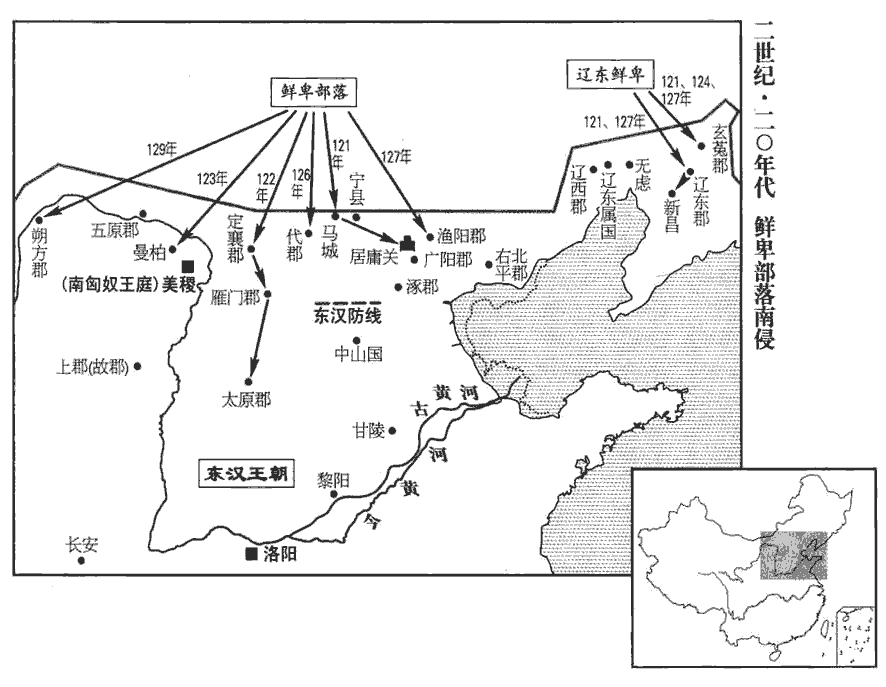

 漢紀四十三起旃蒙赤奋若（乙丑），尽昭阳作噩（癸酉），凡九年。

# 孝安皇帝下

## 延光四年（乙丑，一二五）

1春，二月，乙亥，下邳惠王衍薨。

〖译文〗 [1]春季，二月乙亥（疑误），下邳惠王刘衍去世。

2甲辰‹十七›，車駕南巡。

〖译文〗 [2]甲辰（十七日），安帝去南方巡视。

3三月，戊午朔‹一›，日有食之。

〖译文〗 [3]三月戊午朔（初一），出现日食。

4庚申‹三›，帝‹刘祜，时年三十二›至宛‹河南南阳›，不豫。宛，於元翻。書金縢：王有疾，弗豫。孔安國註曰：不悅豫。乙丑‹八›，帝發自宛；丁卯‹十›，至葉‹河南葉县西南旧县乡›，崩于乘輿。葉，式涉翻。乘，繩證翻。年三十二。

〖译文〗 [4]庚申（初三），安帝抵宛，身体顿觉不适。乙丑（初八），从宛出发。丁卯（初十），抵达叶县，就死在车上。年仅三十二岁。

皇后與閻顯兄弟、江京、樊豐等謀曰：「今晏駕道次，賢曰：晏，晚也。臣下不敢斥言帝崩，猶言晚駕而出。道次，猶言路次也。濟陰王在內，邂逅公卿立之，還為大害。邂，下廨翻。逅，戶茂翻。乃偽云「帝疾甚」，徙御臥車，所在上食、問起居如故。上，時掌翻。驅馳行四日，庚午‹十三›，還宮。自葉至雒陽六百餘里。辛未‹十四›，遣司徒劉熹詣郊廟、社稷，告天請命；武王有疾，周公為三壇同墠shàn，因太王、王季、文王以請命于天；後世踵而行之。其夕，【章：甲十六行本「夕」下有「乃」字；孔本同。】發喪。尊皇后曰皇太后。太后臨朝。以顯為車騎將軍、儀同三司。太后欲久專國政，貪立幼年，與顯等定策禁中，迎濟北惠王子北鄉侯懿為嗣。賢曰：惠王，名壽，章帝子也。濟，子禮翻。考異曰：東觀記、續漢書作「北鄉侯犢」，今從袁紀、范書。濟陰王以廢黜，不得上殿親臨梓宮，臨，力鴆翻。悲號不食；號，戶刀翻。內外群僚莫不哀之。

〖译文〗 皇后和她的兄弟阎显等，以及宦官江京、樊丰等密谋说：“如今皇帝死在道上，他的亲生儿子济阴王却留在京都洛阳。消息一旦传出，如果公卿大臣集会，拥立济阴王继承帝位，将给我们带来大祸。”于是谎称皇帝病重，将尸首抬上卧车，所过之处，贡献饮食、问候起居，和往常一样。车队急行四天，于庚午（十三日）返抵皇宫。辛未（十四日），派司徒刘熹前往郊庙、社稷，祷告天地。当晚，发丧，尊皇后为皇太后。太后临朝主政，任命其兄阎显为车骑将军、仪同三司。太后为了长期把持朝廷大权，想选立一个年幼的皇帝。于是和阎显等在禁宫中定策，决定迎立济北惠王的儿子、北乡侯刘懿继位。而济阴王因在此前已遭废黜，反而不得上殿在棺木前哀悼父亲，他悲痛号哭，饮食不进。宫廷内外文武百官，无不为之哀伤。

5甲戌‹十七›，濟南孝王香薨，無子，國絕。香，濟南安王康之孫。康，光武子也。

〖译文〗 [5]甲戌（十七日），济南孝王刘香去世，无子继承，封国撤除。

6乙酉‹二十八›，北乡侯即皇帝位。

〖译文〗 [6]乙酉（二十八日），北乡侯刘懿即皇帝位。

7夏，四月，丁酉‹十一›，太尉馮石為太傅，司徒劉熹為太尉，參錄尚書事；前司空李郃為司徒。郃，古合翻，又曷閣翻。

〖译文〗 [7]夏季，四月丁酉（十一日），任命太尉冯石为太傅，司徒刘熹为太尉，参与主管尚书事务。前任司空李为司徒。

8閻顯忌大將軍耿寶位尊權重，威行前朝，朝，直遙翻。乃風有司奏「寶及其黨與風，讀曰諷。中常侍樊豐、虎賁中郎將謝惲、侍中周廣、野王君王聖、聖女永等更相阿黨，互作威福，皆大不道。」辛卯‹五›，豐、惲、廣皆下獄，死；更，工衡翻。下，遐稼翻。家屬徒比景‹越南筝河口›。貶寶及弟子林慮侯承皆為亭侯，牟平侯耿舒子襲，尚顯宗女隆慮公主。寶嗣，襲封，而弟子承紹公主封為林慮侯。林慮，即隆慮也，避殤帝諱，改「隆」為「林」。慮，音廬。遣就國；寶於道自殺。王聖母、子徙鴈門‹山西朔州东南›。於是以閻景為衛尉，耀為城門校尉，晏為執金吾，兄弟并處權要，處，昌呂翻。威福自由。

〖译文〗 [8]阎显顾忌大将军耿宝位尊权重，威望又高，于是指使有关官吏弹劾：“耿宝和他的同党中常侍樊丰、虎贲中郎将谢恽、侍中周广、野王君王圣、王圣的女儿永等人，互相结党营私，作威作福，都大逆不道。”辛卯（初五），樊丰、谢恽、周广都被捕下狱处死，家属流放比景。耿宝和侄儿林虑侯耿承都贬为亭侯，遣归封国。耿宝在途中自杀。王圣母子，流放雁门。于是，阎显又任命其弟阎景为卫尉，阎耀为城门校尉，阎晏为执金吾，兄弟同居权力中枢，任意作威作福。

9己酉‹二十三›，葬孝安皇帝于恭陵‹河南孟津东南›，賢曰：恭陵，在今洛陽東北二十七里。廟曰恭宗。

〖译文〗 [9]已酉（二十三日），将安帝埋葬在恭陵，庙号恭宗。

10六月，乙巳‹二十›，赦天下。

〖译文〗 [10]六月乙巳（二十日），大赦天下。

11秋，七月，西域長史班勇發敦煌、張掖、酒泉六千騎及鄯善‹新疆若羌›、疏勒‹新疆喀什›、車師前部‹吐鲁番›兵擊後部‹新疆吉木萨尔南›王軍就，大破之，敦，徒門翻。鄯，上扇翻。獲首虜八千餘人，生得軍就及匈奴持節使者，將至索班沒處斬之，傳首京師。索班事見上卷永寧元年。

〖译文〗 [11]秋季，七月，西域长史班勇征发敦煌、张掖、洒泉等郡六千骑兵和鄯善、疏勒、车师前王国的军队，进击车师后王国国王军就，大捷，斩首八千余人，生擒军就和匈奴持节使者，将其带到索班阵亡处斩首，把人头传送到京都洛阳。

12冬，十月，丙午‹二十二›，越巂山‹四川西昌南›崩。巂，音髓。

〖译文〗 [12]冬季，十月丙午（二十二日），越郡发生山崩。

13北鄉侯病篤，中常侍孫程謂濟陰王謁者長興渠曰：賢曰：興，姓；渠，名。余按百官志，王國謁者比四百石，其下有禮樂長、衛士長、醫工長、永巷長、祠cí祀sì長，而無謁者長。竊意長興，姓也。「王以嫡統，本無失德；先帝用讒，遂至廢黜。若北鄉侯不起，相與共斷江京、閻顯，事無不成者。」斷，丁亂翻。渠然之。又中黃門南陽王康，先為太子府史，太子府史，掌東宮府藏。及長樂太官丞京兆‹西安›王國等長樂太官丞，掌太后食膳。樂，音洛。并附同於程。附同者，既相黨附，又與之同謀。江京謂閻顯曰：「北鄉侯病不解，解，散也。言病纏於身而不散也。國嗣宜以時定，何不早徵諸王子，簡所置乎！」簡，擇也。置，立也。顯以為然。辛亥‹二十七›，北鄉侯薨；顯白太后，祕不發喪，更徵諸王子，閉宮門，屯兵自守。

〖译文〗 [13]北乡侯刘懿病重，中常侍孙程对济阴王谒者长兴渠说：“济阴王是皇帝嫡子，原本没有过失，先帝听信奸臣谗言，竟被废黜。如果北乡侯的病不能痊愈，我与你联合除掉江京、阎显，没有不成功之理。”长兴渠同意。此外，中黄门、南阳郡人王康，先前曾担任太子府史，以及长乐太官丞、京兆王国等人，也都赞成孙程的意见。江京对阎显说：“北乡侯的病不愈，继位人应该按时确定，何不及早征召诸王之子，从中选择可以继位的人？”阎显认为有理。辛亥（二十七日），北乡侯去世。阎显急忙禀告太后，暂时秘不发丧，再征召诸王之子进宫，关闭宫门，驻兵把守。

十一月，乙卯‹二›，孫程、王康、王國與中黃門黃龍、彭愷、孟叔、李建、王成、張賢、史汎、馬國、王道、李元、楊佗、陳予、趙封、李剛、魏猛、苗光等聚謀於西鍾下，皆截單衣為誓。丁巳‹四›，京師及郡國十六地震。是夜，程等共會崇德殿上，崇德殿在南宮。水經註：魏文帝於漢崇德殿故處起太極殿，蓋南宮正殿也。因入章臺門。時江京、劉安及李閏、陳達等俱坐省門下，省門，即禁門也。前書謂禁中為省中。程與王康共就斬京、安、達。以李閏權勢積為省內所服，欲引為主，因舉刃脅閏曰：「今當立濟陰王，毋得搖動！」閏曰：「諾。」於是扶閏起，俱於西鍾下迎濟陰王即皇帝位，時年十一。召尚書令、僕射以下從輦幸南宮，程等留守省門，遮扞內外。帝登雲臺，召公卿、百僚，使虎賁、羽林士屯南、北宮諸門。

〖译文〗 十一月乙卯（初二），孙程、王康、王国和中黄门黄龙、彭恺、孟叔、李建、王成、张贤、史泛、马国、王道、李元、杨佗、陈予、赵封、李刚、魏猛、苗光等，在西钟楼下秘密聚会，每人撕下一幅衣襟进行盟誓。丁巳（初四），京都洛阳和十六个郡和封国发生地震。当晚，孙程等先在崇德殿上集合，然后进入章台门。当时，江京、刘安和李闰、陈达等正好都坐在禁门下，孙程和和王康一齐动手，斩杀江京、刘安和陈达。因李闰长久享有权势，为宫内人所信服，想让他来领头。所以举刀胁迫李闰说：“你必须答应拥戴济阴王为帝，不得动摇！”李闰回答：“是。”于是，大家将李闰扶起来，都到西钟楼下迎济阴王即皇帝位，当时济阴王十一岁。接着召集尚书令、仆射以下官吏跟随御车，进入南宫。孙程等留守禁门，断绝内外交通。皇帝登上云台，召集公卿百官。派遣虎贲和羽林卫士分别驻守南宫和北宫的所有宫门。

閻顯時在禁中，憂迫不知所為，顯蓋在北宮。小黃門樊登勸顯以太后詔召越騎校尉馮詩、虎賁中郎將閻崇，将兵屯平朔門以禦程等。考異曰：宦者傳作「朔平門」。今從袁紀。余按百官志，朔平門，北宮北門也；恐當以宦者傳為是。顯誘詩入省，謂曰：「濟陰王立，非皇太后意，璽綬在此。誘，音酉。璽，斯氏翻。綬，音受。此謂天子璽綬也。苟盡力效功，封侯可得。」太后使授之印曰：「能得濟陰王者，封萬戶侯；得李閏者，五千戶侯。」詩等皆許諾，辭以「卒被召，所將眾少。」卒，讀曰猝。顯使與登迎吏士於左掖門外，詩因格殺登，歸營屯守。

〖译文〗 阎显这时正在宫中，闻讯后惊惶失措，不知如何应变。小黄门樊登劝阎显用太后诏命征召越骑校尉冯诗、虎贲中郎将阎崇，率军驻守平朔门，以抵御孙程等人。于是，阎显用征召的办法引诱冯诗入宫，并对他说：“济阴王即位，不是皇太后的旨意，皇帝玺印还在这里。如果你能尽力效劳，可以得到封侯。”太后派人送来印信说：“能拿获济阴王的，封万户侯。拿获李闰的，封五千户侯。”冯诗等人虽都承诺，但报告说：“因仓猝被召，带兵太少。”阎显派冯诗等和樊登去左掖门外迎接增援的将士，冯诗等趁机斩杀樊登，归营固守。

顯弟衛尉景遽從省中還外府，外府，衛尉府也。收兵至盛德門。孫程傳召諸尚書使收景。傳召，傳詔召之也。尚書郭鎮時臥病，聞之，即率直宿羽林出南止車門，逢景從吏士拔白刃呼曰：「無干兵！」鎮即下車持節詔之，景曰：「何等詔！」因斫鎮，不中。呼，火故翻。中，竹仲翻。鎮引劍擊景墮車，左右以戟叉其胸，遂禽之，送廷尉獄，即夜死。

〖译文〗 阎显的弟弟卫尉阎景仓猝从宫中返回外府，收兵抵达盛德门。孙程传诏书命令尚书们逮捕阎景。当时，尚书郭镇正卧病在床，一听到命令，立即率领值班的羽林卫士，从南止车门出来，正遇上阎景的部属拔刀大叫：“不要挡道！”郭镇立即下车持节宣读诏书，阎景说：“什么诏书！”于是举刀砍郭镇，没有砍中。郭镇拔剑将阎景击落车下，羽林卫士用戟叉住他的胸脯，将其活捉，送至廷尉狱囚禁，当夜死去。

戊午‹五›，遣使者入省，奪得璽綬，帝乃幸嘉德殿，按帝紀，嘉德殿在南宮。遣侍御史持節收閻顯及其弟城門校尉耀、執金吾晏，并下獄，誅；下，遐稼翻。家屬皆徙比景‹越南筝河口›。遷太后於離宮。己未‹六›，開門，罷屯兵。壬戌‹九›，詔司隸校尉：「惟閻顯、江京近親，當伏辜誅，其餘務崇寬貸。」封孫程等皆為列侯：程食邑万戶，王康、王國食九千戶，黃龍食五千戶，彭愷、孟叔、李建食四千二百戶，王成、張賢、史汎、馬國、王道、李元、楊佗、陳予、趙封、李剛食四千戶，魏猛食二千戶，苗光食千戶：是為十九侯，孫程為浮陽侯，王康為華容侯，王國為酈侯，黃龍為湘南侯，彭愷為西平昌侯，孟宿為中廬侯，李建為復陽侯，王成為廣宗侯，張賢為祝阿侯，史汎為臨沮侯，馬國為廣平侯，王道為范縣侯，李元為褒信侯，楊佗為山都侯，陳予為下巂侯，趙封為析縣侯，李剛為枝江侯，魏猛為夷陵侯，苗光為東阿侯。加賜車馬、金銀、錢帛各有差；李閏以先不豫謀，故不封。擢孫程為騎都尉。初，程等入章臺門，苗光獨不入。詔書錄功臣，令王康疏名，康詐疏光入章臺門。光未受符策，漢初封王侯皆剖符；至武帝封齊、燕、廣陵三王，始作策。心不自安，詣黃門令自告。黃門令，主省中諸宦者，故詣之自告。有司奏康、光欺詐主上；詔書勿問。以將作大匠來歷為衛尉。祋duì諷、【章：甲十六行本「諷」下有「劉瑋」二字；乙十一行本同；孔本同；張校同；退齋校同。】閭丘弘等先卒，皆拜其子為郎。朱倀、施延、陳光、趙代皆見拔用，後至公卿。以來歷等鴻都門之諫也，事見上卷上年。祋，丁外翻，又丁活翻。倀，丑羊翻。徵王男、邴吉家屬還京師，厚加賞賜。男、吉家徙事見上卷上年。帝之見廢也，監太子家小黃門籍建、傅高梵、監，古銜翻。賢曰：梵，音扶汎翻。余按來歷傳：傅，中傅也。梵，又房戎翻。長秋長趙熹、丞良賀、良，姓也。左傳：鄭良霄，穆公子子良之孫。藥長夏珍皆坐徙朔方‹内蒙磴口›；長秋長，蓋即大長秋；丞一人，六百石；中宮藥長，四百石：皆皇后宮官。帝即位，并擢為中常侍。

〖译文〗 戊午（初五），派使者入北宫，夺到皇帝玺印。于是，皇帝亲临嘉德殿，派遣侍御史持符节，将阎显及其弟城门校尉阎耀、执金吾阎晏一并逮捕，下狱处死，家属全都流放比景。将太后迁往离宫。己未（初六），打开宫门，撤走驻兵。壬戊（初九），下诏给司隶校尉：“只有阎显、江京近亲应当被诛杀，其他的人，均须从宽处理。”孙程等都被封为列侯：孙程食邑万户，王康、王国食邑九千户，黄龙食邑五千户，彭恺、孟叔、李建各食邑四千二百户，王成、张贤、史泛、马国、王道、李元、杨佗、陈予、赵封、李刚，各食邑四千户，魏猛食邑二千户，苗光食邑千户，号为十九侯。同时，分别等级，赏赐车马、金银和钱帛。李闰因没有参与首谋，所以没有封侯。擢升孙程为骑都尉。起初，孙程等进入章台门，唯独苗光没有进去。诏书命王康呈报功臣名单时，王康谎报苗光进入章台门。苗光未得到封赏的符策，内心惶恐不安，便向黄门令自首。于是，有关官吏弹劾王康和苗光欺蒙皇上。皇帝下诏不必追究。任命将作大匠来历为卫尉。因讽、闾丘弘等前已病故，将他俩的儿子都任命为郎。朱伥、施延、陈光和赵代，也都得到提拔任用，后来官至公卿。征召王男、邴吉家属，返回京都洛阳，给予厚赏。先前皇帝被废黜时，监太子家小黄门籍建、傅高梵、长秋长赵熹、丞良贺、药长夏珍都坐罪，被流放到朔方郡。皇帝即位后，全都擢升为中常侍。

初，閻顯辟崔駰之子瑗yuàn為吏，駰，音因。瑗以北鄉侯立不以正，知顯將敗，欲說令廢立，而顯日沈醉，說，輸芮翻；下同。沈，持林翻。不能得見，乃謂長史陳禪曰：「中常侍江京等惑蠱先帝，廢黜正統，扶立疏孽niè。孔穎達曰：孽者，糵niè也，樹木斬而復生謂之糵。以嫡子比根幹，庶子比枝糵，故孽子，枝庶也。中候曰：無易樹子。註云：樹子，適子。玉藻云：公子曰臣孽。註：孽，當為枿niè。文王曰：本支百世。是適子比樹本，庶子比枝糵也。少帝即位，發病廟中，周勃之徵，於斯復見。賢曰：呂后立惠帝後宮子為少帝，周勃廢之也。今欲與君共求見說將軍，說，式芮翻。白太后，收京等，廢少帝，引立濟陰王，必上當天心，下合人望，伊、霍之功不下席而立，則將軍兄弟傳祚zuò於無窮；若拒違天意，久曠神器，則將以無罪并辜元惡；元惡，大惡也。并辜，謂與之同獲罪也。此所謂禍福之會，分功之時也。」史記：蔡澤說范睢曰：「君獨不見夫博者乎！或欲大投，或欲分功。今君相秦，坐制諸侯，使天下皆畏秦，此亦秦之分功之時也。」禪猶豫未敢從。會顯敗，瑗yuàn坐被斥；被，皮義翻。門生蘇祗欲上書言狀，瑗遽止之。時陳禪為司隸校尉，召瑗謂曰：「弟聽祗上書，賢曰：弟，但也。司馬相如傳曰：弟俱如臨邛。弟，讀如第。禪請為之證。」瑗曰：「此譬猶兒妾屏語耳，屏，必郢翻。於隱屏之處相與私語也。願使君勿復出口！」禪時為司隸校尉，故稱之曰使君。司隸校尉部察三輔、三河、弘農，其職猶十三部使者。鮑永為司隸校尉，光武曰：「奉使如此，何如？」復，扶又翻；下同。遂辭歸，不復應州郡命。

〖译文〗 起初，阎显征聘崔的儿子崔瑗为下属官员，崔瑗因北乡侯非先帝嫡子而继位为帝，预见阎显肯定要失败，打算说服阎显，废黜北乡侯，改立济阴王为帝。可是阎显日日沉醉，见不到面，他于是对长史陈禅说：“中常侍江京等迷惑先帝，废除皇家正统，另立旁支。北乡侯即位后，就在宫中发病。周勃废黜吕后所立惠帝后宫子为少帝的迹象，今又重复出现。我打算和你一同面见将军阎显，说服他禀告太后，逮捕江京等人，废黜少帝，拥立济阴王为帝，定然上得天心，下合人望。这样，伊尹、霍光的功劳，我们不必离开座位，便可建立；而将军兄弟的封爵也可世代相传。如果抗拒天意，使帝位久缺，我们虽无罪，却要和首恶同罪，这正是福祸交关的关键时机，分取胜利果实的时刻。”陈禅犹豫，未敢听从。正逢阎显破败，崔瑗坐罪免官，崔瑗的门生苏祗，准备上书呈报上述往事，崔瑗急忙加以制止。当时，陈禅正担任司隶校尉，召见崔瑗说：“你尽管让苏祗上书，我愿出面为你作证。”崔瑗说：“这就如同小孩、妇女私下谈话一样，愿您不要再提此事！”于是告辞归乡，不再接受州郡的征聘。

14己卯‹二十六›，以諸王禮葬北鄉侯。

〖译文〗 [14]已卯（二十六日），用诸侯王礼仪埋葬北乡侯。

司空劉授以阿附惡逆，辟召非其人，策免。辟召非人事見上卷延光二年。十二月，甲申‹一›，以少府河南陶敦為司空。

〖译文〗 [15]司空刘授因阿附叛逆，所征聘的官吏也不是适当人选，被免官。十二月甲申（初一），擢升少府、河南郡人陶敦为司空。

楊震門生虞放、陳翼詣闕追訟震事；事見上卷上年。詔除震二子為郎，贈錢百萬，以禮改葬於華阴潼亭‹陕西潼關东北七公里港口镇›，賢曰：墓在今潼關西大道之北，其碑尚存。華，戶化翻。遠近畢至。有大鳥高丈餘集震喪前；高，居號翻。郡以狀上。上，時掌翻。帝感震忠，【章：甲十六行本「忠」下有「直」字；乙十一行本同；孔本同；張校同。】詔復以中牢具祠之。中牢，即少牢，羊、豕具也。復，扶又翻；下同。

〖译文〗 [16]杨震的门生虞放、陈翼，到宫阙为杨震鸣冤。皇帝下诏，任命杨震的两个儿子为郎，赠钱一百万，用三公的礼仪将杨震改葬在华阴潼亭。远近之人全都赶来吊丧。当时有一只一丈余高的大鸟降落在灵堂之前，郡太守府将此情景呈报朝廷，皇帝为杨震的忠心所感，下诏再用中牢即一羊、一猪进行祭祀。

議郎陳禪以為：「閻太后與帝無母子恩，宜徙別館，絕朝見，」朝，直遙翻。見，賢遍翻。群臣議者咸以為宜。司徒掾汝南周舉謂李郃曰：「昔瞽瞍sǒu常欲殺舜，舜事之逾謹；瞽瞍使舜塗廩lǐn，而自下焚廩；使浚jùn井，既入，從而揜yǎn之。其欲殺者屢矣，而舜事瞽瞍彌謹。書曰：祗載見瞽瞍，夔夔齋栗。掾，俞絹翻。郃，曷閣翻，又古合翻。鄭武姜謀殺莊公，莊公誓之黃泉，秦始皇怨母失行，行，下孟翻。久而隔絕，後感潁考叔、茅蕉【章：甲十六行本「蕉」作「焦」；乙十一行本同。】之言，復脩子道，書傳美之。鄭武姜愛少子共叔段，謀襲莊公，公寘zhì姜氏於城潁而誓之曰：「不及黃泉，無相見也！」潁考叔以舍肉遺母感之，遂為母子如初。秦始皇事見六卷九年。今諸閻新誅，太后幽在離宮，若悲愁生疾，一旦不虞，主上將何以令於天下！如從禪議，後世歸咎明公。宜密表朝廷，令奉太后，率群臣朝覲如舊，以厭天心，以答人望！」厭，如字，滿也。郃即上疏陳之。

〖译文〗 [17]议郎陈禅认为：“阎太后与皇帝既无母子恩情，应该将太后迁到另外的馆舍，不再朝见。”议论此事的群臣全都赞同。但司徒掾、汝南郡人周举却对李说：“从前，瞽瞍多次想要谋杀儿子虞舜，而舜对父亲更为孝顺。郑庄公的母亲武姜谋杀庄公，庄公发誓：不到黄泉之下，不再相见。秦始皇怨恨母亲淫乱失行，久不见面。后来他们分别被颍考叔，茅蕉的劝谏所感动，重修孝道。史书上对这些事，都十分称道。现在，阎显兄弟刚刚伏诛，太后被幽禁在离宫，如果悲愁生病，一旦发生意外，皇上将何以号令天下！如果采纳陈禅的意见，后世将把罪过归到您的身上。应该密奏朝廷，请求皇帝供养太后，跟过去一样率领文武百官朝见，以顺天心，以回答人们的愿望！”李立即向皇帝上书陈辞。

# 孝順皇帝上諱保，安帝之子也。諡法：慈和徧服曰順。伏侯古今註曰：「保」之字曰「守」。

## 永建元年（丙寅，一二六）

1春，正月，帝‹刘保，时年十二›朝太后於東宮，太后意乃安。

〖译文〗 [1]春季，正月，汉顺帝前往东宫朝见阎太后，太后的心情才安定下来。

2甲寅‹二›，赦天下。

〖译文〗 [2]甲寅（初二），大赦天下。

3辛未‹十九›，皇太后阎氏崩。

〖译文〗 [3]辛未（十九日），阎太后去世。

4辛巳‹二十九›，太傅馮石、太尉劉熹以阿黨權貴免。司徒李郃罷。

〖译文〗 [4]辛巳（二十九日），太傅冯石和太尉刘熹因巴结权贵被免职。同日，司徒李也被罢官。

5二月，甲申‹二›，葬安思皇后。賢曰：諡法：謀慮不愆qiān曰思。

〖译文〗 [5]二月甲申（初二），埋葬安思皇后。安思皇后，即阎太后。

6丙戌‹四›，以太常桓焉為太傅；大鴻臚朱【章：甲十六行本「朱」上有「京兆」二字；乙十一行本同；孔本同；張校同；退齋校同。】寵為太尉，參錄尚書事；長樂少府朱倀為司徒。臚，陵如翻。樂，音洛。倀，丑羊翻。

〖译文〗 [6]丙戌（初四），擢升太常桓焉为太傅；大鸿胪朱宠为太尉，参与主管尚书事务；长乐少府朱伥为司徒。

7封尚書郭鎮為定潁侯。以禽閻景功也。定潁侯國，屬汝南郡。

〖译文〗 [7]封尚书郭镇为定颍侯。

8隴西‹甘肃临洮›鍾羌反，校尉馬賢擊之，戰於臨洮‹甘肃岷县›，斬首千餘級，羌眾皆降；由是涼州‹甘肃›復安。洮，土刀翻。降，戶江翻。復，扶又翻。

〖译文〗 [8]陇西钟羌反叛，校尉马贤率军进击。在临洮会战，斩杀钟羌一千余人，钟羌部众全都归降。从此以后，凉州重新得到安定。

9六月，己亥‹十九›，封濟南簡王錯子顯為濟南王。安帝延光四年，濟南國絕，今紹封。諡法：一德不懈曰簡；又臣諡：恭敬行善曰簡。

〖译文〗 [9]六月己亥（十九日），封济南简王刘错的儿子刘显为济南王。

10秋，七月，庚午‹二十一›，以衛尉來歷為車騎將軍。

〖译文〗 [10]秋季，七月庚午（二十一日），任命卫尉来历为车骑将军。

11八月，鮮卑寇代郡‹山西阳高›，太守李超戰歿。

〖译文〗 [11]八月，鲜卑攻打代郡，太守李超阵亡。

 

12司隸校尉虞詡xǔ到官數月，奏馮石、劉熹，免之，又劾奏中常侍程璜、陳秉、孟生、李閏等，劾，戶概翻，又戶得翻。百官側目，號為苛刻。三公劾奏：「詡盛夏多拘繫無辜，為吏民患。」三公欲致詡罪，言盛夏當順天地長物之性，不當違法拘繫無辜。劾，戶概翻，又戶得翻。詡上書自訟考異曰：詡傳云：「帝省其章，乃為免司空陶敦。」按袁纪，孫程就國在九月，而敦免在十月，蓋帝由此知敦不直，因事免之。不然，何三府共奏而獨免敦也！曰：「法禁者，俗之隄防；刑罰者，民之銜轡pèi。今州曰任郡，郡曰任縣，更相委遠，更，工衡翻。遠，于願翻。百姓怨窮；以苟容為賢，盡節為愚。臣所發舉，臧罪非一。臧，古贓字通。三府恐為臣所奏，遂加誣罪。臣將從史魚死，即以尸諫耳！」韓詩外傳曰：衛大夫史魚病且死，謂其子曰：「我數言蘧qú伯玉之賢而不能進，彌子瑕不肖而不能退；為人臣生不能進賢，退不肖，死不當治喪正堂，殯我於室足矣。」君問其故。子以父言聞。君乃立召蘧伯玉而貴之，斥彌子瑕而退之，徙殯於正堂，成禮而後去。帝省其章，乃不罪詡。省，悉景翻。

〖译文〗 [12]司隶校尉虞诩到任数月，上奏弹劾太傅冯石和太尉刘熹，使他们被免官，又上奏弹劾中常侍程璜、陈秉、孟生、李闰等。百官都感到不满，指责他苛刻。于是，三公上奏弹劾：“虞诩违反常法，于盛夏之季，大肆逮捕和关押无罪的人，吏民深受其害。”虞诩也向顺帝上书，为自己申辩说：“ 法令是整齐风俗的堤防，刑罚是驾驭百姓的衔铁和缰绳。然而，现在的官府，州一级委任给郡，郡一级委任给县，层层往下推卸责任，百姓怨恨，投诉无门。并且，当今的风气，都以苟且容身为贤能，尽忠职守为愚蠢。我所查获的贪赃枉法案件，各种各样，盘根错节。三公因恐被我举报，于是先来诬陷我。我将追随史鱼去死，向皇上尸谏！”顺帝看了虞诩的奏章，于是不对虞诩降罪。

中常侍張防賣弄權勢，請託受取；詡案之，屢寢不報。詡不勝其憤，勝，音升。乃自繫廷尉，奏言：「昔孝安皇帝任用樊豐，交亂嫡統，幾亡社稷。事見上卷安帝延光三年。幾，居希翻。今者張防復弄威柄，復，扶又翻；下同。國家之禍將重至矣。重，直用翻。臣不忍與防同朝，謹自繫以聞，無令臣襲楊震之跡！」楊震事見上卷延光三年。書奏，防流涕訴帝，詡坐論輸左校；將作大匠有左校令，掌左工徒。輸左校者，免官為徒，輸作左校也。校，戶教翻。防必欲害之，二日之中，傳考四獄。獄吏勸詡自引，自引，謂引分自裁也。傳，株戀翻。詡曰：「寧伏歐刀以示遠近！謂寧受刑而死於市也。喑yīn嗚自殺，類篇曰：啼泣無聲謂之喑，歎傷謂之嗚。是非孰辨邪！」浮陽侯孫程、祝阿侯張賢相率乞見，浮陽侯國，屬勃海郡。見，賢遍翻。程曰：「陛下始與臣等造事之時，賢曰：謂帝被廢，程等謀立之時也。常疾姦臣，知其傾國。今者即位而復自為，何以非先帝乎！司隸校尉虞詡為陛下盡忠，為，于偽翻。而更被拘繫；常侍張防臧罪明正，反搆忠良。今客星守羽林，史記天官書：虛、危南有眾星曰羽林。晉書天文志：羽林四十五星，在營室南。其占宮中有姦臣；宜急收防送獄，以塞天變。」塞，悉則翻。時防立在帝後，程叱防曰：「姦臣張防，何不下殿！」防不得已，趨就東箱。賢曰：埤pí蒼云：箱，序也，字或作「廂」。程曰：「陛下急收防，無令從阿母求請！」賢曰：阿母，宋娥也。帝問諸尚書，尚書賈朗素與防善，證詡之罪；帝疑焉，謂程曰：「且出，吾方思之！」於是詡子顗顗yǐ，魚豈翻。與門生百餘人，舉幡候中常侍高梵車，叩頭流血，訴言枉狀。梵入言之，梵，房戎翻，又房汎翻。防坐徙邊，賈朗等六人或死或黜；即日赦出詡。程復上書陳詡有大功，語甚切激。復，扶又翻。帝感悟，復徵拜議郎；數日，遷尚書僕射。

〖译文〗 因中常侍张防利用权势，接受贿赂和请托，虞诩曾多次请求将他法办，都被搁置，没有回音。虞诩不胜愤慨，于是自投廷尉监狱，上书顺帝说：“过去，安帝任用樊丰，废黜皇室正统，几乎使社稷灭亡。现在，张防又玩弄权势，亡国之祸，将再降临。我不忍心和张防同列朝廷，谨自囚廷尉狱以报，免得让我重蹈杨震的覆辙！”奏章呈上后，张防在顺帝面前流泪哭诉，于是，虞诩坐罪，被遣送到左校罚作苦役。而张防仍然不肯放过虞诩，必欲置之死地。两天之内，虞诩被传讯拷打四次。狱吏劝虞诩自杀，虞诩回答说：“我宁愿伏刑刀死于市，让远近的人都知道！如果不声不响地自杀，谁能分辨是非呢？”浮阳侯孙程和祝阿侯张贤相继请求面见顺帝，孙程说：“陛下当初和我们起事的时候，常痛恨奸臣，深知他们会使国家倾覆。而今即位以后，却又自己纵容和包庇奸佞，又怎么能责备先帝不对？司隶校尉虞诩为陛下尽忠，却被逮捕囚禁。中常侍防贪赃枉法，证据确凿，反而陷害忠良。今观天象，客星守羽林，是宫中有奸臣的征兆。应该急捕张防下狱，以堵塞上天所降的灾异。”当时，张防站在顺帝背后，孙程大声呵斥张防说：“奸臣张防，为何不下殿去！”张防迫不得已，小步疾走退入东厢。孙程又对顺帝说：“陛下，请立即下令逮捕张防，不要让他去向您的奶母求情！”顺帝征求尚书们的意见，尚书贾朗跟张防素来交情很好，争辩说虞诩有罪。顺帝疑惑，对孙程说：“你们先出去，朕正在考虑！”于是，虞诩的儿子虞和门生一百余人，举着旗帜，等候中常侍高梵的车子，向高梵叩头流血，申诉虞诩被冤枉的情况。高梵入宫后将报告给顺帝。结果，张防因罪被流放到边疆，尚书贾朗等六人，有的处死，有的免官，并于当天释放虞诩。孙程又上书陈述虞诩有大功，措辞甚为直率激烈。顺帝感动醒悟，又任命虞诩为议郎。几天后，擢升为尚书仆射。

詡上疏薦議郎南陽左雄曰：「臣見方今公卿以下，類多拱默，拱默，言拱手而默無一言。以樹恩為賢，盡節為愚，至相戒曰：『白璧不可為，容容多後福。』賢曰：容容，猶和同也。言不可為白璧之清潔，常與眾人和同也。伏見議郎左雄，有王臣蹇jiǎn蹇之節，易曰：王臣蹇蹇，匪躬之故。宜擢在喉舌之官，東都謂尚書為喉舌之官，以其出納王命也。必有匡弼之益。」由是拜雄尚書。

〖译文〗 虞诩上书顺帝，保荐议郎、南阳郡人左雄说：“我看到，当今公卿以下的官吏，大多属于专会拱手作揖而不敢说话的好好先生，把到处讨好广结善缘的人，视为贤能，而把为国尽忠尽职的人，视作愚蠢，甚至还互相告诫说：‘不可做白璧，和气多后福。’我认为议郎左雄，具有作为朝廷大臣必须具备的忠直气节，应该提拔为出纳王命的喉舌之官，一定会对扶正和辅佐朝廷，有所裨益。”因此，顺帝任命左雄为尚书。

13浮陽侯孫程等懷表上殿爭功，帝怒；有司劾奏「程等干亂悖逆，劾，戶概翻，又戶得翻。悖，蒲沒翻，又蒲內翻。王國等皆與程黨，久留京都，益其驕恣。」帝乃免程等官，悉徙封遠縣；因遣十九侯就國，敕雒陽令促期發遣。

〖译文〗 [13]浮阳侯孙程等人因带着奏章，上殿争功，顺帝勃然大怒。于是，有关官吏弹劾：“孙程等人干乱朝政，抗命叛逆。王国等人和孙程结党，长期逗留京都洛阳，更使他们骄纵放肆。”因此，顺帝将孙程等人免官，全都改封到偏远地区，又下令十九侯各自前往他们的封国，命洛阳令督促他们，限期动身。

司徒掾周舉說朱倀曰：「朝廷在西鍾下時，非孫程等豈立！東都謂天子為國家，又謂為朝廷。說，輸芮翻。倀，丑羊翻。今忘其大德，錄其小過；如道路夭折，夭，於紹翻。帝有殺功臣之譏。及今未去，宜急表之！」倀曰：「今詔指方怒，吾獨表此，必致罪譴。」舉曰：「明公年過八十，位為台輔，不於今時竭忠報國，惜身安寵，欲以何求！祿位雖全，必陷佞邪之譏；諫而獲罪，猶有忠貞之名。若舉言不足採，請從此辭！」倀乃表諫，帝果從之。

〖译文〗 司徒掾周举劝说司徒朱伥：“当初，皇帝在西钟楼下时，如果不是孙程等人尽力，怎能即位为帝？现在却忘记人家的大德，计较他们的微小过失。如果他们在回封国的途中有人死亡，则皇帝就会遭受屠杀功臣的非议。趁着孙程等人尚未动身，应该迅速奏明皇上，加以劝阻。”朱伥回答说：“现皇上正在发怒，如果我单独为此事上奏，一定会受到皇帝的降罪谴责。”周举又说：“您年龄已经超过八十岁，位居宰相高位，不在此时尽忠报国，而珍惜自己，安于尊宠，您想得到什么？尽管能保全自己的俸禄和官位，但定会被人谴责为奸佞之辈；而因谏诤而获罪，还能留下忠贞的美名。如果我的意见不值得采纳，我请求从此告别！”于是朱伥上表劝谏，顺帝果然采纳。

程徙封宜城‹湖北宜城›侯；宜城縣，屬南郡，春秋之羅國也。考異曰：袁紀：「秋，七月，有司奏：『浮陽侯孫程、祝阿侯張賢為司隸校尉虞詡訶叱左右，謗讪大臣，妄造不祥，干亂悖逆；王國等皆與程黨，久留京師，益其驕溢。』詔免程等，徙為都梁侯。程怨恨，封還印綬；更封為宜城侯。」范書孫程傳，亦云「坐訟虞詡，呵叱左右，就國。」按虞詡傳，「程言見用，上不以為怒。」周舉傳云，「程坐爭功就國」，今從之。到國，怨恨恚懟，恚，於避翻。懟，直類翻。封還印綬、符策，亡歸京師，往來山中。詔書追求，復故爵土，賜車馬、衣物，遣還國。

〖译文〗 孙程被改封为宜城侯。他到封国以后，怨恨不满，将印信和符策都退还朝廷，擅自逃归京都洛阳，往来于山中。顺帝下诏搜寻孙程，找到以后，恢复他原来的封爵和食邑，赏赐车马和衣物，遣送他回到封国。

14冬，十月，丁亥‹九›，司空陶敦免。

〖译文〗 [14]冬季，十月丁亥（初九），将司空陶敦免官。

15朔方‹内蒙磴口›以西，障塞多壞，鮮卑因此數侵南匈奴；數，所角翻。單于憂恐，上書乞修復障塞。庚寅‹十二›，詔：「黎陽‹河南浚县›營兵出屯中山‹河北定州›北界；賢曰：黎陽先置營兵；以南單于求復障塞，恐入侵擾亂，置屯兵於中山北界。舊中山郡，今之定州是也。余謂移黎陽營屯中山北界，不過為南部聲援耳。令緣邊郡增置步兵，列屯塞下，教習戰射。」

〖译文〗 [15]朔方郡以西，障塞多已损坏，鲜卑因此不断侵犯南匈奴，单于忧愁恐惧，上书朝廷，请求修复障塞。庚寅（十二日），顺帝下诏：“征调黎阳营兵到中山北界驻防。令沿边各郡增设步兵，分布驻扎在各边塞，进行军事训练。”

16以廷尉張皓為司空。

〖译文〗 [16]擢升廷尉张皓为司空。

17班勇更立車師後部‹新疆吉木萨尔南›故王子加特奴為王。更，工衡翻；下同。勇又使別校誅斬東且彌‹新疆昌吉西南›王，校，戶教翻。且，子余翻。范書：東且彌國，去洛陽九千二百里。亦更立其種人為王；種，章勇翻。於是車師六國悉平。西域傳：卑陸‹新疆阜康›、蒲類‹新疆巴里坤›、東且彌‹新疆吉昌西南›、移支‹新疆巴里坤湖西北›、車師前‹新疆吐鲁番›、後王‹新疆吉木萨尔南›，是為六國。

〖译文〗 [17]班勇改立车师后王国前任国王的儿子加特奴为王。又派遣部将斩杀东且弥王，并另立其本族人为王。于是，车师等西域六国，全都归附汉朝。

勇遂發諸國兵擊匈奴‹王庭设新疆阿尔泰山南麓›，呼衍王亡走，其眾二萬餘人皆降。生得單于從兄，勇使加特奴手斬之，以結車師、匈奴之隙。北單于自將萬餘騎入後部‹新疆吉木萨尔南›，至金且谷；且，子余翻。勇使假司馬曹俊救之，單于引去，俊追斬其貴人骨都侯。於是呼衍王遂徙居枯梧河上，是後車師無復虜跡。

〖译文〗 班勇于是征发西域各国的军队，进击匈奴，呼衍王逃走，其部众二万余人全都投降。单于的堂兄被活捉，班勇让加特奴亲手将他斩杀，以此结下车师和匈奴之间的仇恨。于是，北单于亲自率领一万余骑兵攻打车师后王国，抵金且谷。班勇派遣假司马曹俊前去救援，单于率军后撤，曹俊追击，并斩杀其贵人骨都侯。于是，呼衍王迁到枯梧河畔居住，车师此后不再有匈奴的足迹。

## 二年（丁卯，一二七）

1春，正月，中郎將張國以南單于兵擊鮮卑其至鞬，破之。鞬，居言翻。

〖译文〗 [1]春季，正月，中郎将张国率领南单于军队进击鲜卑首领其至，将其击破。

2二月，遼東‹辽宁辽阳›鮮卑寇遼東玄菟‹辽宁沈阳›；菟，同都翻。烏桓校尉耿曄發緣邊諸郡兵及烏桓出塞擊之，斬獲甚眾；鮮卑三萬人詣遼東降。降，戶江翻；下同。

〖译文〗 [2]二月，辽东鲜卑攻打辽东玄菟，乌桓校尉耿晔征发沿边各郡郡兵和乌桓的军队出塞讨伐，斩杀和俘虏甚多，鲜卑三万人到辽东郡投降。

3三月，旱。

〖译文〗 [3]三月，发生旱灾。

4初，帝‹刘保，时年十三›母李氏瘞yì在雒陽北，李氏死見上卷安帝元初二年。瘞，於計翻。帝初不知；至是，左右白之，帝乃發哀，親到瘞所，更以禮殯。殯用皇后禮。瘞，於計翻。六月，乙酉‹十一›，追諡為恭愍皇后，葬于恭陵‹河南孟津东南›之北。

〖译文〗 [4]当初，顺帝的母亲李氏埋葬在洛阳城北，顺帝先前不知道。直到现在，顺帝身边的人才将此事禀报。于是，顺帝为母亲发丧举哀，亲自到埋葬的地方，改以皇后的礼仪殡殓。六月乙酉（十一日），追谥为恭愍皇后，埋葬在恭陵的北面。

5西域城郭諸國皆服於漢，唯焉耆‹新疆焉耆›王元孟未降，元孟，和帝永元六年班超所立也。班勇奏請攻之。於是遣敦煌太守張朗將河西四郡兵三千人配勇，敦，徒門翻。因發諸國兵四萬餘人分為兩道擊之，勇從南道，朗從北道，約期俱至焉耆。而朗先有罪，欲徼yāo功自贖，徼，一遙翻。遂先期至爵離關，釋氏西域記：龜茲國北四十里山上有寺，名雀離大清淨。先，悉薦翻。遣司馬將兵前戰，獲首虜二千餘人，元孟懼誅，逆遣使乞降。張朗徑入焉耆，受降而還。朗得免誅，勇以後期徵，下獄，免。夏之政典曰：先時者殺無赦，不及時者殺無赦。張朗先期以徼功，法所必誅，則班勇非後期也。漢之用刑，不審厥衷，勇免之後，西域事去矣。下，遐稼翻。

〖译文〗 [5]西域所有的城邦国家都已归服汉朝，只有焉耆王元孟未投降。班勇上奏朝廷，请求出兵讨伐。于是，朝廷派敦煌太守张朗率河西四郡之兵三千人，配合班勇。班勇便征发西域各国之兵，共四万余人，分两路进击焉耆。班勇从南道，张朗从北道，约定日期，到焉耆城下会师。而张朗因先前有罪，急于求功，为自己赎罪，就赶在约定日期之前，抵达爵离关，并派遣司马率军提前进攻，斩首二千余人，元孟害怕被杀，于是派使者请求投降。张朗便直接进入焉耆城，受降而回。结果，张朗得以免除诛杀，而班勇因迟到而被征回京都洛阳，下狱，免官。

6秋，七月，甲戌朔‹一›，日有食之。

〖译文〗 [6]秋季，七月甲戌朔（初一），出现日食。

7壬午‹九›，太尉朱寵、司徒朱倀免。庚子‹二十七›，以太常劉光為太尉、錄尚書事，光祿勳汝南‹河南平舆西北射桥乡›許敬為司徒。光，矩之弟也。敬仕於和、安之間，當竇、鄧、閻氏之盛，無所屈橈náo；橈，奴教翻。三家既敗，士大夫多染污者，污，烏故翻。獨無謗言及於敬，當世以此貴之。

〖译文〗 [7]壬午（初九），太尉朱宠和司徒朱伥，都被免官。庚子（二十七日），擢升太常刘光为主尉，主管尚书事务，将光禄勋、汝南郡人许敬任命为司徒。刘光是刘矩的弟弟。许敬曾在和帝与安帝时期作官，当窦、邓、阎氏权势鼎盛之时，他也无所畏缩和屈服。待三家垮台后，许多居官在位的人，都沾有污点，唯独许敬没有遭到非议。因此，当时人都很敬佩他。

8初，南陽‹河南南陽›樊英，少有學行，少，詩照翻。行，下孟翻。名著海內，隱於壺山‹河南泌阳东北›之陽，賢曰：壺山，在今鄧州新城縣北，即張衡南都賦所云「天封、大狐」是也。州郡前後禮請，不應；公卿舉賢良、方正、有道，皆不行；安帝賜策書徵之，不赴。是歲，帝復以策書、玄纁xūn，備禮徵英，復，扶又翻。英固辭疾篤。詔切責郡縣，駕載上道。英不得已，到京，稱疾不肯起；強輿入殿，強，其兩翻。猶不能屈。帝使出就太醫養疾，太醫令，屬少府，掌諸醫，有藥丞、方丞。月致羊酒。其後帝乃為英設壇，為，于偽翻。令公車令導，尚書奉引，引，與靷yǐn同，音羊晉翻。賜几、杖，待以師傅之禮，考異曰：英傳云：「四年，三月，乃設壇場見英。」黃瓊傳，李固勸書，已云「樊英設壇席。及瓊至，上疏薦英，稱光祿大夫。」則是瓊至之時，英已嘗設壇見之，而為光祿大夫矣。至三年旱，瓊復上疏。若四年方設壇場見英，則都與瓊傳異，知其必不在四年也。延問得失，拜五官中郎將。數月，英稱疾篤；詔以為光祿大夫，賜告歸，令在所送穀，以歲時致牛酒。英辭位不受，有詔譬旨，勿聽。有詔書譬曉以上旨，不聽其辭位也。

〖译文〗 [8]当初，南阳郡人樊英，从小学问、品行兼优，闻名天下，隐居在壶山南麓，州郡官府曾先后多次征聘他出来当官，他不应命。朝廷公卿大臣荐举他为贤良、方正、有道，他都不肯动身。安帝赐策书征召，他还是不去。同年，安帝又用策书和黑色的缯帛，非常礼敬地征召樊英，而他以病重为理由坚决推辞。诏书严厉谴责州郡官府办事不得力，于是州郡官府把樊英抬到车上上路。樊英不得已，来到京都洛阳。到洛阳后，樊英又称病不肯起床，于是，用轿子强行将他抬进宫殿，但他还是不肯屈从。安帝让他出去，到太医处养病，每月送给羊和酒。其后，安帝又特地为樊英设立讲坛，命公车令在前面引路，尚书陪同，赏赐小桌和手杖，用尊敬老师的礼节来对待他，询问朝廷大政的得失，将他任命为五官中郎将。数月之后，樊英又声称病重，安帝下诏，将他任命为光禄大夫，准许回家养病，令当地官府送谷米，每年四季送给牛和酒。樊英请求辞去职位，有诏书晓告皇帝旨意，不予批准。

英初被詔命，被，皮義翻；下同。眾皆以為必不降志。南郡‹湖北江陵›王逸素與英善，因與其書，多引古譬諭，勸使就聘。英順逸議而至；及後應對無奇謀深策，談者以為失望。河南‹河南洛阳东白马寺东›張楷與英俱徵，謂英曰：「天下有二道，出與處也。處，昌呂翻；下同。吾前以子之出，能輔是君也，濟斯民也。而子始以不訾zī之身賢曰：訾，量也。言無量可比之，貴重之極也。訾，音資。怒萬乘之主，按英傳：英強輿入殿，猶不以禮屈。帝怒，謂英曰：「朕能生君，能殺君；能貴君，能賤君；能富君，能貧君；君何以慢朕命？」英曰：「臣受命於天，生盡其命，天也；死不得其命，亦天也。陛下焉能生臣，焉能殺臣！臣見暴君如見仇讎，立其朝猶不肯，可得而貴乎！雖在布衣之列，環堵之中，晏然自得，不易萬乘之尊，又可得而賤乎！陛下焉能貴臣，焉得賤臣！非禮之祿，雖萬鍾不受也，申其志，雖簞dān食不厭也，陛下焉能富臣，焉能貧臣乎！」帝不能屈而敬其名，使出就太醫養疾，月致羊酒。及其享受爵祿，又不聞匡救之術，進退無所據矣。」

〖译文〗 樊英刚接到诏书时，大家都认为，他一定不会贬抑自己的志气，而去应命。南郡人王逸平素和樊英很要好，因而特地写信给他，引用了许多古人的事进行比喻，劝他接受朝廷的征召。于是，樊英听从了王逸的建议，而前往洛阳。可是，后来他在应对皇帝的提问时，没有什么奇谋远策，大家都很失望。河南人张楷和樊英同时接受征聘，他对樊英说：“天下只有两条路，即出仕和隐退。我先前认为，如果你应召出仕，一定会辅佐君王，拯救百姓。而你开始时以贵重之极的生命，去激怒君王，等到享受爵禄之后，却又听不到你有扶正补救的方法，这是进退没有依据。”

臣光曰：古之君子，邦有道則仕，邦無道則隱。隱非君子之所欲也。人莫己知而道不得行，群邪共處處，昌呂翻。而害將及身，故深藏以避之。王者舉逸民，揚仄陋，論語曰：舉逸民，天下之民歸心焉。堯典曰：明明揚側陋。固為其有益於國家，為，于偽翻。非以徇世俗之耳目也。是故有道德足以尊主，智能足以庇民，被褐hè懷玉，深藏不市，聖人被褐懷玉；玉，至寶也，被褐而懷之，喻珍美不外見也。良賈深藏若虛；賈有善貨，深藏若無所有者，不得善價則不售。此皆以喻抱道懷才之士。被，皮義翻。則王者當盡禮而致之，屈己以【章：甲十六行本「以」下有「下之，虛心以」五字；乙十一行本同；孔本同；張校同。】訪之，克己以從之，然後能利澤施于四表，功烈格于上下。盖取其道不取其人，務其實不務其名也。

〖译文〗 臣司马光曰：古代的正人君子，当国家政治清明时，他就出来做官，国家政治暴虐时，他就隐退为民。隐退为民，本来不是正人君子所愿意的。但他们深知，没有人真正了解自己，则正道不能得到推行，而和一群奸佞之辈共事，终将伤害自己，所以，才隐藏自己的才能，远远躲开。圣明的君王之所以选用避世隐居的逸民和提拔出身卑微的人，原本是因为他们对国家有益，并不是以此来迎合世俗的视听。所以，在道德上足以使君主尊敬，在智慧和才能上足以庇护百姓的人，就犹如身穿粗布衣而怀有美玉一样，深藏不售。而圣明的君王应该竭尽礼节，将他征聘到手；降低自己的身分，向他请教；克制自己，听从他的意见。然后，才能使恩泽普施于四方，功业留传千古。因为圣明的君王所用的是隐士逸民的治国方法，而不是隐士逸民本身，因此，必须注重实际效果，而不是徒求虚名。

其或禮備而不至，意勤而不起，則姑內自循省而不敢強致其人，省，悉景翻。強，其兩翻。曰：豈吾德之薄而不足慕乎？政之亂而不可輔乎？群小在朝而不敢進乎？誠心不至而憂其言之不用乎？何賢者之不我從也？苟其德已厚矣，政已治矣，群小遠矣，治，直吏翻。遠，于願翻。誠心至矣，彼將扣閽而自售，又安有勤求而不至者哉！荀子曰：「耀蟬者，務在明其火，振其木而已；火不明，雖振其木，無益也。楊倞jìng曰：南方人照蟬，取而食之，禮記有蜩tiáo范是也。今人主有能明其德，則天下歸之，若蟬之歸明火也。」或者人主恥不能致，乃至誘之以高位，脅之以嚴刑。公孫述之待李業諸人政如此。誘，音酉。使彼誠君子邪，則位非所貪，刑非所畏，終不可得而致也；可致者，皆貪位畏刑之人也，烏足貴哉！

〖译文〗 如果礼节很完备，情意很殷勤，而贤才仍不愿出来做官，则圣明的君王不应该采取强制手段，而应该冷静地深自反省：难道是我的品德太薄，而不值得他仰慕？政治太混乱使他无法辅佐？奸佞当权，使他不敢出来做官？我的诚意不够，使他忧虑自己的意见不会被采纳？为什么贤才不接受我的征聘？假如我的品德已厚，朝政已清明，奸佞已疏远，诚意已到，那么，贤才定将叩门求见而自荐，哪里会有再三征召而不肯应聘的！荀子说：“晚上燃火捕蝉，必须把火光照亮，再摇动树枝就行了。如果火光不亮，只摇树枝，也没有用处。而今，君王如能发扬厚德，则天下的人都会归心，犹如蝉去投奔亮光。”有些人主因贤才不应征聘而感到羞耻，于是，用高位来引诱他，用严刑峻法来威胁他。假如他是一个真正的正人君子，则对高位一定不贪婪，对严刑一定不畏惧，君主最终还是得不到他。能够得到的，都是贪图高位和贪生怕死的人，又怎么值得尊重呢？

若乃孝弟著於家庭，行誼隆於鄉曲，弟，讀曰悌tì。行，下孟翻。利不苟取，仕不苟進，潔己安分，優游卒歲，分，扶問翻。卒，子恤翻。雖不足以尊主庇民，是亦清脩之吉士也；王者當褒優安養，俾遂其志。若孝昭之待韓福，昭帝元鳳元年三月，賜郡國所選有行義者涿郡韓福等五人帛，人五十匹，遣歸。詔曰：「朕閔勞以官職之事，其務修孝弟以教鄉里。」令郡縣嘗以正月賜羊酒；其有不幸者，賜衣一襲，祠以中牢。光武之遇周黨，事見四十一卷建武五年。以勵廉恥，美風俗，斯亦可矣，固不當如范升之詆毀，又不可如張楷之責望也。

〖译文〗 如果能以孝悌著称于家庭，品行高尚闻名于乡里，不要不义之财，不采取不正当手段谋求做官，洁身自好，安守本分，悠然自得地过日子，虽然才能不足以辅佐君主和造福百姓，但也还属于品行洁美的善人。圣明的君王，应该给予褒奖和优待，成全他的志向。如汉昭帝对待韩福，光武帝对待周党，用以砥砺廉耻之心，美化风俗，这也就可以了。实在不应该如范升，去加以诋毁，也不要如张楷，加以指责和抱怨。

至於飾偽以邀譽，釣奇以驚俗，不食君祿而爭屠沽之利，不受小官而規卿相之位，名與實反，心與迹違，斯乃華士、少正卯之流，韓非子曰：太公封於齊，東海上有任矞yù、華士昆弟二人，太公殺之。周公急傳而問曰：「二子皆賢人，殺之何也？」太公曰：「是昆弟立議曰：『不臣天子』，是望不得而臣也；『不友諸侯』，是望不得而友也；『耕而食之，掘而飲之，無求於人』，是望不得以賞罰勸禁也。且聖王所以使人，非爵賞則刑罰也；今四者不足以使之，則望誰為君乎！是以誅之也。」荀子曰：孔子為魯相，七日而誅少正卯。門人進問曰：「夫少正卯，魯之聞人也，夫子為政而始誅之，得無失乎？」孔子曰：「其有惡者五，而盜竊不與焉：一曰心達而險，二曰行僻而堅，三曰言偽而辯，四曰記醜而博，五曰順非而澤。此五者，有一於人，則不得免於君子之誅，而少正卯兼有之。」其得免於聖王之誅幸矣，尚何聘召之有哉！

〖译文〗 至于那些作假伪装来窃取荣誉，以奇特的举动惊动世人，提高声望，不要朝廷俸禄而和屠夫酒贩一样争利，拒绝做小官而想爬上宰相和九卿的高位的人，他们的名与实恰恰相反，心里想的和行动做的完全不一样，他们就是华士、少正卯之流，得免于圣明君王的诛杀，就是很幸运的了，还有什么值得征召的？

9時又徵廣漢‹四川梓潼›楊厚、江夏‹湖北新洲›黃瓊。瓊，香之子也。厚既至，豫陳漢有三百五十年之戹è以為戒，賢曰：春秋命歷序曰：四百年之間，閉四門，聽外難，群異并賊，官有孽niè臣，州有兵亂，五七弱暴漸之效也。宋均註云：五七，三百五十歲，當順帝漸微，四方多逆賊也。拜議郎。瓊將至，李固以書逆遺之曰：遺，于季翻。「君子謂伯夷隘，柳下惠不恭。不夷不惠，可否之間，孟子曰：伯夷隘，柳下惠不恭；隘與不恭，君子不由也。賢曰：論語，孔子曰：伯夷、叔齊不降其志，不辱其身。謂柳下惠、少連降志辱身矣。我則異於是，無可無不可。鄭玄註云：不為夷、齊之清，不為惠、連之屈，故曰異於是也。聖賢居身之所珍也。誠欲枕山棲谷，枕，之鴆翻。擬迹巢、由，斯則可矣；若當輔政濟民，今其時也。自生民以來，善政少而亂俗多，必待堯、舜之君，此為士行其志終無時矣。嘗聞語曰：『嶢yáo嶢者易缺，皦jiǎo皦者易汙。』嶢嶢，山之高也。皦皦，玉石之白也。嶢，倪ㄠ翻。易，以豉翻。盛名之下，其實難副。近魯陽‹河南鲁山›樊君被徵初至，被，皮義翻。朝廷設壇席，猶待神明，雖無大異，而言行所守，亦無所缺；行，下孟翻。而毀謗布流，應時折減者，言其名譽折減也。折，食列翻。豈非觀聽望深，聲名太盛乎！言其聲名之盛，素動人之觀聽，故所望者深也。是故俗論皆言『處士純盜虛聲』。處，昌呂翻。願先生弘此遠謨，令眾人歎服，一雪此言耳！」瓊至，拜議郎，稍遷尚書僕射。瓊昔隨父在臺閣，瓊父香，和帝時為尚書令。習見故事；及後居職，達練官曹，達，明也。練，習也。言明習尚書諸曹事也。爭議朝堂，莫能抗奪。莫能抗言以奪其議也。朝，直遙翻。數上疏言事，數，所角翻。上頗采用之。

〖译文〗 [9]这时，朝廷又征召广汉郡人杨厚、江夏郡人黄琼。黄琼，即黄香的儿子。杨厚到洛阳以后，向朝廷上奏，预言汉朝到三百五十年左右，将会面临险恶的命运，提出了警告。他被任命为议郎。黄琼快到洛阳时，李固派人送给他一封信，信上说：“正人君子认为伯夷心胸太狭隘，而柳下惠则又太傲慢，既不效法伯夷，又不效法柳下惠，而是选择在两者之间，这才是圣贤做人的准则。如果真正愿意头枕山峰，身卧山谷，步巢父、许由的后尘，那就罢了。如果认为应该出来辅佐朝廷，拯救百姓，现在正是时候。自从有人类以来，善政少而暴政多，一定要等有了唐尧、虞舜一样的君主，才出来推行自己救国救民的理想，恐怕永远没有这种机会。我曾经听说过这样一句话：‘山太高易崩，玉太白易污。’盛名之下，其实难副。最近，鲁阳人樊英受到征召，初到时，朝廷专门为他设立讲坛，犹如对待神明。他虽然没有提出什么奇谋深策，但言行谨慎，也没有什么失误。可是，对他的诋毁和谴责到处流传，他的声誉随着时间的推移而降低，岂不是因为大家对他的期望太高，他的声名太盛！因而，世俗的舆论都说：‘所谓隐居之士，纯粹盗取虚名。’但愿先生这次能够提出深远的建议，让大家赞叹佩服，以洗刷这种舆论。”黄琼到达洛阳以后，先被任命为议郎，后来逐渐被擢升为尚书仆射。黄琼过去曾跟随其父黄香在尚书台，熟悉典章制度，等到后来他自己在这里任职时，对尚书诸曹的事务都很精通。每当在朝堂争议国家大事时，大家都不能驳倒他的意见。他曾经多次上奏言事，往往被皇帝所采纳。

李固，郃之子，郃，曷閣翻，又古合翻。少好學，少，詩照翻。好，呼到翻。常改易姓名，杖策驅驢，策，馬策也。負笈從師，不遠千里，笈，極曄翻，書箱也。不遠千里，不憚千里之遠也。遂究覽墳籍，為世大儒。每到太學，密入公府，定省父母，記曰：凡為人子，冬溫而夏凊qìng，昏定而晨省。孔穎達曰：安定其牀袵也。省問其安否何如。省，悉景翻。不令同業諸生知其為郃子也。

〖译文〗 李固是李的儿子，自幼喜爱读书，经常改换姓名，执鞭赶驴，载着书箱，不远千里，投奔名师。于是遍览各种古本秘籍，成为当代的大儒。他每次到太学，都要秘密地进入三公府，去向父母请安，不让同学们知道他是李的儿子。

## 三年（戊辰，一二八）

1春，正月，丙子‹六›，京師‹河南洛阳›地震。

〖译文〗 [1]春季，正月丙子（初六），京都洛阳发生地震。

2夏，六月，旱。

〖译文〗 [2]夏季，六月，发生旱灾。

3秋，七月，茂【章：甲十六行本「茂」上有「丁酉」‹二十九›二字；乙十一行本同；退齋校同。】陵園寢災。

〖译文〗 [3]秋季，七月，汉武帝陵园茂陵寝殿发生火灾。

4九月，鮮卑寇漁陽‹北京密云›。

〖译文〗 [4]九月，鲜卑侵犯渔阳郡。

5冬，十二月，己亥‹四›，太傅桓焉免。

〖译文〗 [5]冬季，十二月己亥（初四），太傅桓焉被免官。

6車騎將軍來歷罷。

〖译文〗 [6]车骑将军来历被罢官。

7南單于‹王庭设美稷，内蒙准格尔旗›拔死，弟休利立，為去特若尸逐就單于。

〖译文〗 [7]南单于栾提拔去世，他的弟栾提休利继位，号为去特若尸逐就单于。

8帝悉召孫程等還京師。

〖译文〗 [8]顺帝将孙程等十九侯，全都召回京都洛阳。

## 四年（己巳，一二九）

1春，正月，丙寅‹一›，赦天下。

〖译文〗 [1]春季，正月丙寅（初一），大赦天下。

2丙子‹十一›，帝‹刘保，时年十五›加元服。

〖译文〗 [2]丙子（十一日），顺帝行成年加冠礼。

3夏，五月，壬辰‹二十九›，詔曰：「海內頗有災異，朝廷脩政，太官減膳，珍玩不御。御，進也。而桂陽‹湖南郴州›太守文礱lóng，郡國志：桂陽郡，在雒陽南三千九百里。礱，音力公翻。不惟竭忠宣暢本朝，言不思宣暢本朝遇災脩省之意也。朝，直遙翻。而遠獻大珠以求幸媚，今封以還之！」不罪礱而但封還其珠，非所以昭德塞違也。

〖译文〗 [3]夏季，五月壬辰（二十九日），顺帝下诏说：“全国许多地方，都出现了灾异。朝廷正在整顿政治，太官减省皇帝饮食，不再进献珍贵的玩赏物品。然而，桂阳郡太守文砻，不尽忠施行朝廷的善政，反而从遥远的地区进贡大颗珍珠，以谄媚邀宠，今将原物封好退回！”

4五州雨水。

〖译文〗 [4]五个州下了大雨。

5秋，八月，丁巳‹二十五›，太尉劉光、司空張皓免。

〖译文〗 [5]秋季，八月丁巳（二十五日），太尉刘光和司空张皓，都被免官。

6尚書僕射虞詡上言：「安定‹宁夏固原›、北地‹宁夏吴忠西南金积镇›、上郡‹陕西榆林南鱼河堡›，山川險阨，沃野千里，土宜畜牧，水可溉漕。既可溉田，又可通漕也。畜，許六翻。頃遭元元之災，洪氏隸釋曰：東漢書鄧騭傳「元二之災」，註云：元二，即元元也。古書字當再讀者，於上字之下為小「二」字，當兩度言之。後人不曉，遂讀為元二，或同之陽九，或附之百六，良由不悟，致斯乖舛。岐州石鼓銘，凡重言者皆為「二」字，明驗也。趙氏云：楊孟文石門碑，漢威宗建和二年立，其文有曰：中遭元二，橋梁斷絕。若讀為元元，則為不成文理。疑當時自有此語，漢註未必然也。予按漢刻如北海相景君及李翊夫人碑之類，凡重文皆以小「二」字贅其下。此碑有烝烝、明明、蕩蕩、世世、勤勤，亦不再出上一字，然非若元二，遂書為二大字也。又孔耽碑云：遭元二轗kǎn軻，人民相食。若作元元，則下文不應言人民。漢註之非明矣。王充論衡曰：今上嗣位，元二之間，嘉德布流；三年，零陵生芝草五本；四年，甘露降五縣。則論衡所云元二者，蓋謂即位之元年、二年也。鄧君傳云：永初元年夏，涼部叛羌搖蕩西州，詔騭將羽林五校士擊之。冬，徵騭班師，迎拜為大將軍。帝紀班師在二年十一月，傳有脫字也。又云：時遭元二之災，人士荒飢，盜賊群起，四夷侵叛。騭崇節儉，罷力役，進賢士，故天下復安。則此傳所云元二者，亦謂元年、二年也。安帝紀書兩年之間，萬民飢流，羌、貊叛戾。又與傳同。此碑所云西戎虐殘，橋梁斷絕，正是鄧騭出師時，則史傳、碑碣皆與論衡合。建初者，章帝之始年。永初者，安帝之始年。乃知東漢之文所謂元二者如此。眾羌內潰，郡縣兵荒，二十餘年。夫棄沃壤之饒，捐自然之財，不可謂利；離河山之阻，離，力智翻。守無險之處，難以為固。今三郡未復，園陵單外，賢曰：園陵，謂長安諸陵園也。單外，謂守固。余謂西漢諸陵園不皆在長安，單外，言無蔽障。而公卿選懦，容頭過身，賢曰：前書音義曰：選懦，柔怯也。懦，音而掾翻。張解設難，張解者，開張其說以為解。設難者，鋪設其辭以發難。難，乃旦翻。但計所費，不圖其安。宜開聖聽，考行所長。」九月，詔復安定、北地、上郡還舊土。安帝永初五年，三郡內徙。

〖译文〗 [6]尚书仆射虞诩上书说：“安定郡、北地郡、上郡，山川险要，沃野千里，土地适合畜牧，河水可以灌溉农田和运输粮秣。可是，近遭安帝永初元年以来战乱，诸羌部落纷纷溃逃到中国境内，郡县战乱饥荒，历时二十余年。舍弃富饶肥沃的土地，抛掉自然的财富，不能说是有利。并且，现在的边界远离山川要隘，在无险之处难以固守。因三郡没有恢复，在长安的皇帝园陵没有屏障。然而，公卿怯懦，得过且过，故意夸大其辞，提出种种疑难，只知计算耗费，而不管国家安全。建议陛下广泛听取意见，采用最好的策略。”九月，顺帝下诏，命安定郡、北地郡、上郡的郡治，重新迁回原来的地方。

7癸酉‹十二›，以大鴻臚龐參為太尉、錄尚書事。臚，陵如翻。龐，皮江翻。太常王龔為司空。

〖译文〗 [7]癸酉（十二日），擢升大鸿胪庞参为太尉，主管尚书事务。太常王龚为司空。

8冬，十一月，庚辰‹二十›，司徒許敬免。

〖译文〗 [8]冬季，十一月庚辰（二十日），司徒许敬被免官。

9鲜卑寇朔方‹内蒙磴口›。

〖译文〗 [9]鲜卑侵犯朔方郡。

10十二月，乙卯‹二十五›，以宗正弘農‹河南灵宝东北›劉崎為司徒。崎，丘宜翻。

〖译文〗 [10]十二月乙卯（二十五日），擢升宗正、弘农郡人刘崎为司徒。

11是歲，于窴‹新疆和田›王放前殺拘彌‹新疆于田›王興，自立其子為拘彌王，拘彌王居寧彌城，去長史所居柳中城四千九百里。而遣使者貢獻，敦煌太守徐由上求討之。敦，徒門翻。上，時掌翻。帝赦于窴罪，令歸拘彌國；放前不肯。

〖译文〗 [11]同年，西域于国王放前诛杀拘弥国王兴，擅自立他的儿子为国王，尔后，派遣使者向朝廷进贡。敦煌郡太守徐由请求朝廷出兵讨伐。顺帝下诏，赦免于阗国王放前擅自诛杀的大罪，仅令他归还拘弥国，放前不肯遵命。

## 五年（庚午，一三零）

1夏，四月，京師旱。

〖译文〗 [1]夏季，四月，京都洛阳发生旱灾。

2京师及郡国十二蝗。

〖译文〗 [2]京都洛阳和十二个郡国蝗虫成灾。

3定遠侯班超之孫始尚帝姑陰城公主。公主，清河孝王之女。陰縣，屬南陽郡。宋白曰：陰城縣，在今穀城縣北；宋乾德二年置光化軍。主驕淫無道；始積忿怒，伏刃殺主。冬，十月，乙亥‹二十›，始坐腰斬，同產皆棄市。

〖译文〗 [3]定远侯班超的孙子班始，娶顺帝的姑姑阴城公主为妻。因公主骄横荒淫，班始久积愤怒，于是，用刀剑杀死公主。冬季，十月乙亥（二十日），班始因坐罪被腰斩，他的同母兄弟姊妹，都在闹市处死，陈尸示众。

## 六年（辛未，一三一）

1春，二月，庚午‹十七›，河間孝王開薨；子政嗣。政慠很不奉法，很，下墾翻。帝以侍御史吳郡‹江苏苏州›沈景有強能，擢為河間相。侍御史，秩六百石。擢為王國相，秩二千石。相，息亮翻。景到國，謁王，王不正服，箕踞殿上；侍郎贊拜，景峙不為禮，賢曰：峙，立也。問王所在。虎賁曰：「是非王邪！」賁，音奔。景曰：「王不正服，常人何別！今相謁王，豈謁無禮者邪！」王慙而更服，別，彼列翻。更，工衡翻。景然後拜；出，住宮門外，請王傅責之漢諸王國有太傅，至成帝時更曰傅。曰：「前發京師，陛見受詔，見，賢遍翻。以王不恭，相使檢督。諸君空受爵祿，曾無訓導之義！」因奏治其罪，治，直之翻。詔書讓政而詰責傅。景因捕諸姦人，奏案其罪，殺戮尤惡者數十人，出冤獄百餘人。政遂為改節，悔過自脩。為，于偽翻。

〖译文〗 [1]春季，二月庚午（十七日），河间孝王刘开去世，儿子刘政做他的继承人。刘政骄傲凶狠，不遵守法令。顺帝认为，侍御史、吴郡人沈景刚强而有能力，于是擢升他为河间国相。沈景到国就任，晋见河间王刘政时，刘政衣冠不整，双腿叉开，傲慢无礼地坐在殿上。侍郎唱名，让沈景拜见刘政，但沈景站在那里不行礼，反问：“大王在哪里？”虎贲卫士说：“这不是大王吗？”沈景说：“大王不穿大王的衣服，和常人有何区别？今天是诸侯王国宰相晋见诸侯王，岂是晋见无礼之徒？”刘政感到惭愧，更换衣服，沈景这才参拜。沈景参拜完毕出来，在宫门外，请出河间王傅，责备说：“先前我从京都洛阳动身，拜见皇上，接受诏书，皇上认为河间王态度不恭敬，命我检查督责。你们空受朝廷爵禄，连一点教导的工作都没做？”于是沈景奏请朝廷，要求将他们治罪。顺帝下诏责备刘政和河间王傅。其后，沈景又逮捕一批奸佞之徒，奏请查办他们的罪恶，诛杀其中情节特别恶劣的数十人，还平反冤狱，释放出一百余人。刘政于是改变节操，悔过自新。

2帝‹刘保，时年十七›以伊吾‹新疆哈密›膏腴之地，傍近西域，匈奴資之以為鈔暴；近，其靳翻。鈔，楚交翻。三月，辛亥‹二十九›，復令開設屯田，如永元時事，見四十七卷和帝永元二年。置伊吾司馬一人。

〖译文〗 [2]顺帝认为伊吾一带土地肥沃，又靠近西域，匈奴一直利用这个地区，进行劫掠和骚扰。三月辛亥（二十九日），下令恢复伊吾屯田，与和帝永元年间一样，设置伊吾司马一人。

3初，安帝薄於藝文，博士不復講習，朋徒相視怠散，學舍穨敝，鞠為園蔬，穨，徒回翻。賢曰：詩小雅曰：鞠為茂草。註云：鞠，窮也。或牧兒、蕘豎薪刈其下。蕘豎，刈草者也。蕘，如招翻。將作大匠翟酺pú上疏請脩繕，誘進後學，帝從之。翟，直格翻。酺，薄乎翻。誘，音酉。秋，九月，繕起太學，凡所造構二百四十房，千八百五十室。

〖译文〗 [3]当初，由于安帝轻视典籍，博士不再讲习，门徒学生互相看着学业荒怠，人员离散，太学的房舍倒塌敝旧，破败得成为菜园，牧童、樵夫在附近砍柴割草。将作大匠翟上奏，请求加以修缮，诱导后生求学，顺帝采纳了他的建议。秋季，九月，重新修缮太学，共建房二百四十幢，一千八百五十间。

4護烏桓校尉耿曄yè遣兵擊鮮卑，破之。曄，與曅同。

〖译文〗 [4]护乌桓校尉耿晔派兵攻击鲜卑，将其击破。

5護羌校尉韓皓轉湟中‹青海东北部›屯田置兩河間，以逼群羌。兩河，謂賜支河及逢留大河也。皓坐事徵，以張掖太守馬續代為校尉。兩河間羌以屯田近之，近，其靳翻。恐必見圖，乃解仇詛盟，各自儆備；詛，莊助翻。續上移【章：甲十六行本「移」下有「屯」字；乙十一行本同；孔本同。】田還湟中，上，上奏也，音時掌翻。羌意乃安。

〖译文〗 [5]护羌校尉韩皓将湟中地区的屯田，转移到两河即赐支河和逢留大河之间，以逼近西羌诸部落。正当这时，韩皓因事获罪，被调回京都洛阳，由张掖郡太守马续接任护羌校尉。两河之间的羌人诸部落，认为屯田地区靠近他们，恐怕受到攻击，于是，互相解除仇怨，订立誓约，各自加强戒备。马续上奏朝廷，将屯田地区仍然迁回到湟中，羌人这才放心。

6帝欲立皇后，而貴人有寵者四人，莫知所建，議欲探籌，以神定選。書四人姓氏於籌，禱之於神而探之，得之為入選。探，他南翻。尚書僕射南郡‹湖北江陵›胡廣與尚書馮翊‹陕西高陵›郭虔、史敞上疏諫曰：「竊見詔書，以立后事大，謙不自專，欲假之籌策，決疑靈神；篇籍所記，祖宗典故，未嘗有也。恃神卜【章：甲十六行本「卜」作「任」；乙十一行本同；孔本同；張校同。】筮，既未必當賢；就值其人，猶非德選。夫岐嶷形於自然，賢曰：詩云：克岐克嶷。鄭註云：岐岐然意有所知，其貌嶷嶷然有所識別也。嶷，魚力翻。俔qiàn天必有異表，賢曰：俔，音苦見翻。說文曰：俔，譬諭也。詩云：文王嘉止，大邦有子，俔天之妹。文王聞太姒之賢則美之，言大邦有子女，譬天之有女弟，故求為配焉。宜參良家，簡求有德，德同以年，年鈞以貌；稽之典經，斷之聖虑。」斷，丁亂翻。帝從之。

〖译文〗 [6]顺帝打算选立皇后，而贵人中受到宠爱的共有四人，不知选定哪一位。有人建议抽签，抽到谁，由神灵决定人选。尚书仆射南郡人胡广与尚书冯翊人郭虔、史敞联名上书进谏说：“我们看到诏书，陛下认为选立皇后是件大事，谦恭地不愿意自己决定，希望用抽签的方法，请求神灵决定。可是，所有古书记载，以及祖宗前例，都未曾采取过这种方法。依靠在神灵前祷告占卜，未必能得到贤良，即使得到，也不是根据衡量品德来选定的。聪明智慧会形于外表，大贤大德一定与众不同。最好的办法是，除了四位贵人外，再增选良家女儿，从其中物色品德最好的；品德一样好，物色年龄较大的；年龄一样大，挑选外貌美丽的；稽查典籍，最后由陛下考虑决定。”顺帝采纳。

恭懷皇后弟子乘氏侯商之女‹梁妠nàn›，恭懷皇后，和帝母梁貴人也。乘氏縣，屬濟陰郡，春秋之乘丘也。乘，繩證翻。選入掖庭為貴人，常特被引御，從容辭曰：「夫陽以博施為德，被，皮義翻。從，千容翻。施，式智翻。陰以不專為義。螽zhōng斯則百福所由興也。言后妃不妬忌，若螽斯，則子孫眾多而百福興矣。願陛下思雲雨之均澤，小妾得免於罪。」帝由是賢之。

〖译文〗 和帝刘肇母亲梁贵人的侄女，即乘氏侯梁商的女儿梁，被选进皇宫，封为顺帝的贵人，唯独她常被召唤侍奉顺帝，但她总是婉言推辞说：“阳刚应以广泛施舍为德；阴柔应以不专享有为义。螽斯所以子孙繁盛，就是这个缘故。希望陛下想到云雨之恩，应该大家均沾，使我得以免罪。”因此，顺帝认为她最贤淑。

## 陽嘉元年（壬申，一三二）

1春，正月，乙巳‹二十八›，立貴人梁氏‹梁妠，时年二十七›為皇后。

〖译文〗 [1]春季，正月乙巳（二十八日），封贵人梁为皇后。

2京师旱。

〖译文〗 [2]京都洛阳发生旱灾。

3三月，揚州六郡妖賊章河等寇四十九縣，殺傷長吏。揚州部九江‹安徽定远西北›、丹楊‹安徽宣城›、廬江‹安徽庐江›、會稽‹浙江绍兴›、吳‹江苏苏州›、豫章‹江西南昌›等六郡。妖，於驕翻。長，知兩翻。

〖译文〗 [3]三月，扬州六郡妖贼章何等，攻打四十九个县，杀伤地方官吏。

4庚寅‹十三›，赦天下，改元。

〖译文〗 [4]庚寅（十三日），大赦天下，改年号。

5夏，四月，梁商加位特進；頃之，拜執金吾。

〖译文〗 [5]夏季，四月，皇后梁之父梁商，被赐为特进，位在三公之下。不久，又被任命为执金吾。

6冬，耿曄遣烏桓戎末魔等鈔擊鮮卑，大獲而還。范書鮮卑傳作「戎末廆wěi」。【章：乙十一行本正作「廆」；張校同。】賢曰：廆，音胡罪翻。鈔，楚交翻。鮮卑復寇遼東‹辽宁辽阳›屬國，耿曄移屯遼東無慮城‹辽宁北宁东南›以拒之。復，扶又翻。郡國志：遼東屬國，故邯鄉西部都尉，安帝時以為屬國都尉，領昌遼、賓徒‹辽宁锦州西北›、徒河‹辽宁锦州›、無慮、險瀆‹辽宁台安›、房‹辽宁盘锦›六城；在雒陽東北三千二百六十里。無慮，因毉無慮山以名縣。慮，音廬。

〖译文〗 [6]冬季，耿晔派乌桓酋长戎末魔等攻击鲜卑，大胜而回。鲜卑部落遂反攻辽东属国，耿晔移兵屯驻辽东郡所属的无虑城，以抵御鲜卑的进攻。

7尚書令左雄上疏曰：「昔宣帝以為吏數變易，則下不安業；久於其事，則民服教化；其有政治者，輒以璽書勉勵，增秩賜金，公卿缺則以次用之。是以吏稱其職，民安其業，漢世良吏，於茲為盛。謂尹翁歸、韓延壽、朱邑、龔遂、黃霸之屬也。事并見宣帝紀。數，所角翻。治，直吏翻。稱，尺證翻。今典城百里，轉動無常，各懷一切，莫慮長久。謂殺害不辜為威風，聚斂整辦為賢能；斂，力贍翻。以治己安民為劣弱，治，直之翻。奉法循理為不治。髡鉗之戮，生於睚yá眥zì；師古曰：睚眥，舉目眥也，猶言顧瞻之頃也。睚，音厓。眥，音才賜翻。字書曰：睚，牛懈翻，怒視也。覆尸之祸，成于喜怒，视民如寇雠，税之如豺虎，监司项背相望。贤曰：项背相望，谓前后相顾也。監，古銜翻。背，音輩。與同疾疢chèn，言同有此病也。疢，丑刃翻。見非不舉，聞惡不察。觀政於亭傳，責成於朞月；言郡縣長吏，飾亭傳以夸過，使客監司亦以是觀政也。賢曰：朞，匝也，謂一歲。傳，株戀翻。言善不稱德，論功不據實。虛誕者獲譽，拘檢者離毀；賢曰：離，遭也。譽，音余。或因罪而引高，或色斯而求名，因有罪而先自棄官以為高。論語曰：色斯舉矣。此言見上之人顏色不善，則舉而去之，以求見幾之名也。州宰不覆，覆，審也。競共辟召，踴躍升騰，超等踰匹。或考奏捕案，而亡不受罪，會赦行賂，復見洗滌，朱紫同色，清濁不分。故使姦猾枉濫，輕忽去就，拜除如流，缺動百數。鄉官、部吏，職賤祿薄，車馬衣服，一出於民，廉者取足，貪者充家；特選、橫調，曰特、曰橫，皆出於常賦之外者也。賢曰：調，徵也，徒钓翻。紛紛不絕，送迎煩費，損政傷民。和氣未洽，災眚不消，咎皆在此。臣愚以為守相、長吏惠和有顯效者，可就增秩，勿移徙；非父母喪，不得去官。守，式又翻。相，息浪翻。長，知兩翻。其不從法禁，不式王命，賢曰：式，用也。錮之終身，雖會赦令，不得齒列。若被劾奏，亡不就法者，劾，戶概翻，又戶得翻。徙家邊郡，以懲其後。其鄉部親民之吏，皆用儒生清白任從政者，賢曰：任，堪也，音人林翻。寬其負算，賢曰：負，欠也。算，口錢也。儒生未有品秩，故寬之。增其秩祿；吏職滿歲，宰府州郡乃得辟舉。如此，威福之路塞，塞，悉則翻。虛偽之端絕，送迎之役損，賦斂之源息，循理之吏得成其化，率土之民各寧其所矣。」帝感其言，復申無故去官之禁，先已有此禁，今復申嚴之。復，扶又翻。又下有司考吏治真偽，詳所施行；下，遐稼翻。治，直吏翻。而宦官不便，終不能行。

〖译文〗 [7]尚书令左雄上书说：“过去宣帝认为，地方官吏经常调动，人民就不能安居乐业；任职的时间长，人民就能接受教化。对于有政绩的官吏，每每用诏书勉励，增加官秩，赏赐黄金，公卿大臣职位空缺，就按照次序录用他们。所以，地方官吏都很称职，人民安居乐业，汉代优秀的地方官吏，以那一时期最为鼎盛。而现在，一个县的县令或县长经常更换，各人都抱着临时观点，没有长久打算。滥杀无罪小民的被认为有威严，擅长搜刮钱财的被认为贤良能干。相反，能够约束自己安定人民的被认为低劣懦弱，奉公守法被认为没有治理能力。一点小的怨恨，则处以髡钳之刑，一时的喜怒，可以酿成伏尸惨祸。把人民看作仇敌，征收苛捐杂税，比虎狼还要凶暴。朝廷派出的监察官吏，前后相继，他们和地方官吏具有同样的弊病，见到错误不检举，听到邪恶不调查。仅在驿站视察政情，要求地方官吏做出政绩，而把期限定在一年之后。赞扬地方官吏的善政，和他的品德不相符合；褒奖功绩，则没有事实根据。善于弄虚作假的获得声誉，踏实肯干的遭到诋毁。有人因罪状无法掩盖，就声称轻视富贵，弃官而去，以表示清高；有人因瞧见上司的脸色不好，就立即辞职，以表示自己有先见之明。而州官不审查内情，争相延聘，反而使他们得到越级提升，比正常的升迁更为迅速。有的人虽被弹劾缉捕，却逃亡而免罪，遇到大赦，或者行贿，便将过去的罪行，重新洗刷，朱和紫同色，清和浊不分。遂使奸猾之辈，到处充斥，他们不在乎被任官和被免职，任免官吏如流水一样，官职缺额动不动数以百计。乡官、部吏，由于职位卑微，俸禄不多，他们的车马衣服，都是出自人民，清廉的只要自己够用就满足了，贪婪的还要满足他的家属。于是，又巧立所谓特选、横调等名目，不断搜刮人民。送往迎来，费用浩大，损政伤民。和气未洽，灾难不消，原因都在于此。我认为，郡太守、封国相和县令、长等官吏中，恩惠和慈爱人民有明显成效者，可以就地增加官秩，不要调动；不是因父母死亡，不让离职。而不遵守法令，不尊奉王命的人，要将其禁锢终身，不许再做官，即使遇到赦令，也不把他们包括在内。对于受到弹劾，就弃官逃亡，不愿接受法办的人，将他和家属放逐到边郡，以惩诫以后的赃官。对于在乡、部直接和人民接触的官吏，都选用家世清白、有能力从政的儒生担任，减免他们应交的算赋，增加俸禄。任职一年以后，丞相和州郡官府才能征辟保举。如能这样，地方官吏作威作作福的路被堵塞，弄虚作假的端绪被断绝，送旧迎新的差役减少，横征暴敛的根源止息，奉职守法的官吏得以完成其教化，全国各地的人民就能各得其所了。”顺帝深为他的话所感动，重申官吏不能无故离职的禁令，并命有关方面制订出考核官吏政绩真伪的详细规则，呈报后予以施行。但宦官认为这对他们不利，所以到底不能实行。

雄又上言：「孔子曰『四十不惑』，見論語。禮稱強仕。曲禮曰：四十曰強，而仕。請自今，孝廉年不滿四十，不得察舉，皆先詣公府，諸生試家法，賢曰：儒有一家之學，故稱家法也。文吏課箋奏，周成雜字曰：牋，表也。漢雜事曰：凡群臣之書，通於天子者四品：一曰章，二曰奏，三曰表，四曰駮議。章者需頭，稱「稽首上以聞」，謝恩陳事，詣闕通者也。奏者亦需頭，其京師官但言「稽首言」，下言「稽首以聞」，其中有所請若罪法劾案，公府送御史臺，卿校送謁者臺也。表者不需頭，上言「臣某言」，下言「誠惶誠恐、頓首頓首、死罪死罪」，左方下附曰：「某官臣某甲、乙上」。副之端門，宮之正南門曰端門，尚書於此受天下章奏；令舉者先詣公府課試，以副本納之端門，尚書審覈hé之。練其虛實，以觀異能，以美風俗；有不承科令者，正其罪法。若有茂材異行，行，下孟翻。茂材，即秀才。賈公彥曰：漢光武諱秀，改為茂才。自可不拘年齒。」帝從之。

〖译文〗 左雄又上书说：“孔子曰：‘四十岁而不惑。’《礼记·曲礼》曰：‘四十岁智力强盛，才出来做官。’请从现在开始，孝廉科的人选，年龄未满四十岁的，地方官府不得举荐。凡是被举荐的孝廉，都应先到司徒府报到。如果是儒生，则要考试他所师承的那门学问；如果是在职的文吏，则要考试起草上奏朝廷的表章。并将他们的副本，送到皇宫的端门，由尚书检查虚实，以观察他们的杰出才能，以建立良好的风气。凡是不遵守上述规定的，依法定罪。如果有特殊的才干和能力，当然也可以不限年龄。”顺帝听从。

胡廣、郭虔、史敞上書駮之曰：「凡選舉因才，無拘定制。六奇之策，不出經學；鄭、阿之政，非必章奏；陳平六出奇計以佐高帝。子產相鄭。擇能而使之，內無國中之亂，外無諸侯之患。說苑曰：晏子化東阿‹山东阳谷东北阿城镇›三年，景公召而數之。晏子請改道易行。明年上計，景公迎而賀之。晏子對曰：「臣前之化東阿也，屬託不行，貨賂不至，君反以罪臣；今則反是，而更蒙賀。」景公下席而謝。駮，北角翻。甘、奇顯用，年乖強仕，終、賈揚聲，亦在弱冠。史記曰：秦欲與燕伐趙，以廣河間之地。甘羅年十二使於趙，趙王立割五城以廣河間；秦乃封羅為上卿。說苑：子奇年十八，齊君使主東阿，東阿大化。前書：終軍年十八，自請願以長纓必羈南越王而致之闕下。武帝大悅，擢為諫大夫。賈誼年十八，揚聲漢庭，文帝超遷之。前世以來，貢舉之制，莫或回革。今以一臣之言，剗chàn戾舊章，便利未明，眾心不厭。回，轉也，反也。賢曰：剗，削也。戾，乖也。厭，滿也。剗，楚限翻。矯枉變常，政之所重，而不訪台司，不謀卿士；若事下之後，議者剝異，下，遐稼翻；下同。剝，與駮同。異之則朝失其便，同之則王言已行。言若附同雄言而與駮議者異，則朝政為不重；若與駮議者同而以雄言為非，則上已從雄言而行之矣。朝，直遙翻。臣愚以為可宣下百官，參其同異，然後覽擇勝否，詳采厥衷。」衷，陟仲翻；下同。帝不從。

〖译文〗 胡广、郭虔、史敞上书反驳说：“凡选举，都是根据才能，不要拘泥于某种固定的制度。陈平六出奇计以佐高帝，不是出自儒家的经学。子产在郑国和晏子在东阿的政绩，也不一定是因为他们善于起草上奏的表章。甘罗和子奇受到重用时，年龄离四十岁还差得很远。终军和贾谊名扬天下，都在二十岁左右。从前世以来，实行荐举制度，从来没有改变过。现在，陛下以一位臣子的建议，违背先朝的传统典章，便利并不明显，而人心不满。纠正错误和变更常规，是重要的政事，而既未征求三公府等有关官署的意见，也未和官员们商议；如果诏书颁下，有人会有反驳的意见。要是不准有异议，则朝廷难以实行；要是准许有异议，则圣旨已经下达。我以为，应把这件事交付百官，充分听取赞成和反对的意见，然后查找优劣，仔细地作出公允的决定。”顺帝不听从。

辛卯‹十九›，初令「郡國舉孝廉，限年四十以上；諸生通章句，文吏能牋奏，乃得應選。其有茂才異行，若顏淵、子奇，不拘年齒。」

〖译文〗 辛卯（疑误），顺帝初次命令：“郡、国荐举孝廉，限年四十岁以上；儒生必须精通儒家经典，文吏必须善于起草上奏的表章，才得应选。如果有像颜回和子奇那样的特殊才能，则不受年龄的限制。”

久之，廣陵‹江苏扬州›所舉孝廉徐淑，年未四十；臺郎詰之，臺郎，尚書郎也。詰jié，去吉翻。對曰：「詔書曰：『有如顏回、子奇，不拘年齒。』是故本郡以臣充選。」郎不能屈。左雄詰之曰：「顏回聞一知十，孝廉聞一知幾邪？」幾，居豈翻。淑無以對；乃罷卻之。郡守坐免。

〖译文〗 后来，广陵郡所荐举的孝廉徐淑，年龄不满四十岁。尚书郎诘问他，他回答说：“诏书上说：‘如果有像颜回和子奇一样的特殊才能，则不受年龄的限制。’所以本郡让我来应选。”尚书郎无法反驳。尚书令左雄又诘问说：“颜回听到一件事，可知道十件事，孝廉听到一件事，可知道几件事呀？”徐淑无话可说，于是，被罢黜送回故乡，郡太守也受到牵连而被免官。

袁宏論曰：夫謀事作制，以經世訓物，必使可為也。古者四十而仕，非謂彈冠之會必將是年也。師古曰：彈冠，言入仕也。以為可仕之時在於強盛，故舉其大限以為民衷。且顏淵、子奇，曠代一有，而欲以斯為格，豈不偏乎！

〖译文〗 袁宏论曰：计划一件事情，建立一项制度，用来治世教人，一定要使它可以实施才行。古人所说的四十岁而做官，不是说一定要四十岁才可以做官；而是认为当官之时应在强盛之年，所以举出一个大的界限，以作为一般人的适中标准。况且，颜回、子奇，乃是一代奇才，而要用他们作标准，岂不太偏了吗？

然雄公直精明，能審覈真偽，決志行之。頃之，胡廣出為濟陰‹山东定陶›太守，濟，子禮翻。與諸郡守十餘人皆坐謬舉免黜；唯汝南‹河南平舆西北射桥乡›陳蕃、潁川‹河南禹州›李膺、下邳‹江苏睢宁北古邳镇›陳球等三十餘人得拜郎中。自是牧、守畏慄，莫敢輕舉。迄于永嘉，察選清平，多得其人。

〖译文〗 然而左雄公正精明，能洞察真伪，坚决地推行自己的主张。不久，胡广出任济阴郡太守，他与其他郡的太守共十余人，都因为受到荐举不实的指控，或被免职，或被贬黜。在被荐举的孝廉中，仅有汝南郡人陈蕃、颍川人李膺、下邳人陈球等三十余人，被任命为郎中。从此以后，州牧和郡太守深怀恐惧，不敢轻率举荐。直到永嘉年间，举荐和选拔，始终清廉公正，国家得到了很多人才。

8閏月，庚子‹二十八›，恭陵‹河南孟津东南›百丈廡wǔ災。賢曰：廡，廊屋也。說文：堂下周屋曰廡。廡，音武。

〖译文〗 [8]闰月庚子（二十八日），安帝陵园恭陵寝殿百丈庑，发生火灾。

9上聞北海‹山东昌乐西›郎顗yǐ精於陰陽之學。姓譜：魯懿公孫費伯城郎，因居之，子孫以為氏。顗，魚豈翻。

〖译文〗 [9]顺帝听说北海国人郎精通阴阳之学。

## 二年（癸酉，一三三）

1春，正月，詔公車徵顗yǐ，問以災異。顗上章曰：「三公上應台階，下同元首，賢曰：春秋元命包曰：魁下六星，兩兩而比，曰三台。前書音義曰：泰階，三台也。又黃帝泰階六符經曰：泰階者，天之三階也。上階為天子，中階為諸侯、公卿、大夫，下階為士、庶人。三階平則陰陽和、風雨時。尚書曰：君為元首，臣作股肱。言三公上象天之台階，下與人君同體也。政失其道，則寒陰反節。今之在位，競託高虛，納累鍾之奉，奉，與俸同，音扶用翻。亡天下之憂。亡，古無字。棲遲偃仰，小雅北山之詩曰：或棲遲偃仰。毛公曰：棲遲，遊息也。偃仰，臥也。寢疾自逸，被策文，得賜錢，即復起矣，何疾之易而愈之速！被，皮義翻。復，扶又翻。易，以豉翻。以此消伏災眚，興致升平，其可得乎！今選牧、守，委任三府；長吏不良，既咎州、郡，守，式又翻。長，知兩翻。州、郡有失，豈得不歸責舉者！而陛下崇之彌優，自下慢事愈甚，所謂『大網疏，小網數』。賢曰：謂緩於三公，切於州郡也。數，趨玉翻，密也。孟子曰：數罟gǔ不入污池。三公非臣之仇，臣非狂夫之作，所以發憤忘食，懇懇不已者，誠念朝廷，欲致興平。臣書不擇言，死不敢恨！」因条便宜七事：「一，園陵火災，宜念百姓之勞，罷繕脩之役。二，立春以後陰寒失節，宜采納良臣，以助聖化。三，今年少陽之歲，少，詩照翻。春當旱，夏必有水，宜遵前典，惟節惟約。四，去年八月，熒惑出入軒轅，晉書天文志：軒轅十七星，黃帝之神，黃龍之體也，后妃之主女職也。宜簡出宮女，恣其姻嫁。五，去年閏十月，有白氣從西方天苑趋參左足，入玉井，續漢志曰：時客星氣白，廣二尺，長五丈，起天苑西南。晉書天文志曰：天苑十六星在昴、畢南，天子之苑囿，養獸之所也。參十星，白虎之體；其中三星，橫列三將也，東北曰左肩，主左將；西北曰右肩，主右將；東南曰左足，主後將軍；西南曰右足，主偏將軍。玉井四星在參左足下，主水漿以給廚。參，所今翻。恐立秋以後，將有羌寇畔戾之患，宜豫告諸郡，嚴為備禦。六，今月十四日乙卯，白虹貫日，顗曰：凡日氣色白而純者，名為虹。貫日中者，侵太陽也。晉志曰：凡白虹者，百殃之本，眾亂所基。宜令中外官司，并須立秋然後考事。七，漢興以來三百三十九歲，於時三朞，賢曰：謂以三朞之法推之也。宜大蠲juān法令，有所變更。更，工衡翻。王者隨天，譬猶自春徂cú夏，改青服絳也。春服青，夏服絳，各隨時之色。自文帝省刑，適三百年，賢曰：自文帝十三年除肉刑，至順帝陽嘉二年，合三百年也。而輕微之禁，漸已殷積。王者之法，譬猶江、河，當使易避而難犯也。」

〖译文〗 [1]春季，正月，顺帝下诏，命公车征召郎，询问有关天象变异之事。郎上书说：“三公在上与天之台阶相应，在下和帝王同等重要，政治离开正道，则寒阴违反时节。现在身居朝廷显职的人，只知争相请托，谋求高位，享受丰厚的俸禄，却不知忧国忧民。他们整日养尊处优，无所事事，甚至佯装卧病在床，贪图安逸，可是，一旦接到封官授爵的策书，能得到皇帝的赐钱时，则会重新从病床上爬起来了。患病为何那么容易而痊愈又那么迅速！采取这种态度，想要消除灾难，建立太平盛世，怎么能够作到？现在举荐州牧和郡太守，全都委托三公负责。既然州郡属吏不能称职，就责备州牧和郡太守；那么州牧和郡太守有过失，又为何不去责备举荐他们的人？而陛下不仅不责备举荐者，反而更加优待他们，这就滋长他们怠慢政事的劣习，愈演愈烈。正如俗语所说：‘大网疏，小网密，’即朝廷要求三公过于宽缓，而责备州牧、郡太守，又过于严急。三公不是我的仇人，我也不是疯子在这里发狂，我所以发愤忘食，不断地恳切陈辞的原因，实在是惦念朝廷，希望达到兴盛和太平。我的奏书不选择言词，我就是死，也不敢怨恨！”于是，向朝廷提出七项建议：“一，皇帝坟墓园陵失火，应该体恤老百性的劳苦，停止修缮的差役。二，立春以后，气候阴寒，不合时节，应该选择良臣，辅佐圣王教化。三，今年是少阳之年，春季当有旱灾，夏季必有水患，应该遵照以前的典章制度，厉行节约。四，去年八月，火星出入轩辕星座，应该挑选合乎释放条件的宫女出宫，准许她们自由婚嫁。五，去年闰十月，有白色的云气从西方天苑星座向着参宿的左足移动，进入玉井星座，恐怕立秋以后，将有西羌进犯和反叛，应该事先通知有关各郡，严加守备防御。六，本月十四日乙卯，白色的虹穿过太阳，应该下令朝廷和地方官府，一律等到立秋以后，再审理诉讼。七，汉朝建立以来，迄今三百三十九年，已经超过了三个周期，应该大幅度删除修改法令，有所变更。圣明的君王，应该顺应天心，犹如由春入夏，大地脱去青色衣服，改穿绛色衣服。自从文帝减轻刑罚，已三百年了，然而那些微小的禁令，已渐渐积少成多。圣明君王的法令，犹如长江和黄河，应该使百姓容易避开，而难于冒犯。”

二月，顗yǐ復上書薦黃瓊、李固，以為宜加擢用。又言：「自冬涉春，訖無嘉澤，數有西風，反逆時節，賢曰：春當東風也。復，扶又翻。數，所角翻。朝廷勞心，廣為禱祈，薦祭山川，暴龍移市。董仲舒春秋繁露曰：春旱，以甲乙日為蒼龍一，長八丈，居中央，為小龍，各長四丈，皆東向；其間相去八尺。小童八人，皆齋三日，服青衣而舞之。夏以丙丁日為赤龍，服赤衣。季夏以戊己日為黃龍，服黃衣。秋以庚辛日為白龍，服白衣；冬以壬癸日為黑龍，服黑衣。龍長與舞童各依其行數，牲各依其方色；皆燔fán雄雞、煆xiā豭jiā豬尾於里北門及市中以祈焉。禮記：歲旱，魯穆公問於縣子。縣子曰：「為之徙市可也。」臣聞皇天感物，不為偽動；為，于偽翻。災變應人，要在責己。若令雨可請降，水可攘止，則歲無隔并，太平可待。然而災害不息者，患不在此也！」書奏，特拜郎中；辭病不就。

〖译文〗 二月，郎再次上书举荐黄琼、李固，认为朝廷应对他们二人加以擢用。又说：“自去冬到今春，一直没有降雨，并且多次刮西风，违反了时节，朝廷忧虑，到处祈祷，祭祀山川，在烈日之下，舞龙过市，祈求上天降雨。我曾经听说，上天虽然爱护万物，但决不会为虚伪的祈求所感动。灾异是针对人世而降的，最重要的在于责备自己。如果人们一祈求天就降雨，或者一祭祀就没有水灾，岂不是年年丰收，太平可以坐到？然而，灾害所以不能停息，是由于病源并不在这里。”奏忆呈上后，顺帝拜授郎为郎中，郎称病，不肯就职。�

2三月，使匈奴中郎將趙稠遣從事將南匈奴兵出塞擊鮮卑，破之。

〖译文〗 [2]三月，使匈奴中郎将赵稠派从事率南匈奴军队，出塞攻击鲜卑部落，将其击破。

3初，帝之立也，乳母宋娥與其謀，與，讀曰豫。帝封娥為山陽君，又封執金吾梁商子冀為襄邑侯。襄邑縣，屬陳留郡。尚書令左雄上封事曰：「高【章：甲十六行本「高」下有「皇」字；乙十一行本同；孔本同。】帝約，非劉氏不王，非有功不侯。孝安皇帝封江京、王聖等，遂致地震之異。事見上卷安帝建光元年。永建二年封陰謀之功，不見于史。又有日食之變。數術之士，咸歸咎於封爵。今青州饑虛，盜賊未息，誠不宜追錄小恩，虧失大典。」詔不聽。

〖译文〗 [3]当初，顺帝被立为皇帝，奶妈宋娥曾参与密谋，顺帝便封她为山阳君。另外，又封执金吾梁商的儿子梁冀为襄邑侯。尚书令左雄上密封奏章说：“高帝曾经约定，非姓刘的不封王，非有功的不封侯。安帝封江京、王圣等人，于是导致地震的灾异。永建二年赐封参与密谋的功臣时，又有日食的灾变。天文、历法和占卜之士都把这些灾害的原因归罪于封爵。而今，青州正发生饥馑，盗贼还没有平息，实在不应该顾念小恩，而使大典受到伤害。”顺帝下诏，不予听从。

雄復諫曰：「臣聞人君莫不好忠正而恶讒諛，然而歷世之患，莫不以忠正得罪，讒諛蒙倖者，蓋聽忠難，從諛易也。復，扶又翻。好，呼到翻。惡，烏路翻；下同。易，以豉翻。夫刑罪，人情之所甚惡，貴寵，人情之所甚欲，是以時俗為忠者少而習諛者多；故令人主數聞其美，稀知其過，迷而不悟，以至於危亡。臣伏見詔書，顧念阿母舊德宿恩，欲特加顯賞。案尚書故事，漢故事，皆尚書主之。無乳母爵邑之制，唯先帝時阿母王聖為野王君，聖造生讒賊廢立之禍，事見上卷安帝延光三年。生為天下所咀嚼，咀，在呂翻。死為海內所歡快。桀、紂貴為天子，而庸僕羞與為比者，以其無義也；夷、齊賤為匹夫，而王侯爭與為伍者，以其有德也，今阿母躬蹈儉約，以身率下，群僚蒸庶，莫不向風；蒸，眾也。而與王聖并同爵號，懼違本操，失其常願。臣愚以為凡人之心，理不相遠，遠，于願翻。其所不安，古今一也。百姓深懲王聖傾覆之禍，民萌之命危於累卵，萌，與氓同。常懼時世復有此類，復，扶又翻；下同。怵chù惕之念未離於心，怵惕，悚懼也，上尺律翻，下他歷翻。離，力智翻。恐懼之言未絕於口。乞如前議，歲以千萬給奉阿母，蓋雄先已有此議，今乞行之也。內足以盡恩愛之歡，外可不為吏民所怪。梁冀之封，事非機急，宜過災戹之運，然後平議可否。」於是冀父商讓還冀封；書十餘上，上，時掌翻。帝乃從之。

〖译文〗 左雄再次进谏说：“我曾听说，虽然没有一个君主，不喜爱忠良正直，而厌恶阿谀谄媚。然而，历代的忧患，无不是由于忠良正直而获罪，而阿谀谄媚的受宠。这大概是因为听忠直的言词困难，听阿谀奉承的话容易的缘故。犯罪服刑，甚为人心所厌恶；而富贵宠荣，甚为人心所喜好，所以，时俗风气都是做忠良正直的人少，习惯阿谀谄媚的人多。因此，让君主经常听到的，都是为他歌功颂德的话，而批评他的过错的话，却很难听到，君主执迷不悟，以至于 危亡。我拜读诏书，陛下眷念乳母宋娥过去的恩德，要特别加以重赏。但是，根据尚书台所掌握的成例，没有给乳母封爵食邑的制度，只有先帝时曾封乳母王圣为野王君，而王圣造谣陷害，酿成了罢黜皇太子的大祸。她在世时，遭到天下人的诅咒；身死时，天下人无不拍手称快。夏桀王和商纣王贵为天子，可是，连奴仆都羞于与他们为伍，是因为他们暴虐无道。伯夷和叔齐是卑贱小民，而王侯都争着与他们为伍，是因为他们有崇高的品德。而今，乳母宋娥亲身实行节俭，以身作则，朝廷文武百官和全国百姓，无不闻风仰慕。而竟然和王圣一样，封爵赐号，恐怕违背她本人的节操，不是她的宿愿。我认为，凡是人心，按理都不会相差很远，乳母也会于心不安，古今是一样的。百姓对于王圣颠覆国家的祸害，记忆犹深，人民的性命，危如累卵，常常害怕今世会再出现王圣这类人，警惕之心并没有消失，恐惧之言还在口中不断地议论。请求陛下采纳我从前的建议，每年供奉乳母一千万钱，对内足以尽恩爱的欢娱，对外可以不遭到吏民的责怪。梁冀的封爵不是紧急的事，应该等到度过这段灾难时期，然后讨论是否可行。”于是，梁冀的父亲梁商，辞退朝廷给梁冀的封爵，前后上书十余次，顺帝才允许。

夏，四月，己亥‹二十九›，京師‹河南洛阳›地震。五月，庚子‹一›，詔群公、卿士各直言厥咎，仍各舉敦樸士一人。左雄復上疏曰：「先帝封野王君，漢陽‹甘肃甘谷›地震，安帝延光二年封王聖，是歲，京師及郡國三地震，漢陽蓋其一也。今封山陽君而京城復震，專政在陰，其災尤大。臣前後瞽言，封爵至重，王者可私人以財，不可以官，宜還阿母之封以塞災異。塞，悉則翻。今冀已高讓，山陽君亦宜崇其本節。」雄言切至，娥亦畏懼辭讓；而帝戀戀不能已，卒封之。卒，子恤翻。

〖译文〗 夏季，四月己亥（二十九日），京都洛阳发生地震。五月庚子（初一），顺帝下诏，命三公、九卿等朝廷大臣，对朝政直言不讳地提出批评，并各向朝廷荐举一名淳真朴实之士。左雄又上书说：“先帝封王圣为野王君，汉阳郡发生地震，而今陛下封宋娥为山阳君，京都洛阳以发生地震。女人握权，灾难尤其严重。我前后说了许多犹如瞎子一样的妄言，是为了提醒陛下注意，封爵是一件至关重要的事情。帝王可以因私情赏人钱财，不可以因私情赏人官爵，应该让乳母宋娥归还封爵，用以堵塞灾异。而今，梁冀已经高姿态地让还封爵，山阳君也应该尊重她原本的节操。”由于左雄措辞至为激烈恳切，宋娥也很畏惧，表示辞让。可是，顺帝仍眷恋不已，终于赐封。

是時，大司農劉據以職事被譴，召詣尚書，傳呼促步，促步，催使速行也。被，皮義翻。又加以捶撲。捶，止蕊翻。撲，普卜翻。雄上言：「九卿位亞三事，班在大臣，行有佩玉之節，禮記曰：公、侯佩山玄玉而朱組綬；大夫佩水蒼玉而緇組綬。詩曰：雜佩以贈之。毛氏註云：珩、璜、琚jū、瑀yǔ、衝牙之類。月令章句曰：佩上有雙珩，下有雙璜，琚、瑀以雜之，衝牙、蠙pín珠以納其間。玉藻曰：左徵zhǐ、角，右宮、羽，進則揖之，退則揚之，然後玉瑲cāng鳴也。至漢明帝乃為大佩，衝牙、雙瑀、璜皆以白玉，乘輿落以白珠，公卿諸侯以采絲。孔穎達曰：凡佩玉必上繫於衡，下垂三道，穿以蠙珠，下端前後以懸於璜，中央下端懸以衝牙，動則衝牙前後觸璜而為聲；所觸之玉，其形似牙，故曰衝牙。動則【章：甲十六行本無「則」字；乙十一行本同。】有庠xiáng序之儀。庠序之儀，謂濟濟蹌蹌。孝明皇帝始有撲罰，皆非古典。」帝納之，是後九卿無復捶撲者。撲，蒲卜翻，又弼角翻。捶，止蕊翻。

〖译文〗 这时，大司农刘据因职事受到谴责。他应召到尚书台，被人大声吆喝催促快走，还遭到殴打。左雄上书说：“九卿的地位，仅次于三公，在大臣行列中，行有佩玉的礼节，动有学校的礼仪。明帝时，才开始有扑打大臣的处罚，但全不是古典的制度。”顺帝采纳。从此，九卿不再受到殴打。

4戊午‹十九›，司空王龔免。六月，辛未‹二›，以太常魯國孔扶為司空。

〖译文〗 [4]戊午（十九日），司空王龚被免官。六月辛未（初二），擢升太常、鲁国人孔扶为司空。

5丁丑‹八›，雒陽宣德亭地坼chè，長八十五丈；按續漢志，宣德亭，近郊地，光武立郊兆於雒陽城南，亭蓋在平城門外。長，直亮翻。帝引公卿所舉敦樸之士，使之对策，及特问以当世之敝，为政所宜。李固对曰：「前孝安皇帝變亂舊典，封爵阿母，因造妖孽，妖，于骄翻，孽，鱼列翻。改乱嫡嗣，至令圣躬狼狈，亲遇其艱，既拔自困殆，龙兴即位，天下喁yóng喁，喁，魚容翻。師古曰：喁喁，眾口向上貌。屬望風政。屬，之欲翻。積敝之後，易致中興，易，以豉翻。誠當沛然，思惟善道，賢曰：沛然，寬廣之意。而論者猶云『方今之事，復同於前』；復，扶又翻。臣伏在草澤，痛心傷臆！實以漢興以來三百餘年，賢聖相繼十有八主，高、惠、文、景、武、昭、宣、元、成、哀、平、光、明、章、和、殤、安至帝，凡十八主。豈無阿乳之恩，豈忘貴爵之寵？然上畏天威，俯案經典，知義不可，故不封也。今宋阿母雖有大功、勤謹之德，但加賞賜，足以酬其勞苦；至於裂土開國，實乖舊典。聞阿母體性謙虛，必有遜讓，陛下宜許其辭國之高，使成萬安之福。夫妃、后之家所以少完全者，少，詩沼翻。豈天性當然？但以爵位尊顯，顓總權柄，天道惡盈，易曰：天道虧盈而益謙。惡，烏路翻。不知自損，故致顛仆。先帝寵遇閻氏，位號太疾，故其受禍曾不旋時，安帝建光元年，諸鄧得罪，閻氏始盛。延光四年，閻氏誅，蓋不能五稔rěn也。老子曰：『其進銳者其退速也。』今梁氏戚為椒房，禮所不臣，禮，不臣妻之父母。尊以高爵，尚可然也；而子弟群從，榮顯兼加，從，才用翻。永平、建初故事，殆不如此。宜令步兵校尉冀及諸侍中還居黃門之官，使權去外戚，政歸國家，豈不休乎！休，美也。又，詔書所以禁侍中、尚書、中臣子弟不得為吏，察孝廉者，以其秉威權，容請託故也。而中常侍在日月之側，聲勢振天下，子弟祿任，曾無限極，雖外託謙默，不干州郡，而諂偽之徒，望風進舉。謂州郡阿私宦官，進舉其子弟也。今可為設常禁，為，于偽翻；下同。同之中臣。此中臣，謂中朝臣也。昔館陶公主為子求郎，明帝不許，賜錢千萬，事見四十五卷永平十八年。為，于偽翻。所以輕厚賜，重薄位者，為官人失才，害及百姓也。竊聞長水司馬武宣、百官志：北軍五營校尉各有司馬，秩千石。開陽城門候羊迪等，雒陽城十二門，每門候一人，秩六百石。開陽門位在巳。應劭漢官曰：開陽門始成，未有名，宿昔有一柱來樓上。琅邪開陽縣上言：縣南城門一柱飛去。光武皇帝使來識視，愴然，遂堅縛之，刻記其歲月，因以名焉。無他功德，初拜便真，漢制，初拜官稱守，滿歲為真。續漢書曰：中都官千石、六百石，故事，先守一歲，然後補真。此雖小失而漸壞舊章。壞，音怪。先聖法度，所宜堅守，故政教一跌，百年不復，跌，徒結翻。詩云：『上帝板板，下民卒癉dàn』，刺周王變祖法度，故使下民將盡病也。凡伯，刺周厲王之詩。賢曰：板，反也。卒，盡也，音子恤翻。癉，病也。癉，音當但翻。今陛下之有尚書，猶天之有北斗也。斗為天喉舌，尚書亦為陛下喉舌。斗斟酌元氣，運乎四時；天文志曰：斗為帝車，運乎中央，臨制四方；分陰陽，建四時，均五行，移節度，定諸紀，皆繫於斗。尚書出納王命，賦政四海，賢曰：賦，布也。權尊勢重，責之所歸，若不平心，災眚必至，誠宜審擇其人，以毗pí聖政。毗，輔也。今與陛下共天下者，外則公、卿、尚書，內則常侍、黃門，譬猶一門之內，一家之事，安則共其福慶，危則通其禍敗。此等議論，發之嬖倖盈朝之時，謂之曲而當可也。猶以直而不見容，嗚呼！刺史、二千石，外統職事，內受法則。夫表曲者景必邪，源清者流必潔，猶叩樹本，百枝皆動也。由此言之，本朝號令，豈可蹉跌！蹉cuō，倉何翻。天下之紀綱，當今之急務也。夫人君之有政，猶水之有隄防；隄防完全，雖遭雨水霖潦，不能為變；政教一立，蹔遭凶年，蹔，與暫同。不足為憂。誠令隄防穿漏，萬夫同力，不能復救；政教一壞，賢智馳骛，不能復還；復，扶又翻。今隄防雖堅，漸有孔穴。諭嬖倖之門也。當此之時，不可以言漸矣，固特婉其辭耳。譬之一人之身，本朝者，心腹也，州、郡者，四支也，心腹痛則四支不舉。故臣之所憂，在腹心之疾，非四支之患也。苟堅隄防，務政教，先安心腹，整理本朝，雖有寇賊、水旱之變，不足介意也；誠令隄防壞漏，心腹有疾，雖無水旱之災，天下固可以憂矣。又宜罷退宦官，去其權重，裁置常侍二人，方直有德者省事左右；小黃門五人，才智閒雅者給事殿中。范曄yè曰：漢承秦制，置中常侍官，然亦引用士人以參其選，皆銀璫、左貂，給事殿省。及高后稱制，乃以張卿為大謁者，出入臥內，受宣詔命。文帝時，有趙談、北宮伯子，頗見親倖。至於武帝，亦愛李延年。帝數宴後庭，或潛遊離館，故請奏機事，多以宦人主之。至元帝之世，史游為黃門令，勤身納忠，有所補益。其後弘恭、石顯以佞險自進，卒有蕭、周之禍，損穢帝德焉。中興之初，宦官悉用閹人，不復雜調他士。至永平中，始置員數，中常侍四人，小黃門十人。和帝即祚幼弱，竇憲兄弟專總威权，所與居者閹宦而已；故鄭眾得專謀禁中，終除大憝duì，遂享分土之封，超登公卿之位，於是中官始盛矣。自明帝之後，迄于延平，委用漸大，其員稍增，中常侍至有十人，小黃門二十人，改以金璫、右貂，兼領卿署之職。鄧后以女主臨政，萬機殷遠，朝臣國議，無由參斷，不得不委用刑人，寄之國命；手握王爵，口銜天憲，非復掖庭永巷之職，閨牖房闥之任也。去，羌呂翻。省，悉景翻。如此，則論者厭塞，升平可致也！」塞，悉則翻。

〖译文〗 [5]丁丑（初八），京都洛阳的宣德亭发生地裂，长八十五丈。于是，顺帝召集三公九卿荐举的淳真朴实之士，让他们对策，并特别向他们询问当代的弊病和应该如何为政。李固回答说：“从前，安帝破坏传统的典章制度，赐给乳母王圣封爵，因而使王圣得以兴风作浪，竟至改变皇太了的继承地位，以致使陛下陷于危境，亲遇艰险。现在，陛下既已摆脱困境，高升帝位，，天下人民，抬头张口，渴望善政。政治腐败到了极点之后，反而容易成就中兴大业。诚然应该放宽胸襟，谋求实行善政。可是，人们还是议论说：现在的事，仍是跟从前一个样。我在草泽民间，听到这种议论，痛彻心肝！自从汉王朝建立，迄今已有三百余年，圣贤世代相继，共有十八位帝王，有哪一位帝王没有乳母的恩情？难道都不知道给乳母尊贵的封爵？只是因为畏惧上天的威严，而又考查经典，在大义上不许可这样做，所以，才没有赐给乳母封爵。现在，宋乳母虽有大功，而又有勤劳谨慎的大德，但是只要加以赏赐，就足够报答她的劳苦。如果分割土地，建立封国，的确是违背汉朝的传统制度。听说宋乳母秉性谦虚，定会辞让，陛下应该赞许她辞让封国的高贵品德，使她成全万安之福。皇后、妃妾之家，所以很少能够保全的原因，难道是他们天性自然邪恶？只不过是因为他们封爵太尊，官位太高，又总揽权柄。天道厌恶满盈，而他们却不知道自我克制，所以导致衰败。先帝宠爱阎皇后及其家属，封爵和官位赏赐得太快，所以不久就遭受大祸。正如《老子》所说：‘凡是前进太快的，后退也一定很快。’现在，梁商的女儿身为皇后，按照《礼经》所说，天子不把妻子的父母当作臣属。所以，对梁商本人尊之以高爵，还是可以的。然而，梁家的子弟晚辈却兼有荣耀和显贵，明帝永平年间和章帝建初年间的旧例，恐怕不是这样的。陛下应该命步兵校尉梁冀，以及梁氏家族中担任侍中的人，仍退回到原来所居的黄门之官，使权力离开外戚，归还国家，岂不是一项美政？再说，诏书之所以禁止侍中、尚书以及宫廷中其他官吏的子弟，不得为吏、不得被州郡官府举荐为孝廉，是因为他们手中把持着威势和权力，可以私相请托的缘故。而中常侍在皇帝和皇后身边，其声名和威势震动天下，他们的子弟享受俸禄，担任官职，都没有限度。尽管中常侍表面上保持谦让和沉默，不干预州郡官府，然而谄媚之徒望风举荐他们的子弟。因此，从现在起，也应该为他们设立固定的禁令，和宫廷中其他官吏一样。过去，馆陶公主请求任命她的儿子为郎，明帝没有答应，仅赏给她一千万钱。明帝之所以不在乎巨额赏赐，而在乎小小官位，是因为如果任命官吏失才，将会危害百姓。我又听说，长水司马武宣、开阳城门候羊迪等，没有其他的功劳和品德，刚一任命，没有经过试守一年，便直接担任官职，这虽然只是小的失误，但却逐渐破坏了过去的规章。先朝圣王制订的法令制度，后代君主应该坚决遵守，无论政事或教化，一旦遭到破坏，一百年都难恢复。《诗经》说：‘上帝反反复复，百姓尽受劳苦。’用以讽刺周厉王擅自改变祖宗的法令制度，使下民都深受其害。而今，陛下有尚书，就像上天有北斗。北斗是上天的喉舌，尚书也是陛下的喉舌。北斗掌握元气，运行四时。尚书接受天下奏章，传达君王诏命，将政令颁布到全国，权力至大，威势至重，责任至巨，如果尚书不公平正直，灾难一定降临，的确应该审慎加以选任，使尚书能辅佐君王，推行善政。而今，和陛下共同治理天下的官吏，在朝廷，则有三公、九卿、诸位尚书，在宫廷，则有常侍、黄门，犹如一个大门之内的一家之事，平安时大家共同享福，危亡时大家共同遭殃。州刺史和郡太守、封国相，对外代表朝廷统管职事，对内受朝廷法制的约束。标竿弯曲，测出的日影必然歪斜；水源明澈，水流必然清洁，犹如一敲击树根，整棵树的枝叶都会摇动。这样说来，朝廷号令，岂能失误？维护治理天下的法令和制度，是当今最迫切的任务。君王管理妥善，犹如河川之有堤防。堤防完整，虽遭连绵大雨和水涝，也不会成灾。政事和教化一经确立，即令暂时遇到荒年，也不必忧虑。如果让堤防穿孔，虽万人同心协力，也无法再挽救。政事和教化，一旦遭到破坏，即令贤人智者上下奔走，也不能重新恢复。现在，堤防虽然坚固，但已渐渐有了孔穴。犹如一个人的身体，朝廷是心腹，州郡是四肢，心腹发生病痛，则四肢不能举动。所以，我所忧虑的，在于心腹的疾患，不是四肢的毛病。如能巩固堤防，致力于政治教化，先安定心腹，整顿朝廷，尽管有盗匪寇贼，水灾旱灾，也不足以放在心上。如果堤防被破坏，心腹有病，尽管没有水旱灾害，天下却实在令人担忧了。还有，应该罢黜宦官，削减他们权力，仅保留品德方正的常侍二人，在左右听候驱使；再保留有才智和高雅的小黄门五人，在殿中供职。如此，批评自会停止，就会达到天下太平。

扶風‹陕西兴平›功曹馬融對曰：「今科条品制，四時禁令，所以承天順民者，備矣，悉矣，不可加矣。然而天猶有不平之效，民猶有咨嗟之怨者，百姓屢聞恩澤之聲而未見惠和之實也。古之足民者，非能家贍而人足之，量其財用，為之制度。量，音良。故嫁娶之禮儉，則婚者以時矣；喪祭之禮約，則終者掩藏矣；不奪其時，則農夫利矣。夫妻子以累其心，累，力瑞翻。產業以重其志，舍此而為非者，有必不多矣！」馬融之對，不詭於聖人，蓋有得於經學，故其辭氣和平而切於政體也。舍，讀曰捨。

〖译文〗 右扶风功曹马融回答说：“现在，各种法令条规，以及春夏秋冬等四时的禁令，用来承受天命，顺应民心的，都已具备，而且很完整，不能再有增添了。可是，上天仍然有不平的反应，百姓仍然嗟叹抱怨，原因在于，百姓虽多次听到朝廷要施行善政的声音，却没有见到善政的实惠。上古所谓使人民富裕，并不是能做到家给人足，而只是酌量财富的多少，制定适当的用度。所以，出嫁和娶妻的礼节俭省，男女就可以及时婚配。丧葬和祭奠的礼节简单，死者就可以及时掩埋。只要不误农时，农夫就能取得好的收成。既有妻子儿女的牵挂，又有家庭财产的顾虑，抛弃这些而去为非做歹的人，即使还有，也肯定不多了。”

太史令南陽‹河南南陽›張衡對曰：百官志：太史令，屬太常，秩六百石；掌天時、星曆。「自初舉孝廉，迄今二百歲矣，武帝元光元年，初舉孝廉，至是凡二百七年。皆先孝行；行有餘力，始學文法。辛卯詔書，以能章句、奏案為限；去年冬十一月辛卯‹十九›詔書也。孝行，下孟翻。雖有至孝，猶不應科，此棄本而取末。曾子長於孝，然實魯鈍，文學不若游、夏，政事不若冉、季。今欲使一人兼之，苟外有可觀，內必有闕，則違選舉孝廉之志矣。且郡國守相，剖符寧境，為國大臣，一旦免黜十有餘人，謂濟陰太守胡廣等也。吏民罷於送迎之役，罷，讀曰疲。新故交際，公私放濫，或臨政為百姓所便而以小過免之，是為奪民父母使嗟號也。號，戶刀翻。易不遠復，論不憚改，易曰：不遠復，無祗悔。論語曰：過則勿憚改。朋友交接且不宿過，況於帝王，承天理物，以天下為公者乎！中間以來，妖星見於上，古今註曰：是年四月壬寅，太白晝見；五月癸巳，又晝見。見，賢遍翻。震裂著於下，謂永建三年京師地震，今年宣德亭地裂也。天誡詳矣，可為寒心！明者銷禍於未萌，今既見矣，為，于偽翻。見，賢遍翻。脩政恐懼，則禍轉為福矣。」

〖译文〗 太史令、南阳郡人张衡回答说：“自从创立荐举孝廉制度，迄今已有二百年之久，都是优先修养孝行，有了孝行，仍有余力，才开始学习法令条文。而陛下颁布的辛卯诏书，却限于能读懂经书的章节和句子，会写上奏皇帝的表章。虽有大孝，还是不能应选，这是弃本逐末的办法。曾参对父母至孝，然而，实在迟钝笨拙，论文学不如言偃、卜商，论政事不如冉有、仲由。现在想使一个兼备这些本领，纵然外表可观，内在必有欠缺，这就违背选举孝廉的本意了。而且，郡太守和封国相，接受朝廷的任命，负责维护所辖境内的安宁，是国家的大臣，却一下子被罢黜了十余人，官吏和人民都疲于送往迎来的差役，新旧交接时，公私发放浪费。有些人本来治理得不错，深得百姓的好感，却因一点小过，将其免职，这是强夺人民的父母，使他们哀叹。《易经》上说：不要走得太远才回头。《论语》上也说：有错不要害怕改正。连朋友之间相交，都不应该包庇过失错误，何况帝王承受天命，治理万物，以天下为公呢！今年上半年以来，天上出现妖星，地下发生地震，上天的警告，已经非常明显，令人寒心！聪明的人，当灾祸还没有萌芽时，便把它消灭。而今，灾祸已经出现，应该心怀恐惧地整顿朝政，才会转祸为福。”

上覽眾對，以李固為第一，即時出阿母還舍，諸常侍悉叩頭謝罪，朝廷肅然。以固為議郎；而阿母、宦者皆疾之，詐為飛章以陷其罪。事從中下，從中下者，不經尚書。下，遐稼翻。大司農南郡‹湖北江陵›黃尚等請之於梁商，僕射黃瓊復救明其事。復，扶又翻。久乃得釋，出為洛‹四川广汉›令，「洛」，當作「雒」。雒縣屬廣漢郡。固棄官歸漢中‹陕西汉中›。融博通經籍，美文辭；對奏，亦拜議郎。衡善屬文，屬，之欲翻。通貫六藝，雖才高於世，而無驕尚之情；驕者，以才驕人也。尚者，以才尚人也。善機巧，尤致思於天文、陰陽、曆算，致，極也。思，相吏翻。作渾天儀，著靈憲。蔡邕曰：言天體者三家：一曰周髀bì，二曰宣夜，三曰渾天。宣夜之學，絕無師法。周髀數術具存，考驗天狀，多所違失，故史官不用。唯渾天者，近得其情；今史官所用候臺銅儀，則其法也。立八尺圓體之度，而具天地之象，以正黃道，以察發斂，以行日月，以步五緯，精微深妙，萬世不易之道也。衡著靈憲曰：昔在先王，將步天路，用之靈軌，尋緒本元，先準之於渾體，是為正儀立度，而皇極有逌yōu建也，樞運有逌yōu稽也。乃建乃稽，斯經天常。聖人無心，因兹以生心，故靈憲作興。王蕃曰：天地之體，狀如雞卵，天包地外，猶殼之裹黃也。周旋無端，其形渾渾然，故曰渾天。周天三百六十五度五百八十九分度之百四十五，半露地上，半在地下，其二端謂之南極、北極。北極出地三十六度，南極入地亦三十六度；兩極相去一百八十二度半強。繞北極，徑七十二度，常見不隱，謂之上規。繞南極，七十五度，常隱不見，謂之下規。赤道帶天之絃，去兩極各九十一度少強。黃道，日之所行也，半在赤道外，半在赤道內；與赤道東交於角五弱，西交於奎十四少強。其出赤道外極遠者，去赤道二十四度，斗二十一度是也。其入赤道內極遠者，亦二十四度，井二十五度是也。日南至，在斗二十一度，去極百一十五度少強是也。日最南，去極最遠，故景最長。黃道斗二十一度，出辰入申，故日亦出辰入申。日晝行地上百四十六度強，故日短；夜行地下二百一十九度少弱，故夜長。自南至之後，日去極稍近，故景稍短。日晝行地上度稍多，故日稍長；夜行地下度稍少，故夜稍短。日所在度稍北，故日稍北。以至於夏至，日在井二十五度，去極六十七度稍強是也。日最北去極最近，景最短。黃道井二十五度，出寅入戌，故日亦出寅入戌。日晝行地上二百一十九度少弱，故日長；夜行地下百四十六度強，故夜短。自夏至之後，日去極稍遠，故景稍長。日晝行地上度稍少，故日稍短；夜行地下度稍多，故夜稍長。日所在度稍南，故日出入稍南，以至於南至而復初焉。斗二十一，井二十五，南北相覺四十八度。春分日在奎十四稍強，秋分日在角五稍弱，此黃赤二道之交中也，去極俱九十一度少強，南北處斗二十一、井二十五之中，故景居二至短長之中。奎十四、角五，出卯入酉，故日亦出卯入酉。日晝行地上，夜行地下，俱百八十度半強，故日見之漏，晝五十刻，不見之漏五十刻，而晝夜同。夫天之晝夜以日出入為分，人之晝夜以昏明為限，日未出二刻半而明，日未入二刻半而昏，故損夜五刻以益晝，是以春、秋之漏，晝五十五刻。洛書甄耀度曰：周天三百六十五度四分度之一。一度為千九百三十二里。性恬憺，憺，杜覽翻。不慕當世；所居之官輒積年不徙。

〖译文〗 顺帝看了大家的对策，以李固为第一名，并立即命乳母宋娥搬出皇宫，回到她自己的私舍。各位中常侍都向皇帝叩头，请求恕罪，朝廷一片肃然。于是，任命李固为议郎。然而，乳母宋娥和宦官都非常痛恨李固，于是伪造匿名黑信，罗织罪状，诬谄李固。顺帝下令查办李固，诏书没有经过尚书台而直接下达。大司农、南郡人黄尚等请求梁商营救，尚书仆射黄琼进行挽救，重新辩明事实真相。过了很久，李固才被释放，调离朝廷担任洛县县令。李固辞官，回到故乡汉中。马融十分博学，精通儒家经书，文辞也很优美，对策后，也被任命为议郎。张衡擅长撰写文章，通晓礼、乐、射、御、书、数六艺，虽然才华盖世，但毫不骄傲。他善于制做灵巧的装置，尤其致力于研究天文、阴阳、历算,制作浑天仪，著述《灵宪》一书。他性情恬静，不慕当世名利；所任官职多年得不到提升。

6太尉龐參，在三公中最名忠直，數為左右所毀。會所舉用忤帝旨，數，所角翻。忤，五故翻。司隸承風案之。時當會茂才、孝廉、參以被奏，稱疾不會。被，皮義翻。廣漢‹四川绵阳›上計掾段恭因會上疏曰：漢郡國歲舉茂才、孝廉，與上計吏皆至京師。受計之日，公卿皆會于廷，茂、孝豫焉。「伏見道路行人、農夫、織婦皆曰：『太尉參竭忠盡節，徒以直道不能曲心，孤立群邪之間，自處中傷之地。』處，昌呂翻。中，竹仲翻。夫以讒佞傷毀忠正，此天地之大禁，人臣【章：甲十六行本「臣」作「主」；乙十一行本同。】之至誡也！昔白起賜死，諸侯酌酒相賀；白起死事見五卷周赧王五十年。季子來歸，魯人喜其紓shū難。賢曰：紓，緩也。季子，魯公子季友也。閔公之時，國家多難，以季子忠賢，故請齊侯復之。公羊傳曰：季子來歸。其言季子何？賢也。其言來歸，喜之也。難，乃旦翻。夫國以賢治，君以忠安；治，直吏翻。今天下咸欣陛下有此忠賢，願卒寵任以安社稷。」卒，子恤翻。書奏，詔即遣小黃門視參疾，太醫致羊酒。後參夫人疾前妻子，投於井而殺之；雒陽令祝良奏參罪。秋，七月，己未‹二十›，參竟以災異免。

〖译文〗 [6]太尉庞参，在三公之中，声名最为忠直，曾多次遭到皇帝左右的诋毁。一次，正遇上所举用的人和皇帝的旨意相抵触，司隶校尉便顺着风向，对庞参进行弹劾。当时，朝廷正召集茂才和孝廉，庞参因遭到弹劾，于是声称有病，没有出席。广汉郡上计掾段恭乘与会之机上书说：“我看到，道路上的行人、农夫、织妇都说：‘太尉庞参，竭尽忠节，只因为他奉行正直之道，不肯委曲已意去奉承别人，孤立于那群奸之徒中间，使自己处于被中伤的境地。’奸陷害忠良，这是天地间最大的禁忌，君主最重要地戒律。过去，白起被逼自杀，各国的国君斟酒祝贺。姬友来归附，鲁国人欢庆他来拯救国难。国家任用贤能，才可治理；君王依靠忠良，才会安全。而今，天下之人都庆幸陛下有庞参这样忠良和贤能的辅佐，希望陛下最终还是宠信他，以此来安定国家。”奏章呈上后，顺帝下诏，立即派遣小黄门代表皇帝问候庞参的病情，并派御医送去羊和酒。后来，庞参的后妻忌恨前妻的儿子，将其投入井中谋杀，于是洛阳县令祝良上奏弹劾庞参有罪。秋季，七月已未（二十日），庞参终以天降灾异而被免官。

7八月，己巳‹一›，以大鴻臚施延為太尉。

〖译文〗 [7]八月已巳（初一），擢升大鸿胪施延为太尉。

8鮮卑寇馬城‹河北怀安›，代郡‹山西阳高›太守擊之，不克。頃之，其至犍【章：甲十六行本「犍」作「鞬」；乙十一行本同。】死。鞬，居言翻。鮮卑由是抄盜差稀。抄，楚交翻。

〖译文〗 [8]鲜卑进犯马城，代郡太守率军讨伐，未能取胜。不久，鲜卑首领其至犍去世。从此以后，鲜卑对内地的抢劫和骚扰，较以前减少。

