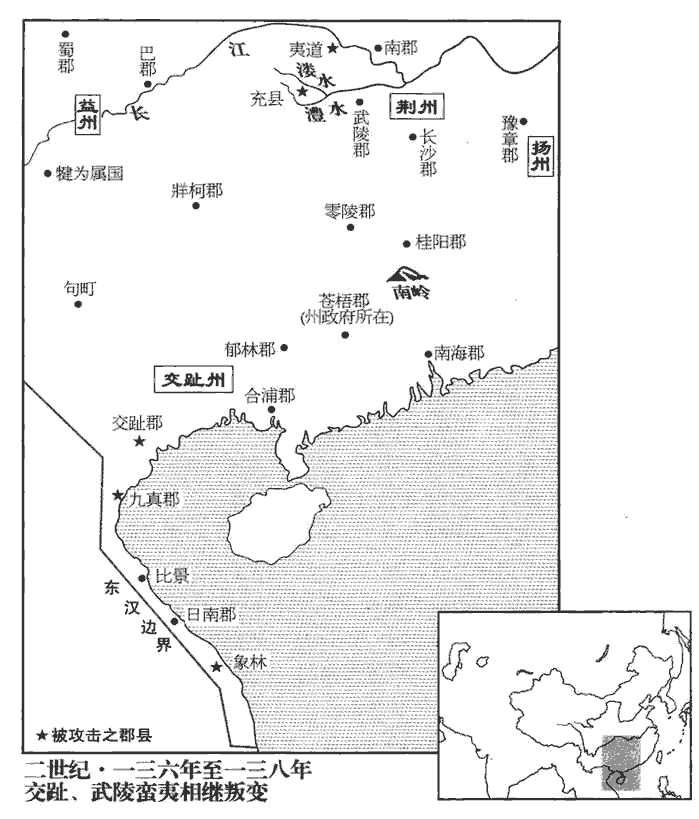
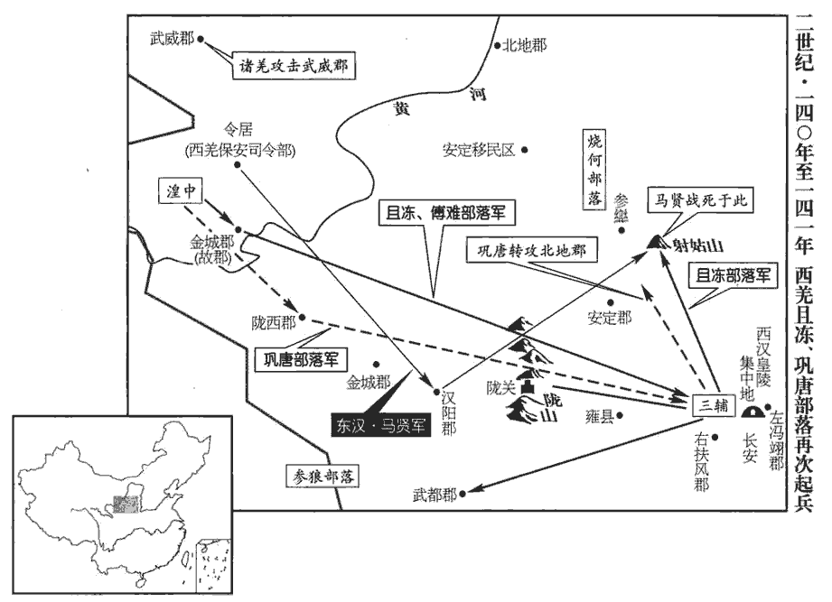
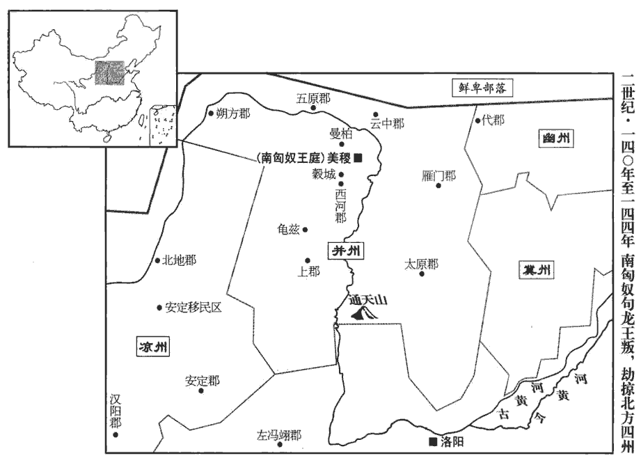
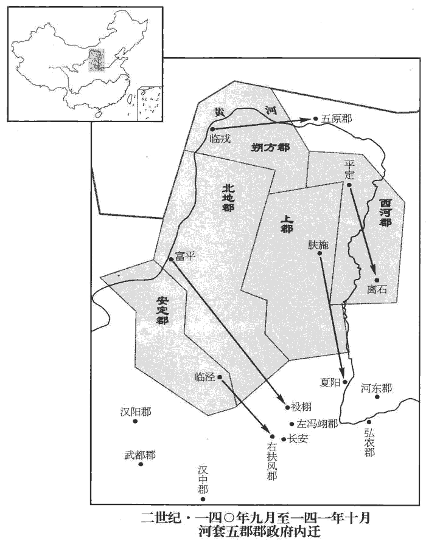
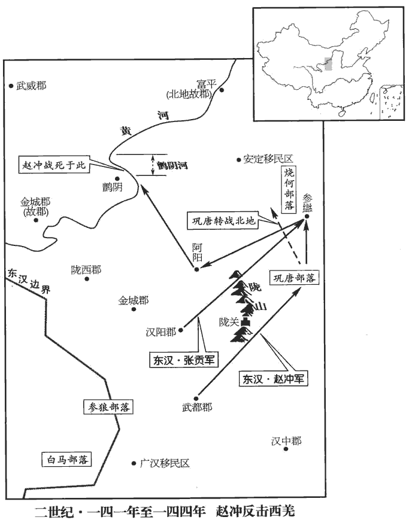
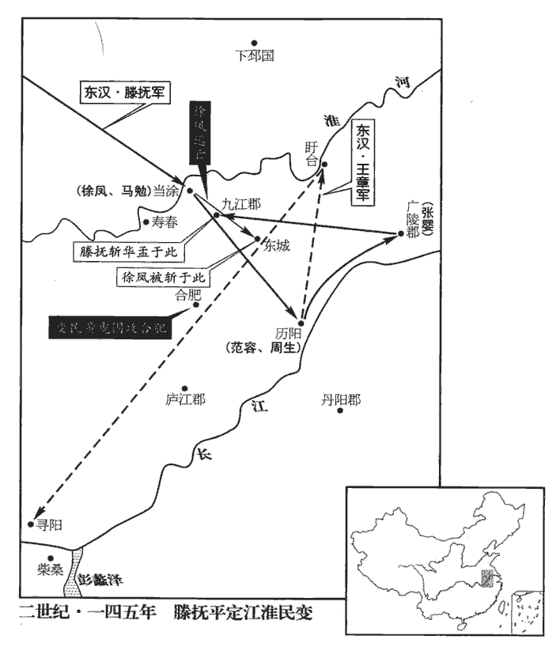

 漢紀四十四起閼逢閹茂（甲戌），盡旃蒙作噩（乙酉），凡十二年。

# 孝順皇帝下

## 陽嘉三年（甲戌，一三四）

1夏，四月，車師後部‹新疆吉木萨尔南›司馬率後王加特奴【章：甲十六行本「奴」下有「等」字；乙十一行本同；孔本同。】掩擊北匈奴‹王庭设新疆阿尔泰山南麓›於閶吾陸谷，閶，音昌。大破之；獲單于母。

〖译文〗 [1]夏季，四月，汉朝驻车师后王国的车师后部司马，率领后王国国王加特奴，在阊吾陆谷向北匈奴发动突然袭击，大破北匈奴，俘虏了单于的母亲。

2五月，戊戌‹四›，詔以春夏連旱，赦天下。上‹刘保，时年二十›親自露坐德陽殿東廂請雨。按范書桓帝紀：德陽殿在北宮掖庭中。以尚書周舉才學優深，特加策問。舉對曰：「臣聞陰陽閉隔，則二氣否塞。否皮鄙翻。塞，悉則翻。陛下廢文帝、光武之法，而循亡秦奢侈之欲，內積怨女，外有曠夫。自枯旱以來，彌歷年歲，未聞陛下改過之效，徒勞至尊暴露風塵，誠無益也，謂露坐無益。陛下但務其華，不尋其實，猶緣木希魚，欲行求前。賢曰：緣木求魚，孟子之文。韓詩外傳曰：夫明鏡所以照形，往古所以知今。惡知往古之所以危亡，無異卻行而求達於前人也。誠宜推信革政，崇道變惑，出後宮不御之女，除太官重膳之費。易傳曰：『陽感天不旋日。』易稽覽圖中孚傳曰：陽感天不旋日，諸侯不旋時，大夫不過朞。鄭玄註云：陽者，天子。為善一日，天立應以善；為惡一日，天立應以惡。一說，不旋時立應之。重，直龍翻。傳，直戀翻。惟陛下留神裁察！」帝復召舉面問得失，舉對以「宜慎官人，去貪汙，遠佞邪。」復，扶又翻。去，羌呂翻。遠，于願翻。帝曰：「官貪汙、佞邪者為誰乎？」對曰：「臣從下州超備機密，舉自冀州刺史徵拜尚書。不足以別群臣。然公卿大臣數有直言者，忠貞也；別，彼列翻。數，所角翻。阿諛苟容者，佞邪也。」

〖译文〗 [2]五月戊戌（初四），顺帝下诏，因春季和夏季连续大旱，大赦天下。顺帝亲到德阳殿东厢庭院中，露天而坐，祈求上天降雨。因尚书周举才学兼优，顺帝特地就此征询他的意见。周举回答说：“我曾经听说，阴阳闭隔，则二气一定闭塞不通。陛下废弃文帝、光武帝所建立的朴素节俭传统，而因袭促使秦朝灭亡的奢侈欲望，使宫廷内增加了许多怨恨的美女，而宫廷外却增加了许多已到婚龄而不得婚配的男子。自从发生大旱以来，整整过去一年了，而没有听说陛下有改过的表现，徒劳至尊之体露坐风尘，实在无益。陛下只是在问题的表面上下功夫，不去寻找它的实质所在，犹如缘木求鱼，也好比向后倒退，却想前进一样，于事无补。应该诚心诚意地革除弊政，遵守先王制订的规章制度，改变目前奢侈腐化的混乱局面，放走后宫中未曾召幸过的美女，省去御膳房制作奢侈菜肴的费用。《易传》上说：‘天子为善一日，上天立刻以善来回报。’请陛下留意裁夺！”顺帝再次召见周举，当面询问朝政上的得失，周举回答说：“应该慎重地任命官吏，铲除贪污，疏远奸佞。”顺帝又问：“谁是贪官污吏？谁是奸佞之臣？”周举回答说：“我从下面的州刺史府，被擢升到掌管朝廷机密的尚书台，还没有能力辨别群臣。然而，在三公、九卿等朝廷大臣中，凡是多次敢于直言不讳地批评朝政的，是忠贞之臣。而阿谀奉承和随声附和的，则是奸佞之臣。”

太史令張衡亦上疏言：「前年京師地震土裂，裂者，威分；震者，民擾也。竊懼聖思厭倦，制不專己，恩不忍割，與眾共威。威不可分；德不可共。願陛下思惟所以稽古率舊，勿使刑德八柄不由天子，周禮：王以八柄馭群臣：一曰爵，以馭其貴；二曰祿，以馭其富；三曰予，以馭其幸；四曰置，以馭其行；五曰生，以馭其福；六曰奪，以馭其貧；七曰廢，以馭其罪；八曰誅，以馭其過。然後神望允塞，塞，悉則翻。災消不至矣！」

〖译文〗 太史令张衡也上书说：“去年，京都洛阳发生地震，大地崩裂。土地崩裂象征着权威分割；地震象征着人民受到惊扰。我深恐陛下厌倦处理政务，政令不专由自己决定，或者不忍心割断私恩，导致与众人共享威权。然而，威权是不可分割的，恩德也是不可共有的。但愿陛下考虑古代君主所制定的规章，千万不要使刑、德八种权柄，脱离帝王之手。然后，神圣的威严就获得充实，灾异就消失而不再来了。”

衡又以中興之後，儒者爭學圖緯，緯，七緯也。七緯者，易緯，稽覽圖、乾鑿度、坤靈圖、通卦驗、是類謀、辯終備也；書緯，璇璣鈐、考靈耀、刑德放、帝命驗、運期授也；詩緯，推度災、氾歷樞、含神霧也；禮緯，含文嘉、稽命徵、斗威儀也；樂緯，動聲儀、稽耀嘉、汁國徵也；孝經緯，援神契、鉤命決也；春秋緯，演孔圖、元命包、文耀鉤、運斗樞、感精符、合誠圖、考異郵、保乾圖、漢含孳、佑助期、握誠圖、潛潭巴、說題辭也。上疏言：「春秋元命包有公輸班與墨翟，事見戰國；又言別有益州，益州之置，在於漢世。賢曰：前書：武帝始置益州。又劉向父子領校祕書，閱定九流，亦無讖錄。賢曰：成、哀時，劉向及子歆為祕書，校定經傳、諸子等。九流，謂儒家、道家、陰陽家、法家、名家、墨家、縱橫家、雜家、農家，見藝文志；并無讖說。讖，楚譖翻。則知圖讖成於哀、平之際，皆虛偽之徒以要世取資，要，一遙翻。欺罔較然，莫之糾禁。且律曆、卦候、九宮、風角，黃帝命伶倫吹律，大撓作甲子，容成造曆，而律曆之學傳矣。京房分六十四卦，更直日用事，以風雨寒溫為候。伏羲之時，龍馬負圖出於河，戴九履一，左三右七，二四為肩，六八為足，而五居中。伏羲觀河圖而畫八卦。陰陽家謂之九宮，一、六、八為白，二黑、三綠、四碧、五黃、七赤、九紫，至今承用之。又易乾鑿度曰：太一取其數而行九宮。鄭玄註云：太一者，北辰神名也；下行八卦之宮，每四乃還於中央。中央者，地神之所居，故謂之九宮。天數大分以陽出，以陰入，陽起於子，陰起於午，是以太一下九宮從坎宮始。自此而從於坤宮，又自此而從於震宮，又自此而從於巽宮，所以從半矣，還息於中央之宮。既又自此而從於乾宮，又自此而從於兌宮，又自此而從於艮宮，又自此而從於離宮，行則周矣。上遊息於太一之星，而反於紫宮。行起從坎宮始，終於離宮也。此雖緯書之說，而九宮定位則一也。賢曰：風角，謂候四方四隅之風，以占吉凶。數有徵效，數，所角翻；下同。世莫肯學，而競稱不占之書，賢曰：謂競稱讖家也。譬猶畫工惡圖犬馬而好作鬼魅，誠以實事難形而虛偽不窮也！惡，烏路翻。好，呼到翻。魅，音媚。韓子曰：客有為齊王畫者，問：「畫孰難？」對曰：「狗、馬最難。」「孰易？」曰：「鬼、魅最易。狗、馬，人所知也，故難；鬼、魅無形，故易也。」宜收藏圖讖，一禁絕之，則朱紫無所眩，典籍無瑕玷矣！」

〖译文〗 张衡又因为东汉王朝建立以来，儒家学派的学者争相学习《图》、《纬》这种神秘的预言书，于是上书说：“《春秋元命包》一书中，载有公输般和墨翟，他俩的事都发生在战国时期；又提到别有益州，而益州的设置，是在汉代。并且，刘向、刘歆父子主管皇家图书馆，校订群书，查阅审定九家学说时，也没有发现《谶录》这部书。由此可以推断，《图谶》成书于哀帝、平帝之际，都是虚妄之徒用来欺世盗名和骗取钱财的，欺骗的意图非常明显，但朝廷却没有加以查禁。而且，律历、卦候、九宫、风角所作的预测，曾不断应验，世人不肯学习，却争相称赞谶纬之书，正犹如画工厌恶画狗画马，却喜好画鬼怪，确实是因为实在的事物很难画好，而虚无飘渺的东西可以信笔乱画。因此，对《图谶》这些神秘的预言书，朝廷应该加以收缴，一律禁绝，这样，朱色和紫色才不会混淆，圣人典籍也不致受到玷污！”

3秋，七月，鍾羌‹青海泽库一带›良封等復寇隴西‹甘肃临洮›、漢陽‹甘肃甘谷›。復，扶又翻。詔拜前校尉馬賢為謁者，鎮撫諸種。種，章勇翻。冬，十月，護羌校尉馬續遣兵擊良封，破之。

〖译文〗 [3]秋季，七月，钟羌种首领良封等再次进犯陇西郡和汉阳郡。顺帝下诏，任命前任护羌校尉马贤为谒者，负责镇压和安抚诸种羌人。冬季，十月，护羌校尉马续派兵进击良封，将其击破。

4十一月，壬寅‹十一›，司徒劉崎、司空孔扶免，用周舉之言也。崎，丘宜翻。乙巳‹十四›，以大司農黃尚為司徒，光祿勳河東‹山西夏县›王卓為司空。

〖译文〗 [4]十一月壬寅（十一日），司徒刘崎和司空孔扶，均被免职，这是由于顺帝采纳周举谏言的结果。乙巳（十四日），擢升大司农黄尚为司徒，光禄勋、河东郡人王卓为司空。

5耿貴人數為耿氏請，為，于偽翻。帝乃紹封耿寶子箕為牟平侯。耿寶貶死事見上卷安帝延光四年。

〖译文〗 [5]因耿贵人多次为她的娘家向顺帝说情，于是，顺帝封耿宝的儿子耿箕继承其父为牟平侯。

## 四年（乙亥，一三五）

1春，北匈奴呼衍王侵車師後部‹新疆吉木萨尔南›。帝‹刘保，时年二十一›令敦煌太守發兵救之，不利。敦，徒門翻。

〖译文〗 [1]春季，北匈奴呼衍王侵犯车师后王国，顺帝命敦煌太守发兵救援，战事不利。

2二月，丙子‹十六›，初聽中官得以養子襲爵。曹操階之，遂移漢祚，其所由來者漸矣。初，帝之復位，宦官之力也，事見上卷延光四年。由是有寵，參與政事。與，讀曰預。御史張綱上書曰：「竊尋文、明二帝，德化尤盛，中官常侍，不過兩人，近倖賞賜，裁滿數金，惜費重民，故家給人足。而頃者以來，無功小人，皆有官爵，非愛民重器、承天順道者也。」書奏，不省。省，悉景翻。綱，皓之子也。張皓見五十卷安帝延光三年。

〖译文〗 [2]二月丙子（十六日），首次允许宦官以养子继承爵位。当初，顺帝之所以能够恢复帝位，是靠宦官的力量，因此，宦官得到皇帝的庞信，参与朝廷的政事。御史张纲上书说：“据我考察，文帝和明帝，德行教化，最有成就。而当时的中常侍不过二人，对宠爱亲信的赏赐，不过黄金数斤。珍惜经费，关心人民，所以，百姓家家富足。可是，近几年来，没有功劳的小人，都得到官禄爵位，这不是爱护人民，重视国家，顺应天道的作法。”奏章呈上后，顺帝不理。张纲，即张皓的儿子。

3旱。

〖译文〗 [3]发生旱灾。

4謁者馬賢擊鍾羌‹青海泽库一带›，大破之。

〖译文〗 [4]谒者马贤进击并大破钟羌种人。

5夏，四月，甲子‹五›，太尉施延免。戊寅‹十九›，以執金吾梁商為大將軍，故太尉龐參為太尉。龐，皮江翻。

〖译文〗 [5]夏季，四月甲子（初五），术尉施延被免官。戊寅（十九日），擢升执金吾梁商为大将军，任命前任太尉庞参为太尉。

商稱疾不起且一年；帝使太常桓焉奉策就第即拜，商乃詣闕受命。杜佑曰：後漢策拜諸王侯、三公之儀：百官會，位定，謁者引光祿勳前，謁者引當拜者前，伏殿下。光祿前一拜，舉手曰：「制詔，其以某為某。」讀策書畢，拜者稱臣，再拜。尚書郎以璽印綬付侍御史，前面立受印璽綬，當受策者再拜頓首，三贊。謁者曰：「某王臣某新封，某公某初除，謝。」中謁者報，「謹謝。」贊者立曰：「皇帝為公興。」重坐。受策者拜謝，起，就位。禮畢。自漢以來惟衛青以有功即軍中拜大將軍，未聞有就第即拜者也，況以此異數加之后父乎！商少通經傳，謙恭好士，少，詩沼翻。好，呼到翻；下同。辟漢陽‹甘肃甘谷›巨覽、巨，姓；覽，名。上黨‹山西长子›陳龜為掾屬，掾，余絹翻。李固為從事中郎，楊倫為長史。

〖译文〗 梁商称病不起将近一年。于是，顺帝命太常桓焉，捧着任命策书到梁商家中，要拜授他为大将军，梁商这才到皇宫接受任命。梁商自幼通晓儒家的经传，谦虚恭谨，喜爱人才，他延聘汉阳郡人巨览、上党郡人陈龟为掾属，李固为从事中良，杨伦为长史。

李固以商柔和自守，不能有所整裁，乃奏記於商曰：「數年以來，災怪屢見。見，賢遍翻。孔子曰：『智者見變思形，愚者覩怪諱名。』范書李固傳「形」作「刑」。此二語蓋亦本之緯書。天道無親，可為祗zhī畏。賢曰：祗，敬也。言天無親疏，惟善是與，可敬而畏也。誠令王綱一整，道行忠立，明公踵伯成之高，莊子曰：伯成子高，唐、虞時為諸侯；至禹，去而耕於野。全不朽之譽，豈與此外戚凡輩耽榮好位者同日而論哉！」商不能用。

〖译文〗 李固因梁商为人柔弱温和，能守住自己，但没有能力整顿法纪，于是向梁商上书说：“数年以来，灾变怪异不断出现。孔子说：‘聪明的人见到灾变，考虑它形成的原因；愚蠢的人见到怪异，却假装没有看见。’天道不论亲疏，所以可敬可畏。如果能够整顿朝廷纲纪，推行正道，选立忠良，则您就能继伯成之后，建立崇高的功业，成全不朽的荣誉，那些沉湎于荣华富贵，追求高位的一般外戚，怎能与你同日而语？”梁商不能采用。

6秋，閏八月，丁亥朔‹一›，日有食之。

〖译文〗 [6]秋季，闰八月丁亥朔（初一），出现日食。

7冬，十月，烏桓‹河北北部›寇雲中‹内蒙托克托›。度遼將軍耿曄追擊，不利。十一月，烏桓圍曄於蘭池城‹内蒙准格尔旗东北黄河南岸›；續漢志：雲中郡沙南縣有蘭池城。發兵數千人救之，烏桓乃退。

〖译文〗 [7]冬季，十月，乌桓侵犯云中郡。度辽将军耿晔率军追击，不利。十一月，乌桓将耿晔包围在兰池城，东汉朝廷派兵数千人前去救援，于是乌桓解围而去。

8十二月，丙【章：甲十六行本「丙」作「甲」；乙十一行本同；張校同。】寅‹三十›，京師地震。

〖译文〗 [8]十二月丙寅（疑误），京都洛阳发生地震。

## 永和元年（丙子，一三六）

1春，正月，己巳‹十五›，改元，赦天下。

〖译文〗 [1]春季，正月己巳（十五日），改年号。大赦天下。

2冬，十月，丁亥‹七›，承福殿火。

〖译文〗 [2]冬季，十月丁亥（初七），承福殿发生火灾。

3十一月，丙子‹二十七›，太尉龐參罷。

〖译文〗 [3]十一月丙子（二十七日），太尉庞参被免职。

4十二月，象林‹越南维川›蠻夷反。象林縣，屬日南郡。晉、宋以下為林邑國。

〖译文〗 [4]十二月，象林县蛮夷起兵反叛。

5乙巳‹二十六›，以前司空王龔為太尉。

〖译文〗 [5]乙巳（二十六日），任命前任司空王龚为太尉。

龔疾宦官專權，上書極言其狀。諸黃門使客誣奏龔罪；上‹刘保，时年二十二›命龔亟自實。李固奏記於梁商曰：「王公以堅貞之操，橫為讒佞所構，橫，戶孟翻。眾人聞知，莫不歎慄。夫三公尊重，無詣理訴冤之義，哀帝時，丞相王嘉召詣廷尉，主簿曰：「將相不對理陳冤，相踵以為故事，君侯宜引決。」纖微感慨，輒引分決，是以舊典不有大罪，不至重問。賢曰：大臣獄重，故曰重問。成帝時，丞相薛宣、御史大夫翟方進有罪，上使五二千石雜問。音義云：大臣獄重，故以二千石五人同問之。王公卒有他變，卒，讀曰猝。則朝廷獲害賢之名，群臣無救護之節矣！語曰：『善人在患，飢不及餐。』言當速救之也。斯其時也！」商即言之於帝，事乃得釋。

〖译文〗 王龚痛恨宦官专权，上书极力陈述他们的罪状。黄门宦官们指使门客，向朝廷诬告王龚有罪。顺帝命王龚及早亲自讲明真实情况。李固向梁商上书说：“王龚具有坚贞的节操，无端遭受奸佞的陷害，大家听说这个消息，无不为之叹息恐惧。以三公的尊严地位，没有前往司法部门为自己申辩诉冤的道理。即令他对朝廷稍有不满，往往让他自杀，所以，按照惯例，没有大逆不道之罪，不至于审问三公。假如王龚突然发生其他意外，则朝廷就会蒙受谋害贤能的恶名，群臣就没有营救和保护忠良的气节了！俗话说：‘好人正处在患难之中，我们即使再饿，也顾不上吃饭。’这正是救人的时候。”于是，梁商立即向顺帝进言，事情才告平息。

6是歲，以執金吾梁冀為河南尹。冀性嗜酒，逸遊自恣，居職多縱暴非法。父商所親客雒陽令呂放以告商，商以讓冀。冀遣人於道刺殺放，刺，七亦翻。而恐商知之，乃推疑放之怨仇，推，吐雷翻。惡自冀出，欲嫁之他人，故託其辭，疑放之怨仇為之。請以放弟禹為雒陽令，使捕之；賢曰：安慰放家，欲以滅口。余謂賢說非也。冀請於商，以放弟為令，謂必急於捕賊，而陰使禹滅其兄之宗親賓客以快己忿耳。盡滅其宗、親、賓客百餘人。

〖译文〗 [6]本年，任命执金吾梁冀为河南尹。梁冀生性喜好饮酒，纵情作乐，为所欲为，居官多有暴虐不法的行为。其父梁商所亲信的门客、洛阳县令吕放，将上述情况报告梁商，梁商因此责备了梁冀。梁冀怀恨在心，竟派人在道路上刺死了吕放。而他又恐怕被父亲发觉，于是把罪行推到吕放的仇人身上，并请求任命吕放的弟弟吕禹为洛阳县令，让他来逮捕刺杀吕放的凶手。结果，吕禹将吕放的宗族、亲戚和宾客等一百余人全部诛杀。

7武陵‹湖南常德›太守上書，以蠻夷率服，言相率而來服。可比漢人，增其租賦。議者皆以為可。尚書令虞詡曰：「自古聖王，不臣異俗。先帝舊典，貢賦多少，所由來久矣；漢興，令武陵諸蠻，大人歲輸布一匹，小口二丈，是謂之賨cóng布。今猥增之，必有怨叛。計其所得，不償所費，必有後悔。」帝不從。澧中‹澧水上游›、漊中‹溇水上游›蠻各爭貢布非舊約，漊，郎侯翻。遂殺鄉吏，舉種反。種，章勇翻。

〖译文〗 [7]武陵郡太守向朝廷上书，认为武陵郡内的蛮夷已归服了汉朝，可以比照汉人，增加他们的田租和赋税。参加集议论的人都认为可行，但尚书令虞诩却说：“自古以来，圣明的君王对风俗习惯跟我们不同的民族，不当作自己的臣民。先帝已制定了规章，明确规定武陵蛮夷应缴纳的赋税额，时间已经很久了。而今滥行增加，必然引起他们的怨恨和反叛，计算所能得到的，抵偿不了所耗费的，定会后悔。”顺帝没有采纳。其后，中和中蛮人各因所征收的贡布不是原来规定的数量而起来抗争，于是杀掉征收赋税的乡吏，全族反叛。

## 二年（丁丑，一三七）

1春，武陵‹湖南常德›蠻二萬人圍充城‹湖南桑植›，八千人寇夷道。賢曰：充縣，屬武陵郡，故城在澧州崇義縣東北。充，音衝。夷道，屬南郡。

〖译文〗 [1]春季，武陵郡蛮族二万人包围充城，八千人攻打夷道。

2二月，廣漢屬國‹甘肃文县›都尉擊破白馬羌。安帝改蜀郡北部都尉為廣漢屬國都尉，別領陰平、甸氐、剛氐三道，屬益州。

〖译文〗 [2]二月，广汉属国都尉击破白马羌。

3帝‹刘保，时年二十三›遣武陵‹湖南常德›太守李進擊叛蠻，破平之。進乃簡選良吏，撫循蠻夷，郡境遂安。

〖译文〗 [3]顺帝派武陵郡太守李进率军进击反叛的蛮人，将其击破平定。于是，李进选用贤良的官吏，安抚蛮人，郡境之内方告安宁。

4三月，【章：甲十六行本「月」下有「乙卯」‹八›二字；乙十一行本同；張校同；退齋校同。】司空王卓薨。丁丑‹三十›，以光祿勳郭虔為司空。考異曰：袁書作「乾」，今從范書。

〖译文〗 [4]三月，司空王卓去世。丁丑（三十日），擢升光禄勋郭虔为司空。

5夏，四月，丙申‹十九›，京師地震。

〖译文〗 [5]夏季，四月丙申（十九日），京都洛阳发生地震。

6五月，癸丑‹六›，山陽君宋娥坐構姦誣罔，收印綬，歸里舍。黃龍、楊佗、孟叔、李建、張賢、史汎、王道、李元、李剛等九侯坐與宋娥更相賂遺，更，工衡翻。遺，于季翻。求高官增邑，并遣就國，減租四分之一。考異曰：孫程傳云：「龍等誣罔曹騰、孟賁」，按梁商傳，誣罔騰、賁者張逵等，非龍等也。

〖译文〗 [6]五月癸丑（初六），山阳君宋娥因勾结奸佞，以不实之辞诬陷他人而坐罪，顺帝下令收缴她的印信，并将她遣送回乡。黄龙、杨佗、孟叔、李建、张贤、史、王道、李元、李刚等九侯，因与宋娥互相贿赂，谋求高官和增加食邑，一律遣回他们的封国，减少所享用的封国租税的四分之一。

7象林‹越南维川›蠻區憐等區，烏侯翻；今廣中猶有此姓。姓譜云：今長沙有此姓，音豈俱翻。攻縣寺，殺長吏。交趾刺史樊演發交趾‹两广及越南北部›、九真‹越南清化›兵萬餘人救之；兵士憚遠役，秋，七月，二郡兵反，攻其府。府雖擊破反者，而蠻勢轉盛。

〖译文〗 [7]象林郡蛮族首领区怜等攻打所在县的官府，杀害地方官吏。交趾刺史樊演征发交趾郡和九真郡兵一万余人，前往救援。由于士兵害怕远征，秋季，七月，两郡士兵反叛，攻打太守府。太守府虽将反叛士兵击败，然而蛮人的势力转强。

8冬，十月，甲申‹十›，上行幸長安。扶風‹陕西兴平›田弱薦同郡法真博通內、外學，東都諸儒以七緯為內學，六經為外學。隱居不仕，宜就加袞職。賢曰：毛詩曰：袞職有闕。謂三公也。帝虛心欲致之，前後四徵，終不屈。友人郭正稱之曰：「法真名可得聞，身難得而見。逃名而名我隨，避名而名我追，可謂百世之師者矣！」真，雄之子也。法雄見四十九卷安帝永初四年。

〖译文〗 [8]冬季，十月甲申（初十），顺帝巡视长安。扶风人田弱向顺帝推荐同郡人法真，称法真精通儒家的内学和外学，即《七纬》和《六经》，隐居乡里，不肯出来做官，应就地任命他为三公。顺帝非常虚心地想请到他，前后四次征召，但法真始终不肯屈从。他的朋友郭正称赞说：“法真，可以听见他的名，却很难见到他这个人。他越是逃避名声，名声越是随着他，越是躲开名声，名声越是追着他，他这个人真可以说是百世之师了！”法真，即法雄的儿子。

9丁卯‹二十三›，京师地震。

〖译文〗 [9]丁卯（疑误），京都洛阳发生地震。

10太尉王龔以中常侍張昉等專弄國權，欲奏誅之。宗親有以楊震行事諫之者，楊震事見五十卷安帝延光三年。龔乃止。

〖译文〗 [10]太尉王龚因中常侍张等独揽朝廷大权，打算提出弹劾，要求皇帝诛杀他们。后由于宗族和亲戚中有人用杨震的遭遇进行劝阻，王龚这才作罢。

11十二月，乙亥‹二›，上還自長安。

〖译文〗 [11]十二月乙亥（初二），顺帝从长安返回京都洛阳。

## 三年（戊寅，一三八）

1春，二月，乙亥‹三›，京師及金城‹甘肃陇西›、隴西‹甘肃临洮›地震，二郡山崩。

〖译文〗 [1]春季，二月乙亥（初三），京都洛阳及金城郡、陇西郡发生地震，二郡发生山崩。

2夏，閏四月，己酉‹八›，京師地震。

〖译文〗 [2]夏季，闰四月已酉（初八），京都洛阳发生地震。

3五月，吳郡‹江苏苏州›丞羊珍反，攻郡府；太守王衡破斬之。

〖译文〗 [3]五月，吴郡丞羊珍反叛，攻打郡太守府。太守王衡将叛军击败，并斩杀羊珍。

4侍御史賈昌與州郡并力討區憐，不尅，為所攻圍歲餘，兵穀不繼。帝‹刘保，本年二十四岁›召公卿百官及四府掾屬大將軍府掾屬二十九人，太尉府二十四人，司徒府三十一人，司空府二十九人。問以方略；皆議遣大將，發荊‹湖北湖南›、揚‹安徽中部及江南›、兗‹山东西部›、豫‹河南›四萬人赴之。李固駮曰：「若荊、揚無事，發之可也。今二州盜賊磐結不散，二州、謂荊、揚也。武陵‹湖南常德›、南郡‹湖北江陵›蠻夷未輯，長沙‹湖南长沙›、桂陽‹湖南郴州›數被徵發，如復擾動，數，所角翻。被，皮義翻。復，扶又翻；下同。必更生患，其不可一也。又，兗、豫之人卒被徵發，卒，讀曰猝。遠赴萬里，無有還期，詔書迫促，必致叛亡，其不可二也。南州水土溫暑，加有瘴氣，瘴，之亮翻。度嶺而南，瘴氣甚重，炎熱蒸鬱之所生也，中之者輒死。致死亡者十必四五，其不可三也。遠涉萬里，士卒疲勞，比至嶺南，比，必寐翻，及也。不復堪闘，其不可四也。軍行三十里為程，而去日南‹越南东河›九千餘里，三百日乃到，計人稟五升，賢曰：古升小，故曰五升也。稟，給也。用米六十萬斛，不計將吏驢馬之食，但負甲自致，費便若此，其不可五也。設軍所在，死亡必眾，既不足禦敵，當復更發，此為刻割心腹以補四支，其不可六也。九真‹越南清化›、日南‹越南东河›相去千里，發其吏民猶尚不堪，何況乃苦四州之卒以赴萬里之艱哉！其不可七也。前中郎將尹就討益州‹四川云南›叛羌，益州諺曰：『虜來尚可，尹來殺我。』後就徵還，以兵付刺史張喬；喬因其將吏，旬月之間破殄寇虜。事見四十九卷安帝元初二年，止五十卷五年。此發將無益之效，將，即亮翻。州郡可任之驗也。宜更選有勇略仁惠任將帥者，以為刺史、太守，悉使共住交趾。今日南‹越南东河›兵單無穀，言孤軍處叛蠻之中，又乏糧也。守既不足，戰又不能，可一切徙其吏民，北依交趾，事靜之後，乃命歸本；還募蠻夷使自相攻，轉輸金帛以為其資；有能反間致頭首者，間，古莧翻。頭首，謂諸蠻渠帥也。許以封侯裂土之賞。故并州刺史長沙祝良，性多勇決，又南陽張喬，前在益州有破虜之功，皆可任用。昔太宗就加魏尚為雲中‹内蒙托克托›守，魏尚見十四卷文帝十四年；就加事未見。守，式又翻；下同。哀帝即拜龔舍為泰山‹山东泰安东›守；前書：龔舍，楚人，初徵為諫大夫，病免；復徵為博士，又病去。頃之，哀帝遣使即楚拜舍為泰山太守。宜即拜良等，便道之官。」四府悉從固議，即拜祝良為九真‹越南清化›太守，張喬為交趾刺史。喬至，開示慰誘，并皆降散。良到九真‹越南清化›，單車入賊中，設方略，招以威信，降者數萬人，皆為良築起府寺。由是嶺外復平。為，于偽翻。復，扶又翻。

〖译文〗 [4]侍御史贾昌和州郡官府合力讨伐区怜，没有取胜，反而受到区怜的围攻，过了一年多，援兵和粮秣都无法接济。顺帝召集三公、九卿、百官以及四府掾属询问对策。大家都主张派遣大将，征发荆州、扬州、兖州、豫州等四州士兵共四万人，前往交趾增援。李固反驳说：“如果荆州和扬州太平无事，便可以征发二州的士兵。而今，二州的盗贼，犹如磐石一样结合在一起，不肯离散；武陵郡和南郡的蛮族反叛，还没有安定。而长沙郡和桂阳郡的士兵，已被征发多次，如果再次征发，骚扰人民，必然发生新的变乱，这是不可征发的第一个理由。再者，兖州和豫州的人民，突然被征入伍，远征万里之外，没有归期，而诏书逼迫和催促急如星火，必然导致叛乱和逃亡，这是不可征发的第二个理由。南方州郡，水土潮湿，气候炎热，再加上瘴气，以致死亡的人必占十分之四五，这是不可征发的第三个理由。长途跋涉，行军万里，士卒疲劳不堪，等军队到达岭南，士卒已经没有战斗能力，这是不可征发的第四个理由。按照规定的正常速度，每天行军三十里，而离日南郡有九千余里，需要行军三百天才可到达，按每人每天口粮五升计算，需要用米六十万斛，还不包括将领、军吏的口粮和驴、马的饲料，仅士兵自己携带，费用就如此巨大，这是不可征发的第五个理由。军队战斗的地方，死亡的人一定很多，即然抵御不了敌人的进攻，就将再次征调援兵，这就犹如挖割心腹去补四肢，这是不可征发的第六个理由。九真和日南，两郡相隔仅一千里，征发当地的吏民，尚且不堪忍受，更何况征发四州的士兵，让他们忍受万里远征的痛苦？这是不可征发的第七个理由。从前，朝廷派中郎将尹就去讨伐益州的叛羌，益州有谚语说：“叛羌来了，还可；尹就来了，杀我。”其后，将尹就调回京都，把军队交付给益州刺史张乔。张乔依靠原有军队的将领和军吏，一个月之内，便将叛羌击破歼灭。这证明由朝廷派遣大将没有益处，而州郡地方官吏却足以胜任。应该重新选派即勇敢而又有谋略，即仁惠而又可胜任将帅的人，担任州刺史和郡太守，命他们都驻守在交趾郡。而今，日南郡兵力单薄，又无粮秣，守既守不住，战又不能战，可以暂时放弃它，先把官吏和人民迁徙到北方的交趾郡，等到乱事平定之后，再命他们返回日南郡。另外，招募和收买蛮夷，让他们互相攻杀，朝廷 则供给金帛资助他们。如果有能够使用反间计离间敌人内部、斩杀蛮夷首领的，朝廷则许以封侯，赐以食邑。前任并州刺史、长沙人祝良，勇敢果断；南阳人张乔，从前在益州建立过平定叛羌的功勋，他们都可以受到信任和重用。过去，汉文帝就在原地任命魏尚为云中郡太守，哀帝命使者到楚地拜授龚舍为泰山郡太守。应该就在原地拜授祝良等人，命他们直接前往交趾郡任职。”四府完全同意李固的意见。于是，顺帝在原地任命祝良为九真郡太守，张乔为交趾州刺史。张乔到任以后，对叛蛮开诚布公地进行安抚和诱劝，叛军全部投降或解散。祝良到九真郡之后，单独乘车进入叛军大营，给他们指出生路，用威力和信誉进行招抚，叛军投降的有数万人，他们一同为祝良修筑郡太守府的官舍。从此，五岭以外地区恢复和平。

 

5秋，八月，己未‹二十›，司徒黃尚免。九月，己酉‹十六›，以光祿勳長沙劉壽為司徒。

〖译文〗 [5]秋季，八月己未（二十日），司徒黄尚被免官。九月己酉（疑误），擢升光禄勋、长沙人刘寿为司徒。

6丙戌‹十七›，令大將軍、三公舉剛毅、武猛，謀謨任將帥者各二人，特進、卿、校尉各一人。校，戶教翻。

〖译文〗 [6]丙戌（十七日），顺帝命大将军、三公向朝廷举荐刚毅、武猛、有谋略，可以担任将帅的人才，每人推荐二人；特进、九卿、校尉，每人推荐一人。

初，尚書令左雄薦冀州刺史周舉為尚書；既而雄為司隸校尉，舉故冀州‹河北中部南部›刺史馮直任將帥。直嘗坐臧受罪，臧，古贓字通。舉以此劾奏雄。劾所舉非其人也。劾，戶概翻，又戶得翻。雄曰：「詔書使我選武猛，不使我選清高。」舉曰：「詔書使君選武猛，不使君選貪污也！」雄曰：「進君，適所以自伐也。」舉曰：「昔趙宣子任韓厥為司馬，厥以軍法戮宣子僕，宣子謂諸大夫曰：『可賀我矣！吾選厥也任其事。』秦、晉戰于河曲，趙宣子將中軍，韓厥為司馬。宣子使以其乘車干行，韓厥戮其僕。眾曰：「韓厥必不沒矣，其主朝升之而暮戮其車。」宣子謂諸大夫曰：「可賀我矣！吾舉厥也任其事，吾今乃知免於戾矣！」任，音壬。今君不以舉之不才誤升諸朝，不敢阿君以為君羞；不寤君之意與宣子殊也。」雄悅，謝曰：「吾嘗事馮直之父，又與直善；今宣光以此奏吾，是吾之過也！」周舉，字宣光。天下益以此賢之。聞過而服，天下以此益賢左雄。諱過者為何如邪！

〖译文〗 最初，尚书令左雄，推荐冀州刺史周举为尚书。接着，左雄任司隶校尉，又推荐前任冀州刺史冯直有将帅之才。因冯直曾经犯过贪污罪，周举便就此弹劾左雄。左雄说：“圣旨让我推荐武猛的人才，不是让我推荐品行清白高洁的人才。”周举回答说：“圣旨是让你推荐武猛的人才，但也没有教你推荐犯有贪污罪的人。”左雄又说：“我推荐了您，反受您的打击，恰恰是自作自受。”周举回答说：“过去，赵宣子任用韩厥为司马，韩厥却用军法将赵宣子的奴仆杀掉，赵宣子对各位大夫说：‘你们应该向我祝贺，我推荐韩厥，他果然尽忠职守。’而今，承蒙您不嫌弃我没有才能，而误将我推荐到朝廷，所以，我不敢迎合您，让您蒙羞。可是，想不到您的看法和赵宣子完全不一样。”左雄大为高兴，向周举道歉说：“我曾经做过冯直父亲的部属，又和冯直是好朋友。如今你因此而弹劾我，正是我的过错。”从此，天下的人对左雄更为尊敬。

是時，宦官競賣恩勢，挾勢市恩，以此自鬻也。唯大長秋良賀清儉退厚。春秋鄭穆公子子良，後為良氏。賢曰：謙退而厚重也。余謂退厚者，不與儕輩爭進趣，競浮薄也。及詔舉武猛，賀獨無所薦。帝問其故，對曰：「臣生自草茅，長於宮掖，長，知兩翻。既無知人之明，又未嘗交加士類。昔衛鞅因景監以見，有識知其不終。事見二卷周顯王三十一年。今得臣舉者，匪榮伊辱，言不足為榮，適以為辱也。考異曰：宦者傳云：「陽嘉中，詔舉武猛，良賀獨無所薦。」按此詔蓋誤以永和為陽嘉也。是以不敢！」帝由是賞之。

〖译文〗 这时，宦官倚仗皇帝的庞信，争相卖弄权势，唯有大长秋良贺清廉淡泊，谦让敦厚。等到皇帝下诏，命各人推荐武力勇猛的人才时，唯独良贺没有举荐。顺帝问他什么原因，良贺回答说：“我出生于荒野民间，在宫廷中长大，既没有识别人的聪明，又没有和有才能的人士交往。过去，卫鞅由宦官景监推荐，有识之士就预见到他没有好结果。现在，能得到我推荐的人，他不仅不会引以为荣，反而觉得是一种耻辱。因此我不敢举荐。”顺帝从此赏识良贺。

7冬，十月，燒當羌‹青海湖东畔›那離等三千餘騎寇金城‹甘肃陇西›，校尉馬賢擊破之。

〖译文〗 [7]冬季，十月，烧当羌人首领那离等，率领三千余骑兵，侵犯金城郡，护羌校尉马贤将其击破。

8十二月，戊戌朔‹一›，日有食之。

〖译文〗 [8]十二月戊戌朔（初一），出现日食。

9大將軍商以小黃門南陽曹節等用事於中，遣子冀、不疑與為交友；而宦官忌其寵，反欲陷之。中常侍張逵、蘧qú政、楊定等蘧，姓也。衛有大夫蘧伯玉。與左右連謀，共譖商及中常侍曹騰、孟賁，云「欲徵諸王子，圖議廢立，請收商等案罪。」帝曰：「大將軍父子，我所親，騰、賁；我所愛，必無是，但汝曹共妒之耳。」妒，與妬同。逵等知言不用，懼迫，言既不用，懼禍且及也。遂出，矯詔收縛騰、賁於省中。帝聞，震怒，敕宦者李歙急呼騰、賁釋之；收逵等下獄。歙，許及翻。下，遐稼翻。

〖译文〗 [9]大将军梁商因为小黄门、南阳人曹节等在宫中当权，就命自己的儿子梁冀、梁不疑和曹节等结交。而其他宦官忌妒曹节受宠，反而想要陷害他。中常侍张逵、蘧政、杨定等，和他们左右的亲信勾结密谋，一同向顺帝诬告梁商和中常侍曹腾、孟贲，说：“梁商等准备征召诸王的儿子前来京都洛阳，图谋废黜皇上，另立新的皇帝，请将梁商等收捕治罪。”顺帝说：“大将军父子是我所亲信的，曹腾、孟贲是我所宠爱的，一定没有这回事，只是你们都忌妒他们罢了。”张逵等知道他们的谗言没有被顺帝采纳，恐惧杀身大祸降临到自己头上，于是退下，假传圣旨，在宫中逮捕曹腾和孟贲。顺帝闻讯大发雷霆，命宦官李歙急速传命释放曹腾、孟贲。并将张逵等人逮捕下狱。

## 四年（己卯，一三九）

1春，正月，庚辰‹十三›，逵等伏誅；事連弘農‹河南灵宝东北›太守張鳳、安平‹河北冀县›相楊皓，皆坐死；辭所連染，延及在位大臣。商懼多侵枉，乃上疏曰：「春秋之義，功在元帥，罪止首惡。春秋左氏傳：晉郤克帥師敗齊師于鞌；師歸，范文子後入，曰：「師有功，國人喜以逆之；先入，必屬耳目焉，是代帥受名也，故不敢。」虞師、晉師滅下陽，公羊傳曰：虞，微國也，曷為序于大國之上？使虞首惡也。帥，所類翻。大獄一起，無辜者眾，死囚久繫，纖微成大，賢曰：言久繫之，則細微之事牽引以成大也。非所以順迎和氣，平政成化也。宜早訖竟，以止逮捕之煩。」謂孟春之月，當行慶施惠，順天地生物之心，以迎和氣，不宜使獄事枝蔓。賢曰：逮，及也；辭所連及，即追捕之也。帝‹刘保，时年二十五›納之，罪止坐者。

〖译文〗 [1]春季，正月庚辰（十三日），张逵等人伏法被诛。弘农郡太守张凤和 安平国相杨皓，因被张逵等人牵连，都坐罪处死。受口供牵连的，还涉及到在位的朝廷大臣。梁商担心冤枉许多无辜者，于是上书说：“按照《春秋》上面所讲的道理，功勋归于元帅，罪恶仅惩办首恶。大狱一起，无辜受害的人将会很多，身犯死罪的囚犯长久关押的监狱，细微小事会牵连成大事，这样不能顺应和气，治平政事，成就教化。应该及早结案，停止逮捕的烦扰。”顺帝采纳，治罪仅限于当事人犯。

二月，帝以商少子虎賁中郎將不疑為步兵校尉。商上書辭曰：「不疑童孺，猥處成人之位。處，昌呂翻。昔晏平仲辭鄁bèi殿‹山东昌邑›以安【章：甲十六行本「安」作「守」；乙十一行本同；孔本同。】其富，左傳：齊討慶封，與晏子鄁殿，其鄙六十；弗受。子尾曰：「富，人之所欲也，何故弗受？」對曰：「慶氏之邑足欲，故亡。吾邑不足欲也，益之以鄁殿，乃足欲，亡無日矣！不受鄁殿，非惡富也，恐失富也。」鄁，蒲對翻。殿，多薦翻，又如字。公儀休不受魚飱sūn以定其位；公儀休為魯相；客有遺相魚者，相不受。客曰：「聞君嗜魚，遺君魚，何故不受也？」相曰：「以嗜魚，故不受也。今為相能自給魚；受魚而免，誰復給我魚者！故不受也。」臣雖不才，亦願固福祿於聖世！」上乃以不疑為侍中、奉車都尉。梁商之讓，通經、傳之力也。

〖译文〗 二月，顺帝任命梁商的小儿子虎贲中郎将梁不疑为步兵校尉。梁商上书辞让说：“梁不疑是个孩子，竟担任成人才可以担任的官职。过去，晏婴辞让殿的土地，用来保全自己的财富；公仪休不接受别人的赠鱼，用来保全自己的地位。我虽然没有才能，也希望在圣主之世保全我的财富和地位。”于是，顺帝任命梁不疑为侍中、奉车都尉。

2三月，乙亥‹九›，京師‹洛阳›地震。

〖译文〗 [2]三月乙亥（初九），京都洛阳发生地震。

3燒當羌‹青海湖东畔›那離等復反；復，扶又翻；下同。夏，四月，癸卯‹八›，護羌校尉馬賢討斬之，獲首虜千二百餘級。

〖译文〗 [3]烧当羌人首领那离等再次反叛。夏季，四月癸卯（初八），护羌校尉马贤率军进行讨伐，将那离斩首，并斩杀和俘虏一千二百余人。

4戊午‹二十三›，赦天下。

〖译文〗 [4]戊午（二十三日），大赦天下。

5五月，戊辰‹三›，封故濟北惠王壽子安為濟北王。去年濟北王多薨，無子；今以安紹封。范書列傳作「安國」，此從帝紀。濟，子禮翻。

〖译文〗 [5]五月戊辰（初三），将已故济北惠王刘寿的儿子刘安封为济北王。

6秋，八月，太原‹山西太原›旱。

〖译文〗 [6]秋季，八月，太原郡发生旱灾。

## 五年（庚辰，一四零）

1春，二月，戊申‹十七›，京師地震。

〖译文〗 [1]春季，二月戊申（十七日），京都洛阳发生地震。

2南匈奴‹王庭设美稷，内蒙准格尔旗›句龍王吾斯、車紐等反，句，古侯翻。車，尺遮翻。寇西河‹内蒙准格尔旗西南›；招誘右賢王合兵圍美稷‹内蒙准格尔旗›，殺朔方‹内蒙磴口›代郡‹山西阳高›長吏。夏，五月，度遼將軍馬續與中郎將梁并等此護匈奴中郎將也。發邊兵及羌、胡合二萬餘人掩擊，破之。吾斯等復更屯聚，攻沒城邑。天子‹刘保，时年二十六›遣使責讓單于；單于本不預謀，乃脫帽避帳，詣并謝罪。并以病徵，五原太守陳龜代為中郎將。龜以單于不能制下，賢曰：吾斯等攻沒城邑，單于雖不預謀，然不能制下，即是不堪其任。逼迫單于及其弟左賢王皆令自殺。龜又欲徙單于近親於內郡，而降者遂更狐疑。龜坐下獄，免。降，戶江翻；下同。龜所施行，必有未究其方略者，而遽坐免也。下，遐稼翻。

〖译文〗 [2]南匈奴句龙王吾斯和车纽等反叛，攻打西河郡，并引诱右贤王，合兵包围美稷，杀害朔方郡、代郡的地方官吏。夏季，五月，度辽将军马续和护匈奴中郎将梁并等征发边防军及羌人、胡人的军队，共二万余人，向南匈奴叛军发动突然袭击，将其击破。吾斯等收拾残部，又重新聚集起来，攻陷城邑。顺帝派使者严辞谴责南匈奴单于。单于休利本来没有参与吾斯等人的反叛阴谋，但因受到朝廷的谴责，感到惶恐不安，于是摘下帽子，离开营帐，亲自跑到梁并那里去认罪。正在这时，梁并因病被朝廷召回京都洛阳，任命五原郡太守陈龟接替护匈奴中郎将。陈龟认为单于不能控制部下，于是逼迫单于及他的弟弟左贤王一道自杀。陈龟还打算将单于的近亲都迁徙到内地各郡，因而已经降附的 南匈奴部众更加狐疑不安。结果，陈龟坐罪下狱，被免官。

大將軍商上表曰：「匈奴寇畔，自知罪極；窮鳥困獸，皆知救死，鳥窮則攫，獸困則搏。傳曰：困獸猶闘。況種類繁熾，不可單盡。賢曰：單，亦盡也。種，章勇翻。今轉運日增，三軍疲苦，虛內給外，非中國之利。度遼將軍馬續，素有謀謨，且典邊日久，深曉兵要；每得續書，與臣策合。宜令續深溝高壘，以恩信招降，宣示購賞，明為期約，如此，則醜類可服，賢曰：醜，等也。余謂醜類，言凶醜之黨類也。國家無事矣！」帝從之，乃詔續招降畔虜。

〖译文〗 大将军梁商上书说：“匈奴背叛，四处劫掠，自知罪大恶极。穷鸟和困兽都知道救死，何况匈奴种族繁盛，不可能消灭净尽。如今粮秣的转运日益增加，军队疲劳艰苦，挖空内地，填补边疆，不是中国之福。度辽将军马续素有谋略，并且主管边防时间已经很久，深晓用兵的要术。每次接到马续的书信，他的谋略总与我相合。应命马续深挖壕沟，高筑壁垒，用恩德信义招抚归降，公布悬赏条例，明确规定期限。这样，匈奴就可以归附，国家就可以无事了！”顺帝采纳，于是下诏命马续招降反叛的匈奴。

商又移書續等曰：「中國安寧，忘戰日久。良騎夜【章：甲十六行本「夜」作「野」；乙十一行本同；孔本同；張校同。】合，交鋒接矢，決勝當時，戎狄之所長而中國之所短也；強弩乘城，堅營固守，以待其衰，中國之所長而戎狄之所短也。宜務先所長而觀其變，先，悉薦翻。設購開賞，宣示反悔，反，音幡。宣示招降之意以開其反悔之心。勿貪小功以亂大謀。」於是右賢王部抑鞮dī等萬三千口皆詣續降。鞮，丁奚翻。

〖译文〗 梁商又给马续等人发送文书说：“中国境内安宁，忘掉战争的时间已经很久。善骑良马进行夜袭，交锋时迅速放箭，当时一决胜负，这是匈奴的长处，而是中国的短处。可是，利用强弩，登城守卫，深沟坚壁，固守军营，等待敌人气势衰竭，这是中国的长处，而中匈奴的短处。应该先发挥我们的长处，观察敌人的变化，设立奖赏，宣布朝廷的招降之意，启发匈奴人的反悔之心，不要贪图小功而乱大谋。”于是，右贤王的部下抑等一万三千人，都向马续投降。

 

3己丑晦‹三十›，日有食之。

〖译文〗 [3]己丑晦（三十日），出现日食。

4初，那離等既平，朝廷以來機為并州刺史，劉秉為涼州刺史。機等天性虐刻，多所擾發；且凍、傅難種羌遂反，賢曰：且，音子余翻。種，章勇翻；下同。攻金城‹甘肃永靖西北›，與雜種羌、胡，大寇三輔，殺害長吏。機等并坐徵。於是拜馬賢為征西將軍，以騎都尉耿叔為副，將左右羽林五校士及諸州郡兵十萬人屯漢陽‹甘肃甘谷›。

〖译文〗 [4]当初，烧当羌人首领那离等反叛被平定后，朝廷任命来机为并州刺史，刘秉为凉州刺史。来机等人天性暴虐刻薄，他们多方侵扰，大量征调，使羌族人民不堪忍受。于是且冻种和傅难种羌人反叛，攻打金城郡，又与其他种的羌人、胡人联合，大举侵犯三辅地区，杀害地方官吏。来机、刘秉都坐罪，被调回京都洛阳。于是任命马贤为征西将军，骑都尉耿叔为他的副手，率左右羽林五校士，以及各州郡郡兵，共十万人，屯驻汉阳郡。

5九月，令扶風‹陕西兴平›、漢陽‹甘肃甘谷›築隴道塢三百所，置屯兵。

〖译文〗 [5]九月，命右扶风、汉阳修筑陇道坞壁三百座，每座坞壁都派兵把守 。

6辛未‹十四›，太尉王龔以老病罷。

〖译文〗 [6]辛未（十四日），太尉王龚因年老有病被罢官。

7且凍羌寇武都‹甘肃成县›，燒隴關‹甘肃清水东›。賢曰：隴山之關也，今名大震關，在今隴州汧qiān源縣西。

〖译文〗 [7]且冻羌人攻打武都，焚烧陇关。

8壬午‹二十五›，以太常桓焉為太尉。

〖译文〗 [8]壬午（二十五日），擢升太常桓焉为太尉。

9匈奴句龍王吾斯等立車紐為單于，東引烏桓，西收羌、胡等數萬人攻破京兆‹西安›虎牙營，殺上郡‹陕西榆林南鱼河堡›都尉及軍司馬，遂寇掠并、涼、幽、冀四州。乃徙西河‹内蒙准格尔旗西南›治離石‹山西离石›，賢曰：離石，即西河之屬縣也，在郡南五百九里。郡本都平定縣；至此，徙於離石。上郡治夏陽‹陕西韩城›，朔方‹内蒙磴口›治五原‹内蒙包头›。十二月，遣使匈奴中郎將张耽將幽州、烏桓諸郡營兵擊車紐等，戰於馬邑‹山西朔州›，斬首三千級，獲生口甚眾。車紐乞降，而吾斯猶率其部曲與烏桓寇鈔。鈔，楚交翻；下同。

〖译文〗 [9]南匈奴句龙王吾斯等，拥立车纽为单于，东方和乌桓联合，西方集结羌人、胡人，约数万人，攻破京兆虎牙大营，杀死上郡都尉和军司马，于是劫掠并州、凉州、幽州和冀州。东汉朝廷便将西河郡太守府迁往离石，上郡太守府迁往夏阳，朔方郡太守府迁往五原。十二月，派遣使匈奴中郎将张耽率领幽州乌桓部众及各郡的地方军，进击车纽等，在马邑会战，斩杀匈奴军三千人，俘虏了很多人。车纽请求投降，而吾期仍率领其部众跟乌桓结合，继续劫掠。

 

10初，上命馬賢討西羌，大將軍商以為賢老，不如太中大夫宋漢；帝不從。漢，由之子也。宋由為公於章、和之間。賢到軍，稽留不進。武都‹甘肃成县›太守馬融上疏曰：「今雜種諸羌種，章勇翻。轉相鈔盜，宜及其未并，亟遣深入，破其支黨；并，合也。及其勢未合而攻其支黨。而馬賢等處處留滯。羌、胡百里望塵，千里聽聲，今逃匿避回，回，胡對翻；繞也，曲也。漏出其後，則必侵寇三輔，為民大害。臣願請賢所不可用關東兵五千，裁假部隊之號，盡力率厲，埋根、行首以先吏士；賢曰：埋根，言不退也。行，戶剛翻。先，悉薦翻。三旬之中，必克破之。臣又聞吳起為將，暑不張蓋，寒不披裘；今賢野次垂幕，珍肴雜遝tà，兒子侍妾，事與古反。臣懼賢等專守一城，言攻於西而羌出於東，且其將士將不堪命，必有高克潰叛之變也。」鄭高克好利而不顧其君，文公使克將兵而禦狄于竟，陳其師旅，翱翔河上；眾潰而歸。安定‹甘肃镇原东南曙光乡›人皇甫規亦見賢不恤軍事，審其必敗，審，悉也，察也。上書言狀。朝廷皆不從。

〖译文〗 [10]最初，顺帝命马贤率军讨伐西羌，大将军梁商认为马贤年纪已老，不如任命太中大夫宋汉，顺帝没有听从。宋汉，即宋由的儿子。马贤到军中上任以后，一直停留不肯前进。武都郡太守马融向朝廷上书说：“如今西羌诸种部众互相攻劫抢掠，应该趁他们还没有汇合到一起，迅速派兵深入叛军，击破各个支党，可是马贤等却处处逗留拖延。羌人和胡人，在百里以外，即可望见他们扬起的尘土；在千里以外，即可听到他们行军的声音。他们躲开汉军的锋芒，避免正面冲突，绕到汉军的背后，直接侵犯和劫掠三辅地区，给人民带来很大的祸害。我请求把马贤认为不能作战的关东地区的军队五千人交给我，仅借用部队的称号，我愿尽力率领和激励他们，誓不后退，为官兵带头，在三十天之内，必然可以打败叛羌。我又听说，吴起为将，夏天再炎热，也不张开伞盖；冬天再寒冷，也不穿皮衣。而今，马贤在野外垂挂帐幕，珍味佳肴杂陈，儿子、侍妾侍奉左右，事事和古代名将相反。我恐怕马贤等专守一个城池，声称攻打西方，而羌人却在东方出现，使得他部下的将领和士兵不堪奔命，必将有 同郑国高克一样溃败反叛的变故。”与此同时，安定人皇甫规也发现马贤不忧虑军事，估计他一定会失败，于是上书汇报情况。朝廷都没有采纳。

 

## 六年（辛巳，一四一）

1春，正月，丙子‹二十一›，征西將軍馬賢與且凍羌戰于射姑山‹甘肃庆阳北›，且，子余翻。射，音夜。按續漢書天文志，射姑山在北地。賢軍敗；賢及二子皆沒，東、西羌遂大合。羌居安定‹甘肃镇原东南曙光乡›、北地‹宁夏吴忠西南金积镇›、上郡‹陕西榆林南鱼河堡›、西河‹山西离石›者，謂之東羌；居隴西‹甘肃临洮›、漢陽‹甘肃甘谷›，延及金城塞外者，謂之西羌。閏月，鞏唐羌寇隴西‹甘肃临洮›，遂及三輔，燒園陵，殺掠吏民。

〖译文〗 [1]春季，正月丙子（二十一日），征西将军马贤和且冻羌人在射姑山会战，马贤的军队大败。马贤和他的两个儿子全都陈亡。于是，东羌和西羌大规模地汇合。闰月，巩唐羌人攻打陇西郡，军锋到达三辅地区，焚烧西汉历代皇帝坟墓陵园，屠杀劫掠官吏和人民。

2二月，丁巳‹三›，有星孛bèi于營室。晉書天文志：營室二星，天子之宮也，又為軍糧之府及土功事。孛，蒲內翻。

〖译文〗 [2]二月丁巳（初三），有异星出现在营室星座。

3三月，上巳‹三›，大將軍商大會賓客，讌于雒水；司馬彪曰：三月上巳，宮人皆潔於東流上，洗濯祓fú除，為大潔也。按古以三月上巳日為上巳，今以三月三日為上巳。酒闌，繼以䪥xiè露之歌。纂文曰：䪥露，今之挽歌也。崔豹古今註曰：「䪥上露，何易晞。露晞明朝還復落，人死一去何時歸！」䪥，下戒翻，一作「薤」。從事中郎周舉聞之，歎曰：「此所謂哀樂失時，樂，音洛。非其所也，殃將及乎！」左傳曰：哀樂失時，殃咎必至。

〖译文〗 [3]三月上巳日，大将军梁商在洛水之滨大宴宾客。酒席将散时，又演奏常用来作挽歌的《薤露之歌》。从事中郎周举听到后，叹息说：“这正是所谓的哀乐不合时，歌唱得不合场所，难道祸殃将要降临了吗？”

4武都‹甘肃成县›太守趙沖追擊鞏唐羌，考異曰：西羌傳作「武威太守」，今從帝紀。皇甫規傳云：「與護羌校尉趙沖」，按西羌傳，沖時尚為太守，規傳誤也。斬首四百餘級，降二千餘人。詔沖督河西‹甘肃中、西部›四郡兵為節度。余按沖以追羌之功，詔督河西四郡兵，則武威太守為是。武都西北接漢陽，東北接扶風，南接漢中，無緣遠督河西四郡兵。

〖译文〗 [4]武都郡太守赵冲追击巩唐羌人，斩杀四百余人，招降二千余人。顺帝下诏，命赵冲督率河西四郡的地方军队，负责节制。

安定‹甘肃镇原东南曙光乡›上計掾皇甫規上疏曰：「臣比年以來，數陳便宜：羌戎未動，策其將反；馬賢始出，知其必敗；誤中之言，在可考校。比，毗至翻。數，所角翻。中，竹仲翻。臣每惟賢等擁眾四年，未有成功，縣師之費，且百億計，賢曰：縣，猶停也。余謂出師遠征，其勢縣絕，不能相及，故曰縣師。縣，讀曰懸。出於平民，平民，謂齊民也。回入姦吏，謂為姦吏所侵盜也。故江湖之人，群為盜賊，青‹山东北部›、徐‹江苏北部›荒饑，襁負流散。襁，居兩翻。夫羌戎潰叛，不由承平，皆因邊將失於綏御，乘常守安則加侵暴，言前後相乘，以侵暴羌戎為常也。苟競小利則致大害，微勝則虛張首級，軍敗則隱匿不言。軍士勞怨，困於猾吏，進不得快戰以徼功，徼，一遙翻。退不得溫飽以全命，餓死溝渠，暴骨中原；徒見王師之出，不聞振旅之聲。賢曰：振，整也。旅，眾也。穀梁傳曰：出曰治兵，入曰振旅。酋豪泣血，驚懼生變，酋，慈秋翻。是以安不能久，叛則經年，臣所以搏手扣心而增歎者也！願假臣兩營、二郡，屯列坐食之兵五千，賢曰：兩營，謂馬賢及趙沖等。二郡，安定、隴西也。余謂兩營者，扶風雍營及京兆虎牙營也。出其不意，與趙沖共相首尾。土地山谷，臣所曉習；兵勢巧便，臣已更之；更，工衡翻，經也，歷也。可不煩方寸之印，尺帛之賜，高可以滌患，下可以納降。降，戶江翻。若謂臣年少、官輕，不足用者，凡諸敗將，非官爵之不高，年齒之不邁。賢曰：邁，往也。臣不勝至誠，沒死自陳！」勝，音升。沒死，猶言昧死也，冒死也。帝不能用。

〖译文〗 安定郡上计掾皇甫规上书说：“我近年以来，曾经多次向陛下提出建议。当羌人尚未发动时，我预计他们将要反叛；马坚统率大军刚开始出发时，我观察到他必然失败；要是有人认为这是侥幸说中的意见，那么可以进行查考核对。我每每想到，马贤等人统军四年，没有得到成功，出兵远征的费用，已将近一百亿，这些经费，虽然出自齐民百姓，却都流入贪官污吏之手，所以，江湖之人群起而为盗贼，青州和徐州一片饥荒，百姓背负小孩，四散逃亡。羌人之所以反叛，不是由于天下太平而引起的，全是因为守边将帅不懂安抚治理之道，对于平常安分守己的羌人，则加以虐待，只贪图小利，终于招致大祸。获得 微小的胜利，则向朝廷虚报斩杀人头的数量；打了败仗，便隐瞒不上报。战士辛苦怨愤，受制于奸猾的官吏，进不能速战以立功，退不得温饱以保全性命，饿死在沟渠里，尸骨暴露在原野之中。只看见朝廷的军队出塞御敌，却听不到他们凯旋归来的消息。羌人的首领极其悲痛地无声哭泣，非常惧怕会发生意外的变故，所以，不能保持长期的安定，一旦起兵反叛，就要经年累月。我所以搓手捶胸，叹息不已，就是这个原因。我请求陛下，将扶风雍营和京兆虎牙营两营以及安定、陇西两郡暂时没有战斗任务的五千士兵借拨给我，我将对羌人发动出其不意的攻击，和赵冲前后呼应。羌人地区的土地和山谷等地理形势，我素来很熟悉，用兵的战略和战术，我也已有经验。用不着一寸见方的印信，也用不着赏赐一尺布帛，最好的结果是铲除祸患，最低限度也可以使羌人降服。如果认为我年轻，官位又低，不足以任用，可那些战败的将帅，并不是官爵不高，年龄不老。我以万分至诚，冒着死罪向陛下陈述自己的见解！”顺帝不能采纳。

5庚子‹十六›，司空郭虔免。丙午‹二十二›，以太僕趙戒為司空。

〖译文〗 [5]庚子（十六日），司空郭虔被免官。丙午（二十二日），擢升太仆赵戒为司空。

6夏，使匈奴中郎將張耽、度遼將軍馬續率鮮卑到穀城‹内蒙准格尔旗西南›，擊烏桓於通天山‹山西石樓县东石樓山›，大破之。穀城，蓋即西河郡之穀羅縣城。通天山，蓋即土軍縣之石樓山；以其高絕，故曰通天。

〖译文〗 [6]夏季，使匈奴中郎将张耽、度辽将军马续率领鲜卑部众到达城，在通天山进击乌桓，乌桓大败。

7鞏唐羌寇北地‹宁夏吴忠西南金积镇›。考異曰：西羌傳作「罕種羌」，今從帝紀。北地太守賈福與趙沖擊之，不利。

〖译文〗 [7]巩唐羌人攻打北地郡，北地郡太守贾福和赵冲率军迎战，失利。

8秋，八月，乘氏忠侯梁商病篤，乘，繩證翻。敕子冀等曰：「吾生無以輔益朝廷，死何可耗費帑藏！帑，他朗翻。藏，徂浪翻。衣衾、飯含、玉匣、珠貝之屬，賢曰：含，口實也。白虎通曰：大夫飯以玉，含以貝；士飯以珠，含以貝也。飯，父遠翻。含，戶紺翻。何益朽骨！百僚勞擾，紛華道路，祇增塵垢耳。宜皆辭之。」丙辰‹四›，薨；帝親臨喪。諸子欲從其誨，朝廷不聽，賜以東園祕器、銀鏤、黃腸、玉匣。賢曰：棺以銀鏤之。以柏木黃心為椁，曰黃腸。孔穎達曰：喪服大記：君松槨，大夫柏椁，士雜木椁。鄭註：椁，謂周棺者也。天子柏椁，以端長六尺。正義曰：君松椁。君，諸侯也。諸侯用松為椁材也。盧云：以松黃腸為椁。庾云：黃腸，松心也。大夫柏椁，以柏為椁，不用黃腸，下天子也。及葬，賜輕車、介士，賢曰：輕車，兵車也；介士，甲士也。中宮親送。帝至宣陽亭，賢曰：每城門各有亭，即宣陽門之亭也。余按續漢志，雒陽城十二門，無宣陽門。魏、晉之間，洛城始有宣陽門，正南門也。漢雒城正南曰平城門。瞻望車騎。壬戌‹十›，以河南尹、乘氏侯梁冀為大將軍，冀弟侍中不疑為河南尹。

〖译文〗 [8]秋季，八月，乘氏侯梁商病重，告诫他的儿子梁冀等人说：“我活着的时候，没能辅佐朝廷，死后怎可耗费国家库藏？装殓的衣服单被，放在口中的含饭含玉，用作葬服的金缕玉衣，以及珠宝贝壳之类东西，对死人又有什么益处？劳累和骚扰文武百官，一路上弄得繁华盛丽，只是增加尘土和污垢罢了，应该都加以谢绝。”丙辰（初四），梁商去世，顺帝亲来吊丧。他的儿子们准备遵照遗嘱来办理丧事，朝廷不许，赏赐东园制作的葬具一副，棺用白银雕花，椁用黄心柏木，以及玉衣一件。等到安葬时，又派武装士兵驾兵车护送。皇后梁亲自送灵。顺帝到宣阳亭，遥望丧葬车队。壬戌（初十），擢升河南尹、乘氏侯梁冀为大将军；梁冀的弟弟梁不疑为河南尹。

臣光曰：成帝‹刘骜›不能選任賢俊，委政舅家，可謂闇矣；猶知王立之不材，棄而不用。事見三十二卷元延元年。順帝援大柄，授之后族，援，于元翻。梁冀頑嚚凶暴，著於平昔，而使之繼父之位，終於悖逆，嚚，魚巾翻。悖，蒲內翻，又蒲沒翻。蕩覆漢室；校於成帝，闇又甚焉！」

〖译文〗 臣司马光曰：汉成帝不能选任贤能，把政权交给舅父家族，可谓昏庸。但他总还知道王立没有才能，摒弃不用。顺帝把朝廷大权交给皇后家族，而梁冀顽钝嚣张，凶狠暴虐，平时已很明显，却使他继承其父官位，终于导致狂悖叛逆，颠覆东汉王朝。跟成帝比较，昏庸更甚！

9初，梁商病篤，帝親臨幸，問以遺言。對曰：「臣從事中郎周舉，清高忠正，可重任也。」由是拜舉諫議大夫。續漢志曰：武帝元狩五年，置諫大夫。世祖中興，以為諫議大夫。

〖译文〗 [9]当初，梁商病重，顺帝亲自到梁家探望，问他遗言。梁商回答说：“我的从事中郎周举，清廉高洁，忠良正直，可以委以重任。”因此，顺帝任命周举为谏议大夫。

10九月，諸羌寇武威‹甘肃武威›。

〖译文〗 [10]九月，羌人诸种攻打武威郡。

11辛亥晦‹三十›，日有食之。

〖译文〗 [11]辛亥晦（三十日），出现日食。

12冬，十月，癸丑‹二›，以羌寇充斥，涼‹甘肃›部震恐，復徙安定‹甘肃镇原东南曙光乡›居扶風‹陕西兴平›，北地‹宁夏吴忠西南金积镇›居馮翊‹陕西高陵›。永建四年，二郡還舊治，今復徙之。復，扶又翻。十一月，庚子‹二十›，以執金吾張喬行車騎將軍事，將兵萬五千人屯三輔。

〖译文〗 [12]冬季，十月癸丑（初二），因处处有羌人劫掠，凉州震动惊恐，又把安定郡太守府迁到右扶风，把北地郡太守府迁到左冯翊。十一月庚子（二十日），擢升执金吾张乔代理车骑将军事务，率军一万五千人，驻守三辅。

13荊州‹湖南湖北›盜賊起，彌年不定；以大將軍從事中郎李固為荊州刺史。固到，遣吏勞問境內，赦寇盜前釁xìn，與之更始。勞，力到翻。更，工衡翻。於是賊帥夏密等率其魁黨六百餘人自縛歸首，帥，所類翻。首，式救翻。固皆原之，遣還，【章：甲十六行本「還」下有「使」字；乙十一行本同；孔本同；張校同。】自相招集，開示威法；半歲間，餘類悉降，降，戶江翻。州內清平。奏南陽‹河南南阳›太守高賜等臧穢；臧，古贓字通。賜等重賂大將軍梁冀，冀為之千里移檄，賢曰：言移檄一日行千里，救之急也。為，于偽翻。而固持之愈急，冀遂徙固為泰山‹山东泰安›太守。時泰山盜賊屯聚歷年，郡兵常千人追討，不能制；固到，悉罷遣歸農，但選留任戰者百餘人，任，音壬。以恩信招誘之。未滿歲，賊皆弭散。誘，音酉。弭，止也。散，逃潰而去也。

〖译文〗 [13]荆州盗贼纷起，经年不能平定。于是，朝廷任命大将军从事中郎李固为荆州刺史。李固到任后，派遣官吏到所管辖的境内各地进行慰问，对盗贼从前的行为一律予以赦免，让他们重新做人。于是，盗贼首领夏密等，率领他手下的头目六百余人，都将自己捆绑起来，自首投降。李固一律宽赦他们，让他们回去，互相招集，宣扬朝廷的声威和法令。半年之内，其余的盗贼全都投降，州内恢复平静。李固向朝廷弹劾南阳郡太守高赐等贪赃枉法。高赐等用贵重礼物贿赂大将军梁冀，于是梁冀为高赐等发出一日奔驰千里的紧急文书，向李固求情。然而，李固却追查得更急。于是，梁冀将李固调任为泰山郡太守。当时，泰山郡的盗贼聚集经年，郡太守府常派出上千名郡兵追剿和讨伐，都不能取胜。李固到任后，将郡兵全部解散，遣送回家务农，仅选择善战的郡兵约一百余名留下，用恩德和威信招降盗贼。不到一年，盗贼全部散去。

## 漢安元年（壬午，一四二）

1春，正月，癸巳‹十四›，赦天下，改元。

〖译文〗 [1]春季，正月癸巳（十四日），大赦天下。改年号。

2秋，八月，南匈奴‹王庭设美稷，内蒙准格尔旗›句龍吾斯與薁yù鞬、臺耆qí等復反，薁，音郁。鞬，居元翻。復，扶又翻。寇掠并部。

〖译文〗 [2]秋季，八月，南匈奴句龙王吾斯和、台耆等再次反叛，攻打劫掠并州。

3丁卯‹二十一›，遣侍中河內‹河南武陟›杜喬、周舉、按范書紀、傳，周舉，汝南人，時為光祿大夫。守光祿大夫周栩、馮羨、魏郡欒巴、張綱、張綱，犍為武陽人。栩，況羽翻。郭遵、劉班分行州郡，行，下孟翻。表賢良，顯忠勤；其貪污有罪者，刺史、二千石驛馬上之，墨綬以下便輒收舉。刺史、二千石，大吏，驛馬上奏其罪，取旨黜免。驛馬，欲速達京闕也。墨綬，縣令、長也；令、長以下，便收案舉劾其罪。上，時掌翻。喬等受命之部，張綱獨埋其車輪於雒陽都亭，漢郡、國、縣、道皆有都亭。曰：「豺狼當路，安問狐狸！」前漢京兆督郵侯文對孫寶之辭。遂劾奏「大將軍冀、河南尹不疑，以外戚蒙恩，居阿衡之任，而專肆貪叨，縱恣無極，【章：甲十六行本「極」下有「多樹諂諛以害忠良，誠天威所不赦，大辟所宜加也。」二十字；乙十一行本同；孔本同；張校同；退齋校同。】謹條其無君之心十五事，斯皆臣子所切齒者也。」書御，賢曰：御，進也。京師震竦。時皇后寵方盛，諸梁姻戚滿朝，朝，直遙翻。帝雖知綱言直，不能用也。杜喬至兗州，表奏泰山太守李固政為天下第一，上徵固為將作大匠。八使所劾奏，多梁冀及宦者親黨；互為請救，事皆寢遏。劾，戶概翻，又戶得翻。寢者，已御其奏，寢而不行。遏者，其奏未達，遏而不上。侍御史河南种暠hào疾之，种，音沖。暠，古老翻。復行案舉。復，扶又翻。廷尉吳雄、將作大匠李固亦上言：「八使所糾，宜急誅罰。」帝乃更下八使奏章，令考正其罪。下，遐稼翻。

〖译文〗 [3]丁卯（二十一日），东汉朝廷派遣侍中河内人杜乔、周举，代理光禄大夫周栩、冯羡，魏郡人栾巴、张纲、郭遵、刘班，分别到各州郡进行视察，表扬有德行和忠于职守的地方官吏。对于贪赃枉法的人，属于刺史、郡太守等二千石以上的官吏，将他们的罪行用驿马迅速上奏朝廷；属于县令、县长及以下的官吏，便就地直接逮捕法办。杜乔等接受使命后出发到各州郡，唯独张纲把车轮埋在洛阳城的都亭，他说：“豺狼当道，怎么去问狐狸？”于是上书弹劾：“大将军梁冀、河南尹梁不疑，因身为外戚而蒙受皇恩，肩负辅佐皇帝的重任，却大肆贪污，任情纵欲。谨列举出他目无君王、贪赃枉法的十五件大事，这都是做臣子的人所切齿痛恨的。”奏章呈上去后，京都洛阳为之震惊。当时，皇后梁正大受庞幸，梁氏家族亲戚布满朝廷，顺帝虽知道张纲说得对，但不能采纳。杜乔到兖州视察以后，向朝廷上表，称泰山郡太守李固的政绩为天下第一。于是，顺帝将李固征召到京都洛阳，任命他为将作大匠。八位使者向朝廷所弹劾的地方官吏，多数是梁冀和宦官的亲友和同党。由于皇亲和宦官互相请托和庇护，所有的弹劾案都被搁置。侍御史、河南人种对此感到痛恨，再次进行举报。廷尉吴雄、将作大匠李固也上书说：“八位使者所指控的地方官吏，应迅速惩处。”顺帝这才把八位使者的弹劾奏章，重新交付给有关官吏，命令审查定罪。

梁冀恨張綱，思有以中傷之。中，竹仲翻。時廣陵‹扬州›賊張嬰寇亂揚、徐間積十餘年，二千石不能制，冀乃以綱為廣陵太守。前太守率多求兵馬，綱獨單車之職。既到，徑詣嬰壘門；嬰大驚，遽走閉壘。綱於門【章：甲十六行本「門」下有「外」字；乙十一行本同；孔本同；張校同；退齋校同。】罷遣吏民，【章：甲十六行本「民」作「兵」；乙十一行本同；孔本同；張校同。】獨留所親者餘人，以書喻嬰，請與相見。嬰見綱至誠，乃出拜謁。綱延置上坐，坐，才臥翻。譬之曰：「前後二千石多肆貪暴，故致公等懷憤相聚；二千石信有罪矣，然為之者又非義也。今主上仁聖，欲以恩德服叛，故遣太守來，思以爵祿相榮，不願以刑罰相加，今誠轉禍為福之時也。若聞義不服，天子赫然震怒，荊、揚、兗、豫大兵雲合，身首橫分，血嗣俱絕。賢曰：凡祭皆用牲，故曰血嗣。或曰：父子氣血相傳，故曰血嗣。二者利害，公其深計之！」嬰聞，泣下曰：「荒裔愚民，不能自通朝廷，不堪侵枉，遂復相聚偷生，復，扶又翻。若魚游釜中，知其不可久，且以喘息須臾間耳！人以氣一出入之頃為一息。喘者，息之疾，音尺兗翻。今聞明府之言，乃嬰等更生之辰也！」乃辭還營。明日，將所部萬餘人與妻子面縛歸降。考異曰：帝紀：「九月，張嬰寇郡縣。」又云：「是歲，嬰詣綱降。」按張綱傳云「寇亂十餘年」，則非今年九月始寇郡縣也。袁纪置嬰降事於八月下、十月上。今從之。綱單車入嬰壘，大會，置酒為樂，樂，音洛。散遣部眾，任從所之；親為卜居宅、相田疇；賢曰：相，視也。田并畔曰疇。為，于偽翻。相，息亮翻。子孫【章：甲十六行本「孫」作「弟」；乙十一行本同；孔本同；張校同。】欲為吏者，皆引召之。人情悅服，南州晏然。朝廷論功當封，梁冀遏之。在郡一歲，卒，卒，子恤翻。張嬰等五百餘人為之制服行喪，為，于偽翻。送到犍為‹四川彭山›，犍，居言翻。負土成墳。詔拜其子續為郎中，賜錢百萬。

〖译文〗 梁冀痛恨张纳，想找一个机会来陷害他。当时，广陵郡的盗贼首领张婴在扬州、徐州一带，作乱已有十余年，历任郡太守都无法镇压下去。于是，梁冀就任命张纲为广陵郡太守。以前的广陵郡太守都请求朝廷多派兵马，而张纲却只乘一车前去上任。抵达广陵以后，就径直到张婴营垒大门，求见张婴。张婴大吃一惊，急忙下令紧闭营门。张纲在门外将所有跟他前来的官吏和百姓都打发回去，仅留下十几个亲信，然后写信告诉张婴，请他出来见面。张婴看到张纲十分诚恳，于是出营拜见。张纲让张婴坐在上座，开导他说：“过去历任郡太守，多数一味贪婪和残暴，使得你们心怀愤怒，聚众起兵。郡太守的确有罪，然而你们这样做也不符合大义。如今主上仁爱圣明，准备用恩德消除叛乱，所以才派我来，想赐给你们封爵和官位，使你们荣耀，不愿意对你们施加刑罚，今天确实是转祸为福的大好时机。如果听到这些道理而不肯归附朝廷，天子赫然盛怒，征调荆州、扬州、兖州、豫州的大军，象云一样集合，你们就将身首异处，子孙灭绝。二者的利害，请你好好考虑。”张婴听后流着眼泪说：“我们这些野蛮的愚民，自己不能上通朝廷，不堪忍受残酷迫害，才聚集在一起苟且偷生，象鱼游锅中，自己也知道不能长久，只不过暂时苟延残喘而已。今日听到您的开导，正是我们再生之时。”于是，张婴告辞回营。次日，张婴率领他的部众一万余人和妻子儿女，把手臂捆绑在背后，向张纲投降。然后，张纲独自乘车进入张婴的营垒，大摆筵席，饮酒作乐，遣散张婴的部众，听任他们去愿意投奔的地方。张纲还亲自为张婴选择住宅，查看田地，张婴的子孙想当地方官吏的，他都加以推荐任用。人们心悦诚服，当地一片和平。朝廷评论功绩，应当封张纲侯爵，但受到了梁冀的阻挠。张纲在广陵郡任职一年后去世。张婴等五百余人，为他穿上丧服举哀，将他的灵柩送回家乡犍为，还为他运送泥土，筑成坟墓。顺帝下诏，任命张纲的儿子张续为郎中，并赐钱一百万。

是時，二千石長吏有能政者，有雒陽令【章：甲十六行本「令」下有「渤海」‹河北南皮›二字；乙十一行本同；孔本同；張校同。】任峻、任，音壬。冀州刺史京兆‹西安›蘇章、膠東相陳留‹河南陈留›吳祐。雒陽令自王渙之後，皆不稱職；王渙，事見四十八卷和帝元興元年。稱，尺證翻。峻能選用文武吏，各盡其用，發姦不旋踵，民間不畏吏，其威禁猛於渙，而文理政教不如也。章為冀州刺史；有故人為清河‹山东临清›太守，章行部，欲案其姦臧，行，下孟翻。臧，古贓字通用。乃請太守為設酒肴，陳平生之好甚歡。為，于偽翻。好，呼到翻。太守喜曰：「人皆有一天，我獨有二天！」謂章必能覆蓋其惡也。章曰：「今夕蘇孺文與故人飲者，私恩也；蘇章，字孺文。明日冀州刺史案事者，公法也。」遂舉正其罪；州境肅然。後以摧折權豪忤旨，坐免。時天下日敝，民多愁苦，論者日夜稱章，朝廷遂不能復用也。復，扶又翻。祐為膠東相，續漢志：膠東，侯國，屬北海國。政崇仁簡，民不忍欺。嗇夫孫性，私賦民錢，市衣以進其父，百官志：縣置嗇夫一人，主知民善惡，為役先後，知民貧富，為賦多少，平其差品。風俗通曰：嗇，省也。夫，賦也。言消息百姓，均其役賦。嗇，音色。父得而怒曰：「有君如是，何忍欺之！」促歸伏罪。性慙懼詣閤gé，持衣自首。首，式救翻。祐屏左右問其故，屏，必郢翻。性具談父言。祐曰：「掾以親故受污穢之名，所謂『觀過斯知仁矣。』」論語載孔子之言也。此言觀性之過在於取民，則知其心主於奉父。使歸謝其父，還以衣遺之。遺，于季翻。

〖译文〗 当时，有才能和政绩的二千石官吏，包括洛阳令任峻、冀州刺史京兆尹人苏章、胶东国相陈留人吴。自从王涣以后，所有的洛阳令都不称职。任峻接任洛阳令后，善于选用文武官吏，使他们各尽其才，举发奸罪十分迅速，转足之间即可破案，民间也不再畏惧官吏。任峻的威严和震慑能力超过王涣，然而在礼文仪节、政治教化方面不如王涣。苏章任冀州刺史，他的一位故人是清河郡太守，苏章在辖区巡视，准备查问他的贪赃枉法罪行。于是他请这位太守备下酒和菜肴，畅叙平生友情，甚为欢洽。太守高兴地说：“别人都只有一个天，唯独我有两个天！”以为老朋友苏章定能为他遮盖罪恶。苏章说：“今天晚上，我苏孺文跟故人喝酒，这是私情；明天，冀州刺史调查案情，则是国法。”于是举发并判定了他的罪名，全州肃然。苏章后因打击权贵而违背皇帝圣旨，获罪免官。当时，朝政日趋凋敝，人民更加忧愁困苦，议论时事的人日夜称赞苏章，但朝廷却不能再任用他。吴出任胶东国相，为政崇尚仁爱简约，百姓都不忍心欺骗他。有一位乡啬夫，名叫孙性，私自赋敛百姓钱财，买衣服送给自己的父亲。父亲得到衣服，大怒说：“你有这样的长官，怎么忍心欺骗他？”催促他回去认罪。孙性怀着惭愧和畏惧的心情，拿着衣服，到官府自首。吴教左右退出，询问缘故，孙性就把父亲所说的话，全都告诉了吴。吴安慰他说：“你为父亲的缘故而蒙受了贪污的恶名，真是所谓：看他的过失，知道他有仁爱的品德。”他命孙性回家向父亲道谢，又把衣服赠给了孙性的父亲。

4冬，十月，辛未‹二十六›，太尉桓焉、司徒劉壽免。

〖译文〗 [4]冬季，十月辛未（二十六日），太尉桓焉和司徒刘寿均被免官。

5罕羌邑落五千餘戶詣趙沖降，唯燒何種據參䜌luán‹甘肃庆阳西北›未下。種，章勇翻。參䜌縣，屬安定郡。䜌，音力全翻。甲戌‹二十九›，罷張喬軍屯。

〖译文〗 [5]罕羌村落五千余户，都向赵冲投降，唯有烧何种羌人，仍据守参，不肯归附。甲戌（二十九日），撤销张乔在三辅地区的军事防御。

6十一月，壬午‹七›，以司隸校尉下邳‹江苏睢宁北古邳镇›趙峻為太尉，大司農胡廣為司徒。

〖译文〗 [6]十一月壬午（初七），擢升司隶校尉、下邳人赵峻为太尉，大司农胡广为司徒。

## 二年（癸未，一四三）

1夏，四月，庚戌‹八›，護羌校尉趙沖與漢陽‹甘肃甘谷›太守張貢擊燒當羌於參䜌‹甘肃庆阳西北›，破之。「當」當作「何」，此承范紀之誤。燒當、燒何，羌兩種也。

〖译文〗 [1]夏季，四月庚戌（初八），护羌校尉赵冲和汉阳郡太守张贡，对据守在参的烧当种羌人发动攻击，将其击破。

 

2六月，丙寅‹二十五›，立南匈奴守義王兜樓儲為呼蘭若尸逐就單于。自永和五年吾斯、車紐反，陳龜逼殺單于休利，南庭虛位，至是始立單于。考異曰：袁紀，去年六月立兜樓儲為單于，今從范書。時兜樓儲在京師，上‹刘保，时年二十九›親臨軒授璽綬，引上殿，賜車馬、器服、金帛甚厚。璽，斯氏翻。綬，音受。引上，時掌翻。詔太常、大鴻臚與諸國侍子於廣陽門外祖會饗，賜作樂、角抵、百戲。太常掌樂，大鴻臚典四夷之客，故詔使祖單于。祖會，為祖道之會也。賢曰：廣陽，城西面南頭門。角抵之戲，則魚龍爵馬之屬，言兩兩相當，亦角而為抵對，即今之闘用古之角抵也。臚，陵如翻。

〖译文〗 [2]六月丙寅（二十五日），东汉朝廷封南匈奴守义王兜楼储为单于，号为呼兰若尸逐就单于。这时，兜楼储正在京都洛阳，顺帝亲自主持仪式，颁授单于玺印，引单于上殿，赏赐车马、器物、衣服、金银、丝织品，甚为丰厚。又下令，命太常、大鸿胪，以及所有外国派到中国充当人质的王子，在广阳门 外聚集祭祀路神，给兜楼储饯行，奏乐，还表演了摔跤和杂技等节目。

3冬，閏十月，趙沖擊燒當羌於阿陽‹甘肃静宁›，破之。賢曰：阿陽縣，屬漢陽郡；故城在今秦州隴城縣西北。

〖译文〗 [3]冬季，闰十月，赵冲率军在汉阳郡的阿阳县，进击烧当种羌人，将其击破。

4十一月，使匈奴中郎将扶風‹陕西兴平›馬寔shí，遣人刺殺句龍吾斯。刺，七亦翻。句，古侯翻。

〖译文〗 [4]十一月，使匈奴中郎将右扶风人马，派人刺杀了句龙王吾斯。

5涼州‹甘肃›自九月以來，地百八十震，山谷坼裂，壞敗城寺，壞，音怪。敗，補邁翻。民壓死者甚眾。

〖译文〗 [5]自九月以来，凉州共发生地震一百八十次。山崩谷裂，城郭和官府房舍全都遭到破坏，被压死的百姓很多。

6尚書令黃瓊以前左雄所上孝廉之選，專用儒學、文吏，事見上卷陽嘉元年。上，時掌翻。於取士之義猶有所遺，乃奏增孝悌及能從政【章：甲十六行本「政」下有「者」字；乙十一行本同；孔本同。】為四科；帝從之。

〖译文〗 [6]尚书令黄琼认为，先前左雄所上奏的关于孝廉的选举制度，只限于推荐精通经学的“儒学”和通晓公文格式的，对于选拔人才的原则还有遗漏。于是上书皇帝，请求增加“孝悌”和“有能力从政”两科，加上原有的“儒学”、“文吏”两科，共为四科。顺帝采纳。

## 建康元年（甲申，一四四）是年四月改元。

1春，護羌從事馬玄為諸羌所誘，將羌眾亡出塞，誘，音酉。將，如字；領也。領護羌校尉衛琚jū追擊玄等，斬首八百餘級。琚，音居。趙沖復追叛羌到建威鸇zhān陰河‹甘肃景泰东南黄河›；賢曰：續漢書，「建威」作「武威」。鸇陰，縣名，屬安定郡。又曰：涼州姑臧縣東南有鸇陰縣故城，縣因水以為名。宋白曰：會州會寧縣，漢鸇陰縣地。黃河西南自蘭州金城縣界流注。水經云：河水又東過勇士縣北，東流，即此處。復，扶又翻。軍渡竟，所將降胡六百餘人叛走；降，戶江翻。沖將數百人追之，遇羌伏兵，與戰而歿。沖雖死，而前後多所斬獲，羌遂衰耗。詔封沖子為義陽亭侯。

〖译文〗 [1]春季，护羌从事马玄，因受羌人的引诱，率领塞内的羌人，逃出塞外。兼任护羌校尉卫琚追击马玄等人，斩杀八百余人。赵冲又追击叛羌，到达建威阴河，军队渡河完毕，他所率领的六百余名归降的胡人叛逃。赵冲率领数百人前往追击，在途中遭到叛羌的伏击，赵冲在与叛羌的战斗中陈亡。赵冲虽然战死，但前后斩杀和俘虏的叛羌甚多。于是，羌人的势力衰退下去。顺帝下诏，封赵冲的儿子为义阳亭侯。

2夏，四月，使匈奴中郎將馬寔擊南匈奴左部，破之。左部，即句龍吾斯之黨。於是胡、羌、烏桓悉詣寔降。

〖译文〗 [2]夏季，四月，使匈奴中郎将马攻击南匈奴左部，将其击破。于是，胡人、羌人、乌桓人全向马归降。

3辛巳‹十五›，立皇子炳為太子，炳，虞貴人之子也。改元，赦天下。太子居承光宮，帝使侍御史种暠hào監太子家。監，古銜翻。中常侍高梵從中單駕出迎太子，暠，工老翻。梵，房戎翻，又房汎翻。時太傅杜喬等疑不欲從而未決，暠乃手劍當車曰：手，守又翻。「太子，國之儲副，人命所係。今常侍來，無詔信，何以知非姦邪？今日有死而已！」梵辭屈，不敢對，馳還奏之。詔報，太子乃得去。喬退而歎息，愧暠臨事不惑；愧者，愧己之不能然也。帝亦嘉其持重，稱善者良久。

〖译文〗 [3]辛巳（十五日），立皇子刘炳为太子，改年号。大赦天下。太子住在承光宫，顺帝派侍御史种做太子宫中的总管。中常侍高梵从内宫乘一辆车子出来迎接太子。当时，太傅杜乔等感到怀疑，不想让高梵把太子接走，但又决定不下。于是，种手提宝剑，挡住车说：“太子是国家的王位继承人，关系着人民的生命。如今常侍前来，没有诏书和符信，怎么知道不是奸谋呢？今天，只有一死而已。”高梵说不过种，不敢回答，急忙驱车回宫奏报。拿来顺帝诏书后，太子才得以离开。杜乔退下后叹息，自愧不如种遇事不乱。顺帝也夸奖种持重谨慎，称赞了很久。

4揚‹安徽中部及江南›、徐‹江苏北部›盜賊群起，盤互連歲。秋，八月，九江‹安徽定远西北›范容、周生等寇掠城邑，屯據歷陽‹安徽和县›，歷陽縣，屬九江郡。賢曰：今和州縣。為江、淮巨患；遣御史中丞馮緄gǔn督州兵討之。緄，古本翻。考異曰：帝紀作「馮赦」，袁紀作「馮放」，皆誤。今據緄傳。

〖译文〗 [4]扬州、徐州的盗贼蜂拥而起，相互联合，连年不息。秋季，八月，九江贼帅范容、周生等，攻打劫掠城市和村落，屯驻据守历阳县，已经成为长江和淮河之间的巨大祸害。东汉朝廷派遣御史中丞冯绲，督率州的地方军队，前往讨伐。

5庚午‹六›，帝‹刘保›崩于玉堂前殿。年三十。太子‹刘炳›即皇帝位，年二歲。尊皇后‹梁妠›曰皇太后。太后臨朝。丁丑‹十三›，以太尉趙峻為太傅，大司農李固為太尉，參錄尚書事。

〖译文〗 [5]庚午（初六），顺帝在玉堂前殿驾崩。太子刘炳即皇帝位，年仅二岁。尊皇后梁为皇太后。皇太后临朝主管朝政。丁丑（十三日），任命太尉赵峻为太傅，大司农李固为太尉，参与主持尚书事务。

6九月，丙午‹十二›，葬孝順皇帝‹刘保›于憲陵‹洛阳西›，賢曰：憲陵在雒陽西十五里。廟曰敬宗。

〖译文〗 [6]九月丙午（十二日），将顺帝安葬在宪陵，庙号敬宗。

7是日，京师及太原‹山西太原›、雁门‹山西朔州东南›地震。

〖译文〗 [7]当日，京都洛阳，以及太原郡、雁门郡，均发生地震。

8庚戌‹十六›，詔舉賢良方正之士，策問之。皇甫規對曰：「伏惟孝順皇帝初勤王政，紀綱四方，幾以獲安；幾，讀曰冀。後遭姦偽，威分近習，賢曰：近習，謂佞幸、親近小人也。受賂賣爵，賓客交錯，天下擾擾，從亂如歸，官民并竭，上下窮虛。陛下體兼乾坤，以坤母臨朝，以君天下，行乾之德，故曰體兼乾坤。聰哲純茂，攝政之初，拔用忠貞，其餘維綱，多所改正，遠近翕然望見太平，而災異不息，寇賊縱橫，縱，子容翻。殆以姦臣權重之所致也。其常侍尤無狀者，賢曰：無狀，謂無善狀。宜亟黜遣，披掃凶黨，披，開也；掃，除也。收入財賄，以塞痛怨，塞，悉則翻。以答天誡。大將軍冀、河南尹不疑，亦宜增脩謙節，輔以儒術，省去遊娛不急之務，去，羌呂翻。割減廬第無益之飾。夫君者，舟也；民者，水也；家語：孔子曰，君者，舟也；民者，水也。水可載舟，亦以覆舟。君以此思危，則危可知也。群臣，乘舟者也；將軍兄弟，操檝者也。操，千高翻。檝，與楫同。若能平志，畢力以度元元，所謂福也；如其怠弛，將淪波濤，可不慎乎！夫德不稱祿，猶鑿墉之趾以益其高，豈量力審功，安固之道哉！稱，尺證翻。量，音良。凡諸宿猾、酒徒、戲客，皆宜貶斥，以懲不軌；令冀等深思得賢之福，失人之累。」累，良瑞翻。梁冀忿之，以規為下第，拜郎中；託疾，免歸，州郡承冀旨，幾陷死者再三，遂沈廢於家，積十餘年。幾，居希翻。沈，持林翻。考異曰：規傳云：「沖、質之間，規對策免歸，積十四年。」檢帝紀，此後別無舉賢良事，或者此時規舉賢良，其至對策時已在質帝世也，故云沖、質之間。自明年數至梁冀誅，亦整十四年也。

〖译文〗 [8]庚戌（十六日），皇太后下诏，命举荐“贤良方正”的人才，策问政事。皇甫规对策说：“我认为，顺帝即位初年，勤于帝王政事，治理四方，几乎使天下得到安宁。后来受到奸佞的包围，朝廷大权旁落到左右亲近之手。他们收取贿赂，出卖官爵，宾客相互往来，使天下大乱。人民不堪忍受，投奔乱匪的心情，犹如还归故乡一样的迫切。全国的官吏和人民，都已穷困殆尽；举国上下，空虚到了极点。陛下以慈母之身君临天下，聪明圣哲，纯洁高尚，刚一开始摄政，就选拔任用忠诚坚贞的人才，对其他法令规章，也多有改正，远近一致企望看到太平盛世。然而，灾异并没有止息，盗贼横行，大概是奸佞的权力太重所造成的。常侍中表现特别不好的，应该迅速罢黜和遣退，不仅要驱除这群作恶的人，还要没收他们所受的贿赂赃物，以此来安抚人民的痛苦和怨恨，回答上天的告诫。大将军梁冀、河南尹梁不疑，也应该努力加强修养谦恭的节操，辅之以学习儒术，省去娱乐方面不急需的开支，削减家宅房舍没有益处的装饰。君王是船，人民是水，群臣是船上的乘客，将军兄弟是划桨的水手。如果大家齐心尽力，普渡众生，这就是福。如果懈怠松驰，势将被波涛所吞没，能不慎重吗？一个人的德行，如果和他所担任的职位不相称，就犹如用挖墙脚来使墙壁加高一样，这岂是量力审功，追求安全的方法？凡是老奸巨滑、酒徒、嬉戏宾客，都应该贬黜斥退，以此惩罚不轨的行为。应命梁冀等人好好考虑得到贤才的福气和结交非人的严重后果。”梁冀对皇甫规非常愤恨，将他的对策列为下等，拜授他为郎中，然后又借口说皇甫规有病，将他免职，并遣送回乡。州郡地方官吏顺承梁冀的意旨陷害皇甫规，皇甫规好几次差点都被他们害死。于是，皇甫规被埋没困顿在家，长达十余年之久。

9揚州‹安徽中部及江南›刺史尹耀、九江‹安徽定远西北›太守鄧顯討范容等於歷陽‹安徽和县›，敗歿。

〖译文〗 [9]扬州刺史尹耀和九江郡太守邓显在历阳讨伐范容等人，兵败被杀。

10冬，十月，日南‹越南东河›蠻夷復反，復，扶又翻。攻燒縣邑。交趾刺史九江‹安徽定远西北›夏方招誘降之。夏，戶雅翻。

〖译文〗 [10]冬季，十月，日南郡的蛮夷再次起兵反叛，攻打焚烧县城和村落。交趾刺史九江郡人夏方招诱他们归降。

11十一月，九江盜賊徐鳳、馬勉攻燒城邑；鳳稱無上將軍，勉稱皇帝，考異曰：帝紀：「永嘉元年三月，勉稱皇帝」，今據滕撫傳。築營於當塗山中‹安徽怀远南马头城›，賢曰：當塗縣之山，在今宣州。余按兩漢志，當塗縣，屬九江郡。續志曰：縣有馬丘聚，徐鳳反於此。又有塗山，禹會諸侯處也，又有芍què陂bēi，陂在壽州安豐縣東。塗山，在濠州鍾離縣西九十五里。以此證之，漢當塗縣地，當在唐濠、壽二州界。晉氏南渡，淮民避亂渡江，晉成帝乃僑立當塗縣於于胡，於唐屬宣州。今當塗縣，非漢舊當塗縣地。建年號，置百官。

〖译文〗 [11]十一月，九江郡盗贼徐凤、马勉，攻打焚烧城市和村落。徐凤自称无上将军，马勉自称皇帝，在当涂山中建筑营垒，建立年号，设置百官。

12十二月，九江‹安徽定远西北›賊黃虎等攻合肥。合肥縣，屬九江郡。賢曰：故城在今廬州北。應劭shào曰：夏水出父城東南，至此與淮合，故曰合肥。

〖译文〗 [12]十二月，九江郡盗贼黄虎等攻打合肥县。

13是歲，群盜發憲陵‹洛阳西刘保陵›。

〖译文〗 [13]本年，一群盗贼发掘了安葬顺帝的宪陵。

# 孝沖皇帝諱炳。諡法：幼少在位曰沖。司馬彪曰：沖幼早夭，故諡曰沖。伏侯古今註曰：「炳」之字曰「明」。

## 永嘉元年（乙酉，一四五）考異曰：袁紀作「元嘉」，誤。

1春，正月，戊戌‹六›，帝‹刘炳›崩于玉堂前殿。年三歲。梁太后‹梁妠›以揚、徐盜賊方盛，欲須所徵諸王侯到乃發喪。太尉李固曰：「帝雖幼少，猶天下之父。今日崩亡，人神感動，豈有人子反共掩匿乎！人子，當作臣子。昔秦皇沙丘之謀及近日北鄉之事，皆祕不發喪，沙丘事見七卷秦始皇三十七年。北鄉事見上卷安帝延光四年。此天下大忌，不可之甚者也！」太后從之，即暮發喪。

〖译文〗 [1]春季，正月戊戌（初六），冲帝在玉堂前殿驾崩。梁太后因扬州、徐州的盗贼正在兴盛之时，打算等受征召的诸侯王、王子们抵达京都洛阳以后再发布冲帝去世的消息。太尉李固说：“冲帝虽然年龄幼小，但他仍然是全国的君父，今天已经去世，人民和神明，无不为之悲痛，哪里有做子民的反而共同隐瞒君父去世消息的作法？从前，秦始皇死后的沙丘之谋，以及最近的迎立北乡侯之事，都是秘不发丧，这是天下最大的禁忌，绝对不可以这样作。”梁太后听从，便于当天晚上发丧。

徵清河‹山东临清›王蒜及渤海‹河北南皮›孝王鴻之子纘皆至京師。蒜父曰清河恭王延平；延平及鴻皆樂安‹山东高青东南›夷王寵之子，千乘‹山东高青东北›貞王伉之孫也。千乘貞王伉，章帝建初四年封；薨，子寵嗣。和帝永元七年，改千乘國曰樂安。薨，子鴻嗣，是生質帝。帝既立，梁太后以樂安國土卑溼，租委鮮薄，改封鴻渤海王。清河王慶子虎威嗣國，三年而薨，無子；鄧太后立延平為清河王。諡法：安心好靜曰夷。蒜，蘇貫翻。伉，音抗。清河王為人嚴重，動止有法度，公卿皆歸心焉。李固謂大將軍冀曰：「今當立帝，宜擇長年，高明有德，任親政事者，長，知兩翻。任，如林翻，堪也。願將軍審詳大計，察周、霍之立文、宣、戒鄧、閻之利幼弱！」周勃事見十三卷高后八年。霍光事見二十四卷昭帝元平元年、鄧氏事見四十八卷和帝元興元年、四十九卷殤帝延平元年。閻氏事見上卷安帝延光四年。冀不從，與太后定策禁中。丙辰‹二十四›，冀持節以王青蓋車迎纘入南宮。丁巳‹二十五›，封為建平侯。其日，即皇帝位‹刘缵zuǎn›，年八歲。蒜罷歸國。

〖译文〗 受到征召的清河王刘蒜及渤海孝王刘鸿的儿子刘缵，都来到京都洛阳。刘蒜的父亲是清河恭王刘延平。刘延平和刘鸿，都是乐安王刘宠的儿子，千乘王刘伉的孙子。清河王刘蒜为人严肃庄重，行动举止遵循法令制度，三公九卿都从心里归服。李固对大将军梁冀说：“现在确定继位皇帝，应当选择年长，高超明智而有道德，能够亲自处理朝廷政事的人，请将军仔细考虑国家大计，体察当初周勃所以选立文帝、霍光之所以选立宣帝的道理，以邓氏家族和阎氏家族选立幼弱的前事为戒。”梁冀不听，与梁太后在宫中决策。丙辰（二十四日），由梁冀持节，用封王的皇子乘用的青盖车迎接刘缵进入南宫。丁巳（二十五日），刘缵被封为建平侯，并于当天即皇帝位，年仅八岁。清河王刘蒜则被遣回封国。

2將卜山陵，李固曰：「今處處寇賊，軍興費廣，新創憲陵，賦發非一；帝尚幼小，可起陵於建【章：甲十六行本「建」作「憲」；乙十一行本同；張校同，云無註本亦作「建」。】陵‹刘保›塋yíng內，依康陵‹刘肇›制度。」康陵，殤帝陵，亦在慎陵塋內。塋，音營。太后‹梁妠›從之。己未‹二十七›，葬孝沖皇帝於懷陵‹洛阳西北›。

〖译文〗 [2]朝廷准备为冲帝刘炳选择墓地，修建陵园，李固说：“现在处处都是盗贼，军事费用浩大。如果要重新修建一个象宪陵那么大的陵园，征收赋税和调发徭役，不是一个小的数目。而且，冲帝年龄幼小，可以在顺帝宪陵之内修建一个陵园安葬，依照殇帝康陵的制度。”梁太后听从。己未（二十七日），安葬冲帝，陵墓称为怀陵。

3太后委政宰輔，李固所言，太后多從之，宦【章：甲十六行本「宦」上有「黃門」二字；乙十一行本同；孔本同。】官為惡者一皆斥遣，天下咸望治平；治，直吏翻。而梁冀深忌疾之。

〖译文〗 [3]梁太后将朝廷大权交给三公等辅佐大臣，李固所提出的建议，梁太后大都予以采纳。凡是作恶的宦官，一律被排斥和遣退。天下人都期望政治清平，然而梁冀却对此深恶痛绝。

初，順帝時所除官多不以次；及固在事，奏免百餘人。此等既怨，又希望冀旨，遂共作飞章誣奏固曰：「太尉李固，因公假私，依正行邪，離間近戚，間，永莧翻。自隆支黨。大行在殯，路人掩涕，掩涕者，掩面而泣也。固獨胡粉飾貌，燒鉛汞成粉以傅面。北史曰：胡粉，出龜茲國。搔頭弄姿，西京雜記曰：武帝遇李夫人，就取玉簪搔頭，自此宮人搔頭皆用玉。槃旋偃仰，從容治步，從，七容翻。從容，舒緩也。治步，言脩治容儀，行步中規矩也。治，直之翻。曾無慘怛傷悴之心。悴，秦醉翻。山陵未成，違矯舊政，善則稱己，過則歸君；斥逐近臣，不得侍送。作威作福，莫固之甚矣！夫子罪莫大於累父，累，力瑞翻。臣惡莫深於毀君，固之過釁，事合誅辟。」辟，毗亦翻。書奏，冀以白太后，使下其書；下，遐稼翻。太后不聽。

〖译文〗 当初，顺帝时所任命的官吏，多数不按常规次序。等到李固当政时，奏准免职的有一百余人。这批被免职的官吏，既对李固怨恨，又迎合梁冀的意旨，于是共同写匿名信诬告李固说：“太尉李固，假公济私，表面上依照正道办事，实际上却从事邪恶的勾当，挑拨离间皇室和近亲的关系，培植和加强自己的党羽。冲帝停柩在堂，路上的行人都掩面哭泣，唯独李固在脸上用胡粉修饰容貌，搔首弄姿，盘旋俯仰，不慌不忙地按照常规走路，没有凄惨悲伤的心情。冲帝的陵园还没有建成，就改变原来的朝政，将功劳归于自己，过失归于君王。排斥逐退皇帝身边的近臣，使他们不能侍奉送葬。作威作福，没有李固这样厉害的了！做儿子最大的罪恶，莫过于连累父母；做臣子最大的罪恶，莫过于诽谤君王。李固的过错和罪恶，理应诛杀。”奏章呈上后，梁冀面见梁太后，请求将奏章下交有关官吏查办，梁太后没有听从。

4廣陵‹扬州›賊張嬰復聚眾數千人反，據廣陵。復，扶又翻；下同。

〖译文〗 [4]广陵郡盗贼张婴又聚众数千人反叛，攻占广陵郡。

5二月，乙酉‹二十四›，赦天下。

〖译文〗 [5]二月乙酉（二十四日），大赦天下。

6西羌叛亂積年，費用八十餘億。諸將多斷盜牢稟bǐng，前書音義曰：牢，價直也。稟，給也。賢曰：牢，廩lǐn食也；古者名廩為牢。斷，割也；減割牢廩而盜之。斷，丁管翻。私自潤入，皆以珍寶貨賂左右。上下放縱，不恤軍事，士卒不得其死者，白骨相望於野。左馮翊‹陕西高陵›梁并以恩信招誘叛羌；離湳nǎn、狐奴等五萬餘戶皆詣并降，誘，音酉。湳，乃感翻。降，戶江翻。隴右‹陇山以西›復平。

〖译文〗 [6]西羌诸种连年起兵反叛，东汉朝廷支出的军事费用达八十多亿。将领们多数都控制并盗取军饷，以饱私囊，又都用珍宝贿赂左右。上下放纵，不忧虑军事，士卒不应死而死的，白骨相望，堆积旷野。左冯翊梁并用朝廷恩德和信义招揽引诱叛变的羌人，于是离、狐奴等五万余户，都向梁并投降，陇石恢复安宁。

7太后以徐、揚盜賊益熾，博求將帥。三公舉涿‹河北涿州›令北海‹山东昌乐西›滕撫有文武才；姓譜：滕侯之後，以國為氏。詔拜撫九江‹安徽定远西北›都尉，與中郎將趙序助馮緄，合州郡兵數萬人共討之。緄，古本翻。又廣開賞募，錢、邑各有差。謂立賞格，錢、邑，以功之高下為差。錢，賜錢也。邑，封邑也。又議遣太尉李固，未及行。三月，撫等進擊眾賊，大破之，斬馬勉、范容、周生等千五百級。徐鳳以餘眾燒東城縣‹安徽定远东南›。東城縣，屬九江郡。賢曰：在今濠州定遠縣南。夏，五月，下邳‹江苏睢宁北古邳镇›人謝安應募，率其宗親設伏擊鳳，斬之。封安為平鄉侯。拜滕撫中郎將，督揚、徐二州事。

〖译文〗 [7]梁太后因为徐州、扬州的盗贼日益炽烈，广泛征求可以胜任将帅的人才。三公举荐涿县县令、北海人滕抚，称他有文武全才。梁太后下诏，任命滕扶为九江郡都尉，和中郎将赵序一道协助御史中丞冯绲，汇合州郡地方军队数万人，共同征剿。又公开悬出赏格，按照剿灭盗贼功劳的高下赏赐金钱或食邑。还商议派太尉李固出征，还没有来得及动身，三月，滕抚等进击众盗贼，将其击破，斩杀贼帅马勉、范容、周生等一千五百人。贼帅徐凤率领残余部众焚烧东城县。夏季，五月，下邳国人谢安响应朝廷的悬赏招募，率领他的宗族和亲戚设下埋伏，击斩徐凤。封谢安为平乡侯。擢升滕抚为中郎将，督率扬州和徐州二州的事务。

 

8丙辰‹二十六›，詔曰：「孝殤皇帝‹刘隆›即位踰年，君臣禮成。孝安皇帝‹刘祜›承襲統業，而前世遂令恭陵在康陵之上，先後相踰，失其次序。今其正之。」

〖译文〗 [8]丙辰（二十六日），梁太后下诏说：“殇帝即位超过了一年，君臣名分已经确定，后又由安帝继承了传统帝业。然而前朝却将安帝的陵园恭陵排列在殇帝的陵园康陵之上，先后差错，次序颠倒，现在加以改正。”

9六月，鮮卑寇代郡‹山西阳高›。

〖译文〗 [9]六月，鲜卑攻打代郡。

10秋，廬江‹安徽庐江›盜賊攻尋陽‹湖北武穴东北›，尋陽縣，屬廬江郡。班志註云：禹貢九江在南，皆東合為大江。余按尋陽縣本在大江之北，尋水之陽。吳立蘄qí春郡，尋陽縣屬焉。蘄春縣，漢屬江夏郡，唐蘄州之地。元豐九域志：蘄州東南至江州二百四十里。江州得尋陽之名，由司馬氏置尋陽太守於柴桑，於是江南之尋陽著於此，江北之尋陽晦矣。又攻盱台‹江苏盱眙›。盱台縣，屬下邳國，音吁怡。滕撫遣司馬王章擊破之。

〖译文〗 [10]秋季，庐江郡的盗贼攻打寻阳县，其后，又攻打盱台县。滕抚派遣司马王章将其击破。

11九月，庚戌‹二十二›，太傅趙峻薨。

〖译文〗 [11]九月庚戌（二十二日），太傅赵峻去世。

12滕撫進擊張嬰，冬，十一月，丙午‹十九›，破嬰，斬獲千餘人。丁未‹二十›，中郎將趙序坐畏懦、詐增首級，棄市。考異曰：東觀記曰：「取錢縑jiān三百七十五萬」，今從滕撫傳。

〖译文〗 [12]滕抚进击贼帅张婴。冬季，十一月丙午（十九日），击破张婴，斩杀和俘虏一千余人。丁未（二十日），中郎将赵序因临阵胆小怯懦和虚报斩杀贼人数目，被斩于闹市，尸体暴露街头。

13歷陽‹安徽和县›賊華孟自稱黑帝，華，戶化翻。攻殺九江‹安徽定远西北›太守楊岑。滕撫進擊，破之，斬孟等三千八百級，虜獲七百餘人。於是東南悉平，振旅而還。還，從宣翻，又如字。以撫為左馮翊‹陕西高陵›。

〖译文〗 [13]历阳盗贼华孟自称黑帝，攻杀九江郡太守杨岑。滕抚率军进击，将其击破，斩杀华孟等三千八百人，俘虏七百余人。于是，东南地区全部平定。滕抚整顿军队，班师而回。任命滕抚为左冯翊。

14永昌‹云南保山›太守劉君世，鑄黃金為文蛇，以獻大將軍冀；益州‹四川云南›刺史种暠hào糾發逮捕，馳傳上言。傳，株戀翻；下傳逮同。上，時掌翻。冀由是恨暠。會巴郡‹重庆›人服直姓譜：服，周內史叔服之後。漢有江夏太守服徹。聚黨數百人，自稱天王，暠與太守應承討捕，不克，吏民多被傷害；被，皮義翻。冀因此陷之，傳逮暠、承。逮暠、承，傳詣京師也。李固上疏曰：「臣伏聞討捕所傷，本非暠、承之意，實由縣吏懼法畏罪，迫逐深苦，致此不詳。詳，審也。言不能審知賊勢，驅民赴戰，以致死傷也。比盜賊群起，比，毗至翻。處處未絕。暠、承以首舉大姦而相隨受罪，臣恐沮傷州縣糾發之意，更共飾匿，賢曰：言各飾偽辭，隱匿真狀也。莫復盡心！」太后省奏，復，扶又翻。省，悉景翻。乃赦暠、承罪，免官而已。金蛇輸司農，大司農，掌諸錢穀金帛，故金蛇輸司農。考異曰：种暠傳云：「二府畏懦，不敢按之。」今從杜喬傳。冀從大司農杜喬借觀之，喬不肯與；冀小女死，令公卿會喪，喬獨不往；冀由是銜之。為冀殺喬張本。

〖译文〗 [14]永昌郡太守刘君世，用黄金铸成一条有花纹的蛇，奉献给大将军梁冀。益州刺史种将刘君世举发逮捕，并派人驾驿站车马将此情况上奏朝廷。梁冀因此痛恨种。正在此时，巴郡人服直聚集同党数百人，自称天王，种和巴郡太守应承讨伐剿捕未能取胜，许多官吏和人民受到了伤害。梁冀于是对种进行陷害，逮捕种和应承，押解到京都洛阳。李固上书说：“根据我所得到的情报，这次讨伐的剿捕造成的伤害，本不是种和应承的指示，实际是由于县级官府的官吏畏法惧罪，极力强迫和驱赶人民作战，以致造成这场伤害。盗贼连续不断地纷纷而起，处处都未断绝，如果像种和应承这样首先向朝廷举发盗贼，却紧跟着就受到惩罚，我恐怕将使州县官吏举发盗贼的忠心受到伤害，以后便改为一同掩饰隐瞒真实情况，没有人再尽忠心！”梁太后看到奏章，于是赦免了种和应承的罪，仅将他们二人免官。金蛇被交付给掌管国库的司农。梁冀向大司农杜乔借看，杜乔不肯给他。另外，梁冀的小女儿去世，命三公和九卿都去吊丧，唯独杜乔不肯前往，梁冀从此对杜乔衔恨。

