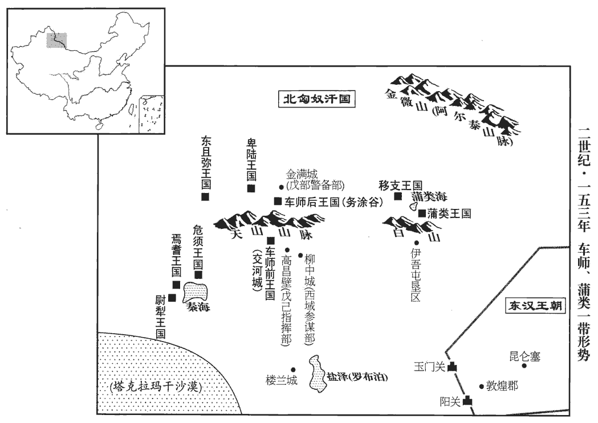
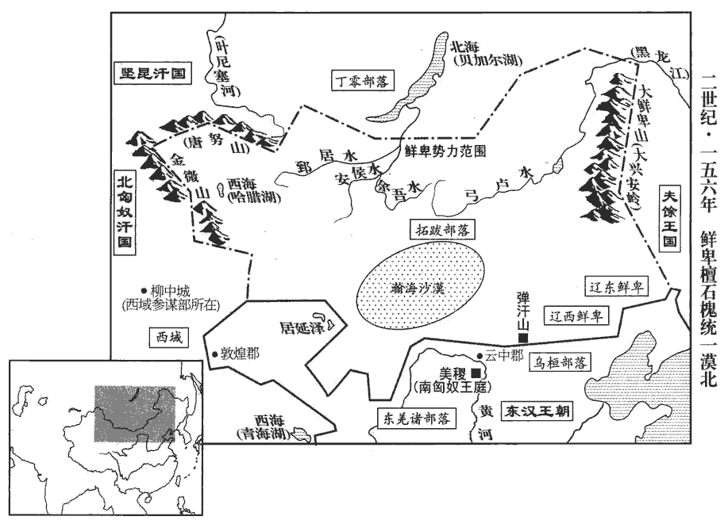

 漢紀四十五起柔兆閹茂（丙戌），盡柔兆涒灘（丙申），凡十一年。

# 孝質皇帝諱纘zuǎn，章帝曾孫，勃海孝王鴻之子也。諡法：忠正無邪曰質。伏侯古今註曰：「纘」之字曰：「繼」。

## 本初元年（丙戌，一四六）

1夏，四月，庚辰‹二十五›，令郡、國舉明經詣太學，自大將軍以下皆遣子受业；歲滿課試，拜官有差。又千石、六百石、四府掾屬、三署郎、三署郎，五官署郎及左、右署郎也，屬光祿勳。掾，俞絹翻。四姓小侯先能通經者，各令隨家法，其高第者上名牒，此時蓋以梁氏入四姓；陰、竇諸后族衰廢者未必得預也。名牒者，書名於牒上之。上，時掌翻。當以次賞進。自是遊學增盛，至三萬餘生。此鄧后臨朝之故智，梁后踵而行之耳。遊學增盛，亦干名蹈利之徒，何足尚也！或問曰：太斈xué諸生三萬人，漢末互相標榜，清議此乎出，子盡以為干名蹈利之徒，可乎？答曰：積水成淵，蛟龍生焉，謂其間無其人則不可；然互相標榜者，實干名蹈利之徒所為也。禍李膺諸人者，非太學諸生，諸生見其立節，從而標榜，以重清議耳。不然，則郭泰、仇香亦游太學，泰且拜香而欲師之，泰為八顧之首，仇香曾不預標榜之列，豈清議不足尚歟？抑香隱德無能名歟？

〖译文〗 [1]夏季，四月庚辰（二十五日），命各郡、各封国推荐通晓经书的“明经”到太学。大将军以及文武官员，也都送自己的儿子到太学上课。学习期满一年后进行考试，根据考试成绩的高下，分别任命不同的官职。又命令官秩为千石或六百石的官吏，大将军、太尉、司徒、司空等四府的掾属，五官、左、右等三署的郎，以及四姓外戚小侯中已能通晓经书的人，让他们每自遵守师承的“家法”，凡考试成绩优良，能被列入高第的，则登记在名册上，依照次序升迁官职。从此以后，各地到太学留学的人大大增多，太学生增加到三万余人。

2五月，庚寅‹六›，徙樂安王鴻為勃海王。

〖译文〗 [2]五月庚寅（初六），改封乐安王刘鸿为勃海王。

3海水溢，漂沒民居。

〖译文〗 [3]海水倒灌，淹没人民的住宅。

4六月，丁巳‹三›，赦天下。

〖译文〗 [4]六月丁巳（初三），大赦天下。

5帝‹刘缵，时年九岁›少而聰慧，少，詩照翻。嘗因朝會，目梁冀曰：目者，眨目而注視之。朝，直遙翻。「此跋扈將軍也！」賢曰：跋扈，猶強梁也。余按爾雅，山卑而大，扈。跋者，不由蹊隧而行。言強梁之人行不由正路，山卑而大，且欲跋而踰之，故曰跋扈。蜀本註甚鄙淺，茲不復錄，詳見辨誤。冀聞，深惡之。惡，烏路翻；下同。閏月，甲申‹六月一日›，冀使左右置毒於煮餅而進之；煮餅，今湯餅也。釋名：餅，并也，溲麥面使合并也。束晢曰：禮，仲春之月，天子食麥；而朝事之籩，煮麥為面。內則，諸饌不說餅。餅之作也，其來近矣。湯餅，煮面也。黃庭堅文：煮麥深注湯。帝苦煩盛，【章：乙十六行本「盛」作「甚」；乙十一行本同；張校同。】使促召太尉李固。固入前，問帝得患所由，帝尚能言曰：「食煮饼，今腹中闷，得水尚可活。」时冀亦在侧曰：「恐吐，不可饮水。」吐，土故翻，嘔也。語未絕而崩。年九歲。固伏尸號哭，言伏地而號哭，其狀如尸也。號，戶高翻。推舉侍醫；冀慮其事泄，大惡之。推舉者，劾舉其侍疾無狀，而推究其姦也。設於此時固能窮冀弒君之罪，儻不能正其誅，以身死之，豈不忠壯！即不能然，又且俛首於其間，欲以立長之議矯而正之，卒死於兇豎之手，可謂忠有餘而才不足矣。惡，烏路翻。

〖译文〗 [5]质帝年幼，但聪明智慧，曾在一次早朝时，眨眼看着梁冀，说：“这是跋扈将军！”梁冀听到以后，对质帝深恶痛绝。闰六月甲申（初一），梁冀让质帝身边的侍从把毒药放在汤饼里，给质帝进上。药性发作，质帝非常难受，派人急速传召太尉李固。李固进宫，走到质帝榻前，询问质帝得病的来由。质帝还能讲话，说：“我吃过汤饼，现在觉得腹中堵闷，给我水喝，我还能活。”梁冀这时也站在旁边，阻止说：“恐怕呕吐，不能喝水。”话还没有说完，质帝已经驾崩。李固伏到质帝的尸体上号哭并弹劾侍候质帝的御医。梁冀担心会泄露下毒的真相，对李固非常痛恨。

將議立嗣，固與司徒胡廣、司空趙戒先與冀書曰：「天下不幸，頻年之間，國祚三絕。賢曰：順帝崩，沖帝立，一年崩。質帝立，一年崩。凡三絕。今當立帝，天下重器，誠知太后垂心，將軍勞慮，詳擇其人，務存聖明；然愚情眷眷，竊獨有懷。遠尋先世廢立舊儀，近見國家踐祚前事，未嘗不詢訪公卿，廣求群議，令上應天心，下合眾望。傳曰：『以天下與人易，為天下得人難。』孟子之言。為，于偽翻。昔昌邑之立，昏亂日滋；霍光憂愧發憤，悔之折骨。折，而設翻。自非博陸忠勇，延年奮發，大漢之祀，幾將傾矣。事見二十四卷昭帝元平元年。幾，居希翻。至憂至重，可不熟慮！悠悠萬事，唯此為大；就冀而言，萬事皆可付之悠悠，至於立嗣，關天下國家之大。國之興衰，在此一舉。」冀得書，乃召三公、中二千石、列侯，大議所立。固、廣、戒及大鸿胪杜乔皆以為清河王蒜明德著聞，又屬最尊親，蒜於質帝為兄，尊也。同出樂安王寵，親也。臚，陵如翻。宜立為嗣，朝廷【章：乙十六行本「廷」作「臣」；乙十一行本同；孔本同；張校同。】莫不歸心。而中常侍曹騰嘗謁蒜，蒜不為禮，宦者由此惡之。惡，烏露翻。初，平原王翼既貶歸河間，事見五十卷安帝建光元年。其父請分蠡吾縣‹河北博野›以侯之；蠡吾縣，前漢屬涿郡，時屬河間國。賢曰：蠡吾故城在今瀛州博野縣西。蠡，音禮。翼父，河間孝王開也。順帝許之。翼卒，子志嗣；梁太后欲以女弟妻志，妻，七細翻。徵到夏門亭。會帝崩，梁冀欲立志。眾論既異，憤憤不得意，而未有以相奪。賢曰：未有別理而易奪之。曹騰等聞之，夜往說冀曰：「將軍累世有椒房之親，說，輸芮翻；下同。累世椒房，謂恭懷后及太后也。秉攝萬機，賓客縱橫，橫，戶孟翻。多有過差。清河王嚴明，若果立，則將軍受禍不久矣！不如立蠡吾侯，富貴可長保也。」冀然其言，明日，重會公卿，重，直用翻，再也。冀意氣凶凶，凶凶，言意氣惡暴也。言辭激切，自胡廣、趙戒以下莫不懾憚，懾，之舌翻。皆曰：「惟大將軍令！」獨李固、杜喬堅守本議。冀厲聲曰：「罷會！」固猶望眾心可立，以眾心屬於清河王，猶望可立也。復以書勸冀，復，扶又翻。冀愈激怒。丁亥‹四›，冀說太后，先策免固。為殺李固、杜喬張本。戊子‹七›，以司徒胡廣為太尉；司空趙戒為司徒，與大將軍冀参录尚書事；太僕袁湯為司空。湯，安之孫也。庚寅，使大將軍冀持節，以王青蓋車迎蠡吾侯志入南宮；其日，即皇帝位，時年十五。太后猶臨朝政。

〖译文〗 在商议确定继承帝位的人选之前，李固和司徒胡广、司空赵戒，先给梁冀写信说：“天下不幸，连续几年间，帝王之位，三次断绝。现在将立新的皇帝，帝位是天下最重要的，我们深知皇太后的关切和大将军的苦虑，将仔细地选择一位合适的人选，得到一位圣明的帝王。然而，我们也愚昧地思念关切着这件大事。无论是远求先代有关废黜和选立皇帝的旧制，还是近观皇帝登极的前例，没有一次不询问三公九卿，广泛征求大家意见的，使继承帝位的人选，上应天心，下合众望。经传上说：‘把天下送人是容易的，为天下得人却非常困难。’过去，昌邑王登极之后，昏乱日甚一日，霍光忧愁惭愧而又愤慨，悔恨至极。如果不是霍光的忠贞和勇气，田延年的奋发举动，汉朝的宗庙祭祀几乎被昌邑王倾覆。确定继承帝位的人选，的确是一件最令人忧虑，也是最重要的大事，岂可不深思熟虑！天下的事千头万绪，都可暂缓，只有选择继承帝位的人选是最重大的事，国家兴衰，在此一举。”梁冀看到这封信，于是召集三公、二千石官员和列侯，共同讨论继承帝位的人选。李固、胡广、赵戒及大鸿胪杜乔都认为，清河王刘蒜以完美的德行而著称，皇家的血统又最尊、最亲，应该立为皇位继承人，朝廷的文武官员，全都归心于他。然而，中常侍曹腾曾经有一次去拜见刘蒜，刘蒜没有向他施礼，宦官们从此憎恨刘蒜。当初，平原王刘翼被贬逐回到河间国以后，他的父亲河间王刘开曾请求分出蠡吾县，将刘翼封为蠡吾侯，顺帝批准。刘翼去世后，他的儿子刘志继位为蠡吾侯。梁太后想把她的妹妹嫁给刘志为妻，征召刘志来京都洛阳。刘志抵达夏门亭时，正遇上质帝驾崩，梁冀便打算立刘志为帝。既然群臣的议论都与自己的主张不同，梁冀愤然不快，但又没有办法强迫别人。曹腾等人听到消息后，夜间去对梁冀说：“将军几代都是皇亲国戚，又亲自掌握朝廷大权，宾客布满天下，有许多过失和差错。清河王严厉明察，假如真立为皇帝，那么将军不久就会大祸临头了！不如拥戴蠡吾侯为帝，富贵可以长久保全。”梁冀赞成他们的意见。于是，次日，重新召集三公、九卿进行讨论。梁冀在会上气势汹汹，言辞激烈率直，从司徒胡广和司空赵戒以下的官员，没有一个不感到畏惧，都说：“我们只听大将军的命令！”唯独太尉李固和大鸿胪杜乔坚持原来的主张。梁冀厉声喝道：“散会！”可是，李固仍认为刘蒜是众望所归，有被立的可能，于是再次写信劝说梁冀，梁冀更加激怒。丁亥（初四），梁冀劝说梁太后，先颁策将太尉李固免职。戊子（初五），任命司徒胡广为太尉，司空赵戒为司徒，和大将军梁冀共同主管尚书事务。又擢升太仆袁汤为司空。袁汤是袁安的孙子。庚寅（初七），梁太后派大将军梁冀持符节，用封王的皇子乘用的青盖车迎接蠡吾侯刘志进入南宫。当天，刘志即皇帝位。当时，他年十五岁。梁太后仍然临朝听政。

6秋，七月，乙卯‹二›，葬孝質皇帝於靜陵。賢曰：靜陵，在雒陽東南三十里。

〖译文〗 [6]秋季，七月乙卯（初二），将质帝安葬于静陵。

7大將軍掾朱穆奏記勸戒梁冀曰：「明年丁亥之歲，刑德合於乾位，賢曰：曆法，太歲在丁、壬，歲德在北宮；太歲在亥、卯，歲刑亦在北宮；故曰合於乾位。掾，俞絹翻。易經龍戰之會，易坤卦上六，龍戰于野，陰疑於陽也。陽道將勝，陰道將負。願將軍專心公朝，朝，直遙翻。割除私欲，廣求賢能，斥遠佞惡，為皇帝置師傅，遠，于願翻。為，于偽翻。得小心忠篤敦禮之士，將軍與之俱入，參勸講授，師賢法古，此猶倚南山、坐平原也，喻其安而無傾。誰能傾之！議郎大夫之位，本以式序儒術高行之士，式，用也。今多非其人，九卿之中亦有乖其任者，惟將軍察焉！」又薦种暠、欒巴等，冀不能用。穆，暉之孫也。朱暉事章帝。

〖译文〗 [7]大将军掾朱穆上书劝诫梁冀说：“明年是丁亥年，刑罚和恩德，都集合在北方的乾位。《易经》上说：龙战于野，表示阳道将获得胜利，阴道将受到挫败。愿将军尽忠朝廷，割舍私欲，广泛征求贤能人才，排斥和疏远奸佞和邪恶之辈。为皇帝选置师傅时，要选择谨慎小心、忠良朴实、笃信礼义之士。将军与师傅一道进宫，参与劝学，效法古圣先贤。这就犹如背靠南山，稳坐平原一样，非常安全，有谁能倾覆您？议郎和大夫的职位，本来应该任用精通儒术和德行高尚的人士，可现在任职的多数不是这样的人，九卿中也有不能胜任的，请将军留心考察。”又推荐种、栾巴等人，梁冀不能任用。朱穆，即朱晖的孙子。

8九月，戊戌，追尊河間孝王為孝穆皇，夫人趙氏曰孝穆后，諡法：布德執義曰穆；中情見貌曰穆。廟曰清廟，陵曰樂成陵‹在河北献县›；樂成縣，屬河間國。蠡吾先侯曰孝崇皇，沈約曰：諡法所不載者，如孝崇皇之類是也。廟曰烈廟，陵曰博陵‹在河北博野东南›；賢曰：博陵，本蠡吾縣之地也；陵在今瀛州博野縣西。皆置令、丞，使司徒持節奉策書璽綬，祠以太牢。璽，斯氏翻。綬，音受。

〖译文〗 [8]九月戊戌（疑误），桓帝刘志追尊其祖父河间孝王刘开为孝穆皇，祖母赵氏为孝穆后，祭庙名为清庙，陵园名为乐成陵；追尊其父蠡吾侯刘翼为孝崇皇，祭庙名为烈庙，陵园名为博陵；都设置令、丞掌管，并派司徒持节，捧着皇帝颁发的策书和玺印绶带前往，用牛、羊、猪各一头的太牢之礼进行祭祀。

9冬，十月，甲午‹十二›，尊帝母匽yǎn氏‹匽明›為博園貴人。匽，音偃。史記：匽姓，咎繇之後。貴人諱明，本蠡吾侯之媵yìng妾。博園，博陵寢園。

〖译文〗 [9]冬季，十月甲行（十二日），桓帝尊母亲氏为博园贵人。

10滕撫性方直，不交權勢，為宦官所惡；論討賊功當封，討揚、徐賊之功也。惡，烏路翻。太尉胡廣承旨奏黜之；卒於家。

〖译文〗 [10]滕抚性情方正刚直，不肯结交权贵，宦官对他非常憎恨。评定讨伐盗贼的功劳，滕抚应该封侯，但太尉胡广秉承权贵的意旨，对滕抚进行弹劾，使他遭到罢黜。后来，滕抚死在家里。

# 孝桓皇帝上之上諱志，章帝曾孫，蠡吾侯翼之子。諡法：克敵服遠曰桓。伏侯古今註：「志」之字曰「意」。

## 建和元年（丁亥，一四七）

1春，正月，辛亥朔‹一›，日有食之。

〖译文〗 [1]春季，正月辛亥朔（初一），出现日食。

2戊午‹八›，赦天下。

〖译文〗 [2]戊午（初八），大赦天下。

3三月，龍見譙qiáo‹安徽亳州›。譙縣，屬沛國。見，賢遍翻。

〖译文〗 [3]三月，龙在谯县显现。

4夏，四月，庚寅‹十一›，京師地震。

〖译文〗 [4]夏季，四月庚寅（十一日），京都洛阳发生地震。

5立阜陵‹安徽全椒东南›王代兄勃遒qiú亭侯便為阜陵王。阜陵王延傳國五世，至代；代薨，無子，國絕。今以便绍封。遒，才由翻。

〖译文〗 [5]封阜陵王刘代的哥哥勃遒亭侯刘便为阜陵王。

6六月，太尉胡廣罷，光祿勳杜喬為太尉。考異曰：帝紀云：「大司農杜喬」，喬傳：喬自司農累遷為大鴻臚、光祿勳，乃為太尉。袁紀亦然。荀淑傳云：「光祿勳杜喬舉淑方正。」今從之。自李固之廢，朝野喪氣，喪，息浪翻。群臣側足而立；唯喬正色無所回橈náo，賢曰：回，邪也。橈，曲也。橈，音奴高翻。由是朝野皆倚望焉。

〖译文〗 [6]六月，太尉胡广被免职，擢升光禄勋杜乔为太尉。自从李固遭废黜后，朝廷和民间都感到沮丧。群臣害怕得不敢正立。唯独杜乔保持一身正气，不肯屈服。因此，朝廷和民间都依赖并寄希望于他。

7秋，七月，渤海‹河北南皮›孝王鴻薨，無子；太后立帝弟蠡吾侯悝為渤海王，以奉鴻祀。悝kuī，苦回翻。

〖译文〗 [7]秋季，七月，勃海孝王刘鸿去世，没有儿子。梁太后封桓帝的弟弟蠡吾侯刘悝为勃海王，以祭祀刘鸿做他的继承人。

8詔以定策功，益封梁冀萬三千戶，封冀弟不疑爲潁陽侯，潁陽縣，屬潁川郡。蒙爲西平侯，冀子胤為襄邑侯，胡廣為安樂侯，按廣傳，封淯陽縣之安樂鄉。樂，音洛。趙戒為廚亭侯，袁湯為安國侯。安國亦亭侯。又封中常侍劉廣等皆為列侯。按曹騰傳：廣、騰及州輔等七人皆封亭侯。

〖译文〗 [8]桓帝下诏，因拥立皇帝决策有功，增封梁冀食邑一万三千户，封梁冀的弟弟梁不疑为颍阳侯，梁蒙为西平侯，梁冀的儿子梁胤为襄邑侯，胡广为安乐侯，赵戒为厨亭侯，袁汤为安国侯。又将中常侍刘广等人，都封为列侯。

杜喬諫曰：「古之明君，皆以用賢、賞罰為務。失國之主，其朝豈無貞幹之臣，貞，與楨同；幹，與榦同。築垣牆必須楨榦，以喻立國必須賢才。朝，直遙翻。典誥之篇哉。謂封爵之典策詔誥，以授有功，具有故事。患得賢不用其謀，韜書不施其教，聞善不信其義，聽讒不審其理也。陛下自藩臣即位，天人屬心，屬，之欲翻；下冀屬同。不急忠賢之禮而先左右之封，先，悉薦翻。梁氏一門，宦者微孽，并帶無功之紱，裂勞臣之土，孽，魚列翻。紱，音弗。其為乖濫，胡可勝言！勝，音升。夫有功不賞，為善失其望；姦回不詰，為惡肆其凶。詰，去吉翻。故陳資斧而人靡畏，前書音義曰：資，利也。班爵位而物無勸。苟遂斯道，豈伊傷政為亂而已，喪身亡國，可不慎哉！」書奏，不省。喪，息浪翻。省，悉景翻。考異曰：喬傳此章在為太尉前，袁紀在為太尉後。今從袁紀。

〖译文〗 杜乔上书进谏说：“自古以来，圣明的君王，都以任用贤能和赏功罚罪，作为头等大事。亡国的君王，他的朝廷，难道没有忠贞干练的栋梁之臣和赏功罚罪的典章制度吗？问题在于，虽有贤能，而不能任用；虽有典章制度，而不能施行；听到忠直的建议，却不相信；而听到谗言时，又不能洞察奸邪。陛下从诸侯王登上至尊宝座，天人归心，不先去礼敬忠贞贤能，而是先封自己身边的人。梁家一门和宦官卑微之辈，都佩带上无功而得到的官印和绶带，分得了只有功臣才应得到的封土，乖谬而无节制，不能用言语形容！对有功的人不加赏赐，就会使为善的人感到失望；对邪恶的人不加惩罚，就会使作恶的人更加肆无忌惮地逞凶。所以，即使将砍头的利斧放在面前，人也不畏惧，将封爵官位悬在面前，人也不动心。如果采取这种办法，岂只是伤害政事，使朝正混乱而已，甚至还要丧身亡国，可以不慎重吗！”奏章呈上后，桓帝没有理睬。

9八月，乙未‹十八›，立皇后梁氏‹梁女莹›。考異曰：皇后紀、袁紀皆云八月而無日，帝紀云「七月，乙未」。以長曆考之，七月戊申朔，無乙未。乙未，八月十八日也。蓋帝紀脫「八月」字。梁冀欲以厚禮迎之，杜喬據執舊典，不聽。漢書舊儀：聘皇后，黃金萬斤。呂后為惠帝娶魯元公主女，特優其禮，為二萬斤。儀禮：納采用鴈。鄭玄註云：納其采擇之禮，用鴈，取順陰陽往來也。周禮：王者穀圭以聘女。鄭玄曰：士大夫以上乃以玄纁xūn、束帛；天子加以穀圭；諸侯加以大璋。禮言以圭，而漢用璧，形制雖異，為玉同也。時依孝惠納后故事，聘黃金二萬斤，納采鴈、璧、乘馬、束帛，一依舊典。乘馬，馬四匹也。雜記曰：納幣一束，束五兩，兩五尋。蓋每端二丈也。冀屬喬舉氾宮為尚書，屬，之欲翻。氾，符咸翻，姓也。皇甫謐曰：本姓凡氏，遭秦亂，避地於氾水，因氏焉。喬以宮為臧罪，不用。臧，古贓字通。由是日忤於冀。忤，五故翻。九月，丁卯‹二十一›，京師地震。喬以災異策免。冬，十月，以司徒趙戒為太尉，司空袁湯為司徒，前太尉胡廣為司空。

〖译文〗 [9]八月乙未（十八日），桓帝册封梁太后和梁冀的妹妹梁女莹为皇后。梁冀打算用厚礼迎亲，杜乔根据旧有的典章，予以反对。梁冀又嘱托杜乔推荐宫担任尚书，杜乔因宫曾经犯过贪污罪，不肯答应。从此，杜乔越来越为梁冀所忌恨。九月丁卯（二十一日），京都洛阳发生地震。杜乔因天降灾异而被免官。冬季，十月，任命司徒赵戒为太尉，司空袁汤为司徒，前任太尉胡广为司空。

10宦者唐衡、左悺共譖杜喬於帝賢曰：悺，音工喚翻，又音綰。曰：「陛下前當即位，喬與李固抗議，以為不堪奉漢宗祀。」賢曰：抗，舉也。宗祀，大宗之祀也。帝亦怨之。

〖译文〗 [10]宦官唐衡、左一道向桓帝诬陷杜乔说：“陛下先前将即位时，杜乔和李固反对，认为您不能胜任侍奉汉朝宗庙的祭祀。”因此桓帝对杜乔和李固也心生怨恨。

十一月，清河‹河北临清›劉文與南郡‹湖北江陵›妖賊劉鮪交通，鮪wěi，于軌翻。妄言「清河王當統天下」，欲共立蒜。事覺，文等遂劫清河相謝暠hào曰：「當立王為天子，以暠為公。」暠罵之，文刺殺暠。於是捕文、鮪，誅之。有司劾奏蒜；暠，工老翻。刺，七亦翻。劾，戶概翻，又戶得翻。坐貶爵為尉氏侯，尉氏縣，屬陳留郡。應劭曰：古獄官曰尉氏，鄭之別獄也。臣瓚曰：鄭大夫尉氏之邑，故以為邑名。徙桂陽‹湖南郴州›，自殺。

〖译文〗 十一月，清河人刘文和南郡的妖贼刘鲔相勾结，胡妄宣称：“清河王刘蒜应当统御天下。”打算共同拥立刘蒜为皇帝。此事被发觉，刘文等人便劫持清河国相谢，对他说：“应当拥立清河王刘蒜当皇帝，由您当三公。”谢诟骂他们，刘文将他刺杀。于是，朝廷逮捕刘文和刘鲔，将其诛杀。有关官吏上奏弹劾刘蒜，刘蒜因罪被贬爵为尉氏侯，并被放逐到桂阳，刘蒜自杀。

梁冀因誣李固、杜喬，云與文、鮪等交通，請逮按罪；太后素知喬忠，不許。考異曰：喬傳云「策免而已」。喬前已免官，傳誤也。冀遂收固下獄；下，遐稼翻。門生渤海‹河北南皮›王調貫械上書，證固之枉，河內‹河南武陟›趙承等數十人亦要鈇鑕詣闕通訴；要，讀曰腰。鈇，斧也。鑕，音質，椹zhēn也。太后詔赦之。及出獄，京師市里皆稱萬歲。冀聞之，大驚，畏固名德終為己害，乃更據奏前事。前事，即文、鮪事也。大將軍長史吳祐傷固之枉，與冀爭之；冀怒，不從。從事中郎馬融主為冀作章表，融時在坐，為，于偽翻。坐，左臥翻。祐謂融曰：「李公之罪，成於卿手。李公若誅，卿何面目視天下人！」言為冀誣陷忠良，將無顏以見人也。冀怒，起，入室；祐亦徑去。固遂死於獄中；臨命，與胡廣、趙戒書曰：「固受國厚恩，是以竭其股肱，不顧死亡，志欲扶持王室，比隆文、宣。賢曰：文帝、宣帝皆群臣迎立，能興漢祚。何圖一朝梁氏迷謬，公等曲從，以吉為凶，成事為敗乎！漢家衰微，從此始矣。公等受主厚祿，顛而不扶，傾覆大事，後之良史豈有所私！固身已矣，於義得矣，夫復何言！」復，扶又翻。廣、戒得書悲慙，皆長歎流涕而已。

〖译文〗 于是，梁冀诬陷李固、杜乔，指控他们和刘文、刘鲔等人互相勾结，请求将其逮捕治罪。梁太后一向了解杜乔忠直，不肯答应。梁冀便将李固一个人逮捕下狱。李固的门生、渤海人王调，身戴刑具向朝廷上书谏争，说李固冤枉。河内人赵承等数十人，也带着执行腰斩时用的刑具到宫门上诉。于是，梁太后下诏释放李固。等到李固出狱之时，京都洛阳的大街小巷都齐呼万岁。梁冀听到消息后，大为惊骇害怕李固的声名和品德终将伤害自己，于是重向新朝廷弹劾李固和刘文、刘鲔相勾结的旧案。大将军长史吴对李固的冤狱深为伤感，向梁冀据理力争。梁冀大怒，不肯听从。从事中郎马融负责为梁冀起草奏章，当时他正好在座，吴便责问马融说：“李固的罪状，是你一手罗织出来的，李固如果被诛杀，你还有什么脸面去见天下人！”梁冀一怒而起，进入内室，吴也迳直离去。李固于是死在狱中。他临死之前，写信给胡广、赵戒说：“我李固受国家厚恩，所以竭尽忠心，不顾死亡大祸，目的是想辅佐皇室，使它在功业上可以和汉文帝、宣帝时期比美。怎料梁氏一时荒廖作乱，你们曲意顺从，将吉祥化作凶恶，成功之事化为失败！汉王朝衰落，从此开始。你们接受帝王丰厚的俸禄，眼看朝廷就要倒塌，却不肯扶持。倾覆朝廷的大事，后世优秀史官怎会有所偏袒！我的生命已完结了，但是尽到了大义，还要再说什么！”胡广、赵戒看到李固所写的遗书后，感到悲伤惭愧，但也都不过是长叹流泪而已。

冀使人脅杜喬曰：「早從宜，賢曰：從宜，令其自盡也。妻子可得全。」喬不肯。明日，冀遣騎至其門，騎，奇寄翻。不聞哭者，遂白太后收繫之；亦死獄中。

〖译文〗 其后，梁冀又派人威胁杜乔说：“你应该快点自杀，妻子和儿女可以得到保全。”杜乔不肯接受。第二天，梁冀派人骑马到杜乔家门，没有听到里面有人啼哭，于是报告梁太后，将杜乔逮捕下狱。杜乔也死在狱中。

冀暴固、喬尸於城北四衢，令：「有敢臨者加其罪。」爾雅曰：四達謂之衢。城北，即夏門亭也。臨，力鴆翻，哭也。固弟子汝南‹河南平舆西北射桥乡›郭亮尚未冠，左提章、鉞，冠，古玩翻。賢曰：章，謂所上章也。鉞，斧也。右秉鈇鑕，詣闕上書，乞收固尸，不報；與南陽董班俱往臨哭，守喪不去。夏門亭長呵之曰：「卿曹何等腐生！賢曰：腐生，猶言腐儒也。公犯詔書，欲干試有司乎！」亮曰：「義之所動，豈知性命！何為以死相懼邪！」太后聞之，皆赦不誅。杜喬故掾陳留楊匡，號泣星行，掾，俞絹翻。號，戶刀翻。星行者，見星而行，見星而舍。或曰星行者，言戴星而行，夜不遑息也。到雒陽，著故赤幘zé，託為夏門亭吏，吏，著赤幘。著，則略翻。守護尸喪，積十二日；都官從事執之以聞，都官從事，司隸校尉之屬官也，掌舉中都官非法者。太后赦之。匡因詣闕上書，并乞李、杜二公骸骨，使得歸葬，太后許之。匡送喬喪還家，喬家河內‹河南武陟›。葬訖，行服，遂與郭亮、董班皆隱匿，終身不仕。

〖译文〗 梁冀把李固、杜乔的尸首，放在洛阳城北十字路口示众，下令：“有敢来哭泣吊丧的，予以惩治。”李固的学生、汝南人郭亮，还不到二十岁，左手拿着奏章和斧子，右手抱着铁砧，到宫门上书，乞求为李固收尸，没有得到答复。郭亮又和南阳人董班一同去吊丧哭泣，守着尸体不走。夏门亭长喝斥说：“你们是何等迂腐的书生！公然冒犯皇帝的圣旨，想试试官府的厉害吗！”郭亮回答说：“我们为他们的大义所感动，岂知顾及自己的性命？为什么要用死来威胁呢？”梁太后听到后，将郭亮、董班二人全都赦免。杜乔从前的属吏、陈留杨匡，悲号哭泣，星夜赶到京都洛阳，穿上旧官服，头戴束发的赤巾，假称是夏门亭吏，在杜乔的尸体旁护丧，达十二天之久。都官从事将他逮捕，奏报朝廷，梁太后将他赦免。于是杨匡到宫门上书，向朝廷请求使李固和杜乔的尸体得以归葬家乡。梁太后批准。于是，杨匡将杜乔的灵柩送回家乡，安葬完毕，又为他服丧，于是和郭亮、董班都藏匿起来，终身不出来做官。

梁冀出吳祐為河間‹河北献县›相，祐自免歸，卒於家。卒，子恤翻。

〖译文〗 梁冀命吴出任河间国相，吴自己辞官归家，后在家中去世。

冀以劉鮪之亂，思朱穆之言，於是請种暠為從事中郎，薦欒巴為議郎，舉穆高第，為侍御史。穆於大將軍府掾為高第也。

〖译文〗 梁冀因刘鲔谋反，想起朱穆以前向他提出的建议，于是聘请种担任从事中郎，推荐栾巴为议郎。并因朱穆考绩最优而进行保举，将他任命为侍御史。

11是歲，南單于兜樓儲死，伊陵尸逐就單于車兒立。車，音尸遮翻。

〖译文〗 [11]同年，南匈奴单于兜楼储去世，车儿继位，号为伊陵尸逐就单于。

## 二年（戊子，一四八）

1春，正月，甲子‹十九›，帝‹刘志，时年十七›加元服。庚午‹二十五›，赦天下。

〖译文〗 [1]春季，正月甲子（十九日），桓帝行成年加冠礼。庚午（二十五日），大赦天下。

2三月，戊辰‹二十四›，帝從皇太后‹梁妠›幸大將軍冀府。

〖译文〗 [2]三月戊辰（二十四日），桓帝跟随梁太后临幸大将军梁冀府。

3白馬羌‹四川若尔盖东南›寇廣漢屬國‹甘肃文县›，安帝以蜀郡北部都尉為廣漢屬國都尉。殺長吏。益州‹四川、云南›刺史率板楯蠻‹四川阆中›討破之。楯shǔn，食尹翻。

〖译文〗 [3]白马种羌人攻打广汉属国，杀害地方官吏。益州刺史率领板蛮人将其击破。

4夏，四月，丙子‹三›，封帝弟顧為平原王，奉孝崇皇祀；尊孝崇皇夫人為【章：乙十六行本「爲」上有「馬氏」二字；乙十一行本同；孔本同；退齋校同。】孝崇園貴人。

〖译文〗 [4]夏季，四月丙子（初三），梁太后下诏，封桓帝的弟弟刘顾为平原王，侍奉孝崇皇的祭祀；尊孝崇皇夫人为孝崇园贵人。

5五月，癸丑‹十›，北宮掖庭中德陽殿及左掖門火，車駕移幸南宮。

〖译文〗 [5]五月癸丑（初十），北宫掖庭中的德阳殿和左掖门失火，桓帝移住南宫。

6六月，改清河為甘陵‹山东临清›。以孝德皇陵為國名。立安平孝王得子經侯理為甘陵王，經縣，屬安平國。賢曰：今貝州經城縣。奉孝德皇祀。

〖译文〗 [6]六月，改清河国为甘陵国。封安平孝王刘得的儿子、经侯刘理为甘陵王，侍奉孝德皇的祭祀。

7秋七月，京师大水。

〖译文〗 [7]秋季，七月，京都洛阳发生水灾。

## 三年（己丑，一四九）

1夏，四月，丁卯晦‹三十›，日有食之。

〖译文〗 [1]夏季，四月丁卯晦（三十日），出现日食。

2秋，八月，乙丑‹三十›，有星孛于天市。前書天文志：旗星中四星曰天市。又晉書天文志：天市垣二十二星，在房、心東，彗星除之，為徙市易都。孛，蒲內翻。

〖译文〗 [2]秋季，八月乙丑（三十日），有异星出现在天市星旁。

3京师大水。

〖译文〗 [3]京都洛阳发生水灾。

4九月，己卯‹十四›，地震。庚寅‹二十五›，地又震。

〖译文〗 [4]九月己卯（十四日），发生地震。庚寅（二十五日），再次发生地震。

5郡、国五山崩。

〖译文〗 [5]有五个郡和封国发生山崩。

6冬，十月，太尉趙戒免；以司徒袁湯為太尉，大司農河內‹河南武陟›張歆為司徒。

〖译文〗 [6]冬季，十月，太尉赵戒被免职，任命司徒袁汤为太尉，擢升大司农、河内人张歆为司徒。

7是歲，前朗陵‹河南确山南任店镇›侯相荀淑卒。朗陵侯國，屬汝南郡。淑少博學有高行，少，詩照翻。行，下孟翻。當世名賢李固、李膺皆師宗之。在朗陵，涖事明治，治，直吏翻。稱為神君。有子八人：儉、緄、靖、燾、汪、爽、肅、專，賢曰：緄，音昆。燾，音導。汪，烏光翻。「專」，本或作「尃」，音敷。并有名稱，時人謂之八龍。稱，尺證翻。所居里舊名西豪，潁陰‹河南许昌›令渤海苑康以為昔高陽氏有才子八人，更命其里曰高陽里。杜佑曰：潁川郡城西南有荀淑故宅，相傳云即西豪里。更，工衡翻。潁陰縣，屬汝南郡。淑，縣人也。姓譜：商武丁子子文受封於苑，因以為氏。左傳有齊大夫苑何忌。趙明誠金石錄有漢荊州從事苑鎮碑曰：其先苑柏何為晉樂正，世掌朝禮；又有苑子園，寔能掌陰陽之理：皆其冑也。按姓氏志皆以為出於齊大夫苑何忌之後。今此碑所謂苑柏何與子園，左傳、國語皆無其人；故錄之以待知者。左傳曰：昔高陽氏有才子八人：蒼舒、隤tuí敱ái、檮chóu戭yǎn、大臨、厖máng降、庭堅、仲容、叔達。隤，徒回翻。敱，五才翻，一音五回翻；韋昭音瑰。檮，直由翻；韋昭音桃。戭，以善翻；韋昭以震翻。厖，莫江翻。降，下江翻。

〖译文〗 [7]同年，前任朗陵侯国相荀淑去世。荀淑年轻时，不仅学问渊博，而且德行高尚，当时最著名的贤人李固、李膺，都像对待老师一样地尊崇他。荀淑在朗陵侯国任职，治理政事明快果断，被人们奉若神明。荀淑共有八个儿子：荀俭、荀绲、荀靖、荀焘、荀汪、荀爽、荀肃、荀专，都享有盛名，当时人称他们为“八龙”。荀淑所居住的里名，原来叫西豪里，颍阴县令渤海人苑康，因从前高阳氏有八个多才的儿子，就将西豪里改名为高阳里。

膺性簡亢，亢，口浪翻，高也。無所交接，唯以淑為師，以同郡陳寔shí為友。荀爽嘗就謁膺，因為其御；既還，喜曰：「今日乃得御李君矣！」其見慕如此。

〖译文〗 李膺性格简朴正直，跟人很少交往，只把荀淑当作老师，和同郡人陈结交。荀爽曾经去拜见李膺，就势给李膺驾车。回来后，他高兴地说：“今天，我竟得以为李君驾车了！“李膺就是这样被人倾慕。

陳寔出於單微，單，獨也，孤也，薄也。為郡西門亭長。同郡鍾皓以篤行稱，行，下孟翻。前後九辟公府，年輩遠在寔前，引與為友。皓為郡功曹，辟司徒府；臨辭，太守問：「誰可代卿者？」皓曰：「明府欲必得其人，西門亭長陳寔可。」寔聞之曰：「鍾君似不察人，不知何獨識我！」太守遂以寔為功曹。時中常侍【章：乙十六行本「侍」下有「山陽」二字；乙十一行本同；孔本同；張校同；退齋校同。】侯覽託太守高倫用吏，倫教署為文學掾，郡守所出命曰教。百官志註：郡有文學、守助掾六十人。掾，俞絹翻。寔知非其人，懷檄請見，賢曰：檄，板書。以高倫之教書之於檄，而懷之者，懼洩事也。言曰：「此人不宜用，而侯常侍不可違，寔乞從外署，功曹主選署。寔乞從外自署用，若不出於倫者。賢曰：不欲陷倫於請託也。不足以塵明德。」倫從之。於是鄉論怪其非舉，寔終無所言。倫後被徵為尚書，郡中士大夫送至綸氏‹河南登封西南颖阳乡›，賢曰：綸氏縣，屬潁川郡，今嵩陽縣是。倫謂眾人曰：「吾前為侯常侍用吏，為，于偽翻。陳君密持教還而於外白署，比聞議者以此少之，比，毗至翻。少，詩沼翻。此咎由故人畏憚強禦，故人，倫自謂也。漢人於門生故吏之前，率自稱故人。楊震謂王密曰：「故人知君，君不知故人，」是也。詩曰：不畏強禦。陳君可謂『善則稱君，過則稱己』者也。」禮記坊記曰：善則稱君，過則稱己，則民作忠。坊，音防。寔固自引愆，聞者方歎息，由是天下服其德。後為太丘‹河南永城西北›長，賢曰：太丘縣，屬沛國，故城在今亳州永城縣西北。脩德清靜，百姓以安。鄰縣民歸附者，寔輒訓導譬解發遣，各令還本司官行部，賢曰：司官，謂主司之官也。行，下孟翻。吏慮民有訟者，白欲禁之；寔曰：「訟以求直，禁之，理將何申！其勿有所拘。」司官聞而歎息曰：「陳君所言若是，豈有冤於人乎！」亦竟無訟者。以沛相賦斂違法，解印綬去；相，息亮翻。斂，力贍翻。吏民追思之。

〖译文〗 陈出身贫贱，担任颍川郡西门亭长。同郡人钟皓，以行为厚著称，前后九次被三公府征聘，年龄和辈份都远在陈之上，却跟陈成为好友。钟皓原任郡功曹，后被征聘到司徒府去任职，他向郡太守辞行时，郡太守问：“谁可以接替你的职务？”钟皓回答说：“如果您一定想要得到合适的人选，西门亭长陈可以胜任。”陈听到消息后说：“钟君似乎不会推荐人，不知为什么单单举荐我？”于是，郡太守就任命陈为郡功曹。当时，中常侍侯览嘱托郡太守高伦任用自己所推荐的人为吏，高伦便签署命令，将这个人命为文学掾。陈知道这个人不能胜任，就拿着高伦签署的命令求见，对高伦说：“这个人不可任用，然而侯常侍的意旨也不可违抗。不如由我来签署任命，这样的话，就不会玷污您完美的品德。”高伦听从。于是，乡里的舆论哗然，都奇怪陈怎么会举用这样不合适的人，而陈始终不作分辩。后来，高伦被征召到朝廷去担任尚书，郡太守府的官吏和士绅们都来为他送行，一直送到纶氏县。高伦对大家说：“我前些时把侯常侍推荐的人任命为吏，陈却把我签署的任命书秘密送还，而改由他来任用。我接连听说议论此事的人因此轻视陈，而这件事的责任，是因为我畏惧侯览的势力太大，才这样做的，而陈君可以称得上把善行归于主君，把过错归于自己的人。”但陈仍然坚持是自己的过失，听到的人无不叹息。从此，天下的人都佩服他的品德。后来，陈担任太丘县的县长，修饬德教，无为而治，使百姓得以安居乐业。邻县的人民都来归附，陈总是对他们进行开导和解释，然后遣送他们回到原县。上级官员来县视察，本县的官吏恐怕人民上诉，请求陈加以禁止。陈说：“上诉的目的，是为了求得公平，如果加以禁止，将怎样讲理！不要限制。”前来视察的主管官员听到后，叹息说：“陈君说这样的话，难道会冤枉人吗？”终究也没有人来越级上诉。后来陈担任沛国相，被指控违法征收赋税，他便解下印信，离职而去。官吏和人民都很怀念他。

鍾皓素與荀淑齊名，李膺常歎曰：「荀君清識難尚；鍾君至德可師。」皓兄子瑾母，膺之姑也。瑾好學慕古，有退讓風，好，呼到翻。與膺同年，俱有聲名。膺祖太尉脩常言！「瑾似我家性，瑾，李氏之出，而退讓，故脩云然。『邦有道，不廢；邦無道，免於刑戮。』」論語，孔子以此言與南容。復以膺妹妻之。妻，千細翻。膺謂瑾曰：「孟子以為『人無是非之心，非人也』，弟於是何太無皁白邪！」皁白易分；無皁白，言無分別也。瑾嘗以膺言白皓。皓曰：「元禮祖、父在位，李膺，字元禮。膺祖脩為太尉，父益為趙相。諸宗并盛，故得然乎！昔國子好招人過，以致怨惡，國語：齊國佐見單襄公，其語盡。單子曰：「立於淫亂之國而好盡言以招人過，怨之本也。」其後齊殺國武子。招，音翹。今豈其時邪！必欲保身全家，爾道為貴。」

〖译文〗 钟皓一向和荀淑享有同等的声誉，李膺经常叹息说：“荀君的清高和见识，很难学习；钟君的高贵品德，可以为人师表。”钟皓的侄儿钟瑾的母亲，是李膺的姑妈。钟瑾喜爱读书，效法古人，有退让的风度，和李膺同岁，都有名声。李膺的祖父、太尉李经常说：“钟瑾像我们李家人的性格，国家有道，不会久居人下；国家无道，不会受到诛杀。”于是，又把李膺的妹妹嫁给钟瑾为妻。李膺对钟瑾说：“孟子认为，‘人要是没有是非之心，就不是人’，你对于黑白，为何太不分明？”钟瑾曾经将李膺的话，告诉钟皓，钟皓安慰他说：“李膺的祖父、父亲都身居高位，整个家族都很兴盛，所以才能那样做。从前，齐国的国佐专好挑剔别人的过失，以致招来怨恨和报复。现在哪里是黑白分明的时代？如果一定想保全自己的身家性命，还是你的办法最为高明。”

## 和平元年（庚寅，一五零）

1春，正月，甲子‹一›，赦天下，改元。

〖译文〗 [1]春季，正月甲子（初一），大赦天下。改年号。

2乙丑‹二›，太后‹梁妠›詔歸政於帝‹刘志，时年十九›，始罷稱制。二月，甲寅‹二十二›，太后梁氏‹梁妠›崩‹年四十五›。

〖译文〗 [2]乙丑（初二），梁太后下诏，将朝政大权归还给桓帝，从此开始不再行使皇帝权力。二月甲寅（二十二日）梁太后去世。

3三月，車駕徙幸北宮。

〖译文〗 [3]三月，桓帝迁回北宫居住。

4甲午，葬順烈皇后。增封大將軍冀萬戶，并前合三萬戶；封冀妻孫壽為襄城君，兼食陽翟dí‹河南禹州›租，襄城、陽翟二縣皆屬潁川郡。歲入五千萬，加賜赤紱，比長公主。漢制，公主儀服同公侯，紫紱；長公主儀服同諸王，赤紱；四采赤、黃、縹、绀，長二丈一尺，三百首。紱，音弗。長，知兩翻。壽善為妖態以蠱惑冀，冀甚寵憚之。壽作愁眉、啼粧、墮馬髻、折腰步、齲齒笑。妖，於驕翻。冀愛監奴秦宮，官至太倉令，太倉令，秩六百石，主受郡國傳漕穀，屬大司農。得出入壽所，威权大震，刺史、二千石皆謁辭之。冀與壽對街為宅，殫極土木，互相誇競，金玉珍怪，充積藏室；藏，徂浪翻；下守藏同。又廣開園圃，採土築山，十里九阪，深林絕澗，有若自然，冀傳云：築山以象二崤，十里九阪。阪，音反。奇禽馴獸飛走其間。冀、壽共乘輦車，遊觀第內，晉志曰：羊車，一名輦車。毛晃曰：輦，步，挽車也。漢書：主駕人以行曰輦。多從倡伎，倡，音昌。伎，渠綺翻。酣謳竟路，或連日繼夜以騁娛恣。客到門不得通，皆請謝門者；門者累千金。又多拓林苑，周遍近縣，起兔苑於河南城西，經亘數十里，移檄所在調發生兔，刻其毛以為識，調，徙弔翻。識，職吏翻。人有犯者，罪至死刑。嘗有西域賈胡賈，音古。不知禁忌，誤殺一兔，轉相告言，坐死者十餘人。又起別第於城西，以納姦亡；謂姦民及亡命者。或取良人悉為奴婢，至數千口，名曰自賣人。冀用壽言，多斥奪諸梁在位者，外以示謙讓，而實崇孫氏。孫氏宗親冒名為侍中、卿、校、郡守、長吏者十餘人，皆貪饕凶淫，校，戶教翻。饕，土刀翻。各使私客籍屬縣富人，賢曰：籍，謂疏錄之也。被以他罪，被，皮義翻。閉獄掠拷，掠，音亮。拷，音考。使出錢自贖，貲物少者至於死。又【章：乙十六行本「又」作「徙」；乙十一行本同；孔本同；熊校同。】扶風‹陕西兴平›人士孫奮，居富而性吝，士孫，姓也；奮，名也。冀以馬乘遺之，乘，繩證翻。遺，于季翻。從貸錢五千萬，奮以三千萬與之。冀大怒，乃告郡縣，認奮母為其守藏婢，藏，徂浪翻。云盜白珠十斛、紫金千斤以叛，紫金，紫磨金也，亦謂之鏐liú。遂收考奮，兄弟死於獄中，悉沒其貲財億七千餘萬。摯虞三輔決錄曰：士孫奮家貲一億七千餘萬。余按此以萬萬為億也。冀又遣客周流四方，遠至塞外，廣求異物，而使人復乘勢橫暴，妻略婦女，毆擊吏卒；使，疏吏翻。復，扶又翻。妻者，私他人之婦女若己妻然。不以道取之曰略。橫，戶孟翻。毆，烏口翻。所在怨毒。毒，痛也。

〖译文〗 [4]甲午（疑误），安葬梁太后，谥号为顺烈皇后。增封大将军梁冀食邑一万户，连同以前所封食邑，共三万户。封梁冀的妻子孙寿为襄城君，同时阳翟和租税，每年收入达五千万钱之多，加赐红色的绶带，与长公主相同。孙寿善于作出各种妖媚的姿态来迷惑梁冀，梁冀对她既很宠爱，又非常害怕。梁冀所宠爱的管家奴秦宫，做官做到太仓令，可以出入孙寿的住所，威势和权力都很大，州刺史和郡太守等二千石高级地方官吏，在赴任之前都要谒见秦宫，向他辞行。梁冀和孙寿分别在街道两旁相对兴建住宅，建筑工程穷极奢华，互相竞争夸耀，金银财宝，奇珍怪物，充满房舍。又大举开拓园林，从各处运来土石，堆砌假山，十里大道，有九里都紧傍池塘，林木深远，山涧流水，宛如天然生成。奇异的珍禽和驯养的走兽在园林中飞翔奔跑。梁冀和孙寿共同乘坐人力辇车，在家宅之内游玩观赏，后面还跟随着许多歌舞艺人，一路欢唱。有时，甚至夜以继日地纵情娱乐。客人登门拜访和求见，也不许通报。求见的人全都向看门的人行贿，以致看门的人家产达千金之多。梁冀在京都洛阳邻近各县都修筑了园林，在河南洛阳城西建立了一处兔苑，面积纵横数十里，发布文书，命令当地官府向人民征调活兔，每只兔都剃掉一撮兔毛，作为标志。若有人胆敢猎取苑兔，甚至要判处死刑。曾有一位西域的胡商，不知道这个兔苑的禁令，误杀了一只兔，结果人们互相控告，因罪至死的达十余人。梁冀又在洛阳城西兴建了一座别墅，用来收容奸民和藏匿逃亡犯。甚至抢夺良家子女，都用来充当奴婢，多达数千人，称他们为“自卖人”。梁冀采纳孙寿的建议，罢免了许多梁姓家族成员的官职，表面上显示梁冀的谦让，而实际上却抬高了孙氏家族的地位。在孙氏家族中假冒虚名担任侍中、卿、校、郡守、长吏的，共有十余人，全都贪得无厌、穷凶极恶。他们派自己的私人宾客，分别到所管辖的各县，调查登记当地富人，然后加以罪名，将富人逮捕关押，严刑拷打，让富人出钱赎罪。家财不足的，因为出不起那么多钱，甚至活活被打死。扶风人士孙奋，富有而吝啬，梁冀曾送给他一匹乘马，要求借贷五千万钱，而士孙奋只借给他三千万钱。梁冀大怒，于是派人到士孙奋所在的郡县，诬告士孙奋的母亲是梁冀家里看守库房的婢女，曾经偷盗白珍珠十斛、紫金一千斤逃亡。于是将士孙奋兄弟逮捕下狱，严刑拷打至死，全部没收士孙奋的家产，共值一亿七千余万钱。梁冀还派遣门客周游四方，甚至远到寒外，四处征求各地的异物，而这些被派出的门客，又都仗着梁冀的势力横征暴敛，抢夺百姓的妻子和女儿，殴打地方官吏和士卒，他们所到之处，都激起怨恨。

侍御史朱穆自以冀故吏，奏記諫曰：「明將軍地有申伯之尊，賢曰：申國之伯，周宣王之元舅。位為群公之首，賢曰：冀絕席於三公。一日行善，天下歸仁；終朝為惡，四海傾覆。頃者官民俱匱，加以水蟲為害，賢曰：水災及蝗蟲也。京師諸官費用增多，詔書發調，或至十倍，調，徒弔翻。各言官無見財，見，賢遍翻。皆當出民，搒掠割剝，強令充足。搒，音彭。掠，音亮。強，其兩翻。公賦既重，私斂又深，斂，力贍翻。牧守長吏多非德選，貪聚無厭，厭，於鹽翻。遇民如虜，或絕命於箠楚之下，或自賊於迫切之求。賢曰：賊，殺也。箠，止橤翻。又掠奪百姓，皆託之尊府，尊府，指大將軍府。遂令將軍結怨天下，吏民酸毒，道路歎嗟。昔永和之末，綱紀少弛，頗失人望，四五歲耳，而財空戶散，下有離心，馬勉之徒乘敝而起，荊‹湖北湖南›、揚‹安徽中部及江南›之間幾成大患；事見上卷。幾，居希翻。幸賴順烈皇后初政清靜，內外同力，僅乃討定。今百姓戚戚，困於永和，內非仁愛之心可得容忍，外非守國之計所宜久安也。夫將相大臣，均體元首，共輿而馳，同舟而濟，輿傾舟覆，患實共之。豈可以去明即昧，賢曰：即，就也。履危自安，主孤時困而莫之卹乎！宜時易宰守非其人者，減省第宅園池之費，拒絕郡國諸所奉送，內以自明，外解人惑；使挾姦之吏無所依託，司察之臣得盡耳目。憲度既張，遠邇清壹，則將軍身尊事顯，德燿無窮矣！」冀不納。冀雖專朝縱橫，朝，直遙翻。橫，戶孟翻。而猶交結左右宦官，任其子弟、賓客為州郡要職，欲以自固恩寵。穆又奏記極諫，冀終不悟，報書云：「如此，僕亦無一可邪！」然素重穆，亦不甚罪也。

〖译文〗 侍御史朱穆，因为自己是梁冀过去的属吏，向梁冀上书进谏说：“大将军的地位，和申国国君一样的尊贵，位居三公之上，只要一天行善，天下无不感恩；只要一天作恶，四海立即沸腾。近来，官府和民间都已十分穷困，又加上水灾和虫灾的侵害，京都洛阳各官府的费用增多，皇帝下诏征调的款项，有时高达平时的十倍。而地方的各级官府都说库里没有现钱，全都要向百姓征收，于是用鞭子抽打，残酷榨取，强迫凑足数目。朝廷征收的赋税已经十分沉重，官吏私人的聚敛更是变本加厉。州牧和郡太守等地方高级官吏，大多数不是有品德的人选，他们都贪得无厌，对待百姓如同对待盗贼和仇敌。百姓有的在官府的鞭击棒打之下毙命，有的不堪忍受追逼勒索而自杀。而且，这些掠夺百姓的暴行，都用于大将军府的名义，就使将军受到天下的怨恨，官吏和百姓，都感到伤心悲痛，在路上嗟叹。过去，在永和末年，朝廷纲纪稍有松弛，颇让百姓失望，只不过四五年时间，就弄得全国财政空虚，户口流散，百姓离心离德。马勉之徒乘机起兵，在荆州和扬州之间，几乎酿成大祸。幸赖梁太后开始主持朝政，清静无为，朝廷内外齐心合力，才得以讨平。现在，百姓的忧惧，较之永和末年更为严重。如果对内不能发扬仁爱之心予以容忍，对外又没有保全国家的方略，是不可能获得长治久安的。大将相等朝廷大臣，跟国家君主同为一体，共乘一车奔驰，共坐一船渡河，车辆一旦颠翻，舟船一旦倾覆，大家实际上是患难与共的。怎么可以抛弃光明，投向黑暗？怎么可以走在危险的路上，却自以为平安？又怎么可以在主上孤单而时局艰难之际，毫不在意？应该及时裁撤那些不称职的州牧和郡太守，减省兴建宅第和园林池塘的费用，拒绝接受各郡和各封国奉送的礼物，对内表明自己的高贵品德，对外解除人民的疑惑，使仗势为恶的奸吏无所依靠，负责监察的官吏得以尽职。法纪伸张以后，远 近将一片清平。将军就会地位更加尊贵，事业更加显赫，明德将永垂于世。”梁冀没有采纳。梁冀虽然垄断朝政，专横跋扈，然而，仍交结皇帝左右的当权宦官，任命他们的子弟和宾客亲友担任州郡官府的重要职务，目的在于巩固皇帝对自己的恩德和宠信。因此，朱穆又向梁冀上书极力劝谏，但梁冀始终不觉悟，他给朱穆回信说：“照你这样说，我是一无是处吗！”然而，梁冀一向尊重朱穆，所以也不很怪罪他。

冀遣書詣樂安‹山东高青东南›太守陳蕃，樂安郡，本千乘郡，和帝永元七年改為樂安國，屬青州。有所請託，不得通。使者詐稱他客求謁蕃；蕃怒，笞殺之。坐左轉脩武令。脩武縣‹河南获嘉›，屬河內郡。

〖译文〗 梁冀写信给乐安郡太守陈蕃，托他办事，但陈蕃拒绝会见梁冀派来的使者。于是，使者冒充是其他客人，请求谒见陈蕃。陈蕃大怒，将使者鞭打而死。陈蕃因罪被贬为武县县令。

時皇子有疾，下郡縣市珍藥；下，遐稼翻。而冀遣客齎jī書诣京兆，并貨牛黃，吳普本草曰：牛黃，牛出入呻者有之。夜有光，走角中；牛死，入膽中，如雞子黃。神農本草曰：療驚癇，除邪、逐鬼。陶弘景曰：舊云神牛出入鳴吼者有之，伺其出角上，以盆水盛而吐之，即墮落水中；今人多就膽中得之。药中之貴，莫復過此。本草圖經曰：伺其吐出，乃喝迫，即落水中。既得之，陰乾百日。一云：子如雞子黃，其重疊可揭，輕虛而氛香為佳。又云：此有四種；喝迫而得者名生黃；其殺死而在角中得者名角中黃；心中剝得者名心黃，肝膽中得之者名肝黃：大抵不及喝迫得者最勝。京兆尹南陽延篤發書收客，曰：「大將軍椒房外家，而皇子有疾，必應陳進醫方，豈當使客千里求利乎！」遂殺之。冀慙而不得言。有司承旨求其事，篤以病免。

〖译文〗 这时，皇子有病，下令各郡县购买珍贵的药材。梁冀也趁此机会，派门客带着他写的书信去京兆，要求同时购买牛黄。京兆尹南阳人延笃打开梁冀所写的书信一看，便将梁冀派来的门客逮捕，说：“大将军是皇亲国戚，而皇子有病，必应进献医方，怎么会派门客到千里之外谋利呢？”于是将其斩杀。梁冀虽然感到羞惭，但不能开口。其后，有关官吏奉承梁冀的意旨，追查这一杀人案件，以延笃有病为理由，将他免职。

5夏，五月，庚辰‹十九›，尊博園匽貴人‹匽明›曰孝崇后，宮曰永樂；續漢志曰：德陽前殿西北，入門內，有永樂宮。樂，音洛；下長樂同。置太僕、少府以下，皆如長樂宮故事。分鉅鹿‹河北宁晋西南›九縣為后湯沐邑。

〖译文〗 [5]夏季，五月庚辰（十九日），桓帝尊其母博园贵人为孝崇后，所住宫室称作永乐宫，设置太仆、少府及以下官吏，一切都遵照西汉时期长乐宫的前例。从钜鹿郡分割九个县，作为孝崇后的汤沐邑，收取赋税以供个人奉养。

6秋，七月，梓潼‹四川梓潼›山崩。梓潼縣，屬广汉郡。賢曰：今始州縣也，有梓潼水。

〖译文〗 [6]秋季，七月，广汉郡梓潼县发生山崩。

## 元嘉元年（辛卯，一五一）

1春，正月朔‹一›，群臣朝會，大將軍冀帶劍入省。省，即禁中也。尚書蜀郡‹成都›張陵呵叱令出，敕虎賁、羽林奪劍。冀跪謝，陵不應，即劾奏冀，請廷尉論罪。劾，戶概翻，又戶得翻。有詔，以一歲俸贖；百僚肅然。河南尹不疑嘗舉陵孝廉，乃謂陵曰：「昔舉君，適所以自罰也！」陵曰：「明府不以陵不肖，誤見擢序，今申公憲以報私恩！」不疑有愧色。

〖译文〗 [1]春季，正月朔（初一），群臣朝见桓帝，大将军梁冀佩戴宝剑，进入宫中。尚书蜀郡人张陵厉声斥责梁冀，让他退出，并命令虎贲和羽林卫士，夺下他所佩带的宝剑。于是，梁冀跪下向张陵认错，张陵没有答应，立即向桓帝上书弹劾梁冀，请求将他交给廷尉治罪。桓帝下诏，罚梁冀一年的俸禄赎罪。因此，文武百官都对张陵肃然起敬。河南尹梁不疑，曾经荐举张陵为孝廉，于是对张陵说：“过去荐举你，今天正好来惩罚我们梁家自己！”张陵回答说：“您不认为我没有才能，错误地将我提拔任用，我今天伸张朝廷法度，以报答您的私恩！”梁不疑面有愧色。

2癸酉‹十六›，赦天下，改元。

〖译文〗 [2]癸酉（十六日），大赦天下，改年号。

3梁不疑好經書，喜待士，好，呼到翻。喜，許記翻。梁冀疾之，轉不疑為光祿勳；以其子胤為河南尹。胤年十六，容貌甚陋，不勝冠帶；勝，音升。道路見者莫不蚩笑。不疑自恥兄弟有隙，遂讓位歸第，與弟蒙閉門自守。冀不欲令與賓客交通，陰使人變服至門，記往來者。南郡‹湖北江陵›太守馬融、江夏‹湖北新洲›太守田明初除，過謁不疑；言過其門，因而謁之，禮不專也。夏，戶雅翻。冀諷有司奏融在郡貪濁，及以他事陷明，皆髡笞徙朔方‹侨郡，内蒙包头›。融自刺不殊，刺，七亦翻。明遂死於路。

〖译文〗 [3]梁不疑喜好儒家的经书，乐于接待有学问的人士，梁冀对此很是憎恶，于是调他担任光禄勋，而任命自己的儿子梁胤为河南尹。当时，梁胤年仅十六岁，容貌非常丑陋，穿上官服以后不堪入目，道路上的行人见到他这副模样，没有一个不嘲笑的。梁不疑认为兄弟之间有嫌隙，对自己是一种耻辱，于是辞去官职，回到自己的宅第，和弟弟梁蒙闭门在家自守。梁冀不愿意他再与外面的宾客交往，于是暗地里派人更换衣服，到梁不疑的大门前，记下和他交往的宾客。南郡太守马融、江夏郡太守田明，刚被任命时，路过梁不疑家，曾经去晋见梁不疑，向他辞行。梁冀便授意有关官吏弹劾马融在南郡贪污，并用其他的事诬陷田明，将他们二人都处以髡刑、笞刑，放逐到朔方郡。马融自杀未遂，田明就死在发配途中。

4夏，四月，己丑‹三›，上微行，幸河南尹梁胤府舍。考異曰：袁紀作「梁不疑府」，今從范書。是日，大風拔樹，晝昏。尚書楊秉上疏曰：「臣聞天不言語，以災異譴告王者。至尊出入有常，警蹕而行，靜室而止，賢曰：蹕，止行人也。靜室，謂先使清宮也。前書音義曰：漢有靜室令。自非郊廟之事，則鑾旗不駕。漢官儀曰：前驅有雲䍐、皮軒、鑾旗車。故諸侯入諸臣之家，春秋尚列其誡；左傳：陳靈公如夏徵舒之家，為徵舒所弒。齊莊公如崔杼之家，亦為杼所弒。況於以先王法服而私出槃pán游，降亂尊卑，等威無序，賢曰：等威，謂威儀有等差也。左氏傳曰：貴有常尊，賤有等威。侍衛守空宮，璽紱委女妾！璽，斯氏翻。紱，音弗。設有非常之變，任章之謀，宣帝時，任宣坐謀反誅。宣子章亡在渭城界，中夜玄服入廟，居廊間，執戟立於廟門，待上至，欲為逆；發覺，伏誅。任，音壬。上負先帝，下悔靡及！」帝不納。秉，震之子也。

〖译文〗 [4]夏季，四月己丑（初三），桓帝秘密出行，临幸河南尹梁胤家。当天，突刮大风，拔起树木，白昼一片昏暗。尚书杨秉上书说：“我曾经听说，上天不会说话，用灾异谴责告诫君王。君王至为尊贵，出入皇宫都有常规。凡是出宫，前面有人清道和警戒行人，左右有人侍卫；凡是入宫，必先派人清宫，然后才能居住。除非是到郊外祭祀天地，或者到皇庙祭祀祖宗，君王的銮旗御车，从不离开皇宫。所以，各国的诸侯到臣属之家，《春秋》尚且举出，作为鉴戒，更何况是穿着先王规定的朝服，私自外出游玩？尊贵和卑贱混乱不分，威仪失去等级秩序，侍卫守护空宫，天子的玺印交给妇女保管，万一发生非常的变化，出现任章一类的谋反事件，上则辜负先帝的希望，下则后悔莫及！”桓帝不能采纳。杨秉，即杨震的儿子。

5京師旱，任城‹山東濟寧東南›、梁國‹河南商丘›饑，民相食。任，音壬。

〖译文〗 [5]京都洛阳发生旱灾，任城、梁国发生饥荒，出现人吃人的现象。

6司徒張歆罷，以光祿勳吳雄為司徒。

〖译文〗 [6]司徒张歆被罢官，擢升光禄勋吴雄为司徒。

7北匈奴呼衍王寇伊吾‹新疆哈密›，敗伊吾司馬毛愷，敗，蒲邁翻。攻伊吾屯城。詔敦煌太守馬達將兵救之；敦，徒門翻。至蒲類海‹巴里坤湖›，呼衍王引去。

〖译文〗 [7]北匈奴呼衍王攻打伊吾，击败伊吾司马毛恺，又乘胜进攻伊吾屯城。桓帝下诏，命敦煌太守马达率军援救，当援军到达蒲类海时，呼衍王率兵退走。

8秋，七月，武陵‹湖北常德›蠻反。

〖译文〗 [8]秋季，七月，武陵郡蛮人起兵反叛。

9冬，十月，司空胡廣致仕。

〖译文〗 [9]冬季，十月，司空胡广辞官退休。

10十一月，辛巳‹二十八›，京師地震。詔百官舉獨行之士。涿郡‹河北涿州›舉崔寔，詣公車，稱病，不對策；退而論世事，名曰政論。其辭曰：「凡天下所以不治者，常由人主承平日久，俗漸敝而不悟，政寖衰而不改，習亂安危，怢tū不自覩。賢曰：怢，音他沒翻。怢，忽忘也。或荒耽耆欲，耆，讀曰嗜。不恤萬機；或耳蔽箴zhēn誨，厭偽忽真；賢曰：厭飫yù姦偽，輕忽至真。或猶豫岐路，莫適所從；爾雅：路二達謂之岐。郭璞曰：岐，道旁出也。此言人主見道不明，於人之邪正、事之是非，莫知所適從也。適，丁曆翻。或見信之佐，括囊守祿；賢曰：易曰：括囊，無咎無譽。括，結也。結囊不言，持祿而已。或疏遠之臣，言以賤廢；是以王綱縱弛於上，智士鬱伊於下。賢曰：鬱伊，不申之貌。楚辭曰：獨伊鬱而誰語。悲夫！

〖译文〗 [10]十一月辛巳（二十八日），京都洛阳发生地震。桓帝下诏，命朝廷的文武百官推荐志节高尚，不随俗浮沉的“独行”人才。涿郡太守推荐崔。崔到达京都洛阳皇宫负责接待的公车衙门时，声称有病，没有参加回答皇帝策问的考试。回乡后，撰写了一篇评论当代政事的文章，篇名叫作《政论》。文章说：“凡天下所以不能治理，通常是由于人主继承太平盛世为时太久。风俗已经逐渐敝败，却仍不觉悟；政令已经逐渐衰败，却不知道改弦更张。以乱为治，以危为安，熟视无睹。有的沉溺于酒色，荒淫纵欲，不忧虑国事；有的听不进任何规劝，爱听假话而听不进真话；有的不能分辨人的忠和奸，事情的是和非，在歧路上犹豫不决，不知所从；于是，亲信的辅佐大臣，害怕得罪奸邪，闭口不言，只求保全自己的高官厚禄；而疏远的臣下，虽然敢说真话，但因为地位卑微，意见不能受到重视和采用。因此，朝廷的法度在上面遭到破坏，才智之士在下面感到无可奈何，真是可悲！

自漢興以來，三百五十餘歲矣，政令垢翫，上下怠懈，懈，古隘翻。百姓囂然，咸復思中興之救矣！復，扶又翻。且濟時拯世之術，在於補䘺決壞，枝拄邪傾，賢曰：䘺，音直莧翻。禮記：衣裳䘺裂，紉箴zhēn請補綴。余謂綻裂之綻，非此義。此䘺，釋補縫也。韓詩云：破襖請來䘺，是其義也。拄，陟柱翻。隨形裁割，要措斯世於安寧之域而已。故聖人執權，遭時定制，賢曰：權，謂變也。遭遇其時而定法制，不循於舊也。余謂權，秤錘也。執權者，隨物之輕重，為權之進退以取平也。步驟之差，各有云設，不強人以不能，背急切而慕所聞也。賢曰：背當時之急切而慕所聞之事，則非濟時之要。強，其兩翻。背，蒲妹翻。蓋孔子對葉公以來遠，哀公以臨人，景公以節禮，賢曰：韓子曰：葉公問政於孔子，孔子曰：政在悅近而來遠。魯哀公問政於孔子，孔子曰：政在選賢。齊景公問政於孔子，孔子曰：政在節財。此云臨人、節禮，文不同也。葉，式涉翻。非其不同，所急異務也。俗人拘文牽古，不達權制，奇偉所聞，簡忽所見，烏可與論國家之大事哉！故言事者雖合聖聽，輒見掎jǐ奪。賢曰：掎，居蟻翻。賈逵註國語曰：從後牽曰掎。何者？其頑士闇於時權，安習所見，不知樂成，樂，音洛。況可慮始，苟云率由舊章而已；其達者或矜名妒能，妒，與妬同。恥策非己，舞筆奮辭以破其義，寡不勝眾，遂見擯棄。雖稷、契復存，猶將困焉，契，息列翻。復，扶又翻。斯賢智之論所以常憤鬱而不伸者也。

〖译文〗 “自从汉王朝建立迄今，已经三百五十余年，政令已经严重荒废，上下松懈怠惰，百姓怨声载道，都盼望重新得到中兴，挽救目前的危局。而且，拯救时世办法，在于把裂缝补好，把倾斜支住，根据实际情况，采取必要的措施，目的只是要使整个天下达到安宁的境地而已。所以，圣人掌权，就会根据当时面临的形势，制订相应的制度和措施。虽然采取的步骤会有差异，设置的制度和措施也各不相同，但都不会强迫人们去做根本做不到的事，也不会不做当前急需的事，而只是追求遥远空洞的思想。孔子回答叶公说，为政在于使远处的人都来归服；他回答鲁哀公说，为政在于选用贤才；他回答齐景公说，为政在于节约财富。并不是孔子对为政本身有不同的见解，而是针对他们所面临的不同的要务。庸俗的人，只知拘泥于古书上的文字，不懂得根据不同的情势，制订不同的制度和措施的道理。只看重从书中听来的古人古事，而忽略眼前的现实，怎么可以和这种人讨论国家的大事呢！所以，臣属上书奏事，虽然主上愿意聆听，但每每遭到牵制和破坏。为什么会这样呢？有些顽劣的人士不懂审时度势，只知安于所见到过的事情，即使是事情已经成功，也不知快乐，何况在操心事情的开端时，就让他同意？只是马马虎虎地说，大致遵循原来的法令规章而已；有的人，虽然见识通达，但居名自负，忌妒贤能，因为计策不是出于自己而感到羞耻，于是舞文弄墨，去诋毁别人提出的计策。即便是最好的计策，因为寡不敌众，也终于遭到摈弃，纵使后稷、子契重生，也束手无策。这就是持贤能智慧的言论的人，所以常常悲愤压抑而不能得到伸展的原因。

凡為天下者，自非上德，嚴之則治，寬之則亂。治，直吏翻。何以明其然也？近孝宣皇帝明於君人之道，審於為政之理，故嚴刑峻法，破姦軌之膽，左傳曰：亂在外為姦，在內為軌。海內清肅，天下密如，賢曰：密，靜也。算計見效，優於孝文。見，賢遍翻。及元帝即位，多行寬政，卒以墮損，卒，子恤翻。墮，讀曰隳。威權始奪，遂為漢室基禍之主。政道得失，於斯可鑒。昔孔子作春秋，褒齊桓，懿晉文，歎管仲之功；懿，美也。夫豈不美文、武之道哉？誠達權救敝之理也。聖【章：乙十六行本「聖」上有「故」字；乙十一行本同；孔本同；張校同。】人能與世推移，楚辭：聖人不凝滯於物而能與世推移。而俗士苦不知變，以為結繩之約，可復治亂秦之緒，干戚之舞，足以解平城之圍。上古結繩而治，後世聖人易之以書契。亂秦之後，俗益澆薄，非結繩之約所能理也。干，盾也。戚，鉞也。記曰：朱干玉戚，冕而舞大武，所以象武王之伐功也。書：禹舞干羽於兩階而有苗格。高帝為匈奴圍於平城，用陳平祕計得出，非舞干戚所能解也。治，直之翻；下治亂同，治平亦同。夫熊經鳥伸，雖延曆之術，非傷寒之理；呼吸吐納，雖度紀之道，非續骨之膏。賢曰：莊子曰：吹呴xǔ呼吸，吐故納新，熊經鳥伸，此道引之士，養形之人也。黃帝素問曰：人傷於寒而轉為熱，何也？夫寒盛則生熱也。度紀，猶延年也。言鳥伸不能療傷寒，吸氣不能續斷骨也。成公英莊子疏曰：如熊縣木而自經，鳥飛空而伸足。爾雅翼曰：熊類大豕，人足，黑色，好緣高木，見人自投而下，亦以革厚而筋駑，用此自快，故稱熊經。蓋為國之法，有似理身，平則致養，疾則攻焉。夫刑罰者，治亂之藥石也；德教者，興平之粱肉也。夫以德教除殘，是以粱肉養疾也；以刑罰治平，是以藥石供養也。供，音恭。養，余兩翻。方今承百王之敝，值戹è運之會，自數世以來，政多恩貸，馭委其轡，馬駘tái其銜，說文曰：駘，馬鈍dùn也，音達來翻。毛晃曰：駘，脫也。四牡橫奔，皇路險傾，賢曰：皇路，天路也。方將拑勒鞬輈zhōu以救之，豈暇鳴和鑾，調節奏哉！賢曰：何休註公羊傳曰：拑，以木銜其口也。拑，音巨炎翻。勒，馬轡。輈，車轅。鞬，猶束也。說苑曰：鑾設於鑣biāo，和設於軾。馬動鑾鳴，鑾鳴則和應也。昔文帝雖除肉刑，當斬右趾者棄市，笞者往往至死。見十五卷文帝十三年、景帝元年。是文帝以嚴致平，非以寬致平也。」寔，瑗之子也。崔瑗見五十一卷安帝延光四年。瑗，于眷翻。山陽‹山东金乡西北昌邑镇›仲長統嘗見其書，歎曰：「凡為人主，宜寫一通，置之坐側。」坐，才臥翻。

〖译文〗 “凡治理天下的君主，如果不是具有最好的品德，则采用严厉的手段，就能够治理；采用宽纵的手段，国家就混乱。何以知道会是这样？近代孝宣皇帝，明白统治人民的道理，知道为政的真谛，所以，采用严刑峻法，使为非作歹的人心胆俱裂，海内清平，天下安静，总结他的政绩，高于文帝。等到元帝即位，在许多方面放宽了政令，终使朝政衰败，皇帝的威势和权力开始下降，汉王朝的大祸，在他手中奠下基础。为政之道的得失，从这里可以明鉴。过去，孔子作《春秋》，褒奖齐桓公，夸奖晋文公，赞叹管仲。那么，孔子难道不赞美周文王、周武王的为政之道？实在是为了通达权变、拯救时弊的道理。圣人能够随着时代的前进，而不断改变制度和措施，然而，庸人却苦于不知道随着时代的变迁而改变自己的认识，以为上古时代所采用的结绳记事的原始方法，仍然可以治理纷乱如麻的秦王朝；以为舞弄红色的盾牌和玉石制作的斧&\#0;&\#0;干戚之舞，足可以解除汉高祖受困的平城之围。像熊那样攀援树木，伸手展足，象鸟那样飞翔高空，伸腿展翅，虽然可以延年益寿，却治不了伤寒重病。用口不断吐出浊气，用鼻不断吸进清气，虽然可以使身体健康，却不能连接折断的骨骼。治理国家的方法，和养护身体相类似，平时注意营养和保护，有病时则使用药物进行治疗。刑罚是治理乱世的药物，德教是治理太平盛世的美食佳肴。如果用德教去铲除凶残，就好比用美食佳肴去治疗疾病；反之，如果用刑罚去治理太平盛世，就好比用药物去营养和保护身体，都是不合适的。可是，现在继承历代帝王遗留下来的弊病，又正逢艰难的时局，自最近几代以来，政令大多宽容，如同驾马车的人扔掉了缰绳，马匹脱掉了衔勒，四匹牡马横冲直撞，前面的道路又非常艰险，应该紧急勒马刹车，进行拯救，怎么还有闲暇一边听着车铃的节奏声，一边从容不迫地往前走呢？过去，汉文帝虽然废除了肉刑，但是，将应当砍掉右脚趾的改为斩首示众，受笞刑的人也往往被鞭打至死。所以，汉文帝仍是用严而非用宽的办法，实现了天下太平。”崔是崔瑗的儿子。山阳郡人仲长统曾经看到了这篇文章，叹息说：“凡是君主，都应把它抄写下来，放在座位旁边，作为座右铭。”

臣光曰：漢家之法已嚴矣，而崔寔猶病其寬，何哉？蓋衰世之君，率多柔懦，凡愚之佐，唯知姑息，姑，且也。息，安也。且苟目前之安也。是以權幸之臣有罪不坐，豪猾之民犯法不誅；仁恩所施，止於目前；姦宄guǐ得志，紀綱不立。故崔寔之論，以矯一時之枉，非百世之通義也。孔子曰：「政寬則民慢，慢則糾之以猛；猛則民殘，殘則施之以寬。寬以濟猛，猛以濟寬，政是以和。」左傳載孔子善子太叔之辭。杜預曰：糾，攝也。斯不易之常道矣。

〖译文〗 臣司马光曰：汉朝的法令已经是严厉的了，然而，崔还嫌它宽大，这是为什么呢？因为衰败之世的君王大多懦弱，平庸愚昧的辅佐之臣，只知道姑息。所以，有权势而得君王宠幸的臣下，即使有罪，也得不到应有的惩罚；豪强和不守法度的刁徒，即使违法，也不被诛杀；施加仁爱恩惠，只限于眼前；使为非作歹的人得逞，纲纪不能维持。所以，崔的评论是用来矫正一时的弊端，不是百代通用的法则。孔子说：“为政太宽大，则人民不在乎，人民一旦不在乎，则用严刑峻法来纠正。施行严刑峻法，则人民感到暴虐，人民一旦感到暴虐，则改施宽大之政。用宽大和严厉两种手段互相补充，政局才能稳定。”这是永世不变的常轨。

11閏月，庚午‹十八›，任城‹山东济宁东南›節王崇薨；無子，國絕。章帝元和元年，分東平國為任城國，以封東平王蒼之少子尚。崇，尚之姪也。諡法：好廉自克曰節。

〖译文〗 [11]闰十二月庚午（十八日），任城节王刘崇去世，没有子嗣，封国灭绝。

12以太常黃瓊為司空。

〖译文〗 [12]擢升太常黄琼为司空。

13帝欲褒崇梁冀，使中朝二千石以上會議其禮。西都中世以後，以三公、九卿為外朝官。東都無中、外朝之別也。此中朝，直謂朝廷。朝，直遙翻。特進胡廣、太常羊溥pǔ、司隸校尉祝恬、太中大夫邊韶等咸稱冀之勳德宜比周公，錫之山川、土田、附庸。此西都諸臣所以尊王莽者，今廣復欲以崇冀。微黃瓊之言，殆哉！黃瓊獨曰：「冀前以親迎之勞，增邑萬三千戶；又其子胤亦加封賞。今諸侯以戶邑為制，不以里數為限，冀可比鄧禹，合食四縣。」朝廷從之。於是有司奏：「冀入朝不趨，劍履上殿，謁讚不名，禮儀比蕭何；蕭何唯劍履上殿，入朝不趨，何嘗謁讚不名也！君前臣名，禮也。冀何如人，而寵秩之至此乎！讚，與擯贊之贊同。悉以定陶‹山东定陶›、陽成‹山东濮县›餘戶增封為四縣，比鄧禹；賢曰：冀初封襄邑縣‹河南睢县›，襲封乘氏‹山东鄄城›，更增以定陶、陽城，是為四縣。余謂「陽成」當作「成陽」，與定陶、乘氏皆屬濟陰郡。賞賜金錢、奴婢、綵帛、車馬、衣服、甲第，比霍光；以殊元勳。每朝會，與三公絕席。賢曰：絕席，別也。十日一入，平尚書事。宣布天下，為萬世法。」冀猶以所奏禮薄，意不悅。

〖译文〗 [13]桓帝想要褒奖和尊崇梁冀，命朝廷中二千石以上的官员集会讨论有关礼仪。特进胡广、太常羊溥、司隶校尉祝恬、太中大夫边韶等人，都称赞梁冀的功德，应该比拟周公，赏赐给他山川、土地、以及附属于他的小封国。唯独司空黄琼提出异议说：“梁冀以前因亲自迎立桓帝的功劳，已增封食邑一万三千户；而且，他的儿梁胤也得到了封赏。现在，诸侯的封国都是用食邑的户、县数为标准，而不以面积大小为限，所以，梁冀可以比拟邓禹，赏赐给他共合四县的食邑。”桓帝批准。当时，有关官吏上奏：“梁冀入朝之时，可以不必小步疾行，可以带剑穿鞋上殿，拜见皇帝时，礼宾官只称他的官衔，不报姓名，礼仪比照萧何；加封定陶县、阳成县余下的全部 户数，连同以前封的两县，使食邑增为四县，比照邓禹；赏赐金钱、奴婢、采色丝织物、车马、衣服、住宅，比照霍光；以表示不同于其他的元勋。每次朝见皇帝时，梁冀不与三公同席，另设一个专席。每隔十天，入朝一次，处理尚书台事务。并把这项殊荣，布告天下，作为万世的表率。”可是，梁冀还认为有关官吏所上奏的礼仪太轻，心里不高兴。

## 二年（壬辰，一五二）

1春，正月，西域長史王敬為于窴tián‹新疆和田›所殺。初，西域長史趙評在于窴，病癰死。按西域傳，評，元嘉元年死。窴，徒賢翻。評子迎喪，道經拘彌‹新疆于阗›。拘彌王成國與于窴王建素有隙，謂評子曰：「于窴王令胡醫持毒藥著創中，著，陟略翻。創，初良翻。故致死耳！」評子信之，還，以告敦煌太守馬達。敦，徒門翻。考異曰：車師傳作「司馬達」，今從于窴傳。會敬代為長史，馬達令敬隱覈hé于窴事。隱，度也。覈，考也，實也。敬先過拘彌，成國復說云：復，扶又翻。說，輸芮翻。「于窴國人欲以我為王；今可因此罪誅建，謂以評死為建罪也。于窴必服矣。」敬貪立功名，前到于窴，設供具，請建而陰圖之。供具，宴饗之具也。或以敬謀告建，建不信，曰：「我無罪，王長史何為欲殺我？」旦日，建從官屬數十人詣敬，坐定，建起行酒，敬叱左右執之。吏士并無殺建意，官屬悉得突走。時成國主簿秦牧隨敬在會，持刀出，曰：「大事已定，何為復疑！」即前斬建。于窴侯、將輸僰bó等遂會兵攻敬，按前書，西域諸國各置輔國侯、左右將。復，扶又翻。僰，蒲北翻。敬持建頭上樓宣告曰：「天子使我誅建耳！」輸僰不聽，上樓斬敬，縣首於市。縣，讀曰懸。輸僰自立為王；國人殺之，而立建子安國。馬達聞王敬死，欲將諸郡兵出塞擊于窴；帝不聽，徵達還，而以宋亮代為敦煌太守。亮到，開募于窴，令自斬輸僰；開于窴國人自新之路，仍募使斬輸僰也。僰，蒲北翻。時輸僰死已經月，乃斷死人頭送敦煌而不言其狀；斷，丁管翻。亮後知其詐，而竟不能討也。史言漢之威令不復行於西域。

〖译文〗 [1]春季，正月，西域长史王敬被于阗国诛杀。起初，前任西域长史赵评在于阗，因生恶性脓疮而死，赵评的儿子前往迎接灵柩，路上经过拘弥国。因拘弥王成国和于阗王建一向有怨隙，于是成国对赵评的儿子说：“于阗王让匈奴医生将毒药放在伤口上，所以使令尊致死。”赵评的儿子信以为真，回来后，将此情况报告敦煌太守马达。当时，正逢王敬接任西域长史，马达命王敬秘密调查核实此事。王敬去于阗，先经过拘弥国，拘弥王成国又对王敬说：“于阗国人打算拥戴我当国王，现在可以用害死西域长史的罪名将于阗王建诛杀，于阗一定归服。”王敬贪图建立功名，来到于阗后，摆设酒席，请于阗王建赴宴，而暗中却图谋杀害他。有人将王敬的密谋报告于阗王建，但建并不相信，说：“我没有罪，王长史为什么要杀我？”次日，于阗王建率领随从官属数十人去拜见王敬。宾主坐定后，于阗王建起身敬酒，王敬喝令左右的人将他逮捕。当时，官吏和卫士都没有杀建的意思，所以，跟随建来赴宴的随从官属全都突围逃走。当时拘弥王成国的主簿秦牧也在宴会上，他持刀站出来说：“大事已定，为什么还疑惑！”随即上前将建斩首。于是，于阗国侯、大将输等集合部队攻打王敬，王敬拿着建的人头上楼宣告说：“是天子派我来诛杀建的！”输不听，冲到楼上，斩杀王敬，将他的人头悬挂在街市上示众。输自立为于阗王，国人将他杀死，另行拥立建的儿子安国为于阗王。马达听说王敬被杀死后，准备率领各郡的地方兵，出塞攻击于阗国。桓帝不批准，将马达征召回京都洛阳，任命宋亮接任敦煌郡太守。宋亮到任以后，开导和招募于阗人，命他们自己斩杀输。这时，输已经死了一个月，于是他们将死人的头砍下，送到敦煌郡太守府，但没有说斩杀的具体情况。宋亮后来才知道其中有诈，但到底不能再出兵讨伐。

2丙辰，京师地震。

〖译文〗 [2]丙辰（疑误），京都洛阳发生地震。

3夏，四月，甲辰‹四›，孝崇皇后匽氏‹匽明›崩；以帝弟平原王石為喪主，斂送制度比恭懷皇后。恭懷皇后，和帝母梁氏。斂，力贍翻。五月，辛卯‹十二›，葬于博陵‹河北博野东南›。

〖译文〗 [3]夏季，四月甲辰（疑误），桓帝的母亲孝崇皇后氏去世，由桓帝的弟弟平原王刘石主持丧事，装殓和送葬的制度，比照和帝的母亲恭怀皇后。五月辛卯（十二日），将她安葬在博陵。

4秋，七月，庚辰‹二›，日有食之。

〖译文〗 [4]秋季，七月庚辰（初二），出现日食。

5冬，十月，乙亥‹二十八›，京師地震。

〖译文〗 [5]冬季，十月乙亥（二十八日），京都洛阳发生地震。

6十一月，司空黃瓊免。十二月，以特進趙戒為司空。

〖译文〗 [6]十一月，司空黄琼被免官。十二月，任命特进赵戒为司空。

## 永興元年（癸巳，一五三）

1春，三月，丁亥‹十二›，帝‹刘志，时年二十二›幸鴻池‹洛阳东›。百官志註：鴻池在雒陽東二十里。水經註：穀水東注鴻池陂；池，東西千步，南北千一百步。

〖译文〗 [1]春季，三月丁亥（十二日），桓帝前往鸿池。

2夏，四【張：「四」作「五」。】月，丙申‹二十二›，赦天下，改元。

〖译文〗 [2]夏季，四月丙申（疑误），大赦天下。改年号。

3丁酉‹二十三›，濟南悼王廣薨；無子，國除。廣，濟南王顯之子也。紹封見五十一卷順帝永建元年。濟，子禮翻。。

〖译文〗 [3]丁酉（疑误），济南悼王刘广去世，没有子嗣，封国撤除。

4秋，七月，郡、國三十二蝗，河水溢。百姓饑窮流冗者數十萬戶，冗，散也，而隴翻。冀州‹河北中部南部›尤甚。詔以侍御史朱穆為冀州刺史。冀部令長聞穆濟河，解印綬去者四十餘人。及到，奏劾諸郡貪汙者，劾，戶概翻，又戶得翻。有至自殺，或死獄中。宦者趙忠喪父，歸葬安平‹河北冀县›，安平國，屬冀州。喪，息浪翻。僭為玉匣；穆下郡案驗，下，遐稼翻。吏畏其嚴，遂發墓剖棺，陳尸出之。帝聞，大怒，徵穆詣廷尉，輸作左校。不以趙忠玉匣為僭，而以朱穆發墓為罪，昏暗之君豈有真是非哉！賢曰：左校，署名，屬將作，掌左工徒。校，戶教翻。太學書生潁川‹河南禹州›劉陶等數千人诣闕上書訟穆曰：「伏見弛刑徒朱穆，處公憂國，處，昌呂翻。拜州之日，志清姦惡。誠以常侍貴寵，父子兄弟布在州郡，競為虎狼，噬食小民，故穆張理天綱，補綴漏目，羅取殘禍，以塞天意。塞，悉則翻。由是內官咸共恚huì疾，內官，即中官。恚，於避翻。謗讟dú煩興，讒隙仍作，極其刑讁zhé，輸作左校。天下有識，皆以穆同勤禹、稷而被共、鯀gǔn之戾，共，音恭。若死者有知，則唐帝怒於崇山，重華忿於蒼墓矣！賢曰：尚書：放驩huān兜於崇山‹湖南大庸西南›。孔安國註曰：崇山，南裔也。山海經曰：有驩頭之國，帝堯葬焉。郭璞註曰：驩頭，驩兜也。禮記曰：舜葬蒼梧‹湖南宁远›之野。當今中官近習，竊持國柄，手握王爵，口銜天憲，天憲，王法也；謂刑戮出於其口也。運賞則使餓隸富於季孫，賢曰：運，行也。論語曰：季氏富於周公。呼噏xī則令伊、顏化為桀、跖；噏，與吸同。而穆獨亢然不顧身害，亢，音抗。非惡榮而好辱，惡生而好死也，惡，烏路翻。好，呼到翻。徒感王綱之不攝，賢曰：攝，接也。余謂攝，飭整也。懼天綱之久失，故竭心懷憂，為上深計。臣願黥首繫趾，賢曰：黥首，謂鑿額涅墨也。繫趾，謂釱dì其足也。以鐵著足曰釱。代穆輸【章：乙十六行本「輸」作「校」；乙十一行本同。】作。」帝覽其奏，乃赦之。

〖译文〗 [4]秋季，七月，有三十二个郡和封国发生蝗灾，黄河河水上涨，泛滥成灾。百姓饥饿和贫穷所困迫，四处流散的达数十万户，冀州的情况尤为严重。桓帝下诏，任命侍御史朱穆为冀州刺史。冀州所属的各县县令和县长，听说朱穆已渡过黄河，解下印信绶带自动离职而去的有四十余人。乃至到任，朱穆便向朝廷上奏弹劾各郡的贪官污吏。这些官吏有的甚至自杀，有的死在狱中。宦官赵忠的父亲去世，将棺材运回故乡安平国埋葬。他超越身份，制作了皇帝和王侯才准许穿的玉衣来装殓死者。朱穆命令郡太守调查核实。郡太守等地方官吏畏惧他的严厉，于是挖开坟墓，劈开棺木，把尸首抬出来进行检查。桓帝得到报告后，大怒，征召朱穆到廷尉问罪，判处他到左校罚作苦役。于是，太学的学生、颍川人刘陶等数千人前往宫门上书，为朱穆申辩说：“我们认为，减刑囚徒朱穆，秉公处事，尽忠报国，从他被任命为冀州刺史的那一天起，就立志铲除奸佞和邪恶。的确是因为中常侍居位尊贵，又受到皇帝的宠信，他们的父亲、养子、兄弟散布在各州各郡，象虎狼一样地竞相吞食小民，所以朱穆才伸张国法，修补连缀破漏的法纲，惩处残暴和作恶的人，以合天意。因此，宦官们对他都很痛恨，非议和责难四起，谗言接踵而来，使他遭受刑罚，被送到左校营罚作苦役。天下的有识之士，都认为朱穆勤于王事，如同禹和后稷，却与共工和鲧一样，遭到惩罚，如果死了的人仍有知觉，则唐尧帝将会在崇山坟墓里发怒，虞舜帝也会在苍梧坟墓里忿恨。当今，宦官等皇帝左右的亲信，窃据和把持着国家的权力，手中掌握着生杀予夺大权，他们说的话，就等于是皇帝的旨意，行赏时可使快要饿死的奴隶变得比季孙还要富有，不高兴时，也可将将伊尹、颜渊顷刻化作桀和盗跖。然而朱穆却昂然而出，奋不顾身，并不是因为他憎恶荣耀而喜爱羞辱，憎恶生命而喜爱死亡，只是因为他深感朝廷的纲纪不振，畏惧国家法令长久丧失，所以竭尽忠心，报答国家，为皇上深谋远虑。我们愿意接受黥刑，在脸上刺字，脚戴铁镣，代替朱穆去服苦役。”桓帝看到他们的奏章后，于是，下令赦免朱穆。

5冬，十月，太尉袁湯免，以太常胡廣為太尉。司徒吳雄、司空趙戒免，以太僕黃瓊為司徒，光祿勳房植為司空。

〖译文〗 [5]冬季，十月，太尉袁汤被免官，擢升太常胡广为太尉。司徒吴雄和司空赵戒，均被免官，擢升太仆黄琼为司徒，擢升光禄勋房植为司空。

6武陵‹湖南常德›蠻詹山等反，武陵太守汝南應奉招降之。

〖译文〗 [6]武陵蛮人首领詹山等起兵反叛，武陵郡太守汝南郡人应奉招抚他们归降。

7車師後部‹新疆吉木萨尔南›王阿羅多與戊部候嚴皓不相得，戊，己兩部各置校尉，各有部候。西域傳曰：和帝置戊部候，居車師後部候城。忿戾而反，攻圍屯田，殺傷吏士。後部侯炭遮領餘民畔阿羅多，詣漢吏降。前書，車師後國有擊胡侯，漢賜印綬。降，戶江翻；下同。阿羅多迫急，從百餘騎亡入北匈奴。敦煌太守宋亮上立後後部故王軍就質子卑君為王。上，時掌翻。上奏而立之。安帝延光四年，班勇斬後部王軍就；其質子在敦煌。質，音致。後阿羅多復從匈奴中還，與卑君爭國，復，扶又翻。頗收其國人。戊校尉嚴【章：乙十六行本「嚴」作「閻」；乙十行本同；退齋校同。】詳慮其招引北虜，將亂西域，乃開信告示，開信者，開以丹青之信。許復為王；阿羅多乃詣詳降。降，戶江翻。於是更立阿羅多為王，將卑君還敦煌，以後部人三百帳與之。西域傳曰：帳者，猶中國之戶數也。將，如字。

〖译文〗 [7]车师后王国国王阿罗多，和戊部候严皓不投合，阿罗多因愤怒而起兵反叛，攻打和包围屯田，杀伤将吏和士卒。后部侯炭遮率领其余的百姓背叛了阿罗多，向汉朝的官吏归降。阿罗多处于危急之中，被迫率领一百余骑兵投奔北匈奴。敦煌太守宋亮上奏朝廷，请求批准封立后王国以前的国王军就送到汉朝当人质的儿子卑君为王。后来，阿罗多又从北匈奴返回，和卑君争夺王位，得到不少国人的归附。戊校尉严详担心阿罗多招引北匈奴，扰乱西域，就开诚布公地晓告阿罗多，允许他重新为王。阿罗多便向严详归降。于是，改立阿罗多为后王国国王，而将卑君护送回敦煌，将后王国三百个帐篷的民户交给他管辖。

 

## 二年（甲午，一五四）

1春，正月，甲午‹二十四›，赦天下。

〖译文〗 [1]春季，正月甲午（二十四日），大赦天下。

2二月，辛丑‹二›，復聽刺史、二千石行三年喪。安帝建光元年，斷行三年喪，事見四十九卷。

〖译文〗 [2]二月辛丑（初二），恢复许可刺史和官秩二千石以上的高级官吏为父母守丧三年的制度。

3癸卯‹四›，京师地震。

〖译文〗 [3]癸卯（初四），京都洛阳发生地震。

4夏，蝗。

〖译文〗 [4]夏季，发生蝗灾。

5東海‹山东郯城›朐qú山‹江苏连云港›崩。賢曰：朐山在今海州朐山縣南。

〖译文〗 [5]东海朐山发生山崩。

6乙卯‹十六›，封乳母馬惠子初為列侯。

〖译文〗 [6]乙卯（疑误），桓帝封乳母马惠的儿子马初为列侯。

7秋，九月，丁卯朔‹一›，日有食之。

〖译文〗 [7]秋季，九月丁卯朔（初一），出现日食。

8太尉胡廣免；以司徒黃瓊為太尉。閏月，以光祿勳尹頌為司徒。

〖译文〗 [8]太尉胡广被免官，任命司徒黄琼为太尉。闰九月，擢升光禄勋尹颂为司徒。

9冬，十一月，甲辰‹九›，帝‹刘志，时年二十三›校獵上林苑，遂至函谷關‹河南新安东›。校，戶孝翻；闌校也。所以遮獸而獵取之，謂之校獵。東漢開上林苑於雒陽西。函谷關，在河南穀城縣。

〖译文〗 [9]冬季，十一月甲辰（初九），桓帝前往上林苑打猎，随后到函谷关。

10泰山‹山东泰安›、琅邪‹山东临沂›賊公孫舉、東郭竇等反，殺長吏。

〖译文〗 [10]泰山郡、琅邪郡贼帅公孙举、东郭窦等起兵叛，杀害地方官吏。

## 永壽元年（乙未，一五五）

1春，正月，戊申‹十四›，赦天下，改元。

〖译文〗 [1]春季，正月戊申（十四日），大赦天下。改年号。

2二月，司隸、冀州‹河北中部南部›饑，人相食。

〖译文〗 [2]二月，司隶、冀州发生饥荒，出现人吃人的现象。

3太學生劉陶上疏陳事曰：「夫天之與帝，帝之與民，猶頭之與足，相須而行也。陛下目不視鳴條‹河南封丘东›之事，耳不聞檀車之聲，賢曰：鳴條，地名，在安邑之西。湯與桀戰于鳴條之野。檀車，兵車也。詩曰：檀車嘽嘽tān。余按大雅大明之詩曰：牧野洋洋，檀車煌煌。維師尚父，時維鷹揚，涼彼武王，肆伐大商。陶蓋用此檀車事，言桀、紂貴為天子，得罪於天，流毒於民，而湯、武伐之；亡國之事不接於帝之耳目，帝不知以為戒也。毛氏詩傳曰：檀，強靭之木。陸璣疏：檀木皮正青，滑澤，與檕jì迷相似。又似駮bó馬。駮馬，梓檎。故里語：斫檀不諦得檕迷，檕迷尚可得駮馬。檕迷，一名挈qiè橀xī，故齊人諺曰：上山伐檀，挈橀先殫。蓋檀木強靭，可為兵車。嘽，吐丹翻。涼，力尚翻。天災不有痛於肌膚，震食不即損於聖體，震食，謂地震、日食也。故蔑三光之謬，輕上天之怒。伏念高祖之起，始自布衣，合散扶傷，克成帝業，勤亦至矣；流福遺祚，至於陛下。陛下既不能增明烈考之軌，而忽高祖之勤，妄假利器，委授國柄，使群醜刑隸，芟刈小民，芟，所銜翻。虎豹窟於麑ní場，賢曰：鹿子曰麑，音研奚翻。豺狼乳於春囿yòu，乳，人喻翻，產也。貨殖者為窮冤之魂，貧餒者作飢寒之鬼，言無貧富皆不得其死。死者悲於窀zhūn穸xī，杜預曰：窀，厚也。穸，夜也。厚夜，猶長夜也。窀，株倫翻。生者戚於朝野，是愚臣所為咨嗟長懷歎息者也！朝，直遙翻。為，于偽翻。且秦之將亡，正諫者誅，諛進者賞，嘉言結於忠舌，國命出於讒口，擅閻樂於咸陽，授趙高以車府，閻樂為咸陽令，趙高為中車府令。權去己而不知，威離身而不顧。離，力智翻。古今一揆，成敗同勢；願陛下遠覽強秦之傾，近察哀、平之變，得失昭然，禍福可見。臣又聞危非仁不扶，亂非智不救；竊見故冀州刺史南陽朱穆、前烏桓校尉臣同郡李膺，皆履正清平，貞高絕俗，斯實中興之良佐，國家之柱臣也，宜還本朝，夾輔王室。前年朱穆得罪，李膺時亦免居綸氏。臣敢吐不時之義於諱言之朝，賢曰：不時，謂不合於時也。猶冰霜見日，必至消滅；臣始悲天下之可悲，今天下亦悲臣之愚惑也。」書奏，不省。省，悉景翻。

〖译文〗 [3]太学生刘陶上书评论政事说：“上天和皇帝之间，皇帝和人民之间，犹如头和脚的关系，必须互相配合才行。陛下的眼睛没有看见过鸣条战争的情况，耳朵没有听见过战车厮杀的声音。天灾并没有伤害到陛下的肌肉和皮肤，地震和日食也没有损毁陛下的身体；所以，陛下轻视日月星辰的变异，也不在乎上天的发怒。我想到高祖当初起事时，原是一个平民，集结流散之人，救死扶伤，才得以完成帝王大业，其艰苦勤劳已到极点。福禄和帝位，一代接一代地流传下来，直到陛下。陛下既不能为祖先创立的法制增添光彩，而又辜负高祖的千辛万苦，随便地将刑赏和兵权给予人家，把国家权力委付他人，致使一群丑恶的宦官宰割小民，如同虎豹在幼鹿场中挖洞，豺狼在春天的林园中生下幼崽。富人惨死于严刑酷法，成为冤魂，穷人死于饥饿和寒冷，成为冻馁之鬼。已死的人在长夜中悲鸣，活着的人无论在朝、在野，无不愁苦，这就是我所以长怀叹息的原因。而且，秦王朝将要灭亡时，直言进谏的人遭到诛杀，阿谀奉承的人得到封赏，规劝的忠言被堵塞，国家的政令，出于奸佞之口，纵容阎乐在京都咸阳横行，任命赵高为中车府令，权力离开自己而不知，威严已经丧失而不顾。古往今来，成功和失败的情势都是一样的。希望陛下远观强大的秦王朝倾覆的往事，近察哀帝、平帝时期的政局变乱，得失祸福将看得非常清楚。我又听说，危难时没有仁爱之心就不能扶持，变乱时没有智慧之人就不能拯救。我个人认为，前冀州刺史、南阳人朱穆，前乌桓校尉、我的同郡人李膺，都遵行正道，清廉公平，忠贞高尚，与众不同，他们真正是中兴的优良辅佐，国家的栋梁之臣，应该将他们召回朝廷任职，共同辅佐陛下。我胆敢在忌讳讲真话的朝廷，说出不合时宜的道理，犹如冰霜见到太阳，一定会被消灭；我刚刚为天下人的可悲而感到悲伤，现在天下人也要为我的愚昧困惑而悲伤。”奏章呈上去后，桓帝没有理会。

4夏，南陽‹河南南阳›大水。

〖译文〗 [4]夏季，南阳郡发生大水灾。

5司空房植免；以太常韓縯yǎn為司空。縯，以淺翻。

〖译文〗 [5]司空房植被免官；擢升太常韩为司空。

6巴郡‹重庆›、益州郡‹云南晋宁东晋城镇›山崩。

〖译文〗 [6]巴郡和益州郡，发生山崩。

7秋，南匈奴左薁yù鞬臺耆、且渠伯德等反，薁，於六翻。鞬，居言翻。且，子余翻。考異曰：帝紀作「左臺、且渠伯德等叛」，今從張奐傳。寇美稷‹内蒙准格尔旗›；東羌‹陕西北部及宁夏›復舉種應之。復，扶又翻。種，章勇翻。安定屬國‹宁夏同心›都尉敦煌張奐初到職，賢曰：屬國都尉，其秩比二千石。水經註：安定屬國都尉治三水縣。壁中唯有二百許人，聞之，即勒兵而出；軍吏以為力不敵，叩頭爭止之。奐不聽，遂進屯長城，此即秦蒙恬所築長城，在上郡界。收集兵士，遣將王衛招誘東羌，因據龜茲縣‹陕西榆林北›，前書，上郡龜茲縣，上郡屬國都尉治所。師古曰：龜茲國人來降附者處之於此，故以名云。使南匈奴不得交通。東羌諸豪遂相率與奐共擊薁鞬等，破之。伯德惶恐，將其眾降，郡界以寧。羌豪遺奐馬二十匹，金鐻jù八枚。遺，于季翻。賢曰：郭璞註山海經云：鐻，音渠，金食器名，未詳形制也。韻書曰：鐻，戎夷貫耳。奐於諸羌前以酒酹lèi地賢曰：以酒沃地謂之酹，音力外翻。余謂蓋自誓也。曰：「使馬如羊，不以入厩；使金如粟，不以入懷。」悉以還之。前此八都尉率好財貨，好，呼到翻。為羌所患苦；及奐正身潔己，無不悅服，威化大行。

〖译文〗 [7]秋季，南匈奴左台耆、且渠伯德等起兵反叛，攻打美稷，东羌诸种全体起来响应。安定属国都尉、敦煌郡人张奂刚刚到任，军垒中只有二百余人，得到消息后，他立即率军出击，军营中的属吏都认为无法抵挡，跪下来叩头劝阻，但张奂不听。于是，进兵屯守长城要塞，征集兵士，派部将王卫招诱东羌诸种降服，因而得以进据龟兹县，使南匈奴和东羌诸种之间不能来往。于是，东羌诸种豪帅相继和张奂共同进击左等，将其击破。且渠伯德感到非常惶恐，率领部众投降，郡境内得到安宁。东羌诸种豪帅赠送给张奂战马二十匹，金耳环八枚。张奂在诸种豪帅面前，用酒洒地，发誓说：“即使赠送的马匹像羊群，我也绝不能牵入马棚；即使黄金像粟米，我也绝不能装进自己的腰包。”将它们全部退还。在此之前，八任都尉大都贪图金钱和财物，使羌人感到愁苦。及至张奂继任，他端正自身，清廉克己，东羌人无不心悦诚服，政令和教化，推行无阻。

## 二年（丙申，一五六）

1春，三月，蜀郡屬國‹四川名山县北›夷反。延光元年，以蜀郡西部都尉為屬國都尉。

〖译文〗 [1]春季，三月，蜀郡属国的夷人起兵反叛。

2初，鮮卑檀石槐，勇健有智略，部落畏服，乃施法禁，平曲直，無敢犯者，遂推以為大人。檀石槐立庭於彈汙山‹河北尚义南大青山›、歠chuò仇水上‹尚义南东洋河›，「汙」，范書作「汗」。【章：乙十一行本正作「汗」。】歠，音昌悅翻。去高柳‹山西阳高›北三百餘里，兵馬甚盛；東、西部大人皆歸焉。因南抄緣邊，北拒丁零‹贝加尔湖畔›，東卻夫餘‹大兴安岭东东北平原›，抄，楚交翻。夫，音扶。西擊烏孫，盡據匈奴故地，東西萬四千餘里。

〖译文〗 [2]起初，鲜卑人檀石槐勇敢健壮，又有谋略，在部落中深受众人的敬畏和信服。檀石槐制定法令，审理诉讼，没有人敢违犯，于是被推举为部落的首领。檀石槐在弹污山和仇水畔建立了王庭，位于高柳以北三百余里，兵强马壮，非常强盛；东部和西部的部落首领都向他归附。于是，鲜卑人在南方劫掠沿边各郡，北方抗拒丁零，东方击退夫余，西方进击乌孙，完全占领匈奴的故土，东西广达一万四千余里。

秋，七月，檀石槐寇雲中‹内蒙托克托›。以故烏桓校尉李膺為度遼將軍。膺到邊，羌、胡皆望風畏服，先所掠男女，悉詣塞下送還之。考異曰：袁紀：「延熹二年六月，鮮卑寇遼東，度遼將軍李膺擊破之。」今從范書。

〖译文〗 秋季，七月，檀石槐攻打云中郡，桓帝任命前任乌桓校尉李膺为度辽将军。李膺到任以后，羌人和胡人都望风敬畏归服，把先前掠夺的男女俘虏全部送到塞下归还。

 

3公孫舉、東郭竇等聚眾至三萬人，寇青‹山东北部›、兗‹山东西部›、徐‹江苏北部›三州，破壞郡縣。壞，音怪。連年討之，不能克。尚書選能治劇者，以司徒掾yuàn潁川‹河南禹州›韓韶為嬴長。嬴縣‹山东莱芜西北›，屬泰山郡。賢曰：故城在今兗州博城縣东北。治，直之翻。掾，俞絹翻。長，知兩翻。賊聞其賢，相戒不入嬴境。餘縣流民萬餘戶入縣界；韶開倉賑之，主者爭謂不可。主者，主倉粟之吏也。韶曰：「長活溝壑之人，而以此伏罪，含笑入地矣。」太守素知韶名德，竟無所坐。韶與同郡荀淑、鍾皓、陳寔皆嘗為縣長，所至以德政稱，時人謂之「潁川四長」。賢曰：謂荀淑為當塗長，韓韶為嬴長，陳寔為太丘長，鍾皓為林慮長也。長，知兩翻。

〖译文〗 [3]公孙举、东郭窦等聚集部众达三万人，攻打青州、兖州、徐州，使三州所管辖下的郡县受到破坏。连年进行讨伐，都不能取胜。尚书挑选能够处理繁重难办事务的官吏，将司徒掾、颍川人韩韶任命为嬴县县长。盗贼听说他很贤能，互相告诫不进入嬴县境内。其他县的流民一万余户逃到嬴县，韩韶打开粮仓，进行赈济。主管粮仓的官吏反对，认为不能这样做。韩韶说：“救活了水沟和山谷里面的人，而因此被处死，我会含笑入地的。”泰山郡太守一向知道韩韶的名声和品德，竟然没有给他处罚。韩韶和同郡人荀淑、钟皓、陈，都曾经担任过县长，在他们任职的所在县，都以施行德政而著称，当时人们称他们为“颍川四长”。

4初，鮮卑寇遼東‹辽宁辽阳›，屬國都尉段【章：乙十六行本「段」上有「武威」二字；乙十一行本同；孔本同；張校同。】熲jiǒng率所領馳赴之。熲，古迥jiǒng翻。既而恐賊驚去，乃使驛騎詐齎jí璽書召熲，熲於道偽退，潛於還路設伏；虜以為信然，乃入追熲，熲因大縱兵，悉斬獲之。坐诈為璽書，當伏重刑；以有功，論司寇；刑竟，拜議郎。司寇，二歲刑。璽，斯氏翻。至是，詔以東方盜賊昌熾，熾，尺志翻。令公卿選將帥有文武材者。司徒尹頌薦熲，段熲傳作「訟」，帝紀作「頌」；作「頌」為是。拜中郎將，擊舉、竇等，大破斬之，獲首萬餘級，餘黨降散。降，戶江翻。封熲jiǒng為列侯。

〖译文〗 [4]起初，鲜卑攻打辽东郡，属国都尉段率领所统辖的军队驰马前去迎战。随后担心鲜卑惊恐逃走，于是，派驿骑假装送来皇帝诏书，征召段回京都洛阳。段在行军路上假装向后撤退，后又秘密返回原来的地方，设下埋伏。鲜卑信以为真，于是入境追击段，段因而纵兵大战，将鲜卑全部斩杀、俘虏。因段伪造诏书，应该判处死刑；但因讨伐鲜卑有功，判处两年徒刑；刑期满后，被任命为议郎。到了本年，桓帝下诏，因为东方盗贼昌獗，命三公九卿推荐文武双全的将帅人才。司徒尹颂推荐了段，段被任命为中郎将，于是率军进击公孙举、东郭窦等，取得大胜，斩杀了一万多人，余众有的归降，有的解散。封段为列侯。

5冬，十二月，地【章：乙十六行本「地」上有「京師」二字；乙十一行本同。】震。

〖译文〗 [5]冬季，十二月，发生地震。

6封梁不疑子馬為潁陰侯，梁胤子桃為城父侯。城父縣，屬汝南郡。考異曰：袁紀：馬、桃封在建和元年；「馬」作「焉」，「桃」作「祧tiāo」。今從范書。

〖译文〗 [6]封梁不疑的儿子梁马为颍阴侯，梁胤的儿子梁桃为城父侯。

