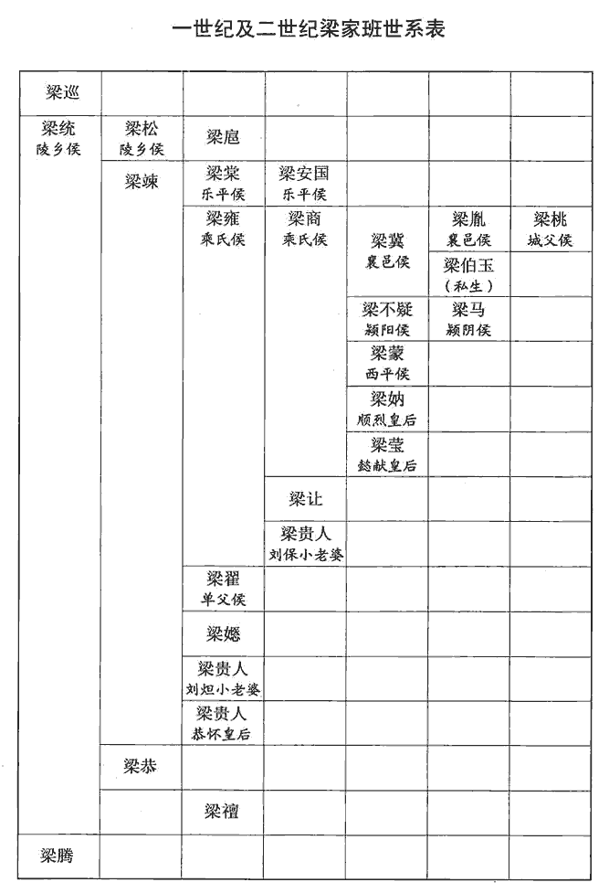
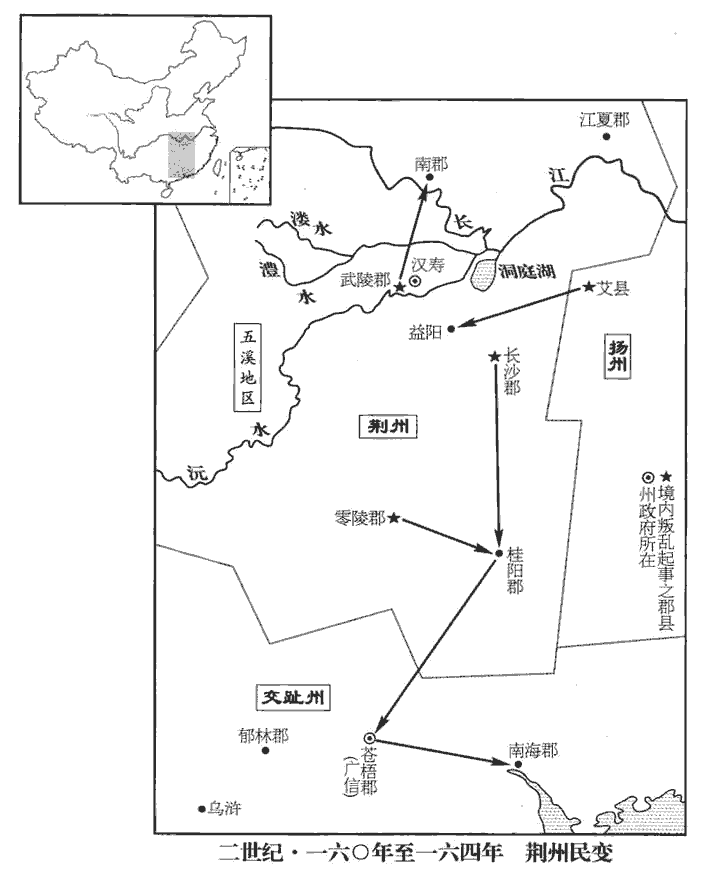

 漢紀四十六起強圉作噩（丁酉），盡昭陽單閼（癸卯），凡七年。

# 孝桓皇帝上之下

## 永壽三年（丁酉，一五七）

1春，正月，己未‹一›，赦天下。

〖译文〗 [1]春季，正月己未（疑误），大赦天下。

2居風‹越南清化北›令貪暴無度，居風縣，屬九真郡。交州記曰：山有風門，常有風。縣人朱達等與蠻夷同反，攻殺令，聚眾至四五千人。夏，四月，進攻九真‹越南清化›，九真太守兒式戰死。守，式又翻。兒，五兮翻。詔九真都尉魏朗討破之。

〖译文〗 [2]居风县县令贪污暴虐没有限度，县民朱达等和蛮夷联合反叛，攻打县城，杀死县令，聚集群众四五千人。夏季，四月，进攻九真郡，九真郡太守式战死。桓帝下诏，命九真郡都尉魏朗率军将朱达等击败。

3閏月，庚辰晦‹三十›，日有食之。

〖译文〗 [3]闰五月庚辰晦（疑误），出现日食。

4京师蝗。

〖译文〗 [4]京都洛阳发生蝗灾。

5或上言：「民之貧困以貨輕錢薄，宜改鑄大錢。」事下四府下，遐稼翻。四府，三公府及大將軍府。群僚及太學能言之士議之。太學生劉陶上議曰：「當今之憂，不在於貨，在乎民飢。竊見比年已來，比，毗至翻。良苗盡於蝗螟之口，杼軸空於公私之求。民所患者，豈謂錢貨之厚薄，銖兩之輕重哉！就使當今沙礫化為南金，瓦石變為和玉，賢曰：詩曰：大賂南金。和玉，卞和之玉。礫，郎狄翻。使百姓渴無所飲，飢無所食，雖皇、羲之純德，天地初立，有天皇氏，澹泊無所施為而民自化。伏羲氏始畫八卦，造書契以代結繩之政。去洪荒之世未遠，故其風朴略。唐、虞之文明，猶不能以保蕭牆之內也。鄭氏曰：蕭，肅也。牆，謂屏也。君臣相見之禮，至屏而加肅敬焉，是以謂之蕭牆。蓋民可百年無貨，不可一朝有飢，故食為至急也。議者不達農殖之本，多言鑄冶之便。蓋萬人鑄之，一人奪之，猶不能給；況今一人鑄之，則萬人奪之乎！雖以陰陽為炭，萬物為銅，賈誼服賦之言。役不食之民，使不飢之士，猶不能足無厭之求也。厭，於鹽翻；下同。夫欲民殷財阜，揚子曰：君人者務在殷民阜財。要在止役禁奪，則百姓不勞而足。陛下愍海內之憂戚，欲鑄錢齊貨以救其弊，猶養魚沸鼎之中，棲鳥烈火之上；水、木，本魚鳥之所生也，用之不時，必至焦爛。願陛下寬鍥qiè薄之禁，賢曰：鍥，刻也，音口結翻。後冶鑄之議，聽民庶之謠吟，問路叟之所憂，通下情也。賢曰：列子曰：昔堯理天下五十年，不知天下理亂，堯乃微服遊於康衢，兒童謠曰：「立我蒸民，莫匪爾極，不識不知，順帝之則。」說苑曰：孔子行遊中路，聞哭者其音甚悲。孔子避車而問之曰：「夫子非有喪也，何哭之悲？」虞丘子對曰：「吾有三失：吾少好學，周徧天下，還，後吾親喪，是一失也。事君驕奢不遂，是二失也。厚交友而後絕，是三失也。」瞰三光之文耀，視山河之分流，瞰，苦鑒翻，視也。賢曰：三光，日、月、星也。分，謂山。流，謂河。言日、月有讁zhé食之變，星、辰有錯行之異，故視其文耀也。山崩、川竭，皆亡之徵，不可不察。天下之心，國家大事，粲然皆見，無有遺惑者矣。伏念當今地廣而不得耕，民眾而無所食，群小競進，秉國之位，鷹揚天下，鳥鈔求飽，鈔，楚交翻。吞肌及骨，并噬無厭。誠恐卒有役夫、窮匠起於版築之間，卒，讀曰猝。賢曰：役夫，謂如陳涉起蘄qí也。窮匠，謂如驪山之徒也。余謂陳涉、黥布皆可以言役夫，窮匠則山陽鐵官徒蘇令等是也。投斤攘臂，登高遠呼，呼，火故翻。使愁怨之民響應雲合，雖方尺之錢，何有能救其危也！」言雖錢大方尺，亦不能救天下之亂也。遂不改錢。

〖译文〗 [5]有人上书说：“人民所以贫困，原因在于钱币的重量太轻，厚度太薄，应该改铸大钱。”奏章交付给大将军、太尉、司徒、司空等四府的官员，以及太学中有见解的学生，共同讨论。太学生刘陶上书说：“我们当前面临的忧患，不在于钱币，而在于人民饥荒。我看到，连年以来，茂盛的庄稼都被蝗虫和螟虫吃光；民间所织的布匹都被朝廷和官吏私人搜刮一空。人民所忧患的，难道是钱币的厚薄和铢两的轻重吗？即令当前能把沙砾化作南方出产的黄金，把瓦片变成和发现的白玉，而让百姓渴了没有水喝，饿了没有饭吃，尽管有天皇氏、伏羲氏的纯洁美德，唐尧和虞舜的清明政治，仍不能保证宫室门屏之内的安全。人民可以有一百年不用钱币，不可以有一天饥饿，所以吃饭才是最急迫的问题。主张改铸钱币的人，不了解农业生产是国家的根本大计，多数只说改铸钱币的好处。但是，如果一万个人铸钱，一个人掠夺，仍是不能满足。何况现在是一个人铸钱，而有一万个人来掠夺！尽管把天地间的阴阳二气都当作炭火，把万物都当成铜，驱使不吃饭的人民，使用不饥饿的役夫，仍不能满足永无止境的需求。要想使人民富裕，财富充足，最要紧的在于停止征役，禁止掠夺，则百姓不必劳苦而自然富足。如果陛下哀怜天下百姓的忧愁，想改铸钱币，使其整齐划一，用来拯救时弊，这就犹如将鱼养在鼎的沸水之中，让鸟栖息在燃烧着烈火的树木之上。水和树木，本来是鱼和鸟赖以生存的，用的不是时候，一定会被烧焦煮烂。希望陛下放宽刻薄的禁令，暂缓实行改铸钱币的建议，倾听民间百姓流传的评议时政的歌谣和谚语，询问路旁老人的忧患，观察日、月、星辰等三光的变异，察视山峰崩裂和河水干涸的警告。天下人民的心愿，国家急需办理的大事，就可以看得明明白白，没有遗漏和疑惑的地方。我想到，当今田地虽然宽广却得不到耕种，人民虽然很多却得不到食物。众小人争相抢夺官爵，掌握国家的高位，犹如兀鹰凶残而横行天下，犹如乌鸦掠夺而贪婪无厌，连皮带骨，把人民一口吞下，而仍不能满足。我担心役夫和穷困的工匠会突然从版筑之间崛起，扔掉斧头，捋衣出臂，登高向远方呐喊，使忧愁怨恨的人民起来响应，犹如云一样纷纷集合，到那时候，即令有一尺见方的钱币，营怎能挽救危亡！”于是不改铸钱币。

6冬，十一月，司徒尹頌薨。考異曰：袁紀在六月。今從范書。

〖译文〗 [6]冬季，十一月，司徒尹颂去世。

7長沙‹湖南长沙›蠻反，寇益陽‹湖南益阳›。益陽縣屬長沙郡。賢曰：縣在益水之陽，今潭州縣，故城在縣東。

〖译文〗 [7]长沙郡蛮人反叛，攻打益阳县。

8以司空韓縯為司徒；縯，以善翻。以太常北海‹山东昌乐西›孫朗為司空。

〖译文〗 [8]任命司空韩为司徒；擢升太常、北海人孙朗为司空。

## 延熹元年（戊戌，一五八）

1夏，五月，甲戌晦‹二十九›，日有食之。太史令陳授因小黃門徐璜陳「日食之變咎在大將軍冀」。冀聞之，諷雒陽收考授，諷雒陽令收考之也。死於獄。帝由是怒冀。考異曰：袁紀曰：「冀以私憾專殺議郎邴尊，上益怒。」今從范書。

〖译文〗 [1]夏季，五月甲戌晦（二十九日），出现日食。太史令陈授通过小黄门徐璜，奏称：“出现日食灾异，罪过在于大将军梁冀。”梁冀听到这个消息后，于是，授意洛阳县令逮捕和拷问陈授，陈授死在狱中。桓帝因此恼恨梁冀。

2京师蝗。

〖译文〗 [2]京都洛阳发生蝗灾。

3六月，戊寅‹四›，赦天下，改元。

〖译文〗 [3]六月戊寅（初四），大赦天下。改年号。

4大雩yú。公羊傳曰：大雩，旱祭也。何休註曰：君親之南郊，以六事謝過，自責曰：政不善歟？民失職歟？宮室崇歟？婦謁盛歟？苞苴jū行歟？讒夫昌歟？使童男女各八人舞而呼雩，故謂之雩。鄭玄曰：雩，吁嗟求雨之祭也。服虔曰：雩，遠也，遠為百穀祈膏雨也。陸佃曰：雩，雨不雨未定也。

〖译文〗 [4]举行求雨的祭祀大典。

5秋，七月，甲子‹二十›，太尉黃瓊免；以太常胡廣為太尉。

〖译文〗 [5]秋季，七月甲子（二十日），太尉黄琼被免官，擢升太常胡广为太尉。

6冬，十月，帝校獵廣成‹河南新安境›，廣成苑在河南新城縣。遂幸上林苑。此上林苑在雒陽西。

〖译文〗 [6]冬季，十月，桓帝前往广成苑打猎，随后到上林苑。

7十二月，南匈奴諸部并叛，與烏桓、鮮卑寇緣邊九郡。帝以京兆尹陳龜為度遼將軍。考異曰：按匈奴傳，每除度遼將軍輒書之，此陳龜及前李膺、後种暠皆不記，一時既不當有兩官，今約其事，分著前後。龜臨行，上疏曰：「臣聞三辰不軌，言三辰之行不順軌也。擢士為相；蠻夷不恭，拔卒為將。臣無文武之材而忝鷹揚之任，詩曰：維師尚父，時維鷹揚。爾雅翼：鷹好揚，隼好翔，故以比尚父之武。雖歿軀體，無所云補。今西州邊鄙，土地塉jí埆què，塉，秦昔翻。賢曰：埆，音覺，又音確，土薄也。民數更寇虜，數，所角翻。更，工衡翻；下租更同。室家殘破，雖含生氣，實同枯朽。往歲并州‹山西›水雨，災螟互生，稼穡荒耗，租更空闕。賢曰：更，謂卒更錢也。陛下以百姓為子，焉可不垂撫循之恩哉！焉，於虔翻。古公、西伯天下歸仁，古公亶dǎn父避狄，去邠bīn居岐，從之者如歸市。帝王世紀曰：西伯至仁，百姓襁負而至。豈復輿金輦寶以為民惠乎！復，扶又翻。陛下繼中興之統，承光武之業，臨朝聽政而未留聖意。且牧守不良，或出中官，謂牧守出於中官之所引用也。懼逆上旨，取過目前。過，度也。呼嗟之聲，招致災害，胡虜凶悍，悍，下罕翻，又侯旰翻。因衰緣隙；而令倉庫單于豺狼之口，單，與殫同，盡也。功業無銖兩之效，十絫lěi為銖，二十四銖為兩。皆由將帥不忠，聚姦所致。前涼州‹甘肃›刺史祝良，初除到州，多所糾罰，太守令長，貶黜將半，長，知兩翻。政未踰時，功效卓然，實應賞異，以勸功能；改任牧守，去斥姦殘；去，羌呂翻。又宜更選匈奴、烏桓護羌中郎將、校尉，護匈奴中郎將，護烏桓、護羌校尉。更，工衡翻。校，戶教翻。簡練文武，授之法令；除并、涼二州今年租、更，租，賦也。更，役也。更，工衡翻；下同。寬赦罪隸，掃除更始；則善吏知奉公之祐，惡者覺營私之禍，胡馬可不窺長城，塞下無候望之患矣。」帝乃更選幽、并刺史，自營、郡太守、都尉以下，多所革易。京兆虎牙營、扶風雍營，皆都尉領之。諸郡各有太守、都尉。下詔為陳將軍除并、涼一年租賦，以賜吏民。為，于偽翻。龜到職，州郡重足震栗，言重足而立也。重，音直龍翻。省息經用，歲以億計。

〖译文〗 [7]十二月，南匈奴各部部众同时反叛，和乌桓、鲜卑等联合侵犯沿边九郡。桓帝任命京兆尹陈龟为度辽将军。陈龟临行前，向桓帝上书说：“我曾经听说，当日、月、星辰不顺着轨道运行时，应该选拔士人为相；蛮夷不恭顺朝廷时，应该选拔士卒为将。我没有文武双全的才能，却担当大军统帅的重任，即令身死，也难以报答。而今，西方边界地区，土地瘠薄多石，人民不断受到外族的侵犯掳掠，家家户户都已经残破不堪，虽然还有一口气可以呼吸，但实际上如同一具枯干的朽骨。往年并州下大雨，同时发生水灾和虫灾，农作物荒废，人民缴纳不起租税和更赋。陛下把百姓当作子女，怎么能够不尽抚养的恩惠？古公姬父、西伯姬昌，天下的人都已纷纷归向他俩，哪里还需要再用车辆载着金银财宝，向人民施行恩惠？陛下继承中兴的皇统，接续光武帝的帝业，临朝处理政务，然而对这一方面却没有特别留意。并且，州牧和郡太守都不贤良，有的人甚至是出自宦官的推荐，他们畏惧冒犯圣上的旨意，就只求得过且过。人民呼喊和嗟叹的声音，招来更大的灾害。外族凶猛强悍，趁着政治衰败，利用人民的怨恨，起兵作乱。至使仓库的粮秣，全被豺狼吃光；朝廷屡次出兵讨伐，却收不到丝毫功效。这都是由于将帅不忠，贪官聚敛所造成的。前凉知刺史祝良，初被任命到州上任后，对贪官污吏多有举发和惩处，郡太守和县令、长，受到贬谪和撤职的将近半数，任职不到一年，功绩和效果卓著，实在应该给他特别的奖赏，以勉励他的功绩和才能。还应更换其他不称职的州牧和郡太守，罢免邪恶贪残的官吏。并应该重新遴选护匈奴、乌桓、羌等中郎将及校尉，要求具备文武全才，授予行使法令的权力。免除并州、凉州今年应该缴纳的田租和更赋，宽大和赦免罪犯，给他们改过自新的机会。这样，善吏知道奉公守法的福气，恶吏知道营私舞弊的祸害，胡马将不会再暗中窥伺长城，边塞也将没有候望烽火的忧患。”于是，桓帝重新任命幽州、并州刺史，京兆虎牙营、扶风雍营的都尉，郡太守和都尉及以下的官吏，也多有更换。并且下诏：“为了陈将军的请求，免除并州、凉州一年的田租和更赋，以表示朝廷对官吏和人民的恩赐。”陈龟到职以后，所在州郡官府的官吏，都大为震恐，节省下来的经费，每年以亿计算。

詔拜安定屬國‹宁夏同心›都尉張奐為北中郎將，按奐傳，即護匈奴中郎將。以討匈奴、烏桓等。匈奴、烏桓燒度遼將軍門，賢曰：時度遼將軍屯五原‹内蒙包头›。引屯赤阬kēng，煙火相望，兵眾大恐，各欲亡去。奐安坐帷中，與弟子講诵自若，軍士稍安。乃潛誘烏桓，陰與和通，誘，音酉。遂使斬匈奴、屠各渠帥，屠各，匈奴別種也。屠，直於翻。帥，所類翻。襲破其眾，諸胡悉降。奐以南單于車兒不能統理國事，乃拘之，奏立左谷蠡王為單于。谷蠡，音鹿黎。詔曰：「春秋大居正；車兒一心向化，何罪而黜！其遣還庭！」言春秋之義大居正。賢曰：春秋法五始之要，故經曰：元年，春，正月。言王者即位之年宜大開恩，宥其居正。車兒即是桓帝即位之建和元年立，自立以來一心向化，宜寬宥之。考異曰：袁紀：「元康元年，四月，中郎將張奐以車兒不能治國事，上言更立左鹿蠡王都紺為單于；詔不許。」范書匈奴傳在延熹元年，今從之。

〖译文〗 桓帝下诏，任命安定属国都尉张奂为北中郎将，率军讨伐匈奴、乌桓等。 匈奴、乌桓用火焚烧屯驻在五原的度辽将军府大门，又前往赤据守， 烟火可以看得很清楚。张奂的部队，大为惊恐，纷纷准备逃亡。可是，张奂仍然安坐帐中，跟他的门徒和学生照样自如地讲解和朗诵经书，军心才稍微安定下来。于是，张奂秘密派使者劝说乌桓，暗中和乌桓和好。然后，命乌桓斩杀匈奴以及匈奴的旁支屠各的首领，大破匈奴部众，匈奴人全部投降。张奂认为南匈奴单于车儿没有能力统御和治理匈奴国事，于是将他软禁，奏请朝廷改立左谷蠡王为单于。桓帝下诏说：“《春秋》主张大居正，以君位传子为常道。车儿一心归向朝廷，有什么罪过要罢黜他？送他返回王庭！”

8大將軍冀與陳龜素有隙，譖其沮毀國威，挑取功譽，沮，在呂翻。賢曰：挑，猶取也，獨取其名，如挑戰之義，音，徒了翻。不為胡虜所畏，坐徵還，以种暠為度遼將軍。种，音沖。暠hào，工老翻。龜遂乞骸骨歸田里，復徵為尚書。復，扶又翻。冀暴虐日甚，龜上疏言其罪狀，請誅之，帝不省。省，悉景翻。龜自知必為冀所害，不食七日而死。東都之臣以死攻外戚者，鄭弘、陳龜二人而已。种暠到營所，先宣恩信，誘降諸胡，其有不服，然後加討；羌虜先時有生見獲質於郡縣者，質，音致。悉遣還之；誠心懷撫，信賞分明，由是羌、胡皆來順服。暠乃去烽燧，除候望，去，羌呂翻。邊方晏然無警；入為大司農。

〖译文〗 [8]大将军梁冀和陈龟之间一向有怨恨。梁冀诬陷陈龟毁坏国家的威严，牟取个人的功劳和名誉，不能得到匈奴人的敬重和畏服。陈龟因罪被征召，返回京都洛阳，种被任命为度辽将军。于是，陈龟请求退休，回归故乡。后来，朝廷又征召他担任尚书。这时，梁冀暴虐的程度，一天比一天厉害，陈龟向桓帝上书弹劾他的罪状，请求诛杀梁冀，桓帝不予理会。陈龟知道自己一定会被梁冀所害，于是绝食七天而死。种到度辽将军大营以后，首先宣布朝廷的恩德和信义，劝诱外族归降；有不归降的，再进行讨伐。有些羌人先前被生擒，现囚禁在郡县官府做人质，种命令将他们全部释放。他诚心诚意地进行怀柔和安抚，赏罚分明，因此羌人、胡人都纷纷前来归服。于是，种下令拆除烽火台和了望亭，边境地区一片安宁，没有警报。种被调回京都洛阳担任大司农。

## 二年（己亥，一五九）

1春，二月，鮮卑‹王庭设弹汗山，河北尚义南大青山›寇鴈門‹山西朔州东南›。

〖译文〗 [1]春季，二月，鲜卑侵犯雁门郡。

2蜀郡夷寇蠶陵‹四川茂县西北›。賢曰：蠶陵縣屬蜀郡，故城在今翼州翼水縣西；有蠶陵山，因以名焉。宋白曰：翼州衛山縣，本漢蠶陵縣地，故城在縣西，有蠶陵山。

〖译文〗 [2]蜀郡夷人攻打蚕陵县。

3三月，復斷刺史、二千石行三年喪。永興二年，聽行三年喪。斷，丁管翻。

〖译文〗 [3]三月，再次取消刺史和二千石官吏为父母服丧三年的规定。

4夏，京师大水。

〖译文〗 [4]夏季，京都洛阳发生水灾。

5六月，鮮卑寇遼東‹辽宁辽阳›。

〖译文〗 [5]六月，鲜卑侵犯辽东郡。

6梁皇后恃姊、兄蔭勢，姊順烈皇后，兄大將軍冀也。蔭，庇也。今人謂憑藉世資得官者為蔭官，蓋取木為喻，言能蔭庇其本根也。恣極奢靡，兼倍前世，專寵妬忌，六宮莫得進見。及太后崩，恩寵頓衰。后既無嗣，每宮人孕育，鮮得全者。鮮，息淺翻。帝‹刘志，时年二十八›雖迫畏梁冀，不敢譴怒，然進御轉希，按周禮註：鄭眾云：六宮後五前一。王之妃百二十人：后一人，夫人三人，嬪九人，世婦二十七人，女御八十一人。鄭玄曰：六宮，謂后也。婦人稱寢曰宮，宮，隱蔽之言。后象王，立六宮而居之，亦正寢一，燕寢五，夫人以下，分居后之六宮。每宮九嬪一人，世婦三人，女御九人；其餘九嬪三人，世婦九人，女御二十七人，從后唯所燕息焉。從后者，五日而沐浴，其次又上，十五日而徧云。夫人如三公，從容論婦禮，此禮所謂「以時御敘于王所」者也。鄭玄又曰：凡群妃御見之法，月與后妃其象也，卑者宜先，尊者宜後。女御八十一人當九夕，世婦二十七人當三夕，九嬪九人當一夕，三夫人當一夕，后當一夕，十五日而徧。自望後反之。按二鄭所云，漢之宮中，貫魚無序，專房之讌，蔽固後宮，寧復有此制乎！后益憂恚。恚，於避翻。秋，七月，丙午‹八›，皇后梁氏崩。乙丑‹二十七›，葬懿獻皇后於懿陵。賢曰：諡法：溫和聖善曰懿；聰明叡知曰獻。

〖译文〗 [6]梁皇后仗恃姊姊梁太后和哥哥大将军梁冀的庇护和势力，穷极奢华，比前世加倍，独占桓帝的宠爱，嫉妒成性，六宫的其他嫔妃都不得侍奉桓帝。等到梁太后去世，桓帝对她的恩宠顿时衰退。梁皇后自己没有儿子，每当其他嫔妃怀有身孕，很少能得到保全。桓帝虽然畏惧梁冀，不敢谴责和发怒，然而让梁皇后来陪侍的次数变得稀少，梁皇后越来越忧愁愤恨。秋季，七月丙午（初八），梁皇后去世。乙丑（二十七日），将她安葬在懿陵，谥号为懿献皇后。

 

梁冀一門，前後七侯，三皇后，冀祖雍封乘氏侯，冀封襄邑侯；及嗣乘氏侯，又封其子胤襄邑侯，弟不疑潁陽侯，蒙西平侯，不疑子馬潁陰侯，胤子桃城父侯，是七封侯也。恭懷、順烈、懿獻三皇后。六貴人，二大將軍，夫人、女食邑稱君者七人，尚公主者三人，其餘卿、將、尹、校五十七人。卿，九卿也。將，中郎將也。尹，河南、京兆尹也。校，諸校尉也。校，戶教翻。冀專擅威柄，凶恣日積，宮衛近侍，并樹所親，賢曰：樹，置也。禁省起居，纖微必知。其四方調發，調，徒弔翻。歲時貢獻，皆先輸上第於冀，賢曰：上第，第一也。乘輿乃其次焉。乘，繩證翻。吏民齎貨求官、請罪者，道路相望。請罪，謂請求以脫罪也。百官遷召，皆先到冀門牋jiān檄謝恩，字書：牋，表也，識也，書也。左雄傳，文吏課牋奏。自後世言之，奏者達之天子，牋者用之中宮、東宮、將相大臣，檄者徵召傳令用之，非所以謝恩也。竊意自蔡倫造紙之後，用紙書者曰牋，用木書者曰檄，故言牋檄謝恩也。然後敢詣尚書。下邳‹江苏睢宁北古邳镇›吳樹為宛‹河南南阳›令，宛，於元翻。之官辭冀，冀賓客布在縣界，以情託樹，樹曰：「小人姦蠹，比屋可誅。明將軍處上將之位，宜崇賢善以補朝闕。比，部必翻，又毗寐翻，連次也。補朝闕，謂補朝政之闕也。處，昌呂翻。朝，直遙翻。自侍坐以來，坐，徂臥翻。未聞稱一長者，而多託非人，誠非敢聞！」冀默然不悅。樹到縣，遂誅殺冀客為人害者數十人。樹後為荊州刺史，辭冀，冀鴆之，出，死車上。遼東‹辽宁辽阳›太守侯猛初拜，不謁冀，冀託以他事腰斬之。郎中汝南‹河南平舆西北射桥乡›袁著，年十九，詣闕上書曰：「夫四時之運，功成則退，蔡澤之言。高爵厚寵，鮮不致災。鮮，息淺翻。今大將軍位極功成，可為至戒；宜遵縣車之禮，縣，讀曰懸。高枕頤神。傳曰：『木實繁者披枝害心。』范睢曰：木殖繁者披其枝，披其枝者傷其心。若不抑損盛權，將無以全其身矣！」冀聞而密遣掩捕，著乃變易姓名，託病偽死，結蒲為人，市棺殯送；冀知其詐，求得，笞殺之。太原‹山西太原›郝絜jié、胡武，好危言高論，好，呼到翻。與著友善，絜、武嘗連名奏記三府，薦海內高士，而不詣冀；冀追怒之，敕中都官移檄禽捕，司隸校尉領中都官徒千二百人，冀蓋敕都官從事使移檄禽捕也。遂誅武家，死者六十餘人。絜初逃亡，知不得免，因輿櫬chèn奏書冀門，書入，仰藥而死，家乃得全。安帝嫡母耿貴人薨，冀從貴人從子林慮侯承求貴人珍玩，不能得，冀怒，并族其家十餘人。人從，才用翻。涿郡‹河北涿州›崔琦以文章為冀所善，琦作外戚箴、白鵠賦以風；外戚箴曰：「赫赫外戚，華寵煌煌。昔在帝舜，德隆英、皇；周興三母，有莘崇湯；宣王晏起，姜后脫簪；齊桓好樂，衛姬不音。皆輔主以禮，扶君以仁，達才进善，以义济身，爰暨jì末葉，渐已颓亏，贯鱼不序，九御差池，晋国之难，祸起于丽，惟家之索，牝鸡之晨，专权擅爱，显己蔽人，陵長間舊，圮pǐ剝至親，并后匹嫡，淫女斃陳。匪賢是上，番為司徒，荷爵負乘，采食名都，詩人是刺，德用不憮wǔ。暴辛惑婦，拒諫自孤，蝮蛇其心，縱毒不辜，諸父是殺，孕子是刳kū，天怒地忿，人謀鬼圖，甲子昧爽，身首分離。初為天子，後為人螭chī，非但耽色，母后尤然；不相率以禮，而競獎以權，先笑後號，卒以辱殘，家國泯絕，宗廟燒燔。末嬉喪夏，褒姒斃周，妲己亡殷，趙靈沙丘。戚姬人豕，呂宗以敗；陳后作巫，卒死於外；霍欲鴆子，身乃罹廢。故曰：無謂我貴，天將爾摧；無恃常好，色有歇微；無怙常幸，愛有陵遲；無曰我能，天人爾違。患生不德，福有慎機，日不常中，月盈有虧，履道者固，仗勢者危。微臣司戚，敢告在斯。」箴言外戚之禍深切，故具載之。憮，音呼。風，讀曰諷。冀怒。琦曰：「昔管仲相齊，樂聞譏諫之言；樂，音洛。蕭何佐漢，乃設書過之吏。今將軍屢世台輔，任齊伊、周，而德政未聞，黎元塗炭，不能結納貞良以救禍敗，反欲鉗塞士口，塞，悉則翻。杜蔽主聽，將使玄黃改色、鹿馬易形乎！」玄黃者，天地之色也，使之改色，言將使天地顛倒也。鹿馬易形，指趙高、秦二世之事。琦之論可謂深切矣。冀無以對，因遣琦歸。琦懼而亡匿，冀捕得，殺之。

〖译文〗 梁冀家族一门，前后共有七个侯，三个皇后，六个贵人， 两个大将军，夫人和女儿享有食邑而称君的七人，娶公主为妻的三人，其他担任卿、将、尹、校等官职的五十七人。梁冀把持朝廷威权，独断专行，凶暴放肆，日甚一日。宫廷禁军和皇帝最亲近的侍卫和随从中，都有他的亲信，皇宫内部皇帝的起居，再细小的情况，他都必定了如指掌。向四方征调的物品，以及各地每年按时向皇帝贡献的礼品，都先将最好的呈送给梁冀，皇帝还得排在他的后面。官吏和百姓带着财物，到梁冀家里请求做官或者免罪的，在道路上前后相望。文武百官升迁或被征召，都要先到梁冀家门呈递谢恩书，然后才敢到尚书台去接受指示。下邳国人吴树被任命为宛县县令，上任之前向梁冀辞行，梁冀的宾客散布在宛县县境的很多，梁冀托吴树照顾他们。吴树说：“邪恶的小人是残害百姓蛀虫，即令是近邻，也应诛杀。将军高居上将之位，应该崇敬贤能，弥补朝廷的缺失。可是，自从我随同您坐下以后，没有听见您称赞一位长者，而嘱托我照顾很多不恰当的人，我实在不敢听！”梁冀沉默不语，心里很不高兴。吴树到县上任后，便将梁冀的宾客中为人民所痛恨的数十人诛杀。吴树后来升任荆州刺史，上任前向梁冀辞行，梁冀请他喝下了毒酒。吴树出来，死在车上。东郡太守侯猛，刚刚接受任命时，没有去谒见梁冀，梁冀就另外找了一个罪名将他腰斩。郎中、汝南人袁著，年方十九岁，到宫门上书说：“春夏秋冬的运转，每个季节都在达到极盛时便消退。太高的官职爵位，过分的宠爱信任，很少不招来灾祸。如今大将军已经位极人臣，功成名遂，应该特别警戒；最好是效法汉元帝时的御史大夫薛广德，把皇帝赏赐他的安车悬挂起来，高卧家中，颐养精神，不再过问政事。经传上说：‘树木果实太多，会劈开树枝，伤害树根。’如果不抑制和减损他手中所掌握的过盛的权力，恐怕不能保全他的性命。”联冀听到这个消息后，秘密派人搜捕袁著。于是，袁著改名换姓，假装有病身死，家里人用蒲草结扎成尸体，买来棺木殡葬。梁冀识破这是一个骗局，继续追捕，终于抓到袁著，将他鞭打至死。太原人郝、胡武，好说惊人的话，喜欢高谈阔论，和袁著交情很好。郝、胡武曾经联名上书太尉、司徒、司空等三府，推荐天下的高明人士，却没有将推荐书送给梁冀。袁著死后，梁冀记起旧恨，命京师有关官署发文书逮捕郝、胡武。于是，胡武全家被杀，死了六十余人。郝起初逃亡，后来知道无法逃掉，于是带着棺木，亲自到梁冀家门上书，将书递进去后，便服毒而死，家属才得以保全。安帝的嫡母耿贵人去世，梁冀向耿贵人的侄儿、林虑侯耿承索取耿贵人的珍宝玩物，但没有得到手。于是梁冀恼羞成怒，诛杀耿承及他的家属十余人。涿郡人崔琦因擅长于撰写文章，而得到梁冀的喜爱。崔琦作《外戚箴》、《白鹄赋》向梁冀讽劝。梁冀大怒。崔琦对梁冀说：“从前，管仲担任齐国的宰相，喜欢听讥刺和规劝的话；萧何辅佐汉室王朝，专门设置记录自己过失的官吏。而今，将军身居辅政高位两朝，责任和伊尹、周公同等重大，可是没有听说您推行德政，却只生灵涂炭，灾难深重。将军不但不能结交忠贞贤良来拯救大祸，反而想要堵塞士人的口，蒙蔽主上的耳目，使天地颜色颠倒，鹿马换形吗？”梁冀无法回答，便将崔琦遣送回乡。崔琦因恐惧而离家，四处逃亡躲藏。梁冀派人将他搜捕到手，加以诛杀。

冀秉政幾二十年，順帝永和六年，冀為大將軍，至是歲凡十九年。幾，居希翻。威行內外，天子拱手，不得有所親與，與，讀曰豫。帝既不平之；及陳授死，帝愈怒。和熹皇后從兄子郎中鄧香妻宣，生女猛，從，才用翻。香卒，宣更適梁紀；紀，孫壽之舅也。壽以猛色美，引入掖庭，為貴人，冀欲認猛為其女，易猛姓為梁。冀恐猛姊婿議郎邴尊沮敗宣意，賢曰：沮，壞也，恐尊害敗宣意，不從其改梁姓也。敗，補邁翻。遣客刺殺之。刺，七亦翻。又欲殺宣，宣家與中常侍袁赦相比，賢曰：相鄰比也。比，音毗至翻，又音毗。冀客登赦屋，欲入宣家，赦覺之，鳴鼓會眾以告宣。宣馳入白帝，帝大怒，因如廁，獨呼小黃門史唐衡，小黃門史，小黃門之掌書者也。問：「左右與外舍不相得者，誰乎？」左右，謂宦官也。賢曰：外舍，謂皇后家也。衡對：「中常侍單超、單，音善。小黃門史左悺guàn與梁不疑有隙；悺，工喚翻，又音綰。中常侍徐璜、黃門令具瑗具，姓也；左傳有具丙。瑗，于眷翻。考異曰：宦者傳作「中常侍貝瑗」，今從梁冀傳。常私忿疾外舍放橫，橫，戶孟翻。口不敢道。」於是帝呼超、悺入室，謂曰：「梁將軍兄弟專朝，朝，直遙翻。迫脅內外，公卿以下，從其風旨，今欲誅之，於常侍意如何？」超等對曰：「誠國姦賊，當誅日久；臣等弱劣，未知聖意如何耳。」帝曰：「審然者，常侍密圖之。」對曰：「圖之不難，但恐陛下腹中狐疑。」帝曰：「姦臣脅國，當伏其罪，何疑乎！」於是召璜、瑗五人共定其議，帝齧niè超臂出血為盟。齧，倪結翻，噬也。超等曰：「陛下今計已決，勿復更言，復，扶又翻。恐為人所疑。」

〖译文〗 梁冀把持朝政将近二十年，威势和权力震动内外，桓帝只好拱手， 什么事都不能亲自参与。对于这种情况，桓帝早已忿忿不平，及至陈授死去，他愈发愤怒。和熹皇后邓绥的侄儿、郎中邓香的妻子宣，生下女儿邓猛。邓香死后，宣改嫁给梁纪为妻。梁纪，即梁冀之妻孙寿的舅父。孙寿因邓猛美貌，把她送进掖庭，被桓帝封为贵人。梁冀打算把邓猛认作自己的女儿，将邓猛改姓为梁猛，可是害怕邓猛的姊夫、议郎邴尊从中破坏，说服岳母宣予以拒绝，于是派刺客将邴尊杀死。其后，梁冀又想杀害邓猛的母亲宣。宣家和中常侍袁赦的家相邻，当梁冀派遣的刺客爬上袁赦家的屋顶，准备进入宣家时，被袁赦发觉。于是袁赦擂鼓聚集众人，通知宣家。宣急忙奔入皇宫，向桓帝报告，桓帝勃然大怒。于是，他单独招呼小黄门史唐衡跟随他上厕所，问道：“我的左右侍卫，和皇后娘家不投合的，有谁？”唐衡回答说：“中常侍单超、小黄门史左和梁不疑有仇。中常侍徐璜、黄门令具瑷，经常私下对皇后娘家放纵骄横表示愤恨，只是不敢开口。”于是，桓帝将单超、左叫进内室，对他俩说：“梁将军兄弟在朝廷专权，胁迫内外，三公、九卿以下，都得按着他们的旨意行事，现在，我想要诛杀他们，你们二位的意思如何？”单超等回答说：“梁冀兄弟的确是国家的奸贼，早就应该诛杀；只是我们的力量太弱小，不知圣意如何罢了。”桓帝又说：“确实如你们所说，那么，请你们秘密谋划。”单超等回答说：“谋划并不困难，只恐怕陛下心中狐疑不决。”桓帝说：“奸臣威胁国家，应当定罪伏法，为什么狐疑不决呢！”于是，把徐璜、具瑷叫来，桓帝和五个宦官共同定计，桓帝将单超的手臂咬破出血，作为盟誓。单超等人对桓帝说：“陛下如今既然已下定决心，千万不要再提这件事，怕会引起猜疑。”

冀心疑超等，八月，丁丑‹十›，使中黃門張惲yùn入省宿，以防其變。使惲入禁中直宿，以防超等；而無上旨，徑使惲入，自恃威行宮省，故敢然。惲，於粉翻。具瑗yuàn敕吏收惲，以「輒從外入，欲圖不軌。」言欲謀逆，不由軌道也。帝御前殿，召諸尚書入，發其事，使尚書令尹勳持節勒丞、郎以下皆操兵守省閤，丞，郎，尚書左、右丞及尚書郎也。操，七刀翻。斂諸符節送省中，使具瑗將左右厩騶zōu、賢曰：騶，騎士也。余按續漢志：太僕舊有六厩，中興省約，但置一厩曰未央厩，主乘輿及厩中諸馬。後又置左駿令厩，別主乘輿御馬。未央厩卒騶二十人，右駿厩從可知也。虎賁、羽林、都候劍戟士續漢志：左右都候各一人，秩六百石，主劍戟士，徼循宮中及天子有所收考，屬衛尉。合千餘人，與司隸校尉張彪共圍冀第，使光祿勳袁盱持節收冀大將軍印綬，盱，音吁。徙封比景都鄉侯。冀及妻壽即日皆自殺；不疑、蒙先卒。悉收梁氏、孫氏中外宗親送詔獄，無少長皆棄市；少，詩照翻。長，知兩翻。他所連及公卿、列校、刺史、二千石，死者數十人。校，戶教翻。太尉胡廣、司徒韓縯、司空孫朗皆坐阿附梁冀，不衛宮，止長壽亭，減死一等，免為庶人。故吏、賓客免黜者三百餘人，朝廷為空。為，于偽翻。是時，事猝從中發，使者交馳，公卿失其度，官府市里鼎沸，數日乃定；百姓莫不稱慶。收冀财貨，縣官斥賣，合三十餘萬萬，以充王府用，減天下稅租之半，散其苑囿，以業窮民。

〖译文〗 梁冀果然对单超等产生猜疑，八月丁丑（初十）， 派遣中黄门张恽入宫住宿，以防范意外变故。具瑷命令属吏逮捕张恽，罪名是：“擅自从外入宫，想要图谋不轨。”桓帝登上前殿，召集各位尚书前来，揭发了这件事，派遣尚书令尹勋持节统率丞、郎以下官吏，命全都手执兵器，守卫省阁，将所有代表皇帝和朝廷的符节收集起来，送进内宫。又派遣具瑷率领左右御厩的骑士、虎贲、羽林卫士、都候所属的剑戟士，共计一千余人，和司隶校尉张彪一同包围梁冀的府第。派光禄勋袁持节，向梁冀收缴了他的大将军印信，将他改封为比景都乡侯。梁冀和他的妻子孙寿，当天双双自杀。梁不疑、梁蒙在此以前已经去世。将梁氏和孙氏家族，包括他们在朝廷和地方的亲戚，全部逮入诏狱，不论男女老幼，全都押往闹市斩首，尸体暴露街头。受牵连的公卿、列校、州刺史、二千石官员，被诛杀的有数十人。太尉胡广、司徒韩、司空孙郎，都因阿附梁冀，没有去保卫宫廷而停留在长寿亭，被指控有罪，以减死罪一等论处，免去官职，贬为平民。此外，梁冀的旧时属吏和宾客，被免官的有三百余人，整个朝廷，为之一空。当时，事情突然从皇宫中发动，使者来往奔驰，三公九卿等朝庭大臣都失去常态，官府和大街小巷犹如鼎中的开水一片沸腾，数日之后，方才安定，百姓们无不称快，表示庆祝。桓帝下令没收梁冀的财产，由官府变卖，收入共计三十余亿，全都上缴国库，减收当年全国租税的一半。并将梁冀的园林分散给贫民耕种。

7壬午‹十五›，立梁貴人為皇后，追廢懿陵為貴人冢。帝惡梁氏，惡，烏路翻。改皇后姓為薄氏，以文帝薄太后家謹良也。久之，知為鄧香女，乃復姓鄧氏。

〖译文〗 [7]壬午（十五日），桓帝立梁贵人为皇后，并将梁冀的妹妹、梁皇后的坟墓懿陵贬称为贵人冢。桓帝厌恶梁氏，便将皇后梁猛的姓，改为薄氏。过了许久，才知道皇后是邓香的女儿，于是，又重新改姓邓氏。

8詔賞誅梁冀之功，封單超、徐璜、具瑗yuàn、左悺guàn、唐衡皆為縣侯，超食二萬戶，璜等各萬餘戶，世謂之五侯。單超新豐侯，徐璜武原侯，具瑗東武陽侯，左悺上蔡侯，唐衡汝陽侯也。仍以悺、衡為中常侍。又封尚書令尹勳等七人皆為亭侯。賢曰：尹勳宜陽都鄉，霍諝鄴都亭，張敬山陽曲鄉，歐陽參脩武仁亭，李瑋宜陽金門，虞放冤句呂都亭，周永下邳高遷鄉。

〖译文〗 [8]桓帝下诏，赏赐诛杀梁冀的功臣，将单超、徐璜、具瑷、左、唐衡，都封为县侯，单超食邑二万户，徐璜等四人各一万余户，当世称他们为“五侯”。擢升左、唐衡为中常侍。又将尚书令尹勋等七人都封为亭侯。

9以大司農黃瓊為太尉，光祿大夫中山‹河北定州›祝恬為司徒，大鴻臚梁國‹河南商丘›盛允為司空。臚lú，陵如翻。按西羌傳有北海太守盛苞，其先姓奭shì，避元帝諱，改姓盛。按戰國時，秦有盛橋，則先自有盛姓。

〖译文〗 [9]擢升大司农黄琼为太尉，光禄大夫、中山国人祝恬为司徒，大鸿胪、梁国人盛允为司空。

是時，新誅梁冀，天下想望異政，黃瓊首居公位，乃舉奏州郡素行暴汙，至死徙者十餘人，行，下孟翻。海內翕然稱之。

〖译文〗 这时，刚刚诛杀梁冀，天下人都希望政治改观。黄琼位居三公之首， 于是，他举发弹劾各州郡一向行为残暴贪婪的官吏，有十余人被处死或流放，全国齐声称赞。

瓊辟汝南范滂。滂少厲清節，為州里所服。滂，普郎翻。少，詩照翻。嘗為清詔使，風俗通曰：汝南周勃，辟太尉清詔使。范史，第五種以司徒清詔使冀州。賢註云：蓋三公府有清詔員以承詔使也。使，疏吏翻。案察冀州‹河北中部南部›，滂傳曰：時冀州饑荒，盜賊群起，以滂為清詔使案察之。滂登車攬轡，慨然有澄清天下之志。守令臧汙者，皆望風解印綬去；其所舉奏，莫不厭塞眾議。塞，悉則翻。會詔三戶【章：乙十六行本「戶」作「府」；乙十一行本同；孔本同；熊校同。】掾屬舉謠言，漢官儀曰：三公聽採長吏臧否，民所疾苦，還條奏之，是為舉謠言也。頃者舉謠言，掾、屬、令史都會殿上，主者大言州郡行狀云何，善者同聲稱之，不善者默爾銜枚。滂奏刺史、二千石權豪之黨二十餘人。尚書責滂所劾猥多，劾，戶概翻，又戶得翻。疑有私故；滂對曰：「臣之所舉，自非叨穢姦暴，深為民害，豈以汙簡札哉！汙，烏故翻。間以會日迫促，會日，謂三府掾、屬會于朝堂之日也。故先舉所急，其未審者，方更參實。參考以究其實也。臣聞農夫去草，去，羌呂翻。嘉穀必茂；忠臣除姦，王道以清。若臣言有貳，甘受顯戮！」尚書不能詰。詰，去吉翻。

〖译文〗 黄琼征聘汝南人范滂。范滂从少年时，便磨砺清高的节操， 受到州郡和乡里的佩服。他曾经担任清诏使，到冀州巡视考察。出发时，他登上车，手揽缰绳，慷慨激昂，大有澄清天下吏治的壮志。贪赃枉法的郡太守和县令、县长＊一听说范滂要来巡察，都自动解下印信，辞职离去。凡是范滂所举发和弹劾的，全都符合众人的愿望。当时，正好遇上皇帝下诏，命太尉、司徒、司空等三府掾属品评地方官吏的为政善恶和得失，反映民间疾苦。于是范滂弹劾刺史、二千石官员、权贵党羽，共二十余人。尚书责备他弹劾得太滥太多，怀疑他有私人恩怨。范滂回答说：“我所举发弹劾的官吏，假如不是奸邪暴戾，为害百姓，怎么会让他们来玷污我的奏章吗？只是因为迫于朝会的日期太紧，所以先举发应该急待惩处的，还有一些没有查清的，待调查核实后再行弹劾。我听说，农夫必须除草，庄稼才能茂盛，忠臣必须铲除奸臣，王道才能清平。如果我的弹劾有差错，我甘愿公开被处决！”尚书无法责问。

10尚書令陳蕃上疏薦五處士，處，昌呂翻。豫章‹江西南昌›徐稚、彭城‹江苏徐州›姜肱、姓譜：本自炎帝，居於姜水，因以為氏。汝南‹河南平舆西北射桥乡›袁閎、京兆‹西安›韋著、潁川‹河南禹洲›李曇；曇，徒含翻。考異曰：范書徐稚傳云：「延熹二年，尚書令陳蕃、僕射胡廣等上書薦稚。」袁紀：「五年，尚書令陳蕃薦五處士。」按二年，胡廣已為太尉，五年，蕃已為光祿勳。今置在是年，從范書，去廣名，從袁紀。帝悉以安車、玄纁備禮徵之，皆不至。

〖译文〗 10尚书令陈蕃向桓帝上书， 推荐五位隐居不肯出来作官的士人：豫章人徐稚、彭城人姜肱、汝南人袁闳、京兆人韦著、颍川人李昙。桓帝对所有的人都送给用一马牵拉的安车和黑色的币帛，礼仪周全地征聘他们，但他们都不肯应聘。

稚家貧，常自耕稼，非其力不食，恭儉義讓，所居服其德；屢辟公府，不起。陳蕃為豫章‹南昌›太守，以禮請署功曹；稚不之免，不辭免也。既謁而退。蕃性方峻，不接賓客，唯稚來，特設一榻，去則縣之。榻，坐榻也，亦謂之牀。縣，讀曰懸。後舉有道，有道舉，見五十卷安帝建光元年。家拜太原太守，賢曰：就家而拜之也。皆不就。稚雖不應諸公之辟，然聞其死喪，輒負笈赴弔。笈，極曄翻。常於家豫炙雞一隻，以一兩綿絮漬酒中暴乾，暴，步木翻，日曬也。乾，音干。以裹雞，徑到所赴冢隧外，以水漬綿，使有酒氣，斗米飯，白茅為藉，以雞置前，醊酒畢，醊，株衛翻，酹酒也。留謁則去，謁，猶刺也。不見喪主。

〖译文〗 徐稚家境贫穷，经常亲自耕种，不吃不是自己劳动得来的食物， 谦恭节俭，待人礼让，当地的人都很佩服他的品德。三公府多次前来征聘，他都没有答应。陈蕃担任豫章郡太守时，曾很礼敬地请他出来担任功曹。徐稚也不推辞，但在晋见陈蕃后，即行告退，不肯就职。陈蕃性格方正严峻，从不接见宾客，唯独徐稚来时，特地为他摆设一张坐塌，徐稚走后，他就把坐榻悬挂起来。后来，徐稚又被推举为“有道”之士，在家中被任命为太原郡太守，他仍不肯就任。徐稚虽然不肯接受诸公的征聘，但是听到他们的死讯，一定背着书箱前往吊丧。他通常是先在家里烤好一只鸡，另外将一两绵絮浸泡在酒中，再晒干，然后用绵絮包裹烤鸡，一直来到死者的坟墓隧道之外，用水将绵絮泡湿，使酒味溢出，准备一斗米饭，以白茅草为垫，把鸡放在坟墓前面，将酒洒在地上进行祭吊后，留下自己的名帖，立即离去，不去见主丧的人。

肱與二弟仲海、季江俱以孝友著聞，聞，音問。常同被而寢，不應徵聘。肱嘗與弟季江俱詣郡，夜於道為盜所劫，欲殺之，肱曰：「弟年幼，父母所憐，又未聘娶，願殺身濟弟。」季江曰：「兄年德在前，家之珍寶，國之英俊，乞自受戮，以代兄命。」盜遂兩釋焉，但掠奪衣資而已。既至，郡中見肱無衣服，怪問其故，肱託以他辭，終不言盜。盜聞而感悔，就精廬求見徵君，賢曰：精廬，即精舍也。以其嘗蒙徵聘，故稱為徵君。叩頭謝罪，還所略物。肱不受，勞以酒食而遣之。勞，力到翻。帝既徵肱不至，乃下彭城‹江苏徐州›，下，遐稼翻。使畫工圖其形狀。肱臥於幽闇，以被韜面，賢曰：韜，藏也。言患眩疾，不欲出風，工竟不得見之。

〖译文〗 姜肱和两个弟弟姜仲海、姜季江，都以教敬父母、友爱兄弟而著称， 经常同盖一条被子睡觉。他们不肯答应官府的征聘。姜肱曾经和他的弟弟姜季江一道前往郡府，夜间在道路上遇到强盗抢劫。强盗要杀他俩，姜肱对强盗说：“我的弟弟年龄还小，受到父母怜爱，又没有定亲娶妻，我希望你们把我杀死，保全我弟弟的性命。”然而，姜季江却对强盗说：“我的哥哥年龄比我大，品德比我高，是我家的珍宝，国家的英才，请来杀我，我愿代哥哥一死。”强盗听后很受感动，便将他俩都释放了，只将衣服和财物抢光而已。兄弟二人到了郡府，人们看见姜肱没有穿衣服，觉得奇怪，问他是什么缘故。姜肱用其他原因进行推托，到底不肯指控强盗。强盗听到这个消息，感到惭愧和后悔，就到姜肱的学舍来拜见他，叩头请罪，奉还所抢走的衣物。姜肱不肯接受，用酒饭招待强盗，送走他们。桓帝既然不能将姜肱征聘到京都洛阳，于是下诏，命彭城地方官派画工画出姜肱的肖像。姜肱躺卧在一间幽暗的房屋里，用被子蒙住脸，声称患了昏眩病，不愿出来受风，画工竟然未能见到他的面目。

閎，安之玄孫也，袁安歷事明、章、和，以忠篤稱。苦身脩節，不應辟召。

〖译文〗 袁闳，即袁安的玄孙，刻苦修养自己的节操，不接受官府和朝廷的征召。

著隐居讲授，不修世务。

〖译文〗 韦著隐居在家，讲授经书，不肯过问世事。

曇tán繼母苦【章：乙十六行本「苦」作「酷」；乙十一行本同；孔本同；退齋校同。】烈，曇奉之逾謹，得四時珍玩，未嘗不先拜而後進，鄉里以為法。

〖译文〗 李昙的继母非常凶暴，可是李昙对她的奉养却愈发恭谨， 得到四季的珍贵玩物，从来没有不先行礼，而后送上给继母的，乡里都将他作为榜样。

帝又徵安陽‹河南正阳›魏桓，安陽縣，屬汝南郡。其鄉人勸之行，桓曰：「夫干祿求進，所以行其志也。今後宮千數，其可損乎？厩馬萬匹，其可減乎？左右權豪，其可去乎？」去，羌呂翻。皆對曰：「不可」。桓乃慨然歎曰：「使桓生行死歸，於諸子何有哉！」賢曰：若忤時強諫，死而後歸，於諸勸行者復何益也。遂隱身不出。

〖译文〗 桓帝又征召安阳人魏桓，魏桓家乡的人都劝他前往应聘。 魏桓对他们说：“接受朝延的俸禄，追求升迁高级官职，目的是为了实现自己的政治理想。如今后宫美女数以千计，能缩小数目吗？御厩骏马一万匹，能减少吗？皇帝左右的权贵豪门，能排除吗？”大家都回答说：“不能。”于是，魏桓慨然长叹说：“让我活着前去就聘，死后再被送回，对你们有什么好处？”于是隐居不出。

11帝既誅梁冀，故舊恩私，多受封爵：追贈皇后父鄧香為車騎將軍，封安陽侯；更封后母宣為昆陽君，兄子康、秉皆為列侯，宗族皆列校、郎將，列校，謂北軍五校尉。郎將，即三署中郎將。校，戶教翻。賞賜以巨萬計。中常侍侯覽上縑五千匹，上，時掌翻；下同。帝賜爵關內侯，又託以與議誅冀，與，讀曰豫。進封高鄉侯；又封小黃門劉普、趙忠等八人為鄉侯，自是權勢專歸宦官矣；五侯尤貪縱，傾動內外。時災異數見，數，所角翻。見，賢遍翻。白馬‹河南滑县›令甘陵‹山东临清›李雲露布上書，移副三府白馬縣，屬東郡。賢曰：露布，謂不封之也，并以副本上三公府也。曰：「梁冀雖恃【章：乙十六行本「恃」作「持」；乙十一行本同。】權專擅，虐流天下，今以罪行誅，猶召家臣搤è殺之耳，家臣，謂猶古之家相也。搤，乙革翻。而猥封謀臣萬戶以上；謂單超等五侯也。高祖聞之，得無見非！謂高祖之約，非有功不侯。西北列將，得無解體！賢曰：列將，謂皇甫規、段熲jiǒng等。孔子曰：『帝者，諦也。』春秋運斗樞曰：五帝脩名立功，脩德成化，統調陰陽，招類使神，故稱帝。帝之為言諦也。鄭玄註云：審諦於物色也。今官位錯亂，小人諂進，財貨公行，政化日損；尺一拜用，賢曰：尺一之板，謂詔策也，見漢官儀。又曰：尺一，謂板長尺一，以寫詔書也。不經御省，御，進也。省，悉井翻，猶今言省審也。是帝欲不諦乎！」帝得奏震怒，下有司逮雲，下，遐稼翻；下同。詔尚書都護劍戟送黃門北寺獄，都，總也。護，監也。詔尚書總監左右都候劍戟士，防送雲詣獄也。或曰：「都護」當作「都候」。賢曰：前書音義曰：北寺獄，即若盧獄。使中常侍管霸與御史、廷尉雜考之。時弘農‹河南灵宝东北›五官掾杜眾傷雲以忠諫獲罪，續漢志：郡有五官掾，署功曹及諸曹事。上書「願與雲同日死」，帝愈怒，遂并下廷尉。大鴻臚陳蕃上疏曰：「李雲所言，雖不識禁忌，干上逆旨，其意歸於忠國而已。昔高祖忍周昌不諱之諫，謂周昌比高祖於桀、紂也。成帝赦朱雲腰領之誅，事見三十二卷成帝元延元年。今日殺雲，臣恐剖心之譏，復議於世矣！」謂暴如商受，剖賢人之心也。復，扶又翻；下同。太常楊秉、雒陽市長沐茂、漢官曰：雒陽市長秩四百石，屬大司農。沐，音木。集韻曰：姓也。風俗通，漢有東平太守沐寵。郎中上官資并上疏請雲。帝恚甚，恚huì，於避翻。有司奏以為大不敬；蓋三公及尚書奏也。詔切責蕃、秉，免歸田里，茂、資貶秩二等。時帝在濯龍池，濯龍池，在濯龍園中，近北宮。管霸奏雲等事，霸跪言曰：「李雲草澤愚儒，杜眾郡中小吏，出於狂戇，不足加罪。」戇，陟降翻。帝謂霸曰：「『帝欲不諦』，是何等語，而常侍欲原之邪！」顧使小黃門可其奏，雲、眾皆死獄中，霸跪奏若為雲等言，而獄辭則致之死也。於是嬖bì寵益橫。太尉瓊自度力不能制，橫，戶孟翻。度，徒洛翻。乃稱疾不起，上疏曰：「陛下即位以來，未有勝政，言政事未有以勝於前朝也。諸梁秉權，豎宦充朝，朝，直遙翻。李固、杜喬既以忠言橫見殘灭，而李雲、杜眾復以直道繼踵受誅，橫，戶孟翻。復，扶又翻。海內傷懼，益以怨結，朝野之人，以忠為諱。尚書周永，素事梁冀，假其威勢，見冀將衰，乃陽毀示忠，陽毀梁氏以示忠於帝室。遂因姦計，亦取封侯。周永與尹勳同封侯，註見上。又，黃門挾邪，群輩相黨，自冀興盛，腹背相親，朝夕圖謀，共搆姦軌；臨冀當誅，無可設巧，復託其惡以要爵賞。要，一遙翻。陛下不加清徵，范書黃瓊傳，「徵」作「澂chéng」。澂，與澄同。譬之水也，若清澂則塵翳yì在上，滓zǐ濁在下，不可得而混矣。審別真偽，別，彼列翻。復與忠臣并時顯封，【章：乙十六行本「封」下有「使朱紫共色」五字；乙十一行本同；孔本同；張校同；退齋校同。】粉墨雜糅，糅，汝救翻。所謂抵金玉於砂礫lì，賢曰：抵，投也，音紙。碎珪璧於泥塗，四方聞之，莫不憤歎。臣世荷國恩，瓊父香為尚書令，甚為和帝所親重。荷，下可翻。身輕位重，敢以垂絕之日，陳不諱之言。」書奏，不納。

〖译文〗 [11]桓帝诛杀梁冀以后，跟他有旧交私情的， 大多受了封爵：追赠皇后的父亲邓香为车骑将军，封安阳候；改封皇后的母亲宣为昆阳君，侄儿邓康、邓秉，都被封为列侯。邓氏宗族，都被任命为列校或郎将，赏赐数目以亿计算。中常侍侯览，进献缣帛五千匹，桓帝就封赐他为关内侯，又托言曾经参与诛杀梁冀的密谋，进封为高乡侯。又封小黄门刘普、赵忠等八人为乡侯。从此以后，朝廷的大权和威势全都归属宦官。其中，“五侯”尤其贪残放纵，权势震动朝廷内外。当时屡次出现灾异，白马县县令、甘陵人李去，用不缄封的文书公开上奏桓帝，并将副本呈送太尉、司待、司空等三府，说：“梁冀虽然仗恃权势，独断专行，残害天下，如今论罪处死，不过如同召来家奴掐死他罢了。然而却滥封参与密谋的臣子，赏赐万户以上的食邑，如果高祖知道的话，能不被他怪罪吗？西北边疆保卫国土的各位将领听说此事，能不人心叛离？孔子说‘帝就是审谤的意思’。而今官位错乱，奸佞小人依靠诌媚追求升迁，贿赂公行，政令和教化日益败坏。任命官员的诏书，不经皇帝过目，是皇帝不打算审谤吗？”桓帝看到奏章后，大发雷霆，下令有关官吏逮捕李云，命尚书率领皇宫内的剑戟士将他押送到黄门北寺狱，派遣中常侍管霸和御史、廷尉一同拷问李云。氮时，弘农郡五官掾杜众因李云忠心进谏遭到惩罚而感到以痛心，上书桓帝说：“我甘愿和李云同日受死。”桓帝愈发生气，于是将杜众和李去一道交由廷尉审理。大鸿胪陈蕃上书说：“李云所说的话，虽然不知道禁忌，冒犯主上，违背圣旨，但他的本意只在于效忠国家而已。从前，高祖容忍周昌毫不隐讳的进谏，成帝赦免朱云的杀身之罪。今天如果诛杀李云，我恐怕世人会将这件事比作商纣王对尽忠劝谏他的比干施行挖心的酷刑，因而再次进行谴责。”太常杨秉、洛阳市长沐茂、郎中上官资等，都上书请求赦免李云。桓帝十分愤恨，有关官吏弹劾陈蕃等上书的人犯了对皇帝“大不敬”的罪行。桓帝下诏，严厉责备陈蕃、杨秉，将他们免职，逐回故乡；沐茂、上官资被贬降官秩二级。当时，桓帝正在濯龙池，管霸向桓帝奏报对李去等人的判决情况，他跪下劝说桓帝说：“李云是荒野草泽中的一个愚蠢儒生，杜众是郡府中的小吏，他们言行是出于狂妄和愚昧，不足以给予处罚。”桓帝对管霸说：“‘皇帝不打算审谤’，这是什么话？而你想宽赦他吗！”于是，回头命令小黄门批准奏章。李云和杜众都死在狱中。从此，皇帝左右的宦官和亲信，更加骄纵横行。太尉黄琼自知没有能力控制他们，于是声称有病，卧床不起，上书说：“陛下即位以来，没有胜过前朝的善政，梁姓家族擅弄威权，宦官充斥朝廷，李固、杜介因为口吐忠言已经惨遭屠杀，而李云、杜众又因为直言劝谏相继遭到诛杀。四海之内悲伤恐惧，日益怨恨，无论是在朝的官吏，或者是在野的百姓，都把尽忠朝廷视为禁忌。尚书周永，一向侍奏梁冀，假借梁冀的威风和权势，在发现梁冀快要败亡时，又在表面上抨击梁冀，以此向陛下表示忠心。正因为他采取这样的奸计，竟然也被封侯。还有，宫廷内的黄门宦官，挟持邪恶势力，互相结党。自从梁冀权势兴盛，他们和梁冀之间互相勾结，犹如腹背一样地相亲相爱，朝夕相处，共同图谋不轨，狼狈为奸。当梁冀将要被诛杀时，他们无计可施，于是翻过脸来，揭发和攻击梁冀的罪恶，以此来邀取封爵赏赐。陛下不加以澄清，也不辨别真假，使他们又和真正的忠臣同时受到显赫的封赏。黑白被混淆，真可谓把黄金抛掷在沙石中，将玉璧敲碎扔进泥泞的道路，四方的人听到后，无不愤恨叹息。我累世蒙受朝廷的恩惠，身虽微贱，但居位重要，所以胆敢在临死之日，向陛下说出不隐讳的话。”奏章呈上后，桓帝不肯采纳。

12冬，十月，壬申‹五›，上行幸長安‹西安›。

〖译文〗 [12]冬季，十月壬申（初五），桓帝前往长安巡视。

13中常侍單超疾病；壬寅，以超為車騎將軍。孫程之死，追贈車騎將軍，今及超之生存授之。

〖译文〗 [13]中常侍单超患病。壬寅（疑误），任命单超为车骑将军。

14十二月，己巳‹三›，上還自長安。

〖译文〗 [14]十月己巳（初三），桓帝从长安返回京都洛阳。

15燒當、燒何、當煎、勒姐等八種羌寇隴西‹甘肃临洮›金城塞‹甘肃陇西›，姐，音紫，又音且也翻。種，章勇翻。護羌校尉段熲jiǒng擊破之，追至羅亭‹青海乐都›，賢曰：東觀記曰：追到積石山。即與羅亭相近，在今鄯州。斬其酋豪以下二千級，獲生口萬餘人。酋，慈由翻。

〖译文〗 [15]烧当、烧何、当煎、勒姐等八部种羌，侵犯陇西金城塞， 护羌校尉段将其击破。并追到罗亭，斩酋长、豪帅及以下二千余人，俘虏一万余人。

16詔復以陳蕃為光祿勳，楊秉為河南尹。單超兄子匡為濟陰‹山东定陶›太守，濟，子禮翻。負勢貪放。兗州‹山东西部›刺史第五種使從事衛羽案之，百官志：十二州刺史皆有從事史，員職略與司隸同，無都官從事；其功曹從事為治中從事；其部郡國從事，每郡國各一人，主督促文書，察舉非法：皆州自辟除，通為百石。得臧五六千萬，種即奏匡，并以劾超。匡窘迫，賂客任方刺羽。劾，戶概翻，又戶得翻。羽覺其姦，捕方，囚繫雒陽。匡慮楊秉窮竟其事，密令方等突獄亡走。尚書召秉詰責，秉對曰：「方等無狀，釁由單匡，乞檻車徵匡，考覈hé其事，則姦慝tè蹤緒，必可立得。」秉竟坐論作左校。校，戶教翻。時泰山‹山东泰安›賊叔孫無忌寇暴徐‹江苏北部›、兗‹山东西部›，州郡不能討，單超以是陷第五種，坐徙朔方‹内蒙包头›；考異曰：楊秉傳作「超弟」，宦者傳作「弟子」，今從第五種傳。范書，李雲死在延熹三年春，袁紀在二年秋。按楊秉傳：「三年，坐救雲免歸田里，其年冬，復徵拜河南尹，坐單匡使客任方刺衛羽，繫獄亡走，論作左校。」第五種傳：「匡遣客刺羽，超積忿，以事陷種。」若如范書，則雲死時單超已卒，何得更能陷種！又雲書所論者立鄧后與封五侯事，皆在二年；袁紀似近之。種傳又云：「衛羽為種說叔孫無忌，無忌率其黨與三十餘人降。」按帝紀：「延熹三年十一月，無忌攻殺都尉侯章。」又臧旻mín訟種書，稱「種所坐盜賊公負，筋力未就。」然則種必不能降無忌，此說妄也。超外孫董援為朔方太守，稸怒以待之。稸，與畜同。種故吏孫斌知種必死，斌，與彬同。結客追種，及於太原，劫之以歸，亡命數年，會赦得免。種，倫之曾孫也。第五倫歷事光、明。

〖译文〗 [16]桓帝下诏，重新任命陈蕃为光禄勋，杨秉为河南尹。 单超哥哥的儿子单匡，担任济阴郡太守，仗势贪污放纵。兖州刺史第五种派从事卫羽调查审问，查出赃款五六千万钱。第五种立即上奏告发单匡，并弹劾单超。单匡困迫，于是贿赂刺客任方行刺卫羽。卫羽发觉奸谋，将任方逮捕，囚禁在洛阳监狱。单匡害怕河南尹杨秉穷追这件事的来龙去脉，秘密命令任方等越狱逃跑。尚书召见杨秉责备质问，杨秉回答说：“任方等人为非作歹，实由单匡主使，请用囚车把单匡押解到京都洛阳，当面考问这件事，他们作奸犯科的行踪影迹定会立刻清楚。”然而杨秉竟被判罪，送到左校营去罚作苦役。当时，正好遇上泰山郡的叔孙无忌攻打劫掠徐州、兖州，州郡官府都无力讨伐。于是，单超就以椽为理由陷害第五种。第五种因罪被放逐到朔方郡。单超的外孙董援，当时正担任朔方郡太守，蓄积愤怒，等待着第五种的到来。第五种过去的属吏孙斌知道第五种到朔方后必死，就集结宾客追赶第五种，一直追赶到太原，将第五种劫走，救归家乡，逃亡了好几年，遇到大赦才得以免罪。第五种是第五伦的曾孙。

是時，封賞踰制，內寵猥盛。陳蕃上疏曰：「夫諸侯上象四七，賢曰：上象四七，謂二十八宿，各主諸侯之分野。藩屏上國；屏，必郢翻。高祖之約，非功臣不侯。而聞追錄河南尹鄧萬世父遵之微功，帝以鄧后故，錄遵破羌之功，紹封萬世為南鄉侯。更爵尚書令黃雋先人之紹【章：乙十六行本「紹」作「絕」；乙十一行本同；孔本同；退齋校同。】封，近習以非義授邑，左右以無功傳賞，至乃一门之內，侯者數人，故緯象失度，陰陽謬序。緯，于貴翻。臣知封事已行，封事，謂封爵之事也。言之無及，誠欲陛下從是而止。又，采女數千，皇后紀曰：光武中興，六宮稱號，唯皇后、貴人。貴人金印紫綬，奉不過粟數十斛。又置美人、宮人、采女三等，并無爵，歲時賞賜充給。今采女數千，女寵盛矣。食肉衣綺，脂油粉黛，不可貲zī計。賢曰：貲，量也。衣，於既翻。鄙諺言『盜不過五女門』，以女貧家也；今後宮之女，豈不貧國乎！」帝頗采其言，為出宮女五百餘人，為，于偽翻。但賜雋爵關內侯，而封萬世南鄉侯。

〖译文〗 这时，封爵和赏赐超出正常的制度，皇宫内的美女过于滥盛。 陈蕃上书说：“封国的诸侯王好像天上的二十八宿，拱卫着帝王。高祖曾经约定，不是有功之臣不能封侯。然而，我听说，皇上追录河南尹邓万世的父亲邓遵的微小功劳而赐封邓万世，并重新恢复尚书令黄隽祖先已经断绝的封爵。对亲近的人，不按照正常的制度授予食邑，对左右随从，没有功劳而颁给赏赐。甚至一家之内，被封为侯爵的有数人之多。所以天象失去常度，阴阳秩序错乱颠倒。我也知道，爵位已封，再谈论也来不及，只是希望陛下到此为止。还有，在皇宫之中有美女数千人，她们吃的是肉，穿的是绫罗绸缎，用的是胭脂粉黛，费用无法计算。民间有谚语说：‘偷盗不经过五女之门。’因为女儿多会使一家贫穷。如今后宫有这么多美女，难道不使国家贫穷？”桓帝对陈蕃的建议颇为采纳，释放宫女五百余人，只赐给尚书令黄隽关内侯的封爵，而封邓万世为南乡侯。

帝從容問侍中陳留爰延：「朕何如主也？」從，于偽翻。對曰：「陛下為漢中主。」中主，為中材之主，言可以上可以下，顧輔佐者何如耳。帝曰：「何以言之？」對曰：「尚書令陳蕃任事則治，中常侍黃門與政則亂：與，讀曰豫。是以【章：乙十六行本「以」下有「知」字；乙十一行本同；孔本同。】陛下可與為善，可與為非。」前書曰：齊桓公，管仲相之則霸，豎刁輔之則亂。可與為善，可與為惡，是謂中人。帝曰：「昔朱雲廷折欄檻，折，而設翻。今侍中面稱朕違，敬聞闕矣。」拜五官中郎將，累遷大鴻臚。臚，陵如翻。會客星經帝坐，帝坐一星，在太微宮中。坐，徂臥翻。帝密以問延，延上封事曰：「陛下以河南尹鄧萬世有龍潛之舊，封為通侯，恩重公卿，惠豐宗室；加頃引見，與之對博，博塞之戲也。上下媟xiè黷dú，有虧尊嚴。媟，私列翻。臣聞之，帝左右者，所以咨政德也。善人同處，則日聞嘉訓；處，昌呂翻。惡人從游，則日生邪情。惟陛下遠讒諛之人，遠，于願翻。納謇jiǎn謇之士，則災變可除。」帝不能用。延稱病，免歸。

〖译文〗 桓帝曾经语气和缓地询问侍中、 陈留人爰延说：“朕是一个什么样的君主？”爰延回答说：“在汉王朝的君主中，陛下属于中等。”桓帝又问：“为什么这么说？”爰延又回答说：“尚书令陈蕃管事时，国家得到治理，中常侍黄门参与政事时，国家混乱。所以说，可以辅佐陛下您为善，也可以辅佐您作恶。”桓帝说：“过去，朱云曾在朝廷上折断栏杆强谏成帝，而今你又当面指责朕的过失，朕知道自己的缺点了。”于是，任命爰延为五官中郎将，后又擢升，官至大鸿胪。正好，天象有变，一颗异常的星经过帝座星座，桓帝秘密向爰延询问此事。爰延呈上密封的奏章说：“陛下跟河南尹邓万世是未即位以前的旧友，于是，封他为列侯，对他的恩惠，重于三公九卿，厚于皇族。并且，经常召见他，和他相对玩博塞等博戏，上下亲昵而不讲礼仪，有损至尊的威严。我听说，皇帝左右的人，都是商量政事和德教的。和善人相处，则每天都能听到有益的训勉；和恶人一起游娱，则每天都要产生邪恶之情。但愿陛下疏远好进谗言和阿谀奏承的小人，接纳忠贞的人士，则灾变可以消除。”桓帝不能采纳。于是，爰延声称有病，被免官，回归故乡。

## 三年（庚子，一六零）

1春，正月，丙申‹一›，赦天下，詔求李固後嗣。初，固既策罷，事見上卷質帝本初元年。知不免禍，乃遣三子基、茲、燮xiè皆歸鄉里。時燮年十三，姊文姬為同郡趙伯英妻，見二兄歸，具知事本，事本，謂事之所由生也。默然獨悲曰：「李氏滅矣！自太公已來，賢曰：太公，謂祖父郃hé也。積德累仁，何以遇此！」密與二兄謀，豫藏匿燮，先事而圖之曰豫。託言還京師，人咸信之。有頃，難作，難，乃旦翻。州郡收基、茲，皆死獄中。文姬乃告父門生王成曰：「君執義先公，有古人之節；今委君以六尺之孤，賢曰：六尺，謂年十五以下。李氏存滅，其在君矣！」成乃將燮乘江東下，入徐州界，變姓名為酒家傭，而成賣卜于市，各為異人，陰相往來。積十餘年，梁冀既誅，燮乃以本末告酒家，酒家具車重厚遣之，重，直用翻；下重至同。燮皆不受。遂還鄉里，追行喪服，姊弟相見，悲感傍人。姊戒燮曰：「吾家血食將絕，弟幸而得濟，豈非天邪！宜杜絕眾人，勿妄往來，慎無一言加於梁氏！加梁氏則連主上，禍重至矣，唯引咎而已。」婦人之識，丈夫有所不及焉。燮謹從其誨。後王成卒，燮以禮葬之，每四節為設上賓之位而祠焉。四節之祠，謂四時之祭也。為，于偽翻。

〖译文〗 [1]春季，正月丙申（初一），大赦天下。桓帝下诏寻找李固的后裔。当初，李固被颁策罢官以后，知道免不了要遭大祸，于是，就把他的三个儿子李基、李兹、李燮，都送回故乡。当时，李燮十三岁，他的姐姐李文姬嫁给同郡人赵伯英为妻，看到两位哥哥从京都洛阳回来，全部了解了事情的本末，暗暗独自悲叹：“李家要灭亡了。自祖父李以来，积德积仁，怎么会落得如此下场！”她秘密地跟两位哥哥商议，事先把三弟李燮藏匿起来，然后传出消息说李燮已回京都洛阳，人们全都相信。不久，大祸发生，州郡官府逮捕李基、李兹，二人全都死在狱中。于是，李文姬亲自拜托父亲的学生王成说：“您为我的先父坚持正义，有古人的气节。而今，我把六尺高的孤儿托付给您。李家是存还是灭，就在您的身上了！”王成便带着李燮乘船沿长江东下，进入徐州境内。李燮改名换姓，在一家酒店里做佣工，王成则在街市上给人占卦算命，二人假装不认识，暗地里互相来往。过了十余年之久，当梁冀被诛杀后，李燮才将自己身世告诉酒店老板。酒店老板大为震惊，准备了车马和丰厚的礼物，要送李燮回乡，李燮都不肯接受。李燮于是回到故乡为他的父亲追补服丧。姐弟机见，十分悲伤，旁边的人无不为之感动。姐姐李文姬告诫李燮说：“我们李家的祭祀几乎灭绝，你幸而逃得活命，岂不是天意吗？应该闭门自守，不要随便和别人往来，千万不要对梁家有一言抨击，如果抨击梁家，势必牵连到主上，大祸就会重新降临了，我们只有引咎自责而已。”李燮遵从了姐姐的教诲。后来，王成去世，李燮按照礼节将他安葬，每年的春夏秋冬等四季，都将王成的牌位，摆放在上宾之位，进行祭祀。

2丙午‹十一›，新豐侯單超卒，賜東園祕器，棺中玉具；玉具，即玉匣也。及葬，發五營騎士、將作大匠起冢塋yíng。其後四侯轉橫，橫，戶孟翻。天下為之語曰：「左回天，具獨坐，回天，言權力能回天也。賢曰：獨坐，言驕貴無偶也。徐臥虎，唐雨墮。」臥虎，言無人敢攖之也。雨之所墮，無不沾濕，言其流毒徧biàn於天下也。考異曰：太子賢註范書，「雨墮」作「兩墮」，云「隨意所為不定」也。諸本「兩」或作「雨」。按雨墮者，謂其性急暴如雨之墮，無有常處也。皆競起第宅，以華侈相尚，其僕從皆乘牛車而從列騎，僕從，才用翻。兄弟姻戚，宰州臨郡，辜較百姓，與盜無異，較，與榷què同，音角。虐徧biàn天下；民不堪命，故多為盜賊焉。

〖译文〗 [2]丙午（十一日），新丰侯单超去世。桓帝赏赐给他御用棺木和玉衣。等到埋葬时，又调发五营的骑士，由将作大匠督率，为他兴筑坟墓。其后，剩下的“四侯”，更加骄横跋扈，天下的人民流传着一句刻划他们形象的歌谣说：“左有回天之力，具瑷是唯我独尊，徐璜的威风如卧虎，唐衡的势力像大雨。”他们竞相修建宅第，追求豪华奢侈，连仆从都乘坐牛车，有骑马卫士跟随。他们的兄弟和有婚姻关系的亲戚中，担任州刺史和郡太守的，搜刮和掠夺百姓的财富，和盗贼没有区别，暴虐遍及全国各地。民不聊生，所以很多人去做盗贼。

中常侍侯覽，小黃門段珪，皆有田業近濟北界‹山东长清›，近，其靳翻。濟，子禮翻。僕從賓客，劫掠行旅。濟北相滕延，一切收捕，殺數十人，陳尸路衢。覽、珪以事訴帝，延坐徵詣廷尉，免。

〖译文〗 中常侍侯览，小黄门段，都在邻近济北国边界的地方有田产， 他们的奴仆和宾客仗势公开抢劫来往的旅客。济北国相滕延将他们一律逮捕，诛杀了数十人，把尸首放在路口示众。侯览、段为此事向桓帝告状，于是，滕延被征召回京都洛阳，送往廷尉治罪，免官。

左悺兄勝為河東‹山西夏县›太守，皮氏‹山西河津›長京兆趙岐恥之，皮氏縣，屬河東郡。賢曰：故城在今絳州龍門縣西。長，知兩翻。即日棄官西歸。唐衡兄玹為京兆尹，玹，音玄。素與岐有隙，收岐家屬宗親，陷以重法，盡殺之。岐逃難四方，難，乃旦翻。靡所不歷，自匿姓名，賣餅北海‹山东昌乐西›市中；安丘‹山东安丘›孫嵩見而異之，安丘縣，屬北海郡。載與俱歸，藏於複壁中。及諸唐死，遇赦，乃敢出。今孟子古註，岐所註也，其發題辭亦敘逃難之事。

〖译文〗 左的哥哥左胜担任河东郡太守，下属皮氏县长京兆人赵岐， 对此感到耻辱，当天便自动离职，西归故乡。唐衡的哥哥唐担任京兆尹，他和赵岐之间向来有怨恨，于是逮捕赵岐的家属、宗族和亲戚，扣上重大的罪名，全部加以诛杀。赵岐只身外逃，走遍全国，后来隐姓埋名，在北海国的街市上以卖饼为生。安丘县人孙嵩，发现他不同寻常，就带他一同乘车回家，把他藏在夹墙之中。等到唐衡兄弟死后，遇到了赦令，才敢出来。

3閏月，西羌餘眾復與燒何大豪寇張掖‹甘肃张掖›，復，扶又翻。晨，薄校尉段熲jiǒng軍。熲下馬大戰，至日中，刀折矢盡，折，而設翻。虜亦引退。熲追之，且闘且行，晝夜相攻，割肉食雪，四十餘日，遂至積石山‹青海阿尼玛卿山›，郡國志：積石山，在隴西郡河關縣西南。賢曰：積石山，在今鄯州龍支縣南。禹貢云：導河積石，即此是也。出塞二千餘里，斬燒何大帥，降其餘眾而還。帥，師類翻。降，戶江翻；下同。

〖译文〗 [3]闰正月，西羌的残余部众，再度与烧何种的大豪帅联合攻打张掖郡。早晨，逼进护羌尉段的军营。段下马大战，一直打到中午，刀刃折断，箭已射尽，诸羌部众也向后退却了。段率军追击，一边战斗，一边前进，昼夜不停地进行攻击，饥饿时吃战马的肉，口渴时饮雪水，历时四十余天，终于抵达积石山，追出塞外二千余里，斩杀烧何种的大豪帅，接受残余部众的投降，班师而还。

4夏，五月，甲戌‹十一›，漢中‹陕西汉中›山崩。

〖译文〗 [4]夏季，五月甲戌（十一日），汉中郡发生山崩。

5六月，辛丑‹九›，司徒祝恬薨。

〖译文〗 [5]六月辛丑（初九），司徙祝恬去世。

6秋，七月，以司空盛允為司徒，太常虞放為司空。

〖译文〗 [6]秋季，七月，任命司空盛允为司徒，擢升太常虞放为司空。

7長沙‹湖南长沙›蠻反，屯益陽‹湖南益阳›，【張︰「陽」下脫「與」字。】零陵蠻‹湖南永州›寇長沙。

〖译文〗 [7]长沙郡蛮人起兵反叛，进驻益阳。零陵蛮人起兵攻打长沙。

8九真‹越南清化›餘賊屯據日南‹越南河东›，眾轉強盛；詔復拜桂陽‹湖南郴州›太守夏方為交趾‹两广及越南北部›刺史。復，扶又翻。夏，戶雅翻。方威惠素著，冬十一月，日南‹越南河东›賊二萬餘人相率詣方降。

〖译文〗 [8]九真郡残余盗贼，攻占和据守日南郡，势力转强。桓帝下诏，擢升桂阳郡太守夏方为交趾刺史。夏方一向以威严和恩德著称。冬季，十一月，日南郡盗贼二万余人相继向夏方投降。

9勒姐、零吾種羌圍允街‹甘肃永登南›；姐，音紫，又且也翻。零，音憐。種，章勇翻。允，音鉛。段熲jiǒng擊破之。

〖译文〗 [9]勒姐、零吾种羌人包围允街，段将其击破。

10泰山‹山东泰安东›賊叔孫無忌攻殺都尉侯章；遣中郎將宗資討破之。詔徵皇甫規，拜泰山太守。規到官，廣設方略，寇虜悉平。

〖译文〗 [10]泰山郡贼帅叔孙无忌，攻杀郡都尉侯章。 朝廷派遣中郎将宗资率军讨伐，将其击破。桓帝下诏征召皇甫规，任命他为泰山郡太守。皇甫规到任后，采取多种计谋和策略，将盗贼全平部息下去。

## 四年（辛丑，一六一）

1春，正月，辛酉‹二›，南宮嘉德殿火；戊子‹二十九›，丙署火。百官志：丙署長七人，秩四百石，黃綬，宦者為之。主中宮別處。

〖译文〗 [1]春季，正月辛酋（初二），南宫嘉德殿失火。戊子（二十九日），丙署失火。

2大疫。

〖译文〗 [2]发生大瘟疫。

3二月，壬辰‹三›，武庫火。

〖译文〗 [3]二月壬辰（初三），兵器库失火。

4司徒盛允免，以大司農种暠為司徒。考異曰：袁紀在去年。按祝恬薨後有盛允，允免，暠為司徒，相去半年，袁紀誤也。今從范書。

〖译文〗 [4]司徒盛允被免官，擢升大司农种为司徒。

5三月，太尉黃瓊免；夏，四月，以太常沛國‹安徽淮北›劉矩為太尉。

〖译文〗 [5]三月，太尉黄琼被免官。夏季，四月，擢升太常、太常沛国刘矩为太尉。

初，矩為雍丘令，雍丘‹河南杞县›，屬陳留郡，故杞國也。以禮讓化民；有訟者，常引之於前，提耳訓告，以為忿恚可忍，恚，於避翻。縣官不可入，使歸更思。訟者感之，輒各罷去。

〖译文〗 当初，刘矩担任雍丘县令时，用礼义谦让教化人民。 凡是有人到县府进行诉讼，他经常把告状的人带到跟前，耳提面命地训告他们：愤怒可以忍耐，而县府法庭，不可以进，让他们回去重新考虑。投诉的人被他的话所感动，总是各自作罢离去。

6甲寅‹二十六›，封河間孝王子參戶亭侯博為任城王，奉孝王後。賢曰：杜預註左傳曰：今丹水縣北有三戶亭，故城在今鄧州內鄉縣西南。元嘉元年，任城王崇薨，無子，國絕，今以博绍封。河間孝王，開也。任城孝王，尚也。

〖译文〗 [6]甲寅（二十六日），封河间孝王刘开的儿子、参户亭侯刘博为任城王，做已故任城孝王刘尚的继承人，侍奉祭祀。

7五月，辛酉‹四›，有星孛bèi于心。晉書天文志：心三星：中星曰明堂，天子位；前星為太子；後星為庶子。孛，蒲內翻。

〖译文〗 [7]五月酉（初四），有异星出现在心宿星座。

8丁卯‹十›，原陵長壽門火。原陵，光武陵。

〖译文〗 [8]丁卯（初十），光武帝陵园原陵长寿门失火。

9己卯‹二十二›，京師雨雹。雨，于具翻。

〖译文〗 [9]己卯（二十二日），京都洛阳降雹。

10六月，京兆‹西安›、扶風‹陕西兴平›及涼州‹甘肃›地震。

〖译文〗 [10]六月，京光、扶风及凉州发生地震。

11庚子‹十三›，岱山‹泰山›及博‹山东泰安东南›尤來山并穨裂。岱山在博縣西北。賢曰：徂cú來山，一名尤來山。博，今博城縣。余據二山并在博縣界，而先書岱山；以尤來山繫之博者，岱宗人皆知之，而尤來山則容有不知其在博縣界者，故書法如此。

〖译文〗 [11]庚子（十三日），岱山以及博县境内的尤来山都发生了山崩。

12己酉‹二十二›，赦天下。

〖译文〗 [12]己酉（二十二日），大赦天下。

13司空虞放免，以前太尉黃瓊為司空。

〖译文〗 [13]司空虞放被免官，任命前太尉黄琼为司空。

14犍為屬國‹云南昭通›夷寇鈔百姓。永初元年，以犍為南部都尉為犍為屬國都尉，領朱提、漢陽二縣。犍，居言翻。益州‹四川云南›刺史山昱yù擊破之。姓譜：山，古烈山氏之後，一曰：周有山師，掌山林，後以官為氏。

〖译文〗 [14]犍为属国夷人劫掠百姓。益州刺史山昱将其击破。

15零吾羌與先零諸種反，寇三輔。種，章勇翻。

〖译文〗 [15]零吾羌人和先零诸种反叛，攻打三辅地区。

16秋，七月，京師雩yú。公羊傳曰：雩，旱祭也。

〖译文〗 [16]秋季，七月，京都洛阳举行求雨大典。

17減公卿已下奉，貣dài王侯半租，孔穎達曰：「已」與「以」字本同。洪氏隸釋曰：濟陰太守孟郁修堯廟碑，其文有曰「非所以表神聖」，曰「以一太牢春秋秩祠」，曰「是以好道之徒自遠方集」，其字皆作「以」。曰「已章聖德」，曰「敦我已德，厲我已仁」，字皆作「已」。已、以義同，而字構異體，足以知自漢至唐，已、以二字通用矣。奉，扶用翻。貣，吐得翻，假借也。占賣關內侯、占，之贍翻。虎賁、羽林緹騎、營士、五大夫錢各有差。緹，他弟翻，又音啼。

〖译文〗 [17]朝廷削减三公九卿以下官吏的俸禄。向各封国的王、侯， 借贷他们所食租税的一半。出卖关内侯、虎贲、羽林缇骑、营士、五大夫等官爵，价钱各有差别。

18九月，司空黃瓊免，以大鴻臚東萊‹山东龙口东黄城集›劉寵為司空。

〖译文〗 [18]九月，司空黄琼被免官，擢升大鸿胪、东莱人刘宠为司空。

寵嘗為會稽‹绍兴›太守，會，工外翻。守，式又翻。簡除煩苛，禁察非法，郡中大治；治，直吏翻。徵為將作大匠。山陰縣‹绍兴›有五六老叟，自若邪山谷間出，賢曰：若邪，在今越州會稽縣‹绍兴›東南。邪，讀曰耶。人齎jí百錢以送寵曰：「山谷鄙生，未嘗識郡朝，朝，直遙翻。郡聽事曰郡朝，公府聽事曰府朝。他守時，吏發求民間，至夜不絕，或狗吠竟夕，民不得安。自明府下車以來，狗不夜吠，民不見吏；年老遭值聖明，今聞當見棄去，故自扶奉送。」寵曰：「吾政何能及公言邪！勤苦父老！」為人選一大錢受之。今越州城西四十五里錢清鎮，即父老送寵處。為，于偽翻。

〖译文〗 刘宠曾经担任过会稽郡太守，削减和废除烦琐的苛捐杂税， 禁止和督察官吏的非法行为，郡内大治。朝廷征召他去京都洛阳担任将作大匠，山阴县有五六位老翁，从若邪山山谷里出来，每人带着一百钱，送给刘宠说：“我们都是山谷里的鄙陋之人，从来没有见过郡太守。只知道别人担任郡太守时，派官吏到民间征发赋税和徭役，从早到晚，络绎不绝，有时狗叫的声音通宵不停，人民不得安宁。自从您下车任职以来，狗在晚上从来没有叫过，人民也看不见官吏。在我们年老之时，遇到了圣明的太守。而今，听说您要抛弃我们离去，所以，我们互相扶持，为您送行。”刘宠说：“我的政绩，哪里有您们所夸奖的那么好！各位父老辛苦了！”为每人选一枚大钱收下。

19冬，先零、沈氐羌與諸種羌寇并‹山西›、涼二州，種，章勇翻；下同。校尉段熲將湟中‹青海东北›義從討之。湟中有義從胡，即小月氏胡也。從，才用翻。涼州刺史郭閎貪共其功，稽固熲軍，賢曰：稽固，猶停留也。使不得進；義從役久戀鄉舊，皆悉叛歸。郭閎歸罪於熲，熲坐徵下獄，輸作左校，下，遐稼翻。以濟南相胡閎代為校尉。胡閎無威略，羌遂陸梁，覆沒營塢，賢曰：說文曰：塢，小障也，一曰：庳bēi城也；音烏古翻。轉相招結，唐突諸郡，寇患轉盛。泰山太守皇甫規上疏曰：「今猾賊就滅，泰山略平，復聞群羌并皆反逆。復，扶又翻。臣生長邠bīn‹陕西彬县›岐‹山西岐山县东北›，年五十有九，長，知兩翻。邠，悲巾翻。昔為郡吏，再更叛羌，豫籌其事，有誤中之言。謂知馬賢必敗也，事見五十二卷順帝永和五年。更，工衡翻。中，竹仲翻。臣素有痼疾，恐犬馬齒窮，不報大恩，願乞冗官，冗，而隴翻。備單車一介之使，勞來三輔，使，疏吏翻。勞，力到翻。來，力代翻。宣國威澤，以所習地形兵勢佐助諸軍。臣窮居孤危之中，坐觀郡將已數十年，自鳥鼠‹甘肃渭源西南›至于東岱‹泰山›，其病一也。賢曰：郡將，郡守也。鳥鼠，山名，在今渭州西，即先零羌寇鈔處也。東岱為泰山，叔孫無忌反處也。皆由郡守不加綏撫，致使反叛，其病一也。爾雅翼：鳥鼠同穴之中，渭水出焉；其鳥為鵌tú，其鼠為鼵tū。鼵如人家鼠而短尾，鵌tú似鵽duò而小，黃黑色，入地三四尺，鼠在內，鳥在外。在隴西首陽縣。沙州記云：寒嶺去太陽川三十里，有鳥鼠同穴之山。將，即亮翻。力求猛敵，不如清平；勤明孫、吳，未若奉法。賢曰：言若求猛敵，不如撫以清平之政；明習兵書，不如郡守奉法，使之無反也。前變未遠，臣誠戚之，賢曰：戚，憂也。前變，謂羌反。是以越職盡其區區。」詔以規為中郎將，持節監關西兵討零吾等。監，古銜翻。十一月，規擊羌，破之，斬首八百級。先零諸種羌慕規威信，相勸降者十餘萬。降，戶江翻；下同。

〖译文〗 [19]冬季，先零、沈氐羌和其他诸种羌人攻打并、凉二州， 护羌校尉段率领湟中志愿从行的胡人部队前往讨伐。凉州刺史郭闳，贪图分享段的功劳，故意拖住段的军队，使段无法前进。志愿从行的胡人部队因为服役的时间太久，思念故乡，全都起来反叛，逃归家乡。郭闳把罪过推到段头上，段因罪被征回京都洛阳，投入监狱，被送往左校营罚作苦役。朝廷任命济南国相胡闳接任护羌校尉。胡闳既无威信，又没有谋略，诸种羌人于是气焰嚣张，不断攻陷军营和鄣塞，辗转招聚集结，在各郡之间横冲直撞，攻劫掠夺的祸患豹得严重起来。泰山郡太守皇甫规上书说：“现在，奸猾的盗贼已经就地剿灭，泰山郡大致恢复太平，又听说诸种羌人都同时反叛。我生长在山、岐山一带，今年五十九岁，过去曾任郡吏，经历过两次羌人叛乱，我曾事先筹划平乱，不幸而言中。我一向身患顽疾，恐怕自己象犬马一样牙齿掉尽，而不能报答皇上大恩，但愿陛下让我做一个有官阶而无职事的散官，给我备一辆车，我将做朝廷的使者，到三辅地区进行慰问和鼓励，宣扬朝廷的声威和恩德，用我所熟悉的地理形势知识和用兵的谋略帮助各军。我处于孤单危险的境地中，静坐观察郡太守已达数十年，从鸟鼠山到泰山，弊病全都一样。与其着力访求勇猛的将领，不如施行清平的政治；与其精通孙子和吴起的兵书，不如郡太守奉公守法。前次羌人反叛，距今时间并不很久，我的确为此而忧虑，所以，虽然已经超越了我的职责范围，仍尽量陈述我的意见。”于是桓帝下诏，任命皇甫规为中郎将，命他持节督察函谷关以西的军队，讨伐零吾等诸种羌人。十一月，皇甫规进击羌军，将其击破，斩杀八百人。先零等诸种羌人敬慕皇甫规的威望和信誉，他们互相规劝，归降的有十余万人。

## 五年（壬寅，一六二）

1春，正月，壬午‹二十九›，南宮丙署火。

〖译文〗 [1]春季，正月壬午（二十九日），南宫丙署失火。

2三月，沈氐羌寇張掖、酒泉。皇甫規發先零諸種羌，共討隴右‹陇山以西›，零，音憐。而道路隔絕，軍中大疫，死者十三四。規親入庵廬，庵，草屋。廬，寄舍也。毛晃曰：結草木曰庵，在野曰廬。巡視將士，三軍感悅。東羌遂遣使乞降，涼州‹甘肃›復通。復，扶又翻；下同。

〖译文〗 [2]三月，沈氐种羌攻打张掖郡、酒泉郡，皇甫规征发先零等诸种羌，共同前往陇右地区进行讨伐。然而，道路已经被断绝，军中又流行瘟疫，死亡的人数达十分之三四。皇甫规亲自到各军营巡视和安抚将士，整个军队都感动得心悦诚服。东羌于是派人前来请求投降，通往凉州的道路重新得到恢复。

先是安定太守孫雋受取狼藉，屬國都尉李翕xī、督軍御史張稟多殺降羌，李翕，蓋安定屬國都尉，然志無安定屬國。以御史督軍，故曰督軍御史。先，悉薦翻。爾雅翼：狼，貪猛之獸；聚物而不整，故稱狼藉。涼州‹甘肃›刺史郭閎、漢陽太守趙熹并老弱不任職，任，音壬。而皆倚恃權貴，不遵法度。規到，悉條奏其罪，或免或誅；羌人聞之，翕然反善，沈氐大豪滇昌、飢恬等十餘萬口復詣規降。滇，音顛。復，扶又翻。

〖译文〗 在此以前，安定郡太守孙隽贪婪无厌，声名狼藉；属国都尉李翕、 督军御史张禀，滥杀归降的羌人；凉州刺史郭闳、汉阳郡太守赵熹，又都年老软弱，不能胜任。可是，他们全部倚仗朝廷权贵的势力，不遵守法令和制度。皇甫规到职后，将他们的罪状一一上奏，进行弹劾。这些人有的被免官，有的被诛杀。羌人听到这个消息后，都一致改变态度，跟汉王朝亲善。沈氐羌大豪帅滇昌、饥恬等率领十余万人，再度向皇甫规投降。

3夏，四月，長沙賊起，寇桂陽‹湖南郴州›、蒼梧‹广西梧州›。

〖译文〗 [3]夏季，四月，长沙盗贼反叛，攻打桂阳郡、苍梧郡。

4乙丑，恭陵東闕火。恭陵，安帝陵。戊辰，虎賁掖門火。賁，音奔。五月，康陵園寢火。康陵，殤帝陵。

〖译文〗 [4]乙丑（疑误），安帝陵园恭陵寝殿东门失火。戊辰（疑误），虎贲卫士所在地的厕门失火。五月，殇帝陵园康陵寝殿失火。

5長沙、零陵‹湖南永州›賊入桂陽、蒼梧、南海‹广州›，交趾‹两广及越南北部›刺史及蒼梧太守望風逃奔，遣御史中丞盛脩督州郡募兵討之，不能克。

〖译文〗 [5]长沙郡、零陵郡盗贼攻入桂阳、苍梧、南海等郡，交趾刺史和苍梧郡太守望风而逃。朝廷派遣御史中丞盛督率州郡募兵讨伐，未能取胜。

 

6乙亥‹二十三›，京师地震。

〖译文〗 [6]乙亥（二十三日），京都洛阳发生地震。

7甲申‹三›，中藏府丞祿署火。百官志：中藏府，掌中幣帛金銀諸貨物。秋七月，己未‹八›，南宮承善闥tà火。

〖译文〗 [7]四申（疑误），中藏府丞掌管的俸禄署失火。秋季，七月己未（初八），南宫承善闼失火。

8鳥吾羌寇漢陽，隴西‹甘肃临洮›、金城‹侨郡，甘肃陇西›諸郡兵討破之。

〖译文〗 [8]鸟吾羌攻打汉阳，陇西、金城等郡军队将其讨伐击破。

9艾縣‹江西修水›賊攻長沙郡縣，艾縣，屬豫章郡。賢曰：故城在今洪州建昌縣。按今洪州分寧，本漢艾縣。又按宋白續通典：分寧縣本武寧縣，武寧縣本漢西安縣。西安縣，後漢建安中分海昏縣立；而建昌縣乃永元中分海昏立，在建安之前。當是時，艾縣故在，宋元嘉二年，廢海昏移建昌居焉。艾故城在建昌界，賢註是也。殺益陽‹湖南益阳›令，眾至萬餘人；謁者馬睦督荊州‹湖北湖南›刺史劉度擊之，軍敗，睦、度奔走。零陵蠻亦反。冬十月，武陵‹湖南常德›蠻反，寇江陵‹湖北江陵›，南郡太守李肅奔走，主簿胡爽扣馬首諫曰：「蠻夷見郡無儆備，故敢乘間而進。間，古莧翻。明府為國大臣，連城千里，舉旗鳴鼓，應聲十萬，柰何委符守之重，而為逋逃之人乎！」肅拔刃向爽曰：「掾促去！掾，俞絹翻。太守今急，何暇此計！」爽抱馬固諫，肅遂殺爽而走。帝‹刘志，时年三十一›聞之，徵肅，棄市；度、睦減死一等；復爽門閭，復，方目翻，除其賦役也。拜家一人為郎。

〖译文〗 [9]艾县盗贼攻打长沙郡所属各县，杀死益阳县令，部众发展到一万余人。谒者马睦督率荆州刺史刘度前往讨伐，结果大败，马睦、刘度逃走。零陵郡蛮人也起兵反叛。冬季，十月，武陵蛮人起兵反叛，攻打江陵。南郡太守李肃逃跑，主簿胡爽拦住马头劝阻说：“蛮夷发现郡府没有戒备，所以敢乘隙进攻。阁下身为国家大臣，管辖的城池和地区，连接有千里之广，如果发出军令，高举大旗，擂响战鼓，可以有十万军队应声而来。怎么能抛弃剖符守土的重任，而做临阵脱逃的人呢？”李肃抽刀直指胡爽说：“你快走开！我现在正急，哪有空谈这些？”胡爽抱住马颈，执意进行劝阻，李肃就用佩刀杀死胡爽而逃。桓帝听到报告后，将李肃召回京都洛阳，在街市斩首示众。刘度、马睦被判处低于死刑一等的刑罚。免除胡爽全家的赋税徭役，并任命胡爽家一人为郎。

尚書朱穆舉右校令山陽‹山东金乡西北昌邑镇›度尚為荊州刺史。右校令，掌右工徒，秩六百石，屬將作大匠。趙明誠金石錄有荊州刺史度尚碑云：其先出自顓zhuān頊xū，與楚同姓，熊缺之後。又曰：統國法度。按元和姓纂：古掌度之官，因以命氏，不言其與楚同姓也。辛丑‹二十二›，以太常馮緄gǔn為車騎將軍，將兵十餘萬討武陵蠻。緄，古本翻。考異曰：帝紀：「三年十二月，武陵蠻寇江陵，車騎將軍馮緄討，皆降散。荊州刺史度尚討長沙蠻，平之。」此事當在今年三月，重出，誤也。先是，所遣將帥，宦官多陷以折耗軍資，往往抵罪，先，悉薦翻。折，而設翻。緄願請中常侍一人監軍財費。尚書朱穆奏「緄以財自嫌，失大臣之節；」有詔勿劾。監，古銜翻。劾，戶概翻，又戶得翻。緄請前武陵太守應奉與俱，拜從事中郎。將軍出征，從事中郎職參謀議。十一月，緄軍至長沙，賊聞之，悉詣營乞降。进擊武陵蠻夷，斬首四千餘級，受降十餘萬人，荊州平定。降，戶江翻。詔書賜錢一億，固讓不受，振旅還京師，推功於應奉，薦以為司隸校尉；而上書乞骸骨，朝廷不許。

〖译文〗 尚书朱穆向朝廷推荐右校令、山阳人度尚为荆州刺史。辛丑（二十二日），朝廷任命太常冯绲为车骑将军，率领大军十余万人，讨伐反叛的武陵郡蛮人。在此以前，朝廷所派遣的将帅，多被宦官以损耗军用物资的罪名而加以诬陷，并往往受到相应的处罚。冯绲于是请求桓帝派遣一位中常侍去监督军用财物的开支。尚书朱穆上书弹劾说：“冯绲躲避财物方面的嫌疑，有失大臣的节操。”桓帝下诏，不要弹劾。冯绲又向朝廷请求派遣前任武陵郡太守应奉和自己一道前往，任命他为从事中郎。十一月，冯绲所率领的军队抵达长沙，盗贼听到这个消息，都到军营请求投降。冯绲于是率领军队进击武陵郡蛮夷，斩杀四千余人，接受十余万人归降，荆州得以平定。桓帝下诏，赏给冯绲一亿钱，冯绲执意推辞，不肯接受。他振旅班师，返回京都洛阳，将功劳全都归于应奉，举荐应奉担任司隶校尉，而他自己却上书请求退休，朝廷没有批准。

10滇那羌寇武威、張掖、酒泉。滇，音顛。

〖译文〗 [10]滇那羌攻打武威郡、张掖郡、酒泉郡。

11太尉劉矩免，以太常楊秉為太尉。

〖译文〗 [11]太尉刘矩被免官，擢升太常杨秉为太尉。

12皇甫規持節為將，還督鄉里，既無他私惠，而多所舉奏，又惡絕宦官，不與交通。惡，烏路翻。于是中外并怨，遂共誣規貨賂群羌，令其文降，賢曰：謂以文簿虛降，非真心也。降，戶江翻。帝璽書誚qiào讓相屬。屬，之欲翻。

〖译文〗 [12]皇甫规持节担任大军统帅，回到故乡，督率军政， 既没有树立个人的私恩，反而不断举奏弹劾贪官污官，而且对宦官深恶痛绝，不跟他们结交往来。当时朝廷和地方都对他有怨言，于是众人一同诬陷他用货财贿赂诸种叛羌，命令他们在表面上假装投降。因此，桓帝谴责他的诏书相继而来。

規上書自訟曰：「四年之秋，戎醜蠢戾，賢曰：蠢，動也。戾，乖也。舊都懼駭，舊都，謂長安。朝廷西顧。臣振國威靈，羌戎稽首，稽，音啟。所省之費一億以上。以為忠臣之義不敢告勞，詩小雅曰：密勿從事，不敢告勞，無罪無辜，讒口囂囂。故恥以片言自及微效，然比方先事，賢曰：先事，謂前輩敗將也。庶免罪悔。前踐州界，先奏孫雋、李翕、張稟；旋師南征，又上郭閎、趙熹，陳其過惡，執據大辟。上，時黨翻。辟，毗亦翻。凡此五臣，支黨半國，其餘墨綬下至小吏，所連及者復有百餘。吏託報將之怨，郡守謂之郡將。復，扶又翻。將，即亮翻。子思復父之恥，載贄馳車，懷糧步走，交構豪門，競流謗讟dú，云臣私報諸羌，讎chóu以錢貨。讎，是周翻，償也。若臣以私財，則家無擔石；擔，都濫翻。如物出於官，則文簿易考。易，以豉翻。就臣愚惑，信如言者，前世尚遺匈奴以宮姬，謂元帝以王昭君賜呼韓邪單于也。遺，于季翻。鎮烏孫以公主；謂武帝以江都王建女細君妻烏孫王昆莫也。今臣但費千萬以懷叛羌，則良臣之才略，兵家之所貴，將有何罪負義違理乎！自永初以來，將出不少，將出，即亮翻。少，詩沼翻。覆軍有五，謂鄧騭zhì敗於冀西，任尚敗於平襄，司馬鈞敗於丁奚城，馬賢敗於射姑山，趙沖敗於鸇zhān陰河。動資巨億，有旋車完封，賢曰：言覆軍之將，旋師之日，多載珍寶，封印完全，便入權門，余謂此言以朝廷供軍之金幣，不發封識而輸之權門也。寫之權門，而名成功立，厚加爵封。今臣還督本土，糾舉諸郡，絕交離親，戮辱舊故，眾謗陰害，固其宜也！」

〖译文〗 皇甫规上书为自己辩解说：“去年秋季，西羌诸种蠢动，背叛朝廷， 旧都长安恐惧震骇，朝廷深为西方的形势而担忧。我重振国家的声威，使诸种叛羌都低头请求归降，所节省的经费达一亿以上。我认为这是忠臣应尽的义务，不敢向朝廷自称有功，所以，耻于以片言只语谈及自己的微薄贡献，然而，豹起前面那些败军之将，我也许可以无罪无悔。当初，我一进入凉州境内，先行弹劾孙隽、李翕、张禀；随即率师南征，又弹劾郭闳、赵熹，列举他们的罪状，依据这些罪状，他们应被判处死刑。这五位臣子，党羽遍布半个中国，其余身佩黑色绶带印信的官员，直至小吏，所牵连的还有一百余人。属吏借口要为长官报仇，儿子一心想为父亲雪耻，他们载着礼物，驾车奔驰，有的怀揣口粮，徒步前往，交结有权势的豪门，竞相散布诽谤谣言，说我私下贿赂反叛的羌人，用财物酬谢他们。假如说我用的是自己的私财，那么我家清贫，没有一石以上的存粮；如果说我用的是官府的财物，那么有官府的文书帐簿，很容易考查。特别让我疑惑不解的是，即令他们所说的都是真话，那么，前朝还把宫女赏赐给匈奴单于，将公主嫁到乌孙王国；而今，我不过仅仅花费一千万钱，却收到了怀柔和安抚叛羌的效果，这是良臣的才干，是军事家所推崇的谋略，又有什么罪过违背了义理？并且，从安帝永初年间以来，朝廷派出的将帅不少，其中全军覆灭的就有五位，动用资财多达万万。有人在班师之日，将朝廷调拨给军队使用的钱币，连封条都没打开，就原封不动运回京都洛阳，直接送进权贵的家门。然而，他们却都名成功就，加官晋爵，得到丰厚的封赏。而今我返回故乡，纠察和弹劾各郡的官吏，断绝和朋友、亲戚的关系，杀戮侮辱过去的老朋友，于是，招来众多的诽谤和暗害，的确是在情理之中。”

帝乃徵規還，拜議郎，論功當封；而中常侍徐璜、左悺guàn欲從求貨，數遣賓客就問功狀，數，所角翻。規終不答。璜等忿怒，陷以前事，前事，即誣毀之事也。下之於吏。官屬欲賦斂請謝，下，遐稼翻。斂，力贍翻。規誓而不聽，遂以餘寇不絕，坐繫廷尉，論輸左校。校，戶教翻。諸公及太學生張鳳等三百餘人詣闕訟之，會赦，歸家。

〖译文〗 于是桓帝把皇甫规征召回京都洛阳，任命他为议郎，按照他的功勋， 本来应该加封侯爵，可是中常侍徐璜、左却打算从中勒索财物，多次派遣宾客向皇甫规询问立功的情况，但皇甫规始终不肯出财物酬答。于是徐璜等人恼羞成怒，重提前事进行诬陷，将皇甫规交付有关官吏审问治罪。皇甫规的部属打算收集钱财送给徐璜等人，向他们道歉，但皇甫规誓不听从这种建议。于是，皇甫规就以没有肃清叛羌余众的罪名，被关押到廷尉狱，判处到左校服苦役的刑罚。三公以及太学生张凤等三百余人，前往宫门为皇甫规诉冤。正遇到朝廷颁布赦令，皇甫规才回到家中。

## 六年（癸卯，一六三）

1春，二月，戊午‹十一›，司徒种暠hào薨。

〖译文〗 [1]春季，二月戊午（十一日），司徒种去世。

2三月，戊戌‹二十二›，赦天下。

〖译文〗 [2]三月戊戌（二十二日），大赦天下。

3以衛尉潁川‹河南禹州›許栩為司徒。

〖译文〗 [3]擢升卫尉、颍川人许栩为司徒。

4夏，四月，辛亥‹五›，康陵東署火。

〖译文〗 [4]夏季，四月辛亥（初五），康陵东署失火。

5五月，鮮卑寇遼東屬國‹辽宁义县›。

〖译文〗 [5]五月，鲜卑攻打辽东属国。

6秋，七月，甲申‹十›，平陵園寢火。平陵，昭帝陵。

〖译文〗 [6]秋季，七月甲申（初十），昭帝陵园平陵墓园寝殿失火。

7桂陽‹湖南郴州›賊李研等寇郡界，武陵蠻復反；太守陳舉【章：乙十六行本「舉」作「奉」；乙十一行本同；孔本同；退齋校同；熊校同。】討平之。宦官素惡馮緄，復，扶又翻。惡，烏路翻。八月，緄坐軍還，盜賊復發，免。

〖译文〗 [7]桂阳郡贼李研等攻打郡界，武陵郡蛮族再度起兵反叛，太守陈举将他们讨平。宦官一向憎恨冯绲，八月，冯绲因班师后盗贼重新起兵反叛而被问罪，免官。

8冬，十月，丙辰‹十三›，上‹刘志，时年三十二›校獵廣成‹河南新安境›，遂幸函谷關、上林苑。光祿勳陳蕃上疏諫曰：「安平之時，遊畋tián宜有節，況今有三空之戹è哉！田野空，朝廷空，倉庫空。加之兵戎未戢jí，四方離散，是陛下焦心毀顏，坐以待旦之時也，毀顏，謂面有憂色，臨于臣民之上，無以為顏也。豈宜揚旗曜武，騁心輿馬之觀乎！又前秋多雨，民始種麥，今失其勸種之時，而令給驅禽除路之役，非賢聖恤民之意也。」書奏，不納。

〖译文〗 [8]冬季，十月丙辰（十三日），桓帝去广成苑打猎，随后临幸函谷关和上林苑。光禄勋陈番上书进谏说：“天下太平的时候，游猎还应当有节制，何开今天有‘三空’的严重灾难呢！农田空，朝廷空，仓库空。加上战事没有停止，四方人民逃亡，正是陛下忧心如焚，损毁容颜，坐等天明的时候，怎么能够扬旗耀武，把心思用到驾着车马观光上呢！而且，先前秋季多雨，农民才开始种麦，而今失去鼓励他们耕种的时机，而命令他们供应驱赶禽兽、修筑道路的劳役，这不是圣贤体恤人民的本意。”奏章呈上，桓帝不采纳。

9十一月，司空劉寵免。十二月，以衛尉周景為司空。景，榮之孫也。

〖译文〗 [9]十一月，司空刘宠被免官。十二月，擢升卫尉周景为司空。周景是周荣的孙子。

時宦官方熾，景與太尉楊秉上言：「內外吏職，多非其人。舊典，中臣子弟，不得居位秉勢；而今枝葉賓客，枝葉，謂中臣族親也。布列職署，署，官舍也。或年少庸人，典據守宰；上下忿患，四方愁毒。可遵用舊章，退貪殘，塞災謗。塞，悉則翻。請下司隸校尉、中二千石、城門、五營校尉、北軍中候，各實覈hé所部；司隸校尉部三輔、三河、弘農。中二千石，列卿也，各率其屬。城門校尉部十二城門司馬、門候。五營校尉，屯騎、越騎、步兵、長水、射聲也，各有司馬員吏。北軍中候，掌監五營。下，遐稼翻。應當斥罷，自以狀言三府，廉察有遺漏，續上。」言各官實覈hé所部，以當斥罷者言之公府，更察其遺漏者續上狀，使無有佚罰者。上，時掌翻。帝從之。於是秉條奏牧、守青州‹山东北部›刺史羊亮等五十餘人，或死或免，天下莫不肅然。

〖译文〗 这时，宦官的势力正象烈火一样炽盛， 周景和太尉杨秉上书说：“朝廷和地方官府的官吏，有很多人都不是合适的人选。按照过去的典章制度，宦官子弟不准许担任官职，掌握权力。可是如今宦官的亲戚和宾客遍布各级官府；有些年纪轻轻而才能平庸的人，也都担任郡太守或县令、长等地方要职。上下怨愤，四方愁惨。应该遵守传统的法令规章，斥退贪婪和凶残之人以堵塞天象变异和人民的非议。请求陛下命令司隶校尉、中二千石官员、城门和五营校尉、北军中候，各自切实清查自己的部属，应当斥退和罢黜的，自动将情况呈报给太尉、司徒、司空等三府，如果发现还有遗漏，再继续向上呈报。”桓帝采纳。于是，杨秉上书逐条弹劾青州刺史羊亮等州牧和郡太守五十余人，他们有的被诛杀，有的被免官，天下人无不肃然起敬。

10詔徵皇甫規為度遼將軍。初，張奐坐梁冀故吏，免官禁錮，凡諸交舊，莫敢為言；唯規薦舉，前後七上，為，于偽翻。上，時掌翻。由是拜武威太守。及規為度遼，到營數月，上書薦奐，「才略兼優，宜正元帥，元帥，謂度遼將軍也。以從眾望。若猶謂愚臣宜充舉【張：「舉」作「軍」。】事者，願乞宂rǒng官，以為奐副。」朝廷從之。以奐代規為度遼將軍，以規為使匈奴中郎將。使，疏吏翻。

〖译文〗 [10]桓帝下诏征召皇甫规，任命他为度辽将军。当初， 张奂因被指控为梁冀的旧属而遭到免官和终身不准再出来做官的惩罚，他的故交老友没有一个人胆敢为他说话，只有皇甫规向朝廷推荐张奂，前后一连呈递了七次奏章，朝廷因而任命张奂为武威郡太守。及至皇甫规为度辽将军，到军营数月后，便向朝廷推荐张奂说：“才能和谋略都很优秀，应该担任大军统帅的重任，以顺从众人的期望。如果认为我还适合担任军职，就请给让我当一个只有官阶没有职事的散官，做张奂副手。”朝廷采纳皇甫规的建议，任命张奂接替皇甫规担任度辽将军，任命皇甫规为使匈奴中郎将。

11西州吏民守闕為前护羌校尉段熲jiǒng訟冤者甚眾；會滇那等諸種羌益熾，涼州幾亡，滇，音顛。種，章勇翻。幾，居希翻。乃復以熲為護羌校尉。

〖译文〗 [11]西方州郡的官吏和百姓，守在宫门为前任护羌校尉段诉冤的人很多； 正遇到滇那等诸部羌人的势力日益强盛，凉州几乎灭亡， 于是朝迁重新任命段为护羌校尉。

12尚書朱穆疾宦官恣橫，橫，戶孟翻。上疏曰：「按漢故事，中常侍參選士人，建武以後，乃悉用宦者。自延平以來，浸益貴盛，假貂璫之飾，處常伯之任，賢曰：璫以金為之，當冠前附以金蟬也。漢官儀曰：中常侍，秦官也，漢興，或用士人，銀璫左貂，光武以後，專任宦者，右貂金璫。常伯，侍中。處，昌呂翻。天朝政事，一更其手；朝，直遙翻。更，工衡翻。權傾海內，寵貴無極，子弟親戚，并荷榮任，荷，下可翻。放濫驕溢，莫能禁禦，窮破天下，空竭小民。愚臣以為可悉罷省，遵復往初，更選海內清淳之士明達國體者，以補其處，即兆庶黎萌，蒙被聖化矣！」被，皮義翻。帝不納。後穆因進見，見，賢遍翻。復口陳曰：「臣聞漢家舊典，置侍中、中常侍各一人，省尚書事；復，扶又翻。賢曰：省，覽也。省，悉井翻。黃門侍郎一人，傳發書奏；賢曰：傳，通也。皆用姓族。賢曰：引用士人有族望者。自和熹太后以女主稱制，不接公卿，乃以閹人為常侍，小黃門通命兩宮。自此以來，權傾人主，窮困天下，宜皆罷遣，博選耆qí儒宿德，與參政事。」帝怒，不應。穆伏不肯起，左右傳「出！」賢曰：傳聲令出。良久，乃趨而去。自此中官數因事，稱詔詆毀之。數，所角翻。穆素剛，不得意，居無幾，憤懣mèn發疽jū卒。幾，居豈翻。

〖译文〗 [12]尚书朱穆痛恨宦官集团的恣意专横，上书说：“按照汉朝的传统制度， 中常侍并非全是宦官，也参选士人担任。从光武帝建武年间以后， 才全部任用宦官。自殇帝延平年间以来，宦官的地位一天比一天尊贵，他们的权势也元来越大，帽子上截着金，貂尾垂到右侧，身居侍中的重任，凡是朝廷的政事，一律要经过他们的手；权力大得可以倾覆全国，宠信和尊贵无与伦比，他们的子弟和亲戚，都担负着荣耀的职务，肆意骄纵专横，谁都无法控制和驾驭，致使天下穷困，小民枯竭。我认为应该将他们全都罢黜，恢复从前的制度，重新选择天下高洁淳朴而又通晓国家制度的人士，来补任留下的官位，这样，使黎民百姓就都能受到圣明的教化了！”桓帝不肯采纳。后来，朱穆有事进见，又口头向桓帝陈述说：“我听说汉朝的传统制度，设置侍中、中常侍名一人，负责省览尚书呈报皇帝的奏章；设置黄门侍郎一人，传达皇帝的命令，收受臣下的奏章，全都选用有声望的家族出身的人士。自从和熹太后以女主的地位主持朝政，不跟三公和九卿接触，于是用宦官担任常侍，由小黄门奔走于皇宫和后宫之间。从此以后，宦官的权力压倒人主，使天下困苦。应该将掌权的宦官全部罢黜遣退，广选年老博学而又有德望的儒者参与政事。”桓帝勃然大怒，不肯应允。朱穆伏在地上，不肯起来。桓帝左右的人传命：“出去！”过了很久，朱穆才快步离去。从此以后，宦官多次借故用皇帝的名义对朱穆进行诋毁。朱穆一向性格刚直，很不如意，过了不久，因愤恨和郁闷而生毒疮，身死。

