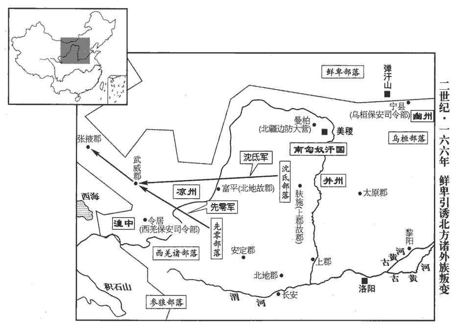
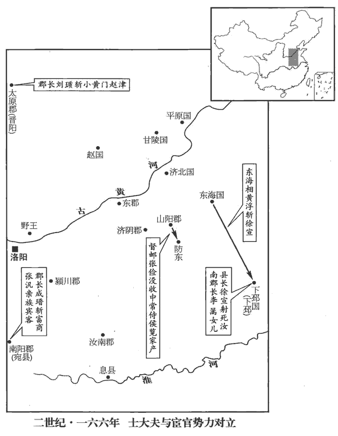
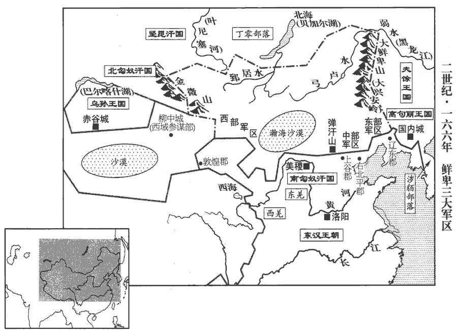

 漢紀四十七起閼逢執徐（甲辰），盡柔兆敦牂（丙午），凡三年。

# 孝桓皇帝中

## 延熹七年（甲辰，一六四）

1春，二月，丙戌，邟kàng鄉忠侯黃瓊薨。賢曰：說文云：邟，潁川縣也。漢潁川有周承休侯國，元始二年，更名曰邟，音亢。考異曰：范書：「四年，瓊免司空，至七年，卒。」袁紀：「七年，瓊以太尉薨。」范書，楊秉五年代劉矩為太尉。袁紀，此年瓊卒，秉乃為太尉。今從范書。將葬，四方遠近名士會者六七千人。

〖译文〗 [1]春季，二月丙戌（疑误），乡侯黄琼去世。临下葬时，四方远近知名人士前来吊丧的有六七千人。

初，瓊之教授於家，徐穉從之咨訪大義，及瓊貴，穉絕不復交。至是，穉往弔之，進酹，哀哭而去，穉，直利翻。復，扶又翻。酹，盧對翻。醊zhuì祭以酒沃地曰酹。人莫知者。諸名士推問喪宰，喪宰，典喪者也。宰曰：「先時有一書生來，衣麤薄而哭之哀，不記姓字。」眾曰：「必徐孺子也。」徐穉，字孺子。先，悉薦翻。衣，於既翻。於是選能言者陳留茅容輕騎追之，及於塗。容為沽酒市肉，穉為飲食。為，于偽翻；下同。容問國家之事，穉不答。更問稼穡之事，穉乃答之。容還，以語諸人，語，牛倨翻。或曰：「孔子云：『可與言而不與言，失人。』論語載孔子之言。然則孺子其失人乎？」太原郭泰曰：「不然。孺子之為人，清潔高廉，飢不可得食，寒不可得衣，食，讀曰飤sì。衣，於既翻。而為季偉飲酒食肉，此為已知季偉之賢故也！茅容，字季偉。此為，如字。所以不答國事者，是其智可及，其愚不可及也！」亦以孔子之言語諸人，蓋以寧武子況徐孺子。

〖译文〗 最初，黄琼在家中教授经书时，徐稚曾经向他询问要旨，到黄琼的地位尊贵以后，徐稚就和黄琼绝交，不再来往。黄琼去世，徐稚前往吊丧，以酒洒地表示祭奠，放声痛哭后离去，别人都不知道他是谁。吊丧的知名人士们询问主持丧事的人，他说：“早些时候的确有一位儒生来过这里，他衣着粗糙单薄，哭声悲哀，不记得他的姓名。”大家都说：“肯定是徐稚。”于是选派善于言辞的陈留人茅容，跨上快马急忙去追赶他，在半途追到。茅容为徐稚沽酒买肉，请他一道饮食。当茅容问及国家大事时，徐稚不作回答。茅容改变话题，谈论耕种和收获谷物的事，徐稚才回答他。茅容返回以后，将上述情况告诉大家。有人说：“孔子曾经说过：‘遇上可以交谈的人，却不和他谈论，未免有失于人。’这样说来，徐稚岂不是有失于人吗？”太原人郭泰说：“不是这样。徐稚为人清高廉洁，他饥饿时不会轻易接受别人的食物，寒冷时不会随便穿别人的衣服。而他答应茅容的邀请，一道饮酒食肉，这是因为已经知道茅容贤能的缘故。所以不回答国家大事，是由于他的智慧我们可以赶得上，他的故作愚昧我们却赶不上。”

泰博學，善談論。初游雒陽，時人莫識，陳留符融符，姓也。此符從「竹」、從「付」，非草付之「苻」。一見嗟異，因以介於河南尹李膺。古者主有儐，客有介，孔叢子曰：士無介不見。介，因也。膺與相見，曰：「吾見士多矣，未有如郭林宗者也。郭泰，字林宗。其聰識通朗，高雅密博，今之華夏，鮮見其儔。」夏，戶雅翻。鮮，息淺翻。遂與為友，於是名震京師。後歸鄉里，衣冠諸儒送至河上，車數千兩，兩，音亮。膺唯與泰同舟而濟，眾賓望之，以為神仙焉。自雒陽歸太原，渡河而西北。

〖译文〗 郭泰学问渊博，善于言谈议论。他刚到京都洛阳留学时，当时的人并不认识他。陈留人符融一见他就赞叹惊异，因而将他推荐给河南尹李膺。李膺跟他见面后说：“我所见到过的读书人很多，却从来没有遇到过像郭泰您这样的人。您聪慧通达，高雅慎密，在今天的中国，很少有人能与您相比。”便和他结交为好友，于是郭泰的名声立刻震动京城洛阳。后来，郭泰从洛阳启程返回家乡时，官员和士绅以及儒生将他送到黄河渡口，车子多达数千辆。只有李膺和郭泰同船渡河，前来送行的各位宾客望着他俩，认为简直是神仙。

泰性明知人，好獎訓士類，好，呼到翻。周遊郡國。茅容，年四十餘，耕於野，與等輩避雨樹下，眾皆夷踞相對，賢曰：夷，平也。說文曰：踞，蹲也。論語曰：原壤夷俟。言平坐踞傲也。容獨危坐愈恭，危坐，正襟盡前而坐。泰見而異之，因請寓宿。旦日，容殺雞為饌zhuàn，饌，雛皖翻，又雛戀翻。泰謂為己設；容分半食母，餘半庋guǐ置，食，讀曰飤sì。毛晃曰：板為閣以藏物曰庋，舉綺翻。自以草蔬與客同飯。賢曰：草，麄cū也。飯，父遠翻。泰曰：「卿賢哉遠矣！既言賢哉，又言遠矣，言其賢去常人甚遠。郭林宗猶減三牲之具以供賓旅，三牲之具，謂養親之具也。孝經曰：日用三牲之養。賓旅，猶言賓客也。而卿如此，乃我友也。」起，對之揖，勸令從學，卒為盛德。卒，子恤翻。鉅鹿‹河北宁晋西南›孟敏，客居太原，荷甑zèng墮地，不顧而去。荷，下可翻。甑，子孕翻。譙周古史考曰：黃帝始作甑。周官考工記，甑實二鬴fǔ。註云：六斗四升曰鬴。古者陶而為甑。釋器云：䰝謂之鬵zèng，鬵，鉹chǐ也。孫炎曰：關東人謂甑為鬵，涼州人謂甑為鉹chǐ。䰝zèng，即甑字。泰見而問其意，對曰：「甑已破矣，視之何益！」泰以為有分決，與之言，知其德性，因勸令游學，遂知名當世。陳留申屠蟠，家貧，傭為漆工；鄢陵‹河南鄢陵›庾yǔ乘，少給事县廷為門士；鄢陵縣，屬潁川郡。師古曰：鄢，音偃。陸德明曰：鄢，謁晚翻，又於建翻。賢曰：門士，即門卒。少，詩照翻。泰見而奇之，其後皆為名士。自餘或出於屠沽、卒伍，因泰獎進成名者甚眾。

〖译文〗 郭泰善于识别人的贤愚善恶，喜欢奖励和教导读书人，足迹遍布四方。茅容年龄已经四十余岁，在田野中耕作时和一群同伴到树底下避雨，大家都随便地坐在地上，只有茅容正襟危坐，非常恭敬。郭泰路过那里，见此情景，大为惊异，因而向茅容请求借宿。第二天，茅容杀鸡作为食品，郭泰以为是为自己准备的，但茅容分了半只鸡侍奉母亲，将其余半只鸡收藏在阁橱里，自己用粗劣的蔬菜和客人一同吃饭。郭泰说：“你的贤良大大地超过了普通人。我自己尚且减少对父母亲的供养来款待客人，而你却是这样，真是我的好友。”于是崐，郭泰站起身来，向他作揖，劝他读书学习。茅容最终成为很有德行的人。巨鹿人孟敏，在太原郡客居，肩上扛的瓦罐掉在地上，他一眼不看便离开了。郭泰见此情景，问他为什么这样，孟敏回答说：“瓦罐已经破碎了，看它有什么益处？”郭泰认为他有分辨和决断能力，于是和他交谈，了解他的天赋和秉性，因而劝他外出求学。结果孟敏成为闻名当世的人。陈留人申屠蟠家境贫困，受雇于人做漆工，鄢陵人庾乘年少时在县府担任门卒，郭泰见到他们，对他们另眼相待，后来他们都成为知名的人士。其他人，有的是屠户出身，有的是卖酒出身，有的是士卒出身，因受到郭泰的奖励和引进而成名的很多。

陳國‹河南淮阳›童子魏昭請於泰曰：「經師易遇，人師難遭，經師，謂專門名家，教授有師法者。人師，謂謹身脩行，足以范俗者。易，以豉翻。願在左右，供給灑掃。」灑，所賣翻，又山寄翻。掃，悉報翻。泰許之。泰嘗不佳，謂體中有不節適也，語曰不佳，微有疾也。命昭作粥，粥成，進泰，泰呵之曰：呵，責怒也，音虎何翻。「為長者作粥，不加意敬，使不可食！」以杯擲地。昭更為粥重進，泰復呵之。為，于偽翻。重，直龍翻。復，扶又翻。如此者三，昭姿容無變。泰乃曰：「吾始見子之面，而今而後，知卿心耳！」遂友而善之。

〖译文〗 陈国少年魏昭向郭泰请求说：“教授经书的老师容易遇到，但传授做人道理的老师却难遇到。我愿意跟随在您的身边，给您洒扫房屋和庭院。”郭泰许诺。后来，郭泰曾因身体不适，命魏昭给他煮稀饭。稀饭煮好以后，魏昭端给郭泰，郭泰大声喝斥魏昭说：“你给长辈煮稀饭，不存敬意，使我不能进食。”将杯子扔到地上。魏昭又重新煮好稀饭，再次端给郭泰，郭泰又喝斥他。这样一连三次，魏昭的态度和脸色始终没有改变。于是郭泰说：“我开始只看到你的表面，从今以后，我知道你的内心了！”就把魏昭当做好友，善意对待。

陳留左原，為郡學生，犯法見斥，泰遇諸路，為設酒肴以慰之。謂曰：「昔顏涿聚，梁甫之巨盜，段干木，晉國之大駔zǎng，卒為齊之忠臣，魏之名賢；呂氏春秋曰：顏涿聚，梁父‹山东泰安南›大盜也，學於孔子。左傳，晉伐齊，戰于黎丘，齊師敗績，知伯親禽顏庚。杜預註曰：黎丘，隰xí也。顏庚，齊大夫顏涿聚也。又曰：晉荀瑤伐鄭，鄭請救於齊。齊師將興，陳成子設乘車、兩馬，繫五邑焉，召顏涿聚之子晉曰：「隰之役，而父死焉。今君命汝是邑，服車而朝，毋廢前勞。」呂氏春秋曰：段干木晉國之駔zǎng。說文曰：駔，會也，謂合兩家之買賣，如今之度市也。新序曰：魏文侯過段干木之閭而軾之，國人誦之曰：「吾君好正，段干木之敬；吾君好忠，段干木之隆。」秦欲攻魏，司馬唐諫曰：「段干木，賢者也，而魏禮之，天下莫不聞，毋乃不可加兵乎！」駔zǎng，子朗翻。卒，子恤翻。蘧qú瑗yuàn、顏回尚不能無過，論語曰：蘧伯玉使人於孔子，子問之曰：「夫子何為？」對曰：「夫子欲寡其過而未能也。」又語曰：「顏回好學，不貳過。」蘧，求於翻。瑗，于眷翻。況其餘乎！慎勿恚恨，責躬而已！」恚huì，於避翻。原納其言而去。或有譏泰不絕惡人者，泰曰：「人而不仁，疾之已甚，亂也。」賢曰：論語孔子之言也。鄭玄註云：不仁之人，當以風化之，若疾之甚，是益使為亂也。原後忽更懷忿結客，欲報諸生。其日，泰在學，原愧負前言，因遂罷去。後事露，眾人咸謝服焉。

〖译文〗 陈留人左原是郡学的学生，因违反法令，被郡学斥退。郭泰在路上遇见他，特地摆设酒和菜肴，对他进行安慰，说：“从前，颜涿聚原是梁甫地区的大盗，段干木本是晋国的大市侩，可是，前一位终于成了齐国的忠臣，后一位终于成了魏国的著名贤人。蘧瑷、颜回尚且不能没有过错，何况其他的人？你千万不要心怀怨恨，只是反躬责问自己而已。”左原虚心听取郭泰的劝导后离去。有人讥讽郭泰不能和恶人断绝关系，郭泰说：“对于不合于仁的人，如果厌恶他太甚，就会使他为乱。”左原后来忽然重新心怀忿怒，结集宾客，想要报复郡学的学生。可是，这一天，郭泰正在郡学，左原惭愧自己辜负了郭泰以前的劝导，于是终于离去。后来这件事传开，大家全都佩服郭泰。

或問范滂曰：「郭林宗何如人？」滂曰：「隱不違親，賢曰：介推之類。貞不絕俗，賢曰：柳下惠之類。天子不得臣，諸侯不得友，吾不知其他。」

〖译文〗 有人询问范滂说：“郭泰是个什么样的人？”范滂回答说：“隐居而不离开双亲，坚贞而不隔绝世俗，天子不能使他为臣下，诸侯不能使他为友，除此之外，我不知道还有别的。”

泰嘗舉有道，不就，舉有道事，始五十卷安帝建光元年。同郡宋沖素服其德，以為自漢元以來，未見其匹，嘗勸之仕。漢元，謂漢初也。匹，儔也，等也，偶也。泰曰：「吾夜觀乾象，晝察人事，天之所廢，不可支也，吾將優游卒歲而已。」卒，子恤翻。然猶周旋京師，誨誘不息。誘，音酉。徐穉以書戒之曰：「大木將顛，非一繩所維，何為栖栖不遑寧處！」賢曰：顛，仆也，維，繫也，喻時將衰季，非一人所能救也。尹焞tūn曰：栖栖，猶皇皇也。處，昌呂翻。泰感寤曰：「謹拜斯言，以為師表。」

〖译文〗 郭泰曾经被地方官府推荐为“有道”人才，郭泰不肯接受。同郡人宋冲一向佩服郭泰的品德和学问，认为自从汉朝建立以来，没有人能超过他，曾经劝他出去作官。郭泰说：“我夜间观看天象，白天考察人事，上天要灭亡的，人力不能支持，我将悠闲地过日子而已。”但他还是经常到京都洛阳，不停地教诲和劝诱人们读书求学。徐稚写信警告他说：“大树快要倒下，不是一根绳子所能拴住的，为何奔波忙碌，不能安定下来！”郭泰有所感而觉悟说：“恭敬地拜受你的话，当做老师的指教。”

濟陰‹山东定陶›黃允，以雋才知名，濟，子禮翻。泰見而謂曰：「卿高才絕人，足成偉器，年過四十，聲名著矣。然至於此際，當深自匡持，不然，將失之矣！」後司徒袁隗wěi欲為從女求姻，為，于偽翻。從，才用翻。見允，歎曰：「得婿如是，足矣。」允聞而黜遣其妻。允妻夏侯氏。允黜其妻，欲婿于袁也。妻請大會宗親為別，因於众中攘袂數允隱慝十五事而去，允以此廢於時。當時清議為何如哉！數，所具翻。慝，吐得翻。

〖译文〗 济阴人黄允，以才智出众而知名。郭泰跟他见面时，对他说：“你才华很崐高，超过常人，一定会成为大器，年过四十岁以后，名声一定显著。然而，到了那时候，应该严格要求自己，匡正持重，不然，将丧失声名。”后来，司徒袁隗想为他的侄女选择丈夫，见到黄允，赞叹说：“能得到像黄允这样的女婿，就心满意足了。”黄允听说后，便将妻子休掉，让她回娘家。黄妻请求同所有宗族和亲戚见面辞别，于是当着众人的面，揎袖捋臂历数黄允的十五件隐私，然后登车而去。黄允因此名声败坏。

初，允與漢中‹陕西汉中›晉文經并恃其才智，曜名遠近，徵辟不就。託言療病京師，不通賓客，公卿大夫遣門生旦暮問疾，郎吏雜坐其門，猶不得見；三公所辟召者，輒以詢訪之，隨所臧否，否，音鄙。以為與奪。符融謂李膺曰：「二子行業無聞，行，下孟翻；下同。以豪桀自置，遂使公卿問疾，王臣坐門，融恐其小道破義，空譽違實，特宜察焉。」膺然之。二人自是名論漸衰，賓徒稍省，旬日之間，慚歎逃去，後并以罪廢棄。

〖译文〗 起初，黄允和汉中人晋文经，同时仗恃他们的才能智慧而远近闻名，官府征聘他们做官，都不肯接受。他俩托辞到京都洛阳疗养疾病，拒绝任何来访的宾客。三公九卿和大夫等派遣他们的门生早晚前来探问病情，郎吏错杂挤坐门房，仍然不能见面。三公府征聘属吏，往往先去征求他俩的意见，根据他俩的品评和褒贬，再决定任用或罢黜。符融对李膺说：“他俩的操行和事业都没有声名，却以豪杰自居，以致三公九卿都派人前往探病，朝廷命臣都去坐在门房等候召见。我怕他们的小道术会破坏儒家大义，徒具虚名而和实际不相符合，特别应该留意考察。”李膺赞同符融的意见。黄允和晋文经二人的名誉从此逐渐衰落，宾客和门徒稍稍减少，不到十天的时间，他俩惭愧叹息而逃走。后来，他俩都因有罪而被人们抛弃。

陳留仇香，至行純嘿，姓譜：仇姓，宋大夫仇牧之後。行，下孟翻；下同。鄉黨無知者。年四十，為蒲‹河南民权境›亭長。蒲亭，屬陳留郡考城縣。民有陳元，獨與母居，母詣香告元不孝，香驚曰：「吾近日過元舍，廬落整頓，賢曰：落，居也，今人謂院為落。耕耘以時，此非惡人，當是教化未至耳。母守寡養孤，苦身投老，柰何以一旦之忿，棄歷年之勤乎！且母養人遺孤，不能成濟，若死者有知，百歲之後，當何以見亡者！」母涕泣而起。香乃親到元家，為陳人倫孝行，譬以禍福之言，元感悟，卒為孝子。為，于偽翻。卒，子恤翻。考城‹河南民权东›令河內王奐署香主簿，考城縣，屬陳留郡；故菑縣，章帝惡其名，改曰考城。謂之曰：「聞在蒲亭，陳元不罰而化之，得無少鷹鸇zhān之志邪？」鷹鸇，以鷙擊為事。左傳：見無禮者誅之，如鷹鸇之逐鳥雀也。少，詩沼翻。香曰：「以為鷹鸇不若鸞鳳，故不為也。」奐曰：「枳zhǐ棘jí之林非鸞鳳所集，百里非大賢之路。」賢曰：時奐為縣令，故自稱百里也。乃以一月奉資香，奉，讀曰俸。使入太學。郭泰、符融齎jí刺謁之，書姓名以自通求見曰刺，秦、漢之間謂之謁。因留宿；明旦，泰起，下牀拜之曰：「君，泰之師，非泰之友也。」香學畢歸鄉里，雖在宴居，賢曰：宴，安也。朱子曰：宴居，閒暇無事之時。必正衣服，妻子事之若嚴君；妻子有過，免冠自責，妻子庭謝思過，香冠，妻子乃敢升堂，終不見其喜怒聲色之異。不應徵辟，卒於家。

〖译文〗 陈留人仇香虽德行高尚，但沉默寡言，乡里无人知道他。年龄四十岁时，担任蒲亭亭长。有个叫陈元的老百姓，一个人和母亲同住，他的母亲向仇香控告陈元忤逆不孝。仇香吃惊地说：“我最近经过陈元的房舍，院落整理得干干净净，耕作也很及时，说明他不是一个恶人，只不过没有受到教化，不知道如何做罢了。你年轻时守寡，抚养孤儿，劳苦一生，而今年纪已老，怎能为了一时的恼怒，抛弃多年的勤劳和辛苦？而且，你抚养丈夫遗留的孤儿，有始无终，倘若死者在地下有知，你百年之后，在地下怎么跟亡夫相见？”陈元的母亲哭泣着起身告辞。于是仇香亲自来到陈元家里，教导伦理孝道，讲解祸福的道理。陈元感动省悟，终于成为孝子。考城县令河内人王奂任命仇香为主簿，对他说：“听说你在薄亭，对陈元没有进行处罚，而是用教化来改变他，恐怕是缺少苍鹰搏击的勇气吧？”仇香回答说：“我认为苍鹰搏击不如鸾凤和鸣，所以不肯那样去做。”王奂又对他说：“荆棘的丛林，不是鸾凤栖身之所，百里之内的县府官职，不是大贤的道路。”于是用一个月的俸禄资助仇香，让他进入太学。郭泰、符融拿着名帖求见仇香，于是留宿。第二天早上，郭泰起来，在床前向仇香下拜说：“您是我的老师，不是我的朋友。”仇香在太学学成，回归乡里，即令是在闲暇无事的时候，也一定是衣服整齐。妻子和儿女侍奉他，就像对待严正的君王一样。妻子和儿女有了过错，仇香就摘下帽子，责备自己，妻子和儿女在院子里道歉思过，仇香才戴上帽子，妻子和儿女才敢进入堂屋。平常，从来看不见仇香因喜怒而改变声音脸色。他不接受官府的征聘，后来在家里去世。

2三月，癸亥，隕石于鄠hù‹陕西户县›。鄠縣，屬扶風。鄠，音戶。

〖译文〗 [2]三月癸亥（疑误），县坠落陨石。

3夏，五月，己丑‹十九›，京師雨雹。

〖译文〗 [3]夏季，五月己丑（十九日），京都洛阳降下冰雹。

4荊州‹湖南湖北›刺史度尚募諸蠻夷擊艾縣‹江西修水›賊，大破之，降者數萬人。桂陽‹湖南郴州›宿賊卜陽、潘鴻等逃入深山，宿賊，言積久為賊者。尚窮追數百里，破其三屯，多獲珍寶。陽、鴻黨眾猶盛，尚欲擊之，而士卒驕富，莫有闘志。尚計緩之則不戰，逼之必逃亡，乃宣言：「卜陽、潘鴻作賊十年，習於攻守，今兵寡少，未易可進，易，以豉chǐ翻。當須諸郡所發悉至，乃并力攻之。」申令軍中恣聽射獵，申令者，既下令而申言之。申，重也。兵士喜悅，大小皆出。尚乃密使所親客潛焚其營，珍積皆盡；獵者來還，莫不泣涕。尚人人慰勞，深自咎責，以失火自咎責也。勞，力到翻。因曰：「卜陽等財寶足富數世，諸卿但不并力耳，所亡少少，少，詩沼翻。何足介意！」眾咸憤踴。尚敕令秣馬蓐食，明旦，徑赴賊屯，陽、鴻等自以深固，不復設備，復，扶又翻。吏士乘銳，遂破平之。尚出兵三年，延熹五年，尚刺荊州，至是三年矣。群寇悉定，封右鄉侯。

〖译文〗 [4]荆州刺史度尚招募蛮人和夷人士卒，讨伐艾县的盗贼，将其大破，投降的有数万人之多。在桂阳郡作乱已久的贼帅卜阳、潘鸿等逃入深山，度尚率军穷追不舍，深入数百里，攻破三座屯堡，抢获到不少珍珠财宝。卜阳、潘鸿的党徒势力还很强盛。度尚准备继续进击，可是，他的部队既骄傲而又富有，没有斗志。度尚深知，如果缓兵不继续前进，则不能对盗贼发动攻击；如果强迫部队继续前进，一定会发生士卒逃亡。于是宣称：“卜阳、潘鸿，已经作了十年盗贼，无论是进攻或防守，都很擅长。而今，我们的军队寡不敌众，不能轻率前进，必须等到各郡征发的援军全部赶到，才能合力进行攻讨。”并且发布命令，准许军中将士们自由打猎。士兵听到命令后，非常喜悦，上自将领，下到小兵，几乎全体都出营打猎取乐。于是度尚秘密派遣自己的心腹亲信，暗中纵火焚毁军营，抢获来的珍珠财宝也全都被烧尽。出营打猎的将士们回来，见此情景，无不哭泣流泪。度尚一方面安慰他们，另一方面，又深深责备自己对火灾疏于防备，然后，激励大家说：“卜阳等积蓄的金银财宝，足够我们用几辈子，只怕你们不肯尽力。所焚烧的那点东西，何必放在心上？”全体将士都发愤踊跃，请求出击。度尚下令喂饱战马，让将士们早晨未起在寝席上进食，于拂晓前直接攻打盗贼的屯堡。卜阳、潘鸿等自以为山寨坚固，没有戒备。军吏和士兵们乘着锐气，将卜阳、潘鸿等盗贼一举剿灭。度尚出兵三年，将盗贼全部平定，被封为右乡侯。

5冬，十月，壬寅‹五›，帝‹刘志，时年三十三›南巡；庚申‹二十三›，幸章陵‹湖北枣阳南›；戊辰‹一›，幸雲夢‹湖北安陆南›，臨漢水，還，幸新野‹河南新野›。時公卿、貴戚車騎萬計，徵求費役，不可勝極。勝，音升。護駕從事桂陽胡騰上言：護駕從事，蓋荊州刺史所遣護車駕者也。「天子無外，春秋公羊傳曰：王者無外。乘輿所幸，即為京師。臣請以荊州刺史比司隸校尉，臣自同都官從事。」帝從之。自是肅然，莫敢妄干擾郡縣。荊州刺史得察舉所部郡縣而不可得察舉扈從之臣，若比司隸校尉，則得察舉其姦，故肅然也。帝在南陽‹河南南阳›，左右并通姦利，詔書多除人為郎，太尉楊秉上疏曰：「太微積星，名為郎位，賢曰：史記天官書曰：太微宮五帝坐後，聚二十五星蔚然，曰郎位。積，聚也。入奉宿衛，出牧百姓，宜割不忍之恩，以斷求欲之路。」斷，丁管翻。於是詔除乃止。

〖译文〗 [5]冬季，十月壬寅（初五），桓帝前往南方巡视。庚申（二十三日），抵达章陵。戊辰（疑误），抵云梦，到达汉水水滨，返回，抵达新野。当时，随行的三公九卿和皇亲国戚的车辆、马匹以万计，沿途向地方官府征发各种费用和差役，不可胜数。护驾从事桂阳人胡腾上书说：“天子本来没有内外之分，凡是皇帝所到之处，就是京城。我请求将荆州刺史比照司隶校尉，将我视同都官从事。”桓帝批准。从此纪律肃然，没有谁敢妄自扰乱郡县官府。当桓帝在南阳时，左右宦官亲信都营私谋取奸利，桓帝不断下诏，任命了很多人为郎。太尉杨秉上书说：“太微宫五帝座后，积聚着二十五星，名叫郎位。入则在宫中值宿，担任警卫；出则在地方官府任职，牧守百姓。陛下应该割舍不忍拒绝的恩惠，断绝左右谋取奸利的道路。”桓帝这才不再颁布任命为郎的诏书。

6護羌校尉段熲jiǒng擊當煎羌‹渭水上游一带›，破之。

〖译文〗 [6]护羌校尉段，率军进击当煎羌民，将其击破。

7十二月，辛丑‹四›，車駕還宮。

〖译文〗 [7]十二月辛丑（初四），桓帝返回京都洛阳皇宫。

8中常侍汝陽侯唐衡、武原侯徐璜皆卒。汝陽縣，屬汝南郡。武原縣，屬彭城國。

〖译文〗 [8]中常侍汝阳侯唐衡、武原侯徐璜二人全都病故。

9初，侍中寇榮，恂之曾孫也，性矜潔，少所與，少，詩沼翻。以此為權寵所疾。榮從兄子尚帝妹益陽長公主，帝又納其從孫女於後宮。從，才用翻。長，知兩翻。左右益忌之，遂共陷以罪，與宗族免歸故郡，寇氏本上谷‹河北怀来›昌平人。吏承望風旨，持之浸急。榮恐不免，詣闕自訟。未至，刺史張敬追劾榮以擅去邊，刺史，蓋幽州刺史也。劾，戶概翻，又戶得翻。有詔捕之。榮逃竄數年，會赦，不得除，積窮困，乃自亡命中上書曰：「陛下統天理物，作民父母，自生齒以上，咸蒙德澤；大戴禮曰：男子八月生齒，女子七月生齒。而臣兄弟獨以無辜，為專權之臣所見批扺zhǐ，賢曰：說文曰：扺，側擊也。批，音片支翻。余按前書音義：批，音蒲結翻。扺，諸氏翻。青蠅之人所共構會，詩曰：營營青蠅，止于樊。豈弟君子，無信讒言。青蠅能污白使黑，污黑使白，喻佞人變亂善惡也。令陛下忽慈母之仁，發投杼zhù之怒。事見三卷周赧nǎn王七年。殘諂之吏，張設機網，并驅爭先，若赴仇敵，罰及死沒，髡剔墳墓，謂剪伐松柏，如人之髡剔也。欲使嚴朝必加濫罰；朝，直遙翻。是以不敢觸突天威而自竄山林，以俟陛下發神聖之聽，啟獨覩之明，救可濟之人，援沒溺之命。不意滯怒不為春夏息，賢曰：春夏生長萬物，故不宜怒。為，于偽翻；下同。淹恚huì不為歲時怠，滯怒淹恚，言怒恚積蓄，久而不化也。恚，於避翻。遂馳使郵驛，布告遠近，嚴文尅剝，痛於霜雪，逐臣者窮人途，【張：「途」作「迹」。】追臣者極車軌，雖楚購伍員，史記：楚人伍奢為平王太子建太傅。費無極譖殺奢，奢子員字子胥奔吳，楚購之，得伍員者賜粟五萬石，爵執珪。員，音云。漢求季布，事見十卷高祖五年。無以過也。臣遇罰以來，三赦再贖，無驗之罪，足以蠲juān除；賢曰：無驗，謂無罪狀可案驗也。而陛下疾臣愈深，有司咎臣甫力，賢曰：甫，始也。力，甚也。止則見掃滅，行則為亡虜，苟生則為窮人，極死則為冤鬼，天廣而無以自覆，覆，敷救翻。地厚而無以自載，蹈陸土而有沈淪之憂，遠巖牆而有鎮壓之患。遠，于願翻。如臣犯元惡大憝duì，賢曰：憝、惡，言元惡之人，大為人之所惡也。憝，徒對翻。足以陳原野，備刀鋸，賢曰：鋸，刖yuè刑也。國語曰：刑有五，大者陳諸原野。陛下當班布臣之所坐，以解眾論之疑。臣思入國門，坐於肺石之上，使三槐九棘平臣之罪，周禮秋官曰：左九棘，孤、卿、大夫位焉；右九棘，公、侯、伯、子、男位焉；面三槐，三公位焉。左嘉石，平罷民，右肺石，達窮民。註：肺石，赤石也。槐取其懷來，棘取其赤心外刺。而閶闔九重，賢曰：閶闔，天門也。重，直龍翻。陷井步設，舉趾觸罘fú罝jū，賢曰：井，坑井也。說文：罘，兔網也；罝，亦兔網也；音浮嗟。動行絓guà羅網，絓，古賣翻，罥juàn也。無緣至萬乘之前，乘，繩證翻。永無見信之期。悲夫，久生亦復何聊！復，扶又翻。蓋忠臣殺身以解君怒，孝子殞命以寧親怨，故大舜不避塗廩lǐn、浚jùn井之難，史記：舜父瞽叟，常欲殺舜，使舜塗廩，從下焚廩，舜乃以兩笠自扞hàn而下。又使穿井，舜為匿空旁出。舜既入深，父乃下土實之，舜從旁空出去。難，乃旦翻。申生不辭姬氏讒邪之謗；左傳：驪姬嬖於晉獻公，欲殺太子申生，謂申生曰：「君夢齊姜，必速祭之。」太子祭于曲沃，歸胙zuò于公。公田，姬寘諸宮，六日。公至，毒而獻之。公祭之地，地墳；與犬，犬斃；與小臣，小臣斃。姬泣曰：「賊由太子。」太子奔新城。或謂太子：「子辭，君必辨焉。」太子曰：「我辭，姬必有罪。」遂縊而死。臣敢忘斯義，不自斃以解明朝之忿哉！乞以身塞責，朝，直遙翻。塞，悉則翻。願陛下匃兄弟死命，賢曰：匃，乞也，音蓋。使臣一門頗有遺類，以崇陛下寬饒之惠。先死陳情，臨章泣血！」帝省章愈怒，先，悉薦翻。省，悉井翻。遂誅榮，寇氏由是衰廢。考異曰：袁紀置此事於延熹元年。按范書榮傳云「延熹中被罪」，榮書又云：「遇罰以來，三赦再贖」，不知榮死果在何年。按襄楷、竇武上書，皆言梁、孫、寇、鄧之誅。今置於此。

〖译文〗 [9]起初，侍中寇荣，即寇恂的曾孙，性格矜持清高，很少跟人交往，因此遭到权贵的憎恨。寇荣堂兄的儿子娶桓帝的妹妹益阳长公主为妻，而桓帝又纳寇荣的孙女作妃子，所以桓帝左右的宦官亲信对寇荣愈发嫉妒，于是共同诬陷寇荣有罪。寇荣被免官，和宗族一道回到本郡。地方官吏根据朝廷权贵们的意旨，对寇荣加紧进行迫害。寇荣害怕不能免罪，就前往京都洛阳，准备到宫门上书，为自己辩解。走到中途，幽州刺史张敬又以寇荣擅自离开边郡住所为理由，追加弹劾他的内容。桓帝下诏逮捕寇荣。寇荣逃亡流窜了好几年，遇到实行大赦，也不能免罪，备受贫穷困苦，于是在逃亡中向桓帝上书说：“陛下统治天下，治理万物，当人民的父母，自长出牙齿的年龄以上的人民，都能得到陛下的恩德。然而，只有我们兄弟，本来无罪，却遭到朝廷专权大臣的百般排挤，被苍蝇一样的谗佞小人阴谋陷害，以致陛下忽略了慈母的仁爱，跟曾参的母亲一样，误信曾参杀人的传闻，发出投梭的愤怒。残暴谄媚的的执法官吏，张开罗网，设立陷阱，并驾齐驱，争先恐后，好似追赶仇敌一样。刑罚甚至加到死人的尸体上，坟墓也被铲平。他们为了表示朝廷的严明，必须滥加惩罚。所以，我不敢冒犯天威，而私自逃亡流窜深山老林，以等待陛下圣耳垂听，神目明察，拯救可以济度的人，援助将要淹死的生命。不料陛下的积怒并不因为春夏二季的降临而平息，蓄恨也不随着时间的推移而松懈，于是派出使者，奔驰于驿站之间，贴出布告，传播远近，文辞苛刻，比霜雪还要严厉。追逐我的人走遍天下道路，缉拿我的官吏，布满有车辆轨道的地方。即令是当初楚国悬赏捉拿伍员，汉王朝悬赏捉拿季布，都没有超过对我这样严厉的追捕。我自从受到处罚以来，朝廷实行过三次大赦，又颁布过两次可以用金钱粟米赎罪的诏令，我所犯的属于没有证据的罪，有足够的理由被赦免。可是，陛下却对我恨得更深，有关官吏追究我的罪过更加厉害。我如果停下来，就会被消灭，如果前进，就是逃亡的罪人。苟活则为无路可走的人，拼死则为含冤的鬼，苍天辽阔，却不能复盖我；大地厚实，却不能使我立足。脚踏陆地，而有被埋没的忧患；远离岩石筑成的高墙，而有被高墙压倒的危险。如果我犯了十恶不赦的大罪，完全应该身受死刑，陈尸原野，那么，陛下应当公开宣布我的罪状，以解除舆论的疑惑。我曾经想进入京都洛阳的大门，坐在宫廷门外的赤色肺石上，让三公九卿公正评判我的罪过。然而，皇宫之门紧闭九重，每走一步都是陷阱，举足便触犯法网，挪步就遭陷害，我无法来到陛下面前，永远没有获得陛下相信的日子。真是可悲，我长久活下去，又还有什么意思！忠臣为了化解君王的愤怒而不惜杀身；孝子为了宁息双亲的怨恨而不惜殒命，所以虞舜不逃避刷抹仓房和穿井挖土的苦难，申生不逃避骊姬恶意的诽谤和陷害。我岂敢忘记这个道理，不自杀以化解圣明陛下的忿怒？我请求用我一个人来抵塞罪责，愿陛下饶恕我兄弟的死罪，使我一家能留下后人，以显示陛下宽厚的恩惠。临死之前，向陛下陈诉苦情，面对奏章，泪尽泣血！”桓帝看到寇荣的奏章后，更加愤怒，于是诛杀寇荣。寇家从此衰败。

## 八年（乙巳，一六五）

1春，正月，帝‹刘志，时年三十四›遣中常侍左悺guàn之苦縣‹河南鹿邑›祠老子。賢曰：史記曰：老子者，楚苦縣厲鄉曲仁里人也，名耳，字聃，姓李，為周守藏吏。有神廟，故就祠之。苦縣，屬陳國，故城在今亳州谷陽縣。苦，音戶，又如字。

〖译文〗 [1]春季，正月，桓帝派遣中常侍左前往苦县祭祀老子。

2勃海‹河北南皮›王悝kuī，素行險僻，悝，苦回翻。行，下孟翻。多僭傲不法。北軍中候陳留史弼上封事曰：「臣聞帝王之於親戚，愛雖隆必示之以威，體雖貴必禁之以度，如是，和睦之道興，骨肉之恩遂矣。竊聞勃海王悝，外聚剽輕不逞之徒，賢曰：剽，悍也。逞，快也。謂被侵枉不快之人也。左傳曰：率群不逞之人。余謂不逞，謂包藏禍心而不得逞者。剽，匹妙翻。內荒酒樂，出入無常，所與群居，皆家之棄子，朝之斥臣，朝，直遙翻；下同。必有羊勝、伍被之變。羊勝事見十六卷景帝中二年。伍被事見十九卷武帝元狩元年。州司不敢彈糾，州司，謂州刺史之屬。傅相不能匡輔，陛下隆於友于，書曰：惟孝友于兄弟。不忍遏絕，恐遂滋蔓，滋，長也。蔓，延也。左傳曰：無使滋蔓，蔓難圖也。為害彌大。乞露臣奏，宣示百僚，平處其法。處，昌呂翻。法決罪定，乃下不忍之詔；臣下固執，然後少有所許：少，詩沼翻。如是，則聖朝無傷親之譏，勃海有享國之慶；不然，懼大獄將興矣。」上不聽。悝果謀為不道，帝紀曰：悝謀反。有司請廢之，詔貶為癭陶‹河北宁晋西南›王，食一縣。賢曰：癭陶縣，屬鉅鹿郡，故城在今趙州癭陶縣西南。癭，於郢翻。

〖译文〗 [2]勃海王刘悝，行为一向邪恶，经常超越本分，骄横不法。北军中候陈留人史弼向桓帝上呈密封的奏章说：“我听说，帝王对于亲戚，虽然爱得深厚，但一定要他们知道帝王的威严；身份虽然尊贵，但一定要他们遵守国家的法令。必须如此，才能使上下和睦相处，骨肉之间的恩惠得以成全。我听说勃海王刘悝在外集结一批强悍轻浮不得志的歹徒，在内荒废政务，酗酒作乐，出入无常。整天和他住在一起的人，都是被家庭抛弃的浪子，朝廷废黜的官吏，必然会发生羊胜、伍被那样的变乱。州刺史府不敢弹劾纠察，王国傅、相不能匡正辅佐，陛下手足情深，不忍心加以阻止，恐怕会越来越滋长蔓延，为害更大。我请求将我的奏章向百官公布，公平地依法对他进行处理。等到判决定罪以后，陛下再颁布不忍惩罚的诏令，臣下坚持要对他进行处理，然后陛下再稍稍让步。这样，圣明朝廷就不会受到伤害亲戚的讥讽，勃海国就能够庆幸保全，不然的话，恐怕将会兴起大狱。”桓帝不听。刘悝果然图谋反叛朝廷，有关官吏请求将他废黜。桓帝下诏，将刘悝贬为瘿陶王，只享有一个县的食邑。

3丙申晦‹三十›，日有食之。詔公、卿、校尉舉賢良方正。校，戶教翻。

〖译文〗 [3]丙申晦（三十日），发生日食。桓帝下诏，命三公、九卿、校尉向朝廷推荐“贤良方正”人才。

4千秋萬歲殿火。

〖译文〗 [4]千秋万岁殿失火。

5中常侍侯覽兄【張：「兄」作「弟」。】參為益州‹四川云南›刺史，殘暴貪婪，婪，盧含翻。累臧億計。太尉楊秉奏檻車徵參，參於道自殺，閱其車重三百餘兩，皆金銀錦帛。重，直用翻。秉因奏曰：「臣案舊典，宦者本在給使省闥，司昏守夜；而今猥受過寵，執政操權，操，七刀翻。附會者因公褒舉，違忤者求事中傷，忤，五故翻。中，竹仲翻。居法王公，富擬國家，飲食極肴膳，僕妾盈紈素。中常侍侯覽弟參，貪殘元惡，自取禍滅；覽顧知釁重，必有自疑之意，臣愚以為不宜復見親近。復，扶又翻。近，其靳翻。昔懿公刑邴歜chù之父，奪閻職之妻，而使二人參乘，卒有竹中之難。左氏傳：齊懿公之為公子也，與邴歜之父爭田，弗勝。及即位，乃掘而刖之，而使歜僕；納閻職之妻，而使職參乘。公游于申池，二人浴于池，歜以鞭抶chì職，職怒，歜chù曰：「人奪汝妻而不怒，一抶汝，庸何傷！」職曰：「與刖其父而不能病者何如！」乃謀弒公，納諸竹中。邴，音丙，又彼病翻。「𨞕」，左傳作「歜」，昌欲翻。卒，子恤翻。難，乃旦翻。覽宜急屏斥，投畀有虎，畀，與也。詩曰：取彼讒人，投畀豺虎。屏，必郢翻。若斯之人，非恩所宥，請免官送歸本郡。」書奏，尚書召對秉掾屬，詰之曰：賢曰：召秉掾屬問之。詰，去吉翻。「設官分職，各有司存。三公統外，御史察內；今越奏近官，經典、漢制，何所依據？其開公具對！」秉使對曰：「春秋傳曰：『除君之惡，唯力是視。』左傳載寺人披之言。此經典也。鄧通懈慢，申屠嘉召通詰責，文帝從而請之。事見十五卷文帝後二年。此漢制也。漢世故事，三公之職，無所不統。」尚書不能詰，帝不得已，竟免覽官。司隸校尉韓縯yǎn因奏左悺guàn罪惡，及其兄太僕南鄉侯稱請託州郡，聚斂為姦，斂，力贍翻。賓客放縱，侵犯吏民。悺、稱皆自殺。縯又奏中常侍具瑗兄沛‹安徽淮北›相恭臧罪，徵詣廷尉。瑗詣獄謝，上還東武侯印綬，東武城，屬清河郡。據宦者傳，瑗封東武陽侯。東武陽，屬東郡。上，時掌翻。詔貶為都鄉侯。超及璜、衡襲封者，并降為鄉侯，考異曰：楊秉傳：「南巡之明年，秉劾侯覽」，則是在此年矣。宦者傳：「韓縯奏具瑗，瑗坐奪國為鄉侯」，與秉傳所云削瑗國共是一时事明矣。而袁紀載在去年春，與范不同。今從范書。子弟分封者，悉奪爵土。劉普等貶為關內侯，尹勳等亦皆奪爵。

〖译文〗 [5]中常侍侯览的弟弟侯参担任益州刺史，残暴贪婪，赃款累计多达一亿。太尉杨秉进行弹劾，朝廷用囚车把侯参押解回京，侯参在途中自杀。查看他携载物资的三百余辆车，装的都是金银和锦帛。因此，杨秉又上书弹劾说：“我查考朝廷旧有的典章制度，宦官本来只限于在皇宫内听候差遣，负责早晚看守门户，而今却大多倍受过份的宠信，掌握朝廷大权。凡是依附宦官的人，宦官就趁着朝廷征用人才时推荐他们做官；凡是违背和冒犯宦官的人，宦官便随便找一个借口对他们进行中伤。宦官的居处效法王公，他们拥有的财富可与帝王相比，饮食极尽佳肴珍膳，奴仆侍妾都穿精致洁白的细绢。中常侍侯览的弟弟侯参，是贪赃残暴的首恶，自取灾祸和灭亡。侯览深知罪恶深重，一定会自感疑惧不安，我愚昧地认为，不应该把侯览再放在陛下左右。过去，齐懿公给崐邴的父亲加刑，又夺去阎职的妻子，却使他们二人陪同乘车，终于发生竹林中的大祸。因此，侯览应被急速斥退，投到豺狼虎豹群中。像这一类人，不能施行恩德宽恕罪行，请免除官职，送回本郡。”奏章呈上以后，尚书召来杨秉的属吏，责问说：“朝廷设立官职，各有各的职责范围。三公对外管理政务，御史对内监察官吏。而今，三公超越的职责范围，弹劾皇宫内的宦官，无论是经书典籍，还是汉朝制度，有什么根据？请公开作具体答复。”杨秉派遣的属吏回答说：“《春秋左传》上说：‘为君王排奸去恶，要使出全身的力量。’邓通懈怠轻慢，申屠嘉召邓通进行责问，汉文帝因而为邓通说情。汉朝的传统制度是，三公的职责，没有一件事情不可以过问。”尚书无法反驳。桓帝迫不得已，终于将侯览免职。司隶校尉韩乘机弹劾左的罪恶，以及左的哥哥、南乡侯左称向州郡官府请托，搜刮财货，作奸犯科，宾客放纵，侵犯官吏和百姓的罪过。左、左称都自杀了。韩又弹劾中常侍具瑗的哥哥、沛国相具恭贪赃枉法。桓帝下令将具恭征召回京都洛阳，送到廷尉狱治罪。于是，具瑗也主动到廷尉狱认罪，并向上交东武侯印信。桓帝下诏将具瑗贬封为都乡侯。单超及徐璜、唐衡的封爵继承人都被贬为乡侯，子弟得到分封的，全部取消封爵和食邑。刘普等被贬为关内侯，尹勋等也都被取消封爵。

6帝多內寵，宮女至五六千人，及驅役從使復兼倍於此，驅役者，嬖倖挾勢驅掠良人，以供掖庭私役者也。從使者，趨勢附力，樂從而為之使者也。復，扶又翻。而鄧后恃尊驕忌，與帝所幸郭貴人更相譖訴。更，工衡翻。癸亥‹二十七›，廢皇后鄧氏‹邓猛女›，送暴室，以憂死。漢官儀曰：暴室，在掖庭內，丞一人，主宮中婦人疾病者；其皇后、貴人有罪者，亦就此室。河南尹鄧萬世、虎賁中郎將鄧會皆下獄誅。下，遐稼翻。

〖译文〗 [6]桓帝拥有许多后妃，宫女达到五六千人，其他供驱使的仆役，还是这个数目的两倍。邓皇后仗恃她的尊贵地位，骄傲忌妒，跟桓帝宠幸的郭贵人互相诬陷和控告。二月癸亥（二十七日），邓皇后被废，送往暴室监禁。邓皇后忧愤而死。河南尹邓万世、虎贲中郎将邓会，都被逮捕下狱诛杀。

7護羌校尉段熲jiǒng擊罕【張：「罕」作「勒」。】姐羌，破之。姐，且也翻，又音紫。

〖译文〗 [7]护羌校尉率军进击罕姐羌人部落，将其击破。

8三月，辛巳‹十六›，赦天下。

〖译文〗 [8]三月辛巳（十六日），大赦天下。

9宛陵‹河南新郑东北›大姓羊元群罷北海郡‹山东昌乐西›，宛陵縣，屬河南尹。臧污狼籍；郡舍溷hùn軒有奇巧，賢曰：溷軒，廁屋。亦載之以歸。河南尹李膺表按其罪；元群行賂宦官，膺竟反坐。反坐，按其罪而不得行，反自坐罪。單超弟遷為山陽‹山东金乡西北昌邑镇›太守，以罪繫獄，廷尉馮緄gǔn考致其死；考鞠而致其死罪也。緄，古本翻。中官相黨，共飛章誣緄以罪。中常侍蘇康、管霸，固天下良田美业，固，障固也。州郡不敢詰，大司農劉祐移書所在，依科品沒入之；帝大怒，與膺、緄俱輸作左校。

〖译文〗 [9]宛陵县的大族羊元群，在北海郡太守任上被罢免。他贪赃枉法，声名狼藉，郡府中厕所里装有精巧的设备，都被他载运回家。河南尹李膺向朝廷上表，请求审查和验问羊元群的罪行。羊元群向宦官们行贿，李膺竟被宦官们指控为诬告，遭受“反坐”之罪。单超的弟弟单迁担任山阳郡太守，因为犯法被囚禁在监狱，廷尉冯绲将他拷打下致死。于是宦官们互相结党，共同起草匿名信，诬告冯绲有罪。中常侍苏康、管霸用贱价强买天下良田美业，州郡官府不敢责问，大司农刘向当地发送公文，依照法令，予以没收。桓帝大为震怒，下令把刘和李膺、冯绲，都一道送往左校营，罚服苦役。

10夏，四月，甲寅‹十九›，安陵園寢火。安陵，惠帝陵也。

〖译文〗 [10]夏季，四月甲寅（十九日），西汉惠帝陵园安陵寝殿失火。

11丁巳‹二十二›，詔壞郡國諸淫祀。壞，音怪。特留洛陽王渙、密縣卓茂二祠。

〖译文〗 [11]丁巳（二十二日），桓帝下诏，命各郡各封国拆除滥设的祠庙，仅准许保留京都洛阳王涣和密县卓茂这两处祠庙。

12五月，丙戌‹二十二›，太尉楊秉薨。秉為人，清白寡欲，嘗稱「我有三不惑：酒、色、財也。」

〖译文〗 [12]五月丙戌（二十二日），太尉杨秉去世。杨秉为人清白，欲望很少，曾经自称“我有三不惑：美酒、女色、钱财。”

秉既沒，所舉賢良廣陵‹江苏扬州›劉瑜乃至京師上書言：「中官不當比肩裂土，競立胤嗣，繼體傳爵。順帝陽嘉四年，著令聽中官以養子襲爵。又，嬖女充積，冗食空宮，無事而食，謂之冗食。冗，而隴翻。傷生費國。又，第舍增多，窮極奇巧，掘山攻石，促以嚴刑。州郡官府，各自考事，姦情賕qiú賂，皆為吏餌。民愁鬱結，起入賊黨，官輒興兵誅討其罪，貧困之民，或有賣其首級以要酬賞，要，一遙翻。父兄相代殘身，妻孥相視分裂。又，陛下好微行近習之家，好，呼到翻。私幸宦者之舍，賓客市買，熏灼道路，因此暴縱，無所不容。惟陛下開廣諫道，諫道，謂言路也。博觀前古，遠佞邪之人，遠，于願翻。放鄭、衛之聲，則政致和平，德感祥風矣。」孝經援神契曰：德至八方，則祥風至。詔特召瑜問災咎之徵。執政者欲令瑜依違其辭，乃更策以他事，瑜復悉心對八千餘言，有切於前。復，扶又翻；下同。拜為議郎。

〖译文〗 杨秉去世后，他所推荐的贤良、广陵人刘瑜前往京都洛阳上书说：“宦官不应当都裂土分封，竞相选立养子，继承他们的爵位。而美女充斥，无事坐食空宫，不但伤害民生，而且耗费国家财富。还有，宅第巨舍不断增多，式样极其奇异精巧，用严刑峻法催逼人民营造。州郡宫府，各审各的官司，为非作恶的人利用贿赂买通官吏，逍遥法外。人民愁苦忧闷，有冤无处伸诉，被迫加入了盗贼之党，官府就征调军队，讨伐他们的罪行。贫困的人民，有的甚至出卖自己的人头，去向官府领取悬赏，父亲和兄长互相替代杀身，妻子和儿女眼看着亲人死去。陛下又喜好微服出行到左右亲近的人家里，私自到宦官的住宅，使他们的宾客到处兜售这些消息，把整个道路弄得乌烟瘴气，他们因此凶暴骄纵，无所不用其极。请陛下广开言路，听取臣下的规劝和进谏，多多观察上古的经验和教训，疏远奸佞邪恶的人，不听郑国、卫国的淫荡音乐，则政治达到和平，恩德普降天下，吉祥的和风自然来临。”桓帝下诏，特召刘瑜，向他询问灾异的迹象和预兆。掌握朝政大权的官员想让刘瑜在回答时含糊其辞，于是改问别的事情。可是刘瑜再次尽心回奏，共八千余言，言辞比从前的上书更为激烈。桓帝任命他为议郎。

13荊州‹湖北湖南›兵朱蓋等叛，與桂陽賊胡蘭等復攻桂陽‹湖南郴州›，太守任胤棄城走，任，音壬。賊眾遂至數萬。轉攻零陵‹湖南永州›，太守下邳‹江苏睢宁北古邳镇›陳球固守拒之。零陵下溼，編木為城，零陵郡，武帝置。宋白曰：郡古理在今全州清湘縣南七十八里，古城存焉。郡中惶恐。掾史白球遣家避難，難，乃旦翻。球怒曰：「太守分國虎符，受任一邦，豈顧妻孥而沮國威乎！孥，音奴。沮，在呂翻。復言者斬！」乃弦大木為弓，羽矛為矢，引機發之，多所殺傷。此則今划車弩之類。賊激流灌城，球輒於內因地勢，反決水淹賊，相拒十餘日不能下。時度尚徵還京師，詔以尚為中郎將，率步騎二萬餘人救球，發諸郡兵并勢討擊，大破之，斬蘭等首三千餘級，復以尚為荊州刺史。蒼梧‹广西梧州›太守張敘為賊所執，及任胤皆徵棄市。胡蘭餘黨南走蒼梧，交趾‹两广及越南北›刺史張磐擊破之，賊復還入荊州界。度尚懼為己負，負，罪負也，懼以不能盡滅群賊為罪。乃偽上言蒼梧賊入荊州界，於是徵磐下廷尉。上，時掌翻。下，遐稼翻。辭狀未正，會赦見原，磐不肯出獄，方更牢持械節。竹約為節。械節，亦械之刻約處也。考異曰：按張磐會赦得原。檢帝紀，此後未有赦，不知會何赦也？六年三月赦，前此二年；永康元年六月赦，後此二年。今從帝紀。獄吏謂磐曰：「天恩曠然，而君不出，可乎？」磐曰：「磐備位方伯，古者，八州八伯。漢州刺史，古方伯之任也。為尚所枉，受罪牢獄。夫事有虛實，法有是非，磐實不辜，赦無所除；如忍以苟免，永受侵辱之恥，生為惡吏，死為敝鬼。乞傳尚詣廷尉，以傳車召致廷尉也。傳，株戀翻，又直戀翻。面對曲直，足明真偽。尚不徵者，磐埋骨牢檻，終不虛出，望塵受枉！」廷尉以其狀上，上，時掌翻。詔書徵尚，到廷尉，辭窮，受罪，以先有功得原。

〖译文〗 [13]荆州士兵朱盖等反叛，和桂阳郡贼帅胡兰等，再次攻打桂阳城。太守任胤充城逃走，盗贼的人数于是多达数万。转而攻打零陵郡，零陵郡太守下邳人陈球坚决进行守御和抵抗。因零陵地势低洼，十分潮湿，城墙是用木头编筑而成的，所以城中的人们恐慌不安。太守府的属吏建议陈球把家属送走避难，陈球大怒说：“我身为太守，掌握国家的兵符，负责一郡的安全，岂可以为了自己的妻子和儿女而败坏国家的声威呢？有再说这种话的人，处斩！”于是，用大木制造弓弦，在矛上粘上羽毛当箭，用机械发射，杀伤不少的盗贼。盗贼又堵塞河流，引水灌城，陈球在城内，随即顺着地势，反过来决水去淹盗贼，抵抗了十余天，盗贼无法攻破。这时，正遇上度尚被调回京都洛阳，桓帝下诏，任命他为中郎将，并率领步兵和骑兵共二万余人，南下援救陈球。度尚征发各郡的地方军队，联合进行讨伐，大破朱盖、胡兰等叛军，斩杀胡兰等三千余人。朝廷重新任命度尚为荆州刺史。苍梧郡太守张叙曾被盗贼军队俘虏，他和桂阳郡太守任胤都被召回京都洛阳，在街市斩首示众。胡兰的残余部众南逃到苍梧郡，交趾刺史张磐将其击破，盗贼又重新返回荆州境内，荆州刺史度尚害怕成为自己的过失，于是上书谎称苍梧郡盗贼进入荆州境界。于是朝廷将张磐征召回京都洛阳，囚入廷尉狱。供辞和罪状尚未确定，正遇上大赦而被免罪，可是张磐不肯出狱，而将所带刑具的接合处加固。狱吏对张磐说：“皇恩浩荡，而你不肯出狱，能这样做吗？”张磐回答说：“我身为一州的地方长官，被度尚诬告，投入监狱，备受苦刑。事情应该分清虚假和真实，法律应该辨明谁是谁非。我确实没有犯罪，赦罪之令与我无干。如果我忍气吞声，只求免除眼前的痛苦，却要遭受永远的耻辱，活着是恶吏，死后是恶鬼。我请求用传车将度尚征召到廷尉狱，当面对质，一定可以辨明真假。如果不准许征召度尚，我将把骨头埋葬在监狱之中，始终不能背着虚假的罪名出狱，蒙受飞来的冤枉。崐”廷尉将上述情况报告给桓帝，桓帝下诏，将度尚征召回京，到廷尉狱和张磐对质。度尚理屈辞穷，本应治罪。但因他先前有功劳，免予惩处。

14閏月，甲午‹一›，南宮朔平署火。此朔平司馬署也。百官志：朔平司馬，主北宮北門。

〖译文〗 [14]闰月甲午（初一），南宫北门朔平署失火。

15段熲jiǒng擊破西羌，進兵窮追，展轉山谷間，自春及秋，無日不戰，虜遂敗散，凡斬首二萬三千級，獲生口數萬人，降者萬餘落。降，戶江翻。封熲都鄉侯。

〖译文〗 [15]段率军击破西羌，乘胜穷追，转战山谷之间，从春季直到秋季，没有一天不战斗，反叛的羌民终于溃败和逃散，共计斩杀二万三千人，俘虏数万人，投降的有一万余落。朝廷封段为都乡侯。

16秋，七月，以太中大夫陳蕃為太尉。蕃讓於太常胡廣、議郎王暢、弛刑徒李膺，帝不許。

〖译文〗 [16]秋季，七月，擢升太中大夫陈蕃为太尉。陈蕃先后提出，将太尉之位让给太常胡广、议郎王畅和弛刑徒李膺，桓帝没有批准。

暢，龔之子也；王龔事安帝為公。嘗為南陽太守，疾其多貴戚豪族，下車，奮厲威猛，大姓有犯，或使吏發屋伐樹，堙yīn井夷竈。破其家業也。功曹張敞奏記諫曰：「文翁、召父、卓茂之徒，召，讀曰邵。皆以溫厚為政，流聞後世。發屋伐樹，將為嚴烈，雖欲懲惡，難以聞遠。聞，音問。郡為舊都，侯甸之國，古者天子之制，規方千里，以為甸服；又其外五百里，為侯服。光武起於南陽，其後謂之南都，又於雒陽在侯甸之內，故云然。園廟出於章陵‹湖北枣阳南›，三后生自新野，賢曰：南頓君以上四廟在章陵，光烈皇后、和帝陰后、鄧后并新野人。自中興以來，功臣將相，繼世而隆。愚以為懇懇用刑，不如行恩；孳孳求姦，孳孳，猶汲汲也。未若禮賢。舜舉皋陶，不仁者远，論語載子夏之言。陶，音遙。化人在德，不在用刑。」暢深納其言，更崇寬政，教化大行。

〖译文〗 王畅是王龚的儿子，曾担任过南阳郡的太守。他痛恨南阳郡有许多的皇亲国戚和豪门大族，所以到职以后雷厉风行，遇到有大姓人家犯法，便派官吏摧毁他们的家宅房屋，砍伐树木，填平水井，铲平厨房炉灶。功曹张敞向他上书劝阻说：“文翁、召父、卓茂等人，都是因为为政温和宽厚，从而流芳后世。摧毁家宅房屋，砍伐树木，实在太严厉酷烈，虽然是为了惩治奸恶，可是效果难以长久。南阳郡原是古都，又在京都洛阳千里的范围之内，皇帝祖先的陵园就在章陵，三位皇后都出生于新野，自从光武帝中兴以来，功臣将相，一代接着一代崛起。我愚昧地认为，与其急切地用刑，不如推行恩德；与其孜孜不倦地去缉拿奸恶之徒，不如礼敬贤能。虞舜推荐皋陶，邪恶的人自然远离。教化人民，靠的是恩德，不是靠严刑峻法。”王畅诚恳地接受了他的建议，改为崇尚宽厚为政，使教化得以普遍推行。

17八月，戊辰‹六›，初令郡國有田者畝斂稅錢。賢曰：畝十錢也。余據宦者傳：張讓等說靈帝斂天下田，畝稅十錢，非此時事也，蓋漢田租三十稅一，而計畝斂錢，則自此始。

〖译文〗 [17]八月戊辰（初六），首次命令各郡、各封国，对有田者以亩为单位征收赋税。

18九月，丁未‹十五›，京師地震。

〖译文〗 [18]九月丁未（十五日），京都洛阳发生地震。

19冬，十月，司空周景免；以太常劉茂為司空。茂，愷kǎi之子也。劉愷以讓國重於時，位至公。

〖译文〗 [19]冬季，十月，司空同景被免官，擢升太常刘茂为司空。刘茂是刘恺的儿子。

20郎中竇武，融之玄孫也，有女‹窦妙›為貴人。采女田聖有寵於帝，帝將立之為后。司隸校尉應奉上書曰：「母后之重，興廢所因；漢立飛燕，胤祀泯絕。事見三十三卷哀帝建平元年。宜思關雎之所求，關雎樂得淑女以配君子。遠五禁之所忌。」韓詩外傳曰：婦人有五不娶：喪婦之长女不娶，為其不受命也；世有惡疾不娶，棄於天也；世有刑人不娶，棄於人也；亂家女不娶，類不正也；逆家女不娶，廢人倫也。遠，于願翻。太尉陳蕃亦以田氏卑微，竇族良家，爭之甚固。帝不得已，辛巳‹二十›，立竇貴人‹窦妙›為皇后，拜武為特進、城門校尉，封槐里侯。

〖译文〗 [20]郎中窦武是窦融的玄孙，他的女儿是桓帝的贵人。采女田圣受到桓帝的宠爱，桓帝打算立田圣为皇后。司隶校尉应奉上书说：“皇后的地位非常重要，关系着国家的兴废。汉朝曾立赵飞燕为皇后，使后嗣断绝。陛下选立皇后，应该想到《关雎》诗篇中的追求，而疏远五种禁忌。”太尉陈蕃也认为田圣出身卑微，而窦姓家族却是良家，并为此竭力争辩。桓帝不得已，于辛巳日（二十日），立窦贵人为皇后，擢升窦武为特进、城门校尉，封为槐里侯。

21十一月，壬子‹二十一›，黃門北寺火。

〖译文〗 [21]十一月壬子（二十一日），黄门北寺失火。

22陳蕃數言李膺、馮緄gǔn、劉祐之枉，數，所角翻；下同。請加原宥，升之爵任，言及反覆，誠辭懇切，以至流涕；帝不聽。應奉上疏曰：「夫忠賢武將，國之心膂。將，即亮翻。竊見左校弛刑徒馮緄、劉祐、李膺等，誅舉邪臣，肆之以法；賢曰：肆，陳也。陛下既不聽察，而猥受譖訴，遂令忠臣同愆qiān元惡，自春迄冬，不蒙降恕，遐邇觀聽，為之歎息。為，于偽翻。夫立政之要，記功忘失；是以武帝捨【張：「捨」作「拔」。】安國於徒中，賢曰：景帝時，韓安國為梁大夫，坐法抵罪；後梁內史缺，起徒中為二千石。此言武帝，誤也。宣帝徵張敞於亡命。事見二十七卷宣帝甘露元年。緄前討蠻荊，均吉甫之功；詩曰：顯允方叔，征伐玁xiǎn狁yǔn，蠻荊來威。鄭玄註云：方叔先與吉甫征伐玁狁，今特征伐蠻荊，皆使來服宣王之威。緄以順帝時討武陵、長沙蠻夷有功，故以吉甫比之。祐數臨督司，有不吐茹之節；賢曰：謂祐奏梁冀弟旻mín，又為司隸校尉，權豪畏之也。詩曰：柔亦不茹，剛亦不吐。數，所角翻。膺著威幽、并，遺愛度遼。膺為漁陽太守，為烏桓校尉，皆幽部也，度遼將軍，則屯并部，是其著威、遺愛之地。今三垂蠢動，王旅未振，乞原膺等，以備不虞。」書奏，乃悉免其刑。久之，李膺復拜司隸校尉。復，扶又翻；下同。時小黃門張讓弟朔為野王‹河南沁阳›令，貪殘無道，畏膺威嚴，逃還京師，野王縣屬河內郡，而河內郡屬司部，畏膺察舉其罪，故逃還京師也。匿於兄家合柱中。合木為柱，安足以容人。合柱，謂兩柱相直，兩屋相合處也。膺知其狀，率吏卒破柱取朔，付雒陽獄，受辭畢，即殺之。讓訴冤於帝，帝召膺，詰以不先請便加誅之意。對曰：「昔仲尼為魯司寇，七日而誅少正卯。今臣到官已積一旬，私懼以稽留為愆qiān，不意獲速疾之罪。誠自知釁xìn責，死不旋踵，特乞留五日，尅殄元惡，退就鼎鑊，始生之願也。」帝無復言，顧謂讓曰：「此汝弟之罪，司隸何愆！」乃遣出。自此諸黃門、常侍皆鞠躬屏氣，屏，必郢翻。休沐不敢出宮省。帝怪問其故，并叩頭泣曰：「畏李校尉。」時朝廷日亂，綱紀頹阤tuó，【章：乙十一行本「阤」作「弛」。】阤，丈爾翻，壞也。而膺獨持風裁，賢曰：裁，音才代翻。以聲名自高，士有被其容接者，名為登龍門云。賢曰：以魚為喻也。龍門，河水所下之口，在今絳州龍門縣。辛氏三秦記曰：河津，一名龍門，水險不通，魚鳖之屬莫能上，江海大魚數千，薄集龍門下，不得上，上則為龍。被，皮義翻。

〖译文〗 [22]太尉陈蕃多次向桓帝陈诉李膺、冯绲、刘所遭受的冤枉，请求加以原谅，恢复官职。再三请求，言辞恳切，甚至流泪，但桓帝不肯接受。应奉上书说：“忠臣良将，是国家的心腹和脊梁。我认为，左校营弛刑徒冯绲、刘、李膺等人诛杀和弹劾奸臣，完全符合国家法令。陛下既不听取他们的陈述，调查了解事情的真相，却轻信别人的诬告，结果使忠臣良将跟大奸大恶同罪，自春季直到冬季，仍然不能蒙受宽恕。远近的人们看到和听到后，无不为之叹息。处理政事的关键在于，要记住臣下的功劳，忘掉他们的过失。所以，汉武帝从囚徒中选拔韩安国，宣帝从逃亡犯中征召张敞。冯绲从前讨伐荆州的叛蛮，曾有和吉甫同等的功劳。刘曾多次主持司法，有不畏惧强暴和不欺侮柔弱的气节。李膺的声威震动幽州、并州，在北疆留下仁爱。而今，三面的边陲都有战事，而朝廷的军队又都没有班师回京，请求陛下宽赦李膺等人，以备发生意料不到的变化。”奏章呈上，桓帝这才下令免除三人全部的刑罚。过了很久，李膺被重新任命为司隶校尉。当时小黄门张让的弟弟张朔担任野王县的县令，贪污残暴，没有德政，因为畏惧李膺的严厉，逃回京都洛阳，躲在他哥哥张让家的合柱中。李膺得知这个情况以后，率领吏卒破开合柱，将张朔逮捕，交付洛阳监狱，听完供词，立即处决。张让向桓帝诉冤，桓帝召见李膺，责问他为什么不先请求批准就加以诛杀。李膺回答说：“从前孔子担任鲁国的大司寇，七天便把少正卯处决，而今我到职已经十天，害怕因拖延时间而获罪，想不到竟会因行动太快而获罪。我深知自己罪责严重，死在眼前，特地向陛下请求，让我再在职位上停留五天，一定拿获元凶归案，然后再受烹刑，这才是我的愿望。”桓帝不再说话，回过头来对张让说：“这都是你弟弟的罪，司隶校尉有什么过失？”于是，命李膺退出。从此，所有的黄门、中常侍，都谨慎恭敬，不敢大声呼吸，甚至连休假日也不敢出宫。桓帝觉得很奇怪，问他们究竟是怎么一回事。大家一齐叩头哭泣说：“我们害怕司隶校尉李膺。”当时，朝廷的政治，一天比一天混乱，法度崩塌破坏，然而，只有李膺仍然维护朝纲，执法裁夺，因此声望一天比一天高，凡是读书的士人，能够被他容纳或接见的，都称之为“登龙门”。

23徵東海‹山东曲阜›相劉寬為尚書令。寬，崎之子也，劉崎事順帝，為司徒。崎丘宜翻。歷典三郡，賢曰：東海王彊曾孫臻之相也。按寬傳云：是年自東海相徵為尚書令，遷南陽太守，典歷三郡。溫仁多恕，雖在倉卒，卒，讀曰猝。未嘗疾言遽色。吏民有過，但用蒲鞭罰之，古者鞭用生皮為之。示辱而已，終不加苦。每見父老，慰以農里之言，少年，勉以孝悌之訓，人皆悅而化之。

〖译文〗 [23]朝廷征召东海国相刘宽担任尚书令。刘宽是刘崎的儿子。他先后担任过三个郡的太守，温和仁爱，多行宽恕，即令是时间再匆促，也从来没有疾言厉色过。凡是官吏和人民犯了错误，只用蒲草做的鞭子抽打，使对方精神上感到羞辱而已，始终不肯给对方增加肉体上的痛苦。每次延见地方父老，总是鼓励他们努力从事农耕。遇到年轻人，则训勉他们孝顺父母，友爱兄弟。人们都很高兴地接受他的教化。

## 九年（丙午，一六六）

1春，正月，辛卯朔‹一›，日有食之。詔公卿、郡國舉至孝。太常趙典所舉荀爽對策曰：「昔者聖人建天地之中而謂之禮，眾禮之中，昏禮為首。陽性純而能施，陰體順而能化，以禮濟樂，節宣其氣，爽言正指帝多內寵也。左傳：晉侯有疾，醫和視之，曰：「疾不可為也！是謂疾如蠱，非鬼非食，惑以喪志。」公曰：「女不可近乎？」對曰：「節之。先王之樂，所以節百事也。天有六氣，過則為災，於是乎節宣其氣也。」施，式智翻。故能豐子孫之祥，致老壽之福。及三代之季，淫而無節，陽竭於上，陰隔於下，故周公之戒曰：『時亦罔或克壽。』尚書無逸之辭。傳曰：『截趾適屨，孰云其愚，何與斯人，追欲喪軀。』誠可痛也。賢曰：適，猶從也，言喪身之愚，甚於截趾也。喪，息浪翻。臣竊聞後宮采女五六千人，從官、侍使復在其外，從，才用翻。從官，謂後宮有爵秩而常從者。侍使，則侍后妃、貴人左右而給使令，未有爵秩者也。復，扶又翻；下同。空賦不辜之民，以供無用之女，百姓窮困於外，陰陽隔塞于內，塞，悉則翻。故感動和氣，災異屢臻。臣愚以為諸未幸御者，一皆遣出，使成妃合，妃，讀曰配。此誠國家之大福也。」詔拜郎中。

〖译文〗 [1]春季，正月辛卯朔（初一），发生日食。桓帝下诏，命三公、九卿、各郡、各封国向朝廷推荐“至孝”人才。太常赵典推荐的孝廉荀爽在考试卷上回答说：“过去，圣人采集天地间的法则称之为礼。在各种礼之中，婚礼是第一位。阳性刚纯而能施舍，阴体柔顺而能消化。用礼来节制欢乐，调和生气，所以，既能得到子孙繁衍的吉利，又能享受到延年益寿的幸福。可是，等到夏、商、周三代的末世，君王淫乱，没有节制，阳气在上面枯竭，阴气在下面阻隔，所以，周公告诫说：‘有时候，也会减少寿命。’经传上说：‘有人脚大鞋小，为了能够穿鞋，不惜截掉脚趾，谁说他蠢？还有比他更蠢的人，为了追求淫欲，甚至不惜丧失自己的生命。’实在令人悲痛。我听说皇宫之中，采女竟有五六千人之多，而侍从的女官、宫女还不在此限。徒然赋敛无辜的人民，来供养无用的女子，百姓在外面贫穷困苦，阴阳在皇宫里面隔绝，所以，冲击了和谐之气，天象才不断发生变异。我愚昧地认为，应将那些没有被陛下召幸过的女子，一律都遣出皇宫，使她们婚配，这确实是国家的大福。”桓帝下诏，任命荀爽为郎中。

2司隸、豫州‹河南›饑，死者什四五，至有滅戶者。戶，謂著戶籍於官者也。滅戶，則無老無弱，皆死於饑，無復遺種也。

〖译文〗 [2]司隶、豫州发生饥荒，饿死的人有十分之四五，有的家庭甚至没有留下一个人。

3詔徵張奐為大司農，復以皇甫規代為度遼將軍。規自以為連在大位，欲求退避，數上病，不見聽。數，所角翻。上，時掌翻。會友人喪至，規越界迎之，因令客密告并州‹山西›刺史胡芳，言規擅遠軍營，遠，于願翻。當急舉奏。芳曰：「威明欲避第仕塗，度遼將軍屯西河界，并州刺史所部也。皇甫規，字威明。賢曰：言欲歸第，避仕宦之途也。故激發我耳。吾當為朝廷愛才，為，于偽翻。何能申此子計邪！」遂無所問。

〖译文〗 [3]桓帝下诏，征召张奂，任命他为大司农，重新任命皇甫规接替张奂担任度辽将军。皇甫规因自己一连担任高官职位，为了谋求退避，不断上书称病，要求辞职，朝廷都不批准。正好有朋友灵柩运回故乡安葬，皇甫规越过辖区边界迎接，然后派他的宾客秘密告诉并州刺史胡芳，指控皇甫规擅自远离军营，应当紧急向朝廷检举弹劾。胡芳说：“皇甫规为了想早日脱离官场，所以，对我采取这种激将法。我应该为朝廷爱惜人才，不能中他的计。”便不闻不问。

4夏，四月，濟陰‹山东定陶›、東郡‹河南濮阳西南›、濟北‹山东长清›、平原‹山东平原›河水清。濟，子禮翻。

〖译文〗 [4]夏季，四月，济阴郡、东郡、济北国、平原郡等地黄河河水澄清。

5司徒許栩免；五月，以太常胡廣為司徒。

〖译文〗 [5]司徒许栩被免官。五月，擢升太常胡广为司徒。

6庚午，上親祠老子於濯龍宮，以文罽jì為壇飾，罽，居例翻。西夷織毛為布曰罽。淳金釦kòu器，釦，去厚翻。說文：金飾器口。設華蓋之坐，用郊天樂。史言其非禮。坐，徂臥翻。

〖译文〗 [6]庚午（疑误），桓帝在濯龙宫亲自祭祀老子。祭坛用西方夷族纺织的毛毡装饰，陈列纯金镶边的祭器，座位上设置豪华的伞盖，演奏郊外祭天时的乐曲。

7鮮卑‹河北尚义南大青山›聞張奐去，招結南匈奴‹内蒙准格尔旗›及烏桓‹河北北部›同叛。六月，南匈奴、烏桓、鮮卑數道入塞，寇掠緣邊九郡。秋七月，鮮卑復入塞，誘引東羌‹甘肃陇西›與共盟詛。詛，莊助翻。於是上郡沈氐‹陕西北部›、安定先零諸種‹宁夏›種，章勇翻。共寇武威‹甘肃武威›、張掖‹甘肃张掖›，緣邊大被其毒。被，皮義翻。詔復以張奐為護匈奴中郎將，以九卿秩護匈奴中郎將，秩比二千石。九卿，秩中二千石。督幽‹河北北›、并‹山西›、涼‹甘肃›三州及度遼、烏桓二營，度遼將軍及護烏桓校尉營也。兼察刺史、二千石能否。

〖译文〗 [7]鲜卑听说张奂被调回京都洛阳，于是召集南匈奴和乌桓一齐起兵反叛。六月，南匈奴、乌桓、鲜卑分兵数路，攻入边塞，劫掠沿边九郡。秋季，七月，鲜卑再次攻入边塞，引诱东羌部落共同盟誓。于是上郡的沈氐、安定郡的先零等部羌民联合攻打武威郡、张掖郡，使沿边的郡县深受其害。桓帝下诏，重新任命张奂为护匈奴中郎将，领取和九卿同等的薪俸，督察幽、并、凉三州和度辽将军、护乌桓校尉两营的军事，兼负责考核州刺史和郡太守的政绩。

 

8初，帝為蠡吾侯，受學於甘陵周福，及即位，擢福為尚書。時同郡河南尹房植有名當朝，朝，直遙翻。鄉人為之謠曰：「天下規矩，房伯武；因師獲印，周仲進。」房植字伯武。周福，字仲進。二家賓客，互相譏揣，揣，初委翻。揣，度也，量也；度量其輕重長短而為譏議也。遂各樹朋徒，漸成尤隙。由是甘陵‹山东临清›有南北部，黨人之議自此始矣。

〖译文〗 [8]起初，当桓帝还是蠡吾侯的时候，曾经跟着甘陵国人周福读过书。等崐到他当了皇帝以后，擢升周福担任尚书。当时，和周福同郡的河南尹房植，在朝廷也很有名望。于是，乡里的人编了一首歌谣说：“天下为人言行正派，有房植；靠当老师做官，有周福。”两家的宾客，互相讥笑和攻击，于是各人树立自己的党羽和门徒，逐渐结成怨仇。因此，甘陵国的士人便分为南北两个部党，对党人的议论从此开始。

汝南‹河南平舆西北射桥乡›太守宗資以范滂為功曹，南陽太守成瑨jìn以岑晊為功曹，瑨，即刃翻。晊，音質。皆委心聽任，使之褒善糾違，肅清朝府。朝，郡朝也。公卿牧守所居皆曰府。朝，直遙翻。滂尤剛勁，疾惡如讎。滂甥李頌，素無行，中常侍唐衡【張：「衡」作「儉」。】以屬資，行，下孟翻。屬，之欲翻。資用為吏；滂寢而不召。資遷怒，捶書佐朱零，百官志：郡閣下及諸曹各有書佐，幹主文書。零仰曰：「范滂清裁，賢曰：裁，音才代翻。裁，制也；言其清而有制也。今日寧受笞而死，滂不可違。」資乃止。郡中中人以下，莫不怨之。於是二郡為謠曰：「汝南太守范孟博，南陽宗資主畫諾；孟博，范滂字也。諾者，隨言而應，無所違也。畫諾，猶畫可也。南陽太守岑公孝，弘農成瑨但坐嘯。」公孝，岑晊字也。嘯，吟也，言但坐而吟嘯，於郡事無所豫也。

〖译文〗 汝南郡太守宗资任命范滂为功曹，南阳郡太守成任命岑为功曹，都非常信任，让他们奖励善良，惩罚邪恶，整顿和澄清太守府的吏治。范滂尤其刚毅强劲，看见罪恶犹如见到仇敌。范滂的外甥李颂一向没有德行，中常侍唐衡将他托付给汝南郡太守宗资，宗资任用李颂为吏，范滂却将公文搁置案头，不肯召见。宗资迁怒他人，捶打书佐朱零。朱零抬头对宗资说：“这是范滂刚正的决断，今天我宁愿被笞打而死，也不违背范滂的决定。”宗资方才作罢。郡太守府中的中级官吏以下无不怨恨。于是，两郡就传出讽刺性的谣言说：“汝南郡的太守是范滂，南阳郡人宗资只不过负责在文书上签字。南阳郡的太守是岑，弘农郡人成只是闲坐着吟咏。”

 

太學諸生三萬餘人，郭泰及潁川‹河南禹州›賈彪為其冠，冠，古玩翻。與李膺、陳蕃、王暢更相褒重。更，工衡翻。學中語曰：「天下模楷，李元禮；不畏強禦，陳仲舉；天下俊秀，王叔茂。」李膺，字元禮，陳蕃，字仲舉，王暢，字叔茂。於是中外承風，競以臧否相尚，否，音鄙。自公卿以下，莫不畏其貶議，屣xǐ履到門。屣履者，履不躡niè跟也。

〖译文〗 太学学生共有三万余人，郭泰和颍川郡人贾彪是他们的首领。他俩和李膺、陈蕃、王畅互相褒扬标榜。学生中间流行这样一句赞美他们的话：“天下楷模是李膺，不怕强梁横暴是陈蕃，天下才智出众是王畅。”于是朝廷内外受这样的风气影响，竞相以品评朝政的善恶得失为时尚，自三公九卿以下的朝廷大臣，无不害怕受到这种舆论的谴责和非议，都争先恐后地登门和他们结交。

宛‹河南南阳›有富賈張汎者，宛，於元翻。賈，音古。考異曰：陳蕃傳作「張汜」，謝承書作「張子禁」，今從岑晊傳。與後宮有親，又善雕鏤玩好之物，頗以賂遺中官，以此得顯位，用勢縱橫。鏤，郎豆翻。好，呼到翻。遺，于季翻。橫，戶孟翻。岑晊與賊曹史張牧賊曹，主盜賊事。勸成瑨收捕汎等；既而遇赦，瑨竟誅之，并收其宗族賓客，殺二百餘人，後乃奏聞。小黃門晉陽‹山西太原›趙津，貪暴放恣，為一縣巨患。太原‹山西太原›太守平原‹山东平原›劉瓆zhì丁度集韻：瓆，職日翻。使郡吏王允討捕，亦於赦後殺之。於是中常侍侯覽使張汎妻上書訟冤，宦者因緣譖訴瑨、瓆。帝大怒，徵瑨、瓆，皆下獄。下，遐稼翻。有司承旨，奏瑨、瓆罪當棄市。

〖译文〗 宛县有一位富商名叫张泛，他和皇宫的某一位妃子沾点亲戚，而又善于雕刻供人赏玩嗜好的物品，经常不断地送给宦官作礼物，因此，在地方上很有地位，仗恃权势横行霸道。岑和贼曹史张牧说服太守成，将张泛等人逮捕。不久遇着朝廷颁布大赦令，成竟然不顾，将张泛诛杀，并收捕他的宗族和宾客共二百余人，全部处死，事后方才奏报朝廷。小黄门晋阳县人赵津，贪污残暴，骄纵恣肆，成了全县的大祸害。太原郡太守平原郡人刘，派遣郡吏王允将赵津逮捕，也是在朝廷颂布赦令之后，将赵津诛杀。于是中常侍侯览指使张泛的妻子，向朝廷上书替张泛鸣冤，宦官又趁着这个机会，诬陷成和刘。桓帝勃然大怒，将成、刘二人征召回京都洛阳，囚禁监狱。有关官吏秉承宦官的意旨，弹劾成、刘罪大恶极，应当绑赴市场，斩首示众。

山陽‹山东金乡西北昌邑镇›太守翟超翟zhái，萇伯翻。以郡人張儉為東部督郵。侯覽家在防東‹山东单县东北›，百官志：郡有五部督郵，監屬縣。郡國志：防東縣，屬山陽郡。賢曰：故城在今兗州金鄉縣南。殘暴百姓；覽喪母還家，喪，息浪翻。大起塋冢。塋，音營。儉舉奏覽罪，而覽伺候遮𢧵jié，𢧵，昨結翻。後乃作截。章竟不上。上，時掌翻。儉，遂破覽冢宅，藉沒資財，具奏其狀，復不得御。復，扶又翻。御，進也，謂其奏不得進也。考異曰：袁紀：「儉行部下平陵，逢覽母。儉按劍怒曰：『何等女子干督郵，此非賊邪！』使吏卒收覽母，殺之，追擒覽家屬、賓客，死者百餘人，皆僵尸道路，伐其園宅，井堙木刊，雞犬器物，悉無遗類。」苑康傳亦云：「張儉杀侯覽母，按其宗党，或有迸匿太山界者，康穷相收掩，无得遗脱，覽大怨之，征诣廷尉，坐徙日南。」案侯覽傳云：「覽喪母還家。」陳蕃傳云：「翟超沒入侯覽財產、坐髡鉗。」皆不云儉殺其母。若果殺之，則苑康不止徙日南也。侯覽傳又云：「建寧二年喪母」，蓋以誅黨人在其年，致此誤耳。徐璜兄子宣為下邳‹江苏睢宁北古邳镇›令，暴虐尤甚。嘗求故汝南太守李暠女不能得，暠hào，古老翻。遂將吏卒至暠家，載其女歸，戲射殺之。將，即亮翻。射，而亦翻。東海‹山东曲阜›相汝南黃浮聞之，收宣家屬，無少長，悉考之。少，詩照翻。長，知兩翻。掾史以下固爭，浮曰：「徐宣國賊，今日殺之，明日坐死，足以暝目矣！」即案宣罪棄市，暴其尸。暴，步木翻。於是宦官訴冤於帝，帝大怒，超、浮并坐髡鉗，輸作左校。校，戶教翻。

〖译文〗 山阳郡太守翟超任命该郡人张俭担任东部督邮。中常侍侯览家在防东县，残害百姓。侯览母亲病故时，他回到家乡兴建高大的坟墓。张俭向朝廷上书，弹劾侯览的罪行，然而侯览伺机拦截张俭的奏章，使奏章无法呈送到皇帝面前。于是张俭便摧毁侯览的坟墓和住宅，没收所有的家赀和财产，再详细奏报侯崐览的罪状。奏章仍然不能上达。中常侍徐璜的侄儿徐宣，担任下邳县令，更加残暴酷虐。他曾经要求娶前汝南郡太守李的女儿为妻，因为没有得到手，就率领吏卒冲进李家里，将李的女儿抢回自己家中，以箭射女作为游戏，将她杀死。东海国宰相汝南郡人黄浮听说这件事后，逮捕徐宣和他的家属，不分男女老幼，一律用严刑拷问。掾史以下的属吏竭力劝阻，黄浮说：“徐宣是国家的蟊贼，今天杀掉他，明天我坐罪抵命，死也瞑目。”立即判处将徐宣绑赴市场斩首，尸体示众。于是宦官向桓帝控诉，桓帝勃然大怒，翟超、黄浮两人都被坐罪，判处髡刑，并送往左校营罚服苦役。

太尉陳蕃、司空劉茂共諫，請瑨、瓆、超、浮等罪；考異曰：陳蕃傳又有司徒劉矩，按時胡廣為司徒，非矩也。帝不悅。有司劾奏之，茂不敢復言。劾，戶概翻，又戶得翻。復，扶又翻；下同。蕃乃獨上疏曰：「今寇賊在外，四支之疾；內政不理，心腹之患。臣寢不能寐，食不能飽，實憂左右日親，忠言日疏，內患漸積，外難方深。難，乃旦翻。陛下超從列侯，繼承天位，賢曰：言帝以蠡吾侯即位。小家畜產百萬之資，子孫尚恥愧失其先業，況乃產兼天下，受之先帝，而欲懈怠以自輕忽乎！誠不愛己，不當念先帝得之勤苦邪！前梁氏五侯，毒徧海內，天啟聖意，收而戮之。賢曰：五侯，謂胤、讓、淑、忠、戟，與冀同時誅，事見冀傳。天下之議，冀當小平；明鑒未遠，覆車如昨而近習之權，復相扇結。小黃門趙津、大猾張汎等，肆行貪虐，姦媚左右。前太原太守劉瓆、南陽太守成瑨糾而戮之，雖言赦後不當誅殺，原其誠心，在乎去惡，去，羌呂翻。至於陛下，有何悁悁yuān！說文曰：悁悁，恚忿也。悁，縈年翻。而小人道長，熒惑聖聽，遂使天威為之發怒，長，知兩翻。為，于偽翻。必加刑譴，已為過甚，況乃重罰令伏歐刀乎！又，前山陽太守翟超、東海相黃浮，奉公不橈náo，疾惡如讎，超沒侯覽財物，浮誅徐宣之罪，并蒙刑坐，不逢赦恕。覽之從橫，從，子用翻。橫，戶孟翻。沒財已幸；宣犯釁過，死有餘辜。昔丞相申屠嘉召責鄧通，雒陽令董宣折辱公主，而文帝從而請之，光武加以重賞，申屠嘉事見十四卷文帝後二年，董宣事見四十三卷光武建武十九年。未聞二臣有專命之誅。而今左右群豎，惡傷黨類，惡，烏路翻。妄相交構，致此刑譴，聞臣是言，當復嗁訴。陛下深宜割塞近習與政之源，嗁，與啼同。塞，悉則翻。與，讀曰豫。引納尚書朝省之士，朝，直遙翻。简練清高，斥黜佞邪。如是天和於上，地洽於下，休禎符瑞，豈遠乎哉！」帝不納。宦官由此疾蕃彌甚，選舉奏議，輒以中詔譴卻，長史以下多至抵罪，猶以蕃名臣，不敢加害。

〖译文〗 太尉陈蕃和司空刘茂联名上书劝说桓帝，请求赦免成、刘、翟超、黄浮等人的罪，桓帝很不高兴。于是有关官吏便对陈蕃和刘茂进行弹劾，刘茂不敢再说话。陈蕃仍单独上书说：“现在，外面的盗贼，只不过是人体四肢的毛病；而内政不能治理，才是心腹的祸患。我寝不能安，食不能饱，真正忧虑的是，陛下的左右亲近，越发受到宠信，忠言却越发稀少，内患一天比一天严重，外忧一天比一天加深。陛下从列侯超登，继承帝位。即令是小民之家，好容易积蓄到百万钱的家产，做子孙的尚且深以财坏祖先的产业为羞耻，更何况陛下祖先的产业，兼有整个天下。承受先帝的重托，然而却打算松懈怠惰，自己把它看轻和忽视？即令陛下真的不爱惜自己，难道也不应该顾念先帝创业的辛勤劳苦？从前，梁姓家族的五位侯爵，毒遍全国，上天启发陛下做出决断，将他们收捕杀戮。天下人民的意愿，希望能过上一段太平日子。往事鉴戒不远，覆车如在昨天，可是陛下左右亲信，重新互相勾结。小黄门赵津、大奸商张泛等人放肆贪污暴虐，谄媚陛下左右，分别被前太原郡太守刘、南阳郡太守成检举杀戮。虽然说赦令颁布后不应该诛杀，但应当原谅他俩的本意，只在除去奸恶；对于陛下来说，怎会对此产生忿怒？然而邪恶小人的办法很多，迷惑陛下的视听，便使天威震怒，一定要加以处罚。这就已经过分了，何况更要从重处理，将他们诛杀。还有，前山阳郡太守翟超、东海国宰相黄浮秉公执法，不屈服于权贵，痛恨邪恶，犹如仇敌。翟超没收侯览的财产，黄浮依法诛杀徐宣，都遭到坐罪惩处，不能蒙受赦免和宽恕。侯览恣肆横行，没收他的财产已是幸事。徐宣所犯的罪过，死有余辜。过去，丞相申屠嘉征召邓通当面责备，洛阳县令董宣屈辱公主。然而，文帝出面请求从轻处理，光武帝加以重赏，并没有听说指控二人专擅，把二人处死。而今陛下左右一群宦官小臣，因为怨恨他们的党羽受到伤害，多方设法，妄加诬陷，以致遭受这样的刑罚。他们听到我的这些言辞，定会再向陛下哭泣申诉。我盼望陛下应该切断和堵塞宦官参与朝政的本源，任用尚书台和朝廷大臣，精心挑选清廉高洁的人士，斥退和废黜奸佞小人。如能这样，则上天气和，地下融洽，吉利和祥瑞的征兆，难道还需很长时间才能出现？”桓帝没有采纳。宦官因此更加痛恨陈蕃，凡是遇到陈蕃上呈有关选择举用贤能的奏章，都宣称是皇帝的指示，严加谴责，加以退回。长史以下的官吏，很多都被判处罪刑。只因陈蕃是朝廷的著名大臣，暂时还不崐敢对他加以谋害。

平原襄楷詣闕上疏曰：「臣聞皇天不言，以文象設教。臣竊見太微，天廷五帝之坐，而金、火罰星揚光其中，天文志：太微，天子庭也，五帝之坐也。賢曰：太白，金也；熒惑，火也。天文志曰：逆夏令，傷火氣，罰見熒惑；逆秋令，傷金氣，罰見太白；故金火并為罰星也。坐，徂臥翻。於占，天子凶；又俱入房、心，天文志：房四星為明堂，天子布政之宮也。心三星，天王正位也：中星曰明堂，天子位焉；前星為太子，後星為庶子。法無繼嗣。前年冬大寒，殺鳥獸，害魚鳖，城傍竹柏之葉有傷枯者。續漢志曰：延熹七年，雒陽城旁竹柏葉有傷枯者。考異曰：帝紀此年十二月書「雒城傍竹柏枯傷」，誤也。臣聞於師曰：『柏傷竹枯，不出二年，天子當之。』今自春夏以來，連有霜雹及大雨雷電，臣作威作福，刑罰急刻之所感也。太原太守劉瓆，南陽太守成瑨，志除姦邪，其所誅翦，皆合人望。而陛下受閹豎之譖，乃遠加考逮。三公上書乞哀瓆等，不見採察而嚴被譴讓，憂國之臣，將遂杜口矣。臣聞殺無罪，誅賢者，禍及三世。黃石公三略曰：傷賢者，殃及三世。蔽賢者，身當其害。達賢者，福流子孫。疾賢者，名不全。自陛下即位以來，頻行誅罰，梁、寇、孫、鄧并見族滅，賢曰：梁冀、寇榮、孫壽、鄧萬世等也。其從坐者又非其數。李雲上書，明主所不當諱；杜眾乞死，諒以感悟聖朝；曾無赦宥而并被殘戮，天下之人咸知其冤，事見上卷二年。被，皮義翻。漢興以來，未有拒諫誅賢，用刑太深如今者也！昔文王一妻誕致十子；史記：太姒，文王正妃也，其長子伯邑考，次武王發，次管叔鮮，次周公旦，次蔡叔度，次曹叔振鐸，次成叔武，次霍叔處，次康叔封，次聃季載，同母兄弟十人。今宮女數千，未聞慶育，宜脩德省刑以廣螽zhōng斯之祚zuò。螽斯，言后妃不妬忌，子孫眾多也。案春秋以來，及古帝王，未有河清。臣以為河者，諸侯位也。孝經援神契曰：五嶽視三公，四瀆視諸侯。清者，屬陽：濁者，屬陰。河當濁而反清者，陰欲為陽，諸侯欲為帝也。京房易傳曰：『河水清，天下平。』今天垂異，地吐妖，人癘疫，三者并時而有河清，猶春秋麟不當見而見，孔子書之以為異也。公羊傳：西狩獲麟，有以告者，孔子曰：「孰為來哉，孰為來哉！」蓋以為異也。見，賢遍翻。願賜清閒，極盡所言。」書奏，不省。閒，讀曰閑。省，悉井翻。

〖译文〗 平原郡人襄楷前往宫门上书说：“我听说，皇天不会说话，只是用天象变异来显示它的旨意。我观察太微星，见天廷五方帝王的星座上，有金、火这样的罚星在其中闪烁。根据占卜，这是天子的凶象。而且金、火二星又都串入房、心二星宿之中，这说明天子不会有继承人。前年冬季，气候严寒，地面上的鸟兽，水中的鱼鳖，都被冻死，京都洛阳紧傍城墙的竹林和柏树，枝叶全都枯萎。我的老师曾经告诉过我：‘柏树受伤，竹林枯萎，不出二年，后果就要在天子身上显示。’如今从春季和夏季以来，接连不断地降霜、降冰雹，以及下大雨、巨雷、闪电，这是臣下作威作福，刑罚峻急苛刻的反应。太原郡太守刘、南阳郡太守成，他俩立志铲除奸佞邪恶，所诛杀和翦除的人，都符合人民的愿望。然而陛下却听信宦官的谗言，把他俩从远处逮捕到京都洛阳，严加拷问。三公上书，哀求陛下宽恕刘等人，不但没有采纳，反而受到谴责。这样，忧心国事的大臣，势必闭口无言。我曾经听说，杀害无罪的人，诛杀贤能的人，大祸会延及三世。自从陛下即位以来，频繁地进行诛杀惩罚，梁冀、寇荣、孙寿、邓万世等家族，都先后被诛灭，而因此被牵连坐罪的又不计其数。李云上书，圣明的君主本来不应该忌讳；杜众请求和李云一道处死，不过是希望以此感悟朝廷。结果，他俩没有得到赦免，同时遭受杀戮，天下的人都知道他俩的冤枉。自从汉王朝建立以来，从来没有拒绝规劝，诛杀贤能，刑罚苛刻，像今天这么严重的。过去，周文王只有一个妻子，就生了十个儿子。而今宫女有数千人之多，却没有听说谁有生育。陛下应该增修恩德，减省刑罚，使后嗣象螽斯一样的繁衍。自从春秋时代以来，包括远古的帝王，黄河的河水从来没有澄清过。我认为，黄河象征着王国的封君。河水澄清，属于阳刚；河水浑浊，属于阴柔。黄河的河水本当浑浊，却反而澄清，显示阴柔将要变成阳刚，王国封君将要篡取帝位。京房《易传》说：‘河水澄清，天下太平。’而今天降灾异，地吐妖怪，人间发生瘟疫，三者同时发生而又出现黄河的水清。这犹如春秋时代的麒麟，本来不应该出现的，却竟然出现了，所以，孔丘记录它认为是怪诞的事。如果承蒙陛下有空闲时间召见我，我当详细地陈述我所要说的话。”奏章呈上后，桓帝没有理睬。

十餘日，復上書曰：「臣聞殷紂好色，妲己是出；好，呼到翻；下同。殷紂冒色，有蘇氏以妲己女之。妲，當割翻。葉公好龍，真龍游廷。葉公子高好龍，天龍聞而降之，窺頭於牖。今黃門、常侍，天刑之人，謂已受熏腐之刑，得罪於天者也。陛下愛待，兼倍常寵，係【張：「係」作「繼」。】嗣未兆，豈不為此！為，于偽翻。又聞宮中立黃、老、浮屠之祠，賢曰：浮屠，即佛陀，聲之轉耳，謂佛也。此道清虛，貴尚無為，好生惡殺，省慾去奢。惡，烏路翻。去，羌呂翻。今陛下耆欲不去，耆，讀曰嗜。殺罰過理，既乖其道，豈獲其祚哉！浮屠不三宿桑下，不欲久生恩愛，精之至也；賢曰：言浮屠之人，寄桑下者，不經三宿，便即移去，示無愛戀之心也。其守一如此，乃能成道。今陛下淫女豔婦，極天下之麗，甘肥飲美，單天下之味，單，與殫同。柰何欲如黃、老乎！」書上，即召入，詔尚書問狀。楷言：「古者本無宦臣，武帝末數游後宮，始置之耳。」數，所角翻。尚書承旨，承旨，謂承宦官風指也。奏：「楷不正辭理，而違背經藝，假借星宿，背，蒲妹翻。宿，音秀。造合私意，合，音閤，牽合也。誣上罔事，請下司隸正楷罪法，下，遐稼翻。收送雒陽獄。」帝以楷言雖激切，然皆天文恆象之數，故不誅；猶司寇論刑。司寇二歲刑也。自永平以來，臣民雖有習浮屠術者，而天子未之好；至帝，始篤好之，好，呼到翻。常躬自禱祠，由是其法浸盛，故楷言及之。

〖译文〗 过了十多天，襄楷再次上书说：“我听说，殷纣王好色，于是出现妲已；崐叶子高好龙，于是真龙降临。而今黄门、常侍，都是被上天谴责，受过阉割的人，陛下宠爱他们，超过普通人数倍，陛下所以无子，岂不是由于这个原因？我又听说，皇宫之中建立黄帝、老子、佛陀等庙宇。他们都主张清心寡欲，崇尚清静无为，喜爱生命，厌恶杀戮，克制欲望，力戒奢侈。而今陛下的嗜好和欲望不能去掉，杀戮和刑罚又超过正常情理，既然违背他们的教义，岂能获得神灵的福佑？佛教信徒不在一棵桑树下连住三夜，为的是避免住久了，会生出爱恋之心，道理至为精密。正因为始终如一地坚持，才能得道成佛。而今陛下拥有美女艳妇，极尽天下的绝色，吃的喝的，又极尽天下的美味，怎么能和黄帝、老子一样？”奏章呈上后，桓帝立即召他进宫，命尚书代表皇帝接见和询问。襄楷说：“古代本来没有设置宦官，汉武帝末年，多次宴游后宫，才开始设置。”尚书秉承宦官的旨意，向桓帝回奏：“襄楷的言辞和道理完全不端正，而且违背儒家的经书和典籍，纯粹是假借上天的星宿，牵强附会个人的私意，诬蔑皇帝，歪曲事实，请交付司隶校尉，确定他应得之罪，收捕和送往洛阳监狱关押。”桓帝认为，襄楷的言辞虽然激烈，却都是说的天文星象的演变，所以，不肯诛杀，仅判处两年的徒刑。自明帝永平年间以来，臣下和人民虽然有崇信和传习佛教的人，然而皇帝尚没有接受和喜好。到了桓帝时，才开始笃信佛教，经常亲自祭祀和祈祷，从此佛教越发盛行。所以，襄楷才在上书中谈到它。

符節令汝南蔡衍、百官志：符節令，秩六百石，為符節臺率，主符節事，屬少府。議郎劉瑜表救成瑨、劉瓆，言甚切厲，亦坐免官。瑨、瓆竟死獄中。瑨、瓆素剛直，有經術，知名當時，故天下惜之。岑晊、張牧逃竄獲免。

〖译文〗 符节令汝南郡人蔡衍、议郎刘瑜上书营救成、刘，因为言辞非常激烈严厉，也都坐罪被免官。而成、刘竟然死在狱中。成、刘一向刚强正直，通晓经学，是当时的知名人士，所以，天下的人无不惋惜。岑、张牧逃亡流窜在外，幸免于难。

晊之亡也，親友競匿之；賈彪獨閉門不納，時人望之。賢曰：望，怨也；余謂望，責望也。彪曰：「傳言『相時而動，無累後人。』左傳之文。相，息亮翻。累，力瑞翻。公孝以要君致釁，要，一遙翻。自遺其咎，遺，于季翻。吾已不能奮戈相待，反可容隱之乎！」於是咸服其裁正。彪嘗為新息‹河南息县›長，新息縣，屬汝南郡。賢曰：今豫州縣。長，知兩翻。小民困貧，多不養子；彪嚴為其制，與殺人同罪。城南有盜劫害人者，北有婦人殺子者，彪出按驗，掾吏欲引南；引南者，引車南行者。彪怒曰：「賊寇害人，此則常理；母子相殘，逆天違道！」遂驅車北行，案致其罪。城南賊聞之，亦面縛自首。首，式救翻。數年間，人養子者以千數。曰：「此賈父所生也。」皆名之為賈。

〖译文〗 岑逃亡时，亲戚朋友都竟相掩护藏匿。唯独贾彪闭门不肯接纳，当时人们对于贾彪的这种行为全都怨恨指责。贾彪说：“《左传》上说：‘等到时机来时才发动，不要连累别的人。’岑胁迫他的长官，闯出大祸，是他自己遗害自己。我恨不得挥动兵器来对待他，岂能反过来掩护隐匿他？”于是，大家都佩服他的处裁公正。贾彪曾经担任过新息县长，人民困苦贫穷，生下儿女多不能养育。贾彪下令严厉禁止，认为杀婴和杀人同罪。有一次，城南有强盗劫掠杀人，城北有妇人杀害自己的儿子，贾彪出车前往巡查验问，属吏打算引着他的车往城南去，贾彪发怒说：“强盗劫掠杀人，这是常理；母亲杀害儿子，违背天道。”便驱车前往城北，判决杀子之罪。城南强盗听到消息后，也将两手反绑于身后，到官府自首。数年之间，民间养育儿子的，以千计数。大家说：“这是贾父生的儿子。”并且，都用“贾”作为名字。

9河南‹洛阳›【章：乙十六行本「南」作「內」；乙十一行本同；孔本同；張校同。】張成，善風角，賢曰：風角，謂候四方四隅之風，以占吉凶也。推占當赦，教子殺人。司隸李膺督促收捕，既而逢宥獲免；膺愈懷憤疾，竟案殺之。考異曰：黨錮傳云「膺為河南尹」，按膺此事非作尹時也。成素以方伎交通宦官，伎，渠綺翻。帝亦頗訊其占；訊，問也。宦官教成弟子牢脩上書，告「膺等養太學游士，交結諸郡生徒，更相驅馳，共為部黨，誹讪朝廷，更，工衡翻。說文曰：誹，謗也。蒼頡篇：誹，非也。疑亂風俗。」考異曰：袁紀作「牢順」，今從范書。於是天子震怒，班下郡國，下，遐稼翻；下同。逮捕黨人，布告天下，使同忿疾。案經三府，案，文案也，以考驗為義。太尉陳蕃卻之曰：「今所按者，皆海內人譽，憂國忠公之臣，此等猶將十世宥也，左傳：晉范宣子囚叔向。祁奚見宣子曰：「謀而鮮過，惠訓不倦者，叔向有焉，猶將十世宥之，以勸能者。」豈有罪名不章而致收掠者乎！」掠，音亮。不肯平署。賢曰：平署，猶連署也。帝愈怒，遂下膺等於黃門北寺獄，時宦官專權，置黃門北寺獄，自武帝以來，中都官詔獄所未有也。下，遐嫁翻。其辭所連及，太僕潁川杜密、御史中丞陳翔及陳寔、范滂之徒二百餘人。或逃遁不獲，皆懸金購募，使者四出相望。陳寔曰：「吾不就獄，眾無所恃。」乃自往請囚。范滂至獄，獄吏謂曰：「凡坐繫者，皆祭皋陶。」滂曰：「皋陶，古之直臣，知滂無罪，將理之於帝；賢曰：帝，謂天也。陶，音遙。如其有罪，祭之何益！」眾人由此亦止。陳蕃復上書極諫，復，扶又翻。帝諱其言切，託以蕃辟召非其人，策免之。考異曰：袁紀，李膺下獄在九月。范書，蕃免在七月。蕃傳：「上書極諫曰：『膺等或禁錮閉隔，或死徙非所』云云。」按膺等赦出在明年六月。再下獄死徙在建寧二年十月。蕃既以此年七月免，則蕃傳所云，疑非蕃書也。又袁紀無陳蕃免事。靈帝即位，以太尉陳蕃為太傅。按蕃免後有太尉周景。蓋袁紀誤也。

〖译文〗 [9]河南尹人张成精通占候之术，他预先推算朝廷将要颁布大赦令，就教他的儿子杀人。司隶校尉李膺督促属吏，逮捕张成父子。不久，果然遇着朝廷颁布赦令，应该赦免。李膺心中更加愤怒，竟将张成父子处斩。但张成一向用占候术和宦官结交，桓帝有时候也向张成讯问占候。于是宦官指使张成的徒弟牢修上书，控告“李膺等人专门蓄养太学的游士，结交各郡派到京都洛阳求学的学生和门徒，互相标榜，结成朋党，诽谤朝廷，迷惑和扰乱风俗。”奏章呈上后，桓帝盛怒，下诏各郡、各封国，逮捕党人，并且明白布告天下，使大家同仇敌忾。公文经过太尉、司徒、司空三府，太尉陈蕃将诏书退回，说：“这次所搜捕的，都是海内享有盛名，忧心国事，忠于国家的大臣，即令他们犯了什么罪过，也应该宽恕十世。岂有罪名暖昧不明，而遭致逮捕拷打？”拒绝联合签署。桓帝更加发怒，便直接下令，逮捕李膺等人，囚禁在黄门北寺监狱。李膺等人的供词牵连涉及到的有太仆颍川郡人杜密、御史中丞陈翔，以及太学学生陈、范滂等二百余人。有的人事先逃亡，未能逮捕归案，朝廷则悬赏缉拿，派遣出去搜捕党人的使者，到处可以见到。陈说：“我不到监狱，大家都没有依靠。”于是，自己前往监狱请求囚禁。范滂被捕，送到监狱，狱吏对他说：“凡是获罪系狱的人犯，都要祭拜皋陶。”范滂回答说：“皋陶是古代的正直大臣，如果他知道我范滂没有犯罪，将会代我向天帝申诉，如果我犯了罪，祭祀他又有什么裨益？”所以，其他的囚犯也都不再祭祀。陈蕃再次上书，极力规劝桓帝。桓帝忌讳陈蕃言辞激切，假托陈蕃推荐征召的官员不称职，下诏免除陈蕃的官职。

時黨人獄所染逮者，皆天下名賢，染，謂獄辭所汙染也。逮，謂連及也。度遼將軍皇甫規，自以西州豪桀，恥不得與，與，讀曰預。乃自上言：「臣前薦故大司農張奐，是附黨也。又，臣昔論輸左校時，太學生張鳳等上書訟臣，是為黨人所附也，薦張奐事見上卷六年。張鳳上書事見五年。臣宜坐之。」朝廷知而不問。

〖译文〗 当时，因党人之狱而被牵连逮捕入狱的人，都是天下知名的贤才。度辽将军皇甫规认为自己是西州的英雄豪杰，而竟没有被捕入狱，觉得耻辱，于是自己上书说：“我以前曾经推荐过前任大司农张奂，是阿附党人。并且，我过去被判处送往左校营罚服苦役时，太学生张凤等曾经上书为我申诉辩护，是为党人所依附，我应该坐罪。”朝廷知道后，也不过问。

杜密素與李膺名行相次，行，下孟翻；下同。時人謂之李、杜，故同時被繫。密嘗為北海相，行春，到高密‹山东高密›，百官志：凡郡國守相，常以春行所主縣，勸民農桑，振救乏絕。高密縣，屬北海國。見鄭玄為鄉嗇夫，知其異器，即召署郡職，遂遣就學，卒成大儒。卒，子恤翻。後密去官還家，每謁守令，多所陳託。同郡劉勝，亦自蜀郡‹成都›告歸鄉里，閉門掃軌，賢曰：軌，車迹也，言絕人事。無所干及。太守王昱yù謂密曰：「劉季陵清高士，劉勝，字季陵。公卿多舉之者。」密知昱以激己，對曰：「劉勝位為大夫，見禮上賓，位為大夫，謂在朝列也；見禮上賓，謂郡守接遇之也。而知善不薦，聞惡無言，隱情惜己，自同寒蟬，賢曰：寒蟬，謂寂默也。楚辭曰：悲哉秋之為氣也，蟬寂漠而無聲。此罪人也。今志義力行之賢而密達之，違道失節之士而密糾之，使明府賞刑得中，令問休揚，不亦萬分之一乎！」昱慚服，待之彌厚。

〖译文〗 杜密一向和李膺声名相等。当时人们并称李、杜，所以他俩同时被捕入狱。杜密曾经担任过北海国的宰相，在一次春季例行巡视中，走到高密县，遇见担任乡啬夫的郑玄，知道郑玄不是平凡的人，就聘请他担任郡职。不久，又选派他到京都洛阳的太学求学，最后终于成为大儒。后来，杜密离职回乡，每次晋见郡太守或县令，大多都要请托一些事情。同郡的刘胜也从蜀郡离职回乡，却闭门和外界隔绝，对地方事务从不打扰。郡太守王昱对杜密说：“刘胜是清高雅士，三公九卿中有很多人都推荐他。”杜密知道王昱以此激发自己，于是回答说：“刘胜具有大夫的高位，而郡太守待他敬如上宾，可是，对善良的人，他不举荐；对邪恶的事，他不言语；隐瞒真情，明哲保身，闭口不言如同寒蝉一样，这是国家的罪人。而今对于有志大义，身体力行的贤才，我竭力推举；遇到违反正道，丧失节操的人士，我检举纠发；使阁下的奖赏刑罚，能够公平允当，美名远扬，我岂不是也尽到了万分之一的微薄力量？”王昱惭愧佩服，对待杜密更为殷厚。

10九月，以光祿勳周景為太尉。

〖译文〗 [10]九月，擢升光禄勋周景为太尉。

11司空劉茂免；冬，十二月，以光祿勳汝南宣酆fēng為司空。姓譜：宣以諡為氏。

〖译文〗 [11]司空刘茂被免官。冬季，十二月，擢升光禄勋汝南郡人宣酆为司空。

12以越騎校尉竇武為城門校尉。武在位，多辟名士，清身疾惡，禮賂不通；妻子衣食裁充足而已，得兩宮賞賜，兩宮，謂天子及皇后。悉散與太學諸生及匄gài施貧民，匄，居太翻，與也。施，式豉翻。由是眾譽歸之。

〖译文〗 [12]任命越骑校尉窦武为城门校尉。窦武在任期间，多方延聘知名人士，洁身自爱，疾恶如仇，杜绝贿赂；妻子儿女的衣服饮食费用，仅够开支而已，得到皇帝和皇后两宫的赏赐，全都发散给太学的学生和施舍给贫民，因此，受到大家的一致赞赏和称誉。

13匈奴烏桓聞張奐至，皆相率還降，降，戶江翻。凡二十萬口；奐但誅其首惡，餘皆慰納之，唯鮮卑出塞去。朝廷患檀石槐不能制，遣使持印綬封為王，欲與和親。檀石槐不肯受，而寇抄滋甚；抄，楚交翻。自分其地為三部：從右北平‹河北丰润›以東至遼東‹辽宁辽阳›，接夫餘‹大兴安岭东东北平原›、濊huì貊mò‹朝鲜半岛东北部›二十餘邑，為東部；夫，音扶。濊，音穢。貊，莫百翻。從右北平以西，至上谷‹河北怀来›十餘邑，為中部；從上谷以西至敦煌‹甘肃敦煌›、烏孫‹都赤谷城，中亚伊赛克湖东南›二十餘邑，為西部：各置大人領之。觀此，則夷狄亦有邑居矣。檀石槐蓋盡有匈奴故地。敦，徒門翻。

〖译文〗 [13]南匈奴和乌桓听到张奂回任护匈奴中朗将，都相继归附投降，共计有二十万人。张奂仅诛杀其中煽动起兵反叛的首恶分子，对于其他的人，都进行安慰接纳。唯有鲜卑部落不肯归降，径行出塞而去。东汉朝廷忧虑不能控制鲜卑酋长檀石槐，于是派遣使节，带着印信，打算封他为王，并且跟他和亲，可是，檀石槐不但不肯接受，反而对缘边要塞的侵犯和劫掠更为厉害。他将自己占领的地区分为三部：从右北平以东，直至辽东郡，连接夫馀、貊等二十余个城邑，为东部；从右北平以西，直至上谷郡等十余个城邑，为中部；从上谷郡以西，直至敦煌群、乌孙等二十余个城邑，为西部。每一部设置一名大人，负责统领。

